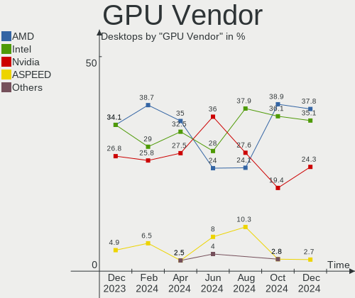
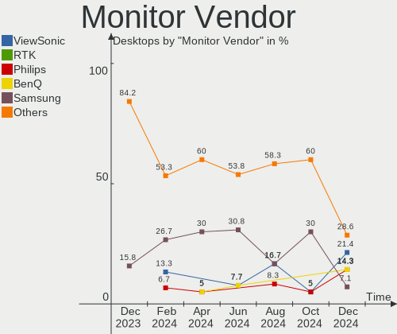

FreeBSD - Hardware Trends (Desktops)
------------------------------------

A project to identify most popular hardware characteristics and track their change
over time based on data collected by BSD users at https://BSD-Hardware.info.

Anyone can contribute to this report by the [hw-probe](https://github.com/linuxhw/hw-probe/blob/master/INSTALL.BSD.md) tool:

    hw-probe -all -upload

This report is for one last month. Overall report since the beginning of time: [TestDays](https://github.com/bsdhw/TestDays)

Period: Dec, 2025.

Contents
--------

* [ System ](#system)
  - [ OS                       ](#os)
  - [ OS Family                ](#os-family)
  - [ Arch                     ](#arch)
  - [ DE                       ](#de)
  - [ Display Server           ](#display-server)
  - [ Display Manager          ](#display-manager)
  - [ OS Lang                  ](#os-lang)
  - [ Boot Mode                ](#boot-mode)
  - [ Filesystem               ](#filesystem)
  - [ Part. scheme             ](#part-scheme)

* [ Board ](#board)
  - [ Vendor                   ](#vendor)
  - [ Model                    ](#model)
  - [ Model Family             ](#model-family)
  - [ MFG Year                 ](#mfg-year)
  - [ Form Factor              ](#form-factor)
  - [ Coreboot                 ](#coreboot)
  - [ RAM Size                 ](#ram-size)
  - [ RAM Used                 ](#ram-used)
  - [ Total Drives             ](#total-drives)
  - [ Has CD-ROM               ](#has-cd-rom)
  - [ Has Ethernet             ](#has-ethernet)
  - [ Has WiFi                 ](#has-wifi)
  - [ Has Bluetooth            ](#has-bluetooth)

* [ Location ](#location)
  - [ Country                  ](#country)
  - [ City                     ](#city)

* [ Drives ](#drives)
  - [ Drive Vendor             ](#drive-vendor)
  - [ Drive Model              ](#drive-model)
  - [ HDD Vendor               ](#hdd-vendor)
  - [ SSD Vendor               ](#ssd-vendor)
  - [ Drive Kind               ](#drive-kind)
  - [ Drive Connector          ](#drive-connector)
  - [ Drive Size               ](#drive-size)
  - [ Space Total              ](#space-total)
  - [ Space Used               ](#space-used)
  - [ Malfunc. Drives          ](#malfunc-drives)
  - [ Malfunc. Drive Vendor    ](#malfunc-drive-vendor)
  - [ Malfunc. HDD Vendor      ](#malfunc-hdd-vendor)
  - [ Malfunc. Drive Kind      ](#malfunc-drive-kind)
  - [ Failed Drives            ](#failed-drives)
  - [ Failed Drive Vendor      ](#failed-drive-vendor)
  - [ Drive Status             ](#drive-status)

* [ Storage controller ](#storage-controller)
  - [ Storage Vendor           ](#storage-vendor)
  - [ Storage Model            ](#storage-model)
  - [ Storage Kind             ](#storage-kind)

* [ Processor ](#processor)
  - [ CPU Vendor               ](#cpu-vendor)
  - [ CPU Model                ](#cpu-model)
  - [ CPU Model Family         ](#cpu-model-family)
  - [ CPU Cores                ](#cpu-cores)
  - [ CPU Sockets              ](#cpu-sockets)
  - [ CPU Threads              ](#cpu-threads)
  - [ CPU Microarch            ](#cpu-microarch)

* [ Graphics ](#graphics)
  - [ GPU Vendor               ](#gpu-vendor)
  - [ GPU Model                ](#gpu-model)
  - [ GPU Combo                ](#gpu-combo)
  - [ GPU Driver               ](#gpu-driver)
  - [ GPU Memory               ](#gpu-memory)

* [ Monitor ](#monitor)
  - [ Monitor Vendor           ](#monitor-vendor)
  - [ Monitor Model            ](#monitor-model)
  - [ Monitor Resolution       ](#monitor-resolution)
  - [ Monitor Diagonal         ](#monitor-diagonal)
  - [ Monitor Width            ](#monitor-width)
  - [ Aspect Ratio             ](#aspect-ratio)
  - [ Monitor Area             ](#monitor-area)
  - [ Pixel Density            ](#pixel-density)
  - [ Multiple Monitors        ](#multiple-monitors)

* [ Network ](#network)
  - [ Net Controller Vendor    ](#net-controller-vendor)
  - [ Net Controller Model     ](#net-controller-model)
  - [ Wireless Vendor          ](#wireless-vendor)
  - [ Wireless Model           ](#wireless-model)
  - [ Ethernet Vendor          ](#ethernet-vendor)
  - [ Ethernet Model           ](#ethernet-model)
  - [ Net Controller Kind      ](#net-controller-kind)
  - [ Used Controller          ](#used-controller)
  - [ NICs                     ](#nics)
  - [ IPv6                     ](#ipv6)

* [ Bluetooth ](#bluetooth)
  - [ Bluetooth Vendor         ](#bluetooth-vendor)
  - [ Bluetooth Model          ](#bluetooth-model)

* [ Sound ](#sound)
  - [ Sound Vendor             ](#sound-vendor)
  - [ Sound Model              ](#sound-model)

* [ Memory ](#memory)
  - [ Memory Vendor            ](#memory-vendor)
  - [ Memory Model             ](#memory-model)
  - [ Memory Kind              ](#memory-kind)
  - [ Memory Form Factor       ](#memory-form-factor)
  - [ Memory Size              ](#memory-size)
  - [ Memory Speed             ](#memory-speed)

* [ Printers & scanners ](#printers--scanners)
  - [ Printer Vendor           ](#printer-vendor)
  - [ Printer Model            ](#printer-model)
  - [ Scanner Vendor           ](#scanner-vendor)
  - [ Scanner Model            ](#scanner-model)

* [ Camera ](#camera)
  - [ Camera Vendor            ](#camera-vendor)
  - [ Camera Model             ](#camera-model)

* [ Security ](#security)
  - [ Fingerprint Vendor       ](#fingerprint-vendor)
  - [ Fingerprint Model        ](#fingerprint-model)
  - [ Chipcard Vendor          ](#chipcard-vendor)
  - [ Chipcard Model           ](#chipcard-model)

* [ Unsupported ](#unsupported)
  - [ Unsupported Devices      ](#unsupported-devices)
  - [ Unsupported Device Types ](#unsupported-device-types)

System
------

OS
--

Installed operating systems

| Name                | Desktops | Percent |
|---------------------|----------|---------|
| FreeBSD 15.0        | 10       | 31.25%  |
| FreeBSD 15.0-p1     | 9        | 28.13%  |
| FreeBSD 15.0-STABLE | 4        | 12.5%   |
| FreeBSD 14.3-p7     | 3        | 9.38%   |
| FreeBSD 14.3-p6     | 2        | 6.25%   |
| FreeBSD 14.3-p5     | 2        | 6.25%   |
| FreeBSD 14.3-STABLE | 1        | 3.13%   |
| FreeBSD 13.5-p3     | 1        | 3.13%   |

OS Family
---------

OS without a version

| Name    | Desktops | Percent |
|---------|----------|---------|
| FreeBSD | 32       | 100%    |

Arch
----

OS architecture (x86_64, i586, etc.)

| Name  | Desktops | Percent |
|-------|----------|---------|
| amd64 | 28       | 87.5%   |
| arm64 | 4        | 12.5%   |

DE
--

Desktop Environment

| Name    | Desktops | Percent |
|---------|----------|---------|
| Console | 15       | 46.88%  |
| TWM     | 6        | 18.75%  |
| XFCE    | 5        | 15.63%  |
| MATE    | 3        | 9.38%   |
| GNOME   | 2        | 6.25%   |
| cwm     | 1        | 3.13%   |

Display Server
--------------

X11 or Wayland

| Name    | Desktops | Percent |
|---------|----------|---------|
| X11     | 16       | 50%     |
| Console | 13       | 40.63%  |
| Wayland | 3        | 9.38%   |

Display Manager
---------------

SDDM, LightDM, etc.

| Name    | Desktops | Percent |
|---------|----------|---------|
| Console | 20       | 62.5%   |
| SDDM    | 8        | 25%     |
| SLiM    | 2        | 6.25%   |
| LightDM | 2        | 6.25%   |

OS Lang
-------

Language

| Lang    | Desktops | Percent |
|---------|----------|---------|
| C       | 20       | 62.5%   |
| Unknown | 6        | 18.75%  |
| en_US   | 5        | 15.63%  |
| de_DE   | 1        | 3.13%   |

Boot Mode
---------

EFI or BIOS

| Mode | Desktops | Percent |
|------|----------|---------|
| EFI  | 25       | 78.13%  |
| BIOS | 7        | 21.88%  |

Filesystem
----------

Type of filesystem

| Type | Desktops | Percent |
|------|----------|---------|
| Zfs  | 28       | 87.5%   |
| Ufs  | 4        | 12.5%   |

Part. scheme
------------

Scheme of partitioning

| Type | Desktops | Percent |
|------|----------|---------|
| GPT  | 32       | 100%    |

Board
-----

Vendor
------

Motherboard manufacturer

| Name                                    | Desktops | Percent |
|-----------------------------------------|----------|---------|
| ASUSTek Computer                        | 9        | 28.13%  |
| Unknown                                 | 4        | 12.5%   |
| Gigabyte Technology                     | 3        | 9.38%   |
| Dell                                    | 3        | 9.38%   |
| Lenovo                                  | 2        | 6.25%   |
| Hewlett-Packard                         | 2        | 6.25%   |
| Foxconn                                 | 2        | 6.25%   |
| ASRock                                  | 2        | 6.25%   |
| Shenzhen Meigao Electronic Equipment    | 1        | 3.13%   |
| Pegatron                                | 1        | 3.13%   |
| MSI                                     | 1        | 3.13%   |
| Meigao Innovation Technology (Shenzhen) | 1        | 3.13%   |
| Biostar                                 | 1        | 3.13%   |

Model
-----

Motherboard model

| Name                                              | Desktops | Percent |
|---------------------------------------------------|----------|---------|
| Unknown                                           | 4        | 12.5%   |
| Shenzhen Meigao Electronic Equipment Venus Series | 1        | 3.13%   |
| Pegatron FQ425AA-ABA a6655f                       | 1        | 3.13%   |
| MSI MS-7817                                       | 1        | 3.13%   |
| Meigao (Shenzhen) MS-R1                           | 1        | 3.13%   |
| Lenovo ThinkStation S20 4157A5G                   | 1        | 3.13%   |
| Lenovo 3098                                       | 1        | 3.13%   |
| HP EliteDesk 705 G2 SFF                           | 1        | 3.13%   |
| HP 550-a114                                       | 1        | 3.13%   |
| Gigabyte Z690 AORUS MASTER                        | 1        | 3.13%   |
| Gigabyte Z590 UD AC                               | 1        | 3.13%   |
| Gigabyte B550 AORUS ELITE V2                      | 1        | 3.13%   |
| Foxconn OEM                                       | 1        | 3.13%   |
| Foxconn Napa                                      | 1        | 3.13%   |
| Dell XPS 8930                                     | 1        | 3.13%   |
| Dell XPS 8700                                     | 1        | 3.13%   |
| Dell OptiPlex 790                                 | 1        | 3.13%   |
| Biostar H510MHP 2.0                               | 1        | 3.13%   |
| ASUS Z8P                                          | 1        | 3.13%   |
| ASUS Z10PA-U8 Series                              | 1        | 3.13%   |
| ASUS ROG CROSSHAIR VIII HERO                      | 1        | 3.13%   |
| ASUS PRIME X470-PRO                               | 1        | 3.13%   |
| ASUS PRIME B650-PLUS WIFI                         | 1        | 3.13%   |
| ASUS P5Q-E                                        | 1        | 3.13%   |
| ASUS Nobilis                                      | 1        | 3.13%   |
| ASUS Intel(R) Core(TM) i7-14700F                  | 1        | 3.13%   |
| ASUS AMD Threadripper PRO WRX80 EATX              | 1        | 3.13%   |
| ASRock B850M Pro-A WiFi                           | 1        | 3.13%   |
| ASRock B450M-HDV R4.0                             | 1        | 3.13%   |

Model Family
------------

Motherboard model prefix

| Name                                       | Desktops | Percent |
|--------------------------------------------|----------|---------|
| Unknown                                    | 4        | 12.5%   |
| Dell XPS                                   | 2        | 6.25%   |
| ASUS PRIME                                 | 2        | 6.25%   |
| Shenzhen Meigao Electronic Equipment Venus | 1        | 3.13%   |
| Pegatron FQ425AA-ABA                       | 1        | 3.13%   |
| MSI MS-7817                                | 1        | 3.13%   |
| Meigao (Shenzhen) MS-R1                    | 1        | 3.13%   |
| Lenovo ThinkStation                        | 1        | 3.13%   |
| Lenovo 3098                                | 1        | 3.13%   |
| HP EliteDesk                               | 1        | 3.13%   |
| HP 550-a114                                | 1        | 3.13%   |
| Gigabyte Z690                              | 1        | 3.13%   |
| Gigabyte Z590                              | 1        | 3.13%   |
| Gigabyte B550                              | 1        | 3.13%   |
| Foxconn OEM                                | 1        | 3.13%   |
| Foxconn Napa                               | 1        | 3.13%   |
| Dell OptiPlex                              | 1        | 3.13%   |
| Biostar H510MHP                            | 1        | 3.13%   |
| ASUS Z8P                                   | 1        | 3.13%   |
| ASUS Z10PA-U8                              | 1        | 3.13%   |
| ASUS ROG                                   | 1        | 3.13%   |
| ASUS P5Q-E                                 | 1        | 3.13%   |
| ASUS Nobilis                               | 1        | 3.13%   |
| ASUS Intel(R)                              | 1        | 3.13%   |
| ASUS AMD                                   | 1        | 3.13%   |
| ASRock B850M                               | 1        | 3.13%   |
| ASRock B450M-HDV                           | 1        | 3.13%   |

MFG Year
--------

Motherboard manufacture year

| Year    | Desktops | Percent |
|---------|----------|---------|
| 2025    | 4        | 12.5%   |
| 2008    | 4        | 12.5%   |
| 2021    | 3        | 9.38%   |
| 2020    | 3        | 9.38%   |
| 2018    | 3        | 9.38%   |
| Unknown | 3        | 9.38%   |
| 2024    | 2        | 6.25%   |
| 2023    | 2        | 6.25%   |
| 2019    | 2        | 6.25%   |
| 2022    | 1        | 3.13%   |
| 2016    | 1        | 3.13%   |
| 2015    | 1        | 3.13%   |
| 2011    | 1        | 3.13%   |
| 2010    | 1        | 3.13%   |
| 2007    | 1        | 3.13%   |

Form Factor
-----------

Physical design of the computer

| Name    | Desktops | Percent |
|---------|----------|---------|
| Desktop | 32       | 100%    |

Coreboot
--------

Have coreboot on board

| Used | Desktops | Percent |
|------|----------|---------|
| No   | 32       | 100%    |

RAM Size
--------

Total RAM memory

| Size in GB      | Desktops | Percent |
|-----------------|----------|---------|
| 64.01-256.0     | 8        | 25%     |
| 32.01-64.0      | 7        | 21.88%  |
| 16.01-24.0      | 7        | 21.88%  |
| 4.01-8.0        | 4        | 12.5%   |
| 8.01-16.0       | 3        | 9.38%   |
| More than 256.0 | 1        | 3.13%   |
| 2.01-3.0        | 1        | 3.13%   |
| 0.51-1.0        | 1        | 3.13%   |

RAM Used
--------

Used RAM memory

| Used GB   | Desktops | Percent |
|-----------|----------|---------|
| 0.01-0.5  | 11       | 34.38%  |
| 1.01-2.0  | 7        | 21.88%  |
| 0.51-1.0  | 7        | 21.88%  |
| 4.01-8.0  | 3        | 9.38%   |
| 3.01-4.0  | 2        | 6.25%   |
| 2.01-3.0  | 1        | 3.13%   |
| 8.01-16.0 | 1        | 3.13%   |

Total Drives
------------

Number of drives on board

| Drives | Desktops | Percent |
|--------|----------|---------|
| 0      | 10       | 31.25%  |
| 2      | 6        | 18.75%  |
| 1      | 6        | 18.75%  |
| 4      | 5        | 15.63%  |
| 3      | 3        | 9.38%   |
| 11     | 1        | 3.13%   |
| 5      | 1        | 3.13%   |

Has CD-ROM
----------

Has CD-ROM on board

| Presented | Desktops | Percent |
|-----------|----------|---------|
| No        | 25       | 78.13%  |
| Yes       | 7        | 21.88%  |

Has Ethernet
------------

Has Ethernet on board

| Presented | Desktops | Percent |
|-----------|----------|---------|
| Yes       | 28       | 87.5%   |
| No        | 4        | 12.5%   |

Has WiFi
--------

Has WiFi module

| Presented | Desktops | Percent |
|-----------|----------|---------|
| No        | 19       | 59.38%  |
| Yes       | 13       | 40.63%  |

Has Bluetooth
-------------

Has Bluetooth module

| Presented | Desktops | Percent |
|-----------|----------|---------|
| No        | 20       | 62.5%   |
| Yes       | 12       | 37.5%   |

Location
--------

Country
-------

Geographic location (country)

| Country     | Desktops | Percent |
|-------------|----------|---------|
| USA         | 13       | 40.63%  |
| Venezuela   | 2        | 6.25%   |
| Netherlands | 2        | 6.25%   |
| Mexico      | 2        | 6.25%   |
| Germany     | 2        | 6.25%   |
| France      | 2        | 6.25%   |
| UK          | 1        | 3.13%   |
| Poland      | 1        | 3.13%   |
| Japan       | 1        | 3.13%   |
| Indonesia   | 1        | 3.13%   |
| Hungary     | 1        | 3.13%   |
| Canada      | 1        | 3.13%   |
| Bulgaria    | 1        | 3.13%   |
| Brazil      | 1        | 3.13%   |
| Austria     | 1        | 3.13%   |

City
----

Geographic location (city)

| City                  | Desktops | Percent |
|-----------------------|----------|---------|
| Tacoma                | 2        | 6.25%   |
| Redmond               | 2        | 6.25%   |
| Monterrey             | 2        | 6.25%   |
| Duncan                | 2        | 6.25%   |
| Wroclaw               | 1        | 3.13%   |
| Wenatchee             | 1        | 3.13%   |
| Weissenfels           | 1        | 3.13%   |
| Sykesville            | 1        | 3.13%   |
| Surabaya              | 1        | 3.13%   |
| Seberi                | 1        | 3.13%   |
| Seattle               | 1        | 3.13%   |
| San Fernando de Apure | 1        | 3.13%   |
| Redondo Beach         | 1        | 3.13%   |
| Paris                 | 1        | 3.13%   |
| North Augusta         | 1        | 3.13%   |
| Newham                | 1        | 3.13%   |
| Newberg               | 1        | 3.13%   |
| Nagoya                | 1        | 3.13%   |
| Mason                 | 1        | 3.13%   |
| Kostinbrod            | 1        | 3.13%   |
| Hasselt               | 1        | 3.13%   |
| Emerainville          | 1        | 3.13%   |
| Deutschlandsberg      | 1        | 3.13%   |
| Cumaná               | 1        | 3.13%   |
| Cambridge             | 1        | 3.13%   |
| Budapest              | 1        | 3.13%   |
| Berlin                | 1        | 3.13%   |
| Amsterdam             | 1        | 3.13%   |

Drives
------

Drive Vendor
------------

Hard drive vendors

| Vendor              | Desktops | Drives | Percent |
|---------------------|----------|--------|---------|
| Seagate             | 10       | 21     | 25.64%  |
| Samsung Electronics | 10       | 16     | 25.64%  |
| WDC                 | 9        | 13     | 23.08%  |
| Crucial             | 3        | 5      | 7.69%   |
| SanDisk             | 1        | 1      | 2.56%   |
| Patriot             | 1        | 1      | 2.56%   |
| LITEON              | 1        | 1      | 2.56%   |
| KLEVV               | 1        | 1      | 2.56%   |
| KIOXIA-EXCERIA      | 1        | 1      | 2.56%   |
| Kingston            | 1        | 2      | 2.56%   |
| Hitachi             | 1        | 1      | 2.56%   |

Drive Model
-----------

Hard drive models

| Model                              | Desktops | Percent |
|------------------------------------|----------|---------|
| Samsung SSD 860 EVO 1TB            | 2        | 4.55%   |
| WDC WDS500G2B0A-00SM50 500GB       | 1        | 2.27%   |
| WDC WD6004FZWX-00BKVA0 6TB         | 1        | 2.27%   |
| WDC WD5000AAKX-75U6AA0 500GB       | 1        | 2.27%   |
| WDC WD5000AAKX-221CA1 500GB        | 1        | 2.27%   |
| WDC WD40EZRZ-22GXCB0 4TB           | 1        | 2.27%   |
| WDC WD40EZRX-00SPEB0 4TB           | 1        | 2.27%   |
| WDC WD40EZAZ-00SF3B0 4TB           | 1        | 2.27%   |
| WDC WD15EADS-00P8B0 1.5TB          | 1        | 2.27%   |
| WDC WD10EZEX-21WN4A0 1TB           | 1        | 2.27%   |
| WDC WD100EMAZ-00WJTA0 10TB         | 1        | 2.27%   |
| Seagate ST8000VN004-2M2101 8TB     | 1        | 2.27%   |
| Seagate ST8000DM004-2U9188 8TB     | 1        | 2.27%   |
| Seagate ST8000DM004-2CX188 8TB     | 1        | 2.27%   |
| Seagate ST4000DM000-1F2168 4TB     | 1        | 2.27%   |
| Seagate ST24000VE002-3TR101 24TB   | 1        | 2.27%   |
| Seagate ST2000DM001-1CH164 2TB     | 1        | 2.27%   |
| Seagate ST18000NM014J-2WS103 18TB  | 1        | 2.27%   |
| Seagate ST18000NM003D-3DL103 18TB  | 1        | 2.27%   |
| Seagate ST18000NE000-3G6101 18TB   | 1        | 2.27%   |
| Seagate ST1000LM035-1RK172 1TB     | 1        | 2.27%   |
| Seagate ST1000DM010-2EP102 1TB     | 1        | 2.27%   |
| Seagate ST1000DM003-1CH162 1TB     | 1        | 2.27%   |
| SanDisk SD8SB8U128G1001 128GB      | 1        | 2.27%   |
| Samsung SSD 870 QVO 2TB            | 1        | 2.27%   |
| Samsung SSD 870 EVO 500GB          | 1        | 2.27%   |
| Samsung SSD 870 EVO 1TB            | 1        | 2.27%   |
| Samsung SSD 860 QVO 1TB            | 1        | 2.27%   |
| Samsung SSD 860 PRO 512GB          | 1        | 2.27%   |
| Samsung SSD 860 EVO 500GB          | 1        | 2.27%   |
| Samsung SSD 850 EVO 1TB            | 1        | 2.27%   |
| Samsung SSD 840 PRO Series 512GB   | 1        | 2.27%   |
| Samsung SSD 840 EVO 500GB          | 1        | 2.27%   |
| Samsung MZ7WD480HCGM-000G3 480GB   | 1        | 2.27%   |
| Patriot P210 128GB                 | 1        | 2.27%   |
| LITEON LCH-128V2S-11 2.5 7mm 128GB | 1        | 2.27%   |
| KLEVV NEO N400 SSD 240GB           | 1        | 2.27%   |
| KIOXIA-EXCERIA SATA SSD 960GB      | 1        | 2.27%   |
| Kingston SA400S37480G 480GB        | 1        | 2.27%   |
| Hitachi HDP725032GLA380 320GB      | 1        | 2.27%   |

HDD Vendor
----------

Hard disk drive vendors

| Vendor  | Desktops | Drives | Percent |
|---------|----------|--------|---------|
| Seagate | 10       | 21     | 52.63%  |
| WDC     | 8        | 11     | 42.11%  |
| Hitachi | 1        | 1      | 5.26%   |

SSD Vendor
----------

Solid state drive vendors

| Vendor              | Desktops | Drives | Percent |
|---------------------|----------|--------|---------|
| Samsung Electronics | 10       | 16     | 50%     |
| Crucial             | 3        | 5      | 15%     |
| WDC                 | 1        | 2      | 5%      |
| SanDisk             | 1        | 1      | 5%      |
| Patriot             | 1        | 1      | 5%      |
| LITEON              | 1        | 1      | 5%      |
| KLEVV               | 1        | 1      | 5%      |
| KIOXIA-EXCERIA      | 1        | 1      | 5%      |
| Kingston            | 1        | 2      | 5%      |

Drive Kind
----------

HDD or SSD

| Kind | Desktops | Drives | Percent |
|------|----------|--------|---------|
| HDD  | 18       | 33     | 51.43%  |
| SSD  | 17       | 30     | 48.57%  |

Drive Connector
---------------

SATA, SAS, NVMe, etc.

| Type | Desktops | Drives | Percent |
|------|----------|--------|---------|
| SATA | 22       | 63     | 100%    |

Drive Size
----------

Size of hard drive

| Size in TB | Desktops | Drives | Percent |
|------------|----------|--------|---------|
| 0.51-1.0   | 11       | 14     | 30.56%  |
| 0.01-0.5   | 10       | 16     | 27.78%  |
| 4.01-10.0  | 5        | 7      | 13.89%  |
| 3.01-4.0   | 4        | 8      | 11.11%  |
| 1.01-2.0   | 4        | 6      | 11.11%  |
| 20.01-50.0 | 1        | 1      | 2.78%   |
| 10.01-20.0 | 1        | 11     | 2.78%   |

Space Total
-----------

Amount of disk space available on the file system

| Size in GB     | Desktops | Percent |
|----------------|----------|---------|
| 501-1000       | 10       | 31.25%  |
| 251-500        | 7        | 21.88%  |
| 1001-2000      | 5        | 15.63%  |
| 101-250        | 4        | 12.5%   |
| More than 3000 | 3        | 9.38%   |
| 21-50          | 1        | 3.13%   |
| 1-20           | 1        | 3.13%   |
| 51-100         | 1        | 3.13%   |

Space Used
----------

Amount of used disk space

| Used GB   | Desktops | Percent |
|-----------|----------|---------|
| 1-20      | 25       | 78.13%  |
| 21-50     | 4        | 12.5%   |
| 2001-3000 | 1        | 3.13%   |
| 501-1000  | 1        | 3.13%   |
| 51-100    | 1        | 3.13%   |

Malfunc. Drives
---------------

Drive models with a malfunction

| Model                             | Desktops | Drives | Percent |
|-----------------------------------|----------|--------|---------|
| WDC WD5000AAKX-75U6AA0 500GB      | 1        | 1      | 20%     |
| WDC WD5000AAKX-221CA1 500GB       | 1        | 1      | 20%     |
| Seagate ST8000DM004-2CX188 8TB    | 1        | 2      | 20%     |
| Seagate ST4000DM000-1F2168 4TB    | 1        | 1      | 20%     |
| Seagate ST18000NM014J-2WS103 18TB | 1        | 5      | 20%     |

Malfunc. Drive Vendor
---------------------

Vendors of faulty drives

| Vendor  | Desktops | Drives | Percent |
|---------|----------|--------|---------|
| Seagate | 3        | 8      | 60%     |
| WDC     | 2        | 2      | 40%     |

Malfunc. HDD Vendor
-------------------

Vendors of faulty HDD drives

| Vendor  | Desktops | Drives | Percent |
|---------|----------|--------|---------|
| Seagate | 3        | 8      | 60%     |
| WDC     | 2        | 2      | 40%     |

Malfunc. Drive Kind
-------------------

Kinds of faulty drives

| Kind | Desktops | Drives | Percent |
|------|----------|--------|---------|
| HDD  | 5        | 10     | 100%    |

Failed Drives
-------------

Failed drive models

Zero info for selected period =(

Failed Drive Vendor
-------------------

Failed drive vendors

Zero info for selected period =(

Drive Status
------------

Number of failed and malfunc. drives

| Status  | Desktops | Drives | Percent |
|---------|----------|--------|---------|
| Works   | 21       | 53     | 80.77%  |
| Malfunc | 5        | 10     | 19.23%  |

Storage controller
------------------

Storage Vendor
--------------

Storage controller vendors

| Vendor                        | Desktops | Percent |
|-------------------------------|----------|---------|
| Intel                         | 13       | 27.08%  |
| AMD                           | 8        | 16.67%  |
| Kingston Technology Company   | 4        | 8.33%   |
| Sandisk                       | 3        | 6.25%   |
| Samsung Electronics           | 3        | 6.25%   |
| Shenzhen Longsys Electronics  | 2        | 4.17%   |
| Nvidia                        | 2        | 4.17%   |
| Marvell Technology Group      | 2        | 4.17%   |
| INNOGRIT                      | 2        | 4.17%   |
| Broadcom / LSI                | 2        | 4.17%   |
| VIA Technologies              | 1        | 2.08%   |
| Realtek Semiconductor         | 1        | 2.08%   |
| Micron/Crucial Technology     | 1        | 2.08%   |
| KIOXIA                        | 1        | 2.08%   |
| Integrated Technology Express | 1        | 2.08%   |
| ASMedia Technology            | 1        | 2.08%   |
| ADATA Technology              | 1        | 2.08%   |

Storage Model
-------------

Storage controller models

| Model                                                                          | Desktops | Percent |
|--------------------------------------------------------------------------------|----------|---------|
| AMD FCH SATA Controller [AHCI mode]                                            | 4        | 7.27%   |
| Intel 8 Series/C220 Series Chipset Family 6-port SATA Controller 1 [AHCI mode] | 3        | 5.45%   |
| Shenzhen Longsys Lexar NM790 / Patriot Viper VP4300 Lite NVMe SSD (DRAM-less)  | 2        | 3.64%   |
| Sandisk WD Black SN850X NVMe SSD                                               | 2        | 3.64%   |
| Samsung NVMe SSD Controller SM981/PM981/PM983                                  | 2        | 3.64%   |
| Kingston Company KC3000/FURY Renegade NVMe SSD [E18]                           | 2        | 3.64%   |
| Intel 82801JI (ICH10 Family) SATA AHCI Controller                              | 2        | 3.64%   |
| Intel 500 Series Chipset Family SATA AHCI Controller                           | 2        | 3.64%   |
| INNOGRIT NVMe SSD Controller IG5236 [RainierPC]                                | 2        | 3.64%   |
| AMD 600 Series Chipset SATA Controller                                         | 2        | 3.64%   |
| AMD 400 Series Chipset SATA Controller                                         | 2        | 3.64%   |
| VIA VT82C586A/B/VT82C686/A/B/VT823x/A/C PIPC Bus Master IDE                    | 1        | 1.82%   |
| VIA VT8237A Integrated SATA Controller                                         | 1        | 1.82%   |
| SanDisk Ultra 3D / WD PC SN530, IX SN530, Blue SN550 NVMe SSD (DRAM-less)      | 1        | 1.82%   |
| SanDisk Extreme Pro / WD Black 2018/SN750/PC SN720 NVMe SSD                    | 1        | 1.82%   |
| Samsung NVMe SSD Controller S4LV008[Pascal]                                    | 1        | 1.82%   |
| Realtek RTS5772DL NVMe SSD Controller (DRAM-less)                              | 1        | 1.82%   |
| Nvidia MCP73 SATA Controller (IDE mode)                                        | 1        | 1.82%   |
| Nvidia MCP73 IDE Controller                                                    | 1        | 1.82%   |
| Nvidia MCP61 SATA Controller                                                   | 1        | 1.82%   |
| Nvidia MCP61 IDE                                                               | 1        | 1.82%   |
| Micron/Crucial P3 Plus NVMe PCIe SSD (DRAM-less)                               | 1        | 1.82%   |
| Marvell Group 88SE9128 PCIe SATA 6 Gb/s RAID controller                        | 1        | 1.82%   |
| Marvell Group 88SE6111/6121 SATA II / PATA Controller                          | 1        | 1.82%   |
| KIOXIA NVMe SSD Controller BG4 (DRAM-less)                                     | 1        | 1.82%   |
| Kingston Company OM8PGP4 Design-In PCIe 4 NVMe SSD (QLC) (DRAM-less)           | 1        | 1.82%   |
| Kingston Company DC1500M NVMe SSD [SM2270]                                     | 1        | 1.82%   |
| Intel RST Volume Management Device Controller                                  | 1        | 1.82%   |
| Intel Raptor Lake SATA AHCI Controller                                         | 1        | 1.82%   |
| Intel Cannon Lake PCH SATA AHCI Controller                                     | 1        | 1.82%   |
| Intel C610/X99 series chipset 6-Port SATA Controller [AHCI mode]               | 1        | 1.82%   |
| Intel 82801JI (ICH10 Family) 4 port SATA IDE Controller #1                     | 1        | 1.82%   |
| Intel 82801JI (ICH10 Family) 2 port SATA IDE Controller #2                     | 1        | 1.82%   |
| Intel 6 Series/C200 Series Chipset Family 6 port Desktop SATA AHCI Controller  | 1        | 1.82%   |
| Intel 200 Series PCH SATA controller [AHCI mode]                               | 1        | 1.82%   |
| Integrated Express IT8213 IDE Controller                                       | 1        | 1.82%   |
| Broadcom / LSI SAS3416 Fusion-MPT Tri-Mode I/O Controller Chip (IOC)           | 1        | 1.82%   |
| Broadcom / LSI SAS3008 PCI-Express Fusion-MPT SAS-3                            | 1        | 1.82%   |
| ASMedia ASM1061/ASM1062 Serial ATA Controller                                  | 1        | 1.82%   |
| AMD 500 Series Chipset SATA Controller                                         | 1        | 1.82%   |

Storage Kind
------------

Kind of storage controller (IDE, SATA, NVMe, SAS, ...)

| Kind | Desktops | Percent |
|------|----------|---------|
| SATA | 21       | 47.73%  |
| NVMe | 15       | 34.09%  |
| IDE  | 5        | 11.36%  |
| SAS  | 2        | 4.55%   |
| RAID | 1        | 2.27%   |

Processor
---------

CPU Vendor
----------

Processor vendors

| Vendor               | Desktops | Percent |
|----------------------|----------|---------|
| Intel                | 16       | 50%     |
| AMD                  | 12       | 37.5%   |
| ARM                  | 3        | 9.38%   |
| Cix Technology Group | 1        | 3.13%   |

CPU Model
---------

Processor models

| Model                                       | Desktops | Percent |
|---------------------------------------------|----------|---------|
| Intel Core i5-9400 CPU @ 2.90GHz            | 2        | 6.25%   |
| Intel Xeon CPU X5675 @ 3.07GHz              | 1        | 3.13%   |
| Intel Xeon CPU W3580 @ 3.33GHz              | 1        | 3.13%   |
| Intel Xeon CPU E5-2695 v4 @ 2.10GHz         | 1        | 3.13%   |
| Intel Pentium CPU G3220 @ 3.00GHz           | 1        | 3.13%   |
| Intel Core i7-4790 CPU @ 3.60GHz            | 1        | 3.13%   |
| Intel Core i7-14700F                        | 1        | 3.13%   |
| Intel Core i5-4570 CPU @ 3.20GHz            | 1        | 3.13%   |
| Intel Core i5-2400 CPU @ 3.10GH             | 1        | 3.13%   |
| Intel Core i3-10105F CPU @ 3.70GHz          | 1        | 3.13%   |
| Intel Core 2 Quad CPU Q6600 @ 2.40GHz       | 1        | 3.13%   |
| Intel Core 2 Duo CPU E8500 @ 3.16GHz        | 1        | 3.13%   |
| Intel 12th Gen Core i9-12900K               | 1        | 3.13%   |
| Intel 12th Gen Core i9-12900H               | 1        | 3.13%   |
| Intel 11th Gen Core i9-11900K @ 3.50GHz     | 1        | 3.13%   |
| Cix Technology Group CIX P1 CP8180          | 1        | 3.13%   |
| ARM Cortex-A78C r0p0                        | 1        | 3.13%   |
| ARM Cortex-A55 r2p0                         | 1        | 3.13%   |
| ARM Cortex-A53 r0p4                         | 1        | 3.13%   |
| AMD Ryzen Threadripper PRO 5975WX 32-Cores  | 1        | 3.13%   |
| AMD Ryzen 9 9950X 16-Core Processor         | 1        | 3.13%   |
| AMD Ryzen 9 5900X 12-Core Processor         | 1        | 3.13%   |
| AMD Ryzen 9 3900X 12-Core Processor         | 1        | 3.13%   |
| AMD Ryzen 7 9700X 8-Core Processor          | 1        | 3.13%   |
| AMD Ryzen 5 5600G with Radeon Graphics      | 1        | 3.13%   |
| AMD Ryzen 3 3100 4-Core Processor           | 1        | 3.13%   |
| AMD PRO A8-8650B R7, 10 Compute Cores 4C+6G | 1        | 3.13%   |
| AMD Phenom 9150e Quad-Core Processor        | 1        | 3.13%   |
| AMD Opteron X3216 APU                       | 1        | 3.13%   |
| AMD Athlon 64 X2 Dual Core Processor 4200+  | 1        | 3.13%   |
| AMD A8-6410 APU with AMD Radeon R5 Graphics | 1        | 3.13%   |

CPU Model Family
----------------

Processor model prefix

| Model                  | Desktops | Percent |
|------------------------|----------|---------|
| Other                  | 4        | 12.5%   |
| Intel Core i5          | 4        | 12.5%   |
| Intel Xeon             | 3        | 9.38%   |
| ARM Cortex             | 3        | 9.38%   |
| AMD Ryzen 9            | 3        | 9.38%   |
| Intel Core i7          | 2        | 6.25%   |
| Intel Pentium          | 1        | 3.13%   |
| Intel Core i3          | 1        | 3.13%   |
| Intel Core 2 Quad      | 1        | 3.13%   |
| Intel Core 2 Duo       | 1        | 3.13%   |
| AMD Ryzen Threadripper | 1        | 3.13%   |
| AMD Ryzen 7            | 1        | 3.13%   |
| AMD Ryzen 5            | 1        | 3.13%   |
| AMD Ryzen 3            | 1        | 3.13%   |
| AMD PRO A8             | 1        | 3.13%   |
| AMD Phenom             | 1        | 3.13%   |
| AMD Opteron            | 1        | 3.13%   |
| AMD Athlon 64 X2       | 1        | 3.13%   |
| AMD A8                 | 1        | 3.13%   |

CPU Cores
---------

Number of processor cores

| Number  | Desktops | Percent |
|---------|----------|---------|
| 4       | 8        | 25%     |
| 12      | 5        | 15.63%  |
| Unknown | 5        | 15.63%  |
| 6       | 3        | 9.38%   |
| 2       | 3        | 9.38%   |
| 8       | 2        | 6.25%   |
| 32      | 1        | 3.13%   |
| 28      | 1        | 3.13%   |
| 18      | 1        | 3.13%   |
| 16      | 1        | 3.13%   |
| 10      | 1        | 3.13%   |
| 1       | 1        | 3.13%   |

CPU Sockets
-----------

Number of sockets

| Number  | Desktops | Percent |
|---------|----------|---------|
| 1       | 28       | 87.5%   |
| Unknown | 3        | 9.38%   |
| 2       | 1        | 3.13%   |

CPU Threads
-----------

Threads per core (Hyper-Threading)

| Number  | Desktops | Percent |
|---------|----------|---------|
| 2       | 17       | 53.13%  |
| 1       | 10       | 31.25%  |
| Unknown | 5        | 15.63%  |

CPU Microarch
-------------

Microarchitecture

| Name        | Desktops | Percent |
|-------------|----------|---------|
| Unknown     | 11       | 34.38%  |
| Haswell     | 3        | 9.38%   |
| Zen 3       | 2        | 6.25%   |
| Zen 2       | 2        | 6.25%   |
| KabyLake    | 2        | 6.25%   |
| Westmere    | 1        | 3.13%   |
| Steamroller | 1        | 3.13%   |
| SandyBridge | 1        | 3.13%   |
| Puma        | 1        | 3.13%   |
| Penryn      | 1        | 3.13%   |
| Nehalem     | 1        | 3.13%   |
| K8 Hammer   | 1        | 3.13%   |
| K10         | 1        | 3.13%   |
| Excavator   | 1        | 3.13%   |
| Core        | 1        | 3.13%   |
| CometLake   | 1        | 3.13%   |
| Broadwell   | 1        | 3.13%   |

Graphics
--------

GPU Vendor
----------

Vendors of graphics cards

| Vendor            | Desktops | Percent |
|-------------------|----------|---------|
| AMD               | 12       | 40%     |
| Nvidia            | 9        | 30%     |
| Intel             | 6        | 20%     |
| ASPEED Technology | 2        | 6.67%   |
| VIA Technologies  | 1        | 3.33%   |

GPU Model
---------

Graphics card models

| Model                                                                       | Desktops | Percent |
|-----------------------------------------------------------------------------|----------|---------|
| Intel Xeon E3-1200 v3/4th Gen Core Processor Integrated Graphics Controller | 2        | 6.67%   |
| Intel CoffeeLake-S GT2 [UHD Graphics 630]                                   | 2        | 6.67%   |
| ASPEED Technology ASPEED Graphics Family                                    | 2        | 6.67%   |
| AMD Granite Ridge [Radeon Graphics]                                         | 2        | 6.67%   |
| AMD Cedar [Radeon HD 5000/6000/7350/8350 Series]                            | 2        | 6.67%   |
| VIA Technologies K8M890CE/K8N890CE [Chrome 9]                               | 1        | 3.33%   |
| Nvidia TU116 [GeForce GTX 1660 Ti]                                          | 1        | 3.33%   |
| Nvidia TU116 [GeForce GTX 1650 SUPER]                                       | 1        | 3.33%   |
| Nvidia GP108 [GeForce GT 1030]                                              | 1        | 3.33%   |
| Nvidia GP107 [GeForce GTX 1050 Ti]                                          | 1        | 3.33%   |
| Nvidia GK107 [GeForce GTX 650]                                              | 1        | 3.33%   |
| Nvidia GA107GL [RTX A400]                                                   | 1        | 3.33%   |
| Nvidia GA106 [GeForce RTX 3060 Lite Hash Rate]                              | 1        | 3.33%   |
| Nvidia GA104GL [RTX A4000]                                                  | 1        | 3.33%   |
| Nvidia AD107 [GeForce RTX 4060]                                             | 1        | 3.33%   |
| Intel Alder Lake-S GT1 [UHD Graphics 770]                                   | 1        | 3.33%   |
| Intel 2nd Generation Core Processor Family Integrated Graphics Controller   | 1        | 3.33%   |
| AMD Turks PRO [Radeon HD 6570/7570/8550 / R5 230]                           | 1        | 3.33%   |
| AMD Redwood PRO GL [FirePro V3800]                                          | 1        | 3.33%   |
| AMD Navi 33 [Radeon RX 7600/7600 XT/7600M XT/7600S/7700S / PRO W7600]       | 1        | 3.33%   |
| AMD Navi 31 [Radeon RX 7900 XT/7900 XTX/7900 GRE/7900M]                     | 1        | 3.33%   |
| AMD Mullins [Radeon R4/R5 Graphics]                                         | 1        | 3.33%   |
| AMD Lexa XT [Radeon PRO WX 2100]                                            | 1        | 3.33%   |
| AMD Kaveri [Radeon R7 Graphics]                                             | 1        | 3.33%   |
| AMD Cezanne [Radeon Vega Series / Radeon Vega Mobile Series]                | 1        | 3.33%   |

GPU Combo
---------

Combinations of graphics cards

| Name           | Desktops | Percent |
|----------------|----------|---------|
| 1 x AMD        | 10       | 31.25%  |
| 1 x Nvidia     | 7        | 21.88%  |
| Other          | 5        | 15.63%  |
| 1 x Intel      | 5        | 15.63%  |
| 1 x ASPEED     | 2        | 6.25%   |
| 1 x VIA        | 1        | 3.13%   |
| Intel + Nvidia | 1        | 3.13%   |
| AMD + Nvidia   | 1        | 3.13%   |

GPU Driver
----------

Free vs proprietary

| Driver      | Desktops | Percent |
|-------------|----------|---------|
| Free        | 20       | 62.5%   |
| Proprietary | 7        | 21.88%  |
| Unknown     | 5        | 15.63%  |

GPU Memory
----------

Total video memory

| Size in GB | Desktops | Percent |
|------------|----------|---------|
| Unknown    | 18       | 56.25%  |
| 3.01-4.0   | 3        | 9.38%   |
| 0.51-1.0   | 3        | 9.38%   |
| 8.01-16.0  | 2        | 6.25%   |
| 0.01-0.5   | 2        | 6.25%   |
| 7.01-8.0   | 1        | 3.13%   |
| 5.01-6.0   | 1        | 3.13%   |
| 16.01-24.0 | 1        | 3.13%   |
| 1.01-2.0   | 1        | 3.13%   |

Monitor
-------

Monitor Vendor
--------------

Monitor vendors

| Vendor               | Desktops | Percent |
|----------------------|----------|---------|
| Samsung Electronics  | 3        | 18.75%  |
| Dell                 | 3        | 18.75%  |
| Goldstar             | 2        | 12.5%   |
| Unknown              | 2        | 12.5%   |
| LG Electronics       | 1        | 6.25%   |
| IPS                  | 1        | 6.25%   |
| Hewlett-Packard      | 1        | 6.25%   |
| HannStar             | 1        | 6.25%   |
| Ancor Communications | 1        | 6.25%   |
| Acer                 | 1        | 6.25%   |

Monitor Model
-------------

Monitor models

| Model                                                                 | Desktops | Percent |
|-----------------------------------------------------------------------|----------|---------|
| Unknown                                                               | 2        | 12.5%   |
| Samsung Electronics U28E590 SAM0C4E 3840x2160 610x350mm 27.7-inch     | 1        | 6.25%   |
| Samsung Electronics SyncMaster SAM0471 1360x768 340x190mm 15.3-inch   | 1        | 6.25%   |
| Samsung Electronics C24F390 SAM0D2C 1920x1080 520x290mm 23.4-inch     | 1        | 6.25%   |
| LG Electronics LCD Monitor LG HDR WQHD 3440x1440                      | 1        | 6.25%   |
| IPS HDMI IPS0001 1280x1024 340x270mm 17.1-inch                        | 1        | 6.25%   |
| Hewlett-Packard 22w HPN342E 1920x1080 480x270mm 21.7-inch             | 1        | 6.25%   |
| HannStar Hanns.G HH191 HSD213F 1280x1024 380x300mm 19.1-inch          | 1        | 6.25%   |
| Goldstar LG ULTRAGEAR+ GSM5C34 2560x1440 590x330mm 26.6-inch          | 1        | 6.25%   |
| Goldstar LG ULTRAFINE GSM5BC1 3840x2160 700x400mm 31.7-inch           | 1        | 6.25%   |
| Dell P2422HE DELA1C7 1920x1080 530x300mm 24.0-inch                    | 1        | 6.25%   |
| Dell P2217H DELA0D7 1920x1080 480x270mm 21.7-inch                     | 1        | 6.25%   |
| Dell LCD Monitor P2415Q 1920x1080                                     | 1        | 6.25%   |
| Ancor Communications ASUS MG278 ACI27A8 2560x1440 600x340mm 27.2-inch | 1        | 6.25%   |
| Acer SA242Y ACR0B09 1920x1080 530x290mm 23.8-inch                     | 1        | 6.25%   |

Monitor Resolution
------------------

Monitor screen resolution

| Resolution       | Desktops | Percent |
|------------------|----------|---------|
| 1920x1080 (FHD)  | 6        | 40%     |
| 3840x2160 (4K)   | 3        | 20%     |
| 2560x1440 (QHD)  | 2        | 13.33%  |
| 1280x1024 (SXGA) | 2        | 13.33%  |
| 3440x1440        | 1        | 6.67%   |
| 1360x768         | 1        | 6.67%   |

Monitor Diagonal
----------------

Diagonal size in inches

| Inches  | Desktops | Percent |
|---------|----------|---------|
| Unknown | 4        | 25%     |
| 27      | 2        | 12.5%   |
| 23      | 2        | 12.5%   |
| 21      | 2        | 12.5%   |
| 31      | 1        | 6.25%   |
| 26      | 1        | 6.25%   |
| 24      | 1        | 6.25%   |
| 19      | 1        | 6.25%   |
| 17      | 1        | 6.25%   |
| 15      | 1        | 6.25%   |

Monitor Width
-------------

Physical width

| Width in mm | Desktops | Percent |
|-------------|----------|---------|
| 501-600     | 4        | 26.67%  |
| Unknown     | 4        | 26.67%  |
| 601-700     | 2        | 13.33%  |
| 401-500     | 2        | 13.33%  |
| 301-350     | 2        | 13.33%  |
| 351-400     | 1        | 6.67%   |

Aspect Ratio
------------

Proportional relationship between the width and the height

| Ratio   | Desktops | Percent |
|---------|----------|---------|
| 16/9    | 8        | 57.14%  |
| Unknown | 4        | 28.57%  |
| 5/4     | 2        | 14.29%  |

Monitor Area
------------

Area in inch²

| Area in inch² | Desktops | Percent |
|----------------|----------|---------|
| 201-250        | 5        | 33.33%  |
| Unknown        | 4        | 26.67%  |
| 301-350        | 2        | 13.33%  |
| 351-500        | 1        | 6.67%   |
| 151-200        | 1        | 6.67%   |
| 141-150        | 1        | 6.67%   |
| 91-100         | 1        | 6.67%   |

Pixel Density
-------------

Pixels per inch

| Density | Desktops | Percent |
|---------|----------|---------|
| 51-100  | 5        | 35.71%  |
| Unknown | 4        | 28.57%  |
| 101-120 | 3        | 21.43%  |
| 121-160 | 2        | 14.29%  |

Multiple Monitors
-----------------

Total monitors connected

| Total | Desktops | Percent |
|-------|----------|---------|
| 0     | 18       | 56.25%  |
| 1     | 12       | 37.5%   |
| 2     | 2        | 6.25%   |

Network
-------

Net Controller Vendor
---------------------

Controller vendors

| Vendor                     | Desktops | Percent |
|----------------------------|----------|---------|
| Realtek Semiconductor      | 15       | 33.33%  |
| Intel                      | 15       | 33.33%  |
| Qualcomm Atheros           | 3        | 6.67%   |
| Broadcom                   | 3        | 6.67%   |
| MediaTek                   | 2        | 4.44%   |
| VIA Technologies           | 1        | 2.22%   |
| Qualcomm Technologies      | 1        | 2.22%   |
| QinHeng Electronics        | 1        | 2.22%   |
| Nvidia                     | 1        | 2.22%   |
| Mellanox Technologies      | 1        | 2.22%   |
| Marvell Technology Group   | 1        | 2.22%   |
| American Future Technology | 1        | 2.22%   |

Net Controller Model
--------------------

Controller models

| Model                                                                         | Desktops | Percent |
|-------------------------------------------------------------------------------|----------|---------|
| Realtek RTL8111/8168/8211/8411 PCI Express Gigabit Ethernet Controller        | 7        | 12.96%  |
| Realtek RTL8125 2.5GbE Controller                                             | 5        | 9.26%   |
| Intel 82574L Gigabit Network Connection                                       | 3        | 5.56%   |
| MediaTek MT7922 802.11ax PCI Express Wireless Network Adapter                 | 2        | 3.7%    |
| Intel I211 Gigabit Network Connection                                         | 2        | 3.7%    |
| VIA VT6105/VT6106S [Rhine-III]                                                | 1        | 1.85%   |
| Realtek RTL8851BE PCIe 802.11ax Wireless Network Controller                   | 1        | 1.85%   |
| Realtek RTL8188EUS 802.11n Wireless Network Adapter                           | 1        | 1.85%   |
| Realtek RTL8127 10GbE Controller                                              | 1        | 1.85%   |
| Realtek RTL810xE PCI Express Fast Ethernet controller                         | 1        | 1.85%   |
| Realtek RTL-8100/8101L/8139 PCI Fast Ethernet Adapter                         | 1        | 1.85%   |
| Qualcomm QCNFA765 Wireless Network Adapter                                    | 1        | 1.85%   |
| Qualcomm Atheros QCA9377 802.11ac Wireless Network Adapter                    | 1        | 1.85%   |
| Qualcomm Atheros Killer E2400 Gigabit Ethernet Controller                     | 1        | 1.85%   |
| Qualcomm Atheros AR9485 Wireless Network Adapter                              | 1        | 1.85%   |
| Qualcomm Atheros AR9285 Wireless Network Adapter (PCI-Express)                | 1        | 1.85%   |
| QinHeng 800 Z-Wave Stick                                                      | 1        | 1.85%   |
| Nvidia MCP73 Ethernet                                                         | 1        | 1.85%   |
| Mellanox MT27500 Family [ConnectX-3]                                          | 1        | 1.85%   |
| Marvell Group 88E8056 PCI-E Gigabit Ethernet Controller                       | 1        | 1.85%   |
| Marvell Group 88E8001 Gigabit Ethernet Controller                             | 1        | 1.85%   |
| Intel Wireless 7265                                                           | 1        | 1.85%   |
| Intel Wi-Fi 6 AX200                                                           | 1        | 1.85%   |
| Intel Tiger Lake PCH CNVi WiFi                                                | 1        | 1.85%   |
| Intel I210 Gigabit Network Connection                                         | 1        | 1.85%   |
| Intel Ethernet Controller X710 for 10GbE SFP+                                 | 1        | 1.85%   |
| Intel Ethernet Controller X550                                                | 1        | 1.85%   |
| Intel Ethernet Controller I226-V                                              | 1        | 1.85%   |
| Intel Ethernet Controller I226-LM                                             | 1        | 1.85%   |
| Intel Ethernet Controller 10-Gigabit X540-AT2                                 | 1        | 1.85%   |
| Intel Ethernet Connection (7) I219-V                                          | 1        | 1.85%   |
| Intel Ethernet Connection (14) I219-V                                         | 1        | 1.85%   |
| Intel Alder Lake-S PCH CNVi WiFi                                              | 1        | 1.85%   |
| Intel 82580 Gigabit Network Connection                                        | 1        | 1.85%   |
| Intel 82575EB Gigabit Network Connection                                      | 1        | 1.85%   |
| Intel 82571EB/82571GB Gigabit Ethernet Controller D0/D1 (copper applications) | 1        | 1.85%   |
| Broadcom NetXtreme BCM5762 Gigabit Ethernet PCIe                              | 1        | 1.85%   |
| Broadcom NetXtreme BCM5755 Gigabit Ethernet PCI Express                       | 1        | 1.85%   |
| Broadcom BCM43142 802.11b/g/n                                                 | 1        | 1.85%   |
| American Future IBP Mini Hub                                                  | 1        | 1.85%   |

Wireless Vendor
---------------

Wireless vendors

| Vendor                | Desktops | Percent |
|-----------------------|----------|---------|
| Intel                 | 4        | 30.77%  |
| Qualcomm Atheros      | 3        | 23.08%  |
| Realtek Semiconductor | 2        | 15.38%  |
| MediaTek              | 2        | 15.38%  |
| Qualcomm Technologies | 1        | 7.69%   |
| Broadcom              | 1        | 7.69%   |

Wireless Model
--------------

Wireless models

| Model                                                          | Desktops | Percent |
|----------------------------------------------------------------|----------|---------|
| MediaTek MT7922 802.11ax PCI Express Wireless Network Adapter  | 2        | 15.38%  |
| Realtek RTL8851BE PCIe 802.11ax Wireless Network Controller    | 1        | 7.69%   |
| Realtek RTL8188EUS 802.11n Wireless Network Adapter            | 1        | 7.69%   |
| Qualcomm QCNFA765 Wireless Network Adapter                     | 1        | 7.69%   |
| Qualcomm Atheros QCA9377 802.11ac Wireless Network Adapter     | 1        | 7.69%   |
| Qualcomm Atheros AR9485 Wireless Network Adapter               | 1        | 7.69%   |
| Qualcomm Atheros AR9285 Wireless Network Adapter (PCI-Express) | 1        | 7.69%   |
| Intel Wireless 7265                                            | 1        | 7.69%   |
| Intel Wi-Fi 6 AX200                                            | 1        | 7.69%   |
| Intel Tiger Lake PCH CNVi WiFi                                 | 1        | 7.69%   |
| Intel Alder Lake-S PCH CNVi WiFi                               | 1        | 7.69%   |
| Broadcom BCM43142 802.11b/g/n                                  | 1        | 7.69%   |

Ethernet Vendor
---------------

Ethernet vendors

| Vendor                   | Desktops | Percent |
|--------------------------|----------|---------|
| Realtek Semiconductor    | 15       | 44.12%  |
| Intel                    | 13       | 38.24%  |
| Broadcom                 | 2        | 5.88%   |
| VIA Technologies         | 1        | 2.94%   |
| Qualcomm Atheros         | 1        | 2.94%   |
| Nvidia                   | 1        | 2.94%   |
| Marvell Technology Group | 1        | 2.94%   |

Ethernet Model
--------------

Ethernet models

| Model                                                                         | Desktops | Percent |
|-------------------------------------------------------------------------------|----------|---------|
| Realtek RTL8111/8168/8211/8411 PCI Express Gigabit Ethernet Controller        | 7        | 18.42%  |
| Realtek RTL8125 2.5GbE Controller                                             | 5        | 13.16%  |
| Intel 82574L Gigabit Network Connection                                       | 3        | 7.89%   |
| Intel I211 Gigabit Network Connection                                         | 2        | 5.26%   |
| VIA VT6105/VT6106S [Rhine-III]                                                | 1        | 2.63%   |
| Realtek RTL8127 10GbE Controller                                              | 1        | 2.63%   |
| Realtek RTL810xE PCI Express Fast Ethernet controller                         | 1        | 2.63%   |
| Realtek RTL-8100/8101L/8139 PCI Fast Ethernet Adapter                         | 1        | 2.63%   |
| Qualcomm Atheros Killer E2400 Gigabit Ethernet Controller                     | 1        | 2.63%   |
| Nvidia MCP73 Ethernet                                                         | 1        | 2.63%   |
| Marvell Group 88E8056 PCI-E Gigabit Ethernet Controller                       | 1        | 2.63%   |
| Marvell Group 88E8001 Gigabit Ethernet Controller                             | 1        | 2.63%   |
| Intel I210 Gigabit Network Connection                                         | 1        | 2.63%   |
| Intel Ethernet Controller X710 for 10GbE SFP+                                 | 1        | 2.63%   |
| Intel Ethernet Controller X550                                                | 1        | 2.63%   |
| Intel Ethernet Controller I226-V                                              | 1        | 2.63%   |
| Intel Ethernet Controller I226-LM                                             | 1        | 2.63%   |
| Intel Ethernet Controller 10-Gigabit X540-AT2                                 | 1        | 2.63%   |
| Intel Ethernet Connection (7) I219-V                                          | 1        | 2.63%   |
| Intel Ethernet Connection (14) I219-V                                         | 1        | 2.63%   |
| Intel 82580 Gigabit Network Connection                                        | 1        | 2.63%   |
| Intel 82575EB Gigabit Network Connection                                      | 1        | 2.63%   |
| Intel 82571EB/82571GB Gigabit Ethernet Controller D0/D1 (copper applications) | 1        | 2.63%   |
| Broadcom NetXtreme BCM5762 Gigabit Ethernet PCIe                              | 1        | 2.63%   |
| Broadcom NetXtreme BCM5755 Gigabit Ethernet PCI Express                       | 1        | 2.63%   |

Net Controller Kind
-------------------

Ethernet, WiFi or modem

| Kind     | Desktops | Percent |
|----------|----------|---------|
| Ethernet | 28       | 63.64%  |
| WiFi     | 13       | 29.55%  |
| Modem    | 2        | 4.55%   |
| Unknown  | 1        | 2.27%   |

Used Controller
---------------

Currently used network controller

| Kind     | Desktops | Percent |
|----------|----------|---------|
| Ethernet | 24       | 92.31%  |
| WiFi     | 2        | 7.69%   |

NICs
----

Total network controllers on board

| Total | Desktops | Percent |
|-------|----------|---------|
| 2     | 12       | 37.5%   |
| 1     | 7        | 21.88%  |
| 3     | 6        | 18.75%  |
| 0     | 3        | 9.38%   |
| 5     | 2        | 6.25%   |
| 4     | 2        | 6.25%   |

IPv6
----

IPv6 vs IPv4

| Used | Desktops | Percent |
|------|----------|---------|
| No   | 24       | 75%     |
| Yes  | 8        | 25%     |

Bluetooth
---------

Bluetooth Vendor
----------------

Controller vendors

| Vendor                          | Desktops | Percent |
|---------------------------------|----------|---------|
| Intel                           | 6        | 42.86%  |
| Cambridge Silicon Radio         | 3        | 21.43%  |
| MediaTek                        | 2        | 14.29%  |
| Qualcomm Atheros Communications | 1        | 7.14%   |
| Foxconn / Hon Hai               | 1        | 7.14%   |
| Broadcom                        | 1        | 7.14%   |

Bluetooth Model
---------------

Controller models

| Model                                               | Desktops | Percent |
|-----------------------------------------------------|----------|---------|
| Cambridge Silicon Radio Bluetooth Dongle (HCI mode) | 3        | 21.43%  |
| Intel AX200 Bluetooth                               | 2        | 14.29%  |
| Qualcomm Atheros Dell Wireless 1703 Bluetooth       | 1        | 7.14%   |
| MediaTek Wireless_Device                            | 1        | 7.14%   |
| MediaTek RZ616 Bluetooth Adapter                    | 1        | 7.14%   |
| Intel Bluetooth wireless interface                  | 1        | 7.14%   |
| Intel Bluetooth 9460/9560 Jefferson Peak (JfP)      | 1        | 7.14%   |
| Intel AX211 Bluetooth                               | 1        | 7.14%   |
| Intel AX210 Bluetooth                               | 1        | 7.14%   |
| Foxconn / Hon Hai Android ADB Interface             | 1        | 7.14%   |
| Broadcom BCM43142A0 Bluetooth Device                | 1        | 7.14%   |

Sound
-----

Sound Vendor
------------

Sound card vendors

| Vendor              | Desktops | Percent |
|---------------------|----------|---------|
| AMD                 | 14       | 31.82%  |
| Intel               | 13       | 29.55%  |
| Nvidia              | 11       | 25%     |
| VIA Technologies    | 1        | 2.27%   |
| Plantronics         | 1        | 2.27%   |
| Kingston Technology | 1        | 2.27%   |
| Focusrite-Novation  | 1        | 2.27%   |
| Creative Labs       | 1        | 2.27%   |
| ASUSTek Computer    | 1        | 2.27%   |

Sound Model
-----------

Sound card models

| Model                                                                                           | Desktops | Percent |
|-------------------------------------------------------------------------------------------------|----------|---------|
| AMD Starship/Matisse HD Audio Controller                                                        | 4        | 7.69%   |
| Intel 82801JI (ICH10 Family) HD Audio Controller                                                | 3        | 5.77%   |
| Intel 8 Series/C220 Series Chipset High Definition Audio Controller                             | 3        | 5.77%   |
| AMD Ryzen HD Audio Controller                                                                   | 3        | 5.77%   |
| Nvidia TU116 High Definition Audio Controller                                                   | 2        | 3.85%   |
| AMD Radeon High Definition Audio Controller                                                     | 2        | 3.85%   |
| AMD Navi 31 HDMI/DP Audio                                                                       | 2        | 3.85%   |
| AMD FCH Azalia Controller                                                                       | 2        | 3.85%   |
| AMD Cedar HDMI Audio [Radeon HD 5400/6300/7300 Series]                                          | 2        | 3.85%   |
| VIA Technologies VX900/VT8xxx High Definition Audio Controller                                  | 1        | 1.92%   |
| Plantronics Poly BT700                                                                          | 1        | 1.92%   |
| Nvidia MCP73 High Definition Audio                                                              | 1        | 1.92%   |
| Nvidia MCP61 High Definition Audio                                                              | 1        | 1.92%   |
| Nvidia GP108 High Definition Audio Controller                                                   | 1        | 1.92%   |
| Nvidia GP107GL High Definition Audio Controller                                                 | 1        | 1.92%   |
| Nvidia GK107 HDMI Audio Controller                                                              | 1        | 1.92%   |
| Nvidia GA107 High Definition Audio Controller                                                   | 1        | 1.92%   |
| Nvidia GA106 High Definition Audio Controller                                                   | 1        | 1.92%   |
| Nvidia GA104 High Definition Audio Controller                                                   | 1        | 1.92%   |
| Nvidia AD107 High Definition Audio Controller                                                   | 1        | 1.92%   |
| Kingston Technology HyperX QuadCast                                                             | 1        | 1.92%   |
| Intel Xeon E3-1200 v3/4th Gen Core Processor HD Audio Controller                                | 1        | 1.92%   |
| Intel Tiger Lake-H HD Audio Controller                                                          | 1        | 1.92%   |
| Intel Smart Sound Technology (SST) Audio Controller                                             | 1        | 1.92%   |
| Intel Raptor Lake High Definition Audio Controller                                              | 1        | 1.92%   |
| Intel Cannon Lake PCH cAVS                                                                      | 1        | 1.92%   |
| Intel Alder Lake PCH-P High Definition Audio Controller                                         | 1        | 1.92%   |
| Intel 6 Series/C200 Series Chipset Family High Definition Audio Controller                      | 1        | 1.92%   |
| Intel 200 Series PCH HD Audio                                                                   | 1        | 1.92%   |
| Focusrite-Novation Focusrite Scarlett 2i2 2nd Gen                                               | 1        | 1.92%   |
| Creative Labs CA0132 Sound Core3D [Sound Blaster Recon3D / Z-Series / Sound BlasterX AE-5 Plus] | 1        | 1.92%   |
| ASUSTek Computer OEM Device Extension                                                           | 1        | 1.92%   |
| AMD Turks HDMI Audio [Radeon HD 6500/6600 / 6700M Series]                                       | 1        | 1.92%   |
| AMD Renoir/Cezanne HDMI/DP Audio Controller                                                     | 1        | 1.92%   |
| AMD Redwood HDMI Audio [Radeon HD 5000 Series]                                                  | 1        | 1.92%   |
| AMD Kaveri HDMI/DP Audio Controller                                                             | 1        | 1.92%   |
| AMD Kabini HDMI/DP Audio                                                                        | 1        | 1.92%   |
| AMD Baffin HDMI/DP Audio [Radeon RX 550 640SP / RX 560/560X]                                    | 1        | 1.92%   |

Memory
------

Memory Vendor
-------------

Memory module vendors

| Vendor                       | Desktops | Percent |
|------------------------------|----------|---------|
| Unknown                      | 5        | 15.15%  |
| Micron Technology            | 4        | 12.12%  |
| Kingston                     | 4        | 12.12%  |
| G.Skill                      | 4        | 12.12%  |
| SK hynix                     | 3        | 9.09%   |
| Samsung Electronics          | 3        | 9.09%   |
| Corsair                      | 3        | 9.09%   |
| A-DATA Technology            | 2        | 6.06%   |
| Unknown (00009B001100)       | 1        | 3.03%   |
| Patriot Memory (PDP Systems) | 1        | 3.03%   |
| KLEVV                        | 1        | 3.03%   |
| Crucial                      | 1        | 3.03%   |
| Unknown                      | 1        | 3.03%   |

Memory Model
------------

Memory module models

| Model                                                                 | Desktops | Percent |
|-----------------------------------------------------------------------|----------|---------|
| Samsung RAM M378B1G73EB0-YK0 8GB DIMM DDR3 1600MT/s                   | 2        | 5.88%   |
| Unknown RAM Module 8GB DIMM DDR3 1600MT/s                             | 1        | 2.94%   |
| Unknown RAM Module 8GB DIMM DDR3 1333MT/s                             | 1        | 2.94%   |
| Unknown RAM Module 4GB DIMM DDR3 1066MT/s                             | 1        | 2.94%   |
| Unknown RAM Module 2GB DIMM DDR2                                      | 1        | 2.94%   |
| Unknown RAM Module 2GB DIMM DDR 800MT/s                               | 1        | 2.94%   |
| Unknown (00009B001100) RAM CP16G4DFRA32A.C8FF 16GB DIMM DDR4 2666MT/s | 1        | 2.94%   |
| SK hynix RAM HYMP125U64CP8-S6 2GB DIMM DDR2 800MT/s                   | 1        | 2.94%   |
| SK hynix RAM HMT451U6BFR8A-PB 4GB DIMM DDR3 1600MT/s                  | 1        | 2.94%   |
| SK hynix RAM HMT351U6CFR8C-H9 4GB DIMM DDR3 1333MT/s                  | 1        | 2.94%   |
| SK hynix RAM HMT351U6BFR8C-H9 4GB DIMM DDR3 1333MT/s                  | 1        | 2.94%   |
| Samsung RAM M378B5173QH0-CK0 4GB DIMM DDR3 1600MT/s                   | 1        | 2.94%   |
| Patriot Memory (PDP Systems) RAM 4000 Series 32GB DIMM DDR4 3600MT/s  | 1        | 2.94%   |
| Micron RAM CP48G56C46U5.M16B1 48GB DIMM DDR5 5600MT/s                 | 1        | 2.94%   |
| Micron RAM 8HTF12864AY-800E1 1GB DIMM DDR2 800MT/s                    | 1        | 2.94%   |
| Micron RAM 36ASF4G72PZ-2G3B1 32GB DIMM DDR4 2400MT/s                  | 1        | 2.94%   |
| Micron RAM 16JTF1G64AZ-1G6E1 8GB DIMM DDR3 1600MT/s                   | 1        | 2.94%   |
| KLEVV RAM KD48GU880-32A160U 8GB DIMM DDR4 3200MT/s                    | 1        | 2.94%   |
| Kingston RAM KP382H-HYC 4GB DIMM DDR3 1333MT/s                        | 1        | 2.94%   |
| Kingston RAM KF3600C16D4/16GX 16GB DIMM DDR4 3600MT/s                 | 1        | 2.94%   |
| Kingston RAM K66GKY-ETF 8GB DIMM DDR3 1600MT/s                        | 1        | 2.94%   |
| Kingston RAM 9965742-048.B00G 16GB DIMM DDR4 3200MT/s                 | 1        | 2.94%   |
| G.Skill RAM F5-5200J4040A48G 48GB DIMM DDR5 4800MT/s                  | 1        | 2.94%   |
| G.Skill RAM F4-3200C16-32GVK 32GB DIMM DDR4 3200MT/s                  | 1        | 2.94%   |
| G.Skill RAM F4-3200C16-16GIS 16GB DIMM DDR4 3200MT/s                  | 1        | 2.94%   |
| G.Skill RAM F3-12800CL7-2GBRM 2GB DIMM DDR3 1600MT/s                  | 1        | 2.94%   |
| Crucial RAM CT8G4DFD824A.M16FB 8GB DIMM DDR4 2400MT/s                 | 1        | 2.94%   |
| Corsair RAM CMSX64GX5M2A5600C48 32GB SODIMM DDR5 5600MT/s             | 1        | 2.94%   |
| Corsair RAM CMK64GX5M2B5200Z40 32GB DIMM DDR5 4800MT/s                | 1        | 2.94%   |
| Corsair RAM CM2X2048-6400C5 2GB DIMM DDR2 800MT/s                     | 1        | 2.94%   |
| A-DATA RAM AX5U5600C4616G-BLABR 16GB DIMM DDR5 5600MT/s               | 1        | 2.94%   |
| A-DATA RAM AX4U32008G16A-SB10 8GB DIMM DDR4 2667MT/s                  | 1        | 2.94%   |
| Unknown                                                               | 1        | 2.94%   |

Memory Kind
-----------

Memory module kinds

| Kind   | Desktops | Percent |
|--------|----------|---------|
| DDR4   | 9        | 32.14%  |
| DDR3   | 8        | 28.57%  |
| DDR5   | 5        | 17.86%  |
| DDR2   | 3        | 10.71%  |
| LPDDR5 | 1        | 3.57%   |
| DRAM   | 1        | 3.57%   |
| DDR    | 1        | 3.57%   |

Memory Form Factor
------------------

Physical design of the memory module

| Name         | Desktops | Percent |
|--------------|----------|---------|
| DIMM         | 26       | 92.86%  |
| SODIMM       | 1        | 3.57%   |
| Row Of Chips | 1        | 3.57%   |

Memory Size
-----------

Memory module size

| Size  | Desktops | Percent |
|-------|----------|---------|
| 8192  | 8        | 27.59%  |
| 32768 | 5        | 17.24%  |
| 16384 | 5        | 17.24%  |
| 2048  | 5        | 17.24%  |
| 4096  | 3        | 10.34%  |
| 49152 | 2        | 6.9%    |
| 1024  | 1        | 3.45%   |

Memory Speed
------------

Memory module speed

| Speed   | Desktops | Percent |
|---------|----------|---------|
| 1600    | 5        | 17.86%  |
| 3200    | 4        | 14.29%  |
| 5600    | 3        | 10.71%  |
| 800     | 3        | 10.71%  |
| 4800    | 2        | 7.14%   |
| 3600    | 2        | 7.14%   |
| 2400    | 2        | 7.14%   |
| 1333    | 2        | 7.14%   |
| 5500    | 1        | 3.57%   |
| 2667    | 1        | 3.57%   |
| 2666    | 1        | 3.57%   |
| 1066    | 1        | 3.57%   |
| Unknown | 1        | 3.57%   |

Printers & scanners
-------------------

Printer Vendor
--------------

Printer device vendors

Zero info for selected period =(

Printer Model
-------------

Printer device models

Zero info for selected period =(

Scanner Vendor
--------------

Scanner device vendors

Zero info for selected period =(

Scanner Model
-------------

Scanner device models

Zero info for selected period =(

Camera
------

Camera Vendor
-------------

Camera device vendors

| Vendor                        | Desktops | Percent |
|-------------------------------|----------|---------|
| Sunplus Innovation Technology | 1        | 100%    |

Camera Model
------------

Camera device models

| Model                       | Desktops | Percent |
|-----------------------------|----------|---------|
| Sunplus SPCA2281 Web Camera | 1        | 100%    |

Security
--------

Fingerprint Vendor
------------------

Fingerprint sensor vendors

Zero info for selected period =(

Fingerprint Model
-----------------

Fingerprint sensor models

Zero info for selected period =(

Chipcard Vendor
---------------

Chipcard module vendors

Zero info for selected period =(

Chipcard Model
--------------

Chipcard module models

Zero info for selected period =(

Unsupported
-----------

Unsupported Devices
-------------------

Total unsupported devices on board

| Total | Desktops | Percent |
|-------|----------|---------|
| 1     | 15       | 46.88%  |
| 0     | 12       | 37.5%   |
| 2     | 5        | 15.63%  |

Unsupported Device Types
------------------------

Types of unsupported devices

| Type                     | Desktops | Percent |
|--------------------------|----------|---------|
| Communication controller | 10       | 41.67%  |
| Net/wireless             | 5        | 20.83%  |
| Firewire controller      | 3        | 12.5%   |
| Bluetooth                | 3        | 12.5%   |
| Sound                    | 1        | 4.17%   |
| Network                  | 1        | 4.17%   |
| Net/ethernet             | 1        | 4.17%   |

