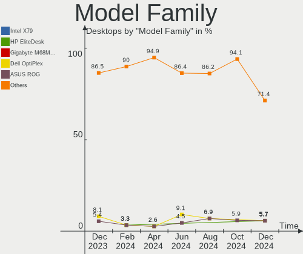
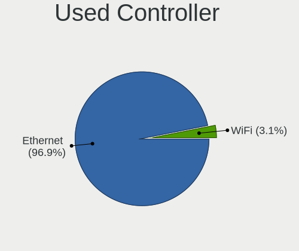
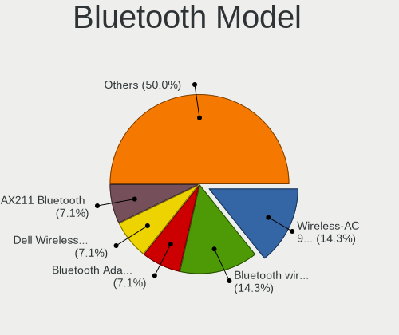

FreeBSD Hardware Trends (Desktops)
----------------------------------

A project to identify most popular hardware characteristics and track their change
over time based on data collected by FreeBSD users at https://BSD-Hardware.info.

Anyone can contribute to this report by the [hw-probe](https://github.com/linuxhw/hw-probe/blob/master/INSTALL.BSD.md) tool:

    hw-probe -all -upload

Full-feature report is available here: https://bsd-hardware.info/?view=trends&formfactor=desktop

Period: Jul, 2021.

Contents
--------

* [ System ](#system)
  - [ OS                       ](#os)
  - [ OS Family                ](#os-family)
  - [ Arch                     ](#arch)
  - [ DE                       ](#de)
  - [ Display Server           ](#display-server)
  - [ Display Manager          ](#display-manager)
  - [ OS Lang                  ](#os-lang)
  - [ Boot Mode                ](#boot-mode)
  - [ Filesystem               ](#filesystem)
  - [ Part. scheme             ](#part-scheme)

* [ Board ](#board)
  - [ Vendor                   ](#vendor)
  - [ Model                    ](#model)
  - [ Model Family             ](#model-family)
  - [ MFG Year                 ](#mfg-year)
  - [ Form Factor              ](#form-factor)
  - [ Coreboot                 ](#coreboot)
  - [ RAM Size                 ](#ram-size)
  - [ RAM Used                 ](#ram-used)
  - [ Total Drives             ](#total-drives)
  - [ Has CD-ROM               ](#has-cd-rom)
  - [ Has Ethernet             ](#has-ethernet)
  - [ Has WiFi                 ](#has-wifi)
  - [ Has Bluetooth            ](#has-bluetooth)

* [ Location ](#location)
  - [ Country                  ](#country)
  - [ City                     ](#city)

* [ Drives ](#drives)
  - [ Drive Vendor             ](#drive-vendor)
  - [ Drive Model              ](#drive-model)
  - [ HDD Vendor               ](#hdd-vendor)
  - [ SSD Vendor               ](#ssd-vendor)
  - [ Drive Kind               ](#drive-kind)
  - [ Drive Connector          ](#drive-connector)
  - [ Drive Size               ](#drive-size)
  - [ Space Total              ](#space-total)
  - [ Space Used               ](#space-used)
  - [ Malfunc. Drives          ](#malfunc-drives)
  - [ Malfunc. Drive Vendor    ](#malfunc-drive-vendor)
  - [ Malfunc. HDD Vendor      ](#malfunc-hdd-vendor)
  - [ Malfunc. Drive Kind      ](#malfunc-drive-kind)
  - [ Failed Drives            ](#failed-drives)
  - [ Failed Drive Vendor      ](#failed-drive-vendor)
  - [ Drive Status             ](#drive-status)

* [ Storage controller ](#storage-controller)
  - [ Storage Vendor           ](#storage-vendor)
  - [ Storage Model            ](#storage-model)
  - [ Storage Kind             ](#storage-kind)

* [ Processor ](#processor)
  - [ CPU Vendor               ](#cpu-vendor)
  - [ CPU Model                ](#cpu-model)
  - [ CPU Model Family         ](#cpu-model-family)
  - [ CPU Cores                ](#cpu-cores)
  - [ CPU Sockets              ](#cpu-sockets)
  - [ CPU Threads              ](#cpu-threads)
  - [ CPU Microarch            ](#cpu-microarch)

* [ Graphics ](#graphics)
  - [ GPU Vendor               ](#gpu-vendor)
  - [ GPU Model                ](#gpu-model)
  - [ GPU Combo                ](#gpu-combo)
  - [ GPU Driver               ](#gpu-driver)
  - [ GPU Memory               ](#gpu-memory)

* [ Monitor ](#monitor)
  - [ Monitor Vendor           ](#monitor-vendor)
  - [ Monitor Model            ](#monitor-model)
  - [ Monitor Resolution       ](#monitor-resolution)
  - [ Monitor Diagonal         ](#monitor-diagonal)
  - [ Monitor Width            ](#monitor-width)
  - [ Aspect Ratio             ](#aspect-ratio)
  - [ Monitor Area             ](#monitor-area)
  - [ Pixel Density            ](#pixel-density)
  - [ Multiple Monitors        ](#multiple-monitors)

* [ Network ](#network)
  - [ Net Controller Vendor    ](#net-controller-vendor)
  - [ Net Controller Model     ](#net-controller-model)
  - [ Wireless Vendor          ](#wireless-vendor)
  - [ Wireless Model           ](#wireless-model)
  - [ Ethernet Vendor          ](#ethernet-vendor)
  - [ Ethernet Model           ](#ethernet-model)
  - [ Net Controller Kind      ](#net-controller-kind)
  - [ Used Controller          ](#used-controller)
  - [ NICs                     ](#nics)
  - [ IPv6                     ](#ipv6)

* [ Bluetooth ](#bluetooth)
  - [ Bluetooth Vendor         ](#bluetooth-vendor)
  - [ Bluetooth Model          ](#bluetooth-model)

* [ Sound ](#sound)
  - [ Sound Vendor             ](#sound-vendor)
  - [ Sound Model              ](#sound-model)

* [ Memory ](#memory)
  - [ Memory Vendor            ](#memory-vendor)
  - [ Memory Model             ](#memory-model)
  - [ Memory Kind              ](#memory-kind)
  - [ Memory Form Factor       ](#memory-form-factor)
  - [ Memory Size              ](#memory-size)
  - [ Memory Speed             ](#memory-speed)

* [ Printers & scanners ](#printers-scanners)
  - [ Printer Vendor           ](#printer-vendor)
  - [ Printer Model            ](#printer-model)
  - [ Scanner Vendor           ](#scanner-vendor)
  - [ Scanner Model            ](#scanner-model)

* [ Camera ](#camera)
  - [ Camera Vendor            ](#camera-vendor)
  - [ Camera Model             ](#camera-model)

* [ Security ](#security)
  - [ Fingerprint Vendor       ](#fingerprint-vendor)
  - [ Fingerprint Model        ](#fingerprint-model)
  - [ Chipcard Vendor          ](#chipcard-vendor)
  - [ Chipcard Model           ](#chipcard-model)

* [ Unsupported ](#unsupported)
  - [ Unsupported Devices      ](#unsupported-devices)
  - [ Unsupported Device Types ](#unsupported-device-types)

System
------

OS
--

Installed operating systems

| Name                 | Desktops | Percent |
|----------------------|----------|---------|
| FreeBSD 13.0         | 8        | 38.1%   |
| FreeBSD 13.0-p3      | 4        | 19.05%  |
| FreeBSD 12.2-p9      | 2        | 9.52%   |
| FreeBSD 14.0-CURRENT | 1        | 4.76%   |
| FreeBSD 13.0-STABLE  | 1        | 4.76%   |
| FreeBSD 13.0-p2      | 1        | 4.76%   |
| FreeBSD 12.2-p6      | 1        | 4.76%   |
| FreeBSD 12.2-p2      | 1        | 4.76%   |
| FreeBSD 12.2         | 1        | 4.76%   |
| FreeBSD 12.1-p8      | 1        | 4.76%   |

OS Family
---------

OS without a version

| Name    | Desktops | Percent |
|---------|----------|---------|
| FreeBSD | 21       | 100%    |

Arch
----

OS architecture (x86_64, i586, etc.)

| Name    | Desktops | Percent |
|---------|----------|---------|
| amd64   | 19       | 90.48%  |
| riscv   | 1        | 4.76%   |
| powerpc | 1        | 4.76%   |

DE
--

Desktop Environment

| Name      | Desktops | Percent |
|-----------|----------|---------|
| Console   | 10       | 47.62%  |
| XFCE      | 3        | 14.29%  |
| KDE5      | 3        | 14.29%  |
| TWM       | 1        | 4.76%   |
| MATE      | 1        | 4.76%   |
| LXQt      | 1        | 4.76%   |
| GNOME     | 1        | 4.76%   |
| AwesomeWM | 1        | 4.76%   |

Display Server
--------------

X11 or Wayland

| Name    | Desktops | Percent |
|---------|----------|---------|
| X11     | 12       | 57.14%  |
| Console | 9        | 42.86%  |

Display Manager
---------------

SDDM, LightDM, etc.

| Name    | Desktops | Percent |
|---------|----------|---------|
| Console | 13       | 61.9%   |
| SLiM    | 3        | 14.29%  |
| SDDM    | 3        | 14.29%  |
| LightDM | 1        | 4.76%   |
| GDM     | 1        | 4.76%   |

OS Lang
-------

Language

| Lang    | Desktops | Percent |
|---------|----------|---------|
| C       | 13       | 61.9%   |
| ru_RU   | 2        | 9.52%   |
| en_US   | 2        | 9.52%   |
| Unknown | 2        | 9.52%   |
| it_IT   | 1        | 4.76%   |
| fi_FI   | 1        | 4.76%   |

Boot Mode
---------

EFI or BIOS

| Mode | Desktops | Percent |
|------|----------|---------|
| EFI  | 12       | 57.14%  |
| BIOS | 9        | 42.86%  |

Filesystem
----------

Type of filesystem

| Type | Desktops | Percent |
|------|----------|---------|
| Zfs  | 15       | 71.43%  |
| Ufs  | 6        | 28.57%  |

Part. scheme
------------

Scheme of partitioning

| Type    | Desktops | Percent |
|---------|----------|---------|
| GPT     | 19       | 90.48%  |
| MBR     | 1        | 4.76%   |
| Unknown | 1        | 4.76%   |

Board
-----

Vendor
------

Motherboard manufacturer

| Name                | Desktops | Percent |
|---------------------|----------|---------|
| ASUSTek Computer    | 5        | 23.81%  |
| Hewlett-Packard     | 3        | 14.29%  |
| Gigabyte Technology | 3        | 14.29%  |
| Dell                | 3        | 14.29%  |
| Unknown             | 2        | 9.52%   |
| Supermicro          | 1        | 4.76%   |
| Pegatron            | 1        | 4.76%   |
| MSI                 | 1        | 4.76%   |
| Cisco Systems       | 1        | 4.76%   |
| ASRock              | 1        | 4.76%   |

Model
-----

Motherboard model

| Name                           | Desktops | Percent |
|--------------------------------|----------|---------|
| Unknown                        | 2        | 9.52%   |
| Supermicro X7SPA-HF            | 1        | 4.76%   |
| Pegatron SAISHIAT2             | 1        | 4.76%   |
| MSI MS-7817                    | 1        | 4.76%   |
| HP Z620 Workstation            | 1        | 4.76%   |
| HP Z420 Workstation            | 1        | 4.76%   |
| HP ProLiant MicroServer Gen8   | 1        | 4.76%   |
| Gigabyte X570 I AORUS PRO WIFI | 1        | 4.76%   |
| Gigabyte X570 AORUS ULTRA      | 1        | 4.76%   |
| Gigabyte P55A-UD3              | 1        | 4.76%   |
| Dell Studio XPS 9100           | 1        | 4.76%   |
| Dell OptiPlex 7040             | 1        | 4.76%   |
| Dell OptiPlex 5040             | 1        | 4.76%   |
| Cisco Systems UCSC-C240-M3L    | 1        | 4.76%   |
| ASUS ROG Maximus XI HERO       | 1        | 4.76%   |
| ASUS PRIME X370-PRO            | 1        | 4.76%   |
| ASUS PRIME H310M-E R2.0        | 1        | 4.76%   |
| ASUS P5Q-E                     | 1        | 4.76%   |
| ASUS H170 PRO GAMING           | 1        | 4.76%   |
| ASRock X570 Phantom Gaming 4   | 1        | 4.76%   |

Model Family
------------

Motherboard model prefix

| Name                        | Desktops | Percent |
|-----------------------------|----------|---------|
| Gigabyte X570               | 2        | 9.52%   |
| Dell OptiPlex               | 2        | 9.52%   |
| ASUS PRIME                  | 2        | 9.52%   |
| Unknown                     | 2        | 9.52%   |
| Supermicro X7SPA-HF         | 1        | 4.76%   |
| Pegatron SAISHIAT2          | 1        | 4.76%   |
| MSI MS-7817                 | 1        | 4.76%   |
| HP Z620                     | 1        | 4.76%   |
| HP Z420                     | 1        | 4.76%   |
| HP ProLiant                 | 1        | 4.76%   |
| Gigabyte P55A-UD3           | 1        | 4.76%   |
| Dell Studio                 | 1        | 4.76%   |
| Cisco Systems UCSC-C240-M3L | 1        | 4.76%   |
| ASUS ROG                    | 1        | 4.76%   |
| ASUS P5Q-E                  | 1        | 4.76%   |
| ASUS H170                   | 1        | 4.76%   |
| ASRock X570                 | 1        | 4.76%   |

MFG Year
--------

Motherboard manufacture year

| Year    | Desktops | Percent |
|---------|----------|---------|
| 2019    | 6        | 28.57%  |
| 2020    | 3        | 14.29%  |
| 2018    | 2        | 9.52%   |
| 2010    | 2        | 9.52%   |
| Unknown | 2        | 9.52%   |
| 2021    | 1        | 4.76%   |
| 2016    | 1        | 4.76%   |
| 2014    | 1        | 4.76%   |
| 2013    | 1        | 4.76%   |
| 2009    | 1        | 4.76%   |
| 2008    | 1        | 4.76%   |

Form Factor
-----------

Physical design of the computer

| Name    | Desktops | Percent |
|---------|----------|---------|
| Desktop | 21       | 100%    |

Coreboot
--------

Have coreboot on board

| Used | Desktops | Percent |
|------|----------|---------|
| No   | 21       | 100%    |

RAM Size
--------

Total RAM memory

| Size in GB  | Desktops | Percent |
|-------------|----------|---------|
| 32.01-64.0  | 7        | 33.33%  |
| 8.01-16.0   | 5        | 23.81%  |
| 4.01-8.0    | 2        | 9.52%   |
| 2.01-3.0    | 2        | 9.52%   |
| 64.01-256.0 | 2        | 9.52%   |
| 16.01-24.0  | 2        | 9.52%   |
| 24.01-32.0  | 1        | 4.76%   |

RAM Used
--------

Used RAM memory

| Used GB    | Desktops | Percent |
|------------|----------|---------|
| 1.01-2.0   | 7        | 33.33%  |
| 0.01-0.5   | 7        | 33.33%  |
| 0.51-1.0   | 5        | 23.81%  |
| 3.01-4.0   | 1        | 4.76%   |
| 16.01-24.0 | 1        | 4.76%   |

Total Drives
------------

Number of drives on board

| Drives | Desktops | Percent |
|--------|----------|---------|
| 1      | 8        | 38.1%   |
| 4      | 3        | 14.29%  |
| 5      | 2        | 9.52%   |
| 3      | 2        | 9.52%   |
| 2      | 2        | 9.52%   |
| 14     | 1        | 4.76%   |
| 13     | 1        | 4.76%   |
| 9      | 1        | 4.76%   |
| 0      | 1        | 4.76%   |

Has CD-ROM
----------

Has CD-ROM on board

| Presented | Desktops | Percent |
|-----------|----------|---------|
| No        | 11       | 52.38%  |
| Yes       | 10       | 47.62%  |

Has Ethernet
------------

Has Ethernet on board

| Presented | Desktops | Percent |
|-----------|----------|---------|
| Yes       | 20       | 95.24%  |
| No        | 1        | 4.76%   |

Has WiFi
--------

Has WiFi module

| Presented | Desktops | Percent |
|-----------|----------|---------|
| No        | 17       | 80.95%  |
| Yes       | 4        | 19.05%  |

Has Bluetooth
-------------

Has Bluetooth module

| Presented | Desktops | Percent |
|-----------|----------|---------|
| No        | 17       | 80.95%  |
| Yes       | 4        | 19.05%  |

Location
--------

Country
-------

Geographic location (country)

| Country   | Desktops | Percent |
|-----------|----------|---------|
| USA       | 9        | 42.86%  |
| UK        | 2        | 9.52%   |
| Russia    | 2        | 9.52%   |
| Germany   | 2        | 9.52%   |
| Ukraine   | 1        | 4.76%   |
| Italy     | 1        | 4.76%   |
| India     | 1        | 4.76%   |
| Guatemala | 1        | 4.76%   |
| Finland   | 1        | 4.76%   |
| Austria   | 1        | 4.76%   |

City
----

Geographic location (city)

| City           | Desktops | Percent |
|----------------|----------|---------|
| Salem          | 2        | 9.52%   |
| Moscow         | 2        | 9.52%   |
| Kirkland       | 2        | 9.52%   |
| Augsburg       | 2        | 9.52%   |
| Vancouver      | 1        | 4.76%   |
| Teaneck        | 1        | 4.76%   |
| Tampere        | 1        | 4.76%   |
| Milan          | 1        | 4.76%   |
| London         | 1        | 4.76%   |
| Lexington      | 1        | 4.76%   |
| Jeffersonville | 1        | 4.76%   |
| Guatemala City | 1        | 4.76%   |
| Graz           | 1        | 4.76%   |
| Dnipropetrovsk | 1        | 4.76%   |
| Coimbatore     | 1        | 4.76%   |
| Cambridge      | 1        | 4.76%   |
| Arvada         | 1        | 4.76%   |

Drives
------

Drive Vendor
------------

Hard drive vendors

| Vendor              | Desktops | Drives | Percent |
|---------------------|----------|--------|---------|
| WDC                 | 10       | 32     | 27.78%  |
| Seagate             | 7        | 13     | 19.44%  |
| Samsung Electronics | 6        | 9      | 16.67%  |
| SanDisk             | 2        | 2      | 5.56%   |
| HGST                | 2        | 9      | 5.56%   |
| Crucial             | 2        | 2      | 5.56%   |
| Toshiba             | 1        | 3      | 2.78%   |
| Smartbuy            | 1        | 1      | 2.78%   |
| Phison              | 1        | 1      | 2.78%   |
| OCZ                 | 1        | 1      | 2.78%   |
| Kingston            | 1        | 1      | 2.78%   |
| Intel               | 1        | 1      | 2.78%   |
| Corsair             | 1        | 1      | 2.78%   |

Drive Model
-----------

Hard drive models

| Model                           | Desktops | Percent |
|---------------------------------|----------|---------|
| WDC WD30EFRX-68EUZN0 3TB        | 2        | 4.17%   |
| Seagate ST4000DM000-1F2168 4TB  | 2        | 4.17%   |
| Crucial CT240BX500SSD1 240GB    | 2        | 4.17%   |
| WDC WDS100T3XHC-00SJG0 1TB      | 1        | 2.08%   |
| WDC WDBNCE2500PNC 250GB         | 1        | 2.08%   |
| WDC WD80EMAZ-00WJTA0 8TB        | 1        | 2.08%   |
| WDC WD80EFZX-68UW8N0 8TB        | 1        | 2.08%   |
| WDC WD80EFAX-68LHPN0 8TB        | 1        | 2.08%   |
| WDC WD60EFRX-68L0BN1 6TB        | 1        | 2.08%   |
| WDC WD5000AAKX-083CA0 500GB     | 1        | 2.08%   |
| WDC WD40EZRZ-22GXCB0 4TB        | 1        | 2.08%   |
| WDC WD2500AAKS-60L9A0 250GB     | 1        | 2.08%   |
| WDC WD20EZRX-00D8PB0 2TB        | 1        | 2.08%   |
| WDC WD120EMFZ-11A6JA0 12TB      | 1        | 2.08%   |
| WDC WD120EMAZ-11BLFA0 12TB      | 1        | 2.08%   |
| WDC WD10EZEX-22MFCA0 1TB        | 1        | 2.08%   |
| WDC WD10EZEX-08WN4A0 1TB        | 1        | 2.08%   |
| WDC WD1001FALS-00J7B1 1TB       | 1        | 2.08%   |
| WDC WD1001FALS-00J7B0 1TB       | 1        | 2.08%   |
| Toshiba MG04SCA20EN 2TB         | 1        | 2.08%   |
| Smartbuy SSD 64GB               | 1        | 2.08%   |
| Seagate ST32000641AS 2TB        | 1        | 2.08%   |
| Seagate ST3000DM001-1CH166 3TB  | 1        | 2.08%   |
| Seagate ST250DM000-1BD141 250GB | 1        | 2.08%   |
| Seagate ST2000NM0023 2TB        | 1        | 2.08%   |
| Seagate ST1000NM0023 1TB        | 1        | 2.08%   |
| Seagate ST1000DM003-1SB102 1TB  | 1        | 2.08%   |
| Seagate ST1000DM003-1CH162 1TB  | 1        | 2.08%   |
| SanDisk SSD PLUS 480GB          | 1        | 2.08%   |
| SanDisk SD8SBBU240G1122 240GB   | 1        | 2.08%   |
| Samsung SSD 970 EVO 1TB         | 1        | 2.08%   |
| Samsung SSD 960 EVO 500GB       | 1        | 2.08%   |
| Samsung SSD 860 QVO 1TB         | 1        | 2.08%   |
| Samsung SSD 860 PRO 512GB       | 1        | 2.08%   |
| Samsung SSD 860 EVO M.2 250GB   | 1        | 2.08%   |
| Samsung SSD 860 EVO 500GB       | 1        | 2.08%   |
| Samsung SSD 860 EVO 250GB       | 1        | 2.08%   |
| Samsung SSD 850 EVO 1TB         | 1        | 2.08%   |
| Phison Sabrent 512GB            | 1        | 2.08%   |
| OCZ VERTEX3 MI 240GB            | 1        | 2.08%   |
| Kingston SV300S37A120G 120GB    | 1        | 2.08%   |
| Intel SSDSC2BF180A4L 180GB      | 1        | 2.08%   |
| HGST HTS725050A7E630 500GB      | 1        | 2.08%   |
| HGST HMS5C4040BLE640 4TB        | 1        | 2.08%   |
| Corsair Force MP600 500GB       | 1        | 2.08%   |

HDD Vendor
----------

Hard disk drive vendors

| Vendor  | Desktops | Drives | Percent |
|---------|----------|--------|---------|
| WDC     | 10       | 30     | 50%     |
| Seagate | 7        | 13     | 35%     |
| HGST    | 2        | 9      | 10%     |
| Toshiba | 1        | 3      | 5%      |

SSD Vendor
----------

Solid state drive vendors

| Vendor              | Desktops | Drives | Percent |
|---------------------|----------|--------|---------|
| Samsung Electronics | 5        | 7      | 35.71%  |
| SanDisk             | 2        | 2      | 14.29%  |
| Crucial             | 2        | 2      | 14.29%  |
| WDC                 | 1        | 1      | 7.14%   |
| Smartbuy            | 1        | 1      | 7.14%   |
| OCZ                 | 1        | 1      | 7.14%   |
| Kingston            | 1        | 1      | 7.14%   |
| Intel               | 1        | 1      | 7.14%   |

Drive Kind
----------

HDD or SSD

| Kind | Desktops | Drives | Percent |
|------|----------|--------|---------|
| HDD  | 13       | 55     | 46.43%  |
| SSD  | 11       | 16     | 39.29%  |
| NVMe | 4        | 5      | 14.29%  |

Drive Connector
---------------

SATA, SAS, NVMe, etc.

| Type | Desktops | Drives | Percent |
|------|----------|--------|---------|
| SATA | 18       | 71     | 81.82%  |
| NVMe | 4        | 5      | 18.18%  |

Drive Size
----------

Size of hard drive

| Size in TB | Desktops | Drives | Percent |
|------------|----------|--------|---------|
| 0.01-0.5   | 11       | 17     | 37.93%  |
| 0.51-1.0   | 7        | 15     | 24.14%  |
| 3.01-4.0   | 3        | 11     | 10.34%  |
| 2.01-3.0   | 3        | 7      | 10.34%  |
| 1.01-2.0   | 2        | 7      | 6.9%    |
| 4.01-10.0  | 2        | 12     | 6.9%    |
| 10.01-20.0 | 1        | 2      | 3.45%   |

Space Total
-----------

Amount of disk space available on the file system

| Size in GB | Desktops | Percent |
|------------|----------|---------|
| 101-250    | 6        | 28.57%  |
| 251-500    | 4        | 19.05%  |
| 1-20       | 3        | 14.29%  |
| 501-1000   | 3        | 14.29%  |
| 51-100     | 2        | 9.52%   |
| 21-50      | 1        | 4.76%   |
| 2001-3000  | 1        | 4.76%   |
| 1001-2000  | 1        | 4.76%   |

Space Used
----------

Amount of used disk space

| Used GB | Desktops | Percent |
|---------|----------|---------|
| 1-20    | 18       | 85.71%  |
| 21-50   | 2        | 9.52%   |
| 51-100  | 1        | 4.76%   |

Malfunc. Drives
---------------

Drive models with a malfunction

| Model                       | Desktops | Drives | Percent |
|-----------------------------|----------|--------|---------|
| WDC WD5000AAKX-083CA0 500GB | 1        | 1      | 20%     |
| WDC WD30EFRX-68EUZN0 3TB    | 1        | 3      | 20%     |
| WDC WD2500AAKS-60L9A0 250GB | 1        | 1      | 20%     |
| WDC WD1001FALS-00J7B1 1TB   | 1        | 1      | 20%     |
| HGST HTS725050A7E630 500GB  | 1        | 1      | 20%     |

Malfunc. Drive Vendor
---------------------

Vendors of faulty drives

| Vendor | Desktops | Drives | Percent |
|--------|----------|--------|---------|
| WDC    | 4        | 6      | 80%     |
| HGST   | 1        | 1      | 20%     |

Malfunc. HDD Vendor
-------------------

Vendors of faulty HDD drives

| Vendor | Desktops | Drives | Percent |
|--------|----------|--------|---------|
| WDC    | 4        | 6      | 80%     |
| HGST   | 1        | 1      | 20%     |

Malfunc. Drive Kind
-------------------

Kinds of faulty drives

| Kind | Desktops | Drives | Percent |
|------|----------|--------|---------|
| HDD  | 5        | 7      | 100%    |

Failed Drives
-------------

Failed drive models

Zero info for selected period =(

Failed Drive Vendor
-------------------

Failed drive vendors

Zero info for selected period =(

Drive Status
------------

Number of failed and malfunc. drives

| Status   | Desktops | Drives | Percent |
|----------|----------|--------|---------|
| Works    | 18       | 66     | 75%     |
| Malfunc  | 5        | 7      | 20.83%  |
| Detected | 1        | 3      | 4.17%   |

Storage controller
------------------

Storage Vendor
--------------

Storage controller vendors

| Vendor                        | Desktops | Percent |
|-------------------------------|----------|---------|
| Intel                         | 14       | 43.75%  |
| Samsung Electronics           | 4        | 12.5%   |
| AMD                           | 4        | 12.5%   |
| Broadcom / LSI                | 3        | 9.38%   |
| Phison Electronics            | 2        | 6.25%   |
| Marvell Technology Group      | 2        | 6.25%   |
| Sandisk                       | 1        | 3.13%   |
| Integrated Technology Express | 1        | 3.13%   |
| Broadcom                      | 1        | 3.13%   |

Storage Model
-------------

Storage controller models

| Model                                                                                   | Desktops | Percent |
|-----------------------------------------------------------------------------------------|----------|---------|
| AMD FCH SATA Controller [AHCI mode]                                                     | 4        | 10.26%  |
| Samsung NVMe SSD Controller SM981/PM981/PM983                                           | 3        | 7.69%   |
| Intel Q170/Q150/B150/H170/H110/Z170/CM236 Chipset SATA Controller [AHCI Mode]           | 3        | 7.69%   |
| Intel C602 chipset 4-Port SATA Storage Control Unit                                     | 2        | 5.13%   |
| Intel 82801JI (ICH10 Family) SATA AHCI Controller                                       | 2        | 5.13%   |
| Sandisk WD Black 2018/SN750 / PC SN720 NVMe SSD                                         | 1        | 2.56%   |
| Samsung NVMe SSD Controller SM961/PM961/SM963                                           | 1        | 2.56%   |
| Phison E16 PCIe4 NVMe Controller                                                        | 1        | 2.56%   |
| Phison E12 NVMe Controller                                                              | 1        | 2.56%   |
| Marvell Group 88SE91A3 SATA-600 Controller                                              | 1        | 2.56%   |
| Marvell Group 88SE6111/6121 SATA II / PATA Controller                                   | 1        | 2.56%   |
| Intel SATA Controller [RAID mode]                                                       | 1        | 2.56%   |
| Intel Cannon Lake PCH SATA AHCI Controller                                              | 1        | 2.56%   |
| Intel C600/X79 series chipset SATA RAID Controller                                      | 1        | 2.56%   |
| Intel C600/X79 series chipset IDE-r Controller                                          | 1        | 2.56%   |
| Intel C600/X79 series chipset 6-Port SATA AHCI Controller                               | 1        | 2.56%   |
| Intel 82801IR/IO/IH (ICH9R/DO/DH) 6 port SATA Controller [AHCI mode]                    | 1        | 2.56%   |
| Intel 8 Series/C220 Series Chipset Family 6-port SATA Controller 1 [AHCI mode]          | 1        | 2.56%   |
| Intel 7 Series Chipset Family 6-port SATA Controller [AHCI mode]                        | 1        | 2.56%   |
| Intel 6 Series/C200 Series Chipset Family Desktop SATA Controller (IDE mode, ports 4-5) | 1        | 2.56%   |
| Intel 6 Series/C200 Series Chipset Family Desktop SATA Controller (IDE mode, ports 0-3) | 1        | 2.56%   |
| Intel 5 Series/3400 Series Chipset 4 port SATA IDE Controller                           | 1        | 2.56%   |
| Intel 5 Series/3400 Series Chipset 2 port SATA IDE Controller                           | 1        | 2.56%   |
| Intel 200 Series PCH SATA controller [AHCI mode]                                        | 1        | 2.56%   |
| Integrated Express IT8213 IDE Controller                                                | 1        | 2.56%   |
| Broadcom K2 SATA                                                                        | 1        | 2.56%   |
| Broadcom / LSI SAS2308 PCI-Express Fusion-MPT SAS-2                                     | 1        | 2.56%   |
| Broadcom / LSI SAS2008 PCI-Express Fusion-MPT SAS-2 [Falcon]                            | 1        | 2.56%   |
| Broadcom / LSI MegaRAID SAS 2208 [Thunderbolt]                                          | 1        | 2.56%   |
| AMD X370 Series Chipset SATA Controller                                                 | 1        | 2.56%   |

Storage Kind
------------

Kind of storage controller (IDE, SATA, NVMe, SAS, ...)

| Kind | Desktops | Percent |
|------|----------|---------|
| SATA | 15       | 45.45%  |
| NVMe | 6        | 18.18%  |
| IDE  | 5        | 15.15%  |
| SAS  | 4        | 12.12%  |
| RAID | 3        | 9.09%   |

Processor
---------

CPU Vendor
----------

Processor vendors

| Vendor  | Desktops | Percent |
|---------|----------|---------|
| Intel   | 15       | 71.43%  |
| AMD     | 4        | 19.05%  |
| IBM     | 1        | 4.76%   |
| Unknown | 1        | 4.76%   |

CPU Model
---------

Processor models

| Model                                  | Desktops | Percent |
|----------------------------------------|----------|---------|
| Intel Xeon CPU E5-2630 v2 @ 2.60GHz    | 1        | 4.76%   |
| Intel Xeon CPU E5-2620 v2 @ 2.10GHz    | 1        | 4.76%   |
| Intel Xeon CPU E5-1620 @ 3.60GHz       | 1        | 4.76%   |
| Intel Core i9-9900K CPU @ 3.60GHz      | 1        | 4.76%   |
| Intel Core i7-6700 CPU @ 3.40GHz       | 1        | 4.76%   |
| Intel Core i7 CPU 960 @ 3.20GHz        | 1        | 4.76%   |
| Intel Core i5-6600K CPU @ 3.50GHz      | 1        | 4.76%   |
| Intel Core i5-6500 CPU @ 3.20GHz       | 1        | 4.76%   |
| Intel Core i5-4460 CPU @ 3.20GHz       | 1        | 4.76%   |
| Intel Core i5 CPU                      | 1        | 4.76%   |
| Intel Core i3-8100 CPU @ 3.60GHz       | 1        | 4.76%   |
| Intel Core 2 Quad CPU Q6600 @ 2.40GHz  | 1        | 4.76%   |
| Intel Celeron CPU G1610T @ 2.30GHz     | 1        | 4.76%   |
| Intel Celeron CPU 847 @ 1.10GHz        | 1        | 4.76%   |
| Intel Atom CPU D510 @ 1.66GHz          | 1        | 4.76%   |
| IBM PowerPC 970MP                      | 1        | 4.76%   |
| AMD Ryzen 9 3900X 12-Core Processor    | 1        | 4.76%   |
| AMD Ryzen 7 2700X Eight-Core Processor | 1        | 4.76%   |
| AMD Ryzen 7 1700 Eight-Core Processor  | 1        | 4.76%   |
| AMD Ryzen 5 5600X 6-Core Processor     | 1        | 4.76%   |
|                                        | 1        | 4.76%   |

CPU Model Family
----------------

Processor model prefix

| Model             | Desktops | Percent |
|-------------------|----------|---------|
| Intel Core i5     | 4        | 19.05%  |
| Intel Xeon        | 3        | 14.29%  |
| Other             | 2        | 9.52%   |
| Intel Core i7     | 2        | 9.52%   |
| Intel Celeron     | 2        | 9.52%   |
| AMD Ryzen 7       | 2        | 9.52%   |
| Intel Core i9     | 1        | 4.76%   |
| Intel Core i3     | 1        | 4.76%   |
| Intel Core 2 Quad | 1        | 4.76%   |
| Intel Atom        | 1        | 4.76%   |
| AMD Ryzen 9       | 1        | 4.76%   |
| AMD Ryzen 5       | 1        | 4.76%   |

CPU Cores
---------

Number of processor cores

| Number  | Desktops | Percent |
|---------|----------|---------|
| 4       | 8        | 38.1%   |
| 2       | 4        | 19.05%  |
| 16      | 2        | 9.52%   |
| 12      | 2        | 9.52%   |
| Unknown | 2        | 9.52%   |
| 24      | 1        | 4.76%   |
| 8       | 1        | 4.76%   |
| 6       | 1        | 4.76%   |

CPU Sockets
-----------

Number of sockets

| Number  | Desktops | Percent |
|---------|----------|---------|
| 1       | 18       | 85.71%  |
| Unknown | 2        | 9.52%   |
| 2       | 1        | 4.76%   |

CPU Threads
-----------

Threads per core (Hyper-Threading)

| Number  | Desktops | Percent |
|---------|----------|---------|
| 1       | 11       | 52.38%  |
| 2       | 8        | 38.1%   |
| Unknown | 2        | 9.52%   |

CPU Microarch
-------------

Microarchitecture

| Name        | Desktops | Percent |
|-------------|----------|---------|
| Skylake     | 3        | 14.29%  |
| IvyBridge   | 3        | 14.29%  |
| SandyBridge | 2        | 9.52%   |
| KabyLake    | 2        | 9.52%   |
| Unknown     | 2        | 9.52%   |
| Zen+        | 1        | 4.76%   |
| Zen 3       | 1        | 4.76%   |
| Zen 2       | 1        | 4.76%   |
| Zen         | 1        | 4.76%   |
| Westmere    | 1        | 4.76%   |
| Nehalem     | 1        | 4.76%   |
| Haswell     | 1        | 4.76%   |
| Core        | 1        | 4.76%   |
| Bonnell     | 1        | 4.76%   |

Graphics
--------

GPU Vendor
----------

Vendors of graphics cards

| Vendor                     | Desktops | Percent |
|----------------------------|----------|---------|
| Nvidia                     | 10       | 50%     |
| Intel                      | 7        | 35%     |
| Matrox Electronics Systems | 2        | 10%     |
| AMD                        | 1        | 5%      |

GPU Model
---------

Graphics card models

| Model                                                                       | Desktops | Percent |
|-----------------------------------------------------------------------------|----------|---------|
| Intel HD Graphics 530                                                       | 3        | 15%     |
| Nvidia GK208B [GeForce GT 710]                                              | 2        | 10%     |
| Nvidia TU104 [GeForce RTX 2080 Rev. A]                                      | 1        | 5%      |
| Nvidia TU104 [GeForce RTX 2070 SUPER]                                       | 1        | 5%      |
| Nvidia TU102 [GeForce RTX 2080 Ti Rev. A]                                   | 1        | 5%      |
| Nvidia NV43 [GeForce 6600]                                                  | 1        | 5%      |
| Nvidia GT218 [NVS 300]                                                      | 1        | 5%      |
| Nvidia GP106 [GeForce GTX 1060 3GB]                                         | 1        | 5%      |
| Nvidia GK107GL [Quadro K2000]                                               | 1        | 5%      |
| Nvidia G98 [GeForce 8400 GS Rev. 2]                                         | 1        | 5%      |
| Matrox Electronics Systems MGA G200EH                                       | 1        | 5%      |
| Matrox Electronics Systems MGA G200e [Pilot] ServerEngines (SEP1)           | 1        | 5%      |
| Intel Xeon E3-1200 v3/4th Gen Core Processor Integrated Graphics Controller | 1        | 5%      |
| Intel CoffeeLake-S GT2 [UHD Graphics 630]                                   | 1        | 5%      |
| Intel Atom Processor D4xx/D5xx/N4xx/N5xx Integrated Graphics Controller     | 1        | 5%      |
| Intel 2nd Generation Core Processor Family Integrated Graphics Controller   | 1        | 5%      |
| AMD Cypress XT [Radeon HD 5870]                                             | 1        | 5%      |

GPU Combo
---------

Combinations of graphics cards

| Name       | Desktops | Percent |
|------------|----------|---------|
| 1 x Nvidia | 10       | 47.62%  |
| 1 x Intel  | 6        | 28.57%  |
| 1 x Matrox | 2        | 9.52%   |
| Other      | 1        | 4.76%   |
| 2 x Intel  | 1        | 4.76%   |
| 1 x AMD    | 1        | 4.76%   |

GPU Driver
----------

Free vs proprietary

| Driver      | Desktops | Percent |
|-------------|----------|---------|
| Free        | 15       | 71.43%  |
| Proprietary | 5        | 23.81%  |
| Unknown     | 1        | 4.76%   |

GPU Memory
----------

Total video memory

| Size in GB | Desktops | Percent |
|------------|----------|---------|
| Unknown    | 15       | 71.43%  |
| 1.01-2.0   | 3        | 14.29%  |
| 7.01-8.0   | 1        | 4.76%   |
| 8.01-16.0  | 1        | 4.76%   |
| 0.51-1.0   | 1        | 4.76%   |

Monitor
-------

Monitor Vendor
--------------

Monitor vendors

| Vendor              | Desktops | Percent |
|---------------------|----------|---------|
| Samsung Electronics | 6        | 40%     |
| Dell                | 4        | 26.67%  |
| Acer                | 3        | 20%     |
| Philips             | 1        | 6.67%   |
| Hewlett-Packard     | 1        | 6.67%   |

Monitor Model
-------------

Monitor models

| Model                                                                | Desktops | Percent |
|----------------------------------------------------------------------|----------|---------|
| Samsung Electronics U28D590 SAM0B80 3840x2160 610x350mm 27.7-inch    | 1        | 5.88%   |
| Samsung Electronics SyncMaster SAM021E 1680x1050 430x270mm 20.0-inch | 1        | 5.88%   |
| Samsung Electronics SyncMaster SAM01BB 1280x1024 380x300mm 19.1-inch | 1        | 5.88%   |
| Samsung Electronics SyncMaster SAM01B7 1280x1024 340x270mm 17.1-inch | 1        | 5.88%   |
| Samsung Electronics S24F350 SAM0D20 1920x1080 520x290mm 23.4-inch    | 1        | 5.88%   |
| Samsung Electronics S22F350 SAM0D1A 1920x1080 480x270mm 21.7-inch    | 1        | 5.88%   |
| Samsung Electronics LCD Monitor S27D850                              | 1        | 5.88%   |
| Philips PHL 243V5 PHLC0D1 1920x1080 520x290mm 23.4-inch              | 1        | 5.88%   |
| Hewlett-Packard LCD Monitor LA2306                                   | 1        | 5.88%   |
| Dell ST2420L DELA068 1920x1080 530x300mm 24.0-inch                   | 1        | 5.88%   |
| Dell LCD Monitor U2412M 3840x1200                                    | 1        | 5.88%   |
| Dell LCD Monitor U2412M                                              | 1        | 5.88%   |
| Dell LCD Monitor P2314H 2560x2520                                    | 1        | 5.88%   |
| Dell E1916H DELF065 1366x768 410x230mm 18.5-inch                     | 1        | 5.88%   |
| Acer X203H ACR0097 1600x900 440x250mm 19.9-inch                      | 1        | 5.88%   |
| Acer LCD Monitor XB271HU 2560x1440                                   | 1        | 5.88%   |
| Acer K272HL ACR0523 1920x1080 600x340mm 27.2-inch                    | 1        | 5.88%   |

Monitor Resolution
------------------

Monitor screen resolution

| Resolution         | Desktops | Percent |
|--------------------|----------|---------|
| 1920x1080 (FHD)    | 5        | 31.25%  |
| 1280x1024 (SXGA)   | 2        | 12.5%   |
| Unknown            | 2        | 12.5%   |
| 3840x2160 (4K)     | 1        | 6.25%   |
| 3840x1200          | 1        | 6.25%   |
| 2560x2520          | 1        | 6.25%   |
| 2560x1440 (QHD)    | 1        | 6.25%   |
| 1680x1050 (WSXGA+) | 1        | 6.25%   |
| 1600x900 (HD+)     | 1        | 6.25%   |
| 1366x768 (WXGA)    | 1        | 6.25%   |

Monitor Diagonal
----------------

Diagonal size in inches

| Inches  | Desktops | Percent |
|---------|----------|---------|
| Unknown | 3        | 21.43%  |
| 27      | 2        | 14.29%  |
| 23      | 2        | 14.29%  |
| 19      | 2        | 14.29%  |
| 24      | 1        | 7.14%   |
| 21      | 1        | 7.14%   |
| 20      | 1        | 7.14%   |
| 18      | 1        | 7.14%   |
| 17      | 1        | 7.14%   |

Monitor Width
-------------

Physical width

| Width in mm | Desktops | Percent |
|-------------|----------|---------|
| 501-600     | 4        | 30.77%  |
| 401-500     | 3        | 23.08%  |
| Unknown     | 3        | 23.08%  |
| 601-700     | 1        | 7.69%   |
| 351-400     | 1        | 7.69%   |
| 301-350     | 1        | 7.69%   |

Aspect Ratio
------------

Proportional relationship between the width and the height

| Ratio   | Desktops | Percent |
|---------|----------|---------|
| 16/9    | 7        | 53.85%  |
| Unknown | 3        | 23.08%  |
| 5/4     | 2        | 15.38%  |
| 16/10   | 1        | 7.69%   |

Monitor Area
------------

Area in inch²

| Area in inch² | Desktops | Percent |
|----------------|----------|---------|
| 201-250        | 4        | 28.57%  |
| 151-200        | 3        | 21.43%  |
| Unknown        | 3        | 21.43%  |
| 301-350        | 2        | 14.29%  |
| 141-150        | 2        | 14.29%  |

Pixel Density
-------------

Pixels per inch

| Density | Desktops | Percent |
|---------|----------|---------|
| 51-100  | 8        | 61.54%  |
| Unknown | 3        | 23.08%  |
| 121-160 | 1        | 7.69%   |
| 101-120 | 1        | 7.69%   |

Multiple Monitors
-----------------

Total monitors connected

| Total | Desktops | Percent |
|-------|----------|---------|
| 0     | 9        | 42.86%  |
| 1     | 8        | 38.1%   |
| 2     | 3        | 14.29%  |
| 3     | 1        | 4.76%   |

Network
-------

Net Controller Vendor
---------------------

Controller vendors

| Vendor                   | Desktops | Percent |
|--------------------------|----------|---------|
| Intel                    | 13       | 54.17%  |
| Realtek Semiconductor    | 5        | 20.83%  |
| Broadcom                 | 2        | 8.33%   |
| Qualcomm                 | 1        | 4.17%   |
| Marvell Technology Group | 1        | 4.17%   |
| LG Electronics           | 1        | 4.17%   |
| Apple                    | 1        | 4.17%   |

Net Controller Model
--------------------

Controller models

| Model                                                                         | Desktops | Percent |
|-------------------------------------------------------------------------------|----------|---------|
| Realtek RTL8111/8168/8411 PCI Express Gigabit Ethernet Controller             | 5        | 16.13%  |
| Intel I211 Gigabit Network Connection                                         | 4        | 12.9%   |
| Intel 82574L Gigabit Network Connection                                       | 3        | 9.68%   |
| Intel Wi-Fi 6 AX200                                                           | 2        | 6.45%   |
| Intel 82579LM Gigabit Network Connection (Lewisville)                         | 2        | 6.45%   |
| Realtek RTL8188CE 802.11b/g/n WiFi Adapter                                    | 1        | 3.23%   |
| Qualcomm ALCATEL Composite RNDIS Interface                                    | 1        | 3.23%   |
| Marvell Group 88E8056 PCI-E Gigabit Ethernet Controller                       | 1        | 3.23%   |
| Marvell Group 88E8001 Gigabit Ethernet Controller                             | 1        | 3.23%   |
| LG Optimus Android Phone [USB tethering mode]                                 | 1        | 3.23%   |
| Intel I350 Gigabit Network Connection                                         | 1        | 3.23%   |
| Intel Ethernet Connection (7) I219-V                                          | 1        | 3.23%   |
| Intel Ethernet Connection (2) I219-V                                          | 1        | 3.23%   |
| Intel Ethernet Connection (2) I219-LM                                         | 1        | 3.23%   |
| Intel Cannon Lake PCH CNVi WiFi                                               | 1        | 3.23%   |
| Intel 82572EI Gigabit Ethernet Controller (Copper)                            | 1        | 3.23%   |
| Intel 82571EB/82571GB Gigabit Ethernet Controller D0/D1 (copper applications) | 1        | 3.23%   |
| Broadcom NetXtreme BCM5780 Gigabit Ethernet                                   | 1        | 3.23%   |
| Broadcom NetXtreme BCM5720 Gigabit Ethernet PCIe                              | 1        | 3.23%   |
| Apple Shasta (Sun GEM)                                                        | 1        | 3.23%   |

Wireless Vendor
---------------

Wireless vendors

| Vendor                | Desktops | Percent |
|-----------------------|----------|---------|
| Intel                 | 3        | 75%     |
| Realtek Semiconductor | 1        | 25%     |

Wireless Model
--------------

Wireless models

| Model                                      | Desktops | Percent |
|--------------------------------------------|----------|---------|
| Intel Wi-Fi 6 AX200                        | 2        | 50%     |
| Realtek RTL8188CE 802.11b/g/n WiFi Adapter | 1        | 25%     |
| Intel Cannon Lake PCH CNVi WiFi            | 1        | 25%     |

Ethernet Vendor
---------------

Ethernet vendors

| Vendor                   | Desktops | Percent |
|--------------------------|----------|---------|
| Intel                    | 13       | 59.09%  |
| Realtek Semiconductor    | 5        | 22.73%  |
| Broadcom                 | 2        | 9.09%   |
| Qualcomm                 | 1        | 4.55%   |
| Marvell Technology Group | 1        | 4.55%   |

Ethernet Model
--------------

Ethernet models

| Model                                                                         | Desktops | Percent |
|-------------------------------------------------------------------------------|----------|---------|
| Realtek RTL8111/8168/8411 PCI Express Gigabit Ethernet Controller             | 5        | 20%     |
| Intel I211 Gigabit Network Connection                                         | 4        | 16%     |
| Intel 82574L Gigabit Network Connection                                       | 3        | 12%     |
| Intel 82579LM Gigabit Network Connection (Lewisville)                         | 2        | 8%      |
| Qualcomm ALCATEL Composite RNDIS Interface                                    | 1        | 4%      |
| Marvell Group 88E8056 PCI-E Gigabit Ethernet Controller                       | 1        | 4%      |
| Marvell Group 88E8001 Gigabit Ethernet Controller                             | 1        | 4%      |
| Intel I350 Gigabit Network Connection                                         | 1        | 4%      |
| Intel Ethernet Connection (7) I219-V                                          | 1        | 4%      |
| Intel Ethernet Connection (2) I219-V                                          | 1        | 4%      |
| Intel Ethernet Connection (2) I219-LM                                         | 1        | 4%      |
| Intel 82572EI Gigabit Ethernet Controller (Copper)                            | 1        | 4%      |
| Intel 82571EB/82571GB Gigabit Ethernet Controller D0/D1 (copper applications) | 1        | 4%      |
| Broadcom NetXtreme BCM5780 Gigabit Ethernet                                   | 1        | 4%      |
| Broadcom NetXtreme BCM5720 Gigabit Ethernet PCIe                              | 1        | 4%      |

Net Controller Kind
-------------------

Ethernet, WiFi or modem

| Kind     | Desktops | Percent |
|----------|----------|---------|
| Ethernet | 20       | 76.92%  |
| WiFi     | 4        | 15.38%  |
| Modem    | 1        | 3.85%   |
| Unknown  | 1        | 3.85%   |

Used Controller
---------------

Currently used network controller

| Kind     | Desktops | Percent |
|----------|----------|---------|
| Ethernet | 19       | 95%     |
| WiFi     | 1        | 5%      |

NICs
----

Total network controllers on board

| Total | Desktops | Percent |
|-------|----------|---------|
| 1     | 10       | 47.62%  |
| 2     | 5        | 23.81%  |
| 3     | 3        | 14.29%  |
| 4     | 2        | 9.52%   |
| 0     | 1        | 4.76%   |

IPv6
----

IPv6 vs IPv4

| Used | Desktops | Percent |
|------|----------|---------|
| No   | 18       | 85.71%  |
| Yes  | 3        | 14.29%  |

Bluetooth
---------

Bluetooth Vendor
----------------

Controller vendors

| Vendor           | Desktops | Percent |
|------------------|----------|---------|
| Intel            | 3        | 75%     |
| ASUSTek Computer | 1        | 25%     |

Bluetooth Model
---------------

Controller models

| Model                                          | Desktops | Percent |
|------------------------------------------------|----------|---------|
| Intel AX200 Bluetooth                          | 2        | 50%     |
| Intel Bluetooth 9460/9560 Jefferson Peak (JfP) | 1        | 25%     |
| ASUS Broadcom BCM20702A0 Bluetooth             | 1        | 25%     |

Sound
-----

Sound Vendor
------------

Sound card vendors

| Vendor          | Desktops | Percent |
|-----------------|----------|---------|
| Intel           | 11       | 40.74%  |
| Nvidia          | 8        | 29.63%  |
| AMD             | 4        | 14.81%  |
| SteelSeries ApS | 1        | 3.7%    |
| M-Audio         | 1        | 3.7%    |
| Logitech        | 1        | 3.7%    |
| Creative Labs   | 1        | 3.7%    |

Sound Model
-----------

Sound card models

| Model                                                                                                     | Desktops | Percent |
|-----------------------------------------------------------------------------------------------------------|----------|---------|
| Intel 100 Series/C230 Series Chipset Family HD Audio Controller                                           | 3        | 10.71%  |
| Nvidia TU104 HD Audio Controller                                                                          | 2        | 7.14%   |
| Nvidia GK208 HDMI/DP Audio Controller                                                                     | 2        | 7.14%   |
| Intel C600/X79 series chipset High Definition Audio Controller                                            | 2        | 7.14%   |
| AMD Starship/Matisse HD Audio Controller                                                                  | 2        | 7.14%   |
| SteelSeries ApS Arctis Pro Wireless Arctis Pro Wireless Chat Arctis Pro Wireless Game Arctis Pro Wireless | 1        | 3.57%   |
| Nvidia TU102 High Definition Audio Controller                                                             | 1        | 3.57%   |
| Nvidia High Definition Audio Controller                                                                   | 1        | 3.57%   |
| Nvidia GP106 High Definition Audio Controller                                                             | 1        | 3.57%   |
| Nvidia GK107 HDMI Audio Controller                                                                        | 1        | 3.57%   |
| M-Audio AIR HUB                                                                                           | 1        | 3.57%   |
| Logitech Headset H340                                                                                     | 1        | 3.57%   |
| Intel Xeon E3-1200 v3/4th Gen Core Processor HD Audio Controller                                          | 1        | 3.57%   |
| Intel Cannon Lake PCH cAVS                                                                                | 1        | 3.57%   |
| Intel 82801JI (ICH10 Family) HD Audio Controller                                                          | 1        | 3.57%   |
| Intel 8 Series/C220 Series Chipset High Definition Audio Controller                                       | 1        | 3.57%   |
| Intel 7 Series/C216 Chipset Family High Definition Audio Controller                                       | 1        | 3.57%   |
| Intel 5 Series/3400 Series Chipset High Definition Audio                                                  | 1        | 3.57%   |
| Intel 200 Series PCH HD Audio                                                                             | 1        | 3.57%   |
| Creative Labs EMU20k2 [Sound Blaster X-Fi Titanium Series]                                                | 1        | 3.57%   |
| AMD Family 17h (Models 00h-0fh) HD Audio Controller                                                       | 1        | 3.57%   |
| AMD Cypress HDMI Audio [Radeon HD 5830/5850/5870 / 6850/6870 Rebrand]                                     | 1        | 3.57%   |

Memory
------

Memory Vendor
-------------

Memory module vendors

| Vendor              | Desktops | Percent |
|---------------------|----------|---------|
| Unknown             | 4        | 17.39%  |
| Corsair             | 4        | 17.39%  |
| SK Hynix            | 3        | 13.04%  |
| Micron Technology   | 3        | 13.04%  |
| Samsung Electronics | 2        | 8.7%    |
| Kingston            | 2        | 8.7%    |
| Crucial             | 2        | 8.7%    |
| Hewlett-Packard     | 1        | 4.35%   |
| G.Skill             | 1        | 4.35%   |
| A-DATA Technology   | 1        | 4.35%   |

Memory Model
------------

Memory module models

| Model                                                   | Desktops | Percent |
|---------------------------------------------------------|----------|---------|
| Unknown RAM Module 8GB DIMM DDR3 1600MT/s               | 1        | 4%      |
| Unknown RAM Module 2GB SODIMM DDR2 667MT/s              | 1        | 4%      |
| Unknown RAM Module 2GB DIMM DDR 800MT/s                 | 1        | 4%      |
| Unknown RAM Module 2GB DIMM 1333MT/s                    | 1        | 4%      |
| SK Hynix RAM HMT451U6DFR8A-PB 4GB DIMM DDR3 1600MT/s    | 1        | 4%      |
| SK Hynix RAM HMT351U6BFR8C-H9 4GB DIMM 1333MT/s         | 1        | 4%      |
| SK Hynix RAM HMT31GR7BFR4C-H9 8GB DIMM DDR3 1333MT/s    | 1        | 4%      |
| Samsung RAM Module 16GB DIMM DDR3 1600MT/s              | 1        | 4%      |
| Samsung RAM M393B1K70CHD-CH9 8GB DIMM DDR3 1333MT/s     | 1        | 4%      |
| Micron RAM 8ATF51264AZ-2G1A2 4GB DIMM DDR4 2133MT/s     | 1        | 4%      |
| Micron RAM 36KSF1G72PZ-1G6K1 8GB DIMM DDR3 1600MT/s     | 1        | 4%      |
| Micron RAM 36JSZF1G72PZ-1G4D 8GB DIMM DDR3 1333MT/s     | 1        | 4%      |
| Kingston RAM KP223C-ELF 2GB DIMM 1333MT/s               | 1        | 4%      |
| Kingston RAM 9965745-002.A00G 16GB DIMM DDR4 3000MT/s   | 1        | 4%      |
| HP RAM Module 4GB DIMM DDR3 1600MT/s                    | 1        | 4%      |
| G.Skill RAM F4-4000C19-16GTZSW 16GB DIMM DDR4 3400MT/s  | 1        | 4%      |
| Crucial RAM CTCT51264BA160BJ 4GB DIMM DDR3 1600MT/s     | 1        | 4%      |
| Crucial RAM CT51264BA160BJ.C8F 4GB DIMM DDR3 1600MT/s   | 1        | 4%      |
| Crucial RAM CT25664BF160B.M8FM 2GB SODIMM DDR3 1333MT/s | 1        | 4%      |
| Corsair RAM CMK32GX4M2Z3600C18 16GB DIMM DDR4 3600MT/s  | 1        | 4%      |
| Corsair RAM CMK32GX4M2A2133C13 16GB DIMM DDR4 2133MT/s  | 1        | 4%      |
| Corsair RAM CMK16GX4M2B3200C16 8GB DIMM DDR4 3200MT/s   | 1        | 4%      |
| Corsair RAM CMK16GX4M2B3000C15 8GB DIMM DDR4 2933MT/s   | 1        | 4%      |
| A-DATA RAM Module 8GB DIMM DDR4 2400MT/s                | 1        | 4%      |
| A-DATA RAM Module 16GB DIMM DDR4 2400MT/s               | 1        | 4%      |

Memory Kind
-----------

Memory module kinds

| Kind    | Desktops | Percent |
|---------|----------|---------|
| DDR4    | 8        | 42.11%  |
| DDR3    | 7        | 36.84%  |
| Unknown | 2        | 10.53%  |
| DDR2    | 1        | 5.26%   |
| DDR     | 1        | 5.26%   |

Memory Form Factor
------------------

Physical design of the memory module

| Name   | Desktops | Percent |
|--------|----------|---------|
| DIMM   | 17       | 89.47%  |
| SODIMM | 2        | 10.53%  |

Memory Size
-----------

Memory module size

| Size  | Desktops | Percent |
|-------|----------|---------|
| 16384 | 6        | 27.27%  |
| 8192  | 6        | 27.27%  |
| 4096  | 5        | 22.73%  |
| 2048  | 5        | 22.73%  |

Memory Speed
------------

Memory module speed

| Speed | Desktops | Percent |
|-------|----------|---------|
| 1600  | 5        | 26.32%  |
| 1333  | 4        | 21.05%  |
| 2133  | 2        | 10.53%  |
| 3600  | 1        | 5.26%   |
| 3400  | 1        | 5.26%   |
| 3200  | 1        | 5.26%   |
| 3000  | 1        | 5.26%   |
| 2933  | 1        | 5.26%   |
| 2400  | 1        | 5.26%   |
| 800   | 1        | 5.26%   |
| 667   | 1        | 5.26%   |

Printers & scanners
-------------------

Printer Vendor
--------------

Printer device vendors

Zero info for selected period =(

Printer Model
-------------

Printer device models

Zero info for selected period =(

Scanner Vendor
--------------

Scanner device vendors

Zero info for selected period =(

Scanner Model
-------------

Scanner device models

Zero info for selected period =(

Camera
------

Camera Vendor
-------------

Camera device vendors

Zero info for selected period =(

Camera Model
------------

Camera device models

Zero info for selected period =(

Security
--------

Fingerprint Vendor
------------------

Fingerprint sensor vendors

Zero info for selected period =(

Fingerprint Model
-----------------

Fingerprint sensor models

Zero info for selected period =(

Chipcard Vendor
---------------

Chipcard module vendors

Zero info for selected period =(

Chipcard Model
--------------

Chipcard module models

Zero info for selected period =(

Unsupported
-----------

Unsupported Devices
-------------------

Total unsupported devices on board

| Total | Desktops | Percent |
|-------|----------|---------|
| 1     | 11       | 52.38%  |
| 0     | 7        | 33.33%  |
| 2     | 2        | 9.52%   |
| 3     | 1        | 4.76%   |

Unsupported Device Types
------------------------

Types of unsupported devices

| Type                     | Desktops | Percent |
|--------------------------|----------|---------|
| Communication controller | 8        | 50%     |
| Firewire controller      | 4        | 25%     |
| Net/wireless             | 2        | 12.5%   |
| Network                  | 1        | 6.25%   |
| Bluetooth                | 1        | 6.25%   |

