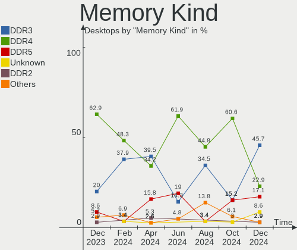

FreeBSD - Hardware Trends (Desktops)
------------------------------------

A project to identify most popular hardware characteristics and track their change
over time based on data collected by BSD users at https://BSD-Hardware.info.

Anyone can contribute to this report by the [hw-probe](https://github.com/linuxhw/hw-probe/blob/master/INSTALL.BSD.md) tool:

    hw-probe -all -upload

This report is for one last month. Overall report since the beginning of time: [TestDays](https://github.com/bsdhw/TestDays)

Period: Apr, 2024.

Contents
--------

* [ System ](#system)
  - [ OS                       ](#os)
  - [ OS Family                ](#os-family)
  - [ Arch                     ](#arch)
  - [ DE                       ](#de)
  - [ Display Server           ](#display-server)
  - [ Display Manager          ](#display-manager)
  - [ OS Lang                  ](#os-lang)
  - [ Boot Mode                ](#boot-mode)
  - [ Filesystem               ](#filesystem)
  - [ Part. scheme             ](#part-scheme)

* [ Board ](#board)
  - [ Vendor                   ](#vendor)
  - [ Model                    ](#model)
  - [ Model Family             ](#model-family)
  - [ MFG Year                 ](#mfg-year)
  - [ Form Factor              ](#form-factor)
  - [ Coreboot                 ](#coreboot)
  - [ RAM Size                 ](#ram-size)
  - [ RAM Used                 ](#ram-used)
  - [ Total Drives             ](#total-drives)
  - [ Has CD-ROM               ](#has-cd-rom)
  - [ Has Ethernet             ](#has-ethernet)
  - [ Has WiFi                 ](#has-wifi)
  - [ Has Bluetooth            ](#has-bluetooth)

* [ Location ](#location)
  - [ Country                  ](#country)
  - [ City                     ](#city)

* [ Drives ](#drives)
  - [ Drive Vendor             ](#drive-vendor)
  - [ Drive Model              ](#drive-model)
  - [ HDD Vendor               ](#hdd-vendor)
  - [ SSD Vendor               ](#ssd-vendor)
  - [ Drive Kind               ](#drive-kind)
  - [ Drive Connector          ](#drive-connector)
  - [ Drive Size               ](#drive-size)
  - [ Space Total              ](#space-total)
  - [ Space Used               ](#space-used)
  - [ Malfunc. Drives          ](#malfunc-drives)
  - [ Malfunc. Drive Vendor    ](#malfunc-drive-vendor)
  - [ Malfunc. HDD Vendor      ](#malfunc-hdd-vendor)
  - [ Malfunc. Drive Kind      ](#malfunc-drive-kind)
  - [ Failed Drives            ](#failed-drives)
  - [ Failed Drive Vendor      ](#failed-drive-vendor)
  - [ Drive Status             ](#drive-status)

* [ Storage controller ](#storage-controller)
  - [ Storage Vendor           ](#storage-vendor)
  - [ Storage Model            ](#storage-model)
  - [ Storage Kind             ](#storage-kind)

* [ Processor ](#processor)
  - [ CPU Vendor               ](#cpu-vendor)
  - [ CPU Model                ](#cpu-model)
  - [ CPU Model Family         ](#cpu-model-family)
  - [ CPU Cores                ](#cpu-cores)
  - [ CPU Sockets              ](#cpu-sockets)
  - [ CPU Threads              ](#cpu-threads)
  - [ CPU Microarch            ](#cpu-microarch)

* [ Graphics ](#graphics)
  - [ GPU Vendor               ](#gpu-vendor)
  - [ GPU Model                ](#gpu-model)
  - [ GPU Combo                ](#gpu-combo)
  - [ GPU Driver               ](#gpu-driver)
  - [ GPU Memory               ](#gpu-memory)

* [ Monitor ](#monitor)
  - [ Monitor Vendor           ](#monitor-vendor)
  - [ Monitor Model            ](#monitor-model)
  - [ Monitor Resolution       ](#monitor-resolution)
  - [ Monitor Diagonal         ](#monitor-diagonal)
  - [ Monitor Width            ](#monitor-width)
  - [ Aspect Ratio             ](#aspect-ratio)
  - [ Monitor Area             ](#monitor-area)
  - [ Pixel Density            ](#pixel-density)
  - [ Multiple Monitors        ](#multiple-monitors)

* [ Network ](#network)
  - [ Net Controller Vendor    ](#net-controller-vendor)
  - [ Net Controller Model     ](#net-controller-model)
  - [ Wireless Vendor          ](#wireless-vendor)
  - [ Wireless Model           ](#wireless-model)
  - [ Ethernet Vendor          ](#ethernet-vendor)
  - [ Ethernet Model           ](#ethernet-model)
  - [ Net Controller Kind      ](#net-controller-kind)
  - [ Used Controller          ](#used-controller)
  - [ NICs                     ](#nics)
  - [ IPv6                     ](#ipv6)

* [ Bluetooth ](#bluetooth)
  - [ Bluetooth Vendor         ](#bluetooth-vendor)
  - [ Bluetooth Model          ](#bluetooth-model)

* [ Sound ](#sound)
  - [ Sound Vendor             ](#sound-vendor)
  - [ Sound Model              ](#sound-model)

* [ Memory ](#memory)
  - [ Memory Vendor            ](#memory-vendor)
  - [ Memory Model             ](#memory-model)
  - [ Memory Kind              ](#memory-kind)
  - [ Memory Form Factor       ](#memory-form-factor)
  - [ Memory Size              ](#memory-size)
  - [ Memory Speed             ](#memory-speed)

* [ Printers & scanners ](#printers--scanners)
  - [ Printer Vendor           ](#printer-vendor)
  - [ Printer Model            ](#printer-model)
  - [ Scanner Vendor           ](#scanner-vendor)
  - [ Scanner Model            ](#scanner-model)

* [ Camera ](#camera)
  - [ Camera Vendor            ](#camera-vendor)
  - [ Camera Model             ](#camera-model)

* [ Security ](#security)
  - [ Fingerprint Vendor       ](#fingerprint-vendor)
  - [ Fingerprint Model        ](#fingerprint-model)
  - [ Chipcard Vendor          ](#chipcard-vendor)
  - [ Chipcard Model           ](#chipcard-model)

* [ Unsupported ](#unsupported)
  - [ Unsupported Devices      ](#unsupported-devices)
  - [ Unsupported Device Types ](#unsupported-device-types)

System
------

OS
--

Installed operating systems

| Name                    | Desktops | Percent |
|-------------------------|----------|---------|
| FreeBSD 14.0-p6         | 18       | 46.15%  |
| FreeBSD 14.0            | 5        | 12.82%  |
| FreeBSD 15.0-CURRENT    | 4        | 10.26%  |
| FreeBSD 14.0-BETA5      | 2        | 5.13%   |
| FreeBSD 13.2            | 2        | 5.13%   |
| FreeBSD 14.1-PRERELEASE | 1        | 2.56%   |
| FreeBSD 14.0-STABLE     | 1        | 2.56%   |
| FreeBSD 14.0-p2         | 1        | 2.56%   |
| FreeBSD 13.2-STABLE     | 1        | 2.56%   |
| FreeBSD 13.2-p11        | 1        | 2.56%   |
| FreeBSD 12.4            | 1        | 2.56%   |
| FreeBSD 12.1-p10        | 1        | 2.56%   |
| FreeBSD 11.1-p6         | 1        | 2.56%   |

OS Family
---------

OS without a version

| Name    | Desktops | Percent |
|---------|----------|---------|
| FreeBSD | 39       | 100%    |

Arch
----

OS architecture (x86_64, i586, etc.)

| Name  | Desktops | Percent |
|-------|----------|---------|
| amd64 | 38       | 97.44%  |
| arm64 | 1        | 2.56%   |

DE
--

Desktop Environment

| Name       | Desktops | Percent |
|------------|----------|---------|
| Console    | 17       | 43.59%  |
| KDE5       | 7        | 17.95%  |
| XFCE       | 6        | 15.38%  |
| MATE       | 2        | 5.13%   |
| GNOME      | 2        | 5.13%   |
| xinitrc    | 1        | 2.56%   |
| X-Cinnamon | 1        | 2.56%   |
| TWM        | 1        | 2.56%   |
| LXQt       | 1        | 2.56%   |
| i3         | 1        | 2.56%   |

Display Server
--------------

X11 or Wayland

| Name    | Desktops | Percent |
|---------|----------|---------|
| X11     | 21       | 53.85%  |
| Console | 16       | 41.03%  |
| Wayland | 2        | 5.13%   |

Display Manager
---------------

SDDM, LightDM, etc.

| Name    | Desktops | Percent |
|---------|----------|---------|
| Console | 19       | 48.72%  |
| SDDM    | 12       | 30.77%  |
| LightDM | 3        | 7.69%   |
| XDM     | 2        | 5.13%   |
| SLiM    | 2        | 5.13%   |
| GDM     | 1        | 2.56%   |

OS Lang
-------

Language

| Lang    | Desktops | Percent |
|---------|----------|---------|
| C       | 23       | 58.97%  |
| en_US   | 7        | 17.95%  |
| Unknown | 4        | 10.26%  |
| ru_RU   | 2        | 5.13%   |
| zh_CN   | 1        | 2.56%   |
| ja_JP   | 1        | 2.56%   |
| en_AU   | 1        | 2.56%   |

Boot Mode
---------

EFI or BIOS

| Mode | Desktops | Percent |
|------|----------|---------|
| EFI  | 29       | 74.36%  |
| BIOS | 10       | 25.64%  |

Filesystem
----------

Type of filesystem

| Type | Desktops | Percent |
|------|----------|---------|
| Zfs  | 28       | 71.79%  |
| Ufs  | 11       | 28.21%  |

Part. scheme
------------

Scheme of partitioning

| Type | Desktops | Percent |
|------|----------|---------|
| GPT  | 37       | 94.87%  |
| MBR  | 2        | 5.13%   |

Board
-----

Vendor
------

Motherboard manufacturer

| Name                                 | Desktops | Percent |
|--------------------------------------|----------|---------|
| ASUSTek Computer                     | 9        | 23.08%  |
| Intel                                | 4        | 10.26%  |
| Gigabyte Technology                  | 4        | 10.26%  |
| MSI                                  | 3        | 7.69%   |
| Hewlett-Packard                      | 3        | 7.69%   |
| Dell                                 | 3        | 7.69%   |
| ASRock                               | 3        | 7.69%   |
| Unknown                              | 2        | 5.13%   |
| SolidRun                             | 1        | 2.56%   |
| Shenzhen Meigao Electronic Equipment | 1        | 2.56%   |
| Quantum engineering                  | 1        | 2.56%   |
| Lenovo                               | 1        | 2.56%   |
| Fujitsu                              | 1        | 2.56%   |
| Foxconn                              | 1        | 2.56%   |
| AZW                                  | 1        | 2.56%   |
| ASRockRack                           | 1        | 2.56%   |

Model
-----

Motherboard model

| Name                                              | Desktops | Percent |
|---------------------------------------------------|----------|---------|
| ASUS All Series                                   | 2        | 5.13%   |
| Unknown                                           | 2        | 5.13%   |
| SolidRun CEX7 Platform                            | 1        | 2.56%   |
| Shenzhen Meigao Electronic Equipment Venus Series | 1        | 2.56%   |
| Quantum engineering HackBoard 2                   | 1        | 2.56%   |
| MSI MS-7C96                                       | 1        | 2.56%   |
| MSI MS-7B89                                       | 1        | 2.56%   |
| MSI MS-7A40                                       | 1        | 2.56%   |
| Lenovo H30-50 90B9004GPH                          | 1        | 2.56%   |
| Intel MAHOBAY                                     | 1        | 2.56%   |
| Intel DP965LT AAD41694-210                        | 1        | 2.56%   |
| Intel DN2820FYK H24582-201                        | 1        | 2.56%   |
| Intel D525MW AAE93082-401                         | 1        | 2.56%   |
| HP ProLiant ML310e Gen8                           | 1        | 2.56%   |
| HP Compaq 8000 Elite SFF PC                       | 1        | 2.56%   |
| HP 110-404ng                                      | 1        | 2.56%   |
| Gigabyte Z590I AORUS ULTRA                        | 1        | 2.56%   |
| Gigabyte X570 AORUS MASTER                        | 1        | 2.56%   |
| Gigabyte H97M-D3H                                 | 1        | 2.56%   |
| Gigabyte B460 AORUS PRO AC                        | 1        | 2.56%   |
| Fujitsu CELJ07001                                 | 1        | 2.56%   |
| Foxconn H61MXV/H67MXV                             | 1        | 2.56%   |
| Dell Vostro 230                                   | 1        | 2.56%   |
| Dell Precision T1700                              | 1        | 2.56%   |
| Dell OptiPlex 755                                 | 1        | 2.56%   |
| AZW SER                                           | 1        | 2.56%   |
| ASUS Z170 PRO GAMING                              | 1        | 2.56%   |
| ASUS TUF Gaming X570-PLUS                         | 1        | 2.56%   |
| ASUS ROG STRIX X670E-F GAMING WIFI                | 1        | 2.56%   |
| ASUS ProArt X670E-CREATOR WIFI                    | 1        | 2.56%   |
| ASUS PRIME B650-PLUS                              | 1        | 2.56%   |
| ASUS P8H61-M LX                                   | 1        | 2.56%   |
| ASUS M5A97 LE R2.0                                | 1        | 2.56%   |
| ASRockRack EPYC3101D4I-2T                         | 1        | 2.56%   |
| ASRock Z790M-ITX WiFi                             | 1        | 2.56%   |
| ASRock X99 Extreme4                               | 1        | 2.56%   |
| ASRock AMD BC-250                                 | 1        | 2.56%   |

Model Family
------------

Motherboard model prefix

| Name                                       | Desktops | Percent |
|--------------------------------------------|----------|---------|
| ASUS All                                   | 2        | 5.13%   |
| Unknown                                    | 2        | 5.13%   |
| SolidRun CEX7                              | 1        | 2.56%   |
| Shenzhen Meigao Electronic Equipment Venus | 1        | 2.56%   |
| Quantum engineering HackBoard              | 1        | 2.56%   |
| MSI MS-7C96                                | 1        | 2.56%   |
| MSI MS-7B89                                | 1        | 2.56%   |
| MSI MS-7A40                                | 1        | 2.56%   |
| Lenovo H30-50                              | 1        | 2.56%   |
| Intel MAHOBAY                              | 1        | 2.56%   |
| Intel DP965LT                              | 1        | 2.56%   |
| Intel DN2820FYK                            | 1        | 2.56%   |
| Intel D525MW                               | 1        | 2.56%   |
| HP ProLiant                                | 1        | 2.56%   |
| HP Compaq                                  | 1        | 2.56%   |
| HP 110-404ng                               | 1        | 2.56%   |
| Gigabyte Z590I                             | 1        | 2.56%   |
| Gigabyte X570                              | 1        | 2.56%   |
| Gigabyte H97M-D3H                          | 1        | 2.56%   |
| Gigabyte B460                              | 1        | 2.56%   |
| Fujitsu CELJ07001                          | 1        | 2.56%   |
| Foxconn H61MXV                             | 1        | 2.56%   |
| Dell Vostro                                | 1        | 2.56%   |
| Dell Precision                             | 1        | 2.56%   |
| Dell OptiPlex                              | 1        | 2.56%   |
| AZW SER                                    | 1        | 2.56%   |
| ASUS Z170                                  | 1        | 2.56%   |
| ASUS TUF                                   | 1        | 2.56%   |
| ASUS ROG                                   | 1        | 2.56%   |
| ASUS ProArt                                | 1        | 2.56%   |
| ASUS PRIME                                 | 1        | 2.56%   |
| ASUS P8H61-M                               | 1        | 2.56%   |
| ASUS M5A97                                 | 1        | 2.56%   |
| ASRockRack EPYC3101D4I-2T                  | 1        | 2.56%   |
| ASRock Z790M-ITX                           | 1        | 2.56%   |
| ASRock X99                                 | 1        | 2.56%   |
| ASRock AMD                                 | 1        | 2.56%   |

MFG Year
--------

Motherboard manufacture year

| Year | Desktops | Percent |
|------|----------|---------|
| 2023 | 9        | 23.08%  |
| 2015 | 4        | 10.26%  |
| 2018 | 3        | 7.69%   |
| 2011 | 3        | 7.69%   |
| 2022 | 2        | 5.13%   |
| 2021 | 2        | 5.13%   |
| 2019 | 2        | 5.13%   |
| 2017 | 2        | 5.13%   |
| 2016 | 2        | 5.13%   |
| 2014 | 2        | 5.13%   |
| 2009 | 2        | 5.13%   |
| 2024 | 1        | 2.56%   |
| 2020 | 1        | 2.56%   |
| 2013 | 1        | 2.56%   |
| 2012 | 1        | 2.56%   |
| 2010 | 1        | 2.56%   |
| 2008 | 1        | 2.56%   |

Form Factor
-----------

Physical design of the computer

| Name    | Desktops | Percent |
|---------|----------|---------|
| Desktop | 39       | 100%    |

Coreboot
--------

Have coreboot on board

| Used | Desktops | Percent |
|------|----------|---------|
| No   | 39       | 100%    |

RAM Size
--------

Total RAM memory

| Size in GB      | Desktops | Percent |
|-----------------|----------|---------|
| 32.01-64.0      | 11       | 28.21%  |
| 64.01-256.0     | 8        | 20.51%  |
| 8.01-16.0       | 8        | 20.51%  |
| 4.01-8.0        | 6        | 15.38%  |
| 16.01-24.0      | 5        | 12.82%  |
| More than 256.0 | 1        | 2.56%   |

RAM Used
--------

Used RAM memory

| Used GB     | Desktops | Percent |
|-------------|----------|---------|
| 1.01-2.0    | 14       | 35.9%   |
| 0.01-0.5    | 11       | 28.21%  |
| 0.51-1.0    | 7        | 17.95%  |
| 2.01-3.0    | 4        | 10.26%  |
| 4.01-8.0    | 1        | 2.56%   |
| 64.01-256.0 | 1        | 2.56%   |
| 8.01-16.0   | 1        | 2.56%   |

Total Drives
------------

Number of drives on board

| Drives | Desktops | Percent |
|--------|----------|---------|
| 1      | 15       | 38.46%  |
| 2      | 10       | 25.64%  |
| 0      | 6        | 15.38%  |
| 5      | 3        | 7.69%   |
| 3      | 3        | 7.69%   |
| 4      | 2        | 5.13%   |

Has CD-ROM
----------

Has CD-ROM on board

| Presented | Desktops | Percent |
|-----------|----------|---------|
| No        | 31       | 79.49%  |
| Yes       | 8        | 20.51%  |

Has Ethernet
------------

Has Ethernet on board

| Presented | Desktops | Percent |
|-----------|----------|---------|
| Yes       | 36       | 92.31%  |
| No        | 3        | 7.69%   |

Has WiFi
--------

Has WiFi module

| Presented | Desktops | Percent |
|-----------|----------|---------|
| No        | 21       | 53.85%  |
| Yes       | 18       | 46.15%  |

Has Bluetooth
-------------

Has Bluetooth module

| Presented | Desktops | Percent |
|-----------|----------|---------|
| No        | 24       | 61.54%  |
| Yes       | 15       | 38.46%  |

Location
--------

Country
-------

Geographic location (country)

| Country      | Desktops | Percent |
|--------------|----------|---------|
| Russia       | 5        | 12.82%  |
| USA          | 3        | 7.69%   |
| UK           | 3        | 7.69%   |
| Poland       | 3        | 7.69%   |
| Netherlands  | 3        | 7.69%   |
| Germany      | 3        | 7.69%   |
| Australia    | 3        | 7.69%   |
| Spain        | 2        | 5.13%   |
| Japan        | 2        | 5.13%   |
| China        | 2        | 5.13%   |
| Thailand     | 1        | 2.56%   |
| Switzerland  | 1        | 2.56%   |
| South Africa | 1        | 2.56%   |
| Philippines  | 1        | 2.56%   |
| Panama       | 1        | 2.56%   |
| Italy        | 1        | 2.56%   |
| Hong Kong    | 1        | 2.56%   |
| France       | 1        | 2.56%   |
| Canada       | 1        | 2.56%   |
| Bulgaria     | 1        | 2.56%   |

City
----

Geographic location (city)

| City                 | Desktops | Percent |
|----------------------|----------|---------|
| St Petersburg        | 2        | 5.13%   |
| Sheffield            | 2        | 5.13%   |
| Melbourne            | 2        | 5.13%   |
| Bonn                 | 2        | 5.13%   |
| Wroclaw              | 1        | 2.56%   |
| Vladimirskiy Poselok | 1        | 2.56%   |
| Villeurbanne         | 1        | 2.56%   |
| Viladecans           | 1        | 2.56%   |
| Ufa                  | 1        | 2.56%   |
| Tokyo                | 1        | 2.56%   |
| St. Albert           | 1        | 2.56%   |
| Sofia                | 1        | 2.56%   |
| Shinchiba            | 1        | 2.56%   |
| Shenyang             | 1        | 2.56%   |
| Seattle              | 1        | 2.56%   |
| San Angelo           | 1        | 2.56%   |
| Rho                  | 1        | 2.56%   |
| Quezon City          | 1        | 2.56%   |
| Pretoria             | 1        | 2.56%   |
| Perth                | 1        | 2.56%   |
| Panama City          | 1        | 2.56%   |
| Palezieux            | 1        | 2.56%   |
| Moscow               | 1        | 2.56%   |
| Madrid               | 1        | 2.56%   |
| London               | 1        | 2.56%   |
| Krakow               | 1        | 2.56%   |
| Kowloon              | 1        | 2.56%   |
| IJsselstein          | 1        | 2.56%   |
| Hechi                | 1        | 2.56%   |
| Greeley              | 1        | 2.56%   |
| Gmina Jeżewo        | 1        | 2.56%   |
| Cologne              | 1        | 2.56%   |
| Bangkok              | 1        | 2.56%   |
| Amsterdam            | 1        | 2.56%   |
| Amstelveen           | 1        | 2.56%   |

Drives
------

Drive Vendor
------------

Hard drive vendors

| Vendor              | Desktops | Drives | Percent |
|---------------------|----------|--------|---------|
| WDC                 | 12       | 14     | 26.09%  |
| Seagate             | 9        | 19     | 19.57%  |
| Samsung Electronics | 7        | 13     | 15.22%  |
| Kingston            | 4        | 5      | 8.7%    |
| Toshiba             | 3        | 3      | 6.52%   |
| Crucial             | 3        | 4      | 6.52%   |
| Lexar               | 2        | 4      | 4.35%   |
| Transcend           | 1        | 1      | 2.17%   |
| SanDisk             | 1        | 1      | 2.17%   |
| Plextor             | 1        | 1      | 2.17%   |
| LITEON              | 1        | 1      | 2.17%   |
| Hitachi             | 1        | 1      | 2.17%   |
| HGST                | 1        | 1      | 2.17%   |

Drive Model
-----------

Hard drive models

| Model                                        | Desktops | Percent |
|----------------------------------------------|----------|---------|
| Toshiba DT01ACA050 500GB                     | 2        | 3.57%   |
| Samsung SSD 860 EVO 250GB                    | 2        | 3.57%   |
| Kingston SV300S37A120G 120GB                 | 2        | 3.57%   |
| WDC WDS200T2B0B-00YS70 2TB                   | 1        | 1.79%   |
| WDC WDS120G2G0A-00JH30 120GB                 | 1        | 1.79%   |
| WDC WD5000LPCX-24C6HT0 500GB                 | 1        | 1.79%   |
| WDC WD40EZRZ-00WN9B0 4TB                     | 1        | 1.79%   |
| WDC WD40EZAZ-00SF3B0 4TB                     | 1        | 1.79%   |
| WDC WD40EFPX-68C6CN0 4TB                     | 1        | 1.79%   |
| WDC WD3200BPVT-55ZEST0 320GB                 | 1        | 1.79%   |
| WDC WD3200AAJS-00YZCA0 320GB                 | 1        | 1.79%   |
| WDC WD2500AAKX-753CA1 250GB                  | 1        | 1.79%   |
| WDC WD23PURZ-85C5HY0 2TB                     | 1        | 1.79%   |
| WDC WD20EFRX-68EUZN0 2TB                     | 1        | 1.79%   |
| WDC WD10EZEX-75M2NA0 1TB                     | 1        | 1.79%   |
| WDC WD1000DHTZ-04N21V0 1TB                   | 1        | 1.79%   |
| Transcend TS256GSSD370S 256GB                | 1        | 1.79%   |
| Toshiba MG06ACA10TE 10TB                     | 1        | 1.79%   |
| Seagate ST6000VX0023-2EF110 6TB              | 1        | 1.79%   |
| Seagate ST4000NM0033-9ZM170 4TB              | 1        | 1.79%   |
| Seagate ST4000LM024-2AN17V 4TB               | 1        | 1.79%   |
| Seagate ST4000DM004-2U9104 4TB               | 1        | 1.79%   |
| Seagate ST4000DM004-2CV104 4TB               | 1        | 1.79%   |
| Seagate ST3250318AS 250GB                    | 1        | 1.79%   |
| Seagate ST3250312AS 250GB                    | 1        | 1.79%   |
| Seagate ST2000DM008-2FR102 2TB               | 1        | 1.79%   |
| Seagate ST2000DM006-2DM164 2TB               | 1        | 1.79%   |
| Seagate ST16000NM001G-2KK103 16TB            | 1        | 1.79%   |
| Seagate ST1500DL003-9VT16L 1.5TB             | 1        | 1.79%   |
| Seagate ST1000NC001-1DY162 1TB               | 1        | 1.79%   |
| Seagate ST1000DM003-1ER162 1TB               | 1        | 1.79%   |
| Seagate BarraCuda 120 SSD ZA500CM10003 500GB | 1        | 1.79%   |
| SanDisk X400 M.2 2280 256GB                  | 1        | 1.79%   |
| Samsung SSD 970 EVO Plus 500GB               | 1        | 1.79%   |
| Samsung SSD 970 EVO Plus 1TB                 | 1        | 1.79%   |
| Samsung SSD 870 EVO 500GB                    | 1        | 1.79%   |
| Samsung SSD 870 EVO 2TB                      | 1        | 1.79%   |
| Samsung SSD 870 EVO 1TB                      | 1        | 1.79%   |
| Samsung SSD 860 EVO 1TB                      | 1        | 1.79%   |
| Samsung SSD 830 Series 64GB                  | 1        | 1.79%   |

HDD Vendor
----------

Hard disk drive vendors

| Vendor              | Desktops | Drives | Percent |
|---------------------|----------|--------|---------|
| WDC                 | 10       | 12     | 40%     |
| Seagate             | 9        | 18     | 36%     |
| Toshiba             | 3        | 3      | 12%     |
| Samsung Electronics | 1        | 1      | 4%      |
| Hitachi             | 1        | 1      | 4%      |
| HGST                | 1        | 1      | 4%      |

SSD Vendor
----------

Solid state drive vendors

| Vendor              | Desktops | Drives | Percent |
|---------------------|----------|--------|---------|
| Samsung Electronics | 7        | 10     | 31.82%  |
| Kingston            | 4        | 5      | 18.18%  |
| Crucial             | 3        | 4      | 13.64%  |
| WDC                 | 2        | 2      | 9.09%   |
| Transcend           | 1        | 1      | 4.55%   |
| Seagate             | 1        | 1      | 4.55%   |
| SanDisk             | 1        | 1      | 4.55%   |
| Plextor             | 1        | 1      | 4.55%   |
| LITEON              | 1        | 1      | 4.55%   |
| Lexar               | 1        | 2      | 4.55%   |

Drive Kind
----------

HDD or SSD

| Kind | Desktops | Drives | Percent |
|------|----------|--------|---------|
| SSD  | 21       | 28     | 50%     |
| HDD  | 19       | 36     | 45.24%  |
| NVMe | 2        | 4      | 4.76%   |

Drive Connector
---------------

SATA, SAS, NVMe, etc.

| Type | Desktops | Drives | Percent |
|------|----------|--------|---------|
| SATA | 33       | 64     | 94.29%  |
| NVMe | 2        | 4      | 5.71%   |

Drive Size
----------

Size of hard drive

| Size in TB | Desktops | Drives | Percent |
|------------|----------|--------|---------|
| 0.01-0.5   | 20       | 27     | 44.44%  |
| 0.51-1.0   | 10       | 12     | 22.22%  |
| 3.01-4.0   | 6        | 12     | 13.33%  |
| 1.01-2.0   | 6        | 9      | 13.33%  |
| 4.01-10.0  | 2        | 2      | 4.44%   |
| 10.01-20.0 | 1        | 2      | 2.22%   |

Space Total
-----------

Amount of disk space available on the file system

| Size in GB     | Desktops | Percent |
|----------------|----------|---------|
| 101-250        | 11       | 28.21%  |
| 501-1000       | 9        | 23.08%  |
| 251-500        | 4        | 10.26%  |
| 1001-2000      | 4        | 10.26%  |
| 21-50          | 3        | 7.69%   |
| 51-100         | 3        | 7.69%   |
| More than 3000 | 2        | 5.13%   |
| 2001-3000      | 2        | 5.13%   |
| 1-20           | 1        | 2.56%   |

Space Used
----------

Amount of used disk space

| Used GB | Desktops | Percent |
|---------|----------|---------|
| 1-20    | 27       | 69.23%  |
| 21-50   | 6        | 15.38%  |
| 51-100  | 4        | 10.26%  |
| 101-250 | 2        | 5.13%   |

Malfunc. Drives
---------------

Drive models with a malfunction

| Model                               | Desktops | Drives | Percent |
|-------------------------------------|----------|--------|---------|
| Kingston SV300S37A120G 120GB        | 2        | 2      | 20%     |
| WDC WD40EZRZ-00WN9B0 4TB            | 1        | 1      | 10%     |
| WDC WD3200AAJS-00YZCA0 320GB        | 1        | 1      | 10%     |
| WDC WD10EZEX-75M2NA0 1TB            | 1        | 1      | 10%     |
| Samsung Electronics SSD 870 EVO 1TB | 1        | 1      | 10%     |
| LITEON CV8-8E128-HP 128GB           | 1        | 1      | 10%     |
| Hitachi HTS545032B9A300 320GB       | 1        | 1      | 10%     |
| HGST HTS725050A7E630 500GB          | 1        | 1      | 10%     |
| Crucial CT256MX100SSD1 256GB        | 1        | 1      | 10%     |

Malfunc. Drive Vendor
---------------------

Vendors of faulty drives

| Vendor              | Desktops | Drives | Percent |
|---------------------|----------|--------|---------|
| WDC                 | 3        | 3      | 30%     |
| Kingston            | 2        | 2      | 20%     |
| Samsung Electronics | 1        | 1      | 10%     |
| LITEON              | 1        | 1      | 10%     |
| Hitachi             | 1        | 1      | 10%     |
| HGST                | 1        | 1      | 10%     |
| Crucial             | 1        | 1      | 10%     |

Malfunc. HDD Vendor
-------------------

Vendors of faulty HDD drives

| Vendor  | Desktops | Drives | Percent |
|---------|----------|--------|---------|
| WDC     | 3        | 3      | 60%     |
| Hitachi | 1        | 1      | 20%     |
| HGST    | 1        | 1      | 20%     |

Malfunc. Drive Kind
-------------------

Kinds of faulty drives

| Kind | Desktops | Drives | Percent |
|------|----------|--------|---------|
| SSD  | 5        | 5      | 50%     |
| HDD  | 5        | 5      | 50%     |

Failed Drives
-------------

Failed drive models

Zero info for selected period =(

Failed Drive Vendor
-------------------

Failed drive vendors

Zero info for selected period =(

Drive Status
------------

Number of failed and malfunc. drives

| Status  | Desktops | Drives | Percent |
|---------|----------|--------|---------|
| Works   | 29       | 58     | 74.36%  |
| Malfunc | 10       | 10     | 25.64%  |

Storage controller
------------------

Storage Vendor
--------------

Storage controller vendors

| Vendor                       | Desktops | Percent |
|------------------------------|----------|---------|
| Intel                        | 25       | 39.68%  |
| AMD                          | 13       | 20.63%  |
| Samsung Electronics          | 7        | 11.11%  |
| Phison Electronics           | 4        | 6.35%   |
| SanDisk                      | 3        | 4.76%   |
| Marvell Technology Group     | 2        | 3.17%   |
| Kingston Technology Company  | 2        | 3.17%   |
| Shenzhen Longsys Electronics | 1        | 1.59%   |
| Micron/Crucial Technology    | 1        | 1.59%   |
| MAXIO Technology (Hangzhou)  | 1        | 1.59%   |
| Lite-On Technology           | 1        | 1.59%   |
| JMicron Technology           | 1        | 1.59%   |
| Broadcom / LSI               | 1        | 1.59%   |
| ASMedia Technology           | 1        | 1.59%   |

Storage Model
-------------

Storage controller models

| Model                                                                          | Desktops | Percent |
|--------------------------------------------------------------------------------|----------|---------|
| AMD FCH SATA Controller [AHCI mode]                                            | 7        | 10.29%  |
| Samsung NVMe SSD Controller SM981/PM981/PM983                                  | 4        | 5.88%   |
| Intel 9 Series Chipset Family SATA Controller [AHCI Mode]                      | 3        | 4.41%   |
| SanDisk Extreme Pro / WD Black SN750 / PC SN730 / Red SN700 NVMe SSD           | 2        | 2.94%   |
| Intel Q170/Q150/B150/H170/H110/Z170/CM236 Chipset SATA Controller [AHCI Mode]  | 2        | 2.94%   |
| Intel Atom Processor E3800 Series SATA AHCI Controller                         | 2        | 2.94%   |
| Intel 8 Series/C220 Series Chipset Family 6-port SATA Controller 1 [AHCI mode] | 2        | 2.94%   |
| Intel 6 Series/C200 Series Chipset Family 6 port Desktop SATA AHCI Controller  | 2        | 2.94%   |
| AMD 600 Series Chipset SATA Controller                                         | 2        | 2.94%   |
| AMD 400 Series Chipset SATA Controller                                         | 2        | 2.94%   |
| Shenzhen Longsys Lexar NM790 NVME SSD (DRAM-less)                              | 1        | 1.47%   |
| Sandisk WD Black SN770 / PC SN740 256GB / PC SN560 (DRAM-less) NVMe SSD        | 1        | 1.47%   |
| Samsung NVMe SSD Controller S4LV008[Pascal]                                    | 1        | 1.47%   |
| Samsung NVMe SSD Controller PM9B1 (DRAM-less)                                  | 1        | 1.47%   |
| Samsung NVMe SSD Controller PM9A1/PM9A3/980PRO                                 | 1        | 1.47%   |
| Phison PS5027-E27T PCIe4 NVMe Controller (DRAM-less)                           | 1        | 1.47%   |
| Phison PS5021-E21 PCIe4 NVMe Controller (DRAM-less)                            | 1        | 1.47%   |
| Phison PS5013-E13 PCIe3 NVMe Controller (DRAM-less)                            | 1        | 1.47%   |
| Phison E16 PCIe4 NVMe Controller                                               | 1        | 1.47%   |
| Micron/Crucial P2 [Nick P2] / P3 / P3 Plus NVMe PCIe SSD (DRAM-less)           | 1        | 1.47%   |
| MAXIO (Hangzhou) NVMe SSD Controller MAP1602 (DRAM-less)                       | 1        | 1.47%   |
| Marvell Group 88SE9120 SATA 6Gb/s Controller                                   | 1        | 1.47%   |
| Marvell Group 88SE6101/6102 single-port PATA133 interface                      | 1        | 1.47%   |
| Lite-On CX2-8B256, CX2-8B512 NVMe SSD                                          | 1        | 1.47%   |
| Kingston Company KC3000/FURY Renegade NVMe SSD E18                             | 1        | 1.47%   |
| Kingston Company A2000 NVMe SSD SM2263EN                                       | 1        | 1.47%   |
| JMicron JMB58x AHCI SATA controller                                            | 1        | 1.47%   |
| Intel Sunrise Point-LP SATA Controller [AHCI mode]                             | 1        | 1.47%   |
| Intel SSD 660P Series                                                          | 1        | 1.47%   |
| Intel Raptor Lake SATA AHCI Controller                                         | 1        | 1.47%   |
| Intel PCIe Data Center SSD                                                     | 1        | 1.47%   |
| Intel NM10/ICH7 Family SATA Controller [IDE mode]                              | 1        | 1.47%   |
| Intel NM10/ICH7 Family SATA Controller [AHCI mode]                             | 1        | 1.47%   |
| Intel Celeron/Pentium Silver Processor SATA Controller                         | 1        | 1.47%   |
| Intel C610/X99 series chipset sSATA Controller [AHCI mode]                     | 1        | 1.47%   |
| Intel C610/X99 series chipset 6-Port SATA Controller [AHCI mode]               | 1        | 1.47%   |
| Intel 82Q35 Express PT IDER Controller                                         | 1        | 1.47%   |
| Intel 82801JD/DO (ICH10 Family) SATA AHCI Controller                           | 1        | 1.47%   |
| Intel 82801IR/IO/IH (ICH9R/DO/DH) 6 port SATA Controller [AHCI mode]           | 1        | 1.47%   |
| Intel 82801HB (ICH8) 4 port SATA Controller [AHCI mode]                        | 1        | 1.47%   |

Storage Kind
------------

Kind of storage controller (IDE, SATA, NVMe, SAS, ...)

| Kind | Desktops | Percent |
|------|----------|---------|
| SATA | 34       | 58.62%  |
| NVMe | 18       | 31.03%  |
| IDE  | 4        | 6.9%    |
| RAID | 1        | 1.72%   |
| SAS  | 1        | 1.72%   |

Processor
---------

CPU Vendor
----------

Processor vendors

| Vendor | Desktops | Percent |
|--------|----------|---------|
| Intel  | 25       | 64.1%   |
| AMD    | 13       | 33.33%  |
| NXP    | 1        | 2.56%   |

CPU Model
---------

Processor models

| Model                                         | Desktops | Percent |
|-----------------------------------------------|----------|---------|
| Intel Core i7-4770 CPU @ 3.40GHz              | 2        | 5.13%   |
| AMD Ryzen 7 5700X 8-Core Processor            | 2        | 5.13%   |
| NXP Cortex-A72                                | 1        | 2.56%   |
| Intel Xeon CPU E5-2683 v3 @ 2.00GHz           | 1        | 2.56%   |
| Intel Xeon CPU E3-1270 V2 @ 3.50GHz           | 1        | 2.56%   |
| Intel Xeon                                    | 1        | 2.56%   |
| Intel Pentium Dual-Core CPU E5800 @ 3.20GHz   | 1        | 2.56%   |
| Intel Genuine CPU @ 2.40GHz                   | 1        | 2.56%   |
| Intel Core i7-8550U CPU @ 1.80GHz             | 1        | 2.56%   |
| Intel Core i7-6700K CPU @ 4.00GHz             | 1        | 2.56%   |
| Intel Core i7-4790 CPU @ 3.60GHz              | 1        | 2.56%   |
| Intel Core i7-4770K CPU @ 3.50GHz             | 1        | 2.56%   |
| Intel Core i7-14700K                          | 1        | 2.56%   |
| Intel Core i5-4460 CPU @ 3.20GHz              | 1        | 2.56%   |
| Intel Core i5-2500 CPU @ 3.30GHz              | 1        | 2.56%   |
| Intel Core i5-10600K CPU @ 4.10GHz            | 1        | 2.56%   |
| Intel Core i3-6100 CPU @ 3.70GHz              | 1        | 2.56%   |
| Intel Core i3-2100 CPU @ 3.10GHz              | 1        | 2.56%   |
| Intel Core 2 Quad CPU Q9450 @ 2.66GHz         | 1        | 2.56%   |
| Intel Core 2 Quad CPU @ 2.40GHz               | 1        | 2.56%   |
| Intel Celeron N4020 CPU @ 1.10GHz             | 1        | 2.56%   |
| Intel Celeron CPU N2820 @ 2.13GHz             | 1        | 2.56%   |
| Intel Celeron CPU J1800 @ 2.41GHz             | 1        | 2.56%   |
| Intel Atom CPU D525 @ 1.80GHz                 | 1        | 2.56%   |
| Intel 13th Gen Core i9-13900H                 | 1        | 2.56%   |
| Intel 11th Gen Core i7-11700 @ 2.50GHz        | 1        | 2.56%   |
| AMD Ryzen 9 7950X 16-Core Processor           | 1        | 2.56%   |
| AMD Ryzen 9 6900HX with Radeon Graphics       | 1        | 2.56%   |
| AMD Ryzen 9 3900X 12-Core Processor           | 1        | 2.56%   |
| AMD Ryzen 7 7800X3D 8-Core Processor          | 1        | 2.56%   |
| AMD Ryzen 5 7600 6-Core Processor             | 1        | 2.56%   |
| AMD Ryzen 5 5600G with Radeon Graphics        | 1        | 2.56%   |
| AMD Ryzen 5 3600 6-Core Processor             | 1        | 2.56%   |
| AMD Ryzen 5 3500U with Radeon Vega Mobile Gfx | 1        | 2.56%   |
| AMD FX-6300 Six-Core Processor                | 1        | 2.56%   |
| AMD EPYC 3101 4-Core Processor                | 1        | 2.56%   |
| AMD BC-250                                    | 1        | 2.56%   |

CPU Model Family
----------------

Processor model prefix

| Model                   | Desktops | Percent |
|-------------------------|----------|---------|
| Intel Core i7           | 7        | 17.95%  |
| Other                   | 4        | 10.26%  |
| AMD Ryzen 5             | 4        | 10.26%  |
| Intel Xeon              | 3        | 7.69%   |
| Intel Core i5           | 3        | 7.69%   |
| Intel Celeron           | 3        | 7.69%   |
| AMD Ryzen 9             | 3        | 7.69%   |
| AMD Ryzen 7             | 3        | 7.69%   |
| Intel Core i3           | 2        | 5.13%   |
| Intel Core 2 Quad       | 2        | 5.13%   |
| Intel Pentium Dual-Core | 1        | 2.56%   |
| Intel Genuine           | 1        | 2.56%   |
| Intel Atom              | 1        | 2.56%   |
| AMD FX                  | 1        | 2.56%   |
| AMD EPYC                | 1        | 2.56%   |

CPU Cores
---------

Number of processor cores

| Number  | Desktops | Percent |
|---------|----------|---------|
| 4       | 11       | 28.21%  |
| 2       | 8        | 20.51%  |
| 16      | 4        | 10.26%  |
| 12      | 4        | 10.26%  |
| Unknown | 3        | 7.69%   |
| 14      | 2        | 5.13%   |
| 8       | 2        | 5.13%   |
| 6       | 2        | 5.13%   |
| 32      | 1        | 2.56%   |
| 24      | 1        | 2.56%   |
| 10      | 1        | 2.56%   |

CPU Sockets
-----------

Number of sockets

| Number | Desktops | Percent |
|--------|----------|---------|
| 1      | 39       | 100%    |

CPU Threads
-----------

Threads per core (Hyper-Threading)

| Number  | Desktops | Percent |
|---------|----------|---------|
| 1       | 21       | 53.85%  |
| 2       | 15       | 38.46%  |
| Unknown | 3        | 7.69%   |

CPU Microarch
-------------

Microarchitecture

| Name          | Desktops | Percent |
|---------------|----------|---------|
| Unknown       | 9        | 23.08%  |
| Haswell       | 6        | 15.38%  |
| Zen 3         | 3        | 7.69%   |
| Penryn        | 3        | 7.69%   |
| Zen 2         | 2        | 5.13%   |
| Skylake       | 2        | 5.13%   |
| Silvermont    | 2        | 5.13%   |
| SandyBridge   | 2        | 5.13%   |
| IvyBridge     | 2        | 5.13%   |
| Zen+          | 1        | 2.56%   |
| Zen           | 1        | 2.56%   |
| Piledriver    | 1        | 2.56%   |
| KabyLake      | 1        | 2.56%   |
| Goldmont plus | 1        | 2.56%   |
| Core          | 1        | 2.56%   |
| CometLake     | 1        | 2.56%   |
| Bonnell       | 1        | 2.56%   |

Graphics
--------

GPU Vendor
----------

Vendors of graphics cards

| Vendor                     | Desktops | Percent |
|----------------------------|----------|---------|
| AMD                        | 14       | 35%     |
| Intel                      | 13       | 32.5%   |
| Nvidia                     | 11       | 27.5%   |
| Matrox Electronics Systems | 1        | 2.5%    |
| ASPEED Technology          | 1        | 2.5%    |

GPU Model
---------

Graphics card models

| Model                                                                       | Desktops | Percent |
|-----------------------------------------------------------------------------|----------|---------|
| Intel Atom Processor Z36xxx/Z37xxx Series Graphics & Display                | 2        | 4.76%   |
| Intel 4 Series Chipset Integrated Graphics Controller                       | 2        | 4.76%   |
| AMD Raphael                                                                 | 2        | 4.76%   |
| Nvidia TU106 [GeForce RTX 2060 SUPER]                                       | 1        | 2.38%   |
| Nvidia GP108 [GeForce GT 1030]                                              | 1        | 2.38%   |
| Nvidia GP107GL [Quadro P1000]                                               | 1        | 2.38%   |
| Nvidia GP104 [GeForce GTX 1070]                                             | 1        | 2.38%   |
| Nvidia GM107GL [Quadro K2200]                                               | 1        | 2.38%   |
| Nvidia GK208B [GeForce GT 710]                                              | 1        | 2.38%   |
| Nvidia GK106 [GeForce GTX 645 OEM]                                          | 1        | 2.38%   |
| Nvidia GF119 [GeForce GT 705]                                               | 1        | 2.38%   |
| Nvidia GF108 [GeForce GT 630]                                               | 1        | 2.38%   |
| Nvidia GA106 [GeForce RTX 3060 Lite Hash Rate]                              | 1        | 2.38%   |
| Nvidia GA104 [GeForce RTX 3070 Ti]                                          | 1        | 2.38%   |
| Matrox Electronics Systems MGA G200EH                                       | 1        | 2.38%   |
| Intel Xeon E3-1200 v3/4th Gen Core Processor Integrated Graphics Controller | 1        | 2.38%   |
| Intel Xeon E3-1200 v2/3rd Gen Core processor Graphics Controller            | 1        | 2.38%   |
| Intel UHD Graphics 620                                                      | 1        | 2.38%   |
| Intel RocketLake-S GT1 [UHD Graphics 750]                                   | 1        | 2.38%   |
| Intel Raptor Lake-S GT1 [UHD Graphics 770]                                  | 1        | 2.38%   |
| Intel Raptor Lake-P [Iris Xe Graphics]                                      | 1        | 2.38%   |
| Intel GeminiLake [UHD Graphics 600]                                         | 1        | 2.38%   |
| Intel Atom Processor D4xx/D5xx/N4xx/N5xx Integrated Graphics Controller     | 1        | 2.38%   |
| Intel 2nd Generation Core Processor Family Integrated Graphics Controller   | 1        | 2.38%   |
| ASPEED Technology ASPEED Graphics Family                                    | 1        | 2.38%   |
| AMD Vega 20 [Radeon VII]                                                    | 1        | 2.38%   |
| AMD RV610 [Radeon HD 2400 PRO/XT]                                           | 1        | 2.38%   |
| AMD Rembrandt [Radeon 680M]                                                 | 1        | 2.38%   |
| AMD Picasso/Raven 2 [Radeon Vega Series / Radeon Vega Mobile Series]        | 1        | 2.38%   |
| AMD Navi 32 [Radeon RX 7700 XT / 7800 XT]                                   | 1        | 2.38%   |
| AMD Navi 31 [Radeon RX 7900 XT/7900 XTX/7900M]                              | 1        | 2.38%   |
| AMD Navi 23 [Radeon RX 6600/6600 XT/6600M]                                  | 1        | 2.38%   |
| AMD Navi 22 [Radeon RX 6700/6700 XT/6750 XT / 6800M/6850M XT]               | 1        | 2.38%   |
| AMD Navi 14 [Radeon RX 5500/5500M / Pro 5500M]                              | 1        | 2.38%   |
| AMD Navi 10 [Radeon RX 5600 OEM/5600 XT / 5700/5700 XT]                     | 1        | 2.38%   |
| AMD Ellesmere [Radeon RX 470/480/570/570X/580/580X/590]                     | 1        | 2.38%   |
| AMD Cyan Skillfish [BC-250]                                                 | 1        | 2.38%   |
| AMD Cezanne [Radeon Vega Series / Radeon Vega Mobile Series]                | 1        | 2.38%   |
| AMD Caicos [Radeon HD 6450/7450/8450 / R5 230 OEM]                          | 1        | 2.38%   |

GPU Combo
---------

Combinations of graphics cards

| Name           | Desktops | Percent |
|----------------|----------|---------|
| 1 x Intel      | 11       | 28.21%  |
| 1 x AMD        | 11       | 28.21%  |
| 1 x Nvidia     | 10       | 25.64%  |
| 2 x AMD        | 2        | 5.13%   |
| Other          | 1        | 2.56%   |
| 2 x Intel      | 1        | 2.56%   |
| 1 x Matrox     | 1        | 2.56%   |
| Intel + Nvidia | 1        | 2.56%   |
| 1 x ASPEED     | 1        | 2.56%   |

GPU Driver
----------

Free vs proprietary

| Driver      | Desktops | Percent |
|-------------|----------|---------|
| Free        | 28       | 71.79%  |
| Proprietary | 10       | 25.64%  |
| Unknown     | 1        | 2.56%   |

GPU Memory
----------

Total video memory

| Size in GB | Desktops | Percent |
|------------|----------|---------|
| Unknown    | 25       | 64.1%   |
| 7.01-8.0   | 6        | 15.38%  |
| 1.01-2.0   | 5        | 12.82%  |
| 3.01-4.0   | 1        | 2.56%   |
| 8.01-16.0  | 1        | 2.56%   |
| 0.51-1.0   | 1        | 2.56%   |

Monitor
-------

Monitor Vendor
--------------

Monitor vendors

| Vendor              | Desktops | Percent |
|---------------------|----------|---------|
| Samsung Electronics | 6        | 30%     |
| Dell                | 3        | 15%     |
| Goldstar            | 2        | 10%     |
| Sony                | 1        | 5%      |
| Philips             | 1        | 5%      |
| MDA                 | 1        | 5%      |
| JRY                 | 1        | 5%      |
| Gigabyte Technology | 1        | 5%      |
| Gateway             | 1        | 5%      |
| Eizo                | 1        | 5%      |
| BenQ                | 1        | 5%      |
| AOC                 | 1        | 5%      |

Monitor Model
-------------

Monitor models

| Model                                                                 | Desktops | Percent |
|-----------------------------------------------------------------------|----------|---------|
| Sony AVAMP SNY1F02 1280x720 800x450mm 36.1-inch                       | 1        | 4.76%   |
| Samsung Electronics U32R59x SAM0F94 3840x2160 700x390mm 31.5-inch     | 1        | 4.76%   |
| Samsung Electronics U28E590 SAM0C4D 3840x2160 610x350mm 27.7-inch     | 1        | 4.76%   |
| Samsung Electronics SyncMaster SAM01E7 1920x1200 520x320mm 24.0-inch  | 1        | 4.76%   |
| Samsung Electronics SMEX2220 SAM0685 1920x1080 480x270mm 21.7-inch    | 1        | 4.76%   |
| Samsung Electronics S19C200 SAM09AC 1366x768 410x230mm 18.5-inch      | 1        | 4.76%   |
| Samsung Electronics LCD Monitor S24D330 1920x1080                     | 1        | 4.76%   |
| Philips 200VW PHL0852 1680x1050 470x300mm 22.0-inch                   | 1        | 4.76%   |
| MDA N2755 MDA0270 1920x1080 600x330mm 27.0-inch                       | 1        | 4.76%   |
| JRY UHD DP JRY2380 3840x2160 520x310mm 23.8-inch                      | 1        | 4.76%   |
| Goldstar LG ULTRAFINE GSM5BC1 3840x2160 600x340mm 27.2-inch           | 1        | 4.76%   |
| Goldstar E2340 GSM57C7 1920x1080 510x290mm 23.1-inch                  | 1        | 4.76%   |
| Gigabyte Technology AORUS FI27Q GBT2706 2560x1440 610x350mm 27.7-inch | 1        | 4.76%   |
| Gateway HD2201 GWY08AF 1680x1050 470x300mm 22.0-inch                  | 1        | 4.76%   |
| Eizo S2243W ENC2139 1920x1200 480x300mm 22.3-inch                     | 1        | 4.76%   |
| Dell U2311H DELA060 1920x1080 510x290mm 23.1-inch                     | 1        | 4.76%   |
| Dell S2721HN DEL41F7 1920x1080 600x340mm 27.2-inch                    | 1        | 4.76%   |
| Dell S2522HG DELA1C1 1920x1080 540x300mm 24.3-inch                    | 1        | 4.76%   |
| BenQ XL2430T BNQ7F3F 1920x1080 530x300mm 24.0-inch                    | 1        | 4.76%   |
| BenQ EX2710Q BNQ7F87 2560x1440 600x340mm 27.2-inch                    | 1        | 4.76%   |
| AOC Q27T1G5 AOC2701 2560x1440 600x340mm 27.2-inch                     | 1        | 4.76%   |

Monitor Resolution
------------------

Monitor screen resolution

| Resolution         | Desktops | Percent |
|--------------------|----------|---------|
| 1920x1080 (FHD)    | 8        | 38.1%   |
| 3840x2160 (4K)     | 4        | 19.05%  |
| 2560x1440 (QHD)    | 3        | 14.29%  |
| 1920x1200 (WUXGA)  | 2        | 9.52%   |
| 1680x1050 (WSXGA+) | 2        | 9.52%   |
| 1366x768 (WXGA)    | 1        | 4.76%   |
| 1280x720 (HD)      | 1        | 4.76%   |

Monitor Diagonal
----------------

Diagonal size in inches

| Inches  | Desktops | Percent |
|---------|----------|---------|
| 27      | 7        | 33.33%  |
| 24      | 3        | 14.29%  |
| 23      | 3        | 14.29%  |
| 22      | 3        | 14.29%  |
| 36      | 1        | 4.76%   |
| 31      | 1        | 4.76%   |
| 21      | 1        | 4.76%   |
| 18      | 1        | 4.76%   |
| Unknown | 1        | 4.76%   |

Monitor Width
-------------

Physical width

| Width in mm | Desktops | Percent |
|-------------|----------|---------|
| 501-600     | 10       | 50%     |
| 401-500     | 5        | 25%     |
| 601-700     | 3        | 15%     |
| 701-800     | 1        | 5%      |
| Unknown     | 1        | 5%      |

Aspect Ratio
------------

Proportional relationship between the width and the height

| Ratio   | Desktops | Percent |
|---------|----------|---------|
| 16/9    | 13       | 72.22%  |
| 16/10   | 4        | 22.22%  |
| Unknown | 1        | 5.56%   |

Monitor Area
------------

Area in inch²

| Area in inch² | Desktops | Percent |
|----------------|----------|---------|
| 301-350        | 7        | 35%     |
| 201-250        | 7        | 35%     |
| 251-300        | 2        | 10%     |
| 351-500        | 1        | 5%      |
| 141-150        | 1        | 5%      |
| 501-1000       | 1        | 5%      |
| Unknown        | 1        | 5%      |

Pixel Density
-------------

Pixels per inch

| Density | Desktops | Percent |
|---------|----------|---------|
| 51-100  | 11       | 52.38%  |
| 101-120 | 4        | 19.05%  |
| 161-240 | 2        | 9.52%   |
| 121-160 | 2        | 9.52%   |
| 1-50    | 1        | 4.76%   |
| Unknown | 1        | 4.76%   |

Multiple Monitors
-----------------

Total monitors connected

| Total | Desktops | Percent |
|-------|----------|---------|
| 0     | 21       | 53.85%  |
| 1     | 15       | 38.46%  |
| 2     | 2        | 5.13%   |
| 3     | 1        | 2.56%   |

Network
-------

Net Controller Vendor
---------------------

Controller vendors

| Vendor                | Desktops | Percent |
|-----------------------|----------|---------|
| Intel                 | 25       | 41.67%  |
| Realtek Semiconductor | 20       | 33.33%  |
| MediaTek              | 4        | 6.67%   |
| Samsung Electronics   | 2        | 3.33%   |
| Broadcom              | 2        | 3.33%   |
| Ralink Technology     | 1        | 1.67%   |
| Qualcomm Atheros      | 1        | 1.67%   |
| QinHeng Electronics   | 1        | 1.67%   |
| Mellanox Technologies | 1        | 1.67%   |
| Atmel                 | 1        | 1.67%   |
| Aquantia              | 1        | 1.67%   |
| American Megatrends   | 1        | 1.67%   |

Net Controller Model
--------------------

Controller models

| Model                                                                  | Desktops | Percent |
|------------------------------------------------------------------------|----------|---------|
| Realtek RTL8111/8168/8211/8411 PCI Express Gigabit Ethernet Controller | 13       | 17.81%  |
| Intel Ethernet Controller I225-V                                       | 5        | 6.85%   |
| Intel Wi-Fi 6 AX200                                                    | 4        | 5.48%   |
| MediaTek MT7922 802.11ax PCI Express Wireless Network Adapter          | 3        | 4.11%   |
| Intel Ethernet Connection (2) I218-V                                   | 3        | 4.11%   |
| Realtek RTL8125 2.5GbE Controller                                      | 2        | 2.74%   |
| Intel I211 Gigabit Network Connection                                  | 2        | 2.74%   |
| Intel Ethernet Controller I226-V                                       | 2        | 2.74%   |
| Intel 82574L Gigabit Network Connection                                | 2        | 2.74%   |
| Samsung GT-I9070 (network tethering, USB debugging enabled)            | 1        | 1.37%   |
| Samsung Galaxy series, misc. (tethering mode)                          | 1        | 1.37%   |
| Realtek USB 2.5GbE Controller                                          | 1        | 1.37%   |
| Realtek RTL88x2bu [AC1200 Techkey]                                     | 1        | 1.37%   |
| Realtek RTL8723BE PCIe Wireless Network Adapter                        | 1        | 1.37%   |
| Realtek RTL8192CU 802.11n WLAN Adapter                                 | 1        | 1.37%   |
| Realtek RTL8188EE Wireless Network Adapter                             | 1        | 1.37%   |
| Realtek RTL810xE PCI Express Fast Ethernet controller                  | 1        | 1.37%   |
| Ralink MT7601U Wireless Adapter                                        | 1        | 1.37%   |
| Qualcomm Atheros AR9287 Wireless Network Adapter (PCI-Express)         | 1        | 1.37%   |
| QinHeng SONOFF Zigbee 3.0 USB Dongle Plus V2                           | 1        | 1.37%   |
| Mellanox MT27710 Family [ConnectX-4 Lx]                                | 1        | 1.37%   |
| MediaTek USB Ethernet-RNDIS                                            | 1        | 1.37%   |
| MediaTek 802.11 n WLAN                                                 | 1        | 1.37%   |
| Intel Wireless 7260                                                    | 1        | 1.37%   |
| Intel Wi-Fi 6E(802.11ax) AX210/AX1675* 2x2 [Typhoon Peak]              | 1        | 1.37%   |
| Intel Wi-Fi 5(802.11ac) Wireless-AC 9x6x [Thunder Peak]                | 1        | 1.37%   |
| Intel Raptor Lake-S PCH CNVi WiFi                                      | 1        | 1.37%   |
| Intel I350 Gigabit Network Connection                                  | 1        | 1.37%   |
| Intel Gemini Lake PCH CNVi WiFi                                        | 1        | 1.37%   |
| Intel Ethernet Controller X710 for 10GbE SFP+                          | 1        | 1.37%   |
| Intel Ethernet Controller X550                                         | 1        | 1.37%   |
| Intel Ethernet Controller I226-LM                                      | 1        | 1.37%   |
| Intel Ethernet Controller I219-V                                       | 1        | 1.37%   |
| Intel Ethernet Connection (2) I219-V                                   | 1        | 1.37%   |
| Intel Ethernet Connection (2) I219-LM                                  | 1        | 1.37%   |
| Intel Dual Band Wireless-AC 3168NGW [Stone Peak]                       | 1        | 1.37%   |
| Intel Centrino Advanced-N 6200                                         | 1        | 1.37%   |
| Intel 82580 Gigabit Network Connection                                 | 1        | 1.37%   |
| Intel 82572EI Gigabit Ethernet Controller (Copper)                     | 1        | 1.37%   |
| Intel 82567LM-3 Gigabit Network Connection                             | 1        | 1.37%   |

Wireless Vendor
---------------

Wireless vendors

| Vendor                | Desktops | Percent |
|-----------------------|----------|---------|
| Intel                 | 11       | 52.38%  |
| Realtek Semiconductor | 4        | 19.05%  |
| MediaTek              | 4        | 19.05%  |
| Ralink Technology     | 1        | 4.76%   |
| Qualcomm Atheros      | 1        | 4.76%   |

Wireless Model
--------------

Wireless models

| Model                                                          | Desktops | Percent |
|----------------------------------------------------------------|----------|---------|
| Intel Wi-Fi 6 AX200                                            | 4        | 19.05%  |
| MediaTek MT7922 802.11ax PCI Express Wireless Network Adapter  | 3        | 14.29%  |
| Realtek RTL88x2bu [AC1200 Techkey]                             | 1        | 4.76%   |
| Realtek RTL8723BE PCIe Wireless Network Adapter                | 1        | 4.76%   |
| Realtek RTL8192CU 802.11n WLAN Adapter                         | 1        | 4.76%   |
| Realtek RTL8188EE Wireless Network Adapter                     | 1        | 4.76%   |
| Ralink MT7601U Wireless Adapter                                | 1        | 4.76%   |
| Qualcomm Atheros AR9287 Wireless Network Adapter (PCI-Express) | 1        | 4.76%   |
| MediaTek 802.11 n WLAN                                         | 1        | 4.76%   |
| Intel Wireless 7260                                            | 1        | 4.76%   |
| Intel Wi-Fi 6E(802.11ax) AX210/AX1675* 2x2 [Typhoon Peak]      | 1        | 4.76%   |
| Intel Wi-Fi 5(802.11ac) Wireless-AC 9x6x [Thunder Peak]        | 1        | 4.76%   |
| Intel Raptor Lake-S PCH CNVi WiFi                              | 1        | 4.76%   |
| Intel Gemini Lake PCH CNVi WiFi                                | 1        | 4.76%   |
| Intel Dual Band Wireless-AC 3168NGW [Stone Peak]               | 1        | 4.76%   |
| Intel Centrino Advanced-N 6200                                 | 1        | 4.76%   |

Ethernet Vendor
---------------

Ethernet vendors

| Vendor                | Desktops | Percent |
|-----------------------|----------|---------|
| Intel                 | 20       | 45.45%  |
| Realtek Semiconductor | 17       | 38.64%  |
| Samsung Electronics   | 2        | 4.55%   |
| Broadcom              | 2        | 4.55%   |
| MediaTek              | 1        | 2.27%   |
| Aquantia              | 1        | 2.27%   |
| American Megatrends   | 1        | 2.27%   |

Ethernet Model
--------------

Ethernet models

| Model                                                                           | Desktops | Percent |
|---------------------------------------------------------------------------------|----------|---------|
| Realtek RTL8111/8168/8211/8411 PCI Express Gigabit Ethernet Controller          | 13       | 26.53%  |
| Intel Ethernet Controller I225-V                                                | 5        | 10.2%   |
| Intel Ethernet Connection (2) I218-V                                            | 3        | 6.12%   |
| Realtek RTL8125 2.5GbE Controller                                               | 2        | 4.08%   |
| Intel I211 Gigabit Network Connection                                           | 2        | 4.08%   |
| Intel Ethernet Controller I226-V                                                | 2        | 4.08%   |
| Intel 82574L Gigabit Network Connection                                         | 2        | 4.08%   |
| Samsung GT-I9070 (network tethering, USB debugging enabled)                     | 1        | 2.04%   |
| Samsung Galaxy series, misc. (tethering mode)                                   | 1        | 2.04%   |
| Realtek USB 2.5GbE Controller                                                   | 1        | 2.04%   |
| Realtek RTL810xE PCI Express Fast Ethernet controller                           | 1        | 2.04%   |
| MediaTek USB Ethernet-RNDIS                                                     | 1        | 2.04%   |
| Intel I350 Gigabit Network Connection                                           | 1        | 2.04%   |
| Intel Ethernet Controller X710 for 10GbE SFP+                                   | 1        | 2.04%   |
| Intel Ethernet Controller X550                                                  | 1        | 2.04%   |
| Intel Ethernet Controller I226-LM                                               | 1        | 2.04%   |
| Intel Ethernet Controller I219-V                                                | 1        | 2.04%   |
| Intel Ethernet Connection (2) I219-V                                            | 1        | 2.04%   |
| Intel Ethernet Connection (2) I219-LM                                           | 1        | 2.04%   |
| Intel 82580 Gigabit Network Connection                                          | 1        | 2.04%   |
| Intel 82572EI Gigabit Ethernet Controller (Copper)                              | 1        | 2.04%   |
| Intel 82567LM-3 Gigabit Network Connection                                      | 1        | 2.04%   |
| Intel 82566DM-2 Gigabit Network Connection                                      | 1        | 2.04%   |
| Broadcom NetXtreme BCM5717 Gigabit Ethernet PCIe                                | 1        | 2.04%   |
| Broadcom NetLink BCM57788 Gigabit Ethernet PCIe                                 | 1        | 2.04%   |
| Aquantia AQtion AQC113CS NBase-T/IEEE 802.3an Ethernet Controller [Antigua 10G] | 1        | 2.04%   |
| American Megatrends Virtual Ethernet                                            | 1        | 2.04%   |

Net Controller Kind
-------------------

Ethernet, WiFi or modem

| Kind     | Desktops | Percent |
|----------|----------|---------|
| Ethernet | 37       | 63.79%  |
| WiFi     | 19       | 32.76%  |
| Modem    | 1        | 1.72%   |
| Unknown  | 1        | 1.72%   |

Used Controller
---------------

Currently used network controller

| Kind     | Desktops | Percent |
|----------|----------|---------|
| Ethernet | 33       | 89.19%  |
| WiFi     | 4        | 10.81%  |

NICs
----

Total network controllers on board

| Total | Desktops | Percent |
|-------|----------|---------|
| 1     | 18       | 46.15%  |
| 2     | 11       | 28.21%  |
| 3     | 4        | 10.26%  |
| 0     | 3        | 7.69%   |
| 7     | 1        | 2.56%   |
| 5     | 1        | 2.56%   |
| 4     | 1        | 2.56%   |

IPv6
----

IPv6 vs IPv4

| Used | Desktops | Percent |
|------|----------|---------|
| No   | 24       | 61.54%  |
| Yes  | 15       | 38.46%  |

Bluetooth
---------

Bluetooth Vendor
----------------

Controller vendors

| Vendor                  | Desktops | Percent |
|-------------------------|----------|---------|
| Intel                   | 9        | 60%     |
| Foxconn / Hon Hai       | 2        | 13.33%  |
| Sino Wealth Electronic  | 1        | 6.67%   |
| Realtek Semiconductor   | 1        | 6.67%   |
| MediaTek                | 1        | 6.67%   |
| Cambridge Silicon Radio | 1        | 6.67%   |

Bluetooth Model
---------------

Controller models

| Model                                               | Desktops | Percent |
|-----------------------------------------------------|----------|---------|
| Intel AX200 Bluetooth                               | 3        | 20%     |
| Foxconn / Hon Hai RZ616 Bluetooth Adapter           | 2        | 13.33%  |
| Sino Wealth Electronic RK Bluetooth Keyboar         | 1        | 6.67%   |
| Realtek RTL8723B Bluetooth                          | 1        | 6.67%   |
| MediaTek RZ616 Bluetooth Adapter                    | 1        | 6.67%   |
| Intel Wireless-AC 9260 Bluetooth Adapter            | 1        | 6.67%   |
| Intel Wireless-AC 3168 Bluetooth                    | 1        | 6.67%   |
| Intel Bluetooth wireless interface                  | 1        | 6.67%   |
| Intel Bluetooth 9460/9560 Jefferson Peak (JfP)      | 1        | 6.67%   |
| Intel AX211 Bluetooth                               | 1        | 6.67%   |
| Intel AX210 Bluetooth                               | 1        | 6.67%   |
| Cambridge Silicon Radio Bluetooth Dongle (HCI mode) | 1        | 6.67%   |

Sound
-----

Sound Vendor
------------

Sound card vendors

| Vendor              | Desktops | Percent |
|---------------------|----------|---------|
| Intel               | 21       | 37.5%   |
| AMD                 | 16       | 28.57%  |
| Nvidia              | 11       | 19.64%  |
| Sony                | 1        | 1.79%   |
| Shure               | 1        | 1.79%   |
| Roland              | 1        | 1.79%   |
| Plantronics         | 1        | 1.79%   |
| Huawei Technologies | 1        | 1.79%   |
| Creative Labs       | 1        | 1.79%   |
| C-Media Electronics | 1        | 1.79%   |
| ASUSTek Computer    | 1        | 1.79%   |

Sound Model
-----------

Sound card models

| Model                                                                                                            | Desktops | Percent |
|------------------------------------------------------------------------------------------------------------------|----------|---------|
| AMD Starship/Matisse HD Audio Controller                                                                         | 5        | 7.46%   |
| AMD Family 17h/19h HD Audio Controller                                                                           | 5        | 7.46%   |
| Intel 9 Series Chipset Family HD Audio Controller                                                                | 3        | 4.48%   |
| AMD Rembrandt Radeon High Definition Audio Controller                                                            | 3        | 4.48%   |
| Intel NM10/ICH7 Family High Definition Audio Controller                                                          | 2        | 2.99%   |
| Intel Atom Processor Z36xxx/Z37xxx Series High Definition Audio Controller                                       | 2        | 2.99%   |
| Intel 8 Series/C220 Series Chipset High Definition Audio Controller                                              | 2        | 2.99%   |
| Intel 100 Series/C230 Series Chipset Family HD Audio Controller                                                  | 2        | 2.99%   |
| AMD Navi 31 HDMI/DP Audio                                                                                        | 2        | 2.99%   |
| AMD Navi 21/23 HDMI/DP Audio Controller                                                                          | 2        | 2.99%   |
| AMD Navi 10 HDMI Audio                                                                                           | 2        | 2.99%   |
| Sony DualSense wireless controller (PS5)                                                                         | 1        | 1.49%   |
| Shure Shure MV7 Shure MV7 MV7 Audio Out MV7 16 bit MV7 24 bit MV7 Audio In MV7 16 bit MV7 24 bit PlaylistControl | 1        | 1.49%   |
| Roland Edirol UA-5 Sound Capture                                                                                 | 1        | 1.49%   |
| Plantronics Plantronics C720-M                                                                                   | 1        | 1.49%   |
| Nvidia TU106 High Definition Audio Controller                                                                    | 1        | 1.49%   |
| Nvidia GP108 High Definition Audio Controller                                                                    | 1        | 1.49%   |
| Nvidia GP107GL High Definition Audio Controller                                                                  | 1        | 1.49%   |
| Nvidia GP104 High Definition Audio Controller                                                                    | 1        | 1.49%   |
| Nvidia GM107 High Definition Audio Controller [GeForce 940MX]                                                    | 1        | 1.49%   |
| Nvidia GK208 HDMI/DP Audio Controller                                                                            | 1        | 1.49%   |
| Nvidia GK106 HDMI Audio Controller                                                                               | 1        | 1.49%   |
| Nvidia GF119 HDMI Audio Controller                                                                               | 1        | 1.49%   |
| Nvidia GF108 High Definition Audio Controller                                                                    | 1        | 1.49%   |
| Nvidia GA106 High Definition Audio Controller                                                                    | 1        | 1.49%   |
| Nvidia GA104 High Definition Audio Controller                                                                    | 1        | 1.49%   |
| Intel Xeon E3-1200 v3/4th Gen Core Processor HD Audio Controller                                                 | 1        | 1.49%   |
| Intel Tiger Lake-H HD Audio Controller                                                                           | 1        | 1.49%   |
| Intel Sunrise Point-LP HD Audio                                                                                  | 1        | 1.49%   |
| Intel Raptor Lake-P/U/H cAVS                                                                                     | 1        | 1.49%   |
| Intel Raptor Lake High Definition Audio Controller                                                               | 1        | 1.49%   |
| Intel Comet Lake PCH-V cAVS                                                                                      | 1        | 1.49%   |
| Intel 82801JD/DO (ICH10 Family) HD Audio Controller                                                              | 1        | 1.49%   |
| Intel 82801I (ICH9 Family) HD Audio Controller                                                                   | 1        | 1.49%   |
| Intel 82801H (ICH8 Family) HD Audio Controller                                                                   | 1        | 1.49%   |
| Intel 7 Series/C216 Chipset Family High Definition Audio Controller                                              | 1        | 1.49%   |
| Intel 6 Series/C200 Series Chipset Family High Definition Audio Controller                                       | 1        | 1.49%   |
| Huawei Technologies KT USB Audio                                                                                 | 1        | 1.49%   |
| Creative Labs CA0132 Sound Core3D [Sound Blaster Recon3D / Z-Series / Sound BlasterX AE-5 Plus]                  | 1        | 1.49%   |
| C-Media Electronics USB Advanced Audio Device                                                                    | 1        | 1.49%   |

Memory
------

Memory Vendor
-------------

Memory module vendors

| Vendor              | Desktops | Percent |
|---------------------|----------|---------|
| Kingston            | 10       | 23.26%  |
| Samsung Electronics | 5        | 11.63%  |
| Crucial             | 5        | 11.63%  |
| Corsair             | 5        | 11.63%  |
| G.Skill             | 4        | 9.3%    |
| SK hynix            | 3        | 6.98%   |
| Team                | 2        | 4.65%   |
| Unknown             | 2        | 4.65%   |
| Unknown (ABCD)      | 1        | 2.33%   |
| Unknown             | 1        | 2.33%   |
| Patriot             | 1        | 2.33%   |
| Nanya Technology    | 1        | 2.33%   |
| Micron Technology   | 1        | 2.33%   |
| Kllisre             | 1        | 2.33%   |
| A-DATA Technology   | 1        | 2.33%   |

Memory Model
------------

Memory module models

| Model                                                        | Desktops | Percent |
|--------------------------------------------------------------|----------|---------|
| Samsung RAM M378B1G73QH0-CK0 8GB DIMM DDR3 1600MT/s          | 2        | 4.17%   |
| Unknown                                                      | 2        | 4.17%   |
| Unknown RAM Module 8GB DIMM DDR3 1600MT/s                    | 1        | 2.08%   |
| Unknown (ABCD) RAM 123456789012345678 4GB DIMM DDR4 2400MT/s | 1        | 2.08%   |
| Team RAM UD5-4800 16GB DIMM DDR5 4800MT/s                    | 1        | 2.08%   |
| Team RAM TEAMGROUP-UD4-3600 16GB DIMM DDR4 3600MT/s          | 1        | 2.08%   |
| SK hynix RAM HMT451S6BFR8A-PB 4GB DIMM DDR3 1600MT/s         | 1        | 2.08%   |
| SK hynix RAM HMT351U6EFR8C-PB 4GB DIMM DDR3 1600MT/s         | 1        | 2.08%   |
| SK hynix RAM HMT325U6EFR8C-PB 2GB DIMM DDR3 1600MT/s         | 1        | 2.08%   |
| SK hynix RAM HMA81GS7DJR8N-VK 8192MB SODIMM DDR4 2667MT/s    | 1        | 2.08%   |
| Samsung RAM M393A4K40BB1-CRC 32GB RIMM DDR4 2400MT/s         | 1        | 2.08%   |
| Samsung RAM M391B1G73BH0-YK0 8GB DIMM DDR3 1600MT/s          | 1        | 2.08%   |
| Samsung RAM M378B5773CH0-CH9 2GB DIMM DDR3 1333MT/s          | 1        | 2.08%   |
| Samsung RAM M378B5273CH0-CH9 4096MB DIMM DDR3 1333MT/s       | 1        | 2.08%   |
| Patriot RAM PSD48G320081 8GB DIMM DDR4 3200MT/s              | 1        | 2.08%   |
| Nanya RAM NT2GT64U8HD0BY-AD 2GB DIMM DDR2 800MT/s            | 1        | 2.08%   |
| Micron RAM Module 2GB DIMM DDR2 667MT/s                      | 1        | 2.08%   |
| Kllisre RAM KRE-D3S1600M/8G 8GB SODIMM DDR3 1333MT/s         | 1        | 2.08%   |
| Kllisre RAM KHX1866C10D3/8G 8GB DIMM DDR3 1333MT/s           | 1        | 2.08%   |
| Kingston RAM KHX3600C17D4/16GX 16GB DIMM DDR4 3200MT/s       | 1        | 2.08%   |
| Kingston RAM KHX2666C16D4/16GX 16GB DIMM DDR4 2667MT/s       | 1        | 2.08%   |
| Kingston RAM KHX2666C15D4/8G 8GB DIMM DDR4 2667MT/s          | 1        | 2.08%   |
| Kingston RAM KHX2400C14S4/16G 16GB SODIMM DDR4 2400MT/s      | 1        | 2.08%   |
| Kingston RAM KHX1600C10D3/4G 4GB DIMM DDR3 1600MT/s          | 1        | 2.08%   |
| Kingston RAM 99U5471-020.A00LF 4GB DIMM DDR3 1333MT/s        | 1        | 2.08%   |
| Kingston RAM 99U5403-034.A00LF 4096MB DIMM DDR3 1333MT/s     | 1        | 2.08%   |
| Kingston RAM 99P5471-004.A01LF 4096MB DIMM DDR3 1333MT/s     | 1        | 2.08%   |
| Kingston RAM 9965794-016.A00G 32GB DIMM DDR5 4800MT/s        | 1        | 2.08%   |
| Kingston RAM 9965745-002.A00G 16GB DIMM DDR4 3000MT/s        | 1        | 2.08%   |
| Kingston RAM 9905471-006.A00LF 4096MB DIMM DDR3 1333MT/s     | 1        | 2.08%   |
| G.Skill RAM F5-6400J3239G16G 16GB DIMM DDR5 6400MT/s         | 1        | 2.08%   |
| G.Skill RAM F4-3600C18-32GTZR 32GB DIMM DDR4 3600MT/s        | 1        | 2.08%   |
| G.Skill RAM F4-3600C16-16GTZNC 16GB DIMM DDR4 3600MT/s       | 1        | 2.08%   |
| G.Skill RAM F4-3200C16-32GVK 32GB DIMM DDR4 3200MT/s         | 1        | 2.08%   |
| Crucial RAM CT51264BF160BJ.C8F 4GB DIMM DDR3 1600MT/s        | 1        | 2.08%   |
| Crucial RAM CT32G56C46S5.M16D1 32GB SODIMM DDR5 5600MT/s     | 1        | 2.08%   |
| Crucial RAM CT16G56C46S5.M8G1 16GB SODIMM DDR5 5600MT/s      | 1        | 2.08%   |
| Crucial RAM CT16G4DFRA32A.C8FF 16GB DIMM DDR4 3200MT/s       | 1        | 2.08%   |
| Crucial RAM CT16G4DFD824A.C16FBD 16GB DIMM DDR4 2133MT/s     | 1        | 2.08%   |
| Corsair RAM VS2GB800D2 2GB DIMM DDR2 800MT/s                 | 1        | 2.08%   |

Memory Kind
-----------

Memory module kinds

| Kind    | Desktops | Percent |
|---------|----------|---------|
| DDR3    | 15       | 39.47%  |
| DDR4    | 13       | 34.21%  |
| DDR5    | 6        | 15.79%  |
| DDR2    | 2        | 5.26%   |
| LPDDR4  | 1        | 2.63%   |
| Unknown | 1        | 2.63%   |

Memory Form Factor
------------------

Physical design of the memory module

| Name   | Desktops | Percent |
|--------|----------|---------|
| DIMM   | 32       | 82.05%  |
| SODIMM | 5        | 12.82%  |
| RIMM   | 1        | 2.56%   |
| Chip   | 1        | 2.56%   |

Memory Size
-----------

Memory module size

| Size  | Desktops | Percent |
|-------|----------|---------|
| 16384 | 10       | 25%     |
| 8192  | 9        | 22.5%   |
| 32768 | 7        | 17.5%   |
| 4096  | 7        | 17.5%   |
| 2048  | 6        | 15%     |
| 1024  | 1        | 2.5%    |

Memory Speed
------------

Memory module speed

| Speed   | Desktops | Percent |
|---------|----------|---------|
| 1600    | 9        | 22.5%   |
| 1333    | 5        | 12.5%   |
| 3200    | 4        | 10%     |
| 4800    | 3        | 7.5%    |
| 3600    | 3        | 7.5%    |
| 2667    | 3        | 7.5%    |
| 2400    | 3        | 7.5%    |
| 5600    | 2        | 5%      |
| 3000    | 2        | 5%      |
| 800     | 2        | 5%      |
| 6400    | 1        | 2.5%    |
| 2133    | 1        | 2.5%    |
| 667     | 1        | 2.5%    |
| Unknown | 1        | 2.5%    |

Printers & scanners
-------------------

Printer Vendor
--------------

Printer device vendors

Zero info for selected period =(

Printer Model
-------------

Printer device models

Zero info for selected period =(

Scanner Vendor
--------------

Scanner device vendors

Zero info for selected period =(

Scanner Model
-------------

Scanner device models

Zero info for selected period =(

Camera
------

Camera Vendor
-------------

Camera device vendors

| Vendor   | Desktops | Percent |
|----------|----------|---------|
| Microdia | 1        | 50%     |
| Logitech | 1        | 50%     |

Camera Model
------------

Camera device models

| Model                      | Desktops | Percent |
|----------------------------|----------|---------|
| Microdia Lenovo EasyCamera | 1        | 50%     |
| Logitech Webcam C270       | 1        | 50%     |

Security
--------

Fingerprint Vendor
------------------

Fingerprint sensor vendors

Zero info for selected period =(

Fingerprint Model
-----------------

Fingerprint sensor models

Zero info for selected period =(

Chipcard Vendor
---------------

Chipcard module vendors

Zero info for selected period =(

Chipcard Model
--------------

Chipcard module models

Zero info for selected period =(

Unsupported
-----------

Unsupported Devices
-------------------

Total unsupported devices on board

| Total | Desktops | Percent |
|-------|----------|---------|
| 1     | 15       | 38.46%  |
| 0     | 15       | 38.46%  |
| 2     | 7        | 17.95%  |
| 4     | 1        | 2.56%   |
| 3     | 1        | 2.56%   |

Unsupported Device Types
------------------------

Types of unsupported devices

| Type                     | Desktops | Percent |
|--------------------------|----------|---------|
| Communication controller | 19       | 57.58%  |
| Net/wireless             | 6        | 18.18%  |
| Bluetooth                | 3        | 9.09%   |
| Net/ethernet             | 2        | 6.06%   |
| Storage/raid             | 1        | 3.03%   |
| Network                  | 1        | 3.03%   |
| Card reader              | 1        | 3.03%   |

