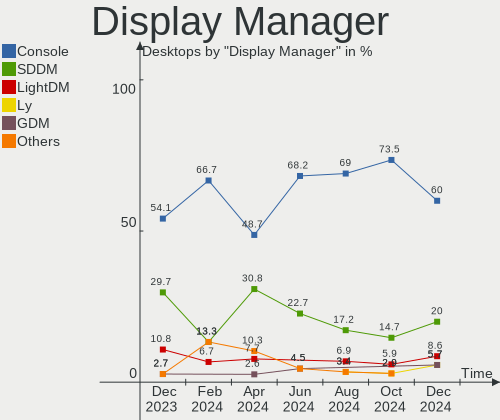
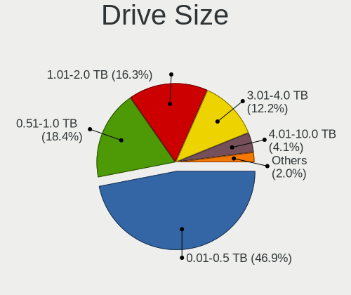
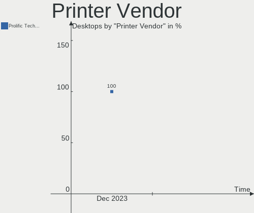

FreeBSD Hardware Trends (Desktop)
---------------------------------

A project to identify most popular hardware characteristics and track their change
over time based on data collected by FreeBSD users at https://BSD-Hardware.info.

Anyone can contribute to the study by uploading probes of their computers by
the [hw-probe](https://github.com/linuxhw/hw-probe/blob/master/INSTALL.BSD.md) tool:

    hw-probe -all -upload

Full-feature report is available here: https://bsd-hardware.info/?view=trends&formfactor=desktop

Period: May, 2021.

Contents
--------

- [ OS                       ](#os)
- [ OS Family                ](#os-family)
- [ Arch                     ](#arch)
- [ DE                       ](#de)
- [ Display Server           ](#display-server)
- [ Display Manager          ](#display-manager)
- [ OS Lang                  ](#os-lang)
- [ Boot Mode                ](#boot-mode)
- [ Filesystem               ](#filesystem)
- [ Part. scheme             ](#part-scheme)
- [ Country                  ](#country)
- [ City                     ](#city)
- [ Vendor                   ](#vendor)
- [ Model                    ](#model)
- [ Model Family             ](#model-family)
- [ MFG Year                 ](#mfg-year)
- [ Form Factor              ](#form-factor)
- [ Coreboot                 ](#coreboot)
- [ RAM Size                 ](#ram-size)
- [ RAM Used                 ](#ram-used)
- [ Has CD-ROM               ](#has-cd-rom)
- [ Total Drives             ](#total-drives)
- [ Has Ethernet             ](#has-ethernet)
- [ Has WiFi                 ](#has-wifi)
- [ Has Bluetooth            ](#has-bluetooth)
- [ Drive Vendor             ](#drive-vendor)
- [ Drive Model              ](#drive-model)
- [ HDD Vendor               ](#hdd-vendor)
- [ SSD Vendor               ](#ssd-vendor)
- [ Drive Kind               ](#drive-kind)
- [ Drive Connector          ](#drive-connector)
- [ Drive Size               ](#drive-size)
- [ Space Total              ](#space-total)
- [ Space Used               ](#space-used)
- [ Malfunc. Drives          ](#malfunc-drives)
- [ Malfunc. Drive Vendor    ](#malfunc-drive-vendor)
- [ Malfunc. HDD Vendor      ](#malfunc-hdd-vendor)
- [ Malfunc. Drive Kind      ](#malfunc-drive-kind)
- [ Failed Drives            ](#failed-drives)
- [ Failed Drive Vendor      ](#failed-drive-vendor)
- [ Drive Status             ](#drive-status)
- [ Storage Vendor           ](#storage-vendor)
- [ Storage Model            ](#storage-model)
- [ Storage Kind             ](#storage-kind)
- [ CPU Vendor               ](#cpu-vendor)
- [ CPU Model                ](#cpu-model)
- [ CPU Model Family         ](#cpu-model-family)
- [ CPU Cores                ](#cpu-cores)
- [ CPU Sockets              ](#cpu-sockets)
- [ CPU Threads              ](#cpu-threads)
- [ CPU Microarch            ](#cpu-microarch)
- [ GPU Vendor               ](#gpu-vendor)
- [ GPU Model                ](#gpu-model)
- [ GPU Combo                ](#gpu-combo)
- [ GPU Driver               ](#gpu-driver)
- [ GPU Memory               ](#gpu-memory)
- [ Monitor Vendor           ](#monitor-vendor)
- [ Monitor Model            ](#monitor-model)
- [ Monitor Resolution       ](#monitor-resolution)
- [ Monitor Diagonal         ](#monitor-diagonal)
- [ Monitor Width            ](#monitor-width)
- [ Aspect Ratio             ](#aspect-ratio)
- [ Monitor Area             ](#monitor-area)
- [ Pixel Density            ](#pixel-density)
- [ Multiple Monitors        ](#multiple-monitors)
- [ Net Controller Vendor    ](#net-controller-vendor)
- [ Net Controller Model     ](#net-controller-model)
- [ Wireless Vendor          ](#wireless-vendor)
- [ Wireless Model           ](#wireless-model)
- [ Ethernet Vendor          ](#ethernet-vendor)
- [ Ethernet Model           ](#ethernet-model)
- [ Net Controller Kind      ](#net-controller-kind)
- [ Used Controller          ](#used-controller)
- [ NICs                     ](#nics)
- [ IPv6                     ](#ipv6)
- [ Memory Vendor            ](#memory-vendor)
- [ Memory Model             ](#memory-model)
- [ Memory Kind              ](#memory-kind)
- [ Memory Form Factor       ](#memory-form-factor)
- [ Memory Size              ](#memory-size)
- [ Memory Speed             ](#memory-speed)
- [ Sound Vendor             ](#sound-vendor)
- [ Sound Model              ](#sound-model)
- [ Camera Vendor            ](#camera-vendor)
- [ Camera Model             ](#camera-model)
- [ Fingerprint Vendor       ](#fingerprint-vendor)
- [ Fingerprint Model        ](#fingerprint-model)
- [ Chipcard Vendor          ](#chipcard-vendor)
- [ Chipcard Model           ](#chipcard-model)
- [ Printer Vendor           ](#printer-vendor)
- [ Printer Model            ](#printer-model)
- [ Scanner Vendor           ](#scanner-vendor)
- [ Scanner Model            ](#scanner-model)
- [ Bluetooth Vendor         ](#bluetooth-vendor)
- [ Bluetooth Model          ](#bluetooth-model)
- [ Unsupported Devices      ](#unsupported-devices)
- [ Unsupported Device Types ](#unsupported-device-types)

OS
--

Installed operating systems

| Name                  | Desktops | Percent |
|-----------------------|----------|---------|
| FreeBSD 13.0          | 25       | 75.76%  |
| FreeBSD 14.0-CURRENT  | 2        | 6.06%   |
| FreeBSD 12.2-STABLE   | 1        | 3.03%   |
| FreeBSD 12.2-p6       | 1        | 3.03%   |
| FreeBSD 12.2-p4       | 1        | 3.03%   |
| FreeBSD 12.2-p3       | 1        | 3.03%   |
| FreeBSD 12.2-p2       | 1        | 3.03%   |
| FreeBSD 12.1-p16-HBSD | 1        | 3.03%   |

OS Family
---------

OS without a version

| Name    | Desktops | Percent |
|---------|----------|---------|
| FreeBSD | 33       | 100%    |

Arch
----

OS architecture (x86_64, i586, etc.)

| Name  | Desktops | Percent |
|-------|----------|---------|
| amd64 | 32       | 96.97%  |
| i386  | 1        | 3.03%   |

DE
--

Desktop Environment

| Name      | Desktops | Percent |
|-----------|----------|---------|
| Console   | 11       | 33.33%  |
| KDE5      | 7        | 21.21%  |
| GNOME     | 6        | 18.18%  |
| XFCE      | 4        | 12.12%  |
| TWM       | 3        | 9.09%   |
| LXQt      | 1        | 3.03%   |
| AwesomeWM | 1        | 3.03%   |

Display Server
--------------

X11 or Wayland

| Name    | Desktops | Percent |
|---------|----------|---------|
| X11     | 20       | 60.61%  |
| Console | 12       | 36.36%  |
| Wayland | 1        | 3.03%   |

Display Manager
---------------

SDDM, LightDM, etc.

| Name    | Desktops | Percent |
|---------|----------|---------|
| Console | 19       | 57.58%  |
| SDDM    | 6        | 18.18%  |
| GDM     | 4        | 12.12%  |
| XDM     | 2        | 6.06%   |
| SLiM    | 1        | 3.03%   |
| LightDM | 1        | 3.03%   |

OS Lang
-------

Language

| Lang    | Desktops | Percent |
|---------|----------|---------|
| C       | 15       | 45.45%  |
| en_US   | 4        | 12.12%  |
| Unknown | 4        | 12.12%  |
| ru_RU   | 2        | 6.06%   |
| fr_FR   | 2        | 6.06%   |
| en_GB   | 2        | 6.06%   |
| sv_SE   | 1        | 3.03%   |
| nb_NO   | 1        | 3.03%   |
| es_ES   | 1        | 3.03%   |
| de_DE   | 1        | 3.03%   |

Boot Mode
---------

EFI or BIOS

| Mode | Desktops | Percent |
|------|----------|---------|
| EFI  | 22       | 66.67%  |
| BIOS | 11       | 33.33%  |

Filesystem
----------

Type of filesystem

| Type | Desktops | Percent |
|------|----------|---------|
| Zfs  | 22       | 66.67%  |
| Ufs  | 11       | 33.33%  |

Part. scheme
------------

Scheme of partitioning

| Type | Desktops | Percent |
|------|----------|---------|
| GPT  | 32       | 96.97%  |
| MBR  | 1        | 3.03%   |

Country
-------

Geographic location (country)

| Country     | Desktops | Percent |
|-------------|----------|---------|
| USA         | 11       | 33.33%  |
| Germany     | 4        | 12.12%  |
| UK          | 3        | 9.09%   |
| Russia      | 2        | 6.06%   |
| Netherlands | 2        | 6.06%   |
| Ukraine     | 1        | 3.03%   |
| Thailand    | 1        | 3.03%   |
| Sweden      | 1        | 3.03%   |
| Spain       | 1        | 3.03%   |
| Poland      | 1        | 3.03%   |
| Norway      | 1        | 3.03%   |
| Ireland     | 1        | 3.03%   |
| Guadeloupe  | 1        | 3.03%   |
| France      | 1        | 3.03%   |
| Colombia    | 1        | 3.03%   |
| Austria     | 1        | 3.03%   |

City
----

Geographic location (city)

| City                | Desktops | Percent |
|---------------------|----------|---------|
| Redmond             | 2        | 6.06%   |
| Menlo Park          | 2        | 6.06%   |
| Wenatchee           | 1        | 3.03%   |
| Warsaw              | 1        | 3.03%   |
| Valladolid          | 1        | 3.03%   |
| Tuddal              | 1        | 3.03%   |
| Trang               | 1        | 3.03%   |
| Sollentuna          | 1        | 3.03%   |
| Seattle             | 1        | 3.03%   |
| San Diego           | 1        | 3.03%   |
| Orléans            | 1        | 3.03%   |
| Oklahoma City       | 1        | 3.03%   |
| Nuremberg           | 1        | 3.03%   |
| Moscow              | 1        | 3.03%   |
| Montería           | 1        | 3.03%   |
| Louisville          | 1        | 3.03%   |
| Le Gosier           | 1        | 3.03%   |
| Kyiv                | 1        | 3.03%   |
| Hebden Bridge       | 1        | 3.03%   |
| Hamburg             | 1        | 3.03%   |
| Graz                | 1        | 3.03%   |
| Cologne             | 1        | 3.03%   |
| Cobh                | 1        | 3.03%   |
| Chelyabinsk         | 1        | 3.03%   |
| Castleford          | 1        | 3.03%   |
| Brockton            | 1        | 3.03%   |
| Bielefeld           | 1        | 3.03%   |
| Beaverton           | 1        | 3.03%   |
| Andover             | 1        | 3.03%   |
| Alphen aan den Rijn | 1        | 3.03%   |
| Almelo              | 1        | 3.03%   |

Vendor
------

Motherboard manufacturer

| Name                | Desktops | Percent |
|---------------------|----------|---------|
| ASUSTek Computer    | 8        | 24.24%  |
| MSI                 | 6        | 18.18%  |
| Gigabyte Technology | 6        | 18.18%  |
| Supermicro          | 3        | 9.09%   |
| Hewlett-Packard     | 3        | 9.09%   |
| ASRock              | 3        | 9.09%   |
| Shuttle             | 1        | 3.03%   |
| GVC                 | 1        | 3.03%   |
| EVGA                | 1        | 3.03%   |
| Dell                | 1        | 3.03%   |

Model
-----

Motherboard model

| Name                               | Desktops | Percent |
|------------------------------------|----------|---------|
| ASUS P8H77-M PRO                   | 2        | 6.06%   |
| Supermicro X7SPA-HF                | 1        | 3.03%   |
| Supermicro X7DCL                   | 1        | 3.03%   |
| Supermicro NSMPX-5500              | 1        | 3.03%   |
| Shuttle SH87R                      | 1        | 3.03%   |
| MSI MS-7C80                        | 1        | 3.03%   |
| MSI MS-7C02                        | 1        | 3.03%   |
| MSI MS-7B09                        | 1        | 3.03%   |
| MSI MS-7823                        | 1        | 3.03%   |
| MSI MS-7817                        | 1        | 3.03%   |
| MSI MS-7677                        | 1        | 3.03%   |
| HP Z220 CMT Workstation            | 1        | 3.03%   |
| HP Slim Desktop 290-p0xxx          | 1        | 3.03%   |
| HP ProLiant MicroServer Gen8       | 1        | 3.03%   |
| GVC EQUIUM 3200M                   | 1        | 3.03%   |
| Gigabyte Z97X-UD3H                 | 1        | 3.03%   |
| Gigabyte X58A-UD5                  | 1        | 3.03%   |
| Gigabyte X470 AORUS GAMING 5 WIFI  | 1        | 3.03%   |
| Gigabyte H81M-S2PV                 | 1        | 3.03%   |
| Gigabyte B85-HD3                   | 1        | 3.03%   |
| Gigabyte B550I AORUS PRO AX        | 1        | 3.03%   |
| EVGA X299 FTW K                    | 1        | 3.03%   |
| Dell Precision Tower 7910          | 1        | 3.03%   |
| ASUS TUF GAMING X570-PRO           | 1        | 3.03%   |
| ASUS TUF GAMING X570-PLUS          | 1        | 3.03%   |
| ASUS ROG STRIX X570-E GAMING       | 1        | 3.03%   |
| ASUS P7H55-M/USB3                  | 1        | 3.03%   |
| ASUS P5Q-E                         | 1        | 3.03%   |
| ASUS All Series                    | 1        | 3.03%   |
| ASRock Z170M Extreme4              | 1        | 3.03%   |
| ASRock X570 Phantom Gaming-ITX/TB3 | 1        | 3.03%   |
| ASRock J3455-ITX                   | 1        | 3.03%   |

Model Family
------------

Motherboard model prefix

| Name                  | Desktops | Percent |
|-----------------------|----------|---------|
| ASUS TUF              | 2        | 6.06%   |
| ASUS P8H77-M          | 2        | 6.06%   |
| Supermicro X7SPA-HF   | 1        | 3.03%   |
| Supermicro X7DCL      | 1        | 3.03%   |
| Supermicro NSMPX-5500 | 1        | 3.03%   |
| Shuttle SH87R         | 1        | 3.03%   |
| MSI MS-7C80           | 1        | 3.03%   |
| MSI MS-7C02           | 1        | 3.03%   |
| MSI MS-7B09           | 1        | 3.03%   |
| MSI MS-7823           | 1        | 3.03%   |
| MSI MS-7817           | 1        | 3.03%   |
| MSI MS-7677           | 1        | 3.03%   |
| HP Z220               | 1        | 3.03%   |
| HP Slim               | 1        | 3.03%   |
| HP ProLiant           | 1        | 3.03%   |
| GVC EQUIUM            | 1        | 3.03%   |
| Gigabyte Z97X-UD3H    | 1        | 3.03%   |
| Gigabyte X58A-UD5     | 1        | 3.03%   |
| Gigabyte X470         | 1        | 3.03%   |
| Gigabyte H81M-S2PV    | 1        | 3.03%   |
| Gigabyte B85-HD3      | 1        | 3.03%   |
| Gigabyte B550I        | 1        | 3.03%   |
| EVGA X299             | 1        | 3.03%   |
| Dell Precision        | 1        | 3.03%   |
| ASUS ROG              | 1        | 3.03%   |
| ASUS P7H55-M          | 1        | 3.03%   |
| ASUS P5Q-E            | 1        | 3.03%   |
| ASUS All              | 1        | 3.03%   |
| ASRock Z170M          | 1        | 3.03%   |
| ASRock X570           | 1        | 3.03%   |
| ASRock J3455-ITX      | 1        | 3.03%   |

MFG Year
--------

Motherboard manufacture year

| Year    | Desktops | Percent |
|---------|----------|---------|
| 2020    | 8        | 24.24%  |
| 2014    | 3        | 9.09%   |
| 2012    | 3        | 9.09%   |
| 2011    | 3        | 9.09%   |
| 2021    | 2        | 6.06%   |
| 2018    | 2        | 6.06%   |
| 2016    | 2        | 6.06%   |
| 2015    | 2        | 6.06%   |
| 2013    | 2        | 6.06%   |
| 2008    | 2        | 6.06%   |
| 2019    | 1        | 3.03%   |
| 2010    | 1        | 3.03%   |
| 2009    | 1        | 3.03%   |
| Unknown | 1        | 3.03%   |

Form Factor
-----------

Physical design of the computer

| Name    | Desktops | Percent |
|---------|----------|---------|
| Desktop | 33       | 100%    |

Coreboot
--------

Have coreboot on board

| Used | Desktops | Percent |
|------|----------|---------|
| No   | 33       | 100%    |

RAM Size
--------

Total RAM memory

| Size in GB  | Desktops | Percent |
|-------------|----------|---------|
| 32.01-64.0  | 9        | 27.27%  |
| 64.01-256.0 | 7        | 21.21%  |
| 8.01-16.0   | 6        | 18.18%  |
| 16.01-24.0  | 5        | 15.15%  |
| 4.01-8.0    | 4        | 12.12%  |
| 24.01-32.0  | 1        | 3.03%   |
| 0.01-0.5    | 1        | 3.03%   |

RAM Used
--------

Used RAM memory

| Used GB    | Desktops | Percent |
|------------|----------|---------|
| 0.51-1.0   | 10       | 30.3%   |
| 1.01-2.0   | 8        | 24.24%  |
| 3.01-4.0   | 5        | 15.15%  |
| 0.01-0.5   | 5        | 15.15%  |
| 32.01-64.0 | 2        | 6.06%   |
| 24.01-32.0 | 1        | 3.03%   |
| 2.01-3.0   | 1        | 3.03%   |
| 0          | 1        | 3.03%   |

Has CD-ROM
----------

Has CD-ROM on board

| Presented | Desktops | Percent |
|-----------|----------|---------|
| No        | 18       | 54.55%  |
| Yes       | 15       | 45.45%  |

Total Drives
------------

Number of drives on board

| Drives | Desktops | Percent |
|--------|----------|---------|
| 2      | 10       | 30.3%   |
| 1      | 6        | 18.18%  |
| 3      | 5        | 15.15%  |
| 4      | 3        | 9.09%   |
| 8      | 2        | 6.06%   |
| 7      | 2        | 6.06%   |
| 6      | 2        | 6.06%   |
| 5      | 2        | 6.06%   |
| 0      | 1        | 3.03%   |

Has Ethernet
------------

Has Ethernet on board

| Presented | Desktops | Percent |
|-----------|----------|---------|
| Yes       | 32       | 96.97%  |
| No        | 1        | 3.03%   |

Has WiFi
--------

Has WiFi module

| Presented | Desktops | Percent |
|-----------|----------|---------|
| No        | 21       | 63.64%  |
| Yes       | 12       | 36.36%  |

Has Bluetooth
-------------

Has Bluetooth module

| Presented | Desktops | Percent |
|-----------|----------|---------|
| No        | 26       | 78.79%  |
| Yes       | 7        | 21.21%  |

Drive Vendor
------------

Hard drive vendors

| Vendor              | Desktops | Drives | Percent |
|---------------------|----------|--------|---------|
| Seagate             | 13       | 31     | 20.63%  |
| WDC                 | 10       | 17     | 15.87%  |
| Samsung Electronics | 10       | 21     | 15.87%  |
| Toshiba             | 7        | 13     | 11.11%  |
| Kingston            | 3        | 3      | 4.76%   |
| Crucial             | 3        | 3      | 4.76%   |
| A-DATA Technology   | 3        | 3      | 4.76%   |
| SanDisk             | 2        | 2      | 3.17%   |
| Intel               | 2        | 2      | 3.17%   |
| Verbatim            | 1        | 1      | 1.59%   |
| PNY                 | 1        | 1      | 1.59%   |
| PLEXTOR             | 1        | 1      | 1.59%   |
| Phison              | 1        | 1      | 1.59%   |
| Micron Technology   | 1        | 1      | 1.59%   |
| KingDian            | 1        | 1      | 1.59%   |
| Hitachi             | 1        | 1      | 1.59%   |
| HGST                | 1        | 2      | 1.59%   |
| GOODRAM             | 1        | 1      | 1.59%   |
| Corsair             | 1        | 1      | 1.59%   |

Drive Model
-----------

Hard drive models

| Model                                | Desktops | Percent |
|--------------------------------------|----------|---------|
| Seagate ST4000DM000-1F2168 4TB       | 3        | 4%      |
| Toshiba HDWE160 6TB                  | 2        | 2.67%   |
| Seagate ST8000VN004-2M2101 8TB       | 2        | 2.67%   |
| Samsung SSD 970 EVO Plus 1TB         | 2        | 2.67%   |
| Samsung SSD 850 EVO 250GB            | 2        | 2.67%   |
| WDC WDS500G2B0C-00PXH0 500GB         | 1        | 1.33%   |
| WDC WDS250G2B0C-00PXH0 250GB         | 1        | 1.33%   |
| WDC WD40EZRZ-22GXCB0 4TB             | 1        | 1.33%   |
| WDC WD30EZRX-00AZ6B0 3TB             | 1        | 1.33%   |
| WDC WD30EFRX-68EUZN0 3TB             | 1        | 1.33%   |
| WDC WD20EFRX-68EUZN0 2TB             | 1        | 1.33%   |
| WDC WD20EARX-00PASB0 2TB             | 1        | 1.33%   |
| WDC WD2000FYYZ-01UL1B2 2TB           | 1        | 1.33%   |
| WDC WD10JQLX-22JFGT0 1TB             | 1        | 1.33%   |
| WDC WD10EADS-00P8B0 1TB              | 1        | 1.33%   |
| WDC WD1001FALS-00J7B0 1TB            | 1        | 1.33%   |
| Verbatim Vi550 S3 SSD 256GB          | 1        | 1.33%   |
| Toshiba MQ04ABF100 1TB               | 1        | 1.33%   |
| Toshiba MQ02ABD100H 1TB              | 1        | 1.33%   |
| Toshiba HDWE140 4TB                  | 1        | 1.33%   |
| Toshiba HDWD110 1TB                  | 1        | 1.33%   |
| Toshiba DT01ACA100 1TB               | 1        | 1.33%   |
| Seagate ST9250827AS 250GB            | 1        | 1.33%   |
| Seagate ST500LM000-1EJ162-SSHD 500GB | 1        | 1.33%   |
| Seagate ST4000VN000-1H4168 4TB       | 1        | 1.33%   |
| Seagate ST4000NE001-2MA101 4TB       | 1        | 1.33%   |
| Seagate ST4000DM004-2CV104 4TB       | 1        | 1.33%   |
| Seagate ST3250620AS 250GB            | 1        | 1.33%   |
| Seagate ST31000524AS 1TB             | 1        | 1.33%   |
| Seagate ST3000VX000-1ES166 3TB       | 1        | 1.33%   |
| Seagate ST2000VN000-1HJ164 2TB       | 1        | 1.33%   |
| Seagate ST2000NE0025-2FL101 2TB      | 1        | 1.33%   |
| Seagate ST2000DM006-2DM164 2TB       | 1        | 1.33%   |
| Seagate ST12000VN0008-2PH103 12TB    | 1        | 1.33%   |
| SanDisk X600 2.5 7MM SATA 256GB      | 1        | 1.33%   |
| SanDisk SD7TB3Q-256G-1006 256GB      | 1        | 1.33%   |
| Samsung SSD 980 PRO 2TB              | 1        | 1.33%   |
| Samsung SSD 960 EVO 250GB            | 1        | 1.33%   |
| Samsung SSD 870 QVO 1TB              | 1        | 1.33%   |
| Samsung SSD 870 EVO 1TB              | 1        | 1.33%   |
| Samsung SSD 860 QVO 1TB              | 1        | 1.33%   |
| Samsung SSD 860 EVO 2TB              | 1        | 1.33%   |
| Samsung SSD 860 EVO 1TB              | 1        | 1.33%   |
| Samsung SSD 850 EVO 1TB              | 1        | 1.33%   |
| Samsung SSD 840 EVO 250GB            | 1        | 1.33%   |
| Samsung SSD 840 EVO 120GB            | 1        | 1.33%   |
| Samsung MZVLB256HBHQ-000L7 256GB     | 1        | 1.33%   |
| Samsung HD502IJ 500GB                | 1        | 1.33%   |
| Samsung HD203WI 2TB                  | 1        | 1.33%   |
| PNY SSD2SC240G1SA754D117-459P 240GB  | 1        | 1.33%   |
| PLEXTOR PX-256M8PeG 256GB            | 1        | 1.33%   |
| Phison Sabrent Rocket 4.0 Plus 1TB   | 1        | 1.33%   |
| Micron MTFDDAK256MBF-1AN15ABHA 256GB | 1        | 1.33%   |
| Kingston SVP200S37A60G 64GB          | 1        | 1.33%   |
| Kingston SMS200S3120G 120GB          | 1        | 1.33%   |
| Kingston SA400M8240G 240GB           | 1        | 1.33%   |
| KingDian S280-240GB                  | 1        | 1.33%   |
| Intel SSDPEKNW020T8 2TB              | 1        | 1.33%   |
| Intel SSDMCEAC120B3 120GB            | 1        | 1.33%   |
| Hitachi HDS725050KLA360 500GB        | 1        | 1.33%   |

HDD Vendor
----------

Hard disk drive vendors

| Vendor              | Desktops | Drives | Percent |
|---------------------|----------|--------|---------|
| Seagate             | 13       | 31     | 41.94%  |
| WDC                 | 8        | 15     | 25.81%  |
| Toshiba             | 7        | 13     | 22.58%  |
| Samsung Electronics | 1        | 2      | 3.23%   |
| Hitachi             | 1        | 1      | 3.23%   |
| HGST                | 1        | 2      | 3.23%   |

SSD Vendor
----------

Solid state drive vendors

| Vendor              | Desktops | Drives | Percent |
|---------------------|----------|--------|---------|
| Samsung Electronics | 8        | 12     | 32%     |
| Kingston            | 3        | 3      | 12%     |
| Crucial             | 3        | 3      | 12%     |
| SanDisk             | 2        | 2      | 8%      |
| A-DATA Technology   | 2        | 2      | 8%      |
| Verbatim            | 1        | 1      | 4%      |
| PNY                 | 1        | 1      | 4%      |
| Micron Technology   | 1        | 1      | 4%      |
| KingDian            | 1        | 1      | 4%      |
| Intel               | 1        | 1      | 4%      |
| GOODRAM             | 1        | 1      | 4%      |
| Corsair             | 1        | 1      | 4%      |

Drive Kind
----------

HDD or SSD

| Kind | Desktops | Drives | Percent |
|------|----------|--------|---------|
| HDD  | 25       | 64     | 49.02%  |
| SSD  | 17       | 29     | 33.33%  |
| NVMe | 9        | 13     | 17.65%  |

Drive Connector
---------------

SATA, SAS, NVMe, etc.

| Type | Desktops | Drives | Percent |
|------|----------|--------|---------|
| SATA | 30       | 93     | 76.92%  |
| NVMe | 9        | 13     | 23.08%  |

Drive Size
----------

Size of hard drive

| Size in TB | Desktops | Drives | Percent |
|------------|----------|--------|---------|
| 0.01-0.5   | 15       | 26     | 31.25%  |
| 0.51-1.0   | 12       | 19     | 25%     |
| 3.01-4.0   | 6        | 12     | 12.5%   |
| 1.01-2.0   | 6        | 11     | 12.5%   |
| 4.01-10.0  | 5        | 13     | 10.42%  |
| 2.01-3.0   | 3        | 6      | 6.25%   |
| 10.01-20.0 | 1        | 6      | 2.08%   |

Space Total
-----------

Amount of disk space available on the file system

| Size in GB | Desktops | Percent |
|------------|----------|---------|
| 501-1000   | 7        | 21.21%  |
| 21-50      | 5        | 15.15%  |
| 101-250    | 5        | 15.15%  |
| 1001-2000  | 5        | 15.15%  |
| 51-100     | 4        | 12.12%  |
| 251-500    | 3        | 9.09%   |
| 1-20       | 3        | 9.09%   |
| 2001-3000  | 1        | 3.03%   |

Space Used
----------

Amount of used disk space

| Used GB   | Desktops | Percent |
|-----------|----------|---------|
| 1-20      | 25       | 75.76%  |
| 21-50     | 4        | 12.12%  |
| 51-100    | 2        | 6.06%   |
| 251-500   | 1        | 3.03%   |
| 1001-2000 | 1        | 3.03%   |

Malfunc. Drives
---------------

Drive models with a malfunction

| Model                                 | Desktops | Drives | Percent |
|---------------------------------------|----------|--------|---------|
| WDC WD20EARX-00PASB0 2TB              | 1        | 1      | 9.09%   |
| WDC WD2000FYYZ-01UL1B2 2TB            | 1        | 2      | 9.09%   |
| WDC WD10EADS-00P8B0 1TB               | 1        | 1      | 9.09%   |
| Toshiba MQ02ABD100H 1TB               | 1        | 1      | 9.09%   |
| Seagate ST9250827AS 250GB             | 1        | 1      | 9.09%   |
| Seagate ST3250620AS 250GB             | 1        | 1      | 9.09%   |
| Seagate ST31000524AS 1TB              | 1        | 1      | 9.09%   |
| Samsung Electronics SSD 840 EVO 120GB | 1        | 1      | 9.09%   |
| HGST HDN726060ALE614 6TB              | 1        | 2      | 9.09%   |
| Crucial CT250MX200SSD1 250GB          | 1        | 1      | 9.09%   |
| Corsair Force 3 SSD 180GB             | 1        | 1      | 9.09%   |

Malfunc. Drive Vendor
---------------------

Vendors of faulty drives

| Vendor              | Desktops | Drives | Percent |
|---------------------|----------|--------|---------|
| WDC                 | 2        | 4      | 22.22%  |
| Seagate             | 2        | 3      | 22.22%  |
| Toshiba             | 1        | 1      | 11.11%  |
| Samsung Electronics | 1        | 1      | 11.11%  |
| HGST                | 1        | 2      | 11.11%  |
| Crucial             | 1        | 1      | 11.11%  |
| Corsair             | 1        | 1      | 11.11%  |

Malfunc. HDD Vendor
-------------------

Vendors of faulty HDD drives

| Vendor  | Desktops | Drives | Percent |
|---------|----------|--------|---------|
| WDC     | 2        | 4      | 33.33%  |
| Seagate | 2        | 3      | 33.33%  |
| Toshiba | 1        | 1      | 16.67%  |
| HGST    | 1        | 2      | 16.67%  |

Malfunc. Drive Kind
-------------------

Kinds of faulty drives

| Kind | Desktops | Drives | Percent |
|------|----------|--------|---------|
| HDD  | 5        | 10     | 62.5%   |
| SSD  | 3        | 3      | 37.5%   |

Failed Drives
-------------

Failed drive models

Zero info for selected period =(

Failed Drive Vendor
-------------------

Failed drive vendors

Zero info for selected period =(

Drive Status
------------

Number of failed and malfunc. drives

| Status  | Desktops | Drives | Percent |
|---------|----------|--------|---------|
| Works   | 29       | 93     | 78.38%  |
| Malfunc | 8        | 13     | 21.62%  |

Storage Vendor
--------------

Storage controller vendors

| Vendor                        | Desktops | Percent |
|-------------------------------|----------|---------|
| Intel                         | 25       | 47.17%  |
| AMD                           | 8        | 15.09%  |
| Samsung Electronics           | 4        | 7.55%   |
| Marvell Technology Group      | 4        | 7.55%   |
| ASMedia Technology            | 3        | 5.66%   |
| Sandisk                       | 2        | 3.77%   |
| Broadcom / LSI                | 2        | 3.77%   |
| Phison Electronics            | 1        | 1.89%   |
| Lite-On Technology            | 1        | 1.89%   |
| JMicron Technology            | 1        | 1.89%   |
| Integrated Technology Express | 1        | 1.89%   |
| ADATA Technology              | 1        | 1.89%   |

Storage Model
-------------

Storage controller models

| Model                                                                          | Desktops | Percent |
|--------------------------------------------------------------------------------|----------|---------|
| AMD FCH SATA Controller [AHCI mode]                                            | 7        | 11.67%  |
| Intel 8 Series/C220 Series Chipset Family 6-port SATA Controller 1 [AHCI mode] | 5        | 8.33%   |
| ASMedia ASM1062 Serial ATA Controller                                          | 3        | 5%      |
| Sandisk WD Blue SN550 NVMe SSD                                                 | 2        | 3.33%   |
| Samsung NVMe SSD Controller SM981/PM981/PM983                                  | 2        | 3.33%   |
| Intel 9 Series Chipset Family SATA Controller [AHCI Mode]                      | 2        | 3.33%   |
| Intel 82801IR/IO/IH (ICH9R/DO/DH) 6 port SATA Controller [AHCI mode]           | 2        | 3.33%   |
| Intel 7 Series/C210 Series Chipset Family 4-port SATA Controller [IDE mode]    | 2        | 3.33%   |
| Intel 7 Series/C210 Series Chipset Family 2-port SATA Controller [IDE mode]    | 2        | 3.33%   |
| Intel 6 Series/C200 Series Chipset Family 6 port Desktop SATA AHCI Controller  | 2        | 3.33%   |
| AMD 400 Series Chipset SATA Controller                                         | 2        | 3.33%   |
| Samsung NVMe SSD Controller SM961/PM961/SM963                                  | 1        | 1.67%   |
| Samsung NVMe SSD Controller PM9A1/PM9A3/980PRO                                 | 1        | 1.67%   |
| Marvell Group 88SE9172 SATA III 6Gb/s RAID Controller                          | 1        | 1.67%   |
| Marvell Group 88SE9172 SATA 6Gb/s Controller                                   | 1        | 1.67%   |
| Marvell Group 88SE9123 PCIe SATA 6.0 Gb/s controller                           | 1        | 1.67%   |
| Marvell Group 88SE6111/6121 SATA II / PATA Controller                          | 1        | 1.67%   |
| Lite-On M8Pe Series NVMe SSD                                                   | 1        | 1.67%   |
| JMicron JMB368 IDE controller                                                  | 1        | 1.67%   |
| Intel SSD 660P Series                                                          | 1        | 1.67%   |
| Intel SATA Controller [RAID mode]                                              | 1        | 1.67%   |
| Intel Q170/Q150/B150/H170/H110/Z170/CM236 Chipset SATA Controller [AHCI Mode]  | 1        | 1.67%   |
| Intel Comet Lake SATA AHCI Controller                                          | 1        | 1.67%   |
| Intel Celeron N3350/Pentium N4200/Atom E3900 Series SATA AHCI Controller       | 1        | 1.67%   |
| Intel Cannon Lake PCH SATA AHCI Controller                                     | 1        | 1.67%   |
| Intel 82801JI (ICH10 Family) SATA AHCI Controller                              | 1        | 1.67%   |
| Intel 82801JI (ICH10 Family) 4 port SATA IDE Controller #1                     | 1        | 1.67%   |
| Intel 82801JI (ICH10 Family) 2 port SATA IDE Controller #2                     | 1        | 1.67%   |
| Intel 82801IR/IO/IH (ICH9R/DO/DH) 4 port SATA Controller [IDE mode]            | 1        | 1.67%   |
| Intel 82801I (ICH9 Family) 2 port SATA Controller [IDE mode]                   | 1        | 1.67%   |
| Intel 82371AB/EB/MB PIIX4 IDE                                                  | 1        | 1.67%   |
| Intel 5 Series/3400 Series Chipset 6 port SATA AHCI Controller                 | 1        | 1.67%   |
| Intel 200 Series PCH SATA controller [AHCI mode]                               | 1        | 1.67%   |
| Integrated Express IT8213 IDE Controller                                       | 1        | 1.67%   |
| Broadcom / LSI SAS3008 PCI-Express Fusion-MPT SAS-3                            | 1        | 1.67%   |
| Broadcom / LSI SAS1068E PCI-Express Fusion-MPT SAS                             | 1        | 1.67%   |
| AMD X399 Series Chipset SATA Controller                                        | 1        | 1.67%   |
| AMD Starship/Matisse Chipset SATA Controller [AHCI mode]                       | 1        | 1.67%   |
| ADATA XPG SX8200 Pro PCIe Gen3x4 M.2 2280 Solid State Drive                    | 1        | 1.67%   |
| Unknown                                                                        | 1        | 1.67%   |

Storage Kind
------------

Kind of storage controller (IDE, SATA, NVMe, SAS, ...)

| Kind | Desktops | Percent |
|------|----------|---------|
| SATA | 27       | 58.7%   |
| NVMe | 9        | 19.57%  |
| IDE  | 7        | 15.22%  |
| RAID | 1        | 2.17%   |
| SAS  | 1        | 2.17%   |
| SCSI | 1        | 2.17%   |

CPU Vendor
----------

Processor vendors

| Vendor | Desktops | Percent |
|--------|----------|---------|
| Intel  | 25       | 75.76%  |
| AMD    | 8        | 24.24%  |

CPU Model
---------

Processor models

| Model                                         | Desktops | Percent |
|-----------------------------------------------|----------|---------|
| Intel Core i7-3770 CPU @ 3.40GHz              | 2        | 6.06%   |
| AMD Ryzen 9 5900X 12-Core Processor           | 2        | 6.06%   |
| Intel Xeon CPU X3440 @ 2.53GHz                | 1        | 3.03%   |
| Intel Xeon CPU L5410 @ 2.33GHz                | 1        | 3.03%   |
| Intel Xeon CPU E5410 @ 2.33GHz                | 1        | 3.03%   |
| Intel Xeon CPU E5-2630 v3 @ 2.40GHz           | 1        | 3.03%   |
| Intel Xeon CPU E3-1246 v3 @ 3.50GHz           | 1        | 3.03%   |
| Intel Pentium II                              | 1        | 3.03%   |
| Intel Pentium CPU G630T @ 2.30GHz             | 1        | 3.03%   |
| Intel Pentium CPU G3420 @ 3.20GHz             | 1        | 3.03%   |
| Intel Pentium CPU G3220 @ 3.00GHz             | 1        | 3.03%   |
| Intel Pentium CPU G2020 @ 2.90GHz             | 1        | 3.03%   |
| Intel Core i9-9900X CPU @ 3.50GHz             | 1        | 3.03%   |
| Intel Core i7-8700 CPU @ 3.20GHz              | 1        | 3.03%   |
| Intel Core i7-6700K CPU @ 4.00GHz             | 1        | 3.03%   |
| Intel Core i7-4790S CPU @ 3.20GHz             | 1        | 3.03%   |
| Intel Core i7-4790K CPU @ 4.00GHz             | 1        | 3.03%   |
| Intel Core i7-4770T CPU @ 2.50GHz             | 1        | 3.03%   |
| Intel Core i7-10700K CPU @ 3.80GHz            | 1        | 3.03%   |
| Intel Core i7 CPU                             | 1        | 3.03%   |
| Intel Core i5-4440 CPU @ 3.10GHz              | 1        | 3.03%   |
| Intel Core 2 Quad CPU Q6600 @ 2.40GHz         | 1        | 3.03%   |
| Intel Celeron CPU J3455 @ 1.50GHz             | 1        | 3.03%   |
| Intel Celeron CPU G1610T @ 2.30GHz            | 1        | 3.03%   |
| Intel Atom CPU D510 @ 1.66GHz                 | 1        | 3.03%   |
| AMD Ryzen Threadripper 1900X 8-Core Processor | 1        | 3.03%   |
| AMD Ryzen 9 5950X 16-Core Processor           | 1        | 3.03%   |
| AMD Ryzen 9 3900X 12-Core Processor           | 1        | 3.03%   |
| AMD Ryzen 7 3700X 8-Core Processor            | 1        | 3.03%   |
| AMD Ryzen 7 2700 Eight-Core Processor         | 1        | 3.03%   |
| AMD Ryzen 7 1700X Eight-Core Processor        | 1        | 3.03%   |

CPU Model Family
----------------

Processor model prefix

| Model                  | Desktops | Percent |
|------------------------|----------|---------|
| Intel Core i7          | 9        | 27.27%  |
| Intel Xeon             | 5        | 15.15%  |
| Intel Pentium          | 5        | 15.15%  |
| AMD Ryzen 9            | 4        | 12.12%  |
| AMD Ryzen 7            | 3        | 9.09%   |
| Intel Celeron          | 2        | 6.06%   |
| Intel Core i9          | 1        | 3.03%   |
| Intel Core i5          | 1        | 3.03%   |
| Intel Core 2 Quad      | 1        | 3.03%   |
| Intel Atom             | 1        | 3.03%   |
| AMD Ryzen Threadripper | 1        | 3.03%   |

CPU Cores
---------

Number of processor cores

| Number  | Desktops | Percent |
|---------|----------|---------|
| 4       | 11       | 33.33%  |
| 2       | 6        | 18.18%  |
| 16      | 4        | 12.12%  |
| 24      | 3        | 9.09%   |
| 8       | 2        | 6.06%   |
| 6       | 2        | 6.06%   |
| Unknown | 2        | 6.06%   |
| 32      | 1        | 3.03%   |
| 10      | 1        | 3.03%   |
| 1       | 1        | 3.03%   |

CPU Sockets
-----------

Number of sockets

| Number | Desktops | Percent |
|--------|----------|---------|
| 1      | 31       | 93.94%  |
| 2      | 2        | 6.06%   |

CPU Threads
-----------

Threads per core (Hyper-Threading)

| Number  | Desktops | Percent |
|---------|----------|---------|
| 1       | 16       | 48.48%  |
| 2       | 14       | 42.42%  |
| Unknown | 3        | 9.09%   |

CPU Microarch
-------------

Microarchitecture

| Name        | Desktops | Percent |
|-------------|----------|---------|
| Haswell     | 8        | 24.24%  |
| IvyBridge   | 4        | 12.12%  |
| Zen 3       | 3        | 9.09%   |
| Zen 2       | 2        | 6.06%   |
| Zen         | 2        | 6.06%   |
| Skylake     | 2        | 6.06%   |
| Penryn      | 2        | 6.06%   |
| Zen+        | 1        | 3.03%   |
| Westmere    | 1        | 3.03%   |
| SandyBridge | 1        | 3.03%   |
| P6          | 1        | 3.03%   |
| Nehalem     | 1        | 3.03%   |
| KabyLake    | 1        | 3.03%   |
| Goldmont    | 1        | 3.03%   |
| Core        | 1        | 3.03%   |
| CometLake   | 1        | 3.03%   |
| Bonnell     | 1        | 3.03%   |

GPU Vendor
----------

Vendors of graphics cards

| Vendor                                       | Desktops | Percent |
|----------------------------------------------|----------|---------|
| Nvidia                                       | 12       | 35.29%  |
| Intel                                        | 12       | 35.29%  |
| AMD                                          | 7        | 20.59%  |
| XGI Technology (eXtreme Graphics Innovation) | 1        | 2.94%   |
| NVidia / SGS Thomson (Joint Venture)         | 1        | 2.94%   |
| Matrox Electronics Systems                   | 1        | 2.94%   |

GPU Model
---------

Graphics card models

| Model                                                                       | Desktops | Percent |
|-----------------------------------------------------------------------------|----------|---------|
| Intel Xeon E3-1200 v3/4th Gen Core Processor Integrated Graphics Controller | 4        | 11.76%  |
| Nvidia GP108 [GeForce GT 1030]                                              | 3        | 8.82%   |
| Intel Xeon E3-1200 v2/3rd Gen Core processor Graphics Controller            | 3        | 8.82%   |
| AMD Ellesmere [Radeon RX 470/480/570/570X/580/580X/590]                     | 2        | 5.88%   |
| XGI Technology (eXtreme Graphics Innovation) Z9s/Z9m (XG21 core)            | 1        | 2.94%   |
| Nvidia GT218 [GeForce 210]                                                  | 1        | 2.94%   |
| Nvidia GK208B [GeForce GT 710]                                              | 1        | 2.94%   |
| Nvidia GF119 [GeForce GT 610]                                               | 1        | 2.94%   |
| Nvidia GF119 [GeForce GT 520]                                               | 1        | 2.94%   |
| Nvidia GF110 [GeForce GTX 580]                                              | 1        | 2.94%   |
| Nvidia GA104 [GeForce RTX 3070]                                             | 1        | 2.94%   |
| Nvidia GA102 [GeForce RTX 3080]                                             | 1        | 2.94%   |
| Nvidia G98 [GeForce 8400 GS Rev. 2]                                         | 1        | 2.94%   |
| Nvidia G84GL [Quadro FX 1700]                                               | 1        | 2.94%   |
| NVidia / SGS Thomson (Joint Venture) Riva128                                | 1        | 2.94%   |
| Matrox Electronics Systems MGA G200EH                                       | 1        | 2.94%   |
| Intel Xeon E3-1200 v3 Processor Integrated Graphics Controller              | 1        | 2.94%   |
| Intel HD Graphics 530                                                       | 1        | 2.94%   |
| Intel HD Graphics 500                                                       | 1        | 2.94%   |
| Intel CometLake-S GT2 [UHD Graphics 630]                                    | 1        | 2.94%   |
| Intel Atom Processor D4xx/D5xx/N4xx/N5xx Integrated Graphics Controller     | 1        | 2.94%   |
| AMD Vega 10 XL/XT [Radeon RX Vega 56/64]                                    | 1        | 2.94%   |
| AMD Navi 22 [Radeon RX 6700/6700 XT / 6800M]                                | 1        | 2.94%   |
| AMD Lexa PRO [Radeon 540/540X/550/550X / RX 540X/550/550X]                  | 1        | 2.94%   |
| AMD ES1000                                                                  | 1        | 2.94%   |
| AMD Baffin [Radeon RX 550 640SP / RX 560/560X]                              | 1        | 2.94%   |

GPU Combo
---------

Combinations of graphics cards

| Name                                     | Desktops | Percent |
|------------------------------------------|----------|---------|
| 1 x Nvidia                               | 11       | 33.33%  |
| 1 x Intel                                | 9        | 27.27%  |
| 1 x AMD                                  | 6        | 18.18%  |
| Other                                    | 1        | 3.03%   |
| 2 x Intel                                | 1        | 3.03%   |
| 1 x XGI                                  | 1        | 3.03%   |
| 1 x NVidia / SGS Thomson (Joint Venture) | 1        | 3.03%   |
| 1 x Matrox                               | 1        | 3.03%   |
| Intel + Nvidia                           | 1        | 3.03%   |
| Intel + AMD                              | 1        | 3.03%   |

GPU Driver
----------

Free vs proprietary

| Driver      | Desktops | Percent |
|-------------|----------|---------|
| Free        | 23       | 69.7%   |
| Proprietary | 9        | 27.27%  |
| Unknown     | 1        | 3.03%   |

GPU Memory
----------

Total video memory

| Size in GB | Desktops | Percent |
|------------|----------|---------|
| Unknown    | 20       | 60.61%  |
| 1.01-2.0   | 4        | 12.12%  |
| 7.01-8.0   | 3        | 9.09%   |
| 3.01-4.0   | 2        | 6.06%   |
| 0.51-1.0   | 2        | 6.06%   |
| 8.01-16.0  | 1        | 3.03%   |
| 0.01-0.5   | 1        | 3.03%   |

Monitor Vendor
--------------

Monitor vendors

| Vendor               | Desktops | Percent |
|----------------------|----------|---------|
| Goldstar             | 6        | 25%     |
| Samsung Electronics  | 4        | 16.67%  |
| Ancor Communications | 3        | 12.5%   |
| LG Electronics       | 2        | 8.33%   |
| Iiyama               | 2        | 8.33%   |
| Dell                 | 2        | 8.33%   |
| Philips              | 1        | 4.17%   |
| NEC Computers        | 1        | 4.17%   |
| Hewlett-Packard      | 1        | 4.17%   |
| BenQ                 | 1        | 4.17%   |
| AOC                  | 1        | 4.17%   |

Monitor Model
-------------

Monitor models

| Model                                                                  | Desktops | Percent |
|------------------------------------------------------------------------|----------|---------|
| Samsung Electronics SyncMaster SAM027D 1680x1050 430x270mm 20.0-inch   | 1        | 4.17%   |
| Samsung Electronics S27D590 SAM0B49 1920x1080 600x340mm 27.2-inch      | 1        | 4.17%   |
| Samsung Electronics S24E510C SAM0C61 1920x1080 520x300mm 23.6-inch     | 1        | 4.17%   |
| Samsung Electronics LCD Monitor SAM0D4F 1920x1080 1020x570mm 46.0-inch | 1        | 4.17%   |
| Philips PHL 273V7 PHLC156 1920x1080 600x340mm 27.2-inch                | 1        | 4.17%   |
| NEC Computers EA294WMi NEC68CF 2560x1080 670x280mm 28.6-inch           | 1        | 4.17%   |
| LG Electronics LCD Monitor LX20D 1600x1200                             | 1        | 4.17%   |
| LG Electronics LCD Monitor LG Ultra HD 3840x2160                       | 1        | 4.17%   |
| Iiyama PLX2483H IVM6114 1920x1080 530x300mm 24.0-inch                  | 1        | 4.17%   |
| Iiyama PL2209HD IVM560B 1920x1080 480x270mm 21.7-inch                  | 1        | 4.17%   |
| Hewlett-Packard ZR24w HWP286A 1920x1200 540x350mm 25.3-inch            | 1        | 4.17%   |
| Goldstar W2246 GSM5784 1920x1080 480x270mm 21.7-inch                   | 1        | 4.17%   |
| Goldstar LG Ultra HD GSM5B09 3840x2160 600x340mm 27.2-inch             | 1        | 4.17%   |
| Goldstar LG Ultra HD GSM5B08 3840x2160 600x340mm 27.2-inch             | 1        | 4.17%   |
| Goldstar LG TV GSMC0A0 3840x2160                                       | 1        | 4.17%   |
| Goldstar LG FULL HD GSM5B54 1920x1080 480x270mm 21.7-inch              | 1        | 4.17%   |
| Goldstar 27GL850 GSM5B7F 2560x1440 600x340mm 27.2-inch                 | 1        | 4.17%   |
| Dell S2340M DELD05A 1920x1080 510x290mm 23.1-inch                      | 1        | 4.17%   |
| Dell LCD Monitor U3011 2560x1600                                       | 1        | 4.17%   |
| BenQ GW2270 BNQ78DB 1920x1080 480x270mm 21.7-inch                      | 1        | 4.17%   |
| AOC Q3277 AOC3277 2560x1440 710x400mm 32.1-inch                        | 1        | 4.17%   |
| Ancor Communications VG248 ACI24A5 1920x1080 530x300mm 24.0-inch       | 1        | 4.17%   |
| Ancor Communications LCD Monitor PA249 1920x1200                       | 1        | 4.17%   |
| Ancor Communications ASUS VN247 ACI24C3 1920x1080 520x290mm 23.4-inch  | 1        | 4.17%   |

Monitor Resolution
------------------

Monitor screen resolution

| Resolution         | Desktops | Percent |
|--------------------|----------|---------|
| 1920x1080 (FHD)    | 10       | 45.45%  |
| 3840x2160 (4K)     | 5        | 22.73%  |
| 1920x1200 (WUXGA)  | 2        | 9.09%   |
| 2560x1600          | 1        | 4.55%   |
| 2560x1440 (QHD)    | 1        | 4.55%   |
| 2560x1080          | 1        | 4.55%   |
| 1680x1050 (WSXGA+) | 1        | 4.55%   |
| 1600x1200          | 1        | 4.55%   |

Monitor Diagonal
----------------

Diagonal size in inches

| Inches  | Desktops | Percent |
|---------|----------|---------|
| 27      | 5        | 20.83%  |
| Unknown | 5        | 20.83%  |
| 21      | 4        | 16.67%  |
| 23      | 3        | 12.5%   |
| 24      | 2        | 8.33%   |
| 46      | 1        | 4.17%   |
| 32      | 1        | 4.17%   |
| 28      | 1        | 4.17%   |
| 25      | 1        | 4.17%   |
| 20      | 1        | 4.17%   |

Monitor Width
-------------

Physical width

| Width in mm | Desktops | Percent |
|-------------|----------|---------|
| 501-600     | 9        | 40.91%  |
| 401-500     | 5        | 22.73%  |
| Unknown     | 5        | 22.73%  |
| 701-800     | 1        | 4.55%   |
| 601-700     | 1        | 4.55%   |
| 1001-1500   | 1        | 4.55%   |

Aspect Ratio
------------

Proportional relationship between the width and the height

| Ratio   | Desktops | Percent |
|---------|----------|---------|
| 16/9    | 14       | 66.67%  |
| Unknown | 4        | 19.05%  |
| 3/2     | 1        | 4.76%   |
| 21/9    | 1        | 4.76%   |
| 16/10   | 1        | 4.76%   |

Monitor Area
------------

Area in inch²

| Area in inch² | Desktops | Percent |
|----------------|----------|---------|
| 201-250        | 7        | 31.82%  |
| 301-350        | 5        | 22.73%  |
| Unknown        | 5        | 22.73%  |
| 251-300        | 2        | 9.09%   |
| 351-500        | 1        | 4.55%   |
| 151-200        | 1        | 4.55%   |
| 501-1000       | 1        | 4.55%   |

Pixel Density
-------------

Pixels per inch

| Density | Desktops | Percent |
|---------|----------|---------|
| 51-100  | 10       | 43.48%  |
| 101-120 | 5        | 21.74%  |
| Unknown | 5        | 21.74%  |
| 161-240 | 2        | 8.7%    |
| 1-50    | 1        | 4.35%   |

Multiple Monitors
-----------------

Total monitors connected

| Total | Desktops | Percent |
|-------|----------|---------|
| 1     | 18       | 54.55%  |
| 0     | 12       | 36.36%  |
| 2     | 2        | 6.06%   |
| 3     | 1        | 3.03%   |

Net Controller Vendor
---------------------

Controller vendors

| Vendor                   | Desktops | Percent |
|--------------------------|----------|---------|
| Realtek Semiconductor    | 18       | 37.5%   |
| Intel                    | 18       | 37.5%   |
| Qualcomm Atheros         | 4        | 8.33%   |
| Mellanox Technologies    | 2        | 4.17%   |
| Broadcom                 | 2        | 4.17%   |
| TP-Link                  | 1        | 2.08%   |
| Marvell Technology Group | 1        | 2.08%   |
| Edimax Technology        | 1        | 2.08%   |
| ADMtek                   | 1        | 2.08%   |

Net Controller Model
--------------------

Controller models

| Model                                                             | Desktops | Percent |
|-------------------------------------------------------------------|----------|---------|
| Realtek RTL8111/8168/8411 PCI Express Gigabit Ethernet Controller | 15       | 25%     |
| Intel Wi-Fi 6 AX200                                               | 4        | 6.67%   |
| Intel I211 Gigabit Network Connection                             | 4        | 6.67%   |
| Realtek RTL8125 2.5GbE Controller                                 | 3        | 5%      |
| Intel 82574L Gigabit Network Connection                           | 3        | 5%      |
| Mellanox MT27500 Family [ConnectX-3]                              | 2        | 3.33%   |
| Intel Wireless-AC 9260                                            | 2        | 3.33%   |
| Intel Ethernet Connection (2) I219-V                              | 2        | 3.33%   |
| TP-Link Archer T3U [Realtek RTL8812BU]                            | 1        | 1.67%   |
| Realtek RTL8821CE 802.11ac PCIe Wireless Network Adapter          | 1        | 1.67%   |
| Qualcomm Atheros Killer E2500 Gigabit Ethernet Controller         | 1        | 1.67%   |
| Qualcomm Atheros AR9287 Wireless Network Adapter (PCI-Express)    | 1        | 1.67%   |
| Qualcomm Atheros AR9285 Wireless Network Adapter (PCI-Express)    | 1        | 1.67%   |
| Qualcomm Atheros AR9227 Wireless Network Adapter                  | 1        | 1.67%   |
| Marvell Group 88E8056 PCI-E Gigabit Ethernet Controller           | 1        | 1.67%   |
| Marvell Group 88E8001 Gigabit Ethernet Controller                 | 1        | 1.67%   |
| Intel I210 Gigabit Network Connection                             | 1        | 1.67%   |
| Intel Ethernet Controller I225-V                                  | 1        | 1.67%   |
| Intel Ethernet Connection I217-V                                  | 1        | 1.67%   |
| Intel Ethernet Connection I217-LM                                 | 1        | 1.67%   |
| Intel Ethernet Connection (7) I219-V                              | 1        | 1.67%   |
| Intel 82580 Gigabit Network Connection                            | 1        | 1.67%   |
| Intel 82579LM Gigabit Network Connection (Lewisville)             | 1        | 1.67%   |
| Intel 82576 Gigabit Network Connection                            | 1        | 1.67%   |
| Intel 82575EB Gigabit Network Connection                          | 1        | 1.67%   |
| Intel 82573L Gigabit Ethernet Controller                          | 1        | 1.67%   |
| Intel 82573E Gigabit Ethernet Controller (Copper)                 | 1        | 1.67%   |
| Intel 82572EI Gigabit Ethernet Controller (Copper)                | 1        | 1.67%   |
| Intel 82557/8/9/0/1 Ethernet Pro 100                              | 1        | 1.67%   |
| Edimax EW-7811Un 802.11n Wireless Adapter [Realtek RTL8188CUS]    | 1        | 1.67%   |
| Broadcom NetXtreme BCM5720 Gigabit Ethernet PCIe                  | 1        | 1.67%   |
| Broadcom BCM43602 802.11ac Wireless LAN SoC                       | 1        | 1.67%   |
| ADMtek NC100 Network Everywhere Fast Ethernet 10/100              | 1        | 1.67%   |

Wireless Vendor
---------------

Wireless vendors

| Vendor                | Desktops | Percent |
|-----------------------|----------|---------|
| Intel                 | 6        | 46.15%  |
| Qualcomm Atheros      | 3        | 23.08%  |
| TP-Link               | 1        | 7.69%   |
| Realtek Semiconductor | 1        | 7.69%   |
| Edimax Technology     | 1        | 7.69%   |
| Broadcom              | 1        | 7.69%   |

Wireless Model
--------------

Wireless models

| Model                                                          | Desktops | Percent |
|----------------------------------------------------------------|----------|---------|
| Intel Wi-Fi 6 AX200                                            | 4        | 30.77%  |
| Intel Wireless-AC 9260                                         | 2        | 15.38%  |
| TP-Link Archer T3U [Realtek RTL8812BU]                         | 1        | 7.69%   |
| Realtek RTL8821CE 802.11ac PCIe Wireless Network Adapter       | 1        | 7.69%   |
| Qualcomm Atheros AR9287 Wireless Network Adapter (PCI-Express) | 1        | 7.69%   |
| Qualcomm Atheros AR9285 Wireless Network Adapter (PCI-Express) | 1        | 7.69%   |
| Qualcomm Atheros AR9227 Wireless Network Adapter               | 1        | 7.69%   |
| Edimax EW-7811Un 802.11n Wireless Adapter [Realtek RTL8188CUS] | 1        | 7.69%   |
| Broadcom BCM43602 802.11ac Wireless LAN SoC                    | 1        | 7.69%   |

Ethernet Vendor
---------------

Ethernet vendors

| Vendor                   | Desktops | Percent |
|--------------------------|----------|---------|
| Realtek Semiconductor    | 16       | 44.44%  |
| Intel                    | 16       | 44.44%  |
| Qualcomm Atheros         | 1        | 2.78%   |
| Marvell Technology Group | 1        | 2.78%   |
| Broadcom                 | 1        | 2.78%   |
| ADMtek                   | 1        | 2.78%   |

Ethernet Model
--------------

Ethernet models

| Model                                                             | Desktops | Percent |
|-------------------------------------------------------------------|----------|---------|
| Realtek RTL8111/8168/8411 PCI Express Gigabit Ethernet Controller | 15       | 34.88%  |
| Intel I211 Gigabit Network Connection                             | 4        | 9.3%    |
| Intel 82574L Gigabit Network Connection                           | 3        | 6.98%   |
| Intel Ethernet Connection (2) I219-V                              | 2        | 4.65%   |
| Realtek RTL8125 2.5GbE Controller                                 | 1        | 2.33%   |
| Qualcomm Atheros Killer E2500 Gigabit Ethernet Controller         | 1        | 2.33%   |
| Marvell Group 88E8056 PCI-E Gigabit Ethernet Controller           | 1        | 2.33%   |
| Marvell Group 88E8001 Gigabit Ethernet Controller                 | 1        | 2.33%   |
| Intel I210 Gigabit Network Connection                             | 1        | 2.33%   |
| Intel Ethernet Controller I225-V                                  | 1        | 2.33%   |
| Intel Ethernet Connection I217-V                                  | 1        | 2.33%   |
| Intel Ethernet Connection I217-LM                                 | 1        | 2.33%   |
| Intel Ethernet Connection (7) I219-V                              | 1        | 2.33%   |
| Intel 82580 Gigabit Network Connection                            | 1        | 2.33%   |
| Intel 82579LM Gigabit Network Connection (Lewisville)             | 1        | 2.33%   |
| Intel 82576 Gigabit Network Connection                            | 1        | 2.33%   |
| Intel 82575EB Gigabit Network Connection                          | 1        | 2.33%   |
| Intel 82573L Gigabit Ethernet Controller                          | 1        | 2.33%   |
| Intel 82573E Gigabit Ethernet Controller (Copper)                 | 1        | 2.33%   |
| Intel 82572EI Gigabit Ethernet Controller (Copper)                | 1        | 2.33%   |
| Intel 82557/8/9/0/1 Ethernet Pro 100                              | 1        | 2.33%   |
| Broadcom NetXtreme BCM5720 Gigabit Ethernet PCIe                  | 1        | 2.33%   |
| ADMtek NC100 Network Everywhere Fast Ethernet 10/100              | 1        | 2.33%   |

Net Controller Kind
-------------------

Ethernet, WiFi or modem

| Kind     | Desktops | Percent |
|----------|----------|---------|
| Ethernet | 32       | 66.67%  |
| WiFi     | 12       | 25%     |
| Unknown  | 4        | 8.33%   |

Used Controller
---------------

Currently used network controller

| Kind     | Desktops | Percent |
|----------|----------|---------|
| Ethernet | 31       | 88.57%  |
| WiFi     | 4        | 11.43%  |

NICs
----

Total network controllers on board

| Total | Desktops | Percent |
|-------|----------|---------|
| 2     | 12       | 36.36%  |
| 1     | 12       | 36.36%  |
| 3     | 6        | 18.18%  |
| 6     | 2        | 6.06%   |
| 4     | 1        | 3.03%   |

IPv6
----

IPv6 vs IPv4

| Used | Desktops | Percent |
|------|----------|---------|
| No   | 22       | 66.67%  |
| Yes  | 11       | 33.33%  |

Memory Vendor
-------------

Memory module vendors

| Vendor              | Desktops | Percent |
|---------------------|----------|---------|
| Kingston            | 8        | 24.24%  |
| Unknown             | 7        | 21.21%  |
| Corsair             | 4        | 12.12%  |
| G.Skill             | 3        | 9.09%   |
| Crucial             | 3        | 9.09%   |
| Team                | 1        | 3.03%   |
| SK Hynix            | 1        | 3.03%   |
| Silicon Power       | 1        | 3.03%   |
| Samsung Electronics | 1        | 3.03%   |
| Qimonda             | 1        | 3.03%   |
| Micron Technology   | 1        | 3.03%   |
| AMD                 | 1        | 3.03%   |
| 7F61000000000000    | 1        | 3.03%   |

Memory Model
------------

Memory module models

| Model                                                    | Desktops | Percent |
|----------------------------------------------------------|----------|---------|
| Unknown RAM Module 8GB DIMM DDR3 1600MT/s                | 2        | 5.56%   |
| Unknown RAM Module 4GB DIMM 400MT/s                      | 1        | 2.78%   |
| Unknown RAM Module 2GB SODIMM DDR2 667MT/s               | 1        | 2.78%   |
| Unknown RAM Module 2GB DIMM DDR 800MT/s                  | 1        | 2.78%   |
| Unknown RAM Module 2GB DIMM DDR 1333MT/s                 | 1        | 2.78%   |
| Unknown RAM Module 16GB DIMM DDR4 2133MT/s               | 1        | 2.78%   |
| Team RAM TEAMGROUP-UD4-3200 32GB DIMM DDR4 3200MT/s      | 1        | 2.78%   |
| SK Hynix RAM HMA42GR7MFR4N-TF 16GB RIMM DDR4 2133MT/s    | 1        | 2.78%   |
| Silicon Power RAM DCLT4GN128O 4GB DIMM DDR3 1333MT/s     | 1        | 2.78%   |
| Samsung RAM M391A4G43MB1-CTD 32GB DIMM DDR4 3200MT/s     | 1        | 2.78%   |
| Qimonda RAM Module 2048MB DIMM DDR2 667MT/s              | 1        | 2.78%   |
| Micron RAM 16JTF1G64AZ-1G6D1 8GB DIMM DDR3 1600MT/s      | 1        | 2.78%   |
| Kingston RAM Module 8GB DIMM DDR4 2666MT/s               | 1        | 2.78%   |
| Kingston RAM KHX2666C16/8G 8GB DIMM DDR4 2667MT/s        | 1        | 2.78%   |
| Kingston RAM KHX2400C15/16G 16GB DIMM DDR4 2400MT/s      | 1        | 2.78%   |
| Kingston RAM KHX16LC9/8GX 8GB DIMM DDR3 1600MT/s         | 1        | 2.78%   |
| Kingston RAM KHX1600C9D3/8GX 8GB DIMM DDR3 1333MT/s      | 1        | 2.78%   |
| Kingston RAM KHX1600C9D3/4GX 4GB DIMM DDR3 1600MT/s      | 1        | 2.78%   |
| Kingston RAM 99U5428-018.A00LF 8GB SODIMM DDR3 1600MT/s  | 1        | 2.78%   |
| Kingston RAM 99P5471-041.A00LF 8GB DIMM DDR3 1600MT/s    | 1        | 2.78%   |
| Kingston RAM 9905702-027.A00G 8GB DIMM DDR4 2666MT/s     | 1        | 2.78%   |
| G.Skill RAM F4-3200C16-32GVK 32GB DIMM DDR4 2666MT/s     | 1        | 2.78%   |
| G.Skill RAM F4-3000C16-16GISB 16GB DIMM DDR4 2133MT/s    | 1        | 2.78%   |
| G.Skill RAM F4-2666C19-16GIS 16GB DIMM DDR4 2133MT/s     | 1        | 2.78%   |
| G.Skill RAM F4-2400C15-8GVR 8GB DIMM DDR4 2133MT/s       | 1        | 2.78%   |
| G.Skill RAM F3-12800CL7-2GBRM 2GB DIMM DDR3 1600MT/s     | 1        | 2.78%   |
| Crucial RAM CT102464BA160B.C16 8GB DIMM DDR3 1600MT/s    | 1        | 2.78%   |
| Crucial RAM BLT16G4D30AETA.K16FB 16GB DIMM DDR4 3000MT/s | 1        | 2.78%   |
| Crucial RAM BL32G36C16U4B.M16FB1 32GB DIMM DDR4 3600MT/s | 1        | 2.78%   |
| Corsair RAM CMV8GX3M1A1600C11 8192MB DIMM DDR3 1600MT/s  | 1        | 2.78%   |
| Corsair RAM CML16GX3M2A1600C9 8GB DIMM DDR3 1600MT/s     | 1        | 2.78%   |
| Corsair RAM CMK32GX4M2D3200C16 16GB DIMM DDR4 3200MT/s   | 1        | 2.78%   |
| Corsair RAM CMK16GX4M2B3200C16 8GB DIMM DDR4 3200MT/s    | 1        | 2.78%   |
| AMD RAM R538G1601U2S 8GB DIMM DDR3 1333MT/s              | 1        | 2.78%   |
| 7F61000000000000 RAM Module 2GB DIMM DDR2 667MT/s        | 1        | 2.78%   |

Memory Kind
-----------

Memory module kinds

| Kind    | Desktops | Percent |
|---------|----------|---------|
| DDR4    | 13       | 40.63%  |
| DDR3    | 13       | 40.63%  |
| DDR2    | 3        | 9.38%   |
| DDR     | 2        | 6.25%   |
| Unknown | 1        | 3.13%   |

Memory Form Factor
------------------

Physical design of the memory module

| Name   | Desktops | Percent |
|--------|----------|---------|
| DIMM   | 29       | 90.63%  |
| SODIMM | 2        | 6.25%   |
| RIMM   | 1        | 3.13%   |

Memory Size
-----------

Memory module size

| Size  | Desktops | Percent |
|-------|----------|---------|
| 8192  | 15       | 44.12%  |
| 16384 | 6        | 17.65%  |
| 2048  | 6        | 17.65%  |
| 32768 | 4        | 11.76%  |
| 4096  | 3        | 8.82%   |

Memory Speed
------------

Memory module speed

| Speed | Desktops | Percent |
|-------|----------|---------|
| 1600  | 11       | 34.38%  |
| 3200  | 4        | 12.5%   |
| 2133  | 3        | 9.38%   |
| 1333  | 3        | 9.38%   |
| 667   | 3        | 9.38%   |
| 2666  | 2        | 6.25%   |
| 3600  | 1        | 3.13%   |
| 3000  | 1        | 3.13%   |
| 2667  | 1        | 3.13%   |
| 2400  | 1        | 3.13%   |
| 800   | 1        | 3.13%   |
| 400   | 1        | 3.13%   |

Sound Vendor
------------

Sound card vendors

| Vendor                               | Desktops | Percent |
|--------------------------------------|----------|---------|
| Intel                                | 18       | 41.86%  |
| AMD                                  | 11       | 25.58%  |
| Nvidia                               | 10       | 23.26%  |
| Thesycon Systemsoftware & Consulting | 1        | 2.33%   |
| GN Netcom                            | 1        | 2.33%   |
| Ensoniq                              | 1        | 2.33%   |
| BEHRINGER International              | 1        | 2.33%   |

Sound Model
-----------

Sound card models

| Model                                                                      | Desktops | Percent |
|----------------------------------------------------------------------------|----------|---------|
| AMD Starship/Matisse HD Audio Controller                                   | 5        | 10.2%   |
| Intel 8 Series/C220 Series Chipset High Definition Audio Controller        | 4        | 8.16%   |
| Nvidia GP108 High Definition Audio Controller                              | 3        | 6.12%   |
| Intel Xeon E3-1200 v3/4th Gen Core Processor HD Audio Controller           | 3        | 6.12%   |
| Intel 7 Series/C216 Chipset Family High Definition Audio Controller        | 3        | 6.12%   |
| AMD Family 17h (Models 00h-0fh) HD Audio Controller                        | 3        | 6.12%   |
| Nvidia GF119 HDMI Audio Controller                                         | 2        | 4.08%   |
| Intel 9 Series Chipset Family HD Audio Controller                          | 2        | 4.08%   |
| Intel 82801JI (ICH10 Family) HD Audio Controller                           | 2        | 4.08%   |
| AMD Ellesmere HDMI Audio [Radeon RX 470/480 / 570/580/590]                 | 2        | 4.08%   |
| AMD Baffin HDMI/DP Audio [Radeon RX 550 640SP / RX 560/560X]               | 2        | 4.08%   |
| Thesycon Systemsoftware & Consulting Topping DX3 Pro Audio Control         | 1        | 2.04%   |
| Nvidia High Definition Audio Controller                                    | 1        | 2.04%   |
| Nvidia GK208 HDMI/DP Audio Controller                                      | 1        | 2.04%   |
| Nvidia GF110 High Definition Audio Controller                              | 1        | 2.04%   |
| Nvidia GA104 High Definition Audio Controller                              | 1        | 2.04%   |
| Nvidia GA102 High Definition Audio Controller                              | 1        | 2.04%   |
| Intel Comet Lake PCH cAVS                                                  | 1        | 2.04%   |
| Intel Celeron N3350/Pentium N4200/Atom E3900 Series Audio Cluster          | 1        | 2.04%   |
| Intel Cannon Lake PCH cAVS                                                 | 1        | 2.04%   |
| Intel 6 Series/C200 Series Chipset Family High Definition Audio Controller | 1        | 2.04%   |
| Intel 5 Series/3400 Series Chipset High Definition Audio                   | 1        | 2.04%   |
| Intel 200 Series PCH HD Audio                                              | 1        | 2.04%   |
| Intel 100 Series/C230 Series Chipset Family HD Audio Controller            | 1        | 2.04%   |
| GN Netcom Jabra SPEAK 410 USB                                              | 1        | 2.04%   |
| Ensoniq 5880B / Creative Labs CT5880                                       | 1        | 2.04%   |
| BEHRINGER International UMC202HD 192k                                      | 1        | 2.04%   |
| AMD Vega 10 HDMI Audio [Radeon Vega 56/64]                                 | 1        | 2.04%   |
| AMD Navi 21 HDMI Audio [Radeon RX 6800/6800 XT / 6900 XT]                  | 1        | 2.04%   |

Camera Vendor
-------------

Camera device vendors

| Vendor         | Desktops | Percent |
|----------------|----------|---------|
| Logitech       | 4        | 80%     |
| Valve Software | 1        | 20%     |

Camera Model
------------

Camera device models

| Model                       | Desktops | Percent |
|-----------------------------|----------|---------|
| Logitech HD Pro Webcam C920 | 2        | 40%     |
| Valve Software 3D Camera    | 1        | 20%     |
| Logitech Webcam C170        | 1        | 20%     |
| Logitech Labtec Webcam Pro  | 1        | 20%     |

Fingerprint Vendor
------------------

Fingerprint sensor vendors

Zero info for selected period =(

Fingerprint Model
-----------------

Fingerprint sensor models

Zero info for selected period =(

Chipcard Vendor
---------------

Chipcard module vendors

Zero info for selected period =(

Chipcard Model
--------------

Chipcard module models

Zero info for selected period =(

Printer Vendor
--------------

Printer device vendors

| Vendor | Desktops | Percent |
|--------|----------|---------|
| Canon  | 1        | 100%    |

Printer Model
-------------

Printer device models

| Model         | Desktops | Percent |
|---------------|----------|---------|
| Canon LBP2900 | 1        | 100%    |

Scanner Vendor
--------------

Scanner device vendors

| Vendor | Desktops | Percent |
|--------|----------|---------|
| Canon  | 1        | 100%    |

Scanner Model
-------------

Scanner device models

| Model                   | Desktops | Percent |
|-------------------------|----------|---------|
| Canon CanoScan LiDE 110 | 1        | 100%    |

Bluetooth Vendor
----------------

Controller vendors

| Vendor                | Desktops | Percent |
|-----------------------|----------|---------|
| Intel                 | 5        | 62.5%   |
| Realtek Semiconductor | 1        | 12.5%   |
| Broadcom              | 1        | 12.5%   |
| Apple                 | 1        | 12.5%   |

Bluetooth Model
---------------

Controller models

| Model                                    | Desktops | Percent |
|------------------------------------------|----------|---------|
| Intel AX200 Bluetooth                    | 3        | 37.5%   |
| Intel Wireless-AC 9260 Bluetooth Adapter | 2        | 25%     |
| Realtek  Bluetooth 4.2 Adapter           | 1        | 12.5%   |
| Broadcom BCM20702A0 Bluetooth 4.0        | 1        | 12.5%   |
| Apple Bluetooth Host Controller          | 1        | 12.5%   |

Unsupported Devices
-------------------

Total unsupported devices on board

| Total | Desktops | Percent |
|-------|----------|---------|
| 1     | 16       | 48.48%  |
| 0     | 9        | 27.27%  |
| 2     | 6        | 18.18%  |
| 3     | 2        | 6.06%   |

Unsupported Device Types
------------------------

Types of unsupported devices

| Type                     | Desktops | Percent |
|--------------------------|----------|---------|
| Communication controller | 18       | 56.25%  |
| Net/wireless             | 7        | 21.88%  |
| Network                  | 2        | 6.25%   |
| Firewire controller      | 2        | 6.25%   |
| Bluetooth                | 2        | 6.25%   |
| Net/ethernet             | 1        | 3.13%   |

