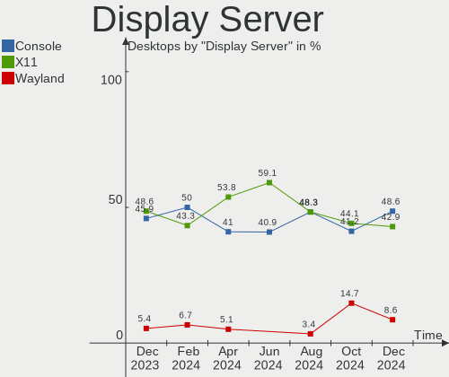
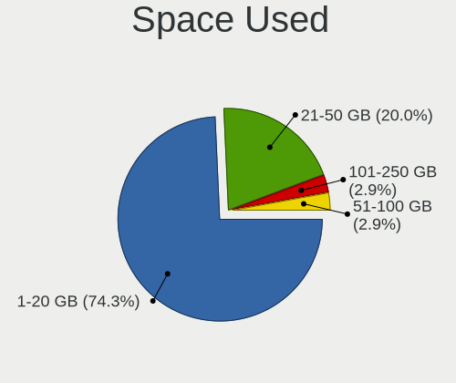
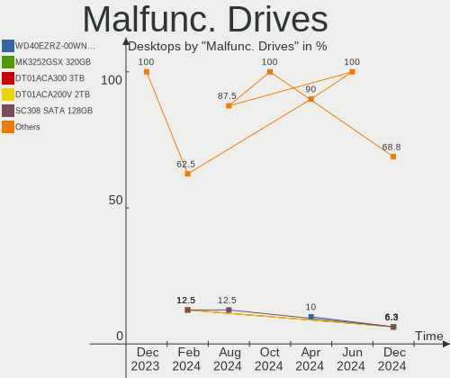
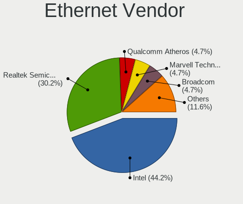

FreeBSD Hardware Trends (Desktop)
---------------------------------

A project to identify most popular hardware characteristics and track their change
over time based on data collected by FreeBSD users at https://BSD-Hardware.info.

Anyone can contribute to the study by uploading probes of their computers by
the [hw-probe](https://github.com/linuxhw/hw-probe/blob/master/INSTALL.BSD.md) tool:

    hw-probe -all -upload

Full-feature report is available here: https://bsd-hardware.info/?view=trends&formfactor=desktop

Period: Oct, 2020.

Contents
--------

- [ OS                       ](#os)
- [ OS Family                ](#os-family)
- [ Arch                     ](#arch)
- [ DE                       ](#de)
- [ Display Server           ](#display-server)
- [ Display Manager          ](#display-manager)
- [ OS Lang                  ](#os-lang)
- [ Boot Mode                ](#boot-mode)
- [ Filesystem               ](#filesystem)
- [ Part. scheme             ](#part-scheme)
- [ Country                  ](#country)
- [ City                     ](#city)
- [ Vendor                   ](#vendor)
- [ Model                    ](#model)
- [ Model Family             ](#model-family)
- [ MFG Year                 ](#mfg-year)
- [ Form Factor              ](#form-factor)
- [ Coreboot                 ](#coreboot)
- [ RAM Size                 ](#ram-size)
- [ RAM Used                 ](#ram-used)
- [ Has CD-ROM               ](#has-cd-rom)
- [ Total Drives             ](#total-drives)
- [ Has Ethernet             ](#has-ethernet)
- [ Drive Vendor             ](#drive-vendor)
- [ HDD Vendor               ](#hdd-vendor)
- [ SSD Vendor               ](#ssd-vendor)
- [ Drive Model              ](#drive-model)
- [ Drive Kind               ](#drive-kind)
- [ Drive Connector          ](#drive-connector)
- [ Drive Size               ](#drive-size)
- [ Space Total              ](#space-total)
- [ Space Used               ](#space-used)
- [ Malfunc. Drives          ](#malfunc-drives)
- [ Malfunc. Drive Vendor    ](#malfunc-drive-vendor)
- [ Malfunc. HDD Vendor      ](#malfunc-hdd-vendor)
- [ Malfunc. Drive Kind      ](#malfunc-drive-kind)
- [ Failed Drives            ](#failed-drives)
- [ Failed Drive Vendor      ](#failed-drive-vendor)
- [ Drive Status             ](#drive-status)
- [ Storage Vendor           ](#storage-vendor)
- [ Storage Model            ](#storage-model)
- [ Storage Kind             ](#storage-kind)
- [ CPU Vendor               ](#cpu-vendor)
- [ CPU Model                ](#cpu-model)
- [ CPU Model Family         ](#cpu-model-family)
- [ CPU Cores                ](#cpu-cores)
- [ CPU Sockets              ](#cpu-sockets)
- [ CPU Threads              ](#cpu-threads)
- [ CPU Microarch            ](#cpu-microarch)
- [ GPU Vendor               ](#gpu-vendor)
- [ GPU Model                ](#gpu-model)
- [ GPU Combo                ](#gpu-combo)
- [ GPU Driver               ](#gpu-driver)
- [ GPU Memory               ](#gpu-memory)
- [ Monitor Vendor           ](#monitor-vendor)
- [ Monitor Model            ](#monitor-model)
- [ Monitor Resolution       ](#monitor-resolution)
- [ Monitor Diagonal         ](#monitor-diagonal)
- [ Monitor Width            ](#monitor-width)
- [ Aspect Ratio             ](#aspect-ratio)
- [ Monitor Area             ](#monitor-area)
- [ Pixel Density            ](#pixel-density)
- [ Multiple Monitors        ](#multiple-monitors)
- [ Net Controller Vendor    ](#net-controller-vendor)
- [ Net Controller Model     ](#net-controller-model)
- [ Wireless Vendor          ](#wireless-vendor)
- [ Wireless Model           ](#wireless-model)
- [ Ethernet Vendor          ](#ethernet-vendor)
- [ Ethernet Model           ](#ethernet-model)
- [ Net Controller Kind      ](#net-controller-kind)
- [ Used Controller          ](#used-controller)
- [ NICs                     ](#nics)
- [ Memory Vendor            ](#memory-vendor)
- [ Memory Model             ](#memory-model)
- [ Memory Kind              ](#memory-kind)
- [ Memory Form Factor       ](#memory-form-factor)
- [ Memory Size              ](#memory-size)
- [ Memory Speed             ](#memory-speed)
- [ Sound Vendor             ](#sound-vendor)
- [ Sound Model              ](#sound-model)
- [ Camera Vendor            ](#camera-vendor)
- [ Camera Model             ](#camera-model)
- [ Fingerprint Vendor       ](#fingerprint-vendor)
- [ Fingerprint Model        ](#fingerprint-model)
- [ Chipcard Vendor          ](#chipcard-vendor)
- [ Chipcard Model           ](#chipcard-model)
- [ Printer Vendor           ](#printer-vendor)
- [ Printer Model            ](#printer-model)
- [ Scanner Vendor           ](#scanner-vendor)
- [ Scanner Model            ](#scanner-model)
- [ Bluetooth Vendor         ](#bluetooth-vendor)
- [ Bluetooth Model          ](#bluetooth-model)
- [ Unsupported Devices      ](#unsupported-devices)
- [ Unsupported Device Types ](#unsupported-device-types)

OS
--

Installed operating systems

| Name                 | Desktops | Percent |
|----------------------|----------|---------|
| FreeBSD 12.1-p10     | 26       | 37.68%  |
| FreeBSD 12.2         | 20       | 28.99%  |
| FreeBSD 12.1         | 6        | 8.7%    |
| FreeBSD 12.1-STABLE  | 3        | 4.35%   |
| FreeBSD 12.1-p7      | 3        | 4.35%   |
| FreeBSD 13.0-CURRENT | 2        | 2.9%    |
| FreeBSD 12.2-RC3     | 2        | 2.9%    |
| FreeBSD 12.1-p9      | 2        | 2.9%    |
| FreeBSD 12.1-p6      | 1        | 1.45%   |
| FreeBSD 12.1-p1      | 1        | 1.45%   |
| FreeBSD 11.4-p4      | 1        | 1.45%   |
| FreeBSD 11.3-p5      | 1        | 1.45%   |
| FreeBSD 11.3         | 1        | 1.45%   |

OS Family
---------

OS without a version

| Name    | Desktops | Percent |
|---------|----------|---------|
| FreeBSD | 69       | 100%    |

Arch
----

OS architecture (x86_64, i586, etc.)

| Name  | Desktops | Percent |
|-------|----------|---------|
| amd64 | 61       | 88.41%  |
| i386  | 4        | 5.8%    |
| arm64 | 3        | 4.35%   |
| arm   | 1        | 1.45%   |

DE
--

Desktop Environment

| Name    | Desktops | Percent |
|---------|----------|---------|
| Console | 44       | 63.77%  |
| XFCE    | 8        | 11.59%  |
| TWM     | 5        | 7.25%   |
| i3      | 5        | 7.25%   |
| GNOME   | 4        | 5.8%    |
| LXDE    | 2        | 2.9%    |
| MATE    | 1        | 1.45%   |

Display Server
--------------

X11 or Wayland

| Name    | Desktops | Percent |
|---------|----------|---------|
| Console | 50       | 72.46%  |
| X11     | 19       | 27.54%  |

Display Manager
---------------

SDDM, LightDM, etc.

| Name    | Desktops | Percent |
|---------|----------|---------|
| Console | 56       | 81.16%  |
| SLiM    | 5        | 7.25%   |
| SDDM    | 3        | 4.35%   |
| XDM     | 2        | 2.9%    |
| GDM     | 2        | 2.9%    |
| LightDM | 1        | 1.45%   |

OS Lang
-------

Language

| Lang             | Desktops | Percent |
|------------------|----------|---------|
| Unknown          | 39       | 56.52%  |
| en_US            | 15       | 21.74%  |
| el_GR            | 4        | 5.8%    |
| de_DE            | 3        | 4.35%   |
| ru_RU            | 1        | 1.45%   |
| nb_NO            | 1        | 1.45%   |
| it_IT            | 1        | 1.45%   |
| fi_FI.ISO8859-15 | 1        | 1.45%   |
| es_ES            | 1        | 1.45%   |
| en_IE            | 1        | 1.45%   |
| en_CA            | 1        | 1.45%   |
| C                | 1        | 1.45%   |

Boot Mode
---------

EFI or BIOS

| Mode | Desktops | Percent |
|------|----------|---------|
| BIOS | 35       | 50.72%  |
| EFI  | 34       | 49.28%  |

Filesystem
----------

Type of filesystem

| Type | Desktops | Percent |
|------|----------|---------|
| Zfs  | 37       | 53.62%  |
| Ufs  | 32       | 46.38%  |

Part. scheme
------------

Scheme of partitioning

| Type | Desktops | Percent |
|------|----------|---------|
| GPT  | 52       | 75.36%  |
| MBR  | 17       | 24.64%  |

Country
-------

Geographic location (country)

| Country      | Desktops | Percent |
|--------------|----------|---------|
| USA          | 13       | 18.84%  |
| Germany      | 6        | 8.7%    |
| Norway       | 5        | 7.25%   |
| Poland       | 4        | 5.8%    |
| Netherlands  | 4        | 5.8%    |
| Greece       | 4        | 5.8%    |
| Australia    | 3        | 4.35%   |
| Serbia       | 2        | 2.9%    |
| Romania      | 2        | 2.9%    |
| Japan        | 2        | 2.9%    |
| Ireland      | 2        | 2.9%    |
| Hungary      | 2        | 2.9%    |
| Finland      | 2        | 2.9%    |
| China        | 2        | 2.9%    |
| Canada       | 2        | 2.9%    |
| Bulgaria     | 2        | 2.9%    |
| Ukraine      | 1        | 1.45%   |
| Sweden       | 1        | 1.45%   |
| Spain        | 1        | 1.45%   |
| South Africa | 1        | 1.45%   |
| Nicaragua    | 1        | 1.45%   |
| Italy        | 1        | 1.45%   |
| France       | 1        | 1.45%   |
| Estonia      | 1        | 1.45%   |
| Denmark      | 1        | 1.45%   |
| Colombia     | 1        | 1.45%   |
| Brazil       | 1        | 1.45%   |
| Austria      | 1        | 1.45%   |

City
----

Geographic location (city)

| City          | Desktops | Percent |
|---------------|----------|---------|
| Voyenenga     | 3        | 4.35%   |
| Berlin        | 3        | 4.35%   |
| Subotica      | 2        | 2.9%    |
| Shenzhen      | 2        | 2.9%    |
| Igoumenitsa   | 2        | 2.9%    |
| Dublin        | 2        | 2.9%    |
| Banino        | 2        | 2.9%    |
| Athens        | 2        | 2.9%    |
| Amsterdam     | 2        | 2.9%    |
| Warsaw        | 1        | 1.45%   |
| Villeurbanne  | 1        | 1.45%   |
| Victoria      | 1        | 1.45%   |
| Ujkigyos      | 1        | 1.45%   |
| Tyreso Strand | 1        | 1.45%   |
| Tokyo         | 1        | 1.45%   |
| Tatabánya    | 1        | 1.45%   |
| Tampere       | 1        | 1.45%   |
| Tallinn       | 1        | 1.45%   |
| Sydney        | 1        | 1.45%   |
| Svilengrad    | 1        | 1.45%   |
| Stryn         | 1        | 1.45%   |
| Stramproy     | 1        | 1.45%   |
| St. John's    | 1        | 1.45%   |
| St Louis      | 1        | 1.45%   |
| Springfield   | 1        | 1.45%   |
| Sofia         | 1        | 1.45%   |
| Sibiu         | 1        | 1.45%   |
| Seville       | 1        | 1.45%   |
| Saint John    | 1        | 1.45%   |
| Rockville     | 1        | 1.45%   |
| Rockford      | 1        | 1.45%   |
| Rochester     | 1        | 1.45%   |
| Redmond       | 1        | 1.45%   |
| Porto Alegre  | 1        | 1.45%   |
| Padstow       | 1        | 1.45%   |
| Notaresco     | 1        | 1.45%   |
| Norwalk       | 1        | 1.45%   |
| Nelspruit     | 1        | 1.45%   |
| Medellín     | 1        | 1.45%   |
| Managua       | 1        | 1.45%   |
| Leoben        | 1        | 1.45%   |
| Langenhagen   | 1        | 1.45%   |
| Kobenhavn N   | 1        | 1.45%   |
| Kani          | 1        | 1.45%   |
| IJsselstein   | 1        | 1.45%   |
| Hornowek      | 1        | 1.45%   |
| Helsinki      | 1        | 1.45%   |
| Heinsberg     | 1        | 1.45%   |
| Hagerstown    | 1        | 1.45%   |
| Guben         | 1        | 1.45%   |
| Georgetown    | 1        | 1.45%   |
| Fyrde         | 1        | 1.45%   |
| Energodar     | 1        | 1.45%   |
| Crows Nest    | 1        | 1.45%   |
| Chicago       | 1        | 1.45%   |
| Bucharest     | 1        | 1.45%   |
| Antioch       | 1        | 1.45%   |
| Algarrobo     | 1        | 1.45%   |

Vendor
------

Motherboard manufacturer

| Name                | Desktops | Percent |
|---------------------|----------|---------|
| Hewlett-Packard     | 11       | 15.94%  |
| ASUSTek Computer    | 10       | 14.49%  |
| ASRock              | 9        | 13.04%  |
| Gigabyte Technology | 7        | 10.14%  |
| Intel               | 5        | 7.25%   |
| Dell                | 5        | 7.25%   |
| Unknown             | 4        | 5.8%    |
| MSI                 | 3        | 4.35%   |
| Lenovo              | 3        | 4.35%   |
| Fujitsu             | 2        | 2.9%    |
| ASRockRack          | 2        | 2.9%    |
| Supermicro          | 1        | 1.45%   |
| Shuttle             | 1        | 1.45%   |
| PC Engines          | 1        | 1.45%   |
| HPE                 | 1        | 1.45%   |
| Compaq              | 1        | 1.45%   |
| AZW                 | 1        | 1.45%   |
| AMD                 | 1        | 1.45%   |
| ADI Engineering     | 1        | 1.45%   |

Model
-----

Motherboard model

| Name                                | Desktops | Percent |
|-------------------------------------|----------|---------|
| Unknown                             | 5        | 7.25%   |
| HP ProLiant MicroServer Gen8        | 3        | 4.35%   |
| Fujitsu ESPRIMO E510                | 2        | 2.9%    |
| ASUS H110I-PLUS                     | 2        | 2.9%    |
| ASUS All Series                     | 2        | 2.9%    |
| Supermicro X7SPA-HF                 | 1        | 1.45%   |
| Shuttle XH270                       | 1        | 1.45%   |
| PC Engines apu2                     | 1        | 1.45%   |
| MSI MS-7C02                         | 1        | 1.45%   |
| MSI MS-7B22                         | 1        | 1.45%   |
| MSI MS-6533                         | 1        | 1.45%   |
| Lenovo ThinkCentre M91p 0266B8U     | 1        | 1.45%   |
| Lenovo ThinkCentre M58p 7220W5B     | 1        | 1.45%   |
| Lenovo 70TT0008EA ThinkServer TS460 | 1        | 1.45%   |
| Intel X79 V2.81A                    | 1        | 1.45%   |
| Intel GT5449E                       | 1        | 1.45%   |
| Intel DH61CR AAG14064-210           | 1        | 1.45%   |
| Intel DH61CR AAG14064-208           | 1        | 1.45%   |
| Intel D53427RKE G87971-406          | 1        | 1.45%   |
| HPE ProLiant MicroServer Gen10 Plus | 1        | 1.45%   |
| HP Z420 Workstation                 | 1        | 1.45%   |
| HP Vectra                           | 1        | 1.45%   |
| HP t620 PLUS Quad Core TC           | 1        | 1.45%   |
| HP ProLiant ML30 Gen9               | 1        | 1.45%   |
| HP ProLiant MicroServer             | 1        | 1.45%   |
| HP Pavilion Desktop 590-p0xxx       | 1        | 1.45%   |
| HP Compaq Pro 6300 SFF              | 1        | 1.45%   |
| HP 870-244                          | 1        | 1.45%   |
| Gigabyte Z97X-UD3H-BK               | 1        | 1.45%   |
| Gigabyte Z77X-UD5H                  | 1        | 1.45%   |
| Gigabyte Z68A-D3H-B3                | 1        | 1.45%   |
| Gigabyte H61M-S1                    | 1        | 1.45%   |
| Gigabyte F2A55M-DS2                 | 1        | 1.45%   |
| Gigabyte 990FXA-UD3                 | 1        | 1.45%   |
| Gigabyte 945GZM-S2                  | 1        | 1.45%   |
| Dell Precision Tower 5810           | 1        | 1.45%   |
| Dell Precision T1600                | 1        | 1.45%   |
| Dell OptiPlex 9020                  | 1        | 1.45%   |
| Dell OptiPlex 390                   | 1        | 1.45%   |
| Dell OptiPlex 3010                  | 1        | 1.45%   |
| Compaq Deskpro EP/SB Series         | 1        | 1.45%   |
| AZW BT3 X                           | 1        | 1.45%   |
| ASUS Rampage II Extreme             | 1        | 1.45%   |
| ASUS PRIME Z270-P                   | 1        | 1.45%   |
| ASUS PEIME-J4005I-C                 | 1        | 1.45%   |
| ASUS P8H77-V                        | 1        | 1.45%   |
| ASUS P8H67-M PRO                    | 1        | 1.45%   |
| ASUS M5A78L-M PLUS/USB3             | 1        | 1.45%   |
| ASRockRack X470D4U                  | 1        | 1.45%   |
| ASRockRack EPC612D4U-8R             | 1        | 1.45%   |
| ASRock X570 Pro4                    | 1        | 1.45%   |
| ASRock X370 Gaming-ITX/ac           | 1        | 1.45%   |
| ASRock TRX40 Taichi                 | 1        | 1.45%   |
| ASRock QC5000M-ITX/PH               | 1        | 1.45%   |
| ASRock J3455-ITX                    | 1        | 1.45%   |
| ASRock H81M-VG4                     | 1        | 1.45%   |
| ASRock B360 Pro4                    | 1        | 1.45%   |
| ASRock A320M-ITX                    | 1        | 1.45%   |
| ASRock A320M-DGS                    | 1        | 1.45%   |
| ADI Engineering RCC-VE              | 1        | 1.45%   |

Model Family
------------

Motherboard model prefix

| Name                    | Desktops | Percent |
|-------------------------|----------|---------|
| HP ProLiant             | 5        | 7.25%   |
| Unknown                 | 5        | 7.25%   |
| Dell OptiPlex           | 3        | 4.35%   |
| Lenovo ThinkCentre      | 2        | 2.9%    |
| Intel DH61CR            | 2        | 2.9%    |
| Fujitsu ESPRIMO         | 2        | 2.9%    |
| Dell Precision          | 2        | 2.9%    |
| ASUS H110I-PLUS         | 2        | 2.9%    |
| ASUS All                | 2        | 2.9%    |
| Supermicro X7SPA-HF     | 1        | 1.45%   |
| Shuttle XH270           | 1        | 1.45%   |
| PC Engines apu2         | 1        | 1.45%   |
| MSI MS-7C02             | 1        | 1.45%   |
| MSI MS-7B22             | 1        | 1.45%   |
| MSI MS-6533             | 1        | 1.45%   |
| Lenovo 70TT0008EA       | 1        | 1.45%   |
| Intel X79               | 1        | 1.45%   |
| Intel GT5449E           | 1        | 1.45%   |
| Intel D53427RKE         | 1        | 1.45%   |
| HPE ProLiant            | 1        | 1.45%   |
| HP Z420                 | 1        | 1.45%   |
| HP Vectra               | 1        | 1.45%   |
| HP t620                 | 1        | 1.45%   |
| HP Pavilion             | 1        | 1.45%   |
| HP Compaq               | 1        | 1.45%   |
| HP 870-244              | 1        | 1.45%   |
| Gigabyte Z97X-UD3H-BK   | 1        | 1.45%   |
| Gigabyte Z77X-UD5H      | 1        | 1.45%   |
| Gigabyte Z68A-D3H-B3    | 1        | 1.45%   |
| Gigabyte H61M-S1        | 1        | 1.45%   |
| Gigabyte F2A55M-DS2     | 1        | 1.45%   |
| Gigabyte 990FXA-UD3     | 1        | 1.45%   |
| Gigabyte 945GZM-S2      | 1        | 1.45%   |
| Compaq Deskpro          | 1        | 1.45%   |
| AZW BT3                 | 1        | 1.45%   |
| ASUS Rampage            | 1        | 1.45%   |
| ASUS PRIME              | 1        | 1.45%   |
| ASUS PEIME-J4005I-C     | 1        | 1.45%   |
| ASUS P8H77-V            | 1        | 1.45%   |
| ASUS P8H67-M            | 1        | 1.45%   |
| ASUS M5A78L-M           | 1        | 1.45%   |
| ASRockRack X470D4U      | 1        | 1.45%   |
| ASRockRack EPC612D4U-8R | 1        | 1.45%   |
| ASRock X570             | 1        | 1.45%   |
| ASRock X370             | 1        | 1.45%   |
| ASRock TRX40            | 1        | 1.45%   |
| ASRock QC5000M-ITX      | 1        | 1.45%   |
| ASRock J3455-ITX        | 1        | 1.45%   |
| ASRock H81M-VG4         | 1        | 1.45%   |
| ASRock B360             | 1        | 1.45%   |
| ASRock A320M-ITX        | 1        | 1.45%   |
| ASRock A320M-DGS        | 1        | 1.45%   |
| ADI Engineering RCC-VE  | 1        | 1.45%   |

MFG Year
--------

Motherboard manufacture year

| Year    | Desktops | Percent |
|---------|----------|---------|
| 2019    | 11       | 15.94%  |
| 2018    | 10       | 14.49%  |
| 2012    | 8        | 11.59%  |
| 2015    | 7        | 10.14%  |
| Unknown | 6        | 8.7%    |
| 2013    | 5        | 7.25%   |
| 2014    | 4        | 5.8%    |
| 2020    | 3        | 4.35%   |
| 2017    | 3        | 4.35%   |
| 2011    | 3        | 4.35%   |
| 2010    | 3        | 4.35%   |
| 2016    | 2        | 2.9%    |
| 2007    | 2        | 2.9%    |
| 2003    | 1        | 1.45%   |
| 2001    | 1        | 1.45%   |

Form Factor
-----------

Physical design of the computer

| Name    | Desktops | Percent |
|---------|----------|---------|
| Desktop | 69       | 100%    |

Coreboot
--------

Have coreboot on board

| Used | Desktops | Percent |
|------|----------|---------|
| No   | 67       | 97.1%   |
| Yes  | 2        | 2.9%    |

RAM Size
--------

Total RAM memory

| Size in GB      | Desktops | Percent |
|-----------------|----------|---------|
| 8.01-16.0       | 21       | 30.43%  |
| 16.01-24.0      | 18       | 26.09%  |
| 32.01-64.0      | 10       | 14.49%  |
| 4.01-8.0        | 7        | 10.14%  |
| 0.01-1.0        | 6        | 8.7%    |
| 24.01-32.0      | 2        | 2.9%    |
| 2.01-3.0        | 2        | 2.9%    |
| More than 256.0 | 1        | 1.45%   |
| 3.01-4.0        | 1        | 1.45%   |
| 64.01-256.0     | 1        | 1.45%   |

RAM Used
--------

Used RAM memory

| Used GB    | Desktops | Percent |
|------------|----------|---------|
| 0.01-1.0   | 37       | 53.62%  |
| 4.01-8.0   | 7        | 10.14%  |
| 1.01-2.0   | 7        | 10.14%  |
| 2.01-3.0   | 4        | 5.8%    |
| 8.01-16.0  | 4        | 5.8%    |
| 0          | 4        | 5.8%    |
| 3.01-4.0   | 3        | 4.35%   |
| 16.01-24.0 | 3        | 4.35%   |

Has CD-ROM
----------

Has CD-ROM on board

| Presented | Desktops | Percent |
|-----------|----------|---------|
| No        | 48       | 69.57%  |
| Yes       | 21       | 30.43%  |

Total Drives
------------

Number of drives on board

| Drives | Desktops | Percent |
|--------|----------|---------|
| 2      | 17       | 24.64%  |
| 1      | 17       | 24.64%  |
| 4      | 10       | 14.49%  |
| 3      | 9        | 13.04%  |
| 5      | 6        | 8.7%    |
| 6      | 3        | 4.35%   |
| 0      | 2        | 2.9%    |
| 14     | 1        | 1.45%   |
| 12     | 1        | 1.45%   |
| 11     | 1        | 1.45%   |
| 10     | 1        | 1.45%   |
| 7      | 1        | 1.45%   |

Has Ethernet
------------

Has Ethernet on board

| Presented | Desktops | Percent |
|-----------|----------|---------|
| Yes       | 65       | 94.2%   |
| No        | 4        | 5.8%    |

Drive Vendor
------------

Hard drive vendors

| Vendor              | Desktops | Drives | Percent |
|---------------------|----------|--------|---------|
| WDC                 | 32       | 76     | 24.24%  |
| Seagate             | 24       | 38     | 18.18%  |
| Samsung Electronics | 14       | 15     | 10.61%  |
| Intel               | 8        | 9      | 6.06%   |
| Toshiba             | 7        | 12     | 5.3%    |
| Kingston            | 7        | 9      | 5.3%    |
| Hitachi             | 7        | 15     | 5.3%    |
| Crucial             | 6        | 8      | 4.55%   |
| SanDisk             | 4        | 5      | 3.03%   |
| HGST                | 4        | 6      | 3.03%   |
| Maxtor              | 3        | 4      | 2.27%   |
| Corsair             | 2        | 2      | 1.52%   |
| China               | 2        | 2      | 1.52%   |
| A-DATA Technology   | 2        | 2      | 1.52%   |
| ZTC                 | 1        | 1      | 0.76%   |
| Vaseky              | 1        | 1      | 0.76%   |
| Transcend           | 1        | 1      | 0.76%   |
| SPCC                | 1        | 2      | 0.76%   |
| ORICO               | 1        | 1      | 0.76%   |
| NETAPP              | 1        | 4      | 0.76%   |
| HPE                 | 1        | 4      | 0.76%   |
| FREEBSD             | 1        | 1      | 0.76%   |
| FORESEE             | 1        | 1      | 0.76%   |
| Biwin               | 1        | 1      | 0.76%   |

HDD Vendor
----------

Hard disk drive vendors

| Vendor              | Desktops | Drives | Percent |
|---------------------|----------|--------|---------|
| WDC                 | 29       | 70     | 37.66%  |
| Seagate             | 24       | 38     | 31.17%  |
| Toshiba             | 7        | 12     | 9.09%   |
| Hitachi             | 7        | 15     | 9.09%   |
| HGST                | 4        | 6      | 5.19%   |
| MAXTOR              | 3        | 4      | 3.9%    |
| Samsung Electronics | 2        | 2      | 2.6%    |
| HPE                 | 1        | 4      | 1.3%    |

SSD Vendor
----------

Solid state drive vendors

| Vendor              | Desktops | Drives | Percent |
|---------------------|----------|--------|---------|
| Samsung Electronics | 11       | 12     | 22.45%  |
| Kingston            | 7        | 9      | 14.29%  |
| Intel               | 7        | 8      | 14.29%  |
| Crucial             | 6        | 8      | 12.24%  |
| SanDisk             | 4        | 5      | 8.16%   |
| WDC                 | 3        | 6      | 6.12%   |
| China               | 2        | 2      | 4.08%   |
| A-DATA Technology   | 2        | 2      | 4.08%   |
| ZTC                 | 1        | 1      | 2.04%   |
| Vaseky              | 1        | 1      | 2.04%   |
| Transcend           | 1        | 1      | 2.04%   |
| ORICO               | 1        | 1      | 2.04%   |
| NETAPP              | 1        | 4      | 2.04%   |
| FREEBSD             | 1        | 1      | 2.04%   |
| FORESEE             | 1        | 1      | 2.04%   |

Drive Model
-----------

Hard drive models

| Model                    | Desktops | Percent |
|--------------------------|----------|---------|
| ST1000DM010-2EP102 1TB   | 4        | 2.6%    |
| SA400S37120G 120GB       | 4        | 2.6%    |
| WD60EFRX-68L0BN1 6TB     | 3        | 1.95%   |
| ST8000DM004-2CX188 8TB   | 3        | 1.95%   |
| ST4000DM000-1F2168 4TB   | 3        | 1.95%   |
| ST3000DM001-1CH166 3TB   | 3        | 1.95%   |
| SSD 850 EVO 250GB        | 3        | 1.95%   |
| WDS240G2G0B-00EPW0 240GB | 2        | 1.3%    |
| WD40EFRX-68N32N0 4TB     | 2        | 1.3%    |
| WD30EFRX-68EUZN0 3TB     | 2        | 1.3%    |
| ST8000AS0002-1NA17Z 8TB  | 2        | 1.3%    |
| ST500DM002-1BD142 500GB  | 2        | 1.3%    |
| CT525MX300SSD1 528GB     | 2        | 1.3%    |
| CT250MX500SSD1 250GB     | 2        | 1.3%    |
| X446_RALS200MCHT 200GB   | 1        | 0.65%   |
| WDS240G2G0A-00JH30 240GB | 1        | 0.65%   |
| WD80EFZX-68UW8N0 8TB     | 1        | 0.65%   |
| WD800BB-00HEA0 80GB      | 1        | 0.65%   |
| WD8001FFWX-68J1UN0 8TB   | 1        | 0.65%   |
| WD7500BMVW-11AJGS4 752GB | 1        | 0.65%   |
| WD5000BMVV-11A1CS0 500GB | 1        | 0.65%   |
| WD5000AAKX-60U6AA0 500GB | 1        | 0.65%   |
| WD40EZRZ-22GXCB0 4TB     | 1        | 0.65%   |
| WD40EZRX-00SPEB0 4TB     | 1        | 0.65%   |
| WD400BB-00GFA0 40GB      | 1        | 0.65%   |
| WD4003FFBX-68MU3N0 4TB   | 1        | 0.65%   |
| WD3750LMCW-11D9GS3 375GB | 1        | 0.65%   |
| WD3200AAKX-00ERMA0 320GB | 1        | 0.65%   |
| WD30EZRX-00DC0B0 3TB     | 1        | 0.65%   |
| WD2500KS-00MJB0 250GB    | 1        | 0.65%   |
| WD2500AAKX-07U6AA0 250GB | 1        | 0.65%   |
| WD2500AAJS-08L7A0 250GB  | 1        | 0.65%   |
| WD20SDZW-11JJ8S0 2TB     | 1        | 0.65%   |
| WD20NMVW-59EDZS7 2TB     | 1        | 0.65%   |
| WD20EZRX-00D8PB0 2TB     | 1        | 0.65%   |
| WD2003FYYS-007BA0 2TB    | 1        | 0.65%   |
| WD2001FASS-00W2B0 2TB    | 1        | 0.65%   |
| WD2001FASS-00U0B0 2TB    | 1        | 0.65%   |
| WD120EFAX-68UNTN0 12TB   | 1        | 0.65%   |
| WD10JFCX-68N6GN0 1TB     | 1        | 0.65%   |
| WD10EZEX-60M2NA0 1TB     | 1        | 0.65%   |
| WD10EZEX-22MFCA0 1TB     | 1        | 0.65%   |
| WD10EZEX-08WN4A0 1TB     | 1        | 0.65%   |
| WD10EZEX-00WN4A0 1TB     | 1        | 0.65%   |
| WD10EFRX-68PJCN0 1TB     | 1        | 0.65%   |
| WD10EFRX-68FYTN0 1TB     | 1        | 0.65%   |
| WD10EADS-00L5B1 1TB      | 1        | 0.65%   |
| V800-60G                 | 1        | 0.65%   |
| Ultra II 480GB           | 1        | 0.65%   |
| TS512GSSD370 512GB       | 1        | 0.65%   |
| SUV400S37240G 240GB      | 1        | 0.65%   |
| SU630 480GB              | 1        | 0.65%   |
| STM3250310AS 250GB       | 1        | 0.65%   |
| ST6000DM003-2CY186 6TB   | 1        | 0.65%   |
| ST4000NE0025-2EW107 4TB  | 1        | 0.65%   |
| ST4000DM004-2CV104 4TB   | 1        | 0.65%   |
| ST3500418AS 500GB        | 1        | 0.65%   |
| ST3500413AS 500GB        | 1        | 0.65%   |
| ST320LT007-9ZV142 320GB  | 1        | 0.65%   |
| ST3160815A 160GB         | 1        | 0.65%   |

Drive Kind
----------

HDD or SSD

| Kind | Desktops | Drives | Percent |
|------|----------|--------|---------|
| HDD  | 55       | 151    | 52.88%  |
| SSD  | 43       | 62     | 41.35%  |
| NVMe | 6        | 7      | 5.77%   |

Drive Connector
---------------

SATA, SAS, NVMe, etc.

| Type | Desktops | Drives | Percent |
|------|----------|--------|---------|
| SATA | 67       | 213    | 91.78%  |
| NVMe | 6        | 7      | 8.22%   |

Drive Size
----------

Size of hard drive

| Size in TB | Desktops | Drives | Percent |
|------------|----------|--------|---------|
| 0.01-0.5   | 54       | 79     | 48.21%  |
| 0.51-1.0   | 20       | 39     | 17.86%  |
| 4.01-10.0  | 12       | 30     | 10.71%  |
| 1.01-2.0   | 10       | 20     | 8.93%   |
| 3.01-4.0   | 9        | 24     | 8.04%   |
| 2.01-3.0   | 6        | 20     | 5.36%   |
| 10.01-20.0 | 1        | 1      | 0.89%   |

Space Total
-----------

Amount of disk space available on the file system

| Size in GB     | Desktops | Percent |
|----------------|----------|---------|
| 101-250        | 25       | 36.23%  |
| 51-100         | 11       | 15.94%  |
| 251-500        | 10       | 14.49%  |
| 21-50          | 6        | 8.7%    |
| 501-1000       | 6        | 8.7%    |
| 2001-3000      | 3        | 4.35%   |
| 1001-2000      | 3        | 4.35%   |
| 1-20           | 3        | 4.35%   |
| More than 3000 | 2        | 2.9%    |

Space Used
----------

Amount of used disk space

| Used GB        | Desktops | Percent |
|----------------|----------|---------|
| 1-20           | 47       | 68.12%  |
| 21-50          | 8        | 11.59%  |
| 51-100         | 6        | 8.7%    |
| 101-250        | 4        | 5.8%    |
| More than 3000 | 2        | 2.9%    |
| 251-500        | 1        | 1.45%   |
| 501-1000       | 1        | 1.45%   |

Malfunc. Drives
---------------

Drive models with a malfunction

| Model                   | Desktops | Drives | Percent |
|-------------------------|----------|--------|---------|
| WD800BB-00HEA0 80GB     | 1        | 1      | 4.35%   |
| WD60EFRX-68L0BN1 6TB    | 1        | 6      | 4.35%   |
| WD30EFRX-68EUZN0 3TB    | 1        | 3      | 4.35%   |
| WD2001FASS-00W2B0 2TB   | 1        | 1      | 4.35%   |
| WD10EZEX-60M2NA0 1TB    | 1        | 1      | 4.35%   |
| ST320LT007-9ZV142 320GB | 1        | 1      | 4.35%   |
| ST3160815A 160GB        | 1        | 1      | 4.35%   |
| ST3000DM001-1CH166 3TB  | 1        | 1      | 4.35%   |
| ST2000DM001-9YN164 2TB  | 1        | 1      | 4.35%   |
| ST1000DM010-2EP102 1TB  | 1        | 1      | 4.35%   |
| SSDSC2CW060A3 64GB      | 1        | 1      | 4.35%   |
| SSDSC2CT240A3 240GB     | 1        | 1      | 4.35%   |
| SSDSC2BA200G3T 200GB    | 1        | 2      | 4.35%   |
| SSDSA2M040G2GC 40GB     | 1        | 1      | 4.35%   |
| SMS200S3120G 120GB      | 1        | 1      | 4.35%   |
| HUS722T2TALA604 2TB     | 1        | 1      | 4.35%   |
| HTS725050A7E630 500GB   | 1        | 1      | 4.35%   |
| HTS721060G9SA00 64GB    | 1        | 1      | 4.35%   |
| HTS545050A7E380 500GB   | 1        | 1      | 4.35%   |
| HDS721010KLA330 1TB     | 1        | 1      | 4.35%   |
| CT525MX300SSD1 528GB    | 1        | 1      | 4.35%   |
| CT480M500SSD1 480GB     | 1        | 1      | 4.35%   |
| 6Y080P0 82GB            | 1        | 2      | 4.35%   |

Malfunc. Drive Vendor
---------------------

Vendors of faulty drives

| Vendor   | Desktops | Drives | Percent |
|----------|----------|--------|---------|
| WDC      | 5        | 12     | 22.73%  |
| Seagate  | 4        | 5      | 18.18%  |
| Intel    | 4        | 5      | 18.18%  |
| Hitachi  | 3        | 3      | 13.64%  |
| HGST     | 2        | 2      | 9.09%   |
| Crucial  | 2        | 2      | 9.09%   |
| Maxtor   | 1        | 2      | 4.55%   |
| Kingston | 1        | 1      | 4.55%   |

Malfunc. HDD Vendor
-------------------

Vendors of faulty HDD drives

| Vendor  | Desktops | Drives | Percent |
|---------|----------|--------|---------|
| WDC     | 5        | 12     | 33.33%  |
| Seagate | 4        | 5      | 26.67%  |
| Hitachi | 3        | 3      | 20%     |
| HGST    | 2        | 2      | 13.33%  |
| Maxtor  | 1        | 2      | 6.67%   |

Malfunc. Drive Kind
-------------------

Kinds of faulty drives

| Kind | Desktops | Drives | Percent |
|------|----------|--------|---------|
| HDD  | 14       | 24     | 66.67%  |
| SSD  | 7        | 8      | 33.33%  |

Failed Drives
-------------

Failed drive models

| Model        | Desktops | Drives | Percent |
|--------------|----------|--------|---------|
| 6E040L0 41GB | 1        | 1      | 100%    |

Failed Drive Vendor
-------------------

Failed drive vendors

| Vendor | Desktops | Drives | Percent |
|--------|----------|--------|---------|
| Maxtor | 1        | 1      | 100%    |

Drive Status
------------

Number of failed and malfunc. drives

| Status   | Desktops | Drives | Percent |
|----------|----------|--------|---------|
| Works    | 60       | 184    | 73.17%  |
| Malfunc  | 19       | 32     | 23.17%  |
| Detected | 2        | 3      | 2.44%   |
| Failed   | 1        | 1      | 1.22%   |

Storage Vendor
--------------

Storage controller vendors

| Vendor                           | Desktops | Percent |
|----------------------------------|----------|---------|
| Intel                            | 48       | 55.81%  |
| AMD                              | 16       | 18.6%   |
| Broadcom / LSI                   | 6        | 6.98%   |
| Marvell Technology Group         | 4        | 4.65%   |
| Phison Electronics               | 3        | 3.49%   |
| ASMedia Technology               | 3        | 3.49%   |
| VIA Technologies                 | 1        | 1.16%   |
| Silicon Motion                   | 1        | 1.16%   |
| Silicon Integrated Systems [SiS] | 1        | 1.16%   |
| Samsung Electronics              | 1        | 1.16%   |
| JMicron Technology               | 1        | 1.16%   |
| Hewlett-Packard                  | 1        | 1.16%   |

Storage Model
-------------

Storage controller models

| Model                                                                             | Desktops | Percent |
|-----------------------------------------------------------------------------------|----------|---------|
| FCH SATA Controller [AHCI mode]                                                   | 10       | 9.35%   |
| 6 Series/C200 Series Chipset Family 6 port Desktop SATA AHCI Controller           | 10       | 9.35%   |
| Q170/Q150/B150/H170/H110/Z170/CM236 Chipset SATA Controller [AHCI Mode]           | 5        | 4.67%   |
| 7 Series/C210 Series Chipset Family 6-port SATA Controller [AHCI mode]            | 5        | 4.67%   |
| SB7x0/SB8x0/SB9x0 SATA Controller [AHCI mode]                                     | 4        | 3.74%   |
| SAS2008 PCI-Express Fusion-MPT SAS-2 [Falcon]                                     | 4        | 3.74%   |
| Cannon Lake PCH SATA AHCI Controller                                              | 3        | 2.8%    |
| ASM1062 Serial ATA Controller                                                     | 3        | 2.8%    |
| 8 Series/C220 Series Chipset Family 6-port SATA Controller 1 [AHCI mode]          | 3        | 2.8%    |
| SB7x0/SB8x0/SB9x0 IDE Controller                                                  | 2        | 1.87%   |
| FCH SATA Controller [IDE mode]                                                    | 2        | 1.87%   |
| FCH SATA Controller D                                                             | 2        | 1.87%   |
| Celeron N3350/Pentium N4200/Atom E3900 Series SATA AHCI Controller                | 2        | 1.87%   |
| C610/X99 series chipset sSATA Controller [AHCI mode]                              | 2        | 1.87%   |
| C600/X79 series chipset SATA RAID Controller                                      | 2        | 1.87%   |
| 88SE9172 SATA 6Gb/s Controller                                                    | 2        | 1.87%   |
| 82801G (ICH7 Family) IDE Controller                                               | 2        | 1.87%   |
| 6 Series/C200 Series Chipset Family Desktop SATA Controller (IDE mode, ports 4-5) | 2        | 1.87%   |
| 6 Series/C200 Series Chipset Family Desktop SATA Controller (IDE mode, ports 0-3) | 2        | 1.87%   |
| 400 Series Chipset SATA Controller                                                | 2        | 1.87%   |
| 200 Series PCH SATA controller [AHCI mode]                                        | 2        | 1.87%   |
| Unknown                                                                           | 2        | 1.87%   |
| X370 Series Chipset SATA Controller                                               | 1        | 0.93%   |
| VT6415 PATA IDE Host Controller                                                   | 1        | 0.93%   |
| Smart Array G6 controllers                                                        | 1        | 0.93%   |
| SAS3008 PCI-Express Fusion-MPT SAS-3                                              | 1        | 0.93%   |
| PCIe Data Center SSD                                                              | 1        | 0.93%   |
| NVMe Storage Controller                                                           | 1        | 0.93%   |
| NVMe SSD Controller SM981/PM981/PM983                                             | 1        | 0.93%   |
| NM10/ICH7 Family SATA Controller [IDE mode]                                       | 1        | 0.93%   |
| MegaRAID SAS-3 3008 [Fury]                                                        | 1        | 0.93%   |
| JMB363 SATA/IDE Controller                                                        | 1        | 0.93%   |
| FCH IDE Controller                                                                | 1        | 0.93%   |
| E16 PCIe4 NVMe Controller                                                         | 1        | 0.93%   |
| E12 NVMe Controller                                                               | 1        | 0.93%   |
| C610/X99 series chipset 6-Port SATA Controller [AHCI mode]                        | 1        | 0.93%   |
| C602 chipset 4-Port SATA Storage Control Unit                                     | 1        | 0.93%   |
| C600/X79 series chipset IDE-r Controller                                          | 1        | 0.93%   |
| C600/X79 series chipset 6-Port SATA AHCI Controller                               | 1        | 0.93%   |
| Atom/Celeron/Pentium Processor x5-E8000/J3xxx/N3xxx Series SATA Controller        | 1        | 0.93%   |
| Atom processor C2000 AHCI SATA3 Controller                                        | 1        | 0.93%   |
| Atom processor C2000 AHCI SATA2 Controller                                        | 1        | 0.93%   |
| 92xx SATA 6G Controller                                                           | 1        | 0.93%   |
| 9 Series Chipset Family SATA Controller [AHCI Mode]                               | 1        | 0.93%   |
| 88SE9235 PCIe 2.0 x2 4-port SATA 6 Gb/s Controller                                | 1        | 0.93%   |
| 82801JI (ICH10 Family) 4 port SATA IDE Controller #1                              | 1        | 0.93%   |
| 82801JI (ICH10 Family) 2 port SATA IDE Controller #2                              | 1        | 0.93%   |
| 82801JD/DO (ICH10 Family) SATA AHCI Controller                                    | 1        | 0.93%   |
| 82801IR/IO/IH (ICH9R/DO/DH) 6 port SATA Controller [AHCI mode]                    | 1        | 0.93%   |
| 82801GR/GDH (ICH7R/ICH7DH) SATA Controller [RAID mode]                            | 1        | 0.93%   |
| 82801AA IDE Controller                                                            | 1        | 0.93%   |
| 82371AB/EB/MB PIIX4 IDE                                                           | 1        | 0.93%   |
| 7 Series Chipset Family 6-port SATA Controller [AHCI mode]                        | 1        | 0.93%   |
| 5513 IDE Controller                                                               | 1        | 0.93%   |
| 4 Series Chipset PT IDER Controller                                               | 1        | 0.93%   |
| 300 Series Chipset SATA Controller                                                | 1        | 0.93%   |

Storage Kind
------------

Kind of storage controller (IDE, SATA, NVMe, SAS, ...)

| Kind | Desktops | Percent |
|------|----------|---------|
| SATA | 55       | 64.71%  |
| IDE  | 14       | 16.47%  |
| NVMe | 6        | 7.06%   |
| RAID | 5        | 5.88%   |
| SAS  | 5        | 5.88%   |

CPU Vendor
----------

Processor vendors

| Vendor | Desktops | Percent |
|--------|----------|---------|
| Intel  | 49       | 71.01%  |
| AMD    | 16       | 23.19%  |
| ARM    | 4        | 5.8%    |

CPU Model
---------

Processor models

| Model                                          | Desktops | Percent |
|------------------------------------------------|----------|---------|
| Intel Core i3-3220 CPU @ 3.30GHz               | 4        | 5.8%    |
| AMD Ryzen 5 2400G with Radeon Vega Graphics    | 3        | 4.35%   |
| Intel Xeon CPU E3-1220 v5 @ 3.00GHz            | 2        | 2.9%    |
| Intel Pentium CPU G4560 @ 3.50GHz              | 2        | 2.9%    |
| Intel Core i7-3770 CPU @ 3.40GHz               | 2        | 2.9%    |
| Intel Celeron CPU G1610T @ 2.30GHz             | 2        | 2.9%    |
| ARM Cortex-A53 r0p4                            | 2        | 2.9%    |
| Intel Xeon E-2224 CPU @ 3.40GHz                | 1        | 1.45%   |
| Intel Xeon CPU E5-2670 v3 @ 2.30GHz            | 1        | 1.45%   |
| Intel Xeon CPU E5-2650L v3 @ 1.80GHz           | 1        | 1.45%   |
| Intel Xeon CPU E5-2650 v2 @ 2.60GHz            | 1        | 1.45%   |
| Intel Xeon CPU E5-1620 v2 @ 3.70GHz            | 1        | 1.45%   |
| Intel Xeon CPU E31225 @ 3.10GH                 | 1        | 1.45%   |
| Intel Pentium III                              | 1        | 1.45%   |
| Intel Pentium II                               | 1        | 1.45%   |
| Intel Pentium CPU G860 @ 3.00GHz               | 1        | 1.45%   |
| Intel Pentium CPU G2020T @ 2.50GHz             | 1        | 1.45%   |
| Intel Pentium 4                                | 1        | 1.45%   |
| Intel Core i7-7700 CPU @ 3.60GHz               | 1        | 1.45%   |
| Intel Core i7-4790K CPU @ 4.00GHz              | 1        | 1.45%   |
| Intel Core i7-4770 CPU @ 3.40GHz               | 1        | 1.45%   |
| Intel Core i7-3770S CPU @ 3.10GHz              | 1        | 1.45%   |
| Intel Core i7-3770K CPU @ 3.50GHz              | 1        | 1.45%   |
| Intel Core i7 CPU 920 @ 2.67GHz                | 1        | 1.45%   |
| Intel Core i5-8600 CPU @ 3.10GHz               | 1        | 1.45%   |
| Intel Core i5-7500T CPU @ 2.70GHz              | 1        | 1.45%   |
| Intel Core i5-4570T CPU @ 2.90GHz              | 1        | 1.45%   |
| Intel Core i5-3427U CPU @ 1.80GHz              | 1        | 1.45%   |
| Intel Core i5-2500S CPU @ 2.70GHz              | 1        | 1.45%   |
| Intel Core i5-2400 CPU @ 3.10GHz               | 1        | 1.45%   |
| Intel Core i5-2390T CPU                        | 1        | 1.45%   |
| Intel Core i3-8100 CPU @ 3.60GHz               | 1        | 1.45%   |
| Intel Core i3-6100 CPU @ 3.70GHz               | 1        | 1.45%   |
| Intel Core i3-4160 CPU @ 3.60GHz               | 1        | 1.45%   |
| Intel Core i3-2120 CPU @ 3.30GH                | 1        | 1.45%   |
| Intel Core 2 Duo CPU E8400 @ 3.00GHz           | 1        | 1.45%   |
| Intel Core 2 Duo CPU                           | 1        | 1.45%   |
| Intel Core 2 CPU 4300 @ 1.80GHz                | 1        | 1.45%   |
| Intel Celeron J4005 CPU @ 2.00GHz              | 1        | 1.45%   |
| Intel Celeron CPU N3150 @ 1.60GHz              | 1        | 1.45%   |
| Intel Celeron CPU J3455 @ 1.50GHz              | 1        | 1.45%   |
| Intel Celeron CPU J3355 @ 2.00GHz              | 1        | 1.45%   |
| Intel Atom CPU D510 @ 1.66GHz                  | 1        | 1.45%   |
| Intel Atom CPU C2558 @ 2.40GHz                 | 1        | 1.45%   |
| ARM Cortex-A72 r0p3                            | 1        | 1.45%   |
| ARM Cortex-A7 r0p5 (ECO: 0x00000000)           | 1        | 1.45%   |
| AMD Turion II Neo N54L Dual-Core Processor     | 1        | 1.45%   |
| AMD Turion II Neo K625 Dual-Core Processor     | 1        | 1.45%   |
| AMD Ryzen Threadripper 3970X 32-Core Processor | 1        | 1.45%   |
| AMD Ryzen 5 3600XT 6-Core Processor            | 1        | 1.45%   |
| AMD Ryzen 5 3600 6-Core Processor              | 1        | 1.45%   |
| AMD Ryzen 5 3500 6-Core Processor              | 1        | 1.45%   |
| AMD Ryzen 3 2200G with Radeon Vega Graphics    | 1        | 1.45%   |
| AMD GX-420CA SOC with Radeon HD Graphics       | 1        | 1.45%   |
| AMD GX-412TC SOC                               | 1        | 1.45%   |
| AMD FX-8370 Eight-Core Processor               | 1        | 1.45%   |
| AMD FX-8350 Eight-Core Processor               | 1        | 1.45%   |
| AMD A4-5000 APU with Radeon HD Graphics        | 1        | 1.45%   |
| AMD A10-6800K APU with Radeon HD Graphics      | 1        | 1.45%   |

CPU Model Family
----------------

Processor model prefix

| Model                  | Desktops | Percent |
|------------------------|----------|---------|
| Intel Xeon             | 8        | 11.59%  |
| Intel Core i7          | 8        | 11.59%  |
| Intel Core i3          | 8        | 11.59%  |
| Intel Core i5          | 7        | 10.14%  |
| Intel Celeron          | 6        | 8.7%    |
| AMD Ryzen 5            | 6        | 8.7%    |
| Intel Pentium          | 5        | 7.25%   |
| ARM Cortex             | 4        | 5.8%    |
| Intel Core 2 Duo       | 2        | 2.9%    |
| Intel Atom             | 2        | 2.9%    |
| AMD Turion II Neo      | 2        | 2.9%    |
| AMD GX                 | 2        | 2.9%    |
| AMD FX                 | 2        | 2.9%    |
| Intel Pentium III      | 1        | 1.45%   |
| Intel Pentium 4        | 1        | 1.45%   |
| Intel Core 2           | 1        | 1.45%   |
| AMD Ryzen Threadripper | 1        | 1.45%   |
| AMD Ryzen 3            | 1        | 1.45%   |
| AMD A4                 | 1        | 1.45%   |
| AMD A10                | 1        | 1.45%   |

CPU Cores
---------

Number of processor cores

| Number  | Desktops | Percent |
|---------|----------|---------|
| 4       | 25       | 36.23%  |
| 2       | 22       | 31.88%  |
| 8       | 6        | 8.7%    |
| Unknown | 6        | 8.7%    |
| 12      | 4        | 5.8%    |
| 1       | 3        | 4.35%   |
| 6       | 2        | 2.9%    |
| 64      | 1        | 1.45%   |

CPU Sockets
-----------

Number of sockets

| Number  | Desktops | Percent |
|---------|----------|---------|
| 1       | 65       | 94.2%   |
| Unknown | 4        | 5.8%    |

CPU Threads
-----------

Threads per core (Hyper-Threading)

| Number  | Desktops | Percent |
|---------|----------|---------|
| 1       | 35       | 50.72%  |
| 2       | 25       | 36.23%  |
| Unknown | 9        | 13.04%  |

CPU Microarch
-------------

Microarchitecture

| Name          | Desktops | Percent |
|---------------|----------|---------|
| IvyBridge     | 14       | 20.29%  |
| KabyLake      | 7        | 10.14%  |
| SandyBridge   | 6        | 8.7%    |
| Haswell       | 6        | 8.7%    |
| Zen 2         | 4        | 5.8%    |
| Zen           | 4        | 5.8%    |
| Unknown       | 4        | 5.8%    |
| Skylake       | 3        | 4.35%   |
| Piledriver    | 3        | 4.35%   |
| Silvermont    | 2        | 2.9%    |
| P6            | 2        | 2.9%    |
| K10           | 2        | 2.9%    |
| Jaguar        | 2        | 2.9%    |
| Goldmont      | 2        | 2.9%    |
| Core          | 2        | 2.9%    |
| Puma          | 1        | 1.45%   |
| Penryn        | 1        | 1.45%   |
| NetBurst      | 1        | 1.45%   |
| Nehalem       | 1        | 1.45%   |
| Goldmont plus | 1        | 1.45%   |
| Bonnell       | 1        | 1.45%   |

GPU Vendor
----------

Vendors of graphics cards

| Vendor                     | Desktops | Percent |
|----------------------------|----------|---------|
| Intel                      | 28       | 43.08%  |
| Nvidia                     | 17       | 26.15%  |
| AMD                        | 11       | 16.92%  |
| Matrox Electronics Systems | 5        | 7.69%   |
| ASPEED Technology          | 3        | 4.62%   |
| S3 Graphics                | 1        | 1.54%   |

GPU Model
---------

Graphics card models

| Model                                                                              | Desktops | Percent |
|------------------------------------------------------------------------------------|----------|---------|
| Xeon E3-1200 v2/3rd Gen Core processor Graphics Controller                         | 6        | 9.09%   |
| 2nd Generation Core Processor Family Integrated Graphics Controller                | 5        | 7.58%   |
| Raven Ridge [Radeon Vega Series / Radeon Vega Mobile Series]                       | 4        | 6.06%   |
| MGA G200EH                                                                         | 4        | 6.06%   |
| Xeon E3-1200 v3/4th Gen Core Processor Integrated Graphics Controller              | 3        | 4.55%   |
| GK208B [GeForce GT 710]                                                            | 3        | 4.55%   |
| ASPEED Graphics Family                                                             | 3        | 4.55%   |
| RS880M [Mobility Radeon HD 4225/4250]                                              | 2        | 3.03%   |
| HD Graphics 610                                                                    | 2        | 3.03%   |
| HD Graphics 500                                                                    | 2        | 3.03%   |
| GP107 [GeForce GTX 1050 Ti]                                                        | 2        | 3.03%   |
| GF119 [GeForce GT 610]                                                             | 2        | 3.03%   |
| 82945G/GZ Integrated Graphics Controller                                           | 2        | 3.03%   |
| UHD Graphics 630 (Desktop)                                                         | 1        | 1.52%   |
| UHD Graphics 605                                                                   | 1        | 1.52%   |
| TU116 [GeForce GTX 1660 SUPER]                                                     | 1        | 1.52%   |
| RV280 [Radeon 9200 PRO] (Secondary)                                                | 1        | 1.52%   |
| RV280 [Radeon 9200 PRO / 9250]                                                     | 1        | 1.52%   |
| Rage 3 [Rage XL PCI]                                                               | 1        | 1.52%   |
| NV18 [GeForce4 MX 440 AGP 8x]                                                      | 1        | 1.52%   |
| MGA G200eH3                                                                        | 1        | 1.52%   |
| Kabini [Radeon HD 8400E]                                                           | 1        | 1.52%   |
| Kabini [Radeon HD 8330]                                                            | 1        | 1.52%   |
| HD Graphics 530                                                                    | 1        | 1.52%   |
| GT218 [GeForce 8400 GS Rev. 3]                                                     | 1        | 1.52%   |
| GP104 [GeForce GTX 1070]                                                           | 1        | 1.52%   |
| GM107 [GeForce GTX 750]                                                            | 1        | 1.52%   |
| GK106GL [Quadro K4000]                                                             | 1        | 1.52%   |
| GF114 [GeForce GTX 560]                                                            | 1        | 1.52%   |
| GF106GL [Quadro 2000]                                                              | 1        | 1.52%   |
| G98 [Quadro NVS 295]                                                               | 1        | 1.52%   |
| G94 [GeForce 9600 GT]                                                              | 1        | 1.52%   |
| Curacao XT / Trinidad XT [Radeon R7 370 / R9 270X/370X]                            | 1        | 1.52%   |
| Atom/Celeron/Pentium Processor x5-E8000/J3xxx/N3xxx Integrated Graphics Controller | 1        | 1.52%   |
| Atom Processor D4xx/D5xx/N4xx/N5xx Integrated Graphics Controller                  | 1        | 1.52%   |
| 86c365, 86c366 [Trio 3D]                                                           | 1        | 1.52%   |
| 4th Generation Core Processor Family Integrated Graphics Controller                | 1        | 1.52%   |
| 4 Series Chipset Integrated Graphics Controller                                    | 1        | 1.52%   |
| 3rd Gen Core processor Graphics Controller                                         | 1        | 1.52%   |

GPU Combo
---------

Combinations of graphics cards

| Name            | Desktops | Percent |
|-----------------|----------|---------|
| 1 x Intel       | 25       | 36.23%  |
| 1 x Nvidia      | 13       | 18.84%  |
| 1 x AMD         | 9        | 13.04%  |
| Other           | 7        | 10.14%  |
| 1 x Matrox      | 5        | 7.25%   |
| 2 x Intel       | 2        | 2.9%    |
| 1 x ASPEED      | 2        | 2.9%    |
| 2 x Nvidia      | 1        | 1.45%   |
| 2 x AMD         | 1        | 1.45%   |
| 1 x S3 Graphics | 1        | 1.45%   |
| Nvidia + ASPEED | 1        | 1.45%   |
| Intel + Nvidia  | 1        | 1.45%   |
| AMD + Nvidia    | 1        | 1.45%   |

GPU Driver
----------

Free vs proprietary

| Driver      | Desktops | Percent |
|-------------|----------|---------|
| Free        | 51       | 73.91%  |
| Proprietary | 11       | 15.94%  |
| Unknown     | 7        | 10.14%  |

GPU Memory
----------

Total video memory

| Size in GB | Desktops | Percent |
|------------|----------|---------|
| Unknown    | 56       | 81.16%  |
| 1.01-2.0   | 4        | 5.8%    |
| 0.51-1.0   | 3        | 4.35%   |
| 0.01-0.5   | 2        | 2.9%    |
| 7.01-8.0   | 1        | 1.45%   |
| 5.01-6.0   | 1        | 1.45%   |
| 3.01-4.0   | 1        | 1.45%   |
| 2.01-3.0   | 1        | 1.45%   |

Monitor Vendor
--------------

Monitor vendors

| Vendor               | Desktops | Percent |
|----------------------|----------|---------|
| Dell                 | 5        | 20.83%  |
| Samsung Electronics  | 3        | 12.5%   |
| LG Electronics       | 2        | 8.33%   |
| Iiyama               | 2        | 8.33%   |
| BenQ                 | 2        | 8.33%   |
| Ancor Communications | 2        | 8.33%   |
| Sony                 | 1        | 4.17%   |
| Philips              | 1        | 4.17%   |
| HPN                  | 1        | 4.17%   |
| Goldstar             | 1        | 4.17%   |
| Gateway              | 1        | 4.17%   |
| Envision             | 1        | 4.17%   |
| AOC                  | 1        | 4.17%   |
| Acer                 | 1        | 4.17%   |

Monitor Model
-------------

Monitor models

| Model                                             | Desktops | Percent |
|---------------------------------------------------|----------|---------|
| VS248 ACI2498 1920x1080 530x300mm 24.0-inch       | 1        | 3.7%    |
| VG248 ACI24E1 1920x1080 530x300mm 24.0-inch       | 1        | 3.7%    |
| VE247 ACI2493 1920x1080 530x300mm 24.0-inch       | 1        | 3.7%    |
| U3417W DELA0DF 3440x1440 800x330mm 34.1-inch      | 1        | 3.7%    |
| U32R59x SAM0F94 3840x2160 700x390mm 31.5-inch     | 1        | 3.7%    |
| U2415 DELA0BA 1920x1200 520x320mm 24.0-inch       | 1        | 3.7%    |
| U2212HM DELD046 1920x1080 480x270mm 21.7-inch     | 1        | 3.7%    |
| SE2216H DELF070 1920x1080 480x270mm 21.7-inch     | 1        | 3.7%    |
| SDM-X72 SNY1D70 1280x1024 340x270mm 17.1-inch     | 1        | 3.7%    |
| S24E310 SAM0C2E 1920x1080 520x290mm 23.4-inch     | 1        | 3.7%    |
| R221Q ACR0503 1920x1080 480x270mm 21.7-inch       | 1        | 3.7%    |
| PL2495W IVM613B 1920x1200 520x320mm 24.0-inch     | 1        | 3.7%    |
| PL2493H IVM6141 1920x1080 530x300mm 24.0-inch     | 1        | 3.7%    |
| LG FULL HD GSM5B55 1920x1080 480x270mm 21.7-inch  | 1        | 3.7%    |
| LCD Monitor SAM0C39 1920x1080 890x500mm 40.2-inch | 1        | 3.7%    |
| LCD Monitor LG FULL HD 2648x1024                  | 1        | 3.7%    |
| LCD Monitor L1753S                                | 1        | 3.7%    |
| LCD Monitor HP E233 1920x1080                     | 1        | 3.7%    |
| LCD Monitor 47LG6000 1920x1080                    | 1        | 3.7%    |
| L1753S GSM446F 1280x1024 340x270mm 17.1-inch      | 1        | 3.7%    |
| GW2765 BNQ78D6 2560x1440 600x340mm 27.2-inch      | 1        | 3.7%    |
| GW2320 BNQ78D3 1920x1080 510x290mm 23.1-inch      | 1        | 3.7%    |
| FPD1760 GWY06DB 1280x1024 340x270mm 17.1-inch     | 1        | 3.7%    |
| EN7410 EPI1CF2 1280x1024 310x230mm 15.2-inch      | 1        | 3.7%    |
| 2276W AOC2276 1920x1080 480x270mm 21.7-inch       | 1        | 3.7%    |
| 170C PHL0848 1280x1024 340x270mm 17.1-inch        | 1        | 3.7%    |
| 1707FP DEL4012 1280x1024 340x270mm 17.1-inch      | 1        | 3.7%    |

Monitor Resolution
------------------

Monitor screen resolution

| Resolution        | Desktops | Percent |
|-------------------|----------|---------|
| 1920x1080 (FHD)   | 13       | 52%     |
| 1280x1024 (SXGA)  | 6        | 24%     |
| 3840x2160 (4K)    | 1        | 4%      |
| 3440x1440         | 1        | 4%      |
| 2648x1024         | 1        | 4%      |
| 2560x1440 (QHD)   | 1        | 4%      |
| 1920x1200 (WUXGA) | 1        | 4%      |
| Unknown           | 1        | 4%      |

Monitor Diagonal
----------------

Diagonal size in inches

| Inches  | Desktops | Percent |
|---------|----------|---------|
| 21      | 5        | 20.83%  |
| 17      | 5        | 20.83%  |
| 24      | 4        | 16.67%  |
| Unknown | 3        | 12.5%   |
| 23      | 2        | 8.33%   |
| 40      | 1        | 4.17%   |
| 34      | 1        | 4.17%   |
| 31      | 1        | 4.17%   |
| 27      | 1        | 4.17%   |
| 15      | 1        | 4.17%   |

Monitor Width
-------------

Physical width

| Width in mm | Desktops | Percent |
|-------------|----------|---------|
| 501-600     | 7        | 29.17%  |
| 301-350     | 6        | 25%     |
| 401-500     | 5        | 20.83%  |
| Unknown     | 3        | 12.5%   |
| 801-900     | 1        | 4.17%   |
| 701-800     | 1        | 4.17%   |
| 601-700     | 1        | 4.17%   |

Aspect Ratio
------------

Proportional relationship between the width and the height

| Ratio   | Desktops | Percent |
|---------|----------|---------|
| 16/9    | 13       | 54.17%  |
| 5/4     | 5        | 20.83%  |
| Unknown | 3        | 12.5%   |
| 4/3     | 1        | 4.17%   |
| 21/9    | 1        | 4.17%   |
| 16/10   | 1        | 4.17%   |

Monitor Area
------------

Area in inch²

| Area in inch² | Desktops | Percent |
|----------------|----------|---------|
| 201-250        | 10       | 41.67%  |
| 141-150        | 5        | 20.83%  |
| Unknown        | 3        | 12.5%   |
| 351-500        | 2        | 8.33%   |
| 301-350        | 1        | 4.17%   |
| 251-300        | 1        | 4.17%   |
| 111-120        | 1        | 4.17%   |
| 501-1000       | 1        | 4.17%   |

Pixel Density
-------------

Pixels per inch

| Density | Desktops | Percent |
|---------|----------|---------|
| 51-100  | 12       | 52.17%  |
| 101-120 | 7        | 30.43%  |
| Unknown | 3        | 13.04%  |
| 121-160 | 1        | 4.35%   |

Multiple Monitors
-----------------

Total monitors connected

| Total | Desktops | Percent |
|-------|----------|---------|
| 0     | 48       | 69.57%  |
| 1     | 17       | 24.64%  |
| 2     | 4        | 5.8%    |

Net Controller Vendor
---------------------

Controller vendors

| Vendor                         | Desktops | Percent |
|--------------------------------|----------|---------|
| Intel                          | 36       | 41.38%  |
| Realtek Semiconductor          | 32       | 36.78%  |
| Qualcomm Atheros               | 7        | 8.05%   |
| Broadcom Inc. and subsidiaries | 6        | 6.9%    |
| Tehuti Networks                | 1        | 1.15%   |
| Marvell Technology Group       | 1        | 1.15%   |
| Linksys                        | 1        | 1.15%   |
| Hewlett-Packard                | 1        | 1.15%   |
| Emulex                         | 1        | 1.15%   |
| 3Com                           | 1        | 1.15%   |

Net Controller Model
--------------------

Controller models

| Model                                                                   | Desktops | Percent |
|-------------------------------------------------------------------------|----------|---------|
| RTL8111/8168/8411 PCI Express Gigabit Ethernet Controller               | 27       | 28.42%  |
| I211 Gigabit Network Connection                                         | 6        | 6.32%   |
| 82579LM Gigabit Network Connection (Lewisville)                         | 5        | 5.26%   |
| NetXtreme BCM5720 2-port Gigabit Ethernet PCIe                          | 4        | 4.21%   |
| I210 Gigabit Network Connection                                         | 4        | 4.21%   |
| 82571EB/82571GB Gigabit Ethernet Controller D0/D1 (copper applications) | 4        | 4.21%   |
| I350 Gigabit Network Connection                                         | 3        | 3.16%   |
| 82579V Gigabit Network Connection                                       | 3        | 3.16%   |
| RTL-8100/8101L/8139 PCI Fast Ethernet Adapter                           | 2        | 2.11%   |
| Ethernet Connection I217-LM                                             | 2        | 2.11%   |
| Ethernet Connection (7) I219-V                                          | 2        | 2.11%   |
| AR8161 Gigabit Ethernet                                                 | 2        | 2.11%   |
| 82574L Gigabit Network Connection                                       | 2        | 2.11%   |
| WUSB54G v4 802.11g Adapter [Ralink RT2500USB]                           | 1        | 1.05%   |
| Wireless 7265                                                           | 1        | 1.05%   |
| Wireless 7260                                                           | 1        | 1.05%   |
| Wireless 3165                                                           | 1        | 1.05%   |
| Wi-Fi 6 AX200                                                           | 1        | 1.05%   |
| Virtual NIC                                                             | 1        | 1.05%   |
| TN9710P 10GBase-T/NBASE-T Ethernet Adapter                              | 1        | 1.05%   |
| RTL8821CE 802.11ac PCIe Wireless Network Adapter                        | 1        | 1.05%   |
| RTL8188EUS 802.11n Wireless Network Adapter                             | 1        | 1.05%   |
| RTL8125 2.5GbE Controller                                               | 1        | 1.05%   |
| RTL-8110SC/8169SC Gigabit Ethernet                                      | 1        | 1.05%   |
| OneConnect OCe10100/OCe10102 Series 10 GbE                              | 1        | 1.05%   |
| NM10/ICH7 Family LAN Controller                                         | 1        | 1.05%   |
| NetXtreme BCM5751 Gigabit Ethernet PCI Express                          | 1        | 1.05%   |
| NetXtreme BCM5723 Gigabit Ethernet PCIe                                 | 1        | 1.05%   |
| Ethernet Connection I354                                                | 1        | 1.05%   |
| Ethernet Connection I217-V                                              | 1        | 1.05%   |
| Dual Band Wireless-AC 3168NGW [Stone Peak]                              | 1        | 1.05%   |
| AR958x 802.11abgn Wireless Network Adapter                              | 1        | 1.05%   |
| AR9485 Wireless Network Adapter                                         | 1        | 1.05%   |
| AR93xx Wireless Network Adapter                                         | 1        | 1.05%   |
| AR9287 Wireless Network Adapter (PCI-Express)                           | 1        | 1.05%   |
| AR9285 Wireless Network Adapter (PCI-Express)                           | 1        | 1.05%   |
| 88E8056 PCI-E Gigabit Ethernet Controller                               | 1        | 1.05%   |
| 82580 Gigabit Network Connection                                        | 1        | 1.05%   |
| 82567LM-3 Gigabit Network Connection                                    | 1        | 1.05%   |
| 82557/8/9/0/1 Ethernet Pro 100                                          | 1        | 1.05%   |
| 82541PI Gigabit Ethernet Controller                                     | 1        | 1.05%   |
| 3c905C-TX/TX-M [Tornado]                                                | 1        | 1.05%   |

Wireless Vendor
---------------

Wireless vendors

| Vendor                | Desktops | Percent |
|-----------------------|----------|---------|
| Qualcomm Atheros      | 5        | 38.46%  |
| Intel                 | 5        | 38.46%  |
| Realtek Semiconductor | 2        | 15.38%  |
| Linksys               | 1        | 7.69%   |

Wireless Model
--------------

Wireless models

| Model                                            | Desktops | Percent |
|--------------------------------------------------|----------|---------|
| WUSB54G v4 802.11g Adapter [Ralink RT2500USB]    | 1        | 7.69%   |
| Wireless 7265                                    | 1        | 7.69%   |
| Wireless 7260                                    | 1        | 7.69%   |
| Wireless 3165                                    | 1        | 7.69%   |
| Wi-Fi 6 AX200                                    | 1        | 7.69%   |
| RTL8821CE 802.11ac PCIe Wireless Network Adapter | 1        | 7.69%   |
| RTL8188EUS 802.11n Wireless Network Adapter      | 1        | 7.69%   |
| Dual Band Wireless-AC 3168NGW [Stone Peak]       | 1        | 7.69%   |
| AR958x 802.11abgn Wireless Network Adapter       | 1        | 7.69%   |
| AR9485 Wireless Network Adapter                  | 1        | 7.69%   |
| AR93xx Wireless Network Adapter                  | 1        | 7.69%   |
| AR9287 Wireless Network Adapter (PCI-Express)    | 1        | 7.69%   |
| AR9285 Wireless Network Adapter (PCI-Express)    | 1        | 7.69%   |

Ethernet Vendor
---------------

Ethernet vendors

| Vendor                         | Desktops | Percent |
|--------------------------------|----------|---------|
| Intel                          | 34       | 44.74%  |
| Realtek Semiconductor          | 30       | 39.47%  |
| Broadcom Inc. and subsidiaries | 6        | 7.89%   |
| Qualcomm Atheros               | 2        | 2.63%   |
| Tehuti Networks                | 1        | 1.32%   |
| Marvell Technology Group       | 1        | 1.32%   |
| Emulex                         | 1        | 1.32%   |
| 3Com                           | 1        | 1.32%   |

Ethernet Model
--------------

Ethernet models

| Model                                                                   | Desktops | Percent |
|-------------------------------------------------------------------------|----------|---------|
| RTL8111/8168/8411 PCI Express Gigabit Ethernet Controller               | 27       | 33.75%  |
| I211 Gigabit Network Connection                                         | 6        | 7.5%    |
| 82579LM Gigabit Network Connection (Lewisville)                         | 5        | 6.25%   |
| NetXtreme BCM5720 2-port Gigabit Ethernet PCIe                          | 4        | 5%      |
| I210 Gigabit Network Connection                                         | 4        | 5%      |
| 82571EB/82571GB Gigabit Ethernet Controller D0/D1 (copper applications) | 4        | 5%      |
| I350 Gigabit Network Connection                                         | 3        | 3.75%   |
| 82579V Gigabit Network Connection                                       | 3        | 3.75%   |
| RTL-8100/8101L/8139 PCI Fast Ethernet Adapter                           | 2        | 2.5%    |
| Ethernet Connection I217-LM                                             | 2        | 2.5%    |
| Ethernet Connection (7) I219-V                                          | 2        | 2.5%    |
| AR8161 Gigabit Ethernet                                                 | 2        | 2.5%    |
| 82574L Gigabit Network Connection                                       | 2        | 2.5%    |
| TN9710P 10GBase-T/NBASE-T Ethernet Adapter                              | 1        | 1.25%   |
| RTL-8110SC/8169SC Gigabit Ethernet                                      | 1        | 1.25%   |
| OneConnect OCe10100/OCe10102 Series 10 GbE                              | 1        | 1.25%   |
| NM10/ICH7 Family LAN Controller                                         | 1        | 1.25%   |
| NetXtreme BCM5751 Gigabit Ethernet PCI Express                          | 1        | 1.25%   |
| NetXtreme BCM5723 Gigabit Ethernet PCIe                                 | 1        | 1.25%   |
| Ethernet Connection I354                                                | 1        | 1.25%   |
| Ethernet Connection I217-V                                              | 1        | 1.25%   |
| 88E8056 PCI-E Gigabit Ethernet Controller                               | 1        | 1.25%   |
| 82580 Gigabit Network Connection                                        | 1        | 1.25%   |
| 82567LM-3 Gigabit Network Connection                                    | 1        | 1.25%   |
| 82557/8/9/0/1 Ethernet Pro 100                                          | 1        | 1.25%   |
| 82541PI Gigabit Ethernet Controller                                     | 1        | 1.25%   |
| 3c905C-TX/TX-M [Tornado]                                                | 1        | 1.25%   |

Net Controller Kind
-------------------

Ethernet, WiFi or modem

| Kind     | Desktops | Percent |
|----------|----------|---------|
| Ethernet | 65       | 81.25%  |
| WiFi     | 13       | 16.25%  |
| Unknown  | 2        | 2.5%    |

Used Controller
---------------

Currently used network controller

| Kind     | Desktops | Percent |
|----------|----------|---------|
| Ethernet | 65       | 90.28%  |
| WiFi     | 7        | 9.72%   |

NICs
----

Total network controllers on board

| Total | Desktops | Percent |
|-------|----------|---------|
| 1     | 42       | 60.87%  |
| 2     | 17       | 24.64%  |
| 3     | 5        | 7.25%   |
| 0     | 4        | 5.8%    |
| 4     | 1        | 1.45%   |

Memory Vendor
-------------

Memory module vendors

| Vendor              | Desktops | Percent |
|---------------------|----------|---------|
| Unknown             | 16       | 22.86%  |
| Kingston            | 13       | 18.57%  |
| SK Hynix            | 6        | 8.57%   |
| Samsung Electronics | 6        | 8.57%   |
| Corsair             | 6        | 8.57%   |
| Micron Technology   | 4        | 5.71%   |
| G.Skill             | 3        | 4.29%   |
| Crucial             | 3        | 4.29%   |
| Nanya Technology    | 2        | 2.86%   |
| Hewlett-Packard     | 2        | 2.86%   |
| GOODRAM             | 2        | 2.86%   |
| Unknown (ABCD)      | 1        | 1.43%   |
| Unknown (AB)        | 1        | 1.43%   |
| Patriot             | 1        | 1.43%   |
| HPE                 | 1        | 1.43%   |
| Elpida              | 1        | 1.43%   |
| Avant               | 1        | 1.43%   |
| A-DATA Technology   | 1        | 1.43%   |

Memory Model
------------

Memory module models

| Model                                             | Desktops | Percent |
|---------------------------------------------------|----------|---------|
| RAM Module 8192MB DIMM DDR3 1600MT/s              | 4        | 4.94%   |
| RAM Module 128MB DIMM DRAM                        | 2        | 2.47%   |
| RAM M378B5273DH0-CK0 4096MB DIMM DDR3 1333MT/s    | 2        | 2.47%   |
| RAM M378B5273CH0-CK0 4096MB DIMM DDR3 1600MT/s    | 2        | 2.47%   |
| RAM 99U5474-028.A00LF 4096MB DIMM DDR3 1333MT/s   | 2        | 2.47%   |
| RAM PSD38G16002 8192MB DIMM DDR3 1600MT/s         | 1        | 1.23%   |
| RAM NT4GC64B8HG0NS-DI 4096MB SODIMM DDR3 1600MT/s | 1        | 1.23%   |
| RAM Module 8GB DIMM DDR3 1866MT/s                 | 1        | 1.23%   |
| RAM Module 64MB DIMM DRAM                         | 1        | 1.23%   |
| RAM Module 512MB DIMM SDRAM                       | 1        | 1.23%   |
| RAM Module 4GB DIMM 1333MT/s                      | 1        | 1.23%   |
| RAM Module 4096MB DIMM 1600MT/s                   | 1        | 1.23%   |
| RAM Module 32MB DIMM DRAM                         | 1        | 1.23%   |
| RAM Module 2048MB SODIMM DDR2 667MT/s             | 1        | 1.23%   |
| RAM Module 2048MB DIMM LPDDR4 2133MT/s            | 1        | 1.23%   |
| RAM Module 2048MB DIMM DDR3 667MT/s               | 1        | 1.23%   |
| RAM Module 2048MB DIMM DDR2 1067MT/s              | 1        | 1.23%   |
| RAM Module 2048MB DIMM 1066MT/s                   | 1        | 1.23%   |
| RAM Module 16GB DIMM DDR4 2133MT/s                | 1        | 1.23%   |
| RAM Module 1024MB DIMM DDR2 533MT/s               | 1        | 1.23%   |
| RAM Module 1024MB DIMM 667MT/s                    | 1        | 1.23%   |
| RAM M393A4K40BB1-CRC 32GB RIMM DDR4 2400MT/s      | 1        | 1.23%   |
| RAM M393A1G43DB0-CPB 8192MB RIMM DDR4 2133MT/s    | 1        | 1.23%   |
| RAM M391A2K43BB1-CTD 16GB DIMM DDR4 2667MT/s      | 1        | 1.23%   |
| RAM M378B5673FH0-CH9 2GB DIMM DDR3 1333MT/s       | 1        | 1.23%   |
| RAM M378B5173QH0-CK0 4GB DIMM DDR3 1600MT/s       | 1        | 1.23%   |
| RAM M2F2G64CB88G4N-CG 2048MB DIMM DDR3 1333MT/s   | 1        | 1.23%   |
| RAM KHX3200C16D4/8GX 8192MB DIMM DDR4 3200MT/s    | 1        | 1.23%   |
| RAM KHX3200C16D4/32GX 32GB DIMM DDR4 3200MT/s     | 1        | 1.23%   |
| RAM KHX2133C14/8G 8GB DIMM DDR4 2133MT/s          | 1        | 1.23%   |
| RAM KHX1600C9D3/2GX 2048MB DIMM DDR3 1333MT/s     | 1        | 1.23%   |
| RAM KHX1600C10D3/ 8192MB DIMM DDR3 1600MT/s       | 1        | 1.23%   |
| RAM K531R8-ETB 4096MB DIMM DDR3 1600MT/s          | 1        | 1.23%   |
| RAM HMT451S6BFR8A-PB 4GB DIMM DDR3 1333MT/s       | 1        | 1.23%   |
| RAM HMT451S6AFR8A-PB 4GB DIMM DDR3 1333MT/s       | 1        | 1.23%   |
| RAM HMT351U6CFR8C-PB 4GB DIMM DDR3 1333MT/s       | 1        | 1.23%   |
| RAM HMT351U6CFR8C-H9 4096MB DIMM DDR3 1333MT/s    | 1        | 1.23%   |
| RAM HMT325U6EFR8C-PB 2GB DIMM DDR3 1333MT/s       | 1        | 1.23%   |
| RAM HMA82GU7CJR8N-VK 16GB DIMM DDR4 2667MT/s      | 1        | 1.23%   |
| RAM GR2400S464L17S/8G 8192MB SODIMM DDR4 2400MT/s | 1        | 1.23%   |
| RAM GR1600D364L11/8G 8GB DIMM DDR3 1333MT/s       | 1        | 1.23%   |
| RAM GR1600D364L11/4G 4GB DIMM DDR3 1333MT/s       | 1        | 1.23%   |
| RAM F6451U67F1600G 4096MB DIMM DDR3 1600MT/s      | 1        | 1.23%   |
| RAM F4-3200C15-16GVK 16GB DIMM DDR4 2134MT/s      | 1        | 1.23%   |
| RAM F3-1600C9-8GSR 8GB DIMM DDR3 1333MT/s         | 1        | 1.23%   |
| RAM F3-1600C11-8GSL 8GB SODIMM DDR3 1600MT/s      | 1        | 1.23%   |
| RAM EBJ41HE4BDFA-DJ-F 4096MB DIMM DDR3 1333MT/s   | 1        | 1.23%   |
| RAM CT8G4DFS824A.C8FHD1 8192MB DIMM DDR4 2400MT/s | 1        | 1.23%   |
| RAM CT4G4DFS824A.C8FE 4096MB DIMM DDR4 2400MT/s   | 1        | 1.23%   |
| RAM CMZ8GX3M2A186 4GB DIMM DDR3 1333MT/s          | 1        | 1.23%   |
| RAM CMX8GX3M2A1333C9 4096MB DIMM 1333MT/s         | 1        | 1.23%   |
| RAM CMV4GX3M1A1333C9 4GB DIMM DDR3 1333MT/s       | 1        | 1.23%   |
| RAM CML8GX3M2A1600C9 4096MB DIMM DDR3 1600MT/s    | 1        | 1.23%   |
| RAM CMK32GX4M2B3000C15 16384MB DIMM DDR4 2134MT/s | 1        | 1.23%   |
| RAM CMK16GX4M2B3000C15 8192MB DIMM DDR4 2933MT/s  | 1        | 1.23%   |
| RAM BLS8G4D240FSB.16FBD 8192MB DIMM DDR4 2400MT/s | 1        | 1.23%   |
| RAM 99U5469-055.A00LF 4096MB SODIMM DDR3 1600MT/s | 1        | 1.23%   |
| RAM 99U5469-045.A00LF 4096MB SODIMM DDR3 1600MT/s | 1        | 1.23%   |
| RAM 9965745-002.A00G 16GB DIMM DDR4 3000MT/s      | 1        | 1.23%   |
| RAM 9965589-014.E00G 8GB DIMM 2133MT/s            | 1        | 1.23%   |

Memory Kind
-----------

Memory module kinds

| Kind    | Desktops | Percent |
|---------|----------|---------|
| DDR3    | 29       | 47.54%  |
| DDR4    | 20       | 32.79%  |
| Unknown | 5        | 8.2%    |
| DDR2    | 3        | 4.92%   |
| DRAM    | 2        | 3.28%   |
| SDRAM   | 1        | 1.64%   |
| LPDDR4  | 1        | 1.64%   |

Memory Form Factor
------------------

Physical design of the memory module

| Name   | Desktops | Percent |
|--------|----------|---------|
| DIMM   | 55       | 90.16%  |
| SODIMM | 5        | 8.2%    |
| RIMM   | 1        | 1.64%   |

Memory Size
-----------

Memory module size

| Size  | Desktops | Percent |
|-------|----------|---------|
| 8192  | 22       | 31.88%  |
| 4096  | 22       | 31.88%  |
| 16384 | 8        | 11.59%  |
| 2048  | 8        | 11.59%  |
| 32768 | 2        | 2.9%    |
| 1024  | 2        | 2.9%    |
| 128   | 2        | 2.9%    |
| 512   | 1        | 1.45%   |
| 64    | 1        | 1.45%   |
| 32    | 1        | 1.45%   |

Memory Speed
------------

Memory module speed

| Speed   | Desktops | Percent |
|---------|----------|---------|
| 1333    | 16       | 24.62%  |
| 1600    | 14       | 21.54%  |
| 2400    | 7        | 10.77%  |
| 2133    | 7        | 10.77%  |
| 3200    | 3        | 4.62%   |
| 667     | 3        | 4.62%   |
| Unknown | 3        | 4.62%   |
| 2666    | 2        | 3.08%   |
| 2134    | 2        | 3.08%   |
| 3000    | 1        | 1.54%   |
| 2933    | 1        | 1.54%   |
| 2667    | 1        | 1.54%   |
| 1866    | 1        | 1.54%   |
| 1067    | 1        | 1.54%   |
| 1066    | 1        | 1.54%   |
| 800     | 1        | 1.54%   |
| 533     | 1        | 1.54%   |

Sound Vendor
------------

Sound card vendors

| Vendor                           | Desktops | Percent |
|----------------------------------|----------|---------|
| Intel                            | 25       | 43.1%   |
| Nvidia                           | 14       | 24.14%  |
| AMD                              | 14       | 24.14%  |
| BEHRINGER International          | 2        | 3.45%   |
| Silicon Integrated Systems [SiS] | 1        | 1.72%   |
| C-Media Electronics              | 1        | 1.72%   |
| Blue Microphones                 | 1        | 1.72%   |

Sound Model
-----------

Sound card models

| Model                                                                | Desktops | Percent |
|----------------------------------------------------------------------|----------|---------|
| 6 Series/C200 Series Chipset Family High Definition Audio Controller | 6        | 9.23%   |
| 7 Series/C216 Chipset Family High Definition Audio Controller        | 5        | 7.69%   |
| Starship/Matisse HD Audio Controller                                 | 4        | 6.15%   |
| Raven/Raven2/Fenghuang HDMI/DP Audio Controller                      | 4        | 6.15%   |
| Xeon E3-1200 v3/4th Gen Core Processor HD Audio Controller           | 3        | 4.62%   |
| SBx00 Azalia (Intel HDA)                                             | 3        | 4.62%   |
| GK208 HDMI/DP Audio Controller                                       | 3        | 4.62%   |
| Family 17h (Models 10h-1fh) HD Audio Controller                      | 3        | 4.62%   |
| 8 Series/C220 Series Chipset High Definition Audio Controller        | 3        | 4.62%   |
| GP107GL High Definition Audio Controller                             | 2        | 3.08%   |
| GF119 HDMI Audio Controller                                          | 2        | 3.08%   |
| FCH Azalia Controller                                                | 2        | 3.08%   |
| C600/X79 series chipset High Definition Audio Controller             | 2        | 3.08%   |
| 100 Series/C230 Series Chipset Family HD Audio Controller            | 2        | 3.08%   |
| Yeti Stereo Microphone                                               | 1        | 1.54%   |
| X18/XR18                                                             | 1        | 1.54%   |
| TU116 High Definition Audio Controller                               | 1        | 1.54%   |
| SiS7012 AC'97 Sound Controller                                       | 1        | 1.54%   |
| RS880 HDMI Audio [Radeon HD 4200 Series]                             | 1        | 1.54%   |
| Oland/Hainan/Cape Verde/Pitcairn HDMI Audio [Radeon HD 7000 Series]  | 1        | 1.54%   |
| NM10/ICH7 Family High Definition Audio Controller                    | 1        | 1.54%   |
| Kabini HDMI/DP Audio                                                 | 1        | 1.54%   |
| High Definition Audio Controller                                     | 1        | 1.54%   |
| GP104 High Definition Audio Controller                               | 1        | 1.54%   |
| GM107 High Definition Audio Controller [GeForce 940MX]               | 1        | 1.54%   |
| GK106 HDMI Audio Controller                                          | 1        | 1.54%   |
| GF114 HDMI Audio Controller                                          | 1        | 1.54%   |
| GF106 High Definition Audio Controller                               | 1        | 1.54%   |
| Celeron N3350/Pentium N4200/Atom E3900 Series Audio Cluster          | 1        | 1.54%   |
| Cannon Lake PCH cAVS                                                 | 1        | 1.54%   |
| C610/X99 series chipset HD Audio Controller                          | 1        | 1.54%   |
| C-1U                                                                 | 1        | 1.54%   |
| ATR2USB                                                              | 1        | 1.54%   |
| 82801JD/DO (ICH10 Family) HD Audio Controller                        | 1        | 1.54%   |
| 82801AA AC'97 Audio Controller                                       | 1        | 1.54%   |

Camera Vendor
-------------

Camera device vendors

| Vendor   | Desktops | Percent |
|----------|----------|---------|
| Logitech | 2        | 100%    |

Camera Model
------------

Camera device models

| Model              | Desktops | Percent |
|--------------------|----------|---------|
| Webcam C270        | 1        | 50%     |
| HD Pro Webcam C920 | 1        | 50%     |

Fingerprint Vendor
------------------

Fingerprint sensor vendors

Zero info for selected period =(

Fingerprint Model
-----------------

Fingerprint sensor models

Zero info for selected period =(

Chipcard Vendor
---------------

Chipcard module vendors

Zero info for selected period =(

Chipcard Model
--------------

Chipcard module models

Zero info for selected period =(

Printer Vendor
--------------

Printer device vendors

Zero info for selected period =(

Printer Model
-------------

Printer device models

Zero info for selected period =(

Scanner Vendor
--------------

Scanner device vendors

Zero info for selected period =(

Scanner Model
-------------

Scanner device models

Zero info for selected period =(

Bluetooth Vendor
----------------

Controller vendors

| Vendor                | Desktops | Percent |
|-----------------------|----------|---------|
| Intel                 | 3        | 60%     |
| Realtek Semiconductor | 1        | 20%     |
| ASUSTek Computer      | 1        | 20%     |

Bluetooth Model
---------------

Controller models

| Model                         | Desktops | Percent |
|-------------------------------|----------|---------|
| Wireless-AC 3168 Bluetooth    | 1        | 20%     |
| Realtek Bluetooth 4.2 Adapter | 1        | 20%     |
| Broadcom BCM20702A0 Bluetooth | 1        | 20%     |
| Bluetooth wireless interface  | 1        | 20%     |
| AX200 Bluetooth               | 1        | 20%     |

Unsupported Devices
-------------------

Total unsupported devices on board

| Total | Desktops | Percent |
|-------|----------|---------|
| 1     | 33       | 47.83%  |
| 0     | 27       | 39.13%  |
| 2     | 8        | 11.59%  |
| 3     | 1        | 1.45%   |

Unsupported Device Types
------------------------

Types of unsupported devices

| Type                     | Desktops | Percent |
|--------------------------|----------|---------|
| Communication controller | 37       | 74%     |
| Firewire controller      | 5        | 10%     |
| Net/wireless             | 3        | 6%      |
| Bluetooth                | 2        | 4%      |
| Sound                    | 1        | 2%      |
| Network                  | 1        | 2%      |
| Card reader              | 1        | 2%      |

