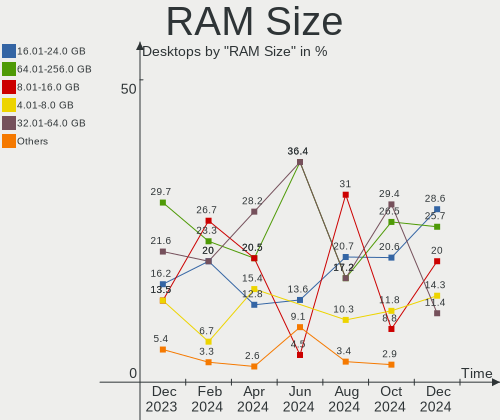
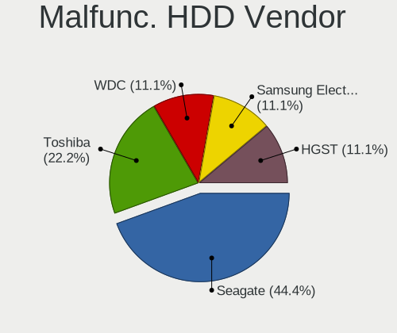
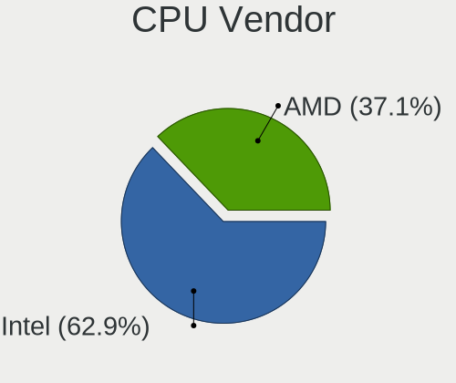
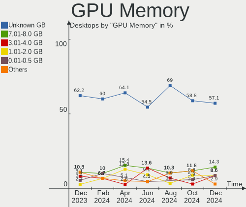
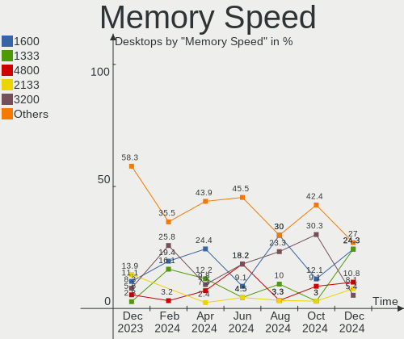

FreeBSD Hardware Trends (Desktop)
---------------------------------

A project to identify most popular hardware characteristics and track their change
over time based on data collected by FreeBSD users at https://BSD-Hardware.info.

Anyone can contribute to the study by uploading probes of their computers by
the [hw-probe](https://github.com/linuxhw/hw-probe/blob/master/INSTALL.BSD.md) tool:

    hw-probe -all -upload

Full-feature report is available here: https://bsd-hardware.info/?view=trends&formfactor=desktop

Period: Jan, 2021.

Contents
--------

- [ OS                       ](#os)
- [ OS Family                ](#os-family)
- [ Arch                     ](#arch)
- [ DE                       ](#de)
- [ Display Server           ](#display-server)
- [ Display Manager          ](#display-manager)
- [ OS Lang                  ](#os-lang)
- [ Boot Mode                ](#boot-mode)
- [ Filesystem               ](#filesystem)
- [ Part. scheme             ](#part-scheme)
- [ Country                  ](#country)
- [ City                     ](#city)
- [ Vendor                   ](#vendor)
- [ Model                    ](#model)
- [ Model Family             ](#model-family)
- [ MFG Year                 ](#mfg-year)
- [ Form Factor              ](#form-factor)
- [ Coreboot                 ](#coreboot)
- [ RAM Size                 ](#ram-size)
- [ RAM Used                 ](#ram-used)
- [ Has CD-ROM               ](#has-cd-rom)
- [ Total Drives             ](#total-drives)
- [ Has Ethernet             ](#has-ethernet)
- [ Drive Vendor             ](#drive-vendor)
- [ Drive Model              ](#drive-model)
- [ HDD Vendor               ](#hdd-vendor)
- [ SSD Vendor               ](#ssd-vendor)
- [ Drive Kind               ](#drive-kind)
- [ Drive Connector          ](#drive-connector)
- [ Drive Size               ](#drive-size)
- [ Space Total              ](#space-total)
- [ Space Used               ](#space-used)
- [ Malfunc. Drives          ](#malfunc-drives)
- [ Malfunc. Drive Vendor    ](#malfunc-drive-vendor)
- [ Malfunc. HDD Vendor      ](#malfunc-hdd-vendor)
- [ Malfunc. Drive Kind      ](#malfunc-drive-kind)
- [ Failed Drives            ](#failed-drives)
- [ Failed Drive Vendor      ](#failed-drive-vendor)
- [ Drive Status             ](#drive-status)
- [ Storage Vendor           ](#storage-vendor)
- [ Storage Model            ](#storage-model)
- [ Storage Kind             ](#storage-kind)
- [ CPU Vendor               ](#cpu-vendor)
- [ CPU Model                ](#cpu-model)
- [ CPU Model Family         ](#cpu-model-family)
- [ CPU Cores                ](#cpu-cores)
- [ CPU Sockets              ](#cpu-sockets)
- [ CPU Threads              ](#cpu-threads)
- [ CPU Microarch            ](#cpu-microarch)
- [ GPU Vendor               ](#gpu-vendor)
- [ GPU Model                ](#gpu-model)
- [ GPU Combo                ](#gpu-combo)
- [ GPU Driver               ](#gpu-driver)
- [ GPU Memory               ](#gpu-memory)
- [ Monitor Vendor           ](#monitor-vendor)
- [ Monitor Model            ](#monitor-model)
- [ Monitor Resolution       ](#monitor-resolution)
- [ Monitor Diagonal         ](#monitor-diagonal)
- [ Monitor Width            ](#monitor-width)
- [ Aspect Ratio             ](#aspect-ratio)
- [ Monitor Area             ](#monitor-area)
- [ Pixel Density            ](#pixel-density)
- [ Multiple Monitors        ](#multiple-monitors)
- [ Net Controller Vendor    ](#net-controller-vendor)
- [ Net Controller Model     ](#net-controller-model)
- [ Wireless Vendor          ](#wireless-vendor)
- [ Wireless Model           ](#wireless-model)
- [ Ethernet Vendor          ](#ethernet-vendor)
- [ Ethernet Model           ](#ethernet-model)
- [ Net Controller Kind      ](#net-controller-kind)
- [ Used Controller          ](#used-controller)
- [ NICs                     ](#nics)
- [ Memory Vendor            ](#memory-vendor)
- [ Memory Model             ](#memory-model)
- [ Memory Kind              ](#memory-kind)
- [ Memory Form Factor       ](#memory-form-factor)
- [ Memory Size              ](#memory-size)
- [ Memory Speed             ](#memory-speed)
- [ Sound Vendor             ](#sound-vendor)
- [ Sound Model              ](#sound-model)
- [ Camera Vendor            ](#camera-vendor)
- [ Camera Model             ](#camera-model)
- [ Fingerprint Vendor       ](#fingerprint-vendor)
- [ Fingerprint Model        ](#fingerprint-model)
- [ Chipcard Vendor          ](#chipcard-vendor)
- [ Chipcard Model           ](#chipcard-model)
- [ Printer Vendor           ](#printer-vendor)
- [ Printer Model            ](#printer-model)
- [ Scanner Vendor           ](#scanner-vendor)
- [ Scanner Model            ](#scanner-model)
- [ Bluetooth Vendor         ](#bluetooth-vendor)
- [ Bluetooth Model          ](#bluetooth-model)
- [ Unsupported Devices      ](#unsupported-devices)
- [ Unsupported Device Types ](#unsupported-device-types)

OS
--

Installed operating systems

| Name                 | Desktops | Percent |
|----------------------|----------|---------|
| FreeBSD 12.2-p2      | 14       | 38.89%  |
| FreeBSD 12.2-STABLE  | 5        | 13.89%  |
| FreeBSD 13.0-CURRENT | 3        | 8.33%   |
| FreeBSD 12.1-p12     | 3        | 8.33%   |
| FreeBSD 11.4-p6      | 3        | 8.33%   |
| FreeBSD 12.2         | 2        | 5.56%   |
| FreeBSD 14.0-CURRENT | 1        | 2.78%   |
| FreeBSD 13.0-ALPHA2  | 1        | 2.78%   |
| FreeBSD 13.0-ALPHA1  | 1        | 2.78%   |
| FreeBSD 12.2-p1      | 1        | 2.78%   |
| FreeBSD 12.1-p7      | 1        | 2.78%   |
| FreeBSD 12.1--HBSD   | 1        | 2.78%   |

OS Family
---------

OS without a version

| Name    | Desktops | Percent |
|---------|----------|---------|
| FreeBSD | 36       | 100%    |

Arch
----

OS architecture (x86_64, i586, etc.)

| Name  | Desktops | Percent |
|-------|----------|---------|
| amd64 | 35       | 97.22%  |
| arm64 | 1        | 2.78%   |

DE
--

Desktop Environment

| Name     | Desktops | Percent |
|----------|----------|---------|
| Console  | 15       | 41.67%  |
| KDE5     | 9        | 25%     |
| MATE     | 4        | 11.11%  |
| XFCE     | 2        | 5.56%   |
| TWM      | 2        | 5.56%   |
| Openbox  | 2        | 5.56%   |
| GNOME    | 1        | 2.78%   |
| Cinnamon | 1        | 2.78%   |

Display Server
--------------

X11 or Wayland

| Name    | Desktops | Percent |
|---------|----------|---------|
| X11     | 21       | 58.33%  |
| Console | 15       | 41.67%  |

Display Manager
---------------

SDDM, LightDM, etc.

| Name    | Desktops | Percent |
|---------|----------|---------|
| Console | 18       | 50%     |
| SDDM    | 8        | 22.22%  |
| SLiM    | 5        | 13.89%  |
| LightDM | 4        | 11.11%  |
| XDM     | 1        | 2.78%   |

OS Lang
-------

Language

| Lang    | Desktops | Percent |
|---------|----------|---------|
| Unknown | 18       | 50%     |
| en_US   | 9        | 25%     |
| C       | 6        | 16.67%  |
| uk_UA   | 1        | 2.78%   |
| ru_RU   | 1        | 2.78%   |
| en_GB   | 1        | 2.78%   |

Boot Mode
---------

EFI or BIOS

| Mode | Desktops | Percent |
|------|----------|---------|
| EFI  | 19       | 52.78%  |
| BIOS | 17       | 47.22%  |

Filesystem
----------

Type of filesystem

| Type | Desktops | Percent |
|------|----------|---------|
| Zfs  | 24       | 66.67%  |
| Ufs  | 12       | 33.33%  |

Part. scheme
------------

Scheme of partitioning

| Type | Desktops | Percent |
|------|----------|---------|
| GPT  | 32       | 88.89%  |
| MBR  | 4        | 11.11%  |

Country
-------

Geographic location (country)

| Country        | Desktops | Percent |
|----------------|----------|---------|
| USA            | 9        | 25%     |
| Ukraine        | 4        | 11.11%  |
| Canada         | 4        | 11.11%  |
| Russia         | 2        | 5.56%   |
| Netherlands    | 2        | 5.56%   |
| Japan          | 2        | 5.56%   |
| Italy          | 2        | 5.56%   |
| Germany        | 2        | 5.56%   |
| Finland        | 2        | 5.56%   |
| Czech Republic | 2        | 5.56%   |
| Switzerland    | 1        | 2.78%   |
| India          | 1        | 2.78%   |
| Hong Kong      | 1        | 2.78%   |
| Denmark        | 1        | 2.78%   |
| China          | 1        | 2.78%   |

City
----

Geographic location (city)

| City             | Desktops | Percent |
|------------------|----------|---------|
| Zaporizhia       | 2        | 5.56%   |
| Tecumseh         | 2        | 5.56%   |
| Kyiv             | 2        | 5.56%   |
| Zurich           | 1        | 2.78%   |
| Winnipeg         | 1        | 2.78%   |
| Tuusula          | 1        | 2.78%   |
| Sumida           | 1        | 2.78%   |
| Stramproy        | 1        | 2.78%   |
| South Burlington | 1        | 2.78%   |
| Skokie           | 1        | 2.78%   |
| Shizuoka         | 1        | 2.78%   |
| Segrate          | 1        | 2.78%   |
| Saint Paul       | 1        | 2.78%   |
| Redmond          | 1        | 2.78%   |
| Prague           | 1        | 2.78%   |
| Podolsk          | 1        | 2.78%   |
| Novosibirsk      | 1        | 2.78%   |
| Montreal         | 1        | 2.78%   |
| Millinocket      | 1        | 2.78%   |
| Milan            | 1        | 2.78%   |
| Lodi             | 1        | 2.78%   |
| Kunming          | 1        | 2.78%   |
| Kouvola          | 1        | 2.78%   |
| Grand Junction   | 1        | 2.78%   |
| Copenhagen       | 1        | 2.78%   |
| Clover           | 1        | 2.78%   |
| Chicago          | 1        | 2.78%   |
| Central          | 1        | 2.78%   |
| Brno             | 1        | 2.78%   |
| Berlin           | 1        | 2.78%   |
| Bengaluru        | 1        | 2.78%   |
| Amsterdam        | 1        | 2.78%   |
| Ainring          | 1        | 2.78%   |

Vendor
------

Motherboard manufacturer

| Name                | Desktops | Percent |
|---------------------|----------|---------|
| ASUSTek Computer    | 10       | 27.78%  |
| Supermicro          | 5        | 13.89%  |
| MSI                 | 5        | 13.89%  |
| Gigabyte Technology | 4        | 11.11%  |
| Hewlett-Packard     | 2        | 5.56%   |
| Unknown             | 2        | 5.56%   |
| Scaleway            | 1        | 2.78%   |
| Huanan              | 1        | 2.78%   |
| HPE                 | 1        | 2.78%   |
| Gateway             | 1        | 2.78%   |
| EVGA                | 1        | 2.78%   |
| Dell                | 1        | 2.78%   |
| ASRockRack          | 1        | 2.78%   |
| ASRock              | 1        | 2.78%   |

Model
-----

Motherboard model

| Name                                       | Desktops | Percent |
|--------------------------------------------|----------|---------|
| Supermicro X7SPA-HF                        | 2        | 5.56%   |
| ASUS All Series                            | 2        | 5.56%   |
| Unknown                                    | 2        | 5.56%   |
| Supermicro X8STi                           | 1        | 2.78%   |
| Supermicro X7SLA                           | 1        | 2.78%   |
| Supermicro PIO-628U-TR4T+-ST031            | 1        | 2.78%   |
| Scaleway Standard PC (i440FX + PIIX, 1996) | 1        | 2.78%   |
| MSI MS-7C36                                | 1        | 2.78%   |
| MSI MS-7A32                                | 1        | 2.78%   |
| MSI MS-7758                                | 1        | 2.78%   |
| MSI MS-7522                                | 1        | 2.78%   |
| MSI MS-7235                                | 1        | 2.78%   |
| Huanan X99-TF                              | 1        | 2.78%   |
| HPE ProLiant MicroServer Gen10 Plus        | 1        | 2.78%   |
| HP t620 PLUS Quad Core TC                  | 1        | 2.78%   |
| HP 110-243w                                | 1        | 2.78%   |
| Gigabyte Z97X-UD5H                         | 1        | 2.78%   |
| Gigabyte X470 AORUS ULTRA GAMING           | 1        | 2.78%   |
| Gigabyte B75M-D3H                          | 1        | 2.78%   |
| Gigabyte AUTOCONT INTEGRA                  | 1        | 2.78%   |
| Gateway DX4870                             | 1        | 2.78%   |
| EVGA X299 MICRO                            | 1        | 2.78%   |
| Dell OptiPlex 5080                         | 1        | 2.78%   |
| ASUS Z170 PRO GAMING                       | 1        | 2.78%   |
| ASUS TUF GAMING B550M-PLUS                 | 1        | 2.78%   |
| ASUS TRILINE PROFI                         | 1        | 2.78%   |
| ASUS SABERTOOTH Z77                        | 1        | 2.78%   |
| ASUS SABERTOOTH 990FX R2.0                 | 1        | 2.78%   |
| ASUS ROG STRIX B450-F GAMING               | 1        | 2.78%   |
| ASUS PRIME X570-P                          | 1        | 2.78%   |
| ASUS M4A87TD EVO                           | 1        | 2.78%   |
| ASRockRack B450D4U-V1L                     | 1        | 2.78%   |
| ASRock X570 Taichi                         | 1        | 2.78%   |

Model Family
------------

Motherboard model prefix

| Name                            | Desktops | Percent |
|---------------------------------|----------|---------|
| Supermicro X7SPA-HF             | 2        | 5.56%   |
| ASUS SABERTOOTH                 | 2        | 5.56%   |
| ASUS All                        | 2        | 5.56%   |
| Unknown                         | 2        | 5.56%   |
| Supermicro X8STi                | 1        | 2.78%   |
| Supermicro X7SLA                | 1        | 2.78%   |
| Supermicro PIO-628U-TR4T+-ST031 | 1        | 2.78%   |
| Scaleway Standard               | 1        | 2.78%   |
| MSI MS-7C36                     | 1        | 2.78%   |
| MSI MS-7A32                     | 1        | 2.78%   |
| MSI MS-7758                     | 1        | 2.78%   |
| MSI MS-7522                     | 1        | 2.78%   |
| MSI MS-7235                     | 1        | 2.78%   |
| Huanan X99-TF                   | 1        | 2.78%   |
| HPE ProLiant                    | 1        | 2.78%   |
| HP t620                         | 1        | 2.78%   |
| HP 110-243w                     | 1        | 2.78%   |
| Gigabyte Z97X-UD5H              | 1        | 2.78%   |
| Gigabyte X470                   | 1        | 2.78%   |
| Gigabyte B75M-D3H               | 1        | 2.78%   |
| Gigabyte AUTOCONT               | 1        | 2.78%   |
| Gateway DX4870                  | 1        | 2.78%   |
| EVGA X299                       | 1        | 2.78%   |
| Dell OptiPlex                   | 1        | 2.78%   |
| ASUS Z170                       | 1        | 2.78%   |
| ASUS TUF                        | 1        | 2.78%   |
| ASUS TRILINE                    | 1        | 2.78%   |
| ASUS ROG                        | 1        | 2.78%   |
| ASUS PRIME                      | 1        | 2.78%   |
| ASUS M4A87TD                    | 1        | 2.78%   |
| ASRockRack B450D4U-V1L          | 1        | 2.78%   |
| ASRock X570                     | 1        | 2.78%   |

MFG Year
--------

Motherboard manufacture year

| Year    | Desktops | Percent |
|---------|----------|---------|
| 2020    | 9        | 25%     |
| 2010    | 5        | 13.89%  |
| 2019    | 4        | 11.11%  |
| 2015    | 3        | 8.33%   |
| 2013    | 3        | 8.33%   |
| 2018    | 2        | 5.56%   |
| 2014    | 2        | 5.56%   |
| 2009    | 2        | 5.56%   |
| 2017    | 1        | 2.78%   |
| 2016    | 1        | 2.78%   |
| 2012    | 1        | 2.78%   |
| 2011    | 1        | 2.78%   |
| 2007    | 1        | 2.78%   |
| Unknown | 1        | 2.78%   |

Form Factor
-----------

Physical design of the computer

| Name    | Desktops | Percent |
|---------|----------|---------|
| Desktop | 36       | 100%    |

Coreboot
--------

Have coreboot on board

| Used | Desktops | Percent |
|------|----------|---------|
| No   | 36       | 100%    |

RAM Size
--------

Total RAM memory

| Size in GB  | Desktops | Percent |
|-------------|----------|---------|
| 4.01-8.0    | 8        | 22.22%  |
| 16.01-24.0  | 8        | 22.22%  |
| 32.01-64.0  | 7        | 19.44%  |
| 64.01-256.0 | 6        | 16.67%  |
| 8.01-16.0   | 4        | 11.11%  |
| 24.01-32.0  | 2        | 5.56%   |
| 2.01-3.0    | 1        | 2.78%   |

RAM Used
--------

Used RAM memory

| Used GB     | Desktops | Percent |
|-------------|----------|---------|
| 1.01-2.0    | 11       | 30.56%  |
| 0.51-1.0    | 9        | 25%     |
| 0.01-0.5    | 9        | 25%     |
| 3.01-4.0    | 3        | 8.33%   |
| 8.01-16.0   | 2        | 5.56%   |
| 24.01-32.0  | 1        | 2.78%   |
| 64.01-256.0 | 1        | 2.78%   |

Has CD-ROM
----------

Has CD-ROM on board

| Presented | Desktops | Percent |
|-----------|----------|---------|
| No        | 27       | 75%     |
| Yes       | 9        | 25%     |

Total Drives
------------

Number of drives on board

| Drives | Desktops | Percent |
|--------|----------|---------|
| 2      | 8        | 22.22%  |
| 1      | 6        | 16.67%  |
| 4      | 5        | 13.89%  |
| 3      | 5        | 13.89%  |
| 5      | 3        | 8.33%   |
| 0      | 3        | 8.33%   |
| 6      | 2        | 5.56%   |
| 12     | 1        | 2.78%   |
| 11     | 1        | 2.78%   |
| 8      | 1        | 2.78%   |
| 7      | 1        | 2.78%   |

Has Ethernet
------------

Has Ethernet on board

| Presented | Desktops | Percent |
|-----------|----------|---------|
| Yes       | 33       | 91.67%  |
| No        | 3        | 8.33%   |

Drive Vendor
------------

Hard drive vendors

| Vendor              | Desktops | Drives | Percent |
|---------------------|----------|--------|---------|
| WDC                 | 15       | 38     | 21.74%  |
| Samsung Electronics | 14       | 20     | 20.29%  |
| Seagate             | 11       | 24     | 15.94%  |
| Kingston            | 5        | 7      | 7.25%   |
| HGST                | 4        | 7      | 5.8%    |
| Crucial             | 4        | 5      | 5.8%    |
| Intel               | 3        | 3      | 4.35%   |
| Transcend           | 2        | 3      | 2.9%    |
| Toshiba             | 2        | 4      | 2.9%    |
| SPCC                | 1        | 1      | 1.45%   |
| SanDisk             | 1        | 2      | 1.45%   |
| Phison              | 1        | 1      | 1.45%   |
| MaxDigital          | 1        | 1      | 1.45%   |
| Hitachi             | 1        | 1      | 1.45%   |
| Hewlett-Packard     | 1        | 2      | 1.45%   |
| EMTEC               | 1        | 1      | 1.45%   |
| Corsair             | 1        | 1      | 1.45%   |
| Apacer              | 1        | 1      | 1.45%   |

Drive Model
-----------

Hard drive models

| Model                            | Desktops | Percent |
|----------------------------------|----------|---------|
| Samsung SSD 850 EVO 250GB        | 4        | 4.3%    |
| Seagate ST5000DM000-1FK178 5TB   | 2        | 2.15%   |
| Samsung SSD 860 EVO 250GB        | 2        | 2.15%   |
| Intel SSDSA2M080G2GC 80GB        | 2        | 2.15%   |
| WDC WDS500G2B0C-00PXH0 500GB     | 1        | 1.08%   |
| WDC WDS100T3X0C-00SJG0 1TB       | 1        | 1.08%   |
| WDC WDS100T1R0A-68A4W0 1TB       | 1        | 1.08%   |
| WDC WD80EZZX-11CSGA0 8TB         | 1        | 1.08%   |
| WDC WD80EZAZ-11TDBA0 8TB         | 1        | 1.08%   |
| WDC WD80EFZX-68UW8N0 8TB         | 1        | 1.08%   |
| WDC WD80EFAX-68LHPN0 8TB         | 1        | 1.08%   |
| WDC WD60EZRZ-00GZ5B1 6TB         | 1        | 1.08%   |
| WDC WD50NDZW-11MR8S1 5TB         | 1        | 1.08%   |
| WDC WD5003AZEX-00MK2A0 500GB     | 1        | 1.08%   |
| WDC WD5003AZEX-00K3CA0 500GB     | 1        | 1.08%   |
| WDC WD5003AZEX-00K1GA0 500GB     | 1        | 1.08%   |
| WDC WD5000AAKX-00ERMA0 500GB     | 1        | 1.08%   |
| WDC WD40EZRZ-22GXCB0 4TB         | 1        | 1.08%   |
| WDC WD40EFRX-68WT0N0 4TB         | 1        | 1.08%   |
| WDC WD40EFRX-68N32N0 4TB         | 1        | 1.08%   |
| WDC WD4003FFBX-68MU3N0 4TB       | 1        | 1.08%   |
| WDC WD30EFRX-68EUZN0 3TB         | 1        | 1.08%   |
| WDC WD20SPZX-22UA7T0 2TB         | 1        | 1.08%   |
| WDC WD20NMVW-11AV3S2 2TB         | 1        | 1.08%   |
| WDC WD20EZRX-00DC0B0 2TB         | 1        | 1.08%   |
| WDC WD10EZEX-08M2NA0 1TB         | 1        | 1.08%   |
| WDC WD10EARX-22N0YB0 1TB         | 1        | 1.08%   |
| WDC WD1000DHTZ-04N21V1 1TB       | 1        | 1.08%   |
| Transcend TS8GSSD500 8GB         | 1        | 1.08%   |
| Transcend TS32GSSD370 32GB       | 1        | 1.08%   |
| Toshiba MD04ACA400 4TB           | 1        | 1.08%   |
| Toshiba HDWN180 8TB              | 1        | 1.08%   |
| SPCC M.2 PCIE SSD 256GB          | 1        | 1.08%   |
| Seagate ST8000DM004-2CX188 8TB   | 1        | 1.08%   |
| Seagate ST8000DM002-1YW112 8TB   | 1        | 1.08%   |
| Seagate ST500DM002-1BD142 500GB  | 1        | 1.08%   |
| Seagate ST4000NM002A-2HZ101 4TB  | 1        | 1.08%   |
| Seagate ST4000DM004-2CV104 4TB   | 1        | 1.08%   |
| Seagate ST4000DM000-1F2168 4TB   | 1        | 1.08%   |
| Seagate ST3500413AS 500GB        | 1        | 1.08%   |
| Seagate ST320DM000-1BD14C 320GB  | 1        | 1.08%   |
| Seagate ST32000645NS 2TB         | 1        | 1.08%   |
| Seagate ST32000641AS 2TB         | 1        | 1.08%   |
| Seagate ST3000DM003-2AE16L 3TB   | 1        | 1.08%   |
| Seagate ST3000DM001-1ER166 3TB   | 1        | 1.08%   |
| Seagate ST2000NM0033-9ZM175 2TB  | 1        | 1.08%   |
| Seagate ST2000NM0008-2F3100 2TB  | 1        | 1.08%   |
| Seagate ST2000DL003-9VT166 2TB   | 1        | 1.08%   |
| Seagate ST1000LM035-1RK172 1TB   | 1        | 1.08%   |
| Seagate ST1000DM003-9YN162 1TB   | 1        | 1.08%   |
| Seagate ST1000DM003-1CH162 1TB   | 1        | 1.08%   |
| SanDisk SSD G5 BICS4 1TB         | 1        | 1.08%   |
| Samsung SSD 980 PRO 250GB        | 1        | 1.08%   |
| Samsung SSD 970 EVO Plus 250GB   | 1        | 1.08%   |
| Samsung SSD 970 EVO 500GB        | 1        | 1.08%   |
| Samsung SSD 860 EVO 500GB        | 1        | 1.08%   |
| Samsung SSD 850 PRO 128GB        | 1        | 1.08%   |
| Samsung SSD 850 EVO 500GB        | 1        | 1.08%   |
| Samsung MZVPW256HEGL-000H1 256GB | 1        | 1.08%   |
| Samsung MZQLB1T9HAJR-00007 1.9TB | 1        | 1.08%   |

HDD Vendor
----------

Hard disk drive vendors

| Vendor              | Desktops | Drives | Percent |
|---------------------|----------|--------|---------|
| WDC                 | 14       | 35     | 41.18%  |
| Seagate             | 11       | 24     | 32.35%  |
| HGST                | 4        | 7      | 11.76%  |
| Toshiba             | 2        | 4      | 5.88%   |
| Samsung Electronics | 1        | 1      | 2.94%   |
| MaxDigital          | 1        | 1      | 2.94%   |
| Hitachi             | 1        | 1      | 2.94%   |

SSD Vendor
----------

Solid state drive vendors

| Vendor              | Desktops | Drives | Percent |
|---------------------|----------|--------|---------|
| Samsung Electronics | 10       | 13     | 37.04%  |
| Kingston            | 4        | 6      | 14.81%  |
| Crucial             | 4        | 5      | 14.81%  |
| Transcend           | 2        | 3      | 7.41%   |
| Intel               | 2        | 2      | 7.41%   |
| WDC                 | 1        | 1      | 3.7%    |
| SanDisk             | 1        | 2      | 3.7%    |
| EMTEC               | 1        | 1      | 3.7%    |
| Corsair             | 1        | 1      | 3.7%    |
| Apacer              | 1        | 1      | 3.7%    |

Drive Kind
----------

HDD or SSD

| Kind | Desktops | Drives | Percent |
|------|----------|--------|---------|
| SSD  | 23       | 35     | 42.59%  |
| HDD  | 22       | 73     | 40.74%  |
| NVMe | 9        | 14     | 16.67%  |

Drive Connector
---------------

SATA, SAS, NVMe, etc.

| Type | Desktops | Drives | Percent |
|------|----------|--------|---------|
| SATA | 32       | 108    | 78.05%  |
| NVMe | 9        | 14     | 21.95%  |

Drive Size
----------

Size of hard drive

| Size in TB | Desktops | Drives | Percent |
|------------|----------|--------|---------|
| 0.01-0.5   | 23       | 42     | 41.07%  |
| 0.51-1.0   | 10       | 18     | 17.86%  |
| 4.01-10.0  | 8        | 22     | 14.29%  |
| 1.01-2.0   | 7        | 10     | 12.5%   |
| 3.01-4.0   | 6        | 13     | 10.71%  |
| 2.01-3.0   | 2        | 3      | 3.57%   |

Space Total
-----------

Amount of disk space available on the file system

| Size in GB | Desktops | Percent |
|------------|----------|---------|
| 101-250    | 8        | 22.22%  |
| 251-500    | 7        | 19.44%  |
| 21-50      | 5        | 13.89%  |
| 501-1000   | 5        | 13.89%  |
| 51-100     | 4        | 11.11%  |
| 1001-2000  | 3        | 8.33%   |
| 1-20       | 3        | 8.33%   |
| 2001-3000  | 1        | 2.78%   |

Space Used
----------

Amount of used disk space

| Used GB  | Desktops | Percent |
|----------|----------|---------|
| 1-20     | 27       | 75%     |
| 21-50    | 3        | 8.33%   |
| 51-100   | 3        | 8.33%   |
| 251-500  | 1        | 2.78%   |
| 101-250  | 1        | 2.78%   |
| 501-1000 | 1        | 2.78%   |

Malfunc. Drives
---------------

Drive models with a malfunction

| Model                                 | Desktops | Drives | Percent |
|---------------------------------------|----------|--------|---------|
| Intel SSDSA2M080G2GC 80GB             | 2        | 2      | 25%     |
| WDC WD10EARX-22N0YB0 1TB              | 1        | 1      | 12.5%   |
| Seagate ST3500413AS 500GB             | 1        | 2      | 12.5%   |
| Seagate ST1000DM003-9YN162 1TB        | 1        | 1      | 12.5%   |
| Samsung Electronics SSD 850 EVO 500GB | 1        | 1      | 12.5%   |
| Samsung Electronics HD103UJ 1TB       | 1        | 1      | 12.5%   |
| Crucial CT480M500SSD1 480GB           | 1        | 1      | 12.5%   |

Malfunc. Drive Vendor
---------------------

Vendors of faulty drives

| Vendor              | Desktops | Drives | Percent |
|---------------------|----------|--------|---------|
| Seagate             | 2        | 3      | 25%     |
| Samsung Electronics | 2        | 2      | 25%     |
| Intel               | 2        | 2      | 25%     |
| WDC                 | 1        | 1      | 12.5%   |
| Crucial             | 1        | 1      | 12.5%   |

Malfunc. HDD Vendor
-------------------

Vendors of faulty HDD drives

| Vendor              | Desktops | Drives | Percent |
|---------------------|----------|--------|---------|
| Seagate             | 2        | 3      | 50%     |
| WDC                 | 1        | 1      | 25%     |
| Samsung Electronics | 1        | 1      | 25%     |

Malfunc. Drive Kind
-------------------

Kinds of faulty drives

| Kind | Desktops | Drives | Percent |
|------|----------|--------|---------|
| SSD  | 4        | 4      | 50%     |
| HDD  | 4        | 5      | 50%     |

Failed Drives
-------------

Failed drive models

Zero info for selected period =(

Failed Drive Vendor
-------------------

Failed drive vendors

Zero info for selected period =(

Drive Status
------------

Number of failed and malfunc. drives

| Status  | Desktops | Drives | Percent |
|---------|----------|--------|---------|
| Works   | 31       | 113    | 79.49%  |
| Malfunc | 8        | 9      | 20.51%  |

Storage Vendor
--------------

Storage controller vendors

| Vendor                      | Desktops | Percent |
|-----------------------------|----------|---------|
| Intel                       | 23       | 37.7%   |
| AMD                         | 12       | 19.67%  |
| ASMedia Technology          | 6        | 9.84%   |
| Samsung Electronics         | 4        | 6.56%   |
| Sandisk                     | 3        | 4.92%   |
| Silicon Motion              | 2        | 3.28%   |
| Marvell Technology Group    | 2        | 3.28%   |
| JMicron Technology          | 2        | 3.28%   |
| Broadcom / LSI              | 2        | 3.28%   |
| Red Hat                     | 1        | 1.64%   |
| Phison Electronics          | 1        | 1.64%   |
| Nvidia                      | 1        | 1.64%   |
| Kingston Technology Company | 1        | 1.64%   |
| Chelsio Communications      | 1        | 1.64%   |

Storage Model
-------------

Storage controller models

| Model                                                                          | Desktops | Percent |
|--------------------------------------------------------------------------------|----------|---------|
| AMD FCH SATA Controller [AHCI mode]                                            | 9        | 12.68%  |
| ASMedia ASM1062 Serial ATA Controller                                          | 6        | 8.45%   |
| Intel 7 Series/C210 Series Chipset Family 6-port SATA Controller [AHCI mode]   | 4        | 5.63%   |
| Samsung NVMe SSD Controller SM981/PM981/PM983                                  | 3        | 4.23%   |
| Intel C610/X99 series chipset sSATA Controller [AHCI mode]                     | 3        | 4.23%   |
| Intel 82801JI (ICH10 Family) SATA AHCI Controller                              | 3        | 4.23%   |
| AMD 400 Series Chipset SATA Controller                                         | 3        | 4.23%   |
| Silicon Motion SM2263EN/SM2263XT SSD Controller                                | 2        | 2.82%   |
| Sandisk WD Blue SN550 NVMe SSD                                                 | 2        | 2.82%   |
| Intel C610/X99 series chipset 6-Port SATA Controller [AHCI mode]               | 2        | 2.82%   |
| Intel 9 Series Chipset Family SATA Controller [AHCI Mode]                      | 2        | 2.82%   |
| Intel 82801IR/IO/IH (ICH9R/DO/DH) 6 port SATA Controller [AHCI mode]           | 2        | 2.82%   |
| AMD SB7x0/SB8x0/SB9x0 SATA Controller [AHCI mode]                              | 2        | 2.82%   |
| Silicon Motion SM2262/SM2262EN SSD Controller                                  | 1        | 1.41%   |
| Sandisk WD Black 2018 / PC SN720 NVMe SSD                                      | 1        | 1.41%   |
| Samsung NVMe SSD Controller PM9A1/980PRO                                       | 1        | 1.41%   |
| Red Hat Virtio SCSI                                                            | 1        | 1.41%   |
| Red Hat Virtio block device                                                    | 1        | 1.41%   |
| Phison E12 NVMe Controller                                                     | 1        | 1.41%   |
| Nvidia MCP79 AHCI Controller                                                   | 1        | 1.41%   |
| Marvell Group 88SE9172 SATA 6Gb/s Controller                                   | 1        | 1.41%   |
| Marvell Group 88SE6111/6121 SATA II / PATA Controller                          | 1        | 1.41%   |
| Kingston Company A2000 NVMe SSD                                                | 1        | 1.41%   |
| JMicron JMB363 SATA/IDE Controller                                             | 1        | 1.41%   |
| JMicron JMB361 AHCI/IDE                                                        | 1        | 1.41%   |
| Intel SSD 660P Series                                                          | 1        | 1.41%   |
| Intel Q170/Q150/B150/H170/H110/Z170/CM236 Chipset SATA Controller [AHCI Mode]  | 1        | 1.41%   |
| Intel NM10/ICH7 Family SATA Controller [AHCI mode]                             | 1        | 1.41%   |
| Intel Cannon Lake PCH SATA AHCI Controller                                     | 1        | 1.41%   |
| Intel 82801HR/HO/HH (ICH8R/DO/DH) 2 port SATA Controller [IDE mode]            | 1        | 1.41%   |
| Intel 82801H (ICH8 Family) 4 port SATA Controller [IDE mode]                   | 1        | 1.41%   |
| Intel 82801G (ICH7 Family) IDE Controller                                      | 1        | 1.41%   |
| Intel 82371SB PIIX3 IDE [Natoma/Triton II]                                     | 1        | 1.41%   |
| Intel 8 Series/C220 Series Chipset Family 6-port SATA Controller 1 [AHCI mode] | 1        | 1.41%   |
| Intel 400 Series Chipset Family SATA AHCI Controller                           | 1        | 1.41%   |
| Intel 200 Series PCH SATA controller [AHCI mode]                               | 1        | 1.41%   |
| Chelsio T540-CR Unified Wire Storage Controller                                | 1        | 1.41%   |
| Broadcom / LSI SAS3008 PCI-Express Fusion-MPT SAS-3                            | 1        | 1.41%   |
| Broadcom / LSI MegaRAID SAS 8208ELP/8208ELP                                    | 1        | 1.41%   |
| AMD X370 Series Chipset SATA Controller                                        | 1        | 1.41%   |
| Unknown                                                                        | 1        | 1.41%   |

Storage Kind
------------

Kind of storage controller (IDE, SATA, NVMe, SAS, ...)

| Kind | Desktops | Percent |
|------|----------|---------|
| SATA | 33       | 63.46%  |
| NVMe | 10       | 19.23%  |
| IDE  | 5        | 9.62%   |
| SCSI | 3        | 5.77%   |
| SAS  | 1        | 1.92%   |

CPU Vendor
----------

Processor vendors

| Vendor | Desktops | Percent |
|--------|----------|---------|
| Intel  | 22       | 61.11%  |
| AMD    | 12       | 33.33%  |
| QEMU   | 1        | 2.78%   |
| ARM    | 1        | 2.78%   |

CPU Model
---------

Processor models

| Model                                    | Desktops | Percent |
|------------------------------------------|----------|---------|
| Intel Core i7-4790K CPU @ 4.00GHz        | 2        | 5.56%   |
| Intel Atom CPU 330 @ 1.60GHz             | 2        | 5.56%   |
| QEMU pc-i440fx-bionic                    | 1        | 2.78%   |
| Intel Xeon E-2224 CPU @ 3.40GHz          | 1        | 2.78%   |
| Intel Xeon CPU W3520 @ 2.67GHz           | 1        | 2.78%   |
| Intel Xeon CPU E5-2678 v3 @ 2.50GHz      | 1        | 2.78%   |
| Intel Xeon CPU E5-2630L v3 @ 1.80GHz     | 1        | 2.78%   |
| Intel Core i9-9820X CPU @ 3.30GHz        | 1        | 2.78%   |
| Intel Core i7-5820K CPU @ 3.30GHz        | 1        | 2.78%   |
| Intel Core i7-3770K CPU @ 3.50GHz        | 1        | 2.78%   |
| Intel Core i7 CPU 930 @ 2.80GHz          | 1        | 2.78%   |
| Intel Core i5-6600 CPU @ 3.30GHz         | 1        | 2.78%   |
| Intel Core i5-4590T CPU @ 2.00GHz        | 1        | 2.78%   |
| Intel Core i5-3570 CPU @ 3.40GHz         | 1        | 2.78%   |
| Intel Core i5-3330 CPU @ 3.00GHz         | 1        | 2.78%   |
| Intel Core i5-10500T CPU @ 2.30GHz       | 1        | 2.78%   |
| Intel Core i3-2120 CPU @ 3.30GHz         | 1        | 2.78%   |
| Intel Core 2 Quad CPU Q6600 @ 2.40GHz    | 1        | 2.78%   |
| Intel Core 2 Duo CPU E8500 @ 3.16GHz     | 1        | 2.78%   |
| Intel Atom CPU D525 @ 1.80GHz            | 1        | 2.78%   |
| Intel Atom CPU D510 @ 1.66GHz            | 1        | 2.78%   |
| ARM Cortex-A72 r0p2                      | 1        | 2.78%   |
| AMD Ryzen 9 5950X 16-Core Processor      | 1        | 2.78%   |
| AMD Ryzen 9 3900X 12-Core Processor      | 1        | 2.78%   |
| AMD Ryzen 9 3900 12-Core Processor       | 1        | 2.78%   |
| AMD Ryzen 7 5800X 8-Core Processor       | 1        | 2.78%   |
| AMD Ryzen 7 2700X Eight-Core Processor   | 1        | 2.78%   |
| AMD Ryzen 7 2700 Eight-Core Processor    | 1        | 2.78%   |
| AMD Ryzen 5 3600X 6-Core Processor       | 1        | 2.78%   |
| AMD Ryzen 5 3600 6-Core Processor        | 1        | 2.78%   |
| AMD Phenom II X6 1090T Processor         | 1        | 2.78%   |
| AMD Phenom II X4 965 Processor           | 1        | 2.78%   |
| AMD GX-420CA SOC with Radeon HD Graphics | 1        | 2.78%   |
| AMD A4-5000 APU with Radeon HD Graphics  | 1        | 2.78%   |

CPU Model Family
----------------

Processor model prefix

| Model             | Desktops | Percent |
|-------------------|----------|---------|
| Intel Core i7     | 5        | 13.89%  |
| Intel Core i5     | 5        | 13.89%  |
| Intel Xeon        | 4        | 11.11%  |
| Intel Atom        | 4        | 11.11%  |
| AMD Ryzen 9       | 3        | 8.33%   |
| AMD Ryzen 7       | 3        | 8.33%   |
| AMD Ryzen 5       | 2        | 5.56%   |
| Other             | 1        | 2.78%   |
| Intel Core i9     | 1        | 2.78%   |
| Intel Core i3     | 1        | 2.78%   |
| Intel Core 2 Quad | 1        | 2.78%   |
| Intel Core 2 Duo  | 1        | 2.78%   |
| ARM Cortex        | 1        | 2.78%   |
| AMD Phenom II X6  | 1        | 2.78%   |
| AMD Phenom II X4  | 1        | 2.78%   |
| AMD GX            | 1        | 2.78%   |
| AMD A4            | 1        | 2.78%   |

CPU Cores
---------

Number of processor cores

| Number  | Desktops | Percent |
|---------|----------|---------|
| 4       | 14       | 38.89%  |
| 2       | 6        | 16.67%  |
| 6       | 4        | 11.11%  |
| 16      | 3        | 8.33%   |
| 12      | 3        | 8.33%   |
| 24      | 2        | 5.56%   |
| 32      | 1        | 2.78%   |
| 10      | 1        | 2.78%   |
| 8       | 1        | 2.78%   |
| Unknown | 1        | 2.78%   |

CPU Sockets
-----------

Number of sockets

| Number  | Desktops | Percent |
|---------|----------|---------|
| 1       | 33       | 91.67%  |
| 6       | 1        | 2.78%   |
| 2       | 1        | 2.78%   |
| Unknown | 1        | 2.78%   |

CPU Threads
-----------

Threads per core (Hyper-Threading)

| Number  | Desktops | Percent |
|---------|----------|---------|
| 1       | 19       | 52.78%  |
| 2       | 16       | 44.44%  |
| Unknown | 1        | 2.78%   |

CPU Microarch
-------------

Microarchitecture

| Name        | Desktops | Percent |
|-------------|----------|---------|
| Haswell     | 6        | 16.67%  |
| Zen 2       | 4        | 11.11%  |
| Bonnell     | 4        | 11.11%  |
| IvyBridge   | 3        | 8.33%   |
| Unknown     | 3        | 8.33%   |
| Zen+        | 2        | 5.56%   |
| Skylake     | 2        | 5.56%   |
| Nehalem     | 2        | 5.56%   |
| K10         | 2        | 5.56%   |
| Jaguar      | 2        | 5.56%   |
| Zen         | 1        | 2.78%   |
| SandyBridge | 1        | 2.78%   |
| Penryn      | 1        | 2.78%   |
| KabyLake    | 1        | 2.78%   |
| Core        | 1        | 2.78%   |
| CometLake   | 1        | 2.78%   |

GPU Vendor
----------

Vendors of graphics cards

| Vendor                     | Desktops | Percent |
|----------------------------|----------|---------|
| Nvidia                     | 16       | 47.06%  |
| Intel                      | 7        | 20.59%  |
| AMD                        | 7        | 20.59%  |
| Matrox Electronics Systems | 2        | 5.88%   |
| ASPEED Technology          | 2        | 5.88%   |

GPU Model
---------

Graphics card models

| Model                                                                       | Desktops | Percent |
|-----------------------------------------------------------------------------|----------|---------|
| Nvidia TU116 [GeForce GTX 1660 Ti]                                          | 2        | 5.71%   |
| Nvidia GT218 [GeForce 210]                                                  | 2        | 5.71%   |
| Nvidia GK208B [GeForce GT 710]                                              | 2        | 5.71%   |
| Intel Xeon E3-1200 v3/4th Gen Core Processor Integrated Graphics Controller | 2        | 5.71%   |
| ASPEED Technology ASPEED Graphics Family                                    | 2        | 5.71%   |
| AMD Ellesmere [Radeon RX 470/480/570/570X/580/580X/590]                     | 2        | 5.71%   |
| Nvidia TU116 [GeForce GTX 1660 SUPER]                                       | 1        | 2.86%   |
| Nvidia GP108 [GeForce GT 1030]                                              | 1        | 2.86%   |
| Nvidia GP106 [GeForce GTX 1060 3GB]                                         | 1        | 2.86%   |
| Nvidia GM206 [GeForce GTX 960]                                              | 1        | 2.86%   |
| Nvidia GM204 [GeForce GTX 970]                                              | 1        | 2.86%   |
| Nvidia GM107GL [Quadro K2200]                                               | 1        | 2.86%   |
| Nvidia GK208 [GeForce GT 640 Rev. 2]                                        | 1        | 2.86%   |
| Nvidia GK104 [GeForce GTX 760]                                              | 1        | 2.86%   |
| Nvidia GF119 [GeForce GT 610]                                               | 1        | 2.86%   |
| Nvidia GF119 [GeForce GT 520]                                               | 1        | 2.86%   |
| Nvidia C79 [ION]                                                            | 1        | 2.86%   |
| Matrox Electronics Systems MGA G200eW WPCM450                               | 1        | 2.86%   |
| Matrox Electronics Systems MGA G200eH3                                      | 1        | 2.86%   |
| Intel Xeon E3-1200 v2/3rd Gen Core processor Graphics Controller            | 1        | 2.86%   |
| Intel CometLake-S GT2 [UHD Graphics 630]                                    | 1        | 2.86%   |
| Intel Atom Processor D4xx/D5xx/N4xx/N5xx Integrated Graphics Controller     | 1        | 2.86%   |
| Intel 82945G/GZ Integrated Graphics Controller                              | 1        | 2.86%   |
| Intel 4 Series Chipset Integrated Graphics Controller                       | 1        | 2.86%   |
| AMD Vega 20 [Radeon VII]                                                    | 1        | 2.86%   |
| AMD Lexa PRO [Radeon 540/540X/550/550X / RX 540X/550/550X]                  | 1        | 2.86%   |
| AMD Kabini [Radeon HD 8400E]                                                | 1        | 2.86%   |
| AMD Kabini [Radeon HD 8330]                                                 | 1        | 2.86%   |
| AMD Caicos [Radeon HD 6450/7450/8450 / R5 230 OEM]                          | 1        | 2.86%   |

GPU Combo
---------

Combinations of graphics cards

| Name       | Desktops | Percent |
|------------|----------|---------|
| 1 x Nvidia | 15       | 41.67%  |
| 1 x AMD    | 7        | 19.44%  |
| 1 x Intel  | 6        | 16.67%  |
| Other      | 2        | 5.56%   |
| 1 x Matrox | 2        | 5.56%   |
| 1 x ASPEED | 2        | 5.56%   |
| 2 x Nvidia | 1        | 2.78%   |
| 2 x Intel  | 1        | 2.78%   |

GPU Driver
----------

Free vs proprietary

| Driver      | Desktops | Percent |
|-------------|----------|---------|
| Free        | 20       | 55.56%  |
| Proprietary | 14       | 38.89%  |
| Unknown     | 2        | 5.56%   |

GPU Memory
----------

Total video memory

| Size in GB | Desktops | Percent |
|------------|----------|---------|
| Unknown    | 18       | 50%     |
| 0.51-1.0   | 6        | 16.67%  |
| 1.01-2.0   | 5        | 13.89%  |
| 5.01-6.0   | 3        | 8.33%   |
| 3.01-4.0   | 2        | 5.56%   |
| 2.01-3.0   | 1        | 2.78%   |
| 8.01-16.0  | 1        | 2.78%   |

Monitor Vendor
--------------

Monitor vendors

| Vendor               | Desktops | Percent |
|----------------------|----------|---------|
| Samsung Electronics  | 3        | 15%     |
| Unknown              | 2        | 10%     |
| Sony                 | 2        | 10%     |
| Goldstar             | 2        | 10%     |
| AOC                  | 2        | 10%     |
| Ancor Communications | 2        | 10%     |
| ViewSonic            | 1        | 5%      |
| Orion                | 1        | 5%      |
| NEC Computers        | 1        | 5%      |
| LG Electronics       | 1        | 5%      |
| Dell                 | 1        | 5%      |
| BenQ                 | 1        | 5%      |
| Acer                 | 1        | 5%      |

Monitor Model
-------------

Monitor models

| Model                                                             | Desktops | Percent |
|-------------------------------------------------------------------|----------|---------|
| ViewSonic LCD Monitor VX2451 SERIES 1920x1080                     | 1        | 5%      |
| Unknown LCD Monitor Sony SDM-HS95D 1280x1024                      | 1        | 5%      |
| Unknown LCD Monitor KJT4K2K60DP 3840x2160                         | 1        | 5%      |
| Sony TV SNY4B03 1920x1080 930x520mm 41.9-inch                     | 1        | 5%      |
| Sony LCD Monitor TV XV 1920x1080                                  | 1        | 5%      |
| Samsung Electronics U32J59x SAM0F35 3840x2160 700x390mm 31.5-inch | 1        | 5%      |
| Samsung Electronics S27D590 SAM0BE9 1920x1080 600x340mm 27.2-inch | 1        | 5%      |
| Samsung Electronics LCD Monitor S27C750 1920x1080                 | 1        | 5%      |
| Orion LCD Monitor ORN1207 1920x1080                               | 1        | 5%      |
| NEC Computers LCD Monitor EA241WM 1920x1200                       | 1        | 5%      |
| LG Electronics LCD Monitor E2360 1920x1080                        | 1        | 5%      |
| Goldstar W2242 GSM5678 1680x1050 490x320mm 23.0-inch              | 1        | 5%      |
| Goldstar 34GN850 GSM774B 3440x1440 800x330mm 34.1-inch            | 1        | 5%      |
| Dell P2717H DEL40F7 1920x1080 600x340mm 27.2-inch                 | 1        | 5%      |
| BenQ GW2283 BNQ78E9 1920x1080 480x270mm 21.7-inch                 | 1        | 5%      |
| AOC Q3277 AOC3277 2560x1440 710x400mm 32.1-inch                   | 1        | 5%      |
| AOC LCD Monitor 2279WH 1920x1080                                  | 1        | 5%      |
| Ancor Communications VX279 ACI27E4 1920x1080 600x340mm 27.2-inch  | 1        | 5%      |
| Ancor Communications LCD Monitor ASUS VW266H 1920x1200            | 1        | 5%      |
| Acer XB271HU ACR0490 2560x1440 600x340mm 27.2-inch                | 1        | 5%      |

Monitor Resolution
------------------

Monitor screen resolution

| Resolution         | Desktops | Percent |
|--------------------|----------|---------|
| 1920x1080 (FHD)    | 11       | 55%     |
| 3840x2160 (4K)     | 3        | 15%     |
| 1920x1200 (WUXGA)  | 2        | 10%     |
| 3440x1440          | 1        | 5%      |
| 2560x1440 (QHD)    | 1        | 5%      |
| 1680x1050 (WSXGA+) | 1        | 5%      |
| 1280x1024 (SXGA)   | 1        | 5%      |

Monitor Diagonal
----------------

Diagonal size in inches

| Inches  | Desktops | Percent |
|---------|----------|---------|
| Unknown | 10       | 50%     |
| 27      | 4        | 20%     |
| 41      | 1        | 5%      |
| 34      | 1        | 5%      |
| 32      | 1        | 5%      |
| 31      | 1        | 5%      |
| 23      | 1        | 5%      |
| 21      | 1        | 5%      |

Monitor Width
-------------

Physical width

| Width in mm | Desktops | Percent |
|-------------|----------|---------|
| Unknown     | 10       | 50%     |
| 501-600     | 4        | 20%     |
| 701-800     | 2        | 10%     |
| 401-500     | 2        | 10%     |
| 601-700     | 1        | 5%      |
| 901-1000    | 1        | 5%      |

Aspect Ratio
------------

Proportional relationship between the width and the height

| Ratio   | Desktops | Percent |
|---------|----------|---------|
| 16/9    | 9        | 45%     |
| Unknown | 9        | 45%     |
| 3/2     | 1        | 5%      |
| 21/9    | 1        | 5%      |

Monitor Area
------------

Area in inch

| Area in inch | Desktops | Percent |
|----------------|----------|---------|
| Unknown        | 10       | 50%     |
| 301-350        | 4        | 20%     |
| 351-500        | 3        | 15%     |
| 201-250        | 2        | 10%     |
| 501-1000       | 1        | 5%      |

Pixel Density
-------------

Pixels per inch

| Density | Desktops | Percent |
|---------|----------|---------|
| Unknown | 10       | 50%     |
| 51-100  | 6        | 30%     |
| 101-120 | 3        | 15%     |
| 121-160 | 1        | 5%      |

Multiple Monitors
-----------------

Total monitors connected

| Total | Desktops | Percent |
|-------|----------|---------|
| 1     | 21       | 58.33%  |
| 0     | 15       | 41.67%  |

Net Controller Vendor
---------------------

Controller vendors

| Vendor                 | Desktops | Percent |
|------------------------|----------|---------|
| Intel                  | 21       | 42.86%  |
| Realtek Semiconductor  | 14       | 28.57%  |
| Qualcomm Atheros       | 6        | 12.24%  |
| TP-Link                | 1        | 2.04%   |
| Red Hat                | 1        | 2.04%   |
| Ralink Technology      | 1        | 2.04%   |
| Nvidia                 | 1        | 2.04%   |
| Mellanox Technologies  | 1        | 2.04%   |
| Hewlett-Packard        | 1        | 2.04%   |
| Chelsio Communications | 1        | 2.04%   |
| Aquantia               | 1        | 2.04%   |

Net Controller Model
--------------------

Controller models

| Model                                                                         | Desktops | Percent |
|-------------------------------------------------------------------------------|----------|---------|
| Realtek RTL8111/8168/8411 PCI Express Gigabit Ethernet Controller             | 12       | 21.82%  |
| Intel I211 Gigabit Network Connection                                         | 5        | 9.09%   |
| Intel 82574L Gigabit Network Connection                                       | 4        | 7.27%   |
| Qualcomm Atheros AR9462 Wireless Network Adapter                              | 2        | 3.64%   |
| Intel Wi-Fi 6 AX200                                                           | 2        | 3.64%   |
| Intel I210 Gigabit Network Connection                                         | 2        | 3.64%   |
| Intel Ethernet Connection (2) I218-V                                          | 2        | 3.64%   |
| Intel 82579V Gigabit Network Connection                                       | 2        | 3.64%   |
| TP-Link Archer T2U PLUS [RTL8821AU]                                           | 1        | 1.82%   |
| Red Hat Virtio network device                                                 | 1        | 1.82%   |
| Realtek RTL8125 2.5GbE Controller                                             | 1        | 1.82%   |
| Realtek RTL810xE PCI Express Fast Ethernet controller                         | 1        | 1.82%   |
| Realtek RTL-8110SC/8169SC Gigabit Ethernet                                    | 1        | 1.82%   |
| Realtek RTL-8100/8101L/8139 PCI Fast Ethernet Adapter                         | 1        | 1.82%   |
| Ralink RT5572 Wireless Adapter                                                | 1        | 1.82%   |
| Qualcomm Atheros Killer E220x Gigabit Ethernet Controller                     | 1        | 1.82%   |
| Qualcomm Atheros AR9485 Wireless Network Adapter                              | 1        | 1.82%   |
| Qualcomm Atheros AR9287 Wireless Network Adapter (PCI-Express)                | 1        | 1.82%   |
| Qualcomm Atheros AR9227 Wireless Network Adapter                              | 1        | 1.82%   |
| Nvidia MCP79 Ethernet                                                         | 1        | 1.82%   |
| Mellanox MT27500 Family [ConnectX-3]                                          | 1        | 1.82%   |
| Intel I350 Gigabit Network Connection                                         | 1        | 1.82%   |
| Intel Ethernet Controller 10-Gigabit X540-AT2                                 | 1        | 1.82%   |
| Intel Ethernet Connection I217-V                                              | 1        | 1.82%   |
| Intel Ethernet Connection (2) I219-V                                          | 1        | 1.82%   |
| Intel Ethernet Connection (11) I219-LM                                        | 1        | 1.82%   |
| Intel Comet Lake PCH CNVi WiFi                                                | 1        | 1.82%   |
| Intel 82576 Gigabit Network Connection                                        | 1        | 1.82%   |
| Intel 82571EB/82571GB Gigabit Ethernet Controller D0/D1 (copper applications) | 1        | 1.82%   |
| HP Virtual NIC                                                                | 1        | 1.82%   |
| Chelsio T540-CR Unified Wire Ethernet Controller                              | 1        | 1.82%   |
| Aquantia AQC107 NBase-T/IEEE 802.3bz Ethernet Controller [AQtion]             | 1        | 1.82%   |

Wireless Vendor
---------------

Wireless vendors

| Vendor            | Desktops | Percent |
|-------------------|----------|---------|
| Qualcomm Atheros  | 5        | 50%     |
| Intel             | 3        | 30%     |
| TP-Link           | 1        | 10%     |
| Ralink Technology | 1        | 10%     |

Wireless Model
--------------

Wireless models

| Model                                                          | Desktops | Percent |
|----------------------------------------------------------------|----------|---------|
| Qualcomm Atheros AR9462 Wireless Network Adapter               | 2        | 20%     |
| Intel Wi-Fi 6 AX200                                            | 2        | 20%     |
| TP-Link Archer T2U PLUS [RTL8821AU]                            | 1        | 10%     |
| Ralink RT5572 Wireless Adapter                                 | 1        | 10%     |
| Qualcomm Atheros AR9485 Wireless Network Adapter               | 1        | 10%     |
| Qualcomm Atheros AR9287 Wireless Network Adapter (PCI-Express) | 1        | 10%     |
| Qualcomm Atheros AR9227 Wireless Network Adapter               | 1        | 10%     |
| Intel Comet Lake PCH CNVi WiFi                                 | 1        | 10%     |

Ethernet Vendor
---------------

Ethernet vendors

| Vendor                 | Desktops | Percent |
|------------------------|----------|---------|
| Intel                  | 21       | 53.85%  |
| Realtek Semiconductor  | 14       | 35.9%   |
| Qualcomm Atheros       | 1        | 2.56%   |
| Nvidia                 | 1        | 2.56%   |
| Chelsio Communications | 1        | 2.56%   |
| Aquantia               | 1        | 2.56%   |

Ethernet Model
--------------

Ethernet models

| Model                                                                         | Desktops | Percent |
|-------------------------------------------------------------------------------|----------|---------|
| Realtek RTL8111/8168/8411 PCI Express Gigabit Ethernet Controller             | 12       | 28.57%  |
| Intel I211 Gigabit Network Connection                                         | 5        | 11.9%   |
| Intel 82574L Gigabit Network Connection                                       | 4        | 9.52%   |
| Intel I210 Gigabit Network Connection                                         | 2        | 4.76%   |
| Intel Ethernet Connection (2) I218-V                                          | 2        | 4.76%   |
| Intel 82579V Gigabit Network Connection                                       | 2        | 4.76%   |
| Realtek RTL8125 2.5GbE Controller                                             | 1        | 2.38%   |
| Realtek RTL810xE PCI Express Fast Ethernet controller                         | 1        | 2.38%   |
| Realtek RTL-8110SC/8169SC Gigabit Ethernet                                    | 1        | 2.38%   |
| Realtek RTL-8100/8101L/8139 PCI Fast Ethernet Adapter                         | 1        | 2.38%   |
| Qualcomm Atheros Killer E220x Gigabit Ethernet Controller                     | 1        | 2.38%   |
| Nvidia MCP79 Ethernet                                                         | 1        | 2.38%   |
| Intel I350 Gigabit Network Connection                                         | 1        | 2.38%   |
| Intel Ethernet Controller 10-Gigabit X540-AT2                                 | 1        | 2.38%   |
| Intel Ethernet Connection I217-V                                              | 1        | 2.38%   |
| Intel Ethernet Connection (2) I219-V                                          | 1        | 2.38%   |
| Intel Ethernet Connection (11) I219-LM                                        | 1        | 2.38%   |
| Intel 82576 Gigabit Network Connection                                        | 1        | 2.38%   |
| Intel 82571EB/82571GB Gigabit Ethernet Controller D0/D1 (copper applications) | 1        | 2.38%   |
| Chelsio T540-CR Unified Wire Ethernet Controller                              | 1        | 2.38%   |
| Aquantia AQC107 NBase-T/IEEE 802.3bz Ethernet Controller [AQtion]             | 1        | 2.38%   |

Net Controller Kind
-------------------

Ethernet, WiFi or modem

| Kind     | Desktops | Percent |
|----------|----------|---------|
| Ethernet | 33       | 75%     |
| WiFi     | 8        | 18.18%  |
| Unknown  | 3        | 6.82%   |

Used Controller
---------------

Currently used network controller

| Kind     | Desktops | Percent |
|----------|----------|---------|
| Ethernet | 32       | 82.05%  |
| WiFi     | 5        | 12.82%  |
| Unknown  | 2        | 5.13%   |

NICs
----

Total network controllers on board

| Total | Desktops | Percent |
|-------|----------|---------|
| 1     | 14       | 38.89%  |
| 2     | 13       | 36.11%  |
| 3     | 4        | 11.11%  |
| 6     | 2        | 5.56%   |
| 4     | 2        | 5.56%   |
| 0     | 1        | 2.78%   |

Memory Vendor
-------------

Memory module vendors

| Vendor              | Desktops | Percent |
|---------------------|----------|---------|
| Unknown             | 9        | 20.93%  |
| Kingston            | 8        | 18.6%   |
| Corsair             | 6        | 13.95%  |
| Samsung Electronics | 4        | 9.3%    |
| SK Hynix            | 3        | 6.98%   |
| Micron Technology   | 2        | 4.65%   |
| G.Skill             | 2        | 4.65%   |
| V-Color             | 1        | 2.33%   |
| Transcend           | 1        | 2.33%   |
| Team                | 1        | 2.33%   |
| Ramaxel Technology  | 1        | 2.33%   |
| QEMU                | 1        | 2.33%   |
| Nanya Technology    | 1        | 2.33%   |
| HPE                 | 1        | 2.33%   |
| Crucial             | 1        | 2.33%   |
| Avant               | 1        | 2.33%   |

Memory Model
------------

Memory module models

| Model                                                       | Desktops | Percent |
|-------------------------------------------------------------|----------|---------|
| Unknown RAM Module 2GB DIMM SDRAM                           | 2        | 4.44%   |
| G.Skill RAM F4-3200C16-16GVK 16GB DIMM DDR4 3200MT/s        | 2        | 4.44%   |
| V-Color RAM VCOLOR-TD2G16C9-H8 2GB DIMM 1333MT/s            | 1        | 2.22%   |
| Unknown RAM Module 8GB DIMM DDR4 2400MT/s                   | 1        | 2.22%   |
| Unknown RAM Module 8GB DIMM DDR4 2133MT/s                   | 1        | 2.22%   |
| Unknown RAM Module 8192MB DIMM DDR3 1333MT/s                | 1        | 2.22%   |
| Unknown RAM Module 4GB DIMM 1333MT/s                        | 1        | 2.22%   |
| Unknown RAM Module 2GB SODIMM DDR3 800MT/s                  | 1        | 2.22%   |
| Unknown RAM Module 2048MB SODIMM DDR2 667MT/s               | 1        | 2.22%   |
| Unknown RAM Module 2048MB DIMM DDR2 667MT/s                 | 1        | 2.22%   |
| Transcend RAM TS1GLK64W6H 8GB DIMM DDR3 1333MT/s            | 1        | 2.22%   |
| Team RAM Elite-1600 8GB DIMM DDR3 1333MT/s                  | 1        | 2.22%   |
| SK Hynix RAM HMT41GV7BMR8C-G7 8GB DIMM DDR3 1067MT/s        | 1        | 2.22%   |
| SK Hynix RAM HMA82GS6DJR8N-XN 16GB SODIMM DDR4 3200MT/s     | 1        | 2.22%   |
| SK Hynix RAM DMT351E6CFR8C-H9 4GB DIMM DDR3 1333MT/s        | 1        | 2.22%   |
| Samsung RAM M471B5673FH0-CH9 2GB SODIMM DDR3 1333MT/s       | 1        | 2.22%   |
| Samsung RAM M471B5173QH0-YK0 4GB SODIMM DDR3 1600MT/s       | 1        | 2.22%   |
| Samsung RAM M393A2G40DB1-CRC 16GB DIMM DDR4 2400MT/s        | 1        | 2.22%   |
| Samsung RAM M391A4G43MB1-CTD 32GB DIMM DDR4 2666MT/s        | 1        | 2.22%   |
| Samsung RAM M378B1G73DB0-CK0 8GB DIMM DDR3 1600MT/s         | 1        | 2.22%   |
| Ramaxel RAM RMR5040ED58E9W1600 4GB DIMM 1333MT/s            | 1        | 2.22%   |
| QEMU RAM Module 15GB DIMM RAM                               | 1        | 2.22%   |
| Nanya RAM NT4GC64B8HB0NF-CG 4GB DIMM 1333MT/s               | 1        | 2.22%   |
| Micron RAM 16JTF1G64AZ-1G6E1 8GB DIMM DDR3 1333MT/s         | 1        | 2.22%   |
| Micron RAM 16ATF2G64HZ-2G6J1 16GB SODIMM DDR4 2667MT/s      | 1        | 2.22%   |
| Kingston RAM Module 4GB DIMM DDR3 1600MT/s                  | 1        | 2.22%   |
| Kingston RAM Module 2GB DIMM SDRAM 2048MT/s                 | 1        | 2.22%   |
| Kingston RAM KHX3200C16D4/8GX 8GB DIMM DDR4 3200MT/s        | 1        | 2.22%   |
| Kingston RAM KHX3000C15D4/8GX 8GB DIMM DDR4 2933MT/s        | 1        | 2.22%   |
| Kingston RAM KHX2133C11D3/8GX 8GB DIMM DDR3 1600MT/s        | 1        | 2.22%   |
| Kingston RAM KHX1866C10D3/8GX 8GB DIMM DDR3 1800MT/s        | 1        | 2.22%   |
| Kingston RAM 99U5474-016.A00LF 4GB DIMM 667MT/s             | 1        | 2.22%   |
| Kingston RAM 99U5474-015.A00LF 2GB DIMM DDR3 1333MT/s       | 1        | 2.22%   |
| Kingston RAM 9905471-006.A01LF 4GB DIMM 667MT/s             | 1        | 2.22%   |
| HPE RAM 879527-091 16GB DIMM DDR4 2666MT/s                  | 1        | 2.22%   |
| Crucial RAM BLS16G4D32AESB.M16FE 16384MB DIMM DDR4 2933MT/s | 1        | 2.22%   |
| Corsair RAM CMY16GX3M2A1600C9 8GB DIMM DDR3 1600MT/s        | 1        | 2.22%   |
| Corsair RAM CMW32GX4M2Z3600C18 16GB DIMM DDR4 3534MT/s      | 1        | 2.22%   |
| Corsair RAM CMV4GX3M1A1333C9 4GB DIMM DDR3 1333MT/s         | 1        | 2.22%   |
| Corsair RAM CMSO4GX3M1A1333C9 4096MB SODIMM DDR3 1333MT/s   | 1        | 2.22%   |
| Corsair RAM CMK64GX4M2D3000C16 32GB DIMM DDR4 3066MT/s      | 1        | 2.22%   |
| Corsair RAM CMK16GX4M2B3000C15 8GB DIMM DDR4 2933MT/s       | 1        | 2.22%   |
| Avant RAM F641GU67F1600G 8192MB DIMM DDR3 1333MT/s          | 1        | 2.22%   |

Memory Kind
-----------

Memory module kinds

| Kind    | Desktops | Percent |
|---------|----------|---------|
| DDR4    | 14       | 40%     |
| DDR3    | 12       | 34.29%  |
| SDRAM   | 3        | 8.57%   |
| Unknown | 3        | 8.57%   |
| DDR2    | 2        | 5.71%   |
| RAM     | 1        | 2.86%   |

Memory Form Factor
------------------

Physical design of the memory module

| Name   | Desktops | Percent |
|--------|----------|---------|
| DIMM   | 30       | 85.71%  |
| SODIMM | 5        | 14.29%  |

Memory Size
-----------

Memory module size

| Size  | Desktops | Percent |
|-------|----------|---------|
| 8192  | 12       | 30.77%  |
| 2048  | 9        | 23.08%  |
| 4096  | 8        | 20.51%  |
| 16384 | 7        | 17.95%  |
| 32768 | 2        | 5.13%   |
| 15360 | 1        | 2.56%   |

Memory Speed
------------

Memory module speed

| Speed   | Desktops | Percent |
|---------|----------|---------|
| 1333    | 8        | 21.05%  |
| 1600    | 5        | 13.16%  |
| 3200    | 4        | 10.53%  |
| 2933    | 3        | 7.89%   |
| 667     | 3        | 7.89%   |
| Unknown | 3        | 7.89%   |
| 2666    | 2        | 5.26%   |
| 2400    | 2        | 5.26%   |
| 3534    | 1        | 2.63%   |
| 3066    | 1        | 2.63%   |
| 2667    | 1        | 2.63%   |
| 2133    | 1        | 2.63%   |
| 2048    | 1        | 2.63%   |
| 1800    | 1        | 2.63%   |
| 1067    | 1        | 2.63%   |
| 800     | 1        | 2.63%   |

Sound Vendor
------------

Sound card vendors

| Vendor              | Desktops | Percent |
|---------------------|----------|---------|
| Nvidia              | 16       | 32%     |
| Intel               | 14       | 28%     |
| AMD                 | 12       | 24%     |
| Logitech            | 2        | 4%      |
| C-Media Electronics | 2        | 4%      |
| Yamaha              | 1        | 2%      |
| Texas Instruments   | 1        | 2%      |
| Blue Microphones    | 1        | 2%      |
| AudioQuest          | 1        | 2%      |

Sound Model
-----------

Sound card models

| Model                                                                             | Desktops | Percent |
|-----------------------------------------------------------------------------------|----------|---------|
| AMD Starship/Matisse HD Audio Controller                                          | 6        | 10.34%  |
| Intel 7 Series/C216 Chipset Family High Definition Audio Controller               | 4        | 6.9%    |
| Nvidia TU116 High Definition Audio Controller                                     | 3        | 5.17%   |
| Nvidia GK208 HDMI/DP Audio Controller                                             | 3        | 5.17%   |
| Nvidia High Definition Audio Controller                                           | 2        | 3.45%   |
| Nvidia GF119 HDMI Audio Controller                                                | 2        | 3.45%   |
| Intel Xeon E3-1200 v3/4th Gen Core Processor HD Audio Controller                  | 2        | 3.45%   |
| Intel C610/X99 series chipset HD Audio Controller                                 | 2        | 3.45%   |
| Intel 82801JI (ICH10 Family) HD Audio Controller                                  | 2        | 3.45%   |
| AMD SBx00 Azalia (Intel HDA)                                                      | 2        | 3.45%   |
| AMD Kabini HDMI/DP Audio                                                          | 2        | 3.45%   |
| AMD Ellesmere HDMI Audio [Radeon RX 470/480 / 570/580/590]                        | 2        | 3.45%   |
| Yamaha Steinberg UR12                                                             | 1        | 1.72%   |
| Texas Instruments PCM2900 Audio Codec                                             | 1        | 1.72%   |
| Nvidia MCP79 High Definition Audio                                                | 1        | 1.72%   |
| Nvidia GP108 High Definition Audio Controller                                     | 1        | 1.72%   |
| Nvidia GP106 High Definition Audio Controller                                     | 1        | 1.72%   |
| Nvidia GM206 High Definition Audio Controller                                     | 1        | 1.72%   |
| Nvidia GM204 High Definition Audio Controller                                     | 1        | 1.72%   |
| Nvidia GM107 High Definition Audio Controller [GeForce 940MX]                     | 1        | 1.72%   |
| Nvidia GK104 HDMI Audio Controller                                                | 1        | 1.72%   |
| Logitech Headset H340                                                             | 1        | 1.72%   |
| Logitech H600 [Wireless Headset]                                                  | 1        | 1.72%   |
| Intel Comet Lake PCH cAVS                                                         | 1        | 1.72%   |
| Intel 9 Series Chipset Family HD Audio Controller                                 | 1        | 1.72%   |
| Intel 82801H (ICH8 Family) HD Audio Controller                                    | 1        | 1.72%   |
| Intel 8 Series/C220 Series Chipset High Definition Audio Controller               | 1        | 1.72%   |
| Intel 200 Series PCH HD Audio                                                     | 1        | 1.72%   |
| Intel 100 Series/C230 Series Chipset Family HD Audio Controller                   | 1        | 1.72%   |
| C-Media Electronics USB Audio Class 1.0 and 2.0 Device Driver With MS Effect      | 1        | 1.72%   |
| C-Media Electronics Audio Adapter (Planet UP-100, Genius G-Talk)                  | 1        | 1.72%   |
| Blue Microphones Yeti Stereo Microphone                                           | 1        | 1.72%   |
| AudioQuest DragonFly                                                              | 1        | 1.72%   |
| AMD Vega 20 HDMI Audio [Radeon VII]                                               | 1        | 1.72%   |
| AMD FCH Azalia Controller                                                         | 1        | 1.72%   |
| AMD Family 17h (Models 00h-0fh) HD Audio Controller                               | 1        | 1.72%   |
| AMD Caicos HDMI Audio [Radeon HD 6450 / 7450/8450/8490 OEM / R5 230/235/235X OEM] | 1        | 1.72%   |
| AMD Baffin HDMI/DP Audio [Radeon RX 550 640SP / RX 560/560X]                      | 1        | 1.72%   |

Camera Vendor
-------------

Camera device vendors

| Vendor   | Desktops | Percent |
|----------|----------|---------|
| Microdia | 1        | 100%    |

Camera Model
------------

Camera device models

| Model                         | Desktops | Percent |
|-------------------------------|----------|---------|
| Microdia HP Integrated Webcam | 1        | 100%    |

Fingerprint Vendor
------------------

Fingerprint sensor vendors

Zero info for selected period =(

Fingerprint Model
-----------------

Fingerprint sensor models

Zero info for selected period =(

Chipcard Vendor
---------------

Chipcard module vendors

Zero info for selected period =(

Chipcard Model
--------------

Chipcard module models

Zero info for selected period =(

Printer Vendor
--------------

Printer device vendors

Zero info for selected period =(

Printer Model
-------------

Printer device models

Zero info for selected period =(

Scanner Vendor
--------------

Scanner device vendors

Zero info for selected period =(

Scanner Model
-------------

Scanner device models

Zero info for selected period =(

Bluetooth Vendor
----------------

Controller vendors

| Vendor                  | Desktops | Percent |
|-------------------------|----------|---------|
| Intel                   | 2        | 50%     |
| Lite-On Technology      | 1        | 25%     |
| Cambridge Silicon Radio | 1        | 25%     |

Bluetooth Model
---------------

Controller models

| Model                                               | Desktops | Percent |
|-----------------------------------------------------|----------|---------|
| Lite-On Bluetooth USB Module                        | 1        | 25%     |
| Intel Intel Wireless Bluetooth                      | 1        | 25%     |
| Intel AX200 Bluetooth                               | 1        | 25%     |
| Cambridge Silicon Radio Bluetooth Dongle (HCI mode) | 1        | 25%     |

Unsupported Devices
-------------------

Total unsupported devices on board

| Total | Desktops | Percent |
|-------|----------|---------|
| 0     | 19       | 52.78%  |
| 1     | 12       | 33.33%  |
| 2     | 4        | 11.11%  |
| 3     | 1        | 2.78%   |

Unsupported Device Types
------------------------

Types of unsupported devices

| Type                     | Desktops | Percent |
|--------------------------|----------|---------|
| Communication controller | 13       | 61.9%   |
| Net/wireless             | 3        | 14.29%  |
| Net/ethernet             | 2        | 9.52%   |
| Bluetooth                | 2        | 9.52%   |
| Firewire controller      | 1        | 4.76%   |

