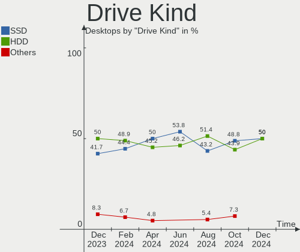
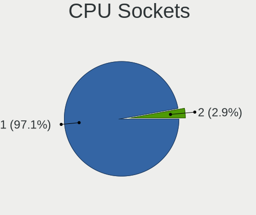
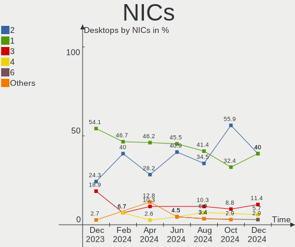
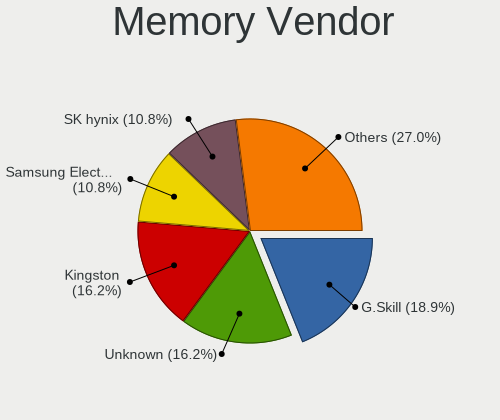

FreeBSD - Hardware Trends (Desktops)
------------------------------------

A project to identify most popular hardware characteristics and track their change
over time based on data collected by BSD users at https://BSD-Hardware.info.

Anyone can contribute to this report by the [hw-probe](https://github.com/linuxhw/hw-probe/blob/master/INSTALL.BSD.md) tool:

    hw-probe -all -upload

This report is for one last month. Overall report since the beginning of time: [TestDays](https://github.com/bsdhw/TestDays)

Period: Jul, 2023.

Contents
--------

* [ System ](#system)
  - [ OS                       ](#os)
  - [ OS Family                ](#os-family)
  - [ Arch                     ](#arch)
  - [ DE                       ](#de)
  - [ Display Server           ](#display-server)
  - [ Display Manager          ](#display-manager)
  - [ OS Lang                  ](#os-lang)
  - [ Boot Mode                ](#boot-mode)
  - [ Filesystem               ](#filesystem)
  - [ Part. scheme             ](#part-scheme)

* [ Board ](#board)
  - [ Vendor                   ](#vendor)
  - [ Model                    ](#model)
  - [ Model Family             ](#model-family)
  - [ MFG Year                 ](#mfg-year)
  - [ Form Factor              ](#form-factor)
  - [ Coreboot                 ](#coreboot)
  - [ RAM Size                 ](#ram-size)
  - [ RAM Used                 ](#ram-used)
  - [ Total Drives             ](#total-drives)
  - [ Has CD-ROM               ](#has-cd-rom)
  - [ Has Ethernet             ](#has-ethernet)
  - [ Has WiFi                 ](#has-wifi)
  - [ Has Bluetooth            ](#has-bluetooth)

* [ Location ](#location)
  - [ Country                  ](#country)
  - [ City                     ](#city)

* [ Drives ](#drives)
  - [ Drive Vendor             ](#drive-vendor)
  - [ Drive Model              ](#drive-model)
  - [ HDD Vendor               ](#hdd-vendor)
  - [ SSD Vendor               ](#ssd-vendor)
  - [ Drive Kind               ](#drive-kind)
  - [ Drive Connector          ](#drive-connector)
  - [ Drive Size               ](#drive-size)
  - [ Space Total              ](#space-total)
  - [ Space Used               ](#space-used)
  - [ Malfunc. Drives          ](#malfunc-drives)
  - [ Malfunc. Drive Vendor    ](#malfunc-drive-vendor)
  - [ Malfunc. HDD Vendor      ](#malfunc-hdd-vendor)
  - [ Malfunc. Drive Kind      ](#malfunc-drive-kind)
  - [ Failed Drives            ](#failed-drives)
  - [ Failed Drive Vendor      ](#failed-drive-vendor)
  - [ Drive Status             ](#drive-status)

* [ Storage controller ](#storage-controller)
  - [ Storage Vendor           ](#storage-vendor)
  - [ Storage Model            ](#storage-model)
  - [ Storage Kind             ](#storage-kind)

* [ Processor ](#processor)
  - [ CPU Vendor               ](#cpu-vendor)
  - [ CPU Model                ](#cpu-model)
  - [ CPU Model Family         ](#cpu-model-family)
  - [ CPU Cores                ](#cpu-cores)
  - [ CPU Sockets              ](#cpu-sockets)
  - [ CPU Threads              ](#cpu-threads)
  - [ CPU Microarch            ](#cpu-microarch)

* [ Graphics ](#graphics)
  - [ GPU Vendor               ](#gpu-vendor)
  - [ GPU Model                ](#gpu-model)
  - [ GPU Combo                ](#gpu-combo)
  - [ GPU Driver               ](#gpu-driver)
  - [ GPU Memory               ](#gpu-memory)

* [ Monitor ](#monitor)
  - [ Monitor Vendor           ](#monitor-vendor)
  - [ Monitor Model            ](#monitor-model)
  - [ Monitor Resolution       ](#monitor-resolution)
  - [ Monitor Diagonal         ](#monitor-diagonal)
  - [ Monitor Width            ](#monitor-width)
  - [ Aspect Ratio             ](#aspect-ratio)
  - [ Monitor Area             ](#monitor-area)
  - [ Pixel Density            ](#pixel-density)
  - [ Multiple Monitors        ](#multiple-monitors)

* [ Network ](#network)
  - [ Net Controller Vendor    ](#net-controller-vendor)
  - [ Net Controller Model     ](#net-controller-model)
  - [ Wireless Vendor          ](#wireless-vendor)
  - [ Wireless Model           ](#wireless-model)
  - [ Ethernet Vendor          ](#ethernet-vendor)
  - [ Ethernet Model           ](#ethernet-model)
  - [ Net Controller Kind      ](#net-controller-kind)
  - [ Used Controller          ](#used-controller)
  - [ NICs                     ](#nics)
  - [ IPv6                     ](#ipv6)

* [ Bluetooth ](#bluetooth)
  - [ Bluetooth Vendor         ](#bluetooth-vendor)
  - [ Bluetooth Model          ](#bluetooth-model)

* [ Sound ](#sound)
  - [ Sound Vendor             ](#sound-vendor)
  - [ Sound Model              ](#sound-model)

* [ Memory ](#memory)
  - [ Memory Vendor            ](#memory-vendor)
  - [ Memory Model             ](#memory-model)
  - [ Memory Kind              ](#memory-kind)
  - [ Memory Form Factor       ](#memory-form-factor)
  - [ Memory Size              ](#memory-size)
  - [ Memory Speed             ](#memory-speed)

* [ Printers & scanners ](#printers--scanners)
  - [ Printer Vendor           ](#printer-vendor)
  - [ Printer Model            ](#printer-model)
  - [ Scanner Vendor           ](#scanner-vendor)
  - [ Scanner Model            ](#scanner-model)

* [ Camera ](#camera)
  - [ Camera Vendor            ](#camera-vendor)
  - [ Camera Model             ](#camera-model)

* [ Security ](#security)
  - [ Fingerprint Vendor       ](#fingerprint-vendor)
  - [ Fingerprint Model        ](#fingerprint-model)
  - [ Chipcard Vendor          ](#chipcard-vendor)
  - [ Chipcard Model           ](#chipcard-model)

* [ Unsupported ](#unsupported)
  - [ Unsupported Devices      ](#unsupported-devices)
  - [ Unsupported Device Types ](#unsupported-device-types)

System
------

OS
--

Installed operating systems

| Name                 | Desktops | Percent |
|----------------------|----------|---------|
| FreeBSD 13.2         | 16       | 44.44%  |
| FreeBSD 13.1-p8      | 10       | 27.78%  |
| FreeBSD 13.2-p1      | 7        | 19.44%  |
| FreeBSD 14.0-CURRENT | 1        | 2.78%   |
| FreeBSD 13.1-p5      | 1        | 2.78%   |
| FreeBSD 13.1         | 1        | 2.78%   |

OS Family
---------

OS without a version

| Name    | Desktops | Percent |
|---------|----------|---------|
| FreeBSD | 36       | 100%    |

Arch
----

OS architecture (x86_64, i586, etc.)

| Name  | Desktops | Percent |
|-------|----------|---------|
| amd64 | 34       | 94.44%  |
| arm64 | 2        | 5.56%   |

DE
--

Desktop Environment

| Name    | Desktops | Percent |
|---------|----------|---------|
| Console | 11       | 30.56%  |
| GNOME   | 8        | 22.22%  |
| KDE5    | 6        | 16.67%  |
| TWM     | 3        | 8.33%   |
| XFCE    | 2        | 5.56%   |
| Openbox | 2        | 5.56%   |
| Picom   | 1        | 2.78%   |
| LXQt    | 1        | 2.78%   |
| LXDE    | 1        | 2.78%   |
| DWM     | 1        | 2.78%   |

Display Server
--------------

X11 or Wayland

| Name    | Desktops | Percent |
|---------|----------|---------|
| Console | 20       | 55.56%  |
| X11     | 16       | 44.44%  |

Display Manager
---------------

SDDM, LightDM, etc.

| Name    | Desktops | Percent |
|---------|----------|---------|
| Console | 17       | 47.22%  |
| SDDM    | 7        | 19.44%  |
| GDM     | 5        | 13.89%  |
| XDM     | 3        | 8.33%   |
| LightDM | 3        | 8.33%   |
| SLiM    | 1        | 2.78%   |

OS Lang
-------

Language

| Lang    | Desktops | Percent |
|---------|----------|---------|
| C       | 27       | 75%     |
| en_US   | 5        | 13.89%  |
| pl_PL   | 1        | 2.78%   |
| it_IT   | 1        | 2.78%   |
| fi_FI   | 1        | 2.78%   |
| Unknown | 1        | 2.78%   |

Boot Mode
---------

EFI or BIOS

| Mode | Desktops | Percent |
|------|----------|---------|
| EFI  | 31       | 86.11%  |
| BIOS | 5        | 13.89%  |

Filesystem
----------

Type of filesystem

| Type | Desktops | Percent |
|------|----------|---------|
| Zfs  | 19       | 52.78%  |
| Ufs  | 17       | 47.22%  |

Part. scheme
------------

Scheme of partitioning

| Type | Desktops | Percent |
|------|----------|---------|
| GPT  | 34       | 94.44%  |
| MBR  | 2        | 5.56%   |

Board
-----

Vendor
------

Motherboard manufacturer

| Name                | Desktops | Percent |
|---------------------|----------|---------|
| Gigabyte Technology | 10       | 27.78%  |
| ASUSTek Computer    | 7        | 19.44%  |
| MSI                 | 4        | 11.11%  |
| ASRock              | 4        | 11.11%  |
| Intel               | 2        | 5.56%   |
| Hewlett-Packard     | 2        | 5.56%   |
| Dell                | 2        | 5.56%   |
| Unknown             | 2        | 5.56%   |
| Radxa               | 1        | 2.78%   |
| Fujitsu             | 1        | 2.78%   |
| ASRockRack          | 1        | 2.78%   |

Model
-----

Motherboard model

| Name                             | Desktops | Percent |
|----------------------------------|----------|---------|
| Gigabyte B360N WIFI              | 5        | 13.89%  |
| Gigabyte H270N-WIFI              | 2        | 5.56%   |
| ASRock J3455B-ITX                | 2        | 5.56%   |
| Unknown                          | 2        | 5.56%   |
| Radxa rock-pi-n10a               | 1        | 2.78%   |
| MSI MS-7D16                      | 1        | 2.78%   |
| MSI MS-7D15                      | 1        | 2.78%   |
| MSI MS-7B85                      | 1        | 2.78%   |
| MSI MS-7817                      | 1        | 2.78%   |
| Intel HM570                      | 1        | 2.78%   |
| Intel DQ67SW                     | 1        | 2.78%   |
| HP Slimline Desktop PC 270-p0xx  | 1        | 2.78%   |
| HP Compaq Elite 8300 SFF         | 1        | 2.78%   |
| Gigabyte X470 AORUS ULTRA GAMING | 1        | 2.78%   |
| Gigabyte M85M-US2H               | 1        | 2.78%   |
| Gigabyte H77M-D3H                | 1        | 2.78%   |
| Fujitsu ESPRIMO P420             | 1        | 2.78%   |
| Dell Precision T3600             | 1        | 2.78%   |
| Dell OptiPlex 3060               | 1        | 2.78%   |
| ASUS ROG CROSSHAIR VIII HERO     | 1        | 2.78%   |
| ASUS PRIME Z690-P D4             | 1        | 2.78%   |
| ASUS PRIME X370-PRO              | 1        | 2.78%   |
| ASUS PRIME H510M-A               | 1        | 2.78%   |
| ASUS PRIME A320I-K               | 1        | 2.78%   |
| ASUS P8P67                       | 1        | 2.78%   |
| ASUS P5Q-E                       | 1        | 2.78%   |
| ASRockRack EPYC3101D4I-2T        | 1        | 2.78%   |
| ASRock Z690 PG Riptide           | 1        | 2.78%   |
| ASRock X570 Phantom Gaming 4     | 1        | 2.78%   |

Model Family
------------

Motherboard model prefix

| Name                      | Desktops | Percent |
|---------------------------|----------|---------|
| Gigabyte B360N            | 5        | 13.89%  |
| ASUS PRIME                | 4        | 11.11%  |
| Gigabyte H270N-WIFI       | 2        | 5.56%   |
| ASRock J3455B-ITX         | 2        | 5.56%   |
| Unknown                   | 2        | 5.56%   |
| Radxa rock-pi-n10a        | 1        | 2.78%   |
| MSI MS-7D16               | 1        | 2.78%   |
| MSI MS-7D15               | 1        | 2.78%   |
| MSI MS-7B85               | 1        | 2.78%   |
| MSI MS-7817               | 1        | 2.78%   |
| Intel HM570               | 1        | 2.78%   |
| Intel DQ67SW              | 1        | 2.78%   |
| HP Slimline               | 1        | 2.78%   |
| HP Compaq                 | 1        | 2.78%   |
| Gigabyte X470             | 1        | 2.78%   |
| Gigabyte M85M-US2H        | 1        | 2.78%   |
| Gigabyte H77M-D3H         | 1        | 2.78%   |
| Fujitsu ESPRIMO           | 1        | 2.78%   |
| Dell Precision            | 1        | 2.78%   |
| Dell OptiPlex             | 1        | 2.78%   |
| ASUS ROG                  | 1        | 2.78%   |
| ASUS P8P67                | 1        | 2.78%   |
| ASUS P5Q-E                | 1        | 2.78%   |
| ASRockRack EPYC3101D4I-2T | 1        | 2.78%   |
| ASRock Z690               | 1        | 2.78%   |
| ASRock X570               | 1        | 2.78%   |

MFG Year
--------

Motherboard manufacture year

| Year    | Desktops | Percent |
|---------|----------|---------|
| 2022    | 6        | 16.67%  |
| 2018    | 6        | 16.67%  |
| 2019    | 5        | 13.89%  |
| 2017    | 4        | 11.11%  |
| 2021    | 3        | 8.33%   |
| 2014    | 3        | 8.33%   |
| 2016    | 2        | 5.56%   |
| 2012    | 2        | 5.56%   |
| 2013    | 1        | 2.78%   |
| 2011    | 1        | 2.78%   |
| 2009    | 1        | 2.78%   |
| 2008    | 1        | 2.78%   |
| Unknown | 1        | 2.78%   |

Form Factor
-----------

Physical design of the computer

| Name    | Desktops | Percent |
|---------|----------|---------|
| Desktop | 36       | 100%    |

Coreboot
--------

Have coreboot on board

| Used | Desktops | Percent |
|------|----------|---------|
| No   | 36       | 100%    |

RAM Size
--------

Total RAM memory

| Size in GB  | Desktops | Percent |
|-------------|----------|---------|
| 16.01-24.0  | 20       | 55.56%  |
| 32.01-64.0  | 7        | 19.44%  |
| 4.01-8.0    | 4        | 11.11%  |
| 64.01-256.0 | 2        | 5.56%   |
| 8.01-16.0   | 2        | 5.56%   |
| 3.01-4.0    | 1        | 2.78%   |

RAM Used
--------

Used RAM memory

| Used GB    | Desktops | Percent |
|------------|----------|---------|
| 0.51-1.0   | 23       | 63.89%  |
| 1.01-2.0   | 6        | 16.67%  |
| 0.01-0.5   | 5        | 13.89%  |
| 32.01-64.0 | 1        | 2.78%   |
| 3.01-4.0   | 1        | 2.78%   |

Total Drives
------------

Number of drives on board

| Drives | Desktops | Percent |
|--------|----------|---------|
| 2      | 13       | 36.11%  |
| 1      | 8        | 22.22%  |
| 3      | 7        | 19.44%  |
| 0      | 3        | 8.33%   |
| 13     | 1        | 2.78%   |
| 10     | 1        | 2.78%   |
| 6      | 1        | 2.78%   |
| 5      | 1        | 2.78%   |
| 4      | 1        | 2.78%   |

Has CD-ROM
----------

Has CD-ROM on board

| Presented | Desktops | Percent |
|-----------|----------|---------|
| No        | 28       | 77.78%  |
| Yes       | 8        | 22.22%  |

Has Ethernet
------------

Has Ethernet on board

| Presented | Desktops | Percent |
|-----------|----------|---------|
| Yes       | 34       | 94.44%  |
| No        | 2        | 5.56%   |

Has WiFi
--------

Has WiFi module

| Presented | Desktops | Percent |
|-----------|----------|---------|
| No        | 20       | 55.56%  |
| Yes       | 16       | 44.44%  |

Has Bluetooth
-------------

Has Bluetooth module

| Presented | Desktops | Percent |
|-----------|----------|---------|
| No        | 23       | 63.89%  |
| Yes       | 13       | 36.11%  |

Location
--------

Country
-------

Geographic location (country)

| Country     | Desktops | Percent |
|-------------|----------|---------|
| Poland      | 10       | 27.78%  |
| USA         | 7        | 19.44%  |
| Russia      | 5        | 13.89%  |
| Italy       | 3        | 8.33%   |
| Australia   | 2        | 5.56%   |
| Thailand    | 1        | 2.78%   |
| Sweden      | 1        | 2.78%   |
| Netherlands | 1        | 2.78%   |
| Kazakhstan  | 1        | 2.78%   |
| India       | 1        | 2.78%   |
| Germany     | 1        | 2.78%   |
| Finland     | 1        | 2.78%   |
| Canada      | 1        | 2.78%   |
| Argentina   | 1        | 2.78%   |

City
----

Geographic location (city)

| City              | Desktops | Percent |
|-------------------|----------|---------|
| Lublin            | 6        | 16.67%  |
| St Petersburg     | 4        | 11.11%  |
| Sydney            | 3        | 8.33%   |
| Gmina Świebodzin | 3        | 8.33%   |
| Salem             | 2        | 5.56%   |
| Redmond           | 2        | 5.56%   |
| Zgierz            | 1        | 2.78%   |
| Wenatchee         | 1        | 2.78%   |
| Wauwatosa         | 1        | 2.78%   |
| Stavropol         | 1        | 2.78%   |
| Pinneberg         | 1        | 2.78%   |
| Oulx              | 1        | 2.78%   |
| Munfordville      | 1        | 2.78%   |
| Milano            | 1        | 2.78%   |
| Hyderabad         | 1        | 2.78%   |
| Helsinki          | 1        | 2.78%   |
| Helmond           | 1        | 2.78%   |
| Coronel Pringles  | 1        | 2.78%   |
| Borlänge         | 1        | 2.78%   |
| Binago            | 1        | 2.78%   |
| Bangkok           | 1        | 2.78%   |
| Almaty            | 1        | 2.78%   |

Drives
------

Drive Vendor
------------

Hard drive vendors

| Vendor              | Desktops | Drives | Percent |
|---------------------|----------|--------|---------|
| WDC                 | 17       | 36     | 27.42%  |
| Samsung Electronics | 12       | 18     | 19.35%  |
| Seagate             | 8        | 10     | 12.9%   |
| Intel               | 5        | 5      | 8.06%   |
| Kingston            | 4        | 5      | 6.45%   |
| Crucial             | 4        | 6      | 6.45%   |
| Corsair             | 2        | 2      | 3.23%   |
| A-DATA Technology   | 2        | 2      | 3.23%   |
| Verbatim            | 1        | 1      | 1.61%   |
| Team                | 1        | 1      | 1.61%   |
| T-FORCE             | 1        | 1      | 1.61%   |
| SK hynix            | 1        | 1      | 1.61%   |
| OCZ                 | 1        | 1      | 1.61%   |
| Netac               | 1        | 1      | 1.61%   |
| Hitachi             | 1        | 1      | 1.61%   |
| HGST                | 1        | 2      | 1.61%   |

Drive Model
-----------

Hard drive models

| Model                                  | Desktops | Percent |
|----------------------------------------|----------|---------|
| WDC WDS500G1R0A-68A4W0 500GB           | 6        | 7.23%   |
| WDC WD5000LPLX-22ZNTT0 500GB           | 5        | 6.02%   |
| Samsung SSD 870 QVO 1TB                | 3        | 3.61%   |
| WDC WD80EMAZ-00WJTA0 8TB               | 2        | 2.41%   |
| WDC WD10JPLX-00MBPT0 1TB               | 2        | 2.41%   |
| Seagate ST4000LM024-2U817V 4TB         | 2        | 2.41%   |
| Seagate ST4000LM024-2AN17V 4TB         | 2        | 2.41%   |
| Seagate ST4000DM000-1F2168 4TB         | 2        | 2.41%   |
| Samsung SSD 970 EVO Plus 2TB           | 2        | 2.41%   |
| Kingston SA400S37480G 480GB            | 2        | 2.41%   |
| A-DATA LEGEND 710 256GB                | 2        | 2.41%   |
| WDC WDS120G2G0A-00JH30 120GB           | 1        | 1.2%    |
| WDC WDS100T3X0C-00SJG0 1TB             | 1        | 1.2%    |
| WDC WDS100T2B0C-00PXH0 1TB             | 1        | 1.2%    |
| WDC WD80EFZX-68UW8N0 8TB               | 1        | 1.2%    |
| WDC WD80EFAX-68LHPN0 8TB               | 1        | 1.2%    |
| WDC WD80EDBZ-11B0ZA0 8TB               | 1        | 1.2%    |
| WDC WD7500BPKT-00PK4T0 752GB           | 1        | 1.2%    |
| WDC WD5003ABYX-01WERA1 500GB           | 1        | 1.2%    |
| WDC WD5000LPLX-00ZNTT0 500GB           | 1        | 1.2%    |
| WDC WD40EZRZ-22GXCB0 4TB               | 1        | 1.2%    |
| WDC WD20NPVX-00EA4T0 2TB               | 1        | 1.2%    |
| WDC WD15EADS-00P8B0 1.5TB              | 1        | 1.2%    |
| WDC WD120EMFZ-11A6JA0 12TB             | 1        | 1.2%    |
| WDC WD120EMAZ-11BLFA0 12TB             | 1        | 1.2%    |
| WDC WD10SPZX-60Z10T0 1TB               | 1        | 1.2%    |
| WDC WD10EZEX-60WN4A0 1TB               | 1        | 1.2%    |
| Verbatim Vi550 S3 SSD 256GB            | 1        | 1.2%    |
| Team TM8PS7512G 512GB                  | 1        | 1.2%    |
| T-FORCE SSD 500GB                      | 1        | 1.2%    |
| SK hynix SKHynix_HFS512GDE9X084N 512GB | 1        | 1.2%    |
| Seagate ST4000DM000-2AE166 4TB         | 1        | 1.2%    |
| Seagate ST2000LM015-2E8174 2TB         | 1        | 1.2%    |
| Seagate ST1000LM024 HN-M101MBB 1TB     | 1        | 1.2%    |
| Samsung SSD 970 EVO Plus 500GB         | 1        | 1.2%    |
| Samsung SSD 970 EVO 500GB              | 1        | 1.2%    |
| Samsung SSD 960 EVO 500GB              | 1        | 1.2%    |
| Samsung SSD 870 QVO 2TB                | 1        | 1.2%    |
| Samsung SSD 870 EVO 500GB              | 1        | 1.2%    |
| Samsung SSD 860 QVO 1TB                | 1        | 1.2%    |

HDD Vendor
----------

Hard disk drive vendors

| Vendor  | Desktops | Drives | Percent |
|---------|----------|--------|---------|
| WDC     | 14       | 27     | 58.33%  |
| Seagate | 8        | 10     | 33.33%  |
| Hitachi | 1        | 1      | 4.17%   |
| HGST    | 1        | 2      | 4.17%   |

SSD Vendor
----------

Solid state drive vendors

| Vendor              | Desktops | Drives | Percent |
|---------------------|----------|--------|---------|
| Samsung Electronics | 10       | 13     | 30.3%   |
| WDC                 | 7        | 7      | 21.21%  |
| Kingston            | 4        | 5      | 12.12%  |
| Crucial             | 4        | 5      | 12.12%  |
| Intel               | 2        | 2      | 6.06%   |
| Verbatim            | 1        | 1      | 3.03%   |
| Team                | 1        | 1      | 3.03%   |
| T-FORCE             | 1        | 1      | 3.03%   |
| OCZ                 | 1        | 1      | 3.03%   |
| Netac               | 1        | 1      | 3.03%   |
| Corsair             | 1        | 1      | 3.03%   |

Drive Kind
----------

HDD or SSD

| Kind | Desktops | Drives | Percent |
|------|----------|--------|---------|
| SSD  | 25       | 38     | 44.64%  |
| HDD  | 19       | 40     | 33.93%  |
| NVMe | 12       | 15     | 21.43%  |

Drive Connector
---------------

SATA, SAS, NVMe, etc.

| Type | Desktops | Drives | Percent |
|------|----------|--------|---------|
| SATA | 31       | 78     | 72.09%  |
| NVMe | 12       | 15     | 27.91%  |

Drive Size
----------

Size of hard drive

| Size in TB | Desktops | Drives | Percent |
|------------|----------|--------|---------|
| 0.01-0.5   | 22       | 34     | 45.83%  |
| 0.51-1.0   | 11       | 14     | 22.92%  |
| 3.01-4.0   | 7        | 8      | 14.58%  |
| 1.01-2.0   | 4        | 9      | 8.33%   |
| 4.01-10.0  | 3        | 11     | 6.25%   |
| 10.01-20.0 | 1        | 2      | 2.08%   |

Space Total
-----------

Amount of disk space available on the file system

| Size in GB     | Desktops | Percent |
|----------------|----------|---------|
| 501-1000       | 16       | 44.44%  |
| 251-500        | 10       | 27.78%  |
| 51-100         | 3        | 8.33%   |
| More than 3000 | 2        | 5.56%   |
| 1-20           | 2        | 5.56%   |
| 21-50          | 1        | 2.78%   |
| 2001-3000      | 1        | 2.78%   |
| 101-250        | 1        | 2.78%   |

Space Used
----------

Amount of used disk space

| Used GB        | Desktops | Percent |
|----------------|----------|---------|
| 1-20           | 21       | 58.33%  |
| 101-250        | 6        | 16.67%  |
| 251-500        | 5        | 13.89%  |
| 21-50          | 2        | 5.56%   |
| More than 3000 | 1        | 2.78%   |
| 51-100         | 1        | 2.78%   |

Malfunc. Drives
---------------

Drive models with a malfunction

| Model                          | Desktops | Drives | Percent |
|--------------------------------|----------|--------|---------|
| WDC WD5000LPLX-22ZNTT0 500GB   | 2        | 2      | 28.57%  |
| WDC WD7500BPKT-00PK4T0 752GB   | 1        | 1      | 14.29%  |
| WDC WD20NPVX-00EA4T0 2TB       | 1        | 2      | 14.29%  |
| Seagate ST2000LM015-2E8174 2TB | 1        | 2      | 14.29%  |
| Hitachi HUA722020ALA330 2TB    | 1        | 1      | 14.29%  |
| Crucial CT525MX300SSD1 528GB   | 1        | 1      | 14.29%  |

Malfunc. Drive Vendor
---------------------

Vendors of faulty drives

| Vendor  | Desktops | Drives | Percent |
|---------|----------|--------|---------|
| WDC     | 3        | 5      | 50%     |
| Seagate | 1        | 2      | 16.67%  |
| Hitachi | 1        | 1      | 16.67%  |
| Crucial | 1        | 1      | 16.67%  |

Malfunc. HDD Vendor
-------------------

Vendors of faulty HDD drives

| Vendor  | Desktops | Drives | Percent |
|---------|----------|--------|---------|
| WDC     | 3        | 5      | 60%     |
| Seagate | 1        | 2      | 20%     |
| Hitachi | 1        | 1      | 20%     |

Malfunc. Drive Kind
-------------------

Kinds of faulty drives

| Kind | Desktops | Drives | Percent |
|------|----------|--------|---------|
| HDD  | 4        | 8      | 80%     |
| SSD  | 1        | 1      | 20%     |

Failed Drives
-------------

Failed drive models

Zero info for selected period =(

Failed Drive Vendor
-------------------

Failed drive vendors

Zero info for selected period =(

Drive Status
------------

Number of failed and malfunc. drives

| Status  | Desktops | Drives | Percent |
|---------|----------|--------|---------|
| Works   | 33       | 84     | 86.84%  |
| Malfunc | 5        | 9      | 13.16%  |

Storage controller
------------------

Storage Vendor
--------------

Storage controller vendors

| Vendor                    | Desktops | Percent |
|---------------------------|----------|---------|
| Intel                     | 27       | 50.94%  |
| AMD                       | 7        | 13.21%  |
| Samsung Electronics       | 4        | 7.55%   |
| Marvell Technology Group  | 4        | 7.55%   |
| SanDisk                   | 2        | 3.77%   |
| ADATA Technology          | 2        | 3.77%   |
| SK hynix                  | 1        | 1.89%   |
| Phison Electronics        | 1        | 1.89%   |
| Nvidia                    | 1        | 1.89%   |
| Micron/Crucial Technology | 1        | 1.89%   |
| JMicron Technology        | 1        | 1.89%   |
| Broadcom / LSI            | 1        | 1.89%   |
| Adaptec                   | 1        | 1.89%   |

Storage Model
-------------

Storage controller models

| Model                                                                          | Desktops | Percent |
|--------------------------------------------------------------------------------|----------|---------|
| AMD FCH SATA Controller [AHCI mode]                                            | 7        | 10.77%  |
| Intel Cannon Lake PCH SATA AHCI Controller                                     | 5        | 7.69%   |
| Samsung NVMe SSD Controller SM981/PM981/PM983                                  | 3        | 4.62%   |
| Intel 500 Series Chipset Family SATA AHCI Controller                           | 3        | 4.62%   |
| Intel 200 Series PCH SATA controller [AHCI mode]                               | 3        | 4.62%   |
| Marvell Group 88SE9230 PCIe 2.0 x2 4-port SATA 6 Gb/s RAID Controller          | 2        | 3.08%   |
| Intel SSD 660P Series                                                          | 2        | 3.08%   |
| Intel Celeron N3350/Pentium N4200/Atom E3900 Series SATA AHCI Controller       | 2        | 3.08%   |
| Intel Alder Lake-S PCH SATA Controller [AHCI Mode]                             | 2        | 3.08%   |
| Intel 8 Series/C220 Series Chipset Family 6-port SATA Controller 1 [AHCI mode] | 2        | 3.08%   |
| Intel 6 Series/C200 Series Chipset Family 6 port Desktop SATA AHCI Controller  | 2        | 3.08%   |
| AMD 400 Series Chipset SATA Controller                                         | 2        | 3.08%   |
| ADATA ADATA XPG GAMMIXS1 1L Media (256 GB SSD)                                 | 2        | 3.08%   |
| SK hynix Gold P31/BC711/PC711 NVMe Solid State Drive                           | 1        | 1.54%   |
| SanDisk WD Blue SN550 NVMe SSD                                                 | 1        | 1.54%   |
| SanDisk WD Black SN750 / PC SN730 NVMe SSD                                     | 1        | 1.54%   |
| Samsung NVMe SSD Controller SM961/PM961/SM963                                  | 1        | 1.54%   |
| Phison E16 PCIe4 NVMe Controller                                               | 1        | 1.54%   |
| Nvidia MCP78S [GeForce 8200] IDE                                               | 1        | 1.54%   |
| Nvidia MCP78S [GeForce 8200] AHCI Controller                                   | 1        | 1.54%   |
| Micron/Crucial P2 [Nick P2] / P3 / P3 Plus NVMe PCIe SSD (DRAM-less)           | 1        | 1.54%   |
| Marvell Group 88SE9172 SATA 6Gb/s Controller                                   | 1        | 1.54%   |
| Marvell Group 88SE6111/6121 SATA II / PATA Controller                          | 1        | 1.54%   |
| JMicron JMB58x AHCI SATA controller                                            | 1        | 1.54%   |
| Intel Volume Management Device NVMe RAID Controller                            | 1        | 1.54%   |
| Intel Tiger Lake SATA AHCI Controller                                          | 1        | 1.54%   |
| Intel Sunrise Point-LP SATA Controller [AHCI mode]                             | 1        | 1.54%   |
| Intel SSD 670p Series [Keystone Harbor]                                        | 1        | 1.54%   |
| Intel SATA Controller [RAID mode]                                              | 1        | 1.54%   |
| Intel C602 chipset 4-Port SATA Storage Control Unit                            | 1        | 1.54%   |
| Intel C600/X79 series chipset 6-Port SATA AHCI Controller                      | 1        | 1.54%   |
| Intel 82801JI (ICH10 Family) 4 port SATA IDE Controller #1                     | 1        | 1.54%   |
| Intel 82801JI (ICH10 Family) 2 port SATA IDE Controller #2                     | 1        | 1.54%   |
| Intel 7 Series/C210 Series Chipset Family 6-port SATA Controller [AHCI mode]   | 1        | 1.54%   |
| Intel 7 Series/C210 Series Chipset Family 4-port SATA Controller [IDE mode]    | 1        | 1.54%   |
| Intel 7 Series/C210 Series Chipset Family 2-port SATA Controller [IDE mode]    | 1        | 1.54%   |
| Intel 6 Series/C200 Series Chipset Family IDE-r Controller                     | 1        | 1.54%   |
| Broadcom / LSI SAS2008 PCI-Express Fusion-MPT SAS-2 [Falcon]                   | 1        | 1.54%   |
| AMD X370 Series Chipset SATA Controller                                        | 1        | 1.54%   |
| AMD FCH SATA Controller D                                                      | 1        | 1.54%   |

Storage Kind
------------

Kind of storage controller (IDE, SATA, NVMe, SAS, ...)

| Kind | Desktops | Percent |
|------|----------|---------|
| SATA | 32       | 60.38%  |
| NVMe | 12       | 22.64%  |
| IDE  | 4        | 7.55%   |
| RAID | 3        | 5.66%   |
| SAS  | 2        | 3.77%   |

Processor
---------

CPU Vendor
----------

Processor vendors

| Vendor | Desktops | Percent |
|--------|----------|---------|
| Intel  | 26       | 72.22%  |
| AMD    | 8        | 22.22%  |
| ARM    | 2        | 5.56%   |

CPU Model
---------

Processor models

| Model                                      | Desktops | Percent |
|--------------------------------------------|----------|---------|
| Intel Core i3-8300T CPU @ 3.20GHz          | 4        | 11.11%  |
| Intel Pentium CPU G4600T @ 3.00GHz         | 2        | 5.56%   |
| Intel Core i5-3470 CPU @ 3.20GHz           | 2        | 5.56%   |
| Intel Celeron CPU J3455 @ 1.50GHz          | 2        | 5.56%   |
| AMD Ryzen 9 3900X 12-Core Processor        | 2        | 5.56%   |
| Intel Xeon CPU E5-1620 0 @ 3.60GH          | 1        | 2.78%   |
| Intel Pentium CPU G3220 @ 3.00GHz          | 1        | 2.78%   |
| Intel Genuine CPU 0000 @ 1.80GHz           | 1        | 2.78%   |
| Intel Core i7-9700T CPU @ 2.00GHz          | 1        | 2.78%   |
| Intel Core i7-8550U CPU @ 1.80GHz          | 1        | 2.78%   |
| Intel Core i7-4790 CPU @ 3.60GHz           | 1        | 2.78%   |
| Intel Core i7-2600K CPU @ 3.40GHz          | 1        | 2.78%   |
| Intel Core i5-2400 CPU @ 3.10GHz           | 1        | 2.78%   |
| Intel Core i5-10600K CPU @ 4.10GHz         | 1        | 2.78%   |
| Intel Core i5-10400F CPU @ 2.90GHz         | 1        | 2.78%   |
| Intel Core i3-8100T CPU @ 3.10GHz          | 1        | 2.78%   |
| Intel Core i3-7100 CPU @ 3.90GHz           | 1        | 2.78%   |
| Intel Core i3-10100F CPU @ 3.60GHz         | 1        | 2.78%   |
| Intel Core 2 Quad CPU Q6600 @ 2.40GHz      | 1        | 2.78%   |
| Intel 12th Gen Core i7-12700K              | 1        | 2.78%   |
| Intel 12th Gen Core i3-12100               | 1        | 2.78%   |
| ARM Cortex-A55 r2p0                        | 1        | 2.78%   |
| ARM Cortex-A53 r0p4                        | 1        | 2.78%   |
| AMD Ryzen 7 PRO 4750G with Radeon Graphics | 1        | 2.78%   |
| AMD Ryzen 7 2700X Eight-Core Processor     | 1        | 2.78%   |
| AMD Ryzen 7 1700 Eight-Core Processor      | 1        | 2.78%   |
| AMD Ryzen 3 1200 Quad-Core Processor       | 1        | 2.78%   |
| AMD EPYC 3101 4-Core Processor             | 1        | 2.78%   |
| AMD Athlon X2 235e Processor               | 1        | 2.78%   |

CPU Model Family
----------------

Processor model prefix

| Model             | Desktops | Percent |
|-------------------|----------|---------|
| Intel Core i3     | 7        | 19.44%  |
| Intel Core i5     | 5        | 13.89%  |
| Intel Core i7     | 4        | 11.11%  |
| Intel Pentium     | 3        | 8.33%   |
| Other             | 2        | 5.56%   |
| Intel Celeron     | 2        | 5.56%   |
| ARM Cortex        | 2        | 5.56%   |
| AMD Ryzen 9       | 2        | 5.56%   |
| AMD Ryzen 7       | 2        | 5.56%   |
| Intel Xeon        | 1        | 2.78%   |
| Intel Genuine     | 1        | 2.78%   |
| Intel Core 2 Quad | 1        | 2.78%   |
| AMD Ryzen 7 PRO   | 1        | 2.78%   |
| AMD Ryzen 3       | 1        | 2.78%   |
| AMD EPYC          | 1        | 2.78%   |
| AMD Athlon X2     | 1        | 2.78%   |

CPU Cores
---------

Number of processor cores

| Number  | Desktops | Percent |
|---------|----------|---------|
| 4       | 19       | 52.78%  |
| 2       | 5        | 13.89%  |
| 16      | 3        | 8.33%   |
| 6       | 3        | 8.33%   |
| 24      | 2        | 5.56%   |
| Unknown | 2        | 5.56%   |
| 10      | 1        | 2.78%   |
| 8       | 1        | 2.78%   |

CPU Sockets
-----------

Number of sockets

| Number  | Desktops | Percent |
|---------|----------|---------|
| 1       | 34       | 94.44%  |
| Unknown | 2        | 5.56%   |

CPU Threads
-----------

Threads per core (Hyper-Threading)

| Number  | Desktops | Percent |
|---------|----------|---------|
| 1       | 21       | 58.33%  |
| 2       | 13       | 36.11%  |
| Unknown | 2        | 5.56%   |

CPU Microarch
-------------

Microarchitecture

| Name        | Desktops | Percent |
|-------------|----------|---------|
| KabyLake    | 10       | 27.78%  |
| Unknown     | 5        | 13.89%  |
| Zen 2       | 3        | 8.33%   |
| Zen         | 3        | 8.33%   |
| SandyBridge | 3        | 8.33%   |
| CometLake   | 3        | 8.33%   |
| IvyBridge   | 2        | 5.56%   |
| Haswell     | 2        | 5.56%   |
| Goldmont    | 2        | 5.56%   |
| Zen+        | 1        | 2.78%   |
| K10         | 1        | 2.78%   |
| Core        | 1        | 2.78%   |

Graphics
--------

GPU Vendor
----------

Vendors of graphics cards

| Vendor            | Desktops | Percent |
|-------------------|----------|---------|
| Intel             | 17       | 50%     |
| Nvidia            | 8        | 23.53%  |
| AMD               | 8        | 23.53%  |
| ASPEED Technology | 1        | 2.94%   |

GPU Model
---------

Graphics card models

| Model                                                                       | Desktops | Percent |
|-----------------------------------------------------------------------------|----------|---------|
| Intel CoffeeLake-S GT2 [UHD Graphics 630]                                   | 6        | 17.65%  |
| Intel HD Graphics 630                                                       | 3        | 8.82%   |
| Intel Xeon E3-1200 v3/4th Gen Core Processor Integrated Graphics Controller | 2        | 5.88%   |
| Intel HD Graphics 500                                                       | 2        | 5.88%   |
| Nvidia TU117 [GeForce GTX 1650]                                             | 1        | 2.94%   |
| Nvidia GT218 [NVS 300]                                                      | 1        | 2.94%   |
| Nvidia GT218 [GeForce 210]                                                  | 1        | 2.94%   |
| Nvidia GP108 [GeForce GT 1030]                                              | 1        | 2.94%   |
| Nvidia GP106 [GeForce GTX 1060 3GB]                                         | 1        | 2.94%   |
| Nvidia GM107GL [Quadro K2200]                                               | 1        | 2.94%   |
| Nvidia GF119 [GeForce GT 520]                                               | 1        | 2.94%   |
| Nvidia C77 [GeForce 8100 / nForce 720a]                                     | 1        | 2.94%   |
| Intel UHD Graphics 620                                                      | 1        | 2.94%   |
| Intel TigerLake-H GT1 [UHD Graphics]                                        | 1        | 2.94%   |
| Intel CometLake-S GT2 [UHD Graphics 630]                                    | 1        | 2.94%   |
| Intel Alder Lake-S GT1 [UHD Graphics 730]                                   | 1        | 2.94%   |
| ASPEED Technology ASPEED Graphics Family                                    | 1        | 2.94%   |
| AMD Vega 10 XL/XT [Radeon RX Vega 56/64]                                    | 1        | 2.94%   |
| AMD Renoir                                                                  | 1        | 2.94%   |
| AMD Navi 24 [Radeon RX 6400/6500 XT/6500M]                                  | 1        | 2.94%   |
| AMD Navi 21 [Radeon RX 6800/6800 XT / 6900 XT]                              | 1        | 2.94%   |
| AMD Navi 14 [Radeon RX 5500/5500M / Pro 5500M]                              | 1        | 2.94%   |
| AMD Ellesmere [Radeon RX 470/480/570/570X/580/580X/590]                     | 1        | 2.94%   |
| AMD Cedar [Radeon HD 5000/6000/7350/8350 Series]                            | 1        | 2.94%   |
| AMD Barts XT [Radeon HD 6870]                                               | 1        | 2.94%   |

GPU Combo
---------

Combinations of graphics cards

| Name       | Desktops | Percent |
|------------|----------|---------|
| 1 x Intel  | 17       | 47.22%  |
| 1 x Nvidia | 8        | 22.22%  |
| 1 x AMD    | 8        | 22.22%  |
| Other      | 2        | 5.56%   |
| 1 x ASPEED | 1        | 2.78%   |

GPU Driver
----------

Free vs proprietary

| Driver      | Desktops | Percent |
|-------------|----------|---------|
| Free        | 28       | 77.78%  |
| Proprietary | 5        | 13.89%  |
| Unknown     | 3        | 8.33%   |

GPU Memory
----------

Total video memory

| Size in GB | Desktops | Percent |
|------------|----------|---------|
| Unknown    | 26       | 72.22%  |
| 7.01-8.0   | 3        | 8.33%   |
| 3.01-4.0   | 2        | 5.56%   |
| 0.51-1.0   | 2        | 5.56%   |
| 1.01-2.0   | 1        | 2.78%   |
| 8.01-16.0  | 1        | 2.78%   |
| 0.01-0.5   | 1        | 2.78%   |

Monitor
-------

Monitor Vendor
--------------

Monitor vendors

| Vendor              | Desktops | Percent |
|---------------------|----------|---------|
| Iiyama              | 7        | 35%     |
| Samsung Electronics | 3        | 15%     |
| Hewlett-Packard     | 2        | 10%     |
| Goldstar            | 2        | 10%     |
| Philips             | 1        | 5%      |
| Mi                  | 1        | 5%      |
| Lenovo              | 1        | 5%      |
| Dell                | 1        | 5%      |
| AOC                 | 1        | 5%      |
| Acer                | 1        | 5%      |

Monitor Model
-------------

Monitor models

| Model                                                             | Desktops | Percent |
|-------------------------------------------------------------------|----------|---------|
| Iiyama PL2775HD IVM6604 1920x1080 600x340mm 27.2-inch             | 6        | 28.57%  |
| Samsung Electronics LCD Monitor SyncMaster 1920x1200              | 1        | 4.76%   |
| Samsung Electronics LCD Monitor B2430L 1920x1080                  | 1        | 4.76%   |
| Samsung Electronics C27JG5x SAM0FDB 2560x1440 600x340mm 27.2-inch | 1        | 4.76%   |
| Philips PHL 276E8V PHLC18F 3840x2160 600x340mm 27.2-inch          | 1        | 4.76%   |
| Mi 27 NFGL XMIB004 1920x1080 600x330mm 27.0-inch                  | 1        | 4.76%   |
| Lenovo LEN S22e-19 LEN61C9 1920x1080 480x270mm 21.7-inch          | 1        | 4.76%   |
| Iiyama PLE2607WS IVM5608 1920x1080 550x340mm 25.5-inch            | 1        | 4.76%   |
| Hewlett-Packard E221c HWP3092 1920x1080 500x290mm 22.8-inch       | 1        | 4.76%   |
| Hewlett-Packard 20kd HWP332F 1440x900 420x260mm 19.4-inch         | 1        | 4.76%   |
| Goldstar LG ULTRAWIDE GSM59F1 2560x1080 670x280mm 28.6-inch       | 1        | 4.76%   |
| Goldstar 34GK950F GSM7727 3440x1440 800x330mm 34.1-inch           | 1        | 4.76%   |
| Dell P2418HZ DELD0AF 1920x1080 530x300mm 24.0-inch                | 1        | 4.76%   |
| Dell P2219H DELA115 1920x1080 480x270mm 21.7-inch                 | 1        | 4.76%   |
| AOC G2460 AOC2460 1920x1080 530x300mm 24.0-inch                   | 1        | 4.76%   |
| Acer LCD Monitor V243HL 1920x1080                                 | 1        | 4.76%   |

Monitor Resolution
------------------

Monitor screen resolution

| Resolution        | Desktops | Percent |
|-------------------|----------|---------|
| 1920x1080 (FHD)   | 14       | 70%     |
| 3840x2160 (4K)    | 1        | 5%      |
| 3440x1440         | 1        | 5%      |
| 2560x1440 (QHD)   | 1        | 5%      |
| 2560x1080         | 1        | 5%      |
| 1920x1200 (WUXGA) | 1        | 5%      |
| 1440x900 (WXGA+)  | 1        | 5%      |

Monitor Diagonal
----------------

Diagonal size in inches

| Inches  | Desktops | Percent |
|---------|----------|---------|
| 27      | 9        | 42.86%  |
| Unknown | 3        | 14.29%  |
| 34      | 2        | 9.52%   |
| 24      | 2        | 9.52%   |
| 21      | 2        | 9.52%   |
| 25      | 1        | 4.76%   |
| 22      | 1        | 4.76%   |
| 19      | 1        | 4.76%   |

Monitor Width
-------------

Physical width

| Width in mm | Desktops | Percent |
|-------------|----------|---------|
| 501-600     | 11       | 55%     |
| 401-500     | 4        | 20%     |
| Unknown     | 3        | 15%     |
| 701-800     | 2        | 10%     |

Aspect Ratio
------------

Proportional relationship between the width and the height

| Ratio   | Desktops | Percent |
|---------|----------|---------|
| 16/9    | 12       | 63.16%  |
| Unknown | 3        | 15.79%  |
| 21/9    | 2        | 10.53%  |
| 16/10   | 2        | 10.53%  |

Monitor Area
------------

Area in inch²

| Area in inch² | Desktops | Percent |
|----------------|----------|---------|
| 301-350        | 9        | 45%     |
| 201-250        | 4        | 20%     |
| Unknown        | 3        | 15%     |
| 351-500        | 2        | 10%     |
| 251-300        | 1        | 5%      |
| 151-200        | 1        | 5%      |

Pixel Density
-------------

Pixels per inch

| Density | Desktops | Percent |
|---------|----------|---------|
| 51-100  | 13       | 61.9%   |
| 101-120 | 4        | 19.05%  |
| Unknown | 3        | 14.29%  |
| 161-240 | 1        | 4.76%   |

Multiple Monitors
-----------------

Total monitors connected

| Total | Desktops | Percent |
|-------|----------|---------|
| 0     | 18       | 50%     |
| 1     | 15       | 41.67%  |
| 2     | 3        | 8.33%   |

Network
-------

Net Controller Vendor
---------------------

Controller vendors

| Vendor                        | Desktops | Percent |
|-------------------------------|----------|---------|
| Intel                         | 25       | 53.19%  |
| Realtek Semiconductor         | 16       | 34.04%  |
| Qualcomm Atheros              | 2        | 4.26%   |
| OnePlus Technology (Shenzhen) | 1        | 2.13%   |
| Nvidia                        | 1        | 2.13%   |
| Marvell Technology Group      | 1        | 2.13%   |
| American Megatrends           | 1        | 2.13%   |

Net Controller Model
--------------------

Controller models

| Model                                                             | Desktops | Percent |
|-------------------------------------------------------------------|----------|---------|
| Intel I211 Gigabit Network Connection                             | 11       | 16.42%  |
| Realtek RTL8111/8168/8411 PCI Express Gigabit Ethernet Controller | 10       | 14.93%  |
| Realtek RTL8125 2.5GbE Controller                                 | 5        | 7.46%   |
| Intel Ethernet Connection (7) I219-V                              | 5        | 7.46%   |
| Intel Cannon Lake PCH CNVi WiFi                                   | 5        | 7.46%   |
| Intel 82579LM Gigabit Network Connection (Lewisville)             | 3        | 4.48%   |
| Intel 82576 Gigabit Network Connection                            | 3        | 4.48%   |
| Intel Wireless 8265 / 8275                                        | 2        | 2.99%   |
| Intel Wi-Fi 6 AX200                                               | 2        | 2.99%   |
| Intel Ethernet Connection (2) I219-V                              | 2        | 2.99%   |
| Intel 82574L Gigabit Network Connection                           | 2        | 2.99%   |
| Realtek RTL8821CE 802.11ac PCIe Wireless Network Adapter          | 1        | 1.49%   |
| Realtek RTL8192CE PCIe Wireless Network Adapter                   | 1        | 1.49%   |
| Realtek Killer E3000 2.5GbE Controller                            | 1        | 1.49%   |
| Qualcomm Atheros QCA9377 802.11ac Wireless Network Adapter        | 1        | 1.49%   |
| Qualcomm Atheros AR8151 v2.0 Gigabit Ethernet                     | 1        | 1.49%   |
| OnePlus (Shenzhen) Android Remote NDIS Device                     | 1        | 1.49%   |
| Nvidia MCP77 Ethernet                                             | 1        | 1.49%   |
| Marvell Group 88E8056 PCI-E Gigabit Ethernet Controller           | 1        | 1.49%   |
| Marvell Group 88E8001 Gigabit Ethernet Controller                 | 1        | 1.49%   |
| Intel Wireless-AC 9260                                            | 1        | 1.49%   |
| Intel Wireless 8260                                               | 1        | 1.49%   |
| Intel Tiger Lake PCH CNVi WiFi                                    | 1        | 1.49%   |
| Intel Ethernet Controller X550                                    | 1        | 1.49%   |
| Intel Ethernet Connection (14) I219-V                             | 1        | 1.49%   |
| Intel Ethernet Connection (10) I219-V                             | 1        | 1.49%   |
| Intel Centrino Advanced-N 6200                                    | 1        | 1.49%   |
| American Megatrends Virtual Ethernet                              | 1        | 1.49%   |

Wireless Vendor
---------------

Wireless vendors

| Vendor                | Desktops | Percent |
|-----------------------|----------|---------|
| Intel                 | 13       | 81.25%  |
| Realtek Semiconductor | 2        | 12.5%   |
| Qualcomm Atheros      | 1        | 6.25%   |

Wireless Model
--------------

Wireless models

| Model                                                      | Desktops | Percent |
|------------------------------------------------------------|----------|---------|
| Intel Cannon Lake PCH CNVi WiFi                            | 5        | 31.25%  |
| Intel Wireless 8265 / 8275                                 | 2        | 12.5%   |
| Intel Wi-Fi 6 AX200                                        | 2        | 12.5%   |
| Realtek RTL8821CE 802.11ac PCIe Wireless Network Adapter   | 1        | 6.25%   |
| Realtek RTL8192CE PCIe Wireless Network Adapter            | 1        | 6.25%   |
| Qualcomm Atheros QCA9377 802.11ac Wireless Network Adapter | 1        | 6.25%   |
| Intel Wireless-AC 9260                                     | 1        | 6.25%   |
| Intel Wireless 8260                                        | 1        | 6.25%   |
| Intel Tiger Lake PCH CNVi WiFi                             | 1        | 6.25%   |
| Intel Centrino Advanced-N 6200                             | 1        | 6.25%   |

Ethernet Vendor
---------------

Ethernet vendors

| Vendor                        | Desktops | Percent |
|-------------------------------|----------|---------|
| Intel                         | 22       | 53.66%  |
| Realtek Semiconductor         | 14       | 34.15%  |
| Qualcomm Atheros              | 1        | 2.44%   |
| OnePlus Technology (Shenzhen) | 1        | 2.44%   |
| Nvidia                        | 1        | 2.44%   |
| Marvell Technology Group      | 1        | 2.44%   |
| American Megatrends           | 1        | 2.44%   |

Ethernet Model
--------------

Ethernet models

| Model                                                             | Desktops | Percent |
|-------------------------------------------------------------------|----------|---------|
| Intel I211 Gigabit Network Connection                             | 11       | 22.45%  |
| Realtek RTL8111/8168/8411 PCI Express Gigabit Ethernet Controller | 10       | 20.41%  |
| Intel Ethernet Connection (7) I219-V                              | 5        | 10.2%   |
| Realtek RTL8125 2.5GbE Controller                                 | 3        | 6.12%   |
| Intel 82579LM Gigabit Network Connection (Lewisville)             | 3        | 6.12%   |
| Intel 82576 Gigabit Network Connection                            | 3        | 6.12%   |
| Intel Ethernet Connection (2) I219-V                              | 2        | 4.08%   |
| Intel 82574L Gigabit Network Connection                           | 2        | 4.08%   |
| Realtek Killer E3000 2.5GbE Controller                            | 1        | 2.04%   |
| Qualcomm Atheros AR8151 v2.0 Gigabit Ethernet                     | 1        | 2.04%   |
| OnePlus (Shenzhen) Android Remote NDIS Device                     | 1        | 2.04%   |
| Nvidia MCP77 Ethernet                                             | 1        | 2.04%   |
| Marvell Group 88E8056 PCI-E Gigabit Ethernet Controller           | 1        | 2.04%   |
| Marvell Group 88E8001 Gigabit Ethernet Controller                 | 1        | 2.04%   |
| Intel Ethernet Controller X550                                    | 1        | 2.04%   |
| Intel Ethernet Connection (14) I219-V                             | 1        | 2.04%   |
| Intel Ethernet Connection (10) I219-V                             | 1        | 2.04%   |
| American Megatrends Virtual Ethernet                              | 1        | 2.04%   |

Net Controller Kind
-------------------

Ethernet, WiFi or modem

| Kind     | Desktops | Percent |
|----------|----------|---------|
| Ethernet | 34       | 65.38%  |
| WiFi     | 16       | 30.77%  |
| Unknown  | 2        | 3.85%   |

Used Controller
---------------

Currently used network controller

| Kind     | Desktops | Percent |
|----------|----------|---------|
| Ethernet | 30       | 90.91%  |
| WiFi     | 3        | 9.09%   |

NICs
----

Total network controllers on board

| Total | Desktops | Percent |
|-------|----------|---------|
| 3     | 12       | 33.33%  |
| 1     | 12       | 33.33%  |
| 2     | 11       | 30.56%  |
| 0     | 1        | 2.78%   |

IPv6
----

IPv6 vs IPv4

| Used | Desktops | Percent |
|------|----------|---------|
| No   | 32       | 88.89%  |
| Yes  | 4        | 11.11%  |

Bluetooth
---------

Bluetooth Vendor
----------------

Controller vendors

| Vendor                | Desktops | Percent |
|-----------------------|----------|---------|
| Intel                 | 12       | 92.31%  |
| Realtek Semiconductor | 1        | 7.69%   |

Bluetooth Model
---------------

Controller models

| Model                                          | Desktops | Percent |
|------------------------------------------------|----------|---------|
| Intel Bluetooth 9460/9560 Jefferson Peak (JfP) | 5        | 38.46%  |
| Intel Bluetooth wireless interface             | 3        | 23.08%  |
| Intel AX200 Bluetooth                          | 2        | 15.38%  |
| Realtek  Bluetooth 4.2 Adapter                 | 1        | 7.69%   |
| Intel Wireless-AC 9260 Bluetooth Adapter       | 1        | 7.69%   |
| Intel AX201 Bluetooth                          | 1        | 7.69%   |

Sound
-----

Sound Vendor
------------

Sound card vendors

| Vendor              | Desktops | Percent |
|---------------------|----------|---------|
| Intel               | 24       | 53.33%  |
| AMD                 | 10       | 22.22%  |
| Nvidia              | 8        | 17.78%  |
| Samson Technologies | 1        | 2.22%   |
| Plantronics         | 1        | 2.22%   |
| Corsair             | 1        | 2.22%   |

Sound Model
-----------

Sound card models

| Model                                                                      | Desktops | Percent |
|----------------------------------------------------------------------------|----------|---------|
| Intel Cannon Lake PCH cAVS                                                 | 6        | 12.5%   |
| Intel Smart Sound Technology (SST) Audio Controller                        | 3        | 6.25%   |
| Intel 200 Series PCH HD Audio                                              | 3        | 6.25%   |
| Nvidia High Definition Audio Controller                                    | 2        | 4.17%   |
| Intel Celeron N3350/Pentium N4200/Atom E3900 Series Audio Cluster          | 2        | 4.17%   |
| Intel Alder Lake-S HD Audio Controller                                     | 2        | 4.17%   |
| Intel 8 Series/C220 Series Chipset High Definition Audio Controller        | 2        | 4.17%   |
| AMD Starship/Matisse HD Audio Controller                                   | 2        | 4.17%   |
| AMD Navi 21/23 HDMI/DP Audio Controller                                    | 2        | 4.17%   |
| AMD Family 17h (Models 00h-0fh) HD Audio Controller                        | 2        | 4.17%   |
| Samson Technologies GoMic compact condenser mic                            | 1        | 2.08%   |
| Plantronics Plantronics Blackwire 3225 Series                              | 1        | 2.08%   |
| Nvidia TU107 GeForce GTX 1650 High Definition Audio Controller             | 1        | 2.08%   |
| Nvidia MCP72XE/MCP72P/MCP78U/MCP78S High Definition Audio                  | 1        | 2.08%   |
| Nvidia GP108 High Definition Audio Controller                              | 1        | 2.08%   |
| Nvidia GP106 High Definition Audio Controller                              | 1        | 2.08%   |
| Nvidia GM107 High Definition Audio Controller [GeForce 940MX]              | 1        | 2.08%   |
| Nvidia GF119 HDMI Audio Controller                                         | 1        | 2.08%   |
| Intel Tiger Lake-H HD Audio Controller                                     | 1        | 2.08%   |
| Intel Sunrise Point-LP HD Audio                                            | 1        | 2.08%   |
| Intel C600/X79 series chipset High Definition Audio Controller             | 1        | 2.08%   |
| Intel 82801JI (ICH10 Family) HD Audio Controller                           | 1        | 2.08%   |
| Intel 7 Series/C216 Chipset Family High Definition Audio Controller        | 1        | 2.08%   |
| Intel 6 Series/C200 Series Chipset Family High Definition Audio Controller | 1        | 2.08%   |
| Corsair VOID PRO Surround USB Sound Adapter                                | 1        | 2.08%   |
| AMD Vega 10 HDMI Audio [Radeon Vega 56/64]                                 | 1        | 2.08%   |
| AMD Renoir Radeon High Definition Audio Controller                         | 1        | 2.08%   |
| AMD Navi 10 HDMI Audio                                                     | 1        | 2.08%   |
| AMD Family 17h/19h HD Audio Controller                                     | 1        | 2.08%   |
| AMD Ellesmere HDMI Audio [Radeon RX 470/480 / 570/580/590]                 | 1        | 2.08%   |
| AMD Cedar HDMI Audio [Radeon HD 5400/6300/7300 Series]                     | 1        | 2.08%   |
| AMD Barts HDMI Audio [Radeon HD 6790/6850/6870 / 7720 OEM]                 | 1        | 2.08%   |

Memory
------

Memory Vendor
-------------

Memory module vendors

| Vendor                       | Desktops | Percent |
|------------------------------|----------|---------|
| Kingston                     | 15       | 41.67%  |
| G.Skill                      | 4        | 11.11%  |
| Corsair                      | 4        | 11.11%  |
| Unknown                      | 2        | 5.56%   |
| SK hynix                     | 2        | 5.56%   |
| Samsung Electronics          | 2        | 5.56%   |
| Patriot Memory (PDP Systems) | 2        | 5.56%   |
| Nanya Technology             | 1        | 2.78%   |
| GOODRAM                      | 1        | 2.78%   |
| Crucial                      | 1        | 2.78%   |
| Apacer                       | 1        | 2.78%   |
| AMD                          | 1        | 2.78%   |

Memory Model
------------

Memory module models

| Model                                                                   | Desktops | Percent |
|-------------------------------------------------------------------------|----------|---------|
| Kingston RAM KHX2400C15/8G 8GB DIMM DDR4 2400MT/s                       | 4        | 10.81%  |
| Kingston RAM KHX1866C11S3L/4G 4GB SODIMM DDR3 1866MT/s                  | 2        | 5.41%   |
| Kingston RAM 9965745-002.A00G 16GB DIMM DDR4 3000MT/s                   | 2        | 5.41%   |
| G.Skill RAM F4-2400C15-16GIS 16GB DIMM DDR4 2400MT/s                    | 2        | 5.41%   |
| Unknown RAM Module 2GB DIMM DDR 800MT/s                                 | 1        | 2.7%    |
| Unknown RAM Module 2GB DIMM 800MT/s                                     | 1        | 2.7%    |
| SK hynix RAM HMT451U6AFR8C-PB 4GB DIMM DDR3 1600MT/s                    | 1        | 2.7%    |
| SK hynix RAM HMA82GS6DJR8N-XN 16GB DIMM DDR4 3200MT/s                   | 1        | 2.7%    |
| Samsung RAM M393B5273DH0-CK0 4GB DIMM DDR3 1600MT/s                     | 1        | 2.7%    |
| Samsung RAM M378A5244CB0-CRC 4GB DIMM DDR4 2666MT/s                     | 1        | 2.7%    |
| Patriot Memory (PDP Systems) RAM PSD416G320081 16GB DIMM DDR4 3200MT/s  | 1        | 2.7%    |
| Patriot Memory (PDP Systems) RAM 2666 C16 Series 8GB DIMM DDR4 2133MT/s | 1        | 2.7%    |
| Nanya RAM M2F8G64CC8HD5N-DI 8GB DIMM DDR3 1600MT/s                      | 1        | 2.7%    |
| Kingston RAM KHX3200C16D4/8GX 8GB DIMM DDR4 3200MT/s                    | 1        | 2.7%    |
| Kingston RAM KHX2666C13/16GX 16GB DIMM DDR4 2667MT/s                    | 1        | 2.7%    |
| Kingston RAM KHX2400C14S4/16G 16GB SODIMM DDR4 2400MT/s                 | 1        | 2.7%    |
| Kingston RAM KF3600C16D4/8GX 8GB DIMM DDR4 3600MT/s                     | 1        | 2.7%    |
| Kingston RAM K531R8-ETB 4GB DIMM DDR3 1600MT/s                          | 1        | 2.7%    |
| Kingston RAM 99U5734-059.A00G 32GB DIMM DDR4 2667MT/s                   | 1        | 2.7%    |
| Kingston RAM 9905471-011.A00LF 4GB DIMM DDR3 1333MT/s                   | 1        | 2.7%    |
| GOODRAM RAM GR3200D464L22S/8G 8GB DIMM DDR4 2666MT/s                    | 1        | 2.7%    |
| G.Skill RAM F4-3200C16-32GVK 32GB DIMM DDR4 3200MT/s                    | 1        | 2.7%    |
| G.Skill RAM F3-12800CL7-2GBRM 2GB DIMM DDR3 1600MT/s                    | 1        | 2.7%    |
| Crucial RAM BL16G36C16U4BL.M8FB1 16GB DIMM DDR4 3600MT/s                | 1        | 2.7%    |
| Corsair RAM CMZ16GX3M2A1600C9 8GB DIMM DDR3 1600MT/s                    | 1        | 2.7%    |
| Corsair RAM CMSX16GX4M2A2666C18 8GB SODIMM DDR4 2666MT/s                | 1        | 2.7%    |
| Corsair RAM CMK32GX4M2B3200C16 16GB DIMM DDR4 3200MT/s                  | 1        | 2.7%    |
| Corsair RAM CMK16GX4M2B3200C16 8GB DIMM DDR4 3200MT/s                   | 1        | 2.7%    |
| Corsair RAM CMK16GX4M2B3000C15 8GB DIMM DDR4 3000MT/s                   | 1        | 2.7%    |
| Apacer RAM GD2.1843BS.007 16GB DIMM DDR4 2133MT/s                       | 1        | 2.7%    |
| AMD RAM AP38G1608U2K 4GB DIMM DDR3 1600MT/s                             | 1        | 2.7%    |

Memory Kind
-----------

Memory module kinds

| Kind    | Desktops | Percent |
|---------|----------|---------|
| DDR4    | 23       | 67.65%  |
| DDR3    | 9        | 26.47%  |
| DDR     | 1        | 2.94%   |
| Unknown | 1        | 2.94%   |

Memory Form Factor
------------------

Physical design of the memory module

| Name   | Desktops | Percent |
|--------|----------|---------|
| DIMM   | 30       | 88.24%  |
| SODIMM | 4        | 11.76%  |

Memory Size
-----------

Memory module size

| Size  | Desktops | Percent |
|-------|----------|---------|
| 8192  | 13       | 37.14%  |
| 16384 | 10       | 28.57%  |
| 4096  | 7        | 20%     |
| 2048  | 3        | 8.57%   |
| 32768 | 2        | 5.71%   |

Memory Speed
------------

Memory module speed

| Speed | Desktops | Percent |
|-------|----------|---------|
| 2400  | 7        | 20%     |
| 1600  | 6        | 17.14%  |
| 3200  | 5        | 14.29%  |
| 3000  | 3        | 8.57%   |
| 2666  | 3        | 8.57%   |
| 3600  | 2        | 5.71%   |
| 2667  | 2        | 5.71%   |
| 2133  | 2        | 5.71%   |
| 1866  | 2        | 5.71%   |
| 800   | 2        | 5.71%   |
| 1333  | 1        | 2.86%   |

Printers & scanners
-------------------

Printer Vendor
--------------

Printer device vendors

Zero info for selected period =(

Printer Model
-------------

Printer device models

Zero info for selected period =(

Scanner Vendor
--------------

Scanner device vendors

Zero info for selected period =(

Scanner Model
-------------

Scanner device models

Zero info for selected period =(

Camera
------

Camera Vendor
-------------

Camera device vendors

| Vendor | Desktops | Percent |
|--------|----------|---------|
| Trust  | 1        | 100%    |

Camera Model
------------

Camera device models

| Model                  | Desktops | Percent |
|------------------------|----------|---------|
| Trust Trust QHD Webcam | 1        | 100%    |

Security
--------

Fingerprint Vendor
------------------

Fingerprint sensor vendors

Zero info for selected period =(

Fingerprint Model
-----------------

Fingerprint sensor models

Zero info for selected period =(

Chipcard Vendor
---------------

Chipcard module vendors

Zero info for selected period =(

Chipcard Model
--------------

Chipcard module models

Zero info for selected period =(

Unsupported
-----------

Unsupported Devices
-------------------

Total unsupported devices on board

| Total | Desktops | Percent |
|-------|----------|---------|
| 1     | 21       | 58.33%  |
| 0     | 9        | 25%     |
| 2     | 4        | 11.11%  |
| 3     | 2        | 5.56%   |

Unsupported Device Types
------------------------

Types of unsupported devices

| Type                     | Desktops | Percent |
|--------------------------|----------|---------|
| Communication controller | 23       | 67.65%  |
| Bluetooth                | 4        | 11.76%  |
| Network                  | 2        | 5.88%   |
| Net/ethernet             | 2        | 5.88%   |
| Firewire controller      | 2        | 5.88%   |
| Net/wireless             | 1        | 2.94%   |

