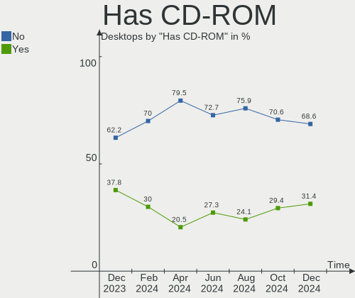
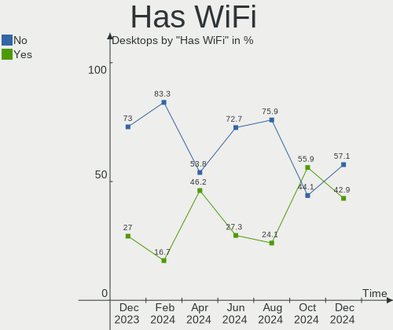
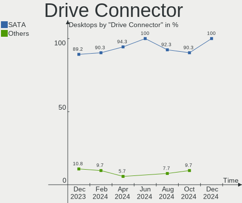
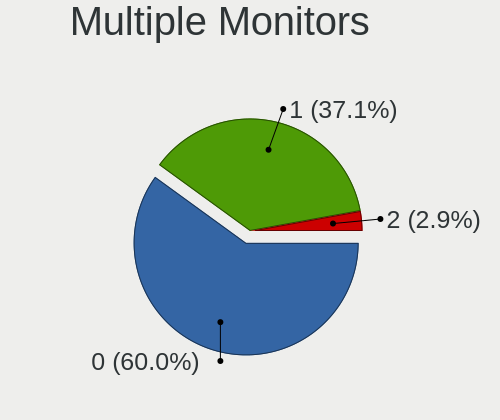
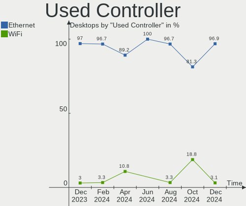
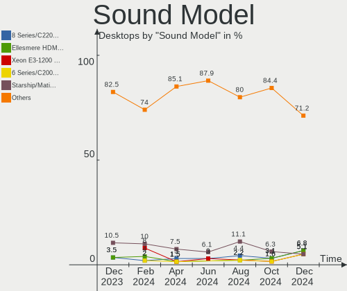

FreeBSD - Hardware Trends (Desktops)
------------------------------------

A project to identify most popular hardware characteristics and track their change
over time based on data collected by BSD users at https://BSD-Hardware.info.

Anyone can contribute to this report by the [hw-probe](https://github.com/linuxhw/hw-probe/blob/master/INSTALL.BSD.md) tool:

    hw-probe -all -upload

This report is for one last month. Overall report since the beginning of time: [TestDays](https://github.com/bsdhw/TestDays)

Period: Apr, 2023.

Contents
--------

* [ System ](#system)
  - [ OS                       ](#os)
  - [ OS Family                ](#os-family)
  - [ Arch                     ](#arch)
  - [ DE                       ](#de)
  - [ Display Server           ](#display-server)
  - [ Display Manager          ](#display-manager)
  - [ OS Lang                  ](#os-lang)
  - [ Boot Mode                ](#boot-mode)
  - [ Filesystem               ](#filesystem)
  - [ Part. scheme             ](#part-scheme)

* [ Board ](#board)
  - [ Vendor                   ](#vendor)
  - [ Model                    ](#model)
  - [ Model Family             ](#model-family)
  - [ MFG Year                 ](#mfg-year)
  - [ Form Factor              ](#form-factor)
  - [ Coreboot                 ](#coreboot)
  - [ RAM Size                 ](#ram-size)
  - [ RAM Used                 ](#ram-used)
  - [ Total Drives             ](#total-drives)
  - [ Has CD-ROM               ](#has-cd-rom)
  - [ Has Ethernet             ](#has-ethernet)
  - [ Has WiFi                 ](#has-wifi)
  - [ Has Bluetooth            ](#has-bluetooth)

* [ Location ](#location)
  - [ Country                  ](#country)
  - [ City                     ](#city)

* [ Drives ](#drives)
  - [ Drive Vendor             ](#drive-vendor)
  - [ Drive Model              ](#drive-model)
  - [ HDD Vendor               ](#hdd-vendor)
  - [ SSD Vendor               ](#ssd-vendor)
  - [ Drive Kind               ](#drive-kind)
  - [ Drive Connector          ](#drive-connector)
  - [ Drive Size               ](#drive-size)
  - [ Space Total              ](#space-total)
  - [ Space Used               ](#space-used)
  - [ Malfunc. Drives          ](#malfunc-drives)
  - [ Malfunc. Drive Vendor    ](#malfunc-drive-vendor)
  - [ Malfunc. HDD Vendor      ](#malfunc-hdd-vendor)
  - [ Malfunc. Drive Kind      ](#malfunc-drive-kind)
  - [ Failed Drives            ](#failed-drives)
  - [ Failed Drive Vendor      ](#failed-drive-vendor)
  - [ Drive Status             ](#drive-status)

* [ Storage controller ](#storage-controller)
  - [ Storage Vendor           ](#storage-vendor)
  - [ Storage Model            ](#storage-model)
  - [ Storage Kind             ](#storage-kind)

* [ Processor ](#processor)
  - [ CPU Vendor               ](#cpu-vendor)
  - [ CPU Model                ](#cpu-model)
  - [ CPU Model Family         ](#cpu-model-family)
  - [ CPU Cores                ](#cpu-cores)
  - [ CPU Sockets              ](#cpu-sockets)
  - [ CPU Threads              ](#cpu-threads)
  - [ CPU Microarch            ](#cpu-microarch)

* [ Graphics ](#graphics)
  - [ GPU Vendor               ](#gpu-vendor)
  - [ GPU Model                ](#gpu-model)
  - [ GPU Combo                ](#gpu-combo)
  - [ GPU Driver               ](#gpu-driver)
  - [ GPU Memory               ](#gpu-memory)

* [ Monitor ](#monitor)
  - [ Monitor Vendor           ](#monitor-vendor)
  - [ Monitor Model            ](#monitor-model)
  - [ Monitor Resolution       ](#monitor-resolution)
  - [ Monitor Diagonal         ](#monitor-diagonal)
  - [ Monitor Width            ](#monitor-width)
  - [ Aspect Ratio             ](#aspect-ratio)
  - [ Monitor Area             ](#monitor-area)
  - [ Pixel Density            ](#pixel-density)
  - [ Multiple Monitors        ](#multiple-monitors)

* [ Network ](#network)
  - [ Net Controller Vendor    ](#net-controller-vendor)
  - [ Net Controller Model     ](#net-controller-model)
  - [ Wireless Vendor          ](#wireless-vendor)
  - [ Wireless Model           ](#wireless-model)
  - [ Ethernet Vendor          ](#ethernet-vendor)
  - [ Ethernet Model           ](#ethernet-model)
  - [ Net Controller Kind      ](#net-controller-kind)
  - [ Used Controller          ](#used-controller)
  - [ NICs                     ](#nics)
  - [ IPv6                     ](#ipv6)

* [ Bluetooth ](#bluetooth)
  - [ Bluetooth Vendor         ](#bluetooth-vendor)
  - [ Bluetooth Model          ](#bluetooth-model)

* [ Sound ](#sound)
  - [ Sound Vendor             ](#sound-vendor)
  - [ Sound Model              ](#sound-model)

* [ Memory ](#memory)
  - [ Memory Vendor            ](#memory-vendor)
  - [ Memory Model             ](#memory-model)
  - [ Memory Kind              ](#memory-kind)
  - [ Memory Form Factor       ](#memory-form-factor)
  - [ Memory Size              ](#memory-size)
  - [ Memory Speed             ](#memory-speed)

* [ Printers & scanners ](#printers--scanners)
  - [ Printer Vendor           ](#printer-vendor)
  - [ Printer Model            ](#printer-model)
  - [ Scanner Vendor           ](#scanner-vendor)
  - [ Scanner Model            ](#scanner-model)

* [ Camera ](#camera)
  - [ Camera Vendor            ](#camera-vendor)
  - [ Camera Model             ](#camera-model)

* [ Security ](#security)
  - [ Fingerprint Vendor       ](#fingerprint-vendor)
  - [ Fingerprint Model        ](#fingerprint-model)
  - [ Chipcard Vendor          ](#chipcard-vendor)
  - [ Chipcard Model           ](#chipcard-model)

* [ Unsupported ](#unsupported)
  - [ Unsupported Devices      ](#unsupported-devices)
  - [ Unsupported Device Types ](#unsupported-device-types)

System
------

OS
--

Installed operating systems

| Name                 | Desktops | Percent |
|----------------------|----------|---------|
| FreeBSD 13.2         | 15       | 48.39%  |
| FreeBSD 13.1-p7      | 7        | 22.58%  |
| FreeBSD 14.0-CURRENT | 4        | 12.9%   |
| FreeBSD 13.2-STABLE  | 3        | 9.68%   |
| FreeBSD 13.1-p5      | 1        | 3.23%   |
| FreeBSD 13.1         | 1        | 3.23%   |

OS Family
---------

OS without a version

| Name    | Desktops | Percent |
|---------|----------|---------|
| FreeBSD | 31       | 100%    |

Arch
----

OS architecture (x86_64, i586, etc.)

| Name    | Desktops | Percent |
|---------|----------|---------|
| amd64   | 24       | 77.42%  |
| arm64   | 5        | 16.13%  |
| powerpc | 1        | 3.23%   |
| i386    | 1        | 3.23%   |

DE
--

Desktop Environment

| Name    | Desktops | Percent |
|---------|----------|---------|
| Console | 16       | 51.61%  |
| KDE5    | 6        | 19.35%  |
| XFCE    | 3        | 9.68%   |
| GNOME   | 3        | 9.68%   |
| TWM     | 2        | 6.45%   |
| Fluxbox | 1        | 3.23%   |

Display Server
--------------

X11 or Wayland

| Name    | Desktops | Percent |
|---------|----------|---------|
| Console | 17       | 54.84%  |
| X11     | 14       | 45.16%  |

Display Manager
---------------

SDDM, LightDM, etc.

| Name    | Desktops | Percent |
|---------|----------|---------|
| Console | 18       | 58.06%  |
| SDDM    | 5        | 16.13%  |
| XDM     | 4        | 12.9%   |
| LightDM | 2        | 6.45%   |
| GDM     | 2        | 6.45%   |

OS Lang
-------

Language

| Lang    | Desktops | Percent |
|---------|----------|---------|
| C       | 16       | 51.61%  |
| en_US   | 7        | 22.58%  |
| ru_RU   | 3        | 9.68%   |
| de_DE   | 2        | 6.45%   |
| zh_CN   | 1        | 3.23%   |
| fr_FR   | 1        | 3.23%   |
| Unknown | 1        | 3.23%   |

Boot Mode
---------

EFI or BIOS

| Mode | Desktops | Percent |
|------|----------|---------|
| EFI  | 23       | 74.19%  |
| BIOS | 8        | 25.81%  |

Filesystem
----------

Type of filesystem

| Type | Desktops | Percent |
|------|----------|---------|
| Zfs  | 19       | 61.29%  |
| Ufs  | 12       | 38.71%  |

Part. scheme
------------

Scheme of partitioning

| Type | Desktops | Percent |
|------|----------|---------|
| GPT  | 28       | 90.32%  |
| MBR  | 3        | 9.68%   |

Board
-----

Vendor
------

Motherboard manufacturer

| Name                | Desktops | Percent |
|---------------------|----------|---------|
| ASUSTek Computer    | 9        | 29.03%  |
| Unknown             | 7        | 22.58%  |
| MSI                 | 3        | 9.68%   |
| Dell                | 3        | 9.68%   |
| Hewlett-Packard     | 2        | 6.45%   |
| Gigabyte Technology | 2        | 6.45%   |
| ASRock              | 2        | 6.45%   |
| Lenovo              | 1        | 3.23%   |
| GVC                 | 1        | 3.23%   |
| ASRockRack          | 1        | 3.23%   |

Model
-----

Motherboard model

| Name                             | Desktops | Percent |
|----------------------------------|----------|---------|
| Unknown                          | 7        | 22.58%  |
| MSI MS-7B89                      | 1        | 3.23%   |
| MSI MS-7996                      | 1        | 3.23%   |
| MSI MS-7817                      | 1        | 3.23%   |
| Lenovo YangTianM6880N            | 1        | 3.23%   |
| HP Z820 Workstation              | 1        | 3.23%   |
| HP Z440 Workstation              | 1        | 3.23%   |
| GVC EQUIUM 3200M                 | 1        | 3.23%   |
| Gigabyte GB-BSi3-1115G4          | 1        | 3.23%   |
| Gigabyte B360M-D2V               | 1        | 3.23%   |
| Dell Studio XPS 7100             | 1        | 3.23%   |
| Dell Precision WorkStation T3500 | 1        | 3.23%   |
| Dell OptiPlex 960                | 1        | 3.23%   |
| ASUS TUF Gaming X670E-PLUS WIFI  | 1        | 3.23%   |
| ASUS ROG STRIX B550-E GAMING     | 1        | 3.23%   |
| ASUS ROG CROSSHAIR VIII HERO     | 1        | 3.23%   |
| ASUS Pro B560M-C                 | 1        | 3.23%   |
| ASUS PRIME X370-PRO              | 1        | 3.23%   |
| ASUS PRIME X299-A II             | 1        | 3.23%   |
| ASUS PRIME B450M-K II            | 1        | 3.23%   |
| ASUS P8H77-V                     | 1        | 3.23%   |
| ASUS P5Q-E                       | 1        | 3.23%   |
| ASRockRack EPYC3101D4I-2T        | 1        | 3.23%   |
| ASRock X570S PG Riptide          | 1        | 3.23%   |
| ASRock X570 Phantom Gaming 4     | 1        | 3.23%   |

Model Family
------------

Motherboard model prefix

| Name                      | Desktops | Percent |
|---------------------------|----------|---------|
| Unknown                   | 7        | 22.58%  |
| ASUS PRIME                | 3        | 9.68%   |
| ASUS ROG                  | 2        | 6.45%   |
| MSI MS-7B89               | 1        | 3.23%   |
| MSI MS-7996               | 1        | 3.23%   |
| MSI MS-7817               | 1        | 3.23%   |
| Lenovo YangTianM6880N     | 1        | 3.23%   |
| HP Z820                   | 1        | 3.23%   |
| HP Z440                   | 1        | 3.23%   |
| GVC EQUIUM                | 1        | 3.23%   |
| Gigabyte GB-BSi3-1115G4   | 1        | 3.23%   |
| Gigabyte B360M-D2V        | 1        | 3.23%   |
| Dell Studio               | 1        | 3.23%   |
| Dell Precision            | 1        | 3.23%   |
| Dell OptiPlex             | 1        | 3.23%   |
| ASUS TUF                  | 1        | 3.23%   |
| ASUS Pro                  | 1        | 3.23%   |
| ASUS P8H77-V              | 1        | 3.23%   |
| ASUS P5Q-E                | 1        | 3.23%   |
| ASRockRack EPYC3101D4I-2T | 1        | 3.23%   |
| ASRock X570S              | 1        | 3.23%   |
| ASRock X570               | 1        | 3.23%   |

MFG Year
--------

Motherboard manufacture year

| Year    | Desktops | Percent |
|---------|----------|---------|
| Unknown | 7        | 22.58%  |
| 2021    | 6        | 19.35%  |
| 2022    | 3        | 9.68%   |
| 2019    | 3        | 9.68%   |
| 2018    | 2        | 6.45%   |
| 2013    | 2        | 6.45%   |
| 2010    | 2        | 6.45%   |
| 2017    | 1        | 3.23%   |
| 2015    | 1        | 3.23%   |
| 2014    | 1        | 3.23%   |
| 2012    | 1        | 3.23%   |
| 2011    | 1        | 3.23%   |
| 2008    | 1        | 3.23%   |

Form Factor
-----------

Physical design of the computer

| Name    | Desktops | Percent |
|---------|----------|---------|
| Desktop | 31       | 100%    |

Coreboot
--------

Have coreboot on board

| Used | Desktops | Percent |
|------|----------|---------|
| No   | 31       | 100%    |

RAM Size
--------

Total RAM memory

| Size in GB  | Desktops | Percent |
|-------------|----------|---------|
| 64.01-256.0 | 6        | 19.35%  |
| 16.01-24.0  | 6        | 19.35%  |
| 8.01-16.0   | 5        | 16.13%  |
| 4.01-8.0    | 4        | 12.9%   |
| 32.01-64.0  | 4        | 12.9%   |
| 3.01-4.0    | 4        | 12.9%   |
| 0.01-0.5    | 2        | 6.45%   |

RAM Used
--------

Used RAM memory

| Used GB  | Desktops | Percent |
|----------|----------|---------|
| 0.01-0.5 | 12       | 38.71%  |
| 0.51-1.0 | 9        | 29.03%  |
| 1.01-2.0 | 4        | 12.9%   |
| 2.01-3.0 | 3        | 9.68%   |
| 0        | 2        | 6.45%   |
| 3.01-4.0 | 1        | 3.23%   |

Total Drives
------------

Number of drives on board

| Drives | Desktops | Percent |
|--------|----------|---------|
| 2      | 8        | 25.81%  |
| 1      | 6        | 19.35%  |
| 0      | 6        | 19.35%  |
| 3      | 5        | 16.13%  |
| 4      | 2        | 6.45%   |
| 13     | 1        | 3.23%   |
| 8      | 1        | 3.23%   |
| 6      | 1        | 3.23%   |
| 5      | 1        | 3.23%   |

Has CD-ROM
----------

Has CD-ROM on board

| Presented | Desktops | Percent |
|-----------|----------|---------|
| No        | 18       | 58.06%  |
| Yes       | 13       | 41.94%  |

Has Ethernet
------------

Has Ethernet on board

| Presented | Desktops | Percent |
|-----------|----------|---------|
| Yes       | 30       | 96.77%  |
| No        | 1        | 3.23%   |

Has WiFi
--------

Has WiFi module

| Presented | Desktops | Percent |
|-----------|----------|---------|
| No        | 23       | 74.19%  |
| Yes       | 8        | 25.81%  |

Has Bluetooth
-------------

Has Bluetooth module

| Presented | Desktops | Percent |
|-----------|----------|---------|
| No        | 24       | 77.42%  |
| Yes       | 7        | 22.58%  |

Location
--------

Country
-------

Geographic location (country)

| Country     | Desktops | Percent |
|-------------|----------|---------|
| USA         | 9        | 29.03%  |
| Russia      | 9        | 29.03%  |
| Poland      | 2        | 6.45%   |
| Germany     | 2        | 6.45%   |
| France      | 2        | 6.45%   |
| Thailand    | 1        | 3.23%   |
| Spain       | 1        | 3.23%   |
| Romania     | 1        | 3.23%   |
| Netherlands | 1        | 3.23%   |
| Finland     | 1        | 3.23%   |
| China       | 1        | 3.23%   |
| Canada      | 1        | 3.23%   |

City
----

Geographic location (city)

| City        | Desktops | Percent |
|-------------|----------|---------|
| Krasnodar   | 5        | 16.13%  |
| Salem       | 2        | 6.45%   |
| Redmond     | 2        | 6.45%   |
| Ludwigsburg | 2        | 6.45%   |
| Los Angeles | 2        | 6.45%   |
| Wenatchee   | 1        | 3.23%   |
| Valladolid  | 1        | 3.23%   |
| Toronto     | 1        | 3.23%   |
| Saratov     | 1        | 3.23%   |
| Queens      | 1        | 3.23%   |
| Ozersk      | 1        | 3.23%   |
| Moscow      | 1        | 3.23%   |
| Marseille   | 1        | 3.23%   |
| Lodz        | 1        | 3.23%   |
| Lahti       | 1        | 3.23%   |
| Kaatsheuvel | 1        | 3.23%   |
| Gdansk      | 1        | 3.23%   |
| Évry       | 1        | 3.23%   |
| Dmitrov     | 1        | 3.23%   |
| Chongqing   | 1        | 3.23%   |
| Bucharest   | 1        | 3.23%   |
| Brooklyn    | 1        | 3.23%   |
| Bangkok     | 1        | 3.23%   |

Drives
------

Drive Vendor
------------

Hard drive vendors

| Vendor              | Desktops | Drives | Percent |
|---------------------|----------|--------|---------|
| WDC                 | 14       | 30     | 27.45%  |
| Seagate             | 9        | 12     | 17.65%  |
| Samsung Electronics | 8        | 13     | 15.69%  |
| Crucial             | 6        | 7      | 11.76%  |
| Intel               | 4        | 6      | 7.84%   |
| Kingston            | 3        | 3      | 5.88%   |
| Toshiba             | 2        | 3      | 3.92%   |
| MSI                 | 1        | 1      | 1.96%   |
| Hitachi             | 1        | 1      | 1.96%   |
| GOODRAM             | 1        | 1      | 1.96%   |
| Corsair             | 1        | 1      | 1.96%   |
| A-DATA Technology   | 1        | 1      | 1.96%   |

Drive Model
-----------

Hard drive models

| Model                           | Desktops | Percent |
|---------------------------------|----------|---------|
| WDC WDS500G2B0A-00SM50 500GB    | 2        | 3.13%   |
| WDC WD80EFAX-68LHPN0 8TB        | 2        | 3.13%   |
| Seagate ST4000DM000-1F2168 4TB  | 2        | 3.13%   |
| Kingston SA400S37480G 480GB     | 2        | 3.13%   |
| Intel SSDSC2BB120G4 120GB       | 2        | 3.13%   |
| Crucial CT1000MX500SSD1 1TB     | 2        | 3.13%   |
| WDC WDS500G1B0A-00H9H0 500GB    | 1        | 1.56%   |
| WDC WDS100T3X0C-00SJG0 1TB      | 1        | 1.56%   |
| WDC WDS100T1X0E-00AFY0 1TB      | 1        | 1.56%   |
| WDC WD80EMAZ-00WJTA0 8TB        | 1        | 1.56%   |
| WDC WD80EFZX-68UW8N0 8TB        | 1        | 1.56%   |
| WDC WD80EDBZ-11B0ZA0 8TB        | 1        | 1.56%   |
| WDC WD80EDAZ-11TA3A0 8TB        | 1        | 1.56%   |
| WDC WD80EAZZ-00BKLB0 8TB        | 1        | 1.56%   |
| WDC WD5003ABYZ-011FA0 500GB     | 1        | 1.56%   |
| WDC WD5000BEVT-22ZAT0 500GB     | 1        | 1.56%   |
| WDC WD40EZRZ-22GXCB0 4TB        | 1        | 1.56%   |
| WDC WD20NMVW-11EDZS2 2TB        | 1        | 1.56%   |
| WDC WD2002FAEX-007BA0 2TB       | 1        | 1.56%   |
| WDC WD15EADS-00P8B0 1.5TB       | 1        | 1.56%   |
| WDC WD140EDGZ-11B2DA2 14TB      | 1        | 1.56%   |
| WDC WD120EMFZ-11A6JA0 12TB      | 1        | 1.56%   |
| WDC WD120EMAZ-11BLFA0 12TB      | 1        | 1.56%   |
| WDC WD10EZRZ-00HTKB0 1TB        | 1        | 1.56%   |
| WDC WD10EZEX-60M2NA0 1TB        | 1        | 1.56%   |
| WDC WD10EZEX-08WN4A0 1TB        | 1        | 1.56%   |
| Toshiba HDWD120 2TB             | 1        | 1.56%   |
| Toshiba HDWD110 1TB             | 1        | 1.56%   |
| Seagate ST6000DM003-2CY186 6TB  | 1        | 1.56%   |
| Seagate ST500DM002-1BD142 500GB | 1        | 1.56%   |
| Seagate ST4000VN006-3CW104 4TB  | 1        | 1.56%   |
| Seagate ST4000LM024-2AN17V 4TB  | 1        | 1.56%   |
| Seagate ST3000VN000-1HJ166 3TB  | 1        | 1.56%   |
| Seagate ST3000DM008-2DM166 3TB  | 1        | 1.56%   |
| Seagate ST2000DM008-2UB102 2TB  | 1        | 1.56%   |
| Seagate ST2000DM008-2FR102 2TB  | 1        | 1.56%   |
| Samsung SSD 980 PRO 1TB         | 1        | 1.56%   |
| Samsung SSD 980 500GB           | 1        | 1.56%   |
| Samsung SSD 960 EVO 500GB       | 1        | 1.56%   |
| Samsung SSD 870 QVO 2TB         | 1        | 1.56%   |

HDD Vendor
----------

Hard disk drive vendors

| Vendor  | Desktops | Drives | Percent |
|---------|----------|--------|---------|
| WDC     | 10       | 25     | 45.45%  |
| Seagate | 9        | 12     | 40.91%  |
| Toshiba | 2        | 3      | 9.09%   |
| Hitachi | 1        | 1      | 4.55%   |

SSD Vendor
----------

Solid state drive vendors

| Vendor              | Desktops | Drives | Percent |
|---------------------|----------|--------|---------|
| Samsung Electronics | 5        | 8      | 23.81%  |
| Intel               | 4        | 6      | 19.05%  |
| WDC                 | 3        | 3      | 14.29%  |
| Kingston            | 3        | 3      | 14.29%  |
| Crucial             | 3        | 3      | 14.29%  |
| MSI                 | 1        | 1      | 4.76%   |
| GOODRAM             | 1        | 1      | 4.76%   |
| A-DATA Technology   | 1        | 1      | 4.76%   |

Drive Kind
----------

HDD or SSD

| Kind | Desktops | Drives | Percent |
|------|----------|--------|---------|
| SSD  | 17       | 26     | 39.53%  |
| HDD  | 16       | 41     | 37.21%  |
| NVMe | 10       | 12     | 23.26%  |

Drive Connector
---------------

SATA, SAS, NVMe, etc.

| Type | Desktops | Drives | Percent |
|------|----------|--------|---------|
| SATA | 22       | 67     | 68.75%  |
| NVMe | 10       | 12     | 31.25%  |

Drive Size
----------

Size of hard drive

| Size in TB | Desktops | Drives | Percent |
|------------|----------|--------|---------|
| 0.01-0.5   | 17       | 24     | 43.59%  |
| 0.51-1.0   | 6        | 8      | 15.38%  |
| 1.01-2.0   | 5        | 11     | 12.82%  |
| 3.01-4.0   | 4        | 7      | 10.26%  |
| 4.01-10.0  | 3        | 12     | 7.69%   |
| 2.01-3.0   | 2        | 2      | 5.13%   |
| 10.01-20.0 | 2        | 3      | 5.13%   |

Space Total
-----------

Amount of disk space available on the file system

| Size in GB     | Desktops | Percent |
|----------------|----------|---------|
| 251-500        | 10       | 32.26%  |
| 21-50          | 4        | 12.9%   |
| 101-250        | 4        | 12.9%   |
| 501-1000       | 4        | 12.9%   |
| 1-20           | 3        | 9.68%   |
| 2001-3000      | 2        | 6.45%   |
| 51-100         | 2        | 6.45%   |
| More than 3000 | 1        | 3.23%   |
| Unknown        | 1        | 3.23%   |

Space Used
----------

Amount of used disk space

| Used GB        | Desktops | Percent |
|----------------|----------|---------|
| 1-20           | 25       | 80.65%  |
| More than 3000 | 1        | 3.23%   |
| 251-500        | 1        | 3.23%   |
| 21-50          | 1        | 3.23%   |
| 101-250        | 1        | 3.23%   |
| 51-100         | 1        | 3.23%   |
| Unknown        | 1        | 3.23%   |

Malfunc. Drives
---------------

Drive models with a malfunction

| Model                        | Desktops | Drives | Percent |
|------------------------------|----------|--------|---------|
| WDC WD80EDAZ-11TA3A0 8TB     | 1        | 1      | 25%     |
| WDC WD10EZRZ-00HTKB0 1TB     | 1        | 1      | 25%     |
| Intel SSDSC2BW480A4 480GB    | 1        | 1      | 25%     |
| Hitachi HTS421260H9AT00 64GB | 1        | 1      | 25%     |

Malfunc. Drive Vendor
---------------------

Vendors of faulty drives

| Vendor  | Desktops | Drives | Percent |
|---------|----------|--------|---------|
| WDC     | 2        | 2      | 50%     |
| Intel   | 1        | 1      | 25%     |
| Hitachi | 1        | 1      | 25%     |

Malfunc. HDD Vendor
-------------------

Vendors of faulty HDD drives

| Vendor  | Desktops | Drives | Percent |
|---------|----------|--------|---------|
| WDC     | 2        | 2      | 66.67%  |
| Hitachi | 1        | 1      | 33.33%  |

Malfunc. Drive Kind
-------------------

Kinds of faulty drives

| Kind | Desktops | Drives | Percent |
|------|----------|--------|---------|
| HDD  | 3        | 3      | 75%     |
| SSD  | 1        | 1      | 25%     |

Failed Drives
-------------

Failed drive models

Zero info for selected period =(

Failed Drive Vendor
-------------------

Failed drive vendors

Zero info for selected period =(

Drive Status
------------

Number of failed and malfunc. drives

| Status  | Desktops | Drives | Percent |
|---------|----------|--------|---------|
| Works   | 24       | 75     | 85.71%  |
| Malfunc | 4        | 4      | 14.29%  |

Storage controller
------------------

Storage Vendor
--------------

Storage controller vendors

| Vendor                    | Desktops | Percent |
|---------------------------|----------|---------|
| Intel                     | 15       | 34.88%  |
| AMD                       | 10       | 23.26%  |
| Samsung Electronics       | 5        | 11.63%  |
| Micron/Crucial Technology | 3        | 6.98%   |
| Broadcom / LSI            | 3        | 6.98%   |
| Silicon Motion            | 2        | 4.65%   |
| SanDisk                   | 2        | 4.65%   |
| Phison Electronics        | 1        | 2.33%   |
| Marvell Technology Group  | 1        | 2.33%   |
| ADATA Technology          | 1        | 2.33%   |

Storage Model
-------------

Storage controller models

| Model                                                                          | Desktops | Percent |
|--------------------------------------------------------------------------------|----------|---------|
| AMD FCH SATA Controller [AHCI mode]                                            | 6        | 11.76%  |
| Silicon Motion SM2263EN/SM2263XT SSD Controller                                | 2        | 3.92%   |
| Samsung NVMe SSD Controller SM961/PM961/SM963                                  | 2        | 3.92%   |
| Samsung NVMe SSD Controller PM9A1/PM9A3/980PRO                                 | 2        | 3.92%   |
| Micron/Crucial P2 NVMe PCIe SSD                                                | 2        | 3.92%   |
| AMD 400 Series Chipset SATA Controller                                         | 2        | 3.92%   |
| SanDisk WD PC SN810 / Black SN850 NVMe SSD                                     | 1        | 1.96%   |
| SanDisk WD Black SN750 / PC SN730 NVMe SSD                                     | 1        | 1.96%   |
| Samsung NVMe SSD Controller 980                                                | 1        | 1.96%   |
| Phison E16 PCIe4 NVMe Controller                                               | 1        | 1.96%   |
| Micron/Crucial P5 Plus NVMe PCIe SSD                                           | 1        | 1.96%   |
| Marvell Group 88SE6111/6121 SATA II / PATA Controller                          | 1        | 1.96%   |
| Intel Volume Management Device NVMe RAID Controller                            | 1        | 1.96%   |
| Intel SATA Controller [RAID mode]                                              | 1        | 1.96%   |
| Intel Q170/Q150/B150/H170/H110/Z170/CM236 Chipset SATA Controller [AHCI Mode]  | 1        | 1.96%   |
| Intel product 54d3                                                             | 1        | 1.96%   |
| Intel NM10/ICH7 Family SATA Controller [IDE mode]                              | 1        | 1.96%   |
| Intel Cannon Lake PCH SATA AHCI Controller                                     | 1        | 1.96%   |
| Intel C610/X99 series chipset sSATA Controller [AHCI mode]                     | 1        | 1.96%   |
| Intel C610/X99 series chipset 6-Port SATA Controller [AHCI mode]               | 1        | 1.96%   |
| Intel C602 chipset 4-Port SATA Storage Control Unit                            | 1        | 1.96%   |
| Intel C600/X79 series chipset SATA RAID Controller                             | 1        | 1.96%   |
| Intel C600/X79 series chipset IDE-r Controller                                 | 1        | 1.96%   |
| Intel 82801JI (ICH10 Family) SATA AHCI Controller                              | 1        | 1.96%   |
| Intel 82801JI (ICH10 Family) 4 port SATA IDE Controller #1                     | 1        | 1.96%   |
| Intel 82801JI (ICH10 Family) 2 port SATA IDE Controller #2                     | 1        | 1.96%   |
| Intel 82801JD/DO (ICH10 Family) SATA AHCI Controller                           | 1        | 1.96%   |
| Intel 82371AB/EB/MB PIIX4 IDE                                                  | 1        | 1.96%   |
| Intel 8 Series/C220 Series Chipset Family 6-port SATA Controller 1 [AHCI mode] | 1        | 1.96%   |
| Intel 7 Series/C210 Series Chipset Family 4-port SATA Controller [IDE mode]    | 1        | 1.96%   |
| Intel 7 Series/C210 Series Chipset Family 2-port SATA Controller [IDE mode]    | 1        | 1.96%   |
| Intel 500 Series Chipset Family SATA AHCI Controller                           | 1        | 1.96%   |
| Intel 4 Series Chipset PT IDER Controller                                      | 1        | 1.96%   |
| Broadcom / LSI SAS2308 PCI-Express Fusion-MPT SAS-2                            | 1        | 1.96%   |
| Broadcom / LSI SAS2008 PCI-Express Fusion-MPT SAS-2 [Falcon]                   | 1        | 1.96%   |
| Broadcom / LSI SAS2004 PCI-Express Fusion-MPT SAS-2 [Spitfire]                 | 1        | 1.96%   |
| AMD X370 Series Chipset SATA Controller                                        | 1        | 1.96%   |
| AMD SB7x0/SB8x0/SB9x0 SATA Controller [AHCI mode]                              | 1        | 1.96%   |
| AMD SB7x0/SB8x0/SB9x0 IDE Controller                                           | 1        | 1.96%   |
| AMD 500 Series Chipset SATA Controller                                         | 1        | 1.96%   |

Storage Kind
------------

Kind of storage controller (IDE, SATA, NVMe, SAS, ...)

| Kind | Desktops | Percent |
|------|----------|---------|
| SATA | 18       | 40.91%  |
| NVMe | 13       | 29.55%  |
| IDE  | 7        | 15.91%  |
| RAID | 3        | 6.82%   |
| SAS  | 3        | 6.82%   |

Processor
---------

CPU Vendor
----------

Processor vendors

| Vendor  | Desktops | Percent |
|---------|----------|---------|
| Intel   | 15       | 48.39%  |
| AMD     | 10       | 32.26%  |
| ARM     | 5        | 16.13%  |
| Unknown | 1        | 3.23%   |

CPU Model
---------

Processor models

| Model                                       | Desktops | Percent |
|---------------------------------------------|----------|---------|
| ARM Cortex-A55 r2p0                         | 4        | 12.9%   |
| AMD Ryzen 9 3900X 12-Core Processor         | 2        | 6.45%   |
| Intel Xeon CPU E5-2695 v2 @ 2.40GHz         | 1        | 3.23%   |
| Intel Xeon CPU E5-2690 v4 @ 2.60GHz         | 1        | 3.23%   |
| Intel Xeon                                  | 1        | 3.23%   |
| Intel Pentium II                            | 1        | 3.23%   |
| Intel Pentium CPU G3220 @ 3.00GHz           | 1        | 3.23%   |
| Intel N100                                  | 1        | 3.23%   |
| Intel Core i9-10900X CPU @ 3.70GHz          | 1        | 3.23%   |
| Intel Core i5-9400F CPU @ 2.90GHz           | 1        | 3.23%   |
| Intel Core i5-6500 CPU @ 3.20GHz            | 1        | 3.23%   |
| Intel Core i5-3570K CPU @ 3.40GHz           | 1        | 3.23%   |
| Intel Core 2 Quad CPU Q6600 @ 2.40GHz       | 1        | 3.23%   |
| Intel Core 2 Duo CPU E7500 @ 2.93GHz        | 1        | 3.23%   |
| Intel Core 2 Duo                            | 1        | 3.23%   |
| Intel 11th Gen Core i5-11400 @ 2.60GHz      | 1        | 3.23%   |
| Intel 11th Gen Core i3-1115G4 @ 3.00GHz     | 1        | 3.23%   |
| ARM Cortex-A53 r0p4                         | 1        | 3.23%   |
| AMD Ryzen 9 7950X 16-Core Processor         | 1        | 3.23%   |
| AMD Ryzen 9 5950X 16-Core Processor         | 1        | 3.23%   |
| AMD Ryzen 7 5800X 8-Core Processor          | 1        | 3.23%   |
| AMD Ryzen 7 1700 Eight-Core Processor       | 1        | 3.23%   |
| AMD Ryzen 3 3200G with Radeon Vega Graphics | 1        | 3.23%   |
| AMD Phenom II X6 1035T Processor            | 1        | 3.23%   |
| AMD EPYC 3101 4-Core Processor              | 1        | 3.23%   |
| AMD Athlon 3000G with Radeon Vega Graphics  | 1        | 3.23%   |
|                                             | 1        | 3.23%   |

CPU Model Family
----------------

Processor model prefix

| Model             | Desktops | Percent |
|-------------------|----------|---------|
| ARM Cortex        | 5        | 16.13%  |
| Other             | 4        | 12.9%   |
| AMD Ryzen 9       | 4        | 12.9%   |
| Intel Xeon        | 3        | 9.68%   |
| Intel Core i5     | 3        | 9.68%   |
| Intel Pentium     | 2        | 6.45%   |
| Intel Core 2 Duo  | 2        | 6.45%   |
| AMD Ryzen 7       | 2        | 6.45%   |
| Intel Core i9     | 1        | 3.23%   |
| Intel Core 2 Quad | 1        | 3.23%   |
| AMD Ryzen 3       | 1        | 3.23%   |
| AMD Phenom II X6  | 1        | 3.23%   |
| AMD EPYC          | 1        | 3.23%   |
| AMD Athlon        | 1        | 3.23%   |

CPU Cores
---------

Number of processor cores

| Number  | Desktops | Percent |
|---------|----------|---------|
| 4       | 7        | 22.58%  |
| Unknown | 5        | 16.13%  |
| 6       | 4        | 12.9%   |
| 2       | 4        | 12.9%   |
| 24      | 3        | 9.68%   |
| 32      | 2        | 6.45%   |
| 16      | 2        | 6.45%   |
| 1       | 2        | 6.45%   |
| 14      | 1        | 3.23%   |
| 10      | 1        | 3.23%   |

CPU Sockets
-----------

Number of sockets

| Number  | Desktops | Percent |
|---------|----------|---------|
| 1       | 24       | 77.42%  |
| Unknown | 6        | 19.35%  |
| 2       | 1        | 3.23%   |

CPU Threads
-----------

Threads per core (Hyper-Threading)

| Number  | Desktops | Percent |
|---------|----------|---------|
| 1       | 18       | 58.06%  |
| Unknown | 7        | 22.58%  |
| 2       | 6        | 19.35%  |

CPU Microarch
-------------

Microarchitecture

| Name      | Desktops | Percent |
|-----------|----------|---------|
| Unknown   | 9        | 29.03%  |
| Zen+      | 2        | 6.45%   |
| Zen 3     | 2        | 6.45%   |
| Zen 2     | 2        | 6.45%   |
| Zen       | 2        | 6.45%   |
| Skylake   | 2        | 6.45%   |
| Penryn    | 2        | 6.45%   |
| IvyBridge | 2        | 6.45%   |
| Westmere  | 1        | 3.23%   |
| TigerLake | 1        | 3.23%   |
| P6        | 1        | 3.23%   |
| KabyLake  | 1        | 3.23%   |
| K10       | 1        | 3.23%   |
| Haswell   | 1        | 3.23%   |
| Core      | 1        | 3.23%   |
| Broadwell | 1        | 3.23%   |

Graphics
--------

GPU Vendor
----------

Vendors of graphics cards

| Vendor                               | Desktops | Percent |
|--------------------------------------|----------|---------|
| Nvidia                               | 11       | 40.74%  |
| AMD                                  | 9        | 33.33%  |
| Intel                                | 5        | 18.52%  |
| NVidia / SGS Thomson (Joint Venture) | 1        | 3.7%    |
| ASPEED Technology                    | 1        | 3.7%    |

GPU Model
---------

Graphics card models

| Model                                                                             | Desktops | Percent |
|-----------------------------------------------------------------------------------|----------|---------|
| AMD Picasso/Raven 2 [Radeon Vega Series / Radeon Vega Mobile Series]              | 2        | 7.14%   |
| Nvidia TU117GLM [Quadro T400 Mobile]                                              | 1        | 3.57%   |
| Nvidia GT218 [NVS 300]                                                            | 1        | 3.57%   |
| Nvidia GP108 [GeForce GT 1030]                                                    | 1        | 3.57%   |
| Nvidia GP107 [GeForce GTX 1050 Ti]                                                | 1        | 3.57%   |
| Nvidia GP106 [GeForce GTX 1060 6GB]                                               | 1        | 3.57%   |
| Nvidia GP106 [GeForce GTX 1060 3GB]                                               | 1        | 3.57%   |
| Nvidia GM204 [GeForce GTX 970]                                                    | 1        | 3.57%   |
| Nvidia GM107GL [Quadro K2200]                                                     | 1        | 3.57%   |
| Nvidia GK106GL [Quadro K4000]                                                     | 1        | 3.57%   |
| Nvidia GF119 [GeForce GT 610]                                                     | 1        | 3.57%   |
| Nvidia GA106 [RTX A2000]                                                          | 1        | 3.57%   |
| NVidia / SGS Thomson (Joint Venture) Riva128                                      | 1        | 3.57%   |
| Intel Xeon E3-1200 v3/4th Gen Core Processor Integrated Graphics Controller       | 1        | 3.57%   |
| Intel Tiger Lake-LP GT2 [UHD Graphics G4]                                         | 1        | 3.57%   |
| Intel RocketLake-S GT1 [UHD Graphics 730]                                         | 1        | 3.57%   |
| Intel Alder Lake-N [UHD Graphics]                                                 | 1        | 3.57%   |
| Intel 82G33/G31 Express Integrated Graphics Controller                            | 1        | 3.57%   |
| ASPEED Technology ASPEED Graphics Family                                          | 1        | 3.57%   |
| AMD RV770 [Radeon HD 4850]                                                        | 1        | 3.57%   |
| AMD RV280 [Radeon 9200]                                                           | 1        | 3.57%   |
| AMD Raphael                                                                       | 1        | 3.57%   |
| AMD Navi 21 [Radeon RX 6900 XT]                                                   | 1        | 3.57%   |
| AMD Navi 10 [Radeon RX 5600 OEM/5600 XT / 5700/5700 XT]                           | 1        | 3.57%   |
| AMD Cedar [Radeon HD 5000/6000/7350/8350 Series]                                  | 1        | 3.57%   |
| AMD Cape Verde PRO / Venus LE / Tropo PRO-L [Radeon HD 8830M / R7 250 / R7 M465X] | 1        | 3.57%   |
| AMD Caicos [Radeon HD 6450/7450/8450 / R5 230 OEM]                                | 1        | 3.57%   |

GPU Combo
---------

Combinations of graphics cards

| Name                                     | Desktops | Percent |
|------------------------------------------|----------|---------|
| 1 x Nvidia                               | 10       | 32.26%  |
| 1 x AMD                                  | 8        | 25.81%  |
| Other                                    | 5        | 16.13%  |
| 1 x Intel                                | 5        | 16.13%  |
| 2 x AMD                                  | 1        | 3.23%   |
| 1 x NVidia / SGS Thomson (Joint Venture) | 1        | 3.23%   |
| 1 x ASPEED                               | 1        | 3.23%   |

GPU Driver
----------

Free vs proprietary

| Driver      | Desktops | Percent |
|-------------|----------|---------|
| Free        | 18       | 58.06%  |
| Proprietary | 7        | 22.58%  |
| Unknown     | 6        | 19.35%  |

GPU Memory
----------

Total video memory

| Size in GB | Desktops | Percent |
|------------|----------|---------|
| Unknown    | 19       | 61.29%  |
| 3.01-4.0   | 3        | 9.68%   |
| 5.01-6.0   | 2        | 6.45%   |
| 0.51-1.0   | 2        | 6.45%   |
| 7.01-8.0   | 1        | 3.23%   |
| 2.01-3.0   | 1        | 3.23%   |
| 1.01-2.0   | 1        | 3.23%   |
| 8.01-16.0  | 1        | 3.23%   |
| 0.01-0.5   | 1        | 3.23%   |

Monitor
-------

Monitor Vendor
--------------

Monitor vendors

| Vendor              | Desktops | Percent |
|---------------------|----------|---------|
| Samsung Electronics | 2        | 28.57%  |
| Pioneer Electronic  | 1        | 14.29%  |
| LG Electronics      | 1        | 14.29%  |
| Idek Iiyama         | 1        | 14.29%  |
| Acer                | 1        | 14.29%  |
| Unknown             | 1        | 14.29%  |

Monitor Model
-------------

Monitor models

| Model                                             | Desktops | Percent |
|---------------------------------------------------|----------|---------|
| Samsung Electronics LCD Monitor S24F350 1920x1080 | 1        | 14.29%  |
| Samsung Electronics LCD Monitor S24C300 1920x1080 | 1        | 14.29%  |
| Pioneer Electronic LCD Monitor SC-1223 1920x1080  | 1        | 14.29%  |
| LG Electronics LCD Monitor LG Ultra HD            | 1        | 14.29%  |
| Idek Iiyama LCD Monitor PL2473HD 1920x1080        | 1        | 14.29%  |
| Acer LCD Monitor QG241Y 1920x1080                 | 1        | 14.29%  |
| Unknown                                           | 1        | 14.29%  |

Monitor Resolution
------------------

Monitor screen resolution

| Resolution      | Desktops | Percent |
|-----------------|----------|---------|
| 1920x1080 (FHD) | 5        | 71.43%  |
| 3840x2160 (4K)  | 1        | 14.29%  |
| Unknown         | 1        | 14.29%  |

Monitor Diagonal
----------------

Diagonal size in inches

| Inches  | Desktops | Percent |
|---------|----------|---------|
| Unknown | 6        | 100%    |

Monitor Width
-------------

Physical width

| Width in mm | Desktops | Percent |
|-------------|----------|---------|
| Unknown     | 6        | 100%    |

Aspect Ratio
------------

Proportional relationship between the width and the height

| Ratio   | Desktops | Percent |
|---------|----------|---------|
| Unknown | 6        | 100%    |

Monitor Area
------------

Area in inch²

| Area in inch² | Desktops | Percent |
|----------------|----------|---------|
| Unknown        | 6        | 100%    |

Pixel Density
-------------

Pixels per inch

| Density | Desktops | Percent |
|---------|----------|---------|
| Unknown | 6        | 100%    |

Multiple Monitors
-----------------

Total monitors connected

| Total | Desktops | Percent |
|-------|----------|---------|
| 0     | 19       | 61.29%  |
| 1     | 11       | 35.48%  |
| 2     | 1        | 3.23%   |

Network
-------

Net Controller Vendor
---------------------

Controller vendors

| Vendor                   | Desktops | Percent |
|--------------------------|----------|---------|
| Intel                    | 15       | 39.47%  |
| Realtek Semiconductor    | 13       | 34.21%  |
| Qualcomm Atheros         | 3        | 7.89%   |
| Marvell Technology Group | 2        | 5.26%   |
| Broadcom                 | 2        | 5.26%   |
| TP-Link                  | 1        | 2.63%   |
| Apple                    | 1        | 2.63%   |
| American Megatrends      | 1        | 2.63%   |

Net Controller Model
--------------------

Controller models

| Model                                                             | Desktops | Percent |
|-------------------------------------------------------------------|----------|---------|
| Realtek RTL8125 2.5GbE Controller                                 | 6        | 13.64%  |
| Realtek RTL8111/8168/8411 PCI Express Gigabit Ethernet Controller | 5        | 11.36%  |
| Intel I211 Gigabit Network Connection                             | 3        | 6.82%   |
| Intel Ethernet Controller I225-V                                  | 3        | 6.82%   |
| Marvell Group 88E8056 PCI-E Gigabit Ethernet Controller           | 2        | 4.55%   |
| Intel 82574L Gigabit Network Connection                           | 2        | 4.55%   |
| TP-Link TL-WN722N v2/v3 [Realtek RTL8188EUS]                      | 1        | 2.27%   |
| Realtek RTL8188EUS 802.11n Wireless Network Adapter               | 1        | 2.27%   |
| Realtek Killer E3000 2.5GbE Controller                            | 1        | 2.27%   |
| Qualcomm Atheros AR928X Wireless Network Adapter (PCI-Express)    | 1        | 2.27%   |
| Qualcomm Atheros AR9227 Wireless Network Adapter                  | 1        | 2.27%   |
| Qualcomm Atheros AR8161 Gigabit Ethernet                          | 1        | 2.27%   |
| Marvell Group 88E8001 Gigabit Ethernet Controller                 | 1        | 2.27%   |
| Intel Wireless 7265                                               | 1        | 2.27%   |
| Intel Wi-Fi 6 AX201                                               | 1        | 2.27%   |
| Intel Wi-Fi 6 AX200                                               | 1        | 2.27%   |
| Intel Ethernet Controller X550                                    | 1        | 2.27%   |
| Intel Ethernet Connection (2) I219-V                              | 1        | 2.27%   |
| Intel Ethernet Connection (2) I218-LM                             | 1        | 2.27%   |
| Intel Ethernet Connection (14) I219-V                             | 1        | 2.27%   |
| Intel Ethernet Connection (13) I219-V                             | 1        | 2.27%   |
| Intel Alder Lake-N Wireless-AC                                    | 1        | 2.27%   |
| Intel 82579LM Gigabit Network Connection (Lewisville)             | 1        | 2.27%   |
| Intel 82572EI Gigabit Ethernet Controller (Copper)                | 1        | 2.27%   |
| Intel 82567LM-3 Gigabit Network Connection                        | 1        | 2.27%   |
| Broadcom NetXtreme BCM5761 Gigabit Ethernet PCIe                  | 1        | 2.27%   |
| Broadcom NetLink BCM57788 Gigabit Ethernet PCIe                   | 1        | 2.27%   |
| Apple UniNorth 2 GMAC (Sun GEM)                                   | 1        | 2.27%   |
| American Megatrends Virtual Ethernet                              | 1        | 2.27%   |

Wireless Vendor
---------------

Wireless vendors

| Vendor                | Desktops | Percent |
|-----------------------|----------|---------|
| Intel                 | 4        | 50%     |
| Qualcomm Atheros      | 2        | 25%     |
| TP-Link               | 1        | 12.5%   |
| Realtek Semiconductor | 1        | 12.5%   |

Wireless Model
--------------

Wireless models

| Model                                                          | Desktops | Percent |
|----------------------------------------------------------------|----------|---------|
| TP-Link TL-WN722N v2/v3 [Realtek RTL8188EUS]                   | 1        | 12.5%   |
| Realtek RTL8188EUS 802.11n Wireless Network Adapter            | 1        | 12.5%   |
| Qualcomm Atheros AR928X Wireless Network Adapter (PCI-Express) | 1        | 12.5%   |
| Qualcomm Atheros AR9227 Wireless Network Adapter               | 1        | 12.5%   |
| Intel Wireless 7265                                            | 1        | 12.5%   |
| Intel Wi-Fi 6 AX201                                            | 1        | 12.5%   |
| Intel Wi-Fi 6 AX200                                            | 1        | 12.5%   |
| Intel Alder Lake-N Wireless-AC                                 | 1        | 12.5%   |

Ethernet Vendor
---------------

Ethernet vendors

| Vendor                   | Desktops | Percent |
|--------------------------|----------|---------|
| Intel                    | 14       | 42.42%  |
| Realtek Semiconductor    | 12       | 36.36%  |
| Marvell Technology Group | 2        | 6.06%   |
| Broadcom                 | 2        | 6.06%   |
| Qualcomm Atheros         | 1        | 3.03%   |
| Apple                    | 1        | 3.03%   |
| American Megatrends      | 1        | 3.03%   |

Ethernet Model
--------------

Ethernet models

| Model                                                             | Desktops | Percent |
|-------------------------------------------------------------------|----------|---------|
| Realtek RTL8125 2.5GbE Controller                                 | 6        | 16.67%  |
| Realtek RTL8111/8168/8411 PCI Express Gigabit Ethernet Controller | 5        | 13.89%  |
| Intel I211 Gigabit Network Connection                             | 3        | 8.33%   |
| Intel Ethernet Controller I225-V                                  | 3        | 8.33%   |
| Marvell Group 88E8056 PCI-E Gigabit Ethernet Controller           | 2        | 5.56%   |
| Intel 82574L Gigabit Network Connection                           | 2        | 5.56%   |
| Realtek Killer E3000 2.5GbE Controller                            | 1        | 2.78%   |
| Qualcomm Atheros AR8161 Gigabit Ethernet                          | 1        | 2.78%   |
| Marvell Group 88E8001 Gigabit Ethernet Controller                 | 1        | 2.78%   |
| Intel Ethernet Controller X550                                    | 1        | 2.78%   |
| Intel Ethernet Connection (2) I219-V                              | 1        | 2.78%   |
| Intel Ethernet Connection (2) I218-LM                             | 1        | 2.78%   |
| Intel Ethernet Connection (14) I219-V                             | 1        | 2.78%   |
| Intel Ethernet Connection (13) I219-V                             | 1        | 2.78%   |
| Intel 82579LM Gigabit Network Connection (Lewisville)             | 1        | 2.78%   |
| Intel 82572EI Gigabit Ethernet Controller (Copper)                | 1        | 2.78%   |
| Intel 82567LM-3 Gigabit Network Connection                        | 1        | 2.78%   |
| Broadcom NetXtreme BCM5761 Gigabit Ethernet PCIe                  | 1        | 2.78%   |
| Broadcom NetLink BCM57788 Gigabit Ethernet PCIe                   | 1        | 2.78%   |
| Apple UniNorth 2 GMAC (Sun GEM)                                   | 1        | 2.78%   |
| American Megatrends Virtual Ethernet                              | 1        | 2.78%   |

Net Controller Kind
-------------------

Ethernet, WiFi or modem

| Kind     | Desktops | Percent |
|----------|----------|---------|
| Ethernet | 30       | 78.95%  |
| WiFi     | 8        | 21.05%  |

Used Controller
---------------

Currently used network controller

| Kind     | Desktops | Percent |
|----------|----------|---------|
| Ethernet | 27       | 93.1%   |
| WiFi     | 2        | 6.9%    |

NICs
----

Total network controllers on board

| Total | Desktops | Percent |
|-------|----------|---------|
| 1     | 19       | 61.29%  |
| 2     | 10       | 32.26%  |
| 3     | 2        | 6.45%   |

IPv6
----

IPv6 vs IPv4

| Used | Desktops | Percent |
|------|----------|---------|
| No   | 26       | 83.87%  |
| Yes  | 5        | 16.13%  |

Bluetooth
---------

Bluetooth Vendor
----------------

Controller vendors

| Vendor                  | Desktops | Percent |
|-------------------------|----------|---------|
| Intel                   | 4        | 57.14%  |
| Cambridge Silicon Radio | 2        | 28.57%  |
| Broadcom                | 1        | 14.29%  |

Bluetooth Model
---------------

Controller models

| Model                                               | Desktops | Percent |
|-----------------------------------------------------|----------|---------|
| Intel AX201 Bluetooth                               | 2        | 28.57%  |
| Cambridge Silicon Radio Bluetooth Dongle (HCI mode) | 2        | 28.57%  |
| Intel Bluetooth wireless interface                  | 1        | 14.29%  |
| Intel AX200 Bluetooth                               | 1        | 14.29%  |
| Broadcom BCM20702A0 Bluetooth 4.0                   | 1        | 14.29%  |

Sound
-----

Sound Vendor
------------

Sound card vendors

| Vendor                                       | Desktops | Percent |
|----------------------------------------------|----------|---------|
| Intel                                        | 14       | 32.56%  |
| Nvidia                                       | 11       | 25.58%  |
| AMD                                          | 11       | 25.58%  |
| Tenx Technology                              | 2        | 4.65%   |
| Zoran Co. Personal Media Division (Nogatech) | 1        | 2.33%   |
| Xilinx                                       | 1        | 2.33%   |
| Realtek Semiconductor                        | 1        | 2.33%   |
| Logitech                                     | 1        | 2.33%   |
| Ensoniq                                      | 1        | 2.33%   |

Sound Model
-----------

Sound card models

| Model                                                                             | Desktops | Percent |
|-----------------------------------------------------------------------------------|----------|---------|
| AMD Starship/Matisse HD Audio Controller                                          | 4        | 8.51%   |
| Tenx Technology USB  AUDIO                                                        | 2        | 4.26%   |
| Nvidia GP106 High Definition Audio Controller                                     | 2        | 4.26%   |
| Intel 82801JI (ICH10 Family) HD Audio Controller                                  | 2        | 4.26%   |
| AMD Raven/Raven2/Fenghuang HDMI/DP Audio Controller                               | 2        | 4.26%   |
| AMD Family 17h/19h HD Audio Controller                                            | 2        | 4.26%   |
| Zoran Co. Personal Media Division (Nogatech) USB Audio and HID                    | 1        | 2.13%   |
| Xilinx RME Hammerfall DSP MADI                                                    | 1        | 2.13%   |
| Realtek Semiconductor USB Audio                                                   | 1        | 2.13%   |
| Nvidia TU107 GeForce GTX 1650 High Definition Audio Controller                    | 1        | 2.13%   |
| Nvidia High Definition Audio Controller                                           | 1        | 2.13%   |
| Nvidia GP108 High Definition Audio Controller                                     | 1        | 2.13%   |
| Nvidia GP107GL High Definition Audio Controller                                   | 1        | 2.13%   |
| Nvidia GM204 High Definition Audio Controller                                     | 1        | 2.13%   |
| Nvidia GM107 High Definition Audio Controller [GeForce 940MX]                     | 1        | 2.13%   |
| Nvidia GK106 HDMI Audio Controller                                                | 1        | 2.13%   |
| Nvidia GF119 HDMI Audio Controller                                                | 1        | 2.13%   |
| Nvidia GA106 High Definition Audio Controller                                     | 1        | 2.13%   |
| Logitech [G533 Wireless Headset Dongle]                                           | 1        | 2.13%   |
| Intel Tiger Lake-LP Smart Sound Technology Audio Controller                       | 1        | 2.13%   |
| Intel Tiger Lake-H HD Audio Controller                                            | 1        | 2.13%   |
| Intel NM10/ICH7 Family High Definition Audio Controller                           | 1        | 2.13%   |
| Intel Cannon Lake PCH cAVS                                                        | 1        | 2.13%   |
| Intel C610/X99 series chipset HD Audio Controller                                 | 1        | 2.13%   |
| Intel C600/X79 series chipset High Definition Audio Controller                    | 1        | 2.13%   |
| Intel Alder Lake-N HD Graphics SGPC                                               | 1        | 2.13%   |
| Intel 82801JD/DO (ICH10 Family) HD Audio Controller                               | 1        | 2.13%   |
| Intel 8 Series/C220 Series Chipset High Definition Audio Controller               | 1        | 2.13%   |
| Intel 7 Series/C216 Chipset Family High Definition Audio Controller               | 1        | 2.13%   |
| Intel 200 Series PCH HD Audio                                                     | 1        | 2.13%   |
| Intel 100 Series/C230 Series Chipset Family HD Audio Controller                   | 1        | 2.13%   |
| Ensoniq 5880B / Creative Labs CT5880                                              | 1        | 2.13%   |
| AMD RV770 HDMI Audio [Radeon HD 4850/4870]                                        | 1        | 2.13%   |
| AMD Rembrandt Radeon High Definition Audio Controller                             | 1        | 2.13%   |
| AMD Oland/Hainan/Cape Verde/Pitcairn HDMI Audio [Radeon HD 7000 Series]           | 1        | 2.13%   |
| AMD Navi 21/23 HDMI/DP Audio Controller                                           | 1        | 2.13%   |
| AMD Navi 10 HDMI Audio                                                            | 1        | 2.13%   |
| AMD Cedar HDMI Audio [Radeon HD 5400/6300/7300 Series]                            | 1        | 2.13%   |
| AMD Caicos HDMI Audio [Radeon HD 6450 / 7450/8450/8490 OEM / R5 230/235/235X OEM] | 1        | 2.13%   |

Memory
------

Memory Vendor
-------------

Memory module vendors

| Vendor              | Desktops | Percent |
|---------------------|----------|---------|
| Kingston            | 6        | 25%     |
| G.Skill             | 5        | 20.83%  |
| Crucial             | 3        | 12.5%   |
| Corsair             | 3        | 12.5%   |
| Unknown             | 2        | 8.33%   |
| Samsung Electronics | 1        | 4.17%   |
| Patriot             | 1        | 4.17%   |
| Micron Technology   | 1        | 4.17%   |
| GOODRAM             | 1        | 4.17%   |
| A-DATA Technology   | 1        | 4.17%   |

Memory Model
------------

Memory module models

| Model                                                    | Desktops | Percent |
|----------------------------------------------------------|----------|---------|
| Kingston RAM 9965745-002.A00G 16GB DIMM DDR4 3000MT/s    | 2        | 7.69%   |
| Unknown RAM Module 2GB DIMM DDR2 800MT/s                 | 1        | 3.85%   |
| Unknown RAM Module 2GB DIMM DDR 800MT/s                  | 1        | 3.85%   |
| Samsung RAM M393A2K40CB1-CRC 16GB DIMM DDR4 2400MT/s     | 1        | 3.85%   |
| Samsung RAM M393A2K40BB1-CRC 16GB DIMM DDR4 2400MT/s     | 1        | 3.85%   |
| Patriot RAM 2400 C15 Series 4GB DIMM DDR4 2133MT/s       | 1        | 3.85%   |
| Micron RAM 9JSF51272AZ-1G9E2 4GB DIMM DDR3 1866MT/s      | 1        | 3.85%   |
| Kingston RAM Module 32GB DIMM DDR4 3200MT/s              | 1        | 3.85%   |
| Kingston RAM Module 2GB DIMM DDR2 800MT/s                | 1        | 3.85%   |
| Kingston RAM KHX1600C9D3/4GX 4GB DIMM DDR3 1600MT/s      | 1        | 3.85%   |
| Kingston RAM 99U5474-028.A00LF 4GB DIMM 1333MT/s         | 1        | 3.85%   |
| Kingston RAM 9905403-011.A03LF 2GB DIMM DDR3 1333MT/s    | 1        | 3.85%   |
| GOODRAM RAM GR2400D464L17S/8G 8GB DIMM DDR4 2400MT/s     | 1        | 3.85%   |
| G.Skill RAM F5-6000J3636F16G 16GB DIMM DDR5 4800MT/s     | 1        | 3.85%   |
| G.Skill RAM F4-4000C18-32GVK 32GB DIMM DDR4 4000MT/s     | 1        | 3.85%   |
| G.Skill RAM F4-3200C16-32GVK 32GB DIMM DDR4 3200MT/s     | 1        | 3.85%   |
| G.Skill RAM F4-2400C17-8GNT 8GB DIMM DDR4 2400MT/s       | 1        | 3.85%   |
| G.Skill RAM F3-12800CL7-2GBRM 2GB DIMM DDR3 1600MT/s     | 1        | 3.85%   |
| Crucial RAM CT8G4SFRA32A.M8FRS 8GB SODIMM DDR4 3200MT/s  | 1        | 3.85%   |
| Crucial RAM CT16G4SFS832A.C8FF 16GB SODIMM DDR4 3200MT/s | 1        | 3.85%   |
| Crucial RAM CT16G4DFRA32A.M16FE 16GB DIMM DDR4 3200MT/s  | 1        | 3.85%   |
| Corsair RAM CMV8GX3M1A1333C9 8GB DIMM DDR3 1333MT/s      | 1        | 3.85%   |
| Corsair RAM CMK16GX4M2Z4000C16 8GB DIMM DDR4 3600MT/s    | 1        | 3.85%   |
| Corsair RAM CMK16GX4M2B3200C16 8GB DIMM DDR4 3200MT/s    | 1        | 3.85%   |
| A-DATA RAM DDR4 2400 2OZ 8GB DIMM DDR4 2400MT/s          | 1        | 3.85%   |

Memory Kind
-----------

Memory module kinds

| Kind | Desktops | Percent |
|------|----------|---------|
| DDR4 | 15       | 62.5%   |
| DDR3 | 5        | 20.83%  |
| DDR2 | 2        | 8.33%   |
| DDR5 | 1        | 4.17%   |
| DDR  | 1        | 4.17%   |

Memory Form Factor
------------------

Physical design of the memory module

| Name   | Desktops | Percent |
|--------|----------|---------|
| DIMM   | 22       | 91.67%  |
| SODIMM | 2        | 8.33%   |

Memory Size
-----------

Memory module size

| Size  | Desktops | Percent |
|-------|----------|---------|
| 8192  | 7        | 28%     |
| 16384 | 6        | 24%     |
| 2048  | 5        | 20%     |
| 4096  | 4        | 16%     |
| 32768 | 3        | 12%     |

Memory Speed
------------

Memory module speed

| Speed | Desktops | Percent |
|-------|----------|---------|
| 3200  | 6        | 24%     |
| 2400  | 4        | 16%     |
| 1333  | 3        | 12%     |
| 800   | 3        | 12%     |
| 3000  | 2        | 8%      |
| 1600  | 2        | 8%      |
| 4800  | 1        | 4%      |
| 4000  | 1        | 4%      |
| 3600  | 1        | 4%      |
| 2133  | 1        | 4%      |
| 1866  | 1        | 4%      |

Printers & scanners
-------------------

Printer Vendor
--------------

Printer device vendors

Zero info for selected period =(

Printer Model
-------------

Printer device models

Zero info for selected period =(

Scanner Vendor
--------------

Scanner device vendors

Zero info for selected period =(

Scanner Model
-------------

Scanner device models

Zero info for selected period =(

Camera
------

Camera Vendor
-------------

Camera device vendors

Zero info for selected period =(

Camera Model
------------

Camera device models

Zero info for selected period =(

Security
--------

Fingerprint Vendor
------------------

Fingerprint sensor vendors

Zero info for selected period =(

Fingerprint Model
-----------------

Fingerprint sensor models

Zero info for selected period =(

Chipcard Vendor
---------------

Chipcard module vendors

Zero info for selected period =(

Chipcard Model
--------------

Chipcard module models

Zero info for selected period =(

Unsupported
-----------

Unsupported Devices
-------------------

Total unsupported devices on board

| Total | Desktops | Percent |
|-------|----------|---------|
| 0     | 16       | 51.61%  |
| 1     | 9        | 29.03%  |
| 2     | 6        | 19.35%  |

Unsupported Device Types
------------------------

Types of unsupported devices

| Type                     | Desktops | Percent |
|--------------------------|----------|---------|
| Communication controller | 10       | 50%     |
| Firewire controller      | 3        | 15%     |
| Net/wireless             | 2        | 10%     |
| Net/ethernet             | 2        | 10%     |
| Bluetooth                | 2        | 10%     |
| Sound                    | 1        | 5%      |

