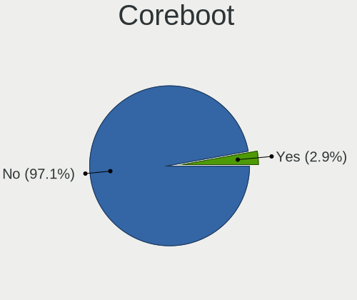
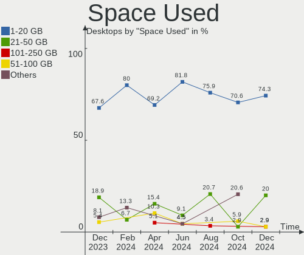
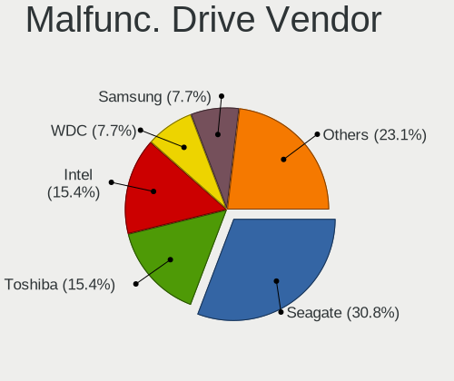

FreeBSD - Hardware Trends (Desktops)
------------------------------------

A project to identify most popular hardware characteristics and track their change
over time based on data collected by BSD users at https://BSD-Hardware.info.

Anyone can contribute to this report by the [hw-probe](https://github.com/linuxhw/hw-probe/blob/master/INSTALL.BSD.md) tool:

    hw-probe -all -upload

This report is for one last month. Overall report since the beginning of time: [TestDays](https://github.com/bsdhw/TestDays)

Period: Jan, 2024.

Contents
--------

* [ System ](#system)
  - [ OS                       ](#os)
  - [ OS Family                ](#os-family)
  - [ Arch                     ](#arch)
  - [ DE                       ](#de)
  - [ Display Server           ](#display-server)
  - [ Display Manager          ](#display-manager)
  - [ OS Lang                  ](#os-lang)
  - [ Boot Mode                ](#boot-mode)
  - [ Filesystem               ](#filesystem)
  - [ Part. scheme             ](#part-scheme)

* [ Board ](#board)
  - [ Vendor                   ](#vendor)
  - [ Model                    ](#model)
  - [ Model Family             ](#model-family)
  - [ MFG Year                 ](#mfg-year)
  - [ Form Factor              ](#form-factor)
  - [ Coreboot                 ](#coreboot)
  - [ RAM Size                 ](#ram-size)
  - [ RAM Used                 ](#ram-used)
  - [ Total Drives             ](#total-drives)
  - [ Has CD-ROM               ](#has-cd-rom)
  - [ Has Ethernet             ](#has-ethernet)
  - [ Has WiFi                 ](#has-wifi)
  - [ Has Bluetooth            ](#has-bluetooth)

* [ Location ](#location)
  - [ Country                  ](#country)
  - [ City                     ](#city)

* [ Drives ](#drives)
  - [ Drive Vendor             ](#drive-vendor)
  - [ Drive Model              ](#drive-model)
  - [ HDD Vendor               ](#hdd-vendor)
  - [ SSD Vendor               ](#ssd-vendor)
  - [ Drive Kind               ](#drive-kind)
  - [ Drive Connector          ](#drive-connector)
  - [ Drive Size               ](#drive-size)
  - [ Space Total              ](#space-total)
  - [ Space Used               ](#space-used)
  - [ Malfunc. Drives          ](#malfunc-drives)
  - [ Malfunc. Drive Vendor    ](#malfunc-drive-vendor)
  - [ Malfunc. HDD Vendor      ](#malfunc-hdd-vendor)
  - [ Malfunc. Drive Kind      ](#malfunc-drive-kind)
  - [ Failed Drives            ](#failed-drives)
  - [ Failed Drive Vendor      ](#failed-drive-vendor)
  - [ Drive Status             ](#drive-status)

* [ Storage controller ](#storage-controller)
  - [ Storage Vendor           ](#storage-vendor)
  - [ Storage Model            ](#storage-model)
  - [ Storage Kind             ](#storage-kind)

* [ Processor ](#processor)
  - [ CPU Vendor               ](#cpu-vendor)
  - [ CPU Model                ](#cpu-model)
  - [ CPU Model Family         ](#cpu-model-family)
  - [ CPU Cores                ](#cpu-cores)
  - [ CPU Sockets              ](#cpu-sockets)
  - [ CPU Threads              ](#cpu-threads)
  - [ CPU Microarch            ](#cpu-microarch)

* [ Graphics ](#graphics)
  - [ GPU Vendor               ](#gpu-vendor)
  - [ GPU Model                ](#gpu-model)
  - [ GPU Combo                ](#gpu-combo)
  - [ GPU Driver               ](#gpu-driver)
  - [ GPU Memory               ](#gpu-memory)

* [ Monitor ](#monitor)
  - [ Monitor Vendor           ](#monitor-vendor)
  - [ Monitor Model            ](#monitor-model)
  - [ Monitor Resolution       ](#monitor-resolution)
  - [ Monitor Diagonal         ](#monitor-diagonal)
  - [ Monitor Width            ](#monitor-width)
  - [ Aspect Ratio             ](#aspect-ratio)
  - [ Monitor Area             ](#monitor-area)
  - [ Pixel Density            ](#pixel-density)
  - [ Multiple Monitors        ](#multiple-monitors)

* [ Network ](#network)
  - [ Net Controller Vendor    ](#net-controller-vendor)
  - [ Net Controller Model     ](#net-controller-model)
  - [ Wireless Vendor          ](#wireless-vendor)
  - [ Wireless Model           ](#wireless-model)
  - [ Ethernet Vendor          ](#ethernet-vendor)
  - [ Ethernet Model           ](#ethernet-model)
  - [ Net Controller Kind      ](#net-controller-kind)
  - [ Used Controller          ](#used-controller)
  - [ NICs                     ](#nics)
  - [ IPv6                     ](#ipv6)

* [ Bluetooth ](#bluetooth)
  - [ Bluetooth Vendor         ](#bluetooth-vendor)
  - [ Bluetooth Model          ](#bluetooth-model)

* [ Sound ](#sound)
  - [ Sound Vendor             ](#sound-vendor)
  - [ Sound Model              ](#sound-model)

* [ Memory ](#memory)
  - [ Memory Vendor            ](#memory-vendor)
  - [ Memory Model             ](#memory-model)
  - [ Memory Kind              ](#memory-kind)
  - [ Memory Form Factor       ](#memory-form-factor)
  - [ Memory Size              ](#memory-size)
  - [ Memory Speed             ](#memory-speed)

* [ Printers & scanners ](#printers--scanners)
  - [ Printer Vendor           ](#printer-vendor)
  - [ Printer Model            ](#printer-model)
  - [ Scanner Vendor           ](#scanner-vendor)
  - [ Scanner Model            ](#scanner-model)

* [ Camera ](#camera)
  - [ Camera Vendor            ](#camera-vendor)
  - [ Camera Model             ](#camera-model)

* [ Security ](#security)
  - [ Fingerprint Vendor       ](#fingerprint-vendor)
  - [ Fingerprint Model        ](#fingerprint-model)
  - [ Chipcard Vendor          ](#chipcard-vendor)
  - [ Chipcard Model           ](#chipcard-model)

* [ Unsupported ](#unsupported)
  - [ Unsupported Devices      ](#unsupported-devices)
  - [ Unsupported Device Types ](#unsupported-device-types)

System
------

OS
--

Installed operating systems

| Name                 | Desktops | Percent |
|----------------------|----------|---------|
| FreeBSD 14.0-p4      | 12       | 40%     |
| FreeBSD 13.2         | 3        | 10%     |
| FreeBSD 15.0-CURRENT | 2        | 6.67%   |
| FreeBSD 14.0-STABLE  | 2        | 6.67%   |
| FreeBSD 14.0-p2      | 2        | 6.67%   |
| FreeBSD 14.0         | 2        | 6.67%   |
| FreeBSD 13.2-p9      | 2        | 6.67%   |
| FreeBSD 14.0-p3      | 1        | 3.33%   |
| FreeBSD 14.0-BETA5   | 1        | 3.33%   |
| FreeBSD 13.2-STABLE  | 1        | 3.33%   |
| FreeBSD 13.2-p5      | 1        | 3.33%   |
| FreeBSD 13.2-p1      | 1        | 3.33%   |

OS Family
---------

OS without a version

| Name    | Desktops | Percent |
|---------|----------|---------|
| FreeBSD | 30       | 100%    |

Arch
----

OS architecture (x86_64, i586, etc.)

| Name    | Desktops | Percent |
|---------|----------|---------|
| amd64   | 26       | 86.67%  |
| powerpc | 1        | 3.33%   |
| i386    | 1        | 3.33%   |
| arm64   | 1        | 3.33%   |
| arm     | 1        | 3.33%   |

DE
--

Desktop Environment

| Name    | Desktops | Percent |
|---------|----------|---------|
| Console | 16       | 53.33%  |
| XFCE    | 4        | 13.33%  |
| KDE5    | 4        | 13.33%  |
| i3      | 2        | 6.67%   |
| wlroots | 1        | 3.33%   |
| TWM     | 1        | 3.33%   |
| MATE    | 1        | 3.33%   |
| GNOME   | 1        | 3.33%   |

Display Server
--------------

X11 or Wayland

| Name    | Desktops | Percent |
|---------|----------|---------|
| Console | 17       | 56.67%  |
| X11     | 12       | 40%     |
| Wayland | 1        | 3.33%   |

Display Manager
---------------

SDDM, LightDM, etc.

| Name    | Desktops | Percent |
|---------|----------|---------|
| Console | 20       | 66.67%  |
| SDDM    | 4        | 13.33%  |
| SLiM    | 2        | 6.67%   |
| LightDM | 2        | 6.67%   |
| XDM     | 1        | 3.33%   |
| GDM     | 1        | 3.33%   |

OS Lang
-------

Language

| Lang    | Desktops | Percent |
|---------|----------|---------|
| C       | 20       | 66.67%  |
| en_US   | 5        | 16.67%  |
| pl_PL   | 2        | 6.67%   |
| ru_RU   | 1        | 3.33%   |
| fr_FR   | 1        | 3.33%   |
| Unknown | 1        | 3.33%   |

Boot Mode
---------

EFI or BIOS

| Mode | Desktops | Percent |
|------|----------|---------|
| EFI  | 22       | 73.33%  |
| BIOS | 8        | 26.67%  |

Filesystem
----------

Type of filesystem

| Type | Desktops | Percent |
|------|----------|---------|
| Zfs  | 18       | 60%     |
| Ufs  | 12       | 40%     |

Part. scheme
------------

Scheme of partitioning

| Type | Desktops | Percent |
|------|----------|---------|
| GPT  | 28       | 93.33%  |
| MBR  | 1        | 3.33%   |
| BSD  | 1        | 3.33%   |

Board
-----

Vendor
------

Motherboard manufacturer

| Name                | Desktops | Percent |
|---------------------|----------|---------|
| ASUSTek Computer    | 10       | 33.33%  |
| ASRock              | 4        | 13.33%  |
| Dell                | 3        | 10%     |
| MSI                 | 2        | 6.67%   |
| Gigabyte Technology | 2        | 6.67%   |
| Unknown             | 2        | 6.67%   |
| SolidRun            | 1        | 3.33%   |
| Roqos               | 1        | 3.33%   |
| Hewlett-Packard     | 1        | 3.33%   |
| HC Technology.      | 1        | 3.33%   |
| Fujitsu             | 1        | 3.33%   |
| ASRockRack          | 1        | 3.33%   |
| Alienware           | 1        | 3.33%   |

Model
-----

Motherboard model

| Name                               | Desktops | Percent |
|------------------------------------|----------|---------|
| Unknown                            | 2        | 6.67%   |
| SolidRun CEX7 Platform             | 1        | 3.33%   |
| Roqos Core RC10                    | 1        | 3.33%   |
| MSI MS-7B86                        | 1        | 3.33%   |
| MSI MS-7817                        | 1        | 3.33%   |
| HP t5740                           | 1        | 3.33%   |
| HC Technology. HCAR5000-MI         | 1        | 3.33%   |
| Gigabyte Z690 UD DDR4              | 1        | 3.33%   |
| Gigabyte H87-D3H                   | 1        | 3.33%   |
| Fujitsu ESPRIMO Q556/2             | 1        | 3.33%   |
| Dell OptiPlex 7050                 | 1        | 3.33%   |
| Dell OptiPlex 5040                 | 1        | 3.33%   |
| Dell OptiPlex 3040                 | 1        | 3.33%   |
| ASUS TUF Gaming B560M-PLUS WIFI    | 1        | 3.33%   |
| ASUS TUF Gaming B550-PLUS          | 1        | 3.33%   |
| ASUS ROG STRIX Z370-G GAMING       | 1        | 3.33%   |
| ASUS ROG STRIX B650E-I GAMING WIFI | 1        | 3.33%   |
| ASUS ROG STRIX B550-F GAMING       | 1        | 3.33%   |
| ASUS ROG CROSSHAIR VIII HERO       | 1        | 3.33%   |
| ASUS Pro WS WRX80E-SAGE SE WIFI    | 1        | 3.33%   |
| ASUS PRIME X370-PRO                | 1        | 3.33%   |
| ASUS P5Q-E                         | 1        | 3.33%   |
| ASUS CM6870                        | 1        | 3.33%   |
| ASRockRack EPYC3101D4I-2T          | 1        | 3.33%   |
| ASRock X570 Phantom Gaming 4       | 1        | 3.33%   |
| ASRock H310CM-HDV/M.2              | 1        | 3.33%   |
| ASRock B660M-STX                   | 1        | 3.33%   |
| ASRock B450M-HDV                   | 1        | 3.33%   |
| Alienware Aurora R6                | 1        | 3.33%   |

Model Family
------------

Motherboard model prefix

| Name                       | Desktops | Percent |
|----------------------------|----------|---------|
| ASUS ROG                   | 4        | 13.33%  |
| Dell OptiPlex              | 3        | 10%     |
| ASUS TUF                   | 2        | 6.67%   |
| Unknown                    | 2        | 6.67%   |
| SolidRun CEX7              | 1        | 3.33%   |
| Roqos Core                 | 1        | 3.33%   |
| MSI MS-7B86                | 1        | 3.33%   |
| MSI MS-7817                | 1        | 3.33%   |
| HP t5740                   | 1        | 3.33%   |
| HC Technology. HCAR5000-MI | 1        | 3.33%   |
| Gigabyte Z690              | 1        | 3.33%   |
| Gigabyte H87-D3H           | 1        | 3.33%   |
| Fujitsu ESPRIMO            | 1        | 3.33%   |
| ASUS Pro                   | 1        | 3.33%   |
| ASUS PRIME                 | 1        | 3.33%   |
| ASUS P5Q-E                 | 1        | 3.33%   |
| ASUS CM6870                | 1        | 3.33%   |
| ASRockRack EPYC3101D4I-2T  | 1        | 3.33%   |
| ASRock X570                | 1        | 3.33%   |
| ASRock H310CM-HDV          | 1        | 3.33%   |
| ASRock B660M-STX           | 1        | 3.33%   |
| ASRock B450M-HDV           | 1        | 3.33%   |
| Alienware Aurora           | 1        | 3.33%   |

MFG Year
--------

Motherboard manufacture year

| Year    | Desktops | Percent |
|---------|----------|---------|
| 2023    | 6        | 20%     |
| 2019    | 5        | 16.67%  |
| 2022    | 3        | 10%     |
| 2016    | 3        | 10%     |
| 2020    | 2        | 6.67%   |
| 2018    | 2        | 6.67%   |
| Unknown | 2        | 6.67%   |
| 2021    | 1        | 3.33%   |
| 2017    | 1        | 3.33%   |
| 2014    | 1        | 3.33%   |
| 2013    | 1        | 3.33%   |
| 2012    | 1        | 3.33%   |
| 2011    | 1        | 3.33%   |
| 2008    | 1        | 3.33%   |

Form Factor
-----------

Physical design of the computer

| Name    | Desktops | Percent |
|---------|----------|---------|
| Desktop | 30       | 100%    |

Coreboot
--------

Have coreboot on board

| Used | Desktops | Percent |
|------|----------|---------|
| No   | 29       | 96.67%  |
| Yes  | 1        | 3.33%   |

RAM Size
--------

Total RAM memory

| Size in GB  | Desktops | Percent |
|-------------|----------|---------|
| 64.01-256.0 | 8        | 26.67%  |
| 16.01-24.0  | 8        | 26.67%  |
| 32.01-64.0  | 5        | 16.67%  |
| 4.01-8.0    | 4        | 13.33%  |
| 8.01-16.0   | 4        | 13.33%  |
| 0.01-0.5    | 1        | 3.33%   |

RAM Used
--------

Used RAM memory

| Used GB  | Desktops | Percent |
|----------|----------|---------|
| 1.01-2.0 | 10       | 33.33%  |
| 0.01-0.5 | 7        | 23.33%  |
| 0.51-1.0 | 6        | 20%     |
| 3.01-4.0 | 3        | 10%     |
| 2.01-3.0 | 3        | 10%     |
| 0        | 1        | 3.33%   |

Total Drives
------------

Number of drives on board

| Drives | Desktops | Percent |
|--------|----------|---------|
| 1      | 9        | 30%     |
| 0      | 7        | 23.33%  |
| 3      | 5        | 16.67%  |
| 2      | 4        | 13.33%  |
| 5      | 2        | 6.67%   |
| 4      | 2        | 6.67%   |
| 13     | 1        | 3.33%   |

Has CD-ROM
----------

Has CD-ROM on board

| Presented | Desktops | Percent |
|-----------|----------|---------|
| No        | 23       | 76.67%  |
| Yes       | 7        | 23.33%  |

Has Ethernet
------------

Has Ethernet on board

| Presented | Desktops | Percent |
|-----------|----------|---------|
| Yes       | 28       | 93.33%  |
| No        | 2        | 6.67%   |

Has WiFi
--------

Has WiFi module

| Presented | Desktops | Percent |
|-----------|----------|---------|
| No        | 20       | 66.67%  |
| Yes       | 10       | 33.33%  |

Has Bluetooth
-------------

Has Bluetooth module

| Presented | Desktops | Percent |
|-----------|----------|---------|
| No        | 24       | 80%     |
| Yes       | 6        | 20%     |

Location
--------

Country
-------

Geographic location (country)

| Country     | Desktops | Percent |
|-------------|----------|---------|
| USA         | 12       | 40%     |
| Russia      | 3        | 10%     |
| UK          | 2        | 6.67%   |
| Poland      | 2        | 6.67%   |
| France      | 2        | 6.67%   |
| Thailand    | 1        | 3.33%   |
| Slovenia    | 1        | 3.33%   |
| Netherlands | 1        | 3.33%   |
| Ireland     | 1        | 3.33%   |
| Hungary     | 1        | 3.33%   |
| Czechia     | 1        | 3.33%   |
| Canada      | 1        | 3.33%   |
| Belarus     | 1        | 3.33%   |
| Austria     | 1        | 3.33%   |

City
----

Geographic location (city)

| City                 | Desktops | Percent |
|----------------------|----------|---------|
| Salem                | 2        | 6.67%   |
| Redmond              | 2        | 6.67%   |
| Atlanta              | 2        | 6.67%   |
| Ypsilanti            | 1        | 3.33%   |
| Yekaterinburg        | 1        | 3.33%   |
| Witow                | 1        | 3.33%   |
| Wenatchee            | 1        | 3.33%   |
| Virginia Beach       | 1        | 3.33%   |
| Vienna               | 1        | 3.33%   |
| Toronto              | 1        | 3.33%   |
| Spanish Fork         | 1        | 3.33%   |
| Seattle              | 1        | 3.33%   |
| San Mateo            | 1        | 3.33%   |
| Rpety                | 1        | 3.33%   |
| Moscow               | 1        | 3.33%   |
| Mogilev              | 1        | 3.33%   |
| Midleton             | 1        | 3.33%   |
| Lyon                 | 1        | 3.33%   |
| Lewisham             | 1        | 3.33%   |
| Kranj                | 1        | 3.33%   |
| Kovdor               | 1        | 3.33%   |
| Juchnowiec Koscielny | 1        | 3.33%   |
| Hanwell              | 1        | 3.33%   |
| Budapest             | 1        | 3.33%   |
| Boulogne-Billancourt | 1        | 3.33%   |
| Bangkok              | 1        | 3.33%   |
| Amsterdam            | 1        | 3.33%   |

Drives
------

Drive Vendor
------------

Hard drive vendors

| Vendor              | Desktops | Drives | Percent |
|---------------------|----------|--------|---------|
| Seagate             | 9        | 11     | 21.43%  |
| Samsung Electronics | 9        | 14     | 21.43%  |
| WDC                 | 7        | 19     | 16.67%  |
| Intel               | 4        | 5      | 9.52%   |
| SK hynix            | 3        | 3      | 7.14%   |
| Crucial             | 3        | 4      | 7.14%   |
| HGST                | 2        | 2      | 4.76%   |
| Toshiba             | 1        | 1      | 2.38%   |
| Team                | 1        | 1      | 2.38%   |
| Hewlett-Packard     | 1        | 1      | 2.38%   |
| Foxline             | 1        | 1      | 2.38%   |
| Corsair             | 1        | 1      | 2.38%   |

Drive Model
-----------

Hard drive models

| Model                                       | Desktops | Percent |
|---------------------------------------------|----------|---------|
| Seagate ST4000DM000-1F2168 4TB              | 2        | 3.85%   |
| Samsung SSD 870 QVO 2TB                     | 2        | 3.85%   |
| Samsung SSD 860 QVO 1TB                     | 2        | 3.85%   |
| WDC WUH721414ALE6L4 14TB                    | 1        | 1.92%   |
| WDC WD80EMAZ-00WJTA0 8TB                    | 1        | 1.92%   |
| WDC WD80EFZX-68UW8N0 8TB                    | 1        | 1.92%   |
| WDC WD80EFAX-68LHPN0 8TB                    | 1        | 1.92%   |
| WDC WD80EDBZ-11B0ZA0 8TB                    | 1        | 1.92%   |
| WDC WD40NDZW-11BCSS0 4TB                    | 1        | 1.92%   |
| WDC WD40EZRZ-22GXCB0 4TB                    | 1        | 1.92%   |
| WDC WD40EZRZ-00GXCB0 4TB                    | 1        | 1.92%   |
| WDC WD40EFRX-68WT0N0 4TB                    | 1        | 1.92%   |
| WDC WD15EADS-00P8B0 1.5TB                   | 1        | 1.92%   |
| WDC WD120EMFZ-11A6JA0 12TB                  | 1        | 1.92%   |
| WDC WD120EMAZ-11BLFA0 12TB                  | 1        | 1.92%   |
| WDC WD10EZEX-75WN4A0 1TB                    | 1        | 1.92%   |
| WDC WD1002FAEX-00Z3A0 1TB                   | 1        | 1.92%   |
| WDC WD1001FALS-00J7B1 1TB                   | 1        | 1.92%   |
| Toshiba HDWR180 8TB                         | 1        | 1.92%   |
| Team T253X1120G 120GB                       | 1        | 1.92%   |
| SK hynix SKHynix_HFS512GDE9X084N 512GB      | 1        | 1.92%   |
| SK hynix SC311 SATA 128GB                   | 1        | 1.92%   |
| SK hynix SC308 SATA 128GB                   | 1        | 1.92%   |
| Seagate ST8000DM004-2U9188 8TB              | 1        | 1.92%   |
| Seagate ST4000LM024-2AN17V 4TB              | 1        | 1.92%   |
| Seagate ST2000DM008-2FR102 2TB              | 1        | 1.92%   |
| Seagate ST18000NM000J-2TV103 18TB           | 1        | 1.92%   |
| Seagate ST1000LM024 HN-M101MBB 1TB          | 1        | 1.92%   |
| Seagate ST1000DM003-1SB10C 1TB              | 1        | 1.92%   |
| Seagate FireCuda 120 SSD ZA500GM10001 500GB | 1        | 1.92%   |
| Samsung SSD 970 EVO Plus 2TB                | 1        | 1.92%   |
| Samsung SSD 970 EVO Plus 1TB                | 1        | 1.92%   |
| Samsung SSD 960 EVO 500GB                   | 1        | 1.92%   |
| Samsung SSD 860 EVO 500GB                   | 1        | 1.92%   |
| Samsung SSD 850 EVO 250GB                   | 1        | 1.92%   |
| Samsung SSD 850 EVO 1TB                     | 1        | 1.92%   |
| Samsung SSD 840 EVO 500GB                   | 1        | 1.92%   |
| Intel SSDSC2KB480G8 480GB                   | 1        | 1.92%   |
| Intel SSDSC2CT120A3 120GB                   | 1        | 1.92%   |
| Intel SSDSC2BW120A4 120GB                   | 1        | 1.92%   |

HDD Vendor
----------

Hard disk drive vendors

| Vendor  | Desktops | Drives | Percent |
|---------|----------|--------|---------|
| Seagate | 8        | 10     | 44.44%  |
| WDC     | 7        | 19     | 38.89%  |
| HGST    | 2        | 2      | 11.11%  |
| Toshiba | 1        | 1      | 5.56%   |

SSD Vendor
----------

Solid state drive vendors

| Vendor              | Desktops | Drives | Percent |
|---------------------|----------|--------|---------|
| Samsung Electronics | 7        | 11     | 35%     |
| Intel               | 4        | 5      | 20%     |
| Crucial             | 3        | 4      | 15%     |
| SK hynix            | 2        | 2      | 10%     |
| Team                | 1        | 1      | 5%      |
| Seagate             | 1        | 1      | 5%      |
| Hewlett-Packard     | 1        | 1      | 5%      |
| Foxline             | 1        | 1      | 5%      |

Drive Kind
----------

HDD or SSD

| Kind | Desktops | Drives | Percent |
|------|----------|--------|---------|
| SSD  | 18       | 26     | 51.43%  |
| HDD  | 13       | 32     | 37.14%  |
| NVMe | 4        | 5      | 11.43%  |

Drive Connector
---------------

SATA, SAS, NVMe, etc.

| Type | Desktops | Drives | Percent |
|------|----------|--------|---------|
| SATA | 23       | 58     | 85.19%  |
| NVMe | 4        | 5      | 14.81%  |

Drive Size
----------

Size of hard drive

| Size in TB | Desktops | Drives | Percent |
|------------|----------|--------|---------|
| 0.01-0.5   | 13       | 18     | 36.11%  |
| 0.51-1.0   | 8        | 10     | 22.22%  |
| 3.01-4.0   | 4        | 7      | 11.11%  |
| 1.01-2.0   | 4        | 8      | 11.11%  |
| 4.01-10.0  | 4        | 11     | 11.11%  |
| 10.01-20.0 | 3        | 4      | 8.33%   |

Space Total
-----------

Amount of disk space available on the file system

| Size in GB     | Desktops | Percent |
|----------------|----------|---------|
| 101-250        | 10       | 33.33%  |
| 251-500        | 8        | 26.67%  |
| 501-1000       | 4        | 13.33%  |
| 1001-2000      | 3        | 10%     |
| More than 3000 | 2        | 6.67%   |
| 1-20           | 2        | 6.67%   |
| 51-100         | 1        | 3.33%   |

Space Used
----------

Amount of used disk space

| Used GB        | Desktops | Percent |
|----------------|----------|---------|
| 1-20           | 21       | 70%     |
| 21-50          | 6        | 20%     |
| More than 3000 | 2        | 6.67%   |
| 101-250        | 1        | 3.33%   |

Malfunc. Drives
---------------

Drive models with a malfunction

| Model                        | Desktops | Drives | Percent |
|------------------------------|----------|--------|---------|
| WDC WD40EFRX-68WT0N0 4TB     | 1        | 1      | 25%     |
| SK hynix SC308 SATA 128GB    | 1        | 1      | 25%     |
| HGST HTS725050A7E630 500GB   | 1        | 1      | 25%     |
| Crucial CT525MX300SSD1 528GB | 1        | 1      | 25%     |

Malfunc. Drive Vendor
---------------------

Vendors of faulty drives

| Vendor   | Desktops | Drives | Percent |
|----------|----------|--------|---------|
| WDC      | 1        | 1      | 25%     |
| SK hynix | 1        | 1      | 25%     |
| HGST     | 1        | 1      | 25%     |
| Crucial  | 1        | 1      | 25%     |

Malfunc. HDD Vendor
-------------------

Vendors of faulty HDD drives

| Vendor | Desktops | Drives | Percent |
|--------|----------|--------|---------|
| WDC    | 1        | 1      | 50%     |
| HGST   | 1        | 1      | 50%     |

Malfunc. Drive Kind
-------------------

Kinds of faulty drives

| Kind | Desktops | Drives | Percent |
|------|----------|--------|---------|
| SSD  | 2        | 2      | 50%     |
| HDD  | 2        | 2      | 50%     |

Failed Drives
-------------

Failed drive models

Zero info for selected period =(

Failed Drive Vendor
-------------------

Failed drive vendors

Zero info for selected period =(

Drive Status
------------

Number of failed and malfunc. drives

| Status  | Desktops | Drives | Percent |
|---------|----------|--------|---------|
| Works   | 21       | 59     | 87.5%   |
| Malfunc | 3        | 4      | 12.5%   |

Storage controller
------------------

Storage Vendor
--------------

Storage controller vendors

| Vendor                       | Desktops | Percent |
|------------------------------|----------|---------|
| Intel                        | 15       | 31.91%  |
| AMD                          | 10       | 21.28%  |
| Samsung Electronics          | 8        | 17.02%  |
| SanDisk                      | 3        | 6.38%   |
| Micron/Crucial Technology    | 2        | 4.26%   |
| Marvell Technology Group     | 2        | 4.26%   |
| Broadcom / LSI               | 2        | 4.26%   |
| SK hynix                     | 1        | 2.13%   |
| Shenzhen Longsys Electronics | 1        | 2.13%   |
| Phison Electronics           | 1        | 2.13%   |
| MAXIO Technology (Hangzhou)  | 1        | 2.13%   |
| ASMedia Technology           | 1        | 2.13%   |

Storage Model
-------------

Storage controller models

| Model                                                                          | Desktops | Percent |
|--------------------------------------------------------------------------------|----------|---------|
| AMD FCH SATA Controller [AHCI mode]                                            | 7        | 13.46%  |
| Samsung NVMe SSD Controller SM981/PM981/PM983                                  | 4        | 7.69%   |
| Intel SATA Controller [RAID mode]                                              | 3        | 5.77%   |
| Intel Q170/Q150/B150/H170/H110/Z170/CM236 Chipset SATA Controller [AHCI Mode]  | 3        | 5.77%   |
| Samsung NVMe SSD Controller SM961/PM961/SM963                                  | 2        | 3.85%   |
| Intel 8 Series/C220 Series Chipset Family 6-port SATA Controller 1 [AHCI mode] | 2        | 3.85%   |
| Broadcom / LSI SAS2008 PCI-Express Fusion-MPT SAS-2 [Falcon]                   | 2        | 3.85%   |
| AMD 500 Series Chipset SATA Controller                                         | 2        | 3.85%   |
| AMD 400 Series Chipset SATA Controller                                         | 2        | 3.85%   |
| SK hynix Gold P31/BC711/PC711 NVMe Solid State Drive                           | 1        | 1.92%   |
| Shenzhen Longsys Lexar NM790 NVME SSD (DRAM-less)                              | 1        | 1.92%   |
| SanDisk WD Blue SN500 / PC SN520 x2 M.2 2280 NVMe SSD                          | 1        | 1.92%   |
| Sandisk WD Black SN770 / PC SN740 256GB / PC SN560 (DRAM-less) NVMe SSD        | 1        | 1.92%   |
| SanDisk Extreme Pro / WD Black SN750 / PC SN730 / Red SN700 NVMe SSD           | 1        | 1.92%   |
| Samsung NVMe SSD Controller PM9A1/PM9A3/980PRO                                 | 1        | 1.92%   |
| Samsung NVMe SSD Controller 980 (DRAM-less)                                    | 1        | 1.92%   |
| Phison E16 PCIe4 NVMe Controller                                               | 1        | 1.92%   |
| Micron/Crucial P5 Plus NVMe PCIe SSD                                           | 1        | 1.92%   |
| Micron/Crucial P2 [Nick P2] / P3 / P3 Plus NVMe PCIe SSD (DRAM-less)           | 1        | 1.92%   |
| MAXIO (Hangzhou) NVMe SSD Controller MAP1202 (DRAM-less)                       | 1        | 1.92%   |
| Marvell Group 88SE9235 PCIe 2.0 x2 4-port SATA 6 Gb/s Controller               | 1        | 1.92%   |
| Marvell Group 88SE6111/6121 SATA II / PATA Controller                          | 1        | 1.92%   |
| Intel Atom Processor E3800 Series SATA AHCI Controller                         | 1        | 1.92%   |
| Intel Alder Lake-S PCH SATA Controller [AHCI Mode]                             | 1        | 1.92%   |
| Intel 82801JI (ICH10 Family) 4 port SATA IDE Controller #1                     | 1        | 1.92%   |
| Intel 82801JI (ICH10 Family) 2 port SATA IDE Controller #2                     | 1        | 1.92%   |
| Intel 82801IBM/IEM (ICH9M/ICH9M-E) 2 port SATA Controller [IDE mode]           | 1        | 1.92%   |
| Intel 7 Series/C210 Series Chipset Family 4-port SATA Controller [IDE mode]    | 1        | 1.92%   |
| Intel 7 Series/C210 Series Chipset Family 2-port SATA Controller [IDE mode]    | 1        | 1.92%   |
| Intel 500 Series Chipset Family SATA AHCI Controller                           | 1        | 1.92%   |
| Intel 200 Series PCH SATA controller [AHCI mode]                               | 1        | 1.92%   |
| ASMedia ASM1061/ASM1062 Serial ATA Controller                                  | 1        | 1.92%   |
| AMD X370 Series Chipset SATA Controller                                        | 1        | 1.92%   |
| AMD 600 Series Chipset SATA Controller                                         | 1        | 1.92%   |

Storage Kind
------------

Kind of storage controller (IDE, SATA, NVMe, SAS, ...)

| Kind | Desktops | Percent |
|------|----------|---------|
| SATA | 21       | 47.73%  |
| NVMe | 15       | 34.09%  |
| RAID | 3        | 6.82%   |
| IDE  | 3        | 6.82%   |
| SAS  | 2        | 4.55%   |

Processor
---------

CPU Vendor
----------

Processor vendors

| Vendor | Desktops | Percent |
|--------|----------|---------|
| Intel  | 16       | 53.33%  |
| AMD    | 11       | 36.67%  |
| NXP    | 1        | 3.33%   |
| IBM    | 1        | 3.33%   |
| ARM    | 1        | 3.33%   |

CPU Model
---------

Processor models

| Model                                       | Desktops | Percent |
|---------------------------------------------|----------|---------|
| Intel Core i5-7500T CPU @ 2.70GHz           | 2        | 6.67%   |
| AMD Ryzen 9 3900X 12-Core Processor         | 2        | 6.67%   |
| NXP Cortex-A72                              | 1        | 3.33%   |
| Intel Xeon CPU E3-1245 v3 @ 3.40GHz         | 1        | 3.33%   |
| Intel Pentium CPU G3220 @ 3.00GHz           | 1        | 3.33%   |
| Intel Core i9-9900K CPU @ 3.60GHz           | 1        | 3.33%   |
| Intel Core i7-7700 CPU @ 3.60GHz            | 1        | 3.33%   |
| Intel Core i7-3770 CPU @ 3.40GHz            | 1        | 3.33%   |
| Intel Core i5-6500 CPU @ 3.20GHz            | 1        | 3.33%   |
| Intel Core i3-8100 CPU @ 3.60GHz            | 1        | 3.33%   |
| Intel Core i3-6100T CPU @ 3.20GHz           | 1        | 3.33%   |
| Intel Core 2 Quad CPU Q6600 @ 2.40GHz       | 1        | 3.33%   |
| Intel Celeron G6900                         | 1        | 3.33%   |
| Intel Atom CPU N280 @ 1.66GHz               | 1        | 3.33%   |
| Intel Atom CPU E3845 @ 1.91GHz              | 1        | 3.33%   |
| Intel 13th Gen Core i7-13700K               | 1        | 3.33%   |
| Intel 11th Gen Core i7-11700 @ 2.50GHz      | 1        | 3.33%   |
| IBM POWER9                                  | 1        | 3.33%   |
| ARM ARM1176 r0p7 (ECO: 0x00000000)          | 1        | 3.33%   |
| AMD Ryzen Threadripper PRO 5975WX 32-Cores  | 1        | 3.33%   |
| AMD Ryzen 9 7950X3D 16-Core Processor       | 1        | 3.33%   |
| AMD Ryzen 9 5900X 12-Core Processor         | 1        | 3.33%   |
| AMD Ryzen 7 5800U with Radeon Graphics      | 1        | 3.33%   |
| AMD Ryzen 7 1700 Eight-Core Processor       | 1        | 3.33%   |
| AMD Ryzen 5 5600G with Radeon Graphics      | 1        | 3.33%   |
| AMD Ryzen 5 2600 Six-Core Processor         | 1        | 3.33%   |
| AMD Ryzen 3 2200G with Radeon Vega Graphics | 1        | 3.33%   |
| AMD EPYC 3101 4-Core Processor              | 1        | 3.33%   |

CPU Model Family
----------------

Processor model prefix

| Model                  | Desktops | Percent |
|------------------------|----------|---------|
| Other                  | 5        | 16.67%  |
| AMD Ryzen 9            | 4        | 13.33%  |
| Intel Core i5          | 3        | 10%     |
| Intel Core i7          | 2        | 6.67%   |
| Intel Core i3          | 2        | 6.67%   |
| Intel Atom             | 2        | 6.67%   |
| AMD Ryzen 7            | 2        | 6.67%   |
| AMD Ryzen 5            | 2        | 6.67%   |
| Intel Xeon             | 1        | 3.33%   |
| Intel Pentium          | 1        | 3.33%   |
| Intel Core i9          | 1        | 3.33%   |
| Intel Core 2 Quad      | 1        | 3.33%   |
| Intel Celeron          | 1        | 3.33%   |
| AMD Ryzen Threadripper | 1        | 3.33%   |
| AMD Ryzen 3            | 1        | 3.33%   |
| AMD EPYC               | 1        | 3.33%   |

CPU Cores
---------

Number of processor cores

| Number  | Desktops | Percent |
|---------|----------|---------|
| 4       | 11       | 36.67%  |
| 24      | 4        | 13.33%  |
| 2       | 3        | 10%     |
| Unknown | 3        | 10%     |
| 16      | 2        | 6.67%   |
| 12      | 2        | 6.67%   |
| 8       | 2        | 6.67%   |
| 64      | 1        | 3.33%   |
| 32      | 1        | 3.33%   |
| 1       | 1        | 3.33%   |

CPU Sockets
-----------

Number of sockets

| Number  | Desktops | Percent |
|---------|----------|---------|
| 1       | 28       | 93.33%  |
| Unknown | 2        | 6.67%   |

CPU Threads
-----------

Threads per core (Hyper-Threading)

| Number  | Desktops | Percent |
|---------|----------|---------|
| 1       | 20       | 66.67%  |
| 2       | 7        | 23.33%  |
| Unknown | 3        | 10%     |

CPU Microarch
-------------

Microarchitecture

| Name       | Desktops | Percent |
|------------|----------|---------|
| Unknown    | 8        | 26.67%  |
| KabyLake   | 5        | 16.67%  |
| Zen 3      | 3        | 10%     |
| Zen        | 3        | 10%     |
| Zen 2      | 2        | 6.67%   |
| Skylake    | 2        | 6.67%   |
| Haswell    | 2        | 6.67%   |
| Zen+       | 1        | 3.33%   |
| Silvermont | 1        | 3.33%   |
| IvyBridge  | 1        | 3.33%   |
| Core       | 1        | 3.33%   |
| Bonnell    | 1        | 3.33%   |

Graphics
--------

GPU Vendor
----------

Vendors of graphics cards

| Vendor            | Desktops | Percent |
|-------------------|----------|---------|
| Intel             | 13       | 44.83%  |
| AMD               | 8        | 27.59%  |
| Nvidia            | 6        | 20.69%  |
| ASPEED Technology | 2        | 6.9%    |

GPU Model
---------

Graphics card models

| Model                                                                       | Desktops | Percent |
|-----------------------------------------------------------------------------|----------|---------|
| Intel HD Graphics 630                                                       | 3        | 10%     |
| Nvidia GP108 [GeForce GT 1030]                                              | 2        | 6.67%   |
| Intel HD Graphics 530                                                       | 2        | 6.67%   |
| Intel CoffeeLake-S GT2 [UHD Graphics 630]                                   | 2        | 6.67%   |
| ASPEED Technology ASPEED Graphics Family                                    | 2        | 6.67%   |
| AMD Navi 31 [Radeon RX 7900 XT/7900 XTX/7900M]                              | 2        | 6.67%   |
| AMD Cezanne [Radeon Vega Series / Radeon Vega Mobile Series]                | 2        | 6.67%   |
| Nvidia GT218 [NVS 300]                                                      | 1        | 3.33%   |
| Nvidia GP106GL [Quadro P2000]                                               | 1        | 3.33%   |
| Nvidia GP106 [GeForce GTX 1060 3GB]                                         | 1        | 3.33%   |
| Nvidia GP104 [GeForce GTX 1080]                                             | 1        | 3.33%   |
| Intel Xeon E3-1200 v3/4th Gen Core Processor Integrated Graphics Controller | 1        | 3.33%   |
| Intel Xeon E3-1200 v3 Processor Integrated Graphics Controller              | 1        | 3.33%   |
| Intel Mobile 4 Series Chipset Integrated Graphics Controller                | 1        | 3.33%   |
| Intel IvyBridge GT2 [HD Graphics 4000]                                      | 1        | 3.33%   |
| Intel Atom Processor Z36xxx/Z37xxx Series Graphics & Display                | 1        | 3.33%   |
| Intel Alder Lake-S GT1 [UHD Graphics 710]                                   | 1        | 3.33%   |
| AMD Raven Ridge [Radeon Vega Series / Radeon Vega Mobile Series]            | 1        | 3.33%   |
| AMD Raphael                                                                 | 1        | 3.33%   |
| AMD Navi 23 [Radeon RX 6650 XT / 6700S / 6800S]                             | 1        | 3.33%   |
| AMD Ellesmere [Radeon RX 470/480/570/570X/580/580X/590]                     | 1        | 3.33%   |
| AMD Cedar [Radeon HD 5000/6000/7350/8350 Series]                            | 1        | 3.33%   |

GPU Combo
---------

Combinations of graphics cards

| Name           | Desktops | Percent |
|----------------|----------|---------|
| 1 x Intel      | 11       | 36.67%  |
| 1 x AMD        | 7        | 23.33%  |
| 1 x Nvidia     | 5        | 16.67%  |
| Other          | 2        | 6.67%   |
| 1 x ASPEED     | 2        | 6.67%   |
| 2 x Intel      | 1        | 3.33%   |
| 2 x AMD        | 1        | 3.33%   |
| Intel + Nvidia | 1        | 3.33%   |

GPU Driver
----------

Free vs proprietary

| Driver      | Desktops | Percent |
|-------------|----------|---------|
| Free        | 25       | 83.33%  |
| Unknown     | 3        | 10%     |
| Proprietary | 2        | 6.67%   |

GPU Memory
----------

Total video memory

| Size in GB | Desktops | Percent |
|------------|----------|---------|
| Unknown    | 22       | 73.33%  |
| 7.01-8.0   | 3        | 10%     |
| 0.01-0.5   | 2        | 6.67%   |
| 4.01-5.0   | 1        | 3.33%   |
| 16.01-24.0 | 1        | 3.33%   |
| 0.51-1.0   | 1        | 3.33%   |

Monitor
-------

Monitor Vendor
--------------

Monitor vendors

| Vendor              | Desktops | Percent |
|---------------------|----------|---------|
| Dell                | 6        | 54.55%  |
| Samsung Electronics | 1        | 9.09%   |
| RTK                 | 1        | 9.09%   |
| Hewlett-Packard     | 1        | 9.09%   |
| Goldstar            | 1        | 9.09%   |
| AOC                 | 1        | 9.09%   |

Monitor Model
-------------

Monitor models

| Model                                                                | Desktops | Percent |
|----------------------------------------------------------------------|----------|---------|
| Samsung Electronics SyncMaster SAM030D 1680x1050 470x300mm 22.0-inch | 1        | 6.67%   |
| RTK FHD RTK0039 1920x1080 300x190mm 14.0-inch                        | 1        | 6.67%   |
| Hewlett-Packard LA2405x HWP301E 1920x1200 520x320mm 24.0-inch        | 1        | 6.67%   |
| Goldstar LG ULTRAGEAR GSM5B73 1920x1080 530x300mm 24.0-inch          | 1        | 6.67%   |
| Dell U3417W DELA0DE 3440x1440 800x330mm 34.1-inch                    | 1        | 6.67%   |
| Dell U3011 DEL4065 2560x1600 640x400mm 29.7-inch                     | 1        | 6.67%   |
| Dell U2917W DEL40F9 2560x1080 670x280mm 28.6-inch                    | 1        | 6.67%   |
| Dell U2311H DELA060 1920x1080 510x290mm 23.1-inch                    | 1        | 6.67%   |
| Dell LCD Monitor U2718Q 5120x1440                                    | 1        | 6.67%   |
| Dell LCD Monitor U2718Q                                              | 1        | 6.67%   |
| Dell LCD Monitor U2412M                                              | 1        | 6.67%   |
| Dell LCD Monitor SE3223Q                                             | 1        | 6.67%   |
| Dell LCD Monitor 2209WA 7860x2400                                    | 1        | 6.67%   |
| Dell LCD Monitor 2209WA                                              | 1        | 6.67%   |
| AOC 27G2G8 AOC2702 1920x1080 600x340mm 27.2-inch                     | 1        | 6.67%   |

Monitor Resolution
------------------

Monitor screen resolution

| Resolution         | Desktops | Percent |
|--------------------|----------|---------|
| 1920x1080 (FHD)    | 4        | 30.77%  |
| Unknown            | 2        | 15.38%  |
| 7860x2400          | 1        | 7.69%   |
| 5120x1440          | 1        | 7.69%   |
| 3440x1440          | 1        | 7.69%   |
| 2560x1600          | 1        | 7.69%   |
| 2560x1080          | 1        | 7.69%   |
| 1920x1200 (WUXGA)  | 1        | 7.69%   |
| 1680x1050 (WSXGA+) | 1        | 7.69%   |

Monitor Diagonal
----------------

Diagonal size in inches

| Inches  | Desktops | Percent |
|---------|----------|---------|
| 24      | 2        | 18.18%  |
| Unknown | 2        | 18.18%  |
| 34      | 1        | 9.09%   |
| 29      | 1        | 9.09%   |
| 28      | 1        | 9.09%   |
| 27      | 1        | 9.09%   |
| 23      | 1        | 9.09%   |
| 22      | 1        | 9.09%   |
| 14      | 1        | 9.09%   |

Monitor Width
-------------

Physical width

| Width in mm | Desktops | Percent |
|-------------|----------|---------|
| 501-600     | 4        | 36.36%  |
| 601-700     | 2        | 18.18%  |
| Unknown     | 2        | 18.18%  |
| 701-800     | 1        | 9.09%   |
| 401-500     | 1        | 9.09%   |
| 201-300     | 1        | 9.09%   |

Aspect Ratio
------------

Proportional relationship between the width and the height

| Ratio   | Desktops | Percent |
|---------|----------|---------|
| 16/10   | 4        | 36.36%  |
| 16/9    | 3        | 27.27%  |
| 21/9    | 2        | 18.18%  |
| Unknown | 2        | 18.18%  |

Monitor Area
------------

Area in inch²

| Area in inch² | Desktops | Percent |
|----------------|----------|---------|
| 201-250        | 3        | 27.27%  |
| 351-500        | 2        | 18.18%  |
| 251-300        | 2        | 18.18%  |
| Unknown        | 2        | 18.18%  |
| 81-90          | 1        | 9.09%   |
| 301-350        | 1        | 9.09%   |

Pixel Density
-------------

Pixels per inch

| Density | Desktops | Percent |
|---------|----------|---------|
| 51-100  | 6        | 54.55%  |
| 101-120 | 2        | 18.18%  |
| Unknown | 2        | 18.18%  |
| 121-160 | 1        | 9.09%   |

Multiple Monitors
-----------------

Total monitors connected

| Total | Desktops | Percent |
|-------|----------|---------|
| 0     | 18       | 60%     |
| 1     | 10       | 33.33%  |
| 4     | 1        | 3.33%   |
| 2     | 1        | 3.33%   |

Network
-------

Net Controller Vendor
---------------------

Controller vendors

| Vendor                   | Desktops | Percent |
|--------------------------|----------|---------|
| Intel                    | 19       | 45.24%  |
| Realtek Semiconductor    | 11       | 26.19%  |
| Qualcomm Atheros         | 2        | 4.76%   |
| Broadcom                 | 2        | 4.76%   |
| ASUSTek Computer         | 2        | 4.76%   |
| TP-Link                  | 1        | 2.38%   |
| MediaTek                 | 1        | 2.38%   |
| Marvell Technology Group | 1        | 2.38%   |
| LG Electronics           | 1        | 2.38%   |
| American Megatrends      | 1        | 2.38%   |
| Accton Technology        | 1        | 2.38%   |

Net Controller Model
--------------------

Controller models

| Model                                                                  | Desktops | Percent |
|------------------------------------------------------------------------|----------|---------|
| Realtek RTL8111/8168/8211/8411 PCI Express Gigabit Ethernet Controller | 7        | 14.89%  |
| Realtek RTL8125 2.5GbE Controller                                      | 4        | 8.51%   |
| Intel I211 Gigabit Network Connection                                  | 4        | 8.51%   |
| Intel Ethernet Connection (2) I219-V                                   | 3        | 6.38%   |
| Intel Ethernet Controller X550                                         | 2        | 4.26%   |
| Intel Ethernet Controller I225-V                                       | 2        | 4.26%   |
| TP-Link TL-WN821N v5/v6 [RTL8192EU]                                    | 1        | 2.13%   |
| Realtek RTL8852BE PCIe 802.11ax Wireless Network Controller            | 1        | 2.13%   |
| Qualcomm Atheros QCA986x/988x 802.11ac Wireless Network Adapter        | 1        | 2.13%   |
| Qualcomm Atheros Killer E2400 Gigabit Ethernet Controller              | 1        | 2.13%   |
| Qualcomm Atheros AR9287 Wireless Network Adapter (PCI-Express)         | 1        | 2.13%   |
| MediaTek MT7922 802.11ax PCI Express Wireless Network Adapter          | 1        | 2.13%   |
| Marvell Group 88E8056 PCI-E Gigabit Ethernet Controller                | 1        | 2.13%   |
| Marvell Group 88E8001 Gigabit Ethernet Controller                      | 1        | 2.13%   |
| LG Optimus Android Phone [USB tethering mode]                          | 1        | 2.13%   |
| Intel Wireless 7265                                                    | 1        | 2.13%   |
| Intel Wireless 3165                                                    | 1        | 2.13%   |
| Intel Wi-Fi 6 AX200                                                    | 1        | 2.13%   |
| Intel Tiger Lake PCH CNVi WiFi                                         | 1        | 2.13%   |
| Intel Ethernet Controller I226-V                                       | 1        | 2.13%   |
| Intel Ethernet Controller 10G X550T                                    | 1        | 2.13%   |
| Intel Ethernet Connection I217-V                                       | 1        | 2.13%   |
| Intel Ethernet Connection (5) I219-LM                                  | 1        | 2.13%   |
| Intel Ethernet Connection (17) I219-V                                  | 1        | 2.13%   |
| Intel 82574L Gigabit Network Connection                                | 1        | 2.13%   |
| Broadcom NetXtreme BCM5719 Gigabit Ethernet PCIe                       | 1        | 2.13%   |
| Broadcom NetLink BCM57780 Gigabit Ethernet PCIe                        | 1        | 2.13%   |
| ASUS USB-AC53 Nano USB Wieless Adapter                                 | 1        | 2.13%   |
| ASUS Realtek 8188EUS [USB-N10 Nano]                                    | 1        | 2.13%   |
| American Megatrends Virtual Ethernet                                   | 1        | 2.13%   |
| Accton EN-1216 Ethernet Adapter                                        | 1        | 2.13%   |

Wireless Vendor
---------------

Wireless vendors

| Vendor                | Desktops | Percent |
|-----------------------|----------|---------|
| Intel                 | 4        | 40%     |
| ASUSTek Computer      | 2        | 20%     |
| TP-Link               | 1        | 10%     |
| Realtek Semiconductor | 1        | 10%     |
| Qualcomm Atheros      | 1        | 10%     |
| MediaTek              | 1        | 10%     |

Wireless Model
--------------

Wireless models

| Model                                                           | Desktops | Percent |
|-----------------------------------------------------------------|----------|---------|
| TP-Link TL-WN821N v5/v6 [RTL8192EU]                             | 1        | 9.09%   |
| Realtek RTL8852BE PCIe 802.11ax Wireless Network Controller     | 1        | 9.09%   |
| Qualcomm Atheros QCA986x/988x 802.11ac Wireless Network Adapter | 1        | 9.09%   |
| Qualcomm Atheros AR9287 Wireless Network Adapter (PCI-Express)  | 1        | 9.09%   |
| MediaTek MT7922 802.11ax PCI Express Wireless Network Adapter   | 1        | 9.09%   |
| Intel Wireless 7265                                             | 1        | 9.09%   |
| Intel Wireless 3165                                             | 1        | 9.09%   |
| Intel Wi-Fi 6 AX200                                             | 1        | 9.09%   |
| Intel Tiger Lake PCH CNVi WiFi                                  | 1        | 9.09%   |
| ASUS USB-AC53 Nano USB Wieless Adapter                          | 1        | 9.09%   |
| ASUS Realtek 8188EUS [USB-N10 Nano]                             | 1        | 9.09%   |

Ethernet Vendor
---------------

Ethernet vendors

| Vendor                   | Desktops | Percent |
|--------------------------|----------|---------|
| Intel                    | 17       | 50%     |
| Realtek Semiconductor    | 11       | 32.35%  |
| Broadcom                 | 2        | 5.88%   |
| Qualcomm Atheros         | 1        | 2.94%   |
| Marvell Technology Group | 1        | 2.94%   |
| American Megatrends      | 1        | 2.94%   |
| Accton Technology        | 1        | 2.94%   |

Ethernet Model
--------------

Ethernet models

| Model                                                                  | Desktops | Percent |
|------------------------------------------------------------------------|----------|---------|
| Realtek RTL8111/8168/8211/8411 PCI Express Gigabit Ethernet Controller | 7        | 20%     |
| Realtek RTL8125 2.5GbE Controller                                      | 4        | 11.43%  |
| Intel I211 Gigabit Network Connection                                  | 4        | 11.43%  |
| Intel Ethernet Connection (2) I219-V                                   | 3        | 8.57%   |
| Intel Ethernet Controller X550                                         | 2        | 5.71%   |
| Intel Ethernet Controller I225-V                                       | 2        | 5.71%   |
| Qualcomm Atheros Killer E2400 Gigabit Ethernet Controller              | 1        | 2.86%   |
| Marvell Group 88E8056 PCI-E Gigabit Ethernet Controller                | 1        | 2.86%   |
| Marvell Group 88E8001 Gigabit Ethernet Controller                      | 1        | 2.86%   |
| Intel Ethernet Controller I226-V                                       | 1        | 2.86%   |
| Intel Ethernet Controller 10G X550T                                    | 1        | 2.86%   |
| Intel Ethernet Connection I217-V                                       | 1        | 2.86%   |
| Intel Ethernet Connection (5) I219-LM                                  | 1        | 2.86%   |
| Intel Ethernet Connection (17) I219-V                                  | 1        | 2.86%   |
| Intel 82574L Gigabit Network Connection                                | 1        | 2.86%   |
| Broadcom NetXtreme BCM5719 Gigabit Ethernet PCIe                       | 1        | 2.86%   |
| Broadcom NetLink BCM57780 Gigabit Ethernet PCIe                        | 1        | 2.86%   |
| American Megatrends Virtual Ethernet                                   | 1        | 2.86%   |
| Accton EN-1216 Ethernet Adapter                                        | 1        | 2.86%   |

Net Controller Kind
-------------------

Ethernet, WiFi or modem

| Kind     | Desktops | Percent |
|----------|----------|---------|
| Ethernet | 28       | 71.79%  |
| WiFi     | 10       | 25.64%  |
| Modem    | 1        | 2.56%   |

Used Controller
---------------

Currently used network controller

| Kind     | Desktops | Percent |
|----------|----------|---------|
| Ethernet | 27       | 96.43%  |
| WiFi     | 1        | 3.57%   |

NICs
----

Total network controllers on board

| Total | Desktops | Percent |
|-------|----------|---------|
| 1     | 16       | 53.33%  |
| 2     | 6        | 20%     |
| 3     | 5        | 16.67%  |
| 0     | 2        | 6.67%   |
| 4     | 1        | 3.33%   |

IPv6
----

IPv6 vs IPv4

| Used | Desktops | Percent |
|------|----------|---------|
| No   | 24       | 80%     |
| Yes  | 6        | 20%     |

Bluetooth
---------

Bluetooth Vendor
----------------

Controller vendors

| Vendor                | Desktops | Percent |
|-----------------------|----------|---------|
| Intel                 | 4        | 66.67%  |
| Realtek Semiconductor | 1        | 16.67%  |
| Foxconn / Hon Hai     | 1        | 16.67%  |

Bluetooth Model
---------------

Controller models

| Model                                     | Desktops | Percent |
|-------------------------------------------|----------|---------|
| Intel Bluetooth wireless interface        | 2        | 33.33%  |
| Realtek Bluetooth Adapter                 | 1        | 16.67%  |
| Intel AX201 Bluetooth                     | 1        | 16.67%  |
| Intel AX200 Bluetooth                     | 1        | 16.67%  |
| Foxconn / Hon Hai RZ616 Bluetooth Adapter | 1        | 16.67%  |

Sound
-----

Sound Vendor
------------

Sound card vendors

| Vendor              | Desktops | Percent |
|---------------------|----------|---------|
| Intel               | 14       | 38.89%  |
| AMD                 | 11       | 30.56%  |
| Nvidia              | 6        | 16.67%  |
| C-Media Electronics | 4        | 11.11%  |
| ASUSTek Computer    | 1        | 2.78%   |

Sound Model
-----------

Sound card models

| Model                                                                      | Desktops | Percent |
|----------------------------------------------------------------------------|----------|---------|
| Intel 200 Series PCH HD Audio                                              | 4        | 9.3%    |
| AMD Starship/Matisse HD Audio Controller                                   | 4        | 9.3%    |
| Intel 100 Series/C230 Series Chipset Family HD Audio Controller            | 3        | 6.98%   |
| AMD Family 17h/19h HD Audio Controller                                     | 3        | 6.98%   |
| Nvidia GP108 High Definition Audio Controller                              | 2        | 4.65%   |
| Nvidia GP106 High Definition Audio Controller                              | 2        | 4.65%   |
| Intel 8 Series/C220 Series Chipset High Definition Audio Controller        | 2        | 4.65%   |
| AMD Renoir Radeon High Definition Audio Controller                         | 2        | 4.65%   |
| AMD Navi 31 HDMI/DP Audio                                                  | 2        | 4.65%   |
| Nvidia High Definition Audio Controller                                    | 1        | 2.33%   |
| Nvidia GP104 High Definition Audio Controller                              | 1        | 2.33%   |
| Intel Xeon E3-1200 v3/4th Gen Core Processor HD Audio Controller           | 1        | 2.33%   |
| Intel Tiger Lake-H HD Audio Controller                                     | 1        | 2.33%   |
| Intel Atom Processor Z36xxx/Z37xxx Series High Definition Audio Controller | 1        | 2.33%   |
| Intel 82801JI (ICH10 Family) HD Audio Controller                           | 1        | 2.33%   |
| Intel 82801I (ICH9 Family) HD Audio Controller                             | 1        | 2.33%   |
| Intel 7 Series/C216 Chipset Family High Definition Audio Controller        | 1        | 2.33%   |
| C-Media Electronics USB Audio Class 1.0 and 2.0 Device                     | 1        | 2.33%   |
| C-Media Electronics CM106 Like Sound Device                                | 1        | 2.33%   |
| C-Media Electronics CAD Audio                                              | 1        | 2.33%   |
| C-Media Electronics Audio Adapter (Unitek Y-247A)                          | 1        | 2.33%   |
| ASUSTek Computer Realtek USB Audio                                         | 1        | 2.33%   |
| AMD Rembrandt Radeon High Definition Audio Controller                      | 1        | 2.33%   |
| AMD Raven/Raven2/Fenghuang HDMI/DP Audio Controller                        | 1        | 2.33%   |
| AMD Navi 21/23 HDMI/DP Audio Controller                                    | 1        | 2.33%   |
| AMD Family 17h (Models 00h-0fh) HD Audio Controller                        | 1        | 2.33%   |
| AMD Ellesmere HDMI Audio [Radeon RX 470/480 / 570/580/590]                 | 1        | 2.33%   |
| AMD Cedar HDMI Audio [Radeon HD 5400/6300/7300 Series]                     | 1        | 2.33%   |

Memory
------

Memory Vendor
-------------

Memory module vendors

| Vendor                       | Desktops | Percent |
|------------------------------|----------|---------|
| G.Skill                      | 6        | 23.08%  |
| Kingston                     | 4        | 15.38%  |
| Crucial                      | 4        | 15.38%  |
| Samsung Electronics          | 3        | 11.54%  |
| Unknown                      | 2        | 7.69%   |
| SK hynix                     | 1        | 3.85%   |
| Patriot Memory (PDP Systems) | 1        | 3.85%   |
| Patriot                      | 1        | 3.85%   |
| Micron Technology            | 1        | 3.85%   |
| Lexar Co Limited             | 1        | 3.85%   |
| Corsair                      | 1        | 3.85%   |
| ASint Technology             | 1        | 3.85%   |

Memory Model
------------

Memory module models

| Model                                                                    | Desktops | Percent |
|--------------------------------------------------------------------------|----------|---------|
| Kingston RAM 9965745-002.A00G 16GB DIMM DDR4 3000MT/s                    | 2        | 7.41%   |
| Unknown RAM Module 8GB SODIMM DDR3 1600MT/s                              | 1        | 3.7%    |
| Unknown RAM Module 2GB DIMM DDR 800MT/s                                  | 1        | 3.7%    |
| SK hynix RAM HMT451U6DFR8A-PB 4GB DIMM DDR3 1600MT/s                     | 1        | 3.7%    |
| Samsung RAM M471B5273CH0-CK0 4GB SODIMM DDR2                             | 1        | 3.7%    |
| Samsung RAM M471A2K43CB1-CRC 16GB SODIMM DDR4 2400MT/s                   | 1        | 3.7%    |
| Samsung RAM M378A1G43TB1-CTD 8GB DIMM DDR4 3200MT/s                      | 1        | 3.7%    |
| Patriot RAM PSD44G240081 4GB DIMM DDR4 2400MT/s                          | 1        | 3.7%    |
| Patriot Memory (PDP Systems) RAM 3200 C16 Series 32GB DIMM DDR4 2667MT/s | 1        | 3.7%    |
| Micron RAM 8ATF1G64AZ-2G3B1 8GB DIMM DDR4 2400MT/s                       | 1        | 3.7%    |
| Lexar Co Limited RAM LD4BU016G-3600WG 16GB DIMM DDR4 3200MT/s            | 1        | 3.7%    |
| Kingston RAM KMKYF9-MIH 8GB SODIMM DDR4 2400MT/s                         | 1        | 3.7%    |
| Kingston RAM KMKYF9-MID 8GB SODIMM DDR4 2400MT/s                         | 1        | 3.7%    |
| Kingston RAM KF3200C16D4/16GX 16GB DIMM DDR4 3200MT/s                    | 1        | 3.7%    |
| G.Skill RAM F5-6000J3040G32G 32GB DIMM DDR5 4800MT/s                     | 1        | 3.7%    |
| G.Skill RAM F4-3200C16-8GTZB 8GB DIMM DDR4 3200MT/s                      | 1        | 3.7%    |
| G.Skill RAM F4-3200C16-8GFX 8GB DIMM DDR4 3200MT/s                       | 1        | 3.7%    |
| G.Skill RAM F4-3200C16-32GVK 32GB DIMM DDR4 3200MT/s                     | 1        | 3.7%    |
| G.Skill RAM F3-12800CL9-4GBRL 4GB DIMM DDR3 1600MT/s                     | 1        | 3.7%    |
| G.Skill RAM F3-12800CL7-2GBRM 2GB DIMM DDR3 1600MT/s                     | 1        | 3.7%    |
| Crucial RAM CT8G4DFRA32A.M8FE 8GB DIMM DDR4 3200MT/s                     | 1        | 3.7%    |
| Crucial RAM CT32G4SFD832A.C16FF 32GB SODIMM DDR4 3200MT/s                | 1        | 3.7%    |
| Crucial RAM BL32G32C16U4B.M16FB1 32GB DIMM DDR4 3200MT/s                 | 1        | 3.7%    |
| Crucial RAM BL16G36C16U4BL.M8FB1 16GB DIMM DDR4 3600MT/s                 | 1        | 3.7%    |
| Corsair RAM CMSX32GX4M1A3200C22 32GB SODIMM DDR4 3200MT/s                | 1        | 3.7%    |
| ASint RAM SLA302G08-GGNNG 4GB DIMM DDR3 1600MT/s                         | 1        | 3.7%    |

Memory Kind
-----------

Memory module kinds

| Kind | Desktops | Percent |
|------|----------|---------|
| DDR4 | 18       | 69.23%  |
| DDR3 | 6        | 23.08%  |
| DDR5 | 1        | 3.85%   |
| DDR  | 1        | 3.85%   |

Memory Form Factor
------------------

Physical design of the memory module

| Name   | Desktops | Percent |
|--------|----------|---------|
| DIMM   | 20       | 76.92%  |
| SODIMM | 6        | 23.08%  |

Memory Size
-----------

Memory module size

| Size  | Desktops | Percent |
|-------|----------|---------|
| 8192  | 7        | 26.92%  |
| 32768 | 6        | 23.08%  |
| 16384 | 6        | 23.08%  |
| 4096  | 5        | 19.23%  |
| 2048  | 2        | 7.69%   |

Memory Speed
------------

Memory module speed

| Speed | Desktops | Percent |
|-------|----------|---------|
| 3200  | 10       | 38.46%  |
| 1600  | 6        | 23.08%  |
| 2400  | 4        | 15.38%  |
| 3000  | 2        | 7.69%   |
| 4800  | 1        | 3.85%   |
| 3600  | 1        | 3.85%   |
| 2667  | 1        | 3.85%   |
| 800   | 1        | 3.85%   |

Printers & scanners
-------------------

Printer Vendor
--------------

Printer device vendors

Zero info for selected period =(

Printer Model
-------------

Printer device models

Zero info for selected period =(

Scanner Vendor
--------------

Scanner device vendors

Zero info for selected period =(

Scanner Model
-------------

Scanner device models

Zero info for selected period =(

Camera
------

Camera Vendor
-------------

Camera device vendors

Zero info for selected period =(

Camera Model
------------

Camera device models

Zero info for selected period =(

Security
--------

Fingerprint Vendor
------------------

Fingerprint sensor vendors

Zero info for selected period =(

Fingerprint Model
-----------------

Fingerprint sensor models

Zero info for selected period =(

Chipcard Vendor
---------------

Chipcard module vendors

Zero info for selected period =(

Chipcard Model
--------------

Chipcard module models

Zero info for selected period =(

Unsupported
-----------

Unsupported Devices
-------------------

Total unsupported devices on board

| Total | Desktops | Percent |
|-------|----------|---------|
| 1     | 15       | 50%     |
| 0     | 11       | 36.67%  |
| 3     | 2        | 6.67%   |
| 2     | 2        | 6.67%   |

Unsupported Device Types
------------------------

Types of unsupported devices

| Type                     | Desktops | Percent |
|--------------------------|----------|---------|
| Communication controller | 13       | 56.52%  |
| Net/wireless             | 5        | 21.74%  |
| Net/ethernet             | 2        | 8.7%    |
| Bluetooth                | 2        | 8.7%    |
| Firewire controller      | 1        | 4.35%   |

