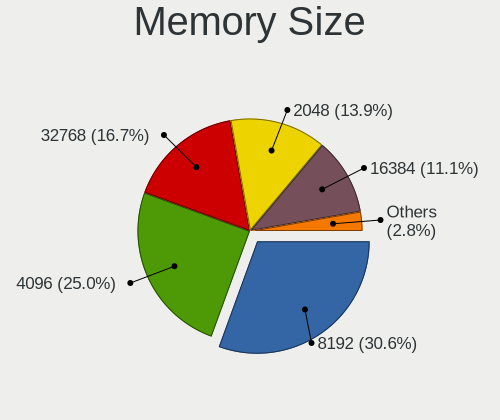

FreeBSD Hardware Trends (Desktop)
---------------------------------

A project to identify most popular hardware characteristics and track their change
over time based on data collected by FreeBSD users at https://BSD-Hardware.info.

Anyone can contribute to the study by uploading probes of their computers by
the [hw-probe](https://github.com/linuxhw/hw-probe/blob/master/INSTALL.BSD.md) tool:

    hw-probe -all -upload

Full-feature report is available here: https://bsd-hardware.info/?view=trends&formfactor=desktop

Period: Dec, 2020.

Contents
--------

- [ OS                       ](#os)
- [ OS Family                ](#os-family)
- [ Arch                     ](#arch)
- [ DE                       ](#de)
- [ Display Server           ](#display-server)
- [ Display Manager          ](#display-manager)
- [ OS Lang                  ](#os-lang)
- [ Boot Mode                ](#boot-mode)
- [ Filesystem               ](#filesystem)
- [ Part. scheme             ](#part-scheme)
- [ Country                  ](#country)
- [ City                     ](#city)
- [ Vendor                   ](#vendor)
- [ Model                    ](#model)
- [ Model Family             ](#model-family)
- [ MFG Year                 ](#mfg-year)
- [ Form Factor              ](#form-factor)
- [ Coreboot                 ](#coreboot)
- [ RAM Size                 ](#ram-size)
- [ RAM Used                 ](#ram-used)
- [ Has CD-ROM               ](#has-cd-rom)
- [ Total Drives             ](#total-drives)
- [ Has Ethernet             ](#has-ethernet)
- [ Drive Vendor             ](#drive-vendor)
- [ Drive Model              ](#drive-model)
- [ HDD Vendor               ](#hdd-vendor)
- [ SSD Vendor               ](#ssd-vendor)
- [ Drive Kind               ](#drive-kind)
- [ Drive Connector          ](#drive-connector)
- [ Drive Size               ](#drive-size)
- [ Space Total              ](#space-total)
- [ Space Used               ](#space-used)
- [ Malfunc. Drives          ](#malfunc-drives)
- [ Malfunc. Drive Vendor    ](#malfunc-drive-vendor)
- [ Malfunc. HDD Vendor      ](#malfunc-hdd-vendor)
- [ Malfunc. Drive Kind      ](#malfunc-drive-kind)
- [ Failed Drives            ](#failed-drives)
- [ Failed Drive Vendor      ](#failed-drive-vendor)
- [ Drive Status             ](#drive-status)
- [ Storage Vendor           ](#storage-vendor)
- [ Storage Model            ](#storage-model)
- [ Storage Kind             ](#storage-kind)
- [ CPU Vendor               ](#cpu-vendor)
- [ CPU Model                ](#cpu-model)
- [ CPU Model Family         ](#cpu-model-family)
- [ CPU Cores                ](#cpu-cores)
- [ CPU Sockets              ](#cpu-sockets)
- [ CPU Threads              ](#cpu-threads)
- [ CPU Microarch            ](#cpu-microarch)
- [ GPU Vendor               ](#gpu-vendor)
- [ GPU Model                ](#gpu-model)
- [ GPU Combo                ](#gpu-combo)
- [ GPU Driver               ](#gpu-driver)
- [ GPU Memory               ](#gpu-memory)
- [ Monitor Vendor           ](#monitor-vendor)
- [ Monitor Model            ](#monitor-model)
- [ Monitor Resolution       ](#monitor-resolution)
- [ Monitor Diagonal         ](#monitor-diagonal)
- [ Monitor Width            ](#monitor-width)
- [ Aspect Ratio             ](#aspect-ratio)
- [ Monitor Area             ](#monitor-area)
- [ Pixel Density            ](#pixel-density)
- [ Multiple Monitors        ](#multiple-monitors)
- [ Net Controller Vendor    ](#net-controller-vendor)
- [ Net Controller Model     ](#net-controller-model)
- [ Wireless Vendor          ](#wireless-vendor)
- [ Wireless Model           ](#wireless-model)
- [ Ethernet Vendor          ](#ethernet-vendor)
- [ Ethernet Model           ](#ethernet-model)
- [ Net Controller Kind      ](#net-controller-kind)
- [ Used Controller          ](#used-controller)
- [ NICs                     ](#nics)
- [ Memory Vendor            ](#memory-vendor)
- [ Memory Model             ](#memory-model)
- [ Memory Kind              ](#memory-kind)
- [ Memory Form Factor       ](#memory-form-factor)
- [ Memory Size              ](#memory-size)
- [ Memory Speed             ](#memory-speed)
- [ Sound Vendor             ](#sound-vendor)
- [ Sound Model              ](#sound-model)
- [ Camera Vendor            ](#camera-vendor)
- [ Camera Model             ](#camera-model)
- [ Fingerprint Vendor       ](#fingerprint-vendor)
- [ Fingerprint Model        ](#fingerprint-model)
- [ Chipcard Vendor          ](#chipcard-vendor)
- [ Chipcard Model           ](#chipcard-model)
- [ Printer Vendor           ](#printer-vendor)
- [ Printer Model            ](#printer-model)
- [ Scanner Vendor           ](#scanner-vendor)
- [ Scanner Model            ](#scanner-model)
- [ Bluetooth Vendor         ](#bluetooth-vendor)
- [ Bluetooth Model          ](#bluetooth-model)
- [ Unsupported Devices      ](#unsupported-devices)
- [ Unsupported Device Types ](#unsupported-device-types)

OS
--

Installed operating systems

| Name                 | Desktops | Percent |
|----------------------|----------|---------|
| FreeBSD 12.2-p2      | 26       | 41.94%  |
| FreeBSD 12.2         | 11       | 17.74%  |
| FreeBSD 12.2-p1      | 6        | 9.68%   |
| FreeBSD 12.1-p12     | 5        | 8.06%   |
| FreeBSD 13.0-CURRENT | 4        | 6.45%   |
| FreeBSD 12.2-RC3     | 2        | 3.23%   |
| FreeBSD 12.1-p9      | 2        | 3.23%   |
| FreeBSD 12.1         | 2        | 3.23%   |
| FreeBSD 12.2-STABLE  | 1        | 1.61%   |
| FreeBSD 12.1-STABLE  | 1        | 1.61%   |
| FreeBSD 12.1-p11     | 1        | 1.61%   |
| FreeBSD 12.1-p10     | 1        | 1.61%   |

OS Family
---------

OS without a version

| Name    | Desktops | Percent |
|---------|----------|---------|
| FreeBSD | 62       | 100%    |

Arch
----

OS architecture (x86_64, i586, etc.)

| Name  | Desktops | Percent |
|-------|----------|---------|
| amd64 | 59       | 95.16%  |
| i386  | 2        | 3.23%   |
| arm64 | 1        | 1.61%   |

DE
--

Desktop Environment

| Name     | Desktops | Percent |
|----------|----------|---------|
| Console  | 37       | 59.68%  |
| XFCE     | 8        | 12.9%   |
| KDE5     | 4        | 6.45%   |
| TWM      | 3        | 4.84%   |
| GNOME    | 3        | 4.84%   |
| MATE     | 2        | 3.23%   |
| CDE      | 2        | 3.23%   |
| Openbox  | 1        | 1.61%   |
| Lumina   | 1        | 1.61%   |
| Cinnamon | 1        | 1.61%   |

Display Server
--------------

X11 or Wayland

| Name    | Desktops | Percent |
|---------|----------|---------|
| Console | 39       | 62.9%   |
| X11     | 23       | 37.1%   |

Display Manager
---------------

SDDM, LightDM, etc.

| Name    | Desktops | Percent |
|---------|----------|---------|
| Console | 46       | 74.19%  |
| XDM     | 6        | 9.68%   |
| SDDM    | 4        | 6.45%   |
| SLiM    | 3        | 4.84%   |
| GDM     | 2        | 3.23%   |
| LightDM | 1        | 1.61%   |

OS Lang
-------

Language

| Lang           | Desktops | Percent |
|----------------|----------|---------|
| Unknown        | 35       | 56.45%  |
| en_US          | 17       | 27.42%  |
| ru_RU          | 3        | 4.84%   |
| C              | 3        | 4.84%   |
| pt_BR          | 1        | 1.61%   |
| fi_FI          | 1        | 1.61%   |
| en_GB          | 1        | 1.61%   |
| en_GB.US-ASCII | 1        | 1.61%   |

Boot Mode
---------

EFI or BIOS

| Mode | Desktops | Percent |
|------|----------|---------|
| EFI  | 34       | 54.84%  |
| BIOS | 28       | 45.16%  |

Filesystem
----------

Type of filesystem

| Type | Desktops | Percent |
|------|----------|---------|
| Zfs  | 46       | 74.19%  |
| Ufs  | 16       | 25.81%  |

Part. scheme
------------

Scheme of partitioning

| Type    | Desktops | Percent |
|---------|----------|---------|
| GPT     | 55       | 88.71%  |
| MBR     | 5        | 8.06%   |
| BSD     | 1        | 1.61%   |
| Unknown | 1        | 1.61%   |

Country
-------

Geographic location (country)

| Country        | Desktops | Percent |
|----------------|----------|---------|
| USA            | 21       | 33.87%  |
| Canada         | 5        | 8.06%   |
| UK             | 4        | 6.45%   |
| Russia         | 4        | 6.45%   |
| Germany        | 4        | 6.45%   |
| Australia      | 3        | 4.84%   |
| Switzerland    | 2        | 3.23%   |
| Poland         | 2        | 3.23%   |
| Norway         | 2        | 3.23%   |
| Greece         | 2        | 3.23%   |
| Ukraine        | 1        | 1.61%   |
| Taiwan         | 1        | 1.61%   |
| Slovakia       | 1        | 1.61%   |
| Singapore      | 1        | 1.61%   |
| Malaysia       | 1        | 1.61%   |
| Japan          | 1        | 1.61%   |
| India          | 1        | 1.61%   |
| France         | 1        | 1.61%   |
| Finland        | 1        | 1.61%   |
| Czech Republic | 1        | 1.61%   |
| Brazil         | 1        | 1.61%   |
| Belgium        | 1        | 1.61%   |
| Argentina      | 1        | 1.61%   |

City
----

Geographic location (city)

| City                 | Desktops | Percent |
|----------------------|----------|---------|
| City of Saint Peters | 4        | 6.45%   |
| Toronto              | 2        | 3.23%   |
| Portland             | 2        | 3.23%   |
| London               | 2        | 3.23%   |
| Krasnoyarsk          | 2        | 3.23%   |
| Český Těšín     | 1        | 1.61%   |
| Warsaw               | 1        | 1.61%   |
| Vari                 | 1        | 1.61%   |
| Tokyo                | 1        | 1.61%   |
| The Bronx            | 1        | 1.61%   |
| Taoyuan District     | 1        | 1.61%   |
| São Paulo           | 1        | 1.61%   |
| St Kilda             | 1        | 1.61%   |
| Soreide              | 1        | 1.61%   |
| Somerset             | 1        | 1.61%   |
| Sokal'               | 1        | 1.61%   |
| Smyrna               | 1        | 1.61%   |
| Singapore            | 1        | 1.61%   |
| Seraing              | 1        | 1.61%   |
| Salem                | 1        | 1.61%   |
| Rotherham            | 1        | 1.61%   |
| Romont               | 1        | 1.61%   |
| Rohr                 | 1        | 1.61%   |
| Redmond              | 1        | 1.61%   |
| Raleigh              | 1        | 1.61%   |
| Ozersk               | 1        | 1.61%   |
| Omaha                | 1        | 1.61%   |
| Nova Bana            | 1        | 1.61%   |
| Munich               | 1        | 1.61%   |
| Moscow               | 1        | 1.61%   |
| Montreal             | 1        | 1.61%   |
| Menai                | 1        | 1.61%   |
| Maszewo              | 1        | 1.61%   |
| Marrickville         | 1        | 1.61%   |
| Mansfield            | 1        | 1.61%   |
| Mangrol              | 1        | 1.61%   |
| Kitchener            | 1        | 1.61%   |
| Kalvag               | 1        | 1.61%   |
| Järvenpää         | 1        | 1.61%   |
| Granby               | 1        | 1.61%   |
| Germantown           | 1        | 1.61%   |
| Frankfurt am Main    | 1        | 1.61%   |
| Fayetteville         | 1        | 1.61%   |
| Farwell              | 1        | 1.61%   |
| Farmington           | 1        | 1.61%   |
| Edmonton             | 1        | 1.61%   |
| Corvallis            | 1        | 1.61%   |
| Chartres             | 1        | 1.61%   |
| Charleston           | 1        | 1.61%   |
| Bukit Mertajam       | 1        | 1.61%   |
| Bochum               | 1        | 1.61%   |
| Bloomington          | 1        | 1.61%   |
| Berlin               | 1        | 1.61%   |
| Bariloche            | 1        | 1.61%   |
| Athens               | 1        | 1.61%   |

Vendor
------

Motherboard manufacturer

| Name                | Desktops | Percent |
|---------------------|----------|---------|
| ASUSTek Computer    | 10       | 16.13%  |
| Hewlett-Packard     | 8        | 12.9%   |
| Gigabyte Technology | 8        | 12.9%   |
| ASRock              | 8        | 12.9%   |
| Supermicro          | 6        | 9.68%   |
| MSI                 | 4        | 6.45%   |
| Dell                | 3        | 4.84%   |
| ASRockRack          | 2        | 3.23%   |
| Acer                | 2        | 3.23%   |
| Unknown             | 2        | 3.23%   |
| Wistron             | 1        | 1.61%   |
| TYAN Computer       | 1        | 1.61%   |
| Lenovo              | 1        | 1.61%   |
| Intel               | 1        | 1.61%   |
| HPE                 | 1        | 1.61%   |
| HARDKERNEL          | 1        | 1.61%   |
| Foxconn             | 1        | 1.61%   |
| Centerm             | 1        | 1.61%   |
| Apple               | 1        | 1.61%   |

Model
-----

Motherboard model

| Name                               | Desktops | Percent |
|------------------------------------|----------|---------|
| HP ProLiant MicroServer            | 2        | 3.23%   |
| ASUS All Series                    | 2        | 3.23%   |
| Unknown                            | 2        | 3.23%   |
| Wistron ProLiant ML110 G6          | 1        | 1.61%   |
| TYAN Intel 440BX/GX Rev. 4         | 1        | 1.61%   |
| Supermicro X9SPV-F/LN4F            | 1        | 1.61%   |
| Supermicro X8STi                   | 1        | 1.61%   |
| Supermicro X7SPA-HF                | 1        | 1.61%   |
| Supermicro SYS-5019S-ML            | 1        | 1.61%   |
| Supermicro SYS-5018R-M             | 1        | 1.61%   |
| Supermicro Icebreaker 4824         | 1        | 1.61%   |
| MSI MS-7B48                        | 1        | 1.61%   |
| MSI MS-7846                        | 1        | 1.61%   |
| MSI MS-7757                        | 1        | 1.61%   |
| MSI MS-7576                        | 1        | 1.61%   |
| Lenovo ThinkCentre M700 10GRCTO1WW | 1        | 1.61%   |
| Intel Q3XXG4-P V1.0                | 1        | 1.61%   |
| HPE ProLiant ML30 Gen10            | 1        | 1.61%   |
| HP Z600 Workstation                | 1        | 1.61%   |
| HP Z420 Workstation                | 1        | 1.61%   |
| HP ProDesk 600 G2 MT               | 1        | 1.61%   |
| HP Compaq Elite 8300 SFF           | 1        | 1.61%   |
| HP Compaq Elite 8300 CMT           | 1        | 1.61%   |
| HP Compaq 8200 Elite SFF PC        | 1        | 1.61%   |
| HARDKERNEL ODROID-H2               | 1        | 1.61%   |
| Gigabyte Z97P-D3                   | 1        | 1.61%   |
| Gigabyte Z68P-DS3                  | 1        | 1.61%   |
| Gigabyte X79-UD3                   | 1        | 1.61%   |
| Gigabyte H97-D3H                   | 1        | 1.61%   |
| Gigabyte GA-A75-UD4H               | 1        | 1.61%   |
| Gigabyte B85-HD3-A                 | 1        | 1.61%   |
| Gigabyte B450 I AORUS PRO WIFI     | 1        | 1.61%   |
| Gigabyte A320M-H                   | 1        | 1.61%   |
| Foxconn KZ223AA-AB4 CQ2019AP       | 1        | 1.61%   |
| Dell PowerEdge T20                 | 1        | 1.61%   |
| Dell OptiPlex 755                  | 1        | 1.61%   |
| Dell OptiPlex 320                  | 1        | 1.61%   |
| Centerm C30                        | 1        | 1.61%   |
| ASUS TUF X299 MARK 2               | 1        | 1.61%   |
| ASUS SABERTOOTH 990FX R2.0         | 1        | 1.61%   |
| ASUS PRIME X570-P                  | 1        | 1.61%   |
| ASUS PRIME H310M-D R2.0            | 1        | 1.61%   |
| ASUS PRIME A320M-K                 | 1        | 1.61%   |
| ASUS P4PE2-X                       | 1        | 1.61%   |
| ASUS M3A78 PRO                     | 1        | 1.61%   |
| ASUS KGPE-D16                      | 1        | 1.61%   |
| ASRockRack EPC612D4U-8R            | 1        | 1.61%   |
| ASRockRack D1541D4U-2O8R           | 1        | 1.61%   |
| ASRock X570 Steel Legend           | 1        | 1.61%   |
| ASRock X570 Phantom Gaming 4       | 1        | 1.61%   |
| ASRock X370 Gaming-ITX/ac          | 1        | 1.61%   |
| ASRock G41C-GS R2.0                | 1        | 1.61%   |
| ASRock C2750D4I                    | 1        | 1.61%   |
| ASRock A320M-HDV R4.0              | 1        | 1.61%   |
| ASRock A300M-STX                   | 1        | 1.61%   |
| ASRock 990FX Extreme4              | 1        | 1.61%   |
| Apple MacPro5,1                    | 1        | 1.61%   |
| Acer Aspire XC-895                 | 1        | 1.61%   |
| Acer Aspire X1440                  | 1        | 1.61%   |

Model Family
------------

Motherboard model prefix

| Name                     | Desktops | Percent |
|--------------------------|----------|---------|
| HP Compaq                | 3        | 4.84%   |
| ASUS PRIME               | 3        | 4.84%   |
| HP ProLiant              | 2        | 3.23%   |
| Dell OptiPlex            | 2        | 3.23%   |
| ASUS All                 | 2        | 3.23%   |
| ASRock X570              | 2        | 3.23%   |
| Acer Aspire              | 2        | 3.23%   |
| Unknown                  | 2        | 3.23%   |
| Wistron ProLiant         | 1        | 1.61%   |
| TYAN Intel               | 1        | 1.61%   |
| Supermicro X9SPV-F       | 1        | 1.61%   |
| Supermicro X8STi         | 1        | 1.61%   |
| Supermicro X7SPA-HF      | 1        | 1.61%   |
| Supermicro SYS-5019S-ML  | 1        | 1.61%   |
| Supermicro SYS-5018R-M   | 1        | 1.61%   |
| Supermicro Icebreaker    | 1        | 1.61%   |
| MSI MS-7B48              | 1        | 1.61%   |
| MSI MS-7846              | 1        | 1.61%   |
| MSI MS-7757              | 1        | 1.61%   |
| MSI MS-7576              | 1        | 1.61%   |
| Lenovo ThinkCentre       | 1        | 1.61%   |
| Intel Q3XXG4-P           | 1        | 1.61%   |
| HPE ProLiant             | 1        | 1.61%   |
| HP Z600                  | 1        | 1.61%   |
| HP Z420                  | 1        | 1.61%   |
| HP ProDesk               | 1        | 1.61%   |
| HARDKERNEL ODROID-H2     | 1        | 1.61%   |
| Gigabyte Z97P-D3         | 1        | 1.61%   |
| Gigabyte Z68P-DS3        | 1        | 1.61%   |
| Gigabyte X79-UD3         | 1        | 1.61%   |
| Gigabyte H97-D3H         | 1        | 1.61%   |
| Gigabyte GA-A75-UD4H     | 1        | 1.61%   |
| Gigabyte B85-HD3-A       | 1        | 1.61%   |
| Gigabyte B450            | 1        | 1.61%   |
| Gigabyte A320M-H         | 1        | 1.61%   |
| Foxconn KZ223AA-AB4      | 1        | 1.61%   |
| Dell PowerEdge           | 1        | 1.61%   |
| Centerm C30              | 1        | 1.61%   |
| ASUS TUF                 | 1        | 1.61%   |
| ASUS SABERTOOTH          | 1        | 1.61%   |
| ASUS P4PE2-X             | 1        | 1.61%   |
| ASUS M3A78               | 1        | 1.61%   |
| ASUS KGPE-D16            | 1        | 1.61%   |
| ASRockRack EPC612D4U-8R  | 1        | 1.61%   |
| ASRockRack D1541D4U-2O8R | 1        | 1.61%   |
| ASRock X370              | 1        | 1.61%   |
| ASRock G41C-GS           | 1        | 1.61%   |
| ASRock C2750D4I          | 1        | 1.61%   |
| ASRock A320M-HDV         | 1        | 1.61%   |
| ASRock A300M-STX         | 1        | 1.61%   |
| ASRock 990FX             | 1        | 1.61%   |
| Apple MacPro5            | 1        | 1.61%   |

MFG Year
--------

Motherboard manufacture year

| Year    | Desktops | Percent |
|---------|----------|---------|
| 2018    | 9        | 14.52%  |
| 2020    | 8        | 12.9%   |
| 2019    | 8        | 12.9%   |
| 2016    | 6        | 9.68%   |
| 2015    | 5        | 8.06%   |
| 2014    | 4        | 6.45%   |
| 2013    | 4        | 6.45%   |
| 2012    | 4        | 6.45%   |
| 2011    | 4        | 6.45%   |
| 2010    | 3        | 4.84%   |
| Unknown | 3        | 4.84%   |
| 2017    | 1        | 1.61%   |
| 2009    | 1        | 1.61%   |
| 2008    | 1        | 1.61%   |
| 2004    | 1        | 1.61%   |

Form Factor
-----------

Physical design of the computer

| Name    | Desktops | Percent |
|---------|----------|---------|
| Desktop | 62       | 100%    |

Coreboot
--------

Have coreboot on board

| Used | Desktops | Percent |
|------|----------|---------|
| No   | 61       | 98.39%  |
| Yes  | 1        | 1.61%   |

RAM Size
--------

Total RAM memory

| Size in GB  | Desktops | Percent |
|-------------|----------|---------|
| 16.01-24.0  | 17       | 27.42%  |
| 32.01-64.0  | 16       | 25.81%  |
| 8.01-16.0   | 12       | 19.35%  |
| 64.01-256.0 | 5        | 8.06%   |
| 0.51-1.0    | 4        | 6.45%   |
| 4.01-8.0    | 3        | 4.84%   |
| 24.01-32.0  | 3        | 4.84%   |
| 2.01-3.0    | 2        | 3.23%   |

RAM Used
--------

Used RAM memory

| Used GB     | Desktops | Percent |
|-------------|----------|---------|
| 0.51-1.0    | 20       | 32.26%  |
| 0.01-0.5    | 14       | 22.58%  |
| 1.01-2.0    | 12       | 19.35%  |
| 2.01-3.0    | 4        | 6.45%   |
| 24.01-32.0  | 3        | 4.84%   |
| 3.01-4.0    | 2        | 3.23%   |
| 64.01-256.0 | 2        | 3.23%   |
| 8.01-16.0   | 2        | 3.23%   |
| 4.01-8.0    | 1        | 1.61%   |
| 32.01-64.0  | 1        | 1.61%   |
| 16.01-24.0  | 1        | 1.61%   |

Has CD-ROM
----------

Has CD-ROM on board

| Presented | Desktops | Percent |
|-----------|----------|---------|
| No        | 47       | 75.81%  |
| Yes       | 15       | 24.19%  |

Total Drives
------------

Number of drives on board

| Drives | Desktops | Percent |
|--------|----------|---------|
| 2      | 12       | 19.35%  |
| 5      | 9        | 14.52%  |
| 4      | 9        | 14.52%  |
| 3      | 9        | 14.52%  |
| 1      | 8        | 12.9%   |
| 6      | 5        | 8.06%   |
| 10     | 2        | 3.23%   |
| 8      | 2        | 3.23%   |
| 7      | 2        | 3.23%   |
| 0      | 2        | 3.23%   |
| 17     | 1        | 1.61%   |
| 13     | 1        | 1.61%   |

Has Ethernet
------------

Has Ethernet on board

| Presented | Desktops | Percent |
|-----------|----------|---------|
| Yes       | 61       | 98.39%  |
| No        | 1        | 1.61%   |

Drive Vendor
------------

Hard drive vendors

| Vendor              | Desktops | Drives | Percent |
|---------------------|----------|--------|---------|
| WDC                 | 33       | 84     | 25.98%  |
| Seagate             | 20       | 47     | 15.75%  |
| Samsung Electronics | 11       | 19     | 8.66%   |
| Intel               | 7        | 10     | 5.51%   |
| Toshiba             | 6        | 12     | 4.72%   |
| Crucial             | 6        | 6      | 4.72%   |
| SanDisk             | 5        | 6      | 3.94%   |
| Hitachi             | 5        | 18     | 3.94%   |
| Kingston            | 4        | 4      | 3.15%   |
| SK Hynix            | 3        | 3      | 2.36%   |
| Mushkin             | 3        | 4      | 2.36%   |
| HGST                | 3        | 5      | 2.36%   |
| Phison              | 2        | 2      | 1.57%   |
| KingSpec            | 2        | 2      | 1.57%   |
| Hewlett-Packard     | 2        | 2      | 1.57%   |
| A-DATA Technology   | 2        | 3      | 1.57%   |
| WD MediaMax         | 1        | 3      | 0.79%   |
| Transcend           | 1        | 1      | 0.79%   |
| SATADOM             | 1        | 2      | 0.79%   |
| QUANTUM             | 1        | 1      | 0.79%   |
| PLEXTOR             | 1        | 1      | 0.79%   |
| OWC                 | 1        | 4      | 0.79%   |
| Micron Technology   | 1        | 4      | 0.79%   |
| MAXTOR              | 1        | 4      | 0.79%   |
| Hoodisk             | 1        | 1      | 0.79%   |
| Hikvision           | 1        | 1      | 0.79%   |
| Corsair             | 1        | 1      | 0.79%   |
| Apple               | 1        | 1      | 0.79%   |
| Apacer              | 1        | 1      | 0.79%   |

Drive Model
-----------

Hard drive models

| Model                                     | Desktops | Percent |
|-------------------------------------------|----------|---------|
| WDC WD40EFRX-68N32N0 4TB                  | 3        | 1.85%   |
| WDC WD30EFRX-68EUZN0 3TB                  | 3        | 1.85%   |
| Seagate ST4000DM000-1F2168 4TB            | 3        | 1.85%   |
| Samsung HD204UI 2TB                       | 3        | 1.85%   |
| WDC WDS500G2B0B-00YS70 500GB              | 2        | 1.23%   |
| WDC WDS240G2G0A-00JH30 240GB              | 2        | 1.23%   |
| WDC WD40EZRZ-22GXCB0 4TB                  | 2        | 1.23%   |
| WDC WD40EFRX-68WT0N0 4TB                  | 2        | 1.23%   |
| WDC WD20EZRX-00D8PB0 2TB                  | 2        | 1.23%   |
| Toshiba DT01ACA100 1TB                    | 2        | 1.23%   |
| Seagate ST8000VN0022-2EL112 8TB           | 2        | 1.23%   |
| Seagate ST4000DM004-2CV104 4TB            | 2        | 1.23%   |
| Seagate ST3500413AS 500GB                 | 2        | 1.23%   |
| Seagate ST2000DM001-1CH164 2TB            | 2        | 1.23%   |
| Kingston SA400S37120G 120GB               | 2        | 1.23%   |
| Hitachi HUA722020ALA330 2TB               | 2        | 1.23%   |
| Crucial M4-CT064M4SSD2 64GB               | 2        | 1.23%   |
| WDC WDS256G1X0C-00ENX0 256GB              | 1        | 0.62%   |
| WDC WDS250G2B0A-00SM50 250GB              | 1        | 0.62%   |
| WDC WDS240G2G0B-00EPW0 240GB              | 1        | 0.62%   |
| WDC WDS100T3X0C-00SJG0 1TB                | 1        | 0.62%   |
| WDC WDBNCE2500PNC 250GB                   | 1        | 0.62%   |
| WDC WD80EFAX-68KNBN0 8TB                  | 1        | 0.62%   |
| WDC WD800JB-00JJC0 80GB                   | 1        | 0.62%   |
| WDC WD800EB-00DJF0 80GB                   | 1        | 0.62%   |
| WDC WD60EZRZ-00GZ5B1 6TB                  | 1        | 0.62%   |
| WDC WD60EFRX-68MYMN1 6TB                  | 1        | 0.62%   |
| WDC WD6002FRYZ-01WD5B1 6TB                | 1        | 0.62%   |
| WDC WD5000BPKT-00PK4T0 500GB              | 1        | 0.62%   |
| WDC WD5000AAKX-221CA1 500GB               | 1        | 0.62%   |
| WDC WD5000AAKX-001CA0 500GB               | 1        | 0.62%   |
| WDC WD3200KS-00PFB0 320GB                 | 1        | 0.62%   |
| WDC WD30EFRX-68N32N0 3TB                  | 1        | 0.62%   |
| WDC WD2500AAKS-60L9A0 250GB               | 1        | 0.62%   |
| WDC WD20EZRZ-00Z5HB0 2TB                  | 1        | 0.62%   |
| WDC WD20EZAZ-00GGJB0 2TB                  | 1        | 0.62%   |
| WDC WD20EARX-00PASB0 2TB                  | 1        | 0.62%   |
| WDC WD20EARX-008FB0 2TB                   | 1        | 0.62%   |
| WDC WD1200JS-00MHB1 120GB                 | 1        | 0.62%   |
| WDC WD1200BB-00HTA0 120GB                 | 1        | 0.62%   |
| WDC WD10EZEX-75WN4A0 1TB                  | 1        | 0.62%   |
| WDC WD10EZEX-22MFCA0 1TB                  | 1        | 0.62%   |
| WDC WD10EZEX-08WN4A0 1TB                  | 1        | 0.62%   |
| WDC WD10EFRX-68PJCN0 1TB                  | 1        | 0.62%   |
| WDC WD10EALX-009BA0 1TB                   | 1        | 0.62%   |
| WDC WD100EMAZ-00WJTA0 10TB                | 1        | 0.62%   |
| WDC WD1003FBYX-88 LEN 1TB                 | 1        | 0.62%   |
| WDC WD1002F9YZ-09H1JL1 1TB                | 1        | 0.62%   |
| WDC PC SN730 SDBPNTY-512G-1006 512GB      | 1        | 0.62%   |
| WDC PC SN530 SDBPNPZ-256G-1014 256GB      | 1        | 0.62%   |
| WDC AC313000R 16GB                        | 1        | 0.62%   |
| WD MediaMax WL2000GSA6454 2TB             | 1        | 0.62%   |
| Transcend TS32GSSD340K 32GB               | 1        | 0.62%   |
| Toshiba MQ04UBB400 4TB                    | 1        | 0.62%   |
| Toshiba MQ03UBB200 2TB                    | 1        | 0.62%   |
| Toshiba MG07ACA14TE 14TB                  | 1        | 0.62%   |
| Toshiba HDWN180 8TB                       | 1        | 0.62%   |
| SK Hynix SKHynix_HFS512GD9TNG-L3A0B 512GB | 1        | 0.62%   |
| SK Hynix SHGS31-250GS-2 250GB             | 1        | 0.62%   |
| SK Hynix HFS128G32TNF-N3A0A 128GB         | 1        | 0.62%   |

HDD Vendor
----------

Hard disk drive vendors

| Vendor              | Desktops | Drives | Percent |
|---------------------|----------|--------|---------|
| WDC                 | 29       | 72     | 39.73%  |
| Seagate             | 20       | 47     | 27.4%   |
| Toshiba             | 6        | 12     | 8.22%   |
| Samsung Electronics | 5        | 10     | 6.85%   |
| Hitachi             | 5        | 18     | 6.85%   |
| HGST                | 3        | 5      | 4.11%   |
| WD MediaMax         | 1        | 3      | 1.37%   |
| QUANTUM             | 1        | 1      | 1.37%   |
| MAXTOR              | 1        | 4      | 1.37%   |
| Hewlett-Packard     | 1        | 1      | 1.37%   |
| Apple               | 1        | 1      | 1.37%   |

SSD Vendor
----------

Solid state drive vendors

| Vendor              | Desktops | Drives | Percent |
|---------------------|----------|--------|---------|
| WDC                 | 6        | 8      | 12.77%  |
| Intel               | 6        | 8      | 12.77%  |
| SanDisk             | 5        | 6      | 10.64%  |
| Samsung Electronics | 5        | 6      | 10.64%  |
| Crucial             | 5        | 5      | 10.64%  |
| Kingston            | 4        | 4      | 8.51%   |
| SK Hynix            | 2        | 2      | 4.26%   |
| Mushkin             | 2        | 2      | 4.26%   |
| KingSpec            | 2        | 2      | 4.26%   |
| A-DATA Technology   | 2        | 3      | 4.26%   |
| Transcend           | 1        | 1      | 2.13%   |
| SATADOM             | 1        | 2      | 2.13%   |
| PLEXTOR             | 1        | 1      | 2.13%   |
| OWC                 | 1        | 4      | 2.13%   |
| Micron Technology   | 1        | 4      | 2.13%   |
| Hoodisk             | 1        | 1      | 2.13%   |
| Hikvision           | 1        | 1      | 2.13%   |
| Apacer              | 1        | 1      | 2.13%   |

Drive Kind
----------

HDD or SSD

| Kind | Desktops | Drives | Percent |
|------|----------|--------|---------|
| HDD  | 49       | 174    | 50%     |
| SSD  | 38       | 61     | 38.78%  |
| NVMe | 11       | 17     | 11.22%  |

Drive Connector
---------------

SATA, SAS, NVMe, etc.

| Type | Desktops | Drives | Percent |
|------|----------|--------|---------|
| SATA | 59       | 235    | 84.29%  |
| NVMe | 11       | 17     | 15.71%  |

Drive Size
----------

Size of hard drive

| Size in TB | Desktops | Drives | Percent |
|------------|----------|--------|---------|
| 0.01-0.5   | 46       | 78     | 45.54%  |
| 0.51-1.0   | 14       | 36     | 13.86%  |
| 1.01-2.0   | 13       | 45     | 12.87%  |
| 3.01-4.0   | 12       | 23     | 11.88%  |
| 4.01-10.0  | 11       | 36     | 10.89%  |
| 2.01-3.0   | 4        | 13     | 3.96%   |
| 10.01-20.0 | 1        | 4      | 0.99%   |

Space Total
-----------

Amount of disk space available on the file system

| Size in GB     | Desktops | Percent |
|----------------|----------|---------|
| 101-250        | 21       | 33.87%  |
| 251-500        | 12       | 19.35%  |
| 51-100         | 8        | 12.9%   |
| 1-20           | 7        | 11.29%  |
| 501-1000       | 6        | 9.68%   |
| 21-50          | 3        | 4.84%   |
| More than 3000 | 2        | 3.23%   |
| 2001-3000      | 2        | 3.23%   |
| 1001-2000      | 1        | 1.61%   |

Space Used
----------

Amount of used disk space

| Used GB   | Desktops | Percent |
|-----------|----------|---------|
| 1-20      | 49       | 79.03%  |
| 21-50     | 7        | 11.29%  |
| 51-100    | 3        | 4.84%   |
| 501-1000  | 2        | 3.23%   |
| 1001-2000 | 1        | 1.61%   |

Malfunc. Drives
---------------

Drive models with a malfunction

| Model                                      | Desktops | Drives | Percent |
|--------------------------------------------|----------|--------|---------|
| WDC WD30EFRX-68EUZN0 3TB                   | 2        | 7      | 6.45%   |
| Seagate ST3500413AS 500GB                  | 2        | 2      | 6.45%   |
| WDC WDS240G2G0A-00JH30 240GB               | 1        | 1      | 3.23%   |
| WDC WD800JB-00JJC0 80GB                    | 1        | 1      | 3.23%   |
| WDC WD6002FRYZ-01WD5B1 6TB                 | 1        | 1      | 3.23%   |
| WDC WD5000AAKX-221CA1 500GB                | 1        | 1      | 3.23%   |
| WDC WD40EFRX-68WT0N0 4TB                   | 1        | 1      | 3.23%   |
| WDC WD2500AAKS-60L9A0 250GB                | 1        | 1      | 3.23%   |
| WDC WD20EARX-008FB0 2TB                    | 1        | 1      | 3.23%   |
| WDC WD1200JS-00MHB1 120GB                  | 1        | 1      | 3.23%   |
| WDC WD1200BB-00HTA0 120GB                  | 1        | 2      | 3.23%   |
| WDC WD1003FBYX-88 LEN 1TB                  | 1        | 1      | 3.23%   |
| WD MediaMax WL2000GSA6454 2TB              | 1        | 3      | 3.23%   |
| Seagate ST4000DM000-1F2168 4TB             | 1        | 1      | 3.23%   |
| Seagate ST3500418AS 500GB                  | 1        | 2      | 3.23%   |
| Seagate ST32000542AS 2TB                   | 1        | 1      | 3.23%   |
| Seagate ST31000528AS 1TB                   | 1        | 1      | 3.23%   |
| Seagate ST3000VN007-2E4166 3TB             | 1        | 1      | 3.23%   |
| Seagate ST2000DL003-9VT166 2TB             | 1        | 1      | 3.23%   |
| Seagate ST2000DL001-9VT156 2TB             | 1        | 1      | 3.23%   |
| Samsung Electronics HD642JJ 640GB          | 1        | 1      | 3.23%   |
| Micron Technology M500_MTFDDAK960MAV 960GB | 1        | 4      | 3.23%   |
| Maxtor 6Y080P0 82GB                        | 1        | 1      | 3.23%   |
| MAXTOR 6L080J4 80GB                        | 1        | 3      | 3.23%   |
| Intel SSDSC2CW120A3 120GB                  | 1        | 1      | 3.23%   |
| Intel SSDSC2BA200G3T 200GB                 | 1        | 2      | 3.23%   |
| Hitachi HDS721010CLA332 1TB                | 1        | 1      | 3.23%   |
| A-DATA Technology SU630 240GB              | 1        | 1      | 3.23%   |
| A-DATA Technology SP610 128GB              | 1        | 1      | 3.23%   |

Malfunc. Drive Vendor
---------------------

Vendors of faulty drives

| Vendor              | Desktops | Drives | Percent |
|---------------------|----------|--------|---------|
| WDC                 | 12       | 18     | 44.44%  |
| Seagate             | 7        | 10     | 25.93%  |
| Intel               | 2        | 3      | 7.41%   |
| WD MediaMax         | 1        | 3      | 3.7%    |
| Samsung Electronics | 1        | 1      | 3.7%    |
| Micron Technology   | 1        | 4      | 3.7%    |
| MAXTOR              | 1        | 4      | 3.7%    |
| Hitachi             | 1        | 1      | 3.7%    |
| A-DATA Technology   | 1        | 2      | 3.7%    |

Malfunc. HDD Vendor
-------------------

Vendors of faulty HDD drives

| Vendor              | Desktops | Drives | Percent |
|---------------------|----------|--------|---------|
| WDC                 | 11       | 17     | 50%     |
| Seagate             | 7        | 10     | 31.82%  |
| WD MediaMax         | 1        | 3      | 4.55%   |
| Samsung Electronics | 1        | 1      | 4.55%   |
| Maxtor              | 1        | 4      | 4.55%   |
| Hitachi             | 1        | 1      | 4.55%   |

Malfunc. Drive Kind
-------------------

Kinds of faulty drives

| Kind | Desktops | Drives | Percent |
|------|----------|--------|---------|
| HDD  | 20       | 36     | 80%     |
| SSD  | 5        | 10     | 20%     |

Failed Drives
-------------

Failed drive models

Zero info for selected period =(

Failed Drive Vendor
-------------------

Failed drive vendors

Zero info for selected period =(

Drive Status
------------

Number of failed and malfunc. drives

| Status   | Desktops | Drives | Percent |
|----------|----------|--------|---------|
| Works    | 55       | 197    | 67.07%  |
| Malfunc  | 24       | 46     | 29.27%  |
| Detected | 3        | 9      | 3.66%   |

Storage Vendor
--------------

Storage controller vendors

| Vendor                   | Desktops | Percent |
|--------------------------|----------|---------|
| Intel                    | 41       | 44.57%  |
| AMD                      | 20       | 21.74%  |
| Broadcom / LSI           | 5        | 5.43%   |
| ASMedia Technology       | 5        | 5.43%   |
| Marvell Technology Group | 4        | 4.35%   |
| Sandisk                  | 3        | 3.26%   |
| Phison Electronics       | 3        | 3.26%   |
| Silicon Motion           | 2        | 2.17%   |
| Silicon Image            | 2        | 2.17%   |
| Samsung Electronics      | 2        | 2.17%   |
| Adaptec                  | 2        | 2.17%   |
| VIA Technologies         | 1        | 1.09%   |
| SK Hynix                 | 1        | 1.09%   |
| Micron Technology        | 1        | 1.09%   |

Storage Model
-------------

Storage controller models

| Model                                                                          | Desktops | Percent |
|--------------------------------------------------------------------------------|----------|---------|
| AMD FCH SATA Controller [AHCI mode]                                            | 9        | 7.83%   |
| AMD SB7x0/SB8x0/SB9x0 SATA Controller [AHCI mode]                              | 8        | 6.96%   |
| AMD SB7x0/SB8x0/SB9x0 IDE Controller                                           | 6        | 5.22%   |
| Intel 8 Series/C220 Series Chipset Family 6-port SATA Controller 1 [AHCI mode] | 5        | 4.35%   |
| ASMedia ASM1062 Serial ATA Controller                                          | 4        | 3.48%   |
| Marvell Group 88SE9172 SATA 6Gb/s Controller                                   | 3        | 2.61%   |
| Intel Q170/Q150/B150/H170/H110/Z170/CM236 Chipset SATA Controller [AHCI Mode]  | 3        | 2.61%   |
| Intel C600/X79 series chipset 6-Port SATA AHCI Controller                      | 3        | 2.61%   |
| Intel 9 Series Chipset Family SATA Controller [AHCI Mode]                      | 3        | 2.61%   |
| Intel 7 Series/C210 Series Chipset Family 6-port SATA Controller [AHCI mode]   | 3        | 2.61%   |
| Intel 200 Series PCH SATA controller [AHCI mode]                               | 3        | 2.61%   |
| Broadcom / LSI SAS2008 PCI-Express Fusion-MPT SAS-2 [Falcon]                   | 3        | 2.61%   |
| AMD FCH SATA Controller D                                                      | 3        | 2.61%   |
| Unknown                                                                        | 3        | 2.61%   |
| Samsung NVMe SSD Controller SM981/PM981/PM983                                  | 2        | 1.74%   |
| Phison E12 NVMe Controller                                                     | 2        | 1.74%   |
| Intel SATA Controller [RAID mode]                                              | 2        | 1.74%   |
| Intel NM10/ICH7 Family SATA Controller [IDE mode]                              | 2        | 1.74%   |
| Intel C610/X99 series chipset 6-Port SATA Controller [AHCI mode]               | 2        | 1.74%   |
| Intel C602 chipset 4-Port SATA Storage Control Unit                            | 2        | 1.74%   |
| Intel 82801JI (ICH10 Family) SATA AHCI Controller                              | 2        | 1.74%   |
| Intel 82801IR/IO/IH (ICH9R/DO/DH) 6 port SATA Controller [AHCI mode]           | 2        | 1.74%   |
| Intel 6 Series/C200 Series Chipset Family 6 port Desktop SATA AHCI Controller  | 2        | 1.74%   |
| Broadcom / LSI SAS3008 PCI-Express Fusion-MPT SAS-3                            | 2        | 1.74%   |
| VIA VT6415 PATA IDE Host Controller                                            | 1        | 0.87%   |
| Silicon Motion SM2263EN/SM2263XT SSD Controller                                | 1        | 0.87%   |
| Silicon Motion SM2262/SM2262EN SSD Controller                                  | 1        | 0.87%   |
| Silicon Image SiI 3112 [SATALink/SATARaid] Serial ATA Controller               | 1        | 0.87%   |
| Silicon Image AAR-1220SA Serial ATA HostRAID Controller                        | 1        | 0.87%   |
| Sandisk WD Blue SN550 NVMe SSD                                                 | 1        | 0.87%   |
| Sandisk WD Black NVMe SSD                                                      | 1        | 0.87%   |
| Sandisk WD Black 2018 / PC SN720 NVMe SSD                                      | 1        | 0.87%   |
| Phison E16 PCIe4 NVMe Controller                                               | 1        | 0.87%   |
| Marvell Group 88SE9230 PCIe SATA 6Gb/s Controller                              | 1        | 0.87%   |
| Marvell Group 88SE912x SATA 6Gb/s Controller [IDE mode]                        | 1        | 0.87%   |
| Intel Optane SSD 900P Series                                                   | 1        | 0.87%   |
| Intel NVMe Optane Memory Series                                                | 1        | 0.87%   |
| Intel Celeron/Pentium Silver Processor SATA Controller                         | 1        | 0.87%   |
| Intel Cannon Lake PCH SATA AHCI Controller                                     | 1        | 0.87%   |
| Intel C610/X99 series chipset sSATA Controller [AHCI mode]                     | 1        | 0.87%   |
| Intel C600/X79 series chipset IDE-r Controller                                 | 1        | 0.87%   |
| Intel Atom processor C2000 AHCI SATA3 Controller                               | 1        | 0.87%   |
| Intel Atom processor C2000 AHCI SATA2 Controller                               | 1        | 0.87%   |
| Intel 82Q35 Express PT IDER Controller                                         | 1        | 0.87%   |
| Intel 82801G (ICH7 Family) IDE Controller                                      | 1        | 0.87%   |
| Intel 82801DB (ICH4) IDE Controller                                            | 1        | 0.87%   |
| Intel 82371AB/EB/MB PIIX4 IDE                                                  | 1        | 0.87%   |
| Intel 8 Series SATA Controller 1 [AHCI mode]                                   | 1        | 0.87%   |
| Intel 7 Series Chipset Family 6-port SATA Controller [AHCI mode]               | 1        | 0.87%   |
| Intel 5 Series/3400 Series Chipset 6 port SATA AHCI Controller                 | 1        | 0.87%   |
| Intel 400 Series Chipset Family SATA AHCI Controller                           | 1        | 0.87%   |
| ASMedia ASM1061 SATA IDE Controller                                            | 1        | 0.87%   |
| AMD X370 Series Chipset SATA Controller                                        | 1        | 0.87%   |
| AMD SB7x0/SB8x0/SB9x0 SATA Controller [IDE mode]                               | 1        | 0.87%   |
| AMD SB600 Non-Raid-5 SATA                                                      | 1        | 0.87%   |
| AMD SB600 IDE                                                                  | 1        | 0.87%   |
| AMD FCH IDE Controller                                                         | 1        | 0.87%   |
| AMD 400 Series Chipset SATA Controller                                         | 1        | 0.87%   |
| Adaptec Smart Storage PQI SAS                                                  | 1        | 0.87%   |
| Adaptec AIC-7870P/7881U [AHA-2940U/UW/D/S76]                                   | 1        | 0.87%   |

Storage Kind
------------

Kind of storage controller (IDE, SATA, NVMe, SAS, ...)

| Kind | Desktops | Percent |
|------|----------|---------|
| SATA | 54       | 58.06%  |
| IDE  | 15       | 16.13%  |
| NVMe | 12       | 12.9%   |
| SAS  | 7        | 7.53%   |
| RAID | 4        | 4.3%    |
| SCSI | 1        | 1.08%   |

CPU Vendor
----------

Processor vendors

| Vendor | Desktops | Percent |
|--------|----------|---------|
| Intel  | 41       | 66.13%  |
| AMD    | 19       | 30.65%  |
| i      | 1        | 1.61%   |
| ARM    | 1        | 1.61%   |

CPU Model
---------

Processor models

| Model                                       | Desktops | Percent |
|---------------------------------------------|----------|---------|
| AMD Ryzen 3 3200G with Radeon Vega Graphics | 3        | 4.84%   |
| Intel Core i5-3470 CPU @ 3.20GHz            | 2        | 3.23%   |
| AMD Turion II Neo N40L Dual-Core Processor  | 2        | 3.23%   |
| AMD FX-8350 Eight-Core Processor            | 2        | 3.23%   |
| Intel Xeon E-2276G CPU @ 3.80GHz            | 1        | 1.61%   |
| Intel Xeon CPU W3530 @ 2.80GHz              | 1        | 1.61%   |
| Intel Xeon CPU E5630 @ 2.53GHz              | 1        | 1.61%   |
| Intel Xeon CPU E5520 @ 2.27GHz              | 1        | 1.61%   |
| Intel Xeon CPU E5-2650L v3 @ 1.80GHz        | 1        | 1.61%   |
| Intel Xeon CPU E5-2650 v2 @ 2.60GHz         | 1        | 1.61%   |
| Intel Xeon CPU E5-2630L v3 @ 1.80GHz        | 1        | 1.61%   |
| Intel Xeon CPU E5-1620 @ 3.60GHz            | 1        | 1.61%   |
| Intel Xeon CPU E3-1240L v5 @ 2.10GHz        | 1        | 1.61%   |
| Intel Xeon CPU D-1541 @ 2.10GHz             | 1        | 1.61%   |
| Intel Xeon                                  | 1        | 1.61%   |
| Intel Pentium D CPU 3.00GHz                 | 1        | 1.61%   |
| Intel Pentium CPU G6950 @ 2.80GHz           | 1        | 1.61%   |
| Intel Pentium CPU G3220 @ 3.00GHz           | 1        | 1.61%   |
| Intel Core i9-7940X CPU @ 3.10GHz           | 1        | 1.61%   |
| Intel Core i7-8700 CPU @ 3.20GHz            | 1        | 1.61%   |
| Intel Core i7-6700 CPU @ 3.40GHz            | 1        | 1.61%   |
| Intel Core i7-4790K CPU @ 4.00GHz           | 1        | 1.61%   |
| Intel Core i7-4770K CPU @ 3.50GHz           | 1        | 1.61%   |
| Intel Core i7-3930K CPU @ 3.20GHz           | 1        | 1.61%   |
| Intel Core i7-3770K CPU @ 3.50GHz           | 1        | 1.61%   |
| Intel Core i7-3555LE CPU @ 2.50GHz          | 1        | 1.61%   |
| Intel Core i5-4690 CPU @ 3.50GHz            | 1        | 1.61%   |
| Intel Core i5-4590 CPU @ 3.30GHz            | 1        | 1.61%   |
| Intel Core i5-4460 CPU @ 3.20GHz            | 1        | 1.61%   |
| Intel Core i5-3570 CPU                      | 1        | 1.61%   |
| Intel Core i5-2500 CPU @ 3.30GHz            | 1        | 1.61%   |
| Intel Core i5-10400 CPU @ 2.90GHz           | 1        | 1.61%   |
| Intel Core i3-9100F CPU @ 3.60GHz           | 1        | 1.61%   |
| Intel Core i3-6100 CPU @ 3.70GHz            | 1        | 1.61%   |
| Intel Core i3-4330 CPU @ 3.50GHz            | 1        | 1.61%   |
| Intel Core i3-4030U CPU @ 1.90GHz           | 1        | 1.61%   |
| Intel Celeron J4105 CPU @ 1.50GHz           | 1        | 1.61%   |
| Intel Celeron D CPU 2.40GHz                 | 1        | 1.61%   |
| Intel Celeron CPU G1840 @ 2.80GHz           | 1        | 1.61%   |
| Intel Celeron                               | 1        | 1.61%   |
| Intel Atom CPU D510 @ 1.66GHz               | 1        | 1.61%   |
| Intel Atom CPU C2750 @ 2.40GHz              | 1        | 1.61%   |
| Intel Atom CPU 230 @ 1.60GHz                | 1        | 1.61%   |
| i Pentium II                                | 1        | 1.61%   |
| ARM Cortex-A72 r0p3                         | 1        | 1.61%   |
| AMD Ryzen 9 3950X 16-Core Processor         | 1        | 1.61%   |
| AMD Ryzen 9 3900X 12-Core Processor         | 1        | 1.61%   |
| AMD Ryzen 7 3700X 8-Core Processor          | 1        | 1.61%   |
| AMD Ryzen 5 2400G with Radeon Vega Graphics | 1        | 1.61%   |
| AMD Ryzen 3 3100 4-Core Processor           | 1        | 1.61%   |
| AMD Phenom II X6 1090T Processor            | 1        | 1.61%   |
| AMD Phenom 8450 Triple-Core Processor       | 1        | 1.61%   |
| AMD Opteron Processor 6284 SE               | 1        | 1.61%   |
| AMD E2-1800 APU with Radeon HD Graphics     | 1        | 1.61%   |
| AMD C-70 APU with Radeon HD Graphics        | 1        | 1.61%   |
| AMD Athlon 3000G with Radeon Vega Graphics  | 1        | 1.61%   |
| AMD A8-3870 APU with Radeon HD Graphics     | 1        | 1.61%   |

CPU Model Family
----------------

Processor model prefix

| Model             | Desktops | Percent |
|-------------------|----------|---------|
| Intel Xeon        | 11       | 17.74%  |
| Intel Core i5     | 8        | 12.9%   |
| Intel Core i7     | 7        | 11.29%  |
| Intel Core i3     | 4        | 6.45%   |
| AMD Ryzen 3       | 4        | 6.45%   |
| Intel Celeron     | 3        | 4.84%   |
| Intel Atom        | 3        | 4.84%   |
| Intel Pentium     | 2        | 3.23%   |
| AMD Turion II Neo | 2        | 3.23%   |
| AMD Ryzen 9       | 2        | 3.23%   |
| AMD FX            | 2        | 3.23%   |
| Other             | 1        | 1.61%   |
| Intel Pentium D   | 1        | 1.61%   |
| Intel Core i9     | 1        | 1.61%   |
| Intel Celeron D   | 1        | 1.61%   |
| ARM Cortex        | 1        | 1.61%   |
| AMD Ryzen 7       | 1        | 1.61%   |
| AMD Ryzen 5       | 1        | 1.61%   |
| AMD Phenom II X6  | 1        | 1.61%   |
| AMD Phenom        | 1        | 1.61%   |
| AMD Opteron       | 1        | 1.61%   |
| AMD E2            | 1        | 1.61%   |
| AMD C-70          | 1        | 1.61%   |
| AMD Athlon        | 1        | 1.61%   |
| AMD A8            | 1        | 1.61%   |

CPU Cores
---------

Number of processor cores

| Number  | Desktops | Percent |
|---------|----------|---------|
| 4       | 21       | 33.87%  |
| 2       | 13       | 20.97%  |
| 8       | 9        | 14.52%  |
| 6       | 5        | 8.06%   |
| 16      | 3        | 4.84%   |
| 1       | 3        | 4.84%   |
| Unknown | 3        | 4.84%   |
| 32      | 1        | 1.61%   |
| 24      | 1        | 1.61%   |
| 14      | 1        | 1.61%   |
| 12      | 1        | 1.61%   |
| 3       | 1        | 1.61%   |

CPU Sockets
-----------

Number of sockets

| Number  | Desktops | Percent |
|---------|----------|---------|
| 1       | 57       | 91.94%  |
| 2       | 4        | 6.45%   |
| Unknown | 1        | 1.61%   |

CPU Threads
-----------

Threads per core (Hyper-Threading)

| Number  | Desktops | Percent |
|---------|----------|---------|
| 1       | 34       | 54.84%  |
| 2       | 24       | 38.71%  |
| Unknown | 4        | 6.45%   |

CPU Microarch
-------------

Microarchitecture

| Name          | Desktops | Percent |
|---------------|----------|---------|
| Haswell       | 11       | 17.74%  |
| IvyBridge     | 6        | 9.68%   |
| Zen+          | 4        | 6.45%   |
| Zen 2         | 4        | 6.45%   |
| Skylake       | 4        | 6.45%   |
| K10           | 4        | 6.45%   |
| SandyBridge   | 3        | 4.84%   |
| NetBurst      | 3        | 4.84%   |
| KabyLake      | 3        | 4.84%   |
| Westmere      | 2        | 3.23%   |
| Piledriver    | 2        | 3.23%   |
| Nehalem       | 2        | 3.23%   |
| Bonnell       | 2        | 3.23%   |
| Bobcat        | 2        | 3.23%   |
| Unknown       | 2        | 3.23%   |
| Zen           | 1        | 1.61%   |
| Silvermont    | 1        | 1.61%   |
| Penryn        | 1        | 1.61%   |
| K10 Llano     | 1        | 1.61%   |
| Goldmont plus | 1        | 1.61%   |
| CometLake     | 1        | 1.61%   |
| Bulldozer     | 1        | 1.61%   |
| Broadwell     | 1        | 1.61%   |

GPU Vendor
----------

Vendors of graphics cards

| Vendor                     | Desktops | Percent |
|----------------------------|----------|---------|
| Intel                      | 19       | 30.65%  |
| Nvidia                     | 16       | 25.81%  |
| AMD                        | 16       | 25.81%  |
| ASPEED Technology          | 6        | 9.68%   |
| Matrox Electronics Systems | 5        | 8.06%   |

GPU Model
---------

Graphics card models

| Model                                                                       | Desktops | Percent |
|-----------------------------------------------------------------------------|----------|---------|
| Intel Xeon E3-1200 v3/4th Gen Core Processor Integrated Graphics Controller | 6        | 9.68%   |
| ASPEED Technology ASPEED Graphics Family                                    | 6        | 9.68%   |
| Intel Xeon E3-1200 v2/3rd Gen Core processor Graphics Controller            | 4        | 6.45%   |
| AMD Picasso                                                                 | 4        | 6.45%   |
| Nvidia GK208B [GeForce GT 710]                                              | 3        | 4.84%   |
| Matrox Electronics Systems MGA G200eW WPCM450                               | 3        | 4.84%   |
| Nvidia GF114 [GeForce GTX 560 Ti]                                           | 2        | 3.23%   |
| Intel HD Graphics 530                                                       | 2        | 3.23%   |
| AMD RS880M [Mobility Radeon HD 4225/4250]                                   | 2        | 3.23%   |
| Nvidia TU116 [GeForce GTX 1660]                                             | 1        | 1.61%   |
| Nvidia TU104 [GeForce RTX 2080 Rev. A]                                      | 1        | 1.61%   |
| Nvidia NV34 [GeForce FX 5200]                                               | 1        | 1.61%   |
| Nvidia GT218 [GeForce 210]                                                  | 1        | 1.61%   |
| Nvidia GP108 [GeForce GT 1030]                                              | 1        | 1.61%   |
| Nvidia GP106 [GeForce GTX 1060 3GB]                                         | 1        | 1.61%   |
| Nvidia GM204 [GeForce GTX 970]                                              | 1        | 1.61%   |
| Nvidia GK107GL [Quadro K2000]                                               | 1        | 1.61%   |
| Nvidia GK107 [GeForce GTX 650]                                              | 1        | 1.61%   |
| Nvidia G98 [Quadro NVS 295]                                                 | 1        | 1.61%   |
| Nvidia G96C [GeForce 9500 GT]                                               | 1        | 1.61%   |
| Matrox Electronics Systems MGA G200eH3                                      | 1        | 1.61%   |
| Matrox Electronics Systems MGA G200e [Pilot] ServerEngines (SEP1)           | 1        | 1.61%   |
| Intel UHD Graphics 630                                                      | 1        | 1.61%   |
| Intel UHD Graphics 605                                                      | 1        | 1.61%   |
| Intel Haswell-ULT Integrated Graphics Controller                            | 1        | 1.61%   |
| Intel Atom Processor D4xx/D5xx/N4xx/N5xx Integrated Graphics Controller     | 1        | 1.61%   |
| Intel 82Q35 Express Integrated Graphics Controller                          | 1        | 1.61%   |
| Intel 82945G/GZ Integrated Graphics Controller                              | 1        | 1.61%   |
| Intel 4 Series Chipset Integrated Graphics Controller                       | 1        | 1.61%   |
| AMD Wrestler [Radeon HD 7340]                                               | 1        | 1.61%   |
| AMD Wrestler [Radeon HD 7290]                                               | 1        | 1.61%   |
| AMD Sumo [Radeon HD 6550D]                                                  | 1        | 1.61%   |
| AMD RV200 [Radeon 7500/7500 LE]                                             | 1        | 1.61%   |
| AMD RS880 [Radeon HD 4250]                                                  | 1        | 1.61%   |
| AMD RC410 [Radeon Xpress 200/1100]                                          | 1        | 1.61%   |
| AMD Raven Ridge [Radeon Vega Series / Radeon Vega Mobile Series]            | 1        | 1.61%   |
| AMD Ellesmere [Radeon RX 470/480/570/570X/580/580X/590]                     | 1        | 1.61%   |
| AMD Ellesmere [Radeon Pro WX 5100]                                          | 1        | 1.61%   |
| AMD Baffin [Radeon RX 460/560D / Pro 450/455/460/555/555X/560/560X]         | 1        | 1.61%   |

GPU Combo
---------

Combinations of graphics cards

| Name           | Desktops | Percent |
|----------------|----------|---------|
| 1 x Intel      | 16       | 25.81%  |
| 1 x AMD        | 16       | 25.81%  |
| 1 x Nvidia     | 14       | 22.58%  |
| 1 x ASPEED     | 6        | 9.68%   |
| 1 x Matrox     | 5        | 8.06%   |
| Other          | 2        | 3.23%   |
| 2 x Intel      | 2        | 3.23%   |
| Intel + Nvidia | 1        | 1.61%   |

GPU Driver
----------

Free vs proprietary

| Driver      | Desktops | Percent |
|-------------|----------|---------|
| Free        | 50       | 80.65%  |
| Proprietary | 10       | 16.13%  |
| Unknown     | 2        | 3.23%   |

GPU Memory
----------

Total video memory

| Size in GB | Desktops | Percent |
|------------|----------|---------|
| Unknown    | 45       | 72.58%  |
| 1.01-2.0   | 7        | 11.29%  |
| 0.01-0.5   | 3        | 4.84%   |
| 3.01-4.0   | 2        | 3.23%   |
| 0.51-1.0   | 2        | 3.23%   |
| 7.01-8.0   | 1        | 1.61%   |
| 5.01-6.0   | 1        | 1.61%   |
| 2.01-3.0   | 1        | 1.61%   |

Monitor Vendor
--------------

Monitor vendors

| Vendor              | Desktops | Percent |
|---------------------|----------|---------|
| Samsung Electronics | 6        | 22.22%  |
| Dell                | 5        | 18.52%  |
| Goldstar            | 4        | 14.81%  |
| Acer                | 3        | 11.11%  |
| ViewSonic           | 2        | 7.41%   |
| Hewlett-Packard     | 2        | 7.41%   |
| Toshiba             | 1        | 3.7%    |
| NEC Computers       | 1        | 3.7%    |
| LG Electronics      | 1        | 3.7%    |
| Eizo                | 1        | 3.7%    |
| Apple               | 1        | 3.7%    |

Monitor Model
-------------

Monitor models

| Model                                                                  | Desktops | Percent |
|------------------------------------------------------------------------|----------|---------|
| ViewSonic N2635w-3M VSC1B24 1360x768 580x330mm 26.3-inch               | 1        | 3.33%   |
| ViewSonic LCD Monitor VSCE02C 1920x1080 480x270mm 21.7-inch            | 1        | 3.33%   |
| Toshiba TV TSB010E 1920x1080 1040x590mm 47.1-inch                      | 1        | 3.33%   |
| Samsung Electronics SyncMaster SAM011F 1280x1024 380x300mm 19.1-inch   | 1        | 3.33%   |
| Samsung Electronics SyncMaster SAM00A4 1024x768 300x230mm 14.9-inch    | 1        | 3.33%   |
| Samsung Electronics S20B300 SAM08A8 1600x900 440x250mm 19.9-inch       | 1        | 3.33%   |
| Samsung Electronics LCD Monitor SAM0FA2 3840x2160 1420x800mm 64.2-inch | 1        | 3.33%   |
| Samsung Electronics LCD Monitor SAM04FB 1920x1080                      | 1        | 3.33%   |
| Samsung Electronics LCD Monitor S27D850 2560x2520                      | 1        | 3.33%   |
| NEC Computers LCD24WMCX NEC6720 1920x1200 520x320mm 24.0-inch          | 1        | 3.33%   |
| LG Electronics LCD Monitor LG ULTRAWIDE 3640x1920                      | 1        | 3.33%   |
| LG Electronics LCD Monitor 23MP55                                      | 1        | 3.33%   |
| Hewlett-Packard W2071d HWP299C 1600x900 440x250mm 19.9-inch            | 1        | 3.33%   |
| Hewlett-Packard LCD Monitor LA2306                                     | 1        | 3.33%   |
| Goldstar MP59G GSM5B34 1920x1080 480x270mm 21.7-inch                   | 1        | 3.33%   |
| Goldstar LG Ultra HD GSM5B08 3840x2160 600x340mm 27.2-inch             | 1        | 3.33%   |
| Goldstar 22MP55 GSM5A26 1920x1080 480x270mm 21.7-inch                  | 1        | 3.33%   |
| Goldstar 22EN33 GSM597C 1920x1080 480x270mm 21.7-inch                  | 1        | 3.33%   |
| Eizo L767 ENC1687 1280x1024 380x300mm 19.1-inch                        | 1        | 3.33%   |
| Dell S2409W DELA039 1920x1080 530x300mm 24.0-inch                      | 1        | 3.33%   |
| Dell P1911 DELA073 1440x900 410x260mm 19.1-inch                        | 1        | 3.33%   |
| Dell E2011H DEL406C 1600x900 440x250mm 19.9-inch                       | 1        | 3.33%   |
| Dell E198WFP DELF005 1440x900 410x260mm 19.1-inch                      | 1        | 3.33%   |
| Dell E196FP DELA015 1280x1024 340x270mm 17.1-inch                      | 1        | 3.33%   |
| Apple LED Cinema APP9236 1920x1200 520x320mm 24.0-inch                 | 1        | 3.33%   |
| Apple Apple Studio Display APP9214 1024x768 310x230mm 15.2-inch        | 1        | 3.33%   |
| Acer XB271HU A ACR052F 2560x1440 600x340mm 27.2-inch                   | 1        | 3.33%   |
| Acer V233H ACR0090 1920x1080 510x290mm 23.1-inch                       | 1        | 3.33%   |
| Acer K272HL ACR0523 1920x1080 600x340mm 27.2-inch                      | 1        | 3.33%   |
| Acer B276HL ACR0332 1920x1080 600x340mm 27.2-inch                      | 1        | 3.33%   |

Monitor Resolution
------------------

Monitor screen resolution

| Resolution        | Desktops | Percent |
|-------------------|----------|---------|
| 1920x1080 (FHD)   | 9        | 31.03%  |
| 1600x900 (HD+)    | 3        | 10.34%  |
| 1280x1024 (SXGA)  | 3        | 10.34%  |
| 3840x2160 (4K)    | 2        | 6.9%    |
| 1920x1200 (WUXGA) | 2        | 6.9%    |
| 1440x900 (WXGA+)  | 2        | 6.9%    |
| 1024x768 (XGA)    | 2        | 6.9%    |
| Unknown           | 2        | 6.9%    |
| 3640x1920         | 1        | 3.45%   |
| 2560x2520         | 1        | 3.45%   |
| 2560x1440 (QHD)   | 1        | 3.45%   |
| 1360x768          | 1        | 3.45%   |

Monitor Diagonal
----------------

Diagonal size in inches

| Inches  | Desktops | Percent |
|---------|----------|---------|
| 19      | 7        | 25.93%  |
| 21      | 4        | 14.81%  |
| 27      | 3        | 11.11%  |
| 24      | 3        | 11.11%  |
| Unknown | 3        | 11.11%  |
| 64      | 1        | 3.7%    |
| 47      | 1        | 3.7%    |
| 26      | 1        | 3.7%    |
| 23      | 1        | 3.7%    |
| 17      | 1        | 3.7%    |
| 15      | 1        | 3.7%    |
| 14      | 1        | 3.7%    |

Monitor Width
-------------

Physical width

| Width in mm | Desktops | Percent |
|-------------|----------|---------|
| 401-500     | 9        | 33.33%  |
| 501-600     | 8        | 29.63%  |
| Unknown     | 3        | 11.11%  |
| 351-400     | 2        | 7.41%   |
| 301-350     | 2        | 7.41%   |
| 1001-1500   | 2        | 7.41%   |
| 201-300     | 1        | 3.7%    |

Aspect Ratio
------------

Proportional relationship between the width and the height

| Ratio   | Desktops | Percent |
|---------|----------|---------|
| 16/9    | 15       | 57.69%  |
| 16/10   | 4        | 15.38%  |
| 5/4     | 3        | 11.54%  |
| 4/3     | 2        | 7.69%   |
| Unknown | 2        | 7.69%   |

Monitor Area
------------

Area in inch²

| Area in inch² | Desktops | Percent |
|----------------|----------|---------|
| 151-200        | 7        | 25.93%  |
| 201-250        | 6        | 22.22%  |
| 301-350        | 3        | 11.11%  |
| 251-300        | 3        | 11.11%  |
| Unknown        | 3        | 11.11%  |
| More than 1000 | 1        | 3.7%    |
| 141-150        | 1        | 3.7%    |
| 111-120        | 1        | 3.7%    |
| 101-110        | 1        | 3.7%    |
| 501-1000       | 1        | 3.7%    |

Pixel Density
-------------

Pixels per inch

| Density | Desktops | Percent |
|---------|----------|---------|
| 51-100  | 15       | 60%     |
| 101-120 | 5        | 20%     |
| Unknown | 3        | 12%     |
| 1-50    | 1        | 4%      |
| 161-240 | 1        | 4%      |

Multiple Monitors
-----------------

Total monitors connected

| Total | Desktops | Percent |
|-------|----------|---------|
| 0     | 37       | 59.68%  |
| 1     | 19       | 30.65%  |
| 2     | 6        | 9.68%   |

Net Controller Vendor
---------------------

Controller vendors

| Vendor                         | Desktops | Percent |
|--------------------------------|----------|---------|
| Intel                          | 32       | 43.84%  |
| Realtek Semiconductor          | 23       | 31.51%  |
| Broadcom Inc. and subsidiaries | 8        | 10.96%  |
| U.S. Robotics                  | 1        | 1.37%   |
| Ralink                         | 1        | 1.37%   |
| Qualcomm Atheros               | 1        | 1.37%   |
| D-Link System                  | 1        | 1.37%   |
| D-Link                         | 1        | 1.37%   |
| Aquantia                       | 1        | 1.37%   |
| ADMtek                         | 1        | 1.37%   |
| Accton Technology              | 1        | 1.37%   |
| AboCom Systems                 | 1        | 1.37%   |
| 3Com                           | 1        | 1.37%   |

Net Controller Model
--------------------

Controller models

| Model                                                                         | Desktops | Percent |
|-------------------------------------------------------------------------------|----------|---------|
| Realtek RTL8111/8168/8411 PCI Express Gigabit Ethernet Controller             | 20       | 24.69%  |
| Intel 82574L Gigabit Network Connection                                       | 6        | 7.41%   |
| Intel I211 Gigabit Network Connection                                         | 5        | 6.17%   |
| Intel I350 Gigabit Network Connection                                         | 4        | 4.94%   |
| Intel 82579LM Gigabit Network Connection (Lewisville)                         | 4        | 4.94%   |
| Intel 82571EB/82571GB Gigabit Ethernet Controller D0/D1 (copper applications) | 3        | 3.7%    |
| Broadcom Inc. and subsidiaries NetXtreme BCM5723 Gigabit Ethernet PCIe        | 3        | 3.7%    |
| Intel I210 Gigabit Network Connection                                         | 2        | 2.47%   |
| Intel Ethernet Connection I217-LM                                             | 2        | 2.47%   |
| Intel 82579V Gigabit Network Connection                                       | 2        | 2.47%   |
| U.S. Robotics USR997902 10/100/1000 Mbps PCI Network Card                     | 1        | 1.23%   |
| Realtek RTL8188EE Wireless Network Adapter                                    | 1        | 1.23%   |
| Realtek RTL8169 PCI Gigabit Ethernet Controller                               | 1        | 1.23%   |
| Realtek RTL810xE PCI Express Fast Ethernet controller                         | 1        | 1.23%   |
| Realtek RTL-8100/8101L/8139 PCI Fast Ethernet Adapter                         | 1        | 1.23%   |
| Realtek RTL-8029(AS)                                                          | 1        | 1.23%   |
| Ralink RT3090 Wireless 802.11n 1T/1R PCIe                                     | 1        | 1.23%   |
| Qualcomm Atheros AR9287 Wireless Network Adapter (PCI-Express)                | 1        | 1.23%   |
| Intel Wireless-AC 9260                                                        | 1        | 1.23%   |
| Intel Wireless 8265 / 8275                                                    | 1        | 1.23%   |
| Intel Ethernet Connection X552 10 GbE SFP+                                    | 1        | 1.23%   |
| Intel Ethernet Connection I217-V                                              | 1        | 1.23%   |
| Intel Ethernet Connection (2) I219-V                                          | 1        | 1.23%   |
| Intel Ethernet Connection (2) I219-LM                                         | 1        | 1.23%   |
| Intel Ethernet Connection (2) I218-V                                          | 1        | 1.23%   |
| Intel Dual Band Wireless-AC 3165 Plus Bluetooth                               | 1        | 1.23%   |
| Intel 82580 Gigabit Network Connection                                        | 1        | 1.23%   |
| Intel 82566DM-2 Gigabit Network Connection                                    | 1        | 1.23%   |
| D-Link System DGE-528T Gigabit Ethernet Adapter                               | 1        | 1.23%   |
| D-Link DWA-140 RangeBooster N Adapter(rev.B3) [Ralink RT5372]                 | 1        | 1.23%   |
| Broadcom Inc. and subsidiaries NetXtreme BCM5764M Gigabit Ethernet PCIe       | 1        | 1.23%   |
| Broadcom Inc. and subsidiaries NetXtreme BCM5720 2-port Gigabit Ethernet PCIe | 1        | 1.23%   |
| Broadcom Inc. and subsidiaries NetLink BCM57781 Gigabit Ethernet PCIe         | 1        | 1.23%   |
| Broadcom Inc. and subsidiaries BCM4401-B0 100Base-TX                          | 1        | 1.23%   |
| Broadcom Inc. and subsidiaries BCM4306 802.11b/g Wireless LAN Controller      | 1        | 1.23%   |
| Aquantia AQC107 NBase-T/IEEE 802.3bz Ethernet Controller [AQtion]             | 1        | 1.23%   |
| ADMtek NC100 Network Everywhere Fast Ethernet 10/100                          | 1        | 1.23%   |
| Accton SMC2-1211TX                                                            | 1        | 1.23%   |
| AboCom Systems RT2573                                                         | 1        | 1.23%   |
| 3Com 3c905B 100BaseTX [Cyclone]                                               | 1        | 1.23%   |

Wireless Vendor
---------------

Wireless vendors

| Vendor                         | Desktops | Percent |
|--------------------------------|----------|---------|
| Intel                          | 3        | 37.5%   |
| Realtek Semiconductor          | 1        | 12.5%   |
| Ralink                         | 1        | 12.5%   |
| Qualcomm Atheros               | 1        | 12.5%   |
| Broadcom Inc. and subsidiaries | 1        | 12.5%   |
| AboCom Systems                 | 1        | 12.5%   |

Wireless Model
--------------

Wireless models

| Model                                                                    | Desktops | Percent |
|--------------------------------------------------------------------------|----------|---------|
| Realtek RTL8188EE Wireless Network Adapter                               | 1        | 12.5%   |
| Ralink RT3090 Wireless 802.11n 1T/1R PCIe                                | 1        | 12.5%   |
| Qualcomm Atheros AR9287 Wireless Network Adapter (PCI-Express)           | 1        | 12.5%   |
| Intel Wireless-AC 9260                                                   | 1        | 12.5%   |
| Intel Wireless 8265 / 8275                                               | 1        | 12.5%   |
| Intel Dual Band Wireless-AC 3165 Plus Bluetooth                          | 1        | 12.5%   |
| Broadcom Inc. and subsidiaries BCM4306 802.11b/g Wireless LAN Controller | 1        | 12.5%   |
| AboCom Systems RT2573                                                    | 1        | 12.5%   |

Ethernet Vendor
---------------

Ethernet vendors

| Vendor                         | Desktops | Percent |
|--------------------------------|----------|---------|
| Intel                          | 31       | 46.27%  |
| Realtek Semiconductor          | 23       | 34.33%  |
| Broadcom Inc. and subsidiaries | 7        | 10.45%  |
| U.S. Robotics                  | 1        | 1.49%   |
| D-Link System                  | 1        | 1.49%   |
| Aquantia                       | 1        | 1.49%   |
| ADMtek                         | 1        | 1.49%   |
| Accton Technology              | 1        | 1.49%   |
| 3Com                           | 1        | 1.49%   |

Ethernet Model
--------------

Ethernet models

| Model                                                                         | Desktops | Percent |
|-------------------------------------------------------------------------------|----------|---------|
| Realtek RTL8111/8168/8411 PCI Express Gigabit Ethernet Controller             | 20       | 27.78%  |
| Intel 82574L Gigabit Network Connection                                       | 6        | 8.33%   |
| Intel I211 Gigabit Network Connection                                         | 5        | 6.94%   |
| Intel I350 Gigabit Network Connection                                         | 4        | 5.56%   |
| Intel 82579LM Gigabit Network Connection (Lewisville)                         | 4        | 5.56%   |
| Intel 82571EB/82571GB Gigabit Ethernet Controller D0/D1 (copper applications) | 3        | 4.17%   |
| Broadcom Inc. and subsidiaries NetXtreme BCM5723 Gigabit Ethernet PCIe        | 3        | 4.17%   |
| Intel I210 Gigabit Network Connection                                         | 2        | 2.78%   |
| Intel Ethernet Connection I217-LM                                             | 2        | 2.78%   |
| Intel 82579V Gigabit Network Connection                                       | 2        | 2.78%   |
| U.S. Robotics USR997902 10/100/1000 Mbps PCI Network Card                     | 1        | 1.39%   |
| Realtek RTL8169 PCI Gigabit Ethernet Controller                               | 1        | 1.39%   |
| Realtek RTL810xE PCI Express Fast Ethernet controller                         | 1        | 1.39%   |
| Realtek RTL-8100/8101L/8139 PCI Fast Ethernet Adapter                         | 1        | 1.39%   |
| Realtek RTL-8029(AS)                                                          | 1        | 1.39%   |
| Intel Ethernet Connection X552 10 GbE SFP+                                    | 1        | 1.39%   |
| Intel Ethernet Connection I217-V                                              | 1        | 1.39%   |
| Intel Ethernet Connection (2) I219-V                                          | 1        | 1.39%   |
| Intel Ethernet Connection (2) I219-LM                                         | 1        | 1.39%   |
| Intel Ethernet Connection (2) I218-V                                          | 1        | 1.39%   |
| Intel 82580 Gigabit Network Connection                                        | 1        | 1.39%   |
| Intel 82566DM-2 Gigabit Network Connection                                    | 1        | 1.39%   |
| D-Link System DGE-528T Gigabit Ethernet Adapter                               | 1        | 1.39%   |
| Broadcom Inc. and subsidiaries NetXtreme BCM5764M Gigabit Ethernet PCIe       | 1        | 1.39%   |
| Broadcom Inc. and subsidiaries NetXtreme BCM5720 2-port Gigabit Ethernet PCIe | 1        | 1.39%   |
| Broadcom Inc. and subsidiaries NetLink BCM57781 Gigabit Ethernet PCIe         | 1        | 1.39%   |
| Broadcom Inc. and subsidiaries BCM4401-B0 100Base-TX                          | 1        | 1.39%   |
| Aquantia AQC107 NBase-T/IEEE 802.3bz Ethernet Controller [AQtion]             | 1        | 1.39%   |
| ADMtek NC100 Network Everywhere Fast Ethernet 10/100                          | 1        | 1.39%   |
| Accton SMC2-1211TX                                                            | 1        | 1.39%   |
| 3Com 3c905B 100BaseTX [Cyclone]                                               | 1        | 1.39%   |

Net Controller Kind
-------------------

Ethernet, WiFi or modem

| Kind     | Desktops | Percent |
|----------|----------|---------|
| Ethernet | 61       | 87.14%  |
| WiFi     | 8        | 11.43%  |
| Unknown  | 1        | 1.43%   |

Used Controller
---------------

Currently used network controller

| Kind     | Desktops | Percent |
|----------|----------|---------|
| Ethernet | 60       | 89.55%  |
| WiFi     | 6        | 8.96%   |
| Unknown  | 1        | 1.49%   |

NICs
----

Total network controllers on board

| Total | Desktops | Percent |
|-------|----------|---------|
| 1     | 43       | 69.35%  |
| 2     | 17       | 27.42%  |
| 3     | 1        | 1.61%   |
| 0     | 1        | 1.61%   |

Memory Vendor
-------------

Memory module vendors

| Vendor              | Desktops | Percent |
|---------------------|----------|---------|
| Unknown             | 14       | 22.58%  |
| Kingston            | 8        | 12.9%   |
| Samsung Electronics | 7        | 11.29%  |
| Crucial             | 7        | 11.29%  |
| Micron Technology   | 5        | 8.06%   |
| SK Hynix            | 4        | 6.45%   |
| Corsair             | 4        | 6.45%   |
| Patriot             | 2        | 3.23%   |
| A-DATA Technology   | 2        | 3.23%   |
| Unknown (ABCD)      | 1        | 1.61%   |
| Transcend           | 1        | 1.61%   |
| Toshiba             | 1        | 1.61%   |
| Tigo                | 1        | 1.61%   |
| PNY                 | 1        | 1.61%   |
| Nanya Technology    | 1        | 1.61%   |
| InnoDisk            | 1        | 1.61%   |
| HPE                 | 1        | 1.61%   |
| G.Skill             | 1        | 1.61%   |

Memory Model
------------

Memory module models

| Model                                                            | Desktops | Percent |
|------------------------------------------------------------------|----------|---------|
| Unknown RAM Module 8GB DIMM 1333MT/s                             | 2        | 2.82%   |
| Unknown RAM Module 4096MB DIMM 1333MT/s                          | 2        | 2.82%   |
| Kingston RAM KHX2400C15/8G 8GB DIMM DDR4 2400MT/s                | 2        | 2.82%   |
| Unknown RAM Module 8GB DIMM DDR4 2133MT/s                        | 1        | 1.41%   |
| Unknown RAM Module 8192MB DIMM DDR3 1600MT/s                     | 1        | 1.41%   |
| Unknown RAM Module 8192MB DIMM 1600MT/s                          | 1        | 1.41%   |
| Unknown RAM Module 4GB DIMM SDRAM 1066MT/s                       | 1        | 1.41%   |
| Unknown RAM Module 4GB DIMM SDRAM                                | 1        | 1.41%   |
| Unknown RAM Module 4GB DIMM DDR3 1066MT/s                        | 1        | 1.41%   |
| Unknown RAM Module 4GB DIMM 1333MT/s                             | 1        | 1.41%   |
| Unknown RAM Module 2048MB SODIMM DDR2 667MT/s                    | 1        | 1.41%   |
| Unknown RAM Module 2048MB DIMM DDR2 667MT/s                      | 1        | 1.41%   |
| Unknown RAM Module 1GB DIMM SDRAM                                | 1        | 1.41%   |
| Unknown RAM Module 1GB DIMM 1333MT/s                             | 1        | 1.41%   |
| Unknown RAM Module 16384MB DIMM DDR3 1066MT/s                    | 1        | 1.41%   |
| Unknown RAM Module 1024MB DIMM DDR2 667MT/s                      | 1        | 1.41%   |
| Unknown (ABCD) RAM 123456789012345678 16384MB DIMM DDR4 2400MT/s | 1        | 1.41%   |
| Transcend RAM TS512MLK64V3N 4096MB DIMM DDR3 1333MT/s            | 1        | 1.41%   |
| Toshiba RAM 9965525-138.A00LF 8192MB DIMM DDR3 1600MT/s          | 1        | 1.41%   |
| Tigo RAM Module 1GB DIMM DDR3 667MT/s                            | 1        | 1.41%   |
| SK Hynix RAM Module 8GB DIMM DDR4 2133MT/s                       | 1        | 1.41%   |
| SK Hynix RAM HMT31GR7BFR4C-H9 8192MB DIMM DDR3 1333MT/s          | 1        | 1.41%   |
| SK Hynix RAM HMA81GS6CJR8N-VK 8192MB SODIMM DDR4 2667MT/s        | 1        | 1.41%   |
| SK Hynix RAM HMA42GR7MFR4N-TFT1 16GB RIMM 2133MT/s               | 1        | 1.41%   |
| Samsung RAM M393B2G70DB0-YK0 16384MB DIMM DDR3 800MT/s           | 1        | 1.41%   |
| Samsung RAM M393B2G70DB0 16384MB DIMM DDR3 1333MT/s              | 1        | 1.41%   |
| Samsung RAM M393B1K70CHD-CH9 8192MB DIMM DDR3 1333MT/s           | 1        | 1.41%   |
| Samsung RAM M393B1K70BH1-CH9 8GB DIMM DDR3 1333MT/s              | 1        | 1.41%   |
| Samsung RAM M391B1G73BH0-YH9 8192MB DIMM DDR3 1333MT/s           | 1        | 1.41%   |
| Samsung RAM M391A1G43EB1-CPB 8GB DIMM DDR4 2133MT/s              | 1        | 1.41%   |
| Samsung RAM M378B5273DH0-CH9 4096MB DIMM DDR3 1333MT/s           | 1        | 1.41%   |
| Samsung RAM M378B5273CH0-CH9 4096MB DIMM DDR3 1333MT/s           | 1        | 1.41%   |
| PNY RAM Module 2048MB DIMM DDR 667MT/s                           | 1        | 1.41%   |
| Patriot RAM PSD48G266681 8GB DIMM DDR4 3200MT/s                  | 1        | 1.41%   |
| Patriot RAM 1600 CL9 Series 8GB DIMM DDR3 1600MT/s               | 1        | 1.41%   |
| Nanya RAM NT4GC64B8HG0NF-DI 4GB DIMM DDR3 1600MT/s               | 1        | 1.41%   |
| Micron RAM Module 8GB DIMM DDR4 3200MT/s                         | 1        | 1.41%   |
| Micron RAM Module 4096MB DIMM DDR3 1333MT/s                      | 1        | 1.41%   |
| Micron RAM F7251U64F9333G 4096MB DIMM DDR3 1333MT/s              | 1        | 1.41%   |
| Micron RAM 8HTF12864AY-800E1 1024MB DIMM DDR2 533MT/s            | 1        | 1.41%   |
| Micron RAM 36JSZF1G72PZ-1G4D 8192MB DIMM DDR3 1333MT/s           | 1        | 1.41%   |
| Kingston RAM KHX1600C10D3/4G 4GB DIMM DDR3 1600MT/s              | 1        | 1.41%   |
| Kingston RAM 99U5471-037.A00LF 8192MB DIMM DDR3 1333MT/s         | 1        | 1.41%   |
| Kingston RAM 99U5471-012.A00LF 4096MB DIMM DDR3 1333MT/s         | 1        | 1.41%   |
| Kingston RAM 9965745-002.A00G 16GB DIMM DDR4 3000MT/s            | 1        | 1.41%   |
| Kingston RAM 9965589-014.E00G 8GB DIMM 2133MT/s                  | 1        | 1.41%   |
| Kingston RAM 9965589-008.D01G 8GB DIMM 2133MT/s                  | 1        | 1.41%   |
| Kingston RAM 9965527-026.A00LF 8192MB DIMM DDR3 1333MT/s         | 1        | 1.41%   |
| Kingston RAM 9905316-132.A01LF 2048MB DIMM DDR2 667MT/s          | 1        | 1.41%   |
| Kingston RAM 2G-UDIMM 2048MB DIMM DDR2 667MT/s                   | 1        | 1.41%   |
| InnoDisk RAM M4R0-AGSQGCSJ 16384MB DIMM DDR4 2400MT/s            | 1        | 1.41%   |
| HPE RAM 879526-091 8GB DIMM DDR4 2666MT/s                        | 1        | 1.41%   |
| G.Skill RAM F3-12800CL9-4 4096MB DIMM DDR3 1333MT/s              | 1        | 1.41%   |
| G.Skill RAM F3-12800CL10 8192MB DIMM DDR3 1333MT/s               | 1        | 1.41%   |
| Crucial RAM CT8G4DFS8266.M8FD 8192MB DIMM DDR4 2667MT/s          | 1        | 1.41%   |
| Crucial RAM CT8G4DFS8266.C8FN 8192MB DIMM DDR4 2666MT/s          | 1        | 1.41%   |
| Crucial RAM CT4G3S1067M.C16F 4096MB SODIMM DDR3 1066MT/s         | 1        | 1.41%   |
| Crucial RAM CT16G4SFD8266.C16FE 16384MB SODIMM DDR4 2667MT/s     | 1        | 1.41%   |
| Crucial RAM CT16G4DFD824A.C16FAD 16GB DIMM DDR4 2133MT/s         | 1        | 1.41%   |
| Crucial RAM BLS16G4D240FSE.16FBD 16GB DIMM DDR4 2400MT/s         | 1        | 1.41%   |

Memory Kind
-----------

Memory module kinds

| Kind    | Desktops | Percent |
|---------|----------|---------|
| DDR3    | 23       | 39.66%  |
| DDR4    | 19       | 32.76%  |
| Unknown | 7        | 12.07%  |
| DDR2    | 4        | 6.9%    |
| SDRAM   | 3        | 5.17%   |
| LPDDR4  | 1        | 1.72%   |
| DDR     | 1        | 1.72%   |

Memory Form Factor
------------------

Physical design of the memory module

| Name   | Desktops | Percent |
|--------|----------|---------|
| DIMM   | 53       | 91.38%  |
| SODIMM | 4        | 6.9%    |
| RIMM   | 1        | 1.72%   |

Memory Size
-----------

Memory module size

| Size  | Desktops | Percent |
|-------|----------|---------|
| 8192  | 25       | 39.06%  |
| 4096  | 16       | 25%     |
| 16384 | 13       | 20.31%  |
| 2048  | 5        | 7.81%   |
| 1024  | 5        | 7.81%   |

Memory Speed
------------

Memory module speed

| Speed   | Desktops | Percent |
|---------|----------|---------|
| 1333    | 16       | 27.59%  |
| 2133    | 7        | 12.07%  |
| 1600    | 7        | 12.07%  |
| 2400    | 5        | 8.62%   |
| 667     | 5        | 8.62%   |
| 2667    | 4        | 6.9%    |
| 1066    | 4        | 6.9%    |
| 3200    | 2        | 3.45%   |
| 2666    | 2        | 3.45%   |
| Unknown | 2        | 3.45%   |
| 3600    | 1        | 1.72%   |
| 3000    | 1        | 1.72%   |
| 800     | 1        | 1.72%   |
| 533     | 1        | 1.72%   |

Sound Vendor
------------

Sound card vendors

| Vendor                | Desktops | Percent |
|-----------------------|----------|---------|
| Intel                 | 26       | 41.94%  |
| AMD                   | 18       | 29.03%  |
| Nvidia                | 13       | 20.97%  |
| Realtek Semiconductor | 1        | 1.61%   |
| M-Audio               | 1        | 1.61%   |
| Creative Labs         | 1        | 1.61%   |
| Blue Microphones      | 1        | 1.61%   |
| Apple                 | 1        | 1.61%   |

Sound Model
-----------

Sound card models

| Model                                                                      | Desktops | Percent |
|----------------------------------------------------------------------------|----------|---------|
| AMD SBx00 Azalia (Intel HDA)                                               | 7        | 8.86%   |
| AMD Raven/Raven2/Fenghuang HDMI/DP Audio Controller                        | 5        | 6.33%   |
| AMD Family 17h (Models 10h-1fh) HD Audio Controller                        | 5        | 6.33%   |
| Intel Xeon E3-1200 v3/4th Gen Core Processor HD Audio Controller           | 4        | 5.06%   |
| Intel 8 Series/C220 Series Chipset High Definition Audio Controller        | 4        | 5.06%   |
| AMD Starship/Matisse HD Audio Controller                                   | 4        | 5.06%   |
| Nvidia GK208 HDMI/DP Audio Controller                                      | 3        | 3.8%    |
| Intel 7 Series/C216 Chipset Family High Definition Audio Controller        | 3        | 3.8%    |
| Intel 200 Series PCH HD Audio                                              | 3        | 3.8%    |
| Nvidia GK107 HDMI Audio Controller                                         | 2        | 2.53%   |
| Nvidia GF114 HDMI Audio Controller                                         | 2        | 2.53%   |
| Intel NM10/ICH7 Family High Definition Audio Controller                    | 2        | 2.53%   |
| Intel 9 Series Chipset Family HD Audio Controller                          | 2        | 2.53%   |
| Intel 82801JI (ICH10 Family) HD Audio Controller                           | 2        | 2.53%   |
| Intel 6 Series/C200 Series Chipset Family High Definition Audio Controller | 2        | 2.53%   |
| Intel 100 Series/C230 Series Chipset Family HD Audio Controller            | 2        | 2.53%   |
| AMD Wrestler HDMI Audio                                                    | 2        | 2.53%   |
| AMD Ellesmere HDMI Audio [Radeon RX 470/480 / 570/580/590]                 | 2        | 2.53%   |
| Realtek Semiconductor USB Audio Maono Elf retrieving string failed         | 1        | 1.27%   |
| Nvidia TU116 High Definition Audio Controller                              | 1        | 1.27%   |
| Nvidia TU104 HD Audio Controller                                           | 1        | 1.27%   |
| Nvidia High Definition Audio Controller                                    | 1        | 1.27%   |
| Nvidia GP108 High Definition Audio Controller                              | 1        | 1.27%   |
| Nvidia GP106 High Definition Audio Controller                              | 1        | 1.27%   |
| Nvidia GM204 High Definition Audio Controller                              | 1        | 1.27%   |
| M-Audio M-Audio Fast Track                                                 | 1        | 1.27%   |
| Intel USB PnP Sound Device                                                 | 1        | 1.27%   |
| Intel Haswell-ULT HD Audio Controller                                      | 1        | 1.27%   |
| Intel Celeron/Pentium Silver Processor High Definition Audio               | 1        | 1.27%   |
| Intel C600/X79 series chipset High Definition Audio Controller             | 1        | 1.27%   |
| Intel 82801I (ICH9 Family) HD Audio Controller                             | 1        | 1.27%   |
| Intel 82801DB/DBL/DBM (ICH4/ICH4-L/ICH4-M) AC'97 Audio Controller          | 1        | 1.27%   |
| Intel 8 Series HD Audio Controller                                         | 1        | 1.27%   |
| Creative Labs EMU10k1 [Sound Blaster Live! Series]                         | 1        | 1.27%   |
| Blue Microphones Yeti Stereo Microphone                                    | 1        | 1.27%   |
| Apple Apple USB audio device                                               | 1        | 1.27%   |
| AMD RS880 HDMI Audio [Radeon HD 4200 Series]                               | 1        | 1.27%   |
| AMD FCH Azalia Controller                                                  | 1        | 1.27%   |
| AMD BeaverCreek HDMI Audio [Radeon HD 6500D and 6400G-6600G series]        | 1        | 1.27%   |
| AMD Baffin HDMI/DP Audio [Radeon RX 550 640SP / RX 560/560X]               | 1        | 1.27%   |
| Unknown                                                                    | 1        | 1.27%   |

Camera Vendor
-------------

Camera device vendors

| Vendor     | Desktops | Percent |
|------------|----------|---------|
| Microdia   | 1        | 33.33%  |
| Logitech   | 1        | 33.33%  |
| Cubeternet | 1        | 33.33%  |

Camera Model
------------

Camera device models

| Model                           | Desktops | Percent |
|---------------------------------|----------|---------|
| Microdia Webcam Vitade AF       | 1        | 33.33%  |
| Logitech Webcam C310            | 1        | 33.33%  |
| Cubeternet GL-UPC822 UVC WebCam | 1        | 33.33%  |

Fingerprint Vendor
------------------

Fingerprint sensor vendors

Zero info for selected period =(

Fingerprint Model
-----------------

Fingerprint sensor models

Zero info for selected period =(

Chipcard Vendor
---------------

Chipcard module vendors

Zero info for selected period =(

Chipcard Model
--------------

Chipcard module models

Zero info for selected period =(

Printer Vendor
--------------

Printer device vendors

Zero info for selected period =(

Printer Model
-------------

Printer device models

Zero info for selected period =(

Scanner Vendor
--------------

Scanner device vendors

| Vendor          | Desktops | Percent |
|-----------------|----------|---------|
| Hewlett-Packard | 1        | 100%    |

Scanner Model
-------------

Scanner device models

| Model                  | Desktops | Percent |
|------------------------|----------|---------|
| HP ScanJet 5300c/5370c | 1        | 100%    |

Bluetooth Vendor
----------------

Controller vendors

| Vendor                  | Desktops | Percent |
|-------------------------|----------|---------|
| Intel                   | 1        | 20%     |
| Cambridge Silicon Radio | 1        | 20%     |
| Broadcom                | 1        | 20%     |
| ASUSTek Computer        | 1        | 20%     |
| Apple                   | 1        | 20%     |

Bluetooth Model
---------------

Controller models

| Model                                               | Desktops | Percent |
|-----------------------------------------------------|----------|---------|
| Intel Wireless-AC 9260 Bluetooth Adapter            | 1        | 20%     |
| Cambridge Silicon Radio Bluetooth Dongle (HCI mode) | 1        | 20%     |
| Broadcom BCM20702A0 Bluetooth 4.0                   | 1        | 20%     |
| ASUS Broadcom BCM20702A0 Bluetooth                  | 1        | 20%     |
| Apple Built-in Bluetooth 2.0+EDR HCI                | 1        | 20%     |

Unsupported Devices
-------------------

Total unsupported devices on board

| Total | Desktops | Percent |
|-------|----------|---------|
| 0     | 27       | 43.55%  |
| 1     | 23       | 37.1%   |
| 2     | 8        | 12.9%   |
| 3     | 4        | 6.45%   |

Unsupported Device Types
------------------------

Types of unsupported devices

| Type                     | Desktops | Percent |
|--------------------------|----------|---------|
| Communication controller | 30       | 73.17%  |
| Firewire controller      | 5        | 12.2%   |
| Sound                    | 3        | 7.32%   |
| Net/wireless             | 2        | 4.88%   |
| Net/ethernet             | 1        | 2.44%   |

