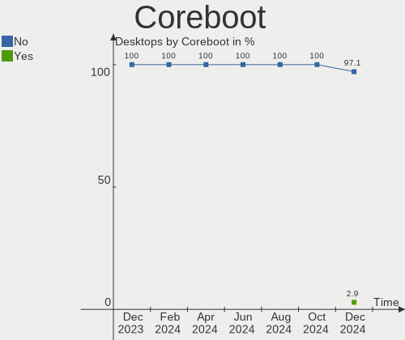
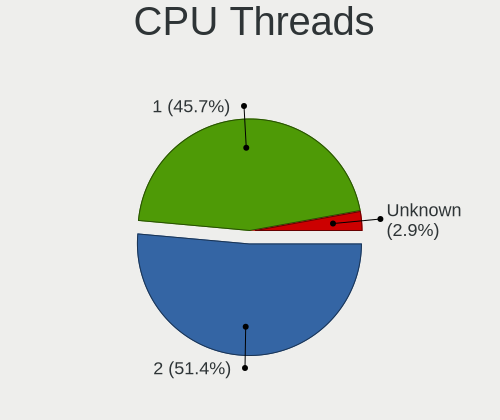
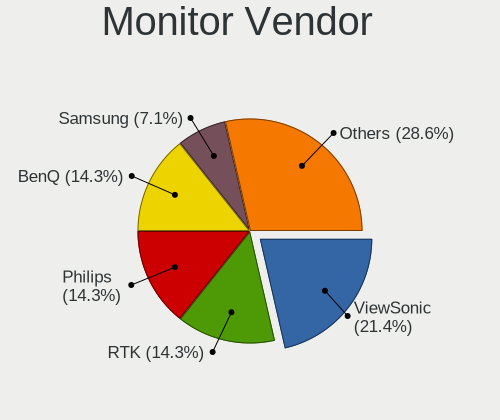
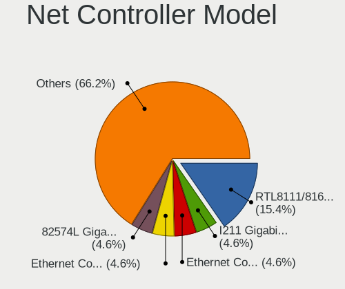
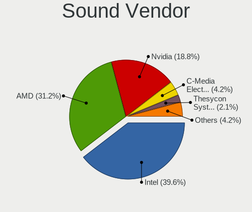

FreeBSD Hardware Trends (Desktops)
----------------------------------

A project to identify most popular hardware characteristics and track their change
over time based on data collected by FreeBSD users at https://BSD-Hardware.info.

Anyone can contribute to this report by the [hw-probe](https://github.com/linuxhw/hw-probe/blob/master/INSTALL.BSD.md) tool:

    hw-probe -all -upload

This report is for one last month. Overall report since the beginning of time: [TestCoverage](https://github.com/bsdhw/TestCoverage)

Period: Apr, 2022.

Contents
--------

* [ System ](#system)
  - [ OS                       ](#os)
  - [ OS Family                ](#os-family)
  - [ Arch                     ](#arch)
  - [ DE                       ](#de)
  - [ Display Server           ](#display-server)
  - [ Display Manager          ](#display-manager)
  - [ OS Lang                  ](#os-lang)
  - [ Boot Mode                ](#boot-mode)
  - [ Filesystem               ](#filesystem)
  - [ Part. scheme             ](#part-scheme)

* [ Board ](#board)
  - [ Vendor                   ](#vendor)
  - [ Model                    ](#model)
  - [ Model Family             ](#model-family)
  - [ MFG Year                 ](#mfg-year)
  - [ Form Factor              ](#form-factor)
  - [ Coreboot                 ](#coreboot)
  - [ RAM Size                 ](#ram-size)
  - [ RAM Used                 ](#ram-used)
  - [ Total Drives             ](#total-drives)
  - [ Has CD-ROM               ](#has-cd-rom)
  - [ Has Ethernet             ](#has-ethernet)
  - [ Has WiFi                 ](#has-wifi)
  - [ Has Bluetooth            ](#has-bluetooth)

* [ Location ](#location)
  - [ Country                  ](#country)
  - [ City                     ](#city)

* [ Drives ](#drives)
  - [ Drive Vendor             ](#drive-vendor)
  - [ Drive Model              ](#drive-model)
  - [ HDD Vendor               ](#hdd-vendor)
  - [ SSD Vendor               ](#ssd-vendor)
  - [ Drive Kind               ](#drive-kind)
  - [ Drive Connector          ](#drive-connector)
  - [ Drive Size               ](#drive-size)
  - [ Space Total              ](#space-total)
  - [ Space Used               ](#space-used)
  - [ Malfunc. Drives          ](#malfunc-drives)
  - [ Malfunc. Drive Vendor    ](#malfunc-drive-vendor)
  - [ Malfunc. HDD Vendor      ](#malfunc-hdd-vendor)
  - [ Malfunc. Drive Kind      ](#malfunc-drive-kind)
  - [ Failed Drives            ](#failed-drives)
  - [ Failed Drive Vendor      ](#failed-drive-vendor)
  - [ Drive Status             ](#drive-status)

* [ Storage controller ](#storage-controller)
  - [ Storage Vendor           ](#storage-vendor)
  - [ Storage Model            ](#storage-model)
  - [ Storage Kind             ](#storage-kind)

* [ Processor ](#processor)
  - [ CPU Vendor               ](#cpu-vendor)
  - [ CPU Model                ](#cpu-model)
  - [ CPU Model Family         ](#cpu-model-family)
  - [ CPU Cores                ](#cpu-cores)
  - [ CPU Sockets              ](#cpu-sockets)
  - [ CPU Threads              ](#cpu-threads)
  - [ CPU Microarch            ](#cpu-microarch)

* [ Graphics ](#graphics)
  - [ GPU Vendor               ](#gpu-vendor)
  - [ GPU Model                ](#gpu-model)
  - [ GPU Combo                ](#gpu-combo)
  - [ GPU Driver               ](#gpu-driver)
  - [ GPU Memory               ](#gpu-memory)

* [ Monitor ](#monitor)
  - [ Monitor Vendor           ](#monitor-vendor)
  - [ Monitor Model            ](#monitor-model)
  - [ Monitor Resolution       ](#monitor-resolution)
  - [ Monitor Diagonal         ](#monitor-diagonal)
  - [ Monitor Width            ](#monitor-width)
  - [ Aspect Ratio             ](#aspect-ratio)
  - [ Monitor Area             ](#monitor-area)
  - [ Pixel Density            ](#pixel-density)
  - [ Multiple Monitors        ](#multiple-monitors)

* [ Network ](#network)
  - [ Net Controller Vendor    ](#net-controller-vendor)
  - [ Net Controller Model     ](#net-controller-model)
  - [ Wireless Vendor          ](#wireless-vendor)
  - [ Wireless Model           ](#wireless-model)
  - [ Ethernet Vendor          ](#ethernet-vendor)
  - [ Ethernet Model           ](#ethernet-model)
  - [ Net Controller Kind      ](#net-controller-kind)
  - [ Used Controller          ](#used-controller)
  - [ NICs                     ](#nics)
  - [ IPv6                     ](#ipv6)

* [ Bluetooth ](#bluetooth)
  - [ Bluetooth Vendor         ](#bluetooth-vendor)
  - [ Bluetooth Model          ](#bluetooth-model)

* [ Sound ](#sound)
  - [ Sound Vendor             ](#sound-vendor)
  - [ Sound Model              ](#sound-model)

* [ Memory ](#memory)
  - [ Memory Vendor            ](#memory-vendor)
  - [ Memory Model             ](#memory-model)
  - [ Memory Kind              ](#memory-kind)
  - [ Memory Form Factor       ](#memory-form-factor)
  - [ Memory Size              ](#memory-size)
  - [ Memory Speed             ](#memory-speed)

* [ Printers & scanners ](#printers--scanners)
  - [ Printer Vendor           ](#printer-vendor)
  - [ Printer Model            ](#printer-model)
  - [ Scanner Vendor           ](#scanner-vendor)
  - [ Scanner Model            ](#scanner-model)

* [ Camera ](#camera)
  - [ Camera Vendor            ](#camera-vendor)
  - [ Camera Model             ](#camera-model)

* [ Security ](#security)
  - [ Fingerprint Vendor       ](#fingerprint-vendor)
  - [ Fingerprint Model        ](#fingerprint-model)
  - [ Chipcard Vendor          ](#chipcard-vendor)
  - [ Chipcard Model           ](#chipcard-model)

* [ Unsupported ](#unsupported)
  - [ Unsupported Devices      ](#unsupported-devices)
  - [ Unsupported Device Types ](#unsupported-device-types)

System
------

OS
--

Installed operating systems

| Name                 | Desktops | Percent |
|----------------------|----------|---------|
| FreeBSD 13.0-p11     | 16       | 33.33%  |
| FreeBSD 12.3         | 9        | 18.75%  |
| FreeBSD 13.0-p10     | 4        | 8.33%   |
| FreeBSD 13.0-p5      | 3        | 6.25%   |
| FreeBSD 13.1-STABLE  | 2        | 4.17%   |
| FreeBSD 13.1-RC4     | 2        | 4.17%   |
| FreeBSD 13.1-RC2     | 2        | 4.17%   |
| FreeBSD 13.0-p9      | 2        | 4.17%   |
| FreeBSD 13.0-p7      | 2        | 4.17%   |
| FreeBSD 13.0         | 2        | 4.17%   |
| FreeBSD 14.0-CURRENT | 1        | 2.08%   |
| FreeBSD 13.0-p4      | 1        | 2.08%   |
| FreeBSD 12.3-STABLE  | 1        | 2.08%   |
| FreeBSD 12.3-p5      | 1        | 2.08%   |

OS Family
---------

OS without a version

| Name    | Desktops | Percent |
|---------|----------|---------|
| FreeBSD | 48       | 100%    |

Arch
----

OS architecture (x86_64, i586, etc.)

| Name  | Desktops | Percent |
|-------|----------|---------|
| amd64 | 46       | 95.83%  |
| arm64 | 2        | 4.17%   |

DE
--

Desktop Environment

| Name          | Desktops | Percent |
|---------------|----------|---------|
| Console       | 24       | 50%     |
| XFCE          | 7        | 14.58%  |
| KDE5          | 6        | 12.5%   |
| MATE          | 4        | 8.33%   |
| xfwm          | 1        | 2.08%   |
| TWM           | 1        | 2.08%   |
| Openbox       | 1        | 2.08%   |
| LXQt          | 1        | 2.08%   |
| i3            | 1        | 2.08%   |
| Enlightenment | 1        | 2.08%   |
| AwesomeWM     | 1        | 2.08%   |

Display Server
--------------

X11 or Wayland

| Name    | Desktops | Percent |
|---------|----------|---------|
| Console | 26       | 54.17%  |
| X11     | 22       | 45.83%  |

Display Manager
---------------

SDDM, LightDM, etc.

| Name    | Desktops | Percent |
|---------|----------|---------|
| Console | 32       | 66.67%  |
| SDDM    | 5        | 10.42%  |
| LightDM | 5        | 10.42%  |
| XDM     | 3        | 6.25%   |
| SLiM    | 3        | 6.25%   |

OS Lang
-------

Language

| Lang    | Desktops | Percent |
|---------|----------|---------|
| C       | 24       | 50%     |
| Unknown | 12       | 25%     |
| en_US   | 5        | 10.42%  |
| ru_RU   | 3        | 6.25%   |
| en_GB   | 2        | 4.17%   |
| it_IT   | 1        | 2.08%   |
| fr_FR   | 1        | 2.08%   |

Boot Mode
---------

EFI or BIOS

| Mode | Desktops | Percent |
|------|----------|---------|
| EFI  | 28       | 58.33%  |
| BIOS | 20       | 41.67%  |

Filesystem
----------

Type of filesystem

| Type | Desktops | Percent |
|------|----------|---------|
| Zfs  | 24       | 50%     |
| Ufs  | 24       | 50%     |

Part. scheme
------------

Scheme of partitioning

| Type | Desktops | Percent |
|------|----------|---------|
| GPT  | 38       | 79.17%  |
| MBR  | 10       | 20.83%  |

Board
-----

Vendor
------

Motherboard manufacturer

| Name                | Desktops | Percent |
|---------------------|----------|---------|
| Intel               | 8        | 16.67%  |
| MSI                 | 6        | 12.5%   |
| Gigabyte Technology | 6        | 12.5%   |
| ASUSTek Computer    | 6        | 12.5%   |
| Hewlett-Packard     | 5        | 10.42%  |
| Dell                | 5        | 10.42%  |
| ASRock              | 4        | 8.33%   |
| Shuttle             | 2        | 4.17%   |
| Unknown             | 2        | 4.17%   |
| Supermicro          | 1        | 2.08%   |
| Lenovo              | 1        | 2.08%   |
| HPE                 | 1        | 2.08%   |
| ASRockRack          | 1        | 2.08%   |

Model
-----

Motherboard model

| Name                                | Desktops | Percent |
|-------------------------------------|----------|---------|
| Intel Nobilis                       | 7        | 14.58%  |
| Unknown                             | 2        | 4.17%   |
| Supermicro X9SCL/X9SCM              | 1        | 2.08%   |
| Shuttle SH570                       | 1        | 2.08%   |
| Shuttle DS20U                       | 1        | 2.08%   |
| MSI MS-7C96                         | 1        | 2.08%   |
| MSI MS-7C94                         | 1        | 2.08%   |
| MSI MS-7C37                         | 1        | 2.08%   |
| MSI MS-7C36                         | 1        | 2.08%   |
| MSI MS-7B09                         | 1        | 2.08%   |
| MSI MS-7817                         | 1        | 2.08%   |
| Lenovo ThinkCentre M92p 3209D7U     | 1        | 2.08%   |
| Intel pro396949                     | 1        | 2.08%   |
| HPE ProLiant MicroServer Gen10 Plus | 1        | 2.08%   |
| HP Z440 Workstation                 | 1        | 2.08%   |
| HP ProLiant MicroServer             | 1        | 2.08%   |
| HP Desktop M01-F0xxx                | 1        | 2.08%   |
| HP Compaq dc5800 Small Form Factor  | 1        | 2.08%   |
| HP Compaq 8200 Elite SFF PC         | 1        | 2.08%   |
| Gigabyte X570 AORUS PRO             | 1        | 2.08%   |
| Gigabyte X470 AORUS ULTRA GAMING    | 1        | 2.08%   |
| Gigabyte N3160ND3V                  | 1        | 2.08%   |
| Gigabyte H310M S2 2.0               | 1        | 2.08%   |
| Gigabyte B560M D3H                  | 1        | 2.08%   |
| Gigabyte B450M S2H                  | 1        | 2.08%   |
| Dell Precision 5820 Tower           | 1        | 2.08%   |
| Dell OptiPlex 7040                  | 1        | 2.08%   |
| Dell OptiPlex 7010                  | 1        | 2.08%   |
| Dell OptiPlex 5040                  | 1        | 2.08%   |
| Dell G5 5090                        | 1        | 2.08%   |
| ASUS TUF Gaming X570-PLUS           | 1        | 2.08%   |
| ASUS ROG CROSSHAIR VIII HERO        | 1        | 2.08%   |
| ASUS PRIME X370-PRO                 | 1        | 2.08%   |
| ASUS PRIME H310M-D R2.0             | 1        | 2.08%   |
| ASUS P5Q-E                          | 1        | 2.08%   |
| ASUS AT5NM10T-I                     | 1        | 2.08%   |
| ASRockRack C3758D4I-4L              | 1        | 2.08%   |
| ASRock X570S PG Riptide             | 1        | 2.08%   |
| ASRock X570 Phantom Gaming 4        | 1        | 2.08%   |
| ASRock X370 Taichi                  | 1        | 2.08%   |
| ASRock AM1H-ITX                     | 1        | 2.08%   |

Model Family
------------

Motherboard model prefix

| Name                   | Desktops | Percent |
|------------------------|----------|---------|
| Intel Nobilis          | 7        | 14.58%  |
| Dell OptiPlex          | 3        | 6.25%   |
| HP Compaq              | 2        | 4.17%   |
| ASUS PRIME             | 2        | 4.17%   |
| Unknown                | 2        | 4.17%   |
| Supermicro X9SCL       | 1        | 2.08%   |
| Shuttle SH570          | 1        | 2.08%   |
| Shuttle DS20U          | 1        | 2.08%   |
| MSI MS-7C96            | 1        | 2.08%   |
| MSI MS-7C94            | 1        | 2.08%   |
| MSI MS-7C37            | 1        | 2.08%   |
| MSI MS-7C36            | 1        | 2.08%   |
| MSI MS-7B09            | 1        | 2.08%   |
| MSI MS-7817            | 1        | 2.08%   |
| Lenovo ThinkCentre     | 1        | 2.08%   |
| Intel pro396949        | 1        | 2.08%   |
| HPE ProLiant           | 1        | 2.08%   |
| HP Z440                | 1        | 2.08%   |
| HP ProLiant            | 1        | 2.08%   |
| HP Desktop             | 1        | 2.08%   |
| Gigabyte X570          | 1        | 2.08%   |
| Gigabyte X470          | 1        | 2.08%   |
| Gigabyte N3160ND3V     | 1        | 2.08%   |
| Gigabyte H310M         | 1        | 2.08%   |
| Gigabyte B560M         | 1        | 2.08%   |
| Gigabyte B450M         | 1        | 2.08%   |
| Dell Precision         | 1        | 2.08%   |
| Dell G5                | 1        | 2.08%   |
| ASUS TUF               | 1        | 2.08%   |
| ASUS ROG               | 1        | 2.08%   |
| ASUS P5Q-E             | 1        | 2.08%   |
| ASUS AT5NM10T-I        | 1        | 2.08%   |
| ASRockRack C3758D4I-4L | 1        | 2.08%   |
| ASRock X570S           | 1        | 2.08%   |
| ASRock X570            | 1        | 2.08%   |
| ASRock X370            | 1        | 2.08%   |
| ASRock AM1H-ITX        | 1        | 2.08%   |

MFG Year
--------

Motherboard manufacture year

| Year    | Desktops | Percent |
|---------|----------|---------|
| 2011    | 10       | 20.83%  |
| 2019    | 8        | 16.67%  |
| 2021    | 6        | 12.5%   |
| 2020    | 6        | 12.5%   |
| 2018    | 3        | 6.25%   |
| 2022    | 2        | 4.17%   |
| 2016    | 2        | 4.17%   |
| 2015    | 2        | 4.17%   |
| 2014    | 2        | 4.17%   |
| 2013    | 2        | 4.17%   |
| Unknown | 2        | 4.17%   |
| 2017    | 1        | 2.08%   |
| 2010    | 1        | 2.08%   |
| 2008    | 1        | 2.08%   |

Form Factor
-----------

Physical design of the computer

| Name    | Desktops | Percent |
|---------|----------|---------|
| Desktop | 48       | 100%    |

Coreboot
--------

Have coreboot on board

| Used | Desktops | Percent |
|------|----------|---------|
| No   | 48       | 100%    |

RAM Size
--------

Total RAM memory

| Size in GB  | Desktops | Percent |
|-------------|----------|---------|
| 8.01-16.0   | 13       | 27.08%  |
| 32.01-64.0  | 10       | 20.83%  |
| 4.01-8.0    | 9        | 18.75%  |
| 64.01-256.0 | 7        | 14.58%  |
| 16.01-24.0  | 6        | 12.5%   |
| 0.51-1.0    | 2        | 4.17%   |
| 24.01-32.0  | 1        | 2.08%   |

RAM Used
--------

Used RAM memory

| Used GB   | Desktops | Percent |
|-----------|----------|---------|
| 0.01-0.5  | 21       | 43.75%  |
| 1.01-2.0  | 10       | 20.83%  |
| 0.51-1.0  | 10       | 20.83%  |
| 3.01-4.0  | 2        | 4.17%   |
| 2.01-3.0  | 2        | 4.17%   |
| 0         | 2        | 4.17%   |
| 8.01-16.0 | 1        | 2.08%   |

Total Drives
------------

Number of drives on board

| Drives | Desktops | Percent |
|--------|----------|---------|
| 1      | 16       | 33.33%  |
| 3      | 8        | 16.67%  |
| 4      | 7        | 14.58%  |
| 2      | 7        | 14.58%  |
| 5      | 6        | 12.5%   |
| 0      | 2        | 4.17%   |
| 13     | 1        | 2.08%   |
| 6      | 1        | 2.08%   |

Has CD-ROM
----------

Has CD-ROM on board

| Presented | Desktops | Percent |
|-----------|----------|---------|
| No        | 28       | 58.33%  |
| Yes       | 20       | 41.67%  |

Has Ethernet
------------

Has Ethernet on board

| Presented | Desktops | Percent |
|-----------|----------|---------|
| Yes       | 45       | 93.75%  |
| No        | 3        | 6.25%   |

Has WiFi
--------

Has WiFi module

| Presented | Desktops | Percent |
|-----------|----------|---------|
| No        | 36       | 75%     |
| Yes       | 12       | 25%     |

Has Bluetooth
-------------

Has Bluetooth module

| Presented | Desktops | Percent |
|-----------|----------|---------|
| No        | 40       | 83.33%  |
| Yes       | 8        | 16.67%  |

Location
--------

Country
-------

Geographic location (country)

| Country     | Desktops | Percent |
|-------------|----------|---------|
| USA         | 17       | 35.42%  |
| Russia      | 6        | 12.5%   |
| Romania     | 3        | 6.25%   |
| Canada      | 3        | 6.25%   |
| UK          | 2        | 4.17%   |
| Slovenia    | 2        | 4.17%   |
| Netherlands | 2        | 4.17%   |
| Italy       | 2        | 4.17%   |
| Germany     | 2        | 4.17%   |
| France      | 2        | 4.17%   |
| Sweden      | 1        | 2.08%   |
| Poland      | 1        | 2.08%   |
| Japan       | 1        | 2.08%   |
| Brazil      | 1        | 2.08%   |
| Belgium     | 1        | 2.08%   |
| Austria     | 1        | 2.08%   |
| Argentina   | 1        | 2.08%   |

City
----

Geographic location (city)

| City                  | Desktops | Percent |
|-----------------------|----------|---------|
| Grand Rapids          | 9        | 18.75%  |
| Salem                 | 2        | 4.17%   |
| Redmond               | 2        | 4.17%   |
| Ospel                 | 2        | 4.17%   |
| Moscow                | 2        | 4.17%   |
| London                | 2        | 4.17%   |
| Kranj                 | 2        | 4.17%   |
| Cluj-Napoca           | 2        | 4.17%   |
| Wuppertal             | 1        | 2.08%   |
| Wroclaw               | 1        | 2.08%   |
| Wenatchee             | 1        | 2.08%   |
| Vienna                | 1        | 2.08%   |
| St. Albert            | 1        | 2.08%   |
| Setagaya-ku           | 1        | 2.08%   |
| Sao Paulo             | 1        | 2.08%   |
| San Donato Milanese   | 1        | 2.08%   |
| San Diego             | 1        | 2.08%   |
| Saint-Martin-sur-Oust | 1        | 2.08%   |
| Retie                 | 1        | 2.08%   |
| Québec               | 1        | 2.08%   |
| Potsdam               | 1        | 2.08%   |
| Portland              | 1        | 2.08%   |
| Perm                  | 1        | 2.08%   |
| Novosibirsk           | 1        | 2.08%   |
| Lyon                  | 1        | 2.08%   |
| Laval                 | 1        | 2.08%   |
| Krasnodar             | 1        | 2.08%   |
| Kista                 | 1        | 2.08%   |
| Gilbert               | 1        | 2.08%   |
| Barlassina            | 1        | 2.08%   |
| Avellaneda            | 1        | 2.08%   |
| Armavir               | 1        | 2.08%   |
| Arad                  | 1        | 2.08%   |

Drives
------

Drive Vendor
------------

Hard drive vendors

| Vendor              | Desktops | Drives | Percent |
|---------------------|----------|--------|---------|
| WDC                 | 27       | 53     | 32.93%  |
| Samsung Electronics | 15       | 24     | 18.29%  |
| Seagate             | 11       | 18     | 13.41%  |
| Crucial             | 6        | 6      | 7.32%   |
| Toshiba             | 5        | 8      | 6.1%    |
| Kingston            | 5        | 5      | 6.1%    |
| Corsair             | 3        | 3      | 3.66%   |
| Intel               | 2        | 2      | 2.44%   |
| WD MediaMax         | 1        | 1      | 1.22%   |
| SK Hynix            | 1        | 1      | 1.22%   |
| SanDisk             | 1        | 1      | 1.22%   |
| PNY                 | 1        | 1      | 1.22%   |
| OCZ                 | 1        | 1      | 1.22%   |
| KIOXIA-EXCERIA      | 1        | 1      | 1.22%   |
| Hitachi             | 1        | 5      | 1.22%   |
| HGST                | 1        | 1      | 1.22%   |

Drive Model
-----------

Hard drive models

| Model                                       | Desktops | Percent |
|---------------------------------------------|----------|---------|
| WDC WD800JD-75MSA3 80GB                     | 9        | 8.57%   |
| WDC WD20EFRX-68EUZN0 2TB                    | 2        | 1.9%    |
| Toshiba DT01ACA100 1TB                      | 2        | 1.9%    |
| Seagate ST4000DM000-1F2168 4TB              | 2        | 1.9%    |
| Samsung SSD 870 EVO 1TB                     | 2        | 1.9%    |
| Samsung SSD 860 EVO 500GB                   | 2        | 1.9%    |
| Samsung HD204UI 2TB                         | 2        | 1.9%    |
| Crucial CT1000BX500SSD1 1TB                 | 2        | 1.9%    |
| WDC WDS500G1B0A-00H9H0 500GB                | 1        | 0.95%   |
| WDC WDS250G2B0A-00SM50 250GB                | 1        | 0.95%   |
| WDC WDS200T2B0A-00SM50 2TB                  | 1        | 0.95%   |
| WDC WDS120G2G0A-00JH30 120GB                | 1        | 0.95%   |
| WDC WDS100T2B0B-00YS70 1TB                  | 1        | 0.95%   |
| WDC WDS100T1X0E-00AFY0 1TB                  | 1        | 0.95%   |
| WDC WD80EMAZ-00WJTA0 8TB                    | 1        | 0.95%   |
| WDC WD80EFZX-68UW8N0 8TB                    | 1        | 0.95%   |
| WDC WD80EFAX-68LHPN0 8TB                    | 1        | 0.95%   |
| WDC WD80EDBZ-11B0ZA0 8TB                    | 1        | 0.95%   |
| WDC WD800JD-08MSA1 80GB                     | 1        | 0.95%   |
| WDC WD60EZRZ-00GZ5B1 6TB                    | 1        | 0.95%   |
| WDC WD5000LPVX-22V0TT0 500GB                | 1        | 0.95%   |
| WDC WD5000AAKS-75A7B0 500GB                 | 1        | 0.95%   |
| WDC WD40EZRZ-22GXCB0 4TB                    | 1        | 0.95%   |
| WDC WD40EFRX-68WT0N0 4TB                    | 1        | 0.95%   |
| WDC WD30EZRX-00AZ6B0 3TB                    | 1        | 0.95%   |
| WDC WD30EFAX-68JH4N0 3TB                    | 1        | 0.95%   |
| WDC WD20NMVW-11AV3S2 2TB                    | 1        | 0.95%   |
| WDC WD15EADS-00P8B0 1.5TB                   | 1        | 0.95%   |
| WDC WD120EMFZ-11A6JA0 12TB                  | 1        | 0.95%   |
| WDC WD120EMAZ-11BLFA0 12TB                  | 1        | 0.95%   |
| WDC WD1005FBYZ-01YCBB3 1TB                  | 1        | 0.95%   |
| WDC WD1003FBYX-01Y7B1 1TB                   | 1        | 0.95%   |
| WDC WD1002FAEX-007BA0 1TB                   | 1        | 0.95%   |
| WDC PC SN520 NVMe 256GB                     | 1        | 0.95%   |
| WD MediaMax WL1500GSA6472B 1.5TB            | 1        | 0.95%   |
| Toshiba HDWR11A 10TB                        | 1        | 0.95%   |
| Toshiba HDWN180 8TB                         | 1        | 0.95%   |
| Toshiba HDWD110 1TB                         | 1        | 0.95%   |
| SK Hynix SC308 SATA 128GB                   | 1        | 0.95%   |
| Seagate ST8000VN004-2M2101 8TB              | 1        | 0.95%   |
| Seagate ST8000DM004-2CX188 8TB              | 1        | 0.95%   |
| Seagate ST4000LM024-2AN17V 4TB              | 1        | 0.95%   |
| Seagate ST3500413AS 500GB                   | 1        | 0.95%   |
| Seagate ST32000645NS 2TB                    | 1        | 0.95%   |
| Seagate ST2000NM0033-9ZM175 2TB             | 1        | 0.95%   |
| Seagate ST2000NM0008-2F3100 2TB             | 1        | 0.95%   |
| Seagate ST2000LM015-2E8174 2TB              | 1        | 0.95%   |
| Seagate ST2000DM006-2DM164 2TB              | 1        | 0.95%   |
| Seagate ST1000DM010-2EP102 1TB              | 1        | 0.95%   |
| Seagate ST1000DM003-1SB102 1TB              | 1        | 0.95%   |
| Seagate ST1000DM003-1ER162 1TB              | 1        | 0.95%   |
| Seagate FireCuda 520 SSD ZP500GM30002 500GB | 1        | 0.95%   |
| SanDisk SD9TB8W512G1001 512GB               | 1        | 0.95%   |
| Samsung SSD 980 PRO 500GB                   | 1        | 0.95%   |
| Samsung SSD 980 PRO 1TB                     | 1        | 0.95%   |
| Samsung SSD 970 EVO Plus 500GB              | 1        | 0.95%   |
| Samsung SSD 970 EVO Plus 250GB              | 1        | 0.95%   |
| Samsung SSD 960 EVO 500GB                   | 1        | 0.95%   |
| Samsung SSD 960 EVO 250GB                   | 1        | 0.95%   |
| Samsung SSD 870 QVO 2TB                     | 1        | 0.95%   |

HDD Vendor
----------

Hard disk drive vendors

| Vendor              | Desktops | Drives | Percent |
|---------------------|----------|--------|---------|
| WDC                 | 23       | 46     | 52.27%  |
| Seagate             | 10       | 17     | 22.73%  |
| Toshiba             | 5        | 8      | 11.36%  |
| Samsung Electronics | 3        | 4      | 6.82%   |
| WD MediaMax         | 1        | 1      | 2.27%   |
| Hitachi             | 1        | 5      | 2.27%   |
| HGST                | 1        | 1      | 2.27%   |

SSD Vendor
----------

Solid state drive vendors

| Vendor              | Desktops | Drives | Percent |
|---------------------|----------|--------|---------|
| Samsung Electronics | 9        | 13     | 33.33%  |
| Crucial             | 5        | 5      | 18.52%  |
| WDC                 | 4        | 5      | 14.81%  |
| Kingston            | 3        | 3      | 11.11%  |
| Corsair             | 2        | 2      | 7.41%   |
| SK Hynix            | 1        | 1      | 3.7%    |
| SanDisk             | 1        | 1      | 3.7%    |
| OCZ                 | 1        | 1      | 3.7%    |
| Intel               | 1        | 1      | 3.7%    |

Drive Kind
----------

HDD or SSD

| Kind | Desktops | Drives | Percent |
|------|----------|--------|---------|
| HDD  | 37       | 82     | 50%     |
| SSD  | 21       | 32     | 28.38%  |
| NVMe | 16       | 17     | 21.62%  |

Drive Connector
---------------

SATA, SAS, NVMe, etc.

| Type | Desktops | Drives | Percent |
|------|----------|--------|---------|
| SATA | 44       | 114    | 73.33%  |
| NVMe | 16       | 17     | 26.67%  |

Drive Size
----------

Size of hard drive

| Size in TB | Desktops | Drives | Percent |
|------------|----------|--------|---------|
| 0.01-0.5   | 29       | 38     | 43.28%  |
| 0.51-1.0   | 14       | 19     | 20.9%   |
| 1.01-2.0   | 11       | 23     | 16.42%  |
| 4.01-10.0  | 6        | 23     | 8.96%   |
| 3.01-4.0   | 5        | 7      | 7.46%   |
| 2.01-3.0   | 1        | 2      | 1.49%   |
| 10.01-20.0 | 1        | 2      | 1.49%   |

Space Total
-----------

Amount of disk space available on the file system

| Size in GB     | Desktops | Percent |
|----------------|----------|---------|
| 51-100         | 12       | 25%     |
| 251-500        | 10       | 20.83%  |
| 101-250        | 6        | 12.5%   |
| 501-1000       | 6        | 12.5%   |
| 21-50          | 4        | 8.33%   |
| 2001-3000      | 4        | 8.33%   |
| More than 3000 | 3        | 6.25%   |
| 1001-2000      | 3        | 6.25%   |

Space Used
----------

Amount of used disk space

| Used GB   | Desktops | Percent |
|-----------|----------|---------|
| 1-20      | 31       | 64.58%  |
| 21-50     | 6        | 12.5%   |
| 101-250   | 3        | 6.25%   |
| 501-1000  | 3        | 6.25%   |
| 51-100    | 3        | 6.25%   |
| 2001-3000 | 1        | 2.08%   |
| 1001-2000 | 1        | 2.08%   |

Malfunc. Drives
---------------

Drive models with a malfunction

| Model                               | Desktops | Drives | Percent |
|-------------------------------------|----------|--------|---------|
| Samsung Electronics SSD 870 EVO 1TB | 2        | 2      | 16.67%  |
| WDC WD20EFRX-68EUZN0 2TB            | 1        | 3      | 8.33%   |
| SK Hynix SC308 SATA 128GB           | 1        | 1      | 8.33%   |
| Seagate ST4000LM024-2AN17V 4TB      | 1        | 1      | 8.33%   |
| Seagate ST3500413AS 500GB           | 1        | 1      | 8.33%   |
| Seagate ST2000DM006-2DM164 2TB      | 1        | 1      | 8.33%   |
| Samsung Electronics HD204UI 2TB     | 1        | 1      | 8.33%   |
| HGST HTS725050A7E630 500GB          | 1        | 1      | 8.33%   |
| Crucial M4-CT064M4SSD2 64GB         | 1        | 1      | 8.33%   |
| Crucial CT480M500SSD1 480GB         | 1        | 1      | 8.33%   |
| Corsair Force 3 SSD 180GB           | 1        | 1      | 8.33%   |

Malfunc. Drive Vendor
---------------------

Vendors of faulty drives

| Vendor              | Desktops | Drives | Percent |
|---------------------|----------|--------|---------|
| Seagate             | 3        | 3      | 25%     |
| Samsung Electronics | 3        | 3      | 25%     |
| Crucial             | 2        | 2      | 16.67%  |
| WDC                 | 1        | 3      | 8.33%   |
| SK Hynix            | 1        | 1      | 8.33%   |
| HGST                | 1        | 1      | 8.33%   |
| Corsair             | 1        | 1      | 8.33%   |

Malfunc. HDD Vendor
-------------------

Vendors of faulty HDD drives

| Vendor              | Desktops | Drives | Percent |
|---------------------|----------|--------|---------|
| Seagate             | 3        | 3      | 50%     |
| WDC                 | 1        | 3      | 16.67%  |
| Samsung Electronics | 1        | 1      | 16.67%  |
| HGST                | 1        | 1      | 16.67%  |

Malfunc. Drive Kind
-------------------

Kinds of faulty drives

| Kind | Desktops | Drives | Percent |
|------|----------|--------|---------|
| SSD  | 6        | 6      | 50%     |
| HDD  | 6        | 8      | 50%     |

Failed Drives
-------------

Failed drive models

Zero info for selected period =(

Failed Drive Vendor
-------------------

Failed drive vendors

Zero info for selected period =(

Drive Status
------------

Number of failed and malfunc. drives

| Status  | Desktops | Drives | Percent |
|---------|----------|--------|---------|
| Works   | 45       | 117    | 81.82%  |
| Malfunc | 10       | 14     | 18.18%  |

Storage controller
------------------

Storage Vendor
--------------

Storage controller vendors

| Vendor                      | Desktops | Percent |
|-----------------------------|----------|---------|
| Intel                       | 30       | 41.67%  |
| AMD                         | 16       | 22.22%  |
| Samsung Electronics         | 7        | 9.72%   |
| ASMedia Technology          | 5        | 6.94%   |
| Sandisk                     | 2        | 2.78%   |
| Phison Electronics          | 2        | 2.78%   |
| Kingston Technology Company | 2        | 2.78%   |
| Toshiba                     | 1        | 1.39%   |
| Seagate Technology          | 1        | 1.39%   |
| Micron/Crucial Technology   | 1        | 1.39%   |
| Marvell Technology Group    | 1        | 1.39%   |
| KIOXIA                      | 1        | 1.39%   |
| JMicron Technology          | 1        | 1.39%   |
| Broadcom / LSI              | 1        | 1.39%   |
| ADATA Technology            | 1        | 1.39%   |

Storage Model
-------------

Storage controller models

| Model                                                                                   | Desktops | Percent |
|-----------------------------------------------------------------------------------------|----------|---------|
| AMD FCH SATA Controller [AHCI mode]                                                     | 13       | 14.77%  |
| Intel 6 Series/C200 Series Chipset Family 6 port Desktop SATA AHCI Controller           | 6        | 6.82%   |
| ASMedia ASM1062 Serial ATA Controller                                                   | 5        | 5.68%   |
| Samsung NVMe SSD Controller PM9A1/PM9A3/980PRO                                          | 4        | 4.55%   |
| Intel 6 Series/C200 Series Chipset Family Desktop SATA Controller (IDE mode, ports 0-3) | 3        | 3.41%   |
| Intel 200 Series PCH SATA controller [AHCI mode]                                        | 3        | 3.41%   |
| Samsung NVMe SSD Controller SM981/PM981/PM983                                           | 2        | 2.27%   |
| Samsung NVMe SSD Controller SM961/PM961/SM963                                           | 2        | 2.27%   |
| Intel Q170/Q150/B150/H170/H110/Z170/CM236 Chipset SATA Controller [AHCI Mode]           | 2        | 2.27%   |
| Intel Cannon Lake PCH SATA AHCI Controller                                              | 2        | 2.27%   |
| Intel 7 Series/C210 Series Chipset Family 6-port SATA Controller [AHCI mode]            | 2        | 2.27%   |
| Intel 6 Series/C200 Series Chipset Family Desktop SATA Controller (IDE mode, ports 4-5) | 2        | 2.27%   |
| Intel 500 Series Chipset Family SATA AHCI Controller                                    | 2        | 2.27%   |
| AMD X370 Series Chipset SATA Controller                                                 | 2        | 2.27%   |
| AMD 500 Series Chipset SATA Controller                                                  | 2        | 2.27%   |
| AMD 400 Series Chipset SATA Controller                                                  | 2        | 2.27%   |
| Toshiba XG4 NVMe SSD Controller                                                         | 1        | 1.14%   |
| Seagate FireCuda 520 SSD                                                                | 1        | 1.14%   |
| Sandisk WD PC SN810 / Black SN850 NVMe SSD                                              | 1        | 1.14%   |
| Sandisk PC SN520 NVMe SSD                                                               | 1        | 1.14%   |
| Phison E16 PCIe4 NVMe Controller                                                        | 1        | 1.14%   |
| Phison E12 NVMe Controller                                                              | 1        | 1.14%   |
| Micron/Crucial P2 NVMe PCIe SSD                                                         | 1        | 1.14%   |
| Marvell Group 88SE6111/6121 SATA II / PATA Controller                                   | 1        | 1.14%   |
| KIOXIA NVMe SSD                                                                         | 1        | 1.14%   |
| Kingston Company A2000 NVMe SSD                                                         | 1        | 1.14%   |
| JMicron JMB362 SATA Controller                                                          | 1        | 1.14%   |
| Intel Volume Management Device NVMe RAID Controller                                     | 1        | 1.14%   |
| Intel SSD 660P Series                                                                   | 1        | 1.14%   |
| Intel NM10/ICH7 Family SATA Controller [AHCI mode]                                      | 1        | 1.14%   |
| Intel Comet Lake SATA AHCI Controller                                                   | 1        | 1.14%   |
| Intel C610/X99 series chipset sSATA Controller [AHCI mode]                              | 1        | 1.14%   |
| Intel C610/X99 series chipset 6-Port SATA Controller [AHCI mode]                        | 1        | 1.14%   |
| Intel C600/X79 series chipset SATA RAID Controller                                      | 1        | 1.14%   |
| Intel Atom/Celeron/Pentium Processor x5-E8000/J3xxx/N3xxx Series SATA Controller        | 1        | 1.14%   |
| Intel Atom Processor C3000 Series SATA Controller 1                                     | 1        | 1.14%   |
| Intel Atom Processor C3000 Series SATA Controller 0                                     | 1        | 1.14%   |
| Intel 82801JI (ICH10 Family) SATA AHCI Controller                                       | 1        | 1.14%   |
| Intel 82801IB (ICH9) 2 port SATA Controller [IDE mode]                                  | 1        | 1.14%   |
| Intel 82801I (ICH9 Family) 2 port SATA Controller [IDE mode]                            | 1        | 1.14%   |
| Intel 8 Series/C220 Series Chipset Family 6-port SATA Controller 1 [AHCI mode]          | 1        | 1.14%   |
| Intel 5 Series/3400 Series Chipset PT IDER Controller                                   | 1        | 1.14%   |
| Intel 5 Series/3400 Series Chipset 4 port SATA IDE Controller                           | 1        | 1.14%   |
| Intel 5 Series/3400 Series Chipset 2 port SATA IDE Controller                           | 1        | 1.14%   |
| Broadcom / LSI SAS2008 PCI-Express Fusion-MPT SAS-2 [Falcon]                            | 1        | 1.14%   |
| AMD X399 Series Chipset SATA Controller                                                 | 1        | 1.14%   |
| AMD SB7x0/SB8x0/SB9x0 SATA Controller [AHCI mode]                                       | 1        | 1.14%   |
| AMD SB7x0/SB8x0/SB9x0 IDE Controller                                                    | 1        | 1.14%   |
| ADATA XPG SX8200 Pro PCIe Gen3x4 M.2 2280 Solid State Drive                             | 1        | 1.14%   |
| Unknown                                                                                 | 1        | 1.14%   |

Storage Kind
------------

Kind of storage controller (IDE, SATA, NVMe, SAS, ...)

| Kind | Desktops | Percent |
|------|----------|---------|
| SATA | 40       | 58.82%  |
| NVMe | 18       | 26.47%  |
| IDE  | 8        | 11.76%  |
| RAID | 1        | 1.47%   |
| SAS  | 1        | 1.47%   |

Processor
---------

CPU Vendor
----------

Processor vendors

| Vendor | Desktops | Percent |
|--------|----------|---------|
| Intel  | 30       | 62.5%   |
| AMD    | 16       | 33.33%  |
| ARM    | 2        | 4.17%   |

CPU Model
---------

Processor models

| Model                                         | Desktops | Percent |
|-----------------------------------------------|----------|---------|
| Intel Core i5-2320 CPU @ 3.00GHz              | 3        | 6.25%   |
| Intel Pentium CPU G620 @ 2.60GHz              | 2        | 4.17%   |
| Intel Core 2 Quad CPU Q6600 @ 2.40GHz         | 2        | 4.17%   |
| ARM Cortex-A53 r0p4                           | 2        | 4.17%   |
| AMD Ryzen 9 5950X 16-Core Processor           | 2        | 4.17%   |
| AMD Ryzen 9 3900X 12-Core Processor           | 2        | 4.17%   |
| AMD Ryzen 7 5800X 8-Core Processor            | 2        | 4.17%   |
| Intel Xeon W-2255 CPU @ 3.70GHz               | 1        | 2.08%   |
| Intel Xeon E-2224 CPU @ 3.40GHz               | 1        | 2.08%   |
| Intel Xeon CPU E5-1620 v3 @ 3.50GHz           | 1        | 2.08%   |
| Intel Xeon CPU E3-1230 V2 @ 3.30GHz           | 1        | 2.08%   |
| Intel Pentium Gold G5400 CPU @ 3.70GHz        | 1        | 2.08%   |
| Intel Pentium CPU G3220 @ 3.00GHz             | 1        | 2.08%   |
| Intel Pentium CPU G2020 @ 2.90GHz             | 1        | 2.08%   |
| Intel Core i7-9700K CPU @ 3.60GHz             | 1        | 2.08%   |
| Intel Core i5-9400 CPU @ 2.90GHz              | 1        | 2.08%   |
| Intel Core i5-6600 CPU @ 3.30GHz              | 1        | 2.08%   |
| Intel Core i5-6500 CPU @ 3.20GHz              | 1        | 2.08%   |
| Intel Core i5-3570 CPU @ 3.40GHz              | 1        | 2.08%   |
| Intel Core i5-3470 CPU @ 3.20GHz              | 1        | 2.08%   |
| Intel Core i5-2500 CPU @ 3.30GHz              | 1        | 2.08%   |
| Intel Core i5-2400 CPU @ 3.10GHz              | 1        | 2.08%   |
| Intel Core i5-10400 CPU @ 2.90GHz             | 1        | 2.08%   |
| Intel Core i3-9100F CPU @ 3.60GHz             | 1        | 2.08%   |
| Intel Core i3 CPU 540 @ 3.07GHz               | 1        | 2.08%   |
| Intel Celeron CPU N3160 @ 1.60GHz             | 1        | 2.08%   |
| Intel Celeron CPU 5205U @ 1.90GHz             | 1        | 2.08%   |
| Intel Atom CPU D525 @ 1.80GHz                 | 1        | 2.08%   |
| Intel Atom CPU C3758 @ 2.20GHz                | 1        | 2.08%   |
| Intel 11th Gen Core i7-11700K @ 3.60GHz       | 1        | 2.08%   |
| AMD Turion II Neo N40L Dual-Core Processor    | 1        | 2.08%   |
| AMD Ryzen Threadripper 1900X 8-Core Processor | 1        | 2.08%   |
| AMD Ryzen 7 PRO 4750G with Radeon Graphics    | 1        | 2.08%   |
| AMD Ryzen 7 3800XT 8-Core Processor           | 1        | 2.08%   |
| AMD Ryzen 7 3700X 8-Core Processor            | 1        | 2.08%   |
| AMD Ryzen 7 2700X Eight-Core Processor        | 1        | 2.08%   |
| AMD Ryzen 7 1800X Eight-Core Processor        | 1        | 2.08%   |
| AMD Ryzen 7 1700 Eight-Core Processor         | 1        | 2.08%   |
| AMD Ryzen 5 2400GE with Radeon Vega Graphics  | 1        | 2.08%   |
| AMD Athlon 5350 APU with Radeon R3            | 1        | 2.08%   |

CPU Model Family
----------------

Processor model prefix

| Model                  | Desktops | Percent |
|------------------------|----------|---------|
| Intel Core i5          | 11       | 22.92%  |
| AMD Ryzen 7            | 7        | 14.58%  |
| Intel Xeon             | 4        | 8.33%   |
| Intel Pentium          | 4        | 8.33%   |
| AMD Ryzen 9            | 4        | 8.33%   |
| Intel Core i3          | 2        | 4.17%   |
| Intel Core 2 Quad      | 2        | 4.17%   |
| Intel Celeron          | 2        | 4.17%   |
| Intel Atom             | 2        | 4.17%   |
| ARM Cortex             | 2        | 4.17%   |
| Other                  | 1        | 2.08%   |
| Intel Pentium Gold     | 1        | 2.08%   |
| Intel Core i7          | 1        | 2.08%   |
| AMD Turion II Neo      | 1        | 2.08%   |
| AMD Ryzen Threadripper | 1        | 2.08%   |
| AMD Ryzen 7 PRO        | 1        | 2.08%   |
| AMD Ryzen 5            | 1        | 2.08%   |
| AMD Athlon             | 1        | 2.08%   |

CPU Cores
---------

Number of processor cores

| Number  | Desktops | Percent |
|---------|----------|---------|
| 4       | 17       | 35.42%  |
| 16      | 9        | 18.75%  |
| 2       | 9        | 18.75%  |
| 8       | 4        | 8.33%   |
| 32      | 2        | 4.17%   |
| 24      | 2        | 4.17%   |
| 6       | 2        | 4.17%   |
| Unknown | 2        | 4.17%   |
| 10      | 1        | 2.08%   |

CPU Sockets
-----------

Number of sockets

| Number  | Desktops | Percent |
|---------|----------|---------|
| 1       | 46       | 95.83%  |
| Unknown | 2        | 4.17%   |

CPU Threads
-----------

Threads per core (Hyper-Threading)

| Number  | Desktops | Percent |
|---------|----------|---------|
| 1       | 38       | 79.17%  |
| 2       | 8        | 16.67%  |
| Unknown | 2        | 4.17%   |

CPU Microarch
-------------

Microarchitecture

| Name        | Desktops | Percent |
|-------------|----------|---------|
| SandyBridge | 7        | 14.58%  |
| KabyLake    | 6        | 12.5%   |
| Zen 2       | 5        | 10.42%  |
| Zen 3       | 4        | 8.33%   |
| Zen         | 4        | 8.33%   |
| IvyBridge   | 4        | 8.33%   |
| Skylake     | 3        | 6.25%   |
| Unknown     | 3        | 6.25%   |
| Haswell     | 2        | 4.17%   |
| Core        | 2        | 4.17%   |
| Zen+        | 1        | 2.08%   |
| Westmere    | 1        | 2.08%   |
| Silvermont  | 1        | 2.08%   |
| K10         | 1        | 2.08%   |
| Jaguar      | 1        | 2.08%   |
| Goldmont    | 1        | 2.08%   |
| CometLake   | 1        | 2.08%   |
| Bonnell     | 1        | 2.08%   |

Graphics
--------

GPU Vendor
----------

Vendors of graphics cards

| Vendor                     | Desktops | Percent |
|----------------------------|----------|---------|
| Nvidia                     | 18       | 39.13%  |
| AMD                        | 13       | 28.26%  |
| Intel                      | 12       | 26.09%  |
| Matrox Electronics Systems | 2        | 4.35%   |
| ASPEED Technology          | 1        | 2.17%   |

GPU Model
---------

Graphics card models

| Model                                                                                    | Desktops | Percent |
|------------------------------------------------------------------------------------------|----------|---------|
| AMD RV730 XT [Radeon HD 4670]                                                            | 7        | 15.22%  |
| Nvidia TU116 [GeForce GTX 1660 Ti]                                                       | 3        | 6.52%   |
| Nvidia GT218 [NVS 300]                                                                   | 2        | 4.35%   |
| Nvidia GP108 [GeForce GT 1030]                                                           | 2        | 4.35%   |
| Nvidia GK208B [GeForce GT 710]                                                           | 2        | 4.35%   |
| Intel HD Graphics 530                                                                    | 2        | 4.35%   |
| Intel 2nd Generation Core Processor Family Integrated Graphics Controller                | 2        | 4.35%   |
| Nvidia GT218 [GeForce 210]                                                               | 1        | 2.17%   |
| Nvidia GP106 [GeForce GTX 1060 3GB]                                                      | 1        | 2.17%   |
| Nvidia GP104 [GeForce GTX 1080]                                                          | 1        | 2.17%   |
| Nvidia GP102 [GeForce GTX 1080 Ti]                                                       | 1        | 2.17%   |
| Nvidia GM206 [GeForce GTX 960]                                                           | 1        | 2.17%   |
| Nvidia GK104GL [Quadro K4200]                                                            | 1        | 2.17%   |
| Nvidia GA106 [RTX A2000]                                                                 | 1        | 2.17%   |
| Nvidia GA106 [RTX A2000 12GB]                                                            | 1        | 2.17%   |
| Nvidia GA106 [GeForce RTX 3060]                                                          | 1        | 2.17%   |
| Matrox Electronics Systems MGA G200eW WPCM450                                            | 1        | 2.17%   |
| Matrox Electronics Systems MGA G200eH3                                                   | 1        | 2.17%   |
| Intel Xeon E3-1200 v3/4th Gen Core Processor Integrated Graphics Controller              | 1        | 2.17%   |
| Intel Xeon E3-1200 v2/3rd Gen Core processor Graphics Controller                         | 1        | 2.17%   |
| Intel CometLake-S GT2 [UHD Graphics 630]                                                 | 1        | 2.17%   |
| Intel Comet Lake UHD Graphics                                                            | 1        | 2.17%   |
| Intel CoffeeLake-S GT1 [UHD Graphics 610]                                                | 1        | 2.17%   |
| Intel Atom/Celeron/Pentium Processor x5-E8000/J3xxx/N3xxx Integrated Graphics Controller | 1        | 2.17%   |
| Intel Atom Processor D4xx/D5xx/N4xx/N5xx Integrated Graphics Controller                  | 1        | 2.17%   |
| Intel 82Q33 Express Integrated Graphics Controller                                       | 1        | 2.17%   |
| ASPEED Technology ASPEED Graphics Family                                                 | 1        | 2.17%   |
| AMD RS880M [Mobility Radeon HD 4225/4250]                                                | 1        | 2.17%   |
| AMD Renoir                                                                               | 1        | 2.17%   |
| AMD Raven Ridge [Radeon Vega Series / Radeon Vega Mobile Series]                         | 1        | 2.17%   |
| AMD Navi 24 [Radeon RX 6400 / 6500 XT]                                                   | 1        | 2.17%   |
| AMD Cedar [Radeon HD 5000/6000/7350/8350 Series]                                         | 1        | 2.17%   |
| AMD Baffin [Radeon RX 550 640SP / RX 560/560X]                                           | 1        | 2.17%   |

GPU Combo
---------

Combinations of graphics cards

| Name       | Desktops | Percent |
|------------|----------|---------|
| 1 x Nvidia | 18       | 37.5%   |
| 1 x AMD    | 13       | 27.08%  |
| 1 x Intel  | 11       | 22.92%  |
| Other      | 2        | 4.17%   |
| 1 x Matrox | 2        | 4.17%   |
| 2 x Intel  | 1        | 2.08%   |
| 1 x ASPEED | 1        | 2.08%   |

GPU Driver
----------

Free vs proprietary

| Driver      | Desktops | Percent |
|-------------|----------|---------|
| Free        | 34       | 70.83%  |
| Proprietary | 12       | 25%     |
| Unknown     | 2        | 4.17%   |

GPU Memory
----------

Total video memory

| Size in GB | Desktops | Percent |
|------------|----------|---------|
| Unknown    | 33       | 68.75%  |
| 5.01-6.0   | 4        | 8.33%   |
| 1.01-2.0   | 4        | 8.33%   |
| 3.01-4.0   | 2        | 4.17%   |
| 8.01-16.0  | 2        | 4.17%   |
| 7.01-8.0   | 1        | 2.08%   |
| 0.51-1.0   | 1        | 2.08%   |
| 0.01-0.5   | 1        | 2.08%   |

Monitor
-------

Monitor Vendor
--------------

Monitor vendors

| Vendor              | Desktops | Percent |
|---------------------|----------|---------|
| Samsung Electronics | 6        | 26.09%  |
| Goldstar            | 2        | 8.7%    |
| Dell                | 2        | 8.7%    |
| ViewSonic           | 1        | 4.35%   |
| Unknown             | 1        | 4.35%   |
| Philips             | 1        | 4.35%   |
| NEC Computers       | 1        | 4.35%   |
| LG Electronics      | 1        | 4.35%   |
| Lenovo              | 1        | 4.35%   |
| Iiyama              | 1        | 4.35%   |
| Hewlett-Packard     | 1        | 4.35%   |
| Eizo                | 1        | 4.35%   |
| BenQ                | 1        | 4.35%   |
| Apple               | 1        | 4.35%   |
| AOC                 | 1        | 4.35%   |
| Acer                | 1        | 4.35%   |

Monitor Model
-------------

Monitor models

| Model                                                                  | Desktops | Percent |
|------------------------------------------------------------------------|----------|---------|
| ViewSonic LCD Monitor VSC2528 1920x1080 520x290mm 23.4-inch            | 1        | 4%      |
| Unknown LCD Monitor KJT4K2K60DP 3840x2160                              | 1        | 4%      |
| Samsung Electronics SyncMaster SAM060B 1920x1080 510x290mm 23.1-inch   | 1        | 4%      |
| Samsung Electronics SyncMaster SAM021E 1680x1050 430x270mm 20.0-inch   | 1        | 4%      |
| Samsung Electronics LCD Monitor SE790C 3440x1440                       | 1        | 4%      |
| Samsung Electronics LCD Monitor SAM7002 3840x2160 1210x680mm 54.6-inch | 1        | 4%      |
| Samsung Electronics LCD Monitor SAM0A7D 1920x1080 1020x570mm 46.0-inch | 1        | 4%      |
| Samsung Electronics LCD Monitor S24R35x 1920x1080                      | 1        | 4%      |
| Philips LCD Monitor PHL086D 1440x900 400x250mm 18.6-inch               | 1        | 4%      |
| NEC Computers LCD24WMCX NEC6720 1920x1200 520x320mm 24.0-inch          | 1        | 4%      |
| LG Electronics LCD Monitor LG Ultra HD 3840x2160                       | 1        | 4%      |
| Lenovo LEN S24e-10 LEN61CA 1920x1080 530x300mm 24.0-inch               | 1        | 4%      |
| Iiyama PLE2403WS IVM5604 1920x1200 520x330mm 24.2-inch                 | 1        | 4%      |
| Hewlett-Packard Z24nf HWP3209 1920x1080 530x300mm 24.0-inch            | 1        | 4%      |
| Goldstar MP59G GSM5B34 1920x1080 480x270mm 21.7-inch                   | 1        | 4%      |
| Goldstar LG Ultra HD GSM5B09 3840x2160 600x340mm 27.2-inch             | 1        | 4%      |
| Eizo LCD Monitor S2202W 3360x1050                                      | 1        | 4%      |
| Eizo LCD Monitor S2201W 3360x1050                                      | 1        | 4%      |
| Dell S2721QS DELA196 3840x2160 600x340mm 27.2-inch                     | 1        | 4%      |
| Dell S2716DG DELA0D1 2560x1440 600x340mm 27.2-inch                     | 1        | 4%      |
| BenQ G900HD BNQ7816 1366x768 410x230mm 18.5-inch                       | 1        | 4%      |
| Apple Cinema HD APP9223 1920x1200 490x310mm 22.8-inch                  | 1        | 4%      |
| AOC LCD Monitor 2460X 5760x1200                                        | 1        | 4%      |
| AOC LCD Monitor 2460X                                                  | 1        | 4%      |
| Acer EB321HQU ACR0507 2560x1440 700x390mm 31.5-inch                    | 1        | 4%      |

Monitor Resolution
------------------

Monitor screen resolution

| Resolution         | Desktops | Percent |
|--------------------|----------|---------|
| 1920x1080 (FHD)    | 7        | 29.17%  |
| 3840x2160 (4K)     | 5        | 20.83%  |
| 1920x1200 (WUXGA)  | 3        | 12.5%   |
| 2560x1440 (QHD)    | 2        | 8.33%   |
| 5760x1200          | 1        | 4.17%   |
| 3440x1440          | 1        | 4.17%   |
| 3360x1050          | 1        | 4.17%   |
| 1680x1050 (WSXGA+) | 1        | 4.17%   |
| 1440x900 (WXGA+)   | 1        | 4.17%   |
| 1366x768 (WXGA)    | 1        | 4.17%   |
| Unknown            | 1        | 4.17%   |

Monitor Diagonal
----------------

Diagonal size in inches

| Inches  | Desktops | Percent |
|---------|----------|---------|
| Unknown | 6        | 26.09%  |
| 24      | 4        | 17.39%  |
| 27      | 3        | 13.04%  |
| 23      | 2        | 8.7%    |
| 18      | 2        | 8.7%    |
| 54      | 1        | 4.35%   |
| 46      | 1        | 4.35%   |
| 31      | 1        | 4.35%   |
| 22      | 1        | 4.35%   |
| 21      | 1        | 4.35%   |
| 20      | 1        | 4.35%   |

Monitor Width
-------------

Physical width

| Width in mm | Desktops | Percent |
|-------------|----------|---------|
| 501-600     | 9        | 39.13%  |
| Unknown     | 6        | 26.09%  |
| 401-500     | 4        | 17.39%  |
| 1001-1500   | 2        | 8.7%    |
| 601-700     | 1        | 4.35%   |
| 351-400     | 1        | 4.35%   |

Aspect Ratio
------------

Proportional relationship between the width and the height

| Ratio   | Desktops | Percent |
|---------|----------|---------|
| 16/9    | 11       | 50%     |
| Unknown | 6        | 27.27%  |
| 16/10   | 5        | 22.73%  |

Monitor Area
------------

Area in inch²

| Area in inch² | Desktops | Percent |
|----------------|----------|---------|
| 201-250        | 6        | 26.09%  |
| Unknown        | 6        | 26.09%  |
| 301-350        | 3        | 13.04%  |
| 251-300        | 2        | 8.7%    |
| 151-200        | 2        | 8.7%    |
| More than 1000 | 1        | 4.35%   |
| 351-500        | 1        | 4.35%   |
| 141-150        | 1        | 4.35%   |
| 501-1000       | 1        | 4.35%   |

Pixel Density
-------------

Pixels per inch

| Density | Desktops | Percent |
|---------|----------|---------|
| 51-100  | 11       | 50%     |
| Unknown | 6        | 27.27%  |
| 161-240 | 2        | 9.09%   |
| 101-120 | 2        | 9.09%   |
| 1-50    | 1        | 4.55%   |

Multiple Monitors
-----------------

Total monitors connected

| Total | Desktops | Percent |
|-------|----------|---------|
| 0     | 27       | 56.25%  |
| 1     | 16       | 33.33%  |
| 2     | 5        | 10.42%  |

Network
-------

Net Controller Vendor
---------------------

Controller vendors

| Vendor                   | Desktops | Percent |
|--------------------------|----------|---------|
| Intel                    | 35       | 53.03%  |
| Realtek Semiconductor    | 17       | 25.76%  |
| Qualcomm Atheros         | 4        | 6.06%   |
| TP-Link                  | 1        | 1.52%   |
| Ralink                   | 1        | 1.52%   |
| Microchip Technology     | 1        | 1.52%   |
| Mellanox Technologies    | 1        | 1.52%   |
| Marvell Technology Group | 1        | 1.52%   |
| LG Electronics           | 1        | 1.52%   |
| Hewlett-Packard          | 1        | 1.52%   |
| Broadcom                 | 1        | 1.52%   |
| Arduino SA               | 1        | 1.52%   |
| Aquantia                 | 1        | 1.52%   |

Net Controller Model
--------------------

Controller models

| Model                                                                         | Desktops | Percent |
|-------------------------------------------------------------------------------|----------|---------|
| Realtek RTL8111/8168/8411 PCI Express Gigabit Ethernet Controller             | 13       | 16.67%  |
| Intel I211 Gigabit Network Connection                                         | 9        | 11.54%  |
| Intel 82579V Gigabit Network Connection                                       | 7        | 8.97%   |
| Intel 82574L Gigabit Network Connection                                       | 4        | 5.13%   |
| Qualcomm Atheros AR93xx Wireless Network Adapter                              | 3        | 3.85%   |
| Intel 82579LM Gigabit Network Connection (Lewisville)                         | 3        | 3.85%   |
| Realtek RTL8125 2.5GbE Controller                                             | 2        | 2.56%   |
| Intel Wi-Fi 6 AX200                                                           | 2        | 2.56%   |
| Intel I210 Gigabit Network Connection                                         | 2        | 2.56%   |
| TP-Link TL-WN822N Version 4 RTL8192EU                                         | 1        | 1.28%   |
| Realtek RTL88x2bu [AC1200 Techkey]                                            | 1        | 1.28%   |
| Realtek RTL8821CE 802.11ac PCIe Wireless Network Adapter                      | 1        | 1.28%   |
| Realtek RTL8812AE 802.11ac PCIe Wireless Network Adapter                      | 1        | 1.28%   |
| Realtek RTL-8100/8101L/8139 PCI Fast Ethernet Adapter                         | 1        | 1.28%   |
| Realtek Killer E3000 2.5GbE Controller                                        | 1        | 1.28%   |
| Realtek Killer E2500 Gigabit Ethernet Controller                              | 1        | 1.28%   |
| Ralink RT2790 Wireless 802.11n 1T/2R PCIe                                     | 1        | 1.28%   |
| Qualcomm Atheros AR9462 Wireless Network Adapter                              | 1        | 1.28%   |
| Microchip TrueRNG                                                             | 1        | 1.28%   |
| Mellanox MT26448 [ConnectX EN 10GigE, PCIe 2.0 5GT/s]                         | 1        | 1.28%   |
| Marvell Group 88E8056 PCI-E Gigabit Ethernet Controller                       | 1        | 1.28%   |
| Marvell Group 88E8001 Gigabit Ethernet Controller                             | 1        | 1.28%   |
| LG Optimus Android Phone [USB tethering mode]                                 | 1        | 1.28%   |
| Intel Wireless-AC 9260                                                        | 1        | 1.28%   |
| Intel I350 Gigabit Network Connection                                         | 1        | 1.28%   |
| Intel Ethernet Connection X553 1GbE                                           | 1        | 1.28%   |
| Intel Ethernet Connection (5) I219-LM                                         | 1        | 1.28%   |
| Intel Ethernet Connection (2) I219-V                                          | 1        | 1.28%   |
| Intel Ethernet Connection (2) I219-LM                                         | 1        | 1.28%   |
| Intel Ethernet Connection (2) I218-LM                                         | 1        | 1.28%   |
| Intel Ethernet Connection (14) I219-V                                         | 1        | 1.28%   |
| Intel Ethernet Connection (14) I219-LM                                        | 1        | 1.28%   |
| Intel Ethernet Connection (10) I219-LM                                        | 1        | 1.28%   |
| Intel Dual Band Wireless-AC 3168NGW [Stone Peak]                              | 1        | 1.28%   |
| Intel 82578DC Gigabit Network Connection                                      | 1        | 1.28%   |
| Intel 82572EI Gigabit Ethernet Controller (Copper)                            | 1        | 1.28%   |
| Intel 82571EB/82571GB Gigabit Ethernet Controller D0/D1 (copper applications) | 1        | 1.28%   |
| Intel 82566DM-2 Gigabit Network Connection                                    | 1        | 1.28%   |
| HP Virtual NIC                                                                | 1        | 1.28%   |
| Broadcom NetXtreme BCM5723 Gigabit Ethernet PCIe                              | 1        | 1.28%   |
| Arduino SA Mega 2560 R3 (CDC ACM)                                             | 1        | 1.28%   |
| Aquantia AQC107 NBase-T/IEEE 802.3bz Ethernet Controller [AQtion]             | 1        | 1.28%   |

Wireless Vendor
---------------

Wireless vendors

| Vendor                | Desktops | Percent |
|-----------------------|----------|---------|
| Qualcomm Atheros      | 4        | 30.77%  |
| Intel                 | 4        | 30.77%  |
| Realtek Semiconductor | 3        | 23.08%  |
| TP-Link               | 1        | 7.69%   |
| Ralink                | 1        | 7.69%   |

Wireless Model
--------------

Wireless models

| Model                                                    | Desktops | Percent |
|----------------------------------------------------------|----------|---------|
| Qualcomm Atheros AR93xx Wireless Network Adapter         | 3        | 23.08%  |
| Intel Wi-Fi 6 AX200                                      | 2        | 15.38%  |
| TP-Link TL-WN822N Version 4 RTL8192EU                    | 1        | 7.69%   |
| Realtek RTL88x2bu [AC1200 Techkey]                       | 1        | 7.69%   |
| Realtek RTL8821CE 802.11ac PCIe Wireless Network Adapter | 1        | 7.69%   |
| Realtek RTL8812AE 802.11ac PCIe Wireless Network Adapter | 1        | 7.69%   |
| Ralink RT2790 Wireless 802.11n 1T/2R PCIe                | 1        | 7.69%   |
| Qualcomm Atheros AR9462 Wireless Network Adapter         | 1        | 7.69%   |
| Intel Wireless-AC 9260                                   | 1        | 7.69%   |
| Intel Dual Band Wireless-AC 3168NGW [Stone Peak]         | 1        | 7.69%   |

Ethernet Vendor
---------------

Ethernet vendors

| Vendor                   | Desktops | Percent |
|--------------------------|----------|---------|
| Intel                    | 33       | 63.46%  |
| Realtek Semiconductor    | 16       | 30.77%  |
| Marvell Technology Group | 1        | 1.92%   |
| Broadcom                 | 1        | 1.92%   |
| Aquantia                 | 1        | 1.92%   |

Ethernet Model
--------------

Ethernet models

| Model                                                                         | Desktops | Percent |
|-------------------------------------------------------------------------------|----------|---------|
| Realtek RTL8111/8168/8411 PCI Express Gigabit Ethernet Controller             | 13       | 22.03%  |
| Intel I211 Gigabit Network Connection                                         | 9        | 15.25%  |
| Intel 82579V Gigabit Network Connection                                       | 7        | 11.86%  |
| Intel 82574L Gigabit Network Connection                                       | 4        | 6.78%   |
| Intel 82579LM Gigabit Network Connection (Lewisville)                         | 3        | 5.08%   |
| Realtek RTL8125 2.5GbE Controller                                             | 2        | 3.39%   |
| Intel I210 Gigabit Network Connection                                         | 2        | 3.39%   |
| Realtek RTL-8100/8101L/8139 PCI Fast Ethernet Adapter                         | 1        | 1.69%   |
| Realtek Killer E2500 Gigabit Ethernet Controller                              | 1        | 1.69%   |
| Marvell Group 88E8056 PCI-E Gigabit Ethernet Controller                       | 1        | 1.69%   |
| Marvell Group 88E8001 Gigabit Ethernet Controller                             | 1        | 1.69%   |
| Intel I350 Gigabit Network Connection                                         | 1        | 1.69%   |
| Intel Ethernet Connection X553 1GbE                                           | 1        | 1.69%   |
| Intel Ethernet Connection (5) I219-LM                                         | 1        | 1.69%   |
| Intel Ethernet Connection (2) I219-V                                          | 1        | 1.69%   |
| Intel Ethernet Connection (2) I219-LM                                         | 1        | 1.69%   |
| Intel Ethernet Connection (2) I218-LM                                         | 1        | 1.69%   |
| Intel Ethernet Connection (14) I219-V                                         | 1        | 1.69%   |
| Intel Ethernet Connection (14) I219-LM                                        | 1        | 1.69%   |
| Intel Ethernet Connection (10) I219-LM                                        | 1        | 1.69%   |
| Intel 82578DC Gigabit Network Connection                                      | 1        | 1.69%   |
| Intel 82572EI Gigabit Ethernet Controller (Copper)                            | 1        | 1.69%   |
| Intel 82571EB/82571GB Gigabit Ethernet Controller D0/D1 (copper applications) | 1        | 1.69%   |
| Intel 82566DM-2 Gigabit Network Connection                                    | 1        | 1.69%   |
| Broadcom NetXtreme BCM5723 Gigabit Ethernet PCIe                              | 1        | 1.69%   |
| Aquantia AQC107 NBase-T/IEEE 802.3bz Ethernet Controller [AQtion]             | 1        | 1.69%   |

Net Controller Kind
-------------------

Ethernet, WiFi or modem

| Kind     | Desktops | Percent |
|----------|----------|---------|
| Ethernet | 45       | 71.43%  |
| WiFi     | 12       | 19.05%  |
| Modem    | 3        | 4.76%   |
| Unknown  | 3        | 4.76%   |

Used Controller
---------------

Currently used network controller

| Kind     | Desktops | Percent |
|----------|----------|---------|
| Ethernet | 41       | 100%    |

NICs
----

Total network controllers on board

| Total | Desktops | Percent |
|-------|----------|---------|
| 1     | 23       | 47.92%  |
| 2     | 14       | 29.17%  |
| 3     | 6        | 12.5%   |
| 4     | 2        | 4.17%   |
| 0     | 2        | 4.17%   |
| 5     | 1        | 2.08%   |

IPv6
----

IPv6 vs IPv4

| Used | Desktops | Percent |
|------|----------|---------|
| No   | 38       | 79.17%  |
| Yes  | 10       | 20.83%  |

Bluetooth
---------

Bluetooth Vendor
----------------

Controller vendors

| Vendor                   | Desktops | Percent |
|--------------------------|----------|---------|
| Intel                    | 3        | 37.5%   |
| Cambridge Silicon Radio  | 2        | 25%     |
| Realtek Semiconductor    | 1        | 12.5%   |
| Micro Star International | 1        | 12.5%   |
| IMC Networks             | 1        | 12.5%   |

Bluetooth Model
---------------

Controller models

| Model                                                    | Desktops | Percent |
|----------------------------------------------------------|----------|---------|
| Cambridge Silicon Radio Bluetooth Dongle (HCI mode)      | 2        | 25%     |
| Realtek  Bluetooth 4.2 Adapter                           | 1        | 12.5%   |
| Micro Star International MS-6970 BToes Bluetooth adapter | 1        | 12.5%   |
| Intel Wireless-AC 9260 Bluetooth Adapter                 | 1        | 12.5%   |
| Intel Wireless-AC 3168 Bluetooth                         | 1        | 12.5%   |
| Intel AX200 Bluetooth                                    | 1        | 12.5%   |
| IMC Networks Qualcomm Atheros AR9462 Bluetooth 4.0       | 1        | 12.5%   |

Sound
-----

Sound Vendor
------------

Sound card vendors

| Vendor                                          | Desktops | Percent |
|-------------------------------------------------|----------|---------|
| Intel                                           | 25       | 34.25%  |
| AMD                                             | 22       | 30.14%  |
| Nvidia                                          | 18       | 24.66%  |
| Creative Labs                                   | 3        | 4.11%   |
| Logitech                                        | 2        | 2.74%   |
| Realtek Semiconductor                           | 1        | 1.37%   |
| Licensed by Sony Computer Entertainment America | 1        | 1.37%   |
| C-Media Electronics                             | 1        | 1.37%   |

Sound Model
-----------

Sound card models

| Model                                                                                                                                                                                      | Desktops | Percent |
|--------------------------------------------------------------------------------------------------------------------------------------------------------------------------------------------|----------|---------|
| AMD Starship/Matisse HD Audio Controller                                                                                                                                                   | 8        | 10.53%  |
| Intel 6 Series/C200 Series Chipset Family High Definition Audio Controller                                                                                                                 | 7        | 9.21%   |
| AMD RV710/730 HDMI Audio [Radeon HD 4000 series]                                                                                                                                           | 7        | 9.21%   |
| Intel 200 Series PCH HD Audio                                                                                                                                                              | 4        | 5.26%   |
| Nvidia TU116 High Definition Audio Controller                                                                                                                                              | 3        | 3.95%   |
| Nvidia High Definition Audio Controller                                                                                                                                                    | 3        | 3.95%   |
| AMD Family 17h (Models 00h-0fh) HD Audio Controller                                                                                                                                        | 3        | 3.95%   |
| Unknown                                                                                                                                                                                    | 3        | 3.95%   |
| Nvidia GP108 High Definition Audio Controller                                                                                                                                              | 2        | 2.63%   |
| Nvidia GK208 HDMI/DP Audio Controller                                                                                                                                                      | 2        | 2.63%   |
| Intel 7 Series/C216 Chipset Family High Definition Audio Controller                                                                                                                        | 2        | 2.63%   |
| Intel 100 Series/C230 Series Chipset Family HD Audio Controller                                                                                                                            | 2        | 2.63%   |
| Creative Labs EMU10k2/CA0100/CA0102/CA10200 [Sound Blaster Audigy Series]                                                                                                                  | 2        | 2.63%   |
| Realtek Semiconductor Realtek USB Audio                                                                                                                                                    | 1        | 1.32%   |
| Nvidia GP106 High Definition Audio Controller                                                                                                                                              | 1        | 1.32%   |
| Nvidia GP104 High Definition Audio Controller                                                                                                                                              | 1        | 1.32%   |
| Nvidia GP102 HDMI Audio Controller                                                                                                                                                         | 1        | 1.32%   |
| Nvidia GM206 High Definition Audio Controller                                                                                                                                              | 1        | 1.32%   |
| Nvidia GK104 HDMI Audio Controller                                                                                                                                                         | 1        | 1.32%   |
| Logitech H600 [Wireless Headset]                                                                                                                                                           | 1        | 1.32%   |
| Logitech Blue Microphones Yeti Stereo Microphone Yeti Stereo Microphone Yeti Stereo Microphone Yeti Stereo Microphone Yeti Stereo Microphone Yeti Stereo Microphone Yeti Stereo Microphone | 1        | 1.32%   |
| Licensed by Sony Computer Entertainment America Wireless Stereo Headset                                                                                                                    | 1        | 1.32%   |
| Intel Tiger Lake-H HD Audio Controller                                                                                                                                                     | 1        | 1.32%   |
| Intel NM10/ICH7 Family High Definition Audio Controller                                                                                                                                    | 1        | 1.32%   |
| Intel Comet Lake PCH-LP cAVS                                                                                                                                                               | 1        | 1.32%   |
| Intel Cannon Lake PCH cAVS                                                                                                                                                                 | 1        | 1.32%   |
| Intel C610/X99 series chipset HD Audio Controller                                                                                                                                          | 1        | 1.32%   |
| Intel Atom/Celeron/Pentium Processor x5-E8000/J3xxx/N3xxx Series High Definition Audio Controller                                                                                          | 1        | 1.32%   |
| Intel 82801JI (ICH10 Family) HD Audio Controller                                                                                                                                           | 1        | 1.32%   |
| Intel 82801I (ICH9 Family) HD Audio Controller                                                                                                                                             | 1        | 1.32%   |
| Intel 8 Series/C220 Series Chipset High Definition Audio Controller                                                                                                                        | 1        | 1.32%   |
| Intel 5 Series/3400 Series Chipset High Definition Audio                                                                                                                                   | 1        | 1.32%   |
| Creative Labs Sound Core3D [Sound Blaster Recon3D / Z-Series]                                                                                                                              | 1        | 1.32%   |
| C-Media Electronics Anua Mic CM 900                                                                                                                                                        | 1        | 1.32%   |
| AMD Renoir Radeon High Definition Audio Controller                                                                                                                                         | 1        | 1.32%   |
| AMD Raven/Raven2/Fenghuang HDMI/DP Audio Controller                                                                                                                                        | 1        | 1.32%   |
| AMD Navi 21/23 HDMI/DP Audio Controller                                                                                                                                                    | 1        | 1.32%   |
| AMD FCH Azalia Controller                                                                                                                                                                  | 1        | 1.32%   |
| AMD Family 17h/19h HD Audio Controller                                                                                                                                                     | 1        | 1.32%   |
| AMD Cedar HDMI Audio [Radeon HD 5400/6300/7300 Series]                                                                                                                                     | 1        | 1.32%   |
| AMD Baffin HDMI/DP Audio [Radeon RX 550 640SP / RX 560/560X]                                                                                                                               | 1        | 1.32%   |

Memory
------

Memory Vendor
-------------

Memory module vendors

| Vendor              | Desktops | Percent |
|---------------------|----------|---------|
| Kingston            | 12       | 25%     |
| SK Hynix            | 7        | 14.58%  |
| Unknown             | 6        | 12.5%   |
| G.Skill             | 5        | 10.42%  |
| Corsair             | 5        | 10.42%  |
| Samsung Electronics | 4        | 8.33%   |
| Crucial             | 3        | 6.25%   |
| Super Talent        | 2        | 4.17%   |
| Kreton              | 1        | 2.08%   |
| HPE                 | 1        | 2.08%   |
| A-DATA Technology   | 1        | 2.08%   |
| Unknown             | 1        | 2.08%   |

Memory Model
------------

Memory module models

| Model                                                   | Desktops | Percent |
|---------------------------------------------------------|----------|---------|
| Kingston RAM 9905471-001.A01LF 2GB DIMM DDR3 1333MT/s   | 3        | 6.25%   |
| Super Talent RAM SUPERTALENT02 4GB DIMM DDR3 1333MT/s   | 2        | 4.17%   |
| Kingston RAM 99U5458-005.A01LF 4GB DIMM DDR3 1333MT/s   | 2        | 4.17%   |
| Unknown RAM Module 4GB SODIMM DDR3 800MT/s              | 1        | 2.08%   |
| Unknown RAM Module 4GB DIMM DDR3 65535MT/s              | 1        | 2.08%   |
| Unknown RAM Module 2GB DIMM DDR2 800MT/s                | 1        | 2.08%   |
| Unknown RAM Module 2GB DIMM DDR 800MT/s                 | 1        | 2.08%   |
| Unknown RAM Module 2GB DIMM 1333MT/s                    | 1        | 2.08%   |
| Unknown RAM 3000 C16 Series 4096MB DIMM DDR4 2933MT/s   | 1        | 2.08%   |
| SK Hynix RAM Module 4GB DIMM DDR3 1333MT/s              | 1        | 2.08%   |
| SK Hynix RAM HMT451U6DFR8A-PB 4GB DIMM DDR3 1600MT/s    | 1        | 2.08%   |
| SK Hynix RAM HMT451U6AFR8C-PB 4GB DIMM DDR3 1600MT/s    | 1        | 2.08%   |
| SK Hynix RAM HMT351U6CFR8C-PB 4GB DIMM DDR3 1600MT/s    | 1        | 2.08%   |
| SK Hynix RAM HMA82GR7DJR8N-XN 16GB DIMM DDR4 3200MT/s   | 1        | 2.08%   |
| SK Hynix RAM HMA81GU6JJR8N-VK 8GB DIMM DDR4 2666MT/s    | 1        | 2.08%   |
| SK Hynix RAM HMA451U6AFR8N-TF 4GB DIMM DDR4 2133MT/s    | 1        | 2.08%   |
| Samsung RAM Module 8GB DIMM DDR4 2667MT/s               | 1        | 2.08%   |
| Samsung RAM M471B5173QH0-YK0 4GB DIMM DDR3 1600MT/s     | 1        | 2.08%   |
| Samsung RAM M393A2K43BB1-CRC 16GB DIMM DDR4 2400MT/s    | 1        | 2.08%   |
| Samsung RAM M393A1G40DB0-CPB 8GB DIMM DDR4 2133MT/s     | 1        | 2.08%   |
| Kreton RAM 51624xxxx68x45xxxx 2GB DIMM DDR2 800MT/s     | 1        | 2.08%   |
| Kingston RAM KHX3200C16D4/8GX 8GB DIMM DDR4 3200MT/s    | 1        | 2.08%   |
| Kingston RAM KHX2666C16/8G 8GB DIMM DDR4 2667MT/s       | 1        | 2.08%   |
| Kingston RAM KHX2400C15/8G 8GB DIMM DDR4 2400MT/s       | 1        | 2.08%   |
| Kingston RAM KF3600C18D4/32GX 32GB DIMM DDR4 2400MT/s   | 1        | 2.08%   |
| Kingston RAM KF3200C20S4/8G 8GB SODIMM DDR4 3200MT/s    | 1        | 2.08%   |
| Kingston RAM 99U5403-034.A00LF 4GB DIMM DDR3 1333MT/s   | 1        | 2.08%   |
| Kingston RAM 9965745-002.A00G 16GB DIMM DDR4 3000MT/s   | 1        | 2.08%   |
| HPE RAM 879527-091 16GB DIMM DDR4 2666MT/s              | 1        | 2.08%   |
| G.Skill RAM F4-4000C18-32GVK 32GB DIMM DDR4 3200MT/s    | 1        | 2.08%   |
| G.Skill RAM F4-3600C16-16GTZRC 16GB DIMM DDR4 2133MT/s  | 1        | 2.08%   |
| G.Skill RAM F4-3200C16-32GVK 32GB DIMM DDR4 2666MT/s    | 1        | 2.08%   |
| G.Skill RAM F4-3200C14-8GFX 8GB DIMM DDR4 2400MT/s      | 1        | 2.08%   |
| G.Skill RAM F3-12800CL7-2GBRM 2GB DIMM DDR3 1600MT/s    | 1        | 2.08%   |
| Crucial RAM CT16G4DFRA266.M16FR 16GB DIMM DDR4 2667MT/s | 1        | 2.08%   |
| Crucial RAM CT16G4DFD8266.M16FJ 16GB DIMM DDR4 2667MT/s | 1        | 2.08%   |
| Crucial RAM BLS8G3D1609DS1S00. 8GB DIMM DDR3 1600MT/s   | 1        | 2.08%   |
| Corsair RAM CMW32GX4M2Z3600C18 16GB DIMM DDR4 3534MT/s  | 1        | 2.08%   |
| Corsair RAM CMK64GX4M2D3000C16 32GB DIMM DDR4 3066MT/s  | 1        | 2.08%   |
| Corsair RAM CMK32GX4M2D3600C18 16GB DIMM DDR4 3600MT/s  | 1        | 2.08%   |
| Corsair RAM CMK16GX4M2B3200C16 8GB DIMM DDR4 3200MT/s   | 1        | 2.08%   |
| Corsair RAM CMK16GX4M2A2666C16 8GB DIMM DDR4 2667MT/s   | 1        | 2.08%   |
| A-DATA RAM Module 4GB DIMM DDR3 1333MT/s                | 1        | 2.08%   |
| Unknown                                                 | 1        | 2.08%   |

Memory Kind
-----------

Memory module kinds

| Kind    | Desktops | Percent |
|---------|----------|---------|
| DDR4    | 26       | 56.52%  |
| DDR3    | 17       | 36.96%  |
| DDR2    | 1        | 2.17%   |
| DDR     | 1        | 2.17%   |
| Unknown | 1        | 2.17%   |

Memory Form Factor
------------------

Physical design of the memory module

| Name   | Desktops | Percent |
|--------|----------|---------|
| DIMM   | 44       | 95.65%  |
| SODIMM | 2        | 4.35%   |

Memory Size
-----------

Memory module size

| Size  | Desktops | Percent |
|-------|----------|---------|
| 8192  | 14       | 30.43%  |
| 4096  | 11       | 23.91%  |
| 16384 | 9        | 19.57%  |
| 2048  | 7        | 15.22%  |
| 32768 | 5        | 10.87%  |

Memory Speed
------------

Memory module speed

| Speed | Desktops | Percent |
|-------|----------|---------|
| 1333  | 9        | 19.15%  |
| 1600  | 8        | 17.02%  |
| 3200  | 5        | 10.64%  |
| 2667  | 5        | 10.64%  |
| 2666  | 4        | 8.51%   |
| 2400  | 4        | 8.51%   |
| 2133  | 3        | 6.38%   |
| 800   | 3        | 6.38%   |
| 3000  | 2        | 4.26%   |
| 65535 | 1        | 2.13%   |
| 3600  | 1        | 2.13%   |
| 3534  | 1        | 2.13%   |
| 3066  | 1        | 2.13%   |

Printers & scanners
-------------------

Printer Vendor
--------------

Printer device vendors

Zero info for selected period =(

Printer Model
-------------

Printer device models

Zero info for selected period =(

Scanner Vendor
--------------

Scanner device vendors

Zero info for selected period =(

Scanner Model
-------------

Scanner device models

Zero info for selected period =(

Camera
------

Camera Vendor
-------------

Camera device vendors

| Vendor            | Desktops | Percent |
|-------------------|----------|---------|
| Logitech          | 1        | 33.33%  |
| Lenovo            | 1        | 33.33%  |
| ARC International | 1        | 33.33%  |

Camera Model
------------

Camera device models

| Model                        | Desktops | Percent |
|------------------------------|----------|---------|
| Logitech Webcam C930e        | 1        | 33.33%  |
| Lenovo Lenovo 500 RGB Camera | 1        | 33.33%  |
| ARC International Camera     | 1        | 33.33%  |

Security
--------

Fingerprint Vendor
------------------

Fingerprint sensor vendors

Zero info for selected period =(

Fingerprint Model
-----------------

Fingerprint sensor models

Zero info for selected period =(

Chipcard Vendor
---------------

Chipcard module vendors

Zero info for selected period =(

Chipcard Model
--------------

Chipcard module models

Zero info for selected period =(

Unsupported
-----------

Unsupported Devices
-------------------

Total unsupported devices on board

| Total | Desktops | Percent |
|-------|----------|---------|
| 1     | 20       | 41.67%  |
| 0     | 18       | 37.5%   |
| 2     | 10       | 20.83%  |

Unsupported Device Types
------------------------

Types of unsupported devices

| Type                     | Desktops | Percent |
|--------------------------|----------|---------|
| Communication controller | 25       | 67.57%  |
| Firewire controller      | 4        | 10.81%  |
| Net/wireless             | 3        | 8.11%   |
| Net/ethernet             | 3        | 8.11%   |
| Network                  | 1        | 2.7%    |
| Dvb card                 | 1        | 2.7%    |

