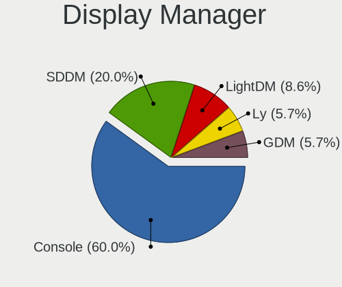
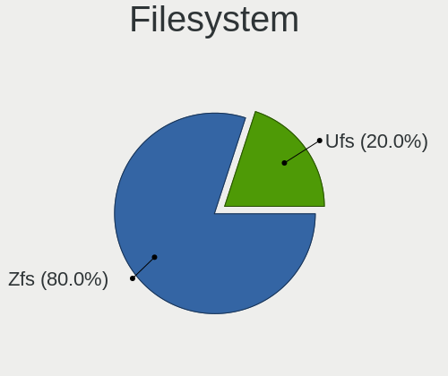
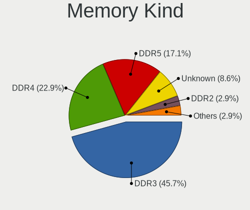

FreeBSD - Hardware Trends (Desktops)
------------------------------------

A project to identify most popular hardware characteristics and track their change
over time based on data collected by BSD users at https://BSD-Hardware.info.

Anyone can contribute to this report by the [hw-probe](https://github.com/linuxhw/hw-probe/blob/master/INSTALL.BSD.md) tool:

    hw-probe -all -upload

This report is for one last month. Overall report since the beginning of time: [TestDays](https://github.com/bsdhw/TestDays)

Period: Dec, 2024.

Contents
--------

* [ System ](#system)
  - [ OS                       ](#os)
  - [ OS Family                ](#os-family)
  - [ Arch                     ](#arch)
  - [ DE                       ](#de)
  - [ Display Server           ](#display-server)
  - [ Display Manager          ](#display-manager)
  - [ OS Lang                  ](#os-lang)
  - [ Boot Mode                ](#boot-mode)
  - [ Filesystem               ](#filesystem)
  - [ Part. scheme             ](#part-scheme)

* [ Board ](#board)
  - [ Vendor                   ](#vendor)
  - [ Model                    ](#model)
  - [ Model Family             ](#model-family)
  - [ MFG Year                 ](#mfg-year)
  - [ Form Factor              ](#form-factor)
  - [ Coreboot                 ](#coreboot)
  - [ RAM Size                 ](#ram-size)
  - [ RAM Used                 ](#ram-used)
  - [ Total Drives             ](#total-drives)
  - [ Has CD-ROM               ](#has-cd-rom)
  - [ Has Ethernet             ](#has-ethernet)
  - [ Has WiFi                 ](#has-wifi)
  - [ Has Bluetooth            ](#has-bluetooth)

* [ Location ](#location)
  - [ Country                  ](#country)
  - [ City                     ](#city)

* [ Drives ](#drives)
  - [ Drive Vendor             ](#drive-vendor)
  - [ Drive Model              ](#drive-model)
  - [ HDD Vendor               ](#hdd-vendor)
  - [ SSD Vendor               ](#ssd-vendor)
  - [ Drive Kind               ](#drive-kind)
  - [ Drive Connector          ](#drive-connector)
  - [ Drive Size               ](#drive-size)
  - [ Space Total              ](#space-total)
  - [ Space Used               ](#space-used)
  - [ Malfunc. Drives          ](#malfunc-drives)
  - [ Malfunc. Drive Vendor    ](#malfunc-drive-vendor)
  - [ Malfunc. HDD Vendor      ](#malfunc-hdd-vendor)
  - [ Malfunc. Drive Kind      ](#malfunc-drive-kind)
  - [ Failed Drives            ](#failed-drives)
  - [ Failed Drive Vendor      ](#failed-drive-vendor)
  - [ Drive Status             ](#drive-status)

* [ Storage controller ](#storage-controller)
  - [ Storage Vendor           ](#storage-vendor)
  - [ Storage Model            ](#storage-model)
  - [ Storage Kind             ](#storage-kind)

* [ Processor ](#processor)
  - [ CPU Vendor               ](#cpu-vendor)
  - [ CPU Model                ](#cpu-model)
  - [ CPU Model Family         ](#cpu-model-family)
  - [ CPU Cores                ](#cpu-cores)
  - [ CPU Sockets              ](#cpu-sockets)
  - [ CPU Threads              ](#cpu-threads)
  - [ CPU Microarch            ](#cpu-microarch)

* [ Graphics ](#graphics)
  - [ GPU Vendor               ](#gpu-vendor)
  - [ GPU Model                ](#gpu-model)
  - [ GPU Combo                ](#gpu-combo)
  - [ GPU Driver               ](#gpu-driver)
  - [ GPU Memory               ](#gpu-memory)

* [ Monitor ](#monitor)
  - [ Monitor Vendor           ](#monitor-vendor)
  - [ Monitor Model            ](#monitor-model)
  - [ Monitor Resolution       ](#monitor-resolution)
  - [ Monitor Diagonal         ](#monitor-diagonal)
  - [ Monitor Width            ](#monitor-width)
  - [ Aspect Ratio             ](#aspect-ratio)
  - [ Monitor Area             ](#monitor-area)
  - [ Pixel Density            ](#pixel-density)
  - [ Multiple Monitors        ](#multiple-monitors)

* [ Network ](#network)
  - [ Net Controller Vendor    ](#net-controller-vendor)
  - [ Net Controller Model     ](#net-controller-model)
  - [ Wireless Vendor          ](#wireless-vendor)
  - [ Wireless Model           ](#wireless-model)
  - [ Ethernet Vendor          ](#ethernet-vendor)
  - [ Ethernet Model           ](#ethernet-model)
  - [ Net Controller Kind      ](#net-controller-kind)
  - [ Used Controller          ](#used-controller)
  - [ NICs                     ](#nics)
  - [ IPv6                     ](#ipv6)

* [ Bluetooth ](#bluetooth)
  - [ Bluetooth Vendor         ](#bluetooth-vendor)
  - [ Bluetooth Model          ](#bluetooth-model)

* [ Sound ](#sound)
  - [ Sound Vendor             ](#sound-vendor)
  - [ Sound Model              ](#sound-model)

* [ Memory ](#memory)
  - [ Memory Vendor            ](#memory-vendor)
  - [ Memory Model             ](#memory-model)
  - [ Memory Kind              ](#memory-kind)
  - [ Memory Form Factor       ](#memory-form-factor)
  - [ Memory Size              ](#memory-size)
  - [ Memory Speed             ](#memory-speed)

* [ Printers & scanners ](#printers--scanners)
  - [ Printer Vendor           ](#printer-vendor)
  - [ Printer Model            ](#printer-model)
  - [ Scanner Vendor           ](#scanner-vendor)
  - [ Scanner Model            ](#scanner-model)

* [ Camera ](#camera)
  - [ Camera Vendor            ](#camera-vendor)
  - [ Camera Model             ](#camera-model)

* [ Security ](#security)
  - [ Fingerprint Vendor       ](#fingerprint-vendor)
  - [ Fingerprint Model        ](#fingerprint-model)
  - [ Chipcard Vendor          ](#chipcard-vendor)
  - [ Chipcard Model           ](#chipcard-model)

* [ Unsupported ](#unsupported)
  - [ Unsupported Devices      ](#unsupported-devices)
  - [ Unsupported Device Types ](#unsupported-device-types)

System
------

OS
--

Installed operating systems

| Name                 | Desktops | Percent |
|----------------------|----------|---------|
| FreeBSD 14.2         | 17       | 48.57%  |
| FreeBSD 14.1-p6      | 6        | 17.14%  |
| FreeBSD 14.1         | 6        | 17.14%  |
| FreeBSD 15.0-CURRENT | 2        | 5.71%   |
| FreeBSD 14.1-STABLE  | 2        | 5.71%   |
| FreeBSD 14.1-p5      | 2        | 5.71%   |

OS Family
---------

OS without a version

| Name    | Desktops | Percent |
|---------|----------|---------|
| FreeBSD | 35       | 100%    |

Arch
----

OS architecture (x86_64, i586, etc.)

| Name  | Desktops | Percent |
|-------|----------|---------|
| amd64 | 34       | 97.14%  |
| i386  | 1        | 2.86%   |

DE
--

Desktop Environment

| Name    | Desktops | Percent |
|---------|----------|---------|
| Console | 18       | 51.43%  |
| KDE5    | 5        | 14.29%  |
| XFCE    | 3        | 8.57%   |
| GNOME   | 3        | 8.57%   |
| TWM     | 2        | 5.71%   |
| openbox | 1        | 2.86%   |
| MATE    | 1        | 2.86%   |
| KDE     | 1        | 2.86%   |
| Fluxbox | 1        | 2.86%   |

Display Server
--------------

X11 or Wayland

| Name    | Desktops | Percent |
|---------|----------|---------|
| Console | 17       | 48.57%  |
| X11     | 15       | 42.86%  |
| Wayland | 3        | 8.57%   |

Display Manager
---------------

SDDM, LightDM, etc.

| Name    | Desktops | Percent |
|---------|----------|---------|
| Console | 21       | 60%     |
| SDDM    | 7        | 20%     |
| LightDM | 3        | 8.57%   |
| Ly      | 2        | 5.71%   |
| GDM     | 2        | 5.71%   |

OS Lang
-------

Language

| Lang    | Desktops | Percent |
|---------|----------|---------|
| C       | 25       | 71.43%  |
| en_US   | 4        | 11.43%  |
| ru_RU   | 2        | 5.71%   |
| Unknown | 2        | 5.71%   |
| fr_FR   | 1        | 2.86%   |
| de_DE   | 1        | 2.86%   |

Boot Mode
---------

EFI or BIOS

| Mode | Desktops | Percent |
|------|----------|---------|
| EFI  | 24       | 68.57%  |
| BIOS | 11       | 31.43%  |

Filesystem
----------

Type of filesystem

| Type | Desktops | Percent |
|------|----------|---------|
| Zfs  | 28       | 80%     |
| Ufs  | 7        | 20%     |

Part. scheme
------------

Scheme of partitioning

| Type | Desktops | Percent |
|------|----------|---------|
| GPT  | 34       | 97.14%  |
| MBR  | 1        | 2.86%   |

Board
-----

Vendor
------

Motherboard manufacturer

| Name                                | Desktops | Percent |
|-------------------------------------|----------|---------|
| ASUSTek Computer                    | 9        | 25.71%  |
| Gigabyte Technology                 | 7        | 20%     |
| MSI                                 | 4        | 11.43%  |
| Intel                               | 3        | 8.57%   |
| Dell                                | 3        | 8.57%   |
| Hewlett-Packard                     | 2        | 5.71%   |
| WeiBu                               | 1        | 2.86%   |
| Shenzhen suqiao computer technology | 1        | 2.86%   |
| PC Engines                          | 1        | 2.86%   |
| NF533MS                             | 1        | 2.86%   |
| Lenovo                              | 1        | 2.86%   |
| JGINYUE                             | 1        | 2.86%   |
| ASRockRack                          | 1        | 2.86%   |

Model
-----

Motherboard model

| Name                                                         | Desktops | Percent |
|--------------------------------------------------------------|----------|---------|
| Gigabyte M68MT-S2                                            | 2        | 5.71%   |
| ASUS P5Q-E                                                   | 2        | 5.71%   |
| WeiBu ADL-N                                                  | 1        | 2.86%   |
| Shenzhen suqiao computer technology miniPC                   | 1        | 2.86%   |
| PC Engines APU2                                              | 1        | 2.86%   |
| NF533MS 1.0                                                  | 1        | 2.86%   |
| MSI MS-7C95                                                  | 1        | 2.86%   |
| MSI MS-7817                                                  | 1        | 2.86%   |
| MSI MS-7758                                                  | 1        | 2.86%   |
| MSI MS-7680                                                  | 1        | 2.86%   |
| Lenovo ThinkStation P300 30AJS0G500                          | 1        | 2.86%   |
| JGINYUE X99-8D4/2.5G Server                                  | 1        | 2.86%   |
| Intel X79_PLUS                                               | 1        | 2.86%   |
| Intel X79 (INTEL Xeon E5/Corei7 DMI2 - C600/C200 Cipset V308 | 1        | 2.86%   |
| Intel HURONRIVER                                             | 1        | 2.86%   |
| HP EliteDesk 800 G2 DM 35W                                   | 1        | 2.86%   |
| HP EliteDesk 800 G1 SFF                                      | 1        | 2.86%   |
| Gigabyte Z790 AORUS MASTER X                                 | 1        | 2.86%   |
| Gigabyte Z690 AORUS ULTRA                                    | 1        | 2.86%   |
| Gigabyte H97M-HD3                                            | 1        | 2.86%   |
| Gigabyte G41M-Combo                                          | 1        | 2.86%   |
| Gigabyte B450 I AORUS PRO WIFI                               | 1        | 2.86%   |
| Dell Studio XPS 7100                                         | 1        | 2.86%   |
| Dell OptiPlex 9020                                           | 1        | 2.86%   |
| Dell OptiPlex 5040                                           | 1        | 2.86%   |
| ASUS TUF Gaming X570-PLUS                                    | 1        | 2.86%   |
| ASUS ROG STRIX X870E-E GAMING WIFI                           | 1        | 2.86%   |
| ASUS ROG CROSSHAIR VIII HERO                                 | 1        | 2.86%   |
| ASUS PRIME Z790-A WIFI                                       | 1        | 2.86%   |
| ASUS PRIME B650M-K                                           | 1        | 2.86%   |
| ASUS P8H67-M PRO                                             | 1        | 2.86%   |
| ASUS CROSSHAIR V FORMULA-Z                                   | 1        | 2.86%   |
| ASRockRack EPYC3101D4I-2T                                    | 1        | 2.86%   |

Model Family
------------

Motherboard model prefix

| Name                                       | Desktops | Percent |
|--------------------------------------------|----------|---------|
| Intel X79                                  | 2        | 5.71%   |
| HP EliteDesk                               | 2        | 5.71%   |
| Gigabyte M68MT-S2                          | 2        | 5.71%   |
| Dell OptiPlex                              | 2        | 5.71%   |
| ASUS ROG                                   | 2        | 5.71%   |
| ASUS PRIME                                 | 2        | 5.71%   |
| ASUS P5Q-E                                 | 2        | 5.71%   |
| WeiBu ADL-N                                | 1        | 2.86%   |
| Shenzhen suqiao computer technology miniPC | 1        | 2.86%   |
| PC Engines APU2                            | 1        | 2.86%   |
| NF533MS 1.0                                | 1        | 2.86%   |
| MSI MS-7C95                                | 1        | 2.86%   |
| MSI MS-7817                                | 1        | 2.86%   |
| MSI MS-7758                                | 1        | 2.86%   |
| MSI MS-7680                                | 1        | 2.86%   |
| Lenovo ThinkStation                        | 1        | 2.86%   |
| JGINYUE X99-8D4                            | 1        | 2.86%   |
| Intel HURONRIVER                           | 1        | 2.86%   |
| Gigabyte Z790                              | 1        | 2.86%   |
| Gigabyte Z690                              | 1        | 2.86%   |
| Gigabyte H97M-HD3                          | 1        | 2.86%   |
| Gigabyte G41M-Combo                        | 1        | 2.86%   |
| Gigabyte B450                              | 1        | 2.86%   |
| Dell Studio                                | 1        | 2.86%   |
| ASUS TUF                                   | 1        | 2.86%   |
| ASUS P8H67-M                               | 1        | 2.86%   |
| ASUS CROSSHAIR                             | 1        | 2.86%   |
| ASRockRack EPYC3101D4I-2T                  | 1        | 2.86%   |

MFG Year
--------

Motherboard manufacture year

| Year | Desktops | Percent |
|------|----------|---------|
| 2024 | 6        | 17.14%  |
| 2014 | 6        | 17.14%  |
| 2023 | 3        | 8.57%   |
| 2021 | 3        | 8.57%   |
| 2016 | 3        | 8.57%   |
| 2012 | 3        | 8.57%   |
| 2019 | 2        | 5.71%   |
| 2008 | 2        | 5.71%   |
| 2006 | 2        | 5.71%   |
| 2020 | 1        | 2.86%   |
| 2017 | 1        | 2.86%   |
| 2015 | 1        | 2.86%   |
| 2011 | 1        | 2.86%   |
| 2010 | 1        | 2.86%   |

Form Factor
-----------

Physical design of the computer

| Name    | Desktops | Percent |
|---------|----------|---------|
| Desktop | 35       | 100%    |

Coreboot
--------

Have coreboot on board

| Used | Desktops | Percent |
|------|----------|---------|
| No   | 34       | 97.14%  |
| Yes  | 1        | 2.86%   |

RAM Size
--------

Total RAM memory

| Size in GB  | Desktops | Percent |
|-------------|----------|---------|
| 16.01-24.0  | 10       | 28.57%  |
| 64.01-256.0 | 9        | 25.71%  |
| 8.01-16.0   | 7        | 20%     |
| 4.01-8.0    | 5        | 14.29%  |
| 32.01-64.0  | 4        | 11.43%  |

RAM Used
--------

Used RAM memory

| Used GB  | Desktops | Percent |
|----------|----------|---------|
| 0.51-1.0 | 11       | 31.43%  |
| 1.01-2.0 | 10       | 28.57%  |
| 0.01-0.5 | 10       | 28.57%  |
| 2.01-3.0 | 2        | 5.71%   |
| 4.01-8.0 | 1        | 2.86%   |
| 3.01-4.0 | 1        | 2.86%   |

Total Drives
------------

Number of drives on board

| Drives | Desktops | Percent |
|--------|----------|---------|
| 1      | 11       | 31.43%  |
| 2      | 8        | 22.86%  |
| 4      | 5        | 14.29%  |
| 0      | 5        | 14.29%  |
| 3      | 3        | 8.57%   |
| 10     | 1        | 2.86%   |
| 6      | 1        | 2.86%   |
| 5      | 1        | 2.86%   |

Has CD-ROM
----------

Has CD-ROM on board

| Presented | Desktops | Percent |
|-----------|----------|---------|
| No        | 24       | 68.57%  |
| Yes       | 11       | 31.43%  |

Has Ethernet
------------

Has Ethernet on board

| Presented | Desktops | Percent |
|-----------|----------|---------|
| Yes       | 34       | 97.14%  |
| No        | 1        | 2.86%   |

Has WiFi
--------

Has WiFi module

| Presented | Desktops | Percent |
|-----------|----------|---------|
| No        | 20       | 57.14%  |
| Yes       | 15       | 42.86%  |

Has Bluetooth
-------------

Has Bluetooth module

| Presented | Desktops | Percent |
|-----------|----------|---------|
| No        | 22       | 62.86%  |
| Yes       | 13       | 37.14%  |

Location
--------

Country
-------

Geographic location (country)

| Country     | Desktops | Percent |
|-------------|----------|---------|
| USA         | 10       | 28.57%  |
| Canada      | 5        | 14.29%  |
| Russia      | 4        | 11.43%  |
| Germany     | 3        | 8.57%   |
| France      | 2        | 5.71%   |
| UK          | 1        | 2.86%   |
| Thailand    | 1        | 2.86%   |
| Poland      | 1        | 2.86%   |
| Netherlands | 1        | 2.86%   |
| Malaysia    | 1        | 2.86%   |
| Italy       | 1        | 2.86%   |
| China       | 1        | 2.86%   |
| Belarus     | 1        | 2.86%   |
| Austria     | 1        | 2.86%   |
| Australia   | 1        | 2.86%   |
| Algeria     | 1        | 2.86%   |

City
----

Geographic location (city)

| City             | Desktops | Percent |
|------------------|----------|---------|
| Ottawa           | 2        | 5.71%   |
| Moscow           | 2        | 5.71%   |
| Los Angeles      | 2        | 5.71%   |
| Bellingham       | 2        | 5.71%   |
| Wenatchee        | 1        | 2.86%   |
| Vienna           | 1        | 2.86%   |
| Vancouver        | 1        | 2.86%   |
| Ulm              | 1        | 2.86%   |
| Taylor           | 1        | 2.86%   |
| Suzhou           | 1        | 2.86%   |
| Strasbourg       | 1        | 2.86%   |
| Sherwood Park    | 1        | 2.86%   |
| Sertolovo        | 1        | 2.86%   |
| Rybnik           | 1        | 2.86%   |
| Rossville        | 1        | 2.86%   |
| Pognana Lario    | 1        | 2.86%   |
| Paris            | 1        | 2.86%   |
| Palm Springs     | 1        | 2.86%   |
| Oran             | 1        | 2.86%   |
| Nuremberg        | 1        | 2.86%   |
| Nizhniy Novgorod | 1        | 2.86%   |
| Nijeveen         | 1        | 2.86%   |
| New York         | 1        | 2.86%   |
| Minsk            | 1        | 2.86%   |
| Kuala Lumpur     | 1        | 2.86%   |
| Harrow           | 1        | 2.86%   |
| Grand Rapids     | 1        | 2.86%   |
| Düsseldorf      | 1        | 2.86%   |
| Barrie           | 1        | 2.86%   |
| Bangkok          | 1        | 2.86%   |
| Adelaide         | 1        | 2.86%   |

Drives
------

Drive Vendor
------------

Hard drive vendors

| Vendor              | Desktops | Drives | Percent |
|---------------------|----------|--------|---------|
| WDC                 | 13       | 23     | 24.07%  |
| Seagate             | 12       | 18     | 22.22%  |
| Samsung Electronics | 9        | 14     | 16.67%  |
| Intel               | 3        | 3      | 5.56%   |
| Crucial             | 3        | 3      | 5.56%   |
| Toshiba             | 2        | 3      | 3.7%    |
| SanDisk             | 2        | 2      | 3.7%    |
| Kingston            | 2        | 3      | 3.7%    |
| walram              | 1        | 1      | 1.85%   |
| SPCC                | 1        | 2      | 1.85%   |
| SK hynix            | 1        | 1      | 1.85%   |
| PNY                 | 1        | 2      | 1.85%   |
| HGST                | 1        | 1      | 1.85%   |
| Hewlett-Packard     | 1        | 1      | 1.85%   |
| China               | 1        | 1      | 1.85%   |
| A-DATA Technology   | 1        | 1      | 1.85%   |

Drive Model
-----------

Hard drive models

| Model                           | Desktops | Percent |
|---------------------------------|----------|---------|
| WDC WDS500G2B0A-00SM50 500GB    | 2        | 2.94%   |
| Kingston SA400S37120G 120GB     | 2        | 2.94%   |
| WDC WDS500G2B0A 500GB           | 1        | 1.47%   |
| WDC WD80EFAX-68KNBN0 8TB        | 1        | 1.47%   |
| WDC WD5000LPZX-22Z10T0 500GB    | 1        | 1.47%   |
| WDC WD5000AAKX-60U6AA0 500GB    | 1        | 1.47%   |
| WDC WD40NDZW-11BCSS1 4TB        | 1        | 1.47%   |
| WDC WD40EZRZ-22GXCB0 4TB        | 1        | 1.47%   |
| WDC WD40EZRZ-00WN9B0 4TB        | 1        | 1.47%   |
| WDC WD40EZAZ-00SF3B0 4TB        | 1        | 1.47%   |
| WDC WD40EFRX-68N32N0 4TB        | 1        | 1.47%   |
| WDC WD4003FRYZ-01F0DB0 4TB      | 1        | 1.47%   |
| WDC WD20EZRZ-00Z5HB0 2TB        | 1        | 1.47%   |
| WDC WD20EZAZ-00GGJB0 2TB        | 1        | 1.47%   |
| WDC WD2002FAEX-007BA0 2TB       | 1        | 1.47%   |
| WDC WD1600AAJS-00YZCA0 160GB    | 1        | 1.47%   |
| WDC WD15EADS-00P8B0 1.5TB       | 1        | 1.47%   |
| WDC WD10JPVT-80A1YT0 1TB        | 1        | 1.47%   |
| WDC WD10EZEX-00BN5A0 1TB        | 1        | 1.47%   |
| WDC WD1002FAEX-00Z3A0 1TB       | 1        | 1.47%   |
| walram SSD 128G                 | 1        | 1.47%   |
| Toshiba MK3252GSX 320GB         | 1        | 1.47%   |
| Toshiba DT01ACA300 3TB          | 1        | 1.47%   |
| Toshiba DT01ACA200V 2TB         | 1        | 1.47%   |
| SPCC Solid State Disk 128GB     | 1        | 1.47%   |
| SK hynix SC308 SATA 128GB       | 1        | 1.47%   |
| Seagate ST8000DM004-2U9188 8TB  | 1        | 1.47%   |
| Seagate ST500LM021-1KJ152 500GB | 1        | 1.47%   |
| Seagate ST4000DM005-2DP166 4TB  | 1        | 1.47%   |
| Seagate ST4000DM000-1F2168 4TB  | 1        | 1.47%   |
| Seagate ST380811AS 80GB         | 1        | 1.47%   |
| Seagate ST3500830AS 500GB       | 1        | 1.47%   |
| Seagate ST3250410AS 250GB       | 1        | 1.47%   |
| Seagate ST3160815AS 160GB       | 1        | 1.47%   |
| Seagate ST31000525SV 1TB        | 1        | 1.47%   |
| Seagate ST2000VM003-1CT164 2TB  | 1        | 1.47%   |
| Seagate ST2000DM008-2UB102 2TB  | 1        | 1.47%   |
| Seagate ST2000DM008-2FR102 2TB  | 1        | 1.47%   |
| Seagate ST2000DM001-9YN164 2TB  | 1        | 1.47%   |
| Seagate ST1000NM0033-9ZM173 1TB | 1        | 1.47%   |

HDD Vendor
----------

Hard disk drive vendors

| Vendor              | Desktops | Drives | Percent |
|---------------------|----------|--------|---------|
| WDC                 | 13       | 20     | 41.94%  |
| Seagate             | 12       | 18     | 38.71%  |
| Toshiba             | 2        | 3      | 6.45%   |
| Samsung Electronics | 2        | 2      | 6.45%   |
| HGST                | 1        | 1      | 3.23%   |
| Hewlett-Packard     | 1        | 1      | 3.23%   |

SSD Vendor
----------

Solid state drive vendors

| Vendor              | Desktops | Drives | Percent |
|---------------------|----------|--------|---------|
| Samsung Electronics | 8        | 12     | 30.77%  |
| Intel               | 3        | 3      | 11.54%  |
| Crucial             | 3        | 3      | 11.54%  |
| WDC                 | 2        | 3      | 7.69%   |
| SanDisk             | 2        | 2      | 7.69%   |
| Kingston            | 2        | 3      | 7.69%   |
| walram              | 1        | 1      | 3.85%   |
| SPCC                | 1        | 2      | 3.85%   |
| SK hynix            | 1        | 1      | 3.85%   |
| PNY                 | 1        | 2      | 3.85%   |
| China               | 1        | 1      | 3.85%   |
| A-DATA Technology   | 1        | 1      | 3.85%   |

Drive Kind
----------

HDD or SSD

| Kind | Desktops | Drives | Percent |
|------|----------|--------|---------|
| SSD  | 22       | 34     | 50%     |
| HDD  | 22       | 45     | 50%     |

Drive Connector
---------------

SATA, SAS, NVMe, etc.

| Type | Desktops | Drives | Percent |
|------|----------|--------|---------|
| SATA | 30       | 79     | 100%    |

Drive Size
----------

Size of hard drive

| Size in TB | Desktops | Drives | Percent |
|------------|----------|--------|---------|
| 0.01-0.5   | 23       | 38     | 46.94%  |
| 0.51-1.0   | 9        | 13     | 18.37%  |
| 1.01-2.0   | 8        | 16     | 16.33%  |
| 3.01-4.0   | 6        | 9      | 12.24%  |
| 4.01-10.0  | 2        | 2      | 4.08%   |
| 2.01-3.0   | 1        | 1      | 2.04%   |

Space Total
-----------

Amount of disk space available on the file system

| Size in GB | Desktops | Percent |
|------------|----------|---------|
| 101-250    | 11       | 31.43%  |
| 251-500    | 8        | 22.86%  |
| 1001-2000  | 4        | 11.43%  |
| 21-50      | 3        | 8.57%   |
| 501-1000   | 3        | 8.57%   |
| 51-100     | 3        | 8.57%   |
| 1-20       | 2        | 5.71%   |
| 2001-3000  | 1        | 2.86%   |

Space Used
----------

Amount of used disk space

| Used GB | Desktops | Percent |
|---------|----------|---------|
| 1-20    | 26       | 74.29%  |
| 21-50   | 7        | 20%     |
| 101-250 | 1        | 2.86%   |
| 51-100  | 1        | 2.86%   |

Malfunc. Drives
---------------

Drive models with a malfunction

| Model                             | Desktops | Drives | Percent |
|-----------------------------------|----------|--------|---------|
| WDC WD40EZRZ-00WN9B0 4TB          | 1        | 1      | 6.25%   |
| Toshiba MK3252GSX 320GB           | 1        | 1      | 6.25%   |
| Toshiba DT01ACA300 3TB            | 1        | 1      | 6.25%   |
| Toshiba DT01ACA200V 2TB           | 1        | 1      | 6.25%   |
| SK hynix SC308 SATA 128GB         | 1        | 1      | 6.25%   |
| Seagate ST500LM021-1KJ152 500GB   | 1        | 3      | 6.25%   |
| Seagate ST380811AS 80GB           | 1        | 1      | 6.25%   |
| Seagate ST3250410AS 250GB         | 1        | 1      | 6.25%   |
| Seagate ST3160815AS 160GB         | 1        | 1      | 6.25%   |
| Seagate ST31000525SV 1TB          | 1        | 1      | 6.25%   |
| Seagate ST2000DM001-9YN164 2TB    | 1        | 1      | 6.25%   |
| Samsung Electronics HD403LJ 400GB | 1        | 1      | 6.25%   |
| Intel SSDSC2BW480A4 480GB         | 1        | 1      | 6.25%   |
| Intel SSDSA2M040G2GC 40GB         | 1        | 1      | 6.25%   |
| HGST HTS725050A7E630 500GB        | 1        | 1      | 6.25%   |
| A-DATA Technology SU650 240GB     | 1        | 1      | 6.25%   |

Malfunc. Drive Vendor
---------------------

Vendors of faulty drives

| Vendor              | Desktops | Drives | Percent |
|---------------------|----------|--------|---------|
| Seagate             | 4        | 8      | 30.77%  |
| Toshiba             | 2        | 3      | 15.38%  |
| Intel               | 2        | 2      | 15.38%  |
| WDC                 | 1        | 1      | 7.69%   |
| SK hynix            | 1        | 1      | 7.69%   |
| Samsung Electronics | 1        | 1      | 7.69%   |
| HGST                | 1        | 1      | 7.69%   |
| A-DATA Technology   | 1        | 1      | 7.69%   |

Malfunc. HDD Vendor
-------------------

Vendors of faulty HDD drives

| Vendor              | Desktops | Drives | Percent |
|---------------------|----------|--------|---------|
| Seagate             | 4        | 8      | 44.44%  |
| Toshiba             | 2        | 3      | 22.22%  |
| WDC                 | 1        | 1      | 11.11%  |
| Samsung Electronics | 1        | 1      | 11.11%  |
| HGST                | 1        | 1      | 11.11%  |

Malfunc. Drive Kind
-------------------

Kinds of faulty drives

| Kind | Desktops | Drives | Percent |
|------|----------|--------|---------|
| HDD  | 9        | 14     | 69.23%  |
| SSD  | 4        | 4      | 30.77%  |

Failed Drives
-------------

Failed drive models

Zero info for selected period =(

Failed Drive Vendor
-------------------

Failed drive vendors

Zero info for selected period =(

Drive Status
------------

Number of failed and malfunc. drives

| Status  | Desktops | Drives | Percent |
|---------|----------|--------|---------|
| Works   | 26       | 61     | 70.27%  |
| Malfunc | 11       | 18     | 29.73%  |

Storage controller
------------------

Storage Vendor
--------------

Storage controller vendors

| Vendor                      | Desktops | Percent |
|-----------------------------|----------|---------|
| Intel                       | 21       | 38.89%  |
| AMD                         | 10       | 18.52%  |
| Sandisk                     | 4        | 7.41%   |
| Marvell Technology Group    | 3        | 5.56%   |
| ASMedia Technology          | 3        | 5.56%   |
| Samsung Electronics         | 2        | 3.7%    |
| Nvidia                      | 2        | 3.7%    |
| Micron/Crucial Technology   | 2        | 3.7%    |
| SK hynix                    | 1        | 1.85%   |
| Silicon Motion              | 1        | 1.85%   |
| Phison Electronics          | 1        | 1.85%   |
| Netac Technology            | 1        | 1.85%   |
| MAXIO Technology (Hangzhou) | 1        | 1.85%   |
| INNOGRIT                    | 1        | 1.85%   |
| Hosin Global Electronics    | 1        | 1.85%   |

Storage Model
-------------

Storage controller models

| Model                                                                                   | Desktops | Percent |
|-----------------------------------------------------------------------------------------|----------|---------|
| AMD FCH SATA Controller [AHCI mode]                                                     | 6        | 9.84%   |
| Intel 8 Series/C220 Series Chipset Family 6-port SATA Controller 1 [AHCI mode]          | 3        | 4.92%   |
| Nvidia MCP61 SATA Controller                                                            | 2        | 3.28%   |
| Marvell Group 88SE9215 PCIe 2.0 x1 4-port SATA 6 Gb/s Controller                        | 2        | 3.28%   |
| Intel Q170/Q150/B150/H170/H110/Z170/CM236 Chipset SATA Controller [AHCI Mode]           | 2        | 3.28%   |
| Intel 6 Series/C200 Series Chipset Family 6 port Desktop SATA AHCI Controller           | 2        | 3.28%   |
| ASMedia ASM1061/ASM1062 Serial ATA Controller                                           | 2        | 3.28%   |
| AMD SB7x0/SB8x0/SB9x0 SATA Controller [AHCI mode]                                       | 2        | 3.28%   |
| AMD 600 Series Chipset SATA Controller                                                  | 2        | 3.28%   |
| SK hynix Platinum P41/PC801 NVMe Solid State Drive                                      | 1        | 1.64%   |
| Silicon Motion SM2263EN/SM2263XT (DRAM-less) NVMe SSD Controllers                       | 1        | 1.64%   |
| Sandisk WD Blue SN580 NVMe SSD (DRAM-less)                                              | 1        | 1.64%   |
| Sandisk WD Black SN850X NVMe SSD                                                        | 1        | 1.64%   |
| SanDisk Ultra 3D / WD PC SN530, IX SN530, Blue SN550 NVMe SSD (DRAM-less)               | 1        | 1.64%   |
| SanDisk Extreme Pro / WD Black SN750 / PC SN730 / Red SN700 NVMe SSD                    | 1        | 1.64%   |
| Samsung NVMe SSD Controller S4LV008[Pascal]                                             | 1        | 1.64%   |
| Samsung NVMe SSD Controller PM9A1/PM9A3/980PRO                                          | 1        | 1.64%   |
| Phison PS5013-E13 PCIe3 NVMe Controller (DRAM-less)                                     | 1        | 1.64%   |
| Netac PCIe 4 INNOGRIT based NVMe SSD                                                    | 1        | 1.64%   |
| Netac PCIe 3 SM based NVMe SSD (DRAM-less)                                              | 1        | 1.64%   |
| Netac PCIe 3 NVMe SSD (DRAM-less)                                                       | 1        | 1.64%   |
| Micron/Crucial T705 NVMe PCIe SSD                                                       | 1        | 1.64%   |
| Micron/Crucial P2 [Nick P2] / P3 / P3 Plus NVMe PCIe SSD (DRAM-less)                    | 1        | 1.64%   |
| MAXIO (Hangzhou) NVMe SSD Controller MAP1202 (DRAM-less)                                | 1        | 1.64%   |
| Marvell Group 88SE6111/6121 SATA II / PATA Controller                                   | 1        | 1.64%   |
| Intel Volume Management Device NVMe RAID Controller Intel Corporation                   | 1        | 1.64%   |
| Intel SATA Controller [RAID mode]                                                       | 1        | 1.64%   |
| Intel Raptor Lake SATA AHCI Controller                                                  | 1        | 1.64%   |
| Intel NM10/ICH7 Family SATA Controller [IDE mode]                                       | 1        | 1.64%   |
| Intel Atom Processor E3800 Series SATA AHCI Controller                                  | 1        | 1.64%   |
| Intel Alder Lake-S PCH SATA Controller [AHCI Mode]                                      | 1        | 1.64%   |
| Intel Alder Lake-N SATA AHCI Controller                                                 | 1        | 1.64%   |
| Intel 9 Series Chipset Family SATA Controller [AHCI Mode]                               | 1        | 1.64%   |
| Intel 82801JI (ICH10 Family) SATA AHCI Controller                                       | 1        | 1.64%   |
| Intel 82801JI (ICH10 Family) 4 port SATA IDE Controller #1                              | 1        | 1.64%   |
| Intel 82801JI (ICH10 Family) 2 port SATA IDE Controller #2                              | 1        | 1.64%   |
| Intel 7 Series/C210 Series Chipset Family 6-port SATA Controller [AHCI mode]            | 1        | 1.64%   |
| Intel 7 Series Chipset Family 6-port SATA Controller [AHCI mode]                        | 1        | 1.64%   |
| Intel 6 Series/C200 Series Chipset Family Desktop SATA Controller (IDE mode, ports 4-5) | 1        | 1.64%   |
| Intel 6 Series/C200 Series Chipset Family Desktop SATA Controller (IDE mode, ports 0-3) | 1        | 1.64%   |

Storage Kind
------------

Kind of storage controller (IDE, SATA, NVMe, SAS, ...)

| Kind | Desktops | Percent |
|------|----------|---------|
| SATA | 27       | 60%     |
| NVMe | 10       | 22.22%  |
| IDE  | 6        | 13.33%  |
| RAID | 2        | 4.44%   |

Processor
---------

CPU Vendor
----------

Processor vendors

| Vendor | Desktops | Percent |
|--------|----------|---------|
| Intel  | 22       | 62.86%  |
| AMD    | 13       | 37.14%  |

CPU Model
---------

Processor models

| Model                                     | Desktops | Percent |
|-------------------------------------------|----------|---------|
| Intel Core i7-4790 CPU @ 3.60GHz          | 2        | 5.71%   |
| AMD FX-4100 Quad-Core Processor           | 2        | 5.71%   |
| Intel Xeon CPU E5-2680 v4 @ 2.40GHz       | 1        | 2.86%   |
| Intel Xeon CPU E5-2650L v2 @ 1.70GHz      | 1        | 2.86%   |
| Intel Xeon CPU E5-2450 v2 @ 2.50GHz       | 1        | 2.86%   |
| Intel Pentium CPU G3220 @ 3.00GHz         | 1        | 2.86%   |
| Intel N100                                | 1        | 2.86%   |
| Intel Core i9-14900K                      | 1        | 2.86%   |
| Intel Core i7-4785T CPU @ 2.20GHz         | 1        | 2.86%   |
| Intel Core i7-3770 CPU @ 3.40GHz          | 1        | 2.86%   |
| Intel Core i7-2600 CPU @ 3.40GHz          | 1        | 2.86%   |
| Intel Core i7-14700KF                     | 1        | 2.86%   |
| Intel Core i5-6500T CPU @ 2.50GHz         | 1        | 2.86%   |
| Intel Core i5-6500 CPU @ 3.20GHz          | 1        | 2.86%   |
| Intel Core i5-4690 CPU @ 3.50GHz          | 1        | 2.86%   |
| Intel Core i5-2520M CPU @ 2.50GHz         | 1        | 2.86%   |
| Intel Core i3-2120 CPU @ 3.30GHz          | 1        | 2.86%   |
| Intel Core 2 Quad CPU Q9550 @ 2.83GHz     | 1        | 2.86%   |
| Intel Core 2 Quad CPU Q6600 @ 2.40GHz     | 1        | 2.86%   |
| Intel Core 2 Duo CPU                      | 1        | 2.86%   |
| Intel Celeron CPU J1900 @ 1.99GHz         | 1        | 2.86%   |
| Intel 12th Gen Core i7-12700K             | 1        | 2.86%   |
| AMD Ryzen 9 9950X 16-Core Processor       | 1        | 2.86%   |
| AMD Ryzen 9 3900X 12-Core Processor       | 1        | 2.86%   |
| AMD Ryzen 7 1800X Eight-Core Processor    | 1        | 2.86%   |
| AMD Ryzen 5 8500G w/ Radeon 740M Graphics | 1        | 2.86%   |
| AMD Ryzen 5 3600 6-Core Processor         | 1        | 2.86%   |
| AMD Ryzen 5 3500 6-Core Processor         | 1        | 2.86%   |
| AMD Phenom II X6 1035T Processor          | 1        | 2.86%   |
| AMD GX-412TC SOC                          | 1        | 2.86%   |
| AMD FX-8150 Eight-Core Processor          | 1        | 2.86%   |
| AMD EPYC 3101 4-Core Processor            | 1        | 2.86%   |
| AMD Eng Sample: 100-000000954-30_N        | 1        | 2.86%   |

CPU Model Family
----------------

Processor model prefix

| Model             | Desktops | Percent |
|-------------------|----------|---------|
| Intel Core i7     | 6        | 17.14%  |
| Intel Core i5     | 4        | 11.43%  |
| Intel Xeon        | 3        | 8.57%   |
| AMD Ryzen 5       | 3        | 8.57%   |
| AMD FX            | 3        | 8.57%   |
| Other             | 2        | 5.71%   |
| Intel Core 2 Quad | 2        | 5.71%   |
| AMD Ryzen 9       | 2        | 5.71%   |
| Intel Pentium     | 1        | 2.86%   |
| Intel Core i9     | 1        | 2.86%   |
| Intel Core i3     | 1        | 2.86%   |
| Intel Core 2 Duo  | 1        | 2.86%   |
| Intel Celeron     | 1        | 2.86%   |
| AMD Ryzen 7       | 1        | 2.86%   |
| AMD Phenom II X6  | 1        | 2.86%   |
| AMD GX            | 1        | 2.86%   |
| AMD EPYC          | 1        | 2.86%   |
| AMD E             | 1        | 2.86%   |

CPU Cores
---------

Number of processor cores

| Number  | Desktops | Percent |
|---------|----------|---------|
| 4       | 15       | 42.86%  |
| 8       | 4        | 11.43%  |
| 6       | 4        | 11.43%  |
| 2       | 4        | 11.43%  |
| 28      | 2        | 5.71%   |
| 16      | 2        | 5.71%   |
| 10      | 2        | 5.71%   |
| 12      | 1        | 2.86%   |
| Unknown | 1        | 2.86%   |

CPU Sockets
-----------

Number of sockets

| Number | Desktops | Percent |
|--------|----------|---------|
| 1      | 34       | 97.14%  |
| 2      | 1        | 2.86%   |

CPU Threads
-----------

Threads per core (Hyper-Threading)

| Number  | Desktops | Percent |
|---------|----------|---------|
| 2       | 18       | 51.43%  |
| 1       | 16       | 45.71%  |
| Unknown | 1        | 2.86%   |

CPU Microarch
-------------

Microarchitecture

| Name        | Desktops | Percent |
|-------------|----------|---------|
| Unknown     | 7        | 20%     |
| Haswell     | 5        | 14.29%  |
| Zen 2       | 3        | 8.57%   |
| SandyBridge | 3        | 8.57%   |
| IvyBridge   | 3        | 8.57%   |
| Bulldozer   | 3        | 8.57%   |
| Zen         | 2        | 5.71%   |
| Skylake     | 2        | 5.71%   |
| Penryn      | 2        | 5.71%   |
| Silvermont  | 1        | 2.86%   |
| Puma        | 1        | 2.86%   |
| K10         | 1        | 2.86%   |
| Core        | 1        | 2.86%   |
| Broadwell   | 1        | 2.86%   |

Graphics
--------

GPU Vendor
----------

Vendors of graphics cards

| Vendor            | Desktops | Percent |
|-------------------|----------|---------|
| AMD               | 14       | 37.84%  |
| Intel             | 13       | 35.14%  |
| Nvidia            | 9        | 24.32%  |
| ASPEED Technology | 1        | 2.7%    |

GPU Model
---------

Graphics card models

| Model                                                                       | Desktops | Percent |
|-----------------------------------------------------------------------------|----------|---------|
| Intel Xeon E3-1200 v3/4th Gen Core Processor Integrated Graphics Controller | 4        | 10.81%  |
| AMD Ellesmere [Radeon RX 470/480/570/570X/580/580X/590]                     | 4        | 10.81%  |
| Intel 2nd Generation Core Processor Family Integrated Graphics Controller   | 3        | 8.11%   |
| Intel HD Graphics 530                                                       | 2        | 5.41%   |
| Nvidia TU106 [GeForce RTX 2060 Rev. A]                                      | 1        | 2.7%    |
| Nvidia GP108 [GeForce GT 1030]                                              | 1        | 2.7%    |
| Nvidia GP106 [GeForce GTX 1060 6GB]                                         | 1        | 2.7%    |
| Nvidia GP104 [GeForce GTX 1070]                                             | 1        | 2.7%    |
| Nvidia GM107 [GeForce GTX 750 Ti]                                           | 1        | 2.7%    |
| Nvidia GK208B [GeForce GT 730]                                              | 1        | 2.7%    |
| Nvidia GK107 [GeForce GTX 650]                                              | 1        | 2.7%    |
| Nvidia GF119 [GeForce GT 610]                                               | 1        | 2.7%    |
| Nvidia AD106 [GeForce RTX 4060 Ti 16GB]                                     | 1        | 2.7%    |
| Intel IvyBridge GT2 [HD Graphics 4000]                                      | 1        | 2.7%    |
| Intel Atom Processor Z36xxx/Z37xxx Series Graphics & Display                | 1        | 2.7%    |
| Intel Alder Lake-N [UHD Graphics]                                           | 1        | 2.7%    |
| Intel 4 Series Chipset Integrated Graphics Controller                       | 1        | 2.7%    |
| ASPEED Technology ASPEED Graphics Family                                    | 1        | 2.7%    |
| AMD RS880 [Radeon HD 4200]                                                  | 1        | 2.7%    |
| AMD Phoenix2                                                                | 1        | 2.7%    |
| AMD Phoenix1                                                                | 1        | 2.7%    |
| AMD Navi 31 [Radeon RX 7900 XT/7900 XTX/7900 GRE/7900M]                     | 1        | 2.7%    |
| AMD Navi 10 [Radeon RX 5600 OEM/5600 XT / 5700/5700 XT]                     | 1        | 2.7%    |
| AMD Cedar [Radeon HD 5000/6000/7350/8350 Series]                            | 1        | 2.7%    |
| AMD Cedar GL [FirePro 2270]                                                 | 1        | 2.7%    |
| AMD Cape Verde XT [Radeon HD 7770/8760 / R7 250X]                           | 1        | 2.7%    |
| AMD Caicos [Radeon HD 6450/7450/8450 / R5 230 OEM]                          | 1        | 2.7%    |
| AMD Baffin [Radeon RX 460/560D / Pro 450/455/460/555/555X/560/560X]         | 1        | 2.7%    |

GPU Combo
---------

Combinations of graphics cards

| Name           | Desktops | Percent |
|----------------|----------|---------|
| 1 x AMD        | 12       | 34.29%  |
| 1 x Intel      | 11       | 31.43%  |
| 1 x Nvidia     | 7        | 20%     |
| Other          | 1        | 2.86%   |
| Intel + Nvidia | 1        | 2.86%   |
| Intel + AMD    | 1        | 2.86%   |
| 1 x ASPEED     | 1        | 2.86%   |
| AMD + Nvidia   | 1        | 2.86%   |

GPU Driver
----------

Free vs proprietary

| Driver      | Desktops | Percent |
|-------------|----------|---------|
| Free        | 28       | 80%     |
| Proprietary | 5        | 14.29%  |
| Unknown     | 2        | 5.71%   |

GPU Memory
----------

Total video memory

| Size in GB | Desktops | Percent |
|------------|----------|---------|
| Unknown    | 20       | 57.14%  |
| 7.01-8.0   | 5        | 14.29%  |
| 3.01-4.0   | 3        | 8.57%   |
| 1.01-2.0   | 3        | 8.57%   |
| 0.01-0.5   | 3        | 8.57%   |
| 5.01-6.0   | 1        | 2.86%   |

Monitor
-------

Monitor Vendor
--------------

Monitor vendors

| Vendor              | Desktops | Percent |
|---------------------|----------|---------|
| ViewSonic           | 3        | 21.43%  |
| RTK                 | 2        | 14.29%  |
| Philips             | 2        | 14.29%  |
| BenQ                | 2        | 14.29%  |
| Samsung Electronics | 1        | 7.14%   |
| Hewlett-Packard     | 1        | 7.14%   |
| Dell                | 1        | 7.14%   |
| CHO                 | 1        | 7.14%   |
| Acer                | 1        | 7.14%   |

Monitor Model
-------------

Monitor models

| Model                                                                | Desktops | Percent |
|----------------------------------------------------------------------|----------|---------|
| ViewSonic VA2342 SERIES VSCFA2B 1920x1080 510x290mm 23.1-inch        | 2        | 14.29%  |
| ViewSonic VG2755 VSC2B37 1920x1080 600x340mm 27.2-inch               | 1        | 7.14%   |
| Samsung Electronics SyncMaster SAM01D0 1600x1200 430x320mm 21.1-inch | 1        | 7.14%   |
| RTK FHD RTK0013 1920x1080 340x200mm 15.5-inch                        | 1        | 7.14%   |
| RTK '' RTK1920 1920x1080 336x210mm 15.6-inch                         | 1        | 7.14%   |
| Philips PHL 221V8 PHLC211 1920x1080 480x270mm 21.7-inch              | 1        | 7.14%   |
| Philips 273ELH PHLC07D 1920x1080 600x340mm 27.2-inch                 | 1        | 7.14%   |
| Hewlett-Packard E272q HWP326A 2560x1440 600x340mm 27.2-inch          | 1        | 7.14%   |
| Dell U2720Q DEL41B4 3840x2160 600x340mm 27.2-inch                    | 1        | 7.14%   |
| CHO Smart TV CHO0030 3840x2160 1150x650mm 52.0-inch                  | 1        | 7.14%   |
| BenQ LCD BNQ8024 2560x1440 600x340mm 27.2-inch                       | 1        | 7.14%   |
| BenQ GW2320 BNQ78D3 1920x1080 510x290mm 23.1-inch                    | 1        | 7.14%   |
| Acer EK221Q H ACR0B5D 1920x1080 480x260mm 21.5-inch                  | 1        | 7.14%   |

Monitor Resolution
------------------

Monitor screen resolution

| Resolution      | Desktops | Percent |
|-----------------|----------|---------|
| 1920x1080 (FHD) | 8        | 61.54%  |
| 3840x2160 (4K)  | 2        | 15.38%  |
| 2560x1440 (QHD) | 2        | 15.38%  |
| 1600x1200       | 1        | 7.69%   |

Monitor Diagonal
----------------

Diagonal size in inches

| Inches | Desktops | Percent |
|--------|----------|---------|
| 27     | 5        | 38.46%  |
| 23     | 3        | 23.08%  |
| 21     | 2        | 15.38%  |
| 15     | 2        | 15.38%  |
| 52     | 1        | 7.69%   |

Monitor Width
-------------

Physical width

| Width in mm | Desktops | Percent |
|-------------|----------|---------|
| 501-600     | 8        | 61.54%  |
| 401-500     | 2        | 15.38%  |
| 301-350     | 2        | 15.38%  |
| 1001-1500   | 1        | 7.69%   |

Aspect Ratio
------------

Proportional relationship between the width and the height

| Ratio | Desktops | Percent |
|-------|----------|---------|
| 16/9  | 11       | 84.62%  |
| 4/3   | 1        | 7.69%   |
| 16/10 | 1        | 7.69%   |

Monitor Area
------------

Area in inch²

| Area in inch² | Desktops | Percent |
|----------------|----------|---------|
| 301-350        | 5        | 35.71%  |
| 201-250        | 5        | 35.71%  |
| 101-110        | 2        | 14.29%  |
| More than 1000 | 1        | 7.14%   |
| 151-200        | 1        | 7.14%   |

Pixel Density
-------------

Pixels per inch

| Density | Desktops | Percent |
|---------|----------|---------|
| 51-100  | 7        | 53.85%  |
| 101-120 | 3        | 23.08%  |
| 121-160 | 2        | 15.38%  |
| 161-240 | 1        | 7.69%   |

Multiple Monitors
-----------------

Total monitors connected

| Total | Desktops | Percent |
|-------|----------|---------|
| 0     | 21       | 60%     |
| 1     | 13       | 37.14%  |
| 2     | 1        | 2.86%   |

Network
-------

Net Controller Vendor
---------------------

Controller vendors

| Vendor                   | Desktops | Percent |
|--------------------------|----------|---------|
| Intel                    | 21       | 38.18%  |
| Realtek Semiconductor    | 16       | 29.09%  |
| Qualcomm Atheros         | 4        | 7.27%   |
| Broadcom                 | 3        | 5.45%   |
| Marvell Technology Group | 2        | 3.64%   |
| Qualcomm Technologies    | 1        | 1.82%   |
| QinHeng Electronics      | 1        | 1.82%   |
| OPPO Electronics         | 1        | 1.82%   |
| Motorola PCS             | 1        | 1.82%   |
| MediaTek                 | 1        | 1.82%   |
| LG Electronics           | 1        | 1.82%   |
| Aquantia                 | 1        | 1.82%   |
| American Megatrends      | 1        | 1.82%   |
| 3Com                     | 1        | 1.82%   |

Net Controller Model
--------------------

Controller models

| Model                                                                             | Desktops | Percent |
|-----------------------------------------------------------------------------------|----------|---------|
| Realtek RTL8111/8168/8211/8411 PCI Express Gigabit Ethernet Controller            | 10       | 15.38%  |
| Intel I211 Gigabit Network Connection                                             | 3        | 4.62%   |
| Intel Ethernet Controller I225-V                                                  | 3        | 4.62%   |
| Intel Ethernet Connection I217-LM                                                 | 3        | 4.62%   |
| Intel 82574L Gigabit Network Connection                                           | 3        | 4.62%   |
| Realtek RTL8125 2.5GbE Controller                                                 | 2        | 3.08%   |
| Realtek 8811CU Wireless LAN 802.11ac USB NIC                                      | 2        | 3.08%   |
| Marvell Group 88E8001 Gigabit Ethernet Controller                                 | 2        | 3.08%   |
| Intel Wireless 8260                                                               | 2        | 3.08%   |
| Intel Wi-Fi 5(802.11ac) Wireless-AC 9x6x [Thunder Peak]                           | 2        | 3.08%   |
| Intel Ethernet Controller I226-V                                                  | 2        | 3.08%   |
| Realtek RTL8852BE PCIe 802.11ax Wireless Network Controller                       | 1        | 1.54%   |
| Realtek RTL8192EE PCIe Wireless Network Adapter                                   | 1        | 1.54%   |
| Realtek RTL8192CU 802.11n WLAN Adapter                                            | 1        | 1.54%   |
| Realtek RTL8111/8168/8411 PCI Express Gigabit Ethernet Controller                 | 1        | 1.54%   |
| Realtek RT8126 PCIe Ethernet Controller                                           | 1        | 1.54%   |
| Qualcomm WCN785x Wi-Fi 7(802.11be) 320MHz 2x2 [FastConnect 7800]                  | 1        | 1.54%   |
| Qualcomm Atheros QCA986x/988x 802.11ac Wireless Network Adapter                   | 1        | 1.54%   |
| Qualcomm Atheros AR9462 Wireless Network Adapter                                  | 1        | 1.54%   |
| Qualcomm Atheros AR8152 v2.0 Fast Ethernet                                        | 1        | 1.54%   |
| Qualcomm Atheros AR8151 v2.0 Gigabit Ethernet                                     | 1        | 1.54%   |
| QinHeng USB Single Serial                                                         | 1        | 1.54%   |
| OPPO KALAMA-MTP_CID:0437_SN:B2767D06 RNDIS Control RNDIS Ethernet Data            | 1        | 1.54%   |
| Motorola PCS USB RNDIS Device                                                     | 1        | 1.54%   |
| Marvell Group 88E8056 PCI-E Gigabit Ethernet Controller                           | 1        | 1.54%   |
| LG Optimus Android Phone [USB tethering mode]                                     | 1        | 1.54%   |
| Intel Wireless 8265 / 8275                                                        | 1        | 1.54%   |
| Intel Raptor Lake-S PCH CNVi WiFi                                                 | 1        | 1.54%   |
| Intel I210 Gigabit Network Connection                                             | 1        | 1.54%   |
| Intel Ethernet Controller X550                                                    | 1        | 1.54%   |
| Intel Ethernet Connection (2) I219-V                                              | 1        | 1.54%   |
| Intel Ethernet Connection (2) I219-LM                                             | 1        | 1.54%   |
| Intel 82583V Gigabit Network Connection                                           | 1        | 1.54%   |
| Intel 82579LM Gigabit Network Connection (Lewisville)                             | 1        | 1.54%   |
| Intel 82571EB/82571GB Gigabit Ethernet Controller (Copper)                        | 1        | 1.54%   |
| Broadcom NetXtreme BCM5720 Gigabit Ethernet PCIe                                  | 1        | 1.54%   |
| Broadcom NetLink BCM57788 Gigabit Ethernet PCIe                                   | 1        | 1.54%   |
| Broadcom BCM4360 802.11ac Dual Band Wireless Network Adapter                      | 1        | 1.54%   |
| Aquantia AQC113C NBase-T/IEEE 802.3an Ethernet Controller [Marvell Scalable mGig] | 1        | 1.54%   |
| American Megatrends Virtual Ethernet                                              | 1        | 1.54%   |

Wireless Vendor
---------------

Wireless vendors

| Vendor                | Desktops | Percent |
|-----------------------|----------|---------|
| Intel                 | 6        | 40%     |
| Realtek Semiconductor | 5        | 33.33%  |
| Qualcomm Atheros      | 2        | 13.33%  |
| Qualcomm Technologies | 1        | 6.67%   |
| Broadcom              | 1        | 6.67%   |

Wireless Model
--------------

Wireless models

| Model                                                            | Desktops | Percent |
|------------------------------------------------------------------|----------|---------|
| Realtek 8811CU Wireless LAN 802.11ac USB NIC                     | 2        | 13.33%  |
| Intel Wireless 8260                                              | 2        | 13.33%  |
| Intel Wi-Fi 5(802.11ac) Wireless-AC 9x6x [Thunder Peak]          | 2        | 13.33%  |
| Realtek RTL8852BE PCIe 802.11ax Wireless Network Controller      | 1        | 6.67%   |
| Realtek RTL8192EE PCIe Wireless Network Adapter                  | 1        | 6.67%   |
| Realtek RTL8192CU 802.11n WLAN Adapter                           | 1        | 6.67%   |
| Qualcomm WCN785x Wi-Fi 7(802.11be) 320MHz 2x2 [FastConnect 7800] | 1        | 6.67%   |
| Qualcomm Atheros QCA986x/988x 802.11ac Wireless Network Adapter  | 1        | 6.67%   |
| Qualcomm Atheros AR9462 Wireless Network Adapter                 | 1        | 6.67%   |
| Intel Wireless 8265 / 8275                                       | 1        | 6.67%   |
| Intel Raptor Lake-S PCH CNVi WiFi                                | 1        | 6.67%   |
| Broadcom BCM4360 802.11ac Dual Band Wireless Network Adapter     | 1        | 6.67%   |

Ethernet Vendor
---------------

Ethernet vendors

| Vendor                   | Desktops | Percent |
|--------------------------|----------|---------|
| Intel                    | 19       | 44.19%  |
| Realtek Semiconductor    | 13       | 30.23%  |
| Qualcomm Atheros         | 2        | 4.65%   |
| Marvell Technology Group | 2        | 4.65%   |
| Broadcom                 | 2        | 4.65%   |
| OPPO Electronics         | 1        | 2.33%   |
| Motorola PCS             | 1        | 2.33%   |
| Aquantia                 | 1        | 2.33%   |
| American Megatrends      | 1        | 2.33%   |
| 3Com                     | 1        | 2.33%   |

Ethernet Model
--------------

Ethernet models

| Model                                                                             | Desktops | Percent |
|-----------------------------------------------------------------------------------|----------|---------|
| Realtek RTL8111/8168/8211/8411 PCI Express Gigabit Ethernet Controller            | 10       | 21.28%  |
| Intel I211 Gigabit Network Connection                                             | 3        | 6.38%   |
| Intel Ethernet Controller I225-V                                                  | 3        | 6.38%   |
| Intel Ethernet Connection I217-LM                                                 | 3        | 6.38%   |
| Intel 82574L Gigabit Network Connection                                           | 3        | 6.38%   |
| Realtek RTL8125 2.5GbE Controller                                                 | 2        | 4.26%   |
| Marvell Group 88E8001 Gigabit Ethernet Controller                                 | 2        | 4.26%   |
| Intel Ethernet Controller I226-V                                                  | 2        | 4.26%   |
| Realtek RTL8111/8168/8411 PCI Express Gigabit Ethernet Controller                 | 1        | 2.13%   |
| Realtek RT8126 PCIe Ethernet Controller                                           | 1        | 2.13%   |
| Qualcomm Atheros AR8152 v2.0 Fast Ethernet                                        | 1        | 2.13%   |
| Qualcomm Atheros AR8151 v2.0 Gigabit Ethernet                                     | 1        | 2.13%   |
| OPPO KALAMA-MTP_CID:0437_SN:B2767D06 RNDIS Control RNDIS Ethernet Data            | 1        | 2.13%   |
| Motorola PCS USB RNDIS Device                                                     | 1        | 2.13%   |
| Marvell Group 88E8056 PCI-E Gigabit Ethernet Controller                           | 1        | 2.13%   |
| Intel I210 Gigabit Network Connection                                             | 1        | 2.13%   |
| Intel Ethernet Controller X550                                                    | 1        | 2.13%   |
| Intel Ethernet Connection (2) I219-V                                              | 1        | 2.13%   |
| Intel Ethernet Connection (2) I219-LM                                             | 1        | 2.13%   |
| Intel 82583V Gigabit Network Connection                                           | 1        | 2.13%   |
| Intel 82579LM Gigabit Network Connection (Lewisville)                             | 1        | 2.13%   |
| Intel 82571EB/82571GB Gigabit Ethernet Controller (Copper)                        | 1        | 2.13%   |
| Broadcom NetXtreme BCM5720 Gigabit Ethernet PCIe                                  | 1        | 2.13%   |
| Broadcom NetLink BCM57788 Gigabit Ethernet PCIe                                   | 1        | 2.13%   |
| Aquantia AQC113C NBase-T/IEEE 802.3an Ethernet Controller [Marvell Scalable mGig] | 1        | 2.13%   |
| American Megatrends Virtual Ethernet                                              | 1        | 2.13%   |
| 3Com 3c905C-TX/TX-M [Tornado]                                                     | 1        | 2.13%   |

Net Controller Kind
-------------------

Ethernet, WiFi or modem

| Kind     | Desktops | Percent |
|----------|----------|---------|
| Ethernet | 34       | 65.38%  |
| WiFi     | 15       | 28.85%  |
| Modem    | 2        | 3.85%   |
| Unknown  | 1        | 1.92%   |

Used Controller
---------------

Currently used network controller

| Kind     | Desktops | Percent |
|----------|----------|---------|
| Ethernet | 31       | 96.88%  |
| WiFi     | 1        | 3.13%   |

NICs
----

Total network controllers on board

| Total | Desktops | Percent |
|-------|----------|---------|
| 2     | 14       | 40%     |
| 1     | 14       | 40%     |
| 3     | 4        | 11.43%  |
| 4     | 2        | 5.71%   |
| 6     | 1        | 2.86%   |

IPv6
----

IPv6 vs IPv4

| Used | Desktops | Percent |
|------|----------|---------|
| No   | 30       | 85.71%  |
| Yes  | 5        | 14.29%  |

Bluetooth
---------

Bluetooth Vendor
----------------

Controller vendors

| Vendor                          | Desktops | Percent |
|---------------------------------|----------|---------|
| Intel                           | 5        | 35.71%  |
| Foxconn / Hon Hai               | 2        | 14.29%  |
| Realtek Semiconductor           | 1        | 7.14%   |
| Qualcomm Atheros Communications | 1        | 7.14%   |
| Cambridge Silicon Radio         | 1        | 7.14%   |
| Broadcom                        | 1        | 7.14%   |
| ASUSTek Computer                | 1        | 7.14%   |
| Apple                           | 1        | 7.14%   |
| Unknown                         | 1        | 7.14%   |

Bluetooth Model
---------------

Controller models

| Model                                                | Desktops | Percent |
|------------------------------------------------------|----------|---------|
| Intel Wireless-AC 9260 Bluetooth Adapter             | 2        | 14.29%  |
| Intel Bluetooth wireless interface                   | 2        | 14.29%  |
| Realtek Bluetooth Adapter                            | 1        | 7.14%   |
| Qualcomm Atheros Dell Wireless 1802 Bluetooth 4.0 LE | 1        | 7.14%   |
| Intel AX211 Bluetooth                                | 1        | 7.14%   |
| Foxconn / Hon Hai Wireless_Device                    | 1        | 7.14%   |
| Foxconn / Hon Hai Android ADB Interface              | 1        | 7.14%   |
| Cambridge Silicon Radio Bluetooth Dongle (HCI mode)  | 1        | 7.14%   |
| Broadcom BCM20702A0 Bluetooth 4.0                    | 1        | 7.14%   |
| ASUS Broadcom BCM20702A0 Bluetooth                   | 1        | 7.14%   |
| Apple Bluetooth Host Controller                      | 1        | 7.14%   |
| Unknown                                              | 1        | 7.14%   |

Sound
-----

Sound Vendor
------------

Sound card vendors

| Vendor                               | Desktops | Percent |
|--------------------------------------|----------|---------|
| Intel                                | 19       | 39.58%  |
| AMD                                  | 15       | 31.25%  |
| Nvidia                               | 9        | 18.75%  |
| C-Media Electronics                  | 2        | 4.17%   |
| Thesycon Systemsoftware & Consulting | 1        | 2.08%   |
| Focusrite-Novation                   | 1        | 2.08%   |
| ASUSTek Computer                     | 1        | 2.08%   |

Sound Model
-----------

Sound card models

| Model                                                                             | Desktops | Percent |
|-----------------------------------------------------------------------------------|----------|---------|
| Intel 8 Series/C220 Series Chipset High Definition Audio Controller               | 4        | 6.78%   |
| AMD Ellesmere HDMI Audio [Radeon RX 470/480 / 570/580/590]                        | 4        | 6.78%   |
| Intel Xeon E3-1200 v3/4th Gen Core Processor HD Audio Controller                  | 3        | 5.08%   |
| Intel 6 Series/C200 Series Chipset Family High Definition Audio Controller        | 3        | 5.08%   |
| AMD Starship/Matisse HD Audio Controller                                          | 3        | 5.08%   |
| Intel Raptor Lake High Definition Audio Controller                                | 2        | 3.39%   |
| Intel 82801JI (ICH10 Family) HD Audio Controller                                  | 2        | 3.39%   |
| Intel 7 Series/C216 Chipset Family High Definition Audio Controller               | 2        | 3.39%   |
| Intel 100 Series/C230 Series Chipset Family HD Audio Controller                   | 2        | 3.39%   |
| C-Media Electronics CMI8788 [Oxygen HD Audio]                                     | 2        | 3.39%   |
| AMD Rembrandt Radeon High Definition Audio Controller                             | 2        | 3.39%   |
| AMD Family 17h/19h/1ah HD Audio Controller                                        | 2        | 3.39%   |
| AMD Cedar HDMI Audio [Radeon HD 5400/6300/7300 Series]                            | 2        | 3.39%   |
| Thesycon Systemsoftware & Consulting Topping DX3 Pro Audio Control                | 1        | 1.69%   |
| Nvidia TU106 High Definition Audio Controller                                     | 1        | 1.69%   |
| Nvidia MCP61 High Definition Audio                                                | 1        | 1.69%   |
| Nvidia GP108 High Definition Audio Controller                                     | 1        | 1.69%   |
| Nvidia GP106 High Definition Audio Controller                                     | 1        | 1.69%   |
| Nvidia GP104 High Definition Audio Controller                                     | 1        | 1.69%   |
| Nvidia GM107 High Definition Audio Controller [GeForce 940MX]                     | 1        | 1.69%   |
| Nvidia GK208 HDMI/DP Audio Controller                                             | 1        | 1.69%   |
| Nvidia GK107 HDMI Audio Controller                                                | 1        | 1.69%   |
| Nvidia GF119 HDMI Audio Controller                                                | 1        | 1.69%   |
| Nvidia AD106M High Definition Audio Controller                                    | 1        | 1.69%   |
| Intel NM10/ICH7 Family High Definition Audio Controller                           | 1        | 1.69%   |
| Intel C610/X99 series chipset HD Audio Controller                                 | 1        | 1.69%   |
| Intel Alder Lake-N PCH High Definition Audio Controller                           | 1        | 1.69%   |
| Intel 9 Series Chipset Family HD Audio Controller                                 | 1        | 1.69%   |
| Focusrite-Novation Scarlett 2i2 3rd Gen                                           | 1        | 1.69%   |
| C-Media Electronics CM106 Like Sound Device                                       | 1        | 1.69%   |
| ASUSTek Computer USB Audio                                                        | 1        | 1.69%   |
| AMD SBx00 Azalia (Intel HDA)                                                      | 1        | 1.69%   |
| AMD RS880 HDMI Audio [Radeon HD 4200 Series]                                      | 1        | 1.69%   |
| AMD Oland/Hainan/Cape Verde/Pitcairn HDMI Audio [Radeon HD 7000 Series]           | 1        | 1.69%   |
| AMD Navi 31 HDMI/DP Audio                                                         | 1        | 1.69%   |
| AMD Navi 10 HDMI Audio                                                            | 1        | 1.69%   |
| AMD Family 17h (Models 00h-0fh) HD Audio Controller                               | 1        | 1.69%   |
| AMD Caicos HDMI Audio [Radeon HD 6450 / 7450/8450/8490 OEM / R5 230/235/235X OEM] | 1        | 1.69%   |
| AMD Baffin HDMI/DP Audio [Radeon RX 550 640SP / RX 560/560X]                      | 1        | 1.69%   |

Memory
------

Memory Vendor
-------------

Memory module vendors

| Vendor              | Desktops | Percent |
|---------------------|----------|---------|
| G.Skill             | 7        | 18.92%  |
| Unknown             | 6        | 16.22%  |
| Kingston            | 6        | 16.22%  |
| SK hynix            | 4        | 10.81%  |
| Samsung Electronics | 4        | 10.81%  |
| Micron Technology   | 2        | 5.41%   |
| Crucial             | 2        | 5.41%   |
| Corsair             | 2        | 5.41%   |
| Team                | 1        | 2.7%    |
| Lexar Co Limited    | 1        | 2.7%    |
| GeIL                | 1        | 2.7%    |
| Unknown             | 1        | 2.7%    |

Memory Model
------------

Memory module models

| Model                                                         | Desktops | Percent |
|---------------------------------------------------------------|----------|---------|
| Unknown RAM Module 8GB DIMM 1600MT/s                          | 1        | 2.5%    |
| Unknown RAM Module 4GB SODIMM DDR3 1333MT/s                   | 1        | 2.5%    |
| Unknown RAM Module 4GB DIMM 1333MT/s                          | 1        | 2.5%    |
| Unknown RAM Module 2GB DIMM DDR2 667MT/s                      | 1        | 2.5%    |
| Unknown RAM Module 2GB DIMM DDR 800MT/s                       | 1        | 2.5%    |
| Unknown RAM Module 2GB DIMM 400MT/s                           | 1        | 2.5%    |
| Team RAM Elite-1333 8GB DIMM DDR3 1333MT/s                    | 1        | 2.5%    |
| SK hynix RAM Module 4GB SODIMM DDR4 2133MT/s                  | 1        | 2.5%    |
| SK hynix RAM HMT451U6DFR8A-PB 4GB DIMM DDR3 1600MT/s          | 1        | 2.5%    |
| SK hynix RAM HMT41GU6BFR8A-PB 8GB DIMM DDR3 1600MT/s          | 1        | 2.5%    |
| SK hynix RAM HMT351U6EFR8C-PB 4GB DIMM DDR3 1600MT/s          | 1        | 2.5%    |
| Samsung RAM M425R1GB4BB0-CQKOD 8GB SODIMM DDR5 4800MT/s       | 1        | 2.5%    |
| Samsung RAM M386B4G70BM0 32GB DIMM DDR3 1333MT/s              | 1        | 2.5%    |
| Samsung RAM M386A4G40DM0-CPB 32GB DIMM DDR4 2133MT/s          | 1        | 2.5%    |
| Samsung RAM M378B5673FH0 2GB DIMM DDR3 1333MT/s               | 1        | 2.5%    |
| Micron RAM MTA16ATF2G64HZ-2G6E1 16GB SODIMM DDR4 2667MT/s     | 1        | 2.5%    |
| Micron RAM 8JTF51264AZ-1G6E1 4GB DIMM DDR3 1600MT/s           | 1        | 2.5%    |
| Micron RAM 16JTF1G64AZ-1G6E1 8GB DIMM DDR3 1600MT/s           | 1        | 2.5%    |
| Lexar Co Limited RAM LD5EU016G-6400LA 16GB DIMM DDR5 5600MT/s | 1        | 2.5%    |
| Kingston RAM KHX2666C15D4/4G 4GB DIMM DDR4 2400MT/s           | 1        | 2.5%    |
| Kingston RAM KF552C40-32 32GB DIMM DDR5 5200MT/s              | 1        | 2.5%    |
| Kingston RAM 99U5474-028.A00LF 4GB DIMM 1333MT/s              | 1        | 2.5%    |
| Kingston RAM 99U5471-040.A00LF 8GB DIMM DDR3 1333MT/s         | 1        | 2.5%    |
| Kingston RAM 99U5471-037.A00LF 8GB DIMM DDR3 1333MT/s         | 1        | 2.5%    |
| Kingston RAM 9965745-002.A00G 16GB DIMM DDR4 3000MT/s         | 1        | 2.5%    |
| GeIL RAM CL11-11-11 D3-2133 4GB DIMM DDR3 2133MT/s            | 1        | 2.5%    |
| G.Skill RAM F5-6800J3445G32G 32GB DIMM DDR5 4800MT/s          | 1        | 2.5%    |
| G.Skill RAM F5-6000J3040G32G 32GB DIMM DDR5 4800MT/s          | 1        | 2.5%    |
| G.Skill RAM F4-3600C16-16GVKC 16GB DIMM DDR4 3600MT/s         | 1        | 2.5%    |
| G.Skill RAM F4-3200C16-32GVK 32GB DIMM DDR4 3200MT/s          | 1        | 2.5%    |
| G.Skill RAM F3-1600C10-8GAO 8GB DIMM DDR3 800MT/s             | 1        | 2.5%    |
| G.Skill RAM F3-12800CL7-2GBRM 2GB DIMM DDR3 1600MT/s          | 1        | 2.5%    |
| G.Skill RAM F3-12800CL10-8GBXL 8GB DIMM DDR3 1600MT/s         | 1        | 2.5%    |
| G.Skill RAM F3-10666CL9-8GBXL 8GB DIMM DDR3 1333MT/s          | 1        | 2.5%    |
| Crucial RAM CT51264BD160BJ.C8F 4GB DIMM DDR3 1600MT/s         | 1        | 2.5%    |
| Crucial RAM CT4G4DFS824A.M8FF 4GB DIMM DDR4 2400MT/s          | 1        | 2.5%    |
| Crucial RAM CT4G4DFS824A.C8FBD1 4GB DIMM DDR4 2400MT/s        | 1        | 2.5%    |
| Corsair RAM CMK96GX5M2B6000C30 48GB DIMM DDR5 4800MT/s        | 1        | 2.5%    |
| Corsair RAM CMK16GX4M2Z3200C16 8GB DIMM DDR4 3200MT/s         | 1        | 2.5%    |
| Unknown                                                       | 1        | 2.5%    |

Memory Kind
-----------

Memory module kinds

| Kind    | Desktops | Percent |
|---------|----------|---------|
| DDR3    | 16       | 45.71%  |
| DDR4    | 8        | 22.86%  |
| DDR5    | 6        | 17.14%  |
| Unknown | 3        | 8.57%   |
| DDR2    | 1        | 2.86%   |
| DDR     | 1        | 2.86%   |

Memory Form Factor
------------------

Physical design of the memory module

| Name   | Desktops | Percent |
|--------|----------|---------|
| DIMM   | 31       | 88.57%  |
| SODIMM | 4        | 11.43%  |

Memory Size
-----------

Memory module size

| Size  | Desktops | Percent |
|-------|----------|---------|
| 8192  | 11       | 30.56%  |
| 4096  | 9        | 25%     |
| 32768 | 6        | 16.67%  |
| 2048  | 5        | 13.89%  |
| 16384 | 4        | 11.11%  |
| 49152 | 1        | 2.78%   |

Memory Speed
------------

Memory module speed

| Speed | Desktops | Percent |
|-------|----------|---------|
| 1600  | 9        | 24.32%  |
| 1333  | 9        | 24.32%  |
| 4800  | 4        | 10.81%  |
| 2133  | 3        | 8.11%   |
| 3200  | 2        | 5.41%   |
| 800   | 2        | 5.41%   |
| 5600  | 1        | 2.7%    |
| 5200  | 1        | 2.7%    |
| 3600  | 1        | 2.7%    |
| 3000  | 1        | 2.7%    |
| 2667  | 1        | 2.7%    |
| 2400  | 1        | 2.7%    |
| 667   | 1        | 2.7%    |
| 400   | 1        | 2.7%    |

Printers & scanners
-------------------

Printer Vendor
--------------

Printer device vendors

Zero info for selected period =(

Printer Model
-------------

Printer device models

Zero info for selected period =(

Scanner Vendor
--------------

Scanner device vendors

Zero info for selected period =(

Scanner Model
-------------

Scanner device models

Zero info for selected period =(

Camera
------

Camera Vendor
-------------

Camera device vendors

| Vendor   | Desktops | Percent |
|----------|----------|---------|
| Logitech | 2        | 100%    |

Camera Model
------------

Camera device models

| Model                                    | Desktops | Percent |
|------------------------------------------|----------|---------|
| Logitech QuickCam OEM Cisco VT Camera II | 1        | 50%     |
| Logitech C920 HD Pro Webcam              | 1        | 50%     |

Security
--------

Fingerprint Vendor
------------------

Fingerprint sensor vendors

Zero info for selected period =(

Fingerprint Model
-----------------

Fingerprint sensor models

Zero info for selected period =(

Chipcard Vendor
---------------

Chipcard module vendors

Zero info for selected period =(

Chipcard Model
--------------

Chipcard module models

Zero info for selected period =(

Unsupported
-----------

Unsupported Devices
-------------------

Total unsupported devices on board

| Total | Desktops | Percent |
|-------|----------|---------|
| 1     | 14       | 40%     |
| 0     | 12       | 34.29%  |
| 2     | 6        | 17.14%  |
| 3     | 3        | 8.57%   |

Unsupported Device Types
------------------------

Types of unsupported devices

| Type                     | Desktops | Percent |
|--------------------------|----------|---------|
| Communication controller | 15       | 44.12%  |
| Net/wireless             | 7        | 20.59%  |
| Sound                    | 3        | 8.82%   |
| Bluetooth                | 3        | 8.82%   |
| Net/ethernet             | 2        | 5.88%   |
| Network                  | 1        | 2.94%   |
| Firewire controller      | 1        | 2.94%   |
| Dvb card                 | 1        | 2.94%   |
| Card reader              | 1        | 2.94%   |

