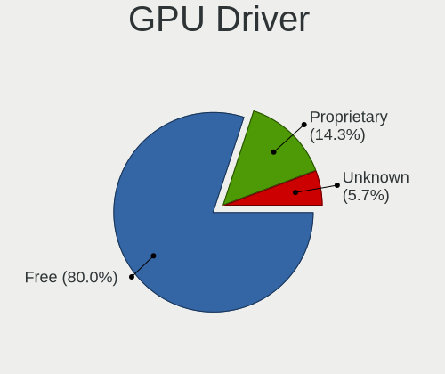
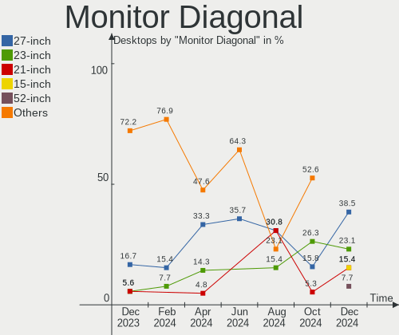

FreeBSD - Hardware Trends (Desktops)
------------------------------------

A project to identify most popular hardware characteristics and track their change
over time based on data collected by BSD users at https://BSD-Hardware.info.

Anyone can contribute to this report by the [hw-probe](https://github.com/linuxhw/hw-probe/blob/master/INSTALL.BSD.md) tool:

    hw-probe -all -upload

This report is for one last month. Overall report since the beginning of time: [TestCoverage](https://github.com/bsdhw/TestCoverage)

Period: Jun, 2022.

Contents
--------

* [ System ](#system)
  - [ OS                       ](#os)
  - [ OS Family                ](#os-family)
  - [ Arch                     ](#arch)
  - [ DE                       ](#de)
  - [ Display Server           ](#display-server)
  - [ Display Manager          ](#display-manager)
  - [ OS Lang                  ](#os-lang)
  - [ Boot Mode                ](#boot-mode)
  - [ Filesystem               ](#filesystem)
  - [ Part. scheme             ](#part-scheme)

* [ Board ](#board)
  - [ Vendor                   ](#vendor)
  - [ Model                    ](#model)
  - [ Model Family             ](#model-family)
  - [ MFG Year                 ](#mfg-year)
  - [ Form Factor              ](#form-factor)
  - [ Coreboot                 ](#coreboot)
  - [ RAM Size                 ](#ram-size)
  - [ RAM Used                 ](#ram-used)
  - [ Total Drives             ](#total-drives)
  - [ Has CD-ROM               ](#has-cd-rom)
  - [ Has Ethernet             ](#has-ethernet)
  - [ Has WiFi                 ](#has-wifi)
  - [ Has Bluetooth            ](#has-bluetooth)

* [ Location ](#location)
  - [ Country                  ](#country)
  - [ City                     ](#city)

* [ Drives ](#drives)
  - [ Drive Vendor             ](#drive-vendor)
  - [ Drive Model              ](#drive-model)
  - [ HDD Vendor               ](#hdd-vendor)
  - [ SSD Vendor               ](#ssd-vendor)
  - [ Drive Kind               ](#drive-kind)
  - [ Drive Connector          ](#drive-connector)
  - [ Drive Size               ](#drive-size)
  - [ Space Total              ](#space-total)
  - [ Space Used               ](#space-used)
  - [ Malfunc. Drives          ](#malfunc-drives)
  - [ Malfunc. Drive Vendor    ](#malfunc-drive-vendor)
  - [ Malfunc. HDD Vendor      ](#malfunc-hdd-vendor)
  - [ Malfunc. Drive Kind      ](#malfunc-drive-kind)
  - [ Failed Drives            ](#failed-drives)
  - [ Failed Drive Vendor      ](#failed-drive-vendor)
  - [ Drive Status             ](#drive-status)

* [ Storage controller ](#storage-controller)
  - [ Storage Vendor           ](#storage-vendor)
  - [ Storage Model            ](#storage-model)
  - [ Storage Kind             ](#storage-kind)

* [ Processor ](#processor)
  - [ CPU Vendor               ](#cpu-vendor)
  - [ CPU Model                ](#cpu-model)
  - [ CPU Model Family         ](#cpu-model-family)
  - [ CPU Cores                ](#cpu-cores)
  - [ CPU Sockets              ](#cpu-sockets)
  - [ CPU Threads              ](#cpu-threads)
  - [ CPU Microarch            ](#cpu-microarch)

* [ Graphics ](#graphics)
  - [ GPU Vendor               ](#gpu-vendor)
  - [ GPU Model                ](#gpu-model)
  - [ GPU Combo                ](#gpu-combo)
  - [ GPU Driver               ](#gpu-driver)
  - [ GPU Memory               ](#gpu-memory)

* [ Monitor ](#monitor)
  - [ Monitor Vendor           ](#monitor-vendor)
  - [ Monitor Model            ](#monitor-model)
  - [ Monitor Resolution       ](#monitor-resolution)
  - [ Monitor Diagonal         ](#monitor-diagonal)
  - [ Monitor Width            ](#monitor-width)
  - [ Aspect Ratio             ](#aspect-ratio)
  - [ Monitor Area             ](#monitor-area)
  - [ Pixel Density            ](#pixel-density)
  - [ Multiple Monitors        ](#multiple-monitors)

* [ Network ](#network)
  - [ Net Controller Vendor    ](#net-controller-vendor)
  - [ Net Controller Model     ](#net-controller-model)
  - [ Wireless Vendor          ](#wireless-vendor)
  - [ Wireless Model           ](#wireless-model)
  - [ Ethernet Vendor          ](#ethernet-vendor)
  - [ Ethernet Model           ](#ethernet-model)
  - [ Net Controller Kind      ](#net-controller-kind)
  - [ Used Controller          ](#used-controller)
  - [ NICs                     ](#nics)
  - [ IPv6                     ](#ipv6)

* [ Bluetooth ](#bluetooth)
  - [ Bluetooth Vendor         ](#bluetooth-vendor)
  - [ Bluetooth Model          ](#bluetooth-model)

* [ Sound ](#sound)
  - [ Sound Vendor             ](#sound-vendor)
  - [ Sound Model              ](#sound-model)

* [ Memory ](#memory)
  - [ Memory Vendor            ](#memory-vendor)
  - [ Memory Model             ](#memory-model)
  - [ Memory Kind              ](#memory-kind)
  - [ Memory Form Factor       ](#memory-form-factor)
  - [ Memory Size              ](#memory-size)
  - [ Memory Speed             ](#memory-speed)

* [ Printers & scanners ](#printers--scanners)
  - [ Printer Vendor           ](#printer-vendor)
  - [ Printer Model            ](#printer-model)
  - [ Scanner Vendor           ](#scanner-vendor)
  - [ Scanner Model            ](#scanner-model)

* [ Camera ](#camera)
  - [ Camera Vendor            ](#camera-vendor)
  - [ Camera Model             ](#camera-model)

* [ Security ](#security)
  - [ Fingerprint Vendor       ](#fingerprint-vendor)
  - [ Fingerprint Model        ](#fingerprint-model)
  - [ Chipcard Vendor          ](#chipcard-vendor)
  - [ Chipcard Model           ](#chipcard-model)

* [ Unsupported ](#unsupported)
  - [ Unsupported Devices      ](#unsupported-devices)
  - [ Unsupported Device Types ](#unsupported-device-types)

System
------

OS
--

Installed operating systems

| Name             | Desktops | Percent |
|------------------|----------|---------|
| FreeBSD 13.1     | 20       | 90.91%  |
| FreeBSD 13.0-p11 | 2        | 9.09%   |

OS Family
---------

OS without a version

| Name    | Desktops | Percent |
|---------|----------|---------|
| FreeBSD | 22       | 100%    |

Arch
----

OS architecture (x86_64, i586, etc.)

| Name  | Desktops | Percent |
|-------|----------|---------|
| amd64 | 22       | 100%    |

DE
--

Desktop Environment

| Name    | Desktops | Percent |
|---------|----------|---------|
| Console | 13       | 59.09%  |
| XFCE    | 2        | 9.09%   |
| TWM     | 2        | 9.09%   |
| MATE    | 2        | 9.09%   |
| KDE5    | 2        | 9.09%   |
| Openbox | 1        | 4.55%   |

Display Server
--------------

X11 or Wayland

| Name    | Desktops | Percent |
|---------|----------|---------|
| Console | 14       | 63.64%  |
| X11     | 8        | 36.36%  |

Display Manager
---------------

SDDM, LightDM, etc.

| Name    | Desktops | Percent |
|---------|----------|---------|
| Console | 16       | 72.73%  |
| SLiM    | 3        | 13.64%  |
| XDM     | 1        | 4.55%   |
| SDDM    | 1        | 4.55%   |
| LightDM | 1        | 4.55%   |

OS Lang
-------

Language

| Lang    | Desktops | Percent |
|---------|----------|---------|
| C       | 19       | 86.36%  |
| ru_RU   | 1        | 4.55%   |
| fr_FR   | 1        | 4.55%   |
| Unknown | 1        | 4.55%   |

Boot Mode
---------

EFI or BIOS

| Mode | Desktops | Percent |
|------|----------|---------|
| EFI  | 16       | 72.73%  |
| BIOS | 6        | 27.27%  |

Filesystem
----------

Type of filesystem

| Type | Desktops | Percent |
|------|----------|---------|
| Zfs  | 18       | 81.82%  |
| Ufs  | 4        | 18.18%  |

Part. scheme
------------

Scheme of partitioning

| Type | Desktops | Percent |
|------|----------|---------|
| GPT  | 22       | 100%    |

Board
-----

Vendor
------

Motherboard manufacturer

| Name                | Desktops | Percent |
|---------------------|----------|---------|
| ASUSTek Computer    | 7        | 31.82%  |
| MSI                 | 3        | 13.64%  |
| Gigabyte Technology | 3        | 13.64%  |
| ASRock              | 3        | 13.64%  |
| Hewlett-Packard     | 2        | 9.09%   |
| Dell                | 2        | 9.09%   |
| Supermicro          | 1        | 4.55%   |
| Intel               | 1        | 4.55%   |

Model
-----

Motherboard model

| Name                               | Desktops | Percent |
|------------------------------------|----------|---------|
| MSI MS-7817                        | 2        | 9.09%   |
| ASUS All Series                    | 2        | 9.09%   |
| Supermicro Icebreaker 4824         | 1        | 4.55%   |
| MSI MS-7D09                        | 1        | 4.55%   |
| Intel D945GCLF2 AAE46416-104       | 1        | 4.55%   |
| HP Desktop M01-F0xxx               | 1        | 4.55%   |
| HP Compaq dc7900 Small Form Factor | 1        | 4.55%   |
| Gigabyte H61MA-D3V                 | 1        | 4.55%   |
| Gigabyte F2A75M-D3H                | 1        | 4.55%   |
| Gigabyte B550M AORUS PRO-P         | 1        | 4.55%   |
| Dell OptiPlex 3080                 | 1        | 4.55%   |
| Dell Inspiron 3668                 | 1        | 4.55%   |
| ASUS ROG STRIX X570-F GAMING       | 1        | 4.55%   |
| ASUS ROG CROSSHAIR VIII HERO       | 1        | 4.55%   |
| ASUS PRIME Z590-P                  | 1        | 4.55%   |
| ASUS PRIME X370-PRO                | 1        | 4.55%   |
| ASUS P5Q-E                         | 1        | 4.55%   |
| ASRock X570 Phantom Gaming 4       | 1        | 4.55%   |
| ASRock P67 Professional            | 1        | 4.55%   |
| ASRock B550 Phantom Gaming-ITX/ax  | 1        | 4.55%   |

Model Family
------------

Motherboard model prefix

| Name                  | Desktops | Percent |
|-----------------------|----------|---------|
| MSI MS-7817           | 2        | 9.09%   |
| ASUS ROG              | 2        | 9.09%   |
| ASUS PRIME            | 2        | 9.09%   |
| ASUS All              | 2        | 9.09%   |
| Supermicro Icebreaker | 1        | 4.55%   |
| MSI MS-7D09           | 1        | 4.55%   |
| Intel D945GCLF2       | 1        | 4.55%   |
| HP Desktop            | 1        | 4.55%   |
| HP Compaq             | 1        | 4.55%   |
| Gigabyte H61MA-D3V    | 1        | 4.55%   |
| Gigabyte F2A75M-D3H   | 1        | 4.55%   |
| Gigabyte B550M        | 1        | 4.55%   |
| Dell OptiPlex         | 1        | 4.55%   |
| Dell Inspiron         | 1        | 4.55%   |
| ASUS P5Q-E            | 1        | 4.55%   |
| ASRock X570           | 1        | 4.55%   |
| ASRock P67            | 1        | 4.55%   |
| ASRock B550           | 1        | 4.55%   |

MFG Year
--------

Motherboard manufacture year

| Year | Desktops | Percent |
|------|----------|---------|
| 2021 | 3        | 13.64%  |
| 2020 | 3        | 13.64%  |
| 2019 | 3        | 13.64%  |
| 2014 | 3        | 13.64%  |
| 2013 | 2        | 9.09%   |
| 2008 | 2        | 9.09%   |
| 2022 | 1        | 4.55%   |
| 2018 | 1        | 4.55%   |
| 2017 | 1        | 4.55%   |
| 2012 | 1        | 4.55%   |
| 2011 | 1        | 4.55%   |
| 2009 | 1        | 4.55%   |

Form Factor
-----------

Physical design of the computer

| Name    | Desktops | Percent |
|---------|----------|---------|
| Desktop | 22       | 100%    |

Coreboot
--------

Have coreboot on board

| Used | Desktops | Percent |
|------|----------|---------|
| No   | 22       | 100%    |

RAM Size
--------

Total RAM memory

| Size in GB  | Desktops | Percent |
|-------------|----------|---------|
| 32.01-64.0  | 5        | 22.73%  |
| 64.01-256.0 | 4        | 18.18%  |
| 16.01-24.0  | 4        | 18.18%  |
| 8.01-16.0   | 4        | 18.18%  |
| 4.01-8.0    | 2        | 9.09%   |
| 3.01-4.0    | 1        | 4.55%   |
| 24.01-32.0  | 1        | 4.55%   |
| 2.01-3.0    | 1        | 4.55%   |

RAM Used
--------

Used RAM memory

| Used GB  | Desktops | Percent |
|----------|----------|---------|
| 0.01-0.5 | 8        | 36.36%  |
| 0.51-1.0 | 6        | 27.27%  |
| 1.01-2.0 | 5        | 22.73%  |
| 3.01-4.0 | 2        | 9.09%   |
| 2.01-3.0 | 1        | 4.55%   |

Total Drives
------------

Number of drives on board

| Drives | Desktops | Percent |
|--------|----------|---------|
| 3      | 6        | 27.27%  |
| 1      | 6        | 27.27%  |
| 4      | 4        | 18.18%  |
| 18     | 1        | 4.55%   |
| 15     | 1        | 4.55%   |
| 13     | 1        | 4.55%   |
| 10     | 1        | 4.55%   |
| 8      | 1        | 4.55%   |
| 6      | 1        | 4.55%   |

Has CD-ROM
----------

Has CD-ROM on board

| Presented | Desktops | Percent |
|-----------|----------|---------|
| No        | 12       | 54.55%  |
| Yes       | 10       | 45.45%  |

Has Ethernet
------------

Has Ethernet on board

| Presented | Desktops | Percent |
|-----------|----------|---------|
| Yes       | 22       | 100%    |

Has WiFi
--------

Has WiFi module

| Presented | Desktops | Percent |
|-----------|----------|---------|
| No        | 17       | 77.27%  |
| Yes       | 5        | 22.73%  |

Has Bluetooth
-------------

Has Bluetooth module

| Presented | Desktops | Percent |
|-----------|----------|---------|
| No        | 18       | 81.82%  |
| Yes       | 4        | 18.18%  |

Location
--------

Country
-------

Geographic location (country)

| Country     | Desktops | Percent |
|-------------|----------|---------|
| USA         | 9        | 40.91%  |
| Russia      | 3        | 13.64%  |
| France      | 2        | 9.09%   |
| Spain       | 1        | 4.55%   |
| New Zealand | 1        | 4.55%   |
| Netherlands | 1        | 4.55%   |
| Hungary     | 1        | 4.55%   |
| Germany     | 1        | 4.55%   |
| Croatia     | 1        | 4.55%   |
| Canada      | 1        | 4.55%   |
| Australia   | 1        | 4.55%   |

City
----

Geographic location (city)

| City            | Desktops | Percent |
|-----------------|----------|---------|
| Salem           | 2        | 9.09%   |
| Redmond         | 2        | 9.09%   |
| Omaha           | 2        | 9.09%   |
| Zagreb          | 1        | 4.55%   |
| Wenatchee       | 1        | 4.55%   |
| Wellington      | 1        | 4.55%   |
| Vaulx-en-Velin  | 1        | 4.55%   |
| Toronto         | 1        | 4.55%   |
| Tiel            | 1        | 4.55%   |
| Tamm            | 1        | 4.55%   |
| Sydney          | 1        | 4.55%   |
| St Petersburg   | 1        | 4.55%   |
| Pluvigner       | 1        | 4.55%   |
| Moscow          | 1        | 4.55%   |
| Madrid          | 1        | 4.55%   |
| Green Valley    | 1        | 4.55%   |
| Chelyabinsk     | 1        | 4.55%   |
| Budapest        | 1        | 4.55%   |
| Borrego Springs | 1        | 4.55%   |

Drives
------

Drive Vendor
------------

Hard drive vendors

| Vendor              | Desktops | Drives | Percent |
|---------------------|----------|--------|---------|
| WDC                 | 13       | 38     | 28.26%  |
| Samsung Electronics | 11       | 20     | 23.91%  |
| Seagate             | 10       | 32     | 21.74%  |
| Intel               | 5        | 6      | 10.87%  |
| Toshiba             | 2        | 7      | 4.35%   |
| Crucial             | 2        | 4      | 4.35%   |
| OCZ                 | 1        | 1      | 2.17%   |
| Kingston            | 1        | 1      | 2.17%   |
| Corsair             | 1        | 1      | 2.17%   |

Drive Model
-----------

Hard drive models

| Model                            | Desktops | Percent |
|----------------------------------|----------|---------|
| WDC WD30EFRX-68EUZN0 3TB         | 2        | 2.99%   |
| WDC WD10EZEX-08WN4A0 1TB         | 2        | 2.99%   |
| Seagate ST4000DM000-1F2168 4TB   | 2        | 2.99%   |
| WDC WD80EZZX-11CSGA0 8TB         | 1        | 1.49%   |
| WDC WD80EZAZ-11TDBA0 8TB         | 1        | 1.49%   |
| WDC WD80EMZZ-00TBGA0 8TB         | 1        | 1.49%   |
| WDC WD80EMAZ-00WJTA0 8TB         | 1        | 1.49%   |
| WDC WD80EFZX-68UW8N0 8TB         | 1        | 1.49%   |
| WDC WD80EFAX-68LHPN0 8TB         | 1        | 1.49%   |
| WDC WD80EDBZ-11B0ZA0 8TB         | 1        | 1.49%   |
| WDC WD40EZRZ-22GXCB0 4TB         | 1        | 1.49%   |
| WDC WD30EFRX-68N32N0 3TB         | 1        | 1.49%   |
| WDC WD30EFRX-68AX9N0 3TB         | 1        | 1.49%   |
| WDC WD20NMVW-11AV3S2 2TB         | 1        | 1.49%   |
| WDC WD1600AAJS-60M0A0 160GB      | 1        | 1.49%   |
| WDC WD15EADS-00P8B0 1.5TB        | 1        | 1.49%   |
| WDC WD140EFGX-68B0GN0 14TB       | 1        | 1.49%   |
| WDC WD120EMFZ-11A6JA0 12TB       | 1        | 1.49%   |
| WDC WD120EMAZ-11BLFA0 12TB       | 1        | 1.49%   |
| WDC WD10EZEX-60WN4A0 1TB         | 1        | 1.49%   |
| WDC WD10EZEX-60M2NA0 1TB         | 1        | 1.49%   |
| WDC WD100EMAZ-00WJTA0 10TB       | 1        | 1.49%   |
| WDC WD1002FAEX-00Z3A0 1TB        | 1        | 1.49%   |
| Toshiba HDWD110 1TB              | 1        | 1.49%   |
| Toshiba DT01ACA300 3TB           | 1        | 1.49%   |
| Toshiba DT01ABA300 3TB           | 1        | 1.49%   |
| Seagate ST8000VN0022-2EL112 8TB  | 1        | 1.49%   |
| Seagate ST8000AS0002-1NA17Z 8TB  | 1        | 1.49%   |
| Seagate ST5000LM000-2U8170 5TB   | 1        | 1.49%   |
| Seagate ST5000LM000-2AN170 5TB   | 1        | 1.49%   |
| Seagate ST4000VN008-2DR166 4TB   | 1        | 1.49%   |
| Seagate ST4000NM0035-1V4107 4TB  | 1        | 1.49%   |
| Seagate ST4000NM0035 4TB         | 1        | 1.49%   |
| Seagate ST320011A 20GB           | 1        | 1.49%   |
| Seagate ST31000524AS 1TB         | 1        | 1.49%   |
| Seagate ST3000NM0005-1V410N 3TB  | 1        | 1.49%   |
| Seagate ST1000DM010-2EP102 1TB   | 1        | 1.49%   |
| Seagate ST1000DM003-1SB102 1TB   | 1        | 1.49%   |
| Samsung SSD 980 PRO 500GB        | 1        | 1.49%   |
| Samsung SSD 980 PRO 1TB          | 1        | 1.49%   |
| Samsung SSD 970 EVO 1TB          | 1        | 1.49%   |
| Samsung SSD 960 EVO 500GB        | 1        | 1.49%   |
| Samsung SSD 870 QVO 2TB          | 1        | 1.49%   |
| Samsung SSD 870 QVO 1TB          | 1        | 1.49%   |
| Samsung SSD 860 QVO 1TB          | 1        | 1.49%   |
| Samsung SSD 860 EVO 500GB        | 1        | 1.49%   |
| Samsung SSD 850 EVO 250GB        | 1        | 1.49%   |
| Samsung SSD 850 EVO 1TB          | 1        | 1.49%   |
| Samsung SSD 840 PRO Series 256GB | 1        | 1.49%   |
| Samsung SSD 840 EVO 500GB        | 1        | 1.49%   |
| Samsung SSD 840 EVO 120GB        | 1        | 1.49%   |
| Samsung HD154UI 1.5TB            | 1        | 1.49%   |
| OCZ AGILITY 32GB                 | 1        | 1.49%   |
| Kingston SKC2500M8250G 250GB     | 1        | 1.49%   |
| Intel SSDSC2CT060A3 64GB         | 1        | 1.49%   |
| Intel SSDSC2BX400G4 400GB        | 1        | 1.49%   |
| Intel SSDSC2BF180A4L 180GB       | 1        | 1.49%   |
| Intel SSDSC2BB240G7 240GB        | 1        | 1.49%   |
| Intel SSDSA2CT040G3 40GB         | 1        | 1.49%   |
| Intel SSDPEKNW512G8H 512GB       | 1        | 1.49%   |

HDD Vendor
----------

Hard disk drive vendors

| Vendor              | Desktops | Drives | Percent |
|---------------------|----------|--------|---------|
| WDC                 | 13       | 38     | 50%     |
| Seagate             | 10       | 32     | 38.46%  |
| Toshiba             | 2        | 7      | 7.69%   |
| Samsung Electronics | 1        | 4      | 3.85%   |

SSD Vendor
----------

Solid state drive vendors

| Vendor              | Desktops | Drives | Percent |
|---------------------|----------|--------|---------|
| Samsung Electronics | 8        | 12     | 53.33%  |
| Intel               | 4        | 5      | 26.67%  |
| Crucial             | 2        | 2      | 13.33%  |
| OCZ                 | 1        | 1      | 6.67%   |

Drive Kind
----------

HDD or SSD

| Kind | Desktops | Drives | Percent |
|------|----------|--------|---------|
| HDD  | 18       | 81     | 48.65%  |
| SSD  | 13       | 20     | 35.14%  |
| NVMe | 6        | 9      | 16.22%  |

Drive Connector
---------------

SATA, SAS, NVMe, etc.

| Type | Desktops | Drives | Percent |
|------|----------|--------|---------|
| SATA | 20       | 101    | 76.92%  |
| NVMe | 6        | 9      | 23.08%  |

Drive Size
----------

Size of hard drive

| Size in TB | Desktops | Drives | Percent |
|------------|----------|--------|---------|
| 0.51-1.0   | 10       | 17     | 28.57%  |
| 0.01-0.5   | 10       | 15     | 28.57%  |
| 3.01-4.0   | 4        | 7      | 11.43%  |
| 2.01-3.0   | 3        | 16     | 8.57%   |
| 1.01-2.0   | 3        | 9      | 8.57%   |
| 4.01-10.0  | 3        | 33     | 8.57%   |
| 10.01-20.0 | 2        | 4      | 5.71%   |

Space Total
-----------

Amount of disk space available on the file system

| Size in GB | Desktops | Percent |
|------------|----------|---------|
| 251-500    | 6        | 27.27%  |
| 101-250    | 5        | 22.73%  |
| 501-1000   | 4        | 18.18%  |
| 2001-3000  | 3        | 13.64%  |
| 21-50      | 2        | 9.09%   |
| 1-20       | 1        | 4.55%   |
| 51-100     | 1        | 4.55%   |

Space Used
----------

Amount of used disk space

| Used GB | Desktops | Percent |
|---------|----------|---------|
| 1-20    | 21       | 95.45%  |
| 251-500 | 1        | 4.55%   |

Malfunc. Drives
---------------

Drive models with a malfunction

| Model                       | Desktops | Drives | Percent |
|-----------------------------|----------|--------|---------|
| WDC WD30EFRX-68EUZN0 3TB    | 1        | 3      | 50%     |
| WDC WD1600AAJS-60M0A0 160GB | 1        | 1      | 50%     |

Malfunc. Drive Vendor
---------------------

Vendors of faulty drives

| Vendor | Desktops | Drives | Percent |
|--------|----------|--------|---------|
| WDC    | 2        | 4      | 100%    |

Malfunc. HDD Vendor
-------------------

Vendors of faulty HDD drives

| Vendor | Desktops | Drives | Percent |
|--------|----------|--------|---------|
| WDC    | 2        | 4      | 100%    |

Malfunc. Drive Kind
-------------------

Kinds of faulty drives

| Kind | Desktops | Drives | Percent |
|------|----------|--------|---------|
| HDD  | 2        | 4      | 100%    |

Failed Drives
-------------

Failed drive models

Zero info for selected period =(

Failed Drive Vendor
-------------------

Failed drive vendors

Zero info for selected period =(

Drive Status
------------

Number of failed and malfunc. drives

| Status   | Desktops | Drives | Percent |
|----------|----------|--------|---------|
| Works    | 21       | 100    | 84%     |
| Detected | 2        | 6      | 8%      |
| Malfunc  | 2        | 4      | 8%      |

Storage controller
------------------

Storage Vendor
--------------

Storage controller vendors

| Vendor                      | Desktops | Percent |
|-----------------------------|----------|---------|
| Intel                       | 15       | 40.54%  |
| AMD                         | 7        | 18.92%  |
| Samsung Electronics         | 3        | 8.11%   |
| Marvell Technology Group    | 3        | 8.11%   |
| Broadcom / LSI              | 3        | 8.11%   |
| ASMedia Technology          | 2        | 5.41%   |
| Silicon Image               | 1        | 2.7%    |
| Phison Electronics          | 1        | 2.7%    |
| Micron/Crucial Technology   | 1        | 2.7%    |
| Kingston Technology Company | 1        | 2.7%    |

Storage Model
-------------

Storage controller models

| Model                                                                          | Desktops | Percent |
|--------------------------------------------------------------------------------|----------|---------|
| AMD FCH SATA Controller [AHCI mode]                                            | 5        | 11.9%   |
| Intel 8 Series/C220 Series Chipset Family 6-port SATA Controller 1 [AHCI mode] | 3        | 7.14%   |
| Broadcom / LSI SAS2008 PCI-Express Fusion-MPT SAS-2 [Falcon]                   | 3        | 7.14%   |
| Samsung NVMe SSD Controller PM9A1/PM9A3/980PRO                                 | 2        | 4.76%   |
| Intel 6 Series/C200 Series Chipset Family 6 port Desktop SATA AHCI Controller  | 2        | 4.76%   |
| Intel 500 Series Chipset Family SATA AHCI Controller                           | 2        | 4.76%   |
| AMD 500 Series Chipset SATA Controller                                         | 2        | 4.76%   |
| Silicon Image SiI 3124 PCI-X Serial ATA Controller                             | 1        | 2.38%   |
| Samsung NVMe SSD Controller SM981/PM981/PM983                                  | 1        | 2.38%   |
| Samsung NVMe SSD Controller SM961/PM961/SM963                                  | 1        | 2.38%   |
| Phison E16 PCIe4 NVMe Controller                                               | 1        | 2.38%   |
| Micron/Crucial P2 NVMe PCIe SSD                                                | 1        | 2.38%   |
| Marvell Group 88SE9172 SATA 6Gb/s Controller                                   | 1        | 2.38%   |
| Marvell Group 88SE9120 SATA 6Gb/s Controller                                   | 1        | 2.38%   |
| Marvell Group 88SE6111/6121 SATA II / PATA Controller                          | 1        | 2.38%   |
| Kingston Company KC2000 NVMe SSD                                               | 1        | 2.38%   |
| Intel SSD 660P Series                                                          | 1        | 2.38%   |
| Intel Q170/Q150/B150/H170/H110/Z170/CM236 Chipset SATA Controller [AHCI Mode]  | 1        | 2.38%   |
| Intel NM10/ICH7 Family SATA Controller [IDE mode]                              | 1        | 2.38%   |
| Intel C602 chipset 4-Port SATA Storage Control Unit                            | 1        | 2.38%   |
| Intel C600/X79 series chipset 6-Port SATA AHCI Controller                      | 1        | 2.38%   |
| Intel 9 Series Chipset Family SATA Controller [AHCI Mode]                      | 1        | 2.38%   |
| Intel 82801JI (ICH10 Family) SATA AHCI Controller                              | 1        | 2.38%   |
| Intel 82801JD/DO (ICH10 Family) SATA AHCI Controller                           | 1        | 2.38%   |
| Intel 400 Series Chipset Family SATA AHCI Controller                           | 1        | 2.38%   |
| Intel 4 Series Chipset PT IDER Controller                                      | 1        | 2.38%   |
| Intel 200 Series PCH SATA controller [AHCI mode]                               | 1        | 2.38%   |
| ASMedia ASM1166 Serial ATA Controller                                          | 1        | 2.38%   |
| ASMedia ASM1062 Serial ATA Controller                                          | 1        | 2.38%   |
| AMD X370 Series Chipset SATA Controller                                        | 1        | 2.38%   |

Storage Kind
------------

Kind of storage controller (IDE, SATA, NVMe, SAS, ...)

| Kind | Desktops | Percent |
|------|----------|---------|
| SATA | 21       | 61.76%  |
| NVMe | 6        | 17.65%  |
| SAS  | 3        | 8.82%   |
| IDE  | 3        | 8.82%   |
| RAID | 1        | 2.94%   |

Processor
---------

CPU Vendor
----------

Processor vendors

| Vendor | Desktops | Percent |
|--------|----------|---------|
| Intel  | 15       | 68.18%  |
| AMD    | 7        | 31.82%  |

CPU Model
---------

Processor models

| Model                                     | Desktops | Percent |
|-------------------------------------------|----------|---------|
| AMD Ryzen 9 3900X 12-Core Processor       | 2        | 9.09%   |
| Intel Xeon CPU E5-2650 v2 @ 2.60GHz       | 1        | 4.55%   |
| Intel Pentium CPU G3220 @ 3.00GHz         | 1        | 4.55%   |
| Intel Core i7-7700 CPU @ 3.60GHz          | 1        | 4.55%   |
| Intel Core i7-4790K CPU @ 4.00GHz         | 1        | 4.55%   |
| Intel Core i7-2600K CPU @ 3.40GHz         | 1        | 4.55%   |
| Intel Core i7-10700K CPU @ 3.80GHz        | 1        | 4.55%   |
| Intel Core i5-9400 CPU @ 2.90GHz          | 1        | 4.55%   |
| Intel Core i5-4690 CPU @ 3.50GHz          | 1        | 4.55%   |
| Intel Core i5-4570 CPU @ 3.20GHz          | 1        | 4.55%   |
| Intel Core i5-3470 CPU @ 3.20GHz          | 1        | 4.55%   |
| Intel Core i3-10100 CPU @ 3.60GHz         | 1        | 4.55%   |
| Intel Core 2 Quad CPU Q6600 @ 2.40GHz     | 1        | 4.55%   |
| Intel Core 2 Duo CPU E8500 @ 3.16GHz      | 1        | 4.55%   |
| Intel Atom CPU 330 @ 1.60GHz              | 1        | 4.55%   |
| Intel 11th Gen Core i7-11700 @ 2.50GHz    | 1        | 4.55%   |
| AMD Ryzen 9 5900X 12-Core Processor       | 1        | 4.55%   |
| AMD Ryzen 7 1700 Eight-Core Processor     | 1        | 4.55%   |
| AMD Ryzen 5 5600G with Radeon Graphics    | 1        | 4.55%   |
| AMD Ryzen 3 3300X 4-Core Processor        | 1        | 4.55%   |
| AMD A10-5800K APU with Radeon HD Graphics | 1        | 4.55%   |

CPU Model Family
----------------

Processor model prefix

| Model             | Desktops | Percent |
|-------------------|----------|---------|
| Intel Core i7     | 4        | 18.18%  |
| Intel Core i5     | 4        | 18.18%  |
| AMD Ryzen 9       | 3        | 13.64%  |
| Other             | 1        | 4.55%   |
| Intel Xeon        | 1        | 4.55%   |
| Intel Pentium     | 1        | 4.55%   |
| Intel Core i3     | 1        | 4.55%   |
| Intel Core 2 Quad | 1        | 4.55%   |
| Intel Core 2 Duo  | 1        | 4.55%   |
| Intel Atom        | 1        | 4.55%   |
| AMD Ryzen 7       | 1        | 4.55%   |
| AMD Ryzen 5       | 1        | 4.55%   |
| AMD Ryzen 3       | 1        | 4.55%   |
| AMD A10           | 1        | 4.55%   |

CPU Cores
---------

Number of processor cores

| Number  | Desktops | Percent |
|---------|----------|---------|
| 4       | 9        | 40.91%  |
| 24      | 3        | 13.64%  |
| 8       | 3        | 13.64%  |
| 16      | 2        | 9.09%   |
| 2       | 2        | 9.09%   |
| 12      | 1        | 4.55%   |
| 6       | 1        | 4.55%   |
| Unknown | 1        | 4.55%   |

CPU Sockets
-----------

Number of sockets

| Number | Desktops | Percent |
|--------|----------|---------|
| 1      | 21       | 95.45%  |
| 2      | 1        | 4.55%   |

CPU Threads
-----------

Threads per core (Hyper-Threading)

| Number  | Desktops | Percent |
|---------|----------|---------|
| 1       | 14       | 63.64%  |
| 2       | 7        | 31.82%  |
| Unknown | 1        | 4.55%   |

CPU Microarch
-------------

Microarchitecture

| Name        | Desktops | Percent |
|-------------|----------|---------|
| Haswell     | 4        | 18.18%  |
| Zen 2       | 3        | 13.64%  |
| Zen 3       | 2        | 9.09%   |
| KabyLake    | 2        | 9.09%   |
| IvyBridge   | 2        | 9.09%   |
| CometLake   | 2        | 9.09%   |
| Zen         | 1        | 4.55%   |
| SandyBridge | 1        | 4.55%   |
| Piledriver  | 1        | 4.55%   |
| Penryn      | 1        | 4.55%   |
| Core        | 1        | 4.55%   |
| Bonnell     | 1        | 4.55%   |
| Unknown     | 1        | 4.55%   |

Graphics
--------

GPU Vendor
----------

Vendors of graphics cards

| Vendor                     | Desktops | Percent |
|----------------------------|----------|---------|
| Nvidia                     | 8        | 34.78%  |
| Intel                      | 8        | 34.78%  |
| AMD                        | 6        | 26.09%  |
| Matrox Electronics Systems | 1        | 4.35%   |

GPU Model
---------

Graphics card models

| Model                                                                       | Desktops | Percent |
|-----------------------------------------------------------------------------|----------|---------|
| Intel Xeon E3-1200 v3/4th Gen Core Processor Integrated Graphics Controller | 4        | 16.67%  |
| Nvidia GP108 [GeForce GT 1030]                                              | 2        | 8.33%   |
| AMD Caicos XTX [Radeon HD 8490 / R5 235X OEM]                               | 2        | 8.33%   |
| Nvidia GT218 [NVS 300]                                                      | 1        | 4.17%   |
| Nvidia GP107 [GeForce GTX 1050]                                             | 1        | 4.17%   |
| Nvidia GP106 [GeForce GTX 1060 3GB]                                         | 1        | 4.17%   |
| Nvidia GP104 [GeForce GTX 1070]                                             | 1        | 4.17%   |
| Nvidia GK208B [GeForce GT 730]                                              | 1        | 4.17%   |
| Nvidia GK208B [GeForce GT 710]                                              | 1        | 4.17%   |
| Matrox Electronics Systems MGA G200eW WPCM450                               | 1        | 4.17%   |
| Intel Xeon E3-1200 v2/3rd Gen Core processor Graphics Controller            | 1        | 4.17%   |
| Intel RocketLake-S GT1 [UHD Graphics 750]                                   | 1        | 4.17%   |
| Intel CometLake-S GT2 [UHD Graphics 630]                                    | 1        | 4.17%   |
| Intel 82945G/GZ Integrated Graphics Controller                              | 1        | 4.17%   |
| AMD RV370 [Radeon X300/X550/X1050 Series] (Secondary)                       | 1        | 4.17%   |
| AMD RV370 [Radeon X300/X550/X1050 Series]                                   | 1        | 4.17%   |
| AMD Redwood XT [Radeon HD 5670/5690/5730]                                   | 1        | 4.17%   |
| AMD Cezanne                                                                 | 1        | 4.17%   |
| AMD Cedar [Radeon HD 5000/6000/7350/8350 Series]                            | 1        | 4.17%   |

GPU Combo
---------

Combinations of graphics cards

| Name           | Desktops | Percent |
|----------------|----------|---------|
| 1 x Nvidia     | 7        | 31.82%  |
| 1 x Intel      | 7        | 31.82%  |
| 1 x AMD        | 5        | 22.73%  |
| 2 x AMD        | 1        | 4.55%   |
| 1 x Matrox     | 1        | 4.55%   |
| Intel + Nvidia | 1        | 4.55%   |

GPU Driver
----------

Free vs proprietary

| Driver      | Desktops | Percent |
|-------------|----------|---------|
| Free        | 18       | 81.82%  |
| Proprietary | 4        | 18.18%  |

GPU Memory
----------

Total video memory

| Size in GB | Desktops | Percent |
|------------|----------|---------|
| Unknown    | 16       | 72.73%  |
| 0.51-1.0   | 3        | 13.64%  |
| 1.01-2.0   | 2        | 9.09%   |
| 0.01-0.5   | 1        | 4.55%   |

Monitor
-------

Monitor Vendor
--------------

Monitor vendors

| Vendor              | Desktops | Percent |
|---------------------|----------|---------|
| Vestel Elektronik   | 1        | 12.5%   |
| Samsung Electronics | 1        | 12.5%   |
| Goldstar            | 1        | 12.5%   |
| Dell                | 1        | 12.5%   |
| Compal              | 1        | 12.5%   |
| BenQ                | 1        | 12.5%   |
| AOC                 | 1        | 12.5%   |
| Acer                | 1        | 12.5%   |

Monitor Model
-------------

Monitor models

| Model                                                              | Desktops | Percent |
|--------------------------------------------------------------------|----------|---------|
| Vestel Elektronik 32W_LCD_TV VES3700 1920x1080 710x400mm 32.1-inch | 1        | 11.11%  |
| Samsung Electronics LCD Monitor S24R35x 1920x1080                  | 1        | 11.11%  |
| Goldstar LG ULTRAGEAR GSM776E 2560x1440 700x390mm 31.5-inch        | 1        | 11.11%  |
| Dell E151FPp DEL7006 1024x768 300x230mm 14.9-inch                  | 1        | 11.11%  |
| Compal LCD Monitor WOR2760 2560x1440 600x340mm 27.2-inch           | 1        | 11.11%  |
| BenQ LCD Monitor PD3200Q                                           | 1        | 11.11%  |
| BenQ LCD Monitor GW2765                                            | 1        | 11.11%  |
| AOC U28P2G6B AOC2802 3840x2160 620x340mm 27.8-inch                 | 1        | 11.11%  |
| Acer RG270 ACR061E 1920x1080 600x340mm 27.2-inch                   | 1        | 11.11%  |

Monitor Resolution
------------------

Monitor screen resolution

| Resolution      | Desktops | Percent |
|-----------------|----------|---------|
| 2560x1440 (QHD) | 2        | 25%     |
| 1920x1080 (FHD) | 2        | 25%     |
| 3840x2160 (4K)  | 1        | 12.5%   |
| 1920x540        | 1        | 12.5%   |
| 1024x768 (XGA)  | 1        | 12.5%   |
| Unknown         | 1        | 12.5%   |

Monitor Diagonal
----------------

Diagonal size in inches

| Inches  | Desktops | Percent |
|---------|----------|---------|
| 27      | 3        | 37.5%   |
| Unknown | 2        | 25%     |
| 42      | 1        | 12.5%   |
| 31      | 1        | 12.5%   |
| 14      | 1        | 12.5%   |

Monitor Width
-------------

Physical width

| Width in mm | Desktops | Percent |
|-------------|----------|---------|
| 601-700     | 2        | 25%     |
| 501-600     | 2        | 25%     |
| Unknown     | 2        | 25%     |
| 201-300     | 1        | 12.5%   |
| 901-1000    | 1        | 12.5%   |

Aspect Ratio
------------

Proportional relationship between the width and the height

| Ratio   | Desktops | Percent |
|---------|----------|---------|
| 16/9    | 5        | 62.5%   |
| Unknown | 2        | 25%     |
| 4/3     | 1        | 12.5%   |

Monitor Area
------------

Area in inch²

| Area in inch² | Desktops | Percent |
|----------------|----------|---------|
| 301-350        | 3        | 37.5%   |
| Unknown        | 2        | 25%     |
| 351-500        | 1        | 12.5%   |
| 101-110        | 1        | 12.5%   |
| 501-1000       | 1        | 12.5%   |

Pixel Density
-------------

Pixels per inch

| Density | Desktops | Percent |
|---------|----------|---------|
| 51-100  | 4        | 50%     |
| Unknown | 2        | 25%     |
| 121-160 | 1        | 12.5%   |
| 101-120 | 1        | 12.5%   |

Multiple Monitors
-----------------

Total monitors connected

| Total | Desktops | Percent |
|-------|----------|---------|
| 0     | 13       | 59.09%  |
| 1     | 8        | 36.36%  |
| 2     | 1        | 4.55%   |

Network
-------

Net Controller Vendor
---------------------

Controller vendors

| Vendor                   | Desktops | Percent |
|--------------------------|----------|---------|
| Realtek Semiconductor    | 14       | 50%     |
| Intel                    | 11       | 39.29%  |
| Qualcomm Atheros         | 1        | 3.57%   |
| Marvell Technology Group | 1        | 3.57%   |
| Broadcom                 | 1        | 3.57%   |

Net Controller Model
--------------------

Controller models

| Model                                                             | Desktops | Percent |
|-------------------------------------------------------------------|----------|---------|
| Realtek RTL8111/8168/8411 PCI Express Gigabit Ethernet Controller | 10       | 28.57%  |
| Intel I211 Gigabit Network Connection                             | 4        | 11.43%  |
| Realtek RTL8125 2.5GbE Controller                                 | 3        | 8.57%   |
| Realtek RTL8188EUS 802.11n Wireless Network Adapter               | 2        | 5.71%   |
| Intel Ethernet Controller I225-V                                  | 2        | 5.71%   |
| Intel 82574L Gigabit Network Connection                           | 2        | 5.71%   |
| Realtek RTL8821CE 802.11ac PCIe Wireless Network Adapter          | 1        | 2.86%   |
| Qualcomm Atheros QCA9565 / AR9565 Wireless Network Adapter        | 1        | 2.86%   |
| Marvell Group 88E8056 PCI-E Gigabit Ethernet Controller           | 1        | 2.86%   |
| Marvell Group 88E8001 Gigabit Ethernet Controller                 | 1        | 2.86%   |
| Intel Wi-Fi 6 AX210/AX211/AX411 160MHz                            | 1        | 2.86%   |
| Intel Wi-Fi 6 AX200                                               | 1        | 2.86%   |
| Intel I350 Gigabit Network Connection                             | 1        | 2.86%   |
| Intel Ethernet Connection (2) I218-V                              | 1        | 2.86%   |
| Intel 82575GB Gigabit Network Connection                          | 1        | 2.86%   |
| Intel 82571EB/82571GB Gigabit Ethernet Controller (Copper)        | 1        | 2.86%   |
| Intel 82567LM-3 Gigabit Network Connection                        | 1        | 2.86%   |
| Broadcom BCM4352 802.11ac Wireless Network Adapter                | 1        | 2.86%   |

Wireless Vendor
---------------

Wireless vendors

| Vendor                | Desktops | Percent |
|-----------------------|----------|---------|
| Realtek Semiconductor | 3        | 42.86%  |
| Intel                 | 2        | 28.57%  |
| Qualcomm Atheros      | 1        | 14.29%  |
| Broadcom              | 1        | 14.29%  |

Wireless Model
--------------

Wireless models

| Model                                                      | Desktops | Percent |
|------------------------------------------------------------|----------|---------|
| Realtek RTL8188EUS 802.11n Wireless Network Adapter        | 2        | 28.57%  |
| Realtek RTL8821CE 802.11ac PCIe Wireless Network Adapter   | 1        | 14.29%  |
| Qualcomm Atheros QCA9565 / AR9565 Wireless Network Adapter | 1        | 14.29%  |
| Intel Wi-Fi 6 AX210/AX211/AX411 160MHz                     | 1        | 14.29%  |
| Intel Wi-Fi 6 AX200                                        | 1        | 14.29%  |
| Broadcom BCM4352 802.11ac Wireless Network Adapter         | 1        | 14.29%  |

Ethernet Vendor
---------------

Ethernet vendors

| Vendor                   | Desktops | Percent |
|--------------------------|----------|---------|
| Realtek Semiconductor    | 13       | 52%     |
| Intel                    | 11       | 44%     |
| Marvell Technology Group | 1        | 4%      |

Ethernet Model
--------------

Ethernet models

| Model                                                             | Desktops | Percent |
|-------------------------------------------------------------------|----------|---------|
| Realtek RTL8111/8168/8411 PCI Express Gigabit Ethernet Controller | 10       | 35.71%  |
| Intel I211 Gigabit Network Connection                             | 4        | 14.29%  |
| Realtek RTL8125 2.5GbE Controller                                 | 3        | 10.71%  |
| Intel Ethernet Controller I225-V                                  | 2        | 7.14%   |
| Intel 82574L Gigabit Network Connection                           | 2        | 7.14%   |
| Marvell Group 88E8056 PCI-E Gigabit Ethernet Controller           | 1        | 3.57%   |
| Marvell Group 88E8001 Gigabit Ethernet Controller                 | 1        | 3.57%   |
| Intel I350 Gigabit Network Connection                             | 1        | 3.57%   |
| Intel Ethernet Connection (2) I218-V                              | 1        | 3.57%   |
| Intel 82575GB Gigabit Network Connection                          | 1        | 3.57%   |
| Intel 82571EB/82571GB Gigabit Ethernet Controller (Copper)        | 1        | 3.57%   |
| Intel 82567LM-3 Gigabit Network Connection                        | 1        | 3.57%   |

Net Controller Kind
-------------------

Ethernet, WiFi or modem

| Kind     | Desktops | Percent |
|----------|----------|---------|
| Ethernet | 22       | 81.48%  |
| WiFi     | 5        | 18.52%  |

Used Controller
---------------

Currently used network controller

| Kind     | Desktops | Percent |
|----------|----------|---------|
| Ethernet | 21       | 95.45%  |
| WiFi     | 1        | 4.55%   |

NICs
----

Total network controllers on board

| Total | Desktops | Percent |
|-------|----------|---------|
| 1     | 11       | 50%     |
| 2     | 7        | 31.82%  |
| 5     | 2        | 9.09%   |
| 3     | 2        | 9.09%   |

IPv6
----

IPv6 vs IPv4

| Used | Desktops | Percent |
|------|----------|---------|
| No   | 18       | 81.82%  |
| Yes  | 4        | 18.18%  |

Bluetooth
---------

Bluetooth Vendor
----------------

Controller vendors

| Vendor                          | Desktops | Percent |
|---------------------------------|----------|---------|
| Realtek Semiconductor           | 1        | 25%     |
| Qualcomm Atheros Communications | 1        | 25%     |
| Intel                           | 1        | 25%     |
| ASUSTek Computer                | 1        | 25%     |

Bluetooth Model
---------------

Controller models

| Model                                                       | Desktops | Percent |
|-------------------------------------------------------------|----------|---------|
| Realtek  Bluetooth 4.2 Adapter                              | 1        | 25%     |
| Qualcomm Atheros Dell Wireless 1707 Bluetooth 4.0 LE Device | 1        | 25%     |
| Intel AX200 Bluetooth                                       | 1        | 25%     |
| ASUS Bluetooth USB module                                   | 1        | 25%     |

Sound
-----

Sound Vendor
------------

Sound card vendors

| Vendor | Desktops | Percent |
|--------|----------|---------|
| Intel  | 11       | 40.74%  |
| Nvidia | 8        | 29.63%  |
| AMD    | 8        | 29.63%  |

Sound Model
-----------

Sound card models

| Model                                                                             | Desktops | Percent |
|-----------------------------------------------------------------------------------|----------|---------|
| AMD Starship/Matisse HD Audio Controller                                          | 4        | 12.12%  |
| Intel Xeon E3-1200 v3/4th Gen Core Processor HD Audio Controller                  | 3        | 9.09%   |
| Intel 8 Series/C220 Series Chipset High Definition Audio Controller               | 3        | 9.09%   |
| Nvidia GP108 High Definition Audio Controller                                     | 2        | 6.06%   |
| Nvidia GK208 HDMI/DP Audio Controller                                             | 2        | 6.06%   |
| AMD Caicos HDMI Audio [Radeon HD 6450 / 7450/8450/8490 OEM / R5 230/235/235X OEM] | 2        | 6.06%   |
| Nvidia High Definition Audio Controller                                           | 1        | 3.03%   |
| Nvidia GP107GL High Definition Audio Controller                                   | 1        | 3.03%   |
| Nvidia GP106 High Definition Audio Controller                                     | 1        | 3.03%   |
| Nvidia GP104 High Definition Audio Controller                                     | 1        | 3.03%   |
| Intel Tiger Lake-H HD Audio Controller                                            | 1        | 3.03%   |
| Intel NM10/ICH7 Family High Definition Audio Controller                           | 1        | 3.03%   |
| Intel Comet Lake PCH-V cAVS                                                       | 1        | 3.03%   |
| Intel 9 Series Chipset Family HD Audio Controller                                 | 1        | 3.03%   |
| Intel 82801JI (ICH10 Family) HD Audio Controller                                  | 1        | 3.03%   |
| Intel 200 Series PCH HD Audio                                                     | 1        | 3.03%   |
| Intel 100 Series/C230 Series Chipset Family HD Audio Controller                   | 1        | 3.03%   |
| AMD Renoir Radeon High Definition Audio Controller                                | 1        | 3.03%   |
| AMD Redwood HDMI Audio [Radeon HD 5000 Series]                                    | 1        | 3.03%   |
| AMD FCH Azalia Controller                                                         | 1        | 3.03%   |
| AMD Family 17h/19h HD Audio Controller                                            | 1        | 3.03%   |
| AMD Cedar HDMI Audio [Radeon HD 5400/6300/7300 Series]                            | 1        | 3.03%   |
| Unknown                                                                           | 1        | 3.03%   |

Memory
------

Memory Vendor
-------------

Memory module vendors

| Vendor                       | Desktops | Percent |
|------------------------------|----------|---------|
| Samsung Electronics          | 6        | 24%     |
| Corsair                      | 5        | 20%     |
| Kingston                     | 4        | 16%     |
| G.Skill                      | 3        | 12%     |
| SK hynix                     | 1        | 4%      |
| Qimonda                      | 1        | 4%      |
| Patriot Memory (PDP Systems) | 1        | 4%      |
| Micron Technology            | 1        | 4%      |
| Crucial                      | 1        | 4%      |
| A-DATA Technology            | 1        | 4%      |
| Unknown                      | 1        | 4%      |

Memory Model
------------

Memory module models

| Model                                                                   | Desktops | Percent |
|-------------------------------------------------------------------------|----------|---------|
| SK hynix RAM HMA81GU6AFR8N-UH 8GB DIMM DDR4 2400MT/s                    | 1        | 4%      |
| Samsung RAM Module 8GB DIMM DDR4 2667MT/s                               | 1        | 4%      |
| Samsung RAM M393B2G70DB0 16GB DIMM DDR3 1333MT/s                        | 1        | 4%      |
| Samsung RAM M391B5273DH0-YH9 4GB DIMM DDR3 1333MT/s                     | 1        | 4%      |
| Samsung RAM M378B5273DH0-CH9 4GB DIMM DDR3 1333MT/s                     | 1        | 4%      |
| Samsung RAM M378A1K43CB2-CTD 8GB DIMM DDR4 2666MT/s                     | 1        | 4%      |
| Samsung RAM M3 78T5663EH3-CF7 2GB DIMM DDR2 800MT/s                     | 1        | 4%      |
| Qimonda RAM 64T128000EU2.5C2 1GB DIMM DDR2 800MT/s                      | 1        | 4%      |
| Patriot Memory (PDP Systems) RAM 3733 C17 Series 8GB DIMM DDR4 2133MT/s | 1        | 4%      |
| Micron RAM 4ATF51264AZ-2G3B1 4GB DIMM DDR4 2400MT/s                     | 1        | 4%      |
| Kingston RAM KHX3200C16D4/32GX 32GB DIMM DDR4 3200MT/s                  | 1        | 4%      |
| Kingston RAM KHX1866C10D3/ 8GB DIMM DDR3 933MT/s                        | 1        | 4%      |
| Kingston RAM KHX1600C10D3/8G 4GB DIMM DDR3 1600MT/s                     | 1        | 4%      |
| Kingston RAM 9965745-002.A00G 16GB DIMM DDR4 3000MT/s                   | 1        | 4%      |
| G.Skill RAM F4-3600C16-8GVKC 8GB DIMM DDR4 2133MT/s                     | 1        | 4%      |
| G.Skill RAM F4-3200C16-32GVK 32GB DIMM DDR4 2666MT/s                    | 1        | 4%      |
| G.Skill RAM F3-12800CL7-2GBRM 2GB DIMM DDR3 1600MT/s                    | 1        | 4%      |
| Crucial RAM BLS8G3D1609DS1S00. 8GB DIMM DDR3 1600MT/s                   | 1        | 4%      |
| Corsair RAM Module 2GB DIMM DDR2 533MT/s                                | 1        | 4%      |
| Corsair RAM CML8GX3M2A1600C9 4GB DIMM DDR3 1600MT/s                     | 1        | 4%      |
| Corsair RAM CMK32GX4M2E3200C16 16GB DIMM DDR4 2133MT/s                  | 1        | 4%      |
| Corsair RAM CMK32GX4M2D3600C18 16GB DIMM DDR4 3600MT/s                  | 1        | 4%      |
| Corsair RAM CMK16GX4M2B3200C16 8GB DIMM DDR4 3200MT/s                   | 1        | 4%      |
| A-DATA RAM Module 8GB DIMM DDR3 1600MT/s                                | 1        | 4%      |
| Unknown                                                                 | 1        | 4%      |

Memory Kind
-----------

Memory module kinds

| Kind | Desktops | Percent |
|------|----------|---------|
| DDR4 | 11       | 50%     |
| DDR3 | 8        | 36.36%  |
| DDR2 | 2        | 9.09%   |
| DDR  | 1        | 4.55%   |

Memory Form Factor
------------------

Physical design of the memory module

| Name | Desktops | Percent |
|------|----------|---------|
| DIMM | 22       | 100%    |

Memory Size
-----------

Memory module size

| Size  | Desktops | Percent |
|-------|----------|---------|
| 8192  | 10       | 40%     |
| 16384 | 4        | 16%     |
| 4096  | 4        | 16%     |
| 2048  | 4        | 16%     |
| 32768 | 2        | 8%      |
| 1024  | 1        | 4%      |

Memory Speed
------------

Memory module speed

| Speed | Desktops | Percent |
|-------|----------|---------|
| 1600  | 4        | 18.18%  |
| 2133  | 3        | 13.64%  |
| 1333  | 3        | 13.64%  |
| 3200  | 2        | 9.09%   |
| 2666  | 2        | 9.09%   |
| 800   | 2        | 9.09%   |
| 3600  | 1        | 4.55%   |
| 3000  | 1        | 4.55%   |
| 2667  | 1        | 4.55%   |
| 2400  | 1        | 4.55%   |
| 933   | 1        | 4.55%   |
| 533   | 1        | 4.55%   |

Printers & scanners
-------------------

Printer Vendor
--------------

Printer device vendors

| Vendor          | Desktops | Percent |
|-----------------|----------|---------|
| Hewlett-Packard | 1        | 100%    |

Printer Model
-------------

Printer device models

| Model            | Desktops | Percent |
|------------------|----------|---------|
| HP LaserJet 1012 | 1        | 100%    |

Scanner Vendor
--------------

Scanner device vendors

| Vendor | Desktops | Percent |
|--------|----------|---------|
| Canon  | 1        | 100%    |

Scanner Model
-------------

Scanner device models

| Model                   | Desktops | Percent |
|-------------------------|----------|---------|
| Canon CanoScan LiDE 220 | 1        | 100%    |

Camera
------

Camera Vendor
-------------

Camera device vendors

| Vendor                    | Desktops | Percent |
|---------------------------|----------|---------|
| SHENZHEN EMEET TECHNOLOGY | 1        | 100%    |

Camera Model
------------

Camera device models

| Model                                          | Desktops | Percent |
|------------------------------------------------|----------|---------|
| SHENZHEN EMEET TECHNOLOGY HD Webcam eMeet C960 | 1        | 100%    |

Security
--------

Fingerprint Vendor
------------------

Fingerprint sensor vendors

Zero info for selected period =(

Fingerprint Model
-----------------

Fingerprint sensor models

Zero info for selected period =(

Chipcard Vendor
---------------

Chipcard module vendors

Zero info for selected period =(

Chipcard Model
--------------

Chipcard module models

Zero info for selected period =(

Unsupported
-----------

Unsupported Devices
-------------------

Total unsupported devices on board

| Total | Desktops | Percent |
|-------|----------|---------|
| 1     | 10       | 45.45%  |
| 0     | 7        | 31.82%  |
| 2     | 4        | 18.18%  |
| 3     | 1        | 4.55%   |

Unsupported Device Types
------------------------

Types of unsupported devices

| Type                     | Desktops | Percent |
|--------------------------|----------|---------|
| Communication controller | 13       | 68.42%  |
| Net/wireless             | 2        | 10.53%  |
| Net/ethernet             | 1        | 5.26%   |
| Firewire controller      | 1        | 5.26%   |
| Card reader              | 1        | 5.26%   |
| Bluetooth                | 1        | 5.26%   |

