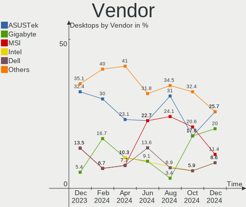
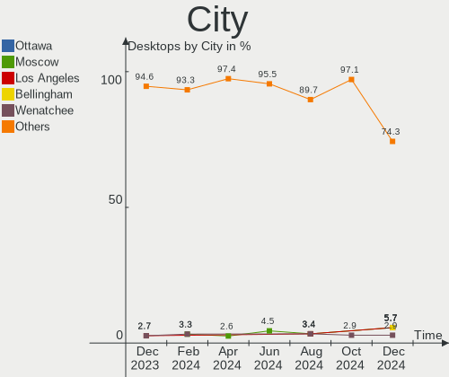
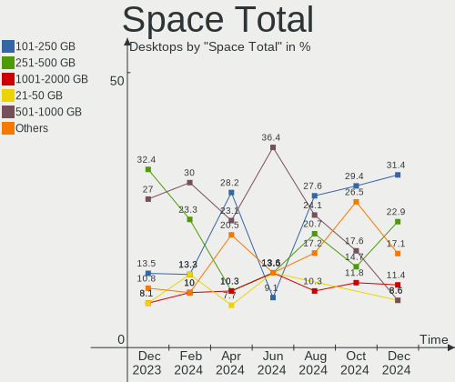
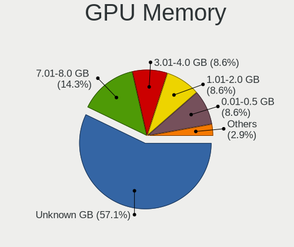

FreeBSD Hardware Trends (Desktops)
----------------------------------

A project to identify most popular hardware characteristics and track their change
over time based on data collected by FreeBSD users at https://BSD-Hardware.info.

Anyone can contribute to this report by the [hw-probe](https://github.com/linuxhw/hw-probe/blob/master/INSTALL.BSD.md) tool:

    hw-probe -all -upload

Full-feature report is available here: https://bsd-hardware.info/?view=trends

Period: Nov, 2021.

Contents
--------

* [ System ](#system)
  - [ OS                       ](#os)
  - [ OS Family                ](#os-family)
  - [ Arch                     ](#arch)
  - [ DE                       ](#de)
  - [ Display Server           ](#display-server)
  - [ Display Manager          ](#display-manager)
  - [ OS Lang                  ](#os-lang)
  - [ Boot Mode                ](#boot-mode)
  - [ Filesystem               ](#filesystem)
  - [ Part. scheme             ](#part-scheme)

* [ Board ](#board)
  - [ Vendor                   ](#vendor)
  - [ Model                    ](#model)
  - [ Model Family             ](#model-family)
  - [ MFG Year                 ](#mfg-year)
  - [ Form Factor              ](#form-factor)
  - [ Coreboot                 ](#coreboot)
  - [ RAM Size                 ](#ram-size)
  - [ RAM Used                 ](#ram-used)
  - [ Total Drives             ](#total-drives)
  - [ Has CD-ROM               ](#has-cd-rom)
  - [ Has Ethernet             ](#has-ethernet)
  - [ Has WiFi                 ](#has-wifi)
  - [ Has Bluetooth            ](#has-bluetooth)

* [ Location ](#location)
  - [ Country                  ](#country)
  - [ City                     ](#city)

* [ Drives ](#drives)
  - [ Drive Vendor             ](#drive-vendor)
  - [ Drive Model              ](#drive-model)
  - [ HDD Vendor               ](#hdd-vendor)
  - [ SSD Vendor               ](#ssd-vendor)
  - [ Drive Kind               ](#drive-kind)
  - [ Drive Connector          ](#drive-connector)
  - [ Drive Size               ](#drive-size)
  - [ Space Total              ](#space-total)
  - [ Space Used               ](#space-used)
  - [ Malfunc. Drives          ](#malfunc-drives)
  - [ Malfunc. Drive Vendor    ](#malfunc-drive-vendor)
  - [ Malfunc. HDD Vendor      ](#malfunc-hdd-vendor)
  - [ Malfunc. Drive Kind      ](#malfunc-drive-kind)
  - [ Failed Drives            ](#failed-drives)
  - [ Failed Drive Vendor      ](#failed-drive-vendor)
  - [ Drive Status             ](#drive-status)

* [ Storage controller ](#storage-controller)
  - [ Storage Vendor           ](#storage-vendor)
  - [ Storage Model            ](#storage-model)
  - [ Storage Kind             ](#storage-kind)

* [ Processor ](#processor)
  - [ CPU Vendor               ](#cpu-vendor)
  - [ CPU Model                ](#cpu-model)
  - [ CPU Model Family         ](#cpu-model-family)
  - [ CPU Cores                ](#cpu-cores)
  - [ CPU Sockets              ](#cpu-sockets)
  - [ CPU Threads              ](#cpu-threads)
  - [ CPU Microarch            ](#cpu-microarch)

* [ Graphics ](#graphics)
  - [ GPU Vendor               ](#gpu-vendor)
  - [ GPU Model                ](#gpu-model)
  - [ GPU Combo                ](#gpu-combo)
  - [ GPU Driver               ](#gpu-driver)
  - [ GPU Memory               ](#gpu-memory)

* [ Monitor ](#monitor)
  - [ Monitor Vendor           ](#monitor-vendor)
  - [ Monitor Model            ](#monitor-model)
  - [ Monitor Resolution       ](#monitor-resolution)
  - [ Monitor Diagonal         ](#monitor-diagonal)
  - [ Monitor Width            ](#monitor-width)
  - [ Aspect Ratio             ](#aspect-ratio)
  - [ Monitor Area             ](#monitor-area)
  - [ Pixel Density            ](#pixel-density)
  - [ Multiple Monitors        ](#multiple-monitors)

* [ Network ](#network)
  - [ Net Controller Vendor    ](#net-controller-vendor)
  - [ Net Controller Model     ](#net-controller-model)
  - [ Wireless Vendor          ](#wireless-vendor)
  - [ Wireless Model           ](#wireless-model)
  - [ Ethernet Vendor          ](#ethernet-vendor)
  - [ Ethernet Model           ](#ethernet-model)
  - [ Net Controller Kind      ](#net-controller-kind)
  - [ Used Controller          ](#used-controller)
  - [ NICs                     ](#nics)
  - [ IPv6                     ](#ipv6)

* [ Bluetooth ](#bluetooth)
  - [ Bluetooth Vendor         ](#bluetooth-vendor)
  - [ Bluetooth Model          ](#bluetooth-model)

* [ Sound ](#sound)
  - [ Sound Vendor             ](#sound-vendor)
  - [ Sound Model              ](#sound-model)

* [ Memory ](#memory)
  - [ Memory Vendor            ](#memory-vendor)
  - [ Memory Model             ](#memory-model)
  - [ Memory Kind              ](#memory-kind)
  - [ Memory Form Factor       ](#memory-form-factor)
  - [ Memory Size              ](#memory-size)
  - [ Memory Speed             ](#memory-speed)

* [ Printers & scanners ](#printers--scanners)
  - [ Printer Vendor           ](#printer-vendor)
  - [ Printer Model            ](#printer-model)
  - [ Scanner Vendor           ](#scanner-vendor)
  - [ Scanner Model            ](#scanner-model)

* [ Camera ](#camera)
  - [ Camera Vendor            ](#camera-vendor)
  - [ Camera Model             ](#camera-model)

* [ Security ](#security)
  - [ Fingerprint Vendor       ](#fingerprint-vendor)
  - [ Fingerprint Model        ](#fingerprint-model)
  - [ Chipcard Vendor          ](#chipcard-vendor)
  - [ Chipcard Model           ](#chipcard-model)

* [ Unsupported ](#unsupported)
  - [ Unsupported Devices      ](#unsupported-devices)
  - [ Unsupported Device Types ](#unsupported-device-types)

System
------

OS
--

Installed operating systems

| Name                 | Desktops | Percent |
|----------------------|----------|---------|
| FreeBSD 13.0-p5      | 12       | 30.77%  |
| FreeBSD 13.0-p4      | 8        | 20.51%  |
| FreeBSD 12.2-p6      | 4        | 10.26%  |
| FreeBSD 12.2-p10     | 4        | 10.26%  |
| FreeBSD 14.0-CURRENT | 2        | 5.13%   |
| FreeBSD 13.0-STABLE  | 2        | 5.13%   |
| FreeBSD 12.2-p11     | 2        | 5.13%   |
| FreeBSD 12.1-p13     | 2        | 5.13%   |
| FreeBSD 13.0         | 1        | 2.56%   |
| FreeBSD 12.2         | 1        | 2.56%   |
| FreeBSD 12.1-p9      | 1        | 2.56%   |

OS Family
---------

OS without a version

| Name    | Desktops | Percent |
|---------|----------|---------|
| FreeBSD | 39       | 100%    |

Arch
----

OS architecture (x86_64, i586, etc.)

| Name  | Desktops | Percent |
|-------|----------|---------|
| amd64 | 32       | 82.05%  |
| i386  | 4        | 10.26%  |
| arm64 | 3        | 7.69%   |

DE
--

Desktop Environment

| Name    | Desktops | Percent |
|---------|----------|---------|
| Console | 27       | 69.23%  |
| XFCE    | 3        | 7.69%   |
| MATE    | 3        | 7.69%   |
| KDE5    | 2        | 5.13%   |
| i3      | 2        | 5.13%   |
| Openbox | 1        | 2.56%   |
| LXQt    | 1        | 2.56%   |

Display Server
--------------

X11 or Wayland

| Name    | Desktops | Percent |
|---------|----------|---------|
| Console | 27       | 69.23%  |
| X11     | 12       | 30.77%  |

Display Manager
---------------

SDDM, LightDM, etc.

| Name    | Desktops | Percent |
|---------|----------|---------|
| Console | 32       | 82.05%  |
| SLiM    | 2        | 5.13%   |
| SDDM    | 2        | 5.13%   |
| LightDM | 2        | 5.13%   |
| XDM     | 1        | 2.56%   |

OS Lang
-------

Language

| Lang    | Desktops | Percent |
|---------|----------|---------|
| C       | 19       | 48.72%  |
| Unknown | 14       | 35.9%   |
| en_US   | 4        | 10.26%  |
| nl_NL   | 1        | 2.56%   |
| es_ES   | 1        | 2.56%   |

Boot Mode
---------

EFI or BIOS

| Mode | Desktops | Percent |
|------|----------|---------|
| BIOS | 22       | 56.41%  |
| EFI  | 17       | 43.59%  |

Filesystem
----------

Type of filesystem

| Type | Desktops | Percent |
|------|----------|---------|
| Zfs  | 24       | 61.54%  |
| Ufs  | 15       | 38.46%  |

Part. scheme
------------

Scheme of partitioning

| Type | Desktops | Percent |
|------|----------|---------|
| GPT  | 34       | 87.18%  |
| MBR  | 4        | 10.26%  |
| BSD  | 1        | 2.56%   |

Board
-----

Vendor
------

Motherboard manufacturer

| Name                | Desktops | Percent |
|---------------------|----------|---------|
| ASUSTek Computer    | 8        | 20.51%  |
| PC Engines          | 6        | 15.38%  |
| ASRock              | 5        | 12.82%  |
| MSI                 | 4        | 10.26%  |
| Hewlett-Packard     | 4        | 10.26%  |
| Unknown             | 3        | 7.69%   |
| Shuttle             | 2        | 5.13%   |
| Gigabyte Technology | 2        | 5.13%   |
| Supermicro          | 1        | 2.56%   |
| Lenovo              | 1        | 2.56%   |
| firefly             | 1        | 2.56%   |
| Dell                | 1        | 2.56%   |
| ASRockRack          | 1        | 2.56%   |

Model
-----

Motherboard model

| Name                                     | Desktops | Percent |
|------------------------------------------|----------|---------|
| PC Engines APU2                          | 3        | 7.69%   |
| PC Engines APU                           | 3        | 7.69%   |
| Unknown                                  | 3        | 7.69%   |
| MSI MS-9129                              | 2        | 5.13%   |
| ASUS P5Q-E                               | 2        | 5.13%   |
| ASRock Q1900B-ITX                        | 2        | 5.13%   |
| Supermicro X9SRE/X9SRE-3F/X9SRi/X9SRi-3F | 1        | 2.56%   |
| Shuttle XH270                            | 1        | 2.56%   |
| Shuttle SZ270R9                          | 1        | 2.56%   |
| MSI MS-7817                              | 1        | 2.56%   |
| MSI MS-7597                              | 1        | 2.56%   |
| Lenovo ThinkStation E31 255526G          | 1        | 2.56%   |
| HP ProLiant MicroServer Gen8             | 1        | 2.56%   |
| HP Pavilion Desktop TP01-1xxx            | 1        | 2.56%   |
| HP Compaq Elite 8300 SFF                 | 1        | 2.56%   |
| HP Compaq 6000 Pro SFF PC                | 1        | 2.56%   |
| Gigabyte GB-BACE-3150                    | 1        | 2.56%   |
| Gigabyte G41M-Combo                      | 1        | 2.56%   |
| firefly roc-rk3399-pc-plus               | 1        | 2.56%   |
| Dell OptiPlex 390                        | 1        | 2.56%   |
| ASUS TUF GAMING X570-PLUS                | 1        | 2.56%   |
| ASUS ROG CROSSHAIR VIII HERO             | 1        | 2.56%   |
| ASUS PRIME X370-PRO                      | 1        | 2.56%   |
| ASUS P9X79 WS                            | 1        | 2.56%   |
| ASUS P7P55D                              | 1        | 2.56%   |
| ASUS P4PE2-X                             | 1        | 2.56%   |
| ASRockRack E3C246D4U2-2T                 | 1        | 2.56%   |
| ASRock X570M Pro4                        | 1        | 2.56%   |
| ASRock X570 Phantom Gaming 4             | 1        | 2.56%   |
| ASRock 970 Extreme4                      | 1        | 2.56%   |

Model Family
------------

Motherboard model prefix

| Name                       | Desktops | Percent |
|----------------------------|----------|---------|
| PC Engines APU2            | 3        | 7.69%   |
| PC Engines APU             | 3        | 7.69%   |
| Unknown                    | 3        | 7.69%   |
| MSI MS-9129                | 2        | 5.13%   |
| HP Compaq                  | 2        | 5.13%   |
| ASUS P5Q-E                 | 2        | 5.13%   |
| ASRock Q1900B-ITX          | 2        | 5.13%   |
| Supermicro X9SRE           | 1        | 2.56%   |
| Shuttle XH270              | 1        | 2.56%   |
| Shuttle SZ270R9            | 1        | 2.56%   |
| MSI MS-7817                | 1        | 2.56%   |
| MSI MS-7597                | 1        | 2.56%   |
| Lenovo ThinkStation        | 1        | 2.56%   |
| HP ProLiant                | 1        | 2.56%   |
| HP Pavilion                | 1        | 2.56%   |
| Gigabyte GB-BACE-3150      | 1        | 2.56%   |
| Gigabyte G41M-Combo        | 1        | 2.56%   |
| firefly roc-rk3399-pc-plus | 1        | 2.56%   |
| Dell OptiPlex              | 1        | 2.56%   |
| ASUS TUF                   | 1        | 2.56%   |
| ASUS ROG                   | 1        | 2.56%   |
| ASUS PRIME                 | 1        | 2.56%   |
| ASUS P9X79                 | 1        | 2.56%   |
| ASUS P7P55D                | 1        | 2.56%   |
| ASUS P4PE2-X               | 1        | 2.56%   |
| ASRockRack E3C246D4U2-2T   | 1        | 2.56%   |
| ASRock X570M               | 1        | 2.56%   |
| ASRock X570                | 1        | 2.56%   |
| ASRock 970                 | 1        | 2.56%   |

MFG Year
--------

Motherboard manufacture year

| Year    | Desktops | Percent |
|---------|----------|---------|
| 2014    | 7        | 17.95%  |
| 2021    | 6        | 15.38%  |
| 2015    | 4        | 10.26%  |
| 2020    | 3        | 7.69%   |
| 2018    | 3        | 7.69%   |
| 2017    | 2        | 5.13%   |
| 2013    | 2        | 5.13%   |
| 2012    | 2        | 5.13%   |
| 2011    | 2        | 5.13%   |
| 2008    | 2        | 5.13%   |
| 2002    | 2        | 5.13%   |
| Unknown | 2        | 5.13%   |
| 2019    | 1        | 2.56%   |
| 2004    | 1        | 2.56%   |

Form Factor
-----------

Physical design of the computer

| Name    | Desktops | Percent |
|---------|----------|---------|
| Desktop | 39       | 100%    |

Coreboot
--------

Have coreboot on board

| Used | Desktops | Percent |
|------|----------|---------|
| No   | 33       | 84.62%  |
| Yes  | 6        | 15.38%  |

RAM Size
--------

Total RAM memory

| Size in GB  | Desktops | Percent |
|-------------|----------|---------|
| 4.01-8.0    | 12       | 30.77%  |
| 8.01-16.0   | 7        | 17.95%  |
| 64.01-256.0 | 5        | 12.82%  |
| 16.01-24.0  | 5        | 12.82%  |
| 32.01-64.0  | 3        | 7.69%   |
| 2.01-3.0    | 2        | 5.13%   |
| 0.51-1.0    | 2        | 5.13%   |
| 3.01-4.0    | 1        | 2.56%   |
| 1.01-2.0    | 1        | 2.56%   |
| 0.01-0.5    | 1        | 2.56%   |

RAM Used
--------

Used RAM memory

| Used GB     | Desktops | Percent |
|-------------|----------|---------|
| 0.01-0.5    | 17       | 43.59%  |
| 4.01-8.0    | 5        | 12.82%  |
| 0.51-1.0    | 5        | 12.82%  |
| 1.01-2.0    | 4        | 10.26%  |
| 2.01-3.0    | 3        | 7.69%   |
| 3.01-4.0    | 2        | 5.13%   |
| 64.01-256.0 | 2        | 5.13%   |
| 8.01-16.0   | 1        | 2.56%   |

Total Drives
------------

Number of drives on board

| Drives | Desktops | Percent |
|--------|----------|---------|
| 1      | 14       | 35.9%   |
| 2      | 9        | 23.08%  |
| 4      | 4        | 10.26%  |
| 3      | 4        | 10.26%  |
| 5      | 3        | 7.69%   |
| 0      | 2        | 5.13%   |
| 23     | 1        | 2.56%   |
| 13     | 1        | 2.56%   |
| 6      | 1        | 2.56%   |

Has CD-ROM
----------

Has CD-ROM on board

| Presented | Desktops | Percent |
|-----------|----------|---------|
| No        | 24       | 61.54%  |
| Yes       | 15       | 38.46%  |

Has Ethernet
------------

Has Ethernet on board

| Presented | Desktops | Percent |
|-----------|----------|---------|
| Yes       | 37       | 94.87%  |
| No        | 2        | 5.13%   |

Has WiFi
--------

Has WiFi module

| Presented | Desktops | Percent |
|-----------|----------|---------|
| No        | 33       | 84.62%  |
| Yes       | 6        | 15.38%  |

Has Bluetooth
-------------

Has Bluetooth module

| Presented | Desktops | Percent |
|-----------|----------|---------|
| No        | 36       | 92.31%  |
| Yes       | 3        | 7.69%   |

Location
--------

Country
-------

Geographic location (country)

| Country     | Desktops | Percent |
|-------------|----------|---------|
| USA         | 11       | 28.21%  |
| Czechia     | 9        | 23.08%  |
| Poland      | 5        | 12.82%  |
| UK          | 2        | 5.13%   |
| Germany     | 2        | 5.13%   |
| Ukraine     | 1        | 2.56%   |
| Switzerland | 1        | 2.56%   |
| Russia      | 1        | 2.56%   |
| Romania     | 1        | 2.56%   |
| Peru        | 1        | 2.56%   |
| Norway      | 1        | 2.56%   |
| Netherlands | 1        | 2.56%   |
| Indonesia   | 1        | 2.56%   |
| France      | 1        | 2.56%   |
| Finland     | 1        | 2.56%   |

City
----

Geographic location (city)

| City                  | Desktops | Percent |
|-----------------------|----------|---------|
| Tuklaty               | 8        | 20.51%  |
| Redmond               | 3        | 7.69%   |
| Salem                 | 2        | 5.13%   |
| Glincz                | 2        | 5.13%   |
| Yens                  | 1        | 2.56%   |
| Wenatchee             | 1        | 2.56%   |
| Sokal'                | 1        | 2.56%   |
| Ruthin                | 1        | 2.56%   |
| Rochester             | 1        | 2.56%   |
| Oxford                | 1        | 2.56%   |
| Ostrzeszow            | 1        | 2.56%   |
| Oslo                  | 1        | 2.56%   |
| Moscow                | 1        | 2.56%   |
| Maysel                | 1        | 2.56%   |
| Macon                 | 1        | 2.56%   |
| Limburg an der Lahn   | 1        | 2.56%   |
| Lima                  | 1        | 2.56%   |
| Kvetnice              | 1        | 2.56%   |
| Kingsport             | 1        | 2.56%   |
| Jakarta               | 1        | 2.56%   |
| Irving                | 1        | 2.56%   |
| Helsinki              | 1        | 2.56%   |
| Gdansk                | 1        | 2.56%   |
| Falkenstein           | 1        | 2.56%   |
| Drobeta-Turnu Severin | 1        | 2.56%   |
| Beckton               | 1        | 2.56%   |
| Amsterdam             | 1        | 2.56%   |
| ?»ukowo               | 1        | 2.56%   |

Drives
------

Drive Vendor
------------

Hard drive vendors

| Vendor              | Desktops | Drives | Percent |
|---------------------|----------|--------|---------|
| WDC                 | 18       | 64     | 30.51%  |
| Samsung Electronics | 9        | 18     | 15.25%  |
| Seagate             | 5        | 8      | 8.47%   |
| Kingston            | 5        | 5      | 8.47%   |
| Toshiba             | 4        | 5      | 6.78%   |
| HGST                | 3        | 5      | 5.08%   |
| Crucial             | 3        | 3      | 5.08%   |
| GOODRAM             | 2        | 3      | 3.39%   |
| Transcend           | 1        | 1      | 1.69%   |
| SK Hynix            | 1        | 1      | 1.69%   |
| SanDisk             | 1        | 1      | 1.69%   |
| Phison              | 1        | 1      | 1.69%   |
| MAXTOR              | 1        | 1      | 1.69%   |
| Intenso             | 1        | 1      | 1.69%   |
| Intel               | 1        | 1      | 1.69%   |
| Hitachi             | 1        | 1      | 1.69%   |
| Corsair             | 1        | 1      | 1.69%   |
| A-DATA Technology   | 1        | 1      | 1.69%   |

Drive Model
-----------

Hard drive models

| Model                                   | Desktops | Percent |
|-----------------------------------------|----------|---------|
| WDC WD20EFRX-68EUZN0 2TB                | 3        | 3.61%   |
| Kingston SMS200S360G 64GB               | 3        | 3.61%   |
| WDC WD5000AAKX-08U6AA0 500GB            | 2        | 2.41%   |
| WDC WD40EFRX-68WT0N0 4TB                | 2        | 2.41%   |
| Seagate ST4000DM000-1F2168 4TB          | 2        | 2.41%   |
| Samsung SSD 960 EVO 500GB               | 2        | 2.41%   |
| Samsung SSD 860 QVO 1TB                 | 2        | 2.41%   |
| Samsung SSD 850 EVO 1TB                 | 2        | 2.41%   |
| WDC WDS240G2G0A-00JH30 240GB            | 1        | 1.2%    |
| WDC WD80EMAZ-00WJTA0 8TB                | 1        | 1.2%    |
| WDC WD80EFZX-68UW8N0 8TB                | 1        | 1.2%    |
| WDC WD80EFAX-68LHPN0 8TB                | 1        | 1.2%    |
| WDC WD80EDBZ-11B0ZA0 8TB                | 1        | 1.2%    |
| WDC WD800JD-75MSA3 80GB                 | 1        | 1.2%    |
| WDC WD800JB-00JJC0 80GB                 | 1        | 1.2%    |
| WDC WD6002FRYZ-01WD5B1 6TB              | 1        | 1.2%    |
| WDC WD6002FRYZ-01WD5B0 6TB              | 1        | 1.2%    |
| WDC WD5000AAKX-60U6AA0 500GB            | 1        | 1.2%    |
| WDC WD5000AAKX-001CA0 500GB             | 1        | 1.2%    |
| WDC WD5000AADS-00S9B0 500GB             | 1        | 1.2%    |
| WDC WD40EZRZ-22GXCB0 4TB                | 1        | 1.2%    |
| WDC WD40EZRZ-00WN9B0 4TB                | 1        | 1.2%    |
| WDC WD40EZRZ-00GXCB0 4TB                | 1        | 1.2%    |
| WDC WD40EZRX-00SPEB0 4TB                | 1        | 1.2%    |
| WDC WD30EFRX-68EUZN0 3TB                | 1        | 1.2%    |
| WDC WD30EFRX-68AX9N0 3TB                | 1        | 1.2%    |
| WDC WD20NMVW-11AV3S2 2TB                | 1        | 1.2%    |
| WDC WD20EFRX-68AX9N0 2TB                | 1        | 1.2%    |
| WDC WD20EARX-00PASB0 2TB                | 1        | 1.2%    |
| WDC WD2000FYYZ-05UL1B0 2TB              | 1        | 1.2%    |
| WDC WD2000FYYZ-01UL1B1 2TB              | 1        | 1.2%    |
| WDC WD1600AAJS-60M0A1 160GB             | 1        | 1.2%    |
| WDC WD1600AAJS-22PSA0 160GB             | 1        | 1.2%    |
| WDC WD120EMFZ-11A6JA0 12TB              | 1        | 1.2%    |
| WDC WD120EMAZ-11BLFA0 12TB              | 1        | 1.2%    |
| WDC WD10EZEX-08WN4A0 1TB                | 1        | 1.2%    |
| WDC WD101KRYZ-01JPDB1 10TB              | 1        | 1.2%    |
| WDC WD1001FALS-00J7B0 1TB               | 1        | 1.2%    |
| Transcend TS32GMSA370 32GB              | 1        | 1.2%    |
| Toshiba Q300 120GB                      | 1        | 1.2%    |
| Toshiba MQ01ACF032 320GB                | 1        | 1.2%    |
| Toshiba MQ01ABD100 1TB                  | 1        | 1.2%    |
| Toshiba MK3261GSYN 320GB                | 1        | 1.2%    |
| Toshiba DT01ACA100 1TB                  | 1        | 1.2%    |
| SK Hynix BC511 HFM256GDJTNI-82A0A 256GB | 1        | 1.2%    |
| Seagate ST96812AS 64GB                  | 1        | 1.2%    |
| Seagate ST3250312AS 250GB               | 1        | 1.2%    |
| Seagate ST320LT007-9ZV142 320GB         | 1        | 1.2%    |
| SanDisk SDCFX-016G                      | 1        | 1.2%    |
| Samsung SSD 870 QVO 2TB                 | 1        | 1.2%    |
| Samsung SSD 860 EVO 500GB               | 1        | 1.2%    |
| Samsung SSD 860 EVO 1TB                 | 1        | 1.2%    |
| Samsung MZQLB960HAJR-00007 960GB        | 1        | 1.2%    |
| Samsung MZ7PD256HAFV-000H7 256GB        | 1        | 1.2%    |
| Samsung MZ7GE480HMHP-00003 480GB        | 1        | 1.2%    |
| Phison SATA SSD 16GB                    | 1        | 1.2%    |
| MAXTOR 6Y080M0 82GB                     | 1        | 1.2%    |
| Kingston SSDNow V Series 64GB           | 1        | 1.2%    |
| Kingston SMS200S3120G 120GB             | 1        | 1.2%    |
| Intenso SSD SATAIII 128GB               | 1        | 1.2%    |

HDD Vendor
----------

Hard disk drive vendors

| Vendor  | Desktops | Drives | Percent |
|---------|----------|--------|---------|
| WDC     | 17       | 60     | 56.67%  |
| Seagate | 5        | 8      | 16.67%  |
| Toshiba | 3        | 4      | 10%     |
| HGST    | 3        | 5      | 10%     |
| MAXTOR  | 1        | 1      | 3.33%   |
| Hitachi | 1        | 1      | 3.33%   |

SSD Vendor
----------

Solid state drive vendors

| Vendor              | Desktops | Drives | Percent |
|---------------------|----------|--------|---------|
| Samsung Electronics | 7        | 14     | 28%     |
| Kingston            | 5        | 5      | 20%     |
| Crucial             | 3        | 3      | 12%     |
| GOODRAM             | 2        | 3      | 8%      |
| WDC                 | 1        | 4      | 4%      |
| Transcend           | 1        | 1      | 4%      |
| Toshiba             | 1        | 1      | 4%      |
| SanDisk             | 1        | 1      | 4%      |
| Phison              | 1        | 1      | 4%      |
| Intenso             | 1        | 1      | 4%      |
| Intel               | 1        | 1      | 4%      |
| A-DATA Technology   | 1        | 1      | 4%      |

Drive Kind
----------

HDD or SSD

| Kind | Desktops | Drives | Percent |
|------|----------|--------|---------|
| HDD  | 24       | 79     | 47.06%  |
| SSD  | 22       | 36     | 43.14%  |
| NVMe | 5        | 6      | 9.8%    |

Drive Connector
---------------

SATA, SAS, NVMe, etc.

| Type | Desktops | Drives | Percent |
|------|----------|--------|---------|
| SATA | 36       | 115    | 87.8%   |
| NVMe | 5        | 6      | 12.2%   |

Drive Size
----------

Size of hard drive

| Size in TB | Desktops | Drives | Percent |
|------------|----------|--------|---------|
| 0.01-0.5   | 29       | 44     | 54.72%  |
| 3.01-4.0   | 6        | 16     | 11.32%  |
| 1.01-2.0   | 6        | 13     | 11.32%  |
| 0.51-1.0   | 5        | 14     | 9.43%   |
| 4.01-10.0  | 4        | 19     | 7.55%   |
| 2.01-3.0   | 2        | 7      | 3.77%   |
| 10.01-20.0 | 1        | 2      | 1.89%   |

Space Total
-----------

Amount of disk space available on the file system

| Size in GB     | Desktops | Percent |
|----------------|----------|---------|
| 251-500        | 11       | 28.21%  |
| 51-100         | 7        | 17.95%  |
| 101-250        | 5        | 12.82%  |
| 21-50          | 4        | 10.26%  |
| 501-1000       | 4        | 10.26%  |
| More than 3000 | 3        | 7.69%   |
| 1-20           | 3        | 7.69%   |
| 1001-2000      | 2        | 5.13%   |

Space Used
----------

Amount of used disk space

| Used GB        | Desktops | Percent |
|----------------|----------|---------|
| 1-20           | 30       | 76.92%  |
| 21-50          | 4        | 10.26%  |
| 1001-2000      | 2        | 5.13%   |
| 51-100         | 2        | 5.13%   |
| More than 3000 | 1        | 2.56%   |

Malfunc. Drives
---------------

Drive models with a malfunction

| Model                        | Desktops | Drives | Percent |
|------------------------------|----------|--------|---------|
| WDC WD20EFRX-68EUZN0 2TB     | 2        | 2      | 15.38%  |
| Kingston SMS200S360G 64GB    | 2        | 2      | 15.38%  |
| WDC WD800JB-00JJC0 80GB      | 1        | 1      | 7.69%   |
| WDC WD5000AAKX-60U6AA0 500GB | 1        | 1      | 7.69%   |
| WDC WD5000AAKX-001CA0 500GB  | 1        | 1      | 7.69%   |
| WDC WD5000AADS-00S9B0 500GB  | 1        | 1      | 7.69%   |
| WDC WD40EFRX-68WT0N0 4TB     | 1        | 4      | 7.69%   |
| WDC WD2000FYYZ-01UL1B1 2TB   | 1        | 2      | 7.69%   |
| Toshiba MK3261GSYN 320GB     | 1        | 1      | 7.69%   |
| Seagate ST96812AS 64GB       | 1        | 4      | 7.69%   |
| MAXTOR 6Y080M0 82GB          | 1        | 1      | 7.69%   |

Malfunc. Drive Vendor
---------------------

Vendors of faulty drives

| Vendor   | Desktops | Drives | Percent |
|----------|----------|--------|---------|
| WDC      | 8        | 12     | 61.54%  |
| Kingston | 2        | 2      | 15.38%  |
| Toshiba  | 1        | 1      | 7.69%   |
| Seagate  | 1        | 4      | 7.69%   |
| MAXTOR   | 1        | 1      | 7.69%   |

Malfunc. HDD Vendor
-------------------

Vendors of faulty HDD drives

| Vendor  | Desktops | Drives | Percent |
|---------|----------|--------|---------|
| WDC     | 8        | 12     | 72.73%  |
| Toshiba | 1        | 1      | 9.09%   |
| Seagate | 1        | 4      | 9.09%   |
| MAXTOR  | 1        | 1      | 9.09%   |

Malfunc. Drive Kind
-------------------

Kinds of faulty drives

| Kind | Desktops | Drives | Percent |
|------|----------|--------|---------|
| HDD  | 10       | 18     | 83.33%  |
| SSD  | 2        | 2      | 16.67%  |

Failed Drives
-------------

Failed drive models

Zero info for selected period =(

Failed Drive Vendor
-------------------

Failed drive vendors

Zero info for selected period =(

Drive Status
------------

Number of failed and malfunc. drives

| Status   | Desktops | Drives | Percent |
|----------|----------|--------|---------|
| Works    | 31       | 98     | 68.89%  |
| Malfunc  | 12       | 20     | 26.67%  |
| Detected | 2        | 3      | 4.44%   |

Storage controller
------------------

Storage Vendor
--------------

Storage controller vendors

| Vendor                   | Desktops | Percent |
|--------------------------|----------|---------|
| Intel                    | 21       | 39.62%  |
| AMD                      | 14       | 26.42%  |
| Samsung Electronics      | 3        | 5.66%   |
| Marvell Technology Group | 3        | 5.66%   |
| Broadcom / LSI           | 3        | 5.66%   |
| Silicon Image            | 2        | 3.77%   |
| Promise Technology       | 2        | 3.77%   |
| VMware                   | 1        | 1.89%   |
| SK Hynix                 | 1        | 1.89%   |
| Phison Electronics       | 1        | 1.89%   |
| Nvidia                   | 1        | 1.89%   |
| JMicron Technology       | 1        | 1.89%   |

Storage Model
-------------

Storage controller models

| Model                                                                                   | Desktops | Percent |
|-----------------------------------------------------------------------------------------|----------|---------|
| AMD FCH SATA Controller [AHCI mode]                                                     | 7        | 11.48%  |
| Intel 82801DB (ICH4) IDE Controller                                                     | 3        | 4.92%   |
| AMD SB7x0/SB8x0/SB9x0 SATA Controller [AHCI mode]                                       | 3        | 4.92%   |
| Samsung NVMe SSD Controller SM961/PM961/SM963                                           | 2        | 3.28%   |
| Promise PDC20276 (MBFastTrak133 Lite)                                                   | 2        | 3.28%   |
| Marvell Group 88SE6111/6121 SATA II / PATA Controller                                   | 2        | 3.28%   |
| Intel C600/X79 series chipset 6-Port SATA AHCI Controller                               | 2        | 3.28%   |
| Intel Atom Processor E3800 Series SATA AHCI Controller                                  | 2        | 3.28%   |
| Intel 82801JI (ICH10 Family) SATA AHCI Controller                                       | 2        | 3.28%   |
| Intel 7 Series/C210 Series Chipset Family 6-port SATA Controller [AHCI mode]            | 2        | 3.28%   |
| Intel 6 Series/C200 Series Chipset Family Desktop SATA Controller (IDE mode, ports 4-5) | 2        | 3.28%   |
| Intel 6 Series/C200 Series Chipset Family Desktop SATA Controller (IDE mode, ports 0-3) | 2        | 3.28%   |
| Intel 200 Series PCH SATA controller [AHCI mode]                                        | 2        | 3.28%   |
| Broadcom / LSI SAS2008 PCI-Express Fusion-MPT SAS-2 [Falcon]                            | 2        | 3.28%   |
| AMD FCH SATA Controller [IDE mode]                                                      | 2        | 3.28%   |
| VMware SATA AHCI controller                                                             | 1        | 1.64%   |
| SK Hynix BC511                                                                          | 1        | 1.64%   |
| Silicon Image SiI 3114 [SATALink/SATARaid] Serial ATA Controller                        | 1        | 1.64%   |
| Silicon Image SiI 3112 [SATALink/SATARaid] Serial ATA Controller                        | 1        | 1.64%   |
| Samsung NVMe SSD Controller SM981/PM981/PM983                                           | 1        | 1.64%   |
| Phison E16 PCIe4 NVMe Controller                                                        | 1        | 1.64%   |
| Nvidia MCP61 SATA Controller                                                            | 1        | 1.64%   |
| Nvidia MCP61 IDE                                                                        | 1        | 1.64%   |
| Marvell Group 88SE9128 PCIe SATA 6 Gb/s RAID controller with HyperDuo                   | 1        | 1.64%   |
| JMicron JMB363 SATA/IDE Controller                                                      | 1        | 1.64%   |
| Intel NM10/ICH7 Family SATA Controller [IDE mode]                                       | 1        | 1.64%   |
| Intel Cannon Lake PCH SATA AHCI Controller                                              | 1        | 1.64%   |
| Intel Atom/Celeron/Pentium Processor x5-E8000/J3xxx/N3xxx Series SATA Controller        | 1        | 1.64%   |
| Intel 82801JD/DO (ICH10 Family) SATA AHCI Controller                                    | 1        | 1.64%   |
| Intel 82801IR/IO/IH (ICH9R/DO/DH) 6 port SATA Controller [AHCI mode]                    | 1        | 1.64%   |
| Intel 8 Series/C220 Series Chipset Family 6-port SATA Controller 1 [AHCI mode]          | 1        | 1.64%   |
| Intel 5 Series/3400 Series Chipset 6 port SATA AHCI Controller                          | 1        | 1.64%   |
| Broadcom / LSI 53c1030 PCI-X Fusion-MPT Dual Ultra320 SCSI                              | 1        | 1.64%   |
| AMD X370 Series Chipset SATA Controller                                                 | 1        | 1.64%   |
| AMD SB7x0/SB8x0/SB9x0 SATA Controller [IDE mode]                                        | 1        | 1.64%   |
| AMD SB7x0/SB8x0/SB9x0 IDE Controller                                                    | 1        | 1.64%   |
| AMD CS5536 [Geode companion] IDE                                                        | 1        | 1.64%   |
| AMD 400 Series Chipset SATA Controller                                                  | 1        | 1.64%   |
| Unknown                                                                                 | 1        | 1.64%   |

Storage Kind
------------

Kind of storage controller (IDE, SATA, NVMe, SAS, ...)

| Kind | Desktops | Percent |
|------|----------|---------|
| SATA | 26       | 50.98%  |
| IDE  | 14       | 27.45%  |
| NVMe | 6        | 11.76%  |
| RAID | 2        | 3.92%   |
| SAS  | 2        | 3.92%   |
| SCSI | 1        | 1.96%   |

Processor
---------

CPU Vendor
----------

Processor vendors

| Vendor  | Desktops | Percent |
|---------|----------|---------|
| Intel   | 21       | 53.85%  |
| AMD     | 15       | 38.46%  |
| Unknown | 3        | 7.69%   |

CPU Model
---------

Processor models

| Model                                      | Desktops | Percent |
|--------------------------------------------|----------|---------|
| AMD Ryzen 9 3900X 12-Core Processor        | 3        | 7.69%   |
| AMD GX-412TC SOC                           | 3        | 7.69%   |
| AMD G-T40E Processor                       | 3        | 7.69%   |
|                                            | 3        | 7.69%   |
| Intel Core 2 Quad CPU Q6600 @ 2.40GHz      | 2        | 5.13%   |
| Intel Celeron CPU J1900 @ 1.99GHz          | 2        | 5.13%   |
| Intel Xeon E-2288G CPU @ 3.70GHz           | 1        | 2.56%   |
| Intel Xeon CPU E5-1650 v2 @ 3.50GHz        | 1        | 2.56%   |
| Intel Pentium CPU G3220 @ 3.00GHz          | 1        | 2.56%   |
| Intel Pentium 4                            | 1        | 2.56%   |
| Intel Core i7-3820 CPU @ 3.60GHz           | 1        | 2.56%   |
| Intel Core i7-3770 CPU @ 3.40GHz           | 1        | 2.56%   |
| Intel Core i5-6600 CPU @ 3.30GHz           | 1        | 2.56%   |
| Intel Core i5-3550 CPU @ 3.30GHz           | 1        | 2.56%   |
| Intel Core i5-2400 CPU @ 3.10GH            | 1        | 2.56%   |
| Intel Core i5 CPU 650 @ 3.20GHz            | 1        | 2.56%   |
| Intel Core i3-6100 CPU @ 3.70GHz           | 1        | 2.56%   |
| Intel Core 2 Quad CPU Q8400 @ 2.66GHz      | 1        | 2.56%   |
| Intel Core 2 Duo CPU E8400 @               | 1        | 2.56%   |
| Intel Celeron D CPU 2.40GHz                | 1        | 2.56%   |
| Intel Celeron CPU N3150 @ 1.60GHz          | 1        | 2.56%   |
| Intel Celeron CPU G1610T @ 2.30GHz         | 1        | 2.56%   |
| Intel Celeron                              | 1        | 2.56%   |
| AMD Sempron 130 Processor                  | 1        | 2.56%   |
| AMD Ryzen 7 1700 Eight-Core Processor      | 1        | 2.56%   |
| AMD Ryzen 5 PRO 5650G with Radeon Graphics | 1        | 2.56%   |
| AMD Ryzen 5 4600G with Radeon Graphics     | 1        | 2.56%   |
| AMD Geode Integrated Processor by PCS      | 1        | 2.56%   |
| AMD FX-8350 Eight-Core Processor           | 1        | 2.56%   |

CPU Model Family
----------------

Processor model prefix

| Model                | Desktops | Percent |
|----------------------|----------|---------|
| Intel Celeron        | 5        | 12.82%  |
| Intel Core i5        | 4        | 10.26%  |
| Other                | 3        | 7.69%   |
| Intel Core 2 Quad    | 3        | 7.69%   |
| AMD Ryzen 9          | 3        | 7.69%   |
| AMD GX               | 3        | 7.69%   |
| AMD G                | 3        | 7.69%   |
| Intel Xeon           | 2        | 5.13%   |
| Intel Core i7        | 2        | 5.13%   |
| Intel Pentium 4      | 1        | 2.56%   |
| Intel Pentium        | 1        | 2.56%   |
| Intel Core i3        | 1        | 2.56%   |
| Intel Core 2 Duo     | 1        | 2.56%   |
| Intel Celeron D      | 1        | 2.56%   |
| AMD Sempron          | 1        | 2.56%   |
| AMD Ryzen 7          | 1        | 2.56%   |
| AMD Ryzen 5 PRO      | 1        | 2.56%   |
| AMD Ryzen 5          | 1        | 2.56%   |
| AMD Geode Integrated | 1        | 2.56%   |
| AMD FX               | 1        | 2.56%   |

CPU Cores
---------

Number of processor cores

| Number  | Desktops | Percent |
|---------|----------|---------|
| 4       | 14       | 35.9%   |
| 2       | 7        | 17.95%  |
| 1       | 5        | 12.82%  |
| Unknown | 4        | 10.26%  |
| 24      | 3        | 7.69%   |
| 12      | 2        | 5.13%   |
| 8       | 2        | 5.13%   |
| 16      | 1        | 2.56%   |
| 6       | 1        | 2.56%   |

CPU Sockets
-----------

Number of sockets

| Number  | Desktops | Percent |
|---------|----------|---------|
| 1       | 38       | 97.44%  |
| Unknown | 1        | 2.56%   |

CPU Threads
-----------

Threads per core (Hyper-Threading)

| Number  | Desktops | Percent |
|---------|----------|---------|
| 1       | 26       | 66.67%  |
| Unknown | 7        | 17.95%  |
| 2       | 6        | 15.38%  |

CPU Microarch
-------------

Microarchitecture

| Name        | Desktops | Percent |
|-------------|----------|---------|
| Zen 2       | 4        | 10.26%  |
| IvyBridge   | 4        | 10.26%  |
| Silvermont  | 3        | 7.69%   |
| Puma        | 3        | 7.69%   |
| NetBurst    | 3        | 7.69%   |
| Bobcat      | 3        | 7.69%   |
| Unknown     | 3        | 7.69%   |
| Skylake     | 2        | 5.13%   |
| SandyBridge | 2        | 5.13%   |
| Penryn      | 2        | 5.13%   |
| Core        | 2        | 5.13%   |
| Zen 3       | 1        | 2.56%   |
| Zen         | 1        | 2.56%   |
| Westmere    | 1        | 2.56%   |
| Piledriver  | 1        | 2.56%   |
| KabyLake    | 1        | 2.56%   |
| K10         | 1        | 2.56%   |
| Haswell     | 1        | 2.56%   |
| Geode       | 1        | 2.56%   |

Graphics
--------

GPU Vendor
----------

Vendors of graphics cards

| Vendor                     | Desktops | Percent |
|----------------------------|----------|---------|
| Intel                      | 12       | 36.36%  |
| Nvidia                     | 10       | 30.3%   |
| AMD                        | 7        | 21.21%  |
| Matrox Electronics Systems | 2        | 6.06%   |
| VMware                     | 1        | 3.03%   |
| ASPEED Technology          | 1        | 3.03%   |

GPU Model
---------

Graphics card models

| Model                                                                                    | Desktops | Percent |
|------------------------------------------------------------------------------------------|----------|---------|
| Intel HD Graphics 530                                                                    | 2        | 6.06%   |
| Intel Atom Processor Z36xxx/Z37xxx Series Graphics & Display                             | 2        | 6.06%   |
| Intel 4 Series Chipset Integrated Graphics Controller                                    | 2        | 6.06%   |
| AMD Rage 3 [Rage XL PCI]                                                                 | 2        | 6.06%   |
| Nvidia TU117 [GeForce GTX 1650]                                                          | 1        | 3.03%   |
| Nvidia NV34 [GeForce FX 5200]                                                            | 1        | 3.03%   |
| Nvidia GT218 [NVS 300]                                                                   | 1        | 3.03%   |
| Nvidia GT218 [GeForce 210]                                                               | 1        | 3.03%   |
| Nvidia GP108 [GeForce GT 1030]                                                           | 1        | 3.03%   |
| Nvidia GP106 [GeForce GTX 1060 3GB]                                                      | 1        | 3.03%   |
| Nvidia GP104 [GeForce GTX 1080]                                                          | 1        | 3.03%   |
| Nvidia G98 [GeForce 8400 GS Rev. 2]                                                      | 1        | 3.03%   |
| Nvidia G96C [GeForce 9400 GT]                                                            | 1        | 3.03%   |
| Nvidia C61 [GeForce 7025 / nForce 630a]                                                  | 1        | 3.03%   |
| Matrox Electronics Systems MGA G200eW WPCM450                                            | 1        | 3.03%   |
| Matrox Electronics Systems MGA G200EH                                                    | 1        | 3.03%   |
| Intel Xeon E3-1200 v3/4th Gen Core Processor Integrated Graphics Controller              | 1        | 3.03%   |
| Intel IvyBridge GT2 [HD Graphics 4000]                                                   | 1        | 3.03%   |
| Intel Coffee Lake UHD Graphics                                                           | 1        | 3.03%   |
| Intel Atom/Celeron/Pentium Processor x5-E8000/J3xxx/N3xxx Integrated Graphics Controller | 1        | 3.03%   |
| Intel Atom Processor D4xx/D5xx/N4xx/N5xx Integrated Graphics Controller                  | 1        | 3.03%   |
| Intel 2nd Generation Core Processor Family Integrated Graphics Controller                | 1        | 3.03%   |
| ASPEED Technology ASPEED Graphics Family                                                 | 1        | 3.03%   |
| AMD Renoir                                                                               | 1        | 3.03%   |
| AMD Park [Mobility Radeon HD 5430]                                                       | 1        | 3.03%   |
| AMD Oland XT [Radeon HD 8670 / R5 340X OEM / R7 250/350/350X OEM]                        | 1        | 3.03%   |
| AMD Cezanne                                                                              | 1        | 3.03%   |
| AMD Cedar [Radeon HD 5000/6000/7350/8350 Series]                                         | 1        | 3.03%   |
| Unknown                                                                                  | 1        | 3.03%   |

GPU Combo
---------

Combinations of graphics cards

| Name           | Desktops | Percent |
|----------------|----------|---------|
| Other          | 9        | 23.08%  |
| 1 x Nvidia     | 9        | 23.08%  |
| 1 x Intel      | 8        | 20.51%  |
| 1 x AMD        | 7        | 17.95%  |
| 1 x Matrox     | 2        | 5.13%   |
| 2 x Intel      | 1        | 2.56%   |
| 1 x VMware     | 1        | 2.56%   |
| Intel + Nvidia | 1        | 2.56%   |
| Intel + ASPEED | 1        | 2.56%   |

GPU Driver
----------

Free vs proprietary

| Driver      | Desktops | Percent |
|-------------|----------|---------|
| Free        | 27       | 69.23%  |
| Unknown     | 9        | 23.08%  |
| Proprietary | 3        | 7.69%   |

GPU Memory
----------

Total video memory

| Size in GB | Desktops | Percent |
|------------|----------|---------|
| Unknown    | 35       | 89.74%  |
| 7.01-8.0   | 1        | 2.56%   |
| 3.01-4.0   | 1        | 2.56%   |
| 1.01-2.0   | 1        | 2.56%   |
| 0.01-0.5   | 1        | 2.56%   |

Monitor
-------

Monitor Vendor
--------------

Monitor vendors

| Vendor              | Desktops | Percent |
|---------------------|----------|---------|
| Hewlett-Packard     | 2        | 28.57%  |
| Acer                | 2        | 28.57%  |
| ViewSonic           | 1        | 14.29%  |
| Samsung Electronics | 1        | 14.29%  |
| LG Electronics      | 1        | 14.29%  |

Monitor Model
-------------

Monitor models

| Model                                                             | Desktops | Percent |
|-------------------------------------------------------------------|----------|---------|
| ViewSonic LCD Monitor VX3276-QHD 2560x1440                        | 1        | 14.29%  |
| Samsung Electronics S27E390 SAM0C1B 1920x1080 600x340mm 27.2-inch | 1        | 14.29%  |
| LG Electronics LCD Monitor LG HDR WQHD 3440x1440                  | 1        | 14.29%  |
| Hewlett-Packard V24 HPN36B5 1920x1080 540x300mm 24.3-inch         | 1        | 14.29%  |
| Hewlett-Packard LA2306 HWP294B 1920x1080 510x290mm 23.1-inch      | 1        | 14.29%  |
| Acer G236HL ACR02EB 1920x1080 510x290mm 23.1-inch                 | 1        | 14.29%  |
| Acer AL1716 ACRAD46 1280x1024 340x270mm 17.1-inch                 | 1        | 14.29%  |

Monitor Resolution
------------------

Monitor screen resolution

| Resolution       | Desktops | Percent |
|------------------|----------|---------|
| 1920x1080 (FHD)  | 4        | 57.14%  |
| 3440x1440        | 1        | 14.29%  |
| 2560x1440 (QHD)  | 1        | 14.29%  |
| 1280x1024 (SXGA) | 1        | 14.29%  |

Monitor Diagonal
----------------

Diagonal size in inches

| Inches  | Desktops | Percent |
|---------|----------|---------|
| 23      | 2        | 28.57%  |
| Unknown | 2        | 28.57%  |
| 27      | 1        | 14.29%  |
| 24      | 1        | 14.29%  |
| 17      | 1        | 14.29%  |

Monitor Width
-------------

Physical width

| Width in mm | Desktops | Percent |
|-------------|----------|---------|
| 501-600     | 4        | 57.14%  |
| Unknown     | 2        | 28.57%  |
| 301-350     | 1        | 14.29%  |

Aspect Ratio
------------

Proportional relationship between the width and the height

| Ratio   | Desktops | Percent |
|---------|----------|---------|
| 16/9    | 4        | 57.14%  |
| Unknown | 2        | 28.57%  |
| 5/4     | 1        | 14.29%  |

Monitor Area
------------

Area in inch²

| Area in inch² | Desktops | Percent |
|----------------|----------|---------|
| 201-250        | 2        | 28.57%  |
| Unknown        | 2        | 28.57%  |
| 301-350        | 1        | 14.29%  |
| 251-300        | 1        | 14.29%  |
| 141-150        | 1        | 14.29%  |

Pixel Density
-------------

Pixels per inch

| Density | Desktops | Percent |
|---------|----------|---------|
| 51-100  | 5        | 71.43%  |
| Unknown | 2        | 28.57%  |

Multiple Monitors
-----------------

Total monitors connected

| Total | Desktops | Percent |
|-------|----------|---------|
| 0     | 32       | 82.05%  |
| 1     | 7        | 17.95%  |

Network
-------

Net Controller Vendor
---------------------

Controller vendors

| Vendor                   | Desktops | Percent |
|--------------------------|----------|---------|
| Intel                    | 22       | 46.81%  |
| Realtek Semiconductor    | 17       | 36.17%  |
| Qualcomm Atheros         | 2        | 4.26%   |
| Marvell Technology Group | 2        | 4.26%   |
| Xiaomi                   | 1        | 2.13%   |
| VIA Technologies         | 1        | 2.13%   |
| Broadcom                 | 1        | 2.13%   |
| American Megatrends      | 1        | 2.13%   |

Net Controller Model
--------------------

Controller models

| Model                                                             | Desktops | Percent |
|-------------------------------------------------------------------|----------|---------|
| Realtek RTL8111/8168/8411 PCI Express Gigabit Ethernet Controller | 13       | 23.64%  |
| Intel I211 Gigabit Network Connection                             | 7        | 12.73%  |
| Intel 82574L Gigabit Network Connection                           | 4        | 7.27%   |
| Realtek RTL8188EUS 802.11n Wireless Network Adapter               | 2        | 3.64%   |
| Marvell Group 88E8056 PCI-E Gigabit Ethernet Controller           | 2        | 3.64%   |
| Marvell Group 88E8001 Gigabit Ethernet Controller                 | 2        | 3.64%   |
| Intel I210 Gigabit Network Connection                             | 2        | 3.64%   |
| Intel 82579LM Gigabit Network Connection (Lewisville)             | 2        | 3.64%   |
| Intel 82557/8/9/0/1 Ethernet Pro 100                              | 2        | 3.64%   |
| Intel 82540EM Gigabit Ethernet Controller                         | 2        | 3.64%   |
| Xiaomi Mi/Redmi series (RNDIS)                                    | 1        | 1.82%   |
| VIA VT6105M [Rhine-III]                                           | 1        | 1.82%   |
| Realtek RTL8822CE 802.11ac PCIe Wireless Network Adapter          | 1        | 1.82%   |
| Realtek RTL8125 2.5GbE Controller                                 | 1        | 1.82%   |
| Realtek RTL-8100/8101L/8139 PCI Fast Ethernet Adapter             | 1        | 1.82%   |
| Realtek RTL-8029(AS)                                              | 1        | 1.82%   |
| Realtek Realtek Bluetooth Adapter                                 | 1        | 1.82%   |
| Qualcomm Atheros AR928X Wireless Network Adapter (PCI-Express)    | 1        | 1.82%   |
| Qualcomm Atheros AR8151 v2.0 Gigabit Ethernet                     | 1        | 1.82%   |
| Intel Wireless-AC 9260                                            | 1        | 1.82%   |
| Intel I350 Gigabit Network Connection                             | 1        | 1.82%   |
| Intel Ethernet Controller 10G X550T                               | 1        | 1.82%   |
| Intel 82579V Gigabit Network Connection                           | 1        | 1.82%   |
| Intel 82572EI Gigabit Ethernet Controller (Copper)                | 1        | 1.82%   |
| Intel 82567LM-3 Gigabit Network Connection                        | 1        | 1.82%   |
| Broadcom NetXtreme BCM5720 Gigabit Ethernet PCIe                  | 1        | 1.82%   |
| American Megatrends Virtual Ethernet                              | 1        | 1.82%   |

Wireless Vendor
---------------

Wireless vendors

| Vendor                | Desktops | Percent |
|-----------------------|----------|---------|
| Realtek Semiconductor | 4        | 66.67%  |
| Qualcomm Atheros      | 1        | 16.67%  |
| Intel                 | 1        | 16.67%  |

Wireless Model
--------------

Wireless models

| Model                                                          | Desktops | Percent |
|----------------------------------------------------------------|----------|---------|
| Realtek RTL8188EUS 802.11n Wireless Network Adapter            | 2        | 33.33%  |
| Realtek RTL8822CE 802.11ac PCIe Wireless Network Adapter       | 1        | 16.67%  |
| Realtek Realtek Bluetooth Adapter                              | 1        | 16.67%  |
| Qualcomm Atheros AR928X Wireless Network Adapter (PCI-Express) | 1        | 16.67%  |
| Intel Wireless-AC 9260                                         | 1        | 16.67%  |

Ethernet Vendor
---------------

Ethernet vendors

| Vendor                   | Desktops | Percent |
|--------------------------|----------|---------|
| Intel                    | 21       | 48.84%  |
| Realtek Semiconductor    | 15       | 34.88%  |
| Marvell Technology Group | 2        | 4.65%   |
| Xiaomi                   | 1        | 2.33%   |
| VIA Technologies         | 1        | 2.33%   |
| Qualcomm Atheros         | 1        | 2.33%   |
| Broadcom                 | 1        | 2.33%   |
| American Megatrends      | 1        | 2.33%   |

Ethernet Model
--------------

Ethernet models

| Model                                                             | Desktops | Percent |
|-------------------------------------------------------------------|----------|---------|
| Realtek RTL8111/8168/8411 PCI Express Gigabit Ethernet Controller | 13       | 26.53%  |
| Intel I211 Gigabit Network Connection                             | 7        | 14.29%  |
| Intel 82574L Gigabit Network Connection                           | 4        | 8.16%   |
| Marvell Group 88E8056 PCI-E Gigabit Ethernet Controller           | 2        | 4.08%   |
| Marvell Group 88E8001 Gigabit Ethernet Controller                 | 2        | 4.08%   |
| Intel I210 Gigabit Network Connection                             | 2        | 4.08%   |
| Intel 82579LM Gigabit Network Connection (Lewisville)             | 2        | 4.08%   |
| Intel 82557/8/9/0/1 Ethernet Pro 100                              | 2        | 4.08%   |
| Intel 82540EM Gigabit Ethernet Controller                         | 2        | 4.08%   |
| Xiaomi Mi/Redmi series (RNDIS)                                    | 1        | 2.04%   |
| VIA VT6105M [Rhine-III]                                           | 1        | 2.04%   |
| Realtek RTL8125 2.5GbE Controller                                 | 1        | 2.04%   |
| Realtek RTL-8100/8101L/8139 PCI Fast Ethernet Adapter             | 1        | 2.04%   |
| Realtek RTL-8029(AS)                                              | 1        | 2.04%   |
| Qualcomm Atheros AR8151 v2.0 Gigabit Ethernet                     | 1        | 2.04%   |
| Intel I350 Gigabit Network Connection                             | 1        | 2.04%   |
| Intel Ethernet Controller 10G X550T                               | 1        | 2.04%   |
| Intel 82579V Gigabit Network Connection                           | 1        | 2.04%   |
| Intel 82572EI Gigabit Ethernet Controller (Copper)                | 1        | 2.04%   |
| Intel 82567LM-3 Gigabit Network Connection                        | 1        | 2.04%   |
| Broadcom NetXtreme BCM5720 Gigabit Ethernet PCIe                  | 1        | 2.04%   |
| American Megatrends Virtual Ethernet                              | 1        | 2.04%   |

Net Controller Kind
-------------------

Ethernet, WiFi or modem

| Kind     | Desktops | Percent |
|----------|----------|---------|
| Ethernet | 37       | 86.05%  |
| WiFi     | 6        | 13.95%  |

Used Controller
---------------

Currently used network controller

| Kind     | Desktops | Percent |
|----------|----------|---------|
| Ethernet | 36       | 92.31%  |
| WiFi     | 3        | 7.69%   |

NICs
----

Total network controllers on board

| Total | Desktops | Percent |
|-------|----------|---------|
| 1     | 16       | 41.03%  |
| 2     | 13       | 33.33%  |
| 3     | 7        | 17.95%  |
| 0     | 2        | 5.13%   |
| 4     | 1        | 2.56%   |

IPv6
----

IPv6 vs IPv4

| Used | Desktops | Percent |
|------|----------|---------|
| No   | 28       | 71.79%  |
| Yes  | 11       | 28.21%  |

Bluetooth
---------

Bluetooth Vendor
----------------

Controller vendors

| Vendor                  | Desktops | Percent |
|-------------------------|----------|---------|
| Realtek Semiconductor   | 1        | 33.33%  |
| Intel                   | 1        | 33.33%  |
| Cambridge Silicon Radio | 1        | 33.33%  |

Bluetooth Model
---------------

Controller models

| Model                                               | Desktops | Percent |
|-----------------------------------------------------|----------|---------|
| Realtek  Bluetooth 4.2 Adapter                      | 1        | 33.33%  |
| Intel Wireless-AC 9260 Bluetooth Adapter            | 1        | 33.33%  |
| Cambridge Silicon Radio Bluetooth Dongle (HCI mode) | 1        | 33.33%  |

Sound
-----

Sound Vendor
------------

Sound card vendors

| Vendor | Desktops | Percent |
|--------|----------|---------|
| Intel  | 12       | 42.86%  |
| AMD    | 8        | 28.57%  |
| Nvidia | 7        | 25%     |
| VMware | 1        | 3.57%   |

Sound Model
-----------

Sound card models

| Model                                                                                             | Desktops | Percent |
|---------------------------------------------------------------------------------------------------|----------|---------|
| AMD Starship/Matisse HD Audio Controller                                                          | 3        | 9.68%   |
| Nvidia High Definition Audio Controller                                                           | 2        | 6.45%   |
| Intel 82801JI (ICH10 Family) HD Audio Controller                                                  | 2        | 6.45%   |
| Intel 7 Series/C216 Chipset Family High Definition Audio Controller                               | 2        | 6.45%   |
| AMD Renoir Radeon High Definition Audio Controller                                                | 2        | 6.45%   |
| AMD Family 17h (Models 10h-1fh) HD Audio Controller                                               | 2        | 6.45%   |
| AMD Cedar HDMI Audio [Radeon HD 5400/6300/7300 Series]                                            | 2        | 6.45%   |
| VMware HD Audio Controller                                                                        | 1        | 3.23%   |
| Nvidia TU107 GeForce GTX 1650 High Definition Audio Controller                                    | 1        | 3.23%   |
| Nvidia MCP61 High Definition Audio                                                                | 1        | 3.23%   |
| Nvidia GP108 High Definition Audio Controller                                                     | 1        | 3.23%   |
| Nvidia GP106 High Definition Audio Controller                                                     | 1        | 3.23%   |
| Nvidia GP104 High Definition Audio Controller                                                     | 1        | 3.23%   |
| Intel NM10/ICH7 Family High Definition Audio Controller                                           | 1        | 3.23%   |
| Intel Atom/Celeron/Pentium Processor x5-E8000/J3xxx/N3xxx Series High Definition Audio Controller | 1        | 3.23%   |
| Intel Atom Processor Z36xxx/Z37xxx Series High Definition Audio Controller                        | 1        | 3.23%   |
| Intel 82801JD/DO (ICH10 Family) HD Audio Controller                                               | 1        | 3.23%   |
| Intel 82801DB/DBL/DBM (ICH4/ICH4-L/ICH4-M) AC'97 Audio Controller                                 | 1        | 3.23%   |
| Intel 8 Series/C220 Series Chipset High Definition Audio Controller                               | 1        | 3.23%   |
| Intel 6 Series/C200 Series Chipset Family High Definition Audio Controller                        | 1        | 3.23%   |
| Intel 5 Series/3400 Series Chipset High Definition Audio                                          | 1        | 3.23%   |
| AMD SBx00 Azalia (Intel HDA)                                                                      | 1        | 3.23%   |
| AMD Oland/Hainan/Cape Verde/Pitcairn HDMI Audio [Radeon HD 7000 Series]                           | 1        | 3.23%   |

Memory
------

Memory Vendor
-------------

Memory module vendors

| Vendor              | Desktops | Percent |
|---------------------|----------|---------|
| Unknown             | 8        | 25%     |
| Samsung Electronics | 5        | 15.63%  |
| Kingston            | 5        | 15.63%  |
| G.Skill             | 4        | 12.5%   |
| GOODRAM             | 3        | 9.38%   |
| Micron Technology   | 2        | 6.25%   |
| Team                | 1        | 3.13%   |
| Ramaxel Technology  | 1        | 3.13%   |
| Hewlett-Packard     | 1        | 3.13%   |
| Corsair             | 1        | 3.13%   |
| Unknown             | 1        | 3.13%   |

Memory Model
------------

Memory module models

| Model                                                  | Desktops | Percent |
|--------------------------------------------------------|----------|---------|
| Unknown RAM Module 512MB DIMM SDRAM                    | 2        | 5.71%   |
| Unknown RAM Module 2GB DIMM DDR 800MT/s                | 2        | 5.71%   |
| G.Skill RAM F4-3200C16-32GVK 32GB DIMM DDR4 2666MT/s   | 2        | 5.71%   |
| Unknown RAM Module 4GB SODIMM DDR3 1333MT/s            | 1        | 2.86%   |
| Unknown RAM Module 4GB DIMM DDR 1333MT/s               | 1        | 2.86%   |
| Unknown RAM Module 4GB DIMM 400MT/s                    | 1        | 2.86%   |
| Unknown RAM Module 2GB SODIMM DDR2 667MT/s             | 1        | 2.86%   |
| Unknown RAM Module 1GB DIMM SDRAM                      | 1        | 2.86%   |
| Team RAM Dark-1600 4GB DIMM DDR3 1333MT/s              | 1        | 2.86%   |
| Samsung RAM M393B2G70QH0-YK0 16GB DIMM DDR3 1866MT/s   | 1        | 2.86%   |
| Samsung RAM M391A4G43AB1-CVF 32GB DIMM DDR4 2933MT/s   | 1        | 2.86%   |
| Samsung RAM M378B5773DH0-CH9 2GB DIMM DDR3 1333MT/s    | 1        | 2.86%   |
| Samsung RAM M378B5273DH0-CK0 4GB DIMM DDR3 1600MT/s    | 1        | 2.86%   |
| Samsung RAM M378B5173QH0-CK0 4GB DIMM DDR3 1600MT/s    | 1        | 2.86%   |
| Ramaxel RAM RMR5040ED58E9W1600 4GB DIMM DDR3 1600MT/s  | 1        | 2.86%   |
| Micron RAM 8JTF25664AZ-1G4M1 2GB DIMM DDR3 1333MT/s    | 1        | 2.86%   |
| Micron RAM 8JTF25664AZ-1G4D1 2GB DIMM DDR3 1333MT/s    | 1        | 2.86%   |
| Micron RAM 8ATF1G64AZ-3G2J1 8GB DIMM DDR4 3200MT/s     | 1        | 2.86%   |
| Kingston RAM KHX1600C10D3/8GX 8GB DIMM DDR3 1600MT/s   | 1        | 2.86%   |
| Kingston RAM 99U5428-082.A00LF 8GB DIMM DDR3 1600MT/s  | 1        | 2.86%   |
| Kingston RAM 9965745-002.A00G 16GB DIMM DDR4 3000MT/s  | 1        | 2.86%   |
| Kingston RAM 9965684-032.A00G 16GB DIMM DDR4 3200MT/s  | 1        | 2.86%   |
| Kingston RAM 9905471-074.A00LF 8GB DIMM DDR3 1600MT/s  | 1        | 2.86%   |
| Kingston RAM 9905403-518.A00LF 8GB DIMM DDR3 1600MT/s  | 1        | 2.86%   |
| HP RAM Module 4GB DIMM DDR3 1600MT/s                   | 1        | 2.86%   |
| GOODRAM RAM GR2400S464L17S/8G 8GB SODIMM DDR4 2400MT/s | 1        | 2.86%   |
| GOODRAM RAM GR2400D464L17S/8G 8GB DIMM DDR4 2400MT/s   | 1        | 2.86%   |
| GOODRAM RAM GR1333S364L9S/4G 4GB DIMM DDR3 1333MT/s    | 1        | 2.86%   |
| G.Skill RAM F3-1866C11-4GRSL 4GB DIMM DDR3 1400MT/s    | 1        | 2.86%   |
| G.Skill RAM F3-12800CL7-2GBRM 2GB DIMM DDR3 1600MT/s   | 1        | 2.86%   |
| Corsair RAM CMK16GX4M2B3200C16 8GB DIMM DDR4 3200MT/s  | 1        | 2.86%   |
| Unknown                                                | 1        | 2.86%   |

Memory Kind
-----------

Memory module kinds

| Kind    | Desktops | Percent |
|---------|----------|---------|
| DDR3    | 13       | 41.94%  |
| DDR4    | 9        | 29.03%  |
| SDRAM   | 4        | 12.9%   |
| DDR     | 3        | 9.68%   |
| DDR2    | 1        | 3.23%   |
| Unknown | 1        | 3.23%   |

Memory Form Factor
------------------

Physical design of the memory module

| Name   | Desktops | Percent |
|--------|----------|---------|
| DIMM   | 28       | 90.32%  |
| SODIMM | 3        | 9.68%   |

Memory Size
-----------

Memory module size

| Size  | Desktops | Percent |
|-------|----------|---------|
| 4096  | 10       | 31.25%  |
| 8192  | 7        | 21.88%  |
| 2048  | 5        | 15.63%  |
| 32768 | 3        | 9.38%   |
| 16384 | 3        | 9.38%   |
| 1024  | 2        | 6.25%   |
| 512   | 2        | 6.25%   |

Memory Speed
------------

Memory module speed

| Speed   | Desktops | Percent |
|---------|----------|---------|
| 1600    | 7        | 22.58%  |
| 1333    | 5        | 16.13%  |
| 3200    | 3        | 9.68%   |
| Unknown | 3        | 9.68%   |
| 2666    | 2        | 6.45%   |
| 2400    | 2        | 6.45%   |
| 800     | 2        | 6.45%   |
| 3000    | 1        | 3.23%   |
| 2933    | 1        | 3.23%   |
| 1866    | 1        | 3.23%   |
| 1400    | 1        | 3.23%   |
| 1066    | 1        | 3.23%   |
| 667     | 1        | 3.23%   |
| 400     | 1        | 3.23%   |

Printers & scanners
-------------------

Printer Vendor
--------------

Printer device vendors

Zero info for selected period =(

Printer Model
-------------

Printer device models

Zero info for selected period =(

Scanner Vendor
--------------

Scanner device vendors

Zero info for selected period =(

Scanner Model
-------------

Scanner device models

Zero info for selected period =(

Camera
------

Camera Vendor
-------------

Camera device vendors

| Vendor           | Desktops | Percent |
|------------------|----------|---------|
| Sonix Technology | 1        | 50%     |
| Logitech         | 1        | 50%     |

Camera Model
------------

Camera device models

| Model                | Desktops | Percent |
|----------------------|----------|---------|
| Sonix FHD Webcam     | 1        | 50%     |
| Logitech Webcam C270 | 1        | 50%     |

Security
--------

Fingerprint Vendor
------------------

Fingerprint sensor vendors

Zero info for selected period =(

Fingerprint Model
-----------------

Fingerprint sensor models

Zero info for selected period =(

Chipcard Vendor
---------------

Chipcard module vendors

Zero info for selected period =(

Chipcard Model
--------------

Chipcard module models

Zero info for selected period =(

Unsupported
-----------

Unsupported Devices
-------------------

Total unsupported devices on board

| Total | Desktops | Percent |
|-------|----------|---------|
| 0     | 21       | 53.85%  |
| 1     | 12       | 30.77%  |
| 2     | 5        | 12.82%  |
| 4     | 1        | 2.56%   |

Unsupported Device Types
------------------------

Types of unsupported devices

| Type                     | Desktops | Percent |
|--------------------------|----------|---------|
| Communication controller | 10       | 50%     |
| Firewire controller      | 4        | 20%     |
| Sound                    | 2        | 10%     |
| Net/ethernet             | 2        | 10%     |
| Net/wireless             | 1        | 5%      |
| Bluetooth                | 1        | 5%      |

