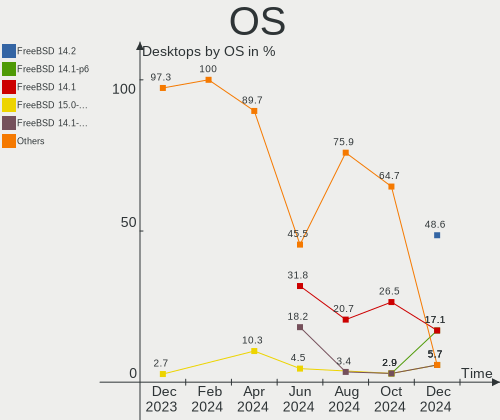
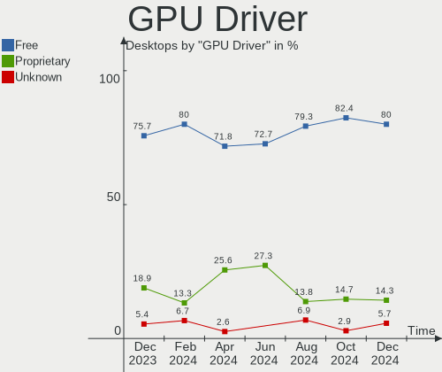
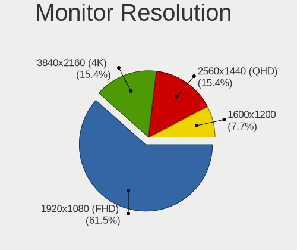

FreeBSD - Hardware Trends (Desktops)
------------------------------------

A project to identify most popular hardware characteristics and track their change
over time based on data collected by BSD users at https://BSD-Hardware.info.

Anyone can contribute to this report by the [hw-probe](https://github.com/linuxhw/hw-probe/blob/master/INSTALL.BSD.md) tool:

    hw-probe -all -upload

This report is for one last month. Overall report since the beginning of time: [TestDays](https://github.com/bsdhw/TestDays)

Period: Mar, 2023.

Contents
--------

* [ System ](#system)
  - [ OS                       ](#os)
  - [ OS Family                ](#os-family)
  - [ Arch                     ](#arch)
  - [ DE                       ](#de)
  - [ Display Server           ](#display-server)
  - [ Display Manager          ](#display-manager)
  - [ OS Lang                  ](#os-lang)
  - [ Boot Mode                ](#boot-mode)
  - [ Filesystem               ](#filesystem)
  - [ Part. scheme             ](#part-scheme)

* [ Board ](#board)
  - [ Vendor                   ](#vendor)
  - [ Model                    ](#model)
  - [ Model Family             ](#model-family)
  - [ MFG Year                 ](#mfg-year)
  - [ Form Factor              ](#form-factor)
  - [ Coreboot                 ](#coreboot)
  - [ RAM Size                 ](#ram-size)
  - [ RAM Used                 ](#ram-used)
  - [ Total Drives             ](#total-drives)
  - [ Has CD-ROM               ](#has-cd-rom)
  - [ Has Ethernet             ](#has-ethernet)
  - [ Has WiFi                 ](#has-wifi)
  - [ Has Bluetooth            ](#has-bluetooth)

* [ Location ](#location)
  - [ Country                  ](#country)
  - [ City                     ](#city)

* [ Drives ](#drives)
  - [ Drive Vendor             ](#drive-vendor)
  - [ Drive Model              ](#drive-model)
  - [ HDD Vendor               ](#hdd-vendor)
  - [ SSD Vendor               ](#ssd-vendor)
  - [ Drive Kind               ](#drive-kind)
  - [ Drive Connector          ](#drive-connector)
  - [ Drive Size               ](#drive-size)
  - [ Space Total              ](#space-total)
  - [ Space Used               ](#space-used)
  - [ Malfunc. Drives          ](#malfunc-drives)
  - [ Malfunc. Drive Vendor    ](#malfunc-drive-vendor)
  - [ Malfunc. HDD Vendor      ](#malfunc-hdd-vendor)
  - [ Malfunc. Drive Kind      ](#malfunc-drive-kind)
  - [ Failed Drives            ](#failed-drives)
  - [ Failed Drive Vendor      ](#failed-drive-vendor)
  - [ Drive Status             ](#drive-status)

* [ Storage controller ](#storage-controller)
  - [ Storage Vendor           ](#storage-vendor)
  - [ Storage Model            ](#storage-model)
  - [ Storage Kind             ](#storage-kind)

* [ Processor ](#processor)
  - [ CPU Vendor               ](#cpu-vendor)
  - [ CPU Model                ](#cpu-model)
  - [ CPU Model Family         ](#cpu-model-family)
  - [ CPU Cores                ](#cpu-cores)
  - [ CPU Sockets              ](#cpu-sockets)
  - [ CPU Threads              ](#cpu-threads)
  - [ CPU Microarch            ](#cpu-microarch)

* [ Graphics ](#graphics)
  - [ GPU Vendor               ](#gpu-vendor)
  - [ GPU Model                ](#gpu-model)
  - [ GPU Combo                ](#gpu-combo)
  - [ GPU Driver               ](#gpu-driver)
  - [ GPU Memory               ](#gpu-memory)

* [ Monitor ](#monitor)
  - [ Monitor Vendor           ](#monitor-vendor)
  - [ Monitor Model            ](#monitor-model)
  - [ Monitor Resolution       ](#monitor-resolution)
  - [ Monitor Diagonal         ](#monitor-diagonal)
  - [ Monitor Width            ](#monitor-width)
  - [ Aspect Ratio             ](#aspect-ratio)
  - [ Monitor Area             ](#monitor-area)
  - [ Pixel Density            ](#pixel-density)
  - [ Multiple Monitors        ](#multiple-monitors)

* [ Network ](#network)
  - [ Net Controller Vendor    ](#net-controller-vendor)
  - [ Net Controller Model     ](#net-controller-model)
  - [ Wireless Vendor          ](#wireless-vendor)
  - [ Wireless Model           ](#wireless-model)
  - [ Ethernet Vendor          ](#ethernet-vendor)
  - [ Ethernet Model           ](#ethernet-model)
  - [ Net Controller Kind      ](#net-controller-kind)
  - [ Used Controller          ](#used-controller)
  - [ NICs                     ](#nics)
  - [ IPv6                     ](#ipv6)

* [ Bluetooth ](#bluetooth)
  - [ Bluetooth Vendor         ](#bluetooth-vendor)
  - [ Bluetooth Model          ](#bluetooth-model)

* [ Sound ](#sound)
  - [ Sound Vendor             ](#sound-vendor)
  - [ Sound Model              ](#sound-model)

* [ Memory ](#memory)
  - [ Memory Vendor            ](#memory-vendor)
  - [ Memory Model             ](#memory-model)
  - [ Memory Kind              ](#memory-kind)
  - [ Memory Form Factor       ](#memory-form-factor)
  - [ Memory Size              ](#memory-size)
  - [ Memory Speed             ](#memory-speed)

* [ Printers & scanners ](#printers--scanners)
  - [ Printer Vendor           ](#printer-vendor)
  - [ Printer Model            ](#printer-model)
  - [ Scanner Vendor           ](#scanner-vendor)
  - [ Scanner Model            ](#scanner-model)

* [ Camera ](#camera)
  - [ Camera Vendor            ](#camera-vendor)
  - [ Camera Model             ](#camera-model)

* [ Security ](#security)
  - [ Fingerprint Vendor       ](#fingerprint-vendor)
  - [ Fingerprint Model        ](#fingerprint-model)
  - [ Chipcard Vendor          ](#chipcard-vendor)
  - [ Chipcard Model           ](#chipcard-model)

* [ Unsupported ](#unsupported)
  - [ Unsupported Devices      ](#unsupported-devices)
  - [ Unsupported Device Types ](#unsupported-device-types)

System
------

OS
--

Installed operating systems

| Name                 | Desktops | Percent |
|----------------------|----------|---------|
| FreeBSD 13.1-p7      | 18       | 50%     |
| FreeBSD 13.1-p5      | 3        | 8.33%   |
| FreeBSD 13.1         | 3        | 8.33%   |
| FreeBSD 14.0-CURRENT | 2        | 5.56%   |
| FreeBSD 13.2-STABLE  | 2        | 5.56%   |
| FreeBSD 13.2-RC5     | 1        | 2.78%   |
| FreeBSD 13.2-RC3     | 1        | 2.78%   |
| FreeBSD 13.1-STABLE  | 1        | 2.78%   |
| FreeBSD 13.1-p4      | 1        | 2.78%   |
| FreeBSD 13.1-p2      | 1        | 2.78%   |
| FreeBSD 13.0-p7      | 1        | 2.78%   |
| FreeBSD 12.4-STABLE  | 1        | 2.78%   |
| FreeBSD 12.4-p2      | 1        | 2.78%   |

OS Family
---------

OS without a version

| Name    | Desktops | Percent |
|---------|----------|---------|
| FreeBSD | 36       | 100%    |

Arch
----

OS architecture (x86_64, i586, etc.)

| Name  | Desktops | Percent |
|-------|----------|---------|
| amd64 | 34       | 94.44%  |
| i386  | 1        | 2.78%   |
| arm64 | 1        | 2.78%   |

DE
--

Desktop Environment

| Name       | Desktops | Percent |
|------------|----------|---------|
| Console    | 23       | 63.89%  |
| KDE5       | 5        | 13.89%  |
| XFCE       | 3        | 8.33%   |
| TWM        | 2        | 5.56%   |
| X-Cinnamon | 1        | 2.78%   |
| GNOME      | 1        | 2.78%   |
| AwesomeWM  | 1        | 2.78%   |

Display Server
--------------

X11 or Wayland

| Name    | Desktops | Percent |
|---------|----------|---------|
| Console | 21       | 58.33%  |
| X11     | 14       | 38.89%  |
| Wayland | 1        | 2.78%   |

Display Manager
---------------

SDDM, LightDM, etc.

| Name    | Desktops | Percent |
|---------|----------|---------|
| Console | 26       | 72.22%  |
| SLiM    | 3        | 8.33%   |
| SDDM    | 3        | 8.33%   |
| LightDM | 2        | 5.56%   |
| GDM     | 2        | 5.56%   |

OS Lang
-------

Language

| Lang    | Desktops | Percent |
|---------|----------|---------|
| C       | 26       | 72.22%  |
| ru_RU   | 3        | 8.33%   |
| en_US   | 3        | 8.33%   |
| fr_FR   | 2        | 5.56%   |
| Unknown | 2        | 5.56%   |

Boot Mode
---------

EFI or BIOS

| Mode | Desktops | Percent |
|------|----------|---------|
| EFI  | 24       | 66.67%  |
| BIOS | 12       | 33.33%  |

Filesystem
----------

Type of filesystem

| Type   | Desktops | Percent |
|--------|----------|---------|
| Zfs    | 27       | 75%     |
| Ufs    | 7        | 19.44%  |
| Cd9660 | 2        | 5.56%   |

Part. scheme
------------

Scheme of partitioning

| Type    | Desktops | Percent |
|---------|----------|---------|
| GPT     | 33       | 91.67%  |
| MBR     | 2        | 5.56%   |
| Unknown | 1        | 2.78%   |

Board
-----

Vendor
------

Motherboard manufacturer

| Name                | Desktops | Percent |
|---------------------|----------|---------|
| Hewlett-Packard     | 9        | 25%     |
| ASRock              | 7        | 19.44%  |
| ASUSTek Computer    | 6        | 16.67%  |
| MSI                 | 2        | 5.56%   |
| ASRockRack          | 2        | 5.56%   |
| Supermicro          | 1        | 2.78%   |
| SolidRun            | 1        | 2.78%   |
| Shuttle             | 1        | 2.78%   |
| Intel               | 1        | 2.78%   |
| Huanan              | 1        | 2.78%   |
| GVC                 | 1        | 2.78%   |
| Gigabyte Technology | 1        | 2.78%   |
| Dell                | 1        | 2.78%   |
| Biostar             | 1        | 2.78%   |
| Alienware           | 1        | 2.78%   |

Model
-----

Motherboard model

| Name                               | Desktops | Percent |
|------------------------------------|----------|---------|
| HP Compaq 6200 Pro MT PC           | 3        | 8.33%   |
| HP Compaq Elite 8300 SFF           | 2        | 5.56%   |
| Supermicro X7DWE                   | 1        | 2.78%   |
| SolidRun CEX7 Platform             | 1        | 2.78%   |
| Shuttle XH110                      | 1        | 2.78%   |
| MSI MS-7B86                        | 1        | 2.78%   |
| MSI MS-7817                        | 1        | 2.78%   |
| Intel D510MO AAE76523-403          | 1        | 2.78%   |
| Huanan X99-QD4 V1.0                | 1        | 2.78%   |
| HP Z440 Workstation                | 1        | 2.78%   |
| HP t620 Quad Core TC               | 1        | 2.78%   |
| HP Compaq Pro 6300 MT              | 1        | 2.78%   |
| HP Compaq dc7800 Small Form Factor | 1        | 2.78%   |
| GVC EQUIUM 3200M                   | 1        | 2.78%   |
| Gigabyte B360M-D2V                 | 1        | 2.78%   |
| Dell PowerEdge T20                 | 1        | 2.78%   |
| Biostar TH67B                      | 1        | 2.78%   |
| ASUS TUF Gaming B550-PLUS          | 1        | 2.78%   |
| ASUS ROG CROSSHAIR VIII HERO       | 1        | 2.78%   |
| ASUS PRO B460M-C                   | 1        | 2.78%   |
| ASUS PRIME X370-PRO                | 1        | 2.78%   |
| ASUS P5Q-E                         | 1        | 2.78%   |
| ASUS M5A97 LE R2.0                 | 1        | 2.78%   |
| ASRockRack EPYCD8-2T               | 1        | 2.78%   |
| ASRockRack EPYC3101D4I-2T          | 1        | 2.78%   |
| ASRock X570S PG Riptide            | 1        | 2.78%   |
| ASRock X570M Pro4                  | 1        | 2.78%   |
| ASRock X570 Phantom Gaming 4       | 1        | 2.78%   |
| ASRock H610M-HVS/M.2 R2.0          | 1        | 2.78%   |
| ASRock H470M-STX                   | 1        | 2.78%   |
| ASRock E350M1                      | 1        | 2.78%   |
| ASRock B550M Pro4                  | 1        | 2.78%   |
| Alienware Aurora R15               | 1        | 2.78%   |

Model Family
------------

Motherboard model prefix

| Name                      | Desktops | Percent |
|---------------------------|----------|---------|
| HP Compaq                 | 7        | 19.44%  |
| Supermicro X7DWE          | 1        | 2.78%   |
| SolidRun CEX7             | 1        | 2.78%   |
| Shuttle XH110             | 1        | 2.78%   |
| MSI MS-7B86               | 1        | 2.78%   |
| MSI MS-7817               | 1        | 2.78%   |
| Intel D510MO              | 1        | 2.78%   |
| Huanan X99-QD4            | 1        | 2.78%   |
| HP Z440                   | 1        | 2.78%   |
| HP t620                   | 1        | 2.78%   |
| GVC EQUIUM                | 1        | 2.78%   |
| Gigabyte B360M-D2V        | 1        | 2.78%   |
| Dell PowerEdge            | 1        | 2.78%   |
| Biostar TH67B             | 1        | 2.78%   |
| ASUS TUF                  | 1        | 2.78%   |
| ASUS ROG                  | 1        | 2.78%   |
| ASUS PRO                  | 1        | 2.78%   |
| ASUS PRIME                | 1        | 2.78%   |
| ASUS P5Q-E                | 1        | 2.78%   |
| ASUS M5A97                | 1        | 2.78%   |
| ASRockRack EPYCD8-2T      | 1        | 2.78%   |
| ASRockRack EPYC3101D4I-2T | 1        | 2.78%   |
| ASRock X570S              | 1        | 2.78%   |
| ASRock X570M              | 1        | 2.78%   |
| ASRock X570               | 1        | 2.78%   |
| ASRock H610M-HVS          | 1        | 2.78%   |
| ASRock H470M-STX          | 1        | 2.78%   |
| ASRock E350M1             | 1        | 2.78%   |
| ASRock B550M              | 1        | 2.78%   |
| Alienware Aurora          | 1        | 2.78%   |

MFG Year
--------

Motherboard manufacture year

| Year    | Desktops | Percent |
|---------|----------|---------|
| 2022    | 5        | 13.89%  |
| 2011    | 5        | 13.89%  |
| 2019    | 4        | 11.11%  |
| 2012    | 4        | 11.11%  |
| 2021    | 3        | 8.33%   |
| 2020    | 3        | 8.33%   |
| 2018    | 2        | 5.56%   |
| 2015    | 2        | 5.56%   |
| 2014    | 2        | 5.56%   |
| 2008    | 2        | 5.56%   |
| 2023    | 1        | 2.78%   |
| 2017    | 1        | 2.78%   |
| 2009    | 1        | 2.78%   |
| Unknown | 1        | 2.78%   |

Form Factor
-----------

Physical design of the computer

| Name    | Desktops | Percent |
|---------|----------|---------|
| Desktop | 36       | 100%    |

Coreboot
--------

Have coreboot on board

| Used | Desktops | Percent |
|------|----------|---------|
| No   | 36       | 100%    |

RAM Size
--------

Total RAM memory

| Size in GB  | Desktops | Percent |
|-------------|----------|---------|
| 64.01-256.0 | 9        | 25%     |
| 8.01-16.0   | 7        | 19.44%  |
| 32.01-64.0  | 6        | 16.67%  |
| 4.01-8.0    | 5        | 13.89%  |
| 16.01-24.0  | 5        | 13.89%  |
| 24.01-32.0  | 2        | 5.56%   |
| 2.01-3.0    | 1        | 2.78%   |
| 0.01-0.5    | 1        | 2.78%   |

RAM Used
--------

Used RAM memory

| Used GB  | Desktops | Percent |
|----------|----------|---------|
| 0.01-0.5 | 13       | 36.11%  |
| 1.01-2.0 | 9        | 25%     |
| 0.51-1.0 | 8        | 22.22%  |
| 2.01-3.0 | 3        | 8.33%   |
| 3.01-4.0 | 2        | 5.56%   |
| 0        | 1        | 2.78%   |

Total Drives
------------

Number of drives on board

| Drives | Desktops | Percent |
|--------|----------|---------|
| 2      | 9        | 25%     |
| 1      | 8        | 22.22%  |
| 3      | 5        | 13.89%  |
| 5      | 4        | 11.11%  |
| 4      | 4        | 11.11%  |
| 0      | 4        | 11.11%  |
| 13     | 1        | 2.78%   |
| 6      | 1        | 2.78%   |

Has CD-ROM
----------

Has CD-ROM on board

| Presented | Desktops | Percent |
|-----------|----------|---------|
| No        | 23       | 63.89%  |
| Yes       | 13       | 36.11%  |

Has Ethernet
------------

Has Ethernet on board

| Presented | Desktops | Percent |
|-----------|----------|---------|
| Yes       | 33       | 91.67%  |
| No        | 3        | 8.33%   |

Has WiFi
--------

Has WiFi module

| Presented | Desktops | Percent |
|-----------|----------|---------|
| No        | 31       | 86.11%  |
| Yes       | 5        | 13.89%  |

Has Bluetooth
-------------

Has Bluetooth module

| Presented | Desktops | Percent |
|-----------|----------|---------|
| No        | 30       | 83.33%  |
| Yes       | 6        | 16.67%  |

Location
--------

Country
-------

Geographic location (country)

| Country   | Desktops | Percent |
|-----------|----------|---------|
| USA       | 11       | 30.56%  |
| Russia    | 5        | 13.89%  |
| Canada    | 5        | 13.89%  |
| Germany   | 3        | 8.33%   |
| France    | 3        | 8.33%   |
| Finland   | 2        | 5.56%   |
| UK        | 1        | 2.78%   |
| Thailand  | 1        | 2.78%   |
| Sri Lanka | 1        | 2.78%   |
| Spain     | 1        | 2.78%   |
| Romania   | 1        | 2.78%   |
| Greece    | 1        | 2.78%   |
| Czechia   | 1        | 2.78%   |

City
----

Geographic location (city)

| City                | Desktops | Percent |
|---------------------|----------|---------|
| Montreal            | 4        | 11.11%  |
| Salem               | 2        | 5.56%   |
| Redmond             | 2        | 5.56%   |
| Moscow              | 2        | 5.56%   |
| Ludwigsburg         | 2        | 5.56%   |
| Wenatchee           | 1        | 2.78%   |
| Valladolid          | 1        | 2.78%   |
| St. Albert          | 1        | 2.78%   |
| Saratov             | 1        | 2.78%   |
| Ruislip             | 1        | 2.78%   |
| New York            | 1        | 2.78%   |
| Nantes              | 1        | 2.78%   |
| Miercurea-Ciuc      | 1        | 2.78%   |
| Melun               | 1        | 2.78%   |
| Kamensk-Ural'skiy   | 1        | 2.78%   |
| Horse Cave          | 1        | 2.78%   |
| Helsinki            | 1        | 2.78%   |
| Harrisburg          | 1        | 2.78%   |
| Greenbrier          | 1        | 2.78%   |
| Fremont             | 1        | 2.78%   |
| Espoo               | 1        | 2.78%   |
| Colombo             | 1        | 2.78%   |
| Clermont            | 1        | 2.78%   |
| Chelyabinsk         | 1        | 2.78%   |
| České Budějovice | 1        | 2.78%   |
| Berlin              | 1        | 2.78%   |
| Bellevue            | 1        | 2.78%   |
| Bangkok             | 1        | 2.78%   |
| Acharnes            | 1        | 2.78%   |

Drives
------

Drive Vendor
------------

Hard drive vendors

| Vendor              | Desktops | Drives | Percent |
|---------------------|----------|--------|---------|
| WDC                 | 16       | 34     | 26.67%  |
| Seagate             | 10       | 16     | 16.67%  |
| Samsung Electronics | 7        | 13     | 11.67%  |
| Crucial             | 6        | 7      | 10%     |
| Toshiba             | 3        | 6      | 5%      |
| SanDisk             | 3        | 3      | 5%      |
| Intel               | 3        | 4      | 5%      |
| Kingston            | 2        | 2      | 3.33%   |
| Corsair             | 2        | 2      | 3.33%   |
| walram              | 1        | 1      | 1.67%   |
| SK hynix            | 1        | 1      | 1.67%   |
| Netac               | 1        | 1      | 1.67%   |
| MSI                 | 1        | 1      | 1.67%   |
| Micron Technology   | 1        | 1      | 1.67%   |
| KIOXIA-EXCERIA      | 1        | 2      | 1.67%   |
| HPT                 | 1        | 1      | 1.67%   |
| Hitachi             | 1        | 1      | 1.67%   |

Drive Model
-----------

Hard drive models

| Model                          | Desktops | Percent |
|--------------------------------|----------|---------|
| WDC WD80EFAX-68LHPN0 8TB       | 2        | 2.63%   |
| Seagate ST4000DM000-1F2168 4TB | 2        | 2.63%   |
| Seagate ST2000LM007-1R8174 2TB | 2        | 2.63%   |
| Seagate ST2000DM008-2FR102 2TB | 2        | 2.63%   |
| Crucial CT240BX500SSD1 240GB   | 2        | 2.63%   |
| WDC WDS500G1B0A-00H9H0 500GB   | 1        | 1.32%   |
| WDC WDS100T3X0C-00SJG0 1TB     | 1        | 1.32%   |
| WDC WD80EMAZ-00WJTA0 8TB       | 1        | 1.32%   |
| WDC WD80EFZX-68UW8N0 8TB       | 1        | 1.32%   |
| WDC WD80EDBZ-11B0ZA0 8TB       | 1        | 1.32%   |
| WDC WD80EDAZ-11TA3A0 8TB       | 1        | 1.32%   |
| WDC WD80EAZZ-00BKLB0 8TB       | 1        | 1.32%   |
| WDC WD5000AAKX-60U6AA0 500GB   | 1        | 1.32%   |
| WDC WD5000AAKX-07U6AA1 500GB   | 1        | 1.32%   |
| WDC WD40EZRZ-22GXCB0 4TB       | 1        | 1.32%   |
| WDC WD30EFRX-68EUZN0 3TB       | 1        | 1.32%   |
| WDC WD20SPZX-00UA7T0 2TB       | 1        | 1.32%   |
| WDC WD20EZRZ-22Z5HB0 2TB       | 1        | 1.32%   |
| WDC WD20EZRZ-00Z5HB0 2TB       | 1        | 1.32%   |
| WDC WD20EFRX-68EUZN0 2TB       | 1        | 1.32%   |
| WDC WD20EFRX-68AX9N0 2TB       | 1        | 1.32%   |
| WDC WD20EARX-00PASB0 2TB       | 1        | 1.32%   |
| WDC WD15EADS-00P8B0 1.5TB      | 1        | 1.32%   |
| WDC WD140EDGZ-11B2DA2 14TB     | 1        | 1.32%   |
| WDC WD120EMFZ-11A6JA0 12TB     | 1        | 1.32%   |
| WDC WD120EMAZ-11BLFA0 12TB     | 1        | 1.32%   |
| WDC WD10SPZX-24Z10 1TB         | 1        | 1.32%   |
| WDC WD10JPVX-22JC3T0 1TB       | 1        | 1.32%   |
| WDC WD10EZRZ-00HTKB0 1TB       | 1        | 1.32%   |
| WDC WD10EZEX-08WN4A0 1TB       | 1        | 1.32%   |
| WDC WD1001FALS-00J7B1 1TB      | 1        | 1.32%   |
| walram SSD 120G                | 1        | 1.32%   |
| Toshiba HDWR440 4TB            | 1        | 1.32%   |
| Toshiba HDWQ140 4TB            | 1        | 1.32%   |
| Toshiba DT01ACA200 2TB         | 1        | 1.32%   |
| SK hynix PC801 NVMe 1TB        | 1        | 1.32%   |
| Seagate ST4000VX013-2XG104 4TB | 1        | 1.32%   |
| Seagate ST4000VN008-2DR166 4TB | 1        | 1.32%   |
| Seagate ST4000LM024-2AN17V 4TB | 1        | 1.32%   |
| Seagate ST3000VN007-2E4166 3TB | 1        | 1.32%   |

HDD Vendor
----------

Hard disk drive vendors

| Vendor  | Desktops | Drives | Percent |
|---------|----------|--------|---------|
| WDC     | 14       | 32     | 48.28%  |
| Seagate | 10       | 16     | 34.48%  |
| Toshiba | 3        | 6      | 10.34%  |
| HPT     | 1        | 1      | 3.45%   |
| Hitachi | 1        | 1      | 3.45%   |

SSD Vendor
----------

Solid state drive vendors

| Vendor              | Desktops | Drives | Percent |
|---------------------|----------|--------|---------|
| Samsung Electronics | 7        | 12     | 30.43%  |
| Crucial             | 6        | 7      | 26.09%  |
| SanDisk             | 3        | 3      | 13.04%  |
| Intel               | 2        | 3      | 8.7%    |
| WDC                 | 1        | 1      | 4.35%   |
| walram              | 1        | 1      | 4.35%   |
| Netac               | 1        | 1      | 4.35%   |
| MSI                 | 1        | 1      | 4.35%   |
| Kingston            | 1        | 1      | 4.35%   |

Drive Kind
----------

HDD or SSD

| Kind | Desktops | Drives | Percent |
|------|----------|--------|---------|
| HDD  | 23       | 56     | 43.4%   |
| SSD  | 22       | 30     | 41.51%  |
| NVMe | 8        | 10     | 15.09%  |

Drive Connector
---------------

SATA, SAS, NVMe, etc.

| Type | Desktops | Drives | Percent |
|------|----------|--------|---------|
| SATA | 30       | 86     | 78.95%  |
| NVMe | 8        | 10     | 21.05%  |

Drive Size
----------

Size of hard drive

| Size in TB | Desktops | Drives | Percent |
|------------|----------|--------|---------|
| 0.01-0.5   | 17       | 23     | 34%     |
| 1.01-2.0   | 11       | 20     | 22%     |
| 0.51-1.0   | 9        | 12     | 18%     |
| 3.01-4.0   | 7        | 13     | 14%     |
| 2.01-3.0   | 2        | 4      | 4%      |
| 10.01-20.0 | 2        | 3      | 4%      |
| 4.01-10.0  | 2        | 11     | 4%      |

Space Total
-----------

Amount of disk space available on the file system

| Size in GB     | Desktops | Percent |
|----------------|----------|---------|
| 251-500        | 7        | 19.44%  |
| 501-1000       | 7        | 19.44%  |
| 51-100         | 5        | 13.89%  |
| 101-250        | 4        | 11.11%  |
| 1001-2000      | 4        | 11.11%  |
| More than 3000 | 3        | 8.33%   |
| 1-20           | 3        | 8.33%   |
| 21-50          | 2        | 5.56%   |
| 2001-3000      | 1        | 2.78%   |

Space Used
----------

Amount of used disk space

| Used GB   | Desktops | Percent |
|-----------|----------|---------|
| 1-20      | 27       | 75%     |
| 51-100    | 3        | 8.33%   |
| 21-50     | 2        | 5.56%   |
| 1001-2000 | 2        | 5.56%   |
| 101-250   | 1        | 2.78%   |
| 501-1000  | 1        | 2.78%   |

Malfunc. Drives
---------------

Drive models with a malfunction

| Model                                 | Desktops | Drives | Percent |
|---------------------------------------|----------|--------|---------|
| WDC WD80EDAZ-11TA3A0 8TB              | 1        | 1      | 11.11%  |
| WDC WD5000AAKX-60U6AA0 500GB          | 1        | 1      | 11.11%  |
| WDC WD10EZRZ-00HTKB0 1TB              | 1        | 1      | 11.11%  |
| walram SSD 120G                       | 1        | 1      | 11.11%  |
| Seagate ST4000VN008-2DR166 4TB        | 1        | 2      | 11.11%  |
| SanDisk SSD PLUS 240 GB               | 1        | 1      | 11.11%  |
| Samsung Electronics SSD 870 EVO 250GB | 1        | 3      | 11.11%  |
| Hitachi HUA722020ALA330 2TB           | 1        | 1      | 11.11%  |
| Crucial CT240M500SSD1 240GB           | 1        | 1      | 11.11%  |

Malfunc. Drive Vendor
---------------------

Vendors of faulty drives

| Vendor              | Desktops | Drives | Percent |
|---------------------|----------|--------|---------|
| WDC                 | 3        | 3      | 33.33%  |
| walram              | 1        | 1      | 11.11%  |
| Seagate             | 1        | 2      | 11.11%  |
| SanDisk             | 1        | 1      | 11.11%  |
| Samsung Electronics | 1        | 3      | 11.11%  |
| Hitachi             | 1        | 1      | 11.11%  |
| Crucial             | 1        | 1      | 11.11%  |

Malfunc. HDD Vendor
-------------------

Vendors of faulty HDD drives

| Vendor  | Desktops | Drives | Percent |
|---------|----------|--------|---------|
| WDC     | 3        | 3      | 60%     |
| Seagate | 1        | 2      | 20%     |
| Hitachi | 1        | 1      | 20%     |

Malfunc. Drive Kind
-------------------

Kinds of faulty drives

| Kind | Desktops | Drives | Percent |
|------|----------|--------|---------|
| HDD  | 5        | 6      | 55.56%  |
| SSD  | 4        | 6      | 44.44%  |

Failed Drives
-------------

Failed drive models

Zero info for selected period =(

Failed Drive Vendor
-------------------

Failed drive vendors

Zero info for selected period =(

Drive Status
------------

Number of failed and malfunc. drives

| Status   | Desktops | Drives | Percent |
|----------|----------|--------|---------|
| Works    | 29       | 79     | 74.36%  |
| Malfunc  | 8        | 12     | 20.51%  |
| Detected | 2        | 5      | 5.13%   |

Storage controller
------------------

Storage Vendor
--------------

Storage controller vendors

| Vendor                      | Desktops | Percent |
|-----------------------------|----------|---------|
| Intel                       | 23       | 41.82%  |
| AMD                         | 13       | 23.64%  |
| SanDisk                     | 3        | 5.45%   |
| Samsung Electronics         | 3        | 5.45%   |
| Broadcom / LSI              | 3        | 5.45%   |
| Phison Electronics          | 2        | 3.64%   |
| Marvell Technology Group    | 2        | 3.64%   |
| SK hynix                    | 1        | 1.82%   |
| Micron Technology           | 1        | 1.82%   |
| KIOXIA                      | 1        | 1.82%   |
| Kingston Technology Company | 1        | 1.82%   |
| HighPoint Technologies      | 1        | 1.82%   |
| ADATA Technology            | 1        | 1.82%   |

Storage Model
-------------

Storage controller models

| Model                                                                          | Desktops | Percent |
|--------------------------------------------------------------------------------|----------|---------|
| AMD FCH SATA Controller [AHCI mode]                                            | 8        | 12.9%   |
| Intel 6 Series/C200 Series Chipset Family 6 port Desktop SATA AHCI Controller  | 4        | 6.45%   |
| Intel 8 Series/C220 Series Chipset Family 6-port SATA Controller 1 [AHCI mode] | 3        | 4.84%   |
| Intel Alder Lake-S PCH SATA Controller [AHCI Mode]                             | 2        | 3.23%   |
| Intel 7 Series/C210 Series Chipset Family 6-port SATA Controller [AHCI mode]   | 2        | 3.23%   |
| AMD SB7x0/SB8x0/SB9x0 SATA Controller [AHCI mode]                              | 2        | 3.23%   |
| AMD 500 Series Chipset SATA Controller                                         | 2        | 3.23%   |
| Unknown                                                                        | 2        | 3.23%   |
| SK hynix Platinum P41 NVMe Solid State Drive 2TB                               | 1        | 1.61%   |
| Sandisk Western Digital WD Black SN850X NVMe SSD                               | 1        | 1.61%   |
| SanDisk WD Black SN750 / PC SN730 NVMe SSD                                     | 1        | 1.61%   |
| Samsung NVMe SSD Controller SM981/PM981/PM983                                  | 1        | 1.61%   |
| Samsung NVMe SSD Controller SM961/PM961/SM963                                  | 1        | 1.61%   |
| Samsung NVMe SSD Controller PM9A1/PM9A3/980PRO                                 | 1        | 1.61%   |
| Phison E16 PCIe4 NVMe Controller                                               | 1        | 1.61%   |
| Phison E12 NVMe Controller                                                     | 1        | 1.61%   |
| Micron NVMe Storage Controller                                                 | 1        | 1.61%   |
| Marvell Group 88SE9123 PCIe SATA 6.0 Gb/s controller                           | 1        | 1.61%   |
| Marvell Group 88SE6111/6121 SATA II / PATA Controller                          | 1        | 1.61%   |
| KIOXIA NVMe SSD                                                                | 1        | 1.61%   |
| Intel SSD 660P Series                                                          | 1        | 1.61%   |
| Intel Q170/Q150/B150/H170/H110/Z170/CM236 Chipset SATA Controller [AHCI Mode]  | 1        | 1.61%   |
| Intel NM10/ICH7 Family SATA Controller [AHCI mode]                             | 1        | 1.61%   |
| Intel Comet Lake SATA AHCI Controller                                          | 1        | 1.61%   |
| Intel Cannon Lake PCH SATA AHCI Controller                                     | 1        | 1.61%   |
| Intel C610/X99 series chipset sSATA Controller [AHCI mode]                     | 1        | 1.61%   |
| Intel C610/X99 series chipset 6-Port SATA Controller [AHCI mode]               | 1        | 1.61%   |
| Intel 82Q35 Express PT IDER Controller                                         | 1        | 1.61%   |
| Intel 82801JI (ICH10 Family) 4 port SATA IDE Controller #1                     | 1        | 1.61%   |
| Intel 82801JI (ICH10 Family) 2 port SATA IDE Controller #2                     | 1        | 1.61%   |
| Intel 82801IR/IO/IH (ICH9R/DO/DH) 4 port SATA Controller [IDE mode]            | 1        | 1.61%   |
| Intel 82801I (ICH9 Family) 2 port SATA Controller [IDE mode]                   | 1        | 1.61%   |
| Intel 82371AB/EB/MB PIIX4 IDE                                                  | 1        | 1.61%   |
| Intel 7 Series/C210 Series Chipset Family 4-port SATA Controller [IDE mode]    | 1        | 1.61%   |
| Intel 7 Series/C210 Series Chipset Family 2-port SATA Controller [IDE mode]    | 1        | 1.61%   |
| Intel 631xESB/632xESB SATA AHCI Controller                                     | 1        | 1.61%   |
| Intel 400 Series Chipset Family SATA AHCI Controller                           | 1        | 1.61%   |
| HighPoint RocketRAID 230x 4 Port SATA-II Controller                            | 1        | 1.61%   |
| Broadcom / LSI SAS3008 PCI-Express Fusion-MPT SAS-3                            | 1        | 1.61%   |
| Broadcom / LSI SAS2008 PCI-Express Fusion-MPT SAS-2 [Falcon]                   | 1        | 1.61%   |

Storage Kind
------------

Kind of storage controller (IDE, SATA, NVMe, SAS, ...)

| Kind | Desktops | Percent |
|------|----------|---------|
| SATA | 31       | 60.78%  |
| NVMe | 11       | 21.57%  |
| IDE  | 5        | 9.8%    |
| SAS  | 2        | 3.92%   |
| RAID | 1        | 1.96%   |
| SCSI | 1        | 1.96%   |

Processor
---------

CPU Vendor
----------

Processor vendors

| Vendor | Desktops | Percent |
|--------|----------|---------|
| Intel  | 22       | 61.11%  |
| AMD    | 13       | 36.11%  |
| NXP    | 1        | 2.78%   |

CPU Model
---------

Processor models

| Model                                      | Desktops | Percent |
|--------------------------------------------|----------|---------|
| Intel Core i3-2100 CPU @ 3.10GHz           | 3        | 8.33%   |
| Intel Pentium CPU G3220 @ 3.00GHz          | 2        | 5.56%   |
| Intel Core i5-3470 CPU @ 3.20GHz           | 2        | 5.56%   |
| AMD Ryzen 9 3900X 12-Core Processor        | 2        | 5.56%   |
| AMD Ryzen 5 5600G with Radeon Graphics     | 2        | 5.56%   |
| NXP Cortex-A72                             | 1        | 2.78%   |
| Intel Xeon CPU E5472 @ 3.00GHz             | 1        | 2.78%   |
| Intel Xeon CPU E5-2670 v3 @ 2.30GHz        | 1        | 2.78%   |
| Intel Xeon CPU E5-2640 v4 @ 2.40GHz        | 1        | 2.78%   |
| Intel Xeon CPU E3-1265L V2 @ 2.50GHz       | 1        | 2.78%   |
| Intel Pentium II                           | 1        | 2.78%   |
| Intel Core i7-10700 CPU @ 2.90GHz          | 1        | 2.78%   |
| Intel Core i5-9400F CPU @ 2.90GHz          | 1        | 2.78%   |
| Intel Core i3-7100 CPU @ 3.90GHz           | 1        | 2.78%   |
| Intel Core i3-3240 CPU @ 3.40GHz           | 1        | 2.78%   |
| Intel Core i3-10100 CPU @ 3.60GHz          | 1        | 2.78%   |
| Intel Core 2 Quad CPU Q9300 @ 2.50GHz      | 1        | 2.78%   |
| Intel Core 2 Quad CPU Q6600 @ 2.40GHz      | 1        | 2.78%   |
| Intel Atom CPU D510 @ 1.66GHz              | 1        | 2.78%   |
| Intel 13th Gen Core i9-13900KF             | 1        | 2.78%   |
| Intel 13th Gen Core i9-13900K              | 1        | 2.78%   |
| AMD Ryzen 9 5950X 16-Core Processor        | 1        | 2.78%   |
| AMD Ryzen 7 1700 Eight-Core Processor      | 1        | 2.78%   |
| AMD Ryzen 5 PRO 5650G with Radeon Graphics | 1        | 2.78%   |
| AMD Ryzen 5 3600 6-Core Processor          | 1        | 2.78%   |
| AMD GX-415GA SOC with Radeon HD Graphics   | 1        | 2.78%   |
| AMD FX-6300 Six-Core Processor             | 1        | 2.78%   |
| AMD EPYC 7601 32-Core Processor            | 1        | 2.78%   |
| AMD EPYC 3101 4-Core Processor             | 1        | 2.78%   |
| AMD E-350 Processor                        | 1        | 2.78%   |

CPU Model Family
----------------

Processor model prefix

| Model             | Desktops | Percent |
|-------------------|----------|---------|
| Intel Core i3     | 6        | 16.67%  |
| Intel Xeon        | 4        | 11.11%  |
| Other             | 3        | 8.33%   |
| Intel Pentium     | 3        | 8.33%   |
| Intel Core i5     | 3        | 8.33%   |
| AMD Ryzen 9       | 3        | 8.33%   |
| AMD Ryzen 5       | 3        | 8.33%   |
| Intel Core 2 Quad | 2        | 5.56%   |
| AMD EPYC          | 2        | 5.56%   |
| Intel Core i7     | 1        | 2.78%   |
| Intel Atom        | 1        | 2.78%   |
| AMD Ryzen 7       | 1        | 2.78%   |
| AMD Ryzen 5 PRO   | 1        | 2.78%   |
| AMD GX            | 1        | 2.78%   |
| AMD FX            | 1        | 2.78%   |
| AMD E             | 1        | 2.78%   |

CPU Cores
---------

Number of processor cores

| Number  | Desktops | Percent |
|---------|----------|---------|
| 4       | 8        | 22.22%  |
| 2       | 8        | 22.22%  |
| 12      | 5        | 13.89%  |
| 32      | 3        | 8.33%   |
| 24      | 2        | 5.56%   |
| 8       | 2        | 5.56%   |
| 6       | 2        | 5.56%   |
| Unknown | 2        | 5.56%   |
| 64      | 1        | 2.78%   |
| 16      | 1        | 2.78%   |
| 10      | 1        | 2.78%   |
| 1       | 1        | 2.78%   |

CPU Sockets
-----------

Number of sockets

| Number | Desktops | Percent |
|--------|----------|---------|
| 1      | 35       | 97.22%  |
| 2      | 1        | 2.78%   |

CPU Threads
-----------

Threads per core (Hyper-Threading)

| Number  | Desktops | Percent |
|---------|----------|---------|
| 1       | 23       | 63.89%  |
| 2       | 10       | 27.78%  |
| Unknown | 3        | 8.33%   |

CPU Microarch
-------------

Microarchitecture

| Name        | Desktops | Percent |
|-------------|----------|---------|
| Zen 3       | 4        | 11.11%  |
| IvyBridge   | 4        | 11.11%  |
| Zen 2       | 3        | 8.33%   |
| Zen         | 3        | 8.33%   |
| SandyBridge | 3        | 8.33%   |
| Haswell     | 3        | 8.33%   |
| Unknown     | 3        | 8.33%   |
| Penryn      | 2        | 5.56%   |
| KabyLake    | 2        | 5.56%   |
| CometLake   | 2        | 5.56%   |
| Piledriver  | 1        | 2.78%   |
| P6          | 1        | 2.78%   |
| Jaguar      | 1        | 2.78%   |
| Core        | 1        | 2.78%   |
| Broadwell   | 1        | 2.78%   |
| Bonnell     | 1        | 2.78%   |
| Bobcat      | 1        | 2.78%   |

Graphics
--------

GPU Vendor
----------

Vendors of graphics cards

| Vendor                               | Desktops | Percent |
|--------------------------------------|----------|---------|
| Intel                                | 13       | 38.24%  |
| Nvidia                               | 10       | 29.41%  |
| AMD                                  | 9        | 26.47%  |
| NVidia / SGS Thomson (Joint Venture) | 1        | 2.94%   |
| ASPEED Technology                    | 1        | 2.94%   |

GPU Model
---------

Graphics card models

| Model                                                                       | Desktops | Percent |
|-----------------------------------------------------------------------------|----------|---------|
| Intel 2nd Generation Core Processor Family Integrated Graphics Controller   | 3        | 8.82%   |
| AMD Cezanne [Radeon Vega Series / Radeon Vega Mobile Series]                | 3        | 8.82%   |
| Nvidia GP108 [GeForce GT 1030]                                              | 2        | 5.88%   |
| Intel Xeon E3-1200 v3/4th Gen Core Processor Integrated Graphics Controller | 2        | 5.88%   |
| Intel Xeon E3-1200 v2/3rd Gen Core processor Graphics Controller            | 2        | 5.88%   |
| Intel CometLake-S GT2 [UHD Graphics 630]                                    | 2        | 5.88%   |
| Nvidia TU117 [GeForce GTX 1650]                                             | 1        | 2.94%   |
| Nvidia TU106 [GeForce RTX 2060 Rev. A]                                      | 1        | 2.94%   |
| Nvidia GT218 [NVS 300]                                                      | 1        | 2.94%   |
| Nvidia GP107 [GeForce GTX 1050 Ti]                                          | 1        | 2.94%   |
| Nvidia GP106 [GeForce GTX 1060 3GB]                                         | 1        | 2.94%   |
| Nvidia GM107GL [Quadro K2200]                                               | 1        | 2.94%   |
| Nvidia GA106 [RTX A2000]                                                    | 1        | 2.94%   |
| Nvidia AD102 [GeForce RTX 4090]                                             | 1        | 2.94%   |
| NVidia / SGS Thomson (Joint Venture) Riva128                                | 1        | 2.94%   |
| Intel Xeon E3-1200 v2/Ivy Bridge Graphics Controller                        | 1        | 2.94%   |
| Intel HD Graphics 630                                                       | 1        | 2.94%   |
| Intel Atom Processor D4xx/D5xx/N4xx/N5xx Integrated Graphics Controller     | 1        | 2.94%   |
| Intel 82Q35 Express Integrated Graphics Controller                          | 1        | 2.94%   |
| ASPEED Technology ASPEED Graphics Family                                    | 1        | 2.94%   |
| AMD Wrestler [Radeon HD 6310]                                               | 1        | 2.94%   |
| AMD Navi 23 [Radeon RX 6600/6600 XT/6600M]                                  | 1        | 2.94%   |
| AMD Kabini [Radeon HD 8330E]                                                | 1        | 2.94%   |
| AMD Ellesmere [Radeon RX 470/480/570/570X/580/580X/590]                     | 1        | 2.94%   |
| AMD Curacao PRO [Radeon R7 370 / R9 270/370 OEM]                            | 1        | 2.94%   |
| AMD Cedar [Radeon HD 5000/6000/7350/8350 Series]                            | 1        | 2.94%   |

GPU Combo
---------

Combinations of graphics cards

| Name                                     | Desktops | Percent |
|------------------------------------------|----------|---------|
| 1 x Intel                                | 13       | 36.11%  |
| 1 x Nvidia                               | 10       | 27.78%  |
| 1 x AMD                                  | 9        | 25%     |
| Other                                    | 2        | 5.56%   |
| 1 x NVidia / SGS Thomson (Joint Venture) | 1        | 2.78%   |
| 1 x ASPEED                               | 1        | 2.78%   |

GPU Driver
----------

Free vs proprietary

| Driver      | Desktops | Percent |
|-------------|----------|---------|
| Free        | 27       | 75%     |
| Proprietary | 5        | 13.89%  |
| Unknown     | 4        | 11.11%  |

GPU Memory
----------

Total video memory

| Size in GB | Desktops | Percent |
|------------|----------|---------|
| Unknown    | 27       | 75%     |
| 7.01-8.0   | 2        | 5.56%   |
| 5.01-6.0   | 2        | 5.56%   |
| 3.01-4.0   | 2        | 5.56%   |
| 1.01-2.0   | 2        | 5.56%   |
| 0.01-0.5   | 1        | 2.78%   |

Monitor
-------

Monitor Vendor
--------------

Monitor vendors

| Vendor               | Desktops | Percent |
|----------------------|----------|---------|
| Philips              | 1        | 16.67%  |
| LG Electronics       | 1        | 16.67%  |
| Lenovo Group Limited | 1        | 16.67%  |
| Dell                 | 1        | 16.67%  |
| Acer                 | 1        | 16.67%  |
| Unknown              | 1        | 16.67%  |

Monitor Model
-------------

Monitor models

| Model                                                  | Desktops | Percent |
|--------------------------------------------------------|----------|---------|
| Philips LCD Monitor PHL 326E8F 2560x1440               | 1        | 14.29%  |
| LG Electronics LCD Monitor LG Ultra HD                 | 1        | 14.29%  |
| Lenovo Group Limited LCD Monitor LEN P27h-10 2560x1440 | 1        | 14.29%  |
| Dell LCD Monitor P2418HZ 3840x1080                     | 1        | 14.29%  |
| Dell LCD Monitor P2219H                                | 1        | 14.29%  |
| Acer LCD Monitor QG241Y 1920x1080                      | 1        | 14.29%  |
| Unknown                                                | 1        | 14.29%  |

Monitor Resolution
------------------

Monitor screen resolution

| Resolution      | Desktops | Percent |
|-----------------|----------|---------|
| 2560x1440 (QHD) | 2        | 28.57%  |
| Unknown         | 2        | 28.57%  |
| 3840x2160 (4K)  | 1        | 14.29%  |
| 3840x1080       | 1        | 14.29%  |
| 1920x1080 (FHD) | 1        | 14.29%  |

Monitor Diagonal
----------------

Diagonal size in inches

| Inches  | Desktops | Percent |
|---------|----------|---------|
| Unknown | 5        | 100%    |

Monitor Width
-------------

Physical width

| Width in mm | Desktops | Percent |
|-------------|----------|---------|
| Unknown     | 5        | 100%    |

Aspect Ratio
------------

Proportional relationship between the width and the height

| Ratio   | Desktops | Percent |
|---------|----------|---------|
| Unknown | 5        | 100%    |

Monitor Area
------------

Area in inch²

| Area in inch² | Desktops | Percent |
|----------------|----------|---------|
| Unknown        | 5        | 100%    |

Pixel Density
-------------

Pixels per inch

| Density | Desktops | Percent |
|---------|----------|---------|
| Unknown | 5        | 100%    |

Multiple Monitors
-----------------

Total monitors connected

| Total | Desktops | Percent |
|-------|----------|---------|
| 0     | 25       | 69.44%  |
| 1     | 9        | 25%     |
| 2     | 2        | 5.56%   |

Network
-------

Net Controller Vendor
---------------------

Controller vendors

| Vendor                        | Desktops | Percent |
|-------------------------------|----------|---------|
| Intel                         | 22       | 44%     |
| Realtek Semiconductor         | 20       | 40%     |
| Broadcom                      | 2        | 4%      |
| TP-Link                       | 1        | 2%      |
| Qualcomm Atheros              | 1        | 2%      |
| OnePlus Technology (Shenzhen) | 1        | 2%      |
| Marvell Technology Group      | 1        | 2%      |
| Dresden Elektronik            | 1        | 2%      |
| American Megatrends           | 1        | 2%      |

Net Controller Model
--------------------

Controller models

| Model                                                             | Desktops | Percent |
|-------------------------------------------------------------------|----------|---------|
| Realtek RTL8111/8168/8411 PCI Express Gigabit Ethernet Controller | 14       | 25.45%  |
| Intel 82579LM Gigabit Network Connection (Lewisville)             | 6        | 10.91%  |
| Intel I211 Gigabit Network Connection                             | 5        | 9.09%   |
| Realtek RTL8125 2.5GbE Controller                                 | 2        | 3.64%   |
| Realtek Killer E3000 2.5GbE Controller                            | 2        | 3.64%   |
| Intel Ethernet Controller X550                                    | 2        | 3.64%   |
| TP-Link TL-WN722N v2/v3 [Realtek RTL8188EUS]                      | 1        | 1.82%   |
| Realtek RTL8169 PCI Gigabit Ethernet Controller                   | 1        | 1.82%   |
| Realtek RTL-8100/8101L/8139 PCI Fast Ethernet Adapter             | 1        | 1.82%   |
| Qualcomm Atheros AR9227 Wireless Network Adapter                  | 1        | 1.82%   |
| OnePlus (Shenzhen) Android Remote NDIS Device                     | 1        | 1.82%   |
| Marvell Group 88E8056 PCI-E Gigabit Ethernet Controller           | 1        | 1.82%   |
| Marvell Group 88E8001 Gigabit Ethernet Controller                 | 1        | 1.82%   |
| Intel Wireless 7265                                               | 1        | 1.82%   |
| Intel Wi-Fi 6 AX210/AX211/AX411 160MHz                            | 1        | 1.82%   |
| Intel Wi-Fi 6 AX200                                               | 1        | 1.82%   |
| Intel Ethernet Connection I217-LM                                 | 1        | 1.82%   |
| Intel Ethernet Connection (2) I219-LM                             | 1        | 1.82%   |
| Intel Ethernet Connection (2) I218-LM                             | 1        | 1.82%   |
| Intel Ethernet Connection (12) I219-V                             | 1        | 1.82%   |
| Intel Ethernet Connection (11) I219-V                             | 1        | 1.82%   |
| Intel 82580 Gigabit Network Connection                            | 1        | 1.82%   |
| Intel 82574L Gigabit Network Connection                           | 1        | 1.82%   |
| Intel 82566DM-2 Gigabit Network Connection                        | 1        | 1.82%   |
| Intel 82557/8/9/0/1 Ethernet Pro 100                              | 1        | 1.82%   |
| Intel 80003ES2LAN Gigabit Ethernet Controller (Copper)            | 1        | 1.82%   |
| Dresden Elektronik ZigBee gateway [ConBee II]                     | 1        | 1.82%   |
| Broadcom NetXtreme BCM5761 Gigabit Ethernet PCIe                  | 1        | 1.82%   |
| Broadcom NetXtreme BCM5720 Gigabit Ethernet PCIe                  | 1        | 1.82%   |
| American Megatrends Virtual Ethernet                              | 1        | 1.82%   |

Wireless Vendor
---------------

Wireless vendors

| Vendor           | Desktops | Percent |
|------------------|----------|---------|
| Intel            | 3        | 60%     |
| TP-Link          | 1        | 20%     |
| Qualcomm Atheros | 1        | 20%     |

Wireless Model
--------------

Wireless models

| Model                                            | Desktops | Percent |
|--------------------------------------------------|----------|---------|
| TP-Link TL-WN722N v2/v3 [Realtek RTL8188EUS]     | 1        | 20%     |
| Qualcomm Atheros AR9227 Wireless Network Adapter | 1        | 20%     |
| Intel Wireless 7265                              | 1        | 20%     |
| Intel Wi-Fi 6 AX210/AX211/AX411 160MHz           | 1        | 20%     |
| Intel Wi-Fi 6 AX200                              | 1        | 20%     |

Ethernet Vendor
---------------

Ethernet vendors

| Vendor                        | Desktops | Percent |
|-------------------------------|----------|---------|
| Intel                         | 20       | 45.45%  |
| Realtek Semiconductor         | 19       | 43.18%  |
| Broadcom                      | 2        | 4.55%   |
| OnePlus Technology (Shenzhen) | 1        | 2.27%   |
| Marvell Technology Group      | 1        | 2.27%   |
| American Megatrends           | 1        | 2.27%   |

Ethernet Model
--------------

Ethernet models

| Model                                                             | Desktops | Percent |
|-------------------------------------------------------------------|----------|---------|
| Realtek RTL8111/8168/8411 PCI Express Gigabit Ethernet Controller | 14       | 29.17%  |
| Intel 82579LM Gigabit Network Connection (Lewisville)             | 6        | 12.5%   |
| Intel I211 Gigabit Network Connection                             | 5        | 10.42%  |
| Realtek RTL8125 2.5GbE Controller                                 | 2        | 4.17%   |
| Intel Ethernet Controller X550                                    | 2        | 4.17%   |
| Realtek RTL8169 PCI Gigabit Ethernet Controller                   | 1        | 2.08%   |
| Realtek RTL-8100/8101L/8139 PCI Fast Ethernet Adapter             | 1        | 2.08%   |
| Realtek Killer E3000 2.5GbE Controller                            | 1        | 2.08%   |
| OnePlus (Shenzhen) Android Remote NDIS Device                     | 1        | 2.08%   |
| Marvell Group 88E8056 PCI-E Gigabit Ethernet Controller           | 1        | 2.08%   |
| Marvell Group 88E8001 Gigabit Ethernet Controller                 | 1        | 2.08%   |
| Intel Ethernet Connection I217-LM                                 | 1        | 2.08%   |
| Intel Ethernet Connection (2) I219-LM                             | 1        | 2.08%   |
| Intel Ethernet Connection (2) I218-LM                             | 1        | 2.08%   |
| Intel Ethernet Connection (12) I219-V                             | 1        | 2.08%   |
| Intel Ethernet Connection (11) I219-V                             | 1        | 2.08%   |
| Intel 82580 Gigabit Network Connection                            | 1        | 2.08%   |
| Intel 82574L Gigabit Network Connection                           | 1        | 2.08%   |
| Intel 82566DM-2 Gigabit Network Connection                        | 1        | 2.08%   |
| Intel 82557/8/9/0/1 Ethernet Pro 100                              | 1        | 2.08%   |
| Intel 80003ES2LAN Gigabit Ethernet Controller (Copper)            | 1        | 2.08%   |
| Broadcom NetXtreme BCM5761 Gigabit Ethernet PCIe                  | 1        | 2.08%   |
| Broadcom NetXtreme BCM5720 Gigabit Ethernet PCIe                  | 1        | 2.08%   |
| American Megatrends Virtual Ethernet                              | 1        | 2.08%   |

Net Controller Kind
-------------------

Ethernet, WiFi or modem

| Kind     | Desktops | Percent |
|----------|----------|---------|
| Ethernet | 33       | 82.5%   |
| WiFi     | 5        | 12.5%   |
| Modem    | 1        | 2.5%    |
| Unknown  | 1        | 2.5%    |

Used Controller
---------------

Currently used network controller

| Kind     | Desktops | Percent |
|----------|----------|---------|
| Ethernet | 30       | 96.77%  |
| WiFi     | 1        | 3.23%   |

NICs
----

Total network controllers on board

| Total | Desktops | Percent |
|-------|----------|---------|
| 1     | 19       | 52.78%  |
| 2     | 11       | 30.56%  |
| 3     | 3        | 8.33%   |
| 8     | 1        | 2.78%   |
| 5     | 1        | 2.78%   |
| 0     | 1        | 2.78%   |

IPv6
----

IPv6 vs IPv4

| Used | Desktops | Percent |
|------|----------|---------|
| No   | 27       | 75%     |
| Yes  | 9        | 25%     |

Bluetooth
---------

Bluetooth Vendor
----------------

Controller vendors

| Vendor                  | Desktops | Percent |
|-------------------------|----------|---------|
| Intel                   | 3        | 50%     |
| Cambridge Silicon Radio | 2        | 33.33%  |
| Broadcom                | 1        | 16.67%  |

Bluetooth Model
---------------

Controller models

| Model                                               | Desktops | Percent |
|-----------------------------------------------------|----------|---------|
| Cambridge Silicon Radio Bluetooth Dongle (HCI mode) | 2        | 33.33%  |
| Intel Bluetooth wireless interface                  | 1        | 16.67%  |
| Intel AX210 Bluetooth                               | 1        | 16.67%  |
| Intel AX200 Bluetooth                               | 1        | 16.67%  |
| Broadcom BCM20702A0 Bluetooth 4.0                   | 1        | 16.67%  |

Sound
-----

Sound Vendor
------------

Sound card vendors

| Vendor        | Desktops | Percent |
|---------------|----------|---------|
| Intel         | 16       | 40%     |
| AMD           | 11       | 27.5%   |
| Nvidia        | 10       | 25%     |
| Ensoniq       | 1        | 2.5%    |
| Creative Labs | 1        | 2.5%    |
| Corsair       | 1        | 2.5%    |

Sound Model
-----------

Sound card models

| Model                                                                                           | Desktops | Percent |
|-------------------------------------------------------------------------------------------------|----------|---------|
| AMD Starship/Matisse HD Audio Controller                                                        | 4        | 8.7%    |
| Intel 6 Series/C200 Series Chipset Family High Definition Audio Controller                      | 3        | 6.52%   |
| AMD Renoir Radeon High Definition Audio Controller                                              | 3        | 6.52%   |
| AMD Family 17h/19h HD Audio Controller                                                          | 3        | 6.52%   |
| Nvidia GP108 High Definition Audio Controller                                                   | 2        | 4.35%   |
| Intel Alder Lake-S HD Audio Controller                                                          | 2        | 4.35%   |
| Intel 8 Series/C220 Series Chipset High Definition Audio Controller                             | 2        | 4.35%   |
| Intel 7 Series/C216 Chipset Family High Definition Audio Controller                             | 2        | 4.35%   |
| Nvidia TU107 GeForce GTX 1650 High Definition Audio Controller                                  | 1        | 2.17%   |
| Nvidia TU106 High Definition Audio Controller                                                   | 1        | 2.17%   |
| Nvidia High Definition Audio Controller                                                         | 1        | 2.17%   |
| Nvidia GP107GL High Definition Audio Controller                                                 | 1        | 2.17%   |
| Nvidia GP106 High Definition Audio Controller                                                   | 1        | 2.17%   |
| Nvidia GM107 High Definition Audio Controller [GeForce 940MX]                                   | 1        | 2.17%   |
| Nvidia GA106 High Definition Audio Controller                                                   | 1        | 2.17%   |
| Nvidia AD102 High Definition Audio Controller                                                   | 1        | 2.17%   |
| Intel NM10/ICH7 Family High Definition Audio Controller                                         | 1        | 2.17%   |
| Intel Comet Lake PCH cAVS                                                                       | 1        | 2.17%   |
| Intel Cannon Lake PCH cAVS                                                                      | 1        | 2.17%   |
| Intel C610/X99 series chipset HD Audio Controller                                               | 1        | 2.17%   |
| Intel 82801JI (ICH10 Family) HD Audio Controller                                                | 1        | 2.17%   |
| Intel 82801I (ICH9 Family) HD Audio Controller                                                  | 1        | 2.17%   |
| Intel 100 Series/C230 Series Chipset Family HD Audio Controller                                 | 1        | 2.17%   |
| Ensoniq 5880B / Creative Labs CT5880                                                            | 1        | 2.17%   |
| Creative Labs CA0132 Sound Core3D [Sound Blaster Recon3D / Z-Series / Sound BlasterX AE-5 Plus] | 1        | 2.17%   |
| Corsair VOID PRO Surround USB Sound Adapter                                                     | 1        | 2.17%   |
| AMD SBx00 Azalia (Intel HDA)                                                                    | 1        | 2.17%   |
| AMD Oland/Hainan/Cape Verde/Pitcairn HDMI Audio [Radeon HD 7000 Series]                         | 1        | 2.17%   |
| AMD Navi 21/23 HDMI/DP Audio Controller                                                         | 1        | 2.17%   |
| AMD Kabini HDMI/DP Audio                                                                        | 1        | 2.17%   |
| AMD FCH Azalia Controller                                                                       | 1        | 2.17%   |
| AMD Ellesmere HDMI Audio [Radeon RX 470/480 / 570/580/590]                                      | 1        | 2.17%   |
| AMD Cedar HDMI Audio [Radeon HD 5400/6300/7300 Series]                                          | 1        | 2.17%   |

Memory
------

Memory Vendor
-------------

Memory module vendors

| Vendor              | Desktops | Percent |
|---------------------|----------|---------|
| Kingston            | 8        | 20%     |
| SK hynix            | 7        | 17.5%   |
| Samsung Electronics | 5        | 12.5%   |
| G.Skill             | 5        | 12.5%   |
| Micron Technology   | 4        | 10%     |
| Corsair             | 4        | 10%     |
| GOODRAM             | 2        | 5%      |
| Unknown             | 1        | 2.5%    |
| Ramaxel Technology  | 1        | 2.5%    |
| Crucial             | 1        | 2.5%    |
| Atermiter           | 1        | 2.5%    |
| A-DATA Technology   | 1        | 2.5%    |

Memory Model
------------

Memory module models

| Model                                                         | Desktops | Percent |
|---------------------------------------------------------------|----------|---------|
| Kingston RAM 9965745-002.A00G 16GB DIMM DDR4 3000MT/s         | 2        | 4.35%   |
| Unknown RAM Module 2GB DIMM DDR 800MT/s                       | 1        | 2.17%   |
| SK hynix RAM Module 2GB DIMM DDR3 1333MT/s                    | 1        | 2.17%   |
| SK hynix RAM HMT451U7AFR8A-PB 4GB DIMM DDR3 1600MT/s          | 1        | 2.17%   |
| SK hynix RAM HMT451U6AFR8C-PB 4GB DIMM DDR3 1600MT/s          | 1        | 2.17%   |
| SK hynix RAM HMT425U6AFR6A-PB 2GB DIMM DDR3 1600MT/s          | 1        | 2.17%   |
| SK hynix RAM HMT41GS6AFR8A-PB 8GB SODIMM DDR3 1600MT/s        | 1        | 2.17%   |
| SK hynix RAM HMP31GF7AFR4C-Y5D5 8GB DIMM DDR2 FB-DIMM 667MT/s | 1        | 2.17%   |
| SK hynix RAM HMA82GR7JJR8N-VK 16GB DIMM DDR4 2667MT/s         | 1        | 2.17%   |
| Samsung RAM Module 2GB DIMM DDR3 1333MT/s                     | 1        | 2.17%   |
| Samsung RAM M393A2K40CB2-CTD 16GB DIMM DDR4 2666MT/s          | 1        | 2.17%   |
| Samsung RAM M393A2K40CB1-CRC 16GB DIMM DDR4 2400MT/s          | 1        | 2.17%   |
| Samsung RAM M393A2K40BB2-CTD 16GB DIMM DDR4 2667MT/s          | 1        | 2.17%   |
| Samsung RAM M393A2K40BB1-CRC 16GB DIMM DDR4 2400MT/s          | 1        | 2.17%   |
| Samsung RAM M378B5773CH0-CH9 2GB DIMM DDR3 1333MT/s           | 1        | 2.17%   |
| Samsung RAM M378A4G43MB1-CTD 32GB DIMM DDR4 2666MT/s          | 1        | 2.17%   |
| Ramaxel RAM RMR5030EB68F9W1600 4GB DIMM DDR3 1600MT/s         | 1        | 2.17%   |
| Micron RAM Module 2GB DIMM DDR3 1333MT/s                      | 1        | 2.17%   |
| Micron RAM 9JSF51272AZ-1G9E2 4GB DIMM DDR3 1333MT/s           | 1        | 2.17%   |
| Micron RAM 36ASF2G72PZ-2G6E1 16GB DIMM DDR4 2666MT/s          | 1        | 2.17%   |
| Micron RAM 18JSF1G72AZ-1G9P1 8GB DIMM DDR3 1333MT/s           | 1        | 2.17%   |
| Micron RAM 18ASF2G72PZ-2G6D1 16GB DIMM DDR4 2666MT/s          | 1        | 2.17%   |
| Micron RAM 18ASF2G72PDZ-2G6D1 16GB DIMM DDR4 2666MT/s         | 1        | 2.17%   |
| Micron RAM 16HTF25664AY-800E1 2GB DIMM DDR2 800MT/s           | 1        | 2.17%   |
| Kingston RAM KHX1600C10D3/8G 8GB DIMM DDR3 1600MT/s           | 1        | 2.17%   |
| Kingston RAM K531R8-ETB 4GB DIMM DDR3 1600MT/s                | 1        | 2.17%   |
| Kingston RAM 99U5471-020.A00LF 4GB DIMM DDR3 1333MT/s         | 1        | 2.17%   |
| Kingston RAM 9965684-032.A00G 16GB DIMM DDR4 3200MT/s         | 1        | 2.17%   |
| Kingston RAM 9965525-033.A00LF 4GB DIMM DDR3 1333MT/s         | 1        | 2.17%   |
| Kingston RAM 9965525-018.A00LF 4GB DIMM DDR3 1333MT/s         | 1        | 2.17%   |
| Kingston RAM 9905471-074.A00LF 8GB DIMM DDR3 1600MT/s         | 1        | 2.17%   |
| GOODRAM RAM IR2400D464L17S/4G 4GB DIMM DDR4 2400MT/s          | 1        | 2.17%   |
| GOODRAM RAM GR2400D464L17S/8G 8GB DIMM DDR4 2400MT/s          | 1        | 2.17%   |
| G.Skill RAM Module 1GB DIMM DDR2 667MT/s                      | 1        | 2.17%   |
| G.Skill RAM F4-4000C18-32GVK 32GB DIMM DDR4 4000MT/s          | 1        | 2.17%   |
| G.Skill RAM F4-3200C16-8GFX 8GB DIMM DDR4 3200MT/s            | 1        | 2.17%   |
| G.Skill RAM F4-3200C16-32GVK 32GB DIMM DDR4 2666MT/s          | 1        | 2.17%   |
| G.Skill RAM F3-12800CL7-2GBRM 2GB DIMM DDR3 1600MT/s          | 1        | 2.17%   |
| Crucial RAM CT32G4SFD832A.C16FB 32GB SODIMM DDR4 3200MT/s     | 1        | 2.17%   |
| Corsair RAM CMSO4GX3M1C1600C11 4GB SODIMM DDR3 1600MT/s       | 1        | 2.17%   |

Memory Kind
-----------

Memory module kinds

| Kind         | Desktops | Percent |
|--------------|----------|---------|
| DDR4         | 16       | 48.48%  |
| DDR3         | 13       | 39.39%  |
| DDR2         | 2        | 6.06%   |
| DDR2 FB-DIMM | 1        | 3.03%   |
| DDR          | 1        | 3.03%   |

Memory Form Factor
------------------

Physical design of the memory module

| Name   | Desktops | Percent |
|--------|----------|---------|
| DIMM   | 30       | 90.91%  |
| SODIMM | 3        | 9.09%   |

Memory Size
-----------

Memory module size

| Size  | Desktops | Percent |
|-------|----------|---------|
| 8192  | 9        | 25.71%  |
| 4096  | 7        | 20%     |
| 2048  | 7        | 20%     |
| 16384 | 6        | 17.14%  |
| 32768 | 5        | 14.29%  |
| 1024  | 1        | 2.86%   |

Memory Speed
------------

Memory module speed

| Speed | Desktops | Percent |
|-------|----------|---------|
| 1600  | 8        | 22.86%  |
| 1333  | 6        | 17.14%  |
| 3200  | 4        | 11.43%  |
| 3000  | 3        | 8.57%   |
| 2666  | 3        | 8.57%   |
| 2400  | 3        | 8.57%   |
| 2667  | 2        | 5.71%   |
| 800   | 2        | 5.71%   |
| 667   | 2        | 5.71%   |
| 4000  | 1        | 2.86%   |
| 2133  | 1        | 2.86%   |

Printers & scanners
-------------------

Printer Vendor
--------------

Printer device vendors

| Vendor      | Desktops | Percent |
|-------------|----------|---------|
| Dymo-CoStar | 1        | 100%    |

Printer Model
-------------

Printer device models

| Model                       | Desktops | Percent |
|-----------------------------|----------|---------|
| Dymo-CoStar LabelWriter 450 | 1        | 100%    |

Scanner Vendor
--------------

Scanner device vendors

Zero info for selected period =(

Scanner Model
-------------

Scanner device models

Zero info for selected period =(

Camera
------

Camera Vendor
-------------

Camera device vendors

| Vendor | Desktops | Percent |
|--------|----------|---------|
| Trust  | 1        | 100%    |

Camera Model
------------

Camera device models

| Model                        | Desktops | Percent |
|------------------------------|----------|---------|
| Trust Canyon CNS-CWC6 Webcam | 1        | 100%    |

Security
--------

Fingerprint Vendor
------------------

Fingerprint sensor vendors

Zero info for selected period =(

Fingerprint Model
-----------------

Fingerprint sensor models

Zero info for selected period =(

Chipcard Vendor
---------------

Chipcard module vendors

Zero info for selected period =(

Chipcard Model
--------------

Chipcard module models

Zero info for selected period =(

Unsupported
-----------

Unsupported Devices
-------------------

Total unsupported devices on board

| Total | Desktops | Percent |
|-------|----------|---------|
| 0     | 19       | 52.78%  |
| 1     | 15       | 41.67%  |
| 3     | 1        | 2.78%   |
| 2     | 1        | 2.78%   |

Unsupported Device Types
------------------------

Types of unsupported devices

| Type                     | Desktops | Percent |
|--------------------------|----------|---------|
| Communication controller | 14       | 73.68%  |
| Sound                    | 1        | 5.26%   |
| Network                  | 1        | 5.26%   |
| Net/ethernet             | 1        | 5.26%   |
| Firewire controller      | 1        | 5.26%   |
| Bluetooth                | 1        | 5.26%   |

