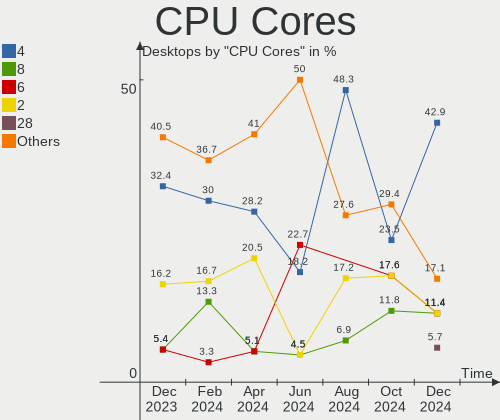
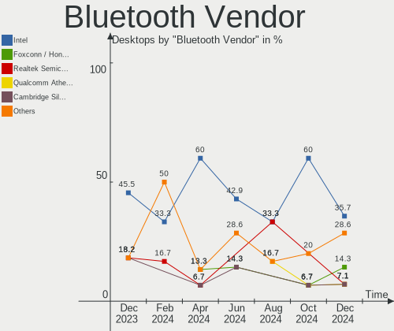

FreeBSD - Hardware Trends (Desktops)
------------------------------------

A project to identify most popular hardware characteristics and track their change
over time based on data collected by BSD users at https://BSD-Hardware.info.

Anyone can contribute to this report by the [hw-probe](https://github.com/linuxhw/hw-probe/blob/master/INSTALL.BSD.md) tool:

    hw-probe -all -upload

This report is for one last month. Overall report since the beginning of time: [TestDays](https://github.com/bsdhw/TestDays)

Period: Nov, 2023.

Contents
--------

* [ System ](#system)
  - [ OS                       ](#os)
  - [ OS Family                ](#os-family)
  - [ Arch                     ](#arch)
  - [ DE                       ](#de)
  - [ Display Server           ](#display-server)
  - [ Display Manager          ](#display-manager)
  - [ OS Lang                  ](#os-lang)
  - [ Boot Mode                ](#boot-mode)
  - [ Filesystem               ](#filesystem)
  - [ Part. scheme             ](#part-scheme)

* [ Board ](#board)
  - [ Vendor                   ](#vendor)
  - [ Model                    ](#model)
  - [ Model Family             ](#model-family)
  - [ MFG Year                 ](#mfg-year)
  - [ Form Factor              ](#form-factor)
  - [ Coreboot                 ](#coreboot)
  - [ RAM Size                 ](#ram-size)
  - [ RAM Used                 ](#ram-used)
  - [ Total Drives             ](#total-drives)
  - [ Has CD-ROM               ](#has-cd-rom)
  - [ Has Ethernet             ](#has-ethernet)
  - [ Has WiFi                 ](#has-wifi)
  - [ Has Bluetooth            ](#has-bluetooth)

* [ Location ](#location)
  - [ Country                  ](#country)
  - [ City                     ](#city)

* [ Drives ](#drives)
  - [ Drive Vendor             ](#drive-vendor)
  - [ Drive Model              ](#drive-model)
  - [ HDD Vendor               ](#hdd-vendor)
  - [ SSD Vendor               ](#ssd-vendor)
  - [ Drive Kind               ](#drive-kind)
  - [ Drive Connector          ](#drive-connector)
  - [ Drive Size               ](#drive-size)
  - [ Space Total              ](#space-total)
  - [ Space Used               ](#space-used)
  - [ Malfunc. Drives          ](#malfunc-drives)
  - [ Malfunc. Drive Vendor    ](#malfunc-drive-vendor)
  - [ Malfunc. HDD Vendor      ](#malfunc-hdd-vendor)
  - [ Malfunc. Drive Kind      ](#malfunc-drive-kind)
  - [ Failed Drives            ](#failed-drives)
  - [ Failed Drive Vendor      ](#failed-drive-vendor)
  - [ Drive Status             ](#drive-status)

* [ Storage controller ](#storage-controller)
  - [ Storage Vendor           ](#storage-vendor)
  - [ Storage Model            ](#storage-model)
  - [ Storage Kind             ](#storage-kind)

* [ Processor ](#processor)
  - [ CPU Vendor               ](#cpu-vendor)
  - [ CPU Model                ](#cpu-model)
  - [ CPU Model Family         ](#cpu-model-family)
  - [ CPU Cores                ](#cpu-cores)
  - [ CPU Sockets              ](#cpu-sockets)
  - [ CPU Threads              ](#cpu-threads)
  - [ CPU Microarch            ](#cpu-microarch)

* [ Graphics ](#graphics)
  - [ GPU Vendor               ](#gpu-vendor)
  - [ GPU Model                ](#gpu-model)
  - [ GPU Combo                ](#gpu-combo)
  - [ GPU Driver               ](#gpu-driver)
  - [ GPU Memory               ](#gpu-memory)

* [ Monitor ](#monitor)
  - [ Monitor Vendor           ](#monitor-vendor)
  - [ Monitor Model            ](#monitor-model)
  - [ Monitor Resolution       ](#monitor-resolution)
  - [ Monitor Diagonal         ](#monitor-diagonal)
  - [ Monitor Width            ](#monitor-width)
  - [ Aspect Ratio             ](#aspect-ratio)
  - [ Monitor Area             ](#monitor-area)
  - [ Pixel Density            ](#pixel-density)
  - [ Multiple Monitors        ](#multiple-monitors)

* [ Network ](#network)
  - [ Net Controller Vendor    ](#net-controller-vendor)
  - [ Net Controller Model     ](#net-controller-model)
  - [ Wireless Vendor          ](#wireless-vendor)
  - [ Wireless Model           ](#wireless-model)
  - [ Ethernet Vendor          ](#ethernet-vendor)
  - [ Ethernet Model           ](#ethernet-model)
  - [ Net Controller Kind      ](#net-controller-kind)
  - [ Used Controller          ](#used-controller)
  - [ NICs                     ](#nics)
  - [ IPv6                     ](#ipv6)

* [ Bluetooth ](#bluetooth)
  - [ Bluetooth Vendor         ](#bluetooth-vendor)
  - [ Bluetooth Model          ](#bluetooth-model)

* [ Sound ](#sound)
  - [ Sound Vendor             ](#sound-vendor)
  - [ Sound Model              ](#sound-model)

* [ Memory ](#memory)
  - [ Memory Vendor            ](#memory-vendor)
  - [ Memory Model             ](#memory-model)
  - [ Memory Kind              ](#memory-kind)
  - [ Memory Form Factor       ](#memory-form-factor)
  - [ Memory Size              ](#memory-size)
  - [ Memory Speed             ](#memory-speed)

* [ Printers & scanners ](#printers--scanners)
  - [ Printer Vendor           ](#printer-vendor)
  - [ Printer Model            ](#printer-model)
  - [ Scanner Vendor           ](#scanner-vendor)
  - [ Scanner Model            ](#scanner-model)

* [ Camera ](#camera)
  - [ Camera Vendor            ](#camera-vendor)
  - [ Camera Model             ](#camera-model)

* [ Security ](#security)
  - [ Fingerprint Vendor       ](#fingerprint-vendor)
  - [ Fingerprint Model        ](#fingerprint-model)
  - [ Chipcard Vendor          ](#chipcard-vendor)
  - [ Chipcard Model           ](#chipcard-model)

* [ Unsupported ](#unsupported)
  - [ Unsupported Devices      ](#unsupported-devices)
  - [ Unsupported Device Types ](#unsupported-device-types)

System
------

OS
--

Installed operating systems

| Name               | Desktops | Percent |
|--------------------|----------|---------|
| FreeBSD 14.0       | 14       | 42.42%  |
| FreeBSD 13.2-p4    | 6        | 18.18%  |
| FreeBSD 13.2-p5    | 4        | 12.12%  |
| FreeBSD 14.0-BETA5 | 3        | 9.09%   |
| FreeBSD 13.2-p3    | 2        | 6.06%   |
| FreeBSD 13.2       | 2        | 6.06%   |
| FreeBSD 14.0-RC3   | 1        | 3.03%   |
| FreeBSD 12.4       | 1        | 3.03%   |

OS Family
---------

OS without a version

| Name    | Desktops | Percent |
|---------|----------|---------|
| FreeBSD | 33       | 100%    |

Arch
----

OS architecture (x86_64, i586, etc.)

| Name  | Desktops | Percent |
|-------|----------|---------|
| amd64 | 33       | 100%    |

DE
--

Desktop Environment

| Name    | Desktops | Percent |
|---------|----------|---------|
| Console | 14       | 42.42%  |
| KDE5    | 6        | 18.18%  |
| XFCE    | 4        | 12.12%  |
| GNOME   | 4        | 12.12%  |
| TWM     | 1        | 3.03%   |
| Picom   | 1        | 3.03%   |
| MATE    | 1        | 3.03%   |
| i3      | 1        | 3.03%   |
| Budgie  | 1        | 3.03%   |

Display Server
--------------

X11 or Wayland

| Name    | Desktops | Percent |
|---------|----------|---------|
| X11     | 19       | 57.58%  |
| Console | 14       | 42.42%  |

Display Manager
---------------

SDDM, LightDM, etc.

| Name    | Desktops | Percent |
|---------|----------|---------|
| Console | 17       | 51.52%  |
| SDDM    | 7        | 21.21%  |
| LightDM | 3        | 9.09%   |
| SLiM    | 2        | 6.06%   |
| GDM     | 2        | 6.06%   |
| XDM     | 1        | 3.03%   |
| Ly      | 1        | 3.03%   |

OS Lang
-------

Language

| Lang    | Desktops | Percent |
|---------|----------|---------|
| C       | 23       | 69.7%   |
| en_US   | 4        | 12.12%  |
| Unknown | 3        | 9.09%   |
| ru_RU   | 1        | 3.03%   |
| pt_BR   | 1        | 3.03%   |
| fr_FR   | 1        | 3.03%   |

Boot Mode
---------

EFI or BIOS

| Mode | Desktops | Percent |
|------|----------|---------|
| EFI  | 28       | 84.85%  |
| BIOS | 5        | 15.15%  |

Filesystem
----------

Type of filesystem

| Type | Desktops | Percent |
|------|----------|---------|
| Zfs  | 27       | 81.82%  |
| Ufs  | 6        | 18.18%  |

Part. scheme
------------

Scheme of partitioning

| Type | Desktops | Percent |
|------|----------|---------|
| GPT  | 33       | 100%    |

Board
-----

Vendor
------

Motherboard manufacturer

| Name                | Desktops | Percent |
|---------------------|----------|---------|
| ASUSTek Computer    | 12       | 36.36%  |
| ASRock              | 5        | 15.15%  |
| MSI                 | 4        | 12.12%  |
| Hewlett-Packard     | 2        | 6.06%   |
| ASRockRack          | 2        | 6.06%   |
| Silicom             | 1        | 3.03%   |
| Samsung Electronics | 1        | 3.03%   |
| PICO PC             | 1        | 3.03%   |
| Lenovo              | 1        | 3.03%   |
| Fujitsu             | 1        | 3.03%   |
| Dell                | 1        | 3.03%   |
| CNCTION-IAF         | 1        | 3.03%   |
| Unknown             | 1        | 3.03%   |

Model
-----

Motherboard model

| Name                                | Desktops | Percent |
|-------------------------------------|----------|---------|
| ASRock X570 Phantom Gaming 4        | 2        | 6.06%   |
| Silicom 6200                        | 1        | 3.03%   |
| Samsung DeskTop System              | 1        | 3.03%   |
| PICO PC MNHO-113                    | 1        | 3.03%   |
| MSI MS-7D15                         | 1        | 3.03%   |
| MSI MS-7B89                         | 1        | 3.03%   |
| MSI MS-7817                         | 1        | 3.03%   |
| MSI MS-7693                         | 1        | 3.03%   |
| Lenovo ThinkStation P520 30BFS44D00 | 1        | 3.03%   |
| HP ProLiant ML350p Gen8             | 1        | 3.03%   |
| HP ProDesk 600 G1 SFF               | 1        | 3.03%   |
| Fujitsu ESPRIMO Q920                | 1        | 3.03%   |
| Dell OptiPlex 3000                  | 1        | 3.03%   |
| CNCTION-IAF CNCTION-IAF             | 1        | 3.03%   |
| ASUS TUF Gaming B560M-PLUS WIFI     | 1        | 3.03%   |
| ASUS ROG STRIX B550-F GAMING        | 1        | 3.03%   |
| ASUS ROG CROSSHAIR VIII HERO        | 1        | 3.03%   |
| ASUS ProArt B550-CREATOR            | 1        | 3.03%   |
| ASUS Pro WS X570-ACE                | 1        | 3.03%   |
| ASUS PRIME X370-PRO                 | 1        | 3.03%   |
| ASUS PRIME A520M-E                  | 1        | 3.03%   |
| ASUS PRIME A320M-K                  | 1        | 3.03%   |
| ASUS P7P55D                         | 1        | 3.03%   |
| ASUS P5Q-E                          | 1        | 3.03%   |
| ASUS CROSSHAIR VI HERO              | 1        | 3.03%   |
| ASUS All Series                     | 1        | 3.03%   |
| ASRockRack X470D4U2-2T              | 1        | 3.03%   |
| ASRockRack EPYC3101D4I-2T           | 1        | 3.03%   |
| ASRock Z590 Pro4                    | 1        | 3.03%   |
| ASRock B460M Steel Legend           | 1        | 3.03%   |
| ASRock B450 Steel Legend            | 1        | 3.03%   |
| Unknown                             | 1        | 3.03%   |

Model Family
------------

Motherboard model prefix

| Name                      | Desktops | Percent |
|---------------------------|----------|---------|
| ASUS PRIME                | 3        | 9.09%   |
| ASUS ROG                  | 2        | 6.06%   |
| ASRock X570               | 2        | 6.06%   |
| Silicom 6200              | 1        | 3.03%   |
| Samsung DeskTop           | 1        | 3.03%   |
| PICO PC MNHO-113          | 1        | 3.03%   |
| MSI MS-7D15               | 1        | 3.03%   |
| MSI MS-7B89               | 1        | 3.03%   |
| MSI MS-7817               | 1        | 3.03%   |
| MSI MS-7693               | 1        | 3.03%   |
| Lenovo ThinkStation       | 1        | 3.03%   |
| HP ProLiant               | 1        | 3.03%   |
| HP ProDesk                | 1        | 3.03%   |
| Fujitsu ESPRIMO           | 1        | 3.03%   |
| Dell OptiPlex             | 1        | 3.03%   |
| CNCTION-IAF CNCTION-IAF   | 1        | 3.03%   |
| ASUS TUF                  | 1        | 3.03%   |
| ASUS ProArt               | 1        | 3.03%   |
| ASUS Pro                  | 1        | 3.03%   |
| ASUS P7P55D               | 1        | 3.03%   |
| ASUS P5Q-E                | 1        | 3.03%   |
| ASUS CROSSHAIR            | 1        | 3.03%   |
| ASUS All                  | 1        | 3.03%   |
| ASRockRack X470D4U2-2T    | 1        | 3.03%   |
| ASRockRack EPYC3101D4I-2T | 1        | 3.03%   |
| ASRock Z590               | 1        | 3.03%   |
| ASRock B460M              | 1        | 3.03%   |
| ASRock B450               | 1        | 3.03%   |
| Unknown                   | 1        | 3.03%   |

MFG Year
--------

Motherboard manufacture year

| Year | Desktops | Percent |
|------|----------|---------|
| 2021 | 7        | 21.21%  |
| 2023 | 6        | 18.18%  |
| 2020 | 4        | 12.12%  |
| 2014 | 4        | 12.12%  |
| 2019 | 3        | 9.09%   |
| 2017 | 2        | 6.06%   |
| 2013 | 2        | 6.06%   |
| 2022 | 1        | 3.03%   |
| 2018 | 1        | 3.03%   |
| 2015 | 1        | 3.03%   |
| 2011 | 1        | 3.03%   |
| 2008 | 1        | 3.03%   |

Form Factor
-----------

Physical design of the computer

| Name    | Desktops | Percent |
|---------|----------|---------|
| Desktop | 33       | 100%    |

Coreboot
--------

Have coreboot on board

| Used | Desktops | Percent |
|------|----------|---------|
| No   | 33       | 100%    |

RAM Size
--------

Total RAM memory

| Size in GB  | Desktops | Percent |
|-------------|----------|---------|
| 16.01-24.0  | 13       | 39.39%  |
| 32.01-64.0  | 7        | 21.21%  |
| 64.01-256.0 | 6        | 18.18%  |
| 8.01-16.0   | 3        | 9.09%   |
| 4.01-8.0    | 2        | 6.06%   |
| 24.01-32.0  | 2        | 6.06%   |

RAM Used
--------

Used RAM memory

| Used GB  | Desktops | Percent |
|----------|----------|---------|
| 0.51-1.0 | 14       | 42.42%  |
| 1.01-2.0 | 8        | 24.24%  |
| 0.01-0.5 | 6        | 18.18%  |
| 2.01-3.0 | 4        | 12.12%  |
| 3.01-4.0 | 1        | 3.03%   |

Total Drives
------------

Number of drives on board

| Drives | Desktops | Percent |
|--------|----------|---------|
| 2      | 9        | 27.27%  |
| 3      | 7        | 21.21%  |
| 4      | 6        | 18.18%  |
| 0      | 4        | 12.12%  |
| 1      | 3        | 9.09%   |
| 17     | 1        | 3.03%   |
| 13     | 1        | 3.03%   |
| 7      | 1        | 3.03%   |
| 5      | 1        | 3.03%   |

Has CD-ROM
----------

Has CD-ROM on board

| Presented | Desktops | Percent |
|-----------|----------|---------|
| No        | 25       | 75.76%  |
| Yes       | 8        | 24.24%  |

Has Ethernet
------------

Has Ethernet on board

| Presented | Desktops | Percent |
|-----------|----------|---------|
| Yes       | 33       | 100%    |

Has WiFi
--------

Has WiFi module

| Presented | Desktops | Percent |
|-----------|----------|---------|
| No        | 27       | 81.82%  |
| Yes       | 6        | 18.18%  |

Has Bluetooth
-------------

Has Bluetooth module

| Presented | Desktops | Percent |
|-----------|----------|---------|
| No        | 25       | 75.76%  |
| Yes       | 8        | 24.24%  |

Location
--------

Country
-------

Geographic location (country)

| Country     | Desktops | Percent |
|-------------|----------|---------|
| USA         | 11       | 33.33%  |
| France      | 3        | 9.09%   |
| China       | 2        | 6.06%   |
| Vietnam     | 1        | 3.03%   |
| Uruguay     | 1        | 3.03%   |
| UK          | 1        | 3.03%   |
| Thailand    | 1        | 3.03%   |
| Switzerland | 1        | 3.03%   |
| Slovakia    | 1        | 3.03%   |
| Russia      | 1        | 3.03%   |
| Poland      | 1        | 3.03%   |
| Philippines | 1        | 3.03%   |
| Netherlands | 1        | 3.03%   |
| Kazakhstan  | 1        | 3.03%   |
| Indonesia   | 1        | 3.03%   |
| Germany     | 1        | 3.03%   |
| Croatia     | 1        | 3.03%   |
| Colombia    | 1        | 3.03%   |
| Chile       | 1        | 3.03%   |
| Brazil      | 1        | 3.03%   |

City
----

Geographic location (city)

| City           | Desktops | Percent |
|----------------|----------|---------|
| Salem          | 2        | 6.06%   |
| Redmond        | 2        | 6.06%   |
| Ypsilanti      | 1        | 3.03%   |
| Wenatchee      | 1        | 3.03%   |
| Urcuit         | 1        | 3.03%   |
| Townsend       | 1        | 3.03%   |
| Talavera       | 1        | 3.03%   |
| Shenzhen       | 1        | 3.03%   |
| Shanghai       | 1        | 3.03%   |
| Sao Paulo      | 1        | 3.03%   |
| Perpignan      | 1        | 3.03%   |
| Palezieux      | 1        | 3.03%   |
| Ozersk         | 1        | 3.03%   |
| Ostrzeszow     | 1        | 3.03%   |
| Nuremberg      | 1        | 3.03%   |
| Noisy-le-Sec   | 1        | 3.03%   |
| New York       | 1        | 3.03%   |
| Mountain View  | 1        | 3.03%   |
| Medellín      | 1        | 3.03%   |
| Medan          | 1        | 3.03%   |
| Maldonado      | 1        | 3.03%   |
| Hillsboro      | 1        | 3.03%   |
| Hanoi          | 1        | 3.03%   |
| Ekibastuz      | 1        | 3.03%   |
| Daruvar        | 1        | 3.03%   |
| Curicó        | 1        | 3.03%   |
| City of London | 1        | 3.03%   |
| Bratislava     | 1        | 3.03%   |
| Bathmen        | 1        | 3.03%   |
| Bangkok        | 1        | 3.03%   |
| Atlanta        | 1        | 3.03%   |

Drives
------

Drive Vendor
------------

Hard drive vendors

| Vendor              | Desktops | Drives | Percent |
|---------------------|----------|--------|---------|
| WDC                 | 14       | 35     | 25%     |
| Samsung Electronics | 11       | 22     | 19.64%  |
| Seagate             | 8        | 10     | 14.29%  |
| Kingston            | 3        | 3      | 5.36%   |
| Intel               | 3        | 3      | 5.36%   |
| Gigabyte Technology | 3        | 5      | 5.36%   |
| SK hynix            | 2        | 2      | 3.57%   |
| Crucial             | 2        | 2      | 3.57%   |
| Toshiba             | 1        | 1      | 1.79%   |
| SPCC                | 1        | 1      | 1.79%   |
| PNY                 | 1        | 1      | 1.79%   |
| MidasForce          | 1        | 2      | 1.79%   |
| INNOVATION IT       | 1        | 1      | 1.79%   |
| HPE                 | 1        | 4      | 1.79%   |
| Hitachi             | 1        | 1      | 1.79%   |
| Hewlett-Packard     | 1        | 12     | 1.79%   |
| GOODRAM             | 1        | 2      | 1.79%   |
| Corsair             | 1        | 1      | 1.79%   |

Drive Model
-----------

Hard drive models

| Model                                  | Desktops | Percent |
|----------------------------------------|----------|---------|
| WDC WD10EZEX-08WN4A0 1TB               | 2        | 2.47%   |
| Seagate ST4000DM000-1F2168 4TB         | 2        | 2.47%   |
| Samsung SSD 850 EVO 500GB              | 2        | 2.47%   |
| Kingston SA400S37240G 240GB            | 2        | 2.47%   |
| Intel SSDSC2BF180A4L 180GB             | 2        | 2.47%   |
| WDC WDS480G2G0A-00JH30 480GB           | 1        | 1.23%   |
| WDC WDS240G2G0A-00JH30 240GB           | 1        | 1.23%   |
| WDC WDS100T3X0C-00SJG0 1TB             | 1        | 1.23%   |
| WDC WD80EMAZ-00WJTA0 8TB               | 1        | 1.23%   |
| WDC WD80EFZX-68UW8N0 8TB               | 1        | 1.23%   |
| WDC WD80EFAX-68LHPN0 8TB               | 1        | 1.23%   |
| WDC WD80EDBZ-11B0ZA0 8TB               | 1        | 1.23%   |
| WDC WD8002FZWX-00BKUA0 8TB             | 1        | 1.23%   |
| WDC WD5002ABYS-02B1B0 500GB            | 1        | 1.23%   |
| WDC WD5000AZLX-08K2TA0 500GB           | 1        | 1.23%   |
| WDC WD5000AAKX-75U6AA0 500GB           | 1        | 1.23%   |
| WDC WD5000AAKX-60U6AA0 500GB           | 1        | 1.23%   |
| WDC WD40EZRZ-22GXCB0 4TB               | 1        | 1.23%   |
| WDC WD40EZRZ-00GXCB0 4TB               | 1        | 1.23%   |
| WDC WD40EFRX-68WT0N0 4TB               | 1        | 1.23%   |
| WDC WD30EFRX-68N32N0 3TB               | 1        | 1.23%   |
| WDC WD20EZRX-00D8PB0 2TB               | 1        | 1.23%   |
| WDC WD2003FZEX-00SRLA0 2TB             | 1        | 1.23%   |
| WDC WD2003FYYS-18W0B0 2TB              | 1        | 1.23%   |
| WDC WD15EADS-00P8B0 1.5TB              | 1        | 1.23%   |
| WDC WD120EMFZ-11A6JA0 12TB             | 1        | 1.23%   |
| WDC WD120EMAZ-11BLFA0 12TB             | 1        | 1.23%   |
| WDC WD10EZEX-75WN4A1 1TB               | 1        | 1.23%   |
| WDC WD10EZEX-08M2NA0 1TB               | 1        | 1.23%   |
| WDC WD1000DHTZ-04N21V0 1TB             | 1        | 1.23%   |
| Toshiba DT01ACA100 1TB                 | 1        | 1.23%   |
| SPCC Solid State Disk 256GB            | 1        | 1.23%   |
| SK hynix SKHynix_HFS512GDE9X084N 512GB | 1        | 1.23%   |
| SK hynix BC901 NVMe 256GB              | 1        | 1.23%   |
| Seagate ST4000LM024-2AN17V 4TB         | 1        | 1.23%   |
| Seagate ST4000DM004-2CV104 4TB         | 1        | 1.23%   |
| Seagate ST2000LM003 HN-M201RAD 2TB     | 1        | 1.23%   |
| Seagate ST2000DM008-2FR102 2TB         | 1        | 1.23%   |
| Seagate ST18000NM000J-2TV103 18TB      | 1        | 1.23%   |
| Seagate ST10000VN0004-1ZD101 10TB      | 1        | 1.23%   |

HDD Vendor
----------

Hard disk drive vendors

| Vendor              | Desktops | Drives | Percent |
|---------------------|----------|--------|---------|
| WDC                 | 13       | 32     | 52%     |
| Seagate             | 7        | 9      | 28%     |
| Toshiba             | 1        | 1      | 4%      |
| Samsung Electronics | 1        | 1      | 4%      |
| HPE                 | 1        | 4      | 4%      |
| Hitachi             | 1        | 1      | 4%      |
| Hewlett-Packard     | 1        | 12     | 4%      |

SSD Vendor
----------

Solid state drive vendors

| Vendor              | Desktops | Drives | Percent |
|---------------------|----------|--------|---------|
| Samsung Electronics | 9        | 16     | 33.33%  |
| Kingston            | 3        | 3      | 11.11%  |
| Intel               | 3        | 3      | 11.11%  |
| Gigabyte Technology | 3        | 5      | 11.11%  |
| Crucial             | 2        | 2      | 7.41%   |
| WDC                 | 1        | 2      | 3.7%    |
| SPCC                | 1        | 1      | 3.7%    |
| Seagate             | 1        | 1      | 3.7%    |
| PNY                 | 1        | 1      | 3.7%    |
| MidasForce          | 1        | 2      | 3.7%    |
| INNOVATION IT       | 1        | 1      | 3.7%    |
| GOODRAM             | 1        | 2      | 3.7%    |

Drive Kind
----------

HDD or SSD

| Kind | Desktops | Drives | Percent |
|------|----------|--------|---------|
| SSD  | 23       | 39     | 46%     |
| HDD  | 19       | 60     | 38%     |
| NVMe | 8        | 9      | 16%     |

Drive Connector
---------------

SATA, SAS, NVMe, etc.

| Type | Desktops | Drives | Percent |
|------|----------|--------|---------|
| SATA | 28       | 99     | 77.78%  |
| NVMe | 8        | 9      | 22.22%  |

Drive Size
----------

Size of hard drive

| Size in TB | Desktops | Drives | Percent |
|------------|----------|--------|---------|
| 0.01-0.5   | 20       | 36     | 39.22%  |
| 0.51-1.0   | 11       | 25     | 21.57%  |
| 1.01-2.0   | 8        | 13     | 15.69%  |
| 3.01-4.0   | 6        | 9      | 11.76%  |
| 4.01-10.0  | 3        | 11     | 5.88%   |
| 10.01-20.0 | 2        | 3      | 3.92%   |
| 2.01-3.0   | 1        | 2      | 1.96%   |

Space Total
-----------

Amount of disk space available on the file system

| Size in GB     | Desktops | Percent |
|----------------|----------|---------|
| 251-500        | 11       | 33.33%  |
| 101-250        | 10       | 30.3%   |
| 501-1000       | 5        | 15.15%  |
| 1001-2000      | 4        | 12.12%  |
| More than 3000 | 1        | 3.03%   |
| 1-20           | 1        | 3.03%   |
| 51-100         | 1        | 3.03%   |

Space Used
----------

Amount of used disk space

| Used GB        | Desktops | Percent |
|----------------|----------|---------|
| 1-20           | 26       | 78.79%  |
| 21-50          | 4        | 12.12%  |
| More than 3000 | 1        | 3.03%   |
| 101-250        | 1        | 3.03%   |
| 51-100         | 1        | 3.03%   |

Malfunc. Drives
---------------

Drive models with a malfunction

| Model                             | Desktops | Drives | Percent |
|-----------------------------------|----------|--------|---------|
| WDC WD5000AAKX-60U6AA0 500GB      | 1        | 1      | 10%     |
| WDC WD40EFRX-68WT0N0 4TB          | 1        | 3      | 10%     |
| WDC WD20EZRX-00D8PB0 2TB          | 1        | 1      | 10%     |
| Seagate ST10000VN0004-1ZD101 10TB | 1        | 2      | 10%     |
| Samsung Electronics HM250HI 250GB | 1        | 1      | 10%     |
| Kingston SH103S3240G 240GB        | 1        | 1      | 10%     |
| Kingston SA400S37240G 240GB       | 1        | 1      | 10%     |
| HPE MM1000GBKAL 1TB               | 1        | 4      | 10%     |
| Crucial FCCT256M550SSD1 256GB     | 1        | 1      | 10%     |
| Crucial CT256MX100SSD1 256GB      | 1        | 1      | 10%     |

Malfunc. Drive Vendor
---------------------

Vendors of faulty drives

| Vendor              | Desktops | Drives | Percent |
|---------------------|----------|--------|---------|
| WDC                 | 3        | 5      | 30%     |
| Kingston            | 2        | 2      | 20%     |
| Crucial             | 2        | 2      | 20%     |
| Seagate             | 1        | 2      | 10%     |
| Samsung Electronics | 1        | 1      | 10%     |
| HPE                 | 1        | 4      | 10%     |

Malfunc. HDD Vendor
-------------------

Vendors of faulty HDD drives

| Vendor              | Desktops | Drives | Percent |
|---------------------|----------|--------|---------|
| WDC                 | 3        | 5      | 50%     |
| Seagate             | 1        | 2      | 16.67%  |
| Samsung Electronics | 1        | 1      | 16.67%  |
| HPE                 | 1        | 4      | 16.67%  |

Malfunc. Drive Kind
-------------------

Kinds of faulty drives

| Kind | Desktops | Drives | Percent |
|------|----------|--------|---------|
| HDD  | 6        | 12     | 60%     |
| SSD  | 4        | 4      | 40%     |

Failed Drives
-------------

Failed drive models

Zero info for selected period =(

Failed Drive Vendor
-------------------

Failed drive vendors

Zero info for selected period =(

Drive Status
------------

Number of failed and malfunc. drives

| Status  | Desktops | Drives | Percent |
|---------|----------|--------|---------|
| Works   | 29       | 92     | 76.32%  |
| Malfunc | 9        | 16     | 23.68%  |

Storage controller
------------------

Storage Vendor
--------------

Storage controller vendors

| Vendor                    | Desktops | Percent |
|---------------------------|----------|---------|
| Intel                     | 16       | 27.59%  |
| AMD                       | 15       | 25.86%  |
| Samsung Electronics       | 7        | 12.07%  |
| SanDisk                   | 5        | 8.62%   |
| ASMedia Technology        | 3        | 5.17%   |
| SK hynix                  | 2        | 3.45%   |
| Phison Electronics        | 2        | 3.45%   |
| Micron/Crucial Technology | 2        | 3.45%   |
| Broadcom / LSI            | 2        | 3.45%   |
| Seagate Technology        | 1        | 1.72%   |
| Marvell Technology Group  | 1        | 1.72%   |
| JMicron Technology        | 1        | 1.72%   |
| Hewlett-Packard           | 1        | 1.72%   |

Storage Model
-------------

Storage controller models

| Model                                                                          | Desktops | Percent |
|--------------------------------------------------------------------------------|----------|---------|
| AMD FCH SATA Controller [AHCI mode]                                            | 7        | 11.29%  |
| Samsung NVMe SSD Controller SM981/PM981/PM983                                  | 3        | 4.84%   |
| Intel 8 Series/C220 Series Chipset Family 6-port SATA Controller 1 [AHCI mode] | 3        | 4.84%   |
| Intel 500 Series Chipset Family SATA AHCI Controller                           | 3        | 4.84%   |
| AMD 500 Series Chipset SATA Controller                                         | 3        | 4.84%   |
| AMD 400 Series Chipset SATA Controller                                         | 3        | 4.84%   |
| Sandisk WD Black SN770 / PC SN740 256GB / PC SN560 (DRAM-less) NVMe SSD        | 2        | 3.23%   |
| Samsung NVMe SSD Controller SM961/PM961/SM963                                  | 2        | 3.23%   |
| Samsung NVMe SSD Controller PM9A1/PM9A3/980PRO                                 | 2        | 3.23%   |
| Micron/Crucial P2 [Nick P2] / P3 / P3 Plus NVMe PCIe SSD (DRAM-less)           | 2        | 3.23%   |
| AMD X370 Series Chipset SATA Controller                                        | 2        | 3.23%   |
| SK hynix Gold P31/BC711/PC711 NVMe Solid State Drive                           | 1        | 1.61%   |
| SK hynix BC901 NVMe Solid State Drive (DRAM-less)                              | 1        | 1.61%   |
| Seagate FireCuda 520/IronWolf 525 SSD                                          | 1        | 1.61%   |
| SanDisk Ultra 3D / WD Blue SN570 NVMe SSD (DRAM-less)                          | 1        | 1.61%   |
| SanDisk Extreme Pro / WD Black SN750 / PC SN730 / Red SN700 NVMe SSD           | 1        | 1.61%   |
| SanDisk Extreme Pro / WD Black 2018/SN750/PC SN720 NVMe SSD                    | 1        | 1.61%   |
| Phison E16 PCIe4 NVMe Controller                                               | 1        | 1.61%   |
| Phison E12 NVMe Controller                                                     | 1        | 1.61%   |
| Marvell Group 88SE6111/6121 SATA II / PATA Controller                          | 1        | 1.61%   |
| JMicron JMB363 SATA/IDE Controller                                             | 1        | 1.61%   |
| Intel Volume Management Device NVMe RAID Controller                            | 1        | 1.61%   |
| Intel product 54d3                                                             | 1        | 1.61%   |
| Intel Celeron N3350/Pentium N4200/Atom E3900 Series SATA AHCI Controller       | 1        | 1.61%   |
| Intel C600/X79 series chipset 6-Port SATA AHCI Controller                      | 1        | 1.61%   |
| Intel Alder Lake-S PCH SATA Controller [AHCI Mode]                             | 1        | 1.61%   |
| Intel 9 Series Chipset Family SATA Controller [AHCI Mode]                      | 1        | 1.61%   |
| Intel 82801JI (ICH10 Family) 4 port SATA IDE Controller #1                     | 1        | 1.61%   |
| Intel 82801JI (ICH10 Family) 2 port SATA IDE Controller #2                     | 1        | 1.61%   |
| Intel 7 Series/C210 Series Chipset Family 6-port SATA Controller [AHCI mode]   | 1        | 1.61%   |
| Intel 5 Series/3400 Series Chipset 6 port SATA AHCI Controller                 | 1        | 1.61%   |
| Intel 400 Series Chipset Family SATA AHCI Controller                           | 1        | 1.61%   |
| Intel 200 Series PCH SATA controller [AHCI mode]                               | 1        | 1.61%   |
| HP Smart Array Gen8 Controllers                                                | 1        | 1.61%   |
| Broadcom / LSI SAS2008 PCI-Express Fusion-MPT SAS-2 [Falcon]                   | 1        | 1.61%   |
| Broadcom / LSI MegaRAID SAS 2208 [Thunderbolt]                                 | 1        | 1.61%   |
| ASMedia ASM1062 Serial ATA Controller                                          | 1        | 1.61%   |
| ASMedia 106x SATA/RAID Controller                                              | 1        | 1.61%   |
| ASMedia 1064 SATA Controller                                                   | 1        | 1.61%   |
| AMD SB7x0/SB8x0/SB9x0 SATA Controller [AHCI mode]                              | 1        | 1.61%   |

Storage Kind
------------

Kind of storage controller (IDE, SATA, NVMe, SAS, ...)

| Kind | Desktops | Percent |
|------|----------|---------|
| SATA | 30       | 57.69%  |
| NVMe | 16       | 30.77%  |
| RAID | 3        | 5.77%   |
| IDE  | 2        | 3.85%   |
| SAS  | 1        | 1.92%   |

Processor
---------

CPU Vendor
----------

Processor vendors

| Vendor | Desktops | Percent |
|--------|----------|---------|
| Intel  | 18       | 54.55%  |
| AMD    | 15       | 45.45%  |

CPU Model
---------

Processor models

| Model                                       | Desktops | Percent |
|---------------------------------------------|----------|---------|
| AMD Ryzen 9 3900X 12-Core Processor         | 2        | 6.06%   |
| AMD Ryzen 7 3700X 8-Core Processor          | 2        | 6.06%   |
| Intel Xeon W-2135 CPU @ 3.70GHz             | 1        | 3.03%   |
| Intel Xeon CPU E5-2620 0 @ 2.00GHz          | 1        | 3.03%   |
| Intel Pentium Silver N6005 @ 2.00GHz        | 1        | 3.03%   |
| Intel Pentium Gold G6405 CPU @ 4.10GHz      | 1        | 3.03%   |
| Intel Pentium CPU N4200 @ 1.10GHz           | 1        | 3.03%   |
| Intel Pentium CPU G3220 @ 3.00GHz           | 1        | 3.03%   |
| Intel N100                                  | 1        | 3.03%   |
| Intel Core i7-4770 CPU @ 3.40GHz            | 1        | 3.03%   |
| Intel Core i7-10700K CPU @ 3.80GHz          | 1        | 3.03%   |
| Intel Core i7 CPU 880 @ 3.07GHz             | 1        | 3.03%   |
| Intel Core i5-4590T CPU @ 2.00GHz           | 1        | 3.03%   |
| Intel Core i5-4570 CPU @ 3.20GHz            | 1        | 3.03%   |
| Intel Core i5-2500 CPU @ 3.30GHz            | 1        | 3.03%   |
| Intel Core i5-10400F CPU @ 2.90GHz          | 1        | 3.03%   |
| Intel Core 2 Quad CPU Q6600 @ 2.40GHz       | 1        | 3.03%   |
| Intel Atom CPU C3558R @ 2.40GHz             | 1        | 3.03%   |
| Intel 12th Gen Core i5-12500                | 1        | 3.03%   |
| Intel 11th Gen Core i7-11700 @ 2.50GHz      | 1        | 3.03%   |
| AMD Ryzen 7 5800X 8-Core Processor          | 1        | 3.03%   |
| AMD Ryzen 7 2700X Eight-Core Processor      | 1        | 3.03%   |
| AMD Ryzen 7 1700 Eight-Core Processor       | 1        | 3.03%   |
| AMD Ryzen 5 5600G with Radeon Graphics      | 1        | 3.03%   |
| AMD Ryzen 5 4500 6-Core Processor           | 1        | 3.03%   |
| AMD Ryzen 5 3600X 6-Core Processor          | 1        | 3.03%   |
| AMD Ryzen 5 2400G with Radeon Vega Graphics | 1        | 3.03%   |
| AMD Ryzen 3 3200G with Radeon Vega Graphics | 1        | 3.03%   |
| AMD FX-8320E Eight-Core Processor           | 1        | 3.03%   |
| AMD EPYC 3101 4-Core Processor              | 1        | 3.03%   |
| AMD Athlon 3000G with Radeon Vega Graphics  | 1        | 3.03%   |

CPU Model Family
----------------

Processor model prefix

| Model                | Desktops | Percent |
|----------------------|----------|---------|
| AMD Ryzen 7          | 5        | 15.15%  |
| Intel Core i5        | 4        | 12.12%  |
| AMD Ryzen 5          | 4        | 12.12%  |
| Other                | 3        | 9.09%   |
| Intel Core i7        | 3        | 9.09%   |
| Intel Xeon           | 2        | 6.06%   |
| Intel Pentium        | 2        | 6.06%   |
| AMD Ryzen 9          | 2        | 6.06%   |
| Intel Pentium Silver | 1        | 3.03%   |
| Intel Pentium Gold   | 1        | 3.03%   |
| Intel Core 2 Quad    | 1        | 3.03%   |
| Intel Atom           | 1        | 3.03%   |
| AMD Ryzen 3          | 1        | 3.03%   |
| AMD FX               | 1        | 3.03%   |
| AMD EPYC             | 1        | 3.03%   |
| AMD Athlon           | 1        | 3.03%   |

CPU Cores
---------

Number of processor cores

| Number | Desktops | Percent |
|--------|----------|---------|
| 4      | 13       | 39.39%  |
| 16     | 5        | 15.15%  |
| 12     | 4        | 12.12%  |
| 8      | 4        | 12.12%  |
| 6      | 3        | 9.09%   |
| 24     | 2        | 6.06%   |
| 2      | 2        | 6.06%   |

CPU Sockets
-----------

Number of sockets

| Number | Desktops | Percent |
|--------|----------|---------|
| 1      | 32       | 96.97%  |
| 2      | 1        | 3.03%   |

CPU Threads
-----------

Threads per core (Hyper-Threading)

| Number | Desktops | Percent |
|--------|----------|---------|
| 1      | 24       | 72.73%  |
| 2      | 9        | 27.27%  |

CPU Microarch
-------------

Microarchitecture

| Name        | Desktops | Percent |
|-------------|----------|---------|
| Zen 2       | 6        | 18.18%  |
| Haswell     | 4        | 12.12%  |
| Unknown     | 4        | 12.12%  |
| Zen+        | 3        | 9.09%   |
| Zen         | 3        | 9.09%   |
| CometLake   | 3        | 9.09%   |
| Zen 3       | 2        | 6.06%   |
| SandyBridge | 2        | 6.06%   |
| Goldmont    | 2        | 6.06%   |
| Skylake     | 1        | 3.03%   |
| Piledriver  | 1        | 3.03%   |
| Nehalem     | 1        | 3.03%   |
| Core        | 1        | 3.03%   |

Graphics
--------

GPU Vendor
----------

Vendors of graphics cards

| Vendor                     | Desktops | Percent |
|----------------------------|----------|---------|
| AMD                        | 11       | 32.35%  |
| Nvidia                     | 10       | 29.41%  |
| Intel                      | 10       | 29.41%  |
| ASPEED Technology          | 2        | 5.88%   |
| Matrox Electronics Systems | 1        | 2.94%   |

GPU Model
---------

Graphics card models

| Model                                                                       | Desktops | Percent |
|-----------------------------------------------------------------------------|----------|---------|
| Intel Xeon E3-1200 v3/4th Gen Core Processor Integrated Graphics Controller | 4        | 11.43%  |
| Nvidia GP108 [GeForce GT 1030]                                              | 2        | 5.71%   |
| ASPEED Technology ASPEED Graphics Family                                    | 2        | 5.71%   |
| AMD Vega 10 XL/XT [Radeon RX Vega 56/64]                                    | 2        | 5.71%   |
| Nvidia TU117GL [T400 4GB]                                                   | 1        | 2.86%   |
| Nvidia TU117 [GeForce GTX 1650]                                             | 1        | 2.86%   |
| Nvidia GT218 [NVS 300]                                                      | 1        | 2.86%   |
| Nvidia GP107 [GeForce GTX 1050]                                             | 1        | 2.86%   |
| Nvidia GP106 [GeForce GTX 1060 3GB]                                         | 1        | 2.86%   |
| Nvidia GM107 [GeForce GTX 750 Ti]                                           | 1        | 2.86%   |
| Nvidia GA104 [GeForce RTX 3060 Ti Lite Hash Rate]                           | 1        | 2.86%   |
| Nvidia G96C [GeForce 9400 GT]                                               | 1        | 2.86%   |
| Matrox Electronics Systems MGA G200EH                                       | 1        | 2.86%   |
| Intel JasperLake [UHD Graphics]                                             | 1        | 2.86%   |
| Intel CometLake-S GT2 [UHD Graphics 630]                                    | 1        | 2.86%   |
| Intel CometLake-S GT1 [UHD Graphics 610]                                    | 1        | 2.86%   |
| Intel Apollo Lake [HD Graphics 505]                                         | 1        | 2.86%   |
| Intel Alder Lake-S GT1 [UHD Graphics 770]                                   | 1        | 2.86%   |
| Intel Alder Lake-N [UHD Graphics]                                           | 1        | 2.86%   |
| AMD Raven Ridge [Radeon Vega Series / Radeon Vega Mobile Series]            | 1        | 2.86%   |
| AMD R520 GL [FireGL V7300] (Secondary)                                      | 1        | 2.86%   |
| AMD R520 GL [FireGL V7300]                                                  | 1        | 2.86%   |
| AMD Picasso/Raven 2 [Radeon Vega Series / Radeon Vega Mobile Series]        | 1        | 2.86%   |
| AMD Navi 22 [Radeon RX 6700/6700 XT/6750 XT / 6800M/6850M XT]               | 1        | 2.86%   |
| AMD Lexa XT [Radeon PRO WX 3200]                                            | 1        | 2.86%   |
| AMD Lexa PRO [Radeon 540/540X/550/550X / RX 540X/550/550X]                  | 1        | 2.86%   |
| AMD Ellesmere [Radeon RX 470/480/570/570X/580/580X/590]                     | 1        | 2.86%   |
| AMD Cezanne [Radeon Vega Series / Radeon Vega Mobile Series]                | 1        | 2.86%   |
| AMD Cedar [Radeon HD 5000/6000/7350/8350 Series]                            | 1        | 2.86%   |

GPU Combo
---------

Combinations of graphics cards

| Name           | Desktops | Percent |
|----------------|----------|---------|
| 1 x AMD        | 10       | 30.3%   |
| 1 x Nvidia     | 8        | 24.24%  |
| 1 x Intel      | 8        | 24.24%  |
| Intel + Nvidia | 2        | 6.06%   |
| 1 x ASPEED     | 2        | 6.06%   |
| Other          | 1        | 3.03%   |
| 2 x AMD        | 1        | 3.03%   |
| 1 x Matrox     | 1        | 3.03%   |

GPU Driver
----------

Free vs proprietary

| Driver      | Desktops | Percent |
|-------------|----------|---------|
| Free        | 26       | 78.79%  |
| Proprietary | 5        | 15.15%  |
| Unknown     | 2        | 6.06%   |

GPU Memory
----------

Total video memory

| Size in GB | Desktops | Percent |
|------------|----------|---------|
| Unknown    | 19       | 57.58%  |
| 7.01-8.0   | 4        | 12.12%  |
| 3.01-4.0   | 4        | 12.12%  |
| 1.01-2.0   | 4        | 12.12%  |
| 8.01-16.0  | 1        | 3.03%   |
| 0.01-0.5   | 1        | 3.03%   |

Monitor
-------

Monitor Vendor
--------------

Monitor vendors

| Vendor              | Desktops | Percent |
|---------------------|----------|---------|
| Dell                | 4        | 20%     |
| ViewSonic           | 3        | 15%     |
| Samsung Electronics | 2        | 10%     |
| Wacom               | 1        | 5%      |
| Sony                | 1        | 5%      |
| MSI                 | 1        | 5%      |
| Iiyama              | 1        | 5%      |
| Hewlett-Packard     | 1        | 5%      |
| Goldstar            | 1        | 5%      |
| BenQ                | 1        | 5%      |
| ASUSTek Computer    | 1        | 5%      |
| AOC                 | 1        | 5%      |
| Acer                | 1        | 5%      |
| Unknown             | 1        | 5%      |

Monitor Model
-------------

Monitor models

| Model                                                                | Desktops | Percent |
|----------------------------------------------------------------------|----------|---------|
| Wacom One 13 WAC1070 1920x1080 290x170mm 13.2-inch                   | 1        | 4.76%   |
| ViewSonic VX2880-4K-HDU VSCA33A 3840x2160 630x360mm 28.6-inch        | 1        | 4.76%   |
| ViewSonic VX2457 VSCB931 1920x1080 520x290mm 23.4-inch               | 1        | 4.76%   |
| ViewSonic VA2261 Series VSC0F30 1920x1080 480x270mm 21.7-inch        | 1        | 4.76%   |
| Sony TV SNY6804 1680x1050                                            | 1        | 4.76%   |
| Samsung Electronics SyncMaster SAM049C 1920x1080 480x270mm 21.7-inch | 1        | 4.76%   |
| Samsung Electronics LCD Monitor S19B150                              | 1        | 4.76%   |
| MSI G241 MSI3BA4 1920x1080 530x300mm 24.0-inch                       | 1        | 4.76%   |
| Iiyama X2483_2481 IVM6128 1920x1080 530x300mm 24.0-inch              | 1        | 4.76%   |
| Hewlett-Packard E221 HWP3060 1920x1080 500x290mm 22.8-inch           | 1        | 4.76%   |
| Goldstar LG HD GSM5ACD 1366x768 410x230mm 18.5-inch                  | 1        | 4.76%   |
| Dell U2717D DEL40EB 2560x1440 600x340mm 27.2-inch                    | 1        | 4.76%   |
| Dell LCD Monitor E2222H 2560x1080                                    | 1        | 4.76%   |
| Dell LCD Monitor E2222H                                              | 1        | 4.76%   |
| Dell LCD Monitor 1908FP 2390x1280                                    | 1        | 4.76%   |
| Dell 2001FP DELA008 1600x1200 410x310mm 20.2-inch                    | 1        | 4.76%   |
| BenQ PD3200Q BNQ8026 2560x1440 710x400mm 32.1-inch                   | 1        | 4.76%   |
| ASUSTek Computer XG35V AUS3551 3440x1440 820x350mm 35.1-inch         | 1        | 4.76%   |
| AOC Q3279WG5B AOC3279 2560x1440 730x430mm 33.4-inch                  | 1        | 4.76%   |
| Acer K242HQL ACR0446 1920x1080 520x290mm 23.4-inch                   | 1        | 4.76%   |
| Unknown                                                              | 1        | 4.76%   |

Monitor Resolution
------------------

Monitor screen resolution

| Resolution         | Desktops | Percent |
|--------------------|----------|---------|
| 1920x1080 (FHD)    | 8        | 40%     |
| 2560x1440 (QHD)    | 3        | 15%     |
| Unknown            | 2        | 10%     |
| 3840x2160 (4K)     | 1        | 5%      |
| 3440x1440          | 1        | 5%      |
| 2560x1080          | 1        | 5%      |
| 2390x1280          | 1        | 5%      |
| 1680x1050 (WSXGA+) | 1        | 5%      |
| 1600x1200          | 1        | 5%      |
| 1366x768 (WXGA)    | 1        | 5%      |

Monitor Diagonal
----------------

Diagonal size in inches

| Inches  | Desktops | Percent |
|---------|----------|---------|
| Unknown | 3        | 16.67%  |
| 24      | 2        | 11.11%  |
| 23      | 2        | 11.11%  |
| 21      | 2        | 11.11%  |
| 35      | 1        | 5.56%   |
| 33      | 1        | 5.56%   |
| 32      | 1        | 5.56%   |
| 28      | 1        | 5.56%   |
| 27      | 1        | 5.56%   |
| 22      | 1        | 5.56%   |
| 20      | 1        | 5.56%   |
| 18      | 1        | 5.56%   |
| 13      | 1        | 5.56%   |

Monitor Width
-------------

Physical width

| Width in mm | Desktops | Percent |
|-------------|----------|---------|
| 501-600     | 5        | 27.78%  |
| 401-500     | 5        | 27.78%  |
| Unknown     | 3        | 16.67%  |
| 701-800     | 2        | 11.11%  |
| 801-900     | 1        | 5.56%   |
| 601-700     | 1        | 5.56%   |
| 201-300     | 1        | 5.56%   |

Aspect Ratio
------------

Proportional relationship between the width and the height

| Ratio   | Desktops | Percent |
|---------|----------|---------|
| 16/9    | 12       | 70.59%  |
| Unknown | 2        | 11.76%  |
| 4/3     | 1        | 5.88%   |
| 21/9    | 1        | 5.88%   |
| 16/10   | 1        | 5.88%   |

Monitor Area
------------

Area in inch²

| Area in inch² | Desktops | Percent |
|----------------|----------|---------|
| 201-250        | 7        | 38.89%  |
| 351-500        | 4        | 22.22%  |
| Unknown        | 3        | 16.67%  |
| 71-80          | 1        | 5.56%   |
| 301-350        | 1        | 5.56%   |
| 151-200        | 1        | 5.56%   |
| 141-150        | 1        | 5.56%   |

Pixel Density
-------------

Pixels per inch

| Density | Desktops | Percent |
|---------|----------|---------|
| 51-100  | 9        | 50%     |
| 101-120 | 4        | 22.22%  |
| Unknown | 3        | 16.67%  |
| 161-240 | 1        | 5.56%   |
| 121-160 | 1        | 5.56%   |

Multiple Monitors
-----------------

Total monitors connected

| Total | Desktops | Percent |
|-------|----------|---------|
| 0     | 17       | 51.52%  |
| 1     | 12       | 36.36%  |
| 2     | 3        | 9.09%   |
| 3     | 1        | 3.03%   |

Network
-------

Net Controller Vendor
---------------------

Controller vendors

| Vendor                   | Desktops | Percent |
|--------------------------|----------|---------|
| Intel                    | 22       | 51.16%  |
| Realtek Semiconductor    | 14       | 32.56%  |
| American Megatrends      | 2        | 4.65%   |
| Samsung Electronics      | 1        | 2.33%   |
| Qualcomm Atheros         | 1        | 2.33%   |
| Mellanox Technologies    | 1        | 2.33%   |
| Marvell Technology Group | 1        | 2.33%   |
| Broadcom                 | 1        | 2.33%   |

Net Controller Model
--------------------

Controller models

| Model                                                             | Desktops | Percent |
|-------------------------------------------------------------------|----------|---------|
| Realtek RTL8111/8168/8411 PCI Express Gigabit Ethernet Controller | 8        | 16%     |
| Intel I211 Gigabit Network Connection                             | 7        | 14%     |
| Realtek RTL8125 2.5GbE Controller                                 | 4        | 8%      |
| Intel Ethernet Controller I225-V                                  | 4        | 8%      |
| Intel Ethernet Controller X550                                    | 2        | 4%      |
| Intel Ethernet Connection I217-LM                                 | 2        | 4%      |
| American Megatrends Virtual Ethernet                              | 2        | 4%      |
| Samsung Galaxy series, misc. (tethering mode)                     | 1        | 2%      |
| Realtek RTL8192EE PCIe Wireless Network Adapter                   | 1        | 2%      |
| Realtek RTL8188EE Wireless Network Adapter                        | 1        | 2%      |
| Qualcomm Atheros Killer E220x Gigabit Ethernet Controller         | 1        | 2%      |
| Mellanox MT27500 Family [ConnectX-3]                              | 1        | 2%      |
| Marvell Group 88E8056 PCI-E Gigabit Ethernet Controller           | 1        | 2%      |
| Marvell Group 88E8001 Gigabit Ethernet Controller                 | 1        | 2%      |
| Intel Wireless-AC 9260                                            | 1        | 2%      |
| Intel Wi-Fi 6 AX201 160MHz                                        | 1        | 2%      |
| Intel Tiger Lake PCH CNVi WiFi                                    | 1        | 2%      |
| Intel I350 Gigabit Network Connection                             | 1        | 2%      |
| Intel Ethernet Controller I226-V                                  | 1        | 2%      |
| Intel Ethernet Controller 10G X550T                               | 1        | 2%      |
| Intel Ethernet Connection X553 1GbE                               | 1        | 2%      |
| Intel Ethernet Connection X553 10 GbE SFP+                        | 1        | 2%      |
| Intel Ethernet Connection (2) I219-LM                             | 1        | 2%      |
| Intel Ethernet Connection (2) I218-V                              | 1        | 2%      |
| Intel CNVi: Wi-Fi                                                 | 1        | 2%      |
| Intel 82579V Gigabit Network Connection                           | 1        | 2%      |
| Intel 82574L Gigabit Network Connection                           | 1        | 2%      |
| Broadcom NetXtreme BCM5719 Gigabit Ethernet PCIe                  | 1        | 2%      |

Wireless Vendor
---------------

Wireless vendors

| Vendor                | Desktops | Percent |
|-----------------------|----------|---------|
| Intel                 | 4        | 66.67%  |
| Realtek Semiconductor | 2        | 33.33%  |

Wireless Model
--------------

Wireless models

| Model                                           | Desktops | Percent |
|-------------------------------------------------|----------|---------|
| Realtek RTL8192EE PCIe Wireless Network Adapter | 1        | 16.67%  |
| Realtek RTL8188EE Wireless Network Adapter      | 1        | 16.67%  |
| Intel Wireless-AC 9260                          | 1        | 16.67%  |
| Intel Wi-Fi 6 AX201 160MHz                      | 1        | 16.67%  |
| Intel Tiger Lake PCH CNVi WiFi                  | 1        | 16.67%  |
| Intel CNVi: Wi-Fi                               | 1        | 16.67%  |

Ethernet Vendor
---------------

Ethernet vendors

| Vendor                   | Desktops | Percent |
|--------------------------|----------|---------|
| Intel                    | 21       | 53.85%  |
| Realtek Semiconductor    | 12       | 30.77%  |
| American Megatrends      | 2        | 5.13%   |
| Samsung Electronics      | 1        | 2.56%   |
| Qualcomm Atheros         | 1        | 2.56%   |
| Marvell Technology Group | 1        | 2.56%   |
| Broadcom                 | 1        | 2.56%   |

Ethernet Model
--------------

Ethernet models

| Model                                                             | Desktops | Percent |
|-------------------------------------------------------------------|----------|---------|
| Realtek RTL8111/8168/8411 PCI Express Gigabit Ethernet Controller | 8        | 18.6%   |
| Intel I211 Gigabit Network Connection                             | 7        | 16.28%  |
| Realtek RTL8125 2.5GbE Controller                                 | 4        | 9.3%    |
| Intel Ethernet Controller I225-V                                  | 4        | 9.3%    |
| Intel Ethernet Controller X550                                    | 2        | 4.65%   |
| Intel Ethernet Connection I217-LM                                 | 2        | 4.65%   |
| American Megatrends Virtual Ethernet                              | 2        | 4.65%   |
| Samsung Galaxy series, misc. (tethering mode)                     | 1        | 2.33%   |
| Qualcomm Atheros Killer E220x Gigabit Ethernet Controller         | 1        | 2.33%   |
| Marvell Group 88E8056 PCI-E Gigabit Ethernet Controller           | 1        | 2.33%   |
| Marvell Group 88E8001 Gigabit Ethernet Controller                 | 1        | 2.33%   |
| Intel I350 Gigabit Network Connection                             | 1        | 2.33%   |
| Intel Ethernet Controller I226-V                                  | 1        | 2.33%   |
| Intel Ethernet Controller 10G X550T                               | 1        | 2.33%   |
| Intel Ethernet Connection X553 1GbE                               | 1        | 2.33%   |
| Intel Ethernet Connection X553 10 GbE SFP+                        | 1        | 2.33%   |
| Intel Ethernet Connection (2) I219-LM                             | 1        | 2.33%   |
| Intel Ethernet Connection (2) I218-V                              | 1        | 2.33%   |
| Intel 82579V Gigabit Network Connection                           | 1        | 2.33%   |
| Intel 82574L Gigabit Network Connection                           | 1        | 2.33%   |
| Broadcom NetXtreme BCM5719 Gigabit Ethernet PCIe                  | 1        | 2.33%   |

Net Controller Kind
-------------------

Ethernet, WiFi or modem

| Kind     | Desktops | Percent |
|----------|----------|---------|
| Ethernet | 33       | 82.5%   |
| WiFi     | 6        | 15%     |
| Unknown  | 1        | 2.5%    |

Used Controller
---------------

Currently used network controller

| Kind     | Desktops | Percent |
|----------|----------|---------|
| Ethernet | 32       | 100%    |

NICs
----

Total network controllers on board

| Total | Desktops | Percent |
|-------|----------|---------|
| 1     | 19       | 57.58%  |
| 2     | 7        | 21.21%  |
| 4     | 3        | 9.09%   |
| 3     | 2        | 6.06%   |
| 8     | 1        | 3.03%   |
| 5     | 1        | 3.03%   |

IPv6
----

IPv6 vs IPv4

| Used | Desktops | Percent |
|------|----------|---------|
| No   | 28       | 84.85%  |
| Yes  | 5        | 15.15%  |

Bluetooth
---------

Bluetooth Vendor
----------------

Controller vendors

| Vendor                  | Desktops | Percent |
|-------------------------|----------|---------|
| Intel                   | 4        | 50%     |
| Cambridge Silicon Radio | 3        | 37.5%   |
| Realtek Semiconductor   | 1        | 12.5%   |

Bluetooth Model
---------------

Controller models

| Model                                               | Desktops | Percent |
|-----------------------------------------------------|----------|---------|
| Intel AX201 Bluetooth                               | 3        | 37.5%   |
| Cambridge Silicon Radio Bluetooth Dongle (HCI mode) | 3        | 37.5%   |
| Realtek Bluetooth Adapter                           | 1        | 12.5%   |
| Intel Wireless-AC 9260 Bluetooth Adapter            | 1        | 12.5%   |

Sound
-----

Sound Vendor
------------

Sound card vendors

| Vendor                                       | Desktops | Percent |
|----------------------------------------------|----------|---------|
| Intel                                        | 15       | 35.71%  |
| AMD                                          | 15       | 35.71%  |
| Nvidia                                       | 9        | 21.43%  |
| Zoran Co. Personal Media Division (Nogatech) | 1        | 2.38%   |
| Solid State Logic                            | 1        | 2.38%   |
| Unknown                                      | 1        | 2.38%   |

Sound Model
-----------

Sound card models

| Model                                                               | Desktops | Percent |
|---------------------------------------------------------------------|----------|---------|
| AMD Starship/Matisse HD Audio Controller                            | 6        | 11.11%  |
| AMD Family 17h/19h HD Audio Controller                              | 5        | 9.26%   |
| Intel Xeon E3-1200 v3/4th Gen Core Processor HD Audio Controller    | 3        | 5.56%   |
| Intel 8 Series/C220 Series Chipset High Definition Audio Controller | 3        | 5.56%   |
| Nvidia TU107 GeForce GTX 1650 High Definition Audio Controller      | 2        | 3.7%    |
| Nvidia GP108 High Definition Audio Controller                       | 2        | 3.7%    |
| Intel Smart Sound Technology (SST) Audio Controller                 | 2        | 3.7%    |
| AMD Vega 10 HDMI Audio [Radeon Vega 56/64]                          | 2        | 3.7%    |
| AMD Renoir Radeon High Definition Audio Controller                  | 2        | 3.7%    |
| AMD Raven/Raven2/Fenghuang HDMI/DP Audio Controller                 | 2        | 3.7%    |
| AMD Baffin HDMI/DP Audio [Radeon RX 550 640SP / RX 560/560X]        | 2        | 3.7%    |
| Zoran Co. Personal Media Division (Nogatech) USB Audio and HID      | 1        | 1.85%   |
| Solid State Logic SSL Connex                                        | 1        | 1.85%   |
| Nvidia High Definition Audio Controller                             | 1        | 1.85%   |
| Nvidia GP107GL High Definition Audio Controller                     | 1        | 1.85%   |
| Nvidia GP106 High Definition Audio Controller                       | 1        | 1.85%   |
| Nvidia GM107 High Definition Audio Controller [GeForce 940MX]       | 1        | 1.85%   |
| Nvidia GA104 High Definition Audio Controller                       | 1        | 1.85%   |
| Intel Tiger Lake-H HD Audio Controller                              | 1        | 1.85%   |
| Intel Jasper Lake HD Audio                                          | 1        | 1.85%   |
| Intel Comet Lake PCH-V cAVS                                         | 1        | 1.85%   |
| Intel Celeron N3350/Pentium N4200/Atom E3900 Series Audio Cluster   | 1        | 1.85%   |
| Intel Alder Lake-S HD Audio Controller                              | 1        | 1.85%   |
| Intel Alder Lake-N HD Graphics SGPC                                 | 1        | 1.85%   |
| Intel 9 Series Chipset Family HD Audio Controller                   | 1        | 1.85%   |
| Intel 82801JI (ICH10 Family) HD Audio Controller                    | 1        | 1.85%   |
| Intel 7 Series/C216 Chipset Family High Definition Audio Controller | 1        | 1.85%   |
| Intel 200 Series PCH HD Audio                                       | 1        | 1.85%   |
| AMD SBx00 Azalia (Intel HDA)                                        | 1        | 1.85%   |
| AMD Navi 21/23 HDMI/DP Audio Controller                             | 1        | 1.85%   |
| AMD Family 17h (Models 00h-0fh) HD Audio Controller                 | 1        | 1.85%   |
| AMD Ellesmere HDMI Audio [Radeon RX 470/480 / 570/580/590]          | 1        | 1.85%   |
| AMD Cedar HDMI Audio [Radeon HD 5400/6300/7300 Series]              | 1        | 1.85%   |
| Unknown                                                             | 1        | 1.85%   |

Memory
------

Memory Vendor
-------------

Memory module vendors

| Vendor                       | Desktops | Percent |
|------------------------------|----------|---------|
| Kingston                     | 7        | 18.92%  |
| G.Skill                      | 6        | 16.22%  |
| Corsair                      | 5        | 13.51%  |
| Unknown                      | 4        | 10.81%  |
| SK hynix                     | 4        | 10.81%  |
| Micron Technology            | 3        | 8.11%   |
| Crucial                      | 3        | 8.11%   |
| SanMax                       | 1        | 2.7%    |
| Samsung Electronics          | 1        | 2.7%    |
| Patriot Memory (PDP Systems) | 1        | 2.7%    |
| KingFast                     | 1        | 2.7%    |
| Hewlett-Packard              | 1        | 2.7%    |

Memory Model
------------

Memory module models

| Model                                                                    | Desktops | Percent |
|--------------------------------------------------------------------------|----------|---------|
| Kingston RAM KHX2666C16/8G 8GB DIMM DDR4 2933MT/s                        | 2        | 5.26%   |
| Kingston RAM 9965745-002.A00G 16GB DIMM DDR4 3000MT/s                    | 2        | 5.26%   |
| G.Skill RAM F4-3200C16-32GVK 32GB DIMM DDR4 3200MT/s                     | 2        | 5.26%   |
| Unknown RAM Module 8GB DIMM DDR4 2400MT/s                                | 1        | 2.63%   |
| Unknown RAM Module 8GB DIMM DDR3 1333MT/s                                | 1        | 2.63%   |
| Unknown RAM Module 4GB DIMM DDR 1333MT/s                                 | 1        | 2.63%   |
| Unknown RAM Module 2GB DIMM DDR 800MT/s                                  | 1        | 2.63%   |
| SK hynix RAM HMT451U6BFR8C-PB 4GB DIMM DDR3 1600MT/s                     | 1        | 2.63%   |
| SK hynix RAM HMAA2GU6CJR8N-XN 16GB DIMM DDR4 3200MT/s                    | 1        | 2.63%   |
| SK hynix RAM HMA82GU6JJR8N-VK 16GB DIMM DDR4 2666MT/s                    | 1        | 2.63%   |
| SK hynix RAM HMA81GS6CJR8N-VK 8GB DIMM DDR4 2666MT/s                     | 1        | 2.63%   |
| SanMax RAM SMD-4G68CP-16KL-BK 4GB DIMM DDR3 1333MT/s                     | 1        | 2.63%   |
| Samsung RAM M391A2K43BB1-CTD 16GB DIMM DDR4 3200MT/s                     | 1        | 2.63%   |
| Patriot Memory (PDP Systems) RAM 3200 C16 Series 32GB DIMM DDR4 2667MT/s | 1        | 2.63%   |
| Micron RAM Module 8GB Row Of Chips LPDDR4 3200MT/s                       | 1        | 2.63%   |
| Micron RAM Module 8GB DIMM DDR4 2666MT/s                                 | 1        | 2.63%   |
| Micron RAM Module 8GB DIMM DDR4 2400MT/s                                 | 1        | 2.63%   |
| Kingston RAM KVR16N11/8 8GB DIMM DDR3 1333MT/s                           | 1        | 2.63%   |
| Kingston RAM KHX1866C10D3/8G 8GB DIMM DDR3 1867MT/s                      | 1        | 2.63%   |
| Kingston RAM 9905713-030.A00G 8GB DIMM DDR4 2933MT/s                     | 1        | 2.63%   |
| Kingston RAM 9905584-029.A00LF 4GB DIMM DDR3 1600MT/s                    | 1        | 2.63%   |
| KingFast RAM KF1600NDBD3 8GB SODIMM DDR3 1600MT/s                        | 1        | 2.63%   |
| HP RAM 647650-071 8GB DIMM DDR3 1333MT/s                                 | 1        | 2.63%   |
| G.Skill RAM F4-3200C16-8GVGB 8GB DIMM DDR4 3200MT/s                      | 1        | 2.63%   |
| G.Skill RAM F4-3200C14-8GFX 8GB DIMM DDR4 3200MT/s                       | 1        | 2.63%   |
| G.Skill RAM F4-2666C19-16GIS 16GB DIMM DDR4 2667MT/s                     | 1        | 2.63%   |
| G.Skill RAM F3-12800CL7-2GBRM 2GB DIMM DDR3 1600MT/s                     | 1        | 2.63%   |
| Crucial RAM CT16G4SFS832A.C8FF 16GB SODIMM DDR4 3200MT/s                 | 1        | 2.63%   |
| Crucial RAM CT102464BF186D.M16 8GB SODIMM DDR3 1867MT/s                  | 1        | 2.63%   |
| Crucial RAM BL16G36C16U4BL.M8FB1 16GB DIMM DDR4 3600MT/s                 | 1        | 2.63%   |
| Corsair RAM CMZ32GX3M4X1600C10 8GB DIMM DDR3 1600MT/s                    | 1        | 2.63%   |
| Corsair RAM CMV8GX4M1A2666C18 8GB DIMM DDR4 2667MT/s                     | 1        | 2.63%   |
| Corsair RAM CMK16GX4M2E3200C16 8GB DIMM DDR4 3200MT/s                    | 1        | 2.63%   |
| Corsair RAM CMK16GX4M2B3200C16 8GB DIMM DDR4 3200MT/s                    | 1        | 2.63%   |
| Corsair RAM CM4X8GD3000C16K4D 8GB DIMM DDR4 2133MT/s                     | 1        | 2.63%   |

Memory Kind
-----------

Memory module kinds

| Kind   | Desktops | Percent |
|--------|----------|---------|
| DDR4   | 22       | 66.67%  |
| DDR3   | 8        | 24.24%  |
| DDR    | 2        | 6.06%   |
| LPDDR4 | 1        | 3.03%   |

Memory Form Factor
------------------

Physical design of the memory module

| Name         | Desktops | Percent |
|--------------|----------|---------|
| DIMM         | 29       | 87.88%  |
| SODIMM       | 3        | 9.09%   |
| Row Of Chips | 1        | 3.03%   |

Memory Size
-----------

Memory module size

| Size  | Desktops | Percent |
|-------|----------|---------|
| 8192  | 18       | 52.94%  |
| 16384 | 8        | 23.53%  |
| 32768 | 3        | 8.82%   |
| 4096  | 3        | 8.82%   |
| 2048  | 2        | 5.88%   |

Memory Speed
------------

Memory module speed

| Speed | Desktops | Percent |
|-------|----------|---------|
| 3200  | 10       | 29.41%  |
| 1600  | 5        | 14.71%  |
| 2667  | 3        | 8.82%   |
| 1333  | 3        | 8.82%   |
| 3000  | 2        | 5.88%   |
| 2933  | 2        | 5.88%   |
| 2666  | 2        | 5.88%   |
| 2400  | 2        | 5.88%   |
| 1867  | 2        | 5.88%   |
| 3600  | 1        | 2.94%   |
| 2133  | 1        | 2.94%   |
| 800   | 1        | 2.94%   |

Printers & scanners
-------------------

Printer Vendor
--------------

Printer device vendors

Zero info for selected period =(

Printer Model
-------------

Printer device models

Zero info for selected period =(

Scanner Vendor
--------------

Scanner device vendors

Zero info for selected period =(

Scanner Model
-------------

Scanner device models

Zero info for selected period =(

Camera
------

Camera Vendor
-------------

Camera device vendors

| Vendor               | Desktops | Percent |
|----------------------|----------|---------|
| Nam Tai E&E Products | 1        | 50%     |
| Microdia             | 1        | 50%     |

Camera Model
------------

Camera device models

| Model                                     | Desktops | Percent |
|-------------------------------------------|----------|---------|
| Nam Tai E&E Products Sony Playstation Eye | 1        | 50%     |
| Microdia Lenovo EasyCamera                | 1        | 50%     |

Security
--------

Fingerprint Vendor
------------------

Fingerprint sensor vendors

Zero info for selected period =(

Fingerprint Model
-----------------

Fingerprint sensor models

Zero info for selected period =(

Chipcard Vendor
---------------

Chipcard module vendors

Zero info for selected period =(

Chipcard Model
--------------

Chipcard module models

Zero info for selected period =(

Unsupported
-----------

Unsupported Devices
-------------------

Total unsupported devices on board

| Total | Desktops | Percent |
|-------|----------|---------|
| 0     | 15       | 45.45%  |
| 1     | 11       | 33.33%  |
| 2     | 5        | 15.15%  |
| 3     | 2        | 6.06%   |

Unsupported Device Types
------------------------

Types of unsupported devices

| Type                     | Desktops | Percent |
|--------------------------|----------|---------|
| Communication controller | 15       | 57.69%  |
| Net/ethernet             | 3        | 11.54%  |
| Bluetooth                | 3        | 11.54%  |
| Firewire controller      | 2        | 7.69%   |
| Card reader              | 2        | 7.69%   |
| Net/wireless             | 1        | 3.85%   |

