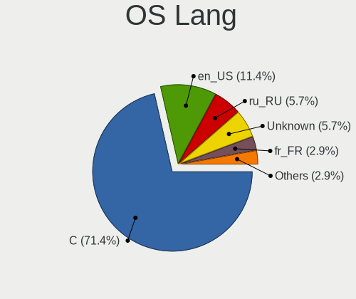
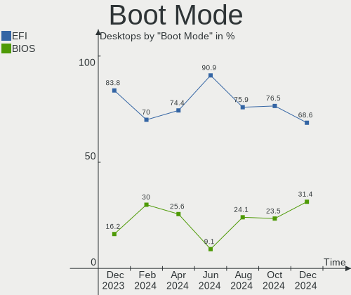
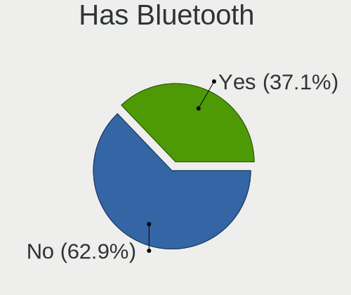
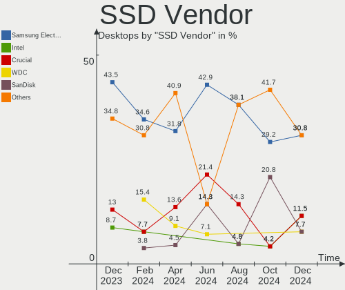
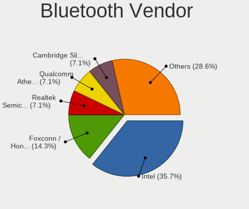
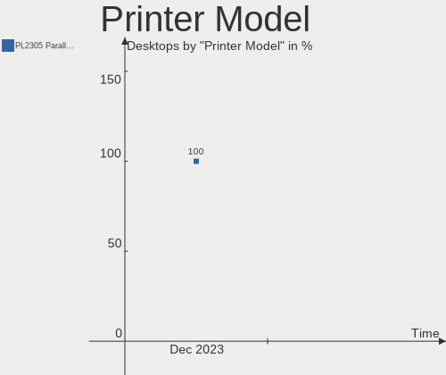
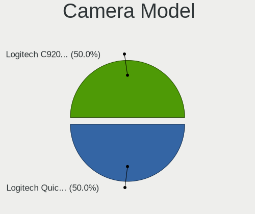
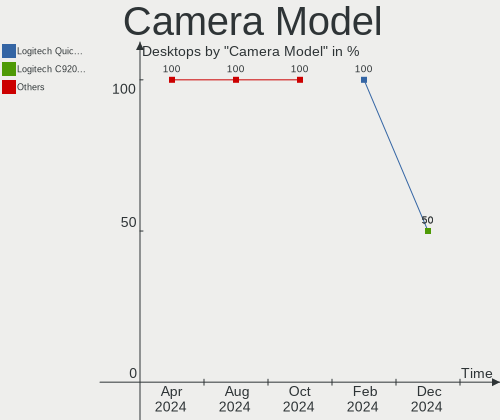

FreeBSD Hardware Trends (Desktops)
----------------------------------

A project to identify most popular hardware characteristics and track their change
over time based on data collected by FreeBSD users at https://BSD-Hardware.info.

Anyone can contribute to this report by the [hw-probe](https://github.com/linuxhw/hw-probe/blob/master/INSTALL.BSD.md) tool:

    hw-probe -all -upload

Full-feature report is available here: https://bsd-hardware.info/?view=trends

Period: Dec, 2021.

Contents
--------

* [ System ](#system)
  - [ OS                       ](#os)
  - [ OS Family                ](#os-family)
  - [ Arch                     ](#arch)
  - [ DE                       ](#de)
  - [ Display Server           ](#display-server)
  - [ Display Manager          ](#display-manager)
  - [ OS Lang                  ](#os-lang)
  - [ Boot Mode                ](#boot-mode)
  - [ Filesystem               ](#filesystem)
  - [ Part. scheme             ](#part-scheme)

* [ Board ](#board)
  - [ Vendor                   ](#vendor)
  - [ Model                    ](#model)
  - [ Model Family             ](#model-family)
  - [ MFG Year                 ](#mfg-year)
  - [ Form Factor              ](#form-factor)
  - [ Coreboot                 ](#coreboot)
  - [ RAM Size                 ](#ram-size)
  - [ RAM Used                 ](#ram-used)
  - [ Total Drives             ](#total-drives)
  - [ Has CD-ROM               ](#has-cd-rom)
  - [ Has Ethernet             ](#has-ethernet)
  - [ Has WiFi                 ](#has-wifi)
  - [ Has Bluetooth            ](#has-bluetooth)

* [ Location ](#location)
  - [ Country                  ](#country)
  - [ City                     ](#city)

* [ Drives ](#drives)
  - [ Drive Vendor             ](#drive-vendor)
  - [ Drive Model              ](#drive-model)
  - [ HDD Vendor               ](#hdd-vendor)
  - [ SSD Vendor               ](#ssd-vendor)
  - [ Drive Kind               ](#drive-kind)
  - [ Drive Connector          ](#drive-connector)
  - [ Drive Size               ](#drive-size)
  - [ Space Total              ](#space-total)
  - [ Space Used               ](#space-used)
  - [ Malfunc. Drives          ](#malfunc-drives)
  - [ Malfunc. Drive Vendor    ](#malfunc-drive-vendor)
  - [ Malfunc. HDD Vendor      ](#malfunc-hdd-vendor)
  - [ Malfunc. Drive Kind      ](#malfunc-drive-kind)
  - [ Failed Drives            ](#failed-drives)
  - [ Failed Drive Vendor      ](#failed-drive-vendor)
  - [ Drive Status             ](#drive-status)

* [ Storage controller ](#storage-controller)
  - [ Storage Vendor           ](#storage-vendor)
  - [ Storage Model            ](#storage-model)
  - [ Storage Kind             ](#storage-kind)

* [ Processor ](#processor)
  - [ CPU Vendor               ](#cpu-vendor)
  - [ CPU Model                ](#cpu-model)
  - [ CPU Model Family         ](#cpu-model-family)
  - [ CPU Cores                ](#cpu-cores)
  - [ CPU Sockets              ](#cpu-sockets)
  - [ CPU Threads              ](#cpu-threads)
  - [ CPU Microarch            ](#cpu-microarch)

* [ Graphics ](#graphics)
  - [ GPU Vendor               ](#gpu-vendor)
  - [ GPU Model                ](#gpu-model)
  - [ GPU Combo                ](#gpu-combo)
  - [ GPU Driver               ](#gpu-driver)
  - [ GPU Memory               ](#gpu-memory)

* [ Monitor ](#monitor)
  - [ Monitor Vendor           ](#monitor-vendor)
  - [ Monitor Model            ](#monitor-model)
  - [ Monitor Resolution       ](#monitor-resolution)
  - [ Monitor Diagonal         ](#monitor-diagonal)
  - [ Monitor Width            ](#monitor-width)
  - [ Aspect Ratio             ](#aspect-ratio)
  - [ Monitor Area             ](#monitor-area)
  - [ Pixel Density            ](#pixel-density)
  - [ Multiple Monitors        ](#multiple-monitors)

* [ Network ](#network)
  - [ Net Controller Vendor    ](#net-controller-vendor)
  - [ Net Controller Model     ](#net-controller-model)
  - [ Wireless Vendor          ](#wireless-vendor)
  - [ Wireless Model           ](#wireless-model)
  - [ Ethernet Vendor          ](#ethernet-vendor)
  - [ Ethernet Model           ](#ethernet-model)
  - [ Net Controller Kind      ](#net-controller-kind)
  - [ Used Controller          ](#used-controller)
  - [ NICs                     ](#nics)
  - [ IPv6                     ](#ipv6)

* [ Bluetooth ](#bluetooth)
  - [ Bluetooth Vendor         ](#bluetooth-vendor)
  - [ Bluetooth Model          ](#bluetooth-model)

* [ Sound ](#sound)
  - [ Sound Vendor             ](#sound-vendor)
  - [ Sound Model              ](#sound-model)

* [ Memory ](#memory)
  - [ Memory Vendor            ](#memory-vendor)
  - [ Memory Model             ](#memory-model)
  - [ Memory Kind              ](#memory-kind)
  - [ Memory Form Factor       ](#memory-form-factor)
  - [ Memory Size              ](#memory-size)
  - [ Memory Speed             ](#memory-speed)

* [ Printers & scanners ](#printers--scanners)
  - [ Printer Vendor           ](#printer-vendor)
  - [ Printer Model            ](#printer-model)
  - [ Scanner Vendor           ](#scanner-vendor)
  - [ Scanner Model            ](#scanner-model)

* [ Camera ](#camera)
  - [ Camera Vendor            ](#camera-vendor)
  - [ Camera Model             ](#camera-model)

* [ Security ](#security)
  - [ Fingerprint Vendor       ](#fingerprint-vendor)
  - [ Fingerprint Model        ](#fingerprint-model)
  - [ Chipcard Vendor          ](#chipcard-vendor)
  - [ Chipcard Model           ](#chipcard-model)

* [ Unsupported ](#unsupported)
  - [ Unsupported Devices      ](#unsupported-devices)
  - [ Unsupported Device Types ](#unsupported-device-types)

System
------

OS
--

Installed operating systems

| Name                 | Desktops | Percent |
|----------------------|----------|---------|
| FreeBSD 13.0-p5      | 18       | 45%     |
| FreeBSD 13.0         | 6        | 15%     |
| FreeBSD 14.0-CURRENT | 5        | 12.5%   |
| FreeBSD 13.0-STABLE  | 5        | 12.5%   |
| FreeBSD 13.0-p4      | 2        | 5%      |
| FreeBSD 13.0-p3      | 1        | 2.5%    |
| FreeBSD 12.3         | 1        | 2.5%    |
| FreeBSD 12.2-p11     | 1        | 2.5%    |
| FreeBSD 12.2         | 1        | 2.5%    |

OS Family
---------

OS without a version

| Name    | Desktops | Percent |
|---------|----------|---------|
| FreeBSD | 40       | 100%    |

Arch
----

OS architecture (x86_64, i586, etc.)

| Name  | Desktops | Percent |
|-------|----------|---------|
| amd64 | 34       | 85%     |
| arm64 | 4        | 10%     |
| i386  | 1        | 2.5%    |
| arm   | 1        | 2.5%    |

DE
--

Desktop Environment

| Name       | Desktops | Percent |
|------------|----------|---------|
| Console    | 16       | 40%     |
| KDE5       | 7        | 17.5%   |
| XFCE       | 5        | 12.5%   |
| Openbox    | 3        | 7.5%    |
| GNOME      | 3        | 7.5%    |
| TWM        | 2        | 5%      |
| X-Cinnamon | 1        | 2.5%    |
| MATE       | 1        | 2.5%    |
| i3         | 1        | 2.5%    |
| Fluxbox    | 1        | 2.5%    |

Display Server
--------------

X11 or Wayland

| Name    | Desktops | Percent |
|---------|----------|---------|
| X11     | 22       | 55%     |
| Console | 17       | 42.5%   |
| Wayland | 1        | 2.5%    |

Display Manager
---------------

SDDM, LightDM, etc.

| Name    | Desktops | Percent |
|---------|----------|---------|
| Console | 27       | 67.5%   |
| SLiM    | 4        | 10%     |
| SDDM    | 4        | 10%     |
| LightDM | 3        | 7.5%    |
| XDM     | 2        | 5%      |

OS Lang
-------

Language

| Lang    | Desktops | Percent |
|---------|----------|---------|
| C       | 25       | 62.5%   |
| uk_UA   | 5        | 12.5%   |
| en_US   | 4        | 10%     |
| ru_RU   | 3        | 7.5%    |
| Unknown | 2        | 5%      |
| en_GB   | 1        | 2.5%    |

Boot Mode
---------

EFI or BIOS

| Mode | Desktops | Percent |
|------|----------|---------|
| EFI  | 25       | 62.5%   |
| BIOS | 15       | 37.5%   |

Filesystem
----------

Type of filesystem

| Type | Desktops | Percent |
|------|----------|---------|
| Zfs  | 31       | 77.5%   |
| Ufs  | 9        | 22.5%   |

Part. scheme
------------

Scheme of partitioning

| Type | Desktops | Percent |
|------|----------|---------|
| GPT  | 38       | 95%     |
| MBR  | 2        | 5%      |

Board
-----

Vendor
------

Motherboard manufacturer

| Name                | Desktops | Percent |
|---------------------|----------|---------|
| ASUSTek Computer    | 13       | 32.5%   |
| Gigabyte Technology | 6        | 15%     |
| MSI                 | 4        | 10%     |
| Hewlett-Packard     | 3        | 7.5%    |
| Unknown             | 3        | 7.5%    |
| ASRock              | 2        | 5%      |
| Purism              | 1        | 2.5%    |
| PC Engines          | 1        | 2.5%    |
| khadas              | 1        | 2.5%    |
| Intel               | 1        | 2.5%    |
| friendlyelec        | 1        | 2.5%    |
| Dell                | 1        | 2.5%    |
| Cisco Systems       | 1        | 2.5%    |
| AMI                 | 1        | 2.5%    |
| Acer                | 1        | 2.5%    |

Model
-----

Motherboard model

| Name                             | Desktops | Percent |
|----------------------------------|----------|---------|
| Unknown                          | 3        | 7.5%    |
| Purism Librem Mini v2            | 1        | 2.5%    |
| PC Engines apu4                  | 1        | 2.5%    |
| MSI MS-9A25                      | 1        | 2.5%    |
| MSI MS-7C36                      | 1        | 2.5%    |
| MSI MS-7885                      | 1        | 2.5%    |
| MSI MS-7817                      | 1        | 2.5%    |
| khadas edge-v                    | 1        | 2.5%    |
| Intel D54250WYK H13922-304       | 1        | 2.5%    |
| HP Z600 Workstation              | 1        | 2.5%    |
| HP ProLiant MicroServer          | 1        | 2.5%    |
| HP Compaq Pro 6305 SFF           | 1        | 2.5%    |
| Gigabyte X570 AORUS PRO          | 1        | 2.5%    |
| Gigabyte X470 AORUS ULTRA GAMING | 1        | 2.5%    |
| Gigabyte OFFICEPRO 7000          | 1        | 2.5%    |
| Gigabyte GA-8S661FXM-775         | 1        | 2.5%    |
| Gigabyte B550M AORUS PRO-P       | 1        | 2.5%    |
| Gigabyte B550M AORUS ELITE       | 1        | 2.5%    |
| friendlyelec nanopi-m4           | 1        | 2.5%    |
| Dell OptiPlex 9020M              | 1        | 2.5%    |
| Cisco Systems UCSC-C240-M3L      | 1        | 2.5%    |
| ASUS ROG STRIX X570-E GAMING     | 1        | 2.5%    |
| ASUS ROG Maximus XI HERO         | 1        | 2.5%    |
| ASUS ROG Maximus X FORMULA       | 1        | 2.5%    |
| ASUS ROG CROSSHAIR VIII HERO     | 1        | 2.5%    |
| ASUS PRIME X570-PRO              | 1        | 2.5%    |
| ASUS PRIME X370-PRO              | 1        | 2.5%    |
| ASUS P8B75-M                     | 1        | 2.5%    |
| ASUS P7P55D                      | 1        | 2.5%    |
| ASUS P5Q-E                       | 1        | 2.5%    |
| ASUS P5B                         | 1        | 2.5%    |
| ASUS M5A99X EVO                  | 1        | 2.5%    |
| ASUS M4A785TD-V EVO              | 1        | 2.5%    |
| ASUS All Series                  | 1        | 2.5%    |
| ASRock X570 Phantom Gaming 4     | 1        | 2.5%    |
| ASRock B450 Steel Legend         | 1        | 2.5%    |
| AMI PEISIA E3845 VER1.0          | 1        | 2.5%    |
| Acer Aspire XC-895               | 1        | 2.5%    |

Model Family
------------

Motherboard model prefix

| Name                        | Desktops | Percent |
|-----------------------------|----------|---------|
| ASUS ROG                    | 4        | 10%     |
| Unknown                     | 3        | 7.5%    |
| Gigabyte B550M              | 2        | 5%      |
| ASUS PRIME                  | 2        | 5%      |
| Purism Librem               | 1        | 2.5%    |
| PC Engines apu4             | 1        | 2.5%    |
| MSI MS-9A25                 | 1        | 2.5%    |
| MSI MS-7C36                 | 1        | 2.5%    |
| MSI MS-7885                 | 1        | 2.5%    |
| MSI MS-7817                 | 1        | 2.5%    |
| khadas edge-v               | 1        | 2.5%    |
| Intel D54250WYK             | 1        | 2.5%    |
| HP Z600                     | 1        | 2.5%    |
| HP ProLiant                 | 1        | 2.5%    |
| HP Compaq                   | 1        | 2.5%    |
| Gigabyte X570               | 1        | 2.5%    |
| Gigabyte X470               | 1        | 2.5%    |
| Gigabyte OFFICEPRO          | 1        | 2.5%    |
| Gigabyte GA-8S661FXM-775    | 1        | 2.5%    |
| friendlyelec nanopi-m4      | 1        | 2.5%    |
| Dell OptiPlex               | 1        | 2.5%    |
| Cisco Systems UCSC-C240-M3L | 1        | 2.5%    |
| ASUS P8B75-M                | 1        | 2.5%    |
| ASUS P7P55D                 | 1        | 2.5%    |
| ASUS P5Q-E                  | 1        | 2.5%    |
| ASUS P5B                    | 1        | 2.5%    |
| ASUS M5A99X                 | 1        | 2.5%    |
| ASUS M4A785TD-V             | 1        | 2.5%    |
| ASUS All                    | 1        | 2.5%    |
| ASRock X570                 | 1        | 2.5%    |
| ASRock B450                 | 1        | 2.5%    |
| AMI PEISIA                  | 1        | 2.5%    |
| Acer Aspire                 | 1        | 2.5%    |

MFG Year
--------

Motherboard manufacture year

| Year    | Desktops | Percent |
|---------|----------|---------|
| 2021    | 8        | 20%     |
| 2019    | 8        | 20%     |
| 2020    | 7        | 17.5%   |
| 2011    | 3        | 7.5%    |
| Unknown | 3        | 7.5%    |
| 2014    | 2        | 5%      |
| 2013    | 2        | 5%      |
| 2018    | 1        | 2.5%    |
| 2017    | 1        | 2.5%    |
| 2010    | 1        | 2.5%    |
| 2009    | 1        | 2.5%    |
| 2008    | 1        | 2.5%    |
| 2006    | 1        | 2.5%    |
| 2005    | 1        | 2.5%    |

Form Factor
-----------

Physical design of the computer

| Name    | Desktops | Percent |
|---------|----------|---------|
| Desktop | 40       | 100%    |

Coreboot
--------

Have coreboot on board

| Used | Desktops | Percent |
|------|----------|---------|
| No   | 38       | 95%     |
| Yes  | 2        | 5%      |

RAM Size
--------

Total RAM memory

| Size in GB  | Desktops | Percent |
|-------------|----------|---------|
| 64.01-256.0 | 9        | 22.5%   |
| 32.01-64.0  | 8        | 20%     |
| 8.01-16.0   | 6        | 15%     |
| 4.01-8.0    | 4        | 10%     |
| 2.01-3.0    | 4        | 10%     |
| 16.01-24.0  | 4        | 10%     |
| 3.01-4.0    | 2        | 5%      |
| 0.51-1.0    | 2        | 5%      |
| 24.01-32.0  | 1        | 2.5%    |

RAM Used
--------

Used RAM memory

| Used GB     | Desktops | Percent |
|-------------|----------|---------|
| 0.01-0.5    | 13       | 32.5%   |
| 1.01-2.0    | 11       | 27.5%   |
| 0.51-1.0    | 5        | 12.5%   |
| 3.01-4.0    | 3        | 7.5%    |
| 32.01-64.0  | 2        | 5%      |
| 2.01-3.0    | 2        | 5%      |
| 4.01-8.0    | 1        | 2.5%    |
| 64.01-256.0 | 1        | 2.5%    |
| 16.01-24.0  | 1        | 2.5%    |
| 0           | 1        | 2.5%    |

Total Drives
------------

Number of drives on board

| Drives | Desktops | Percent |
|--------|----------|---------|
| 1      | 10       | 25%     |
| 2      | 9        | 22.5%   |
| 4      | 8        | 20%     |
| 0      | 5        | 12.5%   |
| 6      | 3        | 7.5%    |
| 13     | 1        | 2.5%    |
| 8      | 1        | 2.5%    |
| 7      | 1        | 2.5%    |
| 5      | 1        | 2.5%    |
| 3      | 1        | 2.5%    |

Has CD-ROM
----------

Has CD-ROM on board

| Presented | Desktops | Percent |
|-----------|----------|---------|
| No        | 32       | 80%     |
| Yes       | 8        | 20%     |

Has Ethernet
------------

Has Ethernet on board

| Presented | Desktops | Percent |
|-----------|----------|---------|
| Yes       | 36       | 90%     |
| No        | 4        | 10%     |

Has WiFi
--------

Has WiFi module

| Presented | Desktops | Percent |
|-----------|----------|---------|
| No        | 27       | 67.5%   |
| Yes       | 13       | 32.5%   |

Has Bluetooth
-------------

Has Bluetooth module

| Presented | Desktops | Percent |
|-----------|----------|---------|
| No        | 34       | 85%     |
| Yes       | 6        | 15%     |

Location
--------

Country
-------

Geographic location (country)

| Country     | Desktops | Percent |
|-------------|----------|---------|
| Russia      | 9        | 22.5%   |
| USA         | 8        | 20%     |
| Ukraine     | 7        | 17.5%   |
| UK          | 2        | 5%      |
| Poland      | 2        | 5%      |
| Australia   | 2        | 5%      |
| Spain       | 1        | 2.5%    |
| Romania     | 1        | 2.5%    |
| Philippines | 1        | 2.5%    |
| New Zealand | 1        | 2.5%    |
| Netherlands | 1        | 2.5%    |
| Japan       | 1        | 2.5%    |
| Czechia     | 1        | 2.5%    |
| Croatia     | 1        | 2.5%    |
| Canada      | 1        | 2.5%    |
| Austria     | 1        | 2.5%    |

City
----

Geographic location (city)

| City          | Desktops | Percent |
|---------------|----------|---------|
| Kyiv          | 6        | 15%     |
| Moscow        | 4        | 10%     |
| Salem         | 2        | 5%      |
| Redmond       | 2        | 5%      |
| Zadar         | 1        | 2.5%    |
| Yokohama      | 1        | 2.5%    |
| Yekaterinburg | 1        | 2.5%    |
| Wenatchee     | 1        | 2.5%    |
| Warsaw        | 1        | 2.5%    |
| Vienna        | 1        | 2.5%    |
| Vancouver     | 1        | 2.5%    |
| Ufa           | 1        | 2.5%    |
| Tarlac City   | 1        | 2.5%    |
| Tambov        | 1        | 2.5%    |
| Sydney        | 1        | 2.5%    |
| Perth         | 1        | 2.5%    |
| Ozersk        | 1        | 2.5%    |
| Otley         | 1        | 2.5%    |
| Ostrzeszow    | 1        | 2.5%    |
| Ostrava       | 1        | 2.5%    |
| Novosibirsk   | 1        | 2.5%    |
| Montgomery    | 1        | 2.5%    |
| Madrid        | 1        | 2.5%    |
| London        | 1        | 2.5%    |
| Lexington     | 1        | 2.5%    |
| Dnipro        | 1        | 2.5%    |
| Dallas        | 1        | 2.5%    |
| Bucharest     | 1        | 2.5%    |
| Auckland      | 1        | 2.5%    |
| Amsterdam     | 1        | 2.5%    |

Drives
------

Drive Vendor
------------

Hard drive vendors

| Vendor              | Desktops | Drives | Percent |
|---------------------|----------|--------|---------|
| WDC                 | 15       | 39     | 22.39%  |
| Samsung Electronics | 15       | 23     | 22.39%  |
| Seagate             | 13       | 21     | 19.4%   |
| Toshiba             | 4        | 7      | 5.97%   |
| Intel               | 4        | 4      | 5.97%   |
| GOODRAM             | 3        | 8      | 4.48%   |
| Kingston            | 2        | 2      | 2.99%   |
| HGST                | 2        | 2      | 2.99%   |
| Crucial             | 2        | 2      | 2.99%   |
| Smartbuy            | 1        | 1      | 1.49%   |
| Silicon Motion      | 1        | 1      | 1.49%   |
| OCZ                 | 1        | 1      | 1.49%   |
| LITEONIT            | 1        | 1      | 1.49%   |
| Hitachi             | 1        | 1      | 1.49%   |
| FORESEE             | 1        | 1      | 1.49%   |
| Corsair             | 1        | 1      | 1.49%   |

Drive Model
-----------

Hard drive models

| Model                                  | Desktops | Percent |
|----------------------------------------|----------|---------|
| Seagate ST4000DM000-1F2168 4TB         | 2        | 2.33%   |
| Seagate ST1000DM003-1CH162 1TB         | 2        | 2.33%   |
| WDC WDS100T1X0E-00AFY0 1TB             | 1        | 1.16%   |
| WDC WD80EMAZ-00WJTA0 8TB               | 1        | 1.16%   |
| WDC WD80EFZX-68UW8N0 8TB               | 1        | 1.16%   |
| WDC WD80EFAX-68LHPN0 8TB               | 1        | 1.16%   |
| WDC WD80EDBZ-11B0ZA0 8TB               | 1        | 1.16%   |
| WDC WD60EZRZ-00GZ5B1 6TB               | 1        | 1.16%   |
| WDC WD5000BPKT-00PK4T0 500GB           | 1        | 1.16%   |
| WDC WD5000AAKX-00ERMA0 500GB           | 1        | 1.16%   |
| WDC WD5000AAKS-00A7B2 500GB            | 1        | 1.16%   |
| WDC WD40EZRZ-22GXCB0 4TB               | 1        | 1.16%   |
| WDC WD40EZRZ-00GXCB0 4TB               | 1        | 1.16%   |
| WDC WD40EFZX-68AWUN0 4TB               | 1        | 1.16%   |
| WDC WD30EFRX-68AX9N0 3TB               | 1        | 1.16%   |
| WDC WD20NMVW-11AV3S2 2TB               | 1        | 1.16%   |
| WDC WD20EZRX-00D8PB0 2TB               | 1        | 1.16%   |
| WDC WD20EARX-00PASB0 2TB               | 1        | 1.16%   |
| WDC WD20EARX-008FB0 2TB                | 1        | 1.16%   |
| WDC WD20EARS-00MVWB0 2TB               | 1        | 1.16%   |
| WDC WD15EADS-00P8B0 1.5TB              | 1        | 1.16%   |
| WDC WD120EMFZ-11A6JA0 12TB             | 1        | 1.16%   |
| WDC WD120EMAZ-11BLFA0 12TB             | 1        | 1.16%   |
| WDC WD10SMZW-11Y0TS0 1TB               | 1        | 1.16%   |
| WDC WD10EZEX-08WN4A0 1TB               | 1        | 1.16%   |
| WDC WD10EZEX-08M2NA0 1TB               | 1        | 1.16%   |
| WDC WD10EFRX-68FYTN0 1TB               | 1        | 1.16%   |
| WDC WD1001FALS-00J7B1 1TB              | 1        | 1.16%   |
| WDC PC SN530 SDBPNPZ-256G-1014 256GB   | 1        | 1.16%   |
| Toshiba MQ01ACF050 500GB               | 1        | 1.16%   |
| Toshiba MQ01ABF050 500GB               | 1        | 1.16%   |
| Toshiba HDWE140 4TB                    | 1        | 1.16%   |
| Toshiba DT01ACA100 1TB                 | 1        | 1.16%   |
| Smartbuy SSD 60GB                      | 1        | 1.16%   |
| Silicon Motion NE-256 256GB            | 1        | 1.16%   |
| Seagate ST9500423AS 500GB              | 1        | 1.16%   |
| Seagate ST6000DM003-2CY186 6TB         | 1        | 1.16%   |
| Seagate ST4000NE001-2MA101 4TB         | 1        | 1.16%   |
| Seagate ST380011A 80GB                 | 1        | 1.16%   |
| Seagate ST3750640AS 752GB              | 1        | 1.16%   |
| Seagate ST3500418AS 500GB              | 1        | 1.16%   |
| Seagate ST3500312CS 500GB              | 1        | 1.16%   |
| Seagate ST32000645NS 2TB               | 1        | 1.16%   |
| Seagate ST3000DM001-1CH166 3TB         | 1        | 1.16%   |
| Seagate ST2000NM0033-9ZM175 2TB        | 1        | 1.16%   |
| Seagate ST2000NM0008-2F3100 2TB        | 1        | 1.16%   |
| Seagate ST1000LM048-2E7172 1TB         | 1        | 1.16%   |
| Seagate ST1000DM010-2EP102 1TB         | 1        | 1.16%   |
| Seagate FireCuda 530 ZP4000GM30013 4TB | 1        | 1.16%   |
| Samsung SSD 980 500GB                  | 1        | 1.16%   |
| Samsung SSD 970 PRO 1TB                | 1        | 1.16%   |
| Samsung SSD 970 EVO Plus 250GB         | 1        | 1.16%   |
| Samsung SSD 970 EVO 1TB                | 1        | 1.16%   |
| Samsung SSD 960 EVO 500GB              | 1        | 1.16%   |
| Samsung SSD 870 QVO 2TB                | 1        | 1.16%   |
| Samsung SSD 870 EVO 250GB              | 1        | 1.16%   |
| Samsung SSD 860 QVO 1TB                | 1        | 1.16%   |
| Samsung SSD 860 PRO 256GB              | 1        | 1.16%   |
| Samsung SSD 860 PRO 1TB                | 1        | 1.16%   |
| Samsung SSD 860 EVO 500GB              | 1        | 1.16%   |

HDD Vendor
----------

Hard disk drive vendors

| Vendor  | Desktops | Drives | Percent |
|---------|----------|--------|---------|
| WDC     | 14       | 37     | 42.42%  |
| Seagate | 12       | 20     | 36.36%  |
| Toshiba | 4        | 7      | 12.12%  |
| HGST    | 2        | 2      | 6.06%   |
| Hitachi | 1        | 1      | 3.03%   |

SSD Vendor
----------

Solid state drive vendors

| Vendor              | Desktops | Drives | Percent |
|---------------------|----------|--------|---------|
| Samsung Electronics | 10       | 16     | 41.67%  |
| Intel               | 4        | 4      | 16.67%  |
| Kingston            | 2        | 2      | 8.33%   |
| GOODRAM             | 2        | 7      | 8.33%   |
| Crucial             | 2        | 2      | 8.33%   |
| Smartbuy            | 1        | 1      | 4.17%   |
| OCZ                 | 1        | 1      | 4.17%   |
| LITEONIT            | 1        | 1      | 4.17%   |
| FORESEE             | 1        | 1      | 4.17%   |

Drive Kind
----------

HDD or SSD

| Kind | Desktops | Drives | Percent |
|------|----------|--------|---------|
| HDD  | 22       | 67     | 41.51%  |
| SSD  | 19       | 35     | 35.85%  |
| NVMe | 12       | 13     | 22.64%  |

Drive Connector
---------------

SATA, SAS, NVMe, etc.

| Type | Desktops | Drives | Percent |
|------|----------|--------|---------|
| SATA | 30       | 102    | 71.43%  |
| NVMe | 12       | 13     | 28.57%  |

Drive Size
----------

Size of hard drive

| Size in TB | Desktops | Drives | Percent |
|------------|----------|--------|---------|
| 0.01-0.5   | 21       | 38     | 42.86%  |
| 0.51-1.0   | 10       | 16     | 20.41%  |
| 1.01-2.0   | 6        | 15     | 12.24%  |
| 3.01-4.0   | 5        | 13     | 10.2%   |
| 2.01-3.0   | 3        | 4      | 6.12%   |
| 4.01-10.0  | 3        | 14     | 6.12%   |
| 10.01-20.0 | 1        | 2      | 2.04%   |

Space Total
-----------

Amount of disk space available on the file system

| Size in GB     | Desktops | Percent |
|----------------|----------|---------|
| 251-500        | 13       | 32.5%   |
| 101-250        | 7        | 17.5%   |
| 501-1000       | 7        | 17.5%   |
| 51-100         | 5        | 12.5%   |
| 1-20           | 4        | 10%     |
| More than 3000 | 1        | 2.5%    |
| 21-50          | 1        | 2.5%    |
| 1001-2000      | 1        | 2.5%    |
| Unknown        | 1        | 2.5%    |

Space Used
----------

Amount of used disk space

| Used GB | Desktops | Percent |
|---------|----------|---------|
| 1-20    | 34       | 85%     |
| 101-250 | 2        | 5%      |
| 251-500 | 1        | 2.5%    |
| 21-50   | 1        | 2.5%    |
| 51-100  | 1        | 2.5%    |
| Unknown | 1        | 2.5%    |

Malfunc. Drives
---------------

Drive models with a malfunction

| Model                          | Desktops | Drives | Percent |
|--------------------------------|----------|--------|---------|
| WDC WD5000AAKX-00ERMA0 500GB   | 1        | 1      | 14.29%  |
| WDC WD20EZRX-00D8PB0 2TB       | 1        | 2      | 14.29%  |
| WDC WD20EARX-008FB0 2TB        | 1        | 1      | 14.29%  |
| WDC WD20EARS-00MVWB0 2TB       | 1        | 1      | 14.29%  |
| WDC WD1001FALS-00J7B1 1TB      | 1        | 1      | 14.29%  |
| Toshiba HDWE140 4TB            | 1        | 4      | 14.29%  |
| Seagate ST1000DM003-1CH162 1TB | 1        | 1      | 14.29%  |

Malfunc. Drive Vendor
---------------------

Vendors of faulty drives

| Vendor  | Desktops | Drives | Percent |
|---------|----------|--------|---------|
| WDC     | 4        | 6      | 66.67%  |
| Toshiba | 1        | 4      | 16.67%  |
| Seagate | 1        | 1      | 16.67%  |

Malfunc. HDD Vendor
-------------------

Vendors of faulty HDD drives

| Vendor  | Desktops | Drives | Percent |
|---------|----------|--------|---------|
| WDC     | 4        | 6      | 66.67%  |
| Toshiba | 1        | 4      | 16.67%  |
| Seagate | 1        | 1      | 16.67%  |

Malfunc. Drive Kind
-------------------

Kinds of faulty drives

| Kind | Desktops | Drives | Percent |
|------|----------|--------|---------|
| HDD  | 6        | 11     | 100%    |

Failed Drives
-------------

Failed drive models

Zero info for selected period =(

Failed Drive Vendor
-------------------

Failed drive vendors

Zero info for selected period =(

Drive Status
------------

Number of failed and malfunc. drives

| Status   | Desktops | Drives | Percent |
|----------|----------|--------|---------|
| Works    | 34       | 102    | 82.93%  |
| Malfunc  | 6        | 11     | 14.63%  |
| Detected | 1        | 2      | 2.44%   |

Storage controller
------------------

Storage Vendor
--------------

Storage controller vendors

| Vendor                           | Desktops | Percent |
|----------------------------------|----------|---------|
| Intel                            | 18       | 30%     |
| AMD                              | 16       | 26.67%  |
| Samsung Electronics              | 8        | 13.33%  |
| Silicon Motion                   | 3        | 5%      |
| JMicron Technology               | 3        | 5%      |
| Broadcom / LSI                   | 3        | 5%      |
| Sandisk                          | 2        | 3.33%   |
| ASMedia Technology               | 2        | 3.33%   |
| Silicon Integrated Systems [SiS] | 1        | 1.67%   |
| Silicon Image                    | 1        | 1.67%   |
| Seagate Technology               | 1        | 1.67%   |
| Phison Electronics               | 1        | 1.67%   |
| Marvell Technology Group         | 1        | 1.67%   |

Storage Model
-------------

Storage controller models

| Model                                                                          | Desktops | Percent |
|--------------------------------------------------------------------------------|----------|---------|
| AMD FCH SATA Controller [AHCI mode]                                            | 9        | 12.68%  |
| Samsung NVMe SSD Controller SM981/PM981/PM983                                  | 5        | 7.04%   |
| Silicon Motion SM2263EN/SM2263XT SSD Controller                                | 3        | 4.23%   |
| AMD SB7x0/SB8x0/SB9x0 SATA Controller [AHCI mode]                              | 3        | 4.23%   |
| Samsung NVMe SSD Controller 980                                                | 2        | 2.82%   |
| JMicron JMB363 SATA/IDE Controller                                             | 2        | 2.82%   |
| Intel Cannon Lake PCH SATA AHCI Controller                                     | 2        | 2.82%   |
| Intel C610/X99 series chipset 6-Port SATA Controller [AHCI mode]               | 2        | 2.82%   |
| Intel 8 Series/C220 Series Chipset Family 6-port SATA Controller 1 [AHCI mode] | 2        | 2.82%   |
| Broadcom / LSI SAS2308 PCI-Express Fusion-MPT SAS-2                            | 2        | 2.82%   |
| ASMedia ASM1062 Serial ATA Controller                                          | 2        | 2.82%   |
| AMD Starship/Matisse Chipset SATA Controller [AHCI mode]                       | 2        | 2.82%   |
| AMD SB7x0/SB8x0/SB9x0 IDE Controller                                           | 2        | 2.82%   |
| AMD 400 Series Chipset SATA Controller                                         | 2        | 2.82%   |
| Silicon Integrated Systems [SiS] RAID bus controller 180 SATA/PATA  [SiS]      | 1        | 1.41%   |
| Silicon Integrated Systems [SiS] 5513 IDE Controller                           | 1        | 1.41%   |
| Silicon Image AAR-1220SA Serial ATA HostRAID Controller                        | 1        | 1.41%   |
| Sandisk WD PC SN810 / Black SN850 NVMe SSD                                     | 1        | 1.41%   |
| Sandisk WD Blue SN550 NVMe SSD                                                 | 1        | 1.41%   |
| Samsung NVMe SSD Controller SM961/PM961/SM963                                  | 1        | 1.41%   |
| Phison E16 PCIe4 NVMe Controller                                               | 1        | 1.41%   |
| Marvell Group 88SE6111/6121 SATA II / PATA Controller                          | 1        | 1.41%   |
| JMicron JMB362 SATA Controller                                                 | 1        | 1.41%   |
| Intel SATA Controller [RAID mode]                                              | 1        | 1.41%   |
| Intel Comet Lake SATA AHCI Controller                                          | 1        | 1.41%   |
| Intel C610/X99 series chipset sSATA Controller [AHCI mode]                     | 1        | 1.41%   |
| Intel Atom Processor E3800 Series SATA AHCI Controller                         | 1        | 1.41%   |
| Intel 82801JI (ICH10 Family) SATA AHCI Controller                              | 1        | 1.41%   |
| Intel 82801HR/HO/HH (ICH8R/DO/DH) 2 port SATA Controller [IDE mode]            | 1        | 1.41%   |
| Intel 82801H (ICH8 Family) 4 port SATA Controller [IDE mode]                   | 1        | 1.41%   |
| Intel 82801GBM/GHM (ICH7-M Family) SATA Controller [IDE mode]                  | 1        | 1.41%   |
| Intel 82801G (ICH7 Family) IDE Controller                                      | 1        | 1.41%   |
| Intel 8 Series SATA Controller 1 [AHCI mode]                                   | 1        | 1.41%   |
| Intel 7 Series/C210 Series Chipset Family 4-port SATA Controller [IDE mode]    | 1        | 1.41%   |
| Intel 7 Series/C210 Series Chipset Family 2-port SATA Controller [IDE mode]    | 1        | 1.41%   |
| Intel 6 Series/C200 Series Chipset Family 6 port Desktop SATA AHCI Controller  | 1        | 1.41%   |
| Intel 5 Series/3400 Series Chipset 6 port SATA AHCI Controller                 | 1        | 1.41%   |
| Intel 400 Series Chipset Family SATA AHCI Controller                           | 1        | 1.41%   |
| Intel 200 Series PCH SATA controller [AHCI mode]                               | 1        | 1.41%   |
| Broadcom / LSI SAS2008 PCI-Express Fusion-MPT SAS-2 [Falcon]                   | 1        | 1.41%   |
| Broadcom / LSI MegaRAID SAS 2208 [Thunderbolt]                                 | 1        | 1.41%   |
| Broadcom / LSI MegaRAID SAS 2008 [Falcon]                                      | 1        | 1.41%   |
| AMD X370 Series Chipset SATA Controller                                        | 1        | 1.41%   |
| AMD FCH SATA Controller [IDE mode]                                             | 1        | 1.41%   |
| Unknown                                                                        | 1        | 1.41%   |

Storage Kind
------------

Kind of storage controller (IDE, SATA, NVMe, SAS, ...)

| Kind | Desktops | Percent |
|------|----------|---------|
| SATA | 29       | 48.33%  |
| NVMe | 15       | 25%     |
| IDE  | 10       | 16.67%  |
| RAID | 3        | 5%      |
| SAS  | 3        | 5%      |

Processor
---------

CPU Vendor
----------

Processor vendors

| Vendor  | Desktops | Percent |
|---------|----------|---------|
| Intel   | 19       | 47.5%   |
| AMD     | 16       | 40%     |
| Unknown | 3        | 7.5%    |
| ARM     | 2        | 5%      |

CPU Model
---------

Processor models

| Model                                      | Desktops | Percent |
|--------------------------------------------|----------|---------|
|                                            | 3        | 7.5%    |
| AMD Ryzen 9 3900X 12-Core Processor        | 2        | 5%      |
| Intel Xeon CPU E5649 @ 2.53GHz             | 1        | 2.5%    |
| Intel Xeon CPU E5-2620 v2 @ 2.10GHz        | 1        | 2.5%    |
| Intel Xeon CPU E5-1650 v4 @ 3.60GHz        | 1        | 2.5%    |
| Intel Pentium CPU G3220 @ 3.00GHz          | 1        | 2.5%    |
| Intel Pentium 4 CPU                        | 1        | 2.5%    |
| Intel Core i9-9900K CPU @ 3.60GHz          | 1        | 2.5%    |
| Intel Core i7-8700K CPU @ 3.70GHz          | 1        | 2.5%    |
| Intel Core i7-5820K CPU @ 3.30GHz          | 1        | 2.5%    |
| Intel Core i7-2600 CPU                     | 1        | 2.5%    |
| Intel Core i7-10510U CPU @ 1.80GHz         | 1        | 2.5%    |
| Intel Core i5-4590T CPU @ 2.00GHz          | 1        | 2.5%    |
| Intel Core i5-4250U CPU @ 1.30GHz          | 1        | 2.5%    |
| Intel Core i5-3470 CPU @ 3.20GHz           | 1        | 2.5%    |
| Intel Core i5-10400 CPU @ 2.90GHz          | 1        | 2.5%    |
| Intel Core i5 CPU 650 @ 3.20GHz            | 1        | 2.5%    |
| Intel Core 2 Quad CPU Q6600 @ 2.40GHz      | 1        | 2.5%    |
| Intel Core 2 CPU 6300 @ 1.86GHz            | 1        | 2.5%    |
| Intel Atom CPU N270 @ 1.60GHz              | 1        | 2.5%    |
| Intel Atom CPU E3845 @ 1.91GHz             | 1        | 2.5%    |
| ARM Cortex-A57 r1p3                        | 1        | 2.5%    |
| ARM Cortex-A53 r0p4                        | 1        | 2.5%    |
| AMD Turion II Neo N40L Dual-Core Processor | 1        | 2.5%    |
| AMD Ryzen 9 5950X 16-Core Processor        | 1        | 2.5%    |
| AMD Ryzen 9 5900X 12-Core Processor        | 1        | 2.5%    |
| AMD Ryzen 7 5800X 8-Core Processor         | 1        | 2.5%    |
| AMD Ryzen 7 3700X 8-Core Processor         | 1        | 2.5%    |
| AMD Ryzen 7 2700X Eight-Core Processor     | 1        | 2.5%    |
| AMD Ryzen 7 1700 Eight-Core Processor      | 1        | 2.5%    |
| AMD Ryzen 5 5600G with Radeon Graphics     | 1        | 2.5%    |
| AMD Ryzen 3 3100 4-Core Processor          | 1        | 2.5%    |
| AMD Phenom II X6 1090T Processor           | 1        | 2.5%    |
| AMD GX-412TC SOC                           | 1        | 2.5%    |
| AMD Athlon II X2 240e Processor            | 1        | 2.5%    |
| AMD Athlon 3000G with Radeon Vega Graphics | 1        | 2.5%    |
| AMD A4-5300B APU with Radeon HD Graphics   | 1        | 2.5%    |

CPU Model Family
----------------

Processor model prefix

| Model             | Desktops | Percent |
|-------------------|----------|---------|
| Intel Core i5     | 5        | 12.5%   |
| Intel Core i7     | 4        | 10%     |
| AMD Ryzen 9       | 4        | 10%     |
| AMD Ryzen 7       | 4        | 10%     |
| Other             | 3        | 7.5%    |
| Intel Xeon        | 3        | 7.5%    |
| Intel Atom        | 2        | 5%      |
| ARM Cortex        | 2        | 5%      |
| Intel Pentium 4   | 1        | 2.5%    |
| Intel Pentium     | 1        | 2.5%    |
| Intel Core i9     | 1        | 2.5%    |
| Intel Core 2 Quad | 1        | 2.5%    |
| Intel Core 2      | 1        | 2.5%    |
| AMD Turion II Neo | 1        | 2.5%    |
| AMD Ryzen 5       | 1        | 2.5%    |
| AMD Ryzen 3       | 1        | 2.5%    |
| AMD Phenom II X6  | 1        | 2.5%    |
| AMD GX            | 1        | 2.5%    |
| AMD Athlon II X2  | 1        | 2.5%    |
| AMD Athlon        | 1        | 2.5%    |
| AMD A4            | 1        | 2.5%    |

CPU Cores
---------

Number of processor cores

| Number  | Desktops | Percent |
|---------|----------|---------|
| 4       | 8        | 20%     |
| Unknown | 7        | 17.5%   |
| 2       | 6        | 15%     |
| 6       | 5        | 12.5%   |
| 16      | 4        | 10%     |
| 24      | 3        | 7.5%    |
| 12      | 3        | 7.5%    |
| 8       | 2        | 5%      |
| 32      | 1        | 2.5%    |
| 1       | 1        | 2.5%    |

CPU Sockets
-----------

Number of sockets

| Number  | Desktops | Percent |
|---------|----------|---------|
| 1       | 34       | 85%     |
| 2       | 3        | 7.5%    |
| Unknown | 3        | 7.5%    |

CPU Threads
-----------

Threads per core (Hyper-Threading)

| Number  | Desktops | Percent |
|---------|----------|---------|
| 1       | 21       | 52.5%   |
| 2       | 11       | 27.5%   |
| Unknown | 8        | 20%     |

CPU Microarch
-------------

Microarchitecture

| Name        | Desktops | Percent |
|-------------|----------|---------|
| Unknown     | 5        | 12.5%   |
| Zen 3       | 4        | 10%     |
| Zen 2       | 4        | 10%     |
| Haswell     | 4        | 10%     |
| KabyLake    | 3        | 7.5%    |
| K10         | 3        | 7.5%    |
| Zen+        | 2        | 5%      |
| Westmere    | 2        | 5%      |
| IvyBridge   | 2        | 5%      |
| Core        | 2        | 5%      |
| Zen         | 1        | 2.5%    |
| Silvermont  | 1        | 2.5%    |
| SandyBridge | 1        | 2.5%    |
| Puma        | 1        | 2.5%    |
| Piledriver  | 1        | 2.5%    |
| NetBurst    | 1        | 2.5%    |
| CometLake   | 1        | 2.5%    |
| Broadwell   | 1        | 2.5%    |
| Bonnell     | 1        | 2.5%    |

Graphics
--------

GPU Vendor
----------

Vendors of graphics cards

| Vendor                     | Desktops | Percent |
|----------------------------|----------|---------|
| Nvidia                     | 15       | 40.54%  |
| AMD                        | 11       | 29.73%  |
| Intel                      | 10       | 27.03%  |
| Matrox Electronics Systems | 1        | 2.7%    |

GPU Model
---------

Graphics card models

| Model                                                                         | Desktops | Percent |
|-------------------------------------------------------------------------------|----------|---------|
| Nvidia GM206 [GeForce GTX 960]                                                | 3        | 7.69%   |
| Intel Xeon E3-1200 v3/4th Gen Core Processor Integrated Graphics Controller   | 2        | 5.13%   |
| Intel CoffeeLake-S GT2 [UHD Graphics 630]                                     | 2        | 5.13%   |
| Nvidia TU116 [GeForce GTX 1660 Ti]                                            | 1        | 2.56%   |
| Nvidia TU102 [GeForce RTX 2080 Ti Rev. A]                                     | 1        | 2.56%   |
| Nvidia GT218 [NVS 300]                                                        | 1        | 2.56%   |
| Nvidia GP108 [GeForce GT 1030]                                                | 1        | 2.56%   |
| Nvidia GP106 [GeForce GTX 1060 6GB]                                           | 1        | 2.56%   |
| Nvidia GP106 [GeForce GTX 1060 3GB]                                           | 1        | 2.56%   |
| Nvidia GP104 [GeForce GTX 1080]                                               | 1        | 2.56%   |
| Nvidia GK208B [GeForce GT 730]                                                | 1        | 2.56%   |
| Nvidia GK106 [GeForce GTX 660]                                                | 1        | 2.56%   |
| Nvidia GF100GL [Quadro 4000]                                                  | 1        | 2.56%   |
| Nvidia G96C [GeForce 9400 GT]                                                 | 1        | 2.56%   |
| Nvidia G86 [GeForce 8500 GT]                                                  | 1        | 2.56%   |
| Matrox Electronics Systems MGA G200e [Pilot] ServerEngines (SEP1)             | 1        | 2.56%   |
| Intel Xeon E3-1200 v2/3rd Gen Core processor Graphics Controller              | 1        | 2.56%   |
| Intel Mobile 945GSE Express Integrated Graphics Controller                    | 1        | 2.56%   |
| Intel Mobile 945GM/GMS/GME, 943/940GML Express Integrated Graphics Controller | 1        | 2.56%   |
| Intel Haswell-ULT Integrated Graphics Controller                              | 1        | 2.56%   |
| Intel CometLake-U GT2 [UHD Graphics]                                          | 1        | 2.56%   |
| Intel CometLake-S GT2 [UHD Graphics 630]                                      | 1        | 2.56%   |
| Intel Atom Processor Z36xxx/Z37xxx Series Graphics & Display                  | 1        | 2.56%   |
| AMD Trinity 2 [Radeon HD 7480D]                                               | 1        | 2.56%   |
| AMD RV630 XT [Radeon HD 2600 XT]                                              | 1        | 2.56%   |
| AMD RV280 [Radeon 9200 PRO] (Secondary)                                       | 1        | 2.56%   |
| AMD RV280 [Radeon 9200 PRO / 9250]                                            | 1        | 2.56%   |
| AMD RS880M [Mobility Radeon HD 4225/4250]                                     | 1        | 2.56%   |
| AMD Redwood PRO [Radeon HD 5550/5570/5630/6510/6610/7570]                     | 1        | 2.56%   |
| AMD Picasso/Raven 2 [Radeon Vega Series / Radeon Vega Mobile Series]          | 1        | 2.56%   |
| AMD Navi 14 [Radeon RX 5500/5500M / Pro 5500M]                                | 1        | 2.56%   |
| AMD Lexa PRO [Radeon 540/540X/550/550X / RX 540X/550/550X]                    | 1        | 2.56%   |
| AMD Ellesmere [Radeon RX 470/480/570/570X/580/580X/590]                       | 1        | 2.56%   |
| AMD Cezanne                                                                   | 1        | 2.56%   |
| AMD Cedar [Radeon HD 5000/6000/7350/8350 Series]                              | 1        | 2.56%   |

GPU Combo
---------

Combinations of graphics cards

| Name           | Desktops | Percent |
|----------------|----------|---------|
| 1 x Nvidia     | 13       | 32.5%   |
| 1 x AMD        | 10       | 25%     |
| 1 x Intel      | 7        | 17.5%   |
| Other          | 6        | 15%     |
| 2 x Intel      | 1        | 2.5%    |
| 2 x AMD        | 1        | 2.5%    |
| 1 x Matrox     | 1        | 2.5%    |
| Intel + Nvidia | 1        | 2.5%    |

GPU Driver
----------

Free vs proprietary

| Driver      | Desktops | Percent |
|-------------|----------|---------|
| Free        | 25       | 62.5%   |
| Proprietary | 9        | 22.5%   |
| Unknown     | 6        | 15%     |

GPU Memory
----------

Total video memory

| Size in GB | Desktops | Percent |
|------------|----------|---------|
| Unknown    | 29       | 72.5%   |
| 1.01-2.0   | 5        | 12.5%   |
| 5.01-6.0   | 2        | 5%      |
| 7.01-8.0   | 1        | 2.5%    |
| 3.01-4.0   | 1        | 2.5%    |
| 8.01-16.0  | 1        | 2.5%    |
| 0.51-1.0   | 1        | 2.5%    |

Monitor
-------

Monitor Vendor
--------------

Monitor vendors

| Vendor               | Desktops | Percent |
|----------------------|----------|---------|
| Dell                 | 4        | 18.18%  |
| Acer                 | 3        | 13.64%  |
| Samsung Electronics  | 2        | 9.09%   |
| RTK                  | 2        | 9.09%   |
| Philips              | 2        | 9.09%   |
| Hewlett-Packard      | 2        | 9.09%   |
| Goldstar             | 2        | 9.09%   |
| ViewSonic            | 1        | 4.55%   |
| Unknown              | 1        | 4.55%   |
| Iiyama               | 1        | 4.55%   |
| Hitachi              | 1        | 4.55%   |
| Ancor Communications | 1        | 4.55%   |

Monitor Model
-------------

Monitor models

| Model                                                                 | Desktops | Percent |
|-----------------------------------------------------------------------|----------|---------|
| RTK WCS Display RTK1A1B 1920x1080 344x195mm 15.6-inch                 | 2        | 8%      |
| ViewSonic LCD Monitor VX2451 SERIES 1920x1080                         | 1        | 4%      |
| Unknown LCD Monitor KJT4K2K60DP 3840x2160                             | 1        | 4%      |
| Samsung Electronics SyncMaster SAM027E 1680x1050 470x300mm 22.0-inch  | 1        | 4%      |
| Samsung Electronics S24H85x SAM0E0C 2560x1440 530x300mm 24.0-inch     | 1        | 4%      |
| Philips PHL BDM4037U PHLC142 3840x2160 890x500mm 40.2-inch            | 1        | 4%      |
| Philips PHL 233V5 PHLC0D0 1920x1080 510x290mm 23.1-inch               | 1        | 4%      |
| Philips LCD Monitor PHLC050 1366x768 410x230mm 18.5-inch              | 1        | 4%      |
| Iiyama PL2292H IVM563C 1920x1080 480x270mm 21.7-inch                  | 1        | 4%      |
| Hitachi HISENSE HEC0030 3840x2160 1150x650mm 52.0-inch                | 1        | 4%      |
| Hewlett-Packard ZR24w HWP286A 1920x1200 540x350mm 25.3-inch           | 1        | 4%      |
| Hewlett-Packard E221 HWP3060 1920x1080 500x290mm 22.8-inch            | 1        | 4%      |
| Goldstar MP59G GSM5B35 1920x1080 600x340mm 27.2-inch                  | 1        | 4%      |
| Goldstar MP59G GSM5B34 1920x1080 480x270mm 21.7-inch                  | 1        | 4%      |
| Goldstar LG HDR WQHD GSM7716 3840x1600 880x370mm 37.6-inch            | 1        | 4%      |
| Dell U2719DC DEL417C 2560x1440 600x340mm 27.2-inch                    | 1        | 4%      |
| Dell U2719D DEL415F 2560x1440 600x340mm 27.2-inch                     | 1        | 4%      |
| Dell U2212HM DELD047 1920x1080 480x270mm 21.7-inch                    | 1        | 4%      |
| Dell P2715Q DEL40BD 3840x2160 600x340mm 27.2-inch                     | 1        | 4%      |
| Dell LCD Monitor DELD110 2560x1440 700x400mm 31.7-inch                | 1        | 4%      |
| Ancor Communications ASUS VG27A ACI27C2 1920x1080 600x340mm 27.2-inch | 1        | 4%      |
| Acer XB271HU ACR0490 2560x1440 600x340mm 27.2-inch                    | 1        | 4%      |
| Acer V233H ACR0090 1920x1080 510x290mm 23.1-inch                      | 1        | 4%      |
| Acer EG220Q ACR06A1 1920x1080 480x270mm 21.7-inch                     | 1        | 4%      |

Monitor Resolution
------------------

Monitor screen resolution

| Resolution         | Desktops | Percent |
|--------------------|----------|---------|
| 1920x1080 (FHD)    | 10       | 45.45%  |
| 3840x2160 (4K)     | 4        | 18.18%  |
| 2560x1440 (QHD)    | 4        | 18.18%  |
| 3840x1600          | 1        | 4.55%   |
| 1920x1200 (WUXGA)  | 1        | 4.55%   |
| 1680x1050 (WSXGA+) | 1        | 4.55%   |
| 1366x768 (WXGA)    | 1        | 4.55%   |

Monitor Diagonal
----------------

Diagonal size in inches

| Inches  | Desktops | Percent |
|---------|----------|---------|
| 27      | 5        | 21.74%  |
| 21      | 3        | 13.04%  |
| 23      | 2        | 8.7%    |
| 22      | 2        | 8.7%    |
| 15      | 2        | 8.7%    |
| Unknown | 2        | 8.7%    |
| 52      | 1        | 4.35%   |
| 40      | 1        | 4.35%   |
| 37      | 1        | 4.35%   |
| 31      | 1        | 4.35%   |
| 25      | 1        | 4.35%   |
| 24      | 1        | 4.35%   |
| 18      | 1        | 4.35%   |

Monitor Width
-------------

Physical width

| Width in mm | Desktops | Percent |
|-------------|----------|---------|
| 501-600     | 9        | 39.13%  |
| 401-500     | 6        | 26.09%  |
| 801-900     | 2        | 8.7%    |
| 301-350     | 2        | 8.7%    |
| Unknown     | 2        | 8.7%    |
| 601-700     | 1        | 4.35%   |
| 1001-1500   | 1        | 4.35%   |

Aspect Ratio
------------

Proportional relationship between the width and the height

| Ratio   | Desktops | Percent |
|---------|----------|---------|
| 16/9    | 16       | 76.19%  |
| Unknown | 2        | 9.52%   |
| 3/2     | 1        | 4.76%   |
| 21/9    | 1        | 4.76%   |
| 16/10   | 1        | 4.76%   |

Monitor Area
------------

Area in inch

| Area in inch | Desktops | Percent |
|----------------|----------|---------|
| 201-250        | 8        | 34.78%  |
| 301-350        | 5        | 21.74%  |
| 101-110        | 2        | 8.7%    |
| 501-1000       | 2        | 8.7%    |
| Unknown        | 2        | 8.7%    |
| More than 1000 | 1        | 4.35%   |
| 351-500        | 1        | 4.35%   |
| 251-300        | 1        | 4.35%   |
| 141-150        | 1        | 4.35%   |

Pixel Density
-------------

Pixels per inch

| Density | Desktops | Percent |
|---------|----------|---------|
| 51-100  | 9        | 40.91%  |
| 101-120 | 7        | 31.82%  |
| 121-160 | 3        | 13.64%  |
| Unknown | 2        | 9.09%   |
| 161-240 | 1        | 4.55%   |

Multiple Monitors
-----------------

Total monitors connected

| Total | Desktops | Percent |
|-------|----------|---------|
| 0     | 19       | 47.5%   |
| 1     | 17       | 42.5%   |
| 2     | 4        | 10%     |

Network
-------

Net Controller Vendor
---------------------

Controller vendors

| Vendor                            | Desktops | Percent |
|-----------------------------------|----------|---------|
| Intel                             | 22       | 40%     |
| Realtek Semiconductor             | 16       | 29.09%  |
| Qualcomm Atheros                  | 4        | 7.27%   |
| Broadcom                          | 3        | 5.45%   |
| VIA Technologies                  | 1        | 1.82%   |
| Sundance Technology Inc / IC Plus | 1        | 1.82%   |
| Silicon Integrated Systems [SiS]  | 1        | 1.82%   |
| Ralink Technology                 | 1        | 1.82%   |
| Ralink                            | 1        | 1.82%   |
| Pulse-Eight                       | 1        | 1.82%   |
| Marvell Technology Group          | 1        | 1.82%   |
| ASUSTek Computer                  | 1        | 1.82%   |
| Arduino SA                        | 1        | 1.82%   |
| Aquantia                          | 1        | 1.82%   |

Net Controller Model
--------------------

Controller models

| Model                                                                      | Desktops | Percent |
|----------------------------------------------------------------------------|----------|---------|
| Realtek RTL8111/8168/8411 PCI Express Gigabit Ethernet Controller          | 12       | 19.05%  |
| Intel I211 Gigabit Network Connection                                      | 10       | 15.87%  |
| Intel 82574L Gigabit Network Connection                                    | 5        | 7.94%   |
| Realtek RTL8125 2.5GbE Controller                                          | 3        | 4.76%   |
| Intel Wi-Fi 6 AX200                                                        | 3        | 4.76%   |
| Intel Cannon Lake PCH CNVi WiFi                                            | 2        | 3.17%   |
| VIA VT6105/VT6106S [Rhine-III]                                             | 1        | 1.59%   |
| Sundance Inc / IC Plus IC Plus IP100A Integrated 10/100 Ethernet MAC + PHY | 1        | 1.59%   |
| Silicon Integrated Systems [SiS] SiS900 PCI Fast Ethernet                  | 1        | 1.59%   |
| Realtek RTL8188EUS 802.11n Wireless Network Adapter                        | 1        | 1.59%   |
| Ralink RT5370 Wireless Adapter                                             | 1        | 1.59%   |
| Ralink RT2561/RT61 802.11g PCI                                             | 1        | 1.59%   |
| Qualcomm Atheros AR9462 Wireless Network Adapter                           | 1        | 1.59%   |
| Qualcomm Atheros AR93xx Wireless Network Adapter                           | 1        | 1.59%   |
| Qualcomm Atheros AR9287 Wireless Network Adapter (PCI-Express)             | 1        | 1.59%   |
| Qualcomm Atheros AR9285 Wireless Network Adapter (PCI-Express)             | 1        | 1.59%   |
| Pulse-Eight CEC Adapter                                                    | 1        | 1.59%   |
| Marvell Group 88E8056 PCI-E Gigabit Ethernet Controller                    | 1        | 1.59%   |
| Marvell Group 88E8001 Gigabit Ethernet Controller                          | 1        | 1.59%   |
| Intel I350 Gigabit Network Connection                                      | 1        | 1.59%   |
| Intel I210 Gigabit Network Connection                                      | 1        | 1.59%   |
| Intel Ethernet Controller 10G X550T                                        | 1        | 1.59%   |
| Intel Ethernet Connection I218-V                                           | 1        | 1.59%   |
| Intel Ethernet Connection I217-LM                                          | 1        | 1.59%   |
| Intel Ethernet Connection (7) I219-V                                       | 1        | 1.59%   |
| Intel Ethernet Connection (2) I219-V                                       | 1        | 1.59%   |
| Intel Centrino Advanced-N 6235                                             | 1        | 1.59%   |
| Intel 82599ES 10-Gigabit SFI/SFP+ Network Connection                       | 1        | 1.59%   |
| Broadcom NetXtreme BCM5764M Gigabit Ethernet PCIe                          | 1        | 1.59%   |
| Broadcom NetXtreme BCM5761 Gigabit Ethernet PCIe                           | 1        | 1.59%   |
| Broadcom NetXtreme BCM5723 Gigabit Ethernet PCIe                           | 1        | 1.59%   |
| ASUS Realtek 8188EUS [USB-N10 Nano]                                        | 1        | 1.59%   |
| Arduino SA Leonardo (CDC ACM, HID)                                         | 1        | 1.59%   |
| Aquantia AQC107 NBase-T/IEEE 802.3bz Ethernet Controller [AQtion]          | 1        | 1.59%   |

Wireless Vendor
---------------

Wireless vendors

| Vendor                | Desktops | Percent |
|-----------------------|----------|---------|
| Intel                 | 6        | 42.86%  |
| Qualcomm Atheros      | 4        | 28.57%  |
| Realtek Semiconductor | 1        | 7.14%   |
| Ralink Technology     | 1        | 7.14%   |
| Ralink                | 1        | 7.14%   |
| ASUSTek Computer      | 1        | 7.14%   |

Wireless Model
--------------

Wireless models

| Model                                                          | Desktops | Percent |
|----------------------------------------------------------------|----------|---------|
| Intel Wi-Fi 6 AX200                                            | 3        | 21.43%  |
| Intel Cannon Lake PCH CNVi WiFi                                | 2        | 14.29%  |
| Realtek RTL8188EUS 802.11n Wireless Network Adapter            | 1        | 7.14%   |
| Ralink RT5370 Wireless Adapter                                 | 1        | 7.14%   |
| Ralink RT2561/RT61 802.11g PCI                                 | 1        | 7.14%   |
| Qualcomm Atheros AR9462 Wireless Network Adapter               | 1        | 7.14%   |
| Qualcomm Atheros AR93xx Wireless Network Adapter               | 1        | 7.14%   |
| Qualcomm Atheros AR9287 Wireless Network Adapter (PCI-Express) | 1        | 7.14%   |
| Qualcomm Atheros AR9285 Wireless Network Adapter (PCI-Express) | 1        | 7.14%   |
| Intel Centrino Advanced-N 6235                                 | 1        | 7.14%   |
| ASUS Realtek 8188EUS [USB-N10 Nano]                            | 1        | 7.14%   |

Ethernet Vendor
---------------

Ethernet vendors

| Vendor                            | Desktops | Percent |
|-----------------------------------|----------|---------|
| Intel                             | 21       | 48.84%  |
| Realtek Semiconductor             | 14       | 32.56%  |
| Broadcom                          | 3        | 6.98%   |
| VIA Technologies                  | 1        | 2.33%   |
| Sundance Technology Inc / IC Plus | 1        | 2.33%   |
| Silicon Integrated Systems [SiS]  | 1        | 2.33%   |
| Marvell Technology Group          | 1        | 2.33%   |
| Aquantia                          | 1        | 2.33%   |

Ethernet Model
--------------

Ethernet models

| Model                                                                      | Desktops | Percent |
|----------------------------------------------------------------------------|----------|---------|
| Realtek RTL8111/8168/8411 PCI Express Gigabit Ethernet Controller          | 12       | 26.09%  |
| Intel I211 Gigabit Network Connection                                      | 10       | 21.74%  |
| Intel 82574L Gigabit Network Connection                                    | 5        | 10.87%  |
| Realtek RTL8125 2.5GbE Controller                                          | 2        | 4.35%   |
| VIA VT6105/VT6106S [Rhine-III]                                             | 1        | 2.17%   |
| Sundance Inc / IC Plus IC Plus IP100A Integrated 10/100 Ethernet MAC + PHY | 1        | 2.17%   |
| Silicon Integrated Systems [SiS] SiS900 PCI Fast Ethernet                  | 1        | 2.17%   |
| Marvell Group 88E8056 PCI-E Gigabit Ethernet Controller                    | 1        | 2.17%   |
| Marvell Group 88E8001 Gigabit Ethernet Controller                          | 1        | 2.17%   |
| Intel I350 Gigabit Network Connection                                      | 1        | 2.17%   |
| Intel I210 Gigabit Network Connection                                      | 1        | 2.17%   |
| Intel Ethernet Controller 10G X550T                                        | 1        | 2.17%   |
| Intel Ethernet Connection I218-V                                           | 1        | 2.17%   |
| Intel Ethernet Connection I217-LM                                          | 1        | 2.17%   |
| Intel Ethernet Connection (7) I219-V                                       | 1        | 2.17%   |
| Intel Ethernet Connection (2) I219-V                                       | 1        | 2.17%   |
| Intel 82599ES 10-Gigabit SFI/SFP+ Network Connection                       | 1        | 2.17%   |
| Broadcom NetXtreme BCM5764M Gigabit Ethernet PCIe                          | 1        | 2.17%   |
| Broadcom NetXtreme BCM5761 Gigabit Ethernet PCIe                           | 1        | 2.17%   |
| Broadcom NetXtreme BCM5723 Gigabit Ethernet PCIe                           | 1        | 2.17%   |
| Aquantia AQC107 NBase-T/IEEE 802.3bz Ethernet Controller [AQtion]          | 1        | 2.17%   |

Net Controller Kind
-------------------

Ethernet, WiFi or modem

| Kind     | Desktops | Percent |
|----------|----------|---------|
| Ethernet | 37       | 68.52%  |
| WiFi     | 14       | 25.93%  |
| Modem    | 2        | 3.7%    |
| Unknown  | 1        | 1.85%   |

Used Controller
---------------

Currently used network controller

| Kind     | Desktops | Percent |
|----------|----------|---------|
| Ethernet | 36       | 81.82%  |
| WiFi     | 8        | 18.18%  |

NICs
----

Total network controllers on board

| Total | Desktops | Percent |
|-------|----------|---------|
| 1     | 17       | 42.5%   |
| 2     | 11       | 27.5%   |
| 3     | 5        | 12.5%   |
| 0     | 4        | 10%     |
| 5     | 2        | 5%      |
| 4     | 1        | 2.5%    |

IPv6
----

IPv6 vs IPv4

| Used | Desktops | Percent |
|------|----------|---------|
| No   | 33       | 82.5%   |
| Yes  | 7        | 17.5%   |

Bluetooth
---------

Bluetooth Vendor
----------------

Controller vendors

| Vendor                  | Desktops | Percent |
|-------------------------|----------|---------|
| Intel                   | 4        | 66.67%  |
| Lite-On Technology      | 1        | 16.67%  |
| Cambridge Silicon Radio | 1        | 16.67%  |

Bluetooth Model
---------------

Controller models

| Model                                               | Desktops | Percent |
|-----------------------------------------------------|----------|---------|
| Intel AX200 Bluetooth                               | 2        | 33.33%  |
| Lite-On Atheros AR3012 Bluetooth                    | 1        | 16.67%  |
| Intel Centrino Bluetooth Wireless Transceiver       | 1        | 16.67%  |
| Intel Bluetooth 9460/9560 Jefferson Peak (JfP)      | 1        | 16.67%  |
| Cambridge Silicon Radio Bluetooth Dongle (HCI mode) | 1        | 16.67%  |

Sound
-----

Sound Vendor
------------

Sound card vendors

| Vendor                           | Desktops | Percent |
|----------------------------------|----------|---------|
| Intel                            | 15       | 30.61%  |
| AMD                              | 14       | 28.57%  |
| Nvidia                           | 13       | 26.53%  |
| Sony                             | 1        | 2.04%   |
| Silicon Integrated Systems [SiS] | 1        | 2.04%   |
| Samsung Electronics              | 1        | 2.04%   |
| ROCCAT                           | 1        | 2.04%   |
| Logitech                         | 1        | 2.04%   |
| Focusrite-Novation               | 1        | 2.04%   |
| Creative Labs                    | 1        | 2.04%   |

Sound Model
-----------

Sound card models

| Model                                                                      | Desktops | Percent |
|----------------------------------------------------------------------------|----------|---------|
| AMD Starship/Matisse HD Audio Controller                                   | 7        | 11.86%  |
| Nvidia GM206 High Definition Audio Controller                              | 3        | 5.08%   |
| Nvidia GP106 High Definition Audio Controller                              | 2        | 3.39%   |
| Intel Cannon Lake PCH cAVS                                                 | 2        | 3.39%   |
| Intel 82801JI (ICH10 Family) HD Audio Controller                           | 2        | 3.39%   |
| Intel 8 Series/C220 Series Chipset High Definition Audio Controller        | 2        | 3.39%   |
| AMD SBx00 Azalia (Intel HDA)                                               | 2        | 3.39%   |
| AMD Family 17h (Models 10h-1fh) HD Audio Controller                        | 2        | 3.39%   |
| Sony DualShock 4 [CUH-ZCT2x]                                               | 1        | 1.69%   |
| Silicon Integrated Systems [SiS] SiS7012 AC'97 Sound Controller            | 1        | 1.69%   |
| Samsung Electronics Samsung Type-C to 3.5pi gender adapter                 | 1        | 1.69%   |
| ROCCAT USB PnP Sound Device                                                | 1        | 1.69%   |
| Nvidia TU116 High Definition Audio Controller                              | 1        | 1.69%   |
| Nvidia TU102 High Definition Audio Controller                              | 1        | 1.69%   |
| Nvidia High Definition Audio Controller                                    | 1        | 1.69%   |
| Nvidia GP108 High Definition Audio Controller                              | 1        | 1.69%   |
| Nvidia GP104 High Definition Audio Controller                              | 1        | 1.69%   |
| Nvidia GK208 HDMI/DP Audio Controller                                      | 1        | 1.69%   |
| Nvidia GK106 HDMI Audio Controller                                         | 1        | 1.69%   |
| Nvidia GF100 High Definition Audio Controller                              | 1        | 1.69%   |
| Logitech Logitech G PRO X Gaming Headset                                   | 1        | 1.69%   |
| Intel Xeon E3-1200 v3/4th Gen Core Processor HD Audio Controller           | 1        | 1.69%   |
| Intel NM10/ICH7 Family High Definition Audio Controller                    | 1        | 1.69%   |
| Intel Haswell-ULT HD Audio Controller                                      | 1        | 1.69%   |
| Intel Comet Lake PCH-V cAVS                                                | 1        | 1.69%   |
| Intel Comet Lake PCH-LP cAVS                                               | 1        | 1.69%   |
| Intel C610/X99 series chipset HD Audio Controller                          | 1        | 1.69%   |
| Intel 82801H (ICH8 Family) HD Audio Controller                             | 1        | 1.69%   |
| Intel 8 Series HD Audio Controller                                         | 1        | 1.69%   |
| Intel 7 Series/C216 Chipset Family High Definition Audio Controller        | 1        | 1.69%   |
| Intel 6 Series/C200 Series Chipset Family High Definition Audio Controller | 1        | 1.69%   |
| Intel 5 Series/3400 Series Chipset High Definition Audio                   | 1        | 1.69%   |
| Focusrite-Novation Scarlett Solo (3rd Gen.)                                | 1        | 1.69%   |
| Creative Labs EMU10k1 [Sound Blaster Live! Series]                         | 1        | 1.69%   |
| AMD Trinity HDMI Audio Controller                                          | 1        | 1.69%   |
| AMD RV630 HDMI Audio [Radeon HD 2600 PRO/XT / HD 3610]                     | 1        | 1.69%   |
| AMD Renoir Radeon High Definition Audio Controller                         | 1        | 1.69%   |
| AMD Redwood HDMI Audio [Radeon HD 5000 Series]                             | 1        | 1.69%   |
| AMD Raven/Raven2/Fenghuang HDMI/DP Audio Controller                        | 1        | 1.69%   |
| AMD Navi 10 HDMI Audio                                                     | 1        | 1.69%   |
| AMD FCH Azalia Controller                                                  | 1        | 1.69%   |
| AMD Family 17h (Models 00h-0fh) HD Audio Controller                        | 1        | 1.69%   |
| AMD Ellesmere HDMI Audio [Radeon RX 470/480 / 570/580/590]                 | 1        | 1.69%   |
| AMD Cedar HDMI Audio [Radeon HD 5400/6300/7300 Series]                     | 1        | 1.69%   |
| AMD Baffin HDMI/DP Audio [Radeon RX 550 640SP / RX 560/560X]               | 1        | 1.69%   |

Memory
------

Memory Vendor
-------------

Memory module vendors

| Vendor              | Desktops | Percent |
|---------------------|----------|---------|
| Unknown             | 9        | 23.08%  |
| Kingston            | 6        | 15.38%  |
| Corsair             | 6        | 15.38%  |
| Micron Technology   | 5        | 12.82%  |
| G.Skill             | 4        | 10.26%  |
| Samsung Electronics | 2        | 5.13%   |
| Crucial             | 2        | 5.13%   |
| SK Hynix            | 1        | 2.56%   |
| S                   | 1        | 2.56%   |
| Kimtigo             | 1        | 2.56%   |
| H                   | 1        | 2.56%   |
| Unknown             | 1        | 2.56%   |

Memory Model
------------

Memory module models

| Model                                                    | Desktops | Percent |
|----------------------------------------------------------|----------|---------|
| Unknown RAM Module 4GB DIMM 1333MT/s                     | 2        | 5%      |
| Unknown RAM Module 8GB DIMM DDR3 1600MT/s                | 1        | 2.5%    |
| Unknown RAM Module 8GB DIMM 1333MT/s                     | 1        | 2.5%    |
| Unknown RAM Module 4GB DIMM DDR 1333MT/s                 | 1        | 2.5%    |
| Unknown RAM Module 2GB SODIMM DDR3 667MT/s               | 1        | 2.5%    |
| Unknown RAM Module 2GB DIMM SDRAM                        | 1        | 2.5%    |
| Unknown RAM Module 2GB DIMM DDR 800MT/s                  | 1        | 2.5%    |
| Unknown RAM Module 2GB DIMM 1333MT/s                     | 1        | 2.5%    |
| Unknown RAM Module 1GB DIMM 400MT/s                      | 1        | 2.5%    |
| SK Hynix RAM HMT31GR7BFR4A-H9 8GB DIMM DDR3 1333MT/s     | 1        | 2.5%    |
| Samsung RAM Module 16GB DIMM DDR3 1600MT/s               | 1        | 2.5%    |
| Samsung RAM M471A4G43MB1-CTD 32GB SODIMM DDR4 2667MT/s   | 1        | 2.5%    |
| S RAM Module 4GB DIMM DDR3 800MT/s                       | 1        | 2.5%    |
| Micron RAM Module 8GB DIMM DDR4 3200MT/s                 | 1        | 2.5%    |
| Micron RAM 8KTF51264HZ-1G6N1 4GB SODIMM DDR3 1600MT/s    | 1        | 2.5%    |
| Micron RAM 8ATF51264AZ-2G1A1 4GB DIMM DDR4 2133MT/s      | 1        | 2.5%    |
| Micron RAM 18ASF4G72AZ-3G2B1 32GB DIMM DDR4 3200MT/s     | 1        | 2.5%    |
| Micron RAM 16KTF51264HZ-1G6K1 4GB SODIMM DDR3 1600MT/s   | 1        | 2.5%    |
| Kingston RAM KNWMX1-ETB 4GB SODIMM DDR3 1600MT/s         | 1        | 2.5%    |
| Kingston RAM KHX3200C16D4/8GX 8GB DIMM DDR4 3200MT/s     | 1        | 2.5%    |
| Kingston RAM KHX2666C16/8G 8GB DIMM DDR4 2667MT/s        | 1        | 2.5%    |
| Kingston RAM ACR26D4S9S8ME-8 8GB SODIMM DDR4 2667MT/s    | 1        | 2.5%    |
| Kingston RAM 9965745-002.A00G 16GB DIMM DDR4 3000MT/s    | 1        | 2.5%    |
| Kingston RAM 9965600-033.A00G 16GB RIMM DDR4 2133MT/s    | 1        | 2.5%    |
| Kimtigo RAM KT4GS3ED8 4GB DIMM DDR3 1600MT/s             | 1        | 2.5%    |
| H RAM Module 4GB DIMM DDR3 800MT/s                       | 1        | 2.5%    |
| G.Skill RAM F4-4000C19-16GTZSW 16GB DIMM DDR4 3500MT/s   | 1        | 2.5%    |
| G.Skill RAM F4-3200C16-8GIS 8GB DIMM DDR4 3200MT/s       | 1        | 2.5%    |
| G.Skill RAM F4-3200C16-32GVK 32GB DIMM DDR4 2666MT/s     | 1        | 2.5%    |
| G.Skill RAM F3-12800CL7-2GBRM 2GB DIMM DDR3 1600MT/s     | 1        | 2.5%    |
| Crucial RAM BLS16G4D26BFSC.16FBD 16GB DIMM DDR4 2667MT/s | 1        | 2.5%    |
| Crucial RAM BL32G36C16U4B.M16FB1 32GB DIMM DDR4 3600MT/s | 1        | 2.5%    |
| Corsair RAM CMZ32GX3M4X1600C10 8GB DIMM DDR3 1333MT/s    | 1        | 2.5%    |
| Corsair RAM CMK64GX4M2D3600C18 32GB DIMM DDR4 2133MT/s   | 1        | 2.5%    |
| Corsair RAM CMK64GX4M2D3000C16 32GB DIMM DDR4 3066MT/s   | 1        | 2.5%    |
| Corsair RAM CMK32GX4M4Z3200C16 8GB DIMM DDR4 3200MT/s    | 1        | 2.5%    |
| Corsair RAM CMK16GX4M2B3200C16 8GB DIMM DDR4 3200MT/s    | 1        | 2.5%    |
| Corsair RAM CMK16GX4M1B3000C15 16GB DIMM DDR4 2133MT/s   | 1        | 2.5%    |
| Unknown                                                  | 1        | 2.5%    |

Memory Kind
-----------

Memory module kinds

| Kind    | Desktops | Percent |
|---------|----------|---------|
| DDR4    | 18       | 50%     |
| DDR3    | 10       | 27.78%  |
| Unknown | 4        | 11.11%  |
| SDRAM   | 2        | 5.56%   |
| DDR     | 2        | 5.56%   |

Memory Form Factor
------------------

Physical design of the memory module

| Name   | Desktops | Percent |
|--------|----------|---------|
| DIMM   | 30       | 83.33%  |
| SODIMM | 5        | 13.89%  |
| RIMM   | 1        | 2.78%   |

Memory Size
-----------

Memory module size

| Size  | Desktops | Percent |
|-------|----------|---------|
| 8192  | 11       | 28.95%  |
| 4096  | 8        | 21.05%  |
| 32768 | 6        | 15.79%  |
| 16384 | 6        | 15.79%  |
| 2048  | 5        | 13.16%  |
| 1024  | 2        | 5.26%   |

Memory Speed
------------

Memory module speed

| Speed   | Desktops | Percent |
|---------|----------|---------|
| 3200    | 6        | 16.67%  |
| 1600    | 6        | 16.67%  |
| 1333    | 6        | 16.67%  |
| 2667    | 4        | 11.11%  |
| 2133    | 3        | 8.33%   |
| 800     | 3        | 8.33%   |
| 3600    | 1        | 2.78%   |
| 3500    | 1        | 2.78%   |
| 3066    | 1        | 2.78%   |
| 3000    | 1        | 2.78%   |
| 2666    | 1        | 2.78%   |
| 667     | 1        | 2.78%   |
| 400     | 1        | 2.78%   |
| Unknown | 1        | 2.78%   |

Printers & scanners
-------------------

Printer Vendor
--------------

Printer device vendors

| Vendor             | Desktops | Percent |
|--------------------|----------|---------|
| Hewlett-Packard    | 1        | 50%     |
| Brother Industries | 1        | 50%     |

Printer Model
-------------

Printer device models

| Model                                                                                      | Desktops | Percent |
|--------------------------------------------------------------------------------------------|----------|---------|
| HP HP LaserJet M14-M17 Printer HP LEDM IPP Printer HP LEDM IPP Printer HP LEDM IPP Printer | 1        | 50%     |
| Brother HL-L5200DW series                                                                  | 1        | 50%     |

Scanner Vendor
--------------

Scanner device vendors

Zero info for selected period =(

Scanner Model
-------------

Scanner device models

Zero info for selected period =(

Camera
------

Camera Vendor
-------------

Camera device vendors

| Vendor   | Desktops | Percent |
|----------|----------|---------|
| Logitech | 1        | 100%    |

Camera Model
------------

Camera device models

| Model                      | Desktops | Percent |
|----------------------------|----------|---------|
| Logitech Labtec Webcam Pro | 1        | 100%    |

Security
--------

Fingerprint Vendor
------------------

Fingerprint sensor vendors

Zero info for selected period =(

Fingerprint Model
-----------------

Fingerprint sensor models

Zero info for selected period =(

Chipcard Vendor
---------------

Chipcard module vendors

Zero info for selected period =(

Chipcard Model
--------------

Chipcard module models

Zero info for selected period =(

Unsupported
-----------

Unsupported Devices
-------------------

Total unsupported devices on board

| Total | Desktops | Percent |
|-------|----------|---------|
| 0     | 22       | 55%     |
| 1     | 16       | 40%     |
| 2     | 2        | 5%      |

Unsupported Device Types
------------------------

Types of unsupported devices

| Type                     | Desktops | Percent |
|--------------------------|----------|---------|
| Communication controller | 11       | 52.38%  |
| Net/wireless             | 3        | 14.29%  |
| Firewire controller      | 3        | 14.29%  |
| Bluetooth                | 2        | 9.52%   |
| Sound                    | 1        | 4.76%   |
| Net/ethernet             | 1        | 4.76%   |

