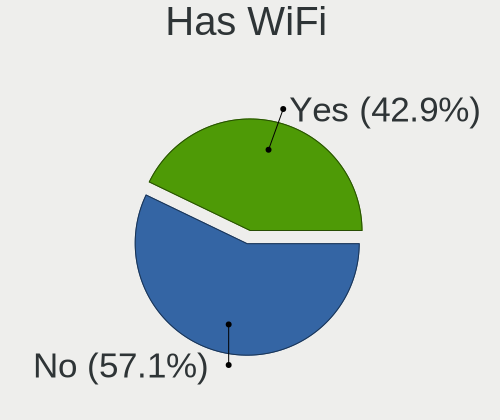
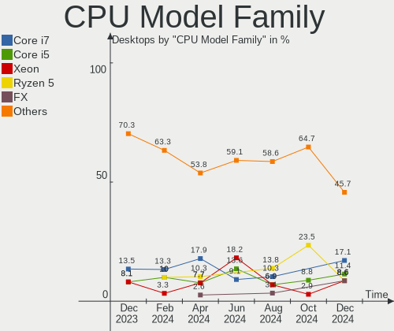

FreeBSD - Hardware Trends (Desktops)
------------------------------------

A project to identify most popular hardware characteristics and track their change
over time based on data collected by BSD users at https://BSD-Hardware.info.

Anyone can contribute to this report by the [hw-probe](https://github.com/linuxhw/hw-probe/blob/master/INSTALL.BSD.md) tool:

    hw-probe -all -upload

This report is for one last month. Overall report since the beginning of time: [TestCoverage](https://github.com/bsdhw/TestCoverage)

Period: May, 2022.

Contents
--------

* [ System ](#system)
  - [ OS                       ](#os)
  - [ OS Family                ](#os-family)
  - [ Arch                     ](#arch)
  - [ DE                       ](#de)
  - [ Display Server           ](#display-server)
  - [ Display Manager          ](#display-manager)
  - [ OS Lang                  ](#os-lang)
  - [ Boot Mode                ](#boot-mode)
  - [ Filesystem               ](#filesystem)
  - [ Part. scheme             ](#part-scheme)

* [ Board ](#board)
  - [ Vendor                   ](#vendor)
  - [ Model                    ](#model)
  - [ Model Family             ](#model-family)
  - [ MFG Year                 ](#mfg-year)
  - [ Form Factor              ](#form-factor)
  - [ Coreboot                 ](#coreboot)
  - [ RAM Size                 ](#ram-size)
  - [ RAM Used                 ](#ram-used)
  - [ Total Drives             ](#total-drives)
  - [ Has CD-ROM               ](#has-cd-rom)
  - [ Has Ethernet             ](#has-ethernet)
  - [ Has WiFi                 ](#has-wifi)
  - [ Has Bluetooth            ](#has-bluetooth)

* [ Location ](#location)
  - [ Country                  ](#country)
  - [ City                     ](#city)

* [ Drives ](#drives)
  - [ Drive Vendor             ](#drive-vendor)
  - [ Drive Model              ](#drive-model)
  - [ HDD Vendor               ](#hdd-vendor)
  - [ SSD Vendor               ](#ssd-vendor)
  - [ Drive Kind               ](#drive-kind)
  - [ Drive Connector          ](#drive-connector)
  - [ Drive Size               ](#drive-size)
  - [ Space Total              ](#space-total)
  - [ Space Used               ](#space-used)
  - [ Malfunc. Drives          ](#malfunc-drives)
  - [ Malfunc. Drive Vendor    ](#malfunc-drive-vendor)
  - [ Malfunc. HDD Vendor      ](#malfunc-hdd-vendor)
  - [ Malfunc. Drive Kind      ](#malfunc-drive-kind)
  - [ Failed Drives            ](#failed-drives)
  - [ Failed Drive Vendor      ](#failed-drive-vendor)
  - [ Drive Status             ](#drive-status)

* [ Storage controller ](#storage-controller)
  - [ Storage Vendor           ](#storage-vendor)
  - [ Storage Model            ](#storage-model)
  - [ Storage Kind             ](#storage-kind)

* [ Processor ](#processor)
  - [ CPU Vendor               ](#cpu-vendor)
  - [ CPU Model                ](#cpu-model)
  - [ CPU Model Family         ](#cpu-model-family)
  - [ CPU Cores                ](#cpu-cores)
  - [ CPU Sockets              ](#cpu-sockets)
  - [ CPU Threads              ](#cpu-threads)
  - [ CPU Microarch            ](#cpu-microarch)

* [ Graphics ](#graphics)
  - [ GPU Vendor               ](#gpu-vendor)
  - [ GPU Model                ](#gpu-model)
  - [ GPU Combo                ](#gpu-combo)
  - [ GPU Driver               ](#gpu-driver)
  - [ GPU Memory               ](#gpu-memory)

* [ Monitor ](#monitor)
  - [ Monitor Vendor           ](#monitor-vendor)
  - [ Monitor Model            ](#monitor-model)
  - [ Monitor Resolution       ](#monitor-resolution)
  - [ Monitor Diagonal         ](#monitor-diagonal)
  - [ Monitor Width            ](#monitor-width)
  - [ Aspect Ratio             ](#aspect-ratio)
  - [ Monitor Area             ](#monitor-area)
  - [ Pixel Density            ](#pixel-density)
  - [ Multiple Monitors        ](#multiple-monitors)

* [ Network ](#network)
  - [ Net Controller Vendor    ](#net-controller-vendor)
  - [ Net Controller Model     ](#net-controller-model)
  - [ Wireless Vendor          ](#wireless-vendor)
  - [ Wireless Model           ](#wireless-model)
  - [ Ethernet Vendor          ](#ethernet-vendor)
  - [ Ethernet Model           ](#ethernet-model)
  - [ Net Controller Kind      ](#net-controller-kind)
  - [ Used Controller          ](#used-controller)
  - [ NICs                     ](#nics)
  - [ IPv6                     ](#ipv6)

* [ Bluetooth ](#bluetooth)
  - [ Bluetooth Vendor         ](#bluetooth-vendor)
  - [ Bluetooth Model          ](#bluetooth-model)

* [ Sound ](#sound)
  - [ Sound Vendor             ](#sound-vendor)
  - [ Sound Model              ](#sound-model)

* [ Memory ](#memory)
  - [ Memory Vendor            ](#memory-vendor)
  - [ Memory Model             ](#memory-model)
  - [ Memory Kind              ](#memory-kind)
  - [ Memory Form Factor       ](#memory-form-factor)
  - [ Memory Size              ](#memory-size)
  - [ Memory Speed             ](#memory-speed)

* [ Printers & scanners ](#printers--scanners)
  - [ Printer Vendor           ](#printer-vendor)
  - [ Printer Model            ](#printer-model)
  - [ Scanner Vendor           ](#scanner-vendor)
  - [ Scanner Model            ](#scanner-model)

* [ Camera ](#camera)
  - [ Camera Vendor            ](#camera-vendor)
  - [ Camera Model             ](#camera-model)

* [ Security ](#security)
  - [ Fingerprint Vendor       ](#fingerprint-vendor)
  - [ Fingerprint Model        ](#fingerprint-model)
  - [ Chipcard Vendor          ](#chipcard-vendor)
  - [ Chipcard Model           ](#chipcard-model)

* [ Unsupported ](#unsupported)
  - [ Unsupported Devices      ](#unsupported-devices)
  - [ Unsupported Device Types ](#unsupported-device-types)

System
------

OS
--

Installed operating systems

| Name                 | Desktops | Percent |
|----------------------|----------|---------|
| FreeBSD 13.1         | 19       | 48.72%  |
| FreeBSD 13.0-p11     | 5        | 12.82%  |
| FreeBSD 14.0-CURRENT | 4        | 10.26%  |
| FreeBSD 13.1-STABLE  | 2        | 5.13%   |
| FreeBSD 13.1-RC6     | 2        | 5.13%   |
| FreeBSD 13.0-p10     | 2        | 5.13%   |
| FreeBSD 12.3-p5      | 2        | 5.13%   |
| FreeBSD 13.1-RC3     | 1        | 2.56%   |
| FreeBSD 13.0-p8      | 1        | 2.56%   |
| FreeBSD 13.0-p2      | 1        | 2.56%   |

OS Family
---------

OS without a version

| Name    | Desktops | Percent |
|---------|----------|---------|
| FreeBSD | 39       | 100%    |

Arch
----

OS architecture (x86_64, i586, etc.)

| Name  | Desktops | Percent |
|-------|----------|---------|
| amd64 | 33       | 84.62%  |
| arm64 | 4        | 10.26%  |
| i386  | 1        | 2.56%   |
| arm   | 1        | 2.56%   |

DE
--

Desktop Environment

| Name         | Desktops | Percent |
|--------------|----------|---------|
| Console      | 24       | 61.54%  |
| KDE5         | 6        | 15.38%  |
| XFCE         | 2        | 5.13%   |
| Openbox      | 2        | 5.13%   |
| GNOME        | 2        | 5.13%   |
| Window Maker | 1        | 2.56%   |
| Compton      | 1        | 2.56%   |
| Cinnamon     | 1        | 2.56%   |

Display Server
--------------

X11 or Wayland

| Name    | Desktops | Percent |
|---------|----------|---------|
| Console | 24       | 61.54%  |
| X11     | 14       | 35.9%   |
| Wayland | 1        | 2.56%   |

Display Manager
---------------

SDDM, LightDM, etc.

| Name    | Desktops | Percent |
|---------|----------|---------|
| Console | 30       | 76.92%  |
| SDDM    | 5        | 12.82%  |
| XDM     | 1        | 2.56%   |
| SLiM    | 1        | 2.56%   |
| LightDM | 1        | 2.56%   |
| GDM     | 1        | 2.56%   |

OS Lang
-------

Language

| Lang    | Desktops | Percent |
|---------|----------|---------|
| C       | 25       | 64.1%   |
| en_US   | 7        | 17.95%  |
| Unknown | 3        | 7.69%   |
| ru_RU   | 2        | 5.13%   |
| en_CA   | 1        | 2.56%   |
| de_DE   | 1        | 2.56%   |

Boot Mode
---------

EFI or BIOS

| Mode | Desktops | Percent |
|------|----------|---------|
| EFI  | 26       | 66.67%  |
| BIOS | 13       | 33.33%  |

Filesystem
----------

Type of filesystem

| Type | Desktops | Percent |
|------|----------|---------|
| Zfs  | 26       | 66.67%  |
| Ufs  | 13       | 33.33%  |

Part. scheme
------------

Scheme of partitioning

| Type | Desktops | Percent |
|------|----------|---------|
| GPT  | 35       | 89.74%  |
| MBR  | 4        | 10.26%  |

Board
-----

Vendor
------

Motherboard manufacturer

| Name                | Desktops | Percent |
|---------------------|----------|---------|
| ASUSTek Computer    | 11       | 28.21%  |
| ASRock              | 5        | 12.82%  |
| Unknown             | 5        | 12.82%  |
| MSI                 | 3        | 7.69%   |
| Gigabyte Technology | 3        | 7.69%   |
| Dell                | 3        | 7.69%   |
| Hewlett-Packard     | 2        | 5.13%   |
| PC Engines          | 1        | 2.56%   |
| NF-M2S              | 1        | 2.56%   |
| khadas              | 1        | 2.56%   |
| Intel               | 1        | 2.56%   |
| GVC                 | 1        | 2.56%   |
| Fujitsu             | 1        | 2.56%   |
| ASRockRack          | 1        | 2.56%   |

Model
-----

Motherboard model

| Name                              | Desktops | Percent |
|-----------------------------------|----------|---------|
| Unknown                           | 5        | 12.82%  |
| ASRock X570 Phantom Gaming 4      | 2        | 5.13%   |
| PC Engines APU3                   | 1        | 2.56%   |
| NF-M2S ABIT                       | 1        | 2.56%   |
| MSI MS-7817                       | 1        | 2.56%   |
| MSI MS-7369                       | 1        | 2.56%   |
| MSI MS-7309                       | 1        | 2.56%   |
| khadas edge-v                     | 1        | 2.56%   |
| Intel DH67BL AAG10189-213         | 1        | 2.56%   |
| HP Z620 Workstation               | 1        | 2.56%   |
| HP ProLiant MicroServer           | 1        | 2.56%   |
| GVC EQUIUM 3200M                  | 1        | 2.56%   |
| Gigabyte X470 AORUS GAMING 7 WIFI | 1        | 2.56%   |
| Gigabyte H67MA-USB3-B3            | 1        | 2.56%   |
| Gigabyte B450M DS3H               | 1        | 2.56%   |
| Fujitsu D3401-H2 S26361-D3401-H2  | 1        | 2.56%   |
| Dell PowerEdge T30                | 1        | 2.56%   |
| Dell OptiPlex 7050                | 1        | 2.56%   |
| Dell G5 5090                      | 1        | 2.56%   |
| ASUS TUF Gaming Z590-PLUS         | 1        | 2.56%   |
| ASUS TUF B350M-PLUS GAMING        | 1        | 2.56%   |
| ASUS ROG STRIX B550-F GAMING      | 1        | 2.56%   |
| ASUS ROG Maximus XI HERO          | 1        | 2.56%   |
| ASUS ROG CROSSHAIR VIII HERO      | 1        | 2.56%   |
| ASUS PRIME Z690-P WIFI            | 1        | 2.56%   |
| ASUS PRIME X370-PRO               | 1        | 2.56%   |
| ASUS PRIME H470M-PLUS             | 1        | 2.56%   |
| ASUS PRIME B350-PLUS              | 1        | 2.56%   |
| ASUS P5Q-E                        | 1        | 2.56%   |
| ASUS All Series                   | 1        | 2.56%   |
| ASRockRack E3C242D4U2-2T          | 1        | 2.56%   |
| ASRock E350M1                     | 1        | 2.56%   |
| ASRock B550 Phantom Gaming-ITX/ax | 1        | 2.56%   |
| ASRock A320M Pro4-F               | 1        | 2.56%   |

Model Family
------------

Motherboard model prefix

| Name                     | Desktops | Percent |
|--------------------------|----------|---------|
| Unknown                  | 5        | 12.82%  |
| ASUS PRIME               | 4        | 10.26%  |
| ASUS ROG                 | 3        | 7.69%   |
| ASUS TUF                 | 2        | 5.13%   |
| ASRock X570              | 2        | 5.13%   |
| PC Engines APU3          | 1        | 2.56%   |
| NF-M2S ABIT              | 1        | 2.56%   |
| MSI MS-7817              | 1        | 2.56%   |
| MSI MS-7369              | 1        | 2.56%   |
| MSI MS-7309              | 1        | 2.56%   |
| khadas edge-v            | 1        | 2.56%   |
| Intel DH67BL             | 1        | 2.56%   |
| HP Z620                  | 1        | 2.56%   |
| HP ProLiant              | 1        | 2.56%   |
| GVC EQUIUM               | 1        | 2.56%   |
| Gigabyte X470            | 1        | 2.56%   |
| Gigabyte H67MA-USB3-B3   | 1        | 2.56%   |
| Gigabyte B450M           | 1        | 2.56%   |
| Fujitsu D3401-H2         | 1        | 2.56%   |
| Dell PowerEdge           | 1        | 2.56%   |
| Dell OptiPlex            | 1        | 2.56%   |
| Dell G5                  | 1        | 2.56%   |
| ASUS P5Q-E               | 1        | 2.56%   |
| ASUS All                 | 1        | 2.56%   |
| ASRockRack E3C242D4U2-2T | 1        | 2.56%   |
| ASRock E350M1            | 1        | 2.56%   |
| ASRock B550              | 1        | 2.56%   |
| ASRock A320M             | 1        | 2.56%   |

MFG Year
--------

Motherboard manufacture year

| Year    | Desktops | Percent |
|---------|----------|---------|
| 2018    | 5        | 12.82%  |
| Unknown | 5        | 12.82%  |
| 2022    | 4        | 10.26%  |
| 2021    | 4        | 10.26%  |
| 2020    | 4        | 10.26%  |
| 2019    | 4        | 10.26%  |
| 2017    | 3        | 7.69%   |
| 2011    | 3        | 7.69%   |
| 2008    | 2        | 5.13%   |
| 2014    | 1        | 2.56%   |
| 2013    | 1        | 2.56%   |
| 2012    | 1        | 2.56%   |
| 2009    | 1        | 2.56%   |
| 2007    | 1        | 2.56%   |

Form Factor
-----------

Physical design of the computer

| Name    | Desktops | Percent |
|---------|----------|---------|
| Desktop | 39       | 100%    |

Coreboot
--------

Have coreboot on board

| Used | Desktops | Percent |
|------|----------|---------|
| No   | 38       | 97.44%  |
| Yes  | 1        | 2.56%   |

RAM Size
--------

Total RAM memory

| Size in GB  | Desktops | Percent |
|-------------|----------|---------|
| 32.01-64.0  | 9        | 23.08%  |
| 16.01-24.0  | 7        | 17.95%  |
| 4.01-8.0    | 6        | 15.38%  |
| 64.01-256.0 | 6        | 15.38%  |
| 8.01-16.0   | 4        | 10.26%  |
| 3.01-4.0    | 2        | 5.13%   |
| 2.01-3.0    | 2        | 5.13%   |
| 0.01-0.5    | 2        | 5.13%   |
| 0.51-1.0    | 1        | 2.56%   |

RAM Used
--------

Used RAM memory

| Used GB  | Desktops | Percent |
|----------|----------|---------|
| 0.01-0.5 | 13       | 33.33%  |
| 0.51-1.0 | 10       | 25.64%  |
| 1.01-2.0 | 7        | 17.95%  |
| 2.01-3.0 | 4        | 10.26%  |
| 0        | 3        | 7.69%   |
| 3.01-4.0 | 2        | 5.13%   |

Total Drives
------------

Number of drives on board

| Drives | Desktops | Percent |
|--------|----------|---------|
| 2      | 11       | 28.21%  |
| 1      | 6        | 15.38%  |
| 0      | 6        | 15.38%  |
| 4      | 5        | 12.82%  |
| 3      | 5        | 12.82%  |
| 5      | 2        | 5.13%   |
| 15     | 1        | 2.56%   |
| 13     | 1        | 2.56%   |
| 7      | 1        | 2.56%   |
| 6      | 1        | 2.56%   |

Has CD-ROM
----------

Has CD-ROM on board

| Presented | Desktops | Percent |
|-----------|----------|---------|
| No        | 30       | 76.92%  |
| Yes       | 9        | 23.08%  |

Has Ethernet
------------

Has Ethernet on board

| Presented | Desktops | Percent |
|-----------|----------|---------|
| Yes       | 33       | 84.62%  |
| No        | 6        | 15.38%  |

Has WiFi
--------

Has WiFi module

| Presented | Desktops | Percent |
|-----------|----------|---------|
| No        | 32       | 82.05%  |
| Yes       | 7        | 17.95%  |

Has Bluetooth
-------------

Has Bluetooth module

| Presented | Desktops | Percent |
|-----------|----------|---------|
| No        | 32       | 82.05%  |
| Yes       | 7        | 17.95%  |

Location
--------

Country
-------

Geographic location (country)

| Country     | Desktops | Percent |
|-------------|----------|---------|
| USA         | 14       | 35.9%   |
| Russia      | 5        | 12.82%  |
| Germany     | 4        | 10.26%  |
| France      | 3        | 7.69%   |
| Canada      | 2        | 5.13%   |
| Ukraine     | 1        | 2.56%   |
| Thailand    | 1        | 2.56%   |
| Sweden      | 1        | 2.56%   |
| Spain       | 1        | 2.56%   |
| Portugal    | 1        | 2.56%   |
| New Zealand | 1        | 2.56%   |
| Netherlands | 1        | 2.56%   |
| Ireland     | 1        | 2.56%   |
| Greece      | 1        | 2.56%   |
| Belgium     | 1        | 2.56%   |
| Austria     | 1        | 2.56%   |

City
----

Geographic location (city)

| City                        | Desktops | Percent |
|-----------------------------|----------|---------|
| Frisco                      | 4        | 10.26%  |
| St Petersburg               | 2        | 5.13%   |
| Salem                       | 2        | 5.13%   |
| Redmond                     | 2        | 5.13%   |
| Paris                       | 2        | 5.13%   |
| Wenatchee                   | 1        | 2.56%   |
| Vila Real de Santo António | 1        | 2.56%   |
| Valladolid                  | 1        | 2.56%   |
| St. Albert                  | 1        | 2.56%   |
| San Francisco               | 1        | 2.56%   |
| Saarbrücken                | 1        | 2.56%   |
| Roubaix                     | 1        | 2.56%   |
| Novosibirsk                 | 1        | 2.56%   |
| Mossingen                   | 1        | 2.56%   |
| Methuen                     | 1        | 2.56%   |
| Medford                     | 1        | 2.56%   |
| Lower Hutt                  | 1        | 2.56%   |
| Kyiv                        | 1        | 2.56%   |
| Krasnodar                   | 1        | 2.56%   |
| Kornwestheim                | 1        | 2.56%   |
| Khimki                      | 1        | 2.56%   |
| Karlshamn                   | 1        | 2.56%   |
| Gmunden                     | 1        | 2.56%   |
| Falkenstein                 | 1        | 2.56%   |
| Dublin                      | 1        | 2.56%   |
| Diest                       | 1        | 2.56%   |
| Corfu                       | 1        | 2.56%   |
| Brampton                    | 1        | 2.56%   |
| Bangkok                     | 1        | 2.56%   |
| Auburn                      | 1        | 2.56%   |
| Ann Arbor                   | 1        | 2.56%   |
| Amsterdam                   | 1        | 2.56%   |

Drives
------

Drive Vendor
------------

Hard drive vendors

| Vendor              | Desktops | Drives | Percent |
|---------------------|----------|--------|---------|
| Samsung Electronics | 17       | 30     | 26.56%  |
| WDC                 | 12       | 24     | 18.75%  |
| Seagate             | 9        | 22     | 14.06%  |
| Toshiba             | 4        | 8      | 6.25%   |
| Intel               | 3        | 3      | 4.69%   |
| Crucial             | 3        | 5      | 4.69%   |
| Kingston            | 2        | 2      | 3.13%   |
| Hitachi             | 2        | 5      | 3.13%   |
| Hewlett-Packard     | 2        | 2      | 3.13%   |
| A-DATA Technology   | 2        | 2      | 3.13%   |
| Verbatim            | 1        | 1      | 1.56%   |
| Patriot             | 1        | 1      | 1.56%   |
| ORICO               | 1        | 1      | 1.56%   |
| OCZ                 | 1        | 1      | 1.56%   |
| Micron Technology   | 1        | 2      | 1.56%   |
| HGST                | 1        | 3      | 1.56%   |
| Corsair             | 1        | 1      | 1.56%   |
| China               | 1        | 1      | 1.56%   |

Drive Model
-----------

Hard drive models

| Model                                   | Desktops | Percent |
|-----------------------------------------|----------|---------|
| Seagate ST4000DM000-1F2168 4TB          | 2        | 2.47%   |
| Samsung SSD 980 PRO 1TB                 | 2        | 2.47%   |
| Samsung SSD 870 QVO 2TB                 | 2        | 2.47%   |
| Samsung SSD 870 EVO 1TB                 | 2        | 2.47%   |
| Samsung SSD 850 EVO 1TB                 | 2        | 2.47%   |
| Samsung HD161HJ 160GB                   | 2        | 2.47%   |
| Kingston SA400S37120G 120GB             | 2        | 2.47%   |
| A-DATA SU650 240GB                      | 2        | 2.47%   |
| WDC WD80EMAZ-00WJTA0 8TB                | 1        | 1.23%   |
| WDC WD80EFZX-68UW8N0 8TB                | 1        | 1.23%   |
| WDC WD80EFBX-68AZZN0 8TB                | 1        | 1.23%   |
| WDC WD80EFAX-68LHPN0 8TB                | 1        | 1.23%   |
| WDC WD80EDBZ-11B0ZA0 8TB                | 1        | 1.23%   |
| WDC WD8003FFBX-68B9AN0 8TB              | 1        | 1.23%   |
| WDC WD40EZRZ-22GXCB0 4TB                | 1        | 1.23%   |
| WDC WD40EFZX-68AWUN0 4TB                | 1        | 1.23%   |
| WDC WD40EFRX-68N32N0 4TB                | 1        | 1.23%   |
| WDC WD20NMVW-11AV3S2 2TB                | 1        | 1.23%   |
| WDC WD15EADS-00P8B0 1.5TB               | 1        | 1.23%   |
| WDC WD120EMFZ-11A6JA0 12TB              | 1        | 1.23%   |
| WDC WD120EMAZ-11BLFA0 12TB              | 1        | 1.23%   |
| WDC WD10EZEX-60M2NA0 1TB                | 1        | 1.23%   |
| WDC WD10EZEX-08WN4A0 1TB                | 1        | 1.23%   |
| WDC WD1001FALS-00J7B1 1TB               | 1        | 1.23%   |
| WDC PC SN520 NVMe 256GB                 | 1        | 1.23%   |
| WDC CL SN720 SDAQNTW-512G-2000 512GB    | 1        | 1.23%   |
| Verbatim Vi550 S3 SSD 512GB             | 1        | 1.23%   |
| Toshiba TR200 240GB                     | 1        | 1.23%   |
| Toshiba MG06ACA800E 8TB                 | 1        | 1.23%   |
| Toshiba HDWR180 8TB                     | 1        | 1.23%   |
| Toshiba HDWN180 8TB                     | 1        | 1.23%   |
| Toshiba HDWG180 8TB                     | 1        | 1.23%   |
| Seagate ST96812AS 64GB                  | 1        | 1.23%   |
| Seagate ST9320423AS 320GB               | 1        | 1.23%   |
| Seagate ST5000LM000-2U8170 5TB          | 1        | 1.23%   |
| Seagate ST5000LM000-2AN170 5TB          | 1        | 1.23%   |
| Seagate ST3000DM001-1CH166 3TB          | 1        | 1.23%   |
| Seagate ST1000DM010-2EP102 1TB          | 1        | 1.23%   |
| Seagate ST1000DM003-1ER162 1TB          | 1        | 1.23%   |
| Seagate ST1000DM003-1CH162 1TB          | 1        | 1.23%   |
| Seagate BarraCuda Q5 ZP500CV30001 500GB | 1        | 1.23%   |
| Samsung SSD 980 PRO 500GB               | 1        | 1.23%   |
| Samsung SSD 970 EVO Plus 2TB            | 1        | 1.23%   |
| Samsung SSD 960 EVO 500GB               | 1        | 1.23%   |
| Samsung SSD 960 EVO 250GB               | 1        | 1.23%   |
| Samsung SSD 960 EVO 1TB                 | 1        | 1.23%   |
| Samsung SSD 860 QVO 1TB                 | 1        | 1.23%   |
| Samsung SSD 860 EVO 500GB               | 1        | 1.23%   |
| Samsung SSD 860 EVO 250GB               | 1        | 1.23%   |
| Samsung SSD 850 EVO 500GB               | 1        | 1.23%   |
| Samsung SSD 850 EVO 250GB               | 1        | 1.23%   |
| Samsung SSD 840 EVO 500GB               | 1        | 1.23%   |
| Samsung SSD 840 EVO 250GB               | 1        | 1.23%   |
| Samsung HD321KJ 320GB                   | 1        | 1.23%   |
| Patriot Burst 120GB                     | 1        | 1.23%   |
| ORICO M200 512GB                        | 1        | 1.23%   |
| OCZ VERTEX3 MI 240GB                    | 1        | 1.23%   |
| Micron 1100_MTFDDAK512TBN 512GB         | 1        | 1.23%   |
| Intel SSDSC2CT060A3 64GB                | 1        | 1.23%   |
| Intel SSDSC2BF180A4L 180GB              | 1        | 1.23%   |

HDD Vendor
----------

Hard disk drive vendors

| Vendor              | Desktops | Drives | Percent |
|---------------------|----------|--------|---------|
| WDC                 | 10       | 21     | 37.04%  |
| Seagate             | 8        | 21     | 29.63%  |
| Toshiba             | 3        | 7      | 11.11%  |
| Samsung Electronics | 2        | 3      | 7.41%   |
| Hitachi             | 2        | 5      | 7.41%   |
| HGST                | 1        | 3      | 3.7%    |
| Hewlett-Packard     | 1        | 1      | 3.7%    |

SSD Vendor
----------

Solid state drive vendors

| Vendor              | Desktops | Drives | Percent |
|---------------------|----------|--------|---------|
| Samsung Electronics | 11       | 17     | 40.74%  |
| Crucial             | 3        | 3      | 11.11%  |
| Kingston            | 2        | 2      | 7.41%   |
| Intel               | 2        | 2      | 7.41%   |
| A-DATA Technology   | 2        | 2      | 7.41%   |
| Verbatim            | 1        | 1      | 3.7%    |
| Toshiba             | 1        | 1      | 3.7%    |
| Patriot             | 1        | 1      | 3.7%    |
| ORICO               | 1        | 1      | 3.7%    |
| OCZ                 | 1        | 1      | 3.7%    |
| Micron Technology   | 1        | 2      | 3.7%    |
| China               | 1        | 1      | 3.7%    |

Drive Kind
----------

HDD or SSD

| Kind | Desktops | Drives | Percent |
|------|----------|--------|---------|
| SSD  | 21       | 34     | 38.89%  |
| HDD  | 21       | 61     | 38.89%  |
| NVMe | 12       | 19     | 22.22%  |

Drive Connector
---------------

SATA, SAS, NVMe, etc.

| Type | Desktops | Drives | Percent |
|------|----------|--------|---------|
| SATA | 29       | 95     | 70.73%  |
| NVMe | 12       | 19     | 29.27%  |

Drive Size
----------

Size of hard drive

| Size in TB | Desktops | Drives | Percent |
|------------|----------|--------|---------|
| 0.01-0.5   | 18       | 23     | 36%     |
| 0.51-1.0   | 14       | 19     | 28%     |
| 4.01-10.0  | 6        | 30     | 12%     |
| 3.01-4.0   | 5        | 7      | 10%     |
| 1.01-2.0   | 5        | 13     | 10%     |
| 2.01-3.0   | 1        | 1      | 2%      |
| 10.01-20.0 | 1        | 2      | 2%      |

Space Total
-----------

Amount of disk space available on the file system

| Size in GB     | Desktops | Percent |
|----------------|----------|---------|
| 251-500        | 11       | 28.21%  |
| 101-250        | 8        | 20.51%  |
| 501-1000       | 6        | 15.38%  |
| 21-50          | 3        | 7.69%   |
| 1001-2000      | 3        | 7.69%   |
| 1-20           | 3        | 7.69%   |
| 51-100         | 2        | 5.13%   |
| More than 3000 | 1        | 2.56%   |
| 2001-3000      | 1        | 2.56%   |
| Unknown        | 1        | 2.56%   |

Space Used
----------

Amount of used disk space

| Used GB        | Desktops | Percent |
|----------------|----------|---------|
| 1-20           | 27       | 69.23%  |
| 21-50          | 5        | 12.82%  |
| 101-250        | 3        | 7.69%   |
| 51-100         | 2        | 5.13%   |
| More than 3000 | 1        | 2.56%   |
| Unknown        | 1        | 2.56%   |

Malfunc. Drives
---------------

Drive models with a malfunction

| Model                                      | Desktops | Drives | Percent |
|--------------------------------------------|----------|--------|---------|
| Samsung Electronics SSD 870 EVO 1TB        | 2        | 4      | 22.22%  |
| WDC WD1001FALS-00J7B1 1TB                  | 1        | 1      | 11.11%  |
| Seagate ST1000DM003-1ER162 1TB             | 1        | 1      | 11.11%  |
| Samsung Electronics HD321KJ 320GB          | 1        | 1      | 11.11%  |
| Samsung Electronics HD161HJ 160GB          | 1        | 1      | 11.11%  |
| Micron Technology 1100_MTFDDAK512TBN 512GB | 1        | 2      | 11.11%  |
| Kingston SA400S37120G 120GB                | 1        | 1      | 11.11%  |
| Hewlett-Packard MB1000GCWCV 1TB            | 1        | 1      | 11.11%  |

Malfunc. Drive Vendor
---------------------

Vendors of faulty drives

| Vendor              | Desktops | Drives | Percent |
|---------------------|----------|--------|---------|
| Samsung Electronics | 4        | 6      | 44.44%  |
| WDC                 | 1        | 1      | 11.11%  |
| Seagate             | 1        | 1      | 11.11%  |
| Micron Technology   | 1        | 2      | 11.11%  |
| Kingston            | 1        | 1      | 11.11%  |
| Hewlett-Packard     | 1        | 1      | 11.11%  |

Malfunc. HDD Vendor
-------------------

Vendors of faulty HDD drives

| Vendor              | Desktops | Drives | Percent |
|---------------------|----------|--------|---------|
| Samsung Electronics | 2        | 2      | 40%     |
| WDC                 | 1        | 1      | 20%     |
| Seagate             | 1        | 1      | 20%     |
| Hewlett-Packard     | 1        | 1      | 20%     |

Malfunc. Drive Kind
-------------------

Kinds of faulty drives

| Kind | Desktops | Drives | Percent |
|------|----------|--------|---------|
| HDD  | 4        | 5      | 57.14%  |
| SSD  | 3        | 7      | 42.86%  |

Failed Drives
-------------

Failed drive models

Zero info for selected period =(

Failed Drive Vendor
-------------------

Failed drive vendors

Zero info for selected period =(

Drive Status
------------

Number of failed and malfunc. drives

| Status  | Desktops | Drives | Percent |
|---------|----------|--------|---------|
| Works   | 30       | 102    | 81.08%  |
| Malfunc | 7        | 12     | 18.92%  |

Storage controller
------------------

Storage Vendor
--------------

Storage controller vendors

| Vendor                    | Desktops | Percent |
|---------------------------|----------|---------|
| Intel                     | 17       | 32.69%  |
| AMD                       | 14       | 26.92%  |
| Samsung Electronics       | 7        | 13.46%  |
| Nvidia                    | 4        | 7.69%   |
| Silicon Motion            | 2        | 3.85%   |
| Sandisk                   | 2        | 3.85%   |
| Seagate Technology        | 1        | 1.92%   |
| Phison Electronics        | 1        | 1.92%   |
| Micron/Crucial Technology | 1        | 1.92%   |
| Marvell Technology Group  | 1        | 1.92%   |
| Broadcom / LSI            | 1        | 1.92%   |
| ASMedia Technology        | 1        | 1.92%   |

Storage Model
-------------

Storage controller models

| Model                                                                            | Desktops | Percent |
|----------------------------------------------------------------------------------|----------|---------|
| AMD FCH SATA Controller [AHCI mode]                                              | 9        | 13.43%  |
| Samsung NVMe SSD Controller SM961/PM961/SM963                                    | 3        | 4.48%   |
| Intel Cannon Lake PCH SATA AHCI Controller                                       | 3        | 4.48%   |
| Silicon Motion SM2263EN/SM2263XT SSD Controller                                  | 2        | 2.99%   |
| Samsung NVMe SSD Controller SM981/PM981/PM983                                    | 2        | 2.99%   |
| Samsung NVMe SSD Controller PM9A1/PM9A3/980PRO                                   | 2        | 2.99%   |
| Nvidia MCP61 SATA Controller                                                     | 2        | 2.99%   |
| Nvidia MCP61 IDE                                                                 | 2        | 2.99%   |
| Intel Q170/Q150/B150/H170/H110/Z170/CM236 Chipset SATA Controller [AHCI Mode]    | 2        | 2.99%   |
| Intel 6 Series/C200 Series Chipset Family 6 port Desktop SATA AHCI Controller    | 2        | 2.99%   |
| AMD SB7x0/SB8x0/SB9x0 SATA Controller [AHCI mode]                                | 2        | 2.99%   |
| AMD SB7x0/SB8x0/SB9x0 IDE Controller                                             | 2        | 2.99%   |
| AMD 500 Series Chipset SATA Controller                                           | 2        | 2.99%   |
| AMD 400 Series Chipset SATA Controller                                           | 2        | 2.99%   |
| AMD 300 Series Chipset SATA Controller                                           | 2        | 2.99%   |
| Sandisk WD Black 2018/SN750 / PC SN720 NVMe SSD                                  | 1        | 1.49%   |
| Sandisk PC SN520 NVMe SSD                                                        | 1        | 1.49%   |
| Phison E16 PCIe4 NVMe Controller                                                 | 1        | 1.49%   |
| Nvidia MCP65 SATA Controller                                                     | 1        | 1.49%   |
| Nvidia MCP65 IDE                                                                 | 1        | 1.49%   |
| Nvidia CK804 Serial ATA Controller                                               | 1        | 1.49%   |
| Nvidia CK804 IDE                                                                 | 1        | 1.49%   |
| Micron/Crucial P2 NVMe PCIe SSD                                                  | 1        | 1.49%   |
| Marvell Group 88SE6111/6121 SATA II / PATA Controller                            | 1        | 1.49%   |
| Intel SSD 660P Series                                                            | 1        | 1.49%   |
| Intel Comet Lake SATA AHCI Controller                                            | 1        | 1.49%   |
| Intel C602 chipset 4-Port SATA Storage Control Unit                              | 1        | 1.49%   |
| Intel C600/X79 series chipset SATA RAID Controller                               | 1        | 1.49%   |
| Intel C600/X79 series chipset IDE-r Controller                                   | 1        | 1.49%   |
| Intel Atom/Celeron/Pentium Processor x5-E8000/J3xxx/N3xxx Series SATA Controller | 1        | 1.49%   |
| Intel Alder Lake-S PCH SATA Controller [AHCI Mode]                               | 1        | 1.49%   |
| Intel 9 Series Chipset Family SATA Controller [AHCI Mode]                        | 1        | 1.49%   |
| Intel 82801JI (ICH10 Family) SATA AHCI Controller                                | 1        | 1.49%   |
| Intel 82371AB/EB/MB PIIX4 IDE                                                    | 1        | 1.49%   |
| Intel 8 Series/C220 Series Chipset Family 6-port SATA Controller 1 [AHCI mode]   | 1        | 1.49%   |
| Intel 500 Series Chipset Family SATA AHCI Controller                             | 1        | 1.49%   |
| Intel 200 Series PCH SATA controller [AHCI mode]                                 | 1        | 1.49%   |
| Broadcom / LSI SAS2008 PCI-Express Fusion-MPT SAS-2 [Falcon]                     | 1        | 1.49%   |
| ASMedia ASM1166 Serial ATA Controller                                            | 1        | 1.49%   |
| AMD X370 Series Chipset SATA Controller                                          | 1        | 1.49%   |
| AMD FCH SATA Controller [IDE mode]                                               | 1        | 1.49%   |
| AMD FCH SATA Controller D                                                        | 1        | 1.49%   |
| Unknown                                                                          | 1        | 1.49%   |

Storage Kind
------------

Kind of storage controller (IDE, SATA, NVMe, SAS, ...)

| Kind | Desktops | Percent |
|------|----------|---------|
| SATA | 28       | 51.85%  |
| NVMe | 14       | 25.93%  |
| IDE  | 9        | 16.67%  |
| SAS  | 2        | 3.7%    |
| RAID | 1        | 1.85%   |

Processor
---------

CPU Vendor
----------

Processor vendors

| Vendor | Desktops | Percent |
|--------|----------|---------|
| Intel  | 17       | 43.59%  |
| AMD    | 17       | 43.59%  |
| ARM    | 5        | 12.82%  |

CPU Model
---------

Processor models

| Model                                      | Desktops | Percent |
|--------------------------------------------|----------|---------|
| ARM Cortex-A53 r0p4                        | 3        | 7.69%   |
| AMD Ryzen 9 3900X 12-Core Processor        | 3        | 7.69%   |
| AMD Athlon 64 X2 Dual Core Processor 6000+ | 3        | 7.69%   |
| AMD Ryzen 7 2700X Eight-Core Processor     | 2        | 5.13%   |
| AMD Ryzen 7 1700 Eight-Core Processor      | 2        | 5.13%   |
| AMD Ryzen 5 5600G with Radeon Graphics     | 2        | 5.13%   |
| AMD Ryzen 5 2600 Six-Core Processor        | 2        | 5.13%   |
| Intel Xeon E-2136 CPU @ 3.30GHz            | 1        | 2.56%   |
| Intel Xeon CPU E5-2670 @ 2.60GHz           | 1        | 2.56%   |
| Intel Xeon CPU E3-1225 v5 @ 3.30GHz        | 1        | 2.56%   |
| Intel Xeon CPU E3-1225 V2 @ 3.20GHz        | 1        | 2.56%   |
| Intel Pentium II                           | 1        | 2.56%   |
| Intel Pentium CPU G3220 @ 3.00GHz          | 1        | 2.56%   |
| Intel Core i9-9900K CPU @ 3.60GHz          | 1        | 2.56%   |
| Intel Core i7-9700K CPU @ 3.60GHz          | 1        | 2.56%   |
| Intel Core i7-7700 CPU @ 3.60GHz           | 1        | 2.56%   |
| Intel Core i7-4790K CPU @ 4.00GHz          | 1        | 2.56%   |
| Intel Core i5-7500 CPU @ 3.40GHz           | 1        | 2.56%   |
| Intel Core i5-2400 CPU                     | 1        | 2.56%   |
| Intel Core i5-10400 CPU @ 2.90GHz          | 1        | 2.56%   |
| Intel Core 2 Quad CPU Q6600 @ 2.40GHz      | 1        | 2.56%   |
| Intel Celeron CPU N3150 @ 1.60GHz          | 1        | 2.56%   |
| Intel 12th Gen Core i9-12900KF             | 1        | 2.56%   |
| Intel 11th Gen Core i7-11700K @ 3.60GHz    | 1        | 2.56%   |
| ARM Cortex-A72 r0p2                        | 1        | 2.56%   |
| ARM ARM1176 r0p7 (ECO: 0x00000000)         | 1        | 2.56%   |
| AMD Turion II Neo N54L Dual-Core Processor | 1        | 2.56%   |
| AMD GX-412TC SOC                           | 1        | 2.56%   |
| AMD Athlon 64 X2 Dual Core Processor 4000+ | 1        | 2.56%   |

CPU Model Family
----------------

Processor model prefix

| Model             | Desktops | Percent |
|-------------------|----------|---------|
| Intel Xeon        | 4        | 10.26%  |
| ARM Cortex        | 4        | 10.26%  |
| AMD Ryzen 7       | 4        | 10.26%  |
| AMD Ryzen 5       | 4        | 10.26%  |
| AMD Athlon 64 X2  | 4        | 10.26%  |
| Other             | 3        | 7.69%   |
| Intel Core i7     | 3        | 7.69%   |
| Intel Core i5     | 3        | 7.69%   |
| AMD Ryzen 9       | 3        | 7.69%   |
| Intel Pentium     | 2        | 5.13%   |
| Intel Core i9     | 1        | 2.56%   |
| Intel Core 2 Quad | 1        | 2.56%   |
| Intel Celeron     | 1        | 2.56%   |
| AMD Turion II Neo | 1        | 2.56%   |
| AMD GX            | 1        | 2.56%   |

CPU Cores
---------

Number of processor cores

| Number  | Desktops | Percent |
|---------|----------|---------|
| 4       | 9        | 23.08%  |
| 2       | 6        | 15.38%  |
| Unknown | 5        | 12.82%  |
| 16      | 4        | 10.26%  |
| 12      | 4        | 10.26%  |
| 8       | 4        | 10.26%  |
| 24      | 3        | 7.69%   |
| 6       | 2        | 5.13%   |
| 11      | 1        | 2.56%   |
| 1       | 1        | 2.56%   |

CPU Sockets
-----------

Number of sockets

| Number  | Desktops | Percent |
|---------|----------|---------|
| 1       | 34       | 87.18%  |
| Unknown | 5        | 12.82%  |

CPU Threads
-----------

Threads per core (Hyper-Threading)

| Number  | Desktops | Percent |
|---------|----------|---------|
| 1       | 25       | 64.1%   |
| 2       | 8        | 20.51%  |
| Unknown | 6        | 15.38%  |

CPU Microarch
-------------

Microarchitecture

| Name        | Desktops | Percent |
|-------------|----------|---------|
| Unknown     | 7        | 17.95%  |
| KabyLake    | 5        | 12.82%  |
| Zen+        | 4        | 10.26%  |
| K8 Hammer   | 4        | 10.26%  |
| Zen 2       | 3        | 7.69%   |
| Zen 3       | 2        | 5.13%   |
| Zen         | 2        | 5.13%   |
| SandyBridge | 2        | 5.13%   |
| Haswell     | 2        | 5.13%   |
| Skylake     | 1        | 2.56%   |
| Silvermont  | 1        | 2.56%   |
| Puma        | 1        | 2.56%   |
| P6          | 1        | 2.56%   |
| K10         | 1        | 2.56%   |
| IvyBridge   | 1        | 2.56%   |
| Core        | 1        | 2.56%   |
| CometLake   | 1        | 2.56%   |

Graphics
--------

GPU Vendor
----------

Vendors of graphics cards

| Vendor                               | Desktops | Percent |
|--------------------------------------|----------|---------|
| Nvidia                               | 17       | 48.57%  |
| Intel                                | 9        | 25.71%  |
| AMD                                  | 7        | 20%     |
| NVidia / SGS Thomson (Joint Venture) | 1        | 2.86%   |
| ASPEED Technology                    | 1        | 2.86%   |

GPU Model
---------

Graphics card models

| Model                                                                                    | Desktops | Percent |
|------------------------------------------------------------------------------------------|----------|---------|
| Nvidia GP108 [GeForce GT 1030]                                                           | 2        | 5.56%   |
| Nvidia GP106 [GeForce GTX 1060 3GB]                                                      | 2        | 5.56%   |
| Intel Xeon E3-1200 v3/4th Gen Core Processor Integrated Graphics Controller              | 2        | 5.56%   |
| Intel HD Graphics 630                                                                    | 2        | 5.56%   |
| Nvidia TU117 [GeForce GTX 1650]                                                          | 1        | 2.78%   |
| Nvidia TU102 [GeForce RTX 2080 Ti Rev. A]                                                | 1        | 2.78%   |
| Nvidia GT218 [NVS 300]                                                                   | 1        | 2.78%   |
| Nvidia GT218 [GeForce 210]                                                               | 1        | 2.78%   |
| Nvidia GT215 [GeForce GT 240]                                                            | 1        | 2.78%   |
| Nvidia GP106 [GeForce GTX 1060 6GB]                                                      | 1        | 2.78%   |
| Nvidia GM107GL [Quadro K2200]                                                            | 1        | 2.78%   |
| Nvidia GK208B [GeForce GT 710]                                                           | 1        | 2.78%   |
| Nvidia GK104 [GeForce GTX 770]                                                           | 1        | 2.78%   |
| Nvidia GF108 [GeForce GT 430]                                                            | 1        | 2.78%   |
| Nvidia GA106 [GeForce RTX 3060 Lite Hash Rate]                                           | 1        | 2.78%   |
| Nvidia GA102 [GeForce RTX 3080 Lite Hash Rate]                                           | 1        | 2.78%   |
| Nvidia C61 [GeForce 6150SE nForce 430]                                                   | 1        | 2.78%   |
| NVidia / SGS Thomson (Joint Venture) Riva128                                             | 1        | 2.78%   |
| Intel Xeon E3-1200 v2/3rd Gen Core processor Graphics Controller                         | 1        | 2.78%   |
| Intel HD Graphics P530                                                                   | 1        | 2.78%   |
| Intel CometLake-S GT2 [UHD Graphics 630]                                                 | 1        | 2.78%   |
| Intel Atom/Celeron/Pentium Processor x5-E8000/J3xxx/N3xxx Integrated Graphics Controller | 1        | 2.78%   |
| Intel 2nd Generation Core Processor Family Integrated Graphics Controller                | 1        | 2.78%   |
| ASPEED Technology ASPEED Graphics Family                                                 | 1        | 2.78%   |
| AMD Wrestler [Radeon HD 6310]                                                            | 1        | 2.78%   |
| AMD RV570 [Radeon X1950 GT] (Secondary)                                                  | 1        | 2.78%   |
| AMD RV570 [Radeon X1950 GT]                                                              | 1        | 2.78%   |
| AMD RS880M [Mobility Radeon HD 4225/4250]                                                | 1        | 2.78%   |
| AMD Navi 10 [Radeon RX 5600 OEM/5600 XT / 5700/5700 XT]                                  | 1        | 2.78%   |
| AMD Ellesmere [Radeon RX 470/480/570/570X/580/580X/590]                                  | 1        | 2.78%   |
| AMD Cezanne                                                                              | 1        | 2.78%   |
| AMD Cedar [Radeon HD 5000/6000/7350/8350 Series]                                         | 1        | 2.78%   |

GPU Combo
---------

Combinations of graphics cards

| Name                                     | Desktops | Percent |
|------------------------------------------|----------|---------|
| 1 x Nvidia                               | 16       | 41.03%  |
| 1 x Intel                                | 8        | 20.51%  |
| Other                                    | 6        | 15.38%  |
| 1 x AMD                                  | 5        | 12.82%  |
| 2 x AMD                                  | 1        | 2.56%   |
| 1 x NVidia / SGS Thomson (Joint Venture) | 1        | 2.56%   |
| Intel + Nvidia                           | 1        | 2.56%   |
| 1 x ASPEED                               | 1        | 2.56%   |

GPU Driver
----------

Free vs proprietary

| Driver      | Desktops | Percent |
|-------------|----------|---------|
| Free        | 22       | 56.41%  |
| Proprietary | 11       | 28.21%  |
| Unknown     | 6        | 15.38%  |

GPU Memory
----------

Total video memory

| Size in GB | Desktops | Percent |
|------------|----------|---------|
| Unknown    | 27       | 69.23%  |
| 3.01-4.0   | 3        | 7.69%   |
| 7.01-8.0   | 2        | 5.13%   |
| 1.01-2.0   | 2        | 5.13%   |
| 8.01-16.0  | 2        | 5.13%   |
| 5.01-6.0   | 1        | 2.56%   |
| 2.01-3.0   | 1        | 2.56%   |
| 0.01-0.5   | 1        | 2.56%   |

Monitor
-------

Monitor Vendor
--------------

Monitor vendors

| Vendor               | Desktops | Percent |
|----------------------|----------|---------|
| Samsung Electronics  | 4        | 26.67%  |
| Dell                 | 4        | 26.67%  |
| Acer                 | 2        | 13.33%  |
| LG Electronics       | 1        | 6.67%   |
| Lenovo               | 1        | 6.67%   |
| Idek Iiyama          | 1        | 6.67%   |
| Hewlett-Packard      | 1        | 6.67%   |
| Ancor Communications | 1        | 6.67%   |

Monitor Model
-------------

Monitor models

| Model                                                                  | Desktops | Percent |
|------------------------------------------------------------------------|----------|---------|
| Samsung Electronics S24F350 SAM0D21 1920x1080 520x290mm 23.4-inch      | 1        | 6.67%   |
| Samsung Electronics LCD Monitor SyncMaster 1920x1200                   | 1        | 6.67%   |
| Samsung Electronics LCD Monitor SyncMaster 1280x1024                   | 1        | 6.67%   |
| Samsung Electronics LCD Monitor SAM7004 3840x2160 1210x680mm 54.6-inch | 1        | 6.67%   |
| LG Electronics LCD Monitor LG HDR QHD 2560x1440                        | 1        | 6.67%   |
| Lenovo LEN T24i-10 LEN61CE 1920x1080 530x300mm 24.0-inch               | 1        | 6.67%   |
| Idek Iiyama LCD Monitor PL2730Q 2560x1440                              | 1        | 6.67%   |
| Hewlett-Packard E243i HPN3463 1920x1200 520x320mm 24.0-inch            | 1        | 6.67%   |
| Dell P3222QE DEL4246 3840x2160 700x390mm 31.5-inch                     | 1        | 6.67%   |
| Dell P2418D DELD0C2 2560x1440 530x300mm 24.0-inch                      | 1        | 6.67%   |
| Dell LCD Monitor U2715H 2560x1440                                      | 1        | 6.67%   |
| Dell IN2020M DELF030 1600x900 440x250mm 19.9-inch                      | 1        | 6.67%   |
| Ancor Communications ASUS MG279 ACI27A7 2560x1440 600x340mm 27.2-inch  | 1        | 6.67%   |
| Acer XB271HU ACR0490 2560x1440 600x340mm 27.2-inch                     | 1        | 6.67%   |
| Acer AL1916 ACR077C 1280x1024 380x310mm 19.3-inch                      | 1        | 6.67%   |

Monitor Resolution
------------------

Monitor screen resolution

| Resolution        | Desktops | Percent |
|-------------------|----------|---------|
| 2560x1440 (QHD)   | 6        | 40%     |
| 3840x2160 (4K)    | 2        | 13.33%  |
| 1920x1200 (WUXGA) | 2        | 13.33%  |
| 1920x1080 (FHD)   | 2        | 13.33%  |
| 1280x1024 (SXGA)  | 2        | 13.33%  |
| 1600x900 (HD+)    | 1        | 6.67%   |

Monitor Diagonal
----------------

Diagonal size in inches

| Inches  | Desktops | Percent |
|---------|----------|---------|
| Unknown | 5        | 35.71%  |
| 24      | 3        | 21.43%  |
| 27      | 2        | 14.29%  |
| 54      | 1        | 7.14%   |
| 31      | 1        | 7.14%   |
| 23      | 1        | 7.14%   |
| 19      | 1        | 7.14%   |

Monitor Width
-------------

Physical width

| Width in mm | Desktops | Percent |
|-------------|----------|---------|
| 501-600     | 6        | 40%     |
| Unknown     | 5        | 33.33%  |
| 601-700     | 1        | 6.67%   |
| 401-500     | 1        | 6.67%   |
| 351-400     | 1        | 6.67%   |
| 1001-1500   | 1        | 6.67%   |

Aspect Ratio
------------

Proportional relationship between the width and the height

| Ratio   | Desktops | Percent |
|---------|----------|---------|
| 16/9    | 7        | 50%     |
| Unknown | 5        | 35.71%  |
| 6/5     | 1        | 7.14%   |
| 16/10   | 1        | 7.14%   |

Monitor Area
------------

Area in inch²

| Area in inch² | Desktops | Percent |
|----------------|----------|---------|
| Unknown        | 5        | 35.71%  |
| 201-250        | 3        | 21.43%  |
| 301-350        | 2        | 14.29%  |
| More than 1000 | 1        | 7.14%   |
| 351-500        | 1        | 7.14%   |
| 251-300        | 1        | 7.14%   |
| 151-200        | 1        | 7.14%   |

Pixel Density
-------------

Pixels per inch

| Density | Desktops | Percent |
|---------|----------|---------|
| Unknown | 5        | 38.46%  |
| 51-100  | 4        | 30.77%  |
| 121-160 | 2        | 15.38%  |
| 101-120 | 2        | 15.38%  |

Multiple Monitors
-----------------

Total monitors connected

| Total | Desktops | Percent |
|-------|----------|---------|
| 0     | 26       | 66.67%  |
| 1     | 12       | 30.77%  |
| 3     | 1        | 2.56%   |

Network
-------

Net Controller Vendor
---------------------

Controller vendors

| Vendor                          | Desktops | Percent |
|---------------------------------|----------|---------|
| Intel                           | 24       | 57.14%  |
| Realtek Semiconductor           | 11       | 26.19%  |
| Xiaomi                          | 1        | 2.38%   |
| Qualcomm Atheros Communications | 1        | 2.38%   |
| Qualcomm Atheros                | 1        | 2.38%   |
| Qualcomm                        | 1        | 2.38%   |
| Marvell Technology Group        | 1        | 2.38%   |
| D-Link System                   | 1        | 2.38%   |
| Broadcom                        | 1        | 2.38%   |

Net Controller Model
--------------------

Controller models

| Model                                                                         | Desktops | Percent |
|-------------------------------------------------------------------------------|----------|---------|
| Realtek RTL8111/8168/8411 PCI Express Gigabit Ethernet Controller             | 7        | 14%     |
| Intel I211 Gigabit Network Connection                                         | 6        | 12%     |
| Intel 82574L Gigabit Network Connection                                       | 4        | 8%      |
| Intel Ethernet Controller I225-V                                              | 3        | 6%      |
| Realtek RTL8125 2.5GbE Controller                                             | 2        | 4%      |
| Intel Wi-Fi 6 AX200                                                           | 2        | 4%      |
| Intel Ethernet Connection (2) I219-LM                                         | 2        | 4%      |
| Xiaomi Mi/Redmi series (RNDIS)                                                | 1        | 2%      |
| Realtek RTL810xE PCI Express Fast Ethernet controller                         | 1        | 2%      |
| Realtek Killer E2500 Gigabit Ethernet Controller                              | 1        | 2%      |
| Qualcomm Atheros TP-Link TL-WN322G v3 / TL-WN422G v2 802.11g [Atheros AR9271] | 1        | 2%      |
| Qualcomm Atheros AR9227 Wireless Network Adapter                              | 1        | 2%      |
| Qualcomm ALCATEL Composite RNDIS Interface                                    | 1        | 2%      |
| Marvell Group 88E8056 PCI-E Gigabit Ethernet Controller                       | 1        | 2%      |
| Marvell Group 88E8001 Gigabit Ethernet Controller                             | 1        | 2%      |
| Intel Wireless-AC 9260                                                        | 1        | 2%      |
| Intel I350 Gigabit Network Connection                                         | 1        | 2%      |
| Intel I210 Gigabit Network Connection                                         | 1        | 2%      |
| Intel Ethernet Controller X550                                                | 1        | 2%      |
| Intel Ethernet Controller 10-Gigabit X540-AT2                                 | 1        | 2%      |
| Intel Ethernet Connection (7) I219-V                                          | 1        | 2%      |
| Intel Ethernet Connection (5) I219-LM                                         | 1        | 2%      |
| Intel Ethernet Connection (2) I218-V                                          | 1        | 2%      |
| Intel Ethernet Connection (11) I219-V                                         | 1        | 2%      |
| Intel Cannon Lake PCH CNVi WiFi                                               | 1        | 2%      |
| Intel Alder Lake-S PCH CNVi WiFi                                              | 1        | 2%      |
| Intel 82579V Gigabit Network Connection                                       | 1        | 2%      |
| Intel 82579LM Gigabit Network Connection (Lewisville)                         | 1        | 2%      |
| Intel 82571EB/82571GB Gigabit Ethernet Controller (Copper)                    | 1        | 2%      |
| D-Link System DGE-528T Gigabit Ethernet Adapter                               | 1        | 2%      |
| Broadcom NetXtreme BCM5723 Gigabit Ethernet PCIe                              | 1        | 2%      |

Wireless Vendor
---------------

Wireless vendors

| Vendor                          | Desktops | Percent |
|---------------------------------|----------|---------|
| Intel                           | 5        | 71.43%  |
| Qualcomm Atheros Communications | 1        | 14.29%  |
| Qualcomm Atheros                | 1        | 14.29%  |

Wireless Model
--------------

Wireless models

| Model                                                                         | Desktops | Percent |
|-------------------------------------------------------------------------------|----------|---------|
| Intel Wi-Fi 6 AX200                                                           | 2        | 28.57%  |
| Qualcomm Atheros TP-Link TL-WN322G v3 / TL-WN422G v2 802.11g [Atheros AR9271] | 1        | 14.29%  |
| Qualcomm Atheros AR9227 Wireless Network Adapter                              | 1        | 14.29%  |
| Intel Wireless-AC 9260                                                        | 1        | 14.29%  |
| Intel Cannon Lake PCH CNVi WiFi                                               | 1        | 14.29%  |
| Intel Alder Lake-S PCH CNVi WiFi                                              | 1        | 14.29%  |

Ethernet Vendor
---------------

Ethernet vendors

| Vendor                   | Desktops | Percent |
|--------------------------|----------|---------|
| Intel                    | 23       | 58.97%  |
| Realtek Semiconductor    | 11       | 28.21%  |
| Xiaomi                   | 1        | 2.56%   |
| Qualcomm                 | 1        | 2.56%   |
| Marvell Technology Group | 1        | 2.56%   |
| D-Link System            | 1        | 2.56%   |
| Broadcom                 | 1        | 2.56%   |

Ethernet Model
--------------

Ethernet models

| Model                                                             | Desktops | Percent |
|-------------------------------------------------------------------|----------|---------|
| Realtek RTL8111/8168/8411 PCI Express Gigabit Ethernet Controller | 7        | 16.28%  |
| Intel I211 Gigabit Network Connection                             | 6        | 13.95%  |
| Intel 82574L Gigabit Network Connection                           | 4        | 9.3%    |
| Intel Ethernet Controller I225-V                                  | 3        | 6.98%   |
| Realtek RTL8125 2.5GbE Controller                                 | 2        | 4.65%   |
| Intel Ethernet Connection (2) I219-LM                             | 2        | 4.65%   |
| Xiaomi Mi/Redmi series (RNDIS)                                    | 1        | 2.33%   |
| Realtek RTL810xE PCI Express Fast Ethernet controller             | 1        | 2.33%   |
| Realtek Killer E2500 Gigabit Ethernet Controller                  | 1        | 2.33%   |
| Qualcomm ALCATEL Composite RNDIS Interface                        | 1        | 2.33%   |
| Marvell Group 88E8056 PCI-E Gigabit Ethernet Controller           | 1        | 2.33%   |
| Marvell Group 88E8001 Gigabit Ethernet Controller                 | 1        | 2.33%   |
| Intel I350 Gigabit Network Connection                             | 1        | 2.33%   |
| Intel I210 Gigabit Network Connection                             | 1        | 2.33%   |
| Intel Ethernet Controller X550                                    | 1        | 2.33%   |
| Intel Ethernet Controller 10-Gigabit X540-AT2                     | 1        | 2.33%   |
| Intel Ethernet Connection (7) I219-V                              | 1        | 2.33%   |
| Intel Ethernet Connection (5) I219-LM                             | 1        | 2.33%   |
| Intel Ethernet Connection (2) I218-V                              | 1        | 2.33%   |
| Intel Ethernet Connection (11) I219-V                             | 1        | 2.33%   |
| Intel 82579V Gigabit Network Connection                           | 1        | 2.33%   |
| Intel 82579LM Gigabit Network Connection (Lewisville)             | 1        | 2.33%   |
| Intel 82571EB/82571GB Gigabit Ethernet Controller (Copper)        | 1        | 2.33%   |
| D-Link System DGE-528T Gigabit Ethernet Adapter                   | 1        | 2.33%   |
| Broadcom NetXtreme BCM5723 Gigabit Ethernet PCIe                  | 1        | 2.33%   |

Net Controller Kind
-------------------

Ethernet, WiFi or modem

| Kind     | Desktops | Percent |
|----------|----------|---------|
| Ethernet | 33       | 82.5%   |
| WiFi     | 7        | 17.5%   |

Used Controller
---------------

Currently used network controller

| Kind     | Desktops | Percent |
|----------|----------|---------|
| Ethernet | 30       | 96.77%  |
| WiFi     | 1        | 3.23%   |

NICs
----

Total network controllers on board

| Total | Desktops | Percent |
|-------|----------|---------|
| 1     | 18       | 46.15%  |
| 2     | 10       | 25.64%  |
| 0     | 6        | 15.38%  |
| 3     | 4        | 10.26%  |
| 5     | 1        | 2.56%   |

IPv6
----

IPv6 vs IPv4

| Used | Desktops | Percent |
|------|----------|---------|
| No   | 27       | 69.23%  |
| Yes  | 12       | 30.77%  |

Bluetooth
---------

Bluetooth Vendor
----------------

Controller vendors

| Vendor                  | Desktops | Percent |
|-------------------------|----------|---------|
| Intel                   | 5        | 71.43%  |
| Cambridge Silicon Radio | 2        | 28.57%  |

Bluetooth Model
---------------

Controller models

| Model                                               | Desktops | Percent |
|-----------------------------------------------------|----------|---------|
| Intel AX200 Bluetooth                               | 2        | 28.57%  |
| Cambridge Silicon Radio Bluetooth Dongle (HCI mode) | 2        | 28.57%  |
| Intel Wireless-AC 9260 Bluetooth Adapter            | 1        | 14.29%  |
| Intel Bluetooth 9460/9560 Jefferson Peak (JfP)      | 1        | 14.29%  |
| Intel AX201 Bluetooth                               | 1        | 14.29%  |

Sound
-----

Sound Vendor
------------

Sound card vendors

| Vendor                | Desktops | Percent |
|-----------------------|----------|---------|
| Nvidia                | 17       | 34%     |
| Intel                 | 11       | 22%     |
| AMD                   | 11       | 22%     |
| Kingston Technology   | 2        | 4%      |
| C-Media Electronics   | 2        | 4%      |
| XMOS                  | 1        | 2%      |
| Sony                  | 1        | 2%      |
| Realtek Semiconductor | 1        | 2%      |
| Razer USA             | 1        | 2%      |
| Micronas              | 1        | 2%      |
| Logitech              | 1        | 2%      |
| Ensoniq               | 1        | 2%      |

Sound Model
-----------

Sound card models

| Model                                                                                             | Desktops | Percent |
|---------------------------------------------------------------------------------------------------|----------|---------|
| AMD Family 17h (Models 00h-0fh) HD Audio Controller                                               | 4        | 7.14%   |
| Nvidia High Definition Audio Controller                                                           | 3        | 5.36%   |
| Nvidia GP106 High Definition Audio Controller                                                     | 3        | 5.36%   |
| AMD Starship/Matisse HD Audio Controller                                                          | 3        | 5.36%   |
| Nvidia MCP61 High Definition Audio                                                                | 2        | 3.57%   |
| Nvidia GP108 High Definition Audio Controller                                                     | 2        | 3.57%   |
| AMD Renoir Radeon High Definition Audio Controller                                                | 2        | 3.57%   |
| AMD Family 17h/19h HD Audio Controller                                                            | 2        | 3.57%   |
| XMOS XMOS XS1-U8 MFA (ST)                                                                         | 1        | 1.79%   |
| Sony DualShock 4 [CUH-ZCT2x]                                                                      | 1        | 1.79%   |
| Realtek Semiconductor Realtek USB Audio                                                           | 1        | 1.79%   |
| Razer USA Razer BlackShark V2 Pro Razer BlackShark V2 Pro                                         | 1        | 1.79%   |
| Nvidia TU107 GeForce GTX 1650 High Definition Audio Controller                                    | 1        | 1.79%   |
| Nvidia TU102 High Definition Audio Controller                                                     | 1        | 1.79%   |
| Nvidia MCP65 High Definition Audio                                                                | 1        | 1.79%   |
| Nvidia GM107 High Definition Audio Controller [GeForce 940MX]                                     | 1        | 1.79%   |
| Nvidia GK208 HDMI/DP Audio Controller                                                             | 1        | 1.79%   |
| Nvidia GK104 HDMI Audio Controller                                                                | 1        | 1.79%   |
| Nvidia GF108 High Definition Audio Controller                                                     | 1        | 1.79%   |
| Nvidia GA102 High Definition Audio Controller                                                     | 1        | 1.79%   |
| Micronas Blue USB Audio 2.0                                                                       | 1        | 1.79%   |
| Logitech Yeti X                                                                                   | 1        | 1.79%   |
| Kingston Technology HyperX QuadCast S                                                             | 1        | 1.79%   |
| Kingston Technology HyperX 7.1 Audio                                                              | 1        | 1.79%   |
| Intel Xeon E3-1200 v3/4th Gen Core Processor HD Audio Controller                                  | 1        | 1.79%   |
| Intel Tiger Lake-H HD Audio Controller                                                            | 1        | 1.79%   |
| Intel Comet Lake PCH cAVS                                                                         | 1        | 1.79%   |
| Intel Cannon Lake PCH cAVS                                                                        | 1        | 1.79%   |
| Intel C600/X79 series chipset High Definition Audio Controller                                    | 1        | 1.79%   |
| Intel Atom/Celeron/Pentium Processor x5-E8000/J3xxx/N3xxx Series High Definition Audio Controller | 1        | 1.79%   |
| Intel Alder Lake-S HD Audio Controller                                                            | 1        | 1.79%   |
| Intel 9 Series Chipset Family HD Audio Controller                                                 | 1        | 1.79%   |
| Intel 82801JI (ICH10 Family) HD Audio Controller                                                  | 1        | 1.79%   |
| Intel 8 Series/C220 Series Chipset High Definition Audio Controller                               | 1        | 1.79%   |
| Intel 6 Series/C200 Series Chipset Family High Definition Audio Controller                        | 1        | 1.79%   |
| Intel 200 Series PCH HD Audio                                                                     | 1        | 1.79%   |
| Ensoniq 5880B / Creative Labs CT5880                                                              | 1        | 1.79%   |
| C-Media Electronics CMI8738/CMI8768 PCI Audio                                                     | 1        | 1.79%   |
| C-Media Electronics CM102-A+/102S+ Audio Controller                                               | 1        | 1.79%   |
| AMD Navi 10 HDMI Audio                                                                            | 1        | 1.79%   |
| AMD Ellesmere HDMI Audio [Radeon RX 470/480 / 570/580/590]                                        | 1        | 1.79%   |
| AMD Cedar HDMI Audio [Radeon HD 5400/6300/7300 Series]                                            | 1        | 1.79%   |
| Unknown                                                                                           | 1        | 1.79%   |

Memory
------

Memory Vendor
-------------

Memory module vendors

| Vendor              | Desktops | Percent |
|---------------------|----------|---------|
| Corsair             | 7        | 21.88%  |
| Kingston            | 6        | 18.75%  |
| Unknown             | 5        | 15.63%  |
| G.Skill             | 5        | 15.63%  |
| SK Hynix            | 2        | 6.25%   |
| Samsung Electronics | 2        | 6.25%   |
| Crucial             | 2        | 6.25%   |
| Transcend           | 1        | 3.13%   |
| Micron Technology   | 1        | 3.13%   |
| Unknown             | 1        | 3.13%   |

Memory Model
------------

Memory module models

| Model                                                   | Desktops | Percent |
|---------------------------------------------------------|----------|---------|
| Unknown RAM Module 4GB DIMM 1333MT/s                    | 2        | 5.71%   |
| Corsair RAM CMK16GX4M2B3200C16 8GB DIMM DDR4 3200MT/s   | 2        | 5.71%   |
| Unknown RAM Module 2GB DIMM DDR 800MT/s                 | 1        | 2.86%   |
| Unknown RAM Module 2GB DIMM 1333MT/s                    | 1        | 2.86%   |
| Unknown RAM Module 2GB DIMM                             | 1        | 2.86%   |
| Unknown RAM Module 1GB DIMM DDR2 333MT/s                | 1        | 2.86%   |
| Transcend RAM JM2666HLE-32G 32GB DIMM DDR4 2666MT/s     | 1        | 2.86%   |
| SK Hynix RAM HMT31GR7BFR4C-H9 8GB DIMM DDR3 1333MT/s    | 1        | 2.86%   |
| SK Hynix RAM HMT31GR7AFR4C-H9 8GB DIMM DDR3 1333MT/s    | 1        | 2.86%   |
| SK Hynix RAM HMA81GU6JJR8N-VK 8GB DIMM DDR4 2666MT/s    | 1        | 2.86%   |
| Samsung RAM M391A2K43BB1-CTD 16GB DIMM DDR4 2667MT/s    | 1        | 2.86%   |
| Samsung RAM M378B5773CH0-CH9 2GB DIMM DDR3 1333MT/s     | 1        | 2.86%   |
| Micron RAM 8ATF1G64HZ-2G3E1 8GB SODIMM DDR4 2400MT/s    | 1        | 2.86%   |
| Kingston RAM KHX3200C16D4/32GX 32GB DIMM DDR4 3200MT/s  | 1        | 2.86%   |
| Kingston RAM KHX2666C16/8G 8GB DIMM DDR4 2667MT/s       | 1        | 2.86%   |
| Kingston RAM KF552C40-16 16GB DIMM 5200MT/s             | 1        | 2.86%   |
| Kingston RAM 99U5471-031.A00LF 8GB DIMM DDR3 1333MT/s   | 1        | 2.86%   |
| Kingston RAM 9965745-006.A00G 16GB DIMM DDR4 2400MT/s   | 1        | 2.86%   |
| Kingston RAM 9965745-002.A00G 16GB DIMM DDR4 3000MT/s   | 1        | 2.86%   |
| Kingston RAM 9905471-023.A00LF 8GB DIMM DDR3 1333MT/s   | 1        | 2.86%   |
| G.Skill RAM F4-4000C19-16GTZSW 16GB DIMM DDR4 3500MT/s  | 1        | 2.86%   |
| G.Skill RAM F4-3600C18-8GTZR 8GB DIMM DDR4 3600MT/s     | 1        | 2.86%   |
| G.Skill RAM F4-3200C16-32GVK 32GB DIMM DDR4 2666MT/s    | 1        | 2.86%   |
| G.Skill RAM F4-3200C16-16GIS 16GB DIMM DDR4 3200MT/s    | 1        | 2.86%   |
| G.Skill RAM F3-12800CL7-2GBRM 2GB DIMM DDR3 1600MT/s    | 1        | 2.86%   |
| Crucial RAM CT51264BF160BJ.C8F 4GB DIMM DDR3 1600MT/s   | 1        | 2.86%   |
| Crucial RAM CT16G4DFD8213.M16FA 16GB DIMM DDR4 2133MT/s | 1        | 2.86%   |
| Corsair RAM CML16GX3M2A1600C9 8GB DIMM DDR3 1600MT/s    | 1        | 2.86%   |
| Corsair RAM CMK32GX4M2E3200C16 16GB DIMM DDR4 2133MT/s  | 1        | 2.86%   |
| Corsair RAM CMK16GX4M2Z2666C16 8GB DIMM DDR4 2666MT/s   | 1        | 2.86%   |
| Corsair RAM CMK16GX4M2B3000C15 8GB DIMM DDR4 2933MT/s   | 1        | 2.86%   |
| Corsair RAM CMK16GX4M2A2133C13 8GB DIMM DDR4 2133MT/s   | 1        | 2.86%   |
| Unknown                                                 | 1        | 2.86%   |

Memory Kind
-----------

Memory module kinds

| Kind    | Desktops | Percent |
|---------|----------|---------|
| DDR4    | 19       | 61.29%  |
| DDR3    | 5        | 16.13%  |
| Unknown | 4        | 12.9%   |
| DDR2    | 2        | 6.45%   |
| DDR     | 1        | 3.23%   |

Memory Form Factor
------------------

Physical design of the memory module

| Name   | Desktops | Percent |
|--------|----------|---------|
| DIMM   | 30       | 96.77%  |
| SODIMM | 1        | 3.23%   |

Memory Size
-----------

Memory module size

| Size  | Desktops | Percent |
|-------|----------|---------|
| 8192  | 12       | 36.36%  |
| 16384 | 8        | 24.24%  |
| 2048  | 5        | 15.15%  |
| 32768 | 3        | 9.09%   |
| 4096  | 3        | 9.09%   |
| 1024  | 2        | 6.06%   |

Memory Speed
------------

Memory module speed

| Speed   | Desktops | Percent |
|---------|----------|---------|
| 1333    | 5        | 15.63%  |
| 3200    | 4        | 12.5%   |
| 2666    | 4        | 12.5%   |
| 2133    | 3        | 9.38%   |
| 1600    | 3        | 9.38%   |
| 2667    | 2        | 6.25%   |
| 2400    | 2        | 6.25%   |
| 800     | 2        | 6.25%   |
| 5200    | 1        | 3.13%   |
| 3600    | 1        | 3.13%   |
| 3500    | 1        | 3.13%   |
| 3000    | 1        | 3.13%   |
| 2933    | 1        | 3.13%   |
| 333     | 1        | 3.13%   |
| Unknown | 1        | 3.13%   |

Printers & scanners
-------------------

Printer Vendor
--------------

Printer device vendors

Zero info for selected period =(

Printer Model
-------------

Printer device models

Zero info for selected period =(

Scanner Vendor
--------------

Scanner device vendors

Zero info for selected period =(

Scanner Model
-------------

Scanner device models

Zero info for selected period =(

Camera
------

Camera Vendor
-------------

Camera device vendors

Zero info for selected period =(

Camera Model
------------

Camera device models

Zero info for selected period =(

Security
--------

Fingerprint Vendor
------------------

Fingerprint sensor vendors

Zero info for selected period =(

Fingerprint Model
-----------------

Fingerprint sensor models

Zero info for selected period =(

Chipcard Vendor
---------------

Chipcard module vendors

Zero info for selected period =(

Chipcard Model
--------------

Chipcard module models

Zero info for selected period =(

Unsupported
-----------

Unsupported Devices
-------------------

Total unsupported devices on board

| Total | Desktops | Percent |
|-------|----------|---------|
| 0     | 19       | 48.72%  |
| 1     | 13       | 33.33%  |
| 2     | 5        | 12.82%  |
| 3     | 2        | 5.13%   |

Unsupported Device Types
------------------------

Types of unsupported devices

| Type                     | Desktops | Percent |
|--------------------------|----------|---------|
| Communication controller | 14       | 51.85%  |
| Bluetooth                | 5        | 18.52%  |
| Firewire controller      | 3        | 11.11%  |
| Net/wireless             | 2        | 7.41%   |
| Net/ethernet             | 2        | 7.41%   |
| Card reader              | 1        | 3.7%    |

