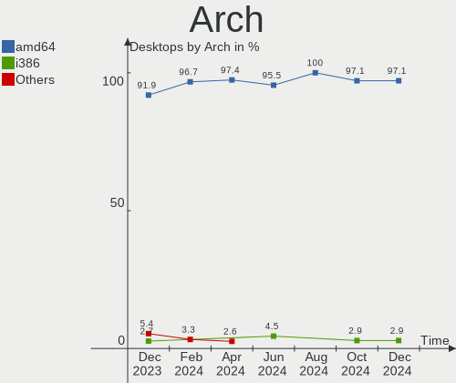
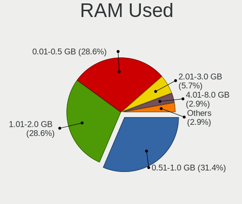
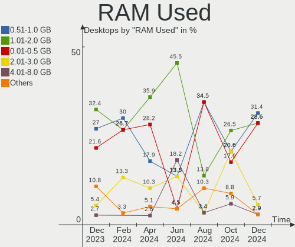
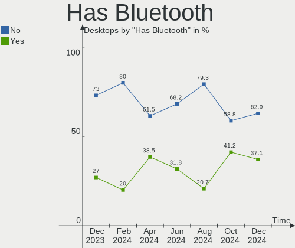
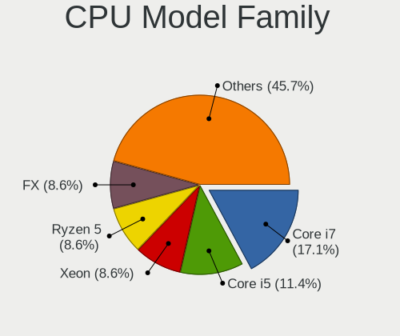
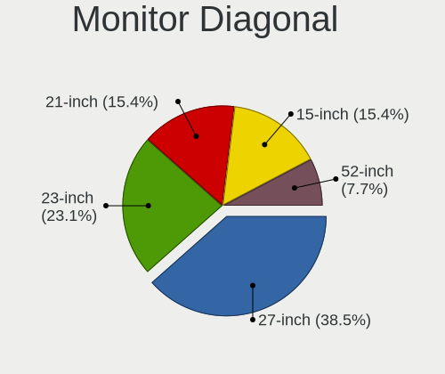

FreeBSD Hardware Trends (Desktop)
---------------------------------

A project to identify most popular hardware characteristics and track their change
over time based on data collected by FreeBSD users at https://BSD-Hardware.info.

Anyone can contribute to the study by uploading probes of their computers by
the [hw-probe](https://github.com/linuxhw/hw-probe/blob/master/INSTALL.BSD.md) tool:

    hw-probe -all -upload

Full-feature report is available here: https://bsd-hardware.info/?view=trends&formfactor=desktop

Period: Apr, 2021.

Contents
--------

- [ OS                       ](#os)
- [ OS Family                ](#os-family)
- [ Arch                     ](#arch)
- [ DE                       ](#de)
- [ Display Server           ](#display-server)
- [ Display Manager          ](#display-manager)
- [ OS Lang                  ](#os-lang)
- [ Boot Mode                ](#boot-mode)
- [ Filesystem               ](#filesystem)
- [ Part. scheme             ](#part-scheme)
- [ Country                  ](#country)
- [ City                     ](#city)
- [ Vendor                   ](#vendor)
- [ Model                    ](#model)
- [ Model Family             ](#model-family)
- [ MFG Year                 ](#mfg-year)
- [ Form Factor              ](#form-factor)
- [ Coreboot                 ](#coreboot)
- [ RAM Size                 ](#ram-size)
- [ RAM Used                 ](#ram-used)
- [ Has CD-ROM               ](#has-cd-rom)
- [ Total Drives             ](#total-drives)
- [ Has Ethernet             ](#has-ethernet)
- [ Has WiFi                 ](#has-wifi)
- [ Has Bluetooth            ](#has-bluetooth)
- [ Drive Vendor             ](#drive-vendor)
- [ Drive Model              ](#drive-model)
- [ HDD Vendor               ](#hdd-vendor)
- [ SSD Vendor               ](#ssd-vendor)
- [ Drive Kind               ](#drive-kind)
- [ Drive Connector          ](#drive-connector)
- [ Drive Size               ](#drive-size)
- [ Space Total              ](#space-total)
- [ Space Used               ](#space-used)
- [ Malfunc. Drives          ](#malfunc-drives)
- [ Malfunc. Drive Vendor    ](#malfunc-drive-vendor)
- [ Malfunc. HDD Vendor      ](#malfunc-hdd-vendor)
- [ Malfunc. Drive Kind      ](#malfunc-drive-kind)
- [ Failed Drives            ](#failed-drives)
- [ Failed Drive Vendor      ](#failed-drive-vendor)
- [ Drive Status             ](#drive-status)
- [ Storage Vendor           ](#storage-vendor)
- [ Storage Model            ](#storage-model)
- [ Storage Kind             ](#storage-kind)
- [ CPU Vendor               ](#cpu-vendor)
- [ CPU Model                ](#cpu-model)
- [ CPU Model Family         ](#cpu-model-family)
- [ CPU Cores                ](#cpu-cores)
- [ CPU Sockets              ](#cpu-sockets)
- [ CPU Threads              ](#cpu-threads)
- [ CPU Microarch            ](#cpu-microarch)
- [ GPU Vendor               ](#gpu-vendor)
- [ GPU Model                ](#gpu-model)
- [ GPU Combo                ](#gpu-combo)
- [ GPU Driver               ](#gpu-driver)
- [ GPU Memory               ](#gpu-memory)
- [ Monitor Vendor           ](#monitor-vendor)
- [ Monitor Model            ](#monitor-model)
- [ Monitor Resolution       ](#monitor-resolution)
- [ Monitor Diagonal         ](#monitor-diagonal)
- [ Monitor Width            ](#monitor-width)
- [ Aspect Ratio             ](#aspect-ratio)
- [ Monitor Area             ](#monitor-area)
- [ Pixel Density            ](#pixel-density)
- [ Multiple Monitors        ](#multiple-monitors)
- [ Net Controller Vendor    ](#net-controller-vendor)
- [ Net Controller Model     ](#net-controller-model)
- [ Wireless Vendor          ](#wireless-vendor)
- [ Wireless Model           ](#wireless-model)
- [ Ethernet Vendor          ](#ethernet-vendor)
- [ Ethernet Model           ](#ethernet-model)
- [ Net Controller Kind      ](#net-controller-kind)
- [ Used Controller          ](#used-controller)
- [ NICs                     ](#nics)
- [ IPv6                     ](#ipv6)
- [ Memory Vendor            ](#memory-vendor)
- [ Memory Model             ](#memory-model)
- [ Memory Kind              ](#memory-kind)
- [ Memory Form Factor       ](#memory-form-factor)
- [ Memory Size              ](#memory-size)
- [ Memory Speed             ](#memory-speed)
- [ Sound Vendor             ](#sound-vendor)
- [ Sound Model              ](#sound-model)
- [ Camera Vendor            ](#camera-vendor)
- [ Camera Model             ](#camera-model)
- [ Fingerprint Vendor       ](#fingerprint-vendor)
- [ Fingerprint Model        ](#fingerprint-model)
- [ Chipcard Vendor          ](#chipcard-vendor)
- [ Chipcard Model           ](#chipcard-model)
- [ Printer Vendor           ](#printer-vendor)
- [ Printer Model            ](#printer-model)
- [ Scanner Vendor           ](#scanner-vendor)
- [ Scanner Model            ](#scanner-model)
- [ Bluetooth Vendor         ](#bluetooth-vendor)
- [ Bluetooth Model          ](#bluetooth-model)
- [ Unsupported Devices      ](#unsupported-devices)
- [ Unsupported Device Types ](#unsupported-device-types)

OS
--

Installed operating systems

| Name                 | Desktops | Percent |
|----------------------|----------|---------|
| FreeBSD 13.0         | 20       | 48.78%  |
| FreeBSD 12.2-p6      | 4        | 9.76%   |
| FreeBSD 13.0-STABLE  | 3        | 7.32%   |
| FreeBSD 14.0-CURRENT | 2        | 4.88%   |
| FreeBSD 13.0-RC5     | 2        | 4.88%   |
| FreeBSD 12.2-p5      | 2        | 4.88%   |
| FreeBSD 12.2-p4      | 2        | 4.88%   |
| FreeBSD 13.0-RC4     | 1        | 2.44%   |
| FreeBSD 12.2-p3      | 1        | 2.44%   |
| FreeBSD 12.2         | 1        | 2.44%   |
| FreeBSD 12.1-p13     | 1        | 2.44%   |
| FreeBSD 12.1         | 1        | 2.44%   |
| FreeBSD 11.4-p8      | 1        | 2.44%   |

OS Family
---------

OS without a version

| Name    | Desktops | Percent |
|---------|----------|---------|
| FreeBSD | 41       | 100%    |

Arch
----

OS architecture (x86_64, i586, etc.)

| Name  | Desktops | Percent |
|-------|----------|---------|
| amd64 | 39       | 95.12%  |
| i386  | 1        | 2.44%   |
| arm64 | 1        | 2.44%   |

DE
--

Desktop Environment

| Name          | Desktops | Percent |
|---------------|----------|---------|
| Console       | 21       | 51.22%  |
| KDE5          | 7        | 17.07%  |
| XFCE          | 3        | 7.32%   |
| GNOME         | 3        | 7.32%   |
| Cinnamon      | 2        | 4.88%   |
| TWM           | 1        | 2.44%   |
| Openbox       | 1        | 2.44%   |
| MATE          | 1        | 2.44%   |
| Enlightenment | 1        | 2.44%   |
| DWM           | 1        | 2.44%   |

Display Server
--------------

X11 or Wayland

| Name    | Desktops | Percent |
|---------|----------|---------|
| Console | 21       | 51.22%  |
| X11     | 20       | 48.78%  |

Display Manager
---------------

SDDM, LightDM, etc.

| Name    | Desktops | Percent |
|---------|----------|---------|
| Console | 28       | 68.29%  |
| SLiM    | 4        | 9.76%   |
| SDDM    | 4        | 9.76%   |
| XDM     | 2        | 4.88%   |
| LightDM | 2        | 4.88%   |
| GDM     | 1        | 2.44%   |

OS Lang
-------

Language

| Lang        | Desktops | Percent |
|-------------|----------|---------|
| C           | 18       | 43.9%   |
| Unknown     | 10       | 24.39%  |
| en_US       | 7        | 17.07%  |
| de_DE       | 3        | 7.32%   |
| ru_RU       | 2        | 4.88%   |
| en_US.utf-8 | 1        | 2.44%   |

Boot Mode
---------

EFI or BIOS

| Mode | Desktops | Percent |
|------|----------|---------|
| EFI  | 28       | 68.29%  |
| BIOS | 13       | 31.71%  |

Filesystem
----------

Type of filesystem

| Type | Desktops | Percent |
|------|----------|---------|
| Zfs  | 28       | 68.29%  |
| Ufs  | 13       | 31.71%  |

Part. scheme
------------

Scheme of partitioning

| Type | Desktops | Percent |
|------|----------|---------|
| GPT  | 38       | 92.68%  |
| MBR  | 3        | 7.32%   |

Country
-------

Geographic location (country)

| Country     | Desktops | Percent |
|-------------|----------|---------|
| USA         | 20       | 48.78%  |
| Russia      | 5        | 12.2%   |
| Germany     | 5        | 12.2%   |
| UK          | 2        | 4.88%   |
| Thailand    | 2        | 4.88%   |
| Netherlands | 2        | 4.88%   |
| Ukraine     | 1        | 2.44%   |
| Spain       | 1        | 2.44%   |
| Japan       | 1        | 2.44%   |
| Finland     | 1        | 2.44%   |
| China       | 1        | 2.44%   |

City
----

Geographic location (city)

| City                | Desktops | Percent |
|---------------------|----------|---------|
| Redmond             | 2        | 4.88%   |
| Lübeck             | 2        | 4.88%   |
| Irkutsk             | 2        | 4.88%   |
| Wenatchee           | 1        | 2.44%   |
| Vostochnoe Degunino | 1        | 2.44%   |
| Scottsdale          | 1        | 2.44%   |
| Salem               | 1        | 2.44%   |
| Saint Paul          | 1        | 2.44%   |
| Rochester           | 1        | 2.44%   |
| Roanoke             | 1        | 2.44%   |
| Ozersk              | 1        | 2.44%   |
| Omsk                | 1        | 2.44%   |
| Oakland             | 1        | 2.44%   |
| Northeim            | 1        | 2.44%   |
| Munich              | 1        | 2.44%   |
| Kunitachi           | 1        | 2.44%   |
| Krommenie           | 1        | 2.44%   |
| Jackson             | 1        | 2.44%   |
| Henderson           | 1        | 2.44%   |
| Hemel Hempstead     | 1        | 2.44%   |
| Helsinki            | 1        | 2.44%   |
| Hazel Green         | 1        | 2.44%   |
| Gütersloh          | 1        | 2.44%   |
| Gilbert             | 1        | 2.44%   |
| Frisco              | 1        | 2.44%   |
| El Paso             | 1        | 2.44%   |
| Dunbarton Center    | 1        | 2.44%   |
| Donetsk             | 1        | 2.44%   |
| Dayton              | 1        | 2.44%   |
| Creedmoor           | 1        | 2.44%   |
| Chicago             | 1        | 2.44%   |
| Chiang Mai          | 1        | 2.44%   |
| Birmingham          | 1        | 2.44%   |
| Bellevue            | 1        | 2.44%   |
| Beijing             | 1        | 2.44%   |
| Bangkok             | 1        | 2.44%   |
| Amsterdam           | 1        | 2.44%   |
| Alcoy               | 1        | 2.44%   |

Vendor
------

Motherboard manufacturer

| Name                | Desktops | Percent |
|---------------------|----------|---------|
| ASUSTek Computer    | 10       | 24.39%  |
| Dell                | 5        | 12.2%   |
| ASRock              | 5        | 12.2%   |
| Gigabyte Technology | 4        | 9.76%   |
| Lenovo              | 3        | 7.32%   |
| Beckhoff Automation | 3        | 7.32%   |
| Supermicro          | 2        | 4.88%   |
| Hewlett-Packard     | 2        | 4.88%   |
| Unknown             | 2        | 4.88%   |
| pine64              | 1        | 2.44%   |
| MSI                 | 1        | 2.44%   |
| Fujitsu             | 1        | 2.44%   |
| Colorful Technology | 1        | 2.44%   |
| ASRockRack          | 1        | 2.44%   |

Model
-----

Motherboard model

| Name                                    | Desktops | Percent |
|-----------------------------------------|----------|---------|
| Beckhoff Automation Industrial PC       | 2        | 4.88%   |
| ASUS SABERTOOTH 990FX R2.0              | 2        | 4.88%   |
| ASUS All Series                         | 2        | 4.88%   |
| Unknown                                 | 2        | 4.88%   |
| Supermicro X7SPA-HF                     | 1        | 2.44%   |
| Supermicro SYS-5018D-FN4T               | 1        | 2.44%   |
| pine64 pinebook-pro-rk3399              | 1        | 2.44%   |
| MSI MS-7817                             | 1        | 2.44%   |
| Lenovo ThinkCentre M93p 10AAS0F201      | 1        | 2.44%   |
| Lenovo IdeaCentre 5 14ARE05 90Q30008US  | 1        | 2.44%   |
| Lenovo IdeaCentre 310S-08ASR 90G90068US | 1        | 2.44%   |
| HP Z620 Workstation                     | 1        | 2.44%   |
| HP Compaq Elite 8300 SFF                | 1        | 2.44%   |
| Gigabyte X570 AORUS ELITE               | 1        | 2.44%   |
| Gigabyte F2A75M-HD2                     | 1        | 2.44%   |
| Gigabyte B450M DS3H                     | 1        | 2.44%   |
| Gigabyte 990FXA-UD3                     | 1        | 2.44%   |
| Fujitsu D3417-B2 S26361-D3417-B2        | 1        | 2.44%   |
| Dell XPS 8940                           | 1        | 2.44%   |
| Dell XPS 8930                           | 1        | 2.44%   |
| Dell Precision Tower 3620               | 1        | 2.44%   |
| Dell OptiPlex 3010                      | 1        | 2.44%   |
| Dell DXP051                             | 1        | 2.44%   |
| Colorful C.Q1900M PRO V20               | 1        | 2.44%   |
| Beckhoff Automation CX5130-0120         | 1        | 2.44%   |
| ASUS TUF GAMING X570-PLUS               | 1        | 2.44%   |
| ASUS PRIME X370-PRO                     | 1        | 2.44%   |
| ASUS P5Q-E                              | 1        | 2.44%   |
| ASUS P5KPL-AM IN/ROEM/SI                | 1        | 2.44%   |
| ASUS Maximus VIII HERO                  | 1        | 2.44%   |
| ASUS M5A78L-M LE                        | 1        | 2.44%   |
| ASRockRack EPYC3101D4I-2T               | 1        | 2.44%   |
| ASRock Z390M-ITX/ac                     | 1        | 2.44%   |
| ASRock X570 Phantom Gaming-ITX/TB3      | 1        | 2.44%   |
| ASRock J4105-ITX                        | 1        | 2.44%   |
| ASRock H110M-STX                        | 1        | 2.44%   |
| ASRock AM1H-ITX                         | 1        | 2.44%   |

Model Family
------------

Motherboard model prefix

| Name                            | Desktops | Percent |
|---------------------------------|----------|---------|
| Lenovo IdeaCentre               | 2        | 4.88%   |
| Dell XPS                        | 2        | 4.88%   |
| Beckhoff Automation Industrial  | 2        | 4.88%   |
| ASUS SABERTOOTH                 | 2        | 4.88%   |
| ASUS All                        | 2        | 4.88%   |
| Unknown                         | 2        | 4.88%   |
| Supermicro X7SPA-HF             | 1        | 2.44%   |
| Supermicro SYS-5018D-FN4T       | 1        | 2.44%   |
| pine64 pinebook-pro-rk3399      | 1        | 2.44%   |
| MSI MS-7817                     | 1        | 2.44%   |
| Lenovo ThinkCentre              | 1        | 2.44%   |
| HP Z620                         | 1        | 2.44%   |
| HP Compaq                       | 1        | 2.44%   |
| Gigabyte X570                   | 1        | 2.44%   |
| Gigabyte F2A75M-HD2             | 1        | 2.44%   |
| Gigabyte B450M                  | 1        | 2.44%   |
| Gigabyte 990FXA-UD3             | 1        | 2.44%   |
| Fujitsu D3417-B2                | 1        | 2.44%   |
| Dell Precision                  | 1        | 2.44%   |
| Dell OptiPlex                   | 1        | 2.44%   |
| Dell DXP051                     | 1        | 2.44%   |
| Colorful C.Q1900M               | 1        | 2.44%   |
| Beckhoff Automation CX5130-0120 | 1        | 2.44%   |
| ASUS TUF                        | 1        | 2.44%   |
| ASUS PRIME                      | 1        | 2.44%   |
| ASUS P5Q-E                      | 1        | 2.44%   |
| ASUS P5KPL-AM                   | 1        | 2.44%   |
| ASUS Maximus                    | 1        | 2.44%   |
| ASUS M5A78L-M                   | 1        | 2.44%   |
| ASRockRack EPYC3101D4I-2T       | 1        | 2.44%   |
| ASRock Z390M-ITX                | 1        | 2.44%   |
| ASRock X570                     | 1        | 2.44%   |
| ASRock J4105-ITX                | 1        | 2.44%   |
| ASRock H110M-STX                | 1        | 2.44%   |
| ASRock AM1H-ITX                 | 1        | 2.44%   |

MFG Year
--------

Motherboard manufacture year

| Year | Desktops | Percent |
|------|----------|---------|
| 2019 | 8        | 19.51%  |
| 2018 | 7        | 17.07%  |
| 2020 | 4        | 9.76%   |
| 2014 | 4        | 9.76%   |
| 2021 | 3        | 7.32%   |
| 2016 | 3        | 7.32%   |
| 2015 | 3        | 7.32%   |
| 2017 | 2        | 4.88%   |
| 2013 | 2        | 4.88%   |
| 2010 | 2        | 4.88%   |
| 2011 | 1        | 2.44%   |
| 2008 | 1        | 2.44%   |
| 2007 | 1        | 2.44%   |

Form Factor
-----------

Physical design of the computer

| Name    | Desktops | Percent |
|---------|----------|---------|
| Desktop | 41       | 100%    |

Coreboot
--------

Have coreboot on board

| Used | Desktops | Percent |
|------|----------|---------|
| No   | 41       | 100%    |

RAM Size
--------

Total RAM memory

| Size in GB  | Desktops | Percent |
|-------------|----------|---------|
| 16.01-24.0  | 13       | 31.71%  |
| 32.01-64.0  | 8        | 19.51%  |
| 4.01-8.0    | 7        | 17.07%  |
| 8.01-16.0   | 7        | 17.07%  |
| 64.01-256.0 | 5        | 12.2%   |
| 2.01-3.0    | 1        | 2.44%   |

RAM Used
--------

Used RAM memory

| Used GB    | Desktops | Percent |
|------------|----------|---------|
| 0.51-1.0   | 15       | 36.59%  |
| 0.01-0.5   | 12       | 29.27%  |
| 1.01-2.0   | 10       | 24.39%  |
| 3.01-4.0   | 1        | 2.44%   |
| 24.01-32.0 | 1        | 2.44%   |
| 2.01-3.0   | 1        | 2.44%   |
| 8.01-16.0  | 1        | 2.44%   |

Has CD-ROM
----------

Has CD-ROM on board

| Presented | Desktops | Percent |
|-----------|----------|---------|
| No        | 28       | 68.29%  |
| Yes       | 13       | 31.71%  |

Total Drives
------------

Number of drives on board

| Drives | Desktops | Percent |
|--------|----------|---------|
| 2      | 12       | 29.27%  |
| 1      | 11       | 26.83%  |
| 5      | 7        | 17.07%  |
| 3      | 4        | 9.76%   |
| 6      | 2        | 4.88%   |
| 4      | 2        | 4.88%   |
| 17     | 1        | 2.44%   |
| 11     | 1        | 2.44%   |
| 0      | 1        | 2.44%   |

Has Ethernet
------------

Has Ethernet on board

| Presented | Desktops | Percent |
|-----------|----------|---------|
| Yes       | 40       | 97.56%  |
| No        | 1        | 2.44%   |

Has WiFi
--------

Has WiFi module

| Presented | Desktops | Percent |
|-----------|----------|---------|
| No        | 27       | 65.85%  |
| Yes       | 14       | 34.15%  |

Has Bluetooth
-------------

Has Bluetooth module

| Presented | Desktops | Percent |
|-----------|----------|---------|
| No        | 30       | 73.17%  |
| Yes       | 11       | 26.83%  |

Drive Vendor
------------

Hard drive vendors

| Vendor              | Desktops | Drives | Percent |
|---------------------|----------|--------|---------|
| WDC                 | 19       | 41     | 26.76%  |
| Seagate             | 16       | 25     | 22.54%  |
| Samsung Electronics | 12       | 19     | 16.9%   |
| Kingston            | 4        | 4      | 5.63%   |
| Toshiba             | 3        | 3      | 4.23%   |
| Hitachi             | 3        | 8      | 4.23%   |
| Crucial             | 3        | 3      | 4.23%   |
| A-DATA Technology   | 3        | 3      | 4.23%   |
| Intel               | 2        | 4      | 2.82%   |
| Transcend           | 1        | 1      | 1.41%   |
| SPCC                | 1        | 16     | 1.41%   |
| PLEXTOR             | 1        | 1      | 1.41%   |
| Patriot             | 1        | 1      | 1.41%   |
| Intenso             | 1        | 1      | 1.41%   |
| HGST                | 1        | 1      | 1.41%   |

Drive Model
-----------

Hard drive models

| Model                                      | Desktops | Percent |
|--------------------------------------------|----------|---------|
| WDC WD40EFRX-68N32N0 4TB                   | 2        | 2.27%   |
| Seagate ST4000DM004-2CV104 4TB             | 2        | 2.27%   |
| Seagate ST4000DM000-1F2168 4TB             | 2        | 2.27%   |
| Seagate ST2000DM008-2FR102 2TB             | 2        | 2.27%   |
| Samsung SSD 860 EVO 500GB                  | 2        | 2.27%   |
| Samsung SSD 850 EVO 500GB                  | 2        | 2.27%   |
| Kingston SA400S37120G 120GB                | 2        | 2.27%   |
| Crucial CT120BX500SSD1 120GB               | 2        | 2.27%   |
| WDC WUH721414ALE6L4 14TB                   | 1        | 1.14%   |
| WDC WDS500G2B0C-00PXH0 500GB               | 1        | 1.14%   |
| WDC WDS120G2G0B-00EPW0 120GB               | 1        | 1.14%   |
| WDC WDS100T3X0C-00SJG0 1TB                 | 1        | 1.14%   |
| WDC WD60EFRX-68L0BN1 6TB                   | 1        | 1.14%   |
| WDC WD5003AZEX-00MK2A0 500GB               | 1        | 1.14%   |
| WDC WD5003AZEX-00K3CA0 500GB               | 1        | 1.14%   |
| WDC WD5003AZEX-00K1GA0 500GB               | 1        | 1.14%   |
| WDC WD40EZRZ-75GXCB0 4TB                   | 1        | 1.14%   |
| WDC WD40EZRZ-22GXCB0 4TB                   | 1        | 1.14%   |
| WDC WD40EZAZ-00SF3B0 4TB                   | 1        | 1.14%   |
| WDC WD4001FAEX-00MJRA0 4TB                 | 1        | 1.14%   |
| WDC WD20EZRZ-00Z5HB0 2TB                   | 1        | 1.14%   |
| WDC WD20EFRX-68EUZN0 2TB                   | 1        | 1.14%   |
| WDC WD20EARX-00PASB0 2TB                   | 1        | 1.14%   |
| WDC WD2005FBYZ-01YCBB3 2TB                 | 1        | 1.14%   |
| WDC WD120EMAZ-11BLFA0 12TB                 | 1        | 1.14%   |
| WDC WD120EDAZ-11F3RA0 12TB                 | 1        | 1.14%   |
| WDC WD10EZEX-75WN4A1 1TB                   | 1        | 1.14%   |
| WDC WD10EAVS-00D7B1 1TB                    | 1        | 1.14%   |
| WDC WD10EARX-00N0YB0 1TB                   | 1        | 1.14%   |
| WDC WD100EZAZ-11TDBA0 10TB                 | 1        | 1.14%   |
| WDC WD1001FALS-00J7B0 1TB                  | 1        | 1.14%   |
| Transcend TS8GSSD500 8GB                   | 1        | 1.14%   |
| Toshiba THNSNJ256GCSY 256GB                | 1        | 1.14%   |
| Toshiba MG03ACA100 1TB                     | 1        | 1.14%   |
| Toshiba HDWD120 2TB                        | 1        | 1.14%   |
| SPCC Solid State Disk 1TB                  | 1        | 1.14%   |
| Seagate ST8000AS0002-1NA17Z 8TB            | 1        | 1.14%   |
| Seagate ST500DM002-1BD142 500GB            | 1        | 1.14%   |
| Seagate ST4000VN008-2DR166 4TB             | 1        | 1.14%   |
| Seagate ST4000LM024-2AN17V 4TB             | 1        | 1.14%   |
| Seagate ST3500418AS 500GB                  | 1        | 1.14%   |
| Seagate ST3500312CS 500GB                  | 1        | 1.14%   |
| Seagate ST33000651NS 3TB                   | 1        | 1.14%   |
| Seagate ST3160812AS 160GB                  | 1        | 1.14%   |
| Seagate ST31500541AS 1.5TB                 | 1        | 1.14%   |
| Seagate ST16000NM001G-2KK103 16TB          | 1        | 1.14%   |
| Seagate ST1000VX000-1CU162 1TB             | 1        | 1.14%   |
| Seagate ST1000DM003-1SB102 1TB             | 1        | 1.14%   |
| Seagate ST1000DM003-1ER162 1TB             | 1        | 1.14%   |
| Seagate FireCuda 520 SSD ZP1000GM30002 1TB | 1        | 1.14%   |
| Samsung SSD PM851 mSATA 256GB              | 1        | 1.14%   |
| Samsung SSD 970 EVO Plus 250GB             | 1        | 1.14%   |
| Samsung SSD 970 EVO Plus 1TB               | 1        | 1.14%   |
| Samsung SSD 970 EVO 500GB                  | 1        | 1.14%   |
| Samsung SSD 960 EVO 500GB                  | 1        | 1.14%   |
| Samsung SSD 960 EVO 1TB                    | 1        | 1.14%   |
| Samsung SSD 860 QVO 1TB                    | 1        | 1.14%   |
| Samsung SSD 860 EVO 4TB                    | 1        | 1.14%   |
| Samsung SSD 860 EVO 1TB                    | 1        | 1.14%   |
| Samsung SSD 850 EVO 1TB                    | 1        | 1.14%   |

HDD Vendor
----------

Hard disk drive vendors

| Vendor              | Desktops | Drives | Percent |
|---------------------|----------|--------|---------|
| WDC                 | 16       | 38     | 42.11%  |
| Seagate             | 15       | 24     | 39.47%  |
| Hitachi             | 3        | 8      | 7.89%   |
| Toshiba             | 2        | 2      | 5.26%   |
| Samsung Electronics | 1        | 1      | 2.63%   |
| HGST                | 1        | 1      | 2.63%   |

SSD Vendor
----------

Solid state drive vendors

| Vendor              | Desktops | Drives | Percent |
|---------------------|----------|--------|---------|
| Samsung Electronics | 8        | 10     | 29.63%  |
| Kingston            | 4        | 4      | 14.81%  |
| Crucial             | 3        | 3      | 11.11%  |
| A-DATA Technology   | 3        | 3      | 11.11%  |
| Intel               | 2        | 4      | 7.41%   |
| WDC                 | 1        | 1      | 3.7%    |
| Transcend           | 1        | 1      | 3.7%    |
| Toshiba             | 1        | 1      | 3.7%    |
| SPCC                | 1        | 16     | 3.7%    |
| PLEXTOR             | 1        | 1      | 3.7%    |
| Patriot             | 1        | 1      | 3.7%    |
| Intenso             | 1        | 1      | 3.7%    |

Drive Kind
----------

HDD or SSD

| Kind | Desktops | Drives | Percent |
|------|----------|--------|---------|
| HDD  | 30       | 74     | 47.62%  |
| SSD  | 23       | 46     | 36.51%  |
| NVMe | 10       | 11     | 15.87%  |

Drive Connector
---------------

SATA, SAS, NVMe, etc.

| Type | Desktops | Drives | Percent |
|------|----------|--------|---------|
| SATA | 38       | 120    | 79.17%  |
| NVMe | 10       | 11     | 20.83%  |

Drive Size
----------

Size of hard drive

| Size in TB | Desktops | Drives | Percent |
|------------|----------|--------|---------|
| 0.01-0.5   | 26       | 42     | 41.27%  |
| 3.01-4.0   | 10       | 17     | 15.87%  |
| 0.51-1.0   | 10       | 17     | 15.87%  |
| 1.01-2.0   | 9        | 27     | 14.29%  |
| 10.01-20.0 | 3        | 8      | 4.76%   |
| 4.01-10.0  | 3        | 4      | 4.76%   |
| 2.01-3.0   | 2        | 5      | 3.17%   |

Space Total
-----------

Amount of disk space available on the file system

| Size in GB     | Desktops | Percent |
|----------------|----------|---------|
| More than 3000 | 6        | 14.63%  |
| 251-500        | 6        | 14.63%  |
| 501-1000       | 6        | 14.63%  |
| 101-250        | 5        | 12.2%   |
| 51-100         | 5        | 12.2%   |
| 1001-2000      | 4        | 9.76%   |
| 21-50          | 3        | 7.32%   |
| 2001-3000      | 3        | 7.32%   |
| 1-20           | 2        | 4.88%   |
| Unknown        | 1        | 2.44%   |

Space Used
----------

Amount of used disk space

| Used GB        | Desktops | Percent |
|----------------|----------|---------|
| 1-20           | 27       | 65.85%  |
| 21-50          | 5        | 12.2%   |
| More than 3000 | 3        | 7.32%   |
| 251-500        | 2        | 4.88%   |
| 101-250        | 1        | 2.44%   |
| 1001-2000      | 1        | 2.44%   |
| 51-100         | 1        | 2.44%   |
| Unknown        | 1        | 2.44%   |

Malfunc. Drives
---------------

Drive models with a malfunction

| Model                            | Desktops | Drives | Percent |
|----------------------------------|----------|--------|---------|
| WDC WD4001FAEX-00MJRA0 4TB       | 1        | 2      | 12.5%   |
| Seagate ST500DM002-1BD142 500GB  | 1        | 1      | 12.5%   |
| Seagate ST3500418AS 500GB        | 1        | 1      | 12.5%   |
| Seagate ST31500541AS 1.5TB       | 1        | 1      | 12.5%   |
| Seagate ST2000DM008-2FR102 2TB   | 1        | 1      | 12.5%   |
| Samsung Electronics SP0411N 40GB | 1        | 1      | 12.5%   |
| PLEXTOR PX-128M5S 128GB          | 1        | 1      | 12.5%   |
| Hitachi HDS721010CLA332 1TB      | 1        | 1      | 12.5%   |

Malfunc. Drive Vendor
---------------------

Vendors of faulty drives

| Vendor              | Desktops | Drives | Percent |
|---------------------|----------|--------|---------|
| Seagate             | 4        | 4      | 50%     |
| WDC                 | 1        | 2      | 12.5%   |
| Samsung Electronics | 1        | 1      | 12.5%   |
| PLEXTOR             | 1        | 1      | 12.5%   |
| Hitachi             | 1        | 1      | 12.5%   |

Malfunc. HDD Vendor
-------------------

Vendors of faulty HDD drives

| Vendor              | Desktops | Drives | Percent |
|---------------------|----------|--------|---------|
| Seagate             | 4        | 4      | 57.14%  |
| WDC                 | 1        | 2      | 14.29%  |
| Samsung Electronics | 1        | 1      | 14.29%  |
| Hitachi             | 1        | 1      | 14.29%  |

Malfunc. Drive Kind
-------------------

Kinds of faulty drives

| Kind | Desktops | Drives | Percent |
|------|----------|--------|---------|
| HDD  | 6        | 8      | 85.71%  |
| SSD  | 1        | 1      | 14.29%  |

Failed Drives
-------------

Failed drive models

Zero info for selected period =(

Failed Drive Vendor
-------------------

Failed drive vendors

Zero info for selected period =(

Drive Status
------------

Number of failed and malfunc. drives

| Status   | Desktops | Drives | Percent |
|----------|----------|--------|---------|
| Works    | 38       | 118    | 80.85%  |
| Malfunc  | 7        | 9      | 14.89%  |
| Detected | 2        | 4      | 4.26%   |

Storage Vendor
--------------

Storage controller vendors

| Vendor                   | Desktops | Percent |
|--------------------------|----------|---------|
| Intel                    | 26       | 41.94%  |
| AMD                      | 14       | 22.58%  |
| Samsung Electronics      | 7        | 11.29%  |
| ASMedia Technology       | 6        | 9.68%   |
| Sandisk                  | 3        | 4.84%   |
| Broadcom / LSI           | 3        | 4.84%   |
| Marvell Technology Group | 2        | 3.23%   |
| Seagate Technology       | 1        | 1.61%   |

Storage Model
-------------

Storage controller models

| Model                                                                          | Desktops | Percent |
|--------------------------------------------------------------------------------|----------|---------|
| AMD FCH SATA Controller [AHCI mode]                                            | 9        | 12.5%   |
| ASMedia ASM1062 Serial ATA Controller                                          | 6        | 8.33%   |
| Intel Q170/Q150/B150/H170/H110/Z170/CM236 Chipset SATA Controller [AHCI Mode]  | 4        | 5.56%   |
| Intel 8 Series/C220 Series Chipset Family 6-port SATA Controller 1 [AHCI mode] | 4        | 5.56%   |
| Samsung NVMe SSD Controller SM981/PM981/PM983                                  | 3        | 4.17%   |
| Intel Atom Processor E3800 Series SATA AHCI Controller                         | 3        | 4.17%   |
| AMD SB7x0/SB8x0/SB9x0 SATA Controller [AHCI mode]                              | 3        | 4.17%   |
| Sandisk WD Blue SN550 NVMe SSD                                                 | 2        | 2.78%   |
| Samsung NVMe SSD Controller SM961/PM961/SM963                                  | 2        | 2.78%   |
| Intel Sunrise Point-LP SATA Controller [AHCI mode]                             | 2        | 2.78%   |
| Intel 82801G (ICH7 Family) IDE Controller                                      | 2        | 2.78%   |
| Seagate FireCuda 520 SSD                                                       | 1        | 1.39%   |
| Sandisk WD Black SN750 / PC SN730 NVMe SSD                                     | 1        | 1.39%   |
| Samsung NVMe SSD Controller SM951/PM951                                        | 1        | 1.39%   |
| Samsung NVMe Controller                                                        | 1        | 1.39%   |
| Marvell Group 88SE9172 SATA 6Gb/s Controller                                   | 1        | 1.39%   |
| Marvell Group 88SE6111/6121 SATA II / PATA Controller                          | 1        | 1.39%   |
| Intel SATA Controller [RAID mode]                                              | 1        | 1.39%   |
| Intel NM10/ICH7 Family SATA Controller [IDE mode]                              | 1        | 1.39%   |
| Intel Comet Lake SATA AHCI Controller                                          | 1        | 1.39%   |
| Intel Celeron/Pentium Silver Processor SATA Controller                         | 1        | 1.39%   |
| Intel Cannon Lake PCH SATA AHCI Controller                                     | 1        | 1.39%   |
| Intel C602 chipset 4-Port SATA Storage Control Unit                            | 1        | 1.39%   |
| Intel C600/X79 series chipset IDE-r Controller                                 | 1        | 1.39%   |
| Intel C600/X79 series chipset 4-Port SATA IDE Controller                       | 1        | 1.39%   |
| Intel C600/X79 series chipset 2-Port SATA IDE Controller                       | 1        | 1.39%   |
| Intel 9 Series Chipset Family SATA Controller [AHCI Mode]                      | 1        | 1.39%   |
| Intel 82801JI (ICH10 Family) SATA AHCI Controller                              | 1        | 1.39%   |
| Intel 82801IR/IO/IH (ICH9R/DO/DH) 6 port SATA Controller [AHCI mode]           | 1        | 1.39%   |
| Intel 82801GR/GDH (ICH7R/ICH7DH) SATA Controller [RAID mode]                   | 1        | 1.39%   |
| Intel 7 Series/C210 Series Chipset Family 6-port SATA Controller [AHCI mode]   | 1        | 1.39%   |
| Intel 6 Series/C200 Series Chipset Family 6 port Mobile SATA AHCI Controller   | 1        | 1.39%   |
| Intel 6 Series/C200 Series Chipset Family 6 port Desktop SATA AHCI Controller  | 1        | 1.39%   |
| Intel 400 Series Chipset Family SATA RAID Controller                           | 1        | 1.39%   |
| Broadcom / LSI SAS3416 Fusion-MPT Tri-Mode I/O Controller Chip (IOC)           | 1        | 1.39%   |
| Broadcom / LSI SAS3008 PCI-Express Fusion-MPT SAS-3                            | 1        | 1.39%   |
| Broadcom / LSI SAS2308 PCI-Express Fusion-MPT SAS-2                            | 1        | 1.39%   |
| AMD X370 Series Chipset SATA Controller                                        | 1        | 1.39%   |
| AMD Starship/Matisse Chipset SATA Controller [AHCI mode]                       | 1        | 1.39%   |
| AMD SB7x0/SB8x0/SB9x0 SATA Controller [IDE mode]                               | 1        | 1.39%   |
| AMD SB7x0/SB8x0/SB9x0 IDE Controller                                           | 1        | 1.39%   |
| AMD FCH IDE Controller                                                         | 1        | 1.39%   |
| AMD 400 Series Chipset SATA Controller                                         | 1        | 1.39%   |

Storage Kind
------------

Kind of storage controller (IDE, SATA, NVMe, SAS, ...)

| Kind | Desktops | Percent |
|------|----------|---------|
| SATA | 35       | 59.32%  |
| NVMe | 11       | 18.64%  |
| IDE  | 6        | 10.17%  |
| SAS  | 4        | 6.78%   |
| RAID | 3        | 5.08%   |

CPU Vendor
----------

Processor vendors

| Vendor  | Desktops | Percent |
|---------|----------|---------|
| Intel   | 26       | 63.41%  |
| AMD     | 14       | 34.15%  |
| Unknown | 1        | 2.44%   |

CPU Model
---------

Processor models

| Model                                        | Desktops | Percent |
|----------------------------------------------|----------|---------|
| Intel Core i5-8350U CPU @ 1.70GHz            | 2        | 4.88%   |
| Intel Core i3-9100 CPU @ 3.60GHz             | 2        | 4.88%   |
| AMD FX-8350 Eight-Core Processor             | 2        | 4.88%   |
| Intel Xeon CPU E5410 @ 2.33GHz               | 1        | 2.44%   |
| Intel Xeon CPU E5-2670 @ 2.60GHz             | 1        | 2.44%   |
| Intel Xeon CPU E3-1275 v5 @ 3.60GHz          | 1        | 2.44%   |
| Intel Xeon CPU D-1541 @ 2.10GHz              | 1        | 2.44%   |
| Intel Pentium CPU G3220 @ 3.00GHz            | 1        | 2.44%   |
| Intel Pentium 4                              | 1        | 2.44%   |
| Intel Core i7-6700K CPU @ 4.00GHz            | 1        | 2.44%   |
| Intel Core i7-6700 CPU @ 3.40GHz             | 1        | 2.44%   |
| Intel Core i7-4770K CPU @ 3.50GHz            | 1        | 2.44%   |
| Intel Core i7-3770 CPU @ 3.40GHz             | 1        | 2.44%   |
| Intel Core i7-3610QE CPU @ 2.30GHz           | 1        | 2.44%   |
| Intel Core i7-10700 CPU @ 2.90GHz            | 1        | 2.44%   |
| Intel Core i5-6500 CPU @ 3.20GHz             | 1        | 2.44%   |
| Intel Core i5-4690 CPU @ 3.50GHz             | 1        | 2.44%   |
| Intel Core i5-4570T CPU @ 2.90GHz            | 1        | 2.44%   |
| Intel Core i3-3220 CPU @ 3.30GHz             | 1        | 2.44%   |
| Intel Core 2 Quad CPU Q6600 @ 2.40GHz        | 1        | 2.44%   |
| Intel Celeron J4105 CPU @ 1.50GHz            | 1        | 2.44%   |
| Intel Celeron CPU J1900 @ 1.99GHz            | 1        | 2.44%   |
| Intel Atom CPU E3845 @ 1.91GHz               | 1        | 2.44%   |
| Intel Atom CPU E3827 @ 1.74GHz               | 1        | 2.44%   |
| Intel Atom CPU D510 @ 1.66GHz                | 1        | 2.44%   |
| AMD Ryzen 9 3950X 16-Core Processor          | 1        | 2.44%   |
| AMD Ryzen 9 3900XT 12-Core Processor         | 1        | 2.44%   |
| AMD Ryzen 9 3900X 12-Core Processor          | 1        | 2.44%   |
| AMD Ryzen 7 4700G with Radeon Graphics       | 1        | 2.44%   |
| AMD Ryzen 7 2700 Eight-Core Processor        | 1        | 2.44%   |
| AMD Ryzen 7 1700 Eight-Core Processor        | 1        | 2.44%   |
| AMD Phenom II X6 1090T Processor             | 1        | 2.44%   |
| AMD EPYC 3101 4-Core Processor               | 1        | 2.44%   |
| AMD Athlon X4 750K Quad Core Processor       | 1        | 2.44%   |
| AMD Athlon II X2 250 Processor               | 1        | 2.44%   |
| AMD Athlon 5350 APU with Radeon R3           | 1        | 2.44%   |
| AMD A9-9425 RADEON R5, 5 COMPUTE CORES 2C+3G | 1        | 2.44%   |
|                                              | 1        | 2.44%   |

CPU Model Family
----------------

Processor model prefix

| Model             | Desktops | Percent |
|-------------------|----------|---------|
| Intel Core i7     | 6        | 14.63%  |
| Intel Core i5     | 5        | 12.2%   |
| Intel Xeon        | 4        | 9.76%   |
| Intel Core i3     | 3        | 7.32%   |
| Intel Atom        | 3        | 7.32%   |
| AMD Ryzen 9       | 3        | 7.32%   |
| AMD Ryzen 7       | 3        | 7.32%   |
| Other             | 2        | 4.88%   |
| Intel Celeron     | 2        | 4.88%   |
| AMD FX            | 2        | 4.88%   |
| Intel Pentium 4   | 1        | 2.44%   |
| Intel Pentium     | 1        | 2.44%   |
| Intel Core 2 Quad | 1        | 2.44%   |
| AMD Phenom II X6  | 1        | 2.44%   |
| AMD EPYC          | 1        | 2.44%   |
| AMD Athlon X4     | 1        | 2.44%   |
| AMD Athlon II X2  | 1        | 2.44%   |
| AMD Athlon        | 1        | 2.44%   |

CPU Cores
---------

Number of processor cores

| Number  | Desktops | Percent |
|---------|----------|---------|
| 4       | 19       | 46.34%  |
| 2       | 7        | 17.07%  |
| 8       | 5        | 12.2%   |
| 16      | 3        | 7.32%   |
| Unknown | 3        | 7.32%   |
| 24      | 2        | 4.88%   |
| 32      | 1        | 2.44%   |
| 6       | 1        | 2.44%   |

CPU Sockets
-----------

Number of sockets

| Number | Desktops | Percent |
|--------|----------|---------|
| 1      | 41       | 100%    |

CPU Threads
-----------

Threads per core (Hyper-Threading)

| Number  | Desktops | Percent |
|---------|----------|---------|
| 1       | 24       | 58.54%  |
| 2       | 14       | 34.15%  |
| Unknown | 3        | 7.32%   |

CPU Microarch
-------------

Microarchitecture

| Name          | Desktops | Percent |
|---------------|----------|---------|
| Zen 2         | 4        | 9.76%   |
| Skylake       | 4        | 9.76%   |
| KabyLake      | 4        | 9.76%   |
| Haswell       | 4        | 9.76%   |
| Silvermont    | 3        | 7.32%   |
| Piledriver    | 3        | 7.32%   |
| IvyBridge     | 3        | 7.32%   |
| Zen           | 2        | 4.88%   |
| K10           | 2        | 4.88%   |
| Zen+          | 1        | 2.44%   |
| SandyBridge   | 1        | 2.44%   |
| Penryn        | 1        | 2.44%   |
| NetBurst      | 1        | 2.44%   |
| Jaguar        | 1        | 2.44%   |
| Goldmont plus | 1        | 2.44%   |
| Excavator     | 1        | 2.44%   |
| Core          | 1        | 2.44%   |
| CometLake     | 1        | 2.44%   |
| Broadwell     | 1        | 2.44%   |
| Bonnell       | 1        | 2.44%   |
| Unknown       | 1        | 2.44%   |

GPU Vendor
----------

Vendors of graphics cards

| Vendor            | Desktops | Percent |
|-------------------|----------|---------|
| Intel             | 20       | 45.45%  |
| Nvidia            | 14       | 31.82%  |
| AMD               | 8        | 18.18%  |
| ASPEED Technology | 2        | 4.55%   |

GPU Model
---------

Graphics card models

| Model                                                                       | Desktops | Percent |
|-----------------------------------------------------------------------------|----------|---------|
| Intel Xeon E3-1200 v3/4th Gen Core Processor Integrated Graphics Controller | 3        | 6.67%   |
| Intel Atom Processor Z36xxx/Z37xxx Series Graphics & Display                | 3        | 6.67%   |
| AMD Ellesmere [Radeon RX 470/480/570/570X/580/580X/590]                     | 3        | 6.67%   |
| Intel Xeon E3-1200 v2/3rd Gen Core processor Graphics Controller            | 2        | 4.44%   |
| Intel UHD Graphics 620                                                      | 2        | 4.44%   |
| Intel HD Graphics 530                                                       | 2        | 4.44%   |
| Intel CoffeeLake-S GT2 [UHD Graphics 630]                                   | 2        | 4.44%   |
| ASPEED Technology ASPEED Graphics Family                                    | 2        | 4.44%   |
| Nvidia TU116 [GeForce GTX 1660 SUPER]                                       | 1        | 2.22%   |
| Nvidia TU116 [GeForce GTX 1650 SUPER]                                       | 1        | 2.22%   |
| Nvidia GT218 [NVS 300]                                                      | 1        | 2.22%   |
| Nvidia GT218 [GeForce 210]                                                  | 1        | 2.22%   |
| Nvidia GP108 [GeForce GT 1030]                                              | 1        | 2.22%   |
| Nvidia GP107GL [Quadro P600]                                                | 1        | 2.22%   |
| Nvidia GP106 [GeForce GTX 1060 6GB]                                         | 1        | 2.22%   |
| Nvidia GM107GL [Quadro K2200]                                               | 1        | 2.22%   |
| Nvidia GM107 [GeForce GTX 750 Ti]                                           | 1        | 2.22%   |
| Nvidia GK208B [GeForce GT 710]                                              | 1        | 2.22%   |
| Nvidia GK107 [GeForce GT 640]                                               | 1        | 2.22%   |
| Nvidia GF119 [GeForce GT 610]                                               | 1        | 2.22%   |
| Nvidia G98 [GeForce 8400 GS Rev. 2]                                         | 1        | 2.22%   |
| Nvidia G72 [GeForce 7300 LE]                                                | 1        | 2.22%   |
| Intel HD Graphics P530                                                      | 1        | 2.22%   |
| Intel GeminiLake [UHD Graphics 600]                                         | 1        | 2.22%   |
| Intel CometLake-S GT2 [UHD Graphics 630]                                    | 1        | 2.22%   |
| Intel Atom Processor D4xx/D5xx/N4xx/N5xx Integrated Graphics Controller     | 1        | 2.22%   |
| Intel 82G33/G31 Express Integrated Graphics Controller                      | 1        | 2.22%   |
| Intel 3rd Gen Core processor Graphics Controller                            | 1        | 2.22%   |
| AMD Stoney [Radeon R2/R3/R4/R5 Graphics]                                    | 1        | 2.22%   |
| AMD Renoir                                                                  | 1        | 2.22%   |
| AMD Rage 3 [Rage XL PCI]                                                    | 1        | 2.22%   |
| AMD Park [Mobility Radeon HD 5430]                                          | 1        | 2.22%   |
| AMD Caicos [Radeon HD 6450/7450/8450 / R5 230 OEM]                          | 1        | 2.22%   |
| AMD Baffin [Radeon RX 550 640SP / RX 560/560X]                              | 1        | 2.22%   |

GPU Combo
---------

Combinations of graphics cards

| Name           | Desktops | Percent |
|----------------|----------|---------|
| 1 x Intel      | 15       | 36.59%  |
| 1 x Nvidia     | 11       | 26.83%  |
| 1 x AMD        | 6        | 14.63%  |
| Intel + Nvidia | 3        | 7.32%   |
| 1 x ASPEED     | 2        | 4.88%   |
| Other          | 1        | 2.44%   |
| 2 x Intel      | 1        | 2.44%   |
| 2 x AMD        | 1        | 2.44%   |
| Intel + AMD    | 1        | 2.44%   |

GPU Driver
----------

Free vs proprietary

| Driver      | Desktops | Percent |
|-------------|----------|---------|
| Free        | 31       | 75.61%  |
| Proprietary | 9        | 21.95%  |
| Unknown     | 1        | 2.44%   |

GPU Memory
----------

Total video memory

| Size in GB | Desktops | Percent |
|------------|----------|---------|
| Unknown    | 28       | 68.29%  |
| 1.01-2.0   | 5        | 12.2%   |
| 7.01-8.0   | 2        | 4.88%   |
| 5.01-6.0   | 2        | 4.88%   |
| 3.01-4.0   | 2        | 4.88%   |
| 0.51-1.0   | 2        | 4.88%   |

Monitor Vendor
--------------

Monitor vendors

| Vendor               | Desktops | Percent |
|----------------------|----------|---------|
| Dell                 | 5        | 26.32%  |
| Samsung Electronics  | 2        | 10.53%  |
| LG Electronics       | 2        | 10.53%  |
| Eizo                 | 2        | 10.53%  |
| Acer                 | 2        | 10.53%  |
| Lenovo               | 1        | 5.26%   |
| Insignia             | 1        | 5.26%   |
| Hewlett-Packard      | 1        | 5.26%   |
| Goldstar             | 1        | 5.26%   |
| BenQ                 | 1        | 5.26%   |
| Ancor Communications | 1        | 5.26%   |

Monitor Model
-------------

Monitor models

| Model                                                                 | Desktops | Percent |
|-----------------------------------------------------------------------|----------|---------|
| Samsung Electronics U32J59x SAM0F35 3840x2160 700x390mm 31.5-inch     | 1        | 5.26%   |
| Samsung Electronics SyncMaster SAM0236 2560x1600 640x400mm 29.7-inch  | 1        | 5.26%   |
| LG Electronics LCD Monitor LG HDR QHD 2560x1440                       | 1        | 5.26%   |
| LG Electronics LCD Monitor 4K@30Hz 1920x1080                          | 1        | 5.26%   |
| Lenovo LCD Monitor LEN0990 1440x900 410x260mm 19.1-inch               | 1        | 5.26%   |
| Insignia LCD Monitor BBY0032 1680x1050 610x350mm 27.7-inch            | 1        | 5.26%   |
| Hewlett-Packard Z24nf HWP3209 1920x1080 530x300mm 24.0-inch           | 1        | 5.26%   |
| Goldstar 23MP65 GSM5A45 1920x1080 510x290mm 23.1-inch                 | 1        | 5.26%   |
| Eizo FX2431 ENC2036 1920x1200 520x330mm 24.2-inch                     | 1        | 5.26%   |
| Eizo CS2420 ENC2741 1920x1200 520x330mm 24.2-inch                     | 1        | 5.26%   |
| Dell U2412M DELA07B 1920x1200 520x320mm 24.0-inch                     | 1        | 5.26%   |
| Dell SE2717H/HX DELD0A1 1920x1080 600x340mm 27.2-inch                 | 1        | 5.26%   |
| Dell P2415Q DELA0BE 3840x2160 530x300mm 24.0-inch                     | 1        | 5.26%   |
| Dell LCD Monitor SP2309W 2048x1152                                    | 1        | 5.26%   |
| Dell LCD Monitor S2740L 1920x1080                                     | 1        | 5.26%   |
| BenQ BL2411 BNQ8011 1920x1200 520x320mm 24.0-inch                     | 1        | 5.26%   |
| Ancor Communications ASUS MX239 ACI23C2 1920x1080 530x310mm 24.2-inch | 1        | 5.26%   |
| Acer V246HL ACR032E 1920x1080 530x300mm 24.0-inch                     | 1        | 5.26%   |
| Acer EB321HQU ACR0507 2560x1440 700x390mm 31.5-inch                   | 1        | 5.26%   |

Monitor Resolution
------------------

Monitor screen resolution

| Resolution         | Desktops | Percent |
|--------------------|----------|---------|
| 1920x1080 (FHD)    | 7        | 36.84%  |
| 1920x1200 (WUXGA)  | 4        | 21.05%  |
| 3840x2160 (4K)     | 2        | 10.53%  |
| 2560x1440 (QHD)    | 2        | 10.53%  |
| 2560x1600          | 1        | 5.26%   |
| 2048x1152          | 1        | 5.26%   |
| 1680x1050 (WSXGA+) | 1        | 5.26%   |
| 1440x900 (WXGA+)   | 1        | 5.26%   |

Monitor Diagonal
----------------

Diagonal size in inches

| Inches  | Desktops | Percent |
|---------|----------|---------|
| 24      | 7        | 38.89%  |
| Unknown | 4        | 22.22%  |
| 31      | 2        | 11.11%  |
| 27      | 2        | 11.11%  |
| 29      | 1        | 5.56%   |
| 23      | 1        | 5.56%   |
| 19      | 1        | 5.56%   |

Monitor Width
-------------

Physical width

| Width in mm | Desktops | Percent |
|-------------|----------|---------|
| 501-600     | 9        | 50%     |
| 601-700     | 4        | 22.22%  |
| Unknown     | 4        | 22.22%  |
| 401-500     | 1        | 5.56%   |

Aspect Ratio
------------

Proportional relationship between the width and the height

| Ratio   | Desktops | Percent |
|---------|----------|---------|
| 16/9    | 8        | 47.06%  |
| 16/10   | 5        | 29.41%  |
| Unknown | 4        | 23.53%  |

Monitor Area
------------

Area in inch²

| Area in inch² | Desktops | Percent |
|----------------|----------|---------|
| 251-300        | 5        | 26.32%  |
| 201-250        | 4        | 21.05%  |
| Unknown        | 4        | 21.05%  |
| 351-500        | 3        | 15.79%  |
| 301-350        | 2        | 10.53%  |
| 151-200        | 1        | 5.26%   |

Pixel Density
-------------

Pixels per inch

| Density | Desktops | Percent |
|---------|----------|---------|
| 51-100  | 11       | 61.11%  |
| Unknown | 4        | 22.22%  |
| 161-240 | 1        | 5.56%   |
| 121-160 | 1        | 5.56%   |
| 101-120 | 1        | 5.56%   |

Multiple Monitors
-----------------

Total monitors connected

| Total | Desktops | Percent |
|-------|----------|---------|
| 0     | 25       | 60.98%  |
| 1     | 13       | 31.71%  |
| 2     | 3        | 7.32%   |

Net Controller Vendor
---------------------

Controller vendors

| Vendor                   | Desktops | Percent |
|--------------------------|----------|---------|
| Intel                    | 29       | 56.86%  |
| Realtek Semiconductor    | 16       | 31.37%  |
| Qualcomm Atheros         | 4        | 7.84%   |
| Ralink                   | 1        | 1.96%   |
| Marvell Technology Group | 1        | 1.96%   |

Net Controller Model
--------------------

Controller models

| Model                                                                         | Desktops | Percent |
|-------------------------------------------------------------------------------|----------|---------|
| Realtek RTL8111/8168/8411 PCI Express Gigabit Ethernet Controller             | 14       | 21.88%  |
| Intel I211 Gigabit Network Connection                                         | 4        | 6.25%   |
| Intel 82574L Gigabit Network Connection                                       | 4        | 6.25%   |
| Intel 82579LM Gigabit Network Connection (Lewisville)                         | 3        | 4.69%   |
| Intel 82571EB/82571GB Gigabit Ethernet Controller D0/D1 (copper applications) | 3        | 4.69%   |
| Qualcomm Atheros AR93xx Wireless Network Adapter                              | 2        | 3.13%   |
| Intel I210 Gigabit Network Connection                                         | 2        | 3.13%   |
| Intel Ethernet Connection (2) I219-V                                          | 2        | 3.13%   |
| Intel Ethernet Connection (2) I219-LM                                         | 2        | 3.13%   |
| Realtek RTL8822CE 802.11ac PCIe Wireless Network Adapter                      | 1        | 1.56%   |
| Realtek RTL8821CE 802.11ac PCIe Wireless Network Adapter                      | 1        | 1.56%   |
| Realtek RTL810xE PCI Express Fast Ethernet controller                         | 1        | 1.56%   |
| Realtek RTL-8100/8101L/8139 PCI Fast Ethernet Adapter                         | 1        | 1.56%   |
| Realtek Killer E2600 Gigabit Ethernet Controller                              | 1        | 1.56%   |
| Ralink RT2500 Wireless 802.11bg                                               | 1        | 1.56%   |
| Qualcomm Atheros QCA6174 802.11ac Wireless Network Adapter                    | 1        | 1.56%   |
| Qualcomm Atheros Killer E2400 Gigabit Ethernet Controller                     | 1        | 1.56%   |
| Qualcomm Atheros AR9462 Wireless Network Adapter                              | 1        | 1.56%   |
| Marvell Group 88E8056 PCI-E Gigabit Ethernet Controller                       | 1        | 1.56%   |
| Marvell Group 88E8001 Gigabit Ethernet Controller                             | 1        | 1.56%   |
| Intel Wireless-AC 9260                                                        | 1        | 1.56%   |
| Intel Wireless 8260                                                           | 1        | 1.56%   |
| Intel Wireless 3160                                                           | 1        | 1.56%   |
| Intel Wi-Fi 6 AX200                                                           | 1        | 1.56%   |
| Intel I350 Gigabit Network Connection                                         | 1        | 1.56%   |
| Intel Ethernet Controller 10G X550T                                           | 1        | 1.56%   |
| Intel Ethernet Connection X552/X557-AT 10GBASE-T                              | 1        | 1.56%   |
| Intel Ethernet Connection I217-V                                              | 1        | 1.56%   |
| Intel Ethernet Connection I217-LM                                             | 1        | 1.56%   |
| Intel Ethernet Connection (7) I219-V                                          | 1        | 1.56%   |
| Intel Ethernet Connection (2) I218-V                                          | 1        | 1.56%   |
| Intel Dual Band Wireless-AC 3168NGW [Stone Peak]                              | 1        | 1.56%   |
| Intel Comet Lake PCH CNVi WiFi                                                | 1        | 1.56%   |
| Intel AC 1550i Wireless                                                       | 1        | 1.56%   |
| Intel 82576 Gigabit Network Connection                                        | 1        | 1.56%   |
| Intel 82573L Gigabit Ethernet Controller                                      | 1        | 1.56%   |
| Intel 82572EI Gigabit Ethernet Controller (Copper)                            | 1        | 1.56%   |

Wireless Vendor
---------------

Wireless vendors

| Vendor                | Desktops | Percent |
|-----------------------|----------|---------|
| Intel                 | 7        | 50%     |
| Qualcomm Atheros      | 4        | 28.57%  |
| Realtek Semiconductor | 2        | 14.29%  |
| Ralink                | 1        | 7.14%   |

Wireless Model
--------------

Wireless models

| Model                                                      | Desktops | Percent |
|------------------------------------------------------------|----------|---------|
| Qualcomm Atheros AR93xx Wireless Network Adapter           | 2        | 14.29%  |
| Realtek RTL8822CE 802.11ac PCIe Wireless Network Adapter   | 1        | 7.14%   |
| Realtek RTL8821CE 802.11ac PCIe Wireless Network Adapter   | 1        | 7.14%   |
| Ralink RT2500 Wireless 802.11bg                            | 1        | 7.14%   |
| Qualcomm Atheros QCA6174 802.11ac Wireless Network Adapter | 1        | 7.14%   |
| Qualcomm Atheros AR9462 Wireless Network Adapter           | 1        | 7.14%   |
| Intel Wireless-AC 9260                                     | 1        | 7.14%   |
| Intel Wireless 8260                                        | 1        | 7.14%   |
| Intel Wireless 3160                                        | 1        | 7.14%   |
| Intel Wi-Fi 6 AX200                                        | 1        | 7.14%   |
| Intel Dual Band Wireless-AC 3168NGW [Stone Peak]           | 1        | 7.14%   |
| Intel Comet Lake PCH CNVi WiFi                             | 1        | 7.14%   |
| Intel AC 1550i Wireless                                    | 1        | 7.14%   |

Ethernet Vendor
---------------

Ethernet vendors

| Vendor                   | Desktops | Percent |
|--------------------------|----------|---------|
| Intel                    | 26       | 59.09%  |
| Realtek Semiconductor    | 16       | 36.36%  |
| Qualcomm Atheros         | 1        | 2.27%   |
| Marvell Technology Group | 1        | 2.27%   |

Ethernet Model
--------------

Ethernet models

| Model                                                                         | Desktops | Percent |
|-------------------------------------------------------------------------------|----------|---------|
| Realtek RTL8111/8168/8411 PCI Express Gigabit Ethernet Controller             | 14       | 28%     |
| Intel I211 Gigabit Network Connection                                         | 4        | 8%      |
| Intel 82574L Gigabit Network Connection                                       | 4        | 8%      |
| Intel 82579LM Gigabit Network Connection (Lewisville)                         | 3        | 6%      |
| Intel 82571EB/82571GB Gigabit Ethernet Controller D0/D1 (copper applications) | 3        | 6%      |
| Intel I210 Gigabit Network Connection                                         | 2        | 4%      |
| Intel Ethernet Connection (2) I219-V                                          | 2        | 4%      |
| Intel Ethernet Connection (2) I219-LM                                         | 2        | 4%      |
| Realtek RTL810xE PCI Express Fast Ethernet controller                         | 1        | 2%      |
| Realtek RTL-8100/8101L/8139 PCI Fast Ethernet Adapter                         | 1        | 2%      |
| Realtek Killer E2600 Gigabit Ethernet Controller                              | 1        | 2%      |
| Qualcomm Atheros Killer E2400 Gigabit Ethernet Controller                     | 1        | 2%      |
| Marvell Group 88E8056 PCI-E Gigabit Ethernet Controller                       | 1        | 2%      |
| Marvell Group 88E8001 Gigabit Ethernet Controller                             | 1        | 2%      |
| Intel I350 Gigabit Network Connection                                         | 1        | 2%      |
| Intel Ethernet Controller 10G X550T                                           | 1        | 2%      |
| Intel Ethernet Connection X552/X557-AT 10GBASE-T                              | 1        | 2%      |
| Intel Ethernet Connection I217-V                                              | 1        | 2%      |
| Intel Ethernet Connection I217-LM                                             | 1        | 2%      |
| Intel Ethernet Connection (7) I219-V                                          | 1        | 2%      |
| Intel Ethernet Connection (2) I218-V                                          | 1        | 2%      |
| Intel 82576 Gigabit Network Connection                                        | 1        | 2%      |
| Intel 82573L Gigabit Ethernet Controller                                      | 1        | 2%      |
| Intel 82572EI Gigabit Ethernet Controller (Copper)                            | 1        | 2%      |

Net Controller Kind
-------------------

Ethernet, WiFi or modem

| Kind     | Desktops | Percent |
|----------|----------|---------|
| Ethernet | 40       | 74.07%  |
| WiFi     | 14       | 25.93%  |

Used Controller
---------------

Currently used network controller

| Kind     | Desktops | Percent |
|----------|----------|---------|
| Ethernet | 40       | 85.11%  |
| WiFi     | 7        | 14.89%  |

NICs
----

Total network controllers on board

| Total | Desktops | Percent |
|-------|----------|---------|
| 2     | 19       | 46.34%  |
| 1     | 13       | 31.71%  |
| 3     | 6        | 14.63%  |
| 4     | 2        | 4.88%   |
| 0     | 1        | 2.44%   |

IPv6
----

IPv6 vs IPv4

| Used | Desktops | Percent |
|------|----------|---------|
| No   | 34       | 82.93%  |
| Yes  | 7        | 17.07%  |

Memory Vendor
-------------

Memory module vendors

| Vendor              | Desktops | Percent |
|---------------------|----------|---------|
| Unknown             | 8        | 20%     |
| SK Hynix            | 6        | 15%     |
| Kingston            | 6        | 15%     |
| Micron Technology   | 4        | 10%     |
| Crucial             | 4        | 10%     |
| Corsair             | 4        | 10%     |
| Samsung Electronics | 2        | 5%      |
| Ramaxel Technology  | 2        | 5%      |
| G.Skill             | 2        | 5%      |
| Team                | 1        | 2.5%    |
| A-DATA Technology   | 1        | 2.5%    |

Memory Model
------------

Memory module models

| Model                                                      | Desktops | Percent |
|------------------------------------------------------------|----------|---------|
| Kingston RAM 9965745-002.A00G 16GB DIMM DDR4 3000MT/s      | 2        | 4.44%   |
| Crucial RAM CT8G4SFS824A.C8BD1 8GB SODIMM DDR4 2400MT/s    | 2        | 4.44%   |
| Unknown RAM Module 4GB DIMM DDR3 1600MT/s                  | 1        | 2.22%   |
| Unknown RAM Module 4GB DIMM 1333MT/s                       | 1        | 2.22%   |
| Unknown RAM Module 4096MB DIMM DDR4 2133MT/s               | 1        | 2.22%   |
| Unknown RAM Module 2GB SODIMM DDR2 667MT/s                 | 1        | 2.22%   |
| Unknown RAM Module 2GB DIMM DDR2 800MT/s                   | 1        | 2.22%   |
| Unknown RAM Module 2GB DIMM DDR 800MT/s                    | 1        | 2.22%   |
| Unknown RAM 992072 (99707 8GB DIMM DDR3 800MT/s            | 1        | 2.22%   |
| Unknown RAM 2G-08-10-12-1333 2GB DIMM DDR3 1333MT/s        | 1        | 2.22%   |
| Team RAM TEAMGROUP-UD4-3200 8GB DIMM DDR4 3200MT/s         | 1        | 2.22%   |
| SK Hynix RAM HMT451U6BFR8A-PB 4GB DIMM DDR3 1600MT/s       | 1        | 2.22%   |
| SK Hynix RAM HMT351S6EFR8C-PB 4GB SODIMM DDR3 1600MT/s     | 1        | 2.22%   |
| SK Hynix RAM HMT31GR7BFR4C-H9 8GB DIMM DDR3 1333MT/s       | 1        | 2.22%   |
| SK Hynix RAM HMT31GR7AFR4C-H9 8GB DIMM DDR3 1333MT/s       | 1        | 2.22%   |
| SK Hynix RAM HMA82GU6DJR8N-XN 16GB DIMM DDR4 3200MT/s      | 1        | 2.22%   |
| SK Hynix RAM HMA82GU6AFR8N-UH 16GB DIMM DDR4 2400MT/s      | 1        | 2.22%   |
| SK Hynix RAM HMA81GR7CJR8N-VK 8GB DIMM DDR4 2667MT/s       | 1        | 2.22%   |
| Samsung RAM M378B5273DH0-CH9 4GB DIMM DDR3 1333MT/s        | 1        | 2.22%   |
| Samsung RAM M378B5273CH0-CH9 4GB DIMM DDR3 1333MT/s        | 1        | 2.22%   |
| Samsung RAM M378A4G43MB1-CTD 32GB DIMM DDR4 2666MT/s       | 1        | 2.22%   |
| Ramaxel RAM RMUA5120ME86H9F-2666 4096MB DIMM DDR4 2400MT/s | 1        | 2.22%   |
| Ramaxel RAM RMT3160EB68FAW1600 8GB SODIMM DDR3 1600MT/s    | 1        | 2.22%   |
| Micron RAM 8ATF1G64AZ-2G6E1 8GB DIMM DDR4 2666MT/s         | 1        | 2.22%   |
| Micron RAM 18ASF2G72AZ-2G3B1 16GB DIMM DDR4 2400MT/s       | 1        | 2.22%   |
| Micron RAM 16JTF51264AZ-1G4M1 4GB DIMM DDR3 1333MT/s       | 1        | 2.22%   |
| Micron RAM 16HTF12864AY-53ED4 1GB DIMM DDR 533MT/s         | 1        | 2.22%   |
| Kingston RAM KHX2133C11D3/8GX 8GB DIMM DDR3 1600MT/s       | 1        | 2.22%   |
| Kingston RAM KHX1600C10D3/8GX 8GB DIMM DDR3 1600MT/s       | 1        | 2.22%   |
| Kingston RAM HP655410-150-HYCG 4GB DIMM DDR3 1333MT/s      | 1        | 2.22%   |
| Kingston RAM 99U5471-039.A 8GB DIMM DDR3 1600MT/s          | 1        | 2.22%   |
| Kingston RAM 99U5471-020.A00LF 4GB DIMM DDR3 1333MT/s      | 1        | 2.22%   |
| Kingston RAM 9905471-074.A 8GB DIMM DDR3 1600MT/s          | 1        | 2.22%   |
| Kingston RAM 9905471-028.A00LF 4GB DIMM DDR3 1333MT/s      | 1        | 2.22%   |
| G.Skill RAM F4-3200C16-16GVK 16GB DIMM DDR4 3200MT/s       | 1        | 2.22%   |
| G.Skill RAM F4-2133C15-8GVR 8GB DIMM DDR4 2133MT/s         | 1        | 2.22%   |
| Crucial RAM CT102464BA160B.C16 8GB DIMM DDR3 1600MT/s      | 1        | 2.22%   |
| Crucial RAM BLS8G3D1609DS1S00. 8GB DIMM DDR3 1600MT/s      | 1        | 2.22%   |
| Corsair RAM CMW32GX4M2C3200C16 16GB DIMM DDR4 3200MT/s     | 1        | 2.22%   |
| Corsair RAM CMSO8GX4M1A2133C15 8GB SODIMM DDR4 2133MT/s    | 1        | 2.22%   |
| Corsair RAM CMK16GX4M2B3200C16 8GB DIMM DDR4 3200MT/s      | 1        | 2.22%   |
| Corsair RAM CM3B8G2C1600L9L 8GB DIMM DDR3 1600MT/s         | 1        | 2.22%   |
| A-DATA RAM Module 16GB DIMM DDR4 2667MT/s                  | 1        | 2.22%   |

Memory Kind
-----------

Memory module kinds

| Kind    | Desktops | Percent |
|---------|----------|---------|
| DDR4    | 18       | 47.37%  |
| DDR3    | 15       | 39.47%  |
| DDR2    | 2        | 5.26%   |
| DDR     | 2        | 5.26%   |
| Unknown | 1        | 2.63%   |

Memory Form Factor
------------------

Physical design of the memory module

| Name   | Desktops | Percent |
|--------|----------|---------|
| DIMM   | 32       | 84.21%  |
| SODIMM | 6        | 15.79%  |

Memory Size
-----------

Memory module size

| Size  | Desktops | Percent |
|-------|----------|---------|
| 8192  | 17       | 44.74%  |
| 16384 | 8        | 21.05%  |
| 4096  | 7        | 18.42%  |
| 2048  | 4        | 10.53%  |
| 32768 | 1        | 2.63%   |
| 1024  | 1        | 2.63%   |

Memory Speed
------------

Memory module speed

| Speed | Desktops | Percent |
|-------|----------|---------|
| 1600  | 10       | 25%     |
| 1333  | 6        | 15%     |
| 3200  | 5        | 12.5%   |
| 2400  | 5        | 12.5%   |
| 2133  | 3        | 7.5%    |
| 800   | 3        | 7.5%    |
| 3000  | 2        | 5%      |
| 2667  | 2        | 5%      |
| 2666  | 2        | 5%      |
| 667   | 1        | 2.5%    |
| 533   | 1        | 2.5%    |

Sound Vendor
------------

Sound card vendors

| Vendor                  | Desktops | Percent |
|-------------------------|----------|---------|
| Intel                   | 21       | 41.18%  |
| Nvidia                  | 12       | 23.53%  |
| AMD                     | 12       | 23.53%  |
| XMOS                    | 1        | 1.96%   |
| Texas Instruments       | 1        | 1.96%   |
| Creative Technology     | 1        | 1.96%   |
| Creative Labs           | 1        | 1.96%   |
| Cambridge Silicon Radio | 1        | 1.96%   |
| C-Media Electronics     | 1        | 1.96%   |

Sound Model
-----------

Sound card models

| Model                                                                             | Desktops | Percent |
|-----------------------------------------------------------------------------------|----------|---------|
| Intel 8 Series/C220 Series Chipset High Definition Audio Controller               | 3        | 5%      |
| Intel 100 Series/C230 Series Chipset Family HD Audio Controller                   | 3        | 5%      |
| AMD SBx00 Azalia (Intel HDA)                                                      | 3        | 5%      |
| AMD Ellesmere HDMI Audio [Radeon RX 470/480 / 570/580/590]                        | 3        | 5%      |
| Nvidia TU116 High Definition Audio Controller                                     | 2        | 3.33%   |
| Nvidia High Definition Audio Controller                                           | 2        | 3.33%   |
| Nvidia GM107 High Definition Audio Controller [GeForce 940MX]                     | 2        | 3.33%   |
| Intel Xeon E3-1200 v3/4th Gen Core Processor HD Audio Controller                  | 2        | 3.33%   |
| Intel Sunrise Point-LP HD Audio                                                   | 2        | 3.33%   |
| Intel NM10/ICH7 Family High Definition Audio Controller                           | 2        | 3.33%   |
| Intel Atom Processor Z36xxx/Z37xxx Series High Definition Audio Controller        | 2        | 3.33%   |
| AMD Starship/Matisse HD Audio Controller                                          | 2        | 3.33%   |
| AMD FCH Azalia Controller                                                         | 2        | 3.33%   |
| AMD Family 17h (Models 00h-0fh) HD Audio Controller                               | 2        | 3.33%   |
| XMOS XMOS XS1-U8 MFA (ST)                                                         | 1        | 1.67%   |
| Texas Instruments PCM2704 16-bit stereo audio DAC                                 | 1        | 1.67%   |
| Nvidia GP108 High Definition Audio Controller                                     | 1        | 1.67%   |
| Nvidia GP107GL High Definition Audio Controller                                   | 1        | 1.67%   |
| Nvidia GP106 High Definition Audio Controller                                     | 1        | 1.67%   |
| Nvidia GK208 HDMI/DP Audio Controller                                             | 1        | 1.67%   |
| Nvidia GK107 HDMI Audio Controller                                                | 1        | 1.67%   |
| Nvidia GF119 HDMI Audio Controller                                                | 1        | 1.67%   |
| Intel Comet Lake PCH cAVS                                                         | 1        | 1.67%   |
| Intel Celeron/Pentium Silver Processor High Definition Audio                      | 1        | 1.67%   |
| Intel Cannon Lake PCH cAVS                                                        | 1        | 1.67%   |
| Intel C600/X79 series chipset High Definition Audio Controller                    | 1        | 1.67%   |
| Intel 9 Series Chipset Family HD Audio Controller                                 | 1        | 1.67%   |
| Intel 82801JI (ICH10 Family) HD Audio Controller                                  | 1        | 1.67%   |
| Intel 7 Series/C216 Chipset Family High Definition Audio Controller               | 1        | 1.67%   |
| Intel 6 Series/C200 Series Chipset Family High Definition Audio Controller        | 1        | 1.67%   |
| Intel 200 Series PCH HD Audio                                                     | 1        | 1.67%   |
| Creative Technology Sound Blaster Play! 3                                         | 1        | 1.67%   |
| Creative Labs Sound Core3D [Sound Blaster Recon3D / Z-Series]                     | 1        | 1.67%   |
| Cambridge Silicon Radio B10                                                       | 1        | 1.67%   |
| C-Media Electronics Audio Adapter (Unitek Y-247A)                                 | 1        | 1.67%   |
| AMD Renoir Radeon High Definition Audio Controller                                | 1        | 1.67%   |
| AMD High Definition Audio Controller                                              | 1        | 1.67%   |
| AMD Family 17h (Models 10h-1fh) HD Audio Controller                               | 1        | 1.67%   |
| AMD Family 15h (Models 60h-6fh) Audio Controller                                  | 1        | 1.67%   |
| AMD Cedar HDMI Audio [Radeon HD 5400/6300/7300 Series]                            | 1        | 1.67%   |
| AMD Caicos HDMI Audio [Radeon HD 6450 / 7450/8450/8490 OEM / R5 230/235/235X OEM] | 1        | 1.67%   |
| AMD Baffin HDMI/DP Audio [Radeon RX 550 640SP / RX 560/560X]                      | 1        | 1.67%   |

Camera Vendor
-------------

Camera device vendors

| Vendor                  | Desktops | Percent |
|-------------------------|----------|---------|
| Logitech                | 2        | 40%     |
| OmniVision Technologies | 1        | 20%     |
| Microdia                | 1        | 20%     |
| ARC International       | 1        | 20%     |

Camera Model
------------

Camera device models

| Model                         | Desktops | Percent |
|-------------------------------|----------|---------|
| OmniVision Monitor Webcam     | 1        | 20%     |
| Microdia HP Integrated Webcam | 1        | 20%     |
| Logitech HD Webcam C615       | 1        | 20%     |
| Logitech HD Pro Webcam C920   | 1        | 20%     |
| ARC International Camera      | 1        | 20%     |

Fingerprint Vendor
------------------

Fingerprint sensor vendors

Zero info for selected period =(

Fingerprint Model
-----------------

Fingerprint sensor models

Zero info for selected period =(

Chipcard Vendor
---------------

Chipcard module vendors

Zero info for selected period =(

Chipcard Model
--------------

Chipcard module models

Zero info for selected period =(

Printer Vendor
--------------

Printer device vendors

Zero info for selected period =(

Printer Model
-------------

Printer device models

Zero info for selected period =(

Scanner Vendor
--------------

Scanner device vendors

Zero info for selected period =(

Scanner Model
-------------

Scanner device models

Zero info for selected period =(

Bluetooth Vendor
----------------

Controller vendors

| Vendor                          | Desktops | Percent |
|---------------------------------|----------|---------|
| Intel                           | 7        | 63.64%  |
| Realtek Semiconductor           | 2        | 18.18%  |
| Qualcomm Atheros Communications | 1        | 9.09%   |
| ASUSTek Computer                | 1        | 9.09%   |

Bluetooth Model
---------------

Controller models

| Model                                                   | Desktops | Percent |
|---------------------------------------------------------|----------|---------|
| Realtek  Bluetooth Adapter                              | 2        | 18.18%  |
| Intel Wireless-AC 9260 Bluetooth Adapter                | 2        | 18.18%  |
| Qualcomm Atheros  QCA61x4 Bluetooth 4.1                 | 1        | 9.09%   |
| Intel Wireless-AC 3168 Bluetooth                        | 1        | 9.09%   |
| Intel Intel Wireless Bluetooth                          | 1        | 9.09%   |
| Intel Bluetooth wireless interface                      | 1        | 9.09%   |
| Intel Bluetooth 9460/9560 Jefferson Peak (JfP)          | 1        | 9.09%   |
| Intel AX200 Bluetooth                                   | 1        | 9.09%   |
| ASUS Qualcomm Atheros AR9462 Bluetooth 4.0 + HS Adapter | 1        | 9.09%   |

Unsupported Devices
-------------------

Total unsupported devices on board

| Total | Desktops | Percent |
|-------|----------|---------|
| 0     | 17       | 41.46%  |
| 1     | 13       | 31.71%  |
| 2     | 9        | 21.95%  |
| 6     | 1        | 2.44%   |
| 3     | 1        | 2.44%   |

Unsupported Device Types
------------------------

Types of unsupported devices

| Type                     | Desktops | Percent |
|--------------------------|----------|---------|
| Communication controller | 18       | 47.37%  |
| Net/wireless             | 7        | 18.42%  |
| Bluetooth                | 5        | 13.16%  |
| Firewire controller      | 3        | 7.89%   |
| Card reader              | 3        | 7.89%   |
| Storage/raid             | 1        | 2.63%   |
| Net/ethernet             | 1        | 2.63%   |

