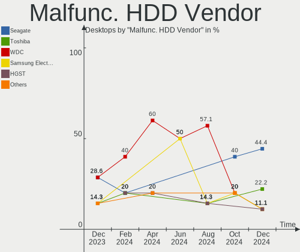

FreeBSD - Hardware Trends (Desktops)
------------------------------------

A project to identify most popular hardware characteristics and track their change
over time based on data collected by BSD users at https://BSD-Hardware.info.

Anyone can contribute to this report by the [hw-probe](https://github.com/linuxhw/hw-probe/blob/master/INSTALL.BSD.md) tool:

    hw-probe -all -upload

This report is for one last month. Overall report since the beginning of time: [TestCoverage](https://github.com/bsdhw/TestCoverage)

Period: Jul, 2022.

Contents
--------

* [ System ](#system)
  - [ OS                       ](#os)
  - [ OS Family                ](#os-family)
  - [ Arch                     ](#arch)
  - [ DE                       ](#de)
  - [ Display Server           ](#display-server)
  - [ Display Manager          ](#display-manager)
  - [ OS Lang                  ](#os-lang)
  - [ Boot Mode                ](#boot-mode)
  - [ Filesystem               ](#filesystem)
  - [ Part. scheme             ](#part-scheme)

* [ Board ](#board)
  - [ Vendor                   ](#vendor)
  - [ Model                    ](#model)
  - [ Model Family             ](#model-family)
  - [ MFG Year                 ](#mfg-year)
  - [ Form Factor              ](#form-factor)
  - [ Coreboot                 ](#coreboot)
  - [ RAM Size                 ](#ram-size)
  - [ RAM Used                 ](#ram-used)
  - [ Total Drives             ](#total-drives)
  - [ Has CD-ROM               ](#has-cd-rom)
  - [ Has Ethernet             ](#has-ethernet)
  - [ Has WiFi                 ](#has-wifi)
  - [ Has Bluetooth            ](#has-bluetooth)

* [ Location ](#location)
  - [ Country                  ](#country)
  - [ City                     ](#city)

* [ Drives ](#drives)
  - [ Drive Vendor             ](#drive-vendor)
  - [ Drive Model              ](#drive-model)
  - [ HDD Vendor               ](#hdd-vendor)
  - [ SSD Vendor               ](#ssd-vendor)
  - [ Drive Kind               ](#drive-kind)
  - [ Drive Connector          ](#drive-connector)
  - [ Drive Size               ](#drive-size)
  - [ Space Total              ](#space-total)
  - [ Space Used               ](#space-used)
  - [ Malfunc. Drives          ](#malfunc-drives)
  - [ Malfunc. Drive Vendor    ](#malfunc-drive-vendor)
  - [ Malfunc. HDD Vendor      ](#malfunc-hdd-vendor)
  - [ Malfunc. Drive Kind      ](#malfunc-drive-kind)
  - [ Failed Drives            ](#failed-drives)
  - [ Failed Drive Vendor      ](#failed-drive-vendor)
  - [ Drive Status             ](#drive-status)

* [ Storage controller ](#storage-controller)
  - [ Storage Vendor           ](#storage-vendor)
  - [ Storage Model            ](#storage-model)
  - [ Storage Kind             ](#storage-kind)

* [ Processor ](#processor)
  - [ CPU Vendor               ](#cpu-vendor)
  - [ CPU Model                ](#cpu-model)
  - [ CPU Model Family         ](#cpu-model-family)
  - [ CPU Cores                ](#cpu-cores)
  - [ CPU Sockets              ](#cpu-sockets)
  - [ CPU Threads              ](#cpu-threads)
  - [ CPU Microarch            ](#cpu-microarch)

* [ Graphics ](#graphics)
  - [ GPU Vendor               ](#gpu-vendor)
  - [ GPU Model                ](#gpu-model)
  - [ GPU Combo                ](#gpu-combo)
  - [ GPU Driver               ](#gpu-driver)
  - [ GPU Memory               ](#gpu-memory)

* [ Monitor ](#monitor)
  - [ Monitor Vendor           ](#monitor-vendor)
  - [ Monitor Model            ](#monitor-model)
  - [ Monitor Resolution       ](#monitor-resolution)
  - [ Monitor Diagonal         ](#monitor-diagonal)
  - [ Monitor Width            ](#monitor-width)
  - [ Aspect Ratio             ](#aspect-ratio)
  - [ Monitor Area             ](#monitor-area)
  - [ Pixel Density            ](#pixel-density)
  - [ Multiple Monitors        ](#multiple-monitors)

* [ Network ](#network)
  - [ Net Controller Vendor    ](#net-controller-vendor)
  - [ Net Controller Model     ](#net-controller-model)
  - [ Wireless Vendor          ](#wireless-vendor)
  - [ Wireless Model           ](#wireless-model)
  - [ Ethernet Vendor          ](#ethernet-vendor)
  - [ Ethernet Model           ](#ethernet-model)
  - [ Net Controller Kind      ](#net-controller-kind)
  - [ Used Controller          ](#used-controller)
  - [ NICs                     ](#nics)
  - [ IPv6                     ](#ipv6)

* [ Bluetooth ](#bluetooth)
  - [ Bluetooth Vendor         ](#bluetooth-vendor)
  - [ Bluetooth Model          ](#bluetooth-model)

* [ Sound ](#sound)
  - [ Sound Vendor             ](#sound-vendor)
  - [ Sound Model              ](#sound-model)

* [ Memory ](#memory)
  - [ Memory Vendor            ](#memory-vendor)
  - [ Memory Model             ](#memory-model)
  - [ Memory Kind              ](#memory-kind)
  - [ Memory Form Factor       ](#memory-form-factor)
  - [ Memory Size              ](#memory-size)
  - [ Memory Speed             ](#memory-speed)

* [ Printers & scanners ](#printers--scanners)
  - [ Printer Vendor           ](#printer-vendor)
  - [ Printer Model            ](#printer-model)
  - [ Scanner Vendor           ](#scanner-vendor)
  - [ Scanner Model            ](#scanner-model)

* [ Camera ](#camera)
  - [ Camera Vendor            ](#camera-vendor)
  - [ Camera Model             ](#camera-model)

* [ Security ](#security)
  - [ Fingerprint Vendor       ](#fingerprint-vendor)
  - [ Fingerprint Model        ](#fingerprint-model)
  - [ Chipcard Vendor          ](#chipcard-vendor)
  - [ Chipcard Model           ](#chipcard-model)

* [ Unsupported ](#unsupported)
  - [ Unsupported Devices      ](#unsupported-devices)
  - [ Unsupported Device Types ](#unsupported-device-types)

System
------

OS
--

Installed operating systems

| Name                | Desktops | Percent |
|---------------------|----------|---------|
| FreeBSD 13.1        | 22       | 78.57%  |
| FreeBSD 13.0-p11    | 2        | 7.14%   |
| FreeBSD 13.1-STABLE | 1        | 3.57%   |
| FreeBSD 13.0        | 1        | 3.57%   |
| FreeBSD 12.3-BETA2  | 1        | 3.57%   |
| FreeBSD 12.1-p8     | 1        | 3.57%   |

OS Family
---------

OS without a version

| Name    | Desktops | Percent |
|---------|----------|---------|
| FreeBSD | 28       | 100%    |

Arch
----

OS architecture (x86_64, i586, etc.)

| Name  | Desktops | Percent |
|-------|----------|---------|
| amd64 | 27       | 96.43%  |
| arm   | 1        | 3.57%   |

DE
--

Desktop Environment

| Name    | Desktops | Percent |
|---------|----------|---------|
| Console | 13       | 46.43%  |
| XFCE    | 7        | 25%     |
| KDE5    | 4        | 14.29%  |
| GNOME   | 2        | 7.14%   |
| TWM     | 1        | 3.57%   |
| LXQt    | 1        | 3.57%   |

Display Server
--------------

X11 or Wayland

| Name    | Desktops | Percent |
|---------|----------|---------|
| X11     | 15       | 53.57%  |
| Console | 13       | 46.43%  |

Display Manager
---------------

SDDM, LightDM, etc.

| Name    | Desktops | Percent |
|---------|----------|---------|
| Console | 22       | 78.57%  |
| SDDM    | 4        | 14.29%  |
| XDM     | 1        | 3.57%   |
| SLiM    | 1        | 3.57%   |

OS Lang
-------

Language

| Lang    | Desktops | Percent |
|---------|----------|---------|
| C       | 16       | 57.14%  |
| ru_RU   | 3        | 10.71%  |
| en_US   | 3        | 10.71%  |
| fr_FR   | 2        | 7.14%   |
| Unknown | 2        | 7.14%   |
| zh_TW   | 1        | 3.57%   |
| ja_JP   | 1        | 3.57%   |

Boot Mode
---------

EFI or BIOS

| Mode | Desktops | Percent |
|------|----------|---------|
| EFI  | 18       | 64.29%  |
| BIOS | 10       | 35.71%  |

Filesystem
----------

Type of filesystem

| Type | Desktops | Percent |
|------|----------|---------|
| Zfs  | 20       | 71.43%  |
| Ufs  | 8        | 28.57%  |

Part. scheme
------------

Scheme of partitioning

| Type | Desktops | Percent |
|------|----------|---------|
| GPT  | 25       | 89.29%  |
| MBR  | 3        | 10.71%  |

Board
-----

Vendor
------

Motherboard manufacturer

| Name                | Desktops | Percent |
|---------------------|----------|---------|
| ASUSTek Computer    | 6        | 21.43%  |
| Gigabyte Technology | 4        | 14.29%  |
| Dell                | 4        | 14.29%  |
| ASRock              | 4        | 14.29%  |
| Acer                | 3        | 10.71%  |
| Intel               | 2        | 7.14%   |
| Hewlett-Packard     | 2        | 7.14%   |
| MSI                 | 1        | 3.57%   |
| MouseComputer       | 1        | 3.57%   |
| Unknown             | 1        | 3.57%   |

Model
-----

Motherboard model

| Name                         | Desktops | Percent |
|------------------------------|----------|---------|
| ASUS P5Q-E                   | 2        | 7.14%   |
| MSI MS-7817                  | 1        | 3.57%   |
| MouseComputer B360M          | 1        | 3.57%   |
| Intel Q3XXG4-P V1.0          | 1        | 3.57%   |
| Intel DN2820FYK H24582-203   | 1        | 3.57%   |
| HP ProLiant ML310e Gen8 v2   | 1        | 3.57%   |
| HP EliteDesk 800 G1 DM       | 1        | 3.57%   |
| Gigabyte Z370M D3H           | 1        | 3.57%   |
| Gigabyte H310M S2 2.0        | 1        | 3.57%   |
| Gigabyte GB-BSi3-1115G4      | 1        | 3.57%   |
| Gigabyte 970A-DS3P FX        | 1        | 3.57%   |
| Dell Precision T3600         | 1        | 3.57%   |
| Dell OptiPlex 7010           | 1        | 3.57%   |
| Dell OptiPlex 5040           | 1        | 3.57%   |
| Dell OptiPlex 3020           | 1        | 3.57%   |
| ASUS ROG CROSSHAIR VIII HERO | 1        | 3.57%   |
| ASUS PRIME X370-PRO          | 1        | 3.57%   |
| ASUS PRIME A520M-A II        | 1        | 3.57%   |
| ASUS Maximus VIII HERO       | 1        | 3.57%   |
| ASRock Z490M Pro4            | 1        | 3.57%   |
| ASRock X570 Phantom Gaming 4 | 1        | 3.57%   |
| ASRock X300M-STX             | 1        | 3.57%   |
| ASRock B75 Pro3              | 1        | 3.57%   |
| Acer Veriton X490G           | 1        | 3.57%   |
| Acer Revo RN86               | 1        | 3.57%   |
| Acer Aspire XC-895           | 1        | 3.57%   |
| Unknown                      | 1        | 3.57%   |

Model Family
------------

Motherboard model prefix

| Name                    | Desktops | Percent |
|-------------------------|----------|---------|
| Dell OptiPlex           | 3        | 10.71%  |
| ASUS PRIME              | 2        | 7.14%   |
| ASUS P5Q-E              | 2        | 7.14%   |
| MSI MS-7817             | 1        | 3.57%   |
| MouseComputer B360M     | 1        | 3.57%   |
| Intel Q3XXG4-P          | 1        | 3.57%   |
| Intel DN2820FYK         | 1        | 3.57%   |
| HP ProLiant             | 1        | 3.57%   |
| HP EliteDesk            | 1        | 3.57%   |
| Gigabyte Z370M          | 1        | 3.57%   |
| Gigabyte H310M          | 1        | 3.57%   |
| Gigabyte GB-BSi3-1115G4 | 1        | 3.57%   |
| Gigabyte 970A-DS3P      | 1        | 3.57%   |
| Dell Precision          | 1        | 3.57%   |
| ASUS ROG                | 1        | 3.57%   |
| ASUS Maximus            | 1        | 3.57%   |
| ASRock Z490M            | 1        | 3.57%   |
| ASRock X570             | 1        | 3.57%   |
| ASRock X300M-STX        | 1        | 3.57%   |
| ASRock B75              | 1        | 3.57%   |
| Acer Veriton            | 1        | 3.57%   |
| Acer Revo               | 1        | 3.57%   |
| Acer Aspire             | 1        | 3.57%   |
| Unknown                 | 1        | 3.57%   |

MFG Year
--------

Motherboard manufacture year

| Year    | Desktops | Percent |
|---------|----------|---------|
| 2019    | 6        | 21.43%  |
| 2021    | 3        | 10.71%  |
| 2020    | 3        | 10.71%  |
| 2016    | 3        | 10.71%  |
| 2014    | 3        | 10.71%  |
| 2017    | 2        | 7.14%   |
| 2022    | 1        | 3.57%   |
| 2018    | 1        | 3.57%   |
| 2015    | 1        | 3.57%   |
| 2013    | 1        | 3.57%   |
| 2010    | 1        | 3.57%   |
| 2009    | 1        | 3.57%   |
| 2008    | 1        | 3.57%   |
| Unknown | 1        | 3.57%   |

Form Factor
-----------

Physical design of the computer

| Name    | Desktops | Percent |
|---------|----------|---------|
| Desktop | 28       | 100%    |

Coreboot
--------

Have coreboot on board

| Used | Desktops | Percent |
|------|----------|---------|
| No   | 28       | 100%    |

RAM Size
--------

Total RAM memory

| Size in GB  | Desktops | Percent |
|-------------|----------|---------|
| 8.01-16.0   | 9        | 32.14%  |
| 16.01-24.0  | 7        | 25%     |
| 32.01-64.0  | 5        | 17.86%  |
| 4.01-8.0    | 4        | 14.29%  |
| 64.01-256.0 | 2        | 7.14%   |
| 0.01-0.5    | 1        | 3.57%   |

RAM Used
--------

Used RAM memory

| Used GB   | Desktops | Percent |
|-----------|----------|---------|
| 0.51-1.0  | 9        | 32.14%  |
| 0.01-0.5  | 9        | 32.14%  |
| 1.01-2.0  | 5        | 17.86%  |
| 4.01-8.0  | 1        | 3.57%   |
| 3.01-4.0  | 1        | 3.57%   |
| 2.01-3.0  | 1        | 3.57%   |
| 8.01-16.0 | 1        | 3.57%   |
| 0         | 1        | 3.57%   |

Total Drives
------------

Number of drives on board

| Drives | Desktops | Percent |
|--------|----------|---------|
| 2      | 9        | 32.14%  |
| 1      | 9        | 32.14%  |
| 3      | 3        | 10.71%  |
| 8      | 2        | 7.14%   |
| 4      | 2        | 7.14%   |
| 13     | 1        | 3.57%   |
| 6      | 1        | 3.57%   |
| 0      | 1        | 3.57%   |

Has CD-ROM
----------

Has CD-ROM on board

| Presented | Desktops | Percent |
|-----------|----------|---------|
| No        | 21       | 75%     |
| Yes       | 7        | 25%     |

Has Ethernet
------------

Has Ethernet on board

| Presented | Desktops | Percent |
|-----------|----------|---------|
| Yes       | 27       | 96.43%  |
| No        | 1        | 3.57%   |

Has WiFi
--------

Has WiFi module

| Presented | Desktops | Percent |
|-----------|----------|---------|
| No        | 21       | 75%     |
| Yes       | 7        | 25%     |

Has Bluetooth
-------------

Has Bluetooth module

| Presented | Desktops | Percent |
|-----------|----------|---------|
| No        | 24       | 85.71%  |
| Yes       | 4        | 14.29%  |

Location
--------

Country
-------

Geographic location (country)

| Country     | Desktops | Percent |
|-------------|----------|---------|
| USA         | 8        | 28.57%  |
| Russia      | 6        | 21.43%  |
| Taiwan      | 2        | 7.14%   |
| Spain       | 2        | 7.14%   |
| France      | 2        | 7.14%   |
| New Zealand | 1        | 3.57%   |
| Netherlands | 1        | 3.57%   |
| Japan       | 1        | 3.57%   |
| Germany     | 1        | 3.57%   |
| Canada      | 1        | 3.57%   |
| Belgium     | 1        | 3.57%   |
| Austria     | 1        | 3.57%   |
| Australia   | 1        | 3.57%   |

City
----

Geographic location (city)

| City              | Desktops | Percent |
|-------------------|----------|---------|
| Ozersk            | 3        | 10.71%  |
| Taipei            | 2        | 7.14%   |
| Salem             | 2        | 7.14%   |
| Redmond           | 2        | 7.14%   |
| Yashio            | 1        | 3.57%   |
| Wenatchee         | 1        | 3.57%   |
| Wellington        | 1        | 3.57%   |
| Vienna            | 1        | 3.57%   |
| Tamm              | 1        | 3.57%   |
| Sarasota          | 1        | 3.57%   |
| Poperinge         | 1        | 3.57%   |
| Paris             | 1        | 3.57%   |
| Moscow            | 1        | 3.57%   |
| Montreal          | 1        | 3.57%   |
| Marseille         | 1        | 3.57%   |
| Madrid            | 1        | 3.57%   |
| Krasnodar         | 1        | 3.57%   |
| Kamensk-Ural'skiy | 1        | 3.57%   |
| Denver            | 1        | 3.57%   |
| Charlotte         | 1        | 3.57%   |
| Brisbane          | 1        | 3.57%   |
| Asten             | 1        | 3.57%   |
| Altea             | 1        | 3.57%   |

Drives
------

Drive Vendor
------------

Hard drive vendors

| Vendor              | Desktops | Drives | Percent |
|---------------------|----------|--------|---------|
| WDC                 | 13       | 27     | 27.08%  |
| Samsung Electronics | 9        | 14     | 18.75%  |
| Toshiba             | 5        | 13     | 10.42%  |
| Seagate             | 4        | 6      | 8.33%   |
| Kingston            | 4        | 4      | 8.33%   |
| Crucial             | 3        | 4      | 6.25%   |
| Intel               | 2        | 2      | 4.17%   |
| SK hynix            | 1        | 1      | 2.08%   |
| PNY                 | 1        | 2      | 2.08%   |
| LITEONIT            | 1        | 1      | 2.08%   |
| Hitachi             | 1        | 1      | 2.08%   |
| Hikvision           | 1        | 1      | 2.08%   |
| HGST                | 1        | 1      | 2.08%   |
| Gigabyte Technology | 1        | 1      | 2.08%   |
| Corsair             | 1        | 1      | 2.08%   |

Drive Model
-----------

Hard drive models

| Model                                | Desktops | Percent |
|--------------------------------------|----------|---------|
| Seagate ST4000DM000-1F2168 4TB       | 2        | 3.17%   |
| Samsung SSD 850 EVO 500GB            | 2        | 3.17%   |
| WDC WDS500G1B0A-00H9H0 500GB         | 1        | 1.59%   |
| WDC WDS100T2B0A-00SM50 1TB           | 1        | 1.59%   |
| WDC WDBA3V5000ANC-WRSN 500GB         | 1        | 1.59%   |
| WDC WD80EMAZ-00WJTA0 8TB             | 1        | 1.59%   |
| WDC WD80EFZX-68UW8N0 8TB             | 1        | 1.59%   |
| WDC WD80EFAX-68LHPN0 8TB             | 1        | 1.59%   |
| WDC WD80EDBZ-11B0ZA0 8TB             | 1        | 1.59%   |
| WDC WD60EFRX-68L0BN1 6TB             | 1        | 1.59%   |
| WDC WD5000LPLX-00ZNTT0 500GB         | 1        | 1.59%   |
| WDC WD5000BEVT-22ZAT0 500GB          | 1        | 1.59%   |
| WDC WD40EZRZ-22GXCB0 4TB             | 1        | 1.59%   |
| WDC WD20NMVW-11EDZS2 2TB             | 1        | 1.59%   |
| WDC WD20NMVW-11AV3S2 2TB             | 1        | 1.59%   |
| WDC WD20EARX-00PASB0 2TB             | 1        | 1.59%   |
| WDC WD2003FYYS-18W0B0 2TB            | 1        | 1.59%   |
| WDC WD15EADS-00P8B0 1.5TB            | 1        | 1.59%   |
| WDC WD120EMFZ-11A6JA0 12TB           | 1        | 1.59%   |
| WDC WD120EMAZ-11BLFA0 12TB           | 1        | 1.59%   |
| WDC WD10EZEX-08WN4A0 1TB             | 1        | 1.59%   |
| WDC WD10EAVS-00D7B1 1TB              | 1        | 1.59%   |
| WDC PC SN530 SDBPNPZ-256G-1014 256GB | 1        | 1.59%   |
| Toshiba MK2002TSKB 2TB               | 1        | 1.59%   |
| Toshiba MD04ACA400 4TB               | 1        | 1.59%   |
| Toshiba MD03ACA400V 4TB              | 1        | 1.59%   |
| Toshiba HDWD120 2TB                  | 1        | 1.59%   |
| Toshiba HDWD105 500GB                | 1        | 1.59%   |
| Toshiba DT01ACA100 1TB               | 1        | 1.59%   |
| SK hynix SC308 SATA 128GB            | 1        | 1.59%   |
| Seagate ST2000DM001-1ER164 2TB       | 1        | 1.59%   |
| Seagate ST2000DM001-1CH164 2TB       | 1        | 1.59%   |
| Seagate ST1000LM024 HN-M101MBB 1TB   | 1        | 1.59%   |
| Seagate ST1000DL002-9TT153 1TB       | 1        | 1.59%   |
| Samsung SSD 970 EVO Plus 1TB         | 1        | 1.59%   |
| Samsung SSD 970 EVO 1TB              | 1        | 1.59%   |
| Samsung SSD 960 EVO 500GB            | 1        | 1.59%   |
| Samsung SSD 870 QVO 2TB              | 1        | 1.59%   |
| Samsung SSD 860 QVO 1TB              | 1        | 1.59%   |
| Samsung SSD 860 EVO 500GB            | 1        | 1.59%   |
| Samsung SSD 850 EVO 1TB              | 1        | 1.59%   |
| Samsung SSD 840 EVO 500GB            | 1        | 1.59%   |
| Samsung MZVLQ256HAJD-00000 256GB     | 1        | 1.59%   |
| Samsung HM321HI 320GB                | 1        | 1.59%   |
| PNY CS900 240GB SSD                  | 1        | 1.59%   |
| PNY CS900 120GB SSD                  | 1        | 1.59%   |
| LITEONIT LMS-32L6M mSATA 32GB        | 1        | 1.59%   |
| Kingston SA400S37960G 960GB          | 1        | 1.59%   |
| Kingston SA400S37240G 240GB          | 1        | 1.59%   |
| Kingston SA400S37120G 120GB          | 1        | 1.59%   |
| Kingston SA2000M8500G 500GB          | 1        | 1.59%   |
| Intel SSDSC2CT060A3 64GB             | 1        | 1.59%   |
| Intel SSDSC2BF180A4L 180GB           | 1        | 1.59%   |
| Hitachi HTS727575A9E364 752GB        | 1        | 1.59%   |
| Hikvision HS-SSD-E100 128G           | 1        | 1.59%   |
| HGST HTS725050A7E630 500GB           | 1        | 1.59%   |
| Gigabyte GP-GSM2NE8256GNTD 256GB     | 1        | 1.59%   |
| Crucial CT240BX500SSD1 240GB         | 1        | 1.59%   |
| Crucial CT1000P2SSD8 1TB             | 1        | 1.59%   |
| Crucial CT1000MX500SSD1 1TB          | 1        | 1.59%   |

HDD Vendor
----------

Hard disk drive vendors

| Vendor              | Desktops | Drives | Percent |
|---------------------|----------|--------|---------|
| WDC                 | 9        | 23     | 42.86%  |
| Toshiba             | 5        | 13     | 23.81%  |
| Seagate             | 4        | 6      | 19.05%  |
| Samsung Electronics | 1        | 1      | 4.76%   |
| Hitachi             | 1        | 1      | 4.76%   |
| HGST                | 1        | 1      | 4.76%   |

SSD Vendor
----------

Solid state drive vendors

| Vendor              | Desktops | Drives | Percent |
|---------------------|----------|--------|---------|
| Samsung Electronics | 6        | 9      | 31.58%  |
| Kingston            | 3        | 3      | 15.79%  |
| WDC                 | 2        | 2      | 10.53%  |
| Intel               | 2        | 2      | 10.53%  |
| Crucial             | 2        | 2      | 10.53%  |
| SK hynix            | 1        | 1      | 5.26%   |
| PNY                 | 1        | 2      | 5.26%   |
| LITEONIT            | 1        | 1      | 5.26%   |
| Hikvision           | 1        | 1      | 5.26%   |

Drive Kind
----------

HDD or SSD

| Kind | Desktops | Drives | Percent |
|------|----------|--------|---------|
| SSD  | 16       | 23     | 39.02%  |
| HDD  | 16       | 45     | 39.02%  |
| NVMe | 9        | 11     | 21.95%  |

Drive Connector
---------------

SATA, SAS, NVMe, etc.

| Type | Desktops | Drives | Percent |
|------|----------|--------|---------|
| SATA | 24       | 68     | 72.73%  |
| NVMe | 9        | 11     | 27.27%  |

Drive Size
----------

Size of hard drive

| Size in TB | Desktops | Drives | Percent |
|------------|----------|--------|---------|
| 0.01-0.5   | 15       | 21     | 39.47%  |
| 0.51-1.0   | 10       | 11     | 26.32%  |
| 1.01-2.0   | 7        | 15     | 18.42%  |
| 3.01-4.0   | 3        | 10     | 7.89%   |
| 4.01-10.0  | 2        | 9      | 5.26%   |
| 10.01-20.0 | 1        | 2      | 2.63%   |

Space Total
-----------

Amount of disk space available on the file system

| Size in GB     | Desktops | Percent |
|----------------|----------|---------|
| 251-500        | 6        | 21.43%  |
| 101-250        | 6        | 21.43%  |
| 501-1000       | 6        | 21.43%  |
| 51-100         | 4        | 14.29%  |
| 21-50          | 3        | 10.71%  |
| More than 3000 | 1        | 3.57%   |
| 2001-3000      | 1        | 3.57%   |
| 1001-2000      | 1        | 3.57%   |

Space Used
----------

Amount of used disk space

| Used GB        | Desktops | Percent |
|----------------|----------|---------|
| 1-20           | 22       | 78.57%  |
| 51-100         | 2        | 7.14%   |
| More than 3000 | 1        | 3.57%   |
| 21-50          | 1        | 3.57%   |
| 101-250        | 1        | 3.57%   |
| 501-1000       | 1        | 3.57%   |

Malfunc. Drives
---------------

Drive models with a malfunction

| Model                         | Desktops | Drives | Percent |
|-------------------------------|----------|--------|---------|
| WDC WD5000LPLX-00ZNTT0 500GB  | 1        | 1      | 20%     |
| Toshiba MK2002TSKB 2TB        | 1        | 1      | 20%     |
| SK hynix SC308 SATA 128GB     | 1        | 1      | 20%     |
| Hitachi HTS727575A9E364 752GB | 1        | 1      | 20%     |
| HGST HTS725050A7E630 500GB    | 1        | 1      | 20%     |

Malfunc. Drive Vendor
---------------------

Vendors of faulty drives

| Vendor   | Desktops | Drives | Percent |
|----------|----------|--------|---------|
| WDC      | 1        | 1      | 20%     |
| Toshiba  | 1        | 1      | 20%     |
| SK hynix | 1        | 1      | 20%     |
| Hitachi  | 1        | 1      | 20%     |
| HGST     | 1        | 1      | 20%     |

Malfunc. HDD Vendor
-------------------

Vendors of faulty HDD drives

| Vendor  | Desktops | Drives | Percent |
|---------|----------|--------|---------|
| WDC     | 1        | 1      | 25%     |
| Toshiba | 1        | 1      | 25%     |
| Hitachi | 1        | 1      | 25%     |
| HGST    | 1        | 1      | 25%     |

Malfunc. Drive Kind
-------------------

Kinds of faulty drives

| Kind | Desktops | Drives | Percent |
|------|----------|--------|---------|
| HDD  | 4        | 4      | 80%     |
| SSD  | 1        | 1      | 20%     |

Failed Drives
-------------

Failed drive models

Zero info for selected period =(

Failed Drive Vendor
-------------------

Failed drive vendors

Zero info for selected period =(

Drive Status
------------

Number of failed and malfunc. drives

| Status   | Desktops | Drives | Percent |
|----------|----------|--------|---------|
| Works    | 24       | 66     | 82.76%  |
| Malfunc  | 4        | 5      | 13.79%  |
| Detected | 1        | 8      | 3.45%   |

Storage controller
------------------

Storage Vendor
--------------

Storage controller vendors

| Vendor                      | Desktops | Percent |
|-----------------------------|----------|---------|
| Intel                       | 21       | 50%     |
| AMD                         | 5        | 11.9%   |
| Samsung Electronics         | 4        | 9.52%   |
| Broadcom / LSI              | 3        | 7.14%   |
| SanDisk                     | 2        | 4.76%   |
| Phison Electronics          | 2        | 4.76%   |
| ASMedia Technology          | 2        | 4.76%   |
| Micron/Crucial Technology   | 1        | 2.38%   |
| Marvell Technology Group    | 1        | 2.38%   |
| Kingston Technology Company | 1        | 2.38%   |

Storage Model
-------------

Storage controller models

| Model                                                                          | Desktops | Percent |
|--------------------------------------------------------------------------------|----------|---------|
| Intel 8 Series/C220 Series Chipset Family 6-port SATA Controller 1 [AHCI mode] | 4        | 8.89%   |
| Broadcom / LSI SAS2008 PCI-Express Fusion-MPT SAS-2 [Falcon]                   | 3        | 6.67%   |
| AMD FCH SATA Controller [AHCI mode]                                            | 3        | 6.67%   |
| SanDisk WD Blue SN550 NVMe SSD                                                 | 2        | 4.44%   |
| Samsung NVMe SSD Controller SM981/PM981/PM983                                  | 2        | 4.44%   |
| Intel Q170/Q150/B150/H170/H110/Z170/CM236 Chipset SATA Controller [AHCI Mode]  | 2        | 4.44%   |
| Intel Cannon Lake PCH SATA AHCI Controller                                     | 2        | 4.44%   |
| Intel 82801JI (ICH10 Family) SATA AHCI Controller                              | 2        | 4.44%   |
| Intel 7 Series/C210 Series Chipset Family 6-port SATA Controller [AHCI mode]   | 2        | 4.44%   |
| Intel 200 Series PCH SATA controller [AHCI mode]                               | 2        | 4.44%   |
| ASMedia ASM1062 Serial ATA Controller                                          | 2        | 4.44%   |
| Samsung NVMe SSD Controller SM961/PM961/SM963                                  | 1        | 2.22%   |
| Samsung NVMe SSD Controller 980                                                | 1        | 2.22%   |
| Phison NVMe Storage Controller                                                 | 1        | 2.22%   |
| Phison E16 PCIe4 NVMe Controller                                               | 1        | 2.22%   |
| Micron/Crucial P2 NVMe PCIe SSD                                                | 1        | 2.22%   |
| Marvell Group 88SE6111/6121 SATA II / PATA Controller                          | 1        | 2.22%   |
| Kingston Company A2000 NVMe SSD                                                | 1        | 2.22%   |
| Intel Wildcat Point-LP SATA Controller [AHCI Mode]                             | 1        | 2.22%   |
| Intel Volume Management Device NVMe RAID Controller                            | 1        | 2.22%   |
| Intel Comet Lake SATA AHCI Controller                                          | 1        | 2.22%   |
| Intel C602 chipset 4-Port SATA Storage Control Unit                            | 1        | 2.22%   |
| Intel C600/X79 series chipset 6-Port SATA AHCI Controller                      | 1        | 2.22%   |
| Intel Atom Processor E3800 Series SATA AHCI Controller                         | 1        | 2.22%   |
| Intel 5 Series/3400 Series Chipset PT IDER Controller                          | 1        | 2.22%   |
| Intel 5 Series/3400 Series Chipset 6 port SATA AHCI Controller                 | 1        | 2.22%   |
| Intel 400 Series Chipset Family SATA AHCI Controller                           | 1        | 2.22%   |
| AMD X370 Series Chipset SATA Controller                                        | 1        | 2.22%   |
| AMD SB7x0/SB8x0/SB9x0 SATA Controller [AHCI mode]                              | 1        | 2.22%   |
| AMD 500 Series Chipset SATA Controller                                         | 1        | 2.22%   |

Storage Kind
------------

Kind of storage controller (IDE, SATA, NVMe, SAS, ...)

| Kind | Desktops | Percent |
|------|----------|---------|
| SATA | 25       | 62.5%   |
| NVMe | 9        | 22.5%   |
| SAS  | 3        | 7.5%    |
| IDE  | 2        | 5%      |
| RAID | 1        | 2.5%    |

Processor
---------

CPU Vendor
----------

Processor vendors

| Vendor | Desktops | Percent |
|--------|----------|---------|
| Intel  | 21       | 75%     |
| AMD    | 6        | 21.43%  |
| ARM    | 1        | 3.57%   |

CPU Model
---------

Processor models

| Model                                      | Desktops | Percent |
|--------------------------------------------|----------|---------|
| Intel Core i5-8400 CPU @ 2.80GHz           | 2        | 7.14%   |
| AMD Ryzen 9 3900X 12-Core Processor        | 2        | 7.14%   |
| Intel Xeon CPU X5460 @ 3.16GHz             | 1        | 3.57%   |
| Intel Xeon CPU E5-2650 0 @ 2.00GH          | 1        | 3.57%   |
| Intel Xeon CPU E3-1230 v3 @ 3.30GHz        | 1        | 3.57%   |
| Intel Xeon CPU E3-1230 V2 @ 3.30GHz        | 1        | 3.57%   |
| Intel Xeon CPU E3-1220 v3 @ 3.10GHz        | 1        | 3.57%   |
| Intel Pentium Gold G5400 CPU @ 3.70GHz     | 1        | 3.57%   |
| Intel Pentium CPU G3220 @ 3.00GHz          | 1        | 3.57%   |
| Intel Core i7-6700K CPU @ 4.00GHz          | 1        | 3.57%   |
| Intel Core i5-9400T CPU @ 1.80GHz          | 1        | 3.57%   |
| Intel Core i5-6500 CPU @ 3.20GHz           | 1        | 3.57%   |
| Intel Core i5-5250U CPU @ 1.60GHz          | 1        | 3.57%   |
| Intel Core i5-4590T CPU @ 2.00GHz          | 1        | 3.57%   |
| Intel Core i5-3570 CPU @ 3.40GHz           | 1        | 3.57%   |
| Intel Core i5-10600K CPU @ 4.10GHz         | 1        | 3.57%   |
| Intel Core i5-10400 CPU @ 2.90GHz          | 1        | 3.57%   |
| Intel Core i3 CPU 540 @ 3.07GHz            | 1        | 3.57%   |
| Intel Core 2 Quad CPU Q6600 @ 2.40GHz      | 1        | 3.57%   |
| Intel Celeron CPU N2830 @ 2.16GHz          | 1        | 3.57%   |
| Intel 11th Gen Core i3-1115G4 @ 3.00GHz    | 1        | 3.57%   |
| ARM ARM1176 r0p7 (ECO: 0x00000000)         | 1        | 3.57%   |
| AMD Ryzen 7 PRO 4750G with Radeon Graphics | 1        | 3.57%   |
| AMD Ryzen 7 1700 Eight-Core Processor      | 1        | 3.57%   |
| AMD Ryzen 5 5600G with Radeon Graphics     | 1        | 3.57%   |
| AMD FX-6300 Six-Core Processor             | 1        | 3.57%   |

CPU Model Family
----------------

Processor model prefix

| Model              | Desktops | Percent |
|--------------------|----------|---------|
| Intel Core i5      | 9        | 32.14%  |
| Intel Xeon         | 5        | 17.86%  |
| Other              | 2        | 7.14%   |
| AMD Ryzen 9        | 2        | 7.14%   |
| Intel Pentium Gold | 1        | 3.57%   |
| Intel Pentium      | 1        | 3.57%   |
| Intel Core i7      | 1        | 3.57%   |
| Intel Core i3      | 1        | 3.57%   |
| Intel Core 2 Quad  | 1        | 3.57%   |
| Intel Celeron      | 1        | 3.57%   |
| AMD Ryzen 7 PRO    | 1        | 3.57%   |
| AMD Ryzen 7        | 1        | 3.57%   |
| AMD Ryzen 5        | 1        | 3.57%   |
| AMD FX             | 1        | 3.57%   |

CPU Cores
---------

Number of processor cores

| Number  | Desktops | Percent |
|---------|----------|---------|
| 4       | 9        | 32.14%  |
| 6       | 6        | 21.43%  |
| 2       | 6        | 21.43%  |
| 24      | 2        | 7.14%   |
| 16      | 2        | 7.14%   |
| 12      | 1        | 3.57%   |
| 8       | 1        | 3.57%   |
| Unknown | 1        | 3.57%   |

CPU Sockets
-----------

Number of sockets

| Number  | Desktops | Percent |
|---------|----------|---------|
| 1       | 27       | 96.43%  |
| Unknown | 1        | 3.57%   |

CPU Threads
-----------

Threads per core (Hyper-Threading)

| Number  | Desktops | Percent |
|---------|----------|---------|
| 1       | 17       | 60.71%  |
| 2       | 10       | 35.71%  |
| Unknown | 1        | 3.57%   |

CPU Microarch
-------------

Microarchitecture

| Name        | Desktops | Percent |
|-------------|----------|---------|
| KabyLake    | 4        | 14.29%  |
| Haswell     | 4        | 14.29%  |
| Zen 2       | 3        | 10.71%  |
| Skylake     | 2        | 7.14%   |
| IvyBridge   | 2        | 7.14%   |
| CometLake   | 2        | 7.14%   |
| Zen 3       | 1        | 3.57%   |
| Zen         | 1        | 3.57%   |
| Westmere    | 1        | 3.57%   |
| TigerLake   | 1        | 3.57%   |
| Silvermont  | 1        | 3.57%   |
| SandyBridge | 1        | 3.57%   |
| Piledriver  | 1        | 3.57%   |
| Penryn      | 1        | 3.57%   |
| Core        | 1        | 3.57%   |
| Broadwell   | 1        | 3.57%   |
| Unknown     | 1        | 3.57%   |

Graphics
--------

GPU Vendor
----------

Vendors of graphics cards

| Vendor                     | Desktops | Percent |
|----------------------------|----------|---------|
| Intel                      | 13       | 48.15%  |
| Nvidia                     | 9        | 33.33%  |
| AMD                        | 4        | 14.81%  |
| Matrox Electronics Systems | 1        | 3.7%    |

GPU Model
---------

Graphics card models

| Model                                                                       | Desktops | Percent |
|-----------------------------------------------------------------------------|----------|---------|
| Intel CoffeeLake-S GT2 [UHD Graphics 630]                                   | 3        | 11.11%  |
| Intel Xeon E3-1200 v3/4th Gen Core Processor Integrated Graphics Controller | 2        | 7.41%   |
| Intel CometLake-S GT2 [UHD Graphics 630]                                    | 2        | 7.41%   |
| Nvidia NV43 [GeForce 6600]                                                  | 1        | 3.7%    |
| Nvidia GT218 [NVS 300]                                                      | 1        | 3.7%    |
| Nvidia GP108 [GeForce GT 1030]                                              | 1        | 3.7%    |
| Nvidia GP106 [GeForce GTX 1060 6GB]                                         | 1        | 3.7%    |
| Nvidia GP106 [GeForce GTX 1060 3GB]                                         | 1        | 3.7%    |
| Nvidia GP104 [GeForce GTX 1080]                                             | 1        | 3.7%    |
| Nvidia GK208B [GeForce GT 710]                                              | 1        | 3.7%    |
| Nvidia GF108GL [Quadro 600]                                                 | 1        | 3.7%    |
| Nvidia GF108 [GeForce GT 430]                                               | 1        | 3.7%    |
| Matrox Electronics Systems MGA G200EH                                       | 1        | 3.7%    |
| Intel Tiger Lake UHD Graphics                                               | 1        | 3.7%    |
| Intel HD Graphics 6000                                                      | 1        | 3.7%    |
| Intel HD Graphics 530                                                       | 1        | 3.7%    |
| Intel Core Processor Integrated Graphics Controller                         | 1        | 3.7%    |
| Intel CoffeeLake-S GT1 [UHD Graphics 610]                                   | 1        | 3.7%    |
| Intel Atom Processor Z36xxx/Z37xxx Series Graphics & Display                | 1        | 3.7%    |
| AMD Renoir                                                                  | 1        | 3.7%    |
| AMD Ellesmere [Radeon RX 470/480/570/570X/580/580X/590]                     | 1        | 3.7%    |
| AMD Cezanne                                                                 | 1        | 3.7%    |
| AMD Cedar [Radeon HD 5000/6000/7350/8350 Series]                            | 1        | 3.7%    |

GPU Combo
---------

Combinations of graphics cards

| Name       | Desktops | Percent |
|------------|----------|---------|
| 1 x Intel  | 13       | 46.43%  |
| 1 x Nvidia | 9        | 32.14%  |
| 1 x AMD    | 4        | 14.29%  |
| Other      | 1        | 3.57%   |
| 1 x Matrox | 1        | 3.57%   |

GPU Driver
----------

Free vs proprietary

| Driver      | Desktops | Percent |
|-------------|----------|---------|
| Free        | 21       | 75%     |
| Proprietary | 5        | 17.86%  |
| Unknown     | 2        | 7.14%   |

GPU Memory
----------

Total video memory

| Size in GB | Desktops | Percent |
|------------|----------|---------|
| Unknown    | 21       | 75%     |
| 3.01-4.0   | 2        | 7.14%   |
| 0.51-1.0   | 2        | 7.14%   |
| 7.01-8.0   | 1        | 3.57%   |
| 5.01-6.0   | 1        | 3.57%   |
| 1.01-2.0   | 1        | 3.57%   |

Monitor
-------

Monitor Vendor
--------------

Monitor vendors

| Vendor               | Desktops | Percent |
|----------------------|----------|---------|
| Samsung Electronics  | 3        | 16.67%  |
| Philips              | 2        | 11.11%  |
| Goldstar             | 2        | 11.11%  |
| Dell                 | 2        | 11.11%  |
| ViewSonic            | 1        | 5.56%   |
| Sceptre Tech         | 1        | 5.56%   |
| Lenovo               | 1        | 5.56%   |
| IOD                  | 1        | 5.56%   |
| Iiyama               | 1        | 5.56%   |
| BenQ                 | 1        | 5.56%   |
| ASUSTek Computer     | 1        | 5.56%   |
| Ancor Communications | 1        | 5.56%   |
| Acer                 | 1        | 5.56%   |

Monitor Model
-------------

Monitor models

| Model                                                                 | Desktops | Percent |
|-----------------------------------------------------------------------|----------|---------|
| Samsung Electronics SyncMaster SAM021E 1680x1050 430x270mm 20.0-inch  | 2        | 11.11%  |
| ViewSonic LCD Monitor VSCD22B 1920x1080 520x290mm 23.4-inch           | 1        | 5.56%   |
| Sceptre Tech Sceptre P30 SPT0BCC 2560x1080 690x290mm 29.5-inch        | 1        | 5.56%   |
| Samsung Electronics SMB2240W SAM0699 1680x1050 470x300mm 22.0-inch    | 1        | 5.56%   |
| Philips PHL 223V5 PHLC0CF 1920x1080 480x270mm 21.7-inch               | 1        | 5.56%   |
| Philips 215i PHLC05A 1920x1080 470x260mm 21.1-inch                    | 1        | 5.56%   |
| Lenovo LEN S24e-10 LEN61CA 1920x1080 530x300mm 24.0-inch              | 1        | 5.56%   |
| IOD KH270V IOD1B3B 1920x1080 600x340mm 27.2-inch                      | 1        | 5.56%   |
| Iiyama PL2483H IVM6138 1920x1080 530x300mm 24.0-inch                  | 1        | 5.56%   |
| Goldstar LCD Monitor GSM5AB8 1920x1080 480x270mm 21.7-inch            | 1        | 5.56%   |
| Goldstar 22MP55 GSM5A26 1920x1080 480x270mm 21.7-inch                 | 1        | 5.56%   |
| Dell UP2716D DEL40DD 2560x1440 600x340mm 27.2-inch                    | 1        | 5.56%   |
| Dell LCD Monitor SP2309W 2048x1152                                    | 1        | 5.56%   |
| BenQ FP72E BNQ76DC 1280x1024 340x270mm 17.1-inch                      | 1        | 5.56%   |
| ASUSTek Computer PA248QV AUS2487 1920x1200 520x320mm 24.0-inch        | 1        | 5.56%   |
| Ancor Communications ASUS VW247 ACI2496 1920x1080 530x300mm 24.0-inch | 1        | 5.56%   |
| Acer VW237Q ACR06B9 1920x1200 490x300mm 22.6-inch                     | 1        | 5.56%   |

Monitor Resolution
------------------

Monitor screen resolution

| Resolution         | Desktops | Percent |
|--------------------|----------|---------|
| 1920x1080 (FHD)    | 8        | 47.06%  |
| 1680x1050 (WSXGA+) | 3        | 17.65%  |
| 1920x1200 (WUXGA)  | 2        | 11.76%  |
| 2560x1440 (QHD)    | 1        | 5.88%   |
| 2560x1080          | 1        | 5.88%   |
| 2048x1152          | 1        | 5.88%   |
| 1280x1024 (SXGA)   | 1        | 5.88%   |

Monitor Diagonal
----------------

Diagonal size in inches

| Inches  | Desktops | Percent |
|---------|----------|---------|
| 24      | 4        | 22.22%  |
| 21      | 4        | 22.22%  |
| 27      | 2        | 11.11%  |
| 22      | 2        | 11.11%  |
| 20      | 2        | 11.11%  |
| 29      | 1        | 5.56%   |
| 23      | 1        | 5.56%   |
| 17      | 1        | 5.56%   |
| Unknown | 1        | 5.56%   |

Monitor Width
-------------

Physical width

| Width in mm | Desktops | Percent |
|-------------|----------|---------|
| 501-600     | 7        | 41.18%  |
| 401-500     | 7        | 41.18%  |
| 601-700     | 1        | 5.88%   |
| 301-350     | 1        | 5.88%   |
| Unknown     | 1        | 5.88%   |

Aspect Ratio
------------

Proportional relationship between the width and the height

| Ratio   | Desktops | Percent |
|---------|----------|---------|
| 16/9    | 9        | 56.25%  |
| 16/10   | 4        | 25%     |
| 5/4     | 1        | 6.25%   |
| 21/9    | 1        | 6.25%   |
| Unknown | 1        | 6.25%   |

Monitor Area
------------

Area in inch²

| Area in inch² | Desktops | Percent |
|----------------|----------|---------|
| 201-250        | 9        | 50%     |
| 301-350        | 3        | 16.67%  |
| 151-200        | 3        | 16.67%  |
| 251-300        | 1        | 5.56%   |
| 141-150        | 1        | 5.56%   |
| Unknown        | 1        | 5.56%   |

Pixel Density
-------------

Pixels per inch

| Density | Desktops | Percent |
|---------|----------|---------|
| 51-100  | 11       | 61.11%  |
| 101-120 | 6        | 33.33%  |
| Unknown | 1        | 5.56%   |

Multiple Monitors
-----------------

Total monitors connected

| Total | Desktops | Percent |
|-------|----------|---------|
| 1     | 14       | 50%     |
| 0     | 12       | 42.86%  |
| 2     | 2        | 7.14%   |

Network
-------

Net Controller Vendor
---------------------

Controller vendors

| Vendor                   | Desktops | Percent |
|--------------------------|----------|---------|
| Intel                    | 18       | 48.65%  |
| Realtek Semiconductor    | 13       | 35.14%  |
| Marvell Technology Group | 2        | 5.41%   |
| Broadcom                 | 2        | 5.41%   |
| Ralink Technology        | 1        | 2.7%    |
| LG Electronics           | 1        | 2.7%    |

Net Controller Model
--------------------

Controller models

| Model                                                             | Desktops | Percent |
|-------------------------------------------------------------------|----------|---------|
| Realtek RTL8111/8168/8411 PCI Express Gigabit Ethernet Controller | 9        | 19.57%  |
| Intel I211 Gigabit Network Connection                             | 4        | 8.7%    |
| Intel Ethernet Connection (2) I219-V                              | 3        | 6.52%   |
| Marvell Group 88E8056 PCI-E Gigabit Ethernet Controller           | 2        | 4.35%   |
| Marvell Group 88E8001 Gigabit Ethernet Controller                 | 2        | 4.35%   |
| Intel 82579LM Gigabit Network Connection (Lewisville)             | 2        | 4.35%   |
| Intel 82574L Gigabit Network Connection                           | 2        | 4.35%   |
| Realtek RTL8812AE 802.11ac PCIe Wireless Network Adapter          | 1        | 2.17%   |
| Realtek RTL8125 2.5GbE Controller                                 | 1        | 2.17%   |
| Realtek Realtek Bluetooth Adapter                                 | 1        | 2.17%   |
| Realtek Realtek 8811CU Wireless LAN 802.11ac USB NIC              | 1        | 2.17%   |
| Ralink RT5572 Wireless Adapter                                    | 1        | 2.17%   |
| LG Optimus Android Phone [USB tethering mode]                     | 1        | 2.17%   |
| Intel Wireless 7260                                               | 1        | 2.17%   |
| Intel Wi-Fi 6 AX201                                               | 1        | 2.17%   |
| Intel Wi-Fi 6 AX200                                               | 1        | 2.17%   |
| Intel Ethernet Controller I225-V                                  | 1        | 2.17%   |
| Intel Ethernet Connection I217-LM                                 | 1        | 2.17%   |
| Intel Ethernet Connection (7) I219-V                              | 1        | 2.17%   |
| Intel Ethernet Connection (13) I219-V                             | 1        | 2.17%   |
| Intel Ethernet Connection (11) I219-V                             | 1        | 2.17%   |
| Intel Cannon Lake PCH CNVi WiFi                                   | 1        | 2.17%   |
| Intel 82599ES 10-Gigabit SFI/SFP+ Network Connection              | 1        | 2.17%   |
| Intel 82599 Ethernet Controller Virtual Function                  | 1        | 2.17%   |
| Intel 82578DC Gigabit Network Connection                          | 1        | 2.17%   |
| Intel 82576 Gigabit Network Connection                            | 1        | 2.17%   |
| Intel 82575EB Gigabit Network Connection                          | 1        | 2.17%   |
| Broadcom NetXtreme BCM5751 Gigabit Ethernet PCI Express           | 1        | 2.17%   |
| Broadcom NetXtreme BCM5720 Gigabit Ethernet PCIe                  | 1        | 2.17%   |

Wireless Vendor
---------------

Wireless vendors

| Vendor                | Desktops | Percent |
|-----------------------|----------|---------|
| Intel                 | 4        | 50%     |
| Realtek Semiconductor | 3        | 37.5%   |
| Ralink Technology     | 1        | 12.5%   |

Wireless Model
--------------

Wireless models

| Model                                                    | Desktops | Percent |
|----------------------------------------------------------|----------|---------|
| Realtek RTL8812AE 802.11ac PCIe Wireless Network Adapter | 1        | 12.5%   |
| Realtek Realtek Bluetooth Adapter                        | 1        | 12.5%   |
| Realtek Realtek 8811CU Wireless LAN 802.11ac USB NIC     | 1        | 12.5%   |
| Ralink RT5572 Wireless Adapter                           | 1        | 12.5%   |
| Intel Wireless 7260                                      | 1        | 12.5%   |
| Intel Wi-Fi 6 AX201                                      | 1        | 12.5%   |
| Intel Wi-Fi 6 AX200                                      | 1        | 12.5%   |
| Intel Cannon Lake PCH CNVi WiFi                          | 1        | 12.5%   |

Ethernet Vendor
---------------

Ethernet vendors

| Vendor                   | Desktops | Percent |
|--------------------------|----------|---------|
| Intel                    | 17       | 54.84%  |
| Realtek Semiconductor    | 10       | 32.26%  |
| Marvell Technology Group | 2        | 6.45%   |
| Broadcom                 | 2        | 6.45%   |

Ethernet Model
--------------

Ethernet models

| Model                                                             | Desktops | Percent |
|-------------------------------------------------------------------|----------|---------|
| Realtek RTL8111/8168/8411 PCI Express Gigabit Ethernet Controller | 9        | 24.32%  |
| Intel I211 Gigabit Network Connection                             | 4        | 10.81%  |
| Intel Ethernet Connection (2) I219-V                              | 3        | 8.11%   |
| Marvell Group 88E8056 PCI-E Gigabit Ethernet Controller           | 2        | 5.41%   |
| Marvell Group 88E8001 Gigabit Ethernet Controller                 | 2        | 5.41%   |
| Intel 82579LM Gigabit Network Connection (Lewisville)             | 2        | 5.41%   |
| Intel 82574L Gigabit Network Connection                           | 2        | 5.41%   |
| Realtek RTL8125 2.5GbE Controller                                 | 1        | 2.7%    |
| Intel Ethernet Controller I225-V                                  | 1        | 2.7%    |
| Intel Ethernet Connection I217-LM                                 | 1        | 2.7%    |
| Intel Ethernet Connection (7) I219-V                              | 1        | 2.7%    |
| Intel Ethernet Connection (13) I219-V                             | 1        | 2.7%    |
| Intel Ethernet Connection (11) I219-V                             | 1        | 2.7%    |
| Intel 82599ES 10-Gigabit SFI/SFP+ Network Connection              | 1        | 2.7%    |
| Intel 82599 Ethernet Controller Virtual Function                  | 1        | 2.7%    |
| Intel 82578DC Gigabit Network Connection                          | 1        | 2.7%    |
| Intel 82576 Gigabit Network Connection                            | 1        | 2.7%    |
| Intel 82575EB Gigabit Network Connection                          | 1        | 2.7%    |
| Broadcom NetXtreme BCM5751 Gigabit Ethernet PCI Express           | 1        | 2.7%    |
| Broadcom NetXtreme BCM5720 Gigabit Ethernet PCIe                  | 1        | 2.7%    |

Net Controller Kind
-------------------

Ethernet, WiFi or modem

| Kind     | Desktops | Percent |
|----------|----------|---------|
| Ethernet | 27       | 77.14%  |
| WiFi     | 7        | 20%     |
| Modem    | 1        | 2.86%   |

Used Controller
---------------

Currently used network controller

| Kind     | Desktops | Percent |
|----------|----------|---------|
| Ethernet | 26       | 96.3%   |
| WiFi     | 1        | 3.7%    |

NICs
----

Total network controllers on board

| Total | Desktops | Percent |
|-------|----------|---------|
| 1     | 13       | 46.43%  |
| 2     | 8        | 28.57%  |
| 3     | 3        | 10.71%  |
| 4     | 2        | 7.14%   |
| 7     | 1        | 3.57%   |
| 0     | 1        | 3.57%   |

IPv6
----

IPv6 vs IPv4

| Used | Desktops | Percent |
|------|----------|---------|
| No   | 24       | 85.71%  |
| Yes  | 4        | 14.29%  |

Bluetooth
---------

Bluetooth Vendor
----------------

Controller vendors

| Vendor                | Desktops | Percent |
|-----------------------|----------|---------|
| Intel                 | 3        | 75%     |
| Realtek Semiconductor | 1        | 25%     |

Bluetooth Model
---------------

Controller models

| Model                                          | Desktops | Percent |
|------------------------------------------------|----------|---------|
| Realtek  Bluetooth Adapter                     | 1        | 25%     |
| Intel Bluetooth wireless interface             | 1        | 25%     |
| Intel Bluetooth 9460/9560 Jefferson Peak (JfP) | 1        | 25%     |
| Intel AX201 Bluetooth                          | 1        | 25%     |

Sound
-----

Sound Vendor
------------

Sound card vendors

| Vendor                      | Desktops | Percent |
|-----------------------------|----------|---------|
| Intel                       | 18       | 52.94%  |
| Nvidia                      | 8        | 23.53%  |
| AMD                         | 6        | 17.65%  |
| FiiO Electronics Technology | 1        | 2.94%   |
| Cambridge Silicon Radio     | 1        | 2.94%   |

Sound Model
-----------

Sound card models

| Model                                                                      | Desktops | Percent |
|----------------------------------------------------------------------------|----------|---------|
| Intel 8 Series/C220 Series Chipset High Definition Audio Controller        | 3        | 7.69%   |
| Nvidia GP106 High Definition Audio Controller                              | 2        | 5.13%   |
| Nvidia GF108 High Definition Audio Controller                              | 2        | 5.13%   |
| Intel Cannon Lake PCH cAVS                                                 | 2        | 5.13%   |
| Intel 7 Series/C216 Chipset Family High Definition Audio Controller        | 2        | 5.13%   |
| Intel 100 Series/C230 Series Chipset Family HD Audio Controller            | 2        | 5.13%   |
| AMD Starship/Matisse HD Audio Controller                                   | 2        | 5.13%   |
| AMD Renoir Radeon High Definition Audio Controller                         | 2        | 5.13%   |
| AMD Family 17h/19h HD Audio Controller                                     | 2        | 5.13%   |
| Nvidia High Definition Audio Controller                                    | 1        | 2.56%   |
| Nvidia GP108 High Definition Audio Controller                              | 1        | 2.56%   |
| Nvidia GP104 High Definition Audio Controller                              | 1        | 2.56%   |
| Nvidia GK208 HDMI/DP Audio Controller                                      | 1        | 2.56%   |
| Intel Xeon E3-1200 v3/4th Gen Core Processor HD Audio Controller           | 1        | 2.56%   |
| Intel Wildcat Point-LP High Definition Audio Controller                    | 1        | 2.56%   |
| Intel Tiger Lake-LP Smart Sound Technology Audio Controller                | 1        | 2.56%   |
| Intel Comet Lake PCH-V cAVS                                                | 1        | 2.56%   |
| Intel Comet Lake PCH cAVS                                                  | 1        | 2.56%   |
| Intel C600/X79 series chipset High Definition Audio Controller             | 1        | 2.56%   |
| Intel Broadwell-U Audio Controller                                         | 1        | 2.56%   |
| Intel Atom Processor Z36xxx/Z37xxx Series High Definition Audio Controller | 1        | 2.56%   |
| Intel 82801JI (ICH10 Family) HD Audio Controller                           | 1        | 2.56%   |
| Intel 5 Series/3400 Series Chipset High Definition Audio                   | 1        | 2.56%   |
| Intel 200 Series PCH HD Audio                                              | 1        | 2.56%   |
| FiiO Electronics Technology FiiO USB DAC-E10                               | 1        | 2.56%   |
| Cambridge Silicon Radio B10                                                | 1        | 2.56%   |
| AMD SBx00 Azalia (Intel HDA)                                               | 1        | 2.56%   |
| AMD Ellesmere HDMI Audio [Radeon RX 470/480 / 570/580/590]                 | 1        | 2.56%   |
| AMD Cedar HDMI Audio [Radeon HD 5400/6300/7300 Series]                     | 1        | 2.56%   |

Memory
------

Memory Vendor
-------------

Memory module vendors

| Vendor            | Desktops | Percent |
|-------------------|----------|---------|
| Corsair           | 5        | 17.24%  |
| SK hynix          | 4        | 13.79%  |
| Kingston          | 4        | 13.79%  |
| Crucial           | 4        | 13.79%  |
| Unknown           | 3        | 10.34%  |
| G.Skill           | 3        | 10.34%  |
| Patriot           | 1        | 3.45%   |
| Micron Technology | 1        | 3.45%   |
| Kllisre           | 1        | 3.45%   |
| Hewlett-Packard   | 1        | 3.45%   |
| A-DATA Technology | 1        | 3.45%   |
| Unknown           | 1        | 3.45%   |

Memory Model
------------

Memory module models

| Model                                                    | Desktops | Percent |
|----------------------------------------------------------|----------|---------|
| Unknown RAM Module 8GB DIMM DDR3 1600MT/s                | 1        | 3.45%   |
| Unknown RAM Module 2GB DIMM DDR2 800MT/s                 | 1        | 3.45%   |
| Unknown RAM Module 2GB DIMM DDR 800MT/s                  | 1        | 3.45%   |
| SK hynix RAM HMT451U6DFR8A-PB 4GB DIMM DDR3 1600MT/s     | 1        | 3.45%   |
| SK hynix RAM HMT451U6AFR8C-PB 4GB DIMM DDR3 1600MT/s     | 1        | 3.45%   |
| SK hynix RAM HMT42GR7CMR4A-G7 16GB DIMM DDR3 1067MT/s    | 1        | 3.45%   |
| SK hynix RAM HMT325U6BFR8C 2GB DIMM DDR3 667MT/s         | 1        | 3.45%   |
| Patriot RAM PSD44G266682 4096MB DIMM DDR4 2400MT/s       | 1        | 3.45%   |
| Micron RAM Module 8GB DIMM DDR4 3200MT/s                 | 1        | 3.45%   |
| Kllisre RAM KRE-D3U1600M/ 4GB DIMM DDR3 800MT/s          | 1        | 3.45%   |
| Kingston RAM CBD24D4U7S1ME-4 4GB DIMM DDR4 2400MT/s      | 1        | 3.45%   |
| Kingston RAM ACR26D4S9S8ME-8 8GB SODIMM DDR4 2667MT/s    | 1        | 3.45%   |
| Kingston RAM ACR16D3LS1KFG/4G 4GB DIMM DDR3 1600MT/s     | 1        | 3.45%   |
| Kingston RAM 9965745-002.A00G 16GB DIMM DDR4 3000MT/s    | 1        | 3.45%   |
| HP RAM 647658-081 8GB DIMM DDR3 1333MT/s                 | 1        | 3.45%   |
| G.Skill RAM F4-3200C16-32GVK 32GB DIMM DDR4 2666MT/s     | 1        | 3.45%   |
| G.Skill RAM F4-2133C15-8GVR 8GB DIMM DDR4 2133MT/s       | 1        | 3.45%   |
| G.Skill RAM F3-12800CL7-2GBRM 2GB DIMM DDR3 1600MT/s     | 1        | 3.45%   |
| Crucial RAM CT8G4SFRA32A.M8FRS 8GB SODIMM DDR4 3200MT/s  | 1        | 3.45%   |
| Crucial RAM CT102464BF160B.C16 8GB SODIMM DDR3 1600MT/s  | 1        | 3.45%   |
| Crucial RAM BLS8G4D240FSBK.8FBD 8GB DIMM DDR4 2400MT/s   | 1        | 3.45%   |
| Crucial RAM BL8G32C16U4B.8FE 8GB DIMM DDR4 3200MT/s      | 1        | 3.45%   |
| Corsair RAM CMZ16GX3M2A1600C10 8GB DIMM DDR3 1600MT/s    | 1        | 3.45%   |
| Corsair RAM CMX4GX3M1A160 4GB DIMM DDR3 800MT/s          | 1        | 3.45%   |
| Corsair RAM CMSX16GX4M2A3200C22 8GB SODIMM DDR4 3400MT/s | 1        | 3.45%   |
| Corsair RAM CMK16GX4M2C3600C20 8GB DIMM DDR4 2133MT/s    | 1        | 3.45%   |
| Corsair RAM CMK16GX4M2B3200C16 8GB DIMM DDR4 3200MT/s    | 1        | 3.45%   |
| A-DATA RAM Module 4GB DIMM DDR3 1334MT/s                 | 1        | 3.45%   |
| Unknown                                                  | 1        | 3.45%   |

Memory Kind
-----------

Memory module kinds

| Kind | Desktops | Percent |
|------|----------|---------|
| DDR4 | 13       | 48.15%  |
| DDR3 | 12       | 44.44%  |
| DDR2 | 1        | 3.7%    |
| DDR  | 1        | 3.7%    |

Memory Form Factor
------------------

Physical design of the memory module

| Name   | Desktops | Percent |
|--------|----------|---------|
| DIMM   | 22       | 81.48%  |
| SODIMM | 5        | 18.52%  |

Memory Size
-----------

Memory module size

| Size  | Desktops | Percent |
|-------|----------|---------|
| 8192  | 14       | 50%     |
| 4096  | 7        | 25%     |
| 2048  | 4        | 14.29%  |
| 16384 | 2        | 7.14%   |
| 32768 | 1        | 3.57%   |

Memory Speed
------------

Memory module speed

| Speed | Desktops | Percent |
|-------|----------|---------|
| 1600  | 8        | 28.57%  |
| 3200  | 4        | 14.29%  |
| 2400  | 3        | 10.71%  |
| 800   | 3        | 10.71%  |
| 2133  | 2        | 7.14%   |
| 3400  | 1        | 3.57%   |
| 3000  | 1        | 3.57%   |
| 2667  | 1        | 3.57%   |
| 2666  | 1        | 3.57%   |
| 1334  | 1        | 3.57%   |
| 1333  | 1        | 3.57%   |
| 1067  | 1        | 3.57%   |
| 667   | 1        | 3.57%   |

Printers & scanners
-------------------

Printer Vendor
--------------

Printer device vendors

Zero info for selected period =(

Printer Model
-------------

Printer device models

Zero info for selected period =(

Scanner Vendor
--------------

Scanner device vendors

Zero info for selected period =(

Scanner Model
-------------

Scanner device models

Zero info for selected period =(

Camera
------

Camera Vendor
-------------

Camera device vendors

| Vendor                  | Desktops | Percent |
|-------------------------|----------|---------|
| OmniVision Technologies | 1        | 50%     |
| Microdia                | 1        | 50%     |

Camera Model
------------

Camera device models

| Model                        | Desktops | Percent |
|------------------------------|----------|---------|
| OmniVision Monitor Webcam    | 1        | 50%     |
| Microdia JOYACCESS JA-Webcam | 1        | 50%     |

Security
--------

Fingerprint Vendor
------------------

Fingerprint sensor vendors

Zero info for selected period =(

Fingerprint Model
-----------------

Fingerprint sensor models

Zero info for selected period =(

Chipcard Vendor
---------------

Chipcard module vendors

Zero info for selected period =(

Chipcard Model
--------------

Chipcard module models

Zero info for selected period =(

Unsupported
-----------

Unsupported Devices
-------------------

Total unsupported devices on board

| Total | Desktops | Percent |
|-------|----------|---------|
| 1     | 15       | 53.57%  |
| 0     | 9        | 32.14%  |
| 2     | 4        | 14.29%  |

Unsupported Device Types
------------------------

Types of unsupported devices

| Type                     | Desktops | Percent |
|--------------------------|----------|---------|
| Communication controller | 17       | 73.91%  |
| Net/wireless             | 2        | 8.7%    |
| Bluetooth                | 2        | 8.7%    |
| Net/ethernet             | 1        | 4.35%   |
| Firewire controller      | 1        | 4.35%   |

