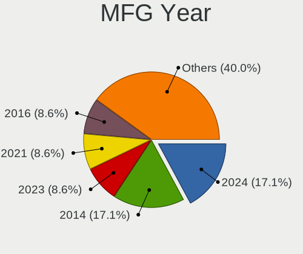
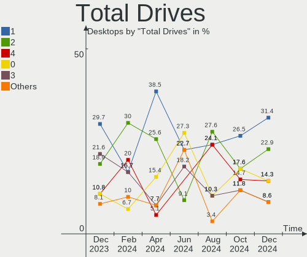
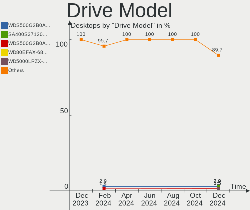
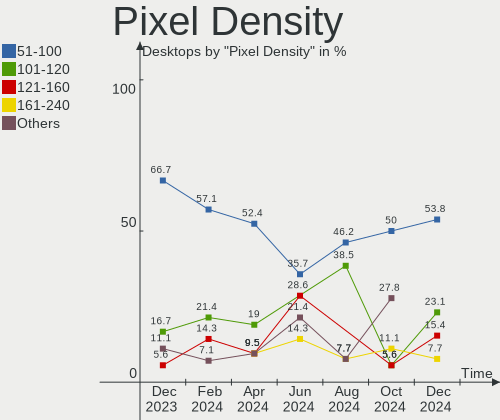
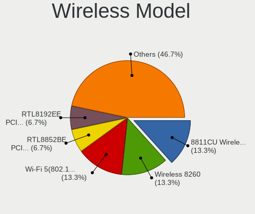

FreeBSD Hardware Trends (Desktops)
----------------------------------

A project to identify most popular hardware characteristics and track their change
over time based on data collected by FreeBSD users at https://BSD-Hardware.info.

Anyone can contribute to this report by the [hw-probe](https://github.com/linuxhw/hw-probe/blob/master/INSTALL.BSD.md) tool:

    hw-probe -all -upload

Full-feature report is available here: https://bsd-hardware.info/?view=trends

Period: Feb, 2022.

Contents
--------

* [ System ](#system)
  - [ OS                       ](#os)
  - [ OS Family                ](#os-family)
  - [ Arch                     ](#arch)
  - [ DE                       ](#de)
  - [ Display Server           ](#display-server)
  - [ Display Manager          ](#display-manager)
  - [ OS Lang                  ](#os-lang)
  - [ Boot Mode                ](#boot-mode)
  - [ Filesystem               ](#filesystem)
  - [ Part. scheme             ](#part-scheme)

* [ Board ](#board)
  - [ Vendor                   ](#vendor)
  - [ Model                    ](#model)
  - [ Model Family             ](#model-family)
  - [ MFG Year                 ](#mfg-year)
  - [ Form Factor              ](#form-factor)
  - [ Coreboot                 ](#coreboot)
  - [ RAM Size                 ](#ram-size)
  - [ RAM Used                 ](#ram-used)
  - [ Total Drives             ](#total-drives)
  - [ Has CD-ROM               ](#has-cd-rom)
  - [ Has Ethernet             ](#has-ethernet)
  - [ Has WiFi                 ](#has-wifi)
  - [ Has Bluetooth            ](#has-bluetooth)

* [ Location ](#location)
  - [ Country                  ](#country)
  - [ City                     ](#city)

* [ Drives ](#drives)
  - [ Drive Vendor             ](#drive-vendor)
  - [ Drive Model              ](#drive-model)
  - [ HDD Vendor               ](#hdd-vendor)
  - [ SSD Vendor               ](#ssd-vendor)
  - [ Drive Kind               ](#drive-kind)
  - [ Drive Connector          ](#drive-connector)
  - [ Drive Size               ](#drive-size)
  - [ Space Total              ](#space-total)
  - [ Space Used               ](#space-used)
  - [ Malfunc. Drives          ](#malfunc-drives)
  - [ Malfunc. Drive Vendor    ](#malfunc-drive-vendor)
  - [ Malfunc. HDD Vendor      ](#malfunc-hdd-vendor)
  - [ Malfunc. Drive Kind      ](#malfunc-drive-kind)
  - [ Failed Drives            ](#failed-drives)
  - [ Failed Drive Vendor      ](#failed-drive-vendor)
  - [ Drive Status             ](#drive-status)

* [ Storage controller ](#storage-controller)
  - [ Storage Vendor           ](#storage-vendor)
  - [ Storage Model            ](#storage-model)
  - [ Storage Kind             ](#storage-kind)

* [ Processor ](#processor)
  - [ CPU Vendor               ](#cpu-vendor)
  - [ CPU Model                ](#cpu-model)
  - [ CPU Model Family         ](#cpu-model-family)
  - [ CPU Cores                ](#cpu-cores)
  - [ CPU Sockets              ](#cpu-sockets)
  - [ CPU Threads              ](#cpu-threads)
  - [ CPU Microarch            ](#cpu-microarch)

* [ Graphics ](#graphics)
  - [ GPU Vendor               ](#gpu-vendor)
  - [ GPU Model                ](#gpu-model)
  - [ GPU Combo                ](#gpu-combo)
  - [ GPU Driver               ](#gpu-driver)
  - [ GPU Memory               ](#gpu-memory)

* [ Monitor ](#monitor)
  - [ Monitor Vendor           ](#monitor-vendor)
  - [ Monitor Model            ](#monitor-model)
  - [ Monitor Resolution       ](#monitor-resolution)
  - [ Monitor Diagonal         ](#monitor-diagonal)
  - [ Monitor Width            ](#monitor-width)
  - [ Aspect Ratio             ](#aspect-ratio)
  - [ Monitor Area             ](#monitor-area)
  - [ Pixel Density            ](#pixel-density)
  - [ Multiple Monitors        ](#multiple-monitors)

* [ Network ](#network)
  - [ Net Controller Vendor    ](#net-controller-vendor)
  - [ Net Controller Model     ](#net-controller-model)
  - [ Wireless Vendor          ](#wireless-vendor)
  - [ Wireless Model           ](#wireless-model)
  - [ Ethernet Vendor          ](#ethernet-vendor)
  - [ Ethernet Model           ](#ethernet-model)
  - [ Net Controller Kind      ](#net-controller-kind)
  - [ Used Controller          ](#used-controller)
  - [ NICs                     ](#nics)
  - [ IPv6                     ](#ipv6)

* [ Bluetooth ](#bluetooth)
  - [ Bluetooth Vendor         ](#bluetooth-vendor)
  - [ Bluetooth Model          ](#bluetooth-model)

* [ Sound ](#sound)
  - [ Sound Vendor             ](#sound-vendor)
  - [ Sound Model              ](#sound-model)

* [ Memory ](#memory)
  - [ Memory Vendor            ](#memory-vendor)
  - [ Memory Model             ](#memory-model)
  - [ Memory Kind              ](#memory-kind)
  - [ Memory Form Factor       ](#memory-form-factor)
  - [ Memory Size              ](#memory-size)
  - [ Memory Speed             ](#memory-speed)

* [ Printers & scanners ](#printers--scanners)
  - [ Printer Vendor           ](#printer-vendor)
  - [ Printer Model            ](#printer-model)
  - [ Scanner Vendor           ](#scanner-vendor)
  - [ Scanner Model            ](#scanner-model)

* [ Camera ](#camera)
  - [ Camera Vendor            ](#camera-vendor)
  - [ Camera Model             ](#camera-model)

* [ Security ](#security)
  - [ Fingerprint Vendor       ](#fingerprint-vendor)
  - [ Fingerprint Model        ](#fingerprint-model)
  - [ Chipcard Vendor          ](#chipcard-vendor)
  - [ Chipcard Model           ](#chipcard-model)

* [ Unsupported ](#unsupported)
  - [ Unsupported Devices      ](#unsupported-devices)
  - [ Unsupported Device Types ](#unsupported-device-types)

System
------

OS
--

Installed operating systems

| Name                     | Desktops | Percent |
|--------------------------|----------|---------|
| FreeBSD 13.0-p7          | 11       | 35.48%  |
| FreeBSD 13.0-STABLE      | 9        | 29.03%  |
| FreeBSD 13.0             | 3        | 9.68%   |
| FreeBSD 13.0-p5          | 2        | 6.45%   |
| FreeBSD 12.3-p2          | 2        | 6.45%   |
| FreeBSD 14.0-CURRENT     | 1        | 3.23%   |
| FreeBSD 13.0-STABLE-HBSD | 1        | 3.23%   |
| FreeBSD 13.0-p6          | 1        | 3.23%   |
| FreeBSD 13.0-p4          | 1        | 3.23%   |

OS Family
---------

OS without a version

| Name    | Desktops | Percent |
|---------|----------|---------|
| FreeBSD | 31       | 100%    |

Arch
----

OS architecture (x86_64, i586, etc.)

| Name  | Desktops | Percent |
|-------|----------|---------|
| amd64 | 30       | 96.77%  |
| i386  | 1        | 3.23%   |

DE
--

Desktop Environment

| Name         | Desktops | Percent |
|--------------|----------|---------|
| Console      | 19       | 61.29%  |
| KDE5         | 7        | 22.58%  |
| xfwm         | 1        | 3.23%   |
| XFCE         | 1        | 3.23%   |
| KWin         | 1        | 3.23%   |
| i3           | 1        | 3.23%   |
| akonadi_newm | 1        | 3.23%   |

Display Server
--------------

X11 or Wayland

| Name    | Desktops | Percent |
|---------|----------|---------|
| Console | 18       | 58.06%  |
| X11     | 11       | 35.48%  |
| Wayland | 2        | 6.45%   |

Display Manager
---------------

SDDM, LightDM, etc.

| Name    | Desktops | Percent |
|---------|----------|---------|
| Console | 22       | 70.97%  |
| SDDM    | 8        | 25.81%  |
| LightDM | 1        | 3.23%   |

OS Lang
-------

Language

| Lang    | Desktops | Percent |
|---------|----------|---------|
| C       | 17       | 54.84%  |
| en_US   | 7        | 22.58%  |
| ru_RU   | 3        | 9.68%   |
| Unknown | 3        | 9.68%   |
| en_AU   | 1        | 3.23%   |

Boot Mode
---------

EFI or BIOS

| Mode | Desktops | Percent |
|------|----------|---------|
| EFI  | 19       | 61.29%  |
| BIOS | 12       | 38.71%  |

Filesystem
----------

Type of filesystem

| Type | Desktops | Percent |
|------|----------|---------|
| Zfs  | 21       | 67.74%  |
| Ufs  | 10       | 32.26%  |

Part. scheme
------------

Scheme of partitioning

| Type | Desktops | Percent |
|------|----------|---------|
| GPT  | 30       | 96.77%  |
| MBR  | 1        | 3.23%   |

Board
-----

Vendor
------

Motherboard manufacturer

| Name                | Desktops | Percent |
|---------------------|----------|---------|
| ASUSTek Computer    | 7        | 22.58%  |
| Hewlett-Packard     | 4        | 12.9%   |
| MSI                 | 3        | 9.68%   |
| ASRock              | 3        | 9.68%   |
| Gigabyte Technology | 2        | 6.45%   |
| Gateway             | 2        | 6.45%   |
| Dell                | 2        | 6.45%   |
| Supermicro          | 1        | 3.23%   |
| Shuttle             | 1        | 3.23%   |
| Kontron             | 1        | 3.23%   |
| GALAX               | 1        | 3.23%   |
| Fujitsu             | 1        | 3.23%   |
| Biostar             | 1        | 3.23%   |
| ASRockRack          | 1        | 3.23%   |
| Unknown             | 1        | 3.23%   |

Model
-----

Motherboard model

| Name                           | Desktops | Percent |
|--------------------------------|----------|---------|
| Gateway DX4870                 | 2        | 6.45%   |
| Supermicro X9SCL/X9SCM         | 1        | 3.23%   |
| Shuttle SZ270                  | 1        | 3.23%   |
| MSI MS-7C95                    | 1        | 3.23%   |
| MSI MS-7C39                    | 1        | 3.23%   |
| MSI MS-7817                    | 1        | 3.23%   |
| Kontron KT965/ATXP             | 1        | 3.23%   |
| HP Z600 Workstation            | 1        | 3.23%   |
| HP Z240 SFF Workstation        | 1        | 3.23%   |
| HP ProLiant ML350p Gen8        | 1        | 3.23%   |
| HP EliteDesk 800 G4 SFF        | 1        | 3.23%   |
| Gigabyte X570 I AORUS PRO WIFI | 1        | 3.23%   |
| Gigabyte 990FXA-UD3            | 1        | 3.23%   |
| GALAX B365M                    | 1        | 3.23%   |
| Fujitsu CELSIUS M720           | 1        | 3.23%   |
| Dell Studio XPS 9100           | 1        | 3.23%   |
| Dell OptiPlex 5060             | 1        | 3.23%   |
| Biostar X470GTA                | 1        | 3.23%   |
| ASUS ROG STRIX X570-F GAMING   | 1        | 3.23%   |
| ASUS ROG CROSSHAIR VIII HERO   | 1        | 3.23%   |
| ASUS PRIME Z270-P              | 1        | 3.23%   |
| ASUS PRIME X370-PRO            | 1        | 3.23%   |
| ASUS PRIME B450M-GAMING/BR     | 1        | 3.23%   |
| ASUS P5Q-E                     | 1        | 3.23%   |
| ASUS P4P800-VM                 | 1        | 3.23%   |
| ASRockRack EPYC3101D4I-2T      | 1        | 3.23%   |
| ASRock X570 Phantom Gaming 4   | 1        | 3.23%   |
| ASRock X370 Gaming X           | 1        | 3.23%   |
| ASRock A88M-G                  | 1        | 3.23%   |
| Unknown                        | 1        | 3.23%   |

Model Family
------------

Motherboard model prefix

| Name                      | Desktops | Percent |
|---------------------------|----------|---------|
| ASUS PRIME                | 3        | 9.68%   |
| Gateway DX4870            | 2        | 6.45%   |
| ASUS ROG                  | 2        | 6.45%   |
| Supermicro X9SCL          | 1        | 3.23%   |
| Shuttle SZ270             | 1        | 3.23%   |
| MSI MS-7C95               | 1        | 3.23%   |
| MSI MS-7C39               | 1        | 3.23%   |
| MSI MS-7817               | 1        | 3.23%   |
| Kontron KT965             | 1        | 3.23%   |
| HP Z600                   | 1        | 3.23%   |
| HP Z240                   | 1        | 3.23%   |
| HP ProLiant               | 1        | 3.23%   |
| HP EliteDesk              | 1        | 3.23%   |
| Gigabyte X570             | 1        | 3.23%   |
| Gigabyte 990FXA-UD3       | 1        | 3.23%   |
| GALAX B365M               | 1        | 3.23%   |
| Fujitsu CELSIUS           | 1        | 3.23%   |
| Dell Studio               | 1        | 3.23%   |
| Dell OptiPlex             | 1        | 3.23%   |
| Biostar X470GTA           | 1        | 3.23%   |
| ASUS P5Q-E                | 1        | 3.23%   |
| ASUS P4P800-VM            | 1        | 3.23%   |
| ASRockRack EPYC3101D4I-2T | 1        | 3.23%   |
| ASRock X570               | 1        | 3.23%   |
| ASRock X370               | 1        | 3.23%   |
| ASRock A88M-G             | 1        | 3.23%   |
| Unknown                   | 1        | 3.23%   |

MFG Year
--------

Motherboard manufacture year

| Year | Desktops | Percent |
|------|----------|---------|
| 2019 | 6        | 19.35%  |
| 2021 | 4        | 12.9%   |
| 2020 | 3        | 9.68%   |
| 2018 | 3        | 9.68%   |
| 2017 | 3        | 9.68%   |
| 2013 | 2        | 6.45%   |
| 2012 | 2        | 6.45%   |
| 2008 | 2        | 6.45%   |
| 2016 | 1        | 3.23%   |
| 2015 | 1        | 3.23%   |
| 2014 | 1        | 3.23%   |
| 2011 | 1        | 3.23%   |
| 2010 | 1        | 3.23%   |
| 2004 | 1        | 3.23%   |

Form Factor
-----------

Physical design of the computer

| Name    | Desktops | Percent |
|---------|----------|---------|
| Desktop | 31       | 100%    |

Coreboot
--------

Have coreboot on board

| Used | Desktops | Percent |
|------|----------|---------|
| No   | 31       | 100%    |

RAM Size
--------

Total RAM memory

| Size in GB  | Desktops | Percent |
|-------------|----------|---------|
| 32.01-64.0  | 9        | 29.03%  |
| 16.01-24.0  | 7        | 22.58%  |
| 64.01-256.0 | 5        | 16.13%  |
| 8.01-16.0   | 4        | 12.9%   |
| 4.01-8.0    | 2        | 6.45%   |
| 24.01-32.0  | 2        | 6.45%   |
| 2.01-3.0    | 1        | 3.23%   |
| 1.01-2.0    | 1        | 3.23%   |

RAM Used
--------

Used RAM memory

| Used GB     | Desktops | Percent |
|-------------|----------|---------|
| 0.51-1.0    | 12       | 38.71%  |
| 1.01-2.0    | 9        | 29.03%  |
| 0.01-0.5    | 8        | 25.81%  |
| 4.01-8.0    | 1        | 3.23%   |
| 64.01-256.0 | 1        | 3.23%   |

Total Drives
------------

Number of drives on board

| Drives | Desktops | Percent |
|--------|----------|---------|
| 2      | 10       | 32.26%  |
| 3      | 7        | 22.58%  |
| 1      | 7        | 22.58%  |
| 4      | 3        | 9.68%   |
| 6      | 2        | 6.45%   |
| 13     | 1        | 3.23%   |
| 5      | 1        | 3.23%   |

Has CD-ROM
----------

Has CD-ROM on board

| Presented | Desktops | Percent |
|-----------|----------|---------|
| No        | 18       | 58.06%  |
| Yes       | 13       | 41.94%  |

Has Ethernet
------------

Has Ethernet on board

| Presented | Desktops | Percent |
|-----------|----------|---------|
| Yes       | 31       | 100%    |

Has WiFi
--------

Has WiFi module

| Presented | Desktops | Percent |
|-----------|----------|---------|
| No        | 25       | 80.65%  |
| Yes       | 6        | 19.35%  |

Has Bluetooth
-------------

Has Bluetooth module

| Presented | Desktops | Percent |
|-----------|----------|---------|
| No        | 26       | 83.87%  |
| Yes       | 5        | 16.13%  |

Location
--------

Country
-------

Geographic location (country)

| Country     | Desktops | Percent |
|-------------|----------|---------|
| USA         | 13       | 41.94%  |
| Russia      | 4        | 12.9%   |
| Brazil      | 3        | 9.68%   |
| Thailand    | 2        | 6.45%   |
| Switzerland | 2        | 6.45%   |
| Ukraine     | 1        | 3.23%   |
| Sweden      | 1        | 3.23%   |
| Poland      | 1        | 3.23%   |
| Germany     | 1        | 3.23%   |
| France      | 1        | 3.23%   |
| Bulgaria    | 1        | 3.23%   |
| Australia   | 1        | 3.23%   |

City
----

Geographic location (city)

| City           | Desktops | Percent |
|----------------|----------|---------|
| Teaneck        | 4        | 12.9%   |
| Zurich         | 2        | 6.45%   |
| Salem          | 2        | 6.45%   |
| Redmond        | 2        | 6.45%   |
| Moscow         | 2        | 6.45%   |
| Bangkok        | 2        | 6.45%   |
| Wenatchee      | 1        | 3.23%   |
| Västerås | 1        | 3.23%   |
| Ulyanovsk      | 1        | 3.23%   |
| Sofia          | 1        | 3.23%   |
| Sao Vicente    | 1        | 3.23%   |
| Rio de Janeiro | 1        | 3.23%   |
| Omaha          | 1        | 3.23%   |
| Melbourne      | 1        | 3.23%   |
| Mead           | 1        | 3.23%   |
| Lezno          | 1        | 3.23%   |
| Falkenstein    | 1        | 3.23%   |
| Enerhodar      | 1        | 3.23%   |
| Chicago        | 1        | 3.23%   |
| Chattanooga    | 1        | 3.23%   |
| Campinas       | 1        | 3.23%   |
| Baulne         | 1        | 3.23%   |
| Barnaul        | 1        | 3.23%   |

Drives
------

Drive Vendor
------------

Hard drive vendors

| Vendor              | Desktops | Drives | Percent |
|---------------------|----------|--------|---------|
| WDC                 | 18       | 34     | 31.03%  |
| Seagate             | 11       | 12     | 18.97%  |
| Samsung Electronics | 8        | 12     | 13.79%  |
| Intel               | 4        | 8      | 6.9%    |
| Toshiba             | 3        | 4      | 5.17%   |
| SPCC                | 2        | 3      | 3.45%   |
| Kingston            | 2        | 2      | 3.45%   |
| A-DATA Technology   | 2        | 2      | 3.45%   |
| Transcend           | 1        | 2      | 1.72%   |
| SanDisk             | 1        | 1      | 1.72%   |
| Patriot             | 1        | 1      | 1.72%   |
| Hitachi             | 1        | 1      | 1.72%   |
| HGST                | 1        | 1      | 1.72%   |
| Hewlett-Packard     | 1        | 5      | 1.72%   |
| GOODRAM             | 1        | 1      | 1.72%   |
| Corsair             | 1        | 1      | 1.72%   |

Drive Model
-----------

Hard drive models

| Model                               | Desktops | Percent |
|-------------------------------------|----------|---------|
| WDC WD6002FRYZ-01WD5B1 6TB          | 2        | 2.86%   |
| WDC WD10EZEX-08WN4A0 1TB            | 2        | 2.86%   |
| SPCC Solid State Disk 256GB         | 2        | 2.86%   |
| Seagate ST4000DM000-1F2168 4TB      | 2        | 2.86%   |
| Samsung SSD 860 QVO 1TB             | 2        | 2.86%   |
| WDC WDS500G1B0A-00H9H0 500GB        | 1        | 1.43%   |
| WDC WDS100T3X0C-00SJG0 1TB          | 1        | 1.43%   |
| WDC WD80EMAZ-00WJTA0 8TB            | 1        | 1.43%   |
| WDC WD80EFZX-68UW8N0 8TB            | 1        | 1.43%   |
| WDC WD80EFAX-68LHPN0 8TB            | 1        | 1.43%   |
| WDC WD80EDBZ-11B0ZA0 8TB            | 1        | 1.43%   |
| WDC WD6003FZBX-00K5WB0 6TB          | 1        | 1.43%   |
| WDC WD5000BHTZ-50JCPV0 500GB        | 1        | 1.43%   |
| WDC WD40EZRZ-22GXCB0 4TB            | 1        | 1.43%   |
| WDC WD400BB-00JHC0 40GB             | 1        | 1.43%   |
| WDC WD20NMVW-11AV3S2 2TB            | 1        | 1.43%   |
| WDC WD20EZRX-00D8PB0 2TB            | 1        | 1.43%   |
| WDC WD2000FYYZ-01UL1B2 2TB          | 1        | 1.43%   |
| WDC WD15EADS-00P8B0 1.5TB           | 1        | 1.43%   |
| WDC WD120EMFZ-11A6JA0 12TB          | 1        | 1.43%   |
| WDC WD120EMAZ-11BLFA0 12TB          | 1        | 1.43%   |
| WDC WD120EDAZ-11F3RA0 12TB          | 1        | 1.43%   |
| WDC WD10EZEX-60WN4A0 1TB            | 1        | 1.43%   |
| WDC WD10EZEX-00BN5A0 1TB            | 1        | 1.43%   |
| WDC WD10EZEX-00BBHA0 1TB            | 1        | 1.43%   |
| WDC WD10EFRX-68FYTN0 1TB            | 1        | 1.43%   |
| Transcend TS500GMTE240S 500GB       | 1        | 1.43%   |
| Toshiba MQ01ABD100 1TB              | 1        | 1.43%   |
| Toshiba KSG60ZMV256G M.2 2280 256GB | 1        | 1.43%   |
| Toshiba HDWQ140 4TB                 | 1        | 1.43%   |
| Seagate ST9500420AS 500GB           | 1        | 1.43%   |
| Seagate ST500DM002-1BC142 500GB     | 1        | 1.43%   |
| Seagate ST4000LM024-2AN17V 4TB      | 1        | 1.43%   |
| Seagate ST380815AS 80GB             | 1        | 1.43%   |
| Seagate ST32000641AS 2TB            | 1        | 1.43%   |
| Seagate ST3160813AS 160GB           | 1        | 1.43%   |
| Seagate ST2000DM008-2FR102 2TB      | 1        | 1.43%   |
| Seagate ST2000DM006-2DM164 2TB      | 1        | 1.43%   |
| Seagate ST16000NM001G-2KK103 16TB   | 1        | 1.43%   |
| Seagate ST1000DM003-9YN162 1TB      | 1        | 1.43%   |
| SanDisk SD6SB1M064G1022I 64GB       | 1        | 1.43%   |
| Samsung SSD 980 250GB               | 1        | 1.43%   |
| Samsung SSD 970 EVO Plus 1TB        | 1        | 1.43%   |
| Samsung SSD 960 EVO 500GB           | 1        | 1.43%   |
| Samsung SSD 870 QVO 2TB             | 1        | 1.43%   |
| Samsung SSD 860 EVO 500GB           | 1        | 1.43%   |
| Samsung SSD 850 EVO 1TB             | 1        | 1.43%   |
| Samsung SSD 840 EVO 500GB           | 1        | 1.43%   |
| Samsung MZ7LM240HCGR-00003 240GB    | 1        | 1.43%   |
| Patriot Burst Elite 120GB           | 1        | 1.43%   |
| Kingston SA400S37960G 960GB         | 1        | 1.43%   |
| Kingston SA400S37120G 120GB         | 1        | 1.43%   |
| Intel SSDSC2KW256G8 256GB           | 1        | 1.43%   |
| Intel SSDSC2CW060A3 64GB            | 1        | 1.43%   |
| Intel SSDSC2BW240A4 240GB           | 1        | 1.43%   |
| Intel SSDSC2BF180A4L 180GB          | 1        | 1.43%   |
| Intel SSDSC2BB120G4 120GB           | 1        | 1.43%   |
| Hitachi HDP725025GLA380 250GB       | 1        | 1.43%   |
| HGST HUH728080ALE600 8TB            | 1        | 1.43%   |
| HP RAID 1(1+0) 1TB                  | 1        | 1.43%   |

HDD Vendor
----------

Hard disk drive vendors

| Vendor          | Desktops | Drives | Percent |
|-----------------|----------|--------|---------|
| WDC             | 16       | 32     | 50%     |
| Seagate         | 11       | 12     | 34.38%  |
| Toshiba         | 2        | 3      | 6.25%   |
| Hitachi         | 1        | 1      | 3.13%   |
| HGST            | 1        | 1      | 3.13%   |
| Hewlett-Packard | 1        | 5      | 3.13%   |

SSD Vendor
----------

Solid state drive vendors

| Vendor              | Desktops | Drives | Percent |
|---------------------|----------|--------|---------|
| Samsung Electronics | 6        | 9      | 33.33%  |
| Intel               | 4        | 8      | 22.22%  |
| SPCC                | 2        | 3      | 11.11%  |
| Kingston            | 2        | 2      | 11.11%  |
| WDC                 | 1        | 1      | 5.56%   |
| Toshiba             | 1        | 1      | 5.56%   |
| SanDisk             | 1        | 1      | 5.56%   |
| Patriot             | 1        | 1      | 5.56%   |

Drive Kind
----------

HDD or SSD

| Kind | Desktops | Drives | Percent |
|------|----------|--------|---------|
| HDD  | 25       | 54     | 50%     |
| SSD  | 16       | 26     | 32%     |
| NVMe | 9        | 10     | 18%     |

Drive Connector
---------------

SATA, SAS, NVMe, etc.

| Type | Desktops | Drives | Percent |
|------|----------|--------|---------|
| SATA | 27       | 80     | 75%     |
| NVMe | 9        | 10     | 25%     |

Drive Size
----------

Size of hard drive

| Size in TB | Desktops | Drives | Percent |
|------------|----------|--------|---------|
| 0.01-0.5   | 16       | 30     | 35.56%  |
| 0.51-1.0   | 11       | 16     | 24.44%  |
| 1.01-2.0   | 6        | 11     | 13.33%  |
| 4.01-10.0  | 5        | 12     | 11.11%  |
| 3.01-4.0   | 4        | 6      | 8.89%   |
| 10.01-20.0 | 3        | 5      | 6.67%   |

Space Total
-----------

Amount of disk space available on the file system

| Size in GB     | Desktops | Percent |
|----------------|----------|---------|
| 101-250        | 10       | 32.26%  |
| 501-1000       | 7        | 22.58%  |
| 251-500        | 5        | 16.13%  |
| 51-100         | 4        | 12.9%   |
| More than 3000 | 3        | 9.68%   |
| 2001-3000      | 1        | 3.23%   |
| 1001-2000      | 1        | 3.23%   |

Space Used
----------

Amount of used disk space

| Used GB        | Desktops | Percent |
|----------------|----------|---------|
| 1-20           | 21       | 67.74%  |
| 21-50          | 7        | 22.58%  |
| More than 3000 | 2        | 6.45%   |
| 251-500        | 1        | 3.23%   |

Malfunc. Drives
---------------

Drive models with a malfunction

| Model                           | Desktops | Drives | Percent |
|---------------------------------|----------|--------|---------|
| WDC WD6003FZBX-00K5WB0 6TB      | 1        | 1      | 14.29%  |
| WDC WD6002FRYZ-01WD5B1 6TB      | 1        | 1      | 14.29%  |
| WDC WD2000FYYZ-01UL1B2 2TB      | 1        | 2      | 14.29%  |
| Seagate ST9500420AS 500GB       | 1        | 1      | 14.29%  |
| Seagate ST500DM002-1BC142 500GB | 1        | 1      | 14.29%  |
| Seagate ST1000DM003-9YN162 1TB  | 1        | 1      | 14.29%  |
| Intel SSDSC2BW240A4 240GB       | 1        | 1      | 14.29%  |

Malfunc. Drive Vendor
---------------------

Vendors of faulty drives

| Vendor  | Desktops | Drives | Percent |
|---------|----------|--------|---------|
| WDC     | 3        | 4      | 42.86%  |
| Seagate | 3        | 3      | 42.86%  |
| Intel   | 1        | 1      | 14.29%  |

Malfunc. HDD Vendor
-------------------

Vendors of faulty HDD drives

| Vendor  | Desktops | Drives | Percent |
|---------|----------|--------|---------|
| WDC     | 3        | 4      | 50%     |
| Seagate | 3        | 3      | 50%     |

Malfunc. Drive Kind
-------------------

Kinds of faulty drives

| Kind | Desktops | Drives | Percent |
|------|----------|--------|---------|
| HDD  | 5        | 7      | 83.33%  |
| SSD  | 1        | 1      | 16.67%  |

Failed Drives
-------------

Failed drive models

Zero info for selected period =(

Failed Drive Vendor
-------------------

Failed drive vendors

Zero info for selected period =(

Drive Status
------------

Number of failed and malfunc. drives

| Status   | Desktops | Drives | Percent |
|----------|----------|--------|---------|
| Works    | 29       | 75     | 80.56%  |
| Malfunc  | 5        | 8      | 13.89%  |
| Detected | 2        | 7      | 5.56%   |

Storage controller
------------------

Storage Vendor
--------------

Storage controller vendors

| Vendor                   | Desktops | Percent |
|--------------------------|----------|---------|
| Intel                    | 19       | 41.3%   |
| AMD                      | 12       | 26.09%  |
| Samsung Electronics      | 4        | 8.7%    |
| Marvell Technology Group | 2        | 4.35%   |
| Silicon Motion           | 1        | 2.17%   |
| Sandisk                  | 1        | 2.17%   |
| Realtek Semiconductor    | 1        | 2.17%   |
| Phison Electronics       | 1        | 2.17%   |
| Hewlett-Packard          | 1        | 2.17%   |
| Broadcom / LSI           | 1        | 2.17%   |
| ADATA Technology         | 1        | 2.17%   |
| Adaptec                  | 1        | 2.17%   |
| Unknown                  | 1        | 2.17%   |

Storage Model
-------------

Storage controller models

| Model                                                                          | Desktops | Percent |
|--------------------------------------------------------------------------------|----------|---------|
| AMD FCH SATA Controller [AHCI mode]                                            | 8        | 15.09%  |
| Intel 200 Series PCH SATA controller [AHCI mode]                               | 4        | 7.55%   |
| Intel SATA Controller [RAID mode]                                              | 2        | 3.77%   |
| Intel 82801JI (ICH10 Family) SATA AHCI Controller                              | 2        | 3.77%   |
| Intel 8 Series/C220 Series Chipset Family 6-port SATA Controller 1 [AHCI mode] | 2        | 3.77%   |
| Intel 7 Series/C210 Series Chipset Family 6-port SATA Controller [AHCI mode]   | 2        | 3.77%   |
| AMD X370 Series Chipset SATA Controller                                        | 2        | 3.77%   |
| AMD 400 Series Chipset SATA Controller                                         | 2        | 3.77%   |
| Unknown                                                                        | 2        | 3.77%   |
| Silicon Motion SM2263EN/SM2263XT SSD Controller                                | 1        | 1.89%   |
| Sandisk WD Black SN750 / PC SN730 NVMe SSD                                     | 1        | 1.89%   |
| Samsung NVMe SSD Controller SM981/PM981/PM983                                  | 1        | 1.89%   |
| Samsung NVMe SSD Controller SM961/PM961/SM963                                  | 1        | 1.89%   |
| Samsung NVMe SSD Controller PM9A1/PM9A3/980PRO                                 | 1        | 1.89%   |
| Samsung NVMe SSD Controller 980                                                | 1        | 1.89%   |
| Phison E16 PCIe4 NVMe Controller                                               | 1        | 1.89%   |
| Marvell Group 88SE9172 SATA 6Gb/s Controller                                   | 1        | 1.89%   |
| Marvell Group 88SE6111/6121 SATA II / PATA Controller                          | 1        | 1.89%   |
| Intel Q170/Q150/B150/H170/H110/Z170/CM236 Chipset SATA Controller [AHCI Mode]  | 1        | 1.89%   |
| Intel Cannon Lake PCH SATA AHCI Controller                                     | 1        | 1.89%   |
| Intel C602 chipset 4-Port SATA Storage Control Unit                            | 1        | 1.89%   |
| Intel C600/X79 series chipset 6-Port SATA AHCI Controller                      | 1        | 1.89%   |
| Intel C600/X79 series chipset 4-Port SATA IDE Controller                       | 1        | 1.89%   |
| Intel C600/X79 series chipset 2-Port SATA IDE Controller                       | 1        | 1.89%   |
| Intel 82801HR/HO/HH (ICH8R/DO/DH) 2 port SATA Controller [IDE mode]            | 1        | 1.89%   |
| Intel 82801H (ICH8 Family) 4 port SATA Controller [IDE mode]                   | 1        | 1.89%   |
| Intel 82801EB/ER (ICH5/ICH5R) IDE Controller                                   | 1        | 1.89%   |
| Intel 82801EB (ICH5) SATA Controller                                           | 1        | 1.89%   |
| Intel 6 Series/C200 Series Chipset Family 6 port Desktop SATA AHCI Controller  | 1        | 1.89%   |
| HP Smart Array Gen8 Controllers                                                | 1        | 1.89%   |
| Broadcom / LSI SAS2008 PCI-Express Fusion-MPT SAS-2 [Falcon]                   | 1        | 1.89%   |
| AMD Starship/Matisse Chipset SATA Controller [AHCI mode]                       | 1        | 1.89%   |
| AMD SB7x0/SB8x0/SB9x0 SATA Controller [AHCI mode]                              | 1        | 1.89%   |
| AMD SB7x0/SB8x0/SB9x0 IDE Controller                                           | 1        | 1.89%   |
| ADATA XPG SX8200 Pro PCIe Gen3x4 M.2 2280 Solid State Drive                    | 1        | 1.89%   |
| Adaptec AIC-7870P/7881U [AHA-2940U/UW/D/S76]                                   | 1        | 1.89%   |

Storage Kind
------------

Kind of storage controller (IDE, SATA, NVMe, SAS, ...)

| Kind | Desktops | Percent |
|------|----------|---------|
| SATA | 26       | 55.32%  |
| NVMe | 10       | 21.28%  |
| IDE  | 5        | 10.64%  |
| RAID | 3        | 6.38%   |
| SAS  | 2        | 4.26%   |
| SCSI | 1        | 2.13%   |

Processor
---------

CPU Vendor
----------

Processor vendors

| Vendor | Desktops | Percent |
|--------|----------|---------|
| Intel  | 19       | 61.29%  |
| AMD    | 12       | 38.71%  |

CPU Model
---------

Processor models

| Model                                       | Desktops | Percent |
|---------------------------------------------|----------|---------|
| AMD Ryzen 9 3900X 12-Core Processor         | 3        | 9.68%   |
| Intel Core i5-3330 CPU @ 3.00GHz            | 2        | 6.45%   |
| Intel Xeon CPU E5630 @ 2.53GHz              | 1        | 3.23%   |
| Intel Xeon CPU E5-2609 0 @ 2.40GHz          | 1        | 3.23%   |
| Intel Xeon CPU E5-1620 0 @ 3.60GHz          | 1        | 3.23%   |
| Intel Xeon CPU E31230 @ 3.20GHz             | 1        | 3.23%   |
| Intel Xeon CPU E3-1246 v3 @ 3.50GHz         | 1        | 3.23%   |
| Intel Pentium CPU G4560 @ 3.50GHz           | 1        | 3.23%   |
| Intel Pentium CPU G3220 @ 3.00GHz           | 1        | 3.23%   |
| Intel Pentium 4 CPU 1.80GHz                 | 1        | 3.23%   |
| Intel Core i7-8700 CPU @ 3.20GHz            | 1        | 3.23%   |
| Intel Core i7 CPU 960 @ 3.20GHz             | 1        | 3.23%   |
| Intel Core i5-9600K CPU @ 3.70GHz           | 1        | 3.23%   |
| Intel Core i5-9400 CPU @ 2.90GHz            | 1        | 3.23%   |
| Intel Core i5-8500 CPU @ 3.00GHz            | 1        | 3.23%   |
| Intel Core i3-6300 CPU @ 3.80GHz            | 1        | 3.23%   |
| Intel Core i3-6100 CPU @ 3.70GHz            | 1        | 3.23%   |
| Intel Core 2 Quad CPU Q6600 @ 2.40GHz       | 1        | 3.23%   |
| Intel Core 2 Duo CPU E7300 @ 2.66GHz        | 1        | 3.23%   |
| AMD Ryzen 9 5950X 16-Core Processor         | 1        | 3.23%   |
| AMD Ryzen 7 5800X 8-Core Processor          | 1        | 3.23%   |
| AMD Ryzen 7 3800XT 8-Core Processor         | 1        | 3.23%   |
| AMD Ryzen 7 1700 Eight-Core Processor       | 1        | 3.23%   |
| AMD Ryzen 5 5600G with Radeon Graphics      | 1        | 3.23%   |
| AMD Ryzen 3 3200G with Radeon Vega Graphics | 1        | 3.23%   |
| AMD FX-8350 Eight-Core Processor            | 1        | 3.23%   |
| AMD EPYC 3101 4-Core Processor              | 1        | 3.23%   |
| AMD A10-5800K APU with Radeon HD Graphics   | 1        | 3.23%   |

CPU Model Family
----------------

Processor model prefix

| Model             | Desktops | Percent |
|-------------------|----------|---------|
| Intel Xeon        | 5        | 16.13%  |
| Intel Core i5     | 5        | 16.13%  |
| AMD Ryzen 9       | 4        | 12.9%   |
| AMD Ryzen 7       | 3        | 9.68%   |
| Intel Pentium     | 2        | 6.45%   |
| Intel Core i7     | 2        | 6.45%   |
| Intel Core i3     | 2        | 6.45%   |
| Intel Pentium 4   | 1        | 3.23%   |
| Intel Core 2 Quad | 1        | 3.23%   |
| Intel Core 2 Duo  | 1        | 3.23%   |
| AMD Ryzen 5       | 1        | 3.23%   |
| AMD Ryzen 3       | 1        | 3.23%   |
| AMD FX            | 1        | 3.23%   |
| AMD EPYC          | 1        | 3.23%   |
| AMD A10           | 1        | 3.23%   |

CPU Cores
---------

Number of processor cores

| Number  | Desktops | Percent |
|---------|----------|---------|
| 4       | 11       | 35.48%  |
| 6       | 4        | 12.9%   |
| 2       | 4        | 12.9%   |
| 24      | 3        | 9.68%   |
| 16      | 3        | 9.68%   |
| 8       | 2        | 6.45%   |
| 32      | 1        | 3.23%   |
| 12      | 1        | 3.23%   |
| 1       | 1        | 3.23%   |
| Unknown | 1        | 3.23%   |

CPU Sockets
-----------

Number of sockets

| Number | Desktops | Percent |
|--------|----------|---------|
| 1      | 30       | 96.77%  |
| 2      | 1        | 3.23%   |

CPU Threads
-----------

Threads per core (Hyper-Threading)

| Number  | Desktops | Percent |
|---------|----------|---------|
| 1       | 20       | 64.52%  |
| 2       | 9        | 29.03%  |
| Unknown | 2        | 6.45%   |

CPU Microarch
-------------

Microarchitecture

| Name        | Desktops | Percent |
|-------------|----------|---------|
| KabyLake    | 5        | 16.13%  |
| Zen 2       | 4        | 12.9%   |
| Zen 3       | 3        | 9.68%   |
| SandyBridge | 3        | 9.68%   |
| Zen         | 2        | 6.45%   |
| Skylake     | 2        | 6.45%   |
| Piledriver  | 2        | 6.45%   |
| IvyBridge   | 2        | 6.45%   |
| Haswell     | 2        | 6.45%   |
| Zen+        | 1        | 3.23%   |
| Westmere    | 1        | 3.23%   |
| Penryn      | 1        | 3.23%   |
| NetBurst    | 1        | 3.23%   |
| Nehalem     | 1        | 3.23%   |
| Core        | 1        | 3.23%   |

Graphics
--------

GPU Vendor
----------

Vendors of graphics cards

| Vendor                     | Desktops | Percent |
|----------------------------|----------|---------|
| AMD                        | 13       | 40.63%  |
| Intel                      | 11       | 34.38%  |
| Nvidia                     | 5        | 15.63%  |
| Matrox Electronics Systems | 2        | 6.25%   |
| ASPEED Technology          | 1        | 3.13%   |

GPU Model
---------

Graphics card models

| Model                                                                             | Desktops | Percent |
|-----------------------------------------------------------------------------------|----------|---------|
| Intel CoffeeLake-S GT2 [UHD Graphics 630]                                         | 3        | 9.09%   |
| Nvidia GF119 [GeForce GT 610]                                                     | 2        | 6.06%   |
| Intel HD Graphics 530                                                             | 2        | 6.06%   |
| AMD Lexa PRO [Radeon 540/540X/550/550X / RX 540X/550/550X]                        | 2        | 6.06%   |
| AMD Ellesmere [Radeon RX 470/480/570/570X/580/580X/590]                           | 2        | 6.06%   |
| Nvidia GT218 [NVS 300]                                                            | 1        | 3.03%   |
| Nvidia GP108 [GeForce GT 1030]                                                    | 1        | 3.03%   |
| Nvidia GP106 [GeForce GTX 1060 3GB]                                               | 1        | 3.03%   |
| Matrox Electronics Systems MGA G200eW WPCM450                                     | 1        | 3.03%   |
| Matrox Electronics Systems MGA G200EH                                             | 1        | 3.03%   |
| Intel Xeon E3-1200 v3/4th Gen Core Processor Integrated Graphics Controller       | 1        | 3.03%   |
| Intel Xeon E3-1200 v3 Processor Integrated Graphics Controller                    | 1        | 3.03%   |
| Intel Xeon E3-1200 v2/3rd Gen Core processor Graphics Controller                  | 1        | 3.03%   |
| Intel HD Graphics 610                                                             | 1        | 3.03%   |
| Intel 82Q963/Q965 Integrated Graphics Controller                                  | 1        | 3.03%   |
| Intel 82865G Integrated Graphics Controller                                       | 1        | 3.03%   |
| ASPEED Technology ASPEED Graphics Family                                          | 1        | 3.03%   |
| AMD RV710 [Radeon HD 4350/4550]                                                   | 1        | 3.03%   |
| AMD Rage 3 [Rage XL PCI]                                                          | 1        | 3.03%   |
| AMD Oland [Radeon HD 8570 / R5 430 OEM / R7 240/340 / Radeon 520 OEM]             | 1        | 3.03%   |
| AMD Navi 23 [Radeon RX 6600/6600 XT/6600M]                                        | 1        | 3.03%   |
| AMD Navi 21 [Radeon RX 6800/6800 XT / 6900 XT]                                    | 1        | 3.03%   |
| AMD Navi 10 [Radeon RX 5600 OEM/5600 XT / 5700/5700 XT]                           | 1        | 3.03%   |
| AMD Cypress XT [Radeon HD 5870]                                                   | 1        | 3.03%   |
| AMD Cezanne                                                                       | 1        | 3.03%   |
| AMD Cedar [Radeon HD 5000/6000/7350/8350 Series]                                  | 1        | 3.03%   |
| AMD Cape Verde PRO / Venus LE / Tropo PRO-L [Radeon HD 8830M / R7 250 / R7 M465X] | 1        | 3.03%   |

GPU Combo
---------

Combinations of graphics cards

| Name        | Desktops | Percent |
|-------------|----------|---------|
| 1 x AMD     | 11       | 35.48%  |
| 1 x Intel   | 10       | 32.26%  |
| 1 x Nvidia  | 5        | 16.13%  |
| 1 x Matrox  | 2        | 6.45%   |
| 2 x AMD     | 1        | 3.23%   |
| Intel + AMD | 1        | 3.23%   |
| 1 x ASPEED  | 1        | 3.23%   |

GPU Driver
----------

Free vs proprietary

| Driver      | Desktops | Percent |
|-------------|----------|---------|
| Free        | 29       | 93.55%  |
| Proprietary | 2        | 6.45%   |

GPU Memory
----------

Total video memory

| Size in GB | Desktops | Percent |
|------------|----------|---------|
| Unknown    | 22       | 70.97%  |
| 3.01-4.0   | 3        | 9.68%   |
| 1.01-2.0   | 3        | 9.68%   |
| 7.01-8.0   | 1        | 3.23%   |
| 5.01-6.0   | 1        | 3.23%   |
| 0.51-1.0   | 1        | 3.23%   |

Monitor
-------

Monitor Vendor
--------------

Monitor vendors

| Vendor              | Desktops | Percent |
|---------------------|----------|---------|
| Philips             | 2        | 20%     |
| Goldstar            | 2        | 20%     |
| Dell                | 2        | 20%     |
| Samsung Electronics | 1        | 10%     |
| Panasonic           | 1        | 10%     |
| Hewlett-Packard     | 1        | 10%     |
| Acer                | 1        | 10%     |

Monitor Model
-------------

Monitor models

| Model                                                             | Desktops | Percent |
|-------------------------------------------------------------------|----------|---------|
| Samsung Electronics S27C750 SAM0A60 1920x1080 600x340mm 27.2-inch | 1        | 10%     |
| Philips PHL 276E8V PHLC18F 3840x2160 600x340mm 27.2-inch          | 1        | 10%     |
| Philips PHL 243V5 PHLC0D1 1920x1080 520x290mm 23.4-inch           | 1        | 10%     |
| Panasonic TV MEIC136 1280x720 698x392mm 31.5-inch                 | 1        | 10%     |
| Hewlett-Packard E233 HPN345F 1920x1080 510x290mm 23.1-inch        | 1        | 10%     |
| Goldstar LG Ultra HD GSM5B09 3840x2160 600x340mm 27.2-inch        | 1        | 10%     |
| Goldstar L1751SQ GSM43F1 1280x1024 340x270mm 17.1-inch            | 1        | 10%     |
| Dell P2719H DEL4184 1920x1080 600x340mm 27.2-inch                 | 1        | 10%     |
| Dell LCD Monitor ST2420L 1920x1080                                | 1        | 10%     |
| Acer XB271HU A ACR052F 2560x1440 600x340mm 27.2-inch              | 1        | 10%     |

Monitor Resolution
------------------

Monitor screen resolution

| Resolution       | Desktops | Percent |
|------------------|----------|---------|
| 1920x1080 (FHD)  | 5        | 50%     |
| 3840x2160 (4K)   | 2        | 20%     |
| 2560x1440 (QHD)  | 1        | 10%     |
| 1280x720 (HD)    | 1        | 10%     |
| 1280x1024 (SXGA) | 1        | 10%     |

Monitor Diagonal
----------------

Diagonal size in inches

| Inches  | Desktops | Percent |
|---------|----------|---------|
| 27      | 5        | 50%     |
| 23      | 2        | 20%     |
| 31      | 1        | 10%     |
| 17      | 1        | 10%     |
| Unknown | 1        | 10%     |

Monitor Width
-------------

Physical width

| Width in mm | Desktops | Percent |
|-------------|----------|---------|
| 501-600     | 7        | 70%     |
| 601-700     | 1        | 10%     |
| 301-350     | 1        | 10%     |
| Unknown     | 1        | 10%     |

Aspect Ratio
------------

Proportional relationship between the width and the height

| Ratio   | Desktops | Percent |
|---------|----------|---------|
| 16/9    | 8        | 80%     |
| 5/4     | 1        | 10%     |
| Unknown | 1        | 10%     |

Monitor Area
------------

Area in inch²

| Area in inch² | Desktops | Percent |
|----------------|----------|---------|
| 301-350        | 5        | 50%     |
| 201-250        | 2        | 20%     |
| 351-500        | 1        | 10%     |
| 141-150        | 1        | 10%     |
| Unknown        | 1        | 10%     |

Pixel Density
-------------

Pixels per inch

| Density | Desktops | Percent |
|---------|----------|---------|
| 51-100  | 5        | 50%     |
| 161-240 | 2        | 20%     |
| 1-50    | 1        | 10%     |
| 101-120 | 1        | 10%     |
| Unknown | 1        | 10%     |

Multiple Monitors
-----------------

Total monitors connected

| Total | Desktops | Percent |
|-------|----------|---------|
| 0     | 21       | 67.74%  |
| 1     | 10       | 32.26%  |

Network
-------

Net Controller Vendor
---------------------

Controller vendors

| Vendor                   | Desktops | Percent |
|--------------------------|----------|---------|
| Intel                    | 20       | 44.44%  |
| Realtek Semiconductor    | 14       | 31.11%  |
| Broadcom                 | 2        | 4.44%   |
| VIA Technologies         | 1        | 2.22%   |
| Tehuti Networks          | 1        | 2.22%   |
| Samsung Electronics      | 1        | 2.22%   |
| Qualcomm Atheros         | 1        | 2.22%   |
| Marvell Technology Group | 1        | 2.22%   |
| D-Link System            | 1        | 2.22%   |
| Cavium QLogic            | 1        | 2.22%   |
| American Megatrends      | 1        | 2.22%   |
| 3Com                     | 1        | 2.22%   |

Net Controller Model
--------------------

Controller models

| Model                                                                         | Desktops | Percent |
|-------------------------------------------------------------------------------|----------|---------|
| Realtek RTL8111/8168/8411 PCI Express Gigabit Ethernet Controller             | 13       | 25%     |
| Intel I211 Gigabit Network Connection                                         | 7        | 13.46%  |
| Intel 82571EB/82571GB Gigabit Ethernet Controller D0/D1 (copper applications) | 3        | 5.77%   |
| Intel Wireless 7265                                                           | 2        | 3.85%   |
| Intel 82579V Gigabit Network Connection                                       | 2        | 3.85%   |
| Intel 82579LM Gigabit Network Connection (Lewisville)                         | 2        | 3.85%   |
| Intel 82574L Gigabit Network Connection                                       | 2        | 3.85%   |
| VIA VT6105/VT6106S [Rhine-III]                                                | 1        | 1.92%   |
| Tehuti Networks TN9710P 10GBase-T/NBASE-T Ethernet Adapter                    | 1        | 1.92%   |
| Samsung GT-I9070 (network tethering, USB debugging enabled)                   | 1        | 1.92%   |
| Realtek RTL8812AE 802.11ac PCIe Wireless Network Adapter                      | 1        | 1.92%   |
| Realtek RTL8125 2.5GbE Controller                                             | 1        | 1.92%   |
| Realtek Realtek 8811CU Wireless LAN 802.11ac USB NIC                          | 1        | 1.92%   |
| Qualcomm Atheros AR9462 Wireless Network Adapter                              | 1        | 1.92%   |
| Marvell Group 88E8056 PCI-E Gigabit Ethernet Controller                       | 1        | 1.92%   |
| Marvell Group 88E8001 Gigabit Ethernet Controller                             | 1        | 1.92%   |
| Intel Wi-Fi 6 AX200                                                           | 1        | 1.92%   |
| Intel Ethernet Controller 10G X550T                                           | 1        | 1.92%   |
| Intel Ethernet Connection (7) I219-V                                          | 1        | 1.92%   |
| Intel Ethernet Connection (7) I219-LM                                         | 1        | 1.92%   |
| Intel Ethernet Connection (2) I219-LM                                         | 1        | 1.92%   |
| Intel 82562EZ 10/100 Ethernet Controller                                      | 1        | 1.92%   |
| D-Link System DL10050 Sundance Ethernet                                       | 1        | 1.92%   |
| Cavium QLogic 1010/1020/1007/1741 10Gbps CNA                                  | 1        | 1.92%   |
| Broadcom NetXtreme BCM5764M Gigabit Ethernet PCIe                             | 1        | 1.92%   |
| Broadcom NetXtreme BCM5719 Gigabit Ethernet PCIe                              | 1        | 1.92%   |
| American Megatrends Virtual Ethernet                                          | 1        | 1.92%   |
| 3Com 3c905B 100BaseTX [Cyclone]                                               | 1        | 1.92%   |

Wireless Vendor
---------------

Wireless vendors

| Vendor                | Desktops | Percent |
|-----------------------|----------|---------|
| Intel                 | 3        | 50%     |
| Realtek Semiconductor | 2        | 33.33%  |
| Qualcomm Atheros      | 1        | 16.67%  |

Wireless Model
--------------

Wireless models

| Model                                                    | Desktops | Percent |
|----------------------------------------------------------|----------|---------|
| Intel Wireless 7265                                      | 2        | 33.33%  |
| Realtek RTL8812AE 802.11ac PCIe Wireless Network Adapter | 1        | 16.67%  |
| Realtek Realtek 8811CU Wireless LAN 802.11ac USB NIC     | 1        | 16.67%  |
| Qualcomm Atheros AR9462 Wireless Network Adapter         | 1        | 16.67%  |
| Intel Wi-Fi 6 AX200                                      | 1        | 16.67%  |

Ethernet Vendor
---------------

Ethernet vendors

| Vendor                   | Desktops | Percent |
|--------------------------|----------|---------|
| Intel                    | 20       | 46.51%  |
| Realtek Semiconductor    | 14       | 32.56%  |
| Broadcom                 | 2        | 4.65%   |
| VIA Technologies         | 1        | 2.33%   |
| Tehuti Networks          | 1        | 2.33%   |
| Samsung Electronics      | 1        | 2.33%   |
| Marvell Technology Group | 1        | 2.33%   |
| D-Link System            | 1        | 2.33%   |
| American Megatrends      | 1        | 2.33%   |
| 3Com                     | 1        | 2.33%   |

Ethernet Model
--------------

Ethernet models

| Model                                                                         | Desktops | Percent |
|-------------------------------------------------------------------------------|----------|---------|
| Realtek RTL8111/8168/8411 PCI Express Gigabit Ethernet Controller             | 13       | 28.89%  |
| Intel I211 Gigabit Network Connection                                         | 7        | 15.56%  |
| Intel 82571EB/82571GB Gigabit Ethernet Controller D0/D1 (copper applications) | 3        | 6.67%   |
| Intel 82579V Gigabit Network Connection                                       | 2        | 4.44%   |
| Intel 82579LM Gigabit Network Connection (Lewisville)                         | 2        | 4.44%   |
| Intel 82574L Gigabit Network Connection                                       | 2        | 4.44%   |
| VIA VT6105/VT6106S [Rhine-III]                                                | 1        | 2.22%   |
| Tehuti Networks TN9710P 10GBase-T/NBASE-T Ethernet Adapter                    | 1        | 2.22%   |
| Samsung GT-I9070 (network tethering, USB debugging enabled)                   | 1        | 2.22%   |
| Realtek RTL8125 2.5GbE Controller                                             | 1        | 2.22%   |
| Marvell Group 88E8056 PCI-E Gigabit Ethernet Controller                       | 1        | 2.22%   |
| Marvell Group 88E8001 Gigabit Ethernet Controller                             | 1        | 2.22%   |
| Intel Ethernet Controller 10G X550T                                           | 1        | 2.22%   |
| Intel Ethernet Connection (7) I219-V                                          | 1        | 2.22%   |
| Intel Ethernet Connection (7) I219-LM                                         | 1        | 2.22%   |
| Intel Ethernet Connection (2) I219-LM                                         | 1        | 2.22%   |
| Intel 82562EZ 10/100 Ethernet Controller                                      | 1        | 2.22%   |
| D-Link System DL10050 Sundance Ethernet                                       | 1        | 2.22%   |
| Broadcom NetXtreme BCM5764M Gigabit Ethernet PCIe                             | 1        | 2.22%   |
| Broadcom NetXtreme BCM5719 Gigabit Ethernet PCIe                              | 1        | 2.22%   |
| American Megatrends Virtual Ethernet                                          | 1        | 2.22%   |
| 3Com 3c905B 100BaseTX [Cyclone]                                               | 1        | 2.22%   |

Net Controller Kind
-------------------

Ethernet, WiFi or modem

| Kind     | Desktops | Percent |
|----------|----------|---------|
| Ethernet | 31       | 81.58%  |
| WiFi     | 6        | 15.79%  |
| Unknown  | 1        | 2.63%   |

Used Controller
---------------

Currently used network controller

| Kind     | Desktops | Percent |
|----------|----------|---------|
| Ethernet | 29       | 90.63%  |
| WiFi     | 3        | 9.38%   |

NICs
----

Total network controllers on board

| Total | Desktops | Percent |
|-------|----------|---------|
| 1     | 13       | 41.94%  |
| 2     | 11       | 35.48%  |
| 4     | 3        | 9.68%   |
| 3     | 3        | 9.68%   |
| 7     | 1        | 3.23%   |

IPv6
----

IPv6 vs IPv4

| Used | Desktops | Percent |
|------|----------|---------|
| No   | 24       | 77.42%  |
| Yes  | 7        | 22.58%  |

Bluetooth
---------

Bluetooth Vendor
----------------

Controller vendors

| Vendor                  | Desktops | Percent |
|-------------------------|----------|---------|
| Intel                   | 3        | 60%     |
| Cambridge Silicon Radio | 1        | 20%     |
| ASUSTek Computer        | 1        | 20%     |

Bluetooth Model
---------------

Controller models

| Model                                               | Desktops | Percent |
|-----------------------------------------------------|----------|---------|
| Intel Bluetooth wireless interface                  | 2        | 40%     |
| Intel AX200 Bluetooth                               | 1        | 20%     |
| Cambridge Silicon Radio Bluetooth Dongle (HCI mode) | 1        | 20%     |
| ASUS Broadcom BCM20702A0 Bluetooth                  | 1        | 20%     |

Sound
-----

Sound Vendor
------------

Sound card vendors

| Vendor                 | Desktops | Percent |
|------------------------|----------|---------|
| AMD                    | 15       | 38.46%  |
| Intel                  | 13       | 33.33%  |
| Nvidia                 | 5        | 12.82%  |
| Realtek Semiconductor  | 2        | 5.13%   |
| Creative Labs          | 2        | 5.13%   |
| Generalplus Technology | 1        | 2.56%   |
| C-Media Electronics    | 1        | 2.56%   |

Sound Model
-----------

Sound card models

| Model                                                                     | Desktops | Percent |
|---------------------------------------------------------------------------|----------|---------|
| AMD Starship/Matisse HD Audio Controller                                  | 6        | 12.77%  |
| Nvidia GF119 HDMI Audio Controller                                        | 2        | 4.26%   |
| Intel Cannon Lake PCH cAVS                                                | 2        | 4.26%   |
| Intel 82801JI (ICH10 Family) HD Audio Controller                          | 2        | 4.26%   |
| Intel 7 Series/C216 Chipset Family High Definition Audio Controller       | 2        | 4.26%   |
| Intel 200 Series PCH HD Audio                                             | 2        | 4.26%   |
| AMD Oland/Hainan/Cape Verde/Pitcairn HDMI Audio [Radeon HD 7000 Series]   | 2        | 4.26%   |
| AMD Navi 21 HDMI Audio [Radeon RX 6800/6800 XT / 6900 XT]                 | 2        | 4.26%   |
| AMD Family 17h/19h HD Audio Controller                                    | 2        | 4.26%   |
| AMD Ellesmere HDMI Audio [Radeon RX 470/480 / 570/580/590]                | 2        | 4.26%   |
| AMD Baffin HDMI/DP Audio [Radeon RX 550 640SP / RX 560/560X]              | 2        | 4.26%   |
| Realtek Semiconductor USB Audio Maono Elf retrieving string failed        | 1        | 2.13%   |
| Realtek Semiconductor Realtek USB Audio                                   | 1        | 2.13%   |
| Nvidia High Definition Audio Controller                                   | 1        | 2.13%   |
| Nvidia GP108 High Definition Audio Controller                             | 1        | 2.13%   |
| Nvidia GP106 High Definition Audio Controller                             | 1        | 2.13%   |
| Intel C600/X79 series chipset High Definition Audio Controller            | 1        | 2.13%   |
| Intel 82801H (ICH8 Family) HD Audio Controller                            | 1        | 2.13%   |
| Intel 82801EB/ER (ICH5/ICH5R) AC'97 Audio Controller                      | 1        | 2.13%   |
| Intel 8 Series/C220 Series Chipset High Definition Audio Controller       | 1        | 2.13%   |
| Intel 100 Series/C230 Series Chipset Family HD Audio Controller           | 1        | 2.13%   |
| Generalplus Technology USB Audio Device                                   | 1        | 2.13%   |
| Creative Labs EMU20k2 [Sound Blaster X-Fi Titanium Series]                | 1        | 2.13%   |
| Creative Labs EMU10k2/CA0100/CA0102/CA10200 [Sound Blaster Audigy Series] | 1        | 2.13%   |
| C-Media Electronics CM108 Audio Controller                                | 1        | 2.13%   |
| AMD SBx00 Azalia (Intel HDA)                                              | 1        | 2.13%   |
| AMD RV710/730 HDMI Audio [Radeon HD 4000 series]                          | 1        | 2.13%   |
| AMD Renoir Radeon High Definition Audio Controller                        | 1        | 2.13%   |
| AMD Navi 10 HDMI Audio                                                    | 1        | 2.13%   |
| AMD FCH Azalia Controller                                                 | 1        | 2.13%   |
| AMD Cypress HDMI Audio [Radeon HD 5830/5850/5870 / 6850/6870 Rebrand]     | 1        | 2.13%   |
| AMD Cedar HDMI Audio [Radeon HD 5400/6300/7300 Series]                    | 1        | 2.13%   |

Memory
------

Memory Vendor
-------------

Memory module vendors

| Vendor              | Desktops | Percent |
|---------------------|----------|---------|
| Kingston            | 9        | 27.27%  |
| G.Skill             | 6        | 18.18%  |
| Unknown             | 4        | 12.12%  |
| Samsung Electronics | 4        | 12.12%  |
| Crucial             | 2        | 6.06%   |
| Corsair             | 2        | 6.06%   |
| A-DATA Technology   | 2        | 6.06%   |
| SMART               | 1        | 3.03%   |
| SK Hynix            | 1        | 3.03%   |
| Hewlett-Packard     | 1        | 3.03%   |
| GOODRAM             | 1        | 3.03%   |

Memory Model
------------

Memory module models

| Model                                                  | Desktops | Percent |
|--------------------------------------------------------|----------|---------|
| Kingston RAM Module 4GB DIMM DDR3 1600MT/s             | 2        | 6.06%   |
| Kingston RAM 9965745-002.A00G 16GB DIMM DDR4 3000MT/s  | 2        | 6.06%   |
| Unknown RAM Module 512MB DIMM SDRAM                    | 1        | 3.03%   |
| Unknown RAM Module 2GB DIMM DDR 800MT/s                | 1        | 3.03%   |
| Unknown RAM Module 1GB DIMM SDRAM                      | 1        | 3.03%   |
| Unknown RAM 992072 (99707 8GB DIMM DDR3 800MT/s        | 1        | 3.03%   |
| SMART RAM Module 8GB DIMM DDR4 2667MT/s                | 1        | 3.03%   |
| SK Hynix RAM HMT351U6BFR8C-H9 4GB DIMM 1333MT/s        | 1        | 3.03%   |
| Samsung RAM Module 4GB DIMM DDR4 2133MT/s              | 1        | 3.03%   |
| Samsung RAM M393B2G70BH0 16GB DIMM DDR3 1600MT/s       | 1        | 3.03%   |
| Samsung RAM M393B1K70BH1-CH9 8GB DIMM DDR3 1333MT/s    | 1        | 3.03%   |
| Samsung RAM M378A1K43CB2-CTD 8GB DIMM DDR4 2666MT/s    | 1        | 3.03%   |
| Kingston RAM KP223C-ELF 2GB DIMM 1333MT/s              | 1        | 3.03%   |
| Kingston RAM KHX2133C14/8G 8GB DIMM DDR4 2133MT/s      | 1        | 3.03%   |
| Kingston RAM KF3200C16D4/16GX 16GB DIMM DDR4 2400MT/s  | 1        | 3.03%   |
| Kingston RAM 99U5402-462.A00LF 4GB DIMM DDR3 1333MT/s  | 1        | 3.03%   |
| Kingston RAM 9965525-037.A00LF 8GB DIMM DDR3 1333MT/s  | 1        | 3.03%   |
| HP RAM 647647-071 4GB DIMM DDR3 1333MT/s               | 1        | 3.03%   |
| GOODRAM RAM GR2400D464L17S/8G 8GB DIMM DDR4 2400MT/s   | 1        | 3.03%   |
| G.Skill RAM F4-4000C18-32GVK 32GB DIMM DDR4 3200MT/s   | 1        | 3.03%   |
| G.Skill RAM F4-3600C18-16GVK 16GB DIMM DDR4 2133MT/s   | 1        | 3.03%   |
| G.Skill RAM F4-3200C16-32GVK 32GB DIMM DDR4 2666MT/s   | 1        | 3.03%   |
| G.Skill RAM F4-3200C16-16GTZSW 16GB DIMM DDR4 2133MT/s | 1        | 3.03%   |
| G.Skill RAM F3-12800CL9-4 4GB DIMM DDR3 1333MT/s       | 1        | 3.03%   |
| G.Skill RAM F3-12800CL7-2GBRM 2GB DIMM DDR3 1600MT/s   | 1        | 3.03%   |
| Crucial RAM CT102464BA160B.C16 8GB DIMM DDR3 1600MT/s  | 1        | 3.03%   |
| Crucial RAM BLM8G44C19U4B.M8FE1 8GB DIMM DDR4 2666MT/s | 1        | 3.03%   |
| Corsair RAM CMK32GX4M2E3200C16 16GB DIMM DDR4 2133MT/s | 1        | 3.03%   |
| Corsair RAM CMK16GX4M2B3200C16 8GB DIMM DDR4 3200MT/s  | 1        | 3.03%   |
| A-DATA RAM DDR4 3200 8GB DIMM DDR4 2667MT/s            | 1        | 3.03%   |
| A-DATA RAM DDR4 2666 8GB DIMM DDR4 2666MT/s            | 1        | 3.03%   |

Memory Kind
-----------

Memory module kinds

| Kind    | Desktops | Percent |
|---------|----------|---------|
| DDR4    | 17       | 54.84%  |
| DDR3    | 10       | 32.26%  |
| SDRAM   | 2        | 6.45%   |
| DDR     | 1        | 3.23%   |
| Unknown | 1        | 3.23%   |

Memory Form Factor
------------------

Physical design of the memory module

| Name | Desktops | Percent |
|------|----------|---------|
| DIMM | 31       | 100%    |

Memory Size
-----------

Memory module size

| Size  | Desktops | Percent |
|-------|----------|---------|
| 8192  | 12       | 36.36%  |
| 16384 | 7        | 21.21%  |
| 4096  | 7        | 21.21%  |
| 2048  | 3        | 9.09%   |
| 32768 | 2        | 6.06%   |
| 1024  | 1        | 3.03%   |
| 512   | 1        | 3.03%   |

Memory Speed
------------

Memory module speed

| Speed   | Desktops | Percent |
|---------|----------|---------|
| 1333    | 6        | 18.75%  |
| 2133    | 5        | 15.63%  |
| 1600    | 5        | 15.63%  |
| 2666    | 4        | 12.5%   |
| 3200    | 2        | 6.25%   |
| 3000    | 2        | 6.25%   |
| 2667    | 2        | 6.25%   |
| 2400    | 2        | 6.25%   |
| 800     | 2        | 6.25%   |
| Unknown | 2        | 6.25%   |

Printers & scanners
-------------------

Printer Vendor
--------------

Printer device vendors

Zero info for selected period =(

Printer Model
-------------

Printer device models

Zero info for selected period =(

Scanner Vendor
--------------

Scanner device vendors

Zero info for selected period =(

Scanner Model
-------------

Scanner device models

Zero info for selected period =(

Camera
------

Camera Vendor
-------------

Camera device vendors

| Vendor   | Desktops | Percent |
|----------|----------|---------|
| WCM_USB  | 1        | 50%     |
| Microdia | 1        | 50%     |

Camera Model
------------

Camera device models

| Model           | Desktops | Percent |
|-----------------|----------|---------|
| WCM_USB WEB CAM | 1        | 50%     |
| Microdia Camera | 1        | 50%     |

Security
--------

Fingerprint Vendor
------------------

Fingerprint sensor vendors

Zero info for selected period =(

Fingerprint Model
-----------------

Fingerprint sensor models

Zero info for selected period =(

Chipcard Vendor
---------------

Chipcard module vendors

Zero info for selected period =(

Chipcard Model
--------------

Chipcard module models

Zero info for selected period =(

Unsupported
-----------

Unsupported Devices
-------------------

Total unsupported devices on board

| Total | Desktops | Percent |
|-------|----------|---------|
| 1     | 17       | 54.84%  |
| 0     | 9        | 29.03%  |
| 2     | 4        | 12.9%   |
| 3     | 1        | 3.23%   |

Unsupported Device Types
------------------------

Types of unsupported devices

| Type                     | Desktops | Percent |
|--------------------------|----------|---------|
| Communication controller | 12       | 44.44%  |
| Firewire controller      | 5        | 18.52%  |
| Net/wireless             | 3        | 11.11%  |
| Sound                    | 2        | 7.41%   |
| Net/ethernet             | 2        | 7.41%   |
| Network                  | 1        | 3.7%    |
| Card reader              | 1        | 3.7%    |
| Bluetooth                | 1        | 3.7%    |

