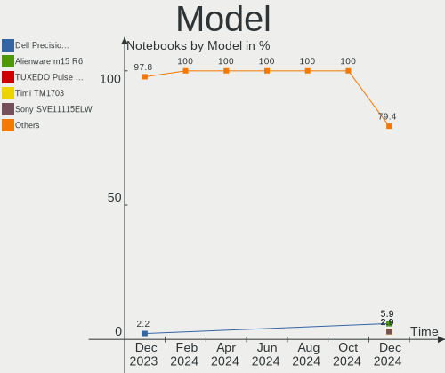
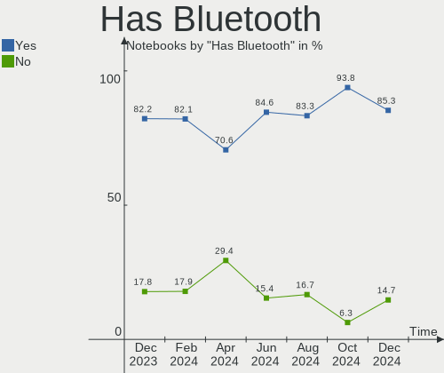
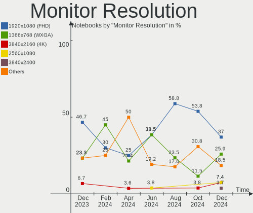
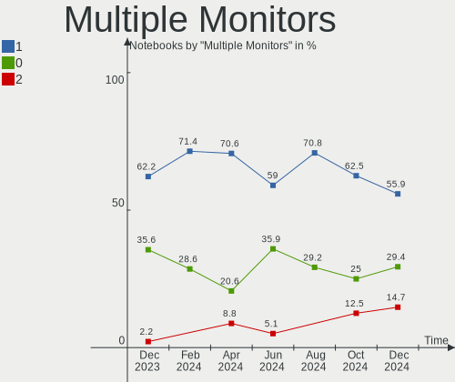

FreeBSD - Hardware Trends (Notebooks)
-------------------------------------

A project to identify most popular hardware characteristics and track their change
over time based on data collected by BSD users at https://BSD-Hardware.info.

Anyone can contribute to this report by the [hw-probe](https://github.com/linuxhw/hw-probe/blob/master/INSTALL.BSD.md) tool:

    hw-probe -all -upload

This report is for one last month. Overall report since the beginning of time: [TestCoverage](https://github.com/bsdhw/TestCoverage)

Period: Nov, 2022.

Contents
--------

* [ System ](#system)
  - [ OS                       ](#os)
  - [ OS Family                ](#os-family)
  - [ Arch                     ](#arch)
  - [ DE                       ](#de)
  - [ Display Server           ](#display-server)
  - [ Display Manager          ](#display-manager)
  - [ OS Lang                  ](#os-lang)
  - [ Boot Mode                ](#boot-mode)
  - [ Filesystem               ](#filesystem)
  - [ Part. scheme             ](#part-scheme)

* [ Board ](#board)
  - [ Vendor                   ](#vendor)
  - [ Model                    ](#model)
  - [ Model Family             ](#model-family)
  - [ MFG Year                 ](#mfg-year)
  - [ Form Factor              ](#form-factor)
  - [ Coreboot                 ](#coreboot)
  - [ RAM Size                 ](#ram-size)
  - [ RAM Used                 ](#ram-used)
  - [ Total Drives             ](#total-drives)
  - [ Has CD-ROM               ](#has-cd-rom)
  - [ Has Ethernet             ](#has-ethernet)
  - [ Has WiFi                 ](#has-wifi)
  - [ Has Bluetooth            ](#has-bluetooth)

* [ Location ](#location)
  - [ Country                  ](#country)
  - [ City                     ](#city)

* [ Drives ](#drives)
  - [ Drive Vendor             ](#drive-vendor)
  - [ Drive Model              ](#drive-model)
  - [ HDD Vendor               ](#hdd-vendor)
  - [ SSD Vendor               ](#ssd-vendor)
  - [ Drive Kind               ](#drive-kind)
  - [ Drive Connector          ](#drive-connector)
  - [ Drive Size               ](#drive-size)
  - [ Space Total              ](#space-total)
  - [ Space Used               ](#space-used)
  - [ Malfunc. Drives          ](#malfunc-drives)
  - [ Malfunc. Drive Vendor    ](#malfunc-drive-vendor)
  - [ Malfunc. HDD Vendor      ](#malfunc-hdd-vendor)
  - [ Malfunc. Drive Kind      ](#malfunc-drive-kind)
  - [ Failed Drives            ](#failed-drives)
  - [ Failed Drive Vendor      ](#failed-drive-vendor)
  - [ Drive Status             ](#drive-status)

* [ Storage controller ](#storage-controller)
  - [ Storage Vendor           ](#storage-vendor)
  - [ Storage Model            ](#storage-model)
  - [ Storage Kind             ](#storage-kind)

* [ Processor ](#processor)
  - [ CPU Vendor               ](#cpu-vendor)
  - [ CPU Model                ](#cpu-model)
  - [ CPU Model Family         ](#cpu-model-family)
  - [ CPU Cores                ](#cpu-cores)
  - [ CPU Sockets              ](#cpu-sockets)
  - [ CPU Threads              ](#cpu-threads)
  - [ CPU Microarch            ](#cpu-microarch)

* [ Graphics ](#graphics)
  - [ GPU Vendor               ](#gpu-vendor)
  - [ GPU Model                ](#gpu-model)
  - [ GPU Combo                ](#gpu-combo)
  - [ GPU Driver               ](#gpu-driver)
  - [ GPU Memory               ](#gpu-memory)

* [ Monitor ](#monitor)
  - [ Monitor Vendor           ](#monitor-vendor)
  - [ Monitor Model            ](#monitor-model)
  - [ Monitor Resolution       ](#monitor-resolution)
  - [ Monitor Diagonal         ](#monitor-diagonal)
  - [ Monitor Width            ](#monitor-width)
  - [ Aspect Ratio             ](#aspect-ratio)
  - [ Monitor Area             ](#monitor-area)
  - [ Pixel Density            ](#pixel-density)
  - [ Multiple Monitors        ](#multiple-monitors)

* [ Network ](#network)
  - [ Net Controller Vendor    ](#net-controller-vendor)
  - [ Net Controller Model     ](#net-controller-model)
  - [ Wireless Vendor          ](#wireless-vendor)
  - [ Wireless Model           ](#wireless-model)
  - [ Ethernet Vendor          ](#ethernet-vendor)
  - [ Ethernet Model           ](#ethernet-model)
  - [ Net Controller Kind      ](#net-controller-kind)
  - [ Used Controller          ](#used-controller)
  - [ NICs                     ](#nics)
  - [ IPv6                     ](#ipv6)

* [ Bluetooth ](#bluetooth)
  - [ Bluetooth Vendor         ](#bluetooth-vendor)
  - [ Bluetooth Model          ](#bluetooth-model)

* [ Sound ](#sound)
  - [ Sound Vendor             ](#sound-vendor)
  - [ Sound Model              ](#sound-model)

* [ Memory ](#memory)
  - [ Memory Vendor            ](#memory-vendor)
  - [ Memory Model             ](#memory-model)
  - [ Memory Kind              ](#memory-kind)
  - [ Memory Form Factor       ](#memory-form-factor)
  - [ Memory Size              ](#memory-size)
  - [ Memory Speed             ](#memory-speed)

* [ Printers & scanners ](#printers--scanners)
  - [ Printer Vendor           ](#printer-vendor)
  - [ Printer Model            ](#printer-model)
  - [ Scanner Vendor           ](#scanner-vendor)
  - [ Scanner Model            ](#scanner-model)

* [ Camera ](#camera)
  - [ Camera Vendor            ](#camera-vendor)
  - [ Camera Model             ](#camera-model)

* [ Security ](#security)
  - [ Fingerprint Vendor       ](#fingerprint-vendor)
  - [ Fingerprint Model        ](#fingerprint-model)
  - [ Chipcard Vendor          ](#chipcard-vendor)
  - [ Chipcard Model           ](#chipcard-model)

* [ Unsupported ](#unsupported)
  - [ Unsupported Devices      ](#unsupported-devices)
  - [ Unsupported Device Types ](#unsupported-device-types)

System
------

OS
--

Installed operating systems

| Name                 | Notebooks | Percent |
|----------------------|-----------|---------|
| FreeBSD 13.1-p4      | 8         | 36.36%  |
| FreeBSD 13.1         | 5         | 22.73%  |
| FreeBSD 14.0-CURRENT | 3         | 13.64%  |
| FreeBSD 13.1-p3      | 3         | 13.64%  |
| FreeBSD 13.1-p2      | 1         | 4.55%   |
| FreeBSD 13.1-p1      | 1         | 4.55%   |
| FreeBSD 12.3         | 1         | 4.55%   |

OS Family
---------

OS without a version

| Name    | Notebooks | Percent |
|---------|-----------|---------|
| FreeBSD | 22        | 100%    |

Arch
----

OS architecture (x86_64, i586, etc.)

| Name  | Notebooks | Percent |
|-------|-----------|---------|
| amd64 | 22        | 100%    |

DE
--

Desktop Environment

| Name      | Notebooks | Percent |
|-----------|-----------|---------|
| XFCE      | 7         | 31.82%  |
| KDE5      | 6         | 27.27%  |
| MATE      | 2         | 9.09%   |
| Console   | 2         | 9.09%   |
| i3        | 1         | 4.55%   |
| GNOME     | 1         | 4.55%   |
| Fluxbox   | 1         | 4.55%   |
| Cinnamon  | 1         | 4.55%   |
| AwesomeWM | 1         | 4.55%   |

Display Server
--------------

X11 or Wayland

| Name    | Notebooks | Percent |
|---------|-----------|---------|
| X11     | 19        | 86.36%  |
| Console | 2         | 9.09%   |
| Wayland | 1         | 4.55%   |

Display Manager
---------------

SDDM, LightDM, etc.

| Name    | Notebooks | Percent |
|---------|-----------|---------|
| SDDM    | 6         | 27.27%  |
| SLiM    | 4         | 18.18%  |
| LightDM | 4         | 18.18%  |
| Console | 4         | 18.18%  |
| XDM     | 3         | 13.64%  |
| GDM     | 1         | 4.55%   |

OS Lang
-------

Language

| Lang    | Notebooks | Percent |
|---------|-----------|---------|
| C       | 14        | 63.64%  |
| en_US   | 3         | 13.64%  |
| pt_BR   | 1         | 4.55%   |
| nl_NL   | 1         | 4.55%   |
| fr_FR   | 1         | 4.55%   |
| en_CA   | 1         | 4.55%   |
| Unknown | 1         | 4.55%   |

Boot Mode
---------

EFI or BIOS

| Mode | Notebooks | Percent |
|------|-----------|---------|
| EFI  | 21        | 95.45%  |
| BIOS | 1         | 4.55%   |

Filesystem
----------

Type of filesystem

| Type | Notebooks | Percent |
|------|-----------|---------|
| Zfs  | 15        | 68.18%  |
| Ufs  | 7         | 31.82%  |

Part. scheme
------------

Scheme of partitioning

| Type | Notebooks | Percent |
|------|-----------|---------|
| GPT  | 21        | 95.45%  |
| MBR  | 1         | 4.55%   |

Board
-----

Vendor
------

Motherboard manufacturer

| Name                | Notebooks | Percent |
|---------------------|-----------|---------|
| Lenovo              | 7         | 31.82%  |
| Hewlett-Packard     | 3         | 13.64%  |
| Dell                | 3         | 13.64%  |
| Samsung Electronics | 2         | 9.09%   |
| Sony                | 1         | 4.55%   |
| Panasonic           | 1         | 4.55%   |
| Medion              | 1         | 4.55%   |
| Google              | 1         | 4.55%   |
| ASUSTek Computer    | 1         | 4.55%   |
| Apple               | 1         | 4.55%   |
| Acer                | 1         | 4.55%   |

Model
-----

Motherboard model

| Name                                     | Notebooks | Percent |
|------------------------------------------|-----------|---------|
| Sony SVP1321V9RB                         | 1         | 4.55%   |
| Samsung 750TDA                           | 1         | 4.55%   |
| Samsung 3570R/370R/470R/450R/510R/4450RV | 1         | 4.55%   |
| Panasonic CF-31-5                        | 1         | 4.55%   |
| Medion E15415                            | 1         | 4.55%   |
| Lenovo Yoga Slim 7 Pro 14ACH5 O 82N5     | 1         | 4.55%   |
| Lenovo ThinkPad X270 W10DG 20K5S0PY04    | 1         | 4.55%   |
| Lenovo ThinkPad X270 20HMCTO1WW          | 1         | 4.55%   |
| Lenovo ThinkPad T430 2347G7G             | 1         | 4.55%   |
| Lenovo ThinkPad T430 23446FP             | 1         | 4.55%   |
| Lenovo Legion Y530-15ICH 81FV            | 1         | 4.55%   |
| Lenovo IdeaPad 110-15ACL 80TJ            | 1         | 4.55%   |
| HP ProBook 4540s                         | 1         | 4.55%   |
| HP EliteBook 8570p                       | 1         | 4.55%   |
| HP EliteBook 840 G3                      | 1         | 4.55%   |
| Google Akemi                             | 1         | 4.55%   |
| Dell XPS 13 9343                         | 1         | 4.55%   |
| Dell Vostro 3550                         | 1         | 4.55%   |
| Dell Latitude E7240                      | 1         | 4.55%   |
| ASUS ZenBook UX434FL_UX434FL             | 1         | 4.55%   |
| Apple MacBookPro8,1                      | 1         | 4.55%   |
| Acer TravelMate B115-M                   | 1         | 4.55%   |

Model Family
------------

Motherboard model prefix

| Name              | Notebooks | Percent |
|-------------------|-----------|---------|
| Lenovo ThinkPad   | 4         | 18.18%  |
| HP EliteBook      | 2         | 9.09%   |
| Sony SVP1321V9RB  | 1         | 4.55%   |
| Samsung 750TDA    | 1         | 4.55%   |
| Samsung 3570R     | 1         | 4.55%   |
| Panasonic CF-31-5 | 1         | 4.55%   |
| Medion E15415     | 1         | 4.55%   |
| Lenovo Yoga       | 1         | 4.55%   |
| Lenovo Legion     | 1         | 4.55%   |
| Lenovo IdeaPad    | 1         | 4.55%   |
| HP ProBook        | 1         | 4.55%   |
| Google Akemi      | 1         | 4.55%   |
| Dell XPS          | 1         | 4.55%   |
| Dell Vostro       | 1         | 4.55%   |
| Dell Latitude     | 1         | 4.55%   |
| ASUS ZenBook      | 1         | 4.55%   |
| Apple MacBookPro8 | 1         | 4.55%   |
| Acer TravelMate   | 1         | 4.55%   |

MFG Year
--------

Motherboard manufacture year

| Year | Notebooks | Percent |
|------|-----------|---------|
| 2013 | 4         | 18.18%  |
| 2022 | 3         | 13.64%  |
| 2014 | 3         | 13.64%  |
| 2020 | 2         | 9.09%   |
| 2019 | 2         | 9.09%   |
| 2018 | 2         | 9.09%   |
| 2016 | 2         | 9.09%   |
| 2012 | 2         | 9.09%   |
| 2021 | 1         | 4.55%   |
| 2017 | 1         | 4.55%   |

Form Factor
-----------

Physical design of the computer

| Name     | Notebooks | Percent |
|----------|-----------|---------|
| Notebook | 22        | 100%    |

Coreboot
--------

Have coreboot on board

| Used | Notebooks | Percent |
|------|-----------|---------|
| No   | 21        | 95.45%  |
| Yes  | 1         | 4.55%   |

RAM Size
--------

Total RAM memory

| Size in GB | Notebooks | Percent |
|------------|-----------|---------|
| 8.01-16.0  | 13        | 59.09%  |
| 16.01-24.0 | 5         | 22.73%  |
| 4.01-8.0   | 2         | 9.09%   |
| 32.01-64.0 | 1         | 4.55%   |
| 2.01-3.0   | 1         | 4.55%   |

RAM Used
--------

Used RAM memory

| Used GB  | Notebooks | Percent |
|----------|-----------|---------|
| 0.01-0.5 | 13        | 59.09%  |
| 0.51-1.0 | 5         | 22.73%  |
| 1.01-2.0 | 3         | 13.64%  |
| 2.01-3.0 | 1         | 4.55%   |

Total Drives
------------

Number of drives on board

| Drives | Notebooks | Percent |
|--------|-----------|---------|
| 1      | 16        | 72.73%  |
| 2      | 4         | 18.18%  |
| 3      | 1         | 4.55%   |
| 0      | 1         | 4.55%   |

Has CD-ROM
----------

Has CD-ROM on board

| Presented | Notebooks | Percent |
|-----------|-----------|---------|
| No        | 18        | 81.82%  |
| Yes       | 4         | 18.18%  |

Has Ethernet
------------

Has Ethernet on board

| Presented | Notebooks | Percent |
|-----------|-----------|---------|
| Yes       | 15        | 68.18%  |
| No        | 7         | 31.82%  |

Has WiFi
--------

Has WiFi module

| Presented | Notebooks | Percent |
|-----------|-----------|---------|
| Yes       | 22        | 100%    |

Has Bluetooth
-------------

Has Bluetooth module

| Presented | Notebooks | Percent |
|-----------|-----------|---------|
| Yes       | 19        | 86.36%  |
| No        | 3         | 13.64%  |

Location
--------

Country
-------

Geographic location (country)

| Country     | Notebooks | Percent |
|-------------|-----------|---------|
| USA         | 4         | 18.18%  |
| UK          | 2         | 9.09%   |
| Germany     | 2         | 9.09%   |
| France      | 2         | 9.09%   |
| Russia      | 1         | 4.55%   |
| Netherlands | 1         | 4.55%   |
| Mexico      | 1         | 4.55%   |
| Malta       | 1         | 4.55%   |
| Japan       | 1         | 4.55%   |
| Italy       | 1         | 4.55%   |
| India       | 1         | 4.55%   |
| Guadeloupe  | 1         | 4.55%   |
| China       | 1         | 4.55%   |
| Canada      | 1         | 4.55%   |
| Bulgaria    | 1         | 4.55%   |
| Brazil      | 1         | 4.55%   |

City
----

Geographic location (city)

| City           | Notebooks | Percent |
|----------------|-----------|---------|
| London         | 2         | 9.09%   |
| Youngstown     | 1         | 4.55%   |
| Tlalnepantla   | 1         | 4.55%   |
| Swieqi         | 1         | 4.55%   |
| Springfield    | 1         | 4.55%   |
| Sarcelles      | 1         | 4.55%   |
| Samokov        | 1         | 4.55%   |
| Rio de Janeiro | 1         | 4.55%   |
| Queens         | 1         | 4.55%   |
| Papendrecht    | 1         | 4.55%   |
| New Delhi      | 1         | 4.55%   |
| Neumünster    | 1         | 4.55%   |
| Nakano         | 1         | 4.55%   |
| Moscow         | 1         | 4.55%   |
| Le Gosier      | 1         | 4.55%   |
| Kingsburg      | 1         | 4.55%   |
| Jiangbei       | 1         | 4.55%   |
| Gifhorn        | 1         | 4.55%   |
| Gattinara      | 1         | 4.55%   |
| Élancourt     | 1         | 4.55%   |
| Albuquerque    | 1         | 4.55%   |

Drives
------

Drive Vendor
------------

Hard drive vendors

| Vendor              | Notebooks | Drives | Percent |
|---------------------|-----------|--------|---------|
| Samsung Electronics | 8         | 9      | 28.57%  |
| WDC                 | 4         | 4      | 14.29%  |
| Toshiba             | 3         | 3      | 10.71%  |
| Crucial             | 3         | 3      | 10.71%  |
| Seagate             | 2         | 2      | 7.14%   |
| SanDisk             | 1         | 1      | 3.57%   |
| PNY                 | 1         | 1      | 3.57%   |
| Phison              | 1         | 1      | 3.57%   |
| Kingston            | 1         | 1      | 3.57%   |
| KingSpec            | 1         | 1      | 3.57%   |
| Hitachi             | 1         | 1      | 3.57%   |
| HGST                | 1         | 1      | 3.57%   |
| A-DATA Technology   | 1         | 1      | 3.57%   |

Drive Model
-----------

Hard drive models

| Model                                 | Notebooks | Percent |
|---------------------------------------|-----------|---------|
| WDC WDS250G2B0B-00YS70 250GB          | 1         | 3.45%   |
| WDC WDS240G2G0A-00JH30 240GB          | 1         | 3.45%   |
| WDC WDS100T2B0C-00PXH0 1TB            | 1         | 3.45%   |
| WDC WD10JPCX-24UE4T0 1TB              | 1         | 3.45%   |
| Toshiba THNSNJ256GCSY 256GB           | 1         | 3.45%   |
| Toshiba MQ01ABF050 500GB              | 1         | 3.45%   |
| Toshiba MQ01ABF032 320GB              | 1         | 3.45%   |
| Seagate ST9750420AS 752GB             | 1         | 3.45%   |
| Seagate ST9320325ASG 320GB            | 1         | 3.45%   |
| SanDisk SSD PLUS 240GB                | 1         | 3.45%   |
| Samsung SSD PM851 mSATA 256GB         | 1         | 3.45%   |
| Samsung SSD PM851 M.2 2280 256GB      | 1         | 3.45%   |
| Samsung SSD 870 EVO 4TB               | 1         | 3.45%   |
| Samsung SSD 860 EVO 500GB             | 1         | 3.45%   |
| Samsung SSD 850 EVO M.2 250GB         | 1         | 3.45%   |
| Samsung MZVLW256HEHP-000L7 256GB      | 1         | 3.45%   |
| Samsung MZVLQ256HBJD-00B 256GB        | 1         | 3.45%   |
| Samsung MZVLB1T0HBLR-000L2 1TB        | 1         | 3.45%   |
| Samsung MZALQ128HBHQ-000L2 128GB      | 1         | 3.45%   |
| PNY CS900 1TB SSD                     | 1         | 3.45%   |
| Phison E19-256G-PHISON-SSD-B47R 256GB | 1         | 3.45%   |
| Kingston SA400S37240G 240GB           | 1         | 3.45%   |
| KingSpec MT-1TB                       | 1         | 3.45%   |
| Hitachi HTS725050A7E630 500GB         | 1         | 3.45%   |
| HGST HTS721010A9E630 1TB              | 1         | 3.45%   |
| Crucial CT120M500SSD1 120GB           | 1         | 3.45%   |
| Crucial CT1000MX500SSD1 1TB           | 1         | 3.45%   |
| Crucial CT1000BX500SSD1 1TB           | 1         | 3.45%   |
| A-DATA SU650 120GB                    | 1         | 3.45%   |

HDD Vendor
----------

Hard disk drive vendors

| Vendor  | Notebooks | Drives | Percent |
|---------|-----------|--------|---------|
| Toshiba | 2         | 2      | 28.57%  |
| Seagate | 2         | 2      | 28.57%  |
| WDC     | 1         | 1      | 14.29%  |
| Hitachi | 1         | 1      | 14.29%  |
| HGST    | 1         | 1      | 14.29%  |

SSD Vendor
----------

Solid state drive vendors

| Vendor              | Notebooks | Drives | Percent |
|---------------------|-----------|--------|---------|
| Samsung Electronics | 5         | 5      | 31.25%  |
| Crucial             | 3         | 3      | 18.75%  |
| WDC                 | 2         | 2      | 12.5%   |
| Toshiba             | 1         | 1      | 6.25%   |
| SanDisk             | 1         | 1      | 6.25%   |
| PNY                 | 1         | 1      | 6.25%   |
| Kingston            | 1         | 1      | 6.25%   |
| KingSpec            | 1         | 1      | 6.25%   |
| A-DATA Technology   | 1         | 1      | 6.25%   |

Drive Kind
----------

HDD or SSD

| Kind | Notebooks | Drives | Percent |
|------|-----------|--------|---------|
| SSD  | 13        | 16     | 52%     |
| NVMe | 6         | 6      | 24%     |
| HDD  | 6         | 7      | 24%     |

Drive Connector
---------------

SATA, SAS, NVMe, etc.

| Type | Notebooks | Drives | Percent |
|------|-----------|--------|---------|
| SATA | 17        | 23     | 73.91%  |
| NVMe | 6         | 6      | 26.09%  |

Drive Size
----------

Size of hard drive

| Size in TB | Notebooks | Drives | Percent |
|------------|-----------|--------|---------|
| 0.01-0.5   | 12        | 15     | 60%     |
| 0.51-1.0   | 6         | 6      | 30%     |
| 3.01-4.0   | 1         | 1      | 5%      |
| 1.01-2.0   | 1         | 1      | 5%      |

Space Total
-----------

Amount of disk space available on the file system

| Size in GB | Notebooks | Percent |
|------------|-----------|---------|
| 101-250    | 12        | 54.55%  |
| 501-1000   | 4         | 18.18%  |
| 51-100     | 4         | 18.18%  |
| 251-500    | 2         | 9.09%   |

Space Used
----------

Amount of used disk space

| Used GB | Notebooks | Percent |
|---------|-----------|---------|
| 1-20    | 18        | 81.82%  |
| 21-50   | 2         | 9.09%   |
| 51-100  | 2         | 9.09%   |

Malfunc. Drives
---------------

Drive models with a malfunction

| Model                                     | Notebooks | Drives | Percent |
|-------------------------------------------|-----------|--------|---------|
| Toshiba MQ01ABF032 320GB                  | 1         | 1      | 16.67%  |
| Seagate ST9750420AS 752GB                 | 1         | 1      | 16.67%  |
| Seagate ST9320325ASG 320GB                | 1         | 1      | 16.67%  |
| Samsung Electronics SSD PM851 mSATA 256GB | 1         | 1      | 16.67%  |
| HGST HTS721010A9E630 1TB                  | 1         | 1      | 16.67%  |
| A-DATA Technology SU650 120GB             | 1         | 1      | 16.67%  |

Malfunc. Drive Vendor
---------------------

Vendors of faulty drives

| Vendor              | Notebooks | Drives | Percent |
|---------------------|-----------|--------|---------|
| Seagate             | 2         | 2      | 33.33%  |
| Toshiba             | 1         | 1      | 16.67%  |
| Samsung Electronics | 1         | 1      | 16.67%  |
| HGST                | 1         | 1      | 16.67%  |
| A-DATA Technology   | 1         | 1      | 16.67%  |

Malfunc. HDD Vendor
-------------------

Vendors of faulty HDD drives

| Vendor  | Notebooks | Drives | Percent |
|---------|-----------|--------|---------|
| Seagate | 2         | 2      | 50%     |
| Toshiba | 1         | 1      | 25%     |
| HGST    | 1         | 1      | 25%     |

Malfunc. Drive Kind
-------------------

Kinds of faulty drives

| Kind | Notebooks | Drives | Percent |
|------|-----------|--------|---------|
| HDD  | 4         | 4      | 66.67%  |
| SSD  | 2         | 2      | 33.33%  |

Failed Drives
-------------

Failed drive models

Zero info for selected period =(

Failed Drive Vendor
-------------------

Failed drive vendors

Zero info for selected period =(

Drive Status
------------

Number of failed and malfunc. drives

| Status  | Notebooks | Drives | Percent |
|---------|-----------|--------|---------|
| Works   | 17        | 23     | 73.91%  |
| Malfunc | 6         | 6      | 26.09%  |

Storage controller
------------------

Storage Vendor
--------------

Storage controller vendors

| Vendor              | Notebooks | Percent |
|---------------------|-----------|---------|
| Intel               | 17        | 70.83%  |
| Samsung Electronics | 4         | 16.67%  |
| SanDisk             | 1         | 4.17%   |
| Phison Electronics  | 1         | 4.17%   |
| AMD                 | 1         | 4.17%   |

Storage Model
-------------

Storage controller models

| Model                                                                        | Notebooks | Percent |
|------------------------------------------------------------------------------|-----------|---------|
| Intel 7 Series Chipset Family 6-port SATA Controller [AHCI mode]             | 5         | 20.83%  |
| Samsung NVMe SSD Controller 980                                              | 2         | 8.33%   |
| Intel Wildcat Point-LP SATA Controller [AHCI Mode]                           | 2         | 8.33%   |
| Intel Sunrise Point-LP SATA Controller [AHCI mode]                           | 2         | 8.33%   |
| Intel Comet Lake SATA AHCI Controller                                        | 2         | 8.33%   |
| Intel 8 Series SATA Controller 1 [AHCI mode]                                 | 2         | 8.33%   |
| Intel 6 Series/C200 Series Chipset Family 6 port Mobile SATA AHCI Controller | 2         | 8.33%   |
| SanDisk unknown                                                              | 1         | 4.17%   |
| Samsung NVMe SSD Controller SM981/PM981/PM983                                | 1         | 4.17%   |
| Samsung NVMe SSD Controller SM961/PM961/SM963                                | 1         | 4.17%   |
| Intel Cannon Lake Mobile PCH SATA AHCI Controller                            | 1         | 4.17%   |
| Intel Atom Processor E3800 Series SATA AHCI Controller                       | 1         | 4.17%   |
| AMD FCH SATA Controller [AHCI mode]                                          | 1         | 4.17%   |
| Unknown                                                                      | 1         | 4.17%   |

Storage Kind
------------

Kind of storage controller (IDE, SATA, NVMe, SAS, ...)

| Kind | Notebooks | Percent |
|------|-----------|---------|
| SATA | 18        | 75%     |
| NVMe | 6         | 25%     |

Processor
---------

CPU Vendor
----------

Processor vendors

| Vendor | Notebooks | Percent |
|--------|-----------|---------|
| Intel  | 20        | 90.91%  |
| AMD    | 2         | 9.09%   |

CPU Model
---------

Processor models

| Model                                       | Notebooks | Percent |
|---------------------------------------------|-----------|---------|
| Intel Core i7-6600U CPU @ 2.60GHz           | 2         | 9.09%   |
| Intel Core i7-3520M CPU @ 2.90GHz           | 2         | 9.09%   |
| Intel Core i5-10210U CPU @ 1.60GHz          | 2         | 9.09%   |
| Intel Core i7-8750H CPU @ 2.20GHz           | 1         | 4.55%   |
| Intel Core i7-5600U CPU @ 2.60GHz           | 1         | 4.55%   |
| Intel Core i7-4600U CPU @ 2.10GHz           | 1         | 4.55%   |
| Intel Core i7-3632QM CPU @ 2.20GHz          | 1         | 4.55%   |
| Intel Core i7-3612QM CPU @ 2.10GHz          | 1         | 4.55%   |
| Intel Core i5-8265U CPU @ 1.60GHz           | 1         | 4.55%   |
| Intel Core i5-7200U CPU @ 2.50GHz           | 1         | 4.55%   |
| Intel Core i5-5300U CPU @ 2.30GHz           | 1         | 4.55%   |
| Intel Core i5-4200U CPU @ 1.60GHz           | 1         | 4.55%   |
| Intel Core i5-3210M CPU @ 2.50GHz           | 1         | 4.55%   |
| Intel Core i5-2520M CPU @ 2.50GHz           | 1         | 4.55%   |
| Intel Core i5-2415M CPU @ 2.30GHz           | 1         | 4.55%   |
| Intel Celeron CPU N2840 @ 2.16GHz           | 1         | 4.55%   |
| Intel 11th Gen Core i5-1135G7 @ 2.40GHz     | 1         | 4.55%   |
| AMD Ryzen 7 5800H with Radeon Graphics      | 1         | 4.55%   |
| AMD A8-7410 APU with AMD Radeon R5 Graphics | 1         | 4.55%   |

CPU Model Family
----------------

Processor model prefix

| Model         | Notebooks | Percent |
|---------------|-----------|---------|
| Intel Core i7 | 9         | 40.91%  |
| Intel Core i5 | 9         | 40.91%  |
| Other         | 1         | 4.55%   |
| Intel Celeron | 1         | 4.55%   |
| AMD Ryzen 7   | 1         | 4.55%   |
| AMD A8        | 1         | 4.55%   |

CPU Cores
---------

Number of processor cores

| Number | Notebooks | Percent |
|--------|-----------|---------|
| 2      | 13        | 59.09%  |
| 4      | 7         | 31.82%  |
| 16     | 1         | 4.55%   |
| 6      | 1         | 4.55%   |

CPU Sockets
-----------

Number of sockets

| Number | Notebooks | Percent |
|--------|-----------|---------|
| 1      | 22        | 100%    |

CPU Threads
-----------

Threads per core (Hyper-Threading)

| Number | Notebooks | Percent |
|--------|-----------|---------|
| 2      | 19        | 86.36%  |
| 1      | 3         | 13.64%  |

CPU Microarch
-------------

Microarchitecture

| Name        | Notebooks | Percent |
|-------------|-----------|---------|
| KabyLake    | 5         | 22.73%  |
| IvyBridge   | 5         | 22.73%  |
| Skylake     | 2         | 9.09%   |
| SandyBridge | 2         | 9.09%   |
| Haswell     | 2         | 9.09%   |
| Broadwell   | 2         | 9.09%   |
| Zen 3       | 1         | 4.55%   |
| TigerLake   | 1         | 4.55%   |
| Silvermont  | 1         | 4.55%   |
| Puma        | 1         | 4.55%   |

Graphics
--------

GPU Vendor
----------

Vendors of graphics cards

| Vendor | Notebooks | Percent |
|--------|-----------|---------|
| Intel  | 19        | 70.37%  |
| AMD    | 6         | 22.22%  |
| Nvidia | 2         | 7.41%   |

GPU Model
---------

Graphics card models

| Model                                                                     | Notebooks | Percent |
|---------------------------------------------------------------------------|-----------|---------|
| Intel 3rd Gen Core processor Graphics Controller                          | 4         | 14.29%  |
| Intel Skylake GT2 [HD Graphics 520]                                       | 2         | 7.14%   |
| Intel HD Graphics 5500                                                    | 2         | 7.14%   |
| Intel Haswell-ULT Integrated Graphics Controller                          | 2         | 7.14%   |
| Intel CometLake-U GT2 [UHD Graphics]                                      | 2         | 7.14%   |
| Intel 2nd Generation Core Processor Family Integrated Graphics Controller | 2         | 7.14%   |
| AMD Thames [Radeon HD 7550M/7570M/7650M]                                  | 2         | 7.14%   |
| Nvidia GP108BM [GeForce MX250]                                            | 1         | 3.57%   |
| Nvidia GP107M [GeForce GTX 1050 Ti Mobile]                                | 1         | 3.57%   |
| Intel WhiskeyLake-U GT2 [UHD Graphics 620]                                | 1         | 3.57%   |
| Intel TigerLake-LP GT2 [Iris Xe Graphics]                                 | 1         | 3.57%   |
| Intel HD Graphics 620                                                     | 1         | 3.57%   |
| Intel DG1 [Iris Xe MAX Graphics]                                          | 1         | 3.57%   |
| Intel CoffeeLake-H GT2 [UHD Graphics 630]                                 | 1         | 3.57%   |
| Intel Atom Processor Z36xxx/Z37xxx Series Graphics & Display              | 1         | 3.57%   |
| AMD Whistler [Radeon HD 6630M/6650M/6750M/7670M/7690M]                    | 1         | 3.57%   |
| AMD Mullins [Radeon R4/R5 Graphics]                                       | 1         | 3.57%   |
| AMD Mars [Radeon HD 8670A/8670M/8750M / R7 M370]                          | 1         | 3.57%   |
| AMD Cezanne [Radeon Vega Series / Radeon Vega Mobile Series]              | 1         | 3.57%   |

GPU Combo
---------

Combinations of graphics cards

| Name           | Notebooks | Percent |
|----------------|-----------|---------|
| 1 x Intel      | 13        | 59.09%  |
| Intel + AMD    | 3         | 13.64%  |
| 1 x AMD        | 3         | 13.64%  |
| Intel + Nvidia | 2         | 9.09%   |
| 2 x Intel      | 1         | 4.55%   |

GPU Driver
----------

Free vs proprietary

| Driver      | Notebooks | Percent |
|-------------|-----------|---------|
| Free        | 19        | 86.36%  |
| Proprietary | 2         | 9.09%   |
| Unknown     | 1         | 4.55%   |

GPU Memory
----------

Total video memory

| Size in GB | Notebooks | Percent |
|------------|-----------|---------|
| Unknown    | 20        | 90.91%  |
| 0.51-1.0   | 2         | 9.09%   |

Monitor
-------

Monitor Vendor
--------------

Monitor vendors

| Vendor              | Notebooks | Percent |
|---------------------|-----------|---------|
| AU Optronics        | 4         | 19.05%  |
| Chimei Innolux      | 3         | 14.29%  |
| BOE                 | 3         | 14.29%  |
| Samsung Electronics | 2         | 9.52%   |
| LG Display          | 2         | 9.52%   |
| YTH                 | 1         | 4.76%   |
| Toshiba             | 1         | 4.76%   |
| Sharp               | 1         | 4.76%   |
| Philips             | 1         | 4.76%   |
| Panasonic           | 1         | 4.76%   |
| InfoVision          | 1         | 4.76%   |
| Apple               | 1         | 4.76%   |

Monitor Model
-------------

Monitor models

| Model                                                                 | Notebooks | Percent |
|-----------------------------------------------------------------------|-----------|---------|
| YTH HS133PC YTH1330 1920x1080 250x220mm 13.1-inch                     | 1         | 4.76%   |
| Toshiba ScreenXpert- TSB8888 1080x2160 60x130mm 5.6-inch              | 1         | 4.76%   |
| Sharp LCD Monitor SHP1421 3200x1800 290x170mm 13.2-inch               | 1         | 4.76%   |
| Samsung Electronics LCD Monitor SEC324C 1600x900 310x170mm 13.9-inch  | 1         | 4.76%   |
| Samsung Electronics LCD Monitor SAM0D4F 1920x1080 890x500mm 40.2-inch | 1         | 4.76%   |
| Philips LCD Monitor PHL08C3 1920x1080 600x340mm 27.2-inch             | 1         | 4.76%   |
| Panasonic VVX13F009G00 MEI96A2 1920x1080 290x170mm 13.2-inch          | 1         | 4.76%   |
| LG Display LCD Monitor LGD0395 1366x768 340x190mm 15.3-inch           | 1         | 4.76%   |
| LG Display LCD Monitor LGD0258 1600x900 350x190mm 15.7-inch           | 1         | 4.76%   |
| InfoVision LCD Monitor IVO8544 1920x1080 290x170mm 13.2-inch          | 1         | 4.76%   |
| Chimei Innolux LCD Monitor CMN15B8 1366x768 340x190mm 15.3-inch       | 1         | 4.76%   |
| Chimei Innolux LCD Monitor CMN14A8 1920x1080 310x170mm 13.9-inch      | 1         | 4.76%   |
| Chimei Innolux LCD Monitor CMN1239 1920x1080 280x160mm 12.7-inch      | 1         | 4.76%   |
| BOE LCD Monitor BOE0A39 1920x1080 340x190mm 15.3-inch                 | 1         | 4.76%   |
| BOE LCD Monitor BOE0700 1920x1080 340x190mm 15.3-inch                 | 1         | 4.76%   |
| BOE LCD Monitor BOE05DA 1366x768 280x160mm 12.7-inch                  | 1         | 4.76%   |
| AU Optronics LCD Monitor AUO323D 1920x1080 310x170mm 13.9-inch        | 1         | 4.76%   |
| AU Optronics LCD Monitor AUO313C 1366x768 310x170mm 13.9-inch         | 1         | 4.76%   |
| AU Optronics LCD Monitor AUO235C 1366x768 260x140mm 11.6-inch         | 1         | 4.76%   |
| AU Optronics LCD Monitor AUO226D 1920x1080 280x160mm 12.7-inch        | 1         | 4.76%   |
| Apple LCD Monitor APP9CC5 1280x800 290x180mm 13.4-inch                | 1         | 4.76%   |

Monitor Resolution
------------------

Monitor screen resolution

| Resolution       | Notebooks | Percent |
|------------------|-----------|---------|
| 1920x1080 (FHD)  | 9         | 45%     |
| 1366x768 (WXGA)  | 5         | 25%     |
| 1600x900 (HD+)   | 2         | 10%     |
| 3200x1800 (QHD+) | 1         | 5%      |
| 2880x1620        | 1         | 5%      |
| 1280x800 (WXGA)  | 1         | 5%      |
| 1080x2160        | 1         | 5%      |

Monitor Diagonal
----------------

Diagonal size in inches

| Inches | Notebooks | Percent |
|--------|-----------|---------|
| 13     | 8         | 38.1%   |
| 15     | 6         | 28.57%  |
| 12     | 3         | 14.29%  |
| 46     | 1         | 4.76%   |
| 27     | 1         | 4.76%   |
| 11     | 1         | 4.76%   |
| 5      | 1         | 4.76%   |

Monitor Width
-------------

Physical width

| Width in mm | Notebooks | Percent |
|-------------|-----------|---------|
| 301-350     | 10        | 50%     |
| 201-300     | 7         | 35%     |
| 501-600     | 1         | 5%      |
| 1001-1500   | 1         | 5%      |
| 1-100       | 1         | 5%      |

Aspect Ratio
------------

Proportional relationship between the width and the height

| Ratio | Notebooks | Percent |
|-------|-----------|---------|
| 16/9  | 17        | 85%     |
| 16/10 | 1         | 5%      |
| 11/10 | 1         | 5%      |
| 0.46  | 1         | 5%      |

Monitor Area
------------

Area in inch²

| Area in inch² | Notebooks | Percent |
|----------------|-----------|---------|
| 81-90          | 6         | 28.57%  |
| 91-100         | 5         | 23.81%  |
| 61-70          | 3         | 14.29%  |
| 71-80          | 2         | 9.52%   |
| 51-60          | 1         | 4.76%   |
| 1-40           | 1         | 4.76%   |
| 301-350        | 1         | 4.76%   |
| 101-110        | 1         | 4.76%   |
| 501-1000       | 1         | 4.76%   |

Pixel Density
-------------

Pixels per inch

| Density       | Notebooks | Percent |
|---------------|-----------|---------|
| 121-160       | 7         | 35%     |
| 101-120       | 5         | 25%     |
| 161-240       | 4         | 20%     |
| More than 240 | 2         | 10%     |
| 1-50          | 1         | 5%      |
| 51-100        | 1         | 5%      |

Multiple Monitors
-----------------

Total monitors connected

| Total | Notebooks | Percent |
|-------|-----------|---------|
| 1     | 14        | 63.64%  |
| 2     | 4         | 18.18%  |
| 0     | 4         | 18.18%  |

Network
-------

Net Controller Vendor
---------------------

Controller vendors

| Vendor                | Notebooks | Percent |
|-----------------------|-----------|---------|
| Intel                 | 14        | 45.16%  |
| Realtek Semiconductor | 6         | 19.35%  |
| Qualcomm Atheros      | 4         | 12.9%   |
| Broadcom              | 2         | 6.45%   |
| Sierra Wireless       | 1         | 3.23%   |
| Ralink Technology     | 1         | 3.23%   |
| Ralink                | 1         | 3.23%   |
| MediaTek              | 1         | 3.23%   |
| Hewlett-Packard       | 1         | 3.23%   |

Net Controller Model
--------------------

Controller models

| Model                                                             | Notebooks | Percent |
|-------------------------------------------------------------------|-----------|---------|
| Realtek RTL8111/8168/8411 PCI Express Gigabit Ethernet Controller | 5         | 12.2%   |
| Intel Centrino Advanced-N 6205 [Taylor Peak]                      | 4         | 9.76%   |
| Intel 82579LM Gigabit Network Connection (Lewisville)             | 3         | 7.32%   |
| Intel Wireless 8265 / 8275                                        | 2         | 4.88%   |
| Intel Wireless 8260                                               | 2         | 4.88%   |
| Intel Ethernet Connection I219-LM                                 | 2         | 4.88%   |
| Intel Comet Lake PCH-LP CNVi WiFi                                 | 2         | 4.88%   |
| Sierra Wireless EM7305 Modem                                      | 1         | 2.44%   |
| Realtek RTL8822BE 802.11a/b/g/n/ac WiFi adapter                   | 1         | 2.44%   |
| Realtek RTL810xE PCI Express Fast Ethernet controller             | 1         | 2.44%   |
| Ralink RT5370 Wireless Adapter                                    | 1         | 2.44%   |
| Ralink RT3290 Wireless 802.11n 1T/1R PCIe                         | 1         | 2.44%   |
| Qualcomm Atheros QCA9565 / AR9565 Wireless Network Adapter        | 1         | 2.44%   |
| Qualcomm Atheros QCA9377 802.11ac Wireless Network Adapter        | 1         | 2.44%   |
| Qualcomm Atheros AR9485 Wireless Network Adapter                  | 1         | 2.44%   |
| Qualcomm Atheros AR9285 Wireless Network Adapter (PCI-Express)    | 1         | 2.44%   |
| MediaTek MT7921 802.11ax PCI Express Wireless Network Adapter     | 1         | 2.44%   |
| Intel Wireless 7265                                               | 1         | 2.44%   |
| Intel Wi-Fi 6 AX201                                               | 1         | 2.44%   |
| Intel Wi-Fi 6 AX200                                               | 1         | 2.44%   |
| Intel Ethernet Connection I218-LM                                 | 1         | 2.44%   |
| Intel Ethernet Connection (4) I219-V                              | 1         | 2.44%   |
| Intel Ethernet Connection (3) I218-LM                             | 1         | 2.44%   |
| Intel Cannon Point-LP CNVi [Wireless-AC]                          | 1         | 2.44%   |
| HP hs2350 HSPA+ Mobile Broadband Module Network Adapter           | 1         | 2.44%   |
| Broadcom NetXtreme BCM57765 Gigabit Ethernet PCIe                 | 1         | 2.44%   |
| Broadcom BCM4331 802.11a/b/g/n                                    | 1         | 2.44%   |
| Broadcom BCM43228 802.11a/b/g/n                                   | 1         | 2.44%   |

Wireless Vendor
---------------

Wireless vendors

| Vendor                | Notebooks | Percent |
|-----------------------|-----------|---------|
| Intel                 | 14        | 58.33%  |
| Qualcomm Atheros      | 4         | 16.67%  |
| Broadcom              | 2         | 8.33%   |
| Realtek Semiconductor | 1         | 4.17%   |
| Ralink Technology     | 1         | 4.17%   |
| Ralink                | 1         | 4.17%   |
| MediaTek              | 1         | 4.17%   |

Wireless Model
--------------

Wireless models

| Model                                                          | Notebooks | Percent |
|----------------------------------------------------------------|-----------|---------|
| Intel Centrino Advanced-N 6205 [Taylor Peak]                   | 4         | 16.67%  |
| Intel Wireless 8265 / 8275                                     | 2         | 8.33%   |
| Intel Wireless 8260                                            | 2         | 8.33%   |
| Intel Comet Lake PCH-LP CNVi WiFi                              | 2         | 8.33%   |
| Realtek RTL8822BE 802.11a/b/g/n/ac WiFi adapter                | 1         | 4.17%   |
| Ralink RT5370 Wireless Adapter                                 | 1         | 4.17%   |
| Ralink RT3290 Wireless 802.11n 1T/1R PCIe                      | 1         | 4.17%   |
| Qualcomm Atheros QCA9565 / AR9565 Wireless Network Adapter     | 1         | 4.17%   |
| Qualcomm Atheros QCA9377 802.11ac Wireless Network Adapter     | 1         | 4.17%   |
| Qualcomm Atheros AR9485 Wireless Network Adapter               | 1         | 4.17%   |
| Qualcomm Atheros AR9285 Wireless Network Adapter (PCI-Express) | 1         | 4.17%   |
| MediaTek MT7921 802.11ax PCI Express Wireless Network Adapter  | 1         | 4.17%   |
| Intel Wireless 7265                                            | 1         | 4.17%   |
| Intel Wi-Fi 6 AX201                                            | 1         | 4.17%   |
| Intel Wi-Fi 6 AX200                                            | 1         | 4.17%   |
| Intel Cannon Point-LP CNVi [Wireless-AC]                       | 1         | 4.17%   |
| Broadcom BCM4331 802.11a/b/g/n                                 | 1         | 4.17%   |
| Broadcom BCM43228 802.11a/b/g/n                                | 1         | 4.17%   |

Ethernet Vendor
---------------

Ethernet vendors

| Vendor                | Notebooks | Percent |
|-----------------------|-----------|---------|
| Intel                 | 8         | 53.33%  |
| Realtek Semiconductor | 6         | 40%     |
| Broadcom              | 1         | 6.67%   |

Ethernet Model
--------------

Ethernet models

| Model                                                             | Notebooks | Percent |
|-------------------------------------------------------------------|-----------|---------|
| Realtek RTL8111/8168/8411 PCI Express Gigabit Ethernet Controller | 5         | 33.33%  |
| Intel 82579LM Gigabit Network Connection (Lewisville)             | 3         | 20%     |
| Intel Ethernet Connection I219-LM                                 | 2         | 13.33%  |
| Realtek RTL810xE PCI Express Fast Ethernet controller             | 1         | 6.67%   |
| Intel Ethernet Connection I218-LM                                 | 1         | 6.67%   |
| Intel Ethernet Connection (4) I219-V                              | 1         | 6.67%   |
| Intel Ethernet Connection (3) I218-LM                             | 1         | 6.67%   |
| Broadcom NetXtreme BCM57765 Gigabit Ethernet PCIe                 | 1         | 6.67%   |

Net Controller Kind
-------------------

Ethernet, WiFi or modem

| Kind     | Notebooks | Percent |
|----------|-----------|---------|
| WiFi     | 22        | 56.41%  |
| Ethernet | 15        | 38.46%  |
| Modem    | 1         | 2.56%   |
| Unknown  | 1         | 2.56%   |

Used Controller
---------------

Currently used network controller

| Kind     | Notebooks | Percent |
|----------|-----------|---------|
| WiFi     | 16        | 72.73%  |
| Ethernet | 6         | 27.27%  |

NICs
----

Total network controllers on board

| Total | Notebooks | Percent |
|-------|-----------|---------|
| 2     | 15        | 68.18%  |
| 1     | 7         | 31.82%  |

IPv6
----

IPv6 vs IPv4

| Used | Notebooks | Percent |
|------|-----------|---------|
| No   | 19        | 86.36%  |
| Yes  | 3         | 13.64%  |

Bluetooth
---------

Bluetooth Vendor
----------------

Controller vendors

| Vendor                          | Notebooks | Percent |
|---------------------------------|-----------|---------|
| Intel                           | 10        | 50%     |
| Qualcomm Atheros Communications | 3         | 15%     |
| Foxconn / Hon Hai               | 2         | 10%     |
| Realtek Semiconductor           | 1         | 5%      |
| Ralink                          | 1         | 5%      |
| IMC Networks                    | 1         | 5%      |
| Broadcom                        | 1         | 5%      |
| Apple                           | 1         | 5%      |

Bluetooth Model
---------------

Controller models

| Model                                            | Notebooks | Percent |
|--------------------------------------------------|-----------|---------|
| Intel Bluetooth wireless interface               | 5         | 25%     |
| Intel Bluetooth 9460/9560 Jefferson Peak (JfP)   | 2         | 10%     |
| Intel AX201 Bluetooth                            | 2         | 10%     |
| Realtek RTL8822BE Bluetooth 4.2 Adapter          | 1         | 5%      |
| Ralink RT3290 Bluetooth                          | 1         | 5%      |
| Qualcomm Atheros  QCA9377 Bluetooth 4.1          | 1         | 5%      |
| Qualcomm Atheros AR3012 Bluetooth 4.0            | 1         | 5%      |
| Qualcomm Atheros AR3011 Bluetooth                | 1         | 5%      |
| Intel AX200 Bluetooth                            | 1         | 5%      |
| IMC Networks Qualcomm Atheros Bluetooth 4.0 + HS | 1         | 5%      |
| Foxconn / Hon Hai Wireless_Device                | 1         | 5%      |
| Foxconn / Hon Hai Broadcom Bluetooth 4.0 USB     | 1         | 5%      |
| Broadcom BCM20702 Bluetooth 4.0 [ThinkPad]       | 1         | 5%      |
| Apple Bluetooth Host Controller                  | 1         | 5%      |

Sound
-----

Sound Vendor
------------

Sound card vendors

| Vendor              | Notebooks | Percent |
|---------------------|-----------|---------|
| Intel               | 20        | 74.07%  |
| AMD                 | 3         | 11.11%  |
| Sony                | 1         | 3.7%    |
| Kingston Technology | 1         | 3.7%    |
| Hewlett-Packard     | 1         | 3.7%    |
| GN Netcom           | 1         | 3.7%    |

Sound Model
-----------

Sound card models

| Model                                                                                                 | Notebooks | Percent |
|-------------------------------------------------------------------------------------------------------|-----------|---------|
| Intel 7 Series/C216 Chipset Family High Definition Audio Controller                                   | 5         | 15.63%  |
| Intel Sunrise Point-LP HD Audio                                                                       | 3         | 9.38%   |
| Intel Haswell-ULT HD Audio Controller                                                                 | 2         | 6.25%   |
| Intel Comet Lake PCH-LP cAVS                                                                          | 2         | 6.25%   |
| Intel Broadwell-U Audio Controller                                                                    | 2         | 6.25%   |
| Intel 8 Series HD Audio Controller                                                                    | 2         | 6.25%   |
| Intel 6 Series/C200 Series Chipset Family High Definition Audio Controller                            | 2         | 6.25%   |
| Sony UAB-80                                                                                           | 1         | 3.13%   |
| Kingston Technology HyperX Cloud Stinger Core Wireless + 7.1 HyperX Cloud Stinger Core Wireless + 7.1 | 1         | 3.13%   |
| Intel Wildcat Point-LP High Definition Audio Controller                                               | 1         | 3.13%   |
| Intel Tiger Lake-LP Smart Sound Technology Audio Controller                                           | 1         | 3.13%   |
| Intel Cannon Point-LP High Definition Audio Controller                                                | 1         | 3.13%   |
| Intel Cannon Lake PCH cAVS                                                                            | 1         | 3.13%   |
| Intel Atom Processor Z36xxx/Z37xxx Series High Definition Audio Controller                            | 1         | 3.13%   |
| Hewlett-Packard USB Audio HP USB-C Dock Audio Headset Headphones Headphones                           | 1         | 3.13%   |
| GN Netcom Jabra SPEAK 510 USB                                                                         | 1         | 3.13%   |
| AMD Turks HDMI Audio [Radeon HD 6500/6600 / 6700M Series]                                             | 1         | 3.13%   |
| AMD Renoir Radeon High Definition Audio Controller                                                    | 1         | 3.13%   |
| AMD Kabini HDMI/DP Audio                                                                              | 1         | 3.13%   |
| AMD FCH Azalia Controller                                                                             | 1         | 3.13%   |
| AMD Family 17h/19h HD Audio Controller                                                                | 1         | 3.13%   |

Memory
------

Memory Vendor
-------------

Memory module vendors

| Vendor              | Notebooks | Percent |
|---------------------|-----------|---------|
| SK hynix            | 7         | 28%     |
| Samsung Electronics | 7         | 28%     |
| Unknown             | 2         | 8%      |
| Micron Technology   | 2         | 8%      |
| Elpida              | 2         | 8%      |
| Transcend           | 1         | 4%      |
| Ramaxel Technology  | 1         | 4%      |
| Kllisre             | 1         | 4%      |
| Kingston            | 1         | 4%      |
| Unknown             | 1         | 4%      |

Memory Model
------------

Memory module models

| Model                                                        | Notebooks | Percent |
|--------------------------------------------------------------|-----------|---------|
| Samsung RAM M471B5173QH0-YK0 4GB SODIMM DDR3 1600MT/s        | 2         | 7.69%   |
| Unknown RAM Module 4GB SODIMM DDR4 2667MT/s                  | 1         | 3.85%   |
| Unknown RAM Module 2GB SODIMM DDR3                           | 1         | 3.85%   |
| Transcend RAM TS2GSH64V1B 16GB SODIMM DDR4 2133MT/s          | 1         | 3.85%   |
| SK hynix RAM HMT451S6BFR8A-PB 4GB SODIMM DDR3 1600MT/s       | 1         | 3.85%   |
| SK hynix RAM HMT351S6EFR8C-PB 4GB SODIMM DDR3 1600MT/s       | 1         | 3.85%   |
| SK hynix RAM HMT351S6CFR8C-PB 4GB SODIMM DDR3 1600MT/s       | 1         | 3.85%   |
| SK hynix RAM HMT325S6BFR8C-H9 2GB SODIMM DDR3 1333MT/s       | 1         | 3.85%   |
| SK hynix RAM HMAA1GS6CJR6N-XN 8GB Row Of Chips DDR4 3200MT/s | 1         | 3.85%   |
| SK hynix RAM HMA851S6CJR6N-VK 4GB SODIMM DDR4 2667MT/s       | 1         | 3.85%   |
| SK hynix RAM HMA82GS6CJR8N-VK 16GB SODIMM DDR4 2667MT/s      | 1         | 3.85%   |
| Samsung RAM U6E3S4AA-MGCR 1GB Row Of Chips LPDDR4 4267MT/s   | 1         | 3.85%   |
| Samsung RAM M471B5173DB0-YK0 4GB SODIMM DDR3 1600MT/s        | 1         | 3.85%   |
| Samsung RAM M471B1G73QH0-YK0 8GB SODIMM DDR3 1867MT/s        | 1         | 3.85%   |
| Samsung RAM M471B1G73DB0-YK0 8GB SODIMM DDR3 1600MT/s        | 1         | 3.85%   |
| Samsung RAM M471A1K43CB1-CTD 8GB SODIMM DDR4 2667MT/s        | 1         | 3.85%   |
| Samsung RAM K4E6E304EC-EGCG 4GB Row Of Chips LPDDR3 2133MT/s | 1         | 3.85%   |
| Ramaxel RAM RMT3160MP68FAF1600 8GB SODIMM DDR3 1600MT/s      | 1         | 3.85%   |
| Micron RAM 16KTF1G64HZ-1G6E1 8GB SODIMM DDR3 1600MT/s        | 1         | 3.85%   |
| Micron RAM 16JSF51264HZ-1G4D1 4GB SODIMM DDR3 1333MT/s       | 1         | 3.85%   |
| Kllisre RAM Module 8GB SODIMM DDR3 1333MT/s                  | 1         | 3.85%   |
| Kingston RAM ACR16D3LFS1KBG/2G 2GB SODIMM DDR3 1600MT/s      | 1         | 3.85%   |
| Elpida RAM EBJ81UG8EFU0-GN-F 8GB SODIMM DDR3 1600MT/s        | 1         | 3.85%   |
| Elpida RAM 8KTS51264HDZ-1G6E1 4GB Chip DDR3 1600MT/s         | 1         | 3.85%   |
| Unknown                                                      | 1         | 3.85%   |

Memory Kind
-----------

Memory module kinds

| Kind   | Notebooks | Percent |
|--------|-----------|---------|
| DDR3   | 13        | 59.09%  |
| DDR4   | 7         | 31.82%  |
| LPDDR4 | 1         | 4.55%   |
| LPDDR3 | 1         | 4.55%   |

Memory Form Factor
------------------

Physical design of the memory module

| Name         | Notebooks | Percent |
|--------------|-----------|---------|
| SODIMM       | 18        | 81.82%  |
| Row Of Chips | 3         | 13.64%  |
| Chip         | 1         | 4.55%   |

Memory Size
-----------

Memory module size

| Size  | Notebooks | Percent |
|-------|-----------|---------|
| 4096  | 9         | 37.5%   |
| 8192  | 8         | 33.33%  |
| 16384 | 3         | 12.5%   |
| 2048  | 3         | 12.5%   |
| 1024  | 1         | 4.17%   |

Memory Speed
------------

Memory module speed

| Speed   | Notebooks | Percent |
|---------|-----------|---------|
| 1600    | 9         | 40.91%  |
| 2667    | 4         | 18.18%  |
| 2133    | 3         | 13.64%  |
| 1333    | 2         | 9.09%   |
| 4267    | 1         | 4.55%   |
| 3200    | 1         | 4.55%   |
| 1867    | 1         | 4.55%   |
| Unknown | 1         | 4.55%   |

Printers & scanners
-------------------

Printer Vendor
--------------

Printer device vendors

Zero info for selected period =(

Printer Model
-------------

Printer device models

Zero info for selected period =(

Scanner Vendor
--------------

Scanner device vendors

Zero info for selected period =(

Scanner Model
-------------

Scanner device models

Zero info for selected period =(

Camera
------

Camera Vendor
-------------

Camera device vendors

| Vendor                                 | Notebooks | Percent |
|----------------------------------------|-----------|---------|
| Chicony Electronics                    | 4         | 18.18%  |
| Sunplus Innovation Technology          | 3         | 13.64%  |
| IMC Networks                           | 3         | 13.64%  |
| Syntek                                 | 2         | 9.09%   |
| Realtek Semiconductor                  | 2         | 9.09%   |
| Logitech                               | 2         | 9.09%   |
| Acer                                   | 2         | 9.09%   |
| Silicon Motion                         | 1         | 4.55%   |
| Microdia                               | 1         | 4.55%   |
| Cheng Uei Precision Industry (Foxlink) | 1         | 4.55%   |
| Apple                                  | 1         | 4.55%   |

Camera Model
------------

Camera device models

| Model                                               | Notebooks | Percent |
|-----------------------------------------------------|-----------|---------|
| Chicony thinkpad t430s camera                       | 2         | 9.09%   |
| Acer Integrated Camera                              | 2         | 9.09%   |
| Syntek Integrated Camera                            | 1         | 4.55%   |
| Syntek EasyCamera                                   | 1         | 4.55%   |
| Sunplus Laptop_Integrated_Webcam_FHD                | 1         | 4.55%   |
| Sunplus HP HD Webcam [Fixed]                        | 1         | 4.55%   |
| Sunplus HD WebCam                                   | 1         | 4.55%   |
| Silicon Motion Realtek USB2.0 PC Camera             | 1         | 4.55%   |
| Realtek USB Webcam                                  | 1         | 4.55%   |
| Realtek Integrated_Webcam_HD                        | 1         | 4.55%   |
| Microdia Integrated Webcam                          | 1         | 4.55%   |
| Logitech HD Pro Webcam C920                         | 1         | 4.55%   |
| Logitech BRIO Ultra HD Webcam                       | 1         | 4.55%   |
| IMC Networks USB2.0 HD IR UVC WebCam                | 1         | 4.55%   |
| IMC Networks HD Camera                              | 1         | 4.55%   |
| IMC Networks EasyCamera                             | 1         | 4.55%   |
| Chicony Integrated HP HD Webcam                     | 1         | 4.55%   |
| Chicony Integrated Camera                           | 1         | 4.55%   |
| Cheng Uei Precision Industry (Foxlink) HP HD Camera | 1         | 4.55%   |
| Apple FaceTime HD Camera                            | 1         | 4.55%   |

Security
--------

Fingerprint Vendor
------------------

Fingerprint sensor vendors

| Vendor           | Notebooks | Percent |
|------------------|-----------|---------|
| Validity Sensors | 4         | 100%    |

Fingerprint Model
-----------------

Fingerprint sensor models

| Model                                       | Notebooks | Percent |
|---------------------------------------------|-----------|---------|
| Validity Sensors Synaptics WBDI             | 2         | 50%     |
| Validity Sensors VFS5011 Fingerprint Reader | 1         | 25%     |
| Validity Sensors VFS Fingerprint sensor     | 1         | 25%     |

Chipcard Vendor
---------------

Chipcard module vendors

Zero info for selected period =(

Chipcard Model
--------------

Chipcard module models

Zero info for selected period =(

Unsupported
-----------

Unsupported Devices
-------------------

Total unsupported devices on board

| Total | Notebooks | Percent |
|-------|-----------|---------|
| 3     | 7         | 31.82%  |
| 2     | 7         | 31.82%  |
| 1     | 7         | 31.82%  |
| 4     | 1         | 4.55%   |

Unsupported Device Types
------------------------

Types of unsupported devices

| Type                     | Notebooks | Percent |
|--------------------------|-----------|---------|
| Communication controller | 19        | 44.19%  |
| Bluetooth                | 12        | 27.91%  |
| Net/wireless             | 5         | 11.63%  |
| Fingerprint reader       | 4         | 9.3%    |
| Card reader              | 3         | 6.98%   |

