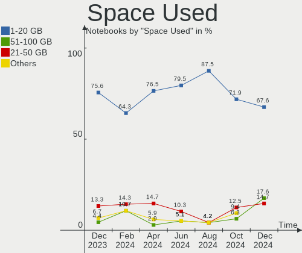
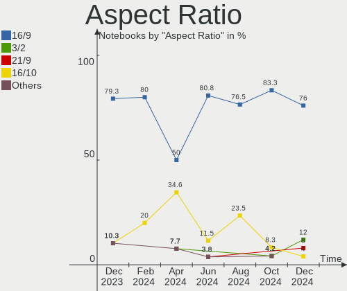
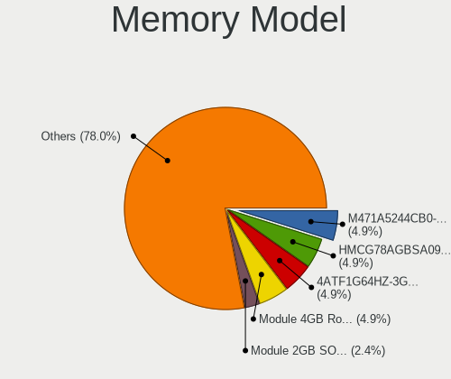

FreeBSD Hardware Trends (Notebook)
----------------------------------

A project to identify most popular hardware characteristics and track their change
over time based on data collected by FreeBSD users at https://BSD-Hardware.info.

Anyone can contribute to the study by uploading probes of their computers by
the [hw-probe](https://github.com/linuxhw/hw-probe/blob/master/INSTALL.BSD.md) tool:

    hw-probe -all -upload

Full-feature report is available here: https://bsd-hardware.info/?view=trends&formfactor=notebook

Period: Jan, 2021.

Contents
--------

- [ OS                       ](#os)
- [ OS Family                ](#os-family)
- [ Arch                     ](#arch)
- [ DE                       ](#de)
- [ Display Server           ](#display-server)
- [ Display Manager          ](#display-manager)
- [ OS Lang                  ](#os-lang)
- [ Boot Mode                ](#boot-mode)
- [ Filesystem               ](#filesystem)
- [ Part. scheme             ](#part-scheme)
- [ Country                  ](#country)
- [ City                     ](#city)
- [ Vendor                   ](#vendor)
- [ Model                    ](#model)
- [ Model Family             ](#model-family)
- [ MFG Year                 ](#mfg-year)
- [ Form Factor              ](#form-factor)
- [ Coreboot                 ](#coreboot)
- [ RAM Size                 ](#ram-size)
- [ RAM Used                 ](#ram-used)
- [ Has CD-ROM               ](#has-cd-rom)
- [ Total Drives             ](#total-drives)
- [ Has Ethernet             ](#has-ethernet)
- [ Drive Vendor             ](#drive-vendor)
- [ Drive Model              ](#drive-model)
- [ HDD Vendor               ](#hdd-vendor)
- [ SSD Vendor               ](#ssd-vendor)
- [ Drive Kind               ](#drive-kind)
- [ Drive Connector          ](#drive-connector)
- [ Drive Size               ](#drive-size)
- [ Space Total              ](#space-total)
- [ Space Used               ](#space-used)
- [ Malfunc. Drives          ](#malfunc-drives)
- [ Malfunc. Drive Vendor    ](#malfunc-drive-vendor)
- [ Malfunc. HDD Vendor      ](#malfunc-hdd-vendor)
- [ Malfunc. Drive Kind      ](#malfunc-drive-kind)
- [ Failed Drives            ](#failed-drives)
- [ Failed Drive Vendor      ](#failed-drive-vendor)
- [ Drive Status             ](#drive-status)
- [ Storage Vendor           ](#storage-vendor)
- [ Storage Model            ](#storage-model)
- [ Storage Kind             ](#storage-kind)
- [ CPU Vendor               ](#cpu-vendor)
- [ CPU Model                ](#cpu-model)
- [ CPU Model Family         ](#cpu-model-family)
- [ CPU Cores                ](#cpu-cores)
- [ CPU Sockets              ](#cpu-sockets)
- [ CPU Threads              ](#cpu-threads)
- [ CPU Microarch            ](#cpu-microarch)
- [ GPU Vendor               ](#gpu-vendor)
- [ GPU Model                ](#gpu-model)
- [ GPU Combo                ](#gpu-combo)
- [ GPU Driver               ](#gpu-driver)
- [ GPU Memory               ](#gpu-memory)
- [ Monitor Vendor           ](#monitor-vendor)
- [ Monitor Model            ](#monitor-model)
- [ Monitor Resolution       ](#monitor-resolution)
- [ Monitor Diagonal         ](#monitor-diagonal)
- [ Monitor Width            ](#monitor-width)
- [ Aspect Ratio             ](#aspect-ratio)
- [ Monitor Area             ](#monitor-area)
- [ Pixel Density            ](#pixel-density)
- [ Multiple Monitors        ](#multiple-monitors)
- [ Net Controller Vendor    ](#net-controller-vendor)
- [ Net Controller Model     ](#net-controller-model)
- [ Wireless Vendor          ](#wireless-vendor)
- [ Wireless Model           ](#wireless-model)
- [ Ethernet Vendor          ](#ethernet-vendor)
- [ Ethernet Model           ](#ethernet-model)
- [ Net Controller Kind      ](#net-controller-kind)
- [ Used Controller          ](#used-controller)
- [ NICs                     ](#nics)
- [ Memory Vendor            ](#memory-vendor)
- [ Memory Model             ](#memory-model)
- [ Memory Kind              ](#memory-kind)
- [ Memory Form Factor       ](#memory-form-factor)
- [ Memory Size              ](#memory-size)
- [ Memory Speed             ](#memory-speed)
- [ Sound Vendor             ](#sound-vendor)
- [ Sound Model              ](#sound-model)
- [ Camera Vendor            ](#camera-vendor)
- [ Camera Model             ](#camera-model)
- [ Fingerprint Vendor       ](#fingerprint-vendor)
- [ Fingerprint Model        ](#fingerprint-model)
- [ Chipcard Vendor          ](#chipcard-vendor)
- [ Chipcard Model           ](#chipcard-model)
- [ Printer Vendor           ](#printer-vendor)
- [ Printer Model            ](#printer-model)
- [ Scanner Vendor           ](#scanner-vendor)
- [ Scanner Model            ](#scanner-model)
- [ Bluetooth Vendor         ](#bluetooth-vendor)
- [ Bluetooth Model          ](#bluetooth-model)
- [ Unsupported Devices      ](#unsupported-devices)
- [ Unsupported Device Types ](#unsupported-device-types)

OS
--

Installed operating systems

| Name                 | Notebooks | Percent |
|----------------------|-----------|---------|
| FreeBSD 12.2-p2      | 15        | 41.67%  |
| FreeBSD 12.2         | 8         | 22.22%  |
| FreeBSD 12.2-p3      | 3         | 8.33%   |
| FreeBSD 12.2-STABLE  | 2         | 5.56%   |
| FreeBSD 12.1-p12     | 2         | 5.56%   |
| FreeBSD 14.0-CURRENT | 1         | 2.78%   |
| FreeBSD 13.0-CURRENT | 1         | 2.78%   |
| FreeBSD 12.1-p10     | 1         | 2.78%   |
| FreeBSD 12.1         | 1         | 2.78%   |
| FreeBSD 11.4-STABLE  | 1         | 2.78%   |
| FreeBSD 11.4-p6      | 1         | 2.78%   |

OS Family
---------

OS without a version

| Name    | Notebooks | Percent |
|---------|-----------|---------|
| FreeBSD | 36        | 100%    |

Arch
----

OS architecture (x86_64, i586, etc.)

| Name  | Notebooks | Percent |
|-------|-----------|---------|
| amd64 | 34        | 94.44%  |
| i386  | 2         | 5.56%   |

DE
--

Desktop Environment

| Name    | Notebooks | Percent |
|---------|-----------|---------|
| KDE5    | 11        | 30.56%  |
| XFCE    | 8         | 22.22%  |
| MATE    | 4         | 11.11%  |
| Console | 4         | 11.11%  |
| TWM     | 3         | 8.33%   |
| i3      | 2         | 5.56%   |
| GNOME   | 2         | 5.56%   |
| Openbox | 1         | 2.78%   |
| LXDE    | 1         | 2.78%   |

Display Server
--------------

X11 or Wayland

| Name    | Notebooks | Percent |
|---------|-----------|---------|
| X11     | 31        | 86.11%  |
| Console | 5         | 13.89%  |

Display Manager
---------------

SDDM, LightDM, etc.

| Name    | Notebooks | Percent |
|---------|-----------|---------|
| Console | 12        | 33.33%  |
| SDDM    | 9         | 25%     |
| LightDM | 6         | 16.67%  |
| XDM     | 4         | 11.11%  |
| SLiM    | 4         | 11.11%  |
| GDM     | 1         | 2.78%   |

OS Lang
-------

Language

| Lang           | Notebooks | Percent |
|----------------|-----------|---------|
| Unknown        | 20        | 55.56%  |
| en_US          | 5         | 13.89%  |
| en_GB          | 2         | 5.56%   |
| C              | 2         | 5.56%   |
| zh_CN          | 1         | 2.78%   |
| ru_RU          | 1         | 2.78%   |
| fr_FR          | 1         | 2.78%   |
| en_US.US-ASCII | 1         | 2.78%   |
| en_NZ.US-ASCII | 1         | 2.78%   |
| de_DE          | 1         | 2.78%   |
| de_AT          | 1         | 2.78%   |

Boot Mode
---------

EFI or BIOS

| Mode | Notebooks | Percent |
|------|-----------|---------|
| EFI  | 22        | 61.11%  |
| BIOS | 14        | 38.89%  |

Filesystem
----------

Type of filesystem

| Type | Notebooks | Percent |
|------|-----------|---------|
| Zfs  | 19        | 52.78%  |
| Ufs  | 17        | 47.22%  |

Part. scheme
------------

Scheme of partitioning

| Type | Notebooks | Percent |
|------|-----------|---------|
| GPT  | 33        | 91.67%  |
| MBR  | 3         | 8.33%   |

Country
-------

Geographic location (country)

| Country        | Notebooks | Percent |
|----------------|-----------|---------|
| USA            | 8         | 22.22%  |
| Germany        | 7         | 19.44%  |
| UK             | 2         | 5.56%   |
| Japan          | 2         | 5.56%   |
| Czech Republic | 2         | 5.56%   |
| Canada         | 2         | 5.56%   |
| Austria        | 2         | 5.56%   |
| Ukraine        | 1         | 2.78%   |
| Thailand       | 1         | 2.78%   |
| Switzerland    | 1         | 2.78%   |
| New Zealand    | 1         | 2.78%   |
| Netherlands    | 1         | 2.78%   |
| Lithuania      | 1         | 2.78%   |
| Italy          | 1         | 2.78%   |
| France         | 1         | 2.78%   |
| China          | 1         | 2.78%   |
| Australia      | 1         | 2.78%   |
| Argentina      | 1         | 2.78%   |

City
----

Geographic location (city)

| City               | Notebooks | Percent |
|--------------------|-----------|---------|
| The Bronx          | 2         | 5.56%   |
| Lübeck            | 2         | 5.56%   |
| Glasgow            | 2         | 5.56%   |
| Šiauliai          | 1         | 2.78%   |
| Warrensburg        | 1         | 2.78%   |
| Tucson             | 1         | 2.78%   |
| Tokyo              | 1         | 2.78%   |
| Sumida             | 1         | 2.78%   |
| Prague             | 1         | 2.78%   |
| Perth              | 1         | 2.78%   |
| Oceanside          | 1         | 2.78%   |
| Oberkirch          | 1         | 2.78%   |
| Nueve de Julio     | 1         | 2.78%   |
| Montreal           | 1         | 2.78%   |
| Mont-Saint-Hilaire | 1         | 2.78%   |
| Milan              | 1         | 2.78%   |
| Metzingen          | 1         | 2.78%   |
| Mars               | 1         | 2.78%   |
| Markt Indersdorf   | 1         | 2.78%   |
| Lawrence           | 1         | 2.78%   |
| Kyiv               | 1         | 2.78%   |
| Koblenz            | 1         | 2.78%   |
| Innsbruck          | 1         | 2.78%   |
| Hillsboro          | 1         | 2.78%   |
| Guangzhou          | 1         | 2.78%   |
| Groningen          | 1         | 2.78%   |
| Graz               | 1         | 2.78%   |
| Christchurch       | 1         | 2.78%   |
| Cholet             | 1         | 2.78%   |
| Brno               | 1         | 2.78%   |
| Besigheim          | 1         | 2.78%   |
| Bangkok            | 1         | 2.78%   |
| Adliswil           | 1         | 2.78%   |

Vendor
------

Motherboard manufacturer

| Name                           | Notebooks | Percent |
|--------------------------------|-----------|---------|
| Lenovo                         | 12        | 33.33%  |
| Dell                           | 5         | 13.89%  |
| Hewlett-Packard                | 4         | 11.11%  |
| Acer                           | 3         | 8.33%   |
| Toshiba                        | 2         | 5.56%   |
| Apple                          | 2         | 5.56%   |
| TUXEDO                         | 1         | 2.78%   |
| System76                       | 1         | 2.78%   |
| Sony                           | 1         | 2.78%   |
| Matsushita Electric Industrial | 1         | 2.78%   |
| Fujitsu                        | 1         | 2.78%   |
| Clevo                          | 1         | 2.78%   |
| BANGHO                         | 1         | 2.78%   |
| Alienware                      | 1         | 2.78%   |

Model
-----

Motherboard model

| Name                                       | Notebooks | Percent |
|--------------------------------------------|-----------|---------|
| TUXEDO Pulse 14 Gen1                       | 1         | 2.78%   |
| Toshiba Satellite L50-C                    | 1         | 2.78%   |
| Toshiba KIRA                               | 1         | 2.78%   |
| System76 Bonobo Extreme                    | 1         | 2.78%   |
| Sony VGN-FW290J                            | 1         | 2.78%   |
| Matsushita Electric Industrial CF-T2BW1AXR | 1         | 2.78%   |
| Lenovo ThinkPad X270 20HMCTO1WW            | 1         | 2.78%   |
| Lenovo ThinkPad X230 Tablet 34383C8        | 1         | 2.78%   |
| Lenovo ThinkPad X220 4286CTO               | 1         | 2.78%   |
| Lenovo ThinkPad X201 3626HMG               | 1         | 2.78%   |
| Lenovo ThinkPad T570 20HAS0DP00            | 1         | 2.78%   |
| Lenovo ThinkPad T520 4239CTO               | 1         | 2.78%   |
| Lenovo ThinkPad T490 20N2CTO1WW            | 1         | 2.78%   |
| Lenovo ThinkPad SL510 2847Q9G              | 1         | 2.78%   |
| Lenovo ThinkPad P50 20EQS0U60C             | 1         | 2.78%   |
| Lenovo ThinkPad E590 20NB005MUS            | 1         | 2.78%   |
| Lenovo ThinkPad E490 20N8CTO1WW            | 1         | 2.78%   |
| Lenovo 41875PG                             | 1         | 2.78%   |
| HP ZBook 17 G4                             | 1         | 2.78%   |
| HP Laptop 17-ca1xxx                        | 1         | 2.78%   |
| HP EliteBook 840 G3                        | 1         | 2.78%   |
| HP EliteBook 2530p                         | 1         | 2.78%   |
| Fujitsu LIFEBOOK E753                      | 1         | 2.78%   |
| Dell Vostro V131                           | 1         | 2.78%   |
| Dell Vostro 1510                           | 1         | 2.78%   |
| Dell Latitude E7240                        | 1         | 2.78%   |
| Dell Latitude 7480                         | 1         | 2.78%   |
| Dell Inspiron 5521                         | 1         | 2.78%   |
| Clevo W55xEU                               | 1         | 2.78%   |
| BANGHO MAX G5 i1                           | 1         | 2.78%   |
| Apple MacBookPro11,4                       | 1         | 2.78%   |
| Apple MacBook4,1                           | 1         | 2.78%   |
| Alienware 14                               | 1         | 2.78%   |
| Acer Aspire V5-531                         | 1         | 2.78%   |
| Acer Aspire E5-521                         | 1         | 2.78%   |
| Acer Aspire 5515                           | 1         | 2.78%   |

Model Family
------------

Motherboard model prefix

| Name                                       | Notebooks | Percent |
|--------------------------------------------|-----------|---------|
| Lenovo ThinkPad                            | 11        | 30.56%  |
| Acer Aspire                                | 3         | 8.33%   |
| HP EliteBook                               | 2         | 5.56%   |
| Dell Vostro                                | 2         | 5.56%   |
| Dell Latitude                              | 2         | 5.56%   |
| TUXEDO Pulse                               | 1         | 2.78%   |
| Toshiba Satellite                          | 1         | 2.78%   |
| Toshiba KIRA                               | 1         | 2.78%   |
| System76 Bonobo                            | 1         | 2.78%   |
| Sony VGN-FW290J                            | 1         | 2.78%   |
| Matsushita Electric Industrial CF-T2BW1AXR | 1         | 2.78%   |
| Lenovo 41875PG                             | 1         | 2.78%   |
| HP ZBook                                   | 1         | 2.78%   |
| HP Laptop                                  | 1         | 2.78%   |
| Fujitsu LIFEBOOK                           | 1         | 2.78%   |
| Dell Inspiron                              | 1         | 2.78%   |
| Clevo W55xEU                               | 1         | 2.78%   |
| BANGHO MAX                                 | 1         | 2.78%   |
| Apple MacBookPro11                         | 1         | 2.78%   |
| Apple MacBook4                             | 1         | 2.78%   |
| Alienware 14                               | 1         | 2.78%   |

MFG Year
--------

Motherboard manufacture year

| Year | Notebooks | Percent |
|------|-----------|---------|
| 2020 | 6         | 16.67%  |
| 2019 | 6         | 16.67%  |
| 2017 | 3         | 8.33%   |
| 2012 | 3         | 8.33%   |
| 2010 | 3         | 8.33%   |
| 2018 | 2         | 5.56%   |
| 2016 | 2         | 5.56%   |
| 2015 | 2         | 5.56%   |
| 2013 | 2         | 5.56%   |
| 2009 | 2         | 5.56%   |
| 2008 | 2         | 5.56%   |
| 2014 | 1         | 2.78%   |
| 2011 | 1         | 2.78%   |
| 2003 | 1         | 2.78%   |

Form Factor
-----------

Physical design of the computer

| Name     | Notebooks | Percent |
|----------|-----------|---------|
| Notebook | 36        | 100%    |

Coreboot
--------

Have coreboot on board

| Used | Notebooks | Percent |
|------|-----------|---------|
| No   | 36        | 100%    |

RAM Size
--------

Total RAM memory

| Size in GB | Notebooks | Percent |
|------------|-----------|---------|
| 16.01-24.0 | 10        | 27.78%  |
| 8.01-16.0  | 10        | 27.78%  |
| 32.01-64.0 | 5         | 13.89%  |
| 4.01-8.0   | 4         | 11.11%  |
| 3.01-4.0   | 3         | 8.33%   |
| 2.01-3.0   | 2         | 5.56%   |
| 24.01-32.0 | 1         | 2.78%   |
| 1.01-2.0   | 1         | 2.78%   |

RAM Used
--------

Used RAM memory

| Used GB  | Notebooks | Percent |
|----------|-----------|---------|
| 0.01-0.5 | 15        | 41.67%  |
| 0.51-1.0 | 13        | 36.11%  |
| 1.01-2.0 | 6         | 16.67%  |
| 4.01-8.0 | 1         | 2.78%   |
| 2.01-3.0 | 1         | 2.78%   |

Has CD-ROM
----------

Has CD-ROM on board

| Presented | Notebooks | Percent |
|-----------|-----------|---------|
| No        | 23        | 63.89%  |
| Yes       | 13        | 36.11%  |

Total Drives
------------

Number of drives on board

| Drives | Notebooks | Percent |
|--------|-----------|---------|
| 1      | 31        | 86.11%  |
| 3      | 2         | 5.56%   |
| 4      | 1         | 2.78%   |
| 2      | 1         | 2.78%   |
| 0      | 1         | 2.78%   |

Has Ethernet
------------

Has Ethernet on board

| Presented | Notebooks | Percent |
|-----------|-----------|---------|
| Yes       | 35        | 97.22%  |
| No        | 1         | 2.78%   |

Drive Vendor
------------

Hard drive vendors

| Vendor              | Notebooks | Drives | Percent |
|---------------------|-----------|--------|---------|
| Samsung Electronics | 10        | 11     | 23.81%  |
| WDC                 | 4         | 4      | 9.52%   |
| Toshiba             | 4         | 4      | 9.52%   |
| Seagate             | 2         | 2      | 4.76%   |
| SanDisk             | 2         | 2      | 4.76%   |
| Hitachi             | 2         | 2      | 4.76%   |
| HGST                | 2         | 3      | 4.76%   |
| Fujitsu             | 2         | 2      | 4.76%   |
| Crucial             | 2         | 2      | 4.76%   |
| Transcend           | 1         | 1      | 2.38%   |
| Team                | 1         | 1      | 2.38%   |
| SMI                 | 1         | 1      | 2.38%   |
| PNY                 | 1         | 1      | 2.38%   |
| LITEONIT            | 1         | 1      | 2.38%   |
| KIOXIA              | 1         | 1      | 2.38%   |
| Kingston            | 1         | 1      | 2.38%   |
| KingSpec            | 1         | 1      | 2.38%   |
| Intel               | 1         | 1      | 2.38%   |
| EMTEC               | 1         | 1      | 2.38%   |
| China               | 1         | 1      | 2.38%   |
| Apple               | 1         | 1      | 2.38%   |

Drive Model
-----------

Hard drive models

| Model                                | Notebooks | Percent |
|--------------------------------------|-----------|---------|
| WDC WD7500BPKX-75HPJT0 752GB         | 1         | 2.38%   |
| WDC WD1600BEVT-22ZCT0 160GB          | 1         | 2.38%   |
| WDC WD10JPVX-22JC3T0 1TB             | 1         | 2.38%   |
| WDC PC SN720 SDAQNTW-512G-1001 512GB | 1         | 2.38%   |
| Transcend TS120GMTS820S 120GB        | 1         | 2.38%   |
| Toshiba THNSNF256GMCS 256GB          | 1         | 2.38%   |
| Toshiba MQ01ABF050 500GB             | 1         | 2.38%   |
| Toshiba MQ01ABD075 752GB             | 1         | 2.38%   |
| Toshiba KBG30ZMT512G 512GB           | 1         | 2.38%   |
| Team T253X2512G 512GB                | 1         | 2.38%   |
| SMI SSD DISK 506GB                   | 1         | 2.38%   |
| Seagate ST9500420AS 500GB            | 1         | 2.38%   |
| Seagate ST1000LM024 HN-M101MBB 1TB   | 1         | 2.38%   |
| SanDisk X400 M.2 2280 256GB          | 1         | 2.38%   |
| SanDisk SD7TB3Q-128G-1006 128GB      | 1         | 2.38%   |
| Samsung SSD 860 EVO 500GB            | 1         | 2.38%   |
| Samsung SSD 860 EVO 250GB            | 1         | 2.38%   |
| Samsung SSD 850 PRO 512GB            | 1         | 2.38%   |
| Samsung SSD 850 PRO 256GB            | 1         | 2.38%   |
| Samsung SSD 850 EVO 1TB              | 1         | 2.38%   |
| Samsung SSD 840 EVO 500GB            | 1         | 2.38%   |
| Samsung SSD 840 EVO 120GB            | 1         | 2.38%   |
| Samsung MZVLW256HEHP-000L7 256GB     | 1         | 2.38%   |
| Samsung MZVKW512HMJP-000H1 512GB     | 1         | 2.38%   |
| Samsung MZNLN256HCHP-000L7 256GB     | 1         | 2.38%   |
| PNY SSD2SC120G1CS1754D117-551 120GB  | 1         | 2.38%   |
| LITEONIT LMT-128M6M mSATA 128GB      | 1         | 2.38%   |
| KIOXIA KBG40ZNV512G 512GB            | 1         | 2.38%   |
| Kingston SUV500MS120G 120GB          | 1         | 2.38%   |
| KingSpec NT-256 256GB                | 1         | 2.38%   |
| Intel SSDMCEAW120A4 120GB            | 1         | 2.38%   |
| Hitachi HTS545032B9A300 320GB        | 1         | 2.38%   |
| Hitachi HTS543216L9SA00 160GB        | 1         | 2.38%   |
| HGST HTS721010A9E630 1TB             | 1         | 2.38%   |
| HGST HTS545050A7E680 500GB           | 1         | 2.38%   |
| Fujitsu MJA2250BH G2 250GB           | 1         | 2.38%   |
| Fujitsu MHS2040AT D 40GB             | 1         | 2.38%   |
| EMTEC X250 512GB                     | 1         | 2.38%   |
| Crucial CT250MX500SSD1 250GB         | 1         | 2.38%   |
| Crucial CT2000MX500SSD1 2TB          | 1         | 2.38%   |
| China 256GB QLC SATA SSD             | 1         | 2.38%   |
| Apple SSD SM1024G 1TB                | 1         | 2.38%   |

HDD Vendor
----------

Hard disk drive vendors

| Vendor  | Notebooks | Drives | Percent |
|---------|-----------|--------|---------|
| WDC     | 3         | 3      | 23.08%  |
| Toshiba | 2         | 2      | 15.38%  |
| Seagate | 2         | 2      | 15.38%  |
| Hitachi | 2         | 2      | 15.38%  |
| HGST    | 2         | 3      | 15.38%  |
| Fujitsu | 2         | 2      | 15.38%  |

SSD Vendor
----------

Solid state drive vendors

| Vendor              | Notebooks | Drives | Percent |
|---------------------|-----------|--------|---------|
| Samsung Electronics | 8         | 9      | 33.33%  |
| SanDisk             | 2         | 2      | 8.33%   |
| Crucial             | 2         | 2      | 8.33%   |
| Transcend           | 1         | 1      | 4.17%   |
| Toshiba             | 1         | 1      | 4.17%   |
| Team                | 1         | 1      | 4.17%   |
| SMI                 | 1         | 1      | 4.17%   |
| PNY                 | 1         | 1      | 4.17%   |
| LITEONIT            | 1         | 1      | 4.17%   |
| Kingston            | 1         | 1      | 4.17%   |
| KingSpec            | 1         | 1      | 4.17%   |
| Intel               | 1         | 1      | 4.17%   |
| EMTEC               | 1         | 1      | 4.17%   |
| China               | 1         | 1      | 4.17%   |
| Apple               | 1         | 1      | 4.17%   |

Drive Kind
----------

HDD or SSD

| Kind | Notebooks | Drives | Percent |
|------|-----------|--------|---------|
| SSD  | 21        | 25     | 55.26%  |
| HDD  | 12        | 14     | 31.58%  |
| NVMe | 5         | 5      | 13.16%  |

Drive Connector
---------------

SATA, SAS, NVMe, etc.

| Type | Notebooks | Drives | Percent |
|------|-----------|--------|---------|
| SATA | 31        | 39     | 86.11%  |
| NVMe | 5         | 5      | 13.89%  |

Drive Size
----------

Size of hard drive

| Size in TB | Notebooks | Drives | Percent |
|------------|-----------|--------|---------|
| 0.01-0.5   | 22        | 26     | 66.67%  |
| 0.51-1.0   | 10        | 12     | 30.3%   |
| 1.01-2.0   | 1         | 1      | 3.03%   |

Space Total
-----------

Amount of disk space available on the file system

| Size in GB | Notebooks | Percent |
|------------|-----------|---------|
| 101-250    | 15        | 41.67%  |
| 251-500    | 11        | 30.56%  |
| 501-1000   | 6         | 16.67%  |
| 21-50      | 2         | 5.56%   |
| 51-100     | 2         | 5.56%   |

Space Used
----------

Amount of used disk space

| Used GB  | Notebooks | Percent |
|----------|-----------|---------|
| 1-20     | 24        | 66.67%  |
| 21-50    | 5         | 13.89%  |
| 251-500  | 2         | 5.56%   |
| 101-250  | 2         | 5.56%   |
| 51-100   | 2         | 5.56%   |
| 501-1000 | 1         | 2.78%   |

Malfunc. Drives
---------------

Drive models with a malfunction

| Model                         | Notebooks | Drives | Percent |
|-------------------------------|-----------|--------|---------|
| Toshiba MQ01ABD075 752GB      | 1         | 1      | 20%     |
| SMI SSD DISK 506GB            | 1         | 1      | 20%     |
| Seagate ST9500420AS 500GB     | 1         | 1      | 20%     |
| Hitachi HTS545032B9A300 320GB | 1         | 1      | 20%     |
| Fujitsu MHS2040AT D 40GB      | 1         | 1      | 20%     |

Malfunc. Drive Vendor
---------------------

Vendors of faulty drives

| Vendor  | Notebooks | Drives | Percent |
|---------|-----------|--------|---------|
| Toshiba | 1         | 1      | 20%     |
| SMI     | 1         | 1      | 20%     |
| Seagate | 1         | 1      | 20%     |
| Hitachi | 1         | 1      | 20%     |
| Fujitsu | 1         | 1      | 20%     |

Malfunc. HDD Vendor
-------------------

Vendors of faulty HDD drives

| Vendor  | Notebooks | Drives | Percent |
|---------|-----------|--------|---------|
| Toshiba | 1         | 1      | 25%     |
| Seagate | 1         | 1      | 25%     |
| Hitachi | 1         | 1      | 25%     |
| Fujitsu | 1         | 1      | 25%     |

Malfunc. Drive Kind
-------------------

Kinds of faulty drives

| Kind | Notebooks | Drives | Percent |
|------|-----------|--------|---------|
| HDD  | 4         | 4      | 80%     |
| SSD  | 1         | 1      | 20%     |

Failed Drives
-------------

Failed drive models

Zero info for selected period =(

Failed Drive Vendor
-------------------

Failed drive vendors

Zero info for selected period =(

Drive Status
------------

Number of failed and malfunc. drives

| Status   | Notebooks | Drives | Percent |
|----------|-----------|--------|---------|
| Works    | 32        | 38     | 84.21%  |
| Malfunc  | 5         | 5      | 13.16%  |
| Detected | 1         | 1      | 2.63%   |

Storage Vendor
--------------

Storage controller vendors

| Vendor              | Notebooks | Percent |
|---------------------|-----------|---------|
| Intel               | 28        | 75.68%  |
| Samsung Electronics | 3         | 8.11%   |
| AMD                 | 3         | 8.11%   |
| Toshiba             | 1         | 2.7%    |
| Sandisk             | 1         | 2.7%    |
| KIOXIA              | 1         | 2.7%    |

Storage Model
-------------

Storage controller models

| Model                                                                            | Notebooks | Percent |
|----------------------------------------------------------------------------------|-----------|---------|
| Intel 7 Series Chipset Family 6-port SATA Controller [AHCI mode]                 | 5         | 11.63%  |
| Intel Sunrise Point-LP SATA Controller [AHCI mode]                               | 3         | 6.98%   |
| Intel 82801IBM/IEM (ICH9M/ICH9M-E) 4 port SATA Controller [AHCI mode]            | 3         | 6.98%   |
| Intel 6 Series/C200 Series Chipset Family 6 port Mobile SATA AHCI Controller     | 3         | 6.98%   |
| Samsung NVMe SSD Controller SM961/PM961/SM963                                    | 2         | 4.65%   |
| Intel Q170/Q150/B150/H170/H110/Z170/CM236 Chipset SATA Controller [AHCI Mode]    | 2         | 4.65%   |
| Intel 82801HM/HEM (ICH8M/ICH8M-E) SATA Controller [AHCI mode]                    | 2         | 4.65%   |
| Intel 82801HM/HEM (ICH8M/ICH8M-E) IDE Controller                                 | 2         | 4.65%   |
| AMD FCH SATA Controller [AHCI mode]                                              | 2         | 4.65%   |
| Toshiba BG3 NVMe SSD Controller                                                  | 1         | 2.33%   |
| Sandisk WD Black 2018 / PC SN720 NVMe SSD                                        | 1         | 2.33%   |
| Samsung SM951 AHCI                                                               | 1         | 2.33%   |
| Intel Mobile 4 Series Chipset PT IDER Controller                                 | 1         | 2.33%   |
| Intel Celeron N3350/Pentium N4200/Atom E3900 Series SATA AHCI Controller         | 1         | 2.33%   |
| Intel Cannon Point-LP SATA Controller [AHCI Mode]                                | 1         | 2.33%   |
| Intel Atom/Celeron/Pentium Processor x5-E8000/J3xxx/N3xxx Series SATA Controller | 1         | 2.33%   |
| Intel 82801GBM/GHM (ICH7-M Family) SATA Controller [IDE mode]                    | 1         | 2.33%   |
| Intel 82801G (ICH7 Family) IDE Controller                                        | 1         | 2.33%   |
| Intel 82801DBM (ICH4-M) IDE Controller                                           | 1         | 2.33%   |
| Intel 82801 Mobile SATA Controller [RAID mode]                                   | 1         | 2.33%   |
| Intel 8 Series/C220 Series Chipset Family 6-port SATA Controller 1 [AHCI mode]   | 1         | 2.33%   |
| Intel 8 Series SATA Controller 1 [AHCI mode]                                     | 1         | 2.33%   |
| Intel 7 Series Chipset Family 4-port SATA Controller [IDE mode]                  | 1         | 2.33%   |
| Intel 7 Series Chipset Family 2-port SATA Controller [IDE mode]                  | 1         | 2.33%   |
| Intel 5 Series/3400 Series Chipset 6 port SATA AHCI Controller                   | 1         | 2.33%   |
| AMD SB600 Non-Raid-5 SATA                                                        | 1         | 2.33%   |
| AMD SB600 IDE                                                                    | 1         | 2.33%   |
| Unknown                                                                          | 1         | 2.33%   |

Storage Kind
------------

Kind of storage controller (IDE, SATA, NVMe, SAS, ...)

| Kind | Notebooks | Percent |
|------|-----------|---------|
| SATA | 27        | 67.5%   |
| IDE  | 7         | 17.5%   |
| NVMe | 5         | 12.5%   |
| RAID | 1         | 2.5%    |

CPU Vendor
----------

Processor vendors

| Vendor | Notebooks | Percent |
|--------|-----------|---------|
| Intel  | 32        | 88.89%  |
| AMD    | 4         | 11.11%  |

CPU Model
---------

Processor models

| Model                                         | Notebooks | Percent |
|-----------------------------------------------|-----------|---------|
| Intel CPU Version                             | 3         | 8.33%   |
| Intel Core i7-8565U CPU @ 1.80GHz             | 2         | 5.56%   |
| Intel Core i5-7200U CPU @ 2.50GHz             | 2         | 5.56%   |
| Intel Pentium M processor 1000MHz             | 1         | 2.78%   |
| Intel Pentium Dual CPU T3200 @ 2.00GHz        | 1         | 2.78%   |
| Intel Pentium CPU N3700 @ 1.60GHz             | 1         | 2.78%   |
| Intel Pentium CPU 967 @ 1.30GHz               | 1         | 2.78%   |
| Intel Core i7-7700HQ CPU @ 2.80GHz            | 1         | 2.78%   |
| Intel Core i7-6820HQ CPU @ 2.70GHz            | 1         | 2.78%   |
| Intel Core i7-4980HQ CPU @ 2.80GHz            | 1         | 2.78%   |
| Intel Core i7-4900MQ CPU @ 2.80GHz            | 1         | 2.78%   |
| Intel Core i7-4700MQ CPU @ 2.40GHz            | 1         | 2.78%   |
| Intel Core i7-3632QM CPU @ 2.20GHz            | 1         | 2.78%   |
| Intel Core i7-3537U CPU @ 2.00GHz             | 1         | 2.78%   |
| Intel Core i7-2760QM CPU @ 2.40GHz            | 1         | 2.78%   |
| Intel Core i5-8265U CPU @ 1.60GHz             | 1         | 2.78%   |
| Intel Core i5-7300U CPU @ 2.60GHz             | 1         | 2.78%   |
| Intel Core i5-6300U CPU @ 2.40GHz             | 1         | 2.78%   |
| Intel Core i5-4300U CPU @ 1.90GHz             | 1         | 2.78%   |
| Intel Core i5-3337U CPU @ 1.80GHz             | 1         | 2.78%   |
| Intel Core i5-3320M CPU @ 2.60GHz             | 1         | 2.78%   |
| Intel Core i5-3230M CPU @ 2.60GHz             | 1         | 2.78%   |
| Intel Core i5-2430M CPU @ 2.40GHz             | 1         | 2.78%   |
| Intel Core i5 CPU M 520 @ 2.40GHz             | 1         | 2.78%   |
| Intel Core 2 Duo CPU T8300 @ 2.40GHz          | 1         | 2.78%   |
| Intel Core 2 Duo CPU L9400 @ 1.86GHz          | 1         | 2.78%   |
| Intel Celeron CPU N3350 @ 1.10GHz             | 1         | 2.78%   |
| Intel Celeron CPU 867 @ 1.30GHz               | 1         | 2.78%   |
| AMD Ryzen 7 4800H with Radeon Graphics        | 1         | 2.78%   |
| AMD Ryzen 5 3500U with Radeon Vega Mobile Gfx | 1         | 2.78%   |
| AMD New Processor Technology                  | 1         | 2.78%   |
| AMD E2-6110 APU with AMD Radeon R2 Graphics   | 1         | 2.78%   |

CPU Model Family
----------------

Processor model prefix

| Model              | Notebooks | Percent |
|--------------------|-----------|---------|
| Intel Core i5      | 11        | 30.56%  |
| Intel Core i7      | 10        | 27.78%  |
| Other              | 4         | 11.11%  |
| Intel Pentium      | 2         | 5.56%   |
| Intel Core 2 Duo   | 2         | 5.56%   |
| Intel Celeron      | 2         | 5.56%   |
| Intel Pentium M    | 1         | 2.78%   |
| Intel Pentium Dual | 1         | 2.78%   |
| AMD Ryzen 7        | 1         | 2.78%   |
| AMD Ryzen 5        | 1         | 2.78%   |
| AMD E2             | 1         | 2.78%   |

CPU Cores
---------

Number of processor cores

| Number  | Notebooks | Percent |
|---------|-----------|---------|
| 2       | 15        | 41.67%  |
| 4       | 12        | 33.33%  |
| Unknown | 4         | 11.11%  |
| 1       | 3         | 8.33%   |
| 16      | 1         | 2.78%   |
| 8       | 1         | 2.78%   |

CPU Sockets
-----------

Number of sockets

| Number | Notebooks | Percent |
|--------|-----------|---------|
| 1      | 35        | 97.22%  |
| 2      | 1         | 2.78%   |

CPU Threads
-----------

Threads per core (Hyper-Threading)

| Number  | Notebooks | Percent |
|---------|-----------|---------|
| 2       | 22        | 61.11%  |
| 1       | 9         | 25%     |
| Unknown | 5         | 13.89%  |

CPU Microarch
-------------

Microarchitecture

| Name        | Notebooks | Percent |
|-------------|-----------|---------|
| KabyLake    | 7         | 19.44%  |
| IvyBridge   | 5         | 13.89%  |
| SandyBridge | 4         | 11.11%  |
| Haswell     | 4         | 11.11%  |
| Penryn      | 3         | 8.33%   |
| Skylake     | 2         | 5.56%   |
| Core        | 2         | 5.56%   |
| Zen+        | 1         | 2.78%   |
| Zen 2       | 1         | 2.78%   |
| Westmere    | 1         | 2.78%   |
| Silvermont  | 1         | 2.78%   |
| Puma        | 1         | 2.78%   |
| P6          | 1         | 2.78%   |
| K8 Hammer   | 1         | 2.78%   |
| Goldmont    | 1         | 2.78%   |
| Bonnell     | 1         | 2.78%   |

GPU Vendor
----------

Vendors of graphics cards

| Vendor | Notebooks | Percent |
|--------|-----------|---------|
| Intel  | 30        | 76.92%  |
| AMD    | 5         | 12.82%  |
| Nvidia | 4         | 10.26%  |

GPU Model
---------

Graphics card models

| Model                                                                                    | Notebooks | Percent |
|------------------------------------------------------------------------------------------|-----------|---------|
| Intel 3rd Gen Core processor Graphics Controller                                         | 5         | 11.9%   |
| Intel 2nd Generation Core Processor Family Integrated Graphics Controller                | 4         | 9.52%   |
| Intel WhiskeyLake-U GT2 [UHD Graphics 620]                                               | 3         | 7.14%   |
| Intel Mobile 4 Series Chipset Integrated Graphics Controller                             | 3         | 7.14%   |
| Intel HD Graphics 620                                                                    | 3         | 7.14%   |
| Intel Mobile GM965/GL960 Integrated Graphics Controller (secondary)                      | 2         | 4.76%   |
| Intel Mobile GM965/GL960 Integrated Graphics Controller (primary)                        | 2         | 4.76%   |
| Nvidia GP104GLM [Quadro P4000 Mobile]                                                    | 1         | 2.38%   |
| Nvidia GM107GLM [Quadro M1000M]                                                          | 1         | 2.38%   |
| Nvidia GK106M [GeForce GTX 765M]                                                         | 1         | 2.38%   |
| Nvidia GK104M [GeForce GTX 780M]                                                         | 1         | 2.38%   |
| Intel Skylake GT2 [HD Graphics 520]                                                      | 1         | 2.38%   |
| Intel Mobile 945GSE Express Integrated Graphics Controller                               | 1         | 2.38%   |
| Intel Mobile 945GM/GMS/GME, 943/940GML Express Integrated Graphics Controller            | 1         | 2.38%   |
| Intel HD Graphics 530                                                                    | 1         | 2.38%   |
| Intel HD Graphics 500                                                                    | 1         | 2.38%   |
| Intel Haswell-ULT Integrated Graphics Controller                                         | 1         | 2.38%   |
| Intel Crystal Well Integrated Graphics Controller                                        | 1         | 2.38%   |
| Intel Core Processor Integrated Graphics Controller                                      | 1         | 2.38%   |
| Intel Atom/Celeron/Pentium Processor x5-E8000/J3xxx/N3xxx Integrated Graphics Controller | 1         | 2.38%   |
| Intel 82852/855GM Integrated Graphics Device                                             | 1         | 2.38%   |
| Intel 4th Gen Core Processor Integrated Graphics Controller                              | 1         | 2.38%   |
| AMD RS690M [Radeon Xpress 1200/1250/1270]                                                | 1         | 2.38%   |
| AMD Renoir                                                                               | 1         | 2.38%   |
| AMD Picasso                                                                              | 1         | 2.38%   |
| AMD Mullins [Radeon R2 Graphics]                                                         | 1         | 2.38%   |
| AMD Mars [Radeon HD 8730M]                                                               | 1         | 2.38%   |

GPU Combo
---------

Combinations of graphics cards

| Name           | Notebooks | Percent |
|----------------|-----------|---------|
| 1 x Intel      | 21        | 58.33%  |
| 2 x Intel      | 6         | 16.67%  |
| 1 x AMD        | 4         | 11.11%  |
| 1 x Nvidia     | 2         | 5.56%   |
| Intel + Nvidia | 2         | 5.56%   |
| Intel + AMD    | 1         | 2.78%   |

GPU Driver
----------

Free vs proprietary

| Driver      | Notebooks | Percent |
|-------------|-----------|---------|
| Free        | 32        | 88.89%  |
| Proprietary | 3         | 8.33%   |
| Unknown     | 1         | 2.78%   |

GPU Memory
----------

Total video memory

| Size in GB | Notebooks | Percent |
|------------|-----------|---------|
| Unknown    | 31        | 86.11%  |
| 1.01-2.0   | 2         | 5.56%   |
| 7.01-8.0   | 1         | 2.78%   |
| 3.01-4.0   | 1         | 2.78%   |
| 0.01-0.5   | 1         | 2.78%   |

Monitor Vendor
--------------

Monitor vendors

| Vendor                  | Notebooks | Percent |
|-------------------------|-----------|---------|
| LG Display              | 6         | 21.43%  |
| Samsung Electronics     | 5         | 17.86%  |
| AU Optronics            | 5         | 17.86%  |
| Chimei Innolux          | 2         | 7.14%   |
| Chi Mei Optoelectronics | 2         | 7.14%   |
| BOE                     | 2         | 7.14%   |
| Apple                   | 2         | 7.14%   |
| Sharp                   | 1         | 3.57%   |
| Philips                 | 1         | 3.57%   |
| Lenovo                  | 1         | 3.57%   |
| Hitachi                 | 1         | 3.57%   |

Monitor Model
-------------

Monitor models

| Model                                                                    | Notebooks | Percent |
|--------------------------------------------------------------------------|-----------|---------|
| Sharp LQ133T1JX03 SHP140F 2560x1440 290x170mm 13.2-inch                  | 1         | 3.57%   |
| Samsung Electronics LCD Monitor SEC5441 1280x800 330x210mm 15.4-inch     | 1         | 3.57%   |
| Samsung Electronics LCD Monitor SEC4541 1280x800 260x160mm 12.0-inch     | 1         | 3.57%   |
| Samsung Electronics LCD Monitor SDC4852 1366x768 340x190mm 15.3-inch     | 1         | 3.57%   |
| Samsung Electronics LCD Monitor SDC4141 1366x768 340x190mm 15.3-inch     | 1         | 3.57%   |
| Samsung Electronics CF791 SAM0DC3 3440x1440 800x330mm 34.1-inch          | 1         | 3.57%   |
| Philips LCD Monitor PHL08C3 1920x1080 600x340mm 27.2-inch                | 1         | 3.57%   |
| LG Display LCD Monitor LGD059E 1920x1080 380x210mm 17.1-inch             | 1         | 3.57%   |
| LG Display LCD Monitor LGD0541 1920x1080 340x190mm 15.3-inch             | 1         | 3.57%   |
| LG Display LCD Monitor LGD0456 1366x768 340x190mm 15.3-inch              | 1         | 3.57%   |
| LG Display LCD Monitor LGD0353 1366x768 350x190mm 15.7-inch              | 1         | 3.57%   |
| LG Display LCD Monitor LGD02D8 1366x768 280x160mm 12.7-inch              | 1         | 3.57%   |
| LG Display LCD Monitor LGD02D3 1366x768 280x160mm 12.7-inch              | 1         | 3.57%   |
| Lenovo LCD Monitor LEN4011 1280x800 260x160mm 12.0-inch                  | 1         | 3.57%   |
| Hitachi HDMI HEC0088 1920x540 1100x560mm 48.6-inch                       | 1         | 3.57%   |
| Chimei Innolux LCD Monitor CMN14F2 1920x1080 310x170mm 13.9-inch         | 1         | 3.57%   |
| Chimei Innolux LCD Monitor CMN1239 1920x1080 280x160mm 12.7-inch         | 1         | 3.57%   |
| Chi Mei Optoelectronics LCD Monitor CMO1554 1280x800 330x210mm 15.4-inch | 1         | 3.57%   |
| Chi Mei Optoelectronics LCD Monitor 1920x1080                            | 1         | 3.57%   |
| BOE LCD Monitor BOE0742 1920x1080 310x170mm 13.9-inch                    | 1         | 3.57%   |
| BOE LCD Monitor BOE0704 1366x768 340x190mm 15.3-inch                     | 1         | 3.57%   |
| AU Optronics LCD Monitor AUO45EC 1366x768 340x190mm 15.3-inch            | 1         | 3.57%   |
| AU Optronics LCD Monitor AUO333D 1920x1080 310x170mm 13.9-inch           | 1         | 3.57%   |
| AU Optronics LCD Monitor AUO31EC 1366x768 340x190mm 15.3-inch            | 1         | 3.57%   |
| AU Optronics LCD Monitor AUO123D 1920x1080 310x170mm 13.9-inch           | 1         | 3.57%   |
| AU Optronics LCD Monitor 1920x1080                                       | 1         | 3.57%   |
| Apple Color LCD APPA02E 2880x1800 330x210mm 15.4-inch                    | 1         | 3.57%   |
| Apple Color LCD APP9C5C 1280x800 290x180mm 13.4-inch                     | 1         | 3.57%   |

Monitor Resolution
------------------

Monitor screen resolution

| Resolution      | Notebooks | Percent |
|-----------------|-----------|---------|
| 1920x1080 (FHD) | 11        | 39.29%  |
| 1366x768 (WXGA) | 8         | 28.57%  |
| 1280x800 (WXGA) | 5         | 17.86%  |
| 3440x1440       | 1         | 3.57%   |
| 2880x1800       | 1         | 3.57%   |
| 2560x1440 (QHD) | 1         | 3.57%   |
| 1920x540        | 1         | 3.57%   |

Monitor Diagonal
----------------

Diagonal size in inches

| Inches  | Notebooks | Percent |
|---------|-----------|---------|
| 15      | 11        | 39.29%  |
| 13      | 6         | 21.43%  |
| 12      | 5         | 17.86%  |
| Unknown | 2         | 7.14%   |
| 48      | 1         | 3.57%   |
| 34      | 1         | 3.57%   |
| 27      | 1         | 3.57%   |
| 17      | 1         | 3.57%   |

Monitor Width
-------------

Physical width

| Width in mm | Notebooks | Percent |
|-------------|-----------|---------|
| 301-350     | 15        | 53.57%  |
| 201-300     | 7         | 25%     |
| Unknown     | 2         | 7.14%   |
| 701-800     | 1         | 3.57%   |
| 501-600     | 1         | 3.57%   |
| 351-400     | 1         | 3.57%   |
| 1001-1500   | 1         | 3.57%   |

Aspect Ratio
------------

Proportional relationship between the width and the height

| Ratio   | Notebooks | Percent |
|---------|-----------|---------|
| 16/9    | 18        | 64.29%  |
| 16/10   | 6         | 21.43%  |
| Unknown | 2         | 7.14%   |
| 21/9    | 1         | 3.57%   |
| 1.96    | 1         | 3.57%   |

Monitor Area
------------

Area in inch²

| Area in inch² | Notebooks | Percent |
|----------------|-----------|---------|
| 91-100         | 7         | 25%     |
| 81-90          | 5         | 17.86%  |
| 61-70          | 5         | 17.86%  |
| 101-110        | 4         | 14.29%  |
| Unknown        | 2         | 7.14%   |
| 71-80          | 1         | 3.57%   |
| 351-500        | 1         | 3.57%   |
| 301-350        | 1         | 3.57%   |
| 121-130        | 1         | 3.57%   |
| 501-1000       | 1         | 3.57%   |

Pixel Density
-------------

Pixels per inch

| Density | Notebooks | Percent |
|---------|-----------|---------|
| 121-160 | 10        | 35.71%  |
| 101-120 | 8         | 28.57%  |
| 51-100  | 4         | 14.29%  |
| 161-240 | 3         | 10.71%  |
| Unknown | 2         | 7.14%   |
| 1-50    | 1         | 3.57%   |

Multiple Monitors
-----------------

Total monitors connected

| Total | Notebooks | Percent |
|-------|-----------|---------|
| 1     | 24        | 66.67%  |
| 0     | 10        | 27.78%  |
| 2     | 2         | 5.56%   |

Net Controller Vendor
---------------------

Controller vendors

| Vendor                         | Notebooks | Percent |
|--------------------------------|-----------|---------|
| Intel                          | 28        | 49.12%  |
| Realtek Semiconductor          | 17        | 29.82%  |
| Qualcomm Atheros               | 4         | 7.02%   |
| Broadcom Inc. and subsidiaries | 4         | 7.02%   |
| Marvell Technology Group       | 2         | 3.51%   |
| Hewlett-Packard                | 1         | 1.75%   |
| Dell                           | 1         | 1.75%   |

Net Controller Model
--------------------

Controller models

| Model                                                                     | Notebooks | Percent |
|---------------------------------------------------------------------------|-----------|---------|
| Realtek RTL8111/8168/8411 PCI Express Gigabit Ethernet Controller         | 12        | 16.44%  |
| Intel Wireless 8265 / 8275                                                | 4         | 5.48%   |
| Intel 82579LM Gigabit Network Connection (Lewisville)                     | 4         | 5.48%   |
| Realtek RTL810xE PCI Express Fast Ethernet controller                     | 3         | 4.11%   |
| Qualcomm Atheros AR9462 Wireless Network Adapter                          | 2         | 2.74%   |
| Intel Wireless-AC 9260                                                    | 2         | 2.74%   |
| Intel Wireless 8260                                                       | 2         | 2.74%   |
| Intel Wireless 7260                                                       | 2         | 2.74%   |
| Intel Ethernet Connection (4) I219-V                                      | 2         | 2.74%   |
| Intel Ethernet Connection (2) I219-LM                                     | 2         | 2.74%   |
| Intel Centrino Advanced-N 6235                                            | 2         | 2.74%   |
| Realtek RTL8821CE 802.11ac PCIe Wireless Network Adapter                  | 1         | 1.37%   |
| Realtek RTL8188CE 802.11b/g/n WiFi Adapter                                | 1         | 1.37%   |
| Realtek RTL-8100/8101L/8139 PCI Fast Ethernet Adapter                     | 1         | 1.37%   |
| Qualcomm Atheros QCA9565 / AR9565 Wireless Network Adapter                | 1         | 1.37%   |
| Qualcomm Atheros Killer E220x Gigabit Ethernet Controller                 | 1         | 1.37%   |
| Qualcomm Atheros AR242x / AR542x Wireless Network Adapter (PCI-Express)   | 1         | 1.37%   |
| Marvell Group 88E8058 PCI-E Gigabit Ethernet Controller                   | 1         | 1.37%   |
| Marvell Group 88E8055 PCI-E Gigabit Ethernet Controller                   | 1         | 1.37%   |
| Intel Wireless 3160                                                       | 1         | 1.37%   |
| Intel WiFi Link 5100                                                      | 1         | 1.37%   |
| Intel Wi-Fi 6 AX200                                                       | 1         | 1.37%   |
| Intel PRO/Wireless 5100 AGN [Shiloh] Network Connection                   | 1         | 1.37%   |
| Intel PRO/Wireless 4965 AG or AGN [Kedron] Network Connection             | 1         | 1.37%   |
| Intel PRO/Wireless 2915ABG [Calexico2] Network Connection                 | 1         | 1.37%   |
| Intel Ethernet Connection I219-LM                                         | 1         | 1.37%   |
| Intel Ethernet Connection I218-LM                                         | 1         | 1.37%   |
| Intel Ethernet Connection (6) I219-V                                      | 1         | 1.37%   |
| Intel Ethernet Connection (4) I219-LM                                     | 1         | 1.37%   |
| Intel Dual Band Wireless-AC 3168NGW [Stone Peak]                          | 1         | 1.37%   |
| Intel Centrino Wireless-N 2230                                            | 1         | 1.37%   |
| Intel Centrino Wireless-N 135                                             | 1         | 1.37%   |
| Intel Centrino Wireless-N 1030 [Rainbow Peak]                             | 1         | 1.37%   |
| Intel Centrino Wireless-N 1000 [Condor Peak]                              | 1         | 1.37%   |
| Intel Centrino Ultimate-N 6300                                            | 1         | 1.37%   |
| Intel Centrino Advanced-N 6205 [Taylor Peak]                              | 1         | 1.37%   |
| Intel Cannon Point-LP CNVi [Wireless-AC]                                  | 1         | 1.37%   |
| Intel 82801DB/DBL/DBM (ICH4/ICH4-L/ICH4-M) AC'97 Modem Controller         | 1         | 1.37%   |
| Intel 82577LM Gigabit Network Connection                                  | 1         | 1.37%   |
| Intel 82567LM Gigabit Network Connection                                  | 1         | 1.37%   |
| HP un2400 Gobi Wireless Modem (QDL mode)                                  | 1         | 1.37%   |
| Dell Dell Wireless 5550 HSPA+ Mini-Card Network Adapter                   | 1         | 1.37%   |
| Broadcom Inc. and subsidiaries NetXtreme BCM57762 Gigabit Ethernet PCIe   | 1         | 1.37%   |
| Broadcom Inc. and subsidiaries NetLink BCM5906M Fast Ethernet PCI Express | 1         | 1.37%   |
| Broadcom Inc. and subsidiaries BCM43602 802.11ac Wireless LAN SoC         | 1         | 1.37%   |
| Broadcom Inc. and subsidiaries BCM4321 802.11a/b/g/n                      | 1         | 1.37%   |
| Broadcom Inc. and subsidiaries BCM4312 802.11b/g LP-PHY                   | 1         | 1.37%   |

Wireless Vendor
---------------

Wireless vendors

| Vendor                         | Notebooks | Percent |
|--------------------------------|-----------|---------|
| Intel                          | 26        | 72.22%  |
| Qualcomm Atheros               | 4         | 11.11%  |
| Broadcom Inc. and subsidiaries | 3         | 8.33%   |
| Realtek Semiconductor          | 2         | 5.56%   |
| Dell                           | 1         | 2.78%   |

Wireless Model
--------------

Wireless models

| Model                                                                   | Notebooks | Percent |
|-------------------------------------------------------------------------|-----------|---------|
| Intel Wireless 8265 / 8275                                              | 4         | 11.11%  |
| Qualcomm Atheros AR9462 Wireless Network Adapter                        | 2         | 5.56%   |
| Intel Wireless-AC 9260                                                  | 2         | 5.56%   |
| Intel Wireless 8260                                                     | 2         | 5.56%   |
| Intel Wireless 7260                                                     | 2         | 5.56%   |
| Intel Centrino Advanced-N 6235                                          | 2         | 5.56%   |
| Realtek RTL8821CE 802.11ac PCIe Wireless Network Adapter                | 1         | 2.78%   |
| Realtek RTL8188CE 802.11b/g/n WiFi Adapter                              | 1         | 2.78%   |
| Qualcomm Atheros QCA9565 / AR9565 Wireless Network Adapter              | 1         | 2.78%   |
| Qualcomm Atheros AR242x / AR542x Wireless Network Adapter (PCI-Express) | 1         | 2.78%   |
| Intel Wireless 3160                                                     | 1         | 2.78%   |
| Intel WiFi Link 5100                                                    | 1         | 2.78%   |
| Intel Wi-Fi 6 AX200                                                     | 1         | 2.78%   |
| Intel PRO/Wireless 5100 AGN [Shiloh] Network Connection                 | 1         | 2.78%   |
| Intel PRO/Wireless 4965 AG or AGN [Kedron] Network Connection           | 1         | 2.78%   |
| Intel PRO/Wireless 2915ABG [Calexico2] Network Connection               | 1         | 2.78%   |
| Intel Dual Band Wireless-AC 3168NGW [Stone Peak]                        | 1         | 2.78%   |
| Intel Centrino Wireless-N 2230                                          | 1         | 2.78%   |
| Intel Centrino Wireless-N 135                                           | 1         | 2.78%   |
| Intel Centrino Wireless-N 1030 [Rainbow Peak]                           | 1         | 2.78%   |
| Intel Centrino Wireless-N 1000 [Condor Peak]                            | 1         | 2.78%   |
| Intel Centrino Ultimate-N 6300                                          | 1         | 2.78%   |
| Intel Centrino Advanced-N 6205 [Taylor Peak]                            | 1         | 2.78%   |
| Intel Cannon Point-LP CNVi [Wireless-AC]                                | 1         | 2.78%   |
| Dell Dell Wireless 5550 HSPA+ Mini-Card Network Adapter                 | 1         | 2.78%   |
| Broadcom Inc. and subsidiaries BCM43602 802.11ac Wireless LAN SoC       | 1         | 2.78%   |
| Broadcom Inc. and subsidiaries BCM4321 802.11a/b/g/n                    | 1         | 2.78%   |
| Broadcom Inc. and subsidiaries BCM4312 802.11b/g LP-PHY                 | 1         | 2.78%   |

Ethernet Vendor
---------------

Ethernet vendors

| Vendor                         | Notebooks | Percent |
|--------------------------------|-----------|---------|
| Realtek Semiconductor          | 16        | 45.71%  |
| Intel                          | 14        | 40%     |
| Marvell Technology Group       | 2         | 5.71%   |
| Broadcom Inc. and subsidiaries | 2         | 5.71%   |
| Qualcomm Atheros               | 1         | 2.86%   |

Ethernet Model
--------------

Ethernet models

| Model                                                                     | Notebooks | Percent |
|---------------------------------------------------------------------------|-----------|---------|
| Realtek RTL8111/8168/8411 PCI Express Gigabit Ethernet Controller         | 12        | 34.29%  |
| Intel 82579LM Gigabit Network Connection (Lewisville)                     | 4         | 11.43%  |
| Realtek RTL810xE PCI Express Fast Ethernet controller                     | 3         | 8.57%   |
| Intel Ethernet Connection (4) I219-V                                      | 2         | 5.71%   |
| Intel Ethernet Connection (2) I219-LM                                     | 2         | 5.71%   |
| Realtek RTL-8100/8101L/8139 PCI Fast Ethernet Adapter                     | 1         | 2.86%   |
| Qualcomm Atheros Killer E220x Gigabit Ethernet Controller                 | 1         | 2.86%   |
| Marvell Group 88E8058 PCI-E Gigabit Ethernet Controller                   | 1         | 2.86%   |
| Marvell Group 88E8055 PCI-E Gigabit Ethernet Controller                   | 1         | 2.86%   |
| Intel Ethernet Connection I219-LM                                         | 1         | 2.86%   |
| Intel Ethernet Connection I218-LM                                         | 1         | 2.86%   |
| Intel Ethernet Connection (6) I219-V                                      | 1         | 2.86%   |
| Intel Ethernet Connection (4) I219-LM                                     | 1         | 2.86%   |
| Intel 82577LM Gigabit Network Connection                                  | 1         | 2.86%   |
| Intel 82567LM Gigabit Network Connection                                  | 1         | 2.86%   |
| Broadcom Inc. and subsidiaries NetXtreme BCM57762 Gigabit Ethernet PCIe   | 1         | 2.86%   |
| Broadcom Inc. and subsidiaries NetLink BCM5906M Fast Ethernet PCI Express | 1         | 2.86%   |

Net Controller Kind
-------------------

Ethernet, WiFi or modem

| Kind     | Notebooks | Percent |
|----------|-----------|---------|
| WiFi     | 35        | 48.61%  |
| Ethernet | 35        | 48.61%  |
| Modem    | 2         | 2.78%   |

Used Controller
---------------

Currently used network controller

| Kind     | Notebooks | Percent |
|----------|-----------|---------|
| Ethernet | 34        | 51.52%  |
| WiFi     | 32        | 48.48%  |

NICs
----

Total network controllers on board

| Total | Notebooks | Percent |
|-------|-----------|---------|
| 2     | 34        | 94.44%  |
| 1     | 2         | 5.56%   |

Memory Vendor
-------------

Memory module vendors

| Vendor              | Notebooks | Percent |
|---------------------|-----------|---------|
| SK Hynix            | 14        | 32.56%  |
| Samsung Electronics | 6         | 13.95%  |
| Kingston            | 6         | 13.95%  |
| Unknown             | 4         | 9.3%    |
| Micron Technology   | 4         | 9.3%    |
| Crucial             | 3         | 6.98%   |
| Team                | 2         | 4.65%   |
| Transcend           | 1         | 2.33%   |
| Ramaxel Technology  | 1         | 2.33%   |
| Corsair             | 1         | 2.33%   |
| A-DATA Technology   | 1         | 2.33%   |

Memory Model
------------

Memory module models

| Model                                                      | Notebooks | Percent |
|------------------------------------------------------------|-----------|---------|
| Unknown RAM Module 2GB SODIMM DDR2                         | 2         | 4.17%   |
| SK Hynix RAM HMT351S6CFR8C-H9 4GB SODIMM DDR3 1333MT/s     | 2         | 4.17%   |
| Unknown RAM Module 512MB SODIMM DDR2 533MT/s               | 1         | 2.08%   |
| Unknown RAM Module 2048MB SODIMM DDR2 533MT/s              | 1         | 2.08%   |
| Unknown RAM Module 1GB SODIMM DDR2                         | 1         | 2.08%   |
| Unknown RAM Module 1GB SODIMM DDR                          | 1         | 2.08%   |
| Transcend RAM TS2GSH64V1B 16GB SODIMM DDR4 2133MT/s        | 1         | 2.08%   |
| Team RAM TEAMGROUP-SD4-2400 8192MB SODIMM DDR4 2400MT/s    | 1         | 2.08%   |
| Team RAM Ind-1600 4096MB SODIMM DDR3 1600MT/s              | 1         | 2.08%   |
| SK Hynix RAM Module 8GB SODIMM DDR3 1600MT/s               | 1         | 2.08%   |
| SK Hynix RAM Module 1GB SODIMM DDR2 667MT/s                | 1         | 2.08%   |
| SK Hynix RAM HYMP125S64CP8-Y5 2GB SODIMM DDR2 667MT/s      | 1         | 2.08%   |
| SK Hynix RAM HYMP112S64CP6-Y5 1GB SODIMM DDR2 667MT/s      | 1         | 2.08%   |
| SK Hynix RAM HMT451S6BFR8A-PB 4GB SODIMM DDR3 1600MT/s     | 1         | 2.08%   |
| SK Hynix RAM HMT41GS6BFR8A-PB 8GB SODIMM DDR3 1600MT/s     | 1         | 2.08%   |
| SK Hynix RAM HMT41GS6AFR8A-PB 8192MB SODIMM DDR3 1600MT/s  | 1         | 2.08%   |
| SK Hynix RAM HMT351S6EFR8C-PB 4GB SODIMM DDR3 1600MT/s     | 1         | 2.08%   |
| SK Hynix RAM HMT351S6EFR8A-PB 4GB SODIMM DDR3 1600MT/s     | 1         | 2.08%   |
| SK Hynix RAM HMT351S6BFR8C-H9 4GB SODIMM DDR3 1333MT/s     | 1         | 2.08%   |
| SK Hynix RAM HMT325S6BFR8C-G7 2048MB SODIMM DDR3 1066MT/s  | 1         | 2.08%   |
| SK Hynix RAM HMT125S6TFR8C-G7 2GB SODIMM 800MT/s           | 1         | 2.08%   |
| SK Hynix RAM HMA82GS6CJR8N-VK 16GB SODIMM DDR4 2667MT/s    | 1         | 2.08%   |
| SK Hynix RAM HMA81GS6AFR8N-UH 8GB SODIMM DDR4 2400MT/s     | 1         | 2.08%   |
| Samsung RAM Module 8192MB SODIMM DDR4 2133MT/s             | 1         | 2.08%   |
| Samsung RAM M471B5173BH0-CK0 4GB DDR3 1333MT/s             | 1         | 2.08%   |
| Samsung RAM M471B2873FHS-CF8 1GB SODIMM 800MT/s            | 1         | 2.08%   |
| Samsung RAM M471A2K43DB1-CWE 16GB SODIMM DDR4 3200MT/s     | 1         | 2.08%   |
| Samsung RAM M471A2G44AM0-CTD 16GB SODIMM DDR4 2667MT/s     | 1         | 2.08%   |
| Samsung RAM M471A1K43BB0-CPB 8192MB SODIMM DDR4 2133MT/s   | 1         | 2.08%   |
| Ramaxel RAM RMT1970ED48E8W1066 2048MB SODIMM DDR3 1066MT/s | 1         | 2.08%   |
| Micron RAM 8ATF1G64HZ-2G3E1 8GB SODIMM DDR4 2400MT/s       | 1         | 2.08%   |
| Micron RAM 16JTF51264HZ-1G4M1 4GB SODIMM DDR3 1333MT/s     | 1         | 2.08%   |
| Micron RAM 16HTF51264HZ-800C1 4GB SODIMM DDR2 800MT/s      | 1         | 2.08%   |
| Micron RAM 16ATF1G64HZ-2G1A2 8GB SODIMM DDR4 2133MT/s      | 1         | 2.08%   |
| Kingston RAM KNWMX1-ETB 4GB SODIMM DDR3 1600MT/s           | 1         | 2.08%   |
| Kingston RAM 99U5428-063.A00LF 8GB SODIMM DDR3 1600MT/s    | 1         | 2.08%   |
| Kingston RAM 99U5417-021.A00LF 4096MB SODIMM DDR3 1600MT/s | 1         | 2.08%   |
| Kingston RAM 9905744-023.A00G 16384MB SODIMM DDR4 2133MT/s | 1         | 2.08%   |
| Kingston RAM 9905712-035.A00G 16GB SODIMM DDR4 2667MT/s    | 1         | 2.08%   |
| Kingston RAM 9905624-025.A00G 8GB SODIMM DDR4 2133MT/s     | 1         | 2.08%   |
| Kingston RAM 9905428-123.A00LF 8GB SODIMM DDR3 1600MT/s    | 1         | 2.08%   |
| Crucial RAM CT8G3S1339M.M16FN 8GB SODIMM DDR3 1333MT/s     | 1         | 2.08%   |
| Crucial RAM CT16G4SFD824A.C16FDD 16GB SODIMM DDR4 2400MT/s | 1         | 2.08%   |
| Crucial RAM CT102464BF186D.M16 8192MB SODIMM DDR3 1600MT/s | 1         | 2.08%   |
| Corsair RAM CMSX16GX3M2B1600C9 8192MB SODIMM DDR3 1333MT/s | 1         | 2.08%   |
| A-DATA RAM AO1P26KC8T1-BXPS 8GB SODIMM DDR4 2667MT/s       | 1         | 2.08%   |

Memory Kind
-----------

Memory module kinds

| Kind    | Notebooks | Percent |
|---------|-----------|---------|
| DDR3    | 16        | 45.71%  |
| DDR4    | 11        | 31.43%  |
| DDR2    | 6         | 17.14%  |
| DDR     | 1         | 2.86%   |
| Unknown | 1         | 2.86%   |

Memory Form Factor
------------------

Physical design of the memory module

| Name    | Notebooks | Percent |
|---------|-----------|---------|
| SODIMM  | 34        | 97.14%  |
| Unknown | 1         | 2.86%   |

Memory Size
-----------

Memory module size

| Size  | Notebooks | Percent |
|-------|-----------|---------|
| 8192  | 14        | 33.33%  |
| 4096  | 10        | 23.81%  |
| 16384 | 6         | 14.29%  |
| 2048  | 6         | 14.29%  |
| 1024  | 5         | 11.9%   |
| 512   | 1         | 2.38%   |

Memory Speed
------------

Memory module speed

| Speed   | Notebooks | Percent |
|---------|-----------|---------|
| 1600    | 10        | 27.78%  |
| 2133    | 5         | 13.89%  |
| 1333    | 5         | 13.89%  |
| 2667    | 3         | 8.33%   |
| 2400    | 3         | 8.33%   |
| Unknown | 3         | 8.33%   |
| 800     | 2         | 5.56%   |
| 667     | 2         | 5.56%   |
| 3200    | 1         | 2.78%   |
| 1066    | 1         | 2.78%   |
| 533     | 1         | 2.78%   |

Sound Vendor
------------

Sound card vendors

| Vendor | Notebooks | Percent |
|--------|-----------|---------|
| Intel  | 32        | 84.21%  |
| AMD    | 4         | 10.53%  |
| Sony   | 1         | 2.63%   |
| Nvidia | 1         | 2.63%   |

Sound Model
-----------

Sound card models

| Model                                                                                             | Notebooks | Percent |
|---------------------------------------------------------------------------------------------------|-----------|---------|
| Intel 7 Series/C216 Chipset Family High Definition Audio Controller                               | 6         | 13.64%  |
| Intel Sunrise Point-LP HD Audio                                                                   | 4         | 9.09%   |
| Intel Cannon Point-LP High Definition Audio Controller                                            | 3         | 6.82%   |
| Intel 82801I (ICH9 Family) HD Audio Controller                                                    | 3         | 6.82%   |
| Intel 8 Series/C220 Series Chipset High Definition Audio Controller                               | 3         | 6.82%   |
| Intel 6 Series/C200 Series Chipset Family High Definition Audio Controller                        | 3         | 6.82%   |
| Intel 82801H (ICH8 Family) HD Audio Controller                                                    | 2         | 4.55%   |
| AMD Family 17h (Models 10h-1fh) HD Audio Controller                                               | 2         | 4.55%   |
| Sony UAB-80                                                                                       | 1         | 2.27%   |
| Nvidia GK104 HDMI Audio Controller                                                                | 1         | 2.27%   |
| Intel Xeon E3-1200 v3/4th Gen Core Processor HD Audio Controller                                  | 1         | 2.27%   |
| Intel NM10/ICH7 Family High Definition Audio Controller                                           | 1         | 2.27%   |
| Intel Haswell-ULT HD Audio Controller                                                             | 1         | 2.27%   |
| Intel Crystal Well HD Audio Controller                                                            | 1         | 2.27%   |
| Intel CM238 HD Audio Controller                                                                   | 1         | 2.27%   |
| Intel Celeron N3350/Pentium N4200/Atom E3900 Series Audio Cluster                                 | 1         | 2.27%   |
| Intel Atom/Celeron/Pentium Processor x5-E8000/J3xxx/N3xxx Series High Definition Audio Controller | 1         | 2.27%   |
| Intel 82801DB/DBL/DBM (ICH4/ICH4-L/ICH4-M) AC'97 Audio Controller                                 | 1         | 2.27%   |
| Intel 8 Series HD Audio Controller                                                                | 1         | 2.27%   |
| Intel 5 Series/3400 Series Chipset High Definition Audio                                          | 1         | 2.27%   |
| Intel 100 Series/C230 Series Chipset Family HD Audio Controller                                   | 1         | 2.27%   |
| AMD SBx00 Azalia (Intel HDA)                                                                      | 1         | 2.27%   |
| AMD Renoir Radeon High Definition Audio Controller                                                | 1         | 2.27%   |
| AMD Raven/Raven2/Fenghuang HDMI/DP Audio Controller                                               | 1         | 2.27%   |
| AMD Kabini HDMI/DP Audio                                                                          | 1         | 2.27%   |
| AMD FCH Azalia Controller                                                                         | 1         | 2.27%   |

Camera Vendor
-------------

Camera device vendors

| Vendor                        | Notebooks | Percent |
|-------------------------------|-----------|---------|
| Chicony Electronics           | 10        | 43.48%  |
| Sunplus Innovation Technology | 2         | 8.7%    |
| Microdia                      | 2         | 8.7%    |
| Lite-On Technology            | 2         | 8.7%    |
| Acer                          | 2         | 8.7%    |
| Suyin                         | 1         | 4.35%   |
| Realtek Semiconductor         | 1         | 4.35%   |
| Logitech                      | 1         | 4.35%   |
| Lenovo                        | 1         | 4.35%   |
| IMC Networks                  | 1         | 4.35%   |

Camera Model
------------

Camera device models

| Model                                     | Notebooks | Percent |
|-------------------------------------------|-----------|---------|
| Chicony Integrated Camera                 | 2         | 8.7%    |
| Chicony HD Webcam                         | 2         | 8.7%    |
| Suyin 1.3M HD Webcam                      | 1         | 4.35%   |
| Sunplus Laptop_Integrated_Webcam_FHD      | 1         | 4.35%   |
| Sunplus Laptop Integrated Webcam HD       | 1         | 4.35%   |
| Realtek Realtek USB2.0 PC Camera          | 1         | 4.35%   |
| Microdia Laptop_Integrated_Webcam_HD      | 1         | 4.35%   |
| Microdia Dell Laptop Integrated Webcam HD | 1         | 4.35%   |
| Logitech HD Pro Webcam C920               | 1         | 4.35%   |
| Lite-On Realtek PC Camera                 | 1         | 4.35%   |
| Lite-On HP HD Camera                      | 1         | 4.35%   |
| Lenovo Integrated Webcam                  | 1         | 4.35%   |
| IMC Networks EasyCamera                   | 1         | 4.35%   |
| Chicony TOSHIBA Web Camera - HD           | 1         | 4.35%   |
| Chicony ThinkPad T490 Webcam              | 1         | 4.35%   |
| Chicony Lenovo Integrated Camera (0.3MP)  | 1         | 4.35%   |
| Chicony HP HD Camera                      | 1         | 4.35%   |
| Chicony FJ Camera                         | 1         | 4.35%   |
| Chicony Chicony USB2.0 Camera             | 1         | 4.35%   |
| Acer Integrated Camera                    | 1         | 4.35%   |
| Acer BisonCam, NB Pro                     | 1         | 4.35%   |

Fingerprint Vendor
------------------

Fingerprint sensor vendors

| Vendor           | Notebooks | Percent |
|------------------|-----------|---------|
| Validity Sensors | 5         | 55.56%  |
| Upek             | 2         | 22.22%  |
| AuthenTec        | 2         | 22.22%  |

Fingerprint Model
-----------------

Fingerprint sensor models

| Model                                                  | Notebooks | Percent |
|--------------------------------------------------------|-----------|---------|
| Validity Sensors Synaptics WBDI                        | 2         | 22.22%  |
| Upek Biometric Touchchip/Touchstrip Fingerprint Sensor | 2         | 22.22%  |
| Validity Sensors VFS7500 Touch Fingerprint Sensor      | 1         | 11.11%  |
| Validity Sensors VFS5011 Fingerprint Reader            | 1         | 11.11%  |
| Validity Sensors VFS495 Fingerprint Reader             | 1         | 11.11%  |
| AuthenTec AuthenTec Inc. AES2660                       | 1         | 11.11%  |
| AuthenTec AES2810                                      | 1         | 11.11%  |

Chipcard Vendor
---------------

Chipcard module vendors

Zero info for selected period =(

Chipcard Model
--------------

Chipcard module models

Zero info for selected period =(

Printer Vendor
--------------

Printer device vendors

Zero info for selected period =(

Printer Model
-------------

Printer device models

Zero info for selected period =(

Scanner Vendor
--------------

Scanner device vendors

Zero info for selected period =(

Scanner Model
-------------

Scanner device models

Zero info for selected period =(

Bluetooth Vendor
----------------

Controller vendors

| Vendor                          | Notebooks | Percent |
|---------------------------------|-----------|---------|
| Intel                           | 15        | 55.56%  |
| Broadcom                        | 4         | 14.81%  |
| Realtek Semiconductor           | 1         | 3.7%    |
| Qualcomm Atheros Communications | 1         | 3.7%    |
| Lite-On Technology              | 1         | 3.7%    |
| Hewlett-Packard                 | 1         | 3.7%    |
| Foxconn / Hon Hai               | 1         | 3.7%    |
| Dell                            | 1         | 3.7%    |
| Apple                           | 1         | 3.7%    |
| Alps Electric                   | 1         | 3.7%    |

Bluetooth Model
---------------

Controller models

| Model                                            | Notebooks | Percent |
|--------------------------------------------------|-----------|---------|
| Intel Bluetooth wireless interface               | 8         | 29.63%  |
| Broadcom BCM2045B (BDC-2.1)                      | 3         | 11.11%  |
| Intel Centrino Bluetooth Wireless Transceiver    | 2         | 7.41%   |
| Realtek  Bluetooth 4.2 Adapter                   | 1         | 3.7%    |
| Qualcomm Atheros AR3012 Bluetooth 4.0            | 1         | 3.7%    |
| Lite-On Atheros AR3012 Bluetooth                 | 1         | 3.7%    |
| Intel Wireless-AC 9260 Bluetooth Adapter         | 1         | 3.7%    |
| Intel Wireless-AC 3168 Bluetooth                 | 1         | 3.7%    |
| Intel Centrino Advanced-N 6230 Bluetooth adapter | 1         | 3.7%    |
| Intel Bluetooth 9460/9560 Jefferson Peak (JfP)   | 1         | 3.7%    |
| Intel AX200 Bluetooth                            | 1         | 3.7%    |
| HP Bluetooth 2.0 Interface [Broadcom BCM2045]    | 1         | 3.7%    |
| Foxconn / Hon Hai Bluetooth USB Module           | 1         | 3.7%    |
| Dell Wireless 360 Bluetooth                      | 1         | 3.7%    |
| Broadcom BCM20702 Bluetooth 4.0 [ThinkPad]       | 1         | 3.7%    |
| Apple Bluetooth Host Controller                  | 1         | 3.7%    |
| Alps Electric BCM2046 Bluetooth Device           | 1         | 3.7%    |

Unsupported Devices
-------------------

Total unsupported devices on board

| Total | Notebooks | Percent |
|-------|-----------|---------|
| 2     | 10        | 27.78%  |
| 1     | 10        | 27.78%  |
| 3     | 9         | 25%     |
| 0     | 4         | 11.11%  |
| 4     | 3         | 8.33%   |

Unsupported Device Types
------------------------

Types of unsupported devices

| Type                     | Notebooks | Percent |
|--------------------------|-----------|---------|
| Communication controller | 25        | 38.46%  |
| Card reader              | 12        | 18.46%  |
| Fingerprint reader       | 9         | 13.85%  |
| Bluetooth                | 8         | 12.31%  |
| Net/wireless             | 5         | 7.69%   |
| Firewire controller      | 4         | 6.15%   |
| Storage                  | 1         | 1.54%   |
| Modem                    | 1         | 1.54%   |

