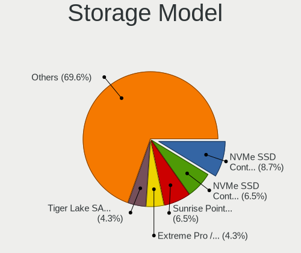
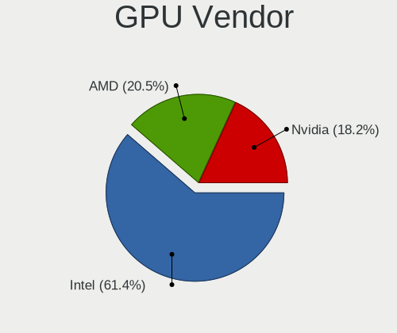
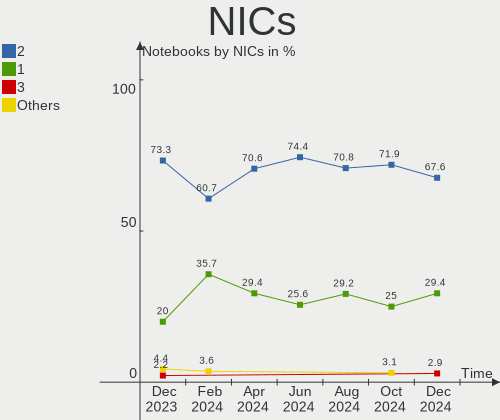
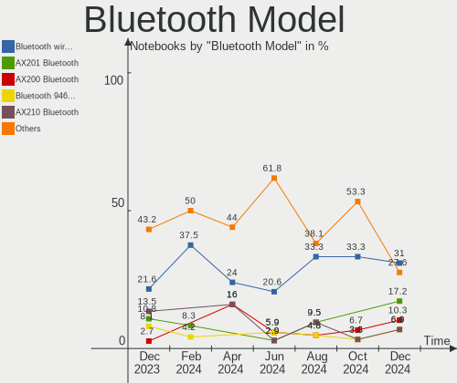
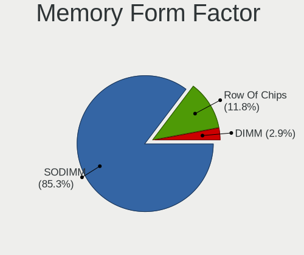

FreeBSD - Hardware Trends (Notebooks)
-------------------------------------

A project to identify most popular hardware characteristics and track their change
over time based on data collected by BSD users at https://BSD-Hardware.info.

Anyone can contribute to this report by the [hw-probe](https://github.com/linuxhw/hw-probe/blob/master/INSTALL.BSD.md) tool:

    hw-probe -all -upload

This report is for one last month. Overall report since the beginning of time: [TestCoverage](https://github.com/bsdhw/TestCoverage)

Period: Oct, 2022.

Contents
--------

* [ System ](#system)
  - [ OS                       ](#os)
  - [ OS Family                ](#os-family)
  - [ Arch                     ](#arch)
  - [ DE                       ](#de)
  - [ Display Server           ](#display-server)
  - [ Display Manager          ](#display-manager)
  - [ OS Lang                  ](#os-lang)
  - [ Boot Mode                ](#boot-mode)
  - [ Filesystem               ](#filesystem)
  - [ Part. scheme             ](#part-scheme)

* [ Board ](#board)
  - [ Vendor                   ](#vendor)
  - [ Model                    ](#model)
  - [ Model Family             ](#model-family)
  - [ MFG Year                 ](#mfg-year)
  - [ Form Factor              ](#form-factor)
  - [ Coreboot                 ](#coreboot)
  - [ RAM Size                 ](#ram-size)
  - [ RAM Used                 ](#ram-used)
  - [ Total Drives             ](#total-drives)
  - [ Has CD-ROM               ](#has-cd-rom)
  - [ Has Ethernet             ](#has-ethernet)
  - [ Has WiFi                 ](#has-wifi)
  - [ Has Bluetooth            ](#has-bluetooth)

* [ Location ](#location)
  - [ Country                  ](#country)
  - [ City                     ](#city)

* [ Drives ](#drives)
  - [ Drive Vendor             ](#drive-vendor)
  - [ Drive Model              ](#drive-model)
  - [ HDD Vendor               ](#hdd-vendor)
  - [ SSD Vendor               ](#ssd-vendor)
  - [ Drive Kind               ](#drive-kind)
  - [ Drive Connector          ](#drive-connector)
  - [ Drive Size               ](#drive-size)
  - [ Space Total              ](#space-total)
  - [ Space Used               ](#space-used)
  - [ Malfunc. Drives          ](#malfunc-drives)
  - [ Malfunc. Drive Vendor    ](#malfunc-drive-vendor)
  - [ Malfunc. HDD Vendor      ](#malfunc-hdd-vendor)
  - [ Malfunc. Drive Kind      ](#malfunc-drive-kind)
  - [ Failed Drives            ](#failed-drives)
  - [ Failed Drive Vendor      ](#failed-drive-vendor)
  - [ Drive Status             ](#drive-status)

* [ Storage controller ](#storage-controller)
  - [ Storage Vendor           ](#storage-vendor)
  - [ Storage Model            ](#storage-model)
  - [ Storage Kind             ](#storage-kind)

* [ Processor ](#processor)
  - [ CPU Vendor               ](#cpu-vendor)
  - [ CPU Model                ](#cpu-model)
  - [ CPU Model Family         ](#cpu-model-family)
  - [ CPU Cores                ](#cpu-cores)
  - [ CPU Sockets              ](#cpu-sockets)
  - [ CPU Threads              ](#cpu-threads)
  - [ CPU Microarch            ](#cpu-microarch)

* [ Graphics ](#graphics)
  - [ GPU Vendor               ](#gpu-vendor)
  - [ GPU Model                ](#gpu-model)
  - [ GPU Combo                ](#gpu-combo)
  - [ GPU Driver               ](#gpu-driver)
  - [ GPU Memory               ](#gpu-memory)

* [ Monitor ](#monitor)
  - [ Monitor Vendor           ](#monitor-vendor)
  - [ Monitor Model            ](#monitor-model)
  - [ Monitor Resolution       ](#monitor-resolution)
  - [ Monitor Diagonal         ](#monitor-diagonal)
  - [ Monitor Width            ](#monitor-width)
  - [ Aspect Ratio             ](#aspect-ratio)
  - [ Monitor Area             ](#monitor-area)
  - [ Pixel Density            ](#pixel-density)
  - [ Multiple Monitors        ](#multiple-monitors)

* [ Network ](#network)
  - [ Net Controller Vendor    ](#net-controller-vendor)
  - [ Net Controller Model     ](#net-controller-model)
  - [ Wireless Vendor          ](#wireless-vendor)
  - [ Wireless Model           ](#wireless-model)
  - [ Ethernet Vendor          ](#ethernet-vendor)
  - [ Ethernet Model           ](#ethernet-model)
  - [ Net Controller Kind      ](#net-controller-kind)
  - [ Used Controller          ](#used-controller)
  - [ NICs                     ](#nics)
  - [ IPv6                     ](#ipv6)

* [ Bluetooth ](#bluetooth)
  - [ Bluetooth Vendor         ](#bluetooth-vendor)
  - [ Bluetooth Model          ](#bluetooth-model)

* [ Sound ](#sound)
  - [ Sound Vendor             ](#sound-vendor)
  - [ Sound Model              ](#sound-model)

* [ Memory ](#memory)
  - [ Memory Vendor            ](#memory-vendor)
  - [ Memory Model             ](#memory-model)
  - [ Memory Kind              ](#memory-kind)
  - [ Memory Form Factor       ](#memory-form-factor)
  - [ Memory Size              ](#memory-size)
  - [ Memory Speed             ](#memory-speed)

* [ Printers & scanners ](#printers--scanners)
  - [ Printer Vendor           ](#printer-vendor)
  - [ Printer Model            ](#printer-model)
  - [ Scanner Vendor           ](#scanner-vendor)
  - [ Scanner Model            ](#scanner-model)

* [ Camera ](#camera)
  - [ Camera Vendor            ](#camera-vendor)
  - [ Camera Model             ](#camera-model)

* [ Security ](#security)
  - [ Fingerprint Vendor       ](#fingerprint-vendor)
  - [ Fingerprint Model        ](#fingerprint-model)
  - [ Chipcard Vendor          ](#chipcard-vendor)
  - [ Chipcard Model           ](#chipcard-model)

* [ Unsupported ](#unsupported)
  - [ Unsupported Devices      ](#unsupported-devices)
  - [ Unsupported Device Types ](#unsupported-device-types)

System
------

OS
--

Installed operating systems

| Name                 | Notebooks | Percent |
|----------------------|-----------|---------|
| FreeBSD 13.1         | 10        | 45.45%  |
| FreeBSD 13.1-p2      | 8         | 36.36%  |
| FreeBSD 14.0-CURRENT | 1         | 4.55%   |
| FreeBSD 13.1-STABLE  | 1         | 4.55%   |
| FreeBSD 13.0-p12     | 1         | 4.55%   |
| FreeBSD 13.0         | 1         | 4.55%   |

OS Family
---------

OS without a version

| Name    | Notebooks | Percent |
|---------|-----------|---------|
| FreeBSD | 22        | 100%    |

Arch
----

OS architecture (x86_64, i586, etc.)

| Name  | Notebooks | Percent |
|-------|-----------|---------|
| amd64 | 21        | 95.45%  |
| i386  | 1         | 4.55%   |

DE
--

Desktop Environment

| Name    | Notebooks | Percent |
|---------|-----------|---------|
| TWM     | 7         | 31.82%  |
| KDE5    | 5         | 22.73%  |
| XFCE    | 3         | 13.64%  |
| GNOME   | 3         | 13.64%  |
| Console | 3         | 13.64%  |
| MATE    | 1         | 4.55%   |

Display Server
--------------

X11 or Wayland

| Name    | Notebooks | Percent |
|---------|-----------|---------|
| X11     | 17        | 77.27%  |
| Console | 4         | 18.18%  |
| Wayland | 1         | 4.55%   |

Display Manager
---------------

SDDM, LightDM, etc.

| Name    | Notebooks | Percent |
|---------|-----------|---------|
| Console | 12        | 54.55%  |
| SDDM    | 6         | 27.27%  |
| GDM     | 2         | 9.09%   |
| SLiM    | 1         | 4.55%   |
| LightDM | 1         | 4.55%   |

OS Lang
-------

Language

| Lang    | Notebooks | Percent |
|---------|-----------|---------|
| C       | 12        | 54.55%  |
| fr_FR   | 2         | 9.09%   |
| en_US   | 2         | 9.09%   |
| de_DE   | 2         | 9.09%   |
| Unknown | 2         | 9.09%   |
| fi_FI   | 1         | 4.55%   |
| en_CA   | 1         | 4.55%   |

Boot Mode
---------

EFI or BIOS

| Mode | Notebooks | Percent |
|------|-----------|---------|
| EFI  | 16        | 72.73%  |
| BIOS | 6         | 27.27%  |

Filesystem
----------

Type of filesystem

| Type | Notebooks | Percent |
|------|-----------|---------|
| Zfs  | 17        | 77.27%  |
| Ufs  | 5         | 22.73%  |

Part. scheme
------------

Scheme of partitioning

| Type | Notebooks | Percent |
|------|-----------|---------|
| GPT  | 19        | 86.36%  |
| MBR  | 3         | 13.64%  |

Board
-----

Vendor
------

Motherboard manufacturer

| Name            | Notebooks | Percent |
|-----------------|-----------|---------|
| Lenovo          | 9         | 40.91%  |
| Dell            | 6         | 27.27%  |
| Hewlett-Packard | 3         | 13.64%  |
| Acer            | 2         | 9.09%   |
| TUXEDO          | 1         | 4.55%   |
| Toshiba         | 1         | 4.55%   |

Model
-----

Motherboard model

| Name                                        | Notebooks | Percent |
|---------------------------------------------|-----------|---------|
| Dell Precision M4500                        | 2         | 9.09%   |
| TUXEDO Aura 15 Gen1                         | 1         | 4.55%   |
| Toshiba NB300                               | 1         | 4.55%   |
| Lenovo XiaoXinPro-13API 2019 81XD           | 1         | 4.55%   |
| Lenovo ThinkPad X1 Carbon Gen 10 21CBCTO1WW | 1         | 4.55%   |
| Lenovo ThinkPad T590 20N4CTO1WW             | 1         | 4.55%   |
| Lenovo ThinkPad T470p 20J7S0BR00            | 1         | 4.55%   |
| Lenovo ThinkPad T460 20FMS10N00             | 1         | 4.55%   |
| Lenovo ThinkPad T440s 20AR003SMN            | 1         | 4.55%   |
| Lenovo ThinkPad T430 23446FP                | 1         | 4.55%   |
| Lenovo Legion 5 15IMH05 82AU                | 1         | 4.55%   |
| Lenovo IdeaPad 3 15ALC6 82KU                | 1         | 4.55%   |
| HP ENVY Laptop 13-aq0xxx                    | 1         | 4.55%   |
| HP Compaq 6735s                             | 1         | 4.55%   |
| HP 255 G8 Notebook PC                       | 1         | 4.55%   |
| Dell Precision M4800                        | 1         | 4.55%   |
| Dell Precision 5510                         | 1         | 4.55%   |
| Dell Inspiron 7720                          | 1         | 4.55%   |
| Dell Inspiron 15 5510                       | 1         | 4.55%   |
| Acer TravelMate B115-M                      | 1         | 4.55%   |
| Acer Aspire A514-54                         | 1         | 4.55%   |

Model Family
------------

Motherboard model prefix

| Name                    | Notebooks | Percent |
|-------------------------|-----------|---------|
| Lenovo ThinkPad         | 6         | 27.27%  |
| Dell Precision          | 4         | 18.18%  |
| Dell Inspiron           | 2         | 9.09%   |
| TUXEDO Aura             | 1         | 4.55%   |
| Toshiba NB300           | 1         | 4.55%   |
| Lenovo XiaoXinPro-13API | 1         | 4.55%   |
| Lenovo Legion           | 1         | 4.55%   |
| Lenovo IdeaPad          | 1         | 4.55%   |
| HP ENVY                 | 1         | 4.55%   |
| HP Compaq               | 1         | 4.55%   |
| HP 255                  | 1         | 4.55%   |
| Acer TravelMate         | 1         | 4.55%   |
| Acer Aspire             | 1         | 4.55%   |

MFG Year
--------

Motherboard manufacture year

| Year | Notebooks | Percent |
|------|-----------|---------|
| 2020 | 4         | 18.18%  |
| 2022 | 3         | 13.64%  |
| 2015 | 3         | 13.64%  |
| 2010 | 3         | 13.64%  |
| 2021 | 2         | 9.09%   |
| 2019 | 2         | 9.09%   |
| 2017 | 1         | 4.55%   |
| 2016 | 1         | 4.55%   |
| 2014 | 1         | 4.55%   |
| 2013 | 1         | 4.55%   |
| 2008 | 1         | 4.55%   |

Form Factor
-----------

Physical design of the computer

| Name     | Notebooks | Percent |
|----------|-----------|---------|
| Notebook | 22        | 100%    |

Coreboot
--------

Have coreboot on board

| Used | Notebooks | Percent |
|------|-----------|---------|
| No   | 22        | 100%    |

RAM Size
--------

Total RAM memory

| Size in GB  | Notebooks | Percent |
|-------------|-----------|---------|
| 8.01-16.0   | 9         | 40.91%  |
| 16.01-24.0  | 5         | 22.73%  |
| 32.01-64.0  | 4         | 18.18%  |
| 2.01-3.0    | 2         | 9.09%   |
| 3.01-4.0    | 1         | 4.55%   |
| 64.01-256.0 | 1         | 4.55%   |

RAM Used
--------

Used RAM memory

| Used GB  | Notebooks | Percent |
|----------|-----------|---------|
| 0.01-0.5 | 8         | 36.36%  |
| 1.01-2.0 | 6         | 27.27%  |
| 0.51-1.0 | 6         | 27.27%  |
| 2.01-3.0 | 2         | 9.09%   |

Total Drives
------------

Number of drives on board

| Drives | Notebooks | Percent |
|--------|-----------|---------|
| 1      | 17        | 77.27%  |
| 2      | 4         | 18.18%  |
| 3      | 1         | 4.55%   |

Has CD-ROM
----------

Has CD-ROM on board

| Presented | Notebooks | Percent |
|-----------|-----------|---------|
| No        | 16        | 72.73%  |
| Yes       | 6         | 27.27%  |

Has Ethernet
------------

Has Ethernet on board

| Presented | Notebooks | Percent |
|-----------|-----------|---------|
| Yes       | 15        | 68.18%  |
| No        | 7         | 31.82%  |

Has WiFi
--------

Has WiFi module

| Presented | Notebooks | Percent |
|-----------|-----------|---------|
| Yes       | 22        | 100%    |

Has Bluetooth
-------------

Has Bluetooth module

| Presented | Notebooks | Percent |
|-----------|-----------|---------|
| Yes       | 18        | 81.82%  |
| No        | 4         | 18.18%  |

Location
--------

Country
-------

Geographic location (country)

| Country    | Notebooks | Percent |
|------------|-----------|---------|
| France     | 5         | 22.73%  |
| USA        | 3         | 13.64%  |
| Finland    | 2         | 9.09%   |
| Venezuela  | 1         | 4.55%   |
| UK         | 1         | 4.55%   |
| Spain      | 1         | 4.55%   |
| Portugal   | 1         | 4.55%   |
| Malta      | 1         | 4.55%   |
| Lithuania  | 1         | 4.55%   |
| Guadeloupe | 1         | 4.55%   |
| Germany    | 1         | 4.55%   |
| China      | 1         | 4.55%   |
| Canada     | 1         | 4.55%   |
| Belarus    | 1         | 4.55%   |
| Argentina  | 1         | 4.55%   |

City
----

Geographic location (city)

| City            | Notebooks | Percent |
|-----------------|-----------|---------|
| Carry-le-Rouet  | 2         | 9.09%   |
| Vitoria-Gasteiz | 1         | 4.55%   |
| Vilnius         | 1         | 4.55%   |
| Turku           | 1         | 4.55%   |
| Swieqi          | 1         | 4.55%   |
| Roubaix         | 1         | 4.55%   |
| Paris           | 1         | 4.55%   |
| Minsk           | 1         | 4.55%   |
| Maracaibo       | 1         | 4.55%   |
| Le Gosier       | 1         | 4.55%   |
| Lahti           | 1         | 4.55%   |
| Kingsburg       | 1         | 4.55%   |
| Hamburg         | 1         | 4.55%   |
| Ezy-sur-Eure    | 1         | 4.55%   |
| Commerce City   | 1         | 4.55%   |
| Chengxiang      | 1         | 4.55%   |
| Cambridge       | 1         | 4.55%   |
| Buenos Aires    | 1         | 4.55%   |
| Blacksburg      | 1         | 4.55%   |
| Aveiro          | 1         | 4.55%   |
| Atlanta         | 1         | 4.55%   |

Drives
------

Drive Vendor
------------

Hard drive vendors

| Vendor              | Notebooks | Drives | Percent |
|---------------------|-----------|--------|---------|
| Kingston            | 5         | 6      | 18.52%  |
| Samsung Electronics | 4         | 4      | 14.81%  |
| WDC                 | 3         | 3      | 11.11%  |
| Toshiba             | 2         | 2      | 7.41%   |
| Seagate             | 2         | 2      | 7.41%   |
| Hitachi             | 2         | 2      | 7.41%   |
| UMIS                | 1         | 1      | 3.7%    |
| SK hynix            | 1         | 1      | 3.7%    |
| SanDisk             | 1         | 1      | 3.7%    |
| Lexar               | 1         | 1      | 3.7%    |
| KIOXIA              | 1         | 1      | 3.7%    |
| KingSpec            | 1         | 1      | 3.7%    |
| Intenso             | 1         | 1      | 3.7%    |
| Intel               | 1         | 1      | 3.7%    |
| Crucial             | 1         | 1      | 3.7%    |

Drive Model
-----------

Hard drive models

| Model                                  | Notebooks | Percent |
|----------------------------------------|-----------|---------|
| WDC WD3200BPVT-80JJ5T0 320GB           | 2         | 7.14%   |
| Samsung SSD 970 EVO Plus 2TB           | 2         | 7.14%   |
| WDC WDS100T2B0C-00PXH0 1TB             | 1         | 3.57%   |
| UMIS RPJTJ256MEE1OWX 256GB             | 1         | 3.57%   |
| Toshiba MQ01ABF032 320GB               | 1         | 3.57%   |
| Toshiba MK2555GSX 250GB                | 1         | 3.57%   |
| SK hynix SKHynix_HFS256GDE9X081N 256GB | 1         | 3.57%   |
| Seagate ST1000LM035-1RK172 1TB         | 1         | 3.57%   |
| Seagate ST1000LM024 HN-M101MBB 1TB     | 1         | 3.57%   |
| SanDisk SSD PLUS 240GB                 | 1         | 3.57%   |
| Samsung MZVLB512HBJQ-000L2 512GB       | 1         | 3.57%   |
| Samsung MZVLB1T0HBLR-000L2 1TB         | 1         | 3.57%   |
| Lexar 256GB SSD                        | 1         | 3.57%   |
| KIOXIA KBG40ZNS512G NVMe 512GB         | 1         | 3.57%   |
| Kingston SVP200S37A120G 120GB          | 1         | 3.57%   |
| Kingston SMS200S3120G 120GB            | 1         | 3.57%   |
| Kingston SH103S3240G 240GB             | 1         | 3.57%   |
| Kingston SA400S37480G 480GB            | 1         | 3.57%   |
| Kingston SA400S37240G 240GB            | 1         | 3.57%   |
| Kingston OM8PDP3256B-AA1 256GB         | 1         | 3.57%   |
| KingSpec MT-1TB                        | 1         | 3.57%   |
| Intenso SSD 128GB                      | 1         | 3.57%   |
| Intel SSDPEKNW010T8H 1TB               | 1         | 3.57%   |
| Hitachi HTS725050A7E630 500GB          | 1         | 3.57%   |
| Hitachi HTS545025B9A300 250GB          | 1         | 3.57%   |
| Crucial CT2000MX500SSD1 2TB            | 1         | 3.57%   |

HDD Vendor
----------

Hard disk drive vendors

| Vendor  | Notebooks | Drives | Percent |
|---------|-----------|--------|---------|
| WDC     | 2         | 2      | 25%     |
| Toshiba | 2         | 2      | 25%     |
| Seagate | 2         | 2      | 25%     |
| Hitachi | 2         | 2      | 25%     |

SSD Vendor
----------

Solid state drive vendors

| Vendor   | Notebooks | Drives | Percent |
|----------|-----------|--------|---------|
| Kingston | 4         | 5      | 44.44%  |
| SanDisk  | 1         | 1      | 11.11%  |
| Lexar    | 1         | 1      | 11.11%  |
| KingSpec | 1         | 1      | 11.11%  |
| Intenso  | 1         | 1      | 11.11%  |
| Crucial  | 1         | 1      | 11.11%  |

Drive Kind
----------

HDD or SSD

| Kind | Notebooks | Drives | Percent |
|------|-----------|--------|---------|
| NVMe | 10        | 10     | 38.46%  |
| SSD  | 8         | 10     | 30.77%  |
| HDD  | 8         | 8      | 30.77%  |

Drive Connector
---------------

SATA, SAS, NVMe, etc.

| Type | Notebooks | Drives | Percent |
|------|-----------|--------|---------|
| SATA | 13        | 18     | 56.52%  |
| NVMe | 10        | 10     | 43.48%  |

Drive Size
----------

Size of hard drive

| Size in TB | Notebooks | Drives | Percent |
|------------|-----------|--------|---------|
| 0.01-0.5   | 11        | 14     | 73.33%  |
| 1.01-2.0   | 2         | 2      | 13.33%  |
| 0.51-1.0   | 2         | 2      | 13.33%  |

Space Total
-----------

Amount of disk space available on the file system

| Size in GB | Notebooks | Percent |
|------------|-----------|---------|
| 101-250    | 9         | 40.91%  |
| 251-500    | 5         | 22.73%  |
| 501-1000   | 5         | 22.73%  |
| 21-50      | 2         | 9.09%   |
| 1001-2000  | 1         | 4.55%   |

Space Used
----------

Amount of used disk space

| Used GB | Notebooks | Percent |
|---------|-----------|---------|
| 1-20    | 15        | 68.18%  |
| 21-50   | 3         | 13.64%  |
| 101-250 | 3         | 13.64%  |
| 251-500 | 1         | 4.55%   |

Malfunc. Drives
---------------

Drive models with a malfunction

| Model                              | Notebooks | Drives | Percent |
|------------------------------------|-----------|--------|---------|
| WDC WD3200BPVT-80JJ5T0 320GB       | 2         | 2      | 28.57%  |
| Toshiba MQ01ABF032 320GB           | 1         | 1      | 14.29%  |
| Seagate ST1000LM024 HN-M101MBB 1TB | 1         | 1      | 14.29%  |
| Kingston SVP200S37A120G 120GB      | 1         | 1      | 14.29%  |
| Kingston SH103S3240G 240GB         | 1         | 1      | 14.29%  |
| Hitachi HTS545025B9A300 250GB      | 1         | 1      | 14.29%  |

Malfunc. Drive Vendor
---------------------

Vendors of faulty drives

| Vendor   | Notebooks | Drives | Percent |
|----------|-----------|--------|---------|
| WDC      | 2         | 2      | 33.33%  |
| Toshiba  | 1         | 1      | 16.67%  |
| Seagate  | 1         | 1      | 16.67%  |
| Kingston | 1         | 2      | 16.67%  |
| Hitachi  | 1         | 1      | 16.67%  |

Malfunc. HDD Vendor
-------------------

Vendors of faulty HDD drives

| Vendor  | Notebooks | Drives | Percent |
|---------|-----------|--------|---------|
| WDC     | 2         | 2      | 40%     |
| Toshiba | 1         | 1      | 20%     |
| Seagate | 1         | 1      | 20%     |
| Hitachi | 1         | 1      | 20%     |

Malfunc. Drive Kind
-------------------

Kinds of faulty drives

| Kind | Notebooks | Drives | Percent |
|------|-----------|--------|---------|
| HDD  | 5         | 5      | 83.33%  |
| SSD  | 1         | 2      | 16.67%  |

Failed Drives
-------------

Failed drive models

Zero info for selected period =(

Failed Drive Vendor
-------------------

Failed drive vendors

Zero info for selected period =(

Drive Status
------------

Number of failed and malfunc. drives

| Status  | Notebooks | Drives | Percent |
|---------|-----------|--------|---------|
| Works   | 18        | 21     | 75%     |
| Malfunc | 6         | 7      | 25%     |

Storage controller
------------------

Storage Vendor
--------------

Storage controller vendors

| Vendor                      | Notebooks | Percent |
|-----------------------------|-----------|---------|
| Intel                       | 14        | 51.85%  |
| Samsung Electronics         | 4         | 14.81%  |
| AMD                         | 3         | 11.11%  |
| SanDisk                     | 2         | 7.41%   |
| Union Memory (Shenzhen)     | 1         | 3.7%    |
| SK hynix                    | 1         | 3.7%    |
| KIOXIA                      | 1         | 3.7%    |
| Kingston Technology Company | 1         | 3.7%    |

Storage Model
-------------

Storage controller models

| Model                                                                         | Notebooks | Percent |
|-------------------------------------------------------------------------------|-----------|---------|
| Samsung NVMe SSD Controller SM981/PM981/PM983                                 | 4         | 13.79%  |
| Intel 82801 Mobile SATA Controller [RAID mode]                                | 2         | 6.9%    |
| Intel 7 Series Chipset Family 6-port SATA Controller [AHCI mode]              | 2         | 6.9%    |
| Intel 5 Series/3400 Series Chipset 6 port SATA AHCI Controller                | 2         | 6.9%    |
| AMD FCH SATA Controller [AHCI mode]                                           | 2         | 6.9%    |
| SK hynix Gold P31 SSD                                                         | 1         | 3.45%   |
| SanDisk WD Blue SN570 NVMe SSD                                                | 1         | 3.45%   |
| SanDisk WD Blue SN550 NVMe SSD                                                | 1         | 3.45%   |
| KIOXIA NVMe SSD Controller BG4                                                | 1         | 3.45%   |
| Kingston Company OM3PDP3 NVMe SSD                                             | 1         | 3.45%   |
| Intel Volume Management Device NVMe RAID Controller                           | 1         | 3.45%   |
| Intel Tiger Lake-LP SATA Controller                                           | 1         | 3.45%   |
| Intel Sunrise Point-LP SATA Controller [AHCI mode]                            | 1         | 3.45%   |
| Intel SSD 660P Series                                                         | 1         | 3.45%   |
| Intel Q170/Q150/B150/H170/H110/Z170/CM236 Chipset SATA Controller [AHCI Mode] | 1         | 3.45%   |
| Intel NM10/ICH7 Family SATA Controller [AHCI mode]                            | 1         | 3.45%   |
| Intel HM170/QM170 Chipset SATA Controller [AHCI Mode]                         | 1         | 3.45%   |
| Intel Atom Processor E3800 Series SATA AHCI Controller                        | 1         | 3.45%   |
| Intel 8 Series SATA Controller 1 [AHCI mode]                                  | 1         | 3.45%   |
| Intel 400 Series Chipset Family SATA AHCI Controller                          | 1         | 3.45%   |
| AMD SB7x0/SB8x0/SB9x0 SATA Controller [AHCI mode]                             | 1         | 3.45%   |
| Unknown                                                                       | 1         | 3.45%   |

Storage Kind
------------

Kind of storage controller (IDE, SATA, NVMe, SAS, ...)

| Kind | Notebooks | Percent |
|------|-----------|---------|
| SATA | 15        | 53.57%  |
| NVMe | 10        | 35.71%  |
| RAID | 3         | 10.71%  |

Processor
---------

CPU Vendor
----------

Processor vendors

| Vendor | Notebooks | Percent |
|--------|-----------|---------|
| Intel  | 17        | 77.27%  |
| AMD    | 5         | 22.73%  |

CPU Model
---------

Processor models

| Model                                         | Notebooks | Percent |
|-----------------------------------------------|-----------|---------|
| Intel Core i7-8565U CPU @ 1.80GHz             | 2         | 9.09%   |
| Intel Core i5 CPU M 560 @ 2.67GH              | 2         | 9.09%   |
| Intel Core i7-7700HQ CPU @ 2.80GHz            | 1         | 4.55%   |
| Intel Core i7-4810MQ CPU @ 2.80GHz            | 1         | 4.55%   |
| Intel Core i7-4600U CPU @ 2.10GHz             | 1         | 4.55%   |
| Intel Core i7-3630QM CPU @ 2.40GHz            | 1         | 4.55%   |
| Intel Core i7-3612QM CPU @ 2.10GHz            | 1         | 4.55%   |
| Intel Core i7-10750H CPU @ 2.60GHz            | 1         | 4.55%   |
| Intel Core i5-6300U CPU @ 2.40GHz             | 1         | 4.55%   |
| Intel Core i5-6300HQ CPU @ 2.30GHz            | 1         | 4.55%   |
| Intel Celeron CPU N2840 @ 2.16GHz             | 1         | 4.55%   |
| Intel A0                                      | 1         | 4.55%   |
| Intel 12th Gen Core i7-1280P                  | 1         | 4.55%   |
| Intel 11th Gen Core i7-11370H @ 3.30GHz       | 1         | 4.55%   |
| Intel 11th Gen Core i5-1135G7 @ 2.40GHz       | 1         | 4.55%   |
| AMD Sempron SI-40                             | 1         | 4.55%   |
| AMD Ryzen 7 4700U with Radeon Graphics        | 1         | 4.55%   |
| AMD Ryzen 5 5500U with Radeon Graphics        | 1         | 4.55%   |
| AMD Ryzen 5 3550H with Radeon Vega Mobile Gfx | 1         | 4.55%   |
| AMD Ryzen 3 5300U with Radeon Graphics        | 1         | 4.55%   |

CPU Model Family
----------------

Processor model prefix

| Model         | Notebooks | Percent |
|---------------|-----------|---------|
| Intel Core i7 | 8         | 36.36%  |
| Other         | 4         | 18.18%  |
| Intel Core i5 | 4         | 18.18%  |
| AMD Ryzen 5   | 2         | 9.09%   |
| Intel Celeron | 1         | 4.55%   |
| AMD Sempron   | 1         | 4.55%   |
| AMD Ryzen 7   | 1         | 4.55%   |
| AMD Ryzen 3   | 1         | 4.55%   |

CPU Cores
---------

Number of processor cores

| Number | Notebooks | Percent |
|--------|-----------|---------|
| 4      | 9         | 40.91%  |
| 2      | 5         | 22.73%  |
| 8      | 3         | 13.64%  |
| 1      | 2         | 9.09%   |
| 20     | 1         | 4.55%   |
| 12     | 1         | 4.55%   |
| 6      | 1         | 4.55%   |

CPU Sockets
-----------

Number of sockets

| Number | Notebooks | Percent |
|--------|-----------|---------|
| 1      | 22        | 100%    |

CPU Threads
-----------

Threads per core (Hyper-Threading)

| Number | Notebooks | Percent |
|--------|-----------|---------|
| 2      | 14        | 63.64%  |
| 1      | 8         | 36.36%  |

CPU Microarch
-------------

Microarchitecture

| Name            | Notebooks | Percent |
|-----------------|-----------|---------|
| KabyLake        | 3         | 13.64%  |
| Unknown         | 3         | 13.64%  |
| Westmere        | 2         | 9.09%   |
| TigerLake       | 2         | 9.09%   |
| Skylake         | 2         | 9.09%   |
| IvyBridge       | 2         | 9.09%   |
| Haswell         | 2         | 9.09%   |
| Zen+            | 1         | 4.55%   |
| Zen 2           | 1         | 4.55%   |
| Silvermont      | 1         | 4.55%   |
| K8 & K10 hybrid | 1         | 4.55%   |
| CometLake       | 1         | 4.55%   |
| Bonnell         | 1         | 4.55%   |

Graphics
--------

GPU Vendor
----------

Vendors of graphics cards

| Vendor | Notebooks | Percent |
|--------|-----------|---------|
| Intel  | 14        | 51.85%  |
| Nvidia | 7         | 25.93%  |
| AMD    | 6         | 22.22%  |

GPU Model
---------

Graphics card models

| Model                                                                   | Notebooks | Percent |
|-------------------------------------------------------------------------|-----------|---------|
| Nvidia GT216GLM [Quadro FX 880M]                                        | 2         | 7.41%   |
| Intel WhiskeyLake-U GT2 [UHD Graphics 620]                              | 2         | 7.41%   |
| Intel TigerLake-LP GT2 [Iris Xe Graphics]                               | 2         | 7.41%   |
| Intel 3rd Gen Core processor Graphics Controller                        | 2         | 7.41%   |
| AMD Lucienne                                                            | 2         | 7.41%   |
| Nvidia TU117M                                                           | 1         | 3.7%    |
| Nvidia GP108BM [GeForce MX250]                                          | 1         | 3.7%    |
| Nvidia GM108M [GeForce 940MX]                                           | 1         | 3.7%    |
| Nvidia GM107GLM [Quadro M1000M]                                         | 1         | 3.7%    |
| Nvidia GK107M [GeForce GT 650M]                                         | 1         | 3.7%    |
| Intel Skylake GT2 [HD Graphics 520]                                     | 1         | 3.7%    |
| Intel HD Graphics 630                                                   | 1         | 3.7%    |
| Intel HD Graphics 530                                                   | 1         | 3.7%    |
| Intel Haswell-ULT Integrated Graphics Controller                        | 1         | 3.7%    |
| Intel Atom Processor Z36xxx/Z37xxx Series Graphics & Display            | 1         | 3.7%    |
| Intel Atom Processor D4xx/D5xx/N4xx/N5xx Integrated Graphics Controller | 1         | 3.7%    |
| Intel Alder Lake-P Integrated Graphics Controller                       | 1         | 3.7%    |
| Intel 4th Gen Core Processor Integrated Graphics Controller             | 1         | 3.7%    |
| AMD Venus XT [Radeon HD 8870M / R9 M270X/M370X]                         | 1         | 3.7%    |
| AMD RS780M [Mobility Radeon HD 3200]                                    | 1         | 3.7%    |
| AMD Renoir                                                              | 1         | 3.7%    |
| AMD Picasso/Raven 2 [Radeon Vega Series / Radeon Vega Mobile Series]    | 1         | 3.7%    |

GPU Combo
---------

Combinations of graphics cards

| Name           | Notebooks | Percent |
|----------------|-----------|---------|
| 1 x Intel      | 8         | 36.36%  |
| 1 x AMD        | 5         | 22.73%  |
| Intel + Nvidia | 4         | 18.18%  |
| 1 x Nvidia     | 3         | 13.64%  |
| 2 x Intel      | 1         | 4.55%   |
| Intel + AMD    | 1         | 4.55%   |

GPU Driver
----------

Free vs proprietary

| Driver      | Notebooks | Percent |
|-------------|-----------|---------|
| Free        | 18        | 81.82%  |
| Proprietary | 4         | 18.18%  |

GPU Memory
----------

Total video memory

| Size in GB | Notebooks | Percent |
|------------|-----------|---------|
| Unknown    | 17        | 77.27%  |
| 0.51-1.0   | 3         | 13.64%  |
| 3.01-4.0   | 1         | 4.55%   |
| 0.01-0.5   | 1         | 4.55%   |

Monitor
-------

Monitor Vendor
--------------

Monitor vendors

| Vendor              | Notebooks | Percent |
|---------------------|-----------|---------|
| AU Optronics        | 7         | 31.82%  |
| LGD                 | 3         | 13.64%  |
| LG Display          | 2         | 9.09%   |
| Chimei Innolux      | 2         | 9.09%   |
| Sharp               | 1         | 4.55%   |
| Samsung Electronics | 1         | 4.55%   |
| Philips             | 1         | 4.55%   |
| Lenovo              | 1         | 4.55%   |
| Hewlett-Packard     | 1         | 4.55%   |
| CSO                 | 1         | 4.55%   |
| BOE                 | 1         | 4.55%   |
| AOC                 | 1         | 4.55%   |

Monitor Model
-------------

Monitor models

| Model                                                                | Notebooks | Percent |
|----------------------------------------------------------------------|-----------|---------|
| LGD LCD Monitor 1600x900                                             | 2         | 8.7%    |
| Sharp LCD Monitor SHP143E 3840x2160 350x190mm 15.7-inch              | 1         | 4.35%   |
| Samsung Electronics LCD Monitor SEC544E 1024x600 220x130mm 10.1-inch | 1         | 4.35%   |
| Philips PHL 439P1 PHL0973 3840x2160 940x530mm 42.5-inch              | 1         | 4.35%   |
| LGD LCD Monitor 1920x1080                                            | 1         | 4.35%   |
| LG Display LCD Monitor LGD046F 1920x1080 340x190mm 15.3-inch         | 1         | 4.35%   |
| LG Display LCD Monitor LGD02DA 1920x1080 380x210mm 17.1-inch         | 1         | 4.35%   |
| Lenovo LEN T32h-20 LEN61F1 2560x1440 700x390mm 31.5-inch             | 1         | 4.35%   |
| Hewlett-Packard LA2306 HWP294B 1920x1080 510x290mm 23.1-inch         | 1         | 4.35%   |
| Hewlett-Packard E243i HPN3462 1920x1200 520x320mm 24.0-inch          | 1         | 4.35%   |
| CSO LCD Monitor CSO076D 2560x1600 290x180mm 13.4-inch                | 1         | 4.35%   |
| Chimei Innolux LCD Monitor CMN152E 1920x1080 340x190mm 15.3-inch     | 1         | 4.35%   |
| Chimei Innolux LCD Monitor CMN14B1 1920x1080 310x170mm 13.9-inch     | 1         | 4.35%   |
| BOE LCD Monitor BOE081D 1920x1080 310x170mm 13.9-inch                | 1         | 4.35%   |
| AU Optronics LCD Monitor AUOB79F 1920x1080 340x190mm 15.3-inch       | 1         | 4.35%   |
| AU Optronics LCD Monitor AUO572D 1920x1080 290x170mm 13.2-inch       | 1         | 4.35%   |
| AU Optronics LCD Monitor AUO313C 1366x768 310x170mm 13.9-inch        | 1         | 4.35%   |
| AU Optronics LCD Monitor AUO303E 1600x900 310x170mm 13.9-inch        | 1         | 4.35%   |
| AU Optronics LCD Monitor AUO243D 1920x1080 310x170mm 13.9-inch       | 1         | 4.35%   |
| AU Optronics LCD Monitor AUO235C 1366x768 260x140mm 11.6-inch        | 1         | 4.35%   |
| AU Optronics LCD Monitor AUO20ED 1920x1080 340x190mm 15.3-inch       | 1         | 4.35%   |
| AOC 2369M AOC2369 1920x1080 510x290mm 23.1-inch                      | 1         | 4.35%   |

Monitor Resolution
------------------

Monitor screen resolution

| Resolution        | Notebooks | Percent |
|-------------------|-----------|---------|
| 1920x1080 (FHD)   | 11        | 50%     |
| 1600x900 (HD+)    | 3         | 13.64%  |
| 3840x2160 (4K)    | 2         | 9.09%   |
| 1366x768 (WXGA)   | 2         | 9.09%   |
| 2560x1600         | 1         | 4.55%   |
| 2560x1440 (QHD)   | 1         | 4.55%   |
| 1920x1200 (WUXGA) | 1         | 4.55%   |
| 1024x600          | 1         | 4.55%   |

Monitor Diagonal
----------------

Diagonal size in inches

| Inches  | Notebooks | Percent |
|---------|-----------|---------|
| 13      | 7         | 30.43%  |
| 15      | 5         | 21.74%  |
| Unknown | 3         | 13.04%  |
| 23      | 2         | 8.7%    |
| 42      | 1         | 4.35%   |
| 31      | 1         | 4.35%   |
| 24      | 1         | 4.35%   |
| 17      | 1         | 4.35%   |
| 11      | 1         | 4.35%   |
| 10      | 1         | 4.35%   |

Monitor Width
-------------

Physical width

| Width in mm | Notebooks | Percent |
|-------------|-----------|---------|
| 301-350     | 10        | 45.45%  |
| 201-300     | 4         | 18.18%  |
| Unknown     | 3         | 13.64%  |
| 501-600     | 2         | 9.09%   |
| 601-700     | 1         | 4.55%   |
| 351-400     | 1         | 4.55%   |
| 901-1000    | 1         | 4.55%   |

Aspect Ratio
------------

Proportional relationship between the width and the height

| Ratio   | Notebooks | Percent |
|---------|-----------|---------|
| 16/9    | 15        | 75%     |
| Unknown | 3         | 15%     |
| 16/10   | 2         | 10%     |

Monitor Area
------------

Area in inch²

| Area in inch² | Notebooks | Percent |
|----------------|-----------|---------|
| 81-90          | 6         | 26.09%  |
| 91-100         | 3         | 13.04%  |
| Unknown        | 3         | 13.04%  |
| 201-250        | 2         | 8.7%    |
| 101-110        | 2         | 8.7%    |
| 71-80          | 1         | 4.35%   |
| 51-60          | 1         | 4.35%   |
| 351-500        | 1         | 4.35%   |
| 41-50          | 1         | 4.35%   |
| 251-300        | 1         | 4.35%   |
| 121-130        | 1         | 4.35%   |
| 501-1000       | 1         | 4.35%   |

Pixel Density
-------------

Pixels per inch

| Density       | Notebooks | Percent |
|---------------|-----------|---------|
| 121-160       | 10        | 45.45%  |
| 101-120       | 3         | 13.64%  |
| 51-100        | 3         | 13.64%  |
| Unknown       | 3         | 13.64%  |
| 161-240       | 2         | 9.09%   |
| More than 240 | 1         | 4.55%   |

Multiple Monitors
-----------------

Total monitors connected

| Total | Notebooks | Percent |
|-------|-----------|---------|
| 1     | 15        | 68.18%  |
| 0     | 4         | 18.18%  |
| 2     | 2         | 9.09%   |
| 3     | 1         | 4.55%   |

Network
-------

Net Controller Vendor
---------------------

Controller vendors

| Vendor                   | Notebooks | Percent |
|--------------------------|-----------|---------|
| Intel                    | 14        | 37.84%  |
| Realtek Semiconductor    | 8         | 21.62%  |
| Broadcom                 | 5         | 13.51%  |
| Qualcomm Atheros         | 2         | 5.41%   |
| TP-Link                  | 1         | 2.7%    |
| Sierra Wireless          | 1         | 2.7%    |
| Sagem                    | 1         | 2.7%    |
| Ralink Technology        | 1         | 2.7%    |
| MediaTek                 | 1         | 2.7%    |
| Marvell Technology Group | 1         | 2.7%    |
| Huawei Technologies      | 1         | 2.7%    |
| Google                   | 1         | 2.7%    |

Net Controller Model
--------------------

Controller models

| Model                                                             | Notebooks | Percent |
|-------------------------------------------------------------------|-----------|---------|
| Realtek RTL8111/8168/8411 PCI Express Gigabit Ethernet Controller | 5         | 11.63%  |
| Realtek RTL810xE PCI Express Fast Ethernet controller             | 2         | 4.65%   |
| Intel Wireless 8260                                               | 2         | 4.65%   |
| Intel Wi-Fi 6 AX200                                               | 2         | 4.65%   |
| Intel Cannon Point-LP CNVi [Wireless-AC]                          | 2         | 4.65%   |
| Broadcom BCM43224 802.11a/b/g/n                                   | 2         | 4.65%   |
| TP-Link TL-WN722N v2/v3 [Realtek RTL8188EUS]                      | 1         | 2.33%   |
| Sierra Wireless EM7455                                            | 1         | 2.33%   |
| Sagem XG-76NA 802.11bg                                            | 1         | 2.33%   |
| Realtek RTL8821CE 802.11ac PCIe Wireless Network Adapter          | 1         | 2.33%   |
| Realtek RTL8188CUS 802.11n WLAN Adapter                           | 1         | 2.33%   |
| Ralink RT5370 Wireless Adapter                                    | 1         | 2.33%   |
| Qualcomm Atheros QCA6174 802.11ac Wireless Network Adapter        | 1         | 2.33%   |
| Qualcomm Atheros AR9285 Wireless Network Adapter (PCI-Express)    | 1         | 2.33%   |
| MediaTek MT7921 802.11ax PCI Express Wireless Network Adapter     | 1         | 2.33%   |
| Marvell Group 88E8042 PCI-E Fast Ethernet Controller              | 1         | 2.33%   |
| Intel Wireless 8265 / 8275                                        | 1         | 2.33%   |
| Intel Wireless 7260                                               | 1         | 2.33%   |
| Intel Wi-Fi 6 AX201                                               | 1         | 2.33%   |
| Intel Ethernet Connection I219-LM                                 | 1         | 2.33%   |
| Intel Ethernet Connection I218-LM                                 | 1         | 2.33%   |
| Intel Ethernet Connection I217-LM                                 | 1         | 2.33%   |
| Intel Ethernet Connection (6) I219-V                              | 1         | 2.33%   |
| Intel Ethernet Connection (5) I219-V                              | 1         | 2.33%   |
| Intel Comet Lake PCH CNVi WiFi                                    | 1         | 2.33%   |
| Intel Centrino Wireless-N 2230                                    | 1         | 2.33%   |
| Intel Centrino Advanced-N 6205 [Taylor Peak]                      | 1         | 2.33%   |
| Intel Alder Lake-P PCH CNVi WiFi                                  | 1         | 2.33%   |
| Intel 82579LM Gigabit Network Connection (Lewisville)             | 1         | 2.33%   |
| Huawei ME936 LTE/HSDPA+ 4G modem                                  | 1         | 2.33%   |
| Google Nexus/Pixel Device (tether)                                | 1         | 2.33%   |
| Broadcom BCM4352 802.11ac Wireless Network Adapter                | 1         | 2.33%   |
| Broadcom BCM43228 802.11a/b/g/n                                   | 1         | 2.33%   |
| Broadcom BCM4312 802.11b/g LP-PHY                                 | 1         | 2.33%   |

Wireless Vendor
---------------

Wireless vendors

| Vendor                | Notebooks | Percent |
|-----------------------|-----------|---------|
| Intel                 | 13        | 48.15%  |
| Broadcom              | 5         | 18.52%  |
| Realtek Semiconductor | 2         | 7.41%   |
| Qualcomm Atheros      | 2         | 7.41%   |
| TP-Link               | 1         | 3.7%    |
| Sierra Wireless       | 1         | 3.7%    |
| Sagem                 | 1         | 3.7%    |
| Ralink Technology     | 1         | 3.7%    |
| MediaTek              | 1         | 3.7%    |

Wireless Model
--------------

Wireless models

| Model                                                          | Notebooks | Percent |
|----------------------------------------------------------------|-----------|---------|
| Intel Wireless 8260                                            | 2         | 7.41%   |
| Intel Wi-Fi 6 AX200                                            | 2         | 7.41%   |
| Intel Cannon Point-LP CNVi [Wireless-AC]                       | 2         | 7.41%   |
| Broadcom BCM43224 802.11a/b/g/n                                | 2         | 7.41%   |
| TP-Link TL-WN722N v2/v3 [Realtek RTL8188EUS]                   | 1         | 3.7%    |
| Sierra Wireless EM7455                                         | 1         | 3.7%    |
| Sagem XG-76NA 802.11bg                                         | 1         | 3.7%    |
| Realtek RTL8821CE 802.11ac PCIe Wireless Network Adapter       | 1         | 3.7%    |
| Realtek RTL8188CUS 802.11n WLAN Adapter                        | 1         | 3.7%    |
| Ralink RT5370 Wireless Adapter                                 | 1         | 3.7%    |
| Qualcomm Atheros QCA6174 802.11ac Wireless Network Adapter     | 1         | 3.7%    |
| Qualcomm Atheros AR9285 Wireless Network Adapter (PCI-Express) | 1         | 3.7%    |
| MediaTek MT7921 802.11ax PCI Express Wireless Network Adapter  | 1         | 3.7%    |
| Intel Wireless 8265 / 8275                                     | 1         | 3.7%    |
| Intel Wireless 7260                                            | 1         | 3.7%    |
| Intel Wi-Fi 6 AX201                                            | 1         | 3.7%    |
| Intel Comet Lake PCH CNVi WiFi                                 | 1         | 3.7%    |
| Intel Centrino Wireless-N 2230                                 | 1         | 3.7%    |
| Intel Centrino Advanced-N 6205 [Taylor Peak]                   | 1         | 3.7%    |
| Intel Alder Lake-P PCH CNVi WiFi                               | 1         | 3.7%    |
| Broadcom BCM4352 802.11ac Wireless Network Adapter             | 1         | 3.7%    |
| Broadcom BCM43228 802.11a/b/g/n                                | 1         | 3.7%    |
| Broadcom BCM4312 802.11b/g LP-PHY                              | 1         | 3.7%    |

Ethernet Vendor
---------------

Ethernet vendors

| Vendor                   | Notebooks | Percent |
|--------------------------|-----------|---------|
| Realtek Semiconductor    | 7         | 46.67%  |
| Intel                    | 6         | 40%     |
| Marvell Technology Group | 1         | 6.67%   |
| Google                   | 1         | 6.67%   |

Ethernet Model
--------------

Ethernet models

| Model                                                             | Notebooks | Percent |
|-------------------------------------------------------------------|-----------|---------|
| Realtek RTL8111/8168/8411 PCI Express Gigabit Ethernet Controller | 5         | 33.33%  |
| Realtek RTL810xE PCI Express Fast Ethernet controller             | 2         | 13.33%  |
| Marvell Group 88E8042 PCI-E Fast Ethernet Controller              | 1         | 6.67%   |
| Intel Ethernet Connection I219-LM                                 | 1         | 6.67%   |
| Intel Ethernet Connection I218-LM                                 | 1         | 6.67%   |
| Intel Ethernet Connection I217-LM                                 | 1         | 6.67%   |
| Intel Ethernet Connection (6) I219-V                              | 1         | 6.67%   |
| Intel Ethernet Connection (5) I219-V                              | 1         | 6.67%   |
| Intel 82579LM Gigabit Network Connection (Lewisville)             | 1         | 6.67%   |
| Google Nexus/Pixel Device (tether)                                | 1         | 6.67%   |

Net Controller Kind
-------------------

Ethernet, WiFi or modem

| Kind     | Notebooks | Percent |
|----------|-----------|---------|
| WiFi     | 22        | 57.89%  |
| Ethernet | 15        | 39.47%  |
| Modem    | 1         | 2.63%   |

Used Controller
---------------

Currently used network controller

| Kind     | Notebooks | Percent |
|----------|-----------|---------|
| WiFi     | 12        | 60%     |
| Ethernet | 8         | 40%     |

NICs
----

Total network controllers on board

| Total | Notebooks | Percent |
|-------|-----------|---------|
| 2     | 14        | 63.64%  |
| 1     | 8         | 36.36%  |

IPv6
----

IPv6 vs IPv4

| Used | Notebooks | Percent |
|------|-----------|---------|
| No   | 18        | 81.82%  |
| Yes  | 4         | 18.18%  |

Bluetooth
---------

Bluetooth Vendor
----------------

Controller vendors

| Vendor                          | Notebooks | Percent |
|---------------------------------|-----------|---------|
| Intel                           | 12        | 66.67%  |
| Realtek Semiconductor           | 1         | 5.56%   |
| Qualcomm Atheros Communications | 1         | 5.56%   |
| Lite-On Technology              | 1         | 5.56%   |
| Foxconn / Hon Hai               | 1         | 5.56%   |
| Dell                            | 1         | 5.56%   |
| Broadcom                        | 1         | 5.56%   |

Bluetooth Model
---------------

Controller models

| Model                                          | Notebooks | Percent |
|------------------------------------------------|-----------|---------|
| Intel Bluetooth wireless interface             | 4         | 22.22%  |
| Intel Bluetooth 9460/9560 Jefferson Peak (JfP) | 2         | 11.11%  |
| Intel AX201 Bluetooth                          | 2         | 11.11%  |
| Intel AX200 Bluetooth                          | 2         | 11.11%  |
| Realtek  Bluetooth 4.2 Adapter                 | 1         | 5.56%   |
| Qualcomm Atheros QCA61x4 Bluetooth 4.0         | 1         | 5.56%   |
| Lite-On Wireless_Device                        | 1         | 5.56%   |
| Intel Intel Wireless Bluetooth                 | 1         | 5.56%   |
| Intel Centrino Bluetooth Wireless Transceiver  | 1         | 5.56%   |
| Foxconn / Hon Hai Broadcom Bluetooth 4.0 USB   | 1         | 5.56%   |
| Dell Broadcom BCM20702A0 Bluetooth             | 1         | 5.56%   |
| Broadcom BCM20702 Bluetooth 4.0 [ThinkPad]     | 1         | 5.56%   |

Sound
-----

Sound Vendor
------------

Sound card vendors

| Vendor    | Notebooks | Percent |
|-----------|-----------|---------|
| Intel     | 17        | 60.71%  |
| AMD       | 6         | 21.43%  |
| Nvidia    | 3         | 10.71%  |
| Lenovo    | 1         | 3.57%   |
| GN Netcom | 1         | 3.57%   |

Sound Model
-----------

Sound card models

| Model                                                                      | Notebooks | Percent |
|----------------------------------------------------------------------------|-----------|---------|
| AMD Family 17h/19h HD Audio Controller                                     | 4         | 11.76%  |
| AMD Renoir Radeon High Definition Audio Controller                         | 3         | 8.82%   |
| Nvidia GT216 HDMI Audio Controller                                         | 2         | 5.88%   |
| Intel Tiger Lake-LP Smart Sound Technology Audio Controller                | 2         | 5.88%   |
| Intel Cannon Point-LP High Definition Audio Controller                     | 2         | 5.88%   |
| Intel 7 Series/C216 Chipset Family High Definition Audio Controller        | 2         | 5.88%   |
| Intel 5 Series/3400 Series Chipset High Definition Audio                   | 2         | 5.88%   |
| Nvidia TU107 GeForce GTX 1650 High Definition Audio Controller             | 1         | 2.94%   |
| Lenovo Realtek USB Audio                                                   | 1         | 2.94%   |
| Intel Xeon E3-1200 v3/4th Gen Core Processor HD Audio Controller           | 1         | 2.94%   |
| Intel Sunrise Point-LP HD Audio                                            | 1         | 2.94%   |
| Intel NM10/ICH7 Family High Definition Audio Controller                    | 1         | 2.94%   |
| Intel Haswell-ULT HD Audio Controller                                      | 1         | 2.94%   |
| Intel Comet Lake PCH cAVS                                                  | 1         | 2.94%   |
| Intel CM238 HD Audio Controller                                            | 1         | 2.94%   |
| Intel Atom Processor Z36xxx/Z37xxx Series High Definition Audio Controller | 1         | 2.94%   |
| Intel Alder Lake PCH-P High Definition Audio Controller                    | 1         | 2.94%   |
| Intel 8 Series/C220 Series Chipset High Definition Audio Controller        | 1         | 2.94%   |
| Intel 8 Series HD Audio Controller                                         | 1         | 2.94%   |
| Intel 100 Series/C230 Series Chipset Family HD Audio Controller            | 1         | 2.94%   |
| GN Netcom Jabra SPEAK 510 USB                                              | 1         | 2.94%   |
| AMD SBx00 Azalia (Intel HDA)                                               | 1         | 2.94%   |
| AMD Raven/Raven2/Fenghuang HDMI/DP Audio Controller                        | 1         | 2.94%   |
| AMD Oland/Hainan/Cape Verde/Pitcairn HDMI Audio [Radeon HD 7000 Series]    | 1         | 2.94%   |

Memory
------

Memory Vendor
-------------

Memory module vendors

| Vendor              | Notebooks | Percent |
|---------------------|-----------|---------|
| Samsung Electronics | 8         | 29.63%  |
| SK hynix            | 7         | 25.93%  |
| Micron Technology   | 5         | 18.52%  |
| Kingston            | 3         | 11.11%  |
| Unknown             | 1         | 3.7%    |
| Ramaxel Technology  | 1         | 3.7%    |
| G.Skill             | 1         | 3.7%    |
| Elpida              | 1         | 3.7%    |

Memory Model
------------

Memory module models

| Model                                                        | Notebooks | Percent |
|--------------------------------------------------------------|-----------|---------|
| SK hynix RAM HMT351S6BFR8C-H9 4GB SODIMM DDR3 1334MT/s       | 2         | 7.14%   |
| Unknown RAM Module 2GB SODIMM DDR2 667MT/s                   | 1         | 3.57%   |
| SK hynix RAM HMT451S6AFR8A-PB 4GB SODIMM DDR3 1600MT/s       | 1         | 3.57%   |
| SK hynix RAM HMT41GS6BFR8A-PB 8GB SODIMM DDR3 1600MT/s       | 1         | 3.57%   |
| SK hynix RAM HMAA1GS6CMR6N-VK 8GB Row Of Chips DDR4 2667MT/s | 1         | 3.57%   |
| SK hynix RAM HMAA1GS6CJR6N-XN 8GB SODIMM DDR4 3200MT/s       | 1         | 3.57%   |
| SK hynix RAM HMA851S6DJR6N-XN 4GB SODIMM DDR4 3200MT/s       | 1         | 3.57%   |
| SK hynix RAM HMA851S6DJR6N-XN 4GB Row Of Chips DDR4 3200MT/s | 1         | 3.57%   |
| Samsung RAM M471B5273EB0-CK0 4GB SODIMM DDR3 1600MT/s        | 1         | 3.57%   |
| Samsung RAM M471B5173DB0-YK0 4GB SODIMM DDR3 1600MT/s        | 1         | 3.57%   |
| Samsung RAM M471A5244CB0-CWE 4GB SODIMM DDR4 3200MT/s        | 1         | 3.57%   |
| Samsung RAM M471A4G43AB1-CWE 32GB SODIMM DDR4 3200MT/s       | 1         | 3.57%   |
| Samsung RAM M471A2G44AM0-CTD 16GB SODIMM DDR4 2667MT/s       | 1         | 3.57%   |
| Samsung RAM M471A1K43DB1-CWE 8GB SODIMM DDR4 3200MT/s        | 1         | 3.57%   |
| Samsung RAM K4B8G1646B-MYK0 4GB Chip DDR3 1600MT/s           | 1         | 3.57%   |
| Samsung RAM K3LKCKC0BM-MGCP 4GB Row Of Chips LPDDR5 6400MT/s | 1         | 3.57%   |
| Ramaxel RAM RMSA3320MJ78HAF-3200 8GB SODIMM DDR4 3200MT/s    | 1         | 3.57%   |
| Micron RAM 8ATF1G64HZ-3G2R1 8GB SODIMM DDR4 3200MT/s         | 1         | 3.57%   |
| Micron RAM 8ATF1G64HZ-2G3E1 8GB SODIMM DDR4 2400MT/s         | 1         | 3.57%   |
| Micron RAM 4ATF51264HZ-3G2J1 4GB SODIMM DDR4 3200MT/s        | 1         | 3.57%   |
| Micron RAM 16KTF1G64HZ-1G6E1 8GB SODIMM DDR3 1600MT/s        | 1         | 3.57%   |
| Micron RAM 16ATF4G64HZ-2G6B2 32GB SODIMM DDR4 2667MT/s       | 1         | 3.57%   |
| Kingston RAM ACR16D3LFS1KBG/2G 2GB SODIMM DDR3 1600MT/s      | 1         | 3.57%   |
| Kingston RAM 99U5295-011.A00LF 2GB SODIMM DDR2 667MT/s       | 1         | 3.57%   |
| Kingston RAM 9905712-035.A00G 16GB SODIMM DDR4 2667MT/s      | 1         | 3.57%   |
| G.Skill RAM F4-2666C19-16GRS 16GB SODIMM DDR4 2667MT/s       | 1         | 3.57%   |
| Elpida RAM EBE11UE6ACUA-8G-E 1GB SODIMM DDR2 667MT/s         | 1         | 3.57%   |

Memory Kind
-----------

Memory module kinds

| Kind   | Notebooks | Percent |
|--------|-----------|---------|
| DDR4   | 11        | 50%     |
| DDR3   | 8         | 36.36%  |
| DDR2   | 2         | 9.09%   |
| LPDDR5 | 1         | 4.55%   |

Memory Form Factor
------------------

Physical design of the memory module

| Name         | Notebooks | Percent |
|--------------|-----------|---------|
| SODIMM       | 20        | 83.33%  |
| Row Of Chips | 3         | 12.5%   |
| Chip         | 1         | 4.17%   |

Memory Size
-----------

Memory module size

| Size  | Notebooks | Percent |
|-------|-----------|---------|
| 4096  | 10        | 38.46%  |
| 8192  | 7         | 26.92%  |
| 16384 | 3         | 11.54%  |
| 2048  | 3         | 11.54%  |
| 32768 | 2         | 7.69%   |
| 1024  | 1         | 3.85%   |

Memory Speed
------------

Memory module speed

| Speed | Notebooks | Percent |
|-------|-----------|---------|
| 3200  | 6         | 27.27%  |
| 1600  | 6         | 27.27%  |
| 2667  | 4         | 18.18%  |
| 1334  | 2         | 9.09%   |
| 667   | 2         | 9.09%   |
| 6400  | 1         | 4.55%   |
| 2400  | 1         | 4.55%   |

Printers & scanners
-------------------

Printer Vendor
--------------

Printer device vendors

Zero info for selected period =(

Printer Model
-------------

Printer device models

Zero info for selected period =(

Scanner Vendor
--------------

Scanner device vendors

Zero info for selected period =(

Scanner Model
-------------

Scanner device models

Zero info for selected period =(

Camera
------

Camera Vendor
-------------

Camera device vendors

| Vendor                        | Notebooks | Percent |
|-------------------------------|-----------|---------|
| Lite-On Technology            | 3         | 17.65%  |
| Chicony Electronics           | 3         | 17.65%  |
| Sunplus Innovation Technology | 2         | 11.76%  |
| Microdia                      | 2         | 11.76%  |
| IMC Networks                  | 2         | 11.76%  |
| Syntek                        | 1         | 5.88%   |
| Suyin                         | 1         | 5.88%   |
| Realtek Semiconductor         | 1         | 5.88%   |
| Luxvisions Innotech Limited   | 1         | 5.88%   |
| Acer                          | 1         | 5.88%   |

Camera Model
------------

Camera device models

| Model                                         | Notebooks | Percent |
|-----------------------------------------------|-----------|---------|
| Chicony Integrated Camera                     | 2         | 11.76%  |
| Syntek Integrated Camera                      | 1         | 5.88%   |
| Suyin USB 2.0 Camera                          | 1         | 5.88%   |
| Sunplus Integrated_Webcam_HD                  | 1         | 5.88%   |
| Sunplus HD WebCam                             | 1         | 5.88%   |
| Realtek Integrated_Webcam_HD                  | 1         | 5.88%   |
| Microdia Laptop_Integrated_Webcam_HD          | 1         | 5.88%   |
| Microdia Integrated Webcam                    | 1         | 5.88%   |
| Luxvisions Innotech Limited Integrated Camera | 1         | 5.88%   |
| Lite-On Realtek PC Camera                     | 1         | 5.88%   |
| Lite-On Integrated Camera                     | 1         | 5.88%   |
| Lite-On HP Wide Vision HD Camera              | 1         | 5.88%   |
| IMC Networks Integrated Camera                | 1         | 5.88%   |
| IMC Networks EasyCamera                       | 1         | 5.88%   |
| Chicony thinkpad t430s camera                 | 1         | 5.88%   |
| Acer ThinkPad P50 Integrated Camera           | 1         | 5.88%   |

Security
--------

Fingerprint Vendor
------------------

Fingerprint sensor vendors

| Vendor           | Notebooks | Percent |
|------------------|-----------|---------|
| Validity Sensors | 3         | 60%     |
| Synaptics        | 2         | 40%     |

Fingerprint Model
-----------------

Fingerprint sensor models

| Model                                             | Notebooks | Percent |
|---------------------------------------------------|-----------|---------|
| Validity Sensors VFS 5011 fingerprint sensor      | 2         | 40%     |
| Validity Sensors Synaptics WBDI                   | 1         | 20%     |
| Synaptics Prometheus MIS Touch Fingerprint Reader | 1         | 20%     |
| Unknown                                           | 1         | 20%     |

Chipcard Vendor
---------------

Chipcard module vendors

Zero info for selected period =(

Chipcard Model
--------------

Chipcard module models

Zero info for selected period =(

Unsupported
-----------

Unsupported Devices
-------------------

Total unsupported devices on board

| Total | Notebooks | Percent |
|-------|-----------|---------|
| 1     | 8         | 36.36%  |
| 3     | 5         | 22.73%  |
| 2     | 4         | 18.18%  |
| 0     | 3         | 13.64%  |
| 4     | 2         | 9.09%   |

Unsupported Device Types
------------------------

Types of unsupported devices

| Type                     | Notebooks | Percent |
|--------------------------|-----------|---------|
| Communication controller | 12        | 32.43%  |
| Bluetooth                | 8         | 21.62%  |
| Net/wireless             | 5         | 13.51%  |
| Fingerprint reader       | 5         | 13.51%  |
| Network                  | 2         | 5.41%   |
| Firewire controller      | 2         | 5.41%   |
| Card reader              | 2         | 5.41%   |
| Sound                    | 1         | 2.7%    |

