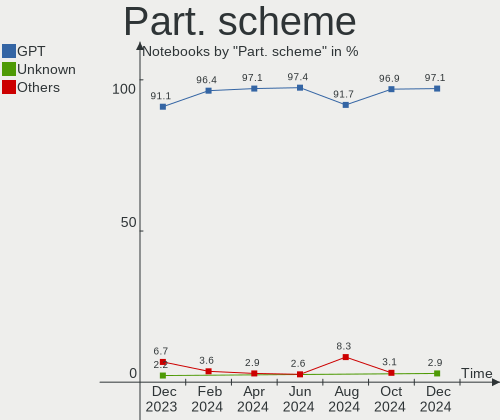
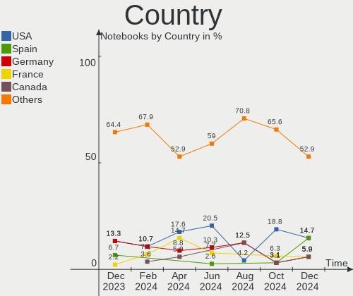
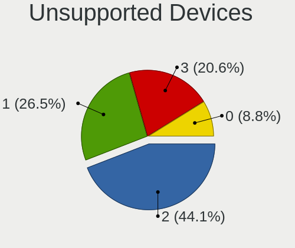

FreeBSD - Hardware Trends (Notebooks)
-------------------------------------

A project to identify most popular hardware characteristics and track their change
over time based on data collected by BSD users at https://BSD-Hardware.info.

Anyone can contribute to this report by the [hw-probe](https://github.com/linuxhw/hw-probe/blob/master/INSTALL.BSD.md) tool:

    hw-probe -all -upload

This report is for one last month. Overall report since the beginning of time: [TestDays](https://github.com/bsdhw/TestDays)

Period: Sep, 2023.

Contents
--------

* [ System ](#system)
  - [ OS                       ](#os)
  - [ OS Family                ](#os-family)
  - [ Arch                     ](#arch)
  - [ DE                       ](#de)
  - [ Display Server           ](#display-server)
  - [ Display Manager          ](#display-manager)
  - [ OS Lang                  ](#os-lang)
  - [ Boot Mode                ](#boot-mode)
  - [ Filesystem               ](#filesystem)
  - [ Part. scheme             ](#part-scheme)

* [ Board ](#board)
  - [ Vendor                   ](#vendor)
  - [ Model                    ](#model)
  - [ Model Family             ](#model-family)
  - [ MFG Year                 ](#mfg-year)
  - [ Form Factor              ](#form-factor)
  - [ Coreboot                 ](#coreboot)
  - [ RAM Size                 ](#ram-size)
  - [ RAM Used                 ](#ram-used)
  - [ Total Drives             ](#total-drives)
  - [ Has CD-ROM               ](#has-cd-rom)
  - [ Has Ethernet             ](#has-ethernet)
  - [ Has WiFi                 ](#has-wifi)
  - [ Has Bluetooth            ](#has-bluetooth)

* [ Location ](#location)
  - [ Country                  ](#country)
  - [ City                     ](#city)

* [ Drives ](#drives)
  - [ Drive Vendor             ](#drive-vendor)
  - [ Drive Model              ](#drive-model)
  - [ HDD Vendor               ](#hdd-vendor)
  - [ SSD Vendor               ](#ssd-vendor)
  - [ Drive Kind               ](#drive-kind)
  - [ Drive Connector          ](#drive-connector)
  - [ Drive Size               ](#drive-size)
  - [ Space Total              ](#space-total)
  - [ Space Used               ](#space-used)
  - [ Malfunc. Drives          ](#malfunc-drives)
  - [ Malfunc. Drive Vendor    ](#malfunc-drive-vendor)
  - [ Malfunc. HDD Vendor      ](#malfunc-hdd-vendor)
  - [ Malfunc. Drive Kind      ](#malfunc-drive-kind)
  - [ Failed Drives            ](#failed-drives)
  - [ Failed Drive Vendor      ](#failed-drive-vendor)
  - [ Drive Status             ](#drive-status)

* [ Storage controller ](#storage-controller)
  - [ Storage Vendor           ](#storage-vendor)
  - [ Storage Model            ](#storage-model)
  - [ Storage Kind             ](#storage-kind)

* [ Processor ](#processor)
  - [ CPU Vendor               ](#cpu-vendor)
  - [ CPU Model                ](#cpu-model)
  - [ CPU Model Family         ](#cpu-model-family)
  - [ CPU Cores                ](#cpu-cores)
  - [ CPU Sockets              ](#cpu-sockets)
  - [ CPU Threads              ](#cpu-threads)
  - [ CPU Microarch            ](#cpu-microarch)

* [ Graphics ](#graphics)
  - [ GPU Vendor               ](#gpu-vendor)
  - [ GPU Model                ](#gpu-model)
  - [ GPU Combo                ](#gpu-combo)
  - [ GPU Driver               ](#gpu-driver)
  - [ GPU Memory               ](#gpu-memory)

* [ Monitor ](#monitor)
  - [ Monitor Vendor           ](#monitor-vendor)
  - [ Monitor Model            ](#monitor-model)
  - [ Monitor Resolution       ](#monitor-resolution)
  - [ Monitor Diagonal         ](#monitor-diagonal)
  - [ Monitor Width            ](#monitor-width)
  - [ Aspect Ratio             ](#aspect-ratio)
  - [ Monitor Area             ](#monitor-area)
  - [ Pixel Density            ](#pixel-density)
  - [ Multiple Monitors        ](#multiple-monitors)

* [ Network ](#network)
  - [ Net Controller Vendor    ](#net-controller-vendor)
  - [ Net Controller Model     ](#net-controller-model)
  - [ Wireless Vendor          ](#wireless-vendor)
  - [ Wireless Model           ](#wireless-model)
  - [ Ethernet Vendor          ](#ethernet-vendor)
  - [ Ethernet Model           ](#ethernet-model)
  - [ Net Controller Kind      ](#net-controller-kind)
  - [ Used Controller          ](#used-controller)
  - [ NICs                     ](#nics)
  - [ IPv6                     ](#ipv6)

* [ Bluetooth ](#bluetooth)
  - [ Bluetooth Vendor         ](#bluetooth-vendor)
  - [ Bluetooth Model          ](#bluetooth-model)

* [ Sound ](#sound)
  - [ Sound Vendor             ](#sound-vendor)
  - [ Sound Model              ](#sound-model)

* [ Memory ](#memory)
  - [ Memory Vendor            ](#memory-vendor)
  - [ Memory Model             ](#memory-model)
  - [ Memory Kind              ](#memory-kind)
  - [ Memory Form Factor       ](#memory-form-factor)
  - [ Memory Size              ](#memory-size)
  - [ Memory Speed             ](#memory-speed)

* [ Printers & scanners ](#printers--scanners)
  - [ Printer Vendor           ](#printer-vendor)
  - [ Printer Model            ](#printer-model)
  - [ Scanner Vendor           ](#scanner-vendor)
  - [ Scanner Model            ](#scanner-model)

* [ Camera ](#camera)
  - [ Camera Vendor            ](#camera-vendor)
  - [ Camera Model             ](#camera-model)

* [ Security ](#security)
  - [ Fingerprint Vendor       ](#fingerprint-vendor)
  - [ Fingerprint Model        ](#fingerprint-model)
  - [ Chipcard Vendor          ](#chipcard-vendor)
  - [ Chipcard Model           ](#chipcard-model)

* [ Unsupported ](#unsupported)
  - [ Unsupported Devices      ](#unsupported-devices)
  - [ Unsupported Device Types ](#unsupported-device-types)

System
------

OS
--

Installed operating systems

| Name                     | Notebooks | Percent |
|--------------------------|-----------|---------|
| FreeBSD 13.2             | 7         | 28%     |
| FreeBSD 13.2-p3          | 6         | 24%     |
| FreeBSD 13.2-p2          | 3         | 12%     |
| FreeBSD 15.0-CURRENT     | 2         | 8%      |
| FreeBSD 14.0-BETA2       | 2         | 8%      |
| FreeBSD 14.0-STABLE-HBSD | 1         | 4%      |
| FreeBSD 14.0-BETA1       | 1         | 4%      |
| FreeBSD 13.2-STABLE      | 1         | 4%      |
| FreeBSD 13.2-p20         | 1         | 4%      |
| FreeBSD 13.2-p1          | 1         | 4%      |

OS Family
---------

OS without a version

| Name    | Notebooks | Percent |
|---------|-----------|---------|
| FreeBSD | 25        | 100%    |

Arch
----

OS architecture (x86_64, i586, etc.)

| Name  | Notebooks | Percent |
|-------|-----------|---------|
| amd64 | 25        | 100%    |

DE
--

Desktop Environment

| Name    | Notebooks | Percent |
|---------|-----------|---------|
| KDE5    | 6         | 24%     |
| XFCE    | 4         | 16%     |
| Console | 4         | 16%     |
| TWM     | 3         | 12%     |
| i3      | 3         | 12%     |
| MATE    | 2         | 8%      |
| GNOME   | 1         | 4%      |
| Fluxbox | 1         | 4%      |
| Budgie  | 1         | 4%      |

Display Server
--------------

X11 or Wayland

| Name    | Notebooks | Percent |
|---------|-----------|---------|
| X11     | 19        | 76%     |
| Wayland | 5         | 20%     |
| Console | 1         | 4%      |

Display Manager
---------------

SDDM, LightDM, etc.

| Name    | Notebooks | Percent |
|---------|-----------|---------|
| Console | 9         | 36%     |
| SDDM    | 6         | 24%     |
| SLiM    | 4         | 16%     |
| LightDM | 4         | 16%     |
| XDM     | 1         | 4%      |
| Ly      | 1         | 4%      |

OS Lang
-------

Language

| Lang  | Notebooks | Percent |
|-------|-----------|---------|
| C     | 19        | 76%     |
| fr_FR | 2         | 8%      |
| en_US | 2         | 8%      |
| ru_RU | 1         | 4%      |
| de    | 1         | 4%      |

Boot Mode
---------

EFI or BIOS

| Mode | Notebooks | Percent |
|------|-----------|---------|
| EFI  | 21        | 84%     |
| BIOS | 4         | 16%     |

Filesystem
----------

Type of filesystem

| Type | Notebooks | Percent |
|------|-----------|---------|
| Zfs  | 19        | 76%     |
| Ufs  | 6         | 24%     |

Part. scheme
------------

Scheme of partitioning

| Type    | Notebooks | Percent |
|---------|-----------|---------|
| GPT     | 23        | 92%     |
| BSD     | 1         | 4%      |
| Unknown | 1         | 4%      |

Board
-----

Vendor
------

Motherboard manufacturer

| Name             | Notebooks | Percent |
|------------------|-----------|---------|
| Lenovo           | 9         | 36%     |
| Hewlett-Packard  | 5         | 20%     |
| Dell             | 3         | 12%     |
| ASUSTek Computer | 3         | 12%     |
| MECHREVO         | 1         | 4%      |
| GPU Company      | 1         | 4%      |
| Apple            | 1         | 4%      |
| Alienware        | 1         | 4%      |
| Unknown          | 1         | 4%      |

Model
-----

Motherboard model

| Name                                    | Notebooks | Percent |
|-----------------------------------------|-----------|---------|
| MECHREVO WUJIE 16                       | 1         | 4%      |
| Lenovo ThinkPad X260 20F6006XUK         | 1         | 4%      |
| Lenovo ThinkPad X220 Tablet 42962WU     | 1         | 4%      |
| Lenovo ThinkPad T480s 20L8S3LR00        | 1         | 4%      |
| Lenovo ThinkPad T480s 20L7S24F00        | 1         | 4%      |
| Lenovo ThinkPad T14 Gen 2i 20W1S4G22G   | 1         | 4%      |
| Lenovo ThinkPad P16 Gen 1 21D6006FUS    | 1         | 4%      |
| Lenovo ThinkPad L390 20NRS00Q00         | 1         | 4%      |
| Lenovo ThinkBook 13s G2 ITL 20V9        | 1         | 4%      |
| Lenovo IdeaPad 1 11ADA05 82GV           | 1         | 4%      |
| HP ZBook 17 G2                          | 1         | 4%      |
| HP ProBook 4530s                        | 1         | 4%      |
| HP Pavilion dv5                         | 1         | 4%      |
| HP Mini 110-3100                        | 1         | 4%      |
| HP EliteBook 8570p                      | 1         | 4%      |
| GPU Company GWTC116-2                   | 1         | 4%      |
| Dell Latitude 3410                      | 1         | 4%      |
| Dell Inspiron 15 7000 Gaming            | 1         | 4%      |
| Dell G16 7630                           | 1         | 4%      |
| ASUS ZenBook UX333FA_UX333FA            | 1         | 4%      |
| ASUS N751JK                             | 1         | 4%      |
| ASUS ASUS TUF Dash F15 FX517ZE_TUF517ZE | 1         | 4%      |
| Apple MacBookPro9,2                     | 1         | 4%      |
| Alienware m15                           | 1         | 4%      |
| Unknown                                 | 1         | 4%      |

Model Family
------------

Motherboard model prefix

| Name                  | Notebooks | Percent |
|-----------------------|-----------|---------|
| Lenovo ThinkPad       | 7         | 28%     |
| MECHREVO WUJIE        | 1         | 4%      |
| Lenovo ThinkBook      | 1         | 4%      |
| Lenovo IdeaPad        | 1         | 4%      |
| HP ZBook              | 1         | 4%      |
| HP ProBook            | 1         | 4%      |
| HP Pavilion           | 1         | 4%      |
| HP Mini               | 1         | 4%      |
| HP EliteBook          | 1         | 4%      |
| GPU Company GWTC116-2 | 1         | 4%      |
| Dell Latitude         | 1         | 4%      |
| Dell Inspiron         | 1         | 4%      |
| Dell G16              | 1         | 4%      |
| ASUS ZenBook          | 1         | 4%      |
| ASUS N751JK           | 1         | 4%      |
| ASUS ASUS             | 1         | 4%      |
| Apple MacBookPro9     | 1         | 4%      |
| Alienware m15         | 1         | 4%      |
| Unknown               | 1         | 4%      |

MFG Year
--------

Motherboard manufacture year

| Year | Notebooks | Percent |
|------|-----------|---------|
| 2023 | 6         | 24%     |
| 2018 | 4         | 16%     |
| 2022 | 3         | 12%     |
| 2019 | 3         | 12%     |
| 2011 | 2         | 8%      |
| 2021 | 1         | 4%      |
| 2020 | 1         | 4%      |
| 2016 | 1         | 4%      |
| 2015 | 1         | 4%      |
| 2013 | 1         | 4%      |
| 2010 | 1         | 4%      |
| 2009 | 1         | 4%      |

Form Factor
-----------

Physical design of the computer

| Name     | Notebooks | Percent |
|----------|-----------|---------|
| Notebook | 25        | 100%    |

Coreboot
--------

Have coreboot on board

| Used | Notebooks | Percent |
|------|-----------|---------|
| No   | 25        | 100%    |

RAM Size
--------

Total RAM memory

| Size in GB  | Notebooks | Percent |
|-------------|-----------|---------|
| 16.01-24.0  | 11        | 44%     |
| 4.01-8.0    | 6         | 24%     |
| 8.01-16.0   | 4         | 16%     |
| 32.01-64.0  | 2         | 8%      |
| 64.01-256.0 | 1         | 4%      |
| 0.51-1.0    | 1         | 4%      |

RAM Used
--------

Used RAM memory

| Used GB  | Notebooks | Percent |
|----------|-----------|---------|
| 0.51-1.0 | 10        | 40%     |
| 0.01-0.5 | 9         | 36%     |
| 1.01-2.0 | 5         | 20%     |
| 2.01-3.0 | 1         | 4%      |

Total Drives
------------

Number of drives on board

| Drives | Notebooks | Percent |
|--------|-----------|---------|
| 1      | 16        | 64%     |
| 0      | 5         | 20%     |
| 2      | 4         | 16%     |

Has CD-ROM
----------

Has CD-ROM on board

| Presented | Notebooks | Percent |
|-----------|-----------|---------|
| No        | 19        | 76%     |
| Yes       | 6         | 24%     |

Has Ethernet
------------

Has Ethernet on board

| Presented | Notebooks | Percent |
|-----------|-----------|---------|
| Yes       | 19        | 76%     |
| No        | 6         | 24%     |

Has WiFi
--------

Has WiFi module

| Presented | Notebooks | Percent |
|-----------|-----------|---------|
| Yes       | 24        | 96%     |
| No        | 1         | 4%      |

Has Bluetooth
-------------

Has Bluetooth module

| Presented | Notebooks | Percent |
|-----------|-----------|---------|
| Yes       | 20        | 80%     |
| No        | 5         | 20%     |

Location
--------

Country
-------

Geographic location (country)

| Country   | Notebooks | Percent |
|-----------|-----------|---------|
| USA       | 4         | 16%     |
| France    | 4         | 16%     |
| Australia | 4         | 16%     |
| Germany   | 3         | 12%     |
| UK        | 2         | 8%      |
| Venezuela | 1         | 4%      |
| Russia    | 1         | 4%      |
| Italy     | 1         | 4%      |
| Iran      | 1         | 4%      |
| Denmark   | 1         | 4%      |
| Czechia   | 1         | 4%      |
| Argentina | 1         | 4%      |
| Algeria   | 1         | 4%      |

City
----

Geographic location (city)

| City             | Notebooks | Percent |
|------------------|-----------|---------|
| Sydney           | 3         | 12%     |
| Hove             | 2         | 8%      |
| Urcuit           | 1         | 4%      |
| Turmero          | 1         | 4%      |
| Saxtons River    | 1         | 4%      |
| Rasht            | 1         | 4%      |
| Philadelphia     | 1         | 4%      |
| Nuremberg        | 1         | 4%      |
| Naples           | 1         | 4%      |
| Münster         | 1         | 4%      |
| Moscow           | 1         | 4%      |
| Montevrain       | 1         | 4%      |
| Lüneburg        | 1         | 4%      |
| Grenoble         | 1         | 4%      |
| Denver           | 1         | 4%      |
| Dammarie-les-Lys | 1         | 4%      |
| Copenhagen       | 1         | 4%      |
| Brno             | 1         | 4%      |
| Bariloche        | 1         | 4%      |
| Annandale        | 1         | 4%      |
| Algiers          | 1         | 4%      |
| Adelaide         | 1         | 4%      |

Drives
------

Drive Vendor
------------

Hard drive vendors

| Vendor              | Notebooks | Drives | Percent |
|---------------------|-----------|--------|---------|
| Samsung Electronics | 5         | 5      | 22.73%  |
| Seagate             | 3         | 3      | 13.64%  |
| Kingston            | 3         | 3      | 13.64%  |
| Toshiba             | 2         | 3      | 9.09%   |
| Intel               | 2         | 2      | 9.09%   |
| HGST                | 2         | 2      | 9.09%   |
| WDC                 | 1         | 1      | 4.55%   |
| Micron Technology   | 1         | 1      | 4.55%   |
| Lenovo              | 1         | 1      | 4.55%   |
| Intenso             | 1         | 1      | 4.55%   |
| Apple               | 1         | 1      | 4.55%   |

Drive Model
-----------

Hard drive models

| Model                                | Notebooks | Percent |
|--------------------------------------|-----------|---------|
| HGST HTS721010A9E630 1TB             | 2         | 9.09%   |
| WDC WDS500G2B0A-00SM50 500GB         | 1         | 4.55%   |
| Toshiba MQ01ACF050 500GB             | 1         | 4.55%   |
| Toshiba KXG50ZNV1T02 NVMe 1024GB     | 1         | 4.55%   |
| Seagate ST9750420AS 752GB            | 1         | 4.55%   |
| Seagate ST9250315AS 250GB            | 1         | 4.55%   |
| Seagate ST1000LM024 HN-M101MBB 1TB   | 1         | 4.55%   |
| Samsung SSD 980 PRO 1TB              | 1         | 4.55%   |
| Samsung SSD 970 EVO Plus 250GB       | 1         | 4.55%   |
| Samsung MZVLW256HEHP-000L7 256GB     | 1         | 4.55%   |
| Samsung MZALQ512HALU-000L2 512GB     | 1         | 4.55%   |
| Samsung MZALQ128HBHQ-000L2 128GB     | 1         | 4.55%   |
| Micron MTFDDAK480MBP-1AN1ZABHB 480GB | 1         | 4.55%   |
| Lenovo LENSE30256GMSP34MEAT3TA 256GB | 1         | 4.55%   |
| Kingston SNV2S1000G 1TB              | 1         | 4.55%   |
| Kingston SA400S37240G 240GB          | 1         | 4.55%   |
| Kingston OM8SEP4512Q-A0 512GB        | 1         | 4.55%   |
| Intenso SSD 240GB                    | 1         | 4.55%   |
| Intel SSDSC2KW480H6 480GB            | 1         | 4.55%   |
| Intel SSDPEKNU512GZ 512GB            | 1         | 4.55%   |
| Apple HDD HTS547550A9E384 500GB      | 1         | 4.55%   |

HDD Vendor
----------

Hard disk drive vendors

| Vendor  | Notebooks | Drives | Percent |
|---------|-----------|--------|---------|
| Seagate | 3         | 3      | 42.86%  |
| HGST    | 2         | 2      | 28.57%  |
| Toshiba | 1         | 1      | 14.29%  |
| Apple   | 1         | 1      | 14.29%  |

SSD Vendor
----------

Solid state drive vendors

| Vendor            | Notebooks | Drives | Percent |
|-------------------|-----------|--------|---------|
| WDC               | 1         | 1      | 20%     |
| Micron Technology | 1         | 1      | 20%     |
| Kingston          | 1         | 1      | 20%     |
| Intenso           | 1         | 1      | 20%     |
| Intel             | 1         | 1      | 20%     |

Drive Kind
----------

HDD or SSD

| Kind | Notebooks | Drives | Percent |
|------|-----------|--------|---------|
| NVMe | 10        | 11     | 50%     |
| HDD  | 6         | 7      | 30%     |
| SSD  | 4         | 5      | 20%     |

Drive Connector
---------------

SATA, SAS, NVMe, etc.

| Type | Notebooks | Drives | Percent |
|------|-----------|--------|---------|
| NVMe | 10        | 11     | 50%     |
| SATA | 10        | 12     | 50%     |

Drive Size
----------

Size of hard drive

| Size in TB | Notebooks | Drives | Percent |
|------------|-----------|--------|---------|
| 0.01-0.5   | 7         | 8      | 70%     |
| 0.51-1.0   | 3         | 4      | 30%     |

Space Total
-----------

Amount of disk space available on the file system

| Size in GB | Notebooks | Percent |
|------------|-----------|---------|
| 101-250    | 10        | 40%     |
| 251-500    | 8         | 32%     |
| 501-1000   | 5         | 20%     |
| 51-100     | 2         | 8%      |

Space Used
----------

Amount of used disk space

| Used GB | Notebooks | Percent |
|---------|-----------|---------|
| 1-20    | 19        | 76%     |
| 21-50   | 3         | 12%     |
| 251-500 | 1         | 4%      |
| 101-250 | 1         | 4%      |
| 51-100  | 1         | 4%      |

Malfunc. Drives
---------------

Drive models with a malfunction

| Model                           | Notebooks | Drives | Percent |
|---------------------------------|-----------|--------|---------|
| HGST HTS721010A9E630 1TB        | 2         | 2      | 50%     |
| Seagate ST9250315AS 250GB       | 1         | 1      | 25%     |
| Apple HDD HTS547550A9E384 500GB | 1         | 1      | 25%     |

Malfunc. Drive Vendor
---------------------

Vendors of faulty drives

| Vendor  | Notebooks | Drives | Percent |
|---------|-----------|--------|---------|
| HGST    | 2         | 2      | 50%     |
| Seagate | 1         | 1      | 25%     |
| Apple   | 1         | 1      | 25%     |

Malfunc. HDD Vendor
-------------------

Vendors of faulty HDD drives

| Vendor  | Notebooks | Drives | Percent |
|---------|-----------|--------|---------|
| HGST    | 2         | 2      | 50%     |
| Seagate | 1         | 1      | 25%     |
| Apple   | 1         | 1      | 25%     |

Malfunc. Drive Kind
-------------------

Kinds of faulty drives

| Kind | Notebooks | Drives | Percent |
|------|-----------|--------|---------|
| HDD  | 4         | 4      | 100%    |

Failed Drives
-------------

Failed drive models

Zero info for selected period =(

Failed Drive Vendor
-------------------

Failed drive vendors

Zero info for selected period =(

Drive Status
------------

Number of failed and malfunc. drives

| Status  | Notebooks | Drives | Percent |
|---------|-----------|--------|---------|
| Works   | 17        | 19     | 80.95%  |
| Malfunc | 4         | 4      | 19.05%  |

Storage controller
------------------

Storage Vendor
--------------

Storage controller vendors

| Vendor                      | Notebooks | Percent |
|-----------------------------|-----------|---------|
| Intel                       | 16        | 55.17%  |
| Samsung Electronics         | 6         | 20.69%  |
| SanDisk                     | 2         | 6.9%    |
| Kingston Technology Company | 2         | 6.9%    |
| Toshiba                     | 1         | 3.45%   |
| Micron Technology           | 1         | 3.45%   |
| Lenovo                      | 1         | 3.45%   |

Storage Model
-------------

Storage controller models

| Model                                                                          | Notebooks | Percent |
|--------------------------------------------------------------------------------|-----------|---------|
| Samsung NVMe SSD Controller SM981/PM981/PM983                                  | 2         | 6.9%    |
| Samsung NVMe SSD Controller 980                                                | 2         | 6.9%    |
| Intel Celeron/Pentium Silver Processor SATA Controller                         | 2         | 6.9%    |
| Intel 8 Series/C220 Series Chipset Family 6-port SATA Controller 1 [AHCI mode] | 2         | 6.9%    |
| Intel 7 Series Chipset Family 6-port SATA Controller [AHCI mode]               | 2         | 6.9%    |
| Intel 6 Series/C200 Series Chipset Family 6 port Mobile SATA AHCI Controller   | 2         | 6.9%    |
| Toshiba XG5 NVMe SSD Controller                                                | 1         | 3.45%   |
| SanDisk WD Blue SN570 NVMe SSD 1TB                                             | 1         | 3.45%   |
| Sandisk PC SN740 NVMe SSD (DRAM-less)                                          | 1         | 3.45%   |
| Samsung NVMe SSD Controller SM961/PM961/SM963                                  | 1         | 3.45%   |
| Samsung NVMe SSD Controller PM9A1/PM9A3/980PRO                                 | 1         | 3.45%   |
| Micron 3400 NVMe SSD [Hendrix]                                                 | 1         | 3.45%   |
| Lenovo LENSE30256GMSP34MEAT3TA                                                 | 1         | 3.45%   |
| Kingston Company unknown                                                       | 1         | 3.45%   |
| Kingston Company Design-In PCIe 4 NVMe SSD (TLC)                               | 1         | 3.45%   |
| Intel Volume Management Device NVMe RAID Controller Intel Corporation          | 1         | 3.45%   |
| Intel Sunrise Point-LP SATA Controller [AHCI mode]                             | 1         | 3.45%   |
| Intel SSD 670p Series [Keystone Harbor]                                        | 1         | 3.45%   |
| Intel NM10/ICH7 Family SATA Controller [AHCI mode]                             | 1         | 3.45%   |
| Intel HM170/QM170 Chipset SATA Controller [AHCI Mode]                          | 1         | 3.45%   |
| Intel Comet Lake SATA AHCI Controller                                          | 1         | 3.45%   |
| Intel Cannon Lake Mobile PCH SATA AHCI Controller                              | 1         | 3.45%   |
| Intel 82801IBM/IEM (ICH9M/ICH9M-E) 4 port SATA Controller [AHCI mode]          | 1         | 3.45%   |

Storage Kind
------------

Kind of storage controller (IDE, SATA, NVMe, SAS, ...)

| Kind | Notebooks | Percent |
|------|-----------|---------|
| NVMe | 14        | 48.28%  |
| SATA | 14        | 48.28%  |
| RAID | 1         | 3.45%   |

Processor
---------

CPU Vendor
----------

Processor vendors

| Vendor | Notebooks | Percent |
|--------|-----------|---------|
| Intel  | 23        | 92%     |
| AMD    | 2         | 8%      |

CPU Model
---------

Processor models

| Model                                        | Notebooks | Percent |
|----------------------------------------------|-----------|---------|
| Intel Core i5-8250U CPU @ 1.60GHz            | 2         | 8%      |
| Intel Core i7-8750H CPU @ 2.20GHz            | 1         | 4%      |
| Intel Core i7-8565U CPU @ 1.80GHz            | 1         | 4%      |
| Intel Core i7-6500U CPU @ 2.50GHz            | 1         | 4%      |
| Intel Core i7-4710MQ CPU @ 2.50GHz           | 1         | 4%      |
| Intel Core i7-4710HQ CPU @ 2.50GHz           | 1         | 4%      |
| Intel Core i7-3520M CPU @ 2.90GHz            | 1         | 4%      |
| Intel Core i5-8265U CPU @ 1.60GHz            | 1         | 4%      |
| Intel Core i5-7300HQ CPU @ 2.50GHz           | 1         | 4%      |
| Intel Core i5-3210M CPU @ 2.50GHz            | 1         | 4%      |
| Intel Core i5-2520M CPU @ 2.50GHz            | 1         | 4%      |
| Intel Core i3-2350M CPU @ 2.30GHz            | 1         | 4%      |
| Intel Core i3-10110U CPU @ 2.10GHz           | 1         | 4%      |
| Intel Core 2 Duo CPU T9400 @ 2.53GHz         | 1         | 4%      |
| Intel Celeron N4020 CPU @ 1.10GHz            | 1         | 4%      |
| Intel Celeron J4125 CPU @ 2.00GHz            | 1         | 4%      |
| Intel Atom CPU N455 @ 1.66GHz                | 1         | 4%      |
| Intel 13th Gen Core i7-13650HX               | 1         | 4%      |
| Intel 12th Gen Core i7-12850HX               | 1         | 4%      |
| Intel 12th Gen Core i7-12650H                | 1         | 4%      |
| Intel 11th Gen Core i7-1165G7 @ 2.80GHz      | 1         | 4%      |
| Intel 11th Gen Core i5-1145G7 @ 2.60GHz      | 1         | 4%      |
| AMD Ryzen 7 7735H with Radeon Graphics       | 1         | 4%      |
| AMD Athlon Silver 3050e with Radeon Graphics | 1         | 4%      |

CPU Model Family
----------------

Processor model prefix

| Model            | Notebooks | Percent |
|------------------|-----------|---------|
| Intel Core i7    | 6         | 24%     |
| Intel Core i5    | 6         | 24%     |
| Other            | 5         | 20%     |
| Intel Core i3    | 2         | 8%      |
| Intel Celeron    | 2         | 8%      |
| Intel Core 2 Duo | 1         | 4%      |
| Intel Atom       | 1         | 4%      |
| AMD Ryzen 7      | 1         | 4%      |
| AMD Athlon       | 1         | 4%      |

CPU Cores
---------

Number of processor cores

| Number  | Notebooks | Percent |
|---------|-----------|---------|
| 4       | 11        | 44%     |
| 2       | 7         | 28%     |
| 16      | 1         | 4%      |
| 12      | 1         | 4%      |
| 10      | 1         | 4%      |
| 8       | 1         | 4%      |
| 6       | 1         | 4%      |
| 1       | 1         | 4%      |
| Unknown | 1         | 4%      |

CPU Sockets
-----------

Number of sockets

| Number | Notebooks | Percent |
|--------|-----------|---------|
| 1      | 25        | 100%    |

CPU Threads
-----------

Threads per core (Hyper-Threading)

| Number  | Notebooks | Percent |
|---------|-----------|---------|
| 2       | 19        | 76%     |
| 1       | 5         | 20%     |
| Unknown | 1         | 4%      |

CPU Microarch
-------------

Microarchitecture

| Name          | Notebooks | Percent |
|---------------|-----------|---------|
| KabyLake      | 7         | 28%     |
| Unknown       | 4         | 16%     |
| TigerLake     | 2         | 8%      |
| SandyBridge   | 2         | 8%      |
| IvyBridge     | 2         | 8%      |
| Haswell       | 2         | 8%      |
| Goldmont plus | 2         | 8%      |
| Zen           | 1         | 4%      |
| Skylake       | 1         | 4%      |
| Penryn        | 1         | 4%      |
| Bonnell       | 1         | 4%      |

Graphics
--------

GPU Vendor
----------

Vendors of graphics cards

| Vendor | Notebooks | Percent |
|--------|-----------|---------|
| Intel  | 19        | 63.33%  |
| Nvidia | 8         | 26.67%  |
| AMD    | 3         | 10%     |

GPU Model
---------

Graphics card models

| Model                                                                     | Notebooks | Percent |
|---------------------------------------------------------------------------|-----------|---------|
| Intel WhiskeyLake-U GT2 [UHD Graphics 620]                                | 2         | 6.67%   |
| Intel UHD Graphics 620                                                    | 2         | 6.67%   |
| Intel TigerLake-LP GT2 [Iris Xe Graphics]                                 | 2         | 6.67%   |
| Intel GeminiLake [UHD Graphics 600]                                       | 2         | 6.67%   |
| Intel 2nd Generation Core Processor Family Integrated Graphics Controller | 2         | 6.67%   |
| Nvidia GP107M [GeForce GTX 1050 Mobile]                                   | 1         | 3.33%   |
| Nvidia GP104M [GeForce GTX 1070 Mobile]                                   | 1         | 3.33%   |
| Nvidia GM107M [GeForce GTX 850M]                                          | 1         | 3.33%   |
| Nvidia GK107GLM [Quadro K1100M]                                           | 1         | 3.33%   |
| Nvidia GA107M [GeForce RTX 3050 Ti Mobile]                                | 1         | 3.33%   |
| Nvidia GA107GLM [RTX A1000 Laptop GPU]                                    | 1         | 3.33%   |
| Nvidia G96CM [GeForce 9600M GT]                                           | 1         | 3.33%   |
| Nvidia AD107M [GeForce RTX 4060 Max-Q / Mobile]                           | 1         | 3.33%   |
| Intel Skylake GT2 [HD Graphics 520]                                       | 1         | 3.33%   |
| Intel Raptor Lake-S UHD Graphics                                          | 1         | 3.33%   |
| Intel HD Graphics 630                                                     | 1         | 3.33%   |
| Intel CometLake-U GT2 [UHD Graphics]                                      | 1         | 3.33%   |
| Intel CoffeeLake-H GT2 [UHD Graphics 630]                                 | 1         | 3.33%   |
| Intel Atom Processor D4xx/D5xx/N4xx/N5xx Integrated Graphics Controller   | 1         | 3.33%   |
| Intel Alder Lake-P GT1 [UHD Graphics]                                     | 1         | 3.33%   |
| Intel 4th Gen Core Processor Integrated Graphics Controller               | 1         | 3.33%   |
| Intel 3rd Gen Core processor Graphics Controller                          | 1         | 3.33%   |
| AMD Thames [Radeon HD 7550M/7570M/7650M]                                  | 1         | 3.33%   |
| AMD Rembrandt [Radeon 680M]                                               | 1         | 3.33%   |
| AMD Picasso/Raven 2 [Radeon Vega Series / Radeon Vega Mobile Series]      | 1         | 3.33%   |

GPU Combo
---------

Combinations of graphics cards

| Name           | Notebooks | Percent |
|----------------|-----------|---------|
| 1 x Intel      | 13        | 52%     |
| Intel + Nvidia | 5         | 20%     |
| 1 x Nvidia     | 3         | 12%     |
| 1 x AMD        | 3         | 12%     |
| 2 x Intel      | 1         | 4%      |

GPU Driver
----------

Free vs proprietary

| Driver      | Notebooks | Percent |
|-------------|-----------|---------|
| Free        | 19        | 76%     |
| Proprietary | 6         | 24%     |

GPU Memory
----------

Total video memory

| Size in GB | Notebooks | Percent |
|------------|-----------|---------|
| Unknown    | 18        | 72%     |
| 0.01-0.5   | 3         | 12%     |
| 7.01-8.0   | 1         | 4%      |
| 3.01-4.0   | 1         | 4%      |
| 1.01-2.0   | 1         | 4%      |
| 0.51-1.0   | 1         | 4%      |

Monitor
-------

Monitor Vendor
--------------

Monitor vendors

| Vendor              | Notebooks | Percent |
|---------------------|-----------|---------|
| Chimei Innolux      | 4         | 17.39%  |
| LG Display          | 3         | 13.04%  |
| Philips             | 2         | 8.7%    |
| InfoVision          | 2         | 8.7%    |
| BOE                 | 2         | 8.7%    |
| AU Optronics        | 2         | 8.7%    |
| ViewSonic           | 1         | 4.35%   |
| SDC                 | 1         | 4.35%   |
| Samsung Electronics | 1         | 4.35%   |
| LG Philips          | 1         | 4.35%   |
| Lenovo              | 1         | 4.35%   |
| Dell                | 1         | 4.35%   |
| CSO                 | 1         | 4.35%   |
| Unknown             | 1         | 4.35%   |

Monitor Model
-------------

Monitor models

| Model                                                                | Notebooks | Percent |
|----------------------------------------------------------------------|-----------|---------|
| ViewSonic TD2420 SERIES VSC452D 1920x1080 520x290mm 23.4-inch        | 1         | 4%      |
| SDC LCD Monitor 5440x1080                                            | 1         | 4%      |
| SDC LCD Monitor 1600x900                                             | 1         | 4%      |
| Samsung Electronics SA300/SA350 SAM0788 1366x768 410x230mm 18.5-inch | 1         | 4%      |
| Philips LCD Monitor 271P4 5440x1080                                  | 1         | 4%      |
| Philips LCD Monitor 271P4                                            | 1         | 4%      |
| Philips 271P4 PHL08C3 1920x1080 600x340mm 27.2-inch                  | 1         | 4%      |
| LG Philips LP154WX4-TLCB LPL3101 1280x800 330x210mm 15.4-inch        | 1         | 4%      |
| LG Display LCD Monitor LGD046C 1920x1080 380x210mm 17.1-inch         | 1         | 4%      |
| LG Display LCD Monitor LGD02D8 1366x768 280x160mm 12.7-inch          | 1         | 4%      |
| LG Display LCD Monitor LGD0258 1600x900 350x190mm 15.7-inch          | 1         | 4%      |
| Lenovo P27h-20 LEN61E9 2560x1440 600x340mm 27.2-inch                 | 1         | 4%      |
| InfoVision LCD Monitor IVO854A 1920x1200 290x180mm 13.4-inch         | 1         | 4%      |
| InfoVision LCD Monitor IVO03F4 1024x600 220x130mm 10.1-inch          | 1         | 4%      |
| Dell P2723QE DELF13C 3840x2160 600x340mm 27.2-inch                   | 1         | 4%      |
| CSO LCD Monitor CSO160D 1920x1200 340x220mm 15.9-inch                | 1         | 4%      |
| Chimei Innolux LCD Monitor CMN15C4 1920x1080 340x190mm 15.3-inch     | 1         | 4%      |
| Chimei Innolux LCD Monitor CMN14D6 1366x768 310x170mm 13.9-inch      | 1         | 4%      |
| Chimei Innolux LCD Monitor CMN140A 1920x1080 310x170mm 13.9-inch     | 1         | 4%      |
| Chimei Innolux LCD Monitor CMN1132 1366x768 260x140mm 11.6-inch      | 1         | 4%      |
| BOE LCD Monitor BOE0997 2560x1600 340x220mm 15.9-inch                | 1         | 4%      |
| BOE LCD Monitor BOE0731 1366x768 260x140mm 11.6-inch                 | 1         | 4%      |
| AU Optronics LCD Monitor AUO23EC 1366x768 340x190mm 15.3-inch        | 1         | 4%      |
| AU Optronics LCD Monitor AUO226D 1920x1080 280x160mm 12.7-inch       | 1         | 4%      |
| Unknown                                                              | 1         | 4%      |

Monitor Resolution
------------------

Monitor screen resolution

| Resolution        | Notebooks | Percent |
|-------------------|-----------|---------|
| 1920x1080 (FHD)   | 6         | 25%     |
| 1366x768 (WXGA)   | 6         | 25%     |
| 2560x1600         | 2         | 8.33%   |
| 1920x1200 (WUXGA) | 2         | 8.33%   |
| 1600x900 (HD+)    | 2         | 8.33%   |
| 5440x1080         | 1         | 4.17%   |
| 3840x2160 (4K)    | 1         | 4.17%   |
| 2560x1440 (QHD)   | 1         | 4.17%   |
| 1280x800 (WXGA)   | 1         | 4.17%   |
| 1024x600          | 1         | 4.17%   |
| Unknown           | 1         | 4.17%   |

Monitor Diagonal
----------------

Diagonal size in inches

| Inches  | Notebooks | Percent |
|---------|-----------|---------|
| 15      | 6         | 27.27%  |
| 27      | 3         | 13.64%  |
| 13      | 3         | 13.64%  |
| 12      | 2         | 9.09%   |
| 11      | 2         | 9.09%   |
| Unknown | 2         | 9.09%   |
| 23      | 1         | 4.55%   |
| 18      | 1         | 4.55%   |
| 17      | 1         | 4.55%   |
| 10      | 1         | 4.55%   |

Monitor Width
-------------

Physical width

| Width in mm | Notebooks | Percent |
|-------------|-----------|---------|
| 301-350     | 8         | 36.36%  |
| 201-300     | 6         | 27.27%  |
| 501-600     | 4         | 18.18%  |
| Unknown     | 2         | 9.09%   |
| 401-500     | 1         | 4.55%   |
| 351-400     | 1         | 4.55%   |

Aspect Ratio
------------

Proportional relationship between the width and the height

| Ratio   | Notebooks | Percent |
|---------|-----------|---------|
| 16/9    | 14        | 70%     |
| 3/2     | 2         | 10%     |
| 16/10   | 2         | 10%     |
| Unknown | 2         | 10%     |

Monitor Area
------------

Area in inch²

| Area in inch² | Notebooks | Percent |
|----------------|-----------|---------|
| 81-90          | 3         | 13.64%  |
| 301-350        | 3         | 13.64%  |
| 61-70          | 2         | 9.09%   |
| 51-60          | 2         | 9.09%   |
| 111-120        | 2         | 9.09%   |
| 101-110        | 2         | 9.09%   |
| 91-100         | 2         | 9.09%   |
| Unknown        | 2         | 9.09%   |
| 41-50          | 1         | 4.55%   |
| 201-250        | 1         | 4.55%   |
| 141-150        | 1         | 4.55%   |
| 121-130        | 1         | 4.55%   |

Pixel Density
-------------

Pixels per inch

| Density | Notebooks | Percent |
|---------|-----------|---------|
| 121-160 | 7         | 33.33%  |
| 101-120 | 5         | 23.81%  |
| 51-100  | 4         | 19.05%  |
| 161-240 | 3         | 14.29%  |
| Unknown | 2         | 9.52%   |

Multiple Monitors
-----------------

Total monitors connected

| Total | Notebooks | Percent |
|-------|-----------|---------|
| 1     | 13        | 52%     |
| 0     | 7         | 28%     |
| 2     | 4         | 16%     |
| 3     | 1         | 4%      |

Network
-------

Net Controller Vendor
---------------------

Controller vendors

| Vendor                                 | Notebooks | Percent |
|----------------------------------------|-----------|---------|
| Intel                                  | 19        | 51.35%  |
| Realtek Semiconductor                  | 10        | 27.03%  |
| Qualcomm Atheros                       | 3         | 8.11%   |
| Broadcom                               | 2         | 5.41%   |
| Sony Ericsson Mobile Communications AB | 1         | 2.7%    |
| MediaTek                               | 1         | 2.7%    |
| Hewlett-Packard                        | 1         | 2.7%    |

Net Controller Model
--------------------

Controller models

| Model                                                             | Notebooks | Percent |
|-------------------------------------------------------------------|-----------|---------|
| Realtek RTL8111/8168/8411 PCI Express Gigabit Ethernet Controller | 7         | 14.89%  |
| Intel Wireless 8265 / 8275                                        | 2         | 4.26%   |
| Intel Wi-Fi 6 AX201                                               | 2         | 4.26%   |
| Intel Ethernet Connection (4) I219-V                              | 2         | 4.26%   |
| Intel Centrino Advanced-N 6205 [Taylor Peak]                      | 2         | 4.26%   |
| Intel Cannon Point-LP CNVi [Wireless-AC]                          | 2         | 4.26%   |
| Intel 82579LM Gigabit Network Connection (Lewisville)             | 2         | 4.26%   |
| Sony Ericsson Mobile AB sa0106 Remote NDIS Device                 | 1         | 2.13%   |
| Realtek RTL8188EUS 802.11n Wireless Network Adapter               | 1         | 2.13%   |
| Realtek RTL8188CUS 802.11n WLAN Adapter                           | 1         | 2.13%   |
| Realtek RTL810xE PCI Express Fast Ethernet controller             | 1         | 2.13%   |
| Realtek Bluetooth Adapter                                         | 1         | 2.13%   |
| Qualcomm Atheros QCA6174 802.11ac Wireless Network Adapter        | 1         | 2.13%   |
| Qualcomm Atheros Killer E2500 Gigabit Ethernet Controller         | 1         | 2.13%   |
| Qualcomm Atheros AR9285 Wireless Network Adapter (PCI-Express)    | 1         | 2.13%   |
| MediaTek USB Ethernet-RNDIS                                       | 1         | 2.13%   |
| Intel Wireless-AC 9260                                            | 1         | 2.13%   |
| Intel Wireless 8260                                               | 1         | 2.13%   |
| Intel Wireless 7265                                               | 1         | 2.13%   |
| Intel Wireless 7260                                               | 1         | 2.13%   |
| Intel Wireless 3165                                               | 1         | 2.13%   |
| Intel Wi-Fi 6 AX210/AX211/AX411 160MHz                            | 1         | 2.13%   |
| Intel PRO/Wireless 5100 AGN [Shiloh] Network Connection           | 1         | 2.13%   |
| Intel Ethernet Connection I219-V                                  | 1         | 2.13%   |
| Intel Ethernet Connection I217-LM                                 | 1         | 2.13%   |
| Intel Ethernet Connection (6) I219-V                              | 1         | 2.13%   |
| Intel Ethernet Connection (16) I219-LM                            | 1         | 2.13%   |
| Intel Comet Lake PCH-LP CNVi WiFi                                 | 1         | 2.13%   |
| Intel Alder Lake-S PCH CNVi WiFi                                  | 1         | 2.13%   |
| Intel Alder Lake-P PCH CNVi WiFi                                  | 1         | 2.13%   |
| Intel 700 Series Chipset Family Wi-Fi                             | 1         | 2.13%   |
| HP hs2350 HSPA+ Mobile Broadband Module Network Adapter           | 1         | 2.13%   |
| Broadcom NetXtreme BCM57765 Gigabit Ethernet PCIe                 | 1         | 2.13%   |
| Broadcom BCM4331 802.11a/b/g/n                                    | 1         | 2.13%   |
| Broadcom BCM4313 802.11bgn Wireless Network Adapter               | 1         | 2.13%   |

Wireless Vendor
---------------

Wireless vendors

| Vendor                | Notebooks | Percent |
|-----------------------|-----------|---------|
| Intel                 | 19        | 76%     |
| Realtek Semiconductor | 2         | 8%      |
| Qualcomm Atheros      | 2         | 8%      |
| Broadcom              | 2         | 8%      |

Wireless Model
--------------

Wireless models

| Model                                                          | Notebooks | Percent |
|----------------------------------------------------------------|-----------|---------|
| Intel Wireless 8265 / 8275                                     | 2         | 7.69%   |
| Intel Wi-Fi 6 AX201                                            | 2         | 7.69%   |
| Intel Centrino Advanced-N 6205 [Taylor Peak]                   | 2         | 7.69%   |
| Intel Cannon Point-LP CNVi [Wireless-AC]                       | 2         | 7.69%   |
| Realtek RTL8188EUS 802.11n Wireless Network Adapter            | 1         | 3.85%   |
| Realtek RTL8188CUS 802.11n WLAN Adapter                        | 1         | 3.85%   |
| Realtek Bluetooth Adapter                                      | 1         | 3.85%   |
| Qualcomm Atheros QCA6174 802.11ac Wireless Network Adapter     | 1         | 3.85%   |
| Qualcomm Atheros AR9285 Wireless Network Adapter (PCI-Express) | 1         | 3.85%   |
| Intel Wireless-AC 9260                                         | 1         | 3.85%   |
| Intel Wireless 8260                                            | 1         | 3.85%   |
| Intel Wireless 7265                                            | 1         | 3.85%   |
| Intel Wireless 7260                                            | 1         | 3.85%   |
| Intel Wireless 3165                                            | 1         | 3.85%   |
| Intel Wi-Fi 6 AX210/AX211/AX411 160MHz                         | 1         | 3.85%   |
| Intel PRO/Wireless 5100 AGN [Shiloh] Network Connection        | 1         | 3.85%   |
| Intel Comet Lake PCH-LP CNVi WiFi                              | 1         | 3.85%   |
| Intel Alder Lake-S PCH CNVi WiFi                               | 1         | 3.85%   |
| Intel Alder Lake-P PCH CNVi WiFi                               | 1         | 3.85%   |
| Intel 700 Series Chipset Family Wi-Fi                          | 1         | 3.85%   |
| Broadcom BCM4331 802.11a/b/g/n                                 | 1         | 3.85%   |
| Broadcom BCM4313 802.11bgn Wireless Network Adapter            | 1         | 3.85%   |

Ethernet Vendor
---------------

Ethernet vendors

| Vendor                                 | Notebooks | Percent |
|----------------------------------------|-----------|---------|
| Realtek Semiconductor                  | 8         | 40%     |
| Intel                                  | 8         | 40%     |
| Sony Ericsson Mobile Communications AB | 1         | 5%      |
| Qualcomm Atheros                       | 1         | 5%      |
| MediaTek                               | 1         | 5%      |
| Broadcom                               | 1         | 5%      |

Ethernet Model
--------------

Ethernet models

| Model                                                             | Notebooks | Percent |
|-------------------------------------------------------------------|-----------|---------|
| Realtek RTL8111/8168/8411 PCI Express Gigabit Ethernet Controller | 7         | 35%     |
| Intel Ethernet Connection (4) I219-V                              | 2         | 10%     |
| Intel 82579LM Gigabit Network Connection (Lewisville)             | 2         | 10%     |
| Sony Ericsson Mobile AB sa0106 Remote NDIS Device                 | 1         | 5%      |
| Realtek RTL810xE PCI Express Fast Ethernet controller             | 1         | 5%      |
| Qualcomm Atheros Killer E2500 Gigabit Ethernet Controller         | 1         | 5%      |
| MediaTek USB Ethernet-RNDIS                                       | 1         | 5%      |
| Intel Ethernet Connection I219-V                                  | 1         | 5%      |
| Intel Ethernet Connection I217-LM                                 | 1         | 5%      |
| Intel Ethernet Connection (6) I219-V                              | 1         | 5%      |
| Intel Ethernet Connection (16) I219-LM                            | 1         | 5%      |
| Broadcom NetXtreme BCM57765 Gigabit Ethernet PCIe                 | 1         | 5%      |

Net Controller Kind
-------------------

Ethernet, WiFi or modem

| Kind     | Notebooks | Percent |
|----------|-----------|---------|
| WiFi     | 24        | 54.55%  |
| Ethernet | 19        | 43.18%  |
| Modem    | 1         | 2.27%   |

Used Controller
---------------

Currently used network controller

| Kind     | Notebooks | Percent |
|----------|-----------|---------|
| WiFi     | 12        | 57.14%  |
| Ethernet | 9         | 42.86%  |

NICs
----

Total network controllers on board

| Total | Notebooks | Percent |
|-------|-----------|---------|
| 2     | 17        | 68%     |
| 1     | 7         | 28%     |
| 0     | 1         | 4%      |

IPv6
----

IPv6 vs IPv4

| Used | Notebooks | Percent |
|------|-----------|---------|
| No   | 21        | 84%     |
| Yes  | 4         | 16%     |

Bluetooth
---------

Bluetooth Vendor
----------------

Controller vendors

| Vendor                          | Notebooks | Percent |
|---------------------------------|-----------|---------|
| Intel                           | 13        | 65%     |
| Hewlett-Packard                 | 2         | 10%     |
| Broadcom                        | 2         | 10%     |
| Realtek Semiconductor           | 1         | 5%      |
| Qualcomm Atheros Communications | 1         | 5%      |
| Apple                           | 1         | 5%      |

Bluetooth Model
---------------

Controller models

| Model                                          | Notebooks | Percent |
|------------------------------------------------|-----------|---------|
| Intel Bluetooth wireless interface             | 4         | 20%     |
| Intel AX201 Bluetooth                          | 4         | 20%     |
| Intel Bluetooth 9460/9560 Jefferson Peak (JfP) | 2         | 10%     |
| Realtek Bluetooth Adapter                      | 1         | 5%      |
| Qualcomm Atheros QCA61x4 Bluetooth 4.0         | 1         | 5%      |
| Intel Wireless-AC 9260 Bluetooth Adapter       | 1         | 5%      |
| Intel Wireless Bluetooth                       | 1         | 5%      |
| Intel AX210 Bluetooth                          | 1         | 5%      |
| HP Bluetooth 2.0 Interface [Broadcom BCM2045]  | 1         | 5%      |
| HP Atheros AR9285 Malbec Bluetooth Adapter     | 1         | 5%      |
| Broadcom BCM2070 Bluetooth 2.1 + EDR           | 1         | 5%      |
| Broadcom BCM2045B (BDC-2.1)                    | 1         | 5%      |
| Apple Broadcom Built-in Bluetooth              | 1         | 5%      |

Sound
-----

Sound Vendor
------------

Sound card vendors

| Vendor              | Notebooks | Percent |
|---------------------|-----------|---------|
| Intel               | 23        | 71.88%  |
| Nvidia              | 4         | 12.5%   |
| AMD                 | 3         | 9.38%   |
| C-Media Electronics | 1         | 3.13%   |
| ASUSTek Computer    | 1         | 3.13%   |

Sound Model
-----------

Sound card models

| Model                                                                      | Notebooks | Percent |
|----------------------------------------------------------------------------|-----------|---------|
| Intel Sunrise Point-LP HD Audio                                            | 3         | 8.57%   |
| Unknown                                                                    | 3         | 8.57%   |
| Intel Tiger Lake-LP Smart Sound Technology Audio Controller                | 2         | 5.71%   |
| Intel Celeron/Pentium Silver Processor High Definition Audio               | 2         | 5.71%   |
| Intel Cannon Point-LP High Definition Audio Controller                     | 2         | 5.71%   |
| Intel 8 Series/C220 Series Chipset High Definition Audio Controller        | 2         | 5.71%   |
| Intel 7 Series/C216 Chipset Family High Definition Audio Controller        | 2         | 5.71%   |
| Intel 6 Series/C200 Series Chipset Family High Definition Audio Controller | 2         | 5.71%   |
| AMD Family 17h/19h HD Audio Controller                                     | 2         | 5.71%   |
| Nvidia GK107 HDMI Audio Controller                                         | 1         | 2.86%   |
| Intel Xeon E3-1200 v3/4th Gen Core Processor HD Audio Controller           | 1         | 2.86%   |
| Intel NM10/ICH7 Family High Definition Audio Controller                    | 1         | 2.86%   |
| Intel Comet Lake PCH-LP cAVS                                               | 1         | 2.86%   |
| Intel CM238 HD Audio Controller                                            | 1         | 2.86%   |
| Intel Cannon Lake PCH cAVS                                                 | 1         | 2.86%   |
| Intel Alder Lake-S HD Audio Controller                                     | 1         | 2.86%   |
| Intel Alder Lake PCH-P High Definition Audio Controller                    | 1         | 2.86%   |
| Intel 82801I (ICH9 Family) HD Audio Controller                             | 1         | 2.86%   |
| Intel 700 Series Chipset Family Precise Touch and Stylus Port #1           | 1         | 2.86%   |
| C-Media Electronics USB Audio Class 1.0 and 2.0 Device                     | 1         | 2.86%   |
| ASUSTek Computer C-Media CM6549 Extension                                  | 1         | 2.86%   |
| AMD Turks HDMI Audio [Radeon HD 6500/6600 / 6700M Series]                  | 1         | 2.86%   |
| AMD Rembrandt Radeon High Definition Audio Controller                      | 1         | 2.86%   |
| AMD Raven/Raven2/Fenghuang HDMI/DP Audio Controller                        | 1         | 2.86%   |

Memory
------

Memory Vendor
-------------

Memory module vendors

| Vendor              | Notebooks | Percent |
|---------------------|-----------|---------|
| Samsung Electronics | 9         | 30%     |
| SK hynix            | 7         | 23.33%  |
| Micron Technology   | 5         | 16.67%  |
| Kingston            | 3         | 10%     |
| Unknown (ABCD)      | 2         | 6.67%   |
| Team                | 1         | 3.33%   |
| Rayson              | 1         | 3.33%   |
| Nanya Technology    | 1         | 3.33%   |
| Avant               | 1         | 3.33%   |

Memory Model
------------

Memory module models

| Model                                                                    | Notebooks | Percent |
|--------------------------------------------------------------------------|-----------|---------|
| Unknown (ABCD) RAM 123456789012345678 2GB SODIMM LPDDR4 2400MT/s         | 2         | 6.06%   |
| Team RAM TEAMGROUP-SD4-3200 8GB SODIMM DDR4 3200MT/s                     | 1         | 3.03%   |
| SK hynix RAM Module 2GB SODIMM DDR3 1333MT/s                             | 1         | 3.03%   |
| SK hynix RAM HMT41GS6BFR8A-PB 8GB SODIMM DDR3 1600MT/s                   | 1         | 3.03%   |
| SK hynix RAM HMT41GS6AFR8A-PB 8GB SODIMM DDR3 1600MT/s                   | 1         | 3.03%   |
| SK hynix RAM HMT351S6EFR8A-PB 4GB SODIMM DDR3 1600MT/s                   | 1         | 3.03%   |
| SK hynix RAM HMT351S6CFR8C-PB 4GB SODIMM DDR3 1600MT/s                   | 1         | 3.03%   |
| SK hynix RAM HMCG78MEBSA095N 16GB SODIMM DDR5 4800MT/s                   | 1         | 3.03%   |
| SK hynix RAM HMCG66AEBSA095N 8GB SODIMM DDR5 4800MT/s                    | 1         | 3.03%   |
| SK hynix RAM HMA81GS6CJR8N-VK 8GB SODIMM DDR4 2667MT/s                   | 1         | 3.03%   |
| SK hynix RAM HMA81GS6AFR8N-UH 8GB SODIMM DDR4 2400MT/s                   | 1         | 3.03%   |
| Samsung RAM M471B5273DH0-CH9 4GB SODIMM DDR3 1334MT/s                    | 1         | 3.03%   |
| Samsung RAM M471B1G73QH0-YK0 8GB SODIMM DDR3 1867MT/s                    | 1         | 3.03%   |
| Samsung RAM M471B1G73DB0-YK0 8GB SODIMM DDR3 1600MT/s                    | 1         | 3.03%   |
| Samsung RAM M471A5244CB0-CRC 4GB SODIMM DDR4 2400MT/s                    | 1         | 3.03%   |
| Samsung RAM M471A2G44AM0-CWE 16GB SODIMM DDR4 3200MT/s                   | 1         | 3.03%   |
| Samsung RAM M471A1K43BB1-CRC 8GB SODIMM DDR4 2400MT/s                    | 1         | 3.03%   |
| Samsung RAM M425R2GA3BB0-CQKOL 16GB SODIMM DDR5 4800MT/s                 | 1         | 3.03%   |
| Samsung RAM M4 70T2864EH3-CF7 1GB SODIMM DDR2 667MT/s                    | 1         | 3.03%   |
| Samsung RAM B6B6B6B6B6B6B6B6B6B6B6B6B6B6B6B6B6B6 2GB SODIMM DDR2 800MT/s | 1         | 3.03%   |
| Samsung RAM 9C9C9C9C9C9C9C9C9C9C9C9C9C9C9C9C9C9C 2GB SODIMM DDR2 800MT/s | 1         | 3.03%   |
| Rayson RAM RS1G32LC5D4FDB-31BT 4GB SODIMM LPDDR5 6400MT/s                | 1         | 3.03%   |
| Nanya RAM Module 2GB SODIMM DDR3 1333MT/s                                | 1         | 3.03%   |
| Micron RAM MT53E1G32D2NP-046 2GB Row Of Chips LPDDR4 4267MT/s            | 1         | 3.03%   |
| Micron RAM MT52L512M32D2PF-09 4GB Row Of Chips LPDDR3 2133MT/s           | 1         | 3.03%   |
| Micron RAM 4ATF51264HZ-3G2J1 4GB Row Of Chips DDR4 3200MT/s              | 1         | 3.03%   |
| Micron RAM 16KTF1G64HZ-1G6N1 8GB SODIMM DDR3 1600MT/s                    | 1         | 3.03%   |
| Micron RAM 16ATF2G64HZ-2G6E1 16GB SODIMM DDR4 2667MT/s                   | 1         | 3.03%   |
| Kingston RAM 9905744-101.A00G 32GB SODIMM DDR4 3200MT/s                  | 1         | 3.03%   |
| Kingston RAM 9905700-013.A00G 8GB SODIMM DDR4 2667MT/s                   | 1         | 3.03%   |
| Kingston RAM 9905630-030.A00G 16GB SODIMM DDR4 2133MT/s                  | 1         | 3.03%   |
| Avant RAM AVJ642GU44K0480P03-B 16GB SODIMM DDR5 4800MT/s                 | 1         | 3.03%   |

Memory Kind
-----------

Memory module kinds

| Kind   | Notebooks | Percent |
|--------|-----------|---------|
| DDR4   | 9         | 36%     |
| DDR3   | 6         | 24%     |
| LPDDR4 | 3         | 12%     |
| DDR5   | 3         | 12%     |
| DDR2   | 2         | 8%      |
| LPDDR5 | 1         | 4%      |
| LPDDR3 | 1         | 4%      |

Memory Form Factor
------------------

Physical design of the memory module

| Name         | Notebooks | Percent |
|--------------|-----------|---------|
| SODIMM       | 22        | 88%     |
| Row Of Chips | 3         | 12%     |

Memory Size
-----------

Memory module size

| Size  | Notebooks | Percent |
|-------|-----------|---------|
| 8192  | 8         | 28.57%  |
| 4096  | 8         | 28.57%  |
| 16384 | 6         | 21.43%  |
| 2048  | 3         | 10.71%  |
| 32768 | 2         | 7.14%   |
| 1024  | 1         | 3.57%   |

Memory Speed
------------

Memory module speed

| Speed | Notebooks | Percent |
|-------|-----------|---------|
| 2400  | 5         | 19.23%  |
| 4800  | 3         | 11.54%  |
| 3200  | 3         | 11.54%  |
| 2667  | 3         | 11.54%  |
| 1600  | 3         | 11.54%  |
| 2133  | 2         | 7.69%   |
| 6400  | 1         | 3.85%   |
| 4267  | 1         | 3.85%   |
| 1867  | 1         | 3.85%   |
| 1334  | 1         | 3.85%   |
| 1333  | 1         | 3.85%   |
| 800   | 1         | 3.85%   |
| 667   | 1         | 3.85%   |

Printers & scanners
-------------------

Printer Vendor
--------------

Printer device vendors

Zero info for selected period =(

Printer Model
-------------

Printer device models

Zero info for selected period =(

Scanner Vendor
--------------

Scanner device vendors

Zero info for selected period =(

Scanner Model
-------------

Scanner device models

Zero info for selected period =(

Camera
------

Camera Vendor
-------------

Camera device vendors

| Vendor                                 | Notebooks | Percent |
|----------------------------------------|-----------|---------|
| Chicony Electronics                    | 8         | 33.33%  |
| Sunplus Innovation Technology          | 3         | 12.5%   |
| Shenzhen Kingcome Optoelectronic       | 2         | 8.33%   |
| Microdia                               | 2         | 8.33%   |
| IMC Networks                           | 2         | 8.33%   |
| Syntek                                 | 1         | 4.17%   |
| Suyin                                  | 1         | 4.17%   |
| Realtek Semiconductor                  | 1         | 4.17%   |
| Lite-On Technology                     | 1         | 4.17%   |
| Cheng Uei Precision Industry (Foxlink) | 1         | 4.17%   |
| Bison Electronics                      | 1         | 4.17%   |
| Apple                                  | 1         | 4.17%   |

Camera Model
------------

Camera device models

| Model                                                                    | Notebooks | Percent |
|--------------------------------------------------------------------------|-----------|---------|
| Sunplus Integrated_Webcam_HD                                             | 2         | 8.33%   |
| Chicony Integrated HP HD Webcam                                          | 2         | 8.33%   |
| Chicony Integrated Camera (1280x720@30)                                  | 2         | 8.33%   |
| Syntek Integrated Camera                                                 | 1         | 4.17%   |
| Suyin HP webcam [dv6-1190en]                                             | 1         | 4.17%   |
| Sunplus Integrated_Webcam_FHD                                            | 1         | 4.17%   |
| Shenzhen Kingcome Optoelectronic USB2.0 HD UVC WebCam                    | 1         | 4.17%   |
| Shenzhen Kingcome Optoelectronic USB camera                              | 1         | 4.17%   |
| Realtek EasyCamera                                                       | 1         | 4.17%   |
| Microdia USB 2.0 Camera                                                  | 1         | 4.17%   |
| Microdia Integrated_Webcam_HD                                            | 1         | 4.17%   |
| Lite-On Integrated Camera                                                | 1         | 4.17%   |
| IMC Networks Realtek PC Camera                                           | 1         | 4.17%   |
| IMC Networks Integrated Camera                                           | 1         | 4.17%   |
| Chicony Lenovo Integrated Camera (0.3MP)                                 | 1         | 4.17%   |
| Chicony Integrated Camera                                                | 1         | 4.17%   |
| Chicony HP Webcam                                                        | 1         | 4.17%   |
| Chicony HD WebCam (Asus N-series)                                        | 1         | 4.17%   |
| Cheng Uei Precision Industry (Foxlink) HP EliteBook integrated HD Webcam | 1         | 4.17%   |
| Bison SunplusIT Integrated Camera                                        | 1         | 4.17%   |
| Apple FaceTime HD Camera                                                 | 1         | 4.17%   |

Security
--------

Fingerprint Vendor
------------------

Fingerprint sensor vendors

| Vendor                     | Notebooks | Percent |
|----------------------------|-----------|---------|
| Validity Sensors           | 2         | 40%     |
| Upek                       | 1         | 20%     |
| Synaptics                  | 1         | 20%     |
| Shenzhen Goodix Technology | 1         | 20%     |

Fingerprint Model
-----------------

Fingerprint sensor models

| Model                                                  | Notebooks | Percent |
|--------------------------------------------------------|-----------|---------|
| Validity Sensors VFS101 Fingerprint Reader             | 1         | 20%     |
| Validity Sensors VFS 5011 fingerprint sensor           | 1         | 20%     |
| Upek Biometric Touchchip/Touchstrip Fingerprint Sensor | 1         | 20%     |
| Synaptics Metallica MOH Touch Fingerprint Reader       | 1         | 20%     |
| Shenzhen Goodix Fingerprint Reader SGX                 | 1         | 20%     |

Chipcard Vendor
---------------

Chipcard module vendors

Zero info for selected period =(

Chipcard Model
--------------

Chipcard module models

Zero info for selected period =(

Unsupported
-----------

Unsupported Devices
-------------------

Total unsupported devices on board

| Total | Notebooks | Percent |
|-------|-----------|---------|
| 2     | 11        | 44%     |
| 1     | 7         | 28%     |
| 3     | 4         | 16%     |
| 4     | 3         | 12%     |

Unsupported Device Types
------------------------

Types of unsupported devices

| Type                     | Notebooks | Percent |
|--------------------------|-----------|---------|
| Communication controller | 21        | 45.65%  |
| Bluetooth                | 10        | 21.74%  |
| Fingerprint reader       | 5         | 10.87%  |
| Card reader              | 5         | 10.87%  |
| Net/wireless             | 2         | 4.35%   |
| Firewire controller      | 2         | 4.35%   |
| Sound                    | 1         | 2.17%   |

