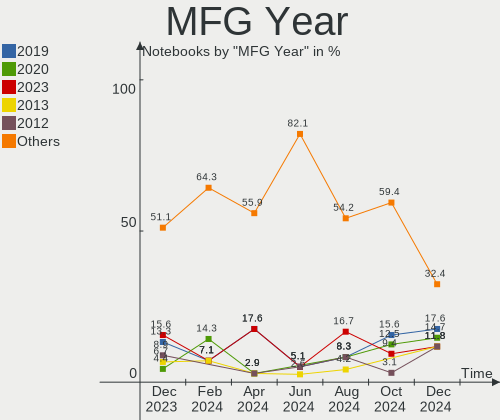
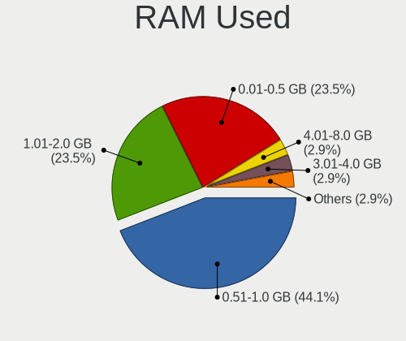
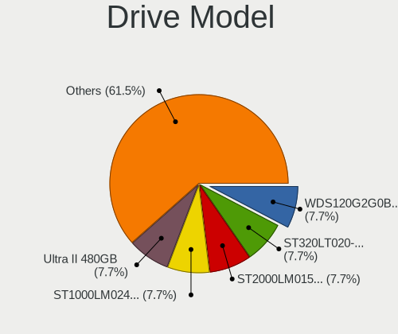
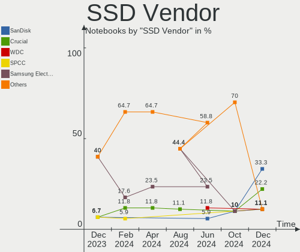
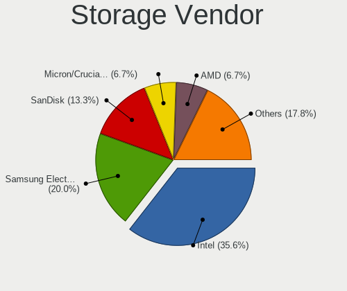
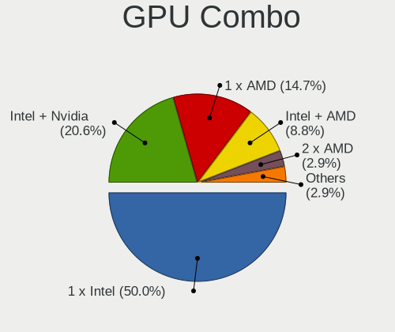
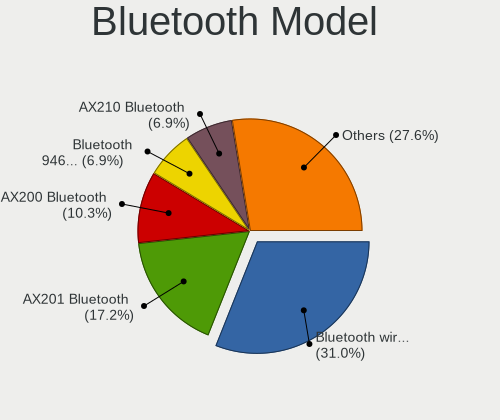

FreeBSD - Hardware Trends (Notebooks)
-------------------------------------

A project to identify most popular hardware characteristics and track their change
over time based on data collected by BSD users at https://BSD-Hardware.info.

Anyone can contribute to this report by the [hw-probe](https://github.com/linuxhw/hw-probe/blob/master/INSTALL.BSD.md) tool:

    hw-probe -all -upload

This report is for one last month. Overall report since the beginning of time: [TestDays](https://github.com/bsdhw/TestDays)

Period: Nov, 2023.

Contents
--------

* [ System ](#system)
  - [ OS                       ](#os)
  - [ OS Family                ](#os-family)
  - [ Arch                     ](#arch)
  - [ DE                       ](#de)
  - [ Display Server           ](#display-server)
  - [ Display Manager          ](#display-manager)
  - [ OS Lang                  ](#os-lang)
  - [ Boot Mode                ](#boot-mode)
  - [ Filesystem               ](#filesystem)
  - [ Part. scheme             ](#part-scheme)

* [ Board ](#board)
  - [ Vendor                   ](#vendor)
  - [ Model                    ](#model)
  - [ Model Family             ](#model-family)
  - [ MFG Year                 ](#mfg-year)
  - [ Form Factor              ](#form-factor)
  - [ Coreboot                 ](#coreboot)
  - [ RAM Size                 ](#ram-size)
  - [ RAM Used                 ](#ram-used)
  - [ Total Drives             ](#total-drives)
  - [ Has CD-ROM               ](#has-cd-rom)
  - [ Has Ethernet             ](#has-ethernet)
  - [ Has WiFi                 ](#has-wifi)
  - [ Has Bluetooth            ](#has-bluetooth)

* [ Location ](#location)
  - [ Country                  ](#country)
  - [ City                     ](#city)

* [ Drives ](#drives)
  - [ Drive Vendor             ](#drive-vendor)
  - [ Drive Model              ](#drive-model)
  - [ HDD Vendor               ](#hdd-vendor)
  - [ SSD Vendor               ](#ssd-vendor)
  - [ Drive Kind               ](#drive-kind)
  - [ Drive Connector          ](#drive-connector)
  - [ Drive Size               ](#drive-size)
  - [ Space Total              ](#space-total)
  - [ Space Used               ](#space-used)
  - [ Malfunc. Drives          ](#malfunc-drives)
  - [ Malfunc. Drive Vendor    ](#malfunc-drive-vendor)
  - [ Malfunc. HDD Vendor      ](#malfunc-hdd-vendor)
  - [ Malfunc. Drive Kind      ](#malfunc-drive-kind)
  - [ Failed Drives            ](#failed-drives)
  - [ Failed Drive Vendor      ](#failed-drive-vendor)
  - [ Drive Status             ](#drive-status)

* [ Storage controller ](#storage-controller)
  - [ Storage Vendor           ](#storage-vendor)
  - [ Storage Model            ](#storage-model)
  - [ Storage Kind             ](#storage-kind)

* [ Processor ](#processor)
  - [ CPU Vendor               ](#cpu-vendor)
  - [ CPU Model                ](#cpu-model)
  - [ CPU Model Family         ](#cpu-model-family)
  - [ CPU Cores                ](#cpu-cores)
  - [ CPU Sockets              ](#cpu-sockets)
  - [ CPU Threads              ](#cpu-threads)
  - [ CPU Microarch            ](#cpu-microarch)

* [ Graphics ](#graphics)
  - [ GPU Vendor               ](#gpu-vendor)
  - [ GPU Model                ](#gpu-model)
  - [ GPU Combo                ](#gpu-combo)
  - [ GPU Driver               ](#gpu-driver)
  - [ GPU Memory               ](#gpu-memory)

* [ Monitor ](#monitor)
  - [ Monitor Vendor           ](#monitor-vendor)
  - [ Monitor Model            ](#monitor-model)
  - [ Monitor Resolution       ](#monitor-resolution)
  - [ Monitor Diagonal         ](#monitor-diagonal)
  - [ Monitor Width            ](#monitor-width)
  - [ Aspect Ratio             ](#aspect-ratio)
  - [ Monitor Area             ](#monitor-area)
  - [ Pixel Density            ](#pixel-density)
  - [ Multiple Monitors        ](#multiple-monitors)

* [ Network ](#network)
  - [ Net Controller Vendor    ](#net-controller-vendor)
  - [ Net Controller Model     ](#net-controller-model)
  - [ Wireless Vendor          ](#wireless-vendor)
  - [ Wireless Model           ](#wireless-model)
  - [ Ethernet Vendor          ](#ethernet-vendor)
  - [ Ethernet Model           ](#ethernet-model)
  - [ Net Controller Kind      ](#net-controller-kind)
  - [ Used Controller          ](#used-controller)
  - [ NICs                     ](#nics)
  - [ IPv6                     ](#ipv6)

* [ Bluetooth ](#bluetooth)
  - [ Bluetooth Vendor         ](#bluetooth-vendor)
  - [ Bluetooth Model          ](#bluetooth-model)

* [ Sound ](#sound)
  - [ Sound Vendor             ](#sound-vendor)
  - [ Sound Model              ](#sound-model)

* [ Memory ](#memory)
  - [ Memory Vendor            ](#memory-vendor)
  - [ Memory Model             ](#memory-model)
  - [ Memory Kind              ](#memory-kind)
  - [ Memory Form Factor       ](#memory-form-factor)
  - [ Memory Size              ](#memory-size)
  - [ Memory Speed             ](#memory-speed)

* [ Printers & scanners ](#printers--scanners)
  - [ Printer Vendor           ](#printer-vendor)
  - [ Printer Model            ](#printer-model)
  - [ Scanner Vendor           ](#scanner-vendor)
  - [ Scanner Model            ](#scanner-model)

* [ Camera ](#camera)
  - [ Camera Vendor            ](#camera-vendor)
  - [ Camera Model             ](#camera-model)

* [ Security ](#security)
  - [ Fingerprint Vendor       ](#fingerprint-vendor)
  - [ Fingerprint Model        ](#fingerprint-model)
  - [ Chipcard Vendor          ](#chipcard-vendor)
  - [ Chipcard Model           ](#chipcard-model)

* [ Unsupported ](#unsupported)
  - [ Unsupported Devices      ](#unsupported-devices)
  - [ Unsupported Device Types ](#unsupported-device-types)

System
------

OS
--

Installed operating systems

| Name                | Notebooks | Percent |
|---------------------|-----------|---------|
| FreeBSD 14.0        | 16        | 48.48%  |
| FreeBSD 13.2-p4     | 5         | 15.15%  |
| FreeBSD 14.0-RC4-p1 | 2         | 6.06%   |
| FreeBSD 14.0-RC4    | 2         | 6.06%   |
| FreeBSD 14.0-BETA5  | 2         | 6.06%   |
| FreeBSD 13.2-p5     | 2         | 6.06%   |
| FreeBSD 13.2        | 2         | 6.06%   |
| FreeBSD 14.0-STABLE | 1         | 3.03%   |
| FreeBSD 14.0-RC2    | 1         | 3.03%   |

OS Family
---------

OS without a version

| Name    | Notebooks | Percent |
|---------|-----------|---------|
| FreeBSD | 33        | 100%    |

Arch
----

OS architecture (x86_64, i586, etc.)

| Name  | Notebooks | Percent |
|-------|-----------|---------|
| amd64 | 32        | 96.97%  |
| i386  | 1         | 3.03%   |

DE
--

Desktop Environment

| Name     | Notebooks | Percent |
|----------|-----------|---------|
| KDE5     | 12        | 36.36%  |
| XFCE     | 7         | 21.21%  |
| Console  | 7         | 21.21%  |
| TWM      | 2         | 6.06%   |
| GNOME    | 2         | 6.06%   |
| Cinnamon | 2         | 6.06%   |
| Openbox  | 1         | 3.03%   |

Display Server
--------------

X11 or Wayland

| Name    | Notebooks | Percent |
|---------|-----------|---------|
| X11     | 24        | 72.73%  |
| Console | 8         | 24.24%  |
| Wayland | 1         | 3.03%   |

Display Manager
---------------

SDDM, LightDM, etc.

| Name    | Notebooks | Percent |
|---------|-----------|---------|
| Console | 13        | 39.39%  |
| SDDM    | 12        | 36.36%  |
| LightDM | 6         | 18.18%  |
| SLiM    | 2         | 6.06%   |

OS Lang
-------

Language

| Lang    | Notebooks | Percent |
|---------|-----------|---------|
| C       | 22        | 66.67%  |
| en_US   | 4         | 12.12%  |
| Unknown | 4         | 12.12%  |
| es_AR   | 1         | 3.03%   |
| de_DE   | 1         | 3.03%   |
| de_CH   | 1         | 3.03%   |

Boot Mode
---------

EFI or BIOS

| Mode | Notebooks | Percent |
|------|-----------|---------|
| EFI  | 30        | 90.91%  |
| BIOS | 3         | 9.09%   |

Filesystem
----------

Type of filesystem

| Type | Notebooks | Percent |
|------|-----------|---------|
| Zfs  | 26        | 78.79%  |
| Ufs  | 7         | 21.21%  |

Part. scheme
------------

Scheme of partitioning

| Type | Notebooks | Percent |
|------|-----------|---------|
| GPT  | 33        | 100%    |

Board
-----

Vendor
------

Motherboard manufacturer

| Name             | Notebooks | Percent |
|------------------|-----------|---------|
| Lenovo           | 10        | 30.3%   |
| Dell             | 9         | 27.27%  |
| Hewlett-Packard  | 3         | 9.09%   |
| TUXEDO           | 1         | 3.03%   |
| Toshiba          | 1         | 3.03%   |
| Panasonic        | 1         | 3.03%   |
| OnLogic          | 1         | 3.03%   |
| LG Electronics   | 1         | 3.03%   |
| Google           | 1         | 3.03%   |
| ASUSTek Computer | 1         | 3.03%   |
| Apple            | 1         | 3.03%   |
| Acidanthera      | 1         | 3.03%   |
| Acer             | 1         | 3.03%   |
| Unknown          | 1         | 3.03%   |

Model
-----

Motherboard model

| Name                                     | Notebooks | Percent |
|------------------------------------------|-----------|---------|
| TUXEDO Pulse 15 Gen2                     | 1         | 3.03%   |
| Toshiba Satellite P300                   | 1         | 3.03%   |
| Panasonic CF-31-5                        | 1         | 3.03%   |
| OnLogic HX401                            | 1         | 3.03%   |
| LG 16UD70R-G.AX59B                       | 1         | 3.03%   |
| Lenovo ThinkPad X270 20HN006CUS          | 1         | 3.03%   |
| Lenovo ThinkPad X260 20F6006XUK          | 1         | 3.03%   |
| Lenovo ThinkPad X1 Carbon 4th 20FCS43F00 | 1         | 3.03%   |
| Lenovo ThinkPad X1 Carbon 4th 20FB006FAU | 1         | 3.03%   |
| Lenovo ThinkPad W530 24411M9             | 1         | 3.03%   |
| Lenovo ThinkPad T480 20L6S5VP00          | 1         | 3.03%   |
| Lenovo ThinkPad T470 20HES0EV0A          | 1         | 3.03%   |
| Lenovo ThinkPad T450 20BV000BUS          | 1         | 3.03%   |
| Lenovo IdeaPad 320-15IKB Touch 81BH      | 1         | 3.03%   |
| Lenovo G50-80 80E5                       | 1         | 3.03%   |
| HP Pavilion Gaming Laptop 15-cx0xxx      | 1         | 3.03%   |
| HP Notebook                              | 1         | 3.03%   |
| HP Laptop 15s-eq3xxx                     | 1         | 3.03%   |
| Google Dragonair                         | 1         | 3.03%   |
| Dell XPS 13 9360                         | 1         | 3.03%   |
| Dell Precision 7560                      | 1         | 3.03%   |
| Dell Precision 5510                      | 1         | 3.03%   |
| Dell Latitude E6540                      | 1         | 3.03%   |
| Dell Latitude 5480                       | 1         | 3.03%   |
| Dell Latitude 5440                       | 1         | 3.03%   |
| Dell Inspiron N5010                      | 1         | 3.03%   |
| Dell Inspiron 1525                       | 1         | 3.03%   |
| Dell G5 5505                             | 1         | 3.03%   |
| ASUS K56CB                               | 1         | 3.03%   |
| Apple MacBookPro7,1                      | 1         | 3.03%   |
| Acidanthera MacBookPro16,3               | 1         | 3.03%   |
| Acer Aspire 1810T                        | 1         | 3.03%   |
| Unknown                                  | 1         | 3.03%   |

Model Family
------------

Motherboard model prefix

| Name                     | Notebooks | Percent |
|--------------------------|-----------|---------|
| Lenovo ThinkPad          | 8         | 24.24%  |
| Dell Latitude            | 3         | 9.09%   |
| Dell Precision           | 2         | 6.06%   |
| Dell Inspiron            | 2         | 6.06%   |
| TUXEDO Pulse             | 1         | 3.03%   |
| Toshiba Satellite        | 1         | 3.03%   |
| Panasonic CF-31-5        | 1         | 3.03%   |
| OnLogic HX401            | 1         | 3.03%   |
| LG 16UD70R-G.AX59B       | 1         | 3.03%   |
| Lenovo IdeaPad           | 1         | 3.03%   |
| Lenovo G50-80            | 1         | 3.03%   |
| HP Pavilion              | 1         | 3.03%   |
| HP Notebook              | 1         | 3.03%   |
| HP Laptop                | 1         | 3.03%   |
| Google Dragonair         | 1         | 3.03%   |
| Dell XPS                 | 1         | 3.03%   |
| Dell G5                  | 1         | 3.03%   |
| ASUS K56CB               | 1         | 3.03%   |
| Apple MacBookPro7        | 1         | 3.03%   |
| Acidanthera MacBookPro16 | 1         | 3.03%   |
| Acer Aspire              | 1         | 3.03%   |
| Unknown                  | 1         | 3.03%   |

MFG Year
--------

Motherboard manufacture year

| Year | Notebooks | Percent |
|------|-----------|---------|
| 2023 | 5         | 15.15%  |
| 2015 | 4         | 12.12%  |
| 2022 | 3         | 9.09%   |
| 2019 | 3         | 9.09%   |
| 2018 | 3         | 9.09%   |
| 2021 | 2         | 6.06%   |
| 2020 | 2         | 6.06%   |
| 2017 | 2         | 6.06%   |
| 2010 | 2         | 6.06%   |
| 2016 | 1         | 3.03%   |
| 2014 | 1         | 3.03%   |
| 2013 | 1         | 3.03%   |
| 2012 | 1         | 3.03%   |
| 2011 | 1         | 3.03%   |
| 2009 | 1         | 3.03%   |
| 2008 | 1         | 3.03%   |

Form Factor
-----------

Physical design of the computer

| Name     | Notebooks | Percent |
|----------|-----------|---------|
| Notebook | 33        | 100%    |

Coreboot
--------

Have coreboot on board

| Used | Notebooks | Percent |
|------|-----------|---------|
| No   | 32        | 96.97%  |
| Yes  | 1         | 3.03%   |

RAM Size
--------

Total RAM memory

| Size in GB  | Notebooks | Percent |
|-------------|-----------|---------|
| 16.01-24.0  | 11        | 33.33%  |
| 8.01-16.0   | 8         | 24.24%  |
| 32.01-64.0  | 5         | 15.15%  |
| 4.01-8.0    | 4         | 12.12%  |
| 64.01-256.0 | 3         | 9.09%   |
| 3.01-4.0    | 1         | 3.03%   |
| 2.01-3.0    | 1         | 3.03%   |

RAM Used
--------

Used RAM memory

| Used GB  | Notebooks | Percent |
|----------|-----------|---------|
| 0.51-1.0 | 12        | 36.36%  |
| 0.01-0.5 | 11        | 33.33%  |
| 1.01-2.0 | 6         | 18.18%  |
| 2.01-3.0 | 3         | 9.09%   |
| 3.01-4.0 | 1         | 3.03%   |

Total Drives
------------

Number of drives on board

| Drives | Notebooks | Percent |
|--------|-----------|---------|
| 1      | 14        | 42.42%  |
| 0      | 10        | 30.3%   |
| 2      | 8         | 24.24%  |
| 4      | 1         | 3.03%   |

Has CD-ROM
----------

Has CD-ROM on board

| Presented | Notebooks | Percent |
|-----------|-----------|---------|
| No        | 26        | 78.79%  |
| Yes       | 7         | 21.21%  |

Has Ethernet
------------

Has Ethernet on board

| Presented | Notebooks | Percent |
|-----------|-----------|---------|
| Yes       | 27        | 81.82%  |
| No        | 6         | 18.18%  |

Has WiFi
--------

Has WiFi module

| Presented | Notebooks | Percent |
|-----------|-----------|---------|
| Yes       | 32        | 96.97%  |
| No        | 1         | 3.03%   |

Has Bluetooth
-------------

Has Bluetooth module

| Presented | Notebooks | Percent |
|-----------|-----------|---------|
| Yes       | 28        | 84.85%  |
| No        | 5         | 15.15%  |

Location
--------

Country
-------

Geographic location (country)

| Country     | Notebooks | Percent |
|-------------|-----------|---------|
| USA         | 4         | 12.12%  |
| Germany     | 4         | 12.12%  |
| France      | 4         | 12.12%  |
| Switzerland | 3         | 9.09%   |
| Algeria     | 3         | 9.09%   |
| Australia   | 2         | 6.06%   |
| UK          | 1         | 3.03%   |
| Turkey      | 1         | 3.03%   |
| Spain       | 1         | 3.03%   |
| Portugal    | 1         | 3.03%   |
| Poland      | 1         | 3.03%   |
| New Zealand | 1         | 3.03%   |
| Indonesia   | 1         | 3.03%   |
| India       | 1         | 3.03%   |
| Iceland     | 1         | 3.03%   |
| Egypt       | 1         | 3.03%   |
| Colombia    | 1         | 3.03%   |
| Canada      | 1         | 3.03%   |
| Argentina   | 1         | 3.03%   |

City
----

Geographic location (city)

| City                 | Notebooks | Percent |
|----------------------|-----------|---------|
| Urcuit               | 2         | 6.06%   |
| Sydney               | 2         | 6.06%   |
| Wroclaw              | 1         | 3.03%   |
| Tracy                | 1         | 3.03%   |
| Seattle              | 1         | 3.03%   |
| Reykjavik            | 1         | 3.03%   |
| Redford              | 1         | 3.03%   |
| Plymouth             | 1         | 3.03%   |
| Payson               | 1         | 3.03%   |
| Paris                | 1         | 3.03%   |
| Oran                 | 1         | 3.03%   |
| Neuengors            | 1         | 3.03%   |
| Mostaganem           | 1         | 3.03%   |
| Montería            | 1         | 3.03%   |
| Mascara              | 1         | 3.03%   |
| Los Realejos         | 1         | 3.03%   |
| Lisbon               | 1         | 3.03%   |
| Kelowna              | 1         | 3.03%   |
| Karawang             | 1         | 3.03%   |
| Istanbul             | 1         | 3.03%   |
| Hamilton             | 1         | 3.03%   |
| Greven               | 1         | 3.03%   |
| Grenoble             | 1         | 3.03%   |
| Fribourg             | 1         | 3.03%   |
| Frankfurt am Main    | 1         | 3.03%   |
| Cairo                | 1         | 3.03%   |
| Buenos Aires         | 1         | 3.03%   |
| Berlin               | 1         | 3.03%   |
| Bengaluru            | 1         | 3.03%   |
| Belmont-sur-Lausanne | 1         | 3.03%   |
| Aesch                | 1         | 3.03%   |

Drives
------

Drive Vendor
------------

Hard drive vendors

| Vendor              | Notebooks | Drives | Percent |
|---------------------|-----------|--------|---------|
| Samsung Electronics | 6         | 7      | 19.35%  |
| Seagate             | 4         | 4      | 12.9%   |
| SanDisk             | 4         | 5      | 12.9%   |
| WDC                 | 3         | 3      | 9.68%   |
| Toshiba             | 3         | 3      | 9.68%   |
| Kingston            | 2         | 2      | 6.45%   |
| Crucial             | 2         | 2      | 6.45%   |
| V-GeN               | 1         | 2      | 3.23%   |
| Transcend           | 1         | 1      | 3.23%   |
| Micron Technology   | 1         | 1      | 3.23%   |
| LITEON              | 1         | 1      | 3.23%   |
| Integral            | 1         | 1      | 3.23%   |
| Hitachi             | 1         | 1      | 3.23%   |
| Dogfish             | 1         | 1      | 3.23%   |

Drive Model
-----------

Hard drive models

| Model                                | Notebooks | Percent |
|--------------------------------------|-----------|---------|
| WDC WD3200BEKT-00V5T0 320GB          | 1         | 3.03%   |
| WDC WD1600BEVT-75ZCT0 160GB          | 1         | 3.03%   |
| WDC WD10SMZW-11Y0TS0 1TB             | 1         | 3.03%   |
| V-GeN V-GEN11SM20AR1024ITM2 1TB      | 1         | 3.03%   |
| V-GeN V-GEN03SM22AR1024SDK 1TB       | 1         | 3.03%   |
| Transcend TS256GMTS400 256GB         | 1         | 3.03%   |
| Toshiba THNSNJ256GCSY 256GB          | 1         | 3.03%   |
| Toshiba MQ04UBF100 1TB               | 1         | 3.03%   |
| Toshiba MK3265GSX 320GB              | 1         | 3.03%   |
| Seagate ST9500325AS 500GB            | 1         | 3.03%   |
| Seagate ST500LM021-1KJ152 500GB      | 1         | 3.03%   |
| Seagate ST1000LM024 HN-M101MBB 1TB   | 1         | 3.03%   |
| Seagate SSD 500GB                    | 1         | 3.03%   |
| SanDisk X400 M.2 2280 256GB          | 1         | 3.03%   |
| SanDisk SSD U100 24GB                | 1         | 3.03%   |
| SanDisk SSD G5 BICS4 1TB             | 1         | 3.03%   |
| SanDisk SD8SN8U128G1001 128GB        | 1         | 3.03%   |
| Samsung SSD 870 EVO 1TB              | 1         | 3.03%   |
| Samsung SSD 860 EVO 500GB            | 1         | 3.03%   |
| Samsung SSD 850 EVO 250GB            | 1         | 3.03%   |
| Samsung Portable SSD T7 2TB          | 1         | 3.03%   |
| Samsung PM961 NVMe 256GB             | 1         | 3.03%   |
| Samsung MZVLQ1T0HBLB-00B00 1TB       | 1         | 3.03%   |
| Samsung MZ7TD512HAGM-000L1 512GB     | 1         | 3.03%   |
| Micron MTFDDAK480MBP-1AN1ZABHB 480GB | 1         | 3.03%   |
| LITEON L8H-256V2G 256GB              | 1         | 3.03%   |
| Kingston SKC600MS256G 256GB          | 1         | 3.03%   |
| Kingston SA400S37480G 480GB          | 1         | 3.03%   |
| Integral V Series SATA SSD 250GB     | 1         | 3.03%   |
| Hitachi HTS545025B9SA02 250GB        | 1         | 3.03%   |
| Dogfish SSD 512GB                    | 1         | 3.03%   |
| Crucial CT500P3SSD8 500GB            | 1         | 3.03%   |
| Crucial CT1000MX500SSD1 1TB          | 1         | 3.03%   |

HDD Vendor
----------

Hard disk drive vendors

| Vendor  | Notebooks | Drives | Percent |
|---------|-----------|--------|---------|
| WDC     | 3         | 3      | 33.33%  |
| Seagate | 3         | 3      | 33.33%  |
| Toshiba | 2         | 2      | 22.22%  |
| Hitachi | 1         | 1      | 11.11%  |

SSD Vendor
----------

Solid state drive vendors

| Vendor              | Notebooks | Drives | Percent |
|---------------------|-----------|--------|---------|
| SanDisk             | 4         | 5      | 21.05%  |
| Samsung Electronics | 4         | 4      | 21.05%  |
| Kingston            | 2         | 2      | 10.53%  |
| V-GeN               | 1         | 2      | 5.26%   |
| Transcend           | 1         | 1      | 5.26%   |
| Toshiba             | 1         | 1      | 5.26%   |
| Seagate             | 1         | 1      | 5.26%   |
| Micron Technology   | 1         | 1      | 5.26%   |
| LITEON              | 1         | 1      | 5.26%   |
| Integral            | 1         | 1      | 5.26%   |
| Dogfish             | 1         | 1      | 5.26%   |
| Crucial             | 1         | 1      | 5.26%   |

Drive Kind
----------

HDD or SSD

| Kind | Notebooks | Drives | Percent |
|------|-----------|--------|---------|
| SSD  | 14        | 21     | 53.85%  |
| HDD  | 8         | 9      | 30.77%  |
| NVMe | 4         | 4      | 15.38%  |

Drive Connector
---------------

SATA, SAS, NVMe, etc.

| Type | Notebooks | Drives | Percent |
|------|-----------|--------|---------|
| SATA | 21        | 30     | 84%     |
| NVMe | 4         | 4      | 16%     |

Drive Size
----------

Size of hard drive

| Size in TB | Notebooks | Drives | Percent |
|------------|-----------|--------|---------|
| 0.01-0.5   | 17        | 19     | 62.96%  |
| 0.51-1.0   | 9         | 10     | 33.33%  |
| 1.01-2.0   | 1         | 1      | 3.7%    |

Space Total
-----------

Amount of disk space available on the file system

| Size in GB | Notebooks | Percent |
|------------|-----------|---------|
| 251-500    | 10        | 30.3%   |
| 101-250    | 10        | 30.3%   |
| 501-1000   | 7         | 21.21%  |
| 51-100     | 3         | 9.09%   |
| 1001-2000  | 2         | 6.06%   |
| 1-20       | 1         | 3.03%   |

Space Used
----------

Amount of used disk space

| Used GB | Notebooks | Percent |
|---------|-----------|---------|
| 1-20    | 22        | 66.67%  |
| 21-50   | 7         | 21.21%  |
| 51-100  | 3         | 9.09%   |
| 101-250 | 1         | 3.03%   |

Malfunc. Drives
---------------

Drive models with a malfunction

| Model                               | Notebooks | Drives | Percent |
|-------------------------------------|-----------|--------|---------|
| Toshiba MK3265GSX 320GB             | 1         | 1      | 25%     |
| Seagate ST9500325AS 500GB           | 1         | 1      | 25%     |
| Seagate ST500LM021-1KJ152 500GB     | 1         | 1      | 25%     |
| Samsung Electronics SSD 870 EVO 1TB | 1         | 1      | 25%     |

Malfunc. Drive Vendor
---------------------

Vendors of faulty drives

| Vendor              | Notebooks | Drives | Percent |
|---------------------|-----------|--------|---------|
| Seagate             | 2         | 2      | 50%     |
| Toshiba             | 1         | 1      | 25%     |
| Samsung Electronics | 1         | 1      | 25%     |

Malfunc. HDD Vendor
-------------------

Vendors of faulty HDD drives

| Vendor  | Notebooks | Drives | Percent |
|---------|-----------|--------|---------|
| Seagate | 2         | 2      | 66.67%  |
| Toshiba | 1         | 1      | 33.33%  |

Malfunc. Drive Kind
-------------------

Kinds of faulty drives

| Kind | Notebooks | Drives | Percent |
|------|-----------|--------|---------|
| HDD  | 3         | 3      | 75%     |
| SSD  | 1         | 1      | 25%     |

Failed Drives
-------------

Failed drive models

Zero info for selected period =(

Failed Drive Vendor
-------------------

Failed drive vendors

Zero info for selected period =(

Drive Status
------------

Number of failed and malfunc. drives

| Status  | Notebooks | Drives | Percent |
|---------|-----------|--------|---------|
| Works   | 21        | 30     | 84%     |
| Malfunc | 4         | 4      | 16%     |

Storage controller
------------------

Storage Vendor
--------------

Storage controller vendors

| Vendor                      | Notebooks | Percent |
|-----------------------------|-----------|---------|
| Intel                       | 20        | 54.05%  |
| Samsung Electronics         | 5         | 13.51%  |
| SK hynix                    | 2         | 5.41%   |
| Silicon Motion              | 1         | 2.7%    |
| SanDisk                     | 1         | 2.7%    |
| Realtek Semiconductor       | 1         | 2.7%    |
| Phison Electronics          | 1         | 2.7%    |
| Nvidia                      | 1         | 2.7%    |
| Micron/Crucial Technology   | 1         | 2.7%    |
| Micron Technology           | 1         | 2.7%    |
| KIOXIA                      | 1         | 2.7%    |
| Kingston Technology Company | 1         | 2.7%    |
| AMD                         | 1         | 2.7%    |

Storage Model
-------------

Storage controller models

| Model                                                                          | Notebooks | Percent |
|--------------------------------------------------------------------------------|-----------|---------|
| Intel Sunrise Point-LP SATA Controller [AHCI mode]                             | 5         | 13.16%  |
| Intel Wildcat Point-LP SATA Controller [AHCI Mode]                             | 3         | 7.89%   |
| Samsung NVMe SSD Controller SM981/PM981/PM983                                  | 2         | 5.26%   |
| Intel 82801IBM/IEM (ICH9M/ICH9M-E) 4 port SATA Controller [AHCI mode]          | 2         | 5.26%   |
| Intel 7 Series Chipset Family 6-port SATA Controller [AHCI mode]               | 2         | 5.26%   |
| SK hynix Gold P31/BC711/PC711 NVMe Solid State Drive                           | 1         | 2.63%   |
| SK hynix BC501 NVMe Solid State Drive                                          | 1         | 2.63%   |
| Silicon Motion SM2262/SM2262EN SSD Controller                                  | 1         | 2.63%   |
| SanDisk Ultra 3D / WD Blue SN550 NVMe SSD                                      | 1         | 2.63%   |
| Samsung NVMe SSD Controller SM961/PM961/SM963                                  | 1         | 2.63%   |
| Samsung NVMe SSD Controller S4LV008[Pascal]                                    | 1         | 2.63%   |
| Samsung NVMe SSD Controller 980 (DRAM-less)                                    | 1         | 2.63%   |
| Realtek RTS5765DL NVMe SSD Controller (DRAM-less)                              | 1         | 2.63%   |
| Phison E12 NVMe Controller                                                     | 1         | 2.63%   |
| Nvidia MCP89 SATA Controller (AHCI mode)                                       | 1         | 2.63%   |
| Micron/Crucial P2 [Nick P2] / P3 / P3 Plus NVMe PCIe SSD (DRAM-less)           | 1         | 2.63%   |
| Micron 2300 NVMe SSD [Santana]                                                 | 1         | 2.63%   |
| KIOXIA NVMe SSD Controller BG5 (DRAM-less)                                     | 1         | 2.63%   |
| Kingston Company NV1 NVMe SSD SM2263XT                                         | 1         | 2.63%   |
| Intel Q170/Q150/B150/H170/H110/Z170/CM236 Chipset SATA Controller [AHCI Mode]  | 1         | 2.63%   |
| Intel Comet Lake SATA AHCI Controller                                          | 1         | 2.63%   |
| Intel Cannon Lake Mobile PCH SATA AHCI Controller                              | 1         | 2.63%   |
| Intel 82801HM/HEM (ICH8M/ICH8M-E) SATA Controller [AHCI mode]                  | 1         | 2.63%   |
| Intel 82801HM/HEM (ICH8M/ICH8M-E) IDE Controller                               | 1         | 2.63%   |
| Intel 82801 Mobile SATA Controller [RAID mode]                                 | 1         | 2.63%   |
| Intel 8 Series/C220 Series Chipset Family 6-port SATA Controller 1 [AHCI mode] | 1         | 2.63%   |
| Intel 8 Series SATA Controller 1 [AHCI mode]                                   | 1         | 2.63%   |
| Intel 5 Series/3400 Series Chipset 6 port SATA AHCI Controller                 | 1         | 2.63%   |
| AMD FCH SATA Controller [AHCI mode]                                            | 1         | 2.63%   |

Storage Kind
------------

Kind of storage controller (IDE, SATA, NVMe, SAS, ...)

| Kind | Notebooks | Percent |
|------|-----------|---------|
| SATA | 21        | 56.76%  |
| NVMe | 14        | 37.84%  |
| RAID | 1         | 2.7%    |
| IDE  | 1         | 2.7%    |

Processor
---------

CPU Vendor
----------

Processor vendors

| Vendor | Notebooks | Percent |
|--------|-----------|---------|
| Intel  | 28        | 84.85%  |
| AMD    | 5         | 15.15%  |

CPU Model
---------

Processor models

| Model                                         | Notebooks | Percent |
|-----------------------------------------------|-----------|---------|
| Intel Core i5-7300U CPU @ 2.60GHz             | 3         | 9.09%   |
| Intel Core i5-6300U CPU @ 2.40GHz             | 2         | 6.06%   |
| Intel Xeon W-11855M CPU @ 3.20GHz             | 1         | 3.03%   |
| Intel Pentium CPU 3825U @ 1.90GHz             | 1         | 3.03%   |
| Intel Genuine CPU U7300 @ 1.30GHz             | 1         | 3.03%   |
| Intel CPU Version                             | 1         | 3.03%   |
| Intel Core i7-8550U CPU @ 1.80GHz             | 1         | 3.03%   |
| Intel Core i7-6500U CPU @ 2.50GHz             | 1         | 3.03%   |
| Intel Core i7-4800MQ CPU @ 2.70GHz            | 1         | 3.03%   |
| Intel Core i7-3840QM CPU @ 2.80GHz            | 1         | 3.03%   |
| Intel Core i5-8350U CPU @ 1.70GHz             | 1         | 3.03%   |
| Intel Core i5-8300H CPU @ 2.30GHz             | 1         | 3.03%   |
| Intel Core i5-7200U CPU @ 2.50GHz             | 1         | 3.03%   |
| Intel Core i5-6300HQ CPU @ 2.30GHz            | 1         | 3.03%   |
| Intel Core i5-5300U CPU @ 2.30GHz             | 1         | 3.03%   |
| Intel Core i5-5200U CPU @ 2.20GHz             | 1         | 3.03%   |
| Intel Core i5-4300U CPU @ 1.90GHz             | 1         | 3.03%   |
| Intel Core i5-3317U CPU @ 1.70GHz             | 1         | 3.03%   |
| Intel Core i3-10110U CPU @ 2.10GHz            | 1         | 3.03%   |
| Intel Core i3 CPU M 350 @ 2.27GH              | 1         | 3.03%   |
| Intel Core 2 Duo CPU P8600 @ 2.40GHz          | 1         | 3.03%   |
| Intel Celeron 7305E                           | 1         | 3.03%   |
| Intel Celeron                                 | 1         | 3.03%   |
| Intel 13th Gen Core i7-1365U                  | 1         | 3.03%   |
| Intel 11th Gen Core i5-1135G7 @ 2.40GHz       | 1         | 3.03%   |
| AMD Ryzen 7 5825U with Radeon Graphics        | 1         | 3.03%   |
| AMD Ryzen 7 5700U with Radeon Graphics        | 1         | 3.03%   |
| AMD Ryzen 7 4800H with Radeon Graphics        | 1         | 3.03%   |
| AMD Ryzen 5 7530U with Radeon Graphics        | 1         | 3.03%   |
| AMD Ryzen 5 3550H with Radeon Vega Mobile Gfx | 1         | 3.03%   |

CPU Model Family
----------------

Processor model prefix

| Model            | Notebooks | Percent |
|------------------|-----------|---------|
| Intel Core i5    | 13        | 39.39%  |
| Intel Core i7    | 4         | 12.12%  |
| Other            | 3         | 9.09%   |
| AMD Ryzen 7      | 3         | 9.09%   |
| Intel Core i3    | 2         | 6.06%   |
| Intel Celeron    | 2         | 6.06%   |
| AMD Ryzen 5      | 2         | 6.06%   |
| Intel Xeon       | 1         | 3.03%   |
| Intel Pentium    | 1         | 3.03%   |
| Intel Genuine    | 1         | 3.03%   |
| Intel Core 2 Duo | 1         | 3.03%   |

CPU Cores
---------

Number of processor cores

| Number  | Notebooks | Percent |
|---------|-----------|---------|
| 2       | 15        | 45.45%  |
| 4       | 7         | 21.21%  |
| 16      | 3         | 9.09%   |
| 6       | 2         | 6.06%   |
| Unknown | 2         | 6.06%   |
| 12      | 1         | 3.03%   |
| 8       | 1         | 3.03%   |
| 5       | 1         | 3.03%   |
| 1       | 1         | 3.03%   |

CPU Sockets
-----------

Number of sockets

| Number | Notebooks | Percent |
|--------|-----------|---------|
| 1      | 32        | 96.97%  |
| 2      | 1         | 3.03%   |

CPU Threads
-----------

Threads per core (Hyper-Threading)

| Number  | Notebooks | Percent |
|---------|-----------|---------|
| 2       | 22        | 66.67%  |
| 1       | 9         | 27.27%  |
| Unknown | 2         | 6.06%   |

CPU Microarch
-------------

Microarchitecture

| Name      | Notebooks | Percent |
|-----------|-----------|---------|
| KabyLake  | 8         | 24.24%  |
| Skylake   | 4         | 12.12%  |
| Unknown   | 4         | 12.12%  |
| Penryn    | 3         | 9.09%   |
| Broadwell | 3         | 9.09%   |
| Zen 3     | 2         | 6.06%   |
| IvyBridge | 2         | 6.06%   |
| Haswell   | 2         | 6.06%   |
| Zen+      | 1         | 3.03%   |
| Zen 2     | 1         | 3.03%   |
| Westmere  | 1         | 3.03%   |
| TigerLake | 1         | 3.03%   |
| Core      | 1         | 3.03%   |

Graphics
--------

GPU Vendor
----------

Vendors of graphics cards

| Vendor | Notebooks | Percent |
|--------|-----------|---------|
| Intel  | 24        | 63.16%  |
| AMD    | 9         | 23.68%  |
| Nvidia | 5         | 13.16%  |

GPU Model
---------

Graphics card models

| Model                                                                | Notebooks | Percent |
|----------------------------------------------------------------------|-----------|---------|
| Intel HD Graphics 620                                                | 4         | 9.76%   |
| Intel Skylake GT2 [HD Graphics 520]                                  | 3         | 7.32%   |
| Intel UHD Graphics 620                                               | 2         | 4.88%   |
| Intel HD Graphics 5500                                               | 2         | 4.88%   |
| Intel 3rd Gen Core processor Graphics Controller                     | 2         | 4.88%   |
| AMD Barcelo                                                          | 2         | 4.88%   |
| Nvidia MCP89 [GeForce 320M]                                          | 1         | 2.44%   |
| Nvidia GP107M [GeForce GTX 1050 Mobile]                              | 1         | 2.44%   |
| Nvidia GM107GLM [Quadro M1000M]                                      | 1         | 2.44%   |
| Nvidia GK107M [GeForce GT 740M]                                      | 1         | 2.44%   |
| Nvidia GA104GLM [RTX A4000 Mobile]                                   | 1         | 2.44%   |
| Intel TigerLake-LP GT2 [Iris Xe Graphics]                            | 1         | 2.44%   |
| Intel Raptor Lake-P [Iris Xe Graphics]                               | 1         | 2.44%   |
| Intel Mobile GM965/GL960 Integrated Graphics Controller (secondary)  | 1         | 2.44%   |
| Intel Mobile GM965/GL960 Integrated Graphics Controller (primary)    | 1         | 2.44%   |
| Intel Mobile 4 Series Chipset Integrated Graphics Controller         | 1         | 2.44%   |
| Intel HD Graphics 530                                                | 1         | 2.44%   |
| Intel HD Graphics                                                    | 1         | 2.44%   |
| Intel Haswell-ULT Integrated Graphics Controller                     | 1         | 2.44%   |
| Intel CometLake-U GT2 [UHD Graphics]                                 | 1         | 2.44%   |
| Intel CoffeeLake-H GT2 [UHD Graphics 630]                            | 1         | 2.44%   |
| Intel Alder Lake-UP3 GT1 [UHD Graphics]                              | 1         | 2.44%   |
| Intel 4th Gen Core Processor Integrated Graphics Controller          | 1         | 2.44%   |
| AMD Sun LE [Radeon HD 8550M / R5 M230]                               | 1         | 2.44%   |
| AMD RV710/M92 [Mobility Radeon HD 4530/4570/5145/530v/540v/545v]     | 1         | 2.44%   |
| AMD Renoir [Radeon RX Vega 6 (Ryzen 4000/5000 Mobile Series)]        | 1         | 2.44%   |
| AMD Picasso/Raven 2 [Radeon Vega Series / Radeon Vega Mobile Series] | 1         | 2.44%   |
| AMD Park [Mobility Radeon HD 5430/5450/5470]                         | 1         | 2.44%   |
| AMD Navi 10 [Radeon RX 5600 OEM/5600 XT / 5700/5700 XT]              | 1         | 2.44%   |
| AMD Mars XTX [Radeon HD 8790M]                                       | 1         | 2.44%   |
| AMD Lucienne                                                         | 1         | 2.44%   |
| AMD Baffin [Radeon RX 460/560D / Pro 450/455/460/555/555X/560/560X]  | 1         | 2.44%   |

GPU Combo
---------

Combinations of graphics cards

| Name           | Notebooks | Percent |
|----------------|-----------|---------|
| 1 x Intel      | 17        | 51.52%  |
| 1 x AMD        | 5         | 15.15%  |
| Intel + Nvidia | 3         | 9.09%   |
| 2 x Intel      | 2         | 6.06%   |
| 2 x AMD        | 2         | 6.06%   |
| 1 x Nvidia     | 2         | 6.06%   |
| Intel + AMD    | 2         | 6.06%   |

GPU Driver
----------

Free vs proprietary

| Driver      | Notebooks | Percent |
|-------------|-----------|---------|
| Free        | 32        | 96.97%  |
| Proprietary | 1         | 3.03%   |

GPU Memory
----------

Total video memory

| Size in GB | Notebooks | Percent |
|------------|-----------|---------|
| Unknown    | 26        | 78.79%  |
| 0.01-0.5   | 4         | 12.12%  |
| 7.01-8.0   | 1         | 3.03%   |
| 5.01-6.0   | 1         | 3.03%   |
| 3.01-4.0   | 1         | 3.03%   |

Monitor
-------

Monitor Vendor
--------------

Monitor vendors

| Vendor               | Notebooks | Percent |
|----------------------|-----------|---------|
| AU Optronics         | 7         | 30.43%  |
| BOE                  | 5         | 21.74%  |
| LG Display           | 3         | 13.04%  |
| Chimei Innolux       | 3         | 13.04%  |
| Sharp                | 2         | 8.7%    |
| LG Philips           | 1         | 4.35%   |
| Goldstar             | 1         | 4.35%   |
| BOE Technology Group | 1         | 4.35%   |

Monitor Model
-------------

Monitor models

| Model                                                            | Notebooks | Percent |
|------------------------------------------------------------------|-----------|---------|
| Sharp LCD Monitor SHP1449 1920x1080 290x170mm 13.2-inch          | 1         | 4.35%   |
| Sharp LCD Monitor SHP143E 3840x2160 350x190mm 15.7-inch          | 1         | 4.35%   |
| LG Philips LCD Monitor LPL0301 1280x800 330x210mm 15.4-inch      | 1         | 4.35%   |
| LG Display LCD Monitor LGD0773 1920x1200 340x220mm 15.9-inch     | 1         | 4.35%   |
| LG Display LCD Monitor LGD0563 1920x1080 340x190mm 15.3-inch     | 1         | 4.35%   |
| LG Display LCD Monitor LGD04FF 1920x1080 310x170mm 13.9-inch     | 1         | 4.35%   |
| Goldstar LG HDR 4K GSM7706 3840x2160 600x340mm 27.2-inch         | 1         | 4.35%   |
| Chimei Innolux LCD Monitor CMN15CC 1366x768 340x190mm 15.3-inch  | 1         | 4.35%   |
| Chimei Innolux LCD Monitor CMN15BA 1920x1080 340x190mm 15.3-inch | 1         | 4.35%   |
| Chimei Innolux LCD Monitor CMN15B7 1366x768 340x190mm 15.3-inch  | 1         | 4.35%   |
| BOE Technology Group LCD Monitor 1920x1080                       | 1         | 4.35%   |
| BOE LCD Monitor BOE0991 1920x1080 340x190mm 15.3-inch            | 1         | 4.35%   |
| BOE LCD Monitor BOE0974 2560x1440 340x190mm 15.3-inch            | 1         | 4.35%   |
| BOE LCD Monitor BOE08EE 1920x1080 310x170mm 13.9-inch            | 1         | 4.35%   |
| BOE LCD Monitor BOE070D 1366x768 310x170mm 13.9-inch             | 1         | 4.35%   |
| BOE LCD Monitor BOE063B 1366x768 340x190mm 15.3-inch             | 1         | 4.35%   |
| AU Optronics LCD Monitor AUO818B 1920x1080 310x170mm 13.9-inch   | 1         | 4.35%   |
| AU Optronics LCD Monitor AUO80ED 1920x1080 340x190mm 15.3-inch   | 1         | 4.35%   |
| AU Optronics LCD Monitor AUO45EC 1366x768 340x190mm 15.3-inch    | 1         | 4.35%   |
| AU Optronics LCD Monitor AUO226D 1920x1080 280x160mm 12.7-inch   | 1         | 4.35%   |
| AU Optronics LCD Monitor AUO11ED 1920x1080 340x190mm 15.3-inch   | 1         | 4.35%   |
| AU Optronics LCD Monitor AUO106D 1920x1080 280x160mm 12.7-inch   | 1         | 4.35%   |
| AU Optronics LCD Monitor AUO103D 1920x1080 310x170mm 13.9-inch   | 1         | 4.35%   |

Monitor Resolution
------------------

Monitor screen resolution

| Resolution        | Notebooks | Percent |
|-------------------|-----------|---------|
| 1920x1080 (FHD)   | 13        | 56.52%  |
| 1366x768 (WXGA)   | 5         | 21.74%  |
| 3840x2160 (4K)    | 2         | 8.7%    |
| 2560x1440 (QHD)   | 1         | 4.35%   |
| 1920x1200 (WUXGA) | 1         | 4.35%   |
| 1280x800 (WXGA)   | 1         | 4.35%   |

Monitor Diagonal
----------------

Diagonal size in inches

| Inches  | Notebooks | Percent |
|---------|-----------|---------|
| 15      | 13        | 56.52%  |
| 13      | 6         | 26.09%  |
| 12      | 2         | 8.7%    |
| 27      | 1         | 4.35%   |
| Unknown | 1         | 4.35%   |

Monitor Width
-------------

Physical width

| Width in mm | Notebooks | Percent |
|-------------|-----------|---------|
| 301-350     | 18        | 78.26%  |
| 201-300     | 3         | 13.04%  |
| 501-600     | 1         | 4.35%   |
| Unknown     | 1         | 4.35%   |

Aspect Ratio
------------

Proportional relationship between the width and the height

| Ratio   | Notebooks | Percent |
|---------|-----------|---------|
| 16/9    | 19        | 86.36%  |
| 3/2     | 1         | 4.55%   |
| 16/10   | 1         | 4.55%   |
| Unknown | 1         | 4.55%   |

Monitor Area
------------

Area in inch²

| Area in inch² | Notebooks | Percent |
|----------------|-----------|---------|
| 91-100         | 10        | 43.48%  |
| 81-90          | 5         | 21.74%  |
| 61-70          | 2         | 8.7%    |
| 101-110        | 2         | 8.7%    |
| 71-80          | 1         | 4.35%   |
| 301-350        | 1         | 4.35%   |
| 111-120        | 1         | 4.35%   |
| Unknown        | 1         | 4.35%   |

Pixel Density
-------------

Pixels per inch

| Density       | Notebooks | Percent |
|---------------|-----------|---------|
| 121-160       | 10        | 45.45%  |
| 101-120       | 5         | 22.73%  |
| 161-240       | 4         | 18.18%  |
| More than 240 | 1         | 4.55%   |
| 51-100        | 1         | 4.55%   |
| Unknown       | 1         | 4.55%   |

Multiple Monitors
-----------------

Total monitors connected

| Total | Notebooks | Percent |
|-------|-----------|---------|
| 1     | 23        | 69.7%   |
| 0     | 9         | 27.27%  |
| 2     | 1         | 3.03%   |

Network
-------

Net Controller Vendor
---------------------

Controller vendors

| Vendor                            | Notebooks | Percent |
|-----------------------------------|-----------|---------|
| Intel                             | 27        | 54%     |
| Realtek Semiconductor             | 10        | 20%     |
| Qualcomm Atheros                  | 4         | 8%      |
| Sierra Wireless                   | 2         | 4%      |
| Marvell Technology Group          | 2         | 4%      |
| ZyXEL Communications              | 1         | 2%      |
| TP-Link                           | 1         | 2%      |
| Ralink Technology                 | 1         | 2%      |
| Ericsson Business Mobile Networks | 1         | 2%      |
| Broadcom                          | 1         | 2%      |

Net Controller Model
--------------------

Controller models

| Model                                                             | Notebooks | Percent |
|-------------------------------------------------------------------|-----------|---------|
| Realtek RTL8111/8168/8411 PCI Express Gigabit Ethernet Controller | 7         | 10.29%  |
| Intel Wireless 8265 / 8275                                        | 4         | 5.88%   |
| Intel Wireless 8260                                               | 4         | 5.88%   |
| Intel Ethernet Connection (4) I219-LM                             | 4         | 5.88%   |
| Intel Wi-Fi 6 AX210/AX211/AX411 160MHz                            | 3         | 4.41%   |
| Intel Wi-Fi 6 AX200                                               | 3         | 4.41%   |
| Realtek RTL810xE PCI Express Fast Ethernet controller             | 2         | 2.94%   |
| Intel Wireless 7265                                               | 2         | 2.94%   |
| Intel WiFi Link 5100                                              | 2         | 2.94%   |
| Intel Ethernet Connection I219-LM                                 | 2         | 2.94%   |
| ZyXEL NWD2105 802.11bgn Wireless Adapter [Ralink RT3070]          | 1         | 1.47%   |
| TP-Link TL-WN823N v2/v3 [Realtek RTL8192EU]                       | 1         | 1.47%   |
| TP-Link TL-WN722N v2/v3 [Realtek RTL8188EUS]                      | 1         | 1.47%   |
| Sierra Wireless EM7455                                            | 1         | 1.47%   |
| Sierra Wireless EM7305 Modem                                      | 1         | 1.47%   |
| Realtek RTL8852BE PCIe 802.11ax Wireless Network Controller       | 1         | 1.47%   |
| Realtek RTL8723BE PCIe Wireless Network Adapter                   | 1         | 1.47%   |
| Realtek RTL8188CUS 802.11n WLAN Adapter                           | 1         | 1.47%   |
| Ralink RT2501/RT2573 Wireless Adapter                             | 1         | 1.47%   |
| Qualcomm Atheros QCA6174 802.11ac Wireless Network Adapter        | 1         | 1.47%   |
| Qualcomm Atheros AR9485 Wireless Network Adapter                  | 1         | 1.47%   |
| Qualcomm Atheros AR9462 Wireless Network Adapter                  | 1         | 1.47%   |
| Qualcomm Atheros AR8131 Gigabit Ethernet                          | 1         | 1.47%   |
| Marvell Group 88E8040T PCI-E Fast Ethernet Controller             | 1         | 1.47%   |
| Marvell Group 88E8040 PCI-E Fast Ethernet Controller              | 1         | 1.47%   |
| Intel Wireless 3160                                               | 1         | 1.47%   |
| Intel Wi-Fi 6 AX201                                               | 1         | 1.47%   |
| Intel Raptor Lake PCH CNVi WiFi                                   | 1         | 1.47%   |
| Intel PRO/Wireless 3945ABG [Golan] Network Connection             | 1         | 1.47%   |
| Intel I210 Gigabit Network Connection                             | 1         | 1.47%   |
| Intel Ethernet Connection I219-V                                  | 1         | 1.47%   |
| Intel Ethernet Connection I218-LM                                 | 1         | 1.47%   |
| Intel Ethernet Connection I217-LM                                 | 1         | 1.47%   |
| Intel Ethernet Connection (3) I218-LM                             | 1         | 1.47%   |
| Intel Ethernet Connection (23) I219-LM                            | 1         | 1.47%   |
| Intel Ethernet Connection (16) I219-LM                            | 1         | 1.47%   |
| Intel Ethernet Connection (14) I219-LM                            | 1         | 1.47%   |
| Intel Dual Band Wireless-AC 3165 Plus Bluetooth                   | 1         | 1.47%   |
| Intel Comet Lake PCH-LP CNVi WiFi                                 | 1         | 1.47%   |
| Intel Centrino Ultimate-N 6300                                    | 1         | 1.47%   |

Wireless Vendor
---------------

Wireless vendors

| Vendor                | Notebooks | Percent |
|-----------------------|-----------|---------|
| Intel                 | 26        | 72.22%  |
| Qualcomm Atheros      | 3         | 8.33%   |
| Realtek Semiconductor | 2         | 5.56%   |
| ZyXEL Communications  | 1         | 2.78%   |
| TP-Link               | 1         | 2.78%   |
| Sierra Wireless       | 1         | 2.78%   |
| Ralink Technology     | 1         | 2.78%   |
| Broadcom              | 1         | 2.78%   |

Wireless Model
--------------

Wireless models

| Model                                                       | Notebooks | Percent |
|-------------------------------------------------------------|-----------|---------|
| Intel Wireless 8265 / 8275                                  | 4         | 10.53%  |
| Intel Wireless 8260                                         | 4         | 10.53%  |
| Intel Wi-Fi 6 AX210/AX211/AX411 160MHz                      | 3         | 7.89%   |
| Intel Wi-Fi 6 AX200                                         | 3         | 7.89%   |
| Intel Wireless 7265                                         | 2         | 5.26%   |
| Intel WiFi Link 5100                                        | 2         | 5.26%   |
| ZyXEL NWD2105 802.11bgn Wireless Adapter [Ralink RT3070]    | 1         | 2.63%   |
| TP-Link TL-WN823N v2/v3 [Realtek RTL8192EU]                 | 1         | 2.63%   |
| TP-Link TL-WN722N v2/v3 [Realtek RTL8188EUS]                | 1         | 2.63%   |
| Sierra Wireless EM7455                                      | 1         | 2.63%   |
| Realtek RTL8852BE PCIe 802.11ax Wireless Network Controller | 1         | 2.63%   |
| Realtek RTL8723BE PCIe Wireless Network Adapter             | 1         | 2.63%   |
| Realtek RTL8188CUS 802.11n WLAN Adapter                     | 1         | 2.63%   |
| Ralink RT2501/RT2573 Wireless Adapter                       | 1         | 2.63%   |
| Qualcomm Atheros QCA6174 802.11ac Wireless Network Adapter  | 1         | 2.63%   |
| Qualcomm Atheros AR9485 Wireless Network Adapter            | 1         | 2.63%   |
| Qualcomm Atheros AR9462 Wireless Network Adapter            | 1         | 2.63%   |
| Intel Wireless 3160                                         | 1         | 2.63%   |
| Intel Wi-Fi 6 AX201                                         | 1         | 2.63%   |
| Intel Raptor Lake PCH CNVi WiFi                             | 1         | 2.63%   |
| Intel PRO/Wireless 3945ABG [Golan] Network Connection       | 1         | 2.63%   |
| Intel Dual Band Wireless-AC 3165 Plus Bluetooth             | 1         | 2.63%   |
| Intel Comet Lake PCH-LP CNVi WiFi                           | 1         | 2.63%   |
| Intel Centrino Ultimate-N 6300                              | 1         | 2.63%   |
| Intel Cannon Lake PCH CNVi WiFi                             | 1         | 2.63%   |
| Broadcom BCM4322 802.11a/b/g/n Wireless LAN Controller      | 1         | 2.63%   |

Ethernet Vendor
---------------

Ethernet vendors

| Vendor                   | Notebooks | Percent |
|--------------------------|-----------|---------|
| Intel                    | 14        | 51.85%  |
| Realtek Semiconductor    | 9         | 33.33%  |
| Marvell Technology Group | 2         | 7.41%   |
| Qualcomm Atheros         | 1         | 3.7%    |
| Broadcom                 | 1         | 3.7%    |

Ethernet Model
--------------

Ethernet models

| Model                                                             | Notebooks | Percent |
|-------------------------------------------------------------------|-----------|---------|
| Realtek RTL8111/8168/8411 PCI Express Gigabit Ethernet Controller | 7         | 25%     |
| Intel Ethernet Connection (4) I219-LM                             | 4         | 14.29%  |
| Realtek RTL810xE PCI Express Fast Ethernet controller             | 2         | 7.14%   |
| Intel Ethernet Connection I219-LM                                 | 2         | 7.14%   |
| Qualcomm Atheros AR8131 Gigabit Ethernet                          | 1         | 3.57%   |
| Marvell Group 88E8040T PCI-E Fast Ethernet Controller             | 1         | 3.57%   |
| Marvell Group 88E8040 PCI-E Fast Ethernet Controller              | 1         | 3.57%   |
| Intel I210 Gigabit Network Connection                             | 1         | 3.57%   |
| Intel Ethernet Connection I219-V                                  | 1         | 3.57%   |
| Intel Ethernet Connection I218-LM                                 | 1         | 3.57%   |
| Intel Ethernet Connection I217-LM                                 | 1         | 3.57%   |
| Intel Ethernet Connection (3) I218-LM                             | 1         | 3.57%   |
| Intel Ethernet Connection (23) I219-LM                            | 1         | 3.57%   |
| Intel Ethernet Connection (16) I219-LM                            | 1         | 3.57%   |
| Intel Ethernet Connection (14) I219-LM                            | 1         | 3.57%   |
| Intel 82579LM Gigabit Network Connection (Lewisville)             | 1         | 3.57%   |
| Broadcom NetXtreme BCM5764M Gigabit Ethernet PCIe                 | 1         | 3.57%   |

Net Controller Kind
-------------------

Ethernet, WiFi or modem

| Kind     | Notebooks | Percent |
|----------|-----------|---------|
| WiFi     | 32        | 52.46%  |
| Ethernet | 27        | 44.26%  |
| Modem    | 1         | 1.64%   |
| Unknown  | 1         | 1.64%   |

Used Controller
---------------

Currently used network controller

| Kind     | Notebooks | Percent |
|----------|-----------|---------|
| WiFi     | 17        | 56.67%  |
| Ethernet | 13        | 43.33%  |

NICs
----

Total network controllers on board

| Total | Notebooks | Percent |
|-------|-----------|---------|
| 2     | 27        | 81.82%  |
| 1     | 6         | 18.18%  |

IPv6
----

IPv6 vs IPv4

| Used | Notebooks | Percent |
|------|-----------|---------|
| No   | 27        | 81.82%  |
| Yes  | 6         | 18.18%  |

Bluetooth
---------

Bluetooth Vendor
----------------

Controller vendors

| Vendor                          | Notebooks | Percent |
|---------------------------------|-----------|---------|
| Intel                           | 21        | 75%     |
| Realtek Semiconductor           | 2         | 7.14%   |
| Qualcomm Atheros Communications | 1         | 3.57%   |
| IMC Networks                    | 1         | 3.57%   |
| Fujitsu                         | 1         | 3.57%   |
| ASUSTek Computer                | 1         | 3.57%   |
| Apple                           | 1         | 3.57%   |

Bluetooth Model
---------------

Controller models

| Model                                                      | Notebooks | Percent |
|------------------------------------------------------------|-----------|---------|
| Intel Bluetooth wireless interface                         | 11        | 39.29%  |
| Intel AX210 Bluetooth                                      | 3         | 10.71%  |
| Intel AX200 Bluetooth                                      | 3         | 10.71%  |
| Intel AX201 Bluetooth                                      | 2         | 7.14%   |
| Realtek Wireless Bluetooth Adapter                         | 1         | 3.57%   |
| Realtek Bluetooth 4.0 Adapter                              | 1         | 3.57%   |
| Qualcomm Atheros QCA61x4 Bluetooth 4.0                     | 1         | 3.57%   |
| Intel Bluetooth 9460/9560 Jefferson Peak (JfP)             | 1         | 3.57%   |
| Intel AX211 Bluetooth                                      | 1         | 3.57%   |
| IMC Networks Atheros AR3012 Bluetooth 4.0 Adapter          | 1         | 3.57%   |
| Fujitsu Qualcomm Atheros AR9462 Bluetooth 4.0 + HS Adapter | 1         | 3.57%   |
| ASUS USB-BT500                                             | 1         | 3.57%   |
| Apple Bluetooth Host Controller                            | 1         | 3.57%   |

Sound
-----

Sound Vendor
------------

Sound card vendors

| Vendor   | Notebooks | Percent |
|----------|-----------|---------|
| Intel    | 27        | 72.97%  |
| AMD      | 7         | 18.92%  |
| Nvidia   | 2         | 5.41%   |
| PS Audio | 1         | 2.7%    |

Sound Model
-----------

Sound card models

| Model                                                               | Notebooks | Percent |
|---------------------------------------------------------------------|-----------|---------|
| Intel Sunrise Point-LP HD Audio                                     | 9         | 18.75%  |
| AMD Family 17h/19h HD Audio Controller                              | 5         | 10.42%  |
| AMD Renoir Radeon High Definition Audio Controller                  | 4         | 8.33%   |
| Intel Wildcat Point-LP High Definition Audio Controller             | 3         | 6.25%   |
| Intel Broadwell-U Audio Controller                                  | 3         | 6.25%   |
| Intel 82801I (ICH9 Family) HD Audio Controller                      | 2         | 4.17%   |
| Intel 7 Series/C216 Chipset Family High Definition Audio Controller | 2         | 4.17%   |
| PS Audio PS Audio USB Audio 2.0                                     | 1         | 2.08%   |
| Nvidia MCP89 High Definition Audio                                  | 1         | 2.08%   |
| Nvidia GA104 High Definition Audio Controller                       | 1         | 2.08%   |
| Intel Xeon E3-1200 v3/4th Gen Core Processor HD Audio Controller    | 1         | 2.08%   |
| Intel Tiger Lake-LP Smart Sound Technology Audio Controller         | 1         | 2.08%   |
| Intel Tiger Lake-H HD Audio Controller                              | 1         | 2.08%   |
| Intel Raptor Lake-P/U/H cAVS                                        | 1         | 2.08%   |
| Intel Haswell-ULT HD Audio Controller                               | 1         | 2.08%   |
| Intel Comet Lake PCH-LP cAVS                                        | 1         | 2.08%   |
| Intel Cannon Lake PCH cAVS                                          | 1         | 2.08%   |
| Intel Alder Lake PCH-P High Definition Audio Controller             | 1         | 2.08%   |
| Intel 82801H (ICH8 Family) HD Audio Controller                      | 1         | 2.08%   |
| Intel 8 Series/C220 Series Chipset High Definition Audio Controller | 1         | 2.08%   |
| Intel 8 Series HD Audio Controller                                  | 1         | 2.08%   |
| Intel 5 Series/3400 Series Chipset High Definition Audio            | 1         | 2.08%   |
| Intel 100 Series/C230 Series Chipset Family HD Audio Controller     | 1         | 2.08%   |
| AMD Raven/Raven2/Fenghuang HDMI/DP Audio Controller                 | 1         | 2.08%   |
| AMD R600 HDMI Audio [Radeon HD 2900 GT/PRO/XT]                      | 1         | 2.08%   |
| AMD Navi 10 HDMI Audio                                              | 1         | 2.08%   |
| AMD Cedar HDMI Audio [Radeon HD 5400/6300/7300 Series]              | 1         | 2.08%   |

Memory
------

Memory Vendor
-------------

Memory module vendors

| Vendor              | Notebooks | Percent |
|---------------------|-----------|---------|
| Samsung Electronics | 12        | 28.57%  |
| SK hynix            | 9         | 21.43%  |
| Micron Technology   | 5         | 11.9%   |
| Kingston            | 4         | 9.52%   |
| Unknown             | 2         | 4.76%   |
| Ramaxel Technology  | 2         | 4.76%   |
| Nanya Technology    | 2         | 4.76%   |
| Crucial             | 2         | 4.76%   |
| Unknown             | 2         | 4.76%   |
| Transcend           | 1         | 2.38%   |
| ASint Technology    | 1         | 2.38%   |

Memory Model
------------

Memory module models

| Model                                                          | Notebooks | Percent |
|----------------------------------------------------------------|-----------|---------|
| Unknown                                                        | 2         | 4.35%   |
| Unknown RAM Module 4GB SODIMM DDR4 2667MT/s                    | 1         | 2.17%   |
| Unknown RAM Module 1GB SODIMM DDR                              | 1         | 2.17%   |
| Transcend RAM TS4GSA64V8E 32GB SODIMM DDR5 4800MT/s            | 1         | 2.17%   |
| SK hynix RAM Module 16GB SODIMM DDR4 2667MT/s                  | 1         | 2.17%   |
| SK hynix RAM HYMP112S64CP6-Y5 1GB SODIMM DDR 667MT/s           | 1         | 2.17%   |
| SK hynix RAM HMT451S6BFR8A-PB 4GB SODIMM DDR3 1600MT/s         | 1         | 2.17%   |
| SK hynix RAM HMT41GS6BFR8A-PB 8GB SODIMM DDR3 1600MT/s         | 1         | 2.17%   |
| SK hynix RAM HMT41GS6AFR8A-PB 8GB SODIMM DDR3 1600MT/s         | 1         | 2.17%   |
| SK hynix RAM HMAA2GS6CJR8N-XN 16GB SODIMM DDR4 3200MT/s        | 1         | 2.17%   |
| SK hynix RAM HMA81GS6CJR8N-VK 8GB SODIMM DDR4 2667MT/s         | 1         | 2.17%   |
| SK hynix RAM HMA41GS6AFR8N-TF 8GB SODIMM DDR4 2667MT/s         | 1         | 2.17%   |
| SK hynix RAM H9CCNNNBJTMLAR 4GB SODIMM LPDDR3 1867MT/s         | 1         | 2.17%   |
| SK hynix RAM H9CCNNNBJTMLAR 4GB Chip LPDDR3 1867MT/s           | 1         | 2.17%   |
| Samsung RAM M471B5273CH0-CK0 4GB SODIMM DDR3 1600MT/s          | 1         | 2.17%   |
| Samsung RAM M471B5173QH0-YK0 4GB SODIMM DDR3 1600MT/s          | 1         | 2.17%   |
| Samsung RAM M471B2873FHS-CH9 1GB SODIMM DDR3 1333MT/s          | 1         | 2.17%   |
| Samsung RAM M471B1G73QH0-YK0 8GB SODIMM DDR3 1867MT/s          | 1         | 2.17%   |
| Samsung RAM M471A5244CB0-CRC 4GB SODIMM DDR4 2400MT/s          | 1         | 2.17%   |
| Samsung RAM M471A4G43AB1-CWE 32GB SODIMM DDR4 3200MT/s         | 1         | 2.17%   |
| Samsung RAM M471A1K43EB1-CWE 8GB SODIMM DDR4 3200MT/s          | 1         | 2.17%   |
| Samsung RAM M471A1K43CB1-CTD 8GB SODIMM DDR4 2667MT/s          | 1         | 2.17%   |
| Samsung RAM M471A1K43CB1-CRC 8GB SODIMM DDR4 2667MT/s          | 1         | 2.17%   |
| Samsung RAM M471A1K43BB1-CRC 8GB SODIMM DDR4 2400MT/s          | 1         | 2.17%   |
| Samsung RAM M471A1G44AB0-CWE 8GB SODIMM DDR4 3200MT/s          | 1         | 2.17%   |
| Samsung RAM K4UBE3D4AA-MGCR 8GB DIMM LPDDR4 4266MT/s           | 1         | 2.17%   |
| Ramaxel RAM RMT3190ME76F8F1600 2GB SODIMM DDR3 1600MT/s        | 1         | 2.17%   |
| Ramaxel RAM RMT3170MN68F9F1600 4GB SODIMM DDR3 1600MT/s        | 1         | 2.17%   |
| Ramaxel RAM RMSA3260MH78HAF-2666 8GB SODIMM DDR4 2667MT/s      | 1         | 2.17%   |
| Nanya RAM NT2GT64U8HD0BN-3C 2GB SODIMM DDR2 667MT/s            | 1         | 2.17%   |
| Nanya RAM NT2GC64B8HC0NS-CG 2GB SODIMM DDR3 1333MT/s           | 1         | 2.17%   |
| Micron RAM MT52L512M32D2PF-10 4GB SODIMM LPDDR3 1867MT/s       | 1         | 2.17%   |
| Micron RAM MT52L512M32D2PF-10 4GB Row Of Chips LPDDR3 1867MT/s | 1         | 2.17%   |
| Micron RAM MT52L512M32D2PF-10 4GB Chip LPDDR3 1867MT/s         | 1         | 2.17%   |
| Micron RAM 16KTF1G64HZ-1G6E1 8GB SODIMM DDR3 1600MT/s          | 1         | 2.17%   |
| Micron RAM 16ATF4G64HZ-3G2E2 32GB SODIMM DDR4 3200MT/s         | 1         | 2.17%   |
| Micron RAM 16ATF1G64HZ-2G1A2 8GB SODIMM DDR4 2133MT/s          | 1         | 2.17%   |
| Kingston RAM Module 16GB SODIMM DDR4 2667MT/s                  | 1         | 2.17%   |
| Kingston RAM 99U5428-018.A00LF 8GB SODIMM DDR3 1600MT/s        | 1         | 2.17%   |
| Kingston RAM 9905712-035.A00G 16GB SODIMM DDR4 2667MT/s        | 1         | 2.17%   |

Memory Kind
-----------

Memory module kinds

| Kind    | Notebooks | Percent |
|---------|-----------|---------|
| DDR4    | 16        | 47.06%  |
| DDR3    | 9         | 26.47%  |
| LPDDR3  | 3         | 8.82%   |
| DDR2    | 2         | 5.88%   |
| LPDDR4  | 1         | 2.94%   |
| DDR5    | 1         | 2.94%   |
| DDR     | 1         | 2.94%   |
| Unknown | 1         | 2.94%   |

Memory Form Factor
------------------

Physical design of the memory module

| Name         | Notebooks | Percent |
|--------------|-----------|---------|
| SODIMM       | 31        | 88.57%  |
| Chip         | 2         | 5.71%   |
| Row Of Chips | 1         | 2.86%   |
| DIMM         | 1         | 2.86%   |

Memory Size
-----------

Memory module size

| Size  | Notebooks | Percent |
|-------|-----------|---------|
| 8192  | 13        | 35.14%  |
| 4096  | 8         | 21.62%  |
| 16384 | 5         | 13.51%  |
| 2048  | 5         | 13.51%  |
| 32768 | 4         | 10.81%  |
| 1024  | 2         | 5.41%   |

Memory Speed
------------

Memory module speed

| Speed   | Notebooks | Percent |
|---------|-----------|---------|
| 2667    | 8         | 22.86%  |
| 1600    | 6         | 17.14%  |
| 3200    | 5         | 14.29%  |
| 1867    | 4         | 11.43%  |
| 2400    | 2         | 5.71%   |
| 2133    | 2         | 5.71%   |
| 667     | 2         | 5.71%   |
| 4800    | 1         | 2.86%   |
| 4266    | 1         | 2.86%   |
| 1333    | 1         | 2.86%   |
| 1067    | 1         | 2.86%   |
| 800     | 1         | 2.86%   |
| Unknown | 1         | 2.86%   |

Printers & scanners
-------------------

Printer Vendor
--------------

Printer device vendors

Zero info for selected period =(

Printer Model
-------------

Printer device models

Zero info for selected period =(

Scanner Vendor
--------------

Scanner device vendors

Zero info for selected period =(

Scanner Model
-------------

Scanner device models

Zero info for selected period =(

Camera
------

Camera Vendor
-------------

Camera device vendors

| Vendor                                 | Notebooks | Percent |
|----------------------------------------|-----------|---------|
| Chicony Electronics                    | 9         | 34.62%  |
| Microdia                               | 4         | 15.38%  |
| IMC Networks                           | 3         | 11.54%  |
| Sunplus Innovation Technology          | 2         | 7.69%   |
| Realtek Semiconductor                  | 2         | 7.69%   |
| Lite-On Technology                     | 2         | 7.69%   |
| OmniVision Technologies                | 1         | 3.85%   |
| Luxvisions Innotech Limited            | 1         | 3.85%   |
| Cheng Uei Precision Industry (Foxlink) | 1         | 3.85%   |
| Bison Electronics                      | 1         | 3.85%   |

Camera Model
------------

Camera device models

| Model                                                           | Notebooks | Percent |
|-----------------------------------------------------------------|-----------|---------|
| Chicony Integrated Camera                                       | 5         | 19.23%  |
| Sunplus Integrated_Webcam_HD                                    | 2         | 7.69%   |
| Microdia Integrated_Webcam_HD                                   | 2         | 7.69%   |
| Realtek LG Camera                                               | 1         | 3.85%   |
| Realtek Integrated_Webcam_FHD                                   | 1         | 3.85%   |
| OmniVision OV2640 Webcam                                        | 1         | 3.85%   |
| Microdia Integrated Webcam HD                                   | 1         | 3.85%   |
| Microdia 1.3 MPixel Integrated Webcam                           | 1         | 3.85%   |
| Luxvisions Innotech Limited HP TrueVision HD Camera             | 1         | 3.85%   |
| Lite-On Realtek DMFT RGB                                        | 1         | 3.85%   |
| Lite-On Integrated Camera                                       | 1         | 3.85%   |
| IMC Networks XHC Camera                                         | 1         | 3.85%   |
| IMC Networks Lenovo EasyCamera                                  | 1         | 3.85%   |
| IMC Networks ASUS EasyCamera                                    | 1         | 3.85%   |
| Chicony USB 2.0 Camera                                          | 1         | 3.85%   |
| Chicony Integrated IR Camera                                    | 1         | 3.85%   |
| Chicony Integrated Camera [ThinkPad]                            | 1         | 3.85%   |
| Chicony EasyCamera                                              | 1         | 3.85%   |
| Cheng Uei Precision Industry (Foxlink) HP Wide Vision HD Camera | 1         | 3.85%   |
| Bison SunplusIT Integrated Camera                               | 1         | 3.85%   |

Security
--------

Fingerprint Vendor
------------------

Fingerprint sensor vendors

| Vendor                | Notebooks | Percent |
|-----------------------|-----------|---------|
| Validity Sensors      | 7         | 77.78%  |
| Synaptics             | 1         | 11.11%  |
| Elan Microelectronics | 1         | 11.11%  |

Fingerprint Model
-----------------

Fingerprint sensor models

| Model                                             | Notebooks | Percent |
|---------------------------------------------------|-----------|---------|
| Validity Sensors VFS7500 Touch Fingerprint Sensor | 2         | 22.22%  |
| Validity Sensors Synaptics WBDI                   | 2         | 22.22%  |
| Validity Sensors VFS7552 Touch Fingerprint Sensor | 1         | 11.11%  |
| Validity Sensors VFS Fingerprint sensor           | 1         | 11.11%  |
| Validity Sensors VFS 5011 fingerprint sensor      | 1         | 11.11%  |
| Synaptics Metallica MIS Touch Fingerprint Reader  | 1         | 11.11%  |
| Elan Fingerprint Sensor                           | 1         | 11.11%  |

Chipcard Vendor
---------------

Chipcard module vendors

Zero info for selected period =(

Chipcard Model
--------------

Chipcard module models

Zero info for selected period =(

Unsupported
-----------

Unsupported Devices
-------------------

Total unsupported devices on board

| Total | Notebooks | Percent |
|-------|-----------|---------|
| 1     | 10        | 30.3%   |
| 3     | 9         | 27.27%  |
| 2     | 8         | 24.24%  |
| 4     | 4         | 12.12%  |
| 0     | 2         | 6.06%   |

Unsupported Device Types
------------------------

Types of unsupported devices

| Type                     | Notebooks | Percent |
|--------------------------|-----------|---------|
| Communication controller | 24        | 39.34%  |
| Bluetooth                | 18        | 29.51%  |
| Fingerprint reader       | 9         | 14.75%  |
| Firewire controller      | 4         | 6.56%   |
| Card reader              | 3         | 4.92%   |
| Net/wireless             | 2         | 3.28%   |
| Storage                  | 1         | 1.64%   |

