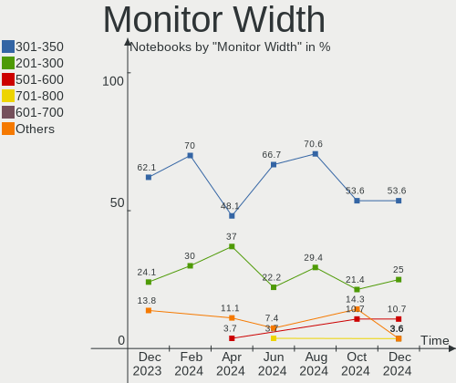

FreeBSD Hardware Trends (Notebooks)
-----------------------------------

A project to identify most popular hardware characteristics and track their change
over time based on data collected by FreeBSD users at https://BSD-Hardware.info.

Anyone can contribute to this report by the [hw-probe](https://github.com/linuxhw/hw-probe/blob/master/INSTALL.BSD.md) tool:

    hw-probe -all -upload

Full-feature report is available here: https://bsd-hardware.info/?view=trends

Period: Nov, 2021.

Contents
--------

* [ System ](#system)
  - [ OS                       ](#os)
  - [ OS Family                ](#os-family)
  - [ Arch                     ](#arch)
  - [ DE                       ](#de)
  - [ Display Server           ](#display-server)
  - [ Display Manager          ](#display-manager)
  - [ OS Lang                  ](#os-lang)
  - [ Boot Mode                ](#boot-mode)
  - [ Filesystem               ](#filesystem)
  - [ Part. scheme             ](#part-scheme)

* [ Board ](#board)
  - [ Vendor                   ](#vendor)
  - [ Model                    ](#model)
  - [ Model Family             ](#model-family)
  - [ MFG Year                 ](#mfg-year)
  - [ Form Factor              ](#form-factor)
  - [ Coreboot                 ](#coreboot)
  - [ RAM Size                 ](#ram-size)
  - [ RAM Used                 ](#ram-used)
  - [ Total Drives             ](#total-drives)
  - [ Has CD-ROM               ](#has-cd-rom)
  - [ Has Ethernet             ](#has-ethernet)
  - [ Has WiFi                 ](#has-wifi)
  - [ Has Bluetooth            ](#has-bluetooth)

* [ Location ](#location)
  - [ Country                  ](#country)
  - [ City                     ](#city)

* [ Drives ](#drives)
  - [ Drive Vendor             ](#drive-vendor)
  - [ Drive Model              ](#drive-model)
  - [ HDD Vendor               ](#hdd-vendor)
  - [ SSD Vendor               ](#ssd-vendor)
  - [ Drive Kind               ](#drive-kind)
  - [ Drive Connector          ](#drive-connector)
  - [ Drive Size               ](#drive-size)
  - [ Space Total              ](#space-total)
  - [ Space Used               ](#space-used)
  - [ Malfunc. Drives          ](#malfunc-drives)
  - [ Malfunc. Drive Vendor    ](#malfunc-drive-vendor)
  - [ Malfunc. HDD Vendor      ](#malfunc-hdd-vendor)
  - [ Malfunc. Drive Kind      ](#malfunc-drive-kind)
  - [ Failed Drives            ](#failed-drives)
  - [ Failed Drive Vendor      ](#failed-drive-vendor)
  - [ Drive Status             ](#drive-status)

* [ Storage controller ](#storage-controller)
  - [ Storage Vendor           ](#storage-vendor)
  - [ Storage Model            ](#storage-model)
  - [ Storage Kind             ](#storage-kind)

* [ Processor ](#processor)
  - [ CPU Vendor               ](#cpu-vendor)
  - [ CPU Model                ](#cpu-model)
  - [ CPU Model Family         ](#cpu-model-family)
  - [ CPU Cores                ](#cpu-cores)
  - [ CPU Sockets              ](#cpu-sockets)
  - [ CPU Threads              ](#cpu-threads)
  - [ CPU Microarch            ](#cpu-microarch)

* [ Graphics ](#graphics)
  - [ GPU Vendor               ](#gpu-vendor)
  - [ GPU Model                ](#gpu-model)
  - [ GPU Combo                ](#gpu-combo)
  - [ GPU Driver               ](#gpu-driver)
  - [ GPU Memory               ](#gpu-memory)

* [ Monitor ](#monitor)
  - [ Monitor Vendor           ](#monitor-vendor)
  - [ Monitor Model            ](#monitor-model)
  - [ Monitor Resolution       ](#monitor-resolution)
  - [ Monitor Diagonal         ](#monitor-diagonal)
  - [ Monitor Width            ](#monitor-width)
  - [ Aspect Ratio             ](#aspect-ratio)
  - [ Monitor Area             ](#monitor-area)
  - [ Pixel Density            ](#pixel-density)
  - [ Multiple Monitors        ](#multiple-monitors)

* [ Network ](#network)
  - [ Net Controller Vendor    ](#net-controller-vendor)
  - [ Net Controller Model     ](#net-controller-model)
  - [ Wireless Vendor          ](#wireless-vendor)
  - [ Wireless Model           ](#wireless-model)
  - [ Ethernet Vendor          ](#ethernet-vendor)
  - [ Ethernet Model           ](#ethernet-model)
  - [ Net Controller Kind      ](#net-controller-kind)
  - [ Used Controller          ](#used-controller)
  - [ NICs                     ](#nics)
  - [ IPv6                     ](#ipv6)

* [ Bluetooth ](#bluetooth)
  - [ Bluetooth Vendor         ](#bluetooth-vendor)
  - [ Bluetooth Model          ](#bluetooth-model)

* [ Sound ](#sound)
  - [ Sound Vendor             ](#sound-vendor)
  - [ Sound Model              ](#sound-model)

* [ Memory ](#memory)
  - [ Memory Vendor            ](#memory-vendor)
  - [ Memory Model             ](#memory-model)
  - [ Memory Kind              ](#memory-kind)
  - [ Memory Form Factor       ](#memory-form-factor)
  - [ Memory Size              ](#memory-size)
  - [ Memory Speed             ](#memory-speed)

* [ Printers & scanners ](#printers--scanners)
  - [ Printer Vendor           ](#printer-vendor)
  - [ Printer Model            ](#printer-model)
  - [ Scanner Vendor           ](#scanner-vendor)
  - [ Scanner Model            ](#scanner-model)

* [ Camera ](#camera)
  - [ Camera Vendor            ](#camera-vendor)
  - [ Camera Model             ](#camera-model)

* [ Security ](#security)
  - [ Fingerprint Vendor       ](#fingerprint-vendor)
  - [ Fingerprint Model        ](#fingerprint-model)
  - [ Chipcard Vendor          ](#chipcard-vendor)
  - [ Chipcard Model           ](#chipcard-model)

* [ Unsupported ](#unsupported)
  - [ Unsupported Devices      ](#unsupported-devices)
  - [ Unsupported Device Types ](#unsupported-device-types)

System
------

OS
--

Installed operating systems

| Name                 | Notebooks | Percent |
|----------------------|-----------|---------|
| FreeBSD 13.0-p5      | 12        | 40%     |
| FreeBSD 13.0         | 6         | 20%     |
| FreeBSD 13.0-STABLE  | 3         | 10%     |
| FreeBSD 14.0-CURRENT | 2         | 6.67%   |
| FreeBSD 13.0-p4      | 2         | 6.67%   |
| FreeBSD 12.2-p11     | 2         | 6.67%   |
| FreeBSD 12.2-p6      | 1         | 3.33%   |
| FreeBSD 12.2-p4      | 1         | 3.33%   |
| FreeBSD 12.2-p10     | 1         | 3.33%   |

OS Family
---------

OS without a version

| Name    | Notebooks | Percent |
|---------|-----------|---------|
| FreeBSD | 30        | 100%    |

Arch
----

OS architecture (x86_64, i586, etc.)

| Name  | Notebooks | Percent |
|-------|-----------|---------|
| amd64 | 27        | 90%     |
| i386  | 3         | 10%     |

DE
--

Desktop Environment

| Name    | Notebooks | Percent |
|---------|-----------|---------|
| KDE5    | 7         | 23.33%  |
| Console | 7         | 23.33%  |
| XFCE    | 6         | 20%     |
| i3      | 5         | 16.67%  |
| MATE    | 4         | 13.33%  |
| GNOME   | 1         | 3.33%   |

Display Server
--------------

X11 or Wayland

| Name    | Notebooks | Percent |
|---------|-----------|---------|
| X11     | 22        | 73.33%  |
| Console | 5         | 16.67%  |
| Wayland | 3         | 10%     |

Display Manager
---------------

SDDM, LightDM, etc.

| Name    | Notebooks | Percent |
|---------|-----------|---------|
| Console | 11        | 36.67%  |
| SDDM    | 8         | 26.67%  |
| SLiM    | 5         | 16.67%  |
| XDM     | 3         | 10%     |
| LightDM | 3         | 10%     |

OS Lang
-------

Language

| Lang    | Notebooks | Percent |
|---------|-----------|---------|
| C       | 17        | 56.67%  |
| Unknown | 8         | 26.67%  |
| uk_UA   | 1         | 3.33%   |
| nl_NL   | 1         | 3.33%   |
| es_ES   | 1         | 3.33%   |
| en_US   | 1         | 3.33%   |
| de_DE   | 1         | 3.33%   |

Boot Mode
---------

EFI or BIOS

| Mode | Notebooks | Percent |
|------|-----------|---------|
| EFI  | 18        | 60%     |
| BIOS | 12        | 40%     |

Filesystem
----------

Type of filesystem

| Type | Notebooks | Percent |
|------|-----------|---------|
| Zfs  | 15        | 50%     |
| Ufs  | 15        | 50%     |

Part. scheme
------------

Scheme of partitioning

| Type | Notebooks | Percent |
|------|-----------|---------|
| GPT  | 24        | 80%     |
| MBR  | 5         | 16.67%  |
| BSD  | 1         | 3.33%   |

Board
-----

Vendor
------

Motherboard manufacturer

| Name             | Notebooks | Percent |
|------------------|-----------|---------|
| Lenovo           | 10        | 33.33%  |
| Dell             | 6         | 20%     |
| Hewlett-Packard  | 5         | 16.67%  |
| Acer             | 3         | 10%     |
| ASUSTek Computer | 2         | 6.67%   |
| TUXEDO           | 1         | 3.33%   |
| Toshiba          | 1         | 3.33%   |
| IBM              | 1         | 3.33%   |
| Apple            | 1         | 3.33%   |

Model
-----

Motherboard model

| Name                                        | Notebooks | Percent |
|---------------------------------------------|-----------|---------|
| HP Compaq 6720s                             | 2         | 6.67%   |
| TUXEDO Pulse 15 Gen1                        | 1         | 3.33%   |
| Toshiba Satellite Pro L510                  | 1         | 3.33%   |
| Lenovo ThinkPad X270 20HMCTO1WW             | 1         | 3.33%   |
| Lenovo ThinkPad X220 42915CG                | 1         | 3.33%   |
| Lenovo ThinkPad X1 Extreme Gen 3 20TLA055CD | 1         | 3.33%   |
| Lenovo ThinkPad X1 Carbon Gen 9 20XWA003CD  | 1         | 3.33%   |
| Lenovo ThinkPad W530 2447AV9                | 1         | 3.33%   |
| Lenovo ThinkPad T430 2347G7G                | 1         | 3.33%   |
| Lenovo ThinkPad R60e 0658W2M                | 1         | 3.33%   |
| Lenovo IdeaPad S510p 20298                  | 1         | 3.33%   |
| Lenovo IdeaPad S130-14IGM 81J2              | 1         | 3.33%   |
| Lenovo IdeaPad 330-15ARR 81D2               | 1         | 3.33%   |
| IBM ThinkPad R52 185869G                    | 1         | 3.33%   |
| HP Mini 110-1000                            | 1         | 3.33%   |
| HP Laptop 15s-du1xxx                        | 1         | 3.33%   |
| HP EliteBook 8570p                          | 1         | 3.33%   |
| Dell XPS 13 9350                            | 1         | 3.33%   |
| Dell XPS 13 9343                            | 1         | 3.33%   |
| Dell Vostro 1400                            | 1         | 3.33%   |
| Dell Vostro 14-5480                         | 1         | 3.33%   |
| Dell Latitude E6430                         | 1         | 3.33%   |
| Dell Inspiron N5050                         | 1         | 3.33%   |
| ASUS 1015BX                                 | 1         | 3.33%   |
| ASUS 1001P                                  | 1         | 3.33%   |
| Apple MacBook3,1                            | 1         | 3.33%   |
| Acer Aspire E5-521G                         | 1         | 3.33%   |
| Acer Aspire A315-21                         | 1         | 3.33%   |
| Acer Aspire 5560                            | 1         | 3.33%   |

Model Family
------------

Motherboard model prefix

| Name              | Notebooks | Percent |
|-------------------|-----------|---------|
| Lenovo ThinkPad   | 7         | 23.33%  |
| Lenovo IdeaPad    | 3         | 10%     |
| Acer Aspire       | 3         | 10%     |
| HP Compaq         | 2         | 6.67%   |
| Dell XPS          | 2         | 6.67%   |
| Dell Vostro       | 2         | 6.67%   |
| TUXEDO Pulse      | 1         | 3.33%   |
| Toshiba Satellite | 1         | 3.33%   |
| IBM ThinkPad      | 1         | 3.33%   |
| HP Mini           | 1         | 3.33%   |
| HP Laptop         | 1         | 3.33%   |
| HP EliteBook      | 1         | 3.33%   |
| Dell Latitude     | 1         | 3.33%   |
| Dell Inspiron     | 1         | 3.33%   |
| ASUS 1015BX       | 1         | 3.33%   |
| ASUS 1001P        | 1         | 3.33%   |
| Apple MacBook3    | 1         | 3.33%   |

MFG Year
--------

Motherboard manufacture year

| Year | Notebooks | Percent |
|------|-----------|---------|
| 2019 | 7         | 23.33%  |
| 2018 | 4         | 13.33%  |
| 2008 | 4         | 13.33%  |
| 2021 | 3         | 10%     |
| 2014 | 2         | 6.67%   |
| 2012 | 2         | 6.67%   |
| 2009 | 2         | 6.67%   |
| 2016 | 1         | 3.33%   |
| 2013 | 1         | 3.33%   |
| 2011 | 1         | 3.33%   |
| 2010 | 1         | 3.33%   |
| 2007 | 1         | 3.33%   |
| 2006 | 1         | 3.33%   |

Form Factor
-----------

Physical design of the computer

| Name     | Notebooks | Percent |
|----------|-----------|---------|
| Notebook | 30        | 100%    |

Coreboot
--------

Have coreboot on board

| Used | Notebooks | Percent |
|------|-----------|---------|
| No   | 30        | 100%    |

RAM Size
--------

Total RAM memory

| Size in GB  | Notebooks | Percent |
|-------------|-----------|---------|
| 4.01-8.0    | 11        | 36.67%  |
| 16.01-24.0  | 7         | 23.33%  |
| 8.01-16.0   | 6         | 20%     |
| 2.01-3.0    | 2         | 6.67%   |
| 32.01-64.0  | 1         | 3.33%   |
| 3.01-4.0    | 1         | 3.33%   |
| 64.01-256.0 | 1         | 3.33%   |
| 0.51-1.0    | 1         | 3.33%   |

RAM Used
--------

Used RAM memory

| Used GB  | Notebooks | Percent |
|----------|-----------|---------|
| 0.01-0.5 | 14        | 46.67%  |
| 0.51-1.0 | 10        | 33.33%  |
| 1.01-2.0 | 4         | 13.33%  |
| 2.01-3.0 | 2         | 6.67%   |

Total Drives
------------

Number of drives on board

| Drives | Notebooks | Percent |
|--------|-----------|---------|
| 1      | 25        | 83.33%  |
| 2      | 4         | 13.33%  |
| 3      | 1         | 3.33%   |

Has CD-ROM
----------

Has CD-ROM on board

| Presented | Notebooks | Percent |
|-----------|-----------|---------|
| No        | 18        | 60%     |
| Yes       | 12        | 40%     |

Has Ethernet
------------

Has Ethernet on board

| Presented | Notebooks | Percent |
|-----------|-----------|---------|
| Yes       | 25        | 83.33%  |
| No        | 5         | 16.67%  |

Has WiFi
--------

Has WiFi module

| Presented | Notebooks | Percent |
|-----------|-----------|---------|
| Yes       | 28        | 93.33%  |
| No        | 2         | 6.67%   |

Has Bluetooth
-------------

Has Bluetooth module

| Presented | Notebooks | Percent |
|-----------|-----------|---------|
| Yes       | 17        | 56.67%  |
| No        | 13        | 43.33%  |

Location
--------

Country
-------

Geographic location (country)

| Country     | Notebooks | Percent |
|-------------|-----------|---------|
| Czechia     | 4         | 13.33%  |
| USA         | 3         | 10%     |
| UK          | 3         | 10%     |
| China       | 3         | 10%     |
| Poland      | 2         | 6.67%   |
| Netherlands | 2         | 6.67%   |
| Ukraine     | 1         | 3.33%   |
| Singapore   | 1         | 3.33%   |
| Russia      | 1         | 3.33%   |
| Namibia     | 1         | 3.33%   |
| Mexico      | 1         | 3.33%   |
| Japan       | 1         | 3.33%   |
| Indonesia   | 1         | 3.33%   |
| Germany     | 1         | 3.33%   |
| Finland     | 1         | 3.33%   |
| Denmark     | 1         | 3.33%   |
| Colombia    | 1         | 3.33%   |
| Bulgaria    | 1         | 3.33%   |
| Australia   | 1         | 3.33%   |

City
----

Geographic location (city)

| City                | Notebooks | Percent |
|---------------------|-----------|---------|
| Tuklaty             | 3         | 10%     |
| Warsaw              | 2         | 6.67%   |
| Yekaterinburg       | 1         | 3.33%   |
| Windhoek            | 1         | 3.33%   |
| Turku               | 1         | 3.33%   |
| Sofia               | 1         | 3.33%   |
| Singapore           | 1         | 3.33%   |
| Shanghai            | 1         | 3.33%   |
| Rionegro            | 1         | 3.33%   |
| Portland            | 1         | 3.33%   |
| Okehampton          | 1         | 3.33%   |
| Minato              | 1         | 3.33%   |
| Melbourne           | 1         | 3.33%   |
| London              | 1         | 3.33%   |
| Katy                | 1         | 3.33%   |
| Isernhagen          | 1         | 3.33%   |
| Guangzhou Shi       | 1         | 3.33%   |
| Den Dolder          | 1         | 3.33%   |
| Chengdu             | 1         | 3.33%   |
| Cercany             | 1         | 3.33%   |
| Calne               | 1         | 3.33%   |
| Brovary             | 1         | 3.33%   |
| Brooklyn            | 1         | 3.33%   |
| Batam               | 1         | 3.33%   |
| Amsterdam           | 1         | 3.33%   |
| Acapulco de Ju??rez | 1         | 3.33%   |
| Aarhus              | 1         | 3.33%   |

Drives
------

Drive Vendor
------------

Hard drive vendors

| Vendor              | Notebooks | Drives | Percent |
|---------------------|-----------|--------|---------|
| Samsung Electronics | 9         | 9      | 25%     |
| WDC                 | 6         | 6      | 16.67%  |
| Toshiba             | 6         | 6      | 16.67%  |
| Kingston            | 3         | 4      | 8.33%   |
| Seagate             | 2         | 2      | 5.56%   |
| Hitachi             | 2         | 2      | 5.56%   |
| Crucial             | 2         | 2      | 5.56%   |
| SK Hynix            | 1         | 1      | 2.78%   |
| SanDisk             | 1         | 1      | 2.78%   |
| Intel               | 1         | 1      | 2.78%   |
| HGST                | 1         | 1      | 2.78%   |
| Gigabyte Technology | 1         | 1      | 2.78%   |
| Fujitsu             | 1         | 1      | 2.78%   |

Drive Model
-----------

Hard drive models

| Model                              | Notebooks | Percent |
|------------------------------------|-----------|---------|
| Toshiba MQ01ABF050 500GB           | 2         | 5.41%   |
| Toshiba MK2546GSX 250GB            | 2         | 5.41%   |
| Seagate ST1000LM024 HN-M101MBB 1TB | 2         | 5.41%   |
| Kingston SA400S37240G 240GB        | 2         | 5.41%   |
| WDC WDS250G2B0B-00YS70 250GB       | 1         | 2.7%    |
| WDC WDBNCE5000PNC 500GB            | 1         | 2.7%    |
| WDC WD1600BEVT-80A23T0 160GB       | 1         | 2.7%    |
| WDC WD10JPVX-22JC3T0 1TB           | 1         | 2.7%    |
| WDC WD10JPCX-24UE4T0 1TB           | 1         | 2.7%    |
| WDC PC SN530 NVMe 512GB            | 1         | 2.7%    |
| Toshiba MK1637GSX 160GB            | 1         | 2.7%    |
| Toshiba KXG6APNV2T04 2TB           | 1         | 2.7%    |
| SK Hynix HFS128G39TNF-N3A0A 128GB  | 1         | 2.7%    |
| SanDisk SSD PLUS 120GB             | 1         | 2.7%    |
| Samsung SSD PM851 M.2 2280 256GB   | 1         | 2.7%    |
| Samsung SSD 980 PRO 1TB            | 1         | 2.7%    |
| Samsung SSD 850 EVO 500GB          | 1         | 2.7%    |
| Samsung SSD 840 Series 120GB       | 1         | 2.7%    |
| Samsung PM951 NVMe 256GB           | 1         | 2.7%    |
| Samsung MZVLW256HEHP-000L7 256GB   | 1         | 2.7%    |
| Samsung MZVLB512HBJQ-000H1 512GB   | 1         | 2.7%    |
| Samsung MZVL21T0HCLR-00BL7 1TB     | 1         | 2.7%    |
| Samsung HM251JX 250GB              | 1         | 2.7%    |
| Kingston SA400S37120G 120GB        | 1         | 2.7%    |
| Kingston SA400S37-240GB            | 1         | 2.7%    |
| Intel SSDSC2BW240H6 240GB          | 1         | 2.7%    |
| Hitachi HTS547575A9E384 752GB      | 1         | 2.7%    |
| Hitachi HTS541060G9AT00 64GB       | 1         | 2.7%    |
| HGST HTS721010A9E630 1TB           | 1         | 2.7%    |
| Gigabyte GP-GSTFS31120GNTD 120GB   | 1         | 2.7%    |
| Fujitsu MJA2160BH G2 160GB         | 1         | 2.7%    |
| Crucial CT525MX300SSD1 528GB       | 1         | 2.7%    |
| Crucial CT120M500SSD1 120GB        | 1         | 2.7%    |

HDD Vendor
----------

Hard disk drive vendors

| Vendor              | Notebooks | Drives | Percent |
|---------------------|-----------|--------|---------|
| Toshiba             | 5         | 5      | 33.33%  |
| WDC                 | 3         | 3      | 20%     |
| Seagate             | 2         | 2      | 13.33%  |
| Hitachi             | 2         | 2      | 13.33%  |
| Samsung Electronics | 1         | 1      | 6.67%   |
| HGST                | 1         | 1      | 6.67%   |
| Fujitsu             | 1         | 1      | 6.67%   |

SSD Vendor
----------

Solid state drive vendors

| Vendor              | Notebooks | Drives | Percent |
|---------------------|-----------|--------|---------|
| Samsung Electronics | 3         | 3      | 21.43%  |
| Kingston            | 3         | 4      | 21.43%  |
| WDC                 | 2         | 2      | 14.29%  |
| Crucial             | 2         | 2      | 14.29%  |
| SK Hynix            | 1         | 1      | 7.14%   |
| SanDisk             | 1         | 1      | 7.14%   |
| Intel               | 1         | 1      | 7.14%   |
| Gigabyte Technology | 1         | 1      | 7.14%   |

Drive Kind
----------

HDD or SSD

| Kind | Notebooks | Drives | Percent |
|------|-----------|--------|---------|
| SSD  | 12        | 15     | 38.71%  |
| HDD  | 12        | 15     | 38.71%  |
| NVMe | 7         | 7      | 22.58%  |

Drive Connector
---------------

SATA, SAS, NVMe, etc.

| Type | Notebooks | Drives | Percent |
|------|-----------|--------|---------|
| SATA | 24        | 30     | 77.42%  |
| NVMe | 7         | 7      | 22.58%  |

Drive Size
----------

Size of hard drive

| Size in TB | Notebooks | Drives | Percent |
|------------|-----------|--------|---------|
| 0.01-0.5   | 20        | 23     | 76.92%  |
| 0.51-1.0   | 6         | 7      | 23.08%  |

Space Total
-----------

Amount of disk space available on the file system

| Size in GB | Notebooks | Percent |
|------------|-----------|---------|
| 101-250    | 13        | 43.33%  |
| 501-1000   | 7         | 23.33%  |
| 51-100     | 6         | 20%     |
| 251-500    | 2         | 6.67%   |
| 1001-2000  | 1         | 3.33%   |
| 1-20       | 1         | 3.33%   |

Space Used
----------

Amount of used disk space

| Used GB | Notebooks | Percent |
|---------|-----------|---------|
| 1-20    | 24        | 80%     |
| 21-50   | 3         | 10%     |
| 51-100  | 3         | 10%     |

Malfunc. Drives
---------------

Drive models with a malfunction

| Model                             | Notebooks | Drives | Percent |
|-----------------------------------|-----------|--------|---------|
| Toshiba MK2546GSX 250GB           | 1         | 1      | 25%     |
| Toshiba MK1637GSX 160GB           | 1         | 1      | 25%     |
| Samsung Electronics HM251JX 250GB | 1         | 1      | 25%     |
| HGST HTS721010A9E630 1TB          | 1         | 1      | 25%     |

Malfunc. Drive Vendor
---------------------

Vendors of faulty drives

| Vendor              | Notebooks | Drives | Percent |
|---------------------|-----------|--------|---------|
| Toshiba             | 2         | 2      | 50%     |
| Samsung Electronics | 1         | 1      | 25%     |
| HGST                | 1         | 1      | 25%     |

Malfunc. HDD Vendor
-------------------

Vendors of faulty HDD drives

| Vendor              | Notebooks | Drives | Percent |
|---------------------|-----------|--------|---------|
| Toshiba             | 2         | 2      | 50%     |
| Samsung Electronics | 1         | 1      | 25%     |
| HGST                | 1         | 1      | 25%     |

Malfunc. Drive Kind
-------------------

Kinds of faulty drives

| Kind | Notebooks | Drives | Percent |
|------|-----------|--------|---------|
| HDD  | 3         | 4      | 100%    |

Failed Drives
-------------

Failed drive models

Zero info for selected period =(

Failed Drive Vendor
-------------------

Failed drive vendors

Zero info for selected period =(

Drive Status
------------

Number of failed and malfunc. drives

| Status  | Notebooks | Drives | Percent |
|---------|-----------|--------|---------|
| Works   | 29        | 33     | 90.63%  |
| Malfunc | 3         | 4      | 9.38%   |

Storage controller
------------------

Storage Vendor
--------------

Storage controller vendors

| Vendor              | Notebooks | Percent |
|---------------------|-----------|---------|
| Intel               | 21        | 63.64%  |
| AMD                 | 6         | 18.18%  |
| Samsung Electronics | 5         | 15.15%  |
| Toshiba             | 1         | 3.03%   |

Storage Model
-------------

Storage controller models

| Model                                                                        | Notebooks | Percent |
|------------------------------------------------------------------------------|-----------|---------|
| Intel 82801HM/HEM (ICH8M/ICH8M-E) SATA Controller [AHCI mode]                | 4         | 10.81%  |
| Intel 82801HM/HEM (ICH8M/ICH8M-E) IDE Controller                             | 4         | 10.81%  |
| Intel 7 Series Chipset Family 6-port SATA Controller [AHCI mode]             | 4         | 10.81%  |
| AMD FCH SATA Controller [AHCI mode]                                          | 4         | 10.81%  |
| Samsung NVMe SSD Controller PM9A1/PM9A3/980PRO                               | 2         | 5.41%   |
| Intel 82801GBM/GHM (ICH7-M Family) SATA Controller [IDE mode]                | 2         | 5.41%   |
| Intel 8 Series SATA Controller 1 [AHCI mode]                                 | 2         | 5.41%   |
| Intel 6 Series/C200 Series Chipset Family 6 port Mobile SATA AHCI Controller | 2         | 5.41%   |
| Toshiba XG6 NVMe SSD Controller                                              | 1         | 2.7%    |
| Samsung NVMe SSD Controller SM981/PM981/PM983                                | 1         | 2.7%    |
| Samsung NVMe SSD Controller SM961/PM961/SM963                                | 1         | 2.7%    |
| Samsung NVMe SSD Controller SM951/PM951                                      | 1         | 2.7%    |
| Intel Wildcat Point-LP SATA Controller [AHCI Mode]                           | 1         | 2.7%    |
| Intel Sunrise Point-LP SATA Controller [AHCI mode]                           | 1         | 2.7%    |
| Intel NM10/ICH7 Family SATA Controller [AHCI mode]                           | 1         | 2.7%    |
| Intel Celeron/Pentium Silver Processor SATA Controller                       | 1         | 2.7%    |
| Intel 82801IBM/IEM (ICH9M/ICH9M-E) 2 port SATA Controller [IDE mode]         | 1         | 2.7%    |
| Intel 82801FBM (ICH6M) SATA Controller                                       | 1         | 2.7%    |
| Intel 82801 Mobile SATA Controller [RAID mode]                               | 1         | 2.7%    |
| AMD SB7x0/SB8x0/SB9x0 SATA Controller [AHCI mode]                            | 1         | 2.7%    |
| AMD FCH SATA Controller [IDE mode]                                           | 1         | 2.7%    |

Storage Kind
------------

Kind of storage controller (IDE, SATA, NVMe, SAS, ...)

| Kind | Notebooks | Percent |
|------|-----------|---------|
| SATA | 21        | 56.76%  |
| IDE  | 9         | 24.32%  |
| NVMe | 6         | 16.22%  |
| RAID | 1         | 2.7%    |

Processor
---------

CPU Vendor
----------

Processor vendors

| Vendor | Notebooks | Percent |
|--------|-----------|---------|
| Intel  | 24        | 80%     |
| AMD    | 6         | 20%     |

CPU Model
---------

Processor models

| Model                                         | Notebooks | Percent |
|-----------------------------------------------|-----------|---------|
| Intel Pentium Dual CPU T2390 @ 1.86GHz        | 2         | 6.67%   |
| Intel Core i7-3720QM CPU @ 2.60GHz            | 2         | 6.67%   |
| Intel Core i7-3520M CPU @ 2.90GHz             | 2         | 6.67%   |
| Intel Pentium Silver N5000 CPU @ 1.10GHz      | 1         | 3.33%   |
| Intel Pentium M processor                     | 1         | 3.33%   |
| Intel Core i7-5600U CPU @ 2.60GHz             | 1         | 3.33%   |
| Intel Core i7-4500U CPU @ 1.80GHz             | 1         | 3.33%   |
| Intel Core i7-10750H CPU @ 2.60GHz            | 1         | 3.33%   |
| Intel Core i7-10510U CPU @ 1.80GHz            | 1         | 3.33%   |
| Intel Core i5-7200U CPU @ 2.50GHz             | 1         | 3.33%   |
| Intel Core i5-6200U CPU @ 2.30GHz             | 1         | 3.33%   |
| Intel Core i5-2520M CPU @ 2.50GHz             | 1         | 3.33%   |
| Intel Core i5-2450M CPU @ 2.50GHz             | 1         | 3.33%   |
| Intel Core i3-4005U CPU @ 1.70GHz             | 1         | 3.33%   |
| Intel Core 2 Duo CPU T7500 @ 2.20GHz          | 1         | 3.33%   |
| Intel Core 2 Duo CPU T6570 @ 2.10GHz          | 1         | 3.33%   |
| Intel Core 2 Duo                              | 1         | 3.33%   |
| Intel Celeron M CPU                           | 1         | 3.33%   |
| Intel Atom CPU N450 @ 1.66GHz                 | 1         | 3.33%   |
| Intel Atom CPU N270 @ 1.60GHz                 | 1         | 3.33%   |
| Intel 11th Gen Core i7-1165G7 @ 2.80GHz       | 1         | 3.33%   |
| AMD Ryzen 7 4800H with Radeon Graphics        | 1         | 3.33%   |
| AMD Ryzen 3 2200U with Radeon Vega Mobile Gfx | 1         | 3.33%   |
| AMD C-50 Processor                            | 1         | 3.33%   |
| AMD A9-9425 RADEON R5, 5 COMPUTE CORES 2C+3G  | 1         | 3.33%   |
| AMD A6-6310 APU with AMD Radeon R4 Graphics   | 1         | 3.33%   |
| AMD A4-3305M APU with Radeon HD Graphics      | 1         | 3.33%   |

CPU Model Family
----------------

Processor model prefix

| Model                | Notebooks | Percent |
|----------------------|-----------|---------|
| Intel Core i7        | 8         | 26.67%  |
| Intel Core i5        | 4         | 13.33%  |
| Intel Core 2 Duo     | 3         | 10%     |
| Other                | 2         | 6.67%   |
| Intel Pentium Dual   | 2         | 6.67%   |
| Intel Atom           | 2         | 6.67%   |
| Intel Pentium Silver | 1         | 3.33%   |
| Intel Pentium M      | 1         | 3.33%   |
| Intel Core i3        | 1         | 3.33%   |
| Intel Celeron M      | 1         | 3.33%   |
| AMD Ryzen 7          | 1         | 3.33%   |
| AMD Ryzen 3          | 1         | 3.33%   |
| AMD C-50             | 1         | 3.33%   |
| AMD A6               | 1         | 3.33%   |
| AMD A4               | 1         | 3.33%   |

CPU Cores
---------

Number of processor cores

| Number  | Notebooks | Percent |
|---------|-----------|---------|
| 2       | 13        | 43.33%  |
| 4       | 7         | 23.33%  |
| Unknown | 5         | 16.67%  |
| 1       | 3         | 10%     |
| 16      | 1         | 3.33%   |
| 6       | 1         | 3.33%   |

CPU Sockets
-----------

Number of sockets

| Number | Notebooks | Percent |
|--------|-----------|---------|
| 1      | 29        | 96.67%  |
| 2      | 1         | 3.33%   |

CPU Threads
-----------

Threads per core (Hyper-Threading)

| Number  | Notebooks | Percent |
|---------|-----------|---------|
| 2       | 15        | 50%     |
| 1       | 8         | 26.67%  |
| Unknown | 7         | 23.33%  |

CPU Microarch
-------------

Microarchitecture

| Name          | Notebooks | Percent |
|---------------|-----------|---------|
| IvyBridge     | 4         | 13.33%  |
| Core          | 3         | 10%     |
| SandyBridge   | 2         | 6.67%   |
| Penryn        | 2         | 6.67%   |
| P6            | 2         | 6.67%   |
| KabyLake      | 2         | 6.67%   |
| Haswell       | 2         | 6.67%   |
| Bonnell       | 2         | 6.67%   |
| Zen 2         | 1         | 3.33%   |
| Zen           | 1         | 3.33%   |
| TigerLake     | 1         | 3.33%   |
| Skylake       | 1         | 3.33%   |
| Puma          | 1         | 3.33%   |
| K10 Llano     | 1         | 3.33%   |
| Goldmont plus | 1         | 3.33%   |
| Excavator     | 1         | 3.33%   |
| CometLake     | 1         | 3.33%   |
| Broadwell     | 1         | 3.33%   |
| Bobcat        | 1         | 3.33%   |

Graphics
--------

GPU Vendor
----------

Vendors of graphics cards

| Vendor | Notebooks | Percent |
|--------|-----------|---------|
| Intel  | 21        | 60%     |
| AMD    | 8         | 22.86%  |
| Nvidia | 6         | 17.14%  |

GPU Model
---------

Graphics card models

| Model                                                                         | Notebooks | Percent |
|-------------------------------------------------------------------------------|-----------|---------|
| Intel Mobile GME965/GLE960 Integrated Graphics Controller                     | 2         | 5%      |
| Intel Mobile GM965/GL960 Integrated Graphics Controller (secondary)           | 2         | 5%      |
| Intel Mobile GM965/GL960 Integrated Graphics Controller (primary)             | 2         | 5%      |
| Intel Mobile 945GM/GMS/GME, 943/940GML Express Integrated Graphics Controller | 2         | 5%      |
| Intel Haswell-ULT Integrated Graphics Controller                              | 2         | 5%      |
| Intel 3rd Gen Core processor Graphics Controller                              | 2         | 5%      |
| Intel 2nd Generation Core Processor Family Integrated Graphics Controller     | 2         | 5%      |
| Nvidia TU117M [GeForce GTX 1650 Ti Mobile]                                    | 1         | 2.5%    |
| Nvidia GP108M [GeForce MX250]                                                 | 1         | 2.5%    |
| Nvidia GK107GLM [Quadro K1000M]                                               | 1         | 2.5%    |
| Nvidia GF117M [GeForce 610M/710M/810M/820M / GT 620M/625M/630M/720M]          | 1         | 2.5%    |
| Nvidia GF108M [NVS 5400M]                                                     | 1         | 2.5%    |
| Nvidia GF108GLM [NVS 5200M]                                                   | 1         | 2.5%    |
| Intel TigerLake-LP GT2 [Iris Xe Graphics]                                     | 1         | 2.5%    |
| Intel Skylake GT2 [HD Graphics 520]                                           | 1         | 2.5%    |
| Intel Mobile 945GSE Express Integrated Graphics Controller                    | 1         | 2.5%    |
| Intel Mobile 945GM/GMS, 943/940GML Express Integrated Graphics Controller     | 1         | 2.5%    |
| Intel Mobile 915GM/GMS/910GML Express Graphics Controller                     | 1         | 2.5%    |
| Intel HD Graphics 620                                                         | 1         | 2.5%    |
| Intel HD Graphics 5500                                                        | 1         | 2.5%    |
| Intel GeminiLake [UHD Graphics 605]                                           | 1         | 2.5%    |
| Intel CometLake-U GT2 [UHD Graphics]                                          | 1         | 2.5%    |
| Intel CometLake-H GT2 [UHD Graphics]                                          | 1         | 2.5%    |
| Intel Atom Processor D4xx/D5xx/N4xx/N5xx Integrated Graphics Controller       | 1         | 2.5%    |
| AMD Wrestler [Radeon HD 6250]                                                 | 1         | 2.5%    |
| AMD Thames [Radeon HD 7550M/7570M/7650M]                                      | 1         | 2.5%    |
| AMD SuperSumo [Radeon HD 6480G]                                               | 1         | 2.5%    |
| AMD Stoney [Radeon R2/R3/R4/R5 Graphics]                                      | 1         | 2.5%    |
| AMD RV710/M92 [Mobility Radeon HD 4530/4570/545v]                             | 1         | 2.5%    |
| AMD Renoir                                                                    | 1         | 2.5%    |
| AMD Raven Ridge [Radeon Vega Series / Radeon Vega Mobile Series]              | 1         | 2.5%    |
| AMD Mullins [Radeon R4/R5 Graphics]                                           | 1         | 2.5%    |
| AMD Jet XT [Radeon R5 M240]                                                   | 1         | 2.5%    |

GPU Combo
---------

Combinations of graphics cards

| Name           | Notebooks | Percent |
|----------------|-----------|---------|
| 2 x Intel      | 8         | 26.67%  |
| 1 x Intel      | 8         | 26.67%  |
| 1 x AMD        | 7         | 23.33%  |
| Intel + Nvidia | 5         | 16.67%  |
| 2 x AMD        | 1         | 3.33%   |
| 1 x Nvidia     | 1         | 3.33%   |

GPU Driver
----------

Free vs proprietary

| Driver      | Notebooks | Percent |
|-------------|-----------|---------|
| Free        | 26        | 86.67%  |
| Proprietary | 3         | 10%     |
| Unknown     | 1         | 3.33%   |

GPU Memory
----------

Total video memory

| Size in GB | Notebooks | Percent |
|------------|-----------|---------|
| Unknown    | 23        | 76.67%  |
| 0.01-0.5   | 4         | 13.33%  |
| 0.51-1.0   | 3         | 10%     |

Monitor
-------

Monitor Vendor
--------------

Monitor vendors

| Vendor              | Notebooks | Percent |
|---------------------|-----------|---------|
| LG Display          | 5         | 20%     |
| Samsung Electronics | 3         | 12%     |
| Sharp               | 2         | 8%      |
| Philips             | 2         | 8%      |
| Lenovo              | 2         | 8%      |
| Chimei Innolux      | 2         | 8%      |
| BOE                 | 2         | 8%      |
| AU Optronics        | 2         | 8%      |
| Toshiba             | 1         | 4%      |
| InfoVision          | 1         | 4%      |
| HannStar            | 1         | 4%      |
| CSO                 | 1         | 4%      |
| Apple               | 1         | 4%      |

Monitor Model
-------------

Monitor models

| Model                                                                | Notebooks | Percent |
|----------------------------------------------------------------------|-----------|---------|
| Toshiba TV TSB0108 1360x768 480x270mm 21.7-inch                      | 1         | 4%      |
| Sharp LCD Monitor SHP1449 1920x1080 290x170mm 13.2-inch              | 1         | 4%      |
| Sharp LCD Monitor SHP1421 3200x1800 290x170mm 13.2-inch              | 1         | 4%      |
| Samsung Electronics LCD Monitor SEC544B 1600x900 310x170mm 13.9-inch | 1         | 4%      |
| Samsung Electronics LCD Monitor SEC324C 1600x900 310x170mm 13.9-inch | 1         | 4%      |
| Samsung Electronics LCD Monitor SEC3157 1280x800 300x190mm 14.0-inch | 1         | 4%      |
| Philips PHL 221V8 PHLC211 1920x1080 480x270mm 21.7-inch              | 1         | 4%      |
| Philips LCD Monitor PHL08C3 1920x1080 600x340mm 27.2-inch            | 1         | 4%      |
| LG Display LCD Monitor LGD03C4 1366x768 350x190mm 15.7-inch          | 1         | 4%      |
| LG Display LCD Monitor LGD02DC 1366x768 340x190mm 15.3-inch          | 1         | 4%      |
| LG Display LCD Monitor LGD02D8 1366x768 280x160mm 12.7-inch          | 1         | 4%      |
| LG Display LCD Monitor LGD0258 1600x900 350x190mm 15.7-inch          | 1         | 4%      |
| LG Display LCD Monitor LGD01E6 1366x768 310x170mm 13.9-inch          | 1         | 4%      |
| Lenovo LCD Monitor LEN40B2 1920x1080 340x190mm 15.3-inch             | 1         | 4%      |
| Lenovo LCD Monitor LEN4040 1024x768 300x230mm 14.9-inch              | 1         | 4%      |
| InfoVision LCD Monitor IVO03F4 1024x600 220x130mm 10.1-inch          | 1         | 4%      |
| HannStar HSD100IFW1 HSD03E9 1024x600 220x130mm 10.1-inch             | 1         | 4%      |
| CSO LCD Monitor CSO1404 1920x1200 300x190mm 14.0-inch                | 1         | 4%      |
| Chimei Innolux LCD Monitor CMN15DB 1366x768 340x190mm 15.3-inch      | 1         | 4%      |
| Chimei Innolux LCD Monitor CMN1239 1920x1080 280x160mm 12.7-inch     | 1         | 4%      |
| BOE LCD Monitor BOE07A3 1920x1080 340x190mm 15.3-inch                | 1         | 4%      |
| BOE LCD Monitor BOE06BB 1920x1080 310x170mm 13.9-inch                | 1         | 4%      |
| AU Optronics LCD Monitor AUO2E3C 1366x768 310x170mm 13.9-inch        | 1         | 4%      |
| AU Optronics LCD Monitor AUO22EC 1366x768 340x190mm 15.3-inch        | 1         | 4%      |
| Apple LCD Monitor APP9C5F 1280x800 290x180mm 13.4-inch               | 1         | 4%      |

Monitor Resolution
------------------

Monitor screen resolution

| Resolution        | Notebooks | Percent |
|-------------------|-----------|---------|
| 1920x1080 (FHD)   | 7         | 28%     |
| 1366x768 (WXGA)   | 7         | 28%     |
| 1600x900 (HD+)    | 3         | 12%     |
| 1280x800 (WXGA)   | 2         | 8%      |
| 1024x600          | 2         | 8%      |
| 3200x1800 (QHD+)  | 1         | 4%      |
| 1920x540          | 1         | 4%      |
| 1920x1200 (WUXGA) | 1         | 4%      |
| 1024x768 (XGA)    | 1         | 4%      |

Monitor Diagonal
----------------

Diagonal size in inches

| Inches | Notebooks | Percent |
|--------|-----------|---------|
| 13     | 8         | 32%     |
| 15     | 7         | 28%     |
| 14     | 3         | 12%     |
| 12     | 2         | 8%      |
| 10     | 2         | 8%      |
| 31     | 1         | 4%      |
| 27     | 1         | 4%      |
| 21     | 1         | 4%      |

Monitor Width
-------------

Physical width

| Width in mm | Notebooks | Percent |
|-------------|-----------|---------|
| 301-350     | 12        | 48%     |
| 201-300     | 10        | 40%     |
| 601-700     | 1         | 4%      |
| 501-600     | 1         | 4%      |
| 401-500     | 1         | 4%      |

Aspect Ratio
------------

Proportional relationship between the width and the height

| Ratio | Notebooks | Percent |
|-------|-----------|---------|
| 16/9  | 18        | 81.82%  |
| 16/10 | 3         | 13.64%  |
| 4/3   | 1         | 4.55%   |

Monitor Area
------------

Area in inch²

| Area in inch² | Notebooks | Percent |
|----------------|-----------|---------|
| 81-90          | 8         | 32%     |
| 91-100         | 5         | 20%     |
| 101-110        | 3         | 12%     |
| 71-80          | 2         | 8%      |
| 61-70          | 2         | 8%      |
| 41-50          | 2         | 8%      |
| 351-500        | 1         | 4%      |
| 301-350        | 1         | 4%      |
| 201-250        | 1         | 4%      |

Pixel Density
-------------

Pixels per inch

| Density       | Notebooks | Percent |
|---------------|-----------|---------|
| 101-120       | 11        | 44%     |
| 121-160       | 6         | 24%     |
| 51-100        | 4         | 16%     |
| 161-240       | 3         | 12%     |
| More than 240 | 1         | 4%      |

Multiple Monitors
-----------------

Total monitors connected

| Total | Notebooks | Percent |
|-------|-----------|---------|
| 1     | 19        | 63.33%  |
| 0     | 8         | 26.67%  |
| 2     | 3         | 10%     |

Network
-------

Net Controller Vendor
---------------------

Controller vendors

| Vendor                            | Notebooks | Percent |
|-----------------------------------|-----------|---------|
| Intel                             | 16        | 31.37%  |
| Realtek Semiconductor             | 12        | 23.53%  |
| Qualcomm Atheros                  | 8         | 15.69%  |
| Broadcom                          | 8         | 15.69%  |
| TP-Link                           | 2         | 3.92%   |
| OPPO Electronics                  | 1         | 1.96%   |
| Marvell Technology Group          | 1         | 1.96%   |
| Hewlett-Packard                   | 1         | 1.96%   |
| Ericsson Business Mobile Networks | 1         | 1.96%   |
| Dell                              | 1         | 1.96%   |

Net Controller Model
--------------------

Controller models

| Model                                                                       | Notebooks | Percent |
|-----------------------------------------------------------------------------|-----------|---------|
| Realtek RTL8111/8168/8411 PCI Express Gigabit Ethernet Controller           | 6         | 9.23%   |
| Intel Centrino Advanced-N 6205 [Taylor Peak]                                | 5         | 7.69%   |
| Intel 82579LM Gigabit Network Connection (Lewisville)                       | 5         | 7.69%   |
| Realtek RTL8188EUS 802.11n Wireless Network Adapter                         | 4         | 6.15%   |
| Realtek RTL8821CE 802.11ac PCIe Wireless Network Adapter                    | 2         | 3.08%   |
| Realtek RTL810xE PCI Express Fast Ethernet controller                       | 2         | 3.08%   |
| Qualcomm Atheros QCA9565 / AR9565 Wireless Network Adapter                  | 2         | 3.08%   |
| Qualcomm Atheros AR8132 Fast Ethernet                                       | 2         | 3.08%   |
| Intel Wi-Fi 6 AX200                                                         | 2         | 3.08%   |
| Intel 82562GT 10/100 Network Connection                                     | 2         | 3.08%   |
| Broadcom NetXtreme BCM5751M Gigabit Ethernet PCI Express                    | 2         | 3.08%   |
| Broadcom BCM4311 802.11a/b/g                                                | 2         | 3.08%   |
| TP-Link TP-LINK Wireless USB Adapter                                        | 1         | 1.54%   |
| TP-Link AC600 wireless Realtek RTL8811AU [Archer T2U Nano]                  | 1         | 1.54%   |
| Realtek RTL8188FTV 802.11b/g/n 1T1R 2.4G WLAN Adapter                       | 1         | 1.54%   |
| Qualcomm Atheros QCA9377 802.11ac Wireless Network Adapter                  | 1         | 1.54%   |
| Qualcomm Atheros AR9485 Wireless Network Adapter                            | 1         | 1.54%   |
| Qualcomm Atheros AR9285 Wireless Network Adapter (PCI-Express)              | 1         | 1.54%   |
| Qualcomm Atheros AR8162 Fast Ethernet                                       | 1         | 1.54%   |
| Qualcomm Atheros AR8152 v2.0 Fast Ethernet                                  | 1         | 1.54%   |
| Qualcomm Atheros AR5212 802.11abg NIC                                       | 1         | 1.54%   |
| Qualcomm Atheros AR2427 802.11bg Wireless Network Adapter (PCI-Express)     | 1         | 1.54%   |
| OPPO SDM720G-IDP _SN:8A58D65F RNDIS Control RNDIS Ethernet Data             | 1         | 1.54%   |
| Marvell Group 88E8058 PCI-E Gigabit Ethernet Controller                     | 1         | 1.54%   |
| Intel Wireless 8265 / 8275                                                  | 1         | 1.54%   |
| Intel Wireless 7265                                                         | 1         | 1.54%   |
| Intel Wi-Fi 6 AX201                                                         | 1         | 1.54%   |
| Intel PRO/Wireless 2200BG [Calexico2] Network Connection                    | 1         | 1.54%   |
| Intel Ethernet Connection (4) I219-V                                        | 1         | 1.54%   |
| Intel Dual Band Wireless-AC 3168NGW [Stone Peak]                            | 1         | 1.54%   |
| Intel Dual Band Wireless-AC 3165 Plus Bluetooth                             | 1         | 1.54%   |
| Intel Comet Lake PCH CNVi WiFi                                              | 1         | 1.54%   |
| Intel 82801FB/FBM/FR/FW/FRW (ICH6 Family) AC'97 Modem Controller            | 1         | 1.54%   |
| HP hs2350 HSPA+ Mobile Broadband Module Network Adapter                     | 1         | 1.54%   |
| Ericsson Business Mobile Networks F5521 gw Mobile Broadband Serial Port III | 1         | 1.54%   |
| Dell Dell Wireless 5560 Single-mode HSPA Mini Card with A-GPS               | 1         | 1.54%   |
| Broadcom NetLink BCM5906M Fast Ethernet PCI Express                         | 1         | 1.54%   |
| Broadcom NetLink BCM57785 Gigabit Ethernet PCIe                             | 1         | 1.54%   |
| Broadcom BCM43227 802.11b/g/n                                               | 1         | 1.54%   |
| Broadcom BCM4321 802.11a/b/g/n                                              | 1         | 1.54%   |
| Broadcom BCM4312 802.11b/g LP-PHY                                           | 1         | 1.54%   |

Wireless Vendor
---------------

Wireless vendors

| Vendor                | Notebooks | Percent |
|-----------------------|-----------|---------|
| Intel                 | 14        | 38.89%  |
| Realtek Semiconductor | 7         | 19.44%  |
| Qualcomm Atheros      | 7         | 19.44%  |
| Broadcom              | 5         | 13.89%  |
| TP-Link               | 2         | 5.56%   |
| Dell                  | 1         | 2.78%   |

Wireless Model
--------------

Wireless models

| Model                                                                   | Notebooks | Percent |
|-------------------------------------------------------------------------|-----------|---------|
| Intel Centrino Advanced-N 6205 [Taylor Peak]                            | 5         | 13.89%  |
| Realtek RTL8188EUS 802.11n Wireless Network Adapter                     | 4         | 11.11%  |
| Realtek RTL8821CE 802.11ac PCIe Wireless Network Adapter                | 2         | 5.56%   |
| Qualcomm Atheros QCA9565 / AR9565 Wireless Network Adapter              | 2         | 5.56%   |
| Intel Wi-Fi 6 AX200                                                     | 2         | 5.56%   |
| Broadcom BCM4311 802.11a/b/g                                            | 2         | 5.56%   |
| TP-Link TP-LINK Wireless USB Adapter                                    | 1         | 2.78%   |
| TP-Link AC600 wireless Realtek RTL8811AU [Archer T2U Nano]              | 1         | 2.78%   |
| Realtek RTL8188FTV 802.11b/g/n 1T1R 2.4G WLAN Adapter                   | 1         | 2.78%   |
| Qualcomm Atheros QCA9377 802.11ac Wireless Network Adapter              | 1         | 2.78%   |
| Qualcomm Atheros AR9485 Wireless Network Adapter                        | 1         | 2.78%   |
| Qualcomm Atheros AR9285 Wireless Network Adapter (PCI-Express)          | 1         | 2.78%   |
| Qualcomm Atheros AR5212 802.11abg NIC                                   | 1         | 2.78%   |
| Qualcomm Atheros AR2427 802.11bg Wireless Network Adapter (PCI-Express) | 1         | 2.78%   |
| Intel Wireless 8265 / 8275                                              | 1         | 2.78%   |
| Intel Wireless 7265                                                     | 1         | 2.78%   |
| Intel Wi-Fi 6 AX201                                                     | 1         | 2.78%   |
| Intel PRO/Wireless 2200BG [Calexico2] Network Connection                | 1         | 2.78%   |
| Intel Dual Band Wireless-AC 3168NGW [Stone Peak]                        | 1         | 2.78%   |
| Intel Dual Band Wireless-AC 3165 Plus Bluetooth                         | 1         | 2.78%   |
| Intel Comet Lake PCH CNVi WiFi                                          | 1         | 2.78%   |
| Dell Dell Wireless 5560 Single-mode HSPA Mini Card with A-GPS           | 1         | 2.78%   |
| Broadcom BCM43227 802.11b/g/n                                           | 1         | 2.78%   |
| Broadcom BCM4321 802.11a/b/g/n                                          | 1         | 2.78%   |
| Broadcom BCM4312 802.11b/g LP-PHY                                       | 1         | 2.78%   |

Ethernet Vendor
---------------

Ethernet vendors

| Vendor                   | Notebooks | Percent |
|--------------------------|-----------|---------|
| Realtek Semiconductor    | 8         | 30.77%  |
| Intel                    | 8         | 30.77%  |
| Qualcomm Atheros         | 4         | 15.38%  |
| Broadcom                 | 4         | 15.38%  |
| OPPO Electronics         | 1         | 3.85%   |
| Marvell Technology Group | 1         | 3.85%   |

Ethernet Model
--------------

Ethernet models

| Model                                                             | Notebooks | Percent |
|-------------------------------------------------------------------|-----------|---------|
| Realtek RTL8111/8168/8411 PCI Express Gigabit Ethernet Controller | 6         | 23.08%  |
| Intel 82579LM Gigabit Network Connection (Lewisville)             | 5         | 19.23%  |
| Realtek RTL810xE PCI Express Fast Ethernet controller             | 2         | 7.69%   |
| Qualcomm Atheros AR8132 Fast Ethernet                             | 2         | 7.69%   |
| Intel 82562GT 10/100 Network Connection                           | 2         | 7.69%   |
| Broadcom NetXtreme BCM5751M Gigabit Ethernet PCI Express          | 2         | 7.69%   |
| Qualcomm Atheros AR8162 Fast Ethernet                             | 1         | 3.85%   |
| Qualcomm Atheros AR8152 v2.0 Fast Ethernet                        | 1         | 3.85%   |
| OPPO SDM720G-IDP _SN:8A58D65F RNDIS Control RNDIS Ethernet Data   | 1         | 3.85%   |
| Marvell Group 88E8058 PCI-E Gigabit Ethernet Controller           | 1         | 3.85%   |
| Intel Ethernet Connection (4) I219-V                              | 1         | 3.85%   |
| Broadcom NetLink BCM5906M Fast Ethernet PCI Express               | 1         | 3.85%   |
| Broadcom NetLink BCM57785 Gigabit Ethernet PCIe                   | 1         | 3.85%   |

Net Controller Kind
-------------------

Ethernet, WiFi or modem

| Kind     | Notebooks | Percent |
|----------|-----------|---------|
| WiFi     | 28        | 50%     |
| Ethernet | 25        | 44.64%  |
| Modem    | 2         | 3.57%   |
| Unknown  | 1         | 1.79%   |

Used Controller
---------------

Currently used network controller

| Kind     | Notebooks | Percent |
|----------|-----------|---------|
| Ethernet | 22        | 51.16%  |
| WiFi     | 20        | 46.51%  |
| Unknown  | 1         | 2.33%   |

NICs
----

Total network controllers on board

| Total | Notebooks | Percent |
|-------|-----------|---------|
| 2     | 23        | 76.67%  |
| 1     | 7         | 23.33%  |

IPv6
----

IPv6 vs IPv4

| Used | Notebooks | Percent |
|------|-----------|---------|
| No   | 24        | 80%     |
| Yes  | 6         | 20%     |

Bluetooth
---------

Bluetooth Vendor
----------------

Controller vendors

| Vendor                          | Notebooks | Percent |
|---------------------------------|-----------|---------|
| Intel                           | 6         | 35.29%  |
| Realtek Semiconductor           | 2         | 11.76%  |
| Qualcomm Atheros Communications | 2         | 11.76%  |
| Lite-On Technology              | 2         | 11.76%  |
| Hewlett-Packard                 | 2         | 11.76%  |
| Dell                            | 1         | 5.88%   |
| Broadcom                        | 1         | 5.88%   |
| Apple                           | 1         | 5.88%   |

Bluetooth Model
---------------

Controller models

| Model                                         | Notebooks | Percent |
|-----------------------------------------------|-----------|---------|
| Intel AX201 Bluetooth                         | 2         | 11.76%  |
| Intel AX200 Bluetooth                         | 2         | 11.76%  |
| HP Bluetooth 2.0 Interface [Broadcom BCM2045] | 2         | 11.76%  |
| Realtek  Bluetooth Adapter                    | 1         | 5.88%   |
| Realtek  Bluetooth 4.2 Adapter                | 1         | 5.88%   |
| Qualcomm Atheros Dell Wireless 1703 Bluetooth | 1         | 5.88%   |
| Qualcomm Atheros AR3012 Bluetooth 4.0         | 1         | 5.88%   |
| Lite-On Qualcomm Atheros QCA9377 Bluetooth    | 1         | 5.88%   |
| Lite-On Atheros AR3012 Bluetooth              | 1         | 5.88%   |
| Intel Wireless-AC 3168 Bluetooth              | 1         | 5.88%   |
| Intel Bluetooth wireless interface            | 1         | 5.88%   |
| Dell Dell Wireless 380 Bluetooth 4.0 Module   | 1         | 5.88%   |
| Broadcom BCM20702 Bluetooth 4.0 [ThinkPad]    | 1         | 5.88%   |
| Apple Built-in iSight (no firmware loaded)    | 1         | 5.88%   |

Sound
-----

Sound Vendor
------------

Sound card vendors

| Vendor | Notebooks | Percent |
|--------|-----------|---------|
| Intel  | 24        | 70.59%  |
| AMD    | 7         | 20.59%  |
| Nvidia | 3         | 8.82%   |

Sound Model
-----------

Sound card models

| Model                                                                      | Notebooks | Percent |
|----------------------------------------------------------------------------|-----------|---------|
| Intel 82801H (ICH8 Family) HD Audio Controller                             | 4         | 9.52%   |
| Intel 7 Series/C216 Chipset Family High Definition Audio Controller        | 4         | 9.52%   |
| Intel NM10/ICH7 Family High Definition Audio Controller                    | 3         | 7.14%   |
| Intel Sunrise Point-LP HD Audio                                            | 2         | 4.76%   |
| Intel Haswell-ULT HD Audio Controller                                      | 2         | 4.76%   |
| Intel 8 Series HD Audio Controller                                         | 2         | 4.76%   |
| Intel 6 Series/C200 Series Chipset Family High Definition Audio Controller | 2         | 4.76%   |
| AMD FCH Azalia Controller                                                  | 2         | 4.76%   |
| AMD Family 17h (Models 10h-1fh) HD Audio Controller                        | 2         | 4.76%   |
| Nvidia TU107 GeForce GTX 1650 High Definition Audio Controller             | 1         | 2.38%   |
| Nvidia GF108 High Definition Audio Controller                              | 1         | 2.38%   |
| Intel Tiger Lake-LP Smart Sound Technology Audio Controller                | 1         | 2.38%   |
| Intel Comet Lake PCH-LP cAVS                                               | 1         | 2.38%   |
| Intel Comet Lake PCH cAVS                                                  | 1         | 2.38%   |
| Intel Celeron/Pentium Silver Processor High Definition Audio               | 1         | 2.38%   |
| Intel Broadwell-U Audio Controller                                         | 1         | 2.38%   |
| Intel 82801I (ICH9 Family) HD Audio Controller                             | 1         | 2.38%   |
| Intel 82801FB/FBM/FR/FW/FRW (ICH6 Family) AC'97 Audio Controller           | 1         | 2.38%   |
| AMD Wrestler HDMI Audio                                                    | 1         | 2.38%   |
| AMD Turks HDMI Audio [Radeon HD 6500/6600 / 6700M Series]                  | 1         | 2.38%   |
| AMD SBx00 Azalia (Intel HDA)                                               | 1         | 2.38%   |
| AMD Renoir Radeon High Definition Audio Controller                         | 1         | 2.38%   |
| AMD Raven/Raven2/Fenghuang HDMI/DP Audio Controller                        | 1         | 2.38%   |
| AMD Kabini HDMI/DP Audio                                                   | 1         | 2.38%   |
| AMD High Definition Audio Controller                                       | 1         | 2.38%   |
| AMD Family 15h (Models 60h-6fh) Audio Controller                           | 1         | 2.38%   |
| AMD BeaverCreek HDMI Audio [Radeon HD 6500D and 6400G-6600G series]        | 1         | 2.38%   |
| Unknown                                                                    | 1         | 2.38%   |

Memory
------

Memory Vendor
-------------

Memory module vendors

| Vendor              | Notebooks | Percent |
|---------------------|-----------|---------|
| Samsung Electronics | 11        | 29.73%  |
| SK Hynix            | 6         | 16.22%  |
| Unknown             | 4         | 10.81%  |
| Micron Technology   | 4         | 10.81%  |
| Kingston            | 3         | 8.11%   |
| Elpida              | 3         | 8.11%   |
| Transcend           | 2         | 5.41%   |
| Ramaxel Technology  | 1         | 2.7%    |
| Corsair             | 1         | 2.7%    |
| A-DATA Technology   | 1         | 2.7%    |
| Unknown             | 1         | 2.7%    |

Memory Model
------------

Memory module models

| Model                                                       | Notebooks | Percent |
|-------------------------------------------------------------|-----------|---------|
| Samsung RAM M471B1G73QH0-YK0 8GB SODIMM DDR3 1600MT/s       | 4         | 9.52%   |
| Unknown RAM Module 2GB SODIMM DDR2 667MT/s                  | 1         | 2.38%   |
| Unknown RAM Module 2GB SODIMM DDR2                          | 1         | 2.38%   |
| Unknown RAM Module 1GB SODIMM DDR2 667MT/s                  | 1         | 2.38%   |
| Unknown RAM Module 1GB SODIMM DDR2                          | 1         | 2.38%   |
| Unknown RAM Module 1GB SODIMM DDR                           | 1         | 2.38%   |
| Transcend RAM TS2GSH64V1B 16GB SODIMM DDR4 2133MT/s         | 1         | 2.38%   |
| Transcend RAM JM1066KSN-4G 4GB SODIMM DDR3 1066MT/s         | 1         | 2.38%   |
| SK Hynix RAM HYMP125S64CP8-Y5 2GB SODIMM DDR2 667MT/s       | 1         | 2.38%   |
| SK Hynix RAM HMT425S6AFR6A-PB 2GB SODIMM DDR3 1600MT/s      | 1         | 2.38%   |
| SK Hynix RAM HMT351S6EFR8C-PB 4GB SODIMM DDR3 1600MT/s      | 1         | 2.38%   |
| SK Hynix RAM HMAA1GS6CJR6N-XN 8GB SODIMM DDR4 3200MT/s      | 1         | 2.38%   |
| SK Hynix RAM HMA851S6AFR6N-UH 4GB SODIMM DDR4 2400MT/s      | 1         | 2.38%   |
| SK Hynix RAM HMA82GS6DJR8N-XN 16GB SODIMM DDR4 3200MT/s     | 1         | 2.38%   |
| SK Hynix RAM HMA425S6BJR6N-UH 2GB SODIMM DDR4 1200MT/s      | 1         | 2.38%   |
| Samsung RAM Module 4GB SODIMM DDR2 667MT/s                  | 1         | 2.38%   |
| Samsung RAM M471B5773CHS-CH9 2GB SODIMM DDR3 1333MT/s       | 1         | 2.38%   |
| Samsung RAM M471B5673EH1-CF8 2GB SODIMM DDR3 1067MT/s       | 1         | 2.38%   |
| Samsung RAM M471B5273DH0-CH9 4GB SODIMM DDR3 1334MT/s       | 1         | 2.38%   |
| Samsung RAM M471B5173QH0-YK0 4GB SODIMM DDR3 1600MT/s       | 1         | 2.38%   |
| Samsung RAM M471B1G73BH0-CK0 8GB SODIMM DDR3 1600MT/s       | 1         | 2.38%   |
| Samsung RAM M471A4G43AB1-CWE 32GB SODIMM DDR4 3200MT/s      | 1         | 2.38%   |
| Samsung RAM M471A1K43CB1-CTD 8GB SODIMM DDR4 2667MT/s       | 1         | 2.38%   |
| Samsung RAM M4 70T5663QZ3-CE6 2GB SODIMM DDR2 667MT/s       | 1         | 2.38%   |
| Samsung RAM K4F8E304HB-MGCJ 1GB DIMM LPDDR4 2133MT/s        | 1         | 2.38%   |
| Ramaxel RAM RMT3170EB68F9W1600 4GB SODIMM DDR3 1600MT/s     | 1         | 2.38%   |
| Micron RAM 8KTF51264HZ-1G6N1 4GB SODIMM DDR3 1600MT/s       | 1         | 2.38%   |
| Micron RAM 53E1G32D2NP-046 2GB Row Of Chips LPDDR4 4267MT/s | 1         | 2.38%   |
| Micron RAM 4ATF51264HZ-2G6E! 4GB SODIMM DDR4 2400MT/s       | 1         | 2.38%   |
| Micron RAM 16HTF25664HY-800E1 2GB SODIMM DDR 800MT/s        | 1         | 2.38%   |
| Kingston RAM ACR16D3LS1KFG/4G 4GB SODIMM DDR3 1600MT/s      | 1         | 2.38%   |
| Kingston RAM 99U5700-028.A00G 8GB SODIMM DDR4 2400MT/s      | 1         | 2.38%   |
| Kingston RAM 9905428-087.A00LF 8GB SODIMM DDR3 1600MT/s     | 1         | 2.38%   |
| Elpida RAM EDFA232A2MA-JD-F-R 4GB Chip LPDDR3 1867MT/s      | 1         | 2.38%   |
| Elpida RAM EBE21UE8AESA-8G-E 2GB SODIMM DDR2 975MT/s        | 1         | 2.38%   |
| Elpida RAM 8KTS51264HDZ-1G6E1 4GB Chip DDR3 1600MT/s        | 1         | 2.38%   |
| Corsair RAM CMSX8GX3M1A1600C10 8GB SODIMM DDR3 1333MT/s     | 1         | 2.38%   |
| A-DATA RAM AD73I1B0873EV 2GB SODIMM DDR3 1333MT/s           | 1         | 2.38%   |
| Unknown                                                     | 1         | 2.38%   |

Memory Kind
-----------

Memory module kinds

| Kind   | Notebooks | Percent |
|--------|-----------|---------|
| DDR3   | 13        | 41.94%  |
| DDR4   | 7         | 22.58%  |
| DDR2   | 5         | 16.13%  |
| LPDDR4 | 2         | 6.45%   |
| DDR    | 2         | 6.45%   |
| SDRAM  | 1         | 3.23%   |
| LPDDR3 | 1         | 3.23%   |

Memory Form Factor
------------------

Physical design of the memory module

| Name         | Notebooks | Percent |
|--------------|-----------|---------|
| SODIMM       | 27        | 87.1%   |
| Chip         | 2         | 6.45%   |
| Row Of Chips | 1         | 3.23%   |
| DIMM         | 1         | 3.23%   |

Memory Size
-----------

Memory module size

| Size  | Notebooks | Percent |
|-------|-----------|---------|
| 4096  | 11        | 28.95%  |
| 2048  | 10        | 26.32%  |
| 8192  | 9         | 23.68%  |
| 1024  | 5         | 13.16%  |
| 16384 | 2         | 5.26%   |
| 32768 | 1         | 2.63%   |

Memory Speed
------------

Memory module speed

| Speed   | Notebooks | Percent |
|---------|-----------|---------|
| 1600    | 9         | 26.47%  |
| 3200    | 3         | 8.82%   |
| 1333    | 3         | 8.82%   |
| 667     | 3         | 8.82%   |
| Unknown | 3         | 8.82%   |
| 2400    | 2         | 5.88%   |
| 2133    | 2         | 5.88%   |
| 4267    | 1         | 2.94%   |
| 2667    | 1         | 2.94%   |
| 1867    | 1         | 2.94%   |
| 1334    | 1         | 2.94%   |
| 1200    | 1         | 2.94%   |
| 1067    | 1         | 2.94%   |
| 1066    | 1         | 2.94%   |
| 975     | 1         | 2.94%   |
| 800     | 1         | 2.94%   |

Printers & scanners
-------------------

Printer Vendor
--------------

Printer device vendors

Zero info for selected period =(

Printer Model
-------------

Printer device models

Zero info for selected period =(

Scanner Vendor
--------------

Scanner device vendors

Zero info for selected period =(

Scanner Model
-------------

Scanner device models

Zero info for selected period =(

Camera
------

Camera Vendor
-------------

Camera device vendors

| Vendor                      | Notebooks | Percent |
|-----------------------------|-----------|---------|
| Chicony Electronics         | 8         | 36.36%  |
| IMC Networks                | 3         | 13.64%  |
| Acer                        | 3         | 13.64%  |
| Microdia                    | 2         | 9.09%   |
| Importek                    | 2         | 9.09%   |
| Suyin                       | 1         | 4.55%   |
| Realtek Semiconductor       | 1         | 4.55%   |
| OmniVision Technologies     | 1         | 4.55%   |
| Luxvisions Innotech Limited | 1         | 4.55%   |

Camera Model
------------

Camera device models

| Model                                               | Notebooks | Percent |
|-----------------------------------------------------|-----------|---------|
| Chicony HD WebCam                                   | 2         | 9.09%   |
| Suyin 1.3M HD WebCam                                | 1         | 4.55%   |
| Realtek Integrated_Webcam_HD                        | 1         | 4.55%   |
| OmniVision OV2640 Webcam                            | 1         | 4.55%   |
| Microdia Laptop_Integrated_Webcam_HD                | 1         | 4.55%   |
| Microdia Integrated Webcam HD                       | 1         | 4.55%   |
| Luxvisions Innotech Limited HP TrueVision HD Camera | 1         | 4.55%   |
| Importek Webcam-101                                 | 1         | 4.55%   |
| Importek USB 2.0 Camera                             | 1         | 4.55%   |
| IMC Networks USB2.0 UVC VGA WebCam                  | 1         | 4.55%   |
| IMC Networks Integrated Webcam                      | 1         | 4.55%   |
| IMC Networks Integrated Camera                      | 1         | 4.55%   |
| Chicony VGA WebCam                                  | 1         | 4.55%   |
| Chicony thinkpad t430s camera                       | 1         | 4.55%   |
| Chicony Lenovo Integrated Camera (0.3MP)            | 1         | 4.55%   |
| Chicony Lenovo EasyCamera                           | 1         | 4.55%   |
| Chicony Integrated HP HD Webcam                     | 1         | 4.55%   |
| Chicony Integrated Camera                           | 1         | 4.55%   |
| Acer ThinkPad Integrated Camera                     | 1         | 4.55%   |
| Acer Integrated Camera                              | 1         | 4.55%   |
| Acer EasyCamera                                     | 1         | 4.55%   |

Security
--------

Fingerprint Vendor
------------------

Fingerprint sensor vendors

| Vendor           | Notebooks | Percent |
|------------------|-----------|---------|
| Validity Sensors | 2         | 50%     |
| Upek             | 1         | 25%     |
| Synaptics        | 1         | 25%     |

Fingerprint Model
-----------------

Fingerprint sensor models

| Model                                                  | Notebooks | Percent |
|--------------------------------------------------------|-----------|---------|
| Validity Sensors VFS5011 Fingerprint Reader            | 1         | 25%     |
| Validity Sensors Synaptics WBDI                        | 1         | 25%     |
| Upek Biometric Touchchip/Touchstrip Fingerprint Sensor | 1         | 25%     |
| Synaptics Prometheus MIS Touch Fingerprint Reader      | 1         | 25%     |

Chipcard Vendor
---------------

Chipcard module vendors

Zero info for selected period =(

Chipcard Model
--------------

Chipcard module models

Zero info for selected period =(

Unsupported
-----------

Unsupported Devices
-------------------

Total unsupported devices on board

| Total | Notebooks | Percent |
|-------|-----------|---------|
| 1     | 11        | 36.67%  |
| 2     | 7         | 23.33%  |
| 0     | 6         | 20%     |
| 3     | 4         | 13.33%  |
| 4     | 2         | 6.67%   |

Unsupported Device Types
------------------------

Types of unsupported devices

| Type                     | Notebooks | Percent |
|--------------------------|-----------|---------|
| Communication controller | 15        | 33.33%  |
| Net/wireless             | 12        | 26.67%  |
| Bluetooth                | 9         | 20%     |
| Fingerprint reader       | 4         | 8.89%   |
| Firewire controller      | 3         | 6.67%   |
| Modem                    | 1         | 2.22%   |
| Card reader              | 1         | 2.22%   |

