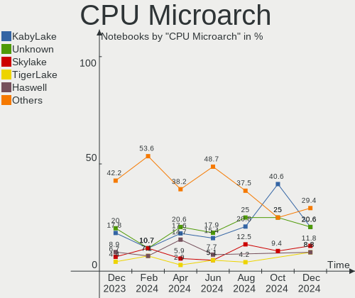

FreeBSD - Hardware Trends (Notebooks)
-------------------------------------

A project to identify most popular hardware characteristics and track their change
over time based on data collected by BSD users at https://BSD-Hardware.info.

Anyone can contribute to this report by the [hw-probe](https://github.com/linuxhw/hw-probe/blob/master/INSTALL.BSD.md) tool:

    hw-probe -all -upload

This report is for one last month. Overall report since the beginning of time: [TestCoverage](https://github.com/bsdhw/TestCoverage)

Period: Sep, 2022.

Contents
--------

* [ System ](#system)
  - [ OS                       ](#os)
  - [ OS Family                ](#os-family)
  - [ Arch                     ](#arch)
  - [ DE                       ](#de)
  - [ Display Server           ](#display-server)
  - [ Display Manager          ](#display-manager)
  - [ OS Lang                  ](#os-lang)
  - [ Boot Mode                ](#boot-mode)
  - [ Filesystem               ](#filesystem)
  - [ Part. scheme             ](#part-scheme)

* [ Board ](#board)
  - [ Vendor                   ](#vendor)
  - [ Model                    ](#model)
  - [ Model Family             ](#model-family)
  - [ MFG Year                 ](#mfg-year)
  - [ Form Factor              ](#form-factor)
  - [ Coreboot                 ](#coreboot)
  - [ RAM Size                 ](#ram-size)
  - [ RAM Used                 ](#ram-used)
  - [ Total Drives             ](#total-drives)
  - [ Has CD-ROM               ](#has-cd-rom)
  - [ Has Ethernet             ](#has-ethernet)
  - [ Has WiFi                 ](#has-wifi)
  - [ Has Bluetooth            ](#has-bluetooth)

* [ Location ](#location)
  - [ Country                  ](#country)
  - [ City                     ](#city)

* [ Drives ](#drives)
  - [ Drive Vendor             ](#drive-vendor)
  - [ Drive Model              ](#drive-model)
  - [ HDD Vendor               ](#hdd-vendor)
  - [ SSD Vendor               ](#ssd-vendor)
  - [ Drive Kind               ](#drive-kind)
  - [ Drive Connector          ](#drive-connector)
  - [ Drive Size               ](#drive-size)
  - [ Space Total              ](#space-total)
  - [ Space Used               ](#space-used)
  - [ Malfunc. Drives          ](#malfunc-drives)
  - [ Malfunc. Drive Vendor    ](#malfunc-drive-vendor)
  - [ Malfunc. HDD Vendor      ](#malfunc-hdd-vendor)
  - [ Malfunc. Drive Kind      ](#malfunc-drive-kind)
  - [ Failed Drives            ](#failed-drives)
  - [ Failed Drive Vendor      ](#failed-drive-vendor)
  - [ Drive Status             ](#drive-status)

* [ Storage controller ](#storage-controller)
  - [ Storage Vendor           ](#storage-vendor)
  - [ Storage Model            ](#storage-model)
  - [ Storage Kind             ](#storage-kind)

* [ Processor ](#processor)
  - [ CPU Vendor               ](#cpu-vendor)
  - [ CPU Model                ](#cpu-model)
  - [ CPU Model Family         ](#cpu-model-family)
  - [ CPU Cores                ](#cpu-cores)
  - [ CPU Sockets              ](#cpu-sockets)
  - [ CPU Threads              ](#cpu-threads)
  - [ CPU Microarch            ](#cpu-microarch)

* [ Graphics ](#graphics)
  - [ GPU Vendor               ](#gpu-vendor)
  - [ GPU Model                ](#gpu-model)
  - [ GPU Combo                ](#gpu-combo)
  - [ GPU Driver               ](#gpu-driver)
  - [ GPU Memory               ](#gpu-memory)

* [ Monitor ](#monitor)
  - [ Monitor Vendor           ](#monitor-vendor)
  - [ Monitor Model            ](#monitor-model)
  - [ Monitor Resolution       ](#monitor-resolution)
  - [ Monitor Diagonal         ](#monitor-diagonal)
  - [ Monitor Width            ](#monitor-width)
  - [ Aspect Ratio             ](#aspect-ratio)
  - [ Monitor Area             ](#monitor-area)
  - [ Pixel Density            ](#pixel-density)
  - [ Multiple Monitors        ](#multiple-monitors)

* [ Network ](#network)
  - [ Net Controller Vendor    ](#net-controller-vendor)
  - [ Net Controller Model     ](#net-controller-model)
  - [ Wireless Vendor          ](#wireless-vendor)
  - [ Wireless Model           ](#wireless-model)
  - [ Ethernet Vendor          ](#ethernet-vendor)
  - [ Ethernet Model           ](#ethernet-model)
  - [ Net Controller Kind      ](#net-controller-kind)
  - [ Used Controller          ](#used-controller)
  - [ NICs                     ](#nics)
  - [ IPv6                     ](#ipv6)

* [ Bluetooth ](#bluetooth)
  - [ Bluetooth Vendor         ](#bluetooth-vendor)
  - [ Bluetooth Model          ](#bluetooth-model)

* [ Sound ](#sound)
  - [ Sound Vendor             ](#sound-vendor)
  - [ Sound Model              ](#sound-model)

* [ Memory ](#memory)
  - [ Memory Vendor            ](#memory-vendor)
  - [ Memory Model             ](#memory-model)
  - [ Memory Kind              ](#memory-kind)
  - [ Memory Form Factor       ](#memory-form-factor)
  - [ Memory Size              ](#memory-size)
  - [ Memory Speed             ](#memory-speed)

* [ Printers & scanners ](#printers--scanners)
  - [ Printer Vendor           ](#printer-vendor)
  - [ Printer Model            ](#printer-model)
  - [ Scanner Vendor           ](#scanner-vendor)
  - [ Scanner Model            ](#scanner-model)

* [ Camera ](#camera)
  - [ Camera Vendor            ](#camera-vendor)
  - [ Camera Model             ](#camera-model)

* [ Security ](#security)
  - [ Fingerprint Vendor       ](#fingerprint-vendor)
  - [ Fingerprint Model        ](#fingerprint-model)
  - [ Chipcard Vendor          ](#chipcard-vendor)
  - [ Chipcard Model           ](#chipcard-model)

* [ Unsupported ](#unsupported)
  - [ Unsupported Devices      ](#unsupported-devices)
  - [ Unsupported Device Types ](#unsupported-device-types)

System
------

OS
--

Installed operating systems

| Name                     | Notebooks | Percent |
|--------------------------|-----------|---------|
| FreeBSD 13.1-p2          | 12        | 41.38%  |
| FreeBSD 13.1             | 8         | 27.59%  |
| FreeBSD 14.0-CURRENT     | 3         | 10.34%  |
| FreeBSD 13.1-STABLE      | 2         | 6.9%    |
| FreeBSD 12.3-p5          | 2         | 6.9%    |
| FreeBSD 13.1-STABLE-HBSD | 1         | 3.45%   |
| FreeBSD 12.3-p7          | 1         | 3.45%   |

OS Family
---------

OS without a version

| Name    | Notebooks | Percent |
|---------|-----------|---------|
| FreeBSD | 29        | 100%    |

Arch
----

OS architecture (x86_64, i586, etc.)

| Name  | Notebooks | Percent |
|-------|-----------|---------|
| amd64 | 26        | 89.66%  |
| i386  | 3         | 10.34%  |

DE
--

Desktop Environment

| Name    | Notebooks | Percent |
|---------|-----------|---------|
| XFCE    | 10        | 34.48%  |
| KDE5    | 9         | 31.03%  |
| GNOME   | 3         | 10.34%  |
| TWM     | 2         | 6.9%    |
| i3      | 2         | 6.9%    |
| Console | 2         | 6.9%    |
| Openbox | 1         | 3.45%   |

Display Server
--------------

X11 or Wayland

| Name    | Notebooks | Percent |
|---------|-----------|---------|
| X11     | 24        | 82.76%  |
| Console | 3         | 10.34%  |
| Wayland | 2         | 6.9%    |

Display Manager
---------------

SDDM, LightDM, etc.

| Name    | Notebooks | Percent |
|---------|-----------|---------|
| Console | 11        | 37.93%  |
| SDDM    | 8         | 27.59%  |
| SLiM    | 5         | 17.24%  |
| XDM     | 3         | 10.34%  |
| LightDM | 1         | 3.45%   |
| GDM     | 1         | 3.45%   |

OS Lang
-------

Language

| Lang    | Notebooks | Percent |
|---------|-----------|---------|
| C       | 20        | 68.97%  |
| Unknown | 4         | 13.79%  |
| zh_CN   | 1         | 3.45%   |
| ru_RU   | 1         | 3.45%   |
| en_US   | 1         | 3.45%   |
| en_CA   | 1         | 3.45%   |
| de_DE   | 1         | 3.45%   |

Boot Mode
---------

EFI or BIOS

| Mode | Notebooks | Percent |
|------|-----------|---------|
| EFI  | 21        | 72.41%  |
| BIOS | 8         | 27.59%  |

Filesystem
----------

Type of filesystem

| Type | Notebooks | Percent |
|------|-----------|---------|
| Zfs  | 20        | 68.97%  |
| Ufs  | 9         | 31.03%  |

Part. scheme
------------

Scheme of partitioning

| Type    | Notebooks | Percent |
|---------|-----------|---------|
| GPT     | 26        | 89.66%  |
| MBR     | 2         | 6.9%    |
| Unknown | 1         | 3.45%   |

Board
-----

Vendor
------

Motherboard manufacturer

| Name                | Notebooks | Percent |
|---------------------|-----------|---------|
| Dell                | 8         | 27.59%  |
| Lenovo              | 4         | 13.79%  |
| Toshiba             | 2         | 6.9%    |
| System76            | 2         | 6.9%    |
| IBM                 | 2         | 6.9%    |
| Hewlett-Packard     | 2         | 6.9%    |
| Gigabyte Technology | 2         | 6.9%    |
| ASUSTek Computer    | 2         | 6.9%    |
| Acer                | 2         | 6.9%    |
| Valve               | 1         | 3.45%   |
| Google              | 1         | 3.45%   |
| Fujitsu             | 1         | 3.45%   |

Model
-----

Motherboard model

| Name                                        | Notebooks | Percent |
|---------------------------------------------|-----------|---------|
| System76 Gazelle                            | 2         | 6.9%    |
| Gigabyte GB-BSi5A-6200                      | 2         | 6.9%    |
| Valve Jupiter                               | 1         | 3.45%   |
| Toshiba Satellite A200                      | 1         | 3.45%   |
| Toshiba PORTEGE R700                        | 1         | 3.45%   |
| Lenovo ThinkPad X250 20CL001GUS             | 1         | 3.45%   |
| Lenovo ThinkPad X1 Extreme Gen 3 20TKS0QB00 | 1         | 3.45%   |
| Lenovo ThinkPad P53 20QNCTO1WW              | 1         | 3.45%   |
| Lenovo ThinkPad L420 7829WDY                | 1         | 3.45%   |
| IBM ThinkPad T43 18714AG                    | 1         | 3.45%   |
| IBM ThinkPad T40 23737CG                    | 1         | 3.45%   |
| HP EliteBook 8570p                          | 1         | 3.45%   |
| HP EliteBook 840 G3                         | 1         | 3.45%   |
| Google Peppy                                | 1         | 3.45%   |
| Fujitsu LIFEBOOK A532                       | 1         | 3.45%   |
| Dell XPS 13 9343                            | 1         | 3.45%   |
| Dell Vostro 5415                            | 1         | 3.45%   |
| Dell System Vostro 3750                     | 1         | 3.45%   |
| Dell Precision 7550                         | 1         | 3.45%   |
| Dell Precision 7540                         | 1         | 3.45%   |
| Dell Latitude E5470                         | 1         | 3.45%   |
| Dell Latitude 5310                          | 1         | 3.45%   |
| Dell Inspiron 15 3511                       | 1         | 3.45%   |
| ASUS X455LJ                                 | 1         | 3.45%   |
| ASUS VivoBook_ASUSLaptop X515DAP_M515DA     | 1         | 3.45%   |
| Acer Swift SF313-52                         | 1         | 3.45%   |
| Acer Aspire E5-771                          | 1         | 3.45%   |

Model Family
------------

Motherboard model prefix

| Name                   | Notebooks | Percent |
|------------------------|-----------|---------|
| Lenovo ThinkPad        | 4         | 13.79%  |
| System76 Gazelle       | 2         | 6.9%    |
| IBM ThinkPad           | 2         | 6.9%    |
| HP EliteBook           | 2         | 6.9%    |
| Gigabyte GB-BSi5A-6200 | 2         | 6.9%    |
| Dell Precision         | 2         | 6.9%    |
| Dell Latitude          | 2         | 6.9%    |
| Valve Jupiter          | 1         | 3.45%   |
| Toshiba Satellite      | 1         | 3.45%   |
| Toshiba PORTEGE        | 1         | 3.45%   |
| Google Peppy           | 1         | 3.45%   |
| Fujitsu LIFEBOOK       | 1         | 3.45%   |
| Dell XPS               | 1         | 3.45%   |
| Dell Vostro            | 1         | 3.45%   |
| Dell System            | 1         | 3.45%   |
| Dell Inspiron          | 1         | 3.45%   |
| ASUS X455LJ            | 1         | 3.45%   |
| ASUS VivoBook          | 1         | 3.45%   |
| Acer Swift             | 1         | 3.45%   |
| Acer Aspire            | 1         | 3.45%   |

MFG Year
--------

Motherboard manufacture year

| Year | Notebooks | Percent |
|------|-----------|---------|
| 2021 | 5         | 17.24%  |
| 2022 | 4         | 13.79%  |
| 2016 | 4         | 13.79%  |
| 2020 | 3         | 10.34%  |
| 2015 | 3         | 10.34%  |
| 2019 | 2         | 6.9%    |
| 2013 | 2         | 6.9%    |
| 2012 | 2         | 6.9%    |
| 2011 | 1         | 3.45%   |
| 2007 | 1         | 3.45%   |
| 2006 | 1         | 3.45%   |
| 2003 | 1         | 3.45%   |

Form Factor
-----------

Physical design of the computer

| Name     | Notebooks | Percent |
|----------|-----------|---------|
| Notebook | 29        | 100%    |

Coreboot
--------

Have coreboot on board

| Used | Notebooks | Percent |
|------|-----------|---------|
| No   | 27        | 93.1%   |
| Yes  | 2         | 6.9%    |

RAM Size
--------

Total RAM memory

| Size in GB  | Notebooks | Percent |
|-------------|-----------|---------|
| 16.01-24.0  | 9         | 31.03%  |
| 8.01-16.0   | 8         | 27.59%  |
| 4.01-8.0    | 3         | 10.34%  |
| 32.01-64.0  | 3         | 10.34%  |
| 64.01-256.0 | 2         | 6.9%    |
| 3.01-4.0    | 1         | 3.45%   |
| 24.01-32.0  | 1         | 3.45%   |
| 2.01-3.0    | 1         | 3.45%   |
| 0.01-0.5    | 1         | 3.45%   |

RAM Used
--------

Used RAM memory

| Used GB  | Notebooks | Percent |
|----------|-----------|---------|
| 0.51-1.0 | 10        | 34.48%  |
| 0.01-0.5 | 9         | 31.03%  |
| 1.01-2.0 | 6         | 20.69%  |
| 2.01-3.0 | 3         | 10.34%  |
| 0        | 1         | 3.45%   |

Total Drives
------------

Number of drives on board

| Drives | Notebooks | Percent |
|--------|-----------|---------|
| 1      | 20        | 68.97%  |
| 2      | 6         | 20.69%  |
| 3      | 2         | 6.9%    |
| 0      | 1         | 3.45%   |

Has CD-ROM
----------

Has CD-ROM on board

| Presented | Notebooks | Percent |
|-----------|-----------|---------|
| No        | 20        | 68.97%  |
| Yes       | 9         | 31.03%  |

Has Ethernet
------------

Has Ethernet on board

| Presented | Notebooks | Percent |
|-----------|-----------|---------|
| Yes       | 22        | 75.86%  |
| No        | 7         | 24.14%  |

Has WiFi
--------

Has WiFi module

| Presented | Notebooks | Percent |
|-----------|-----------|---------|
| Yes       | 28        | 96.55%  |
| No        | 1         | 3.45%   |

Has Bluetooth
-------------

Has Bluetooth module

| Presented | Notebooks | Percent |
|-----------|-----------|---------|
| Yes       | 21        | 72.41%  |
| No        | 8         | 27.59%  |

Location
--------

Country
-------

Geographic location (country)

| Country     | Notebooks | Percent |
|-------------|-----------|---------|
| USA         | 6         | 20.69%  |
| Germany     | 5         | 17.24%  |
| Russia      | 4         | 13.79%  |
| Canada      | 3         | 10.34%  |
| UK          | 2         | 6.9%    |
| China       | 2         | 6.9%    |
| Turkey      | 1         | 3.45%   |
| Switzerland | 1         | 3.45%   |
| South Korea | 1         | 3.45%   |
| Slovakia    | 1         | 3.45%   |
| India       | 1         | 3.45%   |
| Greece      | 1         | 3.45%   |
| Belgium     | 1         | 3.45%   |

City
----

Geographic location (city)

| City          | Notebooks | Percent |
|---------------|-----------|---------|
| Moscow        | 2         | 6.9%    |
| London        | 2         | 6.9%    |
| Habichtswald  | 2         | 6.9%    |
| Zurich        | 1         | 3.45%   |
| Yangcheon-gu  | 1         | 3.45%   |
| Xiamen        | 1         | 3.45%   |
| Stratford     | 1         | 3.45%   |
| St Petersburg | 1         | 3.45%   |
| Seattle       | 1         | 3.45%   |
| San Antonio   | 1         | 3.45%   |
| Roswell       | 1         | 3.45%   |
| Qinnan        | 1         | 3.45%   |
| Princeton     | 1         | 3.45%   |
| Olympia       | 1         | 3.45%   |
| Offenburg     | 1         | 3.45%   |
| Nepean        | 1         | 3.45%   |
| Martin        | 1         | 3.45%   |
| Ludwigsburg   | 1         | 3.45%   |
| Kingsburg     | 1         | 3.45%   |
| Chennai       | 1         | 3.45%   |
| Chelyabinsk   | 1         | 3.45%   |
| Bonheiden     | 1         | 3.45%   |
| Athens        | 1         | 3.45%   |
| Ashburn       | 1         | 3.45%   |
| Antalya       | 1         | 3.45%   |
| Unknown       | 1         | 3.45%   |

Drives
------

Drive Vendor
------------

Hard drive vendors

| Vendor              | Notebooks | Drives | Percent |
|---------------------|-----------|--------|---------|
| Samsung Electronics | 7         | 9      | 19.44%  |
| WDC                 | 6         | 6      | 16.67%  |
| SanDisk             | 3         | 3      | 8.33%   |
| Kingston            | 3         | 3      | 8.33%   |
| Toshiba             | 2         | 2      | 5.56%   |
| Micron Technology   | 2         | 2      | 5.56%   |
| KIOXIA              | 2         | 2      | 5.56%   |
| Intel               | 2         | 2      | 5.56%   |
| Hitachi             | 2         | 2      | 5.56%   |
| Silicon Motion      | 1         | 1      | 2.78%   |
| Seagate             | 1         | 1      | 2.78%   |
| Phison              | 1         | 1      | 2.78%   |
| Lexar               | 1         | 1      | 2.78%   |
| Hikvision           | 1         | 1      | 2.78%   |
| HGST                | 1         | 1      | 2.78%   |
| A-DATA Technology   | 1         | 1      | 2.78%   |

Drive Model
-----------

Hard drive models

| Model                                           | Notebooks | Percent |
|-------------------------------------------------|-----------|---------|
| Samsung SSD 970 EVO Plus 1TB                    | 2         | 5.26%   |
| WDC WDS500G3X0C-00SJG0 500GB                    | 1         | 2.63%   |
| WDC WDS480G2G0A-00JH30 480GB                    | 1         | 2.63%   |
| WDC WDS250G2B0B-00YS70 250GB                    | 1         | 2.63%   |
| WDC WD7500BPVX-00JC3T0 752GB                    | 1         | 2.63%   |
| WDC PC SN730 SDBQNTY-256G-1001 256GB            | 1         | 2.63%   |
| WDC PC SN730 SDBQNTY-1T00-1001 1TB              | 1         | 2.63%   |
| Toshiba MQ01UBD100 1TB                          | 1         | 2.63%   |
| Toshiba KXG60ZNV512G 512GB                      | 1         | 2.63%   |
| Silicon Motion Asgard AN2+ 256NVMe-M.2-80 256GB | 1         | 2.63%   |
| Seagate ST1000LM049-2GH172 1TB                  | 1         | 2.63%   |
| SanDisk X400 M.2 2280 256GB                     | 1         | 2.63%   |
| SanDisk SDSSDH3 1T02 1TB                        | 1         | 2.63%   |
| SanDisk SD8SNAT256G1122 256GB                   | 1         | 2.63%   |
| Samsung SSD PM851 M.2 2280 256GB                | 1         | 2.63%   |
| Samsung SSD PM810 2.5-inch 256GB                | 1         | 2.63%   |
| Samsung SSD 980 PRO 1TB                         | 1         | 2.63%   |
| Samsung SSD 970 EVO 500GB                       | 1         | 2.63%   |
| Samsung SSD 870 QVO 1TB                         | 1         | 2.63%   |
| Samsung SSD 870 EVO 250GB                       | 1         | 2.63%   |
| Samsung SSD 850 EVO 1TB                         | 1         | 2.63%   |
| Phison PCIe SSD 1TB                             | 1         | 2.63%   |
| Micron 2300 NVMe 512GB                          | 1         | 2.63%   |
| Micron 2200S NVMe 256GB                         | 1         | 2.63%   |
| Lexar 256GB SSD                                 | 1         | 2.63%   |
| KIOXIA KBG40ZNS512G NVMe 512GB                  | 1         | 2.63%   |
| KIOXIA KBG40ZNS256G NVMe 256GB                  | 1         | 2.63%   |
| Kingston SV300S37A240G 240GB                    | 1         | 2.63%   |
| Kingston SNS4151S316GD 16GB                     | 1         | 2.63%   |
| Kingston OM8PCP3512F-AB1 512GB                  | 1         | 2.63%   |
| Intel SSDSCKKF256G8H 256GB                      | 1         | 2.63%   |
| Intel 670p SSDPEKNU512GZ NVMe 512GB             | 1         | 2.63%   |
| Hitachi HTS721010G9AT00 100GB                   | 1         | 2.63%   |
| Hitachi HTS548040M9AT00 37GB                    | 1         | 2.63%   |
| Hikvision HS-SSD-Minder(S) 120G                 | 1         | 2.63%   |
| HGST HTS721010A9E630 1TB                        | 1         | 2.63%   |
| A-DATA SU800 256GB                              | 1         | 2.63%   |

HDD Vendor
----------

Hard disk drive vendors

| Vendor  | Notebooks | Drives | Percent |
|---------|-----------|--------|---------|
| Hitachi | 2         | 2      | 33.33%  |
| WDC     | 1         | 1      | 16.67%  |
| Toshiba | 1         | 1      | 16.67%  |
| Seagate | 1         | 1      | 16.67%  |
| HGST    | 1         | 1      | 16.67%  |

SSD Vendor
----------

Solid state drive vendors

| Vendor              | Notebooks | Drives | Percent |
|---------------------|-----------|--------|---------|
| Samsung Electronics | 5         | 5      | 31.25%  |
| SanDisk             | 3         | 3      | 18.75%  |
| WDC                 | 2         | 2      | 12.5%   |
| Kingston            | 2         | 2      | 12.5%   |
| Lexar               | 1         | 1      | 6.25%   |
| Intel               | 1         | 1      | 6.25%   |
| Hikvision           | 1         | 1      | 6.25%   |
| A-DATA Technology   | 1         | 1      | 6.25%   |

Drive Kind
----------

HDD or SSD

| Kind | Notebooks | Drives | Percent |
|------|-----------|--------|---------|
| SSD  | 13        | 16     | 41.94%  |
| NVMe | 12        | 16     | 38.71%  |
| HDD  | 6         | 6      | 19.35%  |

Drive Connector
---------------

SATA, SAS, NVMe, etc.

| Type | Notebooks | Drives | Percent |
|------|-----------|--------|---------|
| SATA | 19        | 22     | 61.29%  |
| NVMe | 12        | 16     | 38.71%  |

Drive Size
----------

Size of hard drive

| Size in TB | Notebooks | Drives | Percent |
|------------|-----------|--------|---------|
| 0.01-0.5   | 13        | 15     | 65%     |
| 0.51-1.0   | 6         | 6      | 30%     |
| 1.01-2.0   | 1         | 1      | 5%      |

Space Total
-----------

Amount of disk space available on the file system

| Size in GB | Notebooks | Percent |
|------------|-----------|---------|
| 101-250    | 18        | 62.07%  |
| 251-500    | 6         | 20.69%  |
| 51-100     | 2         | 6.9%    |
| 21-50      | 1         | 3.45%   |
| 2001-3000  | 1         | 3.45%   |
| 501-1000   | 1         | 3.45%   |

Space Used
----------

Amount of used disk space

| Used GB | Notebooks | Percent |
|---------|-----------|---------|
| 1-20    | 20        | 68.97%  |
| 21-50   | 5         | 17.24%  |
| 101-250 | 3         | 10.34%  |
| 51-100  | 1         | 3.45%   |

Malfunc. Drives
---------------

Drive models with a malfunction

| Model                        | Notebooks | Drives | Percent |
|------------------------------|-----------|--------|---------|
| Kingston SNS4151S316GD 16GB  | 1         | 1      | 25%     |
| Intel SSDSCKKF256G8H 256GB   | 1         | 1      | 25%     |
| Hitachi HTS548040M9AT00 37GB | 1         | 1      | 25%     |
| HGST HTS721010A9E630 1TB     | 1         | 1      | 25%     |

Malfunc. Drive Vendor
---------------------

Vendors of faulty drives

| Vendor   | Notebooks | Drives | Percent |
|----------|-----------|--------|---------|
| Kingston | 1         | 1      | 25%     |
| Intel    | 1         | 1      | 25%     |
| Hitachi  | 1         | 1      | 25%     |
| HGST     | 1         | 1      | 25%     |

Malfunc. HDD Vendor
-------------------

Vendors of faulty HDD drives

| Vendor  | Notebooks | Drives | Percent |
|---------|-----------|--------|---------|
| Hitachi | 1         | 1      | 50%     |
| HGST    | 1         | 1      | 50%     |

Malfunc. Drive Kind
-------------------

Kinds of faulty drives

| Kind | Notebooks | Drives | Percent |
|------|-----------|--------|---------|
| SSD  | 2         | 2      | 50%     |
| HDD  | 2         | 2      | 50%     |

Failed Drives
-------------

Failed drive models

Zero info for selected period =(

Failed Drive Vendor
-------------------

Failed drive vendors

Zero info for selected period =(

Drive Status
------------

Number of failed and malfunc. drives

| Status  | Notebooks | Drives | Percent |
|---------|-----------|--------|---------|
| Works   | 26        | 34     | 86.67%  |
| Malfunc | 4         | 4      | 13.33%  |

Storage controller
------------------

Storage Vendor
--------------

Storage controller vendors

| Vendor                      | Notebooks | Percent |
|-----------------------------|-----------|---------|
| Intel                       | 21        | 56.76%  |
| SanDisk                     | 4         | 10.81%  |
| Samsung Electronics         | 2         | 5.41%   |
| Micron Technology           | 2         | 5.41%   |
| KIOXIA                      | 2         | 5.41%   |
| AMD                         | 2         | 5.41%   |
| Toshiba                     | 1         | 2.7%    |
| Silicon Motion              | 1         | 2.7%    |
| Phison Electronics          | 1         | 2.7%    |
| Kingston Technology Company | 1         | 2.7%    |

Storage Model
-------------

Storage controller models

| Model                                                                         | Notebooks | Percent |
|-------------------------------------------------------------------------------|-----------|---------|
| Intel Wildcat Point-LP SATA Controller [AHCI Mode]                            | 4         | 10.26%  |
| Unknown                                                                       | 4         | 10.26%  |
| SanDisk WD Black SN750 / PC SN730 NVMe SSD                                    | 3         | 7.69%   |
| Intel Sunrise Point-LP SATA Controller [AHCI mode]                            | 3         | 7.69%   |
| Samsung NVMe SSD Controller SM981/PM981/PM983                                 | 2         | 5.13%   |
| KIOXIA NVMe SSD Controller BG4                                                | 2         | 5.13%   |
| Intel Cannon Lake Mobile PCH SATA AHCI Controller                             | 2         | 5.13%   |
| Intel 7 Series Chipset Family 6-port SATA Controller [AHCI mode]              | 2         | 5.13%   |
| Intel 6 Series/C200 Series Chipset Family 6 port Mobile SATA AHCI Controller  | 2         | 5.13%   |
| AMD FCH SATA Controller [AHCI mode]                                           | 2         | 5.13%   |
| Toshiba XG6 NVMe SSD Controller                                               | 1         | 2.56%   |
| Silicon Motion SM2263EN/SM2263XT SSD Controller                               | 1         | 2.56%   |
| SanDisk WD Black NVMe SSD                                                     | 1         | 2.56%   |
| Samsung NVMe SSD Controller PM9A1/PM9A3/980PRO                                | 1         | 2.56%   |
| Phison E12 NVMe Controller                                                    | 1         | 2.56%   |
| Intel Tiger Lake-LP SATA Controller                                           | 1         | 2.56%   |
| Intel Q170/Q150/B150/H170/H110/Z170/CM236 Chipset SATA Controller [AHCI Mode] | 1         | 2.56%   |
| Intel 82801GBM/GHM (ICH7-M Family) SATA Controller [IDE mode]                 | 1         | 2.56%   |
| Intel 82801FBM (ICH6M) SATA Controller                                        | 1         | 2.56%   |
| Intel 82801DBM (ICH4-M) IDE Controller                                        | 1         | 2.56%   |
| Intel 8 Series SATA Controller 1 [AHCI mode]                                  | 1         | 2.56%   |
| Intel 500 Series Chipset Family SATA AHCI Controller                          | 1         | 2.56%   |
| Intel 5 Series/3400 Series Chipset 6 port SATA AHCI Controller                | 1         | 2.56%   |

Storage Kind
------------

Kind of storage controller (IDE, SATA, NVMe, SAS, ...)

| Kind | Notebooks | Percent |
|------|-----------|---------|
| SATA | 20        | 55.56%  |
| NVMe | 13        | 36.11%  |
| IDE  | 3         | 8.33%   |

Processor
---------

CPU Vendor
----------

Processor vendors

| Vendor | Notebooks | Percent |
|--------|-----------|---------|
| Intel  | 26        | 89.66%  |
| AMD    | 3         | 10.34%  |

CPU Model
---------

Processor models

| Model                                   | Notebooks | Percent |
|-----------------------------------------|-----------|---------|
| Intel Pentium M processor               | 2         | 6.9%    |
| Intel Core i7-9750H CPU @ 2.60GHz       | 2         | 6.9%    |
| Intel Core i5-6200U CPU @ 2.30GHz       | 2         | 6.9%    |
| Intel Core i5-5200U CPU @ 2.20GHz       | 2         | 6.9%    |
| Intel Core i9-10885H CPU @ 2.40GHz      | 1         | 3.45%   |
| Intel Core i7-9850H CPU @ 2.60GHz       | 1         | 3.45%   |
| Intel Core i7-6600U CPU @ 2.60GHz       | 1         | 3.45%   |
| Intel Core i7-5600U CPU @ 2.60GHz       | 1         | 3.45%   |
| Intel Core i7-3520M CPU @ 2.90GHz       | 1         | 3.45%   |
| Intel Core i7-10750H CPU @ 2.60GHz      | 1         | 3.45%   |
| Intel Core i7-1065G7 CPU @ 1.30GHz      | 1         | 3.45%   |
| Intel Core i7-10610U CPU @ 1.80GHz      | 1         | 3.45%   |
| Intel Core i5-6300HQ CPU @ 2.30GHz      | 1         | 3.45%   |
| Intel Core i5-5300U CPU @ 2.30GHz       | 1         | 3.45%   |
| Intel Core i5-3230M CPU @ 2.60GHz       | 1         | 3.45%   |
| Intel Core i5-2540M CPU @ 2.60GHz       | 1         | 3.45%   |
| Intel Core i5-2410M CPU @ 2.30GHz       | 1         | 3.45%   |
| Intel Core i5 CPU M 520 @ 2.40GHz       | 1         | 3.45%   |
| Intel Core Duo CPU T2                   | 1         | 3.45%   |
| Intel Celeron 2957U @ 1.40GHz           | 1         | 3.45%   |
| Intel 11th Gen Core i7-11800H @ 2.30GHz | 1         | 3.45%   |
| Intel 11th Gen Core i7-1165G7 @ 2.80GHz | 1         | 3.45%   |
| AMD Ryzen 3 5300U with Radeon Graphics  | 1         | 3.45%   |
| AMD Ryzen 3 3250U with Radeon Graphics  | 1         | 3.45%   |
| AMD Custom APU 0405                     | 1         | 3.45%   |

CPU Model Family
----------------

Processor model prefix

| Model           | Notebooks | Percent |
|-----------------|-----------|---------|
| Intel Core i5   | 10        | 34.48%  |
| Intel Core i7   | 9         | 31.03%  |
| Other           | 3         | 10.34%  |
| Intel Pentium M | 2         | 6.9%    |
| AMD Ryzen 3     | 2         | 6.9%    |
| Intel Core i9   | 1         | 3.45%   |
| Intel Core Duo  | 1         | 3.45%   |
| Intel Celeron   | 1         | 3.45%   |

CPU Cores
---------

Number of processor cores

| Number  | Notebooks | Percent |
|---------|-----------|---------|
| 2       | 13        | 44.83%  |
| 4       | 5         | 17.24%  |
| 8       | 4         | 13.79%  |
| 6       | 4         | 13.79%  |
| 1       | 2         | 6.9%    |
| Unknown | 1         | 3.45%   |

CPU Sockets
-----------

Number of sockets

| Number | Notebooks | Percent |
|--------|-----------|---------|
| 1      | 29        | 100%    |

CPU Threads
-----------

Threads per core (Hyper-Threading)

| Number  | Notebooks | Percent |
|---------|-----------|---------|
| 2       | 21        | 72.41%  |
| 1       | 5         | 17.24%  |
| Unknown | 3         | 10.34%  |

CPU Microarch
-------------

Microarchitecture

| Name        | Notebooks | Percent |
|-------------|-----------|---------|
| Skylake     | 4         | 13.79%  |
| KabyLake    | 4         | 13.79%  |
| Broadwell   | 4         | 13.79%  |
| P6          | 3         | 10.34%  |
| Unknown     | 3         | 10.34%  |
| SandyBridge | 2         | 6.9%    |
| IvyBridge   | 2         | 6.9%    |
| CometLake   | 2         | 6.9%    |
| Zen+        | 1         | 3.45%   |
| Westmere    | 1         | 3.45%   |
| TigerLake   | 1         | 3.45%   |
| IceLake     | 1         | 3.45%   |
| Haswell     | 1         | 3.45%   |

Graphics
--------

GPU Vendor
----------

Vendors of graphics cards

| Vendor | Notebooks | Percent |
|--------|-----------|---------|
| Intel  | 23        | 63.89%  |
| Nvidia | 7         | 19.44%  |
| AMD    | 6         | 16.67%  |

GPU Model
---------

Graphics card models

| Model                                                                         | Notebooks | Percent |
|-------------------------------------------------------------------------------|-----------|---------|
| Intel HD Graphics 5500                                                        | 4         | 10.81%  |
| Intel Skylake GT2 [HD Graphics 520]                                           | 3         | 8.11%   |
| Intel CometLake-H GT2 [UHD Graphics]                                          | 2         | 5.41%   |
| Intel CoffeeLake-H GT2 [UHD Graphics 630]                                     | 2         | 5.41%   |
| Intel 2nd Generation Core Processor Family Integrated Graphics Controller     | 2         | 5.41%   |
| Nvidia TU117M [GeForce GTX 1650 Ti Mobile]                                    | 1         | 2.7%    |
| Nvidia TU117GLM [Quadro T1000 Mobile]                                         | 1         | 2.7%    |
| Nvidia TU116M [GeForce GTX 1660 Ti Mobile]                                    | 1         | 2.7%    |
| Nvidia TU106GLM [Quadro RTX 3000 Mobile / Max-Q]                              | 1         | 2.7%    |
| Nvidia GK208BM [GeForce 920M]                                                 | 1         | 2.7%    |
| Nvidia GF108M [GeForce GT 525M]                                               | 1         | 2.7%    |
| Nvidia GA107M [GeForce RTX 3050 Ti Mobile]                                    | 1         | 2.7%    |
| Intel TigerLake-LP GT2 [Iris Xe Graphics]                                     | 1         | 2.7%    |
| Intel TigerLake-H GT1 [UHD Graphics]                                          | 1         | 2.7%    |
| Intel Mobile 945GM/GMS/GME, 943/940GML Express Integrated Graphics Controller | 1         | 2.7%    |
| Intel Mobile 945GM/GMS, 943/940GML Express Integrated Graphics Controller     | 1         | 2.7%    |
| Intel Mobile 915GM/GMS/910GML Express Graphics Controller                     | 1         | 2.7%    |
| Intel Iris Plus Graphics G7                                                   | 1         | 2.7%    |
| Intel HD Graphics 530                                                         | 1         | 2.7%    |
| Intel Haswell-ULT Integrated Graphics Controller                              | 1         | 2.7%    |
| Intel Core Processor Integrated Graphics Controller                           | 1         | 2.7%    |
| Intel CometLake-U GT2 [UHD Graphics]                                          | 1         | 2.7%    |
| Intel 3rd Gen Core processor Graphics Controller                              | 1         | 2.7%    |
| AMD VanGogh [AMD Custom GPU 0405]                                             | 1         | 2.7%    |
| AMD Thames [Radeon HD 7550M/7570M/7650M]                                      | 1         | 2.7%    |
| AMD RV200/M7 [Mobility Radeon 7500]                                           | 1         | 2.7%    |
| AMD Picasso/Raven 2 [Radeon Vega Series / Radeon Vega Mobile Series]          | 1         | 2.7%    |
| AMD Lucienne                                                                  | 1         | 2.7%    |
| AMD Lexa XT [Radeon PRO WX 3200]                                              | 1         | 2.7%    |

GPU Combo
---------

Combinations of graphics cards

| Name           | Notebooks | Percent |
|----------------|-----------|---------|
| 1 x Intel      | 14        | 48.28%  |
| Intel + Nvidia | 7         | 24.14%  |
| 1 x AMD        | 6         | 20.69%  |
| 2 x Intel      | 2         | 6.9%    |

GPU Driver
----------

Free vs proprietary

| Driver      | Notebooks | Percent |
|-------------|-----------|---------|
| Free        | 25        | 86.21%  |
| Proprietary | 4         | 13.79%  |

GPU Memory
----------

Total video memory

| Size in GB | Notebooks | Percent |
|------------|-----------|---------|
| Unknown    | 23        | 79.31%  |
| 3.01-4.0   | 2         | 6.9%    |
| 0.51-1.0   | 2         | 6.9%    |
| 5.01-6.0   | 1         | 3.45%   |
| 1.01-2.0   | 1         | 3.45%   |

Monitor
-------

Monitor Vendor
--------------

Monitor vendors

| Vendor              | Notebooks | Percent |
|---------------------|-----------|---------|
| LG Display          | 6         | 22.22%  |
| AU Optronics        | 6         | 22.22%  |
| BOE                 | 3         | 11.11%  |
| Samsung Electronics | 2         | 7.41%   |
| Vizio               | 1         | 3.7%    |
| Toshiba             | 1         | 3.7%    |
| Sharp               | 1         | 3.7%    |
| Philips             | 1         | 3.7%    |
| Iiyama              | 1         | 3.7%    |
| Hewlett-Packard     | 1         | 3.7%    |
| Dell                | 1         | 3.7%    |
| Chimei Innolux      | 1         | 3.7%    |
| Aosiman             | 1         | 3.7%    |
| AOC                 | 1         | 3.7%    |

Monitor Model
-------------

Monitor models

| Model                                                                | Notebooks | Percent |
|----------------------------------------------------------------------|-----------|---------|
| Vizio M260VA VIZ0067 1360x768 580x320mm 26.1-inch                    | 1         | 3.57%   |
| Toshiba TV TSB0200 1360x768 530x300mm 24.0-inch                      | 1         | 3.57%   |
| Sharp LCD Monitor SHP1421 3200x1800 290x170mm 13.2-inch              | 1         | 3.57%   |
| Samsung Electronics LCD Monitor SEC3633 1280x800 330x210mm 15.4-inch | 1         | 3.57%   |
| Samsung Electronics C27F390 SAM0D32 1920x1080 600x340mm 27.2-inch    | 1         | 3.57%   |
| Philips LCD Monitor PHL08C3 1920x1080 600x340mm 27.2-inch            | 1         | 3.57%   |
| LG Display LCD Monitor LGD06FF 1920x1080 340x190mm 15.3-inch         | 1         | 3.57%   |
| LG Display LCD Monitor LGD05E5 1920x1080 340x190mm 15.3-inch         | 1         | 3.57%   |
| LG Display LCD Monitor LGD03CD 1366x768 280x160mm 12.7-inch          | 1         | 3.57%   |
| LG Display LCD Monitor LGD0353 1366x768 350x190mm 15.7-inch          | 1         | 3.57%   |
| LG Display LCD Monitor LGD0303 1600x900 380x210mm 17.1-inch          | 1         | 3.57%   |
| LG Display LCD Monitor LGD0258 1600x900 350x190mm 15.7-inch          | 1         | 3.57%   |
| Iiyama PL4071UH IVM0009 3840x2160 880x490mm 39.7-inch                | 1         | 3.57%   |
| Iiyama PL4071UH IVM0006 3840x2160 880x490mm 39.7-inch                | 1         | 3.57%   |
| Hewlett-Packard LA2405 HWP284C 1920x1200 520x320mm 24.0-inch         | 1         | 3.57%   |
| Dell U2415 DELA0B8 1920x1200 520x320mm 24.0-inch                     | 1         | 3.57%   |
| Chimei Innolux LCD Monitor CMN1132 1366x768 260x140mm 11.6-inch      | 1         | 3.57%   |
| BOE LCD Monitor BOE095F 2256x1504 280x190mm 13.3-inch                | 1         | 3.57%   |
| BOE LCD Monitor BOE08BC 2256x1504 280x190mm 13.3-inch                | 1         | 3.57%   |
| BOE LCD Monitor BOE086E 1920x1080 340x190mm 15.3-inch                | 1         | 3.57%   |
| AU Optronics LCD Monitor AUO562D 1920x1080 290x170mm 13.2-inch       | 1         | 3.57%   |
| AU Optronics LCD Monitor AUO363C 1366x768 310x170mm 13.9-inch        | 1         | 3.57%   |
| AU Optronics LCD Monitor AUO24ED 1920x1080 340x190mm 15.3-inch       | 1         | 3.57%   |
| AU Optronics LCD Monitor AUO21ED 1920x1080 340x190mm 15.3-inch       | 1         | 3.57%   |
| AU Optronics LCD Monitor AUO133D 1920x1080 310x170mm 13.9-inch       | 1         | 3.57%   |
| AU Optronics LCD Monitor AUO123D 1920x1080 310x170mm 13.9-inch       | 1         | 3.57%   |
| Aosiman ASM-156UC ASM1560 3840x2160 300x260mm 15.6-inch              | 1         | 3.57%   |
| AOC U3277WB AOC3277 3840x2160 700x390mm 31.5-inch                    | 1         | 3.57%   |

Monitor Resolution
------------------

Monitor screen resolution

| Resolution        | Notebooks | Percent |
|-------------------|-----------|---------|
| 1920x1080 (FHD)   | 9         | 34.62%  |
| 1366x768 (WXGA)   | 4         | 15.38%  |
| 3840x2160 (4K)    | 3         | 11.54%  |
| 2256x1504         | 2         | 7.69%   |
| 1920x1200 (WUXGA) | 2         | 7.69%   |
| 1600x900 (HD+)    | 2         | 7.69%   |
| 1360x768          | 2         | 7.69%   |
| 3200x1800 (QHD+)  | 1         | 3.85%   |
| 1280x800 (WXGA)   | 1         | 3.85%   |

Monitor Diagonal
----------------

Diagonal size in inches

| Inches | Notebooks | Percent |
|--------|-----------|---------|
| 15     | 8         | 30.77%  |
| 13     | 7         | 26.92%  |
| 24     | 3         | 11.54%  |
| 27     | 2         | 7.69%   |
| 39     | 1         | 3.85%   |
| 32     | 1         | 3.85%   |
| 26     | 1         | 3.85%   |
| 17     | 1         | 3.85%   |
| 12     | 1         | 3.85%   |
| 11     | 1         | 3.85%   |

Monitor Width
-------------

Physical width

| Width in mm | Notebooks | Percent |
|-------------|-----------|---------|
| 301-350     | 11        | 42.31%  |
| 201-300     | 7         | 26.92%  |
| 501-600     | 5         | 19.23%  |
| 801-900     | 1         | 3.85%   |
| 701-800     | 1         | 3.85%   |
| 351-400     | 1         | 3.85%   |

Aspect Ratio
------------

Proportional relationship between the width and the height

| Ratio | Notebooks | Percent |
|-------|-----------|---------|
| 16/9  | 17        | 73.91%  |
| 16/10 | 3         | 13.04%  |
| 3/2   | 2         | 8.7%    |
| 6/5   | 1         | 4.35%   |

Monitor Area
------------

Area in inch²

| Area in inch² | Notebooks | Percent |
|----------------|-----------|---------|
| 81-90          | 5         | 18.52%  |
| 91-100         | 5         | 18.52%  |
| 251-300        | 3         | 11.11%  |
| 101-110        | 3         | 11.11%  |
| 71-80          | 2         | 7.41%   |
| 301-350        | 2         | 7.41%   |
| 121-130        | 2         | 7.41%   |
| 61-70          | 1         | 3.7%    |
| 51-60          | 1         | 3.7%    |
| 351-500        | 1         | 3.7%    |
| 201-250        | 1         | 3.7%    |
| 501-1000       | 1         | 3.7%    |

Pixel Density
-------------

Pixels per inch

| Density       | Notebooks | Percent |
|---------------|-----------|---------|
| 121-160       | 9         | 34.62%  |
| 51-100        | 8         | 30.77%  |
| 101-120       | 4         | 15.38%  |
| 161-240       | 3         | 11.54%  |
| More than 240 | 2         | 7.69%   |

Multiple Monitors
-----------------

Total monitors connected

| Total | Notebooks | Percent |
|-------|-----------|---------|
| 1     | 18        | 62.07%  |
| 0     | 6         | 20.69%  |
| 2     | 4         | 13.79%  |
| 4     | 1         | 3.45%   |

Network
-------

Net Controller Vendor
---------------------

Controller vendors

| Vendor                | Notebooks | Percent |
|-----------------------|-----------|---------|
| Intel                 | 22        | 53.66%  |
| Realtek Semiconductor | 12        | 29.27%  |
| Qualcomm Atheros      | 4         | 9.76%   |
| Broadcom              | 2         | 4.88%   |
| Hewlett-Packard       | 1         | 2.44%   |

Net Controller Model
--------------------

Controller models

| Model                                                             | Notebooks | Percent |
|-------------------------------------------------------------------|-----------|---------|
| Realtek RTL8111/8168/8411 PCI Express Gigabit Ethernet Controller | 8         | 14.81%  |
| Intel Wi-Fi 6 AX200                                               | 3         | 5.56%   |
| Intel Ethernet Connection I219-LM                                 | 3         | 5.56%   |
| Intel Wireless 8260                                               | 2         | 3.7%    |
| Intel Wireless 3165                                               | 2         | 3.7%    |
| Intel Comet Lake PCH CNVi WiFi                                    | 2         | 3.7%    |
| Realtek RTL8822CE 802.11ac PCIe Wireless Network Adapter          | 1         | 1.85%   |
| Realtek RTL8821CE 802.11ac PCIe Wireless Network Adapter          | 1         | 1.85%   |
| Realtek RTL8192CU 802.11n WLAN Adapter                            | 1         | 1.85%   |
| Realtek RTL810xE PCI Express Fast Ethernet controller             | 1         | 1.85%   |
| Qualcomm Atheros QCA9377 802.11ac Wireless Network Adapter        | 1         | 1.85%   |
| Qualcomm Atheros QCA6174 802.11ac Wireless Network Adapter        | 1         | 1.85%   |
| Qualcomm Atheros AR9462 Wireless Network Adapter                  | 1         | 1.85%   |
| Qualcomm Atheros AR9285 Wireless Network Adapter (PCI-Express)    | 1         | 1.85%   |
| Intel Wireless-AC 9260                                            | 1         | 1.85%   |
| Intel Wireless 7265                                               | 1         | 1.85%   |
| Intel Wireless 7260                                               | 1         | 1.85%   |
| Intel Tiger Lake PCH CNVi WiFi                                    | 1         | 1.85%   |
| Intel PRO/Wireless 4965 AG or AGN [Kedron] Network Connection     | 1         | 1.85%   |
| Intel PRO/Wireless 2200BG [Calexico2] Network Connection          | 1         | 1.85%   |
| Intel Ice Lake-LP PCH CNVi WiFi                                   | 1         | 1.85%   |
| Intel Ethernet Connection (7) I219-V                              | 1         | 1.85%   |
| Intel Ethernet Connection (7) I219-LM                             | 1         | 1.85%   |
| Intel Ethernet Connection (3) I218-LM                             | 1         | 1.85%   |
| Intel Ethernet Connection (2) I219-LM                             | 1         | 1.85%   |
| Intel Ethernet Connection (11) I219-LM                            | 1         | 1.85%   |
| Intel Ethernet Connection (10) I219-LM                            | 1         | 1.85%   |
| Intel Comet Lake PCH-LP CNVi WiFi                                 | 1         | 1.85%   |
| Intel Centrino Wireless-N 1030 [Rainbow Peak]                     | 1         | 1.85%   |
| Intel Centrino Wireless-N 1000 [Condor Peak]                      | 1         | 1.85%   |
| Intel Centrino Advanced-N 6205 [Taylor Peak]                      | 1         | 1.85%   |
| Intel Centrino Advanced-N 6200                                    | 1         | 1.85%   |
| Intel 82801FB/FBM/FR/FW/FRW (ICH6 Family) AC'97 Modem Controller  | 1         | 1.85%   |
| Intel 82801DB/DBL/DBM (ICH4/ICH4-L/ICH4-M) AC'97 Modem Controller | 1         | 1.85%   |
| Intel 82801DB PRO/100 VE (MOB) Ethernet Controller                | 1         | 1.85%   |
| Intel 82579LM Gigabit Network Connection (Lewisville)             | 1         | 1.85%   |
| Intel 82577LM Gigabit Network Connection                          | 1         | 1.85%   |
| HP hs2350 HSPA+ Mobile Broadband Module Network Adapter           | 1         | 1.85%   |
| Broadcom NetXtreme BCM5751M Gigabit Ethernet PCI Express          | 1         | 1.85%   |
| Broadcom BCM43142 802.11b/g/n                                     | 1         | 1.85%   |

Wireless Vendor
---------------

Wireless vendors

| Vendor                | Notebooks | Percent |
|-----------------------|-----------|---------|
| Intel                 | 21        | 72.41%  |
| Qualcomm Atheros      | 4         | 13.79%  |
| Realtek Semiconductor | 3         | 10.34%  |
| Broadcom              | 1         | 3.45%   |

Wireless Model
--------------

Wireless models

| Model                                                          | Notebooks | Percent |
|----------------------------------------------------------------|-----------|---------|
| Intel Wi-Fi 6 AX200                                            | 3         | 10.34%  |
| Intel Wireless 8260                                            | 2         | 6.9%    |
| Intel Wireless 3165                                            | 2         | 6.9%    |
| Intel Comet Lake PCH CNVi WiFi                                 | 2         | 6.9%    |
| Realtek RTL8822CE 802.11ac PCIe Wireless Network Adapter       | 1         | 3.45%   |
| Realtek RTL8821CE 802.11ac PCIe Wireless Network Adapter       | 1         | 3.45%   |
| Realtek RTL8192CU 802.11n WLAN Adapter                         | 1         | 3.45%   |
| Qualcomm Atheros QCA9377 802.11ac Wireless Network Adapter     | 1         | 3.45%   |
| Qualcomm Atheros QCA6174 802.11ac Wireless Network Adapter     | 1         | 3.45%   |
| Qualcomm Atheros AR9462 Wireless Network Adapter               | 1         | 3.45%   |
| Qualcomm Atheros AR9285 Wireless Network Adapter (PCI-Express) | 1         | 3.45%   |
| Intel Wireless-AC 9260                                         | 1         | 3.45%   |
| Intel Wireless 7265                                            | 1         | 3.45%   |
| Intel Wireless 7260                                            | 1         | 3.45%   |
| Intel Tiger Lake PCH CNVi WiFi                                 | 1         | 3.45%   |
| Intel PRO/Wireless 4965 AG or AGN [Kedron] Network Connection  | 1         | 3.45%   |
| Intel PRO/Wireless 2200BG [Calexico2] Network Connection       | 1         | 3.45%   |
| Intel Ice Lake-LP PCH CNVi WiFi                                | 1         | 3.45%   |
| Intel Comet Lake PCH-LP CNVi WiFi                              | 1         | 3.45%   |
| Intel Centrino Wireless-N 1030 [Rainbow Peak]                  | 1         | 3.45%   |
| Intel Centrino Wireless-N 1000 [Condor Peak]                   | 1         | 3.45%   |
| Intel Centrino Advanced-N 6205 [Taylor Peak]                   | 1         | 3.45%   |
| Intel Centrino Advanced-N 6200                                 | 1         | 3.45%   |
| Broadcom BCM43142 802.11b/g/n                                  | 1         | 3.45%   |

Ethernet Vendor
---------------

Ethernet vendors

| Vendor                | Notebooks | Percent |
|-----------------------|-----------|---------|
| Intel                 | 12        | 54.55%  |
| Realtek Semiconductor | 9         | 40.91%  |
| Broadcom              | 1         | 4.55%   |

Ethernet Model
--------------

Ethernet models

| Model                                                             | Notebooks | Percent |
|-------------------------------------------------------------------|-----------|---------|
| Realtek RTL8111/8168/8411 PCI Express Gigabit Ethernet Controller | 8         | 36.36%  |
| Intel Ethernet Connection I219-LM                                 | 3         | 13.64%  |
| Realtek RTL810xE PCI Express Fast Ethernet controller             | 1         | 4.55%   |
| Intel Ethernet Connection (7) I219-V                              | 1         | 4.55%   |
| Intel Ethernet Connection (7) I219-LM                             | 1         | 4.55%   |
| Intel Ethernet Connection (3) I218-LM                             | 1         | 4.55%   |
| Intel Ethernet Connection (2) I219-LM                             | 1         | 4.55%   |
| Intel Ethernet Connection (11) I219-LM                            | 1         | 4.55%   |
| Intel Ethernet Connection (10) I219-LM                            | 1         | 4.55%   |
| Intel 82801DB PRO/100 VE (MOB) Ethernet Controller                | 1         | 4.55%   |
| Intel 82579LM Gigabit Network Connection (Lewisville)             | 1         | 4.55%   |
| Intel 82577LM Gigabit Network Connection                          | 1         | 4.55%   |
| Broadcom NetXtreme BCM5751M Gigabit Ethernet PCI Express          | 1         | 4.55%   |

Net Controller Kind
-------------------

Ethernet, WiFi or modem

| Kind     | Notebooks | Percent |
|----------|-----------|---------|
| WiFi     | 28        | 52.83%  |
| Ethernet | 22        | 41.51%  |
| Modem    | 3         | 5.66%   |

Used Controller
---------------

Currently used network controller

| Kind     | Notebooks | Percent |
|----------|-----------|---------|
| WiFi     | 17        | 56.67%  |
| Ethernet | 13        | 43.33%  |

NICs
----

Total network controllers on board

| Total | Notebooks | Percent |
|-------|-----------|---------|
| 2     | 21        | 72.41%  |
| 1     | 8         | 27.59%  |

IPv6
----

IPv6 vs IPv4

| Used | Notebooks | Percent |
|------|-----------|---------|
| No   | 23        | 79.31%  |
| Yes  | 6         | 20.69%  |

Bluetooth
---------

Bluetooth Vendor
----------------

Controller vendors

| Vendor                          | Notebooks | Percent |
|---------------------------------|-----------|---------|
| Intel                           | 13        | 61.9%   |
| IMC Networks                    | 2         | 9.52%   |
| Foxconn / Hon Hai               | 2         | 9.52%   |
| Realtek Semiconductor           | 1         | 4.76%   |
| Qualcomm Atheros Communications | 1         | 4.76%   |
| Lite-On Technology              | 1         | 4.76%   |
| Broadcom                        | 1         | 4.76%   |

Bluetooth Model
---------------

Controller models

| Model                                                       | Notebooks | Percent |
|-------------------------------------------------------------|-----------|---------|
| Intel AX201 Bluetooth                                       | 5         | 23.81%  |
| Intel Bluetooth wireless interface                          | 3         | 14.29%  |
| Intel AX200 Bluetooth                                       | 3         | 14.29%  |
| Realtek Bluetooth Radio                                     | 1         | 4.76%   |
| Qualcomm Atheros Dell Wireless 1820 Bluetooth 4.1LE         | 1         | 4.76%   |
| Lite-On BCM43142A0 Bluetooth Module                         | 1         | 4.76%   |
| Intel Wireless-AC 9260 Bluetooth Adapter                    | 1         | 4.76%   |
| Intel Centrino Advanced-N 6230 Bluetooth adapter            | 1         | 4.76%   |
| IMC Networks Qualcomm Atheros Bluetooth 4.1                 | 1         | 4.76%   |
| IMC Networks Bluetooth Radio                                | 1         | 4.76%   |
| Foxconn / Hon Hai Qualcomm Atheros AR3011 Bluetooth Adapter | 1         | 4.76%   |
| Foxconn / Hon Hai Bluetooth USB Module                      | 1         | 4.76%   |
| Broadcom BCM2045B (BDC-2.1)                                 | 1         | 4.76%   |

Sound
-----

Sound Vendor
------------

Sound card vendors

| Vendor | Notebooks | Percent |
|--------|-----------|---------|
| Intel  | 26        | 72.22%  |
| Nvidia | 5         | 13.89%  |
| AMD    | 5         | 13.89%  |

Sound Model
-----------

Sound card models

| Model                                                                      | Notebooks | Percent |
|----------------------------------------------------------------------------|-----------|---------|
| Intel Broadwell-U Audio Controller                                         | 4         | 9.52%   |
| Intel Wildcat Point-LP High Definition Audio Controller                    | 3         | 7.14%   |
| Intel Sunrise Point-LP HD Audio                                            | 3         | 7.14%   |
| Intel Cannon Lake PCH cAVS                                                 | 3         | 7.14%   |
| Nvidia TU107 GeForce GTX 1650 High Definition Audio Controller             | 2         | 4.76%   |
| Intel Comet Lake PCH cAVS                                                  | 2         | 4.76%   |
| Intel 7 Series/C216 Chipset Family High Definition Audio Controller        | 2         | 4.76%   |
| Intel 6 Series/C200 Series Chipset Family High Definition Audio Controller | 2         | 4.76%   |
| AMD Family 17h/19h HD Audio Controller                                     | 2         | 4.76%   |
| Nvidia TU116 High Definition Audio Controller                              | 1         | 2.38%   |
| Nvidia TU106 High Definition Audio Controller                              | 1         | 2.38%   |
| Intel Tiger Lake-LP Smart Sound Technology Audio Controller                | 1         | 2.38%   |
| Intel Tiger Lake-H HD Audio Controller                                     | 1         | 2.38%   |
| Intel NM10/ICH7 Family High Definition Audio Controller                    | 1         | 2.38%   |
| Intel Ice Lake-LP Smart Sound Technology Audio Controller                  | 1         | 2.38%   |
| Intel Haswell-ULT HD Audio Controller                                      | 1         | 2.38%   |
| Intel Comet Lake PCH-LP cAVS                                               | 1         | 2.38%   |
| Intel 82801FB/FBM/FR/FW/FRW (ICH6 Family) AC'97 Audio Controller           | 1         | 2.38%   |
| Intel 82801DB/DBL/DBM (ICH4/ICH4-L/ICH4-M) AC'97 Audio Controller          | 1         | 2.38%   |
| Intel 8 Series HD Audio Controller                                         | 1         | 2.38%   |
| Intel 5 Series/3400 Series Chipset High Definition Audio                   | 1         | 2.38%   |
| Intel 100 Series/C230 Series Chipset Family HD Audio Controller            | 1         | 2.38%   |
| AMD Turks HDMI Audio [Radeon HD 6500/6600 / 6700M Series]                  | 1         | 2.38%   |
| AMD Renoir Radeon High Definition Audio Controller                         | 1         | 2.38%   |
| AMD Rembrandt Radeon High Definition Audio Controller                      | 1         | 2.38%   |
| AMD Raven/Raven2/Fenghuang HDMI/DP Audio Controller                        | 1         | 2.38%   |
| AMD Baffin HDMI/DP Audio [Radeon RX 550 640SP / RX 560/560X]               | 1         | 2.38%   |
| Unknown                                                                    | 1         | 2.38%   |

Memory
------

Memory Vendor
-------------

Memory module vendors

| Vendor              | Notebooks | Percent |
|---------------------|-----------|---------|
| Samsung Electronics | 11        | 34.38%  |
| Kingston            | 6         | 18.75%  |
| SK hynix            | 4         | 12.5%   |
| Unknown             | 3         | 9.38%   |
| Micron Technology   | 2         | 6.25%   |
| Crucial             | 2         | 6.25%   |
| Unknown             | 2         | 6.25%   |
| Neo Forza           | 1         | 3.13%   |
| Elpida              | 1         | 3.13%   |

Memory Model
------------

Memory module models

| Model                                                        | Notebooks | Percent |
|--------------------------------------------------------------|-----------|---------|
| SK hynix RAM HMT451S6BFR8A-PB 4GB SODIMM DDR3 1600MT/s       | 2         | 5.56%   |
| Samsung RAM M471A2K43DB1-CWE 16GB SODIMM DDR4 3200MT/s       | 2         | 5.56%   |
| Unknown                                                      | 2         | 5.56%   |
| Unknown RAM Module 512MB SODIMM DDR                          | 1         | 2.78%   |
| Unknown RAM Module 2GB SODIMM DDR                            | 1         | 2.78%   |
| Unknown RAM Module 1GB SODIMM DDR                            | 1         | 2.78%   |
| SK hynix RAM HMT425S6AFR6A-PB 2GB SODIMM DDR3 3200MT/s       | 1         | 2.78%   |
| SK hynix RAM HMAA1GS6CJR6N-XN 8GB SODIMM DDR4 3200MT/s       | 1         | 2.78%   |
| Samsung RAM Module 8GB SODIMM DDR4 2133MT/s                  | 1         | 2.78%   |
| Samsung RAM M471B5673FH0-CF8 2GB SODIMM DDR3 1067MT/s        | 1         | 2.78%   |
| Samsung RAM M471B5673EH1-CF8 2GB SODIMM DDR3 1067MT/s        | 1         | 2.78%   |
| Samsung RAM M471B5273DH0-CK0 4GB SODIMM DDR3 1600MT/s        | 1         | 2.78%   |
| Samsung RAM M471B5273CH0-CK0 4GB SODIMM DDR3 1600MT/s        | 1         | 2.78%   |
| Samsung RAM M471B1G73QH0-YK0 8GB SODIMM DDR3 1867MT/s        | 1         | 2.78%   |
| Samsung RAM M471A4G43MB1-CTD 32GB SODIMM DDR4 2667MT/s       | 1         | 2.78%   |
| Samsung RAM M471A4G43AB1-CWE 32GB SODIMM DDR4 3200MT/s       | 1         | 2.78%   |
| Samsung RAM M471A2K43DB1-CTD 16GB SODIMM DDR4 2667MT/s       | 1         | 2.78%   |
| Samsung RAM M471A1K43BB1-CRC 8GB SODIMM DDR4 2400MT/s        | 1         | 2.78%   |
| Samsung RAM M471A1G44BB0-CWE 8GB SODIMM DDR4 3200MT/s        | 1         | 2.78%   |
| Samsung RAM K4UBE3D4AA-MGCH 8GB Row Of Chips LPDDR4 3200MT/s | 1         | 2.78%   |
| Neo Forza RAM NMSO432F82-3200E 32GB SODIMM DDR4 3200MT/s     | 1         | 2.78%   |
| Micron RAM 16KTF1G64HZ-1G6E1 8GB SODIMM DDR3 1600MT/s        | 1         | 2.78%   |
| Micron RAM 16ATF1G64HZ-2G1B1 8GB SODIMM DDR4 2133MT/s        | 1         | 2.78%   |
| Kingston RAM KHYXPX-MIE 8GB SODIMM DDR4 2667MT/s             | 1         | 2.78%   |
| Kingston RAM 99U5469-045.A00LF 4GB SODIMM DDR3 1600MT/s      | 1         | 2.78%   |
| Kingston RAM 99U5428-083.A00LF 8GB SODIMM DDR3 1333MT/s      | 1         | 2.78%   |
| Kingston RAM 9905668-002.A00G 8GB SODIMM DDR4 2133MT/s       | 1         | 2.78%   |
| Kingston RAM 9905624-023.A00G 8GB SODIMM DDR4 2133MT/s       | 1         | 2.78%   |
| Kingston RAM 9905624-016.A00G 8GB SODIMM DDR4 2133MT/s       | 1         | 2.78%   |
| Kingston RAM 9905624-008.A00G 8GB SODIMM DDR4 2133MT/s       | 1         | 2.78%   |
| Elpida RAM 8KTS51264HDZ-1G6E1 4GB Chip DDR3 1600MT/s         | 1         | 2.78%   |
| Crucial RAM Module 4GB SODIMM DDR3 1067MT/s                  | 1         | 2.78%   |
| Crucial RAM CT16G4SFRA266.M16FRS 16GB SODIMM DDR4 2667MT/s   | 1         | 2.78%   |

Memory Kind
-----------

Memory module kinds

| Kind   | Notebooks | Percent |
|--------|-----------|---------|
| DDR4   | 14        | 48.28%  |
| DDR3   | 10        | 34.48%  |
| DDR    | 3         | 10.34%  |
| LPDDR5 | 1         | 3.45%   |
| LPDDR4 | 1         | 3.45%   |

Memory Form Factor
------------------

Physical design of the memory module

| Name         | Notebooks | Percent |
|--------------|-----------|---------|
| SODIMM       | 27        | 93.1%   |
| Row Of Chips | 1         | 3.45%   |
| Chip         | 1         | 3.45%   |

Memory Size
-----------

Memory module size

| Size  | Notebooks | Percent |
|-------|-----------|---------|
| 8192  | 12        | 41.38%  |
| 4096  | 6         | 20.69%  |
| 32768 | 3         | 10.34%  |
| 16384 | 3         | 10.34%  |
| 2048  | 3         | 10.34%  |
| 1024  | 1         | 3.45%   |
| 512   | 1         | 3.45%   |

Memory Speed
------------

Memory module speed

| Speed   | Notebooks | Percent |
|---------|-----------|---------|
| 3200    | 9         | 30%     |
| 1600    | 5         | 16.67%  |
| 2133    | 4         | 13.33%  |
| 2667    | 3         | 10%     |
| Unknown | 3         | 10%     |
| 1067    | 2         | 6.67%   |
| 4266    | 1         | 3.33%   |
| 2400    | 1         | 3.33%   |
| 1867    | 1         | 3.33%   |
| 1333    | 1         | 3.33%   |

Printers & scanners
-------------------

Printer Vendor
--------------

Printer device vendors

Zero info for selected period =(

Printer Model
-------------

Printer device models

Zero info for selected period =(

Scanner Vendor
--------------

Scanner device vendors

Zero info for selected period =(

Scanner Model
-------------

Scanner device models

Zero info for selected period =(

Camera
------

Camera Vendor
-------------

Camera device vendors

| Vendor                        | Notebooks | Percent |
|-------------------------------|-----------|---------|
| Chicony Electronics           | 7         | 38.89%  |
| Realtek Semiconductor         | 5         | 27.78%  |
| Microdia                      | 2         | 11.11%  |
| Acer                          | 2         | 11.11%  |
| Sunplus Innovation Technology | 1         | 5.56%   |
| Sonix Technology              | 1         | 5.56%   |

Camera Model
------------

Camera device models

| Model                               | Notebooks | Percent |
|-------------------------------------|-----------|---------|
| Realtek Integrated_Webcam_HD        | 4         | 22.22%  |
| Microdia Integrated_Webcam_HD       | 2         | 11.11%  |
| Chicony HD WebCam                   | 2         | 11.11%  |
| Acer Integrated Camera              | 2         | 11.11%  |
| Sunplus Laptop Integrated WebCam HD | 1         | 5.56%   |
| Sonix USB2.0 HD UVC WebCam          | 1         | 5.56%   |
| Realtek Realtek USB2.0 PC Camera    | 1         | 5.56%   |
| Chicony USB2.0 VGA UVC WebCam       | 1         | 5.56%   |
| Chicony USB 2.0 Camera              | 1         | 5.56%   |
| Chicony ThinkPad T490 Webcam        | 1         | 5.56%   |
| Chicony Integrated HP HD Webcam     | 1         | 5.56%   |
| Chicony HP Universal Camera         | 1         | 5.56%   |

Security
--------

Fingerprint Vendor
------------------

Fingerprint sensor vendors

| Vendor                | Notebooks | Percent |
|-----------------------|-----------|---------|
| Synaptics             | 2         | 40%     |
| Validity Sensors      | 1         | 20%     |
| LighTuning Technology | 1         | 20%     |
| AuthenTec             | 1         | 20%     |

Fingerprint Model
-----------------

Fingerprint sensor models

| Model                                             | Notebooks | Percent |
|---------------------------------------------------|-----------|---------|
| Synaptics Prometheus MIS Touch Fingerprint Reader | 2         | 40%     |
| Validity Sensors VFS 5011 fingerprint sensor      | 1         | 20%     |
| LighTuning EgisTec Touch Fingerprint Sensor       | 1         | 20%     |
| AuthenTec AuthenTec Inc. AES1660                  | 1         | 20%     |

Chipcard Vendor
---------------

Chipcard module vendors

Zero info for selected period =(

Chipcard Model
--------------

Chipcard module models

Zero info for selected period =(

Unsupported
-----------

Unsupported Devices
-------------------

Total unsupported devices on board

| Total | Notebooks | Percent |
|-------|-----------|---------|
| 1     | 13        | 44.83%  |
| 2     | 9         | 31.03%  |
| 3     | 4         | 13.79%  |
| 4     | 2         | 6.9%    |
| 0     | 1         | 3.45%   |

Unsupported Device Types
------------------------

Types of unsupported devices

| Type                     | Notebooks | Percent |
|--------------------------|-----------|---------|
| Communication controller | 23        | 48.94%  |
| Bluetooth                | 12        | 25.53%  |
| Fingerprint reader       | 5         | 10.64%  |
| Net/wireless             | 3         | 6.38%   |
| Modem                    | 2         | 4.26%   |
| Storage                  | 1         | 2.13%   |
| Firewire controller      | 1         | 2.13%   |

