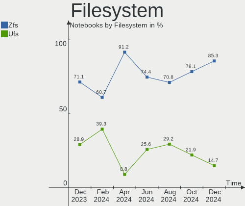
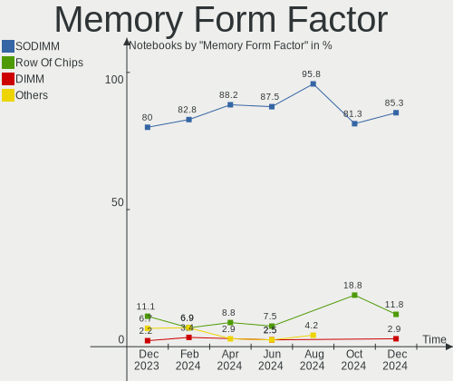

FreeBSD - Hardware Trends (Notebooks)
-------------------------------------

A project to identify most popular hardware characteristics and track their change
over time based on data collected by BSD users at https://BSD-Hardware.info.

Anyone can contribute to this report by the [hw-probe](https://github.com/linuxhw/hw-probe/blob/master/INSTALL.BSD.md) tool:

    hw-probe -all -upload

This report is for one last month. Overall report since the beginning of time: [TestDays](https://github.com/bsdhw/TestDays)

Period: Apr, 2023.

Contents
--------

* [ System ](#system)
  - [ OS                       ](#os)
  - [ OS Family                ](#os-family)
  - [ Arch                     ](#arch)
  - [ DE                       ](#de)
  - [ Display Server           ](#display-server)
  - [ Display Manager          ](#display-manager)
  - [ OS Lang                  ](#os-lang)
  - [ Boot Mode                ](#boot-mode)
  - [ Filesystem               ](#filesystem)
  - [ Part. scheme             ](#part-scheme)

* [ Board ](#board)
  - [ Vendor                   ](#vendor)
  - [ Model                    ](#model)
  - [ Model Family             ](#model-family)
  - [ MFG Year                 ](#mfg-year)
  - [ Form Factor              ](#form-factor)
  - [ Coreboot                 ](#coreboot)
  - [ RAM Size                 ](#ram-size)
  - [ RAM Used                 ](#ram-used)
  - [ Total Drives             ](#total-drives)
  - [ Has CD-ROM               ](#has-cd-rom)
  - [ Has Ethernet             ](#has-ethernet)
  - [ Has WiFi                 ](#has-wifi)
  - [ Has Bluetooth            ](#has-bluetooth)

* [ Location ](#location)
  - [ Country                  ](#country)
  - [ City                     ](#city)

* [ Drives ](#drives)
  - [ Drive Vendor             ](#drive-vendor)
  - [ Drive Model              ](#drive-model)
  - [ HDD Vendor               ](#hdd-vendor)
  - [ SSD Vendor               ](#ssd-vendor)
  - [ Drive Kind               ](#drive-kind)
  - [ Drive Connector          ](#drive-connector)
  - [ Drive Size               ](#drive-size)
  - [ Space Total              ](#space-total)
  - [ Space Used               ](#space-used)
  - [ Malfunc. Drives          ](#malfunc-drives)
  - [ Malfunc. Drive Vendor    ](#malfunc-drive-vendor)
  - [ Malfunc. HDD Vendor      ](#malfunc-hdd-vendor)
  - [ Malfunc. Drive Kind      ](#malfunc-drive-kind)
  - [ Failed Drives            ](#failed-drives)
  - [ Failed Drive Vendor      ](#failed-drive-vendor)
  - [ Drive Status             ](#drive-status)

* [ Storage controller ](#storage-controller)
  - [ Storage Vendor           ](#storage-vendor)
  - [ Storage Model            ](#storage-model)
  - [ Storage Kind             ](#storage-kind)

* [ Processor ](#processor)
  - [ CPU Vendor               ](#cpu-vendor)
  - [ CPU Model                ](#cpu-model)
  - [ CPU Model Family         ](#cpu-model-family)
  - [ CPU Cores                ](#cpu-cores)
  - [ CPU Sockets              ](#cpu-sockets)
  - [ CPU Threads              ](#cpu-threads)
  - [ CPU Microarch            ](#cpu-microarch)

* [ Graphics ](#graphics)
  - [ GPU Vendor               ](#gpu-vendor)
  - [ GPU Model                ](#gpu-model)
  - [ GPU Combo                ](#gpu-combo)
  - [ GPU Driver               ](#gpu-driver)
  - [ GPU Memory               ](#gpu-memory)

* [ Monitor ](#monitor)
  - [ Monitor Vendor           ](#monitor-vendor)
  - [ Monitor Model            ](#monitor-model)
  - [ Monitor Resolution       ](#monitor-resolution)
  - [ Monitor Diagonal         ](#monitor-diagonal)
  - [ Monitor Width            ](#monitor-width)
  - [ Aspect Ratio             ](#aspect-ratio)
  - [ Monitor Area             ](#monitor-area)
  - [ Pixel Density            ](#pixel-density)
  - [ Multiple Monitors        ](#multiple-monitors)

* [ Network ](#network)
  - [ Net Controller Vendor    ](#net-controller-vendor)
  - [ Net Controller Model     ](#net-controller-model)
  - [ Wireless Vendor          ](#wireless-vendor)
  - [ Wireless Model           ](#wireless-model)
  - [ Ethernet Vendor          ](#ethernet-vendor)
  - [ Ethernet Model           ](#ethernet-model)
  - [ Net Controller Kind      ](#net-controller-kind)
  - [ Used Controller          ](#used-controller)
  - [ NICs                     ](#nics)
  - [ IPv6                     ](#ipv6)

* [ Bluetooth ](#bluetooth)
  - [ Bluetooth Vendor         ](#bluetooth-vendor)
  - [ Bluetooth Model          ](#bluetooth-model)

* [ Sound ](#sound)
  - [ Sound Vendor             ](#sound-vendor)
  - [ Sound Model              ](#sound-model)

* [ Memory ](#memory)
  - [ Memory Vendor            ](#memory-vendor)
  - [ Memory Model             ](#memory-model)
  - [ Memory Kind              ](#memory-kind)
  - [ Memory Form Factor       ](#memory-form-factor)
  - [ Memory Size              ](#memory-size)
  - [ Memory Speed             ](#memory-speed)

* [ Printers & scanners ](#printers--scanners)
  - [ Printer Vendor           ](#printer-vendor)
  - [ Printer Model            ](#printer-model)
  - [ Scanner Vendor           ](#scanner-vendor)
  - [ Scanner Model            ](#scanner-model)

* [ Camera ](#camera)
  - [ Camera Vendor            ](#camera-vendor)
  - [ Camera Model             ](#camera-model)

* [ Security ](#security)
  - [ Fingerprint Vendor       ](#fingerprint-vendor)
  - [ Fingerprint Model        ](#fingerprint-model)
  - [ Chipcard Vendor          ](#chipcard-vendor)
  - [ Chipcard Model           ](#chipcard-model)

* [ Unsupported ](#unsupported)
  - [ Unsupported Devices      ](#unsupported-devices)
  - [ Unsupported Device Types ](#unsupported-device-types)

System
------

OS
--

Installed operating systems

| Name                 | Notebooks | Percent |
|----------------------|-----------|---------|
| FreeBSD 13.2         | 14        | 56%     |
| FreeBSD 13.1-p7      | 5         | 20%     |
| FreeBSD 14.0-CURRENT | 2         | 8%      |
| FreeBSD 13.2-STABLE  | 1         | 4%      |
| FreeBSD 13.2-RC6     | 1         | 4%      |
| FreeBSD 13.2-RC3     | 1         | 4%      |
| FreeBSD 13.1         | 1         | 4%      |

OS Family
---------

OS without a version

| Name    | Notebooks | Percent |
|---------|-----------|---------|
| FreeBSD | 25        | 100%    |

Arch
----

OS architecture (x86_64, i586, etc.)

| Name  | Notebooks | Percent |
|-------|-----------|---------|
| amd64 | 25        | 100%    |

DE
--

Desktop Environment

| Name    | Notebooks | Percent |
|---------|-----------|---------|
| KDE5    | 11        | 44%     |
| XFCE    | 7         | 28%     |
| Console | 4         | 16%     |
| GNOME   | 2         | 8%      |
| TWM     | 1         | 4%      |

Display Server
--------------

X11 or Wayland

| Name    | Notebooks | Percent |
|---------|-----------|---------|
| X11     | 21        | 84%     |
| Console | 3         | 12%     |
| Wayland | 1         | 4%      |

Display Manager
---------------

SDDM, LightDM, etc.

| Name    | Notebooks | Percent |
|---------|-----------|---------|
| Console | 9         | 36%     |
| SDDM    | 8         | 32%     |
| XDM     | 2         | 8%      |
| Ly      | 2         | 8%      |
| GDM     | 2         | 8%      |
| SLiM    | 1         | 4%      |
| LightDM | 1         | 4%      |

OS Lang
-------

Language

| Lang    | Notebooks | Percent |
|---------|-----------|---------|
| C       | 14        | 56%     |
| ru_RU   | 3         | 12%     |
| Unknown | 3         | 12%     |
| en_US   | 2         | 8%      |
| es_ES   | 1         | 4%      |
| en_GB   | 1         | 4%      |
| en_AU   | 1         | 4%      |

Boot Mode
---------

EFI or BIOS

| Mode | Notebooks | Percent |
|------|-----------|---------|
| EFI  | 22        | 88%     |
| BIOS | 3         | 12%     |

Filesystem
----------

Type of filesystem

| Type | Notebooks | Percent |
|------|-----------|---------|
| Zfs  | 21        | 84%     |
| Ufs  | 4         | 16%     |

Part. scheme
------------

Scheme of partitioning

| Type | Notebooks | Percent |
|------|-----------|---------|
| GPT  | 25        | 100%    |

Board
-----

Vendor
------

Motherboard manufacturer

| Name                 | Notebooks | Percent |
|----------------------|-----------|---------|
| Lenovo               | 10        | 40%     |
| Hewlett-Packard      | 4         | 16%     |
| Dell                 | 4         | 16%     |
| TUXEDO               | 1         | 4%      |
| Intel Client Systems | 1         | 4%      |
| HMT                  | 1         | 4%      |
| Fujitsu Siemens      | 1         | 4%      |
| F-Plus Mobile        | 1         | 4%      |
| Chuwi                | 1         | 4%      |
| ASUSTek Computer     | 1         | 4%      |

Model
-----

Motherboard model

| Name                                       | Notebooks | Percent |
|--------------------------------------------|-----------|---------|
| Unknown                                    | 2         | 8%      |
| TUXEDO Pulse 15 Gen1                       | 1         | 4%      |
| Lenovo ThinkPad X201 3626WNP               | 1         | 4%      |
| Lenovo ThinkPad X1 Carbon Gen 9 20XW00FSUS | 1         | 4%      |
| Lenovo ThinkPad W520 4270CTO               | 1         | 4%      |
| Lenovo ThinkPad T590 20N4001PUS            | 1         | 4%      |
| Lenovo ThinkPad T470s W10DG 20JTS0W800     | 1         | 4%      |
| Lenovo ThinkPad R61 89208RU                | 1         | 4%      |
| Lenovo Legion 5 15ARH05 82B5               | 1         | 4%      |
| Lenovo IdeaPad Gaming 3 15IHU6 82K1        | 1         | 4%      |
| Lenovo IdeaPad 3 14ITL05 81X7              | 1         | 4%      |
| Lenovo G50-30 80G0                         | 1         | 4%      |
| Intel Client Systems LAPBC510              | 1         | 4%      |
| HMT W041-TF-A-45                           | 1         | 4%      |
| HP OMEN by Laptop 15-dc1xxx                | 1         | 4%      |
| HP Laptop 14-dk1xxx                        | 1         | 4%      |
| HP EliteBook 8570p                         | 1         | 4%      |
| Fujitsu Siemens AMILO Li3710               | 1         | 4%      |
| F-Plus Mobile FLAPTOP r                    | 1         | 4%      |
| Dell Precision 5510                        | 1         | 4%      |
| Dell Latitude 7280                         | 1         | 4%      |
| Dell Inspiron 5567                         | 1         | 4%      |
| Dell Inspiron 3542                         | 1         | 4%      |
| ASUS ASUS TUF Gaming A15 FA506QE_FA506QE   | 1         | 4%      |

Model Family
------------

Motherboard model prefix

| Name                          | Notebooks | Percent |
|-------------------------------|-----------|---------|
| Lenovo ThinkPad               | 6         | 24%     |
| Lenovo IdeaPad                | 2         | 8%      |
| Dell Inspiron                 | 2         | 8%      |
| Unknown                       | 2         | 8%      |
| TUXEDO Pulse                  | 1         | 4%      |
| Lenovo Legion                 | 1         | 4%      |
| Lenovo G50-30                 | 1         | 4%      |
| Intel Client Systems LAPBC510 | 1         | 4%      |
| HMT W041-TF-A-45              | 1         | 4%      |
| HP OMEN                       | 1         | 4%      |
| HP Laptop                     | 1         | 4%      |
| HP EliteBook                  | 1         | 4%      |
| Fujitsu Siemens AMILO         | 1         | 4%      |
| F-Plus Mobile FLAPTOP         | 1         | 4%      |
| Dell Precision                | 1         | 4%      |
| Dell Latitude                 | 1         | 4%      |
| ASUS ASUS                     | 1         | 4%      |

MFG Year
--------

Motherboard manufacture year

| Year | Notebooks | Percent |
|------|-----------|---------|
| 2022 | 5         | 20%     |
| 2021 | 5         | 20%     |
| 2020 | 4         | 16%     |
| 2014 | 2         | 8%      |
| 2023 | 1         | 4%      |
| 2019 | 1         | 4%      |
| 2017 | 1         | 4%      |
| 2016 | 1         | 4%      |
| 2013 | 1         | 4%      |
| 2012 | 1         | 4%      |
| 2010 | 1         | 4%      |
| 2009 | 1         | 4%      |
| 2007 | 1         | 4%      |

Form Factor
-----------

Physical design of the computer

| Name     | Notebooks | Percent |
|----------|-----------|---------|
| Notebook | 25        | 100%    |

Coreboot
--------

Have coreboot on board

| Used | Notebooks | Percent |
|------|-----------|---------|
| No   | 25        | 100%    |

RAM Size
--------

Total RAM memory

| Size in GB  | Notebooks | Percent |
|-------------|-----------|---------|
| 16.01-24.0  | 9         | 36%     |
| 8.01-16.0   | 6         | 24%     |
| 32.01-64.0  | 4         | 16%     |
| 4.01-8.0    | 3         | 12%     |
| 24.01-32.0  | 1         | 4%      |
| 2.01-3.0    | 1         | 4%      |
| 64.01-256.0 | 1         | 4%      |

RAM Used
--------

Used RAM memory

| Used GB  | Notebooks | Percent |
|----------|-----------|---------|
| 0.51-1.0 | 12        | 48%     |
| 1.01-2.0 | 6         | 24%     |
| 0.01-0.5 | 6         | 24%     |
| 2.01-3.0 | 1         | 4%      |

Total Drives
------------

Number of drives on board

| Drives | Notebooks | Percent |
|--------|-----------|---------|
| 1      | 19        | 76%     |
| 2      | 5         | 20%     |
| 3      | 1         | 4%      |

Has CD-ROM
----------

Has CD-ROM on board

| Presented | Notebooks | Percent |
|-----------|-----------|---------|
| No        | 21        | 84%     |
| Yes       | 4         | 16%     |

Has Ethernet
------------

Has Ethernet on board

| Presented | Notebooks | Percent |
|-----------|-----------|---------|
| Yes       | 18        | 72%     |
| No        | 7         | 28%     |

Has WiFi
--------

Has WiFi module

| Presented | Notebooks | Percent |
|-----------|-----------|---------|
| Yes       | 25        | 100%    |

Has Bluetooth
-------------

Has Bluetooth module

| Presented | Notebooks | Percent |
|-----------|-----------|---------|
| Yes       | 20        | 80%     |
| No        | 5         | 20%     |

Location
--------

Country
-------

Geographic location (country)

| Country   | Notebooks | Percent |
|-----------|-----------|---------|
| USA       | 6         | 24%     |
| Russia    | 5         | 20%     |
| UK        | 2         | 8%      |
| Spain     | 2         | 8%      |
| Germany   | 2         | 8%      |
| Sweden    | 1         | 4%      |
| Sri Lanka | 1         | 4%      |
| Romania   | 1         | 4%      |
| Poland    | 1         | 4%      |
| Iraq      | 1         | 4%      |
| Indonesia | 1         | 4%      |
| China     | 1         | 4%      |
| Australia | 1         | 4%      |

City
----

Geographic location (city)

| City                   | Notebooks | Percent |
|------------------------|-----------|---------|
| Moscow                 | 3         | 12%     |
| Shoreham-by-Sea        | 2         | 8%      |
| Aachen                 | 2         | 8%      |
| Xi'an                  | 1         | 4%      |
| Terrassa               | 1         | 4%      |
| Sydney                 | 1         | 4%      |
| St Petersburg          | 1         | 4%      |
| Sidoarjo               | 1         | 4%      |
| Santa Cruz de Tenerife | 1         | 4%      |
| Richardson             | 1         | 4%      |
| Orem                   | 1         | 4%      |
| Mosul                  | 1         | 4%      |
| Miercurea-Ciuc         | 1         | 4%      |
| Malmo                  | 1         | 4%      |
| Lewiston               | 1         | 4%      |
| Kaliningrad            | 1         | 4%      |
| Hull                   | 1         | 4%      |
| Grudziądz             | 1         | 4%      |
| Columbus               | 1         | 4%      |
| Colombo                | 1         | 4%      |
| Avon Park              | 1         | 4%      |

Drives
------

Drive Vendor
------------

Hard drive vendors

| Vendor              | Notebooks | Drives | Percent |
|---------------------|-----------|--------|---------|
| Samsung Electronics | 7         | 8      | 23.33%  |
| WDC                 | 5         | 6      | 16.67%  |
| FORESEE             | 2         | 2      | 6.67%   |
| UMIS                | 1         | 1      | 3.33%   |
| Toshiba             | 1         | 1      | 3.33%   |
| Topmore             | 1         | 1      | 3.33%   |
| Seagate             | 1         | 1      | 3.33%   |
| SanDisk             | 1         | 1      | 3.33%   |
| Patriot             | 1         | 1      | 3.33%   |
| ORICO               | 1         | 1      | 3.33%   |
| Netac               | 1         | 1      | 3.33%   |
| Mushkin             | 1         | 1      | 3.33%   |
| KIOXIA              | 1         | 1      | 3.33%   |
| Hikvision           | 1         | 1      | 3.33%   |
| HGST                | 1         | 1      | 3.33%   |
| Gigabyte Technology | 1         | 1      | 3.33%   |
| Crucial             | 1         | 2      | 3.33%   |
| Apacer              | 1         | 1      | 3.33%   |
| A-DATA Technology   | 1         | 1      | 3.33%   |

Drive Model
-----------

Hard drive models

| Model                                | Notebooks | Percent |
|--------------------------------------|-----------|---------|
| FORESEE XP1000F001T 1TB              | 2         | 6.45%   |
| WDC WDS100T2B0C-00PXH0 1TB           | 1         | 3.23%   |
| WDC WD20SDZW-11Z3CS0 2TB             | 1         | 3.23%   |
| WDC WD1600BEVT-22ZCT0 160GB          | 1         | 3.23%   |
| WDC WD10SPZX-08Z10 1TB               | 1         | 3.23%   |
| WDC PC SN730 SDBQNTY-256G-1001 256GB | 1         | 3.23%   |
| WDC PC SN530 SDBPMPZ-256G-1101 256GB | 1         | 3.23%   |
| UMIS RPJTJ256MEE1OWX 256GB           | 1         | 3.23%   |
| Toshiba KXG6AZNV1T02 1TB             | 1         | 3.23%   |
| Topmore capricornus 2TB              | 1         | 3.23%   |
| Seagate ST1000LM049-2GH172 1TB       | 1         | 3.23%   |
| SanDisk Ultra 3D NVMe 1TB            | 1         | 3.23%   |
| Samsung SSD 980 PRO 500GB            | 1         | 3.23%   |
| Samsung SSD 970 EVO Plus 1TB         | 1         | 3.23%   |
| Samsung SSD 870 EVO 500GB            | 1         | 3.23%   |
| Samsung SSD 840 Series 500GB         | 1         | 3.23%   |
| Samsung MZVLW256HEHP-000L7 256GB     | 1         | 3.23%   |
| Samsung MZVL2512HCJQ-00B00 512GB     | 1         | 3.23%   |
| Samsung MZNLH128HBHQ-000H1 128GB     | 1         | 3.23%   |
| Patriot Burst 120GB                  | 1         | 3.23%   |
| ORICO M200 128GB                     | 1         | 3.23%   |
| Netac S535N8-256GYN 256GB            | 1         | 3.23%   |
| Mushkin MKNSSDCR120GB                | 1         | 3.23%   |
| KIOXIA KXG60ZNV256G 256GB            | 1         | 3.23%   |
| Hikvision HS-SSD-E100 256G           | 1         | 3.23%   |
| HGST HTS721010A9E630 1TB             | 1         | 3.23%   |
| Gigabyte GP-GSM2NE3256GNTD 256GB     | 1         | 3.23%   |
| Crucial CT2000P3SSD8 2TB             | 1         | 3.23%   |
| Apacer AS350 512GB                   | 1         | 3.23%   |
| A-DATA SX6000LNP 128GB               | 1         | 3.23%   |

HDD Vendor
----------

Hard disk drive vendors

| Vendor  | Notebooks | Drives | Percent |
|---------|-----------|--------|---------|
| WDC     | 3         | 3      | 60%     |
| Seagate | 1         | 1      | 20%     |
| HGST    | 1         | 1      | 20%     |

SSD Vendor
----------

Solid state drive vendors

| Vendor              | Notebooks | Drives | Percent |
|---------------------|-----------|--------|---------|
| Samsung Electronics | 3         | 4      | 33.33%  |
| Patriot             | 1         | 1      | 11.11%  |
| ORICO               | 1         | 1      | 11.11%  |
| Netac               | 1         | 1      | 11.11%  |
| Mushkin             | 1         | 1      | 11.11%  |
| Hikvision           | 1         | 1      | 11.11%  |
| Apacer              | 1         | 1      | 11.11%  |

Drive Kind
----------

HDD or SSD

| Kind | Notebooks | Drives | Percent |
|------|-----------|--------|---------|
| NVMe | 15        | 18     | 55.56%  |
| SSD  | 8         | 10     | 29.63%  |
| HDD  | 4         | 5      | 14.81%  |

Drive Connector
---------------

SATA, SAS, NVMe, etc.

| Type | Notebooks | Drives | Percent |
|------|-----------|--------|---------|
| NVMe | 15        | 18     | 55.56%  |
| SATA | 12        | 15     | 44.44%  |

Drive Size
----------

Size of hard drive

| Size in TB | Notebooks | Drives | Percent |
|------------|-----------|--------|---------|
| 0.01-0.5   | 8         | 10     | 61.54%  |
| 0.51-1.0   | 4         | 4      | 30.77%  |
| 1.01-2.0   | 1         | 1      | 7.69%   |

Space Total
-----------

Amount of disk space available on the file system

| Size in GB | Notebooks | Percent |
|------------|-----------|---------|
| 101-250    | 11        | 44%     |
| 501-1000   | 6         | 24%     |
| 251-500    | 4         | 16%     |
| 1001-2000  | 2         | 8%      |
| 51-100     | 2         | 8%      |

Space Used
----------

Amount of used disk space

| Used GB  | Notebooks | Percent |
|----------|-----------|---------|
| 1-20     | 20        | 80%     |
| 21-50    | 2         | 8%      |
| 51-100   | 2         | 8%      |
| 501-1000 | 1         | 4%      |

Malfunc. Drives
---------------

Drive models with a malfunction

| Model                                        | Notebooks | Drives | Percent |
|----------------------------------------------|-----------|--------|---------|
| Samsung Electronics MZNLH128HBHQ-000H1 128GB | 1         | 1      | 50%     |
| HGST HTS721010A9E630 1TB                     | 1         | 1      | 50%     |

Malfunc. Drive Vendor
---------------------

Vendors of faulty drives

| Vendor              | Notebooks | Drives | Percent |
|---------------------|-----------|--------|---------|
| Samsung Electronics | 1         | 1      | 50%     |
| HGST                | 1         | 1      | 50%     |

Malfunc. HDD Vendor
-------------------

Vendors of faulty HDD drives

| Vendor | Notebooks | Drives | Percent |
|--------|-----------|--------|---------|
| HGST   | 1         | 1      | 100%    |

Malfunc. Drive Kind
-------------------

Kinds of faulty drives

| Kind | Notebooks | Drives | Percent |
|------|-----------|--------|---------|
| SSD  | 1         | 1      | 50%     |
| HDD  | 1         | 1      | 50%     |

Failed Drives
-------------

Failed drive models

Zero info for selected period =(

Failed Drive Vendor
-------------------

Failed drive vendors

Zero info for selected period =(

Drive Status
------------

Number of failed and malfunc. drives

| Status  | Notebooks | Drives | Percent |
|---------|-----------|--------|---------|
| Works   | 23        | 31     | 92%     |
| Malfunc | 2         | 2      | 8%      |

Storage controller
------------------

Storage Vendor
--------------

Storage controller vendors

| Vendor                       | Notebooks | Percent |
|------------------------------|-----------|---------|
| Intel                        | 14        | 41.18%  |
| SanDisk                      | 4         | 11.76%  |
| Samsung Electronics          | 4         | 11.76%  |
| AMD                          | 3         | 8.82%   |
| Toshiba                      | 2         | 5.88%   |
| Shenzhen Longsys Electronics | 2         | 5.88%   |
| Union Memory (Shenzhen)      | 1         | 2.94%   |
| Realtek Semiconductor        | 1         | 2.94%   |
| Phison Electronics           | 1         | 2.94%   |
| Micron/Crucial Technology    | 1         | 2.94%   |
| INNOGRIT                     | 1         | 2.94%   |

Storage Model
-------------

Storage controller models

| Model                                                                         | Notebooks | Percent |
|-------------------------------------------------------------------------------|-----------|---------|
| Unknown                                                                       | 4         | 11.11%  |
| AMD FCH SATA Controller [AHCI mode]                                           | 3         | 8.33%   |
| Toshiba XG6 NVMe SSD Controller                                               | 2         | 5.56%   |
| SanDisk WD Blue SN550 NVMe SSD                                                | 2         | 5.56%   |
| Samsung NVMe SSD Controller PM9A1/PM9A3/980PRO                                | 2         | 5.56%   |
| Intel Tiger Lake-LP SATA Controller                                           | 2         | 5.56%   |
| Intel 82801 Mobile SATA Controller [RAID mode]                                | 2         | 5.56%   |
| SanDisk WD Black SN750 / PC SN730 NVMe SSD                                    | 1         | 2.78%   |
| SanDisk NVMe Controller                                                       | 1         | 2.78%   |
| Samsung NVMe SSD Controller SM981/PM981/PM983                                 | 1         | 2.78%   |
| Samsung NVMe SSD Controller SM961/PM961/SM963                                 | 1         | 2.78%   |
| Realtek NVMe Controller                                                       | 1         | 2.78%   |
| Phison PS5013 E13 NVMe Controller                                             | 1         | 2.78%   |
| Micron/Crucial P2 NVMe PCIe SSD                                               | 1         | 2.78%   |
| Intel Volume Management Device NVMe RAID Controller                           | 1         | 2.78%   |
| Intel Sunrise Point-LP SATA Controller [AHCI mode]                            | 1         | 2.78%   |
| Intel Q170/Q150/B150/H170/H110/Z170/CM236 Chipset SATA Controller [AHCI Mode] | 1         | 2.78%   |
| Intel Celeron/Pentium Silver Processor SATA Controller                        | 1         | 2.78%   |
| Intel Atom Processor E3800 Series SATA AHCI Controller                        | 1         | 2.78%   |
| Intel 82801IBM/IEM (ICH9M/ICH9M-E) 4 port SATA Controller [AHCI mode]         | 1         | 2.78%   |
| Intel 82801HM/HEM (ICH8M/ICH8M-E) SATA Controller [AHCI mode]                 | 1         | 2.78%   |
| Intel 82801HM/HEM (ICH8M/ICH8M-E) IDE Controller                              | 1         | 2.78%   |
| Intel 8 Series SATA Controller 1 [AHCI mode]                                  | 1         | 2.78%   |
| Intel 7 Series Chipset Family 6-port SATA Controller [AHCI mode]              | 1         | 2.78%   |
| Intel 6 Series/C200 Series Chipset Family 6 port Mobile SATA AHCI Controller  | 1         | 2.78%   |
| Intel 5 Series/3400 Series Chipset 6 port SATA AHCI Controller                | 1         | 2.78%   |

Storage Kind
------------

Kind of storage controller (IDE, SATA, NVMe, SAS, ...)

| Kind | Notebooks | Percent |
|------|-----------|---------|
| NVMe | 15        | 44.12%  |
| SATA | 15        | 44.12%  |
| RAID | 3         | 8.82%   |
| IDE  | 1         | 2.94%   |

Processor
---------

CPU Vendor
----------

Processor vendors

| Vendor | Notebooks | Percent |
|--------|-----------|---------|
| Intel  | 19        | 76%     |
| AMD    | 6         | 24%     |

CPU Model
---------

Processor models

| Model                                        | Notebooks | Percent |
|----------------------------------------------|-----------|---------|
| AMD Ryzen 7 4800H with Radeon Graphics       | 2         | 8%      |
| Intel Core i7-9750H CPU @ 2.60GHz            | 1         | 4%      |
| Intel Core i7-8565U CPU @ 1.80GHz            | 1         | 4%      |
| Intel Core i7-7500U CPU @ 2.70GHz            | 1         | 4%      |
| Intel Core i7-3520M CPU @ 2.90GHz            | 1         | 4%      |
| Intel Core i7-2820QM CPU @ 2.30GHz           | 1         | 4%      |
| Intel Core i5-7300U CPU @ 2.60GHz            | 1         | 4%      |
| Intel Core i5-6300U CPU @ 2.40GHz            | 1         | 4%      |
| Intel Core i5-6300HQ CPU @ 2.30GHz           | 1         | 4%      |
| Intel Core i5-4210U CPU @ 1.70GHz            | 1         | 4%      |
| Intel Core i5-10300H CPU @ 2.50GHz           | 1         | 4%      |
| Intel Core i5 CPU M 560 @ 2.67GHz            | 1         | 4%      |
| Intel Core 2 Duo CPU T7300 @ 2.00GHz         | 1         | 4%      |
| Intel Core 2 Duo CPU T6400 @ 2.00GHz         | 1         | 4%      |
| Intel Celeron N4020 CPU @ 1.10GHz            | 1         | 4%      |
| Intel Celeron CPU N2840 @ 2.16GHz            | 1         | 4%      |
| Intel Celeron 6305 @ 1.80GHz                 | 1         | 4%      |
| Intel 11th Gen Core i7-1165G7 @ 2.80GHz      | 1         | 4%      |
| Intel 11th Gen Core i7-11370H @ 3.30GHz      | 1         | 4%      |
| Intel 11th Gen Core i5-1135G7 @ 2.40GHz      | 1         | 4%      |
| AMD Ryzen 7 5825U with Radeon Graphics       | 1         | 4%      |
| AMD Ryzen 7 5800U with Radeon Graphics       | 1         | 4%      |
| AMD Ryzen 5 5600H with Radeon Graphics       | 1         | 4%      |
| AMD Athlon Silver 3050U with Radeon Graphics | 1         | 4%      |

CPU Model Family
----------------

Processor model prefix

| Model            | Notebooks | Percent |
|------------------|-----------|---------|
| Intel Core i5    | 6         | 24%     |
| Intel Core i7    | 5         | 20%     |
| AMD Ryzen 7      | 4         | 16%     |
| Other            | 3         | 12%     |
| Intel Celeron    | 3         | 12%     |
| Intel Core 2 Duo | 2         | 8%      |
| AMD Ryzen 5      | 1         | 4%      |
| AMD Athlon       | 1         | 4%      |

CPU Cores
---------

Number of processor cores

| Number  | Notebooks | Percent |
|---------|-----------|---------|
| 2       | 11        | 44%     |
| 4       | 7         | 28%     |
| 16      | 4         | 16%     |
| 12      | 1         | 4%      |
| 6       | 1         | 4%      |
| Unknown | 1         | 4%      |

CPU Sockets
-----------

Number of sockets

| Number | Notebooks | Percent |
|--------|-----------|---------|
| 1      | 25        | 100%    |

CPU Threads
-----------

Threads per core (Hyper-Threading)

| Number  | Notebooks | Percent |
|---------|-----------|---------|
| 2       | 13        | 52%     |
| 1       | 11        | 44%     |
| Unknown | 1         | 4%      |

CPU Microarch
-------------

Microarchitecture

| Name          | Notebooks | Percent |
|---------------|-----------|---------|
| TigerLake     | 4         | 16%     |
| KabyLake      | 4         | 16%     |
| Zen 3         | 3         | 12%     |
| Zen 2         | 2         | 8%      |
| Skylake       | 2         | 8%      |
| Zen+          | 1         | 4%      |
| Westmere      | 1         | 4%      |
| Silvermont    | 1         | 4%      |
| SandyBridge   | 1         | 4%      |
| Penryn        | 1         | 4%      |
| IvyBridge     | 1         | 4%      |
| Haswell       | 1         | 4%      |
| Goldmont plus | 1         | 4%      |
| Core          | 1         | 4%      |
| CometLake     | 1         | 4%      |

Graphics
--------

GPU Vendor
----------

Vendors of graphics cards

| Vendor | Notebooks | Percent |
|--------|-----------|---------|
| Intel  | 14        | 46.67%  |
| Nvidia | 9         | 30%     |
| AMD    | 7         | 23.33%  |

GPU Model
---------

Graphics card models

| Model                                                                                 | Notebooks | Percent |
|---------------------------------------------------------------------------------------|-----------|---------|
| Intel TigerLake-LP GT2 [Iris Xe Graphics]                                             | 3         | 10%     |
| Nvidia GA107M [GeForce RTX 3050 Ti Mobile]                                            | 2         | 6.67%   |
| Intel HD Graphics 620                                                                 | 2         | 6.67%   |
| AMD Cezanne [Radeon Vega Series / Radeon Vega Mobile Series]                          | 2         | 6.67%   |
| Nvidia TU117M                                                                         | 1         | 3.33%   |
| Nvidia TU116M [GeForce GTX 1660 Ti Mobile]                                            | 1         | 3.33%   |
| Nvidia TU106M [GeForce RTX 2070 Mobile / Max-Q Refresh]                               | 1         | 3.33%   |
| Nvidia GM107GLM [Quadro M1000M]                                                       | 1         | 3.33%   |
| Nvidia GF117M [GeForce 610M/710M/810M/820M / GT 620M/625M/630M/720M]                  | 1         | 3.33%   |
| Nvidia GF106GLM [Quadro 2000M]                                                        | 1         | 3.33%   |
| Nvidia G86M [Quadro NVS 140M]                                                         | 1         | 3.33%   |
| Intel WhiskeyLake-U GT2 [UHD Graphics 620]                                            | 1         | 3.33%   |
| Intel Tiger Lake-LP GT2 [UHD Graphics G4]                                             | 1         | 3.33%   |
| Intel Skylake GT2 [HD Graphics 520]                                                   | 1         | 3.33%   |
| Intel Mobile 4 Series Chipset Integrated Graphics Controller                          | 1         | 3.33%   |
| Intel HD Graphics 530                                                                 | 1         | 3.33%   |
| Intel Haswell-ULT Integrated Graphics Controller                                      | 1         | 3.33%   |
| Intel GeminiLake [UHD Graphics 600]                                                   | 1         | 3.33%   |
| Intel Core Processor Integrated Graphics Controller                                   | 1         | 3.33%   |
| Intel Atom Processor Z36xxx/Z37xxx Series Graphics & Display                          | 1         | 3.33%   |
| AMD Topaz XT [Radeon R7 M260/M265 / M340/M360 / M440/M445 / 530/535 / 620/625 Mobile] | 1         | 3.33%   |
| AMD Thames [Radeon HD 7550M/7570M/7650M]                                              | 1         | 3.33%   |
| AMD Renoir                                                                            | 1         | 3.33%   |
| AMD Picasso/Raven 2 [Radeon Vega Series / Radeon Vega Mobile Series]                  | 1         | 3.33%   |
| AMD Barcelo                                                                           | 1         | 3.33%   |

GPU Combo
---------

Combinations of graphics cards

| Name           | Notebooks | Percent |
|----------------|-----------|---------|
| 1 x Intel      | 9         | 36%     |
| 1 x Nvidia     | 5         | 20%     |
| 1 x AMD        | 5         | 20%     |
| Intel + Nvidia | 3         | 12%     |
| 2 x Intel      | 1         | 4%      |
| Intel + AMD    | 1         | 4%      |
| AMD + Nvidia   | 1         | 4%      |

GPU Driver
----------

Free vs proprietary

| Driver      | Notebooks | Percent |
|-------------|-----------|---------|
| Free        | 19        | 76%     |
| Proprietary | 6         | 24%     |

GPU Memory
----------

Total video memory

| Size in GB | Notebooks | Percent |
|------------|-----------|---------|
| Unknown    | 14        | 56%     |
| 0.01-0.5   | 6         | 24%     |
| 7.01-8.0   | 1         | 4%      |
| 5.01-6.0   | 1         | 4%      |
| 3.01-4.0   | 1         | 4%      |
| 1.01-2.0   | 1         | 4%      |
| 0.51-1.0   | 1         | 4%      |

Monitor
-------

Monitor Vendor
--------------

Monitor vendors

| Vendor               | Notebooks | Percent |
|----------------------|-----------|---------|
| Unknown              | 2         | 25%     |
| Seiko/Epson          | 1         | 12.5%   |
| LGD                  | 1         | 12.5%   |
| Lenovo Group Limited | 1         | 12.5%   |
| HPN                  | 1         | 12.5%   |
| Hewlett-Packard      | 1         | 12.5%   |
| BOE Technology Group | 1         | 12.5%   |

Monitor Model
-------------

Monitor models

| Model                                      | Notebooks | Percent |
|--------------------------------------------|-----------|---------|
| Unknown                                    | 2         | 25%     |
| Seiko/Epson LCD Monitor 1920x1200          | 1         | 12.5%   |
| LGD LCD Monitor 3840x1080                  | 1         | 12.5%   |
| Lenovo Group Limited LCD Monitor 1920x1080 | 1         | 12.5%   |
| HPN LCD Monitor OMEN 25i                   | 1         | 12.5%   |
| Hewlett-Packard LCD Monitor Inc. OMEN 25i  | 1         | 12.5%   |
| BOE Technology Group LCD Monitor 1920x1080 | 1         | 12.5%   |

Monitor Resolution
------------------

Monitor screen resolution

| Resolution        | Notebooks | Percent |
|-------------------|-----------|---------|
| 1920x1080 (FHD)   | 3         | 50%     |
| 3840x1080         | 1         | 16.67%  |
| 1920x1200 (WUXGA) | 1         | 16.67%  |
| Unknown           | 1         | 16.67%  |

Monitor Diagonal
----------------

Diagonal size in inches

| Inches  | Notebooks | Percent |
|---------|-----------|---------|
| Unknown | 5         | 100%    |

Monitor Width
-------------

Physical width

| Width in mm | Notebooks | Percent |
|-------------|-----------|---------|
| Unknown     | 5         | 100%    |

Aspect Ratio
------------

Proportional relationship between the width and the height

| Ratio   | Notebooks | Percent |
|---------|-----------|---------|
| Unknown | 5         | 100%    |

Monitor Area
------------

Area in inch²

| Area in inch² | Notebooks | Percent |
|----------------|-----------|---------|
| Unknown        | 5         | 100%    |

Pixel Density
-------------

Pixels per inch

| Density | Notebooks | Percent |
|---------|-----------|---------|
| Unknown | 5         | 100%    |

Multiple Monitors
-----------------

Total monitors connected

| Total | Notebooks | Percent |
|-------|-----------|---------|
| 1     | 19        | 76%     |
| 0     | 4         | 16%     |
| 2     | 2         | 8%      |

Network
-------

Net Controller Vendor
---------------------

Controller vendors

| Vendor                | Notebooks | Percent |
|-----------------------|-----------|---------|
| Intel                 | 21        | 55.26%  |
| Realtek Semiconductor | 12        | 31.58%  |
| Qualcomm Atheros      | 2         | 5.26%   |
| TP-Link               | 1         | 2.63%   |
| Hewlett-Packard       | 1         | 2.63%   |
| Dell                  | 1         | 2.63%   |

Net Controller Model
--------------------

Controller models

| Model                                                                   | Notebooks | Percent |
|-------------------------------------------------------------------------|-----------|---------|
| Realtek RTL8111/8168/8411 PCI Express Gigabit Ethernet Controller       | 8         | 17.39%  |
| Intel Wi-Fi 6 AX201                                                     | 4         | 8.7%    |
| Realtek RTL810xE PCI Express Fast Ethernet controller                   | 3         | 6.52%   |
| Intel Wi-Fi 6 AX200                                                     | 3         | 6.52%   |
| Realtek RTL8821CE 802.11ac PCIe Wireless Network Adapter                | 2         | 4.35%   |
| Intel Wireless 8260                                                     | 2         | 4.35%   |
| Intel Centrino Ultimate-N 6300                                          | 2         | 4.35%   |
| Intel 82579LM Gigabit Network Connection (Lewisville)                   | 2         | 4.35%   |
| TP-Link Archer T9UH v1 [Realtek RTL8814AU]                              | 1         | 2.17%   |
| Qualcomm Atheros QCA9565 / AR9565 Wireless Network Adapter              | 1         | 2.17%   |
| Qualcomm Atheros AR242x / AR542x Wireless Network Adapter (PCI-Express) | 1         | 2.17%   |
| Intel Wireless 8265 / 8275                                              | 1         | 2.17%   |
| Intel Wireless 7265                                                     | 1         | 2.17%   |
| Intel Wireless 3165                                                     | 1         | 2.17%   |
| Intel Wireless 3160                                                     | 1         | 2.17%   |
| Intel Wi-Fi 6 AX210/AX211/AX411 160MHz                                  | 1         | 2.17%   |
| Intel PRO/Wireless 3945ABG [Golan] Network Connection                   | 1         | 2.17%   |
| Intel Ethernet Connection I219-LM                                       | 1         | 2.17%   |
| Intel Ethernet Connection (6) I219-V                                    | 1         | 2.17%   |
| Intel Ethernet Connection (4) I219-LM                                   | 1         | 2.17%   |
| Intel Dual Band Wireless-AC 3168NGW [Stone Peak]                        | 1         | 2.17%   |
| Intel Comet Lake PCH CNVi WiFi                                          | 1         | 2.17%   |
| Intel Centrino Advanced-N 6205 [Taylor Peak]                            | 1         | 2.17%   |
| Intel Cannon Point-LP CNVi [Wireless-AC]                                | 1         | 2.17%   |
| Intel 82577LM Gigabit Network Connection                                | 1         | 2.17%   |
| Intel 82566MC Gigabit Network Connection                                | 1         | 2.17%   |
| HP hs2350 HSPA+ Mobile Broadband Module Network Adapter                 | 1         | 2.17%   |
| Dell DW5811e Snapdragon X7 LTE DM Port                                  | 1         | 2.17%   |

Wireless Vendor
---------------

Wireless vendors

| Vendor                | Notebooks | Percent |
|-----------------------|-----------|---------|
| Intel                 | 21        | 80.77%  |
| Realtek Semiconductor | 2         | 7.69%   |
| Qualcomm Atheros      | 2         | 7.69%   |
| TP-Link               | 1         | 3.85%   |

Wireless Model
--------------

Wireless models

| Model                                                                   | Notebooks | Percent |
|-------------------------------------------------------------------------|-----------|---------|
| Intel Wi-Fi 6 AX201                                                     | 4         | 15.38%  |
| Intel Wi-Fi 6 AX200                                                     | 3         | 11.54%  |
| Realtek RTL8821CE 802.11ac PCIe Wireless Network Adapter                | 2         | 7.69%   |
| Intel Wireless 8260                                                     | 2         | 7.69%   |
| Intel Centrino Ultimate-N 6300                                          | 2         | 7.69%   |
| TP-Link Archer T9UH v1 [Realtek RTL8814AU]                              | 1         | 3.85%   |
| Qualcomm Atheros QCA9565 / AR9565 Wireless Network Adapter              | 1         | 3.85%   |
| Qualcomm Atheros AR242x / AR542x Wireless Network Adapter (PCI-Express) | 1         | 3.85%   |
| Intel Wireless 8265 / 8275                                              | 1         | 3.85%   |
| Intel Wireless 7265                                                     | 1         | 3.85%   |
| Intel Wireless 3165                                                     | 1         | 3.85%   |
| Intel Wireless 3160                                                     | 1         | 3.85%   |
| Intel Wi-Fi 6 AX210/AX211/AX411 160MHz                                  | 1         | 3.85%   |
| Intel PRO/Wireless 3945ABG [Golan] Network Connection                   | 1         | 3.85%   |
| Intel Dual Band Wireless-AC 3168NGW [Stone Peak]                        | 1         | 3.85%   |
| Intel Comet Lake PCH CNVi WiFi                                          | 1         | 3.85%   |
| Intel Centrino Advanced-N 6205 [Taylor Peak]                            | 1         | 3.85%   |
| Intel Cannon Point-LP CNVi [Wireless-AC]                                | 1         | 3.85%   |

Ethernet Vendor
---------------

Ethernet vendors

| Vendor                | Notebooks | Percent |
|-----------------------|-----------|---------|
| Realtek Semiconductor | 11        | 61.11%  |
| Intel                 | 7         | 38.89%  |

Ethernet Model
--------------

Ethernet models

| Model                                                             | Notebooks | Percent |
|-------------------------------------------------------------------|-----------|---------|
| Realtek RTL8111/8168/8411 PCI Express Gigabit Ethernet Controller | 8         | 44.44%  |
| Realtek RTL810xE PCI Express Fast Ethernet controller             | 3         | 16.67%  |
| Intel 82579LM Gigabit Network Connection (Lewisville)             | 2         | 11.11%  |
| Intel Ethernet Connection I219-LM                                 | 1         | 5.56%   |
| Intel Ethernet Connection (6) I219-V                              | 1         | 5.56%   |
| Intel Ethernet Connection (4) I219-LM                             | 1         | 5.56%   |
| Intel 82577LM Gigabit Network Connection                          | 1         | 5.56%   |
| Intel 82566MC Gigabit Network Connection                          | 1         | 5.56%   |

Net Controller Kind
-------------------

Ethernet, WiFi or modem

| Kind     | Notebooks | Percent |
|----------|-----------|---------|
| WiFi     | 25        | 55.56%  |
| Ethernet | 18        | 40%     |
| Modem    | 1         | 2.22%   |
| Unknown  | 1         | 2.22%   |

Used Controller
---------------

Currently used network controller

| Kind     | Notebooks | Percent |
|----------|-----------|---------|
| WiFi     | 16        | 72.73%  |
| Ethernet | 6         | 27.27%  |

NICs
----

Total network controllers on board

| Total | Notebooks | Percent |
|-------|-----------|---------|
| 2     | 18        | 72%     |
| 1     | 7         | 28%     |

IPv6
----

IPv6 vs IPv4

| Used | Notebooks | Percent |
|------|-----------|---------|
| No   | 25        | 100%    |

Bluetooth
---------

Bluetooth Vendor
----------------

Controller vendors

| Vendor                          | Notebooks | Percent |
|---------------------------------|-----------|---------|
| Intel                           | 16        | 80%     |
| Realtek Semiconductor           | 2         | 10%     |
| Qualcomm Atheros Communications | 1         | 5%      |
| Broadcom                        | 1         | 5%      |

Bluetooth Model
---------------

Controller models

| Model                                            | Notebooks | Percent |
|--------------------------------------------------|-----------|---------|
| Intel Bluetooth wireless interface               | 5         | 25%     |
| Intel AX201 Bluetooth                            | 4         | 20%     |
| Intel AX200 Bluetooth                            | 3         | 15%     |
| Intel Bluetooth 9460/9560 Jefferson Peak (JfP)   | 2         | 10%     |
| Realtek  Bluetooth 4.2 Adapter                   | 1         | 5%      |
| Realtek Bluetooth Adapter                        | 1         | 5%      |
| Qualcomm Atheros AR9462 Bluetooth                | 1         | 5%      |
| Intel Wireless-AC 3168 Bluetooth                 | 1         | 5%      |
| Intel AX210 Bluetooth                            | 1         | 5%      |
| Broadcom BCM2045B (BDC-2) [Bluetooth Controller] | 1         | 5%      |

Sound
-----

Sound Vendor
------------

Sound card vendors

| Vendor            | Notebooks | Percent |
|-------------------|-----------|---------|
| Intel             | 19        | 59.38%  |
| AMD               | 7         | 21.88%  |
| Nvidia            | 5         | 15.63%  |
| Texas Instruments | 1         | 3.13%   |

Sound Model
-----------

Sound card models

| Model                                                                      | Notebooks | Percent |
|----------------------------------------------------------------------------|-----------|---------|
| AMD Family 17h/19h HD Audio Controller                                     | 6         | 15.79%  |
| Intel Tiger Lake-LP Smart Sound Technology Audio Controller                | 4         | 10.53%  |
| AMD Renoir Radeon High Definition Audio Controller                         | 4         | 10.53%  |
| Intel Sunrise Point-LP HD Audio                                            | 3         | 7.89%   |
| Texas Instruments PCM2902 Audio Codec                                      | 1         | 2.63%   |
| Nvidia TU116 High Definition Audio Controller                              | 1         | 2.63%   |
| Nvidia TU107 GeForce GTX 1650 High Definition Audio Controller             | 1         | 2.63%   |
| Nvidia TU106 High Definition Audio Controller                              | 1         | 2.63%   |
| Nvidia GF106 High Definition Audio Controller                              | 1         | 2.63%   |
| Intel Haswell-ULT HD Audio Controller                                      | 1         | 2.63%   |
| Intel Comet Lake PCH cAVS                                                  | 1         | 2.63%   |
| Intel Celeron/Pentium Silver Processor High Definition Audio               | 1         | 2.63%   |
| Intel Cannon Point-LP High Definition Audio Controller                     | 1         | 2.63%   |
| Intel Cannon Lake PCH cAVS                                                 | 1         | 2.63%   |
| Intel Atom Processor Z36xxx/Z37xxx Series High Definition Audio Controller | 1         | 2.63%   |
| Intel 82801I (ICH9 Family) HD Audio Controller                             | 1         | 2.63%   |
| Intel 82801H (ICH8 Family) HD Audio Controller                             | 1         | 2.63%   |
| Intel 8 Series HD Audio Controller                                         | 1         | 2.63%   |
| Intel 7 Series/C216 Chipset Family High Definition Audio Controller        | 1         | 2.63%   |
| Intel 6 Series/C200 Series Chipset Family High Definition Audio Controller | 1         | 2.63%   |
| Intel 5 Series/3400 Series Chipset High Definition Audio                   | 1         | 2.63%   |
| Intel 100 Series/C230 Series Chipset Family HD Audio Controller            | 1         | 2.63%   |
| AMD Turks HDMI Audio [Radeon HD 6500/6600 / 6700M Series]                  | 1         | 2.63%   |
| AMD Raven/Raven2/Fenghuang HDMI/DP Audio Controller                        | 1         | 2.63%   |
| Unknown                                                                    | 1         | 2.63%   |

Memory
------

Memory Vendor
-------------

Memory module vendors

| Vendor              | Notebooks | Percent |
|---------------------|-----------|---------|
| Samsung Electronics | 8         | 30.77%  |
| Micron Technology   | 4         | 15.38%  |
| SK hynix            | 3         | 11.54%  |
| Unknown             | 3         | 11.54%  |
| Kingston            | 2         | 7.69%   |
| Unknown (ABCD)      | 1         | 3.85%   |
| Unknown             | 1         | 3.85%   |
| Ramaxel Technology  | 1         | 3.85%   |
| Crucial             | 1         | 3.85%   |
| Corsair             | 1         | 3.85%   |
| A-DATA Technology   | 1         | 3.85%   |

Memory Model
------------

Memory module models

| Model                                                            | Notebooks | Percent |
|------------------------------------------------------------------|-----------|---------|
| Unknown                                                          | 3         | 11.54%  |
| Samsung RAM M471B1G73QH0-YK0 8GB SODIMM DDR3 1867MT/s            | 2         | 7.69%   |
| Unknown RAM Module 2GB SODIMM DDR2 667MT/s                       | 1         | 3.85%   |
| Unknown (ABCD) RAM 123456789012345678 4GB SODIMM LPDDR4 2133MT/s | 1         | 3.85%   |
| SK hynix RAM HMA851S6CJR6N-XN 4GB SODIMM DDR4 3200MT/s           | 1         | 3.85%   |
| SK hynix RAM HMA81GS6DJR8N-VK 8GB SODIMM DDR4 2667MT/s           | 1         | 3.85%   |
| SK hynix RAM HMA81GS6AFR8N-UH 8GB SODIMM DDR4 2400MT/s           | 1         | 3.85%   |
| Samsung RAM M471B5273DH0-CK0 8GB SODIMM DDR3 1600MT/s            | 1         | 3.85%   |
| Samsung RAM M471B5273CH0-CH9 4GB SODIMM DDR3 1334MT/s            | 1         | 3.85%   |
| Samsung RAM M471A5244CB0-CWE 4GB SODIMM DDR4 3200MT/s            | 1         | 3.85%   |
| Samsung RAM M471A5244CB0-CRC 4GB SODIMM DDR4 2400MT/s            | 1         | 3.85%   |
| Samsung RAM M471A2K43BB1-CPB 16GB SODIMM DDR4 2133MT/s           | 1         | 3.85%   |
| Samsung RAM M471A1K43DB1-CWE 8GB SODIMM DDR4 3200MT/s            | 1         | 3.85%   |
| Ramaxel RAM RMSA3320MR78HAF-3200 8GB SODIMM DDR4 3200MT/s        | 1         | 3.85%   |
| Micron RAM 53E1G32D4NQ-046 2GB Row Of Chips LPDDR4 4267MT/s      | 1         | 3.85%   |
| Micron RAM 53E1G32D2NP-046 2GB Row Of Chips LPDDR4 4267MT/s      | 1         | 3.85%   |
| Micron RAM 4ATS1G64HZ-2G6E1 8GB SODIMM DDR4 2667MT/s             | 1         | 3.85%   |
| Micron RAM 4ATF51264HZ-3G2J1 4GB Row Of Chips DDR4 3200MT/s      | 1         | 3.85%   |
| Kingston RAM Module 8GB SODIMM DDR4 2400MT/s                     | 1         | 3.85%   |
| Kingston RAM 9905712-035.A00G 16GB SODIMM DDR4 2667MT/s          | 1         | 3.85%   |
| Crucial RAM CT16G4SFRA32A.M8FE 16GB SODIMM DDR4 3200MT/s         | 1         | 3.85%   |
| Corsair RAM CMSX64GX4M2A3200C22 32GB SODIMM DDR4 3200MT/s        | 1         | 3.85%   |
| A-DATA RAM Module 16GB SODIMM DDR4 2667MT/s                      | 1         | 3.85%   |

Memory Kind
-----------

Memory module kinds

| Kind   | Notebooks | Percent |
|--------|-----------|---------|
| DDR4   | 15        | 62.5%   |
| DDR3   | 4         | 16.67%  |
| LPDDR4 | 3         | 12.5%   |
| DDR2   | 2         | 8.33%   |

Memory Form Factor
------------------

Physical design of the memory module

| Name         | Notebooks | Percent |
|--------------|-----------|---------|
| SODIMM       | 22        | 88%     |
| Row Of Chips | 3         | 12%     |

Memory Size
-----------

Memory module size

| Size  | Notebooks | Percent |
|-------|-----------|---------|
| 8192  | 8         | 33.33%  |
| 16384 | 6         | 25%     |
| 4096  | 5         | 20.83%  |
| 2048  | 4         | 16.67%  |
| 32768 | 1         | 4.17%   |

Memory Speed
------------

Memory module speed

| Speed | Notebooks | Percent |
|-------|-----------|---------|
| 3200  | 8         | 33.33%  |
| 2667  | 4         | 16.67%  |
| 4267  | 2         | 8.33%   |
| 2400  | 2         | 8.33%   |
| 2133  | 2         | 8.33%   |
| 1867  | 2         | 8.33%   |
| 1600  | 1         | 4.17%   |
| 1334  | 1         | 4.17%   |
| 667   | 1         | 4.17%   |
| 533   | 1         | 4.17%   |

Printers & scanners
-------------------

Printer Vendor
--------------

Printer device vendors

Zero info for selected period =(

Printer Model
-------------

Printer device models

Zero info for selected period =(

Scanner Vendor
--------------

Scanner device vendors

Zero info for selected period =(

Scanner Model
-------------

Scanner device models

Zero info for selected period =(

Camera
------

Camera Vendor
-------------

Camera device vendors

| Vendor                                 | Notebooks | Percent |
|----------------------------------------|-----------|---------|
| Chicony Electronics                    | 6         | 31.58%  |
| Microdia                               | 4         | 21.05%  |
| Sunplus Innovation Technology          | 2         | 10.53%  |
| Bison Electronics                      | 2         | 10.53%  |
| USB Camera                             | 1         | 5.26%   |
| Syntek                                 | 1         | 5.26%   |
| Luxvisions Innotech Limited            | 1         | 5.26%   |
| Lite-On Technology                     | 1         | 5.26%   |
| Cheng Uei Precision Industry (Foxlink) | 1         | 5.26%   |

Camera Model
------------

Camera device models

| Model                                                   | Notebooks | Percent |
|---------------------------------------------------------|-----------|---------|
| Microdia Integrated_Webcam_HD                           | 2         | 10.53%  |
| Chicony Integrated Camera                               | 2         | 10.53%  |
| Bison Integrated Camera                                 | 2         | 10.53%  |
| USB Camera USB Camera                                   | 1         | 5.26%   |
| Syntek Integrated Camera                                | 1         | 5.26%   |
| Sunplus Integrated_Webcam_HD                            | 1         | 5.26%   |
| Sunplus HD WebCam                                       | 1         | 5.26%   |
| Microdia USB Camera                                     | 1         | 5.26%   |
| Microdia Lenovo EasyCamera                              | 1         | 5.26%   |
| Luxvisions Innotech Limited HP Wide Vision HD Camera    | 1         | 5.26%   |
| Lite-On Realtek DMFT RGB                                | 1         | 5.26%   |
| Chicony Lenovo Integrated Camera (0.3MP)                | 1         | 5.26%   |
| Chicony Integrated IR Camera                            | 1         | 5.26%   |
| Chicony Integrated HP HD Webcam                         | 1         | 5.26%   |
| Chicony Integrated Camera (1280x720@30)                 | 1         | 5.26%   |
| Cheng Uei Precision Industry (Foxlink) Realtek DMFT RGB | 1         | 5.26%   |

Security
--------

Fingerprint Vendor
------------------

Fingerprint sensor vendors

| Vendor            | Notebooks | Percent |
|-------------------|-----------|---------|
| Upek              | 2         | 50%     |
| Synaptics         | 1         | 25%     |
| FocalTech Systems | 1         | 25%     |

Fingerprint Model
-----------------

Fingerprint sensor models

| Model                                                  | Notebooks | Percent |
|--------------------------------------------------------|-----------|---------|
| Upek Biometric Touchchip/Touchstrip Fingerprint Sensor | 2         | 50%     |
| Synaptics Prometheus MIS Touch Fingerprint Reader      | 1         | 25%     |
| FocalTech Systems Fingerprint Reader                   | 1         | 25%     |

Chipcard Vendor
---------------

Chipcard module vendors

Zero info for selected period =(

Chipcard Model
--------------

Chipcard module models

Zero info for selected period =(

Unsupported
-----------

Unsupported Devices
-------------------

Total unsupported devices on board

| Total | Notebooks | Percent |
|-------|-----------|---------|
| 1     | 9         | 36%     |
| 3     | 6         | 24%     |
| 2     | 6         | 24%     |
| 4     | 2         | 8%      |
| 0     | 2         | 8%      |

Unsupported Device Types
------------------------

Types of unsupported devices

| Type                     | Notebooks | Percent |
|--------------------------|-----------|---------|
| Communication controller | 16        | 38.1%   |
| Bluetooth                | 11        | 26.19%  |
| Card reader              | 6         | 14.29%  |
| Fingerprint reader       | 4         | 9.52%   |
| Net/wireless             | 2         | 4.76%   |
| Firewire controller      | 2         | 4.76%   |
| Network                  | 1         | 2.38%   |

