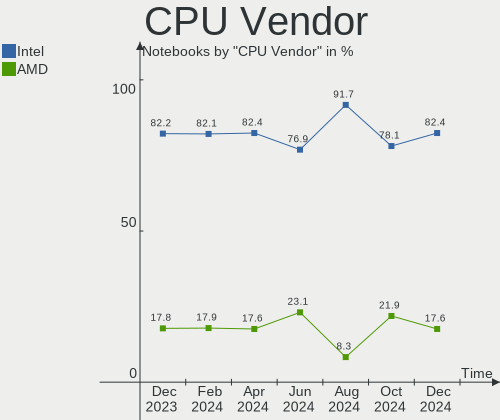

FreeBSD - Hardware Trends (Notebooks)
-------------------------------------

A project to identify most popular hardware characteristics and track their change
over time based on data collected by BSD users at https://BSD-Hardware.info.

Anyone can contribute to this report by the [hw-probe](https://github.com/linuxhw/hw-probe/blob/master/INSTALL.BSD.md) tool:

    hw-probe -all -upload

This report is for one last month. Overall report since the beginning of time: [TestDays](https://github.com/bsdhw/TestDays)

Period: Dec, 2024.

Contents
--------

* [ System ](#system)
  - [ OS                       ](#os)
  - [ OS Family                ](#os-family)
  - [ Arch                     ](#arch)
  - [ DE                       ](#de)
  - [ Display Server           ](#display-server)
  - [ Display Manager          ](#display-manager)
  - [ OS Lang                  ](#os-lang)
  - [ Boot Mode                ](#boot-mode)
  - [ Filesystem               ](#filesystem)
  - [ Part. scheme             ](#part-scheme)

* [ Board ](#board)
  - [ Vendor                   ](#vendor)
  - [ Model                    ](#model)
  - [ Model Family             ](#model-family)
  - [ MFG Year                 ](#mfg-year)
  - [ Form Factor              ](#form-factor)
  - [ Coreboot                 ](#coreboot)
  - [ RAM Size                 ](#ram-size)
  - [ RAM Used                 ](#ram-used)
  - [ Total Drives             ](#total-drives)
  - [ Has CD-ROM               ](#has-cd-rom)
  - [ Has Ethernet             ](#has-ethernet)
  - [ Has WiFi                 ](#has-wifi)
  - [ Has Bluetooth            ](#has-bluetooth)

* [ Location ](#location)
  - [ Country                  ](#country)
  - [ City                     ](#city)

* [ Drives ](#drives)
  - [ Drive Vendor             ](#drive-vendor)
  - [ Drive Model              ](#drive-model)
  - [ HDD Vendor               ](#hdd-vendor)
  - [ SSD Vendor               ](#ssd-vendor)
  - [ Drive Kind               ](#drive-kind)
  - [ Drive Connector          ](#drive-connector)
  - [ Drive Size               ](#drive-size)
  - [ Space Total              ](#space-total)
  - [ Space Used               ](#space-used)
  - [ Malfunc. Drives          ](#malfunc-drives)
  - [ Malfunc. Drive Vendor    ](#malfunc-drive-vendor)
  - [ Malfunc. HDD Vendor      ](#malfunc-hdd-vendor)
  - [ Malfunc. Drive Kind      ](#malfunc-drive-kind)
  - [ Failed Drives            ](#failed-drives)
  - [ Failed Drive Vendor      ](#failed-drive-vendor)
  - [ Drive Status             ](#drive-status)

* [ Storage controller ](#storage-controller)
  - [ Storage Vendor           ](#storage-vendor)
  - [ Storage Model            ](#storage-model)
  - [ Storage Kind             ](#storage-kind)

* [ Processor ](#processor)
  - [ CPU Vendor               ](#cpu-vendor)
  - [ CPU Model                ](#cpu-model)
  - [ CPU Model Family         ](#cpu-model-family)
  - [ CPU Cores                ](#cpu-cores)
  - [ CPU Sockets              ](#cpu-sockets)
  - [ CPU Threads              ](#cpu-threads)
  - [ CPU Microarch            ](#cpu-microarch)

* [ Graphics ](#graphics)
  - [ GPU Vendor               ](#gpu-vendor)
  - [ GPU Model                ](#gpu-model)
  - [ GPU Combo                ](#gpu-combo)
  - [ GPU Driver               ](#gpu-driver)
  - [ GPU Memory               ](#gpu-memory)

* [ Monitor ](#monitor)
  - [ Monitor Vendor           ](#monitor-vendor)
  - [ Monitor Model            ](#monitor-model)
  - [ Monitor Resolution       ](#monitor-resolution)
  - [ Monitor Diagonal         ](#monitor-diagonal)
  - [ Monitor Width            ](#monitor-width)
  - [ Aspect Ratio             ](#aspect-ratio)
  - [ Monitor Area             ](#monitor-area)
  - [ Pixel Density            ](#pixel-density)
  - [ Multiple Monitors        ](#multiple-monitors)

* [ Network ](#network)
  - [ Net Controller Vendor    ](#net-controller-vendor)
  - [ Net Controller Model     ](#net-controller-model)
  - [ Wireless Vendor          ](#wireless-vendor)
  - [ Wireless Model           ](#wireless-model)
  - [ Ethernet Vendor          ](#ethernet-vendor)
  - [ Ethernet Model           ](#ethernet-model)
  - [ Net Controller Kind      ](#net-controller-kind)
  - [ Used Controller          ](#used-controller)
  - [ NICs                     ](#nics)
  - [ IPv6                     ](#ipv6)

* [ Bluetooth ](#bluetooth)
  - [ Bluetooth Vendor         ](#bluetooth-vendor)
  - [ Bluetooth Model          ](#bluetooth-model)

* [ Sound ](#sound)
  - [ Sound Vendor             ](#sound-vendor)
  - [ Sound Model              ](#sound-model)

* [ Memory ](#memory)
  - [ Memory Vendor            ](#memory-vendor)
  - [ Memory Model             ](#memory-model)
  - [ Memory Kind              ](#memory-kind)
  - [ Memory Form Factor       ](#memory-form-factor)
  - [ Memory Size              ](#memory-size)
  - [ Memory Speed             ](#memory-speed)

* [ Printers & scanners ](#printers--scanners)
  - [ Printer Vendor           ](#printer-vendor)
  - [ Printer Model            ](#printer-model)
  - [ Scanner Vendor           ](#scanner-vendor)
  - [ Scanner Model            ](#scanner-model)

* [ Camera ](#camera)
  - [ Camera Vendor            ](#camera-vendor)
  - [ Camera Model             ](#camera-model)

* [ Security ](#security)
  - [ Fingerprint Vendor       ](#fingerprint-vendor)
  - [ Fingerprint Model        ](#fingerprint-model)
  - [ Chipcard Vendor          ](#chipcard-vendor)
  - [ Chipcard Model           ](#chipcard-model)

* [ Unsupported ](#unsupported)
  - [ Unsupported Devices      ](#unsupported-devices)
  - [ Unsupported Device Types ](#unsupported-device-types)

System
------

OS
--

Installed operating systems

| Name                 | Notebooks | Percent |
|----------------------|-----------|---------|
| FreeBSD 14.2         | 22        | 64.71%  |
| FreeBSD 14.1-p6      | 9         | 26.47%  |
| FreeBSD 15.0-CURRENT | 1         | 2.94%   |
| FreeBSD 14.2-STABLE  | 1         | 2.94%   |
| FreeBSD 14.1-p3      | 1         | 2.94%   |

OS Family
---------

OS without a version

| Name    | Notebooks | Percent |
|---------|-----------|---------|
| FreeBSD | 34        | 100%    |

Arch
----

OS architecture (x86_64, i586, etc.)

| Name  | Notebooks | Percent |
|-------|-----------|---------|
| amd64 | 34        | 100%    |

DE
--

Desktop Environment

| Name    | Notebooks | Percent |
|---------|-----------|---------|
| KDE5    | 7         | 20.59%  |
| XFCE    | 6         | 17.65%  |
| MATE    | 6         | 17.65%  |
| GNOME   | 6         | 17.65%  |
| Console | 2         | 5.88%   |
| TWM     | 1         | 2.94%   |
| LXQt    | 1         | 2.94%   |
| LXDE    | 1         | 2.94%   |
| KDE6    | 1         | 2.94%   |
| KDE     | 1         | 2.94%   |
| i3      | 1         | 2.94%   |
| Fluxbox | 1         | 2.94%   |

Display Server
--------------

X11 or Wayland

| Name    | Notebooks | Percent |
|---------|-----------|---------|
| X11     | 29        | 85.29%  |
| Wayland | 3         | 8.82%   |
| Console | 2         | 5.88%   |

Display Manager
---------------

SDDM, LightDM, etc.

| Name    | Notebooks | Percent |
|---------|-----------|---------|
| SDDM    | 11        | 32.35%  |
| Console | 9         | 26.47%  |
| LightDM | 5         | 14.71%  |
| SLiM    | 4         | 11.76%  |
| GDM     | 3         | 8.82%   |
| XDM     | 2         | 5.88%   |

OS Lang
-------

Language

| Lang    | Notebooks | Percent |
|---------|-----------|---------|
| C       | 24        | 70.59%  |
| fr_FR   | 2         | 5.88%   |
| en_US   | 2         | 5.88%   |
| zh_CN   | 1         | 2.94%   |
| ru_RU   | 1         | 2.94%   |
| es_AR   | 1         | 2.94%   |
| en_CA   | 1         | 2.94%   |
| de_DE   | 1         | 2.94%   |
| Unknown | 1         | 2.94%   |

Boot Mode
---------

EFI or BIOS

| Mode | Notebooks | Percent |
|------|-----------|---------|
| EFI  | 30        | 88.24%  |
| BIOS | 4         | 11.76%  |

Filesystem
----------

Type of filesystem

| Type | Notebooks | Percent |
|------|-----------|---------|
| Zfs  | 29        | 85.29%  |
| Ufs  | 5         | 14.71%  |

Part. scheme
------------

Scheme of partitioning

| Type    | Notebooks | Percent |
|---------|-----------|---------|
| GPT     | 33        | 97.06%  |
| Unknown | 1         | 2.94%   |

Board
-----

Vendor
------

Motherboard manufacturer

| Name             | Notebooks | Percent |
|------------------|-----------|---------|
| Lenovo           | 11        | 32.35%  |
| Dell             | 6         | 17.65%  |
| Hewlett-Packard  | 2         | 5.88%   |
| Apple            | 2         | 5.88%   |
| Alienware        | 2         | 5.88%   |
| TUXEDO           | 1         | 2.94%   |
| Timi             | 1         | 2.94%   |
| Sony             | 1         | 2.94%   |
| Razer            | 1         | 2.94%   |
| Notebook         | 1         | 2.94%   |
| HUAWEI           | 1         | 2.94%   |
| Gateway          | 1         | 2.94%   |
| Fujitsu          | 1         | 2.94%   |
| Framework        | 1         | 2.94%   |
| ASUSTek Computer | 1         | 2.94%   |
| Acer             | 1         | 2.94%   |

Model
-----

Motherboard model

| Name                                        | Notebooks | Percent |
|---------------------------------------------|-----------|---------|
| Dell Precision 5510                         | 2         | 5.88%   |
| Alienware m15 R6                            | 2         | 5.88%   |
| TUXEDO Pulse 14 Gen3                        | 1         | 2.94%   |
| Timi TM1703                                 | 1         | 2.94%   |
| Sony SVE11115ELW                            | 1         | 2.94%   |
| Razer Blade 16 - RZ09-0510                  | 1         | 2.94%   |
| Notebook N7x0WU                             | 1         | 2.94%   |
| Lenovo ThinkPad X250 20CLS14400             | 1         | 2.94%   |
| Lenovo ThinkPad X1 Carbon Gen 9 20XW006FSP  | 1         | 2.94%   |
| Lenovo ThinkPad X1 Carbon 7th 20R1CTO1WW    | 1         | 2.94%   |
| Lenovo ThinkPad T490 20N3S61A13             | 1         | 2.94%   |
| Lenovo ThinkPad T480 20L6S29D1V             | 1         | 2.94%   |
| Lenovo ThinkPad T430 2344BPU                | 1         | 2.94%   |
| Lenovo ThinkPad P14s Gen 1 20Y1CTO1WW       | 1         | 2.94%   |
| Lenovo ThinkBook 14 G6 IRL 21KG             | 1         | 2.94%   |
| Lenovo ThinkBook 14 G2 ARE 20VF             | 1         | 2.94%   |
| Lenovo IdeaPad 320-15IKB Touch 81BH         | 1         | 2.94%   |
| Lenovo IdeaPad 320-14IKB 80YF               | 1         | 2.94%   |
| HUAWEI MRGFG-XX                             | 1         | 2.94%   |
| HP Pavilion 15                              | 1         | 2.94%   |
| HP Laptop 14-dq2xxx                         | 1         | 2.94%   |
| Gateway LT40                                | 1         | 2.94%   |
| Fujitsu LIFEBOOK U727                       | 1         | 2.94%   |
| Framework Laptop 16 (AMD Ryzen 7040 Series) | 1         | 2.94%   |
| Dell Latitude E6540                         | 1         | 2.94%   |
| Dell Latitude 7390                          | 1         | 2.94%   |
| Dell Latitude 5420                          | 1         | 2.94%   |
| Dell Inspiron 5737                          | 1         | 2.94%   |
| ASUS K53BY                                  | 1         | 2.94%   |
| Apple MacBookPro8,3                         | 1         | 2.94%   |
| Apple MacBookAir6,2                         | 1         | 2.94%   |
| Acer Extensa 215-33                         | 1         | 2.94%   |

Model Family
------------

Motherboard model prefix

| Name              | Notebooks | Percent |
|-------------------|-----------|---------|
| Lenovo ThinkPad   | 7         | 20.59%  |
| Dell Latitude     | 3         | 8.82%   |
| Lenovo ThinkBook  | 2         | 5.88%   |
| Lenovo IdeaPad    | 2         | 5.88%   |
| Dell Precision    | 2         | 5.88%   |
| Alienware m15     | 2         | 5.88%   |
| TUXEDO Pulse      | 1         | 2.94%   |
| Timi TM1703       | 1         | 2.94%   |
| Sony SVE11115ELW  | 1         | 2.94%   |
| Razer Blade       | 1         | 2.94%   |
| Notebook N7x0WU   | 1         | 2.94%   |
| HUAWEI MRGFG-XX   | 1         | 2.94%   |
| HP Pavilion       | 1         | 2.94%   |
| HP Laptop         | 1         | 2.94%   |
| Gateway LT40      | 1         | 2.94%   |
| Fujitsu LIFEBOOK  | 1         | 2.94%   |
| Framework Laptop  | 1         | 2.94%   |
| Dell Inspiron     | 1         | 2.94%   |
| ASUS K53BY        | 1         | 2.94%   |
| Apple MacBookPro8 | 1         | 2.94%   |
| Apple MacBookAir6 | 1         | 2.94%   |
| Acer Extensa      | 1         | 2.94%   |

MFG Year
--------

Motherboard manufacture year

| Year | Notebooks | Percent |
|------|-----------|---------|
| 2019 | 6         | 17.65%  |
| 2020 | 5         | 14.71%  |
| 2023 | 4         | 11.76%  |
| 2013 | 4         | 11.76%  |
| 2012 | 4         | 11.76%  |
| 2024 | 3         | 8.82%   |
| 2022 | 2         | 5.88%   |
| 2021 | 2         | 5.88%   |
| 2018 | 2         | 5.88%   |
| 2017 | 1         | 2.94%   |
| 2015 | 1         | 2.94%   |

Form Factor
-----------

Physical design of the computer

| Name     | Notebooks | Percent |
|----------|-----------|---------|
| Notebook | 34        | 100%    |

Coreboot
--------

Have coreboot on board

| Used | Notebooks | Percent |
|------|-----------|---------|
| No   | 34        | 100%    |

RAM Size
--------

Total RAM memory

| Size in GB | Notebooks | Percent |
|------------|-----------|---------|
| 16.01-24.0 | 11        | 32.35%  |
| 8.01-16.0  | 11        | 32.35%  |
| 32.01-64.0 | 9         | 26.47%  |
| 4.01-8.0   | 2         | 5.88%   |
| 2.01-3.0   | 1         | 2.94%   |

RAM Used
--------

Used RAM memory

| Used GB  | Notebooks | Percent |
|----------|-----------|---------|
| 0.51-1.0 | 15        | 44.12%  |
| 1.01-2.0 | 8         | 23.53%  |
| 0.01-0.5 | 8         | 23.53%  |
| 4.01-8.0 | 1         | 2.94%   |
| 3.01-4.0 | 1         | 2.94%   |
| 2.01-3.0 | 1         | 2.94%   |

Total Drives
------------

Number of drives on board

| Drives | Notebooks | Percent |
|--------|-----------|---------|
| 0      | 22        | 64.71%  |
| 1      | 10        | 29.41%  |
| 2      | 2         | 5.88%   |

Has CD-ROM
----------

Has CD-ROM on board

| Presented | Notebooks | Percent |
|-----------|-----------|---------|
| No        | 30        | 88.24%  |
| Yes       | 4         | 11.76%  |

Has Ethernet
------------

Has Ethernet on board

| Presented | Notebooks | Percent |
|-----------|-----------|---------|
| Yes       | 24        | 70.59%  |
| No        | 10        | 29.41%  |

Has WiFi
--------

Has WiFi module

| Presented | Notebooks | Percent |
|-----------|-----------|---------|
| Yes       | 34        | 100%    |

Has Bluetooth
-------------

Has Bluetooth module

| Presented | Notebooks | Percent |
|-----------|-----------|---------|
| Yes       | 29        | 85.29%  |
| No        | 5         | 14.71%  |

Location
--------

Country
-------

Geographic location (country)

| Country         | Notebooks | Percent |
|-----------------|-----------|---------|
| USA             | 5         | 14.71%  |
| Spain           | 5         | 14.71%  |
| Germany         | 2         | 5.88%   |
| France          | 2         | 5.88%   |
| Canada          | 2         | 5.88%   |
| Brazil          | 2         | 5.88%   |
| UK              | 1         | 2.94%   |
| UAE             | 1         | 2.94%   |
| The Netherlands | 1         | 2.94%   |
| Serbia          | 1         | 2.94%   |
| Russia          | 1         | 2.94%   |
| Poland          | 1         | 2.94%   |
| Malta           | 1         | 2.94%   |
| Lithuania       | 1         | 2.94%   |
| India           | 1         | 2.94%   |
| Hungary         | 1         | 2.94%   |
| China           | 1         | 2.94%   |
| Chile           | 1         | 2.94%   |
| Austria         | 1         | 2.94%   |
| Australia       | 1         | 2.94%   |
| Argentina       | 1         | 2.94%   |
| Andorra         | 1         | 2.94%   |

City
----

Geographic location (city)

| City             | Notebooks | Percent |
|------------------|-----------|---------|
| Sao Paulo        | 2         | 5.88%   |
| Los Realejos     | 2         | 5.88%   |
| Vilnius          | 1         | 2.94%   |
| Vienna           | 1         | 2.94%   |
| Victoria         | 1         | 2.94%   |
| Temuco           | 1         | 2.94%   |
| Sydney           | 1         | 2.94%   |
| Subotica         | 1         | 2.94%   |
| Stockport        | 1         | 2.94%   |
| Seattle          | 1         | 2.94%   |
| Pune             | 1         | 2.94%   |
| Plasencia        | 1         | 2.94%   |
| Ottawa           | 1         | 2.94%   |
| Oklahoma City    | 1         | 2.94%   |
| Neustadt         | 1         | 2.94%   |
| Neuengors        | 1         | 2.94%   |
| Naxxar           | 1         | 2.94%   |
| Las Vegas        | 1         | 2.94%   |
| Koszalin         | 1         | 2.94%   |
| Guangzhou        | 1         | 2.94%   |
| Girona           | 1         | 2.94%   |
| Dunkirk          | 1         | 2.94%   |
| Dubai            | 1         | 2.94%   |
| Columbia         | 1         | 2.94%   |
| Coconut Creek    | 1         | 2.94%   |
| Bugry            | 1         | 2.94%   |
| Buenos Aires     | 1         | 2.94%   |
| Budapest         | 1         | 2.94%   |
| Bergen op Zoom   | 1         | 2.94%   |
| Barcelona        | 1         | 2.94%   |
| Argenteuil       | 1         | 2.94%   |
| Andorra la Vella | 1         | 2.94%   |

Drives
------

Drive Vendor
------------

Hard drive vendors

| Vendor              | Notebooks | Drives | Percent |
|---------------------|-----------|--------|---------|
| Seagate             | 3         | 3      | 23.08%  |
| SanDisk             | 3         | 4      | 23.08%  |
| Crucial             | 2         | 2      | 15.38%  |
| WDC                 | 1         | 1      | 7.69%   |
| SPCC                | 1         | 1      | 7.69%   |
| Samsung Electronics | 1         | 1      | 7.69%   |
| Kingston            | 1         | 1      | 7.69%   |
| Hitachi             | 1         | 1      | 7.69%   |

Drive Model
-----------

Hard drive models

| Model                              | Notebooks | Percent |
|------------------------------------|-----------|---------|
| WDC WDS120G2G0B-00EPW0 120GB       | 1         | 7.69%   |
| SPCC Solid State Disk 512GB        | 1         | 7.69%   |
| Seagate ST320LT020-9YG142 320GB    | 1         | 7.69%   |
| Seagate ST2000LM015-2E8174 2TB     | 1         | 7.69%   |
| Seagate ST1000LM024 HN-M101MBB 1TB | 1         | 7.69%   |
| SanDisk Ultra II 480GB             | 1         | 7.69%   |
| SanDisk SSD PLUS 240GB             | 1         | 7.69%   |
| SanDisk SSD G5 BICS4 1TB           | 1         | 7.69%   |
| Samsung MMCRE64G8MXP-0VBL1 64GB    | 1         | 7.69%   |
| Kingston SKC600MS256G 256GB        | 1         | 7.69%   |
| Hitachi HTS727575A9E362 752GB      | 1         | 7.69%   |
| Crucial CT500MX500SSD1 500GB       | 1         | 7.69%   |
| Crucial CT1000MX500SSD1 1TB        | 1         | 7.69%   |

HDD Vendor
----------

Hard disk drive vendors

| Vendor  | Notebooks | Drives | Percent |
|---------|-----------|--------|---------|
| Seagate | 3         | 3      | 75%     |
| Hitachi | 1         | 1      | 25%     |

SSD Vendor
----------

Solid state drive vendors

| Vendor              | Notebooks | Drives | Percent |
|---------------------|-----------|--------|---------|
| SanDisk             | 3         | 4      | 33.33%  |
| Crucial             | 2         | 2      | 22.22%  |
| WDC                 | 1         | 1      | 11.11%  |
| SPCC                | 1         | 1      | 11.11%  |
| Samsung Electronics | 1         | 1      | 11.11%  |
| Kingston            | 1         | 1      | 11.11%  |

Drive Kind
----------

HDD or SSD

| Kind | Notebooks | Drives | Percent |
|------|-----------|--------|---------|
| SSD  | 8         | 10     | 66.67%  |
| HDD  | 4         | 4      | 33.33%  |

Drive Connector
---------------

SATA, SAS, NVMe, etc.

| Type | Notebooks | Drives | Percent |
|------|-----------|--------|---------|
| SATA | 12        | 14     | 100%    |

Drive Size
----------

Size of hard drive

| Size in TB | Notebooks | Drives | Percent |
|------------|-----------|--------|---------|
| 0.01-0.5   | 7         | 7      | 53.85%  |
| 0.51-1.0   | 5         | 6      | 38.46%  |
| 1.01-2.0   | 1         | 1      | 7.69%   |

Space Total
-----------

Amount of disk space available on the file system

| Size in GB     | Notebooks | Percent |
|----------------|-----------|---------|
| 101-250        | 10        | 29.41%  |
| 501-1000       | 10        | 29.41%  |
| 251-500        | 9         | 26.47%  |
| 1001-2000      | 3         | 8.82%   |
| More than 3000 | 1         | 2.94%   |
| 51-100         | 1         | 2.94%   |

Space Used
----------

Amount of used disk space

| Used GB | Notebooks | Percent |
|---------|-----------|---------|
| 1-20    | 23        | 67.65%  |
| 51-100  | 6         | 17.65%  |
| 21-50   | 5         | 14.71%  |

Malfunc. Drives
---------------

Drive models with a malfunction

| Model                              | Notebooks | Drives | Percent |
|------------------------------------|-----------|--------|---------|
| Seagate ST1000LM024 HN-M101MBB 1TB | 1         | 1      | 50%     |
| Hitachi HTS727575A9E362 752GB      | 1         | 1      | 50%     |

Malfunc. Drive Vendor
---------------------

Vendors of faulty drives

| Vendor  | Notebooks | Drives | Percent |
|---------|-----------|--------|---------|
| Seagate | 1         | 1      | 50%     |
| Hitachi | 1         | 1      | 50%     |

Malfunc. HDD Vendor
-------------------

Vendors of faulty HDD drives

| Vendor  | Notebooks | Drives | Percent |
|---------|-----------|--------|---------|
| Seagate | 1         | 1      | 50%     |
| Hitachi | 1         | 1      | 50%     |

Malfunc. Drive Kind
-------------------

Kinds of faulty drives

| Kind | Notebooks | Drives | Percent |
|------|-----------|--------|---------|
| HDD  | 2         | 2      | 100%    |

Failed Drives
-------------

Failed drive models

Zero info for selected period =(

Failed Drive Vendor
-------------------

Failed drive vendors

Zero info for selected period =(

Drive Status
------------

Number of failed and malfunc. drives

| Status  | Notebooks | Drives | Percent |
|---------|-----------|--------|---------|
| Works   | 10        | 12     | 83.33%  |
| Malfunc | 2         | 2      | 16.67%  |

Storage controller
------------------

Storage Vendor
--------------

Storage controller vendors

| Vendor                      | Notebooks | Percent |
|-----------------------------|-----------|---------|
| Intel                       | 16        | 35.56%  |
| Samsung Electronics         | 9         | 20%     |
| SanDisk                     | 6         | 13.33%  |
| Micron/Crucial Technology   | 3         | 6.67%   |
| AMD                         | 3         | 6.67%   |
| SK hynix                    | 2         | 4.44%   |
| Micron Technology           | 2         | 4.44%   |
| Realtek Semiconductor       | 1         | 2.22%   |
| MAXIO Technology (Hangzhou) | 1         | 2.22%   |
| KIOXIA                      | 1         | 2.22%   |
| Kingston Technology Company | 1         | 2.22%   |

Storage Model
-------------

Storage controller models

| Model                                                                          | Notebooks | Percent |
|--------------------------------------------------------------------------------|-----------|---------|
| Samsung NVMe SSD Controller 980 (DRAM-less)                                    | 4         | 8.7%    |
| Samsung NVMe SSD Controller PM9A1/PM9A3/980PRO                                 | 3         | 6.52%   |
| Intel Sunrise Point-LP SATA Controller [AHCI mode]                             | 3         | 6.52%   |
| SanDisk Extreme Pro / WD Black SN750 / PC SN730 / Red SN700 NVMe SSD           | 2         | 4.35%   |
| Intel Tiger Lake SATA AHCI Controller                                          | 2         | 4.35%   |
| Intel 82801 Mobile SATA Controller [RAID mode]                                 | 2         | 4.35%   |
| Intel 7 Series Chipset Family 6-port SATA Controller [AHCI mode]               | 2         | 4.35%   |
| AMD FCH SATA Controller [AHCI mode]                                            | 2         | 4.35%   |
| SK hynix PC611 NVMe Solid State Drive                                          | 1         | 2.17%   |
| SK hynix Gold P31/BC711/PC711 NVMe Solid State Drive                           | 1         | 2.17%   |
| Sandisk WD PC SN740 NVMe SSD 512GB (DRAM-less)                                 | 1         | 2.17%   |
| Sandisk WD Black SN770 / PC SN740 256GB / PC SN560 (DRAM-less) NVMe SSD        | 1         | 2.17%   |
| SanDisk Ultra 3D / WD PC SN530, IX SN530, Blue SN550 NVMe SSD (DRAM-less)      | 1         | 2.17%   |
| SanDisk Extreme Pro / WD Black 2018/SN750/PC SN720 NVMe SSD                    | 1         | 2.17%   |
| Samsung S4LN053X01 AHCI SSD Controller(Apple slot)                             | 1         | 2.17%   |
| Samsung NVMe SSD Controller SM961/PM961/SM963                                  | 1         | 2.17%   |
| Realtek RTS5765DL NVMe SSD Controller (DRAM-less)                              | 1         | 2.17%   |
| Micron/Crucial T700 NVMe PCIe SSD                                              | 1         | 2.17%   |
| Micron/Crucial P3 Plus NVMe PCIe SSD (DRAM-less)                               | 1         | 2.17%   |
| Micron/Crucial P2 [Nick P2] / P3 / P3 Plus NVMe PCIe SSD (DRAM-less)           | 1         | 2.17%   |
| Micron 3400 NVMe SSD [Hendrix]                                                 | 1         | 2.17%   |
| Micron 2450 NVMe SSD [HendrixV] (DRAM-less)                                    | 1         | 2.17%   |
| MAXIO (Hangzhou) NVMe SSD Controller MAP1202 (DRAM-less)                       | 1         | 2.17%   |
| KIOXIA NVMe SSD Controller BG4 (DRAM-less)                                     | 1         | 2.17%   |
| Kingston Company NV1 NVMe SSD [SM2263XT] (DRAM-less)                           | 1         | 2.17%   |
| Intel Wildcat Point-LP SATA Controller [AHCI Mode]                             | 1         | 2.17%   |
| Intel Volume Management Device NVMe RAID Controller                            | 1         | 2.17%   |
| Intel Q170/Q150/B150/H170/H110/Z170/CM236 Chipset SATA Controller [AHCI Mode]  | 1         | 2.17%   |
| Intel NM10/ICH7 Family SATA Controller [AHCI mode]                             | 1         | 2.17%   |
| Intel 8 Series/C220 Series Chipset Family 6-port SATA Controller 1 [AHCI mode] | 1         | 2.17%   |
| Intel 8 Series SATA Controller 1 [AHCI mode]                                   | 1         | 2.17%   |
| Intel 6 Series/C200 Series Chipset Family 6 port Mobile SATA AHCI Controller   | 1         | 2.17%   |
| AMD SB7x0/SB8x0/SB9x0 SATA Controller [AHCI mode]                              | 1         | 2.17%   |
| AMD SB7x0/SB8x0/SB9x0 IDE Controller                                           | 1         | 2.17%   |

Storage Kind
------------

Kind of storage controller (IDE, SATA, NVMe, SAS, ...)

| Kind | Notebooks | Percent |
|------|-----------|---------|
| NVMe | 22        | 51.16%  |
| SATA | 17        | 39.53%  |
| RAID | 3         | 6.98%   |
| IDE  | 1         | 2.33%   |

Processor
---------

CPU Vendor
----------

Processor vendors

| Vendor | Notebooks | Percent |
|--------|-----------|---------|
| Intel  | 28        | 82.35%  |
| AMD    | 6         | 17.65%  |

CPU Model
---------

Processor models

| Model                                      | Notebooks | Percent |
|--------------------------------------------|-----------|---------|
| Intel 11th Gen Core i7-11800H @ 2.30GHz    | 2         | 5.88%   |
| Intel N100                                 | 1         | 2.94%   |
| Intel Core i9-14900HX                      | 1         | 2.94%   |
| Intel Core i7-8650U CPU @ 1.90GHz          | 1         | 2.94%   |
| Intel Core i7-8550U CPU @ 1.80GHz          | 1         | 2.94%   |
| Intel Core i7-6820HQ CPU @ 2.70GHz         | 1         | 2.94%   |
| Intel Core i7-4800MQ CPU @ 2.70GHz         | 1         | 2.94%   |
| Intel Core i7-4650U CPU @ 1.70GHz          | 1         | 2.94%   |
| Intel Core i7-3520M CPU @ 2.90GHz          | 1         | 2.94%   |
| Intel Core i7-2760QM CPU @ 2.40GHz         | 1         | 2.94%   |
| Intel Core i7-10510U CPU @ 1.80GHz         | 1         | 2.94%   |
| Intel Core i5-8365U CPU @ 1.60GHz          | 1         | 2.94%   |
| Intel Core i5-8350U CPU @ 1.70GHz          | 1         | 2.94%   |
| Intel Core i5-8250U CPU @ 1.60GHz          | 1         | 2.94%   |
| Intel Core i5-6300HQ CPU @ 2.30GHz         | 1         | 2.94%   |
| Intel Core i5-6200U CPU @ 2.30GHz          | 1         | 2.94%   |
| Intel Core i5-5300U CPU @ 2.30GHz          | 1         | 2.94%   |
| Intel Core i5-4200U CPU @ 1.60GHz          | 1         | 2.94%   |
| Intel Core i5-3230M CPU @ 2.60GHz          | 1         | 2.94%   |
| Intel Core i3-8130U CPU @ 2.20GHz          | 1         | 2.94%   |
| Intel Core i3-6006U CPU @ 2.00GHz          | 1         | 2.94%   |
| Intel Atom CPU N2600 @ 1.60GHz             | 1         | 2.94%   |
| Intel 13th Gen Core i7-13700H              | 1         | 2.94%   |
| Intel 13th Gen Core i7-1360P               | 1         | 2.94%   |
| Intel 11th Gen Core i7-1185G7 @ 3.00GHz    | 1         | 2.94%   |
| Intel 11th Gen Core i7-1165G7 @ 2.80GHz    | 1         | 2.94%   |
| Intel 11th Gen Core i3-1125G4 @ 2.00GHz    | 1         | 2.94%   |
| AMD Ryzen 7 PRO 4750U with Radeon Graphics | 1         | 2.94%   |
| AMD Ryzen 7 7840HS w/ Radeon 780M Graphics | 1         | 2.94%   |
| AMD Ryzen 5 7530U with Radeon Graphics     | 1         | 2.94%   |
| AMD Ryzen 5 4500U with Radeon Graphics     | 1         | 2.94%   |
| AMD E2-1800 APU with Radeon HD Graphics    | 1         | 2.94%   |
| AMD E-450 APU with Radeon HD Graphics      | 1         | 2.94%   |

CPU Model Family
----------------

Processor model prefix

| Model           | Notebooks | Percent |
|-----------------|-----------|---------|
| Other           | 8         | 23.53%  |
| Intel Core i7   | 8         | 23.53%  |
| Intel Core i5   | 8         | 23.53%  |
| Intel Core i3   | 2         | 5.88%   |
| AMD Ryzen 5     | 2         | 5.88%   |
| Intel Core i9   | 1         | 2.94%   |
| Intel Atom      | 1         | 2.94%   |
| AMD Ryzen 7 PRO | 1         | 2.94%   |
| AMD Ryzen 7     | 1         | 2.94%   |
| AMD E2          | 1         | 2.94%   |
| AMD E           | 1         | 2.94%   |

CPU Cores
---------

Number of processor cores

| Number | Notebooks | Percent |
|--------|-----------|---------|
| 4      | 14        | 41.18%  |
| 2      | 11        | 32.35%  |
| 8      | 5         | 14.71%  |
| 6      | 2         | 5.88%   |
| 16     | 1         | 2.94%   |
| 10     | 1         | 2.94%   |

CPU Sockets
-----------

Number of sockets

| Number | Notebooks | Percent |
|--------|-----------|---------|
| 1      | 34        | 100%    |

CPU Threads
-----------

Threads per core (Hyper-Threading)

| Number | Notebooks | Percent |
|--------|-----------|---------|
| 2      | 29        | 85.29%  |
| 1      | 5         | 14.71%  |

CPU Microarch
-------------

Microarchitecture

| Name        | Notebooks | Percent |
|-------------|-----------|---------|
| KabyLake    | 7         | 20.59%  |
| Unknown     | 7         | 20.59%  |
| Skylake     | 4         | 11.76%  |
| TigerLake   | 3         | 8.82%   |
| Haswell     | 3         | 8.82%   |
| Zen 2       | 2         | 5.88%   |
| IvyBridge   | 2         | 5.88%   |
| Bobcat      | 2         | 5.88%   |
| Zen 3       | 1         | 2.94%   |
| SandyBridge | 1         | 2.94%   |
| Broadwell   | 1         | 2.94%   |
| Bonnell     | 1         | 2.94%   |

Graphics
--------

GPU Vendor
----------

Vendors of graphics cards

| Vendor | Notebooks | Percent |
|--------|-----------|---------|
| Intel  | 27        | 61.36%  |
| AMD    | 9         | 20.45%  |
| Nvidia | 8         | 18.18%  |

GPU Model
---------

Graphics card models

| Model                                                                         | Notebooks | Percent |
|-------------------------------------------------------------------------------|-----------|---------|
| Intel UHD Graphics 620                                                        | 5         | 11.11%  |
| Nvidia GP108M [GeForce MX150]                                                 | 2         | 4.44%   |
| Nvidia GM107GLM [Quadro M1000M]                                               | 2         | 4.44%   |
| Intel TigerLake-LP GT2 [Iris Xe Graphics]                                     | 2         | 4.44%   |
| Intel TigerLake-H GT1 [UHD Graphics]                                          | 2         | 4.44%   |
| Intel Raptor Lake-P [Iris Xe Graphics]                                        | 2         | 4.44%   |
| Intel HD Graphics 530                                                         | 2         | 4.44%   |
| Intel Haswell-ULT Integrated Graphics Controller                              | 2         | 4.44%   |
| Intel 3rd Gen Core processor Graphics Controller                              | 2         | 4.44%   |
| AMD Renoir [Radeon Vega Series / Radeon Vega Mobile Series]                   | 2         | 4.44%   |
| Nvidia GF108M [NVS 5400M]                                                     | 1         | 2.22%   |
| Nvidia GA106M [GeForce RTX 3060 Mobile / Max-Q]                               | 1         | 2.22%   |
| Nvidia GA104M [GeForce RTX 3070 Mobile / Max-Q]                               | 1         | 2.22%   |
| Nvidia AD104M [GeForce RTX 4080 Max-Q / Mobile]                               | 1         | 2.22%   |
| Intel WhiskeyLake-U GT2 [UHD Graphics 620]                                    | 1         | 2.22%   |
| Intel Tiger Lake-LP GT2 [UHD Graphics G4]                                     | 1         | 2.22%   |
| Intel Skylake GT2 [HD Graphics 520]                                           | 1         | 2.22%   |
| Intel HD Graphics 5500                                                        | 1         | 2.22%   |
| Intel HD Graphics 520                                                         | 1         | 2.22%   |
| Intel CometLake-U GT2 [UHD Graphics]                                          | 1         | 2.22%   |
| Intel Atom Processor D2xxx/N2xxx Integrated Graphics Controller               | 1         | 2.22%   |
| Intel Alder Lake-N [UHD Graphics]                                             | 1         | 2.22%   |
| Intel 4th Gen Core Processor Integrated Graphics Controller                   | 1         | 2.22%   |
| Intel 2nd Generation Core Processor Family Integrated Graphics Controller     | 1         | 2.22%   |
| AMD Wrestler [Radeon HD 7340]                                                 | 1         | 2.22%   |
| AMD Wrestler [Radeon HD 6320]                                                 | 1         | 2.22%   |
| AMD Whistler [Radeon HD 6730M/6770M/7690M XT]                                 | 1         | 2.22%   |
| AMD Sun XT [Radeon HD 8670A/8670M/8690M / R5 M330 / M430 / Radeon 520 Mobile] | 1         | 2.22%   |
| AMD Seymour [Radeon HD 6400M/7400M Series]                                    | 1         | 2.22%   |
| AMD Phoenix1                                                                  | 1         | 2.22%   |
| AMD Mars XTX [Radeon HD 8790M]                                                | 1         | 2.22%   |
| AMD Barcelo                                                                   | 1         | 2.22%   |

GPU Combo
---------

Combinations of graphics cards

| Name           | Notebooks | Percent |
|----------------|-----------|---------|
| 1 x Intel      | 17        | 50%     |
| Intel + Nvidia | 7         | 20.59%  |
| 1 x AMD        | 5         | 14.71%  |
| Intel + AMD    | 3         | 8.82%   |
| 2 x AMD        | 1         | 2.94%   |
| 1 x Nvidia     | 1         | 2.94%   |

GPU Driver
----------

Free vs proprietary

| Driver      | Notebooks | Percent |
|-------------|-----------|---------|
| Free        | 30        | 88.24%  |
| Proprietary | 4         | 11.76%  |

GPU Memory
----------

Total video memory

| Size in GB | Notebooks | Percent |
|------------|-----------|---------|
| Unknown    | 28        | 82.35%  |
| 1.01-2.0   | 3         | 8.82%   |
| 0.01-0.5   | 2         | 5.88%   |
| 8.01-16.0  | 1         | 2.94%   |

Monitor
-------

Monitor Vendor
--------------

Monitor vendors

| Vendor                  | Notebooks | Percent |
|-------------------------|-----------|---------|
| BOE                     | 5         | 17.86%  |
| LG Display              | 4         | 14.29%  |
| Chimei Innolux          | 4         | 14.29%  |
| Goldstar                | 3         | 10.71%  |
| AU Optronics            | 3         | 10.71%  |
| Sharp                   | 2         | 7.14%   |
| CSO                     | 2         | 7.14%   |
| Samsung Electronics     | 1         | 3.57%   |
| Lenovo                  | 1         | 3.57%   |
| InfoVision              | 1         | 3.57%   |
| Dell                    | 1         | 3.57%   |
| Chi Mei Optoelectronics | 1         | 3.57%   |

Monitor Model
-------------

Monitor models

| Model                                                                    | Notebooks | Percent |
|--------------------------------------------------------------------------|-----------|---------|
| Sharp LCD Monitor SHP143E 3840x2160 350x190mm 15.7-inch                  | 2         | 7.14%   |
| Samsung Electronics LCD Monitor SDC41AB 2560x1600 340x220mm 15.9-inch    | 1         | 3.57%   |
| LG Display LCD Monitor LGD0773 1920x1200 340x220mm 15.9-inch             | 1         | 3.57%   |
| LG Display LCD Monitor LGD068F 1920x1080 310x170mm 13.9-inch             | 1         | 3.57%   |
| LG Display LCD Monitor LGD0521 1920x1080 310x170mm 13.9-inch             | 1         | 3.57%   |
| LG Display LCD Monitor LGD03ED 1366x768 280x160mm 12.7-inch              | 1         | 3.57%   |
| Lenovo P24h-10 LEN61AE 2560x1440 530x300mm 24.0-inch                     | 1         | 3.57%   |
| InfoVision LCD Monitor IVO057D 1920x1080 310x170mm 13.9-inch             | 1         | 3.57%   |
| Goldstar LG ULTRAWIDE GSM7770 2560x1080 800x340mm 34.2-inch              | 1         | 3.57%   |
| Goldstar LG ULTRAWIDE GSM5BF7 2560x1080 670x280mm 28.6-inch              | 1         | 3.57%   |
| Goldstar LG FHD GSM5C66 1920x1080 530x300mm 24.0-inch                    | 1         | 3.57%   |
| Dell P2422HE DELA1C8 1920x1080 530x300mm 24.0-inch                       | 1         | 3.57%   |
| CSO LCD Monitor CSO1415 3120x2080 300x200mm 14.2-inch                    | 1         | 3.57%   |
| CSO LCD Monitor CSO1403 3840x2400 300x190mm 14.0-inch                    | 1         | 3.57%   |
| Chimei Innolux LCD Monitor CMN15CC 1366x768 340x190mm 15.3-inch          | 1         | 3.57%   |
| Chimei Innolux LCD Monitor CMN15BA 1920x1080 340x190mm 15.3-inch         | 1         | 3.57%   |
| Chimei Innolux LCD Monitor CMN1409 1920x1080 310x170mm 13.9-inch         | 1         | 3.57%   |
| Chimei Innolux LCD Monitor CMN1119 1366x768 260x140mm 11.6-inch          | 1         | 3.57%   |
| Chi Mei Optoelectronics LCD Monitor CMO15A2 1366x768 340x190mm 15.3-inch | 1         | 3.57%   |
| BOE LCD Monitor BOE0868 1920x1080 310x170mm 13.9-inch                    | 1         | 3.57%   |
| BOE LCD Monitor BOE0729 1920x1080 340x190mm 15.3-inch                    | 1         | 3.57%   |
| BOE LCD Monitor BOE06D9 1366x768 280x160mm 12.7-inch                     | 1         | 3.57%   |
| BOE LCD Monitor BOE06BD 1366x768 310x170mm 13.9-inch                     | 1         | 3.57%   |
| BOE LCD Monitor BOE06B7 1920x1080 290x170mm 13.2-inch                    | 1         | 3.57%   |
| AU Optronics LCD Monitor AUO462D 1920x1080 290x170mm 13.2-inch           | 1         | 3.57%   |
| AU Optronics LCD Monitor AUO26EC 1366x768 340x190mm 15.3-inch            | 1         | 3.57%   |
| AU Optronics LCD Monitor AUO159E 1600x900 380x210mm 17.1-inch            | 1         | 3.57%   |

Monitor Resolution
------------------

Monitor screen resolution

| Resolution        | Notebooks | Percent |
|-------------------|-----------|---------|
| 1920x1080 (FHD)   | 10        | 37.04%  |
| 1366x768 (WXGA)   | 7         | 25.93%  |
| 3840x2160 (4K)    | 2         | 7.41%   |
| 2560x1080         | 2         | 7.41%   |
| 3840x2400         | 1         | 3.7%    |
| 3120x2080         | 1         | 3.7%    |
| 2560x1600         | 1         | 3.7%    |
| 2560x1440 (QHD)   | 1         | 3.7%    |
| 1920x1200 (WUXGA) | 1         | 3.7%    |
| 1600x900 (HD+)    | 1         | 3.7%    |

Monitor Diagonal
----------------

Diagonal size in inches

| Inches | Notebooks | Percent |
|--------|-----------|---------|
| 15     | 9         | 32.14%  |
| 13     | 8         | 28.57%  |
| 24     | 3         | 10.71%  |
| 14     | 2         | 7.14%   |
| 12     | 2         | 7.14%   |
| 34     | 1         | 3.57%   |
| 28     | 1         | 3.57%   |
| 17     | 1         | 3.57%   |
| 11     | 1         | 3.57%   |

Monitor Width
-------------

Physical width

| Width in mm | Notebooks | Percent |
|-------------|-----------|---------|
| 301-350     | 15        | 53.57%  |
| 201-300     | 7         | 25%     |
| 501-600     | 3         | 10.71%  |
| 701-800     | 1         | 3.57%   |
| 601-700     | 1         | 3.57%   |
| 351-400     | 1         | 3.57%   |

Aspect Ratio
------------

Proportional relationship between the width and the height

| Ratio | Notebooks | Percent |
|-------|-----------|---------|
| 16/9  | 19        | 76%     |
| 3/2   | 3         | 12%     |
| 21/9  | 2         | 8%      |
| 16/10 | 1         | 4%      |

Monitor Area
------------

Area in inch²

| Area in inch² | Notebooks | Percent |
|----------------|-----------|---------|
| 81-90          | 7         | 25%     |
| 91-100         | 5         | 17.86%  |
| 201-250        | 3         | 10.71%  |
| 101-110        | 3         | 10.71%  |
| 71-80          | 2         | 7.14%   |
| 61-70          | 2         | 7.14%   |
| 111-120        | 2         | 7.14%   |
| 51-60          | 1         | 3.57%   |
| 351-500        | 1         | 3.57%   |
| 251-300        | 1         | 3.57%   |
| 121-130        | 1         | 3.57%   |

Pixel Density
-------------

Pixels per inch

| Density       | Notebooks | Percent |
|---------------|-----------|---------|
| 121-160       | 11        | 42.31%  |
| More than 240 | 4         | 15.38%  |
| 101-120       | 4         | 15.38%  |
| 51-100        | 4         | 15.38%  |
| 161-240       | 3         | 11.54%  |

Multiple Monitors
-----------------

Total monitors connected

| Total | Notebooks | Percent |
|-------|-----------|---------|
| 1     | 19        | 55.88%  |
| 0     | 10        | 29.41%  |
| 2     | 5         | 14.71%  |

Network
-------

Net Controller Vendor
---------------------

Controller vendors

| Vendor                | Notebooks | Percent |
|-----------------------|-----------|---------|
| Intel                 | 27        | 55.1%   |
| Realtek Semiconductor | 13        | 26.53%  |
| Qualcomm Atheros      | 3         | 6.12%   |
| Broadcom              | 2         | 4.08%   |
| Sierra Wireless       | 1         | 2.04%   |
| Ralink                | 1         | 2.04%   |
| Lenovo                | 1         | 2.04%   |
| D-Link System         | 1         | 2.04%   |

Net Controller Model
--------------------

Controller models

| Model                                                                      | Notebooks | Percent |
|----------------------------------------------------------------------------|-----------|---------|
| Realtek RTL8111/8168/8211/8411 PCI Express Gigabit Ethernet Controller     | 7         | 11.11%  |
| Realtek RTL810xE PCI Express Fast Ethernet controller                      | 3         | 4.76%   |
| Intel Wireless 8265 / 8275                                                 | 3         | 4.76%   |
| Intel Wi-Fi 6 AX200                                                        | 3         | 4.76%   |
| Realtek RTL8188EUS 802.11n Wireless Network Adapter                        | 2         | 3.17%   |
| Realtek Killer E2600 GbE Controller                                        | 2         | 3.17%   |
| Intel Wireless 8260                                                        | 2         | 3.17%   |
| Intel Wireless 7265                                                        | 2         | 3.17%   |
| Intel Wi-Fi 6E(802.11ax) AX210/AX1675* 2x2 [Typhoon Peak]                  | 2         | 3.17%   |
| Intel Wi-Fi 6 AX201                                                        | 2         | 3.17%   |
| Intel Tiger Lake PCH CNVi WiFi                                             | 2         | 3.17%   |
| Intel Raptor Lake PCH CNVi WiFi                                            | 2         | 3.17%   |
| Intel Ethernet Connection (4) I219-LM                                      | 2         | 3.17%   |
| Intel Dual Band Wireless-AC 3165 Plus Bluetooth                            | 2         | 3.17%   |
| Sierra Wireless EM7305 Modem                                               | 1         | 1.59%   |
| Realtek RTL8822CE 802.11ac PCIe Wireless Network Adapter                   | 1         | 1.59%   |
| Ralink RT3290 Wireless 802.11n 1T/1R PCIe                                  | 1         | 1.59%   |
| Qualcomm Atheros QCA9565 / AR9565 Wireless Network Adapter                 | 1         | 1.59%   |
| Qualcomm Atheros AR9485 Wireless Network Adapter                           | 1         | 1.59%   |
| Qualcomm Atheros AR9285 Wireless Network Adapter (PCI-Express)             | 1         | 1.59%   |
| Lenovo USB-C Dock Ethernet                                                 | 1         | 1.59%   |
| Intel WiFi Link 5100                                                       | 1         | 1.59%   |
| Intel Wi-Fi 7(802.11be) AX1775*/AX1790*/BE20*/BE401/BE1750* 2x2            | 1         | 1.59%   |
| Intel Ethernet Connection I219-LM                                          | 1         | 1.59%   |
| Intel Ethernet Connection I217-LM                                          | 1         | 1.59%   |
| Intel Ethernet Connection (6) I219-LM                                      | 1         | 1.59%   |
| Intel Ethernet Connection (3) I218-LM                                      | 1         | 1.59%   |
| Intel Ethernet Connection (23) I219-V                                      | 1         | 1.59%   |
| Intel Ethernet Connection (13) I219-LM                                     | 1         | 1.59%   |
| Intel Ethernet Connection (10) I219-V                                      | 1         | 1.59%   |
| Intel Dual Band Wireless-AC 3168NGW [Stone Peak]                           | 1         | 1.59%   |
| Intel Comet Lake PCH-LP CNVi WiFi                                          | 1         | 1.59%   |
| Intel CNVi: Wi-Fi                                                          | 1         | 1.59%   |
| Intel Centrino Advanced-N 6205 [Taylor Peak]                               | 1         | 1.59%   |
| Intel Cannon Point-LP CNVi [Wireless-AC]                                   | 1         | 1.59%   |
| Intel 82579LM Gigabit Network Connection (Lewisville)                      | 1         | 1.59%   |
| D-Link System AirPlus G DWL-G122 Wireless Adapter(rev.C1) [Ralink RT2571W] | 1         | 1.59%   |
| Broadcom NetXtreme BCM57765 Gigabit Ethernet PCIe                          | 1         | 1.59%   |
| Broadcom NetXtreme BCM57762 Gigabit Ethernet PCIe                          | 1         | 1.59%   |
| Broadcom BCM4360 802.11ac Dual Band Wireless Network Adapter               | 1         | 1.59%   |

Wireless Vendor
---------------

Wireless vendors

| Vendor                | Notebooks | Percent |
|-----------------------|-----------|---------|
| Intel                 | 27        | 75%     |
| Qualcomm Atheros      | 3         | 8.33%   |
| Realtek Semiconductor | 2         | 5.56%   |
| Broadcom              | 2         | 5.56%   |
| Ralink                | 1         | 2.78%   |
| D-Link System         | 1         | 2.78%   |

Wireless Model
--------------

Wireless models

| Model                                                                      | Notebooks | Percent |
|----------------------------------------------------------------------------|-----------|---------|
| Intel Wireless 8265 / 8275                                                 | 3         | 8.11%   |
| Intel Wi-Fi 6 AX200                                                        | 3         | 8.11%   |
| Realtek RTL8188EUS 802.11n Wireless Network Adapter                        | 2         | 5.41%   |
| Intel Wireless 8260                                                        | 2         | 5.41%   |
| Intel Wireless 7265                                                        | 2         | 5.41%   |
| Intel Wi-Fi 6E(802.11ax) AX210/AX1675* 2x2 [Typhoon Peak]                  | 2         | 5.41%   |
| Intel Wi-Fi 6 AX201                                                        | 2         | 5.41%   |
| Intel Tiger Lake PCH CNVi WiFi                                             | 2         | 5.41%   |
| Intel Raptor Lake PCH CNVi WiFi                                            | 2         | 5.41%   |
| Intel Dual Band Wireless-AC 3165 Plus Bluetooth                            | 2         | 5.41%   |
| Realtek RTL8822CE 802.11ac PCIe Wireless Network Adapter                   | 1         | 2.7%    |
| Ralink RT3290 Wireless 802.11n 1T/1R PCIe                                  | 1         | 2.7%    |
| Qualcomm Atheros QCA9565 / AR9565 Wireless Network Adapter                 | 1         | 2.7%    |
| Qualcomm Atheros AR9485 Wireless Network Adapter                           | 1         | 2.7%    |
| Qualcomm Atheros AR9285 Wireless Network Adapter (PCI-Express)             | 1         | 2.7%    |
| Intel WiFi Link 5100                                                       | 1         | 2.7%    |
| Intel Wi-Fi 7(802.11be) AX1775*/AX1790*/BE20*/BE401/BE1750* 2x2            | 1         | 2.7%    |
| Intel Dual Band Wireless-AC 3168NGW [Stone Peak]                           | 1         | 2.7%    |
| Intel Comet Lake PCH-LP CNVi WiFi                                          | 1         | 2.7%    |
| Intel CNVi: Wi-Fi                                                          | 1         | 2.7%    |
| Intel Centrino Advanced-N 6205 [Taylor Peak]                               | 1         | 2.7%    |
| Intel Cannon Point-LP CNVi [Wireless-AC]                                   | 1         | 2.7%    |
| D-Link System AirPlus G DWL-G122 Wireless Adapter(rev.C1) [Ralink RT2571W] | 1         | 2.7%    |
| Broadcom BCM4360 802.11ac Dual Band Wireless Network Adapter               | 1         | 2.7%    |
| Broadcom BCM4331 802.11a/b/g/n                                             | 1         | 2.7%    |

Ethernet Vendor
---------------

Ethernet vendors

| Vendor                | Notebooks | Percent |
|-----------------------|-----------|---------|
| Realtek Semiconductor | 12        | 48%     |
| Intel                 | 10        | 40%     |
| Broadcom              | 2         | 8%      |
| Lenovo                | 1         | 4%      |

Ethernet Model
--------------

Ethernet models

| Model                                                                  | Notebooks | Percent |
|------------------------------------------------------------------------|-----------|---------|
| Realtek RTL8111/8168/8211/8411 PCI Express Gigabit Ethernet Controller | 7         | 28%     |
| Realtek RTL810xE PCI Express Fast Ethernet controller                  | 3         | 12%     |
| Realtek Killer E2600 GbE Controller                                    | 2         | 8%      |
| Intel Ethernet Connection (4) I219-LM                                  | 2         | 8%      |
| Lenovo USB-C Dock Ethernet                                             | 1         | 4%      |
| Intel Ethernet Connection I219-LM                                      | 1         | 4%      |
| Intel Ethernet Connection I217-LM                                      | 1         | 4%      |
| Intel Ethernet Connection (6) I219-LM                                  | 1         | 4%      |
| Intel Ethernet Connection (3) I218-LM                                  | 1         | 4%      |
| Intel Ethernet Connection (23) I219-V                                  | 1         | 4%      |
| Intel Ethernet Connection (13) I219-LM                                 | 1         | 4%      |
| Intel Ethernet Connection (10) I219-V                                  | 1         | 4%      |
| Intel 82579LM Gigabit Network Connection (Lewisville)                  | 1         | 4%      |
| Broadcom NetXtreme BCM57765 Gigabit Ethernet PCIe                      | 1         | 4%      |
| Broadcom NetXtreme BCM57762 Gigabit Ethernet PCIe                      | 1         | 4%      |

Net Controller Kind
-------------------

Ethernet, WiFi or modem

| Kind     | Notebooks | Percent |
|----------|-----------|---------|
| WiFi     | 34        | 57.63%  |
| Ethernet | 24        | 40.68%  |
| Unknown  | 1         | 1.69%   |

Used Controller
---------------

Currently used network controller

| Kind     | Notebooks | Percent |
|----------|-----------|---------|
| WiFi     | 27        | 84.38%  |
| Ethernet | 5         | 15.63%  |

NICs
----

Total network controllers on board

| Total | Notebooks | Percent |
|-------|-----------|---------|
| 2     | 23        | 67.65%  |
| 1     | 10        | 29.41%  |
| 3     | 1         | 2.94%   |

IPv6
----

IPv6 vs IPv4

| Used | Notebooks | Percent |
|------|-----------|---------|
| No   | 27        | 79.41%  |
| Yes  | 7         | 20.59%  |

Bluetooth
---------

Bluetooth Vendor
----------------

Controller vendors

| Vendor                          | Notebooks | Percent |
|---------------------------------|-----------|---------|
| Intel                           | 22        | 75.86%  |
| Apple                           | 2         | 6.9%    |
| Realtek Semiconductor           | 1         | 3.45%   |
| Ralink                          | 1         | 3.45%   |
| Qualcomm Atheros Communications | 1         | 3.45%   |
| Foxconn / Hon Hai               | 1         | 3.45%   |
| Broadcom                        | 1         | 3.45%   |

Bluetooth Model
---------------

Controller models

| Model                                                       | Notebooks | Percent |
|-------------------------------------------------------------|-----------|---------|
| Intel Bluetooth wireless interface                          | 9         | 31.03%  |
| Intel AX201 Bluetooth                                       | 5         | 17.24%  |
| Intel AX200 Bluetooth                                       | 3         | 10.34%  |
| Intel Bluetooth 9460/9560 Jefferson Peak (JfP)              | 2         | 6.9%    |
| Intel AX210 Bluetooth                                       | 2         | 6.9%    |
| Realtek Bluetooth 4.2 Adapter                               | 1         | 3.45%   |
| Ralink RT3290 Bluetooth                                     | 1         | 3.45%   |
| Qualcomm Atheros AR9462 Bluetooth                           | 1         | 3.45%   |
| Intel Wireless-AC 3168 Bluetooth                            | 1         | 3.45%   |
| Foxconn / Hon Hai Qualcomm Atheros AR3012 Bluetooth Adapter | 1         | 3.45%   |
| Broadcom BCM20702 Bluetooth 4.0 [ThinkPad]                  | 1         | 3.45%   |
| Apple Broadcom Built-in Bluetooth                           | 1         | 3.45%   |
| Apple Bluetooth Host Controller                             | 1         | 3.45%   |

Sound
-----

Sound Vendor
------------

Sound card vendors

| Vendor                | Notebooks | Percent |
|-----------------------|-----------|---------|
| Intel                 | 28        | 66.67%  |
| AMD                   | 7         | 16.67%  |
| Nvidia                | 3         | 7.14%   |
| Realtek Semiconductor | 1         | 2.38%   |
| Plantronics           | 1         | 2.38%   |
| Logitech              | 1         | 2.38%   |
| Lenovo                | 1         | 2.38%   |

Sound Model
-----------

Sound card models

| Model                                                                      | Notebooks | Percent |
|----------------------------------------------------------------------------|-----------|---------|
| Intel Sunrise Point-LP HD Audio                                            | 7         | 13.46%  |
| AMD Family 17h/19h/1ah HD Audio Controller                                 | 4         | 7.69%   |
| Intel Tiger Lake-LP Smart Sound Technology Audio Controller                | 3         | 5.77%   |
| AMD Renoir Radeon High Definition Audio Controller                         | 3         | 5.77%   |
| Intel Tiger Lake-H HD Audio Controller                                     | 2         | 3.85%   |
| Intel Raptor Lake-P/U/H cAVS                                               | 2         | 3.85%   |
| Intel Haswell-ULT HD Audio Controller                                      | 2         | 3.85%   |
| Intel 8 Series HD Audio Controller                                         | 2         | 3.85%   |
| Intel 7 Series/C216 Chipset Family High Definition Audio Controller        | 2         | 3.85%   |
| Intel 100 Series/C230 Series Chipset Family HD Audio Controller            | 2         | 3.85%   |
| AMD Wrestler HDMI Audio                                                    | 2         | 3.85%   |
| Realtek Semiconductor USB Audio                                            | 1         | 1.92%   |
| Plantronics Plantronics Blackwire 315.1                                    | 1         | 1.92%   |
| Nvidia GA106 High Definition Audio Controller                              | 1         | 1.92%   |
| Nvidia GA104 High Definition Audio Controller                              | 1         | 1.92%   |
| Nvidia AD104 High Definition Audio Controller                              | 1         | 1.92%   |
| Logitech H390 headset with microphone                                      | 1         | 1.92%   |
| Lenovo ThinkPad USB-C Dock Gen2 USB Audio                                  | 1         | 1.92%   |
| Intel Xeon E3-1200 v3/4th Gen Core Processor HD Audio Controller           | 1         | 1.92%   |
| Intel Wildcat Point-LP High Definition Audio Controller                    | 1         | 1.92%   |
| Intel Raptor Lake High Definition Audio Controller                         | 1         | 1.92%   |
| Intel NM10/ICH7 Family High Definition Audio Controller                    | 1         | 1.92%   |
| Intel Comet Lake PCH-LP cAVS                                               | 1         | 1.92%   |
| Intel Cannon Point-LP High Definition Audio Controller                     | 1         | 1.92%   |
| Intel Broadwell-U Audio Controller                                         | 1         | 1.92%   |
| Intel Alder Lake-N PCH High Definition Audio Controller                    | 1         | 1.92%   |
| Intel 8 Series/C220 Series Chipset High Definition Audio Controller        | 1         | 1.92%   |
| Intel 6 Series/C200 Series Chipset Family High Definition Audio Controller | 1         | 1.92%   |
| AMD Turks HDMI Audio [Radeon HD 6500/6600 / 6700M Series]                  | 1         | 1.92%   |
| AMD SBx00 Azalia (Intel HDA)                                               | 1         | 1.92%   |
| AMD Rembrandt Radeon High Definition Audio Controller                      | 1         | 1.92%   |
| AMD FCH Azalia Controller                                                  | 1         | 1.92%   |

Memory
------

Memory Vendor
-------------

Memory module vendors

| Vendor              | Notebooks | Percent |
|---------------------|-----------|---------|
| Samsung Electronics | 10        | 25%     |
| Micron Technology   | 8         | 20%     |
| SK hynix            | 7         | 17.5%   |
| Crucial             | 4         | 10%     |
| Ramaxel Technology  | 2         | 5%      |
| Kingston            | 2         | 5%      |
| Unknown             | 2         | 5%      |
| Unknown             | 1         | 2.5%    |
| Nanya Technology    | 1         | 2.5%    |
| Corsair             | 1         | 2.5%    |
| AMD                 | 1         | 2.5%    |
| A-DATA Technology   | 1         | 2.5%    |

Memory Model
------------

Memory module models

| Model                                                            | Notebooks | Percent |
|------------------------------------------------------------------|-----------|---------|
| SK hynix RAM HMCG78AGBSA092N 16GB SODIMM DDR5 5600MT/s           | 2         | 4.88%   |
| Samsung RAM M471A5244CB0-CRC 4GB SODIMM DDR4 2400MT/s            | 2         | 4.88%   |
| Micron RAM 4ATF1G64HZ-3G2E2 8GB SODIMM DDR4 3200MT/s             | 2         | 4.88%   |
| Unknown                                                          | 2         | 4.88%   |
| Unknown RAM Module 2GB SODIMM DDR3                               | 1         | 2.44%   |
| SK hynix RAM Module 4GB SODIMM DDR3 1600MT/s                     | 1         | 2.44%   |
| SK hynix RAM Module 4GB SODIMM DDR3 1333MT/s                     | 1         | 2.44%   |
| SK hynix RAM HMAA2GS6AJR8N-XN 16GB SODIMM DDR4 3200MT/s          | 1         | 2.44%   |
| SK hynix RAM HMA81GS6JJR8N-VK 8GB SODIMM DDR4 2667MT/s           | 1         | 2.44%   |
| SK hynix RAM H9JCNNNCP3MLYR-N6E 2GB Row Of Chips LPDDR5 6400MT/s | 1         | 2.44%   |
| Samsung RAM Module 8GB Row Of Chips LPDDR3 2133MT/s              | 1         | 2.44%   |
| Samsung RAM M471B1G73EB0-YK0 8GB SODIMM DDR3 1600MT/s            | 1         | 2.44%   |
| Samsung RAM M471A5244CB0-CWE 4GB SODIMM DDR4 3200MT/s            | 1         | 2.44%   |
| Samsung RAM M471A2K43CB1-CRC 16GB SODIMM DDR4 2400MT/s           | 1         | 2.44%   |
| Samsung RAM M471A2G44AM0-CWE 16GB SODIMM DDR4 3200MT/s           | 1         | 2.44%   |
| Samsung RAM M471A1K43BB1-CTD 8GB SODIMM DDR4 2667MT/s            | 1         | 2.44%   |
| Samsung RAM M471A1K43BB1-CRC 8GB SODIMM DDR4 2400MT/s            | 1         | 2.44%   |
| Samsung RAM K4UBE3D4AA-MGCR 8GB DIMM LPDDR4 4266MT/s             | 1         | 2.44%   |
| Ramaxel RAM RMSA3320ME88HBF-3200 16GB SODIMM DDR4 3200MT/s       | 1         | 2.44%   |
| Ramaxel RAM RMSA3260MH78HAF-2666 8GB SODIMM DDR4 2667MT/s        | 1         | 2.44%   |
| Nanya RAM NT8GA64D88CX3S-JR 8GB SODIMM DDR4 3200MT/s             | 1         | 2.44%   |
| Micron RAM MT62F2G32D4DS-026 WT 8GB SODIMM LPDDR5 7500MT/s       | 1         | 2.44%   |
| Micron RAM CT102464BF160B.M16 8GB SODIMM DDR3 1600MT/s           | 1         | 2.44%   |
| Micron RAM 8KTF51264HZ-1G6E1 4GB SODIMM DDR3 1600MT/s            | 1         | 2.44%   |
| Micron RAM 53E2G32D4NQ-046 4GB Row Of Chips LPDDR4 4267MT/s      | 1         | 2.44%   |
| Micron RAM 4ATF1G64HZ-3G2E1 8GB SODIMM DDR4 3200MT/s             | 1         | 2.44%   |
| Micron RAM 16ATF2G64HZ-2G3H1 16GB SODIMM DDR4 2400MT/s           | 1         | 2.44%   |
| Kingston RAM 9905712-035.A00G 16GB SODIMM DDR4 2667MT/s          | 1         | 2.44%   |
| Kingston RAM 9905663-030.A00G 16GB SODIMM DDR4 2400MT/s          | 1         | 2.44%   |
| Crucial RAM CT8G4SFS824A.C8FR 8GB SODIMM DDR4 2400MT/s           | 1         | 2.44%   |
| Crucial RAM CT8G4SFD824A.C16FADP 8GB SODIMM DDR4 2400MT/s        | 1         | 2.44%   |
| Crucial RAM CT32G56C46S5.C16D 32GB SODIMM DDR5 5600MT/s          | 1         | 2.44%   |
| Crucial RAM CT25664BF160B.C8FP 2GB SODIMM DDR3 800MT/s           | 1         | 2.44%   |
| Crucial RAM CT102464BF160B.C16 8GB SODIMM DDR3 1600MT/s          | 1         | 2.44%   |
| Corsair RAM CMSX16GX4M1A2400C16 16GB SODIMM DDR4 2400MT/s        | 1         | 2.44%   |
| AMD RAM R538G1601S2SL 8GB SODIMM DDR3 800MT/s                    | 1         | 2.44%   |
| A-DATA RAM AM1L16BC4R1-B1GS 4GB SODIMM DDR3 1600MT/s             | 1         | 2.44%   |

Memory Kind
-----------

Memory module kinds

| Kind   | Notebooks | Percent |
|--------|-----------|---------|
| DDR4   | 16        | 47.06%  |
| DDR3   | 10        | 29.41%  |
| LPDDR5 | 3         | 8.82%   |
| LPDDR4 | 2         | 5.88%   |
| DDR5   | 2         | 5.88%   |
| LPDDR3 | 1         | 2.94%   |

Memory Form Factor
------------------

Physical design of the memory module

| Name         | Notebooks | Percent |
|--------------|-----------|---------|
| SODIMM       | 29        | 85.29%  |
| Row Of Chips | 4         | 11.76%  |
| DIMM         | 1         | 2.94%   |

Memory Size
-----------

Memory module size

| Size  | Notebooks | Percent |
|-------|-----------|---------|
| 8192  | 14        | 38.89%  |
| 16384 | 9         | 25%     |
| 4096  | 9         | 25%     |
| 2048  | 3         | 8.33%   |
| 32768 | 1         | 2.78%   |

Memory Speed
------------

Memory module speed

| Speed   | Notebooks | Percent |
|---------|-----------|---------|
| 3200    | 7         | 20%     |
| 2400    | 7         | 20%     |
| 1600    | 6         | 17.14%  |
| 2667    | 3         | 8.57%   |
| 6400    | 2         | 5.71%   |
| 5600    | 2         | 5.71%   |
| 800     | 2         | 5.71%   |
| 7500    | 1         | 2.86%   |
| 4267    | 1         | 2.86%   |
| 4266    | 1         | 2.86%   |
| 2133    | 1         | 2.86%   |
| 1333    | 1         | 2.86%   |
| Unknown | 1         | 2.86%   |

Printers & scanners
-------------------

Printer Vendor
--------------

Printer device vendors

Zero info for selected period =(

Printer Model
-------------

Printer device models

Zero info for selected period =(

Scanner Vendor
--------------

Scanner device vendors

Zero info for selected period =(

Scanner Model
-------------

Scanner device models

Zero info for selected period =(

Camera
------

Camera Vendor
-------------

Camera device vendors

| Vendor                           | Notebooks | Percent |
|----------------------------------|-----------|---------|
| Chicony Electronics              | 9         | 30%     |
| Sunplus Innovation Technology    | 4         | 13.33%  |
| Microdia                         | 3         | 10%     |
| Realtek Semiconductor            | 2         | 6.67%   |
| Luxvisions Innotech Limited      | 2         | 6.67%   |
| Bison Electronics                | 2         | 6.67%   |
| Unknown (3730304233343731345430) | 1         | 3.33%   |
| Syntek                           | 1         | 3.33%   |
| Ricoh                            | 1         | 3.33%   |
| Quanta                           | 1         | 3.33%   |
| Lite-On Technology               | 1         | 3.33%   |
| IMC Networks                     | 1         | 3.33%   |
| Apple                            | 1         | 3.33%   |
| Alcor Micro                      | 1         | 3.33%   |

Camera Model
------------

Camera device models

| Model                                         | Notebooks | Percent |
|-----------------------------------------------|-----------|---------|
| Sunplus Integrated_Webcam_HD                  | 4         | 12.9%   |
| Microdia Integrated_Webcam_HD                 | 2         | 6.45%   |
| Luxvisions Innotech Limited Integrated Camera | 2         | 6.45%   |
| Chicony Integrated Camera                     | 2         | 6.45%   |
| Unknown (3730304233343731345430) USB Camera   | 1         | 3.23%   |
| Syntek Integrated Camera                      | 1         | 3.23%   |
| Ricoh USB2.0 Camera                           | 1         | 3.23%   |
| Realtek LG Camera                             | 1         | 3.23%   |
| Realtek Integrated Webcam HD                  | 1         | 3.23%   |
| Quanta HP TrueVision HD Camera                | 1         | 3.23%   |
| Microdia USB 2.0 Camera                       | 1         | 3.23%   |
| Lite-On Integrated Camera                     | 1         | 3.23%   |
| IMC Networks Integrated Camera                | 1         | 3.23%   |
| Chicony XiaoMi USB 2.0 Webcam                 | 1         | 3.23%   |
| Chicony WebCam                                | 1         | 3.23%   |
| Chicony ThinkPad T490 Webcam                  | 1         | 3.23%   |
| Chicony thinkpad t430s camera                 | 1         | 3.23%   |
| Chicony Realtek DMFT RGB                      | 1         | 3.23%   |
| Chicony FJ Camera                             | 1         | 3.23%   |
| Chicony EasyCamera                            | 1         | 3.23%   |
| Bison SunplusIT Integrated Camera             | 1         | 3.23%   |
| Bison Integrated Camera                       | 1         | 3.23%   |
| Bison EasyCamera                              | 1         | 3.23%   |
| Apple FaceTime HD Camera                      | 1         | 3.23%   |
| Alcor Micro ASUS USB2.0 WebCam                | 1         | 3.23%   |

Security
--------

Fingerprint Vendor
------------------

Fingerprint sensor vendors

| Vendor                | Notebooks | Percent |
|-----------------------|-----------|---------|
| Synaptics             | 3         | 37.5%   |
| Elan Microelectronics | 3         | 37.5%   |
| Validity Sensors      | 1         | 12.5%   |
| Fingerprint Cards     | 1         | 12.5%   |

Fingerprint Model
-----------------

Fingerprint sensor models

| Model                                             | Notebooks | Percent |
|---------------------------------------------------|-----------|---------|
| Elan Fingerprint Sensor                           | 3         | 37.5%   |
| Synaptics Prometheus MIS Touch Fingerprint Reader | 2         | 25%     |
| Validity Sensors VFS 5011 fingerprint sensor      | 1         | 12.5%   |
| Synaptics Metallica MIS Touch Fingerprint Reader  | 1         | 12.5%   |
| Fingerprint Cards FPC Fingerprint Reader          | 1         | 12.5%   |

Chipcard Vendor
---------------

Chipcard module vendors

Zero info for selected period =(

Chipcard Model
--------------

Chipcard module models

Zero info for selected period =(

Unsupported
-----------

Unsupported Devices
-------------------

Total unsupported devices on board

| Total | Notebooks | Percent |
|-------|-----------|---------|
| 2     | 15        | 44.12%  |
| 1     | 9         | 26.47%  |
| 3     | 7         | 20.59%  |
| 0     | 3         | 8.82%   |

Unsupported Device Types
------------------------

Types of unsupported devices

| Type                     | Notebooks | Percent |
|--------------------------|-----------|---------|
| Communication controller | 28        | 49.12%  |
| Bluetooth                | 14        | 24.56%  |
| Fingerprint reader       | 8         | 14.04%  |
| Sound                    | 2         | 3.51%   |
| Net/wireless             | 2         | 3.51%   |
| Card reader              | 2         | 3.51%   |
| Firewire controller      | 1         | 1.75%   |

