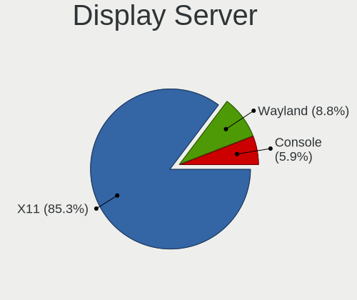
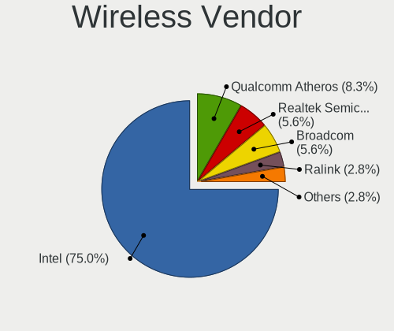
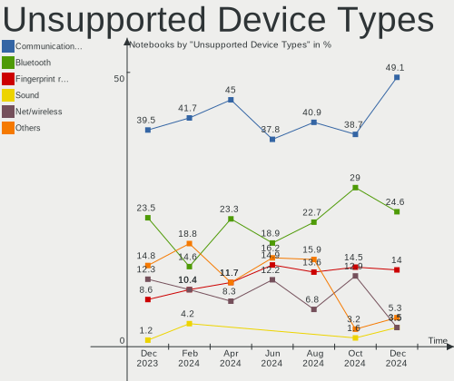

FreeBSD - Hardware Trends (Notebooks)
-------------------------------------

A project to identify most popular hardware characteristics and track their change
over time based on data collected by BSD users at https://BSD-Hardware.info.

Anyone can contribute to this report by the [hw-probe](https://github.com/linuxhw/hw-probe/blob/master/INSTALL.BSD.md) tool:

    hw-probe -all -upload

This report is for one last month. Overall report since the beginning of time: [TestCoverage](https://github.com/bsdhw/TestCoverage)

Period: Aug, 2022.

Contents
--------

* [ System ](#system)
  - [ OS                       ](#os)
  - [ OS Family                ](#os-family)
  - [ Arch                     ](#arch)
  - [ DE                       ](#de)
  - [ Display Server           ](#display-server)
  - [ Display Manager          ](#display-manager)
  - [ OS Lang                  ](#os-lang)
  - [ Boot Mode                ](#boot-mode)
  - [ Filesystem               ](#filesystem)
  - [ Part. scheme             ](#part-scheme)

* [ Board ](#board)
  - [ Vendor                   ](#vendor)
  - [ Model                    ](#model)
  - [ Model Family             ](#model-family)
  - [ MFG Year                 ](#mfg-year)
  - [ Form Factor              ](#form-factor)
  - [ Coreboot                 ](#coreboot)
  - [ RAM Size                 ](#ram-size)
  - [ RAM Used                 ](#ram-used)
  - [ Total Drives             ](#total-drives)
  - [ Has CD-ROM               ](#has-cd-rom)
  - [ Has Ethernet             ](#has-ethernet)
  - [ Has WiFi                 ](#has-wifi)
  - [ Has Bluetooth            ](#has-bluetooth)

* [ Location ](#location)
  - [ Country                  ](#country)
  - [ City                     ](#city)

* [ Drives ](#drives)
  - [ Drive Vendor             ](#drive-vendor)
  - [ Drive Model              ](#drive-model)
  - [ HDD Vendor               ](#hdd-vendor)
  - [ SSD Vendor               ](#ssd-vendor)
  - [ Drive Kind               ](#drive-kind)
  - [ Drive Connector          ](#drive-connector)
  - [ Drive Size               ](#drive-size)
  - [ Space Total              ](#space-total)
  - [ Space Used               ](#space-used)
  - [ Malfunc. Drives          ](#malfunc-drives)
  - [ Malfunc. Drive Vendor    ](#malfunc-drive-vendor)
  - [ Malfunc. HDD Vendor      ](#malfunc-hdd-vendor)
  - [ Malfunc. Drive Kind      ](#malfunc-drive-kind)
  - [ Failed Drives            ](#failed-drives)
  - [ Failed Drive Vendor      ](#failed-drive-vendor)
  - [ Drive Status             ](#drive-status)

* [ Storage controller ](#storage-controller)
  - [ Storage Vendor           ](#storage-vendor)
  - [ Storage Model            ](#storage-model)
  - [ Storage Kind             ](#storage-kind)

* [ Processor ](#processor)
  - [ CPU Vendor               ](#cpu-vendor)
  - [ CPU Model                ](#cpu-model)
  - [ CPU Model Family         ](#cpu-model-family)
  - [ CPU Cores                ](#cpu-cores)
  - [ CPU Sockets              ](#cpu-sockets)
  - [ CPU Threads              ](#cpu-threads)
  - [ CPU Microarch            ](#cpu-microarch)

* [ Graphics ](#graphics)
  - [ GPU Vendor               ](#gpu-vendor)
  - [ GPU Model                ](#gpu-model)
  - [ GPU Combo                ](#gpu-combo)
  - [ GPU Driver               ](#gpu-driver)
  - [ GPU Memory               ](#gpu-memory)

* [ Monitor ](#monitor)
  - [ Monitor Vendor           ](#monitor-vendor)
  - [ Monitor Model            ](#monitor-model)
  - [ Monitor Resolution       ](#monitor-resolution)
  - [ Monitor Diagonal         ](#monitor-diagonal)
  - [ Monitor Width            ](#monitor-width)
  - [ Aspect Ratio             ](#aspect-ratio)
  - [ Monitor Area             ](#monitor-area)
  - [ Pixel Density            ](#pixel-density)
  - [ Multiple Monitors        ](#multiple-monitors)

* [ Network ](#network)
  - [ Net Controller Vendor    ](#net-controller-vendor)
  - [ Net Controller Model     ](#net-controller-model)
  - [ Wireless Vendor          ](#wireless-vendor)
  - [ Wireless Model           ](#wireless-model)
  - [ Ethernet Vendor          ](#ethernet-vendor)
  - [ Ethernet Model           ](#ethernet-model)
  - [ Net Controller Kind      ](#net-controller-kind)
  - [ Used Controller          ](#used-controller)
  - [ NICs                     ](#nics)
  - [ IPv6                     ](#ipv6)

* [ Bluetooth ](#bluetooth)
  - [ Bluetooth Vendor         ](#bluetooth-vendor)
  - [ Bluetooth Model          ](#bluetooth-model)

* [ Sound ](#sound)
  - [ Sound Vendor             ](#sound-vendor)
  - [ Sound Model              ](#sound-model)

* [ Memory ](#memory)
  - [ Memory Vendor            ](#memory-vendor)
  - [ Memory Model             ](#memory-model)
  - [ Memory Kind              ](#memory-kind)
  - [ Memory Form Factor       ](#memory-form-factor)
  - [ Memory Size              ](#memory-size)
  - [ Memory Speed             ](#memory-speed)

* [ Printers & scanners ](#printers--scanners)
  - [ Printer Vendor           ](#printer-vendor)
  - [ Printer Model            ](#printer-model)
  - [ Scanner Vendor           ](#scanner-vendor)
  - [ Scanner Model            ](#scanner-model)

* [ Camera ](#camera)
  - [ Camera Vendor            ](#camera-vendor)
  - [ Camera Model             ](#camera-model)

* [ Security ](#security)
  - [ Fingerprint Vendor       ](#fingerprint-vendor)
  - [ Fingerprint Model        ](#fingerprint-model)
  - [ Chipcard Vendor          ](#chipcard-vendor)
  - [ Chipcard Model           ](#chipcard-model)

* [ Unsupported ](#unsupported)
  - [ Unsupported Devices      ](#unsupported-devices)
  - [ Unsupported Device Types ](#unsupported-device-types)

System
------

OS
--

Installed operating systems

| Name                | Notebooks | Percent |
|---------------------|-----------|---------|
| FreeBSD 13.1        | 9         | 42.86%  |
| FreeBSD 13.1-p1     | 8         | 38.1%   |
| FreeBSD 13.1-STABLE | 1         | 4.76%   |
| FreeBSD 13.0        | 1         | 4.76%   |
| FreeBSD 12.3-p6     | 1         | 4.76%   |
| FreeBSD 12.3        | 1         | 4.76%   |

OS Family
---------

OS without a version

| Name    | Notebooks | Percent |
|---------|-----------|---------|
| FreeBSD | 21        | 100%    |

Arch
----

OS architecture (x86_64, i586, etc.)

| Name  | Notebooks | Percent |
|-------|-----------|---------|
| amd64 | 19        | 90.48%  |
| i386  | 2         | 9.52%   |

DE
--

Desktop Environment

| Name          | Notebooks | Percent |
|---------------|-----------|---------|
| KDE5          | 5         | 23.81%  |
| XFCE          | 4         | 19.05%  |
| GNOME         | 3         | 14.29%  |
| Openbox       | 2         | 9.52%   |
| MATE          | 2         | 9.52%   |
| Console       | 2         | 9.52%   |
| Enlightenment | 1         | 4.76%   |
| dwm           | 1         | 4.76%   |
| Cinnamon      | 1         | 4.76%   |

Display Server
--------------

X11 or Wayland

| Name    | Notebooks | Percent |
|---------|-----------|---------|
| X11     | 19        | 90.48%  |
| Wayland | 1         | 4.76%   |
| Console | 1         | 4.76%   |

Display Manager
---------------

SDDM, LightDM, etc.

| Name    | Notebooks | Percent |
|---------|-----------|---------|
| SDDM    | 7         | 33.33%  |
| Console | 7         | 33.33%  |
| SLiM    | 4         | 19.05%  |
| XDM     | 2         | 9.52%   |
| GDM     | 1         | 4.76%   |

OS Lang
-------

Language

| Lang    | Notebooks | Percent |
|---------|-----------|---------|
| C       | 13        | 61.9%   |
| en_US   | 4         | 19.05%  |
| es_ES   | 1         | 4.76%   |
| es_AR   | 1         | 4.76%   |
| cs_CZ   | 1         | 4.76%   |
| Unknown | 1         | 4.76%   |

Boot Mode
---------

EFI or BIOS

| Mode | Notebooks | Percent |
|------|-----------|---------|
| EFI  | 15        | 71.43%  |
| BIOS | 6         | 28.57%  |

Filesystem
----------

Type of filesystem

| Type | Notebooks | Percent |
|------|-----------|---------|
| Zfs  | 13        | 61.9%   |
| Ufs  | 8         | 38.1%   |

Part. scheme
------------

Scheme of partitioning

| Type | Notebooks | Percent |
|------|-----------|---------|
| GPT  | 18        | 85.71%  |
| MBR  | 3         | 14.29%  |

Board
-----

Vendor
------

Motherboard manufacturer

| Name             | Notebooks | Percent |
|------------------|-----------|---------|
| Lenovo           | 8         | 38.1%   |
| Hewlett-Packard  | 3         | 14.29%  |
| Dell             | 3         | 14.29%  |
| ASUSTek Computer | 2         | 9.52%   |
| Toshiba          | 1         | 4.76%   |
| Sony             | 1         | 4.76%   |
| MSI              | 1         | 4.76%   |
| Google           | 1         | 4.76%   |
| Acer             | 1         | 4.76%   |

Model
-----

Motherboard model

| Name                                     | Notebooks | Percent |
|------------------------------------------|-----------|---------|
| Toshiba Satellite A300                   | 1         | 4.76%   |
| Sony VGN-UX1XRN                          | 1         | 4.76%   |
| MSI GF63 Thin 9SC                        | 1         | 4.76%   |
| Lenovo Yoga Slim 7 Pro 14ACH5 82MS       | 1         | 4.76%   |
| Lenovo ThinkPad X1 Carbon 7th 20QES42E0L | 1         | 4.76%   |
| Lenovo ThinkPad T480 20L6S29E0T          | 1         | 4.76%   |
| Lenovo ThinkPad R60e 0658W2M             | 1         | 4.76%   |
| Lenovo IdeaPad Gaming 3 15ARH05 82EY     | 1         | 4.76%   |
| Lenovo IdeaPad Gaming 3 15ACH6 82K2      | 1         | 4.76%   |
| Lenovo IdeaPad 530S-14ARR 81H1           | 1         | 4.76%   |
| Lenovo IdeaPad 5 14ITL05 82FE            | 1         | 4.76%   |
| HP Pavilion g6                           | 1         | 4.76%   |
| HP ENVY Notebook                         | 1         | 4.76%   |
| HP EliteBook 850 G7 Notebook PC          | 1         | 4.76%   |
| Google Peppy                             | 1         | 4.76%   |
| Dell Precision 7550                      | 1         | 4.76%   |
| Dell Latitude 7390                       | 1         | 4.76%   |
| Dell Inspiron 3581                       | 1         | 4.76%   |
| ASUS ZenBook 14 UX410UFR                 | 1         | 4.76%   |
| ASUS VivoBook_ASUSLaptop X570ZD_F570ZD   | 1         | 4.76%   |
| Acer Aspire 4552G                        | 1         | 4.76%   |

Model Family
------------

Motherboard model prefix

| Name              | Notebooks | Percent |
|-------------------|-----------|---------|
| Lenovo IdeaPad    | 4         | 19.05%  |
| Lenovo ThinkPad   | 3         | 14.29%  |
| Toshiba Satellite | 1         | 4.76%   |
| Sony VGN-UX1XRN   | 1         | 4.76%   |
| MSI GF63          | 1         | 4.76%   |
| Lenovo Yoga       | 1         | 4.76%   |
| HP Pavilion       | 1         | 4.76%   |
| HP ENVY           | 1         | 4.76%   |
| HP EliteBook      | 1         | 4.76%   |
| Google Peppy      | 1         | 4.76%   |
| Dell Precision    | 1         | 4.76%   |
| Dell Latitude     | 1         | 4.76%   |
| Dell Inspiron     | 1         | 4.76%   |
| ASUS ZenBook      | 1         | 4.76%   |
| ASUS VivoBook     | 1         | 4.76%   |
| Acer Aspire       | 1         | 4.76%   |

MFG Year
--------

Motherboard manufacture year

| Year | Notebooks | Percent |
|------|-----------|---------|
| 2021 | 5         | 23.81%  |
| 2020 | 4         | 19.05%  |
| 2018 | 3         | 14.29%  |
| 2022 | 2         | 9.52%   |
| 2019 | 1         | 4.76%   |
| 2016 | 1         | 4.76%   |
| 2012 | 1         | 4.76%   |
| 2011 | 1         | 4.76%   |
| 2008 | 1         | 4.76%   |
| 2007 | 1         | 4.76%   |
| 2006 | 1         | 4.76%   |

Form Factor
-----------

Physical design of the computer

| Name     | Notebooks | Percent |
|----------|-----------|---------|
| Notebook | 21        | 100%    |

Coreboot
--------

Have coreboot on board

| Used | Notebooks | Percent |
|------|-----------|---------|
| No   | 20        | 95.24%  |
| Yes  | 1         | 4.76%   |

RAM Size
--------

Total RAM memory

| Size in GB | Notebooks | Percent |
|------------|-----------|---------|
| 16.01-24.0 | 12        | 57.14%  |
| 4.01-8.0   | 2         | 9.52%   |
| 8.01-16.0  | 2         | 9.52%   |
| 0.51-1.0   | 2         | 9.52%   |
| 32.01-64.0 | 1         | 4.76%   |
| 24.01-32.0 | 1         | 4.76%   |
| 2.01-3.0   | 1         | 4.76%   |

RAM Used
--------

Used RAM memory

| Used GB  | Notebooks | Percent |
|----------|-----------|---------|
| 0.51-1.0 | 10        | 47.62%  |
| 0.01-0.5 | 6         | 28.57%  |
| 1.01-2.0 | 3         | 14.29%  |
| 4.01-8.0 | 1         | 4.76%   |
| 2.01-3.0 | 1         | 4.76%   |

Total Drives
------------

Number of drives on board

| Drives | Notebooks | Percent |
|--------|-----------|---------|
| 1      | 13        | 61.9%   |
| 2      | 7         | 33.33%  |
| 0      | 1         | 4.76%   |

Has CD-ROM
----------

Has CD-ROM on board

| Presented | Notebooks | Percent |
|-----------|-----------|---------|
| No        | 17        | 80.95%  |
| Yes       | 4         | 19.05%  |

Has Ethernet
------------

Has Ethernet on board

| Presented | Notebooks | Percent |
|-----------|-----------|---------|
| Yes       | 15        | 71.43%  |
| No        | 6         | 28.57%  |

Has WiFi
--------

Has WiFi module

| Presented | Notebooks | Percent |
|-----------|-----------|---------|
| Yes       | 20        | 95.24%  |
| No        | 1         | 4.76%   |

Has Bluetooth
-------------

Has Bluetooth module

| Presented | Notebooks | Percent |
|-----------|-----------|---------|
| Yes       | 15        | 71.43%  |
| No        | 6         | 28.57%  |

Location
--------

Country
-------

Geographic location (country)

| Country     | Notebooks | Percent |
|-------------|-----------|---------|
| Russia      | 5         | 23.81%  |
| USA         | 2         | 9.52%   |
| Spain       | 2         | 9.52%   |
| Israel      | 2         | 9.52%   |
| India       | 2         | 9.52%   |
| Thailand    | 1         | 4.76%   |
| Romania     | 1         | 4.76%   |
| Philippines | 1         | 4.76%   |
| Greece      | 1         | 4.76%   |
| Czechia     | 1         | 4.76%   |
| China       | 1         | 4.76%   |
| Austria     | 1         | 4.76%   |
| Argentina   | 1         | 4.76%   |

City
----

Geographic location (city)

| City          | Notebooks | Percent |
|---------------|-----------|---------|
| Tel Aviv      | 2         | 9.52%   |
| St Petersburg | 2         | 9.52%   |
| Barcelona     | 2         | 9.52%   |
| Vienna        | 1         | 4.76%   |
| Tyumen        | 1         | 4.76%   |
| Trivandrum    | 1         | 4.76%   |
| Resistencia   | 1         | 4.76%   |
| Oswego        | 1         | 4.76%   |
| Ostrava       | 1         | 4.76%   |
| Moscow        | 1         | 4.76%   |
| Legazpi       | 1         | 4.76%   |
| Kolkata       | 1         | 4.76%   |
| Chiang Mai    | 1         | 4.76%   |
| Bucharest     | 1         | 4.76%   |
| Beijing       | 1         | 4.76%   |
| Athens        | 1         | 4.76%   |
| Ashburn       | 1         | 4.76%   |
| Arkhangelsk   | 1         | 4.76%   |

Drives
------

Drive Vendor
------------

Hard drive vendors

| Vendor              | Notebooks | Drives | Percent |
|---------------------|-----------|--------|---------|
| Samsung Electronics | 6         | 6      | 22.22%  |
| WDC                 | 3         | 3      | 11.11%  |
| Crucial             | 3         | 3      | 11.11%  |
| SK hynix            | 2         | 2      | 7.41%   |
| Seagate             | 2         | 2      | 7.41%   |
| Kingston            | 2         | 2      | 7.41%   |
| Intel               | 2         | 2      | 7.41%   |
| Transcend           | 1         | 1      | 3.7%    |
| Toshiba             | 1         | 1      | 3.7%    |
| Silicon Motion      | 1         | 1      | 3.7%    |
| SanDisk             | 1         | 1      | 3.7%    |
| Micron Technology   | 1         | 1      | 3.7%    |
| Hitachi             | 1         | 1      | 3.7%    |
| EAGET               | 1         | 1      | 3.7%    |

Drive Model
-----------

Hard drive models

| Model                                   | Notebooks | Percent |
|-----------------------------------------|-----------|---------|
| WDC WDS500G3X0C-00SJG0 500GB            | 1         | 3.7%    |
| WDC WD20SPZX-00UA7T0 2TB                | 1         | 3.7%    |
| WDC WD10SPZX-17Z10T1 1TB                | 1         | 3.7%    |
| Transcend TS128GMTS430S 128GB           | 1         | 3.7%    |
| Toshiba MQ04ABF100 1TB                  | 1         | 3.7%    |
| SK hynix SKHynix_HFS001TDE9X084N 1TB    | 1         | 3.7%    |
| SK hynix BC511 HFM512GDJTNI-82A0A 512GB | 1         | 3.7%    |
| Silicon Motion 512GB MEGA S3 512GB      | 1         | 3.7%    |
| Seagate ST1000LM035-1RK172 1TB          | 1         | 3.7%    |
| Seagate ST1000LM024 HN-M101MBB 1TB      | 1         | 3.7%    |
| SanDisk SSD PLUS 120GB                  | 1         | 3.7%    |
| Samsung SSD 970 EVO Plus 1TB            | 1         | 3.7%    |
| Samsung MZVLW512HMJP-000L7 512GB        | 1         | 3.7%    |
| Samsung MZVLB512HBJQ-000L7 512GB        | 1         | 3.7%    |
| Samsung MZALQ512HBLU-00BL2 512GB        | 1         | 3.7%    |
| Samsung MZALQ256HBJD-00BL2 256GB        | 1         | 3.7%    |
| Samsung MZALQ256HAJD-000L2 256GB        | 1         | 3.7%    |
| Micron 2300 NVMe 512GB                  | 1         | 3.7%    |
| Kingston SUV400S37480G 480GB            | 1         | 3.7%    |
| Kingston SNVSE500G 500GB                | 1         | 3.7%    |
| Intel SSDSA2CW120G3 120GB               | 1         | 3.7%    |
| Intel SSDMCEAC060B3 64GB                | 1         | 3.7%    |
| Hitachi HTS543232L9SA00 320GB           | 1         | 3.7%    |
| EAGET S900L SSD 128GB                   | 1         | 3.7%    |
| Crucial CT500P2SSD8 500GB               | 1         | 3.7%    |
| Crucial CT500MX500SSD1 500GB            | 1         | 3.7%    |
| Crucial CT120BX500SSD1 120GB            | 1         | 3.7%    |

HDD Vendor
----------

Hard disk drive vendors

| Vendor  | Notebooks | Drives | Percent |
|---------|-----------|--------|---------|
| WDC     | 2         | 2      | 33.33%  |
| Seagate | 2         | 2      | 33.33%  |
| Toshiba | 1         | 1      | 16.67%  |
| Hitachi | 1         | 1      | 16.67%  |

SSD Vendor
----------

Solid state drive vendors

| Vendor    | Notebooks | Drives | Percent |
|-----------|-----------|--------|---------|
| Intel     | 2         | 2      | 28.57%  |
| Crucial   | 2         | 2      | 28.57%  |
| Transcend | 1         | 1      | 14.29%  |
| SanDisk   | 1         | 1      | 14.29%  |
| Kingston  | 1         | 1      | 14.29%  |

Drive Kind
----------

HDD or SSD

| Kind | Notebooks | Drives | Percent |
|------|-----------|--------|---------|
| NVMe | 13        | 14     | 52%     |
| SSD  | 6         | 7      | 24%     |
| HDD  | 6         | 6      | 24%     |

Drive Connector
---------------

SATA, SAS, NVMe, etc.

| Type | Notebooks | Drives | Percent |
|------|-----------|--------|---------|
| NVMe | 13        | 14     | 52%     |
| SATA | 12        | 13     | 48%     |

Drive Size
----------

Size of hard drive

| Size in TB | Notebooks | Drives | Percent |
|------------|-----------|--------|---------|
| 0.01-0.5   | 7         | 8      | 58.33%  |
| 0.51-1.0   | 4         | 4      | 33.33%  |
| 1.01-2.0   | 1         | 1      | 8.33%   |

Space Total
-----------

Amount of disk space available on the file system

| Size in GB | Notebooks | Percent |
|------------|-----------|---------|
| 251-500    | 8         | 38.1%   |
| 101-250    | 6         | 28.57%  |
| 501-1000   | 3         | 14.29%  |
| 21-50      | 1         | 4.76%   |
| 1001-2000  | 1         | 4.76%   |
| 1-20       | 1         | 4.76%   |
| 51-100     | 1         | 4.76%   |

Space Used
----------

Amount of used disk space

| Used GB  | Notebooks | Percent |
|----------|-----------|---------|
| 1-20     | 15        | 71.43%  |
| 21-50    | 3         | 14.29%  |
| 101-250  | 1         | 4.76%   |
| 501-1000 | 1         | 4.76%   |
| 51-100   | 1         | 4.76%   |

Malfunc. Drives
---------------

Drive models with a malfunction

| Model                              | Notebooks | Drives | Percent |
|------------------------------------|-----------|--------|---------|
| Seagate ST1000LM024 HN-M101MBB 1TB | 1         | 1      | 33.33%  |
| Kingston SUV400S37480G 480GB       | 1         | 1      | 33.33%  |
| Hitachi HTS543232L9SA00 320GB      | 1         | 1      | 33.33%  |

Malfunc. Drive Vendor
---------------------

Vendors of faulty drives

| Vendor   | Notebooks | Drives | Percent |
|----------|-----------|--------|---------|
| Seagate  | 1         | 1      | 33.33%  |
| Kingston | 1         | 1      | 33.33%  |
| Hitachi  | 1         | 1      | 33.33%  |

Malfunc. HDD Vendor
-------------------

Vendors of faulty HDD drives

| Vendor  | Notebooks | Drives | Percent |
|---------|-----------|--------|---------|
| Seagate | 1         | 1      | 50%     |
| Hitachi | 1         | 1      | 50%     |

Malfunc. Drive Kind
-------------------

Kinds of faulty drives

| Kind | Notebooks | Drives | Percent |
|------|-----------|--------|---------|
| HDD  | 2         | 2      | 66.67%  |
| SSD  | 1         | 1      | 33.33%  |

Failed Drives
-------------

Failed drive models

Zero info for selected period =(

Failed Drive Vendor
-------------------

Failed drive vendors

Zero info for selected period =(

Drive Status
------------

Number of failed and malfunc. drives

| Status  | Notebooks | Drives | Percent |
|---------|-----------|--------|---------|
| Works   | 18        | 24     | 85.71%  |
| Malfunc | 3         | 3      | 14.29%  |

Storage controller
------------------

Storage Vendor
--------------

Storage controller vendors

| Vendor                      | Notebooks | Percent |
|-----------------------------|-----------|---------|
| Intel                       | 9         | 33.33%  |
| Samsung Electronics         | 6         | 22.22%  |
| AMD                         | 4         | 14.81%  |
| SK hynix                    | 2         | 7.41%   |
| Silicon Motion              | 2         | 7.41%   |
| SanDisk                     | 1         | 3.7%    |
| Micron/Crucial Technology   | 1         | 3.7%    |
| Micron Technology           | 1         | 3.7%    |
| Kingston Technology Company | 1         | 3.7%    |

Storage Model
-------------

Storage controller models

| Model                                                                 | Notebooks | Percent |
|-----------------------------------------------------------------------|-----------|---------|
| Samsung NVMe SSD Controller 980                                       | 3         | 11.11%  |
| AMD FCH SATA Controller [AHCI mode]                                   | 3         | 11.11%  |
| Silicon Motion SM2263EN/SM2263XT SSD Controller                       | 2         | 7.41%   |
| Samsung NVMe SSD Controller SM981/PM981/PM983                         | 2         | 7.41%   |
| Intel Sunrise Point-LP SATA Controller [AHCI mode]                    | 2         | 7.41%   |
| SK hynix Gold P31 SSD                                                 | 1         | 3.7%    |
| SK hynix BC511                                                        | 1         | 3.7%    |
| SanDisk WD Black SN750 / PC SN730 NVMe SSD                            | 1         | 3.7%    |
| Samsung NVMe SSD Controller SM961/PM961/SM963                         | 1         | 3.7%    |
| Micron/Crucial P2 NVMe PCIe SSD                                       | 1         | 3.7%    |
| Kingston Company SNVS2000G [NV1 NVMe PCIe SSD 2TB]                    | 1         | 3.7%    |
| Intel Cannon Lake Mobile PCH SATA AHCI Controller                     | 1         | 3.7%    |
| Intel 82801IBM/IEM (ICH9M/ICH9M-E) 4 port SATA Controller [AHCI mode] | 1         | 3.7%    |
| Intel 82801GBM/GHM (ICH7-M Family) SATA Controller [IDE mode]         | 1         | 3.7%    |
| Intel 82801G (ICH7 Family) IDE Controller                             | 1         | 3.7%    |
| Intel 82801 Mobile SATA Controller [RAID mode]                        | 1         | 3.7%    |
| Intel 8 Series SATA Controller 1 [AHCI mode]                          | 1         | 3.7%    |
| Intel 7 Series Chipset Family 6-port SATA Controller [AHCI mode]      | 1         | 3.7%    |
| AMD SB7x0/SB8x0/SB9x0 SATA Controller [AHCI mode]                     | 1         | 3.7%    |
| Unknown                                                               | 1         | 3.7%    |

Storage Kind
------------

Kind of storage controller (IDE, SATA, NVMe, SAS, ...)

| Kind | Notebooks | Percent |
|------|-----------|---------|
| NVMe | 13        | 50%     |
| SATA | 10        | 38.46%  |
| IDE  | 2         | 7.69%   |
| RAID | 1         | 3.85%   |

Processor
---------

CPU Vendor
----------

Processor vendors

| Vendor | Notebooks | Percent |
|--------|-----------|---------|
| Intel  | 15        | 71.43%  |
| AMD    | 6         | 28.57%  |

CPU Model
---------

Processor models

| Model                                         | Notebooks | Percent |
|-----------------------------------------------|-----------|---------|
| Intel Core i5-8350U CPU @ 1.70GHz             | 2         | 9.52%   |
| AMD Ryzen 5 2500U with Radeon Vega Mobile Gfx | 2         | 9.52%   |
| Intel Core Solo CPU U1500 @ 1.33GHz           | 1         | 4.76%   |
| Intel Core i9-10885H CPU @ 2.40GHz            | 1         | 4.76%   |
| Intel Core i7-9750H CPU @ 2.60GHz             | 1         | 4.76%   |
| Intel Core i7-8665U CPU @ 1.90GHz             | 1         | 4.76%   |
| Intel Core i7-8550U CPU @ 1.80GHz             | 1         | 4.76%   |
| Intel Core i7-6500U CPU @ 2.50GHz             | 1         | 4.76%   |
| Intel Core i5-3230M CPU @ 2.60GHz             | 1         | 4.76%   |
| Intel Core i5-10310U CPU @ 1.70GHz            | 1         | 4.76%   |
| Intel Core i3-7020U CPU @ 2.30GHz             | 1         | 4.76%   |
| Intel Core 2 Duo CPU T5800 @ 2.00GHz          | 1         | 4.76%   |
| Intel Celeron M CPU                           | 1         | 4.76%   |
| Intel Celeron 2955U @ 1.40GHz                 | 1         | 4.76%   |
| Intel 11th Gen Core i7-1165G7 @ 2.80GHz       | 1         | 4.76%   |
| AMD Ryzen 7 5800H with Radeon Graphics        | 1         | 4.76%   |
| AMD Ryzen 5 5600H with Radeon Graphics        | 1         | 4.76%   |
| AMD Ryzen 5 4600H with Radeon Graphics        | 1         | 4.76%   |
| AMD New Processor Technology                  | 1         | 4.76%   |

CPU Model Family
----------------

Processor model prefix

| Model            | Notebooks | Percent |
|------------------|-----------|---------|
| Intel Core i7    | 4         | 19.05%  |
| Intel Core i5    | 4         | 19.05%  |
| AMD Ryzen 5      | 4         | 19.05%  |
| Other            | 2         | 9.52%   |
| Intel Core Solo  | 1         | 4.76%   |
| Intel Core i9    | 1         | 4.76%   |
| Intel Core i3    | 1         | 4.76%   |
| Intel Core 2 Duo | 1         | 4.76%   |
| Intel Celeron M  | 1         | 4.76%   |
| Intel Celeron    | 1         | 4.76%   |
| AMD Ryzen 7      | 1         | 4.76%   |

CPU Cores
---------

Number of processor cores

| Number  | Notebooks | Percent |
|---------|-----------|---------|
| 4       | 6         | 28.57%  |
| 2       | 5         | 23.81%  |
| 8       | 3         | 14.29%  |
| 12      | 2         | 9.52%   |
| 1       | 2         | 9.52%   |
| 16      | 1         | 4.76%   |
| 6       | 1         | 4.76%   |
| Unknown | 1         | 4.76%   |

CPU Sockets
-----------

Number of sockets

| Number | Notebooks | Percent |
|--------|-----------|---------|
| 1      | 21        | 100%    |

CPU Threads
-----------

Threads per core (Hyper-Threading)

| Number  | Notebooks | Percent |
|---------|-----------|---------|
| 2       | 11        | 52.38%  |
| 1       | 7         | 33.33%  |
| Unknown | 3         | 14.29%  |

CPU Microarch
-------------

Microarchitecture

| Name      | Notebooks | Percent |
|-----------|-----------|---------|
| KabyLake  | 7         | 33.33%  |
| Zen 3     | 2         | 9.52%   |
| Zen       | 2         | 9.52%   |
| P6        | 2         | 9.52%   |
| Zen 2     | 1         | 4.76%   |
| TigerLake | 1         | 4.76%   |
| Skylake   | 1         | 4.76%   |
| K10       | 1         | 4.76%   |
| IvyBridge | 1         | 4.76%   |
| Haswell   | 1         | 4.76%   |
| Core      | 1         | 4.76%   |
| CometLake | 1         | 4.76%   |

Graphics
--------

GPU Vendor
----------

Vendors of graphics cards

| Vendor | Notebooks | Percent |
|--------|-----------|---------|
| Intel  | 14        | 48.28%  |
| AMD    | 8         | 27.59%  |
| Nvidia | 7         | 24.14%  |

GPU Model
---------

Graphics card models

| Model                                                                         | Notebooks | Percent |
|-------------------------------------------------------------------------------|-----------|---------|
| Intel UHD Graphics 620                                                        | 3         | 9.68%   |
| Intel Mobile 945GM/GMS/GME, 943/940GML Express Integrated Graphics Controller | 2         | 6.45%   |
| Intel Mobile 945GM/GMS, 943/940GML Express Integrated Graphics Controller     | 2         | 6.45%   |
| AMD Raven Ridge [Radeon Vega Series / Radeon Vega Mobile Series]              | 2         | 6.45%   |
| AMD Cezanne                                                                   | 2         | 6.45%   |
| Nvidia TU117M [GeForce GTX 1650 Ti Mobile]                                    | 1         | 3.23%   |
| Nvidia TU117M [GeForce GTX 1650 Mobile / Max-Q]                               | 1         | 3.23%   |
| Nvidia TU106GLM [Quadro RTX 3000 Mobile / Max-Q]                              | 1         | 3.23%   |
| Nvidia GP107M [GeForce GTX 1050 Mobile]                                       | 1         | 3.23%   |
| Nvidia GM108M [GeForce MX130]                                                 | 1         | 3.23%   |
| Nvidia GM108M [GeForce 940M]                                                  | 1         | 3.23%   |
| Nvidia GA107M [GeForce RTX 3050 Mobile]                                       | 1         | 3.23%   |
| Intel WhiskeyLake-U GT2 [UHD Graphics 620]                                    | 1         | 3.23%   |
| Intel TigerLake-LP GT2 [Iris Xe Graphics]                                     | 1         | 3.23%   |
| Intel Skylake GT2 [HD Graphics 520]                                           | 1         | 3.23%   |
| Intel Kaby Lake-U GT2f HD 620 Graphics Controller                             | 1         | 3.23%   |
| Intel Haswell-ULT Integrated Graphics Controller                              | 1         | 3.23%   |
| Intel CometLake-U GT2 [UHD Graphics]                                          | 1         | 3.23%   |
| Intel CometLake-H GT2 [UHD Graphics]                                          | 1         | 3.23%   |
| Intel CoffeeLake-H GT2 [UHD Graphics 630]                                     | 1         | 3.23%   |
| Intel 3rd Gen Core processor Graphics Controller                              | 1         | 3.23%   |
| AMD Thames [Radeon HD 7500M/7600M Series]                                     | 1         | 3.23%   |
| AMD Seymour [Radeon HD 6400M/7400M Series]                                    | 1         | 3.23%   |
| AMD RV620/M82 [Mobility Radeon HD 3450/3470]                                  | 1         | 3.23%   |
| AMD Renoir                                                                    | 1         | 3.23%   |

GPU Combo
---------

Combinations of graphics cards

| Name           | Notebooks | Percent |
|----------------|-----------|---------|
| 1 x Intel      | 7         | 33.33%  |
| Intel + Nvidia | 4         | 19.05%  |
| 1 x AMD        | 4         | 19.05%  |
| AMD + Nvidia   | 3         | 14.29%  |
| 2 x Intel      | 2         | 9.52%   |
| Intel + AMD    | 1         | 4.76%   |

GPU Driver
----------

Free vs proprietary

| Driver      | Notebooks | Percent |
|-------------|-----------|---------|
| Free        | 18        | 85.71%  |
| Proprietary | 3         | 14.29%  |

GPU Memory
----------

Total video memory

| Size in GB | Notebooks | Percent |
|------------|-----------|---------|
| Unknown    | 17        | 80.95%  |
| 0.01-0.5   | 2         | 9.52%   |
| 3.01-4.0   | 1         | 4.76%   |
| 1.01-2.0   | 1         | 4.76%   |

Monitor
-------

Monitor Vendor
--------------

Monitor vendors

| Vendor              | Notebooks | Percent |
|---------------------|-----------|---------|
| LG Display          | 3         | 20%     |
| Chimei Innolux      | 3         | 20%     |
| BOE                 | 3         | 20%     |
| AU Optronics        | 3         | 20%     |
| Samsung Electronics | 1         | 6.67%   |
| LG Philips          | 1         | 6.67%   |
| Lenovo              | 1         | 6.67%   |

Monitor Model
-------------

Monitor models

| Model                                                               | Notebooks | Percent |
|---------------------------------------------------------------------|-----------|---------|
| Samsung Electronics LS24A40xU SAM71D1 1920x1080 530x300mm 24.0-inch | 1         | 6.67%   |
| LG Philips LCD Monitor LPL0120 1280x800 330x210mm 15.4-inch         | 1         | 6.67%   |
| LG Display LCD Monitor LGD064C 1920x1080 340x190mm 15.3-inch        | 1         | 6.67%   |
| LG Display LCD Monitor LGD05EE 2560x1440 310x170mm 13.9-inch        | 1         | 6.67%   |
| LG Display LCD Monitor LGD0599 1920x1080 310x170mm 13.9-inch        | 1         | 6.67%   |
| Lenovo LCD Monitor LEN4040 1024x768 300x230mm 14.9-inch             | 1         | 6.67%   |
| Chimei Innolux LCD Monitor CMN1738 1920x1080 380x210mm 17.1-inch    | 1         | 6.67%   |
| Chimei Innolux LCD Monitor CMN14D2 1920x1080 310x170mm 13.9-inch    | 1         | 6.67%   |
| Chimei Innolux LCD Monitor CMN140A 1920x1080 310x170mm 13.9-inch    | 1         | 6.67%   |
| BOE LCD Monitor BOE0931 2240x1400 300x190mm 14.0-inch               | 1         | 6.67%   |
| BOE LCD Monitor BOE0802 1920x1080 340x190mm 15.3-inch               | 1         | 6.67%   |
| BOE LCD Monitor BOE074F 1920x1080 310x170mm 13.9-inch               | 1         | 6.67%   |
| AU Optronics LCD Monitor AUOD0ED 1920x1080 340x190mm 15.3-inch      | 1         | 6.67%   |
| AU Optronics LCD Monitor AUO4A99 1920x1080 340x190mm 15.3-inch      | 1         | 6.67%   |
| AU Optronics LCD Monitor AUO462D 1920x1080 290x170mm 13.2-inch      | 1         | 6.67%   |

Monitor Resolution
------------------

Monitor screen resolution

| Resolution      | Notebooks | Percent |
|-----------------|-----------|---------|
| 1920x1080 (FHD) | 11        | 73.33%  |
| 2560x1440 (QHD) | 1         | 6.67%   |
| 2240x1400       | 1         | 6.67%   |
| 1280x800 (WXGA) | 1         | 6.67%   |
| 1024x768 (XGA)  | 1         | 6.67%   |

Monitor Diagonal
----------------

Diagonal size in inches

| Inches | Notebooks | Percent |
|--------|-----------|---------|
| 13     | 6         | 40%     |
| 15     | 5         | 33.33%  |
| 14     | 2         | 13.33%  |
| 24     | 1         | 6.67%   |
| 17     | 1         | 6.67%   |

Monitor Width
-------------

Physical width

| Width in mm | Notebooks | Percent |
|-------------|-----------|---------|
| 301-350     | 10        | 66.67%  |
| 201-300     | 3         | 20%     |
| 501-600     | 1         | 6.67%   |
| 351-400     | 1         | 6.67%   |

Aspect Ratio
------------

Proportional relationship between the width and the height

| Ratio | Notebooks | Percent |
|-------|-----------|---------|
| 16/9  | 12        | 80%     |
| 16/10 | 2         | 13.33%  |
| 4/3   | 1         | 6.67%   |

Monitor Area
------------

Area in inch²

| Area in inch² | Notebooks | Percent |
|----------------|-----------|---------|
| 81-90          | 6         | 40%     |
| 91-100         | 4         | 26.67%  |
| 101-110        | 2         | 13.33%  |
| 71-80          | 1         | 6.67%   |
| 201-250        | 1         | 6.67%   |
| 121-130        | 1         | 6.67%   |

Pixel Density
-------------

Pixels per inch

| Density | Notebooks | Percent |
|---------|-----------|---------|
| 121-160 | 9         | 60%     |
| 161-240 | 3         | 20%     |
| 51-100  | 3         | 20%     |

Multiple Monitors
-----------------

Total monitors connected

| Total | Notebooks | Percent |
|-------|-----------|---------|
| 1     | 16        | 76.19%  |
| 0     | 5         | 23.81%  |

Network
-------

Net Controller Vendor
---------------------

Controller vendors

| Vendor                   | Notebooks | Percent |
|--------------------------|-----------|---------|
| Intel                    | 13        | 37.14%  |
| Realtek Semiconductor    | 8         | 22.86%  |
| Qualcomm Atheros         | 6         | 17.14%  |
| Xiaomi                   | 2         | 5.71%   |
| Broadcom                 | 2         | 5.71%   |
| MediaTek                 | 1         | 2.86%   |
| Marvell Technology Group | 1         | 2.86%   |
| Google                   | 1         | 2.86%   |
| D-Link                   | 1         | 2.86%   |

Net Controller Model
--------------------

Controller models

| Model                                                                | Notebooks | Percent |
|----------------------------------------------------------------------|-----------|---------|
| Realtek RTL8111/8168/8411 PCI Express Gigabit Ethernet Controller    | 4         | 10.26%  |
| Realtek RTL810xE PCI Express Fast Ethernet controller                | 4         | 10.26%  |
| Intel Wireless 8265 / 8275                                           | 4         | 10.26%  |
| Qualcomm Atheros QCA9377 802.11ac Wireless Network Adapter           | 2         | 5.13%   |
| Intel Ethernet Connection (4) I219-LM                                | 2         | 5.13%   |
| Xiaomi Mi/Redmi series (RNDIS)                                       | 1         | 2.56%   |
| Xiaomi Mi/Redmi series (RNDIS + ADB)                                 | 1         | 2.56%   |
| Qualcomm Atheros QCA6174 802.11ac Wireless Network Adapter           | 1         | 2.56%   |
| Qualcomm Atheros AR9462 Wireless Network Adapter                     | 1         | 2.56%   |
| Qualcomm Atheros AR9287 Wireless Network Adapter (PCI-Express)       | 1         | 2.56%   |
| Qualcomm Atheros AR5212 802.11abg NIC                                | 1         | 2.56%   |
| MediaTek MT7921 802.11ax PCI Express Wireless Network Adapter        | 1         | 2.56%   |
| Marvell Group 88E8036 PCI-E Fast Ethernet Controller                 | 1         | 2.56%   |
| Intel Wireless 7265                                                  | 1         | 2.56%   |
| Intel Wireless 3165                                                  | 1         | 2.56%   |
| Intel WiFi Link 5100                                                 | 1         | 2.56%   |
| Intel Wi-Fi 6 AX201                                                  | 1         | 2.56%   |
| Intel PRO/Wireless 3945ABG [Golan] Network Connection                | 1         | 2.56%   |
| Intel Ethernet Connection (6) I219-LM                                | 1         | 2.56%   |
| Intel Ethernet Connection (11) I219-LM                               | 1         | 2.56%   |
| Intel Comet Lake PCH-LP CNVi WiFi                                    | 1         | 2.56%   |
| Intel Comet Lake PCH CNVi WiFi                                       | 1         | 2.56%   |
| Intel Cannon Point-LP CNVi [Wireless-AC]                             | 1         | 2.56%   |
| Intel Cannon Lake PCH CNVi WiFi                                      | 1         | 2.56%   |
| Google Nexus/Pixel Device (tether+ debug)                            | 1         | 2.56%   |
| D-Link DWA-131 Wireless N Nano Adapter (Rev. E1) [Realtek RTL8192EU] | 1         | 2.56%   |
| Broadcom NetXtreme BCM5751M Gigabit Ethernet PCI Express             | 1         | 2.56%   |
| Broadcom NetLink BCM57780 Gigabit Ethernet PCIe                      | 1         | 2.56%   |

Wireless Vendor
---------------

Wireless vendors

| Vendor           | Notebooks | Percent |
|------------------|-----------|---------|
| Intel            | 13        | 61.9%   |
| Qualcomm Atheros | 6         | 28.57%  |
| MediaTek         | 1         | 4.76%   |
| D-Link           | 1         | 4.76%   |

Wireless Model
--------------

Wireless models

| Model                                                                | Notebooks | Percent |
|----------------------------------------------------------------------|-----------|---------|
| Intel Wireless 8265 / 8275                                           | 4         | 19.05%  |
| Qualcomm Atheros QCA9377 802.11ac Wireless Network Adapter           | 2         | 9.52%   |
| Qualcomm Atheros QCA6174 802.11ac Wireless Network Adapter           | 1         | 4.76%   |
| Qualcomm Atheros AR9462 Wireless Network Adapter                     | 1         | 4.76%   |
| Qualcomm Atheros AR9287 Wireless Network Adapter (PCI-Express)       | 1         | 4.76%   |
| Qualcomm Atheros AR5212 802.11abg NIC                                | 1         | 4.76%   |
| MediaTek MT7921 802.11ax PCI Express Wireless Network Adapter        | 1         | 4.76%   |
| Intel Wireless 7265                                                  | 1         | 4.76%   |
| Intel Wireless 3165                                                  | 1         | 4.76%   |
| Intel WiFi Link 5100                                                 | 1         | 4.76%   |
| Intel Wi-Fi 6 AX201                                                  | 1         | 4.76%   |
| Intel PRO/Wireless 3945ABG [Golan] Network Connection                | 1         | 4.76%   |
| Intel Comet Lake PCH-LP CNVi WiFi                                    | 1         | 4.76%   |
| Intel Comet Lake PCH CNVi WiFi                                       | 1         | 4.76%   |
| Intel Cannon Point-LP CNVi [Wireless-AC]                             | 1         | 4.76%   |
| Intel Cannon Lake PCH CNVi WiFi                                      | 1         | 4.76%   |
| D-Link DWA-131 Wireless N Nano Adapter (Rev. E1) [Realtek RTL8192EU] | 1         | 4.76%   |

Ethernet Vendor
---------------

Ethernet vendors

| Vendor                   | Notebooks | Percent |
|--------------------------|-----------|---------|
| Realtek Semiconductor    | 8         | 44.44%  |
| Intel                    | 4         | 22.22%  |
| Xiaomi                   | 2         | 11.11%  |
| Broadcom                 | 2         | 11.11%  |
| Marvell Technology Group | 1         | 5.56%   |
| Google                   | 1         | 5.56%   |

Ethernet Model
--------------

Ethernet models

| Model                                                             | Notebooks | Percent |
|-------------------------------------------------------------------|-----------|---------|
| Realtek RTL8111/8168/8411 PCI Express Gigabit Ethernet Controller | 4         | 22.22%  |
| Realtek RTL810xE PCI Express Fast Ethernet controller             | 4         | 22.22%  |
| Intel Ethernet Connection (4) I219-LM                             | 2         | 11.11%  |
| Xiaomi Mi/Redmi series (RNDIS)                                    | 1         | 5.56%   |
| Xiaomi Mi/Redmi series (RNDIS + ADB)                              | 1         | 5.56%   |
| Marvell Group 88E8036 PCI-E Fast Ethernet Controller              | 1         | 5.56%   |
| Intel Ethernet Connection (6) I219-LM                             | 1         | 5.56%   |
| Intel Ethernet Connection (11) I219-LM                            | 1         | 5.56%   |
| Google Nexus/Pixel Device (tether+ debug)                         | 1         | 5.56%   |
| Broadcom NetXtreme BCM5751M Gigabit Ethernet PCI Express          | 1         | 5.56%   |
| Broadcom NetLink BCM57780 Gigabit Ethernet PCIe                   | 1         | 5.56%   |

Net Controller Kind
-------------------

Ethernet, WiFi or modem

| Kind     | Notebooks | Percent |
|----------|-----------|---------|
| WiFi     | 20        | 57.14%  |
| Ethernet | 15        | 42.86%  |

Used Controller
---------------

Currently used network controller

| Kind     | Notebooks | Percent |
|----------|-----------|---------|
| WiFi     | 12        | 75%     |
| Ethernet | 4         | 25%     |

NICs
----

Total network controllers on board

| Total | Notebooks | Percent |
|-------|-----------|---------|
| 2     | 14        | 66.67%  |
| 1     | 7         | 33.33%  |

IPv6
----

IPv6 vs IPv4

| Used | Notebooks | Percent |
|------|-----------|---------|
| No   | 18        | 85.71%  |
| Yes  | 3         | 14.29%  |

Bluetooth
---------

Bluetooth Vendor
----------------

Controller vendors

| Vendor                          | Notebooks | Percent |
|---------------------------------|-----------|---------|
| Intel                           | 10        | 66.67%  |
| Qualcomm Atheros Communications | 2         | 13.33%  |
| Foxconn / Hon Hai               | 2         | 13.33%  |
| Alps Electric                   | 1         | 6.67%   |

Bluetooth Model
---------------

Controller models

| Model                                           | Notebooks | Percent |
|-------------------------------------------------|-----------|---------|
| Intel Bluetooth wireless interface              | 5         | 33.33%  |
| Intel AX201 Bluetooth                           | 3         | 20%     |
| Intel Bluetooth 9460/9560 Jefferson Peak (JfP)  | 2         | 13.33%  |
| Qualcomm Atheros  QCA9377 Bluetooth 4.1         | 1         | 6.67%   |
| Qualcomm Atheros QCA61x4 Bluetooth 4.0          | 1         | 6.67%   |
| Foxconn / Hon Hai Wireless_Device               | 1         | 6.67%   |
| Foxconn / Hon Hai Bluetooth USB Module          | 1         | 6.67%   |
| Alps Electric Bluetooth Controller (ALPS/UGPZ6) | 1         | 6.67%   |

Sound
-----

Sound Vendor
------------

Sound card vendors

| Vendor      | Notebooks | Percent |
|-------------|-----------|---------|
| Intel       | 15        | 57.69%  |
| AMD         | 7         | 26.92%  |
| Nvidia      | 2         | 7.69%   |
| Plantronics | 1         | 3.85%   |
| Lenovo      | 1         | 3.85%   |

Sound Model
-----------

Sound card models

| Model                                                                             | Notebooks | Percent |
|-----------------------------------------------------------------------------------|-----------|---------|
| Intel Sunrise Point-LP HD Audio                                                   | 5         | 15.63%  |
| AMD Family 17h/19h HD Audio Controller                                            | 5         | 15.63%  |
| Intel NM10/ICH7 Family High Definition Audio Controller                           | 2         | 6.25%   |
| AMD Renoir Radeon High Definition Audio Controller                                | 2         | 6.25%   |
| AMD Raven/Raven2/Fenghuang HDMI/DP Audio Controller                               | 2         | 6.25%   |
| Plantronics Plantronics Blackwire 315.1                                           | 1         | 3.13%   |
| Nvidia TU107 GeForce GTX 1650 High Definition Audio Controller                    | 1         | 3.13%   |
| Nvidia TU106 High Definition Audio Controller                                     | 1         | 3.13%   |
| Lenovo Realtek USB Audio                                                          | 1         | 3.13%   |
| Intel Tiger Lake-LP Smart Sound Technology Audio Controller                       | 1         | 3.13%   |
| Intel Haswell-ULT HD Audio Controller                                             | 1         | 3.13%   |
| Intel Comet Lake PCH-LP cAVS                                                      | 1         | 3.13%   |
| Intel Comet Lake PCH cAVS                                                         | 1         | 3.13%   |
| Intel Cannon Point-LP High Definition Audio Controller                            | 1         | 3.13%   |
| Intel Cannon Lake PCH cAVS                                                        | 1         | 3.13%   |
| Intel 82801I (ICH9 Family) HD Audio Controller                                    | 1         | 3.13%   |
| Intel 8 Series HD Audio Controller                                                | 1         | 3.13%   |
| Intel 7 Series/C216 Chipset Family High Definition Audio Controller               | 1         | 3.13%   |
| AMD SBx00 Azalia (Intel HDA)                                                      | 1         | 3.13%   |
| AMD RV620 HDMI Audio [Radeon HD 3450/3470/3550/3570]                              | 1         | 3.13%   |
| AMD Caicos HDMI Audio [Radeon HD 6450 / 7450/8450/8490 OEM / R5 230/235/235X OEM] | 1         | 3.13%   |

Memory
------

Memory Vendor
-------------

Memory module vendors

| Vendor              | Notebooks | Percent |
|---------------------|-----------|---------|
| SK hynix            | 7         | 28%     |
| Samsung Electronics | 6         | 24%     |
| Kingston            | 3         | 12%     |
| Unknown             | 2         | 8%      |
| Micron Technology   | 2         | 8%      |
| Crucial             | 2         | 8%      |
| Ramaxel Technology  | 1         | 4%      |
| Corsair             | 1         | 4%      |
| A-DATA Technology   | 1         | 4%      |

Memory Model
------------

Memory module models

| Model                                                                     | Notebooks | Percent |
|---------------------------------------------------------------------------|-----------|---------|
| Unknown RAM Module 512MB SODIMM DDR                                       | 1         | 3.57%   |
| Unknown RAM Module 1GB SODIMM DDR2                                        | 1         | 3.57%   |
| SK hynix RAM Module 8GB Row Of Chips LPDDR3 2133MT/s                      | 1         | 3.57%   |
| SK hynix RAM Module 16GB SODIMM DDR4 3200MT/s                             | 1         | 3.57%   |
| SK hynix RAM HMT451S6BFR8A-PB 4GB SODIMM DDR3 1600MT/s                    | 1         | 3.57%   |
| SK hynix RAM HMT425S6AFR6A-PB 2GB SODIMM DDR3 3200MT/s                    | 1         | 3.57%   |
| SK hynix RAM HMT112S6BFR6C-G7 1GB SODIMM DDR3 533MT/s                     | 1         | 3.57%   |
| SK hynix RAM HMAA1GS6CJR6N-XN 8GB Row Of Chips DDR4 3200MT/s              | 1         | 3.57%   |
| SK hynix RAM HMA81GS6AFR8N-UH 8GB SODIMM DDR4 2400MT/s                    | 1         | 3.57%   |
| SK hynix RAM 161616161616161616161616161616161616 2GB SODIMM DDR2 800MT/s | 1         | 3.57%   |
| SK hynix RAM 080808080808080808080808080808080808 2GB SODIMM DDR2 800MT/s | 1         | 3.57%   |
| Samsung RAM M471B5273EB0-CK0 4GB SODIMM DDR3 1600MT/s                     | 1         | 3.57%   |
| Samsung RAM M471B5273CH0-YK0 4GB SODIMM DDR3 1600MT/s                     | 1         | 3.57%   |
| Samsung RAM M471A2K43DB1-CWE 16GB SODIMM DDR4 3200MT/s                    | 1         | 3.57%   |
| Samsung RAM M471A1K43DB1-CWE 8GB SODIMM DDR4 3200MT/s                     | 1         | 3.57%   |
| Samsung RAM M471A1K43BB0-CPB 8GB SODIMM DDR4 2133MT/s                     | 1         | 3.57%   |
| Samsung RAM M471A1G44AB0-CWE 8GB SODIMM DDR4 3200MT/s                     | 1         | 3.57%   |
| Samsung RAM M471A1G44AB0-CWE 8GB Row Of Chips DDR4 3200MT/s               | 1         | 3.57%   |
| Ramaxel RAM RMSA3260ME78HAF-2666 8GB SODIMM DDR4 2667MT/s                 | 1         | 3.57%   |
| Micron RAM 8ATF1G64HZ-2G6H1 8GB SODIMM DDR4 2667MT/s                      | 1         | 3.57%   |
| Micron RAM 16KTF1G64HZ-1G9P1 8GB SODIMM DDR3 1777MT/s                     | 1         | 3.57%   |
| Kingston RAM 9905744-108.A00G 16GB SODIMM DDR4 3200MT/s                   | 1         | 3.57%   |
| Kingston RAM 9905703-008.A00G 16GB SODIMM DDR4 2400MT/s                   | 1         | 3.57%   |
| Kingston RAM 9905625-029.A00G 8GB SODIMM DDR4 2400MT/s                    | 1         | 3.57%   |
| Crucial RAM CT8G4SFD824A.M16FF 8GB SODIMM DDR4 2400MT/s                   | 1         | 3.57%   |
| Crucial RAM CB8GS2666.C8RT 8GB SODIMM DDR4 2666MT/s                       | 1         | 3.57%   |
| Corsair RAM CMSX16GX4M1A2400C16 16GB SODIMM DDR4 2400MT/s                 | 1         | 3.57%   |
| A-DATA RAM Module 8GB SODIMM DDR4 2400MT/s                                | 1         | 3.57%   |

Memory Kind
-----------

Memory module kinds

| Kind   | Notebooks | Percent |
|--------|-----------|---------|
| DDR4   | 13        | 61.9%   |
| DDR3   | 4         | 19.05%  |
| DDR2   | 2         | 9.52%   |
| LPDDR3 | 1         | 4.76%   |
| DDR    | 1         | 4.76%   |

Memory Form Factor
------------------

Physical design of the memory module

| Name         | Notebooks | Percent |
|--------------|-----------|---------|
| SODIMM       | 18        | 85.71%  |
| Row Of Chips | 3         | 14.29%  |

Memory Size
-----------

Memory module size

| Size  | Notebooks | Percent |
|-------|-----------|---------|
| 8192  | 11        | 47.83%  |
| 16384 | 5         | 21.74%  |
| 4096  | 2         | 8.7%    |
| 2048  | 2         | 8.7%    |
| 1024  | 2         | 8.7%    |
| 512   | 1         | 4.35%   |

Memory Speed
------------

Memory module speed

| Speed   | Notebooks | Percent |
|---------|-----------|---------|
| 3200    | 7         | 28%     |
| 2400    | 6         | 24%     |
| 2667    | 2         | 8%      |
| 2133    | 2         | 8%      |
| 1600    | 2         | 8%      |
| Unknown | 2         | 8%      |
| 2666    | 1         | 4%      |
| 1777    | 1         | 4%      |
| 800     | 1         | 4%      |
| 533     | 1         | 4%      |

Printers & scanners
-------------------

Printer Vendor
--------------

Printer device vendors

Zero info for selected period =(

Printer Model
-------------

Printer device models

Zero info for selected period =(

Scanner Vendor
--------------

Scanner device vendors

Zero info for selected period =(

Scanner Model
-------------

Scanner device models

Zero info for selected period =(

Camera
------

Camera Vendor
-------------

Camera device vendors

| Vendor                        | Notebooks | Percent |
|-------------------------------|-----------|---------|
| IMC Networks                  | 5         | 29.41%  |
| Chicony Electronics           | 3         | 17.65%  |
| Acer                          | 3         | 17.65%  |
| Sunplus Innovation Technology | 2         | 11.76%  |
| Ricoh                         | 1         | 5.88%   |
| Realtek Semiconductor         | 1         | 5.88%   |
| Microdia                      | 1         | 5.88%   |
| ALi                           | 1         | 5.88%   |

Camera Model
------------

Camera device models

| Model                                               | Notebooks | Percent |
|-----------------------------------------------------|-----------|---------|
| IMC Networks Integrated Camera                      | 4         | 22.22%  |
| Acer Integrated Camera                              | 3         | 16.67%  |
| Sunplus Integrated_Webcam_HD                        | 1         | 5.56%   |
| Sunplus HD WebCam                                   | 1         | 5.56%   |
| Ricoh Visual Communication Camera VGP-VCC3 [R5U870] | 1         | 5.56%   |
| Realtek Integrated_Webcam_HD                        | 1         | 5.56%   |
| Microdia Integrated_Webcam_HD                       | 1         | 5.56%   |
| IMC Networks USB2.0 VGA UVC WebCam                  | 1         | 5.56%   |
| Chicony USB2.0 HD UVC WebCam                        | 1         | 5.56%   |
| Chicony USB 2.0 Camera                              | 1         | 5.56%   |
| Chicony HP HD Camera                                | 1         | 5.56%   |
| ALi Gateway Webcam                                  | 1         | 5.56%   |
| Acer SunplusIT Integrated Camera                    | 1         | 5.56%   |

Security
--------

Fingerprint Vendor
------------------

Fingerprint sensor vendors

| Vendor             | Notebooks | Percent |
|--------------------|-----------|---------|
| Synaptics          | 2         | 66.67%  |
| STMicroelectronics | 1         | 33.33%  |

Fingerprint Model
-----------------

Fingerprint sensor models

| Model                                                     | Notebooks | Percent |
|-----------------------------------------------------------|-----------|---------|
| Synaptics  FS7604 Touch Fingerprint Sensor with PurePrint | 1         | 33.33%  |
| Synaptics Prometheus MIS Touch Fingerprint Reader         | 1         | 33.33%  |
| STMicroelectronics Fingerprint Reader                     | 1         | 33.33%  |

Chipcard Vendor
---------------

Chipcard module vendors

Zero info for selected period =(

Chipcard Model
--------------

Chipcard module models

Zero info for selected period =(

Unsupported
-----------

Unsupported Devices
-------------------

Total unsupported devices on board

| Total | Notebooks | Percent |
|-------|-----------|---------|
| 1     | 10        | 47.62%  |
| 3     | 5         | 23.81%  |
| 2     | 4         | 19.05%  |
| 0     | 2         | 9.52%   |

Unsupported Device Types
------------------------

Types of unsupported devices

| Type                     | Notebooks | Percent |
|--------------------------|-----------|---------|
| Communication controller | 12        | 40%     |
| Bluetooth                | 7         | 23.33%  |
| Net/wireless             | 4         | 13.33%  |
| Fingerprint reader       | 3         | 10%     |
| Firewire controller      | 2         | 6.67%   |
| Storage                  | 1         | 3.33%   |
| Card reader              | 1         | 3.33%   |

