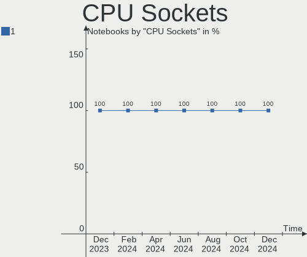

FreeBSD - Hardware Trends (Notebooks)
-------------------------------------

A project to identify most popular hardware characteristics and track their change
over time based on data collected by BSD users at https://BSD-Hardware.info.

Anyone can contribute to this report by the [hw-probe](https://github.com/linuxhw/hw-probe/blob/master/INSTALL.BSD.md) tool:

    hw-probe -all -upload

This report is for one last month. Overall report since the beginning of time: [TestDays](https://github.com/bsdhw/TestDays)

Period: May, 2023.

Contents
--------

* [ System ](#system)
  - [ OS                       ](#os)
  - [ OS Family                ](#os-family)
  - [ Arch                     ](#arch)
  - [ DE                       ](#de)
  - [ Display Server           ](#display-server)
  - [ Display Manager          ](#display-manager)
  - [ OS Lang                  ](#os-lang)
  - [ Boot Mode                ](#boot-mode)
  - [ Filesystem               ](#filesystem)
  - [ Part. scheme             ](#part-scheme)

* [ Board ](#board)
  - [ Vendor                   ](#vendor)
  - [ Model                    ](#model)
  - [ Model Family             ](#model-family)
  - [ MFG Year                 ](#mfg-year)
  - [ Form Factor              ](#form-factor)
  - [ Coreboot                 ](#coreboot)
  - [ RAM Size                 ](#ram-size)
  - [ RAM Used                 ](#ram-used)
  - [ Total Drives             ](#total-drives)
  - [ Has CD-ROM               ](#has-cd-rom)
  - [ Has Ethernet             ](#has-ethernet)
  - [ Has WiFi                 ](#has-wifi)
  - [ Has Bluetooth            ](#has-bluetooth)

* [ Location ](#location)
  - [ Country                  ](#country)
  - [ City                     ](#city)

* [ Drives ](#drives)
  - [ Drive Vendor             ](#drive-vendor)
  - [ Drive Model              ](#drive-model)
  - [ HDD Vendor               ](#hdd-vendor)
  - [ SSD Vendor               ](#ssd-vendor)
  - [ Drive Kind               ](#drive-kind)
  - [ Drive Connector          ](#drive-connector)
  - [ Drive Size               ](#drive-size)
  - [ Space Total              ](#space-total)
  - [ Space Used               ](#space-used)
  - [ Malfunc. Drives          ](#malfunc-drives)
  - [ Malfunc. Drive Vendor    ](#malfunc-drive-vendor)
  - [ Malfunc. HDD Vendor      ](#malfunc-hdd-vendor)
  - [ Malfunc. Drive Kind      ](#malfunc-drive-kind)
  - [ Failed Drives            ](#failed-drives)
  - [ Failed Drive Vendor      ](#failed-drive-vendor)
  - [ Drive Status             ](#drive-status)

* [ Storage controller ](#storage-controller)
  - [ Storage Vendor           ](#storage-vendor)
  - [ Storage Model            ](#storage-model)
  - [ Storage Kind             ](#storage-kind)

* [ Processor ](#processor)
  - [ CPU Vendor               ](#cpu-vendor)
  - [ CPU Model                ](#cpu-model)
  - [ CPU Model Family         ](#cpu-model-family)
  - [ CPU Cores                ](#cpu-cores)
  - [ CPU Sockets              ](#cpu-sockets)
  - [ CPU Threads              ](#cpu-threads)
  - [ CPU Microarch            ](#cpu-microarch)

* [ Graphics ](#graphics)
  - [ GPU Vendor               ](#gpu-vendor)
  - [ GPU Model                ](#gpu-model)
  - [ GPU Combo                ](#gpu-combo)
  - [ GPU Driver               ](#gpu-driver)
  - [ GPU Memory               ](#gpu-memory)

* [ Monitor ](#monitor)
  - [ Monitor Vendor           ](#monitor-vendor)
  - [ Monitor Model            ](#monitor-model)
  - [ Monitor Resolution       ](#monitor-resolution)
  - [ Monitor Diagonal         ](#monitor-diagonal)
  - [ Monitor Width            ](#monitor-width)
  - [ Aspect Ratio             ](#aspect-ratio)
  - [ Monitor Area             ](#monitor-area)
  - [ Pixel Density            ](#pixel-density)
  - [ Multiple Monitors        ](#multiple-monitors)

* [ Network ](#network)
  - [ Net Controller Vendor    ](#net-controller-vendor)
  - [ Net Controller Model     ](#net-controller-model)
  - [ Wireless Vendor          ](#wireless-vendor)
  - [ Wireless Model           ](#wireless-model)
  - [ Ethernet Vendor          ](#ethernet-vendor)
  - [ Ethernet Model           ](#ethernet-model)
  - [ Net Controller Kind      ](#net-controller-kind)
  - [ Used Controller          ](#used-controller)
  - [ NICs                     ](#nics)
  - [ IPv6                     ](#ipv6)

* [ Bluetooth ](#bluetooth)
  - [ Bluetooth Vendor         ](#bluetooth-vendor)
  - [ Bluetooth Model          ](#bluetooth-model)

* [ Sound ](#sound)
  - [ Sound Vendor             ](#sound-vendor)
  - [ Sound Model              ](#sound-model)

* [ Memory ](#memory)
  - [ Memory Vendor            ](#memory-vendor)
  - [ Memory Model             ](#memory-model)
  - [ Memory Kind              ](#memory-kind)
  - [ Memory Form Factor       ](#memory-form-factor)
  - [ Memory Size              ](#memory-size)
  - [ Memory Speed             ](#memory-speed)

* [ Printers & scanners ](#printers--scanners)
  - [ Printer Vendor           ](#printer-vendor)
  - [ Printer Model            ](#printer-model)
  - [ Scanner Vendor           ](#scanner-vendor)
  - [ Scanner Model            ](#scanner-model)

* [ Camera ](#camera)
  - [ Camera Vendor            ](#camera-vendor)
  - [ Camera Model             ](#camera-model)

* [ Security ](#security)
  - [ Fingerprint Vendor       ](#fingerprint-vendor)
  - [ Fingerprint Model        ](#fingerprint-model)
  - [ Chipcard Vendor          ](#chipcard-vendor)
  - [ Chipcard Model           ](#chipcard-model)

* [ Unsupported ](#unsupported)
  - [ Unsupported Devices      ](#unsupported-devices)
  - [ Unsupported Device Types ](#unsupported-device-types)

System
------

OS
--

Installed operating systems

| Name                 | Notebooks | Percent |
|----------------------|-----------|---------|
| FreeBSD 13.2         | 13        | 61.9%   |
| FreeBSD 14.0-CURRENT | 6         | 28.57%  |
| FreeBSD 13.1-p7      | 1         | 4.76%   |
| FreeBSD 12.4-p2      | 1         | 4.76%   |

OS Family
---------

OS without a version

| Name    | Notebooks | Percent |
|---------|-----------|---------|
| FreeBSD | 21        | 100%    |

Arch
----

OS architecture (x86_64, i586, etc.)

| Name  | Notebooks | Percent |
|-------|-----------|---------|
| amd64 | 20        | 95.24%  |
| i386  | 1         | 4.76%   |

DE
--

Desktop Environment

| Name    | Notebooks | Percent |
|---------|-----------|---------|
| GNOME   | 6         | 28.57%  |
| XFCE    | 5         | 23.81%  |
| KDE5    | 3         | 14.29%  |
| MATE    | 2         | 9.52%   |
| Console | 2         | 9.52%   |
| TWM     | 1         | 4.76%   |
| i3      | 1         | 4.76%   |
| Budgie  | 1         | 4.76%   |

Display Server
--------------

X11 or Wayland

| Name    | Notebooks | Percent |
|---------|-----------|---------|
| X11     | 19        | 90.48%  |
| Console | 2         | 9.52%   |

Display Manager
---------------

SDDM, LightDM, etc.

| Name    | Notebooks | Percent |
|---------|-----------|---------|
| Console | 9         | 42.86%  |
| LightDM | 4         | 19.05%  |
| XDM     | 3         | 14.29%  |
| SDDM    | 2         | 9.52%   |
| GDM     | 2         | 9.52%   |
| SLiM    | 1         | 4.76%   |

OS Lang
-------

Language

| Lang    | Notebooks | Percent |
|---------|-----------|---------|
| C       | 13        | 61.9%   |
| fr_FR   | 3         | 14.29%  |
| Unknown | 3         | 14.29%  |
| ru_RU   | 1         | 4.76%   |
| en_US   | 1         | 4.76%   |

Boot Mode
---------

EFI or BIOS

| Mode | Notebooks | Percent |
|------|-----------|---------|
| EFI  | 16        | 76.19%  |
| BIOS | 5         | 23.81%  |

Filesystem
----------

Type of filesystem

| Type | Notebooks | Percent |
|------|-----------|---------|
| Zfs  | 14        | 66.67%  |
| Ufs  | 7         | 33.33%  |

Part. scheme
------------

Scheme of partitioning

| Type | Notebooks | Percent |
|------|-----------|---------|
| GPT  | 20        | 95.24%  |
| BSD  | 1         | 4.76%   |

Board
-----

Vendor
------

Motherboard manufacturer

| Name                | Notebooks | Percent |
|---------------------|-----------|---------|
| Lenovo              | 9         | 42.86%  |
| Acer                | 3         | 14.29%  |
| Hewlett-Packard     | 2         | 9.52%   |
| Valve               | 1         | 4.76%   |
| Samsung Electronics | 1         | 4.76%   |
| Panasonic           | 1         | 4.76%   |
| Notebook            | 1         | 4.76%   |
| Medion              | 1         | 4.76%   |
| Dell                | 1         | 4.76%   |
| Alienware           | 1         | 4.76%   |

Model
-----

Motherboard model

| Name                                  | Notebooks | Percent |
|---------------------------------------|-----------|---------|
| HP EliteBook 8570p                    | 2         | 9.52%   |
| Valve Jupiter                         | 1         | 4.76%   |
| Samsung NC110P/NC108P/NC111P          | 1         | 4.76%   |
| Panasonic CF-30KAPAXAM                | 1         | 4.76%   |
| Notebook N7x0WU                       | 1         | 4.76%   |
| Medion Major X10                      | 1         | 4.76%   |
| Lenovo ThinkPad X270 W10DG 20K5S5Q507 | 1         | 4.76%   |
| Lenovo ThinkPad X270 20HMCTO1WW       | 1         | 4.76%   |
| Lenovo ThinkPad X13 Gen 1 20UGS48105  | 1         | 4.76%   |
| Lenovo ThinkPad T560 20FJS03Q00       | 1         | 4.76%   |
| Lenovo ThinkPad T430 2347CTO          | 1         | 4.76%   |
| Lenovo ThinkPad T15p Gen 3 21DA000QUS | 1         | 4.76%   |
| Lenovo ThinkPad T14s Gen 1 20UH0019PB | 1         | 4.76%   |
| Lenovo ThinkPad T14 Gen 1 20S1SFJH09  | 1         | 4.76%   |
| Lenovo ThinkPad P14s Gen 1 20S4001JFR | 1         | 4.76%   |
| Dell Inspiron 3581                    | 1         | 4.76%   |
| Alienware 17 R4                       | 1         | 4.76%   |
| Acer Nitro AN515-42                   | 1         | 4.76%   |
| Acer Aspire E5-573                    | 1         | 4.76%   |
| Acer Aspire A514-54                   | 1         | 4.76%   |

Model Family
------------

Motherboard model prefix

| Name                   | Notebooks | Percent |
|------------------------|-----------|---------|
| Lenovo ThinkPad        | 9         | 42.86%  |
| HP EliteBook           | 2         | 9.52%   |
| Acer Aspire            | 2         | 9.52%   |
| Valve Jupiter          | 1         | 4.76%   |
| Samsung NC110P         | 1         | 4.76%   |
| Panasonic CF-30KAPAXAM | 1         | 4.76%   |
| Notebook N7x0WU        | 1         | 4.76%   |
| Medion Major           | 1         | 4.76%   |
| Dell Inspiron          | 1         | 4.76%   |
| Alienware 17           | 1         | 4.76%   |
| Acer Nitro             | 1         | 4.76%   |

MFG Year
--------

Motherboard manufacture year

| Year | Notebooks | Percent |
|------|-----------|---------|
| 2022 | 5         | 23.81%  |
| 2020 | 4         | 19.05%  |
| 2013 | 3         | 14.29%  |
| 2021 | 2         | 9.52%   |
| 2018 | 2         | 9.52%   |
| 2017 | 1         | 4.76%   |
| 2016 | 1         | 4.76%   |
| 2015 | 1         | 4.76%   |
| 2012 | 1         | 4.76%   |
| 2009 | 1         | 4.76%   |

Form Factor
-----------

Physical design of the computer

| Name     | Notebooks | Percent |
|----------|-----------|---------|
| Notebook | 21        | 100%    |

Coreboot
--------

Have coreboot on board

| Used | Notebooks | Percent |
|------|-----------|---------|
| No   | 21        | 100%    |

RAM Size
--------

Total RAM memory

| Size in GB | Notebooks | Percent |
|------------|-----------|---------|
| 16.01-24.0 | 9         | 42.86%  |
| 8.01-16.0  | 6         | 28.57%  |
| 32.01-64.0 | 3         | 14.29%  |
| 4.01-8.0   | 2         | 9.52%   |
| 2.01-3.0   | 1         | 4.76%   |

RAM Used
--------

Used RAM memory

| Used GB   | Notebooks | Percent |
|-----------|-----------|---------|
| 1.01-2.0  | 7         | 33.33%  |
| 0.51-1.0  | 7         | 33.33%  |
| 0.01-0.5  | 6         | 28.57%  |
| 8.01-16.0 | 1         | 4.76%   |

Total Drives
------------

Number of drives on board

| Drives | Notebooks | Percent |
|--------|-----------|---------|
| 1      | 14        | 66.67%  |
| 2      | 6         | 28.57%  |
| 3      | 1         | 4.76%   |

Has CD-ROM
----------

Has CD-ROM on board

| Presented | Notebooks | Percent |
|-----------|-----------|---------|
| No        | 17        | 80.95%  |
| Yes       | 4         | 19.05%  |

Has Ethernet
------------

Has Ethernet on board

| Presented | Notebooks | Percent |
|-----------|-----------|---------|
| Yes       | 20        | 95.24%  |
| No        | 1         | 4.76%   |

Has WiFi
--------

Has WiFi module

| Presented | Notebooks | Percent |
|-----------|-----------|---------|
| Yes       | 21        | 100%    |

Has Bluetooth
-------------

Has Bluetooth module

| Presented | Notebooks | Percent |
|-----------|-----------|---------|
| Yes       | 18        | 85.71%  |
| No        | 3         | 14.29%  |

Location
--------

Country
-------

Geographic location (country)

| Country       | Notebooks | Percent |
|---------------|-----------|---------|
| USA           | 3         | 14.29%  |
| France        | 3         | 14.29%  |
| UK            | 2         | 9.52%   |
| Poland        | 2         | 9.52%   |
| Canada        | 2         | 9.52%   |
| Venezuela     | 1         | 4.76%   |
| Thailand      | 1         | 4.76%   |
| Russia        | 1         | 4.76%   |
| New Caledonia | 1         | 4.76%   |
| Netherlands   | 1         | 4.76%   |
| Jordan        | 1         | 4.76%   |
| Japan         | 1         | 4.76%   |
| Ireland       | 1         | 4.76%   |
| Germany       | 1         | 4.76%   |

City
----

Geographic location (city)

| City           | Notebooks | Percent |
|----------------|-----------|---------|
| Bordeaux       | 2         | 9.52%   |
| Zgierz         | 1         | 4.76%   |
| Warsaw         | 1         | 4.76%   |
| Veendam        | 1         | 4.76%   |
| Toronto        | 1         | 4.76%   |
| Tolyatti       | 1         | 4.76%   |
| Takasago       | 1         | 4.76%   |
| Seattle        | 1         | 4.76%   |
| Portland       | 1         | 4.76%   |
| Paris          | 1         | 4.76%   |
| Ottawa         | 1         | 4.76%   |
| Noumea         | 1         | 4.76%   |
| Munich         | 1         | 4.76%   |
| Fayetteville   | 1         | 4.76%   |
| Edmonton       | 1         | 4.76%   |
| East Grinstead | 1         | 4.76%   |
| Dublin         | 1         | 4.76%   |
| Barquisimeto   | 1         | 4.76%   |
| Bangkok        | 1         | 4.76%   |
| Amman          | 1         | 4.76%   |

Drives
------

Drive Vendor
------------

Hard drive vendors

| Vendor              | Notebooks | Drives | Percent |
|---------------------|-----------|--------|---------|
| WDC                 | 4         | 4      | 14.29%  |
| Samsung Electronics | 4         | 4      | 14.29%  |
| HGST                | 4         | 4      | 14.29%  |
| Kingston            | 3         | 3      | 10.71%  |
| Toshiba             | 2         | 3      | 7.14%   |
| Seagate             | 2         | 2      | 7.14%   |
| Crucial             | 2         | 2      | 7.14%   |
| UMIS                | 1         | 1      | 3.57%   |
| SK hynix            | 1         | 1      | 3.57%   |
| Phison              | 1         | 1      | 3.57%   |
| OCZ                 | 1         | 1      | 3.57%   |
| KIOXIA              | 1         | 1      | 3.57%   |
| Hitachi             | 1         | 1      | 3.57%   |
| 2-Power             | 1         | 1      | 3.57%   |

Drive Model
-----------

Hard drive models

| Model                                | Notebooks | Percent |
|--------------------------------------|-----------|---------|
| HGST HTS725050A7E630 500GB           | 2         | 7.14%   |
| HGST HTS721010A9E630 1TB             | 2         | 7.14%   |
| Crucial CT500P2SSD8 500GB            | 2         | 7.14%   |
| WDC WDS200T3X0C-00SJG0 2TB           | 1         | 3.57%   |
| WDC WDS120G2G0B-00EPW0 120GB         | 1         | 3.57%   |
| WDC WDBNCE0010PNC 1TB                | 1         | 3.57%   |
| WDC PC SN730 SDBQNTY-256G-1001 256GB | 1         | 3.57%   |
| UMIS RPETJ1T24MGE2QDQ 1TB            | 1         | 3.57%   |
| Toshiba THNSN51T02DUK NVMe 1024GB    | 1         | 3.57%   |
| Toshiba MQ04ABF100 1TB               | 1         | 3.57%   |
| SK hynix HFS128G39MND-3310A 128GB    | 1         | 3.57%   |
| Seagate ST9160821AS 160GB            | 1         | 3.57%   |
| Seagate ST1000LM024 HN-M101MBB 1TB   | 1         | 3.57%   |
| Samsung SSD 980 500GB                | 1         | 3.57%   |
| Samsung SSD 980 1TB                  | 1         | 3.57%   |
| Samsung MZVLW256HEHP-000L7 256GB     | 1         | 3.57%   |
| Samsung MZVLB256HAHQ-000L7 256GB     | 1         | 3.57%   |
| Phison E18-1TB-PHISON-SSD-B47R       | 1         | 3.57%   |
| OCZ TRION150 480GB                   | 1         | 3.57%   |
| KIOXIA KBG40ZNS512G NVMe 512GB       | 1         | 3.57%   |
| Kingston SNV2S1000G 1TB              | 1         | 3.57%   |
| Kingston SA400S37240G 240GB          | 1         | 3.57%   |
| Kingston OM8PDP3256B-AA1 256GB       | 1         | 3.57%   |
| Hitachi HDS721616PLA380 160GB        | 1         | 3.57%   |
| 2-Power SSD2044B 1TB                 | 1         | 3.57%   |

HDD Vendor
----------

Hard disk drive vendors

| Vendor  | Notebooks | Drives | Percent |
|---------|-----------|--------|---------|
| HGST    | 4         | 4      | 50%     |
| Seagate | 2         | 2      | 25%     |
| Toshiba | 1         | 1      | 12.5%   |
| Hitachi | 1         | 1      | 12.5%   |

SSD Vendor
----------

Solid state drive vendors

| Vendor   | Notebooks | Drives | Percent |
|----------|-----------|--------|---------|
| WDC      | 2         | 2      | 33.33%  |
| SK hynix | 1         | 1      | 16.67%  |
| OCZ      | 1         | 1      | 16.67%  |
| Kingston | 1         | 1      | 16.67%  |
| 2-Power  | 1         | 1      | 16.67%  |

Drive Kind
----------

HDD or SSD

| Kind | Notebooks | Drives | Percent |
|------|-----------|--------|---------|
| NVMe | 12        | 15     | 52.17%  |
| HDD  | 6         | 8      | 26.09%  |
| SSD  | 5         | 6      | 21.74%  |

Drive Connector
---------------

SATA, SAS, NVMe, etc.

| Type | Notebooks | Drives | Percent |
|------|-----------|--------|---------|
| NVMe | 12        | 15     | 52.17%  |
| SATA | 11        | 14     | 47.83%  |

Drive Size
----------

Size of hard drive

| Size in TB | Notebooks | Drives | Percent |
|------------|-----------|--------|---------|
| 0.01-0.5   | 6         | 8      | 54.55%  |
| 0.51-1.0   | 4         | 5      | 36.36%  |
| 1.01-2.0   | 1         | 1      | 9.09%   |

Space Total
-----------

Amount of disk space available on the file system

| Size in GB | Notebooks | Percent |
|------------|-----------|---------|
| 101-250    | 8         | 38.1%   |
| 501-1000   | 6         | 28.57%  |
| 251-500    | 5         | 23.81%  |
| 1-20       | 1         | 4.76%   |
| 51-100     | 1         | 4.76%   |

Space Used
----------

Amount of used disk space

| Used GB | Notebooks | Percent |
|---------|-----------|---------|
| 1-20    | 9         | 42.86%  |
| 21-50   | 7         | 33.33%  |
| 101-250 | 2         | 9.52%   |
| 51-100  | 2         | 9.52%   |
| 251-500 | 1         | 4.76%   |

Malfunc. Drives
---------------

Drive models with a malfunction

| Model                      | Notebooks | Drives | Percent |
|----------------------------|-----------|--------|---------|
| HGST HTS725050A7E630 500GB | 1         | 1      | 50%     |
| HGST HTS721010A9E630 1TB   | 1         | 1      | 50%     |

Malfunc. Drive Vendor
---------------------

Vendors of faulty drives

| Vendor | Notebooks | Drives | Percent |
|--------|-----------|--------|---------|
| HGST   | 2         | 2      | 100%    |

Malfunc. HDD Vendor
-------------------

Vendors of faulty HDD drives

| Vendor | Notebooks | Drives | Percent |
|--------|-----------|--------|---------|
| HGST   | 2         | 2      | 100%    |

Malfunc. Drive Kind
-------------------

Kinds of faulty drives

| Kind | Notebooks | Drives | Percent |
|------|-----------|--------|---------|
| HDD  | 2         | 2      | 100%    |

Failed Drives
-------------

Failed drive models

Zero info for selected period =(

Failed Drive Vendor
-------------------

Failed drive vendors

Zero info for selected period =(

Drive Status
------------

Number of failed and malfunc. drives

| Status  | Notebooks | Drives | Percent |
|---------|-----------|--------|---------|
| Works   | 20        | 27     | 90.91%  |
| Malfunc | 2         | 2      | 9.09%   |

Storage controller
------------------

Storage Vendor
--------------

Storage controller vendors

| Vendor                                  | Notebooks | Percent |
|-----------------------------------------|-----------|---------|
| Intel                                   | 11        | 42.31%  |
| Samsung Electronics                     | 4         | 15.38%  |
| SanDisk                                 | 2         | 7.69%   |
| Micron/Crucial Technology               | 2         | 7.69%   |
| Kingston Technology Company             | 2         | 7.69%   |
| Toshiba                                 | 1         | 3.85%   |
| Shenzhen Unionmemory Information System | 1         | 3.85%   |
| Phison Electronics                      | 1         | 3.85%   |
| KIOXIA                                  | 1         | 3.85%   |
| AMD                                     | 1         | 3.85%   |

Storage Model
-------------

Storage controller models

| Model                                                                         | Notebooks | Percent |
|-------------------------------------------------------------------------------|-----------|---------|
| Samsung NVMe SSD Controller 980                                               | 2         | 7.14%   |
| Micron/Crucial P2 NVMe PCIe SSD                                               | 2         | 7.14%   |
| Intel Sunrise Point-LP SATA Controller [AHCI mode]                            | 2         | 7.14%   |
| Intel 7 Series Chipset Family 6-port SATA Controller [AHCI mode]              | 2         | 7.14%   |
| Toshiba XG4 NVMe SSD Controller                                               | 1         | 3.57%   |
| SanDisk WD Black SN750 / PC SN730 NVMe SSD                                    | 1         | 3.57%   |
| SanDisk WD Black 2018/SN750 / PC SN720 NVMe SSD                               | 1         | 3.57%   |
| Samsung NVMe SSD Controller SM981/PM981/PM983                                 | 1         | 3.57%   |
| Samsung NVMe SSD Controller SM961/PM961/SM963                                 | 1         | 3.57%   |
| Phison E18 PCIe4 NVMe Controller                                              | 1         | 3.57%   |
| KIOXIA NVMe SSD Controller BG4                                                | 1         | 3.57%   |
| Kingston Company unknown                                                      | 1         | 3.57%   |
| Kingston Company OM3PDP3 NVMe SSD                                             | 1         | 3.57%   |
| Intel Volume Management Device NVMe RAID Controller                           | 1         | 3.57%   |
| Intel Tiger Lake-LP SATA Controller                                           | 1         | 3.57%   |
| Intel Q170/Q150/B150/H170/H110/Z170/CM236 Chipset SATA Controller [AHCI Mode] | 1         | 3.57%   |
| Intel NM10/ICH7 Family SATA Controller [IDE mode]                             | 1         | 3.57%   |
| Intel 82801IBM/IEM (ICH9M/ICH9M-E) 4 port SATA Controller [AHCI mode]         | 1         | 3.57%   |
| Intel 82801 Mobile SATA Controller [RAID mode]                                | 1         | 3.57%   |
| Intel 8 Series SATA Controller 1 [AHCI mode]                                  | 1         | 3.57%   |
| Intel 7 Series Chipset Family 4-port SATA Controller [IDE mode]               | 1         | 3.57%   |
| Intel 7 Series Chipset Family 2-port SATA Controller [IDE mode]               | 1         | 3.57%   |
| AMD FCH SATA Controller [AHCI mode]                                           | 1         | 3.57%   |
| Unknown                                                                       | 1         | 3.57%   |

Storage Kind
------------

Kind of storage controller (IDE, SATA, NVMe, SAS, ...)

| Kind | Notebooks | Percent |
|------|-----------|---------|
| NVMe | 12        | 48%     |
| SATA | 9         | 36%     |
| RAID | 2         | 8%      |
| IDE  | 2         | 8%      |

Processor
---------

CPU Vendor
----------

Processor vendors

| Vendor | Notebooks | Percent |
|--------|-----------|---------|
| Intel  | 17        | 80.95%  |
| AMD    | 4         | 19.05%  |

CPU Model
---------

Processor models

| Model                                         | Notebooks | Percent |
|-----------------------------------------------|-----------|---------|
| Intel Core i7-7820HK CPU @ 2.90GHz            | 1         | 4.76%   |
| Intel Core i7-3520M CPU @ 2.90GHz             | 1         | 4.76%   |
| Intel Core i7-10610U CPU @ 1.80GHz            | 1         | 4.76%   |
| Intel Core i5-7200U CPU @ 2.50GHz             | 1         | 4.76%   |
| Intel Core i5-6300U CPU @ 2.40GHz             | 1         | 4.76%   |
| Intel Core i5-6200U CPU @ 2.30GHz             | 1         | 4.76%   |
| Intel Core i5-4210U CPU @ 1.70GHz             | 1         | 4.76%   |
| Intel Core i5-3360M CPU @ 2.80GHz             | 1         | 4.76%   |
| Intel Core i5-3320M CPU @ 2.60GHz             | 1         | 4.76%   |
| Intel Core i5-10210U CPU @ 1.60GHz            | 1         | 4.76%   |
| Intel Core i3-8130U CPU @ 2.20GHz             | 1         | 4.76%   |
| Intel Core i3-7020U CPU @ 2.30GHz             | 1         | 4.76%   |
| Intel Core 2 Duo CPU L9300 @ 1.60GHz          | 1         | 4.76%   |
| Intel Atom CPU N2600 @ 1.60GHz                | 1         | 4.76%   |
| Intel 12th Gen Core i7-12800H                 | 1         | 4.76%   |
| Intel 12th Gen Core i7-12700H                 | 1         | 4.76%   |
| Intel 11th Gen Core i5-1135G7 @ 2.40GHz       | 1         | 4.76%   |
| AMD Ryzen 5 PRO 4650U with Radeon Graphics    | 1         | 4.76%   |
| AMD Ryzen 5 2500U with Radeon Vega Mobile Gfx | 1         | 4.76%   |
| AMD Ryzen 3 PRO 4450U with Radeon Graphics    | 1         | 4.76%   |
| AMD Custom APU 0405                           | 1         | 4.76%   |

CPU Model Family
----------------

Processor model prefix

| Model            | Notebooks | Percent |
|------------------|-----------|---------|
| Intel Core i5    | 7         | 33.33%  |
| Other            | 4         | 19.05%  |
| Intel Core i7    | 3         | 14.29%  |
| Intel Core i3    | 2         | 9.52%   |
| Intel Core 2 Duo | 1         | 4.76%   |
| Intel Atom       | 1         | 4.76%   |
| AMD Ryzen 5 PRO  | 1         | 4.76%   |
| AMD Ryzen 5      | 1         | 4.76%   |
| AMD Ryzen 3 PRO  | 1         | 4.76%   |

CPU Cores
---------

Number of processor cores

| Number  | Notebooks | Percent |
|---------|-----------|---------|
| 2       | 10        | 47.62%  |
| 4       | 4         | 19.05%  |
| 8       | 3         | 14.29%  |
| 20      | 1         | 4.76%   |
| 12      | 1         | 4.76%   |
| 10      | 1         | 4.76%   |
| Unknown | 1         | 4.76%   |

CPU Sockets
-----------

Number of sockets

| Number | Notebooks | Percent |
|--------|-----------|---------|
| 1      | 21        | 100%    |

CPU Threads
-----------

Threads per core (Hyper-Threading)

| Number  | Notebooks | Percent |
|---------|-----------|---------|
| 2       | 14        | 66.67%  |
| 1       | 6         | 28.57%  |
| Unknown | 1         | 4.76%   |

CPU Microarch
-------------

Microarchitecture

| Name      | Notebooks | Percent |
|-----------|-----------|---------|
| KabyLake  | 6         | 28.57%  |
| IvyBridge | 3         | 14.29%  |
| Unknown   | 3         | 14.29%  |
| Zen 2     | 2         | 9.52%   |
| Skylake   | 2         | 9.52%   |
| Zen       | 1         | 4.76%   |
| TigerLake | 1         | 4.76%   |
| Penryn    | 1         | 4.76%   |
| Haswell   | 1         | 4.76%   |
| Bonnell   | 1         | 4.76%   |

Graphics
--------

GPU Vendor
----------

Vendors of graphics cards

| Vendor | Notebooks | Percent |
|--------|-----------|---------|
| Intel  | 15        | 60%     |
| AMD    | 7         | 28%     |
| Nvidia | 3         | 12%     |

GPU Model
---------

Graphics card models

| Model                                                                         | Notebooks | Percent |
|-------------------------------------------------------------------------------|-----------|---------|
| Intel Skylake GT2 [HD Graphics 520]                                           | 2         | 7.41%   |
| Intel HD Graphics 620                                                         | 2         | 7.41%   |
| Intel CometLake-U GT2 [UHD Graphics]                                          | 2         | 7.41%   |
| Intel Alder Lake-P Integrated Graphics Controller                             | 2         | 7.41%   |
| AMD Thames [Radeon HD 7550M/7570M/7650M]                                      | 2         | 7.41%   |
| AMD Renoir                                                                    | 2         | 7.41%   |
| Nvidia GP108GLM [Quadro P520]                                                 | 1         | 3.7%    |
| Nvidia GP104BM [GeForce GTX 1080 Mobile]                                      | 1         | 3.7%    |
| Nvidia GA107M [GeForce RTX 3050 Mobile]                                       | 1         | 3.7%    |
| Intel UHD Graphics 620                                                        | 1         | 3.7%    |
| Intel TigerLake-LP GT2 [Iris Xe Graphics]                                     | 1         | 3.7%    |
| Intel Mobile 4 Series Chipset Integrated Graphics Controller                  | 1         | 3.7%    |
| Intel HD Graphics 630                                                         | 1         | 3.7%    |
| Intel Haswell-ULT Integrated Graphics Controller                              | 1         | 3.7%    |
| Intel DG2 [Arc A730M]                                                         | 1         | 3.7%    |
| Intel Atom Processor D2xxx/N2xxx Integrated Graphics Controller               | 1         | 3.7%    |
| Intel 3rd Gen Core processor Graphics Controller                              | 1         | 3.7%    |
| AMD VanGogh [AMD Custom GPU 0405]                                             | 1         | 3.7%    |
| AMD Sun XT [Radeon HD 8670A/8670M/8690M / R5 M330 / M430 / Radeon 520 Mobile] | 1         | 3.7%    |
| AMD Raven Ridge [Radeon Vega Series / Radeon Vega Mobile Series]              | 1         | 3.7%    |
| AMD Baffin [Radeon RX 460/560D / Pro 450/455/460/555/555X/560/560X]           | 1         | 3.7%    |

GPU Combo
---------

Combinations of graphics cards

| Name           | Notebooks | Percent |
|----------------|-----------|---------|
| 1 x Intel      | 10        | 47.62%  |
| 1 x AMD        | 5         | 23.81%  |
| Intel + Nvidia | 3         | 14.29%  |
| 2 x Intel      | 2         | 9.52%   |
| 2 x AMD        | 1         | 4.76%   |

GPU Driver
----------

Free vs proprietary

| Driver      | Notebooks | Percent |
|-------------|-----------|---------|
| Free        | 20        | 95.24%  |
| Proprietary | 1         | 4.76%   |

GPU Memory
----------

Total video memory

| Size in GB | Notebooks | Percent |
|------------|-----------|---------|
| Unknown    | 14        | 66.67%  |
| 0.51-1.0   | 3         | 14.29%  |
| 0.01-0.5   | 2         | 9.52%   |
| 7.01-8.0   | 1         | 4.76%   |
| 3.01-4.0   | 1         | 4.76%   |

Monitor
-------

Monitor Vendor
--------------

Monitor vendors

| Vendor              | Notebooks | Percent |
|---------------------|-----------|---------|
| Chimei Innolux      | 4         | 21.05%  |
| BOE                 | 4         | 21.05%  |
| AU Optronics        | 3         | 15.79%  |
| LG Display          | 2         | 10.53%  |
| YTH                 | 1         | 5.26%   |
| Samsung Electronics | 1         | 5.26%   |
| Philips             | 1         | 5.26%   |
| Hewlett-Packard     | 1         | 5.26%   |
| Dell                | 1         | 5.26%   |
| Acer                | 1         | 5.26%   |

Monitor Model
-------------

Monitor models

| Model                                                                | Notebooks | Percent |
|----------------------------------------------------------------------|-----------|---------|
| YTH HS133PC YTH1330 1920x1080 250x220mm 13.1-inch                    | 1         | 5.26%   |
| Samsung Electronics LCD Monitor SEC3659 1600x900 340x190mm 15.3-inch | 1         | 5.26%   |
| Philips 271P4 PHL08C3 1920x1080 600x340mm 27.2-inch                  | 1         | 5.26%   |
| LG Display LCD Monitor LGD0456 1366x768 340x190mm 15.3-inch          | 1         | 5.26%   |
| LG Display LCD Monitor LGD0258 1600x900 350x190mm 15.7-inch          | 1         | 5.26%   |
| Hewlett-Packard vs15 HWP2646 1024x768 300x220mm 14.6-inch            | 1         | 5.26%   |
| Dell S2718D DEL410F 2560x1440 610x350mm 27.7-inch                    | 1         | 5.26%   |
| Chimei Innolux LCD Monitor CMN15C5 1366x768 340x190mm 15.3-inch      | 1         | 5.26%   |
| Chimei Innolux LCD Monitor CMN14F2 1920x1080 310x170mm 13.9-inch     | 1         | 5.26%   |
| Chimei Innolux LCD Monitor CMN1394 1366x768 290x170mm 13.2-inch      | 1         | 5.26%   |
| Chimei Innolux LCD Monitor CMN1239 1920x1080 280x160mm 12.7-inch     | 1         | 5.26%   |
| BOE LCD Monitor BOE081D 1920x1080 310x170mm 13.9-inch                | 1         | 5.26%   |
| BOE LCD Monitor BOE0802 1920x1080 340x190mm 15.3-inch                | 1         | 5.26%   |
| BOE LCD Monitor BOE07DB 1920x1080 310x170mm 13.9-inch                | 1         | 5.26%   |
| BOE LCD Monitor BOE0729 1920x1080 340x190mm 15.3-inch                | 1         | 5.26%   |
| AU Optronics LCD Monitor AUO323D 1920x1080 310x170mm 13.9-inch       | 1         | 5.26%   |
| AU Optronics LCD Monitor AUO313C 1366x768 310x170mm 13.9-inch        | 1         | 5.26%   |
| AU Optronics LCD Monitor 2560x1440                                   | 1         | 5.26%   |
| Acer S271HL ACR02CA 1920x1080 600x340mm 27.2-inch                    | 1         | 5.26%   |

Monitor Resolution
------------------

Monitor screen resolution

| Resolution      | Notebooks | Percent |
|-----------------|-----------|---------|
| 1920x1080 (FHD) | 9         | 50%     |
| 1366x768 (WXGA) | 4         | 22.22%  |
| 2560x1440 (QHD) | 2         | 11.11%  |
| 1600x900 (HD+)  | 2         | 11.11%  |
| 1024x768 (XGA)  | 1         | 5.56%   |

Monitor Diagonal
----------------

Diagonal size in inches

| Inches  | Notebooks | Percent |
|---------|-----------|---------|
| 13      | 7         | 36.84%  |
| 15      | 6         | 31.58%  |
| 27      | 3         | 15.79%  |
| 14      | 1         | 5.26%   |
| 12      | 1         | 5.26%   |
| Unknown | 1         | 5.26%   |

Monitor Width
-------------

Physical width

| Width in mm | Notebooks | Percent |
|-------------|-----------|---------|
| 301-350     | 11        | 61.11%  |
| 201-300     | 3         | 16.67%  |
| 501-600     | 2         | 11.11%  |
| 601-700     | 1         | 5.56%   |
| Unknown     | 1         | 5.56%   |

Aspect Ratio
------------

Proportional relationship between the width and the height

| Ratio   | Notebooks | Percent |
|---------|-----------|---------|
| 16/9    | 13        | 81.25%  |
| 4/3     | 1         | 6.25%   |
| 11/10   | 1         | 6.25%   |
| Unknown | 1         | 6.25%   |

Monitor Area
------------

Area in inch²

| Area in inch² | Notebooks | Percent |
|----------------|-----------|---------|
| 81-90          | 6         | 31.58%  |
| 91-100         | 5         | 26.32%  |
| 301-350        | 3         | 15.79%  |
| 101-110        | 2         | 10.53%  |
| 71-80          | 1         | 5.26%   |
| 61-70          | 1         | 5.26%   |
| Unknown        | 1         | 5.26%   |

Pixel Density
-------------

Pixels per inch

| Density | Notebooks | Percent |
|---------|-----------|---------|
| 101-120 | 7         | 38.89%  |
| 121-160 | 6         | 33.33%  |
| 51-100  | 3         | 16.67%  |
| 161-240 | 1         | 5.56%   |
| Unknown | 1         | 5.56%   |

Multiple Monitors
-----------------

Total monitors connected

| Total | Notebooks | Percent |
|-------|-----------|---------|
| 1     | 13        | 61.9%   |
| 0     | 5         | 23.81%  |
| 2     | 2         | 9.52%   |
| 3     | 1         | 4.76%   |

Network
-------

Net Controller Vendor
---------------------

Controller vendors

| Vendor                | Notebooks | Percent |
|-----------------------|-----------|---------|
| Intel                 | 14        | 41.18%  |
| Realtek Semiconductor | 11        | 32.35%  |
| Qualcomm Atheros      | 4         | 11.76%  |
| TP-Link               | 1         | 2.94%   |
| Sierra Wireless       | 1         | 2.94%   |
| MediaTek              | 1         | 2.94%   |
| Huawei Technologies   | 1         | 2.94%   |
| Hewlett-Packard       | 1         | 2.94%   |

Net Controller Model
--------------------

Controller models

| Model                                                             | Notebooks | Percent |
|-------------------------------------------------------------------|-----------|---------|
| Realtek RTL8111/8168/8411 PCI Express Gigabit Ethernet Controller | 6         | 13.04%  |
| Intel 82579LM Gigabit Network Connection (Lewisville)             | 3         | 6.52%   |
| Realtek RTL810xE PCI Express Fast Ethernet controller             | 2         | 4.35%   |
| Qualcomm Atheros QCA9377 802.11ac Wireless Network Adapter        | 2         | 4.35%   |
| Qualcomm Atheros QCA6174 802.11ac Wireless Network Adapter        | 2         | 4.35%   |
| Intel Wireless 8260                                               | 2         | 4.35%   |
| Intel Comet Lake PCH-LP CNVi WiFi                                 | 2         | 4.35%   |
| Intel Centrino Advanced-N 6205 [Taylor Peak]                      | 2         | 4.35%   |
| TP-Link TL-WN823N v2/v3 [Realtek RTL8192EU]                       | 1         | 2.17%   |
| Sierra Wireless EM7455                                            | 1         | 2.17%   |
| Realtek RTL8852AE 802.11ax PCIe Wireless Network Adapter          | 1         | 2.17%   |
| Realtek RTL8822CE 802.11ac PCIe Wireless Network Adapter          | 1         | 2.17%   |
| Realtek RTL8188CUS 802.11n WLAN Adapter                           | 1         | 2.17%   |
| Realtek RTL8188CE 802.11b/g/n WiFi Adapter                        | 1         | 2.17%   |
| Qualcomm Atheros Killer E2500 Gigabit Ethernet Controller         | 1         | 2.17%   |
| MediaTek MT7921 802.11ax PCI Express Wireless Network Adapter     | 1         | 2.17%   |
| Intel Wireless 8265 / 8275                                        | 1         | 2.17%   |
| Intel WiFi Link 5100                                              | 1         | 2.17%   |
| Intel Wi-Fi 6 AX210/AX211/AX411 160MHz                            | 1         | 2.17%   |
| Intel Wi-Fi 6 AX200                                               | 1         | 2.17%   |
| Intel Ethernet Connection I219-V                                  | 1         | 2.17%   |
| Intel Ethernet Connection I219-LM                                 | 1         | 2.17%   |
| Intel Ethernet Connection (4) I219-V                              | 1         | 2.17%   |
| Intel Ethernet Connection (16) I219-V                             | 1         | 2.17%   |
| Intel Ethernet Connection (16) I219-LM                            | 1         | 2.17%   |
| Intel Ethernet Connection (10) I219-V                             | 1         | 2.17%   |
| Intel Ethernet Connection (10) I219-LM                            | 1         | 2.17%   |
| Intel Dual Band Wireless-AC 3168NGW [Stone Peak]                  | 1         | 2.17%   |
| Intel Centrino Wireless-N 130                                     | 1         | 2.17%   |
| Intel Alder Lake-P PCH CNVi WiFi                                  | 1         | 2.17%   |
| Intel 82567LM Gigabit Network Connection                          | 1         | 2.17%   |
| Huawei USB Device                                                 | 1         | 2.17%   |
| HP hs2350 HSPA+ Mobile Broadband Module Network Adapter           | 1         | 2.17%   |

Wireless Vendor
---------------

Wireless vendors

| Vendor                | Notebooks | Percent |
|-----------------------|-----------|---------|
| Intel                 | 13        | 54.17%  |
| Realtek Semiconductor | 4         | 16.67%  |
| Qualcomm Atheros      | 4         | 16.67%  |
| TP-Link               | 1         | 4.17%   |
| Sierra Wireless       | 1         | 4.17%   |
| MediaTek              | 1         | 4.17%   |

Wireless Model
--------------

Wireless models

| Model                                                         | Notebooks | Percent |
|---------------------------------------------------------------|-----------|---------|
| Qualcomm Atheros QCA9377 802.11ac Wireless Network Adapter    | 2         | 8.33%   |
| Qualcomm Atheros QCA6174 802.11ac Wireless Network Adapter    | 2         | 8.33%   |
| Intel Wireless 8260                                           | 2         | 8.33%   |
| Intel Comet Lake PCH-LP CNVi WiFi                             | 2         | 8.33%   |
| Intel Centrino Advanced-N 6205 [Taylor Peak]                  | 2         | 8.33%   |
| TP-Link TL-WN823N v2/v3 [Realtek RTL8192EU]                   | 1         | 4.17%   |
| Sierra Wireless EM7455                                        | 1         | 4.17%   |
| Realtek RTL8852AE 802.11ax PCIe Wireless Network Adapter      | 1         | 4.17%   |
| Realtek RTL8822CE 802.11ac PCIe Wireless Network Adapter      | 1         | 4.17%   |
| Realtek RTL8188CUS 802.11n WLAN Adapter                       | 1         | 4.17%   |
| Realtek RTL8188CE 802.11b/g/n WiFi Adapter                    | 1         | 4.17%   |
| MediaTek MT7921 802.11ax PCI Express Wireless Network Adapter | 1         | 4.17%   |
| Intel Wireless 8265 / 8275                                    | 1         | 4.17%   |
| Intel WiFi Link 5100                                          | 1         | 4.17%   |
| Intel Wi-Fi 6 AX210/AX211/AX411 160MHz                        | 1         | 4.17%   |
| Intel Wi-Fi 6 AX200                                           | 1         | 4.17%   |
| Intel Dual Band Wireless-AC 3168NGW [Stone Peak]              | 1         | 4.17%   |
| Intel Centrino Wireless-N 130                                 | 1         | 4.17%   |
| Intel Alder Lake-P PCH CNVi WiFi                              | 1         | 4.17%   |

Ethernet Vendor
---------------

Ethernet vendors

| Vendor                | Notebooks | Percent |
|-----------------------|-----------|---------|
| Intel                 | 11        | 52.38%  |
| Realtek Semiconductor | 8         | 38.1%   |
| Qualcomm Atheros      | 1         | 4.76%   |
| Huawei Technologies   | 1         | 4.76%   |

Ethernet Model
--------------

Ethernet models

| Model                                                             | Notebooks | Percent |
|-------------------------------------------------------------------|-----------|---------|
| Realtek RTL8111/8168/8411 PCI Express Gigabit Ethernet Controller | 6         | 28.57%  |
| Intel 82579LM Gigabit Network Connection (Lewisville)             | 3         | 14.29%  |
| Realtek RTL810xE PCI Express Fast Ethernet controller             | 2         | 9.52%   |
| Qualcomm Atheros Killer E2500 Gigabit Ethernet Controller         | 1         | 4.76%   |
| Intel Ethernet Connection I219-V                                  | 1         | 4.76%   |
| Intel Ethernet Connection I219-LM                                 | 1         | 4.76%   |
| Intel Ethernet Connection (4) I219-V                              | 1         | 4.76%   |
| Intel Ethernet Connection (16) I219-V                             | 1         | 4.76%   |
| Intel Ethernet Connection (16) I219-LM                            | 1         | 4.76%   |
| Intel Ethernet Connection (10) I219-V                             | 1         | 4.76%   |
| Intel Ethernet Connection (10) I219-LM                            | 1         | 4.76%   |
| Intel 82567LM Gigabit Network Connection                          | 1         | 4.76%   |
| Huawei USB Device                                                 | 1         | 4.76%   |

Net Controller Kind
-------------------

Ethernet, WiFi or modem

| Kind     | Notebooks | Percent |
|----------|-----------|---------|
| WiFi     | 21        | 50%     |
| Ethernet | 20        | 47.62%  |
| Modem    | 1         | 2.38%   |

Used Controller
---------------

Currently used network controller

| Kind     | Notebooks | Percent |
|----------|-----------|---------|
| WiFi     | 9         | 50%     |
| Ethernet | 9         | 50%     |

NICs
----

Total network controllers on board

| Total | Notebooks | Percent |
|-------|-----------|---------|
| 2     | 20        | 95.24%  |
| 1     | 1         | 4.76%   |

IPv6
----

IPv6 vs IPv4

| Used | Notebooks | Percent |
|------|-----------|---------|
| No   | 19        | 90.48%  |
| Yes  | 2         | 9.52%   |

Bluetooth
---------

Bluetooth Vendor
----------------

Controller vendors

| Vendor                          | Notebooks | Percent |
|---------------------------------|-----------|---------|
| Intel                           | 10        | 55.56%  |
| Lite-On Technology              | 3         | 16.67%  |
| Realtek Semiconductor           | 1         | 5.56%   |
| Qualcomm Atheros Communications | 1         | 5.56%   |
| IMC Networks                    | 1         | 5.56%   |
| Broadcom                        | 1         | 5.56%   |
| Alps Electric                   | 1         | 5.56%   |

Bluetooth Model
---------------

Controller models

| Model                                            | Notebooks | Percent |
|--------------------------------------------------|-----------|---------|
| Intel Bluetooth wireless interface               | 3         | 16.67%  |
| Intel AX201 Bluetooth                            | 2         | 11.11%  |
| Realtek Bluetooth Adapter                        | 1         | 5.56%   |
| Qualcomm Atheros QCA61x4 Bluetooth 4.0           | 1         | 5.56%   |
| Lite-On Qualcomm Atheros QCA9377 Bluetooth       | 1         | 5.56%   |
| Lite-On MediaTek Bluetooth MT7921                | 1         | 5.56%   |
| Lite-On Bluetooth USB Module                     | 1         | 5.56%   |
| Intel Wireless-AC 3168 Bluetooth                 | 1         | 5.56%   |
| Intel Wireless Bluetooth                         | 1         | 5.56%   |
| Intel Centrino Advanced-N 6230 Bluetooth adapter | 1         | 5.56%   |
| Intel AX210 Bluetooth                            | 1         | 5.56%   |
| Intel AX200 Bluetooth                            | 1         | 5.56%   |
| IMC Networks Realtek Bluetooth Adapter           | 1         | 5.56%   |
| Broadcom BCM20702 Bluetooth 4.0 [ThinkPad]       | 1         | 5.56%   |
| Alps Electric UGTZ4 Bluetooth                    | 1         | 5.56%   |

Sound
-----

Sound Vendor
------------

Sound card vendors

| Vendor      | Notebooks | Percent |
|-------------|-----------|---------|
| Intel       | 17        | 68%     |
| AMD         | 6         | 24%     |
| Sony        | 1         | 4%      |
| CMX Systems | 1         | 4%      |

Sound Model
-----------

Sound card models

| Model                                                               | Notebooks | Percent |
|---------------------------------------------------------------------|-----------|---------|
| Intel Sunrise Point-LP HD Audio                                     | 5         | 16.67%  |
| Intel 7 Series/C216 Chipset Family High Definition Audio Controller | 3         | 10%     |
| AMD Family 17h/19h HD Audio Controller                              | 3         | 10%     |
| Intel Comet Lake PCH-LP cAVS                                        | 2         | 6.67%   |
| Intel Alder Lake PCH-P High Definition Audio Controller             | 2         | 6.67%   |
| AMD Turks HDMI Audio [Radeon HD 6500/6600 / 6700M Series]           | 2         | 6.67%   |
| AMD Renoir Radeon High Definition Audio Controller                  | 2         | 6.67%   |
| Sony UAB-80                                                         | 1         | 3.33%   |
| Intel Tiger Lake-LP Smart Sound Technology Audio Controller         | 1         | 3.33%   |
| Intel NM10/ICH7 Family High Definition Audio Controller             | 1         | 3.33%   |
| Intel Haswell-ULT HD Audio Controller                               | 1         | 3.33%   |
| Intel DG2 Audio Controller                                          | 1         | 3.33%   |
| Intel CM238 HD Audio Controller                                     | 1         | 3.33%   |
| Intel 82801I (ICH9 Family) HD Audio Controller                      | 1         | 3.33%   |
| Intel 8 Series HD Audio Controller                                  | 1         | 3.33%   |
| CMX Systems USB PnP Audio Device                                    | 1         | 3.33%   |
| AMD Rembrandt Radeon High Definition Audio Controller               | 1         | 3.33%   |
| AMD Raven/Raven2/Fenghuang HDMI/DP Audio Controller                 | 1         | 3.33%   |

Memory
------

Memory Vendor
-------------

Memory module vendors

| Vendor              | Notebooks | Percent |
|---------------------|-----------|---------|
| Samsung Electronics | 7         | 30.43%  |
| SK hynix            | 5         | 21.74%  |
| Unknown             | 2         | 8.7%    |
| Micron Technology   | 2         | 8.7%    |
| Transcend           | 1         | 4.35%   |
| Team                | 1         | 4.35%   |
| Ramaxel Technology  | 1         | 4.35%   |
| Crucial             | 1         | 4.35%   |
| A-DATA Technology   | 1         | 4.35%   |
| 0B45000080CE        | 1         | 4.35%   |
| Unknown             | 1         | 4.35%   |

Memory Model
------------

Memory module models

| Model                                                     | Notebooks | Percent |
|-----------------------------------------------------------|-----------|---------|
| Unknown RAM Module 8GB SODIMM DDR3 1600MT/s               | 1         | 4%      |
| Unknown RAM Module 2GB SODIMM DDR2                        | 1         | 4%      |
| Transcend RAM TS2GSH64V1B 16GB SODIMM DDR4 2133MT/s       | 1         | 4%      |
| Team RAM TEAMGROUP-SD4-2666 8GB SODIMM DDR4 2667MT/s      | 1         | 4%      |
| SK hynix RAM HMT451S6MFR8C-PB 4GB SODIMM DDR3 1600MT/s    | 1         | 4%      |
| SK hynix RAM HMT451S6BFR8A-PB 4GB SODIMM DDR3 1600MT/s    | 1         | 4%      |
| SK hynix RAM HMCG78MEBSA092N 16GB SODIMM DDR5 4800MT/s    | 1         | 4%      |
| SK hynix RAM HMA851S6JJR6N-VK 4GB SODIMM DDR4 2667MT/s    | 1         | 4%      |
| SK hynix RAM HMA81GS6CJR8N-VK 8GB SODIMM DDR4 2667MT/s    | 1         | 4%      |
| Samsung RAM M471B1G73QH0-YK0 8GB SODIMM DDR3 1867MT/s     | 1         | 4%      |
| Samsung RAM M471A5244CB0-CWE 4GB SODIMM DDR4 3200MT/s     | 1         | 4%      |
| Samsung RAM M471A2K43CB1-CRC 16GB SODIMM DDR4 2400MT/s    | 1         | 4%      |
| Samsung RAM M471A2G44AM0-CWE 16GB SODIMM DDR4 3200MT/s    | 1         | 4%      |
| Samsung RAM M471A1G44AB0-CWE 8GB SODIMM DDR4 3200MT/s     | 1         | 4%      |
| Samsung RAM M425R1GB4BB0-CQKOL 8GB SODIMM DDR5 4800MT/s   | 1         | 4%      |
| Samsung RAM K3LK7K70BM-BGCP000 4GB SODIMM LPDDR5 4266MT/s | 1         | 4%      |
| Ramaxel RAM RMT3160ED58E9W1600 4GB SODIMM DDR3 1600MT/s   | 1         | 4%      |
| Micron RAM 8ATF2G64HZ-3G2E1 16GB SODIMM DDR4 3200MT/s     | 1         | 4%      |
| Micron RAM 4ATS2G64HZ-3G2B1 16GB SODIMM DDR4 3200MT/s     | 1         | 4%      |
| Micron RAM 4ATF51264HZ-3G2J1 4GB SODIMM DDR4 3200MT/s     | 1         | 4%      |
| Crucial RAM CT8G4SFS824A.C8FR 8GB SODIMM DDR4 2400MT/s    | 1         | 4%      |
| Crucial RAM CT8G4SFD824A.C16FADP 8GB SODIMM DDR4 2400MT/s | 1         | 4%      |
| A-DATA RAM AO1P26KC8T1-BPXS 8GB SODIMM DDR4 2667MT/s      | 1         | 4%      |
| 0B45000080CE RAM Module 8GB SODIMM DDR4 2667MT/s          | 1         | 4%      |
| Unknown                                                   | 1         | 4%      |

Memory Kind
-----------

Memory module kinds

| Kind   | Notebooks | Percent |
|--------|-----------|---------|
| DDR4   | 11        | 55%     |
| DDR3   | 5         | 25%     |
| DDR5   | 2         | 10%     |
| LPDDR5 | 1         | 5%      |
| DDR2   | 1         | 5%      |

Memory Form Factor
------------------

Physical design of the memory module

| Name   | Notebooks | Percent |
|--------|-----------|---------|
| SODIMM | 20        | 95.24%  |
| Chip   | 1         | 4.76%   |

Memory Size
-----------

Memory module size

| Size  | Notebooks | Percent |
|-------|-----------|---------|
| 8192  | 8         | 38.1%   |
| 4096  | 7         | 33.33%  |
| 16384 | 5         | 23.81%  |
| 2048  | 1         | 4.76%   |

Memory Speed
------------

Memory module speed

| Speed   | Notebooks | Percent |
|---------|-----------|---------|
| 3200    | 5         | 25%     |
| 1600    | 4         | 20%     |
| 2667    | 3         | 15%     |
| 4800    | 2         | 10%     |
| 2400    | 2         | 10%     |
| 4266    | 1         | 5%      |
| 2133    | 1         | 5%      |
| 1867    | 1         | 5%      |
| Unknown | 1         | 5%      |

Printers & scanners
-------------------

Printer Vendor
--------------

Printer device vendors

Zero info for selected period =(

Printer Model
-------------

Printer device models

Zero info for selected period =(

Scanner Vendor
--------------

Scanner device vendors

Zero info for selected period =(

Scanner Model
-------------

Scanner device models

Zero info for selected period =(

Camera
------

Camera Vendor
-------------

Camera device vendors

| Vendor                | Notebooks | Percent |
|-----------------------|-----------|---------|
| Chicony Electronics   | 6         | 33.33%  |
| IMC Networks          | 4         | 22.22%  |
| Realtek Semiconductor | 2         | 11.11%  |
| Bison Electronics     | 2         | 11.11%  |
| Silicon Motion        | 1         | 5.56%   |
| Quanta                | 1         | 5.56%   |
| Microdia              | 1         | 5.56%   |
| Logitech              | 1         | 5.56%   |

Camera Model
------------

Camera device models

| Model                            | Notebooks | Percent |
|----------------------------------|-----------|---------|
| IMC Networks Integrated Camera   | 4         | 22.22%  |
| Chicony Integrated HP HD Webcam  | 2         | 11.11%  |
| Chicony Integrated Camera        | 2         | 11.11%  |
| Bison Integrated Camera          | 2         | 11.11%  |
| Silicon Motion WebCam SCX Series | 1         | 5.56%   |
| Realtek USB 2.0 Webcam           | 1         | 5.56%   |
| Realtek HD Webcam - Realtek      | 1         | 5.56%   |
| Quanta HD Webcam                 | 1         | 5.56%   |
| Microdia Integrated_Webcam_FHD   | 1         | 5.56%   |
| Logitech HD Pro Webcam C920      | 1         | 5.56%   |
| Chicony thinkpad t430s camera    | 1         | 5.56%   |
| Chicony Realtek DMFT RGB         | 1         | 5.56%   |

Security
--------

Fingerprint Vendor
------------------

Fingerprint sensor vendors

| Vendor           | Notebooks | Percent |
|------------------|-----------|---------|
| Synaptics        | 3         | 60%     |
| Validity Sensors | 2         | 40%     |

Fingerprint Model
-----------------

Fingerprint sensor models

| Model                                             | Notebooks | Percent |
|---------------------------------------------------|-----------|---------|
| Synaptics Prometheus MIS Touch Fingerprint Reader | 3         | 60%     |
| Validity Sensors VFS491                           | 1         | 20%     |
| Validity Sensors Synaptics WBDI                   | 1         | 20%     |

Chipcard Vendor
---------------

Chipcard module vendors

Zero info for selected period =(

Chipcard Model
--------------

Chipcard module models

Zero info for selected period =(

Unsupported
-----------

Unsupported Devices
-------------------

Total unsupported devices on board

| Total | Notebooks | Percent |
|-------|-----------|---------|
| 3     | 6         | 28.57%  |
| 2     | 6         | 28.57%  |
| 1     | 4         | 19.05%  |
| 4     | 3         | 14.29%  |
| 0     | 2         | 9.52%   |

Unsupported Device Types
------------------------

Types of unsupported devices

| Type                     | Notebooks | Percent |
|--------------------------|-----------|---------|
| Communication controller | 17        | 42.5%   |
| Net/wireless             | 6         | 15%     |
| Card reader              | 6         | 15%     |
| Fingerprint reader       | 5         | 12.5%   |
| Firewire controller      | 3         | 7.5%    |
| Bluetooth                | 3         | 7.5%    |

