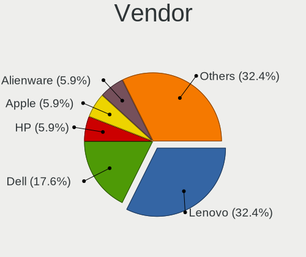

FreeBSD Hardware Trends (Notebooks)
-----------------------------------

A project to identify most popular hardware characteristics and track their change
over time based on data collected by FreeBSD users at https://BSD-Hardware.info.

Anyone can contribute to this report by the [hw-probe](https://github.com/linuxhw/hw-probe/blob/master/INSTALL.BSD.md) tool:

    hw-probe -all -upload

Full-feature report is available here: https://bsd-hardware.info/?view=trends&formfactor=notebook

Period: Jul, 2021.

Contents
--------

* [ System ](#system)
  - [ OS                       ](#os)
  - [ OS Family                ](#os-family)
  - [ Arch                     ](#arch)
  - [ DE                       ](#de)
  - [ Display Server           ](#display-server)
  - [ Display Manager          ](#display-manager)
  - [ OS Lang                  ](#os-lang)
  - [ Boot Mode                ](#boot-mode)
  - [ Filesystem               ](#filesystem)
  - [ Part. scheme             ](#part-scheme)

* [ Board ](#board)
  - [ Vendor                   ](#vendor)
  - [ Model                    ](#model)
  - [ Model Family             ](#model-family)
  - [ MFG Year                 ](#mfg-year)
  - [ Form Factor              ](#form-factor)
  - [ Coreboot                 ](#coreboot)
  - [ RAM Size                 ](#ram-size)
  - [ RAM Used                 ](#ram-used)
  - [ Total Drives             ](#total-drives)
  - [ Has CD-ROM               ](#has-cd-rom)
  - [ Has Ethernet             ](#has-ethernet)
  - [ Has WiFi                 ](#has-wifi)
  - [ Has Bluetooth            ](#has-bluetooth)

* [ Location ](#location)
  - [ Country                  ](#country)
  - [ City                     ](#city)

* [ Drives ](#drives)
  - [ Drive Vendor             ](#drive-vendor)
  - [ Drive Model              ](#drive-model)
  - [ HDD Vendor               ](#hdd-vendor)
  - [ SSD Vendor               ](#ssd-vendor)
  - [ Drive Kind               ](#drive-kind)
  - [ Drive Connector          ](#drive-connector)
  - [ Drive Size               ](#drive-size)
  - [ Space Total              ](#space-total)
  - [ Space Used               ](#space-used)
  - [ Malfunc. Drives          ](#malfunc-drives)
  - [ Malfunc. Drive Vendor    ](#malfunc-drive-vendor)
  - [ Malfunc. HDD Vendor      ](#malfunc-hdd-vendor)
  - [ Malfunc. Drive Kind      ](#malfunc-drive-kind)
  - [ Failed Drives            ](#failed-drives)
  - [ Failed Drive Vendor      ](#failed-drive-vendor)
  - [ Drive Status             ](#drive-status)

* [ Storage controller ](#storage-controller)
  - [ Storage Vendor           ](#storage-vendor)
  - [ Storage Model            ](#storage-model)
  - [ Storage Kind             ](#storage-kind)

* [ Processor ](#processor)
  - [ CPU Vendor               ](#cpu-vendor)
  - [ CPU Model                ](#cpu-model)
  - [ CPU Model Family         ](#cpu-model-family)
  - [ CPU Cores                ](#cpu-cores)
  - [ CPU Sockets              ](#cpu-sockets)
  - [ CPU Threads              ](#cpu-threads)
  - [ CPU Microarch            ](#cpu-microarch)

* [ Graphics ](#graphics)
  - [ GPU Vendor               ](#gpu-vendor)
  - [ GPU Model                ](#gpu-model)
  - [ GPU Combo                ](#gpu-combo)
  - [ GPU Driver               ](#gpu-driver)
  - [ GPU Memory               ](#gpu-memory)

* [ Monitor ](#monitor)
  - [ Monitor Vendor           ](#monitor-vendor)
  - [ Monitor Model            ](#monitor-model)
  - [ Monitor Resolution       ](#monitor-resolution)
  - [ Monitor Diagonal         ](#monitor-diagonal)
  - [ Monitor Width            ](#monitor-width)
  - [ Aspect Ratio             ](#aspect-ratio)
  - [ Monitor Area             ](#monitor-area)
  - [ Pixel Density            ](#pixel-density)
  - [ Multiple Monitors        ](#multiple-monitors)

* [ Network ](#network)
  - [ Net Controller Vendor    ](#net-controller-vendor)
  - [ Net Controller Model     ](#net-controller-model)
  - [ Wireless Vendor          ](#wireless-vendor)
  - [ Wireless Model           ](#wireless-model)
  - [ Ethernet Vendor          ](#ethernet-vendor)
  - [ Ethernet Model           ](#ethernet-model)
  - [ Net Controller Kind      ](#net-controller-kind)
  - [ Used Controller          ](#used-controller)
  - [ NICs                     ](#nics)
  - [ IPv6                     ](#ipv6)

* [ Bluetooth ](#bluetooth)
  - [ Bluetooth Vendor         ](#bluetooth-vendor)
  - [ Bluetooth Model          ](#bluetooth-model)

* [ Sound ](#sound)
  - [ Sound Vendor             ](#sound-vendor)
  - [ Sound Model              ](#sound-model)

* [ Memory ](#memory)
  - [ Memory Vendor            ](#memory-vendor)
  - [ Memory Model             ](#memory-model)
  - [ Memory Kind              ](#memory-kind)
  - [ Memory Form Factor       ](#memory-form-factor)
  - [ Memory Size              ](#memory-size)
  - [ Memory Speed             ](#memory-speed)

* [ Printers & scanners ](#printers-scanners)
  - [ Printer Vendor           ](#printer-vendor)
  - [ Printer Model            ](#printer-model)
  - [ Scanner Vendor           ](#scanner-vendor)
  - [ Scanner Model            ](#scanner-model)

* [ Camera ](#camera)
  - [ Camera Vendor            ](#camera-vendor)
  - [ Camera Model             ](#camera-model)

* [ Security ](#security)
  - [ Fingerprint Vendor       ](#fingerprint-vendor)
  - [ Fingerprint Model        ](#fingerprint-model)
  - [ Chipcard Vendor          ](#chipcard-vendor)
  - [ Chipcard Model           ](#chipcard-model)

* [ Unsupported ](#unsupported)
  - [ Unsupported Devices      ](#unsupported-devices)
  - [ Unsupported Device Types ](#unsupported-device-types)

System
------

OS
--

Installed operating systems

| Name                 | Notebooks | Percent |
|----------------------|-----------|---------|
| FreeBSD 13.0-p3      | 13        | 37.14%  |
| FreeBSD 13.0         | 10        | 28.57%  |
| FreeBSD 14.0-CURRENT | 7         | 20%     |
| FreeBSD 12.2-p9      | 2         | 5.71%   |
| FreeBSD 13.0-STABLE  | 1         | 2.86%   |
| FreeBSD 12.2-p6      | 1         | 2.86%   |
| FreeBSD 12.2-p2      | 1         | 2.86%   |

OS Family
---------

OS without a version

| Name    | Notebooks | Percent |
|---------|-----------|---------|
| FreeBSD | 35        | 100%    |

Arch
----

OS architecture (x86_64, i586, etc.)

| Name  | Notebooks | Percent |
|-------|-----------|---------|
| amd64 | 34        | 97.14%  |
| i386  | 1         | 2.86%   |

DE
--

Desktop Environment

| Name         | Notebooks | Percent |
|--------------|-----------|---------|
| XFCE         | 10        | 28.57%  |
| KDE5         | 8         | 22.86%  |
| Console      | 6         | 17.14%  |
| Fluxbox      | 3         | 8.57%   |
| TWM          | 2         | 5.71%   |
| GNOME        | 2         | 5.71%   |
| MATE         | 1         | 2.86%   |
| LXQt         | 1         | 2.86%   |
| helloDesktop | 1         | 2.86%   |
| Cinnamon     | 1         | 2.86%   |

Display Server
--------------

X11 or Wayland

| Name    | Notebooks | Percent |
|---------|-----------|---------|
| X11     | 28        | 80%     |
| Console | 7         | 20%     |

Display Manager
---------------

SDDM, LightDM, etc.

| Name    | Notebooks | Percent |
|---------|-----------|---------|
| Console | 17        | 48.57%  |
| SDDM    | 9         | 25.71%  |
| XDM     | 5         | 14.29%  |
| SLiM    | 2         | 5.71%   |
| GDM     | 2         | 5.71%   |

OS Lang
-------

Language

| Lang             | Notebooks | Percent |
|------------------|-----------|---------|
| C                | 20        | 57.14%  |
| Unknown          | 5         | 14.29%  |
| en_US            | 4         | 11.43%  |
| ru_RU            | 3         | 8.57%   |
| it_IT.ISO8859-15 | 1         | 2.86%   |
| fr_FR            | 1         | 2.86%   |
| en_GB            | 1         | 2.86%   |

Boot Mode
---------

EFI or BIOS

| Mode | Notebooks | Percent |
|------|-----------|---------|
| EFI  | 26        | 74.29%  |
| BIOS | 9         | 25.71%  |

Filesystem
----------

Type of filesystem

| Type | Notebooks | Percent |
|------|-----------|---------|
| Zfs  | 18        | 51.43%  |
| Ufs  | 17        | 48.57%  |

Part. scheme
------------

Scheme of partitioning

| Type | Notebooks | Percent |
|------|-----------|---------|
| GPT  | 31        | 88.57%  |
| MBR  | 4         | 11.43%  |

Board
-----

Vendor
------

Motherboard manufacturer

| Name                   | Notebooks | Percent |
|------------------------|-----------|---------|
| Lenovo                 | 11        | 31.43%  |
| Dell                   | 8         | 22.86%  |
| Hewlett-Packard        | 4         | 11.43%  |
| Acer                   | 3         | 8.57%   |
| ASUSTek Computer       | 2         | 5.71%   |
| Samsung Electronics    | 1         | 2.86%   |
| Notebook               | 1         | 2.86%   |
| Intel                  | 1         | 2.86%   |
| IBM                    | 1         | 2.86%   |
| Gigabyte Technology    | 1         | 2.86%   |
| Avell High Performance | 1         | 2.86%   |
| Apple                  | 1         | 2.86%   |

Model
-----

Motherboard model

| Name                                       | Notebooks | Percent |
|--------------------------------------------|-----------|---------|
| Samsung 340XAA/350XAA/550XAA               | 1         | 2.86%   |
| Notebook W510LU                            | 1         | 2.86%   |
| Lenovo XiaoXinPro-13ARE 2020 82DM          | 1         | 2.86%   |
| Lenovo ThinkPad X230 2325A95               | 1         | 2.86%   |
| Lenovo ThinkPad X1 Carbon Gen 8 20U9CTO1WW | 1         | 2.86%   |
| Lenovo ThinkPad W520 42763KU               | 1         | 2.86%   |
| Lenovo ThinkPad T470p 20J6A012CD           | 1         | 2.86%   |
| Lenovo ThinkPad T420 42368A3               | 1         | 2.86%   |
| Lenovo ThinkPad T410 2516DCU               | 1         | 2.86%   |
| Lenovo ThinkPad S1 Yoga 12 20DKS0AA00      | 1         | 2.86%   |
| Lenovo ThinkPad E590 20NB0012RT            | 1         | 2.86%   |
| Lenovo Rescuer-15ISK 80RQ                  | 1         | 2.86%   |
| Lenovo IdeaPad 100S-14IBR 80R9             | 1         | 2.86%   |
| Intel Skylake Platform                     | 1         | 2.86%   |
| IBM ThinkPad T43 26686CU                   | 1         | 2.86%   |
| HP ZBook 17 G2                             | 1         | 2.86%   |
| HP ProBook 440 G7                          | 1         | 2.86%   |
| HP EliteBook 8570p                         | 1         | 2.86%   |
| HP 250 G4 Notebook PC                      | 1         | 2.86%   |
| Gigabyte MMLP3AP-00                        | 1         | 2.86%   |
| Dell XPS 13 9343                           | 1         | 2.86%   |
| Dell Inspiron N5110                        | 1         | 2.86%   |
| Dell Inspiron N4030                        | 1         | 2.86%   |
| Dell Inspiron 5758                         | 1         | 2.86%   |
| Dell Inspiron 5559                         | 1         | 2.86%   |
| Dell Inspiron 3521                         | 1         | 2.86%   |
| Dell Inspiron 3442                         | 1         | 2.86%   |
| Dell G5 5505                               | 1         | 2.86%   |
| Avell High Performance A62 LIV             | 1         | 2.86%   |
| ASUS VivoBook_ASUSLaptop X512DA_F512DA     | 1         | 2.86%   |
| ASUS G74Sx                                 | 1         | 2.86%   |
| Apple MacBookPro8,1                        | 1         | 2.86%   |
| Acer Aspire E5-521                         | 1         | 2.86%   |
| Acer Aspire A715-75G                       | 1         | 2.86%   |
| Acer Aspire A515-54G                       | 1         | 2.86%   |

Model Family
------------

Motherboard model prefix

| Name                       | Notebooks | Percent |
|----------------------------|-----------|---------|
| Lenovo ThinkPad            | 8         | 22.86%  |
| Dell Inspiron              | 6         | 17.14%  |
| Acer Aspire                | 3         | 8.57%   |
| Samsung 340XAA             | 1         | 2.86%   |
| Notebook W510LU            | 1         | 2.86%   |
| Lenovo XiaoXinPro-13ARE    | 1         | 2.86%   |
| Lenovo Rescuer-15ISK       | 1         | 2.86%   |
| Lenovo IdeaPad             | 1         | 2.86%   |
| Intel Skylake              | 1         | 2.86%   |
| IBM ThinkPad               | 1         | 2.86%   |
| HP ZBook                   | 1         | 2.86%   |
| HP ProBook                 | 1         | 2.86%   |
| HP EliteBook               | 1         | 2.86%   |
| HP 250                     | 1         | 2.86%   |
| Gigabyte MMLP3AP-00        | 1         | 2.86%   |
| Dell XPS                   | 1         | 2.86%   |
| Dell G5                    | 1         | 2.86%   |
| Avell High Performance A62 | 1         | 2.86%   |
| ASUS VivoBook              | 1         | 2.86%   |
| ASUS G74Sx                 | 1         | 2.86%   |
| Apple MacBookPro8          | 1         | 2.86%   |

MFG Year
--------

Motherboard manufacture year

| Year | Notebooks | Percent |
|------|-----------|---------|
| 2020 | 7         | 20%     |
| 2019 | 6         | 17.14%  |
| 2018 | 5         | 14.29%  |
| 2016 | 5         | 14.29%  |
| 2021 | 3         | 8.57%   |
| 2015 | 3         | 8.57%   |
| 2012 | 2         | 5.71%   |
| 2011 | 2         | 5.71%   |
| 2013 | 1         | 2.86%   |
| 2006 | 1         | 2.86%   |

Form Factor
-----------

Physical design of the computer

| Name     | Notebooks | Percent |
|----------|-----------|---------|
| Notebook | 35        | 100%    |

Coreboot
--------

Have coreboot on board

| Used | Notebooks | Percent |
|------|-----------|---------|
| No   | 35        | 100%    |

RAM Size
--------

Total RAM memory

| Size in GB  | Notebooks | Percent |
|-------------|-----------|---------|
| 8.01-16.0   | 17        | 48.57%  |
| 4.01-8.0    | 7         | 20%     |
| 16.01-24.0  | 5         | 14.29%  |
| 2.01-3.0    | 3         | 8.57%   |
| 32.01-64.0  | 1         | 2.86%   |
| 3.01-4.0    | 1         | 2.86%   |
| 64.01-256.0 | 1         | 2.86%   |

RAM Used
--------

Used RAM memory

| Used GB    | Notebooks | Percent |
|------------|-----------|---------|
| 0.01-0.5   | 21        | 60%     |
| 0.51-1.0   | 7         | 20%     |
| 3.01-4.0   | 2         | 5.71%   |
| 2.01-3.0   | 2         | 5.71%   |
| 1.01-2.0   | 2         | 5.71%   |
| 24.01-32.0 | 1         | 2.86%   |

Total Drives
------------

Number of drives on board

| Drives | Notebooks | Percent |
|--------|-----------|---------|
| 1      | 22        | 62.86%  |
| 2      | 10        | 28.57%  |
| 0      | 2         | 5.71%   |
| 3      | 1         | 2.86%   |

Has CD-ROM
----------

Has CD-ROM on board

| Presented | Notebooks | Percent |
|-----------|-----------|---------|
| No        | 20        | 57.14%  |
| Yes       | 15        | 42.86%  |

Has Ethernet
------------

Has Ethernet on board

| Presented | Notebooks | Percent |
|-----------|-----------|---------|
| Yes       | 29        | 82.86%  |
| No        | 6         | 17.14%  |

Has WiFi
--------

Has WiFi module

| Presented | Notebooks | Percent |
|-----------|-----------|---------|
| Yes       | 34        | 97.14%  |
| No        | 1         | 2.86%   |

Has Bluetooth
-------------

Has Bluetooth module

| Presented | Notebooks | Percent |
|-----------|-----------|---------|
| Yes       | 27        | 77.14%  |
| No        | 8         | 22.86%  |

Location
--------

Country
-------

Geographic location (country)

| Country            | Notebooks | Percent |
|--------------------|-----------|---------|
| USA                | 7         | 20%     |
| Russia             | 4         | 11.43%  |
| UK                 | 3         | 8.57%   |
| Brazil             | 3         | 8.57%   |
| Iran               | 2         | 5.71%   |
| Germany            | 2         | 5.71%   |
| France             | 2         | 5.71%   |
| China              | 2         | 5.71%   |
| Tanzania           | 1         | 2.86%   |
| Switzerland        | 1         | 2.86%   |
| Portugal           | 1         | 2.86%   |
| Latvia             | 1         | 2.86%   |
| Japan              | 1         | 2.86%   |
| Italy              | 1         | 2.86%   |
| Ireland            | 1         | 2.86%   |
| India              | 1         | 2.86%   |
| Dominican Republic | 1         | 2.86%   |
| Canada             | 1         | 2.86%   |

City
----

Geographic location (city)

| City               | Notebooks | Percent |
|--------------------|-----------|---------|
| Tehran             | 2         | 5.71%   |
| Hannibal           | 2         | 5.71%   |
| Brighton           | 2         | 5.71%   |
| Yegorlykskaya      | 1         | 2.86%   |
| Wuhan              | 1         | 2.86%   |
| Weimar             | 1         | 2.86%   |
| St Petersburg      | 1         | 2.86%   |
| Seattle            | 1         | 2.86%   |
| Santo Domingo Este | 1         | 2.86%   |
| Riga               | 1         | 2.86%   |
| Resana             | 1         | 2.86%   |
| Porto União       | 1         | 2.86%   |
| Porto              | 1         | 2.86%   |
| Moscow             | 1         | 2.86%   |
| Montreal           | 1         | 2.86%   |
| Midvale            | 1         | 2.86%   |
| London             | 1         | 2.86%   |
| Kolkata            | 1         | 2.86%   |
| Kaiserslautern     | 1         | 2.86%   |
| Jilin City         | 1         | 2.86%   |
| Inzai              | 1         | 2.86%   |
| Eureka             | 1         | 2.86%   |
| Dinhard            | 1         | 2.86%   |
| Dar es Salaam      | 1         | 2.86%   |
| Colmar             | 1         | 2.86%   |
| Chelyabinsk        | 1         | 2.86%   |
| Chandler           | 1         | 2.86%   |
| Carrigaline        | 1         | 2.86%   |
| Bordeaux           | 1         | 2.86%   |
| Berkeley           | 1         | 2.86%   |
| Belo Horizonte     | 1         | 2.86%   |
| Araruama           | 1         | 2.86%   |

Drives
------

Drive Vendor
------------

Hard drive vendors

| Vendor              | Notebooks | Drives | Percent |
|---------------------|-----------|--------|---------|
| Samsung Electronics | 9         | 10     | 20.93%  |
| WDC                 | 8         | 8      | 18.6%   |
| Crucial             | 6         | 6      | 13.95%  |
| Seagate             | 4         | 5      | 9.3%    |
| Hitachi             | 3         | 3      | 6.98%   |
| HGST                | 3         | 3      | 6.98%   |
| SK Hynix            | 2         | 2      | 4.65%   |
| Kingston            | 2         | 2      | 4.65%   |
| Transcend           | 1         | 1      | 2.33%   |
| SanDisk             | 1         | 1      | 2.33%   |
| Hewlett-Packard     | 1         | 1      | 2.33%   |
| Fujitsu             | 1         | 1      | 2.33%   |
| Apple               | 1         | 1      | 2.33%   |
| A-DATA Technology   | 1         | 1      | 2.33%   |

Drive Model
-----------

Hard drive models

| Model                                   | Notebooks | Percent |
|-----------------------------------------|-----------|---------|
| Samsung SSD 860 EVO 500GB               | 2         | 4.55%   |
| Samsung HM251JX 250GB                   | 2         | 4.55%   |
| HGST HTS725050A7E630 500GB              | 2         | 4.55%   |
| WDC WDS480G2G0B-00EPW0 480GB            | 1         | 2.27%   |
| WDC WD5000LPVX-75V0TT0 500GB            | 1         | 2.27%   |
| WDC WD5000BEVT-75A0RT0 500GB            | 1         | 2.27%   |
| WDC WD3200BPVT-75ZEST0 320GB            | 1         | 2.27%   |
| WDC WD10JPVX-22JC3T0 1TB                | 1         | 2.27%   |
| WDC PC SN730 SDBPNTY-512G-1101 512GB    | 1         | 2.27%   |
| WDC PC SN730 NVMe 1024GB                | 1         | 2.27%   |
| WDC PC SN530 SDBPNPZ-512G-1014 512GB    | 1         | 2.27%   |
| Transcend TS64GSSD370S 64GB             | 1         | 2.27%   |
| SK Hynix HFM256GDHTNG-8510B 256GB       | 1         | 2.27%   |
| SK Hynix BC511 HFM256GDJTNI-82A0A 256GB | 1         | 2.27%   |
| Seagate ST2000LX001-1RG174 2TB          | 1         | 2.27%   |
| Seagate ST2000LM003 HN-M201RAD 2TB      | 1         | 2.27%   |
| Seagate ST1000LM048-2E7172 1TB          | 1         | 2.27%   |
| Seagate ST1000LM035-1RK172 1TB          | 1         | 2.27%   |
| SanDisk pSSD 256GB                      | 1         | 2.27%   |
| Samsung SSD PM851 M.2 2280 256GB        | 1         | 2.27%   |
| Samsung SSD 860 EVO 1TB                 | 1         | 2.27%   |
| Samsung SSD 840 EVO 500GB               | 1         | 2.27%   |
| Samsung MZVLB1T0HBLR-000L7 1TB          | 1         | 2.27%   |
| Samsung MZNTY256HDHP-000L2 256GB        | 1         | 2.27%   |
| Samsung MZ7LN256HCHP-000L7 256GB        | 1         | 2.27%   |
| Kingston RBUSNS8154P3512GJ1 512GB       | 1         | 2.27%   |
| Kingston RBUSNS8154P3256GJ3 256GB       | 1         | 2.27%   |
| Hitachi HTS727550A9E364 500GB           | 1         | 2.27%   |
| Hitachi HTS721010G9AT00 100GB           | 1         | 2.27%   |
| Hitachi HTS541612J9SA00 120GB           | 1         | 2.27%   |
| HGST HTS725032A7E630 320GB              | 1         | 2.27%   |
| HP SSD S700 1TB                         | 1         | 2.27%   |
| Fujitsu MHV2120BH PL 120GB              | 1         | 2.27%   |
| Crucial CT525MX300SSD4 528GB            | 1         | 2.27%   |
| Crucial CT500MX500SSD1 500GB            | 1         | 2.27%   |
| Crucial CT480BX500SSD1 480GB            | 1         | 2.27%   |
| Crucial CT2000P5SSD8 2TB                | 1         | 2.27%   |
| Crucial CT120M500SSD3 120GB             | 1         | 2.27%   |
| Crucial CT1000MX500SSD1 1TB             | 1         | 2.27%   |
| Apple SSD SM128E 121GB                  | 1         | 2.27%   |
| A-DATA IM2P33F8BR2-512GB                | 1         | 2.27%   |

HDD Vendor
----------

Hard disk drive vendors

| Vendor              | Notebooks | Drives | Percent |
|---------------------|-----------|--------|---------|
| WDC                 | 4         | 4      | 23.53%  |
| Seagate             | 4         | 5      | 23.53%  |
| Hitachi             | 3         | 3      | 17.65%  |
| HGST                | 3         | 3      | 17.65%  |
| Samsung Electronics | 2         | 2      | 11.76%  |
| Fujitsu             | 1         | 1      | 5.88%   |

SSD Vendor
----------

Solid state drive vendors

| Vendor              | Notebooks | Drives | Percent |
|---------------------|-----------|--------|---------|
| Samsung Electronics | 6         | 7      | 37.5%   |
| Crucial             | 5         | 5      | 31.25%  |
| WDC                 | 1         | 1      | 6.25%   |
| Transcend           | 1         | 1      | 6.25%   |
| SanDisk             | 1         | 1      | 6.25%   |
| Hewlett-Packard     | 1         | 1      | 6.25%   |
| Apple               | 1         | 1      | 6.25%   |

Drive Kind
----------

HDD or SSD

| Kind | Notebooks | Drives | Percent |
|------|-----------|--------|---------|
| HDD  | 16        | 18     | 42.11%  |
| SSD  | 13        | 17     | 34.21%  |
| NVMe | 9         | 10     | 23.68%  |

Drive Connector
---------------

SATA, SAS, NVMe, etc.

| Type | Notebooks | Drives | Percent |
|------|-----------|--------|---------|
| SATA | 26        | 35     | 74.29%  |
| NVMe | 9         | 10     | 25.71%  |

Drive Size
----------

Size of hard drive

| Size in TB | Notebooks | Drives | Percent |
|------------|-----------|--------|---------|
| 0.01-0.5   | 22        | 25     | 70.97%  |
| 0.51-1.0   | 7         | 7      | 22.58%  |
| 1.01-2.0   | 2         | 3      | 6.45%   |

Space Total
-----------

Amount of disk space available on the file system

| Size in GB | Notebooks | Percent |
|------------|-----------|---------|
| 101-250    | 10        | 28.57%  |
| 251-500    | 8         | 22.86%  |
| 501-1000   | 5         | 14.29%  |
| 51-100     | 5         | 14.29%  |
| 1-20       | 4         | 11.43%  |
| 1001-2000  | 2         | 5.71%   |
| 21-50      | 1         | 2.86%   |

Space Used
----------

Amount of used disk space

| Used GB | Notebooks | Percent |
|---------|-----------|---------|
| 1-20    | 24        | 68.57%  |
| 21-50   | 7         | 20%     |
| 51-100  | 3         | 8.57%   |
| 101-250 | 1         | 2.86%   |

Malfunc. Drives
---------------

Drive models with a malfunction

| Model                                 | Notebooks | Drives | Percent |
|---------------------------------------|-----------|--------|---------|
| HGST HTS725050A7E630 500GB            | 2         | 2      | 22.22%  |
| WDC WD5000BEVT-75A0RT0 500GB          | 1         | 1      | 11.11%  |
| WDC WD3200BPVT-75ZEST0 320GB          | 1         | 1      | 11.11%  |
| Seagate ST2000LX001-1RG174 2TB        | 1         | 2      | 11.11%  |
| Samsung Electronics SSD 840 EVO 500GB | 1         | 1      | 11.11%  |
| Hitachi HTS541612J9SA00 120GB         | 1         | 1      | 11.11%  |
| Hewlett-Packard SSD S700 1TB          | 1         | 1      | 11.11%  |
| Crucial CT525MX300SSD4 528GB          | 1         | 1      | 11.11%  |

Malfunc. Drive Vendor
---------------------

Vendors of faulty drives

| Vendor              | Notebooks | Drives | Percent |
|---------------------|-----------|--------|---------|
| WDC                 | 2         | 2      | 22.22%  |
| HGST                | 2         | 2      | 22.22%  |
| Seagate             | 1         | 2      | 11.11%  |
| Samsung Electronics | 1         | 1      | 11.11%  |
| Hitachi             | 1         | 1      | 11.11%  |
| Hewlett-Packard     | 1         | 1      | 11.11%  |
| Crucial             | 1         | 1      | 11.11%  |

Malfunc. HDD Vendor
-------------------

Vendors of faulty HDD drives

| Vendor  | Notebooks | Drives | Percent |
|---------|-----------|--------|---------|
| WDC     | 2         | 2      | 33.33%  |
| HGST    | 2         | 2      | 33.33%  |
| Seagate | 1         | 2      | 16.67%  |
| Hitachi | 1         | 1      | 16.67%  |

Malfunc. Drive Kind
-------------------

Kinds of faulty drives

| Kind | Notebooks | Drives | Percent |
|------|-----------|--------|---------|
| HDD  | 6         | 7      | 66.67%  |
| SSD  | 3         | 3      | 33.33%  |

Failed Drives
-------------

Failed drive models

| Model              | Notebooks | Drives | Percent |
|--------------------|-----------|--------|---------|
| SanDisk pSSD 256GB | 1         | 1      | 100%    |

Failed Drive Vendor
-------------------

Failed drive vendors

| Vendor  | Notebooks | Drives | Percent |
|---------|-----------|--------|---------|
| SanDisk | 1         | 1      | 100%    |

Drive Status
------------

Number of failed and malfunc. drives

| Status   | Notebooks | Drives | Percent |
|----------|-----------|--------|---------|
| Works    | 26        | 31     | 66.67%  |
| Malfunc  | 9         | 10     | 23.08%  |
| Detected | 3         | 3      | 7.69%   |
| Failed   | 1         | 1      | 2.56%   |

Storage controller
------------------

Storage Vendor
--------------

Storage controller vendors

| Vendor                      | Notebooks | Percent |
|-----------------------------|-----------|---------|
| Intel                       | 29        | 70.73%  |
| AMD                         | 3         | 7.32%   |
| SK Hynix                    | 2         | 4.88%   |
| Sandisk                     | 2         | 4.88%   |
| Kingston Technology Company | 2         | 4.88%   |
| Samsung Electronics         | 1         | 2.44%   |
| Micron Technology           | 1         | 2.44%   |
| ADATA Technology            | 1         | 2.44%   |

Storage Model
-------------

Storage controller models

| Model                                                                                  | Notebooks | Percent |
|----------------------------------------------------------------------------------------|-----------|---------|
| Intel 6 Series/C200 Series Chipset Family 6 port Mobile SATA AHCI Controller           | 4         | 9.3%    |
| Intel Wildcat Point-LP SATA Controller [AHCI Mode]                                     | 3         | 6.98%   |
| Intel Sunrise Point-LP SATA Controller [AHCI mode]                                     | 3         | 6.98%   |
| Intel Atom/Celeron/Pentium Processor x5-E8000/J3xxx/N3xxx Series SATA Controller       | 3         | 6.98%   |
| AMD FCH SATA Controller [AHCI mode]                                                    | 3         | 6.98%   |
| Sandisk WD Black SN750 / PC SN730 NVMe SSD                                             | 2         | 4.65%   |
| Kingston Company U-SNS8154P3 NVMe SSD                                                  | 2         | 4.65%   |
| Intel HM170/QM170 Chipset SATA Controller [AHCI Mode]                                  | 2         | 4.65%   |
| Intel Comet Lake SATA AHCI Controller                                                  | 2         | 4.65%   |
| Intel 8 Series SATA Controller 1 [AHCI mode]                                           | 2         | 4.65%   |
| Intel 7 Series Chipset Family 6-port SATA Controller [AHCI mode]                       | 2         | 4.65%   |
| Unknown                                                                                | 2         | 4.65%   |
| SK Hynix BC511                                                                         | 1         | 2.33%   |
| SK Hynix BC501 NVMe Solid State Drive                                                  | 1         | 2.33%   |
| Samsung NVMe SSD Controller SM981/PM981/PM983                                          | 1         | 2.33%   |
| Intel 82801FBM (ICH6M) SATA Controller                                                 | 1         | 2.33%   |
| Intel 82801 Mobile SATA Controller [RAID mode]                                         | 1         | 2.33%   |
| Intel 8 Series/C220 Series Chipset Family 6-port SATA Controller 1 [AHCI mode]         | 1         | 2.33%   |
| Intel 7 Series Chipset Family 4-port SATA Controller [IDE mode]                        | 1         | 2.33%   |
| Intel 7 Series Chipset Family 2-port SATA Controller [IDE mode]                        | 1         | 2.33%   |
| Intel 6 Series/C200 Series Chipset Family Mobile SATA Controller (IDE mode, ports 0-3) | 1         | 2.33%   |
| Intel 5 Series/3400 Series Chipset 6 port SATA AHCI Controller                         | 1         | 2.33%   |
| Intel 5 Series/3400 Series Chipset 4 port SATA IDE Controller                          | 1         | 2.33%   |
| Intel 5 Series/3400 Series Chipset 2 port SATA IDE Controller                          | 1         | 2.33%   |
| Intel 400 Series Chipset Family SATA AHCI Controller                                   | 1         | 2.33%   |

Storage Kind
------------

Kind of storage controller (IDE, SATA, NVMe, SAS, ...)

| Kind | Notebooks | Percent |
|------|-----------|---------|
| SATA | 27        | 67.5%   |
| NVMe | 8         | 20%     |
| IDE  | 4         | 10%     |
| RAID | 1         | 2.5%    |

Processor
---------

CPU Vendor
----------

Processor vendors

| Vendor | Notebooks | Percent |
|--------|-----------|---------|
| Intel  | 31        | 88.57%  |
| AMD    | 4         | 11.43%  |

CPU Model
---------

Processor models

| Model                                         | Notebooks | Percent |
|-----------------------------------------------|-----------|---------|
| Intel Pentium M processor                     | 1         | 2.86%   |
| Intel Pentium CPU N3700 @ 1.60GHz             | 1         | 2.86%   |
| Intel Core i7-9750H CPU @ 2.60GHz             | 1         | 2.86%   |
| Intel Core i7-8565U CPU @ 1.80GHz             | 1         | 2.86%   |
| Intel Core i7-6500U CPU @ 2.50GHz             | 1         | 2.86%   |
| Intel Core i7-5600U CPU @ 2.60GHz             | 1         | 2.86%   |
| Intel Core i7-4710MQ CPU @ 2.50GHz            | 1         | 2.86%   |
| Intel Core i7-3520M CPU @ 2.90GHz             | 1         | 2.86%   |
| Intel Core i7-2860QM CPU @ 2.50GHz            | 1         | 2.86%   |
| Intel Core i7-2760QM CPU @ 2.40GHz            | 1         | 2.86%   |
| Intel Core i7-10750H CPU @ 2.60GHz            | 1         | 2.86%   |
| Intel Core i7-10510U CPU @ 1.80GHz            | 1         | 2.86%   |
| Intel Core i5-8250U CPU @ 1.60GHz             | 1         | 2.86%   |
| Intel Core i5-7300HQ CPU @ 2.50GHz            | 1         | 2.86%   |
| Intel Core i5-6300HQ CPU @ 2.30GHz            | 1         | 2.86%   |
| Intel Core i5-6200U CPU @ 2.30GHz             | 1         | 2.86%   |
| Intel Core i5-5300U CPU @ 2.30GHz             | 1         | 2.86%   |
| Intel Core i5-3320M CPU @ 2.60GHz             | 1         | 2.86%   |
| Intel Core i5-2520M CPU @ 2.50GHz             | 1         | 2.86%   |
| Intel Core i5-2435M CPU @ 2.40GHz             | 1         | 2.86%   |
| Intel Core i5-2410M CPU @ 2.30GHz             | 1         | 2.86%   |
| Intel Core i5-10310U CPU @ 1.70GHz            | 1         | 2.86%   |
| Intel Core i5-10210U CPU @ 1.60GHz            | 1         | 2.86%   |
| Intel Core i5 CPU M 560 @ 2.67GHz             | 1         | 2.86%   |
| Intel Core i3-5005U CPU @ 2.00GHz             | 1         | 2.86%   |
| Intel Core i3-4010U CPU @ 1.70GHz             | 1         | 2.86%   |
| Intel Core i3-4005U CPU @ 1.70GHz             | 1         | 2.86%   |
| Intel Core i3-3227U CPU @ 1.90GHz             | 1         | 2.86%   |
| Intel Core i3 CPU M 380 @ 2.53GH              | 1         | 2.86%   |
| Intel Celeron CPU N3150 @ 1.60GHz             | 1         | 2.86%   |
| Intel Celeron CPU N3060 @ 1.60GHz             | 1         | 2.86%   |
| AMD Ryzen 7 4800U with Radeon Graphics        | 1         | 2.86%   |
| AMD Ryzen 7 4800H with Radeon Graphics        | 1         | 2.86%   |
| AMD Ryzen 5 3500U with Radeon Vega Mobile Gfx | 1         | 2.86%   |
| AMD E2-6110 APU with AMD Radeon R2 Graphics   | 1         | 2.86%   |

CPU Model Family
----------------

Processor model prefix

| Model           | Notebooks | Percent |
|-----------------|-----------|---------|
| Intel Core i5   | 12        | 34.29%  |
| Intel Core i7   | 10        | 28.57%  |
| Intel Core i3   | 5         | 14.29%  |
| Intel Celeron   | 2         | 5.71%   |
| AMD Ryzen 7     | 2         | 5.71%   |
| Intel Pentium M | 1         | 2.86%   |
| Intel Pentium   | 1         | 2.86%   |
| AMD Ryzen 5     | 1         | 2.86%   |
| AMD E2          | 1         | 2.86%   |

CPU Cores
---------

Number of processor cores

| Number | Notebooks | Percent |
|--------|-----------|---------|
| 2      | 16        | 45.71%  |
| 4      | 13        | 37.14%  |
| 16     | 2         | 5.71%   |
| 6      | 2         | 5.71%   |
| 8      | 1         | 2.86%   |
| 1      | 1         | 2.86%   |

CPU Sockets
-----------

Number of sockets

| Number | Notebooks | Percent |
|--------|-----------|---------|
| 1      | 35        | 100%    |

CPU Threads
-----------

Threads per core (Hyper-Threading)

| Number  | Notebooks | Percent |
|---------|-----------|---------|
| 2       | 25        | 71.43%  |
| 1       | 9         | 25.71%  |
| Unknown | 1         | 2.86%   |

CPU Microarch
-------------

Microarchitecture

| Name        | Notebooks | Percent |
|-------------|-----------|---------|
| KabyLake    | 7         | 20%     |
| SandyBridge | 5         | 14.29%  |
| Skylake     | 3         | 8.57%   |
| Silvermont  | 3         | 8.57%   |
| IvyBridge   | 3         | 8.57%   |
| Haswell     | 3         | 8.57%   |
| Broadwell   | 3         | 8.57%   |
| Zen 2       | 2         | 5.71%   |
| Westmere    | 2         | 5.71%   |
| Zen+        | 1         | 2.86%   |
| Puma        | 1         | 2.86%   |
| P6          | 1         | 2.86%   |
| CometLake   | 1         | 2.86%   |

Graphics
--------

GPU Vendor
----------

Vendors of graphics cards

| Vendor | Notebooks | Percent |
|--------|-----------|---------|
| Intel  | 26        | 56.52%  |
| Nvidia | 11        | 23.91%  |
| AMD    | 9         | 19.57%  |

GPU Model
---------

Graphics card models

| Model                                                                                    | Notebooks | Percent |
|------------------------------------------------------------------------------------------|-----------|---------|
| Intel HD Graphics 5500                                                                   | 3         | 6.38%   |
| Intel CometLake-U GT2 [UHD Graphics]                                                     | 3         | 6.38%   |
| Intel Atom/Celeron/Pentium Processor x5-E8000/J3xxx/N3xxx Integrated Graphics Controller | 3         | 6.38%   |
| Intel 2nd Generation Core Processor Family Integrated Graphics Controller                | 3         | 6.38%   |
| Nvidia TU117M                                                                            | 2         | 4.26%   |
| Intel Skylake GT2 [HD Graphics 520]                                                      | 2         | 4.26%   |
| Intel Haswell-ULT Integrated Graphics Controller                                         | 2         | 4.26%   |
| Intel 3rd Gen Core processor Graphics Controller                                         | 2         | 4.26%   |
| AMD Renoir                                                                               | 2         | 4.26%   |
| Nvidia GP108M [GeForce MX250]                                                            | 1         | 2.13%   |
| Nvidia GM108M [GeForce MX110]                                                            | 1         | 2.13%   |
| Nvidia GM108M [GeForce 940MX]                                                            | 1         | 2.13%   |
| Nvidia GM107M [GeForce GTX 960M]                                                         | 1         | 2.13%   |
| Nvidia GK208BM [GeForce 920M]                                                            | 1         | 2.13%   |
| Nvidia GK107GLM [Quadro K1100M]                                                          | 1         | 2.13%   |
| Nvidia GF116M [GeForce GT 560M]                                                          | 1         | 2.13%   |
| Nvidia GF108M [GeForce GT 525M]                                                          | 1         | 2.13%   |
| Nvidia GF108GLM [Quadro 1000M]                                                           | 1         | 2.13%   |
| Intel WhiskeyLake-U GT2 [UHD Graphics 620]                                               | 1         | 2.13%   |
| Intel UHD Graphics 620                                                                   | 1         | 2.13%   |
| Intel HD Graphics 630                                                                    | 1         | 2.13%   |
| Intel HD Graphics 530                                                                    | 1         | 2.13%   |
| Intel Core Processor Integrated Graphics Controller                                      | 1         | 2.13%   |
| Intel CometLake-H GT2 [UHD Graphics]                                                     | 1         | 2.13%   |
| Intel CoffeeLake-H GT2 [UHD Graphics 630]                                                | 1         | 2.13%   |
| Intel 4th Gen Core Processor Integrated Graphics Controller                              | 1         | 2.13%   |
| AMD Thames [Radeon HD 7550M/7570M/7650M]                                                 | 1         | 2.13%   |
| AMD Sun XT [Radeon HD 8670A/8670M/8690M / R5 M330 / M430 / Radeon 520 Mobile]            | 1         | 2.13%   |
| AMD RV370/M22 [Mobility Radeon X300]                                                     | 1         | 2.13%   |
| AMD Picasso                                                                              | 1         | 2.13%   |
| AMD Park [Mobility Radeon HD 5430]                                                       | 1         | 2.13%   |
| AMD Navi 10 [Radeon RX 5600 OEM/5600 XT / 5700/5700 XT]                                  | 1         | 2.13%   |
| AMD Mullins [Radeon R2 Graphics]                                                         | 1         | 2.13%   |
| AMD Lexa PRO [Radeon 540/540X/550/550X / RX 540X/550/550X]                               | 1         | 2.13%   |

GPU Combo
---------

Combinations of graphics cards

| Name           | Notebooks | Percent |
|----------------|-----------|---------|
| 1 x Intel      | 15        | 42.86%  |
| Intel + Nvidia | 9         | 25.71%  |
| 1 x AMD        | 6         | 17.14%  |
| 1 x Nvidia     | 2         | 5.71%   |
| Intel + AMD    | 2         | 5.71%   |
| 2 x AMD        | 1         | 2.86%   |

GPU Driver
----------

Free vs proprietary

| Driver      | Notebooks | Percent |
|-------------|-----------|---------|
| Free        | 30        | 85.71%  |
| Proprietary | 5         | 14.29%  |

GPU Memory
----------

Total video memory

| Size in GB | Notebooks | Percent |
|------------|-----------|---------|
| Unknown    | 31        | 88.57%  |
| 1.01-2.0   | 2         | 5.71%   |
| 2.01-3.0   | 1         | 2.86%   |
| 0.51-1.0   | 1         | 2.86%   |

Monitor
-------

Monitor Vendor
--------------

Monitor vendors

| Vendor              | Notebooks | Percent |
|---------------------|-----------|---------|
| AU Optronics        | 6         | 20.69%  |
| LG Display          | 4         | 13.79%  |
| Samsung Electronics | 3         | 10.34%  |
| Lenovo              | 3         | 10.34%  |
| Philips             | 2         | 6.9%    |
| BOE                 | 2         | 6.9%    |
| Sharp               | 1         | 3.45%   |
| SDC                 | 1         | 3.45%   |
| PANDA               | 1         | 3.45%   |
| LGD                 | 1         | 3.45%   |
| Hewlett-Packard     | 1         | 3.45%   |
| Goldstar            | 1         | 3.45%   |
| Chimei Innolux      | 1         | 3.45%   |
| Apple               | 1         | 3.45%   |
| AOC                 | 1         | 3.45%   |

Monitor Model
-------------

Monitor models

| Model                                                                 | Notebooks | Percent |
|-----------------------------------------------------------------------|-----------|---------|
| Sharp LCD Monitor SHP1420 1920x1080 290x170mm 13.2-inch               | 1         | 3.45%   |
| SDC LCD Monitor 3520x1080                                             | 1         | 3.45%   |
| Samsung Electronics LCD Monitor SEC3849 1366x768 310x170mm 13.9-inch  | 1         | 3.45%   |
| Samsung Electronics LCD Monitor SDC8B4F 1920x1080 340x190mm 15.3-inch | 1         | 3.45%   |
| Samsung Electronics LCD Monitor SDC3754 1600x900 380x210mm 17.1-inch  | 1         | 3.45%   |
| Philips LCD Monitor PHL08C3 1920x1080 600x340mm 27.2-inch             | 1         | 3.45%   |
| Philips LCD Monitor 271P4                                             | 1         | 3.45%   |
| PANDA LCD Monitor NCP004F 1920x1080 310x170mm 13.9-inch               | 1         | 3.45%   |
| LGD LCD Monitor 1920x1080                                             | 1         | 3.45%   |
| LG Display LCD Monitor LGD0437 1920x1080 280x160mm 12.7-inch          | 1         | 3.45%   |
| LG Display LCD Monitor LGD03AB 1366x768 340x190mm 15.3-inch           | 1         | 3.45%   |
| LG Display LCD Monitor LGD02DC 1366x768 340x190mm 15.3-inch           | 1         | 3.45%   |
| LG Display LCD Monitor LGD0258 1600x900 350x190mm 15.7-inch           | 1         | 3.45%   |
| Lenovo LCD Monitor LEN40BA 1920x1080 340x190mm 15.3-inch              | 1         | 3.45%   |
| Lenovo LCD Monitor LEN40B1 1600x900 340x190mm 15.3-inch               | 1         | 3.45%   |
| Lenovo LCD Monitor LEN4035 1280x800 300x190mm 14.0-inch               | 1         | 3.45%   |
| Hewlett-Packard LCD Monitor LA2306 3520x1080                          | 1         | 3.45%   |
| Goldstar LG ULTRAWIDE GSM5AFB 2560x1080 800x340mm 34.2-inch           | 1         | 3.45%   |
| Chimei Innolux LCD Monitor CMN1343 1920x1080 280x160mm 12.7-inch      | 1         | 3.45%   |
| BOE LCD Monitor BOE07F1 1920x1080 340x190mm 15.3-inch                 | 1         | 3.45%   |
| BOE LCD Monitor BOE0747 1920x1080 340x190mm 15.3-inch                 | 1         | 3.45%   |
| AU Optronics LCD Monitor AUODF87 1920x1080 340x190mm 15.3-inch        | 1         | 3.45%   |
| AU Optronics LCD Monitor AUO71EC 1366x768 340x190mm 15.3-inch         | 1         | 3.45%   |
| AU Optronics LCD Monitor AUO313C 1366x768 310x170mm 13.9-inch         | 1         | 3.45%   |
| AU Optronics LCD Monitor AUO243D 1920x1080 310x170mm 13.9-inch        | 1         | 3.45%   |
| AU Optronics LCD Monitor AUO235C 1366x768 260x140mm 11.6-inch         | 1         | 3.45%   |
| AU Optronics LCD Monitor AUO106C 1366x768 280x160mm 12.7-inch         | 1         | 3.45%   |
| Apple LCD Monitor APP9CC5 1280x800 290x180mm 13.4-inch                | 1         | 3.45%   |
| AOC 936W AOC1936 1366x768 410x230mm 18.5-inch                         | 1         | 3.45%   |

Monitor Resolution
------------------

Monitor screen resolution

| Resolution      | Notebooks | Percent |
|-----------------|-----------|---------|
| 1920x1080 (FHD) | 12        | 44.44%  |
| 1366x768 (WXGA) | 7         | 25.93%  |
| 1600x900 (HD+)  | 3         | 11.11%  |
| 1280x800 (WXGA) | 2         | 7.41%   |
| 3520x1080       | 1         | 3.7%    |
| 2560x1080       | 1         | 3.7%    |
| Unknown         | 1         | 3.7%    |

Monitor Diagonal
----------------

Diagonal size in inches

| Inches  | Notebooks | Percent |
|---------|-----------|---------|
| 15      | 10        | 37.04%  |
| 13      | 6         | 22.22%  |
| 12      | 3         | 11.11%  |
| Unknown | 2         | 7.41%   |
| 34      | 1         | 3.7%    |
| 27      | 1         | 3.7%    |
| 18      | 1         | 3.7%    |
| 17      | 1         | 3.7%    |
| 14      | 1         | 3.7%    |
| 11      | 1         | 3.7%    |

Monitor Width
-------------

Physical width

| Width in mm | Notebooks | Percent |
|-------------|-----------|---------|
| 301-350     | 14        | 51.85%  |
| 201-300     | 7         | 25.93%  |
| Unknown     | 2         | 7.41%   |
| 701-800     | 1         | 3.7%    |
| 501-600     | 1         | 3.7%    |
| 401-500     | 1         | 3.7%    |
| 351-400     | 1         | 3.7%    |

Aspect Ratio
------------

Proportional relationship between the width and the height

| Ratio   | Notebooks | Percent |
|---------|-----------|---------|
| 16/9    | 20        | 80%     |
| 16/10   | 2         | 8%      |
| Unknown | 2         | 8%      |
| 21/9    | 1         | 4%      |

Monitor Area
------------

Area in inch²

| Area in inch² | Notebooks | Percent |
|----------------|-----------|---------|
| 91-100         | 8         | 29.63%  |
| 81-90          | 6         | 22.22%  |
| 61-70          | 3         | 11.11%  |
| 101-110        | 2         | 7.41%   |
| Unknown        | 2         | 7.41%   |
| 71-80          | 1         | 3.7%    |
| 51-60          | 1         | 3.7%    |
| 351-500        | 1         | 3.7%    |
| 301-350        | 1         | 3.7%    |
| 141-150        | 1         | 3.7%    |
| 121-130        | 1         | 3.7%    |

Pixel Density
-------------

Pixels per inch

| Density | Notebooks | Percent |
|---------|-----------|---------|
| 101-120 | 10        | 37.04%  |
| 121-160 | 9         | 33.33%  |
| 161-240 | 3         | 11.11%  |
| 51-100  | 3         | 11.11%  |
| Unknown | 2         | 7.41%   |

Multiple Monitors
-----------------

Total monitors connected

| Total | Notebooks | Percent |
|-------|-----------|---------|
| 1     | 19        | 54.29%  |
| 0     | 12        | 34.29%  |
| 2     | 4         | 11.43%  |

Network
-------

Net Controller Vendor
---------------------

Controller vendors

| Vendor                | Notebooks | Percent |
|-----------------------|-----------|---------|
| Intel                 | 23        | 37.1%   |
| Realtek Semiconductor | 20        | 32.26%  |
| Qualcomm Atheros      | 7         | 11.29%  |
| Broadcom              | 4         | 6.45%   |
| Xiaomi                | 2         | 3.23%   |
| TP-Link               | 1         | 1.61%   |
| Ralink Technology     | 1         | 1.61%   |
| Qualcomm              | 1         | 1.61%   |
| Hewlett-Packard       | 1         | 1.61%   |
| D-Link System         | 1         | 1.61%   |
| D-Link                | 1         | 1.61%   |

Net Controller Model
--------------------

Controller models

| Model                                                                      | Notebooks | Percent |
|----------------------------------------------------------------------------|-----------|---------|
| Realtek RTL8111/8168/8411 PCI Express Gigabit Ethernet Controller          | 10        | 13.33%  |
| Realtek RTL810xE PCI Express Fast Ethernet controller                      | 8         | 10.67%  |
| Intel Centrino Advanced-N 6205 [Taylor Peak]                               | 4         | 5.33%   |
| Intel 82579LM Gigabit Network Connection (Lewisville)                      | 4         | 5.33%   |
| Intel Wireless 7265                                                        | 3         | 4%      |
| Realtek RTL8723BE PCIe Wireless Network Adapter                            | 2         | 2.67%   |
| Qualcomm Atheros QCA9565 / AR9565 Wireless Network Adapter                 | 2         | 2.67%   |
| Qualcomm Atheros QCA9377 802.11ac Wireless Network Adapter                 | 2         | 2.67%   |
| Intel Wireless-AC 9260                                                     | 2         | 2.67%   |
| Intel Wireless 8265 / 8275                                                 | 2         | 2.67%   |
| Intel Wireless 3160                                                        | 2         | 2.67%   |
| Intel Wi-Fi 6 AX200                                                        | 2         | 2.67%   |
| Intel Comet Lake PCH-LP CNVi WiFi                                          | 2         | 2.67%   |
| Intel Centrino Ultimate-N 6300                                             | 2         | 2.67%   |
| Xiaomi Mi/Redmi series (RNDIS)                                             | 1         | 1.33%   |
| Xiaomi Mi/Redmi series (RNDIS + ADB)                                       | 1         | 1.33%   |
| TP-Link AC600 wireless Realtek RTL8811AU [Archer T2U Nano]                 | 1         | 1.33%   |
| Realtek RTL8723AE PCIe Wireless Network Adapter                            | 1         | 1.33%   |
| Realtek RTL8191SEvB Wireless LAN Controller                                | 1         | 1.33%   |
| Realtek RTL8188EUS 802.11n Wireless Network Adapter                        | 1         | 1.33%   |
| Ralink RT2870/RT3070 Wireless Adapter                                      | 1         | 1.33%   |
| Qualcomm Atheros AR928X Wireless Network Adapter (PCI-Express)             | 1         | 1.33%   |
| Qualcomm Atheros AR9285 Wireless Network Adapter (PCI-Express)             | 1         | 1.33%   |
| Qualcomm Atheros AR8152 v2.0 Fast Ethernet                                 | 1         | 1.33%   |
| Qualcomm ALCATEL Composite RNDIS Interface                                 | 1         | 1.33%   |
| Intel Wireless 7260                                                        | 1         | 1.33%   |
| Intel PRO/Wireless 2915ABG [Calexico2] Network Connection                  | 1         | 1.33%   |
| Intel Ethernet Connection I217-LM                                          | 1         | 1.33%   |
| Intel Ethernet Connection (5) I219-V                                       | 1         | 1.33%   |
| Intel Ethernet Connection (10) I219-LM                                     | 1         | 1.33%   |
| Intel Dual Band Wireless-AC 3165 Plus Bluetooth                            | 1         | 1.33%   |
| Intel Comet Lake PCH CNVi WiFi                                             | 1         | 1.33%   |
| Intel 82801FB/FBM/FR/FW/FRW (ICH6 Family) AC'97 Modem Controller           | 1         | 1.33%   |
| Intel 82577LM Gigabit Network Connection                                   | 1         | 1.33%   |
| HP hs2350 HSPA+ Mobile Broadband Module Network Adapter                    | 1         | 1.33%   |
| D-Link System AirPlus G DWL-G122 Wireless Adapter(rev.C1) [Ralink RT2571W] | 1         | 1.33%   |
| D-Link DWA-125 Wireless N 150 Adapter(rev.B1) [Ralink RT5370]              | 1         | 1.33%   |
| Broadcom NetXtreme BCM57765 Gigabit Ethernet PCIe                          | 1         | 1.33%   |
| Broadcom NetXtreme BCM5751M Gigabit Ethernet PCI Express                   | 1         | 1.33%   |
| Broadcom BCM4331 802.11a/b/g/n                                             | 1         | 1.33%   |
| Broadcom BCM43142 802.11b/g/n                                              | 1         | 1.33%   |
| Broadcom BCM4313 802.11bgn Wireless Network Adapter                        | 1         | 1.33%   |

Wireless Vendor
---------------

Wireless vendors

| Vendor                | Notebooks | Percent |
|-----------------------|-----------|---------|
| Intel                 | 22        | 55%     |
| Qualcomm Atheros      | 6         | 15%     |
| Realtek Semiconductor | 5         | 12.5%   |
| Broadcom              | 3         | 7.5%    |
| TP-Link               | 1         | 2.5%    |
| Ralink Technology     | 1         | 2.5%    |
| D-Link System         | 1         | 2.5%    |
| D-Link                | 1         | 2.5%    |

Wireless Model
--------------

Wireless models

| Model                                                                      | Notebooks | Percent |
|----------------------------------------------------------------------------|-----------|---------|
| Intel Centrino Advanced-N 6205 [Taylor Peak]                               | 4         | 10%     |
| Intel Wireless 7265                                                        | 3         | 7.5%    |
| Realtek RTL8723BE PCIe Wireless Network Adapter                            | 2         | 5%      |
| Qualcomm Atheros QCA9565 / AR9565 Wireless Network Adapter                 | 2         | 5%      |
| Qualcomm Atheros QCA9377 802.11ac Wireless Network Adapter                 | 2         | 5%      |
| Intel Wireless-AC 9260                                                     | 2         | 5%      |
| Intel Wireless 8265 / 8275                                                 | 2         | 5%      |
| Intel Wireless 3160                                                        | 2         | 5%      |
| Intel Wi-Fi 6 AX200                                                        | 2         | 5%      |
| Intel Comet Lake PCH-LP CNVi WiFi                                          | 2         | 5%      |
| TP-Link AC600 wireless Realtek RTL8811AU [Archer T2U Nano]                 | 1         | 2.5%    |
| Realtek RTL8723AE PCIe Wireless Network Adapter                            | 1         | 2.5%    |
| Realtek RTL8191SEvB Wireless LAN Controller                                | 1         | 2.5%    |
| Realtek RTL8188EUS 802.11n Wireless Network Adapter                        | 1         | 2.5%    |
| Ralink RT2870/RT3070 Wireless Adapter                                      | 1         | 2.5%    |
| Qualcomm Atheros AR928X Wireless Network Adapter (PCI-Express)             | 1         | 2.5%    |
| Qualcomm Atheros AR9285 Wireless Network Adapter (PCI-Express)             | 1         | 2.5%    |
| Intel Wireless 7260                                                        | 1         | 2.5%    |
| Intel PRO/Wireless 2915ABG [Calexico2] Network Connection                  | 1         | 2.5%    |
| Intel Dual Band Wireless-AC 3165 Plus Bluetooth                            | 1         | 2.5%    |
| Intel Comet Lake PCH CNVi WiFi                                             | 1         | 2.5%    |
| Intel Centrino Ultimate-N 6300                                             | 1         | 2.5%    |
| D-Link System AirPlus G DWL-G122 Wireless Adapter(rev.C1) [Ralink RT2571W] | 1         | 2.5%    |
| D-Link DWA-125 Wireless N 150 Adapter(rev.B1) [Ralink RT5370]              | 1         | 2.5%    |
| Broadcom BCM4331 802.11a/b/g/n                                             | 1         | 2.5%    |
| Broadcom BCM43142 802.11b/g/n                                              | 1         | 2.5%    |
| Broadcom BCM4313 802.11bgn Wireless Network Adapter                        | 1         | 2.5%    |

Ethernet Vendor
---------------

Ethernet vendors

| Vendor                | Notebooks | Percent |
|-----------------------|-----------|---------|
| Realtek Semiconductor | 18        | 56.25%  |
| Intel                 | 8         | 25%     |
| Xiaomi                | 2         | 6.25%   |
| Broadcom              | 2         | 6.25%   |
| Qualcomm Atheros      | 1         | 3.13%   |
| Qualcomm              | 1         | 3.13%   |

Ethernet Model
--------------

Ethernet models

| Model                                                             | Notebooks | Percent |
|-------------------------------------------------------------------|-----------|---------|
| Realtek RTL8111/8168/8411 PCI Express Gigabit Ethernet Controller | 10        | 31.25%  |
| Realtek RTL810xE PCI Express Fast Ethernet controller             | 8         | 25%     |
| Intel 82579LM Gigabit Network Connection (Lewisville)             | 4         | 12.5%   |
| Xiaomi Mi/Redmi series (RNDIS)                                    | 1         | 3.13%   |
| Xiaomi Mi/Redmi series (RNDIS + ADB)                              | 1         | 3.13%   |
| Qualcomm Atheros AR8152 v2.0 Fast Ethernet                        | 1         | 3.13%   |
| Qualcomm ALCATEL Composite RNDIS Interface                        | 1         | 3.13%   |
| Intel Ethernet Connection I217-LM                                 | 1         | 3.13%   |
| Intel Ethernet Connection (5) I219-V                              | 1         | 3.13%   |
| Intel Ethernet Connection (10) I219-LM                            | 1         | 3.13%   |
| Intel 82577LM Gigabit Network Connection                          | 1         | 3.13%   |
| Broadcom NetXtreme BCM57765 Gigabit Ethernet PCIe                 | 1         | 3.13%   |
| Broadcom NetXtreme BCM5751M Gigabit Ethernet PCI Express          | 1         | 3.13%   |

Net Controller Kind
-------------------

Ethernet, WiFi or modem

| Kind     | Notebooks | Percent |
|----------|-----------|---------|
| WiFi     | 34        | 51.52%  |
| Ethernet | 29        | 43.94%  |
| Modem    | 2         | 3.03%   |
| Unknown  | 1         | 1.52%   |

Used Controller
---------------

Currently used network controller

| Kind     | Notebooks | Percent |
|----------|-----------|---------|
| WiFi     | 23        | 48.94%  |
| Ethernet | 22        | 46.81%  |
| Modem    | 1         | 2.13%   |
| Unknown  | 1         | 2.13%   |

NICs
----

Total network controllers on board

| Total | Notebooks | Percent |
|-------|-----------|---------|
| 2     | 29        | 82.86%  |
| 1     | 6         | 17.14%  |

IPv6
----

IPv6 vs IPv4

| Used | Notebooks | Percent |
|------|-----------|---------|
| No   | 31        | 88.57%  |
| Yes  | 4         | 11.43%  |

Bluetooth
---------

Bluetooth Vendor
----------------

Controller vendors

| Vendor                          | Notebooks | Percent |
|---------------------------------|-----------|---------|
| Intel                           | 15        | 57.69%  |
| Qualcomm Atheros Communications | 3         | 11.54%  |
| Realtek Semiconductor           | 2         | 7.69%   |
| Lite-On Technology              | 2         | 7.69%   |
| Broadcom                        | 2         | 7.69%   |
| IMC Networks                    | 1         | 3.85%   |
| Apple                           | 1         | 3.85%   |

Bluetooth Model
---------------

Controller models

| Model                                                       | Notebooks | Percent |
|-------------------------------------------------------------|-----------|---------|
| Intel Bluetooth wireless interface                          | 8         | 30.77%  |
| Intel AX201 Bluetooth                                       | 3         | 11.54%  |
| Intel Wireless-AC 9260 Bluetooth Adapter                    | 2         | 7.69%   |
| Intel AX200 Bluetooth                                       | 2         | 7.69%   |
| Realtek RTL8723B Bluetooth                                  | 1         | 3.85%   |
| Realtek  Bluetooth 4.0 Adapter                              | 1         | 3.85%   |
| Qualcomm Atheros  QCA9377 Bluetooth 4.1                     | 1         | 3.85%   |
| Qualcomm Atheros Dell Wireless 1707 Bluetooth 4.0 LE Device | 1         | 3.85%   |
| Qualcomm Atheros AR3011 Bluetooth                           | 1         | 3.85%   |
| Lite-On Qualcomm Atheros QCA9377 Bluetooth                  | 1         | 3.85%   |
| Lite-On Atheros AR3012 Bluetooth                            | 1         | 3.85%   |
| IMC Networks Bluetooth                                      | 1         | 3.85%   |
| Broadcom BCM43142 Bluetooth 4.0                             | 1         | 3.85%   |
| Broadcom BCM20702 Bluetooth 4.0 [ThinkPad]                  | 1         | 3.85%   |
| Apple Bluetooth Host Controller                             | 1         | 3.85%   |

Sound
-----

Sound Vendor
------------

Sound card vendors

| Vendor      | Notebooks | Percent |
|-------------|-----------|---------|
| Intel       | 31        | 68.89%  |
| Nvidia      | 6         | 13.33%  |
| AMD         | 6         | 13.33%  |
| Lenovo      | 1         | 2.22%   |
| CMX Systems | 1         | 2.22%   |

Sound Model
-----------

Sound card models

| Model                                                                                             | Notebooks | Percent |
|---------------------------------------------------------------------------------------------------|-----------|---------|
| Intel 6 Series/C200 Series Chipset Family High Definition Audio Controller                        | 5         | 9.26%   |
| Intel Sunrise Point-LP HD Audio                                                                   | 3         | 5.56%   |
| Intel Comet Lake PCH-LP cAVS                                                                      | 3         | 5.56%   |
| Intel Broadwell-U Audio Controller                                                                | 3         | 5.56%   |
| Intel Atom/Celeron/Pentium Processor x5-E8000/J3xxx/N3xxx Series High Definition Audio Controller | 3         | 5.56%   |
| Intel 7 Series/C216 Chipset Family High Definition Audio Controller                               | 3         | 5.56%   |
| AMD Family 17h (Models 10h-1fh) HD Audio Controller                                               | 3         | 5.56%   |
| Nvidia TU107 GeForce GTX 1650 High Definition Audio Controller                                    | 2         | 3.7%    |
| Nvidia GF108 High Definition Audio Controller                                                     | 2         | 3.7%    |
| Intel Wildcat Point-LP High Definition Audio Controller                                           | 2         | 3.7%    |
| Intel Haswell-ULT HD Audio Controller                                                             | 2         | 3.7%    |
| Intel 8 Series HD Audio Controller                                                                | 2         | 3.7%    |
| Intel 5 Series/3400 Series Chipset High Definition Audio                                          | 2         | 3.7%    |
| AMD Renoir Radeon High Definition Audio Controller                                                | 2         | 3.7%    |
| Nvidia GK107 HDMI Audio Controller                                                                | 1         | 1.85%   |
| Nvidia GF116 High Definition Audio Controller                                                     | 1         | 1.85%   |
| Lenovo Lenovo ThinkPad OneLink Pro Dock                                                           | 1         | 1.85%   |
| Intel Comet Lake PCH cAVS                                                                         | 1         | 1.85%   |
| Intel CM238 HD Audio Controller                                                                   | 1         | 1.85%   |
| Intel Cannon Point-LP High Definition Audio Controller                                            | 1         | 1.85%   |
| Intel Cannon Lake PCH cAVS                                                                        | 1         | 1.85%   |
| Intel 82801FB/FBM/FR/FW/FRW (ICH6 Family) AC'97 Audio Controller                                  | 1         | 1.85%   |
| Intel 8 Series/C220 Series Chipset High Definition Audio Controller                               | 1         | 1.85%   |
| Intel 100 Series/C230 Series Chipset Family HD Audio Controller                                   | 1         | 1.85%   |
| CMX Systems USB PnP Audio Device                                                                  | 1         | 1.85%   |
| AMD Turks HDMI Audio [Radeon HD 6500/6600 / 6700M Series]                                         | 1         | 1.85%   |
| AMD Raven/Raven2/Fenghuang HDMI/DP Audio Controller                                               | 1         | 1.85%   |
| AMD Navi 10 HDMI Audio                                                                            | 1         | 1.85%   |
| AMD Kabini HDMI/DP Audio                                                                          | 1         | 1.85%   |
| AMD FCH Azalia Controller                                                                         | 1         | 1.85%   |
| AMD Cedar HDMI Audio [Radeon HD 5400/6300/7300 Series]                                            | 1         | 1.85%   |

Memory
------

Memory Vendor
-------------

Memory module vendors

| Vendor              | Notebooks | Percent |
|---------------------|-----------|---------|
| Samsung Electronics | 13        | 31.71%  |
| SK Hynix            | 11        | 26.83%  |
| Micron Technology   | 3         | 7.32%   |
| Kingston            | 3         | 7.32%   |
| Crucial             | 3         | 7.32%   |
| Unknown             | 2         | 4.88%   |
| Elpida              | 2         | 4.88%   |
| Ramaxel Technology  | 1         | 2.44%   |
| PNY                 | 1         | 2.44%   |
| G.Skill             | 1         | 2.44%   |
| A-DATA Technology   | 1         | 2.44%   |

Memory Model
------------

Memory module models

| Model                                                      | Notebooks | Percent |
|------------------------------------------------------------|-----------|---------|
| Samsung RAM M471B5273CH0-CH9 4GB SODIMM 1333MT/s           | 2         | 4.76%   |
| Samsung RAM M471B1G73QH0-YK0 8GB SODIMM DDR3 1600MT/s      | 2         | 4.76%   |
| Kingston RAM 99U5428-018.A00LF 8GB SODIMM DDR3 1600MT/s    | 2         | 4.76%   |
| Unknown RAM Module 4GB SODIMM DDR4 2667MT/s                | 1         | 2.38%   |
| Unknown RAM Module 1GB SODIMM DDR                          | 1         | 2.38%   |
| SK Hynix RAM Module 8GB Row Of Chips LPDDR3 2133MT/s       | 1         | 2.38%   |
| SK Hynix RAM Module 2GB SODIMM DDR3 1600MT/s               | 1         | 2.38%   |
| SK Hynix RAM HMT451S6BFR8A-PB 4GB SODIMM DDR3 1600MT/s     | 1         | 2.38%   |
| SK Hynix RAM HMT451S6AFR8C-PB 4GB SODIMM DDR3 1600MT/s     | 1         | 2.38%   |
| SK Hynix RAM HMT451S6AFR8A-PB 4GB SODIMM DDR3 1600MT/s     | 1         | 2.38%   |
| SK Hynix RAM HMT425S6AFR6A-PB 2GB SODIMM DDR3 1600MT/s     | 1         | 2.38%   |
| SK Hynix RAM HMT41GS6BFR8A-PB 8GB SODIMM DDR3 1600MT/s     | 1         | 2.38%   |
| SK Hynix RAM HMT351S6CFR8C-H9 4GB SODIMM DDR3 1333MT/s     | 1         | 2.38%   |
| SK Hynix RAM HMT325S6BFR8C-H9 2GB SODIMM DDR3 1333MT/s     | 1         | 2.38%   |
| SK Hynix RAM HMA851S6AFR6N-UH 4GB SODIMM DDR4 2400MT/s     | 1         | 2.38%   |
| SK Hynix RAM HMA81GS6CJR8N-VK 8GB SODIMM DDR4 2667MT/s     | 1         | 2.38%   |
| Samsung RAM Module 2GB SODIMM DDR3 1333MT/s                | 1         | 2.38%   |
| Samsung RAM M471B5273DH0-CK0 4GB SODIMM DDR3 1600MT/s      | 1         | 2.38%   |
| Samsung RAM M471B5273DH0-CH9 4GB SODIMM DDR3 1334MT/s      | 1         | 2.38%   |
| Samsung RAM M471B5273CH0-CK0 4GB SODIMM DDR3 1600MT/s      | 1         | 2.38%   |
| Samsung RAM M471B5173QH0-YK0 4GB SODIMM DDR3 1600MT/s      | 1         | 2.38%   |
| Samsung RAM M471B5173DB0-YK0 4GB SODIMM DDR3 1600MT/s      | 1         | 2.38%   |
| Samsung RAM M471B1G73QH0-CH9 8GB SODIMM DDR3 1333MT/s      | 1         | 2.38%   |
| Samsung RAM M471A5244CB0-CTD 4GB SODIMM DDR4 2667MT/s      | 1         | 2.38%   |
| Samsung RAM M471A5244CB0-CRC 4GB SODIMM DDR4 2400MT/s      | 1         | 2.38%   |
| Samsung RAM M471A1K43CB1-CRC 8GB SODIMM DDR4 2400MT/s      | 1         | 2.38%   |
| Ramaxel RAM RMSA3260MB78HAF2400 8GB SODIMM DDR4 2133MT/s   | 1         | 2.38%   |
| PNY RAM 16GU2X16LIII43-12-K 16GB SODIMM DDR4 2667MT/s      | 1         | 2.38%   |
| Micron RAM Module 8GB SODIMM DDR4 3200MT/s                 | 1         | 2.38%   |
| Micron RAM 4ATF1G64HZ-3G2E1 8GB Row Of Chips DDR4 3200MT/s | 1         | 2.38%   |
| Micron RAM 16KTF1G64HZ-1G6N1 8GB SODIMM DDR3 1600MT/s      | 1         | 2.38%   |
| Kingston RAM ACR32D4S2S1ME-8 8GB SODIMM DDR4 3200MT/s      | 1         | 2.38%   |
| G.Skill RAM F3-1600C11-4GRSL 4GB SODIMM DDR3 1600MT/s      | 1         | 2.38%   |
| Elpida RAM EBJ81UG8EFU0-GN-F 8GB SODIMM DDR3 1600MT/s      | 1         | 2.38%   |
| Elpida RAM 8KTS51264HDZ-1G6E1 4GB Chip DDR3 1600MT/s       | 1         | 2.38%   |
| Crucial RAM CT4G3S1339M.M16FMR 4GB SODIMM DDR3 1333MT/s    | 1         | 2.38%   |
| Crucial RAM CT102464BF160B.M16 8GB SODIMM DDR3 1600MT/s    | 1         | 2.38%   |
| Crucial RAM BL32G32C16S4B.M16FB1 32GB SODIMM DDR4 2667MT/s | 1         | 2.38%   |
| A-DATA RAM AM1P26KC4U1-BACS 4GB SODIMM DDR4 2667MT/s       | 1         | 2.38%   |

Memory Kind
-----------

Memory module kinds

| Kind   | Notebooks | Percent |
|--------|-----------|---------|
| DDR3   | 22        | 62.86%  |
| DDR4   | 11        | 31.43%  |
| LPDDR3 | 1         | 2.86%   |
| DDR    | 1         | 2.86%   |

Memory Form Factor
------------------

Physical design of the memory module

| Name         | Notebooks | Percent |
|--------------|-----------|---------|
| SODIMM       | 32        | 91.43%  |
| Row Of Chips | 2         | 5.71%   |
| Chip         | 1         | 2.86%   |

Memory Size
-----------

Memory module size

| Size  | Notebooks | Percent |
|-------|-----------|---------|
| 4096  | 15        | 41.67%  |
| 8192  | 14        | 38.89%  |
| 2048  | 4         | 11.11%  |
| 32768 | 1         | 2.78%   |
| 16384 | 1         | 2.78%   |
| 1024  | 1         | 2.78%   |

Memory Speed
------------

Memory module speed

| Speed   | Notebooks | Percent |
|---------|-----------|---------|
| 1600    | 16        | 44.44%  |
| 2667    | 5         | 13.89%  |
| 1333    | 5         | 13.89%  |
| 3200    | 3         | 8.33%   |
| 2400    | 3         | 8.33%   |
| 2133    | 2         | 5.56%   |
| 1334    | 1         | 2.78%   |
| Unknown | 1         | 2.78%   |

Printers & scanners
-------------------

Printer Vendor
--------------

Printer device vendors

Zero info for selected period =(

Printer Model
-------------

Printer device models

Zero info for selected period =(

Scanner Vendor
--------------

Scanner device vendors

Zero info for selected period =(

Scanner Model
-------------

Scanner device models

Zero info for selected period =(

Camera
------

Camera Vendor
-------------

Camera device vendors

| Vendor                                 | Notebooks | Percent |
|----------------------------------------|-----------|---------|
| Chicony Electronics                    | 6         | 19.35%  |
| IMC Networks                           | 4         | 12.9%   |
| Sunplus Innovation Technology          | 3         | 9.68%   |
| Realtek Semiconductor                  | 3         | 9.68%   |
| Microdia                               | 3         | 9.68%   |
| Cheng Uei Precision Industry (Foxlink) | 2         | 6.45%   |
| Acer                                   | 2         | 6.45%   |
| Syntek                                 | 1         | 3.23%   |
| Silicon Motion                         | 1         | 3.23%   |
| Logitech                               | 1         | 3.23%   |
| Lite-On Technology                     | 1         | 3.23%   |
| Lenovo                                 | 1         | 3.23%   |
| Intel                                  | 1         | 3.23%   |
| Apple                                  | 1         | 3.23%   |
| Alcor Micro                            | 1         | 3.23%   |

Camera Model
------------

Camera device models

| Model                                                                    | Notebooks | Percent |
|--------------------------------------------------------------------------|-----------|---------|
| Realtek Integrated_Webcam_HD                                             | 2         | 6.45%   |
| Chicony Integrated Camera                                                | 2         | 6.45%   |
| Syntek Lenovo EasyCamera                                                 | 1         | 3.23%   |
| Sunplus Integrated_Webcam_HD                                             | 1         | 3.23%   |
| Sunplus Integrated Camera                                                | 1         | 3.23%   |
| Sunplus Dell HD Webcam                                                   | 1         | 3.23%   |
| Silicon Motion Web Camera                                                | 1         | 3.23%   |
| Realtek Realtek USB2.0 PC Camera                                         | 1         | 3.23%   |
| Microdia Laptop_Integrated_Webcam_0.3M                                   | 1         | 3.23%   |
| Microdia Integrated Webcam HD                                            | 1         | 3.23%   |
| Microdia Dell Laptop Integrated Webcam HD                                | 1         | 3.23%   |
| Logitech Webcam C270                                                     | 1         | 3.23%   |
| Lite-On HP HD Camera                                                     | 1         | 3.23%   |
| Lenovo Integrated Webcam [R5U877]                                        | 1         | 3.23%   |
| Intel Intel(R) RealSense(TM) 3D Camera (Front F200)                      | 1         | 3.23%   |
| IMC Networks USB2.0 HD UVC WebCam                                        | 1         | 3.23%   |
| IMC Networks Integrated Webcam                                           | 1         | 3.23%   |
| IMC Networks Integrated Camera                                           | 1         | 3.23%   |
| IMC Networks EasyCamera                                                  | 1         | 3.23%   |
| Chicony Lenovo Integrated Camera (0.3MP)                                 | 1         | 3.23%   |
| Chicony Integrated HP HD Webcam                                          | 1         | 3.23%   |
| Chicony HD WebCam                                                        | 1         | 3.23%   |
| Chicony Chicony USB 2.0 Camera                                           | 1         | 3.23%   |
| Cheng Uei Precision Industry (Foxlink) Realtek DMFT - RGB                | 1         | 3.23%   |
| Cheng Uei Precision Industry (Foxlink) HP EliteBook integrated HD Webcam | 1         | 3.23%   |
| Apple FaceTime HD Camera                                                 | 1         | 3.23%   |
| Alcor Micro USB 2.0 Camera                                               | 1         | 3.23%   |
| Acer Lenovo EasyCamera                                                   | 1         | 3.23%   |
| Acer HD Webcam                                                           | 1         | 3.23%   |

Security
--------

Fingerprint Vendor
------------------

Fingerprint sensor vendors

| Vendor             | Notebooks | Percent |
|--------------------|-----------|---------|
| Synaptics          | 3         | 60%     |
| Validity Sensors   | 1         | 20%     |
| STMicroelectronics | 1         | 20%     |

Fingerprint Model
-----------------

Fingerprint sensor models

| Model                                                     | Notebooks | Percent |
|-----------------------------------------------------------|-----------|---------|
| Validity Sensors Synaptics WBDI                           | 1         | 20%     |
| Synaptics  FS7604 Touch Fingerprint Sensor with PurePrint | 1         | 20%     |
| Synaptics Prometheus MIS Touch Fingerprint Reader         | 1         | 20%     |
| Synaptics Metallica MOH Touch Fingerprint Reader          | 1         | 20%     |
| STMicroelectronics Fingerprint Reader                     | 1         | 20%     |

Chipcard Vendor
---------------

Chipcard module vendors

Zero info for selected period =(

Chipcard Model
--------------

Chipcard module models

Zero info for selected period =(

Unsupported
-----------

Unsupported Devices
-------------------

Total unsupported devices on board

| Total | Notebooks | Percent |
|-------|-----------|---------|
| 2     | 20        | 57.14%  |
| 1     | 5         | 14.29%  |
| 3     | 4         | 11.43%  |
| 4     | 3         | 8.57%   |
| 0     | 2         | 5.71%   |
| 5     | 1         | 2.86%   |

Unsupported Device Types
------------------------

Types of unsupported devices

| Type                     | Notebooks | Percent |
|--------------------------|-----------|---------|
| Communication controller | 27        | 38.03%  |
| Net/wireless             | 13        | 18.31%  |
| Card reader              | 10        | 14.08%  |
| Bluetooth                | 10        | 14.08%  |
| Fingerprint reader       | 5         | 7.04%   |
| Firewire controller      | 4         | 5.63%   |
| Net/ethernet             | 1         | 1.41%   |
| Modem                    | 1         | 1.41%   |

