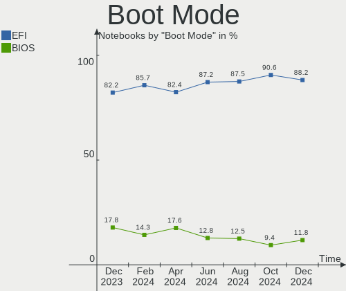
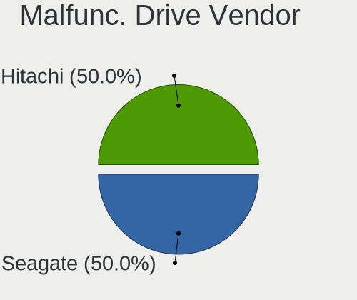
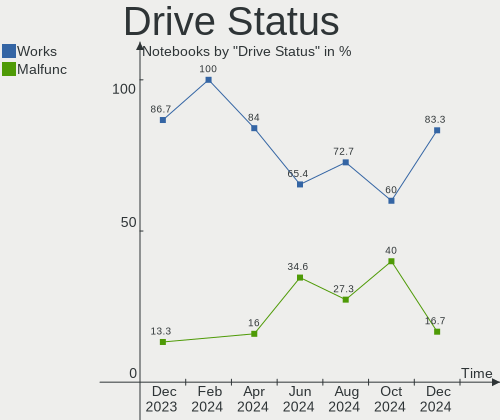
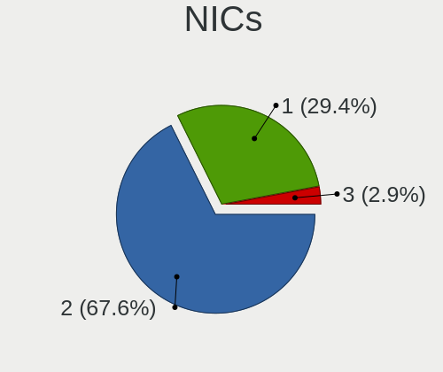
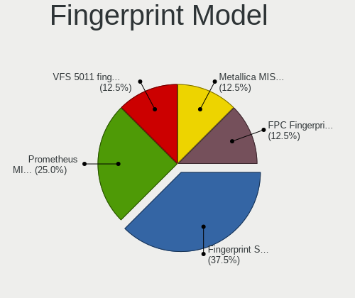

FreeBSD Hardware Trends (Notebook)
----------------------------------

A project to identify most popular hardware characteristics and track their change
over time based on data collected by FreeBSD users at https://BSD-Hardware.info.

Anyone can contribute to the study by uploading probes of their computers by
the [hw-probe](https://github.com/linuxhw/hw-probe/blob/master/INSTALL.BSD.md) tool:

    hw-probe -all -upload

Full-feature report is available here: https://bsd-hardware.info/?view=trends&formfactor=notebook

Period: Feb, 2021.

Contents
--------

- [ OS                       ](#os)
- [ OS Family                ](#os-family)
- [ Arch                     ](#arch)
- [ DE                       ](#de)
- [ Display Server           ](#display-server)
- [ Display Manager          ](#display-manager)
- [ OS Lang                  ](#os-lang)
- [ Boot Mode                ](#boot-mode)
- [ Filesystem               ](#filesystem)
- [ Part. scheme             ](#part-scheme)
- [ Country                  ](#country)
- [ City                     ](#city)
- [ Vendor                   ](#vendor)
- [ Model                    ](#model)
- [ Model Family             ](#model-family)
- [ MFG Year                 ](#mfg-year)
- [ Form Factor              ](#form-factor)
- [ Coreboot                 ](#coreboot)
- [ RAM Size                 ](#ram-size)
- [ RAM Used                 ](#ram-used)
- [ Has CD-ROM               ](#has-cd-rom)
- [ Total Drives             ](#total-drives)
- [ Has Ethernet             ](#has-ethernet)
- [ Drive Vendor             ](#drive-vendor)
- [ Drive Model              ](#drive-model)
- [ HDD Vendor               ](#hdd-vendor)
- [ SSD Vendor               ](#ssd-vendor)
- [ Drive Kind               ](#drive-kind)
- [ Drive Connector          ](#drive-connector)
- [ Drive Size               ](#drive-size)
- [ Space Total              ](#space-total)
- [ Space Used               ](#space-used)
- [ Malfunc. Drives          ](#malfunc-drives)
- [ Malfunc. Drive Vendor    ](#malfunc-drive-vendor)
- [ Malfunc. HDD Vendor      ](#malfunc-hdd-vendor)
- [ Malfunc. Drive Kind      ](#malfunc-drive-kind)
- [ Failed Drives            ](#failed-drives)
- [ Failed Drive Vendor      ](#failed-drive-vendor)
- [ Drive Status             ](#drive-status)
- [ Storage Vendor           ](#storage-vendor)
- [ Storage Model            ](#storage-model)
- [ Storage Kind             ](#storage-kind)
- [ CPU Vendor               ](#cpu-vendor)
- [ CPU Model                ](#cpu-model)
- [ CPU Model Family         ](#cpu-model-family)
- [ CPU Cores                ](#cpu-cores)
- [ CPU Sockets              ](#cpu-sockets)
- [ CPU Threads              ](#cpu-threads)
- [ CPU Microarch            ](#cpu-microarch)
- [ GPU Vendor               ](#gpu-vendor)
- [ GPU Model                ](#gpu-model)
- [ GPU Combo                ](#gpu-combo)
- [ GPU Driver               ](#gpu-driver)
- [ GPU Memory               ](#gpu-memory)
- [ Monitor Vendor           ](#monitor-vendor)
- [ Monitor Model            ](#monitor-model)
- [ Monitor Resolution       ](#monitor-resolution)
- [ Monitor Diagonal         ](#monitor-diagonal)
- [ Monitor Width            ](#monitor-width)
- [ Aspect Ratio             ](#aspect-ratio)
- [ Monitor Area             ](#monitor-area)
- [ Pixel Density            ](#pixel-density)
- [ Multiple Monitors        ](#multiple-monitors)
- [ Net Controller Vendor    ](#net-controller-vendor)
- [ Net Controller Model     ](#net-controller-model)
- [ Wireless Vendor          ](#wireless-vendor)
- [ Wireless Model           ](#wireless-model)
- [ Ethernet Vendor          ](#ethernet-vendor)
- [ Ethernet Model           ](#ethernet-model)
- [ Net Controller Kind      ](#net-controller-kind)
- [ Used Controller          ](#used-controller)
- [ NICs                     ](#nics)
- [ Memory Vendor            ](#memory-vendor)
- [ Memory Model             ](#memory-model)
- [ Memory Kind              ](#memory-kind)
- [ Memory Form Factor       ](#memory-form-factor)
- [ Memory Size              ](#memory-size)
- [ Memory Speed             ](#memory-speed)
- [ Sound Vendor             ](#sound-vendor)
- [ Sound Model              ](#sound-model)
- [ Camera Vendor            ](#camera-vendor)
- [ Camera Model             ](#camera-model)
- [ Fingerprint Vendor       ](#fingerprint-vendor)
- [ Fingerprint Model        ](#fingerprint-model)
- [ Chipcard Vendor          ](#chipcard-vendor)
- [ Chipcard Model           ](#chipcard-model)
- [ Printer Vendor           ](#printer-vendor)
- [ Printer Model            ](#printer-model)
- [ Scanner Vendor           ](#scanner-vendor)
- [ Scanner Model            ](#scanner-model)
- [ Bluetooth Vendor         ](#bluetooth-vendor)
- [ Bluetooth Model          ](#bluetooth-model)
- [ Unsupported Devices      ](#unsupported-devices)
- [ Unsupported Device Types ](#unsupported-device-types)

OS
--

Installed operating systems

| Name                    | Notebooks | Percent |
|-------------------------|-----------|---------|
| FreeBSD 12.2-p3         | 15        | 28.3%   |
| FreeBSD 14.0-CURRENT    | 7         | 13.21%  |
| FreeBSD 13.0-BETA1      | 5         | 9.43%   |
| FreeBSD 13.0-BETA3      | 4         | 7.55%   |
| FreeBSD 12.2-p4         | 4         | 7.55%   |
| FreeBSD 12.2-p2         | 4         | 7.55%   |
| FreeBSD 12.2            | 4         | 7.55%   |
| FreeBSD 13.0-STABLE     | 3         | 5.66%   |
| FreeBSD 13.0-BETA2      | 3         | 5.66%   |
| FreeBSD 13.0-RTC-ALPHA2 | 1         | 1.89%   |
| FreeBSD 13.0-CURRENT    | 1         | 1.89%   |
| FreeBSD 13.0-ALPHA3     | 1         | 1.89%   |
| FreeBSD 12.2-STABLE     | 1         | 1.89%   |

OS Family
---------

OS without a version

| Name    | Notebooks | Percent |
|---------|-----------|---------|
| FreeBSD | 53        | 100%    |

Arch
----

OS architecture (x86_64, i586, etc.)

| Name  | Notebooks | Percent |
|-------|-----------|---------|
| amd64 | 49        | 92.45%  |
| i386  | 4         | 7.55%   |

DE
--

Desktop Environment

| Name          | Notebooks | Percent |
|---------------|-----------|---------|
| KDE5          | 12        | 22.64%  |
| XFCE          | 7         | 13.21%  |
| TWM           | 6         | 11.32%  |
| i3            | 5         | 9.43%   |
| GNOME         | 5         | 9.43%   |
| Console       | 5         | 9.43%   |
| MATE          | 4         | 7.55%   |
| Openbox       | 2         | 3.77%   |
| LXQt          | 1         | 1.89%   |
| LXDE          | 1         | 1.89%   |
| IceWM         | 1         | 1.89%   |
| Fluxbox       | 1         | 1.89%   |
| Enlightenment | 1         | 1.89%   |
| Cinnamon      | 1         | 1.89%   |
| AwesomeWM     | 1         | 1.89%   |

Display Server
--------------

X11 or Wayland

| Name    | Notebooks | Percent |
|---------|-----------|---------|
| X11     | 43        | 81.13%  |
| Console | 7         | 13.21%  |
| Wayland | 3         | 5.66%   |

Display Manager
---------------

SDDM, LightDM, etc.

| Name    | Notebooks | Percent |
|---------|-----------|---------|
| Console | 18        | 33.96%  |
| SLiM    | 11        | 20.75%  |
| SDDM    | 11        | 20.75%  |
| XDM     | 5         | 9.43%   |
| LightDM | 4         | 7.55%   |
| GDM     | 3         | 5.66%   |
| Ly      | 1         | 1.89%   |

OS Lang
-------

Language

| Lang            | Notebooks | Percent |
|-----------------|-----------|---------|
| Unknown         | 17        | 32.08%  |
| C               | 12        | 22.64%  |
| en_US           | 11        | 20.75%  |
| ru_RU           | 3         | 5.66%   |
| fr_FR           | 3         | 5.66%   |
| en_GB           | 3         | 5.66%   |
| pt_BR           | 1         | 1.89%   |
| en_US.ISO8859-1 | 1         | 1.89%   |
| de_DE.ISO8859-1 | 1         | 1.89%   |
| de_DE           | 1         | 1.89%   |

Boot Mode
---------

EFI or BIOS

| Mode | Notebooks | Percent |
|------|-----------|---------|
| EFI  | 37        | 69.81%  |
| BIOS | 16        | 30.19%  |

Filesystem
----------

Type of filesystem

| Type | Notebooks | Percent |
|------|-----------|---------|
| Zfs  | 34        | 64.15%  |
| Ufs  | 19        | 35.85%  |

Part. scheme
------------

Scheme of partitioning

| Type | Notebooks | Percent |
|------|-----------|---------|
| GPT  | 48        | 90.57%  |
| MBR  | 5         | 9.43%   |

Country
-------

Geographic location (country)

| Country      | Notebooks | Percent |
|--------------|-----------|---------|
| USA          | 12        | 22.64%  |
| Russia       | 5         | 9.43%   |
| Germany      | 5         | 9.43%   |
| France       | 5         | 9.43%   |
| UK           | 3         | 5.66%   |
| Vietnam      | 2         | 3.77%   |
| Thailand     | 2         | 3.77%   |
| Poland       | 2         | 3.77%   |
| Netherlands  | 2         | 3.77%   |
| Indonesia    | 2         | 3.77%   |
| Australia    | 2         | 3.77%   |
| Ukraine      | 1         | 1.89%   |
| Switzerland  | 1         | 1.89%   |
| Saudi Arabia | 1         | 1.89%   |
| Peru         | 1         | 1.89%   |
| New Zealand  | 1         | 1.89%   |
| Japan        | 1         | 1.89%   |
| Finland      | 1         | 1.89%   |
| Croatia      | 1         | 1.89%   |
| Brazil       | 1         | 1.89%   |
| Belgium      | 1         | 1.89%   |
| Bangladesh   | 1         | 1.89%   |

City
----

Geographic location (city)

| City             | Notebooks | Percent |
|------------------|-----------|---------|
| The Bronx        | 2         | 3.77%   |
| Moscow           | 2         | 3.77%   |
| Glasgow          | 2         | 3.77%   |
| Zembrzyce        | 1         | 1.89%   |
| Zagreb           | 1         | 1.89%   |
| Warsaw           | 1         | 1.89%   |
| Uitikon          | 1         | 1.89%   |
| Turku            | 1         | 1.89%   |
| Tulle            | 1         | 1.89%   |
| Teresina         | 1         | 1.89%   |
| Telford          | 1         | 1.89%   |
| Sydney           | 1         | 1.89%   |
| St Petersburg    | 1         | 1.89%   |
| Seattle          | 1         | 1.89%   |
| Sanford          | 1         | 1.89%   |
| Rotorua          | 1         | 1.89%   |
| Roche-la-Moliere | 1         | 1.89%   |
| Riyadh           | 1         | 1.89%   |
| Partridge        | 1         | 1.89%   |
| Paris            | 1         | 1.89%   |
| Ome              | 1         | 1.89%   |
| Nerang           | 1         | 1.89%   |
| Lons-le-Saunier  | 1         | 1.89%   |
| Lipetsk          | 1         | 1.89%   |
| Lima             | 1         | 1.89%   |
| Laatzen          | 1         | 1.89%   |
| Kyiv             | 1         | 1.89%   |
| Kartashevskaya   | 1         | 1.89%   |
| Jakarta          | 1         | 1.89%   |
| Husum            | 1         | 1.89%   |
| Ho Chi Minh City | 1         | 1.89%   |
| Hanoi            | 1         | 1.89%   |
| Gilbert          | 1         | 1.89%   |
| Frederick        | 1         | 1.89%   |
| Eindhoven        | 1         | 1.89%   |
| Dublin           | 1         | 1.89%   |
| Dhaka            | 1         | 1.89%   |
| Columbus         | 1         | 1.89%   |
| Chicago          | 1         | 1.89%   |
| Chiang Mai       | 1         | 1.89%   |
| Butgenbach       | 1         | 1.89%   |
| Buda             | 1         | 1.89%   |
| Bremerhaven      | 1         | 1.89%   |
| Betzdorf         | 1         | 1.89%   |
| Berlin           | 1         | 1.89%   |
| Bangkok          | 1         | 1.89%   |
| Bandung          | 1         | 1.89%   |
| Antioch          | 1         | 1.89%   |
| Amsterdam        | 1         | 1.89%   |
| Albi             | 1         | 1.89%   |

Vendor
------

Motherboard manufacturer

| Name                           | Notebooks | Percent |
|--------------------------------|-----------|---------|
| Lenovo                         | 22        | 41.51%  |
| Dell                           | 10        | 18.87%  |
| Hewlett-Packard                | 4         | 7.55%   |
| Acer                           | 4         | 7.55%   |
| ASUSTek Computer               | 3         | 5.66%   |
| System76                       | 2         | 3.77%   |
| Toshiba                        | 1         | 1.89%   |
| MOTILE                         | 1         | 1.89%   |
| Matsushita Electric Industrial | 1         | 1.89%   |
| Gigabyte Technology            | 1         | 1.89%   |
| Fujitsu                        | 1         | 1.89%   |
| Apple                          | 1         | 1.89%   |
| A-DATA Technology              | 1         | 1.89%   |
| Unknown                        | 1         | 1.89%   |

Model
-----

Motherboard model

| Name                                       | Notebooks | Percent |
|--------------------------------------------|-----------|---------|
| Toshiba Satellite L50-C                    | 1         | 1.89%   |
| System76 Lemur Pro                         | 1         | 1.89%   |
| System76 Galago Pro                        | 1         | 1.89%   |
| MOTILE M142                                | 1         | 1.89%   |
| Matsushita Electric Industrial CF-T2BW1AXR | 1         | 1.89%   |
| Lenovo V130-15IKB 81HN                     | 1         | 1.89%   |
| Lenovo ThinkPad X61s 766734A               | 1         | 1.89%   |
| Lenovo ThinkPad X280 20KFCTO1WW            | 1         | 1.89%   |
| Lenovo ThinkPad X230 Tablet 34371N3        | 1         | 1.89%   |
| Lenovo ThinkPad X220 42915CG               | 1         | 1.89%   |
| Lenovo ThinkPad X220 4290NE3               | 1         | 1.89%   |
| Lenovo ThinkPad X13 Gen 1 20UF000QRT       | 1         | 1.89%   |
| Lenovo ThinkPad X1 Extreme 20MF000BUS      | 1         | 1.89%   |
| Lenovo ThinkPad X1 Carbon 4th 48104P0100   | 1         | 1.89%   |
| Lenovo ThinkPad X1 Carbon 4th 20FC0019AU   | 1         | 1.89%   |
| Lenovo ThinkPad T61 6459CTO                | 1         | 1.89%   |
| Lenovo ThinkPad T530 2429J74               | 1         | 1.89%   |
| Lenovo ThinkPad T495s 20QKS1812F           | 1         | 1.89%   |
| Lenovo ThinkPad T450 20BUS08800            | 1         | 1.89%   |
| Lenovo ThinkPad T430 2349H2G               | 1         | 1.89%   |
| Lenovo ThinkPad T420 42368A3               | 1         | 1.89%   |
| Lenovo ThinkPad Edge 03282UA               | 1         | 1.89%   |
| Lenovo ThinkPad E490 20N8CTO1WW            | 1         | 1.89%   |
| Lenovo ThinkPad E420 1141CTO               | 1         | 1.89%   |
| Lenovo IdeaPad 510-15IKB 80SV              | 1         | 1.89%   |
| Lenovo G505s 20255                         | 1         | 1.89%   |
| Lenovo 20QD0000US                          | 1         | 1.89%   |
| HP ENVY dv7                                | 1         | 1.89%   |
| HP EliteBook 8570p                         | 1         | 1.89%   |
| HP EliteBook 8460p                         | 1         | 1.89%   |
| HP Compaq 6820s                            | 1         | 1.89%   |
| Gigabyte P15FR7                            | 1         | 1.89%   |
| Fujitsu FMVNF70YJ                          | 1         | 1.89%   |
| Dell Vostro 3750                           | 1         | 1.89%   |
| Dell Studio 1537                           | 1         | 1.89%   |
| Dell Latitude E7450                        | 1         | 1.89%   |
| Dell Latitude E6430                        | 1         | 1.89%   |
| Dell Latitude E6230                        | 1         | 1.89%   |
| Dell Latitude E5430 vPro                   | 1         | 1.89%   |
| Dell Latitude 7370                         | 1         | 1.89%   |
| Dell Latitude 5580                         | 1         | 1.89%   |
| Dell Inspiron 910                          | 1         | 1.89%   |
| Dell G7 7500                               | 1         | 1.89%   |
| ASUS X553MA                                | 1         | 1.89%   |
| ASUS G73Jh                                 | 1         | 1.89%   |
| ASUS E200HA                                | 1         | 1.89%   |
| Apple MacBookPro6,2                        | 1         | 1.89%   |
| Acer Nitro AN515-52                        | 1         | 1.89%   |
| Acer Extensa 5220                          | 1         | 1.89%   |
| Acer Aspire V5-531                         | 1         | 1.89%   |
| Acer Aspire E5-576                         | 1         | 1.89%   |
| A-DATA XENIA159GENI72060                   | 1         | 1.89%   |
| Unknown                                    | 1         | 1.89%   |

Model Family
------------

Motherboard model prefix

| Name                                       | Notebooks | Percent |
|--------------------------------------------|-----------|---------|
| Lenovo ThinkPad                            | 18        | 33.96%  |
| Dell Latitude                              | 6         | 11.32%  |
| HP EliteBook                               | 2         | 3.77%   |
| Acer Aspire                                | 2         | 3.77%   |
| Toshiba Satellite                          | 1         | 1.89%   |
| System76 Lemur                             | 1         | 1.89%   |
| System76 Galago                            | 1         | 1.89%   |
| MOTILE M142                                | 1         | 1.89%   |
| Matsushita Electric Industrial CF-T2BW1AXR | 1         | 1.89%   |
| Lenovo V130-15IKB                          | 1         | 1.89%   |
| Lenovo IdeaPad                             | 1         | 1.89%   |
| Lenovo G505s                               | 1         | 1.89%   |
| Lenovo 20QD0000US                          | 1         | 1.89%   |
| HP ENVY                                    | 1         | 1.89%   |
| HP Compaq                                  | 1         | 1.89%   |
| Gigabyte P15FR7                            | 1         | 1.89%   |
| Fujitsu FMVNF70YJ                          | 1         | 1.89%   |
| Dell Vostro                                | 1         | 1.89%   |
| Dell Studio                                | 1         | 1.89%   |
| Dell Inspiron                              | 1         | 1.89%   |
| Dell G7                                    | 1         | 1.89%   |
| ASUS X553MA                                | 1         | 1.89%   |
| ASUS G73Jh                                 | 1         | 1.89%   |
| ASUS E200HA                                | 1         | 1.89%   |
| Apple MacBookPro6                          | 1         | 1.89%   |
| Acer Nitro                                 | 1         | 1.89%   |
| Acer Extensa                               | 1         | 1.89%   |
| A-DATA XENIA159GENI72060                   | 1         | 1.89%   |
| Unknown                                    | 1         | 1.89%   |

MFG Year
--------

Motherboard manufacture year

| Year | Notebooks | Percent |
|------|-----------|---------|
| 2018 | 12        | 22.64%  |
| 2020 | 7         | 13.21%  |
| 2019 | 6         | 11.32%  |
| 2013 | 4         | 7.55%   |
| 2012 | 4         | 7.55%   |
| 2017 | 3         | 5.66%   |
| 2015 | 3         | 5.66%   |
| 2011 | 3         | 5.66%   |
| 2016 | 2         | 3.77%   |
| 2014 | 2         | 3.77%   |
| 2009 | 2         | 3.77%   |
| 2008 | 2         | 3.77%   |
| 2021 | 1         | 1.89%   |
| 2007 | 1         | 1.89%   |
| 2003 | 1         | 1.89%   |

Form Factor
-----------

Physical design of the computer

| Name     | Notebooks | Percent |
|----------|-----------|---------|
| Notebook | 53        | 100%    |

Coreboot
--------

Have coreboot on board

| Used | Notebooks | Percent |
|------|-----------|---------|
| No   | 52        | 98.11%  |
| Yes  | 1         | 1.89%   |

RAM Size
--------

Total RAM memory

| Size in GB | Notebooks | Percent |
|------------|-----------|---------|
| 16.01-24.0 | 20        | 37.74%  |
| 8.01-16.0  | 17        | 32.08%  |
| 4.01-8.0   | 7         | 13.21%  |
| 2.01-3.0   | 5         | 9.43%   |
| 32.01-64.0 | 2         | 3.77%   |
| 3.01-4.0   | 1         | 1.89%   |
| 1.01-2.0   | 1         | 1.89%   |

RAM Used
--------

Used RAM memory

| Used GB    | Notebooks | Percent |
|------------|-----------|---------|
| 0.01-0.5   | 28        | 52.83%  |
| 0.51-1.0   | 14        | 26.42%  |
| 1.01-2.0   | 5         | 9.43%   |
| 4.01-8.0   | 2         | 3.77%   |
| 8.01-16.0  | 2         | 3.77%   |
| 2.01-3.0   | 1         | 1.89%   |
| 16.01-24.0 | 1         | 1.89%   |

Has CD-ROM
----------

Has CD-ROM on board

| Presented | Notebooks | Percent |
|-----------|-----------|---------|
| No        | 33        | 62.26%  |
| Yes       | 20        | 37.74%  |

Total Drives
------------

Number of drives on board

| Drives | Notebooks | Percent |
|--------|-----------|---------|
| 1      | 37        | 69.81%  |
| 2      | 13        | 24.53%  |
| 0      | 2         | 3.77%   |
| 3      | 1         | 1.89%   |

Has Ethernet
------------

Has Ethernet on board

| Presented | Notebooks | Percent |
|-----------|-----------|---------|
| Yes       | 50        | 94.34%  |
| No        | 3         | 5.66%   |

Drive Vendor
------------

Hard drive vendors

| Vendor              | Notebooks | Drives | Percent |
|---------------------|-----------|--------|---------|
| Samsung Electronics | 15        | 18     | 23.81%  |
| WDC                 | 10        | 10     | 15.87%  |
| Toshiba             | 6         | 7      | 9.52%   |
| Seagate             | 5         | 6      | 7.94%   |
| HGST                | 4         | 5      | 6.35%   |
| Crucial             | 4         | 4      | 6.35%   |
| Transcend           | 2         | 2      | 3.17%   |
| SK Hynix            | 2         | 2      | 3.17%   |
| SanDisk             | 2         | 2      | 3.17%   |
| Kingston            | 2         | 2      | 3.17%   |
| Hitachi             | 2         | 2      | 3.17%   |
| Hewlett-Packard     | 2         | 2      | 3.17%   |
| Fujitsu             | 2         | 2      | 3.17%   |
| Phison              | 1         | 1      | 1.59%   |
| Micron Technology   | 1         | 1      | 1.59%   |
| Gigabyte Technology | 1         | 1      | 1.59%   |
| BIWIN               | 1         | 1      | 1.59%   |
| A-DATA Technology   | 1         | 1      | 1.59%   |

Drive Model
-----------

Hard drive models

| Model                                | Notebooks | Percent |
|--------------------------------------|-----------|---------|
| Samsung SSD 850 EVO 250GB            | 3         | 4.41%   |
| WDC PC SN730 SDBQNTY-512G-1001 512GB | 2         | 2.94%   |
| Samsung SSD 860 EVO 500GB            | 2         | 2.94%   |
| Samsung SSD 850 EVO 500GB            | 2         | 2.94%   |
| HGST HTS725050A7E630 500GB           | 2         | 2.94%   |
| HGST HTS721010A9E630 1TB             | 2         | 2.94%   |
| WDC WDS500G2B0C-00PXH0 500GB         | 1         | 1.47%   |
| WDC WDS500G2B0A-00SM50 500GB         | 1         | 1.47%   |
| WDC WDS480G2G0A-00JH30 480GB         | 1         | 1.47%   |
| WDC WDBA3V5000ANC-WRSN 500GB         | 1         | 1.47%   |
| WDC WD7500BPKT-75PK4T0 752GB         | 1         | 1.47%   |
| WDC WD10SPZX-24Z10 1TB               | 1         | 1.47%   |
| WDC WD10SPZX-21Z10T0 1TB             | 1         | 1.47%   |
| WDC PC SN720 SDAQNTW-512G-1001 512GB | 1         | 1.47%   |
| Transcend TS512GSSD370 512GB         | 1         | 1.47%   |
| Transcend TS256GMTS800 256GB         | 1         | 1.47%   |
| Toshiba MQ04ABF100 1TB               | 1         | 1.47%   |
| Toshiba MQ01ACF032 320GB             | 1         | 1.47%   |
| Toshiba MQ01ABF050 500GB             | 1         | 1.47%   |
| Toshiba MQ01ABD100 1TB               | 1         | 1.47%   |
| Toshiba MK6475GSX 640GB              | 1         | 1.47%   |
| Toshiba MK1234GSX 120GB              | 1         | 1.47%   |
| Toshiba KBG30ZMT512G 512GB           | 1         | 1.47%   |
| SK Hynix HFS128G39TNF-N3A0A 128GB    | 1         | 1.47%   |
| SK Hynix HFS128G39TND-N210A 128GB    | 1         | 1.47%   |
| Seagate STEC PATA 8GB                | 1         | 1.47%   |
| Seagate ST9500325AS 500GB            | 1         | 1.47%   |
| Seagate ST9250320AS 250GB            | 1         | 1.47%   |
| Seagate ST9250315AS 250GB            | 1         | 1.47%   |
| Seagate ST1000LM035-1RK172 1TB       | 1         | 1.47%   |
| Seagate ST1000LM024 HN-M101MBB 1TB   | 1         | 1.47%   |
| SanDisk X300 MSATA 256GB             | 1         | 1.47%   |
| SanDisk SD8TN8U256G1001 256GB        | 1         | 1.47%   |
| Samsung SSD 970 EVO Plus 250GB       | 1         | 1.47%   |
| Samsung SSD 960 EVO 1TB              | 1         | 1.47%   |
| Samsung SSD 860 EVO 250GB            | 1         | 1.47%   |
| Samsung SSD 860 EVO 1TB              | 1         | 1.47%   |
| Samsung SSD 850 PRO 512GB            | 1         | 1.47%   |
| Samsung SSD 850 PRO 256GB            | 1         | 1.47%   |
| Samsung SSD 840 EVO 500GB            | 1         | 1.47%   |
| Samsung MZVLB512HBJQ-000L7 512GB     | 1         | 1.47%   |
| Samsung MZVLB256HBHQ-000L7 256GB     | 1         | 1.47%   |
| Samsung MZMTD128HAFV-000L1 128GB     | 1         | 1.47%   |
| Samsung MZ5PA064HMCD-01000 64GB      | 1         | 1.47%   |
| Phison PCIe SSD 2TB                  | 1         | 1.47%   |
| Micron 2200S NVMe 1024GB             | 1         | 1.47%   |
| Kingston SA400S37240G 240GB          | 1         | 1.47%   |
| Kingston RBUSNS8180S3128GI 128GB     | 1         | 1.47%   |
| Hitachi HTS723232A7A364 320GB        | 1         | 1.47%   |
| Hitachi HTS541680J9SA00 80GB         | 1         | 1.47%   |
| HP SSD S700 Pro 512GB                | 1         | 1.47%   |
| HP SSD S600 240GB                    | 1         | 1.47%   |
| Gigabyte GP-AG42TB                   | 1         | 1.47%   |
| Fujitsu MHY2120BH 120GB              | 1         | 1.47%   |
| Fujitsu MHS2040AT D 40GB             | 1         | 1.47%   |
| Crucial CT480BX200SSD1 480GB         | 1         | 1.47%   |
| Crucial CT240BX500SSD1 240GB         | 1         | 1.47%   |
| Crucial CT120BX500SSD1 120GB         | 1         | 1.47%   |
| Crucial CT1000P1SSD8 1TB             | 1         | 1.47%   |
| BIWIN SSD 256GB                      | 1         | 1.47%   |

HDD Vendor
----------

Hard disk drive vendors

| Vendor  | Notebooks | Drives | Percent |
|---------|-----------|--------|---------|
| Toshiba | 5         | 6      | 23.81%  |
| Seagate | 5         | 6      | 23.81%  |
| HGST    | 4         | 5      | 19.05%  |
| WDC     | 3         | 3      | 14.29%  |
| Hitachi | 2         | 2      | 9.52%   |
| Fujitsu | 2         | 2      | 9.52%   |

SSD Vendor
----------

Solid state drive vendors

| Vendor              | Notebooks | Drives | Percent |
|---------------------|-----------|--------|---------|
| Samsung Electronics | 11        | 14     | 40.74%  |
| Crucial             | 3         | 3      | 11.11%  |
| WDC                 | 2         | 2      | 7.41%   |
| Transcend           | 2         | 2      | 7.41%   |
| SK Hynix            | 2         | 2      | 7.41%   |
| SanDisk             | 2         | 2      | 7.41%   |
| Kingston            | 2         | 2      | 7.41%   |
| Hewlett-Packard     | 2         | 2      | 7.41%   |
| BIWIN               | 1         | 1      | 3.7%    |

Drive Kind
----------

HDD or SSD

| Kind | Notebooks | Drives | Percent |
|------|-----------|--------|---------|
| SSD  | 25        | 30     | 42.37%  |
| HDD  | 19        | 24     | 32.2%   |
| NVMe | 15        | 15     | 25.42%  |

Drive Connector
---------------

SATA, SAS, NVMe, etc.

| Type | Notebooks | Drives | Percent |
|------|-----------|--------|---------|
| SATA | 40        | 54     | 72.73%  |
| NVMe | 15        | 15     | 27.27%  |

Drive Size
----------

Size of hard drive

| Size in TB | Notebooks | Drives | Percent |
|------------|-----------|--------|---------|
| 0.01-0.5   | 34        | 39     | 70.83%  |
| 0.51-1.0   | 14        | 15     | 29.17%  |

Space Total
-----------

Amount of disk space available on the file system

| Size in GB | Notebooks | Percent |
|------------|-----------|---------|
| 251-500    | 18        | 33.96%  |
| 101-250    | 13        | 24.53%  |
| 501-1000   | 8         | 15.09%  |
| 51-100     | 6         | 11.32%  |
| 21-50      | 4         | 7.55%   |
| 1001-2000  | 3         | 5.66%   |
| 1-20       | 1         | 1.89%   |

Space Used
----------

Amount of used disk space

| Used GB | Notebooks | Percent |
|---------|-----------|---------|
| 1-20    | 37        | 69.81%  |
| 21-50   | 10        | 18.87%  |
| 101-250 | 6         | 11.32%  |

Malfunc. Drives
---------------

Drive models with a malfunction

| Model                                       | Notebooks | Drives | Percent |
|---------------------------------------------|-----------|--------|---------|
| WDC WD7500BPKT-75PK4T0 752GB                | 1         | 1      | 10%     |
| Toshiba MK6475GSX 640GB                     | 1         | 1      | 10%     |
| Seagate ST9500325AS 500GB                   | 1         | 1      | 10%     |
| Seagate ST9250320AS 250GB                   | 1         | 1      | 10%     |
| Seagate ST9250315AS 250GB                   | 1         | 1      | 10%     |
| Samsung Electronics SSD 840 EVO 500GB       | 1         | 1      | 10%     |
| Samsung Electronics MZ5PA064HMCD-01000 64GB | 1         | 1      | 10%     |
| Hitachi HTS723232A7A364 320GB               | 1         | 1      | 10%     |
| HGST HTS725050A7E630 500GB                  | 1         | 1      | 10%     |
| Fujitsu MHS2040AT D 40GB                    | 1         | 1      | 10%     |

Malfunc. Drive Vendor
---------------------

Vendors of faulty drives

| Vendor              | Notebooks | Drives | Percent |
|---------------------|-----------|--------|---------|
| Seagate             | 3         | 3      | 30%     |
| Samsung Electronics | 2         | 2      | 20%     |
| WDC                 | 1         | 1      | 10%     |
| Toshiba             | 1         | 1      | 10%     |
| Hitachi             | 1         | 1      | 10%     |
| HGST                | 1         | 1      | 10%     |
| Fujitsu             | 1         | 1      | 10%     |

Malfunc. HDD Vendor
-------------------

Vendors of faulty HDD drives

| Vendor  | Notebooks | Drives | Percent |
|---------|-----------|--------|---------|
| Seagate | 3         | 3      | 37.5%   |
| WDC     | 1         | 1      | 12.5%   |
| Toshiba | 1         | 1      | 12.5%   |
| Hitachi | 1         | 1      | 12.5%   |
| HGST    | 1         | 1      | 12.5%   |
| Fujitsu | 1         | 1      | 12.5%   |

Malfunc. Drive Kind
-------------------

Kinds of faulty drives

| Kind | Notebooks | Drives | Percent |
|------|-----------|--------|---------|
| HDD  | 7         | 8      | 77.78%  |
| SSD  | 2         | 2      | 22.22%  |

Failed Drives
-------------

Failed drive models

Zero info for selected period =(

Failed Drive Vendor
-------------------

Failed drive vendors

Zero info for selected period =(

Drive Status
------------

Number of failed and malfunc. drives

| Status  | Notebooks | Drives | Percent |
|---------|-----------|--------|---------|
| Works   | 46        | 59     | 83.64%  |
| Malfunc | 9         | 10     | 16.36%  |

Storage Vendor
--------------

Storage controller vendors

| Vendor                    | Notebooks | Percent |
|---------------------------|-----------|---------|
| Intel                     | 41        | 71.93%  |
| Sandisk                   | 5         | 8.77%   |
| Samsung Electronics       | 3         | 5.26%   |
| Phison Electronics        | 2         | 3.51%   |
| AMD                       | 2         | 3.51%   |
| Toshiba                   | 1         | 1.75%   |
| Micron/Crucial Technology | 1         | 1.75%   |
| Micron Technology         | 1         | 1.75%   |
| ADATA Technology          | 1         | 1.75%   |

Storage Model
-------------

Storage controller models

| Model                                                                            | Notebooks | Percent |
|----------------------------------------------------------------------------------|-----------|---------|
| Intel 7 Series Chipset Family 6-port SATA Controller [AHCI mode]                 | 7         | 11.11%  |
| Intel Sunrise Point-LP SATA Controller [AHCI mode]                               | 6         | 9.52%   |
| Intel 6 Series/C200 Series Chipset Family 6 port Mobile SATA AHCI Controller     | 6         | 9.52%   |
| Intel 82801HM/HEM (ICH8M/ICH8M-E) SATA Controller [AHCI mode]                    | 5         | 7.94%   |
| Intel 82801HM/HEM (ICH8M/ICH8M-E) IDE Controller                                 | 5         | 7.94%   |
| Intel 82801 Mobile SATA Controller [RAID mode]                                   | 3         | 4.76%   |
| Intel 5 Series/3400 Series Chipset 4 port SATA AHCI Controller                   | 3         | 4.76%   |
| Sandisk WD Blue SN550 NVMe SSD                                                   | 2         | 3.17%   |
| Sandisk WD Black SN750 / PC SN730 NVMe SSD                                       | 2         | 3.17%   |
| Samsung NVMe SSD Controller SM981/PM981/PM983                                    | 2         | 3.17%   |
| Intel Wildcat Point-LP SATA Controller [AHCI Mode]                               | 2         | 3.17%   |
| AMD FCH SATA Controller [AHCI mode]                                              | 2         | 3.17%   |
| Toshiba BG3 NVMe SSD Controller                                                  | 1         | 1.59%   |
| Sandisk WD Black 2018/SN750 / PC SN720 NVMe SSD                                  | 1         | 1.59%   |
| Samsung NVMe SSD Controller SM961/PM961/SM963                                    | 1         | 1.59%   |
| Phison E16 PCIe4 NVMe Controller                                                 | 1         | 1.59%   |
| Phison E12 NVMe Controller                                                       | 1         | 1.59%   |
| Micron/Crucial P1 NVMe PCIe SSD                                                  | 1         | 1.59%   |
| Intel Mobile PM965/GM965 PT IDER Controller                                      | 1         | 1.59%   |
| Intel HM170/QM170 Chipset SATA Controller [AHCI Mode]                            | 1         | 1.59%   |
| Intel Cannon Lake Mobile PCH SATA AHCI Controller                                | 1         | 1.59%   |
| Intel Atom/Celeron/Pentium Processor x5-E8000/J3xxx/N3xxx Series SATA Controller | 1         | 1.59%   |
| Intel Atom Processor E3800 Series SATA AHCI Controller                           | 1         | 1.59%   |
| Intel 82801IBM/IEM (ICH9M/ICH9M-E) 4 port SATA Controller [AHCI mode]            | 1         | 1.59%   |
| Intel 82801GBM/GHM (ICH7-M Family) SATA Controller [IDE mode]                    | 1         | 1.59%   |
| Intel 82801G (ICH7 Family) IDE Controller                                        | 1         | 1.59%   |
| Intel 82801DBM (ICH4-M) IDE Controller                                           | 1         | 1.59%   |
| Intel 400 Series Chipset Family SATA AHCI Controller                             | 1         | 1.59%   |
| ADATA XPG SX8200 Pro PCIe Gen3x4 M.2 2280 Solid State Drive                      | 1         | 1.59%   |
| Unknown                                                                          | 1         | 1.59%   |

Storage Kind
------------

Kind of storage controller (IDE, SATA, NVMe, SAS, ...)

| Kind | Notebooks | Percent |
|------|-----------|---------|
| SATA | 37        | 59.68%  |
| NVMe | 14        | 22.58%  |
| IDE  | 8         | 12.9%   |
| RAID | 3         | 4.84%   |

CPU Vendor
----------

Processor vendors

| Vendor | Notebooks | Percent |
|--------|-----------|---------|
| Intel  | 49        | 92.45%  |
| AMD    | 4         | 7.55%   |

CPU Model
---------

Processor models

| Model                                           | Notebooks | Percent |
|-------------------------------------------------|-----------|---------|
| Intel Core i5-2520M CPU @ 2.50GHz               | 5         | 9.43%   |
| Intel Core i7-3520M CPU @ 2.90GHz               | 3         | 5.66%   |
| Intel CPU Version                               | 2         | 3.77%   |
| Intel Core i7-8750H CPU @ 2.20GHz               | 2         | 3.77%   |
| Intel Core i7-8565U CPU @ 1.80GHz               | 2         | 3.77%   |
| Intel Core i7-7500U CPU @ 2.70GHz               | 2         | 3.77%   |
| Intel Core i7-6600U CPU @ 2.60GHz               | 2         | 3.77%   |
| Intel Core i5-7200U CPU @ 2.50GHz               | 2         | 3.77%   |
| Intel Core i5-3340M CPU @ 2.70GHz               | 2         | 3.77%   |
| Intel Core i5-3320M CPU @ 2.60GHz               | 2         | 3.77%   |
| Intel Core 2 Duo CPU T7250 @ 2.00GHz            | 2         | 3.77%   |
| Intel Pentium M processor 1000MHz               | 1         | 1.89%   |
| Intel Pentium CPU N3700 @ 1.60GHz               | 1         | 1.89%   |
| Intel Pentium CPU N3540 @ 2.16GHz               | 1         | 1.89%   |
| Intel Pentium CPU 967 @ 1.30GHz                 | 1         | 1.89%   |
| Intel Genuine CPU                               | 1         | 1.89%   |
| Intel Core m7-6Y75 CPU @ 1.20GHz                | 1         | 1.89%   |
| Intel Core i7-9750H CPU @ 2.60GHz               | 1         | 1.89%   |
| Intel Core i7-8550U CPU @ 1.80GHz               | 1         | 1.89%   |
| Intel Core i7-7700HQ CPU @ 2.80GHz              | 1         | 1.89%   |
| Intel Core i7-3610QM CPU @ 2.30GHz              | 1         | 1.89%   |
| Intel Core i7-2630QM CPU @ 2.00GHz              | 1         | 1.89%   |
| Intel Core i7-10750H CPU @ 2.60GHz              | 1         | 1.89%   |
| Intel Core i7 CPU Q 720 @ 1.60GH                | 1         | 1.89%   |
| Intel Core i5-7300U CPU @ 2.60GHz               | 1         | 1.89%   |
| Intel Core i5-5300U CPU @ 2.30GHz               | 1         | 1.89%   |
| Intel Core i5-5200U CPU @ 2.20GHz               | 1         | 1.89%   |
| Intel Core i5-10210U CPU @ 1.60GHz              | 1         | 1.89%   |
| Intel Core i5 CPU M 520 @ 2.40GHz               | 1         | 1.89%   |
| Intel Core 2 Duo CPU T7300 @ 2.00GHz            | 1         | 1.89%   |
| Intel Core 2 Duo CPU L7500 @ 1.60GHz            | 1         | 1.89%   |
| Intel C0                                        | 1         | 1.89%   |
| Intel Atom x5-Z8350 CPU @ 1.44GHz               | 1         | 1.89%   |
| Intel Atom CPU N270 @ 1.60GHz                   | 1         | 1.89%   |
| AMD Ryzen 7 PRO 4750U with Radeon Graphics      | 1         | 1.89%   |
| AMD Ryzen 7 PRO 3700U w/ Radeon Vega Mobile Gfx | 1         | 1.89%   |
| AMD Ryzen 5 3500U with Radeon Vega Mobile Gfx   | 1         | 1.89%   |
| AMD A8-4500M APU with Radeon HD Graphics        | 1         | 1.89%   |

CPU Model Family
----------------

Processor model prefix

| Model            | Notebooks | Percent |
|------------------|-----------|---------|
| Intel Core i7    | 18        | 33.96%  |
| Intel Core i5    | 16        | 30.19%  |
| Intel Core 2 Duo | 4         | 7.55%   |
| Other            | 3         | 5.66%   |
| Intel Pentium    | 3         | 5.66%   |
| Intel Atom       | 2         | 3.77%   |
| AMD Ryzen 7 PRO  | 2         | 3.77%   |
| Intel Pentium M  | 1         | 1.89%   |
| Intel Genuine    | 1         | 1.89%   |
| Intel Core m7    | 1         | 1.89%   |
| AMD Ryzen 5      | 1         | 1.89%   |
| AMD A8           | 1         | 1.89%   |

CPU Cores
---------

Number of processor cores

| Number  | Notebooks | Percent |
|---------|-----------|---------|
| 2       | 26        | 49.06%  |
| 4       | 12        | 22.64%  |
| Unknown | 6         | 11.32%  |
| 6       | 4         | 7.55%   |
| 8       | 2         | 3.77%   |
| 1       | 2         | 3.77%   |
| 16      | 1         | 1.89%   |

CPU Sockets
-----------

Number of sockets

| Number | Notebooks | Percent |
|--------|-----------|---------|
| 1      | 53        | 100%    |

CPU Threads
-----------

Threads per core (Hyper-Threading)

| Number  | Notebooks | Percent |
|---------|-----------|---------|
| 2       | 37        | 69.81%  |
| 1       | 9         | 16.98%  |
| Unknown | 7         | 13.21%  |

CPU Microarch
-------------

Microarchitecture

| Name        | Notebooks | Percent |
|-------------|-----------|---------|
| KabyLake    | 13        | 24.53%  |
| IvyBridge   | 8         | 15.09%  |
| SandyBridge | 7         | 13.21%  |
| Core        | 4         | 7.55%   |
| Skylake     | 3         | 5.66%   |
| Silvermont  | 3         | 5.66%   |
| Zen+        | 2         | 3.77%   |
| Westmere    | 2         | 3.77%   |
| Penryn      | 2         | 3.77%   |
| Broadwell   | 2         | 3.77%   |
| Bonnell     | 2         | 3.77%   |
| Zen 2       | 1         | 1.89%   |
| Piledriver  | 1         | 1.89%   |
| P6          | 1         | 1.89%   |
| Nehalem     | 1         | 1.89%   |
| CometLake   | 1         | 1.89%   |

GPU Vendor
----------

Vendors of graphics cards

| Vendor | Notebooks | Percent |
|--------|-----------|---------|
| Intel  | 44        | 69.84%  |
| Nvidia | 10        | 15.87%  |
| AMD    | 9         | 14.29%  |

GPU Model
---------

Graphics card models

| Model                                                                                    | Notebooks | Percent |
|------------------------------------------------------------------------------------------|-----------|---------|
| Intel 3rd Gen Core processor Graphics Controller                                         | 7         | 10.14%  |
| Intel 2nd Generation Core Processor Family Integrated Graphics Controller                | 7         | 10.14%  |
| Intel HD Graphics 620                                                                    | 5         | 7.25%   |
| Intel Mobile GM965/GL960 Integrated Graphics Controller (secondary)                      | 3         | 4.35%   |
| Intel Mobile GM965/GL960 Integrated Graphics Controller (primary)                        | 3         | 4.35%   |
| Intel CoffeeLake-H GT2 [UHD Graphics 630]                                                | 3         | 4.35%   |
| Intel WhiskeyLake-U GT2 [UHD Graphics 620]                                               | 2         | 2.9%    |
| Intel Skylake GT2 [HD Graphics 520]                                                      | 2         | 2.9%    |
| Intel Mobile 945GSE Express Integrated Graphics Controller                               | 2         | 2.9%    |
| Intel Mobile 945GM/GMS/GME, 943/940GML Express Integrated Graphics Controller            | 2         | 2.9%    |
| Intel HD Graphics 5500                                                                   | 2         | 2.9%    |
| Intel Core Processor Integrated Graphics Controller                                      | 2         | 2.9%    |
| Intel Atom/Celeron/Pentium Processor x5-E8000/J3xxx/N3xxx Integrated Graphics Controller | 2         | 2.9%    |
| AMD Picasso                                                                              | 2         | 2.9%    |
| Nvidia TU116M [GeForce GTX 1660 Ti Mobile]                                               | 1         | 1.45%   |
| Nvidia TU106M [GeForce RTX 2070 Mobile / Max-Q Refresh]                                  | 1         | 1.45%   |
| Nvidia GT216M [GeForce GT 330M]                                                          | 1         | 1.45%   |
| Nvidia GP107M [GeForce GTX 1050 Ti Mobile]                                               | 1         | 1.45%   |
| Nvidia GP107M [GeForce GTX 1050 Mobile]                                                  | 1         | 1.45%   |
| Nvidia GM108M [GeForce 940MX]                                                            | 1         | 1.45%   |
| Nvidia GM107M [GeForce GTX 950M]                                                         | 1         | 1.45%   |
| Nvidia GF108M [GeForce GT 635M]                                                          | 1         | 1.45%   |
| Nvidia GF108M [GeForce GT 525M]                                                          | 1         | 1.45%   |
| Nvidia G86M [Quadro NVS 140M]                                                            | 1         | 1.45%   |
| Intel UHD Graphics 620                                                                   | 1         | 1.45%   |
| Intel HD Graphics 630                                                                    | 1         | 1.45%   |
| Intel HD Graphics 515                                                                    | 1         | 1.45%   |
| Intel CometLake-U GT2 [UHD Graphics]                                                     | 1         | 1.45%   |
| Intel CometLake-H GT2 [UHD Graphics]                                                     | 1         | 1.45%   |
| Intel Atom Processor Z36xxx/Z37xxx Series Graphics & Display                             | 1         | 1.45%   |
| Intel 82852/855GM Integrated Graphics Device                                             | 1         | 1.45%   |
| AMD Whistler [Radeon HD 6630M/6650M/6750M/7670M/7690M]                                   | 1         | 1.45%   |
| AMD Trinity [Radeon HD 7640G]                                                            | 1         | 1.45%   |
| AMD Thames [Radeon HD 7550M/7570M/7650M]                                                 | 1         | 1.45%   |
| AMD Sun PRO [Radeon HD 8570A/8570M]                                                      | 1         | 1.45%   |
| AMD RV620/M82 [Mobility Radeon HD 3450/3470]                                             | 1         | 1.45%   |
| AMD RV516/M62-S [Mobility Radeon X1350]                                                  | 1         | 1.45%   |
| AMD Renoir                                                                               | 1         | 1.45%   |
| AMD Broadway XT [Mobility Radeon HD 5870]                                                | 1         | 1.45%   |

GPU Combo
---------

Combinations of graphics cards

| Name           | Notebooks | Percent |
|----------------|-----------|---------|
| 1 x Intel      | 30        | 56.6%   |
| Intel + Nvidia | 7         | 13.21%  |
| 1 x AMD        | 7         | 13.21%  |
| 2 x Intel      | 5         | 9.43%   |
| 1 x Nvidia     | 2         | 3.77%   |
| 2 x AMD        | 1         | 1.89%   |
| Intel + AMD    | 1         | 1.89%   |

GPU Driver
----------

Free vs proprietary

| Driver      | Notebooks | Percent |
|-------------|-----------|---------|
| Free        | 51        | 96.23%  |
| Proprietary | 2         | 3.77%   |

GPU Memory
----------

Total video memory

| Size in GB | Notebooks | Percent |
|------------|-----------|---------|
| Unknown    | 47        | 88.68%  |
| 1.01-2.0   | 3         | 5.66%   |
| 0.01-0.5   | 2         | 3.77%   |
| 0.51-1.0   | 1         | 1.89%   |

Monitor Vendor
--------------

Monitor vendors

| Vendor                  | Notebooks | Percent |
|-------------------------|-----------|---------|
| LG Display              | 11        | 22.92%  |
| AU Optronics            | 9         | 18.75%  |
| BOE                     | 5         | 10.42%  |
| Chimei Innolux          | 4         | 8.33%   |
| Samsung Electronics     | 3         | 6.25%   |
| Lenovo                  | 2         | 4.17%   |
| AOC                     | 2         | 4.17%   |
| ViewSonic               | 1         | 2.08%   |
| Sharp                   | 1         | 2.08%   |
| Panasonic               | 1         | 2.08%   |
| LG Philips              | 1         | 2.08%   |
| InfoVision              | 1         | 2.08%   |
| Iiyama                  | 1         | 2.08%   |
| IBM                     | 1         | 2.08%   |
| HannStar                | 1         | 2.08%   |
| Goldstar                | 1         | 2.08%   |
| Chi Mei Optoelectronics | 1         | 2.08%   |
| Apple                   | 1         | 2.08%   |
| Ancor Communications    | 1         | 2.08%   |

Monitor Model
-------------

Monitor models

| Model                                                                    | Notebooks | Percent |
|--------------------------------------------------------------------------|-----------|---------|
| LG Display LCD Monitor LGD02D8 1366x768 280x160mm 12.7-inch              | 2         | 4.17%   |
| ViewSonic LCD Monitor VSC6F2E 1920x1080 480x270mm 21.7-inch              | 1         | 2.08%   |
| Sharp LCD Monitor SHP1461 3200x1800 290x170mm 13.2-inch                  | 1         | 2.08%   |
| Samsung Electronics LCD Monitor SEC3847 1440x900 370x230mm 17.2-inch     | 1         | 2.08%   |
| Samsung Electronics LCD Monitor SDC424A 3200x1800 290x170mm 13.2-inch    | 1         | 2.08%   |
| Samsung Electronics LCD Monitor SDC4141 1366x768 340x190mm 15.3-inch     | 1         | 2.08%   |
| Panasonic VVX13F009G00 MEI96A2 1920x1080 290x170mm 13.2-inch             | 1         | 2.08%   |
| LG Philips LCD Monitor LPL7F01 1024x600 190x110mm 8.6-inch               | 1         | 2.08%   |
| LG Display LCD Monitor LGD060A 1920x1080 290x170mm 13.2-inch             | 1         | 2.08%   |
| LG Display LCD Monitor LGD04B1 1366x768 310x170mm 13.9-inch              | 1         | 2.08%   |
| LG Display LCD Monitor LGD04A9 1920x1080 310x170mm 13.9-inch             | 1         | 2.08%   |
| LG Display LCD Monitor LGD036C 1366x768 280x160mm 12.7-inch              | 1         | 2.08%   |
| LG Display LCD Monitor LGD033E 1366x768 310x170mm 13.9-inch              | 1         | 2.08%   |
| LG Display LCD Monitor LGD0303 1600x900 380x210mm 17.1-inch              | 1         | 2.08%   |
| LG Display LCD Monitor LGD02BE 1366x768 260x140mm 11.6-inch              | 1         | 2.08%   |
| LG Display LCD Monitor LGD0283 1920x1080 380x220mm 17.3-inch             | 1         | 2.08%   |
| LG Display LCD Monitor LGD0258 1600x900 350x190mm 15.7-inch              | 1         | 2.08%   |
| Lenovo LCD Monitor LEN40B1 1600x900 340x190mm 15.3-inch                  | 1         | 2.08%   |
| Lenovo LCD Monitor LEN4000 1024x768 250x180mm 12.1-inch                  | 1         | 2.08%   |
| InfoVision LCD Monitor IVO057D 1920x1080 310x170mm 13.9-inch             | 1         | 2.08%   |
| Iiyama PL2474H IVM6146 1920x1080 520x290mm 23.4-inch                     | 1         | 2.08%   |
| IBM LCD Monitor IBM2887 1680x1050 330x210mm 15.4-inch                    | 1         | 2.08%   |
| HannStar HSD173PUW1 HSD06A5 1920x1080 390x230mm 17.8-inch                | 1         | 2.08%   |
| Goldstar LG HDR WFHD GSM7714 2560x1080 800x340mm 34.2-inch               | 1         | 2.08%   |
| Chimei Innolux LCD Monitor CMN15D5 1920x1080 340x190mm 15.3-inch         | 1         | 2.08%   |
| Chimei Innolux LCD Monitor CMN15B5 1366x768 340x190mm 15.3-inch          | 1         | 2.08%   |
| Chimei Innolux LCD Monitor CMN14D5 1920x1080 310x170mm 13.9-inch         | 1         | 2.08%   |
| Chimei Innolux LCD Monitor CMN14D4 1920x1080 310x170mm 13.9-inch         | 1         | 2.08%   |
| Chi Mei Optoelectronics LCD Monitor CMO15A7 1366x768 350x190mm 15.7-inch | 1         | 2.08%   |
| BOE LCD Monitor BOE084D 1920x1080 340x190mm 15.3-inch                    | 1         | 2.08%   |
| BOE LCD Monitor BOE07A3 1920x1080 340x190mm 15.3-inch                    | 1         | 2.08%   |
| BOE LCD Monitor BOE0792 1920x1080 340x190mm 15.3-inch                    | 1         | 2.08%   |
| BOE LCD Monitor BOE0742 1920x1080 310x170mm 13.9-inch                    | 1         | 2.08%   |
| BOE LCD Monitor BOE06CB 1920x1080 340x190mm 15.3-inch                    | 1         | 2.08%   |
| AU Optronics LCD Monitor AUO8074 1280x800 330x210mm 15.4-inch            | 1         | 2.08%   |
| AU Optronics LCD Monitor AUO31EC 1366x768 340x190mm 15.3-inch            | 1         | 2.08%   |
| AU Optronics LCD Monitor AUO313C 1366x768 310x170mm 13.9-inch            | 1         | 2.08%   |
| AU Optronics LCD Monitor AUO303E 1600x900 310x170mm 13.9-inch            | 1         | 2.08%   |
| AU Optronics LCD Monitor AUO226D 1920x1080 280x160mm 12.7-inch           | 1         | 2.08%   |
| AU Optronics LCD Monitor AUO223E 1600x900 310x170mm 13.9-inch            | 1         | 2.08%   |
| AU Optronics LCD Monitor AUO213E 1600x900 310x170mm 13.9-inch            | 1         | 2.08%   |
| AU Optronics LCD Monitor AUO1C3C 1366x768 310x170mm 13.9-inch            | 1         | 2.08%   |
| AU Optronics LCD Monitor AUO106C 1366x768 280x160mm 12.7-inch            | 1         | 2.08%   |
| Apple Cinema HD APP9223 1920x1200 490x310mm 22.8-inch                    | 1         | 2.08%   |
| AOC Q3279WG5B AOC3279 2560x1440 730x430mm 33.4-inch                      | 1         | 2.08%   |
| AOC 2779 AOC2779 1920x1080 600x340mm 27.2-inch                           | 1         | 2.08%   |
| Ancor Communications ASUS VE278 ACI27F6 1920x1080 600x340mm 27.2-inch    | 1         | 2.08%   |

Monitor Resolution
------------------

Monitor screen resolution

| Resolution         | Notebooks | Percent |
|--------------------|-----------|---------|
| 1920x1080 (FHD)    | 16        | 34.78%  |
| 1366x768 (WXGA)    | 13        | 28.26%  |
| 1600x900 (HD+)     | 6         | 13.04%  |
| 3200x1800 (QHD+)   | 2         | 4.35%   |
| 2560x1440 (QHD)    | 2         | 4.35%   |
| 2560x1080          | 1         | 2.17%   |
| 1920x1200 (WUXGA)  | 1         | 2.17%   |
| 1680x1050 (WSXGA+) | 1         | 2.17%   |
| 1440x900 (WXGA+)   | 1         | 2.17%   |
| 1280x800 (WXGA)    | 1         | 2.17%   |
| 1024x768 (XGA)     | 1         | 2.17%   |
| 1024x600           | 1         | 2.17%   |

Monitor Diagonal
----------------

Diagonal size in inches

| Inches | Notebooks | Percent |
|--------|-----------|---------|
| 13     | 16        | 34.04%  |
| 15     | 13        | 27.66%  |
| 12     | 6         | 12.77%  |
| 17     | 4         | 8.51%   |
| 34     | 1         | 2.13%   |
| 33     | 1         | 2.13%   |
| 27     | 1         | 2.13%   |
| 23     | 1         | 2.13%   |
| 22     | 1         | 2.13%   |
| 21     | 1         | 2.13%   |
| 11     | 1         | 2.13%   |
| 8      | 1         | 2.13%   |

Monitor Width
-------------

Physical width

| Width in mm | Notebooks | Percent |
|-------------|-----------|---------|
| 301-350     | 26        | 55.32%  |
| 201-300     | 10        | 21.28%  |
| 351-400     | 4         | 8.51%   |
| 701-800     | 2         | 4.26%   |
| 501-600     | 2         | 4.26%   |
| 401-500     | 2         | 4.26%   |
| 101-200     | 1         | 2.13%   |

Aspect Ratio
------------

Proportional relationship between the width and the height

| Ratio | Notebooks | Percent |
|-------|-----------|---------|
| 16/9  | 37        | 86.05%  |
| 16/10 | 4         | 9.3%    |
| 4/3   | 1         | 2.33%   |
| 21/9  | 1         | 2.33%   |

Monitor Area
------------

Area in inch

| Area in inch | Notebooks | Percent |
|----------------|-----------|---------|
| 81-90          | 13        | 27.66%  |
| 91-100         | 9         | 19.15%  |
| 61-70          | 6         | 12.77%  |
| 101-110        | 4         | 8.51%   |
| 71-80          | 3         | 6.38%   |
| 201-250        | 3         | 6.38%   |
| 351-500        | 2         | 4.26%   |
| 131-140        | 2         | 4.26%   |
| 121-130        | 2         | 4.26%   |
| 51-60          | 1         | 2.13%   |
| 1-40           | 1         | 2.13%   |
| 301-350        | 1         | 2.13%   |

Pixel Density
-------------

Pixels per inch

| Density       | Notebooks | Percent |
|---------------|-----------|---------|
| 121-160       | 22        | 46.81%  |
| 101-120       | 12        | 25.53%  |
| 51-100        | 8         | 17.02%  |
| 161-240       | 3         | 6.38%   |
| More than 240 | 2         | 4.26%   |

Multiple Monitors
-----------------

Total monitors connected

| Total | Notebooks | Percent |
|-------|-----------|---------|
| 1     | 34        | 64.15%  |
| 0     | 13        | 24.53%  |
| 2     | 5         | 9.43%   |
| 3     | 1         | 1.89%   |

Net Controller Vendor
---------------------

Controller vendors

| Vendor                            | Notebooks | Percent |
|-----------------------------------|-----------|---------|
| Intel                             | 44        | 50.57%  |
| Realtek Semiconductor             | 24        | 27.59%  |
| Qualcomm Atheros                  | 6         | 6.9%    |
| Broadcom Inc. and subsidiaries    | 6         | 6.9%    |
| Ericsson Business Mobile Networks | 3         | 3.45%   |
| Ralink Technology                 | 1         | 1.15%   |
| Marvell Technology Group          | 1         | 1.15%   |
| Hewlett-Packard                   | 1         | 1.15%   |
| D-Link                            | 1         | 1.15%   |

Net Controller Model
--------------------

Controller models

| Model                                                                        | Notebooks | Percent |
|------------------------------------------------------------------------------|-----------|---------|
| Realtek RTL8111/8168/8411 PCI Express Gigabit Ethernet Controller            | 16        | 14.41%  |
| Intel 82579LM Gigabit Network Connection (Lewisville)                        | 11        | 9.91%   |
| Intel Centrino Advanced-N 6205 [Taylor Peak]                                 | 9         | 8.11%   |
| Realtek RTL810xE PCI Express Fast Ethernet controller                        | 4         | 3.6%    |
| Intel Wireless-AC 9260                                                       | 3         | 2.7%    |
| Intel Wireless 8265 / 8275                                                   | 3         | 2.7%    |
| Intel Wireless 8260                                                          | 3         | 2.7%    |
| Qualcomm Atheros QCA9565 / AR9565 Wireless Network Adapter                   | 2         | 1.8%    |
| Qualcomm Atheros AR9285 Wireless Network Adapter (PCI-Express)               | 2         | 1.8%    |
| Intel Wireless-AC 9560 [Jefferson Peak]                                      | 2         | 1.8%    |
| Intel PRO/Wireless 4965 AG or AGN [Kedron] Network Connection                | 2         | 1.8%    |
| Intel PRO/Wireless 3945ABG [Golan] Network Connection                        | 2         | 1.8%    |
| Intel Ethernet Connection (3) I218-LM                                        | 2         | 1.8%    |
| Intel Dual Band Wireless-AC 3168NGW [Stone Peak]                             | 2         | 1.8%    |
| Intel Dual Band Wireless-AC 3165 Plus Bluetooth                              | 2         | 1.8%    |
| Intel 82566MM Gigabit Network Connection                                     | 2         | 1.8%    |
| Ericsson Business Mobile Networks F5521 gw Mobile Broadband Serial Port III  | 2         | 1.8%    |
| Broadcom Inc. and subsidiaries BCM43224 802.11a/b/g/n                        | 2         | 1.8%    |
| Realtek RTL8188EUS 802.11n Wireless Network Adapter                          | 1         | 0.9%    |
| Realtek RTL8188CE 802.11b/g/n WiFi Adapter                                   | 1         | 0.9%    |
| Realtek RTL-8100/8101L/8139 PCI Fast Ethernet Adapter                        | 1         | 0.9%    |
| Realtek Killer E2500 Gigabit Ethernet Controller                             | 1         | 0.9%    |
| Ralink RT2870/RT3070 Wireless Adapter                                        | 1         | 0.9%    |
| Qualcomm Atheros QCA9377 802.11ac Wireless Network Adapter                   | 1         | 0.9%    |
| Qualcomm Atheros QCA8172 Fast Ethernet                                       | 1         | 0.9%    |
| Qualcomm Atheros AR9462 Wireless Network Adapter                             | 1         | 0.9%    |
| Qualcomm Atheros AR8131 Gigabit Ethernet                                     | 1         | 0.9%    |
| Marvell Group 88E8055 PCI-E Gigabit Ethernet Controller                      | 1         | 0.9%    |
| Intel Wireless Gigabit 17265 Device                                          | 1         | 0.9%    |
| Intel Wireless 7265                                                          | 1         | 0.9%    |
| Intel Wireless 7260                                                          | 1         | 0.9%    |
| Intel Wireless 3165                                                          | 1         | 0.9%    |
| Intel Wireless 3160                                                          | 1         | 0.9%    |
| Intel WiFi Link 5100                                                         | 1         | 0.9%    |
| Intel Wi-Fi 6 AX200                                                          | 1         | 0.9%    |
| Intel PRO/Wireless 2915ABG [Calexico2] Network Connection                    | 1         | 0.9%    |
| Intel Ethernet Connection I219-V                                             | 1         | 0.9%    |
| Intel Ethernet Connection I219-LM                                            | 1         | 0.9%    |
| Intel Ethernet Connection (7) I219-V                                         | 1         | 0.9%    |
| Intel Ethernet Connection (6) I219-V                                         | 1         | 0.9%    |
| Intel Ethernet Connection (4) I219-V                                         | 1         | 0.9%    |
| Intel Ethernet Connection (4) I219-LM                                        | 1         | 0.9%    |
| Intel Comet Lake PCH-LP CNVi WiFi                                            | 1         | 0.9%    |
| Intel Comet Lake PCH CNVi WiFi                                               | 1         | 0.9%    |
| Intel Centrino Wireless-N 1030 [Rainbow Peak]                                | 1         | 0.9%    |
| Intel Centrino Wireless-N 1000 [Condor Peak]                                 | 1         | 0.9%    |
| Intel Centrino Advanced-N 6230 [Rainbow Peak]                                | 1         | 0.9%    |
| Intel Cannon Point-LP CNVi [Wireless-AC]                                     | 1         | 0.9%    |
| Intel 82801DB/DBL/DBM (ICH4/ICH4-L/ICH4-M) AC'97 Modem Controller            | 1         | 0.9%    |
| Intel 82562GT 10/100 Network Connection                                      | 1         | 0.9%    |
| HP hs2350 HSPA+ Mobile Broadband Module Network Adapter                      | 1         | 0.9%    |
| Ericsson Business Mobile Networks H5321 gw Mobile Broadband Module           | 1         | 0.9%    |
| D-Link DWA-131 Wireless N Nano Adapter (Rev. E1) [Realtek RTL8192EU]         | 1         | 0.9%    |
| Broadcom Inc. and subsidiaries NetXtreme BCM5764M Gigabit Ethernet PCIe      | 1         | 0.9%    |
| Broadcom Inc. and subsidiaries NetLink BCM5787M Gigabit Ethernet PCI Express | 1         | 0.9%    |
| Broadcom Inc. and subsidiaries NetLink BCM5784M Gigabit Ethernet PCIe        | 1         | 0.9%    |
| Broadcom Inc. and subsidiaries BCM4352 802.11ac Wireless Network Adapter     | 1         | 0.9%    |
| Broadcom Inc. and subsidiaries BCM4313 802.11bgn Wireless Network Adapter    | 1         | 0.9%    |

Wireless Vendor
---------------

Wireless vendors

| Vendor                         | Notebooks | Percent |
|--------------------------------|-----------|---------|
| Intel                          | 41        | 74.55%  |
| Qualcomm Atheros               | 6         | 10.91%  |
| Broadcom Inc. and subsidiaries | 4         | 7.27%   |
| Realtek Semiconductor          | 2         | 3.64%   |
| Ralink Technology              | 1         | 1.82%   |
| D-Link                         | 1         | 1.82%   |

Wireless Model
--------------

Wireless models

| Model                                                                     | Notebooks | Percent |
|---------------------------------------------------------------------------|-----------|---------|
| Intel Centrino Advanced-N 6205 [Taylor Peak]                              | 9         | 16.07%  |
| Intel Wireless-AC 9260                                                    | 3         | 5.36%   |
| Intel Wireless 8265 / 8275                                                | 3         | 5.36%   |
| Intel Wireless 8260                                                       | 3         | 5.36%   |
| Qualcomm Atheros QCA9565 / AR9565 Wireless Network Adapter                | 2         | 3.57%   |
| Qualcomm Atheros AR9285 Wireless Network Adapter (PCI-Express)            | 2         | 3.57%   |
| Intel Wireless-AC 9560 [Jefferson Peak]                                   | 2         | 3.57%   |
| Intel PRO/Wireless 4965 AG or AGN [Kedron] Network Connection             | 2         | 3.57%   |
| Intel PRO/Wireless 3945ABG [Golan] Network Connection                     | 2         | 3.57%   |
| Intel Dual Band Wireless-AC 3168NGW [Stone Peak]                          | 2         | 3.57%   |
| Intel Dual Band Wireless-AC 3165 Plus Bluetooth                           | 2         | 3.57%   |
| Broadcom Inc. and subsidiaries BCM43224 802.11a/b/g/n                     | 2         | 3.57%   |
| Realtek RTL8188EUS 802.11n Wireless Network Adapter                       | 1         | 1.79%   |
| Realtek RTL8188CE 802.11b/g/n WiFi Adapter                                | 1         | 1.79%   |
| Ralink RT2870/RT3070 Wireless Adapter                                     | 1         | 1.79%   |
| Qualcomm Atheros QCA9377 802.11ac Wireless Network Adapter                | 1         | 1.79%   |
| Qualcomm Atheros AR9462 Wireless Network Adapter                          | 1         | 1.79%   |
| Intel Wireless Gigabit 17265 Device                                       | 1         | 1.79%   |
| Intel Wireless 7265                                                       | 1         | 1.79%   |
| Intel Wireless 7260                                                       | 1         | 1.79%   |
| Intel Wireless 3165                                                       | 1         | 1.79%   |
| Intel Wireless 3160                                                       | 1         | 1.79%   |
| Intel WiFi Link 5100                                                      | 1         | 1.79%   |
| Intel Wi-Fi 6 AX200                                                       | 1         | 1.79%   |
| Intel PRO/Wireless 2915ABG [Calexico2] Network Connection                 | 1         | 1.79%   |
| Intel Comet Lake PCH-LP CNVi WiFi                                         | 1         | 1.79%   |
| Intel Comet Lake PCH CNVi WiFi                                            | 1         | 1.79%   |
| Intel Centrino Wireless-N 1030 [Rainbow Peak]                             | 1         | 1.79%   |
| Intel Centrino Wireless-N 1000 [Condor Peak]                              | 1         | 1.79%   |
| Intel Centrino Advanced-N 6230 [Rainbow Peak]                             | 1         | 1.79%   |
| Intel Cannon Point-LP CNVi [Wireless-AC]                                  | 1         | 1.79%   |
| D-Link DWA-131 Wireless N Nano Adapter (Rev. E1) [Realtek RTL8192EU]      | 1         | 1.79%   |
| Broadcom Inc. and subsidiaries BCM4352 802.11ac Wireless Network Adapter  | 1         | 1.79%   |
| Broadcom Inc. and subsidiaries BCM4313 802.11bgn Wireless Network Adapter | 1         | 1.79%   |

Ethernet Vendor
---------------

Ethernet vendors

| Vendor                         | Notebooks | Percent |
|--------------------------------|-----------|---------|
| Realtek Semiconductor          | 22        | 44%     |
| Intel                          | 22        | 44%     |
| Broadcom Inc. and subsidiaries | 3         | 6%      |
| Qualcomm Atheros               | 2         | 4%      |
| Marvell Technology Group       | 1         | 2%      |

Ethernet Model
--------------

Ethernet models

| Model                                                                        | Notebooks | Percent |
|------------------------------------------------------------------------------|-----------|---------|
| Realtek RTL8111/8168/8411 PCI Express Gigabit Ethernet Controller            | 16        | 32%     |
| Intel 82579LM Gigabit Network Connection (Lewisville)                        | 11        | 22%     |
| Realtek RTL810xE PCI Express Fast Ethernet controller                        | 4         | 8%      |
| Intel Ethernet Connection (3) I218-LM                                        | 2         | 4%      |
| Intel 82566MM Gigabit Network Connection                                     | 2         | 4%      |
| Realtek RTL-8100/8101L/8139 PCI Fast Ethernet Adapter                        | 1         | 2%      |
| Realtek Killer E2500 Gigabit Ethernet Controller                             | 1         | 2%      |
| Qualcomm Atheros QCA8172 Fast Ethernet                                       | 1         | 2%      |
| Qualcomm Atheros AR8131 Gigabit Ethernet                                     | 1         | 2%      |
| Marvell Group 88E8055 PCI-E Gigabit Ethernet Controller                      | 1         | 2%      |
| Intel Ethernet Connection I219-V                                             | 1         | 2%      |
| Intel Ethernet Connection I219-LM                                            | 1         | 2%      |
| Intel Ethernet Connection (7) I219-V                                         | 1         | 2%      |
| Intel Ethernet Connection (6) I219-V                                         | 1         | 2%      |
| Intel Ethernet Connection (4) I219-V                                         | 1         | 2%      |
| Intel Ethernet Connection (4) I219-LM                                        | 1         | 2%      |
| Intel 82562GT 10/100 Network Connection                                      | 1         | 2%      |
| Broadcom Inc. and subsidiaries NetXtreme BCM5764M Gigabit Ethernet PCIe      | 1         | 2%      |
| Broadcom Inc. and subsidiaries NetLink BCM5787M Gigabit Ethernet PCI Express | 1         | 2%      |
| Broadcom Inc. and subsidiaries NetLink BCM5784M Gigabit Ethernet PCIe        | 1         | 2%      |

Net Controller Kind
-------------------

Ethernet, WiFi or modem

| Kind     | Notebooks | Percent |
|----------|-----------|---------|
| WiFi     | 52        | 48.6%   |
| Ethernet | 50        | 46.73%  |
| Modem    | 3         | 2.8%    |
| Unknown  | 2         | 1.87%   |

Used Controller
---------------

Currently used network controller

| Kind     | Notebooks | Percent |
|----------|-----------|---------|
| Ethernet | 47        | 48.96%  |
| WiFi     | 46        | 47.92%  |
| Unknown  | 2         | 2.08%   |
| Modem    | 1         | 1.04%   |

NICs
----

Total network controllers on board

| Total | Notebooks | Percent |
|-------|-----------|---------|
| 2     | 48        | 90.57%  |
| 1     | 4         | 7.55%   |
| 3     | 1         | 1.89%   |

Memory Vendor
-------------

Memory module vendors

| Vendor              | Notebooks | Percent |
|---------------------|-----------|---------|
| SK Hynix            | 15        | 23.81%  |
| Samsung Electronics | 14        | 22.22%  |
| Unknown             | 10        | 15.87%  |
| Kingston            | 8         | 12.7%   |
| Micron Technology   | 5         | 7.94%   |
| Crucial             | 3         | 4.76%   |
| Corsair             | 2         | 3.17%   |
| A-DATA Technology   | 2         | 3.17%   |
| V-Color             | 1         | 1.59%   |
| Transcend           | 1         | 1.59%   |
| Ramaxel Technology  | 1         | 1.59%   |
| Goldkey             | 1         | 1.59%   |

Memory Model
------------

Memory module models

| Model                                                      | Notebooks | Percent |
|------------------------------------------------------------|-----------|---------|
| SK Hynix RAM HMT41GS6BFR8A-PB 8GB SODIMM DDR3 1600MT/s     | 3         | 4.48%   |
| Unknown RAM Module 2GB SODIMM DDR3 1600MT/s                | 2         | 2.99%   |
| Unknown RAM Module 2GB SODIMM DDR2 667MT/s                 | 2         | 2.99%   |
| SK Hynix RAM HMT351S6CFR8C-H9 4GB SODIMM DDR3 1333MT/s     | 2         | 2.99%   |
| SK Hynix RAM HMA82GS6CJR8N-VK 16GB SODIMM DDR4 2667MT/s    | 2         | 2.99%   |
| Samsung RAM M471B5173QH0-YK0 4GB SODIMM DDR3 1600MT/s      | 2         | 2.99%   |
| Crucial RAM CT51264BF160B.C16F 4096MB SODIMM DDR3 1600MT/s | 2         | 2.99%   |
| Corsair RAM CMSX8GX3M1A1600C10 8GB SODIMM DDR3 1333MT/s    | 2         | 2.99%   |
| V-Color RAM TN48G24S817-VHA/R 8GB SODIMM DDR4 2400MT/s     | 1         | 1.49%   |
| Unknown SODIMM 1GB SODIMM DDR2 667MT/s                     | 1         | 1.49%   |
| Unknown RAM Module 8GB SODIMM LPDDR3 1867MT/s              | 1         | 1.49%   |
| Unknown RAM Module 8GB SODIMM DDR4 2400MT/s                | 1         | 1.49%   |
| Unknown RAM Module 8GB SODIMM DDR3 1333MT/s                | 1         | 1.49%   |
| Unknown RAM Module 1GB SODIMM DDR2 333MT/s                 | 1         | 1.49%   |
| Unknown RAM Module 1GB SODIMM DDR                          | 1         | 1.49%   |
| Transcend RAM JM667QSU-2G 2GB SODIMM DDR2 667MT/s          | 1         | 1.49%   |
| SK Hynix RAM Module 8GB SODIMM LPDDR3 1867MT/s             | 1         | 1.49%   |
| SK Hynix RAM Module 4GB SODIMM DDR3 1067MT/s               | 1         | 1.49%   |
| SK Hynix RAM HMT41GS6AFR8A-PB 8GB SODIMM DDR3 1600MT/s     | 1         | 1.49%   |
| SK Hynix RAM HMT351S6EFR8C-PB 4GB SODIMM DDR3 1600MT/s     | 1         | 1.49%   |
| SK Hynix RAM HMT351S6EFR8A-PB 4GB SODIMM DDR3 1600MT/s     | 1         | 1.49%   |
| SK Hynix RAM HMT351S6BFR8C-H9 4GB SODIMM DDR3 1333MT/s     | 1         | 1.49%   |
| SK Hynix RAM HMA81GS6DJR8N-XN 8GB SODIMM DDR4 3200MT/s     | 1         | 1.49%   |
| SK Hynix RAM HMA81GS6CJR8N-VK 8GB SODIMM DDR4 2667MT/s     | 1         | 1.49%   |
| SK Hynix RAM GKE160SO102408-2400 16GB SODIMM DDR4 2133MT/s | 1         | 1.49%   |
| Samsung RAM Module 8GB Row Of Chips LPDDR3 2133MT/s        | 1         | 1.49%   |
| Samsung RAM M471B5273DH0-CH9 4GB SODIMM DDR3 1334MT/s      | 1         | 1.49%   |
| Samsung RAM M471B5273CH0-CK0 4GB SODIMM DDR3 1600MT/s      | 1         | 1.49%   |
| Samsung RAM M471B1G73QH0-YK0 8GB SODIMM DDR3 1600MT/s      | 1         | 1.49%   |
| Samsung RAM M471B1G73QH0-CH9 8GB SODIMM DDR3 1333MT/s      | 1         | 1.49%   |
| Samsung RAM M471A5244CB0-CRC 4GB SODIMM DDR4 2400MT/s      | 1         | 1.49%   |
| Samsung RAM M471A5244BB0-CPB 4GB SODIMM DDR4 2133MT/s      | 1         | 1.49%   |
| Samsung RAM M471A2K43DB1-CTD 16GB SODIMM DDR4 2667MT/s     | 1         | 1.49%   |
| Samsung RAM M471A2K43CB1-CTD 16GB SODIMM DDR4 2667MT/s     | 1         | 1.49%   |
| Samsung RAM M471A1K43CB1-CTD 8GB SODIMM DDR4 2667MT/s      | 1         | 1.49%   |
| Samsung RAM M471A1G44AB0-CWE 8GB SODIMM DDR4 3200MT/s      | 1         | 1.49%   |
| Samsung RAM M4 70T5663RZ3-CF7 2GB SODIMM DDR2 800MT/s      | 1         | 1.49%   |
| Samsung RAM M4 70T2864QZ3-CF7 1GB SODIMM DDR2 800MT/s      | 1         | 1.49%   |
| Samsung RAM K4AAG165WA-BCTD 8GB SODIMM DDR4 2667MT/s       | 1         | 1.49%   |
| Ramaxel RAM RMT3150ED58E8W1600 2GB SODIMM DDR3 800MT/s     | 1         | 1.49%   |
| Micron RAM MT52L512M32D2PF-10 4GB SODIMM LPDDR3 1867MT/s   | 1         | 1.49%   |
| Micron RAM MT52L512M32D2PF-10 4GB Chip LPDDR3 1867MT/s     | 1         | 1.49%   |
| Micron RAM 8KTF51264HZ-1G6E1 4GB SODIMM DDR3 1600MT/s      | 1         | 1.49%   |
| Micron RAM 4ATS1G64HZ-2G6E1 8GB SODIMM DDR4 2667MT/s       | 1         | 1.49%   |
| Micron RAM 16KTF51264HZ-1G4M1 4GB SODIMM DDR3 1333MT/s     | 1         | 1.49%   |
| Micron RAM 16HTF25664HY-667G1 2GB SODIMM DDR2 533MT/s      | 1         | 1.49%   |
| Kingston RAM KMKYF9-MIH 8GB SODIMM DDR4 2400MT/s           | 1         | 1.49%   |
| Kingston RAM CBD24D4S7S8MB-8 8GB SODIMM DDR4 2400MT/s      | 1         | 1.49%   |
| Kingston RAM ASU1333D3S9DR8/2G 2GB SODIMM DDR3 1333MT/s    | 1         | 1.49%   |
| Kingston RAM ACR16D3LS1KNG/4G 4GB SODIMM DDR3 1600MT/s     | 1         | 1.49%   |
| Kingston RAM ACR16D3LS1KBGR/4G 4GB SODIMM DDR3 1600MT/s    | 1         | 1.49%   |
| Kingston RAM 99U5428-080.A00LF 8GB SODIMM DDR3 1333MT/s    | 1         | 1.49%   |
| Kingston RAM 99U5428-063.A00LF 8GB SODIMM DDR3 1600MT/s    | 1         | 1.49%   |
| Kingston RAM 9905428-196.A00LF 8GB SODIMM DDR3 1333MT/s    | 1         | 1.49%   |
| Goldkey RAM GKE800SO102408-2666A 8GB SODIMM DDR4 2667MT/s  | 1         | 1.49%   |
| Crucial RAM CT25664BF160BJ.C4F 2GB SODIMM DDR3 1600MT/s    | 1         | 1.49%   |
| A-DATA RAM Module 2GB SODIMM DDR2 533MT/s                  | 1         | 1.49%   |
| A-DATA RAM DDR4 3200 16GB SODIMM DDR4 2667MT/s             | 1         | 1.49%   |

Memory Kind
-----------

Memory module kinds

| Kind   | Notebooks | Percent |
|--------|-----------|---------|
| DDR3   | 26        | 47.27%  |
| DDR4   | 16        | 29.09%  |
| DDR2   | 8         | 14.55%  |
| LPDDR3 | 4         | 7.27%   |
| DDR    | 1         | 1.82%   |

Memory Form Factor
------------------

Physical design of the memory module

| Name         | Notebooks | Percent |
|--------------|-----------|---------|
| SODIMM       | 54        | 96.43%  |
| Row Of Chips | 1         | 1.79%   |
| Chip         | 1         | 1.79%   |

Memory Size
-----------

Memory module size

| Size  | Notebooks | Percent |
|-------|-----------|---------|
| 8192  | 24        | 39.34%  |
| 4096  | 16        | 26.23%  |
| 2048  | 11        | 18.03%  |
| 16384 | 6         | 9.84%   |
| 1024  | 4         | 6.56%   |

Memory Speed
------------

Memory module speed

| Speed   | Notebooks | Percent |
|---------|-----------|---------|
| 1600    | 16        | 27.59%  |
| 2667    | 10        | 17.24%  |
| 1333    | 8         | 13.79%  |
| 2400    | 4         | 6.9%    |
| 667     | 4         | 6.9%    |
| 2133    | 3         | 5.17%   |
| 1867    | 3         | 5.17%   |
| 3200    | 2         | 3.45%   |
| 800     | 2         | 3.45%   |
| 533     | 2         | 3.45%   |
| 1334    | 1         | 1.72%   |
| 1067    | 1         | 1.72%   |
| 333     | 1         | 1.72%   |
| Unknown | 1         | 1.72%   |

Sound Vendor
------------

Sound card vendors

| Vendor                               | Notebooks | Percent |
|--------------------------------------|-----------|---------|
| Intel                                | 48        | 78.69%  |
| AMD                                  | 7         | 11.48%  |
| Nvidia                               | 5         | 8.2%    |
| Thesycon Systemsoftware & Consulting | 1         | 1.64%   |

Sound Model
-----------

Sound card models

| Model                                                                                             | Notebooks | Percent |
|---------------------------------------------------------------------------------------------------|-----------|---------|
| Intel Sunrise Point-LP HD Audio                                                                   | 9         | 13.43%  |
| Intel 7 Series/C216 Chipset Family High Definition Audio Controller                               | 9         | 13.43%  |
| Intel 6 Series/C200 Series Chipset Family High Definition Audio Controller                        | 6         | 8.96%   |
| Intel 82801H (ICH8 Family) HD Audio Controller                                                    | 5         | 7.46%   |
| Intel Cannon Lake PCH cAVS                                                                        | 3         | 4.48%   |
| Intel 5 Series/3400 Series Chipset High Definition Audio                                          | 3         | 4.48%   |
| AMD Family 17h (Models 10h-1fh) HD Audio Controller                                               | 3         | 4.48%   |
| Nvidia GP107GL High Definition Audio Controller                                                   | 2         | 2.99%   |
| Intel Wildcat Point-LP High Definition Audio Controller                                           | 2         | 2.99%   |
| Intel NM10/ICH7 Family High Definition Audio Controller                                           | 2         | 2.99%   |
| Intel Cannon Point-LP High Definition Audio Controller                                            | 2         | 2.99%   |
| Intel Broadwell-U Audio Controller                                                                | 2         | 2.99%   |
| AMD Raven/Raven2/Fenghuang HDMI/DP Audio Controller                                               | 2         | 2.99%   |
| Thesycon Systemsoftware & Consulting Topping DX3 Pro Audio Control                                | 1         | 1.49%   |
| Nvidia TU116 High Definition Audio Controller                                                     | 1         | 1.49%   |
| Nvidia TU106 High Definition Audio Controller                                                     | 1         | 1.49%   |
| Nvidia GT216 HDMI Audio Controller                                                                | 1         | 1.49%   |
| Intel Comet Lake PCH-LP cAVS                                                                      | 1         | 1.49%   |
| Intel Comet Lake PCH cAVS                                                                         | 1         | 1.49%   |
| Intel CM238 HD Audio Controller                                                                   | 1         | 1.49%   |
| Intel Atom/Celeron/Pentium Processor x5-E8000/J3xxx/N3xxx Series High Definition Audio Controller | 1         | 1.49%   |
| Intel Atom Processor Z36xxx/Z37xxx Series High Definition Audio Controller                        | 1         | 1.49%   |
| Intel 82801I (ICH9 Family) HD Audio Controller                                                    | 1         | 1.49%   |
| Intel 82801DB/DBL/DBM (ICH4/ICH4-L/ICH4-M) AC'97 Audio Controller                                 | 1         | 1.49%   |
| AMD Turks HDMI Audio [Radeon HD 6500/6600 / 6700M Series]                                         | 1         | 1.49%   |
| AMD Trinity HDMI Audio Controller                                                                 | 1         | 1.49%   |
| AMD RV620 HDMI Audio [Radeon HD 3450/3470/3550/3570]                                              | 1         | 1.49%   |
| AMD Renoir Radeon High Definition Audio Controller                                                | 1         | 1.49%   |
| AMD Juniper HDMI Audio [Radeon HD 5700 Series]                                                    | 1         | 1.49%   |
| AMD FCH Azalia Controller                                                                         | 1         | 1.49%   |

Camera Vendor
-------------

Camera device vendors

| Vendor                        | Notebooks | Percent |
|-------------------------------|-----------|---------|
| Chicony Electronics           | 22        | 53.66%  |
| Realtek Semiconductor         | 4         | 9.76%   |
| Microdia                      | 4         | 9.76%   |
| Acer                          | 4         | 9.76%   |
| Sunplus Innovation Technology | 3         | 7.32%   |
| Suyin                         | 2         | 4.88%   |
| Quanta                        | 1         | 2.44%   |
| Lite-On Technology            | 1         | 2.44%   |

Camera Model
------------

Camera device models

| Model                                    | Notebooks | Percent |
|------------------------------------------|-----------|---------|
| Chicony Integrated Camera                | 7         | 17.07%  |
| Sunplus Integrated_Webcam_HD             | 2         | 4.88%   |
| Realtek Integrated_Webcam_HD             | 2         | 4.88%   |
| Microdia Dell Integrated HD Webcam       | 2         | 4.88%   |
| Chicony Lenovo Integrated Camera (0.3MP) | 2         | 4.88%   |
| Chicony Integrated HP HD Webcam          | 2         | 4.88%   |
| Chicony HD Webcam                        | 2         | 4.88%   |
| Chicony Chicony USB2.0 Camera            | 2         | 4.88%   |
| Suyin USB 2.0 UVC 1.3M WebCam            | 1         | 2.44%   |
| Suyin 1.3M HD Webcam                     | 1         | 2.44%   |
| Sunplus Laptop_Integrated_Webcam_FHD     | 1         | 2.44%   |
| Realtek USB Camera                       | 1         | 2.44%   |
| Realtek Lenovo EasyCamera                | 1         | 2.44%   |
| Quanta HD WebCam                         | 1         | 2.44%   |
| Microdia Laptop_Integrated_Webcam_E4HD   | 1         | 2.44%   |
| Microdia Integrated Webcam               | 1         | 2.44%   |
| Lite-On Integrated Camera                | 1         | 2.44%   |
| Chicony USB2.0 VGA UVC WebCam            | 1         | 2.44%   |
| Chicony USB 2.0 2.0M UVC WebCam          | 1         | 2.44%   |
| Chicony TOSHIBA Web Camera - HD          | 1         | 2.44%   |
| Chicony Lenovo Integrated Camera         | 1         | 2.44%   |
| Chicony Integrated Camera [ThinkPad]     | 1         | 2.44%   |
| Chicony Integrated Camera (1280x720@30)  | 1         | 2.44%   |
| Chicony EasyCamera                       | 1         | 2.44%   |
| Acer ThinkPad Integrated Camera          | 1         | 2.44%   |
| Acer SunplusIT Integrated Camera         | 1         | 2.44%   |
| Acer Lenovo Integrated Webcam            | 1         | 2.44%   |
| Acer Integrated Camera                   | 1         | 2.44%   |

Fingerprint Vendor
------------------

Fingerprint sensor vendors

| Vendor             | Notebooks | Percent |
|--------------------|-----------|---------|
| Validity Sensors   | 4         | 33.33%  |
| Synaptics          | 3         | 25%     |
| AuthenTec          | 2         | 16.67%  |
| Upek               | 1         | 8.33%   |
| STMicroelectronics | 1         | 8.33%   |
| Broadcom           | 1         | 8.33%   |

Fingerprint Model
-----------------

Fingerprint sensor models

| Model                                                                        | Notebooks | Percent |
|------------------------------------------------------------------------------|-----------|---------|
| Validity Sensors VFS7500 Touch Fingerprint Sensor                            | 2         | 16.67%  |
| Synaptics Prometheus MIS Touch Fingerprint Reader                            | 2         | 16.67%  |
| Validity Sensors VFS 5011 fingerprint sensor                                 | 1         | 8.33%   |
| Validity Sensors Fingerprint scanner                                         | 1         | 8.33%   |
| Upek Biometric Touchchip/Touchstrip Fingerprint Sensor                       | 1         | 8.33%   |
| Synaptics Metallica MIS Touch Fingerprint Reader                             | 1         | 8.33%   |
| STMicroelectronics Fingerprint Reader                                        | 1         | 8.33%   |
| Broadcom BCM5880 Secure Applications Processor with fingerprint swipe sensor | 1         | 8.33%   |
| AuthenTec AES2810                                                            | 1         | 8.33%   |
| AuthenTec AES2501 Fingerprint Sensor                                         | 1         | 8.33%   |

Chipcard Vendor
---------------

Chipcard module vendors

Zero info for selected period =(

Chipcard Model
--------------

Chipcard module models

Zero info for selected period =(

Printer Vendor
--------------

Printer device vendors

Zero info for selected period =(

Printer Model
-------------

Printer device models

Zero info for selected period =(

Scanner Vendor
--------------

Scanner device vendors

Zero info for selected period =(

Scanner Model
-------------

Scanner device models

Zero info for selected period =(

Bluetooth Vendor
----------------

Controller vendors

| Vendor             | Notebooks | Percent |
|--------------------|-----------|---------|
| Intel              | 19        | 59.38%  |
| Broadcom           | 7         | 21.88%  |
| Lite-On Technology | 1         | 3.13%   |
| IMC Networks       | 1         | 3.13%   |
| Hewlett-Packard    | 1         | 3.13%   |
| Foxconn / Hon Hai  | 1         | 3.13%   |
| Dell               | 1         | 3.13%   |
| Apple              | 1         | 3.13%   |

Bluetooth Model
---------------

Controller models

| Model                                            | Notebooks | Percent |
|--------------------------------------------------|-----------|---------|
| Intel Bluetooth wireless interface               | 8         | 25%     |
| Intel Bluetooth 9460/9560 Jefferson Peak (JfP)   | 4         | 12.5%   |
| Broadcom BCM20702 Bluetooth 4.0 [ThinkPad]       | 3         | 9.38%   |
| Intel Wireless-AC 3168 Bluetooth                 | 2         | 6.25%   |
| Intel Centrino Advanced-N 6230 Bluetooth adapter | 2         | 6.25%   |
| Lite-On Qualcomm Atheros Bluetooth 4.0 + HS      | 1         | 3.13%   |
| Intel Wireless-AC 9260 Bluetooth Adapter         | 1         | 3.13%   |
| Intel Intel Wireless Bluetooth                   | 1         | 3.13%   |
| Intel AX200 Bluetooth                            | 1         | 3.13%   |
| IMC Networks Qualcomm Atheros Bluetooth 4.1      | 1         | 3.13%   |
| HP Broadcom 2070 Bluetooth Combo                 | 1         | 3.13%   |
| Foxconn / Hon Hai Bluetooth USB Module           | 1         | 3.13%   |
| Dell Dell Wireless 380 Bluetooth 4.0 Module      | 1         | 3.13%   |
| Broadcom BCM20702A0 Bluetooth 4.0                | 1         | 3.13%   |
| Broadcom BCM20702A0 Bluetooth                    | 1         | 3.13%   |
| Broadcom BCM2045B (BDC-2.1)                      | 1         | 3.13%   |
| Broadcom BCM2045B (BDC-2) [Bluetooth Controller] | 1         | 3.13%   |
| Apple Bluetooth Host Controller                  | 1         | 3.13%   |

Unsupported Devices
-------------------

Total unsupported devices on board

| Total | Notebooks | Percent |
|-------|-----------|---------|
| 1     | 17        | 32.08%  |
| 2     | 16        | 30.19%  |
| 3     | 9         | 16.98%  |
| 0     | 5         | 9.43%   |
| 4     | 3         | 5.66%   |
| 6     | 2         | 3.77%   |
| 5     | 1         | 1.89%   |

Unsupported Device Types
------------------------

Types of unsupported devices

| Type                     | Notebooks | Percent |
|--------------------------|-----------|---------|
| Communication controller | 38        | 38.38%  |
| Card reader              | 15        | 15.15%  |
| Fingerprint reader       | 13        | 13.13%  |
| Bluetooth                | 11        | 11.11%  |
| Net/wireless             | 9         | 9.09%   |
| Firewire controller      | 6         | 6.06%   |
| Storage                  | 2         | 2.02%   |
| Sound                    | 2         | 2.02%   |
| Network                  | 1         | 1.01%   |
| Net/ethernet             | 1         | 1.01%   |
| Modem                    | 1         | 1.01%   |

