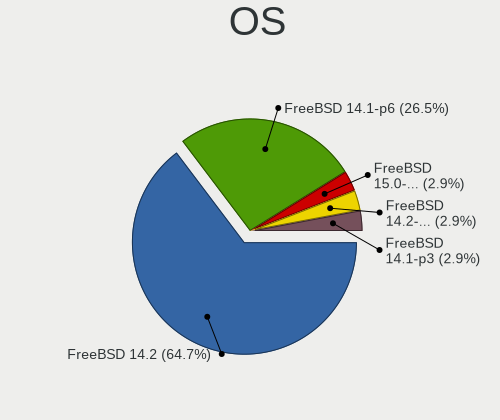
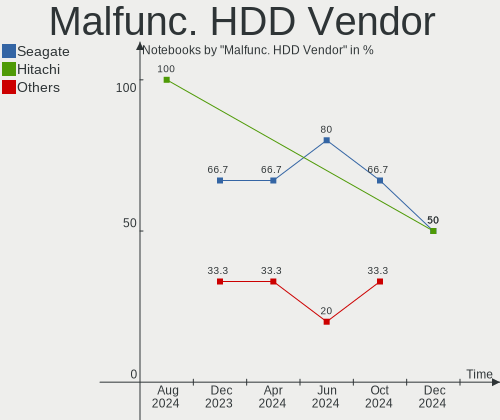
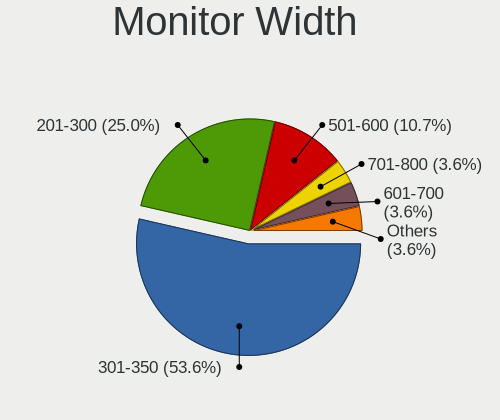
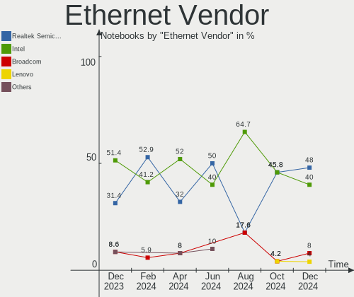
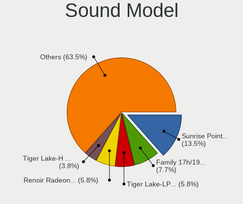

FreeBSD Hardware Trends (Notebooks)
-----------------------------------

A project to identify most popular hardware characteristics and track their change
over time based on data collected by FreeBSD users at https://BSD-Hardware.info.

Anyone can contribute to this report by the [hw-probe](https://github.com/linuxhw/hw-probe/blob/master/INSTALL.BSD.md) tool:

    hw-probe -all -upload

This report is for one last month. Overall report since the beginning of time: [TestCoverage](https://github.com/bsdhw/TestCoverage)

Period: Apr, 2022.

Contents
--------

* [ System ](#system)
  - [ OS                       ](#os)
  - [ OS Family                ](#os-family)
  - [ Arch                     ](#arch)
  - [ DE                       ](#de)
  - [ Display Server           ](#display-server)
  - [ Display Manager          ](#display-manager)
  - [ OS Lang                  ](#os-lang)
  - [ Boot Mode                ](#boot-mode)
  - [ Filesystem               ](#filesystem)
  - [ Part. scheme             ](#part-scheme)

* [ Board ](#board)
  - [ Vendor                   ](#vendor)
  - [ Model                    ](#model)
  - [ Model Family             ](#model-family)
  - [ MFG Year                 ](#mfg-year)
  - [ Form Factor              ](#form-factor)
  - [ Coreboot                 ](#coreboot)
  - [ RAM Size                 ](#ram-size)
  - [ RAM Used                 ](#ram-used)
  - [ Total Drives             ](#total-drives)
  - [ Has CD-ROM               ](#has-cd-rom)
  - [ Has Ethernet             ](#has-ethernet)
  - [ Has WiFi                 ](#has-wifi)
  - [ Has Bluetooth            ](#has-bluetooth)

* [ Location ](#location)
  - [ Country                  ](#country)
  - [ City                     ](#city)

* [ Drives ](#drives)
  - [ Drive Vendor             ](#drive-vendor)
  - [ Drive Model              ](#drive-model)
  - [ HDD Vendor               ](#hdd-vendor)
  - [ SSD Vendor               ](#ssd-vendor)
  - [ Drive Kind               ](#drive-kind)
  - [ Drive Connector          ](#drive-connector)
  - [ Drive Size               ](#drive-size)
  - [ Space Total              ](#space-total)
  - [ Space Used               ](#space-used)
  - [ Malfunc. Drives          ](#malfunc-drives)
  - [ Malfunc. Drive Vendor    ](#malfunc-drive-vendor)
  - [ Malfunc. HDD Vendor      ](#malfunc-hdd-vendor)
  - [ Malfunc. Drive Kind      ](#malfunc-drive-kind)
  - [ Failed Drives            ](#failed-drives)
  - [ Failed Drive Vendor      ](#failed-drive-vendor)
  - [ Drive Status             ](#drive-status)

* [ Storage controller ](#storage-controller)
  - [ Storage Vendor           ](#storage-vendor)
  - [ Storage Model            ](#storage-model)
  - [ Storage Kind             ](#storage-kind)

* [ Processor ](#processor)
  - [ CPU Vendor               ](#cpu-vendor)
  - [ CPU Model                ](#cpu-model)
  - [ CPU Model Family         ](#cpu-model-family)
  - [ CPU Cores                ](#cpu-cores)
  - [ CPU Sockets              ](#cpu-sockets)
  - [ CPU Threads              ](#cpu-threads)
  - [ CPU Microarch            ](#cpu-microarch)

* [ Graphics ](#graphics)
  - [ GPU Vendor               ](#gpu-vendor)
  - [ GPU Model                ](#gpu-model)
  - [ GPU Combo                ](#gpu-combo)
  - [ GPU Driver               ](#gpu-driver)
  - [ GPU Memory               ](#gpu-memory)

* [ Monitor ](#monitor)
  - [ Monitor Vendor           ](#monitor-vendor)
  - [ Monitor Model            ](#monitor-model)
  - [ Monitor Resolution       ](#monitor-resolution)
  - [ Monitor Diagonal         ](#monitor-diagonal)
  - [ Monitor Width            ](#monitor-width)
  - [ Aspect Ratio             ](#aspect-ratio)
  - [ Monitor Area             ](#monitor-area)
  - [ Pixel Density            ](#pixel-density)
  - [ Multiple Monitors        ](#multiple-monitors)

* [ Network ](#network)
  - [ Net Controller Vendor    ](#net-controller-vendor)
  - [ Net Controller Model     ](#net-controller-model)
  - [ Wireless Vendor          ](#wireless-vendor)
  - [ Wireless Model           ](#wireless-model)
  - [ Ethernet Vendor          ](#ethernet-vendor)
  - [ Ethernet Model           ](#ethernet-model)
  - [ Net Controller Kind      ](#net-controller-kind)
  - [ Used Controller          ](#used-controller)
  - [ NICs                     ](#nics)
  - [ IPv6                     ](#ipv6)

* [ Bluetooth ](#bluetooth)
  - [ Bluetooth Vendor         ](#bluetooth-vendor)
  - [ Bluetooth Model          ](#bluetooth-model)

* [ Sound ](#sound)
  - [ Sound Vendor             ](#sound-vendor)
  - [ Sound Model              ](#sound-model)

* [ Memory ](#memory)
  - [ Memory Vendor            ](#memory-vendor)
  - [ Memory Model             ](#memory-model)
  - [ Memory Kind              ](#memory-kind)
  - [ Memory Form Factor       ](#memory-form-factor)
  - [ Memory Size              ](#memory-size)
  - [ Memory Speed             ](#memory-speed)

* [ Printers & scanners ](#printers--scanners)
  - [ Printer Vendor           ](#printer-vendor)
  - [ Printer Model            ](#printer-model)
  - [ Scanner Vendor           ](#scanner-vendor)
  - [ Scanner Model            ](#scanner-model)

* [ Camera ](#camera)
  - [ Camera Vendor            ](#camera-vendor)
  - [ Camera Model             ](#camera-model)

* [ Security ](#security)
  - [ Fingerprint Vendor       ](#fingerprint-vendor)
  - [ Fingerprint Model        ](#fingerprint-model)
  - [ Chipcard Vendor          ](#chipcard-vendor)
  - [ Chipcard Model           ](#chipcard-model)

* [ Unsupported ](#unsupported)
  - [ Unsupported Devices      ](#unsupported-devices)
  - [ Unsupported Device Types ](#unsupported-device-types)

System
------

OS
--

Installed operating systems

| Name                  | Notebooks | Percent |
|-----------------------|-----------|---------|
| FreeBSD 13.0-p11      | 7         | 25.93%  |
| FreeBSD 13.0          | 4         | 14.81%  |
| FreeBSD 14.0-CURRENT  | 3         | 11.11%  |
| FreeBSD 13.0-p10      | 3         | 11.11%  |
| FreeBSD 13.0-p8       | 2         | 7.41%   |
| FreeBSD 13.1-RC4      | 1         | 3.7%    |
| FreeBSD 13.1-RC3      | 1         | 3.7%    |
| FreeBSD 13.1-RC2      | 1         | 3.7%    |
| FreeBSD 13.1-RC1      | 1         | 3.7%    |
| FreeBSD 12.3-STABLE   | 1         | 3.7%    |
| FreeBSD 12.3-p5       | 1         | 3.7%    |
| FreeBSD 12.3-p4       | 1         | 3.7%    |
| FreeBSD 12.1-p22-HBSD | 1         | 3.7%    |

OS Family
---------

OS without a version

| Name    | Notebooks | Percent |
|---------|-----------|---------|
| FreeBSD | 27        | 100%    |

Arch
----

OS architecture (x86_64, i586, etc.)

| Name  | Notebooks | Percent |
|-------|-----------|---------|
| amd64 | 27        | 100%    |

DE
--

Desktop Environment

| Name    | Notebooks | Percent |
|---------|-----------|---------|
| XFCE    | 6         | 22.22%  |
| KDE5    | 6         | 22.22%  |
| TWM     | 5         | 18.52%  |
| Console | 3         | 11.11%  |
| MATE    | 2         | 7.41%   |
| i3      | 2         | 7.41%   |
| GNOME   | 2         | 7.41%   |
| Openbox | 1         | 3.7%    |

Display Server
--------------

X11 or Wayland

| Name    | Notebooks | Percent |
|---------|-----------|---------|
| X11     | 22        | 81.48%  |
| Console | 4         | 14.81%  |
| Wayland | 1         | 3.7%    |

Display Manager
---------------

SDDM, LightDM, etc.

| Name    | Notebooks | Percent |
|---------|-----------|---------|
| Console | 10        | 37.04%  |
| SLiM    | 5         | 18.52%  |
| SDDM    | 5         | 18.52%  |
| LightDM | 3         | 11.11%  |
| GDM     | 2         | 7.41%   |
| XDM     | 1         | 3.7%    |
| Ly      | 1         | 3.7%    |

OS Lang
-------

Language

| Lang    | Notebooks | Percent |
|---------|-----------|---------|
| C       | 12        | 44.44%  |
| Unknown | 6         | 22.22%  |
| en_US   | 3         | 11.11%  |
| fr_FR   | 2         | 7.41%   |
| ru_RU   | 1         | 3.7%    |
| en_NZ   | 1         | 3.7%    |
| en_GB   | 1         | 3.7%    |
| de_DE   | 1         | 3.7%    |

Boot Mode
---------

EFI or BIOS

| Mode | Notebooks | Percent |
|------|-----------|---------|
| EFI  | 19        | 70.37%  |
| BIOS | 8         | 29.63%  |

Filesystem
----------

Type of filesystem

| Type | Notebooks | Percent |
|------|-----------|---------|
| Zfs  | 22        | 81.48%  |
| Ufs  | 5         | 18.52%  |

Part. scheme
------------

Scheme of partitioning

| Type | Notebooks | Percent |
|------|-----------|---------|
| GPT  | 25        | 92.59%  |
| MBR  | 1         | 3.7%    |
| BSD  | 1         | 3.7%    |

Board
-----

Vendor
------

Motherboard manufacturer

| Name             | Notebooks | Percent |
|------------------|-----------|---------|
| Lenovo           | 9         | 33.33%  |
| Dell             | 4         | 14.81%  |
| Hewlett-Packard  | 2         | 7.41%   |
| VIT              | 1         | 3.7%    |
| Toshiba          | 1         | 3.7%    |
| Timi             | 1         | 3.7%    |
| System76         | 1         | 3.7%    |
| Notebook         | 1         | 3.7%    |
| MSI              | 1         | 3.7%    |
| HUAWEI           | 1         | 3.7%    |
| Framework        | 1         | 3.7%    |
| Deciso           | 1         | 3.7%    |
| ASUSTek Computer | 1         | 3.7%    |
| Apple            | 1         | 3.7%    |
| Acer             | 1         | 3.7%    |

Model
-----

Motherboard model

| Name                                     | Notebooks | Percent |
|------------------------------------------|-----------|---------|
| VIT M2420                                | 1         | 3.7%    |
| Toshiba Satellite Pro T130               | 1         | 3.7%    |
| Timi TM1612                              | 1         | 3.7%    |
| System76 Lemur Pro                       | 1         | 3.7%    |
| Notebook N7x0WU                          | 1         | 3.7%    |
| MSI Bravo 15 A4DDR                       | 1         | 3.7%    |
| Lenovo ThinkPad X220 42872WU             | 1         | 3.7%    |
| Lenovo ThinkPad X201 3680MG1             | 1         | 3.7%    |
| Lenovo ThinkPad X1 Carbon 3rd 20BS00ACMN | 1         | 3.7%    |
| Lenovo ThinkPad T495 20NJ0000US          | 1         | 3.7%    |
| Lenovo ThinkPad T470 20HES0ES1F          | 1         | 3.7%    |
| Lenovo ThinkPad T460p 20FXS09D11         | 1         | 3.7%    |
| Lenovo ThinkPad E490 20N8CTO1WW          | 1         | 3.7%    |
| Lenovo B570 1068FQG                      | 1         | 3.7%    |
| Lenovo B50-30 20382                      | 1         | 3.7%    |
| HUAWEI NBLL-WXX9                         | 1         | 3.7%    |
| HP Laptop 15-dw1xxx                      | 1         | 3.7%    |
| HP EliteBook 8570p                       | 1         | 3.7%    |
| Framework Laptop                         | 1         | 3.7%    |
| Dell Vostro 1400                         | 1         | 3.7%    |
| Dell Precision M4800                     | 1         | 3.7%    |
| Dell Latitude E6520                      | 1         | 3.7%    |
| Dell Latitude E6440                      | 1         | 3.7%    |
| Deciso Netboard A20                      | 1         | 3.7%    |
| ASUS UX305UA                             | 1         | 3.7%    |
| Apple MacBookPro8,3                      | 1         | 3.7%    |
| Acer Swift SF114-32                      | 1         | 3.7%    |

Model Family
------------

Motherboard model prefix

| Name              | Notebooks | Percent |
|-------------------|-----------|---------|
| Lenovo ThinkPad   | 7         | 25.93%  |
| Dell Latitude     | 2         | 7.41%   |
| VIT M2420         | 1         | 3.7%    |
| Toshiba Satellite | 1         | 3.7%    |
| Timi TM1612       | 1         | 3.7%    |
| System76 Lemur    | 1         | 3.7%    |
| Notebook N7x0WU   | 1         | 3.7%    |
| MSI Bravo         | 1         | 3.7%    |
| Lenovo B570       | 1         | 3.7%    |
| Lenovo B50-30     | 1         | 3.7%    |
| HUAWEI NBLL-WXX9  | 1         | 3.7%    |
| HP Laptop         | 1         | 3.7%    |
| HP EliteBook      | 1         | 3.7%    |
| Framework Laptop  | 1         | 3.7%    |
| Dell Vostro       | 1         | 3.7%    |
| Dell Precision    | 1         | 3.7%    |
| Deciso Netboard   | 1         | 3.7%    |
| ASUS UX305UA      | 1         | 3.7%    |
| Apple MacBookPro8 | 1         | 3.7%    |
| Acer Swift        | 1         | 3.7%    |

MFG Year
--------

Motherboard manufacture year

| Year | Notebooks | Percent |
|------|-----------|---------|
| 2019 | 5         | 18.52%  |
| 2021 | 4         | 14.81%  |
| 2018 | 4         | 14.81%  |
| 2020 | 3         | 11.11%  |
| 2015 | 3         | 11.11%  |
| 2011 | 3         | 11.11%  |
| 2010 | 2         | 7.41%   |
| 2016 | 1         | 3.7%    |
| 2013 | 1         | 3.7%    |
| 2008 | 1         | 3.7%    |

Form Factor
-----------

Physical design of the computer

| Name     | Notebooks | Percent |
|----------|-----------|---------|
| Notebook | 27        | 100%    |

Coreboot
--------

Have coreboot on board

| Used | Notebooks | Percent |
|------|-----------|---------|
| No   | 26        | 96.3%   |
| Yes  | 1         | 3.7%    |

RAM Size
--------

Total RAM memory

| Size in GB | Notebooks | Percent |
|------------|-----------|---------|
| 16.01-24.0 | 8         | 29.63%  |
| 8.01-16.0  | 8         | 29.63%  |
| 4.01-8.0   | 7         | 25.93%  |
| 32.01-64.0 | 4         | 14.81%  |

RAM Used
--------

Used RAM memory

| Used GB  | Notebooks | Percent |
|----------|-----------|---------|
| 0.01-0.5 | 13        | 48.15%  |
| 0.51-1.0 | 8         | 29.63%  |
| 1.01-2.0 | 5         | 18.52%  |
| 2.01-3.0 | 1         | 3.7%    |

Total Drives
------------

Number of drives on board

| Drives | Notebooks | Percent |
|--------|-----------|---------|
| 1      | 21        | 77.78%  |
| 2      | 5         | 18.52%  |
| 3      | 1         | 3.7%    |

Has CD-ROM
----------

Has CD-ROM on board

| Presented | Notebooks | Percent |
|-----------|-----------|---------|
| No        | 22        | 81.48%  |
| Yes       | 5         | 18.52%  |

Has Ethernet
------------

Has Ethernet on board

| Presented | Notebooks | Percent |
|-----------|-----------|---------|
| Yes       | 21        | 77.78%  |
| No        | 6         | 22.22%  |

Has WiFi
--------

Has WiFi module

| Presented | Notebooks | Percent |
|-----------|-----------|---------|
| Yes       | 24        | 88.89%  |
| No        | 3         | 11.11%  |

Has Bluetooth
-------------

Has Bluetooth module

| Presented | Notebooks | Percent |
|-----------|-----------|---------|
| Yes       | 17        | 62.96%  |
| No        | 10        | 37.04%  |

Location
--------

Country
-------

Geographic location (country)

| Country     | Notebooks | Percent |
|-------------|-----------|---------|
| USA         | 7         | 25.93%  |
| Germany     | 5         | 18.52%  |
| UK          | 2         | 7.41%   |
| Russia      | 2         | 7.41%   |
| Sweden      | 1         | 3.7%    |
| Slovenia    | 1         | 3.7%    |
| Romania     | 1         | 3.7%    |
| New Zealand | 1         | 3.7%    |
| India       | 1         | 3.7%    |
| Guadeloupe  | 1         | 3.7%    |
| France      | 1         | 3.7%    |
| China       | 1         | 3.7%    |
| Canada      | 1         | 3.7%    |
| Australia   | 1         | 3.7%    |
| Argentina   | 1         | 3.7%    |

City
----

Geographic location (city)

| City             | Notebooks | Percent |
|------------------|-----------|---------|
| Brooklyn         | 2         | 7.41%   |
| West Orange      | 1         | 3.7%    |
| Surgut           | 1         | 3.7%    |
| Stockholm        | 1         | 3.7%    |
| Shanghai         | 1         | 3.7%    |
| Québec          | 1         | 3.7%    |
| Poncins          | 1         | 3.7%    |
| Oryol            | 1         | 3.7%    |
| New Plymouth     | 1         | 3.7%    |
| Milwaukee        | 1         | 3.7%    |
| Mannheim         | 1         | 3.7%    |
| Manchester       | 1         | 3.7%    |
| Lübeck          | 1         | 3.7%    |
| London           | 1         | 3.7%    |
| Lippstadt        | 1         | 3.7%    |
| Le Gosier        | 1         | 3.7%    |
| Kranj            | 1         | 3.7%    |
| Georgetown       | 1         | 3.7%    |
| Delhi            | 1         | 3.7%    |
| Coronel Pringles | 1         | 3.7%    |
| City of London   | 1         | 3.7%    |
| Canberra         | 1         | 3.7%    |
| Bucharest        | 1         | 3.7%    |
| Berwick          | 1         | 3.7%    |
| Berlin           | 1         | 3.7%    |
| Ammerbuch        | 1         | 3.7%    |

Drives
------

Drive Vendor
------------

Hard drive vendors

| Vendor              | Notebooks | Drives | Percent |
|---------------------|-----------|--------|---------|
| WDC                 | 6         | 6      | 17.65%  |
| Toshiba             | 6         | 6      | 17.65%  |
| Samsung Electronics | 4         | 4      | 11.76%  |
| Kingston            | 3         | 3      | 8.82%   |
| Crucial             | 3         | 4      | 8.82%   |
| Seagate             | 2         | 2      | 5.88%   |
| Micron Technology   | 2         | 2      | 5.88%   |
| HGST                | 2         | 2      | 5.88%   |
| Transcend           | 1         | 1      | 2.94%   |
| SSSTC               | 1         | 1      | 2.94%   |
| SPCC                | 1         | 1      | 2.94%   |
| SanDisk             | 1         | 1      | 2.94%   |
| Mushkin             | 1         | 1      | 2.94%   |
| Gigabyte Technology | 1         | 1      | 2.94%   |

Drive Model
-----------

Hard drive models

| Model                                | Notebooks | Percent |
|--------------------------------------|-----------|---------|
| Samsung SSD 970 EVO 500GB            | 2         | 5.88%   |
| HGST HTS721010A9E630 1TB             | 2         | 5.88%   |
| WDC WDS250G2B0A 250GB                | 1         | 2.94%   |
| WDC WDS200T2B0A-00SM50 2TB           | 1         | 2.94%   |
| WDC WDS120G2G0B-00EPW0 120GB         | 1         | 2.94%   |
| WDC WDS100T1X0E-00AFY0 1TB           | 1         | 2.94%   |
| WDC WD5000BPVT-24HXZT3 500GB         | 1         | 2.94%   |
| WDC PC SN730 SDBPNTY-512G-1027 512GB | 1         | 2.94%   |
| Transcend TS256GMTS952T2 256GB       | 1         | 2.94%   |
| Toshiba THNSFJ256GDNU 256GB          | 1         | 2.94%   |
| Toshiba THNSF5256GPUK 256GB          | 1         | 2.94%   |
| Toshiba MQ01ABF050 500GB             | 1         | 2.94%   |
| Toshiba MK3261GSYN 320GB             | 1         | 2.94%   |
| Toshiba MK1637GSX 160GB              | 1         | 2.94%   |
| Toshiba KBG30ZMT512G 512GB           | 1         | 2.94%   |
| SSSTC CVB-8D128-HP 128GB             | 1         | 2.94%   |
| SPCC M.2 PCIe SSD 1TB                | 1         | 2.94%   |
| Seagate ST500LT012-1DG142 500GB      | 1         | 2.94%   |
| Seagate ST2000LM003 HN-M201RAD 2TB   | 1         | 2.94%   |
| SanDisk SD7SF6S512G1122 512GB        | 1         | 2.94%   |
| Samsung SSD 860 EVO M.2 1TB          | 1         | 2.94%   |
| Samsung MZVLW256HEHP-000L7 256GB     | 1         | 2.94%   |
| Mushkin MKNSSDHL1TB-D8               | 1         | 2.94%   |
| Micron M600_MTFDDAV256MBF 256GB      | 1         | 2.94%   |
| Micron 1100_MTFDDAV256TBN 256GB      | 1         | 2.94%   |
| Kingston SMS200S3120G 120GB          | 1         | 2.94%   |
| Kingston SKC600MS1024G 1TB           | 1         | 2.94%   |
| Kingston SA400S37240G 240GB          | 1         | 2.94%   |
| Gigabyte GP-GSTFS31120GNTD 120GB     | 1         | 2.94%   |
| Crucial CT500MX500SSD1 500GB         | 1         | 2.94%   |
| Crucial CT2000MX500SSD1 2TB          | 1         | 2.94%   |
| Crucial CT120BX500SSD1 120GB         | 1         | 2.94%   |

HDD Vendor
----------

Hard disk drive vendors

| Vendor  | Notebooks | Drives | Percent |
|---------|-----------|--------|---------|
| Toshiba | 3         | 3      | 37.5%   |
| Seagate | 2         | 2      | 25%     |
| HGST    | 2         | 2      | 25%     |
| WDC     | 1         | 1      | 12.5%   |

SSD Vendor
----------

Solid state drive vendors

| Vendor              | Notebooks | Drives | Percent |
|---------------------|-----------|--------|---------|
| WDC                 | 3         | 3      | 17.65%  |
| Kingston            | 3         | 3      | 17.65%  |
| Crucial             | 3         | 4      | 17.65%  |
| Micron Technology   | 2         | 2      | 11.76%  |
| Transcend           | 1         | 1      | 5.88%   |
| Toshiba             | 1         | 1      | 5.88%   |
| SSSTC               | 1         | 1      | 5.88%   |
| SanDisk             | 1         | 1      | 5.88%   |
| Samsung Electronics | 1         | 1      | 5.88%   |
| Gigabyte Technology | 1         | 1      | 5.88%   |

Drive Kind
----------

HDD or SSD

| Kind | Notebooks | Drives | Percent |
|------|-----------|--------|---------|
| SSD  | 15        | 18     | 50%     |
| NVMe | 8         | 9      | 26.67%  |
| HDD  | 7         | 8      | 23.33%  |

Drive Connector
---------------

SATA, SAS, NVMe, etc.

| Type | Notebooks | Drives | Percent |
|------|-----------|--------|---------|
| SATA | 20        | 26     | 71.43%  |
| NVMe | 8         | 9      | 28.57%  |

Drive Size
----------

Size of hard drive

| Size in TB | Notebooks | Drives | Percent |
|------------|-----------|--------|---------|
| 0.01-0.5   | 16        | 18     | 72.73%  |
| 1.01-2.0   | 3         | 4      | 13.64%  |
| 0.51-1.0   | 3         | 4      | 13.64%  |

Space Total
-----------

Amount of disk space available on the file system

| Size in GB | Notebooks | Percent |
|------------|-----------|---------|
| 251-500    | 10        | 37.04%  |
| 101-250    | 10        | 37.04%  |
| 21-50      | 2         | 7.41%   |
| 1001-2000  | 2         | 7.41%   |
| 501-1000   | 2         | 7.41%   |
| 51-100     | 1         | 3.7%    |

Space Used
----------

Amount of used disk space

| Used GB | Notebooks | Percent |
|---------|-----------|---------|
| 1-20    | 17        | 62.96%  |
| 51-100  | 5         | 18.52%  |
| 21-50   | 4         | 14.81%  |
| 101-250 | 1         | 3.7%    |

Malfunc. Drives
---------------

Drive models with a malfunction

| Model                              | Notebooks | Drives | Percent |
|------------------------------------|-----------|--------|---------|
| Toshiba MK3261GSYN 320GB           | 1         | 1      | 14.29%  |
| Toshiba MK1637GSX 160GB            | 1         | 1      | 14.29%  |
| SSSTC CVB-8D128-HP 128GB           | 1         | 1      | 14.29%  |
| Seagate ST500LT012-1DG142 500GB    | 1         | 1      | 14.29%  |
| Seagate ST2000LM003 HN-M201RAD 2TB | 1         | 1      | 14.29%  |
| Kingston SA400S37240G 240GB        | 1         | 1      | 14.29%  |
| HGST HTS721010A9E630 1TB           | 1         | 1      | 14.29%  |

Malfunc. Drive Vendor
---------------------

Vendors of faulty drives

| Vendor   | Notebooks | Drives | Percent |
|----------|-----------|--------|---------|
| Toshiba  | 2         | 2      | 28.57%  |
| Seagate  | 2         | 2      | 28.57%  |
| SSSTC    | 1         | 1      | 14.29%  |
| Kingston | 1         | 1      | 14.29%  |
| HGST     | 1         | 1      | 14.29%  |

Malfunc. HDD Vendor
-------------------

Vendors of faulty HDD drives

| Vendor  | Notebooks | Drives | Percent |
|---------|-----------|--------|---------|
| Toshiba | 2         | 2      | 40%     |
| Seagate | 2         | 2      | 40%     |
| HGST    | 1         | 1      | 20%     |

Malfunc. Drive Kind
-------------------

Kinds of faulty drives

| Kind | Notebooks | Drives | Percent |
|------|-----------|--------|---------|
| HDD  | 5         | 5      | 71.43%  |
| SSD  | 2         | 2      | 28.57%  |

Failed Drives
-------------

Failed drive models

Zero info for selected period =(

Failed Drive Vendor
-------------------

Failed drive vendors

Zero info for selected period =(

Drive Status
------------

Number of failed and malfunc. drives

| Status  | Notebooks | Drives | Percent |
|---------|-----------|--------|---------|
| Works   | 22        | 28     | 75.86%  |
| Malfunc | 7         | 7      | 24.14%  |

Storage controller
------------------

Storage Vendor
--------------

Storage controller vendors

| Vendor              | Notebooks | Percent |
|---------------------|-----------|---------|
| Intel               | 20        | 64.52%  |
| Samsung Electronics | 3         | 9.68%   |
| Toshiba             | 2         | 6.45%   |
| Sandisk             | 2         | 6.45%   |
| AMD                 | 2         | 6.45%   |
| Silicon Motion      | 1         | 3.23%   |
| JMicron Technology  | 1         | 3.23%   |

Storage Model
-------------

Storage controller models

| Model                                                                                  | Notebooks | Percent |
|----------------------------------------------------------------------------------------|-----------|---------|
| Intel 6 Series/C200 Series Chipset Family 6 port Mobile SATA AHCI Controller           | 4         | 12.12%  |
| Intel Sunrise Point-LP SATA Controller [AHCI mode]                                     | 3         | 9.09%   |
| Samsung NVMe SSD Controller SM981/PM981/PM983                                          | 2         | 6.06%   |
| Intel Celeron/Pentium Silver Processor SATA Controller                                 | 2         | 6.06%   |
| Intel 8 Series/C220 Series Chipset Family 6-port SATA Controller 1 [AHCI mode]         | 2         | 6.06%   |
| AMD FCH SATA Controller [AHCI mode]                                                    | 2         | 6.06%   |
| Toshiba XG4 NVMe SSD Controller                                                        | 1         | 3.03%   |
| Toshiba BG3 NVMe SSD Controller                                                        | 1         | 3.03%   |
| Silicon Motion SM2263EN/SM2263XT SSD Controller                                        | 1         | 3.03%   |
| Sandisk WD PC SN810 / Black SN850 NVMe SSD                                             | 1         | 3.03%   |
| Sandisk WD Black SN750 / PC SN730 NVMe SSD                                             | 1         | 3.03%   |
| Samsung NVMe SSD Controller SM961/PM961/SM963                                          | 1         | 3.03%   |
| JMicron JMB360 AHCI Controller                                                         | 1         | 3.03%   |
| Intel Wildcat Point-LP SATA Controller [AHCI Mode]                                     | 1         | 3.03%   |
| Intel HM170/QM170 Chipset SATA Controller [AHCI Mode]                                  | 1         | 3.03%   |
| Intel Comet Lake SATA AHCI Controller                                                  | 1         | 3.03%   |
| Intel Atom Processor E3800 Series SATA AHCI Controller                                 | 1         | 3.03%   |
| Intel 82801IBM/IEM (ICH9M/ICH9M-E) 4 port SATA Controller [AHCI mode]                  | 1         | 3.03%   |
| Intel 82801HM/HEM (ICH8M/ICH8M-E) SATA Controller [AHCI mode]                          | 1         | 3.03%   |
| Intel 82801HM/HEM (ICH8M/ICH8M-E) IDE Controller                                       | 1         | 3.03%   |
| Intel 7 Series Chipset Family 6-port SATA Controller [AHCI mode]                       | 1         | 3.03%   |
| Intel 6 Series/C200 Series Chipset Family Mobile SATA Controller (IDE mode, ports 4-5) | 1         | 3.03%   |
| Intel 6 Series/C200 Series Chipset Family Mobile SATA Controller (IDE mode, ports 0-3) | 1         | 3.03%   |
| Intel 5 Series/3400 Series Chipset 6 port SATA AHCI Controller                         | 1         | 3.03%   |

Storage Kind
------------

Kind of storage controller (IDE, SATA, NVMe, SAS, ...)

| Kind | Notebooks | Percent |
|------|-----------|---------|
| SATA | 21        | 67.74%  |
| NVMe | 8         | 25.81%  |
| IDE  | 2         | 6.45%   |

Processor
---------

CPU Vendor
----------

Processor vendors

| Vendor | Notebooks | Percent |
|--------|-----------|---------|
| Intel  | 23        | 85.19%  |
| AMD    | 4         | 14.81%  |

CPU Model
---------

Processor models

| Model                                           | Notebooks | Percent |
|-------------------------------------------------|-----------|---------|
| Intel Core i7-2720QM CPU @ 2.20GHz              | 2         | 7.41%   |
| Intel Pentium Silver N5000 CPU @ 1.10GHz        | 1         | 3.7%    |
| Intel CPU Version                               | 1         | 3.7%    |
| Intel Core m3-6Y30 CPU @ 0.90GHz                | 1         | 3.7%    |
| Intel Core i7-8565U CPU @ 1.80GHz               | 1         | 3.7%    |
| Intel Core i7-5500U CPU @ 2.40GHz               | 1         | 3.7%    |
| Intel Core i7-4910MQ CPU @ 2.90GHz              | 1         | 3.7%    |
| Intel Core i7-4712MQ CPU @ 2.30GHz              | 1         | 3.7%    |
| Intel Core i7-3520M CPU @ 2.90GHz               | 1         | 3.7%    |
| Intel Core i5-7300U CPU @ 2.60GHz               | 1         | 3.7%    |
| Intel Core i5-6440HQ CPU @ 2.60GHz              | 1         | 3.7%    |
| Intel Core i5-6200U CPU @ 2.30GHz               | 1         | 3.7%    |
| Intel Core i5-2540M CPU @ 2.60GH                | 1         | 3.7%    |
| Intel Core i5-2520M CPU @ 2.50GHz               | 1         | 3.7%    |
| Intel Core i5-10210U CPU @ 1.60GHz              | 1         | 3.7%    |
| Intel Core i5 CPU M 520 @ 2.40GHz               | 1         | 3.7%    |
| Intel Core i3-8130U CPU @ 2.20GHz               | 1         | 3.7%    |
| Intel Core i3-2330M CPU @ 2.20GHz               | 1         | 3.7%    |
| Intel Core 2 Duo                                | 1         | 3.7%    |
| Intel Celeron N4120 CPU @ 1.10GHz               | 1         | 3.7%    |
| Intel Celeron CPU N2840 @ 2.16GHz               | 1         | 3.7%    |
| Intel 11th Gen Core i7-1165G7 @ 2.80GHz         | 1         | 3.7%    |
| AMD Ryzen 7 4800H with Radeon Graphics          | 1         | 3.7%    |
| AMD Ryzen 5 PRO 3500U w/ Radeon Vega Mobile Gfx | 1         | 3.7%    |
| AMD Ryzen 5 4500U with Radeon Graphics          | 1         | 3.7%    |
| AMD EPYC 3101 4-Core Processor                  | 1         | 3.7%    |

CPU Model Family
----------------

Processor model prefix

| Model                | Notebooks | Percent |
|----------------------|-----------|---------|
| Intel Core i7        | 7         | 25.93%  |
| Intel Core i5        | 7         | 25.93%  |
| Other                | 2         | 7.41%   |
| Intel Core i3        | 2         | 7.41%   |
| Intel Celeron        | 2         | 7.41%   |
| Intel Pentium Silver | 1         | 3.7%    |
| Intel Core m3        | 1         | 3.7%    |
| Intel Core 2 Duo     | 1         | 3.7%    |
| AMD Ryzen 7          | 1         | 3.7%    |
| AMD Ryzen 5 PRO      | 1         | 3.7%    |
| AMD Ryzen 5          | 1         | 3.7%    |
| AMD EPYC             | 1         | 3.7%    |

CPU Cores
---------

Number of processor cores

| Number | Notebooks | Percent |
|--------|-----------|---------|
| 2      | 13        | 48.15%  |
| 4      | 11        | 40.74%  |
| 16     | 1         | 3.7%    |
| 8      | 1         | 3.7%    |
| 6      | 1         | 3.7%    |

CPU Sockets
-----------

Number of sockets

| Number | Notebooks | Percent |
|--------|-----------|---------|
| 1      | 27        | 100%    |

CPU Threads
-----------

Threads per core (Hyper-Threading)

| Number | Notebooks | Percent |
|--------|-----------|---------|
| 2      | 17        | 62.96%  |
| 1      | 10        | 37.04%  |

CPU Microarch
-------------

Microarchitecture

| Name          | Notebooks | Percent |
|---------------|-----------|---------|
| SandyBridge   | 5         | 18.52%  |
| KabyLake      | 4         | 14.81%  |
| Skylake       | 3         | 11.11%  |
| Zen 2         | 2         | 7.41%   |
| Penryn        | 2         | 7.41%   |
| Haswell       | 2         | 7.41%   |
| Goldmont plus | 2         | 7.41%   |
| Zen+          | 1         | 3.7%    |
| Zen           | 1         | 3.7%    |
| Westmere      | 1         | 3.7%    |
| TigerLake     | 1         | 3.7%    |
| Silvermont    | 1         | 3.7%    |
| IvyBridge     | 1         | 3.7%    |
| Broadwell     | 1         | 3.7%    |

Graphics
--------

GPU Vendor
----------

Vendors of graphics cards

| Vendor | Notebooks | Percent |
|--------|-----------|---------|
| Intel  | 21        | 77.78%  |
| AMD    | 5         | 18.52%  |
| Nvidia | 1         | 3.7%    |

GPU Model
---------

Graphics card models

| Model                                                                     | Notebooks | Percent |
|---------------------------------------------------------------------------|-----------|---------|
| Intel 2nd Generation Core Processor Family Integrated Graphics Controller | 5         | 17.24%  |
| AMD Renoir                                                                | 2         | 6.9%    |
| Nvidia GK106GLM [Quadro K2100M]                                           | 1         | 3.45%   |
| Intel WhiskeyLake-U GT2 [UHD Graphics 620]                                | 1         | 3.45%   |
| Intel UHD Graphics 620                                                    | 1         | 3.45%   |
| Intel TigerLake-LP GT2 [Iris Xe Graphics]                                 | 1         | 3.45%   |
| Intel Skylake GT2 [HD Graphics 520]                                       | 1         | 3.45%   |
| Intel Mobile GM965/GL960 Integrated Graphics Controller (secondary)       | 1         | 3.45%   |
| Intel Mobile GM965/GL960 Integrated Graphics Controller (primary)         | 1         | 3.45%   |
| Intel Mobile 4 Series Chipset Integrated Graphics Controller              | 1         | 3.45%   |
| Intel HD Graphics 620                                                     | 1         | 3.45%   |
| Intel HD Graphics 5500                                                    | 1         | 3.45%   |
| Intel HD Graphics 530                                                     | 1         | 3.45%   |
| Intel HD Graphics 515                                                     | 1         | 3.45%   |
| Intel GeminiLake [UHD Graphics 605]                                       | 1         | 3.45%   |
| Intel GeminiLake [UHD Graphics 600]                                       | 1         | 3.45%   |
| Intel Core Processor Integrated Graphics Controller                       | 1         | 3.45%   |
| Intel CometLake-U GT2 [UHD Graphics]                                      | 1         | 3.45%   |
| Intel Atom Processor Z36xxx/Z37xxx Series Graphics & Display              | 1         | 3.45%   |
| Intel 4th Gen Core Processor Integrated Graphics Controller               | 1         | 3.45%   |
| AMD Whistler [Radeon HD 6630M/6650M/6750M/7670M/7690M]                    | 1         | 3.45%   |
| AMD Thames [Radeon HD 7550M/7570M/7650M]                                  | 1         | 3.45%   |
| AMD Picasso/Raven 2 [Radeon Vega Series / Radeon Vega Mobile Series]      | 1         | 3.45%   |
| AMD Navi 14 [Radeon RX 5500/5500M / Pro 5500M]                            | 1         | 3.45%   |

GPU Combo
---------

Combinations of graphics cards

| Name        | Notebooks | Percent |
|-------------|-----------|---------|
| 1 x Intel   | 18        | 66.67%  |
| 1 x AMD     | 3         | 11.11%  |
| 2 x Intel   | 2         | 7.41%   |
| Other       | 1         | 3.7%    |
| 2 x AMD     | 1         | 3.7%    |
| 1 x Nvidia  | 1         | 3.7%    |
| Intel + AMD | 1         | 3.7%    |

GPU Driver
----------

Free vs proprietary

| Driver      | Notebooks | Percent |
|-------------|-----------|---------|
| Free        | 25        | 92.59%  |
| Proprietary | 1         | 3.7%    |
| Unknown     | 1         | 3.7%    |

GPU Memory
----------

Total video memory

| Size in GB | Notebooks | Percent |
|------------|-----------|---------|
| Unknown    | 23        | 85.19%  |
| 1.01-2.0   | 2         | 7.41%   |
| 0.51-1.0   | 1         | 3.7%    |
| 0.01-0.5   | 1         | 3.7%    |

Monitor
-------

Monitor Vendor
--------------

Monitor vendors

| Vendor              | Notebooks | Percent |
|---------------------|-----------|---------|
| BOE                 | 5         | 20.83%  |
| AU Optronics        | 4         | 16.67%  |
| Samsung Electronics | 3         | 12.5%   |
| Chimei Innolux      | 3         | 12.5%   |
| Lenovo              | 2         | 8.33%   |
| Toshiba             | 1         | 4.17%   |
| Sharp               | 1         | 4.17%   |
| Philips             | 1         | 4.17%   |
| LG Display          | 1         | 4.17%   |
| Goldstar            | 1         | 4.17%   |
| Eizo                | 1         | 4.17%   |
| Dell                | 1         | 4.17%   |

Monitor Model
-------------

Monitor models

| Model                                                                 | Notebooks | Percent |
|-----------------------------------------------------------------------|-----------|---------|
| AU Optronics LCD Monitor AUO403D 1920x1080 310x170mm 13.9-inch        | 2         | 8%      |
| Toshiba LCD Monitor LCD0905 1366x768 290x170mm 13.2-inch              | 1         | 4%      |
| Sharp LCD Monitor SHP1430 3840x2160 350x190mm 15.7-inch               | 1         | 4%      |
| Samsung Electronics LCD Monitor SEC3157 1280x800 300x190mm 14.0-inch  | 1         | 4%      |
| Samsung Electronics LCD Monitor SEC3047 1366x768 280x160mm 12.7-inch  | 1         | 4%      |
| Samsung Electronics LCD Monitor SDC364D 1920x1080 310x170mm 13.9-inch | 1         | 4%      |
| Philips LCD Monitor PHL08C3 1920x1080 600x340mm 27.2-inch             | 1         | 4%      |
| LG Display LCD Monitor LGD046D 1920x1080 310x170mm 13.9-inch          | 1         | 4%      |
| Lenovo Q24h-10 LEN66A8 2560x1440 530x300mm 24.0-inch                  | 1         | 4%      |
| Lenovo LCD Monitor LEN4011 1280x800 260x160mm 12.0-inch               | 1         | 4%      |
| Goldstar E2411 GSM583B 1920x1080 530x300mm 24.0-inch                  | 1         | 4%      |
| Eizo S2202W ENC1975 1680x1050 480x300mm 22.3-inch                     | 1         | 4%      |
| Eizo S2201W ENC1916 1680x1050 480x300mm 22.3-inch                     | 1         | 4%      |
| Dell E2014H DELD03B 1600x900 430x240mm 19.4-inch                      | 1         | 4%      |
| Chimei Innolux LCD Monitor CMN1542 1366x768 340x190mm 15.3-inch       | 1         | 4%      |
| Chimei Innolux LCD Monitor CMN14D5 1920x1080 310x170mm 13.9-inch      | 1         | 4%      |
| Chimei Innolux LCD Monitor CMN14A8 1920x1080 310x170mm 13.9-inch      | 1         | 4%      |
| BOE LCD Monitor BOE095F 2256x1504 280x190mm 13.3-inch                 | 1         | 4%      |
| BOE LCD Monitor BOE0877 1920x1080 310x170mm 13.9-inch                 | 1         | 4%      |
| BOE LCD Monitor BOE0742 1920x1080 310x170mm 13.9-inch                 | 1         | 4%      |
| BOE LCD Monitor BOE0729 1920x1080 340x190mm 15.3-inch                 | 1         | 4%      |
| BOE LCD Monitor BOE0691 1920x1080 280x160mm 12.7-inch                 | 1         | 4%      |
| AU Optronics LCD Monitor AUOD0ED 1920x1080 340x190mm 15.3-inch        | 1         | 4%      |
| AU Optronics LCD Monitor AUO103D 1920x1080 310x170mm 13.9-inch        | 1         | 4%      |

Monitor Resolution
------------------

Monitor screen resolution

| Resolution         | Notebooks | Percent |
|--------------------|-----------|---------|
| 1920x1080 (FHD)    | 13        | 56.52%  |
| 1366x768 (WXGA)    | 3         | 13.04%  |
| 1280x800 (WXGA)    | 2         | 8.7%    |
| 3840x2160 (4K)     | 1         | 4.35%   |
| 2560x1440 (QHD)    | 1         | 4.35%   |
| 2256x1504          | 1         | 4.35%   |
| 1680x1050 (WSXGA+) | 1         | 4.35%   |
| 1600x900 (HD+)     | 1         | 4.35%   |

Monitor Diagonal
----------------

Diagonal size in inches

| Inches | Notebooks | Percent |
|--------|-----------|---------|
| 13     | 11        | 45.83%  |
| 15     | 4         | 16.67%  |
| 12     | 3         | 12.5%   |
| 24     | 2         | 8.33%   |
| 27     | 1         | 4.17%   |
| 22     | 1         | 4.17%   |
| 19     | 1         | 4.17%   |
| 14     | 1         | 4.17%   |

Monitor Width
-------------

Physical width

| Width in mm | Notebooks | Percent |
|-------------|-----------|---------|
| 301-350     | 13        | 54.17%  |
| 201-300     | 6         | 25%     |
| 501-600     | 3         | 12.5%   |
| 401-500     | 2         | 8.33%   |

Aspect Ratio
------------

Proportional relationship between the width and the height

| Ratio | Notebooks | Percent |
|-------|-----------|---------|
| 16/9  | 18        | 81.82%  |
| 16/10 | 3         | 13.64%  |
| 3/2   | 1         | 4.55%   |

Monitor Area
------------

Area in inch²

| Area in inch² | Notebooks | Percent |
|----------------|-----------|---------|
| 81-90          | 11        | 45.83%  |
| 61-70          | 3         | 12.5%   |
| 201-250        | 3         | 12.5%   |
| 91-100         | 3         | 12.5%   |
| 71-80          | 1         | 4.17%   |
| 301-350        | 1         | 4.17%   |
| 151-200        | 1         | 4.17%   |
| 101-110        | 1         | 4.17%   |

Pixel Density
-------------

Pixels per inch

| Density       | Notebooks | Percent |
|---------------|-----------|---------|
| 121-160       | 13        | 56.52%  |
| 51-100        | 4         | 17.39%  |
| 101-120       | 3         | 13.04%  |
| 161-240       | 2         | 8.7%    |
| More than 240 | 1         | 4.35%   |

Multiple Monitors
-----------------

Total monitors connected

| Total | Notebooks | Percent |
|-------|-----------|---------|
| 1     | 18        | 66.67%  |
| 0     | 6         | 22.22%  |
| 2     | 2         | 7.41%   |
| 3     | 1         | 3.7%    |

Network
-------

Net Controller Vendor
---------------------

Controller vendors

| Vendor                | Notebooks | Percent |
|-----------------------|-----------|---------|
| Intel                 | 20        | 48.78%  |
| Realtek Semiconductor | 8         | 19.51%  |
| Qualcomm Atheros      | 4         | 9.76%   |
| Broadcom              | 3         | 7.32%   |
| TP-Link               | 2         | 4.88%   |
| Sierra Wireless       | 1         | 2.44%   |
| Lenovo                | 1         | 2.44%   |
| Hewlett-Packard       | 1         | 2.44%   |
| AMD                   | 1         | 2.44%   |

Net Controller Model
--------------------

Controller models

| Model                                                             | Notebooks | Percent |
|-------------------------------------------------------------------|-----------|---------|
| Realtek RTL8111/8168/8411 PCI Express Gigabit Ethernet Controller | 7         | 13.46%  |
| Intel 82579LM Gigabit Network Connection (Lewisville)             | 3         | 5.77%   |
| Qualcomm Atheros AR9285 Wireless Network Adapter (PCI-Express)    | 2         | 3.85%   |
| Intel Wireless-AC 9260                                            | 2         | 3.85%   |
| Intel Wireless 8260                                               | 2         | 3.85%   |
| Intel Wireless 7265                                               | 2         | 3.85%   |
| Intel Ethernet Connection I217-LM                                 | 2         | 3.85%   |
| Intel Centrino Advanced-N 6205 [Taylor Peak]                      | 2         | 3.85%   |
| TP-Link TL-WN823N v2/v3 [Realtek RTL8192EU]                       | 1         | 1.92%   |
| TP-Link AC600 wireless Realtek RTL8811AU [Archer T2U Nano]        | 1         | 1.92%   |
| Sierra Wireless Sierra Wireless EM7345 4G LTE                     | 1         | 1.92%   |
| Realtek RTL8822CE 802.11ac PCIe Wireless Network Adapter          | 1         | 1.92%   |
| Realtek RTL8821CE 802.11ac PCIe Wireless Network Adapter          | 1         | 1.92%   |
| Qualcomm Atheros AR928X Wireless Network Adapter (PCI-Express)    | 1         | 1.92%   |
| Qualcomm Atheros AR8151 v2.0 Gigabit Ethernet                     | 1         | 1.92%   |
| Qualcomm Atheros AR8132 Fast Ethernet                             | 1         | 1.92%   |
| Lenovo USB-C Dock Ethernet                                        | 1         | 1.92%   |
| Intel Wireless 8265 / 8275                                        | 1         | 1.92%   |
| Intel WiMAX Connection 2400m                                      | 1         | 1.92%   |
| Intel Wi-Fi 6 AX210/AX211/AX411 160MHz                            | 1         | 1.92%   |
| Intel Wi-Fi 6 AX200                                               | 1         | 1.92%   |
| Intel I210 Gigabit Network Connection                             | 1         | 1.92%   |
| Intel Gemini Lake PCH CNVi WiFi                                   | 1         | 1.92%   |
| Intel Ethernet Connection (4) I219-LM                             | 1         | 1.92%   |
| Intel Ethernet Connection (3) I218-V                              | 1         | 1.92%   |
| Intel Ethernet Connection (2) I219-LM                             | 1         | 1.92%   |
| Intel Dual Band Wireless-AC 3168NGW [Stone Peak]                  | 1         | 1.92%   |
| Intel Comet Lake PCH-LP CNVi WiFi                                 | 1         | 1.92%   |
| Intel Centrino Wireless-N 1000 [Condor Peak]                      | 1         | 1.92%   |
| Intel Centrino Ultimate-N 6300                                    | 1         | 1.92%   |
| Intel Centrino Advanced-N + WiMAX 6250 [Kilmer Peak]              | 1         | 1.92%   |
| Intel 82577LM Gigabit Network Connection                          | 1         | 1.92%   |
| HP hs2350 HSPA+ Mobile Broadband Module Network Adapter           | 1         | 1.92%   |
| Broadcom NetXtreme BCM57765 Gigabit Ethernet PCIe                 | 1         | 1.92%   |
| Broadcom NetLink BCM5906M Fast Ethernet PCI Express               | 1         | 1.92%   |
| Broadcom BCM4331 802.11a/b/g/n                                    | 1         | 1.92%   |
| Broadcom BCM43142 802.11b/g/n                                     | 1         | 1.92%   |
| AMD Family 17h Processor 10 Gb Ethernet Controller Port 0         | 1         | 1.92%   |

Wireless Vendor
---------------

Wireless vendors

| Vendor                | Notebooks | Percent |
|-----------------------|-----------|---------|
| Intel                 | 17        | 62.96%  |
| Qualcomm Atheros      | 3         | 11.11%  |
| TP-Link               | 2         | 7.41%   |
| Realtek Semiconductor | 2         | 7.41%   |
| Broadcom              | 2         | 7.41%   |
| Sierra Wireless       | 1         | 3.7%    |

Wireless Model
--------------

Wireless models

| Model                                                          | Notebooks | Percent |
|----------------------------------------------------------------|-----------|---------|
| Qualcomm Atheros AR9285 Wireless Network Adapter (PCI-Express) | 2         | 7.41%   |
| Intel Wireless-AC 9260                                         | 2         | 7.41%   |
| Intel Wireless 8260                                            | 2         | 7.41%   |
| Intel Wireless 7265                                            | 2         | 7.41%   |
| Intel Centrino Advanced-N 6205 [Taylor Peak]                   | 2         | 7.41%   |
| TP-Link TL-WN823N v2/v3 [Realtek RTL8192EU]                    | 1         | 3.7%    |
| TP-Link AC600 wireless Realtek RTL8811AU [Archer T2U Nano]     | 1         | 3.7%    |
| Sierra Wireless Sierra Wireless EM7345 4G LTE                  | 1         | 3.7%    |
| Realtek RTL8822CE 802.11ac PCIe Wireless Network Adapter       | 1         | 3.7%    |
| Realtek RTL8821CE 802.11ac PCIe Wireless Network Adapter       | 1         | 3.7%    |
| Qualcomm Atheros AR928X Wireless Network Adapter (PCI-Express) | 1         | 3.7%    |
| Intel Wireless 8265 / 8275                                     | 1         | 3.7%    |
| Intel Wi-Fi 6 AX210/AX211/AX411 160MHz                         | 1         | 3.7%    |
| Intel Wi-Fi 6 AX200                                            | 1         | 3.7%    |
| Intel Gemini Lake PCH CNVi WiFi                                | 1         | 3.7%    |
| Intel Dual Band Wireless-AC 3168NGW [Stone Peak]               | 1         | 3.7%    |
| Intel Comet Lake PCH-LP CNVi WiFi                              | 1         | 3.7%    |
| Intel Centrino Wireless-N 1000 [Condor Peak]                   | 1         | 3.7%    |
| Intel Centrino Ultimate-N 6300                                 | 1         | 3.7%    |
| Intel Centrino Advanced-N + WiMAX 6250 [Kilmer Peak]           | 1         | 3.7%    |
| Broadcom BCM4331 802.11a/b/g/n                                 | 1         | 3.7%    |
| Broadcom BCM43142 802.11b/g/n                                  | 1         | 3.7%    |

Ethernet Vendor
---------------

Ethernet vendors

| Vendor                | Notebooks | Percent |
|-----------------------|-----------|---------|
| Intel                 | 10        | 43.48%  |
| Realtek Semiconductor | 7         | 30.43%  |
| Qualcomm Atheros      | 2         | 8.7%    |
| Broadcom              | 2         | 8.7%    |
| Lenovo                | 1         | 4.35%   |
| AMD                   | 1         | 4.35%   |

Ethernet Model
--------------

Ethernet models

| Model                                                             | Notebooks | Percent |
|-------------------------------------------------------------------|-----------|---------|
| Realtek RTL8111/8168/8411 PCI Express Gigabit Ethernet Controller | 7         | 30.43%  |
| Intel 82579LM Gigabit Network Connection (Lewisville)             | 3         | 13.04%  |
| Intel Ethernet Connection I217-LM                                 | 2         | 8.7%    |
| Qualcomm Atheros AR8151 v2.0 Gigabit Ethernet                     | 1         | 4.35%   |
| Qualcomm Atheros AR8132 Fast Ethernet                             | 1         | 4.35%   |
| Lenovo USB-C Dock Ethernet                                        | 1         | 4.35%   |
| Intel I210 Gigabit Network Connection                             | 1         | 4.35%   |
| Intel Ethernet Connection (4) I219-LM                             | 1         | 4.35%   |
| Intel Ethernet Connection (3) I218-V                              | 1         | 4.35%   |
| Intel Ethernet Connection (2) I219-LM                             | 1         | 4.35%   |
| Intel 82577LM Gigabit Network Connection                          | 1         | 4.35%   |
| Broadcom NetXtreme BCM57765 Gigabit Ethernet PCIe                 | 1         | 4.35%   |
| Broadcom NetLink BCM5906M Fast Ethernet PCI Express               | 1         | 4.35%   |
| AMD Family 17h Processor 10 Gb Ethernet Controller Port 0         | 1         | 4.35%   |

Net Controller Kind
-------------------

Ethernet, WiFi or modem

| Kind     | Notebooks | Percent |
|----------|-----------|---------|
| WiFi     | 24        | 51.06%  |
| Ethernet | 21        | 44.68%  |
| Modem    | 1         | 2.13%   |
| Unknown  | 1         | 2.13%   |

Used Controller
---------------

Currently used network controller

| Kind     | Notebooks | Percent |
|----------|-----------|---------|
| WiFi     | 17        | 68%     |
| Ethernet | 8         | 32%     |

NICs
----

Total network controllers on board

| Total | Notebooks | Percent |
|-------|-----------|---------|
| 2     | 17        | 62.96%  |
| 1     | 8         | 29.63%  |
| 6     | 1         | 3.7%    |
| 3     | 1         | 3.7%    |

IPv6
----

IPv6 vs IPv4

| Used | Notebooks | Percent |
|------|-----------|---------|
| No   | 22        | 81.48%  |
| Yes  | 5         | 18.52%  |

Bluetooth
---------

Bluetooth Vendor
----------------

Controller vendors

| Vendor                | Notebooks | Percent |
|-----------------------|-----------|---------|
| Intel                 | 9         | 52.94%  |
| Broadcom              | 2         | 11.76%  |
| Toshiba               | 1         | 5.88%   |
| Realtek Semiconductor | 1         | 5.88%   |
| Realtek               | 1         | 5.88%   |
| IMC Networks          | 1         | 5.88%   |
| Foxconn / Hon Hai     | 1         | 5.88%   |
| Apple                 | 1         | 5.88%   |

Bluetooth Model
---------------

Controller models

| Model                                                  | Notebooks | Percent |
|--------------------------------------------------------|-----------|---------|
| Intel Bluetooth wireless interface                     | 3         | 17.65%  |
| Intel Bluetooth 9460/9560 Jefferson Peak (JfP)         | 2         | 11.76%  |
| Toshiba ASKEY Bluetooth Controller BTU1030             | 1         | 5.88%   |
| Realtek  Bluetooth 4.2 Adapter                         | 1         | 5.88%   |
| Realtek Bluetooth Radio                                | 1         | 5.88%   |
| Intel Wireless-AC 9260 Bluetooth Adapter               | 1         | 5.88%   |
| Intel Wireless-AC 3168 Bluetooth                       | 1         | 5.88%   |
| Intel AX210 Bluetooth                                  | 1         | 5.88%   |
| Intel AX200 Bluetooth                                  | 1         | 5.88%   |
| IMC Networks Asus Integrated Bluetooth module [AR3011] | 1         | 5.88%   |
| Foxconn / Hon Hai Broadcom Bluetooth 2.1 Device        | 1         | 5.88%   |
| Broadcom BCM43142A0 Bluetooth Module                   | 1         | 5.88%   |
| Broadcom BCM2045B (BDC-2.1)                            | 1         | 5.88%   |
| Apple Bluetooth Host Controller                        | 1         | 5.88%   |

Sound
-----

Sound Vendor
------------

Sound card vendors

| Vendor                | Notebooks | Percent |
|-----------------------|-----------|---------|
| Intel                 | 23        | 69.7%   |
| AMD                   | 6         | 18.18%  |
| Lenovo                | 2         | 6.06%   |
| Realtek Semiconductor | 1         | 3.03%   |
| Nvidia                | 1         | 3.03%   |

Sound Model
-----------

Sound card models

| Model                                                                      | Notebooks | Percent |
|----------------------------------------------------------------------------|-----------|---------|
| Intel 6 Series/C200 Series Chipset Family High Definition Audio Controller | 5         | 13.16%  |
| Intel Sunrise Point-LP HD Audio                                            | 4         | 10.53%  |
| AMD Family 17h/19h HD Audio Controller                                     | 3         | 7.89%   |
| Intel Celeron/Pentium Silver Processor High Definition Audio               | 2         | 5.26%   |
| Intel 8 Series/C220 Series Chipset High Definition Audio Controller        | 2         | 5.26%   |
| AMD Turks HDMI Audio [Radeon HD 6500/6600 / 6700M Series]                  | 2         | 5.26%   |
| Realtek Semiconductor Realtek USB Audio                                    | 1         | 2.63%   |
| Nvidia GK106 HDMI Audio Controller                                         | 1         | 2.63%   |
| Lenovo ThinkPad USB-C Dock Gen2 USB Audio                                  | 1         | 2.63%   |
| Lenovo Lenovo ThinkPad OneLink Pro Dock                                    | 1         | 2.63%   |
| Intel Xeon E3-1200 v3/4th Gen Core Processor HD Audio Controller           | 1         | 2.63%   |
| Intel Wildcat Point-LP High Definition Audio Controller                    | 1         | 2.63%   |
| Intel Tiger Lake-LP Smart Sound Technology Audio Controller                | 1         | 2.63%   |
| Intel Comet Lake PCH-LP cAVS                                               | 1         | 2.63%   |
| Intel Cannon Point-LP High Definition Audio Controller                     | 1         | 2.63%   |
| Intel Broadwell-U Audio Controller                                         | 1         | 2.63%   |
| Intel Atom Processor Z36xxx/Z37xxx Series High Definition Audio Controller | 1         | 2.63%   |
| Intel 82801I (ICH9 Family) HD Audio Controller                             | 1         | 2.63%   |
| Intel 82801H (ICH8 Family) HD Audio Controller                             | 1         | 2.63%   |
| Intel 7 Series/C216 Chipset Family High Definition Audio Controller        | 1         | 2.63%   |
| Intel 5 Series/3400 Series Chipset High Definition Audio                   | 1         | 2.63%   |
| Intel 100 Series/C230 Series Chipset Family HD Audio Controller            | 1         | 2.63%   |
| AMD Renoir Radeon High Definition Audio Controller                         | 1         | 2.63%   |
| AMD Raven/Raven2/Fenghuang HDMI/DP Audio Controller                        | 1         | 2.63%   |
| AMD Navi 10 HDMI Audio                                                     | 1         | 2.63%   |
| AMD Family 17h (Models 00h-0fh) HD Audio Controller                        | 1         | 2.63%   |

Memory
------

Memory Vendor
-------------

Memory module vendors

| Vendor              | Notebooks | Percent |
|---------------------|-----------|---------|
| Samsung Electronics | 13        | 40.63%  |
| Crucial             | 5         | 15.63%  |
| SK Hynix            | 3         | 9.38%   |
| Micron Technology   | 3         | 9.38%   |
| Transcend           | 1         | 3.13%   |
| Team                | 1         | 3.13%   |
| Ramaxel Technology  | 1         | 3.13%   |
| Neo Forza           | 1         | 3.13%   |
| Elpida              | 1         | 3.13%   |
| Corsair             | 1         | 3.13%   |
| Avant               | 1         | 3.13%   |
| Unknown             | 1         | 3.13%   |

Memory Model
------------

Memory module models

| Model                                                       | Notebooks | Percent |
|-------------------------------------------------------------|-----------|---------|
| Samsung RAM M471B5773CHS-CH9 2GB SODIMM DDR3 1333MT/s       | 2         | 5.88%   |
| Samsung RAM M471B5273DH0-CH9 4GB SODIMM DDR3 1334MT/s       | 2         | 5.88%   |
| Transcend RAM TS1GLH64V6B3 8GB SODIMM DDR4 1333MT/s         | 1         | 2.94%   |
| Team RAM TEAMGROUP-SD4-3200 32GB SODIMM DDR4 3200MT/s       | 1         | 2.94%   |
| SK Hynix RAM HMT351S6CFR8C-H9 4GB SODIMM DDR3 1333MT/s      | 1         | 2.94%   |
| SK Hynix RAM HMAA1GS6CMR6N-VK 8GB SODIMM DDR4 2400MT/s      | 1         | 2.94%   |
| SK Hynix RAM HMA82GS6CJR8N-VK 16GB SODIMM DDR4 2667MT/s     | 1         | 2.94%   |
| Samsung RAM Module 2GB SODIMM LPDDR3 1867MT/s               | 1         | 2.94%   |
| Samsung RAM M471B5674-M0-YK0 4GB Chip DDR3 1600MT/s         | 1         | 2.94%   |
| Samsung RAM M471B5273CH0-CH9 4GB SODIMM DDR3 1334MT/s       | 1         | 2.94%   |
| Samsung RAM M471B1G73QH0-YK0 8GB SODIMM DDR3 1600MT/s       | 1         | 2.94%   |
| Samsung RAM M471B1G73EB0-YK0 8GB SODIMM DDR3 1600MT/s       | 1         | 2.94%   |
| Samsung RAM M471A5244CB0-CWE 4GB SODIMM DDR4 3200MT/s       | 1         | 2.94%   |
| Samsung RAM M471A1K43DB1-CTD 8GB SODIMM DDR4 2667MT/s       | 1         | 2.94%   |
| Samsung RAM M471A1K43BB1-CRC 8GB SODIMM DDR4 2400MT/s       | 1         | 2.94%   |
| Samsung RAM M471A1G44AB0-CTD 8GB Row Of Chips DDR4 2667MT/s | 1         | 2.94%   |
| Samsung RAM K4AAG165WA-BCTD 8GB SODIMM DDR4 2667MT/s        | 1         | 2.94%   |
| Ramaxel RAM RMT3020EC58E9F1333 4GB SODIMM DDR3 1333MT/s     | 1         | 2.94%   |
| Neo Forza RAM NMSO480E82-2666E 8GB SODIMM DDR4 2667MT/s     | 1         | 2.94%   |
| Micron RAM CT102464BF160B.M16 8GB SODIMM DDR3 1600MT/s      | 1         | 2.94%   |
| Micron RAM 8KTF25664HZ-1G4M1 2GB SODIMM DDR3 1333MT/s       | 1         | 2.94%   |
| Micron RAM 16HTF25664HY-800E1 2GB SODIMM DDR 800MT/s        | 1         | 2.94%   |
| Elpida RAM Module 4GB SODIMM LPDDR3 1600MT/s                | 1         | 2.94%   |
| Crucial RAM CT8G4SFS8266.M8FJ 8GB SODIMM DDR4 2400MT/s      | 1         | 2.94%   |
| Crucial RAM CT8G4SFD824A.C16FADP 8GB SODIMM DDR4 2400MT/s   | 1         | 2.94%   |
| Crucial RAM CT16G4SFRA32A.M16FR 16GB SODIMM DDR4 3200MT/s   | 1         | 2.94%   |
| Crucial RAM CT16G4SFD832A.M16FJ 16GB SODIMM DDR4 3200MT/s   | 1         | 2.94%   |
| Crucial RAM CT102464BF160B.M16 8GB SODIMM DDR3 1600MT/s     | 1         | 2.94%   |
| Corsair RAM CMSX32GX4M2A2666C18 16GB SODIMM DDR4 2667MT/s   | 1         | 2.94%   |
| Corsair RAM CMSX32GX4M2A2666C18 16GB Chip DDR4 2133MT/s     | 1         | 2.94%   |
| Avant RAM Module 8GB SODIMM DDR3 1333MT/s                   | 1         | 2.94%   |
| Unknown                                                     | 1         | 2.94%   |

Memory Kind
-----------

Memory module kinds

| Kind   | Notebooks | Percent |
|--------|-----------|---------|
| DDR4   | 12        | 46.15%  |
| DDR3   | 11        | 42.31%  |
| LPDDR3 | 2         | 7.69%   |
| DDR    | 1         | 3.85%   |

Memory Form Factor
------------------

Physical design of the memory module

| Name         | Notebooks | Percent |
|--------------|-----------|---------|
| SODIMM       | 24        | 88.89%  |
| Chip         | 2         | 7.41%   |
| Row Of Chips | 1         | 3.7%    |

Memory Size
-----------

Memory module size

| Size  | Notebooks | Percent |
|-------|-----------|---------|
| 8192  | 10        | 35.71%  |
| 4096  | 8         | 28.57%  |
| 16384 | 5         | 17.86%  |
| 2048  | 4         | 14.29%  |
| 32768 | 1         | 3.57%   |

Memory Speed
------------

Memory module speed

| Speed | Notebooks | Percent |
|-------|-----------|---------|
| 1333  | 6         | 20.69%  |
| 2667  | 5         | 17.24%  |
| 1600  | 5         | 17.24%  |
| 2400  | 4         | 13.79%  |
| 3200  | 3         | 10.34%  |
| 1334  | 3         | 10.34%  |
| 2133  | 1         | 3.45%   |
| 1867  | 1         | 3.45%   |
| 800   | 1         | 3.45%   |

Printers & scanners
-------------------

Printer Vendor
--------------

Printer device vendors

Zero info for selected period =(

Printer Model
-------------

Printer device models

Zero info for selected period =(

Scanner Vendor
--------------

Scanner device vendors

Zero info for selected period =(

Scanner Model
-------------

Scanner device models

Zero info for selected period =(

Camera
------

Camera Vendor
-------------

Camera device vendors

| Vendor                                 | Notebooks | Percent |
|----------------------------------------|-----------|---------|
| Chicony Electronics                    | 12        | 52.17%  |
| Acer                                   | 2         | 8.7%    |
| Suyin                                  | 1         | 4.35%   |
| Quanta                                 | 1         | 4.35%   |
| Pixart Imaging                         | 1         | 4.35%   |
| OmniVision Technologies                | 1         | 4.35%   |
| Microdia                               | 1         | 4.35%   |
| Lenovo                                 | 1         | 4.35%   |
| Cheng Uei Precision Industry (Foxlink) | 1         | 4.35%   |
| Apple                                  | 1         | 4.35%   |
| Alcor Micro                            | 1         | 4.35%   |

Camera Model
------------

Camera device models

| Model                                                         | Notebooks | Percent |
|---------------------------------------------------------------|-----------|---------|
| Chicony Integrated Camera                                     | 4         | 17.39%  |
| Chicony Chicony USB2.0 Camera                                 | 2         | 8.7%    |
| Suyin Asus Integrated Webcam                                  | 1         | 4.35%   |
| Quanta ov9734_techfront_camera                                | 1         | 4.35%   |
| Pixart Imaging USB_2.0_Webcam                                 | 1         | 4.35%   |
| OmniVision OV2640 Webcam                                      | 1         | 4.35%   |
| Microdia Integrated Webcam                                    | 1         | 4.35%   |
| Lenovo Integrated Webcam                                      | 1         | 4.35%   |
| Chicony XiaoMi USB 2.0 Webcam                                 | 1         | 4.35%   |
| Chicony Sonix ST50220 USB Video Camera                        | 1         | 4.35%   |
| Chicony Lenovo Integrated Camera (0.3MP)                      | 1         | 4.35%   |
| Chicony Integrated HP HD Webcam                               | 1         | 4.35%   |
| Chicony HP TrueVision HD Camera                               | 1         | 4.35%   |
| Chicony HD WebCam                                             | 1         | 4.35%   |
| Cheng Uei Precision Industry (Foxlink) USB2.0 UVC 1.3M WebCam | 1         | 4.35%   |
| Apple FaceTime HD Camera                                      | 1         | 4.35%   |
| Alcor Micro WebCam\S6000                                      | 1         | 4.35%   |
| Acer Lenovo EasyCamera                                        | 1         | 4.35%   |
| Acer HD Webcam                                                | 1         | 4.35%   |

Security
--------

Fingerprint Vendor
------------------

Fingerprint sensor vendors

| Vendor                     | Notebooks | Percent |
|----------------------------|-----------|---------|
| Validity Sensors           | 4         | 36.36%  |
| Upek                       | 2         | 18.18%  |
| LighTuning Technology      | 2         | 18.18%  |
| Synaptics                  | 1         | 9.09%   |
| Shenzhen Goodix Technology | 1         | 9.09%   |
| Broadcom                   | 1         | 9.09%   |

Fingerprint Model
-----------------

Fingerprint sensor models

| Model                                                                        | Notebooks | Percent |
|------------------------------------------------------------------------------|-----------|---------|
| Upek Biometric Touchchip/Touchstrip Fingerprint Sensor                       | 2         | 18.18%  |
| Validity Sensors VFS7500 Touch Fingerprint Sensor                            | 1         | 9.09%   |
| Validity Sensors VFS5011 Fingerprint Reader                                  | 1         | 9.09%   |
| Validity Sensors VFS 5011 fingerprint sensor                                 | 1         | 9.09%   |
| Validity Sensors Synaptics WBDI                                              | 1         | 9.09%   |
| Synaptics Prometheus MIS Touch Fingerprint Reader                            | 1         | 9.09%   |
| Shenzhen Goodix  Fingerprint Device                                          | 1         | 9.09%   |
| LighTuning ES603 Swipe Fingerprint Sensor                                    | 1         | 9.09%   |
| LighTuning EgisTec Touch Fingerprint Sensor                                  | 1         | 9.09%   |
| Broadcom BCM5880 Secure Applications Processor with fingerprint swipe sensor | 1         | 9.09%   |

Chipcard Vendor
---------------

Chipcard module vendors

Zero info for selected period =(

Chipcard Model
--------------

Chipcard module models

Zero info for selected period =(

Unsupported
-----------

Unsupported Devices
-------------------

Total unsupported devices on board

| Total | Notebooks | Percent |
|-------|-----------|---------|
| 1     | 9         | 33.33%  |
| 3     | 7         | 25.93%  |
| 2     | 5         | 18.52%  |
| 4     | 3         | 11.11%  |
| 0     | 3         | 11.11%  |

Unsupported Device Types
------------------------

Types of unsupported devices

| Type                     | Notebooks | Percent |
|--------------------------|-----------|---------|
| Communication controller | 21        | 44.68%  |
| Fingerprint reader       | 11        | 23.4%   |
| Bluetooth                | 7         | 14.89%  |
| Card reader              | 3         | 6.38%   |
| Net/wireless             | 2         | 4.26%   |
| Storage                  | 1         | 2.13%   |
| Net/ethernet             | 1         | 2.13%   |
| Firewire controller      | 1         | 2.13%   |

