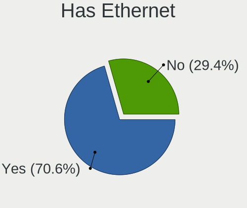
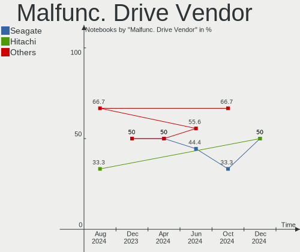
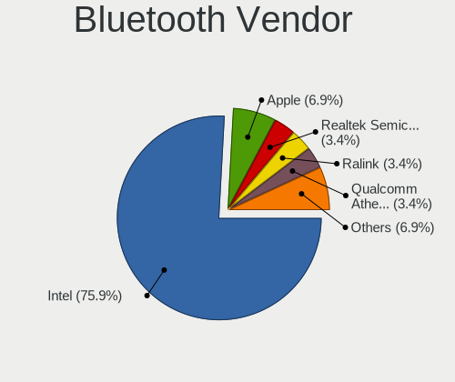

FreeBSD - Hardware Trends (Notebooks)
-------------------------------------

A project to identify most popular hardware characteristics and track their change
over time based on data collected by BSD users at https://BSD-Hardware.info.

Anyone can contribute to this report by the [hw-probe](https://github.com/linuxhw/hw-probe/blob/master/INSTALL.BSD.md) tool:

    hw-probe -all -upload

This report is for one last month. Overall report since the beginning of time: [TestDays](https://github.com/bsdhw/TestDays)

Period: Jul, 2023.

Contents
--------

* [ System ](#system)
  - [ OS                       ](#os)
  - [ OS Family                ](#os-family)
  - [ Arch                     ](#arch)
  - [ DE                       ](#de)
  - [ Display Server           ](#display-server)
  - [ Display Manager          ](#display-manager)
  - [ OS Lang                  ](#os-lang)
  - [ Boot Mode                ](#boot-mode)
  - [ Filesystem               ](#filesystem)
  - [ Part. scheme             ](#part-scheme)

* [ Board ](#board)
  - [ Vendor                   ](#vendor)
  - [ Model                    ](#model)
  - [ Model Family             ](#model-family)
  - [ MFG Year                 ](#mfg-year)
  - [ Form Factor              ](#form-factor)
  - [ Coreboot                 ](#coreboot)
  - [ RAM Size                 ](#ram-size)
  - [ RAM Used                 ](#ram-used)
  - [ Total Drives             ](#total-drives)
  - [ Has CD-ROM               ](#has-cd-rom)
  - [ Has Ethernet             ](#has-ethernet)
  - [ Has WiFi                 ](#has-wifi)
  - [ Has Bluetooth            ](#has-bluetooth)

* [ Location ](#location)
  - [ Country                  ](#country)
  - [ City                     ](#city)

* [ Drives ](#drives)
  - [ Drive Vendor             ](#drive-vendor)
  - [ Drive Model              ](#drive-model)
  - [ HDD Vendor               ](#hdd-vendor)
  - [ SSD Vendor               ](#ssd-vendor)
  - [ Drive Kind               ](#drive-kind)
  - [ Drive Connector          ](#drive-connector)
  - [ Drive Size               ](#drive-size)
  - [ Space Total              ](#space-total)
  - [ Space Used               ](#space-used)
  - [ Malfunc. Drives          ](#malfunc-drives)
  - [ Malfunc. Drive Vendor    ](#malfunc-drive-vendor)
  - [ Malfunc. HDD Vendor      ](#malfunc-hdd-vendor)
  - [ Malfunc. Drive Kind      ](#malfunc-drive-kind)
  - [ Failed Drives            ](#failed-drives)
  - [ Failed Drive Vendor      ](#failed-drive-vendor)
  - [ Drive Status             ](#drive-status)

* [ Storage controller ](#storage-controller)
  - [ Storage Vendor           ](#storage-vendor)
  - [ Storage Model            ](#storage-model)
  - [ Storage Kind             ](#storage-kind)

* [ Processor ](#processor)
  - [ CPU Vendor               ](#cpu-vendor)
  - [ CPU Model                ](#cpu-model)
  - [ CPU Model Family         ](#cpu-model-family)
  - [ CPU Cores                ](#cpu-cores)
  - [ CPU Sockets              ](#cpu-sockets)
  - [ CPU Threads              ](#cpu-threads)
  - [ CPU Microarch            ](#cpu-microarch)

* [ Graphics ](#graphics)
  - [ GPU Vendor               ](#gpu-vendor)
  - [ GPU Model                ](#gpu-model)
  - [ GPU Combo                ](#gpu-combo)
  - [ GPU Driver               ](#gpu-driver)
  - [ GPU Memory               ](#gpu-memory)

* [ Monitor ](#monitor)
  - [ Monitor Vendor           ](#monitor-vendor)
  - [ Monitor Model            ](#monitor-model)
  - [ Monitor Resolution       ](#monitor-resolution)
  - [ Monitor Diagonal         ](#monitor-diagonal)
  - [ Monitor Width            ](#monitor-width)
  - [ Aspect Ratio             ](#aspect-ratio)
  - [ Monitor Area             ](#monitor-area)
  - [ Pixel Density            ](#pixel-density)
  - [ Multiple Monitors        ](#multiple-monitors)

* [ Network ](#network)
  - [ Net Controller Vendor    ](#net-controller-vendor)
  - [ Net Controller Model     ](#net-controller-model)
  - [ Wireless Vendor          ](#wireless-vendor)
  - [ Wireless Model           ](#wireless-model)
  - [ Ethernet Vendor          ](#ethernet-vendor)
  - [ Ethernet Model           ](#ethernet-model)
  - [ Net Controller Kind      ](#net-controller-kind)
  - [ Used Controller          ](#used-controller)
  - [ NICs                     ](#nics)
  - [ IPv6                     ](#ipv6)

* [ Bluetooth ](#bluetooth)
  - [ Bluetooth Vendor         ](#bluetooth-vendor)
  - [ Bluetooth Model          ](#bluetooth-model)

* [ Sound ](#sound)
  - [ Sound Vendor             ](#sound-vendor)
  - [ Sound Model              ](#sound-model)

* [ Memory ](#memory)
  - [ Memory Vendor            ](#memory-vendor)
  - [ Memory Model             ](#memory-model)
  - [ Memory Kind              ](#memory-kind)
  - [ Memory Form Factor       ](#memory-form-factor)
  - [ Memory Size              ](#memory-size)
  - [ Memory Speed             ](#memory-speed)

* [ Printers & scanners ](#printers--scanners)
  - [ Printer Vendor           ](#printer-vendor)
  - [ Printer Model            ](#printer-model)
  - [ Scanner Vendor           ](#scanner-vendor)
  - [ Scanner Model            ](#scanner-model)

* [ Camera ](#camera)
  - [ Camera Vendor            ](#camera-vendor)
  - [ Camera Model             ](#camera-model)

* [ Security ](#security)
  - [ Fingerprint Vendor       ](#fingerprint-vendor)
  - [ Fingerprint Model        ](#fingerprint-model)
  - [ Chipcard Vendor          ](#chipcard-vendor)
  - [ Chipcard Model           ](#chipcard-model)

* [ Unsupported ](#unsupported)
  - [ Unsupported Devices      ](#unsupported-devices)
  - [ Unsupported Device Types ](#unsupported-device-types)

System
------

OS
--

Installed operating systems

| Name                 | Notebooks | Percent |
|----------------------|-----------|---------|
| FreeBSD 13.2         | 10        | 47.62%  |
| FreeBSD 13.2-p1      | 7         | 33.33%  |
| FreeBSD 14.0-CURRENT | 1         | 4.76%   |
| FreeBSD 13.2-STABLE  | 1         | 4.76%   |
| FreeBSD 13.1         | 1         | 4.76%   |
| FreeBSD 12.4         | 1         | 4.76%   |

OS Family
---------

OS without a version

| Name    | Notebooks | Percent |
|---------|-----------|---------|
| FreeBSD | 21        | 100%    |

Arch
----

OS architecture (x86_64, i586, etc.)

| Name  | Notebooks | Percent |
|-------|-----------|---------|
| amd64 | 21        | 100%    |

DE
--

Desktop Environment

| Name         | Notebooks | Percent |
|--------------|-----------|---------|
| Console      | 6         | 28.57%  |
| XFCE         | 3         | 14.29%  |
| TWM          | 3         | 14.29%  |
| LXQt         | 2         | 9.52%   |
| KDE5         | 2         | 9.52%   |
| Window Maker | 1         | 4.76%   |
| stumpwm      | 1         | 4.76%   |
| i3           | 1         | 4.76%   |
| GNOME        | 1         | 4.76%   |
| Budgie       | 1         | 4.76%   |

Display Server
--------------

X11 or Wayland

| Name    | Notebooks | Percent |
|---------|-----------|---------|
| X11     | 15        | 71.43%  |
| Wayland | 5         | 23.81%  |
| Console | 1         | 4.76%   |

Display Manager
---------------

SDDM, LightDM, etc.

| Name    | Notebooks | Percent |
|---------|-----------|---------|
| Console | 11        | 52.38%  |
| LightDM | 6         | 28.57%  |
| SLiM    | 2         | 9.52%   |
| SDDM    | 2         | 9.52%   |

OS Lang
-------

Language

| Lang    | Notebooks | Percent |
|---------|-----------|---------|
| C       | 13        | 61.9%   |
| Unknown | 5         | 23.81%  |
| en_US   | 2         | 9.52%   |
| es_MX   | 1         | 4.76%   |

Boot Mode
---------

EFI or BIOS

| Mode | Notebooks | Percent |
|------|-----------|---------|
| EFI  | 16        | 76.19%  |
| BIOS | 5         | 23.81%  |

Filesystem
----------

Type of filesystem

| Type | Notebooks | Percent |
|------|-----------|---------|
| Zfs  | 16        | 76.19%  |
| Ufs  | 5         | 23.81%  |

Part. scheme
------------

Scheme of partitioning

| Type | Notebooks | Percent |
|------|-----------|---------|
| GPT  | 21        | 100%    |

Board
-----

Vendor
------

Motherboard manufacturer

| Name                | Notebooks | Percent |
|---------------------|-----------|---------|
| Lenovo              | 11        | 52.38%  |
| Hewlett-Packard     | 3         | 14.29%  |
| Samsung Electronics | 1         | 4.76%   |
| NOBLEX              | 1         | 4.76%   |
| HUAWEI              | 1         | 4.76%   |
| HONOR               | 1         | 4.76%   |
| Getac               | 1         | 4.76%   |
| Dell                | 1         | 4.76%   |
| Acer                | 1         | 4.76%   |

Model
-----

Motherboard model

| Name                                     | Notebooks | Percent |
|------------------------------------------|-----------|---------|
| Samsung 100NZB                           | 1         | 4.76%   |
| NOBLEX SF20BA                            | 1         | 4.76%   |
| Lenovo ThinkPad X250 20CLS13Q06          | 1         | 4.76%   |
| Lenovo ThinkPad X1C 5th W10DG 20K3A03CAU | 1         | 4.76%   |
| Lenovo ThinkPad W520 4284GZ1             | 1         | 4.76%   |
| Lenovo ThinkPad T590 20N4001PUS          | 1         | 4.76%   |
| Lenovo ThinkPad T480s 20L8S45W00         | 1         | 4.76%   |
| Lenovo ThinkPad T470s 20HGS3AX02         | 1         | 4.76%   |
| Lenovo ThinkPad T440s 20ARS1BK08         | 1         | 4.76%   |
| Lenovo ThinkPad T440p 20AWS1HL00         | 1         | 4.76%   |
| Lenovo ThinkPad L15 Gen 1 20U8S2TM02     | 1         | 4.76%   |
| Lenovo ThinkPad E15 Gen 2 20TDS0G500     | 1         | 4.76%   |
| Lenovo G550 2958                         | 1         | 4.76%   |
| HUAWEI MRG-WXX                           | 1         | 4.76%   |
| HONOR NMH-WCX9                           | 1         | 4.76%   |
| HP Laptop 14-cf2xxx                      | 1         | 4.76%   |
| HP EliteBook 8570p                       | 1         | 4.76%   |
| HP EliteBook 6930p                       | 1         | 4.76%   |
| Getac F110G2                             | 1         | 4.76%   |
| Dell Precision 5550                      | 1         | 4.76%   |
| Acer Aspire E5-511                       | 1         | 4.76%   |

Model Family
------------

Motherboard model prefix

| Name            | Notebooks | Percent |
|-----------------|-----------|---------|
| Lenovo ThinkPad | 10        | 47.62%  |
| HP EliteBook    | 2         | 9.52%   |
| Samsung 100NZB  | 1         | 4.76%   |
| NOBLEX SF20BA   | 1         | 4.76%   |
| Lenovo G550     | 1         | 4.76%   |
| HUAWEI MRG-WXX  | 1         | 4.76%   |
| HONOR NMH-WCX9  | 1         | 4.76%   |
| HP Laptop       | 1         | 4.76%   |
| Getac F110G2    | 1         | 4.76%   |
| Dell Precision  | 1         | 4.76%   |
| Acer Aspire     | 1         | 4.76%   |

MFG Year
--------

Motherboard manufacture year

| Year | Notebooks | Percent |
|------|-----------|---------|
| 2015 | 4         | 19.05%  |
| 2023 | 3         | 14.29%  |
| 2022 | 3         | 14.29%  |
| 2020 | 2         | 9.52%   |
| 2017 | 2         | 9.52%   |
| 2013 | 2         | 9.52%   |
| 2012 | 2         | 9.52%   |
| 2018 | 1         | 4.76%   |
| 2010 | 1         | 4.76%   |
| 2009 | 1         | 4.76%   |

Form Factor
-----------

Physical design of the computer

| Name     | Notebooks | Percent |
|----------|-----------|---------|
| Notebook | 21        | 100%    |

Coreboot
--------

Have coreboot on board

| Used | Notebooks | Percent |
|------|-----------|---------|
| No   | 21        | 100%    |

RAM Size
--------

Total RAM memory

| Size in GB | Notebooks | Percent |
|------------|-----------|---------|
| 8.01-16.0  | 8         | 38.1%   |
| 16.01-24.0 | 6         | 28.57%  |
| 4.01-8.0   | 4         | 19.05%  |
| 32.01-64.0 | 2         | 9.52%   |
| 2.01-3.0   | 1         | 4.76%   |

RAM Used
--------

Used RAM memory

| Used GB  | Notebooks | Percent |
|----------|-----------|---------|
| 0.51-1.0 | 9         | 42.86%  |
| 0.01-0.5 | 9         | 42.86%  |
| 1.01-2.0 | 3         | 14.29%  |

Total Drives
------------

Number of drives on board

| Drives | Notebooks | Percent |
|--------|-----------|---------|
| 1      | 17        | 80.95%  |
| 2      | 2         | 9.52%   |
| 0      | 2         | 9.52%   |

Has CD-ROM
----------

Has CD-ROM on board

| Presented | Notebooks | Percent |
|-----------|-----------|---------|
| No        | 16        | 76.19%  |
| Yes       | 5         | 23.81%  |

Has Ethernet
------------

Has Ethernet on board

| Presented | Notebooks | Percent |
|-----------|-----------|---------|
| Yes       | 17        | 80.95%  |
| No        | 4         | 19.05%  |

Has WiFi
--------

Has WiFi module

| Presented | Notebooks | Percent |
|-----------|-----------|---------|
| Yes       | 21        | 100%    |

Has Bluetooth
-------------

Has Bluetooth module

| Presented | Notebooks | Percent |
|-----------|-----------|---------|
| Yes       | 16        | 76.19%  |
| No        | 5         | 23.81%  |

Location
--------

Country
-------

Geographic location (country)

| Country     | Notebooks | Percent |
|-------------|-----------|---------|
| USA         | 4         | 19.05%  |
| UK          | 3         | 14.29%  |
| Argentina   | 3         | 14.29%  |
| Australia   | 2         | 9.52%   |
| Spain       | 1         | 4.76%   |
| Russia      | 1         | 4.76%   |
| Netherlands | 1         | 4.76%   |
| Mexico      | 1         | 4.76%   |
| Ireland     | 1         | 4.76%   |
| Indonesia   | 1         | 4.76%   |
| India       | 1         | 4.76%   |
| Germany     | 1         | 4.76%   |
| China       | 1         | 4.76%   |

City
----

Geographic location (city)

| City                  | Notebooks | Percent |
|-----------------------|-----------|---------|
| Sydney                | 2         | 9.52%   |
| Yuzhong Chengguanzhen | 1         | 4.76%   |
| Veracruz              | 1         | 4.76%   |
| Sulzbach-Rosenberg    | 1         | 4.76%   |
| San Miguel            | 1         | 4.76%   |
| Oxford                | 1         | 4.76%   |
| New York              | 1         | 4.76%   |
| Munfordville          | 1         | 4.76%   |
| Moscow                | 1         | 4.76%   |
| Kochi                 | 1         | 4.76%   |
| Hurst                 | 1         | 4.76%   |
| Godella               | 1         | 4.76%   |
| East Grinstead        | 1         | 4.76%   |
| Dublin                | 1         | 4.76%   |
| Córdoba              | 1         | 4.76%   |
| Concord               | 1         | 4.76%   |
| Carlisle              | 1         | 4.76%   |
| Bekasi                | 1         | 4.76%   |
| Bariloche             | 1         | 4.76%   |
| Amsterdam             | 1         | 4.76%   |

Drives
------

Drive Vendor
------------

Hard drive vendors

| Vendor              | Notebooks | Drives | Percent |
|---------------------|-----------|--------|---------|
| Samsung Electronics | 6         | 6      | 27.27%  |
| WDC                 | 4         | 4      | 18.18%  |
| Seagate             | 3         | 3      | 13.64%  |
| SK hynix            | 2         | 2      | 9.09%   |
| Silicon Motion      | 1         | 1      | 4.55%   |
| MidasForce          | 1         | 1      | 4.55%   |
| Micron Technology   | 1         | 1      | 4.55%   |
| Intel               | 1         | 1      | 4.55%   |
| Hitachi             | 1         | 1      | 4.55%   |
| HGST                | 1         | 1      | 4.55%   |
| Crucial             | 1         | 1      | 4.55%   |

Drive Model
-----------

Hard drive models

| Model                                | Notebooks | Percent |
|--------------------------------------|-----------|---------|
| WDC WD5000LUCT-63C26Y0 500GB         | 1         | 4.55%   |
| WDC WD5000LPLX-00ZNTT0 500GB         | 1         | 4.55%   |
| WDC PC SN730 SDBQNTY-256G-1001 256GB | 1         | 4.55%   |
| WDC PC SN530 SDBPNPZ-512G-1036 512GB | 1         | 4.55%   |
| SK hynix SC311 SATA 128GB            | 1         | 4.55%   |
| SK hynix PC711 NVMe 512GB            | 1         | 4.55%   |
| Silicon Motion PCIe-8 SSD 512GB      | 1         | 4.55%   |
| Seagate ST9500325ASG 500GB           | 1         | 4.55%   |
| Seagate ST9250315AS 250GB            | 1         | 4.55%   |
| Seagate ST1000LM024 HN-M101MBB 1TB   | 1         | 4.55%   |
| Samsung SSD 840 PRO Series 256GB     | 1         | 4.55%   |
| Samsung MZVLW512HMJP-000L7 512GB     | 1         | 4.55%   |
| Samsung MZVLQ1T0HBLB-00B00 1TB       | 1         | 4.55%   |
| Samsung MZVLB256HAHQ-000L7 256GB     | 1         | 4.55%   |
| Samsung MZALQ512HALU-000L1 512GB     | 1         | 4.55%   |
| Samsung MZ7LN128HCHP-000L1 128GB     | 1         | 4.55%   |
| MidasForce SSD 256GB                 | 1         | 4.55%   |
| Micron MTFDDAV256TBN-1AR15ABHA 256GB | 1         | 4.55%   |
| Intel SSDSC2BF240A4L 240GB           | 1         | 4.55%   |
| Hitachi HTS543232A7A384 320GB        | 1         | 4.55%   |
| HGST HTS721010A9E630 1TB             | 1         | 4.55%   |
| Crucial CT500P2SSD8 500GB            | 1         | 4.55%   |

HDD Vendor
----------

Hard disk drive vendors

| Vendor  | Notebooks | Drives | Percent |
|---------|-----------|--------|---------|
| Seagate | 3         | 3      | 42.86%  |
| WDC     | 2         | 2      | 28.57%  |
| Hitachi | 1         | 1      | 14.29%  |
| HGST    | 1         | 1      | 14.29%  |

SSD Vendor
----------

Solid state drive vendors

| Vendor              | Notebooks | Drives | Percent |
|---------------------|-----------|--------|---------|
| Samsung Electronics | 2         | 2      | 33.33%  |
| SK hynix            | 1         | 1      | 16.67%  |
| MidasForce          | 1         | 1      | 16.67%  |
| Micron Technology   | 1         | 1      | 16.67%  |
| Intel               | 1         | 1      | 16.67%  |

Drive Kind
----------

HDD or SSD

| Kind | Notebooks | Drives | Percent |
|------|-----------|--------|---------|
| NVMe | 8         | 9      | 40%     |
| SSD  | 6         | 6      | 30%     |
| HDD  | 6         | 7      | 30%     |

Drive Connector
---------------

SATA, SAS, NVMe, etc.

| Type | Notebooks | Drives | Percent |
|------|-----------|--------|---------|
| SATA | 11        | 13     | 57.89%  |
| NVMe | 8         | 9      | 42.11%  |

Drive Size
----------

Size of hard drive

| Size in TB | Notebooks | Drives | Percent |
|------------|-----------|--------|---------|
| 0.01-0.5   | 10        | 11     | 90.91%  |
| 0.51-1.0   | 1         | 2      | 9.09%   |

Space Total
-----------

Amount of disk space available on the file system

| Size in GB | Notebooks | Percent |
|------------|-----------|---------|
| 101-250    | 11        | 52.38%  |
| 251-500    | 5         | 23.81%  |
| 51-100     | 3         | 14.29%  |
| 21-50      | 1         | 4.76%   |
| 501-1000   | 1         | 4.76%   |

Space Used
----------

Amount of used disk space

| Used GB | Notebooks | Percent |
|---------|-----------|---------|
| 1-20    | 18        | 85.71%  |
| 21-50   | 2         | 9.52%   |
| 51-100  | 1         | 4.76%   |

Malfunc. Drives
---------------

Drive models with a malfunction

| Model                      | Notebooks | Drives | Percent |
|----------------------------|-----------|--------|---------|
| Seagate ST9500325ASG 500GB | 1         | 1      | 33.33%  |
| Seagate ST9250315AS 250GB  | 1         | 1      | 33.33%  |
| HGST HTS721010A9E630 1TB   | 1         | 1      | 33.33%  |

Malfunc. Drive Vendor
---------------------

Vendors of faulty drives

| Vendor  | Notebooks | Drives | Percent |
|---------|-----------|--------|---------|
| Seagate | 2         | 2      | 66.67%  |
| HGST    | 1         | 1      | 33.33%  |

Malfunc. HDD Vendor
-------------------

Vendors of faulty HDD drives

| Vendor  | Notebooks | Drives | Percent |
|---------|-----------|--------|---------|
| Seagate | 2         | 2      | 66.67%  |
| HGST    | 1         | 1      | 33.33%  |

Malfunc. Drive Kind
-------------------

Kinds of faulty drives

| Kind | Notebooks | Drives | Percent |
|------|-----------|--------|---------|
| HDD  | 3         | 3      | 100%    |

Failed Drives
-------------

Failed drive models

Zero info for selected period =(

Failed Drive Vendor
-------------------

Failed drive vendors

Zero info for selected period =(

Drive Status
------------

Number of failed and malfunc. drives

| Status  | Notebooks | Drives | Percent |
|---------|-----------|--------|---------|
| Works   | 17        | 19     | 85%     |
| Malfunc | 3         | 3      | 15%     |

Storage controller
------------------

Storage Vendor
--------------

Storage controller vendors

| Vendor                    | Notebooks | Percent |
|---------------------------|-----------|---------|
| Intel                     | 11        | 55%     |
| Samsung Electronics       | 4         | 20%     |
| SanDisk                   | 2         | 10%     |
| SK hynix                  | 1         | 5%      |
| Silicon Motion            | 1         | 5%      |
| Micron/Crucial Technology | 1         | 5%      |

Storage Model
-------------

Storage controller models

| Model                                                                          | Notebooks | Percent |
|--------------------------------------------------------------------------------|-----------|---------|
| Samsung NVMe SSD Controller 980                                                | 2         | 10%     |
| Intel Wildcat Point-LP SATA Controller [AHCI Mode]                             | 2         | 10%     |
| Intel 82801IBM/IEM (ICH9M/ICH9M-E) 4 port SATA Controller [AHCI mode]          | 2         | 10%     |
| SK hynix Gold P31/BC711/PC711 NVMe Solid State Drive                           | 1         | 5%      |
| SanDisk WD Blue SN550 NVMe SSD                                                 | 1         | 5%      |
| SanDisk WD Black SN750 / PC SN730 NVMe SSD                                     | 1         | 5%      |
| Samsung NVMe SSD Controller SM981/PM981/PM983                                  | 1         | 5%      |
| Samsung NVMe SSD Controller SM961/PM961/SM963                                  | 1         | 5%      |
| Micron/Crucial P2 [Nick P2] / P3 / P3 Plus NVMe PCIe SSD (DRAM-less)           | 1         | 5%      |
| Intel Sunrise Point-LP SATA Controller [AHCI mode]                             | 1         | 5%      |
| Intel NM10/ICH7 Family SATA Controller [AHCI mode]                             | 1         | 5%      |
| Intel Atom Processor E3800 Series SATA AHCI Controller                         | 1         | 5%      |
| Intel 8 Series/C220 Series Chipset Family 6-port SATA Controller 1 [AHCI mode] | 1         | 5%      |
| Intel 8 Series SATA Controller 1 [AHCI mode]                                   | 1         | 5%      |
| Intel 7 Series Chipset Family 6-port SATA Controller [AHCI mode]               | 1         | 5%      |
| Intel 6 Series/C200 Series Chipset Family 6 port Mobile SATA AHCI Controller   | 1         | 5%      |
| Unknown                                                                        | 1         | 5%      |

Storage Kind
------------

Kind of storage controller (IDE, SATA, NVMe, SAS, ...)

| Kind | Notebooks | Percent |
|------|-----------|---------|
| SATA | 11        | 57.89%  |
| NVMe | 8         | 42.11%  |

Processor
---------

CPU Vendor
----------

Processor vendors

| Vendor | Notebooks | Percent |
|--------|-----------|---------|
| Intel  | 19        | 90.48%  |
| AMD    | 2         | 9.52%   |

CPU Model
---------

Processor models

| Model                                   | Notebooks | Percent |
|-----------------------------------------|-----------|---------|
| Intel CPU Version                       | 1         | 4.76%   |
| Intel Core i7-8565U CPU @ 1.80GHz       | 1         | 4.76%   |
| Intel Core i7-5500U CPU @ 2.40GHz       | 1         | 4.76%   |
| Intel Core i7-3520M CPU @ 2.90GHz       | 1         | 4.76%   |
| Intel Core i7-2630QM CPU @ 2.00GHz      | 1         | 4.76%   |
| Intel Core i7-10875H CPU @ 2.30GHz      | 1         | 4.76%   |
| Intel Core i5-8350U CPU @ 1.70GHz       | 1         | 4.76%   |
| Intel Core i5-7300U CPU @ 2.60GHz       | 1         | 4.76%   |
| Intel Core i5-6200U CPU @ 2.30GHz       | 1         | 4.76%   |
| Intel Core i5-5300U CPU @ 2.30GHz       | 1         | 4.76%   |
| Intel Core i5-4300U CPU @ 1.90GHz       | 1         | 4.76%   |
| Intel Core i5-4300M CPU @ 2.60GHz       | 1         | 4.76%   |
| Intel Core 2 Duo CPU P8600 @ 2.40GHz    | 1         | 4.76%   |
| Intel Celeron N4120 CPU @ 1.10GHz       | 1         | 4.76%   |
| Intel Celeron CPU N3060 @ 1.60GHz       | 1         | 4.76%   |
| Intel Celeron CPU N2840 @ 2.16GHz       | 1         | 4.76%   |
| Intel Atom CPU N2600 @ 1.60GHz          | 1         | 4.76%   |
| Intel 11th Gen Core i7-1195G7 @ 2.90GHz | 1         | 4.76%   |
| Intel 11th Gen Core i5-1135G7 @ 2.40GHz | 1         | 4.76%   |
| AMD Ryzen 5 5500U with Radeon Graphics  | 1         | 4.76%   |
| AMD Ryzen 3 4300U with Radeon Graphics  | 1         | 4.76%   |

CPU Model Family
----------------

Processor model prefix

| Model            | Notebooks | Percent |
|------------------|-----------|---------|
| Intel Core i5    | 6         | 28.57%  |
| Intel Core i7    | 5         | 23.81%  |
| Other            | 3         | 14.29%  |
| Intel Celeron    | 3         | 14.29%  |
| Intel Core 2 Duo | 1         | 4.76%   |
| Intel Atom       | 1         | 4.76%   |
| AMD Ryzen 5      | 1         | 4.76%   |
| AMD Ryzen 3      | 1         | 4.76%   |

CPU Cores
---------

Number of processor cores

| Number  | Notebooks | Percent |
|---------|-----------|---------|
| 2       | 11        | 52.38%  |
| 4       | 7         | 33.33%  |
| 12      | 1         | 4.76%   |
| 8       | 1         | 4.76%   |
| Unknown | 1         | 4.76%   |

CPU Sockets
-----------

Number of sockets

| Number | Notebooks | Percent |
|--------|-----------|---------|
| 1      | 21        | 100%    |

CPU Threads
-----------

Threads per core (Hyper-Threading)

| Number  | Notebooks | Percent |
|---------|-----------|---------|
| 2       | 14        | 66.67%  |
| 1       | 6         | 28.57%  |
| Unknown | 1         | 4.76%   |

CPU Microarch
-------------

Microarchitecture

| Name          | Notebooks | Percent |
|---------------|-----------|---------|
| KabyLake      | 3         | 14.29%  |
| TigerLake     | 2         | 9.52%   |
| Silvermont    | 2         | 9.52%   |
| Penryn        | 2         | 9.52%   |
| Haswell       | 2         | 9.52%   |
| Broadwell     | 2         | 9.52%   |
| Zen 2         | 1         | 4.76%   |
| Skylake       | 1         | 4.76%   |
| SandyBridge   | 1         | 4.76%   |
| IvyBridge     | 1         | 4.76%   |
| Goldmont plus | 1         | 4.76%   |
| CometLake     | 1         | 4.76%   |
| Bonnell       | 1         | 4.76%   |
| Unknown       | 1         | 4.76%   |

Graphics
--------

GPU Vendor
----------

Vendors of graphics cards

| Vendor | Notebooks | Percent |
|--------|-----------|---------|
| Intel  | 18        | 75%     |
| Nvidia | 3         | 12.5%   |
| AMD    | 3         | 12.5%   |

GPU Model
---------

Graphics card models

| Model                                                                                    | Notebooks | Percent |
|------------------------------------------------------------------------------------------|-----------|---------|
| Intel TigerLake-LP GT2 [Iris Xe Graphics]                                                | 2         | 8.33%   |
| Intel Mobile 4 Series Chipset Integrated Graphics Controller                             | 2         | 8.33%   |
| Intel HD Graphics 5500                                                                   | 2         | 8.33%   |
| Nvidia TU117GLM [Quadro T2000 Mobile / Max-Q]                                            | 1         | 4.17%   |
| Nvidia GP107M [GeForce MX350]                                                            | 1         | 4.17%   |
| Nvidia GF108GLM [Quadro 1000M]                                                           | 1         | 4.17%   |
| Intel WhiskeyLake-U GT2 [UHD Graphics 620]                                               | 1         | 4.17%   |
| Intel UHD Graphics 620                                                                   | 1         | 4.17%   |
| Intel Skylake GT2 [HD Graphics 520]                                                      | 1         | 4.17%   |
| Intel HD Graphics 620                                                                    | 1         | 4.17%   |
| Intel Haswell-ULT Integrated Graphics Controller                                         | 1         | 4.17%   |
| Intel GeminiLake [UHD Graphics 600]                                                      | 1         | 4.17%   |
| Intel CometLake-H GT2 [UHD Graphics]                                                     | 1         | 4.17%   |
| Intel Atom/Celeron/Pentium Processor x5-E8000/J3xxx/N3xxx Integrated Graphics Controller | 1         | 4.17%   |
| Intel Atom Processor Z36xxx/Z37xxx Series Graphics & Display                             | 1         | 4.17%   |
| Intel Atom Processor D2xxx/N2xxx Integrated Graphics Controller                          | 1         | 4.17%   |
| Intel 4th Gen Core Processor Integrated Graphics Controller                              | 1         | 4.17%   |
| Intel 2nd Generation Core Processor Family Integrated Graphics Controller                | 1         | 4.17%   |
| AMD Thames [Radeon HD 7550M/7570M/7650M]                                                 | 1         | 4.17%   |
| AMD Renoir                                                                               | 1         | 4.17%   |
| AMD Lucienne                                                                             | 1         | 4.17%   |

GPU Combo
---------

Combinations of graphics cards

| Name           | Notebooks | Percent |
|----------------|-----------|---------|
| 1 x Intel      | 14        | 66.67%  |
| 1 x AMD        | 3         | 14.29%  |
| 2 x Intel      | 2         | 9.52%   |
| Intel + Nvidia | 2         | 9.52%   |

GPU Driver
----------

Free vs proprietary

| Driver      | Notebooks | Percent |
|-------------|-----------|---------|
| Free        | 20        | 95.24%  |
| Proprietary | 1         | 4.76%   |

GPU Memory
----------

Total video memory

| Size in GB | Notebooks | Percent |
|------------|-----------|---------|
| Unknown    | 18        | 85.71%  |
| 0.01-0.5   | 2         | 9.52%   |
| 0.51-1.0   | 1         | 4.76%   |

Monitor
-------

Monitor Vendor
--------------

Monitor vendors

| Vendor              | Notebooks | Percent |
|---------------------|-----------|---------|
| LG Display          | 3         | 20%     |
| BOE                 | 3         | 20%     |
| Sharp               | 1         | 6.67%   |
| Samsung Electronics | 1         | 6.67%   |
| Philips             | 1         | 6.67%   |
| Lenovo              | 1         | 6.67%   |
| KDC                 | 1         | 6.67%   |
| CSO                 | 1         | 6.67%   |
| Chimei Innolux      | 1         | 6.67%   |
| AU Optronics        | 1         | 6.67%   |
| Apple               | 1         | 6.67%   |

Monitor Model
-------------

Monitor models

| Model                                                               | Notebooks | Percent |
|---------------------------------------------------------------------|-----------|---------|
| Sharp LCD Monitor SHP14D1 1920x1200 340x210mm 15.7-inch             | 1         | 6.67%   |
| Samsung Electronics LS24A40xU SAM71D1 1920x1080 530x300mm 24.0-inch | 1         | 6.67%   |
| Philips 271P4 PHL08C3 1920x1080 600x340mm 27.2-inch                 | 1         | 6.67%   |
| LG Display LP156WH2-TLAA LGD0230 1366x768 340x190mm 15.3-inch       | 1         | 6.67%   |
| LG Display LCD Monitor LGD040A 1920x1080 310x170mm 13.9-inch        | 1         | 6.67%   |
| LG Display LCD Monitor LGD0258 1600x900 350x190mm 15.7-inch         | 1         | 6.67%   |
| Lenovo LCD Monitor LEN40BA 1920x1080 340x190mm 15.3-inch            | 1         | 6.67%   |
| KDC LCD Monitor KDC05F1 1366x768 280x170mm 12.9-inch                | 1         | 6.67%   |
| CSO LCD Monitor CSO1408 3120x2080 300x200mm 14.2-inch               | 1         | 6.67%   |
| Chimei Innolux LCD Monitor CMN1415 1920x1080 310x170mm 13.9-inch    | 1         | 6.67%   |
| BOE LCD Monitor BOE092C 1366x768 310x170mm 13.9-inch                | 1         | 6.67%   |
| BOE LCD Monitor BOE074F 1920x1080 310x170mm 13.9-inch               | 1         | 6.67%   |
| BOE LCD Monitor BOE05E0 1366x768 280x160mm 12.7-inch                | 1         | 6.67%   |
| AU Optronics LCD Monitor AUO243D 1920x1080 310x170mm 13.9-inch      | 1         | 6.67%   |
| Apple Color LCD APPA010 1366x768 260x140mm 11.6-inch                | 1         | 6.67%   |

Monitor Resolution
------------------

Monitor screen resolution

| Resolution        | Notebooks | Percent |
|-------------------|-----------|---------|
| 1920x1080 (FHD)   | 6         | 42.86%  |
| 1366x768 (WXGA)   | 5         | 35.71%  |
| 3120x2080         | 1         | 7.14%   |
| 1920x1200 (WUXGA) | 1         | 7.14%   |
| 1600x900 (HD+)    | 1         | 7.14%   |

Monitor Diagonal
----------------

Diagonal size in inches

| Inches | Notebooks | Percent |
|--------|-----------|---------|
| 13     | 5         | 33.33%  |
| 15     | 4         | 26.67%  |
| 12     | 2         | 13.33%  |
| 27     | 1         | 6.67%   |
| 24     | 1         | 6.67%   |
| 14     | 1         | 6.67%   |
| 11     | 1         | 6.67%   |

Monitor Width
-------------

Physical width

| Width in mm | Notebooks | Percent |
|-------------|-----------|---------|
| 301-350     | 9         | 60%     |
| 201-300     | 4         | 26.67%  |
| 501-600     | 2         | 13.33%  |

Aspect Ratio
------------

Proportional relationship between the width and the height

| Ratio | Notebooks | Percent |
|-------|-----------|---------|
| 16/9  | 10        | 76.92%  |
| 16/10 | 2         | 15.38%  |
| 3/2   | 1         | 7.69%   |

Monitor Area
------------

Area in inch²

| Area in inch² | Notebooks | Percent |
|----------------|-----------|---------|
| 81-90          | 5         | 33.33%  |
| 91-100         | 3         | 20%     |
| 71-80          | 1         | 6.67%   |
| 61-70          | 1         | 6.67%   |
| 51-60          | 1         | 6.67%   |
| 301-350        | 1         | 6.67%   |
| 201-250        | 1         | 6.67%   |
| 111-120        | 1         | 6.67%   |
| 101-110        | 1         | 6.67%   |

Pixel Density
-------------

Pixels per inch

| Density       | Notebooks | Percent |
|---------------|-----------|---------|
| 121-160       | 9         | 60%     |
| 101-120       | 3         | 20%     |
| 51-100        | 2         | 13.33%  |
| More than 240 | 1         | 6.67%   |

Multiple Monitors
-----------------

Total monitors connected

| Total | Notebooks | Percent |
|-------|-----------|---------|
| 1     | 11        | 52.38%  |
| 0     | 8         | 38.1%   |
| 2     | 2         | 9.52%   |

Network
-------

Net Controller Vendor
---------------------

Controller vendors

| Vendor                | Notebooks | Percent |
|-----------------------|-----------|---------|
| Intel                 | 17        | 60.71%  |
| Realtek Semiconductor | 5         | 17.86%  |
| Sierra Wireless       | 1         | 3.57%   |
| Qualcomm Technologies | 1         | 3.57%   |
| Qualcomm Atheros      | 1         | 3.57%   |
| Hewlett-Packard       | 1         | 3.57%   |
| Google                | 1         | 3.57%   |
| Broadcom              | 1         | 3.57%   |

Net Controller Model
--------------------

Controller models

| Model                                                             | Notebooks | Percent |
|-------------------------------------------------------------------|-----------|---------|
| Realtek RTL8111/8168/8411 PCI Express Gigabit Ethernet Controller | 4         | 10%     |
| Intel Wireless 8265 / 8275                                        | 3         | 7.5%    |
| Intel Wireless 7265                                               | 2         | 5%      |
| Intel Wireless 7260                                               | 2         | 5%      |
| Intel Wi-Fi 6 AX201                                               | 2         | 5%      |
| Intel Ethernet Connection (4) I219-LM                             | 2         | 5%      |
| Intel Centrino Advanced-N 6205 [Taylor Peak]                      | 2         | 5%      |
| Intel 82579LM Gigabit Network Connection (Lewisville)             | 2         | 5%      |
| Sierra Wireless EM7305 Modem                                      | 1         | 2.5%    |
| Realtek RTL8821CE 802.11ac PCIe Wireless Network Adapter          | 1         | 2.5%    |
| Realtek RTL810xE PCI Express Fast Ethernet controller             | 1         | 2.5%    |
| Qualcomm QCNFA765 Wireless Network Adapter                        | 1         | 2.5%    |
| Qualcomm Atheros QCA9565 / AR9565 Wireless Network Adapter        | 1         | 2.5%    |
| Intel Wireless 8260                                               | 1         | 2.5%    |
| Intel Wireless 3165                                               | 1         | 2.5%    |
| Intel WiFi Link 5100                                              | 1         | 2.5%    |
| Intel Ethernet Connection I219-V                                  | 1         | 2.5%    |
| Intel Ethernet Connection I218-LM                                 | 1         | 2.5%    |
| Intel Ethernet Connection I217-LM                                 | 1         | 2.5%    |
| Intel Ethernet Connection (6) I219-V                              | 1         | 2.5%    |
| Intel Ethernet Connection (3) I218-LM                             | 1         | 2.5%    |
| Intel Comet Lake PCH CNVi WiFi                                    | 1         | 2.5%    |
| Intel Centrino Wireless-N 105                                     | 1         | 2.5%    |
| Intel Cannon Point-LP CNVi [Wireless-AC]                          | 1         | 2.5%    |
| Intel 82567LM Gigabit Network Connection                          | 1         | 2.5%    |
| HP hs2350 HSPA+ Mobile Broadband Module Network Adapter           | 1         | 2.5%    |
| Google Nexus/Pixel Device (tether)                                | 1         | 2.5%    |
| Broadcom NetLink BCM5906M Fast Ethernet PCI Express               | 1         | 2.5%    |
| Broadcom BCM4312 802.11b/g LP-PHY                                 | 1         | 2.5%    |

Wireless Vendor
---------------

Wireless vendors

| Vendor                | Notebooks | Percent |
|-----------------------|-----------|---------|
| Intel                 | 17        | 80.95%  |
| Realtek Semiconductor | 1         | 4.76%   |
| Qualcomm Technologies | 1         | 4.76%   |
| Qualcomm Atheros      | 1         | 4.76%   |
| Broadcom              | 1         | 4.76%   |

Wireless Model
--------------

Wireless models

| Model                                                      | Notebooks | Percent |
|------------------------------------------------------------|-----------|---------|
| Intel Wireless 8265 / 8275                                 | 3         | 14.29%  |
| Intel Wireless 7265                                        | 2         | 9.52%   |
| Intel Wireless 7260                                        | 2         | 9.52%   |
| Intel Wi-Fi 6 AX201                                        | 2         | 9.52%   |
| Intel Centrino Advanced-N 6205 [Taylor Peak]               | 2         | 9.52%   |
| Realtek RTL8821CE 802.11ac PCIe Wireless Network Adapter   | 1         | 4.76%   |
| Qualcomm QCNFA765 Wireless Network Adapter                 | 1         | 4.76%   |
| Qualcomm Atheros QCA9565 / AR9565 Wireless Network Adapter | 1         | 4.76%   |
| Intel Wireless 8260                                        | 1         | 4.76%   |
| Intel Wireless 3165                                        | 1         | 4.76%   |
| Intel WiFi Link 5100                                       | 1         | 4.76%   |
| Intel Comet Lake PCH CNVi WiFi                             | 1         | 4.76%   |
| Intel Centrino Wireless-N 105                              | 1         | 4.76%   |
| Intel Cannon Point-LP CNVi [Wireless-AC]                   | 1         | 4.76%   |
| Broadcom BCM4312 802.11b/g LP-PHY                          | 1         | 4.76%   |

Ethernet Vendor
---------------

Ethernet vendors

| Vendor                | Notebooks | Percent |
|-----------------------|-----------|---------|
| Intel                 | 10        | 58.82%  |
| Realtek Semiconductor | 5         | 29.41%  |
| Google                | 1         | 5.88%   |
| Broadcom              | 1         | 5.88%   |

Ethernet Model
--------------

Ethernet models

| Model                                                             | Notebooks | Percent |
|-------------------------------------------------------------------|-----------|---------|
| Realtek RTL8111/8168/8411 PCI Express Gigabit Ethernet Controller | 4         | 23.53%  |
| Intel Ethernet Connection (4) I219-LM                             | 2         | 11.76%  |
| Intel 82579LM Gigabit Network Connection (Lewisville)             | 2         | 11.76%  |
| Realtek RTL810xE PCI Express Fast Ethernet controller             | 1         | 5.88%   |
| Intel Ethernet Connection I219-V                                  | 1         | 5.88%   |
| Intel Ethernet Connection I218-LM                                 | 1         | 5.88%   |
| Intel Ethernet Connection I217-LM                                 | 1         | 5.88%   |
| Intel Ethernet Connection (6) I219-V                              | 1         | 5.88%   |
| Intel Ethernet Connection (3) I218-LM                             | 1         | 5.88%   |
| Intel 82567LM Gigabit Network Connection                          | 1         | 5.88%   |
| Google Nexus/Pixel Device (tether)                                | 1         | 5.88%   |
| Broadcom NetLink BCM5906M Fast Ethernet PCI Express               | 1         | 5.88%   |

Net Controller Kind
-------------------

Ethernet, WiFi or modem

| Kind     | Notebooks | Percent |
|----------|-----------|---------|
| WiFi     | 21        | 52.5%   |
| Ethernet | 17        | 42.5%   |
| Modem    | 1         | 2.5%    |
| Unknown  | 1         | 2.5%    |

Used Controller
---------------

Currently used network controller

| Kind     | Notebooks | Percent |
|----------|-----------|---------|
| WiFi     | 12        | 63.16%  |
| Ethernet | 7         | 36.84%  |

NICs
----

Total network controllers on board

| Total | Notebooks | Percent |
|-------|-----------|---------|
| 2     | 16        | 76.19%  |
| 1     | 5         | 23.81%  |

IPv6
----

IPv6 vs IPv4

| Used | Notebooks | Percent |
|------|-----------|---------|
| No   | 20        | 95.24%  |
| Yes  | 1         | 4.76%   |

Bluetooth
---------

Bluetooth Vendor
----------------

Controller vendors

| Vendor                  | Notebooks | Percent |
|-------------------------|-----------|---------|
| Intel                   | 11        | 68.75%  |
| Realtek Semiconductor   | 1         | 6.25%   |
| Lite-On Technology      | 1         | 6.25%   |
| Foxconn / Hon Hai       | 1         | 6.25%   |
| Cambridge Silicon Radio | 1         | 6.25%   |
| Broadcom                | 1         | 6.25%   |

Bluetooth Model
---------------

Controller models

| Model                                                | Notebooks | Percent |
|------------------------------------------------------|-----------|---------|
| Intel Bluetooth wireless interface                   | 8         | 50%     |
| Intel Bluetooth 9460/9560 Jefferson Peak (JfP)       | 2         | 12.5%   |
| Realtek  Bluetooth 4.2 Adapter                       | 1         | 6.25%   |
| Lite-On Atheros AR3012 Bluetooth                     | 1         | 6.25%   |
| Intel AX201 Bluetooth                                | 1         | 6.25%   |
| Foxconn / Hon Hai Qualcomm WCN685x Bluetooth Adapter | 1         | 6.25%   |
| Cambridge Silicon Radio Bluetooth Dongle (HCI mode)  | 1         | 6.25%   |
| Broadcom BCM2045B (BDC-2.1)                          | 1         | 6.25%   |

Sound
-----

Sound Vendor
------------

Sound card vendors

| Vendor | Notebooks | Percent |
|--------|-----------|---------|
| Intel  | 19        | 86.36%  |
| AMD    | 3         | 13.64%  |

Sound Model
-----------

Sound card models

| Model                                                                                             | Notebooks | Percent |
|---------------------------------------------------------------------------------------------------|-----------|---------|
| Intel Sunrise Point-LP HD Audio                                                                   | 3         | 10.71%  |
| Intel Wildcat Point-LP High Definition Audio Controller                                           | 2         | 7.14%   |
| Intel Tiger Lake-LP Smart Sound Technology Audio Controller                                       | 2         | 7.14%   |
| Intel Broadwell-U Audio Controller                                                                | 2         | 7.14%   |
| Intel 82801I (ICH9 Family) HD Audio Controller                                                    | 2         | 7.14%   |
| AMD Renoir Radeon High Definition Audio Controller                                                | 2         | 7.14%   |
| AMD Family 17h/19h HD Audio Controller                                                            | 2         | 7.14%   |
| Intel Xeon E3-1200 v3/4th Gen Core Processor HD Audio Controller                                  | 1         | 3.57%   |
| Intel NM10/ICH7 Family High Definition Audio Controller                                           | 1         | 3.57%   |
| Intel Haswell-ULT HD Audio Controller                                                             | 1         | 3.57%   |
| Intel Comet Lake PCH cAVS                                                                         | 1         | 3.57%   |
| Intel Celeron/Pentium Silver Processor High Definition Audio                                      | 1         | 3.57%   |
| Intel Cannon Point-LP High Definition Audio Controller                                            | 1         | 3.57%   |
| Intel Atom/Celeron/Pentium Processor x5-E8000/J3xxx/N3xxx Series High Definition Audio Controller | 1         | 3.57%   |
| Intel Atom Processor Z36xxx/Z37xxx Series High Definition Audio Controller                        | 1         | 3.57%   |
| Intel 8 Series/C220 Series Chipset High Definition Audio Controller                               | 1         | 3.57%   |
| Intel 8 Series HD Audio Controller                                                                | 1         | 3.57%   |
| Intel 7 Series/C216 Chipset Family High Definition Audio Controller                               | 1         | 3.57%   |
| Intel 6 Series/C200 Series Chipset Family High Definition Audio Controller                        | 1         | 3.57%   |
| AMD Turks HDMI Audio [Radeon HD 6500/6600 / 6700M Series]                                         | 1         | 3.57%   |

Memory
------

Memory Vendor
-------------

Memory module vendors

| Vendor              | Notebooks | Percent |
|---------------------|-----------|---------|
| Samsung Electronics | 10        | 43.48%  |
| Micron Technology   | 6         | 26.09%  |
| Crucial             | 3         | 13.04%  |
| Transcend           | 1         | 4.35%   |
| SK hynix            | 1         | 4.35%   |
| Magnum Tech         | 1         | 4.35%   |
| Goldkey             | 1         | 4.35%   |

Memory Model
------------

Memory module models

| Model                                                          | Notebooks | Percent |
|----------------------------------------------------------------|-----------|---------|
| Samsung RAM M471B5273DH0-CK0 4GB SODIMM DDR3 1600MT/s          | 2         | 8%      |
| Samsung RAM M471B5173EB0-YK0 4GB SODIMM DDR3 1600MT/s          | 2         | 8%      |
| Transcend RAM TS1GSK64W6H 8GB SODIMM DDR3 1600MT/s             | 1         | 4%      |
| SK hynix RAM HMT851S6AMR6A-PB 4GB Chip DDR3 1600MT/s           | 1         | 4%      |
| Samsung RAM M471B5673FH0-CF8 2GB SODIMM 1067MT/s               | 1         | 4%      |
| Samsung RAM M471B5173QH0-YK0 4GB SODIMM DDR3 1600MT/s          | 1         | 4%      |
| Samsung RAM M471B1G73QH0-YK0 8GB SODIMM DDR3 1867MT/s          | 1         | 4%      |
| Samsung RAM M471B1G73EB0-YK0 8GB SODIMM DDR3 1600MT/s          | 1         | 4%      |
| Samsung RAM M471A5244CB0-CWE 4GB SODIMM DDR4 3200MT/s          | 1         | 4%      |
| Samsung RAM M471A2K43DB1-CWE 16GB SODIMM DDR4 3200MT/s         | 1         | 4%      |
| Samsung RAM M471A1K43BB1-CRC 16GB SODIMM DDR4 2400MT/s         | 1         | 4%      |
| Samsung RAM M4 70T5663QZ3-CF7 2GB SODIMM DDR2 2048MT/s         | 1         | 4%      |
| Micron RAM MTA4ATF1G64HZ-3G2E2 8GB Row Of Chips DDR4 3200MT/s  | 1         | 4%      |
| Micron RAM L512M32D2PF107WT:B 4GB Row Of Chips LPDDR3 1867MT/s | 1         | 4%      |
| Micron RAM 8KTF51264HZ-1G6N1 4GB SODIMM DDR3 1600MT/s          | 1         | 4%      |
| Micron RAM 53E1G32D2NP-046 2GB Row Of Chips LPDDR4 4267MT/s    | 1         | 4%      |
| Micron RAM 4ATS1G64HZ-2G6E1 8GB SODIMM DDR4 2667MT/s           | 1         | 4%      |
| Micron RAM 4ATS1G64HZ-2G3A1 8GB SODIMM DDR4 2133MT/s           | 1         | 4%      |
| Magnum Tech RAM MAGNUMTECH 2GB SODIMM DDR3 1600MT/s            | 1         | 4%      |
| Goldkey RAM GKH400SO51208-1600 4GB SODIMM DDR3 1600MT/s        | 1         | 4%      |
| Crucial RAM CT8G4SFS824A.M8FR 8GB SODIMM DDR4 2400MT/s         | 1         | 4%      |
| Crucial RAM CT16G4SFRA32A.M16FRS 16GB SODIMM DDR4 3200MT/s     | 1         | 4%      |
| Crucial RAM CT16G4SFD8266.M16FRS 16GB SODIMM DDR4 2667MT/s     | 1         | 4%      |

Memory Kind
-----------

Memory module kinds

| Kind   | Notebooks | Percent |
|--------|-----------|---------|
| DDR3   | 10        | 47.62%  |
| DDR4   | 8         | 38.1%   |
| SDRAM  | 1         | 4.76%   |
| LPDDR4 | 1         | 4.76%   |
| LPDDR3 | 1         | 4.76%   |

Memory Form Factor
------------------

Physical design of the memory module

| Name         | Notebooks | Percent |
|--------------|-----------|---------|
| SODIMM       | 18        | 81.82%  |
| Row Of Chips | 3         | 13.64%  |
| Chip         | 1         | 4.55%   |

Memory Size
-----------

Memory module size

| Size  | Notebooks | Percent |
|-------|-----------|---------|
| 8192  | 9         | 37.5%   |
| 4096  | 8         | 33.33%  |
| 16384 | 4         | 16.67%  |
| 2048  | 3         | 12.5%   |

Memory Speed
------------

Memory module speed

| Speed | Notebooks | Percent |
|-------|-----------|---------|
| 1600  | 9         | 40.91%  |
| 3200  | 4         | 18.18%  |
| 2667  | 2         | 9.09%   |
| 1867  | 2         | 9.09%   |
| 4267  | 1         | 4.55%   |
| 2400  | 1         | 4.55%   |
| 2133  | 1         | 4.55%   |
| 2048  | 1         | 4.55%   |
| 1067  | 1         | 4.55%   |

Printers & scanners
-------------------

Printer Vendor
--------------

Printer device vendors

Zero info for selected period =(

Printer Model
-------------

Printer device models

Zero info for selected period =(

Scanner Vendor
--------------

Scanner device vendors

Zero info for selected period =(

Scanner Model
-------------

Scanner device models

Zero info for selected period =(

Camera
------

Camera Vendor
-------------

Camera device vendors

| Vendor                      | Notebooks | Percent |
|-----------------------------|-----------|---------|
| Chicony Electronics         | 9         | 45%     |
| IMC Networks                | 3         | 15%     |
| Realtek Semiconductor       | 2         | 10%     |
| Bison Electronics           | 2         | 10%     |
| Silicon Motion              | 1         | 5%      |
| Qtech                       | 1         | 5%      |
| Luxvisions Innotech Limited | 1         | 5%      |
| Lite-On Technology          | 1         | 5%      |

Camera Model
------------

Camera device models

| Model                                         | Notebooks | Percent |
|-----------------------------------------------|-----------|---------|
| Chicony Integrated Camera (1280x720@30)       | 2         | 10%     |
| Chicony Integrated Camera                     | 2         | 10%     |
| Silicon Motion Realtek USB 2.0 PC Camera      | 1         | 5%      |
| Realtek PC Camera                             | 1         | 5%      |
| Realtek HD WebCam                             | 1         | 5%      |
| Qtech USB Camera                              | 1         | 5%      |
| Luxvisions Innotech Limited Integrated Camera | 1         | 5%      |
| Lite-On Integrated Camera                     | 1         | 5%      |
| IMC Networks SunplusIT Integrated Camera      | 1         | 5%      |
| IMC Networks ov9734_azurewave_camera          | 1         | 5%      |
| IMC Networks Integrated Camera                | 1         | 5%      |
| Chicony USB 2.0 Camera                        | 1         | 5%      |
| Chicony Lenovo Integrated Camera (0.3MP)      | 1         | 5%      |
| Chicony Integrated HP HD Webcam               | 1         | 5%      |
| Chicony HP TrueVision HD Camera               | 1         | 5%      |
| Chicony HD camera                             | 1         | 5%      |
| Bison Lenovo EasyCamera                       | 1         | 5%      |
| Bison Integrated Camera                       | 1         | 5%      |

Security
--------

Fingerprint Vendor
------------------

Fingerprint sensor vendors

| Vendor                     | Notebooks | Percent |
|----------------------------|-----------|---------|
| Shenzhen Goodix Technology | 3         | 42.86%  |
| Validity Sensors           | 2         | 28.57%  |
| Synaptics                  | 1         | 14.29%  |
| AuthenTec                  | 1         | 14.29%  |

Fingerprint Model
-----------------

Fingerprint sensor models

| Model                                             | Notebooks | Percent |
|---------------------------------------------------|-----------|---------|
| Shenzhen Goodix  Fingerprint Device               | 2         | 28.57%  |
| Validity Sensors VFS 5011 fingerprint sensor      | 1         | 14.29%  |
| Validity Sensors Synaptics WBDI                   | 1         | 14.29%  |
| Synaptics Prometheus MIS Touch Fingerprint Reader | 1         | 14.29%  |
| Shenzhen Goodix Fingerprint Reader                | 1         | 14.29%  |
| AuthenTec AES2810                                 | 1         | 14.29%  |

Chipcard Vendor
---------------

Chipcard module vendors

Zero info for selected period =(

Chipcard Model
--------------

Chipcard module models

Zero info for selected period =(

Unsupported
-----------

Unsupported Devices
-------------------

Total unsupported devices on board

| Total | Notebooks | Percent |
|-------|-----------|---------|
| 2     | 7         | 33.33%  |
| 1     | 5         | 23.81%  |
| 3     | 4         | 19.05%  |
| 0     | 3         | 14.29%  |
| 5     | 1         | 4.76%   |
| 4     | 1         | 4.76%   |

Unsupported Device Types
------------------------

Types of unsupported devices

| Type                     | Notebooks | Percent |
|--------------------------|-----------|---------|
| Communication controller | 14        | 41.18%  |
| Bluetooth                | 8         | 23.53%  |
| Fingerprint reader       | 7         | 20.59%  |
| Firewire controller      | 2         | 5.88%   |
| Card reader              | 2         | 5.88%   |
| Net/wireless             | 1         | 2.94%   |

