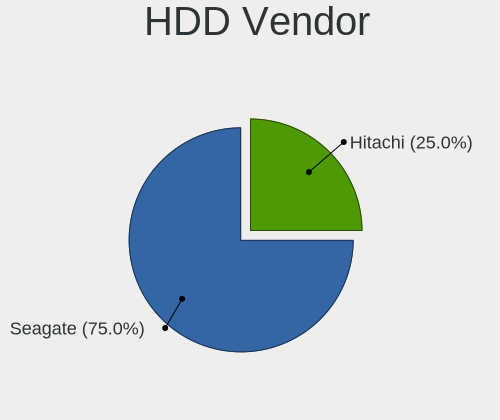
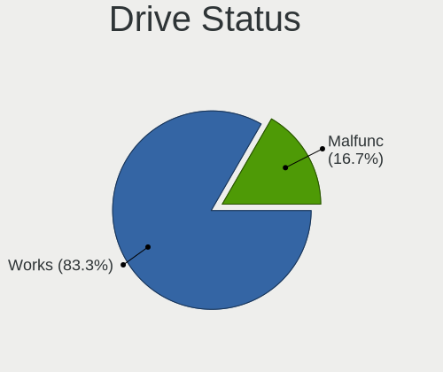
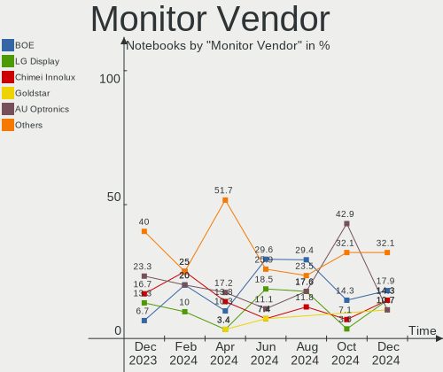
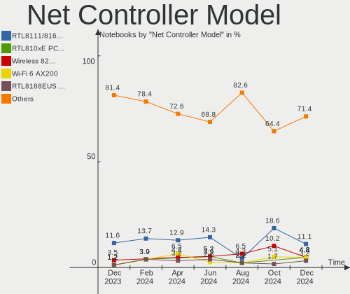
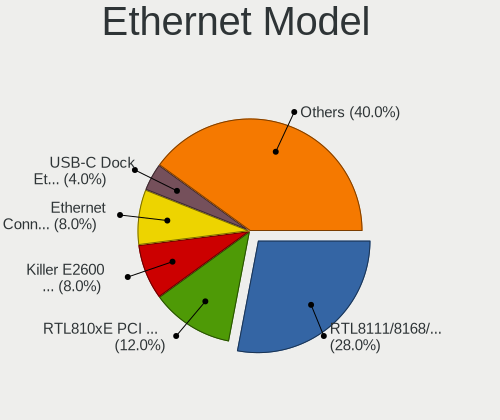

FreeBSD - Hardware Trends (Notebooks)
-------------------------------------

A project to identify most popular hardware characteristics and track their change
over time based on data collected by BSD users at https://BSD-Hardware.info.

Anyone can contribute to this report by the [hw-probe](https://github.com/linuxhw/hw-probe/blob/master/INSTALL.BSD.md) tool:

    hw-probe -all -upload

This report is for one last month. Overall report since the beginning of time: [TestDays](https://github.com/bsdhw/TestDays)

Period: Jun, 2023.

Contents
--------

* [ System ](#system)
  - [ OS                       ](#os)
  - [ OS Family                ](#os-family)
  - [ Arch                     ](#arch)
  - [ DE                       ](#de)
  - [ Display Server           ](#display-server)
  - [ Display Manager          ](#display-manager)
  - [ OS Lang                  ](#os-lang)
  - [ Boot Mode                ](#boot-mode)
  - [ Filesystem               ](#filesystem)
  - [ Part. scheme             ](#part-scheme)

* [ Board ](#board)
  - [ Vendor                   ](#vendor)
  - [ Model                    ](#model)
  - [ Model Family             ](#model-family)
  - [ MFG Year                 ](#mfg-year)
  - [ Form Factor              ](#form-factor)
  - [ Coreboot                 ](#coreboot)
  - [ RAM Size                 ](#ram-size)
  - [ RAM Used                 ](#ram-used)
  - [ Total Drives             ](#total-drives)
  - [ Has CD-ROM               ](#has-cd-rom)
  - [ Has Ethernet             ](#has-ethernet)
  - [ Has WiFi                 ](#has-wifi)
  - [ Has Bluetooth            ](#has-bluetooth)

* [ Location ](#location)
  - [ Country                  ](#country)
  - [ City                     ](#city)

* [ Drives ](#drives)
  - [ Drive Vendor             ](#drive-vendor)
  - [ Drive Model              ](#drive-model)
  - [ HDD Vendor               ](#hdd-vendor)
  - [ SSD Vendor               ](#ssd-vendor)
  - [ Drive Kind               ](#drive-kind)
  - [ Drive Connector          ](#drive-connector)
  - [ Drive Size               ](#drive-size)
  - [ Space Total              ](#space-total)
  - [ Space Used               ](#space-used)
  - [ Malfunc. Drives          ](#malfunc-drives)
  - [ Malfunc. Drive Vendor    ](#malfunc-drive-vendor)
  - [ Malfunc. HDD Vendor      ](#malfunc-hdd-vendor)
  - [ Malfunc. Drive Kind      ](#malfunc-drive-kind)
  - [ Failed Drives            ](#failed-drives)
  - [ Failed Drive Vendor      ](#failed-drive-vendor)
  - [ Drive Status             ](#drive-status)

* [ Storage controller ](#storage-controller)
  - [ Storage Vendor           ](#storage-vendor)
  - [ Storage Model            ](#storage-model)
  - [ Storage Kind             ](#storage-kind)

* [ Processor ](#processor)
  - [ CPU Vendor               ](#cpu-vendor)
  - [ CPU Model                ](#cpu-model)
  - [ CPU Model Family         ](#cpu-model-family)
  - [ CPU Cores                ](#cpu-cores)
  - [ CPU Sockets              ](#cpu-sockets)
  - [ CPU Threads              ](#cpu-threads)
  - [ CPU Microarch            ](#cpu-microarch)

* [ Graphics ](#graphics)
  - [ GPU Vendor               ](#gpu-vendor)
  - [ GPU Model                ](#gpu-model)
  - [ GPU Combo                ](#gpu-combo)
  - [ GPU Driver               ](#gpu-driver)
  - [ GPU Memory               ](#gpu-memory)

* [ Monitor ](#monitor)
  - [ Monitor Vendor           ](#monitor-vendor)
  - [ Monitor Model            ](#monitor-model)
  - [ Monitor Resolution       ](#monitor-resolution)
  - [ Monitor Diagonal         ](#monitor-diagonal)
  - [ Monitor Width            ](#monitor-width)
  - [ Aspect Ratio             ](#aspect-ratio)
  - [ Monitor Area             ](#monitor-area)
  - [ Pixel Density            ](#pixel-density)
  - [ Multiple Monitors        ](#multiple-monitors)

* [ Network ](#network)
  - [ Net Controller Vendor    ](#net-controller-vendor)
  - [ Net Controller Model     ](#net-controller-model)
  - [ Wireless Vendor          ](#wireless-vendor)
  - [ Wireless Model           ](#wireless-model)
  - [ Ethernet Vendor          ](#ethernet-vendor)
  - [ Ethernet Model           ](#ethernet-model)
  - [ Net Controller Kind      ](#net-controller-kind)
  - [ Used Controller          ](#used-controller)
  - [ NICs                     ](#nics)
  - [ IPv6                     ](#ipv6)

* [ Bluetooth ](#bluetooth)
  - [ Bluetooth Vendor         ](#bluetooth-vendor)
  - [ Bluetooth Model          ](#bluetooth-model)

* [ Sound ](#sound)
  - [ Sound Vendor             ](#sound-vendor)
  - [ Sound Model              ](#sound-model)

* [ Memory ](#memory)
  - [ Memory Vendor            ](#memory-vendor)
  - [ Memory Model             ](#memory-model)
  - [ Memory Kind              ](#memory-kind)
  - [ Memory Form Factor       ](#memory-form-factor)
  - [ Memory Size              ](#memory-size)
  - [ Memory Speed             ](#memory-speed)

* [ Printers & scanners ](#printers--scanners)
  - [ Printer Vendor           ](#printer-vendor)
  - [ Printer Model            ](#printer-model)
  - [ Scanner Vendor           ](#scanner-vendor)
  - [ Scanner Model            ](#scanner-model)

* [ Camera ](#camera)
  - [ Camera Vendor            ](#camera-vendor)
  - [ Camera Model             ](#camera-model)

* [ Security ](#security)
  - [ Fingerprint Vendor       ](#fingerprint-vendor)
  - [ Fingerprint Model        ](#fingerprint-model)
  - [ Chipcard Vendor          ](#chipcard-vendor)
  - [ Chipcard Model           ](#chipcard-model)

* [ Unsupported ](#unsupported)
  - [ Unsupported Devices      ](#unsupported-devices)
  - [ Unsupported Device Types ](#unsupported-device-types)

System
------

OS
--

Installed operating systems

| Name                 | Notebooks | Percent |
|----------------------|-----------|---------|
| FreeBSD 13.2         | 21        | 77.78%  |
| FreeBSD 14.0-CURRENT | 4         | 14.81%  |
| FreeBSD 13.2-p1      | 1         | 3.7%    |
| FreeBSD 13.1-p8      | 1         | 3.7%    |

OS Family
---------

OS without a version

| Name    | Notebooks | Percent |
|---------|-----------|---------|
| FreeBSD | 27        | 100%    |

Arch
----

OS architecture (x86_64, i586, etc.)

| Name  | Notebooks | Percent |
|-------|-----------|---------|
| amd64 | 26        | 96.3%   |
| i386  | 1         | 3.7%    |

DE
--

Desktop Environment

| Name    | Notebooks | Percent |
|---------|-----------|---------|
| KDE5    | 12        | 44.44%  |
| XFCE    | 6         | 22.22%  |
| TWM     | 3         | 11.11%  |
| Console | 2         | 7.41%   |
| MATE    | 1         | 3.7%    |
| LXQt    | 1         | 3.7%    |
| GNOME   | 1         | 3.7%    |
| Budgie  | 1         | 3.7%    |

Display Server
--------------

X11 or Wayland

| Name    | Notebooks | Percent |
|---------|-----------|---------|
| X11     | 26        | 96.3%   |
| Console | 1         | 3.7%    |

Display Manager
---------------

SDDM, LightDM, etc.

| Name    | Notebooks | Percent |
|---------|-----------|---------|
| SDDM    | 13        | 48.15%  |
| Console | 7         | 25.93%  |
| SLiM    | 4         | 14.81%  |
| LightDM | 2         | 7.41%   |
| GDM     | 1         | 3.7%    |

OS Lang
-------

Language

| Lang    | Notebooks | Percent |
|---------|-----------|---------|
| C       | 20        | 74.07%  |
| en_US   | 2         | 7.41%   |
| Unknown | 2         | 7.41%   |
| pt_BR   | 1         | 3.7%    |
| de_DE   | 1         | 3.7%    |
| Default | 1         | 3.7%    |

Boot Mode
---------

EFI or BIOS

| Mode | Notebooks | Percent |
|------|-----------|---------|
| EFI  | 20        | 74.07%  |
| BIOS | 7         | 25.93%  |

Filesystem
----------

Type of filesystem

| Type | Notebooks | Percent |
|------|-----------|---------|
| Zfs  | 22        | 81.48%  |
| Ufs  | 5         | 18.52%  |

Part. scheme
------------

Scheme of partitioning

| Type | Notebooks | Percent |
|------|-----------|---------|
| GPT  | 25        | 92.59%  |
| MBR  | 2         | 7.41%   |

Board
-----

Vendor
------

Motherboard manufacturer

| Name            | Notebooks | Percent |
|-----------------|-----------|---------|
| Lenovo          | 13        | 48.15%  |
| Hewlett-Packard | 5         | 18.52%  |
| Dell            | 4         | 14.81%  |
| Toshiba         | 1         | 3.7%    |
| Notebook        | 1         | 3.7%    |
| Fujitsu Siemens | 1         | 3.7%    |
| Apple           | 1         | 3.7%    |
| Acer            | 1         | 3.7%    |

Model
-----

Motherboard model

| Name                                      | Notebooks | Percent |
|-------------------------------------------|-----------|---------|
| Toshiba Satellite C70-B                   | 1         | 3.7%    |
| Notebook NL5xRU                           | 1         | 3.7%    |
| Lenovo ThinkPad X1 Extreme 2nd 20QV001CPB | 1         | 3.7%    |
| Lenovo ThinkPad X1 Carbon 6th 20KH002LUS  | 1         | 3.7%    |
| Lenovo ThinkPad W520 4284GZ1              | 1         | 3.7%    |
| Lenovo ThinkPad T500 2082BNU              | 1         | 3.7%    |
| Lenovo ThinkPad T480 20L6S5VP4C           | 1         | 3.7%    |
| Lenovo ThinkPad T480 20L6S2S800           | 1         | 3.7%    |
| Lenovo ThinkPad T450 20BV000BUS           | 1         | 3.7%    |
| Lenovo ThinkPad T440p 20AW000BUS          | 1         | 3.7%    |
| Lenovo ThinkPad T430 2347GR2              | 1         | 3.7%    |
| Lenovo ThinkBook 14 G4+ ARA 21D0          | 1         | 3.7%    |
| Lenovo IdeaPad Slim 9 14ITL5 82D2         | 1         | 3.7%    |
| Lenovo B590 20208                         | 1         | 3.7%    |
| Lenovo B40-30 80F10002BR                  | 1         | 3.7%    |
| HP Pavilion g4                            | 1         | 3.7%    |
| HP EliteBook 8570p                        | 1         | 3.7%    |
| HP EliteBook 850 G5                       | 1         | 3.7%    |
| HP EliteBook 840 G6                       | 1         | 3.7%    |
| HP 1000                                   | 1         | 3.7%    |
| Fujitsu Siemens AMILO Li3710              | 1         | 3.7%    |
| Dell Latitude E6520                       | 1         | 3.7%    |
| Dell Latitude 3420                        | 1         | 3.7%    |
| Dell Inspiron 5559                        | 1         | 3.7%    |
| Dell G5 5505                              | 1         | 3.7%    |
| Apple MacBook2,1                          | 1         | 3.7%    |
| Acer Aspire E5-571G                       | 1         | 3.7%    |

Model Family
------------

Motherboard model prefix

| Name                  | Notebooks | Percent |
|-----------------------|-----------|---------|
| Lenovo ThinkPad       | 9         | 33.33%  |
| HP EliteBook          | 3         | 11.11%  |
| Dell Latitude         | 2         | 7.41%   |
| Toshiba Satellite     | 1         | 3.7%    |
| Notebook NL5xRU       | 1         | 3.7%    |
| Lenovo ThinkBook      | 1         | 3.7%    |
| Lenovo IdeaPad        | 1         | 3.7%    |
| Lenovo B590           | 1         | 3.7%    |
| Lenovo B40-30         | 1         | 3.7%    |
| HP Pavilion           | 1         | 3.7%    |
| HP 1000               | 1         | 3.7%    |
| Fujitsu Siemens AMILO | 1         | 3.7%    |
| Dell Inspiron         | 1         | 3.7%    |
| Dell G5               | 1         | 3.7%    |
| Apple MacBook2        | 1         | 3.7%    |
| Acer Aspire           | 1         | 3.7%    |

MFG Year
--------

Motherboard manufacture year

| Year | Notebooks | Percent |
|------|-----------|---------|
| 2013 | 5         | 18.52%  |
| 2018 | 4         | 14.81%  |
| 2022 | 3         | 11.11%  |
| 2020 | 2         | 7.41%   |
| 2015 | 2         | 7.41%   |
| 2014 | 2         | 7.41%   |
| 2012 | 2         | 7.41%   |
| 2023 | 1         | 3.7%    |
| 2021 | 1         | 3.7%    |
| 2019 | 1         | 3.7%    |
| 2016 | 1         | 3.7%    |
| 2010 | 1         | 3.7%    |
| 2009 | 1         | 3.7%    |
| 2007 | 1         | 3.7%    |

Form Factor
-----------

Physical design of the computer

| Name     | Notebooks | Percent |
|----------|-----------|---------|
| Notebook | 27        | 100%    |

Coreboot
--------

Have coreboot on board

| Used | Notebooks | Percent |
|------|-----------|---------|
| No   | 27        | 100%    |

RAM Size
--------

Total RAM memory

| Size in GB  | Notebooks | Percent |
|-------------|-----------|---------|
| 16.01-24.0  | 9         | 33.33%  |
| 8.01-16.0   | 8         | 29.63%  |
| 4.01-8.0    | 4         | 14.81%  |
| 64.01-256.0 | 3         | 11.11%  |
| 32.01-64.0  | 2         | 7.41%   |
| 2.01-3.0    | 1         | 3.7%    |

RAM Used
--------

Used RAM memory

| Used GB  | Notebooks | Percent |
|----------|-----------|---------|
| 0.51-1.0 | 11        | 40.74%  |
| 0.01-0.5 | 11        | 40.74%  |
| 2.01-3.0 | 2         | 7.41%   |
| 1.01-2.0 | 2         | 7.41%   |
| 4.01-8.0 | 1         | 3.7%    |

Total Drives
------------

Number of drives on board

| Drives | Notebooks | Percent |
|--------|-----------|---------|
| 1      | 18        | 66.67%  |
| 2      | 6         | 22.22%  |
| 3      | 2         | 7.41%   |
| 0      | 1         | 3.7%    |

Has CD-ROM
----------

Has CD-ROM on board

| Presented | Notebooks | Percent |
|-----------|-----------|---------|
| No        | 14        | 51.85%  |
| Yes       | 13        | 48.15%  |

Has Ethernet
------------

Has Ethernet on board

| Presented | Notebooks | Percent |
|-----------|-----------|---------|
| Yes       | 26        | 96.3%   |
| No        | 1         | 3.7%    |

Has WiFi
--------

Has WiFi module

| Presented | Notebooks | Percent |
|-----------|-----------|---------|
| Yes       | 27        | 100%    |

Has Bluetooth
-------------

Has Bluetooth module

| Presented | Notebooks | Percent |
|-----------|-----------|---------|
| Yes       | 18        | 66.67%  |
| No        | 9         | 33.33%  |

Location
--------

Country
-------

Geographic location (country)

| Country     | Notebooks | Percent |
|-------------|-----------|---------|
| USA         | 6         | 22.22%  |
| UK          | 4         | 14.81%  |
| Poland      | 2         | 7.41%   |
| Iceland     | 2         | 7.41%   |
| Germany     | 2         | 7.41%   |
| China       | 2         | 7.41%   |
| Brazil      | 2         | 7.41%   |
| Vietnam     | 1         | 3.7%    |
| Russia      | 1         | 3.7%    |
| Netherlands | 1         | 3.7%    |
| Nepal       | 1         | 3.7%    |
| Hungary     | 1         | 3.7%    |
| Bulgaria    | 1         | 3.7%    |
| Austria     | 1         | 3.7%    |

City
----

Geographic location (city)

| City           | Notebooks | Percent |
|----------------|-----------|---------|
| Reykjavik      | 2         | 7.41%   |
| East Grinstead | 2         | 7.41%   |
| Xom Pho        | 1         | 3.7%    |
| Würzburg      | 1         | 3.7%    |
| Wuerselen      | 1         | 3.7%    |
| Warsaw         | 1         | 3.7%    |
| Vienna         | 1         | 3.7%    |
| South Croydon  | 1         | 3.7%    |
| Sofia          | 1         | 3.7%    |
| Seattle        | 1         | 3.7%    |
| Sao Paulo      | 1         | 3.7%    |
| Moscow         | 1         | 3.7%    |
| Macaiba        | 1         | 3.7%    |
| Las Vegas      | 1         | 3.7%    |
| Krakow         | 1         | 3.7%    |
| Haywards Heath | 1         | 3.7%    |
| Harbin         | 1         | 3.7%    |
| Flushing       | 1         | 3.7%    |
| Eureka         | 1         | 3.7%    |
| Eagan          | 1         | 3.7%    |
| Coral Springs  | 1         | 3.7%    |
| Chongqing      | 1         | 3.7%    |
| Budapest       | 1         | 3.7%    |
| Bharatpur      | 1         | 3.7%    |
| Amsterdam      | 1         | 3.7%    |

Drives
------

Drive Vendor
------------

Hard drive vendors

| Vendor              | Notebooks | Drives | Percent |
|---------------------|-----------|--------|---------|
| Samsung Electronics | 9         | 13     | 29.03%  |
| Toshiba             | 3         | 3      | 9.68%   |
| Seagate             | 2         | 2      | 6.45%   |
| SanDisk             | 2         | 2      | 6.45%   |
| Kingston            | 2         | 2      | 6.45%   |
| Hitachi             | 2         | 2      | 6.45%   |
| Crucial             | 2         | 2      | 6.45%   |
| WDC                 | 1         | 1      | 3.23%   |
| Transcend           | 1         | 1      | 3.23%   |
| SK hynix            | 1         | 1      | 3.23%   |
| Silicon Motion      | 1         | 1      | 3.23%   |
| PNY                 | 1         | 1      | 3.23%   |
| KIOXIA-EXCERIA      | 1         | 1      | 3.23%   |
| KingSpec            | 1         | 2      | 3.23%   |
| Intel               | 1         | 1      | 3.23%   |
| HGST                | 1         | 1      | 3.23%   |

Drive Model
-----------

Hard drive models

| Model                              | Notebooks | Percent |
|------------------------------------|-----------|---------|
| Samsung SSD 860 EVO 500GB          | 2         | 5.71%   |
| WDC WD1600BEVT-22ZCT0 160GB        | 1         | 2.86%   |
| Transcend TS256GMTS400 256GB       | 1         | 2.86%   |
| Toshiba MQ01ABF050 500GB           | 1         | 2.86%   |
| Toshiba MQ01ABD075 752GB           | 1         | 2.86%   |
| Toshiba KBG30ZMV256G 256GB         | 1         | 2.86%   |
| SK hynix BC511 NVMe 256GB          | 1         | 2.86%   |
| Silicon Motion whalekom 256GB      | 1         | 2.86%   |
| Seagate ST500LT012-9WS142 500GB    | 1         | 2.86%   |
| Seagate ST1000LM024 HN-M101MBB 1TB | 1         | 2.86%   |
| SanDisk SDSSDH3 500G               | 1         | 2.86%   |
| SanDisk SDSSDA120G 120GB           | 1         | 2.86%   |
| Samsung SSD 980 500GB              | 1         | 2.86%   |
| Samsung SSD 970 EVO Plus 500GB     | 1         | 2.86%   |
| Samsung SSD 870 QVO 4TB            | 1         | 2.86%   |
| Samsung SSD 870 EVO 500GB          | 1         | 2.86%   |
| Samsung SSD 870 EVO 1TB            | 1         | 2.86%   |
| Samsung SSD 860 EVO mSATA 500GB    | 1         | 2.86%   |
| Samsung SSD 840 PRO Series 256GB   | 1         | 2.86%   |
| Samsung MZVLB512HAJQ-000L7 512GB   | 1         | 2.86%   |
| Samsung MZVLB256HBHQ-000L2 256GB   | 1         | 2.86%   |
| Samsung MZVLB1T0HBLR-000L2 1TB     | 1         | 2.86%   |
| Samsung MZVL2512HCJQ-00BL2 512GB   | 1         | 2.86%   |
| PNY CS900 120GB SSD                | 1         | 2.86%   |
| KIOXIA-EXCERIA SATA SSD 480GB      | 1         | 2.86%   |
| Kingston SA400S37480G 480GB        | 1         | 2.86%   |
| Kingston SA400S37240G 240GB        | 1         | 2.86%   |
| KingSpec P4-120 120GB              | 1         | 2.86%   |
| Intel SSDPEKKF256G8L 256GB         | 1         | 2.86%   |
| Hitachi HTS547550A9E384 500GB      | 1         | 2.86%   |
| Hitachi HTS542512K9SA00 120GB      | 1         | 2.86%   |
| HGST HTS721010A9E630 1TB           | 1         | 2.86%   |
| Crucial CT2000P5SSD8 2TB           | 1         | 2.86%   |
| Crucial CT1000MX500SSD1 1TB        | 1         | 2.86%   |

HDD Vendor
----------

Hard disk drive vendors

| Vendor  | Notebooks | Drives | Percent |
|---------|-----------|--------|---------|
| Toshiba | 2         | 2      | 25%     |
| Seagate | 2         | 2      | 25%     |
| Hitachi | 2         | 2      | 25%     |
| WDC     | 1         | 1      | 12.5%   |
| HGST    | 1         | 1      | 12.5%   |

SSD Vendor
----------

Solid state drive vendors

| Vendor              | Notebooks | Drives | Percent |
|---------------------|-----------|--------|---------|
| Samsung Electronics | 4         | 7      | 30.77%  |
| SanDisk             | 2         | 2      | 15.38%  |
| Kingston            | 2         | 2      | 15.38%  |
| Transcend           | 1         | 1      | 7.69%   |
| PNY                 | 1         | 1      | 7.69%   |
| KIOXIA-EXCERIA      | 1         | 1      | 7.69%   |
| KingSpec            | 1         | 2      | 7.69%   |
| Crucial             | 1         | 1      | 7.69%   |

Drive Kind
----------

HDD or SSD

| Kind | Notebooks | Drives | Percent |
|------|-----------|--------|---------|
| SSD  | 12        | 17     | 42.86%  |
| NVMe | 9         | 11     | 32.14%  |
| HDD  | 7         | 8      | 25%     |

Drive Connector
---------------

SATA, SAS, NVMe, etc.

| Type | Notebooks | Drives | Percent |
|------|-----------|--------|---------|
| SATA | 18        | 25     | 66.67%  |
| NVMe | 9         | 11     | 33.33%  |

Drive Size
----------

Size of hard drive

| Size in TB | Notebooks | Drives | Percent |
|------------|-----------|--------|---------|
| 0.01-0.5   | 15        | 19     | 75%     |
| 0.51-1.0   | 4         | 5      | 20%     |
| 3.01-4.0   | 1         | 1      | 5%      |

Space Total
-----------

Amount of disk space available on the file system

| Size in GB | Notebooks | Percent |
|------------|-----------|---------|
| 251-500    | 11        | 40.74%  |
| 101-250    | 11        | 40.74%  |
| 501-1000   | 3         | 11.11%  |
| 51-100     | 2         | 7.41%   |

Space Used
----------

Amount of used disk space

| Used GB | Notebooks | Percent |
|---------|-----------|---------|
| 1-20    | 21        | 77.78%  |
| 21-50   | 4         | 14.81%  |
| 51-100  | 2         | 7.41%   |

Malfunc. Drives
---------------

Drive models with a malfunction

| Model                           | Notebooks | Drives | Percent |
|---------------------------------|-----------|--------|---------|
| Seagate ST500LT012-9WS142 500GB | 1         | 1      | 25%     |
| Hitachi HTS547550A9E384 500GB   | 1         | 1      | 25%     |
| Hitachi HTS542512K9SA00 120GB   | 1         | 1      | 25%     |
| HGST HTS721010A9E630 1TB        | 1         | 1      | 25%     |

Malfunc. Drive Vendor
---------------------

Vendors of faulty drives

| Vendor  | Notebooks | Drives | Percent |
|---------|-----------|--------|---------|
| Hitachi | 2         | 2      | 50%     |
| Seagate | 1         | 1      | 25%     |
| HGST    | 1         | 1      | 25%     |

Malfunc. HDD Vendor
-------------------

Vendors of faulty HDD drives

| Vendor  | Notebooks | Drives | Percent |
|---------|-----------|--------|---------|
| Hitachi | 2         | 2      | 50%     |
| Seagate | 1         | 1      | 25%     |
| HGST    | 1         | 1      | 25%     |

Malfunc. Drive Kind
-------------------

Kinds of faulty drives

| Kind | Notebooks | Drives | Percent |
|------|-----------|--------|---------|
| HDD  | 4         | 4      | 100%    |

Failed Drives
-------------

Failed drive models

Zero info for selected period =(

Failed Drive Vendor
-------------------

Failed drive vendors

Zero info for selected period =(

Drive Status
------------

Number of failed and malfunc. drives

| Status  | Notebooks | Drives | Percent |
|---------|-----------|--------|---------|
| Works   | 24        | 32     | 85.71%  |
| Malfunc | 4         | 4      | 14.29%  |

Storage controller
------------------

Storage Vendor
--------------

Storage controller vendors

| Vendor              | Notebooks | Percent |
|---------------------|-----------|---------|
| Intel               | 19        | 61.29%  |
| Samsung Electronics | 6         | 19.35%  |
| Toshiba             | 2         | 6.45%   |
| SK hynix            | 1         | 3.23%   |
| Silicon Motion      | 1         | 3.23%   |
| Micron Technology   | 1         | 3.23%   |
| AMD                 | 1         | 3.23%   |

Storage Model
-------------

Storage controller models

| Model                                                                          | Notebooks | Percent |
|--------------------------------------------------------------------------------|-----------|---------|
| Intel 7 Series Chipset Family 6-port SATA Controller [AHCI mode]               | 5         | 15.63%  |
| Samsung NVMe SSD Controller SM981/PM981/PM983                                  | 4         | 12.5%   |
| Intel 8 Series SATA Controller 1 [AHCI mode]                                   | 3         | 9.38%   |
| Intel Sunrise Point-LP SATA Controller [AHCI mode]                             | 2         | 6.25%   |
| Intel 82801IBM/IEM (ICH9M/ICH9M-E) 4 port SATA Controller [AHCI mode]          | 2         | 6.25%   |
| Toshiba XG5 NVMe SSD Controller                                                | 1         | 3.13%   |
| Toshiba BG3 NVMe SSD Controller                                                | 1         | 3.13%   |
| SK hynix BC511 NVMe SSD                                                        | 1         | 3.13%   |
| Silicon Motion SM2263EN/SM2263XT SSD Controller                                | 1         | 3.13%   |
| Samsung NVMe SSD Controller PM9A1/PM9A3/980PRO                                 | 1         | 3.13%   |
| Samsung NVMe SSD Controller 980                                                | 1         | 3.13%   |
| Micron NVMe Storage Controller                                                 | 1         | 3.13%   |
| Intel Tiger Lake-LP SATA Controller                                            | 1         | 3.13%   |
| Intel SSD Pro 7600p/760p/E 6100p Series                                        | 1         | 3.13%   |
| Intel Atom Processor E3800 Series SATA AHCI Controller                         | 1         | 3.13%   |
| Intel 82801GBM/GHM (ICH7-M Family) SATA Controller [IDE mode]                  | 1         | 3.13%   |
| Intel 82801G (ICH7 Family) IDE Controller                                      | 1         | 3.13%   |
| Intel 82801 Mobile SATA Controller [RAID mode]                                 | 1         | 3.13%   |
| Intel 8 Series/C220 Series Chipset Family 6-port SATA Controller 1 [AHCI mode] | 1         | 3.13%   |
| Intel 6 Series/C200 Series Chipset Family 6 port Mobile SATA AHCI Controller   | 1         | 3.13%   |
| AMD FCH SATA Controller [AHCI mode]                                            | 1         | 3.13%   |

Storage Kind
------------

Kind of storage controller (IDE, SATA, NVMe, SAS, ...)

| Kind | Notebooks | Percent |
|------|-----------|---------|
| SATA | 17        | 58.62%  |
| NVMe | 10        | 34.48%  |
| RAID | 1         | 3.45%   |
| IDE  | 1         | 3.45%   |

Processor
---------

CPU Vendor
----------

Processor vendors

| Vendor | Notebooks | Percent |
|--------|-----------|---------|
| Intel  | 24        | 88.89%  |
| AMD    | 3         | 11.11%  |

CPU Model
---------

Processor models

| Model                                   | Notebooks | Percent |
|-----------------------------------------|-----------|---------|
| Intel Core i5-8350U CPU @ 1.70GHz       | 2         | 7.41%   |
| Intel Core i7-8650U CPU @ 1.90GHz       | 1         | 3.7%    |
| Intel Core i7-8550U CPU @ 1.80GHz       | 1         | 3.7%    |
| Intel Core i7-6500U CPU @ 2.50GHz       | 1         | 3.7%    |
| Intel Core i7-4702MQ CPU @ 2.20GHz      | 1         | 3.7%    |
| Intel Core i7-3520M CPU @ 2.90GHz       | 1         | 3.7%    |
| Intel Core i7-2630QM CPU @ 2.00GHz      | 1         | 3.7%    |
| Intel Core i5-9300H CPU @ 2.40GHz       | 1         | 3.7%    |
| Intel Core i5-8365U CPU @ 1.60GHz       | 1         | 3.7%    |
| Intel Core i5-4300U CPU @ 1.90GHz       | 1         | 3.7%    |
| Intel Core i5-4210U CPU @ 1.70GHz       | 1         | 3.7%    |
| Intel Core i5-3320M CPU @ 2.60GHz       | 1         | 3.7%    |
| Intel Core i5-3210M CPU @ 2.50GHz       | 1         | 3.7%    |
| Intel Core i5-2520M CPU @ 2.50GH        | 1         | 3.7%    |
| Intel Core i3-4005U CPU @ 1.70GHz       | 1         | 3.7%    |
| Intel Core i3-3120M CPU @ 2.50GHz       | 1         | 3.7%    |
| Intel Core i3-2350M CPU @ 2.30GHz       | 1         | 3.7%    |
| Intel Core 2 Duo CPU T9600 @ 2.80GHz    | 1         | 3.7%    |
| Intel Core 2 Duo CPU T6400 @ 2.00GHz    | 1         | 3.7%    |
| Intel Core 2 CPU                        | 1         | 3.7%    |
| Intel Celeron CPU N2840 @ 2.16GHz       | 1         | 3.7%    |
| Intel 11th Gen Core i7-1195G7 @ 2.90GHz | 1         | 3.7%    |
| Intel 11th Gen Core i5-1135G7 @ 2.40GHz | 1         | 3.7%    |
| AMD Ryzen 7 6800H with Radeon Graphics  | 1         | 3.7%    |
| AMD Ryzen 7 4800H with Radeon Graphics  | 1         | 3.7%    |
| AMD Ryzen 7 4700U with Radeon Graphics  | 1         | 3.7%    |

CPU Model Family
----------------

Processor model prefix

| Model            | Notebooks | Percent |
|------------------|-----------|---------|
| Intel Core i5    | 9         | 33.33%  |
| Intel Core i7    | 6         | 22.22%  |
| Intel Core i3    | 3         | 11.11%  |
| AMD Ryzen 7      | 3         | 11.11%  |
| Other            | 2         | 7.41%   |
| Intel Core 2 Duo | 2         | 7.41%   |
| Intel Core 2     | 1         | 3.7%    |
| Intel Celeron    | 1         | 3.7%    |

CPU Cores
---------

Number of processor cores

| Number  | Notebooks | Percent |
|---------|-----------|---------|
| 2       | 12        | 44.44%  |
| 4       | 10        | 37.04%  |
| 16      | 2         | 7.41%   |
| Unknown | 2         | 7.41%   |
| 8       | 1         | 3.7%    |

CPU Sockets
-----------

Number of sockets

| Number | Notebooks | Percent |
|--------|-----------|---------|
| 1      | 26        | 96.3%   |
| 2      | 1         | 3.7%    |

CPU Threads
-----------

Threads per core (Hyper-Threading)

| Number  | Notebooks | Percent |
|---------|-----------|---------|
| 2       | 20        | 74.07%  |
| 1       | 5         | 18.52%  |
| Unknown | 2         | 7.41%   |

CPU Microarch
-------------

Microarchitecture

| Name        | Notebooks | Percent |
|-------------|-----------|---------|
| KabyLake    | 6         | 22.22%  |
| IvyBridge   | 4         | 14.81%  |
| Haswell     | 4         | 14.81%  |
| SandyBridge | 3         | 11.11%  |
| Zen 2       | 2         | 7.41%   |
| TigerLake   | 2         | 7.41%   |
| Penryn      | 2         | 7.41%   |
| Skylake     | 1         | 3.7%    |
| Silvermont  | 1         | 3.7%    |
| Core        | 1         | 3.7%    |
| Unknown     | 1         | 3.7%    |

Graphics
--------

GPU Vendor
----------

Vendors of graphics cards

| Vendor | Notebooks | Percent |
|--------|-----------|---------|
| Intel  | 22        | 68.75%  |
| AMD    | 6         | 18.75%  |
| Nvidia | 4         | 12.5%   |

GPU Model
---------

Graphics card models

| Model                                                                                 | Notebooks | Percent |
|---------------------------------------------------------------------------------------|-----------|---------|
| Intel UHD Graphics 620                                                                | 4         | 11.76%  |
| Intel Haswell-ULT Integrated Graphics Controller                                      | 3         | 8.82%   |
| Intel 3rd Gen Core processor Graphics Controller                                      | 3         | 8.82%   |
| Intel 2nd Generation Core Processor Family Integrated Graphics Controller             | 3         | 8.82%   |
| Intel TigerLake-LP GT2 [Iris Xe Graphics]                                             | 2         | 5.88%   |
| Intel Mobile 4 Series Chipset Integrated Graphics Controller                          | 2         | 5.88%   |
| AMD Renoir                                                                            | 2         | 5.88%   |
| Nvidia TU117M [GeForce GTX 1650 Mobile / Max-Q]                                       | 1         | 2.94%   |
| Nvidia GM108M [GeForce 840M]                                                          | 1         | 2.94%   |
| Nvidia GK208M [GeForce GT 730M]                                                       | 1         | 2.94%   |
| Nvidia GF108GLM [Quadro 1000M]                                                        | 1         | 2.94%   |
| Intel WhiskeyLake-U GT2 [UHD Graphics 620]                                            | 1         | 2.94%   |
| Intel Skylake GT2 [HD Graphics 520]                                                   | 1         | 2.94%   |
| Intel Mobile 945GM/GMS/GME, 943/940GML Express Integrated Graphics Controller         | 1         | 2.94%   |
| Intel Mobile 945GM/GMS, 943/940GML Express Integrated Graphics Controller             | 1         | 2.94%   |
| Intel Atom Processor Z36xxx/Z37xxx Series Graphics & Display                          | 1         | 2.94%   |
| Intel 4th Gen Core Processor Integrated Graphics Controller                           | 1         | 2.94%   |
| AMD Topaz XT [Radeon R7 M260/M265 / M340/M360 / M440/M445 / 530/535 / 620/625 Mobile] | 1         | 2.94%   |
| AMD Thames [Radeon HD 7550M/7570M/7650M]                                              | 1         | 2.94%   |
| AMD Sun XT [Radeon HD 8670A/8670M/8690M / R5 M330 / M430 / Radeon 520 Mobile]         | 1         | 2.94%   |
| AMD Rembrandt [Radeon 680M]                                                           | 1         | 2.94%   |
| AMD Navi 10 [Radeon RX 5600 OEM/5600 XT / 5700/5700 XT]                               | 1         | 2.94%   |

GPU Combo
---------

Combinations of graphics cards

| Name           | Notebooks | Percent |
|----------------|-----------|---------|
| 1 x Intel      | 14        | 51.85%  |
| 2 x Intel      | 3         | 11.11%  |
| Intel + Nvidia | 3         | 11.11%  |
| 1 x AMD        | 3         | 11.11%  |
| Intel + AMD    | 2         | 7.41%   |
| 2 x AMD        | 1         | 3.7%    |
| 1 x Nvidia     | 1         | 3.7%    |

GPU Driver
----------

Free vs proprietary

| Driver      | Notebooks | Percent |
|-------------|-----------|---------|
| Free        | 26        | 96.3%   |
| Proprietary | 1         | 3.7%    |

GPU Memory
----------

Total video memory

| Size in GB | Notebooks | Percent |
|------------|-----------|---------|
| Unknown    | 23        | 85.19%  |
| 3.01-4.0   | 2         | 7.41%   |
| 5.01-6.0   | 1         | 3.7%    |
| 0.51-1.0   | 1         | 3.7%    |

Monitor
-------

Monitor Vendor
--------------

Monitor vendors

| Vendor                  | Notebooks | Percent |
|-------------------------|-----------|---------|
| AU Optronics            | 7         | 25%     |
| LG Display              | 5         | 17.86%  |
| Chimei Innolux          | 5         | 17.86%  |
| Samsung Electronics     | 2         | 7.14%   |
| Lenovo                  | 2         | 7.14%   |
| Philips                 | 1         | 3.57%   |
| Hewlett-Packard         | 1         | 3.57%   |
| Chi Mei Optoelectronics | 1         | 3.57%   |
| BOE Technology Group    | 1         | 3.57%   |
| BOE                     | 1         | 3.57%   |
| BenQ                    | 1         | 3.57%   |
| Apple                   | 1         | 3.57%   |

Monitor Model
-------------

Monitor models

| Model                                                                    | Notebooks | Percent |
|--------------------------------------------------------------------------|-----------|---------|
| Samsung Electronics LCD Monitor SEC504B 1600x900 380x210mm 17.1-inch     | 1         | 3.57%   |
| Samsung Electronics LCD Monitor SDC8B4F 1920x1080 340x190mm 15.3-inch    | 1         | 3.57%   |
| Philips 271P4 PHL08C3 1920x1080 600x340mm 27.2-inch                      | 1         | 3.57%   |
| LG Display LCD Monitor LGD6E01 1366x768 340x190mm 15.3-inch              | 1         | 3.57%   |
| LG Display LCD Monitor LGD04FF 1920x1080 310x170mm 13.9-inch             | 1         | 3.57%   |
| LG Display LCD Monitor LGD0385 1366x768 310x170mm 13.9-inch              | 1         | 3.57%   |
| LG Display LCD Monitor LGD0258 1600x900 350x190mm 15.7-inch              | 1         | 3.57%   |
| LG Display LCD Monitor LGD0214 1600x900 340x190mm 15.3-inch              | 1         | 3.57%   |
| Lenovo LCD Monitor LEN40A3 1920x1080 310x170mm 13.9-inch                 | 1         | 3.57%   |
| Lenovo LCD Monitor LEN4053 1680x1050 330x210mm 15.4-inch                 | 1         | 3.57%   |
| Hewlett-Packard LA2405x HWP301F 1920x1200 520x320mm 24.0-inch            | 1         | 3.57%   |
| Chimei Innolux LCD Monitor CMN15BF 1366x768 340x190mm 15.3-inch          | 1         | 3.57%   |
| Chimei Innolux LCD Monitor CMN14FF 1920x1080 310x170mm 13.9-inch         | 1         | 3.57%   |
| Chimei Innolux LCD Monitor CMN14F2 1920x1080 310x170mm 13.9-inch         | 1         | 3.57%   |
| Chimei Innolux LCD Monitor CMN14C9 1920x1080 310x170mm 13.9-inch         | 1         | 3.57%   |
| Chimei Innolux LCD Monitor CMN1493 1366x768 310x170mm 13.9-inch          | 1         | 3.57%   |
| Chi Mei Optoelectronics LCD Monitor CMO15A7 1366x768 350x190mm 15.7-inch | 1         | 3.57%   |
| BOE Technology Group LCD Monitor 1920x1080                               | 1         | 3.57%   |
| BOE LCD Monitor BOE0AC1 2560x1600 340x210mm 15.7-inch                    | 1         | 3.57%   |
| BenQ GW2765 BNQ78D6 2560x1440 600x340mm 27.2-inch                        | 1         | 3.57%   |
| AU Optronics LCD Monitor AUO8F8E 3840x2160 310x170mm 13.9-inch           | 1         | 3.57%   |
| AU Optronics LCD Monitor AUO80ED 1920x1080 340x190mm 15.3-inch           | 1         | 3.57%   |
| AU Optronics LCD Monitor AUO323D 1920x1080 310x170mm 13.9-inch           | 1         | 3.57%   |
| AU Optronics LCD Monitor AUO23ED 1920x1080 340x190mm 15.3-inch           | 1         | 3.57%   |
| AU Optronics LCD Monitor AUO183C 1366x768 310x170mm 13.9-inch            | 1         | 3.57%   |
| AU Optronics LCD Monitor AUO133D 1920x1080 310x170mm 13.9-inch           | 1         | 3.57%   |
| AU Optronics LCD Monitor AUO103D 1920x1080 310x170mm 13.9-inch           | 1         | 3.57%   |
| Apple LCD Monitor APP9C73 1280x800 290x180mm 13.4-inch                   | 1         | 3.57%   |

Monitor Resolution
------------------

Monitor screen resolution

| Resolution         | Notebooks | Percent |
|--------------------|-----------|---------|
| 1920x1080 (FHD)    | 13        | 46.43%  |
| 1366x768 (WXGA)    | 6         | 21.43%  |
| 1600x900 (HD+)     | 3         | 10.71%  |
| 3840x2160 (4K)     | 1         | 3.57%   |
| 2560x1600          | 1         | 3.57%   |
| 2560x1440 (QHD)    | 1         | 3.57%   |
| 1920x1200 (WUXGA)  | 1         | 3.57%   |
| 1680x1050 (WSXGA+) | 1         | 3.57%   |
| 1280x800 (WXGA)    | 1         | 3.57%   |

Monitor Diagonal
----------------

Diagonal size in inches

| Inches  | Notebooks | Percent |
|---------|-----------|---------|
| 13      | 13        | 46.43%  |
| 15      | 10        | 35.71%  |
| 27      | 2         | 7.14%   |
| 24      | 1         | 3.57%   |
| 17      | 1         | 3.57%   |
| Unknown | 1         | 3.57%   |

Monitor Width
-------------

Physical width

| Width in mm | Notebooks | Percent |
|-------------|-----------|---------|
| 301-350     | 22        | 78.57%  |
| 501-600     | 3         | 10.71%  |
| 351-400     | 1         | 3.57%   |
| 201-300     | 1         | 3.57%   |
| Unknown     | 1         | 3.57%   |

Aspect Ratio
------------

Proportional relationship between the width and the height

| Ratio   | Notebooks | Percent |
|---------|-----------|---------|
| 16/9    | 21        | 80.77%  |
| 16/10   | 4         | 15.38%  |
| Unknown | 1         | 3.85%   |

Monitor Area
------------

Area in inch²

| Area in inch² | Notebooks | Percent |
|----------------|-----------|---------|
| 81-90          | 13        | 46.43%  |
| 91-100         | 5         | 17.86%  |
| 101-110        | 4         | 14.29%  |
| 301-350        | 2         | 7.14%   |
| 251-300        | 1         | 3.57%   |
| 121-130        | 1         | 3.57%   |
| 111-120        | 1         | 3.57%   |
| Unknown        | 1         | 3.57%   |

Pixel Density
-------------

Pixels per inch

| Density       | Notebooks | Percent |
|---------------|-----------|---------|
| 121-160       | 12        | 42.86%  |
| 101-120       | 10        | 35.71%  |
| 51-100        | 3         | 10.71%  |
| More than 240 | 1         | 3.57%   |
| 161-240       | 1         | 3.57%   |
| Unknown       | 1         | 3.57%   |

Multiple Monitors
-----------------

Total monitors connected

| Total | Notebooks | Percent |
|-------|-----------|---------|
| 1     | 22        | 81.48%  |
| 2     | 3         | 11.11%  |
| 0     | 2         | 7.41%   |

Network
-------

Net Controller Vendor
---------------------

Controller vendors

| Vendor                   | Notebooks | Percent |
|--------------------------|-----------|---------|
| Intel                    | 18        | 41.86%  |
| Realtek Semiconductor    | 12        | 27.91%  |
| Qualcomm Atheros         | 5         | 11.63%  |
| Hewlett-Packard          | 2         | 4.65%   |
| Broadcom                 | 2         | 4.65%   |
| TP-Link                  | 1         | 2.33%   |
| Ralink                   | 1         | 2.33%   |
| Marvell Technology Group | 1         | 2.33%   |
| Huawei Technologies      | 1         | 2.33%   |

Net Controller Model
--------------------

Controller models

| Model                                                                                 | Notebooks | Percent |
|---------------------------------------------------------------------------------------|-----------|---------|
| Realtek RTL8111/8168/8411 PCI Express Gigabit Ethernet Controller                     | 8         | 14.29%  |
| Realtek RTL810xE PCI Express Fast Ethernet controller                                 | 4         | 7.14%   |
| Intel Wireless 8265 / 8275                                                            | 4         | 7.14%   |
| Intel 82579LM Gigabit Network Connection (Lewisville)                                 | 4         | 7.14%   |
| Intel Wi-Fi 6 AX200                                                                   | 3         | 5.36%   |
| Intel Ethernet Connection (4) I219-LM                                                 | 3         | 5.36%   |
| Intel Centrino Advanced-N 6205 [Taylor Peak]                                          | 3         | 5.36%   |
| Qualcomm Atheros QCA9565 / AR9565 Wireless Network Adapter                            | 2         | 3.57%   |
| Intel Wi-Fi 6 AX201                                                                   | 2         | 3.57%   |
| TP-Link AC600 wireless Realtek RTL8811AU [Archer T2U Nano]                            | 1         | 1.79%   |
| Ralink RT5390 [802.11 b/g/n 1T1R G-band PCI Express Single Chip]                      | 1         | 1.79%   |
| Qualcomm Atheros AR9485 Wireless Network Adapter                                      | 1         | 1.79%   |
| Qualcomm Atheros AR5418 Wireless Network Adapter [AR5008E 802.11(a)bgn] (PCI-Express) | 1         | 1.79%   |
| Qualcomm Atheros AR242x / AR542x Wireless Network Adapter (PCI-Express)               | 1         | 1.79%   |
| Marvell Group 88E8053 PCI-E Gigabit Ethernet Controller                               | 1         | 1.79%   |
| Intel Wireless 7265                                                                   | 1         | 1.79%   |
| Intel Wireless 7260                                                                   | 1         | 1.79%   |
| Intel Wireless 3160                                                                   | 1         | 1.79%   |
| Intel PRO/Wireless 5100 AGN [Shiloh] Network Connection                               | 1         | 1.79%   |
| Intel Ethernet Connection I218-LM                                                     | 1         | 1.79%   |
| Intel Ethernet Connection I217-LM                                                     | 1         | 1.79%   |
| Intel Ethernet Connection (7) I219-V                                                  | 1         | 1.79%   |
| Intel Ethernet Connection (6) I219-LM                                                 | 1         | 1.79%   |
| Intel Ethernet Connection (4) I219-V                                                  | 1         | 1.79%   |
| Intel Centrino Ultimate-N 6300                                                        | 1         | 1.79%   |
| Intel Cannon Point-LP CNVi [Wireless-AC]                                              | 1         | 1.79%   |
| Intel 82567LF Gigabit Network Connection                                              | 1         | 1.79%   |
| Huawei E353/E3131                                                                     | 1         | 1.79%   |
| HP hs2350 HSPA+ Mobile Broadband Module Network Adapter                               | 1         | 1.79%   |
| HP GNSS Sensor                                                                        | 1         | 1.79%   |
| Broadcom BCM43142 802.11b/g/n                                                         | 1         | 1.79%   |
| Broadcom BCM4313 802.11bgn Wireless Network Adapter                                   | 1         | 1.79%   |

Wireless Vendor
---------------

Wireless vendors

| Vendor           | Notebooks | Percent |
|------------------|-----------|---------|
| Intel            | 18        | 66.67%  |
| Qualcomm Atheros | 5         | 18.52%  |
| Broadcom         | 2         | 7.41%   |
| TP-Link          | 1         | 3.7%    |
| Ralink           | 1         | 3.7%    |

Wireless Model
--------------

Wireless models

| Model                                                                                 | Notebooks | Percent |
|---------------------------------------------------------------------------------------|-----------|---------|
| Intel Wireless 8265 / 8275                                                            | 4         | 14.81%  |
| Intel Wi-Fi 6 AX200                                                                   | 3         | 11.11%  |
| Intel Centrino Advanced-N 6205 [Taylor Peak]                                          | 3         | 11.11%  |
| Qualcomm Atheros QCA9565 / AR9565 Wireless Network Adapter                            | 2         | 7.41%   |
| Intel Wi-Fi 6 AX201                                                                   | 2         | 7.41%   |
| TP-Link AC600 wireless Realtek RTL8811AU [Archer T2U Nano]                            | 1         | 3.7%    |
| Ralink RT5390 [802.11 b/g/n 1T1R G-band PCI Express Single Chip]                      | 1         | 3.7%    |
| Qualcomm Atheros AR9485 Wireless Network Adapter                                      | 1         | 3.7%    |
| Qualcomm Atheros AR5418 Wireless Network Adapter [AR5008E 802.11(a)bgn] (PCI-Express) | 1         | 3.7%    |
| Qualcomm Atheros AR242x / AR542x Wireless Network Adapter (PCI-Express)               | 1         | 3.7%    |
| Intel Wireless 7265                                                                   | 1         | 3.7%    |
| Intel Wireless 7260                                                                   | 1         | 3.7%    |
| Intel Wireless 3160                                                                   | 1         | 3.7%    |
| Intel PRO/Wireless 5100 AGN [Shiloh] Network Connection                               | 1         | 3.7%    |
| Intel Centrino Ultimate-N 6300                                                        | 1         | 3.7%    |
| Intel Cannon Point-LP CNVi [Wireless-AC]                                              | 1         | 3.7%    |
| Broadcom BCM43142 802.11b/g/n                                                         | 1         | 3.7%    |
| Broadcom BCM4313 802.11bgn Wireless Network Adapter                                   | 1         | 3.7%    |

Ethernet Vendor
---------------

Ethernet vendors

| Vendor                   | Notebooks | Percent |
|--------------------------|-----------|---------|
| Intel                    | 13        | 50%     |
| Realtek Semiconductor    | 12        | 46.15%  |
| Marvell Technology Group | 1         | 3.85%   |

Ethernet Model
--------------

Ethernet models

| Model                                                             | Notebooks | Percent |
|-------------------------------------------------------------------|-----------|---------|
| Realtek RTL8111/8168/8411 PCI Express Gigabit Ethernet Controller | 8         | 30.77%  |
| Realtek RTL810xE PCI Express Fast Ethernet controller             | 4         | 15.38%  |
| Intel 82579LM Gigabit Network Connection (Lewisville)             | 4         | 15.38%  |
| Intel Ethernet Connection (4) I219-LM                             | 3         | 11.54%  |
| Marvell Group 88E8053 PCI-E Gigabit Ethernet Controller           | 1         | 3.85%   |
| Intel Ethernet Connection I218-LM                                 | 1         | 3.85%   |
| Intel Ethernet Connection I217-LM                                 | 1         | 3.85%   |
| Intel Ethernet Connection (7) I219-V                              | 1         | 3.85%   |
| Intel Ethernet Connection (6) I219-LM                             | 1         | 3.85%   |
| Intel Ethernet Connection (4) I219-V                              | 1         | 3.85%   |
| Intel 82567LF Gigabit Network Connection                          | 1         | 3.85%   |

Net Controller Kind
-------------------

Ethernet, WiFi or modem

| Kind     | Notebooks | Percent |
|----------|-----------|---------|
| WiFi     | 27        | 48.21%  |
| Ethernet | 26        | 46.43%  |
| Unknown  | 2         | 3.57%   |
| Modem    | 1         | 1.79%   |

Used Controller
---------------

Currently used network controller

| Kind     | Notebooks | Percent |
|----------|-----------|---------|
| Ethernet | 16        | 57.14%  |
| WiFi     | 12        | 42.86%  |

NICs
----

Total network controllers on board

| Total | Notebooks | Percent |
|-------|-----------|---------|
| 2     | 25        | 92.59%  |
| 1     | 2         | 7.41%   |

IPv6
----

IPv6 vs IPv4

| Used | Notebooks | Percent |
|------|-----------|---------|
| No   | 24        | 88.89%  |
| Yes  | 3         | 11.11%  |

Bluetooth
---------

Bluetooth Vendor
----------------

Controller vendors

| Vendor                          | Notebooks | Percent |
|---------------------------------|-----------|---------|
| Intel                           | 11        | 61.11%  |
| Broadcom                        | 2         | 11.11%  |
| TP-Link                         | 1         | 5.56%   |
| Ralink Technology               | 1         | 5.56%   |
| Qualcomm Atheros Communications | 1         | 5.56%   |
| Lite-On Technology              | 1         | 5.56%   |
| Apple                           | 1         | 5.56%   |

Bluetooth Model
---------------

Controller models

| Model                                              | Notebooks | Percent |
|----------------------------------------------------|-----------|---------|
| Intel Bluetooth wireless interface                 | 5         | 27.78%  |
| Intel AX200 Bluetooth                              | 3         | 16.67%  |
| Intel AX201 Bluetooth                              | 2         | 11.11%  |
| TP-Link Bluetooth 5.0 USB Adapter                  | 1         | 5.56%   |
| Ralink Motorola BC8 Bluetooth 3.0+HS Adapter       | 1         | 5.56%   |
| Qualcomm Atheros AR3012 Bluetooth 4.0              | 1         | 5.56%   |
| Lite-On Atheros AR3012 Bluetooth                   | 1         | 5.56%   |
| Intel Bluetooth 9460/9560 Jefferson Peak (JfP)     | 1         | 5.56%   |
| Broadcom BCM2045B (BDC-2.1) [Bluetooth Controller] | 1         | 5.56%   |
| Broadcom BCM2045B (BDC-2.1)                        | 1         | 5.56%   |
| Apple Built-in iSight (no firmware loaded)         | 1         | 5.56%   |

Sound
-----

Sound Vendor
------------

Sound card vendors

| Vendor              | Notebooks | Percent |
|---------------------|-----------|---------|
| Intel               | 24        | 77.42%  |
| AMD                 | 4         | 12.9%   |
| Nvidia              | 1         | 3.23%   |
| Lenovo              | 1         | 3.23%   |
| C-Media Electronics | 1         | 3.23%   |

Sound Model
-----------

Sound card models

| Model                                                                      | Notebooks | Percent |
|----------------------------------------------------------------------------|-----------|---------|
| Intel Sunrise Point-LP HD Audio                                            | 5         | 12.82%  |
| Intel 7 Series/C216 Chipset Family High Definition Audio Controller        | 5         | 12.82%  |
| Intel Haswell-ULT HD Audio Controller                                      | 3         | 7.69%   |
| Intel 8 Series HD Audio Controller                                         | 3         | 7.69%   |
| AMD Family 17h/19h HD Audio Controller                                     | 3         | 7.69%   |
| Intel Tiger Lake-LP Smart Sound Technology Audio Controller                | 2         | 5.13%   |
| Intel 82801I (ICH9 Family) HD Audio Controller                             | 2         | 5.13%   |
| Intel 6 Series/C200 Series Chipset Family High Definition Audio Controller | 2         | 5.13%   |
| AMD Renoir Radeon High Definition Audio Controller                         | 2         | 5.13%   |
| Nvidia TU107 GeForce GTX 1650 High Definition Audio Controller             | 1         | 2.56%   |
| Lenovo Realtek USB Audio                                                   | 1         | 2.56%   |
| Intel Xeon E3-1200 v3/4th Gen Core Processor HD Audio Controller           | 1         | 2.56%   |
| Intel NM10/ICH7 Family High Definition Audio Controller                    | 1         | 2.56%   |
| Intel Cannon Point-LP High Definition Audio Controller                     | 1         | 2.56%   |
| Intel Cannon Lake PCH cAVS                                                 | 1         | 2.56%   |
| Intel Atom Processor Z36xxx/Z37xxx Series High Definition Audio Controller | 1         | 2.56%   |
| Intel 8 Series/C220 Series Chipset High Definition Audio Controller        | 1         | 2.56%   |
| C-Media Electronics USB Audio Class 1.0 and 2.0 Device                     | 1         | 2.56%   |
| AMD Turks HDMI Audio [Radeon HD 6500/6600 / 6700M Series]                  | 1         | 2.56%   |
| AMD Rembrandt Radeon High Definition Audio Controller                      | 1         | 2.56%   |
| AMD Navi 10 HDMI Audio                                                     | 1         | 2.56%   |

Memory
------

Memory Vendor
-------------

Memory module vendors

| Vendor              | Notebooks | Percent |
|---------------------|-----------|---------|
| SK hynix            | 8         | 26.67%  |
| Samsung Electronics | 7         | 23.33%  |
| Micron Technology   | 6         | 20%     |
| Kingston            | 4         | 13.33%  |
| Crucial             | 3         | 10%     |
| Unknown             | 1         | 3.33%   |
| Smart               | 1         | 3.33%   |

Memory Model
------------

Memory module models

| Model                                                            | Notebooks | Percent |
|------------------------------------------------------------------|-----------|---------|
| Kingston RAM 99U5428-018.A00LF 8GB SODIMM DDR3 1600MT/s          | 2         | 6.06%   |
| Unknown RAM Module 2GB SODIMM DDR2 667MT/s                       | 1         | 3.03%   |
| Smart RAM SH564128FH8NZQNSCG 4GB SODIMM DDR3 1600MT/s            | 1         | 3.03%   |
| SK hynix RAM Module 512MB SODIMM DDR2 667MT/s                    | 1         | 3.03%   |
| SK hynix RAM HMT451S6BFR8A-PB 4GB SODIMM DDR3 1600MT/s           | 1         | 3.03%   |
| SK hynix RAM HMT351S6CFR8C-PB 4GB SODIMM DDR3 1600MT/s           | 1         | 3.03%   |
| SK hynix RAM HMT351S6CFR8C-PB 4GB SODIMM DDR3 1333MT/s           | 1         | 3.03%   |
| SK hynix RAM HMAA1GS6CJR6N-XN 8GB SODIMM DDR4 3200MT/s           | 1         | 3.03%   |
| SK hynix RAM HMA82GS6CJR8N-VK 16GB SODIMM DDR4 2667MT/s          | 1         | 3.03%   |
| SK hynix RAM HMA82GS6AFR8N-UH 16GB SODIMM DDR4 2400MT/s          | 1         | 3.03%   |
| SK hynix RAM HCNNNCRMBLPR-NEE 2GB Row Of Chips LPDDR4 4267MT/s   | 1         | 3.03%   |
| Samsung RAM M471B5773DH0-CH9 2GB SODIMM DDR3 1334MT/s            | 1         | 3.03%   |
| Samsung RAM M471B5673FH0-CF8 2GB SODIMM DDR3 1067MT/s            | 1         | 3.03%   |
| Samsung RAM M471B5273DH0-CH9 4GB SODIMM DDR3 1334MT/s            | 1         | 3.03%   |
| Samsung RAM M471B5173QH0-YK0 4GB SODIMM DDR3 1600MT/s            | 1         | 3.03%   |
| Samsung RAM M471B5173EB0-YK0 4GB SODIMM DDR3 1600MT/s            | 1         | 3.03%   |
| Samsung RAM M471B5173BH0-CK0 4GB SODIMM DDR3 1600MT/s            | 1         | 3.03%   |
| Samsung RAM M471B1G73QH0-YK0 8GB SODIMM DDR3 1867MT/s            | 1         | 3.03%   |
| Samsung RAM M471A2K43BB1-CRC 16GB SODIMM DDR4 2400MT/s           | 1         | 3.03%   |
| Micron RAM MT62F2G32D8DR-031 WT 8GB Row Of Chips LPDDR5 6400MT/s | 1         | 3.03%   |
| Micron RAM MT52L1G32D4PG-093 8GB Row Of Chips LPDDR3 2133MT/s    | 1         | 3.03%   |
| Micron RAM Module 8GB SODIMM DDR4 3200MT/s                       | 1         | 3.03%   |
| Micron RAM Module 2GB SODIMM DDR2 667MT/s                        | 1         | 3.03%   |
| Micron RAM Module 16GB SODIMM DDR4 2400MT/s                      | 1         | 3.03%   |
| Micron RAM 8KTF51264HZ-1G6N1 4GB SODIMM DDR3 1600MT/s            | 1         | 3.03%   |
| Kingston RAM ACR16D3LS1KFG/4G 4GB SODIMM DDR3 1600MT/s           | 1         | 3.03%   |
| Kingston RAM 99U5469-045.A00LF 4GB SODIMM DDR3 1600MT/s          | 1         | 3.03%   |
| Kingston RAM 9905744-066.A00G 32GB SODIMM DDR4 3200MT/s          | 1         | 3.03%   |
| Kingston RAM 9905428-401.A00LF 8GB SODIMM DDR3 1600MT/s          | 1         | 3.03%   |
| Crucial RAM CT32G4SFD832A.C16FF 32GB SODIMM DDR4 3200MT/s        | 1         | 3.03%   |
| Crucial RAM CT102464BF160B.M16 8GB SODIMM DDR3 1600MT/s          | 1         | 3.03%   |
| Crucial RAM BL32G32C16S4B.M16FB1 32GB SODIMM DDR4 2667MT/s       | 1         | 3.03%   |

Memory Kind
-----------

Memory module kinds

| Kind   | Notebooks | Percent |
|--------|-----------|---------|
| DDR3   | 13        | 50%     |
| DDR4   | 8         | 30.77%  |
| DDR2   | 2         | 7.69%   |
| LPDDR5 | 1         | 3.85%   |
| LPDDR4 | 1         | 3.85%   |
| LPDDR3 | 1         | 3.85%   |

Memory Form Factor
------------------

Physical design of the memory module

| Name         | Notebooks | Percent |
|--------------|-----------|---------|
| SODIMM       | 23        | 88.46%  |
| Row Of Chips | 3         | 11.54%  |

Memory Size
-----------

Memory module size

| Size  | Notebooks | Percent |
|-------|-----------|---------|
| 8192  | 8         | 28.57%  |
| 4096  | 8         | 28.57%  |
| 2048  | 5         | 17.86%  |
| 32768 | 3         | 10.71%  |
| 16384 | 3         | 10.71%  |
| 512   | 1         | 3.57%   |

Memory Speed
------------

Memory module speed

| Speed | Notebooks | Percent |
|-------|-----------|---------|
| 1600  | 10        | 35.71%  |
| 3200  | 4         | 14.29%  |
| 2667  | 2         | 7.14%   |
| 2400  | 2         | 7.14%   |
| 1334  | 2         | 7.14%   |
| 667   | 2         | 7.14%   |
| 6400  | 1         | 3.57%   |
| 4267  | 1         | 3.57%   |
| 2133  | 1         | 3.57%   |
| 1867  | 1         | 3.57%   |
| 1333  | 1         | 3.57%   |
| 1067  | 1         | 3.57%   |

Printers & scanners
-------------------

Printer Vendor
--------------

Printer device vendors

| Vendor              | Notebooks | Percent |
|---------------------|-----------|---------|
| Prolific Technology | 1         | 100%    |

Printer Model
-------------

Printer device models

| Model                         | Notebooks | Percent |
|-------------------------------|-----------|---------|
| Prolific PL2305 Parallel Port | 1         | 100%    |

Scanner Vendor
--------------

Scanner device vendors

| Vendor | Notebooks | Percent |
|--------|-----------|---------|
| Canon  | 1         | 100%    |

Scanner Model
-------------

Scanner device models

| Model                   | Notebooks | Percent |
|-------------------------|-----------|---------|
| Canon CanoScan LiDE 120 | 1         | 100%    |

Camera
------

Camera Vendor
-------------

Camera device vendors

| Vendor                        | Notebooks | Percent |
|-------------------------------|-----------|---------|
| Chicony Electronics           | 9         | 50%     |
| Sunplus Innovation Technology | 3         | 16.67%  |
| Bison Electronics             | 2         | 11.11%  |
| Suyin                         | 1         | 5.56%   |
| Luxvisions Innotech Limited   | 1         | 5.56%   |
| Intel                         | 1         | 5.56%   |
| IMC Networks                  | 1         | 5.56%   |

Camera Model
------------

Camera device models

| Model                                         | Notebooks | Percent |
|-----------------------------------------------|-----------|---------|
| Chicony Integrated Camera                     | 4         | 21.05%  |
| Sunplus Integrated_Webcam_HD                  | 2         | 10.53%  |
| Chicony HP Universal Camera                   | 2         | 10.53%  |
| Suyin USB Video Device                        | 1         | 5.26%   |
| Sunplus Laptop_Integrated_Webcam_FHD          | 1         | 5.26%   |
| Luxvisions Innotech Limited Integrated Camera | 1         | 5.26%   |
| Intel RealSense 3D Camera (Front F200)        | 1         | 5.26%   |
| IMC Networks EasyCamera                       | 1         | 5.26%   |
| Chicony Lenovo Integrated Camera (0.3MP)      | 1         | 5.26%   |
| Chicony Integrated IR Camera                  | 1         | 5.26%   |
| Chicony Integrated HP HD Webcam               | 1         | 5.26%   |
| Chicony HD WebCam                             | 1         | 5.26%   |
| Bison SunplusIT Integrated Camera             | 1         | 5.26%   |
| Bison Lenovo EasyCamera                       | 1         | 5.26%   |

Security
--------

Fingerprint Vendor
------------------

Fingerprint sensor vendors

| Vendor                | Notebooks | Percent |
|-----------------------|-----------|---------|
| Synaptics             | 4         | 57.14%  |
| Validity Sensors      | 1         | 14.29%  |
| Elan Microelectronics | 1         | 14.29%  |
| AuthenTec             | 1         | 14.29%  |

Fingerprint Model
-----------------

Fingerprint sensor models

| Model                                                     | Notebooks | Percent |
|-----------------------------------------------------------|-----------|---------|
| Synaptics Metallica MIS Touch Fingerprint Reader          | 2         | 28.57%  |
| Validity Sensors VFS 5011 fingerprint sensor              | 1         | 14.29%  |
| Synaptics VFS7552 Touch Fingerprint Sensor with PurePrint | 1         | 14.29%  |
| Synaptics Prometheus MIS Touch Fingerprint Reader         | 1         | 14.29%  |
| Elan Fingerprint Sensor                                   | 1         | 14.29%  |
| AuthenTec AES2810                                         | 1         | 14.29%  |

Chipcard Vendor
---------------

Chipcard module vendors

Zero info for selected period =(

Chipcard Model
--------------

Chipcard module models

Zero info for selected period =(

Unsupported
-----------

Unsupported Devices
-------------------

Total unsupported devices on board

| Total | Notebooks | Percent |
|-------|-----------|---------|
| 2     | 10        | 37.04%  |
| 1     | 8         | 29.63%  |
| 3     | 4         | 14.81%  |
| 4     | 2         | 7.41%   |
| 0     | 2         | 7.41%   |
| 5     | 1         | 3.7%    |

Unsupported Device Types
------------------------

Types of unsupported devices

| Type                     | Notebooks | Percent |
|--------------------------|-----------|---------|
| Communication controller | 21        | 43.75%  |
| Bluetooth                | 10        | 20.83%  |
| Fingerprint reader       | 7         | 14.58%  |
| Firewire controller      | 5         | 10.42%  |
| Net/wireless             | 2         | 4.17%   |
| Card reader              | 2         | 4.17%   |
| Storage                  | 1         | 2.08%   |

