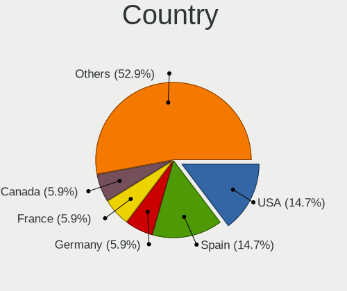
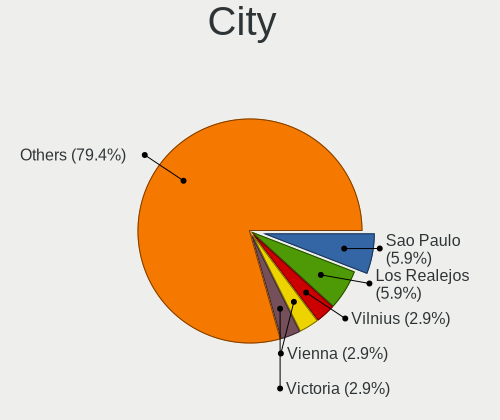
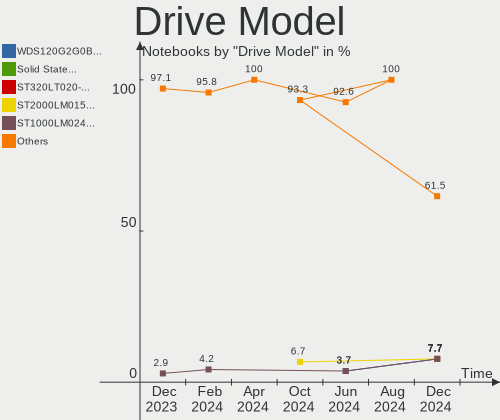
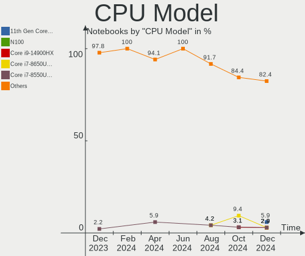
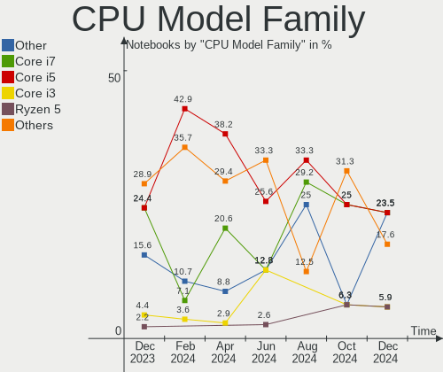
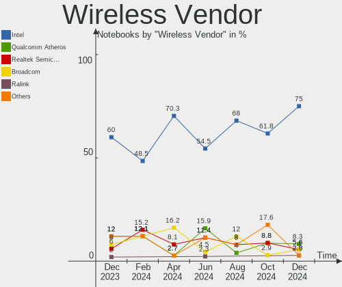

FreeBSD Hardware Trends (Notebooks)
-----------------------------------

A project to identify most popular hardware characteristics and track their change
over time based on data collected by FreeBSD users at https://BSD-Hardware.info.

Anyone can contribute to this report by the [hw-probe](https://github.com/linuxhw/hw-probe/blob/master/INSTALL.BSD.md) tool:

    hw-probe -all -upload

Full-feature report is available here: https://bsd-hardware.info/?view=trends

Period: Feb, 2022.

Contents
--------

* [ System ](#system)
  - [ OS                       ](#os)
  - [ OS Family                ](#os-family)
  - [ Arch                     ](#arch)
  - [ DE                       ](#de)
  - [ Display Server           ](#display-server)
  - [ Display Manager          ](#display-manager)
  - [ OS Lang                  ](#os-lang)
  - [ Boot Mode                ](#boot-mode)
  - [ Filesystem               ](#filesystem)
  - [ Part. scheme             ](#part-scheme)

* [ Board ](#board)
  - [ Vendor                   ](#vendor)
  - [ Model                    ](#model)
  - [ Model Family             ](#model-family)
  - [ MFG Year                 ](#mfg-year)
  - [ Form Factor              ](#form-factor)
  - [ Coreboot                 ](#coreboot)
  - [ RAM Size                 ](#ram-size)
  - [ RAM Used                 ](#ram-used)
  - [ Total Drives             ](#total-drives)
  - [ Has CD-ROM               ](#has-cd-rom)
  - [ Has Ethernet             ](#has-ethernet)
  - [ Has WiFi                 ](#has-wifi)
  - [ Has Bluetooth            ](#has-bluetooth)

* [ Location ](#location)
  - [ Country                  ](#country)
  - [ City                     ](#city)

* [ Drives ](#drives)
  - [ Drive Vendor             ](#drive-vendor)
  - [ Drive Model              ](#drive-model)
  - [ HDD Vendor               ](#hdd-vendor)
  - [ SSD Vendor               ](#ssd-vendor)
  - [ Drive Kind               ](#drive-kind)
  - [ Drive Connector          ](#drive-connector)
  - [ Drive Size               ](#drive-size)
  - [ Space Total              ](#space-total)
  - [ Space Used               ](#space-used)
  - [ Malfunc. Drives          ](#malfunc-drives)
  - [ Malfunc. Drive Vendor    ](#malfunc-drive-vendor)
  - [ Malfunc. HDD Vendor      ](#malfunc-hdd-vendor)
  - [ Malfunc. Drive Kind      ](#malfunc-drive-kind)
  - [ Failed Drives            ](#failed-drives)
  - [ Failed Drive Vendor      ](#failed-drive-vendor)
  - [ Drive Status             ](#drive-status)

* [ Storage controller ](#storage-controller)
  - [ Storage Vendor           ](#storage-vendor)
  - [ Storage Model            ](#storage-model)
  - [ Storage Kind             ](#storage-kind)

* [ Processor ](#processor)
  - [ CPU Vendor               ](#cpu-vendor)
  - [ CPU Model                ](#cpu-model)
  - [ CPU Model Family         ](#cpu-model-family)
  - [ CPU Cores                ](#cpu-cores)
  - [ CPU Sockets              ](#cpu-sockets)
  - [ CPU Threads              ](#cpu-threads)
  - [ CPU Microarch            ](#cpu-microarch)

* [ Graphics ](#graphics)
  - [ GPU Vendor               ](#gpu-vendor)
  - [ GPU Model                ](#gpu-model)
  - [ GPU Combo                ](#gpu-combo)
  - [ GPU Driver               ](#gpu-driver)
  - [ GPU Memory               ](#gpu-memory)

* [ Monitor ](#monitor)
  - [ Monitor Vendor           ](#monitor-vendor)
  - [ Monitor Model            ](#monitor-model)
  - [ Monitor Resolution       ](#monitor-resolution)
  - [ Monitor Diagonal         ](#monitor-diagonal)
  - [ Monitor Width            ](#monitor-width)
  - [ Aspect Ratio             ](#aspect-ratio)
  - [ Monitor Area             ](#monitor-area)
  - [ Pixel Density            ](#pixel-density)
  - [ Multiple Monitors        ](#multiple-monitors)

* [ Network ](#network)
  - [ Net Controller Vendor    ](#net-controller-vendor)
  - [ Net Controller Model     ](#net-controller-model)
  - [ Wireless Vendor          ](#wireless-vendor)
  - [ Wireless Model           ](#wireless-model)
  - [ Ethernet Vendor          ](#ethernet-vendor)
  - [ Ethernet Model           ](#ethernet-model)
  - [ Net Controller Kind      ](#net-controller-kind)
  - [ Used Controller          ](#used-controller)
  - [ NICs                     ](#nics)
  - [ IPv6                     ](#ipv6)

* [ Bluetooth ](#bluetooth)
  - [ Bluetooth Vendor         ](#bluetooth-vendor)
  - [ Bluetooth Model          ](#bluetooth-model)

* [ Sound ](#sound)
  - [ Sound Vendor             ](#sound-vendor)
  - [ Sound Model              ](#sound-model)

* [ Memory ](#memory)
  - [ Memory Vendor            ](#memory-vendor)
  - [ Memory Model             ](#memory-model)
  - [ Memory Kind              ](#memory-kind)
  - [ Memory Form Factor       ](#memory-form-factor)
  - [ Memory Size              ](#memory-size)
  - [ Memory Speed             ](#memory-speed)

* [ Printers & scanners ](#printers--scanners)
  - [ Printer Vendor           ](#printer-vendor)
  - [ Printer Model            ](#printer-model)
  - [ Scanner Vendor           ](#scanner-vendor)
  - [ Scanner Model            ](#scanner-model)

* [ Camera ](#camera)
  - [ Camera Vendor            ](#camera-vendor)
  - [ Camera Model             ](#camera-model)

* [ Security ](#security)
  - [ Fingerprint Vendor       ](#fingerprint-vendor)
  - [ Fingerprint Model        ](#fingerprint-model)
  - [ Chipcard Vendor          ](#chipcard-vendor)
  - [ Chipcard Model           ](#chipcard-model)

* [ Unsupported ](#unsupported)
  - [ Unsupported Devices      ](#unsupported-devices)
  - [ Unsupported Device Types ](#unsupported-device-types)

System
------

OS
--

Installed operating systems

| Name                 | Notebooks | Percent |
|----------------------|-----------|---------|
| FreeBSD 13.0-p7      | 12        | 54.55%  |
| FreeBSD 14.0-CURRENT | 3         | 13.64%  |
| FreeBSD 13.0         | 3         | 13.64%  |
| FreeBSD 13.0-p6      | 2         | 9.09%   |
| FreeBSD 13.0-STABLE  | 1         | 4.55%   |
| FreeBSD 13.0-p4      | 1         | 4.55%   |

OS Family
---------

OS without a version

| Name    | Notebooks | Percent |
|---------|-----------|---------|
| FreeBSD | 22        | 100%    |

Arch
----

OS architecture (x86_64, i586, etc.)

| Name  | Notebooks | Percent |
|-------|-----------|---------|
| amd64 | 21        | 95.45%  |
| i386  | 1         | 4.55%   |

DE
--

Desktop Environment

| Name      | Notebooks | Percent |
|-----------|-----------|---------|
| KDE5      | 6         | 27.27%  |
| XFCE      | 4         | 18.18%  |
| Lumina    | 2         | 9.09%   |
| i3        | 2         | 9.09%   |
| GNOME     | 2         | 9.09%   |
| Xfwm4     | 1         | 4.55%   |
| LXQt      | 1         | 4.55%   |
| GNUstep   | 1         | 4.55%   |
| Compton   | 1         | 4.55%   |
| AwesomeWM | 1         | 4.55%   |
| awesome   | 1         | 4.55%   |

Display Server
--------------

X11 or Wayland

| Name    | Notebooks | Percent |
|---------|-----------|---------|
| X11     | 20        | 90.91%  |
| Console | 2         | 9.09%   |

Display Manager
---------------

SDDM, LightDM, etc.

| Name    | Notebooks | Percent |
|---------|-----------|---------|
| SLiM    | 8         | 36.36%  |
| SDDM    | 6         | 27.27%  |
| Console | 4         | 18.18%  |
| LightDM | 2         | 9.09%   |
| XDM     | 1         | 4.55%   |
| GDM     | 1         | 4.55%   |

OS Lang
-------

Language

| Lang    | Notebooks | Percent |
|---------|-----------|---------|
| C       | 13        | 59.09%  |
| ru_RU   | 2         | 9.09%   |
| en_US   | 2         | 9.09%   |
| Unknown | 2         | 9.09%   |
| pl_PL   | 1         | 4.55%   |
| fr_FR   | 1         | 4.55%   |
| en_NZ   | 1         | 4.55%   |

Boot Mode
---------

EFI or BIOS

| Mode | Notebooks | Percent |
|------|-----------|---------|
| EFI  | 19        | 86.36%  |
| BIOS | 3         | 13.64%  |

Filesystem
----------

Type of filesystem

| Type | Notebooks | Percent |
|------|-----------|---------|
| Zfs  | 15        | 68.18%  |
| Ufs  | 7         | 31.82%  |

Part. scheme
------------

Scheme of partitioning

| Type | Notebooks | Percent |
|------|-----------|---------|
| GPT  | 22        | 100%    |

Board
-----

Vendor
------

Motherboard manufacturer

| Name             | Notebooks | Percent |
|------------------|-----------|---------|
| Lenovo           | 6         | 27.27%  |
| Dell             | 6         | 27.27%  |
| Notebook         | 2         | 9.09%   |
| ASUSTek Computer | 2         | 9.09%   |
| Apple            | 2         | 9.09%   |
| WOOKING          | 1         | 4.55%   |
| System76         | 1         | 4.55%   |
| HUAWEI           | 1         | 4.55%   |
| Hewlett-Packard  | 1         | 4.55%   |

Model
-----

Motherboard model

| Name                                 | Notebooks | Percent |
|--------------------------------------|-----------|---------|
| WOOKING X5                           | 1         | 4.55%   |
| System76 Lemur Pro                   | 1         | 4.55%   |
| Notebook NS50_70MU                   | 1         | 4.55%   |
| Notebook N7x0WU                      | 1         | 4.55%   |
| Lenovo Yoga S730-13IWL 81J0          | 1         | 4.55%   |
| Lenovo V145-15AST 81MT               | 1         | 4.55%   |
| Lenovo ThinkPad X250 20CMCTO1WW      | 1         | 4.55%   |
| Lenovo ThinkPad T440p 20AWS1JN00     | 1         | 4.55%   |
| Lenovo ThinkPad P51 20HHCTO1WW       | 1         | 4.55%   |
| Lenovo IdeaPad Gaming 3 15ARH05 82EY | 1         | 4.55%   |
| HUAWEI MACHD-WXX9                    | 1         | 4.55%   |
| HP ProBook 445 G7                    | 1         | 4.55%   |
| Dell Latitude E7450                  | 1         | 4.55%   |
| Dell Latitude E6430                  | 1         | 4.55%   |
| Dell Latitude E5440                  | 1         | 4.55%   |
| Dell Latitude 7480                   | 1         | 4.55%   |
| Dell Latitude 3420                   | 1         | 4.55%   |
| Dell Inspiron 5559                   | 1         | 4.55%   |
| ASUS A9T                             | 1         | 4.55%   |
| ASUS 1215B                           | 1         | 4.55%   |
| Apple MacBookPro8,1                  | 1         | 4.55%   |
| Apple MacBookPro10,1                 | 1         | 4.55%   |

Model Family
------------

Motherboard model prefix

| Name               | Notebooks | Percent |
|--------------------|-----------|---------|
| Dell Latitude      | 5         | 22.73%  |
| Lenovo ThinkPad    | 3         | 13.64%  |
| WOOKING X5         | 1         | 4.55%   |
| System76 Lemur     | 1         | 4.55%   |
| Notebook NS50      | 1         | 4.55%   |
| Notebook N7x0WU    | 1         | 4.55%   |
| Lenovo Yoga        | 1         | 4.55%   |
| Lenovo V145-15AST  | 1         | 4.55%   |
| Lenovo IdeaPad     | 1         | 4.55%   |
| HUAWEI MACHD-WXX9  | 1         | 4.55%   |
| HP ProBook         | 1         | 4.55%   |
| Dell Inspiron      | 1         | 4.55%   |
| ASUS A9T           | 1         | 4.55%   |
| ASUS 1215B         | 1         | 4.55%   |
| Apple MacBookPro8  | 1         | 4.55%   |
| Apple MacBookPro10 | 1         | 4.55%   |

MFG Year
--------

Motherboard manufacture year

| Year | Notebooks | Percent |
|------|-----------|---------|
| 2021 | 6         | 27.27%  |
| 2018 | 3         | 13.64%  |
| 2015 | 3         | 13.64%  |
| 2020 | 2         | 9.09%   |
| 2019 | 2         | 9.09%   |
| 2017 | 2         | 9.09%   |
| 2016 | 1         | 4.55%   |
| 2013 | 1         | 4.55%   |
| 2011 | 1         | 4.55%   |
| 2005 | 1         | 4.55%   |

Form Factor
-----------

Physical design of the computer

| Name     | Notebooks | Percent |
|----------|-----------|---------|
| Notebook | 22        | 100%    |

Coreboot
--------

Have coreboot on board

| Used | Notebooks | Percent |
|------|-----------|---------|
| No   | 21        | 95.45%  |
| Yes  | 1         | 4.55%   |

RAM Size
--------

Total RAM memory

| Size in GB  | Notebooks | Percent |
|-------------|-----------|---------|
| 16.01-24.0  | 10        | 45.45%  |
| 8.01-16.0   | 5         | 22.73%  |
| 4.01-8.0    | 3         | 13.64%  |
| 32.01-64.0  | 2         | 9.09%   |
| 64.01-256.0 | 1         | 4.55%   |
| 1.01-2.0    | 1         | 4.55%   |

RAM Used
--------

Used RAM memory

| Used GB   | Notebooks | Percent |
|-----------|-----------|---------|
| 0.51-1.0  | 12        | 54.55%  |
| 0.01-0.5  | 5         | 22.73%  |
| 1.01-2.0  | 3         | 13.64%  |
| 4.01-8.0  | 1         | 4.55%   |
| 8.01-16.0 | 1         | 4.55%   |

Total Drives
------------

Number of drives on board

| Drives | Notebooks | Percent |
|--------|-----------|---------|
| 1      | 13        | 59.09%  |
| 2      | 6         | 27.27%  |
| 3      | 3         | 13.64%  |

Has CD-ROM
----------

Has CD-ROM on board

| Presented | Notebooks | Percent |
|-----------|-----------|---------|
| No        | 18        | 81.82%  |
| Yes       | 4         | 18.18%  |

Has Ethernet
------------

Has Ethernet on board

| Presented | Notebooks | Percent |
|-----------|-----------|---------|
| Yes       | 19        | 86.36%  |
| No        | 3         | 13.64%  |

Has WiFi
--------

Has WiFi module

| Presented | Notebooks | Percent |
|-----------|-----------|---------|
| Yes       | 22        | 100%    |

Has Bluetooth
-------------

Has Bluetooth module

| Presented | Notebooks | Percent |
|-----------|-----------|---------|
| Yes       | 17        | 77.27%  |
| No        | 5         | 22.73%  |

Location
--------

Country
-------

Geographic location (country)

| Country     | Notebooks | Percent |
|-------------|-----------|---------|
| USA         | 6         | 27.27%  |
| Ukraine     | 2         | 9.09%   |
| China       | 2         | 9.09%   |
| UK          | 1         | 4.55%   |
| Switzerland | 1         | 4.55%   |
| Russia      | 1         | 4.55%   |
| Poland      | 1         | 4.55%   |
| New Zealand | 1         | 4.55%   |
| Netherlands | 1         | 4.55%   |
| India       | 1         | 4.55%   |
| Guadeloupe  | 1         | 4.55%   |
| France      | 1         | 4.55%   |
| Denmark     | 1         | 4.55%   |
| Brazil      | 1         | 4.55%   |
| Australia   | 1         | 4.55%   |

City
----

Geographic location (city)

| City               | Notebooks | Percent |
|--------------------|-----------|---------|
| Shenzhen           | 2         | 9.09%   |
| Zurich             | 1         | 4.55%   |
| Washington         | 1         | 4.55%   |
| Warsaw             | 1         | 4.55%   |
| Rio de Janeiro     | 1         | 4.55%   |
| Perth              | 1         | 4.55%   |
| New York           | 1         | 4.55%   |
| New Plymouth       | 1         | 4.55%   |
| Moscow             | 1         | 4.55%   |
| Le Gosier          | 1         | 4.55%   |
| Kyiv               | 1         | 4.55%   |
| Kozhikode          | 1         | 4.55%   |
| Kastrup            | 1         | 4.55%   |
| Ivano-Frankivsk    | 1         | 4.55%   |
| Hoogeveen          | 1         | 4.55%   |
| Guyancourt         | 1         | 4.55%   |
| Glenmoore          | 1         | 4.55%   |
| Cranberry Township | 1         | 4.55%   |
| Burke              | 1         | 4.55%   |
| Beaminster         | 1         | 4.55%   |
| Arcata             | 1         | 4.55%   |

Drives
------

Drive Vendor
------------

Hard drive vendors

| Vendor              | Notebooks | Drives | Percent |
|---------------------|-----------|--------|---------|
| Samsung Electronics | 11        | 14     | 36.67%  |
| Toshiba             | 2         | 2      | 6.67%   |
| Seagate             | 2         | 2      | 6.67%   |
| Kingston            | 2         | 2      | 6.67%   |
| Hitachi             | 2         | 2      | 6.67%   |
| Hikvision           | 2         | 2      | 6.67%   |
| Crucial             | 2         | 3      | 6.67%   |
| WDC                 | 1         | 1      | 3.33%   |
| Transcend           | 1         | 1      | 3.33%   |
| SK Hynix            | 1         | 1      | 3.33%   |
| SanDisk             | 1         | 1      | 3.33%   |
| Phison              | 1         | 1      | 3.33%   |
| Micron Technology   | 1         | 1      | 3.33%   |
| Apple               | 1         | 1      | 3.33%   |

Drive Model
-----------

Hard drive models

| Model                                   | Notebooks | Percent |
|-----------------------------------------|-----------|---------|
| Samsung SSD 970 EVO Plus 1TB            | 3         | 9.09%   |
| Samsung SSD 870 EVO 1TB                 | 2         | 6.06%   |
| Hikvision HS-SSD-C2000ECO 1024G         | 2         | 6.06%   |
| WDC WDS120G2G0B-00EPW0 120GB            | 1         | 3.03%   |
| Transcend TS240GMTS420S 240GB           | 1         | 3.03%   |
| Toshiba THNSFJ256GCSU 256GB             | 1         | 3.03%   |
| Toshiba MQ04ABF100 1TB                  | 1         | 3.03%   |
| SK Hynix BC511 HFM256GDJTNI-82A0A 256GB | 1         | 3.03%   |
| Seagate ST9320325ASG 320GB              | 1         | 3.03%   |
| Seagate ST1000LM035-1RK172 1TB          | 1         | 3.03%   |
| SanDisk X400 M.2 2280 512GB             | 1         | 3.03%   |
| Samsung SSD PM871 mSATA 256GB           | 1         | 3.03%   |
| Samsung SSD 970 PRO 1TB                 | 1         | 3.03%   |
| Samsung SSD 970 EVO 500GB               | 1         | 3.03%   |
| Samsung SSD 850 EVO 1TB                 | 1         | 3.03%   |
| Samsung SSD 840 Series 120GB            | 1         | 3.03%   |
| Samsung MZVLB512HAJQ-000L2 512GB        | 1         | 3.03%   |
| Samsung MZVLB1T0HBLR-00000 1TB          | 1         | 3.03%   |
| Samsung MZALQ256HAJD-000L2 256GB        | 1         | 3.03%   |
| Phison SATA SSD 240GB                   | 1         | 3.03%   |
| Micron 1100_MTFDDAV256TBN 256GB         | 1         | 3.03%   |
| Kingston SMS200S3120G 120GB             | 1         | 3.03%   |
| Kingston SA400S37240G 240GB             | 1         | 3.03%   |
| Hitachi HTS547550A9E384 500GB           | 1         | 3.03%   |
| Hitachi HTS421260H9AT00 64GB            | 1         | 3.03%   |
| Crucial CT525MX300SSD1 528GB            | 1         | 3.03%   |
| Crucial CT250BX100SSD1 250GB            | 1         | 3.03%   |
| Crucial CT1000MX500SSD1 1TB             | 1         | 3.03%   |
| Apple SSD SM256E 256GB                  | 1         | 3.03%   |

HDD Vendor
----------

Hard disk drive vendors

| Vendor  | Notebooks | Drives | Percent |
|---------|-----------|--------|---------|
| Seagate | 2         | 2      | 40%     |
| Hitachi | 2         | 2      | 40%     |
| Toshiba | 1         | 1      | 20%     |

SSD Vendor
----------

Solid state drive vendors

| Vendor              | Notebooks | Drives | Percent |
|---------------------|-----------|--------|---------|
| Samsung Electronics | 5         | 5      | 31.25%  |
| Kingston            | 2         | 2      | 12.5%   |
| Crucial             | 2         | 3      | 12.5%   |
| WDC                 | 1         | 1      | 6.25%   |
| Transcend           | 1         | 1      | 6.25%   |
| Toshiba             | 1         | 1      | 6.25%   |
| SanDisk             | 1         | 1      | 6.25%   |
| Phison              | 1         | 1      | 6.25%   |
| Micron Technology   | 1         | 1      | 6.25%   |
| Apple               | 1         | 1      | 6.25%   |

Drive Kind
----------

HDD or SSD

| Kind | Notebooks | Drives | Percent |
|------|-----------|--------|---------|
| SSD  | 14        | 17     | 50%     |
| NVMe | 9         | 12     | 32.14%  |
| HDD  | 5         | 5      | 17.86%  |

Drive Connector
---------------

SATA, SAS, NVMe, etc.

| Type | Notebooks | Drives | Percent |
|------|-----------|--------|---------|
| SATA | 17        | 22     | 65.38%  |
| NVMe | 9         | 12     | 34.62%  |

Drive Size
----------

Size of hard drive

| Size in TB | Notebooks | Drives | Percent |
|------------|-----------|--------|---------|
| 0.01-0.5   | 10        | 14     | 55.56%  |
| 0.51-1.0   | 8         | 8      | 44.44%  |

Space Total
-----------

Amount of disk space available on the file system

| Size in GB | Notebooks | Percent |
|------------|-----------|---------|
| 251-500    | 6         | 27.27%  |
| 501-1000   | 6         | 27.27%  |
| 101-250    | 4         | 18.18%  |
| 51-100     | 4         | 18.18%  |
| 21-50      | 1         | 4.55%   |
| 1-20       | 1         | 4.55%   |

Space Used
----------

Amount of used disk space

| Used GB | Notebooks | Percent |
|---------|-----------|---------|
| 21-50   | 10        | 45.45%  |
| 1-20    | 10        | 45.45%  |
| 101-250 | 2         | 9.09%   |

Malfunc. Drives
---------------

Drive models with a malfunction

| Model                          | Notebooks | Drives | Percent |
|--------------------------------|-----------|--------|---------|
| Seagate ST9320325ASG 320GB     | 1         | 1      | 33.33%  |
| Seagate ST1000LM035-1RK172 1TB | 1         | 1      | 33.33%  |
| Hitachi HTS421260H9AT00 64GB   | 1         | 1      | 33.33%  |

Malfunc. Drive Vendor
---------------------

Vendors of faulty drives

| Vendor  | Notebooks | Drives | Percent |
|---------|-----------|--------|---------|
| Seagate | 2         | 2      | 66.67%  |
| Hitachi | 1         | 1      | 33.33%  |

Malfunc. HDD Vendor
-------------------

Vendors of faulty HDD drives

| Vendor  | Notebooks | Drives | Percent |
|---------|-----------|--------|---------|
| Seagate | 2         | 2      | 66.67%  |
| Hitachi | 1         | 1      | 33.33%  |

Malfunc. Drive Kind
-------------------

Kinds of faulty drives

| Kind | Notebooks | Drives | Percent |
|------|-----------|--------|---------|
| HDD  | 3         | 3      | 100%    |

Failed Drives
-------------

Failed drive models

Zero info for selected period =(

Failed Drive Vendor
-------------------

Failed drive vendors

Zero info for selected period =(

Drive Status
------------

Number of failed and malfunc. drives

| Status  | Notebooks | Drives | Percent |
|---------|-----------|--------|---------|
| Works   | 20        | 31     | 86.96%  |
| Malfunc | 3         | 3      | 13.04%  |

Storage controller
------------------

Storage Vendor
--------------

Storage controller vendors

| Vendor                           | Notebooks | Percent |
|----------------------------------|-----------|---------|
| Intel                            | 13        | 43.33%  |
| Samsung Electronics              | 8         | 26.67%  |
| AMD                              | 5         | 16.67%  |
| MAXIO Technology (Hangzhou)      | 2         | 6.67%   |
| SK Hynix                         | 1         | 3.33%   |
| Silicon Integrated Systems [SiS] | 1         | 3.33%   |

Storage Model
-------------

Storage controller models

| Model                                                                          | Notebooks | Percent |
|--------------------------------------------------------------------------------|-----------|---------|
| Samsung NVMe SSD Controller SM981/PM981/PM983                                  | 7         | 23.33%  |
| Intel Sunrise Point-LP SATA Controller [AHCI mode]                             | 3         | 10%     |
| AMD FCH SATA Controller [AHCI mode]                                            | 3         | 10%     |
| MAXIO (Hangzhou) NVMe SSD Controller MAP1202                                   | 2         | 6.67%   |
| Intel Wildcat Point-LP SATA Controller [AHCI Mode]                             | 2         | 6.67%   |
| Intel 7 Series Chipset Family 6-port SATA Controller [AHCI mode]               | 2         | 6.67%   |
| SK Hynix BC511                                                                 | 1         | 3.33%   |
| Silicon Integrated Systems [SiS] 5513 IDE Controller                           | 1         | 3.33%   |
| Samsung NVMe SSD Controller 980                                                | 1         | 3.33%   |
| Intel Tiger Lake-LP SATA Controller [AHCI mode]                                | 1         | 3.33%   |
| Intel Q170/Q150/B150/H170/H110/Z170/CM236 Chipset SATA Controller [AHCI Mode]  | 1         | 3.33%   |
| Intel Comet Lake SATA AHCI Controller                                          | 1         | 3.33%   |
| Intel 8 Series/C220 Series Chipset Family 6-port SATA Controller 1 [AHCI mode] | 1         | 3.33%   |
| Intel 8 Series SATA Controller 1 [AHCI mode]                                   | 1         | 3.33%   |
| Intel 6 Series/C200 Series Chipset Family 6 port Mobile SATA AHCI Controller   | 1         | 3.33%   |
| AMD Starship/Matisse Chipset SATA Controller [AHCI mode]                       | 1         | 3.33%   |
| AMD SB7x0/SB8x0/SB9x0 SATA Controller [AHCI mode]                              | 1         | 3.33%   |

Storage Kind
------------

Kind of storage controller (IDE, SATA, NVMe, SAS, ...)

| Kind | Notebooks | Percent |
|------|-----------|---------|
| SATA | 18        | 64.29%  |
| NVMe | 9         | 32.14%  |
| IDE  | 1         | 3.57%   |

Processor
---------

CPU Vendor
----------

Processor vendors

| Vendor | Notebooks | Percent |
|--------|-----------|---------|
| Intel  | 17        | 77.27%  |
| AMD    | 5         | 22.73%  |

CPU Model
---------

Processor models

| Model                                        | Notebooks | Percent |
|----------------------------------------------|-----------|---------|
| Intel 11th Gen Core i7-1165G7 @ 2.80GHz      | 2         | 9.09%   |
| Intel Xeon CPU E3-1535M v6 @ 3.10GHz         | 1         | 4.55%   |
| Intel Core i7-8565U CPU @ 1.80GHz            | 1         | 4.55%   |
| Intel Core i7-6500U CPU @ 2.50GHz            | 1         | 4.55%   |
| Intel Core i7-5600U CPU @ 2.60GHz            | 1         | 4.55%   |
| Intel Core i7-3720QM CPU @ 2.60GHz           | 1         | 4.55%   |
| Intel Core i7-3615QM CPU @ 2.30GHz           | 1         | 4.55%   |
| Intel Core i5-7300U CPU @ 2.60GHz            | 1         | 4.55%   |
| Intel Core i5-5300U CPU @ 2.30GHz            | 1         | 4.55%   |
| Intel Core i5-4300U CPU @ 1.90GHz            | 1         | 4.55%   |
| Intel Core i5-4300M CPU @ 2.60GHz            | 1         | 4.55%   |
| Intel Core i5-2415M CPU @ 2.30GHz            | 1         | 4.55%   |
| Intel Core i5-10210U CPU @ 1.60GHz           | 1         | 4.55%   |
| Intel Core i3-8130U CPU @ 2.20GHz            | 1         | 4.55%   |
| Intel Celeron M processor 1.70GHz            | 1         | 4.55%   |
| Intel 11th Gen Core i5-1145G7 @ 2.60GHz      | 1         | 4.55%   |
| AMD Ryzen 9 5900X 12-Core Processor          | 1         | 4.55%   |
| AMD Ryzen 5 4600H with Radeon Graphics       | 1         | 4.55%   |
| AMD Ryzen 3 4300U with Radeon Graphics       | 1         | 4.55%   |
| AMD E-350 Processor                          | 1         | 4.55%   |
| AMD A6-9225 RADEON R4, 5 COMPUTE CORES 2C+3G | 1         | 4.55%   |

CPU Model Family
----------------

Processor model prefix

| Model           | Notebooks | Percent |
|-----------------|-----------|---------|
| Intel Core i5   | 6         | 27.27%  |
| Intel Core i7   | 5         | 22.73%  |
| Other           | 3         | 13.64%  |
| Intel Xeon      | 1         | 4.55%   |
| Intel Core i3   | 1         | 4.55%   |
| Intel Celeron M | 1         | 4.55%   |
| AMD Ryzen 9     | 1         | 4.55%   |
| AMD Ryzen 5     | 1         | 4.55%   |
| AMD Ryzen 3     | 1         | 4.55%   |
| AMD E           | 1         | 4.55%   |
| AMD A6          | 1         | 4.55%   |

CPU Cores
---------

Number of processor cores

| Number | Notebooks | Percent |
|--------|-----------|---------|
| 2      | 10        | 45.45%  |
| 4      | 9         | 40.91%  |
| 24     | 1         | 4.55%   |
| 12     | 1         | 4.55%   |
| 1      | 1         | 4.55%   |

CPU Sockets
-----------

Number of sockets

| Number | Notebooks | Percent |
|--------|-----------|---------|
| 1      | 22        | 100%    |

CPU Threads
-----------

Threads per core (Hyper-Threading)

| Number  | Notebooks | Percent |
|---------|-----------|---------|
| 2       | 16        | 72.73%  |
| 1       | 5         | 22.73%  |
| Unknown | 1         | 4.55%   |

CPU Microarch
-------------

Microarchitecture

| Name        | Notebooks | Percent |
|-------------|-----------|---------|
| KabyLake    | 5         | 22.73%  |
| TigerLake   | 3         | 13.64%  |
| Zen 2       | 2         | 9.09%   |
| IvyBridge   | 2         | 9.09%   |
| Haswell     | 2         | 9.09%   |
| Broadwell   | 2         | 9.09%   |
| Zen 3       | 1         | 4.55%   |
| Skylake     | 1         | 4.55%   |
| SandyBridge | 1         | 4.55%   |
| P6          | 1         | 4.55%   |
| Excavator   | 1         | 4.55%   |
| Bobcat      | 1         | 4.55%   |

Graphics
--------

GPU Vendor
----------

Vendors of graphics cards

| Vendor                           | Notebooks | Percent |
|----------------------------------|-----------|---------|
| Intel                            | 16        | 59.26%  |
| Nvidia                           | 5         | 18.52%  |
| AMD                              | 5         | 18.52%  |
| Silicon Integrated Systems [SiS] | 1         | 3.7%    |

GPU Model
---------

Graphics card models

| Model                                                                                      | Notebooks | Percent |
|--------------------------------------------------------------------------------------------|-----------|---------|
| Intel TigerLake-LP GT2 [Iris Xe Graphics]                                                  | 3         | 11.11%  |
| Intel HD Graphics 5500                                                                     | 2         | 7.41%   |
| Intel 3rd Gen Core processor Graphics Controller                                           | 2         | 7.41%   |
| AMD Renoir                                                                                 | 2         | 7.41%   |
| Silicon Integrated Systems [SiS] 661/741/760 PCI/AGP or 662/761Gx PCIE VGA Display Adapter | 1         | 3.7%    |
| Nvidia TU117M [GeForce GTX 1650 Ti Mobile]                                                 | 1         | 3.7%    |
| Nvidia GM206GLM [Quadro M2200 Mobile]                                                      | 1         | 3.7%    |
| Nvidia GK107M [GeForce GT 650M Mac Edition]                                                | 1         | 3.7%    |
| Nvidia GF108GLM [NVS 5200M]                                                                | 1         | 3.7%    |
| Nvidia GA104M [GeForce RTX 3070 Mobile / Max-Q]                                            | 1         | 3.7%    |
| Intel WhiskeyLake-U GT2 [UHD Graphics 620]                                                 | 1         | 3.7%    |
| Intel UHD Graphics 620                                                                     | 1         | 3.7%    |
| Intel Skylake GT2 [HD Graphics 520]                                                        | 1         | 3.7%    |
| Intel HD Graphics P630                                                                     | 1         | 3.7%    |
| Intel HD Graphics 620                                                                      | 1         | 3.7%    |
| Intel Haswell-ULT Integrated Graphics Controller                                           | 1         | 3.7%    |
| Intel CometLake-U GT2 [UHD Graphics]                                                       | 1         | 3.7%    |
| Intel 4th Gen Core Processor Integrated Graphics Controller                                | 1         | 3.7%    |
| Intel 2nd Generation Core Processor Family Integrated Graphics Controller                  | 1         | 3.7%    |
| AMD Wrestler [Radeon HD 6310]                                                              | 1         | 3.7%    |
| AMD Sun XT [Radeon HD 8670A/8670M/8690M / R5 M330 / M430 / Radeon 520 Mobile]              | 1         | 3.7%    |
| AMD Stoney [Radeon R2/R3/R4/R5 Graphics]                                                   | 1         | 3.7%    |

GPU Combo
---------

Combinations of graphics cards

| Name           | Notebooks | Percent |
|----------------|-----------|---------|
| 1 x Intel      | 12        | 54.55%  |
| Intel + Nvidia | 3         | 13.64%  |
| 1 x AMD        | 3         | 13.64%  |
| 1 x SiS        | 1         | 4.55%   |
| 1 x Nvidia     | 1         | 4.55%   |
| Intel + AMD    | 1         | 4.55%   |
| AMD + Nvidia   | 1         | 4.55%   |

GPU Driver
----------

Free vs proprietary

| Driver      | Notebooks | Percent |
|-------------|-----------|---------|
| Free        | 20        | 90.91%  |
| Proprietary | 2         | 9.09%   |

GPU Memory
----------

Total video memory

| Size in GB | Notebooks | Percent |
|------------|-----------|---------|
| Unknown    | 18        | 81.82%  |
| 0.01-0.5   | 3         | 13.64%  |
| 7.01-8.0   | 1         | 4.55%   |

Monitor
-------

Monitor Vendor
--------------

Monitor vendors

| Vendor              | Notebooks | Percent |
|---------------------|-----------|---------|
| AU Optronics        | 5         | 23.81%  |
| Samsung Electronics | 3         | 14.29%  |
| BOE                 | 3         | 14.29%  |
| LG Display          | 2         | 9.52%   |
| Chimei Innolux      | 2         | 9.52%   |
| Sharp               | 1         | 4.76%   |
| InfoVision          | 1         | 4.76%   |
| Hewlett-Packard     | 1         | 4.76%   |
| Goldstar            | 1         | 4.76%   |
| Apple               | 1         | 4.76%   |
| Acer                | 1         | 4.76%   |

Monitor Model
-------------

Monitor models

| Model                                                                 | Notebooks | Percent |
|-----------------------------------------------------------------------|-----------|---------|
| Sharp LCD Monitor SHP1542 1920x1080 310x170mm 13.9-inch               | 1         | 4.76%   |
| Samsung Electronics LCD Monitor SEC544B 1600x900 310x170mm 13.9-inch  | 1         | 4.76%   |
| Samsung Electronics LCD Monitor SDC8B4F 1920x1080 340x190mm 15.3-inch | 1         | 4.76%   |
| Samsung Electronics LCD Monitor SDC5441 1366x768 310x170mm 13.9-inch  | 1         | 4.76%   |
| LG Display LCD Monitor LGD046D 1920x1080 310x170mm 13.9-inch          | 1         | 4.76%   |
| LG Display LCD Monitor LGD0437 1920x1080 280x160mm 12.7-inch          | 1         | 4.76%   |
| InfoVision LCD Monitor IVO8C5F 1920x1080 310x170mm 13.9-inch          | 1         | 4.76%   |
| Hewlett-Packard 24ea HPN3393 1920x1080 530x300mm 24.0-inch            | 1         | 4.76%   |
| Goldstar E2411 GSM583B 1920x1080 530x300mm 24.0-inch                  | 1         | 4.76%   |
| Chimei Innolux LCD Monitor CMN14D5 1920x1080 310x170mm 13.9-inch      | 1         | 4.76%   |
| Chimei Innolux LCD Monitor CMN1482 1600x900 310x170mm 13.9-inch       | 1         | 4.76%   |
| BOE LCD Monitor BOE0973 2560x1440 340x190mm 15.3-inch                 | 1         | 4.76%   |
| BOE LCD Monitor BOE0729 1920x1080 340x190mm 15.3-inch                 | 1         | 4.76%   |
| BOE LCD Monitor BOE06B9 1920x1080 340x190mm 15.3-inch                 | 1         | 4.76%   |
| AU Optronics LCD Monitor AUOD1ED 1920x1080 340x190mm 15.3-inch        | 1         | 4.76%   |
| AU Optronics LCD Monitor AUO71EC 1366x768 340x190mm 15.3-inch         | 1         | 4.76%   |
| AU Optronics LCD Monitor AUO5699 1920x1080 340x190mm 15.3-inch        | 1         | 4.76%   |
| AU Optronics LCD Monitor AUO512D 1920x1080 290x170mm 13.2-inch        | 1         | 4.76%   |
| AU Optronics LCD Monitor AUO333D 1920x1080 310x170mm 13.9-inch        | 1         | 4.76%   |
| Apple LCD Monitor APP9CC5 1280x800 290x180mm 13.4-inch                | 1         | 4.76%   |
| Acer KA220HQ ACR0497 1920x1080 480x270mm 21.7-inch                    | 1         | 4.76%   |

Monitor Resolution
------------------

Monitor screen resolution

| Resolution      | Notebooks | Percent |
|-----------------|-----------|---------|
| 1920x1080 (FHD) | 14        | 70%     |
| 1600x900 (HD+)  | 2         | 10%     |
| 1366x768 (WXGA) | 2         | 10%     |
| 2560x1440 (QHD) | 1         | 5%      |
| 1280x800 (WXGA) | 1         | 5%      |

Monitor Diagonal
----------------

Diagonal size in inches

| Inches | Notebooks | Percent |
|--------|-----------|---------|
| 13     | 9         | 42.86%  |
| 15     | 8         | 38.1%   |
| 24     | 2         | 9.52%   |
| 21     | 1         | 4.76%   |
| 12     | 1         | 4.76%   |

Monitor Width
-------------

Physical width

| Width in mm | Notebooks | Percent |
|-------------|-----------|---------|
| 301-350     | 15        | 71.43%  |
| 201-300     | 3         | 14.29%  |
| 501-600     | 2         | 9.52%   |
| 401-500     | 1         | 4.76%   |

Aspect Ratio
------------

Proportional relationship between the width and the height

| Ratio | Notebooks | Percent |
|-------|-----------|---------|
| 16/9  | 17        | 94.44%  |
| 16/10 | 1         | 5.56%   |

Monitor Area
------------

Area in inch²

| Area in inch² | Notebooks | Percent |
|----------------|-----------|---------|
| 81-90          | 8         | 38.1%   |
| 91-100         | 8         | 38.1%   |
| 201-250        | 3         | 14.29%  |
| 71-80          | 1         | 4.76%   |
| 61-70          | 1         | 4.76%   |

Pixel Density
-------------

Pixels per inch

| Density | Notebooks | Percent |
|---------|-----------|---------|
| 121-160 | 12        | 60%     |
| 161-240 | 3         | 15%     |
| 101-120 | 3         | 15%     |
| 51-100  | 2         | 10%     |

Multiple Monitors
-----------------

Total monitors connected

| Total | Notebooks | Percent |
|-------|-----------|---------|
| 1     | 15        | 68.18%  |
| 0     | 4         | 18.18%  |
| 2     | 3         | 13.64%  |

Network
-------

Net Controller Vendor
---------------------

Controller vendors

| Vendor                           | Notebooks | Percent |
|----------------------------------|-----------|---------|
| Intel                            | 15        | 38.46%  |
| Realtek Semiconductor            | 11        | 28.21%  |
| Broadcom                         | 3         | 7.69%   |
| TP-Link                          | 2         | 5.13%   |
| Qualcomm Atheros                 | 2         | 5.13%   |
| Dell                             | 2         | 5.13%   |
| Silicon Integrated Systems [SiS] | 1         | 2.56%   |
| Samsung Electronics              | 1         | 2.56%   |
| Ralink Technology                | 1         | 2.56%   |
| Google                           | 1         | 2.56%   |

Net Controller Model
--------------------

Controller models

| Model                                                             | Notebooks | Percent |
|-------------------------------------------------------------------|-----------|---------|
| Realtek RTL8111/8168/8411 PCI Express Gigabit Ethernet Controller | 7         | 13.73%  |
| Intel Wi-Fi 6 AX201                                               | 3         | 5.88%   |
| TP-Link AC600 wireless Realtek RTL8811AU [Archer T2U Nano]        | 2         | 3.92%   |
| Realtek RTL8188EUS 802.11n Wireless Network Adapter               | 2         | 3.92%   |
| Intel Wireless 7265                                               | 2         | 3.92%   |
| Intel Wireless 7260                                               | 2         | 3.92%   |
| Intel Ethernet Connection (3) I218-LM                             | 2         | 3.92%   |
| Broadcom BCM4331 802.11a/b/g/n                                    | 2         | 3.92%   |
| Silicon Integrated Systems [SiS] SiS900 PCI Fast Ethernet         | 1         | 1.96%   |
| Samsung GT-I9070 (network tethering, USB debugging enabled)       | 1         | 1.96%   |
| Realtek RTL8822CE 802.11ac PCIe Wireless Network Adapter          | 1         | 1.96%   |
| Realtek RTL8822BE 802.11a/b/g/n/ac WiFi adapter                   | 1         | 1.96%   |
| Realtek RTL8821CE 802.11ac PCIe Wireless Network Adapter          | 1         | 1.96%   |
| Realtek RTL810xE PCI Express Fast Ethernet controller             | 1         | 1.96%   |
| Realtek Realtek 8811CU Wireless LAN 802.11ac USB NIC              | 1         | 1.96%   |
| Ralink RT5370 Wireless Adapter                                    | 1         | 1.96%   |
| Qualcomm Atheros QCA6174 802.11ac Wireless Network Adapter        | 1         | 1.96%   |
| Qualcomm Atheros AR8152 v2.0 Fast Ethernet                        | 1         | 1.96%   |
| Intel Wireless 8265 / 8275                                        | 1         | 1.96%   |
| Intel Wireless 8260                                               | 1         | 1.96%   |
| Intel Wireless 3160                                               | 1         | 1.96%   |
| Intel Wi-Fi 6 AX200                                               | 1         | 1.96%   |
| Intel Ethernet Connection I218-LM                                 | 1         | 1.96%   |
| Intel Ethernet Connection I217-LM                                 | 1         | 1.96%   |
| Intel Ethernet Connection (5) I219-LM                             | 1         | 1.96%   |
| Intel Ethernet Connection (4) I219-LM                             | 1         | 1.96%   |
| Intel Dual Band Wireless-AC 3168NGW [Stone Peak]                  | 1         | 1.96%   |
| Intel Comet Lake PCH-LP CNVi WiFi                                 | 1         | 1.96%   |
| Intel Centrino Advanced-N 6205 [Taylor Peak]                      | 1         | 1.96%   |
| Intel Cannon Point-LP CNVi [Wireless-AC]                          | 1         | 1.96%   |
| Intel 82579LM Gigabit Network Connection (Lewisville)             | 1         | 1.96%   |
| Google Nexus/Pixel Device (charging + debug)                      | 1         | 1.96%   |
| Dell Hub of E-Port Replicator                                     | 1         | 1.96%   |
| Dell Dell Wireless 5560 Single-mode HSPA Mini Card with A-GPS     | 1         | 1.96%   |
| Broadcom NetXtreme BCM57786 Gigabit Ethernet PCIe                 | 1         | 1.96%   |
| Broadcom NetXtreme BCM57765 Gigabit Ethernet PCIe                 | 1         | 1.96%   |
| Broadcom BCM4313 802.11bgn Wireless Network Adapter               | 1         | 1.96%   |

Wireless Vendor
---------------

Wireless vendors

| Vendor                | Notebooks | Percent |
|-----------------------|-----------|---------|
| Intel                 | 15        | 50%     |
| Realtek Semiconductor | 6         | 20%     |
| Broadcom              | 3         | 10%     |
| TP-Link               | 2         | 6.67%   |
| Dell                  | 2         | 6.67%   |
| Ralink Technology     | 1         | 3.33%   |
| Qualcomm Atheros      | 1         | 3.33%   |

Wireless Model
--------------

Wireless models

| Model                                                         | Notebooks | Percent |
|---------------------------------------------------------------|-----------|---------|
| Intel Wi-Fi 6 AX201                                           | 3         | 10%     |
| TP-Link AC600 wireless Realtek RTL8811AU [Archer T2U Nano]    | 2         | 6.67%   |
| Realtek RTL8188EUS 802.11n Wireless Network Adapter           | 2         | 6.67%   |
| Intel Wireless 7265                                           | 2         | 6.67%   |
| Intel Wireless 7260                                           | 2         | 6.67%   |
| Broadcom BCM4331 802.11a/b/g/n                                | 2         | 6.67%   |
| Realtek RTL8822CE 802.11ac PCIe Wireless Network Adapter      | 1         | 3.33%   |
| Realtek RTL8822BE 802.11a/b/g/n/ac WiFi adapter               | 1         | 3.33%   |
| Realtek RTL8821CE 802.11ac PCIe Wireless Network Adapter      | 1         | 3.33%   |
| Realtek Realtek 8811CU Wireless LAN 802.11ac USB NIC          | 1         | 3.33%   |
| Ralink RT5370 Wireless Adapter                                | 1         | 3.33%   |
| Qualcomm Atheros QCA6174 802.11ac Wireless Network Adapter    | 1         | 3.33%   |
| Intel Wireless 8265 / 8275                                    | 1         | 3.33%   |
| Intel Wireless 8260                                           | 1         | 3.33%   |
| Intel Wireless 3160                                           | 1         | 3.33%   |
| Intel Wi-Fi 6 AX200                                           | 1         | 3.33%   |
| Intel Dual Band Wireless-AC 3168NGW [Stone Peak]              | 1         | 3.33%   |
| Intel Comet Lake PCH-LP CNVi WiFi                             | 1         | 3.33%   |
| Intel Centrino Advanced-N 6205 [Taylor Peak]                  | 1         | 3.33%   |
| Intel Cannon Point-LP CNVi [Wireless-AC]                      | 1         | 3.33%   |
| Dell Hub of E-Port Replicator                                 | 1         | 3.33%   |
| Dell Dell Wireless 5560 Single-mode HSPA Mini Card with A-GPS | 1         | 3.33%   |
| Broadcom BCM4313 802.11bgn Wireless Network Adapter           | 1         | 3.33%   |

Ethernet Vendor
---------------

Ethernet vendors

| Vendor                           | Notebooks | Percent |
|----------------------------------|-----------|---------|
| Realtek Semiconductor            | 8         | 38.1%   |
| Intel                            | 7         | 33.33%  |
| Broadcom                         | 2         | 9.52%   |
| Silicon Integrated Systems [SiS] | 1         | 4.76%   |
| Samsung Electronics              | 1         | 4.76%   |
| Qualcomm Atheros                 | 1         | 4.76%   |
| Google                           | 1         | 4.76%   |

Ethernet Model
--------------

Ethernet models

| Model                                                             | Notebooks | Percent |
|-------------------------------------------------------------------|-----------|---------|
| Realtek RTL8111/8168/8411 PCI Express Gigabit Ethernet Controller | 7         | 33.33%  |
| Intel Ethernet Connection (3) I218-LM                             | 2         | 9.52%   |
| Silicon Integrated Systems [SiS] SiS900 PCI Fast Ethernet         | 1         | 4.76%   |
| Samsung GT-I9070 (network tethering, USB debugging enabled)       | 1         | 4.76%   |
| Realtek RTL810xE PCI Express Fast Ethernet controller             | 1         | 4.76%   |
| Qualcomm Atheros AR8152 v2.0 Fast Ethernet                        | 1         | 4.76%   |
| Intel Ethernet Connection I218-LM                                 | 1         | 4.76%   |
| Intel Ethernet Connection I217-LM                                 | 1         | 4.76%   |
| Intel Ethernet Connection (5) I219-LM                             | 1         | 4.76%   |
| Intel Ethernet Connection (4) I219-LM                             | 1         | 4.76%   |
| Intel 82579LM Gigabit Network Connection (Lewisville)             | 1         | 4.76%   |
| Google Nexus/Pixel Device (charging + debug)                      | 1         | 4.76%   |
| Broadcom NetXtreme BCM57786 Gigabit Ethernet PCIe                 | 1         | 4.76%   |
| Broadcom NetXtreme BCM57765 Gigabit Ethernet PCIe                 | 1         | 4.76%   |

Net Controller Kind
-------------------

Ethernet, WiFi or modem

| Kind     | Notebooks | Percent |
|----------|-----------|---------|
| WiFi     | 22        | 53.66%  |
| Ethernet | 19        | 46.34%  |

Used Controller
---------------

Currently used network controller

| Kind     | Notebooks | Percent |
|----------|-----------|---------|
| WiFi     | 16        | 50%     |
| Ethernet | 16        | 50%     |

NICs
----

Total network controllers on board

| Total | Notebooks | Percent |
|-------|-----------|---------|
| 2     | 18        | 81.82%  |
| 1     | 4         | 18.18%  |

IPv6
----

IPv6 vs IPv4

| Used | Notebooks | Percent |
|------|-----------|---------|
| No   | 20        | 90.91%  |
| Yes  | 2         | 9.09%   |

Bluetooth
---------

Bluetooth Vendor
----------------

Controller vendors

| Vendor                          | Notebooks | Percent |
|---------------------------------|-----------|---------|
| Intel                           | 11        | 61.11%  |
| Realtek Semiconductor           | 2         | 11.11%  |
| Apple                           | 2         | 11.11%  |
| Qualcomm Atheros Communications | 1         | 5.56%   |
| IMC Networks                    | 1         | 5.56%   |
| Dell                            | 1         | 5.56%   |

Bluetooth Model
---------------

Controller models

| Model                                          | Notebooks | Percent |
|------------------------------------------------|-----------|---------|
| Intel Bluetooth wireless interface             | 4         | 22.22%  |
| Intel AX201 Bluetooth                          | 3         | 16.67%  |
| Intel Bluetooth 9460/9560 Jefferson Peak (JfP) | 2         | 11.11%  |
| Apple Bluetooth Host Controller                | 2         | 11.11%  |
| Realtek RTL8822BE Bluetooth 4.2 Adapter        | 1         | 5.56%   |
| Realtek  Bluetooth Adapter                     | 1         | 5.56%   |
| Qualcomm Atheros QCA61x4 Bluetooth 4.0         | 1         | 5.56%   |
| Intel Wireless-AC 3168 Bluetooth               | 1         | 5.56%   |
| Intel AX200 Bluetooth                          | 1         | 5.56%   |
| IMC Networks Bluetooth module                  | 1         | 5.56%   |
| Dell Dell Wireless 380 Bluetooth 4.0 Module    | 1         | 5.56%   |

Sound
-----

Sound Vendor
------------

Sound card vendors

| Vendor                           | Notebooks | Percent |
|----------------------------------|-----------|---------|
| Intel                            | 16        | 59.26%  |
| AMD                              | 5         | 18.52%  |
| Nvidia                           | 3         | 11.11%  |
| Realtek Semiconductor            | 2         | 7.41%   |
| Silicon Integrated Systems [SiS] | 1         | 3.7%    |

Sound Model
-----------

Sound card models

| Model                                                                      | Notebooks | Percent |
|----------------------------------------------------------------------------|-----------|---------|
| Intel Tiger Lake-LP Smart Sound Technology Audio Controller                | 3         | 8.82%   |
| Intel Sunrise Point-LP HD Audio                                            | 3         | 8.82%   |
| Realtek Semiconductor Realtek USB Audio                                    | 2         | 5.88%   |
| Intel Wildcat Point-LP High Definition Audio Controller                    | 2         | 5.88%   |
| Intel Broadwell-U Audio Controller                                         | 2         | 5.88%   |
| Intel 7 Series/C216 Chipset Family High Definition Audio Controller        | 2         | 5.88%   |
| AMD Family 17h/19h HD Audio Controller                                     | 2         | 5.88%   |
| Silicon Integrated Systems [SiS] SiS7012 AC'97 Sound Controller            | 1         | 2.94%   |
| Nvidia TU107 GeForce GTX 1650 High Definition Audio Controller             | 1         | 2.94%   |
| Nvidia GK107 HDMI Audio Controller                                         | 1         | 2.94%   |
| Nvidia GA104 High Definition Audio Controller                              | 1         | 2.94%   |
| Intel Xeon E3-1200 v3/4th Gen Core Processor HD Audio Controller           | 1         | 2.94%   |
| Intel Haswell-ULT HD Audio Controller                                      | 1         | 2.94%   |
| Intel Comet Lake PCH-LP cAVS                                               | 1         | 2.94%   |
| Intel CM238 HD Audio Controller                                            | 1         | 2.94%   |
| Intel Cannon Point-LP High Definition Audio Controller                     | 1         | 2.94%   |
| Intel 8 Series/C220 Series Chipset High Definition Audio Controller        | 1         | 2.94%   |
| Intel 8 Series HD Audio Controller                                         | 1         | 2.94%   |
| Intel 6 Series/C200 Series Chipset Family High Definition Audio Controller | 1         | 2.94%   |
| AMD Wrestler HDMI Audio                                                    | 1         | 2.94%   |
| AMD Starship/Matisse HD Audio Controller                                   | 1         | 2.94%   |
| AMD SBx00 Azalia (Intel HDA)                                               | 1         | 2.94%   |
| AMD Renoir Radeon High Definition Audio Controller                         | 1         | 2.94%   |
| AMD High Definition Audio Controller                                       | 1         | 2.94%   |
| AMD Family 15h (Models 60h-6fh) Audio Controller                           | 1         | 2.94%   |

Memory
------

Memory Vendor
-------------

Memory module vendors

| Vendor              | Notebooks | Percent |
|---------------------|-----------|---------|
| Samsung Electronics | 9         | 31.03%  |
| Micron Technology   | 6         | 20.69%  |
| SK Hynix            | 5         | 17.24%  |
| Kingston            | 2         | 6.9%    |
| Crucial             | 2         | 6.9%    |
| Unknown             | 1         | 3.45%   |
| Neo Forza           | 1         | 3.45%   |
| Gold Key            | 1         | 3.45%   |
| Corsair             | 1         | 3.45%   |
| Unknown             | 1         | 3.45%   |

Memory Model
------------

Memory module models

| Model                                                         | Notebooks | Percent |
|---------------------------------------------------------------|-----------|---------|
| Samsung RAM M471B1G73QH0-YK0 8GB SODIMM DDR3 1600MT/s         | 2         | 6.25%   |
| Unknown RAM Module 512MB SODIMM SDRAM                         | 1         | 3.13%   |
| SK Hynix RAM Module 4GB SODIMM DDR3 1600MT/s                  | 1         | 3.13%   |
| SK Hynix RAM HMT41GS6BFR8A-PB 8GB SODIMM DDR3 1600MT/s        | 1         | 3.13%   |
| SK Hynix RAM HMAA2GS6CJR8N-XN 16GB SODIMM DDR4 3200MT/s       | 1         | 3.13%   |
| SK Hynix RAM HMA851S6CJR6N-VK 4GB SODIMM DDR4 2133MT/s        | 1         | 3.13%   |
| SK Hynix RAM HMA81GS6AFR8N-UH 8GB SODIMM DDR4 2400MT/s        | 1         | 3.13%   |
| Samsung RAM M471B5173QH0-YK0 4GB SODIMM DDR3 1600MT/s         | 1         | 3.13%   |
| Samsung RAM M471B1G73EB0-YK0 8GB SODIMM DDR3 1600MT/s         | 1         | 3.13%   |
| Samsung RAM M471B1G73BH0-CK0 8GB SODIMM DDR3 1600MT/s         | 1         | 3.13%   |
| Samsung RAM M471A5244BB0-CWE 4GB SODIMM DDR4 3200MT/s         | 1         | 3.13%   |
| Samsung RAM M471A4G43AB1-CWE 32GB SODIMM DDR4 3200MT/s        | 1         | 3.13%   |
| Samsung RAM M471A2K43CB1-CTD 16GB SODIMM DDR4 2667MT/s        | 1         | 3.13%   |
| Samsung RAM M471A1K43DB1-CWE 8GB SODIMM DDR4 3200MT/s         | 1         | 3.13%   |
| Samsung RAM M471A1K43BB1-CRC 8GB SODIMM DDR4 2400MT/s         | 1         | 3.13%   |
| Samsung RAM K4AAG165WA-BCTD 8GB SODIMM DDR4 2667MT/s          | 1         | 3.13%   |
| Neo Forza RAM NMSO480E82-2666E 8GB SODIMM DDR4 2667MT/s       | 1         | 3.13%   |
| Micron RAM MT52L1G32D4PG-093 8GB Row Of Chips LPDDR3 2133MT/s | 1         | 3.13%   |
| Micron RAM Module 8GB SODIMM DDR4 3200MT/s                    | 1         | 3.13%   |
| Micron RAM 8KTF51264HZ-1G6N1 4GB SODIMM DDR3 1600MT/s         | 1         | 3.13%   |
| Micron RAM 8KTF51264HZ-1G6E1 4GB SODIMM DDR3 1600MT/s         | 1         | 3.13%   |
| Micron RAM 8ATF1G64HZ-2G3E1 8GB SODIMM DDR4 2400MT/s          | 1         | 3.13%   |
| Micron RAM 53E1G32D2NP-046 2GB Row Of Chips LPDDR4 4267MT/s   | 1         | 3.13%   |
| Micron RAM 16KTF2G64HZ-1G6A1 16GB SODIMM DDR3 1600MT/s        | 1         | 3.13%   |
| Kingston RAM Module 4GB SODIMM DDR3 1333MT/s                  | 1         | 3.13%   |
| Kingston RAM 9905603-020.A00G 4GB SODIMM DDR3 1600MT/s        | 1         | 3.13%   |
| Gold Key RAM NMSO416E82-3200E 16GB SODIMM DDR4 3200MT/s       | 1         | 3.13%   |
| Crucial RAM CT8G4SFD824A.C16FADP 8GB SODIMM DDR4 2400MT/s     | 1         | 3.13%   |
| Crucial RAM CT102464BF160B.M16 8GB SODIMM DDR3 1600MT/s       | 1         | 3.13%   |
| Corsair RAM CMSO8GX3M1C1600C11 8GB SODIMM DDR3 1600MT/s       | 1         | 3.13%   |
| Unknown                                                       | 1         | 3.13%   |

Memory Kind
-----------

Memory module kinds

| Kind   | Notebooks | Percent |
|--------|-----------|---------|
| DDR4   | 11        | 47.83%  |
| DDR3   | 9         | 39.13%  |
| SDRAM  | 1         | 4.35%   |
| LPDDR4 | 1         | 4.35%   |
| LPDDR3 | 1         | 4.35%   |

Memory Form Factor
------------------

Physical design of the memory module

| Name         | Notebooks | Percent |
|--------------|-----------|---------|
| SODIMM       | 21        | 91.3%   |
| Row Of Chips | 2         | 8.7%    |

Memory Size
-----------

Memory module size

| Size  | Notebooks | Percent |
|-------|-----------|---------|
| 8192  | 11        | 44%     |
| 4096  | 6         | 24%     |
| 16384 | 4         | 16%     |
| 32768 | 1         | 4%      |
| 2048  | 1         | 4%      |
| 1024  | 1         | 4%      |
| 512   | 1         | 4%      |

Memory Speed
------------

Memory module speed

| Speed   | Notebooks | Percent |
|---------|-----------|---------|
| 1600    | 8         | 33.33%  |
| 3200    | 6         | 25%     |
| 2400    | 3         | 12.5%   |
| 2667    | 2         | 8.33%   |
| 2133    | 2         | 8.33%   |
| 4267    | 1         | 4.17%   |
| 1333    | 1         | 4.17%   |
| Unknown | 1         | 4.17%   |

Printers & scanners
-------------------

Printer Vendor
--------------

Printer device vendors

Zero info for selected period =(

Printer Model
-------------

Printer device models

Zero info for selected period =(

Scanner Vendor
--------------

Scanner device vendors

Zero info for selected period =(

Scanner Model
-------------

Scanner device models

Zero info for selected period =(

Camera
------

Camera Vendor
-------------

Camera device vendors

| Vendor                                 | Notebooks | Percent |
|----------------------------------------|-----------|---------|
| Chicony Electronics                    | 3         | 17.65%  |
| Sunplus Innovation Technology          | 2         | 11.76%  |
| Realtek Semiconductor                  | 2         | 11.76%  |
| Lite-On Technology                     | 2         | 11.76%  |
| IMC Networks                           | 2         | 11.76%  |
| Apple                                  | 2         | 11.76%  |
| Acer                                   | 2         | 11.76%  |
| Intel                                  | 1         | 5.88%   |
| Cheng Uei Precision Industry (Foxlink) | 1         | 5.88%   |

Camera Model
------------

Camera device models

| Model                                               | Notebooks | Percent |
|-----------------------------------------------------|-----------|---------|
| Chicony Chicony USB2.0 Camera                       | 3         | 17.65%  |
| Lite-On Integrated Camera                           | 2         | 11.76%  |
| Sunplus Laptop_Integrated_Webcam_HD                 | 1         | 5.88%   |
| Sunplus Laptop Integrated Webcam HD                 | 1         | 5.88%   |
| Realtek Realtek USB2.0 PC Camera                    | 1         | 5.88%   |
| Realtek Integrated_Webcam_HD                        | 1         | 5.88%   |
| Intel Intel(R) RealSense(TM) 3D Camera (Front F200) | 1         | 5.88%   |
| IMC Networks USB2.0 UVC VGA WebCam                  | 1         | 5.88%   |
| IMC Networks Integrated Camera                      | 1         | 5.88%   |
| Cheng Uei Precision Industry (Foxlink) HD Camera    | 1         | 5.88%   |
| Apple FaceTime HD Camera (Built-in)                 | 1         | 5.88%   |
| Apple FaceTime HD Camera                            | 1         | 5.88%   |
| Acer Integrated Camera                              | 1         | 5.88%   |
| Acer EasyCamera                                     | 1         | 5.88%   |

Security
--------

Fingerprint Vendor
------------------

Fingerprint sensor vendors

| Vendor                     | Notebooks | Percent |
|----------------------------|-----------|---------|
| Validity Sensors           | 2         | 66.67%  |
| Shenzhen Goodix Technology | 1         | 33.33%  |

Fingerprint Model
-----------------

Fingerprint sensor models

| Model                                        | Notebooks | Percent |
|----------------------------------------------|-----------|---------|
| Validity Sensors VFS 5011 fingerprint sensor | 1         | 33.33%  |
| Validity Sensors Synaptics WBDI              | 1         | 33.33%  |
| Shenzhen Goodix Fingerprint Reader           | 1         | 33.33%  |

Chipcard Vendor
---------------

Chipcard module vendors

Zero info for selected period =(

Chipcard Model
--------------

Chipcard module models

Zero info for selected period =(

Unsupported
-----------

Unsupported Devices
-------------------

Total unsupported devices on board

| Total | Notebooks | Percent |
|-------|-----------|---------|
| 1     | 12        | 54.55%  |
| 2     | 5         | 22.73%  |
| 3     | 4         | 18.18%  |
| 4     | 1         | 4.55%   |

Unsupported Device Types
------------------------

Types of unsupported devices

| Type                     | Notebooks | Percent |
|--------------------------|-----------|---------|
| Communication controller | 16        | 45.71%  |
| Net/wireless             | 8         | 22.86%  |
| Bluetooth                | 5         | 14.29%  |
| Fingerprint reader       | 3         | 8.57%   |
| Net/ethernet             | 1         | 2.86%   |
| Firewire controller      | 1         | 2.86%   |
| Card reader              | 1         | 2.86%   |

