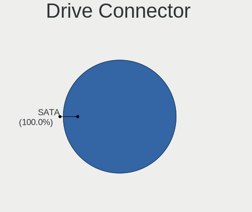
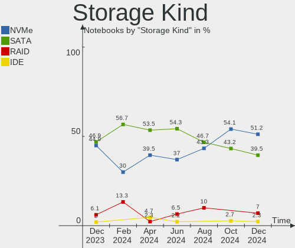
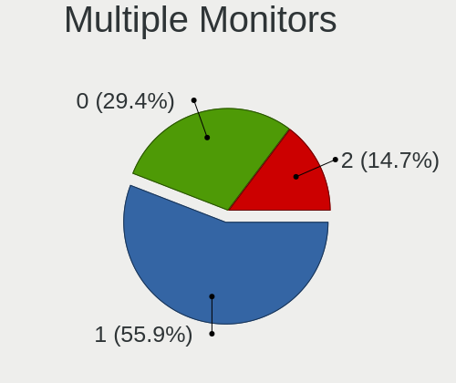

FreeBSD - Hardware Trends (Notebooks)
-------------------------------------

A project to identify most popular hardware characteristics and track their change
over time based on data collected by BSD users at https://BSD-Hardware.info.

Anyone can contribute to this report by the [hw-probe](https://github.com/linuxhw/hw-probe/blob/master/INSTALL.BSD.md) tool:

    hw-probe -all -upload

This report is for one last month. Overall report since the beginning of time: [TestCoverage](https://github.com/bsdhw/TestCoverage)

Period: Jul, 2022.

Contents
--------

* [ System ](#system)
  - [ OS                       ](#os)
  - [ OS Family                ](#os-family)
  - [ Arch                     ](#arch)
  - [ DE                       ](#de)
  - [ Display Server           ](#display-server)
  - [ Display Manager          ](#display-manager)
  - [ OS Lang                  ](#os-lang)
  - [ Boot Mode                ](#boot-mode)
  - [ Filesystem               ](#filesystem)
  - [ Part. scheme             ](#part-scheme)

* [ Board ](#board)
  - [ Vendor                   ](#vendor)
  - [ Model                    ](#model)
  - [ Model Family             ](#model-family)
  - [ MFG Year                 ](#mfg-year)
  - [ Form Factor              ](#form-factor)
  - [ Coreboot                 ](#coreboot)
  - [ RAM Size                 ](#ram-size)
  - [ RAM Used                 ](#ram-used)
  - [ Total Drives             ](#total-drives)
  - [ Has CD-ROM               ](#has-cd-rom)
  - [ Has Ethernet             ](#has-ethernet)
  - [ Has WiFi                 ](#has-wifi)
  - [ Has Bluetooth            ](#has-bluetooth)

* [ Location ](#location)
  - [ Country                  ](#country)
  - [ City                     ](#city)

* [ Drives ](#drives)
  - [ Drive Vendor             ](#drive-vendor)
  - [ Drive Model              ](#drive-model)
  - [ HDD Vendor               ](#hdd-vendor)
  - [ SSD Vendor               ](#ssd-vendor)
  - [ Drive Kind               ](#drive-kind)
  - [ Drive Connector          ](#drive-connector)
  - [ Drive Size               ](#drive-size)
  - [ Space Total              ](#space-total)
  - [ Space Used               ](#space-used)
  - [ Malfunc. Drives          ](#malfunc-drives)
  - [ Malfunc. Drive Vendor    ](#malfunc-drive-vendor)
  - [ Malfunc. HDD Vendor      ](#malfunc-hdd-vendor)
  - [ Malfunc. Drive Kind      ](#malfunc-drive-kind)
  - [ Failed Drives            ](#failed-drives)
  - [ Failed Drive Vendor      ](#failed-drive-vendor)
  - [ Drive Status             ](#drive-status)

* [ Storage controller ](#storage-controller)
  - [ Storage Vendor           ](#storage-vendor)
  - [ Storage Model            ](#storage-model)
  - [ Storage Kind             ](#storage-kind)

* [ Processor ](#processor)
  - [ CPU Vendor               ](#cpu-vendor)
  - [ CPU Model                ](#cpu-model)
  - [ CPU Model Family         ](#cpu-model-family)
  - [ CPU Cores                ](#cpu-cores)
  - [ CPU Sockets              ](#cpu-sockets)
  - [ CPU Threads              ](#cpu-threads)
  - [ CPU Microarch            ](#cpu-microarch)

* [ Graphics ](#graphics)
  - [ GPU Vendor               ](#gpu-vendor)
  - [ GPU Model                ](#gpu-model)
  - [ GPU Combo                ](#gpu-combo)
  - [ GPU Driver               ](#gpu-driver)
  - [ GPU Memory               ](#gpu-memory)

* [ Monitor ](#monitor)
  - [ Monitor Vendor           ](#monitor-vendor)
  - [ Monitor Model            ](#monitor-model)
  - [ Monitor Resolution       ](#monitor-resolution)
  - [ Monitor Diagonal         ](#monitor-diagonal)
  - [ Monitor Width            ](#monitor-width)
  - [ Aspect Ratio             ](#aspect-ratio)
  - [ Monitor Area             ](#monitor-area)
  - [ Pixel Density            ](#pixel-density)
  - [ Multiple Monitors        ](#multiple-monitors)

* [ Network ](#network)
  - [ Net Controller Vendor    ](#net-controller-vendor)
  - [ Net Controller Model     ](#net-controller-model)
  - [ Wireless Vendor          ](#wireless-vendor)
  - [ Wireless Model           ](#wireless-model)
  - [ Ethernet Vendor          ](#ethernet-vendor)
  - [ Ethernet Model           ](#ethernet-model)
  - [ Net Controller Kind      ](#net-controller-kind)
  - [ Used Controller          ](#used-controller)
  - [ NICs                     ](#nics)
  - [ IPv6                     ](#ipv6)

* [ Bluetooth ](#bluetooth)
  - [ Bluetooth Vendor         ](#bluetooth-vendor)
  - [ Bluetooth Model          ](#bluetooth-model)

* [ Sound ](#sound)
  - [ Sound Vendor             ](#sound-vendor)
  - [ Sound Model              ](#sound-model)

* [ Memory ](#memory)
  - [ Memory Vendor            ](#memory-vendor)
  - [ Memory Model             ](#memory-model)
  - [ Memory Kind              ](#memory-kind)
  - [ Memory Form Factor       ](#memory-form-factor)
  - [ Memory Size              ](#memory-size)
  - [ Memory Speed             ](#memory-speed)

* [ Printers & scanners ](#printers--scanners)
  - [ Printer Vendor           ](#printer-vendor)
  - [ Printer Model            ](#printer-model)
  - [ Scanner Vendor           ](#scanner-vendor)
  - [ Scanner Model            ](#scanner-model)

* [ Camera ](#camera)
  - [ Camera Vendor            ](#camera-vendor)
  - [ Camera Model             ](#camera-model)

* [ Security ](#security)
  - [ Fingerprint Vendor       ](#fingerprint-vendor)
  - [ Fingerprint Model        ](#fingerprint-model)
  - [ Chipcard Vendor          ](#chipcard-vendor)
  - [ Chipcard Model           ](#chipcard-model)

* [ Unsupported ](#unsupported)
  - [ Unsupported Devices      ](#unsupported-devices)
  - [ Unsupported Device Types ](#unsupported-device-types)

System
------

OS
--

Installed operating systems

| Name                 | Notebooks | Percent |
|----------------------|-----------|---------|
| FreeBSD 13.1         | 16        | 72.73%  |
| FreeBSD 14.0-CURRENT | 3         | 13.64%  |
| FreeBSD 13.0         | 2         | 9.09%   |
| FreeBSD 12.3-STABLE  | 1         | 4.55%   |

OS Family
---------

OS without a version

| Name    | Notebooks | Percent |
|---------|-----------|---------|
| FreeBSD | 22        | 100%    |

Arch
----

OS architecture (x86_64, i586, etc.)

| Name  | Notebooks | Percent |
|-------|-----------|---------|
| amd64 | 22        | 100%    |

DE
--

Desktop Environment

| Name    | Notebooks | Percent |
|---------|-----------|---------|
| Console | 6         | 27.27%  |
| XFCE    | 4         | 18.18%  |
| KDE5    | 4         | 18.18%  |
| GNOME   | 3         | 13.64%  |
| TWM     | 2         | 9.09%   |
| MATE    | 2         | 9.09%   |
| i3      | 1         | 4.55%   |

Display Server
--------------

X11 or Wayland

| Name    | Notebooks | Percent |
|---------|-----------|---------|
| X11     | 16        | 72.73%  |
| Console | 6         | 27.27%  |

Display Manager
---------------

SDDM, LightDM, etc.

| Name    | Notebooks | Percent |
|---------|-----------|---------|
| Console | 10        | 45.45%  |
| SLiM    | 4         | 18.18%  |
| SDDM    | 3         | 13.64%  |
| LightDM | 2         | 9.09%   |
| GDM     | 2         | 9.09%   |
| XDM     | 1         | 4.55%   |

OS Lang
-------

Language

| Lang    | Notebooks | Percent |
|---------|-----------|---------|
| C       | 16        | 72.73%  |
| en_US   | 3         | 13.64%  |
| Unknown | 3         | 13.64%  |

Boot Mode
---------

EFI or BIOS

| Mode | Notebooks | Percent |
|------|-----------|---------|
| EFI  | 18        | 81.82%  |
| BIOS | 4         | 18.18%  |

Filesystem
----------

Type of filesystem

| Type | Notebooks | Percent |
|------|-----------|---------|
| Zfs  | 16        | 72.73%  |
| Ufs  | 6         | 27.27%  |

Part. scheme
------------

Scheme of partitioning

| Type | Notebooks | Percent |
|------|-----------|---------|
| GPT  | 21        | 95.45%  |
| MBR  | 1         | 4.55%   |

Board
-----

Vendor
------

Motherboard manufacturer

| Name                | Notebooks | Percent |
|---------------------|-----------|---------|
| Lenovo              | 7         | 31.82%  |
| Dell                | 4         | 18.18%  |
| Hewlett-Packard     | 2         | 9.09%   |
| ASUSTek Computer    | 2         | 9.09%   |
| Toshiba             | 1         | 4.55%   |
| Sony                | 1         | 4.55%   |
| Samsung Electronics | 1         | 4.55%   |
| LG Electronics      | 1         | 4.55%   |
| Fujitsu             | 1         | 4.55%   |
| Apple               | 1         | 4.55%   |
| Unknown             | 1         | 4.55%   |

Model
-----

Motherboard model

| Name                                    | Notebooks | Percent |
|-----------------------------------------|-----------|---------|
| Toshiba Satellite L305D                 | 1         | 4.55%   |
| Sony VGN-NS21M_S                        | 1         | 4.55%   |
| Samsung 340XAA/350XAA/550XAA            | 1         | 4.55%   |
| LG 17Z990-R.AAC9U1                      | 1         | 4.55%   |
| Lenovo ThinkPad X260 20F6S0KA00         | 1         | 4.55%   |
| Lenovo ThinkPad T495 20NJ0010PB         | 1         | 4.55%   |
| Lenovo ThinkPad T480 20L6SB2N00         | 1         | 4.55%   |
| Lenovo ThinkPad T420 4236C92            | 1         | 4.55%   |
| Lenovo IdeaPad 5 Pro 16ACH6 82L5        | 1         | 4.55%   |
| Lenovo IdeaPad 330-15ARR 81D2           | 1         | 4.55%   |
| Lenovo G40-45 80E1                      | 1         | 4.55%   |
| HP Laptop 15-bs1xx                      | 1         | 4.55%   |
| HP EliteBook 8570p                      | 1         | 4.55%   |
| Fujitsu LIFEBOOK A555                   | 1         | 4.55%   |
| Dell Studio XPS 1340                    | 1         | 4.55%   |
| Dell Precision 5560                     | 1         | 4.55%   |
| Dell Latitude E6420                     | 1         | 4.55%   |
| Dell Inspiron 5559                      | 1         | 4.55%   |
| ASUS ZenBook UX325UA_UM325UA            | 1         | 4.55%   |
| ASUS VivoBook_ASUSLaptop E210MAB_E210MA | 1         | 4.55%   |
| Apple MacBookAir5,2                     | 1         | 4.55%   |
| Unknown                                 | 1         | 4.55%   |

Model Family
------------

Motherboard model prefix

| Name               | Notebooks | Percent |
|--------------------|-----------|---------|
| Lenovo ThinkPad    | 4         | 18.18%  |
| Lenovo IdeaPad     | 2         | 9.09%   |
| Toshiba Satellite  | 1         | 4.55%   |
| Sony VGN-NS21M     | 1         | 4.55%   |
| Samsung 340XAA     | 1         | 4.55%   |
| LG 17Z990-R.AAC9U1 | 1         | 4.55%   |
| Lenovo G40-45      | 1         | 4.55%   |
| HP Laptop          | 1         | 4.55%   |
| HP EliteBook       | 1         | 4.55%   |
| Fujitsu LIFEBOOK   | 1         | 4.55%   |
| Dell Studio        | 1         | 4.55%   |
| Dell Precision     | 1         | 4.55%   |
| Dell Latitude      | 1         | 4.55%   |
| Dell Inspiron      | 1         | 4.55%   |
| ASUS ZenBook       | 1         | 4.55%   |
| ASUS VivoBook      | 1         | 4.55%   |
| Apple MacBookAir5  | 1         | 4.55%   |
| Unknown            | 1         | 4.55%   |

MFG Year
--------

Motherboard manufacture year

| Year | Notebooks | Percent |
|------|-----------|---------|
| 2021 | 4         | 18.18%  |
| 2019 | 4         | 18.18%  |
| 2018 | 3         | 13.64%  |
| 2016 | 3         | 13.64%  |
| 2011 | 3         | 13.64%  |
| 2022 | 1         | 4.55%   |
| 2020 | 1         | 4.55%   |
| 2013 | 1         | 4.55%   |
| 2009 | 1         | 4.55%   |
| 2008 | 1         | 4.55%   |

Form Factor
-----------

Physical design of the computer

| Name     | Notebooks | Percent |
|----------|-----------|---------|
| Notebook | 22        | 100%    |

Coreboot
--------

Have coreboot on board

| Used | Notebooks | Percent |
|------|-----------|---------|
| No   | 22        | 100%    |

RAM Size
--------

Total RAM memory

| Size in GB | Notebooks | Percent |
|------------|-----------|---------|
| 16.01-24.0 | 8         | 36.36%  |
| 4.01-8.0   | 7         | 31.82%  |
| 8.01-16.0  | 5         | 22.73%  |
| 32.01-64.0 | 1         | 4.55%   |
| 24.01-32.0 | 1         | 4.55%   |

RAM Used
--------

Used RAM memory

| Used GB  | Notebooks | Percent |
|----------|-----------|---------|
| 0.01-0.5 | 10        | 45.45%  |
| 0.51-1.0 | 5         | 22.73%  |
| 1.01-2.0 | 4         | 18.18%  |
| 2.01-3.0 | 3         | 13.64%  |

Total Drives
------------

Number of drives on board

| Drives | Notebooks | Percent |
|--------|-----------|---------|
| 1      | 18        | 81.82%  |
| 2      | 2         | 9.09%   |
| 0      | 2         | 9.09%   |

Has CD-ROM
----------

Has CD-ROM on board

| Presented | Notebooks | Percent |
|-----------|-----------|---------|
| No        | 14        | 63.64%  |
| Yes       | 8         | 36.36%  |

Has Ethernet
------------

Has Ethernet on board

| Presented | Notebooks | Percent |
|-----------|-----------|---------|
| Yes       | 15        | 68.18%  |
| No        | 7         | 31.82%  |

Has WiFi
--------

Has WiFi module

| Presented | Notebooks | Percent |
|-----------|-----------|---------|
| Yes       | 22        | 100%    |

Has Bluetooth
-------------

Has Bluetooth module

| Presented | Notebooks | Percent |
|-----------|-----------|---------|
| Yes       | 12        | 54.55%  |
| No        | 10        | 45.45%  |

Location
--------

Country
-------

Geographic location (country)

| Country  | Notebooks | Percent |
|----------|-----------|---------|
| USA      | 9         | 40.91%  |
| Czechia  | 2         | 9.09%   |
| UK       | 1         | 4.55%   |
| Turkey   | 1         | 4.55%   |
| Thailand | 1         | 4.55%   |
| Spain    | 1         | 4.55%   |
| Slovenia | 1         | 4.55%   |
| Russia   | 1         | 4.55%   |
| Poland   | 1         | 4.55%   |
| Norway   | 1         | 4.55%   |
| Malaysia | 1         | 4.55%   |
| Brazil   | 1         | 4.55%   |
| Bahamas  | 1         | 4.55%   |

City
----

Geographic location (city)

| City          | Notebooks | Percent |
|---------------|-----------|---------|
| Riverside     | 2         | 9.09%   |
| Brno          | 2         | 9.09%   |
| Thousand Oaks | 1         | 4.55%   |
| Shah Alam     | 1         | 4.55%   |
| Sandefjord    | 1         | 4.55%   |
| Omaha         | 1         | 4.55%   |
| Nassau        | 1         | 4.55%   |
| Madrid        | 1         | 4.55%   |
| London        | 1         | 4.55%   |
| Khabarovsk    | 1         | 4.55%   |
| Katowice      | 1         | 4.55%   |
| Istanbul      | 1         | 4.55%   |
| East Lansing  | 1         | 4.55%   |
| Detroit       | 1         | 4.55%   |
| Chachoengsao  | 1         | 4.55%   |
| Bucka         | 1         | 4.55%   |
| Brooklyn      | 1         | 4.55%   |
| Bellaire      | 1         | 4.55%   |
| Bacabal       | 1         | 4.55%   |
| Ashburn       | 1         | 4.55%   |

Drives
------

Drive Vendor
------------

Hard drive vendors

| Vendor              | Notebooks | Drives | Percent |
|---------------------|-----------|--------|---------|
| Samsung Electronics | 6         | 6      | 28.57%  |
| WDC                 | 5         | 5      | 23.81%  |
| Crucial             | 2         | 2      | 9.52%   |
| Toshiba             | 1         | 1      | 4.76%   |
| SK hynix            | 1         | 1      | 4.76%   |
| Seagate             | 1         | 1      | 4.76%   |
| Micron Technology   | 1         | 1      | 4.76%   |
| Hitachi             | 1         | 1      | 4.76%   |
| HGST                | 1         | 1      | 4.76%   |
| Apple               | 1         | 1      | 4.76%   |
| A-DATA Technology   | 1         | 2      | 4.76%   |

Drive Model
-----------

Hard drive models

| Model                            | Notebooks | Percent |
|----------------------------------|-----------|---------|
| WDC WDS500G3X0C-00SJG0 500GB     | 1         | 4.55%   |
| WDC WD5000LPCX-35VHAT0 500GB     | 1         | 4.55%   |
| WDC WD3200BPVT-22JJ5T0 320GB     | 1         | 4.55%   |
| WDC WD10JPVX-60JC3T1 1TB         | 1         | 4.55%   |
| WDC WD10EZEX-60WN4A0 1TB         | 1         | 4.55%   |
| Toshiba MQ01ABF050 500GB         | 1         | 4.55%   |
| SK hynix HFM512GD3JX013N 512GB   | 1         | 4.55%   |
| Seagate ST500LT012-1DG142 500GB  | 1         | 4.55%   |
| Samsung SSD PM810 2.5-inch 128GB | 1         | 4.55%   |
| Samsung SSD 970 PRO 1TB          | 1         | 4.55%   |
| Samsung SSD 870 EVO 1TB          | 1         | 4.55%   |
| Samsung MZVLB1T0HBLR-000L2 1TB   | 1         | 4.55%   |
| Samsung MZVKW512HMJP-000H1 512GB | 1         | 4.55%   |
| Samsung MZ7LN512HMJP-000L7 512GB | 1         | 4.55%   |
| Micron 2300 NVMe 512GB           | 1         | 4.55%   |
| Hitachi HTS721080G9SA00 80GB     | 1         | 4.55%   |
| HGST HTS721010A9E630 1TB         | 1         | 4.55%   |
| Crucial CT240BX500SSD1 240GB     | 1         | 4.55%   |
| Crucial CT1000MX500SSD1 1TB      | 1         | 4.55%   |
| Apple SSD SM256E 256GB           | 1         | 4.55%   |
| A-DATA SU650 240GB               | 1         | 4.55%   |
| A-DATA SU630 240GB               | 1         | 4.55%   |

HDD Vendor
----------

Hard disk drive vendors

| Vendor  | Notebooks | Drives | Percent |
|---------|-----------|--------|---------|
| WDC     | 4         | 4      | 50%     |
| Toshiba | 1         | 1      | 12.5%   |
| Seagate | 1         | 1      | 12.5%   |
| Hitachi | 1         | 1      | 12.5%   |
| HGST    | 1         | 1      | 12.5%   |

SSD Vendor
----------

Solid state drive vendors

| Vendor              | Notebooks | Drives | Percent |
|---------------------|-----------|--------|---------|
| Samsung Electronics | 3         | 3      | 42.86%  |
| Crucial             | 2         | 2      | 28.57%  |
| Apple               | 1         | 1      | 14.29%  |
| A-DATA Technology   | 1         | 2      | 14.29%  |

Drive Kind
----------

HDD or SSD

| Kind | Notebooks | Drives | Percent |
|------|-----------|--------|---------|
| HDD  | 8         | 8      | 38.1%   |
| SSD  | 7         | 8      | 33.33%  |
| NVMe | 6         | 6      | 28.57%  |

Drive Connector
---------------

SATA, SAS, NVMe, etc.

| Type | Notebooks | Drives | Percent |
|------|-----------|--------|---------|
| SATA | 14        | 16     | 70%     |
| NVMe | 6         | 6      | 30%     |

Drive Size
----------

Size of hard drive

| Size in TB | Notebooks | Drives | Percent |
|------------|-----------|--------|---------|
| 0.01-0.5   | 9         | 10     | 64.29%  |
| 0.51-1.0   | 5         | 6      | 35.71%  |

Space Total
-----------

Amount of disk space available on the file system

| Size in GB | Notebooks | Percent |
|------------|-----------|---------|
| 251-500    | 8         | 36.36%  |
| 101-250    | 5         | 22.73%  |
| 501-1000   | 5         | 22.73%  |
| 51-100     | 2         | 9.09%   |
| 21-50      | 1         | 4.55%   |
| 1-20       | 1         | 4.55%   |

Space Used
----------

Amount of used disk space

| Used GB | Notebooks | Percent |
|---------|-----------|---------|
| 1-20    | 19        | 86.36%  |
| 21-50   | 2         | 9.09%   |
| 51-100  | 1         | 4.55%   |

Malfunc. Drives
---------------

Drive models with a malfunction

| Model                                        | Notebooks | Drives | Percent |
|----------------------------------------------|-----------|--------|---------|
| WDC WD10JPVX-60JC3T1 1TB                     | 1         | 1      | 14.29%  |
| Toshiba MQ01ABF050 500GB                     | 1         | 1      | 14.29%  |
| Seagate ST500LT012-1DG142 500GB              | 1         | 1      | 14.29%  |
| Samsung Electronics SSD PM810 2.5-inch 128GB | 1         | 1      | 14.29%  |
| Hitachi HTS721080G9SA00 80GB                 | 1         | 1      | 14.29%  |
| HGST HTS721010A9E630 1TB                     | 1         | 1      | 14.29%  |
| A-DATA Technology SU630 240GB                | 1         | 1      | 14.29%  |

Malfunc. Drive Vendor
---------------------

Vendors of faulty drives

| Vendor              | Notebooks | Drives | Percent |
|---------------------|-----------|--------|---------|
| WDC                 | 1         | 1      | 14.29%  |
| Toshiba             | 1         | 1      | 14.29%  |
| Seagate             | 1         | 1      | 14.29%  |
| Samsung Electronics | 1         | 1      | 14.29%  |
| Hitachi             | 1         | 1      | 14.29%  |
| HGST                | 1         | 1      | 14.29%  |
| A-DATA Technology   | 1         | 1      | 14.29%  |

Malfunc. HDD Vendor
-------------------

Vendors of faulty HDD drives

| Vendor  | Notebooks | Drives | Percent |
|---------|-----------|--------|---------|
| WDC     | 1         | 1      | 20%     |
| Toshiba | 1         | 1      | 20%     |
| Seagate | 1         | 1      | 20%     |
| Hitachi | 1         | 1      | 20%     |
| HGST    | 1         | 1      | 20%     |

Malfunc. Drive Kind
-------------------

Kinds of faulty drives

| Kind | Notebooks | Drives | Percent |
|------|-----------|--------|---------|
| HDD  | 5         | 5      | 71.43%  |
| SSD  | 2         | 2      | 28.57%  |

Failed Drives
-------------

Failed drive models

Zero info for selected period =(

Failed Drive Vendor
-------------------

Failed drive vendors

Zero info for selected period =(

Drive Status
------------

Number of failed and malfunc. drives

| Status  | Notebooks | Drives | Percent |
|---------|-----------|--------|---------|
| Works   | 14        | 15     | 66.67%  |
| Malfunc | 7         | 7      | 33.33%  |

Storage controller
------------------

Storage Vendor
--------------

Storage controller vendors

| Vendor              | Notebooks | Percent |
|---------------------|-----------|---------|
| Intel               | 12        | 52.17%  |
| AMD                 | 4         | 17.39%  |
| Samsung Electronics | 3         | 13.04%  |
| SK hynix            | 1         | 4.35%   |
| SanDisk             | 1         | 4.35%   |
| Nvidia              | 1         | 4.35%   |
| Micron Technology   | 1         | 4.35%   |

Storage Model
-------------

Storage controller models

| Model                                                                        | Notebooks | Percent |
|------------------------------------------------------------------------------|-----------|---------|
| Intel Sunrise Point-LP SATA Controller [AHCI mode]                           | 4         | 16.67%  |
| AMD FCH SATA Controller [AHCI mode]                                          | 3         | 12.5%   |
| Samsung NVMe SSD Controller SM981/PM981/PM983                                | 2         | 8.33%   |
| Intel 7 Series Chipset Family 6-port SATA Controller [AHCI mode]             | 2         | 8.33%   |
| Intel 6 Series/C200 Series Chipset Family 6 port Mobile SATA AHCI Controller | 2         | 8.33%   |
| SK hynix Gold P31 SSD                                                        | 1         | 4.17%   |
| SanDisk WD Black SN750 / PC SN730 NVMe SSD                                   | 1         | 4.17%   |
| Samsung NVMe SSD Controller SM961/PM961/SM963                                | 1         | 4.17%   |
| Nvidia MCP79 AHCI Controller                                                 | 1         | 4.17%   |
| Intel Wildcat Point-LP SATA Controller [AHCI Mode]                           | 1         | 4.17%   |
| Intel Celeron/Pentium Silver Processor SATA Controller                       | 1         | 4.17%   |
| Intel Celeron N3350/Pentium N4200/Atom E3900 Series SATA AHCI Controller     | 1         | 4.17%   |
| Intel 82801IBM/IEM (ICH9M/ICH9M-E) 4 port SATA Controller [AHCI mode]        | 1         | 4.17%   |
| AMD SB7x0/SB8x0/SB9x0 SATA Controller [AHCI mode]                            | 1         | 4.17%   |
| AMD SB7x0/SB8x0/SB9x0 IDE Controller                                         | 1         | 4.17%   |
| Unknown                                                                      | 1         | 4.17%   |

Storage Kind
------------

Kind of storage controller (IDE, SATA, NVMe, SAS, ...)

| Kind | Notebooks | Percent |
|------|-----------|---------|
| SATA | 17        | 70.83%  |
| NVMe | 6         | 25%     |
| IDE  | 1         | 4.17%   |

Processor
---------

CPU Vendor
----------

Processor vendors

| Vendor | Notebooks | Percent |
|--------|-----------|---------|
| Intel  | 16        | 72.73%  |
| AMD    | 6         | 27.27%  |

CPU Model
---------

Processor models

| Model                                           | Notebooks | Percent |
|-------------------------------------------------|-----------|---------|
| Intel Core i7-6500U CPU @ 2.50GHz               | 2         | 9.09%   |
| Intel Pentium Dual CPU T3400 @ 2.16GHz          | 1         | 4.55%   |
| Intel Core i7-8565U CPU @ 1.80GHz               | 1         | 4.55%   |
| Intel Core i7-3520M CPU @ 2.90GHz               | 1         | 4.55%   |
| Intel Core i5-8350U CPU @ 1.70GHz               | 1         | 4.55%   |
| Intel Core i5-8250U CPU @ 1.60GHz               | 1         | 4.55%   |
| Intel Core i5-3427U CPU @ 1.80GHz               | 1         | 4.55%   |
| Intel Core i5-2540M CPU @ 2.60GH                | 1         | 4.55%   |
| Intel Core i5-2520M CPU @ 2.50GHz               | 1         | 4.55%   |
| Intel Core i3-5005U CPU @ 2.00GHz               | 1         | 4.55%   |
| Intel Core 2 Duo CPU P9500 @ 2.53GHz            | 1         | 4.55%   |
| Intel Celeron N4020 CPU @ 1.10GHz               | 1         | 4.55%   |
| Intel Celeron CPU N3450 @ 1.10GHz               | 1         | 4.55%   |
| Intel Celeron CPU 3865U @ 1.80GHz               | 1         | 4.55%   |
| Intel 11th Gen Core i7-11850H @ 2.50GHz         | 1         | 4.55%   |
| AMD Ryzen 7 PRO 3700U w/ Radeon Vega Mobile Gfx | 1         | 4.55%   |
| AMD Ryzen 7 5800H with Radeon Graphics          | 1         | 4.55%   |
| AMD Ryzen 7 5700U with Radeon Graphics          | 1         | 4.55%   |
| AMD Ryzen 3 2200U with Radeon Vega Mobile Gfx   | 1         | 4.55%   |
| AMD Athlon X2 Dual-Core QL-62                   | 1         | 4.55%   |
| AMD A8-6410 APU with AMD Radeon R5 Graphics     | 1         | 4.55%   |

CPU Model Family
----------------

Processor model prefix

| Model              | Notebooks | Percent |
|--------------------|-----------|---------|
| Intel Core i5      | 5         | 22.73%  |
| Intel Core i7      | 4         | 18.18%  |
| Intel Celeron      | 3         | 13.64%  |
| AMD Ryzen 7        | 2         | 9.09%   |
| Other              | 1         | 4.55%   |
| Intel Pentium Dual | 1         | 4.55%   |
| Intel Core i3      | 1         | 4.55%   |
| Intel Core 2 Duo   | 1         | 4.55%   |
| AMD Ryzen 7 PRO    | 1         | 4.55%   |
| AMD Ryzen 3        | 1         | 4.55%   |
| AMD Athlon X2      | 1         | 4.55%   |
| AMD A8             | 1         | 4.55%   |

CPU Cores
---------

Number of processor cores

| Number  | Notebooks | Percent |
|---------|-----------|---------|
| 2       | 11        | 50%     |
| 4       | 6         | 27.27%  |
| 16      | 2         | 9.09%   |
| 8       | 2         | 9.09%   |
| Unknown | 1         | 4.55%   |

CPU Sockets
-----------

Number of sockets

| Number | Notebooks | Percent |
|--------|-----------|---------|
| 1      | 22        | 100%    |

CPU Threads
-----------

Threads per core (Hyper-Threading)

| Number  | Notebooks | Percent |
|---------|-----------|---------|
| 2       | 11        | 50%     |
| 1       | 10        | 45.45%  |
| Unknown | 1         | 4.55%   |

CPU Microarch
-------------

Microarchitecture

| Name            | Notebooks | Percent |
|-----------------|-----------|---------|
| KabyLake        | 4         | 18.18%  |
| Skylake         | 2         | 9.09%   |
| SandyBridge     | 2         | 9.09%   |
| IvyBridge       | 2         | 9.09%   |
| Unknown         | 2         | 9.09%   |
| Zen+            | 1         | 4.55%   |
| Zen 3           | 1         | 4.55%   |
| Zen             | 1         | 4.55%   |
| Puma            | 1         | 4.55%   |
| Penryn          | 1         | 4.55%   |
| K8 & K10 hybrid | 1         | 4.55%   |
| Goldmont plus   | 1         | 4.55%   |
| Goldmont        | 1         | 4.55%   |
| Core            | 1         | 4.55%   |
| Broadwell       | 1         | 4.55%   |

Graphics
--------

GPU Vendor
----------

Vendors of graphics cards

| Vendor | Notebooks | Percent |
|--------|-----------|---------|
| Intel  | 14        | 56%     |
| AMD    | 8         | 32%     |
| Nvidia | 3         | 12%     |

GPU Model
---------

Graphics card models

| Model                                                                         | Notebooks | Percent |
|-------------------------------------------------------------------------------|-----------|---------|
| Intel UHD Graphics 620                                                        | 2         | 7.41%   |
| Intel Skylake GT2 [HD Graphics 520]                                           | 2         | 7.41%   |
| Intel 2nd Generation Core Processor Family Integrated Graphics Controller     | 2         | 7.41%   |
| Nvidia TU117M [GeForce GTX 1650 Mobile / Max-Q]                               | 1         | 3.7%    |
| Nvidia GA107GLM [RTX A2000 Mobile]                                            | 1         | 3.7%    |
| Nvidia G98M [GeForce 9200M GS]                                                | 1         | 3.7%    |
| Nvidia C79 [GeForce 9400M G]                                                  | 1         | 3.7%    |
| Intel WhiskeyLake-U GT2 [UHD Graphics 620]                                    | 1         | 3.7%    |
| Intel TigerLake-H GT1 [UHD Graphics]                                          | 1         | 3.7%    |
| Intel Mobile 4 Series Chipset Integrated Graphics Controller                  | 1         | 3.7%    |
| Intel Kaby Lake-U GT1 Integrated Graphics Controller                          | 1         | 3.7%    |
| Intel HD Graphics 5500                                                        | 1         | 3.7%    |
| Intel HD Graphics 500                                                         | 1         | 3.7%    |
| Intel GeminiLake [UHD Graphics 600]                                           | 1         | 3.7%    |
| Intel 3rd Gen Core processor Graphics Controller                              | 1         | 3.7%    |
| AMD Thames [Radeon HD 7550M/7570M/7650M]                                      | 1         | 3.7%    |
| AMD Sun XT [Radeon HD 8670A/8670M/8690M / R5 M330 / M430 / Radeon 520 Mobile] | 1         | 3.7%    |
| AMD Sun LE [Radeon HD 8550M / R5 M230]                                        | 1         | 3.7%    |
| AMD RS780MC [Mobility Radeon HD 3100]                                         | 1         | 3.7%    |
| AMD Raven Ridge [Radeon Vega Series / Radeon Vega Mobile Series]              | 1         | 3.7%    |
| AMD Picasso/Raven 2 [Radeon Vega Series / Radeon Vega Mobile Series]          | 1         | 3.7%    |
| AMD Mullins [Radeon R4/R5 Graphics]                                           | 1         | 3.7%    |
| AMD Lucienne                                                                  | 1         | 3.7%    |
| AMD Cezanne                                                                   | 1         | 3.7%    |

GPU Combo
---------

Combinations of graphics cards

| Name           | Notebooks | Percent |
|----------------|-----------|---------|
| 1 x Intel      | 11        | 50%     |
| 1 x AMD        | 5         | 22.73%  |
| 2 x Nvidia     | 1         | 4.55%   |
| 2 x Intel      | 1         | 4.55%   |
| 2 x AMD        | 1         | 4.55%   |
| Intel + Nvidia | 1         | 4.55%   |
| Intel + AMD    | 1         | 4.55%   |
| AMD + Nvidia   | 1         | 4.55%   |

GPU Driver
----------

Free vs proprietary

| Driver      | Notebooks | Percent |
|-------------|-----------|---------|
| Free        | 21        | 95.45%  |
| Proprietary | 1         | 4.55%   |

GPU Memory
----------

Total video memory

| Size in GB | Notebooks | Percent |
|------------|-----------|---------|
| Unknown    | 17        | 77.27%  |
| 0.01-0.5   | 3         | 13.64%  |
| 3.01-4.0   | 1         | 4.55%   |
| 0.51-1.0   | 1         | 4.55%   |

Monitor
-------

Monitor Vendor
--------------

Monitor vendors

| Vendor              | Notebooks | Percent |
|---------------------|-----------|---------|
| LG Display          | 4         | 26.67%  |
| Samsung Electronics | 3         | 20%     |
| Chimei Innolux      | 3         | 20%     |
| BenQ                | 2         | 13.33%  |
| AU Optronics        | 2         | 13.33%  |
| Philips             | 1         | 6.67%   |

Monitor Model
-------------

Monitor models

| Model                                                                 | Notebooks | Percent |
|-----------------------------------------------------------------------|-----------|---------|
| BenQ BL2480 BNQ802C 1920x1080 530x300mm 24.0-inch                     | 2         | 13.33%  |
| Samsung Electronics LCD Monitor SEC3741 1280x800 330x210mm 15.4-inch  | 1         | 6.67%   |
| Samsung Electronics LCD Monitor SDC8B4F 1920x1080 340x190mm 15.3-inch | 1         | 6.67%   |
| Samsung Electronics LCD Monitor SDC4158 1920x1080 290x170mm 13.2-inch | 1         | 6.67%   |
| Philips LCD Monitor PHL08C3 1920x1080 600x340mm 27.2-inch             | 1         | 6.67%   |
| LG Display LCD Monitor LGD05F8 2560x1600 370x230mm 17.2-inch          | 1         | 6.67%   |
| LG Display LCD Monitor LGD0353 1366x768 350x190mm 15.7-inch           | 1         | 6.67%   |
| LG Display LCD Monitor LGD02EB 1366x768 310x170mm 13.9-inch           | 1         | 6.67%   |
| LG Display LCD Monitor LGD02E2 1600x900 310x170mm 13.9-inch           | 1         | 6.67%   |
| Chimei Innolux LCD Monitor CMN15D5 1920x1080 340x190mm 15.3-inch      | 1         | 6.67%   |
| Chimei Innolux LCD Monitor CMN15CC 1366x768 340x190mm 15.3-inch       | 1         | 6.67%   |
| Chimei Innolux LCD Monitor CMN14C9 1920x1080 310x170mm 13.9-inch      | 1         | 6.67%   |
| AU Optronics LCD Monitor AUO71EC 1366x768 340x190mm 15.3-inch         | 1         | 6.67%   |
| AU Optronics LCD Monitor AUO226D 1920x1080 280x160mm 12.7-inch        | 1         | 6.67%   |

Monitor Resolution
------------------

Monitor screen resolution

| Resolution      | Notebooks | Percent |
|-----------------|-----------|---------|
| 1920x1080 (FHD) | 7         | 50%     |
| 1366x768 (WXGA) | 4         | 28.57%  |
| 2560x1600       | 1         | 7.14%   |
| 1600x900 (HD+)  | 1         | 7.14%   |
| 1280x800 (WXGA) | 1         | 7.14%   |

Monitor Diagonal
----------------

Diagonal size in inches

| Inches | Notebooks | Percent |
|--------|-----------|---------|
| 15     | 6         | 40%     |
| 13     | 4         | 26.67%  |
| 24     | 2         | 13.33%  |
| 27     | 1         | 6.67%   |
| 17     | 1         | 6.67%   |
| 12     | 1         | 6.67%   |

Monitor Width
-------------

Physical width

| Width in mm | Notebooks | Percent |
|-------------|-----------|---------|
| 301-350     | 9         | 60%     |
| 501-600     | 3         | 20%     |
| 201-300     | 2         | 13.33%  |
| 351-400     | 1         | 6.67%   |

Aspect Ratio
------------

Proportional relationship between the width and the height

| Ratio | Notebooks | Percent |
|-------|-----------|---------|
| 16/9  | 11        | 84.62%  |
| 16/10 | 2         | 15.38%  |

Monitor Area
------------

Area in inch²

| Area in inch² | Notebooks | Percent |
|----------------|-----------|---------|
| 91-100         | 4         | 26.67%  |
| 81-90          | 3         | 20%     |
| 201-250        | 2         | 13.33%  |
| 101-110        | 2         | 13.33%  |
| 71-80          | 1         | 6.67%   |
| 61-70          | 1         | 6.67%   |
| 301-350        | 1         | 6.67%   |
| 131-140        | 1         | 6.67%   |

Pixel Density
-------------

Pixels per inch

| Density | Notebooks | Percent |
|---------|-----------|---------|
| 51-100  | 5         | 33.33%  |
| 121-160 | 4         | 26.67%  |
| 161-240 | 3         | 20%     |
| 101-120 | 3         | 20%     |

Multiple Monitors
-----------------

Total monitors connected

| Total | Notebooks | Percent |
|-------|-----------|---------|
| 1     | 12        | 54.55%  |
| 0     | 8         | 36.36%  |
| 2     | 2         | 9.09%   |

Network
-------

Net Controller Vendor
---------------------

Controller vendors

| Vendor                   | Notebooks | Percent |
|--------------------------|-----------|---------|
| Intel                    | 11        | 32.35%  |
| Realtek Semiconductor    | 10        | 29.41%  |
| Qualcomm Atheros         | 5         | 14.71%  |
| Samsung Electronics      | 2         | 5.88%   |
| TP-Link                  | 1         | 2.94%   |
| Nvidia                   | 1         | 2.94%   |
| MediaTek                 | 1         | 2.94%   |
| Marvell Technology Group | 1         | 2.94%   |
| Hewlett-Packard          | 1         | 2.94%   |
| Broadcom                 | 1         | 2.94%   |

Net Controller Model
--------------------

Controller models

| Model                                                             | Notebooks | Percent |
|-------------------------------------------------------------------|-----------|---------|
| Realtek RTL8111/8168/8411 PCI Express Gigabit Ethernet Controller | 5         | 11.9%   |
| Realtek RTL810xE PCI Express Fast Ethernet controller             | 3         | 7.14%   |
| Qualcomm Atheros AR928X Wireless Network Adapter (PCI-Express)    | 3         | 7.14%   |
| Intel 82579LM Gigabit Network Connection (Lewisville)             | 3         | 7.14%   |
| Samsung Galaxy series, misc. (tethering mode)                     | 2         | 4.76%   |
| Realtek RTL8821CE 802.11ac PCIe Wireless Network Adapter          | 2         | 4.76%   |
| Intel Wireless 8265 / 8275                                        | 2         | 4.76%   |
| Intel Centrino Advanced-N 6205 [Taylor Peak]                      | 2         | 4.76%   |
| TP-Link AC600 wireless Realtek RTL8811AU [Archer T2U Nano]        | 1         | 2.38%   |
| Realtek RTL8723DE Wireless Network Adapter                        | 1         | 2.38%   |
| Realtek Realtek Bluetooth Adapter                                 | 1         | 2.38%   |
| Realtek Realtek Bluetooth 4.2 Adapter                             | 1         | 2.38%   |
| Qualcomm Atheros QCA9565 / AR9565 Wireless Network Adapter        | 1         | 2.38%   |
| Qualcomm Atheros QCA9377 802.11ac Wireless Network Adapter        | 1         | 2.38%   |
| Nvidia MCP79 Ethernet                                             | 1         | 2.38%   |
| MediaTek MT7921 802.11ax PCI Express Wireless Network Adapter     | 1         | 2.38%   |
| Marvell Group 88E8055 PCI-E Gigabit Ethernet Controller           | 1         | 2.38%   |
| Intel Wireless-AC 9260                                            | 1         | 2.38%   |
| Intel Wireless 8260                                               | 1         | 2.38%   |
| Intel Wireless 7265                                               | 1         | 2.38%   |
| Intel Wireless 3160                                               | 1         | 2.38%   |
| Intel Tiger Lake PCH CNVi WiFi                                    | 1         | 2.38%   |
| Intel Ethernet Connection I219-V                                  | 1         | 2.38%   |
| Intel Ethernet Connection I219-LM                                 | 1         | 2.38%   |
| Intel Centrino Ultimate-N 6300                                    | 1         | 2.38%   |
| Intel Cannon Point-LP CNVi [Wireless-AC]                          | 1         | 2.38%   |
| HP hs2350 HSPA+ Mobile Broadband Module Network Adapter           | 1         | 2.38%   |
| Broadcom BCM43224 802.11a/b/g/n                                   | 1         | 2.38%   |

Wireless Vendor
---------------

Wireless vendors

| Vendor                | Notebooks | Percent |
|-----------------------|-----------|---------|
| Intel                 | 11        | 47.83%  |
| Qualcomm Atheros      | 5         | 21.74%  |
| Realtek Semiconductor | 4         | 17.39%  |
| TP-Link               | 1         | 4.35%   |
| MediaTek              | 1         | 4.35%   |
| Broadcom              | 1         | 4.35%   |

Wireless Model
--------------

Wireless models

| Model                                                          | Notebooks | Percent |
|----------------------------------------------------------------|-----------|---------|
| Qualcomm Atheros AR928X Wireless Network Adapter (PCI-Express) | 3         | 12.5%   |
| Realtek RTL8821CE 802.11ac PCIe Wireless Network Adapter       | 2         | 8.33%   |
| Intel Wireless 8265 / 8275                                     | 2         | 8.33%   |
| Intel Centrino Advanced-N 6205 [Taylor Peak]                   | 2         | 8.33%   |
| TP-Link AC600 wireless Realtek RTL8811AU [Archer T2U Nano]     | 1         | 4.17%   |
| Realtek RTL8723DE Wireless Network Adapter                     | 1         | 4.17%   |
| Realtek Realtek Bluetooth Adapter                              | 1         | 4.17%   |
| Realtek Realtek Bluetooth 4.2 Adapter                          | 1         | 4.17%   |
| Qualcomm Atheros QCA9565 / AR9565 Wireless Network Adapter     | 1         | 4.17%   |
| Qualcomm Atheros QCA9377 802.11ac Wireless Network Adapter     | 1         | 4.17%   |
| MediaTek MT7921 802.11ax PCI Express Wireless Network Adapter  | 1         | 4.17%   |
| Intel Wireless-AC 9260                                         | 1         | 4.17%   |
| Intel Wireless 8260                                            | 1         | 4.17%   |
| Intel Wireless 7265                                            | 1         | 4.17%   |
| Intel Wireless 3160                                            | 1         | 4.17%   |
| Intel Tiger Lake PCH CNVi WiFi                                 | 1         | 4.17%   |
| Intel Centrino Ultimate-N 6300                                 | 1         | 4.17%   |
| Intel Cannon Point-LP CNVi [Wireless-AC]                       | 1         | 4.17%   |
| Broadcom BCM43224 802.11a/b/g/n                                | 1         | 4.17%   |

Ethernet Vendor
---------------

Ethernet vendors

| Vendor                   | Notebooks | Percent |
|--------------------------|-----------|---------|
| Realtek Semiconductor    | 8         | 47.06%  |
| Intel                    | 5         | 29.41%  |
| Samsung Electronics      | 2         | 11.76%  |
| Nvidia                   | 1         | 5.88%   |
| Marvell Technology Group | 1         | 5.88%   |

Ethernet Model
--------------

Ethernet models

| Model                                                             | Notebooks | Percent |
|-------------------------------------------------------------------|-----------|---------|
| Realtek RTL8111/8168/8411 PCI Express Gigabit Ethernet Controller | 5         | 29.41%  |
| Realtek RTL810xE PCI Express Fast Ethernet controller             | 3         | 17.65%  |
| Intel 82579LM Gigabit Network Connection (Lewisville)             | 3         | 17.65%  |
| Samsung Galaxy series, misc. (tethering mode)                     | 2         | 11.76%  |
| Nvidia MCP79 Ethernet                                             | 1         | 5.88%   |
| Marvell Group 88E8055 PCI-E Gigabit Ethernet Controller           | 1         | 5.88%   |
| Intel Ethernet Connection I219-V                                  | 1         | 5.88%   |
| Intel Ethernet Connection I219-LM                                 | 1         | 5.88%   |

Net Controller Kind
-------------------

Ethernet, WiFi or modem

| Kind     | Notebooks | Percent |
|----------|-----------|---------|
| WiFi     | 22        | 57.89%  |
| Ethernet | 15        | 39.47%  |
| Modem    | 1         | 2.63%   |

Used Controller
---------------

Currently used network controller

| Kind     | Notebooks | Percent |
|----------|-----------|---------|
| WiFi     | 14        | 73.68%  |
| Ethernet | 5         | 26.32%  |

NICs
----

Total network controllers on board

| Total | Notebooks | Percent |
|-------|-----------|---------|
| 2     | 14        | 63.64%  |
| 1     | 6         | 27.27%  |
| 3     | 1         | 4.55%   |
| 0     | 1         | 4.55%   |

IPv6
----

IPv6 vs IPv4

| Used | Notebooks | Percent |
|------|-----------|---------|
| No   | 17        | 77.27%  |
| Yes  | 5         | 22.73%  |

Bluetooth
---------

Bluetooth Vendor
----------------

Controller vendors

| Vendor                          | Notebooks | Percent |
|---------------------------------|-----------|---------|
| Intel                           | 6         | 50%     |
| Realtek Semiconductor           | 1         | 8.33%   |
| Qualcomm Atheros Communications | 1         | 8.33%   |
| IMC Networks                    | 1         | 8.33%   |
| Foxconn / Hon Hai               | 1         | 8.33%   |
| Dell                            | 1         | 8.33%   |
| Apple                           | 1         | 8.33%   |

Bluetooth Model
---------------

Controller models

| Model                                          | Notebooks | Percent |
|------------------------------------------------|-----------|---------|
| Intel Bluetooth wireless interface             | 3         | 25%     |
| Realtek  Bluetooth Adapter                     | 1         | 8.33%   |
| Qualcomm Atheros  QCA9377 Bluetooth 4.1        | 1         | 8.33%   |
| Intel Wireless-AC 9260 Bluetooth Adapter       | 1         | 8.33%   |
| Intel Bluetooth 9460/9560 Jefferson Peak (JfP) | 1         | 8.33%   |
| Intel AX201 Bluetooth                          | 1         | 8.33%   |
| IMC Networks Realtek Bluetooth Adapter         | 1         | 8.33%   |
| Foxconn / Hon Hai Wireless_Device              | 1         | 8.33%   |
| Dell DW375 Bluetooth Module                    | 1         | 8.33%   |
| Apple Built-in Bluetooth 2.0+EDR HCI           | 1         | 8.33%   |

Sound
-----

Sound Vendor
------------

Sound card vendors

| Vendor | Notebooks | Percent |
|--------|-----------|---------|
| Intel  | 15        | 65.22%  |
| AMD    | 7         | 30.43%  |
| Nvidia | 1         | 4.35%   |

Sound Model
-----------

Sound card models

| Model                                                                      | Notebooks | Percent |
|----------------------------------------------------------------------------|-----------|---------|
| Intel Sunrise Point-LP HD Audio                                            | 5         | 17.24%  |
| AMD Family 17h/19h HD Audio Controller                                     | 4         | 13.79%  |
| Intel 7 Series/C216 Chipset Family High Definition Audio Controller        | 2         | 6.9%    |
| Intel 6 Series/C200 Series Chipset Family High Definition Audio Controller | 2         | 6.9%    |
| AMD Renoir Radeon High Definition Audio Controller                         | 2         | 6.9%    |
| AMD Raven/Raven2/Fenghuang HDMI/DP Audio Controller                        | 2         | 6.9%    |
| Nvidia MCP79 High Definition Audio                                         | 1         | 3.45%   |
| Intel Wildcat Point-LP High Definition Audio Controller                    | 1         | 3.45%   |
| Intel Tiger Lake-H HD Audio Controller                                     | 1         | 3.45%   |
| Intel Celeron/Pentium Silver Processor High Definition Audio               | 1         | 3.45%   |
| Intel Celeron N3350/Pentium N4200/Atom E3900 Series Audio Cluster          | 1         | 3.45%   |
| Intel Cannon Point-LP High Definition Audio Controller                     | 1         | 3.45%   |
| Intel Broadwell-U Audio Controller                                         | 1         | 3.45%   |
| Intel 82801I (ICH9 Family) HD Audio Controller                             | 1         | 3.45%   |
| AMD Turks HDMI Audio [Radeon HD 6500/6600 / 6700M Series]                  | 1         | 3.45%   |
| AMD SBx00 Azalia (Intel HDA)                                               | 1         | 3.45%   |
| AMD Kabini HDMI/DP Audio                                                   | 1         | 3.45%   |
| AMD FCH Azalia Controller                                                  | 1         | 3.45%   |

Memory
------

Memory Vendor
-------------

Memory module vendors

| Vendor              | Notebooks | Percent |
|---------------------|-----------|---------|
| SK hynix            | 9         | 31.03%  |
| Samsung Electronics | 6         | 20.69%  |
| Unknown             | 4         | 13.79%  |
| Micron Technology   | 3         | 10.34%  |
| Unknown (ABCD)      | 1         | 3.45%   |
| Unknown             | 1         | 3.45%   |
| Ramaxel Technology  | 1         | 3.45%   |
| Nanya Technology    | 1         | 3.45%   |
| Kingston            | 1         | 3.45%   |
| Crucial             | 1         | 3.45%   |
| Apacer              | 1         | 3.45%   |

Memory Model
------------

Memory module models

| Model                                                            | Notebooks | Percent |
|------------------------------------------------------------------|-----------|---------|
| Unknown                                                          | 4         | 13.79%  |
| Unknown RAM Module 2GB SODIMM DDR2                               | 1         | 3.45%   |
| Unknown (ABCD) RAM 123456789012345678 2GB SODIMM LPDDR3 2133MT/s | 1         | 3.45%   |
| SK hynix RAM HYMP125S64CP8-S6 2GB SODIMM DDR 975MT/s             | 1         | 3.45%   |
| SK hynix RAM HMT451S6MFR8C-PB 4GB SODIMM DDR3 1600MT/s           | 1         | 3.45%   |
| SK hynix RAM HMT41GS6BFR8A-PB 8GB SODIMM DDR3 1600MT/s           | 1         | 3.45%   |
| SK hynix RAM HMA851S6AFR6N-UH 4GB SODIMM DDR4 2400MT/s           | 1         | 3.45%   |
| SK hynix RAM HMA82GS6MFR8N-TF 16GB SODIMM DDR4 2133MT/s          | 1         | 3.45%   |
| SK hynix RAM HMA82GS6JJR8N-VK 16GB SODIMM DDR4 2667MT/s          | 1         | 3.45%   |
| SK hynix RAM HMA81GS6DJR8N-XN 8GB SODIMM DDR4 3200MT/s           | 1         | 3.45%   |
| SK hynix RAM HMA81GS6AFR8N-UH 8GB SODIMM DDR4 2400MT/s           | 1         | 3.45%   |
| SK hynix RAM H9HCNNNCPMMLXR-NEE 8GB SODIMM LPDDR4 4266MT/s       | 1         | 3.45%   |
| Samsung RAM M471B1G73QH0-YK0 8GB SODIMM DDR3 1867MT/s            | 1         | 3.45%   |
| Samsung RAM M471A5244CB0-CRC 4GB SODIMM DDR4 2400MT/s            | 1         | 3.45%   |
| Samsung RAM M471A2K43BB1-CRC 16GB SODIMM DDR4 2400MT/s           | 1         | 3.45%   |
| Samsung RAM M471A1G44AB0-CWE 8GB Row Of Chips DDR4 3200MT/s      | 1         | 3.45%   |
| Samsung RAM M471A1G44AB0-CTD 8GB SODIMM DDR4 2667MT/s            | 1         | 3.45%   |
| Samsung RAM M4 70T5663QZ3-CF7 2GB SODIMM DDR2 667MT/s            | 1         | 3.45%   |
| Ramaxel RAM RMSA3260ME78HAF-2666 8GB SODIMM DDR4 2667MT/s        | 1         | 3.45%   |
| Nanya RAM NT2GC64B88G0NS-CG 2GB SODIMM DDR3 1333MT/s             | 1         | 3.45%   |
| Micron RAM Module 2GB SODIMM DDR3 1600MT/s                       | 1         | 3.45%   |
| Micron RAM 4ATF51264HZ-2G3E1 4GB SODIMM DDR4 2400MT/s            | 1         | 3.45%   |
| Micron RAM 16KTF51264HZ-1G6M1 4GB SODIMM DDR3 1600MT/s           | 1         | 3.45%   |
| Kingston RAM KHX2400C14S4/4G 4GB SODIMM DDR4 2400MT/s            | 1         | 3.45%   |
| Crucial RAM CT102464BF160B.M16 8GB SODIMM DDR3 1600MT/s          | 1         | 3.45%   |
| Apacer RAM 76.D305G.D390B 16GB SODIMM DDR4 2400MT/s              | 1         | 3.45%   |

Memory Kind
-----------

Memory module kinds

| Kind    | Notebooks | Percent |
|---------|-----------|---------|
| DDR4    | 10        | 45.45%  |
| DDR3    | 7         | 31.82%  |
| LPDDR4  | 2         | 9.09%   |
| DDR2    | 2         | 9.09%   |
| Unknown | 1         | 4.55%   |

Memory Form Factor
------------------

Physical design of the memory module

| Name         | Notebooks | Percent |
|--------------|-----------|---------|
| SODIMM       | 21        | 95.45%  |
| Row Of Chips | 1         | 4.55%   |

Memory Size
-----------

Memory module size

| Size  | Notebooks | Percent |
|-------|-----------|---------|
| 8192  | 10        | 41.67%  |
| 4096  | 7         | 29.17%  |
| 2048  | 4         | 16.67%  |
| 16384 | 3         | 12.5%   |

Memory Speed
------------

Memory module speed

| Speed   | Notebooks | Percent |
|---------|-----------|---------|
| 2400    | 6         | 25%     |
| 1600    | 4         | 16.67%  |
| 3200    | 2         | 8.33%   |
| 2667    | 2         | 8.33%   |
| 2133    | 2         | 8.33%   |
| 4266    | 1         | 4.17%   |
| 1867    | 1         | 4.17%   |
| 1333    | 1         | 4.17%   |
| 1066    | 1         | 4.17%   |
| 975     | 1         | 4.17%   |
| 800     | 1         | 4.17%   |
| 667     | 1         | 4.17%   |
| Unknown | 1         | 4.17%   |

Printers & scanners
-------------------

Printer Vendor
--------------

Printer device vendors

Zero info for selected period =(

Printer Model
-------------

Printer device models

Zero info for selected period =(

Scanner Vendor
--------------

Scanner device vendors

Zero info for selected period =(

Scanner Model
-------------

Scanner device models

Zero info for selected period =(

Camera
------

Camera Vendor
-------------

Camera device vendors

| Vendor                        | Notebooks | Percent |
|-------------------------------|-----------|---------|
| Chicony Electronics           | 5         | 29.41%  |
| IMC Networks                  | 4         | 23.53%  |
| Sunplus Innovation Technology | 1         | 5.88%   |
| Silicon Motion                | 1         | 5.88%   |
| Ricoh                         | 1         | 5.88%   |
| Realtek Semiconductor         | 1         | 5.88%   |
| Intel                         | 1         | 5.88%   |
| Apple                         | 1         | 5.88%   |
| Alcor Micro                   | 1         | 5.88%   |
| Acer                          | 1         | 5.88%   |

Camera Model
------------

Camera device models

| Model                                  | Notebooks | Percent |
|----------------------------------------|-----------|---------|
| IMC Networks EasyCamera                | 2         | 11.76%  |
| Sunplus Laptop_Integrated_Webcam_FHD   | 1         | 5.88%   |
| Silicon Motion Web Camera              | 1         | 5.88%   |
| Ricoh Integrated Webcam                | 1         | 5.88%   |
| Realtek Realtek USB2.0 PC Camera       | 1         | 5.88%   |
| Intel RealSense 3D Camera (Front F200) | 1         | 5.88%   |
| IMC Networks USB2.0 VGA UVC WebCam     | 1         | 5.88%   |
| IMC Networks USB2.0 HD UVC WebCam      | 1         | 5.88%   |
| Chicony ThinkPad T490 Webcam           | 1         | 5.88%   |
| Chicony LG Camera                      | 1         | 5.88%   |
| Chicony Integrated HP HD Webcam        | 1         | 5.88%   |
| Chicony Integrated Camera              | 1         | 5.88%   |
| Chicony Camera                         | 1         | 5.88%   |
| Apple FaceTime HD Camera (Built-in)    | 1         | 5.88%   |
| Alcor Micro USB 2.0 Camera             | 1         | 5.88%   |
| Acer ThinkPad P50 Integrated Camera    | 1         | 5.88%   |

Security
--------

Fingerprint Vendor
------------------

Fingerprint sensor vendors

| Vendor           | Notebooks | Percent |
|------------------|-----------|---------|
| Validity Sensors | 1         | 50%     |
| Synaptics        | 1         | 50%     |

Fingerprint Model
-----------------

Fingerprint sensor models

| Model                                             | Notebooks | Percent |
|---------------------------------------------------|-----------|---------|
| Validity Sensors VFS 5011 fingerprint sensor      | 1         | 50%     |
| Synaptics Prometheus MIS Touch Fingerprint Reader | 1         | 50%     |

Chipcard Vendor
---------------

Chipcard module vendors

Zero info for selected period =(

Chipcard Model
--------------

Chipcard module models

Zero info for selected period =(

Unsupported
-----------

Unsupported Devices
-------------------

Total unsupported devices on board

| Total | Notebooks | Percent |
|-------|-----------|---------|
| 1     | 9         | 40.91%  |
| 2     | 7         | 31.82%  |
| 4     | 2         | 9.09%   |
| 3     | 2         | 9.09%   |
| 5     | 1         | 4.55%   |
| 0     | 1         | 4.55%   |

Unsupported Device Types
------------------------

Types of unsupported devices

| Type                     | Notebooks | Percent |
|--------------------------|-----------|---------|
| Communication controller | 15        | 40.54%  |
| Bluetooth                | 6         | 16.22%  |
| Net/wireless             | 5         | 13.51%  |
| Card reader              | 5         | 13.51%  |
| Firewire controller      | 3         | 8.11%   |
| Fingerprint reader       | 2         | 5.41%   |
| Storage                  | 1         | 2.7%    |

