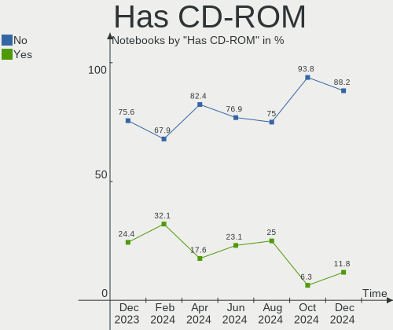
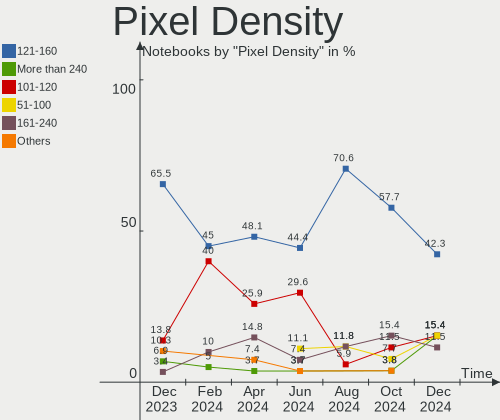

FreeBSD Hardware Trends (Notebook)
----------------------------------

A project to identify most popular hardware characteristics and track their change
over time based on data collected by FreeBSD users at https://BSD-Hardware.info.

Anyone can contribute to the study by uploading probes of their computers by
the [hw-probe](https://github.com/linuxhw/hw-probe/blob/master/INSTALL.BSD.md) tool:

    hw-probe -all -upload

Full-feature report is available here: https://bsd-hardware.info/?view=trends&formfactor=notebook

Period: Jun, 2021.

Contents
--------

- [ OS                       ](#os)
- [ OS Family                ](#os-family)
- [ Arch                     ](#arch)
- [ DE                       ](#de)
- [ Display Server           ](#display-server)
- [ Display Manager          ](#display-manager)
- [ OS Lang                  ](#os-lang)
- [ Boot Mode                ](#boot-mode)
- [ Filesystem               ](#filesystem)
- [ Part. scheme             ](#part-scheme)
- [ Country                  ](#country)
- [ City                     ](#city)
- [ Vendor                   ](#vendor)
- [ Model                    ](#model)
- [ Model Family             ](#model-family)
- [ MFG Year                 ](#mfg-year)
- [ Form Factor              ](#form-factor)
- [ Coreboot                 ](#coreboot)
- [ RAM Size                 ](#ram-size)
- [ RAM Used                 ](#ram-used)
- [ Has CD-ROM               ](#has-cd-rom)
- [ Total Drives             ](#total-drives)
- [ Has Ethernet             ](#has-ethernet)
- [ Has WiFi                 ](#has-wifi)
- [ Has Bluetooth            ](#has-bluetooth)
- [ Drive Vendor             ](#drive-vendor)
- [ Drive Model              ](#drive-model)
- [ HDD Vendor               ](#hdd-vendor)
- [ SSD Vendor               ](#ssd-vendor)
- [ Drive Kind               ](#drive-kind)
- [ Drive Connector          ](#drive-connector)
- [ Drive Size               ](#drive-size)
- [ Space Total              ](#space-total)
- [ Space Used               ](#space-used)
- [ Malfunc. Drives          ](#malfunc-drives)
- [ Malfunc. Drive Vendor    ](#malfunc-drive-vendor)
- [ Malfunc. HDD Vendor      ](#malfunc-hdd-vendor)
- [ Malfunc. Drive Kind      ](#malfunc-drive-kind)
- [ Failed Drives            ](#failed-drives)
- [ Failed Drive Vendor      ](#failed-drive-vendor)
- [ Drive Status             ](#drive-status)
- [ Storage Vendor           ](#storage-vendor)
- [ Storage Model            ](#storage-model)
- [ Storage Kind             ](#storage-kind)
- [ CPU Vendor               ](#cpu-vendor)
- [ CPU Model                ](#cpu-model)
- [ CPU Model Family         ](#cpu-model-family)
- [ CPU Cores                ](#cpu-cores)
- [ CPU Sockets              ](#cpu-sockets)
- [ CPU Threads              ](#cpu-threads)
- [ CPU Microarch            ](#cpu-microarch)
- [ GPU Vendor               ](#gpu-vendor)
- [ GPU Model                ](#gpu-model)
- [ GPU Combo                ](#gpu-combo)
- [ GPU Driver               ](#gpu-driver)
- [ GPU Memory               ](#gpu-memory)
- [ Monitor Vendor           ](#monitor-vendor)
- [ Monitor Model            ](#monitor-model)
- [ Monitor Resolution       ](#monitor-resolution)
- [ Monitor Diagonal         ](#monitor-diagonal)
- [ Monitor Width            ](#monitor-width)
- [ Aspect Ratio             ](#aspect-ratio)
- [ Monitor Area             ](#monitor-area)
- [ Pixel Density            ](#pixel-density)
- [ Multiple Monitors        ](#multiple-monitors)
- [ Net Controller Vendor    ](#net-controller-vendor)
- [ Net Controller Model     ](#net-controller-model)
- [ Wireless Vendor          ](#wireless-vendor)
- [ Wireless Model           ](#wireless-model)
- [ Ethernet Vendor          ](#ethernet-vendor)
- [ Ethernet Model           ](#ethernet-model)
- [ Net Controller Kind      ](#net-controller-kind)
- [ Used Controller          ](#used-controller)
- [ NICs                     ](#nics)
- [ IPv6                     ](#ipv6)
- [ Memory Vendor            ](#memory-vendor)
- [ Memory Model             ](#memory-model)
- [ Memory Kind              ](#memory-kind)
- [ Memory Form Factor       ](#memory-form-factor)
- [ Memory Size              ](#memory-size)
- [ Memory Speed             ](#memory-speed)
- [ Sound Vendor             ](#sound-vendor)
- [ Sound Model              ](#sound-model)
- [ Camera Vendor            ](#camera-vendor)
- [ Camera Model             ](#camera-model)
- [ Fingerprint Vendor       ](#fingerprint-vendor)
- [ Fingerprint Model        ](#fingerprint-model)
- [ Chipcard Vendor          ](#chipcard-vendor)
- [ Chipcard Model           ](#chipcard-model)
- [ Printer Vendor           ](#printer-vendor)
- [ Printer Model            ](#printer-model)
- [ Scanner Vendor           ](#scanner-vendor)
- [ Scanner Model            ](#scanner-model)
- [ Bluetooth Vendor         ](#bluetooth-vendor)
- [ Bluetooth Model          ](#bluetooth-model)
- [ Unsupported Devices      ](#unsupported-devices)
- [ Unsupported Device Types ](#unsupported-device-types)

OS
--

Installed operating systems

| Name                 | Notebooks | Percent |
|----------------------|-----------|---------|
| FreeBSD 13.0-p2      | 17        | 43.59%  |
| FreeBSD 13.0         | 8         | 20.51%  |
| FreeBSD 14.0-CURRENT | 5         | 12.82%  |
| FreeBSD 13.0-STABLE  | 4         | 10.26%  |
| FreeBSD 13.0-p1      | 2         | 5.13%   |
| FreeBSD 12.2-p8      | 2         | 5.13%   |
| FreeBSD 12.2-STABLE  | 1         | 2.56%   |

OS Family
---------

OS without a version

| Name    | Notebooks | Percent |
|---------|-----------|---------|
| FreeBSD | 39        | 100%    |

Arch
----

OS architecture (x86_64, i586, etc.)

| Name  | Notebooks | Percent |
|-------|-----------|---------|
| amd64 | 37        | 94.87%  |
| i386  | 2         | 5.13%   |

DE
--

Desktop Environment

| Name     | Notebooks | Percent |
|----------|-----------|---------|
| XFCE     | 10        | 25.64%  |
| KDE5     | 7         | 17.95%  |
| GNOME    | 4         | 10.26%  |
| Console  | 4         | 10.26%  |
| TWM      | 3         | 7.69%   |
| LXQt     | 3         | 7.69%   |
| i3       | 2         | 5.13%   |
| MATE     | 1         | 2.56%   |
| Lumina   | 1         | 2.56%   |
| Fluxbox  | 1         | 2.56%   |
| DWM      | 1         | 2.56%   |
| Cinnamon | 1         | 2.56%   |
| CDE      | 1         | 2.56%   |

Display Server
--------------

X11 or Wayland

| Name    | Notebooks | Percent |
|---------|-----------|---------|
| X11     | 34        | 87.18%  |
| Console | 5         | 12.82%  |

Display Manager
---------------

SDDM, LightDM, etc.

| Name    | Notebooks | Percent |
|---------|-----------|---------|
| Console | 19        | 48.72%  |
| SDDM    | 8         | 20.51%  |
| SLiM    | 5         | 12.82%  |
| GDM     | 3         | 7.69%   |
| XDM     | 2         | 5.13%   |
| LightDM | 2         | 5.13%   |

OS Lang
-------

Language

| Lang    | Notebooks | Percent |
|---------|-----------|---------|
| C       | 24        | 61.54%  |
| Unknown | 5         | 12.82%  |
| en_US   | 3         | 7.69%   |
| fr_FR   | 2         | 5.13%   |
| zh_TW   | 1         | 2.56%   |
| zh_CN   | 1         | 2.56%   |
| pl_PL   | 1         | 2.56%   |
| en_CA   | 1         | 2.56%   |
| de_CH   | 1         | 2.56%   |

Boot Mode
---------

EFI or BIOS

| Mode | Notebooks | Percent |
|------|-----------|---------|
| EFI  | 27        | 69.23%  |
| BIOS | 12        | 30.77%  |

Filesystem
----------

Type of filesystem

| Type | Notebooks | Percent |
|------|-----------|---------|
| Zfs  | 27        | 69.23%  |
| Ufs  | 12        | 30.77%  |

Part. scheme
------------

Scheme of partitioning

| Type | Notebooks | Percent |
|------|-----------|---------|
| GPT  | 34        | 87.18%  |
| MBR  | 4         | 10.26%  |
| BSD  | 1         | 2.56%   |

Country
-------

Geographic location (country)

| Country     | Notebooks | Percent |
|-------------|-----------|---------|
| USA         | 12        | 30.77%  |
| Brazil      | 3         | 7.69%   |
| UK          | 2         | 5.13%   |
| Switzerland | 2         | 5.13%   |
| Russia      | 2         | 5.13%   |
| Poland      | 2         | 5.13%   |
| Netherlands | 2         | 5.13%   |
| India       | 2         | 5.13%   |
| France      | 2         | 5.13%   |
| Canada      | 2         | 5.13%   |
| Thailand    | 1         | 2.56%   |
| Taiwan      | 1         | 2.56%   |
| Japan       | 1         | 2.56%   |
| Israel      | 1         | 2.56%   |
| Guadeloupe  | 1         | 2.56%   |
| China       | 1         | 2.56%   |
| Chile       | 1         | 2.56%   |
| Albania     | 1         | 2.56%   |

City
----

Geographic location (city)

| City                   | Notebooks | Percent |
|------------------------|-----------|---------|
| Brooklyn               | 4         | 10.26%  |
| Vienna                 | 1         | 2.56%   |
| Thrissur               | 1         | 2.56%   |
| São Paulo             | 1         | 2.56%   |
| St. Marys              | 1         | 2.56%   |
| Shenzhen               | 1         | 2.56%   |
| Sarandë               | 1         | 2.56%   |
| Rugby                  | 1         | 2.56%   |
| Poulsbo                | 1         | 2.56%   |
| Portland               | 1         | 2.56%   |
| Piloezinhos            | 1         | 2.56%   |
| Nunoa                  | 1         | 2.56%   |
| Noisy-le-Grand         | 1         | 2.56%   |
| Niagara Falls          | 1         | 2.56%   |
| New York               | 1         | 2.56%   |
| Nazareth               | 1         | 2.56%   |
| Mumbai                 | 1         | 2.56%   |
| Moscow                 | 1         | 2.56%   |
| Minot                  | 1         | 2.56%   |
| Lyon                   | 1         | 2.56%   |
| Lent                   | 1         | 2.56%   |
| Le Gosier              | 1         | 2.56%   |
| Laval                  | 1         | 2.56%   |
| Krasnik                | 1         | 2.56%   |
| Khabarovsk             | 1         | 2.56%   |
| Inzai                  | 1         | 2.56%   |
| Hsinchu                | 1         | 2.56%   |
| Hannibal               | 1         | 2.56%   |
| Frederick              | 1         | 2.56%   |
| Częstochowa           | 1         | 2.56%   |
| Corcelles-pres-Payerne | 1         | 2.56%   |
| Chiang Mai             | 1         | 2.56%   |
| Brighton               | 1         | 2.56%   |
| Brasília              | 1         | 2.56%   |
| Basel                  | 1         | 2.56%   |
| Amsterdam              | 1         | 2.56%   |

Vendor
------

Motherboard manufacturer

| Name                | Notebooks | Percent |
|---------------------|-----------|---------|
| Lenovo              | 16        | 41.03%  |
| Dell                | 8         | 20.51%  |
| Acer                | 4         | 10.26%  |
| Hewlett-Packard     | 2         | 5.13%   |
| ASUSTek Computer    | 2         | 5.13%   |
| Toshiba             | 1         | 2.56%   |
| SLIMBOOK            | 1         | 2.56%   |
| Samsung Electronics | 1         | 2.56%   |
| Notebook            | 1         | 2.56%   |
| LG Electronics      | 1         | 2.56%   |
| IBM                 | 1         | 2.56%   |
| Apple               | 1         | 2.56%   |

Model
-----

Motherboard model

| Name                                       | Notebooks | Percent |
|--------------------------------------------|-----------|---------|
| Lenovo ThinkPad T60 20076PU                | 2         | 5.13%   |
| Toshiba Satellite C655D                    | 1         | 2.56%   |
| Samsung NC10                               | 1         | 2.56%   |
| Notebook N7x0WU                            | 1         | 2.56%   |
| LG E500-GP01A9                             | 1         | 2.56%   |
| Lenovo Yoga 500-14IBD 80N4                 | 1         | 2.56%   |
| Lenovo ThinkPad X270 20HMS0MA18            | 1         | 2.56%   |
| Lenovo ThinkPad X220 4291ON5               | 1         | 2.56%   |
| Lenovo ThinkPad X1 Carbon Gen 8 20U9001PUS | 1         | 2.56%   |
| Lenovo ThinkPad W520 42763KU               | 1         | 2.56%   |
| Lenovo ThinkPad T450s 20BWS0L600           | 1         | 2.56%   |
| Lenovo ThinkPad T430 2349GCU               | 1         | 2.56%   |
| Lenovo ThinkPad T420 4237A12               | 1         | 2.56%   |
| Lenovo ThinkPad T420 4236NHG               | 1         | 2.56%   |
| Lenovo ThinkPad T410 2518A37               | 1         | 2.56%   |
| Lenovo ThinkPad E490 20N8CTO1WW            | 1         | 2.56%   |
| Lenovo ThinkPad E14 20RBCTO1WW             | 1         | 2.56%   |
| Lenovo IdeaPad Y700-15ISK 80NV             | 1         | 2.56%   |
| Lenovo IdeaPad 330-15ARR 81D2              | 1         | 2.56%   |
| IBM ThinkPad T42 2374K46                   | 1         | 2.56%   |
| HP ENVY x2 Detachable PC 13                | 1         | 2.56%   |
| HP EliteBook 8570p                         | 1         | 2.56%   |
| Dell Vostro 5490                           | 1         | 2.56%   |
| Dell Vostro 5481                           | 1         | 2.56%   |
| Dell Studio 1558                           | 1         | 2.56%   |
| Dell Latitude E6440                        | 1         | 2.56%   |
| Dell Latitude E4300                        | 1         | 2.56%   |
| Dell Inspiron 5567                         | 1         | 2.56%   |
| Dell Inspiron 15-7579                      | 1         | 2.56%   |
| Dell G5 5505                               | 1         | 2.56%   |
| ASUS X556UAK                               | 1         | 2.56%   |
| ASUS G74Sx                                 | 1         | 2.56%   |
| Apple MacBookPro9,1                        | 1         | 2.56%   |
| Acer Aspire V3-571G                        | 1         | 2.56%   |
| Acer Aspire ES1-132                        | 1         | 2.56%   |
| Acer Aspire E5-573G                        | 1         | 2.56%   |
| Acer Aspire A515-51G                       | 1         | 2.56%   |
| Unknown                                    | 1         | 2.56%   |

Model Family
------------

Motherboard model prefix

| Name              | Notebooks | Percent |
|-------------------|-----------|---------|
| Lenovo ThinkPad   | 13        | 33.33%  |
| Acer Aspire       | 4         | 10.26%  |
| Lenovo IdeaPad    | 2         | 5.13%   |
| Dell Vostro       | 2         | 5.13%   |
| Dell Latitude     | 2         | 5.13%   |
| Dell Inspiron     | 2         | 5.13%   |
| Toshiba Satellite | 1         | 2.56%   |
| Samsung NC10      | 1         | 2.56%   |
| Notebook N7x0WU   | 1         | 2.56%   |
| LG E500-GP01A9    | 1         | 2.56%   |
| Lenovo Yoga       | 1         | 2.56%   |
| IBM ThinkPad      | 1         | 2.56%   |
| HP ENVY           | 1         | 2.56%   |
| HP EliteBook      | 1         | 2.56%   |
| Dell Studio       | 1         | 2.56%   |
| Dell G5           | 1         | 2.56%   |
| ASUS X556UAK      | 1         | 2.56%   |
| ASUS G74Sx        | 1         | 2.56%   |
| Apple MacBookPro9 | 1         | 2.56%   |
| Unknown           | 1         | 2.56%   |

MFG Year
--------

Motherboard manufacture year

| Year | Notebooks | Percent |
|------|-----------|---------|
| 2019 | 9         | 23.08%  |
| 2020 | 8         | 20.51%  |
| 2018 | 4         | 10.26%  |
| 2012 | 4         | 10.26%  |
| 2011 | 4         | 10.26%  |
| 2016 | 2         | 5.13%   |
| 2009 | 2         | 5.13%   |
| 2006 | 2         | 5.13%   |
| 2017 | 1         | 2.56%   |
| 2015 | 1         | 2.56%   |
| 2014 | 1         | 2.56%   |
| 2008 | 1         | 2.56%   |

Form Factor
-----------

Physical design of the computer

| Name     | Notebooks | Percent |
|----------|-----------|---------|
| Notebook | 39        | 100%    |

Coreboot
--------

Have coreboot on board

| Used | Notebooks | Percent |
|------|-----------|---------|
| No   | 39        | 100%    |

RAM Size
--------

Total RAM memory

| Size in GB  | Notebooks | Percent |
|-------------|-----------|---------|
| 8.01-16.0   | 16        | 41.03%  |
| 16.01-24.0  | 12        | 30.77%  |
| 4.01-8.0    | 5         | 12.82%  |
| 2.01-3.0    | 2         | 5.13%   |
| 32.01-64.0  | 1         | 2.56%   |
| 3.01-4.0    | 1         | 2.56%   |
| 64.01-256.0 | 1         | 2.56%   |
| 0.51-1.0    | 1         | 2.56%   |

RAM Used
--------

Used RAM memory

| Used GB  | Notebooks | Percent |
|----------|-----------|---------|
| 0.01-0.5 | 20        | 51.28%  |
| 0.51-1.0 | 15        | 38.46%  |
| 1.01-2.0 | 3         | 7.69%   |
| 2.01-3.0 | 1         | 2.56%   |

Has CD-ROM
----------

Has CD-ROM on board

| Presented | Notebooks | Percent |
|-----------|-----------|---------|
| No        | 26        | 66.67%  |
| Yes       | 13        | 33.33%  |

Total Drives
------------

Number of drives on board

| Drives | Notebooks | Percent |
|--------|-----------|---------|
| 1      | 28        | 71.79%  |
| 2      | 10        | 25.64%  |
| 3      | 1         | 2.56%   |

Has Ethernet
------------

Has Ethernet on board

| Presented | Notebooks | Percent |
|-----------|-----------|---------|
| Yes       | 37        | 94.87%  |
| No        | 2         | 5.13%   |

Has WiFi
--------

Has WiFi module

| Presented | Notebooks | Percent |
|-----------|-----------|---------|
| Yes       | 38        | 97.44%  |
| No        | 1         | 2.56%   |

Has Bluetooth
-------------

Has Bluetooth module

| Presented | Notebooks | Percent |
|-----------|-----------|---------|
| Yes       | 29        | 74.36%  |
| No        | 10        | 25.64%  |

Drive Vendor
------------

Hard drive vendors

| Vendor              | Notebooks | Drives | Percent |
|---------------------|-----------|--------|---------|
| Samsung Electronics | 10        | 10     | 20%     |
| WDC                 | 5         | 5      | 10%     |
| Toshiba             | 5         | 5      | 10%     |
| Seagate             | 5         | 6      | 10%     |
| Crucial             | 5         | 5      | 10%     |
| Kingston            | 4         | 4      | 8%      |
| SK Hynix            | 3         | 3      | 6%      |
| OWC                 | 3         | 3      | 6%      |
| HGST                | 3         | 3      | 6%      |
| Hitachi             | 2         | 2      | 4%      |
| Zheino              | 1         | 1      | 2%      |
| Transcend           | 1         | 1      | 2%      |
| SanDisk             | 1         | 1      | 2%      |
| LITEON              | 1         | 1      | 2%      |
| Intel               | 1         | 1      | 2%      |

Drive Model
-----------

Hard drive models

| Model                                | Notebooks | Percent |
|--------------------------------------|-----------|---------|
| Toshiba MQ01ABF050 500GB             | 2         | 4%      |
| Kingston SA400S37240G 240GB          | 2         | 4%      |
| Zheino CHN-mSATAQ3-120 120GB         | 1         | 2%      |
| WDC WDS240G2G0A-00JH30 240GB         | 1         | 2%      |
| WDC WDS120G2G0B-00EPW0 120GB         | 1         | 2%      |
| WDC WD10SPZX-08Z10 1TB               | 1         | 2%      |
| WDC PC SN730 SDBQNTY-512G-1001 512GB | 1         | 2%      |
| WDC PC SN730 NVMe 1024GB             | 1         | 2%      |
| Transcend TS256GMTS430S 256GB        | 1         | 2%      |
| Toshiba MQ01ABD100 1TB               | 1         | 2%      |
| Toshiba MK5061GSY 500GB              | 1         | 2%      |
| Toshiba MK3265GSXN 320GB             | 1         | 2%      |
| SK Hynix SC308 SATA 256GB            | 1         | 2%      |
| SK Hynix HFS128G39TND-N210A 128GB    | 1         | 2%      |
| SK Hynix BC511 NVMe 256GB            | 1         | 2%      |
| Seagate ST9500325AS 500GB            | 1         | 2%      |
| Seagate ST500LX003-1AC15G 500GB      | 1         | 2%      |
| Seagate ST500LM000-SSHD-8GB          | 1         | 2%      |
| Seagate ST320LT007-9ZV142 320GB      | 1         | 2%      |
| Seagate ST2000LX001-1RG174 2TB       | 1         | 2%      |
| SanDisk SD8SBAT256G1002 256GB        | 1         | 2%      |
| Samsung SSD 860 EVO 500GB            | 1         | 2%      |
| Samsung SSD 850 PRO 512GB            | 1         | 2%      |
| Samsung SSD 850 EVO 500GB            | 1         | 2%      |
| Samsung SSD 850 EVO 250GB            | 1         | 2%      |
| Samsung MZVLW512HMJP-000L7 512GB     | 1         | 2%      |
| Samsung MZVLB256HBHQ-000L7 256GB     | 1         | 2%      |
| Samsung MZNTE256HMHP-000H1 256GB     | 1         | 2%      |
| Samsung MZNLN256HAJQ-000L7 256GB     | 1         | 2%      |
| Samsung MZ7LN128HCHP-000L1 128GB     | 1         | 2%      |
| Samsung HM160HI 160GB                | 1         | 2%      |
| OWC Mercury Extreme Pro SSD 240GB    | 1         | 2%      |
| OWC Mercury EXTREME Pro 6G SSD       | 1         | 2%      |
| OWC Mercury Electra 6G SSD           | 1         | 2%      |
| LITEON CV1-8B512 512GB               | 1         | 2%      |
| Kingston SMS200S3120G 120GB          | 1         | 2%      |
| Kingston SA2000M8250G 250GB          | 1         | 2%      |
| Intel SSDSC2KW120H6 120GB            | 1         | 2%      |
| Hitachi HTS727550A9E364 500GB        | 1         | 2%      |
| Hitachi HTS541612J9SA00 120GB        | 1         | 2%      |
| HGST HTS725050A7E630 500GB           | 1         | 2%      |
| HGST HTS541010B7E610 1TB             | 1         | 2%      |
| HGST HTS541010A9E680 1TB             | 1         | 2%      |
| Crucial CT960BX500SSD1 960GB         | 1         | 2%      |
| Crucial CT500MX500SSD1 500GB         | 1         | 2%      |
| Crucial CT250MX200SSD3 250GB         | 1         | 2%      |
| Crucial CT2000P5SSD8 2TB             | 1         | 2%      |
| Crucial CT2000MX500SSD1 2TB          | 1         | 2%      |

HDD Vendor
----------

Hard disk drive vendors

| Vendor              | Notebooks | Drives | Percent |
|---------------------|-----------|--------|---------|
| Toshiba             | 5         | 5      | 29.41%  |
| Seagate             | 5         | 6      | 29.41%  |
| HGST                | 3         | 3      | 17.65%  |
| Hitachi             | 2         | 2      | 11.76%  |
| WDC                 | 1         | 1      | 5.88%   |
| Samsung Electronics | 1         | 1      | 5.88%   |

SSD Vendor
----------

Solid state drive vendors

| Vendor              | Notebooks | Drives | Percent |
|---------------------|-----------|--------|---------|
| Samsung Electronics | 7         | 7      | 26.92%  |
| Crucial             | 4         | 4      | 15.38%  |
| OWC                 | 3         | 3      | 11.54%  |
| Kingston            | 3         | 3      | 11.54%  |
| WDC                 | 2         | 2      | 7.69%   |
| SK Hynix            | 2         | 2      | 7.69%   |
| Zheino              | 1         | 1      | 3.85%   |
| Transcend           | 1         | 1      | 3.85%   |
| SanDisk             | 1         | 1      | 3.85%   |
| LITEON              | 1         | 1      | 3.85%   |
| Intel               | 1         | 1      | 3.85%   |

Drive Kind
----------

HDD or SSD

| Kind | Notebooks | Drives | Percent |
|------|-----------|--------|---------|
| SSD  | 23        | 26     | 52.27%  |
| HDD  | 15        | 18     | 34.09%  |
| NVMe | 6         | 7      | 13.64%  |

Drive Connector
---------------

SATA, SAS, NVMe, etc.

| Type | Notebooks | Drives | Percent |
|------|-----------|--------|---------|
| SATA | 34        | 44     | 85%     |
| NVMe | 6         | 7      | 15%     |

Drive Size
----------

Size of hard drive

| Size in TB | Notebooks | Drives | Percent |
|------------|-----------|--------|---------|
| 0.01-0.5   | 27        | 33     | 72.97%  |
| 0.51-1.0   | 8         | 8      | 21.62%  |
| 1.01-2.0   | 2         | 3      | 5.41%   |

Space Total
-----------

Amount of disk space available on the file system

| Size in GB | Notebooks | Percent |
|------------|-----------|---------|
| 101-250    | 16        | 41.03%  |
| 251-500    | 13        | 33.33%  |
| 501-1000   | 5         | 12.82%  |
| 1001-2000  | 2         | 5.13%   |
| 51-100     | 2         | 5.13%   |
| 21-50      | 1         | 2.56%   |

Space Used
----------

Amount of used disk space

| Used GB  | Notebooks | Percent |
|----------|-----------|---------|
| 1-20     | 25        | 64.1%   |
| 21-50    | 8         | 20.51%  |
| 51-100   | 4         | 10.26%  |
| 101-250  | 1         | 2.56%   |
| 501-1000 | 1         | 2.56%   |

Malfunc. Drives
---------------

Drive models with a malfunction

| Model                             | Notebooks | Drives | Percent |
|-----------------------------------|-----------|--------|---------|
| Toshiba MK3265GSXN 320GB          | 1         | 1      | 14.29%  |
| SK Hynix HFS128G39TND-N210A 128GB | 1         | 1      | 14.29%  |
| Seagate ST320LT007-9ZV142 320GB   | 1         | 1      | 14.29%  |
| Seagate ST2000LX001-1RG174 2TB    | 1         | 2      | 14.29%  |
| Samsung Electronics HM160HI 160GB | 1         | 1      | 14.29%  |
| Hitachi HTS541612J9SA00 120GB     | 1         | 1      | 14.29%  |
| HGST HTS725050A7E630 500GB        | 1         | 1      | 14.29%  |

Malfunc. Drive Vendor
---------------------

Vendors of faulty drives

| Vendor              | Notebooks | Drives | Percent |
|---------------------|-----------|--------|---------|
| Seagate             | 2         | 3      | 28.57%  |
| Toshiba             | 1         | 1      | 14.29%  |
| SK Hynix            | 1         | 1      | 14.29%  |
| Samsung Electronics | 1         | 1      | 14.29%  |
| Hitachi             | 1         | 1      | 14.29%  |
| HGST                | 1         | 1      | 14.29%  |

Malfunc. HDD Vendor
-------------------

Vendors of faulty HDD drives

| Vendor              | Notebooks | Drives | Percent |
|---------------------|-----------|--------|---------|
| Seagate             | 2         | 3      | 33.33%  |
| Toshiba             | 1         | 1      | 16.67%  |
| Samsung Electronics | 1         | 1      | 16.67%  |
| Hitachi             | 1         | 1      | 16.67%  |
| HGST                | 1         | 1      | 16.67%  |

Malfunc. Drive Kind
-------------------

Kinds of faulty drives

| Kind | Notebooks | Drives | Percent |
|------|-----------|--------|---------|
| HDD  | 6         | 7      | 85.71%  |
| SSD  | 1         | 1      | 14.29%  |

Failed Drives
-------------

Failed drive models

Zero info for selected period =(

Failed Drive Vendor
-------------------

Failed drive vendors

Zero info for selected period =(

Drive Status
------------

Number of failed and malfunc. drives

| Status  | Notebooks | Drives | Percent |
|---------|-----------|--------|---------|
| Works   | 35        | 43     | 83.33%  |
| Malfunc | 7         | 8      | 16.67%  |

Storage Vendor
--------------

Storage controller vendors

| Vendor                      | Notebooks | Percent |
|-----------------------------|-----------|---------|
| Intel                       | 35        | 77.78%  |
| AMD                         | 3         | 6.67%   |
| Sandisk                     | 2         | 4.44%   |
| Samsung Electronics         | 2         | 4.44%   |
| SK Hynix                    | 1         | 2.22%   |
| Micron Technology           | 1         | 2.22%   |
| Kingston Technology Company | 1         | 2.22%   |

Storage Model
-------------

Storage controller models

| Model                                                                          | Notebooks | Percent |
|--------------------------------------------------------------------------------|-----------|---------|
| Intel 7 Series Chipset Family 6-port SATA Controller [AHCI mode]               | 5         | 10.42%  |
| Intel 6 Series/C200 Series Chipset Family 6 port Mobile SATA AHCI Controller   | 5         | 10.42%  |
| Intel Wildcat Point-LP SATA Controller [AHCI Mode]                             | 4         | 8.33%   |
| Intel Sunrise Point-LP SATA Controller [AHCI mode]                             | 4         | 8.33%   |
| Intel Comet Lake SATA AHCI Controller                                          | 3         | 6.25%   |
| Sandisk WD Black SN750 / PC SN730 NVMe SSD                                     | 2         | 4.17%   |
| Intel 82801GBM/GHM (ICH7-M Family) SATA Controller [AHCI mode]                 | 2         | 4.17%   |
| Intel 82801G (ICH7 Family) IDE Controller                                      | 2         | 4.17%   |
| Intel 82801 Mobile SATA Controller [RAID mode]                                 | 2         | 4.17%   |
| AMD FCH SATA Controller [AHCI mode]                                            | 2         | 4.17%   |
| SK Hynix BC511                                                                 | 1         | 2.08%   |
| Samsung NVMe SSD Controller SM981/PM981/PM983                                  | 1         | 2.08%   |
| Samsung NVMe SSD Controller SM961/PM961/SM963                                  | 1         | 2.08%   |
| Kingston Company A2000 NVMe SSD                                                | 1         | 2.08%   |
| Intel HM170/QM170 Chipset SATA Controller [AHCI Mode]                          | 1         | 2.08%   |
| Intel Celeron N3350/Pentium N4200/Atom E3900 Series SATA AHCI Controller       | 1         | 2.08%   |
| Intel Cannon Point-LP SATA Controller [AHCI Mode]                              | 1         | 2.08%   |
| Intel 82801IBM/IEM (ICH9M/ICH9M-E) 2 port SATA Controller [IDE mode]           | 1         | 2.08%   |
| Intel 82801HM/HEM (ICH8M/ICH8M-E) SATA Controller [AHCI mode]                  | 1         | 2.08%   |
| Intel 82801HM/HEM (ICH8M/ICH8M-E) IDE Controller                               | 1         | 2.08%   |
| Intel 82801GBM/GHM (ICH7-M Family) SATA Controller [IDE mode]                  | 1         | 2.08%   |
| Intel 82801DBM (ICH4-M) IDE Controller                                         | 1         | 2.08%   |
| Intel 8 Series/C220 Series Chipset Family 6-port SATA Controller 1 [AHCI mode] | 1         | 2.08%   |
| Intel 5 Series/3400 Series Chipset 6 port SATA AHCI Controller                 | 1         | 2.08%   |
| Intel 5 Series/3400 Series Chipset 4 port SATA AHCI Controller                 | 1         | 2.08%   |
| AMD SB7x0/SB8x0/SB9x0 SATA Controller [AHCI mode]                              | 1         | 2.08%   |
| Unknown                                                                        | 1         | 2.08%   |

Storage Kind
------------

Kind of storage controller (IDE, SATA, NVMe, SAS, ...)

| Kind | Notebooks | Percent |
|------|-----------|---------|
| SATA | 33        | 70.21%  |
| NVMe | 6         | 12.77%  |
| IDE  | 6         | 12.77%  |
| RAID | 2         | 4.26%   |

CPU Vendor
----------

Processor vendors

| Vendor | Notebooks | Percent |
|--------|-----------|---------|
| Intel  | 36        | 92.31%  |
| AMD    | 3         | 7.69%   |

CPU Model
---------

Processor models

| Model                                         | Notebooks | Percent |
|-----------------------------------------------|-----------|---------|
| Intel Core i5-10210U CPU @ 1.60GHz            | 4         | 10.26%  |
| Intel CPU Version                             | 2         | 5.13%   |
| Intel Core i5-8265U CPU @ 1.60GHz             | 2         | 5.13%   |
| Intel Core i5-7200U CPU @ 2.50GHz             | 2         | 5.13%   |
| Intel Core i5-2520M CPU @ 2.50GHz             | 2         | 5.13%   |
| Intel Core 2 CPU                              | 2         | 5.13%   |
| Intel Processor 5Y70 CPU @ 1.10GHz            | 1         | 2.56%   |
| Intel Pentium M processor                     | 1         | 2.56%   |
| Intel Pentium CPU N4200 @ 1.10GHz             | 1         | 2.56%   |
| Intel Core i7-7500U CPU @ 2.70GHz             | 1         | 2.56%   |
| Intel Core i7-6700HQ CPU @ 2.60GHz            | 1         | 2.56%   |
| Intel Core i7-3720QM CPU @ 2.60GHz            | 1         | 2.56%   |
| Intel Core i7-3520M CPU @ 2.90GHz             | 1         | 2.56%   |
| Intel Core i7-2860QM CPU @ 2.50GHz            | 1         | 2.56%   |
| Intel Core i7-2760QM CPU @ 2.40GHz            | 1         | 2.56%   |
| Intel Core i5-8250U CPU @ 1.60GHz             | 1         | 2.56%   |
| Intel Core i5-7300U CPU @ 2.60GHz             | 1         | 2.56%   |
| Intel Core i5-5300U CPU @ 2.30GHz             | 1         | 2.56%   |
| Intel Core i5-5200U CPU @ 2.20GHz             | 1         | 2.56%   |
| Intel Core i5-4300M CPU @ 2.60GHz             | 1         | 2.56%   |
| Intel Core i5-3320M CPU @ 2.60GHz             | 1         | 2.56%   |
| Intel Core i5-3210M CPU @ 2.50GHz             | 1         | 2.56%   |
| Intel Core i5-2540M CPU @ 2.60GHz             | 1         | 2.56%   |
| Intel Core i5 CPU M 520 @ 2.40GHz             | 1         | 2.56%   |
| Intel Core i3-8130U CPU @ 2.20GHz             | 1         | 2.56%   |
| Intel Core i3-5005U CPU @ 2.00GHz             | 1         | 2.56%   |
| Intel Core 2 Duo CPU T7100 @ 1.80GHz          | 1         | 2.56%   |
| Intel Core 2 Duo                              | 1         | 2.56%   |
| AMD Ryzen 7 4800H with Radeon Graphics        | 1         | 2.56%   |
| AMD Ryzen 3 2200U with Radeon Vega Mobile Gfx | 1         | 2.56%   |
| AMD C-50 Processor                            | 1         | 2.56%   |

CPU Model Family
----------------

Processor model prefix

| Model            | Notebooks | Percent |
|------------------|-----------|---------|
| Intel Core i5    | 19        | 48.72%  |
| Intel Core i7    | 6         | 15.38%  |
| Other            | 3         | 7.69%   |
| Intel Core i3    | 2         | 5.13%   |
| Intel Core 2 Duo | 2         | 5.13%   |
| Intel Core 2     | 2         | 5.13%   |
| Intel Pentium M  | 1         | 2.56%   |
| Intel Pentium    | 1         | 2.56%   |
| AMD Ryzen 7      | 1         | 2.56%   |
| AMD Ryzen 3      | 1         | 2.56%   |
| AMD C-50         | 1         | 2.56%   |

CPU Cores
---------

Number of processor cores

| Number  | Notebooks | Percent |
|---------|-----------|---------|
| 2       | 20        | 51.28%  |
| 4       | 13        | 33.33%  |
| Unknown | 3         | 7.69%   |
| 1       | 2         | 5.13%   |
| 16      | 1         | 2.56%   |

CPU Sockets
-----------

Number of sockets

| Number | Notebooks | Percent |
|--------|-----------|---------|
| 1      | 39        | 100%    |

CPU Threads
-----------

Threads per core (Hyper-Threading)

| Number  | Notebooks | Percent |
|---------|-----------|---------|
| 2       | 30        | 76.92%  |
| 1       | 5         | 12.82%  |
| Unknown | 4         | 10.26%  |

CPU Microarch
-------------

Microarchitecture

| Name        | Notebooks | Percent |
|-------------|-----------|---------|
| KabyLake    | 12        | 30.77%  |
| SandyBridge | 5         | 12.82%  |
| IvyBridge   | 4         | 10.26%  |
| Broadwell   | 4         | 10.26%  |
| Core        | 3         | 7.69%   |
| Westmere    | 2         | 5.13%   |
| Zen 2       | 1         | 2.56%   |
| Zen         | 1         | 2.56%   |
| Skylake     | 1         | 2.56%   |
| Penryn      | 1         | 2.56%   |
| P6          | 1         | 2.56%   |
| Haswell     | 1         | 2.56%   |
| Goldmont    | 1         | 2.56%   |
| Bonnell     | 1         | 2.56%   |
| Bobcat      | 1         | 2.56%   |

GPU Vendor
----------

Vendors of graphics cards

| Vendor | Notebooks | Percent |
|--------|-----------|---------|
| Intel  | 30        | 68.18%  |
| Nvidia | 7         | 15.91%  |
| AMD    | 7         | 15.91%  |

GPU Model
---------

Graphics card models

| Model                                                                              | Notebooks | Percent |
|------------------------------------------------------------------------------------|-----------|---------|
| Intel HD Graphics 620                                                              | 4         | 8.51%   |
| Intel CometLake-U GT2 [UHD Graphics]                                               | 4         | 8.51%   |
| Intel 3rd Gen Core processor Graphics Controller                                   | 4         | 8.51%   |
| Intel HD Graphics 5500                                                             | 3         | 6.38%   |
| Intel 2nd Generation Core Processor Family Integrated Graphics Controller          | 3         | 6.38%   |
| Intel WhiskeyLake-U GT2 [UHD Graphics 620]                                         | 2         | 4.26%   |
| Intel UHD Graphics 620                                                             | 2         | 4.26%   |
| AMD RV515/M54 [Mobility Radeon X1400]                                              | 2         | 4.26%   |
| Nvidia GT218M [NVS 3100M]                                                          | 1         | 2.13%   |
| Nvidia GP108M [GeForce MX230]                                                      | 1         | 2.13%   |
| Nvidia GM108M [GeForce MX130]                                                      | 1         | 2.13%   |
| Nvidia GM108M [GeForce 940M]                                                       | 1         | 2.13%   |
| Nvidia GK107M [GeForce GT 650M Mac Edition]                                        | 1         | 2.13%   |
| Nvidia GF116M [GeForce GT 560M]                                                    | 1         | 2.13%   |
| Nvidia GF108GLM [Quadro 1000M]                                                     | 1         | 2.13%   |
| Intel Mobile GM965/GL960 Integrated Graphics Controller (secondary)                | 1         | 2.13%   |
| Intel Mobile GM965/GL960 Integrated Graphics Controller (primary)                  | 1         | 2.13%   |
| Intel Mobile 945GSE Express Integrated Graphics Controller                         | 1         | 2.13%   |
| Intel Mobile 945GM/GMS/GME, 943/940GML Express Integrated Graphics Controller      | 1         | 2.13%   |
| Intel Mobile 4 Series Chipset Integrated Graphics Controller                       | 1         | 2.13%   |
| Intel HD Graphics 5300                                                             | 1         | 2.13%   |
| Intel HD Graphics 530                                                              | 1         | 2.13%   |
| Intel Core Processor Integrated Graphics Controller                                | 1         | 2.13%   |
| Intel Celeron N3350/Pentium N4200/Atom E3900 Series Integrated Graphics Controller | 1         | 2.13%   |
| Intel 4th Gen Core Processor Integrated Graphics Controller                        | 1         | 2.13%   |
| AMD Wrestler [Radeon HD 6250]                                                      | 1         | 2.13%   |
| AMD Thames [Radeon HD 7550M/7570M/7650M]                                           | 1         | 2.13%   |
| AMD RV200/M7 [Mobility Radeon 7500]                                                | 1         | 2.13%   |
| AMD Renoir                                                                         | 1         | 2.13%   |
| AMD Raven Ridge [Radeon Vega Series / Radeon Vega Mobile Series]                   | 1         | 2.13%   |
| AMD Navi 10 [Radeon RX 5600 OEM/5600 XT / 5700/5700 XT]                            | 1         | 2.13%   |

GPU Combo
---------

Combinations of graphics cards

| Name           | Notebooks | Percent |
|----------------|-----------|---------|
| 1 x Intel      | 22        | 56.41%  |
| 1 x AMD        | 6         | 15.38%  |
| Intel + Nvidia | 4         | 10.26%  |
| 2 x Intel      | 3         | 7.69%   |
| 1 x Nvidia     | 3         | 7.69%   |
| 2 x AMD        | 1         | 2.56%   |

GPU Driver
----------

Free vs proprietary

| Driver      | Notebooks | Percent |
|-------------|-----------|---------|
| Free        | 36        | 92.31%  |
| Proprietary | 3         | 7.69%   |

GPU Memory
----------

Total video memory

| Size in GB | Notebooks | Percent |
|------------|-----------|---------|
| Unknown    | 31        | 79.49%  |
| 0.01-0.5   | 5         | 12.82%  |
| 2.01-3.0   | 1         | 2.56%   |
| 1.01-2.0   | 1         | 2.56%   |
| 0.51-1.0   | 1         | 2.56%   |

Monitor Vendor
--------------

Monitor vendors

| Vendor           | Notebooks | Percent |
|------------------|-----------|---------|
| AU Optronics     | 8         | 25.81%  |
| LG Display       | 5         | 16.13%  |
| Chimei Innolux   | 4         | 12.9%   |
| BOE              | 4         | 12.9%   |
| Lenovo           | 2         | 6.45%   |
| Hewlett-Packard  | 2         | 6.45%   |
| Sharp            | 1         | 3.23%   |
| Philips          | 1         | 3.23%   |
| LGD              | 1         | 3.23%   |
| Dell             | 1         | 3.23%   |
| CPT              | 1         | 3.23%   |
| ASUSTek Computer | 1         | 3.23%   |

Monitor Model
-------------

Monitor models

| Model                                                            | Notebooks | Percent |
|------------------------------------------------------------------|-----------|---------|
| Sharp LCD Monitor SHP143A 3840x2160 350x190mm 15.7-inch          | 1         | 3.23%   |
| Philips LCD Monitor PHL08C3 1920x1080 600x340mm 27.2-inch        | 1         | 3.23%   |
| LGD LCD Monitor 1920x1080                                        | 1         | 3.23%   |
| LG Display LCD Monitor LGD05FA 1920x1080 310x170mm 13.9-inch     | 1         | 3.23%   |
| LG Display LCD Monitor LGD03D3 1600x900 310x170mm 13.9-inch      | 1         | 3.23%   |
| LG Display LCD Monitor LGD0362 1600x900 310x170mm 13.9-inch      | 1         | 3.23%   |
| LG Display LCD Monitor LGD02DC 1366x768 340x190mm 15.3-inch      | 1         | 3.23%   |
| LG Display LCD Monitor LGD0258 1600x900 350x190mm 15.7-inch      | 1         | 3.23%   |
| Lenovo LCD Monitor LEN40B1 1600x900 340x190mm 15.3-inch          | 1         | 3.23%   |
| Lenovo LCD Monitor LEN4022 1400x1050 290x210mm 14.1-inch         | 1         | 3.23%   |
| Hewlett-Packard LA2306 HWP2949 1920x1080 510x290mm 23.1-inch     | 1         | 3.23%   |
| Hewlett-Packard L200hx HWP298F 1600x900 450x250mm 20.3-inch      | 1         | 3.23%   |
| Dell U2414H DELA0A2 1920x1080 530x300mm 24.0-inch                | 1         | 3.23%   |
| CPT LCD Monitor CPT04C4 1024x600 230x140mm 10.6-inch             | 1         | 3.23%   |
| Chimei Innolux LCD Monitor CMN15D5 1920x1080 340x190mm 15.3-inch | 1         | 3.23%   |
| Chimei Innolux LCD Monitor CMN14D6 1366x768 310x170mm 13.9-inch  | 1         | 3.23%   |
| Chimei Innolux LCD Monitor CMN14D2 1920x1080 310x170mm 13.9-inch | 1         | 3.23%   |
| Chimei Innolux LCD Monitor CMN1239 1920x1080 280x160mm 12.7-inch | 1         | 3.23%   |
| BOE LCD Monitor BOE0806 1920x1080 310x170mm 13.9-inch            | 1         | 3.23%   |
| BOE LCD Monitor BOE07F7 1920x1080 310x170mm 13.9-inch            | 1         | 3.23%   |
| BOE LCD Monitor BOE0729 1920x1080 340x190mm 15.3-inch            | 1         | 3.23%   |
| BOE LCD Monitor BOE0609 1366x768 260x150mm 11.8-inch             | 1         | 3.23%   |
| AU Optronics LCD Monitor AUO573D 1920x1080 310x170mm 13.9-inch   | 1         | 3.23%   |
| AU Optronics LCD Monitor AUO5024 1280x800 290x180mm 13.4-inch    | 1         | 3.23%   |
| AU Optronics LCD Monitor AUO45ED 1920x1080 340x190mm 15.3-inch   | 1         | 3.23%   |
| AU Optronics LCD Monitor AUO38ED 1920x1080 340x190mm 15.3-inch   | 1         | 3.23%   |
| AU Optronics LCD Monitor AUO313C 1366x768 310x170mm 13.9-inch    | 1         | 3.23%   |
| AU Optronics LCD Monitor AUO26EC 1366x768 340x190mm 15.3-inch    | 1         | 3.23%   |
| AU Optronics LCD Monitor AUO22EC 1366x768 340x190mm 15.3-inch    | 1         | 3.23%   |
| AU Optronics LCD Monitor AUO10ED 1920x1080 340x190mm 15.3-inch   | 1         | 3.23%   |
| ASUSTek Computer VG27A AUS2723 2560x1440 600x340mm 27.2-inch     | 1         | 3.23%   |

Monitor Resolution
------------------

Monitor screen resolution

| Resolution      | Notebooks | Percent |
|-----------------|-----------|---------|
| 1920x1080 (FHD) | 14        | 46.67%  |
| 1366x768 (WXGA) | 6         | 20%     |
| 1600x900 (HD+)  | 5         | 16.67%  |
| 3840x2160 (4K)  | 1         | 3.33%   |
| 2560x1440 (QHD) | 1         | 3.33%   |
| 1400x1050       | 1         | 3.33%   |
| 1280x800 (WXGA) | 1         | 3.33%   |
| 1024x600        | 1         | 3.33%   |

Monitor Diagonal
----------------

Diagonal size in inches

| Inches  | Notebooks | Percent |
|---------|-----------|---------|
| 15      | 11        | 35.48%  |
| 13      | 10        | 32.26%  |
| 27      | 2         | 6.45%   |
| 24      | 1         | 3.23%   |
| 23      | 1         | 3.23%   |
| 20      | 1         | 3.23%   |
| 14      | 1         | 3.23%   |
| 12      | 1         | 3.23%   |
| 11      | 1         | 3.23%   |
| 10      | 1         | 3.23%   |
| Unknown | 1         | 3.23%   |

Monitor Width
-------------

Physical width

| Width in mm | Notebooks | Percent |
|-------------|-----------|---------|
| 301-350     | 20        | 66.67%  |
| 201-300     | 5         | 16.67%  |
| 501-600     | 3         | 10%     |
| 401-500     | 1         | 3.33%   |
| Unknown     | 1         | 3.33%   |

Aspect Ratio
------------

Proportional relationship between the width and the height

| Ratio   | Notebooks | Percent |
|---------|-----------|---------|
| 16/9    | 22        | 84.62%  |
| 16/10   | 2         | 7.69%   |
| 4/3     | 1         | 3.85%   |
| Unknown | 1         | 3.85%   |

Monitor Area
------------

Area in inch²

| Area in inch² | Notebooks | Percent |
|----------------|-----------|---------|
| 81-90          | 10        | 32.26%  |
| 91-100         | 9         | 29.03%  |
| 101-110        | 3         | 9.68%   |
| 301-350        | 2         | 6.45%   |
| 201-250        | 2         | 6.45%   |
| 61-70          | 1         | 3.23%   |
| 51-60          | 1         | 3.23%   |
| 41-50          | 1         | 3.23%   |
| 151-200        | 1         | 3.23%   |
| Unknown        | 1         | 3.23%   |

Pixel Density
-------------

Pixels per inch

| Density       | Notebooks | Percent |
|---------------|-----------|---------|
| 121-160       | 14        | 46.67%  |
| 101-120       | 10        | 33.33%  |
| 51-100        | 3         | 10%     |
| More than 240 | 1         | 3.33%   |
| 161-240       | 1         | 3.33%   |
| Unknown       | 1         | 3.33%   |

Multiple Monitors
-----------------

Total monitors connected

| Total | Notebooks | Percent |
|-------|-----------|---------|
| 1     | 24        | 61.54%  |
| 0     | 10        | 25.64%  |
| 2     | 5         | 12.82%  |

Net Controller Vendor
---------------------

Controller vendors

| Vendor                   | Notebooks | Percent |
|--------------------------|-----------|---------|
| Intel                    | 32        | 47.76%  |
| Realtek Semiconductor    | 20        | 29.85%  |
| Qualcomm Atheros         | 6         | 8.96%   |
| Broadcom                 | 3         | 4.48%   |
| TP-Link                  | 2         | 2.99%   |
| Edimax Technology        | 2         | 2.99%   |
| Marvell Technology Group | 1         | 1.49%   |
| Hewlett-Packard          | 1         | 1.49%   |

Net Controller Model
--------------------

Controller models

| Model                                                                   | Notebooks | Percent |
|-------------------------------------------------------------------------|-----------|---------|
| Realtek RTL8111/8168/8411 PCI Express Gigabit Ethernet Controller       | 17        | 20%     |
| Intel Centrino Advanced-N 6205 [Taylor Peak]                            | 6         | 7.06%   |
| Intel 82579LM Gigabit Network Connection (Lewisville)                   | 6         | 7.06%   |
| Intel Comet Lake PCH-LP CNVi WiFi                                       | 4         | 4.71%   |
| TP-Link AC600 wireless Realtek RTL8811AU [Archer T2U Nano]              | 2         | 2.35%   |
| Realtek RTL810xE PCI Express Fast Ethernet controller                   | 2         | 2.35%   |
| Qualcomm Atheros AR242x / AR542x Wireless Network Adapter (PCI-Express) | 2         | 2.35%   |
| Intel Wireless 8265 / 8275                                              | 2         | 2.35%   |
| Intel Wireless 7265                                                     | 2         | 2.35%   |
| Intel Wireless 3165                                                     | 2         | 2.35%   |
| Intel PRO/Wireless 3945ABG [Golan] Network Connection                   | 2         | 2.35%   |
| Intel Dual Band Wireless-AC 3168NGW [Stone Peak]                        | 2         | 2.35%   |
| Intel 82573L Gigabit Ethernet Controller                                | 2         | 2.35%   |
| Realtek RTL8821CE 802.11ac PCIe Wireless Network Adapter                | 1         | 1.18%   |
| Realtek RTL8188SU 802.11n WLAN Adapter                                  | 1         | 1.18%   |
| Realtek RTL8188EUS 802.11n Wireless Network Adapter                     | 1         | 1.18%   |
| Realtek RTL8188CE 802.11b/g/n WiFi Adapter                              | 1         | 1.18%   |
| Qualcomm Atheros QCA9565 / AR9565 Wireless Network Adapter              | 1         | 1.18%   |
| Qualcomm Atheros AR9462 Wireless Network Adapter                        | 1         | 1.18%   |
| Qualcomm Atheros AR8152 v2.0 Fast Ethernet                              | 1         | 1.18%   |
| Qualcomm Atheros AR5212 802.11abg NIC                                   | 1         | 1.18%   |
| Marvell Group 88E8040 PCI-E Fast Ethernet Controller                    | 1         | 1.18%   |
| Intel Wireless-AC 9260                                                  | 1         | 1.18%   |
| Intel Wireless 8260                                                     | 1         | 1.18%   |
| Intel Wireless 7260                                                     | 1         | 1.18%   |
| Intel Wireless 3160                                                     | 1         | 1.18%   |
| Intel Wi-Fi 6 AX200                                                     | 1         | 1.18%   |
| Intel Ultimate N WiFi Link 5300                                         | 1         | 1.18%   |
| Intel Ethernet Connection I217-LM                                       | 1         | 1.18%   |
| Intel Ethernet Connection (4) I219-LM                                   | 1         | 1.18%   |
| Intel Ethernet Connection (3) I218-LM                                   | 1         | 1.18%   |
| Intel Ethernet Connection (10) I219-V                                   | 1         | 1.18%   |
| Intel Dual Band Wireless-AC 3165 Plus Bluetooth                         | 1         | 1.18%   |
| Intel Centrino Ultimate-N 6300                                          | 1         | 1.18%   |
| Intel Centrino Advanced-N 6235                                          | 1         | 1.18%   |
| Intel Cannon Point-LP CNVi [Wireless-AC]                                | 1         | 1.18%   |
| Intel 82801DB/DBL/DBM (ICH4/ICH4-L/ICH4-M) AC'97 Modem Controller       | 1         | 1.18%   |
| Intel 82577LM Gigabit Network Connection                                | 1         | 1.18%   |
| Intel 82567LM Gigabit Network Connection                                | 1         | 1.18%   |
| Intel 82540EP Gigabit Ethernet Controller (Mobile)                      | 1         | 1.18%   |
| HP hs2350 HSPA+ Mobile Broadband Module Network Adapter                 | 1         | 1.18%   |
| Edimax EW-7811Un 802.11n Wireless Adapter [Realtek RTL8188CUS]          | 1         | 1.18%   |
| Edimax Edimax AC600 Wireless LAN USB Adapter                            | 1         | 1.18%   |
| Broadcom NetXtreme BCM57765 Gigabit Ethernet PCIe                       | 1         | 1.18%   |
| Broadcom NetLink BCM57785 Gigabit Ethernet PCIe                         | 1         | 1.18%   |
| Broadcom BCM4331 802.11a/b/g/n                                          | 1         | 1.18%   |
| Broadcom BCM43142 802.11b/g/n                                           | 1         | 1.18%   |

Wireless Vendor
---------------

Wireless vendors

| Vendor                | Notebooks | Percent |
|-----------------------|-----------|---------|
| Intel                 | 29        | 65.91%  |
| Qualcomm Atheros      | 5         | 11.36%  |
| Realtek Semiconductor | 4         | 9.09%   |
| TP-Link               | 2         | 4.55%   |
| Edimax Technology     | 2         | 4.55%   |
| Broadcom              | 2         | 4.55%   |

Wireless Model
--------------

Wireless models

| Model                                                                   | Notebooks | Percent |
|-------------------------------------------------------------------------|-----------|---------|
| Intel Centrino Advanced-N 6205 [Taylor Peak]                            | 6         | 13.64%  |
| Intel Comet Lake PCH-LP CNVi WiFi                                       | 4         | 9.09%   |
| TP-Link AC600 wireless Realtek RTL8811AU [Archer T2U Nano]              | 2         | 4.55%   |
| Qualcomm Atheros AR242x / AR542x Wireless Network Adapter (PCI-Express) | 2         | 4.55%   |
| Intel Wireless 8265 / 8275                                              | 2         | 4.55%   |
| Intel Wireless 7265                                                     | 2         | 4.55%   |
| Intel Wireless 3165                                                     | 2         | 4.55%   |
| Intel PRO/Wireless 3945ABG [Golan] Network Connection                   | 2         | 4.55%   |
| Intel Dual Band Wireless-AC 3168NGW [Stone Peak]                        | 2         | 4.55%   |
| Realtek RTL8821CE 802.11ac PCIe Wireless Network Adapter                | 1         | 2.27%   |
| Realtek RTL8188SU 802.11n WLAN Adapter                                  | 1         | 2.27%   |
| Realtek RTL8188EUS 802.11n Wireless Network Adapter                     | 1         | 2.27%   |
| Realtek RTL8188CE 802.11b/g/n WiFi Adapter                              | 1         | 2.27%   |
| Qualcomm Atheros QCA9565 / AR9565 Wireless Network Adapter              | 1         | 2.27%   |
| Qualcomm Atheros AR9462 Wireless Network Adapter                        | 1         | 2.27%   |
| Qualcomm Atheros AR5212 802.11abg NIC                                   | 1         | 2.27%   |
| Intel Wireless-AC 9260                                                  | 1         | 2.27%   |
| Intel Wireless 8260                                                     | 1         | 2.27%   |
| Intel Wireless 7260                                                     | 1         | 2.27%   |
| Intel Wireless 3160                                                     | 1         | 2.27%   |
| Intel Wi-Fi 6 AX200                                                     | 1         | 2.27%   |
| Intel Ultimate N WiFi Link 5300                                         | 1         | 2.27%   |
| Intel Dual Band Wireless-AC 3165 Plus Bluetooth                         | 1         | 2.27%   |
| Intel Centrino Advanced-N 6235                                          | 1         | 2.27%   |
| Intel Cannon Point-LP CNVi [Wireless-AC]                                | 1         | 2.27%   |
| Edimax EW-7811Un 802.11n Wireless Adapter [Realtek RTL8188CUS]          | 1         | 2.27%   |
| Edimax Edimax AC600 Wireless LAN USB Adapter                            | 1         | 2.27%   |
| Broadcom BCM4331 802.11a/b/g/n                                          | 1         | 2.27%   |
| Broadcom BCM43142 802.11b/g/n                                           | 1         | 2.27%   |

Ethernet Vendor
---------------

Ethernet vendors

| Vendor                   | Notebooks | Percent |
|--------------------------|-----------|---------|
| Realtek Semiconductor    | 19        | 50%     |
| Intel                    | 15        | 39.47%  |
| Broadcom                 | 2         | 5.26%   |
| Qualcomm Atheros         | 1         | 2.63%   |
| Marvell Technology Group | 1         | 2.63%   |

Ethernet Model
--------------

Ethernet models

| Model                                                             | Notebooks | Percent |
|-------------------------------------------------------------------|-----------|---------|
| Realtek RTL8111/8168/8411 PCI Express Gigabit Ethernet Controller | 17        | 44.74%  |
| Intel 82579LM Gigabit Network Connection (Lewisville)             | 6         | 15.79%  |
| Realtek RTL810xE PCI Express Fast Ethernet controller             | 2         | 5.26%   |
| Intel 82573L Gigabit Ethernet Controller                          | 2         | 5.26%   |
| Qualcomm Atheros AR8152 v2.0 Fast Ethernet                        | 1         | 2.63%   |
| Marvell Group 88E8040 PCI-E Fast Ethernet Controller              | 1         | 2.63%   |
| Intel Ethernet Connection I217-LM                                 | 1         | 2.63%   |
| Intel Ethernet Connection (4) I219-LM                             | 1         | 2.63%   |
| Intel Ethernet Connection (3) I218-LM                             | 1         | 2.63%   |
| Intel Ethernet Connection (10) I219-V                             | 1         | 2.63%   |
| Intel 82577LM Gigabit Network Connection                          | 1         | 2.63%   |
| Intel 82567LM Gigabit Network Connection                          | 1         | 2.63%   |
| Intel 82540EP Gigabit Ethernet Controller (Mobile)                | 1         | 2.63%   |
| Broadcom NetXtreme BCM57765 Gigabit Ethernet PCIe                 | 1         | 2.63%   |
| Broadcom NetLink BCM57785 Gigabit Ethernet PCIe                   | 1         | 2.63%   |

Net Controller Kind
-------------------

Ethernet, WiFi or modem

| Kind     | Notebooks | Percent |
|----------|-----------|---------|
| WiFi     | 39        | 48.75%  |
| Ethernet | 38        | 47.5%   |
| Modem    | 2         | 2.5%    |
| Unknown  | 1         | 1.25%   |

Used Controller
---------------

Currently used network controller

| Kind     | Notebooks | Percent |
|----------|-----------|---------|
| Ethernet | 37        | 50.68%  |
| WiFi     | 34        | 46.58%  |
| Modem    | 1         | 1.37%   |
| Unknown  | 1         | 1.37%   |

NICs
----

Total network controllers on board

| Total | Notebooks | Percent |
|-------|-----------|---------|
| 2     | 36        | 92.31%  |
| 1     | 3         | 7.69%   |

IPv6
----

IPv6 vs IPv4

| Used | Notebooks | Percent |
|------|-----------|---------|
| No   | 34        | 87.18%  |
| Yes  | 5         | 12.82%  |

Memory Vendor
-------------

Memory module vendors

| Vendor              | Notebooks | Percent |
|---------------------|-----------|---------|
| Samsung Electronics | 16        | 34.78%  |
| Unknown             | 6         | 13.04%  |
| SK Hynix            | 6         | 13.04%  |
| Crucial             | 6         | 13.04%  |
| Kingston            | 5         | 10.87%  |
| Smart               | 1         | 2.17%   |
| Ramaxel Technology  | 1         | 2.17%   |
| Patriot             | 1         | 2.17%   |
| Micron Technology   | 1         | 2.17%   |
| Golden Empire       | 1         | 2.17%   |
| Corsair             | 1         | 2.17%   |
| A-DATA Technology   | 1         | 2.17%   |

Memory Model
------------

Memory module models

| Model                                                         | Notebooks | Percent |
|---------------------------------------------------------------|-----------|---------|
| Unknown RAM Module 2GB SODIMM DDR2                            | 2         | 4.17%   |
| Samsung RAM M471B5273DH0-CH9 4GB SODIMM DDR3 1334MT/s         | 2         | 4.17%   |
| Samsung RAM M471A2K43DB1-CTD 16GB SODIMM DDR4 2667MT/s        | 2         | 4.17%   |
| Unknown SODIMM 1GB SODIMM DDR2 533MT/s                        | 1         | 2.08%   |
| Unknown RAM Module 8GB SODIMM DDR3 1600MT/s                   | 1         | 2.08%   |
| Unknown RAM Module 1GB SODIMM DDR2                            | 1         | 2.08%   |
| Unknown RAM Module 1GB SODIMM DDR                             | 1         | 2.08%   |
| Smart RAM SF4641G8CK8IEHLSBG 8GB SODIMM DDR4 2667MT/s         | 1         | 2.08%   |
| SK Hynix RAM HMT351S6CFR8C-PB 4GB SODIMM DDR3 1600MT/s        | 1         | 2.08%   |
| SK Hynix RAM HMT351S6BFR8C-H9 4GB SODIMM DDR3 1333MT/s        | 1         | 2.08%   |
| SK Hynix RAM HMT325S6BFR8C-H9 2GB SODIMM DDR3 1333MT/s        | 1         | 2.08%   |
| SK Hynix RAM HMA851S6AFR6N-UH 4GB SODIMM DDR4 2400MT/s        | 1         | 2.08%   |
| SK Hynix RAM HMA82GS6AFR8N-UH 16GB SODIMM DDR4 2400MT/s       | 1         | 2.08%   |
| SK Hynix RAM HMA41GS6AFR8N-TF 8GB SODIMM DDR4 2133MT/s        | 1         | 2.08%   |
| Samsung RAM Module 8GB Row Of Chips LPDDR3 2133MT/s           | 1         | 2.08%   |
| Samsung RAM M471B5773DH0-CH9 2GB SODIMM DDR3 1333MT/s         | 1         | 2.08%   |
| Samsung RAM M471B5673EH1-CF8 2GB SODIMM DDR3 1067MT/s         | 1         | 2.08%   |
| Samsung RAM M471B5673DZ1-CF8 2GB SODIMM DDR3 1066MT/s         | 1         | 2.08%   |
| Samsung RAM M471B5273CH0-CH9 4GB SODIMM DDR3 1333MT/s         | 1         | 2.08%   |
| Samsung RAM M471B5173QH0-YK0 4GB SODIMM DDR3 1600MT/s         | 1         | 2.08%   |
| Samsung RAM M471B2873FHS-CH9 1GB SODIMM DDR3 1066MT/s         | 1         | 2.08%   |
| Samsung RAM M471B1G73QH0-YK0 8GB SODIMM DDR3 1600MT/s         | 1         | 2.08%   |
| Samsung RAM M471B1G73EB0-YK0 8GB SODIMM DDR3 1600MT/s         | 1         | 2.08%   |
| Samsung RAM M471A5143EB0-CPB 4GB SODIMM DDR4 2133MT/s         | 1         | 2.08%   |
| Samsung RAM M471A2K43CB1-CRC 16GB SODIMM DDR4 2400MT/s        | 1         | 2.08%   |
| Samsung RAM M471A1K43BB1-CRC 8GB SODIMM DDR4 2400MT/s         | 1         | 2.08%   |
| Samsung RAM K4E6E304ED 4GB SODIMM DDR3 1600MT/s               | 1         | 2.08%   |
| Samsung RAM K4B8G1646B-MYK0 4GB SODIMM DDR3 1600MT/s          | 1         | 2.08%   |
| Ramaxel RAM RMT3170MN68F9F1600 4GB SODIMM DDR3 1600MT/s       | 1         | 2.08%   |
| Patriot RAM PSD34G13332S 4GB SODIMM DDR3 1334MT/s             | 1         | 2.08%   |
| Micron RAM 4ATF51264HZ-2G3B1 4GB SODIMM DDR4 2400MT/s         | 1         | 2.08%   |
| Kingston RAM KHX2400C14S4/4G 4GB SODIMM DDR4 2400MT/s         | 1         | 2.08%   |
| Kingston RAM KHX1600C9S3L/4G 4GB SODIMM DDR3 1600MT/s         | 1         | 2.08%   |
| Kingston RAM 99U5469-045.A00LF 4GB SODIMM DDR3 1600MT/s       | 1         | 2.08%   |
| Kingston RAM 9905428-416.A00LF 8GB SODIMM DDR3 1600MT/s       | 1         | 2.08%   |
| Kingston RAM 9905428-051.A00LF 4GB SODIMM DDR3 1333MT/s       | 1         | 2.08%   |
| Golden Empire RAM CL19-19-19 D4-2666 8GB SODIMM DDR4 2667MT/s | 1         | 2.08%   |
| Crucial RAM CT8G4SFD824A.C16FADP 8GB SODIMM DDR4 2400MT/s     | 1         | 2.08%   |
| Crucial RAM CT4G3S1339M.M16FMR 4GB SODIMM DDR3 1333MT/s       | 1         | 2.08%   |
| Crucial RAM CT16G4SFD8266.M16FJ 16GB SODIMM DDR4 2667MT/s     | 1         | 2.08%   |
| Crucial RAM CT102464BF160B.M16 8GB SODIMM DDR3 1600MT/s       | 1         | 2.08%   |
| Crucial RAM CT102464BF160B.C16 8GB SODIMM DDR3 1600MT/s       | 1         | 2.08%   |
| Crucial RAM BL32G32C16S4B.M16FB1 32GB SODIMM DDR4 2667MT/s    | 1         | 2.08%   |
| Corsair RAM CMSO16GX4M2A2133C15 8GB SODIMM DDR4 2133MT/s      | 1         | 2.08%   |
| A-DATA RAM 11111111 4GB SODIMM DDR4 2400MT/s                  | 1         | 2.08%   |

Memory Kind
-----------

Memory module kinds

| Kind   | Notebooks | Percent |
|--------|-----------|---------|
| DDR3   | 19        | 48.72%  |
| DDR4   | 14        | 35.9%   |
| DDR2   | 4         | 10.26%  |
| LPDDR3 | 1         | 2.56%   |
| DDR    | 1         | 2.56%   |

Memory Form Factor
------------------

Physical design of the memory module

| Name         | Notebooks | Percent |
|--------------|-----------|---------|
| SODIMM       | 38        | 97.44%  |
| Row Of Chips | 1         | 2.56%   |

Memory Size
-----------

Memory module size

| Size  | Notebooks | Percent |
|-------|-----------|---------|
| 4096  | 14        | 33.33%  |
| 8192  | 13        | 30.95%  |
| 16384 | 5         | 11.9%   |
| 2048  | 5         | 11.9%   |
| 1024  | 4         | 9.52%   |
| 32768 | 1         | 2.38%   |

Memory Speed
------------

Memory module speed

| Speed   | Notebooks | Percent |
|---------|-----------|---------|
| 1600    | 11        | 25.58%  |
| 2667    | 6         | 13.95%  |
| 2400    | 6         | 13.95%  |
| 1333    | 5         | 11.63%  |
| 2133    | 4         | 9.3%    |
| Unknown | 4         | 9.3%    |
| 1334    | 3         | 6.98%   |
| 1066    | 2         | 4.65%   |
| 1067    | 1         | 2.33%   |
| 533     | 1         | 2.33%   |

Sound Vendor
------------

Sound card vendors

| Vendor            | Notebooks | Percent |
|-------------------|-----------|---------|
| Intel             | 37        | 80.43%  |
| Nvidia            | 4         | 8.7%    |
| AMD               | 4         | 8.7%    |
| Texas Instruments | 1         | 2.17%   |

Sound Model
-----------

Sound card models

| Model                                                                      | Notebooks | Percent |
|----------------------------------------------------------------------------|-----------|---------|
| Intel Sunrise Point-LP HD Audio                                            | 6         | 11.11%  |
| Intel 7 Series/C216 Chipset Family High Definition Audio Controller        | 5         | 9.26%   |
| Intel 6 Series/C200 Series Chipset Family High Definition Audio Controller | 5         | 9.26%   |
| Intel Wildcat Point-LP High Definition Audio Controller                    | 4         | 7.41%   |
| Intel Comet Lake PCH-LP cAVS                                               | 4         | 7.41%   |
| Intel Broadwell-U Audio Controller                                         | 4         | 7.41%   |
| Intel NM10/ICH7 Family High Definition Audio Controller                    | 3         | 5.56%   |
| Intel Cannon Point-LP High Definition Audio Controller                     | 2         | 3.7%    |
| Intel 5 Series/3400 Series Chipset High Definition Audio                   | 2         | 3.7%    |
| AMD Family 17h (Models 10h-1fh) HD Audio Controller                        | 2         | 3.7%    |
| Texas Instruments PCM2900C Audio CODEC                                     | 1         | 1.85%   |
| Nvidia High Definition Audio Controller                                    | 1         | 1.85%   |
| Nvidia GK107 HDMI Audio Controller                                         | 1         | 1.85%   |
| Nvidia GF116 High Definition Audio Controller                              | 1         | 1.85%   |
| Nvidia GF108 High Definition Audio Controller                              | 1         | 1.85%   |
| Intel Xeon E3-1200 v3/4th Gen Core Processor HD Audio Controller           | 1         | 1.85%   |
| Intel Celeron N3350/Pentium N4200/Atom E3900 Series Audio Cluster          | 1         | 1.85%   |
| Intel 82801I (ICH9 Family) HD Audio Controller                             | 1         | 1.85%   |
| Intel 82801H (ICH8 Family) HD Audio Controller                             | 1         | 1.85%   |
| Intel 82801DB/DBL/DBM (ICH4/ICH4-L/ICH4-M) AC'97 Audio Controller          | 1         | 1.85%   |
| Intel 8 Series/C220 Series Chipset High Definition Audio Controller        | 1         | 1.85%   |
| Intel 100 Series/C230 Series Chipset Family HD Audio Controller            | 1         | 1.85%   |
| AMD Turks HDMI Audio [Radeon HD 6500/6600 / 6700M Series]                  | 1         | 1.85%   |
| AMD SBx00 Azalia (Intel HDA)                                               | 1         | 1.85%   |
| AMD Renoir Radeon High Definition Audio Controller                         | 1         | 1.85%   |
| AMD Raven/Raven2/Fenghuang HDMI/DP Audio Controller                        | 1         | 1.85%   |
| AMD Navi 10 HDMI Audio                                                     | 1         | 1.85%   |

Camera Vendor
-------------

Camera device vendors

| Vendor                        | Notebooks | Percent |
|-------------------------------|-----------|---------|
| Chicony Electronics           | 10        | 31.25%  |
| Realtek Semiconductor         | 4         | 12.5%   |
| Microdia                      | 4         | 12.5%   |
| IMC Networks                  | 4         | 12.5%   |
| Sunplus Innovation Technology | 2         | 6.25%   |
| Acer                          | 2         | 6.25%   |
| Z-Star Microelectronics       | 1         | 3.13%   |
| Quanta                        | 1         | 3.13%   |
| Lite-On Technology            | 1         | 3.13%   |
| Lenovo                        | 1         | 3.13%   |
| Importek                      | 1         | 3.13%   |
| Apple                         | 1         | 3.13%   |

Camera Model
------------

Camera device models

| Model                                    | Notebooks | Percent |
|------------------------------------------|-----------|---------|
| Realtek Integrated Webcam HD             | 2         | 6.25%   |
| Microdia Integrated Webcam               | 2         | 6.25%   |
| IMC Networks Integrated Camera           | 2         | 6.25%   |
| Chicony Lenovo Integrated Camera (0.3MP) | 2         | 6.25%   |
| Chicony Integrated Camera                | 2         | 6.25%   |
| Chicony Chicony USB2.0 Camera            | 2         | 6.25%   |
| Z-Star Namuga 1.3M Webcam                | 1         | 3.13%   |
| Sunplus Integrated_Webcam_HD             | 1         | 3.13%   |
| Sunplus HD WebCam                        | 1         | 3.13%   |
| Realtek Integrated_Webcam_HD             | 1         | 3.13%   |
| Realtek Acer 640 x 480 laptop camera     | 1         | 3.13%   |
| Quanta HD Webcam                         | 1         | 3.13%   |
| Microdia Sonix USB 2.0 Camera            | 1         | 3.13%   |
| Microdia Integrated_Webcam_HD            | 1         | 3.13%   |
| Lite-On Integrated Camera                | 1         | 3.13%   |
| Lenovo Integrated Webcam [R5U877]        | 1         | 3.13%   |
| Importek TOSHIBA Web Camera              | 1         | 3.13%   |
| IMC Networks Integrated Webcam           | 1         | 3.13%   |
| IMC Networks EasyCamera                  | 1         | 3.13%   |
| Chicony USB2.0 VGA UVC WebCam            | 1         | 3.13%   |
| Chicony Lenovo EasyCamera                | 1         | 3.13%   |
| Chicony Integrated HP HD Webcam          | 1         | 3.13%   |
| Chicony HP HD Webcam [Fixed]             | 1         | 3.13%   |
| Apple FaceTime HD Camera                 | 1         | 3.13%   |
| Acer Lenovo EasyCamera                   | 1         | 3.13%   |
| Acer Integrated Camera                   | 1         | 3.13%   |

Fingerprint Vendor
------------------

Fingerprint sensor vendors

| Vendor                     | Notebooks | Percent |
|----------------------------|-----------|---------|
| Shenzhen Goodix Technology | 3         | 30%     |
| Validity Sensors           | 2         | 20%     |
| Upek                       | 2         | 20%     |
| STMicroelectronics         | 2         | 20%     |
| Synaptics                  | 1         | 10%     |

Fingerprint Model
-----------------

Fingerprint sensor models

| Model                                                  | Notebooks | Percent |
|--------------------------------------------------------|-----------|---------|
| Upek Biometric Touchchip/Touchstrip Fingerprint Sensor | 2         | 20%     |
| STMicroelectronics Fingerprint Reader                  | 2         | 20%     |
| Shenzhen Goodix Fingerprint Reader                     | 2         | 20%     |
| Validity Sensors VFS 5011 fingerprint sensor           | 1         | 10%     |
| Validity Sensors Synaptics WBDI                        | 1         | 10%     |
| Synaptics Prometheus MIS Touch Fingerprint Reader      | 1         | 10%     |
| Shenzhen Goodix  FingerPrint Device                    | 1         | 10%     |

Chipcard Vendor
---------------

Chipcard module vendors

Zero info for selected period =(

Chipcard Model
--------------

Chipcard module models

Zero info for selected period =(

Printer Vendor
--------------

Printer device vendors

Zero info for selected period =(

Printer Model
-------------

Printer device models

Zero info for selected period =(

Scanner Vendor
--------------

Scanner device vendors

Zero info for selected period =(

Scanner Model
-------------

Scanner device models

Zero info for selected period =(

Bluetooth Vendor
----------------

Controller vendors

| Vendor                  | Notebooks | Percent |
|-------------------------|-----------|---------|
| Intel                   | 18        | 62.07%  |
| Broadcom                | 6         | 20.69%  |
| Realtek Semiconductor   | 1         | 3.45%   |
| Lite-On Technology      | 1         | 3.45%   |
| Foxconn / Hon Hai       | 1         | 3.45%   |
| Cambridge Silicon Radio | 1         | 3.45%   |
| Apple                   | 1         | 3.45%   |

Bluetooth Model
---------------

Controller models

| Model                                               | Notebooks | Percent |
|-----------------------------------------------------|-----------|---------|
| Intel Bluetooth wireless interface                  | 9         | 31.03%  |
| Intel Bluetooth 9460/9560 Jefferson Peak (JfP)      | 3         | 10.34%  |
| Intel Wireless-AC 3168 Bluetooth                    | 2         | 6.9%    |
| Intel Intel Wireless Bluetooth                      | 2         | 6.9%    |
| Broadcom BCM2045B (BDC-2.1)                         | 2         | 6.9%    |
| Broadcom BCM2045B (BDC-2) [Bluetooth Controller]    | 2         | 6.9%    |
| Realtek  Bluetooth Adapter                          | 1         | 3.45%   |
| Lite-On Qualcomm Atheros Bluetooth 4.0              | 1         | 3.45%   |
| Intel Centrino Bluetooth Wireless Transceiver       | 1         | 3.45%   |
| Intel AX200 Bluetooth                               | 1         | 3.45%   |
| Foxconn / Hon Hai Bluetooth USB Module              | 1         | 3.45%   |
| Cambridge Silicon Radio Bluetooth Dongle (HCI mode) | 1         | 3.45%   |
| Broadcom BCM20702 Bluetooth 4.0 [ThinkPad]          | 1         | 3.45%   |
| Broadcom BCM2045 Bluetooth                          | 1         | 3.45%   |
| Apple Apple Broadcom Built-in Bluetooth             | 1         | 3.45%   |

Unsupported Devices
-------------------

Total unsupported devices on board

| Total | Notebooks | Percent |
|-------|-----------|---------|
| 2     | 13        | 33.33%  |
| 1     | 13        | 33.33%  |
| 3     | 6         | 15.38%  |
| 4     | 4         | 10.26%  |
| 0     | 2         | 5.13%   |
| 5     | 1         | 2.56%   |

Unsupported Device Types
------------------------

Types of unsupported devices

| Type                     | Notebooks | Percent |
|--------------------------|-----------|---------|
| Communication controller | 31        | 41.89%  |
| Fingerprint reader       | 10        | 13.51%  |
| Bluetooth                | 10        | 13.51%  |
| Net/wireless             | 8         | 10.81%  |
| Firewire controller      | 6         | 8.11%   |
| Card reader              | 6         | 8.11%   |
| Storage                  | 1         | 1.35%   |
| Sound                    | 1         | 1.35%   |
| Modem                    | 1         | 1.35%   |

