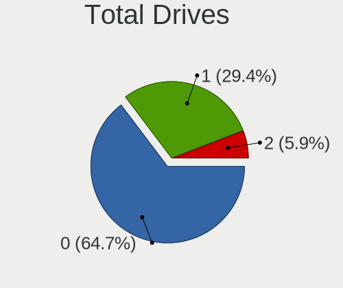

FreeBSD - Hardware Trends (Notebooks)
-------------------------------------

A project to identify most popular hardware characteristics and track their change
over time based on data collected by BSD users at https://BSD-Hardware.info.

Anyone can contribute to this report by the [hw-probe](https://github.com/linuxhw/hw-probe/blob/master/INSTALL.BSD.md) tool:

    hw-probe -all -upload

This report is for one last month. Overall report since the beginning of time: [TestDays](https://github.com/bsdhw/TestDays)

Period: Apr, 2024.

Contents
--------

* [ System ](#system)
  - [ OS                       ](#os)
  - [ OS Family                ](#os-family)
  - [ Arch                     ](#arch)
  - [ DE                       ](#de)
  - [ Display Server           ](#display-server)
  - [ Display Manager          ](#display-manager)
  - [ OS Lang                  ](#os-lang)
  - [ Boot Mode                ](#boot-mode)
  - [ Filesystem               ](#filesystem)
  - [ Part. scheme             ](#part-scheme)

* [ Board ](#board)
  - [ Vendor                   ](#vendor)
  - [ Model                    ](#model)
  - [ Model Family             ](#model-family)
  - [ MFG Year                 ](#mfg-year)
  - [ Form Factor              ](#form-factor)
  - [ Coreboot                 ](#coreboot)
  - [ RAM Size                 ](#ram-size)
  - [ RAM Used                 ](#ram-used)
  - [ Total Drives             ](#total-drives)
  - [ Has CD-ROM               ](#has-cd-rom)
  - [ Has Ethernet             ](#has-ethernet)
  - [ Has WiFi                 ](#has-wifi)
  - [ Has Bluetooth            ](#has-bluetooth)

* [ Location ](#location)
  - [ Country                  ](#country)
  - [ City                     ](#city)

* [ Drives ](#drives)
  - [ Drive Vendor             ](#drive-vendor)
  - [ Drive Model              ](#drive-model)
  - [ HDD Vendor               ](#hdd-vendor)
  - [ SSD Vendor               ](#ssd-vendor)
  - [ Drive Kind               ](#drive-kind)
  - [ Drive Connector          ](#drive-connector)
  - [ Drive Size               ](#drive-size)
  - [ Space Total              ](#space-total)
  - [ Space Used               ](#space-used)
  - [ Malfunc. Drives          ](#malfunc-drives)
  - [ Malfunc. Drive Vendor    ](#malfunc-drive-vendor)
  - [ Malfunc. HDD Vendor      ](#malfunc-hdd-vendor)
  - [ Malfunc. Drive Kind      ](#malfunc-drive-kind)
  - [ Failed Drives            ](#failed-drives)
  - [ Failed Drive Vendor      ](#failed-drive-vendor)
  - [ Drive Status             ](#drive-status)

* [ Storage controller ](#storage-controller)
  - [ Storage Vendor           ](#storage-vendor)
  - [ Storage Model            ](#storage-model)
  - [ Storage Kind             ](#storage-kind)

* [ Processor ](#processor)
  - [ CPU Vendor               ](#cpu-vendor)
  - [ CPU Model                ](#cpu-model)
  - [ CPU Model Family         ](#cpu-model-family)
  - [ CPU Cores                ](#cpu-cores)
  - [ CPU Sockets              ](#cpu-sockets)
  - [ CPU Threads              ](#cpu-threads)
  - [ CPU Microarch            ](#cpu-microarch)

* [ Graphics ](#graphics)
  - [ GPU Vendor               ](#gpu-vendor)
  - [ GPU Model                ](#gpu-model)
  - [ GPU Combo                ](#gpu-combo)
  - [ GPU Driver               ](#gpu-driver)
  - [ GPU Memory               ](#gpu-memory)

* [ Monitor ](#monitor)
  - [ Monitor Vendor           ](#monitor-vendor)
  - [ Monitor Model            ](#monitor-model)
  - [ Monitor Resolution       ](#monitor-resolution)
  - [ Monitor Diagonal         ](#monitor-diagonal)
  - [ Monitor Width            ](#monitor-width)
  - [ Aspect Ratio             ](#aspect-ratio)
  - [ Monitor Area             ](#monitor-area)
  - [ Pixel Density            ](#pixel-density)
  - [ Multiple Monitors        ](#multiple-monitors)

* [ Network ](#network)
  - [ Net Controller Vendor    ](#net-controller-vendor)
  - [ Net Controller Model     ](#net-controller-model)
  - [ Wireless Vendor          ](#wireless-vendor)
  - [ Wireless Model           ](#wireless-model)
  - [ Ethernet Vendor          ](#ethernet-vendor)
  - [ Ethernet Model           ](#ethernet-model)
  - [ Net Controller Kind      ](#net-controller-kind)
  - [ Used Controller          ](#used-controller)
  - [ NICs                     ](#nics)
  - [ IPv6                     ](#ipv6)

* [ Bluetooth ](#bluetooth)
  - [ Bluetooth Vendor         ](#bluetooth-vendor)
  - [ Bluetooth Model          ](#bluetooth-model)

* [ Sound ](#sound)
  - [ Sound Vendor             ](#sound-vendor)
  - [ Sound Model              ](#sound-model)

* [ Memory ](#memory)
  - [ Memory Vendor            ](#memory-vendor)
  - [ Memory Model             ](#memory-model)
  - [ Memory Kind              ](#memory-kind)
  - [ Memory Form Factor       ](#memory-form-factor)
  - [ Memory Size              ](#memory-size)
  - [ Memory Speed             ](#memory-speed)

* [ Printers & scanners ](#printers--scanners)
  - [ Printer Vendor           ](#printer-vendor)
  - [ Printer Model            ](#printer-model)
  - [ Scanner Vendor           ](#scanner-vendor)
  - [ Scanner Model            ](#scanner-model)

* [ Camera ](#camera)
  - [ Camera Vendor            ](#camera-vendor)
  - [ Camera Model             ](#camera-model)

* [ Security ](#security)
  - [ Fingerprint Vendor       ](#fingerprint-vendor)
  - [ Fingerprint Model        ](#fingerprint-model)
  - [ Chipcard Vendor          ](#chipcard-vendor)
  - [ Chipcard Model           ](#chipcard-model)

* [ Unsupported ](#unsupported)
  - [ Unsupported Devices      ](#unsupported-devices)
  - [ Unsupported Device Types ](#unsupported-device-types)

System
------

OS
--

Installed operating systems

| Name                     | Notebooks | Percent |
|--------------------------|-----------|---------|
| FreeBSD 14.0-p6          | 17        | 50%     |
| FreeBSD 14.0             | 6         | 17.65%  |
| FreeBSD 15.0-CURRENT     | 2         | 5.88%   |
| FreeBSD 14.0-p5          | 2         | 5.88%   |
| FreeBSD 14.1-PRERELEASE  | 1         | 2.94%   |
| FreeBSD 14.0-STABLE-HBSD | 1         | 2.94%   |
| FreeBSD 14.0-p4          | 1         | 2.94%   |
| FreeBSD 13.3-p1          | 1         | 2.94%   |
| FreeBSD 13.2-p72         | 1         | 2.94%   |
| FreeBSD 13.2-p70         | 1         | 2.94%   |
| FreeBSD 13.2-p7          | 1         | 2.94%   |

OS Family
---------

OS without a version

| Name    | Notebooks | Percent |
|---------|-----------|---------|
| FreeBSD | 34        | 100%    |

Arch
----

OS architecture (x86_64, i586, etc.)

| Name  | Notebooks | Percent |
|-------|-----------|---------|
| amd64 | 34        | 100%    |

DE
--

Desktop Environment

| Name       | Notebooks | Percent |
|------------|-----------|---------|
| KDE5       | 8         | 23.53%  |
| XFCE       | 6         | 17.65%  |
| Console    | 6         | 17.65%  |
| i3         | 3         | 8.82%   |
| TWM        | 2         | 5.88%   |
| Picom      | 2         | 5.88%   |
| Openbox    | 2         | 5.88%   |
| X-Cinnamon | 1         | 2.94%   |
| spectrwm   | 1         | 2.94%   |
| MATE       | 1         | 2.94%   |
| LXQt       | 1         | 2.94%   |
| GNOME      | 1         | 2.94%   |

Display Server
--------------

X11 or Wayland

| Name    | Notebooks | Percent |
|---------|-----------|---------|
| X11     | 28        | 82.35%  |
| Console | 6         | 17.65%  |

Display Manager
---------------

SDDM, LightDM, etc.

| Name    | Notebooks | Percent |
|---------|-----------|---------|
| Console | 12        | 35.29%  |
| SDDM    | 11        | 32.35%  |
| LightDM | 7         | 20.59%  |
| XDM     | 3         | 8.82%   |
| SLiM    | 1         | 2.94%   |

OS Lang
-------

Language

| Lang    | Notebooks | Percent |
|---------|-----------|---------|
| C       | 24        | 70.59%  |
| en_US   | 4         | 11.76%  |
| Unknown | 3         | 8.82%   |
| ru_RU   | 2         | 5.88%   |
| en_CA   | 1         | 2.94%   |

Boot Mode
---------

EFI or BIOS

| Mode | Notebooks | Percent |
|------|-----------|---------|
| EFI  | 28        | 82.35%  |
| BIOS | 6         | 17.65%  |

Filesystem
----------

Type of filesystem

| Type | Notebooks | Percent |
|------|-----------|---------|
| Zfs  | 31        | 91.18%  |
| Ufs  | 3         | 8.82%   |

Part. scheme
------------

Scheme of partitioning

| Type | Notebooks | Percent |
|------|-----------|---------|
| GPT  | 33        | 97.06%  |
| BSD  | 1         | 2.94%   |

Board
-----

Vendor
------

Motherboard manufacturer

| Name             | Notebooks | Percent |
|------------------|-----------|---------|
| Lenovo           | 16        | 47.06%  |
| Apple            | 5         | 14.71%  |
| ASUSTek Computer | 3         | 8.82%   |
| Hewlett-Packard  | 2         | 5.88%   |
| Dell             | 2         | 5.88%   |
| System76         | 1         | 2.94%   |
| Sony             | 1         | 2.94%   |
| SLIMBOOK         | 1         | 2.94%   |
| HUAWEI           | 1         | 2.94%   |
| Acer             | 1         | 2.94%   |
| Unknown          | 1         | 2.94%   |

Model
-----

Motherboard model

| Name                                      | Notebooks | Percent |
|-------------------------------------------|-----------|---------|
| Apple MacBookAir6,2                       | 4         | 11.76%  |
| ASUS K43E                                 | 2         | 5.88%   |
| System76 Pangolin                         | 1         | 2.94%   |
| Sony VGN-FZ4000E                          | 1         | 2.94%   |
| SLIMBOOK PROX14-AMD                       | 1         | 2.94%   |
| Lenovo ThinkPad X280 20KFCTO1WW           | 1         | 2.94%   |
| Lenovo ThinkPad X230 Tablet 3438GF4       | 1         | 2.94%   |
| Lenovo ThinkPad X1 Extreme 2nd 20QV001CPB | 1         | 2.94%   |
| Lenovo ThinkPad X1 Carbon 6th 20KGS1TW00  | 1         | 2.94%   |
| Lenovo ThinkPad T530 23942U1              | 1         | 2.94%   |
| Lenovo ThinkPad T460 20FMA09CGE           | 1         | 2.94%   |
| Lenovo ThinkPad T440 20B7S01V00           | 1         | 2.94%   |
| Lenovo ThinkPad T400 6475FA4              | 1         | 2.94%   |
| Lenovo ThinkPad T400 6474E18              | 1         | 2.94%   |
| Lenovo ThinkPad S5-S531 20B00003UK        | 1         | 2.94%   |
| Lenovo ThinkPad E550 20DF005VRT           | 1         | 2.94%   |
| Lenovo ThinkPad E490 20N9S48S00           | 1         | 2.94%   |
| Lenovo ThinkBook 16 G6+ IMH 21LE          | 1         | 2.94%   |
| Lenovo ThinkBook 16 G5+ APH 21K0          | 1         | 2.94%   |
| Lenovo Legion Pro 5 16ARX8 82WM           | 1         | 2.94%   |
| Lenovo IdeaPad 500S-14ISK 80Q3            | 1         | 2.94%   |
| HUAWEI MRGFG-XX                           | 1         | 2.94%   |
| HP ZBook 15 G6                            | 1         | 2.94%   |
| HP ProBook 440 G2                         | 1         | 2.94%   |
| Dell XPS 15 7590                          | 1         | 2.94%   |
| Dell Precision 7680                       | 1         | 2.94%   |
| ASUS VivoBook_ASUSLaptop X7400PC_N7400PC  | 1         | 2.94%   |
| Apple MacBookPro10,1                      | 1         | 2.94%   |
| Acer Aspire 5551                          | 1         | 2.94%   |
| Unknown                                   | 1         | 2.94%   |

Model Family
------------

Motherboard model prefix

| Name                | Notebooks | Percent |
|---------------------|-----------|---------|
| Lenovo ThinkPad     | 12        | 35.29%  |
| Apple MacBookAir6   | 4         | 11.76%  |
| Lenovo ThinkBook    | 2         | 5.88%   |
| ASUS K43E           | 2         | 5.88%   |
| System76 Pangolin   | 1         | 2.94%   |
| Sony VGN-FZ4000E    | 1         | 2.94%   |
| SLIMBOOK PROX14-AMD | 1         | 2.94%   |
| Lenovo Legion       | 1         | 2.94%   |
| Lenovo IdeaPad      | 1         | 2.94%   |
| HUAWEI MRGFG-XX     | 1         | 2.94%   |
| HP ZBook            | 1         | 2.94%   |
| HP ProBook          | 1         | 2.94%   |
| Dell XPS            | 1         | 2.94%   |
| Dell Precision      | 1         | 2.94%   |
| ASUS VivoBook       | 1         | 2.94%   |
| Apple MacBookPro10  | 1         | 2.94%   |
| Acer Aspire         | 1         | 2.94%   |
| Unknown             | 1         | 2.94%   |

MFG Year
--------

Motherboard manufacture year

| Year | Notebooks | Percent |
|------|-----------|---------|
| 2023 | 6         | 17.65%  |
| 2019 | 6         | 17.65%  |
| 2018 | 3         | 8.82%   |
| 2011 | 3         | 8.82%   |
| 2024 | 2         | 5.88%   |
| 2022 | 2         | 5.88%   |
| 2016 | 2         | 5.88%   |
| 2015 | 2         | 5.88%   |
| 2009 | 2         | 5.88%   |
| 2020 | 1         | 2.94%   |
| 2017 | 1         | 2.94%   |
| 2014 | 1         | 2.94%   |
| 2013 | 1         | 2.94%   |
| 2012 | 1         | 2.94%   |
| 2007 | 1         | 2.94%   |

Form Factor
-----------

Physical design of the computer

| Name     | Notebooks | Percent |
|----------|-----------|---------|
| Notebook | 34        | 100%    |

Coreboot
--------

Have coreboot on board

| Used | Notebooks | Percent |
|------|-----------|---------|
| No   | 34        | 100%    |

RAM Size
--------

Total RAM memory

| Size in GB  | Notebooks | Percent |
|-------------|-----------|---------|
| 8.01-16.0   | 14        | 41.18%  |
| 32.01-64.0  | 7         | 20.59%  |
| 16.01-24.0  | 5         | 14.71%  |
| 4.01-8.0    | 4         | 11.76%  |
| 64.01-256.0 | 4         | 11.76%  |

RAM Used
--------

Used RAM memory

| Used GB  | Notebooks | Percent |
|----------|-----------|---------|
| 0.01-0.5 | 14        | 41.18%  |
| 0.51-1.0 | 9         | 26.47%  |
| 1.01-2.0 | 6         | 17.65%  |
| 2.01-3.0 | 3         | 8.82%   |
| 4.01-8.0 | 2         | 5.88%   |

Total Drives
------------

Number of drives on board

| Drives | Notebooks | Percent |
|--------|-----------|---------|
| 1      | 18        | 52.94%  |
| 0      | 10        | 29.41%  |
| 2      | 6         | 17.65%  |

Has CD-ROM
----------

Has CD-ROM on board

| Presented | Notebooks | Percent |
|-----------|-----------|---------|
| No        | 28        | 82.35%  |
| Yes       | 6         | 17.65%  |

Has Ethernet
------------

Has Ethernet on board

| Presented | Notebooks | Percent |
|-----------|-----------|---------|
| Yes       | 24        | 70.59%  |
| No        | 10        | 29.41%  |

Has WiFi
--------

Has WiFi module

| Presented | Notebooks | Percent |
|-----------|-----------|---------|
| Yes       | 34        | 100%    |

Has Bluetooth
-------------

Has Bluetooth module

| Presented | Notebooks | Percent |
|-----------|-----------|---------|
| Yes       | 24        | 70.59%  |
| No        | 10        | 29.41%  |

Location
--------

Country
-------

Geographic location (country)

| Country   | Notebooks | Percent |
|-----------|-----------|---------|
| Russia    | 7         | 20.59%  |
| USA       | 6         | 17.65%  |
| France    | 5         | 14.71%  |
| Germany   | 3         | 8.82%   |
| Vietnam   | 2         | 5.88%   |
| UK        | 2         | 5.88%   |
| Canada    | 2         | 5.88%   |
| Brazil    | 2         | 5.88%   |
| Sweden    | 1         | 2.94%   |
| Singapore | 1         | 2.94%   |
| Poland    | 1         | 2.94%   |
| Japan     | 1         | 2.94%   |
| Belgium   | 1         | 2.94%   |

City
----

Geographic location (city)

| City            | Notebooks | Percent |
|-----------------|-----------|---------|
| Moscow          | 4         | 11.76%  |
| Colombes        | 4         | 11.76%  |
| Saint-Bruno     | 2         | 5.88%   |
| Hanoi           | 2         | 5.88%   |
| Yekaterinburg   | 1         | 2.94%   |
| Voronezh        | 1         | 2.94%   |
| Stockholm       | 1         | 2.94%   |
| Singapore       | 1         | 2.94%   |
| Sheffield       | 1         | 2.94%   |
| San Jose        | 1         | 2.94%   |
| Rosny-sous-Bois | 1         | 2.94%   |
| Pellenberg      | 1         | 2.94%   |
| Oldenburg       | 1         | 2.94%   |
| Maceió         | 1         | 2.94%   |
| Las Cruces      | 1         | 2.94%   |
| Krakow          | 1         | 2.94%   |
| Kirov           | 1         | 2.94%   |
| Killeen         | 1         | 2.94%   |
| Honcho          | 1         | 2.94%   |
| Hexham          | 1         | 2.94%   |
| Düsseldorf     | 1         | 2.94%   |
| Denver          | 1         | 2.94%   |
| Commerce        | 1         | 2.94%   |
| Charlotte       | 1         | 2.94%   |
| Berlin          | 1         | 2.94%   |
| Belo Horizonte  | 1         | 2.94%   |

Drives
------

Drive Vendor
------------

Hard drive vendors

| Vendor              | Notebooks | Drives | Percent |
|---------------------|-----------|--------|---------|
| Seagate             | 5         | 5      | 17.24%  |
| Samsung Electronics | 5         | 6      | 17.24%  |
| Apple               | 4         | 4      | 13.79%  |
| Gigabyte Technology | 3         | 3      | 10.34%  |
| Hitachi             | 2         | 2      | 6.9%    |
| Crucial             | 2         | 2      | 6.9%    |
| WDC                 | 1         | 1      | 3.45%   |
| UMIS                | 1         | 1      | 3.45%   |
| Transcend           | 1         | 1      | 3.45%   |
| Toshiba             | 1         | 1      | 3.45%   |
| SSSTC               | 1         | 1      | 3.45%   |
| Lexar               | 1         | 1      | 3.45%   |
| Intenso             | 1         | 1      | 3.45%   |
| Intel               | 1         | 1      | 3.45%   |

Drive Model
-----------

Hard drive models

| Model                                | Notebooks | Percent |
|--------------------------------------|-----------|---------|
| Apple SSD SD0128F 121GB              | 4         | 13.33%  |
| Hitachi HTS547550A9E384 500GB        | 2         | 6.67%   |
| Gigabyte GP-GSTFS31240GNTD 240GB     | 2         | 6.67%   |
| WDC WD20SMZW-11JW8S1 2TB             | 1         | 3.33%   |
| UMIS RPEYJ1T24MKN2QWY 1TB            | 1         | 3.33%   |
| Transcend TS256GSSD230S 256GB        | 1         | 3.33%   |
| Toshiba MK6465GSX 640GB              | 1         | 3.33%   |
| SSSTC CL4-8D512 512GB                | 1         | 3.33%   |
| Seagate ST9500325AS 500GB            | 1         | 3.33%   |
| Seagate ST500LM000-SSHD-8GB          | 1         | 3.33%   |
| Seagate ST5000LM000-2AN170 5TB       | 1         | 3.33%   |
| Seagate ST320LT007-9ZV142 320GB      | 1         | 3.33%   |
| Seagate ST2000LM003 HN-M201RAD 2TB   | 1         | 3.33%   |
| Samsung SSD PM830 2.5-inch 7mm 128GB | 1         | 3.33%   |
| Samsung SSD 870 EVO 500GB            | 1         | 3.33%   |
| Samsung SSD 860 EVO 250GB            | 1         | 3.33%   |
| Samsung SSD 840 PRO Series 256GB     | 1         | 3.33%   |
| Samsung MZVL2512HCJQ-00BL2 512GB     | 1         | 3.33%   |
| Samsung MZ7TD128HAFV-000L1 128GB     | 1         | 3.33%   |
| Lexar SSD NS100 512GB                | 1         | 3.33%   |
| Intenso SSD 512GB                    | 1         | 3.33%   |
| Intel SSDSC2KI256G8 256GB            | 1         | 3.33%   |
| Gigabyte GP-GSTFS31120GNTD 120GB     | 1         | 3.33%   |
| Crucial CT275MX300SSD1 275GB         | 1         | 3.33%   |
| Crucial CT240BX500SSD1 240GB         | 1         | 3.33%   |

HDD Vendor
----------

Hard disk drive vendors

| Vendor  | Notebooks | Drives | Percent |
|---------|-----------|--------|---------|
| Seagate | 5         | 5      | 55.56%  |
| Hitachi | 2         | 2      | 22.22%  |
| WDC     | 1         | 1      | 11.11%  |
| Toshiba | 1         | 1      | 11.11%  |

SSD Vendor
----------

Solid state drive vendors

| Vendor              | Notebooks | Drives | Percent |
|---------------------|-----------|--------|---------|
| Samsung Electronics | 4         | 5      | 23.53%  |
| Apple               | 4         | 4      | 23.53%  |
| Gigabyte Technology | 3         | 3      | 17.65%  |
| Crucial             | 2         | 2      | 11.76%  |
| Transcend           | 1         | 1      | 5.88%   |
| Lexar               | 1         | 1      | 5.88%   |
| Intenso             | 1         | 1      | 5.88%   |
| Intel               | 1         | 1      | 5.88%   |

Drive Kind
----------

HDD or SSD

| Kind | Notebooks | Drives | Percent |
|------|-----------|--------|---------|
| SSD  | 16        | 18     | 59.26%  |
| HDD  | 9         | 9      | 33.33%  |
| NVMe | 2         | 3      | 7.41%   |

Drive Connector
---------------

SATA, SAS, NVMe, etc.

| Type | Notebooks | Drives | Percent |
|------|-----------|--------|---------|
| SATA | 22        | 27     | 91.67%  |
| NVMe | 2         | 3      | 8.33%   |

Drive Size
----------

Size of hard drive

| Size in TB | Notebooks | Drives | Percent |
|------------|-----------|--------|---------|
| 0.01-0.5   | 18        | 21     | 75%     |
| 0.51-1.0   | 3         | 3      | 12.5%   |
| 1.01-2.0   | 2         | 2      | 8.33%   |
| 4.01-10.0  | 1         | 1      | 4.17%   |

Space Total
-----------

Amount of disk space available on the file system

| Size in GB     | Notebooks | Percent |
|----------------|-----------|---------|
| 101-250        | 17        | 50%     |
| 251-500        | 7         | 20.59%  |
| 1001-2000      | 3         | 8.82%   |
| 501-1000       | 3         | 8.82%   |
| More than 3000 | 2         | 5.88%   |
| 21-50          | 1         | 2.94%   |
| 51-100         | 1         | 2.94%   |

Space Used
----------

Amount of used disk space

| Used GB   | Notebooks | Percent |
|-----------|-----------|---------|
| 1-20      | 26        | 76.47%  |
| 21-50     | 5         | 14.71%  |
| 101-250   | 1         | 2.94%   |
| 1001-2000 | 1         | 2.94%   |
| 51-100    | 1         | 2.94%   |

Malfunc. Drives
---------------

Drive models with a malfunction

| Model                                        | Notebooks | Drives | Percent |
|----------------------------------------------|-----------|--------|---------|
| Toshiba MK6465GSX 640GB                      | 1         | 1      | 25%     |
| Seagate ST9500325AS 500GB                    | 1         | 1      | 25%     |
| Seagate ST320LT007-9ZV142 320GB              | 1         | 1      | 25%     |
| Samsung Electronics SSD 840 PRO Series 256GB | 1         | 1      | 25%     |

Malfunc. Drive Vendor
---------------------

Vendors of faulty drives

| Vendor              | Notebooks | Drives | Percent |
|---------------------|-----------|--------|---------|
| Seagate             | 2         | 2      | 50%     |
| Toshiba             | 1         | 1      | 25%     |
| Samsung Electronics | 1         | 1      | 25%     |

Malfunc. HDD Vendor
-------------------

Vendors of faulty HDD drives

| Vendor  | Notebooks | Drives | Percent |
|---------|-----------|--------|---------|
| Seagate | 2         | 2      | 66.67%  |
| Toshiba | 1         | 1      | 33.33%  |

Malfunc. Drive Kind
-------------------

Kinds of faulty drives

| Kind | Notebooks | Drives | Percent |
|------|-----------|--------|---------|
| HDD  | 3         | 3      | 75%     |
| SSD  | 1         | 1      | 25%     |

Failed Drives
-------------

Failed drive models

Zero info for selected period =(

Failed Drive Vendor
-------------------

Failed drive vendors

Zero info for selected period =(

Drive Status
------------

Number of failed and malfunc. drives

| Status  | Notebooks | Drives | Percent |
|---------|-----------|--------|---------|
| Works   | 21        | 26     | 84%     |
| Malfunc | 4         | 4      | 16%     |

Storage controller
------------------

Storage Vendor
--------------

Storage controller vendors

| Vendor                                  | Notebooks | Percent |
|-----------------------------------------|-----------|---------|
| Intel                                   | 19        | 42.22%  |
| Samsung Electronics                     | 6         | 13.33%  |
| Marvell Technology Group                | 4         | 8.89%   |
| Kingston Technology Company             | 2         | 4.44%   |
| AMD                                     | 2         | 4.44%   |
| ADATA Technology                        | 2         | 4.44%   |
| Transcend                               | 1         | 2.22%   |
| Toshiba                                 | 1         | 2.22%   |
| Solid State Storage Technology          | 1         | 2.22%   |
| Shenzhen Unionmemory Information System | 1         | 2.22%   |
| Seagate Technology                      | 1         | 2.22%   |
| Sandisk                                 | 1         | 2.22%   |
| Phison Electronics                      | 1         | 2.22%   |
| Netac Technology                        | 1         | 2.22%   |
| Micron/Crucial Technology               | 1         | 2.22%   |
| KIOXIA                                  | 1         | 2.22%   |

Storage Model
-------------

Storage controller models

| Model                                                                                         | Notebooks | Percent |
|-----------------------------------------------------------------------------------------------|-----------|---------|
| Marvell Group 88SS9183 PCIe SSD Controller                                                    | 4         | 8.51%   |
| Intel 7 Series Chipset Family 6-port SATA Controller [AHCI mode]                              | 4         | 8.51%   |
| Samsung NVMe SSD Controller PM9A1/PM9A3/980PRO                                                | 3         | 6.38%   |
| Intel Wildcat Point-LP SATA Controller [AHCI Mode]                                            | 2         | 4.26%   |
| Intel Sunrise Point-LP SATA Controller [AHCI mode]                                            | 2         | 4.26%   |
| Intel Cannon Lake Mobile PCH SATA AHCI Controller                                             | 2         | 4.26%   |
| Intel 82801IBM/IEM (ICH9M/ICH9M-E) 4 port SATA Controller [AHCI mode]                         | 2         | 4.26%   |
| Intel 6 Series/C200 Series Chipset Family 6 port Mobile SATA AHCI Controller                  | 2         | 4.26%   |
| Transcend NVMe PCIe SSD 110S/112S/120S/MTE300S/MTE400S/MTE652T2 (DRAM-less)                   | 1         | 2.13%   |
| Toshiba XG6 NVMe SSD Controller                                                               | 1         | 2.13%   |
| Solid State Storage CL4-8D512 NVMe SSD M.2 (DRAM-less)                                        | 1         | 2.13%   |
| Shenzhen Unionmemory Information System RPEYJ1T24MKN2QWY PCIe 4.0 NVMe SSD 1024GB (DRAM-less) | 1         | 2.13%   |
| Seagate FireCuda 530 SSD                                                                      | 1         | 2.13%   |
| Sandisk WD Black SN770 / PC SN740 256GB / PC SN560 (DRAM-less) NVMe SSD                       | 1         | 2.13%   |
| Samsung NVMe SSD Controller SM981/PM981/PM983                                                 | 1         | 2.13%   |
| Samsung NVMe SSD Controller S4LV008[Pascal]                                                   | 1         | 2.13%   |
| Samsung NVMe SSD Controller 980 (DRAM-less)                                                   | 1         | 2.13%   |
| Phison PS5021-E21 PCIe4 NVMe Controller (DRAM-less)                                           | 1         | 2.13%   |
| Netac PCIe 4 INNOGRIT based NVMe SSD                                                          | 1         | 2.13%   |
| Micron/Crucial P5 Plus NVMe PCIe SSD                                                          | 1         | 2.13%   |
| Kingston Company OM8PCP Design-In PCIe 3 NVMe SSD (DRAM-less)                                 | 1         | 2.13%   |
| Kingston Company A2000 NVMe SSD SM2263EN                                                      | 1         | 2.13%   |
| Intel Volume Management Device NVMe RAID Controller Intel Corporation                         | 1         | 2.13%   |
| Intel SSD DC P4101/Pro 7600p/760p/E 6100p Series                                              | 1         | 2.13%   |
| Intel Mobile 4 Series Chipset PT IDER Controller                                              | 1         | 2.13%   |
| Intel Cannon Point-LP SATA Controller [AHCI Mode]                                             | 1         | 2.13%   |
| Intel 82801HM/HEM (ICH8M/ICH8M-E) SATA Controller [AHCI mode]                                 | 1         | 2.13%   |
| Intel 82801HM/HEM (ICH8M/ICH8M-E) IDE Controller                                              | 1         | 2.13%   |
| Intel 8 Series SATA Controller 1 [AHCI mode]                                                  | 1         | 2.13%   |
| AMD SB7x0/SB8x0/SB9x0 SATA Controller [AHCI mode]                                             | 1         | 2.13%   |
| AMD FCH SATA Controller [AHCI mode]                                                           | 1         | 2.13%   |
| ADATA XPG GAMMIXS1 1L, XPG GAMMIX S5, LEGEND 710 / 740, SWORDFISH NVMe SSD (DRAM-less)        | 1         | 2.13%   |
| ADATA GAMMIX S70 BLADE, PS5 PREMIUM NVMe SSD                                                  | 1         | 2.13%   |
| Unknown                                                                                       | 1         | 2.13%   |

Storage Kind
------------

Kind of storage controller (IDE, SATA, NVMe, SAS, ...)

| Kind | Notebooks | Percent |
|------|-----------|---------|
| SATA | 23        | 53.49%  |
| NVMe | 17        | 39.53%  |
| IDE  | 2         | 4.65%   |
| RAID | 1         | 2.33%   |

Processor
---------

CPU Vendor
----------

Processor vendors

| Vendor | Notebooks | Percent |
|--------|-----------|---------|
| Intel  | 28        | 82.35%  |
| AMD    | 6         | 17.65%  |

CPU Model
---------

Processor models

| Model                                       | Notebooks | Percent |
|---------------------------------------------|-----------|---------|
| Intel Core i5-4250U CPU @ 1.30GHz           | 4         | 11.76%  |
| Intel Core i7-8550U CPU @ 1.80GHz           | 2         | 5.88%   |
| Intel Core i7-2820QM CPU @ 2.30GHz          | 2         | 5.88%   |
| Intel Core i5-6200U CPU @ 2.30GHz           | 2         | 5.88%   |
| Intel Core i5-5200U CPU @ 2.20GHz           | 2         | 5.88%   |
| Intel Core Ultra 7 155H                     | 1         | 2.94%   |
| Intel Core i7-9850H CPU @ 2.60GHz           | 1         | 2.94%   |
| Intel Core i7-9750H CPU @ 2.60GHz           | 1         | 2.94%   |
| Intel Core i7-3720QM CPU @ 2.60GHz          | 1         | 2.94%   |
| Intel Core i5-9300H CPU @ 2.40GHz           | 1         | 2.94%   |
| Intel Core i5-8265U CPU @ 1.60GHz           | 1         | 2.94%   |
| Intel Core i5-4300U CPU @ 1.90GHz           | 1         | 2.94%   |
| Intel Core i5-3320M CPU @ 2.60GHz           | 1         | 2.94%   |
| Intel Core i5-3230M CPU @ 2.60GHz           | 1         | 2.94%   |
| Intel Core i3-3227U CPU @ 1.90GHz           | 1         | 2.94%   |
| Intel Core 2 Duo CPU T8300 @ 2.40GHz        | 1         | 2.94%   |
| Intel Core 2 Duo CPU P8600 @ 2.40GHz        | 1         | 2.94%   |
| Intel Core 2 Duo CPU P8400 @ 2.26GHz        | 1         | 2.94%   |
| Intel 13th Gen Core i9-13950HX              | 1         | 2.94%   |
| Intel 13th Gen Core i7-1360P                | 1         | 2.94%   |
| Intel 11th Gen Core i5-11300H @ 3.10GHz     | 1         | 2.94%   |
| AMD Ryzen 9 7945HX with Radeon Graphics     | 1         | 2.94%   |
| AMD Ryzen 7 8840H w/ Radeon 780M Graphics   | 1         | 2.94%   |
| AMD Ryzen 7 7840H with Radeon 780M Graphics | 1         | 2.94%   |
| AMD Ryzen 7 6800U with Radeon Graphics      | 1         | 2.94%   |
| AMD Ryzen 7 4800H with Radeon Graphics      | 1         | 2.94%   |
| AMD Athlon II P320 Dual-Core Processor      | 1         | 2.94%   |

CPU Model Family
----------------

Processor model prefix

| Model            | Notebooks | Percent |
|------------------|-----------|---------|
| Intel Core i5    | 13        | 38.24%  |
| Intel Core i7    | 7         | 20.59%  |
| AMD Ryzen 7      | 4         | 11.76%  |
| Other            | 3         | 8.82%   |
| Intel Core 2 Duo | 3         | 8.82%   |
| Intel Core i3    | 1         | 2.94%   |
| Intel Core       | 1         | 2.94%   |
| AMD Ryzen 9      | 1         | 2.94%   |
| AMD Athlon II    | 1         | 2.94%   |

CPU Cores
---------

Number of processor cores

| Number  | Notebooks | Percent |
|---------|-----------|---------|
| 2       | 13        | 38.24%  |
| 4       | 8         | 23.53%  |
| 16      | 5         | 14.71%  |
| Unknown | 3         | 8.82%   |
| 6       | 2         | 5.88%   |
| 32      | 1         | 2.94%   |
| 22      | 1         | 2.94%   |
| 8       | 1         | 2.94%   |

CPU Sockets
-----------

Number of sockets

| Number | Notebooks | Percent |
|--------|-----------|---------|
| 1      | 34        | 100%    |

CPU Threads
-----------

Threads per core (Hyper-Threading)

| Number  | Notebooks | Percent |
|---------|-----------|---------|
| 2       | 24        | 70.59%  |
| 1       | 7         | 20.59%  |
| Unknown | 3         | 8.82%   |

CPU Microarch
-------------

Microarchitecture

| Name        | Notebooks | Percent |
|-------------|-----------|---------|
| Unknown     | 7         | 20.59%  |
| KabyLake    | 6         | 17.65%  |
| Haswell     | 5         | 14.71%  |
| IvyBridge   | 4         | 11.76%  |
| Penryn      | 3         | 8.82%   |
| Skylake     | 2         | 5.88%   |
| SandyBridge | 2         | 5.88%   |
| Broadwell   | 2         | 5.88%   |
| Zen 2       | 1         | 2.94%   |
| TigerLake   | 1         | 2.94%   |
| K10         | 1         | 2.94%   |

Graphics
--------

GPU Vendor
----------

Vendors of graphics cards

| Vendor | Notebooks | Percent |
|--------|-----------|---------|
| Intel  | 25        | 62.5%   |
| Nvidia | 10        | 25%     |
| AMD    | 5         | 12.5%   |

GPU Model
---------

Graphics card models

| Model                                                                     | Notebooks | Percent |
|---------------------------------------------------------------------------|-----------|---------|
| Intel Haswell-ULT Integrated Graphics Controller                          | 5         | 12.2%   |
| Intel 3rd Gen Core processor Graphics Controller                          | 4         | 9.76%   |
| Nvidia TU117M [GeForce GTX 1650 Mobile / Max-Q]                           | 2         | 4.88%   |
| Intel UHD Graphics 620                                                    | 2         | 4.88%   |
| Intel Skylake GT2 [HD Graphics 520]                                       | 2         | 4.88%   |
| Intel Mobile 4 Series Chipset Integrated Graphics Controller              | 2         | 4.88%   |
| Intel HD Graphics 5500                                                    | 2         | 4.88%   |
| Intel CoffeeLake-H GT2 [UHD Graphics 630]                                 | 2         | 4.88%   |
| Intel 2nd Generation Core Processor Family Integrated Graphics Controller | 2         | 4.88%   |
| Nvidia GM108M [GeForce 940M]                                              | 1         | 2.44%   |
| Nvidia GK107M [GeForce GT 650M Mac Edition]                               | 1         | 2.44%   |
| Nvidia GF108M [NVS 5400M]                                                 | 1         | 2.44%   |
| Nvidia GA107M [GeForce RTX 3050 Mobile]                                   | 1         | 2.44%   |
| Nvidia G86M [GeForce 8400M GT]                                            | 1         | 2.44%   |
| Nvidia AD107M [GeForce RTX 4050 Max-Q / Mobile]                           | 1         | 2.44%   |
| Nvidia AD106M [GeForce RTX 4070 Max-Q / Mobile]                           | 1         | 2.44%   |
| Nvidia AD104GLM [RTX 3500 Ada Generation Laptop GPU]                      | 1         | 2.44%   |
| Intel WhiskeyLake-U GT2 [UHD Graphics 620]                                | 1         | 2.44%   |
| Intel TigerLake-LP GT2 [Iris Xe Graphics]                                 | 1         | 2.44%   |
| Intel Raptor Lake-P [Iris Xe Graphics]                                    | 1         | 2.44%   |
| Intel Meteor Lake-P [Intel Arc Graphics]                                  | 1         | 2.44%   |
| AMD RS880M [Mobility Radeon HD 4225/4250]                                 | 1         | 2.44%   |
| AMD Renoir [Radeon RX Vega 6 (Ryzen 4000/5000 Mobile Series)]             | 1         | 2.44%   |
| AMD Rembrandt [Radeon 680M]                                               | 1         | 2.44%   |
| AMD Phoenix3                                                              | 1         | 2.44%   |
| AMD Phoenix1                                                              | 1         | 2.44%   |
| AMD Navi 33 [Radeon RX 7600M/7600M XT]                                    | 1         | 2.44%   |

GPU Combo
---------

Combinations of graphics cards

| Name           | Notebooks | Percent |
|----------------|-----------|---------|
| 1 x Intel      | 18        | 52.94%  |
| Intel + Nvidia | 5         | 14.71%  |
| 1 x Nvidia     | 4         | 11.76%  |
| 1 x AMD        | 3         | 8.82%   |
| 2 x Intel      | 2         | 5.88%   |
| 2 x AMD        | 1         | 2.94%   |
| AMD + Nvidia   | 1         | 2.94%   |

GPU Driver
----------

Free vs proprietary

| Driver      | Notebooks | Percent |
|-------------|-----------|---------|
| Free        | 28        | 82.35%  |
| Proprietary | 6         | 17.65%  |

GPU Memory
----------

Total video memory

| Size in GB | Notebooks | Percent |
|------------|-----------|---------|
| Unknown    | 28        | 82.35%  |
| 3.01-4.0   | 2         | 5.88%   |
| 0.01-0.5   | 2         | 5.88%   |
| 7.01-8.0   | 1         | 2.94%   |
| 0.51-1.0   | 1         | 2.94%   |

Monitor
-------

Monitor Vendor
--------------

Monitor vendors

| Vendor               | Notebooks | Percent |
|----------------------|-----------|---------|
| AU Optronics         | 5         | 17.24%  |
| Chimei Innolux       | 4         | 13.79%  |
| Apple                | 4         | 13.79%  |
| Samsung Electronics  | 3         | 10.34%  |
| Lenovo               | 3         | 10.34%  |
| BOE                  | 3         | 10.34%  |
| Sharp                | 1         | 3.45%   |
| LG Display           | 1         | 3.45%   |
| Goldstar             | 1         | 3.45%   |
| DZX                  | 1         | 3.45%   |
| Dell                 | 1         | 3.45%   |
| CSO                  | 1         | 3.45%   |
| BOE Technology Group | 1         | 3.45%   |

Monitor Model
-------------

Monitor models

| Model                                                                 | Notebooks | Percent |
|-----------------------------------------------------------------------|-----------|---------|
| Apple Color LCD APP9CF0 1440x900 290x180mm 13.4-inch                  | 3         | 10.34%  |
| Samsung Electronics LCD Monitor SEC4542 1366x768 300x170mm 13.6-inch  | 2         | 6.9%    |
| Sharp LCD Monitor SHP14BA 1920x1080 340x190mm 15.3-inch               | 1         | 3.45%   |
| Samsung Electronics LCD Monitor SDC4171 2880x1800 300x190mm 14.0-inch | 1         | 3.45%   |
| LG Display LCD Monitor LGD02D8 1366x768 280x160mm 12.7-inch           | 1         | 3.45%   |
| Lenovo LCD Monitor LEN40B1 1600x900 350x190mm 15.7-inch               | 1         | 3.45%   |
| Lenovo LCD Monitor LEN4033 1440x900 300x190mm 14.0-inch               | 1         | 3.45%   |
| Lenovo LCD Monitor LEN4031 1280x800 300x190mm 14.0-inch               | 1         | 3.45%   |
| Goldstar LG Ultra HD GSM5B08 3840x2160 600x340mm 27.2-inch            | 1         | 3.45%   |
| DZX K3-2 DZX1582 1920x1080 350x190mm 15.7-inch                        | 1         | 3.45%   |
| Dell LCD Monitor P2723QE 5760x2160                                    | 1         | 3.45%   |
| CSO LCD Monitor CSO1615 2560x1600 340x220mm 15.9-inch                 | 1         | 3.45%   |
| Chimei Innolux LCD Monitor CMN1521 1920x1080 340x190mm 15.3-inch      | 1         | 3.45%   |
| Chimei Innolux LCD Monitor CMN14D6 1366x768 310x170mm 13.9-inch       | 1         | 3.45%   |
| Chimei Innolux LCD Monitor CMN14B1 1920x1080 310x170mm 13.9-inch      | 1         | 3.45%   |
| Chimei Innolux LCD Monitor CMN1495 1366x768 310x170mm 13.9-inch       | 1         | 3.45%   |
| BOE Technology Group LCD Monitor 5760x2160                            | 1         | 3.45%   |
| BOE LCD Monitor BOE0B7D 2560x1440 360x200mm 16.2-inch                 | 1         | 3.45%   |
| BOE LCD Monitor BOE0B38 2560x1600 340x210mm 15.7-inch                 | 1         | 3.45%   |
| BOE LCD Monitor BOE0A34 1920x1200 340x220mm 15.9-inch                 | 1         | 3.45%   |
| AU Optronics LCD Monitor AUO41EC 1366x768 340x190mm 15.3-inch         | 1         | 3.45%   |
| AU Optronics LCD Monitor AUO313D 1920x1080 310x170mm 13.9-inch        | 1         | 3.45%   |
| AU Optronics LCD Monitor AUO303E 1600x900 310x170mm 13.9-inch         | 1         | 3.45%   |
| AU Optronics LCD Monitor AUO24ED 1920x1080 340x190mm 15.3-inch        | 1         | 3.45%   |
| AU Optronics LCD Monitor AUO226D 1920x1080 280x160mm 12.7-inch        | 1         | 3.45%   |
| Apple LCD Monitor Color LCD 2880x1800                                 | 1         | 3.45%   |

Monitor Resolution
------------------

Monitor screen resolution

| Resolution        | Notebooks | Percent |
|-------------------|-----------|---------|
| 1920x1080 (FHD)   | 7         | 25%     |
| 1366x768 (WXGA)   | 6         | 21.43%  |
| 1440x900 (WXGA+)  | 4         | 14.29%  |
| 2880x1800         | 2         | 7.14%   |
| 2560x1600         | 2         | 7.14%   |
| 1600x900 (HD+)    | 2         | 7.14%   |
| 5760x2160         | 1         | 3.57%   |
| 3840x2160 (4K)    | 1         | 3.57%   |
| 2560x1440 (QHD)   | 1         | 3.57%   |
| 1920x1200 (WUXGA) | 1         | 3.57%   |
| 1280x800 (WXGA)   | 1         | 3.57%   |

Monitor Diagonal
----------------

Diagonal size in inches

| Inches  | Notebooks | Percent |
|---------|-----------|---------|
| 15      | 9         | 32.14%  |
| 13      | 8         | 28.57%  |
| 14      | 5         | 17.86%  |
| 12      | 2         | 7.14%   |
| Unknown | 2         | 7.14%   |
| 27      | 1         | 3.57%   |
| 16      | 1         | 3.57%   |

Monitor Width
-------------

Physical width

| Width in mm | Notebooks | Percent |
|-------------|-----------|---------|
| 301-350     | 13        | 48.15%  |
| 201-300     | 10        | 37.04%  |
| Unknown     | 2         | 7.41%   |
| 501-600     | 1         | 3.7%    |
| 351-400     | 1         | 3.7%    |

Aspect Ratio
------------

Proportional relationship between the width and the height

| Ratio   | Notebooks | Percent |
|---------|-----------|---------|
| 16/9    | 13        | 50%     |
| 16/10   | 9         | 34.62%  |
| 3/2     | 2         | 7.69%   |
| Unknown | 2         | 7.69%   |

Monitor Area
------------

Area in inch²

| Area in inch² | Notebooks | Percent |
|----------------|-----------|---------|
| 81-90          | 13        | 46.43%  |
| 111-120        | 4         | 14.29%  |
| 91-100         | 4         | 14.29%  |
| 61-70          | 2         | 7.14%   |
| 101-110        | 2         | 7.14%   |
| Unknown        | 2         | 7.14%   |
| 301-350        | 1         | 3.57%   |

Pixel Density
-------------

Pixels per inch

| Density       | Notebooks | Percent |
|---------------|-----------|---------|
| 121-160       | 13        | 48.15%  |
| 101-120       | 7         | 25.93%  |
| 161-240       | 4         | 14.81%  |
| Unknown       | 2         | 7.41%   |
| More than 240 | 1         | 3.7%    |

Multiple Monitors
-----------------

Total monitors connected

| Total | Notebooks | Percent |
|-------|-----------|---------|
| 1     | 24        | 70.59%  |
| 0     | 7         | 20.59%  |
| 2     | 3         | 8.82%   |

Network
-------

Net Controller Vendor
---------------------

Controller vendors

| Vendor                   | Notebooks | Percent |
|--------------------------|-----------|---------|
| Intel                    | 27        | 56.25%  |
| Realtek Semiconductor    | 11        | 22.92%  |
| Broadcom                 | 6         | 12.5%   |
| Xiaomi                   | 1         | 2.08%   |
| Sierra Wireless          | 1         | 2.08%   |
| Qualcomm Atheros         | 1         | 2.08%   |
| Marvell Technology Group | 1         | 2.08%   |

Net Controller Model
--------------------

Controller models

| Model                                                                  | Notebooks | Percent |
|------------------------------------------------------------------------|-----------|---------|
| Realtek RTL8111/8168/8211/8411 PCI Express Gigabit Ethernet Controller | 8         | 12.9%   |
| Intel Wi-Fi 6E(802.11ax) AX210/AX1675* 2x2 [Typhoon Peak]              | 4         | 6.45%   |
| Intel Wi-Fi 6 AX200                                                    | 4         | 6.45%   |
| Broadcom BCM4360 802.11ac Dual Band Wireless Network Adapter           | 4         | 6.45%   |
| Intel Wireless 8265 / 8275                                             | 3         | 4.84%   |
| Realtek RTL8188EUS 802.11n Wireless Network Adapter                    | 2         | 3.23%   |
| Intel Wireless 7260                                                    | 2         | 3.23%   |
| Intel Ethernet Connection (4) I219-V                                   | 2         | 3.23%   |
| Intel 82579LM Gigabit Network Connection (Lewisville)                  | 2         | 3.23%   |
| Intel 82567LM Gigabit Network Connection                               | 2         | 3.23%   |
| Xiaomi Mi/Redmi series (RNDIS)                                         | 1         | 1.61%   |
| Sierra Wireless EM7455                                                 | 1         | 1.61%   |
| Realtek RTL8723BE PCIe Wireless Network Adapter                        | 1         | 1.61%   |
| Qualcomm Atheros AR9485 Wireless Network Adapter                       | 1         | 1.61%   |
| Marvell Group 88E8036 PCI-E Fast Ethernet Controller                   | 1         | 1.61%   |
| Intel Wireless-AC                                                      | 1         | 1.61%   |
| Intel Wireless 8260                                                    | 1         | 1.61%   |
| Intel Wireless 3160                                                    | 1         | 1.61%   |
| Intel Wi-Fi 5(802.11ac) Wireless-AC 9x6x [Thunder Peak]                | 1         | 1.61%   |
| Intel Ultimate N WiFi Link 5300                                        | 1         | 1.61%   |
| Intel Raptor Lake-S PCH CNVi WiFi                                      | 1         | 1.61%   |
| Intel Raptor Lake PCH CNVi WiFi                                        | 1         | 1.61%   |
| Intel PRO/Wireless 5100 AGN [Shiloh] Network Connection                | 1         | 1.61%   |
| Intel PRO/Wireless 4965 AG or AGN [Kedron] Network Connection          | 1         | 1.61%   |
| Intel Ethernet Controller I219-V                                       | 1         | 1.61%   |
| Intel Ethernet Controller I219-LM                                      | 1         | 1.61%   |
| Intel Ethernet Connection I219-V                                       | 1         | 1.61%   |
| Intel Ethernet Connection I218-LM                                      | 1         | 1.61%   |
| Intel Ethernet Connection (7) I219-V                                   | 1         | 1.61%   |
| Intel Ethernet Connection (7) I219-LM                                  | 1         | 1.61%   |
| Intel Ethernet Connection (3) I218-V                                   | 1         | 1.61%   |
| Intel Dual Band Wireless-AC 3168NGW [Stone Peak]                       | 1         | 1.61%   |
| Intel Dual Band Wireless-AC 3165 Plus Bluetooth                        | 1         | 1.61%   |
| Intel Centrino Ultimate-N 6300                                         | 1         | 1.61%   |
| Intel Centrino Advanced-N 6205 [Taylor Peak]                           | 1         | 1.61%   |
| Broadcom NetXtreme BCM57786 Gigabit Ethernet PCIe                      | 1         | 1.61%   |
| Broadcom NetLink BCM57780 Gigabit Ethernet PCIe                        | 1         | 1.61%   |
| Broadcom BCM4331 802.11a/b/g/n                                         | 1         | 1.61%   |
| Broadcom BCM43225 802.11b/g/n                                          | 1         | 1.61%   |

Wireless Vendor
---------------

Wireless vendors

| Vendor                | Notebooks | Percent |
|-----------------------|-----------|---------|
| Intel                 | 26        | 70.27%  |
| Broadcom              | 6         | 16.22%  |
| Realtek Semiconductor | 3         | 8.11%   |
| Sierra Wireless       | 1         | 2.7%    |
| Qualcomm Atheros      | 1         | 2.7%    |

Wireless Model
--------------

Wireless models

| Model                                                         | Notebooks | Percent |
|---------------------------------------------------------------|-----------|---------|
| Intel Wi-Fi 6E(802.11ax) AX210/AX1675* 2x2 [Typhoon Peak]     | 4         | 10.81%  |
| Intel Wi-Fi 6 AX200                                           | 4         | 10.81%  |
| Broadcom BCM4360 802.11ac Dual Band Wireless Network Adapter  | 4         | 10.81%  |
| Intel Wireless 8265 / 8275                                    | 3         | 8.11%   |
| Realtek RTL8188EUS 802.11n Wireless Network Adapter           | 2         | 5.41%   |
| Intel Wireless 7260                                           | 2         | 5.41%   |
| Sierra Wireless EM7455                                        | 1         | 2.7%    |
| Realtek RTL8723BE PCIe Wireless Network Adapter               | 1         | 2.7%    |
| Qualcomm Atheros AR9485 Wireless Network Adapter              | 1         | 2.7%    |
| Intel Wireless-AC                                             | 1         | 2.7%    |
| Intel Wireless 8260                                           | 1         | 2.7%    |
| Intel Wireless 3160                                           | 1         | 2.7%    |
| Intel Wi-Fi 5(802.11ac) Wireless-AC 9x6x [Thunder Peak]       | 1         | 2.7%    |
| Intel Ultimate N WiFi Link 5300                               | 1         | 2.7%    |
| Intel Raptor Lake-S PCH CNVi WiFi                             | 1         | 2.7%    |
| Intel Raptor Lake PCH CNVi WiFi                               | 1         | 2.7%    |
| Intel PRO/Wireless 5100 AGN [Shiloh] Network Connection       | 1         | 2.7%    |
| Intel PRO/Wireless 4965 AG or AGN [Kedron] Network Connection | 1         | 2.7%    |
| Intel Dual Band Wireless-AC 3168NGW [Stone Peak]              | 1         | 2.7%    |
| Intel Dual Band Wireless-AC 3165 Plus Bluetooth               | 1         | 2.7%    |
| Intel Centrino Ultimate-N 6300                                | 1         | 2.7%    |
| Intel Centrino Advanced-N 6205 [Taylor Peak]                  | 1         | 2.7%    |
| Broadcom BCM4331 802.11a/b/g/n                                | 1         | 2.7%    |
| Broadcom BCM43225 802.11b/g/n                                 | 1         | 2.7%    |

Ethernet Vendor
---------------

Ethernet vendors

| Vendor                   | Notebooks | Percent |
|--------------------------|-----------|---------|
| Intel                    | 13        | 52%     |
| Realtek Semiconductor    | 8         | 32%     |
| Broadcom                 | 2         | 8%      |
| Xiaomi                   | 1         | 4%      |
| Marvell Technology Group | 1         | 4%      |

Ethernet Model
--------------

Ethernet models

| Model                                                                  | Notebooks | Percent |
|------------------------------------------------------------------------|-----------|---------|
| Realtek RTL8111/8168/8211/8411 PCI Express Gigabit Ethernet Controller | 8         | 32%     |
| Intel Ethernet Connection (4) I219-V                                   | 2         | 8%      |
| Intel 82579LM Gigabit Network Connection (Lewisville)                  | 2         | 8%      |
| Intel 82567LM Gigabit Network Connection                               | 2         | 8%      |
| Xiaomi Mi/Redmi series (RNDIS)                                         | 1         | 4%      |
| Marvell Group 88E8036 PCI-E Fast Ethernet Controller                   | 1         | 4%      |
| Intel Ethernet Controller I219-V                                       | 1         | 4%      |
| Intel Ethernet Controller I219-LM                                      | 1         | 4%      |
| Intel Ethernet Connection I219-V                                       | 1         | 4%      |
| Intel Ethernet Connection I218-LM                                      | 1         | 4%      |
| Intel Ethernet Connection (7) I219-V                                   | 1         | 4%      |
| Intel Ethernet Connection (7) I219-LM                                  | 1         | 4%      |
| Intel Ethernet Connection (3) I218-V                                   | 1         | 4%      |
| Broadcom NetXtreme BCM57786 Gigabit Ethernet PCIe                      | 1         | 4%      |
| Broadcom NetLink BCM57780 Gigabit Ethernet PCIe                        | 1         | 4%      |

Net Controller Kind
-------------------

Ethernet, WiFi or modem

| Kind     | Notebooks | Percent |
|----------|-----------|---------|
| WiFi     | 34        | 58.62%  |
| Ethernet | 24        | 41.38%  |

Used Controller
---------------

Currently used network controller

| Kind     | Notebooks | Percent |
|----------|-----------|---------|
| WiFi     | 22        | 75.86%  |
| Ethernet | 7         | 24.14%  |

NICs
----

Total network controllers on board

| Total | Notebooks | Percent |
|-------|-----------|---------|
| 2     | 24        | 70.59%  |
| 1     | 10        | 29.41%  |

IPv6
----

IPv6 vs IPv4

| Used | Notebooks | Percent |
|------|-----------|---------|
| No   | 29        | 85.29%  |
| Yes  | 5         | 14.71%  |

Bluetooth
---------

Bluetooth Vendor
----------------

Controller vendors

| Vendor                | Notebooks | Percent |
|-----------------------|-----------|---------|
| Intel                 | 18        | 72%     |
| Apple                 | 5         | 20%     |
| TP-Link               | 1         | 4%      |
| Realtek Semiconductor | 1         | 4%      |

Bluetooth Model
---------------

Controller models

| Model                              | Notebooks | Percent |
|------------------------------------|-----------|---------|
| Intel Bluetooth wireless interface | 6         | 24%     |
| Intel AX210 Bluetooth              | 4         | 16%     |
| Intel AX200 Bluetooth              | 4         | 16%     |
| Apple Broadcom Built-in Bluetooth  | 4         | 16%     |
| Intel AX211 Bluetooth              | 3         | 12%     |
| TP-Link Bluetooth 5.0 USB Adapter  | 1         | 4%      |
| Realtek RTL8723B Bluetooth         | 1         | 4%      |
| Intel Wireless-AC 3168 Bluetooth   | 1         | 4%      |
| Apple Bluetooth Host Controller    | 1         | 4%      |

Sound
-----

Sound Vendor
------------

Sound card vendors

| Vendor              | Notebooks | Percent |
|---------------------|-----------|---------|
| Intel               | 28        | 68.29%  |
| AMD                 | 6         | 14.63%  |
| Nvidia              | 5         | 12.2%   |
| Kingston Technology | 1         | 2.44%   |
| C-Media Electronics | 1         | 2.44%   |

Sound Model
-----------

Sound card models

| Model                                                                      | Notebooks | Percent |
|----------------------------------------------------------------------------|-----------|---------|
| Intel Haswell-ULT HD Audio Controller                                      | 5         | 9.26%   |
| Intel 8 Series HD Audio Controller                                         | 5         | 9.26%   |
| AMD Family 17h/19h HD Audio Controller                                     | 5         | 9.26%   |
| Intel Sunrise Point-LP HD Audio                                            | 4         | 7.41%   |
| Intel 7 Series/C216 Chipset Family High Definition Audio Controller        | 4         | 7.41%   |
| Intel Cannon Lake PCH cAVS                                                 | 3         | 5.56%   |
| AMD Rembrandt Radeon High Definition Audio Controller                      | 3         | 5.56%   |
| Unknown                                                                    | 3         | 5.56%   |
| Intel Wildcat Point-LP High Definition Audio Controller                    | 2         | 3.7%    |
| Intel Broadwell-U Audio Controller                                         | 2         | 3.7%    |
| Intel 82801I (ICH9 Family) HD Audio Controller                             | 2         | 3.7%    |
| Intel 6 Series/C200 Series Chipset Family High Definition Audio Controller | 2         | 3.7%    |
| Nvidia TU107 GeForce GTX 1650 High Definition Audio Controller             | 1         | 1.85%   |
| Nvidia GK107 HDMI Audio Controller                                         | 1         | 1.85%   |
| Kingston Technology HyperX 7.1 Audio                                       | 1         | 1.85%   |
| Intel Tiger Lake-LP Smart Sound Technology Audio Controller                | 1         | 1.85%   |
| Intel Raptor Lake-P/U/H cAVS                                               | 1         | 1.85%   |
| Intel Raptor Lake High Definition Audio Controller                         | 1         | 1.85%   |
| Intel Meteor Lake-P HD Audio Controller                                    | 1         | 1.85%   |
| Intel Cannon Point-LP High Definition Audio Controller                     | 1         | 1.85%   |
| Intel 82801H (ICH8 Family) HD Audio Controller                             | 1         | 1.85%   |
| C-Media Electronics Blue Snowball                                          | 1         | 1.85%   |
| AMD SBx00 Azalia (Intel HDA)                                               | 1         | 1.85%   |
| AMD RS880 HDMI Audio [Radeon HD 4200 Series]                               | 1         | 1.85%   |
| AMD Renoir Radeon High Definition Audio Controller                         | 1         | 1.85%   |
| AMD Navi 31 HDMI/DP Audio                                                  | 1         | 1.85%   |

Memory
------

Memory Vendor
-------------

Memory module vendors

| Vendor              | Notebooks | Percent |
|---------------------|-----------|---------|
| SK hynix            | 9         | 23.08%  |
| Samsung Electronics | 9         | 23.08%  |
| Elpida              | 4         | 10.26%  |
| Crucial             | 4         | 10.26%  |
| Micron Technology   | 3         | 7.69%   |
| Unknown             | 2         | 5.13%   |
| Smart               | 2         | 5.13%   |
| A-DATA Technology   | 2         | 5.13%   |
| Unknown             | 2         | 5.13%   |
| Kingston            | 1         | 2.56%   |
| 8CFD000080AD        | 1         | 2.56%   |

Memory Model
------------

Memory module models

| Model                                                             | Notebooks | Percent |
|-------------------------------------------------------------------|-----------|---------|
| Elpida RAM Module 4GB SODIMM DDR3 1600MT/s                        | 4         | 10.26%  |
| SK hynix RAM HMT41GS6BFR8A-PB 8GB SODIMM DDR3 1600MT/s            | 3         | 7.69%   |
| Crucial RAM CT51264BF160B.C16F 4GB SODIMM DDR3 1600MT/s           | 2         | 5.13%   |
| Unknown                                                           | 2         | 5.13%   |
| Unknown RAM Module 8GB SODIMM DDR4 2400MT/s                       | 1         | 2.56%   |
| Unknown RAM Module 2GB SODIMM DDR2                                | 1         | 2.56%   |
| Smart RAM SH564568FH8NZPHSCG 2GB SODIMM DDR3 1066MT/s             | 1         | 2.56%   |
| Smart RAM SF4641G8CK8IEHLSBG 8GB SODIMM DDR4 2667MT/s             | 1         | 2.56%   |
| SK hynix RAM Module 4GB SODIMM DDR3 1600MT/s                      | 1         | 2.56%   |
| SK hynix RAM HMT41GS6AFR8A-PB 8GB SODIMM DDR3 1600MT/s            | 1         | 2.56%   |
| SK hynix RAM HMT351S6EFR8C-PB 4GB SODIMM DDR3 1600MT/s            | 1         | 2.56%   |
| SK hynix RAM HMA82GS6AFR8N-UH 16GB SODIMM DDR4 2400MT/s           | 1         | 2.56%   |
| SK hynix RAM H9JCNNNFA5MLYR-N6E 8GB SODIMM LPDDR5 6400MT/s        | 1         | 2.56%   |
| SK hynix RAM H58G66BK7BX067 8GB Row Of Chips LPDDR5 6400MT/s      | 1         | 2.56%   |
| Samsung RAM Module 4GB SODIMM DDR3 1600MT/s                       | 1         | 2.56%   |
| Samsung RAM Module 16GB SODIMM DDR4 2667MT/s                      | 1         | 2.56%   |
| Samsung RAM M471B5273CH0-CK0 4GB SODIMM DDR3 1600MT/s             | 1         | 2.56%   |
| Samsung RAM M471B5173QH0-YK0 4GB SODIMM DDR3 1600MT/s             | 1         | 2.56%   |
| Samsung RAM M471B1G73EB0-YK0 8GB SODIMM DDR3 1600MT/s             | 1         | 2.56%   |
| Samsung RAM M471B1G73DB0-YK0 8GB SODIMM DDR3 1600MT/s             | 1         | 2.56%   |
| Samsung RAM M471A2K43BB1-CRC 16GB SODIMM DDR4 2400MT/s            | 1         | 2.56%   |
| Samsung RAM M425R2GA3BB0-CQKOL 16GB SODIMM DDR5 4800MT/s          | 1         | 2.56%   |
| Samsung RAM K4E6E304EB-EGCG 4GB Row Of Chips LPDDR3 2133MT/s      | 1         | 2.56%   |
| Micron RAM Module 8GB SODIMM DDR4 3200MT/s                        | 1         | 2.56%   |
| Micron RAM 4KTF25664HZ-1G6E1 2GB SODIMM DDR3 1600MT/s             | 1         | 2.56%   |
| Micron RAM 16KTF51264HZ-1G4M1 4GB SODIMM DDR3 1333MT/s            | 1         | 2.56%   |
| Kingston RAM 9905789-057.A00G 32GB SODIMM DDR5 5600MT/s           | 1         | 2.56%   |
| Crucial RAM CT32G56C46S5.C16D 32GB SODIMM DDR5 5600MT/s           | 1         | 2.56%   |
| Crucial RAM CT16G4SFRA32A.M16FR 16GB SODIMM DDR4 3200MT/s         | 1         | 2.56%   |
| A-DATA RAM Module 32GB SODIMM DDR4 3200MT/s                       | 1         | 2.56%   |
| A-DATA RAM AL1P32NC8W1-B1AS 8GB SODIMM DDR4 3200MT/s              | 1         | 2.56%   |
| 8CFD000080AD RAM KP7TJK-HYA-I 64GB Proprietary Card DDR5 5600MT/s | 1         | 2.56%   |

Memory Kind
-----------

Memory module kinds

| Kind    | Notebooks | Percent |
|---------|-----------|---------|
| DDR3    | 18        | 51.43%  |
| DDR4    | 7         | 20%     |
| DDR5    | 4         | 11.43%  |
| LPDDR5  | 3         | 8.57%   |
| LPDDR3  | 1         | 2.86%   |
| DDR2    | 1         | 2.86%   |
| Unknown | 1         | 2.86%   |

Memory Form Factor
------------------

Physical design of the memory module

| Name            | Notebooks | Percent |
|-----------------|-----------|---------|
| SODIMM          | 30        | 88.24%  |
| Row Of Chips    | 3         | 8.82%   |
| Proprietary Car | 1         | 2.94%   |

Memory Size
-----------

Memory module size

| Size  | Notebooks | Percent |
|-------|-----------|---------|
| 4096  | 13        | 37.14%  |
| 8192  | 11        | 31.43%  |
| 16384 | 4         | 11.43%  |
| 32768 | 3         | 8.57%   |
| 2048  | 3         | 8.57%   |
| 65536 | 1         | 2.86%   |

Memory Speed
------------

Memory module speed

| Speed   | Notebooks | Percent |
|---------|-----------|---------|
| 1600    | 17        | 45.95%  |
| 3200    | 4         | 10.81%  |
| 6400    | 3         | 8.11%   |
| 5600    | 3         | 8.11%   |
| 2667    | 2         | 5.41%   |
| 2400    | 2         | 5.41%   |
| 1066    | 2         | 5.41%   |
| 4800    | 1         | 2.7%    |
| 2133    | 1         | 2.7%    |
| 1333    | 1         | 2.7%    |
| Unknown | 1         | 2.7%    |

Printers & scanners
-------------------

Printer Vendor
--------------

Printer device vendors

Zero info for selected period =(

Printer Model
-------------

Printer device models

Zero info for selected period =(

Scanner Vendor
--------------

Scanner device vendors

Zero info for selected period =(

Scanner Model
-------------

Scanner device models

Zero info for selected period =(

Camera
------

Camera Vendor
-------------

Camera device vendors

| Vendor                           | Notebooks | Percent |
|----------------------------------|-----------|---------|
| Chicony Electronics              | 4         | 19.05%  |
| Microdia                         | 3         | 14.29%  |
| IMC Networks                     | 3         | 14.29%  |
| Syntek                           | 2         | 9.52%   |
| Bison Electronics                | 2         | 9.52%   |
| Unknown (3730304233435731375051) | 1         | 4.76%   |
| Sunplus Innovation Technology    | 1         | 4.76%   |
| Quanta                           | 1         | 4.76%   |
| Luxvisions Innotech Limited      | 1         | 4.76%   |
| Lenovo                           | 1         | 4.76%   |
| Apple                            | 1         | 4.76%   |
| ALi                              | 1         | 4.76%   |

Camera Model
------------

Camera device models

| Model                                             | Notebooks | Percent |
|---------------------------------------------------|-----------|---------|
| Chicony Integrated Camera                         | 2         | 9.52%   |
| Unknown (3730304233435731375051) USB Camera       | 1         | 4.76%   |
| Syntek Lenovo EasyCamera                          | 1         | 4.76%   |
| Syntek Integrated Camera                          | 1         | 4.76%   |
| Sunplus Integrated_Webcam_HD                      | 1         | 4.76%   |
| Quanta HP FHD Camera                              | 1         | 4.76%   |
| Microdia Integrated_Webcam_HD                     | 1         | 4.76%   |
| Microdia Integrated_Webcam_FHD                    | 1         | 4.76%   |
| Microdia Integrated Camera                        | 1         | 4.76%   |
| Luxvisions Innotech Limited Integrated RGB Camera | 1         | 4.76%   |
| Lenovo Integrated Webcam                          | 1         | 4.76%   |
| IMC Networks Realtek PC Camera                    | 1         | 4.76%   |
| IMC Networks Integrated Camera                    | 1         | 4.76%   |
| IMC Networks EasyCamera                           | 1         | 4.76%   |
| Chicony HP HD Webcam                              | 1         | 4.76%   |
| Chicony HD Webcam                                 | 1         | 4.76%   |
| Bison ThinkPad P50 Integrated Camera              | 1         | 4.76%   |
| Bison SunplusIT Integrated Camera                 | 1         | 4.76%   |
| Apple FaceTime HD Camera (Built-in)               | 1         | 4.76%   |
| ALi Gateway Webcam                                | 1         | 4.76%   |

Security
--------

Fingerprint Vendor
------------------

Fingerprint sensor vendors

| Vendor                     | Notebooks | Percent |
|----------------------------|-----------|---------|
| Synaptics                  | 3         | 37.5%   |
| Validity Sensors           | 1         | 12.5%   |
| Shenzhen Goodix Technology | 1         | 12.5%   |
| FocalTech Systems          | 1         | 12.5%   |
| Elan Microelectronics      | 1         | 12.5%   |
| AuthenTec                  | 1         | 12.5%   |

Fingerprint Model
-----------------

Fingerprint sensor models

| Model                                            | Notebooks | Percent |
|--------------------------------------------------|-----------|---------|
| Validity Sensors VFS 5011 fingerprint sensor     | 1         | 12.5%   |
| Synaptics Metallica MOH Touch Fingerprint Reader | 1         | 12.5%   |
| Synaptics Metallica MIS Touch Fingerprint Reader | 1         | 12.5%   |
| Synaptics Fingerprint reader [HP G6]             | 1         | 12.5%   |
| Shenzhen Goodix Fingerprint Reader               | 1         | 12.5%   |
| FocalTech Systems Fingerprint Reader             | 1         | 12.5%   |
| Elan WBF Fingerprint Sensor                      | 1         | 12.5%   |
| AuthenTec AES2810                                | 1         | 12.5%   |

Chipcard Vendor
---------------

Chipcard module vendors

Zero info for selected period =(

Chipcard Model
--------------

Chipcard module models

Zero info for selected period =(

Unsupported
-----------

Unsupported Devices
-------------------

Total unsupported devices on board

| Total | Notebooks | Percent |
|-------|-----------|---------|
| 2     | 14        | 41.18%  |
| 1     | 7         | 20.59%  |
| 3     | 5         | 14.71%  |
| 0     | 4         | 11.76%  |
| 4     | 3         | 8.82%   |
| 5     | 1         | 2.94%   |

Unsupported Device Types
------------------------

Types of unsupported devices

| Type                     | Notebooks | Percent |
|--------------------------|-----------|---------|
| Communication controller | 27        | 45%     |
| Bluetooth                | 14        | 23.33%  |
| Fingerprint reader       | 7         | 11.67%  |
| Net/wireless             | 5         | 8.33%   |
| Firewire controller      | 3         | 5%      |
| Card reader              | 2         | 3.33%   |
| Storage                  | 1         | 1.67%   |
| Net/ethernet             | 1         | 1.67%   |

