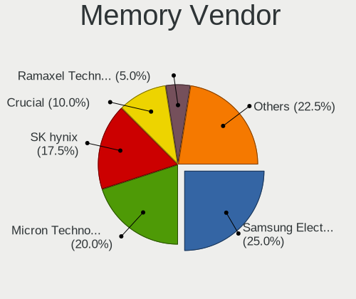
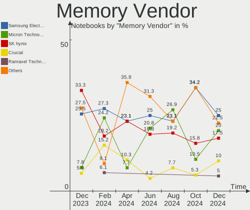

FreeBSD - Hardware Trends (Notebooks)
-------------------------------------

A project to identify most popular hardware characteristics and track their change
over time based on data collected by BSD users at https://BSD-Hardware.info.

Anyone can contribute to this report by the [hw-probe](https://github.com/linuxhw/hw-probe/blob/master/INSTALL.BSD.md) tool:

    hw-probe -all -upload

This report is for one last month. Overall report since the beginning of time: [TestDays](https://github.com/bsdhw/TestDays)

Period: Aug, 2023.

Contents
--------

* [ System ](#system)
  - [ OS                       ](#os)
  - [ OS Family                ](#os-family)
  - [ Arch                     ](#arch)
  - [ DE                       ](#de)
  - [ Display Server           ](#display-server)
  - [ Display Manager          ](#display-manager)
  - [ OS Lang                  ](#os-lang)
  - [ Boot Mode                ](#boot-mode)
  - [ Filesystem               ](#filesystem)
  - [ Part. scheme             ](#part-scheme)

* [ Board ](#board)
  - [ Vendor                   ](#vendor)
  - [ Model                    ](#model)
  - [ Model Family             ](#model-family)
  - [ MFG Year                 ](#mfg-year)
  - [ Form Factor              ](#form-factor)
  - [ Coreboot                 ](#coreboot)
  - [ RAM Size                 ](#ram-size)
  - [ RAM Used                 ](#ram-used)
  - [ Total Drives             ](#total-drives)
  - [ Has CD-ROM               ](#has-cd-rom)
  - [ Has Ethernet             ](#has-ethernet)
  - [ Has WiFi                 ](#has-wifi)
  - [ Has Bluetooth            ](#has-bluetooth)

* [ Location ](#location)
  - [ Country                  ](#country)
  - [ City                     ](#city)

* [ Drives ](#drives)
  - [ Drive Vendor             ](#drive-vendor)
  - [ Drive Model              ](#drive-model)
  - [ HDD Vendor               ](#hdd-vendor)
  - [ SSD Vendor               ](#ssd-vendor)
  - [ Drive Kind               ](#drive-kind)
  - [ Drive Connector          ](#drive-connector)
  - [ Drive Size               ](#drive-size)
  - [ Space Total              ](#space-total)
  - [ Space Used               ](#space-used)
  - [ Malfunc. Drives          ](#malfunc-drives)
  - [ Malfunc. Drive Vendor    ](#malfunc-drive-vendor)
  - [ Malfunc. HDD Vendor      ](#malfunc-hdd-vendor)
  - [ Malfunc. Drive Kind      ](#malfunc-drive-kind)
  - [ Failed Drives            ](#failed-drives)
  - [ Failed Drive Vendor      ](#failed-drive-vendor)
  - [ Drive Status             ](#drive-status)

* [ Storage controller ](#storage-controller)
  - [ Storage Vendor           ](#storage-vendor)
  - [ Storage Model            ](#storage-model)
  - [ Storage Kind             ](#storage-kind)

* [ Processor ](#processor)
  - [ CPU Vendor               ](#cpu-vendor)
  - [ CPU Model                ](#cpu-model)
  - [ CPU Model Family         ](#cpu-model-family)
  - [ CPU Cores                ](#cpu-cores)
  - [ CPU Sockets              ](#cpu-sockets)
  - [ CPU Threads              ](#cpu-threads)
  - [ CPU Microarch            ](#cpu-microarch)

* [ Graphics ](#graphics)
  - [ GPU Vendor               ](#gpu-vendor)
  - [ GPU Model                ](#gpu-model)
  - [ GPU Combo                ](#gpu-combo)
  - [ GPU Driver               ](#gpu-driver)
  - [ GPU Memory               ](#gpu-memory)

* [ Monitor ](#monitor)
  - [ Monitor Vendor           ](#monitor-vendor)
  - [ Monitor Model            ](#monitor-model)
  - [ Monitor Resolution       ](#monitor-resolution)
  - [ Monitor Diagonal         ](#monitor-diagonal)
  - [ Monitor Width            ](#monitor-width)
  - [ Aspect Ratio             ](#aspect-ratio)
  - [ Monitor Area             ](#monitor-area)
  - [ Pixel Density            ](#pixel-density)
  - [ Multiple Monitors        ](#multiple-monitors)

* [ Network ](#network)
  - [ Net Controller Vendor    ](#net-controller-vendor)
  - [ Net Controller Model     ](#net-controller-model)
  - [ Wireless Vendor          ](#wireless-vendor)
  - [ Wireless Model           ](#wireless-model)
  - [ Ethernet Vendor          ](#ethernet-vendor)
  - [ Ethernet Model           ](#ethernet-model)
  - [ Net Controller Kind      ](#net-controller-kind)
  - [ Used Controller          ](#used-controller)
  - [ NICs                     ](#nics)
  - [ IPv6                     ](#ipv6)

* [ Bluetooth ](#bluetooth)
  - [ Bluetooth Vendor         ](#bluetooth-vendor)
  - [ Bluetooth Model          ](#bluetooth-model)

* [ Sound ](#sound)
  - [ Sound Vendor             ](#sound-vendor)
  - [ Sound Model              ](#sound-model)

* [ Memory ](#memory)
  - [ Memory Vendor            ](#memory-vendor)
  - [ Memory Model             ](#memory-model)
  - [ Memory Kind              ](#memory-kind)
  - [ Memory Form Factor       ](#memory-form-factor)
  - [ Memory Size              ](#memory-size)
  - [ Memory Speed             ](#memory-speed)

* [ Printers & scanners ](#printers--scanners)
  - [ Printer Vendor           ](#printer-vendor)
  - [ Printer Model            ](#printer-model)
  - [ Scanner Vendor           ](#scanner-vendor)
  - [ Scanner Model            ](#scanner-model)

* [ Camera ](#camera)
  - [ Camera Vendor            ](#camera-vendor)
  - [ Camera Model             ](#camera-model)

* [ Security ](#security)
  - [ Fingerprint Vendor       ](#fingerprint-vendor)
  - [ Fingerprint Model        ](#fingerprint-model)
  - [ Chipcard Vendor          ](#chipcard-vendor)
  - [ Chipcard Model           ](#chipcard-model)

* [ Unsupported ](#unsupported)
  - [ Unsupported Devices      ](#unsupported-devices)
  - [ Unsupported Device Types ](#unsupported-device-types)

System
------

OS
--

Installed operating systems

| Name                 | Notebooks | Percent |
|----------------------|-----------|---------|
| FreeBSD 13.2-p2      | 11        | 55%     |
| FreeBSD 14.0-CURRENT | 3         | 15%     |
| FreeBSD 13.2         | 2         | 10%     |
| FreeBSD 15.0-CURRENT | 1         | 5%      |
| FreeBSD 14.0-ALPHA3  | 1         | 5%      |
| FreeBSD 13.2-p1      | 1         | 5%      |
| FreeBSD 13.1-p9      | 1         | 5%      |

OS Family
---------

OS without a version

| Name    | Notebooks | Percent |
|---------|-----------|---------|
| FreeBSD | 20        | 100%    |

Arch
----

OS architecture (x86_64, i586, etc.)

| Name  | Notebooks | Percent |
|-------|-----------|---------|
| amd64 | 20        | 100%    |

DE
--

Desktop Environment

| Name    | Notebooks | Percent |
|---------|-----------|---------|
| KDE5    | 6         | 30%     |
| XFCE    | 3         | 15%     |
| Console | 3         | 15%     |
| i3      | 2         | 10%     |
| GNOME   | 2         | 10%     |
| Potato  | 1         | 5%      |
| Openbox | 1         | 5%      |
| LXQt    | 1         | 5%      |
| Budgie  | 1         | 5%      |

Display Server
--------------

X11 or Wayland

| Name    | Notebooks | Percent |
|---------|-----------|---------|
| X11     | 15        | 75%     |
| Console | 3         | 15%     |
| Wayland | 2         | 10%     |

Display Manager
---------------

SDDM, LightDM, etc.

| Name    | Notebooks | Percent |
|---------|-----------|---------|
| Console | 8         | 40%     |
| SDDM    | 4         | 20%     |
| LightDM | 3         | 15%     |
| XDM     | 2         | 10%     |
| GDM     | 2         | 10%     |
| SLiM    | 1         | 5%      |

OS Lang
-------

Language

| Lang    | Notebooks | Percent |
|---------|-----------|---------|
| C       | 14        | 70%     |
| Unknown | 2         | 10%     |
| fr_FR   | 1         | 5%      |
| es_ES   | 1         | 5%      |
| en_AU   | 1         | 5%      |
| Default | 1         | 5%      |

Boot Mode
---------

EFI or BIOS

| Mode | Notebooks | Percent |
|------|-----------|---------|
| EFI  | 19        | 95%     |
| BIOS | 1         | 5%      |

Filesystem
----------

Type of filesystem

| Type | Notebooks | Percent |
|------|-----------|---------|
| Zfs  | 14        | 70%     |
| Ufs  | 6         | 30%     |

Part. scheme
------------

Scheme of partitioning

| Type | Notebooks | Percent |
|------|-----------|---------|
| GPT  | 19        | 95%     |
| BSD  | 1         | 5%      |

Board
-----

Vendor
------

Motherboard manufacturer

| Name             | Notebooks | Percent |
|------------------|-----------|---------|
| Lenovo           | 8         | 40%     |
| Dell             | 3         | 15%     |
| ASUSTek Computer | 3         | 15%     |
| Acer             | 2         | 10%     |
| Notebook         | 1         | 5%      |
| MSI              | 1         | 5%      |
| Hewlett-Packard  | 1         | 5%      |
| Apple            | 1         | 5%      |

Model
-----

Motherboard model

| Name                                       | Notebooks | Percent |
|--------------------------------------------|-----------|---------|
| Notebook N7x0WU                            | 1         | 5%      |
| MSI Modern 14 B11SBL                       | 1         | 5%      |
| Lenovo ThinkPad X1 Carbon Gen 9 20XXS2XW00 | 1         | 5%      |
| Lenovo ThinkPad X1 Carbon Gen 9 20XW00FUUS | 1         | 5%      |
| Lenovo ThinkPad T495s 20QKS1812F           | 1         | 5%      |
| Lenovo ThinkPad T480s 20L8S0UD00           | 1         | 5%      |
| Lenovo ThinkPad T460p 20FXS06A11           | 1         | 5%      |
| Lenovo ThinkPad T450 20BV000BUS            | 1         | 5%      |
| Lenovo ThinkPad T430 2347GR2               | 1         | 5%      |
| Lenovo IdeaPad Slim 9 14ITL5 82D2          | 1         | 5%      |
| HP EliteBook 8570p                         | 1         | 5%      |
| Dell Latitude 3420                         | 1         | 5%      |
| Dell Inspiron 14-3467                      | 1         | 5%      |
| Dell G5 5590                               | 1         | 5%      |
| ASUS ROG Strix G513QC_G513QC               | 1         | 5%      |
| ASUS N751JK                                | 1         | 5%      |
| ASUS 1001P                                 | 1         | 5%      |
| Apple MacBookPro11,1                       | 1         | 5%      |
| Acer Aspire A515-56                        | 1         | 5%      |
| Acer Aspire A315-59                        | 1         | 5%      |

Model Family
------------

Motherboard model prefix

| Name               | Notebooks | Percent |
|--------------------|-----------|---------|
| Lenovo ThinkPad    | 7         | 35%     |
| Acer Aspire        | 2         | 10%     |
| Notebook N7x0WU    | 1         | 5%      |
| MSI Modern         | 1         | 5%      |
| Lenovo IdeaPad     | 1         | 5%      |
| HP EliteBook       | 1         | 5%      |
| Dell Latitude      | 1         | 5%      |
| Dell Inspiron      | 1         | 5%      |
| Dell G5            | 1         | 5%      |
| ASUS ROG           | 1         | 5%      |
| ASUS N751JK        | 1         | 5%      |
| ASUS 1001P         | 1         | 5%      |
| Apple MacBookPro11 | 1         | 5%      |

MFG Year
--------

Motherboard manufacture year

| Year | Notebooks | Percent |
|------|-----------|---------|
| 2021 | 5         | 25%     |
| 2019 | 3         | 15%     |
| 2023 | 2         | 10%     |
| 2022 | 2         | 10%     |
| 2018 | 2         | 10%     |
| 2013 | 2         | 10%     |
| 2020 | 1         | 5%      |
| 2016 | 1         | 5%      |
| 2015 | 1         | 5%      |
| 2010 | 1         | 5%      |

Form Factor
-----------

Physical design of the computer

| Name     | Notebooks | Percent |
|----------|-----------|---------|
| Notebook | 20        | 100%    |

Coreboot
--------

Have coreboot on board

| Used | Notebooks | Percent |
|------|-----------|---------|
| No   | 20        | 100%    |

RAM Size
--------

Total RAM memory

| Size in GB | Notebooks | Percent |
|------------|-----------|---------|
| 16.01-24.0 | 12        | 60%     |
| 8.01-16.0  | 5         | 25%     |
| 32.01-64.0 | 2         | 10%     |
| 2.01-3.0   | 1         | 5%      |

RAM Used
--------

Used RAM memory

| Used GB  | Notebooks | Percent |
|----------|-----------|---------|
| 0.51-1.0 | 13        | 65%     |
| 1.01-2.0 | 3         | 15%     |
| 0.01-0.5 | 3         | 15%     |
| 2.01-3.0 | 1         | 5%      |

Total Drives
------------

Number of drives on board

| Drives | Notebooks | Percent |
|--------|-----------|---------|
| 1      | 12        | 60%     |
| 2      | 4         | 20%     |
| 0      | 3         | 15%     |
| 3      | 1         | 5%      |

Has CD-ROM
----------

Has CD-ROM on board

| Presented | Notebooks | Percent |
|-----------|-----------|---------|
| No        | 18        | 90%     |
| Yes       | 2         | 10%     |

Has Ethernet
------------

Has Ethernet on board

| Presented | Notebooks | Percent |
|-----------|-----------|---------|
| Yes       | 14        | 70%     |
| No        | 6         | 30%     |

Has WiFi
--------

Has WiFi module

| Presented | Notebooks | Percent |
|-----------|-----------|---------|
| Yes       | 20        | 100%    |

Has Bluetooth
-------------

Has Bluetooth module

| Presented | Notebooks | Percent |
|-----------|-----------|---------|
| Yes       | 15        | 75%     |
| No        | 5         | 25%     |

Location
--------

Country
-------

Geographic location (country)

| Country   | Notebooks | Percent |
|-----------|-----------|---------|
| USA       | 4         | 20%     |
| UK        | 3         | 15%     |
| Iceland   | 2         | 10%     |
| France    | 2         | 10%     |
| Australia | 2         | 10%     |
| Turkey    | 1         | 5%      |
| Spain     | 1         | 5%      |
| Russia    | 1         | 5%      |
| Nepal     | 1         | 5%      |
| Italy     | 1         | 5%      |
| China     | 1         | 5%      |
| Canada    | 1         | 5%      |

City
----

Geographic location (city)

| City          | Notebooks | Percent |
|---------------|-----------|---------|
| Reykjavik     | 2         | 10%     |
| York          | 1         | 5%      |
| Sydney        | 1         | 5%      |
| St Petersburg | 1         | 5%      |
| Portland      | 1         | 5%      |
| Paris         | 1         | 5%      |
| Manchester    | 1         | 5%      |
| Las Vegas     | 1         | 5%      |
| Lancing       | 1         | 5%      |
| Izmir         | 1         | 5%      |
| Clinton       | 1         | 5%      |
| Chengdu       | 1         | 5%      |
| Calgary       | 1         | 5%      |
| Cagliari      | 1         | 5%      |
| Brighton      | 1         | 5%      |
| Bharatpur     | 1         | 5%      |
| Albacete      | 1         | 5%      |
| Adelaide      | 1         | 5%      |
| Acheres       | 1         | 5%      |

Drives
------

Drive Vendor
------------

Hard drive vendors

| Vendor              | Notebooks | Drives | Percent |
|---------------------|-----------|--------|---------|
| Kingston            | 5         | 5      | 23.81%  |
| Samsung Electronics | 4         | 6      | 19.05%  |
| WDC                 | 3         | 3      | 14.29%  |
| Transcend           | 2         | 2      | 9.52%   |
| Silicon Motion      | 1         | 1      | 4.76%   |
| Seagate             | 1         | 1      | 4.76%   |
| KIOXIA              | 1         | 1      | 4.76%   |
| HGST                | 1         | 1      | 4.76%   |
| Crucial             | 1         | 1      | 4.76%   |
| Corsair             | 1         | 1      | 4.76%   |
| Apple               | 1         | 1      | 4.76%   |

Drive Model
-----------

Hard drive models

| Model                                | Notebooks | Percent |
|--------------------------------------|-----------|---------|
| Samsung SSD 860 EVO 500GB            | 2         | 8.7%    |
| Kingston SA400S37240G 240GB          | 2         | 8.7%    |
| WDC WDS500G2B0A-00SM50 500GB         | 1         | 4.35%   |
| WDC WDS120G2G0B-00EPW0 120GB         | 1         | 4.35%   |
| WDC PC SN730 SDBQNTY-256G-1001 256GB | 1         | 4.35%   |
| Transcend TS256GMTS400 256GB         | 1         | 4.35%   |
| Transcend TS128GMTS400 128GB         | 1         | 4.35%   |
| Silicon Motion whalekom 256GB        | 1         | 4.35%   |
| Seagate ST2000LM007-1R8174 2TB       | 1         | 4.35%   |
| Samsung SSD 980 500GB                | 1         | 4.35%   |
| Samsung SSD 870 EVO 1TB              | 1         | 4.35%   |
| Samsung SSD 860 EVO mSATA 500GB      | 1         | 4.35%   |
| Samsung MZVLB1T0HBLR-000L2 1TB       | 1         | 4.35%   |
| KIOXIA KBG5AZNV512G LA 512GB         | 1         | 4.35%   |
| Kingston OM8PDP3256B-AA1 256GB       | 1         | 4.35%   |
| Kingston OM8PCP3512F-AI1 512GB       | 1         | 4.35%   |
| Kingston OM8PCP3512F-AA 512GB        | 1         | 4.35%   |
| HGST HTS721010A9E630 1TB             | 1         | 4.35%   |
| Crucial CT1000MX500SSD1 1TB          | 1         | 4.35%   |
| Corsair Force 3 SSD 120GB            | 1         | 4.35%   |
| Apple SSD SM0256F 256GB              | 1         | 4.35%   |

HDD Vendor
----------

Hard disk drive vendors

| Vendor  | Notebooks | Drives | Percent |
|---------|-----------|--------|---------|
| Seagate | 1         | 1      | 50%     |
| HGST    | 1         | 1      | 50%     |

SSD Vendor
----------

Solid state drive vendors

| Vendor              | Notebooks | Drives | Percent |
|---------------------|-----------|--------|---------|
| WDC                 | 2         | 2      | 18.18%  |
| Transcend           | 2         | 2      | 18.18%  |
| Samsung Electronics | 2         | 4      | 18.18%  |
| Kingston            | 2         | 2      | 18.18%  |
| Crucial             | 1         | 1      | 9.09%   |
| Corsair             | 1         | 1      | 9.09%   |
| Apple               | 1         | 1      | 9.09%   |

Drive Kind
----------

HDD or SSD

| Kind | Notebooks | Drives | Percent |
|------|-----------|--------|---------|
| NVMe | 8         | 8      | 44.44%  |
| SSD  | 8         | 13     | 44.44%  |
| HDD  | 2         | 2      | 11.11%  |

Drive Connector
---------------

SATA, SAS, NVMe, etc.

| Type | Notebooks | Drives | Percent |
|------|-----------|--------|---------|
| SATA | 10        | 15     | 55.56%  |
| NVMe | 8         | 8      | 44.44%  |

Drive Size
----------

Size of hard drive

| Size in TB | Notebooks | Drives | Percent |
|------------|-----------|--------|---------|
| 0.01-0.5   | 8         | 11     | 66.67%  |
| 0.51-1.0   | 3         | 3      | 25%     |
| 1.01-2.0   | 1         | 1      | 8.33%   |

Space Total
-----------

Amount of disk space available on the file system

| Size in GB | Notebooks | Percent |
|------------|-----------|---------|
| 101-250    | 12        | 60%     |
| 251-500    | 5         | 25%     |
| 501-1000   | 2         | 10%     |
| 1-20       | 1         | 5%      |

Space Used
----------

Amount of used disk space

| Used GB | Notebooks | Percent |
|---------|-----------|---------|
| 1-20    | 13        | 65%     |
| 21-50   | 4         | 20%     |
| 51-100  | 2         | 10%     |
| 101-250 | 1         | 5%      |

Malfunc. Drives
---------------

Drive models with a malfunction

| Model                    | Notebooks | Drives | Percent |
|--------------------------|-----------|--------|---------|
| HGST HTS721010A9E630 1TB | 1         | 1      | 100%    |

Malfunc. Drive Vendor
---------------------

Vendors of faulty drives

| Vendor | Notebooks | Drives | Percent |
|--------|-----------|--------|---------|
| HGST   | 1         | 1      | 100%    |

Malfunc. HDD Vendor
-------------------

Vendors of faulty HDD drives

| Vendor | Notebooks | Drives | Percent |
|--------|-----------|--------|---------|
| HGST   | 1         | 1      | 100%    |

Malfunc. Drive Kind
-------------------

Kinds of faulty drives

| Kind | Notebooks | Drives | Percent |
|------|-----------|--------|---------|
| HDD  | 1         | 1      | 100%    |

Failed Drives
-------------

Failed drive models

Zero info for selected period =(

Failed Drive Vendor
-------------------

Failed drive vendors

Zero info for selected period =(

Drive Status
------------

Number of failed and malfunc. drives

| Status   | Notebooks | Drives | Percent |
|----------|-----------|--------|---------|
| Works    | 15        | 21     | 88.24%  |
| Detected | 1         | 1      | 5.88%   |
| Malfunc  | 1         | 1      | 5.88%   |

Storage controller
------------------

Storage Vendor
--------------

Storage controller vendors

| Vendor                      | Notebooks | Percent |
|-----------------------------|-----------|---------|
| Intel                       | 13        | 50%     |
| SanDisk                     | 3         | 11.54%  |
| Samsung Electronics         | 3         | 11.54%  |
| Kingston Technology Company | 3         | 11.54%  |
| Silicon Motion              | 1         | 3.85%   |
| Micron Technology           | 1         | 3.85%   |
| MAXIO Technology (Hangzhou) | 1         | 3.85%   |
| KIOXIA                      | 1         | 3.85%   |

Storage Model
-------------

Storage controller models

| Model                                                                          | Notebooks | Percent |
|--------------------------------------------------------------------------------|-----------|---------|
| SanDisk WD Black SN750 / PC SN730 NVMe SSD                                     | 2         | 7.14%   |
| Kingston Company OM8PCP Design-In PCIe 3 NVMe SSD (DRAM-less)                  | 2         | 7.14%   |
| Intel Volume Management Device NVMe RAID Controller                            | 2         | 7.14%   |
| Intel Tiger Lake-LP SATA Controller                                            | 2         | 7.14%   |
| Intel Sunrise Point-LP SATA Controller [AHCI mode]                             | 2         | 7.14%   |
| Intel 7 Series Chipset Family 6-port SATA Controller [AHCI mode]               | 2         | 7.14%   |
| Silicon Motion SM2263EN/SM2263XT (DRAM-less) NVMe SSD Controllers              | 1         | 3.57%   |
| Sandisk WD Green SN350 NVMe SSD 1 TB (DRAM-less)                               | 1         | 3.57%   |
| Samsung S4LN053X01 AHCI SSD Controller(Apple slot)                             | 1         | 3.57%   |
| Samsung NVMe SSD Controller SM981/PM981/PM983                                  | 1         | 3.57%   |
| Samsung NVMe SSD Controller 980                                                | 1         | 3.57%   |
| Micron 2450 NVMe SSD [HendrixV] (DRAM-less)                                    | 1         | 3.57%   |
| MAXIO (Hangzhou) NVMe SSD Controller MAP1202                                   | 1         | 3.57%   |
| KIOXIA NVMe SSD Controller BG5 (DRAM-less)                                     | 1         | 3.57%   |
| Kingston Company OM3PDP3 NVMe SSD                                              | 1         | 3.57%   |
| Intel SSD 670p Series [Keystone Harbor]                                        | 1         | 3.57%   |
| Intel NM10/ICH7 Family SATA Controller [AHCI mode]                             | 1         | 3.57%   |
| Intel HM170/QM170 Chipset SATA Controller [AHCI Mode]                          | 1         | 3.57%   |
| Intel Cannon Lake Mobile PCH SATA AHCI Controller                              | 1         | 3.57%   |
| Intel Alder Lake-P SATA AHCI Controller                                        | 1         | 3.57%   |
| Intel 8 Series/C220 Series Chipset Family 6-port SATA Controller 1 [AHCI mode] | 1         | 3.57%   |
| Intel 8 Series SATA Controller 1 [AHCI mode]                                   | 1         | 3.57%   |

Storage Kind
------------

Kind of storage controller (IDE, SATA, NVMe, SAS, ...)

| Kind | Notebooks | Percent |
|------|-----------|---------|
| SATA | 13        | 48.15%  |
| NVMe | 12        | 44.44%  |
| RAID | 2         | 7.41%   |

Processor
---------

CPU Vendor
----------

Processor vendors

| Vendor | Notebooks | Percent |
|--------|-----------|---------|
| Intel  | 18        | 90%     |
| AMD    | 2         | 10%     |

CPU Model
---------

Processor models

| Model                                           | Notebooks | Percent |
|-------------------------------------------------|-----------|---------|
| Intel 11th Gen Core i5-1135G7 @ 2.40GHz         | 3         | 15%     |
| Intel Core i7-9750H CPU @ 2.60GHz               | 1         | 5%      |
| Intel Core i7-4710HQ CPU @ 2.50GHz              | 1         | 5%      |
| Intel Core i7-3520M CPU @ 2.90GHz               | 1         | 5%      |
| Intel Core i5-8350U CPU @ 1.70GHz               | 1         | 5%      |
| Intel Core i5-7200U CPU @ 2.50GHz               | 1         | 5%      |
| Intel Core i5-6300HQ CPU @ 2.30GHz              | 1         | 5%      |
| Intel Core i5-4300U CPU @ 1.90GHz               | 1         | 5%      |
| Intel Core i5-4258U CPU @ 2.40GHz               | 1         | 5%      |
| Intel Core i5-3320M CPU @ 2.60GHz               | 1         | 5%      |
| Intel Core i3-8130U CPU @ 2.20GHz               | 1         | 5%      |
| Intel Atom CPU N450 @ 1.66GHz                   | 1         | 5%      |
| Intel 12th Gen Core i5-1235U                    | 1         | 5%      |
| Intel 11th Gen Core i7-1195G7 @ 2.90GHz         | 1         | 5%      |
| Intel 11th Gen Core i7-1165G7 @ 2.80GHz         | 1         | 5%      |
| Intel 11th Gen Core i5-1145G7 @ 2.60GHz         | 1         | 5%      |
| AMD Ryzen 9 5900HX with Radeon Graphics         | 1         | 5%      |
| AMD Ryzen 7 PRO 3700U w/ Radeon Vega Mobile Gfx | 1         | 5%      |

CPU Model Family
----------------

Processor model prefix

| Model           | Notebooks | Percent |
|-----------------|-----------|---------|
| Other           | 7         | 35%     |
| Intel Core i5   | 6         | 30%     |
| Intel Core i7   | 3         | 15%     |
| Intel Core i3   | 1         | 5%      |
| Intel Atom      | 1         | 5%      |
| AMD Ryzen 9     | 1         | 5%      |
| AMD Ryzen 7 PRO | 1         | 5%      |

CPU Cores
---------

Number of processor cores

| Number | Notebooks | Percent |
|--------|-----------|---------|
| 4      | 9         | 45%     |
| 2      | 6         | 30%     |
| 6      | 2         | 10%     |
| 16     | 1         | 5%      |
| 8      | 1         | 5%      |
| 1      | 1         | 5%      |

CPU Sockets
-----------

Number of sockets

| Number | Notebooks | Percent |
|--------|-----------|---------|
| 1      | 20        | 100%    |

CPU Threads
-----------

Threads per core (Hyper-Threading)

| Number | Notebooks | Percent |
|--------|-----------|---------|
| 2      | 17        | 85%     |
| 1      | 3         | 15%     |

CPU Microarch
-------------

Microarchitecture

| Name      | Notebooks | Percent |
|-----------|-----------|---------|
| TigerLake | 6         | 30%     |
| KabyLake  | 4         | 20%     |
| Haswell   | 3         | 15%     |
| IvyBridge | 2         | 10%     |
| Zen+      | 1         | 5%      |
| Zen 3     | 1         | 5%      |
| Skylake   | 1         | 5%      |
| Bonnell   | 1         | 5%      |
| Unknown   | 1         | 5%      |

Graphics
--------

GPU Vendor
----------

Vendors of graphics cards

| Vendor | Notebooks | Percent |
|--------|-----------|---------|
| Intel  | 17        | 68%     |
| Nvidia | 4         | 16%     |
| AMD    | 4         | 16%     |

GPU Model
---------

Graphics card models

| Model                                                                         | Notebooks | Percent |
|-------------------------------------------------------------------------------|-----------|---------|
| Intel TigerLake-LP GT2 [Iris Xe Graphics]                                     | 6         | 24%     |
| Intel UHD Graphics 620                                                        | 2         | 8%      |
| Intel Haswell-ULT Integrated Graphics Controller                              | 2         | 8%      |
| Nvidia TU117M [GeForce MX450]                                                 | 1         | 4%      |
| Nvidia TU116M [GeForce GTX 1660 Ti Mobile]                                    | 1         | 4%      |
| Nvidia GM107M [GeForce GTX 850M]                                              | 1         | 4%      |
| Nvidia GA107M [GeForce RTX 3050 Mobile]                                       | 1         | 4%      |
| Intel HD Graphics 620                                                         | 1         | 4%      |
| Intel HD Graphics 530                                                         | 1         | 4%      |
| Intel CoffeeLake-H GT2 [UHD Graphics 630]                                     | 1         | 4%      |
| Intel Atom Processor D4xx/D5xx/N4xx/N5xx Integrated Graphics Controller       | 1         | 4%      |
| Intel Alder Lake-UP3 GT2 [Iris Xe Graphics]                                   | 1         | 4%      |
| Intel 4th Gen Core Processor Integrated Graphics Controller                   | 1         | 4%      |
| Intel 3rd Gen Core processor Graphics Controller                              | 1         | 4%      |
| AMD Thames [Radeon HD 7550M/7570M/7650M]                                      | 1         | 4%      |
| AMD Sun XT [Radeon HD 8670A/8670M/8690M / R5 M330 / M430 / Radeon 520 Mobile] | 1         | 4%      |
| AMD Picasso/Raven 2 [Radeon Vega Series / Radeon Vega Mobile Series]          | 1         | 4%      |
| AMD Cezanne [Radeon Vega Series / Radeon Vega Mobile Series]                  | 1         | 4%      |

GPU Combo
---------

Combinations of graphics cards

| Name           | Notebooks | Percent |
|----------------|-----------|---------|
| 1 x Intel      | 12        | 60%     |
| Intel + Nvidia | 3         | 15%     |
| 1 x AMD        | 2         | 10%     |
| 2 x Intel      | 1         | 5%      |
| Intel + AMD    | 1         | 5%      |
| AMD + Nvidia   | 1         | 5%      |

GPU Driver
----------

Free vs proprietary

| Driver      | Notebooks | Percent |
|-------------|-----------|---------|
| Free        | 17        | 85%     |
| Proprietary | 3         | 15%     |

GPU Memory
----------

Total video memory

| Size in GB | Notebooks | Percent |
|------------|-----------|---------|
| Unknown    | 18        | 90%     |
| 1.01-2.0   | 1         | 5%      |
| 0.51-1.0   | 1         | 5%      |

Monitor
-------

Monitor Vendor
--------------

Monitor vendors

| Vendor         | Notebooks | Percent |
|----------------|-----------|---------|
| AU Optronics   | 5         | 29.41%  |
| LG Display     | 4         | 23.53%  |
| Philips        | 1         | 5.88%   |
| Lenovo         | 1         | 5.88%   |
| InfoVision     | 1         | 5.88%   |
| HannStar       | 1         | 5.88%   |
| CTO            | 1         | 5.88%   |
| Chimei Innolux | 1         | 5.88%   |
| BOE            | 1         | 5.88%   |
| Apple          | 1         | 5.88%   |

Monitor Model
-------------

Monitor models

| Model                                                            | Notebooks | Percent |
|------------------------------------------------------------------|-----------|---------|
| Philips 271P4 PHL08C3 1920x1080 600x340mm 27.2-inch              | 1         | 5.88%   |
| LG Display LCD Monitor LGD04FF 1920x1080 310x170mm 13.9-inch     | 1         | 5.88%   |
| LG Display LCD Monitor LGD04F9 1920x1080 310x170mm 13.9-inch     | 1         | 5.88%   |
| LG Display LCD Monitor LGD046C 1920x1080 380x210mm 17.1-inch     | 1         | 5.88%   |
| LG Display LCD Monitor LGD0258 1600x900 350x190mm 15.7-inch      | 1         | 5.88%   |
| Lenovo LCD Monitor LEN40A3 1920x1080 310x170mm 13.9-inch         | 1         | 5.88%   |
| InfoVision LCD Monitor IVO057D 1920x1080 310x170mm 13.9-inch     | 1         | 5.88%   |
| HannStar LCD Monitor HSD03E9 1024x600 220x130mm 10.1-inch        | 1         | 5.88%   |
| CTO LCD Monitor CTO1412 1920x1200 300x190mm 14.0-inch            | 1         | 5.88%   |
| Chimei Innolux LCD Monitor CMN15F5 1920x1080 340x190mm 15.3-inch | 1         | 5.88%   |
| BOE LCD Monitor BOE0729 1920x1080 340x190mm 15.3-inch            | 1         | 5.88%   |
| AU Optronics LCD Monitor AUOD291 1920x1200 300x190mm 14.0-inch   | 1         | 5.88%   |
| AU Optronics LCD Monitor AUO8F8E 3840x2160 310x170mm 13.9-inch   | 1         | 5.88%   |
| AU Optronics LCD Monitor AUO80ED 1920x1080 340x190mm 15.3-inch   | 1         | 5.88%   |
| AU Optronics LCD Monitor AUO323D 1920x1080 310x170mm 13.9-inch   | 1         | 5.88%   |
| AU Optronics LCD Monitor AUO103D 1920x1080 310x170mm 13.9-inch   | 1         | 5.88%   |
| Apple Color LCD APPA018 2560x1600 290x180mm 13.4-inch            | 1         | 5.88%   |

Monitor Resolution
------------------

Monitor screen resolution

| Resolution        | Notebooks | Percent |
|-------------------|-----------|---------|
| 1920x1080 (FHD)   | 11        | 64.71%  |
| 1920x1200 (WUXGA) | 2         | 11.76%  |
| 3840x2160 (4K)    | 1         | 5.88%   |
| 2560x1600         | 1         | 5.88%   |
| 1600x900 (HD+)    | 1         | 5.88%   |
| 1024x600          | 1         | 5.88%   |

Monitor Diagonal
----------------

Diagonal size in inches

| Inches | Notebooks | Percent |
|--------|-----------|---------|
| 13     | 8         | 47.06%  |
| 15     | 4         | 23.53%  |
| 14     | 2         | 11.76%  |
| 27     | 1         | 5.88%   |
| 17     | 1         | 5.88%   |
| 10     | 1         | 5.88%   |

Monitor Width
-------------

Physical width

| Width in mm | Notebooks | Percent |
|-------------|-----------|---------|
| 301-350     | 11        | 64.71%  |
| 201-300     | 4         | 23.53%  |
| 501-600     | 1         | 5.88%   |
| 351-400     | 1         | 5.88%   |

Aspect Ratio
------------

Proportional relationship between the width and the height

| Ratio | Notebooks | Percent |
|-------|-----------|---------|
| 16/9  | 13        | 81.25%  |
| 16/10 | 3         | 18.75%  |

Monitor Area
------------

Area in inch²

| Area in inch² | Notebooks | Percent |
|----------------|-----------|---------|
| 81-90          | 10        | 58.82%  |
| 91-100         | 3         | 17.65%  |
| 41-50          | 1         | 5.88%   |
| 301-350        | 1         | 5.88%   |
| 121-130        | 1         | 5.88%   |
| 101-110        | 1         | 5.88%   |

Pixel Density
-------------

Pixels per inch

| Density       | Notebooks | Percent |
|---------------|-----------|---------|
| 121-160       | 10        | 58.82%  |
| 161-240       | 3         | 17.65%  |
| 101-120       | 2         | 11.76%  |
| More than 240 | 1         | 5.88%   |
| 51-100        | 1         | 5.88%   |

Multiple Monitors
-----------------

Total monitors connected

| Total | Notebooks | Percent |
|-------|-----------|---------|
| 1     | 15        | 75%     |
| 0     | 4         | 20%     |
| 2     | 1         | 5%      |

Network
-------

Net Controller Vendor
---------------------

Controller vendors

| Vendor                | Notebooks | Percent |
|-----------------------|-----------|---------|
| Intel                 | 17        | 53.13%  |
| Realtek Semiconductor | 8         | 25%     |
| Qualcomm Atheros      | 2         | 6.25%   |
| MediaTek              | 2         | 6.25%   |
| Xiaomi                | 1         | 3.13%   |
| Hewlett-Packard       | 1         | 3.13%   |
| Broadcom              | 1         | 3.13%   |

Net Controller Model
--------------------

Controller models

| Model                                                             | Notebooks | Percent |
|-------------------------------------------------------------------|-----------|---------|
| Realtek RTL8111/8168/8411 PCI Express Gigabit Ethernet Controller | 6         | 15.79%  |
| Intel Wi-Fi 6 AX201                                               | 6         | 15.79%  |
| Intel Wireless 7265                                               | 2         | 5.26%   |
| Intel Centrino Advanced-N 6205 [Taylor Peak]                      | 2         | 5.26%   |
| Intel 82579LM Gigabit Network Connection (Lewisville)             | 2         | 5.26%   |
| Xiaomi Mi/Redmi series (RNDIS)                                    | 1         | 2.63%   |
| Realtek RTL88x2bu [AC1200 Techkey]                                | 1         | 2.63%   |
| Realtek RTL810xE PCI Express Fast Ethernet controller             | 1         | 2.63%   |
| Realtek Killer E2500 Gigabit Ethernet Controller                  | 1         | 2.63%   |
| Qualcomm Atheros QCA9377 802.11ac Wireless Network Adapter        | 1         | 2.63%   |
| Qualcomm Atheros AR8132 Fast Ethernet                             | 1         | 2.63%   |
| MediaTek MT7921 802.11ax PCI Express Wireless Network Adapter     | 1         | 2.63%   |
| MediaTek MT7630e 802.11bgn Wireless Network Adapter               | 1         | 2.63%   |
| Intel Wireless-AC 9260                                            | 1         | 2.63%   |
| Intel Wireless 8265 / 8275                                        | 1         | 2.63%   |
| Intel Wireless 8260                                               | 1         | 2.63%   |
| Intel Ethernet Connection I218-LM                                 | 1         | 2.63%   |
| Intel Ethernet Connection (4) I219-LM                             | 1         | 2.63%   |
| Intel Ethernet Connection (2) I219-LM                             | 1         | 2.63%   |
| Intel Dual Band Wireless-AC 3168NGW [Stone Peak]                  | 1         | 2.63%   |
| Intel Centrino Advanced-N 6200                                    | 1         | 2.63%   |
| Intel Cannon Lake PCH CNVi WiFi                                   | 1         | 2.63%   |
| Intel Alder Lake-P PCH CNVi WiFi                                  | 1         | 2.63%   |
| HP hs2350 HSPA+ Mobile Broadband Module Network Adapter           | 1         | 2.63%   |
| Broadcom BCM4360 802.11ac Wireless Network Adapter                | 1         | 2.63%   |

Wireless Vendor
---------------

Wireless vendors

| Vendor                | Notebooks | Percent |
|-----------------------|-----------|---------|
| Intel                 | 17        | 77.27%  |
| MediaTek              | 2         | 9.09%   |
| Realtek Semiconductor | 1         | 4.55%   |
| Qualcomm Atheros      | 1         | 4.55%   |
| Broadcom              | 1         | 4.55%   |

Wireless Model
--------------

Wireless models

| Model                                                         | Notebooks | Percent |
|---------------------------------------------------------------|-----------|---------|
| Intel Wi-Fi 6 AX201                                           | 6         | 27.27%  |
| Intel Wireless 7265                                           | 2         | 9.09%   |
| Intel Centrino Advanced-N 6205 [Taylor Peak]                  | 2         | 9.09%   |
| Realtek RTL88x2bu [AC1200 Techkey]                            | 1         | 4.55%   |
| Qualcomm Atheros QCA9377 802.11ac Wireless Network Adapter    | 1         | 4.55%   |
| MediaTek MT7921 802.11ax PCI Express Wireless Network Adapter | 1         | 4.55%   |
| MediaTek MT7630e 802.11bgn Wireless Network Adapter           | 1         | 4.55%   |
| Intel Wireless-AC 9260                                        | 1         | 4.55%   |
| Intel Wireless 8265 / 8275                                    | 1         | 4.55%   |
| Intel Wireless 8260                                           | 1         | 4.55%   |
| Intel Dual Band Wireless-AC 3168NGW [Stone Peak]              | 1         | 4.55%   |
| Intel Centrino Advanced-N 6200                                | 1         | 4.55%   |
| Intel Cannon Lake PCH CNVi WiFi                               | 1         | 4.55%   |
| Intel Alder Lake-P PCH CNVi WiFi                              | 1         | 4.55%   |
| Broadcom BCM4360 802.11ac Wireless Network Adapter            | 1         | 4.55%   |

Ethernet Vendor
---------------

Ethernet vendors

| Vendor                | Notebooks | Percent |
|-----------------------|-----------|---------|
| Realtek Semiconductor | 8         | 53.33%  |
| Intel                 | 5         | 33.33%  |
| Xiaomi                | 1         | 6.67%   |
| Qualcomm Atheros      | 1         | 6.67%   |

Ethernet Model
--------------

Ethernet models

| Model                                                             | Notebooks | Percent |
|-------------------------------------------------------------------|-----------|---------|
| Realtek RTL8111/8168/8411 PCI Express Gigabit Ethernet Controller | 6         | 40%     |
| Intel 82579LM Gigabit Network Connection (Lewisville)             | 2         | 13.33%  |
| Xiaomi Mi/Redmi series (RNDIS)                                    | 1         | 6.67%   |
| Realtek RTL810xE PCI Express Fast Ethernet controller             | 1         | 6.67%   |
| Realtek Killer E2500 Gigabit Ethernet Controller                  | 1         | 6.67%   |
| Qualcomm Atheros AR8132 Fast Ethernet                             | 1         | 6.67%   |
| Intel Ethernet Connection I218-LM                                 | 1         | 6.67%   |
| Intel Ethernet Connection (4) I219-LM                             | 1         | 6.67%   |
| Intel Ethernet Connection (2) I219-LM                             | 1         | 6.67%   |

Net Controller Kind
-------------------

Ethernet, WiFi or modem

| Kind     | Notebooks | Percent |
|----------|-----------|---------|
| WiFi     | 20        | 57.14%  |
| Ethernet | 14        | 40%     |
| Modem    | 1         | 2.86%   |

Used Controller
---------------

Currently used network controller

| Kind     | Notebooks | Percent |
|----------|-----------|---------|
| WiFi     | 11        | 68.75%  |
| Ethernet | 5         | 31.25%  |

NICs
----

Total network controllers on board

| Total | Notebooks | Percent |
|-------|-----------|---------|
| 2     | 14        | 70%     |
| 1     | 6         | 30%     |

IPv6
----

IPv6 vs IPv4

| Used | Notebooks | Percent |
|------|-----------|---------|
| No   | 18        | 90%     |
| Yes  | 2         | 10%     |

Bluetooth
---------

Bluetooth Vendor
----------------

Controller vendors

| Vendor       | Notebooks | Percent |
|--------------|-----------|---------|
| Intel        | 13        | 86.67%  |
| IMC Networks | 1         | 6.67%   |
| Apple        | 1         | 6.67%   |

Bluetooth Model
---------------

Controller models

| Model                                          | Notebooks | Percent |
|------------------------------------------------|-----------|---------|
| Intel AX201 Bluetooth                          | 6         | 40%     |
| Intel Bluetooth wireless interface             | 4         | 26.67%  |
| Intel Bluetooth 9460/9560 Jefferson Peak (JfP) | 2         | 13.33%  |
| Intel Wireless-AC 3168 Bluetooth               | 1         | 6.67%   |
| IMC Networks MediaTek Bluetooth Adapter        | 1         | 6.67%   |
| Apple Bluetooth Host Controller                | 1         | 6.67%   |

Sound
-----

Sound Vendor
------------

Sound card vendors

| Vendor                 | Notebooks | Percent |
|------------------------|-----------|---------|
| Intel                  | 18        | 72%     |
| AMD                    | 3         | 12%     |
| Nvidia                 | 2         | 8%      |
| Generalplus Technology | 1         | 4%      |
| C-Media Electronics    | 1         | 4%      |

Sound Model
-----------

Sound card models

| Model                                                               | Notebooks | Percent |
|---------------------------------------------------------------------|-----------|---------|
| Intel Tiger Lake-LP Smart Sound Technology Audio Controller         | 6         | 20%     |
| Intel Sunrise Point-LP HD Audio                                     | 3         | 10%     |
| Intel Haswell-ULT HD Audio Controller                               | 2         | 6.67%   |
| Intel 8 Series HD Audio Controller                                  | 2         | 6.67%   |
| Intel 7 Series/C216 Chipset Family High Definition Audio Controller | 2         | 6.67%   |
| AMD Family 17h/19h HD Audio Controller                              | 2         | 6.67%   |
| Nvidia TU116 High Definition Audio Controller                       | 1         | 3.33%   |
| Intel Xeon E3-1200 v3/4th Gen Core Processor HD Audio Controller    | 1         | 3.33%   |
| Intel NM10/ICH7 Family High Definition Audio Controller             | 1         | 3.33%   |
| Intel Cannon Lake PCH cAVS                                          | 1         | 3.33%   |
| Intel Alder Lake PCH-P High Definition Audio Controller             | 1         | 3.33%   |
| Intel 8 Series/C220 Series Chipset High Definition Audio Controller | 1         | 3.33%   |
| Intel 100 Series/C230 Series Chipset Family HD Audio Controller     | 1         | 3.33%   |
| Generalplus Technology USB Audio Device                             | 1         | 3.33%   |
| C-Media Electronics USB Audio Class 1.0 and 2.0 Device              | 1         | 3.33%   |
| AMD Turks HDMI Audio [Radeon HD 6500/6600 / 6700M Series]           | 1         | 3.33%   |
| AMD Renoir Radeon High Definition Audio Controller                  | 1         | 3.33%   |
| AMD Raven/Raven2/Fenghuang HDMI/DP Audio Controller                 | 1         | 3.33%   |
| Unknown                                                             | 1         | 3.33%   |

Memory
------

Memory Vendor
-------------

Memory module vendors

| Vendor              | Notebooks | Percent |
|---------------------|-----------|---------|
| SK hynix            | 7         | 29.17%  |
| Kingston            | 5         | 20.83%  |
| Samsung Electronics | 4         | 16.67%  |
| Micron Technology   | 4         | 16.67%  |
| Unknown             | 1         | 4.17%   |
| Elpida              | 1         | 4.17%   |
| Crucial             | 1         | 4.17%   |
| A-DATA Technology   | 1         | 4.17%   |

Memory Model
------------

Memory module models

| Model                                                          | Notebooks | Percent |
|----------------------------------------------------------------|-----------|---------|
| Kingston RAM 99U5428-018.A00LF 8GB SODIMM DDR3 1600MT/s        | 2         | 7.41%   |
| Unknown RAM Module 2GB SODIMM DDR2 667MT/s                     | 1         | 3.7%    |
| SK hynix RAM HMAA1GS6CJR6N-XN 8GB SODIMM DDR4 3200MT/s         | 1         | 3.7%    |
| SK hynix RAM HMA851S6AFR6N-UH 4GB SODIMM DDR4 2400MT/s         | 1         | 3.7%    |
| SK hynix RAM HMA81GS6JJR8N-VK 8GB SODIMM DDR4 2667MT/s         | 1         | 3.7%    |
| SK hynix RAM HMA81GS6DJR8N-XN 8GB SODIMM DDR4 3200MT/s         | 1         | 3.7%    |
| SK hynix RAM HMA81GS6CJR8N-VK 8GB SODIMM DDR4 2667MT/s         | 1         | 3.7%    |
| SK hynix RAM HMA81GS6CJR8N-VK 8GB Chip DDR4 2133MT/s           | 1         | 3.7%    |
| SK hynix RAM HCNNNCRMBLPR-NEE 2GB Row Of Chips LPDDR4 4267MT/s | 1         | 3.7%    |
| SK hynix RAM HCNNNCPMMLXR-NEE 2GB Row Of Chips LPDDR4 4267MT/s | 1         | 3.7%    |
| Samsung RAM M471B1G73QH0-YK0 8GB SODIMM DDR3 1867MT/s          | 1         | 3.7%    |
| Samsung RAM M471B1G73DB0-YK0 8GB SODIMM DDR3 1600MT/s          | 1         | 3.7%    |
| Samsung RAM M471A1K43DB1-CWE 8GB SODIMM DDR4 3200MT/s          | 1         | 3.7%    |
| Samsung RAM M471A1K43BB1-CRC 8GB SODIMM DDR4 2400MT/s          | 1         | 3.7%    |
| Micron RAM 8ATF1G64HZ-3G2J1 8GB SODIMM DDR4 3200MT/s           | 1         | 3.7%    |
| Micron RAM 53E1G32D2NP-046 2GB Row Of Chips LPDDR4 4267MT/s    | 1         | 3.7%    |
| Micron RAM 4ATS1G64HZ-2G6E1 8GB SODIMM DDR4 2667MT/s           | 1         | 3.7%    |
| Micron RAM 4ATF1G64HZ-3G2E1 8GB SODIMM DDR4 3200MT/s           | 1         | 3.7%    |
| Kingston RAM KF3200C20S4/32GX 32GB SODIMM DDR4 3200MT/s        | 1         | 3.7%    |
| Kingston RAM 9905744-062.A00G 32GB SODIMM DDR4 2400MT/s        | 1         | 3.7%    |
| Kingston RAM 9905664-010.A00G 4GB SODIMM DDR4 2400MT/s         | 1         | 3.7%    |
| Kingston RAM 9905428-401.A00LF 8GB SODIMM DDR3 1600MT/s        | 1         | 3.7%    |
| Elpida RAM Module 4GB SODIMM DDR3 1600MT/s                     | 1         | 3.7%    |
| Crucial RAM CT8G4SFS824A.C8FR 8GB SODIMM DDR4 2400MT/s         | 1         | 3.7%    |
| Crucial RAM CT8G4SFD824A.C16FADP 8GB SODIMM DDR4 2400MT/s      | 1         | 3.7%    |
| A-DATA RAM AO1P32NC4U1-BFJS 4GB SODIMM DDR4 3200MT/s           | 1         | 3.7%    |

Memory Kind
-----------

Memory module kinds

| Kind   | Notebooks | Percent |
|--------|-----------|---------|
| DDR4   | 11        | 55%     |
| DDR3   | 5         | 25%     |
| LPDDR4 | 3         | 15%     |
| DDR2   | 1         | 5%      |

Memory Form Factor
------------------

Physical design of the memory module

| Name         | Notebooks | Percent |
|--------------|-----------|---------|
| SODIMM       | 17        | 80.95%  |
| Row Of Chips | 3         | 14.29%  |
| Chip         | 1         | 4.76%   |

Memory Size
-----------

Memory module size

| Size  | Notebooks | Percent |
|-------|-----------|---------|
| 8192  | 12        | 54.55%  |
| 2048  | 4         | 18.18%  |
| 4096  | 3         | 13.64%  |
| 32768 | 2         | 9.09%   |
| 16384 | 1         | 4.55%   |

Memory Speed
------------

Memory module speed

| Speed | Notebooks | Percent |
|-------|-----------|---------|
| 3200  | 5         | 23.81%  |
| 1600  | 4         | 19.05%  |
| 4267  | 3         | 14.29%  |
| 2667  | 3         | 14.29%  |
| 2400  | 3         | 14.29%  |
| 2133  | 1         | 4.76%   |
| 1867  | 1         | 4.76%   |
| 667   | 1         | 4.76%   |

Printers & scanners
-------------------

Printer Vendor
--------------

Printer device vendors

Zero info for selected period =(

Printer Model
-------------

Printer device models

Zero info for selected period =(

Scanner Vendor
--------------

Scanner device vendors

Zero info for selected period =(

Scanner Model
-------------

Scanner device models

Zero info for selected period =(

Camera
------

Camera Vendor
-------------

Camera device vendors

| Vendor                        | Notebooks | Percent |
|-------------------------------|-----------|---------|
| Chicony Electronics           | 5         | 35.71%  |
| Bison Electronics             | 3         | 21.43%  |
| IMC Networks                  | 2         | 14.29%  |
| Sunplus Innovation Technology | 1         | 7.14%   |
| Realtek Semiconductor         | 1         | 7.14%   |
| Microdia                      | 1         | 7.14%   |
| Lite-On Technology            | 1         | 7.14%   |

Camera Model
------------

Camera device models

| Model                             | Notebooks | Percent |
|-----------------------------------|-----------|---------|
| Chicony Integrated Camera         | 2         | 13.33%  |
| Bison Integrated Camera           | 2         | 13.33%  |
| Sunplus Integrated_Webcam_HD      | 1         | 6.67%   |
| Realtek Integrated Webcam         | 1         | 6.67%   |
| Microdia Integrated_Webcam_HD     | 1         | 6.67%   |
| Lite-On Integrated Camera         | 1         | 6.67%   |
| IMC Networks Integrated Webcam    | 1         | 6.67%   |
| IMC Networks Integrated Camera    | 1         | 6.67%   |
| Chicony Realtek DMFT RGB          | 1         | 6.67%   |
| Chicony Integrated HP HD Webcam   | 1         | 6.67%   |
| Chicony HD WebCam (Asus N-series) | 1         | 6.67%   |
| Bison Integrated IR Camera        | 1         | 6.67%   |
| Bison HD Webcam                   | 1         | 6.67%   |

Security
--------

Fingerprint Vendor
------------------

Fingerprint sensor vendors

| Vendor           | Notebooks | Percent |
|------------------|-----------|---------|
| Validity Sensors | 1         | 50%     |
| Synaptics        | 1         | 50%     |

Fingerprint Model
-----------------

Fingerprint sensor models

| Model                                             | Notebooks | Percent |
|---------------------------------------------------|-----------|---------|
| Validity Sensors VFS7500 Touch Fingerprint Sensor | 1         | 50%     |
| Synaptics Metallica MIS Touch Fingerprint Reader  | 1         | 50%     |

Chipcard Vendor
---------------

Chipcard module vendors

Zero info for selected period =(

Chipcard Model
--------------

Chipcard module models

Zero info for selected period =(

Unsupported
-----------

Unsupported Devices
-------------------

Total unsupported devices on board

| Total | Notebooks | Percent |
|-------|-----------|---------|
| 2     | 8         | 40%     |
| 3     | 7         | 35%     |
| 1     | 3         | 15%     |
| 4     | 1         | 5%      |
| 0     | 1         | 5%      |

Unsupported Device Types
------------------------

Types of unsupported devices

| Type                     | Notebooks | Percent |
|--------------------------|-----------|---------|
| Communication controller | 18        | 48.65%  |
| Bluetooth                | 10        | 27.03%  |
| Net/wireless             | 4         | 10.81%  |
| Fingerprint reader       | 2         | 5.41%   |
| Card reader              | 2         | 5.41%   |
| Net/ethernet             | 1         | 2.7%    |

