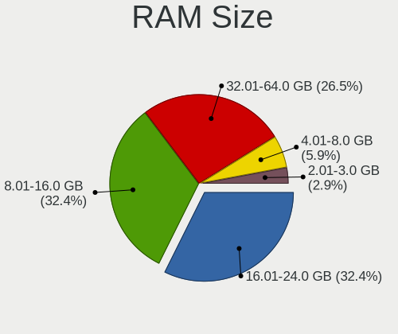
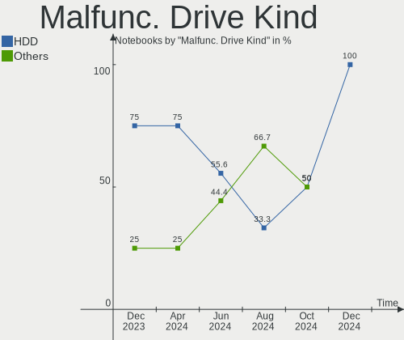
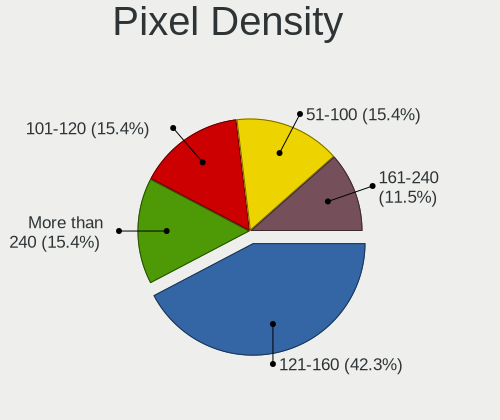

FreeBSD - Hardware Trends (Notebooks)
-------------------------------------

A project to identify most popular hardware characteristics and track their change
over time based on data collected by BSD users at https://BSD-Hardware.info.

Anyone can contribute to this report by the [hw-probe](https://github.com/linuxhw/hw-probe/blob/master/INSTALL.BSD.md) tool:

    hw-probe -all -upload

This report is for one last month. Overall report since the beginning of time: [TestDays](https://github.com/bsdhw/TestDays)

Period: Oct, 2023.

Contents
--------

* [ System ](#system)
  - [ OS                       ](#os)
  - [ OS Family                ](#os-family)
  - [ Arch                     ](#arch)
  - [ DE                       ](#de)
  - [ Display Server           ](#display-server)
  - [ Display Manager          ](#display-manager)
  - [ OS Lang                  ](#os-lang)
  - [ Boot Mode                ](#boot-mode)
  - [ Filesystem               ](#filesystem)
  - [ Part. scheme             ](#part-scheme)

* [ Board ](#board)
  - [ Vendor                   ](#vendor)
  - [ Model                    ](#model)
  - [ Model Family             ](#model-family)
  - [ MFG Year                 ](#mfg-year)
  - [ Form Factor              ](#form-factor)
  - [ Coreboot                 ](#coreboot)
  - [ RAM Size                 ](#ram-size)
  - [ RAM Used                 ](#ram-used)
  - [ Total Drives             ](#total-drives)
  - [ Has CD-ROM               ](#has-cd-rom)
  - [ Has Ethernet             ](#has-ethernet)
  - [ Has WiFi                 ](#has-wifi)
  - [ Has Bluetooth            ](#has-bluetooth)

* [ Location ](#location)
  - [ Country                  ](#country)
  - [ City                     ](#city)

* [ Drives ](#drives)
  - [ Drive Vendor             ](#drive-vendor)
  - [ Drive Model              ](#drive-model)
  - [ HDD Vendor               ](#hdd-vendor)
  - [ SSD Vendor               ](#ssd-vendor)
  - [ Drive Kind               ](#drive-kind)
  - [ Drive Connector          ](#drive-connector)
  - [ Drive Size               ](#drive-size)
  - [ Space Total              ](#space-total)
  - [ Space Used               ](#space-used)
  - [ Malfunc. Drives          ](#malfunc-drives)
  - [ Malfunc. Drive Vendor    ](#malfunc-drive-vendor)
  - [ Malfunc. HDD Vendor      ](#malfunc-hdd-vendor)
  - [ Malfunc. Drive Kind      ](#malfunc-drive-kind)
  - [ Failed Drives            ](#failed-drives)
  - [ Failed Drive Vendor      ](#failed-drive-vendor)
  - [ Drive Status             ](#drive-status)

* [ Storage controller ](#storage-controller)
  - [ Storage Vendor           ](#storage-vendor)
  - [ Storage Model            ](#storage-model)
  - [ Storage Kind             ](#storage-kind)

* [ Processor ](#processor)
  - [ CPU Vendor               ](#cpu-vendor)
  - [ CPU Model                ](#cpu-model)
  - [ CPU Model Family         ](#cpu-model-family)
  - [ CPU Cores                ](#cpu-cores)
  - [ CPU Sockets              ](#cpu-sockets)
  - [ CPU Threads              ](#cpu-threads)
  - [ CPU Microarch            ](#cpu-microarch)

* [ Graphics ](#graphics)
  - [ GPU Vendor               ](#gpu-vendor)
  - [ GPU Model                ](#gpu-model)
  - [ GPU Combo                ](#gpu-combo)
  - [ GPU Driver               ](#gpu-driver)
  - [ GPU Memory               ](#gpu-memory)

* [ Monitor ](#monitor)
  - [ Monitor Vendor           ](#monitor-vendor)
  - [ Monitor Model            ](#monitor-model)
  - [ Monitor Resolution       ](#monitor-resolution)
  - [ Monitor Diagonal         ](#monitor-diagonal)
  - [ Monitor Width            ](#monitor-width)
  - [ Aspect Ratio             ](#aspect-ratio)
  - [ Monitor Area             ](#monitor-area)
  - [ Pixel Density            ](#pixel-density)
  - [ Multiple Monitors        ](#multiple-monitors)

* [ Network ](#network)
  - [ Net Controller Vendor    ](#net-controller-vendor)
  - [ Net Controller Model     ](#net-controller-model)
  - [ Wireless Vendor          ](#wireless-vendor)
  - [ Wireless Model           ](#wireless-model)
  - [ Ethernet Vendor          ](#ethernet-vendor)
  - [ Ethernet Model           ](#ethernet-model)
  - [ Net Controller Kind      ](#net-controller-kind)
  - [ Used Controller          ](#used-controller)
  - [ NICs                     ](#nics)
  - [ IPv6                     ](#ipv6)

* [ Bluetooth ](#bluetooth)
  - [ Bluetooth Vendor         ](#bluetooth-vendor)
  - [ Bluetooth Model          ](#bluetooth-model)

* [ Sound ](#sound)
  - [ Sound Vendor             ](#sound-vendor)
  - [ Sound Model              ](#sound-model)

* [ Memory ](#memory)
  - [ Memory Vendor            ](#memory-vendor)
  - [ Memory Model             ](#memory-model)
  - [ Memory Kind              ](#memory-kind)
  - [ Memory Form Factor       ](#memory-form-factor)
  - [ Memory Size              ](#memory-size)
  - [ Memory Speed             ](#memory-speed)

* [ Printers & scanners ](#printers--scanners)
  - [ Printer Vendor           ](#printer-vendor)
  - [ Printer Model            ](#printer-model)
  - [ Scanner Vendor           ](#scanner-vendor)
  - [ Scanner Model            ](#scanner-model)

* [ Camera ](#camera)
  - [ Camera Vendor            ](#camera-vendor)
  - [ Camera Model             ](#camera-model)

* [ Security ](#security)
  - [ Fingerprint Vendor       ](#fingerprint-vendor)
  - [ Fingerprint Model        ](#fingerprint-model)
  - [ Chipcard Vendor          ](#chipcard-vendor)
  - [ Chipcard Model           ](#chipcard-model)

* [ Unsupported ](#unsupported)
  - [ Unsupported Devices      ](#unsupported-devices)
  - [ Unsupported Device Types ](#unsupported-device-types)

System
------

OS
--

Installed operating systems

| Name                 | Notebooks | Percent |
|----------------------|-----------|---------|
| FreeBSD 14.0-RC2     | 5         | 20%     |
| FreeBSD 13.2         | 5         | 20%     |
| FreeBSD 13.2-p3      | 4         | 16%     |
| FreeBSD 13.2-p4      | 3         | 12%     |
| FreeBSD 15.0-CURRENT | 2         | 8%      |
| FreeBSD 14.0-BETA5   | 2         | 8%      |
| FreeBSD 14.0-STABLE  | 1         | 4%      |
| FreeBSD 14.0-RC3     | 1         | 4%      |
| FreeBSD 14.0-BETA4   | 1         | 4%      |
| FreeBSD 13.2-p25     | 1         | 4%      |

OS Family
---------

OS without a version

| Name    | Notebooks | Percent |
|---------|-----------|---------|
| FreeBSD | 25        | 100%    |

Arch
----

OS architecture (x86_64, i586, etc.)

| Name  | Notebooks | Percent |
|-------|-----------|---------|
| amd64 | 25        | 100%    |

DE
--

Desktop Environment

| Name    | Notebooks | Percent |
|---------|-----------|---------|
| KDE5    | 8         | 32%     |
| GNOME   | 5         | 20%     |
| Console | 3         | 12%     |
| XFCE    | 2         | 8%      |
| MATE    | 2         | 8%      |
| TWM     | 1         | 4%      |
| Openbox | 1         | 4%      |
| i3      | 1         | 4%      |
| Fluxbox | 1         | 4%      |
| Budgie  | 1         | 4%      |

Display Server
--------------

X11 or Wayland

| Name    | Notebooks | Percent |
|---------|-----------|---------|
| X11     | 20        | 80%     |
| Console | 4         | 16%     |
| Wayland | 1         | 4%      |

Display Manager
---------------

SDDM, LightDM, etc.

| Name    | Notebooks | Percent |
|---------|-----------|---------|
| Console | 9         | 36%     |
| SDDM    | 7         | 28%     |
| LightDM | 4         | 16%     |
| SLiM    | 2         | 8%      |
| GDM     | 2         | 8%      |
| XDM     | 1         | 4%      |

OS Lang
-------

Language

| Lang    | Notebooks | Percent |
|---------|-----------|---------|
| C       | 18        | 72%     |
| en_US   | 3         | 12%     |
| ru_RU   | 1         | 4%      |
| ja_JP   | 1         | 4%      |
| en_GB   | 1         | 4%      |
| Unknown | 1         | 4%      |

Boot Mode
---------

EFI or BIOS

| Mode | Notebooks | Percent |
|------|-----------|---------|
| EFI  | 22        | 88%     |
| BIOS | 3         | 12%     |

Filesystem
----------

Type of filesystem

| Type | Notebooks | Percent |
|------|-----------|---------|
| Zfs  | 21        | 84%     |
| Ufs  | 4         | 16%     |

Part. scheme
------------

Scheme of partitioning

| Type | Notebooks | Percent |
|------|-----------|---------|
| GPT  | 25        | 100%    |

Board
-----

Vendor
------

Motherboard manufacturer

| Name             | Notebooks | Percent |
|------------------|-----------|---------|
| Lenovo           | 11        | 44%     |
| Dell             | 4         | 16%     |
| Hewlett-Packard  | 3         | 12%     |
| Toshiba          | 1         | 4%      |
| Timi             | 1         | 4%      |
| Platform         | 1         | 4%      |
| Google           | 1         | 4%      |
| ASUSTek Computer | 1         | 4%      |
| Apple            | 1         | 4%      |
| Unknown          | 1         | 4%      |

Model
-----

Motherboard model

| Name                                     | Notebooks | Percent |
|------------------------------------------|-----------|---------|
| Toshiba Satellite P300                   | 1         | 4%      |
| Timi A34R                                | 1         | 4%      |
| Platform ARB938                          | 1         | 4%      |
| Lenovo ThinkPad X260 20F6006XUK          | 1         | 4%      |
| Lenovo ThinkPad X230 2325J67             | 1         | 4%      |
| Lenovo ThinkPad X1 Carbon 3rd 20BS003LFR | 1         | 4%      |
| Lenovo ThinkPad T490 20N3X50500          | 1         | 4%      |
| Lenovo ThinkPad T480 20L5000WUS          | 1         | 4%      |
| Lenovo ThinkPad P73 20QRCTO1WW           | 1         | 4%      |
| Lenovo ThinkPad E580 20KS001JUK          | 1         | 4%      |
| Lenovo IdeaPad 3 15ADA05 81W1            | 1         | 4%      |
| Lenovo G550 2958                         | 1         | 4%      |
| Lenovo G50-30 80G0                       | 1         | 4%      |
| Lenovo B40-30 80F1                       | 1         | 4%      |
| HP ZBook 17 G2                           | 1         | 4%      |
| HP Laptop 15s-eq3xxx                     | 1         | 4%      |
| HP EliteBook 840 G7 Notebook PC          | 1         | 4%      |
| Google Auron_Paine                       | 1         | 4%      |
| Dell Precision 7550                      | 1         | 4%      |
| Dell Inspiron 5559                       | 1         | 4%      |
| Dell Inspiron 13 5320                    | 1         | 4%      |
| Dell G16 7630                            | 1         | 4%      |
| ASUS ZenBook UX325UA_UM325UA             | 1         | 4%      |
| Apple MacBookPro6,2                      | 1         | 4%      |
| Unknown                                  | 1         | 4%      |

Model Family
------------

Motherboard model prefix

| Name              | Notebooks | Percent |
|-------------------|-----------|---------|
| Lenovo ThinkPad   | 7         | 28%     |
| Dell Inspiron     | 2         | 8%      |
| Toshiba Satellite | 1         | 4%      |
| Timi A34R         | 1         | 4%      |
| Platform ARB938   | 1         | 4%      |
| Lenovo IdeaPad    | 1         | 4%      |
| Lenovo G550       | 1         | 4%      |
| Lenovo G50-30     | 1         | 4%      |
| Lenovo B40-30     | 1         | 4%      |
| HP ZBook          | 1         | 4%      |
| HP Laptop         | 1         | 4%      |
| HP EliteBook      | 1         | 4%      |
| Google Auron      | 1         | 4%      |
| Dell Precision    | 1         | 4%      |
| Dell G16          | 1         | 4%      |
| ASUS ZenBook      | 1         | 4%      |
| Apple MacBookPro6 | 1         | 4%      |
| Unknown           | 1         | 4%      |

MFG Year
--------

Motherboard manufacture year

| Year | Notebooks | Percent |
|------|-----------|---------|
| 2021 | 5         | 20%     |
| 2020 | 4         | 16%     |
| 2023 | 3         | 12%     |
| 2019 | 2         | 8%      |
| 2016 | 2         | 8%      |
| 2014 | 2         | 8%      |
| 2009 | 2         | 8%      |
| 2022 | 1         | 4%      |
| 2018 | 1         | 4%      |
| 2017 | 1         | 4%      |
| 2015 | 1         | 4%      |
| 2012 | 1         | 4%      |

Form Factor
-----------

Physical design of the computer

| Name     | Notebooks | Percent |
|----------|-----------|---------|
| Notebook | 25        | 100%    |

Coreboot
--------

Have coreboot on board

| Used | Notebooks | Percent |
|------|-----------|---------|
| No   | 24        | 96%     |
| Yes  | 1         | 4%      |

RAM Size
--------

Total RAM memory

| Size in GB  | Notebooks | Percent |
|-------------|-----------|---------|
| 16.01-24.0  | 8         | 32%     |
| 32.01-64.0  | 6         | 24%     |
| 4.01-8.0    | 5         | 20%     |
| 8.01-16.0   | 4         | 16%     |
| 2.01-3.0    | 1         | 4%      |
| 64.01-256.0 | 1         | 4%      |

RAM Used
--------

Used RAM memory

| Used GB  | Notebooks | Percent |
|----------|-----------|---------|
| 1.01-2.0 | 8         | 32%     |
| 0.01-0.5 | 8         | 32%     |
| 0.51-1.0 | 7         | 28%     |
| 3.01-4.0 | 1         | 4%      |
| 2.01-3.0 | 1         | 4%      |

Total Drives
------------

Number of drives on board

| Drives | Notebooks | Percent |
|--------|-----------|---------|
| 1      | 15        | 60%     |
| 0      | 6         | 24%     |
| 3      | 2         | 8%      |
| 2      | 2         | 8%      |

Has CD-ROM
----------

Has CD-ROM on board

| Presented | Notebooks | Percent |
|-----------|-----------|---------|
| No        | 20        | 80%     |
| Yes       | 5         | 20%     |

Has Ethernet
------------

Has Ethernet on board

| Presented | Notebooks | Percent |
|-----------|-----------|---------|
| Yes       | 17        | 68%     |
| No        | 8         | 32%     |

Has WiFi
--------

Has WiFi module

| Presented | Notebooks | Percent |
|-----------|-----------|---------|
| Yes       | 25        | 100%    |

Has Bluetooth
-------------

Has Bluetooth module

| Presented | Notebooks | Percent |
|-----------|-----------|---------|
| Yes       | 22        | 88%     |
| No        | 3         | 12%     |

Location
--------

Country
-------

Geographic location (country)

| Country   | Notebooks | Percent |
|-----------|-----------|---------|
| USA       | 6         | 24%     |
| UK        | 3         | 12%     |
| France    | 2         | 8%      |
| Australia | 2         | 8%      |
| Sweden    | 1         | 4%      |
| Spain     | 1         | 4%      |
| Russia    | 1         | 4%      |
| Romania   | 1         | 4%      |
| Portugal  | 1         | 4%      |
| Poland    | 1         | 4%      |
| Japan     | 1         | 4%      |
| Germany   | 1         | 4%      |
| Croatia   | 1         | 4%      |
| China     | 1         | 4%      |
| Brazil    | 1         | 4%      |
| Argentina | 1         | 4%      |

City
----

Geographic location (city)

| City                  | Notebooks | Percent |
|-----------------------|-----------|---------|
| Portland              | 2         | 8%      |
| Zagreb                | 1         | 4%      |
| Wroclaw               | 1         | 4%      |
| Stockholm             | 1         | 4%      |
| Shanghai              | 1         | 4%      |
| Saint-Martin-d'Hères | 1         | 4%      |
| Saint-Germain-en-Laye | 1         | 4%      |
| Orihuela Costa        | 1         | 4%      |
| Nuremberg             | 1         | 4%      |
| Moscow                | 1         | 4%      |
| Miercurea-Ciuc        | 1         | 4%      |
| Melbourne             | 1         | 4%      |
| Macaiba               | 1         | 4%      |
| Lisbon                | 1         | 4%      |
| Hove                  | 1         | 4%      |
| Glasgow               | 1         | 4%      |
| Eureka                | 1         | 4%      |
| Clinton               | 1         | 4%      |
| Chitose               | 1         | 4%      |
| Central Point         | 1         | 4%      |
| Bedford               | 1         | 4%      |
| Bariloche             | 1         | 4%      |
| Ashburn               | 1         | 4%      |
| Adelaide              | 1         | 4%      |

Drives
------

Drive Vendor
------------

Hard drive vendors

| Vendor              | Notebooks | Drives | Percent |
|---------------------|-----------|--------|---------|
| Seagate             | 4         | 4      | 19.05%  |
| Samsung Electronics | 4         | 6      | 19.05%  |
| Kingston            | 2         | 2      | 9.52%   |
| WDC                 | 1         | 1      | 4.76%   |
| Transcend           | 1         | 1      | 4.76%   |
| Toshiba             | 1         | 1      | 4.76%   |
| SSSTC               | 1         | 2      | 4.76%   |
| SK hynix            | 1         | 1      | 4.76%   |
| Phison              | 1         | 1      | 4.76%   |
| Patriot             | 1         | 1      | 4.76%   |
| Micron Technology   | 1         | 1      | 4.76%   |
| HGST                | 1         | 2      | 4.76%   |
| Hewlett-Packard     | 1         | 1      | 4.76%   |
| Crucial             | 1         | 1      | 4.76%   |

Drive Model
-----------

Hard drive models

| Model                                 | Notebooks | Percent |
|---------------------------------------|-----------|---------|
| WDC PC SN530 SDBPMPZ-256G-1101 256GB  | 1         | 4.55%   |
| Transcend TS128GMTS430S 128GB         | 1         | 4.55%   |
| Toshiba KXG5AZNV256G 256GB            | 1         | 4.55%   |
| SSSTC CL4-8D512 512GB                 | 1         | 4.55%   |
| SK hynix HFM512GD3JX013N 512GB        | 1         | 4.55%   |
| Seagate ST9500325AS 500GB             | 1         | 4.55%   |
| Seagate ST9250315AS 250GB             | 1         | 4.55%   |
| Seagate ST2000LM003 HN-M201RAD 2TB    | 1         | 4.55%   |
| Seagate ST1000LM024 HN-M101MBB 1TB    | 1         | 4.55%   |
| Samsung SSD 980 PRO with Heatsink 2TB | 1         | 4.55%   |
| Samsung SSD 980 1TB                   | 1         | 4.55%   |
| Samsung SSD 870 EVO 2TB               | 1         | 4.55%   |
| Samsung SSD 860 EVO M.2 1TB           | 1         | 4.55%   |
| Samsung MZVL2512HCJQ-00BH1 512GB      | 1         | 4.55%   |
| Phison PCIe SSD 512GB                 | 1         | 4.55%   |
| Patriot Burst 120GB                   | 1         | 4.55%   |
| Micron MTFDDAK480MBP-1AN1ZABHB 480GB  | 1         | 4.55%   |
| Kingston SV300S37A120G 120GB          | 1         | 4.55%   |
| Kingston SA400S37-120GB               | 1         | 4.55%   |
| HGST HTS721010A9E630 1TB              | 1         | 4.55%   |
| HP SSD S700 1TB                       | 1         | 4.55%   |
| Crucial CT1000MX500SSD1 1TB           | 1         | 4.55%   |

HDD Vendor
----------

Hard disk drive vendors

| Vendor  | Notebooks | Drives | Percent |
|---------|-----------|--------|---------|
| Seagate | 4         | 4      | 80%     |
| HGST    | 1         | 2      | 20%     |

SSD Vendor
----------

Solid state drive vendors

| Vendor              | Notebooks | Drives | Percent |
|---------------------|-----------|--------|---------|
| Samsung Electronics | 2         | 2      | 22.22%  |
| Kingston            | 2         | 2      | 22.22%  |
| Transcend           | 1         | 1      | 11.11%  |
| Patriot             | 1         | 1      | 11.11%  |
| Micron Technology   | 1         | 1      | 11.11%  |
| Hewlett-Packard     | 1         | 1      | 11.11%  |
| Crucial             | 1         | 1      | 11.11%  |

Drive Kind
----------

HDD or SSD

| Kind | Notebooks | Drives | Percent |
|------|-----------|--------|---------|
| SSD  | 9         | 9      | 42.86%  |
| NVMe | 8         | 10     | 38.1%   |
| HDD  | 4         | 6      | 19.05%  |

Drive Connector
---------------

SATA, SAS, NVMe, etc.

| Type | Notebooks | Drives | Percent |
|------|-----------|--------|---------|
| SATA | 13        | 15     | 61.9%   |
| NVMe | 8         | 10     | 38.1%   |

Drive Size
----------

Size of hard drive

| Size in TB | Notebooks | Drives | Percent |
|------------|-----------|--------|---------|
| 0.01-0.5   | 7         | 7      | 53.85%  |
| 0.51-1.0   | 4         | 6      | 30.77%  |
| 1.01-2.0   | 2         | 2      | 15.38%  |

Space Total
-----------

Amount of disk space available on the file system

| Size in GB | Notebooks | Percent |
|------------|-----------|---------|
| 251-500    | 10        | 40%     |
| 101-250    | 6         | 24%     |
| 501-1000   | 6         | 24%     |
| 51-100     | 2         | 8%      |
| 1001-2000  | 1         | 4%      |

Space Used
----------

Amount of used disk space

| Used GB | Notebooks | Percent |
|---------|-----------|---------|
| 1-20    | 17        | 68%     |
| 21-50   | 5         | 20%     |
| 101-250 | 2         | 8%      |
| 251-500 | 1         | 4%      |

Malfunc. Drives
---------------

Drive models with a malfunction

| Model                               | Notebooks | Drives | Percent |
|-------------------------------------|-----------|--------|---------|
| Seagate ST9500325AS 500GB           | 1         | 1      | 20%     |
| Seagate ST9250315AS 250GB           | 1         | 1      | 20%     |
| Seagate ST2000LM003 HN-M201RAD 2TB  | 1         | 1      | 20%     |
| Samsung Electronics SSD 870 EVO 2TB | 1         | 1      | 20%     |
| Kingston SV300S37A120G 120GB        | 1         | 1      | 20%     |

Malfunc. Drive Vendor
---------------------

Vendors of faulty drives

| Vendor              | Notebooks | Drives | Percent |
|---------------------|-----------|--------|---------|
| Seagate             | 3         | 3      | 60%     |
| Samsung Electronics | 1         | 1      | 20%     |
| Kingston            | 1         | 1      | 20%     |

Malfunc. HDD Vendor
-------------------

Vendors of faulty HDD drives

| Vendor  | Notebooks | Drives | Percent |
|---------|-----------|--------|---------|
| Seagate | 3         | 3      | 100%    |

Malfunc. Drive Kind
-------------------

Kinds of faulty drives

| Kind | Notebooks | Drives | Percent |
|------|-----------|--------|---------|
| HDD  | 3         | 3      | 60%     |
| SSD  | 2         | 2      | 40%     |

Failed Drives
-------------

Failed drive models

Zero info for selected period =(

Failed Drive Vendor
-------------------

Failed drive vendors

Zero info for selected period =(

Drive Status
------------

Number of failed and malfunc. drives

| Status  | Notebooks | Drives | Percent |
|---------|-----------|--------|---------|
| Works   | 16        | 20     | 76.19%  |
| Malfunc | 5         | 5      | 23.81%  |

Storage controller
------------------

Storage Vendor
--------------

Storage controller vendors

| Vendor                         | Notebooks | Percent |
|--------------------------------|-----------|---------|
| Intel                          | 14        | 50%     |
| SanDisk                        | 3         | 10.71%  |
| Samsung Electronics            | 3         | 10.71%  |
| SK hynix                       | 2         | 7.14%   |
| Toshiba                        | 1         | 3.57%   |
| Solid State Storage Technology | 1         | 3.57%   |
| Phison Electronics             | 1         | 3.57%   |
| Micron Technology              | 1         | 3.57%   |
| KIOXIA                         | 1         | 3.57%   |
| INNOGRIT                       | 1         | 3.57%   |

Storage Model
-------------

Storage controller models

| Model                                                                          | Notebooks | Percent |
|--------------------------------------------------------------------------------|-----------|---------|
| Intel Sunrise Point-LP SATA Controller [AHCI mode]                             | 3         | 10.34%  |
| SK hynix Gold P31/BC711/PC711 NVMe Solid State Drive                           | 2         | 6.9%    |
| Samsung NVMe SSD Controller PM9A1/PM9A3/980PRO                                 | 2         | 6.9%    |
| Intel Wildcat Point-LP SATA Controller [AHCI Mode]                             | 2         | 6.9%    |
| Intel Atom Processor E3800 Series SATA AHCI Controller                         | 2         | 6.9%    |
| Intel 82801IBM/IEM (ICH9M/ICH9M-E) 4 port SATA Controller [AHCI mode]          | 2         | 6.9%    |
| Toshiba XG5 NVMe SSD Controller                                                | 1         | 3.45%   |
| Solid State Storage CL4-8D512 NVMe SSD M.2 (DRAM-less)                         | 1         | 3.45%   |
| Sandisk PC SN740 NVMe SSD (DRAM-less)                                          | 1         | 3.45%   |
| SanDisk PC SN530 NVMe SSD (DRAM-less)                                          | 1         | 3.45%   |
| SanDisk Extreme Pro / WD Black SN750 / PC SN730 / Red SN700 NVMe SSD           | 1         | 3.45%   |
| Samsung NVMe SSD Controller 980 (DRAM-less)                                    | 1         | 3.45%   |
| Phison E12 NVMe Controller                                                     | 1         | 3.45%   |
| Micron 2300 NVMe SSD [Santana]                                                 | 1         | 3.45%   |
| KIOXIA NVMe SSD Controller BG5 (DRAM-less)                                     | 1         | 3.45%   |
| Intel Volume Management Device NVMe RAID Controller                            | 1         | 3.45%   |
| Intel Cannon Lake Mobile PCH SATA AHCI Controller                              | 1         | 3.45%   |
| Intel 8 Series/C220 Series Chipset Family 6-port SATA Controller 1 [AHCI mode] | 1         | 3.45%   |
| Intel 7 Series Chipset Family 4-port SATA Controller [IDE mode]                | 1         | 3.45%   |
| Intel 7 Series Chipset Family 2-port SATA Controller [IDE mode]                | 1         | 3.45%   |
| Intel 5 Series/3400 Series Chipset 4 port SATA AHCI Controller                 | 1         | 3.45%   |
| INNOGRIT NVMe SSD Controller IG5220 (DRAM-less)                                | 1         | 3.45%   |

Storage Kind
------------

Kind of storage controller (IDE, SATA, NVMe, SAS, ...)

| Kind | Notebooks | Percent |
|------|-----------|---------|
| NVMe | 13        | 48.15%  |
| SATA | 12        | 44.44%  |
| RAID | 1         | 3.7%    |
| IDE  | 1         | 3.7%    |

Processor
---------

CPU Vendor
----------

Processor vendors

| Vendor | Notebooks | Percent |
|--------|-----------|---------|
| Intel  | 20        | 80%     |
| AMD    | 5         | 20%     |

CPU Model
---------

Processor models

| Model                                        | Notebooks | Percent |
|----------------------------------------------|-----------|---------|
| Intel CPU Version                            | 2         | 8%      |
| Intel Core i7-6500U CPU @ 2.50GHz            | 2         | 8%      |
| Intel Core i5-8250U CPU @ 1.60GHz            | 2         | 8%      |
| Intel Celeron CPU N2840 @ 2.16GHz            | 2         | 8%      |
| Intel Core i9-10885H CPU @ 2.40GHz           | 1         | 4%      |
| Intel Core i7-9750H CPU @ 2.60GHz            | 1         | 4%      |
| Intel Core i7-5500U CPU @ 2.40GHz            | 1         | 4%      |
| Intel Core i7-4710MQ CPU @ 2.50GHz           | 1         | 4%      |
| Intel Core i7-10510U CPU @ 1.80GHz           | 1         | 4%      |
| Intel Core i7 CPU M 620 @ 2.67GHz            | 1         | 4%      |
| Intel Core i5-8365U CPU @ 1.60GHz            | 1         | 4%      |
| Intel Core i5-3210M CPU @ 2.50GHz            | 1         | 4%      |
| Intel Celeron 3205U @ 1.50GHz                | 1         | 4%      |
| Intel 13th Gen Core i7-13650HX               | 1         | 4%      |
| Intel 12th Gen Core i5-1240P                 | 1         | 4%      |
| Intel 11th Gen Core i5-11320H @ 3.20GHz      | 1         | 4%      |
| AMD Ryzen 7 7735HS with Radeon Graphics      | 1         | 4%      |
| AMD Ryzen 7 5825U with Radeon Graphics       | 1         | 4%      |
| AMD Ryzen 7 5700U with Radeon Graphics       | 1         | 4%      |
| AMD Ryzen 5 5500U with Radeon Graphics       | 1         | 4%      |
| AMD Athlon Silver 3050U with Radeon Graphics | 1         | 4%      |

CPU Model Family
----------------

Processor model prefix

| Model         | Notebooks | Percent |
|---------------|-----------|---------|
| Intel Core i7 | 7         | 28%     |
| Other         | 5         | 20%     |
| Intel Core i5 | 4         | 16%     |
| Intel Celeron | 3         | 12%     |
| AMD Ryzen 7   | 3         | 12%     |
| Intel Core i9 | 1         | 4%      |
| AMD Ryzen 5   | 1         | 4%      |
| AMD Athlon    | 1         | 4%      |

CPU Cores
---------

Number of processor cores

| Number | Notebooks | Percent |
|--------|-----------|---------|
| 2      | 11        | 44%     |
| 4      | 6         | 24%     |
| 16     | 4         | 16%     |
| 12     | 1         | 4%      |
| 10     | 1         | 4%      |
| 8      | 1         | 4%      |
| 6      | 1         | 4%      |

CPU Sockets
-----------

Number of sockets

| Number | Notebooks | Percent |
|--------|-----------|---------|
| 1      | 25        | 100%    |

CPU Threads
-----------

Threads per core (Hyper-Threading)

| Number | Notebooks | Percent |
|--------|-----------|---------|
| 2      | 14        | 56%     |
| 1      | 11        | 44%     |

CPU Microarch
-------------

Microarchitecture

| Name       | Notebooks | Percent |
|------------|-----------|---------|
| KabyLake   | 5         | 20%     |
| Unknown    | 5         | 20%     |
| Skylake    | 2         | 8%      |
| Silvermont | 2         | 8%      |
| Penryn     | 2         | 8%      |
| Broadwell  | 2         | 8%      |
| Zen+       | 1         | 4%      |
| Zen 3      | 1         | 4%      |
| Westmere   | 1         | 4%      |
| TigerLake  | 1         | 4%      |
| IvyBridge  | 1         | 4%      |
| Haswell    | 1         | 4%      |
| CometLake  | 1         | 4%      |

Graphics
--------

GPU Vendor
----------

Vendors of graphics cards

| Vendor | Notebooks | Percent |
|--------|-----------|---------|
| Intel  | 16        | 55.17%  |
| AMD    | 7         | 24.14%  |
| Nvidia | 6         | 20.69%  |

GPU Model
---------

Graphics card models

| Model                                                                         | Notebooks | Percent |
|-------------------------------------------------------------------------------|-----------|---------|
| Intel UHD Graphics 620                                                        | 2         | 6.9%    |
| Intel Skylake GT2 [HD Graphics 520]                                           | 2         | 6.9%    |
| Intel Atom Processor Z36xxx/Z37xxx Series Graphics & Display                  | 2         | 6.9%    |
| AMD Lucienne                                                                  | 2         | 6.9%    |
| Nvidia TU117M [GeForce MX450]                                                 | 1         | 3.45%   |
| Nvidia TU117GLM [Quadro T2000 Mobile / Max-Q]                                 | 1         | 3.45%   |
| Nvidia TU106GLM [Quadro RTX 3000 Mobile / Max-Q]                              | 1         | 3.45%   |
| Nvidia GT216M [GeForce GT 330M]                                               | 1         | 3.45%   |
| Nvidia GK107GLM [Quadro K1100M]                                               | 1         | 3.45%   |
| Nvidia AD107M [GeForce RTX 4060 Max-Q / Mobile]                               | 1         | 3.45%   |
| Intel WhiskeyLake-U GT2 [UHD Graphics 620]                                    | 1         | 3.45%   |
| Intel TigerLake-LP GT2 [Iris Xe Graphics]                                     | 1         | 3.45%   |
| Intel Raptor Lake-S UHD Graphics                                              | 1         | 3.45%   |
| Intel Mobile 4 Series Chipset Integrated Graphics Controller                  | 1         | 3.45%   |
| Intel HD Graphics 5500                                                        | 1         | 3.45%   |
| Intel HD Graphics                                                             | 1         | 3.45%   |
| Intel Core Processor Integrated Graphics Controller                           | 1         | 3.45%   |
| Intel CometLake-U GT2 [UHD Graphics]                                          | 1         | 3.45%   |
| Intel Alder Lake-P GT2 [Iris Xe Graphics]                                     | 1         | 3.45%   |
| Intel 3rd Gen Core processor Graphics Controller                              | 1         | 3.45%   |
| AMD Sun XT [Radeon HD 8670A/8670M/8690M / R5 M330 / M430 / Radeon 520 Mobile] | 1         | 3.45%   |
| AMD RV710/M92 [Mobility Radeon HD 4530/4570/5145/530v/540v/545v]              | 1         | 3.45%   |
| AMD Rembrandt [Radeon 680M]                                                   | 1         | 3.45%   |
| AMD Picasso/Raven 2 [Radeon Vega Series / Radeon Vega Mobile Series]          | 1         | 3.45%   |
| AMD Barcelo                                                                   | 1         | 3.45%   |

GPU Combo
---------

Combinations of graphics cards

| Name           | Notebooks | Percent |
|----------------|-----------|---------|
| 1 x Intel      | 11        | 44%     |
| 1 x AMD        | 6         | 24%     |
| 1 x Nvidia     | 3         | 12%     |
| Intel + Nvidia | 3         | 12%     |
| 2 x Intel      | 1         | 4%      |
| Intel + AMD    | 1         | 4%      |

GPU Driver
----------

Free vs proprietary

| Driver      | Notebooks | Percent |
|-------------|-----------|---------|
| Free        | 21        | 84%     |
| Proprietary | 4         | 16%     |

GPU Memory
----------

Total video memory

| Size in GB | Notebooks | Percent |
|------------|-----------|---------|
| Unknown    | 16        | 64%     |
| 0.01-0.5   | 4         | 16%     |
| 1.01-2.0   | 2         | 8%      |
| 7.01-8.0   | 1         | 4%      |
| 5.01-6.0   | 1         | 4%      |
| 3.01-4.0   | 1         | 4%      |

Monitor
-------

Monitor Vendor
--------------

Monitor vendors

| Vendor               | Notebooks | Percent |
|----------------------|-----------|---------|
| BOE                  | 5         | 22.73%  |
| Chimei Innolux       | 3         | 13.64%  |
| AU Optronics         | 3         | 13.64%  |
| Samsung Electronics  | 2         | 9.09%   |
| LG Display           | 2         | 9.09%   |
| SDC                  | 1         | 4.55%   |
| Philips              | 1         | 4.55%   |
| Lenovo               | 1         | 4.55%   |
| Goldstar             | 1         | 4.55%   |
| Dell                 | 1         | 4.55%   |
| BOE Technology Group | 1         | 4.55%   |
| Unknown              | 1         | 4.55%   |

Monitor Model
-------------

Monitor models

| Model                                                                 | Notebooks | Percent |
|-----------------------------------------------------------------------|-----------|---------|
| SDC LCD Monitor 3520x1080                                             | 1         | 4.55%   |
| Samsung Electronics LCD Monitor SDC8B4F 1920x1080 340x190mm 15.3-inch | 1         | 4.55%   |
| Samsung Electronics LCD Monitor SDC4158 1920x1080 290x170mm 13.2-inch | 1         | 4.55%   |
| Philips LCD Monitor 271P4                                             | 1         | 4.55%   |
| LG Display LP156WH2-TLAA LGD0230 1366x768 340x190mm 15.3-inch         | 1         | 4.55%   |
| LG Display LCD Monitor LGD06CA 1920x1080 310x170mm 13.9-inch          | 1         | 4.55%   |
| Lenovo LCD Monitor LEN40BA 1920x1080 340x190mm 15.3-inch              | 1         | 4.55%   |
| Goldstar 24GM77 GSM5A91 1920x1080 530x300mm 24.0-inch                 | 1         | 4.55%   |
| Dell P2314H DEL4098 1920x1080 510x290mm 23.1-inch                     | 1         | 4.55%   |
| Chimei Innolux LCD Monitor CMN14D4 1920x1080 310x170mm 13.9-inch      | 1         | 4.55%   |
| Chimei Innolux LCD Monitor CMN14A8 1920x1080 310x170mm 13.9-inch      | 1         | 4.55%   |
| Chimei Innolux LCD Monitor CMN1132 1366x768 260x140mm 11.6-inch       | 1         | 4.55%   |
| BOE Technology Group LCD Monitor 1920x1080                            | 1         | 4.55%   |
| BOE LCD Monitor BOE0AC1 2560x1600 340x210mm 15.7-inch                 | 1         | 4.55%   |
| BOE LCD Monitor BOE0A4E 2560x1600 290x180mm 13.4-inch                 | 1         | 4.55%   |
| BOE LCD Monitor BOE0991 1920x1080 340x190mm 15.3-inch                 | 1         | 4.55%   |
| BOE LCD Monitor BOE0812 1920x1080 340x190mm 15.3-inch                 | 1         | 4.55%   |
| BOE LCD Monitor BOE061D 1366x768 340x190mm 15.3-inch                  | 1         | 4.55%   |
| AU Optronics LCD Monitor AUO2E3C 1366x768 310x170mm 13.9-inch         | 1         | 4.55%   |
| AU Optronics LCD Monitor AUO226D 1920x1080 280x160mm 12.7-inch        | 1         | 4.55%   |
| AU Optronics LCD Monitor AUO109B 3840x2160 380x210mm 17.1-inch        | 1         | 4.55%   |
| Unknown                                                               | 1         | 4.55%   |

Monitor Resolution
------------------

Monitor screen resolution

| Resolution      | Notebooks | Percent |
|-----------------|-----------|---------|
| 1920x1080 (FHD) | 11        | 52.38%  |
| 1366x768 (WXGA) | 4         | 19.05%  |
| 2560x1600       | 3         | 14.29%  |
| 3840x2160 (4K)  | 1         | 4.76%   |
| 3520x1080       | 1         | 4.76%   |
| Unknown         | 1         | 4.76%   |

Monitor Diagonal
----------------

Diagonal size in inches

| Inches  | Notebooks | Percent |
|---------|-----------|---------|
| 15      | 7         | 33.33%  |
| 13      | 6         | 28.57%  |
| Unknown | 3         | 14.29%  |
| 24      | 1         | 4.76%   |
| 23      | 1         | 4.76%   |
| 17      | 1         | 4.76%   |
| 12      | 1         | 4.76%   |
| 11      | 1         | 4.76%   |

Monitor Width
-------------

Physical width

| Width in mm | Notebooks | Percent |
|-------------|-----------|---------|
| 301-350     | 11        | 52.38%  |
| 201-300     | 4         | 19.05%  |
| Unknown     | 3         | 14.29%  |
| 501-600     | 2         | 9.52%   |
| 351-400     | 1         | 4.76%   |

Aspect Ratio
------------

Proportional relationship between the width and the height

| Ratio   | Notebooks | Percent |
|---------|-----------|---------|
| 16/9    | 15        | 75%     |
| Unknown | 3         | 15%     |
| 16/10   | 2         | 10%     |

Monitor Area
------------

Area in inch²

| Area in inch² | Notebooks | Percent |
|----------------|-----------|---------|
| 91-100         | 6         | 28.57%  |
| 81-90          | 5         | 23.81%  |
| Unknown        | 3         | 14.29%  |
| 201-250        | 2         | 9.52%   |
| 71-80          | 1         | 4.76%   |
| 61-70          | 1         | 4.76%   |
| 51-60          | 1         | 4.76%   |
| 121-130        | 1         | 4.76%   |
| 111-120        | 1         | 4.76%   |

Pixel Density
-------------

Pixels per inch

| Density       | Notebooks | Percent |
|---------------|-----------|---------|
| 121-160       | 8         | 38.1%   |
| 161-240       | 4         | 19.05%  |
| 101-120       | 3         | 14.29%  |
| Unknown       | 3         | 14.29%  |
| 51-100        | 2         | 9.52%   |
| More than 240 | 1         | 4.76%   |

Multiple Monitors
-----------------

Total monitors connected

| Total | Notebooks | Percent |
|-------|-----------|---------|
| 1     | 18        | 72%     |
| 0     | 5         | 20%     |
| 2     | 2         | 8%      |

Network
-------

Net Controller Vendor
---------------------

Controller vendors

| Vendor                   | Notebooks | Percent |
|--------------------------|-----------|---------|
| Intel                    | 19        | 55.88%  |
| Realtek Semiconductor    | 9         | 26.47%  |
| Broadcom                 | 2         | 5.88%   |
| TP-Link                  | 1         | 2.94%   |
| Sierra Wireless          | 1         | 2.94%   |
| Qualcomm Atheros         | 1         | 2.94%   |
| Marvell Technology Group | 1         | 2.94%   |

Net Controller Model
--------------------

Controller models

| Model                                                             | Notebooks | Percent |
|-------------------------------------------------------------------|-----------|---------|
| Realtek RTL8111/8168/8411 PCI Express Gigabit Ethernet Controller | 5         | 10.87%  |
| Intel Wireless 8260                                               | 3         | 6.52%   |
| Realtek RTL8852BE PCIe 802.11ax Wireless Network Controller       | 2         | 4.35%   |
| Intel Wireless 8265 / 8275                                        | 2         | 4.35%   |
| Intel Wireless 7260                                               | 2         | 4.35%   |
| Intel Wireless 3160                                               | 2         | 4.35%   |
| TP-Link AC600 wireless Realtek RTL8811AU [Archer T2U Nano]        | 1         | 2.17%   |
| Sierra Wireless EM7345 4G LTE                                     | 1         | 2.17%   |
| Realtek RTL8822CE 802.11ac PCIe Wireless Network Adapter          | 1         | 2.17%   |
| Realtek RTL8188EUS 802.11n Wireless Network Adapter               | 1         | 2.17%   |
| Realtek RTL8125 2.5GbE Controller                                 | 1         | 2.17%   |
| Realtek RTL810xE PCI Express Fast Ethernet controller             | 1         | 2.17%   |
| Qualcomm Atheros QCA9565 / AR9565 Wireless Network Adapter        | 1         | 2.17%   |
| Marvell Group 88E8040T PCI-E Fast Ethernet Controller             | 1         | 2.17%   |
| Intel Wireless 7265                                               | 1         | 2.17%   |
| Intel WiFi Link 5100                                              | 1         | 2.17%   |
| Intel Wi-Fi 6 AX201                                               | 1         | 2.17%   |
| Intel Ethernet Connection I219-V                                  | 1         | 2.17%   |
| Intel Ethernet Connection I217-LM                                 | 1         | 2.17%   |
| Intel Ethernet Connection (7) I219-V                              | 1         | 2.17%   |
| Intel Ethernet Connection (6) I219-LM                             | 1         | 2.17%   |
| Intel Ethernet Connection (4) I219-V                              | 1         | 2.17%   |
| Intel Ethernet Connection (3) I218-V                              | 1         | 2.17%   |
| Intel Ethernet Connection (11) I219-LM                            | 1         | 2.17%   |
| Intel Dual Band Wireless-AC 3165 Plus Bluetooth                   | 1         | 2.17%   |
| Intel Comet Lake PCH-LP CNVi WiFi                                 | 1         | 2.17%   |
| Intel Comet Lake PCH CNVi WiFi                                    | 1         | 2.17%   |
| Intel Centrino Advanced-N 6205 [Taylor Peak]                      | 1         | 2.17%   |
| Intel Cannon Point-LP CNVi [Wireless-AC]                          | 1         | 2.17%   |
| Intel Alder Lake-P PCH CNVi WiFi                                  | 1         | 2.17%   |
| Intel 82579LM Gigabit Network Connection (Lewisville)             | 1         | 2.17%   |
| Intel 700 Series Chipset Family Wi-Fi                             | 1         | 2.17%   |
| Broadcom NetXtreme BCM5764M Gigabit Ethernet PCIe                 | 1         | 2.17%   |
| Broadcom NetLink BCM5906M Fast Ethernet PCI Express               | 1         | 2.17%   |
| Broadcom BCM43224 802.11a/b/g/n                                   | 1         | 2.17%   |
| Broadcom BCM4312 802.11b/g LP-PHY                                 | 1         | 2.17%   |

Wireless Vendor
---------------

Wireless vendors

| Vendor                | Notebooks | Percent |
|-----------------------|-----------|---------|
| Intel                 | 19        | 70.37%  |
| Realtek Semiconductor | 3         | 11.11%  |
| Broadcom              | 2         | 7.41%   |
| TP-Link               | 1         | 3.7%    |
| Sierra Wireless       | 1         | 3.7%    |
| Qualcomm Atheros      | 1         | 3.7%    |

Wireless Model
--------------

Wireless models

| Model                                                       | Notebooks | Percent |
|-------------------------------------------------------------|-----------|---------|
| Intel Wireless 8260                                         | 3         | 10.71%  |
| Realtek RTL8852BE PCIe 802.11ax Wireless Network Controller | 2         | 7.14%   |
| Intel Wireless 8265 / 8275                                  | 2         | 7.14%   |
| Intel Wireless 7260                                         | 2         | 7.14%   |
| Intel Wireless 3160                                         | 2         | 7.14%   |
| TP-Link AC600 wireless Realtek RTL8811AU [Archer T2U Nano]  | 1         | 3.57%   |
| Sierra Wireless EM7345 4G LTE                               | 1         | 3.57%   |
| Realtek RTL8822CE 802.11ac PCIe Wireless Network Adapter    | 1         | 3.57%   |
| Realtek RTL8188EUS 802.11n Wireless Network Adapter         | 1         | 3.57%   |
| Qualcomm Atheros QCA9565 / AR9565 Wireless Network Adapter  | 1         | 3.57%   |
| Intel Wireless 7265                                         | 1         | 3.57%   |
| Intel WiFi Link 5100                                        | 1         | 3.57%   |
| Intel Wi-Fi 6 AX201                                         | 1         | 3.57%   |
| Intel Dual Band Wireless-AC 3165 Plus Bluetooth             | 1         | 3.57%   |
| Intel Comet Lake PCH-LP CNVi WiFi                           | 1         | 3.57%   |
| Intel Comet Lake PCH CNVi WiFi                              | 1         | 3.57%   |
| Intel Centrino Advanced-N 6205 [Taylor Peak]                | 1         | 3.57%   |
| Intel Cannon Point-LP CNVi [Wireless-AC]                    | 1         | 3.57%   |
| Intel Alder Lake-P PCH CNVi WiFi                            | 1         | 3.57%   |
| Intel 700 Series Chipset Family Wi-Fi                       | 1         | 3.57%   |
| Broadcom BCM43224 802.11a/b/g/n                             | 1         | 3.57%   |
| Broadcom BCM4312 802.11b/g LP-PHY                           | 1         | 3.57%   |

Ethernet Vendor
---------------

Ethernet vendors

| Vendor                   | Notebooks | Percent |
|--------------------------|-----------|---------|
| Intel                    | 8         | 47.06%  |
| Realtek Semiconductor    | 6         | 35.29%  |
| Broadcom                 | 2         | 11.76%  |
| Marvell Technology Group | 1         | 5.88%   |

Ethernet Model
--------------

Ethernet models

| Model                                                             | Notebooks | Percent |
|-------------------------------------------------------------------|-----------|---------|
| Realtek RTL8111/8168/8411 PCI Express Gigabit Ethernet Controller | 5         | 27.78%  |
| Realtek RTL8125 2.5GbE Controller                                 | 1         | 5.56%   |
| Realtek RTL810xE PCI Express Fast Ethernet controller             | 1         | 5.56%   |
| Marvell Group 88E8040T PCI-E Fast Ethernet Controller             | 1         | 5.56%   |
| Intel Ethernet Connection I219-V                                  | 1         | 5.56%   |
| Intel Ethernet Connection I217-LM                                 | 1         | 5.56%   |
| Intel Ethernet Connection (7) I219-V                              | 1         | 5.56%   |
| Intel Ethernet Connection (6) I219-LM                             | 1         | 5.56%   |
| Intel Ethernet Connection (4) I219-V                              | 1         | 5.56%   |
| Intel Ethernet Connection (3) I218-V                              | 1         | 5.56%   |
| Intel Ethernet Connection (11) I219-LM                            | 1         | 5.56%   |
| Intel 82579LM Gigabit Network Connection (Lewisville)             | 1         | 5.56%   |
| Broadcom NetXtreme BCM5764M Gigabit Ethernet PCIe                 | 1         | 5.56%   |
| Broadcom NetLink BCM5906M Fast Ethernet PCI Express               | 1         | 5.56%   |

Net Controller Kind
-------------------

Ethernet, WiFi or modem

| Kind     | Notebooks | Percent |
|----------|-----------|---------|
| WiFi     | 25        | 59.52%  |
| Ethernet | 17        | 40.48%  |

Used Controller
---------------

Currently used network controller

| Kind     | Notebooks | Percent |
|----------|-----------|---------|
| WiFi     | 17        | 77.27%  |
| Ethernet | 5         | 22.73%  |

NICs
----

Total network controllers on board

| Total | Notebooks | Percent |
|-------|-----------|---------|
| 2     | 16        | 64%     |
| 1     | 8         | 32%     |
| 3     | 1         | 4%      |

IPv6
----

IPv6 vs IPv4

| Used | Notebooks | Percent |
|------|-----------|---------|
| No   | 24        | 96%     |
| Yes  | 1         | 4%      |

Bluetooth
---------

Bluetooth Vendor
----------------

Controller vendors

| Vendor                          | Notebooks | Percent |
|---------------------------------|-----------|---------|
| Intel                           | 15        | 68.18%  |
| Realtek Semiconductor           | 3         | 13.64%  |
| Qualcomm Atheros Communications | 1         | 4.55%   |
| Cambridge Silicon Radio         | 1         | 4.55%   |
| Broadcom                        | 1         | 4.55%   |
| Apple                           | 1         | 4.55%   |

Bluetooth Model
---------------

Controller models

| Model                                               | Notebooks | Percent |
|-----------------------------------------------------|-----------|---------|
| Intel Bluetooth wireless interface                  | 9         | 40.91%  |
| Intel AX201 Bluetooth                               | 4         | 18.18%  |
| Realtek Bluetooth Adapter                           | 2         | 9.09%   |
| Realtek Wireless Bluetooth Adapter                  | 1         | 4.55%   |
| Qualcomm Atheros AR3012 Bluetooth 4.0               | 1         | 4.55%   |
| Intel Bluetooth 9460/9560 Jefferson Peak (JfP)      | 1         | 4.55%   |
| Intel AX211 Bluetooth                               | 1         | 4.55%   |
| Cambridge Silicon Radio Bluetooth Dongle (HCI mode) | 1         | 4.55%   |
| Broadcom BCM20702 Bluetooth 4.0 [ThinkPad]          | 1         | 4.55%   |
| Apple Bluetooth Host Controller                     | 1         | 4.55%   |

Sound
-----

Sound Vendor
------------

Sound card vendors

| Vendor   | Notebooks | Percent |
|----------|-----------|---------|
| Intel    | 20        | 62.5%   |
| AMD      | 6         | 18.75%  |
| Nvidia   | 5         | 15.63%  |
| Logitech | 1         | 3.13%   |

Sound Model
-----------

Sound card models

| Model                                                                      | Notebooks | Percent |
|----------------------------------------------------------------------------|-----------|---------|
| AMD Family 17h/19h HD Audio Controller                                     | 5         | 12.82%  |
| Intel Sunrise Point-LP HD Audio                                            | 4         | 10.26%  |
| AMD Renoir Radeon High Definition Audio Controller                         | 3         | 7.69%   |
| Intel Wildcat Point-LP High Definition Audio Controller                    | 2         | 5.13%   |
| Intel Broadwell-U Audio Controller                                         | 2         | 5.13%   |
| Intel Atom Processor Z36xxx/Z37xxx Series High Definition Audio Controller | 2         | 5.13%   |
| Intel 82801I (ICH9 Family) HD Audio Controller                             | 2         | 5.13%   |
| Nvidia TU107 GeForce GTX 1650 High Definition Audio Controller             | 1         | 2.56%   |
| Nvidia TU106 High Definition Audio Controller                              | 1         | 2.56%   |
| Nvidia GT216 HDMI Audio Controller                                         | 1         | 2.56%   |
| Nvidia GK107 HDMI Audio Controller                                         | 1         | 2.56%   |
| Logitech H600 [Wireless Headset]                                           | 1         | 2.56%   |
| Intel Tiger Lake-LP Smart Sound Technology Audio Controller                | 1         | 2.56%   |
| Intel Comet Lake PCH-LP cAVS                                               | 1         | 2.56%   |
| Intel Comet Lake PCH cAVS                                                  | 1         | 2.56%   |
| Intel Cannon Point-LP High Definition Audio Controller                     | 1         | 2.56%   |
| Intel Cannon Lake PCH cAVS                                                 | 1         | 2.56%   |
| Intel Alder Lake PCH-P High Definition Audio Controller                    | 1         | 2.56%   |
| Intel 8 Series/C220 Series Chipset High Definition Audio Controller        | 1         | 2.56%   |
| Intel 700 Series Chipset Family Precise Touch and Stylus Port #1           | 1         | 2.56%   |
| Intel 7 Series/C216 Chipset Family High Definition Audio Controller        | 1         | 2.56%   |
| Intel 5 Series/3400 Series Chipset High Definition Audio                   | 1         | 2.56%   |
| AMD Rembrandt Radeon High Definition Audio Controller                      | 1         | 2.56%   |
| AMD Raven/Raven2/Fenghuang HDMI/DP Audio Controller                        | 1         | 2.56%   |
| AMD R600 HDMI Audio [Radeon HD 2900 GT/PRO/XT]                             | 1         | 2.56%   |
| Unknown                                                                    | 1         | 2.56%   |

Memory
------

Memory Vendor
-------------

Memory module vendors

| Vendor              | Notebooks | Percent |
|---------------------|-----------|---------|
| Samsung Electronics | 9         | 33.33%  |
| SK hynix            | 7         | 25.93%  |
| Crucial             | 3         | 11.11%  |
| Micron Technology   | 2         | 7.41%   |
| Unknown             | 2         | 7.41%   |
| Transcend           | 1         | 3.7%    |
| Team                | 1         | 3.7%    |
| Ramaxel Technology  | 1         | 3.7%    |
| Kingston            | 1         | 3.7%    |

Memory Model
------------

Memory module models

| Model                                                       | Notebooks | Percent |
|-------------------------------------------------------------|-----------|---------|
| Unknown                                                     | 2         | 6.45%   |
| Transcend RAM Module 2GB SODIMM DDR3 1067MT/s               | 1         | 3.23%   |
| Team RAM TEAMGROUP-SD4-3200 32GB SODIMM DDR4 3200MT/s       | 1         | 3.23%   |
| SK hynix RAM Module 2GB SODIMM DDR3 1067MT/s                | 1         | 3.23%   |
| SK hynix RAM HMT425S6CFR6A-PB 2GB DDR3 1600MT/s             | 1         | 3.23%   |
| SK hynix RAM HMT41GS6BFR8A-PB 8GB SODIMM DDR3 1600MT/s      | 1         | 3.23%   |
| SK hynix RAM HMT41GS6AFR8A-PB 8GB SODIMM DDR3 1600MT/s      | 1         | 3.23%   |
| SK hynix RAM HMT351S6EFR8C-PB 4GB SODIMM DDR3 1600MT/s      | 1         | 3.23%   |
| SK hynix RAM HMT351S6CFR8C-PB 4GB SODIMM DDR3 1600MT/s      | 1         | 3.23%   |
| SK hynix RAM HMCG66AEBSA095N 8GB SODIMM DDR5 4800MT/s       | 1         | 3.23%   |
| SK hynix RAM HMA81GS6CJR8N-VK 8GB SODIMM DDR4 2667MT/s      | 1         | 3.23%   |
| SK hynix RAM H9HCNNNCPMMLXR-NEE 8GB SODIMM LPDDR4 4266MT/s  | 1         | 3.23%   |
| Samsung RAM Module 16GB SODIMM DDR4 3200MT/s                | 1         | 3.23%   |
| Samsung RAM M471B5674-M0-YK0 4GB Chip DDR3 1600MT/s         | 1         | 3.23%   |
| Samsung RAM M471B5673FH0-CF8 2GB SODIMM DDR3 1067MT/s       | 1         | 3.23%   |
| Samsung RAM M471B5273DH0-CK0 4GB SODIMM 1600MT/s            | 1         | 3.23%   |
| Samsung RAM M471A5244CB0-CTD 4GB SODIMM DDR4 2667MT/s       | 1         | 3.23%   |
| Samsung RAM M471A2K43DB1-CWE 16GB SODIMM DDR4 3200MT/s      | 1         | 3.23%   |
| Samsung RAM M471A1K43EB1-CWE 8GB SODIMM DDR4 3200MT/s       | 1         | 3.23%   |
| Samsung RAM M471A1K43CB1-CRC 8GB SODIMM DDR4 2667MT/s       | 1         | 3.23%   |
| Samsung RAM M471A1G44AB0-CWE 8GB Row Of Chips DDR4 3200MT/s | 1         | 3.23%   |
| Samsung RAM M425R2GA3BB0-CQKOL 16GB SODIMM DDR5 4800MT/s    | 1         | 3.23%   |
| Ramaxel RAM RMSA3310MJ86H9F-3200 4GB SODIMM DDR4 2400MT/s   | 1         | 3.23%   |
| Micron RAM 4ATS1G64HZ-2G6E1 8GB SODIMM DDR4 2667MT/s        | 1         | 3.23%   |
| Micron RAM 16KTF1G64HZ-1G6N1 8GB SODIMM DDR3 1600MT/s       | 1         | 3.23%   |
| Kingston RAM 9905630-030.A00G 16GB SODIMM DDR4 2133MT/s     | 1         | 3.23%   |
| Crucial RAM CT32G4SFD8266.C16FB 32GB SODIMM DDR4 2667MT/s   | 1         | 3.23%   |
| Crucial RAM CT32G4SFD8266.16FE2 32GB SODIMM DDR4 2667MT/s   | 1         | 3.23%   |
| Crucial RAM CT16G4SFD8266.M16FE 16GB SODIMM DDR4 2667MT/s   | 1         | 3.23%   |
| Crucial RAM CT102464BF160B.M16 8GB SODIMM DDR3 1600MT/s     | 1         | 3.23%   |

Memory Kind
-----------

Memory module kinds

| Kind    | Notebooks | Percent |
|---------|-----------|---------|
| DDR4    | 11        | 47.83%  |
| DDR3    | 7         | 30.43%  |
| DDR5    | 2         | 8.7%    |
| LPDDR5  | 1         | 4.35%   |
| LPDDR4  | 1         | 4.35%   |
| Unknown | 1         | 4.35%   |

Memory Form Factor
------------------

Physical design of the memory module

| Name         | Notebooks | Percent |
|--------------|-----------|---------|
| SODIMM       | 19        | 82.61%  |
| Row Of Chips | 2         | 8.7%    |
| Chip         | 1         | 4.35%   |
| Unknown      | 1         | 4.35%   |

Memory Size
-----------

Memory module size

| Size  | Notebooks | Percent |
|-------|-----------|---------|
| 8192  | 9         | 37.5%   |
| 16384 | 5         | 20.83%  |
| 2048  | 5         | 20.83%  |
| 4096  | 3         | 12.5%   |
| 32768 | 2         | 8.33%   |

Memory Speed
------------

Memory module speed

| Speed | Notebooks | Percent |
|-------|-----------|---------|
| 1600  | 6         | 24%     |
| 3200  | 5         | 20%     |
| 2667  | 5         | 20%     |
| 4800  | 2         | 8%      |
| 1067  | 2         | 8%      |
| 6400  | 1         | 4%      |
| 4266  | 1         | 4%      |
| 2400  | 1         | 4%      |
| 2133  | 1         | 4%      |
| 800   | 1         | 4%      |

Printers & scanners
-------------------

Printer Vendor
--------------

Printer device vendors

Zero info for selected period =(

Printer Model
-------------

Printer device models

Zero info for selected period =(

Scanner Vendor
--------------

Scanner device vendors

Zero info for selected period =(

Scanner Model
-------------

Scanner device models

Zero info for selected period =(

Camera
------

Camera Vendor
-------------

Camera device vendors

| Vendor                                 | Notebooks | Percent |
|----------------------------------------|-----------|---------|
| Chicony Electronics                    | 4         | 17.39%  |
| Bison Electronics                      | 4         | 17.39%  |
| Microdia                               | 3         | 13.04%  |
| IMC Networks                           | 3         | 13.04%  |
| Realtek Semiconductor                  | 2         | 8.7%    |
| Luxvisions Innotech Limited            | 2         | 8.7%    |
| Lite-On Technology                     | 2         | 8.7%    |
| Sunplus Innovation Technology          | 1         | 4.35%   |
| Intel                                  | 1         | 4.35%   |
| Cheng Uei Precision Industry (Foxlink) | 1         | 4.35%   |

Camera Model
------------

Camera device models

| Model                                                                    | Notebooks | Percent |
|--------------------------------------------------------------------------|-----------|---------|
| Lite-On Integrated Camera                                                | 2         | 8.7%    |
| Bison Lenovo EasyCamera                                                  | 2         | 8.7%    |
| Sunplus XiaoMi USB 2.0 Webcam                                            | 1         | 4.35%   |
| Realtek Integrated_Webcam_HD                                             | 1         | 4.35%   |
| Realtek HD WebCam                                                        | 1         | 4.35%   |
| Microdia Lenovo EasyCamera                                               | 1         | 4.35%   |
| Microdia Integrated_Webcam_HD                                            | 1         | 4.35%   |
| Microdia Integrated_Webcam_FHD                                           | 1         | 4.35%   |
| Luxvisions Innotech Limited HP Universal Camera                          | 1         | 4.35%   |
| Luxvisions Innotech Limited HP TrueVision HD Camera                      | 1         | 4.35%   |
| Intel RealSense 3D Camera (Front F200)                                   | 1         | 4.35%   |
| IMC Networks XHC Camera                                                  | 1         | 4.35%   |
| IMC Networks Realtek PC Camera                                           | 1         | 4.35%   |
| IMC Networks Integrated Camera                                           | 1         | 4.35%   |
| Chicony USB 2.0 Camera                                                   | 1         | 4.35%   |
| Chicony Integrated Camera [ThinkPad]                                     | 1         | 4.35%   |
| Chicony Integrated Camera (1280x720@30)                                  | 1         | 4.35%   |
| Chicony Integrated Camera                                                | 1         | 4.35%   |
| Cheng Uei Precision Industry (Foxlink) HP EliteBook integrated HD Webcam | 1         | 4.35%   |
| Bison SunplusIT Integrated Camera                                        | 1         | 4.35%   |
| Bison Integrated Camera                                                  | 1         | 4.35%   |

Security
--------

Fingerprint Vendor
------------------

Fingerprint sensor vendors

| Vendor                | Notebooks | Percent |
|-----------------------|-----------|---------|
| Synaptics             | 3         | 50%     |
| Validity Sensors      | 2         | 33.33%  |
| Elan Microelectronics | 1         | 16.67%  |

Fingerprint Model
-----------------

Fingerprint sensor models

| Model                                            | Notebooks | Percent |
|--------------------------------------------------|-----------|---------|
| Validity Sensors VFS 5011 fingerprint sensor     | 2         | 33.33%  |
| Synaptics Metallica MIS Touch Fingerprint Reader | 2         | 33.33%  |
| Synaptics Metallica MOH Touch Fingerprint Reader | 1         | 16.67%  |
| Elan Fingerprint Sensor                          | 1         | 16.67%  |

Chipcard Vendor
---------------

Chipcard module vendors

Zero info for selected period =(

Chipcard Model
--------------

Chipcard module models

Zero info for selected period =(

Unsupported
-----------

Unsupported Devices
-------------------

Total unsupported devices on board

| Total | Notebooks | Percent |
|-------|-----------|---------|
| 2     | 9         | 36%     |
| 1     | 8         | 32%     |
| 3     | 5         | 20%     |
| 0     | 2         | 8%      |
| 4     | 1         | 4%      |

Unsupported Device Types
------------------------

Types of unsupported devices

| Type                     | Notebooks | Percent |
|--------------------------|-----------|---------|
| Communication controller | 15        | 37.5%   |
| Bluetooth                | 11        | 27.5%   |
| Fingerprint reader       | 6         | 15%     |
| Firewire controller      | 2         | 5%      |
| Card reader              | 2         | 5%      |
| Storage                  | 1         | 2.5%    |
| Sound                    | 1         | 2.5%    |
| Net/wireless             | 1         | 2.5%    |
| Net/ethernet             | 1         | 2.5%    |

