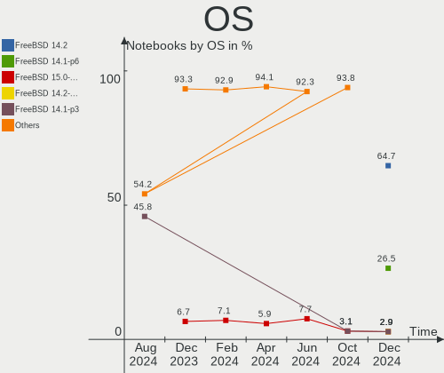
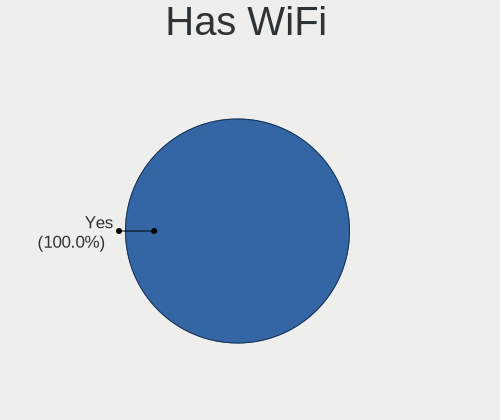
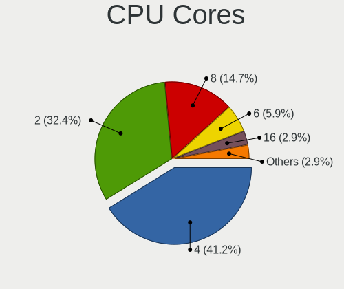
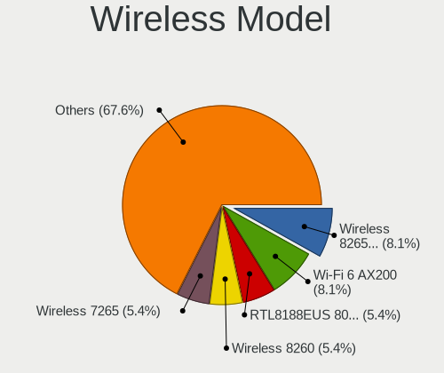
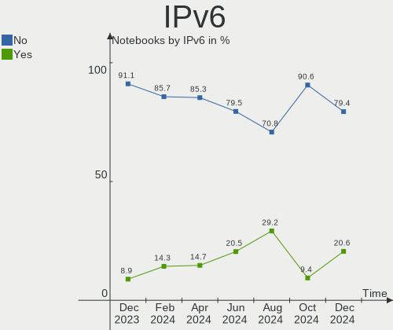

FreeBSD - Hardware Trends (Notebooks)
-------------------------------------

A project to identify most popular hardware characteristics and track their change
over time based on data collected by BSD users at https://BSD-Hardware.info.

Anyone can contribute to this report by the [hw-probe](https://github.com/linuxhw/hw-probe/blob/master/INSTALL.BSD.md) tool:

    hw-probe -all -upload

This report is for one last month. Overall report since the beginning of time: [TestDays](https://github.com/bsdhw/TestDays)

Period: Mar, 2023.

Contents
--------

* [ System ](#system)
  - [ OS                       ](#os)
  - [ OS Family                ](#os-family)
  - [ Arch                     ](#arch)
  - [ DE                       ](#de)
  - [ Display Server           ](#display-server)
  - [ Display Manager          ](#display-manager)
  - [ OS Lang                  ](#os-lang)
  - [ Boot Mode                ](#boot-mode)
  - [ Filesystem               ](#filesystem)
  - [ Part. scheme             ](#part-scheme)

* [ Board ](#board)
  - [ Vendor                   ](#vendor)
  - [ Model                    ](#model)
  - [ Model Family             ](#model-family)
  - [ MFG Year                 ](#mfg-year)
  - [ Form Factor              ](#form-factor)
  - [ Coreboot                 ](#coreboot)
  - [ RAM Size                 ](#ram-size)
  - [ RAM Used                 ](#ram-used)
  - [ Total Drives             ](#total-drives)
  - [ Has CD-ROM               ](#has-cd-rom)
  - [ Has Ethernet             ](#has-ethernet)
  - [ Has WiFi                 ](#has-wifi)
  - [ Has Bluetooth            ](#has-bluetooth)

* [ Location ](#location)
  - [ Country                  ](#country)
  - [ City                     ](#city)

* [ Drives ](#drives)
  - [ Drive Vendor             ](#drive-vendor)
  - [ Drive Model              ](#drive-model)
  - [ HDD Vendor               ](#hdd-vendor)
  - [ SSD Vendor               ](#ssd-vendor)
  - [ Drive Kind               ](#drive-kind)
  - [ Drive Connector          ](#drive-connector)
  - [ Drive Size               ](#drive-size)
  - [ Space Total              ](#space-total)
  - [ Space Used               ](#space-used)
  - [ Malfunc. Drives          ](#malfunc-drives)
  - [ Malfunc. Drive Vendor    ](#malfunc-drive-vendor)
  - [ Malfunc. HDD Vendor      ](#malfunc-hdd-vendor)
  - [ Malfunc. Drive Kind      ](#malfunc-drive-kind)
  - [ Failed Drives            ](#failed-drives)
  - [ Failed Drive Vendor      ](#failed-drive-vendor)
  - [ Drive Status             ](#drive-status)

* [ Storage controller ](#storage-controller)
  - [ Storage Vendor           ](#storage-vendor)
  - [ Storage Model            ](#storage-model)
  - [ Storage Kind             ](#storage-kind)

* [ Processor ](#processor)
  - [ CPU Vendor               ](#cpu-vendor)
  - [ CPU Model                ](#cpu-model)
  - [ CPU Model Family         ](#cpu-model-family)
  - [ CPU Cores                ](#cpu-cores)
  - [ CPU Sockets              ](#cpu-sockets)
  - [ CPU Threads              ](#cpu-threads)
  - [ CPU Microarch            ](#cpu-microarch)

* [ Graphics ](#graphics)
  - [ GPU Vendor               ](#gpu-vendor)
  - [ GPU Model                ](#gpu-model)
  - [ GPU Combo                ](#gpu-combo)
  - [ GPU Driver               ](#gpu-driver)
  - [ GPU Memory               ](#gpu-memory)

* [ Monitor ](#monitor)
  - [ Monitor Vendor           ](#monitor-vendor)
  - [ Monitor Model            ](#monitor-model)
  - [ Monitor Resolution       ](#monitor-resolution)
  - [ Monitor Diagonal         ](#monitor-diagonal)
  - [ Monitor Width            ](#monitor-width)
  - [ Aspect Ratio             ](#aspect-ratio)
  - [ Monitor Area             ](#monitor-area)
  - [ Pixel Density            ](#pixel-density)
  - [ Multiple Monitors        ](#multiple-monitors)

* [ Network ](#network)
  - [ Net Controller Vendor    ](#net-controller-vendor)
  - [ Net Controller Model     ](#net-controller-model)
  - [ Wireless Vendor          ](#wireless-vendor)
  - [ Wireless Model           ](#wireless-model)
  - [ Ethernet Vendor          ](#ethernet-vendor)
  - [ Ethernet Model           ](#ethernet-model)
  - [ Net Controller Kind      ](#net-controller-kind)
  - [ Used Controller          ](#used-controller)
  - [ NICs                     ](#nics)
  - [ IPv6                     ](#ipv6)

* [ Bluetooth ](#bluetooth)
  - [ Bluetooth Vendor         ](#bluetooth-vendor)
  - [ Bluetooth Model          ](#bluetooth-model)

* [ Sound ](#sound)
  - [ Sound Vendor             ](#sound-vendor)
  - [ Sound Model              ](#sound-model)

* [ Memory ](#memory)
  - [ Memory Vendor            ](#memory-vendor)
  - [ Memory Model             ](#memory-model)
  - [ Memory Kind              ](#memory-kind)
  - [ Memory Form Factor       ](#memory-form-factor)
  - [ Memory Size              ](#memory-size)
  - [ Memory Speed             ](#memory-speed)

* [ Printers & scanners ](#printers--scanners)
  - [ Printer Vendor           ](#printer-vendor)
  - [ Printer Model            ](#printer-model)
  - [ Scanner Vendor           ](#scanner-vendor)
  - [ Scanner Model            ](#scanner-model)

* [ Camera ](#camera)
  - [ Camera Vendor            ](#camera-vendor)
  - [ Camera Model             ](#camera-model)

* [ Security ](#security)
  - [ Fingerprint Vendor       ](#fingerprint-vendor)
  - [ Fingerprint Model        ](#fingerprint-model)
  - [ Chipcard Vendor          ](#chipcard-vendor)
  - [ Chipcard Model           ](#chipcard-model)

* [ Unsupported ](#unsupported)
  - [ Unsupported Devices      ](#unsupported-devices)
  - [ Unsupported Device Types ](#unsupported-device-types)

System
------

OS
--

Installed operating systems

| Name                 | Notebooks | Percent |
|----------------------|-----------|---------|
| FreeBSD 13.1-p7      | 16        | 50%     |
| FreeBSD 14.0-CURRENT | 5         | 15.63%  |
| FreeBSD 13.1         | 5         | 15.63%  |
| FreeBSD 13.2-RC3     | 2         | 6.25%   |
| FreeBSD 13.1-p5      | 2         | 6.25%   |
| FreeBSD 13.2-STABLE  | 1         | 3.13%   |
| FreeBSD 13.2-RC1     | 1         | 3.13%   |

OS Family
---------

OS without a version

| Name    | Notebooks | Percent |
|---------|-----------|---------|
| FreeBSD | 32        | 100%    |

Arch
----

OS architecture (x86_64, i586, etc.)

| Name  | Notebooks | Percent |
|-------|-----------|---------|
| amd64 | 31        | 96.88%  |
| i386  | 1         | 3.13%   |

DE
--

Desktop Environment

| Name      | Notebooks | Percent |
|-----------|-----------|---------|
| XFCE      | 11        | 34.38%  |
| KDE5      | 10        | 31.25%  |
| Console   | 3         | 9.38%   |
| TWM       | 2         | 6.25%   |
| MATE      | 1         | 3.13%   |
| Lumina    | 1         | 3.13%   |
| i3        | 1         | 3.13%   |
| GNOME     | 1         | 3.13%   |
| dwm       | 1         | 3.13%   |
| AwesomeWM | 1         | 3.13%   |

Display Server
--------------

X11 or Wayland

| Name    | Notebooks | Percent |
|---------|-----------|---------|
| X11     | 28        | 87.5%   |
| Console | 3         | 9.38%   |
| Wayland | 1         | 3.13%   |

Display Manager
---------------

SDDM, LightDM, etc.

| Name    | Notebooks | Percent |
|---------|-----------|---------|
| SDDM    | 10        | 31.25%  |
| Console | 7         | 21.88%  |
| SLiM    | 6         | 18.75%  |
| XDM     | 3         | 9.38%   |
| LightDM | 3         | 9.38%   |
| GDM     | 2         | 6.25%   |
| Ly      | 1         | 3.13%   |

OS Lang
-------

Language

| Lang    | Notebooks | Percent |
|---------|-----------|---------|
| C       | 19        | 59.38%  |
| fr_FR   | 4         | 12.5%   |
| en_US   | 3         | 9.38%   |
| Unknown | 3         | 9.38%   |
| zh_CN   | 1         | 3.13%   |
| ru_RU   | 1         | 3.13%   |
| de_DE   | 1         | 3.13%   |

Boot Mode
---------

EFI or BIOS

| Mode | Notebooks | Percent |
|------|-----------|---------|
| EFI  | 24        | 75%     |
| BIOS | 8         | 25%     |

Filesystem
----------

Type of filesystem

| Type | Notebooks | Percent |
|------|-----------|---------|
| Zfs  | 25        | 78.13%  |
| Ufs  | 6         | 18.75%  |
| Nfs  | 1         | 3.13%   |

Part. scheme
------------

Scheme of partitioning

| Type | Notebooks | Percent |
|------|-----------|---------|
| GPT  | 29        | 90.63%  |
| MBR  | 2         | 6.25%   |
| BSD  | 1         | 3.13%   |

Board
-----

Vendor
------

Motherboard manufacturer

| Name                | Notebooks | Percent |
|---------------------|-----------|---------|
| Lenovo              | 11        | 34.38%  |
| Dell                | 4         | 12.5%   |
| ASUSTek Computer    | 3         | 9.38%   |
| Acer                | 3         | 9.38%   |
| Intel               | 2         | 6.25%   |
| Google              | 2         | 6.25%   |
| Samsung Electronics | 1         | 3.13%   |
| IP3 Technology      | 1         | 3.13%   |
| HUAWEI              | 1         | 3.13%   |
| HMT                 | 1         | 3.13%   |
| Hewlett-Packard     | 1         | 3.13%   |
| eMachines           | 1         | 3.13%   |
| Alienware           | 1         | 3.13%   |

Model
-----

Motherboard model

| Name                                     | Notebooks | Percent |
|------------------------------------------|-----------|---------|
| Samsung 750XEE                           | 1         | 3.13%   |
| Lenovo ThinkPad X230 2324A14             | 1         | 3.13%   |
| Lenovo ThinkPad X220 4286CTO             | 1         | 3.13%   |
| Lenovo ThinkPad X1 Extreme 20MF000QUS    | 1         | 3.13%   |
| Lenovo ThinkPad X1 Carbon 6th 20KHCTO1WW | 1         | 3.13%   |
| Lenovo ThinkPad T495 20NKS0HN1N          | 1         | 3.13%   |
| Lenovo ThinkPad T480 20L6S29E0T          | 1         | 3.13%   |
| Lenovo ThinkPad T16 Gen 1 21BVCTO1WW     | 1         | 3.13%   |
| Lenovo ThinkPad P52s 20LBS0FH00          | 1         | 3.13%   |
| Lenovo ThinkPad E495 20NEA00QUS          | 1         | 3.13%   |
| Lenovo ThinkPad E14 Gen 3 20Y7003SGE     | 1         | 3.13%   |
| Lenovo IdeaPad 5 15ALC05 82LN            | 1         | 3.13%   |
| IP3 ACN1S                                | 1         | 3.13%   |
| Intel SandyBridge Platform               | 1         | 3.13%   |
| Intel Jasper Lake Client Platform        | 1         | 3.13%   |
| HUAWEI HVY-WXX9                          | 1         | 3.13%   |
| HMT W041-TF-A-45                         | 1         | 3.13%   |
| HP ProBook 450 G8 Notebook PC            | 1         | 3.13%   |
| Google Stout                             | 1         | 3.13%   |
| Google Kohaku                            | 1         | 3.13%   |
| eMachines eM350                          | 1         | 3.13%   |
| Dell Precision 7720                      | 1         | 3.13%   |
| Dell Latitude D620                       | 1         | 3.13%   |
| Dell Inspiron 5567                       | 1         | 3.13%   |
| Dell Inspiron 5559                       | 1         | 3.13%   |
| ASUS ASUS TUF Gaming F15 FX506LH_FX506LH | 1         | 3.13%   |
| ASUS ASUS TUF Gaming A15 FA506QE_FA506QE | 1         | 3.13%   |
| ASUS 1001P                               | 1         | 3.13%   |
| Alienware 14                             | 1         | 3.13%   |
| Acer Nitro AN515-53                      | 1         | 3.13%   |
| Acer Aspire V3-112P                      | 1         | 3.13%   |
| Acer AOD270                              | 1         | 3.13%   |

Model Family
------------

Motherboard model prefix

| Name              | Notebooks | Percent |
|-------------------|-----------|---------|
| Lenovo ThinkPad   | 10        | 31.25%  |
| Dell Inspiron     | 2         | 6.25%   |
| ASUS ASUS         | 2         | 6.25%   |
| Samsung 750XEE    | 1         | 3.13%   |
| Lenovo IdeaPad    | 1         | 3.13%   |
| IP3 ACN1S         | 1         | 3.13%   |
| Intel SandyBridge | 1         | 3.13%   |
| Intel Jasper      | 1         | 3.13%   |
| HUAWEI HVY-WXX9   | 1         | 3.13%   |
| HMT W041-TF-A-45  | 1         | 3.13%   |
| HP ProBook        | 1         | 3.13%   |
| Google Stout      | 1         | 3.13%   |
| Google Kohaku     | 1         | 3.13%   |
| eMachines eM350   | 1         | 3.13%   |
| Dell Precision    | 1         | 3.13%   |
| Dell Latitude     | 1         | 3.13%   |
| ASUS 1001P        | 1         | 3.13%   |
| Alienware 14      | 1         | 3.13%   |
| Acer Nitro        | 1         | 3.13%   |
| Acer Aspire       | 1         | 3.13%   |
| Acer AOD270       | 1         | 3.13%   |

MFG Year
--------

Motherboard manufacture year

| Year | Notebooks | Percent |
|------|-----------|---------|
| 2022 | 10        | 31.25%  |
| 2019 | 3         | 9.38%   |
| 2014 | 3         | 9.38%   |
| 2023 | 2         | 6.25%   |
| 2021 | 2         | 6.25%   |
| 2020 | 2         | 6.25%   |
| 2018 | 2         | 6.25%   |
| 2016 | 2         | 6.25%   |
| 2012 | 2         | 6.25%   |
| 2010 | 2         | 6.25%   |
| 2011 | 1         | 3.13%   |
| 2008 | 1         | 3.13%   |

Form Factor
-----------

Physical design of the computer

| Name     | Notebooks | Percent |
|----------|-----------|---------|
| Notebook | 32        | 100%    |

Coreboot
--------

Have coreboot on board

| Used | Notebooks | Percent |
|------|-----------|---------|
| No   | 30        | 93.75%  |
| Yes  | 2         | 6.25%   |

RAM Size
--------

Total RAM memory

| Size in GB  | Notebooks | Percent |
|-------------|-----------|---------|
| 16.01-24.0  | 13        | 40.63%  |
| 8.01-16.0   | 8         | 25%     |
| 4.01-8.0    | 4         | 12.5%   |
| 32.01-64.0  | 3         | 9.38%   |
| 2.01-3.0    | 2         | 6.25%   |
| 64.01-256.0 | 2         | 6.25%   |

RAM Used
--------

Used RAM memory

| Used GB  | Notebooks | Percent |
|----------|-----------|---------|
| 0.51-1.0 | 16        | 50%     |
| 0.01-0.5 | 7         | 21.88%  |
| 1.01-2.0 | 5         | 15.63%  |
| 2.01-3.0 | 3         | 9.38%   |
| 3.01-4.0 | 1         | 3.13%   |

Total Drives
------------

Number of drives on board

| Drives | Notebooks | Percent |
|--------|-----------|---------|
| 1      | 26        | 81.25%  |
| 2      | 5         | 15.63%  |
| 58     | 1         | 3.13%   |

Has CD-ROM
----------

Has CD-ROM on board

| Presented | Notebooks | Percent |
|-----------|-----------|---------|
| No        | 28        | 87.5%   |
| Yes       | 4         | 12.5%   |

Has Ethernet
------------

Has Ethernet on board

| Presented | Notebooks | Percent |
|-----------|-----------|---------|
| Yes       | 26        | 81.25%  |
| No        | 6         | 18.75%  |

Has WiFi
--------

Has WiFi module

| Presented | Notebooks | Percent |
|-----------|-----------|---------|
| Yes       | 31        | 96.88%  |
| No        | 1         | 3.13%   |

Has Bluetooth
-------------

Has Bluetooth module

| Presented | Notebooks | Percent |
|-----------|-----------|---------|
| Yes       | 24        | 75%     |
| No        | 8         | 25%     |

Location
--------

Country
-------

Geographic location (country)

| Country   | Notebooks | Percent |
|-----------|-----------|---------|
| USA       | 8         | 25%     |
| France    | 4         | 12.5%   |
| Canada    | 4         | 12.5%   |
| UK        | 3         | 9.38%   |
| Russia    | 3         | 9.38%   |
| Germany   | 3         | 9.38%   |
| China     | 2         | 6.25%   |
| Ukraine   | 1         | 3.13%   |
| Thailand  | 1         | 3.13%   |
| Taiwan    | 1         | 3.13%   |
| Sri Lanka | 1         | 3.13%   |
| Austria   | 1         | 3.13%   |

City
----

Geographic location (city)

| City            | Notebooks | Percent |
|-----------------|-----------|---------|
| Montreal        | 3         | 9.38%   |
| Melun           | 2         | 6.25%   |
| Avon Park       | 2         | 6.25%   |
| Voznesensk      | 1         | 3.13%   |
| Vienna          | 1         | 3.13%   |
| Taipei          | 1         | 3.13%   |
| Shoreham-by-Sea | 1         | 3.13%   |
| Shanghai        | 1         | 3.13%   |
| Saint-Raphaël  | 1         | 3.13%   |
| Rio Dell        | 1         | 3.13%   |
| Pierrefonds     | 1         | 3.13%   |
| Petting         | 1         | 3.13%   |
| Perkasie        | 1         | 3.13%   |
| Overath         | 1         | 3.13%   |
| Novosibirsk     | 1         | 3.13%   |
| New York        | 1         | 3.13%   |
| Mulhouse        | 1         | 3.13%   |
| Moscow          | 1         | 3.13%   |
| Lymington       | 1         | 3.13%   |
| Kelaniya        | 1         | 3.13%   |
| Gifhorn         | 1         | 3.13%   |
| Erie            | 1         | 3.13%   |
| City of London  | 1         | 3.13%   |
| Chiang Mai      | 1         | 3.13%   |
| Chengdu         | 1         | 3.13%   |
| Bothell         | 1         | 3.13%   |
| Beaverton       | 1         | 3.13%   |
| Balashikha      | 1         | 3.13%   |

Drives
------

Drive Vendor
------------

Hard drive vendors

| Vendor              | Notebooks | Drives | Percent |
|---------------------|-----------|--------|---------|
| Samsung Electronics | 6         | 6      | 15.38%  |
| Crucial             | 5         | 6      | 12.82%  |
| Toshiba             | 4         | 12     | 10.26%  |
| WDC                 | 3         | 3      | 7.69%   |
| Seagate             | 3         | 3      | 7.69%   |
| Intel               | 3         | 10     | 7.69%   |
| SSSTC               | 2         | 2      | 5.13%   |
| Micron Technology   | 2         | 2      | 5.13%   |
| UMIS                | 1         | 1      | 2.56%   |
| OEM                 | 1         | 1      | 2.56%   |
| Kingston            | 1         | 2      | 2.56%   |
| KINGBANK            | 1         | 1      | 2.56%   |
| HPE                 | 1         | 5      | 2.56%   |
| Hoodisk             | 1         | 1      | 2.56%   |
| Hikvision           | 1         | 1      | 2.56%   |
| HGST                | 1         | 34     | 2.56%   |
| Fanxiang            | 1         | 2      | 2.56%   |
| Corsair             | 1         | 1      | 2.56%   |
| China               | 1         | 1      | 2.56%   |

Drive Model
-----------

Hard drive models

| Model                                       | Notebooks | Percent |
|---------------------------------------------|-----------|---------|
| WDC WD7500BPKX-75HPJT0 752GB                | 1         | 2.44%   |
| WDC PC SN730 SDBQNTY-256G-1001 256GB        | 1         | 2.44%   |
| WDC PC SN730 SDBPNTY-512G-1027 512GB        | 1         | 2.44%   |
| UMIS RPJTJ512MEE1OWX 512GB                  | 1         | 2.44%   |
| Toshiba MQ01ABF050 500GB                    | 1         | 2.44%   |
| Toshiba MK3259GSXP 320GB                    | 1         | 2.44%   |
| Toshiba MK1665GSX 160GB                     | 1         | 2.44%   |
| Toshiba HDWQ140 4TB                         | 1         | 2.44%   |
| SSSTC CL1-8D512 512GB                       | 1         | 2.44%   |
| SSSTC CL1-3D256 256GB                       | 1         | 2.44%   |
| Seagate ST500LT012-1DG142 500GB             | 1         | 2.44%   |
| Seagate ST2000LM005 HN-M201AAD 2TB          | 1         | 2.44%   |
| Seagate BarraCuda 120 SSD ZA2000CM10003 2TB | 1         | 2.44%   |
| Samsung SSD PM871 mSATA 256GB               | 1         | 2.44%   |
| Samsung SSD PM810 mSATA 128GB               | 1         | 2.44%   |
| Samsung MZVLW512HMJP-000L7 512GB            | 1         | 2.44%   |
| Samsung MZVLQ256HAJD-000H1 256GB            | 1         | 2.44%   |
| Samsung MZVLB1T0HALR-000L7 1TB              | 1         | 2.44%   |
| Samsung MZALQ512HBLU-00BL1 512GB            | 1         | 2.44%   |
| OEM Genuine 1TB                             | 1         | 2.44%   |
| Micron MTFDKBA256TFK 256GB                  | 1         | 2.44%   |
| Micron 2210_MTFDHBA512QFD 512GB             | 1         | 2.44%   |
| Kingston SV300S37A60G 64GB                  | 1         | 2.44%   |
| KINGBANK KP230 120GB                        | 1         | 2.44%   |
| Intel SSDSC2BA100G3L 100GB                  | 1         | 2.44%   |
| Intel SSDSA2M160G2LE 160GB                  | 1         | 2.44%   |
| Intel SSDPEKKF256G8L 256GB                  | 1         | 2.44%   |
| HPE MB4000GCWLV 4TB                         | 1         | 2.44%   |
| Hoodisk SSD 256GB                           | 1         | 2.44%   |
| Hikvision HS-SSD-E100 256G                  | 1         | 2.44%   |
| HGST HDN726040ALE614 4TB                    | 1         | 2.44%   |
| HGST HDN724040ALE640 4TB                    | 1         | 2.44%   |
| Fanxiang S101-240GB                         | 1         | 2.44%   |
| Fanxiang FP325Q 512GB                       | 1         | 2.44%   |
| Crucial CT2000P5PSSD8 2TB                   | 1         | 2.44%   |
| Crucial CT2000P3SSD8 2TB                    | 1         | 2.44%   |
| Crucial CT1000P2SSD8 1TB                    | 1         | 2.44%   |
| Crucial CT1000MX500SSD1 1TB                 | 1         | 2.44%   |
| Crucial CT1000BX500SSD1 1TB                 | 1         | 2.44%   |
| Corsair Force 3 SSD 120GB                   | 1         | 2.44%   |

HDD Vendor
----------

Hard disk drive vendors

| Vendor  | Notebooks | Drives | Percent |
|---------|-----------|--------|---------|
| Toshiba | 4         | 12     | 44.44%  |
| Seagate | 2         | 2      | 22.22%  |
| WDC     | 1         | 1      | 11.11%  |
| HPE     | 1         | 5      | 11.11%  |
| HGST    | 1         | 34     | 11.11%  |

SSD Vendor
----------

Solid state drive vendors

| Vendor              | Notebooks | Drives | Percent |
|---------------------|-----------|--------|---------|
| Samsung Electronics | 2         | 2      | 16.67%  |
| Intel               | 2         | 9      | 16.67%  |
| Crucial             | 2         | 2      | 16.67%  |
| Seagate             | 1         | 1      | 8.33%   |
| Kingston            | 1         | 2      | 8.33%   |
| Hikvision           | 1         | 1      | 8.33%   |
| Fanxiang            | 1         | 2      | 8.33%   |
| Corsair             | 1         | 1      | 8.33%   |
| China               | 1         | 1      | 8.33%   |

Drive Kind
----------

HDD or SSD

| Kind | Notebooks | Drives | Percent |
|------|-----------|--------|---------|
| NVMe | 18        | 19     | 51.43%  |
| SSD  | 10        | 21     | 28.57%  |
| HDD  | 7         | 54     | 20%     |

Drive Connector
---------------

SATA, SAS, NVMe, etc.

| Type | Notebooks | Drives | Percent |
|------|-----------|--------|---------|
| NVMe | 18        | 19     | 52.94%  |
| SATA | 16        | 75     | 47.06%  |

Drive Size
----------

Size of hard drive

| Size in TB | Notebooks | Drives | Percent |
|------------|-----------|--------|---------|
| 0.01-0.5   | 10        | 20     | 55.56%  |
| 0.51-1.0   | 5         | 5      | 27.78%  |
| 1.01-2.0   | 2         | 2      | 11.11%  |
| 3.01-4.0   | 1         | 48     | 5.56%   |

Space Total
-----------

Amount of disk space available on the file system

| Size in GB | Notebooks | Percent |
|------------|-----------|---------|
| 101-250    | 12        | 37.5%   |
| 251-500    | 7         | 21.88%  |
| 501-1000   | 5         | 15.63%  |
| 1001-2000  | 3         | 9.38%   |
| 21-50      | 2         | 6.25%   |
| 1-20       | 2         | 6.25%   |
| 51-100     | 1         | 3.13%   |

Space Used
----------

Amount of used disk space

| Used GB | Notebooks | Percent |
|---------|-----------|---------|
| 1-20    | 27        | 84.38%  |
| 21-50   | 5         | 15.63%  |

Malfunc. Drives
---------------

Drive models with a malfunction

| Model                      | Notebooks | Drives | Percent |
|----------------------------|-----------|--------|---------|
| Toshiba MK1665GSX 160GB    | 1         | 1      | 25%     |
| Kingston SV300S37A60G 64GB | 1         | 2      | 25%     |
| Intel SSDSA2M160G2LE 160GB | 1         | 1      | 25%     |
| Fanxiang S101-240GB        | 1         | 1      | 25%     |

Malfunc. Drive Vendor
---------------------

Vendors of faulty drives

| Vendor   | Notebooks | Drives | Percent |
|----------|-----------|--------|---------|
| Toshiba  | 1         | 1      | 25%     |
| Kingston | 1         | 2      | 25%     |
| Intel    | 1         | 1      | 25%     |
| Fanxiang | 1         | 1      | 25%     |

Malfunc. HDD Vendor
-------------------

Vendors of faulty HDD drives

| Vendor  | Notebooks | Drives | Percent |
|---------|-----------|--------|---------|
| Toshiba | 1         | 1      | 100%    |

Malfunc. Drive Kind
-------------------

Kinds of faulty drives

| Kind | Notebooks | Drives | Percent |
|------|-----------|--------|---------|
| SSD  | 3         | 4      | 75%     |
| HDD  | 1         | 1      | 25%     |

Failed Drives
-------------

Failed drive models

Zero info for selected period =(

Failed Drive Vendor
-------------------

Failed drive vendors

Zero info for selected period =(

Drive Status
------------

Number of failed and malfunc. drives

| Status  | Notebooks | Drives | Percent |
|---------|-----------|--------|---------|
| Works   | 31        | 89     | 88.57%  |
| Malfunc | 4         | 5      | 11.43%  |

Storage controller
------------------

Storage Vendor
--------------

Storage controller vendors

| Vendor                                  | Notebooks | Percent |
|-----------------------------------------|-----------|---------|
| Intel                                   | 19        | 50%     |
| Samsung Electronics                     | 4         | 10.53%  |
| Micron/Crucial Technology               | 3         | 7.89%   |
| Solid State Storage Technology          | 2         | 5.26%   |
| Silicon Motion                          | 2         | 5.26%   |
| SanDisk                                 | 2         | 5.26%   |
| Micron Technology                       | 2         | 5.26%   |
| Shenzhen Unionmemory Information System | 1         | 2.63%   |
| Phison Electronics                      | 1         | 2.63%   |
| Broadcom / LSI                          | 1         | 2.63%   |
| AMD                                     | 1         | 2.63%   |

Storage Model
-------------

Storage controller models

| Model                                                                         | Notebooks | Percent |
|-------------------------------------------------------------------------------|-----------|---------|
| Intel NM10/ICH7 Family SATA Controller [AHCI mode]                            | 3         | 7.89%   |
| Unknown                                                                       | 3         | 7.89%   |
| Silicon Motion SM2263EN/SM2263XT SSD Controller                               | 2         | 5.26%   |
| SanDisk WD Black SN750 / PC SN730 NVMe SSD                                    | 2         | 5.26%   |
| Samsung NVMe SSD Controller 980                                               | 2         | 5.26%   |
| Micron/Crucial P2 NVMe PCIe SSD                                               | 2         | 5.26%   |
| Micron NVMe Storage Controller                                                | 2         | 5.26%   |
| Intel Sunrise Point-LP SATA Controller [AHCI mode]                            | 2         | 5.26%   |
| Intel 82801 Mobile SATA Controller [RAID mode]                                | 2         | 5.26%   |
| Intel 7 Series Chipset Family 6-port SATA Controller [AHCI mode]              | 2         | 5.26%   |
| Samsung NVMe SSD Controller SM981/PM981/PM983                                 | 1         | 2.63%   |
| Samsung NVMe SSD Controller SM961/PM961/SM963                                 | 1         | 2.63%   |
| Phison PS5013 E13 NVMe Controller                                             | 1         | 2.63%   |
| Micron/Crucial P5 Plus NVMe PCIe SSD                                          | 1         | 2.63%   |
| Intel Volume Management Device NVMe RAID Controller                           | 1         | 2.63%   |
| Intel SSD Pro 7600p/760p/E 6100p Series                                       | 1         | 2.63%   |
| Intel Q170/Q150/B150/H170/H110/Z170/CM236 Chipset SATA Controller [AHCI Mode] | 1         | 2.63%   |
| Intel Jasper Lake SATA AHCI Controller                                        | 1         | 2.63%   |
| Intel Comet Lake SATA AHCI Controller                                         | 1         | 2.63%   |
| Intel Atom Processor E3800 Series SATA AHCI Controller                        | 1         | 2.63%   |
| Intel 82801GBM/GHM (ICH7-M Family) SATA Controller [IDE mode]                 | 1         | 2.63%   |
| Intel 6 Series/C200 Series Chipset Family 6 port Mobile SATA AHCI Controller  | 1         | 2.63%   |
| Intel 6 Series/C200 Series Chipset Family 6 port Desktop SATA AHCI Controller | 1         | 2.63%   |
| Intel 400 Series Chipset Family SATA AHCI Controller                          | 1         | 2.63%   |
| Broadcom / LSI SAS2008 PCI-Express Fusion-MPT SAS-2 [Falcon]                  | 1         | 2.63%   |
| AMD FCH SATA Controller [AHCI mode]                                           | 1         | 2.63%   |

Storage Kind
------------

Kind of storage controller (IDE, SATA, NVMe, SAS, ...)

| Kind | Notebooks | Percent |
|------|-----------|---------|
| NVMe | 18        | 47.37%  |
| SATA | 15        | 39.47%  |
| RAID | 3         | 7.89%   |
| SAS  | 1         | 2.63%   |
| IDE  | 1         | 2.63%   |

Processor
---------

CPU Vendor
----------

Processor vendors

| Vendor | Notebooks | Percent |
|--------|-----------|---------|
| Intel  | 24        | 75%     |
| AMD    | 8         | 25%     |

CPU Model
---------

Processor models

| Model                                           | Notebooks | Percent |
|-------------------------------------------------|-----------|---------|
| Intel Core i5-8350U CPU @ 1.70GHz               | 2         | 6.25%   |
| Intel Atom CPU N450 @ 1.66GHz                   | 2         | 6.25%   |
| Intel Xeon CPU E3-1230 V2 @ 3.30GH              | 1         | 3.13%   |
| Intel Pentium M                                 | 1         | 3.13%   |
| Intel Pentium CPU N3540 @ 2.16GHz               | 1         | 3.13%   |
| Intel Core i7-8850H CPU @ 2.60GHz               | 1         | 3.13%   |
| Intel Core i7-8650U CPU @ 1.90GHz               | 1         | 3.13%   |
| Intel Core i7-7820HQ CPU @ 2.90GHz              | 1         | 3.13%   |
| Intel Core i7-7500U CPU @ 2.70GHz               | 1         | 3.13%   |
| Intel Core i7-6500U CPU @ 2.50GHz               | 1         | 3.13%   |
| Intel Core i7-4700MQ CPU @ 2.40GHz              | 1         | 3.13%   |
| Intel Core i7-2620M CPU @ 2.70GHz               | 1         | 3.13%   |
| Intel Core i5-8300H CPU @ 2.30GHz               | 1         | 3.13%   |
| Intel Core i5-3320M CPU @ 2.60GHz               | 1         | 3.13%   |
| Intel Core i5-10300H CPU @ 2.50GHz              | 1         | 3.13%   |
| Intel Core i5-10210U CPU @ 1.60GHz              | 1         | 3.13%   |
| Intel Celeron N5100 @ 1.10GHz                   | 1         | 3.13%   |
| Intel Celeron CPU 1007U @ 1.50GHz               | 1         | 3.13%   |
| Intel Atom CPU N2600 @ 1.60GHz                  | 1         | 3.13%   |
| Intel 12th Gen Core i7-1260P                    | 1         | 3.13%   |
| Intel 12th Gen Core i7-1255U                    | 1         | 3.13%   |
| Intel 11th Gen Core i5-1135G7 @ 2.40GHz         | 1         | 3.13%   |
| AMD Ryzen 7 5800U with Radeon Graphics          | 1         | 3.13%   |
| AMD Ryzen 7 5700U with Radeon Graphics          | 1         | 3.13%   |
| AMD Ryzen 5 PRO 3500U w/ Radeon Vega Mobile Gfx | 1         | 3.13%   |
| AMD Ryzen 5 5600U with Radeon Graphics          | 1         | 3.13%   |
| AMD Ryzen 5 5600H with Radeon Graphics          | 1         | 3.13%   |
| AMD Ryzen 5 5500U with Radeon Graphics          | 1         | 3.13%   |
| AMD Ryzen 5 4600H with Radeon Graphics          | 1         | 3.13%   |
| AMD Ryzen 5 3500U with Radeon Vega Mobile Gfx   | 1         | 3.13%   |

CPU Model Family
----------------

Processor model prefix

| Model           | Notebooks | Percent |
|-----------------|-----------|---------|
| Intel Core i7   | 7         | 21.88%  |
| Intel Core i5   | 6         | 18.75%  |
| AMD Ryzen 5     | 5         | 15.63%  |
| Other           | 3         | 9.38%   |
| Intel Atom      | 3         | 9.38%   |
| Intel Celeron   | 2         | 6.25%   |
| AMD Ryzen 7     | 2         | 6.25%   |
| Intel Xeon      | 1         | 3.13%   |
| Intel Pentium M | 1         | 3.13%   |
| Intel Pentium   | 1         | 3.13%   |
| AMD Ryzen 5 PRO | 1         | 3.13%   |

CPU Cores
---------

Number of processor cores

| Number | Notebooks | Percent |
|--------|-----------|---------|
| 4      | 12        | 37.5%   |
| 2      | 7         | 21.88%  |
| 12     | 5         | 15.63%  |
| 8      | 3         | 9.38%   |
| 16     | 2         | 6.25%   |
| 1      | 2         | 6.25%   |
| 6      | 1         | 3.13%   |

CPU Sockets
-----------

Number of sockets

| Number | Notebooks | Percent |
|--------|-----------|---------|
| 1      | 32        | 100%    |

CPU Threads
-----------

Threads per core (Hyper-Threading)

| Number | Notebooks | Percent |
|--------|-----------|---------|
| 2      | 19        | 59.38%  |
| 1      | 13        | 40.63%  |

CPU Microarch
-------------

Microarchitecture

| Name        | Notebooks | Percent |
|-------------|-----------|---------|
| KabyLake    | 8         | 25%     |
| Unknown     | 5         | 15.63%  |
| Zen 3       | 3         | 9.38%   |
| IvyBridge   | 3         | 9.38%   |
| Bonnell     | 3         | 9.38%   |
| Zen+        | 2         | 6.25%   |
| Zen 2       | 1         | 3.13%   |
| TigerLake   | 1         | 3.13%   |
| Skylake     | 1         | 3.13%   |
| Silvermont  | 1         | 3.13%   |
| SandyBridge | 1         | 3.13%   |
| P6          | 1         | 3.13%   |
| Haswell     | 1         | 3.13%   |
| CometLake   | 1         | 3.13%   |

Graphics
--------

GPU Vendor
----------

Vendors of graphics cards

| Vendor         | Notebooks | Percent |
|----------------|-----------|---------|
| Intel          | 23        | 56.1%   |
| AMD            | 10        | 24.39%  |
| Nvidia         | 7         | 17.07%  |
| Silicon Motion | 1         | 2.44%   |

GPU Model
---------

Graphics card models

| Model                                                                                 | Notebooks | Percent |
|---------------------------------------------------------------------------------------|-----------|---------|
| Intel UHD Graphics 620                                                                | 3         | 7.14%   |
| AMD Cezanne [Radeon Vega Series / Radeon Vega Mobile Series]                          | 3         | 7.14%   |
| Intel CoffeeLake-H GT2 [UHD Graphics 630]                                             | 2         | 4.76%   |
| Intel Atom Processor D4xx/D5xx/N4xx/N5xx Integrated Graphics Controller               | 2         | 4.76%   |
| Intel 3rd Gen Core processor Graphics Controller                                      | 2         | 4.76%   |
| AMD Picasso/Raven 2 [Radeon Vega Series / Radeon Vega Mobile Series]                  | 2         | 4.76%   |
| AMD Lucienne                                                                          | 2         | 4.76%   |
| Silicon Motion SM712 LynxEM+                                                          | 1         | 2.38%   |
| Nvidia TU117M                                                                         | 1         | 2.38%   |
| Nvidia GP108GLM [Quadro P500 Mobile]                                                  | 1         | 2.38%   |
| Nvidia GP107M [GeForce GTX 1050 Ti Mobile]                                            | 1         | 2.38%   |
| Nvidia GP107M [GeForce GTX 1050 Mobile]                                               | 1         | 2.38%   |
| Nvidia GP104GLM [Quadro P3000 Mobile]                                                 | 1         | 2.38%   |
| Nvidia GK106M [GeForce GTX 765M]                                                      | 1         | 2.38%   |
| Nvidia GA107M [GeForce RTX 3050 Ti Mobile]                                            | 1         | 2.38%   |
| Intel TigerLake-LP GT2 [Iris Xe Graphics]                                             | 1         | 2.38%   |
| Intel Skylake GT2 [HD Graphics 520]                                                   | 1         | 2.38%   |
| Intel Mobile 945GM/GMS/GME, 943/940GML Express Integrated Graphics Controller         | 1         | 2.38%   |
| Intel Mobile 945GM/GMS, 943/940GML Express Integrated Graphics Controller             | 1         | 2.38%   |
| Intel JasperLake [UHD Graphics]                                                       | 1         | 2.38%   |
| Intel HD Graphics 630                                                                 | 1         | 2.38%   |
| Intel HD Graphics 620                                                                 | 1         | 2.38%   |
| Intel CometLake-U GT2 [UHD Graphics]                                                  | 1         | 2.38%   |
| Intel CometLake-H GT2 [UHD Graphics]                                                  | 1         | 2.38%   |
| Intel Atom Processor Z36xxx/Z37xxx Series Graphics & Display                          | 1         | 2.38%   |
| Intel Atom Processor D2xxx/N2xxx Integrated Graphics Controller                       | 1         | 2.38%   |
| Intel Alder Lake-UP3 GT2 [UHD Graphics]                                               | 1         | 2.38%   |
| Intel Alder Lake-P Integrated Graphics Controller                                     | 1         | 2.38%   |
| Intel 4th Gen Core Processor Integrated Graphics Controller                           | 1         | 2.38%   |
| Intel 2nd Generation Core Processor Family Integrated Graphics Controller             | 1         | 2.38%   |
| AMD Topaz XT [Radeon R7 M260/M265 / M340/M360 / M440/M445 / 530/535 / 620/625 Mobile] | 1         | 2.38%   |
| AMD Sun XT [Radeon HD 8670A/8670M/8690M / R5 M330 / M430 / Radeon 520 Mobile]         | 1         | 2.38%   |
| AMD Renoir                                                                            | 1         | 2.38%   |

GPU Combo
---------

Combinations of graphics cards

| Name               | Notebooks | Percent |
|--------------------|-----------|---------|
| 1 x Intel          | 12        | 37.5%   |
| 1 x AMD            | 7         | 21.88%  |
| Intel + Nvidia     | 6         | 18.75%  |
| 2 x Intel          | 3         | 9.38%   |
| Intel + AMD        | 2         | 6.25%   |
| 1 x Silicon Motion | 1         | 3.13%   |
| AMD + Nvidia       | 1         | 3.13%   |

GPU Driver
----------

Free vs proprietary

| Driver      | Notebooks | Percent |
|-------------|-----------|---------|
| Free        | 30        | 93.75%  |
| Proprietary | 2         | 6.25%   |

GPU Memory
----------

Total video memory

| Size in GB | Notebooks | Percent |
|------------|-----------|---------|
| Unknown    | 26        | 81.25%  |
| 0.01-0.5   | 4         | 12.5%   |
| 1.01-2.0   | 1         | 3.13%   |
| 0.51-1.0   | 1         | 3.13%   |

Monitor
-------

Monitor Vendor
--------------

Monitor vendors

Zero info for selected period =(

Monitor Model
-------------

Monitor models

Zero info for selected period =(

Monitor Resolution
------------------

Monitor screen resolution

Zero info for selected period =(

Monitor Diagonal
----------------

Diagonal size in inches

Zero info for selected period =(

Monitor Width
-------------

Physical width

Zero info for selected period =(

Aspect Ratio
------------

Proportional relationship between the width and the height

Zero info for selected period =(

Monitor Area
------------

Area in inch²

Zero info for selected period =(

Pixel Density
-------------

Pixels per inch

Zero info for selected period =(

Multiple Monitors
-----------------

Total monitors connected

| Total | Notebooks | Percent |
|-------|-----------|---------|
| 1     | 24        | 75%     |
| 0     | 8         | 25%     |

Network
-------

Net Controller Vendor
---------------------

Controller vendors

| Vendor                     | Notebooks | Percent |
|----------------------------|-----------|---------|
| Intel                      | 22        | 45.83%  |
| Realtek Semiconductor      | 15        | 31.25%  |
| Qualcomm Atheros           | 6         | 12.5%   |
| Broadcom                   | 2         | 4.17%   |
| Shenzhen Goodix Technology | 1         | 2.08%   |
| MediaTek                   | 1         | 2.08%   |
| D-Link System              | 1         | 2.08%   |

Net Controller Model
--------------------

Controller models

| Model                                                                      | Notebooks | Percent |
|----------------------------------------------------------------------------|-----------|---------|
| Realtek RTL8111/8168/8411 PCI Express Gigabit Ethernet Controller          | 10        | 16.39%  |
| Realtek RTL810xE PCI Express Fast Ethernet controller                      | 3         | 4.92%   |
| Intel Wireless 8265 / 8275                                                 | 3         | 4.92%   |
| Intel Wi-Fi 6 AX210/AX211/AX411 160MHz                                     | 3         | 4.92%   |
| Intel Ethernet Connection (4) I219-LM                                      | 3         | 4.92%   |
| Intel 82579LM Gigabit Network Connection (Lewisville)                      | 3         | 4.92%   |
| Qualcomm Atheros AR9462 Wireless Network Adapter                           | 2         | 3.28%   |
| Qualcomm Atheros AR8132 Fast Ethernet                                      | 2         | 3.28%   |
| Intel Wireless-AC 9260                                                     | 2         | 3.28%   |
| Intel Cannon Lake PCH CNVi WiFi                                            | 2         | 3.28%   |
| Intel Alder Lake-P PCH CNVi WiFi                                           | 2         | 3.28%   |
| Shenzhen Goodix Unknow device                                              | 1         | 1.64%   |
| Realtek RTL8852AE 802.11ax PCIe Wireless Network Adapter                   | 1         | 1.64%   |
| Realtek RTL8822CE 802.11ac PCIe Wireless Network Adapter                   | 1         | 1.64%   |
| Realtek RTL8821CE 802.11ac PCIe Wireless Network Adapter                   | 1         | 1.64%   |
| Realtek RTL8188EUS 802.11n Wireless Network Adapter                        | 1         | 1.64%   |
| Qualcomm Atheros QCA9565 / AR9565 Wireless Network Adapter                 | 1         | 1.64%   |
| Qualcomm Atheros Killer E220x Gigabit Ethernet Controller                  | 1         | 1.64%   |
| Qualcomm Atheros AR9485 Wireless Network Adapter                           | 1         | 1.64%   |
| Qualcomm Atheros AR2427 802.11bg Wireless Network Adapter (PCI-Express)    | 1         | 1.64%   |
| MediaTek MT7921 802.11ax PCI Express Wireless Network Adapter              | 1         | 1.64%   |
| Intel Wireless 7260                                                        | 1         | 1.64%   |
| Intel Wireless 3165                                                        | 1         | 1.64%   |
| Intel Wireless 3160                                                        | 1         | 1.64%   |
| Intel Wi-Fi 6 AX201                                                        | 1         | 1.64%   |
| Intel Wi-Fi 6 AX200                                                        | 1         | 1.64%   |
| Intel PRO/Wireless 3945ABG [Golan] Network Connection                      | 1         | 1.64%   |
| Intel Ethernet Connection (7) I219-LM                                      | 1         | 1.64%   |
| Intel Ethernet Connection (5) I219-LM                                      | 1         | 1.64%   |
| Intel Ethernet Connection (16) I219-V                                      | 1         | 1.64%   |
| Intel Dual Band Wireless-AC 3168NGW [Stone Peak]                           | 1         | 1.64%   |
| Intel Comet Lake PCH-LP CNVi WiFi                                          | 1         | 1.64%   |
| Intel Centrino Ultimate-N 6300                                             | 1         | 1.64%   |
| Intel 82574L Gigabit Network Connection                                    | 1         | 1.64%   |
| D-Link System AirPlus G DWL-G122 Wireless Adapter(rev.C1) [Ralink RT2571W] | 1         | 1.64%   |
| Broadcom NetXtreme BCM5752 Gigabit Ethernet PCI Express                    | 1         | 1.64%   |
| Broadcom BCM4313 802.11bgn Wireless Network Adapter                        | 1         | 1.64%   |

Wireless Vendor
---------------

Wireless vendors

| Vendor                | Notebooks | Percent |
|-----------------------|-----------|---------|
| Intel                 | 21        | 63.64%  |
| Qualcomm Atheros      | 5         | 15.15%  |
| Realtek Semiconductor | 4         | 12.12%  |
| MediaTek              | 1         | 3.03%   |
| D-Link System         | 1         | 3.03%   |
| Broadcom              | 1         | 3.03%   |

Wireless Model
--------------

Wireless models

| Model                                                                      | Notebooks | Percent |
|----------------------------------------------------------------------------|-----------|---------|
| Intel Wireless 8265 / 8275                                                 | 3         | 9.09%   |
| Intel Wi-Fi 6 AX210/AX211/AX411 160MHz                                     | 3         | 9.09%   |
| Qualcomm Atheros AR9462 Wireless Network Adapter                           | 2         | 6.06%   |
| Intel Wireless-AC 9260                                                     | 2         | 6.06%   |
| Intel Cannon Lake PCH CNVi WiFi                                            | 2         | 6.06%   |
| Intel Alder Lake-P PCH CNVi WiFi                                           | 2         | 6.06%   |
| Realtek RTL8852AE 802.11ax PCIe Wireless Network Adapter                   | 1         | 3.03%   |
| Realtek RTL8822CE 802.11ac PCIe Wireless Network Adapter                   | 1         | 3.03%   |
| Realtek RTL8821CE 802.11ac PCIe Wireless Network Adapter                   | 1         | 3.03%   |
| Realtek RTL8188EUS 802.11n Wireless Network Adapter                        | 1         | 3.03%   |
| Qualcomm Atheros QCA9565 / AR9565 Wireless Network Adapter                 | 1         | 3.03%   |
| Qualcomm Atheros AR9485 Wireless Network Adapter                           | 1         | 3.03%   |
| Qualcomm Atheros AR2427 802.11bg Wireless Network Adapter (PCI-Express)    | 1         | 3.03%   |
| MediaTek MT7921 802.11ax PCI Express Wireless Network Adapter              | 1         | 3.03%   |
| Intel Wireless 7260                                                        | 1         | 3.03%   |
| Intel Wireless 3165                                                        | 1         | 3.03%   |
| Intel Wireless 3160                                                        | 1         | 3.03%   |
| Intel Wi-Fi 6 AX201                                                        | 1         | 3.03%   |
| Intel Wi-Fi 6 AX200                                                        | 1         | 3.03%   |
| Intel PRO/Wireless 3945ABG [Golan] Network Connection                      | 1         | 3.03%   |
| Intel Dual Band Wireless-AC 3168NGW [Stone Peak]                           | 1         | 3.03%   |
| Intel Comet Lake PCH-LP CNVi WiFi                                          | 1         | 3.03%   |
| Intel Centrino Ultimate-N 6300                                             | 1         | 3.03%   |
| D-Link System AirPlus G DWL-G122 Wireless Adapter(rev.C1) [Ralink RT2571W] | 1         | 3.03%   |
| Broadcom BCM4313 802.11bgn Wireless Network Adapter                        | 1         | 3.03%   |

Ethernet Vendor
---------------

Ethernet vendors

| Vendor                | Notebooks | Percent |
|-----------------------|-----------|---------|
| Realtek Semiconductor | 13        | 50%     |
| Intel                 | 9         | 34.62%  |
| Qualcomm Atheros      | 3         | 11.54%  |
| Broadcom              | 1         | 3.85%   |

Ethernet Model
--------------

Ethernet models

| Model                                                             | Notebooks | Percent |
|-------------------------------------------------------------------|-----------|---------|
| Realtek RTL8111/8168/8411 PCI Express Gigabit Ethernet Controller | 10        | 37.04%  |
| Realtek RTL810xE PCI Express Fast Ethernet controller             | 3         | 11.11%  |
| Intel Ethernet Connection (4) I219-LM                             | 3         | 11.11%  |
| Intel 82579LM Gigabit Network Connection (Lewisville)             | 3         | 11.11%  |
| Qualcomm Atheros AR8132 Fast Ethernet                             | 2         | 7.41%   |
| Qualcomm Atheros Killer E220x Gigabit Ethernet Controller         | 1         | 3.7%    |
| Intel Ethernet Connection (7) I219-LM                             | 1         | 3.7%    |
| Intel Ethernet Connection (5) I219-LM                             | 1         | 3.7%    |
| Intel Ethernet Connection (16) I219-V                             | 1         | 3.7%    |
| Intel 82574L Gigabit Network Connection                           | 1         | 3.7%    |
| Broadcom NetXtreme BCM5752 Gigabit Ethernet PCI Express           | 1         | 3.7%    |

Net Controller Kind
-------------------

Ethernet, WiFi or modem

| Kind     | Notebooks | Percent |
|----------|-----------|---------|
| WiFi     | 31        | 53.45%  |
| Ethernet | 26        | 44.83%  |
| Unknown  | 1         | 1.72%   |

Used Controller
---------------

Currently used network controller

| Kind     | Notebooks | Percent |
|----------|-----------|---------|
| WiFi     | 19        | 57.58%  |
| Ethernet | 14        | 42.42%  |

NICs
----

Total network controllers on board

| Total | Notebooks | Percent |
|-------|-----------|---------|
| 2     | 25        | 78.13%  |
| 1     | 6         | 18.75%  |
| 3     | 1         | 3.13%   |

IPv6
----

IPv6 vs IPv4

| Used | Notebooks | Percent |
|------|-----------|---------|
| No   | 28        | 87.5%   |
| Yes  | 4         | 12.5%   |

Bluetooth
---------

Bluetooth Vendor
----------------

Controller vendors

| Vendor                          | Notebooks | Percent |
|---------------------------------|-----------|---------|
| Intel                           | 17        | 68%     |
| Realtek Semiconductor           | 3         | 12%     |
| Qualcomm Atheros Communications | 2         | 8%      |
| Broadcom                        | 2         | 8%      |
| Foxconn / Hon Hai               | 1         | 4%      |

Bluetooth Model
---------------

Controller models

| Model                                          | Notebooks | Percent |
|------------------------------------------------|-----------|---------|
| Intel Bluetooth wireless interface             | 4         | 16%     |
| Realtek Bluetooth Adapter                      | 3         | 12%     |
| Intel AX210 Bluetooth                          | 3         | 12%     |
| Intel AX201 Bluetooth                          | 3         | 12%     |
| Qualcomm Atheros AR3012 Bluetooth 4.0          | 2         | 8%      |
| Intel Wireless-AC 9260 Bluetooth Adapter       | 2         | 8%      |
| Intel Bluetooth 9460/9560 Jefferson Peak (JfP) | 2         | 8%      |
| Intel Wireless-AC 3168 Bluetooth               | 1         | 4%      |
| Intel Wireless Bluetooth                       | 1         | 4%      |
| Intel AX200 Bluetooth                          | 1         | 4%      |
| Foxconn / Hon Hai Bluetooth USB Module         | 1         | 4%      |
| Broadcom BCM20702 Bluetooth 4.0 [ThinkPad]     | 1         | 4%      |
| Broadcom BCM2035 Bluetooth dongle              | 1         | 4%      |

Sound
-----

Sound Vendor
------------

Sound card vendors

| Vendor   | Notebooks | Percent |
|----------|-----------|---------|
| Intel    | 23        | 63.89%  |
| AMD      | 8         | 22.22%  |
| Nvidia   | 4         | 11.11%  |
| Logitech | 1         | 2.78%   |

Sound Model
-----------

Sound card models

| Model                                                                      | Notebooks | Percent |
|----------------------------------------------------------------------------|-----------|---------|
| AMD Family 17h/19h HD Audio Controller                                     | 8         | 17.78%  |
| AMD Renoir Radeon High Definition Audio Controller                         | 6         | 13.33%  |
| Intel Sunrise Point-LP HD Audio                                            | 5         | 11.11%  |
| Intel NM10/ICH7 Family High Definition Audio Controller                    | 4         | 8.89%   |
| Nvidia GP107GL High Definition Audio Controller                            | 2         | 4.44%   |
| Intel Cannon Lake PCH cAVS                                                 | 2         | 4.44%   |
| Intel Alder Lake PCH-P High Definition Audio Controller                    | 2         | 4.44%   |
| Intel 7 Series/C216 Chipset Family High Definition Audio Controller        | 2         | 4.44%   |
| AMD Raven/Raven2/Fenghuang HDMI/DP Audio Controller                        | 2         | 4.44%   |
| Nvidia TU107 GeForce GTX 1650 High Definition Audio Controller             | 1         | 2.22%   |
| Logitech Yeti Nano HIDpp                                                   | 1         | 2.22%   |
| Intel Xeon E3-1200 v3/4th Gen Core Processor HD Audio Controller           | 1         | 2.22%   |
| Intel Tiger Lake-LP Smart Sound Technology Audio Controller                | 1         | 2.22%   |
| Intel Jasper Lake HD Audio                                                 | 1         | 2.22%   |
| Intel Comet Lake PCH-LP cAVS                                               | 1         | 2.22%   |
| Intel Comet Lake PCH cAVS                                                  | 1         | 2.22%   |
| Intel CM238 HD Audio Controller                                            | 1         | 2.22%   |
| Intel Atom Processor Z36xxx/Z37xxx Series High Definition Audio Controller | 1         | 2.22%   |
| Intel 8 Series/C220 Series Chipset High Definition Audio Controller        | 1         | 2.22%   |
| Intel 6 Series/C200 Series Chipset Family High Definition Audio Controller | 1         | 2.22%   |
| Unknown                                                                    | 1         | 2.22%   |

Memory
------

Memory Vendor
-------------

Memory module vendors

| Vendor              | Notebooks | Percent |
|---------------------|-----------|---------|
| Samsung Electronics | 12        | 32.43%  |
| SK hynix            | 5         | 13.51%  |
| Micron Technology   | 5         | 13.51%  |
| Kingston            | 4         | 10.81%  |
| Unknown             | 4         | 10.81%  |
| Ramaxel Technology  | 2         | 5.41%   |
| Crucial             | 2         | 5.41%   |
| Unknown             | 1         | 2.7%    |
| Corsair             | 1         | 2.7%    |
| Avant               | 1         | 2.7%    |

Memory Model
------------

Memory module models

| Model                                                         | Notebooks | Percent |
|---------------------------------------------------------------|-----------|---------|
| Unknown                                                       | 4         | 10.53%  |
| Ramaxel RAM RMSA3260ME78HAF-2666 8GB SODIMM DDR4 2667MT/s     | 2         | 5.26%   |
| Unknown RAM Module 2GB SODIMM DDR2 667MT/s                    | 1         | 2.63%   |
| SK hynix RAM HMT41GS6AFR8A-PB 8GB SODIMM DDR3 1600MT/s        | 1         | 2.63%   |
| SK hynix RAM HMAB2GS6CMR6N-XN 16GB SODIMM DDR4 3200MT/s       | 1         | 2.63%   |
| SK hynix RAM HMAA1GS6CJR6N-XN 8GB SODIMM DDR4 3200MT/s        | 1         | 2.63%   |
| SK hynix RAM HMA82GS6CJR8N-VK 16GB SODIMM DDR4 2667MT/s       | 1         | 2.63%   |
| SK hynix RAM HMA82GS6AFR8N-UH 16GB SODIMM DDR4 2400MT/s       | 1         | 2.63%   |
| SK hynix RAM HMA81GS6AFR8N-UH 8GB SODIMM DDR4 2400MT/s        | 1         | 2.63%   |
| Samsung RAM Module 4GB SODIMM DDR4 3200MT/s                   | 1         | 2.63%   |
| Samsung RAM Module 4GB Row Of Chips LPDDR3 2133MT/s           | 1         | 2.63%   |
| Samsung RAM M471B5273DH0-CH9 4GB SODIMM DDR3 1334MT/s         | 1         | 2.63%   |
| Samsung RAM M471B5173DB0-YK0 4GB SODIMM DDR3 1600MT/s         | 1         | 2.63%   |
| Samsung RAM M471B1G73DH0-BK0 8GB SODIMM DDR3 1600MT/s         | 1         | 2.63%   |
| Samsung RAM M471A5244CB0-CWE 4GB Row Of Chips DDR4 3200MT/s   | 1         | 2.63%   |
| Samsung RAM M471A2K43DB1-CWE 16GB SODIMM DDR4 3200MT/s        | 1         | 2.63%   |
| Samsung RAM M471A2K43CB1-CTD 16GB SODIMM DDR4 2667MT/s        | 1         | 2.63%   |
| Samsung RAM M471A1K43DB1-CTD 8GB SODIMM DDR4 2667MT/s         | 1         | 2.63%   |
| Samsung RAM M471A1K43BB0-CPB 8GB SODIMM DDR4 2133MT/s         | 1         | 2.63%   |
| Samsung RAM M4 70T5663EH3-CF7 2GB SODIMM DDR 800MT/s          | 1         | 2.63%   |
| Samsung RAM K4UBE3D4AA-MGCR 2GB Row Of Chips LPDDR4 4267MT/s  | 1         | 2.63%   |
| Micron RAM MT52L1G32D4PG-093 8GB Row Of Chips LPDDR3 2133MT/s | 1         | 2.63%   |
| Micron RAM 8ATF1G64HZ-2G6E1 8GB SODIMM DDR4 2667MT/s          | 1         | 2.63%   |
| Micron RAM 4ATS1G64HZ-2G6E1 8GB SODIMM DDR4 2667MT/s          | 1         | 2.63%   |
| Micron RAM 4ATF1G64HZ-3G2E1 8GB SODIMM DDR4 3200MT/s          | 1         | 2.63%   |
| Micron RAM 4ATF1G64HZ-3G2E1 8GB Row Of Chips DDR4 3200MT/s    | 1         | 2.63%   |
| Kingston RAM Module 8GB SODIMM DDR4 2400MT/s                  | 1         | 2.63%   |
| Kingston RAM 99U5469-045.A00LF 4GB SODIMM DDR3 1600MT/s       | 1         | 2.63%   |
| Kingston RAM 9965525-037.A00LF 8GB SODIMM DDR3 1333MT/s       | 1         | 2.63%   |
| Kingston RAM 9905428-005.A02LF 4GB SODIMM DDR3 1067MT/s       | 1         | 2.63%   |
| Crucial RAM CT8G4SFS8266.C8FN 8GB SODIMM DDR4 2667MT/s        | 1         | 2.63%   |
| Crucial RAM CT102464BF160B.M16 8GB SODIMM DDR3 1600MT/s       | 1         | 2.63%   |
| Corsair RAM CMSX64GX4M2A3200C22 32GB SODIMM DDR4 3200MT/s     | 1         | 2.63%   |
| Avant RAM J644GU44J2320NQ 32GB SODIMM DDR4 2400MT/s           | 1         | 2.63%   |

Memory Kind
-----------

Memory module kinds

| Kind   | Notebooks | Percent |
|--------|-----------|---------|
| DDR4   | 18        | 54.55%  |
| DDR3   | 9         | 27.27%  |
| DDR2   | 3         | 9.09%   |
| LPDDR3 | 2         | 6.06%   |
| LPDDR4 | 1         | 3.03%   |

Memory Form Factor
------------------

Physical design of the memory module

| Name         | Notebooks | Percent |
|--------------|-----------|---------|
| SODIMM       | 28        | 84.85%  |
| Row Of Chips | 5         | 15.15%  |

Memory Size
-----------

Memory module size

| Size  | Notebooks | Percent |
|-------|-----------|---------|
| 8192  | 14        | 42.42%  |
| 4096  | 8         | 24.24%  |
| 16384 | 5         | 15.15%  |
| 2048  | 4         | 12.12%  |
| 32768 | 2         | 6.06%   |

Memory Speed
------------

Memory module speed

| Speed | Notebooks | Percent |
|-------|-----------|---------|
| 2667  | 9         | 25.71%  |
| 3200  | 7         | 20%     |
| 1600  | 5         | 14.29%  |
| 2400  | 3         | 8.57%   |
| 2133  | 3         | 8.57%   |
| 667   | 2         | 5.71%   |
| 4267  | 1         | 2.86%   |
| 1596  | 1         | 2.86%   |
| 1334  | 1         | 2.86%   |
| 1333  | 1         | 2.86%   |
| 1067  | 1         | 2.86%   |
| 800   | 1         | 2.86%   |

Printers & scanners
-------------------

Printer Vendor
--------------

Printer device vendors

Zero info for selected period =(

Printer Model
-------------

Printer device models

Zero info for selected period =(

Scanner Vendor
--------------

Scanner device vendors

Zero info for selected period =(

Scanner Model
-------------

Scanner device models

Zero info for selected period =(

Camera
------

Camera Vendor
-------------

Camera device vendors

| Vendor                                 | Notebooks | Percent |
|----------------------------------------|-----------|---------|
| Chicony Electronics                    | 5         | 17.86%  |
| Bison Electronics                      | 5         | 17.86%  |
| Microdia                               | 3         | 10.71%  |
| IMC Networks                           | 3         | 10.71%  |
| Syntek                                 | 2         | 7.14%   |
| Sunplus Innovation Technology          | 2         | 7.14%   |
| Shenzhen Kingcome Optoelectronic       | 1         | 3.57%   |
| Realtek Semiconductor                  | 1         | 3.57%   |
| Quanta                                 | 1         | 3.57%   |
| Luxvisions Innotech Limited            | 1         | 3.57%   |
| Intel                                  | 1         | 3.57%   |
| Goodong Industry                       | 1         | 3.57%   |
| Cheng Uei Precision Industry (Foxlink) | 1         | 3.57%   |
| ALi                                    | 1         | 3.57%   |

Camera Model
------------

Camera device models

| Model                                            | Notebooks | Percent |
|--------------------------------------------------|-----------|---------|
| Syntek Integrated Camera                         | 2         | 6.45%   |
| Microdia Integrated_Webcam_HD                    | 2         | 6.45%   |
| IMC Networks Integrated Camera                   | 2         | 6.45%   |
| Chicony Integrated Camera                        | 2         | 6.45%   |
| Bison SunplusIT Integrated Camera                | 2         | 6.45%   |
| Bison Integrated Camera                          | 2         | 6.45%   |
| Sunplus Laptop_Integrated_Webcam_FHD             | 1         | 3.23%   |
| Sunplus HD WebCam                                | 1         | 3.23%   |
| Shenzhen Kingcome Optoelectronic 720p HD Camera  | 1         | 3.23%   |
| Realtek HD WebCam                                | 1         | 3.23%   |
| Quanta HD Webcam                                 | 1         | 3.23%   |
| Microdia Webcam Vitade AF                        | 1         | 3.23%   |
| Luxvisions Innotech Limited HP HD Camera         | 1         | 3.23%   |
| Intel RealSense 3D Camera (Front F200)           | 1         | 3.23%   |
| IMC Networks Integrated Webcam                   | 1         | 3.23%   |
| Goodong Industry USB2.0 HD UVC WebCam            | 1         | 3.23%   |
| Chicony WebCam                                   | 1         | 3.23%   |
| Chicony Lenovo Integrated Camera (0.3MP)         | 1         | 3.23%   |
| Chicony Integrated IR Camera                     | 1         | 3.23%   |
| Chicony 8M Camera                                | 1         | 3.23%   |
| Chicony 720p HD Camera                           | 1         | 3.23%   |
| Cheng Uei Precision Industry (Foxlink) HD Camera | 1         | 3.23%   |
| Bison ThinkPad Integrated Camera                 | 1         | 3.23%   |
| Bison Lenovo Integrated Webcam                   | 1         | 3.23%   |
| ALi WebCam                                       | 1         | 3.23%   |

Security
--------

Fingerprint Vendor
------------------

Fingerprint sensor vendors

| Vendor                     | Notebooks | Percent |
|----------------------------|-----------|---------|
| Synaptics                  | 4         | 57.14%  |
| Shenzhen Goodix Technology | 1         | 14.29%  |
| FocalTech Systems          | 1         | 14.29%  |
| Elan Microelectronics      | 1         | 14.29%  |

Fingerprint Model
-----------------

Fingerprint sensor models

| Model                                             | Notebooks | Percent |
|---------------------------------------------------|-----------|---------|
| Synaptics Metallica MIS Touch Fingerprint Reader  | 3         | 42.86%  |
| Synaptics Prometheus MIS Touch Fingerprint Reader | 1         | 14.29%  |
| Shenzhen Goodix Fingerprint Reader                | 1         | 14.29%  |
| FocalTech Systems FocalTech Fingerprint Device    | 1         | 14.29%  |
| Elan Fingerprint Sensor                           | 1         | 14.29%  |

Chipcard Vendor
---------------

Chipcard module vendors

Zero info for selected period =(

Chipcard Model
--------------

Chipcard module models

Zero info for selected period =(

Unsupported
-----------

Unsupported Devices
-------------------

Total unsupported devices on board

| Total | Notebooks | Percent |
|-------|-----------|---------|
| 1     | 10        | 31.25%  |
| 3     | 6         | 18.75%  |
| 2     | 6         | 18.75%  |
| 0     | 6         | 18.75%  |
| 4     | 3         | 9.38%   |
| 5     | 1         | 3.13%   |

Unsupported Device Types
------------------------

Types of unsupported devices

| Type                     | Notebooks | Percent |
|--------------------------|-----------|---------|
| Communication controller | 18        | 34.62%  |
| Bluetooth                | 18        | 34.62%  |
| Fingerprint reader       | 7         | 13.46%  |
| Card reader              | 5         | 9.62%   |
| Net/wireless             | 3         | 5.77%   |
| Network                  | 1         | 1.92%   |

