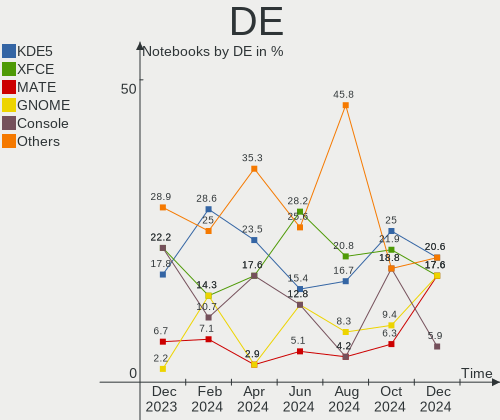
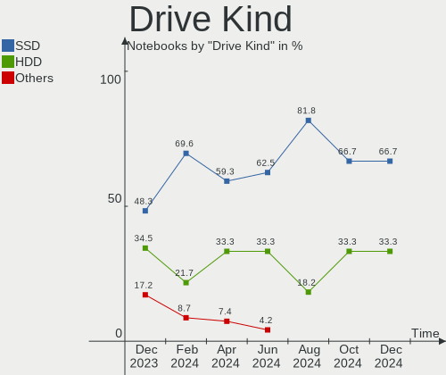

FreeBSD - Hardware Trends (Notebooks)
-------------------------------------

A project to identify most popular hardware characteristics and track their change
over time based on data collected by BSD users at https://BSD-Hardware.info.

Anyone can contribute to this report by the [hw-probe](https://github.com/linuxhw/hw-probe/blob/master/INSTALL.BSD.md) tool:

    hw-probe -all -upload

This report is for one last month. Overall report since the beginning of time: [TestDays](https://github.com/bsdhw/TestDays)

Period: Feb, 2023.

Contents
--------

* [ System ](#system)
  - [ OS                       ](#os)
  - [ OS Family                ](#os-family)
  - [ Arch                     ](#arch)
  - [ DE                       ](#de)
  - [ Display Server           ](#display-server)
  - [ Display Manager          ](#display-manager)
  - [ OS Lang                  ](#os-lang)
  - [ Boot Mode                ](#boot-mode)
  - [ Filesystem               ](#filesystem)
  - [ Part. scheme             ](#part-scheme)

* [ Board ](#board)
  - [ Vendor                   ](#vendor)
  - [ Model                    ](#model)
  - [ Model Family             ](#model-family)
  - [ MFG Year                 ](#mfg-year)
  - [ Form Factor              ](#form-factor)
  - [ Coreboot                 ](#coreboot)
  - [ RAM Size                 ](#ram-size)
  - [ RAM Used                 ](#ram-used)
  - [ Total Drives             ](#total-drives)
  - [ Has CD-ROM               ](#has-cd-rom)
  - [ Has Ethernet             ](#has-ethernet)
  - [ Has WiFi                 ](#has-wifi)
  - [ Has Bluetooth            ](#has-bluetooth)

* [ Location ](#location)
  - [ Country                  ](#country)
  - [ City                     ](#city)

* [ Drives ](#drives)
  - [ Drive Vendor             ](#drive-vendor)
  - [ Drive Model              ](#drive-model)
  - [ HDD Vendor               ](#hdd-vendor)
  - [ SSD Vendor               ](#ssd-vendor)
  - [ Drive Kind               ](#drive-kind)
  - [ Drive Connector          ](#drive-connector)
  - [ Drive Size               ](#drive-size)
  - [ Space Total              ](#space-total)
  - [ Space Used               ](#space-used)
  - [ Malfunc. Drives          ](#malfunc-drives)
  - [ Malfunc. Drive Vendor    ](#malfunc-drive-vendor)
  - [ Malfunc. HDD Vendor      ](#malfunc-hdd-vendor)
  - [ Malfunc. Drive Kind      ](#malfunc-drive-kind)
  - [ Failed Drives            ](#failed-drives)
  - [ Failed Drive Vendor      ](#failed-drive-vendor)
  - [ Drive Status             ](#drive-status)

* [ Storage controller ](#storage-controller)
  - [ Storage Vendor           ](#storage-vendor)
  - [ Storage Model            ](#storage-model)
  - [ Storage Kind             ](#storage-kind)

* [ Processor ](#processor)
  - [ CPU Vendor               ](#cpu-vendor)
  - [ CPU Model                ](#cpu-model)
  - [ CPU Model Family         ](#cpu-model-family)
  - [ CPU Cores                ](#cpu-cores)
  - [ CPU Sockets              ](#cpu-sockets)
  - [ CPU Threads              ](#cpu-threads)
  - [ CPU Microarch            ](#cpu-microarch)

* [ Graphics ](#graphics)
  - [ GPU Vendor               ](#gpu-vendor)
  - [ GPU Model                ](#gpu-model)
  - [ GPU Combo                ](#gpu-combo)
  - [ GPU Driver               ](#gpu-driver)
  - [ GPU Memory               ](#gpu-memory)

* [ Monitor ](#monitor)
  - [ Monitor Vendor           ](#monitor-vendor)
  - [ Monitor Model            ](#monitor-model)
  - [ Monitor Resolution       ](#monitor-resolution)
  - [ Monitor Diagonal         ](#monitor-diagonal)
  - [ Monitor Width            ](#monitor-width)
  - [ Aspect Ratio             ](#aspect-ratio)
  - [ Monitor Area             ](#monitor-area)
  - [ Pixel Density            ](#pixel-density)
  - [ Multiple Monitors        ](#multiple-monitors)

* [ Network ](#network)
  - [ Net Controller Vendor    ](#net-controller-vendor)
  - [ Net Controller Model     ](#net-controller-model)
  - [ Wireless Vendor          ](#wireless-vendor)
  - [ Wireless Model           ](#wireless-model)
  - [ Ethernet Vendor          ](#ethernet-vendor)
  - [ Ethernet Model           ](#ethernet-model)
  - [ Net Controller Kind      ](#net-controller-kind)
  - [ Used Controller          ](#used-controller)
  - [ NICs                     ](#nics)
  - [ IPv6                     ](#ipv6)

* [ Bluetooth ](#bluetooth)
  - [ Bluetooth Vendor         ](#bluetooth-vendor)
  - [ Bluetooth Model          ](#bluetooth-model)

* [ Sound ](#sound)
  - [ Sound Vendor             ](#sound-vendor)
  - [ Sound Model              ](#sound-model)

* [ Memory ](#memory)
  - [ Memory Vendor            ](#memory-vendor)
  - [ Memory Model             ](#memory-model)
  - [ Memory Kind              ](#memory-kind)
  - [ Memory Form Factor       ](#memory-form-factor)
  - [ Memory Size              ](#memory-size)
  - [ Memory Speed             ](#memory-speed)

* [ Printers & scanners ](#printers--scanners)
  - [ Printer Vendor           ](#printer-vendor)
  - [ Printer Model            ](#printer-model)
  - [ Scanner Vendor           ](#scanner-vendor)
  - [ Scanner Model            ](#scanner-model)

* [ Camera ](#camera)
  - [ Camera Vendor            ](#camera-vendor)
  - [ Camera Model             ](#camera-model)

* [ Security ](#security)
  - [ Fingerprint Vendor       ](#fingerprint-vendor)
  - [ Fingerprint Model        ](#fingerprint-model)
  - [ Chipcard Vendor          ](#chipcard-vendor)
  - [ Chipcard Model           ](#chipcard-model)

* [ Unsupported ](#unsupported)
  - [ Unsupported Devices      ](#unsupported-devices)
  - [ Unsupported Device Types ](#unsupported-device-types)

System
------

OS
--

Installed operating systems

| Name                    | Notebooks | Percent |
|-------------------------|-----------|---------|
| FreeBSD 13.1            | 9         | 31.03%  |
| FreeBSD 13.1-p5         | 6         | 20.69%  |
| FreeBSD 13.1-STABLE     | 4         | 13.79%  |
| FreeBSD 13.1-p6         | 3         | 10.34%  |
| FreeBSD 13.1-p7         | 2         | 6.9%    |
| FreeBSD 14.0-CURRENT    | 1         | 3.45%   |
| FreeBSD 13.2-PRERELEASE | 1         | 3.45%   |
| FreeBSD 13.1-p3         | 1         | 3.45%   |
| FreeBSD 12.3-p1         | 1         | 3.45%   |
| FreeBSD 12.3            | 1         | 3.45%   |

OS Family
---------

OS without a version

| Name    | Notebooks | Percent |
|---------|-----------|---------|
| FreeBSD | 29        | 100%    |

Arch
----

OS architecture (x86_64, i586, etc.)

| Name  | Notebooks | Percent |
|-------|-----------|---------|
| amd64 | 27        | 93.1%   |
| i386  | 2         | 6.9%    |

DE
--

Desktop Environment

| Name          | Notebooks | Percent |
|---------------|-----------|---------|
| XFCE          | 11        | 37.93%  |
| MATE          | 5         | 17.24%  |
| KDE5          | 4         | 13.79%  |
| Console       | 4         | 13.79%  |
| Openbox       | 2         | 6.9%    |
| Enlightenment | 2         | 6.9%    |
| GNOME         | 1         | 3.45%   |

Display Server
--------------

X11 or Wayland

| Name    | Notebooks | Percent |
|---------|-----------|---------|
| X11     | 25        | 86.21%  |
| Console | 3         | 10.34%  |
| Wayland | 1         | 3.45%   |

Display Manager
---------------

SDDM, LightDM, etc.

| Name    | Notebooks | Percent |
|---------|-----------|---------|
| LightDM | 8         | 27.59%  |
| Console | 7         | 24.14%  |
| SDDM    | 6         | 20.69%  |
| SLiM    | 5         | 17.24%  |
| XDM     | 1         | 3.45%   |
| Ly      | 1         | 3.45%   |
| GDM     | 1         | 3.45%   |

OS Lang
-------

Language

| Lang           | Notebooks | Percent |
|----------------|-----------|---------|
| C              | 16        | 55.17%  |
| en_US          | 6         | 20.69%  |
| Unknown        | 3         | 10.34%  |
| ko_KR          | 1         | 3.45%   |
| en_IE.US-ASCII | 1         | 3.45%   |
| de_CH          | 1         | 3.45%   |
| cs_CZ          | 1         | 3.45%   |

Boot Mode
---------

EFI or BIOS

| Mode | Notebooks | Percent |
|------|-----------|---------|
| EFI  | 24        | 82.76%  |
| BIOS | 5         | 17.24%  |

Filesystem
----------

Type of filesystem

| Type | Notebooks | Percent |
|------|-----------|---------|
| Zfs  | 19        | 65.52%  |
| Ufs  | 10        | 34.48%  |

Part. scheme
------------

Scheme of partitioning

| Type | Notebooks | Percent |
|------|-----------|---------|
| GPT  | 25        | 86.21%  |
| MBR  | 4         | 13.79%  |

Board
-----

Vendor
------

Motherboard manufacturer

| Name                | Notebooks | Percent |
|---------------------|-----------|---------|
| Lenovo              | 13        | 44.83%  |
| Hewlett-Packard     | 5         | 17.24%  |
| ASUSTek Computer    | 3         | 10.34%  |
| Acer                | 2         | 6.9%    |
| TUXEDO              | 1         | 3.45%   |
| Toshiba             | 1         | 3.45%   |
| Samsung Electronics | 1         | 3.45%   |
| Panasonic           | 1         | 3.45%   |
| Dell                | 1         | 3.45%   |
| Alienware           | 1         | 3.45%   |

Model
-----

Motherboard model

| Name                                       | Notebooks | Percent |
|--------------------------------------------|-----------|---------|
| TUXEDO InfinityBook Pro 14 Gen6            | 1         | 3.45%   |
| Toshiba PORTEGE Z930                       | 1         | 3.45%   |
| Samsung 700T1C                             | 1         | 3.45%   |
| Panasonic CF-30KAPAXAM                     | 1         | 3.45%   |
| Lenovo ThinkPad X280 20KFCTO1WW            | 1         | 3.45%   |
| Lenovo ThinkPad X1 Carbon Gen 9 20XXS5J00X | 1         | 3.45%   |
| Lenovo ThinkPad X1 Carbon 7th 20QES53R00   | 1         | 3.45%   |
| Lenovo ThinkPad T530 24297XG               | 1         | 3.45%   |
| Lenovo ThinkPad T480s 20L7002CUS           | 1         | 3.45%   |
| Lenovo ThinkPad T460p 20FW0018AD           | 1         | 3.45%   |
| Lenovo ThinkPad T460 20FMS04200            | 1         | 3.45%   |
| Lenovo ThinkPad T430 2347FV6               | 1         | 3.45%   |
| Lenovo ThinkPad R60e 0658W2M               | 1         | 3.45%   |
| Lenovo ThinkPad P14s Gen 3 21AK000GUK      | 1         | 3.45%   |
| Lenovo IdeaPad Y700-15ISK 80NV             | 1         | 3.45%   |
| Lenovo IdeaPad Gaming 3 15IHU6 82K1        | 1         | 3.45%   |
| Lenovo IdeaPad 5 14ITL05 82FE              | 1         | 3.45%   |
| HP Victus by Laptop 16-e0xxx               | 1         | 3.45%   |
| HP ProBook 450 G2                          | 1         | 3.45%   |
| HP Pavilion Laptop 14-bf0xx                | 1         | 3.45%   |
| HP Pavilion dv6                            | 1         | 3.45%   |
| HP EliteBook 8570p                         | 1         | 3.45%   |
| Dell Inspiron 5567                         | 1         | 3.45%   |
| ASUS X541SA                                | 1         | 3.45%   |
| ASUS ASUS TUF Gaming F15 FX507ZE_FX507ZE   | 1         | 3.45%   |
| ASUS ASUS TUF Gaming A15 FA506II_FA506II   | 1         | 3.45%   |
| Alienware m15                              | 1         | 3.45%   |
| Acer Aspire one                            | 1         | 3.45%   |
| Acer Aspire A315-58                        | 1         | 3.45%   |

Model Family
------------

Motherboard model prefix

| Name                   | Notebooks | Percent |
|------------------------|-----------|---------|
| Lenovo ThinkPad        | 10        | 34.48%  |
| Lenovo IdeaPad         | 3         | 10.34%  |
| HP Pavilion            | 2         | 6.9%    |
| ASUS ASUS              | 2         | 6.9%    |
| Acer Aspire            | 2         | 6.9%    |
| TUXEDO InfinityBook    | 1         | 3.45%   |
| Toshiba PORTEGE        | 1         | 3.45%   |
| Samsung 700T1C         | 1         | 3.45%   |
| Panasonic CF-30KAPAXAM | 1         | 3.45%   |
| HP Victus              | 1         | 3.45%   |
| HP ProBook             | 1         | 3.45%   |
| HP EliteBook           | 1         | 3.45%   |
| Dell Inspiron          | 1         | 3.45%   |
| ASUS X541SA            | 1         | 3.45%   |
| Alienware m15          | 1         | 3.45%   |

MFG Year
--------

Motherboard manufacture year

| Year | Notebooks | Percent |
|------|-----------|---------|
| 2021 | 5         | 17.24%  |
| 2016 | 5         | 17.24%  |
| 2022 | 4         | 13.79%  |
| 2013 | 4         | 13.79%  |
| 2009 | 3         | 10.34%  |
| 2018 | 2         | 6.9%    |
| 2017 | 2         | 6.9%    |
| 2020 | 1         | 3.45%   |
| 2019 | 1         | 3.45%   |
| 2014 | 1         | 3.45%   |
| 2006 | 1         | 3.45%   |

Form Factor
-----------

Physical design of the computer

| Name     | Notebooks | Percent |
|----------|-----------|---------|
| Notebook | 29        | 100%    |

Coreboot
--------

Have coreboot on board

| Used | Notebooks | Percent |
|------|-----------|---------|
| No   | 29        | 100%    |

RAM Size
--------

Total RAM memory

| Size in GB | Notebooks | Percent |
|------------|-----------|---------|
| 16.01-24.0 | 15        | 51.72%  |
| 4.01-8.0   | 5         | 17.24%  |
| 8.01-16.0  | 3         | 10.34%  |
| 32.01-64.0 | 2         | 6.9%    |
| 24.01-32.0 | 2         | 6.9%    |
| 0.51-1.0   | 2         | 6.9%    |

RAM Used
--------

Used RAM memory

| Used GB  | Notebooks | Percent |
|----------|-----------|---------|
| 0.51-1.0 | 16        | 55.17%  |
| 0.01-0.5 | 8         | 27.59%  |
| 1.01-2.0 | 5         | 17.24%  |

Total Drives
------------

Number of drives on board

| Drives | Notebooks | Percent |
|--------|-----------|---------|
| 1      | 22        | 75.86%  |
| 2      | 4         | 13.79%  |
| 0      | 2         | 6.9%    |
| 3      | 1         | 3.45%   |

Has CD-ROM
----------

Has CD-ROM on board

| Presented | Notebooks | Percent |
|-----------|-----------|---------|
| No        | 24        | 82.76%  |
| Yes       | 5         | 17.24%  |

Has Ethernet
------------

Has Ethernet on board

| Presented | Notebooks | Percent |
|-----------|-----------|---------|
| Yes       | 25        | 86.21%  |
| No        | 4         | 13.79%  |

Has WiFi
--------

Has WiFi module

| Presented | Notebooks | Percent |
|-----------|-----------|---------|
| Yes       | 29        | 100%    |

Has Bluetooth
-------------

Has Bluetooth module

| Presented | Notebooks | Percent |
|-----------|-----------|---------|
| Yes       | 19        | 65.52%  |
| No        | 10        | 34.48%  |

Location
--------

Country
-------

Geographic location (country)

| Country      | Notebooks | Percent |
|--------------|-----------|---------|
| USA          | 4         | 13.79%  |
| Germany      | 3         | 10.34%  |
| UK           | 2         | 6.9%    |
| Romania      | 2         | 6.9%    |
| Greece       | 2         | 6.9%    |
| France       | 2         | 6.9%    |
| Czechia      | 2         | 6.9%    |
| Vietnam      | 1         | 3.45%   |
| Switzerland  | 1         | 3.45%   |
| Sweden       | 1         | 3.45%   |
| Sri Lanka    | 1         | 3.45%   |
| Spain        | 1         | 3.45%   |
| South Korea  | 1         | 3.45%   |
| Saudi Arabia | 1         | 3.45%   |
| Russia       | 1         | 3.45%   |
| Poland       | 1         | 3.45%   |
| China        | 1         | 3.45%   |
| Chile        | 1         | 3.45%   |
| Austria      | 1         | 3.45%   |

City
----

Geographic location (city)

| City               | Notebooks | Percent |
|--------------------|-----------|---------|
| Zurich             | 1         | 3.45%   |
| Wappingers Falls   | 1         | 3.45%   |
| Villapresente      | 1         | 3.45%   |
| Vienna             | 1         | 3.45%   |
| Uiwang-si          | 1         | 3.45%   |
| Timișoara         | 1         | 3.45%   |
| Stockholm          | 1         | 3.45%   |
| Santiago           | 1         | 3.45%   |
| Ruislip            | 1         | 3.45%   |
| Rosny-sous-Bois    | 1         | 3.45%   |
| Riyadh             | 1         | 3.45%   |
| Qiqihar            | 1         | 3.45%   |
| Pátrai            | 1         | 3.45%   |
| Ostrozska Nova Ves | 1         | 3.45%   |
| Ostrava            | 1         | 3.45%   |
| Nuremberg          | 1         | 3.45%   |
| Munich             | 1         | 3.45%   |
| Moscow             | 1         | 3.45%   |
| Marcq-en-Baroeul   | 1         | 3.45%   |
| London             | 1         | 3.45%   |
| Haiphong           | 1         | 3.45%   |
| Grudziądz         | 1         | 3.45%   |
| Fayetteville       | 1         | 3.45%   |
| Colombo            | 1         | 3.45%   |
| Clinchco           | 1         | 3.45%   |
| Chiajna            | 1         | 3.45%   |
| Boston             | 1         | 3.45%   |
| Berlin             | 1         | 3.45%   |
| Athens             | 1         | 3.45%   |

Drives
------

Drive Vendor
------------

Hard drive vendors

| Vendor              | Notebooks | Drives | Percent |
|---------------------|-----------|--------|---------|
| Samsung Electronics | 7         | 7      | 21.88%  |
| WDC                 | 4         | 5      | 12.5%   |
| Kingston            | 4         | 4      | 12.5%   |
| Toshiba             | 2         | 3      | 6.25%   |
| SanDisk             | 2         | 2      | 6.25%   |
| Intel               | 2         | 2      | 6.25%   |
| Crucial             | 2         | 2      | 6.25%   |
| XPG                 | 1         | 1      | 3.13%   |
| SK hynix            | 1         | 1      | 3.13%   |
| Seagate             | 1         | 1      | 3.13%   |
| Micron Technology   | 1         | 1      | 3.13%   |
| LITEON              | 1         | 1      | 3.13%   |
| KingSpec            | 1         | 1      | 3.13%   |
| HGST                | 1         | 1      | 3.13%   |
| Gigabyte Technology | 1         | 1      | 3.13%   |
| A-DATA Technology   | 1         | 1      | 3.13%   |

Drive Model
-----------

Hard drive models

| Model                                | Notebooks | Percent |
|--------------------------------------|-----------|---------|
| Kingston SA400S37240G 240GB          | 2         | 6.06%   |
| Intel SSDPEKNU512GZ 512GB            | 2         | 6.06%   |
| XPG GAMMIX S5 1TB                    | 1         | 3.03%   |
| WDC WD20SDRW-11VUUS0 2TB             | 1         | 3.03%   |
| WDC WD1600BEVT-22ZCT0 160GB          | 1         | 3.03%   |
| WDC WD10SPZX-08Z10 1TB               | 1         | 3.03%   |
| WDC PC SN530 SDBPNPZ-512G-1002 512GB | 1         | 3.03%   |
| WDC PC SN530 SDBPMPZ-256G-1101 256GB | 1         | 3.03%   |
| Toshiba MQ01ACF050 500GB             | 1         | 3.03%   |
| Toshiba KXG50ZNV1T02 NVMe 1024GB     | 1         | 3.03%   |
| SK hynix SKHynix_HFS001TDE9X081N 1TB | 1         | 3.03%   |
| Seagate ST500LT012-1DG142 500GB      | 1         | 3.03%   |
| SanDisk SSD PLUS 120GB               | 1         | 3.03%   |
| SanDisk SD8SN8U-256G-1006 256GB      | 1         | 3.03%   |
| Samsung SSD 980 500GB                | 1         | 3.03%   |
| Samsung SSD 980 1TB                  | 1         | 3.03%   |
| Samsung SSD 850 PRO 128GB            | 1         | 3.03%   |
| Samsung MZVLB512HBJQ-000H1 512GB     | 1         | 3.03%   |
| Samsung MZVL2512HCJQ-00BL7 512GB     | 1         | 3.03%   |
| Samsung MZMTD128HAFV-000 128GB       | 1         | 3.03%   |
| Samsung MZMPC128HBFU-000H1 128GB     | 1         | 3.03%   |
| Micron MTFDKCD1T0TFK 1TB             | 1         | 3.03%   |
| LITEON CV1-8B512 512GB               | 1         | 3.03%   |
| Kingston SV300S37A240G 240GB         | 1         | 3.03%   |
| Kingston SUV500MS480G 480GB          | 1         | 3.03%   |
| KingSpec NT-512 512GB                | 1         | 3.03%   |
| HGST HTS721010A9E630 1TB             | 1         | 3.03%   |
| Gigabyte GP-GSTFS31480GNTD 480GB     | 1         | 3.03%   |
| Crucial CT480BX500SSD1 480GB         | 1         | 3.03%   |
| Crucial CT1000P1SSD8 1TB             | 1         | 3.03%   |
| A-DATA SU630 480GB                   | 1         | 3.03%   |

HDD Vendor
----------

Hard disk drive vendors

| Vendor  | Notebooks | Drives | Percent |
|---------|-----------|--------|---------|
| WDC     | 3         | 3      | 50%     |
| Toshiba | 1         | 1      | 16.67%  |
| Seagate | 1         | 1      | 16.67%  |
| HGST    | 1         | 1      | 16.67%  |

SSD Vendor
----------

Solid state drive vendors

| Vendor              | Notebooks | Drives | Percent |
|---------------------|-----------|--------|---------|
| Kingston            | 4         | 4      | 28.57%  |
| Samsung Electronics | 3         | 3      | 21.43%  |
| SanDisk             | 2         | 2      | 14.29%  |
| LITEON              | 1         | 1      | 7.14%   |
| KingSpec            | 1         | 1      | 7.14%   |
| Gigabyte Technology | 1         | 1      | 7.14%   |
| Crucial             | 1         | 1      | 7.14%   |
| A-DATA Technology   | 1         | 1      | 7.14%   |

Drive Kind
----------

HDD or SSD

| Kind | Notebooks | Drives | Percent |
|------|-----------|--------|---------|
| NVMe | 13        | 14     | 43.33%  |
| SSD  | 11        | 14     | 36.67%  |
| HDD  | 6         | 6      | 20%     |

Drive Connector
---------------

SATA, SAS, NVMe, etc.

| Type | Notebooks | Drives | Percent |
|------|-----------|--------|---------|
| SATA | 17        | 20     | 56.67%  |
| NVMe | 13        | 14     | 43.33%  |

Drive Size
----------

Size of hard drive

| Size in TB | Notebooks | Drives | Percent |
|------------|-----------|--------|---------|
| 0.01-0.5   | 13        | 15     | 72.22%  |
| 0.51-1.0   | 4         | 4      | 22.22%  |
| 1.01-2.0   | 1         | 1      | 5.56%   |

Space Total
-----------

Amount of disk space available on the file system

| Size in GB | Notebooks | Percent |
|------------|-----------|---------|
| 251-500    | 13        | 44.83%  |
| 101-250    | 8         | 27.59%  |
| 501-1000   | 3         | 10.34%  |
| 21-50      | 2         | 6.9%    |
| 51-100     | 2         | 6.9%    |
| 1001-2000  | 1         | 3.45%   |

Space Used
----------

Amount of used disk space

| Used GB | Notebooks | Percent |
|---------|-----------|---------|
| 1-20    | 23        | 79.31%  |
| 21-50   | 3         | 10.34%  |
| 101-250 | 2         | 6.9%    |
| 51-100  | 1         | 3.45%   |

Malfunc. Drives
---------------

Drive models with a malfunction

| Model                        | Notebooks | Drives | Percent |
|------------------------------|-----------|--------|---------|
| Kingston SV300S37A240G 240GB | 1         | 1      | 50%     |
| HGST HTS721010A9E630 1TB     | 1         | 1      | 50%     |

Malfunc. Drive Vendor
---------------------

Vendors of faulty drives

| Vendor   | Notebooks | Drives | Percent |
|----------|-----------|--------|---------|
| Kingston | 1         | 1      | 50%     |
| HGST     | 1         | 1      | 50%     |

Malfunc. HDD Vendor
-------------------

Vendors of faulty HDD drives

| Vendor | Notebooks | Drives | Percent |
|--------|-----------|--------|---------|
| HGST   | 1         | 1      | 100%    |

Malfunc. Drive Kind
-------------------

Kinds of faulty drives

| Kind | Notebooks | Drives | Percent |
|------|-----------|--------|---------|
| SSD  | 1         | 1      | 50%     |
| HDD  | 1         | 1      | 50%     |

Failed Drives
-------------

Failed drive models

Zero info for selected period =(

Failed Drive Vendor
-------------------

Failed drive vendors

Zero info for selected period =(

Drive Status
------------

Number of failed and malfunc. drives

| Status  | Notebooks | Drives | Percent |
|---------|-----------|--------|---------|
| Works   | 26        | 32     | 92.86%  |
| Malfunc | 2         | 2      | 7.14%   |

Storage controller
------------------

Storage Vendor
--------------

Storage controller vendors

| Vendor                    | Notebooks | Percent |
|---------------------------|-----------|---------|
| Intel                     | 20        | 62.5%   |
| Samsung Electronics       | 4         | 12.5%   |
| SanDisk                   | 3         | 9.38%   |
| Toshiba                   | 1         | 3.13%   |
| SK hynix                  | 1         | 3.13%   |
| Micron/Crucial Technology | 1         | 3.13%   |
| AMD                       | 1         | 3.13%   |
| ADATA Technology          | 1         | 3.13%   |

Storage Model
-------------

Storage controller models

| Model                                                                            | Notebooks | Percent |
|----------------------------------------------------------------------------------|-----------|---------|
| Intel 7 Series Chipset Family 6-port SATA Controller [AHCI mode]                 | 5         | 13.89%  |
| Intel Sunrise Point-LP SATA Controller [AHCI mode]                               | 3         | 8.33%   |
| Samsung NVMe SSD Controller 980                                                  | 2         | 5.56%   |
| Intel Volume Management Device NVMe RAID Controller                              | 2         | 5.56%   |
| Intel Tiger Lake-LP SATA Controller                                              | 2         | 5.56%   |
| Intel HM170/QM170 Chipset SATA Controller [AHCI Mode]                            | 2         | 5.56%   |
| Unknown                                                                          | 2         | 5.56%   |
| Toshiba XG5 NVMe SSD Controller                                                  | 1         | 2.78%   |
| SK hynix Gold P31/PC711 NVMe Solid State Drive                                   | 1         | 2.78%   |
| SanDisk WD Blue SN550 NVMe SSD                                                   | 1         | 2.78%   |
| SanDisk WD Black SN750 / PC SN730 NVMe SSD                                       | 1         | 2.78%   |
| SanDisk PC SN530                                                                 | 1         | 2.78%   |
| Samsung NVMe SSD Controller SM981/PM981/PM983                                    | 1         | 2.78%   |
| Samsung NVMe SSD Controller PM9A1/PM9A3/980PRO                                   | 1         | 2.78%   |
| Micron/Crucial P1 NVMe PCIe SSD                                                  | 1         | 2.78%   |
| Intel Wildcat Point-LP SATA Controller [AHCI Mode]                               | 1         | 2.78%   |
| Intel Cannon Lake Mobile PCH SATA AHCI Controller                                | 1         | 2.78%   |
| Intel Atom/Celeron/Pentium Processor x5-E8000/J3xxx/N3xxx Series SATA Controller | 1         | 2.78%   |
| Intel 82801IBM/IEM (ICH9M/ICH9M-E) 4 port SATA Controller [AHCI mode]            | 1         | 2.78%   |
| Intel 82801GBM/GHM (ICH7-M Family) SATA Controller [IDE mode]                    | 1         | 2.78%   |
| Intel 82801GBM/GHM (ICH7-M Family) SATA Controller [AHCI mode]                   | 1         | 2.78%   |
| Intel 82801G (ICH7 Family) IDE Controller                                        | 1         | 2.78%   |
| Intel 5 Series/3400 Series Chipset 4 port SATA AHCI Controller                   | 1         | 2.78%   |
| AMD FCH SATA Controller [AHCI mode]                                              | 1         | 2.78%   |
| ADATA ADATA XPG GAMMIXS1 1L Media                                                | 1         | 2.78%   |

Storage Kind
------------

Kind of storage controller (IDE, SATA, NVMe, SAS, ...)

| Kind | Notebooks | Percent |
|------|-----------|---------|
| SATA | 19        | 52.78%  |
| NVMe | 13        | 36.11%  |
| RAID | 2         | 5.56%   |
| IDE  | 2         | 5.56%   |

Processor
---------

CPU Vendor
----------

Processor vendors

| Vendor | Notebooks | Percent |
|--------|-----------|---------|
| Intel  | 27        | 93.1%   |
| AMD    | 2         | 6.9%    |

CPU Model
---------

Processor models

| Model                                   | Notebooks | Percent |
|-----------------------------------------|-----------|---------|
| Intel 11th Gen Core i7-1165G7 @ 2.80GHz | 2         | 6.9%    |
| Intel 11th Gen Core i7-11370H @ 3.30GHz | 2         | 6.9%    |
| Intel Pentium CPU N3710 @ 1.60GHz       | 1         | 3.45%   |
| Intel Core i7-8750H CPU @ 2.20GHz       | 1         | 3.45%   |
| Intel Core i7-8550U CPU @ 1.80GHz       | 1         | 3.45%   |
| Intel Core i7-7500U CPU @ 2.70GHz       | 1         | 3.45%   |
| Intel Core i7-6700HQ CPU @ 2.60GHz      | 1         | 3.45%   |
| Intel Core i7-3630QM CPU @ 2.40GHz      | 1         | 3.45%   |
| Intel Core i7-3612QM CPU @ 2.10GHz      | 1         | 3.45%   |
| Intel Core i7-3520M CPU @ 2.90GHz       | 1         | 3.45%   |
| Intel Core i7 CPU M 640 @ 2.80GHz       | 1         | 3.45%   |
| Intel Core i5-8365U CPU @ 1.60GHz       | 1         | 3.45%   |
| Intel Core i5-8350U CPU @ 1.70GHz       | 1         | 3.45%   |
| Intel Core i5-6300U CPU @ 2.40GHz       | 1         | 3.45%   |
| Intel Core i5-6300HQ CPU @ 2.30GHz      | 1         | 3.45%   |
| Intel Core i5-5200U CPU @ 2.20GHz       | 1         | 3.45%   |
| Intel Core i5-3437U CPU @ 1.90GHz       | 1         | 3.45%   |
| Intel Core i5-3317U CPU @ 1.70GHz       | 1         | 3.45%   |
| Intel Core i3-7100U CPU @ 2.40GHz       | 1         | 3.45%   |
| Intel Core 2 Duo CPU L9300 @ 1.60GHz    | 1         | 3.45%   |
| Intel Celeron M CPU                     | 1         | 3.45%   |
| Intel Atom CPU N280 @ 1.66GHz           | 1         | 3.45%   |
| Intel 12th Gen Core i7-12700H           | 1         | 3.45%   |
| Intel 12th Gen Core i7-1260P            | 1         | 3.45%   |
| Intel 11th Gen Core i7-1185G7 @ 3.00GHz | 1         | 3.45%   |
| AMD Ryzen 7 4800H with Radeon Graphics  | 1         | 3.45%   |
| AMD Ryzen 5 5600H with Radeon Graphics  | 1         | 3.45%   |

CPU Model Family
----------------

Processor model prefix

| Model            | Notebooks | Percent |
|------------------|-----------|---------|
| Intel Core i7    | 8         | 27.59%  |
| Other            | 7         | 24.14%  |
| Intel Core i5    | 7         | 24.14%  |
| Intel Pentium    | 1         | 3.45%   |
| Intel Core i3    | 1         | 3.45%   |
| Intel Core 2 Duo | 1         | 3.45%   |
| Intel Celeron M  | 1         | 3.45%   |
| Intel Atom       | 1         | 3.45%   |
| AMD Ryzen 7      | 1         | 3.45%   |
| AMD Ryzen 5      | 1         | 3.45%   |

CPU Cores
---------

Number of processor cores

| Number  | Notebooks | Percent |
|---------|-----------|---------|
| 4       | 13        | 44.83%  |
| 2       | 8         | 27.59%  |
| 16      | 2         | 6.9%    |
| Unknown | 2         | 6.9%    |
| 12      | 1         | 3.45%   |
| 10      | 1         | 3.45%   |
| 6       | 1         | 3.45%   |
| 1       | 1         | 3.45%   |

CPU Sockets
-----------

Number of sockets

| Number | Notebooks | Percent |
|--------|-----------|---------|
| 1      | 29        | 100%    |

CPU Threads
-----------

Threads per core (Hyper-Threading)

| Number  | Notebooks | Percent |
|---------|-----------|---------|
| 2       | 21        | 72.41%  |
| 1       | 5         | 17.24%  |
| Unknown | 3         | 10.34%  |

CPU Microarch
-------------

Microarchitecture

| Name       | Notebooks | Percent |
|------------|-----------|---------|
| KabyLake   | 6         | 20.69%  |
| TigerLake  | 5         | 17.24%  |
| IvyBridge  | 5         | 17.24%  |
| Skylake    | 3         | 10.34%  |
| Unknown    | 2         | 6.9%    |
| Zen 3      | 1         | 3.45%   |
| Zen 2      | 1         | 3.45%   |
| Westmere   | 1         | 3.45%   |
| Silvermont | 1         | 3.45%   |
| Penryn     | 1         | 3.45%   |
| P6         | 1         | 3.45%   |
| Broadwell  | 1         | 3.45%   |
| Bonnell    | 1         | 3.45%   |

Graphics
--------

GPU Vendor
----------

Vendors of graphics cards

| Vendor | Notebooks | Percent |
|--------|-----------|---------|
| Intel  | 25        | 69.44%  |
| Nvidia | 7         | 19.44%  |
| AMD    | 4         | 11.11%  |

GPU Model
---------

Graphics card models

| Model                                                                                    | Notebooks | Percent |
|------------------------------------------------------------------------------------------|-----------|---------|
| Intel TigerLake-LP GT2 [Iris Xe Graphics]                                                | 5         | 13.16%  |
| Nvidia GA107M [GeForce RTX 3050 Ti Mobile]                                               | 3         | 7.89%   |
| Intel 3rd Gen Core processor Graphics Controller                                         | 3         | 7.89%   |
| Intel UHD Graphics 620                                                                   | 2         | 5.26%   |
| Intel Mobile 945GM/GMS/GME, 943/940GML Express Integrated Graphics Controller            | 2         | 5.26%   |
| Intel HD Graphics 620                                                                    | 2         | 5.26%   |
| Intel HD Graphics 530                                                                    | 2         | 5.26%   |
| Intel Alder Lake-P Integrated Graphics Controller                                        | 2         | 5.26%   |
| Nvidia TU117M [GeForce GTX 1650 Ti Mobile]                                               | 1         | 2.63%   |
| Nvidia TU117GLM [T550 Laptop GPU]                                                        | 1         | 2.63%   |
| Nvidia GP104M [GeForce GTX 1070 Mobile]                                                  | 1         | 2.63%   |
| Nvidia GF108M [NVS 5400M]                                                                | 1         | 2.63%   |
| Intel WhiskeyLake-U GT2 [UHD Graphics 620]                                               | 1         | 2.63%   |
| Intel Skylake GT2 [HD Graphics 520]                                                      | 1         | 2.63%   |
| Intel Mobile 945GSE Express Integrated Graphics Controller                               | 1         | 2.63%   |
| Intel Mobile 945GM/GMS, 943/940GML Express Integrated Graphics Controller                | 1         | 2.63%   |
| Intel Mobile 4 Series Chipset Integrated Graphics Controller                             | 1         | 2.63%   |
| Intel HD Graphics 5500                                                                   | 1         | 2.63%   |
| Intel Core Processor Integrated Graphics Controller                                      | 1         | 2.63%   |
| Intel CoffeeLake-H GT2 [UHD Graphics 630]                                                | 1         | 2.63%   |
| Intel Atom/Celeron/Pentium Processor x5-E8000/J3xxx/N3xxx Integrated Graphics Controller | 1         | 2.63%   |
| AMD Topaz XT [Radeon R7 M260/M265 / M340/M360 / M440/M445 / 530/535 / 620/625 Mobile]    | 1         | 2.63%   |
| AMD Thames [Radeon HD 7550M/7570M/7650M]                                                 | 1         | 2.63%   |
| AMD Renoir                                                                               | 1         | 2.63%   |
| AMD Cezanne [Radeon Vega Series / Radeon Vega Mobile Series]                             | 1         | 2.63%   |

GPU Combo
---------

Combinations of graphics cards

| Name           | Notebooks | Percent |
|----------------|-----------|---------|
| 1 x Intel      | 17        | 58.62%  |
| Intel + Nvidia | 4         | 13.79%  |
| 2 x Intel      | 3         | 10.34%  |
| AMD + Nvidia   | 2         | 6.9%    |
| 1 x Nvidia     | 1         | 3.45%   |
| Intel + AMD    | 1         | 3.45%   |
| 1 x AMD        | 1         | 3.45%   |

GPU Driver
----------

Free vs proprietary

| Driver      | Notebooks | Percent |
|-------------|-----------|---------|
| Free        | 23        | 79.31%  |
| Proprietary | 6         | 20.69%  |

GPU Memory
----------

Total video memory

| Size in GB | Notebooks | Percent |
|------------|-----------|---------|
| Unknown    | 24        | 82.76%  |
| 0.51-1.0   | 2         | 6.9%    |
| 0.01-0.5   | 2         | 6.9%    |
| 7.01-8.0   | 1         | 3.45%   |

Monitor
-------

Monitor Vendor
--------------

Monitor vendors

| Vendor       | Notebooks | Percent |
|--------------|-----------|---------|
| LG Display   | 1         | 25%     |
| AU Optronics | 1         | 25%     |
| AOC          | 1         | 25%     |
| Acer         | 1         | 25%     |

Monitor Model
-------------

Monitor models

| Model                                                        | Notebooks | Percent |
|--------------------------------------------------------------|-----------|---------|
| LG Display LCD Monitor LGD04F9 1920x1080 310x170mm 13.9-inch | 1         | 25%     |
| AU Optronics LCD Monitor 1920x1080                           | 1         | 25%     |
| AOC LCD Monitor Q27G2G3R3B 2560x1440                         | 1         | 25%     |
| Acer LCD Monitor VG270U                                      | 1         | 25%     |

Monitor Resolution
------------------

Monitor screen resolution

| Resolution      | Notebooks | Percent |
|-----------------|-----------|---------|
| 1920x1080 (FHD) | 2         | 50%     |
| 2560x1440 (QHD) | 1         | 25%     |
| Unknown         | 1         | 25%     |

Monitor Diagonal
----------------

Diagonal size in inches

| Inches  | Notebooks | Percent |
|---------|-----------|---------|
| Unknown | 2         | 66.67%  |
| 13      | 1         | 33.33%  |

Monitor Width
-------------

Physical width

| Width in mm | Notebooks | Percent |
|-------------|-----------|---------|
| Unknown     | 2         | 66.67%  |
| 301-350     | 1         | 33.33%  |

Aspect Ratio
------------

Proportional relationship between the width and the height

| Ratio   | Notebooks | Percent |
|---------|-----------|---------|
| Unknown | 2         | 66.67%  |
| 16/9    | 1         | 33.33%  |

Monitor Area
------------

Area in inch²

| Area in inch² | Notebooks | Percent |
|----------------|-----------|---------|
| Unknown        | 2         | 66.67%  |
| 81-90          | 1         | 33.33%  |

Pixel Density
-------------

Pixels per inch

| Density | Notebooks | Percent |
|---------|-----------|---------|
| Unknown | 2         | 66.67%  |
| 121-160 | 1         | 33.33%  |

Multiple Monitors
-----------------

Total monitors connected

| Total | Notebooks | Percent |
|-------|-----------|---------|
| 1     | 18        | 62.07%  |
| 0     | 7         | 24.14%  |
| 2     | 4         | 13.79%  |

Network
-------

Net Controller Vendor
---------------------

Controller vendors

| Vendor                            | Notebooks | Percent |
|-----------------------------------|-----------|---------|
| Intel                             | 23        | 56.1%   |
| Realtek Semiconductor             | 10        | 24.39%  |
| Qualcomm Atheros                  | 4         | 9.76%   |
| NetGear                           | 1         | 2.44%   |
| Hewlett-Packard                   | 1         | 2.44%   |
| Ericsson Business Mobile Networks | 1         | 2.44%   |
| Broadcom                          | 1         | 2.44%   |

Net Controller Model
--------------------

Controller models

| Model                                                                   | Notebooks | Percent |
|-------------------------------------------------------------------------|-----------|---------|
| Realtek RTL8111/8168/8411 PCI Express Gigabit Ethernet Controller       | 8         | 14.04%  |
| Intel Wi-Fi 6 AX201                                                     | 5         | 8.77%   |
| Intel 82579LM Gigabit Network Connection (Lewisville)                   | 4         | 7.02%   |
| Intel Centrino Advanced-N 6205 [Taylor Peak]                            | 3         | 5.26%   |
| Realtek RTL810xE PCI Express Fast Ethernet controller                   | 2         | 3.51%   |
| Intel Wireless 8265 / 8275                                              | 2         | 3.51%   |
| Intel Wireless 8260                                                     | 2         | 3.51%   |
| Intel Centrino Advanced-N 6235                                          | 2         | 3.51%   |
| Intel Alder Lake-P PCH CNVi WiFi                                        | 2         | 3.51%   |
| Realtek RTL8852AE 802.11ax PCIe Wireless Network Adapter                | 1         | 1.75%   |
| Realtek RTL8822CE 802.11ac PCIe Wireless Network Adapter                | 1         | 1.75%   |
| Realtek RTL8188EUS 802.11n Wireless Network Adapter                     | 1         | 1.75%   |
| Qualcomm Atheros Killer E2500 Gigabit Ethernet Controller               | 1         | 1.75%   |
| Qualcomm Atheros AR9285 Wireless Network Adapter (PCI-Express)          | 1         | 1.75%   |
| Qualcomm Atheros AR8121/AR8113/AR8114 Gigabit or Fast Ethernet          | 1         | 1.75%   |
| Qualcomm Atheros AR5212 802.11abg NIC                                   | 1         | 1.75%   |
| Qualcomm Atheros AR242x / AR542x Wireless Network Adapter (PCI-Express) | 1         | 1.75%   |
| NetGear A6100 AC600 DB Wireless Adapter [Realtek RTL8811AU]             | 1         | 1.75%   |
| Intel Wireless-AC 9260                                                  | 1         | 1.75%   |
| Intel Wireless 7260                                                     | 1         | 1.75%   |
| Intel Wireless 3165                                                     | 1         | 1.75%   |
| Intel WiFi Link 5100                                                    | 1         | 1.75%   |
| Intel Ethernet Connection I219-LM                                       | 1         | 1.75%   |
| Intel Ethernet Connection (6) I219-LM                                   | 1         | 1.75%   |
| Intel Ethernet Connection (4) I219-V                                    | 1         | 1.75%   |
| Intel Ethernet Connection (4) I219-LM                                   | 1         | 1.75%   |
| Intel Ethernet Connection (2) I219-LM                                   | 1         | 1.75%   |
| Intel Ethernet Connection (16) I219-V                                   | 1         | 1.75%   |
| Intel Ethernet Connection (16) I219-LM                                  | 1         | 1.75%   |
| Intel Dual Band Wireless-AC 3168NGW [Stone Peak]                        | 1         | 1.75%   |
| Intel Dual Band Wireless-AC 3165 Plus Bluetooth                         | 1         | 1.75%   |
| Intel Cannon Point-LP CNVi [Wireless-AC]                                | 1         | 1.75%   |
| Intel 82567LM Gigabit Network Connection                                | 1         | 1.75%   |
| HP hs2350 HSPA+ Mobile Broadband Module Network Adapter                 | 1         | 1.75%   |
| Ericsson Business Mobile Networks H5321 gw Mobile Broadband Module      | 1         | 1.75%   |
| Broadcom NetXtreme BCM5751M Gigabit Ethernet PCI Express                | 1         | 1.75%   |

Wireless Vendor
---------------

Wireless vendors

| Vendor                | Notebooks | Percent |
|-----------------------|-----------|---------|
| Intel                 | 23        | 76.67%  |
| Realtek Semiconductor | 3         | 10%     |
| Qualcomm Atheros      | 3         | 10%     |
| NetGear               | 1         | 3.33%   |

Wireless Model
--------------

Wireless models

| Model                                                                   | Notebooks | Percent |
|-------------------------------------------------------------------------|-----------|---------|
| Intel Wi-Fi 6 AX201                                                     | 5         | 16.67%  |
| Intel Centrino Advanced-N 6205 [Taylor Peak]                            | 3         | 10%     |
| Intel Wireless 8265 / 8275                                              | 2         | 6.67%   |
| Intel Wireless 8260                                                     | 2         | 6.67%   |
| Intel Centrino Advanced-N 6235                                          | 2         | 6.67%   |
| Intel Alder Lake-P PCH CNVi WiFi                                        | 2         | 6.67%   |
| Realtek RTL8852AE 802.11ax PCIe Wireless Network Adapter                | 1         | 3.33%   |
| Realtek RTL8822CE 802.11ac PCIe Wireless Network Adapter                | 1         | 3.33%   |
| Realtek RTL8188EUS 802.11n Wireless Network Adapter                     | 1         | 3.33%   |
| Qualcomm Atheros AR9285 Wireless Network Adapter (PCI-Express)          | 1         | 3.33%   |
| Qualcomm Atheros AR5212 802.11abg NIC                                   | 1         | 3.33%   |
| Qualcomm Atheros AR242x / AR542x Wireless Network Adapter (PCI-Express) | 1         | 3.33%   |
| NetGear A6100 AC600 DB Wireless Adapter [Realtek RTL8811AU]             | 1         | 3.33%   |
| Intel Wireless-AC 9260                                                  | 1         | 3.33%   |
| Intel Wireless 7260                                                     | 1         | 3.33%   |
| Intel Wireless 3165                                                     | 1         | 3.33%   |
| Intel WiFi Link 5100                                                    | 1         | 3.33%   |
| Intel Dual Band Wireless-AC 3168NGW [Stone Peak]                        | 1         | 3.33%   |
| Intel Dual Band Wireless-AC 3165 Plus Bluetooth                         | 1         | 3.33%   |
| Intel Cannon Point-LP CNVi [Wireless-AC]                                | 1         | 3.33%   |

Ethernet Vendor
---------------

Ethernet vendors

| Vendor                | Notebooks | Percent |
|-----------------------|-----------|---------|
| Intel                 | 12        | 48%     |
| Realtek Semiconductor | 10        | 40%     |
| Qualcomm Atheros      | 2         | 8%      |
| Broadcom              | 1         | 4%      |

Ethernet Model
--------------

Ethernet models

| Model                                                             | Notebooks | Percent |
|-------------------------------------------------------------------|-----------|---------|
| Realtek RTL8111/8168/8411 PCI Express Gigabit Ethernet Controller | 8         | 32%     |
| Intel 82579LM Gigabit Network Connection (Lewisville)             | 4         | 16%     |
| Realtek RTL810xE PCI Express Fast Ethernet controller             | 2         | 8%      |
| Qualcomm Atheros Killer E2500 Gigabit Ethernet Controller         | 1         | 4%      |
| Qualcomm Atheros AR8121/AR8113/AR8114 Gigabit or Fast Ethernet    | 1         | 4%      |
| Intel Ethernet Connection I219-LM                                 | 1         | 4%      |
| Intel Ethernet Connection (6) I219-LM                             | 1         | 4%      |
| Intel Ethernet Connection (4) I219-V                              | 1         | 4%      |
| Intel Ethernet Connection (4) I219-LM                             | 1         | 4%      |
| Intel Ethernet Connection (2) I219-LM                             | 1         | 4%      |
| Intel Ethernet Connection (16) I219-V                             | 1         | 4%      |
| Intel Ethernet Connection (16) I219-LM                            | 1         | 4%      |
| Intel 82567LM Gigabit Network Connection                          | 1         | 4%      |
| Broadcom NetXtreme BCM5751M Gigabit Ethernet PCI Express          | 1         | 4%      |

Net Controller Kind
-------------------

Ethernet, WiFi or modem

| Kind     | Notebooks | Percent |
|----------|-----------|---------|
| WiFi     | 29        | 51.79%  |
| Ethernet | 25        | 44.64%  |
| Modem    | 2         | 3.57%   |

Used Controller
---------------

Currently used network controller

| Kind     | Notebooks | Percent |
|----------|-----------|---------|
| WiFi     | 19        | 73.08%  |
| Ethernet | 7         | 26.92%  |

NICs
----

Total network controllers on board

| Total | Notebooks | Percent |
|-------|-----------|---------|
| 2     | 24        | 82.76%  |
| 1     | 5         | 17.24%  |

IPv6
----

IPv6 vs IPv4

| Used | Notebooks | Percent |
|------|-----------|---------|
| No   | 26        | 89.66%  |
| Yes  | 3         | 10.34%  |

Bluetooth
---------

Bluetooth Vendor
----------------

Controller vendors

| Vendor                | Notebooks | Percent |
|-----------------------|-----------|---------|
| Intel                 | 15        | 78.95%  |
| Realtek Semiconductor | 1         | 5.26%   |
| Lite-On Technology    | 1         | 5.26%   |
| Broadcom              | 1         | 5.26%   |
| Alps Electric         | 1         | 5.26%   |

Bluetooth Model
---------------

Controller models

| Model                                          | Notebooks | Percent |
|------------------------------------------------|-----------|---------|
| Intel Bluetooth wireless interface             | 6         | 31.58%  |
| Intel AX201 Bluetooth                          | 4         | 21.05%  |
| Realtek Bluetooth Radio                        | 1         | 5.26%   |
| Lite-On Realtek Bluetooth Adapter              | 1         | 5.26%   |
| Intel Wireless-AC 9260 Bluetooth Adapter       | 1         | 5.26%   |
| Intel Wireless-AC 3168 Bluetooth               | 1         | 5.26%   |
| Intel Intel Wireless Bluetooth                 | 1         | 5.26%   |
| Intel Centrino Bluetooth Wireless Transceiver  | 1         | 5.26%   |
| Intel Bluetooth 9460/9560 Jefferson Peak (JfP) | 1         | 5.26%   |
| Broadcom BCM20702 Bluetooth 4.0 [ThinkPad]     | 1         | 5.26%   |
| Alps Electric UGTZ4 Bluetooth                  | 1         | 5.26%   |

Sound
-----

Sound Vendor
------------

Sound card vendors

| Vendor              | Notebooks | Percent |
|---------------------|-----------|---------|
| Intel               | 27        | 72.97%  |
| Nvidia              | 4         | 10.81%  |
| AMD                 | 3         | 8.11%   |
| Kingston Technology | 1         | 2.7%    |
| C-Media Electronics | 1         | 2.7%    |
| ASUSTek Computer    | 1         | 2.7%    |

Sound Model
-----------

Sound card models

| Model                                                                                             | Notebooks | Percent |
|---------------------------------------------------------------------------------------------------|-----------|---------|
| Intel Tiger Lake-LP Smart Sound Technology Audio Controller                                       | 5         | 12.5%   |
| Intel Sunrise Point-LP HD Audio                                                                   | 5         | 12.5%   |
| Intel 7 Series/C216 Chipset Family High Definition Audio Controller                               | 5         | 12.5%   |
| Intel NM10/ICH7 Family High Definition Audio Controller                                           | 2         | 5%      |
| Intel Alder Lake PCH-P High Definition Audio Controller                                           | 2         | 5%      |
| Intel 100 Series/C230 Series Chipset Family HD Audio Controller                                   | 2         | 5%      |
| AMD Renoir Radeon High Definition Audio Controller                                                | 2         | 5%      |
| AMD Family 17h/19h HD Audio Controller                                                            | 2         | 5%      |
| Unknown                                                                                           | 2         | 5%      |
| Nvidia TU107 GeForce GTX 1650 High Definition Audio Controller                                    | 1         | 2.5%    |
| Nvidia GF108 High Definition Audio Controller                                                     | 1         | 2.5%    |
| Kingston Technology HyperX 7.1 Audio                                                              | 1         | 2.5%    |
| Intel Wildcat Point-LP High Definition Audio Controller                                           | 1         | 2.5%    |
| Intel Cannon Point-LP High Definition Audio Controller                                            | 1         | 2.5%    |
| Intel Cannon Lake PCH cAVS                                                                        | 1         | 2.5%    |
| Intel Broadwell-U Audio Controller                                                                | 1         | 2.5%    |
| Intel Atom/Celeron/Pentium Processor x5-E8000/J3xxx/N3xxx Series High Definition Audio Controller | 1         | 2.5%    |
| Intel 82801I (ICH9 Family) HD Audio Controller                                                    | 1         | 2.5%    |
| Intel 5 Series/3400 Series Chipset High Definition Audio                                          | 1         | 2.5%    |
| C-Media Electronics USB Audio Class 1.0 and 2.0 Device                                            | 1         | 2.5%    |
| ASUSTek Computer C-Media(R) Audio                                                                 | 1         | 2.5%    |
| AMD Turks HDMI Audio [Radeon HD 6500/6600 / 6700M Series]                                         | 1         | 2.5%    |

Memory
------

Memory Vendor
-------------

Memory module vendors

| Vendor              | Notebooks | Percent |
|---------------------|-----------|---------|
| Samsung Electronics | 12        | 34.29%  |
| SK hynix            | 10        | 28.57%  |
| Micron Technology   | 4         | 11.43%  |
| Unknown             | 3         | 8.57%   |
| Crucial             | 2         | 5.71%   |
| Ramaxel Technology  | 1         | 2.86%   |
| Nanya Technology    | 1         | 2.86%   |
| Kingston            | 1         | 2.86%   |
| GOODRAM             | 1         | 2.86%   |

Memory Model
------------

Memory module models

| Model                                                       | Notebooks | Percent |
|-------------------------------------------------------------|-----------|---------|
| Samsung RAM M471B1G73QH0-YK0 8GB SODIMM DDR3 1867MT/s       | 2         | 5.41%   |
| Unknown RAM Module 8GB SODIMM DDR4 2400MT/s                 | 1         | 2.7%    |
| Unknown RAM Module 2GB SODIMM DDR2                          | 1         | 2.7%    |
| Unknown RAM Module 1GB SODIMM DDR2                          | 1         | 2.7%    |
| SK hynix RAM Module 8GB Row Of Chips LPDDR3 2133MT/s        | 1         | 2.7%    |
| SK hynix RAM HMT451S6CFR6A-PB 4GB SODIMM DDR3 1600MT/s      | 1         | 2.7%    |
| SK hynix RAM HMT451S6BFR8A-PB 4GB SODIMM DDR3 1600MT/s      | 1         | 2.7%    |
| SK hynix RAM HMT41GS6MFR8C-PB 8GB SODIMM DDR3 1600MT/s      | 1         | 2.7%    |
| SK hynix RAM HMT41GS6BFR8A-PB 8GB SODIMM DDR3 1600MT/s      | 1         | 2.7%    |
| SK hynix RAM HMT351S6CFR8C-PB 4GB SODIMM DDR3 1600MT/s      | 1         | 2.7%    |
| SK hynix RAM HMAA4GS6CJR8N-XN 32GB SODIMM DDR4 3200MT/s     | 1         | 2.7%    |
| SK hynix RAM HMA851S6AFR6N-UH 4GB SODIMM DDR4 2400MT/s      | 1         | 2.7%    |
| SK hynix RAM HMA81GS6AFR8N-UH 8GB SODIMM DDR4 2400MT/s      | 1         | 2.7%    |
| SK hynix RAM HMA41GS6AFR8N-TF 8GB SODIMM DDR4 2133MT/s      | 1         | 2.7%    |
| Samsung RAM UBE3D4AA-MGCR 2GB Row Of Chips LPDDR4 4267MT/s  | 1         | 2.7%    |
| Samsung RAM M471B5773CHS-CK0 2GB DDR3 1600MT/s              | 1         | 2.7%    |
| Samsung RAM M471B5273DH0-CH9 4GB SODIMM DDR3 1334MT/s       | 1         | 2.7%    |
| Samsung RAM M471B5273CH0-CH9 4GB SODIMM DDR3 1334MT/s       | 1         | 2.7%    |
| Samsung RAM M471B5173QH0-YK0 4GB SODIMM DDR3 1600MT/s       | 1         | 2.7%    |
| Samsung RAM M471A2K43EB1-CWE 16GB SODIMM DDR4 3200MT/s      | 1         | 2.7%    |
| Samsung RAM M471A2G44BM0-CWE 16GB SODIMM DDR4 3200MT/s      | 1         | 2.7%    |
| Samsung RAM M471A1K43EB1-CWE 8GB SODIMM DDR4 3200MT/s       | 1         | 2.7%    |
| Samsung RAM M471A1K43BB1-CRC 8GB SODIMM DDR4 2400MT/s       | 1         | 2.7%    |
| Samsung RAM M471A1G44BB0-CWE 8GB SODIMM DDR4 3200MT/s       | 1         | 2.7%    |
| Samsung RAM M471A1G44AB0-CWE 8GB Row Of Chips DDR4 3200MT/s | 1         | 2.7%    |
| Samsung RAM M471A1G43DB0-CPB 8GB Chip DDR4 2133MT/s         | 1         | 2.7%    |
| Ramaxel RAM RMSA3320MR78HAF-3200 8GB SODIMM DDR4 3200MT/s   | 1         | 2.7%    |
| Nanya RAM Module 1GB DIMM DDR2 533MT/s                      | 1         | 2.7%    |
| Micron RAM MTC4C10163S1SC48BA1 8GB SODIMM DDR5 4800MT/s     | 1         | 2.7%    |
| Micron RAM 4ATF1G64HZ-3G2E1 8GB SODIMM DDR4 3200MT/s        | 1         | 2.7%    |
| Micron RAM 16KTF1G64HZ-1G6E1 4GB SODIMM DDR3 1600MT/s       | 1         | 2.7%    |
| Micron RAM 16ATF2G64HZ-2G6E1 16GB SODIMM DDR4 2667MT/s      | 1         | 2.7%    |
| Kingston RAM 9905700-097.A00G 8GB SODIMM DDR4 3200MT/s      | 1         | 2.7%    |
| GOODRAM RAM GR1600S3V64L11/8G 8GB SODIMM DDR3 1600MT/s      | 1         | 2.7%    |
| Crucial RAM CT16G4SFRA266.M16FRS 16GB SODIMM DDR4 2667MT/s  | 1         | 2.7%    |
| Crucial RAM CT16G4SFD824A.C16FDD 16GB SODIMM DDR4 2400MT/s  | 1         | 2.7%    |

Memory Kind
-----------

Memory module kinds

| Kind   | Notebooks | Percent |
|--------|-----------|---------|
| DDR4   | 15        | 50%     |
| DDR3   | 9         | 30%     |
| DDR2   | 3         | 10%     |
| LPDDR4 | 1         | 3.33%   |
| LPDDR3 | 1         | 3.33%   |
| DDR5   | 1         | 3.33%   |

Memory Form Factor
------------------

Physical design of the memory module

| Name         | Notebooks | Percent |
|--------------|-----------|---------|
| SODIMM       | 26        | 81.25%  |
| Row Of Chips | 3         | 9.38%   |
| DIMM         | 1         | 3.13%   |
| Chip         | 1         | 3.13%   |
| Unknown      | 1         | 3.13%   |

Memory Size
-----------

Memory module size

| Size  | Notebooks | Percent |
|-------|-----------|---------|
| 8192  | 16        | 50%     |
| 16384 | 5         | 15.63%  |
| 4096  | 5         | 15.63%  |
| 2048  | 3         | 9.38%   |
| 1024  | 2         | 6.25%   |
| 32768 | 1         | 3.13%   |

Memory Speed
------------

Memory module speed

| Speed   | Notebooks | Percent |
|---------|-----------|---------|
| 3200    | 8         | 24.24%  |
| 1600    | 7         | 21.21%  |
| 2400    | 5         | 15.15%  |
| 2133    | 3         | 9.09%   |
| 2667    | 2         | 6.06%   |
| 1867    | 2         | 6.06%   |
| Unknown | 2         | 6.06%   |
| 4800    | 1         | 3.03%   |
| 4267    | 1         | 3.03%   |
| 1334    | 1         | 3.03%   |
| 533     | 1         | 3.03%   |

Printers & scanners
-------------------

Printer Vendor
--------------

Printer device vendors

Zero info for selected period =(

Printer Model
-------------

Printer device models

Zero info for selected period =(

Scanner Vendor
--------------

Scanner device vendors

Zero info for selected period =(

Scanner Model
-------------

Scanner device models

Zero info for selected period =(

Camera
------

Camera Vendor
-------------

Camera device vendors

| Vendor                        | Notebooks | Percent |
|-------------------------------|-----------|---------|
| Chicony Electronics           | 11        | 44%     |
| IMC Networks                  | 4         | 16%     |
| Microdia                      | 2         | 8%      |
| Bison Electronics             | 2         | 8%      |
| Syntek                        | 1         | 4%      |
| Sunplus Innovation Technology | 1         | 4%      |
| Sonix Technology              | 1         | 4%      |
| Silicon Motion                | 1         | 4%      |
| Realtek Semiconductor         | 1         | 4%      |
| Luxvisions Innotech Limited   | 1         | 4%      |

Camera Model
------------

Camera device models

| Model                                             | Notebooks | Percent |
|---------------------------------------------------|-----------|---------|
| IMC Networks Integrated Camera                    | 2         | 7.69%   |
| Chicony Integrated Camera                         | 2         | 7.69%   |
| Syntek Integrated Camera                          | 1         | 3.85%   |
| Sunplus Integrated_Webcam_FHD                     | 1         | 3.85%   |
| Sonix USB2.0 HD UVC WebCam                        | 1         | 3.85%   |
| Silicon Motion WebCam SC-50AFL11C54N              | 1         | 3.85%   |
| Silicon Motion Realtek USB2.0 PC Camera           | 1         | 3.85%   |
| Realtek Realtek USB2.0 PC Camera                  | 1         | 3.85%   |
| Microdia Sonix USB 2.0 Camera                     | 1         | 3.85%   |
| Microdia Integrated_Webcam_HD                     | 1         | 3.85%   |
| Luxvisions Innotech Limited Integrated RGB Camera | 1         | 3.85%   |
| IMC Networks USB2.0 VGA UVC WebCam                | 1         | 3.85%   |
| IMC Networks USB2.0 HD UVC WebCam                 | 1         | 3.85%   |
| Chicony TOSHIBA Web Camera - HD                   | 1         | 3.85%   |
| Chicony Realtek DMFT - RGB                        | 1         | 3.85%   |
| Chicony Lenovo EasyCamera                         | 1         | 3.85%   |
| Chicony Integrated IR Camera                      | 1         | 3.85%   |
| Chicony Integrated HP HD Webcam                   | 1         | 3.85%   |
| Chicony Integrated Camera [ThinkPad]              | 1         | 3.85%   |
| Chicony Integrated Camera (1280x720@30)           | 1         | 3.85%   |
| Chicony HP Wide Vision HD Camera                  | 1         | 3.85%   |
| Chicony HP HD Webcam                              | 1         | 3.85%   |
| Bison SunplusIT Integrated Camera                 | 1         | 3.85%   |
| Bison Integrated Camera                           | 1         | 3.85%   |

Security
--------

Fingerprint Vendor
------------------

Fingerprint sensor vendors

| Vendor           | Notebooks | Percent |
|------------------|-----------|---------|
| Validity Sensors | 1         | 33.33%  |
| Synaptics        | 1         | 33.33%  |
| AuthenTec        | 1         | 33.33%  |

Fingerprint Model
-----------------

Fingerprint sensor models

| Model                                             | Notebooks | Percent |
|---------------------------------------------------|-----------|---------|
| Validity Sensors VFS7500 Touch Fingerprint Sensor | 1         | 33.33%  |
| Synaptics Metallica MIS Touch Fingerprint Reader  | 1         | 33.33%  |
| AuthenTec AuthenTec Inc. AES1660                  | 1         | 33.33%  |

Chipcard Vendor
---------------

Chipcard module vendors

Zero info for selected period =(

Chipcard Model
--------------

Chipcard module models

Zero info for selected period =(

Unsupported
-----------

Unsupported Devices
-------------------

Total unsupported devices on board

| Total | Notebooks | Percent |
|-------|-----------|---------|
| 2     | 10        | 34.48%  |
| 1     | 8         | 27.59%  |
| 0     | 5         | 17.24%  |
| 4     | 3         | 10.34%  |
| 3     | 3         | 10.34%  |

Unsupported Device Types
------------------------

Types of unsupported devices

| Type                     | Notebooks | Percent |
|--------------------------|-----------|---------|
| Communication controller | 22        | 48.89%  |
| Bluetooth                | 11        | 24.44%  |
| Card reader              | 5         | 11.11%  |
| Fingerprint reader       | 4         | 8.89%   |
| Firewire controller      | 2         | 4.44%   |
| Net/wireless             | 1         | 2.22%   |

