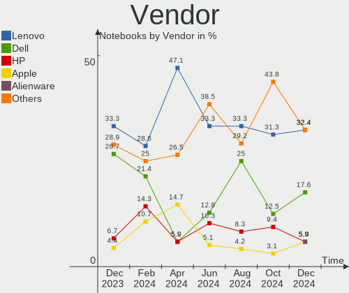
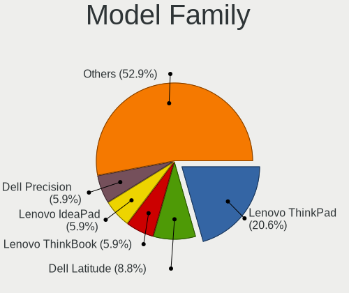

FreeBSD - Hardware Trends (Notebooks)
-------------------------------------

A project to identify most popular hardware characteristics and track their change
over time based on data collected by BSD users at https://BSD-Hardware.info.

Anyone can contribute to this report by the [hw-probe](https://github.com/linuxhw/hw-probe/blob/master/INSTALL.BSD.md) tool:

    hw-probe -all -upload

This report is for one last month. Overall report since the beginning of time: [TestCoverage](https://github.com/bsdhw/TestCoverage)

Period: Jun, 2022.

Contents
--------

* [ System ](#system)
  - [ OS                       ](#os)
  - [ OS Family                ](#os-family)
  - [ Arch                     ](#arch)
  - [ DE                       ](#de)
  - [ Display Server           ](#display-server)
  - [ Display Manager          ](#display-manager)
  - [ OS Lang                  ](#os-lang)
  - [ Boot Mode                ](#boot-mode)
  - [ Filesystem               ](#filesystem)
  - [ Part. scheme             ](#part-scheme)

* [ Board ](#board)
  - [ Vendor                   ](#vendor)
  - [ Model                    ](#model)
  - [ Model Family             ](#model-family)
  - [ MFG Year                 ](#mfg-year)
  - [ Form Factor              ](#form-factor)
  - [ Coreboot                 ](#coreboot)
  - [ RAM Size                 ](#ram-size)
  - [ RAM Used                 ](#ram-used)
  - [ Total Drives             ](#total-drives)
  - [ Has CD-ROM               ](#has-cd-rom)
  - [ Has Ethernet             ](#has-ethernet)
  - [ Has WiFi                 ](#has-wifi)
  - [ Has Bluetooth            ](#has-bluetooth)

* [ Location ](#location)
  - [ Country                  ](#country)
  - [ City                     ](#city)

* [ Drives ](#drives)
  - [ Drive Vendor             ](#drive-vendor)
  - [ Drive Model              ](#drive-model)
  - [ HDD Vendor               ](#hdd-vendor)
  - [ SSD Vendor               ](#ssd-vendor)
  - [ Drive Kind               ](#drive-kind)
  - [ Drive Connector          ](#drive-connector)
  - [ Drive Size               ](#drive-size)
  - [ Space Total              ](#space-total)
  - [ Space Used               ](#space-used)
  - [ Malfunc. Drives          ](#malfunc-drives)
  - [ Malfunc. Drive Vendor    ](#malfunc-drive-vendor)
  - [ Malfunc. HDD Vendor      ](#malfunc-hdd-vendor)
  - [ Malfunc. Drive Kind      ](#malfunc-drive-kind)
  - [ Failed Drives            ](#failed-drives)
  - [ Failed Drive Vendor      ](#failed-drive-vendor)
  - [ Drive Status             ](#drive-status)

* [ Storage controller ](#storage-controller)
  - [ Storage Vendor           ](#storage-vendor)
  - [ Storage Model            ](#storage-model)
  - [ Storage Kind             ](#storage-kind)

* [ Processor ](#processor)
  - [ CPU Vendor               ](#cpu-vendor)
  - [ CPU Model                ](#cpu-model)
  - [ CPU Model Family         ](#cpu-model-family)
  - [ CPU Cores                ](#cpu-cores)
  - [ CPU Sockets              ](#cpu-sockets)
  - [ CPU Threads              ](#cpu-threads)
  - [ CPU Microarch            ](#cpu-microarch)

* [ Graphics ](#graphics)
  - [ GPU Vendor               ](#gpu-vendor)
  - [ GPU Model                ](#gpu-model)
  - [ GPU Combo                ](#gpu-combo)
  - [ GPU Driver               ](#gpu-driver)
  - [ GPU Memory               ](#gpu-memory)

* [ Monitor ](#monitor)
  - [ Monitor Vendor           ](#monitor-vendor)
  - [ Monitor Model            ](#monitor-model)
  - [ Monitor Resolution       ](#monitor-resolution)
  - [ Monitor Diagonal         ](#monitor-diagonal)
  - [ Monitor Width            ](#monitor-width)
  - [ Aspect Ratio             ](#aspect-ratio)
  - [ Monitor Area             ](#monitor-area)
  - [ Pixel Density            ](#pixel-density)
  - [ Multiple Monitors        ](#multiple-monitors)

* [ Network ](#network)
  - [ Net Controller Vendor    ](#net-controller-vendor)
  - [ Net Controller Model     ](#net-controller-model)
  - [ Wireless Vendor          ](#wireless-vendor)
  - [ Wireless Model           ](#wireless-model)
  - [ Ethernet Vendor          ](#ethernet-vendor)
  - [ Ethernet Model           ](#ethernet-model)
  - [ Net Controller Kind      ](#net-controller-kind)
  - [ Used Controller          ](#used-controller)
  - [ NICs                     ](#nics)
  - [ IPv6                     ](#ipv6)

* [ Bluetooth ](#bluetooth)
  - [ Bluetooth Vendor         ](#bluetooth-vendor)
  - [ Bluetooth Model          ](#bluetooth-model)

* [ Sound ](#sound)
  - [ Sound Vendor             ](#sound-vendor)
  - [ Sound Model              ](#sound-model)

* [ Memory ](#memory)
  - [ Memory Vendor            ](#memory-vendor)
  - [ Memory Model             ](#memory-model)
  - [ Memory Kind              ](#memory-kind)
  - [ Memory Form Factor       ](#memory-form-factor)
  - [ Memory Size              ](#memory-size)
  - [ Memory Speed             ](#memory-speed)

* [ Printers & scanners ](#printers--scanners)
  - [ Printer Vendor           ](#printer-vendor)
  - [ Printer Model            ](#printer-model)
  - [ Scanner Vendor           ](#scanner-vendor)
  - [ Scanner Model            ](#scanner-model)

* [ Camera ](#camera)
  - [ Camera Vendor            ](#camera-vendor)
  - [ Camera Model             ](#camera-model)

* [ Security ](#security)
  - [ Fingerprint Vendor       ](#fingerprint-vendor)
  - [ Fingerprint Model        ](#fingerprint-model)
  - [ Chipcard Vendor          ](#chipcard-vendor)
  - [ Chipcard Model           ](#chipcard-model)

* [ Unsupported ](#unsupported)
  - [ Unsupported Devices      ](#unsupported-devices)
  - [ Unsupported Device Types ](#unsupported-device-types)

System
------

OS
--

Installed operating systems

| Name                 | Notebooks | Percent |
|----------------------|-----------|---------|
| FreeBSD 13.1         | 20        | 71.43%  |
| FreeBSD 14.0-CURRENT | 3         | 10.71%  |
| FreeBSD 12.3         | 2         | 7.14%   |
| FreeBSD 13.1-STABLE  | 1         | 3.57%   |
| FreeBSD 13.0-p6      | 1         | 3.57%   |
| FreeBSD 12.3-STABLE  | 1         | 3.57%   |

OS Family
---------

OS without a version

| Name    | Notebooks | Percent |
|---------|-----------|---------|
| FreeBSD | 28        | 100%    |

Arch
----

OS architecture (x86_64, i586, etc.)

| Name  | Notebooks | Percent |
|-------|-----------|---------|
| amd64 | 26        | 92.86%  |
| i386  | 2         | 7.14%   |

DE
--

Desktop Environment

| Name     | Notebooks | Percent |
|----------|-----------|---------|
| KDE5     | 8         | 28.57%  |
| XFCE     | 4         | 14.29%  |
| TWM      | 4         | 14.29%  |
| i3       | 3         | 10.71%  |
| GNOME    | 2         | 7.14%   |
| Console  | 2         | 7.14%   |
| Openbox  | 1         | 3.57%   |
| MATE     | 1         | 3.57%   |
| LXQt     | 1         | 3.57%   |
| LXDE     | 1         | 3.57%   |
| Cinnamon | 1         | 3.57%   |

Display Server
--------------

X11 or Wayland

| Name    | Notebooks | Percent |
|---------|-----------|---------|
| X11     | 25        | 89.29%  |
| Console | 2         | 7.14%   |
| Wayland | 1         | 3.57%   |

Display Manager
---------------

SDDM, LightDM, etc.

| Name    | Notebooks | Percent |
|---------|-----------|---------|
| SDDM    | 8         | 28.57%  |
| Console | 7         | 25%     |
| SLiM    | 5         | 17.86%  |
| XDM     | 3         | 10.71%  |
| GDM     | 3         | 10.71%  |
| LightDM | 2         | 7.14%   |

OS Lang
-------

Language

| Lang    | Notebooks | Percent |
|---------|-----------|---------|
| C       | 17        | 60.71%  |
| en_US   | 3         | 10.71%  |
| zh_CN   | 2         | 7.14%   |
| ru_RU   | 2         | 7.14%   |
| Unknown | 2         | 7.14%   |
| fr_FR   | 1         | 3.57%   |
| de_DE   | 1         | 3.57%   |

Boot Mode
---------

EFI or BIOS

| Mode | Notebooks | Percent |
|------|-----------|---------|
| EFI  | 21        | 75%     |
| BIOS | 7         | 25%     |

Filesystem
----------

Type of filesystem

| Type | Notebooks | Percent |
|------|-----------|---------|
| Zfs  | 18        | 64.29%  |
| Ufs  | 10        | 35.71%  |

Part. scheme
------------

Scheme of partitioning

| Type | Notebooks | Percent |
|------|-----------|---------|
| GPT  | 24        | 85.71%  |
| MBR  | 4         | 14.29%  |

Board
-----

Vendor
------

Motherboard manufacturer

| Name                | Notebooks | Percent |
|---------------------|-----------|---------|
| Dell                | 8         | 28.57%  |
| Lenovo              | 7         | 25%     |
| Hewlett-Packard     | 3         | 10.71%  |
| ASUSTek Computer    | 2         | 7.14%   |
| Acer                | 2         | 7.14%   |
| Toshiba             | 1         | 3.57%   |
| Sony                | 1         | 3.57%   |
| Samsung Electronics | 1         | 3.57%   |
| Fujitsu Siemens     | 1         | 3.57%   |
| Fujitsu             | 1         | 3.57%   |
| Apple               | 1         | 3.57%   |

Model
-----

Motherboard model

| Name                                 | Notebooks | Percent |
|--------------------------------------|-----------|---------|
| Toshiba Satellite A300               | 1         | 3.57%   |
| Sony VGN-NS21M_S                     | 1         | 3.57%   |
| Samsung R530/R730/R540               | 1         | 3.57%   |
| Lenovo ThinkPad X270 20HN001HUS      | 1         | 3.57%   |
| Lenovo ThinkPad X220 4286CTO         | 1         | 3.57%   |
| Lenovo ThinkPad W520 4282AD4         | 1         | 3.57%   |
| Lenovo ThinkPad T590 20N4CTO1WW      | 1         | 3.57%   |
| Lenovo ThinkPad T14 Gen 1 20S0CTO1WW | 1         | 3.57%   |
| Lenovo ThinkPad R60e 0658W2M         | 1         | 3.57%   |
| Lenovo IdeaPad 130-15AST 81H5        | 1         | 3.57%   |
| HP Laptop 15s-fq1xxx                 | 1         | 3.57%   |
| HP EliteBook 8570p                   | 1         | 3.57%   |
| HP EliteBook 850 G7 Notebook PC      | 1         | 3.57%   |
| Fujitsu Siemens AMILO Li3710         | 1         | 3.57%   |
| Fujitsu LIFEBOOK A555                | 1         | 3.57%   |
| Dell Precision M4800                 | 1         | 3.57%   |
| Dell Latitude E5500                  | 1         | 3.57%   |
| Dell Latitude E5420                  | 1         | 3.57%   |
| Dell Latitude 7490                   | 1         | 3.57%   |
| Dell Latitude 7390                   | 1         | 3.57%   |
| Dell Latitude 5521                   | 1         | 3.57%   |
| Dell Latitude 5410                   | 1         | 3.57%   |
| Dell Inspiron 5559                   | 1         | 3.57%   |
| ASUS ZenBook UX391FA_UX391FA         | 1         | 3.57%   |
| ASUS X441UV                          | 1         | 3.57%   |
| Apple MacBookPro11,4                 | 1         | 3.57%   |
| Acer Nitro AN515-55                  | 1         | 3.57%   |
| Acer Aspire A114-33                  | 1         | 3.57%   |

Model Family
------------

Motherboard model prefix

| Name                  | Notebooks | Percent |
|-----------------------|-----------|---------|
| Lenovo ThinkPad       | 6         | 21.43%  |
| Dell Latitude         | 6         | 21.43%  |
| HP EliteBook          | 2         | 7.14%   |
| Toshiba Satellite     | 1         | 3.57%   |
| Sony VGN-NS21M        | 1         | 3.57%   |
| Samsung R530          | 1         | 3.57%   |
| Lenovo IdeaPad        | 1         | 3.57%   |
| HP Laptop             | 1         | 3.57%   |
| Fujitsu Siemens AMILO | 1         | 3.57%   |
| Fujitsu LIFEBOOK      | 1         | 3.57%   |
| Dell Precision        | 1         | 3.57%   |
| Dell Inspiron         | 1         | 3.57%   |
| ASUS ZenBook          | 1         | 3.57%   |
| ASUS X441UV           | 1         | 3.57%   |
| Apple MacBookPro11    | 1         | 3.57%   |
| Acer Nitro            | 1         | 3.57%   |
| Acer Aspire           | 1         | 3.57%   |

MFG Year
--------

Motherboard manufacture year

| Year | Notebooks | Percent |
|------|-----------|---------|
| 2020 | 6         | 21.43%  |
| 2022 | 3         | 10.71%  |
| 2021 | 2         | 7.14%   |
| 2018 | 2         | 7.14%   |
| 2017 | 2         | 7.14%   |
| 2013 | 2         | 7.14%   |
| 2011 | 2         | 7.14%   |
| 2009 | 2         | 7.14%   |
| 2019 | 1         | 3.57%   |
| 2016 | 1         | 3.57%   |
| 2015 | 1         | 3.57%   |
| 2012 | 1         | 3.57%   |
| 2010 | 1         | 3.57%   |
| 2008 | 1         | 3.57%   |
| 2006 | 1         | 3.57%   |

Form Factor
-----------

Physical design of the computer

| Name     | Notebooks | Percent |
|----------|-----------|---------|
| Notebook | 28        | 100%    |

Coreboot
--------

Have coreboot on board

| Used | Notebooks | Percent |
|------|-----------|---------|
| No   | 28        | 100%    |

RAM Size
--------

Total RAM memory

| Size in GB | Notebooks | Percent |
|------------|-----------|---------|
| 16.01-24.0 | 11        | 39.29%  |
| 8.01-16.0  | 9         | 32.14%  |
| 4.01-8.0   | 4         | 14.29%  |
| 32.01-64.0 | 2         | 7.14%   |
| 0.51-1.0   | 2         | 7.14%   |

RAM Used
--------

Used RAM memory

| Used GB   | Notebooks | Percent |
|-----------|-----------|---------|
| 0.51-1.0  | 12        | 42.86%  |
| 0.01-0.5  | 12        | 42.86%  |
| 1.01-2.0  | 3         | 10.71%  |
| 8.01-16.0 | 1         | 3.57%   |

Total Drives
------------

Number of drives on board

| Drives | Notebooks | Percent |
|--------|-----------|---------|
| 1      | 22        | 78.57%  |
| 2      | 5         | 17.86%  |
| 0      | 1         | 3.57%   |

Has CD-ROM
----------

Has CD-ROM on board

| Presented | Notebooks | Percent |
|-----------|-----------|---------|
| No        | 18        | 64.29%  |
| Yes       | 10        | 35.71%  |

Has Ethernet
------------

Has Ethernet on board

| Presented | Notebooks | Percent |
|-----------|-----------|---------|
| Yes       | 24        | 85.71%  |
| No        | 4         | 14.29%  |

Has WiFi
--------

Has WiFi module

| Presented | Notebooks | Percent |
|-----------|-----------|---------|
| Yes       | 28        | 100%    |

Has Bluetooth
-------------

Has Bluetooth module

| Presented | Notebooks | Percent |
|-----------|-----------|---------|
| Yes       | 18        | 64.29%  |
| No        | 10        | 35.71%  |

Location
--------

Country
-------

Geographic location (country)

| Country     | Notebooks | Percent |
|-------------|-----------|---------|
| USA         | 6         | 21.43%  |
| Russia      | 4         | 14.29%  |
| France      | 3         | 10.71%  |
| UK          | 2         | 7.14%   |
| Austria     | 2         | 7.14%   |
| Uruguay     | 1         | 3.57%   |
| Turkey      | 1         | 3.57%   |
| Spain       | 1         | 3.57%   |
| Poland      | 1         | 3.57%   |
| Philippines | 1         | 3.57%   |
| Netherlands | 1         | 3.57%   |
| India       | 1         | 3.57%   |
| Hong Kong   | 1         | 3.57%   |
| Greece      | 1         | 3.57%   |
| Germany     | 1         | 3.57%   |
| China       | 1         | 3.57%   |

City
----

Geographic location (city)

| City                     | Notebooks | Percent |
|--------------------------|-----------|---------|
| Vienna                   | 2         | 7.14%   |
| Moscow                   | 2         | 7.14%   |
| Xi'an                    | 1         | 3.57%   |
| Warsaw                   | 1         | 3.57%   |
| Villeneuve-Saint-Georges | 1         | 3.57%   |
| Thousand Oaks            | 1         | 3.57%   |
| San Pablo City           | 1         | 3.57%   |
| San Francisco            | 1         | 3.57%   |
| Paris                    | 1         | 3.57%   |
| Ozersk                   | 1         | 3.57%   |
| Northeim                 | 1         | 3.57%   |
| New York                 | 1         | 3.57%   |
| Mumbai                   | 1         | 3.57%   |
| Montevideo               | 1         | 3.57%   |
| Manassas                 | 1         | 3.57%   |
| London                   | 1         | 3.57%   |
| Krasnodar                | 1         | 3.57%   |
| Istanbul                 | 1         | 3.57%   |
| Harrisburg               | 1         | 3.57%   |
| Durham                   | 1         | 3.57%   |
| Dronten                  | 1         | 3.57%   |
| Central                  | 1         | 3.57%   |
| Brighton                 | 1         | 3.57%   |
| Barcelona                | 1         | 3.57%   |
| Athens                   | 1         | 3.57%   |
| Asnieres-sur-Seine       | 1         | 3.57%   |

Drives
------

Drive Vendor
------------

Hard drive vendors

| Vendor              | Notebooks | Drives | Percent |
|---------------------|-----------|--------|---------|
| WDC                 | 5         | 6      | 16.13%  |
| Samsung Electronics | 5         | 5      | 16.13%  |
| Toshiba             | 4         | 4      | 12.9%   |
| Crucial             | 3         | 3      | 9.68%   |
| Seagate             | 2         | 2      | 6.45%   |
| KIOXIA              | 2         | 2      | 6.45%   |
| Transcend           | 1         | 1      | 3.23%   |
| SK hynix            | 1         | 1      | 3.23%   |
| SanDisk             | 1         | 1      | 3.23%   |
| Lexar               | 1         | 1      | 3.23%   |
| Lenovo              | 1         | 1      | 3.23%   |
| Hitachi             | 1         | 1      | 3.23%   |
| HGST                | 1         | 1      | 3.23%   |
| Gigabyte Technology | 1         | 1      | 3.23%   |
| Apple               | 1         | 1      | 3.23%   |
| A-DATA Technology   | 1         | 2      | 3.23%   |

Drive Model
-----------

Hard drive models

| Model                                   | Notebooks | Percent |
|-----------------------------------------|-----------|---------|
| WDC WD3200BPVT-22JJ5T0 320GB            | 1         | 3.03%   |
| WDC WD3200BEKT-60PVMT0 320GB            | 1         | 3.03%   |
| WDC WD2500BEVT-24A23T0 250GB            | 1         | 3.03%   |
| WDC WD1600BEVT-75ZCT2 160GB             | 1         | 3.03%   |
| WDC WD1600BEVT-22ZCT0 160GB             | 1         | 3.03%   |
| WDC PC SN530 SDBPNPZ-256G-1014 256GB    | 1         | 3.03%   |
| Transcend TS1TMTE110S 1TB               | 1         | 3.03%   |
| Toshiba MQ04ABF100 1TB                  | 1         | 3.03%   |
| Toshiba MQ01ABD100 1TB                  | 1         | 3.03%   |
| Toshiba MK2546GSX 250GB                 | 1         | 3.03%   |
| Toshiba KSG60ZMV256G M.2 2280 256GB     | 1         | 3.03%   |
| SK hynix BC511 HFM512GDJTNI-82A0A 512GB | 1         | 3.03%   |
| Seagate ST500LM012 HN-M500MBB 500GB     | 1         | 3.03%   |
| Seagate ST1000LM049-2GH172 1TB          | 1         | 3.03%   |
| SanDisk SSD PLUS 120GB                  | 1         | 3.03%   |
| Samsung SSD 970 EVO Plus 2TB            | 1         | 3.03%   |
| Samsung PM9A1 NVMe 512GB                | 1         | 3.03%   |
| Samsung MZVLW256HEHP-000L7 256GB        | 1         | 3.03%   |
| Samsung MZVLB512HAJQ-00000 512GB        | 1         | 3.03%   |
| Samsung MZVLB1T0HBLR-000L7 1TB          | 1         | 3.03%   |
| Lexar 256GB SSD                         | 1         | 3.03%   |
| Lenovo SSD SL700 240G                   | 1         | 3.03%   |
| KIOXIA KXG60PNV2T04 NVMe 2048GB         | 1         | 3.03%   |
| KIOXIA KBG40ZNS256G NVMe 256GB          | 1         | 3.03%   |
| Hitachi HTS722020K9SA00 200GB           | 1         | 3.03%   |
| HGST HTS721010A9E630 1TB                | 1         | 3.03%   |
| Gigabyte GP-GSTFS31240GNTD 240GB        | 1         | 3.03%   |
| Crucial CT250P2SSD8 250GB               | 1         | 3.03%   |
| Crucial CT1000MX500SSD1 1TB             | 1         | 3.03%   |
| Crucial CT1000BX500SSD1 1TB             | 1         | 3.03%   |
| Apple SSD SM1024G 1TB                   | 1         | 3.03%   |
| A-DATA SU650 240GB                      | 1         | 3.03%   |
| A-DATA SU630 240GB                      | 1         | 3.03%   |

HDD Vendor
----------

Hard disk drive vendors

| Vendor  | Notebooks | Drives | Percent |
|---------|-----------|--------|---------|
| WDC     | 4         | 5      | 36.36%  |
| Toshiba | 3         | 3      | 27.27%  |
| Seagate | 2         | 2      | 18.18%  |
| Hitachi | 1         | 1      | 9.09%   |
| HGST    | 1         | 1      | 9.09%   |

SSD Vendor
----------

Solid state drive vendors

| Vendor              | Notebooks | Drives | Percent |
|---------------------|-----------|--------|---------|
| Crucial             | 2         | 2      | 22.22%  |
| Toshiba             | 1         | 1      | 11.11%  |
| SanDisk             | 1         | 1      | 11.11%  |
| Lexar               | 1         | 1      | 11.11%  |
| Lenovo              | 1         | 1      | 11.11%  |
| Gigabyte Technology | 1         | 1      | 11.11%  |
| Apple               | 1         | 1      | 11.11%  |
| A-DATA Technology   | 1         | 2      | 11.11%  |

Drive Kind
----------

HDD or SSD

| Kind | Notebooks | Drives | Percent |
|------|-----------|--------|---------|
| NVMe | 10        | 11     | 34.48%  |
| HDD  | 10        | 12     | 34.48%  |
| SSD  | 9         | 10     | 31.03%  |

Drive Connector
---------------

SATA, SAS, NVMe, etc.

| Type | Notebooks | Drives | Percent |
|------|-----------|--------|---------|
| SATA | 18        | 22     | 64.29%  |
| NVMe | 10        | 11     | 35.71%  |

Drive Size
----------

Size of hard drive

| Size in TB | Notebooks | Drives | Percent |
|------------|-----------|--------|---------|
| 0.01-0.5   | 13        | 15     | 65%     |
| 0.51-1.0   | 7         | 7      | 35%     |

Space Total
-----------

Amount of disk space available on the file system

| Size in GB | Notebooks | Percent |
|------------|-----------|---------|
| 101-250    | 15        | 53.57%  |
| 501-1000   | 4         | 14.29%  |
| 251-500    | 3         | 10.71%  |
| 51-100     | 3         | 10.71%  |
| 21-50      | 2         | 7.14%   |
| 1001-2000  | 1         | 3.57%   |

Space Used
----------

Amount of used disk space

| Used GB  | Notebooks | Percent |
|----------|-----------|---------|
| 1-20     | 19        | 67.86%  |
| 21-50    | 7         | 25%     |
| 501-1000 | 1         | 3.57%   |
| 51-100   | 1         | 3.57%   |

Malfunc. Drives
---------------

Drive models with a malfunction

| Model                               | Notebooks | Drives | Percent |
|-------------------------------------|-----------|--------|---------|
| WDC WD3200BEKT-60PVMT0 320GB        | 1         | 1      | 14.29%  |
| WDC WD2500BEVT-24A23T0 250GB        | 1         | 1      | 14.29%  |
| Toshiba MQ01ABD100 1TB              | 1         | 1      | 14.29%  |
| Toshiba MK2546GSX 250GB             | 1         | 1      | 14.29%  |
| Seagate ST500LM012 HN-M500MBB 500GB | 1         | 1      | 14.29%  |
| HGST HTS721010A9E630 1TB            | 1         | 1      | 14.29%  |
| A-DATA Technology SU630 240GB       | 1         | 1      | 14.29%  |

Malfunc. Drive Vendor
---------------------

Vendors of faulty drives

| Vendor            | Notebooks | Drives | Percent |
|-------------------|-----------|--------|---------|
| Toshiba           | 2         | 2      | 33.33%  |
| WDC               | 1         | 2      | 16.67%  |
| Seagate           | 1         | 1      | 16.67%  |
| HGST              | 1         | 1      | 16.67%  |
| A-DATA Technology | 1         | 1      | 16.67%  |

Malfunc. HDD Vendor
-------------------

Vendors of faulty HDD drives

| Vendor  | Notebooks | Drives | Percent |
|---------|-----------|--------|---------|
| Toshiba | 2         | 2      | 40%     |
| WDC     | 1         | 2      | 20%     |
| Seagate | 1         | 1      | 20%     |
| HGST    | 1         | 1      | 20%     |

Malfunc. Drive Kind
-------------------

Kinds of faulty drives

| Kind | Notebooks | Drives | Percent |
|------|-----------|--------|---------|
| HDD  | 4         | 6      | 80%     |
| SSD  | 1         | 1      | 20%     |

Failed Drives
-------------

Failed drive models

Zero info for selected period =(

Failed Drive Vendor
-------------------

Failed drive vendors

Zero info for selected period =(

Drive Status
------------

Number of failed and malfunc. drives

| Status   | Notebooks | Drives | Percent |
|----------|-----------|--------|---------|
| Works    | 21        | 23     | 75%     |
| Malfunc  | 5         | 7      | 17.86%  |
| Detected | 2         | 3      | 7.14%   |

Storage controller
------------------

Storage Vendor
--------------

Storage controller vendors

| Vendor                    | Notebooks | Percent |
|---------------------------|-----------|---------|
| Intel                     | 20        | 60.61%  |
| Samsung Electronics       | 6         | 18.18%  |
| Toshiba                   | 1         | 3.03%   |
| SK hynix                  | 1         | 3.03%   |
| SanDisk                   | 1         | 3.03%   |
| Micron/Crucial Technology | 1         | 3.03%   |
| KIOXIA                    | 1         | 3.03%   |
| AMD                       | 1         | 3.03%   |
| Unknown                   | 1         | 3.03%   |

Storage Model
-------------

Storage controller models

| Model                                                                        | Notebooks | Percent |
|------------------------------------------------------------------------------|-----------|---------|
| Samsung NVMe SSD Controller SM981/PM981/PM983                                | 3         | 8.82%   |
| Intel 82801IBM/IEM (ICH9M/ICH9M-E) 4 port SATA Controller [AHCI mode]        | 3         | 8.82%   |
| Intel 82801 Mobile SATA Controller [RAID mode]                               | 3         | 8.82%   |
| Intel 6 Series/C200 Series Chipset Family 6 port Mobile SATA AHCI Controller | 3         | 8.82%   |
| Intel Sunrise Point-LP SATA Controller [AHCI mode]                           | 2         | 5.88%   |
| Toshiba XG6 NVMe SSD Controller                                              | 1         | 2.94%   |
| SK hynix BC511                                                               | 1         | 2.94%   |
| SanDisk WD Blue SN550 NVMe SSD                                               | 1         | 2.94%   |
| Samsung SM951 AHCI                                                           | 1         | 2.94%   |
| Samsung NVMe SSD Controller SM961/PM961/SM963                                | 1         | 2.94%   |
| Samsung NVMe SSD Controller PM9A1/PM9A3/980PRO                               | 1         | 2.94%   |
| Micron/Crucial P2 NVMe PCIe SSD                                              | 1         | 2.94%   |
| KIOXIA unknown                                                               | 1         | 2.94%   |
| Intel Wildcat Point-LP SATA Controller [AHCI Mode]                           | 1         | 2.94%   |
| Intel Jasper Lake SATA AHCI Controller                                       | 1         | 2.94%   |
| Intel Comet Lake SATA AHCI Controller                                        | 1         | 2.94%   |
| Intel 82801HM/HEM (ICH8M/ICH8M-E) SATA Controller [AHCI mode]                | 1         | 2.94%   |
| Intel 82801HM/HEM (ICH8M/ICH8M-E) IDE Controller                             | 1         | 2.94%   |
| Intel 82801GBM/GHM (ICH7-M Family) SATA Controller [IDE mode]                | 1         | 2.94%   |
| Intel 7 Series Chipset Family 6-port SATA Controller [AHCI mode]             | 1         | 2.94%   |
| Intel 500 Series Chipset Family SATA AHCI Controller                         | 1         | 2.94%   |
| Intel 5 Series/3400 Series Chipset 4 port SATA AHCI Controller               | 1         | 2.94%   |
| Intel 400 Series Chipset Family SATA AHCI Controller                         | 1         | 2.94%   |
| AMD FCH SATA Controller [AHCI mode]                                          | 1         | 2.94%   |
| Unknown                                                                      | 1         | 2.94%   |

Storage Kind
------------

Kind of storage controller (IDE, SATA, NVMe, SAS, ...)

| Kind | Notebooks | Percent |
|------|-----------|---------|
| SATA | 18        | 54.55%  |
| NVMe | 10        | 30.3%   |
| RAID | 3         | 9.09%   |
| IDE  | 2         | 6.06%   |

Processor
---------

CPU Vendor
----------

Processor vendors

| Vendor | Notebooks | Percent |
|--------|-----------|---------|
| Intel  | 27        | 96.43%  |
| AMD    | 1         | 3.57%   |

CPU Model
---------

Processor models

| Model                                        | Notebooks | Percent |
|----------------------------------------------|-----------|---------|
| Intel Core i7-8565U CPU @ 1.80GHz            | 2         | 7.14%   |
| Intel Pentium Silver N6000 @ 1.10GHz         | 1         | 3.57%   |
| Intel Pentium Dual CPU T3400 @ 2.16GHz       | 1         | 3.57%   |
| Intel Genuine CPU                            | 1         | 3.57%   |
| Intel CPU Version                            | 1         | 3.57%   |
| Intel Core i7-7500U CPU @ 2.70GHz            | 1         | 3.57%   |
| Intel Core i7-6500U CPU @ 2.50GHz            | 1         | 3.57%   |
| Intel Core i7-4980HQ CPU @ 2.80GHz           | 1         | 3.57%   |
| Intel Core i7-4810MQ CPU @ 2.80GHz           | 1         | 3.57%   |
| Intel Core i7-3520M CPU @ 2.90GHz            | 1         | 3.57%   |
| Intel Core i7-2760QM CPU @ 2.40GHz           | 1         | 3.57%   |
| Intel Core i7-2620M CPU @ 2.70GHz            | 1         | 3.57%   |
| Intel Core i7-10510U CPU @ 1.80GHz           | 1         | 3.57%   |
| Intel Core i5-8350U CPU @ 1.70GHz            | 1         | 3.57%   |
| Intel Core i5-7300U CPU @ 2.60GHz            | 1         | 3.57%   |
| Intel Core i5-2520M CPU @ 2.50GH             | 1         | 3.57%   |
| Intel Core i5-1035G1 CPU @ 1.00GHz           | 1         | 3.57%   |
| Intel Core i5-10310U CPU @ 1.70GHz           | 1         | 3.57%   |
| Intel Core i5-10300H CPU @ 2.50GHz           | 1         | 3.57%   |
| Intel Core i5-10210U CPU @ 1.60GHz           | 1         | 3.57%   |
| Intel Core i3-6006U CPU @ 2.00GHz            | 1         | 3.57%   |
| Intel Core i3-5005U CPU @ 2.00GHz            | 1         | 3.57%   |
| Intel Core 2 Duo CPU T6400 @ 2.00GHz         | 1         | 3.57%   |
| Intel Core 2 Duo                             | 1         | 3.57%   |
| Intel Celeron M CPU                          | 1         | 3.57%   |
| Intel 11th Gen Core i7-11850H @ 2.50GHz      | 1         | 3.57%   |
| AMD E2-9000 RADEON R2, 4 COMPUTE CORES 2C+2G | 1         | 3.57%   |

CPU Model Family
----------------

Processor model prefix

| Model                | Notebooks | Percent |
|----------------------|-----------|---------|
| Intel Core i7        | 10        | 35.71%  |
| Intel Core i5        | 7         | 25%     |
| Other                | 2         | 7.14%   |
| Intel Core i3        | 2         | 7.14%   |
| Intel Core 2 Duo     | 2         | 7.14%   |
| Intel Pentium Silver | 1         | 3.57%   |
| Intel Pentium Dual   | 1         | 3.57%   |
| Intel Genuine        | 1         | 3.57%   |
| Intel Celeron M      | 1         | 3.57%   |
| AMD E2               | 1         | 3.57%   |

CPU Cores
---------

Number of processor cores

| Number  | Notebooks | Percent |
|---------|-----------|---------|
| 4       | 12        | 42.86%  |
| 2       | 12        | 42.86%  |
| Unknown | 2         | 7.14%   |
| 8       | 1         | 3.57%   |
| 1       | 1         | 3.57%   |

CPU Sockets
-----------

Number of sockets

| Number | Notebooks | Percent |
|--------|-----------|---------|
| 1      | 28        | 100%    |

CPU Threads
-----------

Threads per core (Hyper-Threading)

| Number  | Notebooks | Percent |
|---------|-----------|---------|
| 2       | 21        | 75%     |
| 1       | 4         | 14.29%  |
| Unknown | 3         | 10.71%  |

CPU Microarch
-------------

Microarchitecture

| Name        | Notebooks | Percent |
|-------------|-----------|---------|
| KabyLake    | 8         | 28.57%  |
| SandyBridge | 3         | 10.71%  |
| Core        | 3         | 10.71%  |
| Skylake     | 2         | 7.14%   |
| Haswell     | 2         | 7.14%   |
| Unknown     | 2         | 7.14%   |
| Westmere    | 1         | 3.57%   |
| Penryn      | 1         | 3.57%   |
| P6          | 1         | 3.57%   |
| IvyBridge   | 1         | 3.57%   |
| IceLake     | 1         | 3.57%   |
| Excavator   | 1         | 3.57%   |
| CometLake   | 1         | 3.57%   |
| Broadwell   | 1         | 3.57%   |

Graphics
--------

GPU Vendor
----------

Vendors of graphics cards

| Vendor | Notebooks | Percent |
|--------|-----------|---------|
| Intel  | 26        | 78.79%  |
| AMD    | 4         | 12.12%  |
| Nvidia | 3         | 9.09%   |

GPU Model
---------

Graphics card models

| Model                                                                         | Notebooks | Percent |
|-------------------------------------------------------------------------------|-----------|---------|
| Intel Mobile 4 Series Chipset Integrated Graphics Controller                  | 3         | 8.57%   |
| Intel CometLake-U GT2 [UHD Graphics]                                          | 3         | 8.57%   |
| Intel 2nd Generation Core Processor Family Integrated Graphics Controller     | 3         | 8.57%   |
| Intel WhiskeyLake-U GT2 [UHD Graphics 620]                                    | 2         | 5.71%   |
| Intel Skylake GT2 [HD Graphics 520]                                           | 2         | 5.71%   |
| Intel HD Graphics 620                                                         | 2         | 5.71%   |
| Nvidia TU117M [GeForce MX450]                                                 | 1         | 2.86%   |
| Nvidia TU117M                                                                 | 1         | 2.86%   |
| Nvidia GM108M [GeForce 920MX]                                                 | 1         | 2.86%   |
| Intel UHD Graphics 620                                                        | 1         | 2.86%   |
| Intel TigerLake-H GT1 [UHD Graphics]                                          | 1         | 2.86%   |
| Intel Mobile GM965/GL960 Integrated Graphics Controller (secondary)           | 1         | 2.86%   |
| Intel Mobile GM965/GL960 Integrated Graphics Controller (primary)             | 1         | 2.86%   |
| Intel Mobile 945GM/GMS/GME, 943/940GML Express Integrated Graphics Controller | 1         | 2.86%   |
| Intel Mobile 945GM/GMS, 943/940GML Express Integrated Graphics Controller     | 1         | 2.86%   |
| Intel JasperLake [UHD Graphics]                                               | 1         | 2.86%   |
| Intel Iris Plus Graphics G1 (Ice Lake)                                        | 1         | 2.86%   |
| Intel HD Graphics 5500                                                        | 1         | 2.86%   |
| Intel Crystal Well Integrated Graphics Controller                             | 1         | 2.86%   |
| Intel Core Processor Integrated Graphics Controller                           | 1         | 2.86%   |
| Intel CometLake-H GT2 [UHD Graphics]                                          | 1         | 2.86%   |
| Intel 4th Gen Core Processor Integrated Graphics Controller                   | 1         | 2.86%   |
| AMD Venus XT [Radeon HD 8870M / R9 M270X/M370X]                               | 1         | 2.86%   |
| AMD Thames [Radeon HD 7550M/7570M/7650M]                                      | 1         | 2.86%   |
| AMD Sun XT [Radeon HD 8670A/8670M/8690M / R5 M330 / M430 / Radeon 520 Mobile] | 1         | 2.86%   |
| AMD Stoney [Radeon R2/R3/R4/R5 Graphics]                                      | 1         | 2.86%   |

GPU Combo
---------

Combinations of graphics cards

| Name           | Notebooks | Percent |
|----------------|-----------|---------|
| 1 x Intel      | 16        | 57.14%  |
| 2 x Intel      | 5         | 17.86%  |
| Intel + Nvidia | 3         | 10.71%  |
| Intel + AMD    | 2         | 7.14%   |
| 1 x AMD        | 2         | 7.14%   |

GPU Driver
----------

Free vs proprietary

| Driver | Notebooks | Percent |
|--------|-----------|---------|
| Free   | 28        | 100%    |

GPU Memory
----------

Total video memory

| Size in GB | Notebooks | Percent |
|------------|-----------|---------|
| Unknown    | 26        | 92.86%  |
| 0.51-1.0   | 1         | 3.57%   |
| 0.01-0.5   | 1         | 3.57%   |

Monitor
-------

Monitor Vendor
--------------

Monitor vendors

| Vendor               | Notebooks | Percent |
|----------------------|-----------|---------|
| LG Display           | 5         | 17.86%  |
| BOE                  | 5         | 17.86%  |
| AU Optronics         | 4         | 14.29%  |
| Samsung Electronics  | 3         | 10.71%  |
| Philips              | 2         | 7.14%   |
| Chimei Innolux       | 2         | 7.14%   |
| ViewSonic            | 1         | 3.57%   |
| Lenovo               | 1         | 3.57%   |
| JDI                  | 1         | 3.57%   |
| CSO                  | 1         | 3.57%   |
| CPT                  | 1         | 3.57%   |
| Apple                | 1         | 3.57%   |
| Ancor Communications | 1         | 3.57%   |

Monitor Model
-------------

Monitor models

| Model                                                                 | Notebooks | Percent |
|-----------------------------------------------------------------------|-----------|---------|
| ViewSonic LCD Monitor VSCD22B 1920x1080 520x290mm 23.4-inch           | 1         | 3.57%   |
| Samsung Electronics LCD Monitor SEC5441 1280x800 330x210mm 15.4-inch  | 1         | 3.57%   |
| Samsung Electronics LCD Monitor SEC3245 1366x768 340x190mm 15.3-inch  | 1         | 3.57%   |
| Samsung Electronics LCD Monitor SDC8B4F 1920x1080 340x190mm 15.3-inch | 1         | 3.57%   |
| Philips PHL 439P1 PHL0973 3840x2160 940x530mm 42.5-inch               | 1         | 3.57%   |
| Philips LCD Monitor PHL08C3 1920x1080 600x340mm 27.2-inch             | 1         | 3.57%   |
| LG Display LCD Monitor LGD6E01 1366x768 340x190mm 15.3-inch           | 1         | 3.57%   |
| LG Display LCD Monitor LGD064C 1920x1080 340x190mm 15.3-inch          | 1         | 3.57%   |
| LG Display LCD Monitor LGD046F 1920x1080 340x190mm 15.3-inch          | 1         | 3.57%   |
| LG Display LCD Monitor LGD0353 1366x768 350x190mm 15.7-inch           | 1         | 3.57%   |
| LG Display LCD Monitor LGD02D3 1366x768 280x160mm 12.7-inch           | 1         | 3.57%   |
| Lenovo LCD Monitor LEN40B2 1920x1080 340x190mm 15.3-inch              | 1         | 3.57%   |
| JDI LCD Monitor JDI385A 3840x2160 290x170mm 13.2-inch                 | 1         | 3.57%   |
| CSO LCD Monitor CSO1400 3840x2160 310x170mm 13.9-inch                 | 1         | 3.57%   |
| CPT LCD Monitor CPT1401 1280x800 330x210mm 15.4-inch                  | 1         | 3.57%   |
| Chimei Innolux LCD Monitor CMN1493 1366x768 310x170mm 13.9-inch       | 1         | 3.57%   |
| Chimei Innolux LCD Monitor CMN1239 1920x1080 280x160mm 12.7-inch      | 1         | 3.57%   |
| BOE LCD Monitor BOE0928 1920x1080 340x190mm 15.3-inch                 | 1         | 3.57%   |
| BOE LCD Monitor BOE07BB 1920x1080 310x170mm 13.9-inch                 | 1         | 3.57%   |
| BOE LCD Monitor BOE075A 1366x768 310x170mm 13.9-inch                  | 1         | 3.57%   |
| BOE LCD Monitor BOE06EE 1920x1080 310x170mm 13.9-inch                 | 1         | 3.57%   |
| BOE LCD Monitor BOE0675 1366x768 340x190mm 15.3-inch                  | 1         | 3.57%   |
| AU Optronics LCD Monitor AUO61ED 1920x1080 340x190mm 15.3-inch        | 1         | 3.57%   |
| AU Optronics LCD Monitor AUO462D 1920x1080 290x170mm 13.2-inch        | 1         | 3.57%   |
| AU Optronics LCD Monitor AUO313E 1600x900 310x170mm 13.9-inch         | 1         | 3.57%   |
| AU Optronics LCD Monitor AUO20ED 1920x1080 340x190mm 15.3-inch        | 1         | 3.57%   |
| Apple Color LCD APPA02E 2880x1800 330x210mm 15.4-inch                 | 1         | 3.57%   |
| Ancor Communications ASUS VW193D ACI19D5 1440x900 410x260mm 19.1-inch | 1         | 3.57%   |

Monitor Resolution
------------------

Monitor screen resolution

| Resolution       | Notebooks | Percent |
|------------------|-----------|---------|
| 1920x1080 (FHD)  | 13        | 46.43%  |
| 1366x768 (WXGA)  | 8         | 28.57%  |
| 3840x2160 (4K)   | 3         | 10.71%  |
| 2880x1800        | 1         | 3.57%   |
| 1600x900 (HD+)   | 1         | 3.57%   |
| 1440x900 (WXGA+) | 1         | 3.57%   |
| 1280x800 (WXGA)  | 1         | 3.57%   |

Monitor Diagonal
----------------

Diagonal size in inches

| Inches | Notebooks | Percent |
|--------|-----------|---------|
| 15     | 14        | 50%     |
| 13     | 8         | 28.57%  |
| 12     | 2         | 7.14%   |
| 42     | 1         | 3.57%   |
| 27     | 1         | 3.57%   |
| 23     | 1         | 3.57%   |
| 19     | 1         | 3.57%   |

Monitor Width
-------------

Physical width

| Width in mm | Notebooks | Percent |
|-------------|-----------|---------|
| 301-350     | 20        | 71.43%  |
| 201-300     | 4         | 14.29%  |
| 501-600     | 2         | 7.14%   |
| 401-500     | 1         | 3.57%   |
| 901-1000    | 1         | 3.57%   |

Aspect Ratio
------------

Proportional relationship between the width and the height

| Ratio | Notebooks | Percent |
|-------|-----------|---------|
| 16/9  | 22        | 84.62%  |
| 16/10 | 4         | 15.38%  |

Monitor Area
------------

Area in inch²

| Area in inch² | Notebooks | Percent |
|----------------|-----------|---------|
| 91-100         | 9         | 32.14%  |
| 81-90          | 6         | 21.43%  |
| 101-110        | 5         | 17.86%  |
| 71-80          | 2         | 7.14%   |
| 61-70          | 2         | 7.14%   |
| 301-350        | 1         | 3.57%   |
| 201-250        | 1         | 3.57%   |
| 151-200        | 1         | 3.57%   |
| 501-1000       | 1         | 3.57%   |

Pixel Density
-------------

Pixels per inch

| Density       | Notebooks | Percent |
|---------------|-----------|---------|
| 121-160       | 11        | 39.29%  |
| 101-120       | 6         | 21.43%  |
| 51-100        | 6         | 21.43%  |
| 161-240       | 3         | 10.71%  |
| More than 240 | 2         | 7.14%   |

Multiple Monitors
-----------------

Total monitors connected

| Total | Notebooks | Percent |
|-------|-----------|---------|
| 1     | 25        | 89.29%  |
| 2     | 2         | 7.14%   |
| 0     | 1         | 3.57%   |

Network
-------

Net Controller Vendor
---------------------

Controller vendors

| Vendor                   | Notebooks | Percent |
|--------------------------|-----------|---------|
| Intel                    | 19        | 41.3%   |
| Realtek Semiconductor    | 8         | 17.39%  |
| Qualcomm Atheros         | 7         | 15.22%  |
| Broadcom                 | 5         | 10.87%  |
| Marvell Technology Group | 3         | 6.52%   |
| Ralink Technology        | 2         | 4.35%   |
| HMD Global               | 1         | 2.17%   |
| Hewlett-Packard          | 1         | 2.17%   |

Net Controller Model
--------------------

Controller models

| Model                                                                   | Notebooks | Percent |
|-------------------------------------------------------------------------|-----------|---------|
| Realtek RTL810xE PCI Express Fast Ethernet controller                   | 4         | 7.02%   |
| Intel Wireless 8265 / 8275                                              | 3         | 5.26%   |
| Intel Comet Lake PCH-LP CNVi WiFi                                       | 3         | 5.26%   |
| Intel 82579LM Gigabit Network Connection (Lewisville)                   | 3         | 5.26%   |
| Realtek RTL8111/8168/8411 PCI Express Gigabit Ethernet Controller       | 2         | 3.51%   |
| Qualcomm Atheros QCA9565 / AR9565 Wireless Network Adapter              | 2         | 3.51%   |
| Intel Ethernet Connection (4) I219-LM                                   | 2         | 3.51%   |
| Intel Ethernet Connection (10) I219-V                                   | 2         | 3.51%   |
| Intel Centrino Advanced-N 6205 [Taylor Peak]                            | 2         | 3.51%   |
| Intel Cannon Point-LP CNVi [Wireless-AC]                                | 2         | 3.51%   |
| Realtek RTL8821CE 802.11ac PCIe Wireless Network Adapter                | 1         | 1.75%   |
| Realtek RTL8188CE 802.11b/g/n WiFi Adapter                              | 1         | 1.75%   |
| Realtek Killer E2600 Gigabit Ethernet Controller                        | 1         | 1.75%   |
| Ralink RT5370 Wireless Adapter                                          | 1         | 1.75%   |
| Ralink MT7601U Wireless Adapter                                         | 1         | 1.75%   |
| Qualcomm Atheros AR9485 Wireless Network Adapter                        | 1         | 1.75%   |
| Qualcomm Atheros AR928X Wireless Network Adapter (PCI-Express)          | 1         | 1.75%   |
| Qualcomm Atheros AR9285 Wireless Network Adapter (PCI-Express)          | 1         | 1.75%   |
| Qualcomm Atheros AR5212 802.11abg NIC                                   | 1         | 1.75%   |
| Qualcomm Atheros AR242x / AR542x Wireless Network Adapter (PCI-Express) | 1         | 1.75%   |
| Marvell Group 88E8055 PCI-E Gigabit Ethernet Controller                 | 1         | 1.75%   |
| Marvell Group 88E8040T PCI-E Fast Ethernet Controller                   | 1         | 1.75%   |
| Marvell Group 88E8040 PCI-E Fast Ethernet Controller                    | 1         | 1.75%   |
| Intel Wireless 7265                                                     | 1         | 1.75%   |
| Intel Wireless 3160                                                     | 1         | 1.75%   |
| Intel Wi-Fi 6 AX210/AX211/AX411 160MHz                                  | 1         | 1.75%   |
| Intel Wi-Fi 6 AX201 160MHz                                              | 1         | 1.75%   |
| Intel PRO/Wireless 3945ABG [Golan] Network Connection                   | 1         | 1.75%   |
| Intel Ice Lake-LP PCH CNVi WiFi                                         | 1         | 1.75%   |
| Intel Ethernet Connection I217-LM                                       | 1         | 1.75%   |
| Intel Ethernet Connection (6) I219-V                                    | 1         | 1.75%   |
| Intel Ethernet Connection (4) I219-V                                    | 1         | 1.75%   |
| Intel Ethernet Connection (14) I219-LM                                  | 1         | 1.75%   |
| Intel Comet Lake PCH CNVi WiFi                                          | 1         | 1.75%   |
| HMD Global Nokia 5.3 RNDIS Control RNDIS Ethernet Data                  | 1         | 1.75%   |
| HP hs2350 HSPA+ Mobile Broadband Module Network Adapter                 | 1         | 1.75%   |
| Broadcom NetXtreme BCM5761e Gigabit Ethernet PCIe                       | 1         | 1.75%   |
| Broadcom NetXtreme BCM5761 Gigabit Ethernet PCIe                        | 1         | 1.75%   |
| Broadcom NetXtreme BCM5751M Gigabit Ethernet PCI Express                | 1         | 1.75%   |
| Broadcom BCM43602 802.11ac Wireless LAN SoC                             | 1         | 1.75%   |
| Broadcom BCM4352 802.11ac Wireless Network Adapter                      | 1         | 1.75%   |
| Broadcom BCM43228 802.11a/b/g/n                                         | 1         | 1.75%   |

Wireless Vendor
---------------

Wireless vendors

| Vendor                | Notebooks | Percent |
|-----------------------|-----------|---------|
| Intel                 | 17        | 54.84%  |
| Qualcomm Atheros      | 7         | 22.58%  |
| Broadcom              | 3         | 9.68%   |
| Realtek Semiconductor | 2         | 6.45%   |
| Ralink Technology     | 2         | 6.45%   |

Wireless Model
--------------

Wireless models

| Model                                                                   | Notebooks | Percent |
|-------------------------------------------------------------------------|-----------|---------|
| Intel Wireless 8265 / 8275                                              | 3         | 9.68%   |
| Intel Comet Lake PCH-LP CNVi WiFi                                       | 3         | 9.68%   |
| Qualcomm Atheros QCA9565 / AR9565 Wireless Network Adapter              | 2         | 6.45%   |
| Intel Centrino Advanced-N 6205 [Taylor Peak]                            | 2         | 6.45%   |
| Intel Cannon Point-LP CNVi [Wireless-AC]                                | 2         | 6.45%   |
| Realtek RTL8821CE 802.11ac PCIe Wireless Network Adapter                | 1         | 3.23%   |
| Realtek RTL8188CE 802.11b/g/n WiFi Adapter                              | 1         | 3.23%   |
| Ralink RT5370 Wireless Adapter                                          | 1         | 3.23%   |
| Ralink MT7601U Wireless Adapter                                         | 1         | 3.23%   |
| Qualcomm Atheros AR9485 Wireless Network Adapter                        | 1         | 3.23%   |
| Qualcomm Atheros AR928X Wireless Network Adapter (PCI-Express)          | 1         | 3.23%   |
| Qualcomm Atheros AR9285 Wireless Network Adapter (PCI-Express)          | 1         | 3.23%   |
| Qualcomm Atheros AR5212 802.11abg NIC                                   | 1         | 3.23%   |
| Qualcomm Atheros AR242x / AR542x Wireless Network Adapter (PCI-Express) | 1         | 3.23%   |
| Intel Wireless 7265                                                     | 1         | 3.23%   |
| Intel Wireless 3160                                                     | 1         | 3.23%   |
| Intel Wi-Fi 6 AX210/AX211/AX411 160MHz                                  | 1         | 3.23%   |
| Intel Wi-Fi 6 AX201 160MHz                                              | 1         | 3.23%   |
| Intel PRO/Wireless 3945ABG [Golan] Network Connection                   | 1         | 3.23%   |
| Intel Ice Lake-LP PCH CNVi WiFi                                         | 1         | 3.23%   |
| Intel Comet Lake PCH CNVi WiFi                                          | 1         | 3.23%   |
| Broadcom BCM43602 802.11ac Wireless LAN SoC                             | 1         | 3.23%   |
| Broadcom BCM4352 802.11ac Wireless Network Adapter                      | 1         | 3.23%   |
| Broadcom BCM43228 802.11a/b/g/n                                         | 1         | 3.23%   |

Ethernet Vendor
---------------

Ethernet vendors

| Vendor                   | Notebooks | Percent |
|--------------------------|-----------|---------|
| Intel                    | 11        | 44%     |
| Realtek Semiconductor    | 7         | 28%     |
| Marvell Technology Group | 3         | 12%     |
| Broadcom                 | 3         | 12%     |
| HMD Global               | 1         | 4%      |

Ethernet Model
--------------

Ethernet models

| Model                                                             | Notebooks | Percent |
|-------------------------------------------------------------------|-----------|---------|
| Realtek RTL810xE PCI Express Fast Ethernet controller             | 4         | 16%     |
| Intel 82579LM Gigabit Network Connection (Lewisville)             | 3         | 12%     |
| Realtek RTL8111/8168/8411 PCI Express Gigabit Ethernet Controller | 2         | 8%      |
| Intel Ethernet Connection (4) I219-LM                             | 2         | 8%      |
| Intel Ethernet Connection (10) I219-V                             | 2         | 8%      |
| Realtek Killer E2600 Gigabit Ethernet Controller                  | 1         | 4%      |
| Marvell Group 88E8055 PCI-E Gigabit Ethernet Controller           | 1         | 4%      |
| Marvell Group 88E8040T PCI-E Fast Ethernet Controller             | 1         | 4%      |
| Marvell Group 88E8040 PCI-E Fast Ethernet Controller              | 1         | 4%      |
| Intel Ethernet Connection I217-LM                                 | 1         | 4%      |
| Intel Ethernet Connection (6) I219-V                              | 1         | 4%      |
| Intel Ethernet Connection (4) I219-V                              | 1         | 4%      |
| Intel Ethernet Connection (14) I219-LM                            | 1         | 4%      |
| HMD Global Nokia 5.3 RNDIS Control RNDIS Ethernet Data            | 1         | 4%      |
| Broadcom NetXtreme BCM5761e Gigabit Ethernet PCIe                 | 1         | 4%      |
| Broadcom NetXtreme BCM5761 Gigabit Ethernet PCIe                  | 1         | 4%      |
| Broadcom NetXtreme BCM5751M Gigabit Ethernet PCI Express          | 1         | 4%      |

Net Controller Kind
-------------------

Ethernet, WiFi or modem

| Kind     | Notebooks | Percent |
|----------|-----------|---------|
| WiFi     | 28        | 52.83%  |
| Ethernet | 24        | 45.28%  |
| Modem    | 1         | 1.89%   |

Used Controller
---------------

Currently used network controller

| Kind     | Notebooks | Percent |
|----------|-----------|---------|
| WiFi     | 19        | 70.37%  |
| Ethernet | 8         | 29.63%  |

NICs
----

Total network controllers on board

| Total | Notebooks | Percent |
|-------|-----------|---------|
| 2     | 24        | 85.71%  |
| 1     | 4         | 14.29%  |

IPv6
----

IPv6 vs IPv4

| Used | Notebooks | Percent |
|------|-----------|---------|
| No   | 25        | 89.29%  |
| Yes  | 3         | 10.71%  |

Bluetooth
---------

Bluetooth Vendor
----------------

Controller vendors

| Vendor                          | Notebooks | Percent |
|---------------------------------|-----------|---------|
| Intel                           | 12        | 63.16%  |
| Qualcomm Atheros Communications | 2         | 10.53%  |
| Dell                            | 2         | 10.53%  |
| Realtek Semiconductor           | 1         | 5.26%   |
| IMC Networks                    | 1         | 5.26%   |
| Apple                           | 1         | 5.26%   |

Bluetooth Model
---------------

Controller models

| Model                                            | Notebooks | Percent |
|--------------------------------------------------|-----------|---------|
| Intel AX201 Bluetooth                            | 5         | 26.32%  |
| Intel Bluetooth wireless interface               | 4         | 21.05%  |
| Intel Bluetooth 9460/9560 Jefferson Peak (JfP)   | 3         | 15.79%  |
| Realtek  Bluetooth Adapter                       | 1         | 5.26%   |
| Qualcomm Atheros Dell Wireless 1703 Bluetooth    | 1         | 5.26%   |
| Qualcomm Atheros AR9462 Bluetooth                | 1         | 5.26%   |
| IMC Networks Qualcomm Atheros Bluetooth 4.0 + HS | 1         | 5.26%   |
| Dell DW375 Bluetooth Module                      | 1         | 5.26%   |
| Dell Broadcom BCM20702A0 Bluetooth               | 1         | 5.26%   |
| Apple Bluetooth Host Controller                  | 1         | 5.26%   |

Sound
-----

Sound Vendor
------------

Sound card vendors

| Vendor          | Notebooks | Percent |
|-----------------|-----------|---------|
| Intel           | 27        | 77.14%  |
| AMD             | 3         | 8.57%   |
| SteelSeries ApS | 2         | 5.71%   |
| Plantronics     | 1         | 2.86%   |
| Nvidia          | 1         | 2.86%   |
| Lenovo          | 1         | 2.86%   |

Sound Model
-----------

Sound card models

| Model                                                                      | Notebooks | Percent |
|----------------------------------------------------------------------------|-----------|---------|
| Intel Sunrise Point-LP HD Audio                                            | 5         | 12.82%  |
| Intel Comet Lake PCH-LP cAVS                                               | 3         | 7.69%   |
| Intel 82801I (ICH9 Family) HD Audio Controller                             | 3         | 7.69%   |
| Intel 6 Series/C200 Series Chipset Family High Definition Audio Controller | 3         | 7.69%   |
| SteelSeries ApS SteelSeries Siberia 350                                    | 2         | 5.13%   |
| Intel Cannon Point-LP High Definition Audio Controller                     | 2         | 5.13%   |
| Intel 8 Series/C220 Series Chipset High Definition Audio Controller        | 2         | 5.13%   |
| Plantronics Plantronics Blackwire 315.1                                    | 1         | 2.56%   |
| Nvidia TU107 GeForce GTX 1650 High Definition Audio Controller             | 1         | 2.56%   |
| Lenovo Realtek USB Audio                                                   | 1         | 2.56%   |
| Intel Xeon E3-1200 v3/4th Gen Core Processor HD Audio Controller           | 1         | 2.56%   |
| Intel Wildcat Point-LP High Definition Audio Controller                    | 1         | 2.56%   |
| Intel Tiger Lake-H HD Audio Controller                                     | 1         | 2.56%   |
| Intel NM10/ICH7 Family High Definition Audio Controller                    | 1         | 2.56%   |
| Intel Jasper Lake HD Audio                                                 | 1         | 2.56%   |
| Intel Ice Lake-LP Smart Sound Technology Audio Controller                  | 1         | 2.56%   |
| Intel Crystal Well HD Audio Controller                                     | 1         | 2.56%   |
| Intel Comet Lake PCH cAVS                                                  | 1         | 2.56%   |
| Intel Broadwell-U Audio Controller                                         | 1         | 2.56%   |
| Intel 82801H (ICH8 Family) HD Audio Controller                             | 1         | 2.56%   |
| Intel 7 Series/C216 Chipset Family High Definition Audio Controller        | 1         | 2.56%   |
| Intel 5 Series/3400 Series Chipset High Definition Audio                   | 1         | 2.56%   |
| AMD Turks HDMI Audio [Radeon HD 6500/6600 / 6700M Series]                  | 1         | 2.56%   |
| AMD Oland/Hainan/Cape Verde/Pitcairn HDMI Audio [Radeon HD 7000 Series]    | 1         | 2.56%   |
| AMD High Definition Audio Controller                                       | 1         | 2.56%   |
| AMD Family 15h (Models 60h-6fh) Audio Controller                           | 1         | 2.56%   |

Memory
------

Memory Vendor
-------------

Memory module vendors

| Vendor                | Notebooks | Percent |
|-----------------------|-----------|---------|
| SK hynix              | 11        | 35.48%  |
| Samsung Electronics   | 8         | 25.81%  |
| Unknown               | 4         | 12.9%   |
| Micron Technology     | 3         | 9.68%   |
| Kingston              | 1         | 3.23%   |
| Kingmax Semiconductor | 1         | 3.23%   |
| Elpida                | 1         | 3.23%   |
| Crucial               | 1         | 3.23%   |
| Corsair               | 1         | 3.23%   |

Memory Model
------------

Memory module models

| Model                                                         | Notebooks | Percent |
|---------------------------------------------------------------|-----------|---------|
| Unknown                                                       | 4         | 12.12%  |
| SK hynix RAM HMA81GS6DJR8N-XN 8GB SODIMM DDR4 3200MT/s        | 2         | 6.06%   |
| SK hynix RAM HMA81GS6AFR8N-UH 8GB SODIMM DDR4 2400MT/s        | 2         | 6.06%   |
| Samsung RAM M471B5273DH0-CH9 4GB SODIMM DDR3 1334MT/s         | 2         | 6.06%   |
| SK hynix RAM Module 8GB SODIMM DDR3 1600MT/s                  | 1         | 3.03%   |
| SK hynix RAM Module 16GB SODIMM DDR4 3200MT/s                 | 1         | 3.03%   |
| SK hynix RAM HYMP125S64CP8-S6 2GB SODIMM DDR2 975MT/s         | 1         | 3.03%   |
| SK hynix RAM HMT451S6AFR8A-PB 4GB SODIMM DDR3 1600MT/s        | 1         | 3.03%   |
| SK hynix RAM HMT41GS6BFR8A-PB 8GB SODIMM DDR3 1600MT/s        | 1         | 3.03%   |
| SK hynix RAM HMA82GS6AFR8N-UH 16GB SODIMM DDR4 2400MT/s       | 1         | 3.03%   |
| SK hynix RAM HMA451S6AFR8N-TF 4GB SODIMM DDR4 2133MT/s        | 1         | 3.03%   |
| Samsung RAM M471B5773DH0-CH9 2GB SODIMM DDR3 1334MT/s         | 1         | 3.03%   |
| Samsung RAM M471B1G73QH0-YK0 8GB SODIMM DDR3 1867MT/s         | 1         | 3.03%   |
| Samsung RAM M471A5244BB0-CWE 4GB SODIMM DDR4 3200MT/s         | 1         | 3.03%   |
| Samsung RAM M471A2K43DB1-CWE 16GB SODIMM DDR4 3200MT/s        | 1         | 3.03%   |
| Samsung RAM M471A2G44AM0-CWE 16GB SODIMM DDR4 3200MT/s        | 1         | 3.03%   |
| Samsung RAM M471A2G44AM0-CTD 16GB SODIMM DDR4 2667MT/s        | 1         | 3.03%   |
| Samsung RAM M471A2G43BB2-CWE 16GB SODIMM DDR4 3200MT/s        | 1         | 3.03%   |
| Micron RAM MT52L1G32D4PG-093 8GB Row Of Chips LPDDR3 2133MT/s | 1         | 3.03%   |
| Micron RAM Module 8GB SODIMM DDR4 2133MT/s                    | 1         | 3.03%   |
| Micron RAM 16ATF4G64HZ-2G6B2 32GB SODIMM DDR4 2667MT/s        | 1         | 3.03%   |
| Kingston RAM 99U5663-007.A00G 16GB SODIMM DDR4 2667MT/s       | 1         | 3.03%   |
| Kingmax RAM GSLG42F-18--------- 8GB SODIMM DDR4 1866MT/s      | 1         | 3.03%   |
| Elpida RAM EBJ81UG8EFU0-GN-F 8GB SODIMM DDR3 1600MT/s         | 1         | 3.03%   |
| Elpida RAM EBJ81UG8BBU0-GN-F 8GB SODIMM DDR3 1600MT/s         | 1         | 3.03%   |
| Crucial RAM CT102464BF160B.M16 8GB SODIMM DDR3 1600MT/s       | 1         | 3.03%   |
| Corsair RAM CMSX8GX4M1A2400C16 8GB SODIMM DDR4 2400MT/s       | 1         | 3.03%   |

Memory Kind
-----------

Memory module kinds

| Kind   | Notebooks | Percent |
|--------|-----------|---------|
| DDR4   | 13        | 46.43%  |
| DDR3   | 9         | 32.14%  |
| DDR2   | 5         | 17.86%  |
| LPDDR3 | 1         | 3.57%   |

Memory Form Factor
------------------

Physical design of the memory module

| Name         | Notebooks | Percent |
|--------------|-----------|---------|
| SODIMM       | 27        | 96.43%  |
| Row Of Chips | 1         | 3.57%   |

Memory Size
-----------

Memory module size

| Size  | Notebooks | Percent |
|-------|-----------|---------|
| 8192  | 12        | 40%     |
| 16384 | 6         | 20%     |
| 4096  | 5         | 16.67%  |
| 2048  | 4         | 13.33%  |
| 1024  | 2         | 6.67%   |
| 32768 | 1         | 3.33%   |

Memory Speed
------------

Memory module speed

| Speed   | Notebooks | Percent |
|---------|-----------|---------|
| 3200    | 6         | 21.43%  |
| 1600    | 5         | 17.86%  |
| 2400    | 3         | 10.71%  |
| 1334    | 3         | 10.71%  |
| 2667    | 2         | 7.14%   |
| 2133    | 2         | 7.14%   |
| 667     | 2         | 7.14%   |
| Unknown | 2         | 7.14%   |
| 1867    | 1         | 3.57%   |
| 1866    | 1         | 3.57%   |
| 975     | 1         | 3.57%   |

Printers & scanners
-------------------

Printer Vendor
--------------

Printer device vendors

Zero info for selected period =(

Printer Model
-------------

Printer device models

Zero info for selected period =(

Scanner Vendor
--------------

Scanner device vendors

Zero info for selected period =(

Scanner Model
-------------

Scanner device models

Zero info for selected period =(

Camera
------

Camera Vendor
-------------

Camera device vendors

| Vendor                        | Notebooks | Percent |
|-------------------------------|-----------|---------|
| Chicony Electronics           | 8         | 38.1%   |
| IMC Networks                  | 4         | 19.05%  |
| Sunplus Innovation Technology | 3         | 14.29%  |
| Realtek Semiconductor         | 2         | 9.52%   |
| Quanta                        | 1         | 4.76%   |
| Microdia                      | 1         | 4.76%   |
| Intel                         | 1         | 4.76%   |
| DigiTech                      | 1         | 4.76%   |

Camera Model
------------

Camera device models

| Model                                    | Notebooks | Percent |
|------------------------------------------|-----------|---------|
| Sunplus Integrated_Webcam_HD             | 2         | 9.52%   |
| IMC Networks EasyCamera                  | 2         | 9.52%   |
| Chicony Lenovo Integrated Camera (0.3MP) | 2         | 9.52%   |
| Chicony Integrated Camera                | 2         | 9.52%   |
| Sunplus Laptop_Integrated_Webcam_FHD     | 1         | 4.76%   |
| Realtek Integrated_Webcam_HD             | 1         | 4.76%   |
| Realtek Integrated Webcam HD             | 1         | 4.76%   |
| Quanta VGA WebCam                        | 1         | 4.76%   |
| Microdia Integrated Webcam               | 1         | 4.76%   |
| Intel RealSense 3D Camera (Front F200)   | 1         | 4.76%   |
| IMC Networks USB2.0 HD UVC WebCam        | 1         | 4.76%   |
| IMC Networks HP TrueVision HD Camera     | 1         | 4.76%   |
| DigiTech WebCam SCB-0350M                | 1         | 4.76%   |
| Chicony USB2.0 VGA UVC WebCam            | 1         | 4.76%   |
| Chicony USB 2.0 Camera                   | 1         | 4.76%   |
| Chicony Integrated HP HD Webcam          | 1         | 4.76%   |
| Chicony HP HD Camera                     | 1         | 4.76%   |

Security
--------

Fingerprint Vendor
------------------

Fingerprint sensor vendors

| Vendor                     | Notebooks | Percent |
|----------------------------|-----------|---------|
| Synaptics                  | 2         | 50%     |
| Validity Sensors           | 1         | 25%     |
| Shenzhen Goodix Technology | 1         | 25%     |

Fingerprint Model
-----------------

Fingerprint sensor models

| Model                                                     | Notebooks | Percent |
|-----------------------------------------------------------|-----------|---------|
| Validity Sensors Synaptics WBDI                           | 1         | 25%     |
| Synaptics  FS7604 Touch Fingerprint Sensor with PurePrint | 1         | 25%     |
| Synaptics Prometheus MIS Touch Fingerprint Reader         | 1         | 25%     |
| Shenzhen Goodix Fingerprint Reader                        | 1         | 25%     |

Chipcard Vendor
---------------

Chipcard module vendors

Zero info for selected period =(

Chipcard Model
--------------

Chipcard module models

Zero info for selected period =(

Unsupported
-----------

Unsupported Devices
-------------------

Total unsupported devices on board

| Total | Notebooks | Percent |
|-------|-----------|---------|
| 2     | 9         | 32.14%  |
| 3     | 7         | 25%     |
| 1     | 6         | 21.43%  |
| 0     | 3         | 10.71%  |
| 4     | 2         | 7.14%   |
| 5     | 1         | 3.57%   |

Unsupported Device Types
------------------------

Types of unsupported devices

| Type                     | Notebooks | Percent |
|--------------------------|-----------|---------|
| Communication controller | 20        | 38.46%  |
| Bluetooth                | 11        | 21.15%  |
| Firewire controller      | 5         | 9.62%   |
| Card reader              | 5         | 9.62%   |
| Net/wireless             | 4         | 7.69%   |
| Fingerprint reader       | 3         | 5.77%   |
| Storage                  | 2         | 3.85%   |
| Sound                    | 1         | 1.92%   |
| Net/ethernet             | 1         | 1.92%   |

