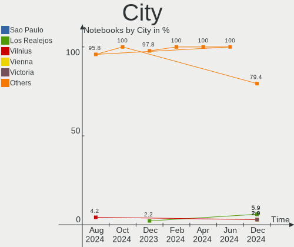
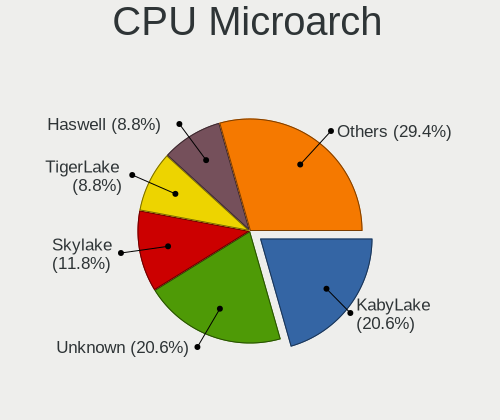
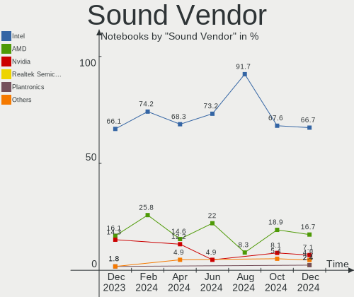
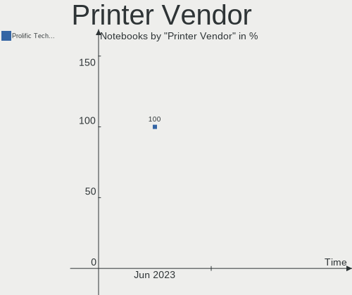
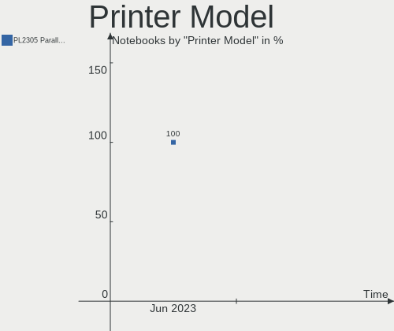

FreeBSD Hardware Trends (Notebook)
----------------------------------

A project to identify most popular hardware characteristics and track their change
over time based on data collected by FreeBSD users at https://BSD-Hardware.info.

Anyone can contribute to the study by uploading probes of their computers by
the [hw-probe](https://github.com/linuxhw/hw-probe/blob/master/INSTALL.BSD.md) tool:

    hw-probe -all -upload

Full-feature report is available here: https://bsd-hardware.info/?view=trends&formfactor=notebook

Period: Mar, 2021.

Contents
--------

- [ OS                       ](#os)
- [ OS Family                ](#os-family)
- [ Arch                     ](#arch)
- [ DE                       ](#de)
- [ Display Server           ](#display-server)
- [ Display Manager          ](#display-manager)
- [ OS Lang                  ](#os-lang)
- [ Boot Mode                ](#boot-mode)
- [ Filesystem               ](#filesystem)
- [ Part. scheme             ](#part-scheme)
- [ Country                  ](#country)
- [ City                     ](#city)
- [ Vendor                   ](#vendor)
- [ Model                    ](#model)
- [ Model Family             ](#model-family)
- [ MFG Year                 ](#mfg-year)
- [ Form Factor              ](#form-factor)
- [ Coreboot                 ](#coreboot)
- [ RAM Size                 ](#ram-size)
- [ RAM Used                 ](#ram-used)
- [ Has CD-ROM               ](#has-cd-rom)
- [ Total Drives             ](#total-drives)
- [ Has Ethernet             ](#has-ethernet)
- [ Has WiFi                 ](#has-wifi)
- [ Has Bluetooth            ](#has-bluetooth)
- [ Drive Vendor             ](#drive-vendor)
- [ Drive Model              ](#drive-model)
- [ HDD Vendor               ](#hdd-vendor)
- [ SSD Vendor               ](#ssd-vendor)
- [ Drive Kind               ](#drive-kind)
- [ Drive Connector          ](#drive-connector)
- [ Drive Size               ](#drive-size)
- [ Space Total              ](#space-total)
- [ Space Used               ](#space-used)
- [ Malfunc. Drives          ](#malfunc-drives)
- [ Malfunc. Drive Vendor    ](#malfunc-drive-vendor)
- [ Malfunc. HDD Vendor      ](#malfunc-hdd-vendor)
- [ Malfunc. Drive Kind      ](#malfunc-drive-kind)
- [ Failed Drives            ](#failed-drives)
- [ Failed Drive Vendor      ](#failed-drive-vendor)
- [ Drive Status             ](#drive-status)
- [ Storage Vendor           ](#storage-vendor)
- [ Storage Model            ](#storage-model)
- [ Storage Kind             ](#storage-kind)
- [ CPU Vendor               ](#cpu-vendor)
- [ CPU Model                ](#cpu-model)
- [ CPU Model Family         ](#cpu-model-family)
- [ CPU Cores                ](#cpu-cores)
- [ CPU Sockets              ](#cpu-sockets)
- [ CPU Threads              ](#cpu-threads)
- [ CPU Microarch            ](#cpu-microarch)
- [ GPU Vendor               ](#gpu-vendor)
- [ GPU Model                ](#gpu-model)
- [ GPU Combo                ](#gpu-combo)
- [ GPU Driver               ](#gpu-driver)
- [ GPU Memory               ](#gpu-memory)
- [ Monitor Vendor           ](#monitor-vendor)
- [ Monitor Model            ](#monitor-model)
- [ Monitor Resolution       ](#monitor-resolution)
- [ Monitor Diagonal         ](#monitor-diagonal)
- [ Monitor Width            ](#monitor-width)
- [ Aspect Ratio             ](#aspect-ratio)
- [ Monitor Area             ](#monitor-area)
- [ Pixel Density            ](#pixel-density)
- [ Multiple Monitors        ](#multiple-monitors)
- [ Net Controller Vendor    ](#net-controller-vendor)
- [ Net Controller Model     ](#net-controller-model)
- [ Wireless Vendor          ](#wireless-vendor)
- [ Wireless Model           ](#wireless-model)
- [ Ethernet Vendor          ](#ethernet-vendor)
- [ Ethernet Model           ](#ethernet-model)
- [ Net Controller Kind      ](#net-controller-kind)
- [ Used Controller          ](#used-controller)
- [ NICs                     ](#nics)
- [ IPv6                     ](#ipv6)
- [ Memory Vendor            ](#memory-vendor)
- [ Memory Model             ](#memory-model)
- [ Memory Kind              ](#memory-kind)
- [ Memory Form Factor       ](#memory-form-factor)
- [ Memory Size              ](#memory-size)
- [ Memory Speed             ](#memory-speed)
- [ Sound Vendor             ](#sound-vendor)
- [ Sound Model              ](#sound-model)
- [ Camera Vendor            ](#camera-vendor)
- [ Camera Model             ](#camera-model)
- [ Fingerprint Vendor       ](#fingerprint-vendor)
- [ Fingerprint Model        ](#fingerprint-model)
- [ Chipcard Vendor          ](#chipcard-vendor)
- [ Chipcard Model           ](#chipcard-model)
- [ Printer Vendor           ](#printer-vendor)
- [ Printer Model            ](#printer-model)
- [ Scanner Vendor           ](#scanner-vendor)
- [ Scanner Model            ](#scanner-model)
- [ Bluetooth Vendor         ](#bluetooth-vendor)
- [ Bluetooth Model          ](#bluetooth-model)
- [ Unsupported Devices      ](#unsupported-devices)
- [ Unsupported Device Types ](#unsupported-device-types)

OS
--

Installed operating systems

| Name                 | Notebooks | Percent |
|----------------------|-----------|---------|
| FreeBSD 12.2-p4      | 16        | 29.63%  |
| FreeBSD 12.2         | 6         | 11.11%  |
| FreeBSD 14.0-CURRENT | 5         | 9.26%   |
| FreeBSD 13.0-RC1     | 5         | 9.26%   |
| FreeBSD 13.0-RC2     | 4         | 7.41%   |
| FreeBSD 13.0-STABLE  | 3         | 5.56%   |
| FreeBSD 13.0-RC3     | 3         | 5.56%   |
| FreeBSD 12.2-p5      | 3         | 5.56%   |
| FreeBSD 13.0-BETA4   | 2         | 3.7%    |
| FreeBSD 12.2-STABLE  | 2         | 3.7%    |
| FreeBSD 11.4-p8      | 2         | 3.7%    |
| FreeBSD 12.2-p2      | 1         | 1.85%   |
| FreeBSD 12.1-p8      | 1         | 1.85%   |
| FreeBSD 12.1         | 1         | 1.85%   |

OS Family
---------

OS without a version

| Name    | Notebooks | Percent |
|---------|-----------|---------|
| FreeBSD | 54        | 100%    |

Arch
----

OS architecture (x86_64, i586, etc.)

| Name  | Notebooks | Percent |
|-------|-----------|---------|
| amd64 | 50        | 92.59%  |
| i386  | 4         | 7.41%   |

DE
--

Desktop Environment

| Name          | Notebooks | Percent |
|---------------|-----------|---------|
| XFCE          | 13        | 24.07%  |
| KDE5          | 8         | 14.81%  |
| TWM           | 7         | 12.96%  |
| GNOME         | 7         | 12.96%  |
| Console       | 4         | 7.41%   |
| i3            | 3         | 5.56%   |
| LXDE          | 2         | 3.7%    |
| Enlightenment | 2         | 3.7%    |
| Cinnamon      | 2         | 3.7%    |
| AwesomeWM     | 2         | 3.7%    |
| Openbox       | 1         | 1.85%   |
| MATE          | 1         | 1.85%   |
| LXQt          | 1         | 1.85%   |
| dwm           | 1         | 1.85%   |

Display Server
--------------

X11 or Wayland

| Name    | Notebooks | Percent |
|---------|-----------|---------|
| X11     | 47        | 87.04%  |
| Console | 6         | 11.11%  |
| Wayland | 1         | 1.85%   |

Display Manager
---------------

SDDM, LightDM, etc.

| Name    | Notebooks | Percent |
|---------|-----------|---------|
| Console | 22        | 40.74%  |
| SLiM    | 13        | 24.07%  |
| SDDM    | 6         | 11.11%  |
| GDM     | 5         | 9.26%   |
| XDM     | 4         | 7.41%   |
| LightDM | 3         | 5.56%   |
| Ly      | 1         | 1.85%   |

OS Lang
-------

Language

| Lang             | Notebooks | Percent |
|------------------|-----------|---------|
| Unknown          | 19        | 35.19%  |
| C                | 13        | 24.07%  |
| en_US            | 6         | 11.11%  |
| ru_RU            | 4         | 7.41%   |
| uk_UA            | 2         | 3.7%    |
| fr_FR            | 2         | 3.7%    |
| zh_CN            | 1         | 1.85%   |
| pl_PL            | 1         | 1.85%   |
| en_NZ            | 1         | 1.85%   |
| en_GB.US-ASCII   | 1         | 1.85%   |
| en_GB            | 1         | 1.85%   |
| de_DE.ISO8859-15 | 1         | 1.85%   |
| de_DE.ISO8859-1  | 1         | 1.85%   |
| de_CH            | 1         | 1.85%   |

Boot Mode
---------

EFI or BIOS

| Mode | Notebooks | Percent |
|------|-----------|---------|
| EFI  | 37        | 68.52%  |
| BIOS | 17        | 31.48%  |

Filesystem
----------

Type of filesystem

| Type | Notebooks | Percent |
|------|-----------|---------|
| Zfs  | 32        | 59.26%  |
| Ufs  | 22        | 40.74%  |

Part. scheme
------------

Scheme of partitioning

| Type | Notebooks | Percent |
|------|-----------|---------|
| GPT  | 46        | 85.19%  |
| MBR  | 8         | 14.81%  |

Country
-------

Geographic location (country)

| Country     | Notebooks | Percent |
|-------------|-----------|---------|
| USA         | 10        | 18.52%  |
| Russia      | 8         | 14.81%  |
| France      | 7         | 12.96%  |
| Germany     | 4         | 7.41%   |
| Ukraine     | 3         | 5.56%   |
| UK          | 3         | 5.56%   |
| Spain       | 3         | 5.56%   |
| Switzerland | 2         | 3.7%    |
| Portugal    | 2         | 3.7%    |
| Netherlands | 2         | 3.7%    |
| China       | 2         | 3.7%    |
| Brazil      | 2         | 3.7%    |
| Sweden      | 1         | 1.85%   |
| Poland      | 1         | 1.85%   |
| New Zealand | 1         | 1.85%   |
| Italy       | 1         | 1.85%   |
| Canada      | 1         | 1.85%   |
| Austria     | 1         | 1.85%   |

City
----

Geographic location (city)

| City                     | Notebooks | Percent |
|--------------------------|-----------|---------|
| Moscow                   | 4         | 7.41%   |
| Brooklyn                 | 4         | 7.41%   |
| Paris                    | 2         | 3.7%    |
| Manaus                   | 2         | 3.7%    |
| Gibraleón               | 2         | 3.7%    |
| Brovary                  | 2         | 3.7%    |
| Zurich                   | 1         | 1.85%   |
| Wuxi                     | 1         | 1.85%   |
| Vyshhorod                | 1         | 1.85%   |
| Vorkuta                  | 1         | 1.85%   |
| Villeneuve-Saint-Georges | 1         | 1.85%   |
| Ulyanovsk                | 1         | 1.85%   |
| Trosa                    | 1         | 1.85%   |
| Tolyatti                 | 1         | 1.85%   |
| Ramerberg                | 1         | 1.85%   |
| Parndorf                 | 1         | 1.85%   |
| Novosibirsk              | 1         | 1.85%   |
| Mions                    | 1         | 1.85%   |
| Medford                  | 1         | 1.85%   |
| Marseille                | 1         | 1.85%   |
| Markt Indersdorf         | 1         | 1.85%   |
| Lübeck                  | 1         | 1.85%   |
| Lanton                   | 1         | 1.85%   |
| Laguna Niguel            | 1         | 1.85%   |
| Ilhavo                   | 1         | 1.85%   |
| Hoek van Holland         | 1         | 1.85%   |
| Guimarães               | 1         | 1.85%   |
| Glasgow                  | 1         | 1.85%   |
| Frisco                   | 1         | 1.85%   |
| Dangchang Chengguanzhen  | 1         | 1.85%   |
| Częstochowa             | 1         | 1.85%   |
| Coventry                 | 1         | 1.85%   |
| Christchurch             | 1         | 1.85%   |
| Chicago                  | 1         | 1.85%   |
| Carlsbad                 | 1         | 1.85%   |
| Brighton                 | 1         | 1.85%   |
| Brescia                  | 1         | 1.85%   |
| Bremen                   | 1         | 1.85%   |
| Beloeil                  | 1         | 1.85%   |
| Bedford                  | 1         | 1.85%   |
| Beaumes-de-Venise        | 1         | 1.85%   |
| Basel                    | 1         | 1.85%   |
| Barcelona                | 1         | 1.85%   |
| Amsterdam                | 1         | 1.85%   |

Vendor
------

Motherboard manufacturer

| Name                   | Notebooks | Percent |
|------------------------|-----------|---------|
| Lenovo                 | 22        | 40.74%  |
| Dell                   | 7         | 12.96%  |
| Hewlett-Packard        | 6         | 11.11%  |
| Samsung Electronics    | 3         | 5.56%   |
| ASUSTek Computer       | 3         | 5.56%   |
| Clevo                  | 2         | 3.7%    |
| Apple                  | 2         | 3.7%    |
| Toshiba                | 1         | 1.85%   |
| Packard Bell           | 1         | 1.85%   |
| Notebook               | 1         | 1.85%   |
| MSI                    | 1         | 1.85%   |
| HUAWEI                 | 1         | 1.85%   |
| Gateway                | 1         | 1.85%   |
| Avell High Performance | 1         | 1.85%   |
| Alienware              | 1         | 1.85%   |
| Acer                   | 1         | 1.85%   |

Model
-----

Motherboard model

| Name                                     | Notebooks | Percent |
|------------------------------------------|-----------|---------|
| Toshiba Satellite L50-C                  | 1         | 1.85%   |
| Samsung N150P                            | 1         | 1.85%   |
| Samsung N145P/N250P/N260P                | 1         | 1.85%   |
| Samsung 950XCJ/951XCJ/950XCR             | 1         | 1.85%   |
| Packard Bell AOA110                      | 1         | 1.85%   |
| Notebook N85_N87HCHNHZ                   | 1         | 1.85%   |
| MSI GE75 Raider 10SGS                    | 1         | 1.85%   |
| Lenovo ThinkPad X395 20NL001SMX          | 1         | 1.85%   |
| Lenovo ThinkPad X270 W10DG 20K5S0DS00    | 1         | 1.85%   |
| Lenovo ThinkPad X220 4291IR6             | 1         | 1.85%   |
| Lenovo ThinkPad X220 4290EE8             | 1         | 1.85%   |
| Lenovo ThinkPad X200s 7470W1V            | 1         | 1.85%   |
| Lenovo ThinkPad X1 Carbon 7th 20QDCTO1WW | 1         | 1.85%   |
| Lenovo ThinkPad X1 Carbon 3rd 20BT0018US | 1         | 1.85%   |
| Lenovo ThinkPad X1 Carbon 3rd 20BT000BUS | 1         | 1.85%   |
| Lenovo ThinkPad T60 20076PU              | 1         | 1.85%   |
| Lenovo ThinkPad T590 20N4CTO1WW          | 1         | 1.85%   |
| Lenovo ThinkPad T490 20N3X50500          | 1         | 1.85%   |
| Lenovo ThinkPad T490 20N20009FR          | 1         | 1.85%   |
| Lenovo ThinkPad T480s 20L7001HRT         | 1         | 1.85%   |
| Lenovo ThinkPad T470 20HES5PK00          | 1         | 1.85%   |
| Lenovo ThinkPad R61 77331CU              | 1         | 1.85%   |
| Lenovo ThinkPad P15 Gen 1 20ST005VRT     | 1         | 1.85%   |
| Lenovo ThinkPad L590 20Q7000YSP          | 1         | 1.85%   |
| Lenovo ThinkPad L530 24812TG             | 1         | 1.85%   |
| Lenovo ThinkPad E490 20N8CTO1WW          | 1         | 1.85%   |
| Lenovo ThinkPad E460 20ETA00DCD          | 1         | 1.85%   |
| Lenovo Legion 5 15IMH05 82AU             | 1         | 1.85%   |
| Lenovo IdeaPad Y700-15ISK 80NV           | 1         | 1.85%   |
| HUAWEI MACH-WX9                          | 1         | 1.85%   |
| HP ProBook 455 G7                        | 1         | 1.85%   |
| HP Pavilion Gaming Laptop 17-cd0xxx      | 1         | 1.85%   |
| HP EliteBook Folio 9470m                 | 1         | 1.85%   |
| HP EliteBook 8570p                       | 1         | 1.85%   |
| HP EliteBook 820 G1                      | 1         | 1.85%   |
| HP 255 G3                                | 1         | 1.85%   |
| Gateway Solo 450                         | 1         | 1.85%   |
| Dell Precision M4600                     | 1         | 1.85%   |
| Dell Precision 3541                      | 1         | 1.85%   |
| Dell Latitude E6440                      | 1         | 1.85%   |
| Dell Latitude 7390                       | 1         | 1.85%   |
| Dell Latitude 5580                       | 1         | 1.85%   |
| Dell Latitude 3410                       | 1         | 1.85%   |
| Dell Inspiron 7566                       | 1         | 1.85%   |
| Clevo W55xEU                             | 1         | 1.85%   |
| Clevo W240EU/W250EUQ/W270EUQ             | 1         | 1.85%   |
| Avell High Performance A62               | 1         | 1.85%   |
| ASUS 900A                                | 1         | 1.85%   |
| ASUS 1225B                               | 1         | 1.85%   |
| ASUS 1015BX                              | 1         | 1.85%   |
| Apple MacBookPro6,2                      | 1         | 1.85%   |
| Apple MacBook3,1                         | 1         | 1.85%   |
| Alienware 14                             | 1         | 1.85%   |
| Acer Extensa 5630                        | 1         | 1.85%   |

Model Family
------------

Motherboard model prefix

| Name                       | Notebooks | Percent |
|----------------------------|-----------|---------|
| Lenovo ThinkPad            | 20        | 37.04%  |
| Dell Latitude              | 4         | 7.41%   |
| HP EliteBook               | 3         | 5.56%   |
| Dell Precision             | 2         | 3.7%    |
| Toshiba Satellite          | 1         | 1.85%   |
| Samsung N150P              | 1         | 1.85%   |
| Samsung N145P              | 1         | 1.85%   |
| Samsung 950XCJ             | 1         | 1.85%   |
| Packard Bell AOA110        | 1         | 1.85%   |
| Notebook N85               | 1         | 1.85%   |
| MSI GE75                   | 1         | 1.85%   |
| Lenovo Legion              | 1         | 1.85%   |
| Lenovo IdeaPad             | 1         | 1.85%   |
| HUAWEI MACH-WX9            | 1         | 1.85%   |
| HP ProBook                 | 1         | 1.85%   |
| HP Pavilion                | 1         | 1.85%   |
| HP 255                     | 1         | 1.85%   |
| Gateway Solo               | 1         | 1.85%   |
| Dell Inspiron              | 1         | 1.85%   |
| Clevo W55xEU               | 1         | 1.85%   |
| Clevo W240EU               | 1         | 1.85%   |
| Avell High Performance A62 | 1         | 1.85%   |
| ASUS 900A                  | 1         | 1.85%   |
| ASUS 1225B                 | 1         | 1.85%   |
| ASUS 1015BX                | 1         | 1.85%   |
| Apple MacBookPro6          | 1         | 1.85%   |
| Apple MacBook3             | 1         | 1.85%   |
| Alienware 14               | 1         | 1.85%   |
| Acer Extensa               | 1         | 1.85%   |

MFG Year
--------

Motherboard manufacture year

| Year | Notebooks | Percent |
|------|-----------|---------|
| 2020 | 19        | 35.19%  |
| 2019 | 7         | 12.96%  |
| 2018 | 5         | 9.26%   |
| 2012 | 4         | 7.41%   |
| 2011 | 3         | 5.56%   |
| 2015 | 2         | 3.7%    |
| 2014 | 2         | 3.7%    |
| 2009 | 2         | 3.7%    |
| 2008 | 2         | 3.7%    |
| 2021 | 1         | 1.85%   |
| 2017 | 1         | 1.85%   |
| 2016 | 1         | 1.85%   |
| 2013 | 1         | 1.85%   |
| 2010 | 1         | 1.85%   |
| 2007 | 1         | 1.85%   |
| 2006 | 1         | 1.85%   |
| 2002 | 1         | 1.85%   |

Form Factor
-----------

Physical design of the computer

| Name     | Notebooks | Percent |
|----------|-----------|---------|
| Notebook | 54        | 100%    |

Coreboot
--------

Have coreboot on board

| Used | Notebooks | Percent |
|------|-----------|---------|
| No   | 54        | 100%    |

RAM Size
--------

Total RAM memory

| Size in GB  | Notebooks | Percent |
|-------------|-----------|---------|
| 16.01-24.0  | 18        | 33.33%  |
| 8.01-16.0   | 14        | 25.93%  |
| 4.01-8.0    | 9         | 16.67%  |
| 32.01-64.0  | 6         | 11.11%  |
| 2.01-3.0    | 4         | 7.41%   |
| 64.01-256.0 | 1         | 1.85%   |
| 1.01-2.0    | 1         | 1.85%   |
| 0.01-0.5    | 1         | 1.85%   |

RAM Used
--------

Used RAM memory

| Used GB    | Notebooks | Percent |
|------------|-----------|---------|
| 0.51-1.0   | 23        | 42.59%  |
| 0.01-0.5   | 20        | 37.04%  |
| 1.01-2.0   | 5         | 9.26%   |
| 2.01-3.0   | 2         | 3.7%    |
| 8.01-16.0  | 2         | 3.7%    |
| 32.01-64.0 | 1         | 1.85%   |
| 0          | 1         | 1.85%   |

Has CD-ROM
----------

Has CD-ROM on board

| Presented | Notebooks | Percent |
|-----------|-----------|---------|
| No        | 41        | 75.93%  |
| Yes       | 13        | 24.07%  |

Total Drives
------------

Number of drives on board

| Drives | Notebooks | Percent |
|--------|-----------|---------|
| 1      | 36        | 66.67%  |
| 2      | 15        | 27.78%  |
| 0      | 3         | 5.56%   |

Has Ethernet
------------

Has Ethernet on board

| Presented | Notebooks | Percent |
|-----------|-----------|---------|
| Yes       | 51        | 94.44%  |
| No        | 3         | 5.56%   |

Has WiFi
--------

Has WiFi module

| Presented | Notebooks | Percent |
|-----------|-----------|---------|
| Yes       | 51        | 94.44%  |
| No        | 3         | 5.56%   |

Has Bluetooth
-------------

Has Bluetooth module

| Presented | Notebooks | Percent |
|-----------|-----------|---------|
| Yes       | 35        | 64.81%  |
| No        | 19        | 35.19%  |

Drive Vendor
------------

Hard drive vendors

| Vendor              | Notebooks | Drives | Percent |
|---------------------|-----------|--------|---------|
| Samsung Electronics | 14        | 15     | 22.58%  |
| WDC                 | 9         | 10     | 14.52%  |
| Intel               | 5         | 5      | 8.06%   |
| Toshiba             | 4         | 4      | 6.45%   |
| Seagate             | 4         | 5      | 6.45%   |
| SanDisk             | 3         | 3      | 4.84%   |
| SK Hynix            | 2         | 2      | 3.23%   |
| Phison              | 2         | 2      | 3.23%   |
| OWC                 | 2         | 2      | 3.23%   |
| Kingston            | 2         | 2      | 3.23%   |
| Hitachi             | 2         | 3      | 3.23%   |
| A-DATA Technology   | 2         | 2      | 3.23%   |
| Zheino              | 1         | 1      | 1.61%   |
| Union Memory        | 1         | 1      | 1.61%   |
| Transcend           | 1         | 1      | 1.61%   |
| LITEON              | 1         | 1      | 1.61%   |
| KingSpec            | 1         | 1      | 1.61%   |
| HGST                | 1         | 1      | 1.61%   |
| Gigabyte Technology | 1         | 1      | 1.61%   |
| Crucial             | 1         | 1      | 1.61%   |
| Corsair             | 1         | 1      | 1.61%   |
| China               | 1         | 1      | 1.61%   |
| Apacer              | 1         | 1      | 1.61%   |

Drive Model
-----------

Hard drive models

| Model                                           | Notebooks | Percent |
|-------------------------------------------------|-----------|---------|
| SK Hynix BC511 NVMe 512GB                       | 2         | 3.08%   |
| Samsung SSD 850 EVO 250GB                       | 2         | 3.08%   |
| Phison PCIe SSD 2TB                             | 2         | 3.08%   |
| OWC Mercury Electra 6G SSD                      | 2         | 3.08%   |
| Intel SSDPEKNW512G8H 512GB                      | 2         | 3.08%   |
| Zheino CHN mSATA01M 060 64GB                    | 1         | 1.54%   |
| WDC WDS120G2G0A-00JH30 120GB                    | 1         | 1.54%   |
| WDC WDS100T3X0C-00SJG0 1TB                      | 1         | 1.54%   |
| WDC WD7500BPKX-75HPJT0 752GB                    | 1         | 1.54%   |
| WDC WD20SPZX-75UA7T0 2TB                        | 1         | 1.54%   |
| WDC WD20SPZX-22UA7T0 2TB                        | 1         | 1.54%   |
| WDC WD20SPZX-22CRAT0 2TB                        | 1         | 1.54%   |
| WDC WD15EARS-00Z5B1 1.5TB                       | 1         | 1.54%   |
| WDC PC SN730 SDBQNTY-256G-1001 256GB            | 1         | 1.54%   |
| WDC PC SN730 SDBPNTY-1T00-1032 1TB              | 1         | 1.54%   |
| Union Memory UMIS LENSE40256GMSP34MESTB3A 256GB | 1         | 1.54%   |
| Transcend TS128GMTS430S 128GB                   | 1         | 1.54%   |
| Toshiba THNSFJ256GDNU 256GB                     | 1         | 1.54%   |
| Toshiba MQ01ABF050 500GB                        | 1         | 1.54%   |
| Toshiba KXG60ZNV512G NVMe 512GB                 | 1         | 1.54%   |
| Toshiba KBG30ZMT512G 512GB                      | 1         | 1.54%   |
| Seagate ST9500325AS 500GB                       | 1         | 1.54%   |
| Seagate ST500LT012-1DG142 500GB                 | 1         | 1.54%   |
| Seagate ST2000LM007-1R8174 2TB                  | 1         | 1.54%   |
| Seagate ST1000LM048-2E7172 1TB                  | 1         | 1.54%   |
| Seagate ST1000LM024 HN-M101MBB 1TB              | 1         | 1.54%   |
| SanDisk SSD PLUS 240GB                          | 1         | 1.54%   |
| SanDisk SDSSDH3500G 500GB                       | 1         | 1.54%   |
| SanDisk SDSSDH3 500G                            | 1         | 1.54%   |
| Samsung SSD 970 EVO Plus 500GB                  | 1         | 1.54%   |
| Samsung SSD 960 PRO 512GB                       | 1         | 1.54%   |
| Samsung SSD 860 PRO 512GB                       | 1         | 1.54%   |
| Samsung SSD 860 EVO 500GB                       | 1         | 1.54%   |
| Samsung SSD 850 PRO 512GB                       | 1         | 1.54%   |
| Samsung SSD 850 EVO 500GB                       | 1         | 1.54%   |
| Samsung SSD 830 Series 64GB                     | 1         | 1.54%   |
| Samsung MZVLB512HBJQ-000 512GB                  | 1         | 1.54%   |
| Samsung MZVLB512HAJQ-000L7 512GB                | 1         | 1.54%   |
| Samsung MZVLB512HAJQ-00000 512GB                | 1         | 1.54%   |
| Samsung MZVLB1T0HBLR-000L7 1TB                  | 1         | 1.54%   |
| Samsung MZVLB1T0HBLR-000L2 1TB                  | 1         | 1.54%   |
| Samsung MZNLN256HCHP-000L7 256GB                | 1         | 1.54%   |
| LITEON CV1-8B512 512GB                          | 1         | 1.54%   |
| Kingston SUV500MS480G 480GB                     | 1         | 1.54%   |
| Kingston SA400S37480G 480GB                     | 1         | 1.54%   |
| KingSpec KSD-PA25.6-128MS 128GB                 | 1         | 1.54%   |
| Intel SSDPEKKF512G8L 512GB                      | 1         | 1.54%   |
| Intel SSDPEKKF256G8L 256GB                      | 1         | 1.54%   |
| Intel SSDPEKKF256G7L 256GB                      | 1         | 1.54%   |
| Hitachi HTS545016B9A300 160GB                   | 1         | 1.54%   |
| Hitachi HTS543225L9A300 250GB                   | 1         | 1.54%   |
| Hitachi HDS721616PLA380 160GB                   | 1         | 1.54%   |
| HGST HTS725050A7E630 500GB                      | 1         | 1.54%   |
| Gigabyte GP-GSTFS31120GNTD 120GB                | 1         | 1.54%   |
| Crucial CT960M500SSD1 960GB                     | 1         | 1.54%   |
| Corsair CSSD-V64GB2                             | 1         | 1.54%   |
| China SH00M240GB                                | 1         | 1.54%   |
| Apacer AS350 256GB                              | 1         | 1.54%   |
| A-DATA SP900 128GB                              | 1         | 1.54%   |
| A-DATA IM2P33F8BR1-512GB                        | 1         | 1.54%   |

HDD Vendor
----------

Hard disk drive vendors

| Vendor  | Notebooks | Drives | Percent |
|---------|-----------|--------|---------|
| WDC     | 5         | 5      | 38.46%  |
| Seagate | 4         | 5      | 30.77%  |
| Hitachi | 2         | 3      | 15.38%  |
| Toshiba | 1         | 1      | 7.69%   |
| HGST    | 1         | 1      | 7.69%   |

SSD Vendor
----------

Solid state drive vendors

| Vendor              | Notebooks | Drives | Percent |
|---------------------|-----------|--------|---------|
| Samsung Electronics | 8         | 8      | 29.63%  |
| SanDisk             | 3         | 3      | 11.11%  |
| OWC                 | 2         | 2      | 7.41%   |
| Kingston            | 2         | 2      | 7.41%   |
| Zheino              | 1         | 1      | 3.7%    |
| WDC                 | 1         | 1      | 3.7%    |
| Transcend           | 1         | 1      | 3.7%    |
| Toshiba             | 1         | 1      | 3.7%    |
| LITEON              | 1         | 1      | 3.7%    |
| KingSpec            | 1         | 1      | 3.7%    |
| Gigabyte Technology | 1         | 1      | 3.7%    |
| Crucial             | 1         | 1      | 3.7%    |
| Corsair             | 1         | 1      | 3.7%    |
| China               | 1         | 1      | 3.7%    |
| Apacer              | 1         | 1      | 3.7%    |
| A-DATA Technology   | 1         | 1      | 3.7%    |

Drive Kind
----------

HDD or SSD

| Kind | Notebooks | Drives | Percent |
|------|-----------|--------|---------|
| SSD  | 26        | 27     | 42.62%  |
| NVMe | 23        | 24     | 37.7%   |
| HDD  | 12        | 15     | 19.67%  |

Drive Connector
---------------

SATA, SAS, NVMe, etc.

| Type | Notebooks | Drives | Percent |
|------|-----------|--------|---------|
| SATA | 37        | 42     | 61.67%  |
| NVMe | 23        | 24     | 38.33%  |

Drive Size
----------

Size of hard drive

| Size in TB | Notebooks | Drives | Percent |
|------------|-----------|--------|---------|
| 0.01-0.5   | 28        | 30     | 70%     |
| 0.51-1.0   | 7         | 7      | 17.5%   |
| 1.01-2.0   | 5         | 5      | 12.5%   |

Space Total
-----------

Amount of disk space available on the file system

| Size in GB | Notebooks | Percent |
|------------|-----------|---------|
| 251-500    | 18        | 33.33%  |
| 101-250    | 16        | 29.63%  |
| 21-50      | 6         | 11.11%  |
| 1-20       | 4         | 7.41%   |
| 51-100     | 4         | 7.41%   |
| 501-1000   | 3         | 5.56%   |
| 1001-2000  | 2         | 3.7%    |
| 2001-3000  | 1         | 1.85%   |

Space Used
----------

Amount of used disk space

| Used GB  | Notebooks | Percent |
|----------|-----------|---------|
| 1-20     | 37        | 68.52%  |
| 21-50    | 9         | 16.67%  |
| 51-100   | 4         | 7.41%   |
| 101-250  | 3         | 5.56%   |
| 501-1000 | 1         | 1.85%   |

Malfunc. Drives
---------------

Drive models with a malfunction

| Model                              | Notebooks | Drives | Percent |
|------------------------------------|-----------|--------|---------|
| WDC WD15EARS-00Z5B1 1.5TB          | 1         | 1      | 20%     |
| Seagate ST500LT012-1DG142 500GB    | 1         | 1      | 20%     |
| Seagate ST1000LM024 HN-M101MBB 1TB | 1         | 1      | 20%     |
| Hitachi HTS543225L9A300 250GB      | 1         | 1      | 20%     |
| HGST HTS725050A7E630 500GB         | 1         | 1      | 20%     |

Malfunc. Drive Vendor
---------------------

Vendors of faulty drives

| Vendor  | Notebooks | Drives | Percent |
|---------|-----------|--------|---------|
| Seagate | 2         | 2      | 40%     |
| WDC     | 1         | 1      | 20%     |
| Hitachi | 1         | 1      | 20%     |
| HGST    | 1         | 1      | 20%     |

Malfunc. HDD Vendor
-------------------

Vendors of faulty HDD drives

| Vendor  | Notebooks | Drives | Percent |
|---------|-----------|--------|---------|
| Seagate | 2         | 2      | 40%     |
| WDC     | 1         | 1      | 20%     |
| Hitachi | 1         | 1      | 20%     |
| HGST    | 1         | 1      | 20%     |

Malfunc. Drive Kind
-------------------

Kinds of faulty drives

| Kind | Notebooks | Drives | Percent |
|------|-----------|--------|---------|
| HDD  | 5         | 5      | 100%    |

Failed Drives
-------------

Failed drive models

Zero info for selected period =(

Failed Drive Vendor
-------------------

Failed drive vendors

Zero info for selected period =(

Drive Status
------------

Number of failed and malfunc. drives

| Status  | Notebooks | Drives | Percent |
|---------|-----------|--------|---------|
| Works   | 49        | 61     | 90.74%  |
| Malfunc | 5         | 5      | 9.26%   |

Storage Vendor
--------------

Storage controller vendors

| Vendor                  | Notebooks | Percent |
|-------------------------|-----------|---------|
| Intel                   | 41        | 66.13%  |
| Samsung Electronics     | 7         | 11.29%  |
| AMD                     | 4         | 6.45%   |
| Toshiba                 | 2         | 3.23%   |
| SK Hynix                | 2         | 3.23%   |
| Sandisk                 | 2         | 3.23%   |
| Phison Electronics      | 2         | 3.23%   |
| Union Memory (Shenzhen) | 1         | 1.61%   |
| ADATA Technology        | 1         | 1.61%   |

Storage Model
-------------

Storage controller models

| Model                                                                            | Notebooks | Percent |
|----------------------------------------------------------------------------------|-----------|---------|
| Samsung NVMe SSD Controller SM981/PM981/PM983                                    | 6         | 8.82%   |
| Intel Sunrise Point-LP SATA Controller [AHCI mode]                               | 4         | 5.88%   |
| Intel 7 Series Chipset Family 6-port SATA Controller [AHCI mode]                 | 4         | 5.88%   |
| Intel HM170/QM170 Chipset SATA Controller [AHCI Mode]                            | 3         | 4.41%   |
| Intel 82801 Mobile SATA Controller [RAID mode]                                   | 3         | 4.41%   |
| Intel 6 Series/C200 Series Chipset Family 6 port Mobile SATA AHCI Controller     | 3         | 4.41%   |
| SK Hynix BC511                                                                   | 2         | 2.94%   |
| Sandisk WD Black SN750 / PC SN730 NVMe SSD                                       | 2         | 2.94%   |
| Phison E12 NVMe Controller                                                       | 2         | 2.94%   |
| Intel Wildcat Point-LP SATA Controller [AHCI Mode]                               | 2         | 2.94%   |
| Intel SSD Pro 7600p/760p/E 6100p Series                                          | 2         | 2.94%   |
| Intel SSD 660P Series                                                            | 2         | 2.94%   |
| Intel NM10/ICH7 Family SATA Controller [AHCI mode]                               | 2         | 2.94%   |
| Intel 82801IBM/IEM (ICH9M/ICH9M-E) 4 port SATA Controller [AHCI mode]            | 2         | 2.94%   |
| Intel 82801HM/HEM (ICH8M/ICH8M-E) SATA Controller [AHCI mode]                    | 2         | 2.94%   |
| Intel 82801HM/HEM (ICH8M/ICH8M-E) IDE Controller                                 | 2         | 2.94%   |
| Intel 82801GBM/GHM (ICH7-M Family) SATA Controller [IDE mode]                    | 2         | 2.94%   |
| Intel 400 Series Chipset Family SATA AHCI Controller                             | 2         | 2.94%   |
| AMD SB7x0/SB8x0/SB9x0 SATA Controller [AHCI mode]                                | 2         | 2.94%   |
| AMD FCH SATA Controller [AHCI mode]                                              | 2         | 2.94%   |
| Union Memory (Shenzhen) NVMe 256G SSD device                                     | 1         | 1.47%   |
| Toshiba XG6 NVMe SSD Controller                                                  | 1         | 1.47%   |
| Toshiba BG3 NVMe SSD Controller                                                  | 1         | 1.47%   |
| Samsung NVMe SSD Controller SM961/PM961/SM963                                    | 1         | 1.47%   |
| Intel SSD 600P Series                                                            | 1         | 1.47%   |
| Intel Comet Lake SATA AHCI Controller                                            | 1         | 1.47%   |
| Intel Cannon Lake Mobile PCH SATA AHCI Controller                                | 1         | 1.47%   |
| Intel Atom/Celeron/Pentium Processor x5-E8000/J3xxx/N3xxx Series SATA Controller | 1         | 1.47%   |
| Intel 82801GBM/GHM (ICH7-M Family) SATA Controller [AHCI mode]                   | 1         | 1.47%   |
| Intel 82801G (ICH7 Family) IDE Controller                                        | 1         | 1.47%   |
| Intel 82801CAM IDE U100 Controller                                               | 1         | 1.47%   |
| Intel 8 Series/C220 Series Chipset Family 6-port SATA Controller 1 [AHCI mode]   | 1         | 1.47%   |
| Intel 8 Series SATA Controller 1 [AHCI mode]                                     | 1         | 1.47%   |
| Intel 7 Series Chipset Family 4-port SATA Controller [IDE mode]                  | 1         | 1.47%   |
| Intel 7 Series Chipset Family 2-port SATA Controller [IDE mode]                  | 1         | 1.47%   |
| Intel 5 Series/3400 Series Chipset 4 port SATA AHCI Controller                   | 1         | 1.47%   |
| Unknown                                                                          | 1         | 1.47%   |

Storage Kind
------------

Kind of storage controller (IDE, SATA, NVMe, SAS, ...)

| Kind | Notebooks | Percent |
|------|-----------|---------|
| SATA | 35        | 52.24%  |
| NVMe | 22        | 32.84%  |
| IDE  | 7         | 10.45%  |
| RAID | 3         | 4.48%   |

CPU Vendor
----------

Processor vendors

| Vendor | Notebooks | Percent |
|--------|-----------|---------|
| Intel  | 49        | 90.74%  |
| AMD    | 5         | 9.26%   |

CPU Model
---------

Processor models

| Model                                           | Notebooks | Percent |
|-------------------------------------------------|-----------|---------|
| Intel Core i7-8565U CPU @ 1.80GHz               | 2         | 3.7%    |
| Intel Core i7-8550U CPU @ 1.80GHz               | 2         | 3.7%    |
| Intel Core i7-6700HQ CPU @ 2.60GHz              | 2         | 3.7%    |
| Intel Core i7-10750H CPU @ 2.60GHz              | 2         | 3.7%    |
| Intel Core i5-8265U CPU @ 1.60GHz               | 2         | 3.7%    |
| Intel C1                                        | 2         | 3.7%    |
| Intel Atom CPU N270 @ 1.60GHz                   | 2         | 3.7%    |
| Intel Xeon W-10885M CPU @ 2.40GHz               | 1         | 1.85%   |
| Intel Unknown                                   | 1         | 1.85%   |
| Intel Pentium CPU N3700 @ 1.60GHz               | 1         | 1.85%   |
| Intel Mobile Pentium 4                          | 1         | 1.85%   |
| Intel CPU Version                               | 1         | 1.85%   |
| Intel Core i7-9750H CPU @ 2.60GHz               | 1         | 1.85%   |
| Intel Core i7-8665U CPU @ 1.90GHz               | 1         | 1.85%   |
| Intel Core i7-7600U CPU @ 2.80GHz               | 1         | 1.85%   |
| Intel Core i7-7500U CPU @ 2.70GHz               | 1         | 1.85%   |
| Intel Core i7-5600U CPU @ 2.60GHz               | 1         | 1.85%   |
| Intel Core i7-4700MQ CPU @ 2.40GHz              | 1         | 1.85%   |
| Intel Core i7-3687U CPU @ 2.10GHz               | 1         | 1.85%   |
| Intel Core i7-3520M CPU @ 2.90GHz               | 1         | 1.85%   |
| Intel Core i7-2960XM CPU @ 2.70GH               | 1         | 1.85%   |
| Intel Core i7-10875H CPU @ 2.30GHz              | 1         | 1.85%   |
| Intel Core i7-10510U CPU @ 1.80GHz              | 1         | 1.85%   |
| Intel Core i5-9300H CPU @ 2.40GHz               | 1         | 1.85%   |
| Intel Core i5-8365U CPU @ 1.60GHz               | 1         | 1.85%   |
| Intel Core i5-7300U CPU @ 2.60GHz               | 1         | 1.85%   |
| Intel Core i5-7300HQ CPU @ 2.50GHz              | 1         | 1.85%   |
| Intel Core i5-6300U CPU @ 2.40GHz               | 1         | 1.85%   |
| Intel Core i5-6200U CPU @ 2.30GHz               | 1         | 1.85%   |
| Intel Core i5-5300U CPU @ 2.30GHz               | 1         | 1.85%   |
| Intel Core i5-4300M CPU @ 2.60GHz               | 1         | 1.85%   |
| Intel Core i5-4200U CPU @ 1.60GHz               | 1         | 1.85%   |
| Intel Core i5-3230M CPU @ 2.60GHz               | 1         | 1.85%   |
| Intel Core i5-3210M CPU @ 2.50GHz               | 1         | 1.85%   |
| Intel Core i5-2520M CPU @ 2.50GHz               | 1         | 1.85%   |
| Intel Core i5-2450M CPU @ 2.50GHz               | 1         | 1.85%   |
| Intel Core i5-10310U CPU @ 1.70GHz              | 1         | 1.85%   |
| Intel Core i5 CPU M 520 @ 2.40GHz               | 1         | 1.85%   |
| Intel Core i3-3130M CPU @ 2.60GHz               | 1         | 1.85%   |
| Intel Core 2 Duo CPU T7700 @ 2.40GHz            | 1         | 1.85%   |
| Intel Core 2 Duo CPU T7500 @ 2.20GHz            | 1         | 1.85%   |
| Intel Core 2 Duo CPU L9300 @ 1.60GHz            | 1         | 1.85%   |
| AMD Ryzen 7 4700U with Radeon Graphics          | 1         | 1.85%   |
| AMD Ryzen 5 PRO 3500U w/ Radeon Vega Mobile Gfx | 1         | 1.85%   |
| AMD E1-6010 APU with AMD Radeon R2 Graphics     | 1         | 1.85%   |
| AMD E-450 APU with Radeon HD Graphics           | 1         | 1.85%   |
| AMD C-50 Processor                              | 1         | 1.85%   |

CPU Model Family
----------------

Processor model prefix

| Model                  | Notebooks | Percent |
|------------------------|-----------|---------|
| Intel Core i7          | 19        | 35.19%  |
| Intel Core i5          | 17        | 31.48%  |
| Other                  | 4         | 7.41%   |
| Intel Core 2 Duo       | 3         | 5.56%   |
| Intel Atom             | 2         | 3.7%    |
| Intel Xeon             | 1         | 1.85%   |
| Intel Pentium          | 1         | 1.85%   |
| Intel Mobile Pentium 4 | 1         | 1.85%   |
| Intel Core i3          | 1         | 1.85%   |
| AMD Ryzen 7            | 1         | 1.85%   |
| AMD Ryzen 5 PRO        | 1         | 1.85%   |
| AMD E1                 | 1         | 1.85%   |
| AMD E                  | 1         | 1.85%   |
| AMD C-50               | 1         | 1.85%   |

CPU Cores
---------

Number of processor cores

| Number  | Notebooks | Percent |
|---------|-----------|---------|
| 2       | 21        | 38.89%  |
| 4       | 17        | 31.48%  |
| Unknown | 6         | 11.11%  |
| 8       | 4         | 7.41%   |
| 6       | 3         | 5.56%   |
| 1       | 3         | 5.56%   |

CPU Sockets
-----------

Number of sockets

| Number | Notebooks | Percent |
|--------|-----------|---------|
| 1      | 53        | 98.15%  |
| 2      | 1         | 1.85%   |

CPU Threads
-----------

Threads per core (Hyper-Threading)

| Number  | Notebooks | Percent |
|---------|-----------|---------|
| 2       | 39        | 72.22%  |
| 1       | 8         | 14.81%  |
| Unknown | 7         | 12.96%  |

CPU Microarch
-------------

Microarchitecture

| Name        | Notebooks | Percent |
|-------------|-----------|---------|
| KabyLake    | 16        | 29.63%  |
| IvyBridge   | 5         | 9.26%   |
| Skylake     | 4         | 7.41%   |
| CometLake   | 4         | 7.41%   |
| Bonnell     | 4         | 7.41%   |
| SandyBridge | 3         | 5.56%   |
| Haswell     | 3         | 5.56%   |
| Core        | 3         | 5.56%   |
| Penryn      | 2         | 3.7%    |
| Broadwell   | 2         | 3.7%    |
| Bobcat      | 2         | 3.7%    |
| Zen+        | 1         | 1.85%   |
| Zen 2       | 1         | 1.85%   |
| Westmere    | 1         | 1.85%   |
| Silvermont  | 1         | 1.85%   |
| Puma        | 1         | 1.85%   |
| NetBurst    | 1         | 1.85%   |

GPU Vendor
----------

Vendors of graphics cards

| Vendor | Notebooks | Percent |
|--------|-----------|---------|
| Intel  | 44        | 67.69%  |
| Nvidia | 12        | 18.46%  |
| AMD    | 9         | 13.85%  |

GPU Model
---------

Graphics card models

| Model                                                                                    | Notebooks | Percent |
|------------------------------------------------------------------------------------------|-----------|---------|
| Intel WhiskeyLake-U GT2 [UHD Graphics 620]                                               | 6         | 8.7%    |
| Intel 3rd Gen Core processor Graphics Controller                                         | 4         | 5.8%    |
| Intel HD Graphics 620                                                                    | 3         | 4.35%   |
| Nvidia TU117M                                                                            | 2         | 2.9%    |
| Intel UHD Graphics 620                                                                   | 2         | 2.9%    |
| Intel Skylake GT2 [HD Graphics 520]                                                      | 2         | 2.9%    |
| Intel Mobile GM965/GL960 Integrated Graphics Controller (secondary)                      | 2         | 2.9%    |
| Intel Mobile GM965/GL960 Integrated Graphics Controller (primary)                        | 2         | 2.9%    |
| Intel Mobile 945GSE Express Integrated Graphics Controller                               | 2         | 2.9%    |
| Intel Mobile 945GM/GMS/GME, 943/940GML Express Integrated Graphics Controller            | 2         | 2.9%    |
| Intel Mobile 4 Series Chipset Integrated Graphics Controller                             | 2         | 2.9%    |
| Intel HD Graphics 5500                                                                   | 2         | 2.9%    |
| Intel HD Graphics 530                                                                    | 2         | 2.9%    |
| Intel CometLake-U GT2 [UHD Graphics]                                                     | 2         | 2.9%    |
| Intel CometLake-H GT2 [UHD Graphics]                                                     | 2         | 2.9%    |
| Intel CoffeeLake-H GT2 [UHD Graphics 630]                                                | 2         | 2.9%    |
| Intel Atom Processor D4xx/D5xx/N4xx/N5xx Integrated Graphics Controller                  | 2         | 2.9%    |
| Intel 4th Gen Core Processor Integrated Graphics Controller                              | 2         | 2.9%    |
| Intel 2nd Generation Core Processor Family Integrated Graphics Controller                | 2         | 2.9%    |
| Nvidia TU117M [GeForce GTX 1650 Mobile / Max-Q]                                          | 1         | 1.45%   |
| Nvidia TU104M [GeForce RTX 2080 SUPER Mobile / Max-Q]                                    | 1         | 1.45%   |
| Nvidia TU104GLM [Quadro RTX 5000 Mobile / Max-Q]                                         | 1         | 1.45%   |
| Nvidia GT216M [GeForce GT 330M]                                                          | 1         | 1.45%   |
| Nvidia GP108M [GeForce MX150]                                                            | 1         | 1.45%   |
| Nvidia GP107GLM [Quadro P620]                                                            | 1         | 1.45%   |
| Nvidia GM107M [GeForce GTX 960M]                                                         | 1         | 1.45%   |
| Nvidia GM107M [GeForce GTX 950M]                                                         | 1         | 1.45%   |
| Nvidia GK106M [GeForce GTX 765M]                                                         | 1         | 1.45%   |
| Nvidia GF106GLM [Quadro 2000M]                                                           | 1         | 1.45%   |
| Intel HD Graphics 630                                                                    | 1         | 1.45%   |
| Intel Haswell-ULT Integrated Graphics Controller                                         | 1         | 1.45%   |
| Intel Core Processor Integrated Graphics Controller                                      | 1         | 1.45%   |
| Intel Comet Lake-H WS GT2 Integrated UHD Graphics Controller                             | 1         | 1.45%   |
| Intel Atom/Celeron/Pentium Processor x5-E8000/J3xxx/N3xxx Integrated Graphics Controller | 1         | 1.45%   |
| AMD Wrestler [Radeon HD 6320]                                                            | 1         | 1.45%   |
| AMD Wrestler [Radeon HD 6250]                                                            | 1         | 1.45%   |
| AMD Thames [Radeon HD 7550M/7570M/7650M]                                                 | 1         | 1.45%   |
| AMD Sun XT [Radeon HD 8670A/8670M/8690M / R5 M330 / M430 / Radeon 520 Mobile]            | 1         | 1.45%   |
| AMD RV515/M54 [Mobility Radeon X1400]                                                    | 1         | 1.45%   |
| AMD RV100/M6 [Rage/Radeon Mobility Series]                                               | 1         | 1.45%   |
| AMD Renoir                                                                               | 1         | 1.45%   |
| AMD Picasso                                                                              | 1         | 1.45%   |
| AMD Mullins [Radeon R2 Graphics]                                                         | 1         | 1.45%   |

GPU Combo
---------

Combinations of graphics cards

| Name           | Notebooks | Percent |
|----------------|-----------|---------|
| 1 x Intel      | 25        | 46.3%   |
| Intel + Nvidia | 10        | 18.52%  |
| 2 x Intel      | 8         | 14.81%  |
| 1 x AMD        | 8         | 14.81%  |
| 1 x Nvidia     | 2         | 3.7%    |
| Intel + AMD    | 1         | 1.85%   |

GPU Driver
----------

Free vs proprietary

| Driver      | Notebooks | Percent |
|-------------|-----------|---------|
| Free        | 50        | 92.59%  |
| Proprietary | 4         | 7.41%   |

GPU Memory
----------

Total video memory

| Size in GB | Notebooks | Percent |
|------------|-----------|---------|
| Unknown    | 43        | 79.63%  |
| 0.01-0.5   | 5         | 9.26%   |
| 1.01-2.0   | 4         | 7.41%   |
| 3.01-4.0   | 1         | 1.85%   |
| 0.51-1.0   | 1         | 1.85%   |

Monitor Vendor
--------------

Monitor vendors

| Vendor               | Notebooks | Percent |
|----------------------|-----------|---------|
| LG Display           | 11        | 21.57%  |
| Chimei Innolux       | 6         | 11.76%  |
| AU Optronics         | 5         | 9.8%    |
| Lenovo               | 4         | 7.84%   |
| BOE                  | 4         | 7.84%   |
| Samsung Electronics  | 3         | 5.88%   |
| LGD                  | 2         | 3.92%   |
| InfoVision           | 2         | 3.92%   |
| Dell                 | 2         | 3.92%   |
| Sharp                | 1         | 1.96%   |
| Philips              | 1         | 1.96%   |
| PANDA                | 1         | 1.96%   |
| LG Electronics       | 1         | 1.96%   |
| JDI                  | 1         | 1.96%   |
| Hewlett-Packard      | 1         | 1.96%   |
| Fujitsu Siemens      | 1         | 1.96%   |
| CSO                  | 1         | 1.96%   |
| Apple                | 1         | 1.96%   |
| AOC                  | 1         | 1.96%   |
| Ancor Communications | 1         | 1.96%   |
| Acer                 | 1         | 1.96%   |

Monitor Model
-------------

Monitor models

| Model                                                                 | Notebooks | Percent |
|-----------------------------------------------------------------------|-----------|---------|
| Sharp LCD Monitor SHP143A 3840x2160 350x190mm 15.7-inch               | 1         | 1.96%   |
| Samsung Electronics S22E390 SAM0C18 1920x1080 480x270mm 21.7-inch     | 1         | 1.96%   |
| Samsung Electronics LCD Monitor SEC3030 1024x600 220x130mm 10.1-inch  | 1         | 1.96%   |
| Samsung Electronics LCD Monitor SDC4141 1366x768 340x190mm 15.3-inch  | 1         | 1.96%   |
| Philips LCD Monitor PHL08C3 1920x1080 600x340mm 27.2-inch             | 1         | 1.96%   |
| PANDA LCD Monitor NCP002B 1920x1080 310x170mm 13.9-inch               | 1         | 1.96%   |
| LGD LCD Monitor 4480x1080                                             | 1         | 1.96%   |
| LGD LCD Monitor 1920x1080                                             | 1         | 1.96%   |
| LG Electronics LCD Monitor LG ULTRAWIDE                               | 1         | 1.96%   |
| LG Display LCD Monitor LGD063F 1920x1080 380x210mm 17.1-inch          | 1         | 1.96%   |
| LG Display LCD Monitor LGD062E 1920x1080 340x190mm 15.3-inch          | 1         | 1.96%   |
| LG Display LCD Monitor LGD05FA 1920x1080 310x170mm 13.9-inch          | 1         | 1.96%   |
| LG Display LCD Monitor LGD04B6 1366x768 310x170mm 13.9-inch           | 1         | 1.96%   |
| LG Display LCD Monitor LGD046B 1366x768 340x190mm 15.3-inch           | 1         | 1.96%   |
| LG Display LCD Monitor LGD0418 2560x1440 310x170mm 13.9-inch          | 1         | 1.96%   |
| LG Display LCD Monitor LGD03EE 1366x768 280x160mm 12.7-inch           | 1         | 1.96%   |
| LG Display LCD Monitor LGD03D3 1600x900 310x170mm 13.9-inch           | 1         | 1.96%   |
| LG Display LCD Monitor LGD0353 1366x768 350x190mm 15.7-inch           | 1         | 1.96%   |
| LG Display LCD Monitor LGD02D3 1366x768 280x160mm 12.7-inch           | 1         | 1.96%   |
| LG Display LCD Monitor LGD0258 1600x900 350x190mm 15.7-inch           | 1         | 1.96%   |
| Lenovo LCD Monitor LEN40B1 1600x900 340x190mm 15.3-inch               | 1         | 1.96%   |
| Lenovo LCD Monitor LEN4031 1280x800 300x190mm 14.0-inch               | 1         | 1.96%   |
| Lenovo LCD Monitor LEN4022 1400x1050 290x210mm 14.1-inch              | 1         | 1.96%   |
| Lenovo LCD Monitor LEN4010 1280x800 260x160mm 12.0-inch               | 1         | 1.96%   |
| JDI LCD Monitor JDI422A 3000x2000 290x200mm 13.9-inch                 | 1         | 1.96%   |
| InfoVision M116NWR1 R0  IVO0489 1366x768 260x140mm 11.6-inch          | 1         | 1.96%   |
| InfoVision LCD Monitor IVO03F4 1024x600 220x130mm 10.1-inch           | 1         | 1.96%   |
| Hewlett-Packard E242 HWP326E 1920x1200 520x320mm 24.0-inch            | 1         | 1.96%   |
| Fujitsu Siemens B23T-6 LED FUS07FB 1920x1080 510x290mm 23.1-inch      | 1         | 1.96%   |
| Dell U2718Q DELA0EC 3840x2160 610x350mm 27.7-inch                     | 1         | 1.96%   |
| Dell P2715Q DEL40BD 3840x2160 600x340mm 27.2-inch                     | 1         | 1.96%   |
| CSO LCD Monitor CSO1500 3840x2160 340x190mm 15.3-inch                 | 1         | 1.96%   |
| Chimei Innolux LCD Monitor CMN15D3 1920x1080 340x190mm 15.3-inch      | 1         | 1.96%   |
| Chimei Innolux LCD Monitor CMN15C4 1920x1080 340x190mm 15.3-inch      | 1         | 1.96%   |
| Chimei Innolux LCD Monitor CMN14D4 1920x1080 310x170mm 13.9-inch      | 1         | 1.96%   |
| Chimei Innolux LCD Monitor CMN14C9 1920x1080 310x170mm 13.9-inch      | 1         | 1.96%   |
| Chimei Innolux LCD Monitor CMN1484 1600x900 310x170mm 13.9-inch       | 1         | 1.96%   |
| Chimei Innolux LCD Monitor CMN13A2 1920x1080 290x170mm 13.2-inch      | 1         | 1.96%   |
| BOE LCD Monitor BOE0889 1920x1080 340x190mm 15.3-inch                 | 1         | 1.96%   |
| BOE LCD Monitor BOE07C8 3840x2160 310x170mm 13.9-inch                 | 1         | 1.96%   |
| BOE LCD Monitor BOE0742 1920x1080 310x170mm 13.9-inch                 | 1         | 1.96%   |
| BOE LCD Monitor BOE06CB 1920x1080 340x190mm 15.3-inch                 | 1         | 1.96%   |
| AU Optronics LCD Monitor AUO8074 1280x800 330x210mm 15.4-inch         | 1         | 1.96%   |
| AU Optronics LCD Monitor AUO462D 1920x1080 290x170mm 13.2-inch        | 1         | 1.96%   |
| AU Optronics LCD Monitor AUO2336 2560x1440 310x170mm 13.9-inch        | 1         | 1.96%   |
| AU Optronics LCD Monitor AUO11C2 1024x600 200x110mm 9.0-inch          | 1         | 1.96%   |
| AU Optronics LCD Monitor AUO106C 1366x768 280x160mm 12.7-inch         | 1         | 1.96%   |
| Apple LCD Monitor APP9C5F 1280x800 290x180mm 13.4-inch                | 1         | 1.96%   |
| AOC 2779 AOC2779 1920x1080 600x340mm 27.2-inch                        | 1         | 1.96%   |
| Ancor Communications ASUS VE278 ACI27F6 1920x1080 600x340mm 27.2-inch | 1         | 1.96%   |
| Acer AL1716 ACRAD46 1280x1024 340x270mm 17.1-inch                     | 1         | 1.96%   |

Monitor Resolution
------------------

Monitor screen resolution

| Resolution        | Notebooks | Percent |
|-------------------|-----------|---------|
| 1920x1080 (FHD)   | 16        | 33.33%  |
| 1366x768 (WXGA)   | 8         | 16.67%  |
| 3840x2160 (4K)    | 5         | 10.42%  |
| 1600x900 (HD+)    | 4         | 8.33%   |
| 1280x800 (WXGA)   | 4         | 8.33%   |
| 1024x600          | 3         | 6.25%   |
| 2560x1440 (QHD)   | 2         | 4.17%   |
| 4480x1080         | 1         | 2.08%   |
| 3000x2000         | 1         | 2.08%   |
| 1920x1200 (WUXGA) | 1         | 2.08%   |
| 1400x1050         | 1         | 2.08%   |
| 1280x1024 (SXGA)  | 1         | 2.08%   |
| Unknown           | 1         | 2.08%   |

Monitor Diagonal
----------------

Diagonal size in inches

| Inches  | Notebooks | Percent |
|---------|-----------|---------|
| 13      | 15        | 30.61%  |
| 15      | 13        | 26.53%  |
| 27      | 4         | 8.16%   |
| 12      | 4         | 8.16%   |
| 17      | 2         | 4.08%   |
| 14      | 2         | 4.08%   |
| 10      | 2         | 4.08%   |
| Unknown | 2         | 4.08%   |
| 24      | 1         | 2.04%   |
| 23      | 1         | 2.04%   |
| 21      | 1         | 2.04%   |
| 11      | 1         | 2.04%   |
| 9       | 1         | 2.04%   |

Monitor Width
-------------

Physical width

| Width in mm | Notebooks | Percent |
|-------------|-----------|---------|
| 301-350     | 25        | 51.02%  |
| 201-300     | 13        | 26.53%  |
| 501-600     | 5         | 10.2%   |
| Unknown     | 2         | 4.08%   |
| 601-700     | 1         | 2.04%   |
| 401-500     | 1         | 2.04%   |
| 351-400     | 1         | 2.04%   |
| 101-200     | 1         | 2.04%   |

Aspect Ratio
------------

Proportional relationship between the width and the height

| Ratio   | Notebooks | Percent |
|---------|-----------|---------|
| 16/9    | 34        | 77.27%  |
| 16/10   | 5         | 11.36%  |
| 4/3     | 2         | 4.55%   |
| Unknown | 2         | 4.55%   |
| 5/4     | 1         | 2.27%   |

Monitor Area
------------

Area in inch²

| Area in inch² | Notebooks | Percent |
|----------------|-----------|---------|
| 81-90          | 14        | 28.57%  |
| 91-100         | 9         | 18.37%  |
| 101-110        | 5         | 10.2%   |
| 61-70          | 4         | 8.16%   |
| 301-350        | 4         | 8.16%   |
| 71-80          | 2         | 4.08%   |
| 41-50          | 2         | 4.08%   |
| 201-250        | 2         | 4.08%   |
| Unknown        | 2         | 4.08%   |
| 51-60          | 1         | 2.04%   |
| 1-40           | 1         | 2.04%   |
| 251-300        | 1         | 2.04%   |
| 141-150        | 1         | 2.04%   |
| 121-130        | 1         | 2.04%   |

Pixel Density
-------------

Pixels per inch

| Density       | Notebooks | Percent |
|---------------|-----------|---------|
| 121-160       | 21        | 42.86%  |
| 101-120       | 10        | 20.41%  |
| 51-100        | 7         | 14.29%  |
| 161-240       | 5         | 10.2%   |
| More than 240 | 4         | 8.16%   |
| Unknown       | 2         | 4.08%   |

Multiple Monitors
-----------------

Total monitors connected

| Total | Notebooks | Percent |
|-------|-----------|---------|
| 1     | 36        | 66.67%  |
| 0     | 10        | 18.52%  |
| 2     | 6         | 11.11%  |
| 3     | 2         | 3.7%    |

Net Controller Vendor
---------------------

Controller vendors

| Vendor                            | Notebooks | Percent |
|-----------------------------------|-----------|---------|
| Intel                             | 41        | 48.81%  |
| Realtek Semiconductor             | 18        | 21.43%  |
| Qualcomm Atheros                  | 11        | 13.1%   |
| Marvell Technology Group          | 3         | 3.57%   |
| Broadcom Inc. and subsidiaries    | 3         | 3.57%   |
| TP-Link                           | 2         | 2.38%   |
| Ralink Technology                 | 1         | 1.19%   |
| NetGear                           | 1         | 1.19%   |
| Hewlett-Packard                   | 1         | 1.19%   |
| Fibocom                           | 1         | 1.19%   |
| Ericsson Business Mobile Networks | 1         | 1.19%   |
| BUFFALO                           | 1         | 1.19%   |

Net Controller Model
--------------------

Controller models

| Model                                                                   | Notebooks | Percent |
|-------------------------------------------------------------------------|-----------|---------|
| Realtek RTL8111/8168/8411 PCI Express Gigabit Ethernet Controller       | 13        | 11.61%  |
| Intel 82579LM Gigabit Network Connection (Lewisville)                   | 5         | 4.46%   |
| Realtek RTL810xE PCI Express Fast Ethernet controller                   | 4         | 3.57%   |
| Intel Wireless 8265 / 8275                                              | 4         | 3.57%   |
| Intel Comet Lake PCH CNVi WiFi                                          | 4         | 3.57%   |
| Intel Cannon Point-LP CNVi [Wireless-AC]                                | 4         | 3.57%   |
| Qualcomm Atheros AR9285 Wireless Network Adapter (PCI-Express)          | 3         | 2.68%   |
| Intel Wireless-AC 9260                                                  | 3         | 2.68%   |
| Intel Ethernet Connection (6) I219-V                                    | 3         | 2.68%   |
| Realtek RTL8188CE 802.11b/g/n WiFi Adapter                              | 2         | 1.79%   |
| Qualcomm Atheros AR242x / AR542x Wireless Network Adapter (PCI-Express) | 2         | 1.79%   |
| Marvell Group 88E8040 PCI-E Fast Ethernet Controller                    | 2         | 1.79%   |
| Intel Wireless-AC 9560 [Jefferson Peak]                                 | 2         | 1.79%   |
| Intel Ethernet Connection (6) I219-LM                                   | 2         | 1.79%   |
| Intel Ethernet Connection (4) I219-V                                    | 2         | 1.79%   |
| Intel Ethernet Connection (4) I219-LM                                   | 2         | 1.79%   |
| Intel Dual Band Wireless-AC 3165 Plus Bluetooth                         | 2         | 1.79%   |
| Intel Comet Lake PCH-LP CNVi WiFi                                       | 2         | 1.79%   |
| Intel Centrino Advanced-N 6235                                          | 2         | 1.79%   |
| Intel Centrino Advanced-N 6205 [Taylor Peak]                            | 2         | 1.79%   |
| Broadcom Inc. and subsidiaries NetXtreme BCM5764M Gigabit Ethernet PCIe | 2         | 1.79%   |
| TP-Link Archer T1U 802.11a/n/ac Wireless Adapter [MediaTek MT7610U]     | 1         | 0.89%   |
| TP-Link AC600 wireless Realtek RTL8811AU [Archer T2U Nano]              | 1         | 0.89%   |
| Realtek RTL8188EUS 802.11n Wireless Network Adapter                     | 1         | 0.89%   |
| Ralink MT7601U Wireless Adapter                                         | 1         | 0.89%   |
| Qualcomm Atheros QCA9565 / AR9565 Wireless Network Adapter              | 1         | 0.89%   |
| Qualcomm Atheros Killer E2500 Gigabit Ethernet Controller               | 1         | 0.89%   |
| Qualcomm Atheros Killer E220x Gigabit Ethernet Controller               | 1         | 0.89%   |
| Qualcomm Atheros AR9462 Wireless Network Adapter                        | 1         | 0.89%   |
| Qualcomm Atheros AR928X Wireless Network Adapter (PCI-Express)          | 1         | 0.89%   |
| Qualcomm Atheros AR922X Wireless Network Adapter                        | 1         | 0.89%   |
| Qualcomm Atheros AR8152 v2.0 Fast Ethernet                              | 1         | 0.89%   |
| Qualcomm Atheros AR8121/AR8113/AR8114 Gigabit or Fast Ethernet          | 1         | 0.89%   |
| Qualcomm Atheros AR5212 802.11abg NIC                                   | 1         | 0.89%   |
| NetGear A6100 AC600 DB Wireless Adapter [Realtek RTL8811AU]             | 1         | 0.89%   |
| Marvell Group 88E8058 PCI-E Gigabit Ethernet Controller                 | 1         | 0.89%   |
| Intel Wireless 8260                                                     | 1         | 0.89%   |
| Intel Wireless 7265                                                     | 1         | 0.89%   |
| Intel Wireless 7260                                                     | 1         | 0.89%   |
| Intel Wireless 3165                                                     | 1         | 0.89%   |
| Intel Wireless 3160                                                     | 1         | 0.89%   |
| Intel Wi-Fi 6 AX200                                                     | 1         | 0.89%   |
| Intel PRO/Wireless 5100 AGN [Shiloh] Network Connection                 | 1         | 0.89%   |
| Intel PRO/Wireless 3945ABG [Golan] Network Connection                   | 1         | 0.89%   |
| Intel Ethernet Connection I219-V                                        | 1         | 0.89%   |
| Intel Ethernet Connection I219-LM                                       | 1         | 0.89%   |
| Intel Ethernet Connection I218-LM                                       | 1         | 0.89%   |
| Intel Ethernet Connection I217-LM                                       | 1         | 0.89%   |
| Intel Ethernet Connection (7) I219-V                                    | 1         | 0.89%   |
| Intel Ethernet Connection (3) I218-LM                                   | 1         | 0.89%   |
| Intel Ethernet Connection (11) I219-LM                                  | 1         | 0.89%   |
| Intel Dual Band Wireless-AC 3168NGW [Stone Peak]                        | 1         | 0.89%   |
| Intel Centrino Wireless-N 2230                                          | 1         | 0.89%   |
| Intel Centrino Wireless-N 135                                           | 1         | 0.89%   |
| Intel Centrino Ultimate-N 6300                                          | 1         | 0.89%   |
| Intel 82801CAM (ICH3) PRO/100 VE (LOM) Ethernet Controller              | 1         | 0.89%   |
| Intel 82801CA/CAM AC'97 Modem Controller                                | 1         | 0.89%   |
| Intel 82573L Gigabit Ethernet Controller                                | 1         | 0.89%   |
| Intel 82567LM Gigabit Network Connection                                | 1         | 0.89%   |
| Intel 82566MM Gigabit Network Connection                                | 1         | 0.89%   |

Wireless Vendor
---------------

Wireless vendors

| Vendor                         | Notebooks | Percent |
|--------------------------------|-----------|---------|
| Intel                          | 37        | 64.91%  |
| Qualcomm Atheros               | 10        | 17.54%  |
| Realtek Semiconductor          | 3         | 5.26%   |
| TP-Link                        | 2         | 3.51%   |
| Broadcom Inc. and subsidiaries | 2         | 3.51%   |
| Ralink Technology              | 1         | 1.75%   |
| NetGear                        | 1         | 1.75%   |
| BUFFALO                        | 1         | 1.75%   |

Wireless Model
--------------

Wireless models

| Model                                                                   | Notebooks | Percent |
|-------------------------------------------------------------------------|-----------|---------|
| Intel Wireless 8265 / 8275                                              | 4         | 7.02%   |
| Intel Comet Lake PCH CNVi WiFi                                          | 4         | 7.02%   |
| Intel Cannon Point-LP CNVi [Wireless-AC]                                | 4         | 7.02%   |
| Qualcomm Atheros AR9285 Wireless Network Adapter (PCI-Express)          | 3         | 5.26%   |
| Intel Wireless-AC 9260                                                  | 3         | 5.26%   |
| Realtek RTL8188CE 802.11b/g/n WiFi Adapter                              | 2         | 3.51%   |
| Qualcomm Atheros AR242x / AR542x Wireless Network Adapter (PCI-Express) | 2         | 3.51%   |
| Intel Wireless-AC 9560 [Jefferson Peak]                                 | 2         | 3.51%   |
| Intel Dual Band Wireless-AC 3165 Plus Bluetooth                         | 2         | 3.51%   |
| Intel Comet Lake PCH-LP CNVi WiFi                                       | 2         | 3.51%   |
| Intel Centrino Advanced-N 6235                                          | 2         | 3.51%   |
| Intel Centrino Advanced-N 6205 [Taylor Peak]                            | 2         | 3.51%   |
| TP-Link Archer T1U 802.11a/n/ac Wireless Adapter [MediaTek MT7610U]     | 1         | 1.75%   |
| TP-Link AC600 wireless Realtek RTL8811AU [Archer T2U Nano]              | 1         | 1.75%   |
| Realtek RTL8188EUS 802.11n Wireless Network Adapter                     | 1         | 1.75%   |
| Ralink MT7601U Wireless Adapter                                         | 1         | 1.75%   |
| Qualcomm Atheros QCA9565 / AR9565 Wireless Network Adapter              | 1         | 1.75%   |
| Qualcomm Atheros AR9462 Wireless Network Adapter                        | 1         | 1.75%   |
| Qualcomm Atheros AR928X Wireless Network Adapter (PCI-Express)          | 1         | 1.75%   |
| Qualcomm Atheros AR922X Wireless Network Adapter                        | 1         | 1.75%   |
| Qualcomm Atheros AR5212 802.11abg NIC                                   | 1         | 1.75%   |
| NetGear A6100 AC600 DB Wireless Adapter [Realtek RTL8811AU]             | 1         | 1.75%   |
| Intel Wireless 8260                                                     | 1         | 1.75%   |
| Intel Wireless 7265                                                     | 1         | 1.75%   |
| Intel Wireless 7260                                                     | 1         | 1.75%   |
| Intel Wireless 3165                                                     | 1         | 1.75%   |
| Intel Wireless 3160                                                     | 1         | 1.75%   |
| Intel Wi-Fi 6 AX200                                                     | 1         | 1.75%   |
| Intel PRO/Wireless 5100 AGN [Shiloh] Network Connection                 | 1         | 1.75%   |
| Intel PRO/Wireless 3945ABG [Golan] Network Connection                   | 1         | 1.75%   |
| Intel Dual Band Wireless-AC 3168NGW [Stone Peak]                        | 1         | 1.75%   |
| Intel Centrino Wireless-N 2230                                          | 1         | 1.75%   |
| Intel Centrino Wireless-N 135                                           | 1         | 1.75%   |
| Intel Centrino Ultimate-N 6300                                          | 1         | 1.75%   |
| BUFFALO WLI-UC-GNM2 Wireless LAN Adapter [Ralink RT3070]                | 1         | 1.75%   |
| Broadcom Inc. and subsidiaries BCM43224 802.11a/b/g/n                   | 1         | 1.75%   |
| Broadcom Inc. and subsidiaries BCM4321 802.11a/b/g/n                    | 1         | 1.75%   |

Ethernet Vendor
---------------

Ethernet vendors

| Vendor                         | Notebooks | Percent |
|--------------------------------|-----------|---------|
| Intel                          | 25        | 49.02%  |
| Realtek Semiconductor          | 17        | 33.33%  |
| Qualcomm Atheros               | 4         | 7.84%   |
| Marvell Technology Group       | 3         | 5.88%   |
| Broadcom Inc. and subsidiaries | 2         | 3.92%   |

Ethernet Model
--------------

Ethernet models

| Model                                                                   | Notebooks | Percent |
|-------------------------------------------------------------------------|-----------|---------|
| Realtek RTL8111/8168/8411 PCI Express Gigabit Ethernet Controller       | 13        | 25.49%  |
| Intel 82579LM Gigabit Network Connection (Lewisville)                   | 5         | 9.8%    |
| Realtek RTL810xE PCI Express Fast Ethernet controller                   | 4         | 7.84%   |
| Intel Ethernet Connection (6) I219-V                                    | 3         | 5.88%   |
| Marvell Group 88E8040 PCI-E Fast Ethernet Controller                    | 2         | 3.92%   |
| Intel Ethernet Connection (6) I219-LM                                   | 2         | 3.92%   |
| Intel Ethernet Connection (4) I219-V                                    | 2         | 3.92%   |
| Intel Ethernet Connection (4) I219-LM                                   | 2         | 3.92%   |
| Broadcom Inc. and subsidiaries NetXtreme BCM5764M Gigabit Ethernet PCIe | 2         | 3.92%   |
| Qualcomm Atheros Killer E2500 Gigabit Ethernet Controller               | 1         | 1.96%   |
| Qualcomm Atheros Killer E220x Gigabit Ethernet Controller               | 1         | 1.96%   |
| Qualcomm Atheros AR8152 v2.0 Fast Ethernet                              | 1         | 1.96%   |
| Qualcomm Atheros AR8121/AR8113/AR8114 Gigabit or Fast Ethernet          | 1         | 1.96%   |
| Marvell Group 88E8058 PCI-E Gigabit Ethernet Controller                 | 1         | 1.96%   |
| Intel Ethernet Connection I219-V                                        | 1         | 1.96%   |
| Intel Ethernet Connection I219-LM                                       | 1         | 1.96%   |
| Intel Ethernet Connection I218-LM                                       | 1         | 1.96%   |
| Intel Ethernet Connection I217-LM                                       | 1         | 1.96%   |
| Intel Ethernet Connection (7) I219-V                                    | 1         | 1.96%   |
| Intel Ethernet Connection (3) I218-LM                                   | 1         | 1.96%   |
| Intel Ethernet Connection (11) I219-LM                                  | 1         | 1.96%   |
| Intel 82801CAM (ICH3) PRO/100 VE (LOM) Ethernet Controller              | 1         | 1.96%   |
| Intel 82573L Gigabit Ethernet Controller                                | 1         | 1.96%   |
| Intel 82567LM Gigabit Network Connection                                | 1         | 1.96%   |
| Intel 82566MM Gigabit Network Connection                                | 1         | 1.96%   |

Net Controller Kind
-------------------

Ethernet, WiFi or modem

| Kind     | Notebooks | Percent |
|----------|-----------|---------|
| WiFi     | 51        | 48.11%  |
| Ethernet | 51        | 48.11%  |
| Modem    | 2         | 1.89%   |
| Unknown  | 2         | 1.89%   |

Used Controller
---------------

Currently used network controller

| Kind     | Notebooks | Percent |
|----------|-----------|---------|
| Ethernet | 47        | 53.41%  |
| WiFi     | 40        | 45.45%  |
| Modem    | 1         | 1.14%   |

NICs
----

Total network controllers on board

| Total | Notebooks | Percent |
|-------|-----------|---------|
| 2     | 48        | 88.89%  |
| 1     | 5         | 9.26%   |
| 0     | 1         | 1.85%   |

IPv6
----

IPv6 vs IPv4

| Used | Notebooks | Percent |
|------|-----------|---------|
| No   | 50        | 92.59%  |
| Yes  | 4         | 7.41%   |

Memory Vendor
-------------

Memory module vendors

| Vendor              | Notebooks | Percent |
|---------------------|-----------|---------|
| Samsung Electronics | 23        | 35.94%  |
| SK Hynix            | 12        | 18.75%  |
| Kingston            | 9         | 14.06%  |
| Unknown             | 6         | 9.38%   |
| Micron Technology   | 6         | 9.38%   |
| A-DATA Technology   | 2         | 3.13%   |
| 48spaces            | 2         | 3.13%   |
| Transcend           | 1         | 1.56%   |
| Ramaxel Technology  | 1         | 1.56%   |
| Crucial             | 1         | 1.56%   |
| Corsair             | 1         | 1.56%   |

Memory Model
------------

Memory module models

| Model                                                                        | Notebooks | Percent |
|------------------------------------------------------------------------------|-----------|---------|
| Samsung RAM M471B5674-M0-YK0 4GB Chip DDR3 1600MT/s                          | 2         | 3.08%   |
| Samsung RAM M471B5273CH0-CH9 4GB SODIMM DDR3 1333MT/s                        | 2         | 3.08%   |
| Samsung RAM M471B1G73QH0-YK0 8GB SODIMM DDR3 1600MT/s                        | 2         | 3.08%   |
| Samsung RAM M471A1K43CB1-CTD 8GB SODIMM DDR4 2667MT/s                        | 2         | 3.08%   |
| Samsung RAM M471A1K43CB1-CRC 8GB SODIMM DDR4 2400MT/s                        | 2         | 3.08%   |
| Micron RAM 4ATS1G64HZ-2G6E1 8GB SODIMM DDR4 2667MT/s                         | 2         | 3.08%   |
| Kingston RAM 99U5469-045.A00LF 4GB SODIMM DDR3 1600MT/s                      | 2         | 3.08%   |
| 48spaces RAM 012345678901234567890123456789012345 2048MB SODIMM DDR2 667MT/s | 2         | 3.08%   |
| Unknown RAM Module 4GB SODIMM DDR3 1600MT/s                                  | 1         | 1.54%   |
| Unknown RAM Module 4GB SODIMM DDR3 1333MT/s                                  | 1         | 1.54%   |
| Unknown RAM Module 2GB SODIMM DDR2 667MT/s                                   | 1         | 1.54%   |
| Unknown RAM Module 2GB SODIMM DDR2                                           | 1         | 1.54%   |
| Unknown RAM Module 256MB SODIMM SRAM 200MT/s                                 | 1         | 1.54%   |
| Unknown RAM Module 2048MB SODIMM SDRAM                                       | 1         | 1.54%   |
| Transcend RAM JM1066KSN-4G 4GB SODIMM DDR3 1066MT/s                          | 1         | 1.54%   |
| SK Hynix RAM Module 512MB SODIMM DDR2 533MT/s                                | 1         | 1.54%   |
| SK Hynix RAM Module 4GB SODIMM DDR3 1067MT/s                                 | 1         | 1.54%   |
| SK Hynix RAM HYMP125S64CP8-Y5 2GB SODIMM DDR2 667MT/s                        | 1         | 1.54%   |
| SK Hynix RAM HMT425S6AFR6A-PB 2GB SODIMM DDR3 1600MT/s                       | 1         | 1.54%   |
| SK Hynix RAM HMT41GS6BFR8A-PB 8GB SODIMM DDR3 1600MT/s                       | 1         | 1.54%   |
| SK Hynix RAM HMT41GS6AFR8A-PB 8192MB SODIMM DDR3 1600MT/s                    | 1         | 1.54%   |
| SK Hynix RAM HMT351S6CFR8C-PB 4GB SODIMM DDR3 1600MT/s                       | 1         | 1.54%   |
| SK Hynix RAM HMAA51S6AMR6N-UH 8GB SODIMM DDR4 2400MT/s                       | 1         | 1.54%   |
| SK Hynix RAM HMA82GS6CJR8N-VK 16GB SODIMM DDR4 2667MT/s                      | 1         | 1.54%   |
| SK Hynix RAM HMA82GS6AFR8N-UH 16GB SODIMM DDR4 2400MT/s                      | 1         | 1.54%   |
| SK Hynix RAM HMA81GS6AFR8N-UH 8GB SODIMM DDR4 2400MT/s                       | 1         | 1.54%   |
| SK Hynix RAM HMA41GS6AFR8N-TF 8GB SODIMM DDR4 2133MT/s                       | 1         | 1.54%   |
| Samsung RAM Module 8GB Row Of Chips LPDDR3 2133MT/s                          | 1         | 1.54%   |
| Samsung RAM Module 1GB SODIMM DDR2 533MT/s                                   | 1         | 1.54%   |
| Samsung RAM M474A4G43AB1-CVF 32GB SODIMM DDR4 2933MT/s                       | 1         | 1.54%   |
| Samsung RAM M471B5273DH0-CK0 4GB SODIMM DDR3 1600MT/s                        | 1         | 1.54%   |
| Samsung RAM M471B5273DH0-CH9 4GB SODIMM DDR3 1334MT/s                        | 1         | 1.54%   |
| Samsung RAM M471B5173DB0-YK0 4GB SODIMM DDR3 1600MT/s                        | 1         | 1.54%   |
| Samsung RAM M471B1G73DB0-YK0 8GB SODIMM DDR3 1600MT/s                        | 1         | 1.54%   |
| Samsung RAM M471A2K43CB1-CRC 16GB SODIMM DDR4 2400MT/s                       | 1         | 1.54%   |
| Samsung RAM M471A2G44AM0-CTD 16GB SODIMM DDR4 2667MT/s                       | 1         | 1.54%   |
| Samsung RAM M471A2G43AB2-CWE 16GB SODIMM DDR4 3200MT/s                       | 1         | 1.54%   |
| Samsung RAM M471A1K43DB1-CWE 8GB SODIMM DDR4 3200MT/s                        | 1         | 1.54%   |
| Samsung RAM M471A1K43DB1-CTD 8GB SODIMM DDR4 2667MT/s                        | 1         | 1.54%   |
| Samsung RAM M471A1K43BB1-CTD 8192MB SODIMM DDR4 2667MT/s                     | 1         | 1.54%   |
| Samsung RAM M471A1G44AB0-CTD 8GB DDR4 2667MT/s                               | 1         | 1.54%   |
| Ramaxel RAM RMSA3320MJ78HAF-3200 8GB SODIMM DDR4 2933MT/s                    | 1         | 1.54%   |
| Micron RAM MT52L512M32D2PF-09 4GB Row Of Chips LPDDR3 2133MT/s               | 1         | 1.54%   |
| Micron RAM Module 2GB SODIMM DDR2 667MT/s                                    | 1         | 1.54%   |
| Micron RAM 8KTF51264HZ-1G6E1 4GB SODIMM DDR3 1600MT/s                        | 1         | 1.54%   |
| Micron RAM 16ATF4G64HZ-2G6B2 32GB SODIMM DDR4 2667MT/s                       | 1         | 1.54%   |
| Kingston RAM Module 2GB SODIMM DDR2 667MT/s                                  | 1         | 1.54%   |
| Kingston RAM Module 16GB SODIMM DDR4 2667MT/s                                | 1         | 1.54%   |
| Kingston RAM KMKYF9-MIH 8GB SODIMM DDR4 2400MT/s                             | 1         | 1.54%   |
| Kingston RAM KHYXPX-MIE 8GB SODIMM DDR4 2667MT/s                             | 1         | 1.54%   |
| Kingston RAM 99U5417-021.A00LF 4GB SODIMM DDR3 1600MT/s                      | 1         | 1.54%   |
| Kingston RAM 9905712-034.A00G 16GB SODIMM DDR4 2133MT/s                      | 1         | 1.54%   |
| Kingston RAM 9905700-026.A00G 8GB SODIMM DDR4 2667MT/s                       | 1         | 1.54%   |
| Crucial RAM CT16G4SFD824A.C16FHD 16GB SODIMM DDR4 2400MT/s                   | 1         | 1.54%   |
| Corsair RAM CMSO16GX4M1A2133C15 16GB SODIMM DDR4 2133MT/s                    | 1         | 1.54%   |
| A-DATA RAM Module 8GB SODIMM DDR4 2667MT/s                                   | 1         | 1.54%   |
| A-DATA RAM AM1P26KCST2-BABS 16384MB SODIMM DDR4 2667MT/s                     | 1         | 1.54%   |

Memory Kind
-----------

Memory module kinds

| Kind   | Notebooks | Percent |
|--------|-----------|---------|
| DDR4   | 23        | 43.4%   |
| DDR3   | 19        | 35.85%  |
| DDR2   | 7         | 13.21%  |
| LPDDR3 | 2         | 3.77%   |
| SRAM   | 1         | 1.89%   |
| SDRAM  | 1         | 1.89%   |

Memory Form Factor
------------------

Physical design of the memory module

| Name         | Notebooks | Percent |
|--------------|-----------|---------|
| SODIMM       | 48        | 90.57%  |
| Row Of Chips | 2         | 3.77%   |
| Chip         | 2         | 3.77%   |
| Unknown      | 1         | 1.89%   |

Memory Size
-----------

Memory module size

| Size  | Notebooks | Percent |
|-------|-----------|---------|
| 8192  | 19        | 33.93%  |
| 4096  | 15        | 26.79%  |
| 16384 | 9         | 16.07%  |
| 2048  | 8         | 14.29%  |
| 32768 | 2         | 3.57%   |
| 1024  | 1         | 1.79%   |
| 512   | 1         | 1.79%   |
| 256   | 1         | 1.79%   |

Memory Speed
------------

Memory module speed

| Speed   | Notebooks | Percent |
|---------|-----------|---------|
| 1600    | 15        | 25.86%  |
| 2667    | 12        | 20.69%  |
| 2400    | 7         | 12.07%  |
| 2133    | 5         | 8.62%   |
| 667     | 5         | 8.62%   |
| 1333    | 3         | 5.17%   |
| 3200    | 2         | 3.45%   |
| 2933    | 2         | 3.45%   |
| Unknown | 2         | 3.45%   |
| 1334    | 1         | 1.72%   |
| 1067    | 1         | 1.72%   |
| 1066    | 1         | 1.72%   |
| 533     | 1         | 1.72%   |
| 200     | 1         | 1.72%   |

Sound Vendor
------------

Sound card vendors

| Vendor              | Notebooks | Percent |
|---------------------|-----------|---------|
| Intel               | 48        | 73.85%  |
| Nvidia              | 7         | 10.77%  |
| AMD                 | 6         | 9.23%   |
| Lenovo              | 2         | 3.08%   |
| ESS Technology      | 1         | 1.54%   |
| Creative Technology | 1         | 1.54%   |

Sound Model
-----------

Sound card models

| Model                                                                                             | Notebooks | Percent |
|---------------------------------------------------------------------------------------------------|-----------|---------|
| Intel Sunrise Point-LP HD Audio                                                                   | 7         | 9.33%   |
| Intel Cannon Point-LP High Definition Audio Controller                                            | 6         | 8%      |
| Intel NM10/ICH7 Family High Definition Audio Controller                                           | 5         | 6.67%   |
| Intel 7 Series/C216 Chipset Family High Definition Audio Controller                               | 5         | 6.67%   |
| Intel Comet Lake PCH cAVS                                                                         | 4         | 5.33%   |
| Nvidia TU107 GeForce GTX 1650 High Definition Audio Controller                                    | 3         | 4%      |
| Intel 6 Series/C200 Series Chipset Family High Definition Audio Controller                        | 3         | 4%      |
| Nvidia TU104 HD Audio Controller                                                                  | 2         | 2.67%   |
| Lenovo Realtek USB Audio                                                                          | 2         | 2.67%   |
| Intel Xeon E3-1200 v3/4th Gen Core Processor HD Audio Controller                                  | 2         | 2.67%   |
| Intel Wildcat Point-LP High Definition Audio Controller                                           | 2         | 2.67%   |
| Intel Comet Lake PCH-LP cAVS                                                                      | 2         | 2.67%   |
| Intel Cannon Lake PCH cAVS                                                                        | 2         | 2.67%   |
| Intel Broadwell-U Audio Controller                                                                | 2         | 2.67%   |
| Intel 82801I (ICH9 Family) HD Audio Controller                                                    | 2         | 2.67%   |
| Intel 82801H (ICH8 Family) HD Audio Controller                                                    | 2         | 2.67%   |
| Intel 8 Series/C220 Series Chipset High Definition Audio Controller                               | 2         | 2.67%   |
| Intel 100 Series/C230 Series Chipset Family HD Audio Controller                                   | 2         | 2.67%   |
| AMD Wrestler HDMI Audio                                                                           | 2         | 2.67%   |
| AMD SBx00 Azalia (Intel HDA)                                                                      | 2         | 2.67%   |
| AMD Family 17h (Models 10h-1fh) HD Audio Controller                                               | 2         | 2.67%   |
| Nvidia GT216 HDMI Audio Controller                                                                | 1         | 1.33%   |
| Nvidia GF106 High Definition Audio Controller                                                     | 1         | 1.33%   |
| Intel Haswell-ULT HD Audio Controller                                                             | 1         | 1.33%   |
| Intel CM238 HD Audio Controller                                                                   | 1         | 1.33%   |
| Intel Atom/Celeron/Pentium Processor x5-E8000/J3xxx/N3xxx Series High Definition Audio Controller | 1         | 1.33%   |
| Intel 8 Series HD Audio Controller                                                                | 1         | 1.33%   |
| Intel 5 Series/3400 Series Chipset High Definition Audio                                          | 1         | 1.33%   |
| ESS Technology ES1988 Allegro-1                                                                   | 1         | 1.33%   |
| Creative Technology USB Sound Blaster HD                                                          | 1         | 1.33%   |
| AMD Turks HDMI Audio [Radeon HD 6500/6600 / 6700M Series]                                         | 1         | 1.33%   |
| AMD Renoir Radeon High Definition Audio Controller                                                | 1         | 1.33%   |
| AMD Raven/Raven2/Fenghuang HDMI/DP Audio Controller                                               | 1         | 1.33%   |
| AMD Kabini HDMI/DP Audio                                                                          | 1         | 1.33%   |
| AMD FCH Azalia Controller                                                                         | 1         | 1.33%   |

Camera Vendor
-------------

Camera device vendors

| Vendor                                 | Notebooks | Percent |
|----------------------------------------|-----------|---------|
| Chicony Electronics                    | 14        | 36.84%  |
| IMC Networks                           | 6         | 15.79%  |
| Microdia                               | 3         | 7.89%   |
| Lite-On Technology                     | 3         | 7.89%   |
| Sunplus Innovation Technology          | 2         | 5.26%   |
| Cheng Uei Precision Industry (Foxlink) | 2         | 5.26%   |
| Acer                                   | 2         | 5.26%   |
| Z-Star Microelectronics                | 1         | 2.63%   |
| Unknown                                | 1         | 2.63%   |
| Suyin                                  | 1         | 2.63%   |
| Silicon Motion                         | 1         | 2.63%   |
| Realtek Semiconductor                  | 1         | 2.63%   |
| Logitech                               | 1         | 2.63%   |

Camera Model
------------

Camera device models

| Model                                                       | Notebooks | Percent |
|-------------------------------------------------------------|-----------|---------|
| Chicony Integrated Camera                                   | 5         | 12.82%  |
| IMC Networks Integrated Camera                              | 3         | 7.69%   |
| Microdia Integrated_Webcam_HD                               | 2         | 5.13%   |
| Chicony Lenovo Integrated Camera (0.3MP)                    | 2         | 5.13%   |
| Acer Integrated Camera                                      | 2         | 5.13%   |
| Z-Star Webcam                                               | 1         | 2.56%   |
| Unknown 720p HD Camera                                      | 1         | 2.56%   |
| Suyin HP Webcam                                             | 1         | 2.56%   |
| Sunplus Laptop_Integrated_Webcam_FHD                        | 1         | 2.56%   |
| Sunplus Integrated_Webcam_HD                                | 1         | 2.56%   |
| Silicon Motion WebCam SCX Series                            | 1         | 2.56%   |
| Realtek Integrated_Webcam_HD                                | 1         | 2.56%   |
| Microdia Integrated Webcam                                  | 1         | 2.56%   |
| Logitech Webcam C270                                        | 1         | 2.56%   |
| Lite-On Realtek DMFT - RGB                                  | 1         | 2.56%   |
| Lite-On Integrated Camera                                   | 1         | 2.56%   |
| Lite-On HP HD Camera                                        | 1         | 2.56%   |
| IMC Networks UVC VGA Webcam                                 | 1         | 2.56%   |
| IMC Networks USB2.0 UVC VGA WebCam                          | 1         | 2.56%   |
| IMC Networks EasyCamera                                     | 1         | 2.56%   |
| Chicony Webcam                                              | 1         | 2.56%   |
| Chicony TOSHIBA Web Camera - HD                             | 1         | 2.56%   |
| Chicony ThinkPad T490 Webcam                                | 1         | 2.56%   |
| Chicony Lenovo EasyCamera                                   | 1         | 2.56%   |
| Chicony Integrated IR Camera                                | 1         | 2.56%   |
| Chicony Integrated HP HD Webcam                             | 1         | 2.56%   |
| Chicony Integrated Camera [ThinkPad]                        | 1         | 2.56%   |
| Chicony HD Webcam                                           | 1         | 2.56%   |
| Cheng Uei Precision Industry (Foxlink) HP HD Webcam [Fixed] | 1         | 2.56%   |
| Cheng Uei Precision Industry (Foxlink) HP HD Webcam         | 1         | 2.56%   |

Fingerprint Vendor
------------------

Fingerprint sensor vendors

| Vendor              | Notebooks | Percent |
|---------------------|-----------|---------|
| Synaptics           | 7         | 53.85%  |
| Upek                | 2         | 15.38%  |
| STMicroelectronics  | 2         | 15.38%  |
| Validity Sensors    | 1         | 7.69%   |
| Samsung Electronics | 1         | 7.69%   |

Fingerprint Model
-----------------

Fingerprint sensor models

| Model                                                     | Notebooks | Percent |
|-----------------------------------------------------------|-----------|---------|
| Synaptics Prometheus MIS Touch Fingerprint Reader         | 5         | 38.46%  |
| Upek Biometric Touchchip/Touchstrip Fingerprint Sensor    | 2         | 15.38%  |
| STMicroelectronics Fingerprint Reader                     | 2         | 15.38%  |
| Validity Sensors VFS 5011 fingerprint sensor              | 1         | 7.69%   |
| Synaptics  FS7604 Touch Fingerprint Sensor with PurePrint | 1         | 7.69%   |
| Synaptics Metallica MIS Touch Fingerprint Reader          | 1         | 7.69%   |
| Samsung Fingerprint Sensor Device - 730B                  | 1         | 7.69%   |

Chipcard Vendor
---------------

Chipcard module vendors

Zero info for selected period =(

Chipcard Model
--------------

Chipcard module models

Zero info for selected period =(

Printer Vendor
--------------

Printer device vendors

| Vendor              | Notebooks | Percent |
|---------------------|-----------|---------|
| ELGIN               | 2         | 66.67%  |
| Samsung Electronics | 1         | 33.33%  |

Printer Model
-------------

Printer device models

| Model                              | Notebooks | Percent |
|------------------------------------|-----------|---------|
| ELGIN L42PRO                       | 2         | 66.67%  |
| Samsung ML-1610 Mono Laser Printer | 1         | 33.33%  |

Scanner Vendor
--------------

Scanner device vendors

Zero info for selected period =(

Scanner Model
-------------

Scanner device models

Zero info for selected period =(

Bluetooth Vendor
----------------

Controller vendors

| Vendor                          | Notebooks | Percent |
|---------------------------------|-----------|---------|
| Intel                           | 26        | 74.29%  |
| Broadcom                        | 3         | 8.57%   |
| Qualcomm Atheros Communications | 2         | 5.71%   |
| Apple                           | 2         | 5.71%   |
| Hewlett-Packard                 | 1         | 2.86%   |
| Dell                            | 1         | 2.86%   |

Bluetooth Model
---------------

Controller models

| Model                                                | Notebooks | Percent |
|------------------------------------------------------|-----------|---------|
| Intel Bluetooth wireless interface                   | 10        | 28.57%  |
| Intel Intel Wireless Bluetooth                       | 6         | 17.14%  |
| Intel Bluetooth 9460/9560 Jefferson Peak (JfP)       | 6         | 17.14%  |
| Broadcom BCM2045B (BDC-2.1)                          | 2         | 5.71%   |
| Qualcomm Atheros  QCA9565 Bluetooth 4.0 + HS Adapter | 1         | 2.86%   |
| Qualcomm Atheros AR3012 Bluetooth 4.0                | 1         | 2.86%   |
| Intel Wireless-AC 9260 Bluetooth Adapter             | 1         | 2.86%   |
| Intel Wireless-AC 3168 Bluetooth                     | 1         | 2.86%   |
| Intel Centrino Bluetooth Wireless Transceiver        | 1         | 2.86%   |
| Intel AX200 Bluetooth                                | 1         | 2.86%   |
| HP Atheros AR9285 Malbec Bluetooth Adapter           | 1         | 2.86%   |
| Dell DW375 Bluetooth Module                          | 1         | 2.86%   |
| Broadcom BCM2045B (BDC-2) [Bluetooth Controller]     | 1         | 2.86%   |
| Apple Built-in iSight (no firmware loaded)           | 1         | 2.86%   |
| Apple Bluetooth Host Controller                      | 1         | 2.86%   |

Unsupported Devices
-------------------

Total unsupported devices on board

| Total | Notebooks | Percent |
|-------|-----------|---------|
| 1     | 17        | 31.48%  |
| 2     | 10        | 18.52%  |
| 3     | 8         | 14.81%  |
| 0     | 8         | 14.81%  |
| 4     | 6         | 11.11%  |
| 5     | 3         | 5.56%   |
| 9     | 1         | 1.85%   |
| 6     | 1         | 1.85%   |

Unsupported Device Types
------------------------

Types of unsupported devices

| Type                     | Notebooks | Percent |
|--------------------------|-----------|---------|
| Communication controller | 38        | 38%     |
| Bluetooth                | 18        | 18%     |
| Card reader              | 17        | 17%     |
| Fingerprint reader       | 13        | 13%     |
| Net/wireless             | 8         | 8%      |
| Firewire controller      | 2         | 2%      |
| Storage                  | 1         | 1%      |
| Sound                    | 1         | 1%      |
| Network                  | 1         | 1%      |
| Modem                    | 1         | 1%      |

