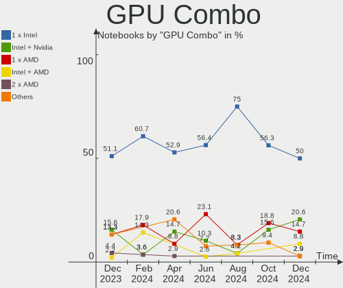
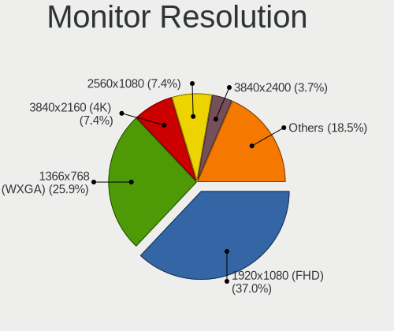
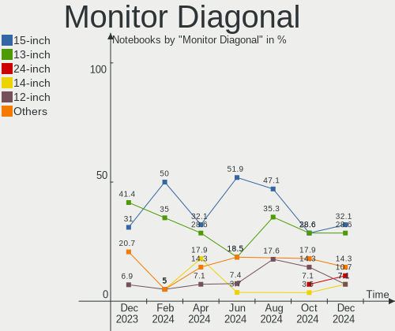
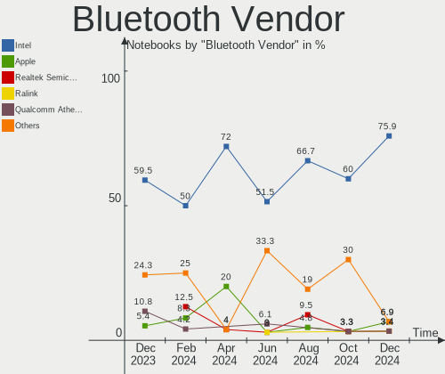

FreeBSD Hardware Trends (Notebook)
----------------------------------

A project to identify most popular hardware characteristics and track their change
over time based on data collected by FreeBSD users at https://BSD-Hardware.info.

Anyone can contribute to the study by uploading probes of their computers by
the [hw-probe](https://github.com/linuxhw/hw-probe/blob/master/INSTALL.BSD.md) tool:

    hw-probe -all -upload

Full-feature report is available here: https://bsd-hardware.info/?view=trends&formfactor=notebook

Period: Dec, 2020.

Contents
--------

- [ OS                       ](#os)
- [ OS Family                ](#os-family)
- [ Arch                     ](#arch)
- [ DE                       ](#de)
- [ Display Server           ](#display-server)
- [ Display Manager          ](#display-manager)
- [ OS Lang                  ](#os-lang)
- [ Boot Mode                ](#boot-mode)
- [ Filesystem               ](#filesystem)
- [ Part. scheme             ](#part-scheme)
- [ Country                  ](#country)
- [ City                     ](#city)
- [ Vendor                   ](#vendor)
- [ Model                    ](#model)
- [ Model Family             ](#model-family)
- [ MFG Year                 ](#mfg-year)
- [ Form Factor              ](#form-factor)
- [ Coreboot                 ](#coreboot)
- [ RAM Size                 ](#ram-size)
- [ RAM Used                 ](#ram-used)
- [ Has CD-ROM               ](#has-cd-rom)
- [ Total Drives             ](#total-drives)
- [ Has Ethernet             ](#has-ethernet)
- [ Drive Vendor             ](#drive-vendor)
- [ Drive Model              ](#drive-model)
- [ HDD Vendor               ](#hdd-vendor)
- [ SSD Vendor               ](#ssd-vendor)
- [ Drive Kind               ](#drive-kind)
- [ Drive Connector          ](#drive-connector)
- [ Drive Size               ](#drive-size)
- [ Space Total              ](#space-total)
- [ Space Used               ](#space-used)
- [ Malfunc. Drives          ](#malfunc-drives)
- [ Malfunc. Drive Vendor    ](#malfunc-drive-vendor)
- [ Malfunc. HDD Vendor      ](#malfunc-hdd-vendor)
- [ Malfunc. Drive Kind      ](#malfunc-drive-kind)
- [ Failed Drives            ](#failed-drives)
- [ Failed Drive Vendor      ](#failed-drive-vendor)
- [ Drive Status             ](#drive-status)
- [ Storage Vendor           ](#storage-vendor)
- [ Storage Model            ](#storage-model)
- [ Storage Kind             ](#storage-kind)
- [ CPU Vendor               ](#cpu-vendor)
- [ CPU Model                ](#cpu-model)
- [ CPU Model Family         ](#cpu-model-family)
- [ CPU Cores                ](#cpu-cores)
- [ CPU Sockets              ](#cpu-sockets)
- [ CPU Threads              ](#cpu-threads)
- [ CPU Microarch            ](#cpu-microarch)
- [ GPU Vendor               ](#gpu-vendor)
- [ GPU Model                ](#gpu-model)
- [ GPU Combo                ](#gpu-combo)
- [ GPU Driver               ](#gpu-driver)
- [ GPU Memory               ](#gpu-memory)
- [ Monitor Vendor           ](#monitor-vendor)
- [ Monitor Model            ](#monitor-model)
- [ Monitor Resolution       ](#monitor-resolution)
- [ Monitor Diagonal         ](#monitor-diagonal)
- [ Monitor Width            ](#monitor-width)
- [ Aspect Ratio             ](#aspect-ratio)
- [ Monitor Area             ](#monitor-area)
- [ Pixel Density            ](#pixel-density)
- [ Multiple Monitors        ](#multiple-monitors)
- [ Net Controller Vendor    ](#net-controller-vendor)
- [ Net Controller Model     ](#net-controller-model)
- [ Wireless Vendor          ](#wireless-vendor)
- [ Wireless Model           ](#wireless-model)
- [ Ethernet Vendor          ](#ethernet-vendor)
- [ Ethernet Model           ](#ethernet-model)
- [ Net Controller Kind      ](#net-controller-kind)
- [ Used Controller          ](#used-controller)
- [ NICs                     ](#nics)
- [ Memory Vendor            ](#memory-vendor)
- [ Memory Model             ](#memory-model)
- [ Memory Kind              ](#memory-kind)
- [ Memory Form Factor       ](#memory-form-factor)
- [ Memory Size              ](#memory-size)
- [ Memory Speed             ](#memory-speed)
- [ Sound Vendor             ](#sound-vendor)
- [ Sound Model              ](#sound-model)
- [ Camera Vendor            ](#camera-vendor)
- [ Camera Model             ](#camera-model)
- [ Fingerprint Vendor       ](#fingerprint-vendor)
- [ Fingerprint Model        ](#fingerprint-model)
- [ Chipcard Vendor          ](#chipcard-vendor)
- [ Chipcard Model           ](#chipcard-model)
- [ Printer Vendor           ](#printer-vendor)
- [ Printer Model            ](#printer-model)
- [ Scanner Vendor           ](#scanner-vendor)
- [ Scanner Model            ](#scanner-model)
- [ Bluetooth Vendor         ](#bluetooth-vendor)
- [ Bluetooth Model          ](#bluetooth-model)
- [ Unsupported Devices      ](#unsupported-devices)
- [ Unsupported Device Types ](#unsupported-device-types)

OS
--

Installed operating systems

| Name                 | Notebooks | Percent |
|----------------------|-----------|---------|
| FreeBSD 12.2         | 15        | 31.91%  |
| FreeBSD 12.2-p2      | 13        | 27.66%  |
| FreeBSD 13.0-CURRENT | 7         | 14.89%  |
| FreeBSD 12.1-p10     | 3         | 6.38%   |
| FreeBSD 12.2-STABLE  | 2         | 4.26%   |
| FreeBSD 12.2-p1      | 2         | 4.26%   |
| FreeBSD 12.1-STABLE  | 1         | 2.13%   |
| FreeBSD 12.1-p3      | 1         | 2.13%   |
| FreeBSD 12.1-p11     | 1         | 2.13%   |
| FreeBSD 12.1         | 1         | 2.13%   |
| FreeBSD 11.4-p5      | 1         | 2.13%   |

OS Family
---------

OS without a version

| Name    | Notebooks | Percent |
|---------|-----------|---------|
| FreeBSD | 47        | 100%    |

Arch
----

OS architecture (x86_64, i586, etc.)

| Name  | Notebooks | Percent |
|-------|-----------|---------|
| amd64 | 43        | 91.49%  |
| i386  | 4         | 8.51%   |

DE
--

Desktop Environment

| Name      | Notebooks | Percent |
|-----------|-----------|---------|
| XFCE      | 7         | 14.89%  |
| MATE      | 6         | 12.77%  |
| GNOME     | 6         | 12.77%  |
| TWM       | 5         | 10.64%  |
| Console   | 5         | 10.64%  |
| KDE5      | 4         | 8.51%   |
| i3        | 4         | 8.51%   |
| Openbox   | 3         | 6.38%   |
| AwesomeWM | 2         | 4.26%   |
| spectrwm  | 1         | 2.13%   |
| LXDE      | 1         | 2.13%   |
| GNUstep   | 1         | 2.13%   |
| Cinnamon  | 1         | 2.13%   |
| CDE       | 1         | 2.13%   |

Display Server
--------------

X11 or Wayland

| Name    | Notebooks | Percent |
|---------|-----------|---------|
| X11     | 41        | 87.23%  |
| Console | 6         | 12.77%  |

Display Manager
---------------

SDDM, LightDM, etc.

| Name    | Notebooks | Percent |
|---------|-----------|---------|
| Console | 18        | 38.3%   |
| SDDM    | 12        | 25.53%  |
| SLiM    | 6         | 12.77%  |
| LightDM | 4         | 8.51%   |
| XDM     | 3         | 6.38%   |
| GDM     | 3         | 6.38%   |
| Ly      | 1         | 2.13%   |

OS Lang
-------

Language

| Lang            | Notebooks | Percent |
|-----------------|-----------|---------|
| Unknown         | 20        | 42.55%  |
| en_US           | 9         | 19.15%  |
| C               | 5         | 10.64%  |
| de_DE           | 3         | 6.38%   |
| C               | 3         | 6.38%   |
| en_SG           | 2         | 4.26%   |
| ru_RU           | 1         | 2.13%   |
| nb_NO           | 1         | 2.13%   |
| fr_FR           | 1         | 2.13%   |
| en_GB           | 1         | 2.13%   |
| en_GB.ISO8859-1 | 1         | 2.13%   |

Boot Mode
---------

EFI or BIOS

| Mode | Notebooks | Percent |
|------|-----------|---------|
| EFI  | 28        | 59.57%  |
| BIOS | 19        | 40.43%  |

Filesystem
----------

Type of filesystem

| Type | Notebooks | Percent |
|------|-----------|---------|
| Zfs  | 23        | 48.94%  |
| Ufs  | 23        | 48.94%  |
| Xfs  | 1         | 2.13%   |

Part. scheme
------------

Scheme of partitioning

| Type | Notebooks | Percent |
|------|-----------|---------|
| GPT  | 37        | 78.72%  |
| MBR  | 10        | 21.28%  |

Country
-------

Geographic location (country)

| Country        | Notebooks | Percent |
|----------------|-----------|---------|
| USA            | 13        | 27.66%  |
| Germany        | 7         | 14.89%  |
| UK             | 5         | 10.64%  |
| Russia         | 3         | 6.38%   |
| Poland         | 3         | 6.38%   |
| Australia      | 3         | 6.38%   |
| Ukraine        | 2         | 4.26%   |
| Singapore      | 2         | 4.26%   |
| Philippines    | 1         | 2.13%   |
| Norway         | 1         | 2.13%   |
| Japan          | 1         | 2.13%   |
| Guadeloupe     | 1         | 2.13%   |
| Denmark        | 1         | 2.13%   |
| Czech Republic | 1         | 2.13%   |
| Brazil         | 1         | 2.13%   |
| Bangladesh     | 1         | 2.13%   |
| Argentina      | 1         | 2.13%   |

City
----

Geographic location (city)

| City              | Notebooks | Percent |
|-------------------|-----------|---------|
| Sydney            | 3         | 6.38%   |
| Singapore         | 2         | 4.26%   |
| Rustington        | 2         | 4.26%   |
| Glasgow           | 2         | 4.26%   |
| Zaporizhia        | 1         | 2.13%   |
| Washington        | 1         | 2.13%   |
| Warsaw            | 1         | 2.13%   |
| Versmold          | 1         | 2.13%   |
| Tychy             | 1         | 2.13%   |
| Tolyatti          | 1         | 2.13%   |
| Shinnston         | 1         | 2.13%   |
| Santa Rosa        | 1         | 2.13%   |
| Rauland           | 1         | 2.13%   |
| Raleigh           | 1         | 2.13%   |
| Porto Alegre      | 1         | 2.13%   |
| Portland          | 1         | 2.13%   |
| Platte City       | 1         | 2.13%   |
| Moscow            | 1         | 2.13%   |
| Mannheim          | 1         | 2.13%   |
| Livonia           | 1         | 2.13%   |
| Les Abymes        | 1         | 2.13%   |
| Landsberg am Lech | 1         | 2.13%   |
| Kyiv              | 1         | 2.13%   |
| Krasnoyarsk       | 1         | 2.13%   |
| Krakow            | 1         | 2.13%   |
| Koriyama          | 1         | 2.13%   |
| Igensdorf         | 1         | 2.13%   |
| Høng             | 1         | 2.13%   |
| Hillsboro         | 1         | 2.13%   |
| Halle             | 1         | 2.13%   |
| Great Malvern     | 1         | 2.13%   |
| Frederick         | 1         | 2.13%   |
| Düsseldorf       | 1         | 2.13%   |
| Duluth            | 1         | 2.13%   |
| Dhaka             | 1         | 2.13%   |
| Davao City        | 1         | 2.13%   |
| Charlotte         | 1         | 2.13%   |
| Buenos Aires      | 1         | 2.13%   |
| Brno              | 1         | 2.13%   |
| Berlin            | 1         | 2.13%   |
| Arvada            | 1         | 2.13%   |
| Albuquerque       | 1         | 2.13%   |

Vendor
------

Motherboard manufacturer

| Name                | Notebooks | Percent |
|---------------------|-----------|---------|
| Lenovo              | 22        | 46.81%  |
| Dell                | 5         | 10.64%  |
| Hewlett-Packard     | 3         | 6.38%   |
| Acer                | 3         | 6.38%   |
| Toshiba             | 2         | 4.26%   |
| Samsung Electronics | 2         | 4.26%   |
| MSI                 | 2         | 4.26%   |
| ASUSTek Computer    | 2         | 4.26%   |
| Sony                | 1         | 2.13%   |
| Pegatron            | 1         | 2.13%   |
| PC Specialist       | 1         | 2.13%   |
| Panasonic           | 1         | 2.13%   |
| Notebook            | 1         | 2.13%   |
| Eluktronics         | 1         | 2.13%   |

Model
-----

Motherboard model

| Name                                     | Notebooks | Percent |
|------------------------------------------|-----------|---------|
| Toshiba Satellite L50-C                  | 1         | 2.13%   |
| Toshiba Satellite C655D                  | 1         | 2.13%   |
| Sony SVP1321V9RB                         | 1         | 2.13%   |
| Samsung N145P/N250P/N260P                | 1         | 2.13%   |
| Samsung N140                             | 1         | 2.13%   |
| Pegatron T12Ah                           | 1         | 2.13%   |
| PC Specialist Recoil II                  | 1         | 2.13%   |
| Panasonic CFMX4-1                        | 1         | 2.13%   |
| Notebook N7x0WU                          | 1         | 2.13%   |
| MSI X460/X460DX                          | 1         | 2.13%   |
| MSI GP60 2PE                             | 1         | 2.13%   |
| Lenovo Y50-70 20378                      | 1         | 2.13%   |
| Lenovo ThinkPad X250 20CLS8S900          | 1         | 2.13%   |
| Lenovo ThinkPad X250 20CLS02000          | 1         | 2.13%   |
| Lenovo ThinkPad X230 23244A9             | 1         | 2.13%   |
| Lenovo ThinkPad X200s 7470A98            | 1         | 2.13%   |
| Lenovo ThinkPad X1 Extreme 20MF000BUS    | 1         | 2.13%   |
| Lenovo ThinkPad X1 Carbon 6th 20KG0022US | 1         | 2.13%   |
| Lenovo ThinkPad X1 Carbon 4th 20FC0019AU | 1         | 2.13%   |
| Lenovo ThinkPad W500 4063HK6             | 1         | 2.13%   |
| Lenovo ThinkPad T490 20N3X50500          | 1         | 2.13%   |
| Lenovo ThinkPad T460p 20FXCTO1WW         | 1         | 2.13%   |
| Lenovo ThinkPad T460 20FMS2J000          | 1         | 2.13%   |
| Lenovo ThinkPad T450s 20BWS05G0T         | 1         | 2.13%   |
| Lenovo ThinkPad T420s 417153U            | 1         | 2.13%   |
| Lenovo ThinkPad T420 4180AJ3             | 1         | 2.13%   |
| Lenovo ThinkPad R400 7439X13             | 1         | 2.13%   |
| Lenovo ThinkPad P53 20QQS3R100           | 1         | 2.13%   |
| Lenovo ThinkPad E590 20NB005MUS          | 1         | 2.13%   |
| Lenovo IdeaPad Slim 7 14IIL05 82A4       | 1         | 2.13%   |
| Lenovo IdeaPad S340-15IWL 81N8           | 1         | 2.13%   |
| Lenovo IdeaPad 320-15ISK 80XH            | 1         | 2.13%   |
| Lenovo G50-80 80E5                       | 1         | 2.13%   |
| HP EliteBook 8570p                       | 1         | 2.13%   |
| HP 655                                   | 1         | 2.13%   |
| HP 2000                                  | 1         | 2.13%   |
| Eluktronics THINN-15                     | 1         | 2.13%   |
| Dell XPS 15 9570                         | 1         | 2.13%   |
| Dell XPS 13 9300                         | 1         | 2.13%   |
| Dell Latitude E7440                      | 1         | 2.13%   |
| Dell Latitude 2100                       | 1         | 2.13%   |
| Dell Inspiron 5758                       | 1         | 2.13%   |
| ASUS TUF Gaming FX505DT_FX505DT          | 1         | 2.13%   |
| ASUS K72F                                | 1         | 2.13%   |
| Acer Peppy                               | 1         | 2.13%   |
| Acer Aspire V5-531                       | 1         | 2.13%   |
| Acer Aspire E5-471                       | 1         | 2.13%   |

Model Family
------------

Motherboard model prefix

| Name                 | Notebooks | Percent |
|----------------------|-----------|---------|
| Lenovo ThinkPad      | 17        | 36.17%  |
| Lenovo IdeaPad       | 3         | 6.38%   |
| Toshiba Satellite    | 2         | 4.26%   |
| Dell XPS             | 2         | 4.26%   |
| Dell Latitude        | 2         | 4.26%   |
| Acer Aspire          | 2         | 4.26%   |
| Sony SVP1321V9RB     | 1         | 2.13%   |
| Samsung N145P        | 1         | 2.13%   |
| Samsung N140         | 1         | 2.13%   |
| Pegatron T12Ah       | 1         | 2.13%   |
| PC Specialist Recoil | 1         | 2.13%   |
| Panasonic CFMX4-1    | 1         | 2.13%   |
| Notebook N7x0WU      | 1         | 2.13%   |
| MSI X460             | 1         | 2.13%   |
| MSI GP60             | 1         | 2.13%   |
| Lenovo Y50-70        | 1         | 2.13%   |
| Lenovo G50-80        | 1         | 2.13%   |
| HP EliteBook         | 1         | 2.13%   |
| HP 655               | 1         | 2.13%   |
| HP 2000              | 1         | 2.13%   |
| Eluktronics THINN-15 | 1         | 2.13%   |
| Dell Inspiron        | 1         | 2.13%   |
| ASUS TUF             | 1         | 2.13%   |
| ASUS K72F            | 1         | 2.13%   |
| Acer Peppy           | 1         | 2.13%   |

MFG Year
--------

Motherboard manufacture year

| Year | Notebooks | Percent |
|------|-----------|---------|
| 2019 | 9         | 19.15%  |
| 2020 | 8         | 17.02%  |
| 2018 | 6         | 12.77%  |
| 2011 | 5         | 10.64%  |
| 2010 | 5         | 10.64%  |
| 2015 | 4         | 8.51%   |
| 2017 | 2         | 4.26%   |
| 2014 | 2         | 4.26%   |
| 2013 | 2         | 4.26%   |
| 2012 | 2         | 4.26%   |
| 2016 | 1         | 2.13%   |
| 2008 | 1         | 2.13%   |

Form Factor
-----------

Physical design of the computer

| Name     | Notebooks | Percent |
|----------|-----------|---------|
| Notebook | 47        | 100%    |

Coreboot
--------

Have coreboot on board

| Used | Notebooks | Percent |
|------|-----------|---------|
| No   | 46        | 97.87%  |
| Yes  | 1         | 2.13%   |

RAM Size
--------

Total RAM memory

| Size in GB | Notebooks | Percent |
|------------|-----------|---------|
| 16.01-24.0 | 16        | 34.04%  |
| 8.01-16.0  | 13        | 27.66%  |
| 4.01-8.0   | 11        | 23.4%   |
| 2.01-3.0   | 3         | 6.38%   |
| 32.01-64.0 | 2         | 4.26%   |
| 3.01-4.0   | 1         | 2.13%   |
| 0.51-1.0   | 1         | 2.13%   |

RAM Used
--------

Used RAM memory

| Used GB   | Notebooks | Percent |
|-----------|-----------|---------|
| 0.01-0.5  | 21        | 44.68%  |
| 0.51-1.0  | 17        | 36.17%  |
| 1.01-2.0  | 4         | 8.51%   |
| 4.01-8.0  | 3         | 6.38%   |
| 2.01-3.0  | 1         | 2.13%   |
| 8.01-16.0 | 1         | 2.13%   |

Has CD-ROM
----------

Has CD-ROM on board

| Presented | Notebooks | Percent |
|-----------|-----------|---------|
| No        | 33        | 70.21%  |
| Yes       | 14        | 29.79%  |

Total Drives
------------

Number of drives on board

| Drives | Notebooks | Percent |
|--------|-----------|---------|
| 1      | 38        | 80.85%  |
| 2      | 7         | 14.89%  |
| 3      | 2         | 4.26%   |

Has Ethernet
------------

Has Ethernet on board

| Presented | Notebooks | Percent |
|-----------|-----------|---------|
| Yes       | 42        | 89.36%  |
| No        | 5         | 10.64%  |

Drive Vendor
------------

Hard drive vendors

| Vendor              | Notebooks | Drives | Percent |
|---------------------|-----------|--------|---------|
| WDC                 | 13        | 14     | 23.21%  |
| Samsung Electronics | 10        | 10     | 17.86%  |
| Toshiba             | 5         | 5      | 8.93%   |
| Kingston            | 4         | 4      | 7.14%   |
| SanDisk             | 3         | 3      | 5.36%   |
| Hitachi             | 3         | 3      | 5.36%   |
| Crucial             | 3         | 3      | 5.36%   |
| Transcend           | 1         | 1      | 1.79%   |
| Team                | 1         | 1      | 1.79%   |
| SPCC                | 1         | 1      | 1.79%   |
| SK Hynix            | 1         | 1      | 1.79%   |
| Silicon Motion      | 1         | 1      | 1.79%   |
| Seagate             | 1         | 2      | 1.79%   |
| PNY                 | 1         | 1      | 1.79%   |
| Phison              | 1         | 1      | 1.79%   |
| Micron Technology   | 1         | 1      | 1.79%   |
| Lenovo              | 1         | 1      | 1.79%   |
| KingSpec            | 1         | 1      | 1.79%   |
| Intel               | 1         | 1      | 1.79%   |
| HGST                | 1         | 1      | 1.79%   |
| Fujitsu             | 1         | 1      | 1.79%   |
| A-DATA Technology   | 1         | 1      | 1.79%   |

Drive Model
-----------

Hard drive models

| Model                                | Notebooks | Percent |
|--------------------------------------|-----------|---------|
| Toshiba MQ01ABF050 500GB             | 2         | 3.51%   |
| WDC WDS120G2G0B-00EPW0 120GB         | 1         | 1.75%   |
| WDC WD7500BPKX-22HPJT0 752GB         | 1         | 1.75%   |
| WDC WD5000LPLX-60ZNTT1 500GB         | 1         | 1.75%   |
| WDC WD5000BEKT-22KA9T0 500GB         | 1         | 1.75%   |
| WDC WD3200BPVT-75JJ5T0 320GB         | 1         | 1.75%   |
| WDC WD3200BEVS-08VAT2 320GB          | 1         | 1.75%   |
| WDC WD30EZRX-00MMMB0 3TB             | 1         | 1.75%   |
| WDC WD2500BEVT-75ZCT2 250GB          | 1         | 1.75%   |
| WDC WD20EARX-00PASB0 2TB             | 1         | 1.75%   |
| WDC WD2000JB-00GVC0 200GB            | 1         | 1.75%   |
| WDC WD1600BEVS-08VAT2 160GB          | 1         | 1.75%   |
| WDC WD10SPZX-24Z10 1TB               | 1         | 1.75%   |
| WDC PC SN730 SDBQNTY-1T00-1001 1TB   | 1         | 1.75%   |
| WDC PC SN720 SDAQNTW-512G-1001 512GB | 1         | 1.75%   |
| Transcend TS128GMTS430S 128GB        | 1         | 1.75%   |
| Toshiba THNSF5256GCJ7 256GB          | 1         | 1.75%   |
| Toshiba MK3265GSXN 320GB             | 1         | 1.75%   |
| Toshiba KXG50ZNV1T02 NVMe 1024GB     | 1         | 1.75%   |
| Team T253X2512G 512GB                | 1         | 1.75%   |
| SPCC Solid State Disk 64GB           | 1         | 1.75%   |
| SK Hynix PC611 NVMe 512GB            | 1         | 1.75%   |
| Silicon Motion 500GB-PRO-X-SS        | 1         | 1.75%   |
| Seagate ST9500325AS 500GB            | 1         | 1.75%   |
| SanDisk SDSSDP064G 64GB              | 1         | 1.75%   |
| SanDisk SD8TN8U256G1001 256GB        | 1         | 1.75%   |
| SanDisk SD7TB6S256G1001 256GB        | 1         | 1.75%   |
| Samsung SSD PM851 mSATA 256GB        | 1         | 1.75%   |
| Samsung SSD 970 EVO Plus 1TB         | 1         | 1.75%   |
| Samsung SSD 860 EVO M.2 2TB          | 1         | 1.75%   |
| Samsung SSD 860 EVO 500GB            | 1         | 1.75%   |
| Samsung SSD 860 EVO 250GB            | 1         | 1.75%   |
| Samsung SSD 850 EVO M.2 250GB        | 1         | 1.75%   |
| Samsung SSD 850 EVO 500GB            | 1         | 1.75%   |
| Samsung SSD 840 PRO Series 256GB     | 1         | 1.75%   |
| Samsung SSD 750 EVO 500GB            | 1         | 1.75%   |
| Samsung MZ7TY256HDHP-000L7 256GB     | 1         | 1.75%   |
| PNY CS3030 1TB SSD                   | 1         | 1.75%   |
| Phison PCIe SSD 512GB                | 1         | 1.75%   |
| Micron 2200V_MTFDHBA512TCK 512GB     | 1         | 1.75%   |
| Lenovo LENSE20512GMSP34MEAT2TA 512GB | 1         | 1.75%   |
| Kingston SV300S37A60G 64GB           | 1         | 1.75%   |
| Kingston SV300S37A120G 120GB         | 1         | 1.75%   |
| Kingston SUV400S37240G 240GB         | 1         | 1.75%   |
| Kingston SMS200S3120G 120GB          | 1         | 1.75%   |
| KingSpec NT-256 256GB                | 1         | 1.75%   |
| Intel SSDSC2BF240A5L 240GB           | 1         | 1.75%   |
| Hitachi HTS723232A7A364 320GB        | 1         | 1.75%   |
| Hitachi HTS547550A9E384 500GB        | 1         | 1.75%   |
| Hitachi HTS545016B9A300 160GB        | 1         | 1.75%   |
| HGST HTS725050A7E630 500GB           | 1         | 1.75%   |
| Fujitsu MJA2320BH G2 320GB           | 1         | 1.75%   |
| Crucial CT500MX500SSD1 500GB         | 1         | 1.75%   |
| Crucial CT250MX500SSD1 250GB         | 1         | 1.75%   |
| Crucial CT1000MX500SSD1 1TB          | 1         | 1.75%   |
| A-DATA SX8200NP 480GB                | 1         | 1.75%   |

HDD Vendor
----------

Hard disk drive vendors

| Vendor  | Notebooks | Drives | Percent |
|---------|-----------|--------|---------|
| WDC     | 10        | 11     | 52.63%  |
| Toshiba | 3         | 3      | 15.79%  |
| Hitachi | 3         | 3      | 15.79%  |
| Seagate | 1         | 2      | 5.26%   |
| HGST    | 1         | 1      | 5.26%   |
| Fujitsu | 1         | 1      | 5.26%   |

SSD Vendor
----------

Solid state drive vendors

| Vendor              | Notebooks | Drives | Percent |
|---------------------|-----------|--------|---------|
| Samsung Electronics | 9         | 9      | 36%     |
| Kingston            | 4         | 4      | 16%     |
| SanDisk             | 3         | 3      | 12%     |
| Crucial             | 3         | 3      | 12%     |
| WDC                 | 1         | 1      | 4%      |
| Transcend           | 1         | 1      | 4%      |
| Team                | 1         | 1      | 4%      |
| SPCC                | 1         | 1      | 4%      |
| KingSpec            | 1         | 1      | 4%      |
| Intel               | 1         | 1      | 4%      |

Drive Kind
----------

HDD or SSD

| Kind | Notebooks | Drives | Percent |
|------|-----------|--------|---------|
| SSD  | 22        | 25     | 44.9%   |
| HDD  | 16        | 21     | 32.65%  |
| NVMe | 11        | 12     | 22.45%  |

Drive Connector
---------------

SATA, SAS, NVMe, etc.

| Type | Notebooks | Drives | Percent |
|------|-----------|--------|---------|
| SATA | 37        | 46     | 77.08%  |
| NVMe | 11        | 12     | 22.92%  |

Drive Size
----------

Size of hard drive

| Size in TB | Notebooks | Drives | Percent |
|------------|-----------|--------|---------|
| 0.01-0.5   | 32        | 39     | 82.05%  |
| 0.51-1.0   | 4         | 4      | 10.26%  |
| 1.01-2.0   | 2         | 2      | 5.13%   |
| 2.01-3.0   | 1         | 1      | 2.56%   |

Space Total
-----------

Amount of disk space available on the file system

| Size in GB | Notebooks | Percent |
|------------|-----------|---------|
| 101-250    | 18        | 38.3%   |
| 251-500    | 14        | 29.79%  |
| 501-1000   | 7         | 14.89%  |
| 21-50      | 3         | 6.38%   |
| 51-100     | 3         | 6.38%   |
| 1-20       | 2         | 4.26%   |

Space Used
----------

Amount of used disk space

| Used GB | Notebooks | Percent |
|---------|-----------|---------|
| 1-20    | 34        | 72.34%  |
| 21-50   | 5         | 10.64%  |
| 101-250 | 4         | 8.51%   |
| 51-100  | 4         | 8.51%   |

Malfunc. Drives
---------------

Drive models with a malfunction

| Model                         | Notebooks | Drives | Percent |
|-------------------------------|-----------|--------|---------|
| WDC WD3200BPVT-75JJ5T0 320GB  | 1         | 1      | 14.29%  |
| WDC WD2000JB-00GVC0 200GB     | 1         | 1      | 14.29%  |
| Toshiba MQ01ABF050 500GB      | 1         | 1      | 14.29%  |
| Toshiba MK3265GSXN 320GB      | 1         | 1      | 14.29%  |
| Kingston SV300S37A120G 120GB  | 1         | 1      | 14.29%  |
| Hitachi HTS547550A9E384 500GB | 1         | 1      | 14.29%  |
| HGST HTS725050A7E630 500GB    | 1         | 1      | 14.29%  |

Malfunc. Drive Vendor
---------------------

Vendors of faulty drives

| Vendor   | Notebooks | Drives | Percent |
|----------|-----------|--------|---------|
| WDC      | 2         | 2      | 28.57%  |
| Toshiba  | 2         | 2      | 28.57%  |
| Kingston | 1         | 1      | 14.29%  |
| Hitachi  | 1         | 1      | 14.29%  |
| HGST     | 1         | 1      | 14.29%  |

Malfunc. HDD Vendor
-------------------

Vendors of faulty HDD drives

| Vendor  | Notebooks | Drives | Percent |
|---------|-----------|--------|---------|
| WDC     | 2         | 2      | 33.33%  |
| Toshiba | 2         | 2      | 33.33%  |
| Hitachi | 1         | 1      | 16.67%  |
| HGST    | 1         | 1      | 16.67%  |

Malfunc. Drive Kind
-------------------

Kinds of faulty drives

| Kind | Notebooks | Drives | Percent |
|------|-----------|--------|---------|
| HDD  | 6         | 6      | 85.71%  |
| SSD  | 1         | 1      | 14.29%  |

Failed Drives
-------------

Failed drive models

Zero info for selected period =(

Failed Drive Vendor
-------------------

Failed drive vendors

Zero info for selected period =(

Drive Status
------------

Number of failed and malfunc. drives

| Status  | Notebooks | Drives | Percent |
|---------|-----------|--------|---------|
| Works   | 43        | 51     | 86%     |
| Malfunc | 7         | 7      | 14%     |

Storage Vendor
--------------

Storage controller vendors

| Vendor              | Notebooks | Percent |
|---------------------|-----------|---------|
| Intel               | 35        | 67.31%  |
| AMD                 | 5         | 9.62%   |
| Toshiba             | 2         | 3.85%   |
| Silicon Motion      | 2         | 3.85%   |
| Sandisk             | 2         | 3.85%   |
| Phison Electronics  | 2         | 3.85%   |
| SK Hynix            | 1         | 1.92%   |
| Samsung Electronics | 1         | 1.92%   |
| Micron Technology   | 1         | 1.92%   |
| Lenovo              | 1         | 1.92%   |

Storage Model
-------------

Storage controller models

| Model                                                                            | Notebooks | Percent |
|----------------------------------------------------------------------------------|-----------|---------|
| Intel Wildcat Point-LP SATA Controller [AHCI Mode]                               | 6         | 11.54%  |
| Intel Sunrise Point-LP SATA Controller [AHCI mode]                               | 4         | 7.69%   |
| Intel 82801IBM/IEM (ICH9M/ICH9M-E) 4 port SATA Controller [AHCI mode]            | 4         | 7.69%   |
| Intel 8 Series SATA Controller 1 [AHCI mode]                                     | 3         | 5.77%   |
| Intel 7 Series Chipset Family 6-port SATA Controller [AHCI mode]                 | 3         | 5.77%   |
| Intel 6 Series/C200 Series Chipset Family 6 port Mobile SATA AHCI Controller     | 3         | 5.77%   |
| AMD FCH SATA Controller [AHCI mode]                                              | 3         | 5.77%   |
| Phison E12 NVMe Controller                                                       | 2         | 3.85%   |
| Intel Cannon Point-LP SATA Controller [AHCI Mode]                                | 2         | 3.85%   |
| Intel Cannon Lake Mobile PCH SATA AHCI Controller                                | 2         | 3.85%   |
| Intel 82801GBM/GHM (ICH7-M Family) SATA Controller [IDE mode]                    | 2         | 3.85%   |
| Intel 8 Series/C220 Series Chipset Family 6-port SATA Controller 1 [AHCI mode]   | 2         | 3.85%   |
| AMD SB7x0/SB8x0/SB9x0 SATA Controller [AHCI mode]                                | 2         | 3.85%   |
| Unknown                                                                          | 2         | 3.85%   |
| Toshiba unknown                                                                  | 1         | 1.92%   |
| Toshiba NVMe Controller                                                          | 1         | 1.92%   |
| SK Hynix hynix unknown                                                           | 1         | 1.92%   |
| Silicon Motion SM2263EN/SM2263XT SSD Controller                                  | 1         | 1.92%   |
| Silicon Motion SM2262/SM2262EN SSD Controller                                    | 1         | 1.92%   |
| Sandisk WD Black SN750 / PC SN730 NVMe SSD                                       | 1         | 1.92%   |
| Sandisk WD Black 2018 / PC SN720 NVMe SSD                                        | 1         | 1.92%   |
| Samsung NVMe SSD Controller SM981/PM981/PM983                                    | 1         | 1.92%   |
| Intel NM10/ICH7 Family SATA Controller [AHCI mode]                               | 1         | 1.92%   |
| Intel Atom/Celeron/Pentium Processor x5-E8000/J3xxx/N3xxx Series SATA Controller | 1         | 1.92%   |
| Intel 82801 Mobile SATA Controller [RAID mode]                                   | 1         | 1.92%   |
| Intel 5 Series/3400 Series Chipset 4 port SATA AHCI Controller                   | 1         | 1.92%   |

Storage Kind
------------

Kind of storage controller (IDE, SATA, NVMe, SAS, ...)

| Kind | Notebooks | Percent |
|------|-----------|---------|
| SATA | 37        | 72.55%  |
| NVMe | 11        | 21.57%  |
| IDE  | 2         | 3.92%   |
| RAID | 1         | 1.96%   |

CPU Vendor
----------

Processor vendors

| Vendor | Notebooks | Percent |
|--------|-----------|---------|
| Intel  | 42        | 89.36%  |
| AMD    | 5         | 10.64%  |

CPU Model
---------

Processor models

| Model                                         | Notebooks | Percent |
|-----------------------------------------------|-----------|---------|
| Intel Core i5-5300U CPU @ 2.30GHz             | 3         | 6.38%   |
| Intel Core i7-8750H CPU @ 2.20GHz             | 2         | 4.26%   |
| Intel Core i7-1065G7 CPU @ 1.30GHz            | 2         | 4.26%   |
| Intel Pentium CPU N3700 @ 1.60GHz             | 1         | 2.13%   |
| Intel Pentium CPU 967 @ 1.30GHz               | 1         | 2.13%   |
| Intel Pentium 4                               | 1         | 2.13%   |
| Intel CPU Version                             | 1         | 2.13%   |
| Intel Core i9-8950HK CPU @ 2.90GHz            | 1         | 2.13%   |
| Intel Core i7-9850H CPU @ 2.60GHz             | 1         | 2.13%   |
| Intel Core i7-8550U CPU @ 1.80GHz             | 1         | 2.13%   |
| Intel Core i7-6820HQ CPU @ 2.70GHz            | 1         | 2.13%   |
| Intel Core i7-6600U CPU @ 2.60GHz             | 1         | 2.13%   |
| Intel Core i7-5600U CPU @ 2.60GHz             | 1         | 2.13%   |
| Intel Core i7-5500U CPU @ 2.40GHz             | 1         | 2.13%   |
| Intel Core i7-4720HQ CPU @ 2.60GHz            | 1         | 2.13%   |
| Intel Core i7-4700HQ CPU @ 2.40GHz            | 1         | 2.13%   |
| Intel Core i7-4600U CPU @ 2.10GHz             | 1         | 2.13%   |
| Intel Core i7-3520M CPU @ 2.90GHz             | 1         | 2.13%   |
| Intel Core i5-8365U CPU @ 1.60GHz             | 1         | 2.13%   |
| Intel Core i5-8265U CPU @ 1.60GHz             | 1         | 2.13%   |
| Intel Core i5-6300U CPU @ 2.40GHz             | 1         | 2.13%   |
| Intel Core i5-5200U CPU @ 2.20GHz             | 1         | 2.13%   |
| Intel Core i5-4200U CPU @ 1.60GHz             | 1         | 2.13%   |
| Intel Core i5-3320M CPU @ 2.60GHz             | 1         | 2.13%   |
| Intel Core i5-2540M CPU @ 2.60GHz             | 1         | 2.13%   |
| Intel Core i5-2520M CPU @ 2.50GHz             | 1         | 2.13%   |
| Intel Core i5-2410M CPU @ 2.30GHz             | 1         | 2.13%   |
| Intel Core i5 CPU M 480 @ 2.67GH              | 1         | 2.13%   |
| Intel Core i3-8145U CPU @ 2.10GHz             | 1         | 2.13%   |
| Intel Core i3-8130U CPU @ 2.20GHz             | 1         | 2.13%   |
| Intel Core i3-6006U CPU @ 2.00GHz             | 1         | 2.13%   |
| Intel Core i3-4030U CPU @ 1.90GHz             | 1         | 2.13%   |
| Intel Core 2 Duo CPU T9550 @ 2.66GHz          | 1         | 2.13%   |
| Intel Core 2 Duo CPU P8700 @ 2.53GHz          | 1         | 2.13%   |
| Intel Core 2 Duo CPU P8400 @ 2.26GHz          | 1         | 2.13%   |
| Intel Core 2 Duo CPU L9400 @ 1.86GHz          | 1         | 2.13%   |
| Intel Celeron 2955U @ 1.40GHz                 | 1         | 2.13%   |
| Intel C1                                      | 1         | 2.13%   |
| AMD Ryzen 7 4800H with Radeon Graphics        | 1         | 2.13%   |
| AMD Ryzen 5 3550H with Radeon Vega Mobile Gfx | 1         | 2.13%   |
| AMD E2-1800 APU with Radeon HD Graphics       | 1         | 2.13%   |
| AMD E-450 APU with Radeon HD Graphics         | 1         | 2.13%   |
| AMD C-50 Processor                            | 1         | 2.13%   |

CPU Model Family
----------------

Processor model prefix

| Model            | Notebooks | Percent |
|------------------|-----------|---------|
| Intel Core i7    | 14        | 29.79%  |
| Intel Core i5    | 13        | 27.66%  |
| Intel Core i3    | 4         | 8.51%   |
| Intel Core 2 Duo | 4         | 8.51%   |
| Other            | 2         | 4.26%   |
| Intel Pentium    | 2         | 4.26%   |
| Intel Pentium 4  | 1         | 2.13%   |
| Intel Core i9    | 1         | 2.13%   |
| Intel Celeron    | 1         | 2.13%   |
| AMD Ryzen 7      | 1         | 2.13%   |
| AMD Ryzen 5      | 1         | 2.13%   |
| AMD E2           | 1         | 2.13%   |
| AMD E            | 1         | 2.13%   |
| AMD C-50         | 1         | 2.13%   |

CPU Cores
---------

Number of processor cores

| Number  | Notebooks | Percent |
|---------|-----------|---------|
| 2       | 25        | 53.19%  |
| 4       | 9         | 19.15%  |
| 6       | 4         | 8.51%   |
| Unknown | 4         | 8.51%   |
| 1       | 3         | 6.38%   |
| 16      | 1         | 2.13%   |
| 8       | 1         | 2.13%   |

CPU Sockets
-----------

Number of sockets

| Number | Notebooks | Percent |
|--------|-----------|---------|
| 1      | 47        | 100%    |

CPU Threads
-----------

Threads per core (Hyper-Threading)

| Number  | Notebooks | Percent |
|---------|-----------|---------|
| 2       | 35        | 74.47%  |
| 1       | 8         | 17.02%  |
| Unknown | 4         | 8.51%   |

CPU Microarch
-------------

Microarchitecture

| Name        | Notebooks | Percent |
|-------------|-----------|---------|
| KabyLake    | 9         | 19.15%  |
| Haswell     | 6         | 12.77%  |
| Broadwell   | 6         | 12.77%  |
| Skylake     | 4         | 8.51%   |
| SandyBridge | 4         | 8.51%   |
| Penryn      | 4         | 8.51%   |
| Bonnell     | 3         | 6.38%   |
| Bobcat      | 3         | 6.38%   |
| IvyBridge   | 2         | 4.26%   |
| IceLake     | 2         | 4.26%   |
| Zen+        | 1         | 2.13%   |
| Zen 2       | 1         | 2.13%   |
| Westmere    | 1         | 2.13%   |
| Silvermont  | 1         | 2.13%   |

GPU Vendor
----------

Vendors of graphics cards

| Vendor | Notebooks | Percent |
|--------|-----------|---------|
| Intel  | 40        | 70.18%  |
| Nvidia | 11        | 19.3%   |
| AMD    | 6         | 10.53%  |

GPU Model
---------

Graphics card models

| Model                                                                                    | Notebooks | Percent |
|------------------------------------------------------------------------------------------|-----------|---------|
| Intel HD Graphics 5500                                                                   | 6         | 10.17%  |
| Intel Mobile 4 Series Chipset Integrated Graphics Controller                             | 4         | 6.78%   |
| Intel Haswell-ULT Integrated Graphics Controller                                         | 4         | 6.78%   |
| Intel 2nd Generation Core Processor Family Integrated Graphics Controller                | 4         | 6.78%   |
| Intel UHD Graphics 630 (Mobile)                                                          | 3         | 5.08%   |
| Intel UHD Graphics 620 (Whiskey Lake)                                                    | 3         | 5.08%   |
| Nvidia GP107M [GeForce GTX 1050 Ti Mobile]                                               | 2         | 3.39%   |
| Intel UHD Graphics 620                                                                   | 2         | 3.39%   |
| Intel Skylake GT2 [HD Graphics 520]                                                      | 2         | 3.39%   |
| Intel Mobile 945GSE Express Integrated Graphics Controller                               | 2         | 3.39%   |
| Intel Mobile 945GM/GMS/GME, 943/940GML Express Integrated Graphics Controller            | 2         | 3.39%   |
| Intel Iris Plus Graphics G7                                                              | 2         | 3.39%   |
| Intel 4th Gen Core Processor Integrated Graphics Controller                              | 2         | 3.39%   |
| Nvidia TU117M [GeForce GTX 1650 Mobile / Max-Q]                                          | 1         | 1.69%   |
| Nvidia TU117GLM [Quadro T1000 Mobile]                                                    | 1         | 1.69%   |
| Nvidia GP107M [GeForce MX350]                                                            | 1         | 1.69%   |
| Nvidia GP106M [GeForce GTX 1060 Mobile]                                                  | 1         | 1.69%   |
| Nvidia GM108M [GeForce 940MX]                                                            | 1         | 1.69%   |
| Nvidia GM108M [GeForce 840M]                                                             | 1         | 1.69%   |
| Nvidia GM107M [GeForce GTX 860M]                                                         | 1         | 1.69%   |
| Nvidia GK208BM [GeForce 920M]                                                            | 1         | 1.69%   |
| Nvidia GF108M [GeForce GT 540M]                                                          | 1         | 1.69%   |
| Intel HD Graphics 530                                                                    | 1         | 1.69%   |
| Intel HD Graphics 520                                                                    | 1         | 1.69%   |
| Intel Core Processor Integrated Graphics Controller                                      | 1         | 1.69%   |
| Intel Atom/Celeron/Pentium Processor x5-E8000/J3xxx/N3xxx Integrated Graphics Controller | 1         | 1.69%   |
| Intel Atom Processor D4xx/D5xx/N4xx/N5xx Integrated Graphics Controller                  | 1         | 1.69%   |
| Intel 3rd Gen Core processor Graphics Controller                                         | 1         | 1.69%   |
| AMD Wrestler [Radeon HD 7340]                                                            | 1         | 1.69%   |
| AMD Wrestler [Radeon HD 6320]                                                            | 1         | 1.69%   |
| AMD Wrestler [Radeon HD 6250]                                                            | 1         | 1.69%   |
| AMD Thames [Radeon HD 7550M/7570M/7650M]                                                 | 1         | 1.69%   |
| AMD Renoir                                                                               | 1         | 1.69%   |
| AMD Picasso                                                                              | 1         | 1.69%   |

GPU Combo
---------

Combinations of graphics cards

| Name           | Notebooks | Percent |
|----------------|-----------|---------|
| 1 x Intel      | 24        | 51.06%  |
| Intel + Nvidia | 9         | 19.15%  |
| 2 x Intel      | 7         | 14.89%  |
| 1 x AMD        | 5         | 10.64%  |
| 1 x Nvidia     | 1         | 2.13%   |
| AMD + Nvidia   | 1         | 2.13%   |

GPU Driver
----------

Free vs proprietary

| Driver      | Notebooks | Percent |
|-------------|-----------|---------|
| Free        | 42        | 89.36%  |
| Proprietary | 4         | 8.51%   |
| Unknown     | 1         | 2.13%   |

GPU Memory
----------

Total video memory

| Size in GB | Notebooks | Percent |
|------------|-----------|---------|
| Unknown    | 40        | 85.11%  |
| 1.01-2.0   | 3         | 6.38%   |
| 0.01-0.5   | 2         | 4.26%   |
| 5.01-6.0   | 1         | 2.13%   |
| 0.51-1.0   | 1         | 2.13%   |

Monitor Vendor
--------------

Monitor vendors

| Vendor              | Notebooks | Percent |
|---------------------|-----------|---------|
| LG Display          | 9         | 21.95%  |
| Samsung Electronics | 6         | 14.63%  |
| AU Optronics        | 6         | 14.63%  |
| Sharp               | 3         | 7.32%   |
| Chimei Innolux      | 3         | 7.32%   |
| BOE                 | 3         | 7.32%   |
| Philips             | 2         | 4.88%   |
| Lenovo              | 2         | 4.88%   |
| Vizio               | 1         | 2.44%   |
| PANDA               | 1         | 2.44%   |
| JDI                 | 1         | 2.44%   |
| InnoLux Display     | 1         | 2.44%   |
| Eizo                | 1         | 2.44%   |
| Dell                | 1         | 2.44%   |
| BenQ                | 1         | 2.44%   |

Monitor Model
-------------

Monitor models

| Model                                                                | Notebooks | Percent |
|----------------------------------------------------------------------|-----------|---------|
| Vizio E65-F1 VIZ1035 3840x2160 1430x800mm 64.5-inch                  | 1         | 2.44%   |
| Sharp LQ156M1JW01 SHP14C3 1920x1080 340x190mm 15.3-inch              | 1         | 2.44%   |
| Sharp LCD Monitor SHP14CB 1920x1200 290x180mm 13.4-inch              | 1         | 2.44%   |
| Sharp LCD Monitor SHP148D 3840x2160 340x190mm 15.3-inch              | 1         | 2.44%   |
| Samsung Electronics SMS19A300B SAM0788 1366x768 410x230mm 18.5-inch  | 1         | 2.44%   |
| Samsung Electronics S24F350 SAM0D20 1920x1080 520x290mm 23.4-inch    | 1         | 2.44%   |
| Samsung Electronics LCD Monitor SEC324C 1600x900 310x170mm 13.9-inch | 1         | 2.44%   |
| Samsung Electronics LCD Monitor SEC315A 1366x768 340x190mm 15.3-inch | 1         | 2.44%   |
| Samsung Electronics LCD Monitor SEC3047 1366x768 280x160mm 12.7-inch | 1         | 2.44%   |
| Samsung Electronics LCD Monitor SDC4141 1366x768 340x190mm 15.3-inch | 1         | 2.44%   |
| Philips PHL 275S1 PHL094B 2560x1440 600x340mm 27.2-inch              | 1         | 2.44%   |
| Philips LCD Monitor PHL08C3 1920x1080 600x340mm 27.2-inch            | 1         | 2.44%   |
| PANDA LCD Monitor NCP002D 1920x1080 340x190mm 15.3-inch              | 1         | 2.44%   |
| LG Display LCD Monitor LGD04A9 1920x1080 310x170mm 13.9-inch         | 1         | 2.44%   |
| LG Display LCD Monitor LGD04A4 1920x1080 310x170mm 13.9-inch         | 1         | 2.44%   |
| LG Display LCD Monitor LGD049A 2560x1440 310x170mm 13.9-inch         | 1         | 2.44%   |
| LG Display LCD Monitor LGD03CD 1366x768 280x160mm 12.7-inch          | 1         | 2.44%   |
| LG Display LCD Monitor LGD02F1 1366x768 340x190mm 15.3-inch          | 1         | 2.44%   |
| LG Display LCD Monitor LGD02DC 1366x768 340x190mm 15.3-inch          | 1         | 2.44%   |
| LG Display LCD Monitor LGD0259 1920x1080 350x190mm 15.7-inch         | 1         | 2.44%   |
| LG Display LCD Monitor LGD0258 1600x900 350x190mm 15.7-inch          | 1         | 2.44%   |
| LG Display LCD Monitor LGD01DD 1600x900 380x210mm 17.1-inch          | 1         | 2.44%   |
| Lenovo LCD Monitor LEN4035 1280x800 300x190mm 14.0-inch              | 1         | 2.44%   |
| Lenovo LCD Monitor LEN4011 1280x800 260x160mm 12.0-inch              | 1         | 2.44%   |
| JDI LAM125M007D JDI1402 1920x1080 280x160mm 12.7-inch                | 1         | 2.44%   |
| InnoLux Display BT101IW03V1 INL000D 1024x600 220x120mm 9.9-inch      | 1         | 2.44%   |
| Eizo EV2456 ENC2796 1920x1200 520x330mm 24.2-inch                    | 1         | 2.44%   |
| Dell P2419H DELD0D9 1920x1080 530x300mm 24.0-inch                    | 1         | 2.44%   |
| Chimei Innolux LCD Monitor CMN15CB 1920x1080 340x190mm 15.3-inch     | 1         | 2.44%   |
| Chimei Innolux LCD Monitor CMN14D4 1920x1080 310x170mm 13.9-inch     | 1         | 2.44%   |
| Chimei Innolux LCD Monitor CMN1132 1366x768 260x140mm 11.6-inch      | 1         | 2.44%   |
| BOE LCD Monitor BOE0792 1920x1080 340x190mm 15.3-inch                | 1         | 2.44%   |
| BOE LCD Monitor BOE0729 1920x1080 340x190mm 15.3-inch                | 1         | 2.44%   |
| BOE LCD Monitor BOE0704 1366x768 340x190mm 15.3-inch                 | 1         | 2.44%   |
| BenQ BL2405 BNQ8016 1920x1080 530x300mm 24.0-inch                    | 1         | 2.44%   |
| AU Optronics LCD Monitor AUO8174 1280x800 330x210mm 15.4-inch        | 1         | 2.44%   |
| AU Optronics LCD Monitor AUO36ED 1920x1080 340x190mm 15.3-inch       | 1         | 2.44%   |
| AU Optronics LCD Monitor AUO323C 1366x768 310x170mm 13.9-inch        | 1         | 2.44%   |
| AU Optronics LCD Monitor AUO31EC 1366x768 340x190mm 15.3-inch        | 1         | 2.44%   |
| AU Optronics LCD Monitor AUO133D 1920x1080 310x170mm 13.9-inch       | 1         | 2.44%   |
| AU Optronics LCD Monitor AUO106C 1366x768 280x160mm 12.7-inch        | 1         | 2.44%   |

Monitor Resolution
------------------

Monitor screen resolution

| Resolution        | Notebooks | Percent |
|-------------------|-----------|---------|
| 1920x1080 (FHD)   | 14        | 36.84%  |
| 1366x768 (WXGA)   | 12        | 31.58%  |
| 1600x900 (HD+)    | 3         | 7.89%   |
| 1280x800 (WXGA)   | 3         | 7.89%   |
| 3840x2160 (4K)    | 2         | 5.26%   |
| 2560x1440 (QHD)   | 2         | 5.26%   |
| 1920x1200 (WUXGA) | 1         | 2.63%   |
| 1024x600          | 1         | 2.63%   |

Monitor Diagonal
----------------

Diagonal size in inches

| Inches | Notebooks | Percent |
|--------|-----------|---------|
| 15     | 16        | 39.02%  |
| 13     | 8         | 19.51%  |
| 12     | 5         | 12.2%   |
| 24     | 3         | 7.32%   |
| 27     | 2         | 4.88%   |
| 64     | 1         | 2.44%   |
| 23     | 1         | 2.44%   |
| 18     | 1         | 2.44%   |
| 17     | 1         | 2.44%   |
| 14     | 1         | 2.44%   |
| 11     | 1         | 2.44%   |
| 9      | 1         | 2.44%   |

Monitor Width
-------------

Physical width

| Width in mm | Notebooks | Percent |
|-------------|-----------|---------|
| 301-350     | 23        | 56.1%   |
| 201-300     | 9         | 21.95%  |
| 501-600     | 6         | 14.63%  |
| 401-500     | 1         | 2.44%   |
| 351-400     | 1         | 2.44%   |
| 1001-1500   | 1         | 2.44%   |

Aspect Ratio
------------

Proportional relationship between the width and the height

| Ratio | Notebooks | Percent |
|-------|-----------|---------|
| 16/9  | 31        | 88.57%  |
| 16/10 | 4         | 11.43%  |

Monitor Area
------------

Area in inch²

| Area in inch² | Notebooks | Percent |
|----------------|-----------|---------|
| 91-100         | 13        | 31.71%  |
| 81-90          | 9         | 21.95%  |
| 61-70          | 5         | 12.2%   |
| 201-250        | 3         | 7.32%   |
| 101-110        | 3         | 7.32%   |
| 301-350        | 2         | 4.88%   |
| More than 1000 | 1         | 2.44%   |
| 51-60          | 1         | 2.44%   |
| 41-50          | 1         | 2.44%   |
| 251-300        | 1         | 2.44%   |
| 141-150        | 1         | 2.44%   |
| 121-130        | 1         | 2.44%   |

Pixel Density
-------------

Pixels per inch

| Density       | Notebooks | Percent |
|---------------|-----------|---------|
| 121-160       | 18        | 43.9%   |
| 101-120       | 11        | 26.83%  |
| 51-100        | 8         | 19.51%  |
| 161-240       | 3         | 7.32%   |
| More than 240 | 1         | 2.44%   |

Multiple Monitors
-----------------

Total monitors connected

| Total | Notebooks | Percent |
|-------|-----------|---------|
| 1     | 28        | 59.57%  |
| 0     | 12        | 25.53%  |
| 2     | 7         | 14.89%  |

Net Controller Vendor
---------------------

Controller vendors

| Vendor                         | Notebooks | Percent |
|--------------------------------|-----------|---------|
| Intel                          | 33        | 44%     |
| Realtek Semiconductor          | 20        | 26.67%  |
| Qualcomm Atheros               | 14        | 18.67%  |
| Ralink Technology              | 3         | 4%      |
| Sierra Wireless                | 1         | 1.33%   |
| Ralink                         | 1         | 1.33%   |
| Marvell Technology Group       | 1         | 1.33%   |
| Hewlett-Packard                | 1         | 1.33%   |
| Broadcom Inc. and subsidiaries | 1         | 1.33%   |

Net Controller Model
--------------------

Controller models

| Model                                                                        | Notebooks | Percent |
|------------------------------------------------------------------------------|-----------|---------|
| Realtek RTL8111/8168/8411 PCI Express Gigabit Ethernet Controller            | 13        | 13.68%  |
| Realtek RTL810xE PCI Express Fast Ethernet controller                        | 4         | 4.21%   |
| Qualcomm Atheros AR9285 Wireless Network Adapter (PCI-Express)               | 4         | 4.21%   |
| Intel Wireless 7265                                                          | 4         | 4.21%   |
| Intel Ethernet Connection (3) I218-LM                                        | 4         | 4.21%   |
| Intel Centrino Advanced-N 6205 [Taylor Peak]                                 | 4         | 4.21%   |
| Intel 82579LM Gigabit Network Connection (Lewisville)                        | 4         | 4.21%   |
| Qualcomm Atheros AR9462 Wireless Network Adapter                             | 3         | 3.16%   |
| Intel Wireless 8260                                                          | 3         | 3.16%   |
| Intel Wireless 3160                                                          | 3         | 3.16%   |
| Intel 82567LM Gigabit Network Connection                                     | 3         | 3.16%   |
| Realtek RTL8188EUS 802.11n Wireless Network Adapter                          | 2         | 2.11%   |
| Ralink RT5370 Wireless Adapter                                               | 2         | 2.11%   |
| Qualcomm Atheros QCA9565 / AR9565 Wireless Network Adapter                   | 2         | 2.11%   |
| Intel Wireless-AC 9560 [Jefferson Peak]                                      | 2         | 2.11%   |
| Intel Wireless 8265 / 8275                                                   | 2         | 2.11%   |
| Intel Wireless 7260                                                          | 2         | 2.11%   |
| Intel Wi-Fi 6 AX200                                                          | 2         | 2.11%   |
| Intel Ethernet Connection I219-LM                                            | 2         | 2.11%   |
| Sierra Wireless EM7305 Modem                                                 | 1         | 1.05%   |
| Realtek RTL8188CE 802.11b/g/n WiFi Adapter                                   | 1         | 1.05%   |
| Ralink MT7601U Wireless Adapter                                              | 1         | 1.05%   |
| Ralink RT5390 Wireless 802.11n 1T/1R PCIe                                    | 1         | 1.05%   |
| Qualcomm Atheros QCA9377 802.11ac Wireless Network Adapter                   | 1         | 1.05%   |
| Qualcomm Atheros QCA6174 802.11ac Wireless Network Adapter                   | 1         | 1.05%   |
| Qualcomm Atheros Killer E220x Gigabit Ethernet Controller                    | 1         | 1.05%   |
| Qualcomm Atheros AR9485 Wireless Network Adapter                             | 1         | 1.05%   |
| Qualcomm Atheros AR8152 v2.0 Fast Ethernet                                   | 1         | 1.05%   |
| Qualcomm Atheros AR8131 Gigabit Ethernet                                     | 1         | 1.05%   |
| Marvell Group 88E8040 PCI-E Fast Ethernet Controller                         | 1         | 1.05%   |
| Intel Wireless-AC 9260                                                       | 1         | 1.05%   |
| Intel WiFi Link 5100                                                         | 1         | 1.05%   |
| Intel Ultimate N WiFi Link 5300                                              | 1         | 1.05%   |
| Intel PRO/Wireless 5100 AGN [Shiloh] Network Connection                      | 1         | 1.05%   |
| Intel Killer Wi-Fi 6 AX1650i 160MHz Wireless Network Adapter (201NGW)        | 1         | 1.05%   |
| Intel I210 Gigabit Network Connection                                        | 1         | 1.05%   |
| Intel Ethernet Connection I218-LM                                            | 1         | 1.05%   |
| Intel Ethernet Connection (7) I219-V                                         | 1         | 1.05%   |
| Intel Ethernet Connection (7) I219-LM                                        | 1         | 1.05%   |
| Intel Ethernet Connection (6) I219-LM                                        | 1         | 1.05%   |
| Intel Ethernet Connection (4) I219-V                                         | 1         | 1.05%   |
| Intel Ethernet Connection (2) I219-LM                                        | 1         | 1.05%   |
| Intel Dual Band Wireless-AC 3168NGW [Stone Peak]                             | 1         | 1.05%   |
| Intel Dual Band Wireless-AC 3165 Plus Bluetooth                              | 1         | 1.05%   |
| Intel Centrino Wireless-N 1030 [Rainbow Peak]                                | 1         | 1.05%   |
| Intel Cannon Point-LP CNVi [Wireless-AC]                                     | 1         | 1.05%   |
| HP hs2350 HSPA+ Mobile Broadband Module Network Adapter                      | 1         | 1.05%   |
| Broadcom Inc. and subsidiaries NetXtreme BCM5764M Gigabit Ethernet PCIe      | 1         | 1.05%   |
| Broadcom Inc. and subsidiaries BCM4322 802.11a/b/g/n Wireless LAN Controller | 1         | 1.05%   |

Wireless Vendor
---------------

Wireless vendors

| Vendor                         | Notebooks | Percent |
|--------------------------------|-----------|---------|
| Intel                          | 31        | 60.78%  |
| Qualcomm Atheros               | 12        | 23.53%  |
| Realtek Semiconductor          | 3         | 5.88%   |
| Ralink Technology              | 3         | 5.88%   |
| Ralink                         | 1         | 1.96%   |
| Broadcom Inc. and subsidiaries | 1         | 1.96%   |

Wireless Model
--------------

Wireless models

| Model                                                                        | Notebooks | Percent |
|------------------------------------------------------------------------------|-----------|---------|
| Qualcomm Atheros AR9285 Wireless Network Adapter (PCI-Express)               | 4         | 7.84%   |
| Intel Wireless 7265                                                          | 4         | 7.84%   |
| Intel Centrino Advanced-N 6205 [Taylor Peak]                                 | 4         | 7.84%   |
| Qualcomm Atheros AR9462 Wireless Network Adapter                             | 3         | 5.88%   |
| Intel Wireless 8260                                                          | 3         | 5.88%   |
| Intel Wireless 3160                                                          | 3         | 5.88%   |
| Realtek RTL8188EUS 802.11n Wireless Network Adapter                          | 2         | 3.92%   |
| Ralink RT5370 Wireless Adapter                                               | 2         | 3.92%   |
| Qualcomm Atheros QCA9565 / AR9565 Wireless Network Adapter                   | 2         | 3.92%   |
| Intel Wireless-AC 9560 [Jefferson Peak]                                      | 2         | 3.92%   |
| Intel Wireless 8265 / 8275                                                   | 2         | 3.92%   |
| Intel Wireless 7260                                                          | 2         | 3.92%   |
| Intel Wi-Fi 6 AX200                                                          | 2         | 3.92%   |
| Realtek RTL8188CE 802.11b/g/n WiFi Adapter                                   | 1         | 1.96%   |
| Ralink MT7601U Wireless Adapter                                              | 1         | 1.96%   |
| Ralink RT5390 Wireless 802.11n 1T/1R PCIe                                    | 1         | 1.96%   |
| Qualcomm Atheros QCA9377 802.11ac Wireless Network Adapter                   | 1         | 1.96%   |
| Qualcomm Atheros QCA6174 802.11ac Wireless Network Adapter                   | 1         | 1.96%   |
| Qualcomm Atheros AR9485 Wireless Network Adapter                             | 1         | 1.96%   |
| Intel Wireless-AC 9260                                                       | 1         | 1.96%   |
| Intel WiFi Link 5100                                                         | 1         | 1.96%   |
| Intel Ultimate N WiFi Link 5300                                              | 1         | 1.96%   |
| Intel PRO/Wireless 5100 AGN [Shiloh] Network Connection                      | 1         | 1.96%   |
| Intel Killer Wi-Fi 6 AX1650i 160MHz Wireless Network Adapter (201NGW)        | 1         | 1.96%   |
| Intel Dual Band Wireless-AC 3168NGW [Stone Peak]                             | 1         | 1.96%   |
| Intel Dual Band Wireless-AC 3165 Plus Bluetooth                              | 1         | 1.96%   |
| Intel Centrino Wireless-N 1030 [Rainbow Peak]                                | 1         | 1.96%   |
| Intel Cannon Point-LP CNVi [Wireless-AC]                                     | 1         | 1.96%   |
| Broadcom Inc. and subsidiaries BCM4322 802.11a/b/g/n Wireless LAN Controller | 1         | 1.96%   |

Ethernet Vendor
---------------

Ethernet vendors

| Vendor                         | Notebooks | Percent |
|--------------------------------|-----------|---------|
| Intel                          | 20        | 47.62%  |
| Realtek Semiconductor          | 17        | 40.48%  |
| Qualcomm Atheros               | 3         | 7.14%   |
| Marvell Technology Group       | 1         | 2.38%   |
| Broadcom Inc. and subsidiaries | 1         | 2.38%   |

Ethernet Model
--------------

Ethernet models

| Model                                                                   | Notebooks | Percent |
|-------------------------------------------------------------------------|-----------|---------|
| Realtek RTL8111/8168/8411 PCI Express Gigabit Ethernet Controller       | 13        | 30.95%  |
| Realtek RTL810xE PCI Express Fast Ethernet controller                   | 4         | 9.52%   |
| Intel Ethernet Connection (3) I218-LM                                   | 4         | 9.52%   |
| Intel 82579LM Gigabit Network Connection (Lewisville)                   | 4         | 9.52%   |
| Intel 82567LM Gigabit Network Connection                                | 3         | 7.14%   |
| Intel Ethernet Connection I219-LM                                       | 2         | 4.76%   |
| Qualcomm Atheros Killer E220x Gigabit Ethernet Controller               | 1         | 2.38%   |
| Qualcomm Atheros AR8152 v2.0 Fast Ethernet                              | 1         | 2.38%   |
| Qualcomm Atheros AR8131 Gigabit Ethernet                                | 1         | 2.38%   |
| Marvell Group 88E8040 PCI-E Fast Ethernet Controller                    | 1         | 2.38%   |
| Intel I210 Gigabit Network Connection                                   | 1         | 2.38%   |
| Intel Ethernet Connection I218-LM                                       | 1         | 2.38%   |
| Intel Ethernet Connection (7) I219-V                                    | 1         | 2.38%   |
| Intel Ethernet Connection (7) I219-LM                                   | 1         | 2.38%   |
| Intel Ethernet Connection (6) I219-LM                                   | 1         | 2.38%   |
| Intel Ethernet Connection (4) I219-V                                    | 1         | 2.38%   |
| Intel Ethernet Connection (2) I219-LM                                   | 1         | 2.38%   |
| Broadcom Inc. and subsidiaries NetXtreme BCM5764M Gigabit Ethernet PCIe | 1         | 2.38%   |

Net Controller Kind
-------------------

Ethernet, WiFi or modem

| Kind     | Notebooks | Percent |
|----------|-----------|---------|
| WiFi     | 46        | 51.11%  |
| Ethernet | 42        | 46.67%  |
| Modem    | 1         | 1.11%   |
| Unknown  | 1         | 1.11%   |

Used Controller
---------------

Currently used network controller

| Kind     | Notebooks | Percent |
|----------|-----------|---------|
| WiFi     | 40        | 50%     |
| Ethernet | 39        | 48.75%  |
| Modem    | 1         | 1.25%   |

NICs
----

Total network controllers on board

| Total | Notebooks | Percent |
|-------|-----------|---------|
| 2     | 41        | 87.23%  |
| 1     | 6         | 12.77%  |

Memory Vendor
-------------

Memory module vendors

| Vendor              | Notebooks | Percent |
|---------------------|-----------|---------|
| Samsung Electronics | 17        | 32.69%  |
| SK Hynix            | 11        | 21.15%  |
| Micron Technology   | 6         | 11.54%  |
| Unknown             | 5         | 9.62%   |
| Crucial             | 3         | 5.77%   |
| Team                | 2         | 3.85%   |
| Kingston            | 2         | 3.85%   |
| Ramaxel Technology  | 1         | 1.92%   |
| PNY                 | 1         | 1.92%   |
| Nanya Technology    | 1         | 1.92%   |
| G.Skill             | 1         | 1.92%   |
| Elpida              | 1         | 1.92%   |
| 48spaces            | 1         | 1.92%   |

Memory Model
------------

Memory module models

| Model                                                                        | Notebooks | Percent |
|------------------------------------------------------------------------------|-----------|---------|
| Samsung RAM M471B1G73EB0-YK0 8192MB SODIMM DDR3 1600MT/s                     | 4         | 7.14%   |
| SK Hynix RAM HMT41GS6BFR8A-PB 8GB SODIMM DDR3 1600MT/s                       | 3         | 5.36%   |
| Samsung RAM M471B5273DH0-CH9 4096MB SODIMM DDR3 1334MT/s                     | 2         | 3.57%   |
| Unknown SODIMM 2048MB SODIMM DDR2 533MT/s                                    | 1         | 1.79%   |
| Unknown RAM PartNum 0 512MB Chip DDR2 533MT/s                                | 1         | 1.79%   |
| Unknown RAM Module 8GB Row Of Chips LPDDR4 4267MT/s                          | 1         | 1.79%   |
| Unknown RAM Module 2GB SODIMM DDR2 667MT/s                                   | 1         | 1.79%   |
| Unknown RAM Module 2048MB SODIMM DDR3                                        | 1         | 1.79%   |
| Team RAM TEAMGROUP-SD4-2400 8192MB SODIMM DDR4 2400MT/s                      | 1         | 1.79%   |
| Team RAM TEAMGROUP-SD3-1600 8GB SODIMM DDR3 1600MT/s                         | 1         | 1.79%   |
| SK Hynix RAM HMT425S6AFR6A-PB 2048MB SODIMM DDR3 1600MT/s                    | 1         | 1.79%   |
| SK Hynix RAM HMT351S6CFR8C-H9 4096MB SODIMM DDR3 1333MT/s                    | 1         | 1.79%   |
| SK Hynix RAM HMT351S6BFR8C-H9 4096MB SODIMM DDR3 1333MT/s                    | 1         | 1.79%   |
| SK Hynix RAM HMT325S6BFR8C-H9 2GB SODIMM DDR3 1066MT/s                       | 1         | 1.79%   |
| SK Hynix RAM HMA82GS6CJR8N-VK 16GB SODIMM DDR4 2667MT/s                      | 1         | 1.79%   |
| SK Hynix RAM HMA81GS6JJR8N-VK 8GB SODIMM DDR4 2667MT/s                       | 1         | 1.79%   |
| SK Hynix RAM HMA81GS6DJR8N-XN 8192MB SODIMM DDR4 3200MT/s                    | 1         | 1.79%   |
| SK Hynix RAM HMA81GS6AFR8N-UH 8GB SODIMM DDR4 2400MT/s                       | 1         | 1.79%   |
| SK Hynix RAM H9HCNNNCPMALHR-NEE 8192MB Row Of Chips LPDDR4 4267MT/s          | 1         | 1.79%   |
| Samsung RAM M471B5773DH0-CH9 2048MB SODIMM DDR3 1333MT/s                     | 1         | 1.79%   |
| Samsung RAM M471B5773CHS-CH9 2048MB SODIMM DDR3 1333MT/s                     | 1         | 1.79%   |
| Samsung RAM M471B5673FH0-CF8 2048MB SODIMM DDR3 1066MT/s                     | 1         | 1.79%   |
| Samsung RAM M471B5273DH0-CK0 4GB SODIMM DDR3 1600MT/s                        | 1         | 1.79%   |
| Samsung RAM M471B2873FHS-CH9 1024MB SODIMM DDR3 1066MT/s                     | 1         | 1.79%   |
| Samsung RAM M471B1G73QH0-YK0 8192MB SODIMM DDR3 1600MT/s                     | 1         | 1.79%   |
| Samsung RAM M471B1G73DB0-YK0 8192MB SODIMM DDR3 1600MT/s                     | 1         | 1.79%   |
| Samsung RAM M471A5244CB0-CRC 4GB SODIMM DDR4 2400MT/s                        | 1         | 1.79%   |
| Samsung RAM M471A2K43BB1-CPB 16384MB Chip DDR4 2133MT/s                      | 1         | 1.79%   |
| Samsung RAM M471A1K43CB1-CRC 8192MB SODIMM DDR4 2400MT/s                     | 1         | 1.79%   |
| Samsung RAM K4EBE304EB-EGCG 8192MB Row Of Chips LPDDR3 2133MT/s              | 1         | 1.79%   |
| Samsung RAM K4B8G1646B-MYK0 4096MB SODIMM DDR3 1600MT/s                      | 1         | 1.79%   |
| Ramaxel RAM RMSA3300ME78HBF-2666 16GB SODIMM DDR4 2667MT/s                   | 1         | 1.79%   |
| PNY RAM 8GBU1X08JGGG39-12-K 8192MB SODIMM DDR4 2400MT/s                      | 1         | 1.79%   |
| Nanya RAM M2S4G64CB8HD5N-CG 4GB SODIMM DDR3 1333MT/s                         | 1         | 1.79%   |
| Nanya RAM M2S2G64CB88D5N-CG 2GB SODIMM DDR3 1333MT/s                         | 1         | 1.79%   |
| Micron RAM MT52L512M32D2PF-10 4096MB SODIMM LPDDR3 1867MT/s                  | 1         | 1.79%   |
| Micron RAM MT52L512M32D2PF-10 4096MB Chip LPDDR3 1867MT/s                    | 1         | 1.79%   |
| Micron RAM 8KTF51264HZ-1G6N1 4GB SODIMM DDR3 1600MT/s                        | 1         | 1.79%   |
| Micron RAM 4ATS1G64HZ-2G6E1 8192MB SODIMM DDR4 2667MT/s                      | 1         | 1.79%   |
| Micron RAM 4ATF51264HZ-2G6E1 4096MB SODIMM DDR4 2400MT/s                     | 1         | 1.79%   |
| Micron RAM 16KTF51264HZ-1G6M1 4GB SODIMM DDR3 1333MT/s                       | 1         | 1.79%   |
| Micron RAM 16KTF1G64HZ-1G6E1 8192MB SODIMM DDR3 1600MT/s                     | 1         | 1.79%   |
| Kingston RAM MSI16D3LS1KBG/8G 8GB SODIMM DDR3 1600MT/s                       | 1         | 1.79%   |
| Kingston RAM KHX2666C15S4/16G 16384MB SODIMM DDR4 2667MT/s                   | 1         | 1.79%   |
| G.Skill RAM F4-2666C18-16GRS 16384MB SODIMM DDR4 2667MT/s                    | 1         | 1.79%   |
| Elpida RAM EBJ21UE8BAU0-AE-E 2048MB SODIMM DDR3 1066MT/s                     | 1         | 1.79%   |
| Crucial RAM CT8G4SFD824A.C16FADP 8192MB SODIMM DDR4 2400MT/s                 | 1         | 1.79%   |
| Crucial RAM CT8G3S1339M.M16FP 8GB SODIMM DDR3 1333MT/s                       | 1         | 1.79%   |
| Crucial RAM CT102464BF160B.C16 8GB SODIMM DDR3 1600MT/s                      | 1         | 1.79%   |
| 48spaces RAM 012345678901234567890123456789012345 2048MB SODIMM DDR2 667MT/s | 1         | 1.79%   |

Memory Kind
-----------

Memory module kinds

| Kind   | Notebooks | Percent |
|--------|-----------|---------|
| DDR3   | 25        | 55.56%  |
| DDR4   | 12        | 26.67%  |
| DDR2   | 4         | 8.89%   |
| LPDDR4 | 2         | 4.44%   |
| LPDDR3 | 2         | 4.44%   |

Memory Form Factor
------------------

Physical design of the memory module

| Name         | Notebooks | Percent |
|--------------|-----------|---------|
| SODIMM       | 40        | 86.96%  |
| Row Of Chips | 3         | 6.52%   |
| Chip         | 3         | 6.52%   |

Memory Size
-----------

Memory module size

| Size  | Notebooks | Percent |
|-------|-----------|---------|
| 8192  | 22        | 44%     |
| 2048  | 11        | 22%     |
| 4096  | 10        | 20%     |
| 16384 | 5         | 10%     |
| 1024  | 2         | 4%      |

Memory Speed
------------

Memory module speed

| Speed   | Notebooks | Percent |
|---------|-----------|---------|
| 1600    | 14        | 29.17%  |
| 2667    | 6         | 12.5%   |
| 1333    | 6         | 12.5%   |
| 2400    | 5         | 10.42%  |
| 1066    | 4         | 8.33%   |
| 4267    | 2         | 4.17%   |
| 2133    | 2         | 4.17%   |
| 1334    | 2         | 4.17%   |
| 667     | 2         | 4.17%   |
| 533     | 2         | 4.17%   |
| 3200    | 1         | 2.08%   |
| 1867    | 1         | 2.08%   |
| Unknown | 1         | 2.08%   |

Sound Vendor
------------

Sound card vendors

| Vendor            | Notebooks | Percent |
|-------------------|-----------|---------|
| Intel             | 42        | 80.77%  |
| AMD               | 6         | 11.54%  |
| Nvidia            | 3         | 5.77%   |
| Texas Instruments | 1         | 1.92%   |

Sound Model
-----------

Sound card models

| Model                                                                                             | Notebooks | Percent |
|---------------------------------------------------------------------------------------------------|-----------|---------|
| Intel Wildcat Point-LP High Definition Audio Controller                                           | 6         | 9.09%   |
| Intel Broadwell-U Audio Controller                                                                | 6         | 9.09%   |
| Intel Sunrise Point-LP HD Audio                                                                   | 5         | 7.58%   |
| Intel Haswell-ULT HD Audio Controller                                                             | 4         | 6.06%   |
| Intel Cannon Lake PCH cAVS                                                                        | 4         | 6.06%   |
| Intel 82801I (ICH9 Family) HD Audio Controller                                                    | 4         | 6.06%   |
| Intel 8 Series HD Audio Controller                                                                | 4         | 6.06%   |
| Intel NM10/ICH7 Family High Definition Audio Controller                                           | 3         | 4.55%   |
| Intel Cannon Point-LP High Definition Audio Controller                                            | 3         | 4.55%   |
| Intel 7 Series/C216 Chipset Family High Definition Audio Controller                               | 3         | 4.55%   |
| Intel 6 Series/C200 Series Chipset Family High Definition Audio Controller                        | 3         | 4.55%   |
| Nvidia TU107 GeForce GTX 1650 High Definition Audio Controller                                    | 2         | 3.03%   |
| Intel Xeon E3-1200 v3/4th Gen Core Processor HD Audio Controller                                  | 2         | 3.03%   |
| Intel Ice Lake-LP Smart Sound Technology Audio Controller                                         | 2         | 3.03%   |
| Intel 8 Series/C220 Series Chipset High Definition Audio Controller                               | 2         | 3.03%   |
| AMD SBx00 Azalia (Intel HDA)                                                                      | 2         | 3.03%   |
| AMD Family 17h (Models 10h-1fh) HD Audio Controller                                               | 2         | 3.03%   |
| Texas Instruments PCM2900C Audio CODEC                                                            | 1         | 1.52%   |
| Nvidia GP107GL High Definition Audio Controller                                                   | 1         | 1.52%   |
| Intel Atom/Celeron/Pentium Processor x5-E8000/J3xxx/N3xxx Series High Definition Audio Controller | 1         | 1.52%   |
| Intel 5 Series/3400 Series Chipset High Definition Audio                                          | 1         | 1.52%   |
| Intel 100 Series/C230 Series Chipset Family HD Audio Controller                                   | 1         | 1.52%   |
| AMD Wrestler HDMI Audio                                                                           | 1         | 1.52%   |
| AMD Turks HDMI Audio [Radeon HD 6500/6600 / 6700M Series]                                         | 1         | 1.52%   |
| AMD Renoir Radeon High Definition Audio Controller                                                | 1         | 1.52%   |
| AMD FCH Azalia Controller                                                                         | 1         | 1.52%   |

Camera Vendor
-------------

Camera device vendors

| Vendor                        | Notebooks | Percent |
|-------------------------------|-----------|---------|
| Chicony Electronics           | 13        | 33.33%  |
| Suyin                         | 4         | 10.26%  |
| IMC Networks                  | 4         | 10.26%  |
| Acer                          | 4         | 10.26%  |
| Microdia                      | 3         | 7.69%   |
| Lite-On Technology            | 3         | 7.69%   |
| Realtek Semiconductor         | 2         | 5.13%   |
| Z-Star Microelectronics       | 1         | 2.56%   |
| Syntek                        | 1         | 2.56%   |
| Sunplus Innovation Technology | 1         | 2.56%   |
| Silicon Motion                | 1         | 2.56%   |
| Primax Electronics            | 1         | 2.56%   |
| Importek                      | 1         | 2.56%   |

Camera Model
------------

Camera device models

| Model                               | Notebooks | Percent |
|-------------------------------------|-----------|---------|
| Chicony Integrated Camera           | 7         | 17.95%  |
| Lite-On Integrated Camera           | 3         | 7.69%   |
| Chicony HD WebCam                   | 3         | 7.69%   |
| Acer Integrated Camera              | 2         | 5.13%   |
| Z-Star Webcam                       | 1         | 2.56%   |
| Syntek Lenovo EasyCamera            | 1         | 2.56%   |
| Suyin Integrated_Webcam_HD          | 1         | 2.56%   |
| Suyin Integrated Webcam             | 1         | 2.56%   |
| Suyin Acer Crystal Eye webcam       | 1         | 2.56%   |
| Suyin 1.3M HD Webcam                | 1         | 2.56%   |
| Sunplus HD WebCam                   | 1         | 2.56%   |
| Silicon Motion WebCam SCX Series    | 1         | 2.56%   |
| Realtek USB Webcam                  | 1         | 2.56%   |
| Realtek Realtek PC Camera           | 1         | 2.56%   |
| Primax HP HD Webcam [Fixed]         | 1         | 2.56%   |
| Microdia Lenovo EasyCamera          | 1         | 2.56%   |
| Microdia Integrated_Webcam_HD       | 1         | 2.56%   |
| Microdia Integrated Webcam          | 1         | 2.56%   |
| Importek TOSHIBA Web Camera         | 1         | 2.56%   |
| IMC Networks USB2.0 HD UVC WebCam   | 1         | 2.56%   |
| IMC Networks Integrated Webcam      | 1         | 2.56%   |
| IMC Networks Integrated Camera      | 1         | 2.56%   |
| IMC Networks EasyCamera             | 1         | 2.56%   |
| Chicony TOSHIBA Web Camera - HD     | 1         | 2.56%   |
| Chicony Integrated HP HD Webcam     | 1         | 2.56%   |
| Chicony Chicony USB2.0 Camera       | 1         | 2.56%   |
| Acer USB HD Webcam                  | 1         | 2.56%   |
| Acer ThinkPad P50 Integrated Camera | 1         | 2.56%   |

Fingerprint Vendor
------------------

Fingerprint sensor vendors

| Vendor                     | Notebooks | Percent |
|----------------------------|-----------|---------|
| Validity Sensors           | 3         | 37.5%   |
| Synaptics                  | 3         | 37.5%   |
| Shenzhen Goodix Technology | 1         | 12.5%   |
| Broadcom                   | 1         | 12.5%   |

Fingerprint Model
-----------------

Fingerprint sensor models

| Model                                                                        | Notebooks | Percent |
|------------------------------------------------------------------------------|-----------|---------|
| Validity Sensors VFS 5011 fingerprint sensor                                 | 2         | 25%     |
| Synaptics Metallica MIS Touch Fingerprint Reader                             | 2         | 25%     |
| Validity Sensors VFS7500 Touch Fingerprint Sensor                            | 1         | 12.5%   |
| Synaptics Prometheus MIS Touch Fingerprint Reader                            | 1         | 12.5%   |
| Shenzhen Goodix Fingerprint Reader                                           | 1         | 12.5%   |
| Broadcom BCM5880 Secure Applications Processor with fingerprint swipe sensor | 1         | 12.5%   |

Chipcard Vendor
---------------

Chipcard module vendors

Zero info for selected period =(

Chipcard Model
--------------

Chipcard module models

Zero info for selected period =(

Printer Vendor
--------------

Printer device vendors

Zero info for selected period =(

Printer Model
-------------

Printer device models

Zero info for selected period =(

Scanner Vendor
--------------

Scanner device vendors

Zero info for selected period =(

Scanner Model
-------------

Scanner device models

Zero info for selected period =(

Bluetooth Vendor
----------------

Controller vendors

| Vendor                          | Notebooks | Percent |
|---------------------------------|-----------|---------|
| Intel                           | 16        | 55.17%  |
| Qualcomm Atheros Communications | 5         | 17.24%  |
| Broadcom                        | 4         | 13.79%  |
| Foxconn / Hon Hai               | 3         | 10.34%  |
| ASUSTek Computer                | 1         | 3.45%   |

Bluetooth Model
---------------

Controller models

| Model                                                       | Notebooks | Percent |
|-------------------------------------------------------------|-----------|---------|
| Intel Bluetooth wireless interface                          | 8         | 27.59%  |
| Intel Bluetooth 9460/9560 Jefferson Peak (JfP)              | 3         | 10.34%  |
| Foxconn / Hon Hai Bluetooth USB Module                      | 3         | 10.34%  |
| Intel AX200 Bluetooth                                       | 2         | 6.9%    |
| Broadcom BCM2045B (BDC-2.1)                                 | 2         | 6.9%    |
| Qualcomm Atheros  QCA9377 Bluetooth 4.1                     | 1         | 3.45%   |
| Qualcomm Atheros  QCA61x4 Bluetooth 4.1                     | 1         | 3.45%   |
| Qualcomm Atheros Dell Wireless 1802 Bluetooth 4.0 LE        | 1         | 3.45%   |
| Qualcomm Atheros Dell Wireless 1707 Bluetooth 4.0 LE Device | 1         | 3.45%   |
| Qualcomm Atheros Bluetooth                                  | 1         | 3.45%   |
| Intel Wireless-AC 9260 Bluetooth Adapter                    | 1         | 3.45%   |
| Intel Wireless-AC 3168 Bluetooth                            | 1         | 3.45%   |
| Intel Intel Wireless Bluetooth                              | 1         | 3.45%   |
| Broadcom Bluetooth                                          | 1         | 3.45%   |
| Broadcom BCM20702 Bluetooth 4.0 [ThinkPad]                  | 1         | 3.45%   |
| ASUS BT-253 Bluetooth Adapter                               | 1         | 3.45%   |

Unsupported Devices
-------------------

Total unsupported devices on board

| Total | Notebooks | Percent |
|-------|-----------|---------|
| 2     | 16        | 34.04%  |
| 1     | 12        | 25.53%  |
| 3     | 7         | 14.89%  |
| 0     | 5         | 10.64%  |
| 4     | 3         | 6.38%   |
| 6     | 2         | 4.26%   |
| 5     | 2         | 4.26%   |

Unsupported Device Types
------------------------

Types of unsupported devices

| Type                     | Notebooks | Percent |
|--------------------------|-----------|---------|
| Communication controller | 36        | 40.91%  |
| Card reader              | 22        | 25%     |
| Bluetooth                | 12        | 13.64%  |
| Fingerprint reader       | 7         | 7.95%   |
| Net/wireless             | 6         | 6.82%   |
| Firewire controller      | 4         | 4.55%   |
| Network                  | 1         | 1.14%   |

