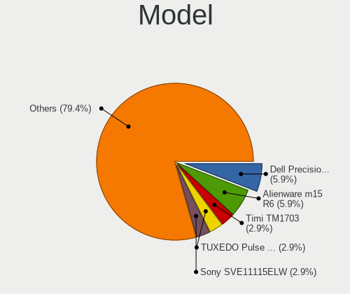
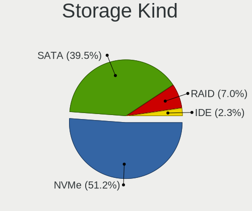
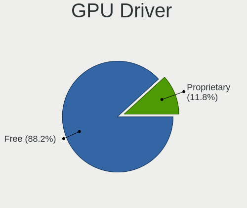
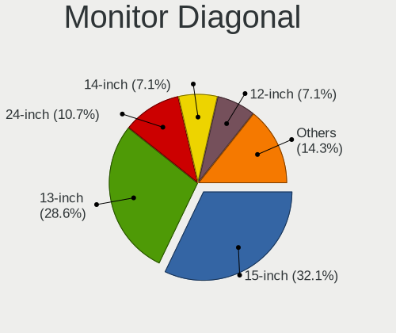
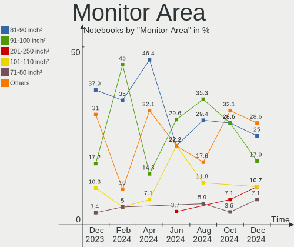
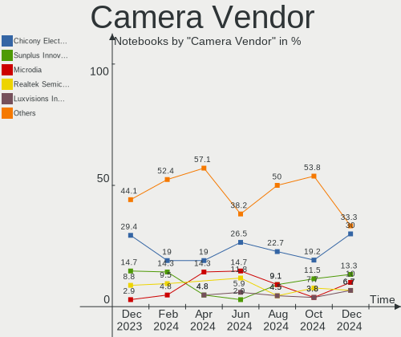
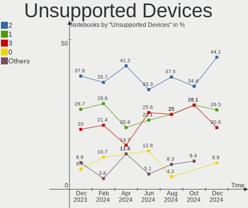

FreeBSD Hardware Trends (Notebooks)
-----------------------------------

A project to identify most popular hardware characteristics and track their change
over time based on data collected by FreeBSD users at https://BSD-Hardware.info.

Anyone can contribute to this report by the [hw-probe](https://github.com/linuxhw/hw-probe/blob/master/INSTALL.BSD.md) tool:

    hw-probe -all -upload

Full-feature report is available here: https://bsd-hardware.info/?view=trends&formfactor=notebook

Period: Aug, 2021.

Contents
--------

* [ System ](#system)
  - [ OS                       ](#os)
  - [ OS Family                ](#os-family)
  - [ Arch                     ](#arch)
  - [ DE                       ](#de)
  - [ Display Server           ](#display-server)
  - [ Display Manager          ](#display-manager)
  - [ OS Lang                  ](#os-lang)
  - [ Boot Mode                ](#boot-mode)
  - [ Filesystem               ](#filesystem)
  - [ Part. scheme             ](#part-scheme)

* [ Board ](#board)
  - [ Vendor                   ](#vendor)
  - [ Model                    ](#model)
  - [ Model Family             ](#model-family)
  - [ MFG Year                 ](#mfg-year)
  - [ Form Factor              ](#form-factor)
  - [ Coreboot                 ](#coreboot)
  - [ RAM Size                 ](#ram-size)
  - [ RAM Used                 ](#ram-used)
  - [ Total Drives             ](#total-drives)
  - [ Has CD-ROM               ](#has-cd-rom)
  - [ Has Ethernet             ](#has-ethernet)
  - [ Has WiFi                 ](#has-wifi)
  - [ Has Bluetooth            ](#has-bluetooth)

* [ Location ](#location)
  - [ Country                  ](#country)
  - [ City                     ](#city)

* [ Drives ](#drives)
  - [ Drive Vendor             ](#drive-vendor)
  - [ Drive Model              ](#drive-model)
  - [ HDD Vendor               ](#hdd-vendor)
  - [ SSD Vendor               ](#ssd-vendor)
  - [ Drive Kind               ](#drive-kind)
  - [ Drive Connector          ](#drive-connector)
  - [ Drive Size               ](#drive-size)
  - [ Space Total              ](#space-total)
  - [ Space Used               ](#space-used)
  - [ Malfunc. Drives          ](#malfunc-drives)
  - [ Malfunc. Drive Vendor    ](#malfunc-drive-vendor)
  - [ Malfunc. HDD Vendor      ](#malfunc-hdd-vendor)
  - [ Malfunc. Drive Kind      ](#malfunc-drive-kind)
  - [ Failed Drives            ](#failed-drives)
  - [ Failed Drive Vendor      ](#failed-drive-vendor)
  - [ Drive Status             ](#drive-status)

* [ Storage controller ](#storage-controller)
  - [ Storage Vendor           ](#storage-vendor)
  - [ Storage Model            ](#storage-model)
  - [ Storage Kind             ](#storage-kind)

* [ Processor ](#processor)
  - [ CPU Vendor               ](#cpu-vendor)
  - [ CPU Model                ](#cpu-model)
  - [ CPU Model Family         ](#cpu-model-family)
  - [ CPU Cores                ](#cpu-cores)
  - [ CPU Sockets              ](#cpu-sockets)
  - [ CPU Threads              ](#cpu-threads)
  - [ CPU Microarch            ](#cpu-microarch)

* [ Graphics ](#graphics)
  - [ GPU Vendor               ](#gpu-vendor)
  - [ GPU Model                ](#gpu-model)
  - [ GPU Combo                ](#gpu-combo)
  - [ GPU Driver               ](#gpu-driver)
  - [ GPU Memory               ](#gpu-memory)

* [ Monitor ](#monitor)
  - [ Monitor Vendor           ](#monitor-vendor)
  - [ Monitor Model            ](#monitor-model)
  - [ Monitor Resolution       ](#monitor-resolution)
  - [ Monitor Diagonal         ](#monitor-diagonal)
  - [ Monitor Width            ](#monitor-width)
  - [ Aspect Ratio             ](#aspect-ratio)
  - [ Monitor Area             ](#monitor-area)
  - [ Pixel Density            ](#pixel-density)
  - [ Multiple Monitors        ](#multiple-monitors)

* [ Network ](#network)
  - [ Net Controller Vendor    ](#net-controller-vendor)
  - [ Net Controller Model     ](#net-controller-model)
  - [ Wireless Vendor          ](#wireless-vendor)
  - [ Wireless Model           ](#wireless-model)
  - [ Ethernet Vendor          ](#ethernet-vendor)
  - [ Ethernet Model           ](#ethernet-model)
  - [ Net Controller Kind      ](#net-controller-kind)
  - [ Used Controller          ](#used-controller)
  - [ NICs                     ](#nics)
  - [ IPv6                     ](#ipv6)

* [ Bluetooth ](#bluetooth)
  - [ Bluetooth Vendor         ](#bluetooth-vendor)
  - [ Bluetooth Model          ](#bluetooth-model)

* [ Sound ](#sound)
  - [ Sound Vendor             ](#sound-vendor)
  - [ Sound Model              ](#sound-model)

* [ Memory ](#memory)
  - [ Memory Vendor            ](#memory-vendor)
  - [ Memory Model             ](#memory-model)
  - [ Memory Kind              ](#memory-kind)
  - [ Memory Form Factor       ](#memory-form-factor)
  - [ Memory Size              ](#memory-size)
  - [ Memory Speed             ](#memory-speed)

* [ Printers & scanners ](#printers--scanners)
  - [ Printer Vendor           ](#printer-vendor)
  - [ Printer Model            ](#printer-model)
  - [ Scanner Vendor           ](#scanner-vendor)
  - [ Scanner Model            ](#scanner-model)

* [ Camera ](#camera)
  - [ Camera Vendor            ](#camera-vendor)
  - [ Camera Model             ](#camera-model)

* [ Security ](#security)
  - [ Fingerprint Vendor       ](#fingerprint-vendor)
  - [ Fingerprint Model        ](#fingerprint-model)
  - [ Chipcard Vendor          ](#chipcard-vendor)
  - [ Chipcard Model           ](#chipcard-model)

* [ Unsupported ](#unsupported)
  - [ Unsupported Devices      ](#unsupported-devices)
  - [ Unsupported Device Types ](#unsupported-device-types)

System
------

OS
--

Installed operating systems

| Name                 | Notebooks | Percent |
|----------------------|-----------|---------|
| FreeBSD 13.0-p3      | 8         | 38.1%   |
| FreeBSD 14.0-CURRENT | 5         | 23.81%  |
| FreeBSD 13.0-p4      | 3         | 14.29%  |
| FreeBSD 13.0-STABLE  | 2         | 9.52%   |
| FreeBSD 13.0         | 2         | 9.52%   |
| FreeBSD 13.0-RC4     | 1         | 4.76%   |

OS Family
---------

OS without a version

| Name    | Notebooks | Percent |
|---------|-----------|---------|
| FreeBSD | 21        | 100%    |

Arch
----

OS architecture (x86_64, i586, etc.)

| Name  | Notebooks | Percent |
|-------|-----------|---------|
| amd64 | 21        | 100%    |

DE
--

Desktop Environment

| Name     | Notebooks | Percent |
|----------|-----------|---------|
| KDE5     | 7         | 33.33%  |
| XFCE     | 5         | 23.81%  |
| MATE     | 2         | 9.52%   |
| GNOME    | 2         | 9.52%   |
| Cinnamon | 2         | 9.52%   |
| Console  | 2         | 9.52%   |
| TWM      | 1         | 4.76%   |

Display Server
--------------

X11 or Wayland

| Name    | Notebooks | Percent |
|---------|-----------|---------|
| X11     | 18        | 85.71%  |
| Console | 3         | 14.29%  |

Display Manager
---------------

SDDM, LightDM, etc.

| Name    | Notebooks | Percent |
|---------|-----------|---------|
| SDDM    | 7         | 33.33%  |
| Console | 5         | 23.81%  |
| SLiM    | 4         | 19.05%  |
| GDM     | 3         | 14.29%  |
| XDM     | 1         | 4.76%   |
| LightDM | 1         | 4.76%   |

OS Lang
-------

Language

| Lang            | Notebooks | Percent |
|-----------------|-----------|---------|
| C               | 13        | 61.9%   |
| Unknown         | 2         | 9.52%   |
| zh_CN           | 1         | 4.76%   |
| pl_PL           | 1         | 4.76%   |
| it_IT.ISO8859-1 | 1         | 4.76%   |
| fr_FR           | 1         | 4.76%   |
| en_GB           | 1         | 4.76%   |
| de_CH           | 1         | 4.76%   |

Boot Mode
---------

EFI or BIOS

| Mode | Notebooks | Percent |
|------|-----------|---------|
| EFI  | 17        | 80.95%  |
| BIOS | 4         | 19.05%  |

Filesystem
----------

Type of filesystem

| Type | Notebooks | Percent |
|------|-----------|---------|
| Zfs  | 16        | 76.19%  |
| Ufs  | 5         | 23.81%  |

Part. scheme
------------

Scheme of partitioning

| Type | Notebooks | Percent |
|------|-----------|---------|
| GPT  | 21        | 100%    |

Board
-----

Vendor
------

Motherboard manufacturer

| Name                   | Notebooks | Percent |
|------------------------|-----------|---------|
| Lenovo                 | 8         | 38.1%   |
| Dell                   | 4         | 19.05%  |
| Hewlett-Packard        | 2         | 9.52%   |
| Toshiba                | 1         | 4.76%   |
| Samsung Electronics    | 1         | 4.76%   |
| Notebook               | 1         | 4.76%   |
| BANGHO                 | 1         | 4.76%   |
| Avell High Performance | 1         | 4.76%   |
| ASUSTek Computer       | 1         | 4.76%   |
| Apple                  | 1         | 4.76%   |

Model
-----

Motherboard model

| Name                                  | Notebooks | Percent |
|---------------------------------------|-----------|---------|
| Toshiba Satellite L50-C               | 1         | 4.76%   |
| Samsung 300E5M/300E5L                 | 1         | 4.76%   |
| Notebook N7x0WU                       | 1         | 4.76%   |
| Lenovo ZhaoYang K4e-IML 81VQ          | 1         | 4.76%   |
| Lenovo XiaoXinPro-13ARE 2020 82DM     | 1         | 4.76%   |
| Lenovo ThinkPad X1 Extreme 20MF000BUS | 1         | 4.76%   |
| Lenovo ThinkPad T61 6459CTO           | 1         | 4.76%   |
| Lenovo ThinkPad P14s Gen 1 20Y1002AFR | 1         | 4.76%   |
| Lenovo IdeaPad Y700-15ISK 80NV        | 1         | 4.76%   |
| Lenovo G505 20240                     | 1         | 4.76%   |
| HP ZBook 17 G2                        | 1         | 4.76%   |
| HP EliteBook 8570p                    | 1         | 4.76%   |
| Dell Latitude E7240                   | 1         | 4.76%   |
| Dell Latitude E6540                   | 1         | 4.76%   |
| Dell Inspiron N7010                   | 1         | 4.76%   |
| Dell Inspiron 3442                    | 1         | 4.76%   |
| BANGHO MAX G5                         | 1         | 4.76%   |
| Avell High Performance A60 MUV        | 1         | 4.76%   |
| ASUS TUF Gaming FX505DT_FX505DT       | 1         | 4.76%   |
| Apple MacBookPro8,3                   | 1         | 4.76%   |
| Unknown                               | 1         | 4.76%   |

Model Family
------------

Motherboard model prefix

| Name                       | Notebooks | Percent |
|----------------------------|-----------|---------|
| Lenovo ThinkPad            | 3         | 14.29%  |
| Dell Latitude              | 2         | 9.52%   |
| Dell Inspiron              | 2         | 9.52%   |
| Toshiba Satellite          | 1         | 4.76%   |
| Samsung 300E5M             | 1         | 4.76%   |
| Notebook N7x0WU            | 1         | 4.76%   |
| Lenovo ZhaoYang            | 1         | 4.76%   |
| Lenovo XiaoXinPro-13ARE    | 1         | 4.76%   |
| Lenovo IdeaPad             | 1         | 4.76%   |
| Lenovo G505                | 1         | 4.76%   |
| HP ZBook                   | 1         | 4.76%   |
| HP EliteBook               | 1         | 4.76%   |
| BANGHO MAX                 | 1         | 4.76%   |
| Avell High Performance A60 | 1         | 4.76%   |
| ASUS TUF                   | 1         | 4.76%   |
| Apple MacBookPro8          | 1         | 4.76%   |
| Unknown                    | 1         | 4.76%   |

MFG Year
--------

Motherboard manufacture year

| Year | Notebooks | Percent |
|------|-----------|---------|
| 2019 | 5         | 23.81%  |
| 2021 | 3         | 14.29%  |
| 2016 | 3         | 14.29%  |
| 2018 | 2         | 9.52%   |
| 2015 | 2         | 9.52%   |
| 2013 | 2         | 9.52%   |
| 2011 | 2         | 9.52%   |
| 2020 | 1         | 4.76%   |
| 2014 | 1         | 4.76%   |

Form Factor
-----------

Physical design of the computer

| Name     | Notebooks | Percent |
|----------|-----------|---------|
| Notebook | 21        | 100%    |

Coreboot
--------

Have coreboot on board

| Used | Notebooks | Percent |
|------|-----------|---------|
| No   | 21        | 100%    |

RAM Size
--------

Total RAM memory

| Size in GB | Notebooks | Percent |
|------------|-----------|---------|
| 16.01-24.0 | 9         | 42.86%  |
| 8.01-16.0  | 7         | 33.33%  |
| 4.01-8.0   | 4         | 19.05%  |
| 32.01-64.0 | 1         | 4.76%   |

RAM Used
--------

Used RAM memory

| Used GB  | Notebooks | Percent |
|----------|-----------|---------|
| 0.01-0.5 | 8         | 38.1%   |
| 0.51-1.0 | 7         | 33.33%  |
| 1.01-2.0 | 4         | 19.05%  |
| 4.01-8.0 | 1         | 4.76%   |
| 2.01-3.0 | 1         | 4.76%   |

Total Drives
------------

Number of drives on board

| Drives | Notebooks | Percent |
|--------|-----------|---------|
| 1      | 15        | 71.43%  |
| 2      | 5         | 23.81%  |
| 3      | 1         | 4.76%   |

Has CD-ROM
----------

Has CD-ROM on board

| Presented | Notebooks | Percent |
|-----------|-----------|---------|
| No        | 14        | 66.67%  |
| Yes       | 7         | 33.33%  |

Has Ethernet
------------

Has Ethernet on board

| Presented | Notebooks | Percent |
|-----------|-----------|---------|
| Yes       | 20        | 95.24%  |
| No        | 1         | 4.76%   |

Has WiFi
--------

Has WiFi module

| Presented | Notebooks | Percent |
|-----------|-----------|---------|
| Yes       | 21        | 100%    |

Has Bluetooth
-------------

Has Bluetooth module

| Presented | Notebooks | Percent |
|-----------|-----------|---------|
| Yes       | 13        | 61.9%   |
| No        | 8         | 38.1%   |

Location
--------

Country
-------

Geographic location (country)

| Country     | Notebooks | Percent |
|-------------|-----------|---------|
| USA         | 3         | 14.29%  |
| UK          | 3         | 14.29%  |
| Brazil      | 3         | 14.29%  |
| China       | 2         | 9.52%   |
| Switzerland | 1         | 4.76%   |
| Slovenia    | 1         | 4.76%   |
| Poland      | 1         | 4.76%   |
| Italy       | 1         | 4.76%   |
| India       | 1         | 4.76%   |
| Guadeloupe  | 1         | 4.76%   |
| Greece      | 1         | 4.76%   |
| France      | 1         | 4.76%   |
| Bangladesh  | 1         | 4.76%   |
| Argentina   | 1         | 4.76%   |

City
----

Geographic location (city)

| City              | Notebooks | Percent |
|-------------------|-----------|---------|
| Brooklyn          | 2         | 9.52%   |
| Wuhan             | 1         | 4.76%   |
| Trebnje           | 1         | 4.76%   |
| Thessaloniki      | 1         | 4.76%   |
| Shanghai          | 1         | 4.76%   |
| Seattle           | 1         | 4.76%   |
| Rio de Janeiro    | 1         | 4.76%   |
| Pobiedziska       | 1         | 4.76%   |
| Monte Grande      | 1         | 4.76%   |
| Manaus            | 1         | 4.76%   |
| London            | 1         | 4.76%   |
| Le Gosier         | 1         | 4.76%   |
| Glasgow           | 1         | 4.76%   |
| Gallarate         | 1         | 4.76%   |
| Dhaka             | 1         | 4.76%   |
| Coimbra           | 1         | 4.76%   |
| Chennai           | 1         | 4.76%   |
| Chalon-sur-Sa??ne | 1         | 4.76%   |
| Brighton          | 1         | 4.76%   |
| Basel             | 1         | 4.76%   |

Drives
------

Drive Vendor
------------

Hard drive vendors

| Vendor              | Notebooks | Drives | Percent |
|---------------------|-----------|--------|---------|
| Samsung Electronics | 5         | 5      | 18.52%  |
| Toshiba             | 4         | 4      | 14.81%  |
| Seagate             | 4         | 4      | 14.81%  |
| WDC                 | 3         | 3      | 11.11%  |
| Micron Technology   | 2         | 2      | 7.41%   |
| Kingston            | 2         | 2      | 7.41%   |
| HGST                | 2         | 3      | 7.41%   |
| Transcend           | 1         | 1      | 3.7%    |
| SK Hynix            | 1         | 1      | 3.7%    |
| SanDisk             | 1         | 1      | 3.7%    |
| LITEON              | 1         | 1      | 3.7%    |
| A-DATA Technology   | 1         | 1      | 3.7%    |

Drive Model
-----------

Hard drive models

| Model                                | Notebooks | Percent |
|--------------------------------------|-----------|---------|
| Toshiba MQ01ABF050 500GB             | 2         | 7.14%   |
| Samsung SSD 860 EVO 500GB            | 2         | 7.14%   |
| HGST HTS725050A7E630 500GB           | 2         | 7.14%   |
| WDC WDS120G2G0B-00EPW0 120GB         | 1         | 3.57%   |
| WDC PC SN730 SDBPNTY-512G-1101 512GB | 1         | 3.57%   |
| WDC PC SN720 SDAQNTW-512G-1001 512GB | 1         | 3.57%   |
| Transcend TS512GSSD370 512GB         | 1         | 3.57%   |
| Toshiba MQ01ABD100V 1TB              | 1         | 3.57%   |
| Toshiba MQ01ABD100 1TB               | 1         | 3.57%   |
| SK Hynix SH920 mSATA 128GB           | 1         | 3.57%   |
| Seagate ST500LT012-9WS142 500GB      | 1         | 3.57%   |
| Seagate ST500LT012-1DG142 500GB      | 1         | 3.57%   |
| Seagate ST2000LM003 HN-M201RAD 2TB   | 1         | 3.57%   |
| Seagate ST1000LM035-1RK172 1TB       | 1         | 3.57%   |
| SanDisk SSD PLUS 240GB               | 1         | 3.57%   |
| Samsung SSD 870 QVO 2TB              | 1         | 3.57%   |
| Samsung SSD 840 PRO Series 128GB     | 1         | 3.57%   |
| Samsung MZALQ512HALU-000L2 512GB     | 1         | 3.57%   |
| Micron MTFDHBA512TDV 512GB           | 1         | 3.57%   |
| Micron 2200V_MTFDHBA512TCK 512GB     | 1         | 3.57%   |
| LITEON CV1-8B512 512GB               | 1         | 3.57%   |
| Kingston SMS200S3120G 120GB          | 1         | 3.57%   |
| Kingston SHFS37A240G 240GB           | 1         | 3.57%   |
| HGST HTS721010A9E630 1TB             | 1         | 3.57%   |
| A-DATA IM2P33F8BR2-256GB             | 1         | 3.57%   |

HDD Vendor
----------

Hard disk drive vendors

| Vendor  | Notebooks | Drives | Percent |
|---------|-----------|--------|---------|
| Toshiba | 4         | 4      | 40%     |
| Seagate | 4         | 4      | 40%     |
| HGST    | 2         | 3      | 20%     |

SSD Vendor
----------

Solid state drive vendors

| Vendor              | Notebooks | Drives | Percent |
|---------------------|-----------|--------|---------|
| Samsung Electronics | 4         | 4      | 36.36%  |
| Kingston            | 2         | 2      | 18.18%  |
| WDC                 | 1         | 1      | 9.09%   |
| Transcend           | 1         | 1      | 9.09%   |
| SK Hynix            | 1         | 1      | 9.09%   |
| SanDisk             | 1         | 1      | 9.09%   |
| LITEON              | 1         | 1      | 9.09%   |

Drive Kind
----------

HDD or SSD

| Kind | Notebooks | Drives | Percent |
|------|-----------|--------|---------|
| SSD  | 9         | 11     | 39.13%  |
| HDD  | 8         | 11     | 34.78%  |
| NVMe | 6         | 6      | 26.09%  |

Drive Connector
---------------

SATA, SAS, NVMe, etc.

| Type | Notebooks | Drives | Percent |
|------|-----------|--------|---------|
| SATA | 16        | 22     | 72.73%  |
| NVMe | 6         | 6      | 27.27%  |

Drive Size
----------

Size of hard drive

| Size in TB | Notebooks | Drives | Percent |
|------------|-----------|--------|---------|
| 0.01-0.5   | 10        | 14     | 58.82%  |
| 0.51-1.0   | 6         | 6      | 35.29%  |
| 1.01-2.0   | 1         | 2      | 5.88%   |

Space Total
-----------

Amount of disk space available on the file system

| Size in GB | Notebooks | Percent |
|------------|-----------|---------|
| 251-500    | 9         | 42.86%  |
| 101-250    | 7         | 33.33%  |
| 21-50      | 2         | 9.52%   |
| 501-1000   | 2         | 9.52%   |
| 1001-2000  | 1         | 4.76%   |

Space Used
----------

Amount of used disk space

| Used GB | Notebooks | Percent |
|---------|-----------|---------|
| 1-20    | 14        | 66.67%  |
| 21-50   | 5         | 23.81%  |
| 101-250 | 1         | 4.76%   |
| 51-100  | 1         | 4.76%   |

Malfunc. Drives
---------------

Drive models with a malfunction

| Model                           | Notebooks | Drives | Percent |
|---------------------------------|-----------|--------|---------|
| HGST HTS725050A7E630 500GB      | 2         | 2      | 33.33%  |
| Toshiba MQ01ABD100 1TB          | 1         | 1      | 16.67%  |
| Seagate ST500LT012-9WS142 500GB | 1         | 1      | 16.67%  |
| Seagate ST500LT012-1DG142 500GB | 1         | 1      | 16.67%  |
| HGST HTS721010A9E630 1TB        | 1         | 1      | 16.67%  |

Malfunc. Drive Vendor
---------------------

Vendors of faulty drives

| Vendor  | Notebooks | Drives | Percent |
|---------|-----------|--------|---------|
| Seagate | 2         | 2      | 40%     |
| HGST    | 2         | 3      | 40%     |
| Toshiba | 1         | 1      | 20%     |

Malfunc. HDD Vendor
-------------------

Vendors of faulty HDD drives

| Vendor  | Notebooks | Drives | Percent |
|---------|-----------|--------|---------|
| Seagate | 2         | 2      | 40%     |
| HGST    | 2         | 3      | 40%     |
| Toshiba | 1         | 1      | 20%     |

Malfunc. Drive Kind
-------------------

Kinds of faulty drives

| Kind | Notebooks | Drives | Percent |
|------|-----------|--------|---------|
| HDD  | 5         | 6      | 100%    |

Failed Drives
-------------

Failed drive models

Zero info for selected period =(

Failed Drive Vendor
-------------------

Failed drive vendors

Zero info for selected period =(

Drive Status
------------

Number of failed and malfunc. drives

| Status  | Notebooks | Drives | Percent |
|---------|-----------|--------|---------|
| Works   | 18        | 22     | 78.26%  |
| Malfunc | 5         | 6      | 21.74%  |

Storage controller
------------------

Storage Vendor
--------------

Storage controller vendors

| Vendor              | Notebooks | Percent |
|---------------------|-----------|---------|
| Intel               | 16        | 64%     |
| Sandisk             | 2         | 8%      |
| Micron Technology   | 2         | 8%      |
| AMD                 | 2         | 8%      |
| Samsung Electronics | 1         | 4%      |
| JMicron Technology  | 1         | 4%      |
| ADATA Technology    | 1         | 4%      |

Storage Model
-------------

Storage controller models

| Model                                                                            | Notebooks | Percent |
|----------------------------------------------------------------------------------|-----------|---------|
| Intel 8 Series/C220 Series Chipset Family 6-port SATA Controller 1 [AHCI mode]   | 3         | 11.54%  |
| Unknown                                                                          | 3         | 11.54%  |
| Intel Sunrise Point-LP SATA Controller [AHCI mode]                               | 2         | 7.69%   |
| Intel Atom/Celeron/Pentium Processor x5-E8000/J3xxx/N3xxx Series SATA Controller | 2         | 7.69%   |
| Intel 8 Series SATA Controller 1 [AHCI mode]                                     | 2         | 7.69%   |
| AMD FCH SATA Controller [AHCI mode]                                              | 2         | 7.69%   |
| Sandisk WD Black SN750 / PC SN730 NVMe SSD                                       | 1         | 3.85%   |
| Sandisk WD Black 2018/SN750 / PC SN720 NVMe SSD                                  | 1         | 3.85%   |
| Samsung NVMe Controller                                                          | 1         | 3.85%   |
| JMicron JMB360 AHCI Controller                                                   | 1         | 3.85%   |
| Intel HM170/QM170 Chipset SATA Controller [AHCI Mode]                            | 1         | 3.85%   |
| Intel Comet Lake SATA AHCI Controller                                            | 1         | 3.85%   |
| Intel Cannon Lake Mobile PCH SATA AHCI Controller                                | 1         | 3.85%   |
| Intel 82801HM/HEM (ICH8M/ICH8M-E) SATA Controller [AHCI mode]                    | 1         | 3.85%   |
| Intel 82801HM/HEM (ICH8M/ICH8M-E) IDE Controller                                 | 1         | 3.85%   |
| Intel 7 Series Chipset Family 6-port SATA Controller [AHCI mode]                 | 1         | 3.85%   |
| Intel 6 Series/C200 Series Chipset Family 6 port Mobile SATA AHCI Controller     | 1         | 3.85%   |
| Intel 5 Series/3400 Series Chipset 6 port SATA AHCI Controller                   | 1         | 3.85%   |

Storage Kind
------------

Kind of storage controller (IDE, SATA, NVMe, SAS, ...)

| Kind | Notebooks | Percent |
|------|-----------|---------|
| SATA | 18        | 72%     |
| NVMe | 6         | 24%     |
| IDE  | 1         | 4%      |

Processor
---------

CPU Vendor
----------

Processor vendors

| Vendor | Notebooks | Percent |
|--------|-----------|---------|
| Intel  | 17        | 80.95%  |
| AMD    | 4         | 19.05%  |

CPU Model
---------

Processor models

| Model                                         | Notebooks | Percent |
|-----------------------------------------------|-----------|---------|
| Intel Pentium CPU N3710 @ 1.60GHz             | 1         | 4.76%   |
| Intel Pentium CPU N3700 @ 1.60GHz             | 1         | 4.76%   |
| Intel CPU Version                             | 1         | 4.76%   |
| Intel Core i7-9750H CPU @ 2.60GHz             | 1         | 4.76%   |
| Intel Core i7-8750H CPU @ 2.20GHz             | 1         | 4.76%   |
| Intel Core i7-6700HQ CPU @ 2.60GHz            | 1         | 4.76%   |
| Intel Core i7-4710MQ CPU @ 2.50GHz            | 1         | 4.76%   |
| Intel Core i7-4710HQ CPU @ 2.50GHz            | 1         | 4.76%   |
| Intel Core i7-4610M CPU @ 3.00GHz             | 1         | 4.76%   |
| Intel Core i7-3520M CPU @ 2.90GHz             | 1         | 4.76%   |
| Intel Core i7-2760QM CPU @ 2.40GHz            | 1         | 4.76%   |
| Intel Core i5-4310U CPU @ 2.00GHz             | 1         | 4.76%   |
| Intel Core i5-10210U CPU @ 1.60GHz            | 1         | 4.76%   |
| Intel Core i3-8130U CPU @ 2.20GHz             | 1         | 4.76%   |
| Intel Core i3-6006U CPU @ 2.00GHz             | 1         | 4.76%   |
| Intel Core i3-4005U CPU @ 1.70GHz             | 1         | 4.76%   |
| Intel Core 2 Extreme CPU X7900 @ 2.80GHz      | 1         | 4.76%   |
| AMD Ryzen 7 PRO 4750U with Radeon Graphics    | 1         | 4.76%   |
| AMD Ryzen 7 4800U with Radeon Graphics        | 1         | 4.76%   |
| AMD Ryzen 5 3550H with Radeon Vega Mobile Gfx | 1         | 4.76%   |
| AMD A4-5000 APU with Radeon HD Graphics       | 1         | 4.76%   |

CPU Model Family
----------------

Processor model prefix

| Model                | Notebooks | Percent |
|----------------------|-----------|---------|
| Intel Core i7        | 8         | 38.1%   |
| Intel Core i3        | 3         | 14.29%  |
| Intel Pentium        | 2         | 9.52%   |
| Intel Core i5        | 2         | 9.52%   |
| Other                | 1         | 4.76%   |
| Intel Core 2 Extreme | 1         | 4.76%   |
| AMD Ryzen 7 PRO      | 1         | 4.76%   |
| AMD Ryzen 7          | 1         | 4.76%   |
| AMD Ryzen 5          | 1         | 4.76%   |
| AMD A4               | 1         | 4.76%   |

CPU Cores
---------

Number of processor cores

| Number  | Notebooks | Percent |
|---------|-----------|---------|
| 4       | 8         | 38.1%   |
| 2       | 7         | 33.33%  |
| 16      | 2         | 9.52%   |
| 6       | 2         | 9.52%   |
| 8       | 1         | 4.76%   |
| Unknown | 1         | 4.76%   |

CPU Sockets
-----------

Number of sockets

| Number | Notebooks | Percent |
|--------|-----------|---------|
| 1      | 21        | 100%    |

CPU Threads
-----------

Threads per core (Hyper-Threading)

| Number  | Notebooks | Percent |
|---------|-----------|---------|
| 2       | 14        | 66.67%  |
| 1       | 6         | 28.57%  |
| Unknown | 1         | 4.76%   |

CPU Microarch
-------------

Microarchitecture

| Name        | Notebooks | Percent |
|-------------|-----------|---------|
| Haswell     | 5         | 23.81%  |
| KabyLake    | 4         | 19.05%  |
| Zen 2       | 2         | 9.52%   |
| Skylake     | 2         | 9.52%   |
| Silvermont  | 2         | 9.52%   |
| Zen+        | 1         | 4.76%   |
| Westmere    | 1         | 4.76%   |
| SandyBridge | 1         | 4.76%   |
| Jaguar      | 1         | 4.76%   |
| IvyBridge   | 1         | 4.76%   |
| Core        | 1         | 4.76%   |

Graphics
--------

GPU Vendor
----------

Vendors of graphics cards

| Vendor | Notebooks | Percent |
|--------|-----------|---------|
| Intel  | 13        | 48.15%  |
| AMD    | 8         | 29.63%  |
| Nvidia | 6         | 22.22%  |

GPU Model
---------

Graphics card models

| Model                                                                                    | Notebooks | Percent |
|------------------------------------------------------------------------------------------|-----------|---------|
| Intel Haswell-ULT Integrated Graphics Controller                                         | 2         | 7.14%   |
| Intel CoffeeLake-H GT2 [UHD Graphics 630]                                                | 2         | 7.14%   |
| Intel Atom/Celeron/Pentium Processor x5-E8000/J3xxx/N3xxx Integrated Graphics Controller | 2         | 7.14%   |
| Intel 4th Gen Core Processor Integrated Graphics Controller                              | 2         | 7.14%   |
| AMD Renoir                                                                               | 2         | 7.14%   |
| Nvidia TU117M [GeForce GTX 1650 Mobile / Max-Q]                                          | 1         | 3.57%   |
| Nvidia TU116M [GeForce GTX 1660 Ti Mobile]                                               | 1         | 3.57%   |
| Nvidia GP107M [GeForce GTX 1050 Ti Mobile]                                               | 1         | 3.57%   |
| Nvidia GM107M [GeForce GTX 860M]                                                         | 1         | 3.57%   |
| Nvidia GK107GLM [Quadro K1100M]                                                          | 1         | 3.57%   |
| Nvidia G86M [Quadro NVS 140M]                                                            | 1         | 3.57%   |
| Intel UHD Graphics 620                                                                   | 1         | 3.57%   |
| Intel Skylake GT2 [HD Graphics 520]                                                      | 1         | 3.57%   |
| Intel HD Graphics 530                                                                    | 1         | 3.57%   |
| Intel CometLake-U GT2 [UHD Graphics]                                                     | 1         | 3.57%   |
| Intel 2nd Generation Core Processor Family Integrated Graphics Controller                | 1         | 3.57%   |
| AMD Whistler [Radeon HD 6730M/6770M/7690M XT]                                            | 1         | 3.57%   |
| AMD Topaz XT [Radeon R7 M260/M265 / M340/M360 / M440/M445 / 530/535 / 620/625 Mobile]    | 1         | 3.57%   |
| AMD Thames [Radeon HD 7550M/7570M/7650M]                                                 | 1         | 3.57%   |
| AMD Sun PRO [Radeon HD 8570A/8570M]                                                      | 1         | 3.57%   |
| AMD Picasso                                                                              | 1         | 3.57%   |
| AMD Park [Mobility Radeon HD 5430/5450/5470]                                             | 1         | 3.57%   |
| AMD Kabini [Radeon HD 8330]                                                              | 1         | 3.57%   |

GPU Combo
---------

Combinations of graphics cards

| Name           | Notebooks | Percent |
|----------------|-----------|---------|
| 1 x Intel      | 8         | 38.1%   |
| 1 x AMD        | 4         | 19.05%  |
| Intel + Nvidia | 3         | 14.29%  |
| 1 x Nvidia     | 2         | 9.52%   |
| Intel + AMD    | 2         | 9.52%   |
| 2 x AMD        | 1         | 4.76%   |
| AMD + Nvidia   | 1         | 4.76%   |

GPU Driver
----------

Free vs proprietary

| Driver      | Notebooks | Percent |
|-------------|-----------|---------|
| Free        | 17        | 80.95%  |
| Proprietary | 4         | 19.05%  |

GPU Memory
----------

Total video memory

| Size in GB | Notebooks | Percent |
|------------|-----------|---------|
| Unknown    | 14        | 66.67%  |
| 0.01-0.5   | 4         | 19.05%  |
| 0.51-1.0   | 2         | 9.52%   |
| 1.01-2.0   | 1         | 4.76%   |

Monitor
-------

Monitor Vendor
--------------

Monitor vendors

| Vendor              | Notebooks | Percent |
|---------------------|-----------|---------|
| LG Display          | 5         | 27.78%  |
| BOE                 | 4         | 22.22%  |
| Philips             | 2         | 11.11%  |
| Sharp               | 1         | 5.56%   |
| SDC                 | 1         | 5.56%   |
| Samsung Electronics | 1         | 5.56%   |
| PANDA               | 1         | 5.56%   |
| IBM                 | 1         | 5.56%   |
| Chimei Innolux      | 1         | 5.56%   |
| AU Optronics        | 1         | 5.56%   |

Monitor Model
-------------

Monitor models

| Model                                                                | Notebooks | Percent |
|----------------------------------------------------------------------|-----------|---------|
| Sharp LCD Monitor SHP143A 3840x2160 350x190mm 15.7-inch              | 1         | 5.56%   |
| SDC LCD Monitor 3520x1080                                            | 1         | 5.56%   |
| Samsung Electronics LCD Monitor SDC4141 1366x768 340x190mm 15.3-inch | 1         | 5.56%   |
| Philips LCD Monitor PHL08C3 1920x1080 600x340mm 27.2-inch            | 1         | 5.56%   |
| Philips LCD Monitor 271P4 3520x1080                                  | 1         | 5.56%   |
| PANDA LCD Monitor NCP002D 1920x1080 340x190mm 15.3-inch              | 1         | 5.56%   |
| LG Display LCD Monitor LGD045C 1366x768 350x190mm 15.7-inch          | 1         | 5.56%   |
| LG Display LCD Monitor LGD03DD 1366x768 340x190mm 15.3-inch          | 1         | 5.56%   |
| LG Display LCD Monitor LGD033A 1366x768 340x190mm 15.3-inch          | 1         | 5.56%   |
| LG Display LCD Monitor LGD0258 1600x900 350x190mm 15.7-inch          | 1         | 5.56%   |
| LG Display LCD Monitor LGD021D 1600x900 380x210mm 17.1-inch          | 1         | 5.56%   |
| IBM LCD Monitor IBM2887 1680x1050 330x210mm 15.4-inch                | 1         | 5.56%   |
| Chimei Innolux LCD Monitor CMN1496 1366x768 310x170mm 13.9-inch      | 1         | 5.56%   |
| BOE LCD Monitor BOE0792 1920x1080 340x190mm 15.3-inch                | 1         | 5.56%   |
| BOE LCD Monitor BOE0729 1920x1080 340x190mm 15.3-inch                | 1         | 5.56%   |
| BOE LCD Monitor BOE0690 1920x1080 340x190mm 15.3-inch                | 1         | 5.56%   |
| BOE LCD Monitor BOE05DA 1366x768 280x160mm 12.7-inch                 | 1         | 5.56%   |
| AU Optronics LCD Monitor AUO2026 2560x1600 290x180mm 13.4-inch       | 1         | 5.56%   |

Monitor Resolution
------------------

Monitor screen resolution

| Resolution         | Notebooks | Percent |
|--------------------|-----------|---------|
| 1366x768 (WXGA)    | 6         | 35.29%  |
| 1920x1080 (FHD)    | 5         | 29.41%  |
| 1600x900 (HD+)     | 2         | 11.76%  |
| 3840x2160 (4K)     | 1         | 5.88%   |
| 3520x1080          | 1         | 5.88%   |
| 2560x1600          | 1         | 5.88%   |
| 1680x1050 (WSXGA+) | 1         | 5.88%   |

Monitor Diagonal
----------------

Diagonal size in inches

| Inches  | Notebooks | Percent |
|---------|-----------|---------|
| 15      | 11        | 64.71%  |
| 13      | 2         | 11.76%  |
| 27      | 1         | 5.88%   |
| 17      | 1         | 5.88%   |
| 12      | 1         | 5.88%   |
| Unknown | 1         | 5.88%   |

Monitor Width
-------------

Physical width

| Width in mm | Notebooks | Percent |
|-------------|-----------|---------|
| 301-350     | 12        | 70.59%  |
| 201-300     | 2         | 11.76%  |
| 501-600     | 1         | 5.88%   |
| 351-400     | 1         | 5.88%   |
| Unknown     | 1         | 5.88%   |

Aspect Ratio
------------

Proportional relationship between the width and the height

| Ratio   | Notebooks | Percent |
|---------|-----------|---------|
| 16/9    | 13        | 81.25%  |
| 16/10   | 2         | 12.5%   |
| Unknown | 1         | 6.25%   |

Monitor Area
------------

Area in inch²

| Area in inch² | Notebooks | Percent |
|----------------|-----------|---------|
| 91-100         | 7         | 41.18%  |
| 101-110        | 4         | 23.53%  |
| 81-90          | 2         | 11.76%  |
| 61-70          | 1         | 5.88%   |
| 301-350        | 1         | 5.88%   |
| 121-130        | 1         | 5.88%   |
| Unknown        | 1         | 5.88%   |

Pixel Density
-------------

Pixels per inch

| Density       | Notebooks | Percent |
|---------------|-----------|---------|
| 121-160       | 6         | 35.29%  |
| 101-120       | 6         | 35.29%  |
| 51-100        | 2         | 11.76%  |
| More than 240 | 1         | 5.88%   |
| 161-240       | 1         | 5.88%   |
| Unknown       | 1         | 5.88%   |

Multiple Monitors
-----------------

Total monitors connected

| Total | Notebooks | Percent |
|-------|-----------|---------|
| 1     | 14        | 66.67%  |
| 0     | 5         | 23.81%  |
| 2     | 2         | 9.52%   |

Network
-------

Net Controller Vendor
---------------------

Controller vendors

| Vendor                | Notebooks | Percent |
|-----------------------|-----------|---------|
| Intel                 | 15        | 38.46%  |
| Realtek Semiconductor | 11        | 28.21%  |
| Qualcomm Atheros      | 5         | 12.82%  |
| Ralink Technology     | 2         | 5.13%   |
| D-Link System         | 2         | 5.13%   |
| Broadcom              | 2         | 5.13%   |
| TP-Link               | 1         | 2.56%   |
| Hewlett-Packard       | 1         | 2.56%   |

Net Controller Model
--------------------

Controller models

| Model                                                                      | Notebooks | Percent |
|----------------------------------------------------------------------------|-----------|---------|
| Realtek RTL8111/8168/8411 PCI Express Gigabit Ethernet Controller          | 8         | 17.02%  |
| Realtek RTL810xE PCI Express Fast Ethernet controller                      | 3         | 6.38%   |
| Intel Wireless 7260                                                        | 3         | 6.38%   |
| Qualcomm Atheros AR9485 Wireless Network Adapter                           | 2         | 4.26%   |
| Intel Wi-Fi 6 AX200                                                        | 2         | 4.26%   |
| Intel Ethernet Connection I217-LM                                          | 2         | 4.26%   |
| TP-Link AC600 wireless Realtek RTL8811AU [Archer T2U Nano]                 | 1         | 2.13%   |
| Realtek RTL8821CE 802.11ac PCIe Wireless Network Adapter                   | 1         | 2.13%   |
| Ralink RT2870/RT3070 Wireless Adapter                                      | 1         | 2.13%   |
| Ralink MT7601U Wireless Adapter                                            | 1         | 2.13%   |
| Qualcomm Atheros QCA9565 / AR9565 Wireless Network Adapter                 | 1         | 2.13%   |
| Qualcomm Atheros QCA9377 802.11ac Wireless Network Adapter                 | 1         | 2.13%   |
| Qualcomm Atheros QCA8172 Fast Ethernet                                     | 1         | 2.13%   |
| Qualcomm Atheros AR8152 v1.1 Fast Ethernet                                 | 1         | 2.13%   |
| Intel Wireless-AC 9260                                                     | 1         | 2.13%   |
| Intel Wireless 3165                                                        | 1         | 2.13%   |
| Intel Wireless 3160                                                        | 1         | 2.13%   |
| Intel PRO/Wireless 4965 AG or AGN [Kedron] Network Connection              | 1         | 2.13%   |
| Intel Ethernet Connection I218-LM                                          | 1         | 2.13%   |
| Intel Ethernet Connection (7) I219-V                                       | 1         | 2.13%   |
| Intel Dual Band Wireless-AC 3168NGW [Stone Peak]                           | 1         | 2.13%   |
| Intel Dual Band Wireless-AC 3165 Plus Bluetooth                            | 1         | 2.13%   |
| Intel Comet Lake PCH-LP CNVi WiFi                                          | 1         | 2.13%   |
| Intel Centrino Advanced-N 6205 [Taylor Peak]                               | 1         | 2.13%   |
| Intel Cannon Lake PCH CNVi WiFi                                            | 1         | 2.13%   |
| Intel 82579LM Gigabit Network Connection (Lewisville)                      | 1         | 2.13%   |
| Intel 82566MM Gigabit Network Connection                                   | 1         | 2.13%   |
| HP hs2350 HSPA+ Mobile Broadband Module Network Adapter                    | 1         | 2.13%   |
| D-Link System DWA-125 Wireless N 150 Adapter(rev.A2) [Ralink RT3070]       | 1         | 2.13%   |
| D-Link System AirPlus G DWL-G122 Wireless Adapter(rev.C1) [Ralink RT2571W] | 1         | 2.13%   |
| Broadcom NetXtreme BCM57765 Gigabit Ethernet PCIe                          | 1         | 2.13%   |
| Broadcom BCM4331 802.11a/b/g/n                                             | 1         | 2.13%   |
| Broadcom BCM4313 802.11bgn Wireless Network Adapter                        | 1         | 2.13%   |

Wireless Vendor
---------------

Wireless vendors

| Vendor                | Notebooks | Percent |
|-----------------------|-----------|---------|
| Intel                 | 14        | 53.85%  |
| Qualcomm Atheros      | 4         | 15.38%  |
| Ralink Technology     | 2         | 7.69%   |
| D-Link System         | 2         | 7.69%   |
| Broadcom              | 2         | 7.69%   |
| TP-Link               | 1         | 3.85%   |
| Realtek Semiconductor | 1         | 3.85%   |

Wireless Model
--------------

Wireless models

| Model                                                                      | Notebooks | Percent |
|----------------------------------------------------------------------------|-----------|---------|
| Intel Wireless 7260                                                        | 3         | 11.54%  |
| Qualcomm Atheros AR9485 Wireless Network Adapter                           | 2         | 7.69%   |
| Intel Wi-Fi 6 AX200                                                        | 2         | 7.69%   |
| TP-Link AC600 wireless Realtek RTL8811AU [Archer T2U Nano]                 | 1         | 3.85%   |
| Realtek RTL8821CE 802.11ac PCIe Wireless Network Adapter                   | 1         | 3.85%   |
| Ralink RT2870/RT3070 Wireless Adapter                                      | 1         | 3.85%   |
| Ralink MT7601U Wireless Adapter                                            | 1         | 3.85%   |
| Qualcomm Atheros QCA9565 / AR9565 Wireless Network Adapter                 | 1         | 3.85%   |
| Qualcomm Atheros QCA9377 802.11ac Wireless Network Adapter                 | 1         | 3.85%   |
| Intel Wireless-AC 9260                                                     | 1         | 3.85%   |
| Intel Wireless 3165                                                        | 1         | 3.85%   |
| Intel Wireless 3160                                                        | 1         | 3.85%   |
| Intel PRO/Wireless 4965 AG or AGN [Kedron] Network Connection              | 1         | 3.85%   |
| Intel Dual Band Wireless-AC 3168NGW [Stone Peak]                           | 1         | 3.85%   |
| Intel Dual Band Wireless-AC 3165 Plus Bluetooth                            | 1         | 3.85%   |
| Intel Comet Lake PCH-LP CNVi WiFi                                          | 1         | 3.85%   |
| Intel Centrino Advanced-N 6205 [Taylor Peak]                               | 1         | 3.85%   |
| Intel Cannon Lake PCH CNVi WiFi                                            | 1         | 3.85%   |
| D-Link System DWA-125 Wireless N 150 Adapter(rev.A2) [Ralink RT3070]       | 1         | 3.85%   |
| D-Link System AirPlus G DWL-G122 Wireless Adapter(rev.C1) [Ralink RT2571W] | 1         | 3.85%   |
| Broadcom BCM4331 802.11a/b/g/n                                             | 1         | 3.85%   |
| Broadcom BCM4313 802.11bgn Wireless Network Adapter                        | 1         | 3.85%   |

Ethernet Vendor
---------------

Ethernet vendors

| Vendor                | Notebooks | Percent |
|-----------------------|-----------|---------|
| Realtek Semiconductor | 11        | 55%     |
| Intel                 | 6         | 30%     |
| Qualcomm Atheros      | 2         | 10%     |
| Broadcom              | 1         | 5%      |

Ethernet Model
--------------

Ethernet models

| Model                                                             | Notebooks | Percent |
|-------------------------------------------------------------------|-----------|---------|
| Realtek RTL8111/8168/8411 PCI Express Gigabit Ethernet Controller | 8         | 40%     |
| Realtek RTL810xE PCI Express Fast Ethernet controller             | 3         | 15%     |
| Intel Ethernet Connection I217-LM                                 | 2         | 10%     |
| Qualcomm Atheros QCA8172 Fast Ethernet                            | 1         | 5%      |
| Qualcomm Atheros AR8152 v1.1 Fast Ethernet                        | 1         | 5%      |
| Intel Ethernet Connection I218-LM                                 | 1         | 5%      |
| Intel Ethernet Connection (7) I219-V                              | 1         | 5%      |
| Intel 82579LM Gigabit Network Connection (Lewisville)             | 1         | 5%      |
| Intel 82566MM Gigabit Network Connection                          | 1         | 5%      |
| Broadcom NetXtreme BCM57765 Gigabit Ethernet PCIe                 | 1         | 5%      |

Net Controller Kind
-------------------

Ethernet, WiFi or modem

| Kind     | Notebooks | Percent |
|----------|-----------|---------|
| WiFi     | 21        | 50%     |
| Ethernet | 20        | 47.62%  |
| Modem    | 1         | 2.38%   |

Used Controller
---------------

Currently used network controller

| Kind     | Notebooks | Percent |
|----------|-----------|---------|
| Ethernet | 20        | 52.63%  |
| WiFi     | 17        | 44.74%  |
| Modem    | 1         | 2.63%   |

NICs
----

Total network controllers on board

| Total | Notebooks | Percent |
|-------|-----------|---------|
| 2     | 19        | 90.48%  |
| 3     | 1         | 4.76%   |
| 1     | 1         | 4.76%   |

IPv6
----

IPv6 vs IPv4

| Used | Notebooks | Percent |
|------|-----------|---------|
| No   | 19        | 90.48%  |
| Yes  | 2         | 9.52%   |

Bluetooth
---------

Bluetooth Vendor
----------------

Controller vendors

| Vendor                          | Notebooks | Percent |
|---------------------------------|-----------|---------|
| Intel                           | 8         | 61.54%  |
| Qualcomm Atheros Communications | 3         | 23.08%  |
| Broadcom                        | 1         | 7.69%   |
| Apple                           | 1         | 7.69%   |

Bluetooth Model
---------------

Controller models

| Model                                            | Notebooks | Percent |
|--------------------------------------------------|-----------|---------|
| Intel Bluetooth wireless interface               | 2         | 15.38%  |
| Intel Bluetooth 9460/9560 Jefferson Peak (JfP)   | 2         | 15.38%  |
| Intel AX200 Bluetooth                            | 2         | 15.38%  |
| Qualcomm Atheros  QCA9377 Bluetooth 4.1          | 1         | 7.69%   |
| Qualcomm Atheros AR9462 Bluetooth                | 1         | 7.69%   |
| Qualcomm Atheros AR3012 Bluetooth 4.0            | 1         | 7.69%   |
| Intel Wireless-AC 9260 Bluetooth Adapter         | 1         | 7.69%   |
| Intel Wireless-AC 3168 Bluetooth                 | 1         | 7.69%   |
| Broadcom BCM2045B (BDC-2) [Bluetooth Controller] | 1         | 7.69%   |
| Apple Bluetooth Host Controller                  | 1         | 7.69%   |

Sound
-----

Sound Vendor
------------

Sound card vendors

| Vendor | Notebooks | Percent |
|--------|-----------|---------|
| Intel  | 17        | 60.71%  |
| AMD    | 7         | 25%     |
| Nvidia | 4         | 14.29%  |

Sound Model
-----------

Sound card models

| Model                                                                                             | Notebooks | Percent |
|---------------------------------------------------------------------------------------------------|-----------|---------|
| Intel 8 Series/C220 Series Chipset High Definition Audio Controller                               | 3         | 8.57%   |
| AMD Family 17h (Models 10h-1fh) HD Audio Controller                                               | 3         | 8.57%   |
| Intel Xeon E3-1200 v3/4th Gen Core Processor HD Audio Controller                                  | 2         | 5.71%   |
| Intel Sunrise Point-LP HD Audio                                                                   | 2         | 5.71%   |
| Intel Haswell-ULT HD Audio Controller                                                             | 2         | 5.71%   |
| Intel Cannon Lake PCH cAVS                                                                        | 2         | 5.71%   |
| Intel Atom/Celeron/Pentium Processor x5-E8000/J3xxx/N3xxx Series High Definition Audio Controller | 2         | 5.71%   |
| Intel 8 Series HD Audio Controller                                                                | 2         | 5.71%   |
| AMD Turks HDMI Audio [Radeon HD 6500/6600 / 6700M Series]                                         | 2         | 5.71%   |
| AMD Renoir Radeon High Definition Audio Controller                                                | 2         | 5.71%   |
| Nvidia TU116 High Definition Audio Controller                                                     | 1         | 2.86%   |
| Nvidia TU107 GeForce GTX 1650 High Definition Audio Controller                                    | 1         | 2.86%   |
| Nvidia GP107GL High Definition Audio Controller                                                   | 1         | 2.86%   |
| Nvidia GK107 HDMI Audio Controller                                                                | 1         | 2.86%   |
| Intel Comet Lake PCH-LP cAVS                                                                      | 1         | 2.86%   |
| Intel 82801H (ICH8 Family) HD Audio Controller                                                    | 1         | 2.86%   |
| Intel 7 Series/C216 Chipset Family High Definition Audio Controller                               | 1         | 2.86%   |
| Intel 6 Series/C200 Series Chipset Family High Definition Audio Controller                        | 1         | 2.86%   |
| Intel 5 Series/3400 Series Chipset High Definition Audio                                          | 1         | 2.86%   |
| Intel 100 Series/C230 Series Chipset Family HD Audio Controller                                   | 1         | 2.86%   |
| AMD Kabini HDMI/DP Audio                                                                          | 1         | 2.86%   |
| AMD FCH Azalia Controller                                                                         | 1         | 2.86%   |
| AMD Cedar HDMI Audio [Radeon HD 5400/6300/7300 Series]                                            | 1         | 2.86%   |

Memory
------

Memory Vendor
-------------

Memory module vendors

| Vendor              | Notebooks | Percent |
|---------------------|-----------|---------|
| SK Hynix            | 10        | 37.04%  |
| Samsung Electronics | 3         | 11.11%  |
| Micron Technology   | 3         | 11.11%  |
| Smart               | 2         | 7.41%   |
| Unknown             | 1         | 3.7%    |
| Ramaxel Technology  | 1         | 3.7%    |
| Magnum Tech         | 1         | 3.7%    |
| Kingston            | 1         | 3.7%    |
| GOODRAM             | 1         | 3.7%    |
| Elpida              | 1         | 3.7%    |
| Crucial             | 1         | 3.7%    |
| Avant               | 1         | 3.7%    |
| A-DATA Technology   | 1         | 3.7%    |

Memory Model
------------

Memory module models

| Model                                                      | Notebooks | Percent |
|------------------------------------------------------------|-----------|---------|
| SK Hynix RAM HMT41GS6BFR8A-PB 8GB SODIMM DDR3 1600MT/s     | 3         | 11.11%  |
| Samsung RAM M471B1G73QH0-YK0 8GB SODIMM DDR3 1600MT/s      | 2         | 7.41%   |
| Unknown RAM Module 4GB SODIMM DDR2 667MT/s                 | 1         | 3.7%    |
| Smart RAM SH564128FJ8NWRNSQG 4GB SODIMM DDR3 1600MT/s      | 1         | 3.7%    |
| Smart RAM SF464128CKHIWDFSEG 4GB SODIMM DDR4 2133MT/s      | 1         | 3.7%    |
| SK Hynix RAM HMT451S6BFR8A-PB 4GB SODIMM DDR3 1600MT/s     | 1         | 3.7%    |
| SK Hynix RAM HMT351S6BFR8C-H9 4GB SODIMM DDR3 1333MT/s     | 1         | 3.7%    |
| SK Hynix RAM HMAA1GS6CMR6N-VK 8GB SODIMM DDR4 2667MT/s     | 1         | 3.7%    |
| SK Hynix RAM HMA851S6AFR6N-UH 4GB SODIMM DDR4 2400MT/s     | 1         | 3.7%    |
| SK Hynix RAM HMA82GS6CJR8N-VK 16GB SODIMM DDR4 2667MT/s    | 1         | 3.7%    |
| SK Hynix RAM HMA81GS6DJR8N-XN 8GB SODIMM DDR4 3200MT/s     | 1         | 3.7%    |
| SK Hynix RAM HMA41GS6AFR8N-TF 8GB SODIMM DDR4 2133MT/s     | 1         | 3.7%    |
| Samsung RAM M471A1G44AB0-CWE 8GB SODIMM DDR4 3200MT/s      | 1         | 3.7%    |
| Ramaxel RAM RMT3170EB68F9W1600 4GB SODIMM DDR3 800MT/s     | 1         | 3.7%    |
| Micron RAM 4ATF1G64HZ-3G2E1 8GB Row Of Chips DDR4 3200MT/s | 1         | 3.7%    |
| Micron RAM 16KTF1G64HZ-1G6N1 8GB SODIMM DDR3 1600MT/s      | 1         | 3.7%    |
| Micron RAM 16ATF2G64HZ-3G2J1 16GB SODIMM DDR4 3200MT/s     | 1         | 3.7%    |
| Magnum Tech RAM MAGNUMTECH 4GB SODIMM DDR3 1600MT/s        | 1         | 3.7%    |
| Kingston RAM KN2M64-ETB 8GB SODIMM DDR3 1600MT/s           | 1         | 3.7%    |
| GOODRAM RAM GR1600S364L11/8G 8GB SODIMM DDR3 1600MT/s      | 1         | 3.7%    |
| Elpida RAM EBJ40UG8EFU0-GN-F 4GB SODIMM DDR3 1600MT/s      | 1         | 3.7%    |
| Crucial RAM CT8G4SFD824A.C16FADP 8GB SODIMM DDR4 2400MT/s  | 1         | 3.7%    |
| Avant RAM Module 8GB SODIMM DDR3 1333MT/s                  | 1         | 3.7%    |
| A-DATA RAM AM1P26KC8T1-BAAS 8GB SODIMM DDR4 2667MT/s       | 1         | 3.7%    |

Memory Kind
-----------

Memory module kinds

| Kind | Notebooks | Percent |
|------|-----------|---------|
| DDR3 | 11        | 52.38%  |
| DDR4 | 9         | 42.86%  |
| DDR2 | 1         | 4.76%   |

Memory Form Factor
------------------

Physical design of the memory module

| Name         | Notebooks | Percent |
|--------------|-----------|---------|
| SODIMM       | 20        | 95.24%  |
| Row Of Chips | 1         | 4.76%   |

Memory Size
-----------

Memory module size

| Size  | Notebooks | Percent |
|-------|-----------|---------|
| 8192  | 12        | 57.14%  |
| 4096  | 7         | 33.33%  |
| 16384 | 2         | 9.52%   |

Memory Speed
------------

Memory module speed

| Speed | Notebooks | Percent |
|-------|-----------|---------|
| 1600  | 8         | 36.36%  |
| 3200  | 3         | 13.64%  |
| 2667  | 3         | 13.64%  |
| 2400  | 2         | 9.09%   |
| 2133  | 2         | 9.09%   |
| 1333  | 2         | 9.09%   |
| 800   | 1         | 4.55%   |
| 667   | 1         | 4.55%   |

Printers & scanners
-------------------

Printer Vendor
--------------

Printer device vendors

Zero info for selected period =(

Printer Model
-------------

Printer device models

Zero info for selected period =(

Scanner Vendor
--------------

Scanner device vendors

Zero info for selected period =(

Scanner Model
-------------

Scanner device models

Zero info for selected period =(

Camera
------

Camera Vendor
-------------

Camera device vendors

| Vendor                                 | Notebooks | Percent |
|----------------------------------------|-----------|---------|
| Chicony Electronics                    | 7         | 36.84%  |
| IMC Networks                           | 3         | 15.79%  |
| Syntek                                 | 2         | 10.53%  |
| Suyin                                  | 1         | 5.26%   |
| Silicon Motion                         | 1         | 5.26%   |
| Realtek Semiconductor                  | 1         | 5.26%   |
| Microdia                               | 1         | 5.26%   |
| Logitech                               | 1         | 5.26%   |
| Cheng Uei Precision Industry (Foxlink) | 1         | 5.26%   |
| Apple                                  | 1         | 5.26%   |

Camera Model
------------

Camera device models

| Model                                                                    | Notebooks | Percent |
|--------------------------------------------------------------------------|-----------|---------|
| IMC Networks Integrated Camera                                           | 2         | 10.53%  |
| Syntek Lenovo EasyCamera                                                 | 1         | 5.26%   |
| Syntek Integrated Camera                                                 | 1         | 5.26%   |
| Suyin Integrated_Webcam_HD                                               | 1         | 5.26%   |
| Silicon Motion Web Camera                                                | 1         | 5.26%   |
| Realtek Lenovo EasyCamera                                                | 1         | 5.26%   |
| Microdia Integrated Webcam                                               | 1         | 5.26%   |
| Logitech HD Pro Webcam C920                                              | 1         | 5.26%   |
| IMC Networks USB2.0 HD UVC WebCam                                        | 1         | 5.26%   |
| Chicony TOSHIBA Web Camera - HD                                          | 1         | 5.26%   |
| Chicony Lenovo EasyCamera                                                | 1         | 5.26%   |
| Chicony Integrated HP HD Webcam                                          | 1         | 5.26%   |
| Chicony Integrated Camera                                                | 1         | 5.26%   |
| Chicony HD Webcam                                                        | 1         | 5.26%   |
| Chicony Chicony USB2.0 Camera                                            | 1         | 5.26%   |
| Chicony Chicony USB 2.0 Camera                                           | 1         | 5.26%   |
| Cheng Uei Precision Industry (Foxlink) HP EliteBook integrated HD Webcam | 1         | 5.26%   |
| Apple FaceTime HD Camera                                                 | 1         | 5.26%   |

Security
--------

Fingerprint Vendor
------------------

Fingerprint sensor vendors

| Vendor    | Notebooks | Percent |
|-----------|-----------|---------|
| Synaptics | 2         | 100%    |

Fingerprint Model
-----------------

Fingerprint sensor models

| Model                                             | Notebooks | Percent |
|---------------------------------------------------|-----------|---------|
| Synaptics Prometheus MIS Touch Fingerprint Reader | 1         | 50%     |
| Synaptics Metallica MIS Touch Fingerprint Reader  | 1         | 50%     |

Chipcard Vendor
---------------

Chipcard module vendors

Zero info for selected period =(

Chipcard Model
--------------

Chipcard module models

Zero info for selected period =(

Unsupported
-----------

Unsupported Devices
-------------------

Total unsupported devices on board

| Total | Notebooks | Percent |
|-------|-----------|---------|
| 1     | 8         | 38.1%   |
| 2     | 4         | 19.05%  |
| 0     | 4         | 19.05%  |
| 4     | 2         | 9.52%   |
| 3     | 2         | 9.52%   |
| 6     | 1         | 4.76%   |

Unsupported Device Types
------------------------

Types of unsupported devices

| Type                     | Notebooks | Percent |
|--------------------------|-----------|---------|
| Communication controller | 15        | 48.39%  |
| Net/wireless             | 7         | 22.58%  |
| Bluetooth                | 4         | 12.9%   |
| Card reader              | 3         | 9.68%   |
| Fingerprint reader       | 2         | 6.45%   |

