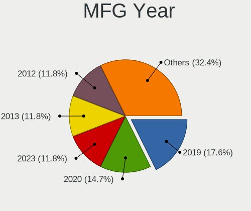
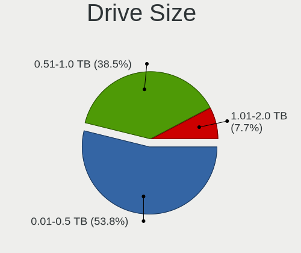
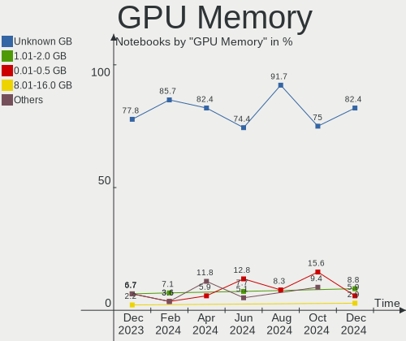
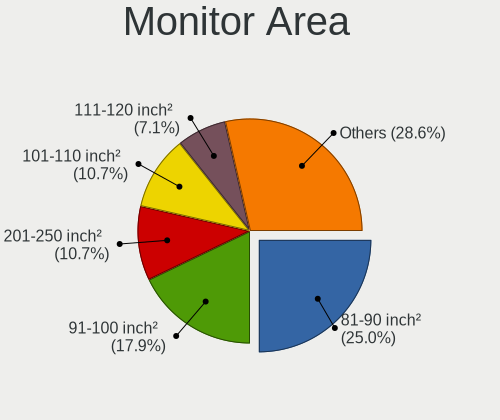
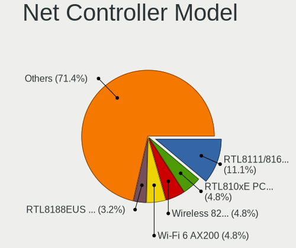
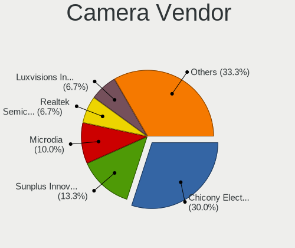

FreeBSD Hardware Trends (Notebooks)
-----------------------------------

A project to identify most popular hardware characteristics and track their change
over time based on data collected by FreeBSD users at https://BSD-Hardware.info.

Anyone can contribute to this report by the [hw-probe](https://github.com/linuxhw/hw-probe/blob/master/INSTALL.BSD.md) tool:

    hw-probe -all -upload

Full-feature report is available here: https://bsd-hardware.info/?view=trends

Period: Jan, 2022.

Contents
--------

* [ System ](#system)
  - [ OS                       ](#os)
  - [ OS Family                ](#os-family)
  - [ Arch                     ](#arch)
  - [ DE                       ](#de)
  - [ Display Server           ](#display-server)
  - [ Display Manager          ](#display-manager)
  - [ OS Lang                  ](#os-lang)
  - [ Boot Mode                ](#boot-mode)
  - [ Filesystem               ](#filesystem)
  - [ Part. scheme             ](#part-scheme)

* [ Board ](#board)
  - [ Vendor                   ](#vendor)
  - [ Model                    ](#model)
  - [ Model Family             ](#model-family)
  - [ MFG Year                 ](#mfg-year)
  - [ Form Factor              ](#form-factor)
  - [ Coreboot                 ](#coreboot)
  - [ RAM Size                 ](#ram-size)
  - [ RAM Used                 ](#ram-used)
  - [ Total Drives             ](#total-drives)
  - [ Has CD-ROM               ](#has-cd-rom)
  - [ Has Ethernet             ](#has-ethernet)
  - [ Has WiFi                 ](#has-wifi)
  - [ Has Bluetooth            ](#has-bluetooth)

* [ Location ](#location)
  - [ Country                  ](#country)
  - [ City                     ](#city)

* [ Drives ](#drives)
  - [ Drive Vendor             ](#drive-vendor)
  - [ Drive Model              ](#drive-model)
  - [ HDD Vendor               ](#hdd-vendor)
  - [ SSD Vendor               ](#ssd-vendor)
  - [ Drive Kind               ](#drive-kind)
  - [ Drive Connector          ](#drive-connector)
  - [ Drive Size               ](#drive-size)
  - [ Space Total              ](#space-total)
  - [ Space Used               ](#space-used)
  - [ Malfunc. Drives          ](#malfunc-drives)
  - [ Malfunc. Drive Vendor    ](#malfunc-drive-vendor)
  - [ Malfunc. HDD Vendor      ](#malfunc-hdd-vendor)
  - [ Malfunc. Drive Kind      ](#malfunc-drive-kind)
  - [ Failed Drives            ](#failed-drives)
  - [ Failed Drive Vendor      ](#failed-drive-vendor)
  - [ Drive Status             ](#drive-status)

* [ Storage controller ](#storage-controller)
  - [ Storage Vendor           ](#storage-vendor)
  - [ Storage Model            ](#storage-model)
  - [ Storage Kind             ](#storage-kind)

* [ Processor ](#processor)
  - [ CPU Vendor               ](#cpu-vendor)
  - [ CPU Model                ](#cpu-model)
  - [ CPU Model Family         ](#cpu-model-family)
  - [ CPU Cores                ](#cpu-cores)
  - [ CPU Sockets              ](#cpu-sockets)
  - [ CPU Threads              ](#cpu-threads)
  - [ CPU Microarch            ](#cpu-microarch)

* [ Graphics ](#graphics)
  - [ GPU Vendor               ](#gpu-vendor)
  - [ GPU Model                ](#gpu-model)
  - [ GPU Combo                ](#gpu-combo)
  - [ GPU Driver               ](#gpu-driver)
  - [ GPU Memory               ](#gpu-memory)

* [ Monitor ](#monitor)
  - [ Monitor Vendor           ](#monitor-vendor)
  - [ Monitor Model            ](#monitor-model)
  - [ Monitor Resolution       ](#monitor-resolution)
  - [ Monitor Diagonal         ](#monitor-diagonal)
  - [ Monitor Width            ](#monitor-width)
  - [ Aspect Ratio             ](#aspect-ratio)
  - [ Monitor Area             ](#monitor-area)
  - [ Pixel Density            ](#pixel-density)
  - [ Multiple Monitors        ](#multiple-monitors)

* [ Network ](#network)
  - [ Net Controller Vendor    ](#net-controller-vendor)
  - [ Net Controller Model     ](#net-controller-model)
  - [ Wireless Vendor          ](#wireless-vendor)
  - [ Wireless Model           ](#wireless-model)
  - [ Ethernet Vendor          ](#ethernet-vendor)
  - [ Ethernet Model           ](#ethernet-model)
  - [ Net Controller Kind      ](#net-controller-kind)
  - [ Used Controller          ](#used-controller)
  - [ NICs                     ](#nics)
  - [ IPv6                     ](#ipv6)

* [ Bluetooth ](#bluetooth)
  - [ Bluetooth Vendor         ](#bluetooth-vendor)
  - [ Bluetooth Model          ](#bluetooth-model)

* [ Sound ](#sound)
  - [ Sound Vendor             ](#sound-vendor)
  - [ Sound Model              ](#sound-model)

* [ Memory ](#memory)
  - [ Memory Vendor            ](#memory-vendor)
  - [ Memory Model             ](#memory-model)
  - [ Memory Kind              ](#memory-kind)
  - [ Memory Form Factor       ](#memory-form-factor)
  - [ Memory Size              ](#memory-size)
  - [ Memory Speed             ](#memory-speed)

* [ Printers & scanners ](#printers--scanners)
  - [ Printer Vendor           ](#printer-vendor)
  - [ Printer Model            ](#printer-model)
  - [ Scanner Vendor           ](#scanner-vendor)
  - [ Scanner Model            ](#scanner-model)

* [ Camera ](#camera)
  - [ Camera Vendor            ](#camera-vendor)
  - [ Camera Model             ](#camera-model)

* [ Security ](#security)
  - [ Fingerprint Vendor       ](#fingerprint-vendor)
  - [ Fingerprint Model        ](#fingerprint-model)
  - [ Chipcard Vendor          ](#chipcard-vendor)
  - [ Chipcard Model           ](#chipcard-model)

* [ Unsupported ](#unsupported)
  - [ Unsupported Devices      ](#unsupported-devices)
  - [ Unsupported Device Types ](#unsupported-device-types)

System
------

OS
--

Installed operating systems

| Name                 | Notebooks | Percent |
|----------------------|-----------|---------|
| FreeBSD 13.0-p6      | 10        | 31.25%  |
| FreeBSD 13.0-p5      | 7         | 21.88%  |
| FreeBSD 14.0-CURRENT | 5         | 15.63%  |
| FreeBSD 13.0         | 4         | 12.5%   |
| FreeBSD 13.0-STABLE  | 2         | 6.25%   |
| FreeBSD 12.3         | 2         | 6.25%   |
| FreeBSD 13.0-p4      | 1         | 3.13%   |
| FreeBSD 11.4-p7      | 1         | 3.13%   |

OS Family
---------

OS without a version

| Name    | Notebooks | Percent |
|---------|-----------|---------|
| FreeBSD | 32        | 100%    |

Arch
----

OS architecture (x86_64, i586, etc.)

| Name  | Notebooks | Percent |
|-------|-----------|---------|
| amd64 | 32        | 100%    |

DE
--

Desktop Environment

| Name          | Notebooks | Percent |
|---------------|-----------|---------|
| XFCE          | 7         | 21.88%  |
| TWM           | 5         | 15.63%  |
| KDE5          | 5         | 15.63%  |
| MATE          | 4         | 12.5%   |
| GNOME         | 4         | 12.5%   |
| Enlightenment | 2         | 6.25%   |
| Picom         | 1         | 3.13%   |
| Openbox       | 1         | 3.13%   |
| i3            | 1         | 3.13%   |
| Cinnamon      | 1         | 3.13%   |
| Console       | 1         | 3.13%   |

Display Server
--------------

X11 or Wayland

| Name    | Notebooks | Percent |
|---------|-----------|---------|
| X11     | 30        | 93.75%  |
| Wayland | 1         | 3.13%   |
| Console | 1         | 3.13%   |

Display Manager
---------------

SDDM, LightDM, etc.

| Name    | Notebooks | Percent |
|---------|-----------|---------|
| Console | 10        | 31.25%  |
| SDDM    | 7         | 21.88%  |
| XDM     | 6         | 18.75%  |
| GDM     | 4         | 12.5%   |
| SLiM    | 2         | 6.25%   |
| LightDM | 2         | 6.25%   |
| WDM     | 1         | 3.13%   |

OS Lang
-------

Language

| Lang    | Notebooks | Percent |
|---------|-----------|---------|
| C       | 16        | 50%     |
| en_US   | 6         | 18.75%  |
| Unknown | 5         | 15.63%  |
| pl_PL   | 1         | 3.13%   |
| it_IT   | 1         | 3.13%   |
| en_CA   | 1         | 3.13%   |
| de_DE   | 1         | 3.13%   |
| de_CH   | 1         | 3.13%   |

Boot Mode
---------

EFI or BIOS

| Mode | Notebooks | Percent |
|------|-----------|---------|
| EFI  | 26        | 81.25%  |
| BIOS | 6         | 18.75%  |

Filesystem
----------

Type of filesystem

| Type | Notebooks | Percent |
|------|-----------|---------|
| Zfs  | 23        | 71.88%  |
| Ufs  | 9         | 28.13%  |

Part. scheme
------------

Scheme of partitioning

| Type | Notebooks | Percent |
|------|-----------|---------|
| GPT  | 30        | 93.75%  |
| MBR  | 2         | 6.25%   |

Board
-----

Vendor
------

Motherboard manufacturer

| Name             | Notebooks | Percent |
|------------------|-----------|---------|
| Lenovo           | 8         | 25%     |
| Dell             | 8         | 25%     |
| MSI              | 3         | 9.38%   |
| Hewlett-Packard  | 3         | 9.38%   |
| ASUSTek Computer | 3         | 9.38%   |
| TUXEDO           | 1         | 3.13%   |
| Toshiba          | 1         | 3.13%   |
| GPD              | 1         | 3.13%   |
| Fujitsu Siemens  | 1         | 3.13%   |
| Framework        | 1         | 3.13%   |
| Apple            | 1         | 3.13%   |
| Acer             | 1         | 3.13%   |

Model
-----

Motherboard model

| Name                                   | Notebooks | Percent |
|----------------------------------------|-----------|---------|
| TUXEDO N14xWU                          | 1         | 3.13%   |
| Toshiba TECRA Z40-B                    | 1         | 3.13%   |
| MSI Summit E13FlipEvo A11MT            | 1         | 3.13%   |
| MSI GT75VR 7RF                         | 1         | 3.13%   |
| MSI GE76 Raider 10UG                   | 1         | 3.13%   |
| Lenovo ThinkPad X250 20CL001GUS        | 1         | 3.13%   |
| Lenovo ThinkPad X13 Gen 1 20T2003PRT   | 1         | 3.13%   |
| Lenovo ThinkPad T480s 20L8S1GX00       | 1         | 3.13%   |
| Lenovo ThinkPad T470s W10DG 20JTS0A900 | 1         | 3.13%   |
| Lenovo ThinkPad T460p 20FXS09D11       | 1         | 3.13%   |
| Lenovo ThinkPad L570 W10DG 20JRS0RC02  | 1         | 3.13%   |
| Lenovo ThinkPad E480 20KN0048IA        | 1         | 3.13%   |
| Lenovo ThinkPad E14 Gen 3 20Y7003SGE   | 1         | 3.13%   |
| HP Pavilion Gaming Laptop 15-ec2xxx    | 1         | 3.13%   |
| HP Notebook                            | 1         | 3.13%   |
| HP EliteBook 8570p                     | 1         | 3.13%   |
| GPD G1621-02                           | 1         | 3.13%   |
| Fujitsu Siemens AMILO Li 2727          | 1         | 3.13%   |
| Framework Laptop                       | 1         | 3.13%   |
| Dell XPS 15 9575                       | 1         | 3.13%   |
| Dell Precision 7530                    | 1         | 3.13%   |
| Dell Latitude E6430                    | 1         | 3.13%   |
| Dell Latitude E5450                    | 1         | 3.13%   |
| Dell Inspiron 5558                     | 1         | 3.13%   |
| Dell Inspiron 5555                     | 1         | 3.13%   |
| Dell Inspiron 15 7000 Gaming           | 1         | 3.13%   |
| Dell G3 3500                           | 1         | 3.13%   |
| ASUS U31SD                             | 1         | 3.13%   |
| ASUS N50Vc                             | 1         | 3.13%   |
| ASUS 1015PEM                           | 1         | 3.13%   |
| Apple MacBook5,1                       | 1         | 3.13%   |
| Acer TravelMate 8481TG                 | 1         | 3.13%   |

Model Family
------------

Motherboard model prefix

| Name                  | Notebooks | Percent |
|-----------------------|-----------|---------|
| Lenovo ThinkPad       | 8         | 25%     |
| Dell Inspiron         | 3         | 9.38%   |
| Dell Latitude         | 2         | 6.25%   |
| TUXEDO N14xWU         | 1         | 3.13%   |
| Toshiba TECRA         | 1         | 3.13%   |
| MSI Summit            | 1         | 3.13%   |
| MSI GT75VR            | 1         | 3.13%   |
| MSI GE76              | 1         | 3.13%   |
| HP Pavilion           | 1         | 3.13%   |
| HP Notebook           | 1         | 3.13%   |
| HP EliteBook          | 1         | 3.13%   |
| GPD G1621-02          | 1         | 3.13%   |
| Fujitsu Siemens AMILO | 1         | 3.13%   |
| Framework Laptop      | 1         | 3.13%   |
| Dell XPS              | 1         | 3.13%   |
| Dell Precision        | 1         | 3.13%   |
| Dell G3               | 1         | 3.13%   |
| ASUS U31SD            | 1         | 3.13%   |
| ASUS N50Vc            | 1         | 3.13%   |
| ASUS 1015PEM          | 1         | 3.13%   |
| Apple MacBook5        | 1         | 3.13%   |
| Acer TravelMate       | 1         | 3.13%   |

MFG Year
--------

Motherboard manufacture year

| Year | Notebooks | Percent |
|------|-----------|---------|
| 2021 | 7         | 21.88%  |
| 2018 | 4         | 12.5%   |
| 2020 | 3         | 9.38%   |
| 2019 | 3         | 9.38%   |
| 2015 | 3         | 9.38%   |
| 2011 | 3         | 9.38%   |
| 2017 | 2         | 6.25%   |
| 2016 | 2         | 6.25%   |
| 2013 | 2         | 6.25%   |
| 2009 | 2         | 6.25%   |
| 2008 | 1         | 3.13%   |

Form Factor
-----------

Physical design of the computer

| Name     | Notebooks | Percent |
|----------|-----------|---------|
| Notebook | 32        | 100%    |

Coreboot
--------

Have coreboot on board

| Used | Notebooks | Percent |
|------|-----------|---------|
| No   | 32        | 100%    |

RAM Size
--------

Total RAM memory

| Size in GB  | Notebooks | Percent |
|-------------|-----------|---------|
| 16.01-24.0  | 11        | 34.38%  |
| 8.01-16.0   | 9         | 28.13%  |
| 32.01-64.0  | 4         | 12.5%   |
| 4.01-8.0    | 3         | 9.38%   |
| 24.01-32.0  | 2         | 6.25%   |
| 2.01-3.0    | 1         | 3.13%   |
| 64.01-256.0 | 1         | 3.13%   |
| 0.51-1.0    | 1         | 3.13%   |

RAM Used
--------

Used RAM memory

| Used GB  | Notebooks | Percent |
|----------|-----------|---------|
| 0.51-1.0 | 15        | 46.88%  |
| 0.01-0.5 | 10        | 31.25%  |
| 1.01-2.0 | 6         | 18.75%  |
| 2.01-3.0 | 1         | 3.13%   |

Total Drives
------------

Number of drives on board

| Drives | Notebooks | Percent |
|--------|-----------|---------|
| 1      | 23        | 71.88%  |
| 2      | 8         | 25%     |
| 3      | 1         | 3.13%   |

Has CD-ROM
----------

Has CD-ROM on board

| Presented | Notebooks | Percent |
|-----------|-----------|---------|
| No        | 25        | 78.13%  |
| Yes       | 7         | 21.88%  |

Has Ethernet
------------

Has Ethernet on board

| Presented | Notebooks | Percent |
|-----------|-----------|---------|
| Yes       | 29        | 90.63%  |
| No        | 3         | 9.38%   |

Has WiFi
--------

Has WiFi module

| Presented | Notebooks | Percent |
|-----------|-----------|---------|
| Yes       | 32        | 100%    |

Has Bluetooth
-------------

Has Bluetooth module

| Presented | Notebooks | Percent |
|-----------|-----------|---------|
| Yes       | 23        | 71.88%  |
| No        | 9         | 28.13%  |

Location
--------

Country
-------

Geographic location (country)

| Country     | Notebooks | Percent |
|-------------|-----------|---------|
| USA         | 6         | 18.75%  |
| Germany     | 4         | 12.5%   |
| Canada      | 3         | 9.38%   |
| Switzerland | 2         | 6.25%   |
| Indonesia   | 2         | 6.25%   |
| France      | 2         | 6.25%   |
| Austria     | 2         | 6.25%   |
| UK          | 1         | 3.13%   |
| Turkey      | 1         | 3.13%   |
| Russia      | 1         | 3.13%   |
| Romania     | 1         | 3.13%   |
| Portugal    | 1         | 3.13%   |
| Poland      | 1         | 3.13%   |
| Italy       | 1         | 3.13%   |
| Greece      | 1         | 3.13%   |
| Finland     | 1         | 3.13%   |
| Eswatini    | 1         | 3.13%   |
| Armenia     | 1         | 3.13%   |

City
----

Geographic location (city)

| City                  | Notebooks | Percent |
|-----------------------|-----------|---------|
| Jakarta               | 2         | 6.25%   |
| Chicago               | 2         | 6.25%   |
| Calgary               | 2         | 6.25%   |
| Berlin                | 2         | 6.25%   |
| Yerevan               | 1         | 3.13%   |
| Warsaw                | 1         | 3.13%   |
| Vienna                | 1         | 3.13%   |
| Therwil               | 1         | 3.13%   |
| Stuttgart             | 1         | 3.13%   |
| Saint-Germain-en-Laye | 1         | 3.13%   |
| Rostov-on-Don         | 1         | 3.13%   |
| Queens                | 1         | 3.13%   |
| Preveza               | 1         | 3.13%   |
| Montclair             | 1         | 3.13%   |
| Mbabane               | 1         | 3.13%   |
| Malnate               | 1         | 3.13%   |
| London                | 1         | 3.13%   |
| Lisbon                | 1         | 3.13%   |
| Istanbul              | 1         | 3.13%   |
| Hyattsville           | 1         | 3.13%   |
| Helsinki              | 1         | 3.13%   |
| Halifax               | 1         | 3.13%   |
| Graz                  | 1         | 3.13%   |
| Frankfurt am Main     | 1         | 3.13%   |
| Concord               | 1         | 3.13%   |
| Colombes              | 1         | 3.13%   |
| Bucharest             | 1         | 3.13%   |
| Bern                  | 1         | 3.13%   |

Drives
------

Drive Vendor
------------

Hard drive vendors

| Vendor              | Notebooks | Drives | Percent |
|---------------------|-----------|--------|---------|
| Samsung Electronics | 12        | 13     | 29.27%  |
| WDC                 | 6         | 6      | 14.63%  |
| Toshiba             | 3         | 3      | 7.32%   |
| Crucial             | 3         | 3      | 7.32%   |
| Seagate             | 2         | 2      | 4.88%   |
| Kingston            | 2         | 2      | 4.88%   |
| HGST                | 2         | 2      | 4.88%   |
| Transcend           | 1         | 2      | 2.44%   |
| SanDisk             | 1         | 1      | 2.44%   |
| Phison              | 1         | 1      | 2.44%   |
| Micron Technology   | 1         | 1      | 2.44%   |
| Lexar               | 1         | 1      | 2.44%   |
| KIOXIA              | 1         | 1      | 2.44%   |
| Intel               | 1         | 1      | 2.44%   |
| Hitachi             | 1         | 1      | 2.44%   |
| Fujitsu             | 1         | 1      | 2.44%   |
| BIWIN               | 1         | 1      | 2.44%   |
| A-DATA Technology   | 1         | 1      | 2.44%   |

Drive Model
-----------

Hard drive models

| Model                              | Notebooks | Percent |
|------------------------------------|-----------|---------|
| Kingston SA400S37240G 240GB        | 2         | 4.76%   |
| HGST HTS721010A9E630 1TB           | 2         | 4.76%   |
| WDC WDS500G3X0C-00SJG0 500GB       | 1         | 2.38%   |
| WDC WDS500G2B0A 500GB              | 1         | 2.38%   |
| WDC WD6400BEVT-22A0RT0 640GB       | 1         | 2.38%   |
| WDC WD1600BEVT-75ZCT2 160GB        | 1         | 2.38%   |
| WDC WD10JPVX-60JC3T0 1TB           | 1         | 2.38%   |
| WDC PC SN730 SDBQNTY-1T00-1001 1TB | 1         | 2.38%   |
| Transcend TS2TMTE220S 2TB          | 1         | 2.38%   |
| Toshiba MQ02ABD100H 1TB            | 1         | 2.38%   |
| Toshiba MQ01ABF050 500GB           | 1         | 2.38%   |
| Toshiba MQ01ABD100 1TB             | 1         | 2.38%   |
| Seagate ST9320325AS 320GB          | 1         | 2.38%   |
| Seagate ST1000LM035-1RK172 1TB     | 1         | 2.38%   |
| SanDisk SSD P4 64GB                | 1         | 2.38%   |
| Samsung SSD 970 EVO 500GB          | 1         | 2.38%   |
| Samsung SSD 970 EVO 250GB          | 1         | 2.38%   |
| Samsung SSD 860 QVO 1TB            | 1         | 2.38%   |
| Samsung SSD 860 EVO 500GB          | 1         | 2.38%   |
| Samsung SSD 850 EVO M.2 250GB      | 1         | 2.38%   |
| Samsung SSD 850 EVO 500GB          | 1         | 2.38%   |
| Samsung SSD 840 Series 120GB       | 1         | 2.38%   |
| Samsung SSD 840 EVO 120GB          | 1         | 2.38%   |
| Samsung MZVLW1T0HMLH-000L7 1TB     | 1         | 2.38%   |
| Samsung MZVLQ256HAJD-000H1 256GB   | 1         | 2.38%   |
| Samsung MZVLB2T0HMLB-00000 2TB     | 1         | 2.38%   |
| Samsung MZALQ512HBLU-00BL1 512GB   | 1         | 2.38%   |
| Samsung MZ7TY256HDHP-000L7 256GB   | 1         | 2.38%   |
| Phison PCIe SSD 1TB                | 1         | 2.38%   |
| Micron 3400_MTFDKBA1T0TFH 1TB      | 1         | 2.38%   |
| Lexar 256GB SSD                    | 1         | 2.38%   |
| KIOXIA KBG40ZNS256G NVMe 256GB     | 1         | 2.38%   |
| Intel SSDPEKNW020T8 2TB            | 1         | 2.38%   |
| Hitachi HTS723232A7A364 320GB      | 1         | 2.38%   |
| Fujitsu MHZ2160BH G2 160GB         | 1         | 2.38%   |
| Crucial CT525MX300SSD1 528GB       | 1         | 2.38%   |
| Crucial CT2000MX500SSD1 2TB        | 1         | 2.38%   |
| Crucial CT1000P1SSD8 1TB           | 1         | 2.38%   |
| BIWIN SSD 1TB                      | 1         | 2.38%   |
| A-DATA SX8200PNP 256GB             | 1         | 2.38%   |

HDD Vendor
----------

Hard disk drive vendors

| Vendor  | Notebooks | Drives | Percent |
|---------|-----------|--------|---------|
| WDC     | 3         | 3      | 25%     |
| Toshiba | 3         | 3      | 25%     |
| Seagate | 2         | 2      | 16.67%  |
| HGST    | 2         | 2      | 16.67%  |
| Hitachi | 1         | 1      | 8.33%   |
| Fujitsu | 1         | 1      | 8.33%   |

SSD Vendor
----------

Solid state drive vendors

| Vendor              | Notebooks | Drives | Percent |
|---------------------|-----------|--------|---------|
| Samsung Electronics | 7         | 7      | 50%     |
| Kingston            | 2         | 2      | 14.29%  |
| Crucial             | 2         | 2      | 14.29%  |
| WDC                 | 1         | 1      | 7.14%   |
| SanDisk             | 1         | 1      | 7.14%   |
| Lexar               | 1         | 1      | 7.14%   |

Drive Kind
----------

HDD or SSD

| Kind | Notebooks | Drives | Percent |
|------|-----------|--------|---------|
| NVMe | 14        | 17     | 36.84%  |
| SSD  | 13        | 14     | 34.21%  |
| HDD  | 11        | 12     | 28.95%  |

Drive Connector
---------------

SATA, SAS, NVMe, etc.

| Type | Notebooks | Drives | Percent |
|------|-----------|--------|---------|
| SATA | 23        | 26     | 62.16%  |
| NVMe | 14        | 17     | 37.84%  |

Drive Size
----------

Size of hard drive

| Size in TB | Notebooks | Drives | Percent |
|------------|-----------|--------|---------|
| 0.01-0.5   | 15        | 16     | 60%     |
| 0.51-1.0   | 9         | 9      | 36%     |
| 1.01-2.0   | 1         | 1      | 4%      |

Space Total
-----------

Amount of disk space available on the file system

| Size in GB | Notebooks | Percent |
|------------|-----------|---------|
| 501-1000   | 11        | 34.38%  |
| 101-250    | 9         | 28.13%  |
| 251-500    | 6         | 18.75%  |
| 51-100     | 3         | 9.38%   |
| 1001-2000  | 2         | 6.25%   |
| 21-50      | 1         | 3.13%   |

Space Used
----------

Amount of used disk space

| Used GB | Notebooks | Percent |
|---------|-----------|---------|
| 1-20    | 26        | 81.25%  |
| 21-50   | 5         | 15.63%  |
| 251-500 | 1         | 3.13%   |

Malfunc. Drives
---------------

Drive models with a malfunction

| Model                        | Notebooks | Drives | Percent |
|------------------------------|-----------|--------|---------|
| WDC WD6400BEVT-22A0RT0 640GB | 1         | 1      | 16.67%  |
| WDC WD10JPVX-60JC3T0 1TB     | 1         | 1      | 16.67%  |
| Seagate ST9320325AS 320GB    | 1         | 1      | 16.67%  |
| SanDisk SSD P4 64GB          | 1         | 1      | 16.67%  |
| HGST HTS721010A9E630 1TB     | 1         | 1      | 16.67%  |
| Fujitsu MHZ2160BH G2 160GB   | 1         | 1      | 16.67%  |

Malfunc. Drive Vendor
---------------------

Vendors of faulty drives

| Vendor  | Notebooks | Drives | Percent |
|---------|-----------|--------|---------|
| WDC     | 2         | 2      | 33.33%  |
| Seagate | 1         | 1      | 16.67%  |
| SanDisk | 1         | 1      | 16.67%  |
| HGST    | 1         | 1      | 16.67%  |
| Fujitsu | 1         | 1      | 16.67%  |

Malfunc. HDD Vendor
-------------------

Vendors of faulty HDD drives

| Vendor  | Notebooks | Drives | Percent |
|---------|-----------|--------|---------|
| WDC     | 2         | 2      | 40%     |
| Seagate | 1         | 1      | 20%     |
| HGST    | 1         | 1      | 20%     |
| Fujitsu | 1         | 1      | 20%     |

Malfunc. Drive Kind
-------------------

Kinds of faulty drives

| Kind | Notebooks | Drives | Percent |
|------|-----------|--------|---------|
| HDD  | 5         | 5      | 83.33%  |
| SSD  | 1         | 1      | 16.67%  |

Failed Drives
-------------

Failed drive models

Zero info for selected period =(

Failed Drive Vendor
-------------------

Failed drive vendors

Zero info for selected period =(

Drive Status
------------

Number of failed and malfunc. drives

| Status  | Notebooks | Drives | Percent |
|---------|-----------|--------|---------|
| Works   | 28        | 37     | 82.35%  |
| Malfunc | 6         | 6      | 17.65%  |

Storage controller
------------------

Storage Vendor
--------------

Storage controller vendors

| Vendor              | Notebooks | Percent |
|---------------------|-----------|---------|
| Intel               | 21        | 55.26%  |
| Samsung Electronics | 6         | 15.79%  |
| Silicon Motion      | 2         | 5.26%   |
| Sandisk             | 2         | 5.26%   |
| AMD                 | 2         | 5.26%   |
| Phison Electronics  | 1         | 2.63%   |
| Nvidia              | 1         | 2.63%   |
| Micron Technology   | 1         | 2.63%   |
| KIOXIA              | 1         | 2.63%   |
| ADATA Technology    | 1         | 2.63%   |

Storage Model
-------------

Storage controller models

| Model                                                                         | Notebooks | Percent |
|-------------------------------------------------------------------------------|-----------|---------|
| Intel Sunrise Point-LP SATA Controller [AHCI mode]                            | 5         | 11.9%   |
| Intel Wildcat Point-LP SATA Controller [AHCI Mode]                            | 4         | 9.52%   |
| Samsung NVMe SSD Controller SM981/PM981/PM983                                 | 3         | 7.14%   |
| Silicon Motion SM2262/SM2262EN SSD Controller                                 | 2         | 4.76%   |
| Sandisk WD Black SN750 / PC SN730 NVMe SSD                                    | 2         | 4.76%   |
| Samsung NVMe SSD Controller 980                                               | 2         | 4.76%   |
| Intel 7 Series Chipset Family 6-port SATA Controller [AHCI mode]              | 2         | 4.76%   |
| Intel 6 Series/C200 Series Chipset Family 6 port Mobile SATA AHCI Controller  | 2         | 4.76%   |
| AMD FCH SATA Controller [AHCI mode]                                           | 2         | 4.76%   |
| Samsung NVMe SSD Controller SM961/PM961/SM963                                 | 1         | 2.38%   |
| Phison E12 NVMe Controller                                                    | 1         | 2.38%   |
| Nvidia MCP79 AHCI Controller                                                  | 1         | 2.38%   |
| KIOXIA unknown                                                                | 1         | 2.38%   |
| Intel SSD 660P Series                                                         | 1         | 2.38%   |
| Intel Q170/Q150/B150/H170/H110/Z170/CM236 Chipset SATA Controller [AHCI Mode] | 1         | 2.38%   |
| Intel NM10/ICH7 Family SATA Controller [AHCI mode]                            | 1         | 2.38%   |
| Intel HM170/QM170 Chipset SATA Controller [AHCI Mode]                         | 1         | 2.38%   |
| Intel Cannon Lake Mobile PCH SATA AHCI Controller                             | 1         | 2.38%   |
| Intel 82801IBM/IEM (ICH9M/ICH9M-E) 4 port SATA Controller [AHCI mode]         | 1         | 2.38%   |
| Intel 82801HM/HEM (ICH8M/ICH8M-E) SATA Controller [AHCI mode]                 | 1         | 2.38%   |
| Intel 82801HM/HEM (ICH8M/ICH8M-E) IDE Controller                              | 1         | 2.38%   |
| Intel 82801 Mobile SATA Controller [RAID mode]                                | 1         | 2.38%   |
| Intel 7 Series Chipset Family 4-port SATA Controller [IDE mode]               | 1         | 2.38%   |
| Intel 7 Series Chipset Family 2-port SATA Controller [IDE mode]               | 1         | 2.38%   |
| Intel 400 Series Chipset Family SATA AHCI Controller                          | 1         | 2.38%   |
| ADATA XPG SX8200 Pro PCIe Gen3x4 M.2 2280 Solid State Drive                   | 1         | 2.38%   |
| Unknown                                                                       | 1         | 2.38%   |

Storage Kind
------------

Kind of storage controller (IDE, SATA, NVMe, SAS, ...)

| Kind | Notebooks | Percent |
|------|-----------|---------|
| SATA | 23        | 57.5%   |
| NVMe | 14        | 35%     |
| IDE  | 2         | 5%      |
| RAID | 1         | 2.5%    |

Processor
---------

CPU Vendor
----------

Processor vendors

| Vendor | Notebooks | Percent |
|--------|-----------|---------|
| Intel  | 29        | 90.63%  |
| AMD    | 3         | 9.38%   |

CPU Model
---------

Processor models

| Model                                           | Notebooks | Percent |
|-------------------------------------------------|-----------|---------|
| Intel Core i5-8250U CPU @ 1.60GHz               | 2         | 6.25%   |
| Intel Core i5-5300U CPU @ 2.30GHz               | 2         | 6.25%   |
| Intel 11th Gen Core i7-1195G7 @ 2.90GHz         | 2         | 6.25%   |
| Intel CPU Version                               | 1         | 3.13%   |
| Intel Core i7-8850H CPU @ 2.60GHz               | 1         | 3.13%   |
| Intel Core i7-8705G CPU @ 3.10GHz               | 1         | 3.13%   |
| Intel Core i7-7700HQ CPU @ 2.80GHz              | 1         | 3.13%   |
| Intel Core i7-5500U CPU @ 2.40GHz               | 1         | 3.13%   |
| Intel Core i7-3720QM CPU @ 2.60GHz              | 1         | 3.13%   |
| Intel Core i7-3520M CPU @ 2.90GHz               | 1         | 3.13%   |
| Intel Core i7-2677M CPU @ 1.80GHz               | 1         | 3.13%   |
| Intel Core i7-10870H CPU @ 2.20GHz              | 1         | 3.13%   |
| Intel Core i7-10510U CPU @ 1.80GHz              | 1         | 3.13%   |
| Intel Core i5-8350U CPU @ 1.70GHz               | 1         | 3.13%   |
| Intel Core i5-7300HQ CPU @ 2.50GHz              | 1         | 3.13%   |
| Intel Core i5-7200U CPU @ 2.50GHz               | 1         | 3.13%   |
| Intel Core i5-6440HQ CPU @ 2.60GHz              | 1         | 3.13%   |
| Intel Core i5-6300U CPU @ 2.40GHz               | 1         | 3.13%   |
| Intel Core i5-6200U CPU @ 2.30GHz               | 1         | 3.13%   |
| Intel Core i5-5200U CPU @ 2.20GHz               | 1         | 3.13%   |
| Intel Core i5-10300H CPU @ 2.50GHz              | 1         | 3.13%   |
| Intel Core i3-2310M CPU @ 2.10GHz               | 1         | 3.13%   |
| Intel Core 2 Duo CPU P8400 @ 2.26GHz            | 1         | 3.13%   |
| Intel Core 2 Duo CPU P7350 @ 2.00GHz            | 1         | 3.13%   |
| Intel Atom CPU N550 @ 1.50GHz                   | 1         | 3.13%   |
| Intel 11th Gen Core i5-1135G7 @ 2.40GHz         | 1         | 3.13%   |
| AMD Ryzen 5 5600H with Radeon Graphics          | 1         | 3.13%   |
| AMD Ryzen 5 5500U with Radeon Graphics          | 1         | 3.13%   |
| AMD A10-8700P Radeon R6, 10 Compute Cores 4C+6G | 1         | 3.13%   |

CPU Model Family
----------------

Processor model prefix

| Model            | Notebooks | Percent |
|------------------|-----------|---------|
| Intel Core i5    | 12        | 37.5%   |
| Intel Core i7    | 9         | 28.13%  |
| Other            | 4         | 12.5%   |
| Intel Core 2 Duo | 2         | 6.25%   |
| AMD Ryzen 5      | 2         | 6.25%   |
| Intel Core i3    | 1         | 3.13%   |
| Intel Atom       | 1         | 3.13%   |
| AMD A10          | 1         | 3.13%   |

CPU Cores
---------

Number of processor cores

| Number  | Notebooks | Percent |
|---------|-----------|---------|
| 4       | 14        | 43.75%  |
| 2       | 12        | 37.5%   |
| 12      | 2         | 6.25%   |
| Unknown | 2         | 6.25%   |
| 8       | 1         | 3.13%   |
| 6       | 1         | 3.13%   |

CPU Sockets
-----------

Number of sockets

| Number | Notebooks | Percent |
|--------|-----------|---------|
| 1      | 31        | 96.88%  |
| 2      | 1         | 3.13%   |

CPU Threads
-----------

Threads per core (Hyper-Threading)

| Number  | Notebooks | Percent |
|---------|-----------|---------|
| 2       | 24        | 75%     |
| 1       | 6         | 18.75%  |
| Unknown | 2         | 6.25%   |

CPU Microarch
-------------

Microarchitecture

| Name        | Notebooks | Percent |
|-------------|-----------|---------|
| KabyLake    | 9         | 28.13%  |
| Broadwell   | 4         | 12.5%   |
| TigerLake   | 3         | 9.38%   |
| Skylake     | 3         | 9.38%   |
| SandyBridge | 2         | 6.25%   |
| Penryn      | 2         | 6.25%   |
| IvyBridge   | 2         | 6.25%   |
| CometLake   | 2         | 6.25%   |
| Zen 3       | 1         | 3.13%   |
| Excavator   | 1         | 3.13%   |
| Core        | 1         | 3.13%   |
| Bonnell     | 1         | 3.13%   |
| Unknown     | 1         | 3.13%   |

Graphics
--------

GPU Vendor
----------

Vendors of graphics cards

| Vendor | Notebooks | Percent |
|--------|-----------|---------|
| Intel  | 24        | 57.14%  |
| Nvidia | 12        | 28.57%  |
| AMD    | 6         | 14.29%  |

GPU Model
---------

Graphics card models

| Model                                                                         | Notebooks | Percent |
|-------------------------------------------------------------------------------|-----------|---------|
| Intel HD Graphics 5500                                                        | 4         | 9.3%    |
| Intel UHD Graphics 620                                                        | 3         | 6.98%   |
| Intel TigerLake-LP GT2 [Iris Xe Graphics]                                     | 3         | 6.98%   |
| Nvidia TU117M                                                                 | 2         | 4.65%   |
| Nvidia GF119M [GeForce GT 520M]                                               | 2         | 4.65%   |
| Intel Skylake GT2 [HD Graphics 520]                                           | 2         | 4.65%   |
| Intel HD Graphics 630                                                         | 2         | 4.65%   |
| Intel CometLake-H GT2 [UHD Graphics]                                          | 2         | 4.65%   |
| Intel 2nd Generation Core Processor Family Integrated Graphics Controller     | 2         | 4.65%   |
| Nvidia GP107M [GeForce GTX 1050 Mobile]                                       | 1         | 2.33%   |
| Nvidia GP107GLM [Quadro P2000 Mobile]                                         | 1         | 2.33%   |
| Nvidia GP104BM [GeForce GTX 1080 Mobile]                                      | 1         | 2.33%   |
| Nvidia GK208BM [GeForce 920M]                                                 | 1         | 2.33%   |
| Nvidia GF108GLM [NVS 5200M]                                                   | 1         | 2.33%   |
| Nvidia GA104M [GeForce RTX 3070 Mobile / Max-Q]                               | 1         | 2.33%   |
| Nvidia G98M [GeForce 9300M GS]                                                | 1         | 2.33%   |
| Nvidia C79 [GeForce 9400M]                                                    | 1         | 2.33%   |
| Intel Mobile GM965/GL960 Integrated Graphics Controller (secondary)           | 1         | 2.33%   |
| Intel Mobile GM965/GL960 Integrated Graphics Controller (primary)             | 1         | 2.33%   |
| Intel HD Graphics 620                                                         | 1         | 2.33%   |
| Intel HD Graphics 530                                                         | 1         | 2.33%   |
| Intel CometLake-U GT2 [UHD Graphics]                                          | 1         | 2.33%   |
| Intel Atom Processor D4xx/D5xx/N4xx/N5xx Integrated Graphics Controller       | 1         | 2.33%   |
| Intel 3rd Gen Core processor Graphics Controller                              | 1         | 2.33%   |
| AMD Wani [Radeon R5/R6/R7 Graphics]                                           | 1         | 2.33%   |
| AMD Thames [Radeon HD 7550M/7570M/7650M]                                      | 1         | 2.33%   |
| AMD Sun XT [Radeon HD 8670A/8670M/8690M / R5 M330 / M430 / Radeon 520 Mobile] | 1         | 2.33%   |
| AMD Polaris 22 XL [Radeon RX Vega M GL]                                       | 1         | 2.33%   |
| AMD Lucienne                                                                  | 1         | 2.33%   |
| AMD Cezanne                                                                   | 1         | 2.33%   |

GPU Combo
---------

Combinations of graphics cards

| Name           | Notebooks | Percent |
|----------------|-----------|---------|
| 1 x Intel      | 13        | 40.63%  |
| Intel + Nvidia | 7         | 21.88%  |
| 1 x Nvidia     | 4         | 12.5%   |
| 1 x AMD        | 3         | 9.38%   |
| 2 x Intel      | 2         | 6.25%   |
| Intel + AMD    | 2         | 6.25%   |
| AMD + Nvidia   | 1         | 3.13%   |

GPU Driver
----------

Free vs proprietary

| Driver      | Notebooks | Percent |
|-------------|-----------|---------|
| Free        | 26        | 81.25%  |
| Proprietary | 6         | 18.75%  |

GPU Memory
----------

Total video memory

| Size in GB | Notebooks | Percent |
|------------|-----------|---------|
| Unknown    | 25        | 78.13%  |
| 3.01-4.0   | 2         | 6.25%   |
| 0.51-1.0   | 2         | 6.25%   |
| 0.01-0.5   | 2         | 6.25%   |
| 7.01-8.0   | 1         | 3.13%   |

Monitor
-------

Monitor Vendor
--------------

Monitor vendors

| Vendor                  | Notebooks | Percent |
|-------------------------|-----------|---------|
| Chimei Innolux          | 5         | 17.86%  |
| BOE                     | 4         | 14.29%  |
| Sharp                   | 3         | 10.71%  |
| Samsung Electronics     | 3         | 10.71%  |
| LG Display              | 3         | 10.71%  |
| AU Optronics            | 3         | 10.71%  |
| Chi Mei Optoelectronics | 2         | 7.14%   |
| Unknown                 | 1         | 3.57%   |
| Philips                 | 1         | 3.57%   |
| Iiyama                  | 1         | 3.57%   |
| ASUSTek Computer        | 1         | 3.57%   |
| Apple                   | 1         | 3.57%   |

Monitor Model
-------------

Monitor models

| Model                                                                    | Notebooks | Percent |
|--------------------------------------------------------------------------|-----------|---------|
| Unknown LCD Monitor Sharp 3840x2160                                      | 1         | 3.57%   |
| Sharp LQ173M1JW05 SHP14EC 1920x1080 380x210mm 17.1-inch                  | 1         | 3.57%   |
| Sharp LQ134N1JW53 SHP1521 1920x1200 290x180mm 13.4-inch                  | 1         | 3.57%   |
| Sharp LCD Monitor SHP148E 1920x1080 340x190mm 15.3-inch                  | 1         | 3.57%   |
| Samsung Electronics LCD Monitor SEC544B 1600x900 310x170mm 13.9-inch     | 1         | 3.57%   |
| Samsung Electronics LCD Monitor SEC4545 1280x800 330x210mm 15.4-inch     | 1         | 3.57%   |
| Samsung Electronics LCD Monitor SDC364D 1920x1080 310x170mm 13.9-inch    | 1         | 3.57%   |
| Philips LCD Monitor PHL08C3 1920x1080 600x340mm 27.2-inch                | 1         | 3.57%   |
| LG Display LCD Monitor LGD03CD 1366x768 280x160mm 12.7-inch              | 1         | 3.57%   |
| LG Display LCD Monitor LGD031B 1366x768 310x170mm 13.9-inch              | 1         | 3.57%   |
| LG Display LCD Monitor LGD0258 1600x900 350x190mm 15.7-inch              | 1         | 3.57%   |
| Iiyama PL2474H IVM6146 1920x1080 520x290mm 23.4-inch                     | 1         | 3.57%   |
| Chimei Innolux LCD Monitor CMN1747 1920x1080 380x210mm 17.1-inch         | 1         | 3.57%   |
| Chimei Innolux LCD Monitor CMN15CA 1366x768 340x190mm 15.3-inch          | 1         | 3.57%   |
| Chimei Innolux LCD Monitor CMN14D2 1920x1080 310x170mm 13.9-inch         | 1         | 3.57%   |
| Chimei Innolux LCD Monitor CMN14C3 1366x768 310x170mm 13.9-inch          | 1         | 3.57%   |
| Chimei Innolux LCD Monitor CMN14B7 1366x768 310x170mm 13.9-inch          | 1         | 3.57%   |
| Chi Mei Optoelectronics LCD Monitor CMO1561 1280x800 330x210mm 15.4-inch | 1         | 3.57%   |
| Chi Mei Optoelectronics LCD Monitor CMO1333 1366x768 290x160mm 13.0-inch | 1         | 3.57%   |
| BOE LCD Monitor BOE095F 2256x1504 280x190mm 13.3-inch                    | 1         | 3.57%   |
| BOE LCD Monitor BOE08D7 1920x1080 310x170mm 13.9-inch                    | 1         | 3.57%   |
| BOE LCD Monitor BOE0791 1920x1080 310x170mm 13.9-inch                    | 1         | 3.57%   |
| BOE LCD Monitor BOE0742 1920x1080 310x170mm 13.9-inch                    | 1         | 3.57%   |
| AU Optronics LCD Monitor AUO71EC 1366x768 340x190mm 15.3-inch            | 1         | 3.57%   |
| AU Optronics LCD Monitor AUO5A2D 1920x1080 290x170mm 13.2-inch           | 1         | 3.57%   |
| AU Optronics LCD Monitor AUO243D 1920x1080 310x170mm 13.9-inch           | 1         | 3.57%   |
| ASUSTek Computer VZ249 AUS24CC 1920x1080 530x300mm 24.0-inch             | 1         | 3.57%   |
| Apple LCD Monitor APP9C89 1280x800 290x180mm 13.4-inch                   | 1         | 3.57%   |

Monitor Resolution
------------------

Monitor screen resolution

| Resolution        | Notebooks | Percent |
|-------------------|-----------|---------|
| 1920x1080 (FHD)   | 12        | 44.44%  |
| 1366x768 (WXGA)   | 7         | 25.93%  |
| 1280x800 (WXGA)   | 3         | 11.11%  |
| 1600x900 (HD+)    | 2         | 7.41%   |
| 3840x2160 (4K)    | 1         | 3.7%    |
| 2256x1504         | 1         | 3.7%    |
| 1920x1200 (WUXGA) | 1         | 3.7%    |

Monitor Diagonal
----------------

Diagonal size in inches

| Inches  | Notebooks | Percent |
|---------|-----------|---------|
| 13      | 15        | 53.57%  |
| 15      | 6         | 21.43%  |
| 17      | 2         | 7.14%   |
| 27      | 1         | 3.57%   |
| 24      | 1         | 3.57%   |
| 23      | 1         | 3.57%   |
| 12      | 1         | 3.57%   |
| Unknown | 1         | 3.57%   |

Monitor Width
-------------

Physical width

| Width in mm | Notebooks | Percent |
|-------------|-----------|---------|
| 301-350     | 16        | 57.14%  |
| 201-300     | 6         | 21.43%  |
| 501-600     | 3         | 10.71%  |
| 351-400     | 2         | 7.14%   |
| Unknown     | 1         | 3.57%   |

Aspect Ratio
------------

Proportional relationship between the width and the height

| Ratio   | Notebooks | Percent |
|---------|-----------|---------|
| 16/9    | 19        | 76%     |
| 16/10   | 4         | 16%     |
| 3/2     | 1         | 4%      |
| Unknown | 1         | 4%      |

Monitor Area
------------

Area in inch

| Area in inch | Notebooks | Percent |
|----------------|-----------|---------|
| 81-90          | 13        | 46.43%  |
| 101-110        | 3         | 10.71%  |
| 91-100         | 3         | 10.71%  |
| 71-80          | 2         | 7.14%   |
| 201-250        | 2         | 7.14%   |
| 121-130        | 2         | 7.14%   |
| 61-70          | 1         | 3.57%   |
| 301-350        | 1         | 3.57%   |
| Unknown        | 1         | 3.57%   |

Pixel Density
-------------

Pixels per inch

| Density | Notebooks | Percent |
|---------|-----------|---------|
| 121-160 | 12        | 42.86%  |
| 101-120 | 7         | 25%     |
| 51-100  | 5         | 17.86%  |
| 161-240 | 3         | 10.71%  |
| Unknown | 1         | 3.57%   |

Multiple Monitors
-----------------

Total monitors connected

| Total | Notebooks | Percent |
|-------|-----------|---------|
| 1     | 22        | 68.75%  |
| 0     | 7         | 21.88%  |
| 2     | 3         | 9.38%   |

Network
-------

Net Controller Vendor
---------------------

Controller vendors

| Vendor                | Notebooks | Percent |
|-----------------------|-----------|---------|
| Intel                 | 22        | 42.31%  |
| Realtek Semiconductor | 12        | 23.08%  |
| Qualcomm Atheros      | 7         | 13.46%  |
| Sierra Wireless       | 2         | 3.85%   |
| Broadcom              | 2         | 3.85%   |
| Ralink Technology     | 1         | 1.92%   |
| Ralink                | 1         | 1.92%   |
| Nvidia                | 1         | 1.92%   |
| Huawei Technologies   | 1         | 1.92%   |
| Hewlett-Packard       | 1         | 1.92%   |
| Dell                  | 1         | 1.92%   |
| Aquantia              | 1         | 1.92%   |

Net Controller Model
--------------------

Controller models

| Model                                                                   | Notebooks | Percent |
|-------------------------------------------------------------------------|-----------|---------|
| Realtek RTL8111/8168/8411 PCI Express Gigabit Ethernet Controller       | 7         | 10.45%  |
| Realtek RTL810xE PCI Express Fast Ethernet controller                   | 4         | 5.97%   |
| Intel Wireless 8260                                                     | 4         | 5.97%   |
| Intel Wi-Fi 6 AX210/AX211/AX411 160MHz                                  | 4         | 5.97%   |
| Sierra Wireless EM7455                                                  | 2         | 2.99%   |
| Realtek RTL8852AE 802.11ax PCIe Wireless Network Adapter                | 2         | 2.99%   |
| Qualcomm Atheros QCA6174 802.11ac Wireless Network Adapter              | 2         | 2.99%   |
| Intel Wireless 8265 / 8275                                              | 2         | 2.99%   |
| Intel Wireless 7265                                                     | 2         | 2.99%   |
| Intel Ethernet Connection (3) I218-LM                                   | 2         | 2.99%   |
| Intel Centrino Advanced-N 6205 [Taylor Peak]                            | 2         | 2.99%   |
| Intel 82579LM Gigabit Network Connection (Lewisville)                   | 2         | 2.99%   |
| Realtek RTL8723BE PCIe Wireless Network Adapter                         | 1         | 1.49%   |
| Realtek RTL8125 2.5GbE Controller                                       | 1         | 1.49%   |
| Ralink RT5370 Wireless Adapter                                          | 1         | 1.49%   |
| Ralink RT3090 Wireless 802.11n 1T/1R PCIe                               | 1         | 1.49%   |
| Qualcomm Atheros QCA9565 / AR9565 Wireless Network Adapter              | 1         | 1.49%   |
| Qualcomm Atheros AR9287 Wireless Network Adapter (PCI-Express)          | 1         | 1.49%   |
| Qualcomm Atheros AR8151 v2.0 Gigabit Ethernet                           | 1         | 1.49%   |
| Qualcomm Atheros AR8132 Fast Ethernet                                   | 1         | 1.49%   |
| Qualcomm Atheros AR242x / AR542x Wireless Network Adapter (PCI-Express) | 1         | 1.49%   |
| Nvidia MCP79 Ethernet                                                   | 1         | 1.49%   |
| Intel Wireless-AC 9260                                                  | 1         | 1.49%   |
| Intel Wireless 3165                                                     | 1         | 1.49%   |
| Intel Wireless 3160                                                     | 1         | 1.49%   |
| Intel WiFi Link 5100                                                    | 1         | 1.49%   |
| Intel Ethernet Connection I219-V                                        | 1         | 1.49%   |
| Intel Ethernet Connection I219-LM                                       | 1         | 1.49%   |
| Intel Ethernet Connection (7) I219-LM                                   | 1         | 1.49%   |
| Intel Ethernet Connection (4) I219-LM                                   | 1         | 1.49%   |
| Intel Ethernet Connection (3) I218-V                                    | 1         | 1.49%   |
| Intel Ethernet Connection (2) I219-LM                                   | 1         | 1.49%   |
| Intel Ethernet Connection (10) I219-V                                   | 1         | 1.49%   |
| Intel Dual Band Wireless-AC 3165 Plus Bluetooth                         | 1         | 1.49%   |
| Intel Comet Lake PCH-LP CNVi WiFi                                       | 1         | 1.49%   |
| Intel Comet Lake PCH CNVi WiFi                                          | 1         | 1.49%   |
| Intel Centrino Wireless-N 100                                           | 1         | 1.49%   |
| Huawei ME936 LTE/HSDPA+ 4G modem                                        | 1         | 1.49%   |
| HP hs2350 HSPA+ Mobile Broadband Module Network Adapter                 | 1         | 1.49%   |
| Dell Dell Wireless 5560 Single-mode HSPA Mini Card with A-GPS           | 1         | 1.49%   |
| Broadcom NetXtreme BCM57761 Gigabit Ethernet PCIe                       | 1         | 1.49%   |
| Broadcom BCM4322 802.11a/b/g/n Wireless LAN Controller                  | 1         | 1.49%   |
| Aquantia AQC107 NBase-T/IEEE 802.3bz Ethernet Controller [AQtion]       | 1         | 1.49%   |
| Unknown                                                                 | 1         | 1.49%   |

Wireless Vendor
---------------

Wireless vendors

| Vendor                | Notebooks | Percent |
|-----------------------|-----------|---------|
| Intel                 | 22        | 61.11%  |
| Qualcomm Atheros      | 5         | 13.89%  |
| Realtek Semiconductor | 3         | 8.33%   |
| Sierra Wireless       | 2         | 5.56%   |
| Ralink Technology     | 1         | 2.78%   |
| Ralink                | 1         | 2.78%   |
| Dell                  | 1         | 2.78%   |
| Broadcom              | 1         | 2.78%   |

Wireless Model
--------------

Wireless models

| Model                                                                   | Notebooks | Percent |
|-------------------------------------------------------------------------|-----------|---------|
| Intel Wireless 8260                                                     | 4         | 11.11%  |
| Intel Wi-Fi 6 AX210/AX211/AX411 160MHz                                  | 4         | 11.11%  |
| Sierra Wireless EM7455                                                  | 2         | 5.56%   |
| Realtek RTL8852AE 802.11ax PCIe Wireless Network Adapter                | 2         | 5.56%   |
| Qualcomm Atheros QCA6174 802.11ac Wireless Network Adapter              | 2         | 5.56%   |
| Intel Wireless 8265 / 8275                                              | 2         | 5.56%   |
| Intel Wireless 7265                                                     | 2         | 5.56%   |
| Intel Centrino Advanced-N 6205 [Taylor Peak]                            | 2         | 5.56%   |
| Realtek RTL8723BE PCIe Wireless Network Adapter                         | 1         | 2.78%   |
| Ralink RT5370 Wireless Adapter                                          | 1         | 2.78%   |
| Ralink RT3090 Wireless 802.11n 1T/1R PCIe                               | 1         | 2.78%   |
| Qualcomm Atheros QCA9565 / AR9565 Wireless Network Adapter              | 1         | 2.78%   |
| Qualcomm Atheros AR9287 Wireless Network Adapter (PCI-Express)          | 1         | 2.78%   |
| Qualcomm Atheros AR242x / AR542x Wireless Network Adapter (PCI-Express) | 1         | 2.78%   |
| Intel Wireless-AC 9260                                                  | 1         | 2.78%   |
| Intel Wireless 3165                                                     | 1         | 2.78%   |
| Intel Wireless 3160                                                     | 1         | 2.78%   |
| Intel WiFi Link 5100                                                    | 1         | 2.78%   |
| Intel Dual Band Wireless-AC 3165 Plus Bluetooth                         | 1         | 2.78%   |
| Intel Comet Lake PCH-LP CNVi WiFi                                       | 1         | 2.78%   |
| Intel Comet Lake PCH CNVi WiFi                                          | 1         | 2.78%   |
| Intel Centrino Wireless-N 100                                           | 1         | 2.78%   |
| Dell Dell Wireless 5560 Single-mode HSPA Mini Card with A-GPS           | 1         | 2.78%   |
| Broadcom BCM4322 802.11a/b/g/n Wireless LAN Controller                  | 1         | 2.78%   |

Ethernet Vendor
---------------

Ethernet vendors

| Vendor                | Notebooks | Percent |
|-----------------------|-----------|---------|
| Realtek Semiconductor | 12        | 41.38%  |
| Intel                 | 12        | 41.38%  |
| Qualcomm Atheros      | 2         | 6.9%    |
| Nvidia                | 1         | 3.45%   |
| Broadcom              | 1         | 3.45%   |
| Aquantia              | 1         | 3.45%   |

Ethernet Model
--------------

Ethernet models

| Model                                                             | Notebooks | Percent |
|-------------------------------------------------------------------|-----------|---------|
| Realtek RTL8111/8168/8411 PCI Express Gigabit Ethernet Controller | 7         | 24.14%  |
| Realtek RTL810xE PCI Express Fast Ethernet controller             | 4         | 13.79%  |
| Intel Ethernet Connection (3) I218-LM                             | 2         | 6.9%    |
| Intel 82579LM Gigabit Network Connection (Lewisville)             | 2         | 6.9%    |
| Realtek RTL8125 2.5GbE Controller                                 | 1         | 3.45%   |
| Qualcomm Atheros AR8151 v2.0 Gigabit Ethernet                     | 1         | 3.45%   |
| Qualcomm Atheros AR8132 Fast Ethernet                             | 1         | 3.45%   |
| Nvidia MCP79 Ethernet                                             | 1         | 3.45%   |
| Intel Ethernet Connection I219-V                                  | 1         | 3.45%   |
| Intel Ethernet Connection I219-LM                                 | 1         | 3.45%   |
| Intel Ethernet Connection (7) I219-LM                             | 1         | 3.45%   |
| Intel Ethernet Connection (4) I219-LM                             | 1         | 3.45%   |
| Intel Ethernet Connection (3) I218-V                              | 1         | 3.45%   |
| Intel Ethernet Connection (2) I219-LM                             | 1         | 3.45%   |
| Intel Ethernet Connection (10) I219-V                             | 1         | 3.45%   |
| Broadcom NetXtreme BCM57761 Gigabit Ethernet PCIe                 | 1         | 3.45%   |
| Aquantia AQC107 NBase-T/IEEE 802.3bz Ethernet Controller [AQtion] | 1         | 3.45%   |
| Unknown                                                           | 1         | 3.45%   |

Net Controller Kind
-------------------

Ethernet, WiFi or modem

| Kind     | Notebooks | Percent |
|----------|-----------|---------|
| WiFi     | 32        | 50.79%  |
| Ethernet | 29        | 46.03%  |
| Modem    | 2         | 3.17%   |

Used Controller
---------------

Currently used network controller

| Kind     | Notebooks | Percent |
|----------|-----------|---------|
| Ethernet | 29        | 52.73%  |
| WiFi     | 25        | 45.45%  |
| Modem    | 1         | 1.82%   |

NICs
----

Total network controllers on board

| Total | Notebooks | Percent |
|-------|-----------|---------|
| 2     | 29        | 90.63%  |
| 1     | 3         | 9.38%   |

IPv6
----

IPv6 vs IPv4

| Used | Notebooks | Percent |
|------|-----------|---------|
| No   | 28        | 87.5%   |
| Yes  | 4         | 12.5%   |

Bluetooth
---------

Bluetooth Vendor
----------------

Controller vendors

| Vendor                          | Notebooks | Percent |
|---------------------------------|-----------|---------|
| Intel                           | 13        | 59.09%  |
| Realtek Semiconductor           | 3         | 13.64%  |
| Qualcomm Atheros Communications | 2         | 9.09%   |
| Foxconn / Hon Hai               | 1         | 4.55%   |
| Dell                            | 1         | 4.55%   |
| ASUSTek Computer                | 1         | 4.55%   |
| Apple                           | 1         | 4.55%   |

Bluetooth Model
---------------

Controller models

| Model                                                       | Notebooks | Percent |
|-------------------------------------------------------------|-----------|---------|
| Intel Bluetooth wireless interface                          | 6         | 27.27%  |
| Intel AX210 Bluetooth                                       | 4         | 18.18%  |
| Realtek Bluetooth Radio                                     | 2         | 9.09%   |
| Intel AX201 Bluetooth                                       | 2         | 9.09%   |
| Realtek  Bluetooth 4.0 Adapter                              | 1         | 4.55%   |
| Qualcomm Atheros QCA61x4 Bluetooth 4.0                      | 1         | 4.55%   |
| Qualcomm Atheros Dell Wireless 1707 Bluetooth 4.0 LE Device | 1         | 4.55%   |
| Intel Wireless-AC 9260 Bluetooth Adapter                    | 1         | 4.55%   |
| Foxconn / Hon Hai Bluetooth USB Module                      | 1         | 4.55%   |
| Dell Dell Wireless 380 Bluetooth 4.0 Module                 | 1         | 4.55%   |
| ASUS BT-253 Bluetooth Adapter                               | 1         | 4.55%   |
| Apple Bluetooth Host Controller                             | 1         | 4.55%   |

Sound
-----

Sound Vendor
------------

Sound card vendors

| Vendor          | Notebooks | Percent |
|-----------------|-----------|---------|
| Intel           | 28        | 68.29%  |
| Nvidia          | 6         | 14.63%  |
| AMD             | 4         | 9.76%   |
| SteelSeries ApS | 1         | 2.44%   |
| Microsoft       | 1         | 2.44%   |
| GN Netcom       | 1         | 2.44%   |

Sound Model
-----------

Sound card models

| Model                                                                      | Notebooks | Percent |
|----------------------------------------------------------------------------|-----------|---------|
| Intel Sunrise Point-LP HD Audio                                            | 6         | 12.77%  |
| Intel Wildcat Point-LP High Definition Audio Controller                    | 4         | 8.51%   |
| Intel Broadwell-U Audio Controller                                         | 4         | 8.51%   |
| Intel Tiger Lake-LP Smart Sound Technology Audio Controller                | 3         | 6.38%   |
| Intel CM238 HD Audio Controller                                            | 3         | 6.38%   |
| Nvidia TU107 GeForce GTX 1650 High Definition Audio Controller             | 2         | 4.26%   |
| Intel Comet Lake PCH cAVS                                                  | 2         | 4.26%   |
| Intel 7 Series/C216 Chipset Family High Definition Audio Controller        | 2         | 4.26%   |
| Intel 6 Series/C200 Series Chipset Family High Definition Audio Controller | 2         | 4.26%   |
| AMD Family 17h (Models 10h-1fh) HD Audio Controller                        | 2         | 4.26%   |
| SteelSeries ApS SteelSeries Siberia 350                                    | 1         | 2.13%   |
| Nvidia MCP79 High Definition Audio                                         | 1         | 2.13%   |
| Nvidia GP107GL High Definition Audio Controller                            | 1         | 2.13%   |
| Nvidia GF119 HDMI Audio Controller                                         | 1         | 2.13%   |
| Nvidia GA104 High Definition Audio Controller                              | 1         | 2.13%   |
| Microsoft LifeChat LX-6000 Headset                                         | 1         | 2.13%   |
| Intel NM10/ICH7 Family High Definition Audio Controller                    | 1         | 2.13%   |
| Intel Comet Lake PCH-LP cAVS                                               | 1         | 2.13%   |
| Intel Cannon Lake PCH cAVS                                                 | 1         | 2.13%   |
| Intel 82801I (ICH9 Family) HD Audio Controller                             | 1         | 2.13%   |
| Intel 82801H (ICH8 Family) HD Audio Controller                             | 1         | 2.13%   |
| Intel 100 Series/C230 Series Chipset Family HD Audio Controller            | 1         | 2.13%   |
| GN Netcom Jabra UC VOICE 550 MS mono USB                                   | 1         | 2.13%   |
| AMD Turks HDMI Audio [Radeon HD 6500/6600 / 6700M Series]                  | 1         | 2.13%   |
| AMD Renoir Radeon High Definition Audio Controller                         | 1         | 2.13%   |
| AMD Kabini HDMI/DP Audio                                                   | 1         | 2.13%   |
| AMD Family 15h (Models 60h-6fh) Audio Controller                           | 1         | 2.13%   |

Memory
------

Memory Vendor
-------------

Memory module vendors

| Vendor              | Notebooks | Percent |
|---------------------|-----------|---------|
| Samsung Electronics | 12        | 27.91%  |
| SK Hynix            | 9         | 20.93%  |
| Kingston            | 6         | 13.95%  |
| Micron Technology   | 4         | 9.3%    |
| Corsair             | 4         | 9.3%    |
| Unknown             | 2         | 4.65%   |
| Crucial             | 2         | 4.65%   |
| V-GeN               | 1         | 2.33%   |
| Nanya Technology    | 1         | 2.33%   |
| Elpida              | 1         | 2.33%   |
| Unknown             | 1         | 2.33%   |

Memory Model
------------

Memory module models

| Model                                                          | Notebooks | Percent |
|----------------------------------------------------------------|-----------|---------|
| Samsung RAM M471B1G73QH0-YK0 8GB SODIMM DDR3 1600MT/s          | 3         | 6.38%   |
| Samsung RAM M471A1K43BB1-CRC 8GB SODIMM DDR4 2400MT/s          | 2         | 4.26%   |
| Micron RAM 4ATF1G64HZ-3G2E1 8GB SODIMM DDR4 3200MT/s           | 2         | 4.26%   |
| V-GeN RAM D4H16GS24A8 16GB SODIMM DDR4 2400MT/s                | 1         | 2.13%   |
| Unknown RAM Module 2GB SODIMM DDR2 800MT/s                     | 1         | 2.13%   |
| Unknown RAM Module 2GB SODIMM 667MT/s                          | 1         | 2.13%   |
| SK Hynix RAM HMT451S6AFR8A-PB 4GB SODIMM DDR3 1600MT/s         | 1         | 2.13%   |
| SK Hynix RAM HMT41GS6BFR8A-PB 8GB SODIMM DDR3 1600MT/s         | 1         | 2.13%   |
| SK Hynix RAM HMT351S6BFR8C-H9 4GB SODIMM DDR3 1333MT/s         | 1         | 2.13%   |
| SK Hynix RAM HMAA51S6AMR6N-UH 16GB Row Of Chips DDR4 2400MT/s  | 1         | 2.13%   |
| SK Hynix RAM HMAA1GS6CJR6N-XN 8GB SODIMM DDR4 3200MT/s         | 1         | 2.13%   |
| SK Hynix RAM HMA851S6AFR6N-UH 4GB SODIMM DDR4 2133MT/s         | 1         | 2.13%   |
| SK Hynix RAM HMA82GS6CJR8N-VK 16GB SODIMM DDR4 2667MT/s        | 1         | 2.13%   |
| SK Hynix RAM HMA82GS6AFR8N-UH 16GB SODIMM DDR4 2400MT/s        | 1         | 2.13%   |
| SK Hynix RAM HMA81GS6AFR8N-UH 8GB SODIMM DDR4 2400MT/s         | 1         | 2.13%   |
| SK Hynix RAM HCNNNFAMMLXR-NEE 4GB Row Of Chips LPDDR4 4267MT/s | 1         | 2.13%   |
| Samsung RAM Module 2GB Row Of Chips LPDDR4 4267MT/s            | 1         | 2.13%   |
| Samsung RAM M471B5173QH0-YK0 4GB SODIMM DDR3 1600MT/s          | 1         | 2.13%   |
| Samsung RAM M471B1G73EB0-YK0 8GB SODIMM DDR3 1600MT/s          | 1         | 2.13%   |
| Samsung RAM M471B1G73BH0-CK0 8GB SODIMM DDR3 1600MT/s          | 1         | 2.13%   |
| Samsung RAM M471A5244CB0-CWE 4GB SODIMM DDR4 3200MT/s          | 1         | 2.13%   |
| Samsung RAM M471A2K43CB1-CTD 16GB SODIMM DDR4 2667MT/s         | 1         | 2.13%   |
| Samsung RAM M471A2G43AB2-CWE 16GB SODIMM DDR4 3200MT/s         | 1         | 2.13%   |
| Samsung RAM M471A1K43CB1-CTD 8GB SODIMM DDR4 2667MT/s          | 1         | 2.13%   |
| Samsung RAM M471A1K43CB1-CRC 8GB SODIMM DDR4 2400MT/s          | 1         | 2.13%   |
| Nanya RAM Module 2GB SODIMM DDR3 1333MT/s                      | 1         | 2.13%   |
| Micron RAM 4ATF51264HZ-2G3B2 4GB SODIMM DDR4 2400MT/s          | 1         | 2.13%   |
| Micron RAM 16KTF1G64HZ-1G6E1 8GB SODIMM DDR3 1600MT/s          | 1         | 2.13%   |
| Kingston RAM MSI24D4S7D8MH-16 16GB SODIMM DDR4 2400MT/s        | 1         | 2.13%   |
| Kingston RAM Module 4GB SODIMM DDR3 1333MT/s                   | 1         | 2.13%   |
| Kingston RAM KNWMX1-ETB 4GB SODIMM DDR3 1600MT/s               | 1         | 2.13%   |
| Kingston RAM KCRXJ6-MIE 16GB SODIMM DDR4 2667MT/s              | 1         | 2.13%   |
| Kingston RAM HP32D4S2S1ME-4 4GB SODIMM DDR4 3200MT/s           | 1         | 2.13%   |
| Kingston RAM ACR256X64D3S1333C9 2GB SODIMM DDR3 1333MT/s       | 1         | 2.13%   |
| Elpida RAM Module 4GB SODIMM DDR3 1333MT/s                     | 1         | 2.13%   |
| Crucial RAM CT8G4SFS824A.C8FBD1 8GB SODIMM DDR4 2400MT/s       | 1         | 2.13%   |
| Crucial RAM CT8G4SFRA32A.M8FRS 8GB SODIMM DDR4 3200MT/s        | 1         | 2.13%   |
| Corsair RAM CMSX64GX4M2A2666C18 32GB SODIMM DDR4 2667MT/s      | 1         | 2.13%   |
| Corsair RAM CMSX32GX4M2A2666C18 16GB SODIMM DDR4 2667MT/s      | 1         | 2.13%   |
| Corsair RAM CMSX32GX4M2A2666C18 16GB Chip DDR4 2133MT/s        | 1         | 2.13%   |
| Corsair RAM CMSO8GX3M1C1600C11 8GB SODIMM DDR3 1600MT/s        | 1         | 2.13%   |
| Corsair RAM CMSO4GX3M1C1333C9 4GB SODIMM DDR3 1333MT/s         | 1         | 2.13%   |
| Unknown                                                        | 1         | 2.13%   |

Memory Kind
-----------

Memory module kinds

| Kind    | Notebooks | Percent |
|---------|-----------|---------|
| DDR4    | 17        | 53.13%  |
| DDR3    | 10        | 31.25%  |
| LPDDR4  | 2         | 6.25%   |
| DDR2    | 2         | 6.25%   |
| Unknown | 1         | 3.13%   |

Memory Form Factor
------------------

Physical design of the memory module

| Name         | Notebooks | Percent |
|--------------|-----------|---------|
| SODIMM       | 29        | 87.88%  |
| Row Of Chips | 3         | 9.09%   |
| Chip         | 1         | 3.03%   |

Memory Size
-----------

Memory module size

| Size  | Notebooks | Percent |
|-------|-----------|---------|
| 8192  | 14        | 35.9%   |
| 4096  | 10        | 25.64%  |
| 16384 | 9         | 23.08%  |
| 2048  | 4         | 10.26%  |
| 32768 | 1         | 2.56%   |
| 1024  | 1         | 2.56%   |

Memory Speed
------------

Memory module speed

| Speed | Notebooks | Percent |
|-------|-----------|---------|
| 2400  | 7         | 20%     |
| 1600  | 7         | 20%     |
| 3200  | 6         | 17.14%  |
| 2667  | 5         | 14.29%  |
| 1333  | 3         | 8.57%   |
| 4267  | 2         | 5.71%   |
| 2133  | 2         | 5.71%   |
| 800   | 1         | 2.86%   |
| 667   | 1         | 2.86%   |
| 533   | 1         | 2.86%   |

Printers & scanners
-------------------

Printer Vendor
--------------

Printer device vendors

Zero info for selected period =(

Printer Model
-------------

Printer device models

Zero info for selected period =(

Scanner Vendor
--------------

Scanner device vendors

Zero info for selected period =(

Scanner Model
-------------

Scanner device models

Zero info for selected period =(

Camera
------

Camera Vendor
-------------

Camera device vendors

| Vendor                        | Notebooks | Percent |
|-------------------------------|-----------|---------|
| Chicony Electronics           | 6         | 24%     |
| Acer                          | 5         | 20%     |
| IMC Networks                  | 4         | 16%     |
| Sunplus Innovation Technology | 3         | 12%     |
| Microdia                      | 3         | 12%     |
| Realtek Semiconductor         | 2         | 8%      |
| Suyin                         | 1         | 4%      |
| Alcor Micro                   | 1         | 4%      |

Camera Model
------------

Camera device models

| Model                                   | Notebooks | Percent |
|-----------------------------------------|-----------|---------|
| Acer Integrated Camera                  | 4         | 16%     |
| Sunplus Integrated_Webcam_HD            | 2         | 8%      |
| Realtek Realtek USB2.0 PC Camera        | 2         | 8%      |
| IMC Networks UVC VGA Webcam             | 2         | 8%      |
| Chicony Integrated Camera               | 2         | 8%      |
| Suyin Integrated_Webcam_HD              | 1         | 4%      |
| Sunplus HP HD Webcam [Fixed]            | 1         | 4%      |
| Microdia Integrated_Webcam_HD           | 1         | 4%      |
| Microdia Integrated Webcam HD           | 1         | 4%      |
| Microdia Dell Integrated HD Webcam      | 1         | 4%      |
| IMC Networks Integrated Camera          | 1         | 4%      |
| IMC Networks HP TrueVision HD Camera    | 1         | 4%      |
| Chicony USB 2.0 2.0M UVC WebCam         | 1         | 4%      |
| Chicony TOSHIBA Web Camera - FHD        | 1         | 4%      |
| Chicony Integrated HP HD Webcam         | 1         | 4%      |
| Chicony Integrated Camera (1280x720@30) | 1         | 4%      |
| Alcor Micro SHUNCCM2MP                  | 1         | 4%      |
| Acer SunplusIT Integrated Camera        | 1         | 4%      |

Security
--------

Fingerprint Vendor
------------------

Fingerprint sensor vendors

| Vendor                     | Notebooks | Percent |
|----------------------------|-----------|---------|
| Validity Sensors           | 5         | 45.45%  |
| Synaptics                  | 2         | 18.18%  |
| Shenzhen Goodix Technology | 2         | 18.18%  |
| Upek                       | 1         | 9.09%   |
| AuthenTec                  | 1         | 9.09%   |

Fingerprint Model
-----------------

Fingerprint sensor models

| Model                                                  | Notebooks | Percent |
|--------------------------------------------------------|-----------|---------|
| Validity Sensors VFS 5011 fingerprint sensor           | 2         | 18.18%  |
| Validity Sensors VFS7500 Touch Fingerprint Sensor      | 1         | 9.09%   |
| Validity Sensors VFS Fingerprint sensor                | 1         | 9.09%   |
| Validity Sensors Synaptics WBDI                        | 1         | 9.09%   |
| Upek Biometric Touchchip/Touchstrip Fingerprint Sensor | 1         | 9.09%   |
| Synaptics Prometheus MIS Touch Fingerprint Reader      | 1         | 9.09%   |
| Synaptics Metallica MIS Touch Fingerprint Reader       | 1         | 9.09%   |
| Shenzhen Goodix  FingerPrint Device                    | 1         | 9.09%   |
| Shenzhen Goodix Fingerprint Reader                     | 1         | 9.09%   |
| AuthenTec AuthenTec Inc. AES1660                       | 1         | 9.09%   |

Chipcard Vendor
---------------

Chipcard module vendors

Zero info for selected period =(

Chipcard Model
--------------

Chipcard module models

Zero info for selected period =(

Unsupported
-----------

Unsupported Devices
-------------------

Total unsupported devices on board

| Total | Notebooks | Percent |
|-------|-----------|---------|
| 2     | 11        | 34.38%  |
| 1     | 7         | 21.88%  |
| 3     | 5         | 15.63%  |
| 4     | 4         | 12.5%   |
| 0     | 3         | 9.38%   |
| 5     | 2         | 6.25%   |

Unsupported Device Types
------------------------

Types of unsupported devices

| Type                     | Notebooks | Percent |
|--------------------------|-----------|---------|
| Communication controller | 25        | 39.06%  |
| Fingerprint reader       | 10        | 15.63%  |
| Bluetooth                | 10        | 15.63%  |
| Card reader              | 8         | 12.5%   |
| Net/wireless             | 7         | 10.94%  |
| Network                  | 3         | 4.69%   |
| Firewire controller      | 1         | 1.56%   |

